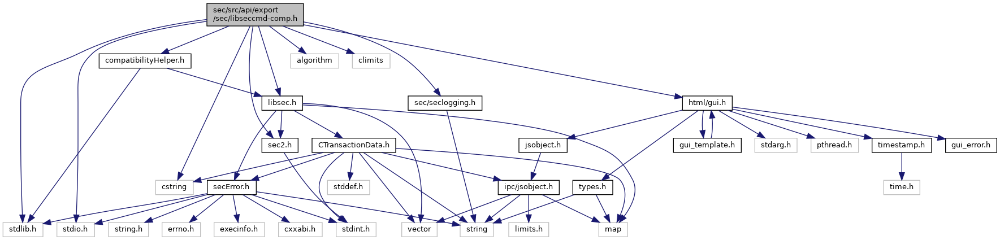

[Data Structures](#nested-classes) \| [Namespaces](#namespaces) \| [Macros](#define-members) \| [Enumerations](#enum-members) \| [Functions](#func-members) \| [Variables](#var-members)

ADK Security Service API (legacy) [More\...](#details)

`#include <stdlib.h>`
`#include "`<a href="sec2_8h_source.md">sec2.h</a>`"`
`#include "`<a href="libsec_8h_source.md">libsec.h</a>`"`
`#include "`<a href="compatibility_helper_8h_source.md">compatibilityHelper.h</a>`"`
`#include <algorithm>`
`#include <cstring>`
`#include <climits>`
`#include <`<a href="seclogging_8h_source.md">sec/seclogging.h</a>`>`
`#include "`<a href="gui_8h_source.md">html/gui.h</a>`"`
`#include <stdio.h>`

Include dependency graph for libseccmd-comp.h:



<a href="libseccmd-comp_8h_source.md">Go to the source code of this file.</a>

|  |  |
|----|----|
| Data Structures |  |
| struct   | <a href="namespacecom__verifone__seccmd.md#structcom__verifone__seccmd_1_1_enc_dec_data">EncDecData</a> |
| struct   | <a href="namespacecom__verifone__seccmd.md#structcom__verifone__seccmd_1_1_enc_dec_data_i_v">EncDecDataIV</a> |
| struct   | <a href="namespacecom__verifone__seccmd.md#structcom__verifone__seccmd_1_1_m_a_c_data">MACData</a> |
| struct   | <a href="namespacecom__verifone__seccmd.md#structcom__verifone__seccmd_1_1gen_m_a_c">genMAC</a> |
| struct   | <a href="namespacecom__verifone__seccmd.md#structcom__verifone__seccmd_1_1_p_i_n_block_params">PINBlockParams</a> |
| struct   | <a href="namespacecom__verifone__seccmd.md#structcom__verifone__seccmd_1_1_prop_data">PropData</a> |
| struct   | <a href="namespacecom__verifone__seccmd.md#structcom__verifone__seccmd_1_1_enc_p_i_n_block">EncPINBlock</a> |
| struct   | <a href="namespacecom__verifone__seccmd.md#structcom__verifone__seccmd_1_1_sec_config">SecConfig</a> |
| struct   | <a href="namespacecom__verifone__seccmd.md#structcom__verifone__seccmd_1_1_ksn">Ksn</a> |
| struct   | <a href="namespacecom__verifone__seccmd.md#structcom__verifone__seccmd_1_1_ksn__v2">Ksn_v2</a> |
| struct   | <a href="namespacecom__verifone__seccmd.md#structcom__verifone__seccmd_1_1_d_u_k_p_tmask">DUKPTmask</a> |

|  |  |
|----|----|
| Namespaces |  |
|   | <a href="namespacecom__verifone__seccmd.md">com_verifone_seccmd</a> |

|  |  |
|----|----|
| Macros |  |
| #define  | <a href="group__com__verifone__seccmd.md#gaec55f1a9babb9d16c73d99bc6999d043">FLAG_BYPASS_KSN_INCR</a>   0x0001 |
| #define  | [DEPRECATED](#ac1e8a42306d8e67cb94ca31c3956ee78) |
| #define  | [SCRIPT_NAME_LENGTH](#abafc8860bbd8d44da76d2e9153138077)   10 |
| #define  | [MIN_COMM_TIMEOUT](#ac6c41d4703df37610209728aecaff030)   30000 |
| #define  | [DEFAULT_COMM_TIMEOUT](#a749dc153d334bffad7096bca6ff9e540)   -1 /\*\* A negative timeout means: wait forever \*/ |
| #define  | [ASSERT_PARAM](#acd922db0e69279339cf11310b9583bf9)(assertion) |
| #define  | [ASSERT_BUFSIZE](#ac7135dc80443949a912d5e536c1ed061)(assertion) |
| #define  | [DO_OLD](#ac0332a842a9abac651216f245a3b21b8)(Name, Group, Offset, Old, Description)   <a href="_v_h_q__vfisyspm__wrapper_8cpp.md#a12d403643236776c26b6081a4e570a27">if</a> (error==Name) <a href="_v_h_q__vfisyspm__wrapper_8cpp.md#abe95a00f8e60264f7043a99eed75eba0">return</a> Old; |

|  |  |
|----|----|
| Enumerations |  |
| enum   | <a href="namespacecom__verifone__seccmd.md#a37f4111ddad314e8d0d664c1c4ec3a0a">SecCmd_errors</a> {<br/>  <a href="namespacecom__verifone__seccmd.md#a37f4111ddad314e8d0d664c1c4ec3a0aa6f2560b50ea6424b22c64ce918d219b1">SC_SUCCESS</a> = 0, <a href="namespacecom__verifone__seccmd.md#a37f4111ddad314e8d0d664c1c4ec3a0aadb0d6638c65cb8e1489eefeb1e397539">SC_ERROR</a> = -1, <a href="namespacecom__verifone__seccmd.md#a37f4111ddad314e8d0d664c1c4ec3a0aac9a40f75d583ba632ec6a7b1bba837c2">SC_WRONG_PAR</a> = -2, <a href="namespacecom__verifone__seccmd.md#a37f4111ddad314e8d0d664c1c4ec3a0aa96b297b6e7da87854591137807e87118">SC_SEND_FAILED</a> = -3,<br/>  <a href="namespacecom__verifone__seccmd.md#a37f4111ddad314e8d0d664c1c4ec3a0aa74093537566cc3dc99a16f316cdf4bcb">SC_RECBUF_SMALL</a> = -4, <a href="namespacecom__verifone__seccmd.md#a37f4111ddad314e8d0d664c1c4ec3a0aa78d223e76c4217694194196df5953efa">SC_TIMER_ERROR</a> = -5<br/>} |

|  |  |
|----|----|
| Functions |  |
| bool  | <a href="namespacecom__verifone__seccmd.md#a40857c3b0bad84b00cb6e8aa0ec585e0">hex2binCH</a> (char in, unsigned char \*out) |
| int  | <a href="namespacecom__verifone__seccmd.md#a458e25c100e2be6e98615bbf37b61bf5">convDsp2Hex</a> (const char \*dsp, size_t dsp_len, char \*hex, const size_t max_hex_len) |
| uint8_t  | <a href="namespacecom__verifone__seccmd.md#af55a5b4c8e099d741d4c38493fee3f3d">getCompatibleCode</a> (<a href="namespacecom__adksec__cmd.md#af511ddd4237541a758df48299546d49a">secError</a> error) |
| int  | <a href="namespacecom__verifone__seccmd.md#ad034b089a8b4c935b2d8dfd64b3ae7b2">getCompatibleReturn</a> (<a href="namespacecom__adksec__cmd.md#af511ddd4237541a758df48299546d49a">secError</a> newError) |
| int  | <a href="namespacecom__verifone__seccmd.md#ab920b3ec278fd494f64959ea64f02469">getCompatibleReturn</a> (<a href="namespacecom__adksec__cmd.md#af511ddd4237541a758df48299546d49a">secError</a> newError, uint8_t \*oldError) |
| [DEPRECATED](#ac1e8a42306d8e67cb94ca31c3956ee78) int  | <a href="namespacecom__verifone__seccmd.md#a9871b00715c29b88812f6cbe88657a21">Sec_Init</a> (u_char \*=NULL) |
| [DEPRECATED](#ac1e8a42306d8e67cb94ca31c3956ee78) void  | <a href="namespacecom__verifone__seccmd.md#a9815dafaa8bd5999fbfaa20d7d22e661">Sec_Destroy</a> () |
| [DEPRECATED](#ac1e8a42306d8e67cb94ca31c3956ee78) u_char  | <a href="namespacecom__verifone__seccmd.md#a16e0564f479c004161cf826dbc6670b1">Sec_Open</a> (const std::string &schemaName, uint8_t \*errCode) |
| [DEPRECATED](#ac1e8a42306d8e67cb94ca31c3956ee78) u_char  | <a href="namespacecom__verifone__seccmd.md#a84745bd9107eed389a508007daa6c73f">Sec_Open</a> (u_char \*schemaName, uint8_t \*errCode) |
| [DEPRECATED](#ac1e8a42306d8e67cb94ca31c3956ee78) int  | <a href="namespacecom__verifone__seccmd.md#aed03f5425bde3f1404d4b97f8175c39f">Sec_Close</a> (u_char HostId, uint8_t \*errCode) |
| [DEPRECATED](#ac1e8a42306d8e67cb94ca31c3956ee78) int  | <a href="namespacecom__verifone__seccmd.md#ae805c757835a3b0a1b9e8adfc5ab574c">Sec_SelectHostConf</a> (u_char HostId, uint8_t \*errCode, long=[DEFAULT_COMM_TIMEOUT](#a749dc153d334bffad7096bca6ff9e540)) |
| [DEPRECATED](#ac1e8a42306d8e67cb94ca31c3956ee78) int  | <a href="namespacecom__verifone__seccmd.md#a3deda460871c6786f09216ea917dbfe0">Sec_GetKeyData</a> (u_char HostId, u_char GKD_KeyType, u_char kekFlag, char \*aOutBuf, u_long \*uiOutBufLen, uint8_t \*errCode, long=[DEFAULT_COMM_TIMEOUT](#a749dc153d334bffad7096bca6ff9e540)) |
| [DEPRECATED](#ac1e8a42306d8e67cb94ca31c3956ee78) int  | <a href="namespacecom__verifone__seccmd.md#a121293b0e74ff6a415ee448c9985e819">Sec_GetKeyData</a> (u_char GKD_HostId, u_char GKD_KeyType, char \*aOutBuf, u_long \*uiOutBufLen, uint8_t \*errCode, long timeout=[DEFAULT_COMM_TIMEOUT](#a749dc153d334bffad7096bca6ff9e540)) |
| [DEPRECATED](#ac1e8a42306d8e67cb94ca31c3956ee78) int  | <a href="namespacecom__verifone__seccmd.md#a433ea1cf1bb2d33de167c140f01239ed">Sec_UpdateKey</a> (u_char HostId, <a href="namespacecom__verifone__host.md#a2418ec606f68970a9ed5ddf6ede58a2f">key_type_t</a> UpK_KeyType, u_char kekFlag, char \*aKeyData, u_long uiKeyDataLen, Ksn_v2 KSN, uint8_t \*errCode, long=[DEFAULT_COMM_TIMEOUT](#a749dc153d334bffad7096bca6ff9e540)) |
| Ksn_v2  | <a href="namespacecom__verifone__seccmd.md#a50a6ff38602b3fc92bfdb0743b361c7e">getKsn_v2</a> (Ksn \*pKSN) |
| [DEPRECATED](#ac1e8a42306d8e67cb94ca31c3956ee78) int  | <a href="namespacecom__verifone__seccmd.md#abd6053c9cceb8c43464afebdd6a39310">Sec_UpdateKey</a> (u_char UpK_HostId, <a href="namespacecom__verifone__host.md#a2418ec606f68970a9ed5ddf6ede58a2f">key_type_t</a> UpK_KeyType, u_char kekFlag, char \*aKeyData, u_long uiKeyDataLen, Ksn \*pKSN, uint8_t \*errCode, long timeout=[DEFAULT_COMM_TIMEOUT](#a749dc153d334bffad7096bca6ff9e540)) |
| [DEPRECATED](#ac1e8a42306d8e67cb94ca31c3956ee78) int  | <a href="namespacecom__verifone__seccmd.md#a772353b1140cb46753086ceddabf7d67">Sec_UpdateKey</a> (u_char UpK_HostId, u_char UpK_KeyType, u_char kekFlag, char \*aKeyData, u_long uiKeyDataLen, uint8_t \*errCode, long timeout=[DEFAULT_COMM_TIMEOUT](#a749dc153d334bffad7096bca6ff9e540)) |
| [DEPRECATED](#ac1e8a42306d8e67cb94ca31c3956ee78) int  | <a href="namespacecom__verifone__seccmd.md#a4e6b189775578f026dcac179a8b32002">Sec_UpdateKey</a> (u_char UpK_HostId, u_char UpK_KeyType, char \*aKeyData, u_long uiKeyDataLen, uint8_t \*errCode, long timeout=[DEFAULT_COMM_TIMEOUT](#a749dc153d334bffad7096bca6ff9e540)) |
| [DEPRECATED](#ac1e8a42306d8e67cb94ca31c3956ee78) int  | <a href="namespacecom__verifone__seccmd.md#a6db6f20b1810117273ba926c668abe09">Sec_AS2805KeyMgmnt</a> (u_char HostId, u_char AS2805_AS2805Func, char \*aKeyData, u_long \*uiKeyDataLen, u_long, uint8_t \*errCode, long=[DEFAULT_COMM_TIMEOUT](#a749dc153d334bffad7096bca6ff9e540)) |
| [DEPRECATED](#ac1e8a42306d8e67cb94ca31c3956ee78) int  | <a href="namespacecom__verifone__seccmd.md#a86bd1dbbaa97e44d4678e2cfbddca9a0">Sec_EncryptData</a> (u_char HostId, u_char EncD_EncMode, EncDecDataIV \*pData, Ksn \*pKSN, uint8_t \*errCode, long=[DEFAULT_COMM_TIMEOUT](#a749dc153d334bffad7096bca6ff9e540)) |
| [DEPRECATED](#ac1e8a42306d8e67cb94ca31c3956ee78) int  | <a href="namespacecom__verifone__seccmd.md#a190633af1f21ffb1cb04305639d9d3a7">Sec_EncryptData</a> (u_char EncD_HostId, EncDecDataIV \*pData, Ksn \*pKSN, uint8_t \*errCode, long timeout=[DEFAULT_COMM_TIMEOUT](#a749dc153d334bffad7096bca6ff9e540)) |
| [DEPRECATED](#ac1e8a42306d8e67cb94ca31c3956ee78) int  | <a href="namespacecom__verifone__seccmd.md#ae736f0032aa220edc6ad88c6b30fb890">Sec_EncryptData</a> (u_char EncD_HostId, EncDecDataIV \*pData, uint8_t \*errCode, long timeout=[DEFAULT_COMM_TIMEOUT](#a749dc153d334bffad7096bca6ff9e540)) |
| [DEPRECATED](#ac1e8a42306d8e67cb94ca31c3956ee78) int  | <a href="namespacecom__verifone__seccmd.md#a6281732ab34b79ccb4f9073c9d818357">Sec_EncryptData</a> (u_char EncD_HostId, u_char EncD_EncMode, EncDecData \*pData, uint8_t \*errCode, long timeout=[DEFAULT_COMM_TIMEOUT](#a749dc153d334bffad7096bca6ff9e540)) |
| [DEPRECATED](#ac1e8a42306d8e67cb94ca31c3956ee78) int  | <a href="namespacecom__verifone__seccmd.md#abd1a0b2921b3987ea04a3554f9b01654">Sec_DecryptData</a> (u_char HostId, EncDecDataIV \*pData, Ksn \*pKSN, uint8_t \*errCode, long=[DEFAULT_COMM_TIMEOUT](#a749dc153d334bffad7096bca6ff9e540)) |
| [DEPRECATED](#ac1e8a42306d8e67cb94ca31c3956ee78) int  | <a href="namespacecom__verifone__seccmd.md#a65bb1be7511682df1bf08f5c67ba1af8">Sec_DecryptData</a> (u_char DecD_HostId, EncDecDataIV \*pData, uint8_t \*errCode, long timeout=[DEFAULT_COMM_TIMEOUT](#a749dc153d334bffad7096bca6ff9e540)) |
| [DEPRECATED](#ac1e8a42306d8e67cb94ca31c3956ee78) int  | <a href="namespacecom__verifone__seccmd.md#a492a6884d5b4ec1c86a16d36847f9d35">Sec_DecryptData</a> (u_char DecD_HostId, u_char, EncDecData \*pData, uint8_t \*errCode, long timeout=[DEFAULT_COMM_TIMEOUT](#a749dc153d334bffad7096bca6ff9e540)) |
| [DEPRECATED](#ac1e8a42306d8e67cb94ca31c3956ee78) int  | <a href="namespacecom__verifone__seccmd.md#a415992011cbd54131165ca25801edb8a">Sec_GenerateMAC</a> (u_char HostId, u_char, u_char GMAC_MACMode, MACData \*pData, genMAC \*pMAC, Ksn \*pKSN, uint8_t \*errCode, long=[DEFAULT_COMM_TIMEOUT](#a749dc153d334bffad7096bca6ff9e540)) |
| [DEPRECATED](#ac1e8a42306d8e67cb94ca31c3956ee78) int  | <a href="namespacecom__verifone__seccmd.md#a7891606a905ab9bdfb3aba52676b8c59">Sec_GenerateMAC</a> (u_char GMAC_HostId, u_char GMAC_UseDefaultCV, u_char GMAC_MACMode, MACData \*pData, genMAC \*pMAC, uint8_t \*errCode, long timeout=[DEFAULT_COMM_TIMEOUT](#a749dc153d334bffad7096bca6ff9e540)) |
| [DEPRECATED](#ac1e8a42306d8e67cb94ca31c3956ee78) int  | <a href="namespacecom__verifone__seccmd.md#a8a524ef7b08dde1a6e71492a44f1ea6b">Sec_VerifyMAC</a> (u_char HostId, u_char, u_char VMAC_MACMode, MACData \*pData, genMAC MAC, Ksn \*pKSN, uint8_t \*errCode, long=[DEFAULT_COMM_TIMEOUT](#a749dc153d334bffad7096bca6ff9e540)) |
| [DEPRECATED](#ac1e8a42306d8e67cb94ca31c3956ee78) int  | <a href="namespacecom__verifone__seccmd.md#a5fd605ed60e48329c3b82f0f46270f18">Sec_VerifyMAC</a> (u_char VMAC_HostId, u_char VMAC_UseDefaultCV, u_char VMAC_MACMode, MACData \*pData, genMAC MAC, uint8_t \*errCode, long timeout=[DEFAULT_COMM_TIMEOUT](#a749dc153d334bffad7096bca6ff9e540)) |
| [DEPRECATED](#ac1e8a42306d8e67cb94ca31c3956ee78) int  | <a href="namespacecom__verifone__seccmd.md#a9a8932b53f4d3b1c33fe80636f25abb5">Sec_RetrieveEncryptedPIN</a> (u_char HostId, PINBlockParams \*pREP_PINBlockParams, uint16_t REP_Flags, PropData REP_PropData, EncPINBlock \*pREP_encPIN, Ksn_v2 \*pREP_KSN, uint8_t \*errCode, long=[DEFAULT_COMM_TIMEOUT](#a749dc153d334bffad7096bca6ff9e540)) |
| [DEPRECATED](#ac1e8a42306d8e67cb94ca31c3956ee78) int  | <a href="namespacecom__verifone__seccmd.md#aaf7c25deeb41bbd8404477ccb27794f1">Sec_RetrieveEncryptedPIN</a> (u_char REP_HostId, PINBlockParams \*pREP_PINBlockParams, u_char REP_Flags, PropData REP_PropData, EncPINBlock \*pREP_encPIN, uint8_t \*errCode, long timeout=0) |
| [DEPRECATED](#ac1e8a42306d8e67cb94ca31c3956ee78) int  | <a href="namespacecom__verifone__seccmd.md#ab801c0bcc6976c3b40114c34b7f89c53">Sec_RetrieveEncryptedPIN</a> (u_char REP_HostId, PINBlockParams \*pREP_PINBlockParams, uint16_t REP_Flags, PropData REP_PropData, EncPINBlock \*pREP_encPIN, Ksn \*pREP_KSN, uint8_t \*errCode, long timeout) |
| [DEPRECATED](#ac1e8a42306d8e67cb94ca31c3956ee78) int  | <a href="namespacecom__verifone__seccmd.md#acbda26bbc5a491c6cc45e05e801e0c43">Sec_GetVersions</a> (std::string \*pVersions, uint8_t \*errCode, long=[DEFAULT_COMM_TIMEOUT](#a749dc153d334bffad7096bca6ff9e540)) |
| const [DEPRECATED](#ac1e8a42306d8e67cb94ca31c3956ee78) char \*  | <a href="namespacecom__verifone__seccmd.md#aac3397523242fcae1a15786ff8f5aa09">Sec_GetVersion</a> (void) |
| const [DEPRECATED](#ac1e8a42306d8e67cb94ca31c3956ee78) char \*  | <a href="namespacecom__verifone__seccmd.md#ac17ac87391e0a1843fab4825be72b151">Sec_GetSvcVersion</a> (void) |
| [DEPRECATED](#ac1e8a42306d8e67cb94ca31c3956ee78) int  | <a href="namespacecom__verifone__seccmd.md#a88e049aa8e79d431c600e78fee76a969">Sec_SetKSId</a> (u_char HostId, uint8_t ksid) |
| [DEPRECATED](#ac1e8a42306d8e67cb94ca31c3956ee78) int  | <a href="namespacecom__verifone__seccmd.md#ad71befc1abbf8dad13f233b4730c8f08">Sec_SetDUKPTMask</a> (u_char HostId, DUKPTmask \*pDUKPTMask, uint8_t \*errCode, long=[DEFAULT_COMM_TIMEOUT](#a749dc153d334bffad7096bca6ff9e540)) |
| [DEPRECATED](#ac1e8a42306d8e67cb94ca31c3956ee78) int  | <a href="namespacecom__verifone__seccmd.md#a1bdf809486c2ce3ef0e8dc9b4dd97130">Sec_IncrementKSN</a> (u_char HostId, Ksn \*pKSN, uint8_t \*errCode, long=[DEFAULT_COMM_TIMEOUT](#a749dc153d334bffad7096bca6ff9e540)) |

|  |  |
|----|----|
| Variables |  |
| const size_t  | <a href="namespacecom__verifone__seccmd.md#a175b9ecfa71e6da7225ab7d86e0e05c3">VERSION_BUFF_SIZE</a> =20 |

## DetailedDescription {#detailed-description}

ADK Security Service API (legacy)

This header file contains information about the old ADK security service (legacy) API functions. This interface is only mapping old 1.6.x interface to new 2.x.x. (see programmers guide for more information)

------------------------------------------------------------------------

## DataStructure Documentation {#data-structure-documentation}

## com_verifone_seccmd::EncDecData <a href="#structcom__verifone__seccmd_1_1_enc_dec_data" id="structcom__verifone__seccmd_1_1_enc_dec_data"></a>

<p>struct com_verifone_seccmd::EncDecData</p>

Data container for encryption/decryption functions

| Data Fields |  |  |
|----|----|----|
| uint8_t \* | pInData | <p>input buffer</p> |
| uint8_t \* | pOutData | <p>output buffer</p> |
| uint8_t \* | stan | <p>up to 6 bytes, NULL terminated ASCII data, optional, NULL value as default</p> |
| uint8_t \* | tid | <p>up to 8 bytes, NULL terminated ASCII data, optional, NULL value as default</p> |
| u_long | uiInLen | <p>length of input buffer</p> |
| u_long | uiOutLen | <p>length of output buffer</p> |

## com_verifone_seccmd::EncDecDataIV <a href="#structcom__verifone__seccmd_1_1_enc_dec_data_i_v" id="structcom__verifone__seccmd_1_1_enc_dec_data_i_v"></a>

<p>struct com_verifone_seccmd::EncDecDataIV</p>

Data container for encryption/decryption functions

| Data Fields |  |  |
|----|----|----|
| uint8_t \* | IV | <p>IV, optional, NULL value as default {0}</p> |
| uint8_t \* | pInData | <p>input buffer</p> |
| uint8_t \* | pOutData | <p>output buffer</p> |
| u_long | uiInLen | <p>length of input buffer</p> |
| u_long | uiIVLen | <p>length of IV buffer</p> |
| u_long | uiOutLen | <p>length of output buffer</p> |

## com_verifone_seccmd::MACData <a href="#structcom__verifone__seccmd_1_1_m_a_c_data" id="structcom__verifone__seccmd_1_1_m_a_c_data"></a>

<p>struct com_verifone_seccmd::MACData</p>

Data container for MAC calculation/verification

| Data Fields |       |                                                 |
|-------------|-------|-------------------------------------------------|
| uint8_t \*  | pData | <p>input buffer</p>           |
| u_long      | uiLen | <p>length of input buffer</p> |

## com_verifone_seccmd::genMAC <a href="#structcom__verifone__seccmd_1_1gen_m_a_c" id="structcom__verifone__seccmd_1_1gen_m_a_c"></a>

<p>struct com_verifone_seccmd::genMAC</p>

MAC container for MAC calculation/verification

| Data Fields |          |                                           |
|-------------|----------|-------------------------------------------|
| uint8_t \*  | pMAC     | <p>MAC buffer</p>       |
| u_char      | ucMACLen | <p>size of MAC data</p> |

## com_verifone_seccmd::PINBlockParams <a href="#structcom__verifone__seccmd_1_1_p_i_n_block_params" id="structcom__verifone__seccmd_1_1_p_i_n_block_params"></a>

<p>struct com_verifone_seccmd::PINBlockParams</p>

Parameter container for PIN block using in PIN entry/retrieving functions

| Data Fields |  |  |
|----|----|----|
| u_char | PinBlockFormat |  |
| u_char \* | pPAN | <p>pointer to NULL terminated string containing PAN (19 digits max)</p> |
| u_char \* | pSTAN | <p>pointer to NULL terminated string containing STAN (6 digits max)</p> |
| u_char | TransAmount\[<a href="sec2_8h.md#a733b5fa0159e0f063543d9be2aa3158b">TRANS_AMOUNT_SIZE</a>\] | <p>Used only for Sec_RetrieveEncryptedPIN - 6 bytes BCD transaction amount</p> |

## com_verifone_seccmd::PropData <a href="#structcom__verifone__seccmd_1_1_prop_data" id="structcom__verifone__seccmd_1_1_prop_data"></a>

<p>struct com_verifone_seccmd::PropData</p>

Proprietary data passed to VSS scripts

| Data Fields |               |     |
|-------------|---------------|-----|
| uint8_t \*  | pPropData     |     |
| u_long      | uiPropDataLen |     |

## com_verifone_seccmd::EncPINBlock <a href="#structcom__verifone__seccmd_1_1_enc_p_i_n_block" id="structcom__verifone__seccmd_1_1_enc_p_i_n_block"></a>

<p>struct com_verifone_seccmd::EncPINBlock</p>

Online PIN Cipher Block container

| Data Fields |  |  |
|----|----|----|
| uint8_t \* | pPINBlock | <p>pointer to data buffer</p> |
| u_char | ucPINBlockLen | <p>\[in\] maximal buffer size, \[out\] length of data stored in pPINBlock buffer</p> |

## com_verifone_seccmd::SecConfig <a href="#structcom__verifone__seccmd_1_1_sec_config" id="structcom__verifone__seccmd_1_1_sec_config"></a>

<p>struct com_verifone_seccmd::SecConfig</p>

structure of security configuration

| Data Fields |  |  |
|----|----|----|
| u_char | DataAlgo | <p>data algorithm, 1 = Single DES; 2 = 3 DES; 3 = AES</p> |
| u_char | KeyManagement | <p>key management, 1 = MSK; 2 = DUKPT</p> |
| u_char | PINAlgo | <p>PIN algorithm, 1 = Single DES; 2 = 3 DES; 3 = AES</p> |
| u_char | PinBlockFormat | <p>PIN block format, 0 = ISO-0; 1 = ISO-1; 2 = ISO-2; 3 = ISO-3</p> |
| u_char | PinEntryType | <p>PIN entry type, 0 = PIN Mandatory; 1 = PIN Optional; 2 = PIN Optional - 0-Length PIN Encryption; 3 = 0-Length PIN</p> |
| u_char | ScriptIdent\[[SCRIPT_NAME_LENGTH](#abafc8860bbd8d44da76d2e9153138077)\] | <p>script identifier</p> |

## com_verifone_seccmd::Ksn <a href="#structcom__verifone__seccmd_1_1_ksn" id="structcom__verifone__seccmd_1_1_ksn"></a>

<p>struct com_verifone_seccmd::Ksn</p>

Parameter container for DUKPT Key Serial Number (KSN)

| Data Fields |  |  |
|----|----|----|
| u_char | KSN\[<a href="sec2_8h.md#a39c92888160f6810dc7fed5fea7417f4">KSN_SIZE</a>\] |  |

## com_verifone_seccmd::Ksn_v2 <a href="#structcom__verifone__seccmd_1_1_ksn__v2" id="structcom__verifone__seccmd_1_1_ksn__v2"></a>

<p>struct com_verifone_seccmd::Ksn_v2</p>

Parameter container for DUKPT Key Serial Number (KSN), version 2

| Data Fields |        |     |
|-------------|--------|-----|
| u_char \*   | KSN    |     |
| u_long      | KSNLen |     |

## com_verifone_seccmd::DUKPTmask <a href="#structcom__verifone__seccmd_1_1_d_u_k_p_tmask" id="structcom__verifone__seccmd_1_1_d_u_k_p_tmask"></a>

<p>struct com_verifone_seccmd::DUKPTmask</p>

Parameter container for DUKPT Key masking

| Data Fields |         |                                                      |
|-------------|---------|------------------------------------------------------|
| u_char \*   | maskENC | <p>mask for encryption</p>         |
| u_char \*   | maskMAC | <p>mask for MAC</p>                |
| u_char \*   | maskPIN | <p>mask for PIN</p>                |
| u_char      | sizeE   | <p>size of mask for encryption</p> |
| u_char      | sizeM   | <p>size of mask for MAC</p>        |
| u_char      | sizeP   | <p>size of mask for PIN</p>        |

## MacroDefinition Documentation {#macro-definition-documentation}

## ASSERT_BUFSIZE <a href="#ac7135dc80443949a912d5e536c1ed061" id="ac7135dc80443949a912d5e536c1ed061"></a>

<p>#define ASSERT_BUFSIZE</p>

**Value:**

``` cpp
{ \
   if(!(assertion)) \
   { \
   SEC_LOG_CRIT("Output-Buffer too small: " #assertion); \
   return SC_RECBUF_SMALL; \
   } \
}
```

## ASSERT_PARAM <a href="#acd922db0e69279339cf11310b9583bf9" id="acd922db0e69279339cf11310b9583bf9"></a>

<p>#define ASSERT_PARAM</p>

**Value:**

``` cpp
{ \
   if(!(assertion)) \
   { \
   SEC_LOG_CRIT("Parameter assertion failed: " #assertion); \
   return SC_WRONG_PAR; \
   } \
}
```

## DEFAULT_COMM_TIMEOUT <a href="#a749dc153d334bffad7096bca6ff9e540" id="a749dc153d334bffad7096bca6ff9e540"></a>

<p>#define DEFAULT_COMM_TIMEOUT   -1 /\*\* A negative timeout means: wait forever \*/</p>

## DEPRECATED <a href="#ac1e8a42306d8e67cb94ca31c3956ee78" id="ac1e8a42306d8e67cb94ca31c3956ee78"></a>

<p>#define DEPRECATED</p>

Defines

## DO_OLD <a href="#ac0332a842a9abac651216f245a3b21b8" id="ac0332a842a9abac651216f245a3b21b8"></a>

<p>#define DO_OLD</p>

## MIN_COMM_TIMEOUT <a href="#ac6c41d4703df37610209728aecaff030" id="ac6c41d4703df37610209728aecaff030"></a>

<p>#define MIN_COMM_TIMEOUT   30000</p>

Communication timeouts

## SCRIPT_NAME_LENGTH <a href="#abafc8860bbd8d44da76d2e9153138077" id="abafc8860bbd8d44da76d2e9153138077"></a>

<p>#define SCRIPT_NAME_LENGTH   10</p>
