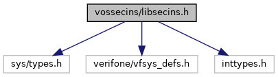
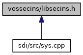

[Data Structures](#nested-classes) \| [Macros](#define-members) \| [Enumerations](#enum-members) \| [Functions](#func-members)

`#include <sys/types.h>`
`#include <verifone/vfsys_defs.h>`
`#include <inttypes.h>`

Include dependency graph for libsecins.h:



This graph shows which files directly or indirectly include this file:



<a href="libsecins_8h_source.md">Go to the source code of this file.</a>

|  |  |
|----|----|
| Data Structures |  |
| struct   | [SecinsDeviceModeInfo](#struct_secins_device_mode_info) |
|   | Device run mode information. [More\...](#struct_secins_device_mode_info)<br/> |
| struct   | [child_death_cert](#structchild__death__cert) |
|   | Application termination record. [More\...](#structchild__death__cert)<br/> |
| struct   | [UID_GID_RANGE](#struct_u_i_d___g_i_d___r_a_n_g_e) |
|   | User/Group ID range. [More\...](#struct_u_i_d___g_i_d___r_a_n_g_e)<br/> |
| struct   | [SYS_INFO_OS_HMAC_SHA256_tx](#struct_s_y_s___i_n_f_o___o_s___h_m_a_c___s_h_a256__tx) |
|   | Input data for hashing. [More\...](#struct_s_y_s___i_n_f_o___o_s___h_m_a_c___s_h_a256__tx)<br/> |
| struct   | [SYS_INFO_OS_HMAC_SHA256_rx](#struct_s_y_s___i_n_f_o___o_s___h_m_a_c___s_h_a256__rx) |
|   | Data received from hashing. [More\...](#struct_s_y_s___i_n_f_o___o_s___h_m_a_c___s_h_a256__rx)<br/> |
| struct   | [SecinsDaemonAction](#struct_secins_daemon_action) |
|   | Daemon name and action to perform. [More\...](#struct_secins_daemon_action)<br/> |
| struct   | [INST_DATA](#struct_i_n_s_t___d_a_t_a) |
|   | Data to install a list of dl files. [More\...](#struct_i_n_s_t___d_a_t_a)<br/> |
| struct   | [SECINS_ERROR_INFO](#struct_s_e_c_i_n_s___e_r_r_o_r___i_n_f_o) |

  ------------------------------------------------------------------ ----------------------------------------------------------------------------------------------------------------------------------------------------------------------------------------------------
  Macros                                                             

  #define                                                            [ERROR_SECINS](#a8974d44415d205e35f1b9a3c3e6a1700)   100

  #define                                                            [ERROR_SECINS_NO_MEMORY](#a6fda61c726adc12928555615670ad549)   ([ERROR_SECINS](#a8974d44415d205e35f1b9a3c3e6a1700) + 0)

  #define                                                            [ERROR_SECINS_MKDIR](#aa41f96e027710a23066a08c1917430a4)   ([ERROR_SECINS](#a8974d44415d205e35f1b9a3c3e6a1700) + 1)

  #define                                                            [ERROR_SECINS_FILE_AUTH](#aefa9dd8967e0bc4261c63bff001eaf1e)   ([ERROR_SECINS](#a8974d44415d205e35f1b9a3c3e6a1700) + 2)

  #define                                                            [ERROR_SECINS_MOUNT_RFS](#a9b64536cc4377210ca35fa03fdd3df50)   ([ERROR_SECINS](#a8974d44415d205e35f1b9a3c3e6a1700) + 3)

  #define                                                            [ERROR_SECINS_INVALID_INIT_FILE](#afb9ffa5beb9c2866dcb8fde99b950353)   ([ERROR_SECINS](#a8974d44415d205e35f1b9a3c3e6a1700) + 4)

  #define                                                            [ERROR_SECINS_PATHNAME_TOO_LONG](#ab55535608a6d9ec482ae749b70424381)   ([ERROR_SECINS](#a8974d44415d205e35f1b9a3c3e6a1700) + 5)

  #define                                                            [ERROR_SECINS_CHROOT](#a148563caa1e89bbb32f27b5f1c811f79)   ([ERROR_SECINS](#a8974d44415d205e35f1b9a3c3e6a1700) + 6)

  #define                                                            [ERROR_SECINS_EXEC_INIT](#a9a2ab3a5f8bf9b4e690fb85f3a3beaff)   ([ERROR_SECINS](#a8974d44415d205e35f1b9a3c3e6a1700) + 7)

  #define                                                            [ERROR_SECINS_OPENDIR](#a1b0a6ad3bf0e4c31ec7ed58d82f00d03)   ([ERROR_SECINS](#a8974d44415d205e35f1b9a3c3e6a1700) + 8)

  #define                                                            [ERROR_SECINS_RENAME_DIR](#ad7b6ef26bfe5313864a1cad07fe127f9)   ([ERROR_SECINS](#a8974d44415d205e35f1b9a3c3e6a1700) + 9)

  #define                                                            [ERROR_SECINS_CHMOD](#ae433e1c492eef0c3e6d1800e9363af25)   ([ERROR_SECINS](#a8974d44415d205e35f1b9a3c3e6a1700) + 10)

  #define                                                            [ERROR_SECINS_CHOWN](#ae1567b4f746c7a7677e16774987991e7)   ([ERROR_SECINS](#a8974d44415d205e35f1b9a3c3e6a1700) + 11)

  #define                                                            [ERROR_SECINS_FILE_CREATE](#a389cfc8244b1f1cec8ae319851b1efa5)   ([ERROR_SECINS](#a8974d44415d205e35f1b9a3c3e6a1700) + 12)

  #define                                                            [ERROR_SECINS_FILE_OPEN](#a203c4b6514c57069903c3f63dcb6308a)   ([ERROR_SECINS](#a8974d44415d205e35f1b9a3c3e6a1700) + 13)

  #define                                                            [ERROR_SECINS_FILE_WRITE](#af84ebcd1a340b0218a0317bf1cac7451)   ([ERROR_SECINS](#a8974d44415d205e35f1b9a3c3e6a1700) + 14)

  #define                                                            [ERROR_SECINS_NO_SIG](#a619d5f5ef620fba4a7adf90d55ef3896)   ([ERROR_SECINS](#a8974d44415d205e35f1b9a3c3e6a1700) + 15)

  #define                                                            [ERROR_SECINS_NO_PKG](#a5d4aa819864aae79c7b449823646acf2)   ([ERROR_SECINS](#a8974d44415d205e35f1b9a3c3e6a1700) + 16)

  #define                                                            [ERROR_SECINS_INVALID_FILENAME](#ae32eaa6073fa2637d02f294e14f7a164)   ([ERROR_SECINS](#a8974d44415d205e35f1b9a3c3e6a1700) + 17)

  #define                                                            [ERROR_SECINS_INVALID_INSTALL](#a7a2b9b64e8fbacf4eae00e64631b7115)   ([ERROR_SECINS](#a8974d44415d205e35f1b9a3c3e6a1700) + 18)

  #define                                                            [ERROR_SECINS_INVALID_INI_SECTION](#a26075fa2b8a7f89df0fc85c43d3d7f20)   ([ERROR_SECINS](#a8974d44415d205e35f1b9a3c3e6a1700) + 19)

  #define                                                            [ERROR_SECINS_MKNOD](#ae2b09a79cf4e2c73687906f02ef4bd71)   ([ERROR_SECINS](#a8974d44415d205e35f1b9a3c3e6a1700) + 20)

  #define                                                            [ERROR_SECINS_INVALID_INI_PROPERTY](#a742c87f456708fd141a48e982eff0759)   ([ERROR_SECINS](#a8974d44415d205e35f1b9a3c3e6a1700) + 21)

  #define                                                            [ERROR_SECINS_NO_CONTROL_FILE](#a088b6efc117f8b6ad7151dfed99b6859)   ([ERROR_SECINS](#a8974d44415d205e35f1b9a3c3e6a1700) + 22)

  #define                                                            [ERROR_SECINS_INVALID_CONTROL_FILE](#a7bfa29988aa22f6fa08eedbaf128cc06)   ([ERROR_SECINS](#a8974d44415d205e35f1b9a3c3e6a1700) + 23)

  #define                                                            [ERROR_SECINS_CREATE_CONTROL_FILE](#a07ff1f3b39cf5baa2f21d12994ec752d)   ([ERROR_SECINS](#a8974d44415d205e35f1b9a3c3e6a1700) + 24)

  #define                                                            [ERROR_SECINS_OLD_PKG_VERSION](#ade3087006775c639466d6bc2c0635cc8)   ([ERROR_SECINS](#a8974d44415d205e35f1b9a3c3e6a1700) + 25)

  #define                                                            [ERROR_SECINS_INVALID_PKG_TYPE](#ada3032278e4aca53462640caa28a1e73)   ([ERROR_SECINS](#a8974d44415d205e35f1b9a3c3e6a1700) + 26)

  #define                                                            [ERROR_SECINS_EXTRACT_PKG_CONTROL](#a6642ce3598dafa7d588ba0d8b03ba901)   ([ERROR_SECINS](#a8974d44415d205e35f1b9a3c3e6a1700) + 27)

  #define                                                            [ERROR_SECINS_EXTRACT_PKG](#a1e3844c9c23de125ac1ac2c419767e6e)   ([ERROR_SECINS](#a8974d44415d205e35f1b9a3c3e6a1700) + 28)

  #define                                                            [ERROR_SECINS_INVALID_PKG](#abc12f7c6bcedddfc69cb21e481f3e8e1)   ([ERROR_SECINS](#a8974d44415d205e35f1b9a3c3e6a1700) + 29)

  #define                                                            [ERROR_SECINS_PKG_LIST](#a177ab2b891a2f773956c668f9b594dfe)   ([ERROR_SECINS](#a8974d44415d205e35f1b9a3c3e6a1700) + 30)

  #define                                                            [ERROR_SECINS_PKG_FILENAME_TOO_LONG](#a9c3870c82fa33426846a5bcd493b5f3c)   ([ERROR_SECINS](#a8974d44415d205e35f1b9a3c3e6a1700) + 31)

  #define                                                            [ERROR_SECINS_INSTALL_CONTROL_FILE](#a549a33c6ae6fda536ec11572cd96f664)   ([ERROR_SECINS](#a8974d44415d205e35f1b9a3c3e6a1700) + 32)

  #define                                                            [ERROR_SECINS_INSTALL_PKG](#a0f1856932c44e13775d6d93035e2cc54)   ([ERROR_SECINS](#a8974d44415d205e35f1b9a3c3e6a1700) + 33)

  #define                                                            [ERROR_SECINS_INSTALL_SIG](#a4a6a89ba8e1ae1827bb7357cb6a401ef)   ([ERROR_SECINS](#a8974d44415d205e35f1b9a3c3e6a1700) + 34)

  #define                                                            [ERROR_SECINS_PKG_NOT_FOUND](#a472a102f71d0f321b8ca25bb59dbab48)   ([ERROR_SECINS](#a8974d44415d205e35f1b9a3c3e6a1700) + 35)

  #define                                                            [ERROR_SECINS_ADD_GROUP](#a2719315b891bb3ebad7456642902ea2d)   ([ERROR_SECINS](#a8974d44415d205e35f1b9a3c3e6a1700) + 36)

  #define                                                            [ERROR_SECINS_ADD_USER](#a7a25c49f087eb39be63a078dc0eefb06)   ([ERROR_SECINS](#a8974d44415d205e35f1b9a3c3e6a1700) + 37)

  #define                                                            [ERROR_SECINS_ADD_SHADOW](#aefbcebc2bf1ebae58d0fc8f992061f6f)   ([ERROR_SECINS](#a8974d44415d205e35f1b9a3c3e6a1700) + 38)

  #define                                                            [ERROR_SECINS_GET_USER](#a8b723dfec7548457653b4b47b91f7984)   ([ERROR_SECINS](#a8974d44415d205e35f1b9a3c3e6a1700) + 39)

  #define                                                            [ERROR_SECINS_GET_GROUP](#ac918c9cb72d1ca392338680b47c6fb58)   ([ERROR_SECINS](#a8974d44415d205e35f1b9a3c3e6a1700) + 40)

  #define                                                            [ERROR_SECINS_PROCESS_FORK](#a0e022df18de8860cc63fe88697d13d50)   ([ERROR_SECINS](#a8974d44415d205e35f1b9a3c3e6a1700) + 41)

  #define                                                            [ERROR_SECINS_CHECK_GRSEC](#a1d329cd11e691919c073315492d8453a)   ([ERROR_SECINS](#a8974d44415d205e35f1b9a3c3e6a1700) + 42)

  #define                                                            [ERROR_SECINS_START_GRSEC](#ac59c1fed4dcf3a49694fa2e36ae4991a)   ([ERROR_SECINS](#a8974d44415d205e35f1b9a3c3e6a1700) + 43)

  #define                                                            [ERROR_SECINS_FORK](#ae9a112c25021126440886fb50ecd61de)   ([ERROR_SECINS](#a8974d44415d205e35f1b9a3c3e6a1700) + 44)

  #define                                                            [ERROR_SECINS_GET_RESOURCE](#ac4a32a508ac8cf72e9ac28b7e01fe795)   ([ERROR_SECINS](#a8974d44415d205e35f1b9a3c3e6a1700) + 45)

  #define                                                            [ERROR_SECINS_SETSID](#a07c020a166b68d0ee1d18cb22b7f0cd6)   ([ERROR_SECINS](#a8974d44415d205e35f1b9a3c3e6a1700) + 46)

  #define                                                            [ERROR_SECINS_START_LINE_TOO_LONG](#aa06d26401aacc48218796eb4cd845d82)   ([ERROR_SECINS](#a8974d44415d205e35f1b9a3c3e6a1700) + 47)

  #define                                                            [ERROR_SECINS_START_LINE_INVALID](#a7c6406a42890baef2a90684d004336d4)   ([ERROR_SECINS](#a8974d44415d205e35f1b9a3c3e6a1700) + 48)

  #define                                                            [ERROR_SECINS_START_ENTRY_UNKNOWN](#a64dc5928de40abb8e6e966a5a49bb33f)   ([ERROR_SECINS](#a8974d44415d205e35f1b9a3c3e6a1700) + 49)

  #define                                                            [ERROR_SECINS_EXEC_APP](#a5b6b3036edf0a25e22326e132b70c366)   ([ERROR_SECINS](#a8974d44415d205e35f1b9a3c3e6a1700) + 50)

  #define                                                            [ERROR_SECINS_MODE_APP](#a19c80c2ef0c315d8c77a47e4bb0fc4f9)   ([ERROR_SECINS](#a8974d44415d205e35f1b9a3c3e6a1700) + 51)

  #define                                                            [ERROR_SECINS_SYMLINK](#a6b8b47eafd63f83c1b18426e4a8aea40)   ([ERROR_SECINS](#a8974d44415d205e35f1b9a3c3e6a1700) + 52)

  #define                                                            [ERROR_SECINS_INVALID_INSTALL_FILE](#a77e026bce9f3f4bd43ca272523712862)   ([ERROR_SECINS](#a8974d44415d205e35f1b9a3c3e6a1700) + 53)

  #define                                                            [ERROR_SECINS_EXTRACT_INSTALL_FILE](#a0edd2a8a964153cce67833b343c02697)   ([ERROR_SECINS](#a8974d44415d205e35f1b9a3c3e6a1700) + 54)

  #define                                                            [ERROR_SECINS_INVALID_PKG_FORMAT](#af8661f96937e1235940e5eec68e74562)   ([ERROR_SECINS](#a8974d44415d205e35f1b9a3c3e6a1700) + 55)

  #define                                                            [ERROR_SECINS_AUTH_GID](#a0c9150893e6d8d6b8acaeaf389fec6df)   ([ERROR_SECINS](#a8974d44415d205e35f1b9a3c3e6a1700) + 56)

  #define                                                            [ERROR_SECINS_ADD_CERT](#a10e6aea60361e4c8403ade2ded685248)   ([ERROR_SECINS](#a8974d44415d205e35f1b9a3c3e6a1700) + 57)

  #define                                                            [ERROR_SECINS_PATCH_VERSION](#a56642740a451deea9607134ad22dc631)   ([ERROR_SECINS](#a8974d44415d205e35f1b9a3c3e6a1700) + 58)

  #define                                                            [ERROR_SECINS_PATCH](#a70da3f8d51d2de5edf32c1f2396ded00)   ([ERROR_SECINS](#a8974d44415d205e35f1b9a3c3e6a1700) + 59)

  #define                                                            [ERROR_SECINS_START_SVCSEC](#a28e3cd7fc27ec652ea21b6f909f9f1ee)   ([ERROR_SECINS](#a8974d44415d205e35f1b9a3c3e6a1700) + 60)

  #define                                                            [ERROR_SECINS_INVALID_CERT](#a67260b339074468172f23e463b6af07b)   ([ERROR_SECINS](#a8974d44415d205e35f1b9a3c3e6a1700) + 61)

  #define                                                            [ERROR_SECINS_PUT_ENV](#a495c9e2c1e7603405e58651cdce834f5)   ([ERROR_SECINS](#a8974d44415d205e35f1b9a3c3e6a1700) + 62)

  #define                                                            [ERROR_SECINS_SET_USER](#a75b6eb503262cf42ab02e0b156aa7b79)   ([ERROR_SECINS](#a8974d44415d205e35f1b9a3c3e6a1700) + 63)

  #define                                                            [ERROR_SECINS_INVALID_PKG_CATEGORY](#a5dfe2be156e88a5f317111cf11c06c00)   ([ERROR_SECINS](#a8974d44415d205e35f1b9a3c3e6a1700) + 64)

  #define                                                            [ERROR_SECINS_INVALID_CMD](#af3909e263fe7fa913af01a3d7b9fa130)   ([ERROR_SECINS](#a8974d44415d205e35f1b9a3c3e6a1700) + 65)

  #define                                                            [ERROR_SECINS_INVALID_BUNDLE_FILE](#afe2a917f63e671b302d8a94dbf76ffb7)   ([ERROR_SECINS](#a8974d44415d205e35f1b9a3c3e6a1700) + 66)

  #define                                                            [ERROR_SECINS_EXTRACT_BUNDLE_CONTROL](#a32db521b258168d500bcfcd2fb54d4c2)   ([ERROR_SECINS](#a8974d44415d205e35f1b9a3c3e6a1700) + 67)

  #define                                                            [ERROR_SECINS_INVALID_BUNDLE_USER](#afdee13a3a0bbcf48af51f83c2b8f3d20)   ([ERROR_SECINS](#a8974d44415d205e35f1b9a3c3e6a1700) + 68)

  #define                                                            [ERROR_SECINS_INVALID_PKG_USER](#a1fa6efea3d72ea83e24df3ddd1b4f6b8)   ([ERROR_SECINS](#a8974d44415d205e35f1b9a3c3e6a1700) + 69)

  #define                                                            [ERROR_SECINS_NO_BUNDLE](#ae279fbaacb4e8f2e79ceb66cd6d3e1f6)   ([ERROR_SECINS](#a8974d44415d205e35f1b9a3c3e6a1700) + 70)

  #define                                                            [ERROR_SECINS_OPEN_SOCKET](#a2c8fbb7992e169a9247c7697c50fbd85)   ([ERROR_SECINS](#a8974d44415d205e35f1b9a3c3e6a1700) + 71)

  #define                                                            [ERROR_SECINS_BIND_FAILURE](#a59b56c82fcb6c913c444cfcde78525f5)   ([ERROR_SECINS](#a8974d44415d205e35f1b9a3c3e6a1700) + 72)

  #define                                                            [ERROR_SECINS_UNKNOWN_MSG](#aaa3b130861edec8871b4ba82c4961d52)   ([ERROR_SECINS](#a8974d44415d205e35f1b9a3c3e6a1700) + 73)

  #define                                                            [ERROR_SECINS_MSG_SND](#a88e587bc5fa8052be22accdfa1631dc0)   ([ERROR_SECINS](#a8974d44415d205e35f1b9a3c3e6a1700) + 74)

  #define                                                            [ERROR_SECINS_MSG_RCV](#a3ca9780ccccc94f1fa9fb8ed3ec8a7e6)   ([ERROR_SECINS](#a8974d44415d205e35f1b9a3c3e6a1700) + 75)

  #define                                                            [ERROR_SECINS_MSG_SIZE](#ae446ed471bd9b4304f1a1328c5e85cf9)   ([ERROR_SECINS](#a8974d44415d205e35f1b9a3c3e6a1700) + 76)

  #define                                                            [ERROR_SECINS_RESP_SIZE](#af0eb519d25e2bcbddf9f5289556357ab)   ([ERROR_SECINS](#a8974d44415d205e35f1b9a3c3e6a1700) + 77)

  #define                                                            [ERROR_SECINS_INVALID_RESP](#ac7a0c13c034880922a08e04f62c99dc6)   ([ERROR_SECINS](#a8974d44415d205e35f1b9a3c3e6a1700) + 78)

  #define                                                            [ERROR_SECINS_FILE_READ](#a4948fa35273978b3b6f73da17bf01e36)   ([ERROR_SECINS](#a8974d44415d205e35f1b9a3c3e6a1700) + 79)

  #define                                                            [ERROR_SECINS_FILE_RENAME](#a8abe85e474aff856b7489eae9958ff1d)   ([ERROR_SECINS](#a8974d44415d205e35f1b9a3c3e6a1700) + 80)

  #define                                                            [ERROR_SECINS_USER_APP_START](#ab431b766d03829492d2ab0d8136fea8b)   ([ERROR_SECINS](#a8974d44415d205e35f1b9a3c3e6a1700) + 81)

  #define                                                            [ERROR_SECINS_GET_CWD](#adc51f6791bce69dd5b201cbe43a2b1e1)   ([ERROR_SECINS](#a8974d44415d205e35f1b9a3c3e6a1700) + 82)

  #define                                                            [ERROR_SECINS_INVALID_PARAM](#a696e7ef72a6b3818aaeaaac854497d01)   ([ERROR_SECINS](#a8974d44415d205e35f1b9a3c3e6a1700) + 83)

  #define                                                            [ERROR_SECINS_NOT_ALLOWED](#a1134862fe166cb15ccdcffbe71eb74c9)   ([ERROR_SECINS](#a8974d44415d205e35f1b9a3c3e6a1700) + 84)

  #define                                                            [ERROR_SECINS_SYSMODE_START](#ace406986edf46a58a7c231c434176d77)   ([ERROR_SECINS](#a8974d44415d205e35f1b9a3c3e6a1700) + 85)

  #define                                                            [ERROR_SECINS_INVALID_PKGLIST](#addc37d5e04a59c92b31a276756a14ad7)   ([ERROR_SECINS](#a8974d44415d205e35f1b9a3c3e6a1700) + 86)

  #define                                                            [ERROR_SECINS_SOCK_LISTEN](#aa9e459745834c3a4e6ade63e15161d7d)   ([ERROR_SECINS](#a8974d44415d205e35f1b9a3c3e6a1700) + 87)

  #define                                                            [ERROR_SECINS_CONNECT_FAIL](#a30eb53641f526da4868fc985bd546e76)   ([ERROR_SECINS](#a8974d44415d205e35f1b9a3c3e6a1700) + 88)

  #define                                                            [ERROR_SECINS_PATCH_APPLIED](#a171b9f52969c05d66d100f2f3e42a40e)   ([ERROR_SECINS](#a8974d44415d205e35f1b9a3c3e6a1700) + 89)

  #define                                                            [ERROR_SECINS_RELOAD_GRSEC](#a8fcbed9285a59bfce84d1e88838ba3c4)   ([ERROR_SECINS](#a8974d44415d205e35f1b9a3c3e6a1700) + 90)

  #define                                                            [ERROR_SECINS_CREATE_GRSEC_FILE](#afdf7f4dbc2fe16f7a87b54f98fe55467)   ([ERROR_SECINS](#a8974d44415d205e35f1b9a3c3e6a1700) + 91)

  #define                                                            [ERROR_SECINS_GRSEC_SUBJECT](#a60594c5843e9e4d776d7a9481cf9083c)   ([ERROR_SECINS](#a8974d44415d205e35f1b9a3c3e6a1700) + 92)

  #define                                                            [ERROR_SECINS_INVALID_POLICY_FILE](#a0980eb2e5569c13a6d4ec631a66a4449)   ([ERROR_SECINS](#a8974d44415d205e35f1b9a3c3e6a1700) + 93)

  #define                                                            [ERROR_SECINS_INVALID_OBJECT](#a2d569b48791b17b79711b47e2fadde15)   ([ERROR_SECINS](#a8974d44415d205e35f1b9a3c3e6a1700) + 94)

  #define                                                            [ERROR_SECINS_INVALID_OBJECT_MODE](#aea0c1ed7cd91f3ba23bdee9d063d53ee)   ([ERROR_SECINS](#a8974d44415d205e35f1b9a3c3e6a1700) + 95)

  #define                                                            [ERROR_SECINS_NO_POLICY_FILE](#a1da15955fea3a85b1128eb7feb3fe1f3)   ([ERROR_SECINS](#a8974d44415d205e35f1b9a3c3e6a1700) + 96)

  #define                                                            [ERROR_SECINS_INVALID_CAPABILITY](#ae1beb4bde646cd22270c37cfd1d0fcac)   ([ERROR_SECINS](#a8974d44415d205e35f1b9a3c3e6a1700) + 97)

  #define                                                            [ERROR_SECINS_OBJECT_NOT_HIDDEN](#a42077b32f44c6b553779054466ce40d8)   ([ERROR_SECINS](#a8974d44415d205e35f1b9a3c3e6a1700) + 98)

  #define                                                            [ERROR_SECINS_OBJECT_NOT_FOUND](#ae57c57546cffea56f0e5d84dcc9d1c45)   ([ERROR_SECINS](#a8974d44415d205e35f1b9a3c3e6a1700) + 99)

  #define                                                            [ERROR_SECINS_FILE_CAPS](#a4eea982bf5f08f2b26c21b2cb544f2fc)   ([ERROR_SECINS](#a8974d44415d205e35f1b9a3c3e6a1700) + 100)

  #define                                                            [ERROR_SECINS_SUBJECT_MODE](#a07df3d9a1137f497e930affb6d86d77c)   ([ERROR_SECINS](#a8974d44415d205e35f1b9a3c3e6a1700) + 101)

  #define                                                            [ERROR_SECINS_REMOVE_USER](#ac49f89785c57af073edd702e50585bd0)   ([ERROR_SECINS](#a8974d44415d205e35f1b9a3c3e6a1700) + 102)

  #define                                                            [ERROR_SECINS_REMOVE_GROUP](#ab853cfe038588b6e91a6f5ae2af39284)   ([ERROR_SECINS](#a8974d44415d205e35f1b9a3c3e6a1700) + 103)

  #define                                                            [ERROR_SECINS_PID_NOT_FOUND](#ad8cb1b684f89cd1c688f29c52e1fdd00)   ([ERROR_SECINS](#a8974d44415d205e35f1b9a3c3e6a1700) + 104)

  #define                                                            [ERROR_SECINS_SIGNAL_FAIL](#a6181b76f30684a26a0d64ad9da74bd57)   ([ERROR_SECINS](#a8974d44415d205e35f1b9a3c3e6a1700) + 105)

  #define                                                            [ERROR_SECINS_LOAD_VSS](#a79a5820f1c2a490c781da6d119e0aa1e)   ([ERROR_SECINS](#a8974d44415d205e35f1b9a3c3e6a1700) + 106)

  #define                                                            [ERROR_SECINS_UNSIGNED_PKG_USER](#a49a4b1da586880ac3bc96e2ffb4bfac1)   ([ERROR_SECINS](#a8974d44415d205e35f1b9a3c3e6a1700) + 107)

  #define                                                            [ERROR_SECINS_PATCH_AUTH](#af2382d038d3b13b3dd1aeecd9ef4f9fd)   ([ERROR_SECINS](#a8974d44415d205e35f1b9a3c3e6a1700) + 108)

  #define                                                            [ERROR_SECINS_EXTRACT_PATCH_CONTROL](#a14e2c180de0bc1b07600223764fc0ce8)   ([ERROR_SECINS](#a8974d44415d205e35f1b9a3c3e6a1700) + 109)

  #define                                                            [ERROR_SECINS_GRSEC_ENTRY_UNKNOWN](#a6ef1ca51bfe5df4891e293671b07d5a1)   ([ERROR_SECINS](#a8974d44415d205e35f1b9a3c3e6a1700) + 110)

  #define                                                            [ERROR_SECINS_FILE_DELETE](#a0ae9bed20df007b89116a00cb459b39a)   ([ERROR_SECINS](#a8974d44415d205e35f1b9a3c3e6a1700) + 111)

  #define                                                            [ERROR_SECINS_NO_SRC_PKG](#aed0ec104fd6509e6ee2e563db2226ceb)   ([ERROR_SECINS](#a8974d44415d205e35f1b9a3c3e6a1700) + 112)

  #define                                                            [ERROR_SECINS_NO_SRC_BUNDLE](#a5a13468e929ce396aeb0909f9e268272)   ([ERROR_SECINS](#a8974d44415d205e35f1b9a3c3e6a1700) + 113)

  #define                                                            [ERROR_SECINS_BUNDLE_VERSION](#a5a6f427b73340320dbd10911cbe5459e)   ([ERROR_SECINS](#a8974d44415d205e35f1b9a3c3e6a1700) + 114)

  #define                                                            [ERROR_SECINS_BUNDLE_SRCVERSION](#aef8aafb70ad886532446d3ec0b00d53a)   ([ERROR_SECINS](#a8974d44415d205e35f1b9a3c3e6a1700) + 115)

  #define                                                            [ERROR_SECINS_WRONG_BUNDLE](#ac59de9ebfdc240c7a61038471392c417)   ([ERROR_SECINS](#a8974d44415d205e35f1b9a3c3e6a1700) + 116)

  #define                                                            [ERROR_SECINS_TOKEN_FAIL](#a321ed30eaa18577b6d65e1905b30a391)   ([ERROR_SECINS](#a8974d44415d205e35f1b9a3c3e6a1700) + 117)

  #define                                                            [ERROR_SECINS_BUNDLE_CHANGED](#a579d3b23d629187f7a6f66fb0568fa2c)   ([ERROR_SECINS](#a8974d44415d205e35f1b9a3c3e6a1700) + 118)

  #define                                                            [ERROR_SECINS_BUNDLE_NOT_CHANGED](#a642ef047d81cee78ba3cdafc2bf95118)   ([ERROR_SECINS](#a8974d44415d205e35f1b9a3c3e6a1700) + 119)

  #define                                                            [ERROR_SECINS_MANU_MODE](#a116613be30f7a708d63054cb9257bbe4)   ([ERROR_SECINS](#a8974d44415d205e35f1b9a3c3e6a1700) + 120)

  #define                                                            [ERROR_SECINS_MANU_MODE_REQD](#ade422ddecfc7298837de814a796fe051)   ([ERROR_SECINS](#a8974d44415d205e35f1b9a3c3e6a1700) + 121)

  #define                                                            [ERROR_SECINS_INVALID_UMASK](#a645a170d6abf2684eb5017c85cfc3eba)   ([ERROR_SECINS](#a8974d44415d205e35f1b9a3c3e6a1700) + 122)

  #define                                                            [ERROR_SECINS_FILE_SEEK](#a1083c48558efcab6fcf3c664883a3246)   ([ERROR_SECINS](#a8974d44415d205e35f1b9a3c3e6a1700) + 123)

  #define                                                            [ERROR_SECINS_MODULE_NOT_FOUND](#afd636d9e554608f293eab194bd8c02d9)   ([ERROR_SECINS](#a8974d44415d205e35f1b9a3c3e6a1700) + 124)

  #define                                                            [ERROR_SECINS_INVALID_HMAC_CFG](#a3fd51994260cb9a98d6f5f99c7e40e76)   ([ERROR_SECINS](#a8974d44415d205e35f1b9a3c3e6a1700) + 125)

  #define                                                            [ERROR_SECINS_HMAC_SETUP](#ae7431821f0a8ea70162e414f9d58f895)   ([ERROR_SECINS](#a8974d44415d205e35f1b9a3c3e6a1700) + 126)

  #define                                                            [ERROR_SECINS_HMAC_CHECK](#ae3d3f7bb75d93cfbcd3e71de3e919d89)   ([ERROR_SECINS](#a8974d44415d205e35f1b9a3c3e6a1700) + 127)

  #define                                                            [ERROR_SECINS_CERT_NOT_FOUND](#a3208c6bbec90f72a1ba85d54fc27372e)   ([ERROR_SECINS](#a8974d44415d205e35f1b9a3c3e6a1700) + 128)

  #define                                                            [ERROR_SECINS_BUNDLE_NOT_FOUND](#a65b42d3040d0f28b67abb56aeee34294)   ([ERROR_SECINS](#a8974d44415d205e35f1b9a3c3e6a1700) + 129)

  #define                                                            [ERROR_SECINS_TARGET_ERROR](#aaa4185211538924128b66c5be13fd9d3)   ([ERROR_SECINS](#a8974d44415d205e35f1b9a3c3e6a1700) + 130)

  #define                                                            [ERROR_SECINS_REG_CALLBACK](#a85652c879eda99d7be957267b45eaae8)   ([ERROR_SECINS](#a8974d44415d205e35f1b9a3c3e6a1700) + 131)

  #define                                                            [ERROR_SECINS_SET_RESOURCE](#a6ad10e49614acc81fa870e93ea984282)   ([ERROR_SECINS](#a8974d44415d205e35f1b9a3c3e6a1700) + 132)

  #define                                                            [ERROR_SECINS_PATCHLIST_FILE](#a35088700fa58343a42ce38414cffceba)   ([ERROR_SECINS](#a8974d44415d205e35f1b9a3c3e6a1700) + 133)

  #define                                                            [ERROR_SECINS_SHA_COMPUTE](#a1a78ece5c2e631931a3c0e119efd98e2)   ([ERROR_SECINS](#a8974d44415d205e35f1b9a3c3e6a1700) + 134)

  #define                                                            [ERROR_SECINS_SHA_MISMATCH](#aefebe289faffb6fb6081a30c45d36690)   ([ERROR_SECINS](#a8974d44415d205e35f1b9a3c3e6a1700) + 135)

  #define                                                            [ERROR_SECINS_COMPRESS_PKG](#ac1be7ac4fa5c9efa370df88c62a8fba3)   ([ERROR_SECINS](#a8974d44415d205e35f1b9a3c3e6a1700) + 136)

  #define                                                            [ERROR_SECINS_FILE_COPY](#aac39fc360ed01df5750c72d518825fcd)   ([ERROR_SECINS](#a8974d44415d205e35f1b9a3c3e6a1700) + 137)

  #define                                                            [ERROR_SECINS_IS_APP_DEV](#a66b3a023108cc853c0a85ebf657d770a)   ([ERROR_SECINS](#a8974d44415d205e35f1b9a3c3e6a1700) + 138)

  #define                                                            [ERROR_SECINS_APP_DEV_TOKEN](#af7ae7bdbc89c83b02ef19ad38eaffa27)   ([ERROR_SECINS](#a8974d44415d205e35f1b9a3c3e6a1700) + 139)

  #define                                                            [ERROR_SECINS_APP_DEV_CERTS](#a8bcdb02337e55e766d7110a0ae7035bf)   ([ERROR_SECINS](#a8974d44415d205e35f1b9a3c3e6a1700) + 140)

  #define                                                            [ERROR_SECINS_DEL_CERTFILE](#a32b7232e55449e953404b01da2fe999b)   ([ERROR_SECINS](#a8974d44415d205e35f1b9a3c3e6a1700) + 141)

  #define                                                            [ERROR_SECINS_APP_DEV_SVID](#aead80bf4c3b73b98f4243262d7414e39)   ([ERROR_SECINS](#a8974d44415d205e35f1b9a3c3e6a1700) + 142)

  #define                                                            [ERROR_SECINS_SPARSE_PATCH](#aa559bb627e38c47654686522c03c61ac)   ([ERROR_SECINS](#a8974d44415d205e35f1b9a3c3e6a1700) + 143)

  #define                                                            [ERROR_SECINS_HMAC_KEY_TOO_LONG](#a658e864f320c6a6ccdd74ec2f66f066e)   ([ERROR_SECINS](#a8974d44415d205e35f1b9a3c3e6a1700) + 146)

  #define                                                            [ERROR_SECINS_VER_NOT_SUPPORTED](#af79ab4c271d8575cf7a36357c048b025)   ([ERROR_SECINS](#a8974d44415d205e35f1b9a3c3e6a1700) + 147)

  #define                                                            [ERROR_SECINS_NO_KEY_ELEMENT](#a5eaf5bb6a78afbed3b635c4cfc0e4df3)   ([ERROR_SECINS](#a8974d44415d205e35f1b9a3c3e6a1700) + 148)

  #define                                                            [ERROR_SECINS_NOT_SUPPORTED](#a33f7a2801a7597a7b1d5420c45451af8)   ([ERROR_SECINS](#a8974d44415d205e35f1b9a3c3e6a1700) + 149)

  #define                                                            [ERROR_SECINS_PARSING_ERROR](#a39f595a2f13d8ed770060de90b0540b7)   ([ERROR_SECINS](#a8974d44415d205e35f1b9a3c3e6a1700) + 150)

  #define                                                            [ERROR_SECINS_INVALID_CMS](#a287fd7133288c7d6cfaef3af60f6b0e1)   ([ERROR_SECINS](#a8974d44415d205e35f1b9a3c3e6a1700) + 151)

  #define                                                            [ERROR_SECINS_INSTALL_TR34JSON](#ab654b340261a0387589c2e90976fc5b5)   ([ERROR_SECINS](#a8974d44415d205e35f1b9a3c3e6a1700) + 152)

  #define                                                            [ERROR_SECINS_INVALID_RETVAL](#aeaf4fd34bc40754e50ef0898522cd3d6)   ([ERROR_SECINS](#a8974d44415d205e35f1b9a3c3e6a1700) + 153)

  #define                                                            [ERROR_SECINS_LOW_LAYER_INSTALL](#a8a00969852ff7504de6a1378409dcccd)   ([ERROR_SECINS](#a8974d44415d205e35f1b9a3c3e6a1700) + 154) /\* Low layer images failed to install \*/

  #define                                                            [ERROR_SECINS_NO_SN_MATCH](#a8ba36d95e3beaf69b729fc2adafedd70)   ([ERROR_SECINS](#a8974d44415d205e35f1b9a3c3e6a1700) + 155) /\* VRK bundle did not contain file for this unit \*/

  #define                                                            [ERROR_SECINS_INSTALL_BUSY_SYSTEM](#a3446c5adde92b43979b6354f6914a33d)   ([ERROR_SECINS](#a8974d44415d205e35f1b9a3c3e6a1700) + 156) /\* Do not install as the critical section on by some user \*/

  #define                                                            [ERROR_SECINS_DL_ERROR](#a9d79d76a95f7066c531bb5119c881273)   ([ERROR_SECINS](#a8974d44415d205e35f1b9a3c3e6a1700) + 157) /\* Dynamic lib errors \*/

  #define                                                            [ERROR_SECINS_READ_LL_IMAGE](#aef0bd43350b64a9804f6ad0ca846769b)   ([ERROR_SECINS](#a8974d44415d205e35f1b9a3c3e6a1700) + 158)

  #define                                                            [ERROR_SECINS_FILE_TRUNCATE](#aec49f4c30b1228c6a85189361884fc6f)   ([ERROR_SECINS](#a8974d44415d205e35f1b9a3c3e6a1700) + 159)

  #define                                                            [ERROR_SECINS_FILE_MMAP](#af013237be60242dad26898b793c60b44)   ([ERROR_SECINS](#a8974d44415d205e35f1b9a3c3e6a1700) + 160)

  #define                                                            [ERROR_SECINS_FILE_STAT](#a286778a31b27de17be906e235782c618)   ([ERROR_SECINS](#a8974d44415d205e35f1b9a3c3e6a1700) + 161)

  #define                                                            [ERROR_SECINS_INSTSTAT_FAIL](#a0ef2bc1553f8eb94900bd6050a78316b)   ([ERROR_SECINS](#a8974d44415d205e35f1b9a3c3e6a1700) + 162)

  #define                                                            [ERROR_SECINS_CRITSEC_OP_FAILED](#a3121bc5fe88d2dc0e1d334a42a719c72)   ([ERROR_SECINS](#a8974d44415d205e35f1b9a3c3e6a1700) + 163)

  #define                                                            [ERROR_SECINS_VOS2_SIGNER_NOT_FOUND](#ac649b9c0f3f4b9c6bcbfc4d72d343ea1)   ([ERROR_SECINS](#a8974d44415d205e35f1b9a3c3e6a1700) + 164)

  #define                                                            [ERROR_SECINS_INVALID_DLLIST](#a267bc3fdff412fcacb627dbef4942c5d)   ([ERROR_SECINS](#a8974d44415d205e35f1b9a3c3e6a1700) + 165)

  #define                                                            [ERROR_SECINS_DAEMON_START_FAILED](#aaaada4ee3d843b33d6177d596bee8480)   ([ERROR_SECINS](#a8974d44415d205e35f1b9a3c3e6a1700) + 166)

  #define                                                            [ERROR_SECINS_DAEMON_STOP_FAILED](#a0c71d13e2d90eb2244fa0b7c19f88484)   ([ERROR_SECINS](#a8974d44415d205e35f1b9a3c3e6a1700) + 167)

  #define                                                            [ERROR_SECINS_DAEMON_RESTART_FAILED](#ab80c65b345322814deaec4b648b9b121)   ([ERROR_SECINS](#a8974d44415d205e35f1b9a3c3e6a1700) + 168)

  #define                                                            [ERROR_SECINS_DAEMON_RELOAD_FAILED](#a735bd2d7c175a402d8dfe693383dd58b)   ([ERROR_SECINS](#a8974d44415d205e35f1b9a3c3e6a1700) + 169)

  #define                                                            [ERROR_SECINS_NO_SPACE](#ab3db1018cd6f33d645db9f4656bfb5b6)   ([ERROR_SECINS](#a8974d44415d205e35f1b9a3c3e6a1700) + 170)

  #define                                                            [ERROR_SECINS_PREINST](#a1d05d3a56c8697b517c5e37e57ef029f)   ([ERROR_SECINS](#a8974d44415d205e35f1b9a3c3e6a1700) + 171) /\* Preinst script execution failure \*/

  #define                                                            [SECINS_BIT](#a8785304d958ff2afa1a1558426060af6)(n)   (1 \<\< n)

  #define                                                            [MAX_PATH_FILE](#a46f3eea7376c0f637c936c541534fa6b)   256

  #define                                                            [SYSMODE_BTN_SEM](#a58e4b99a9890835acd045ba8067c6f5b)   \"/si_button_block_sem\"

  #define                                                            [SECINS_DEVICE_MODE_MANU](#a08e38b9b9735fa1a49b86a891a07d576)   0

  #define                                                            [SECINS_DEVICE_MODE_PROD](#a5030d5285dc7152c09a86f9f7f1a2e41)   1

  #define                                                            [SECINS_DEVICE_MODE_APPDEV](#ab3d822fde0624009eff7ab18f6dcf57e)   2

  #define                                                            [SECINS_DEVICE_MODE_OSDEV](#ae7f33a4a44f3f7584c7710de20d8e3ae)   3

  #define                                                            [SECINS_PROD_CERT_TREE](#a7efcf56ab8884ae6e338c6d57f58eb42)   0

  #define                                                            [SECINS_OSDEV_CERT_TREE](#ae243c3371de494c3c22cb22e1a1e1f67)   1

  #define                                                            [SECINS_APPDEV_CERT_TREE](#a40fd4d2a94bf02052d03c50ea28d79e3)   2

  #define                                                            [SECINS_DAEMON_START](#acff58e64f52a86687bdf419f9ea8c82b)   0

  #define                                                            [SECINS_DAEMON_STOP](#a3f5a8d644f576a85754413cdee3350e0)   1

  #define                                                            [SECINS_DAEMON_RESTART](#afbadc5c9361a34fe2d3d64293e99e349)   2

  #define                                                            [SECINS_DAEMON_RELOAD](#a289823d8b0baa1122164f6dd8da8c79e)   3

  #define                                                            [HMAC_MAX_HMAC](#a3f74b5c6cfdfa0efaa052ccc8227ced5)   32

  #define                                                            [EVP_MAX_KEY](#a33fe149ff57faaee82be9f6dd1331426)   64

  #define                                                            [SECINS_MAX_DAEMON_NAME](#a00f8d8ba32754821e31425119cc4b1f4)   64

  #define                                                            [CONTAINER_MAX_NAME_SIZE](#aa3b95d95fe20a7dc8afb09b3d8e30727)   64

  Bitmapped outflags for Secins_install_software() API.              

  #define                                                            [SECINS_REBOOT_REQD_BIT](#a2562eae1d738b027d8a7769e7c281042)   [SECINS_BIT](#a8785304d958ff2afa1a1558426060af6)(0)

  #define                                                            [SECINS_RESTART_APPS_REQD_BIT](#aba562cc9d6045e902c58027755b94ef8)   [SECINS_BIT](#a8785304d958ff2afa1a1558426060af6)(1)

  Application termination cause                                      

  #define                                                            [NORMALLY_TERMINATED](#abb5110af1d94d87754eaf3181b5f6b23)   0x01

  #define                                                            [KILLED_BY_SIGNAL](#a546a506e25c557a955d7c8e63a85f6de)   0x02

  #define                                                            [UNKOWN_CAUSE_OF_DEATH](#a31572f5d31caceab4e03a371a9647d67)   0x03

  Max size for the filepath on the target                            

  #define                                                            [SECINS_MAX_PATH](#a0e404a144249057c77a3dfedbb68649d)   256

  Max user/group names allowed in Secins_add_user/Secins_add_group   

  #define                                                            [SECINS_MAX_USERNAME_LEN](#a28559bf1b7f284853d49bd5e6e8a8b2e)   16

  #define                                                            [SECINS_MAX_GROUPNAME_LEN](#a736a7dfd73dd9d2470ce55e9d4977837)   16
  ------------------------------------------------------------------ ----------------------------------------------------------------------------------------------------------------------------------------------------------------------------------------------------

|  |  |
|----|----|
| Enumerations |  |
| enum   | [boot_modes](#a97ae17878491e0835cc2247a2c675273) { [BOOT_MODE_NA](#a97ae17878491e0835cc2247a2c675273a3daad487f03366cfa21cea74851a4558) = -1, [BOOT_MODE_FLASH](#a97ae17878491e0835cc2247a2c675273a1460afe4a1c104e59941d25d24920980) = 1, [BOOT_MODE_RESCUE](#a97ae17878491e0835cc2247a2c675273a686ceef9f87ff603b1f9c3bc4bb83eb0) = 4 } |

|  |  |
|----|----|
| Functions |  |
| SecinsPkgInfo \*  | [Secins_read_pkglist_entry](#abfc7f37a7096f62cfa8b1a25aff5d0a2) (SecinsPkgInfo \*pkginfo, int pkginfosize) |
| void  | [Secins_close_pkglist](#a8f9b9f6008428845addda4447ad1bcf3) (void) |
| SecinsBdlInfo \*  | [Secins_read_bdllist_entry](#af84ffc300e16de14c0378153b591ae19) (SecinsBdlInfo \*bdlinfo, int bdlinfosize) |
| void  | [Secins_close_bdllist](#a4379fe20e560b3bc5c5831232a2b0168) (void) |
| int  | [Secins_echo_test](#a26113450be528c814f90e4b98b0e5201) (char \*echostr, int size, const char \*str) |
| int  | [Secins_daemon_action](#a44926927c650603ab603acfea2dd41d5) (char \*daemonstr, int action) |
| int  | [Secins_install_pkgs](#ab22e1263e3e1df4a0ceda15df8b2403c) (int \*reboot_reqd) |
| int  | [Secins_install_software](#ad2df45f1e3ec9292e8c49447db36d4f8) (int \*outflags, int inflags) |
| int  | [Secins_free_resources_install_software](#a23886aa4f4ff18d9e1b6fd3465094214) (const char \*dlfilepath, int inflags) |
| int  | [Secins_install_software_extended](#ad7c7b0255776c882740e418ded8109d4) (const char \*\*dlfilepaths, int nbdlfiles, int inflags) |
| int  | [Secins_precheck_software](#aa47cbda95765f4b71b848ea05edfa3ea) (const char \*\*dlfilepaths, int nbdlfiles, int \*outflags, int inflags) |
| int  | [Secins_match_pkg_user](#ac7ee77db3d707f1d31ec1a39db03bedc) (const char \*path, const char \*username) |
| int  | [Secins_install_json_tr34_key_payload](#a9874ab67d5f61e6532ecfe74e22f1404) (const char \*json_str) |
| void  | [Secins_get_last_error_info](#a46a58872a37d3d0386b641b0641a0efe) ([SECINS_ERROR_INFO](#struct_s_e_c_i_n_s___e_r_r_o_r___i_n_f_o) \*info) |
| void  | [Secins_clear_last_error_info](#ace612e34da298c6afc1071f02191d93d) (void) |
| int  | [Secins_reboot](#a8c9cab222b6e2d86124746b4a43ed40f) (void) |
| int  | [Secins_reboot_to_mode](#a7c835aea16d1ba6637294fe4fd893021) (enum [boot_modes](#a97ae17878491e0835cc2247a2c675273) mode) |
| int  | [Secins_hmac_check](#a65545c49455073c5c16561ba65cbea6e) (void) |
| int  | [Secins_poweroff](#a90d40a2614de1822c22afd726ca9d9ad) (void) |
| int  | [Secins_abort_poweroff](#a486e33daf2b62580502df2b71cf781e2) (void) |
| int  | [Secins_format_card](#a1448d90f5eb49052e5133f7af5de3dfe) (void) |
| int  | [Secins_start_app](#aff43d7afca83632f60da8780edf47d5e) (const char \*file) |
| int  | [Secins_start_user_apps](#a8a3ac50ee6b0a1094961c67fd2ee174f) (void) |
| int  | [Secins_start_sysmode](#ac2e5e23c1ee49cc47f134ccad32a3f49) (void) |
| int  | [Secins_disable_sysmode](#a958c7c1e04f5968d29083034d6bec613) (void) |
| int  | [Secins_enable_sysmode](#a30485e2019443659776c96c982ca856b) (void) |
| int  | [Secins_get_dev_mode](#aae45e04a35e93667addc45c7fd8c67a3) (int \*dev_mode) |
| int  | [Secins_get_uid_gid_range](#a36363f0108aac4188f6e42a3a53a8927) ([UID_GID_RANGE](#struct_u_i_d___g_i_d___r_a_n_g_e) \*range, int rangesize) |
| int  | [Secins_add_group](#af161fba2bb154d762f56953c016d8b18) (int gid, const char \*groupname) |
| int  | [Secins_add_user](#a9b8181ee7f45eb83aabd30e05f424ee2) (int uid, const char \*username, int gid) |
| int  | [Secins_add_group_member](#a6e424f89bd58e3f1fdbd281f6a72b5ae) (int gid, int uid) |
| int  | [Secins_remove_user](#adbda522c88bf1c2978d1819b9296c86a) (int uid) |
| int  | [Secins_remove_group](#a348cfeb2628c2468922fc4ec4b05b913) (int gid) |
| int  | [Secins_start_app_uid](#ab62aa35fb05ad26cc86cf30eb6dc4ecb) (pid_t \*app_pid, const char \*cmdline, int uid, int gid) |
| int  | [Secins_exec_app_uid](#aa5bcaa4ffdd18bb3db236bb1a10e9654) (pid_t \*app_pid, char \*argp\[\], char \*envp\[\], int uid, int gid) |
| int  | [Secins_signal_app](#a9b934e80fb5530116ad7a328b2274093) (pid_t pid, int sig) |
| int  | [Secins_chown](#a395fe914ce27661247235a69e2230666) (const char \*path, int uid, int gid) |
| int  | [Secins_remove_bdl_entry](#ad45855d3874030414358ae1c4cb92208) (SecinsBdlInfo \*bdlinfo) |
| int  | [Secins_removeall_user](#a30edd404ca74f750c4774cffa07f4b99) (void) |
| int  | [Secins_remove_file_bundle](#a1fd4d7ecf423ff6a6e0e6c9d61ef2ae7) (const char \*file, const char \*pkgtype) |
| int  | [Secins_remove_user_bundle](#a353d4991f8c12982269b62ff0d6e47c2) (const char \*bundlename) |
| const char \*  | [Secins_strerror](#a90394d9a793c9df4e397f7a31098cb9d) (int err) |
| int  | [Secins_secondary_share_gid](#ac635ef53cedba52e7685710fa8707d05) (void) |
| int  | [Secins_get_secondary_share_group](#a007ec19ea8f8b86bf24451a6fe65dde6) (char \*groupname, int namesize) |
| gid_t  | [Secins_share_gid](#afc2c7d5ca0cab80fdd77679760f13ab2) (void) |
| gid_t  | [Secins_system_gid](#a506810a5bbdaea2cc8781a5f600b6dfe) (void) |
| gid_t  | [Secins_users_gid](#a85b782bcebe6e5663cb01f477f6689d8) (void) |
| unsigned int  | [Secins_user_app](#ae9341d1ed5ddb4221f87d904ab48373b) (void) |
| unsigned int  | [Secins_sys_app](#a684c05856f208275ae9a6ad7b063a161) (void) |
| gid_t  | [Secins_usrsys_gid](#ade8bab2a01800d3b6fc09c8eec21971c) (uid_t uid) |
| gid_t  | [Secins_sysmode_share_gid](#ae4ab6ad22a5aacf4e8ecc74598ee63da) (void) |
| gid_t  | [Secins_config_file_share_gid](#a889f86e327c45cc878c43ae0a03a0a1c) (const char \*configfile) |
| int  | [Secins_start_app_argv](#aaa053c1659b4f8721507f2055b61f357) (pid_t \*app_pid, char \*argp\[\], char \*envp\[\], int(\*cb)([child_death_cert](#structchild__death__cert) cert, void \*arg), void \*arg) |
| int  | [Secins_kill_app_pid](#af83b59ae7e076c833b903ead3a8f6183) (pid_t app_pid, int sig, int \*status) |
| int  | [Secins_delete_all_users](#af97a9ad9bc072789429068adfc9eb8ec) (void) |
| int  | [Secins_hmac_sha256](#a6470d398e01e54921b8b3cc26da1986b) (uint8_t \*hash, int \*hash_size, uint8_t \*keyin, int keyinsz, int mode) |
| int  | [Secins_block_on_sysmode_button](#a6ae2810657e5476c2de12be21b137b99) (void) |
| int  | [Secins_get_reboot_hours](#af1183b83d90a1c279f5dedc1290e0f94) (int \*hours, int rpc_timeout) |
| int  | [Secins_get_json_lowlayer_digests](#ae10c6cdf98b54352904f7e397975a117) (char \*\*json_str_buf) |
| int  | [Secins_get_install_status](#a07ba520e78266f339ad94f0b4e8f71af) (char \*\*json_str_buf) |
| int  | [Secins_get_device_mode_info](#a4a2307128de3aa5bf112596cc18f3be3) ([SecinsDeviceModeInfo](#struct_secins_device_mode_info) \*device_mode_info) |
| int  | [Secins_get_slp_tainted_status](#a05fe3eb06b26636eceb024a608813ff0) (int \*tainted) |
| int  | [Secins_add_cert](#ab1cc702e8ff3d0fc834ab2a708964cda) (const char \*certfile) |
| int  | [Secins_app_dev_convert](#ae472648b81864dd7d5c9a57512c5cc29) (const char \*token_file, const char \*token_sig, const char \*cert_dir) |
| int  | [Secins_ExecuteToken](#a88ee277f47a6f879fa5d0a050557e91b) (const char \*token, const char \*token_signature, const char \*token_type, int options) |

------------------------------------------------------------------------

## DataStructure Documentation {#data-structure-documentation}

## SecinsDeviceModeInfo <a href="#struct_secins_device_mode_info" id="struct_secins_device_mode_info"></a>

<p>struct SecinsDeviceModeInfo</p>

Device run mode information.

| Data Fields |  |  |
|----|----|----|
| int | cert_tree_type | <p>Device certificate tree type</p> |
| int | curr_device_mode | <p>Current device run mode</p> |
| int | hw_device_mode | <p>Device run mode as reported by the hardware</p> |

## child_death_cert <a href="#structchild__death__cert" id="structchild__death__cert"></a>

<p>struct child_death_cert</p>

Application termination record.

| Data Fields |  |  |
|----|----|----|
| int | cause_of_death | <p>Application termination cause</p> |
| int | death_details | <p>Signal No / RC & 0xFF (0 \... 255 range)</p> |
| pid_t | pid | <p>Application pid</p> |

## UID_GID_RANGE <a href="#struct_u_i_d___g_i_d___r_a_n_g_e" id="struct_u_i_d___g_i_d___r_a_n_g_e"></a>

<p>struct UID_GID_RANGE</p>

User/Group ID range.

| Data Fields |  |  |
|----|----|----|
| int | num_gids | <p>Number Group IDs assigned. Valid UID range \[start_gid:num_gids-1\]</p> |
| int | num_uids | <p>Number User IDs assigned. Valid UID range \[start_uid:num_uids-1\]</p> |
| int | start_gid | <p>Start Group ID in the assigned range</p> |
| int | start_uid | <p>Start User ID in the assigned range</p> |

## SYS_INFO_OS_HMAC_SHA256_tx <a href="#struct_s_y_s___i_n_f_o___o_s___h_m_a_c___s_h_a256__tx" id="struct_s_y_s___i_n_f_o___o_s___h_m_a_c___s_h_a256__tx"></a>

<p>struct SYS_INFO_OS_HMAC_SHA256_tx</p>

Input data for hashing.

| Data Fields |  |  |
|----|----|----|
| unsigned char | key\[[HMAC_MAX_HMAC](#a3f74b5c6cfdfa0efaa052ccc8227ced5)\] | <p>Key buffer</p> |
| unsigned int | keysize | <p>Key buffer size</p> |
| int | mode | <p>Ignored, exists for app compatibility with Verix or future option</p> |

## SYS_INFO_OS_HMAC_SHA256_rx <a href="#struct_s_y_s___i_n_f_o___o_s___h_m_a_c___s_h_a256__rx" id="struct_s_y_s___i_n_f_o___o_s___h_m_a_c___s_h_a256__rx"></a>

<p>struct SYS_INFO_OS_HMAC_SHA256_rx</p>

Data received from hashing.

| Data Fields |  |  |
|----|----|----|
| unsigned char | hmac\[[HMAC_MAX_HMAC](#a3f74b5c6cfdfa0efaa052ccc8227ced5)\] | <p>Hash buffer result</p> |
| unsigned int | hmacsize | <p>Hash buffer size</p> |

## SecinsDaemonAction <a href="#struct_secins_daemon_action" id="struct_secins_daemon_action"></a>

<p>struct SecinsDaemonAction</p>

Daemon name and action to perform.

| Data Fields |  |  |
|----|----|----|
| int | action | <p>One of SECINS_DAEMON_XX values</p> |
| char | daemon\[[SECINS_MAX_DAEMON_NAME](#a00f8d8ba32754821e31425119cc4b1f4)\] | <p>name of the daemon</p> |

## INST_DATA <a href="#struct_i_n_s_t___d_a_t_a" id="struct_i_n_s_t___d_a_t_a"></a>

<p>struct INST_DATA</p>

Data to install a list of dl files.

| Data Fields |  |  |
|----|----|----|
| char | dlpaths\[\] | <p>Zero-length array pointing to concatenated null terminated file paths</p> |
| int | dlpathslength | <p>Full length of concatenated null terminated file paths</p> |
| unsigned int | inflags | <p>Flag for installation, can be SECINS_FORCE_INSTALL, SECINS_FORCE_RESTART_APPS. SECINS_FORCE_REBOOT</p> |

## SECINS_ERROR_INFO <a href="#struct_s_e_c_i_n_s___e_r_r_o_r___i_n_f_o" id="struct_s_e_c_i_n_s___e_r_r_o_r___i_n_f_o"></a>

<p>struct SECINS_ERROR_INFO</p>

Additional information about Secins error.

| Data Fields |  |  |
|----|----|----|
| char | bundle_name\[[CONTAINER_MAX_NAME_SIZE](#aa3b95d95fe20a7dc8afb09b3d8e30727)\] | <p>Last failed bundle name</p> |
| char | package_name\[[CONTAINER_MAX_NAME_SIZE](#aa3b95d95fe20a7dc8afb09b3d8e30727)\] | <p>Last failed package name</p> |

## MacroDefinition Documentation {#macro-definition-documentation}

## CONTAINER_MAX_NAME_SIZE <a href="#aa3b95d95fe20a7dc8afb09b3d8e30727" id="aa3b95d95fe20a7dc8afb09b3d8e30727"></a>

<p>#define CONTAINER_MAX_NAME_SIZE   64</p>

## ERROR_SECINS <a href="#a8974d44415d205e35f1b9a3c3e6a1700" id="a8974d44415d205e35f1b9a3c3e6a1700"></a>

<p>#define ERROR_SECINS   100</p>

Base error code. All error RC are: ERROR_SECINS + \<x\>

## ERROR_SECINS_ADD_CERT <a href="#a10e6aea60361e4c8403ade2ded685248" id="a10e6aea60361e4c8403ade2ded685248"></a>

<p>#define ERROR_SECINS_ADD_CERT   ([ERROR_SECINS](#a8974d44415d205e35f1b9a3c3e6a1700) + 57)</p>

Failed to add Certificate

## ERROR_SECINS_ADD_GROUP <a href="#a2719315b891bb3ebad7456642902ea2d" id="a2719315b891bb3ebad7456642902ea2d"></a>

<p>#define ERROR_SECINS_ADD_GROUP   ([ERROR_SECINS](#a8974d44415d205e35f1b9a3c3e6a1700) + 36)</p>

Failed to add group

## ERROR_SECINS_ADD_SHADOW <a href="#aefbcebc2bf1ebae58d0fc8f992061f6f" id="aefbcebc2bf1ebae58d0fc8f992061f6f"></a>

<p>#define ERROR_SECINS_ADD_SHADOW   ([ERROR_SECINS](#a8974d44415d205e35f1b9a3c3e6a1700) + 38)</p>

Failed to add shadow password entry

## ERROR_SECINS_ADD_USER <a href="#a7a25c49f087eb39be63a078dc0eefb06" id="a7a25c49f087eb39be63a078dc0eefb06"></a>

<p>#define ERROR_SECINS_ADD_USER   ([ERROR_SECINS](#a8974d44415d205e35f1b9a3c3e6a1700) + 37)</p>

Failed to add user

## ERROR_SECINS_APP_DEV_CERTS <a href="#a8bcdb02337e55e766d7110a0ae7035bf" id="a8bcdb02337e55e766d7110a0ae7035bf"></a>

<p>#define ERROR_SECINS_APP_DEV_CERTS   ([ERROR_SECINS](#a8974d44415d205e35f1b9a3c3e6a1700) + 140)</p>

## ERROR_SECINS_APP_DEV_SVID <a href="#aead80bf4c3b73b98f4243262d7414e39" id="aead80bf4c3b73b98f4243262d7414e39"></a>

<p>#define ERROR_SECINS_APP_DEV_SVID   ([ERROR_SECINS](#a8974d44415d205e35f1b9a3c3e6a1700) + 142)</p>

## ERROR_SECINS_APP_DEV_TOKEN <a href="#af7ae7bdbc89c83b02ef19ad38eaffa27" id="af7ae7bdbc89c83b02ef19ad38eaffa27"></a>

<p>#define ERROR_SECINS_APP_DEV_TOKEN   ([ERROR_SECINS](#a8974d44415d205e35f1b9a3c3e6a1700) + 139)</p>

## ERROR_SECINS_AUTH_GID <a href="#a0c9150893e6d8d6b8acaeaf389fec6df" id="a0c9150893e6d8d6b8acaeaf389fec6df"></a>

<p>#define ERROR_SECINS_AUTH_GID   ([ERROR_SECINS](#a8974d44415d205e35f1b9a3c3e6a1700) + 56)</p>

Invalid filetype for authing

## ERROR_SECINS_BIND_FAILURE <a href="#a59b56c82fcb6c913c444cfcde78525f5" id="a59b56c82fcb6c913c444cfcde78525f5"></a>

<p>#define ERROR_SECINS_BIND_FAILURE   ([ERROR_SECINS](#a8974d44415d205e35f1b9a3c3e6a1700) + 72)</p>

Failed to bind unix domain address

## ERROR_SECINS_BUNDLE_CHANGED <a href="#a579d3b23d629187f7a6f66fb0568fa2c" id="a579d3b23d629187f7a6f66fb0568fa2c"></a>

<p>#define ERROR_SECINS_BUNDLE_CHANGED   ([ERROR_SECINS](#a8974d44415d205e35f1b9a3c3e6a1700) + 118)</p>

Reloading same bundle version with different pkg versions

## ERROR_SECINS_BUNDLE_NOT_CHANGED <a href="#a642ef047d81cee78ba3cdafc2bf95118" id="a642ef047d81cee78ba3cdafc2bf95118"></a>

<p>#define ERROR_SECINS_BUNDLE_NOT_CHANGED   ([ERROR_SECINS](#a8974d44415d205e35f1b9a3c3e6a1700) + 119)</p>

New bundle version with same pkg versions

## ERROR_SECINS_BUNDLE_NOT_FOUND <a href="#a65b42d3040d0f28b67abb56aeee34294" id="a65b42d3040d0f28b67abb56aeee34294"></a>

<p>#define ERROR_SECINS_BUNDLE_NOT_FOUND   ([ERROR_SECINS](#a8974d44415d205e35f1b9a3c3e6a1700) + 129)</p>

Bundle not found

## ERROR_SECINS_BUNDLE_SRCVERSION <a href="#aef8aafb70ad886532446d3ec0b00d53a" id="aef8aafb70ad886532446d3ec0b00d53a"></a>

<p>#define ERROR_SECINS_BUNDLE_SRCVERSION   ([ERROR_SECINS](#a8974d44415d205e35f1b9a3c3e6a1700) + 115)</p>

Bundle SrcVersion does not match the installed bundle

## ERROR_SECINS_BUNDLE_VERSION <a href="#a5a6f427b73340320dbd10911cbe5459e" id="a5a6f427b73340320dbd10911cbe5459e"></a>

<p>#define ERROR_SECINS_BUNDLE_VERSION   ([ERROR_SECINS](#a8974d44415d205e35f1b9a3c3e6a1700) + 114)</p>

Higher bundle version already installed

## ERROR_SECINS_CERT_NOT_FOUND <a href="#a3208c6bbec90f72a1ba85d54fc27372e" id="a3208c6bbec90f72a1ba85d54fc27372e"></a>

<p>#define ERROR_SECINS_CERT_NOT_FOUND   ([ERROR_SECINS](#a8974d44415d205e35f1b9a3c3e6a1700) + 128)</p>

Certificate not found

## ERROR_SECINS_CHECK_GRSEC <a href="#a1d329cd11e691919c073315492d8453a" id="a1d329cd11e691919c073315492d8453a"></a>

<p>#define ERROR_SECINS_CHECK_GRSEC   ([ERROR_SECINS](#a8974d44415d205e35f1b9a3c3e6a1700) + 42)</p>

Grsecuity policy check failed

## ERROR_SECINS_CHMOD <a href="#ae433e1c492eef0c3e6d1800e9363af25" id="ae433e1c492eef0c3e6d1800e9363af25"></a>

<p>#define ERROR_SECINS_CHMOD   ([ERROR_SECINS](#a8974d44415d205e35f1b9a3c3e6a1700) + 10)</p>

Failed to set file permissions

## ERROR_SECINS_CHOWN <a href="#ae1567b4f746c7a7677e16774987991e7" id="ae1567b4f746c7a7677e16774987991e7"></a>

<p>#define ERROR_SECINS_CHOWN   ([ERROR_SECINS](#a8974d44415d205e35f1b9a3c3e6a1700) + 11)</p>

Failed to set file ownership

## ERROR_SECINS_CHROOT <a href="#a148563caa1e89bbb32f27b5f1c811f79" id="a148563caa1e89bbb32f27b5f1c811f79"></a>

<p>#define ERROR_SECINS_CHROOT   ([ERROR_SECINS](#a8974d44415d205e35f1b9a3c3e6a1700) + 6)</p>

Switch root operation failed

## ERROR_SECINS_COMPRESS_PKG <a href="#ac1be7ac4fa5c9efa370df88c62a8fba3" id="ac1be7ac4fa5c9efa370df88c62a8fba3"></a>

<p>#define ERROR_SECINS_COMPRESS_PKG   ([ERROR_SECINS](#a8974d44415d205e35f1b9a3c3e6a1700) + 136)</p>

## ERROR_SECINS_CONNECT_FAIL <a href="#a30eb53641f526da4868fc985bd546e76" id="a30eb53641f526da4868fc985bd546e76"></a>

<p>#define ERROR_SECINS_CONNECT_FAIL   ([ERROR_SECINS](#a8974d44415d205e35f1b9a3c3e6a1700) + 88)</p>

Failed to connect to secins API socket

## ERROR_SECINS_CREATE_CONTROL_FILE <a href="#a07ff1f3b39cf5baa2f21d12994ec752d" id="a07ff1f3b39cf5baa2f21d12994ec752d"></a>

<p>#define ERROR_SECINS_CREATE_CONTROL_FILE   ([ERROR_SECINS](#a8974d44415d205e35f1b9a3c3e6a1700) + 24)</p>

Failed to install control file

## ERROR_SECINS_CREATE_GRSEC_FILE <a href="#afdf7f4dbc2fe16f7a87b54f98fe55467" id="afdf7f4dbc2fe16f7a87b54f98fe55467"></a>

<p>#define ERROR_SECINS_CREATE_GRSEC_FILE   ([ERROR_SECINS](#a8974d44415d205e35f1b9a3c3e6a1700) + 91)</p>

Failed to create grsec policy file

## ERROR_SECINS_CRITSEC_OP_FAILED <a href="#a3121bc5fe88d2dc0e1d334a42a719c72" id="a3121bc5fe88d2dc0e1d334a42a719c72"></a>

<p>#define ERROR_SECINS_CRITSEC_OP_FAILED   ([ERROR_SECINS](#a8974d44415d205e35f1b9a3c3e6a1700) + 163)</p>

## ERROR_SECINS_DAEMON_RELOAD_FAILED <a href="#a735bd2d7c175a402d8dfe693383dd58b" id="a735bd2d7c175a402d8dfe693383dd58b"></a>

<p>#define ERROR_SECINS_DAEMON_RELOAD_FAILED   ([ERROR_SECINS](#a8974d44415d205e35f1b9a3c3e6a1700) + 169)</p>

## ERROR_SECINS_DAEMON_RESTART_FAILED <a href="#ab80c65b345322814deaec4b648b9b121" id="ab80c65b345322814deaec4b648b9b121"></a>

<p>#define ERROR_SECINS_DAEMON_RESTART_FAILED   ([ERROR_SECINS](#a8974d44415d205e35f1b9a3c3e6a1700) + 168)</p>

## ERROR_SECINS_DAEMON_START_FAILED <a href="#aaaada4ee3d843b33d6177d596bee8480" id="aaaada4ee3d843b33d6177d596bee8480"></a>

<p>#define ERROR_SECINS_DAEMON_START_FAILED   ([ERROR_SECINS](#a8974d44415d205e35f1b9a3c3e6a1700) + 166)</p>

## ERROR_SECINS_DAEMON_STOP_FAILED <a href="#a0c71d13e2d90eb2244fa0b7c19f88484" id="a0c71d13e2d90eb2244fa0b7c19f88484"></a>

<p>#define ERROR_SECINS_DAEMON_STOP_FAILED   ([ERROR_SECINS](#a8974d44415d205e35f1b9a3c3e6a1700) + 167)</p>

## ERROR_SECINS_DEL_CERTFILE <a href="#a32b7232e55449e953404b01da2fe999b" id="a32b7232e55449e953404b01da2fe999b"></a>

<p>#define ERROR_SECINS_DEL_CERTFILE   ([ERROR_SECINS](#a8974d44415d205e35f1b9a3c3e6a1700) + 141)</p>

## ERROR_SECINS_DL_ERROR <a href="#a9d79d76a95f7066c531bb5119c881273" id="a9d79d76a95f7066c531bb5119c881273"></a>

<p>#define ERROR_SECINS_DL_ERROR   ([ERROR_SECINS](#a8974d44415d205e35f1b9a3c3e6a1700) + 157) /\* Dynamic lib errors \*/</p>

## ERROR_SECINS_EXEC_APP <a href="#a5b6b3036edf0a25e22326e132b70c366" id="a5b6b3036edf0a25e22326e132b70c366"></a>

<p>#define ERROR_SECINS_EXEC_APP   ([ERROR_SECINS](#a8974d44415d205e35f1b9a3c3e6a1700) + 50)</p>

Failed to start app

## ERROR_SECINS_EXEC_INIT <a href="#a9a2ab3a5f8bf9b4e690fb85f3a3beaff" id="a9a2ab3a5f8bf9b4e690fb85f3a3beaff"></a>

<p>#define ERROR_SECINS_EXEC_INIT   ([ERROR_SECINS](#a8974d44415d205e35f1b9a3c3e6a1700) + 7)</p>

Failed to run the system init file

## ERROR_SECINS_EXTRACT_BUNDLE_CONTROL <a href="#a32db521b258168d500bcfcd2fb54d4c2" id="a32db521b258168d500bcfcd2fb54d4c2"></a>

<p>#define ERROR_SECINS_EXTRACT_BUNDLE_CONTROL   ([ERROR_SECINS](#a8974d44415d205e35f1b9a3c3e6a1700) + 67)</p>

Failed to extract bundle control file

## ERROR_SECINS_EXTRACT_INSTALL_FILE <a href="#a0edd2a8a964153cce67833b343c02697" id="a0edd2a8a964153cce67833b343c02697"></a>

<p>#define ERROR_SECINS_EXTRACT_INSTALL_FILE   ([ERROR_SECINS](#a8974d44415d205e35f1b9a3c3e6a1700) + 54)</p>

Failed to extract download file

## ERROR_SECINS_EXTRACT_PATCH_CONTROL <a href="#a14e2c180de0bc1b07600223764fc0ce8" id="a14e2c180de0bc1b07600223764fc0ce8"></a>

<p>#define ERROR_SECINS_EXTRACT_PATCH_CONTROL   ([ERROR_SECINS](#a8974d44415d205e35f1b9a3c3e6a1700) + 109)</p>

Failed to extract control file from patched pkg

## ERROR_SECINS_EXTRACT_PKG <a href="#a1e3844c9c23de125ac1ac2c419767e6e" id="a1e3844c9c23de125ac1ac2c419767e6e"></a>

<p>#define ERROR_SECINS_EXTRACT_PKG   ([ERROR_SECINS](#a8974d44415d205e35f1b9a3c3e6a1700) + 28)</p>

Failed to extract package archive

## ERROR_SECINS_EXTRACT_PKG_CONTROL <a href="#a6642ce3598dafa7d588ba0d8b03ba901" id="a6642ce3598dafa7d588ba0d8b03ba901"></a>

<p>#define ERROR_SECINS_EXTRACT_PKG_CONTROL   ([ERROR_SECINS](#a8974d44415d205e35f1b9a3c3e6a1700) + 27)</p>

Failed to extract pkg CONTROL dir

## ERROR_SECINS_FILE_AUTH <a href="#aefa9dd8967e0bc4261c63bff001eaf1e" id="aefa9dd8967e0bc4261c63bff001eaf1e"></a>

<p>#define ERROR_SECINS_FILE_AUTH   ([ERROR_SECINS](#a8974d44415d205e35f1b9a3c3e6a1700) + 2)</p>

Failed to authenticate package

## ERROR_SECINS_FILE_CAPS <a href="#a4eea982bf5f08f2b26c21b2cb544f2fc" id="a4eea982bf5f08f2b26c21b2cb544f2fc"></a>

<p>#define ERROR_SECINS_FILE_CAPS   ([ERROR_SECINS](#a8974d44415d205e35f1b9a3c3e6a1700) + 100)</p>

Failed to add file capabilities

## ERROR_SECINS_FILE_COPY <a href="#aac39fc360ed01df5750c72d518825fcd" id="aac39fc360ed01df5750c72d518825fcd"></a>

<p>#define ERROR_SECINS_FILE_COPY   ([ERROR_SECINS](#a8974d44415d205e35f1b9a3c3e6a1700) + 137)</p>

## ERROR_SECINS_FILE_CREATE <a href="#a389cfc8244b1f1cec8ae319851b1efa5" id="a389cfc8244b1f1cec8ae319851b1efa5"></a>

<p>#define ERROR_SECINS_FILE_CREATE   ([ERROR_SECINS](#a8974d44415d205e35f1b9a3c3e6a1700) + 12)</p>

Failed to create file

## ERROR_SECINS_FILE_DELETE <a href="#a0ae9bed20df007b89116a00cb459b39a" id="a0ae9bed20df007b89116a00cb459b39a"></a>

<p>#define ERROR_SECINS_FILE_DELETE   ([ERROR_SECINS](#a8974d44415d205e35f1b9a3c3e6a1700) + 111)</p>

Failed to delete file

## ERROR_SECINS_FILE_MMAP <a href="#af013237be60242dad26898b793c60b44" id="af013237be60242dad26898b793c60b44"></a>

<p>#define ERROR_SECINS_FILE_MMAP   ([ERROR_SECINS](#a8974d44415d205e35f1b9a3c3e6a1700) + 160)</p>

## ERROR_SECINS_FILE_OPEN <a href="#a203c4b6514c57069903c3f63dcb6308a" id="a203c4b6514c57069903c3f63dcb6308a"></a>

<p>#define ERROR_SECINS_FILE_OPEN   ([ERROR_SECINS](#a8974d44415d205e35f1b9a3c3e6a1700) + 13)</p>

Failed to open file

## ERROR_SECINS_FILE_READ <a href="#a4948fa35273978b3b6f73da17bf01e36" id="a4948fa35273978b3b6f73da17bf01e36"></a>

<p>#define ERROR_SECINS_FILE_READ   ([ERROR_SECINS](#a8974d44415d205e35f1b9a3c3e6a1700) + 79)</p>

Failed to read file

## ERROR_SECINS_FILE_RENAME <a href="#a8abe85e474aff856b7489eae9958ff1d" id="a8abe85e474aff856b7489eae9958ff1d"></a>

<p>#define ERROR_SECINS_FILE_RENAME   ([ERROR_SECINS](#a8974d44415d205e35f1b9a3c3e6a1700) + 80)</p>

Failed to rename file

## ERROR_SECINS_FILE_SEEK <a href="#a1083c48558efcab6fcf3c664883a3246" id="a1083c48558efcab6fcf3c664883a3246"></a>

<p>#define ERROR_SECINS_FILE_SEEK   ([ERROR_SECINS](#a8974d44415d205e35f1b9a3c3e6a1700) + 123)</p>

File seek operation failed

## ERROR_SECINS_FILE_STAT <a href="#a286778a31b27de17be906e235782c618" id="a286778a31b27de17be906e235782c618"></a>

<p>#define ERROR_SECINS_FILE_STAT   ([ERROR_SECINS](#a8974d44415d205e35f1b9a3c3e6a1700) + 161)</p>

## ERROR_SECINS_FILE_TRUNCATE <a href="#aec49f4c30b1228c6a85189361884fc6f" id="aec49f4c30b1228c6a85189361884fc6f"></a>

<p>#define ERROR_SECINS_FILE_TRUNCATE   ([ERROR_SECINS](#a8974d44415d205e35f1b9a3c3e6a1700) + 159)</p>

Failed to truncate file

## ERROR_SECINS_FILE_WRITE <a href="#af84ebcd1a340b0218a0317bf1cac7451" id="af84ebcd1a340b0218a0317bf1cac7451"></a>

<p>#define ERROR_SECINS_FILE_WRITE   ([ERROR_SECINS](#a8974d44415d205e35f1b9a3c3e6a1700) + 14)</p>

Failed to write file

## ERROR_SECINS_FORK <a href="#ae9a112c25021126440886fb50ecd61de" id="ae9a112c25021126440886fb50ecd61de"></a>

<p>#define ERROR_SECINS_FORK   ([ERROR_SECINS](#a8974d44415d205e35f1b9a3c3e6a1700) + 44)</p>

Failed to create child process

## ERROR_SECINS_GET_CWD <a href="#adc51f6791bce69dd5b201cbe43a2b1e1" id="adc51f6791bce69dd5b201cbe43a2b1e1"></a>

<p>#define ERROR_SECINS_GET_CWD   ([ERROR_SECINS](#a8974d44415d205e35f1b9a3c3e6a1700) + 82)</p>

Failed to get current working dir

## ERROR_SECINS_GET_GROUP <a href="#ac918c9cb72d1ca392338680b47c6fb58" id="ac918c9cb72d1ca392338680b47c6fb58"></a>

<p>#define ERROR_SECINS_GET_GROUP   ([ERROR_SECINS](#a8974d44415d205e35f1b9a3c3e6a1700) + 40)</p>

Group not found

## ERROR_SECINS_GET_RESOURCE <a href="#ac4a32a508ac8cf72e9ac28b7e01fe795" id="ac4a32a508ac8cf72e9ac28b7e01fe795"></a>

<p>#define ERROR_SECINS_GET_RESOURCE   ([ERROR_SECINS](#a8974d44415d205e35f1b9a3c3e6a1700) + 45)</p>

Failed to get system resource limits

## ERROR_SECINS_GET_USER <a href="#a8b723dfec7548457653b4b47b91f7984" id="a8b723dfec7548457653b4b47b91f7984"></a>

<p>#define ERROR_SECINS_GET_USER   ([ERROR_SECINS](#a8974d44415d205e35f1b9a3c3e6a1700) + 39)</p>

User not found

## ERROR_SECINS_GRSEC_ENTRY_UNKNOWN <a href="#a6ef1ca51bfe5df4891e293671b07d5a1" id="a6ef1ca51bfe5df4891e293671b07d5a1"></a>

<p>#define ERROR_SECINS_GRSEC_ENTRY_UNKNOWN   ([ERROR_SECINS](#a8974d44415d205e35f1b9a3c3e6a1700) + 110)</p>

grsec file entry unknown

## ERROR_SECINS_GRSEC_SUBJECT <a href="#a60594c5843e9e4d776d7a9481cf9083c" id="a60594c5843e9e4d776d7a9481cf9083c"></a>

<p>#define ERROR_SECINS_GRSEC_SUBJECT   ([ERROR_SECINS](#a8974d44415d205e35f1b9a3c3e6a1700) + 92)</p>

Subject in grsec file does not exist

## ERROR_SECINS_HMAC_CHECK <a href="#ae3d3f7bb75d93cfbcd3e71de3e919d89" id="ae3d3f7bb75d93cfbcd3e71de3e919d89"></a>

<p>#define ERROR_SECINS_HMAC_CHECK   ([ERROR_SECINS](#a8974d44415d205e35f1b9a3c3e6a1700) + 127)</p>

Vault HMAC check error

## ERROR_SECINS_HMAC_KEY_TOO_LONG <a href="#a658e864f320c6a6ccdd74ec2f66f066e" id="a658e864f320c6a6ccdd74ec2f66f066e"></a>

<p>#define ERROR_SECINS_HMAC_KEY_TOO_LONG   ([ERROR_SECINS](#a8974d44415d205e35f1b9a3c3e6a1700) + 146)</p>

## ERROR_SECINS_HMAC_SETUP <a href="#ae7431821f0a8ea70162e414f9d58f895" id="ae7431821f0a8ea70162e414f9d58f895"></a>

<p>#define ERROR_SECINS_HMAC_SETUP   ([ERROR_SECINS](#a8974d44415d205e35f1b9a3c3e6a1700) + 126)</p>

Vault HMAC setup error

## ERROR_SECINS_INSTALL_BUSY_SYSTEM <a href="#a3446c5adde92b43979b6354f6914a33d" id="a3446c5adde92b43979b6354f6914a33d"></a>

<p>#define ERROR_SECINS_INSTALL_BUSY_SYSTEM   ([ERROR_SECINS](#a8974d44415d205e35f1b9a3c3e6a1700) + 156) /\* Do not install as the critical section on by some user \*/</p>

## ERROR_SECINS_INSTALL_CONTROL_FILE <a href="#a549a33c6ae6fda536ec11572cd96f664" id="a549a33c6ae6fda536ec11572cd96f664"></a>

<p>#define ERROR_SECINS_INSTALL_CONTROL_FILE   ([ERROR_SECINS](#a8974d44415d205e35f1b9a3c3e6a1700) + 32)</p>

Failed to install pkg control file

## ERROR_SECINS_INSTALL_PKG <a href="#a0f1856932c44e13775d6d93035e2cc54" id="a0f1856932c44e13775d6d93035e2cc54"></a>

<p>#define ERROR_SECINS_INSTALL_PKG   ([ERROR_SECINS](#a8974d44415d205e35f1b9a3c3e6a1700) + 33)</p>

Failed to install pkg

## ERROR_SECINS_INSTALL_SIG <a href="#a4a6a89ba8e1ae1827bb7357cb6a401ef" id="a4a6a89ba8e1ae1827bb7357cb6a401ef"></a>

<p>#define ERROR_SECINS_INSTALL_SIG   ([ERROR_SECINS](#a8974d44415d205e35f1b9a3c3e6a1700) + 34)</p>

Failed to install pkg signature

## ERROR_SECINS_INSTALL_TR34JSON <a href="#ab654b340261a0387589c2e90976fc5b5" id="ab654b340261a0387589c2e90976fc5b5"></a>

<p>#define ERROR_SECINS_INSTALL_TR34JSON   ([ERROR_SECINS](#a8974d44415d205e35f1b9a3c3e6a1700) + 152)</p>

## ERROR_SECINS_INSTSTAT_FAIL <a href="#a0ef2bc1553f8eb94900bd6050a78316b" id="a0ef2bc1553f8eb94900bd6050a78316b"></a>

<p>#define ERROR_SECINS_INSTSTAT_FAIL   ([ERROR_SECINS](#a8974d44415d205e35f1b9a3c3e6a1700) + 162)</p>

## ERROR_SECINS_INVALID_BUNDLE_FILE <a href="#afe2a917f63e671b302d8a94dbf76ffb7" id="afe2a917f63e671b302d8a94dbf76ffb7"></a>

<p>#define ERROR_SECINS_INVALID_BUNDLE_FILE   ([ERROR_SECINS](#a8974d44415d205e35f1b9a3c3e6a1700) + 66)</p>

Invalid bundle file

## ERROR_SECINS_INVALID_BUNDLE_USER <a href="#afdee13a3a0bbcf48af51f83c2b8f3d20" id="afdee13a3a0bbcf48af51f83c2b8f3d20"></a>

<p>#define ERROR_SECINS_INVALID_BUNDLE_USER   ([ERROR_SECINS](#a8974d44415d205e35f1b9a3c3e6a1700) + 68)</p>

Invalid bundle user specified

## ERROR_SECINS_INVALID_CAPABILITY <a href="#ae1beb4bde646cd22270c37cfd1d0fcac" id="ae1beb4bde646cd22270c37cfd1d0fcac"></a>

<p>#define ERROR_SECINS_INVALID_CAPABILITY   ([ERROR_SECINS](#a8974d44415d205e35f1b9a3c3e6a1700) + 97)</p>

Capability in grsec file not allowed

## ERROR_SECINS_INVALID_CERT <a href="#a67260b339074468172f23e463b6af07b" id="a67260b339074468172f23e463b6af07b"></a>

<p>#define ERROR_SECINS_INVALID_CERT   ([ERROR_SECINS](#a8974d44415d205e35f1b9a3c3e6a1700) + 61)</p>

Invalid cert file

## ERROR_SECINS_INVALID_CMD <a href="#af3909e263fe7fa913af01a3d7b9fa130" id="af3909e263fe7fa913af01a3d7b9fa130"></a>

<p>#define ERROR_SECINS_INVALID_CMD   ([ERROR_SECINS](#a8974d44415d205e35f1b9a3c3e6a1700) + 65)</p>

Invalid command in remove file

## ERROR_SECINS_INVALID_CMS <a href="#a287fd7133288c7d6cfaef3af60f6b0e1" id="a287fd7133288c7d6cfaef3af60f6b0e1"></a>

<p>#define ERROR_SECINS_INVALID_CMS   ([ERROR_SECINS](#a8974d44415d205e35f1b9a3c3e6a1700) + 151)</p>

## ERROR_SECINS_INVALID_CONTROL_FILE <a href="#a7bfa29988aa22f6fa08eedbaf128cc06" id="a7bfa29988aa22f6fa08eedbaf128cc06"></a>

<p>#define ERROR_SECINS_INVALID_CONTROL_FILE   ([ERROR_SECINS](#a8974d44415d205e35f1b9a3c3e6a1700) + 23)</p>

Invalid control file in package

## ERROR_SECINS_INVALID_DLLIST <a href="#a267bc3fdff412fcacb627dbef4942c5d" id="a267bc3fdff412fcacb627dbef4942c5d"></a>

<p>#define ERROR_SECINS_INVALID_DLLIST   ([ERROR_SECINS](#a8974d44415d205e35f1b9a3c3e6a1700) + 165)</p>

## ERROR_SECINS_INVALID_FILENAME <a href="#ae32eaa6073fa2637d02f294e14f7a164" id="ae32eaa6073fa2637d02f294e14f7a164"></a>

<p>#define ERROR_SECINS_INVALID_FILENAME   ([ERROR_SECINS](#a8974d44415d205e35f1b9a3c3e6a1700) + 17)</p>

Invalid p7s signature filename

## ERROR_SECINS_INVALID_HMAC_CFG <a href="#a3fd51994260cb9a98d6f5f99c7e40e76" id="a3fd51994260cb9a98d6f5f99c7e40e76"></a>

<p>#define ERROR_SECINS_INVALID_HMAC_CFG   ([ERROR_SECINS](#a8974d44415d205e35f1b9a3c3e6a1700) + 125)</p>

HMAC config file missing or invalid

## ERROR_SECINS_INVALID_INI_PROPERTY <a href="#a742c87f456708fd141a48e982eff0759" id="a742c87f456708fd141a48e982eff0759"></a>

<p>#define ERROR_SECINS_INVALID_INI_PROPERTY   ([ERROR_SECINS](#a8974d44415d205e35f1b9a3c3e6a1700) + 21)</p>

Invalid ini file property

## ERROR_SECINS_INVALID_INI_SECTION <a href="#a26075fa2b8a7f89df0fc85c43d3d7f20" id="a26075fa2b8a7f89df0fc85c43d3d7f20"></a>

<p>#define ERROR_SECINS_INVALID_INI_SECTION   ([ERROR_SECINS](#a8974d44415d205e35f1b9a3c3e6a1700) + 19)</p>

Invalid ini file section

## ERROR_SECINS_INVALID_INIT_FILE <a href="#afb9ffa5beb9c2866dcb8fde99b950353" id="afb9ffa5beb9c2866dcb8fde99b950353"></a>

<p>#define ERROR_SECINS_INVALID_INIT_FILE   ([ERROR_SECINS](#a8974d44415d205e35f1b9a3c3e6a1700) + 4)</p>

System init file not found

## ERROR_SECINS_INVALID_INSTALL <a href="#a7a2b9b64e8fbacf4eae00e64631b7115" id="a7a2b9b64e8fbacf4eae00e64631b7115"></a>

<p>#define ERROR_SECINS_INVALID_INSTALL   ([ERROR_SECINS](#a8974d44415d205e35f1b9a3c3e6a1700) + 18)</p>

Installed package is invalid

## ERROR_SECINS_INVALID_INSTALL_FILE <a href="#a77e026bce9f3f4bd43ca272523712862" id="a77e026bce9f3f4bd43ca272523712862"></a>

<p>#define ERROR_SECINS_INVALID_INSTALL_FILE   ([ERROR_SECINS](#a8974d44415d205e35f1b9a3c3e6a1700) + 53)</p>

Invalid install archive type

## ERROR_SECINS_INVALID_OBJECT <a href="#a2d569b48791b17b79711b47e2fadde15" id="a2d569b48791b17b79711b47e2fadde15"></a>

<p>#define ERROR_SECINS_INVALID_OBJECT   ([ERROR_SECINS](#a8974d44415d205e35f1b9a3c3e6a1700) + 94)</p>

Object in grsec file invalid or not allowed

## ERROR_SECINS_INVALID_OBJECT_MODE <a href="#aea0c1ed7cd91f3ba23bdee9d063d53ee" id="aea0c1ed7cd91f3ba23bdee9d063d53ee"></a>

<p>#define ERROR_SECINS_INVALID_OBJECT_MODE   ([ERROR_SECINS](#a8974d44415d205e35f1b9a3c3e6a1700) + 95)</p>

Object mode in grsec file not allowed

## ERROR_SECINS_INVALID_PARAM <a href="#a696e7ef72a6b3818aaeaaac854497d01" id="a696e7ef72a6b3818aaeaaac854497d01"></a>

<p>#define ERROR_SECINS_INVALID_PARAM   ([ERROR_SECINS](#a8974d44415d205e35f1b9a3c3e6a1700) + 83)</p>

Invalid parameter specified

## ERROR_SECINS_INVALID_PKG <a href="#abc12f7c6bcedddfc69cb21e481f3e8e1" id="abc12f7c6bcedddfc69cb21e481f3e8e1"></a>

<p>#define ERROR_SECINS_INVALID_PKG   ([ERROR_SECINS](#a8974d44415d205e35f1b9a3c3e6a1700) + 29)</p>

Invalid package

## ERROR_SECINS_INVALID_PKG_CATEGORY <a href="#a5dfe2be156e88a5f317111cf11c06c00" id="a5dfe2be156e88a5f317111cf11c06c00"></a>

<p>#define ERROR_SECINS_INVALID_PKG_CATEGORY   ([ERROR_SECINS](#a8974d44415d205e35f1b9a3c3e6a1700) + 64)</p>

Invalid package category specified

## ERROR_SECINS_INVALID_PKG_FORMAT <a href="#af8661f96937e1235940e5eec68e74562" id="af8661f96937e1235940e5eec68e74562"></a>

<p>#define ERROR_SECINS_INVALID_PKG_FORMAT   ([ERROR_SECINS](#a8974d44415d205e35f1b9a3c3e6a1700) + 55)</p>

Invalid package file type

## ERROR_SECINS_INVALID_PKG_TYPE <a href="#ada3032278e4aca53462640caa28a1e73" id="ada3032278e4aca53462640caa28a1e73"></a>

<p>#define ERROR_SECINS_INVALID_PKG_TYPE   ([ERROR_SECINS](#a8974d44415d205e35f1b9a3c3e6a1700) + 26)</p>

Invalid package type

## ERROR_SECINS_INVALID_PKG_USER <a href="#a1fa6efea3d72ea83e24df3ddd1b4f6b8" id="a1fa6efea3d72ea83e24df3ddd1b4f6b8"></a>

<p>#define ERROR_SECINS_INVALID_PKG_USER   ([ERROR_SECINS](#a8974d44415d205e35f1b9a3c3e6a1700) + 69)</p>

Package user does not match bundle user

## ERROR_SECINS_INVALID_PKGLIST <a href="#addc37d5e04a59c92b31a276756a14ad7" id="addc37d5e04a59c92b31a276756a14ad7"></a>

<p>#define ERROR_SECINS_INVALID_PKGLIST   ([ERROR_SECINS](#a8974d44415d205e35f1b9a3c3e6a1700) + 86)</p>

Package list file invalid

## ERROR_SECINS_INVALID_POLICY_FILE <a href="#a0980eb2e5569c13a6d4ec631a66a4449" id="a0980eb2e5569c13a6d4ec631a66a4449"></a>

<p>#define ERROR_SECINS_INVALID_POLICY_FILE   ([ERROR_SECINS](#a8974d44415d205e35f1b9a3c3e6a1700) + 93)</p>

Invalid grsec policy file

## ERROR_SECINS_INVALID_RESP <a href="#ac7a0c13c034880922a08e04f62c99dc6" id="ac7a0c13c034880922a08e04f62c99dc6"></a>

<p>#define ERROR_SECINS_INVALID_RESP   ([ERROR_SECINS](#a8974d44415d205e35f1b9a3c3e6a1700) + 78)</p>

Invalid API response

## ERROR_SECINS_INVALID_RETVAL <a href="#aeaf4fd34bc40754e50ef0898522cd3d6" id="aeaf4fd34bc40754e50ef0898522cd3d6"></a>

<p>#define ERROR_SECINS_INVALID_RETVAL   ([ERROR_SECINS](#a8974d44415d205e35f1b9a3c3e6a1700) + 153)</p>

## ERROR_SECINS_INVALID_UMASK <a href="#a645a170d6abf2684eb5017c85cfc3eba" id="a645a170d6abf2684eb5017c85cfc3eba"></a>

<p>#define ERROR_SECINS_INVALID_UMASK   ([ERROR_SECINS](#a8974d44415d205e35f1b9a3c3e6a1700) + 122)</p>

Invalid umask in package, must be octal

## ERROR_SECINS_IS_APP_DEV <a href="#a66b3a023108cc853c0a85ebf657d770a" id="a66b3a023108cc853c0a85ebf657d770a"></a>

<p>#define ERROR_SECINS_IS_APP_DEV   ([ERROR_SECINS](#a8974d44415d205e35f1b9a3c3e6a1700) + 138)</p>

## ERROR_SECINS_LOAD_VSS <a href="#a79a5820f1c2a490c781da6d119e0aa1e" id="a79a5820f1c2a490c781da6d119e0aa1e"></a>

<p>#define ERROR_SECINS_LOAD_VSS   ([ERROR_SECINS](#a8974d44415d205e35f1b9a3c3e6a1700) + 106)</p>

Failed to load VSS script to vault

## ERROR_SECINS_LOW_LAYER_INSTALL <a href="#a8a00969852ff7504de6a1378409dcccd" id="a8a00969852ff7504de6a1378409dcccd"></a>

<p>#define ERROR_SECINS_LOW_LAYER_INSTALL   ([ERROR_SECINS](#a8974d44415d205e35f1b9a3c3e6a1700) + 154) /\* Low layer images failed to install \*/</p>

## ERROR_SECINS_MANU_MODE <a href="#a116613be30f7a708d63054cb9257bbe4" id="a116613be30f7a708d63054cb9257bbe4"></a>

<p>#define ERROR_SECINS_MANU_MODE   ([ERROR_SECINS](#a8974d44415d205e35f1b9a3c3e6a1700) + 120)</p>

Not allowed when unit in manufacture mode

## ERROR_SECINS_MANU_MODE_REQD <a href="#ade422ddecfc7298837de814a796fe051" id="ade422ddecfc7298837de814a796fe051"></a>

<p>#define ERROR_SECINS_MANU_MODE_REQD   ([ERROR_SECINS](#a8974d44415d205e35f1b9a3c3e6a1700) + 121)</p>

Not allowed when unit not in manufacture mode

## ERROR_SECINS_MKDIR <a href="#aa41f96e027710a23066a08c1917430a4" id="aa41f96e027710a23066a08c1917430a4"></a>

<p>#define ERROR_SECINS_MKDIR   ([ERROR_SECINS](#a8974d44415d205e35f1b9a3c3e6a1700) + 1)</p>

Failed to make directory

## ERROR_SECINS_MKNOD <a href="#ae2b09a79cf4e2c73687906f02ef4bd71" id="ae2b09a79cf4e2c73687906f02ef4bd71"></a>

<p>#define ERROR_SECINS_MKNOD   ([ERROR_SECINS](#a8974d44415d205e35f1b9a3c3e6a1700) + 20)</p>

Filed to create device node

## ERROR_SECINS_MODE_APP <a href="#a19c80c2ef0c315d8c77a47e4bb0fc4f9" id="a19c80c2ef0c315d8c77a47e4bb0fc4f9"></a>

<p>#define ERROR_SECINS_MODE_APP   ([ERROR_SECINS](#a8974d44415d205e35f1b9a3c3e6a1700) + 51)</p>

Start file entry not executable

## ERROR_SECINS_MODULE_NOT_FOUND <a href="#afd636d9e554608f293eab194bd8c02d9" id="afd636d9e554608f293eab194bd8c02d9"></a>

<p>#define ERROR_SECINS_MODULE_NOT_FOUND   ([ERROR_SECINS](#a8974d44415d205e35f1b9a3c3e6a1700) + 124)</p>

Module not installed

## ERROR_SECINS_MOUNT_RFS <a href="#a9b64536cc4377210ca35fa03fdd3df50" id="a9b64536cc4377210ca35fa03fdd3df50"></a>

<p>#define ERROR_SECINS_MOUNT_RFS   ([ERROR_SECINS](#a8974d44415d205e35f1b9a3c3e6a1700) + 3)</p>

Failed to mount file system

## ERROR_SECINS_MSG_RCV <a href="#a3ca9780ccccc94f1fa9fb8ed3ec8a7e6" id="a3ca9780ccccc94f1fa9fb8ed3ec8a7e6"></a>

<p>#define ERROR_SECINS_MSG_RCV   ([ERROR_SECINS](#a8974d44415d205e35f1b9a3c3e6a1700) + 75)</p>

Failed to read API msg

## ERROR_SECINS_MSG_SIZE <a href="#ae446ed471bd9b4304f1a1328c5e85cf9" id="ae446ed471bd9b4304f1a1328c5e85cf9"></a>

<p>#define ERROR_SECINS_MSG_SIZE   ([ERROR_SECINS](#a8974d44415d205e35f1b9a3c3e6a1700) + 76)</p>

API message too big

## ERROR_SECINS_MSG_SND <a href="#a88e587bc5fa8052be22accdfa1631dc0" id="a88e587bc5fa8052be22accdfa1631dc0"></a>

<p>#define ERROR_SECINS_MSG_SND   ([ERROR_SECINS](#a8974d44415d205e35f1b9a3c3e6a1700) + 74)</p>

Failed to send API response msg

## ERROR_SECINS_NO_BUNDLE <a href="#ae279fbaacb4e8f2e79ceb66cd6d3e1f6" id="ae279fbaacb4e8f2e79ceb66cd6d3e1f6"></a>

<p>#define ERROR_SECINS_NO_BUNDLE   ([ERROR_SECINS](#a8974d44415d205e35f1b9a3c3e6a1700) + 70)</p>

No bundle file matching bundle p7s signature

## ERROR_SECINS_NO_CONTROL_FILE <a href="#a088b6efc117f8b6ad7151dfed99b6859" id="a088b6efc117f8b6ad7151dfed99b6859"></a>

<p>#define ERROR_SECINS_NO_CONTROL_FILE   ([ERROR_SECINS](#a8974d44415d205e35f1b9a3c3e6a1700) + 22)</p>

No control file in package

## ERROR_SECINS_NO_KEY_ELEMENT <a href="#a5eaf5bb6a78afbed3b635c4cfc0e4df3" id="a5eaf5bb6a78afbed3b635c4cfc0e4df3"></a>

<p>#define ERROR_SECINS_NO_KEY_ELEMENT   ([ERROR_SECINS](#a8974d44415d205e35f1b9a3c3e6a1700) + 148)</p>

## ERROR_SECINS_NO_MEMORY <a href="#a6fda61c726adc12928555615670ad549" id="a6fda61c726adc12928555615670ad549"></a>

<p>#define ERROR_SECINS_NO_MEMORY   ([ERROR_SECINS](#a8974d44415d205e35f1b9a3c3e6a1700) + 0)</p>

Memory allocation failure

## ERROR_SECINS_NO_PKG <a href="#a5d4aa819864aae79c7b449823646acf2" id="a5d4aa819864aae79c7b449823646acf2"></a>

<p>#define ERROR_SECINS_NO_PKG   ([ERROR_SECINS](#a8974d44415d205e35f1b9a3c3e6a1700) + 16)</p>

No matching package file with signature

## ERROR_SECINS_NO_POLICY_FILE <a href="#a1da15955fea3a85b1128eb7feb3fe1f3" id="a1da15955fea3a85b1128eb7feb3fe1f3"></a>

<p>#define ERROR_SECINS_NO_POLICY_FILE   ([ERROR_SECINS](#a8974d44415d205e35f1b9a3c3e6a1700) + 96)</p>

System grsec policy file not found

## ERROR_SECINS_NO_SIG <a href="#a619d5f5ef620fba4a7adf90d55ef3896" id="a619d5f5ef620fba4a7adf90d55ef3896"></a>

<p>#define ERROR_SECINS_NO_SIG   ([ERROR_SECINS](#a8974d44415d205e35f1b9a3c3e6a1700) + 15)</p>

No package signature file

## ERROR_SECINS_NO_SN_MATCH <a href="#a8ba36d95e3beaf69b729fc2adafedd70" id="a8ba36d95e3beaf69b729fc2adafedd70"></a>

<p>#define ERROR_SECINS_NO_SN_MATCH   ([ERROR_SECINS](#a8974d44415d205e35f1b9a3c3e6a1700) + 155) /\* VRK bundle did not contain file for this unit \*/</p>

## ERROR_SECINS_NO_SPACE <a href="#ab3db1018cd6f33d645db9f4656bfb5b6" id="ab3db1018cd6f33d645db9f4656bfb5b6"></a>

<p>#define ERROR_SECINS_NO_SPACE   ([ERROR_SECINS](#a8974d44415d205e35f1b9a3c3e6a1700) + 170)</p>

## ERROR_SECINS_NO_SRC_BUNDLE <a href="#a5a13468e929ce396aeb0909f9e268272" id="a5a13468e929ce396aeb0909f9e268272"></a>

<p>#define ERROR_SECINS_NO_SRC_BUNDLE   ([ERROR_SECINS](#a8974d44415d205e35f1b9a3c3e6a1700) + 113)</p>

Bundle to be patched does not exist

## ERROR_SECINS_NO_SRC_PKG <a href="#aed0ec104fd6509e6ee2e563db2226ceb" id="aed0ec104fd6509e6ee2e563db2226ceb"></a>

<p>#define ERROR_SECINS_NO_SRC_PKG   ([ERROR_SECINS](#a8974d44415d205e35f1b9a3c3e6a1700) + 112)</p>

Package to be patched does not exist

## ERROR_SECINS_NOT_ALLOWED <a href="#a1134862fe166cb15ccdcffbe71eb74c9" id="a1134862fe166cb15ccdcffbe71eb74c9"></a>

<p>#define ERROR_SECINS_NOT_ALLOWED   ([ERROR_SECINS](#a8974d44415d205e35f1b9a3c3e6a1700) + 84)</p>

Permission denied

## ERROR_SECINS_NOT_SUPPORTED <a href="#a33f7a2801a7597a7b1d5420c45451af8" id="a33f7a2801a7597a7b1d5420c45451af8"></a>

<p>#define ERROR_SECINS_NOT_SUPPORTED   ([ERROR_SECINS](#a8974d44415d205e35f1b9a3c3e6a1700) + 149)</p>

## ERROR_SECINS_OBJECT_NOT_FOUND <a href="#ae57c57546cffea56f0e5d84dcc9d1c45" id="ae57c57546cffea56f0e5d84dcc9d1c45"></a>

<p>#define ERROR_SECINS_OBJECT_NOT_FOUND   ([ERROR_SECINS](#a8974d44415d205e35f1b9a3c3e6a1700) + 99)</p>

Required object in grsec file not found

## ERROR_SECINS_OBJECT_NOT_HIDDEN <a href="#a42077b32f44c6b553779054466ce40d8" id="a42077b32f44c6b553779054466ce40d8"></a>

<p>#define ERROR_SECINS_OBJECT_NOT_HIDDEN   ([ERROR_SECINS](#a8974d44415d205e35f1b9a3c3e6a1700) + 98)</p>

Object in grsec file must be hidden

## ERROR_SECINS_OLD_PKG_VERSION <a href="#ade3087006775c639466d6bc2c0635cc8" id="ade3087006775c639466d6bc2c0635cc8"></a>

<p>#define ERROR_SECINS_OLD_PKG_VERSION   ([ERROR_SECINS](#a8974d44415d205e35f1b9a3c3e6a1700) + 25)</p>

More up-to-date package already installed

## ERROR_SECINS_OPEN_SOCKET <a href="#a2c8fbb7992e169a9247c7697c50fbd85" id="a2c8fbb7992e169a9247c7697c50fbd85"></a>

<p>#define ERROR_SECINS_OPEN_SOCKET   ([ERROR_SECINS](#a8974d44415d205e35f1b9a3c3e6a1700) + 71)</p>

Failed to open socket

## ERROR_SECINS_OPENDIR <a href="#a1b0a6ad3bf0e4c31ec7ed58d82f00d03" id="a1b0a6ad3bf0e4c31ec7ed58d82f00d03"></a>

<p>#define ERROR_SECINS_OPENDIR   ([ERROR_SECINS](#a8974d44415d205e35f1b9a3c3e6a1700) + 8)</p>

Failed to open directory

## ERROR_SECINS_PARSING_ERROR <a href="#a39f595a2f13d8ed770060de90b0540b7" id="a39f595a2f13d8ed770060de90b0540b7"></a>

<p>#define ERROR_SECINS_PARSING_ERROR   ([ERROR_SECINS](#a8974d44415d205e35f1b9a3c3e6a1700) + 150)</p>

## ERROR_SECINS_PATCH <a href="#a70da3f8d51d2de5edf32c1f2396ded00" id="a70da3f8d51d2de5edf32c1f2396ded00"></a>

<p>#define ERROR_SECINS_PATCH   ([ERROR_SECINS](#a8974d44415d205e35f1b9a3c3e6a1700) + 59)</p>

Failed to patch package

## ERROR_SECINS_PATCH_APPLIED <a href="#a171b9f52969c05d66d100f2f3e42a40e" id="a171b9f52969c05d66d100f2f3e42a40e"></a>

<p>#define ERROR_SECINS_PATCH_APPLIED   ([ERROR_SECINS](#a8974d44415d205e35f1b9a3c3e6a1700) + 89)</p>

Low Layer patch already applied

## ERROR_SECINS_PATCH_AUTH <a href="#af2382d038d3b13b3dd1aeecd9ef4f9fd" id="af2382d038d3b13b3dd1aeecd9ef4f9fd"></a>

<p>#define ERROR_SECINS_PATCH_AUTH   ([ERROR_SECINS](#a8974d44415d205e35f1b9a3c3e6a1700) + 108)</p>

Failed to auth patched pkg

## ERROR_SECINS_PATCH_VERSION <a href="#a56642740a451deea9607134ad22dc631" id="a56642740a451deea9607134ad22dc631"></a>

<p>#define ERROR_SECINS_PATCH_VERSION   ([ERROR_SECINS](#a8974d44415d205e35f1b9a3c3e6a1700) + 58)</p>

Patch SrcVersion does not match the installed pkg

## ERROR_SECINS_PATCHLIST_FILE <a href="#a35088700fa58343a42ce38414cffceba" id="a35088700fa58343a42ce38414cffceba"></a>

<p>#define ERROR_SECINS_PATCHLIST_FILE   ([ERROR_SECINS](#a8974d44415d205e35f1b9a3c3e6a1700) + 133)</p>

## ERROR_SECINS_PATHNAME_TOO_LONG <a href="#ab55535608a6d9ec482ae749b70424381" id="ab55535608a6d9ec482ae749b70424381"></a>

<p>#define ERROR_SECINS_PATHNAME_TOO_LONG   ([ERROR_SECINS](#a8974d44415d205e35f1b9a3c3e6a1700) + 5)</p>

Pathname too long

## ERROR_SECINS_PID_NOT_FOUND <a href="#ad8cb1b684f89cd1c688f29c52e1fdd00" id="ad8cb1b684f89cd1c688f29c52e1fdd00"></a>

<p>#define ERROR_SECINS_PID_NOT_FOUND   ([ERROR_SECINS](#a8974d44415d205e35f1b9a3c3e6a1700) + 104)</p>

Process does not exist

## ERROR_SECINS_PKG_FILENAME_TOO_LONG <a href="#a9c3870c82fa33426846a5bcd493b5f3c" id="a9c3870c82fa33426846a5bcd493b5f3c"></a>

<p>#define ERROR_SECINS_PKG_FILENAME_TOO_LONG   ([ERROR_SECINS](#a8974d44415d205e35f1b9a3c3e6a1700) + 31)</p>

Package filename too long

## ERROR_SECINS_PKG_LIST <a href="#a177ab2b891a2f773956c668f9b594dfe" id="a177ab2b891a2f773956c668f9b594dfe"></a>

<p>#define ERROR_SECINS_PKG_LIST   ([ERROR_SECINS](#a8974d44415d205e35f1b9a3c3e6a1700) + 30)</p>

Failed to read pkg contents

## ERROR_SECINS_PKG_NOT_FOUND <a href="#a472a102f71d0f321b8ca25bb59dbab48" id="a472a102f71d0f321b8ca25bb59dbab48"></a>

<p>#define ERROR_SECINS_PKG_NOT_FOUND   ([ERROR_SECINS](#a8974d44415d205e35f1b9a3c3e6a1700) + 35)</p>

Incomplete pkg install

## ERROR_SECINS_PREINST <a href="#a1d05d3a56c8697b517c5e37e57ef029f" id="a1d05d3a56c8697b517c5e37e57ef029f"></a>

<p>#define ERROR_SECINS_PREINST   ([ERROR_SECINS](#a8974d44415d205e35f1b9a3c3e6a1700) + 171) /\* Preinst script execution failure \*/</p>

## ERROR_SECINS_PROCESS_FORK <a href="#a0e022df18de8860cc63fe88697d13d50" id="a0e022df18de8860cc63fe88697d13d50"></a>

<p>#define ERROR_SECINS_PROCESS_FORK   ([ERROR_SECINS](#a8974d44415d205e35f1b9a3c3e6a1700) + 41)</p>

## ERROR_SECINS_PUT_ENV <a href="#a495c9e2c1e7603405e58651cdce834f5" id="a495c9e2c1e7603405e58651cdce834f5"></a>

<p>#define ERROR_SECINS_PUT_ENV   ([ERROR_SECINS](#a8974d44415d205e35f1b9a3c3e6a1700) + 62)</p>

Failed to process package config file

## ERROR_SECINS_READ_LL_IMAGE <a href="#aef0bd43350b64a9804f6ad0ca846769b" id="aef0bd43350b64a9804f6ad0ca846769b"></a>

<p>#define ERROR_SECINS_READ_LL_IMAGE   ([ERROR_SECINS](#a8974d44415d205e35f1b9a3c3e6a1700) + 158)</p>

Failed to read lowlayer image from flash

## ERROR_SECINS_REG_CALLBACK <a href="#a85652c879eda99d7be957267b45eaae8" id="a85652c879eda99d7be957267b45eaae8"></a>

<p>#define ERROR_SECINS_REG_CALLBACK   ([ERROR_SECINS](#a8974d44415d205e35f1b9a3c3e6a1700) + 131)</p>

Failed to register callback(full table)

## ERROR_SECINS_RELOAD_GRSEC <a href="#a8fcbed9285a59bfce84d1e88838ba3c4" id="a8fcbed9285a59bfce84d1e88838ba3c4"></a>

<p>#define ERROR_SECINS_RELOAD_GRSEC   ([ERROR_SECINS](#a8974d44415d205e35f1b9a3c3e6a1700) + 90)</p>

Failed to reload the grsecurity policy

## ERROR_SECINS_REMOVE_GROUP <a href="#ab853cfe038588b6e91a6f5ae2af39284" id="ab853cfe038588b6e91a6f5ae2af39284"></a>

<p>#define ERROR_SECINS_REMOVE_GROUP   ([ERROR_SECINS](#a8974d44415d205e35f1b9a3c3e6a1700) + 103)</p>

Failed to remove group

## ERROR_SECINS_REMOVE_USER <a href="#ac49f89785c57af073edd702e50585bd0" id="ac49f89785c57af073edd702e50585bd0"></a>

<p>#define ERROR_SECINS_REMOVE_USER   ([ERROR_SECINS](#a8974d44415d205e35f1b9a3c3e6a1700) + 102)</p>

Failed to remove user

## ERROR_SECINS_RENAME_DIR <a href="#ad7b6ef26bfe5313864a1cad07fe127f9" id="ad7b6ef26bfe5313864a1cad07fe127f9"></a>

<p>#define ERROR_SECINS_RENAME_DIR   ([ERROR_SECINS](#a8974d44415d205e35f1b9a3c3e6a1700) + 9)</p>

Failed to rename directory

## ERROR_SECINS_RESP_SIZE <a href="#af0eb519d25e2bcbddf9f5289556357ab" id="af0eb519d25e2bcbddf9f5289556357ab"></a>

<p>#define ERROR_SECINS_RESP_SIZE   ([ERROR_SECINS](#a8974d44415d205e35f1b9a3c3e6a1700) + 77)</p>

API response message too big

## ERROR_SECINS_SET_RESOURCE <a href="#a6ad10e49614acc81fa870e93ea984282" id="a6ad10e49614acc81fa870e93ea984282"></a>

<p>#define ERROR_SECINS_SET_RESOURCE   ([ERROR_SECINS](#a8974d44415d205e35f1b9a3c3e6a1700) + 132)</p>

Failed to set system resource

## ERROR_SECINS_SET_USER <a href="#a75b6eb503262cf42ab02e0b156aa7b79" id="a75b6eb503262cf42ab02e0b156aa7b79"></a>

<p>#define ERROR_SECINS_SET_USER   ([ERROR_SECINS](#a8974d44415d205e35f1b9a3c3e6a1700) + 63)</p>

Failed to set user id

## ERROR_SECINS_SETSID <a href="#a07c020a166b68d0ee1d18cb22b7f0cd6" id="a07c020a166b68d0ee1d18cb22b7f0cd6"></a>

<p>#define ERROR_SECINS_SETSID   ([ERROR_SECINS](#a8974d44415d205e35f1b9a3c3e6a1700) + 46)</p>

Failed to create new session

## ERROR_SECINS_SHA_COMPUTE <a href="#a1a78ece5c2e631931a3c0e119efd98e2" id="a1a78ece5c2e631931a3c0e119efd98e2"></a>

<p>#define ERROR_SECINS_SHA_COMPUTE   ([ERROR_SECINS](#a8974d44415d205e35f1b9a3c3e6a1700) + 134)</p>

## ERROR_SECINS_SHA_MISMATCH <a href="#aefebe289faffb6fb6081a30c45d36690" id="aefebe289faffb6fb6081a30c45d36690"></a>

<p>#define ERROR_SECINS_SHA_MISMATCH   ([ERROR_SECINS](#a8974d44415d205e35f1b9a3c3e6a1700) + 135)</p>

## ERROR_SECINS_SIGNAL_FAIL <a href="#a6181b76f30684a26a0d64ad9da74bd57" id="a6181b76f30684a26a0d64ad9da74bd57"></a>

<p>#define ERROR_SECINS_SIGNAL_FAIL   ([ERROR_SECINS](#a8974d44415d205e35f1b9a3c3e6a1700) + 105)</p>

Failed to send signal

## ERROR_SECINS_SOCK_LISTEN <a href="#aa9e459745834c3a4e6ade63e15161d7d" id="aa9e459745834c3a4e6ade63e15161d7d"></a>

<p>#define ERROR_SECINS_SOCK_LISTEN   ([ERROR_SECINS](#a8974d44415d205e35f1b9a3c3e6a1700) + 87)</p>

Failed to setup API socket

## ERROR_SECINS_SPARSE_PATCH <a href="#aa559bb627e38c47654686522c03c61ac" id="aa559bb627e38c47654686522c03c61ac"></a>

<p>#define ERROR_SECINS_SPARSE_PATCH   ([ERROR_SECINS](#a8974d44415d205e35f1b9a3c3e6a1700) + 143)</p>

## ERROR_SECINS_START_ENTRY_UNKNOWN <a href="#a64dc5928de40abb8e6e966a5a49bb33f" id="a64dc5928de40abb8e6e966a5a49bb33f"></a>

<p>#define ERROR_SECINS_START_ENTRY_UNKNOWN   ([ERROR_SECINS](#a8974d44415d205e35f1b9a3c3e6a1700) + 49)</p>

Start file entry unknown

## ERROR_SECINS_START_GRSEC <a href="#ac59c1fed4dcf3a49694fa2e36ae4991a" id="ac59c1fed4dcf3a49694fa2e36ae4991a"></a>

<p>#define ERROR_SECINS_START_GRSEC   ([ERROR_SECINS](#a8974d44415d205e35f1b9a3c3e6a1700) + 43)</p>

Failed to enable Grsecurity

## ERROR_SECINS_START_LINE_INVALID <a href="#a7c6406a42890baef2a90684d004336d4" id="a7c6406a42890baef2a90684d004336d4"></a>

<p>#define ERROR_SECINS_START_LINE_INVALID   ([ERROR_SECINS](#a8974d44415d205e35f1b9a3c3e6a1700) + 48)</p>

Start file line invalid

## ERROR_SECINS_START_LINE_TOO_LONG <a href="#aa06d26401aacc48218796eb4cd845d82" id="aa06d26401aacc48218796eb4cd845d82"></a>

<p>#define ERROR_SECINS_START_LINE_TOO_LONG   ([ERROR_SECINS](#a8974d44415d205e35f1b9a3c3e6a1700) + 47)</p>

Start file line too long

## ERROR_SECINS_START_SVCSEC <a href="#a28e3cd7fc27ec652ea21b6f909f9f1ee" id="a28e3cd7fc27ec652ea21b6f909f9f1ee"></a>

<p>#define ERROR_SECINS_START_SVCSEC   ([ERROR_SECINS](#a8974d44415d205e35f1b9a3c3e6a1700) + 60)</p>

Failed to start svcsec application

## ERROR_SECINS_SUBJECT_MODE <a href="#a07df3d9a1137f497e930affb6d86d77c" id="a07df3d9a1137f497e930affb6d86d77c"></a>

<p>#define ERROR_SECINS_SUBJECT_MODE   ([ERROR_SECINS](#a8974d44415d205e35f1b9a3c3e6a1700) + 101)</p>

Invalid subject mode in grsec file

## ERROR_SECINS_SYMLINK <a href="#a6b8b47eafd63f83c1b18426e4a8aea40" id="a6b8b47eafd63f83c1b18426e4a8aea40"></a>

<p>#define ERROR_SECINS_SYMLINK   ([ERROR_SECINS](#a8974d44415d205e35f1b9a3c3e6a1700) + 52)</p>

Failed to create symlink

## ERROR_SECINS_SYSMODE_START <a href="#ace406986edf46a58a7c231c434176d77" id="ace406986edf46a58a7c231c434176d77"></a>

<p>#define ERROR_SECINS_SYSMODE_START   ([ERROR_SECINS](#a8974d44415d205e35f1b9a3c3e6a1700) + 85)</p>

No sysmode loaded

## ERROR_SECINS_TARGET_ERROR <a href="#aaa4185211538924128b66c5be13fd9d3" id="aaa4185211538924128b66c5be13fd9d3"></a>

<p>#define ERROR_SECINS_TARGET_ERROR   ([ERROR_SECINS](#a8974d44415d205e35f1b9a3c3e6a1700) + 130)</p>

Not installing as target not met

## ERROR_SECINS_TOKEN_FAIL <a href="#a321ed30eaa18577b6d65e1905b30a391" id="a321ed30eaa18577b6d65e1905b30a391"></a>

<p>#define ERROR_SECINS_TOKEN_FAIL   ([ERROR_SECINS](#a8974d44415d205e35f1b9a3c3e6a1700) + 117)</p>

Failed to install feature enablement token

## ERROR_SECINS_UNKNOWN_MSG <a href="#aaa3b130861edec8871b4ba82c4961d52" id="aaa3b130861edec8871b4ba82c4961d52"></a>

<p>#define ERROR_SECINS_UNKNOWN_MSG   ([ERROR_SECINS](#a8974d44415d205e35f1b9a3c3e6a1700) + 73)</p>

Unknown secure installer msg

## ERROR_SECINS_UNSIGNED_PKG_USER <a href="#a49a4b1da586880ac3bc96e2ffb4bfac1" id="a49a4b1da586880ac3bc96e2ffb4bfac1"></a>

<p>#define ERROR_SECINS_UNSIGNED_PKG_USER   ([ERROR_SECINS](#a8974d44415d205e35f1b9a3c3e6a1700) + 107)</p>

Unsigned pkg being installed by invalid user

## ERROR_SECINS_USER_APP_START <a href="#ab431b766d03829492d2ab0d8136fea8b" id="ab431b766d03829492d2ab0d8136fea8b"></a>

<p>#define ERROR_SECINS_USER_APP_START   ([ERROR_SECINS](#a8974d44415d205e35f1b9a3c3e6a1700) + 81)</p>

Failed to start app

## ERROR_SECINS_VER_NOT_SUPPORTED <a href="#af79ab4c271d8575cf7a36357c048b025" id="af79ab4c271d8575cf7a36357c048b025"></a>

<p>#define ERROR_SECINS_VER_NOT_SUPPORTED   ([ERROR_SECINS](#a8974d44415d205e35f1b9a3c3e6a1700) + 147)</p>

## ERROR_SECINS_VOS2_SIGNER_NOT_FOUND <a href="#ac649b9c0f3f4b9c6bcbfc4d72d343ea1" id="ac649b9c0f3f4b9c6bcbfc4d72d343ea1"></a>

<p>#define ERROR_SECINS_VOS2_SIGNER_NOT_FOUND   ([ERROR_SECINS](#a8974d44415d205e35f1b9a3c3e6a1700) + 164)</p>

## ERROR_SECINS_WRONG_BUNDLE <a href="#ac59de9ebfdc240c7a61038471392c417" id="ac59de9ebfdc240c7a61038471392c417"></a>

<p>#define ERROR_SECINS_WRONG_BUNDLE   ([ERROR_SECINS](#a8974d44415d205e35f1b9a3c3e6a1700) + 116)</p>

Package being installed already exists in a different bundle

## EVP_MAX_KEY <a href="#a33fe149ff57faaee82be9f6dd1331426" id="a33fe149ff57faaee82be9f6dd1331426"></a>

<p>#define EVP_MAX_KEY   64</p>

## HMAC_MAX_HMAC <a href="#a3f74b5c6cfdfa0efaa052ccc8227ced5" id="a3f74b5c6cfdfa0efaa052ccc8227ced5"></a>

<p>#define HMAC_MAX_HMAC   32</p>

## KILLED_BY_SIGNAL <a href="#a546a506e25c557a955d7c8e63a85f6de" id="a546a506e25c557a955d7c8e63a85f6de"></a>

<p>#define KILLED_BY_SIGNAL   0x02</p>

Application killed by system signal

## MAX_PATH_FILE <a href="#a46f3eea7376c0f637c936c541534fa6b" id="a46f3eea7376c0f637c936c541534fa6b"></a>

<p>#define MAX_PATH_FILE   256</p>

## NORMALLY_TERMINATED <a href="#abb5110af1d94d87754eaf3181b5f6b23" id="abb5110af1d94d87754eaf3181b5f6b23"></a>

<p>#define NORMALLY_TERMINATED   0x01</p>

Application terminated by exit(2) or returned from main

## SECINS_APPDEV_CERT_TREE <a href="#a40fd4d2a94bf02052d03c50ea28d79e3" id="a40fd4d2a94bf02052d03c50ea28d79e3"></a>

<p>#define SECINS_APPDEV_CERT_TREE   2</p>

## SECINS_BIT <a href="#a8785304d958ff2afa1a1558426060af6" id="a8785304d958ff2afa1a1558426060af6"></a>

<p>#define SECINS_BIT</p>

## SECINS_DAEMON_RELOAD <a href="#a289823d8b0baa1122164f6dd8da8c79e" id="a289823d8b0baa1122164f6dd8da8c79e"></a>

<p>#define SECINS_DAEMON_RELOAD   3</p>

## SECINS_DAEMON_RESTART <a href="#afbadc5c9361a34fe2d3d64293e99e349" id="afbadc5c9361a34fe2d3d64293e99e349"></a>

<p>#define SECINS_DAEMON_RESTART   2</p>

## SECINS_DAEMON_START <a href="#acff58e64f52a86687bdf419f9ea8c82b" id="acff58e64f52a86687bdf419f9ea8c82b"></a>

<p>#define SECINS_DAEMON_START   0</p>

## SECINS_DAEMON_STOP <a href="#a3f5a8d644f576a85754413cdee3350e0" id="a3f5a8d644f576a85754413cdee3350e0"></a>

<p>#define SECINS_DAEMON_STOP   1</p>

## SECINS_DEVICE_MODE_APPDEV <a href="#ab3d822fde0624009eff7ab18f6dcf57e" id="ab3d822fde0624009eff7ab18f6dcf57e"></a>

<p>#define SECINS_DEVICE_MODE_APPDEV   2</p>

## SECINS_DEVICE_MODE_MANU <a href="#a08e38b9b9735fa1a49b86a891a07d576" id="a08e38b9b9735fa1a49b86a891a07d576"></a>

<p>#define SECINS_DEVICE_MODE_MANU   0</p>

## SECINS_DEVICE_MODE_OSDEV <a href="#ae7f33a4a44f3f7584c7710de20d8e3ae" id="ae7f33a4a44f3f7584c7710de20d8e3ae"></a>

<p>#define SECINS_DEVICE_MODE_OSDEV   3</p>

## SECINS_DEVICE_MODE_PROD <a href="#a5030d5285dc7152c09a86f9f7f1a2e41" id="a5030d5285dc7152c09a86f9f7f1a2e41"></a>

<p>#define SECINS_DEVICE_MODE_PROD   1</p>

## SECINS_MAX_DAEMON_NAME <a href="#a00f8d8ba32754821e31425119cc4b1f4" id="a00f8d8ba32754821e31425119cc4b1f4"></a>

<p>#define SECINS_MAX_DAEMON_NAME   64</p>

## SECINS_MAX_GROUPNAME_LEN <a href="#a736a7dfd73dd9d2470ce55e9d4977837" id="a736a7dfd73dd9d2470ce55e9d4977837"></a>

<p>#define SECINS_MAX_GROUPNAME_LEN   16</p>

## SECINS_MAX_PATH <a href="#a0e404a144249057c77a3dfedbb68649d" id="a0e404a144249057c77a3dfedbb68649d"></a>

<p>#define SECINS_MAX_PATH   256</p>

## SECINS_MAX_USERNAME_LEN <a href="#a28559bf1b7f284853d49bd5e6e8a8b2e" id="a28559bf1b7f284853d49bd5e6e8a8b2e"></a>

<p>#define SECINS_MAX_USERNAME_LEN   16</p>

## SECINS_OSDEV_CERT_TREE <a href="#ae243c3371de494c3c22cb22e1a1e1f67" id="ae243c3371de494c3c22cb22e1a1e1f67"></a>

<p>#define SECINS_OSDEV_CERT_TREE   1</p>

## SECINS_PROD_CERT_TREE <a href="#a7efcf56ab8884ae6e338c6d57f58eb42" id="a7efcf56ab8884ae6e338c6d57f58eb42"></a>

<p>#define SECINS_PROD_CERT_TREE   0</p>

## SECINS_REBOOT_REQD_BIT <a href="#a2562eae1d738b027d8a7769e7c281042" id="a2562eae1d738b027d8a7769e7c281042"></a>

<p>#define SECINS_REBOOT_REQD_BIT   [SECINS_BIT](#a8785304d958ff2afa1a1558426060af6)(0)</p>

Reboot is required after installation is complete

## SECINS_RESTART_APPS_REQD_BIT <a href="#aba562cc9d6045e902c58027755b94ef8" id="aba562cc9d6045e902c58027755b94ef8"></a>

<p>#define SECINS_RESTART_APPS_REQD_BIT   [SECINS_BIT](#a8785304d958ff2afa1a1558426060af6)(1)</p>

Application restart is required after installation is complete. [Secins_start_user_apps()](#a8a3ac50ee6b0a1094961c67fd2ee174f) should be used for restarting user apps when required

## SYSMODE_BTN_SEM <a href="#a58e4b99a9890835acd045ba8067c6f5b" id="a58e4b99a9890835acd045ba8067c6f5b"></a>

<p>#define SYSMODE_BTN_SEM   \"/si_button_block_sem\"</p>

## UNKOWN_CAUSE_OF_DEATH <a href="#a31572f5d31caceab4e03a371a9647d67" id="a31572f5d31caceab4e03a371a9647d67"></a>

<p>#define UNKOWN_CAUSE_OF_DEATH   0x03</p>

Should not receive this normaly

## EnumerationType Documentation {#enumeration-type-documentation}

## boot_modes <a href="#a97ae17878491e0835cc2247a2c675273" id="a97ae17878491e0835cc2247a2c675273"></a>

<p>enum [boot_modes](#a97ae17878491e0835cc2247a2c675273)</p>

| Enumerator        |     |
|-------------------|-----|
| BOOT_MODE_NA      |     |
| BOOT_MODE_FLASH   |     |
| BOOT_MODE_RESCUE  |     |

## FunctionDocumentation {#function-documentation}

## Secins_abort_poweroff() <a href="#a486e33daf2b62580502df2b71cf781e2" id="a486e33daf2b62580502df2b71cf781e2"></a>

<p>int Secins_abort_poweroff</p>

Abort secins\'s power off.

### Returns

0 on success or one of the [ERROR_SECINS](#a8974d44415d205e35f1b9a3c3e6a1700) error codes otherwise

## Secins_add_cert() <a href="#ab1cc702e8ff3d0fc834ab2a708964cda" id="ab1cc702e8ff3d0fc834ab2a708964cda"></a>

<p>int Secins_add_cert</p>

## Secins_add_group() <a href="#af161fba2bb154d762f56953c016d8b18" id="af161fba2bb154d762f56953c016d8b18"></a>

<p>int Secins_add_group</p>

Add a group

Only a primary user (usr1, usr2, etc) may use this function. The specified gid must be in range assigned to the primary user.

**Parameters**

\[in\] **gid** - The group id \[in\] **groupname** - Group name (SECINS_MAX_GROUPNAME_LEN chars max).

### Returns

0 on success or one of the [ERROR_SECINS](#a8974d44415d205e35f1b9a3c3e6a1700) error codes on error.

## Secins_add_group_member() <a href="#a6e424f89bd58e3f1fdbd281f6a72b5ae" id="a6e424f89bd58e3f1fdbd281f6a72b5ae"></a>

<p>int Secins_add_group_member</p>

Add user uid to group gid

Only a primary user (usr1, usr2, etc) may use this function. Both the user and group must already exist and must be in the range assigned to the primary user.

**Parameters**

\[in\] **gid** - the group id to add to. \[in\] **uid** - the user to be added to group gid.

### Returns

0 on success or one of the [ERROR_SECINS](#a8974d44415d205e35f1b9a3c3e6a1700) error codes on error.

## Secins_add_user() <a href="#a9b8181ee7f45eb83aabd30e05f424ee2" id="a9b8181ee7f45eb83aabd30e05f424ee2"></a>

<p>int Secins_add_user</p>

Add a user

Only a primary user (usr1, usr2, etc) may use this function. The specified uid and gid must be in range assigned to the primary user.

**Parameters**

\[in\] **uid** - The user id \[in\] **username** - User name (SECINS_MAX_USERNAME_LEN chars max). \[in\] **gid** - Primary group for this user.

### Returns

0 on success or one of the [ERROR_SECINS](#a8974d44415d205e35f1b9a3c3e6a1700) error codes on error.

## Secins_app_dev_convert() <a href="#ae472648b81864dd7d5c9a57512c5cc29" id="ae472648b81864dd7d5c9a57512c5cc29"></a>

<p>int Secins_app_dev_convert</p>

## Secins_block_on_sysmode_button() <a href="#a6ae2810657e5476c2de12be21b137b99" id="a6ae2810657e5476c2de12be21b137b99"></a>

<p>int Secins_block_on_sysmode_button</p>

This function will block until sysmode button (physical or 1+5+9) is pressed

### Returns

0 on success or one of the [ERROR_SECINS](#a8974d44415d205e35f1b9a3c3e6a1700) error codes on error.



After this call user apps and sysmode will not launch until next sysmode button press


## Secins_chown() <a href="#a395fe914ce27661247235a69e2230666" id="a395fe914ce27661247235a69e2230666"></a>

<p>int Secins_chown</p>

Change file ownership

Only a primary user (usr1, usr2, etc) may use this function. The target file must be owned by the primary user or one of the users assigned to it. Both the user and group must already exist and must be in the range assigned to the primary user.

**Parameters**

\[in\] **path** - pathname \[in\] **uid** - the required owner. \[in\] **gid** - the required group.

### Returns

0 on success or one of the [ERROR_SECINS](#a8974d44415d205e35f1b9a3c3e6a1700) error codes on error.

## Secins_clear_last_error_info() <a href="#ace612e34da298c6afc1071f02191d93d" id="ace612e34da298c6afc1071f02191d93d"></a>

<p>void Secins_clear_last_error_info</p>

Clear information about last recorded Secure Installer error.


For more detailed information about last recorded Secure Installed error info see [Secins_get_last_error_info()](#a46a58872a37d3d0386b641b0641a0efe).


## Secins_close_bdllist() <a href="#a4379fe20e560b3bc5c5831232a2b0168" id="a4379fe20e560b3bc5c5831232a2b0168"></a>

<p>void Secins_close_bdllist</p>

Close bundle list, opened by [Secins_read_bdllist_entry()](#af84ffc300e16de14c0378153b591ae19)


This need only be called in the event of [Secins_read_bdllist_entry()](#af84ffc300e16de14c0378153b591ae19) not being called repeatedly until NULL is returned e.g. if the while loop in the example in the previous section was terminated prematurely.


## Secins_close_pkglist() <a href="#a8f9b9f6008428845addda4447ad1bcf3" id="a8f9b9f6008428845addda4447ad1bcf3"></a>

<p>void Secins_close_pkglist</p>

Close package list, opened by [Secins_read_pkglist_entry()](#abfc7f37a7096f62cfa8b1a25aff5d0a2)


This need only be called in the event of [Secins_read_pkglist_entry()](#abfc7f37a7096f62cfa8b1a25aff5d0a2) not being called repeatedly until NULL is returned e.g. if the while loop in the example in the previous section was terminated prematurely.


## Secins_config_file_share_gid() <a href="#a889f86e327c45cc878c43ae0a03a0a1c" id="a889f86e327c45cc878c43ae0a03a0a1c"></a>

<p>gid_t Secins_config_file_share_gid</p>

Returns the system share group id for the specified configfile.

For config.usr1 \..., config.usr16 the system share group id as described previously is returned. For other config files, the current effective group id is returned.

**Parameters**

\[in\] **configfile** - Configuration file (config.usr1, config.usr2, config.sys1, config.network \...)

### Returns

Group ID or -1 on error

## Secins_daemon_action() <a href="#a44926927c650603ab603acfea2dd41d5" id="a44926927c650603ab603acfea2dd41d5"></a>

<p>int Secins_daemon_action</p>

Request action on daemon (start, stop, etc.) This API must not be used by applications directly.

**Parameters**

\[in\] **daemonstr** - Daemon name \[in\] **action** - one of the actions SECINS_DAEMON_XXX (START/STOP/\...)

### Returns

0 on success or one of the [ERROR_SECINS](#a8974d44415d205e35f1b9a3c3e6a1700) error codes otherwise

## Secins_delete_all_users() <a href="#af97a9ad9bc072789429068adfc9eb8ec" id="af97a9ad9bc072789429068adfc9eb8ec"></a>

<p>int Secins_delete_all_users</p>

Delete all Users(usr1 .. usr16), user VCL, VSS nad IPP keys Can be used

### Returns

0 on success or one of the [ERROR_SECINS](#a8974d44415d205e35f1b9a3c3e6a1700) error codes on error.



Allowed to be used only by sys4(sysmode)


## Secins_disable_sysmode() <a href="#a958c7c1e04f5968d29083034d6bec613" id="a958c7c1e04f5968d29083034d6bec613"></a>

<p>int Secins_disable_sysmode</p>

Disables the sysmode stimulus (i.e. the 1-5-9 keypress combo or recessed button on some devices). Prevents launching of sysmode.


Sysmode is enabled by default. If disabled using this API it will revert to enabled after a reboot.


### Returns

0 on success or one of the [ERROR_SECINS](#a8974d44415d205e35f1b9a3c3e6a1700) error codes otherwise

## Secins_echo_test() <a href="#a26113450be528c814f90e4b98b0e5201" id="a26113450be528c814f90e4b98b0e5201"></a>

<p>int Secins_echo_test</p>

Send test string `str` and get it back in `echostr`

**Parameters**

\[out\] **echostr** - Responce buffer, should be big enough to hold str \[in\] **size** - Size of echostr \[in\] **str** - Arbitrary test string

### Returns

0 if passed test or one of the [ERROR_SECINS](#a8974d44415d205e35f1b9a3c3e6a1700) error codes otherwise

## Secins_enable_sysmode() <a href="#a30485e2019443659776c96c982ca856b" id="a30485e2019443659776c96c982ca856b"></a>

<p>int Secins_enable_sysmode</p>

Enables the sysmode stimulus (i.e. the 1-5-9 keypress combo or recessed button on some devices). Allows launching of sysmode


This is the default mode of operation.


### Returns

0 on success or one of the [ERROR_SECINS](#a8974d44415d205e35f1b9a3c3e6a1700) error codes otherwise

## Secins_exec_app_uid() <a href="#aa5bcaa4ffdd18bb3db236bb1a10e9654" id="aa5bcaa4ffdd18bb3db236bb1a10e9654"></a>

<p>int Secins_exec_app_uid</p>

Start an application, with specified uid and gid.


Same as [Secins_start_app_uid()](#ab62aa35fb05ad26cc86cf30eb6dc4ecb) except that the application to be started is specified in argv form.


Only a primary user (usr1, usr2, etc) may use this function. The specified user and group must exist and must be in range assigned to the primary user. The executable file specified in argp\[0\] must be owned by the primary user. envp may be NULL if no environment strings required. Not all environment variables are allowed to be passed by users - they are filtered internally by whitelist and blacklist before execution and reset accordingly if required, see Secins <a href="pg_vos_secins_guide.md#secins_appendix_i">Appendix I: Install API guidelines</a>

**Parameters**

\[out\] **app_pid** - the process id of the application. \[in\] **argp** - array of argument strings, terminated by NULL ptr. \[in\] **envp** - array of environment strings, terminated by NULL ptr. \[in\] **uid** - the app runs with this user id. \[in\] **gid** - the app runs with this group id.

### Returns

0 on success or one of the [ERROR_SECINS](#a8974d44415d205e35f1b9a3c3e6a1700) error codes on error.

## Secins_ExecuteToken() <a href="#a88ee277f47a6f879fa5d0a050557e91b" id="a88ee277f47a6f879fa5d0a050557e91b"></a>

<p>int Secins_ExecuteToken</p>

## Secins_format_card() <a href="#a1448d90f5eb49052e5133f7af5de3dfe" id="a1448d90f5eb49052e5133f7af5de3dfe"></a>

<p>int Secins_format_card</p>

Format card

### Returns

0 on success or one of the [ERROR_SECINS](#a8974d44415d205e35f1b9a3c3e6a1700) error codes otherwise

## Secins_free_resources_install_software() <a href="#a23886aa4f4ff18d9e1b6fd3465094214" id="a23886aa4f4ff18d9e1b6fd3465094214"></a>

<p>int Secins_free_resources_install_software</p>

Installs packages from the filepath passed in the function


Expect that the caller of this API is killed during installation. Depending on what action is needed (reboot or restart apps) to extract the pkgs into the filesystem, SI will do the needful. The caller upon reboot/restart should call the new status API to find out the status of the installation.


### Warning

This API is deprecated and has been superseded by [Secins_install_software_extended()](#ad7c7b0255776c882740e418ded8109d4).

**Parameters**

\[in\] **\*dlfilepath** - full path of the dl file to be installed.caller could place the dl file in their falsh or

- in the usual location of /mnt/flash/install/dl.

**Parameters**

\[in\] **inflags** - flags for installation.send a bit-mapped integer. Values allowedSECINS_FORCE_INSTALLSECINS_FORCE_RESTART_APPSSECINS_FORCE_REBOOT



It is recommended to set the inflags to ensure install process is started as soon as this API is called.


### Returns

One of the [ERROR_SECINS](#a8974d44415d205e35f1b9a3c3e6a1700) error codes on initial failure before starting the apps. or nothing as the caller is killed and restarted.

## Secins_get_dev_mode() <a href="#aae45e04a35e93667addc45c7fd8c67a3" id="aae45e04a35e93667addc45c7fd8c67a3"></a>

<p>int Secins_get_dev_mode</p>

Check if development mode is enabled

**Parameters**

\[out\] **dev_mode** - Set to 1 if enabled, 0 otherwise

### Returns

0 on success or one of the [ERROR_SECINS](#a8974d44415d205e35f1b9a3c3e6a1700) error codes otherwise

## Secins_get_device_mode_info() <a href="#a4a2307128de3aa5bf112596cc18f3be3" id="a4a2307128de3aa5bf112596cc18f3be3"></a>

<p>int Secins_get_device_mode_info</p>

Get Device run mode information.

**Parameters**

\[out\] **device_mode_info** - Structure to receive the device info.

### Returns

0 on success or one of the [ERROR_SECINS](#a8974d44415d205e35f1b9a3c3e6a1700) error codes on error.



The Device run mode refers to whether the device is running in Manufacturing, Production, OS Devlopment, or App Development mode. info-\>curr_device_mode identifies the current run mode. info-\>hw_device_mode is the mode that the h/w indicates the device should run in (via the OTP registers, SVID, etc.). Normally curr_device_mode and hw_device_mode will be the same but it is possible for a device to run in a mode other than that indicated by the h/w. For example, a Development device may be configured to run in Production mode for test purposes. So hw_device_mode tells you what type of Device you have and curr_device_mode tells you what mode you are running in.


## Secins_get_install_status() <a href="#a07ba520e78266f339ad94f0b4e8f71af" id="a07ba520e78266f339ad94f0b4e8f71af"></a>

<p>int Secins_get_install_status</p>

Get JSON formatted list of install status for the install API [Secins_free_resources_install_software()](#a23886aa4f4ff18d9e1b6fd3465094214)

**Parameters**

\[out\] **json_str_buf** - Pointer to JSON string. \*json_str_buf must be initialised to NULL and freed by the caller. Strings \'dlname\', \'error_msg\' and integer \'error_num\' can be obtained from \*json_str.

### Returns

0 on success or one of the [ERROR_SECINS](#a8974d44415d205e35f1b9a3c3e6a1700) error codes on error.

## Secins_get_json_lowlayer_digests() <a href="#ae10c6cdf98b54352904f7e397975a117" id="ae10c6cdf98b54352904f7e397975a117"></a>

<p>int Secins_get_json_lowlayer_digests</p>

Get JSON formatted list of Lowlayer SHA256 Digests

**Parameters**

\[out\] **json_str_buf** - Pointer to JSON string. \*json_str_buf must be initialised to NULL and freed by the caller.

### Returns

0 on success or one of the [ERROR_SECINS](#a8974d44415d205e35f1b9a3c3e6a1700) error codes on error.

## Secins_get_last_error_info() <a href="#a46a58872a37d3d0386b641b0641a0efe" id="a46a58872a37d3d0386b641b0641a0efe"></a>

<p>void Secins_get_last_error_info</p>

Get additional information about last recorded error.

Last error information is stored on a libsecins level, so it is unique for every libsecins library user. This information is updated on every Secure Installer call that ended with error (error code != 0). Last error information can be manually cleared with [Secins_clear_last_error_info()](#ace612e34da298c6afc1071f02191d93d).

## Secins_get_reboot_hours() <a href="#af1183b83d90a1c279f5dedc1290e0f94" id="af1183b83d90a1c279f5dedc1290e0f94"></a>

<p>int Secins_get_reboot_hours</p>

Return total hours configured between resets

**Parameters**

\[out\] **hours** - totals hours \[in\] **rpc_timeout** - rpc timeout in seconds (default is 30s, it\'s probably too much for sysmode if rpc stucks)

### Returns

0 on success or one of the [ERROR_SECINS](#a8974d44415d205e35f1b9a3c3e6a1700) error codes on error.

## Secins_get_secondary_share_group() <a href="#a007ec19ea8f8b86bf24451a6fe65dde6" id="a007ec19ea8f8b86bf24451a6fe65dde6"></a>

<p>int Secins_get_secondary_share_group</p>

Returns the group name of the group created by the secure installer to allow sharing between the primary user and its secondary users.

**Parameters**

\[out\] **groupname** - buffer where to store group name \[in\] **namesize** - sizeof groupname

### Returns

Group ID on success, -1 on error

## Secins_get_slp_tainted_status() <a href="#a05fe3eb06b26636eceb024a608813ff0" id="a05fe3eb06b26636eceb024a608813ff0"></a>

<p>int Secins_get_slp_tainted_status</p>

Get Device Software Licensing and Protection (SLP) tainted status

**Parameters**

\[in,out\] **tainted** - Pointer to int.1 - SLP tainted (corrupt)0 - SLP OK

### Returns

0 on success or one of the [ERROR_SECINS](#a8974d44415d205e35f1b9a3c3e6a1700) error codes on error.

## Secins_get_uid_gid_range() <a href="#a36363f0108aac4188f6e42a3a53a8927" id="a36363f0108aac4188f6e42a3a53a8927"></a>

<p>int Secins_get_uid_gid_range</p>

Get the range of users and groups assigned to a primary user.

All uids/gids in the API\'s that follow must be in the range returned here.

**Parameters**

\[out\] **range** - UID_GID_RANGE data structure containing the uid/gid range \[in\] **rangesize** - Size of the UID_GID_RANGE structure.

### Returns

0 on success or one of the [ERROR_SECINS](#a8974d44415d205e35f1b9a3c3e6a1700) error codes on error.

## Secins_hmac_check() <a href="#a65545c49455073c5c16561ba65cbea6e" id="a65545c49455073c5c16561ba65cbea6e"></a>

<p>int Secins_hmac_check</p>

Performs the HMAC selftest on demand.

### Warning

This API is deprecated on Raptor



This is the selftest that runs automatically every 24 hours.


### Returns

0 on success or one of the [ERROR_SECINS](#a8974d44415d205e35f1b9a3c3e6a1700) error codes otherwise

## Secins_hmac_sha256() <a href="#a6470d398e01e54921b8b3cc26da1986b" id="a6470d398e01e54921b8b3cc26da1986b"></a>

<p>int Secins_hmac_sha256</p>

This function performs a HMAC-SHA256 over a portion of the firmware. The hmac returned can be used to verify that the firmware has not been compromised. This function uses the file \'/etc/hmac.cfg\', which is part of the \'secins\' install package, to determine what should be included in the HMAC calculation. Use Secure Installer Reference for more information.

**Parameters**

\[in\] **hash** - Addr Hahs buffer result \[in,out\] **hash_size** - Hahs buffer size \[in\] **keyin** - Addr key buffer \[in\] **keyinsz** - key buffer size \[in\] **mode** - ignored. Exists for app compatibility with Verix (or future options)

### Returns

0 on success or one of the [ERROR_SECINS](#a8974d44415d205e35f1b9a3c3e6a1700) error codes on error.

## Secins_install_json_tr34_key_payload() <a href="#a9874ab67d5f61e6532ecfe74e22f1404" id="a9874ab67d5f61e6532ecfe74e22f1404"></a>

<p>int Secins_install_json_tr34_key_payload</p>

This function performs key injection from TR-34 JSON Key Payload.

**Parameters**

\[in\] **\*json_str** input string with TR-34 JSON Key Payload

### Returns

0 on success or one of the [ERROR_SECINS](#a8974d44415d205e35f1b9a3c3e6a1700) error codes otherwise

## Secins_install_pkgs() <a href="#ab22e1263e3e1df4a0ceda15df8b2403c" id="ab22e1263e3e1df4a0ceda15df8b2403c"></a>

<p>int Secins_install_pkgs</p>

Installs packages from download files downloaded to /mnt/flash/install/dl

### Warning

This API is deprecated and has been superseded by [Secins_install_software_extended()](#ad7c7b0255776c882740e418ded8109d4).

**Parameters**

\[out\] **\*reboot_reqd** - if not NULL, the secure installer will set \*reboot_reqd to 1 if a reboot is required after installation is complete (e.g. if an OS package has been installed), otherwise it will set it to 0.

### Returns

0 on success or one of the [ERROR_SECINS](#a8974d44415d205e35f1b9a3c3e6a1700) error codes otherwise

## Secins_install_software() <a href="#ad2df45f1e3ec9292e8c49447db36d4f8" id="ad2df45f1e3ec9292e8c49447db36d4f8"></a>

<p>int Secins_install_software</p>

Installs packages from download files downloaded to /mnt/flash/install/dl

### Warning

This API is deprecated and has been superseded by [Secins_install_software_extended()](#ad7c7b0255776c882740e418ded8109d4).

**Parameters**

\[out\] **\*outflags** - returns a bit-mapped integer. Possible values:SECINS_REBOOT_REQD_BIT,SECINS_RESTART_APPS_REQD_BIT \[in\] **inflags** - not used and should be set to 0.

### Returns

0 on success or one of the [ERROR_SECINS](#a8974d44415d205e35f1b9a3c3e6a1700) error codes otherwise

## Secins_install_software_extended() <a href="#ad7c7b0255776c882740e418ded8109d4" id="ad7c7b0255776c882740e418ded8109d4"></a>

<p>int Secins_install_software_extended</p>

Installs one or more dlfiles from the filepath list passed to the function


This allows to install dlfiles without having to copy the dlfile in ram. This API consumes less resources and is therefore recommended over other installation APIs.


If dlfile is located in:

- "flash" filesystem (Recommended), it will be extracted \'in-place\' (ie. progressively consumed till deleted).
- \'/mnt/flash/install/dl\' (legacy), it will be extracted then deleted
- any other places, it will be extracted

To free resources during installation - SIGTERM will be sent to user applications and non-crucial system applications. SIGKILL will be sent to the apps after a timeout. If reboot/restart is required to finish installation, it will be performed. The caller upon reboot/restart should call the new status API to find out the status of the installation. When providing several dlfiles, SI guarantees reliable rollback only for the first dlfile install failure.

**Parameters**

\[in\] **\*\*dlfilepaths** - pointer to a list of dlfile full paths to be installed Recommendation: store dlfiles in flash storage \[in\] **nbdlfiles** - number of dlfile paths in the dlfilepaths list \[in\] **inflags** - flags for installation: bit-mapped integer.send a bit-mapped integer. Values allowedSECINS_FORCE_INSTALLSECINS_FORCE_RESTART_APPSSECINS_FORCE_REBOOT

### Returns

One of the [ERROR_SECINS](#a8974d44415d205e35f1b9a3c3e6a1700) error codes on initial failure before starting the apps. or nothing as the caller is killed and restarted.

## Secins_kill_app_pid() <a href="#af83b59ae7e076c833b903ead3a8f6183" id="af83b59ae7e076c833b903ead3a8f6183"></a>

<p>int Secins_kill_app_pid</p>

Send signal to usr/sys application by pid Same access rights as [Secins_start_app_argv()](#aaa053c1659b4f8721507f2055b61f357)

**Parameters**

\[in\] **app_pid** - application PID \[in\] **sig** - signal to send0 - check if application is alive\>0 - signal id \[out\] **status** - application\'s status (optional, could be NULL)1 - application alive/killed0 - application dead/allready terminated (double termination attempt)

### Returns

0 on success or one of the [ERROR_SECINS](#a8974d44415d205e35f1b9a3c3e6a1700) error codes on error.

## Secins_match_pkg_user() <a href="#ac7ee77db3d707f1d31ec1a39db03bedc" id="ac7ee77db3d707f1d31ec1a39db03bedc"></a>

<p>int Secins_match_pkg_user</p>

Check if dlfile has only packages of specified user


This allows to ensure that dlfile packages belong to specified user. This API does not extract specified dlfile to any disk.
 **Parameters**

\[in\] **\*path** - dlfile full path \[in\] **username** - name of the user to check

### Returns

0 on success or one of the [ERROR_SECINS](#a8974d44415d205e35f1b9a3c3e6a1700) error codes otherwise

## Secins_poweroff() <a href="#a90d40a2614de1822c22afd726ca9d9ad" id="a90d40a2614de1822c22afd726ca9d9ad"></a>

<p>int Secins_poweroff</p>

Power off the device. SIGTERM is first sent to all user processes, followed by SIGKILL

### Returns

0 on success or one of the [ERROR_SECINS](#a8974d44415d205e35f1b9a3c3e6a1700) error codes otherwise

## Secins_precheck_software() <a href="#aa47cbda95765f4b71b848ea05edfa3ea" id="aa47cbda95765f4b71b848ea05edfa3ea"></a>

<p>int Secins_precheck_software</p>

Pre-checks one or more dlfiles from the filepath list passed to the function


This allows to perform a pre-check before launching an installation and give an advice on whether a reboot or restart applications will be performed when installation is started. However note that the complete checking of the dlfile will only be performed at installation.


Each dlfile is checked for:

- dl file valid archive
- contained bundles are valid archives and their signatures verified

This API does not extract dlfiles to any disk and performs the above checks on the fly in memory. This API timeout is 180 seconds. If pre-check is not finalized until then - error is returned.

**Parameters**

\[in\] **\*\*dlfilepaths** - pointer to a list of dlfile full paths to be pre-checked \[in\] **nbdlfiles** - number of dlfile paths in the dlfilepaths list \[out\] **\*outflags** - returns a bit-mapped integer. Possible values:SECINS_REBOOT_REQD_BIT,SECINS_RESTART_APPS_REQD_BIT \[in\] **inflags** - not used and should be set to 0.

### Returns

0 on success or one of the [ERROR_SECINS](#a8974d44415d205e35f1b9a3c3e6a1700) error codes otherwise

## Secins_read_bdllist_entry() <a href="#af84ffc300e16de14c0378153b591ae19" id="af84ffc300e16de14c0378153b591ae19"></a>

<p>SecinsBdlInfo\* Secins_read_bdllist_entry</p>

Called recursively to retrieve the list of installed bundles

Example: The following function will print the installed bundle information

``` cpp
static void print_bundlelist(void)
{
   SecinsBdlInfo bdlinfo;
   while (Secins_read_bdllist_entry(&bdlinfo, sizeof bdlinfo))
   {
   fprintf(stderr,
   "%s %s %s %s %s %s\n",
   bdlinfo.name,
   bdlinfo.version,
   bdlinfo.user,
   bdlinfo.category,
   *bdlinfo.date != 0 ? bdlinfo.date : “-”,
   *bdlinfo.option != 0 ? bdlinfo.option : “-”);
   }
}
```

**Parameters**

\[out\] **bdlinfo** - SecinsBdlInfo data structure containing package information \[in\] **bdlinfosize** - Sizeof SecinsBdlInfo

### Returns

Struct SecinsBdlInfo - Bundle informtion

- NULL no more entries are available.

## Secins_read_pkglist_entry() <a href="#abfc7f37a7096f62cfa8b1a25aff5d0a2" id="abfc7f37a7096f62cfa8b1a25aff5d0a2"></a>

<p>SecinsPkgInfo\* Secins_read_pkglist_entry</p>

Called recursively to retrieve the list of installed packages

Example: The following function will print the installed package versions.

``` cpp
static void print_pkg_versions(void)
{
   SecinsPkgInfo pkginfo;
   // Ensure we’re starting from the beginning of the list.
   Secins_close_pkglist();
   fprintf(stderr, "Package Versions\n");
   while (Secins_read_pkglist_entry(&pkginfo, sizeof pkginfo) != NULL)
   {
   fprintf(stderr,
   "%s %s %s %s %s %s %s %s\n",
   pkginfo.signer,
   pkginfo.user,
   pkginfo.name,
   pkginfo.version,
   pkginfo.type,
   pkginfo.bundlename,
   pkginfo.bundleversion,
   *pkginfo.bundledate ? pkginfo.bundledate : “-”);
   }
}
```

**Parameters**

\[out\] **pkginfo** - SecinsPkgInfo data structure containing package information \[in\] **pkginfosize** - sizeof SecinsPkgInfo

### Returns

Struct SecinsPkgInfo - package informtion

- NULL no more entries are available.

## Secins_reboot() <a href="#a8c9cab222b6e2d86124746b4a43ed40f" id="a8c9cab222b6e2d86124746b4a43ed40f"></a>

<p>int Secins_reboot</p>

Reboot the device. This call first send SIGTERM to all user processes, followed by SIGKILL

### Returns

0 on success or one of the [ERROR_SECINS](#a8974d44415d205e35f1b9a3c3e6a1700) error codes otherwise

## Secins_reboot_to_mode() <a href="#a7c835aea16d1ba6637294fe4fd893021" id="a7c835aea16d1ba6637294fe4fd893021"></a>

<p>int Secins_reboot_to_mode</p>

Reboot device into special mode


Only root and sys (sys1, sys2, etc) may use this function.
 **Parameters**

\[in\] **mode** - Target boot mode. ( allowed values boot_modes ).

### Returns

no return on success or one of the [ERROR_SECINS](#a8974d44415d205e35f1b9a3c3e6a1700) error codes otherwise

## Secins_remove_bdl_entry() <a href="#ad45855d3874030414358ae1c4cb92208" id="ad45855d3874030414358ae1c4cb92208"></a>

<p>int Secins_remove_bdl_entry</p>

Removes the bundle specified in bdlinfo from the system.

The \'name\' and \'user\' fields must be supplied in bdlinfo, while the \'version\' field is optional. If \'version\' is specified then the bundle will only be removed if the installed version matches.

### Warning

This API may only be used by system signed applications.

**Parameters**

\[in\] **bdlinfo** - specified bundle info

### Returns

0 on success or one of the [ERROR_SECINS](#a8974d44415d205e35f1b9a3c3e6a1700) error codes otherwise

## Secins_remove_file_bundle() <a href="#a1fd4d7ecf423ff6a6e0e6c9d61ef2ae7" id="a1fd4d7ecf423ff6a6e0e6c9d61ef2ae7"></a>

<p>int Secins_remove_file_bundle</p>

Can be called by a user application to remove the bundle containing the specified \'file\'.


An application may remove itself by specifying argv0 as the first argument file.
 **Parameters**

\[in\] **file** - file from bundle. \'file\' must be owned by the caller. Only bundles for the calling user will be searched. \[in\] **pkgtype** - package type. May be NULL, but if specified (i.e. "user", "userflash", etc., only pkgs of that type will be searched. So if the same file name exists in two different packages (e.g. in DRAM/securefs for a \'user\' package and in flash for a \'userflash\', only the specified type will be searched. If \'pkgtype\' is NULL, the first package found that contains the specified file will be removed.

### Returns

0 on success or one of the [ERROR_SECINS](#a8974d44415d205e35f1b9a3c3e6a1700) error codes otherwise

## Secins_remove_group() <a href="#a348cfeb2628c2468922fc4ec4b05b913" id="a348cfeb2628c2468922fc4ec4b05b913"></a>

<p>int Secins_remove_group</p>

Remove a group.

Only a primary user (usr1, usr2, etc) may use this function. The specified group must exist and must be in range assigned to the primary user.

**Parameters**

\[in\] **gid** - the group id.

### Returns

0 on success or one of the [ERROR_SECINS](#a8974d44415d205e35f1b9a3c3e6a1700) error codes on error.

## Secins_remove_user() <a href="#adbda522c88bf1c2978d1819b9296c86a" id="adbda522c88bf1c2978d1819b9296c86a"></a>

<p>int Secins_remove_user</p>

Remove a user.

Only a primary user (usr1, usr2, etc) may use this function. The specified user must exist and must be in range assigned to the primary user.

**Parameters**

\[in\] **uid** - the user id.

### Returns

0 on success or one of the [ERROR_SECINS](#a8974d44415d205e35f1b9a3c3e6a1700) error codes on error.

## Secins_remove_user_bundle() <a href="#a353d4991f8c12982269b62ff0d6e47c2" id="a353d4991f8c12982269b62ff0d6e47c2"></a>

<p>int Secins_remove_user_bundle</p>

Removes the bundle \'bundlename\'.


The calling user may only remove one of its own bundles.
 **Parameters**

\[in\] **bundlename** - bundle name

### Returns

0 on success or one of the [ERROR_SECINS](#a8974d44415d205e35f1b9a3c3e6a1700) error codes otherwise

## Secins_removeall_user() <a href="#a30edd404ca74f750c4774cffa07f4b99" id="a30edd404ca74f750c4774cffa07f4b99"></a>

<p>int Secins_removeall_user</p>

Can be called by a user application to remove all installed bundles/packages for that user i.e. the application removes itself completely.


This can be used when a run-once type application is required.


### Returns

0 on success or one of the [ERROR_SECINS](#a8974d44415d205e35f1b9a3c3e6a1700) error codes otherwise

## Secins_secondary_share_gid() <a href="#ac635ef53cedba52e7685710fa8707d05" id="ac635ef53cedba52e7685710fa8707d05"></a>

<p>int Secins_secondary_share_gid</p>

Returns the gid of the group created by the secure installer to allow sharing between the primary user and its secondary users i.e. The primary group and all the secondary users it creates are members of this group.

### Returns

Group ID on success, -1 on error

## Secins_share_gid() <a href="#afc2c7d5ca0cab80fdd77679760f13ab2" id="afc2c7d5ca0cab80fdd77679760f13ab2"></a>

<p>gid_t Secins_share_gid</p>

### Returns

The group id for the \'share\' group, of which all users on the system are a member.

## Secins_signal_app() <a href="#a9b934e80fb5530116ad7a328b2274093" id="a9b934e80fb5530116ad7a328b2274093"></a>

<p>int Secins_signal_app</p>

Send the signal sig to the process pid

The primary user may signal processes running as any of the users assigned to it. Other users may only signal the primary user.


This API now has uses outside of the MagIC project.
Users usr1 .. usr16 may use this API to signal each other.
System applications may use this API to signal all other processes but may not send the non-maskable SIGKILL.
 **Parameters**

\[in\] **pid** - the process id. \[in\] **sig** - Signal to send.

### Returns

0 on success or one of the [ERROR_SECINS](#a8974d44415d205e35f1b9a3c3e6a1700) error codes on error.

## Secins_start_app() <a href="#aff43d7afca83632f60da8780edf47d5e" id="aff43d7afca83632f60da8780edf47d5e"></a>

<p>int Secins_start_app</p>

Start user application.

To be used by a user application to start another user application.

**Parameters**

\[in\] **file** - Executable to be started

### Returns

0 on success or one of the [ERROR_SECINS](#a8974d44415d205e35f1b9a3c3e6a1700) error codes otherwise

## Secins_start_app_argv() <a href="#aaa053c1659b4f8721507f2055b61f357" id="aaa053c1659b4f8721507f2055b61f357"></a>

<p>int Secins_start_app_argv</p>

Start usr/sys application

To be used by a user application to start another user application. SYS users can start any USR and SYS application. USR user can start only same USR applications (e.g. SYS4, can start: SYS4, USR1, USR2 \... . USR3 only USR3). Application path should be specified in argp\[0\]. Not all environment variables are allowed to be passed by users - they are filtered internally by whitelist and blacklist before execution and reset accordingly if required, see Secins <a href="pg_vos_secins_guide.md#secins_appendix_i">Appendix I: Install API guidelines</a>

Preliminary: MT-Unsafe

**Parameters**

\[out\] **app_pid** - (Optional) PID of application \[in\] **argp** - array of argument strings, terminated by NULL ptr \[in\] **envp** - array of environment strings, terminated by NULL ptr \[in\] **cb** - (Optional) callback triggered upon application termination \[in\] **arg** - (Optional) pass an argument to callback

### Returns

0 on success or one of the [ERROR_SECINS](#a8974d44415d205e35f1b9a3c3e6a1700) error codes on error.

## Secins_start_app_uid() <a href="#ab62aa35fb05ad26cc86cf30eb6dc4ecb" id="ab62aa35fb05ad26cc86cf30eb6dc4ecb"></a>

<p>int Secins_start_app_uid</p>

Start an application (cmdline), with specified uid and gid.

Only a primary user (usr1, usr2, etc) may use this function. The specified user and group must exist and must be in range assigned to the primary user. The executable file specified in cmdline must be owned by the primary user.

**Parameters**

\[out\] **app_pid** - the process id of the application. \[in\] **cmdline** - the command line to use to start the application. \[in\] **uid** - the app runs with this user id. \[in\] **gid** - the app runs with this group id.

### Returns

0 on success or one of the [ERROR_SECINS](#a8974d44415d205e35f1b9a3c3e6a1700) error codes on error.

## Secins_start_sysmode() <a href="#ac2e5e23c1ee49cc47f134ccad32a3f49" id="ac2e5e23c1ee49cc47f134ccad32a3f49"></a>

<p>int Secins_start_sysmode</p>

Starts sysmode.

### Returns

0 on success or one of the [ERROR_SECINS](#a8974d44415d205e35f1b9a3c3e6a1700) error codes otherwise



all user app processes (usr1 \... usr16) will be stopped before sysmode is started


## Secins_start_user_apps() <a href="#a8a3ac50ee6b0a1094961c67fd2ee174f" id="a8a3ac50ee6b0a1094961c67fd2ee174f"></a>

<p>int Secins_start_user_apps</p>

Start user applications (used by sysmode).

Will kill sysmode (sys4) processes before starting the usr1 -- usr16 processes (remember that usr1 \... usr16 processes are killed when sysmode starts).


This also re-generates the user home accounts (for usr1 .. usr16) from the installed user packages, so after installing package updates, this API must be called before those updates will take effect (assuming a reboot is not performed instead).


### Returns

0 on success or one of the [ERROR_SECINS](#a8974d44415d205e35f1b9a3c3e6a1700) error codes otherwise

## Secins_strerror() <a href="#a90394d9a793c9df4e397f7a31098cb9d" id="a90394d9a793c9df4e397f7a31098cb9d"></a>

<p>const char\* Secins_strerror</p>

Returns a pointer to the error message associated with one of the [ERROR_SECINS](#a8974d44415d205e35f1b9a3c3e6a1700) error codes

**Parameters**

\[in\] **err** - one of the ERROR_SECINS error codes

### Returns

Error message string

## Secins_sys_app() <a href="#a684c05856f208275ae9a6ad7b063a161" id="a684c05856f208275ae9a6ad7b063a161"></a>

<p>unsigned int Secins_sys_app</p>

Check if the caller is a system app.

### Returns

\[unsupported block\]

## Secins_sysmode_share_gid() <a href="#ae4ab6ad22a5aacf4e8ecc74598ee63da" id="ae4ab6ad22a5aacf4e8ecc74598ee63da"></a>

<p>gid_t Secins_sysmode_share_gid</p>

Same as [Secins_usrsys_gid()](#ade8bab2a01800d3b6fc09c8eec21971c), except it returns the system share group id for the calling user (usr1 \... usr16).

For users other than usr1 \... usr16, the current effective group id is returned.


This group was originally for sharing with the sysmode user but now includes all system users


### Returns

Group ID or -1 on error

## Secins_system_gid() <a href="#a506810a5bbdaea2cc8781a5f600b6dfe" id="a506810a5bbdaea2cc8781a5f600b6dfe"></a>

<p>gid_t Secins_system_gid</p>

### Returns

Returns the group id for the \'system\' group, of which all system application users are a member.

## Secins_user_app() <a href="#ae9341d1ed5ddb4221f87d904ab48373b" id="ae9341d1ed5ddb4221f87d904ab48373b"></a>

<p>unsigned int Secins_user_app</p>

Check if the caller is an user app.

### Returns

\[unsupported block\]

## Secins_users_gid() <a href="#a85b782bcebe6e5663cb01f477f6689d8" id="a85b782bcebe6e5663cb01f477f6689d8"></a>

<p>gid_t Secins_users_gid</p>

### Returns

Returns the group id for the \'users\' group, of which all application users (i.e. usr1, usr2, \..., usr16) are a member.

## Secins_usrsys_gid() <a href="#ade8bab2a01800d3b6fc09c8eec21971c" id="ade8bab2a01800d3b6fc09c8eec21971c"></a>

<p>gid_t Secins_usrsys_gid</p>

Returns the system share group id for the specified user (usr1 \... usr16).

### Returns

Group ID or -1 on error
