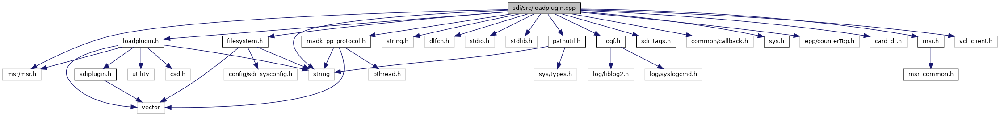

[Data Structures](#nested-classes) \| [Macros](#define-members) \| [Functions](#func-members) \| [Variables](#var-members)

`#include "`<a href="loadplugin_8h_source.md">loadplugin.h</a>`"`
`#include "`<a href="filesystem_8h_source.md">filesystem.h</a>`"`
`#include "`<a href="pathutil_8h_source.md">pathutil.h</a>`"`
`#include <string.h>`
`#include <string>`
`#include <dlfcn.h>`
`#include <stdio.h>`
`#include <stdlib.h>`
`#include "`<a href="madk__pp__protocol_8h_source.md">madk_pp_protocol.h</a>`"`
`#include "`<a href="__logf_8h_source.md">_logf.h</a>`"`
`#include "`<a href="src_2sdi__tags_8h_source.md">sdi_tags.h</a>`"`
`#include "common/callback.h"`
`#include "`<a href="sys_8h_source.md">sys.h</a>`"`
`#include "epp/counterTop.h"`
`#include "card_dt.h"`
`#include "`<a href="msr_8h_source.md">msr.h</a>`"`
`#include "msr/msr.h"`
`#include "vcl_client.h"`

Include dependency graph for loadplugin.cpp:

|  |  |
|----|----|
| Data Structures |  |
| struct   | <a href="struct_u_int32_array.md">UInt32Array</a> |

|  |  |
|----|----|
| Macros |  |
| #define  | [SET_RESULT](#ae27eea42be89a6e50555732afafcfb8f)(sw1, sw2)   { rsp\[0\] = sw1; rsp\[1\] = sw2; \*rspSize = 2; } |

|  |  |
|----|----|
| Functions |  |
| const vector\< <a href="class_s_d_i_plugin_ctx.md">SDIPluginCtx</a> \* \> &  | [loadPlugins](#a6be6ae1436dfd4046cd1932d4ef660f4) (bool reload) |
| const vector\< <a href="class_s_d_i_plugin_ctx.md">SDIPluginCtx</a> \* \> &  | [getLoadedPlugins](#a4f3977607630c58a3dccba35c3de9615) () |
| <a href="class_s_d_i_plugin.md">SDIPlugin</a> \*  | [getPlugin](#a206221de659eaea0b9c26cfcb96bc049) (int pluginID) |
| void  | [storePluginMsrData](#aeba42accf97dbdbf6607ca2abec9e83b) (<a href="msr__common_8h.md#struct_m_s_r___track_data4">MSR_TrackData4</a> &tracks, <a href="msr__common_8h.md#struct_m_s_r___decoded_data4">MSR_DecodedData4</a> &decoded) |
| void  | [registerPlugin](#a9d5f8efae300809ef2582ef2d30b8d38) (<a href="class_s_d_i_plugin_ctx.md">SDIPluginCtx</a> \*p) |
| <a href="class_s_d_i_plugin_ctx.md">SDIPluginCtx</a> \*  | [unregisterPlugin](#a9466acd3b9b72635116b8b57c1420fb1) (const string &filename) |
| void  | [handlePluginCmd](#aedeb718f16bf12b0642776c0f92cb209) (unsigned short msgBufSize, unsigned char \*msg, unsigned short msgSize, unsigned short rspBufSize, unsigned char \*rsp, unsigned short \*rspSize) |
| void  | [broadcastTriggerLocal](#ab48067ad9c7284b0560e8390c9ac1944) (<a href="class_s_d_i_plugin.md#a82c0da164c73dfba432f58136b1d3dab">SDIPlugin::SDITrigger</a> triggerID, csd_data &message, vector\< struct <a href="loadplugin_8h.md#structbc_trigger_result">bcTriggerResult</a> \> &results) |
| void  | [broadcastTrigger](#a0f98b5c2f8e38daf732d4a7403c9e898) (<a href="class_s_d_i_plugin.md#a82c0da164c73dfba432f58136b1d3dab">SDIPlugin::SDITrigger</a> triggerID, csd_data &message, vector\< struct <a href="loadplugin_8h.md#structbc_trigger_result">bcTriggerResult</a> \> &results) |
| int  | [executeSingleTrigger](#abe54f620b7267559920a8f6f8f0c3705) (<a href="class_s_d_i_plugin.md#a82c0da164c73dfba432f58136b1d3dab">SDIPlugin::SDITrigger</a> triggerID, unsigned char \*msg, unsigned short msgSize, unsigned short resBufSize, unsigned char \*res, unsigned short \*resSize) |
| <a href="class_s_d_i_plugin.md">SDIPlugin</a> \*  | [pluginInstalledForTrigger](#a4a24ab51f8a1f35a6d9b09fdc4639f4a) (<a href="class_s_d_i_plugin.md#a82c0da164c73dfba432f58136b1d3dab">SDIPlugin::SDITrigger</a> triggerID) |
| int  | [executeSequencialTrigger](#ac3f6ed9f939661a29c9a91ccb603e767) (<a href="class_s_d_i_plugin.md#a82c0da164c73dfba432f58136b1d3dab">SDIPlugin::SDITrigger</a> triggerID, <a href="loadplugin_8h.md#a87d5b69b03a93be2f94ede88b3675e79">PLUGIN_READ_TYPE</a> readType, unsigned char \*msg, unsigned short msgSize, unsigned short resBufSize, unsigned char \*res, unsigned short \*resSize) |

|  |  |
|----|----|
| Variables |  |
| vector\< <a href="class_s_d_i_plugin_ctx.md">SDIPluginCtx</a> \* \>  | [plugins](#ac05523f594f474b2718c180c15fc11de) |

## MacroDefinition Documentation {#macro-definition-documentation}

## SET_RESULT 

#define SET_RESULT

## FunctionDocumentation {#function-documentation}

## broadcastTrigger() 

void broadcastTrigger

## broadcastTriggerLocal() 

void broadcastTriggerLocal

## executeSequencialTrigger() 

int executeSequencialTrigger

## executeSingleTrigger() 

int executeSingleTrigger

## getLoadedPlugins() 

const vector\<<a href="class_s_d_i_plugin_ctx.md">SDIPluginCtx</a> \*\>& getLoadedPlugins

return the list of loaded and registered SDI plugins

### Returns

list of loaded and registered SDI plugins as vector (storing instances of class <a href="class_s_d_i_plugin_ctx.md">SDIPluginCtx</a>)

## getPlugin() 

<a href="class_s_d_i_plugin.md">SDIPlugin</a>\* getPlugin

## handlePluginCmd() 

void handlePluginCmd

## loadPlugins() 

const vector\<<a href="class_s_d_i_plugin_ctx.md">SDIPluginCtx</a> \*\>& loadPlugins

loads the SDI plugins from the SDI plugin folders and register them to the list of loaded SDI plugins. SDI plugin folders are the following:

1.  Internal home lib directory

2.  External plugin directory (Android only).
    
    If a plugin in external plugin directory is found and has the same name as an plugin from home lib directory, the external plugin is preferred.
     If mode flag `reload` is set true (default), all plugins are loaded or reloaded. If the flag is set to false, only the those plugins are loaded, which are not yet registered in the list of loaded SDI plugins. **Parameters**

    \[in\] **reload** set to true (default), to unload already registered plugins, before they get loaded

    ### Returns

    list of loaded and registered SDI plugins as vector (storing instances of class <a href="class_s_d_i_plugin_ctx.md">SDIPluginCtx</a>)

## pluginInstalledForTrigger() 

<a href="class_s_d_i_plugin.md">SDIPlugin</a>\* pluginInstalledForTrigger

checks for installed/loaded plugins, which support a specific trigger specified by `triggerID`.

**Parameters**

\[in\] **triggerID** trigger ID to check plugins, if the trigger is supported

### Returns

poniter to the first found plugin object if there is at least one plugin, which supports trigger `triggerID`, else false.

## registerPlugin() 

void registerPlugin

register a loaded plugin to the list of SDI plugins. If the plugin is not valid or not loaded, this function does nothing. If a plugin with the same plugin file name, was already registered, the old plugin is unregistered and unloaded, before the new plugin is added.

**Parameters**

\[in\] **p** new plugin to register in list of loaded SDI plugins

## storePluginMsrData() 

void storePluginMsrData

## unregisterPlugin() 

<a href="class_s_d_i_plugin_ctx.md">SDIPluginCtx</a>\* unregisterPlugin

## VariableDocumentation {#variable-documentation}

## plugins 

vector\<<a href="class_s_d_i_plugin_ctx.md">SDIPluginCtx</a> \*\> plugins

registration list storing the loaded plugins (instances of class <a href="class_s_d_i_plugin_ctx.md">SDIPluginCtx</a>) as vector
