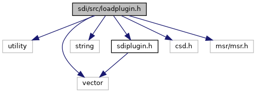
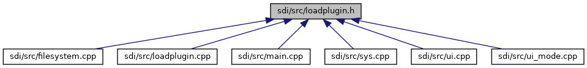

[Data Structures](#nested-classes) \| [Macros](#define-members) \| [Enumerations](#enum-members) \| [Functions](#func-members)

`#include <utility>`
`#include <vector>`
`#include <string>`
`#include "`<a href="sdiplugin_8h_source.md">sdiplugin.h</a>`"`
`#include "csd.h"`
`#include "msr/msr.h"`

Include dependency graph for loadplugin.h:

This graph shows which files directly or indirectly include this file:

<a href="loadplugin_8h_source.md">Go to the source code of this file.</a>

|  |  |
|----|----|
| Data Structures |  |
| class   | <a href="class_s_d_i_plugin_ctx.md">SDIPluginCtx</a> |
| struct   | [bcTriggerResult](#structbc_trigger_result) |

|  |  |
|----|----|
| Macros |  |
| #define  | [VOS3_CARDS_PLUGIN_ID](#a65d45de4ee2ba065a83d0d4b96b0fde4)   0xE1 |

|  |  |
|----|----|
| Enumerations |  |
| enum   | [TRIGGER_TYPE](#a5bd4a8de2ccce074842d9df3509fe188) { [TRIGGER_TYPE_UNKNOWN](#a5bd4a8de2ccce074842d9df3509fe188a17e3e82af33f8125ebcad35b5c673d59), [TRIGGER_TYPE_SINGLE](#a5bd4a8de2ccce074842d9df3509fe188a77a3058745efb6d0b997a70a85ebec82), [TRIGGER_TYPE_MULTIPLE](#a5bd4a8de2ccce074842d9df3509fe188abb5670b3d143b240ab33a977c296f2a2), [TRIGGER_TYPE_SEQUENCIAL](#a5bd4a8de2ccce074842d9df3509fe188ae8224574671869771ebc746ee8e39cb3) } |
| enum   | [PLUGIN_READ_TYPE](#a87d5b69b03a93be2f94ede88b3675e79) { [PLUGIN_READ_NONE](#a87d5b69b03a93be2f94ede88b3675e79af9f39d0a4daadbd9ab293e28651d94a1), [PLUGIN_READ_FIRST](#a87d5b69b03a93be2f94ede88b3675e79a0aa41ba4fbff30ac457cbdb815e35d01), [PLUGIN_READ_NEXT](#a87d5b69b03a93be2f94ede88b3675e79a5ec9c0b384babec5670c5b48f212f18e) } |

|  |  |
|----|----|
| Functions |  |
| const std::vector\< <a href="class_s_d_i_plugin_ctx.md">SDIPluginCtx</a> \* \> &  | [loadPlugins](#a601aff18c62cdfb15e1a16f1c66dbbb8) (bool reload=true) |
| const std::vector\< <a href="class_s_d_i_plugin_ctx.md">SDIPluginCtx</a> \* \> &  | [getLoadedPlugins](#a96e2ea2dbce448fb41986aa2ee19eba6) () |
| void  | [registerPlugin](#a9d5f8efae300809ef2582ef2d30b8d38) (<a href="class_s_d_i_plugin_ctx.md">SDIPluginCtx</a> \*p) |
| <a href="class_s_d_i_plugin_ctx.md">SDIPluginCtx</a> \*  | [unregisterPlugin](#ad6bac1f9779d250bb674c1c1e481fc50) (const std::string &filename) |
| <a href="class_s_d_i_plugin.md">SDIPlugin</a> \*  | [getPlugin](#a206221de659eaea0b9c26cfcb96bc049) (int pluginID) |
| void  | [handlePluginCmd](#aedeb718f16bf12b0642776c0f92cb209) (unsigned short msgBufSize, unsigned char \*msg, unsigned short msgSize, unsigned short rspBufSize, unsigned char \*rsp, unsigned short \*rspSize) |
| int  | [executeSequencialTrigger](#ac3f6ed9f939661a29c9a91ccb603e767) (<a href="class_s_d_i_plugin.md#a82c0da164c73dfba432f58136b1d3dab">SDIPlugin::SDITrigger</a> triggerID, [PLUGIN_READ_TYPE](#a87d5b69b03a93be2f94ede88b3675e79) readType, unsigned char \*msg, unsigned short msgSize, unsigned short resBufSize, unsigned char \*res, unsigned short \*resSize) |
| void  | [storePluginMsrData](#aeba42accf97dbdbf6607ca2abec9e83b) (<a href="msr__common_8h.md#struct_m_s_r___track_data4">MSR_TrackData4</a> &tracks, <a href="msr__common_8h.md#struct_m_s_r___decoded_data4">MSR_DecodedData4</a> &decoded) |
| void  | [broadcastTriggerLocal](#a0f6f1985e988673c82d9285abbb6d1f8) (<a href="class_s_d_i_plugin.md#a82c0da164c73dfba432f58136b1d3dab">SDIPlugin::SDITrigger</a> triggerID, csd::csd_data &message, std::vector\< struct [bcTriggerResult](#structbc_trigger_result) \> &results) |
| void  | [broadcastTrigger](#abbbc773d285da350f8a32e81f0233650) (<a href="class_s_d_i_plugin.md#a82c0da164c73dfba432f58136b1d3dab">SDIPlugin::SDITrigger</a> triggerID, csd::csd_data &message, std::vector\< struct [bcTriggerResult](#structbc_trigger_result) \> &results) |
| int  | [executeSingleTrigger](#abe54f620b7267559920a8f6f8f0c3705) (<a href="class_s_d_i_plugin.md#a82c0da164c73dfba432f58136b1d3dab">SDIPlugin::SDITrigger</a> triggerID, unsigned char \*msg, unsigned short msgSize, unsigned short resBufSize, unsigned char \*res, unsigned short \*resSize) |
| <a href="class_s_d_i_plugin.md">SDIPlugin</a> \*  | [pluginInstalledForTrigger](#a4a24ab51f8a1f35a6d9b09fdc4639f4a) (<a href="class_s_d_i_plugin.md#a82c0da164c73dfba432f58136b1d3dab">SDIPlugin::SDITrigger</a> triggerID) |

------------------------------------------------------------------------

## DataStructure Documentation {#data-structure-documentation}

## bcTriggerResult 

struct bcTriggerResult

structure used by <a href="loadplugin_8cpp.md#a0f98b5c2f8e38daf732d4a7403c9e898">broadcastTrigger()</a> to store a result for one plugin

| Data Fields |  |  |
|----|----|----|
| int | id | 
id of the plugin, which has returned the result
 |
| string | name | 
name of the plugin, which has returned the result
 |
| Buffer | result | 
result buffer returned by processTrigger() function
 |
| int | retval | 
return value of processTrigger() function
 |

## MacroDefinition Documentation {#macro-definition-documentation}

## VOS3_CARDS_PLUGIN_ID 

#define VOS3_CARDS_PLUGIN_ID   0xE1

## EnumerationType Documentation {#enumeration-type-documentation}

## PLUGIN_READ_TYPE 

enum [PLUGIN_READ_TYPE](#a87d5b69b03a93be2f94ede88b3675e79)

| Enumerator         |     |
|--------------------|-----|
| PLUGIN_READ_NONE   |     |
| PLUGIN_READ_FIRST  |     |
| PLUGIN_READ_NEXT   |     |

## TRIGGER_TYPE 

enum [TRIGGER_TYPE](#a5bd4a8de2ccce074842d9df3509fe188)

| Enumerator               |     |
|--------------------------|-----|
| TRIGGER_TYPE_UNKNOWN     |     |
| TRIGGER_TYPE_SINGLE      |     |
| TRIGGER_TYPE_MULTIPLE    |     |
| TRIGGER_TYPE_SEQUENCIAL  |     |

## FunctionDocumentation {#function-documentation}

## broadcastTrigger() 

void broadcastTrigger

checks all loaded plugins for implemented trigger `triggerID`. If the trigger is implemented, the plugin function processTrigger() with the `triggerID` and the `message` is invoked. The results of all plugins, which supports the trigger is stored in vector `results`. This structure takes the return value of the the processTrigger() call and the result buffer of this function. In addition, the plugin name is stored so that the caller knows, which plugin has returned which result.

**Parameters**

\[in\] **triggerID** trigger ID, for which processTrigger() is called on the loaded plugins, which support the trigger \[in\] **message** message buffer passed to processTrigger() invoked on the plugins, which support the trigger. \[out\] **results** vector containing result data for each processTrigger call (see struct bcTriggerResult)

## broadcastTriggerLocal() 

void broadcastTriggerLocal

## executeSequencialTrigger() 

int executeSequencialTrigger

## executeSingleTrigger() 

int executeSingleTrigger

## getLoadedPlugins() 

const std::vector\<<a href="class_s_d_i_plugin_ctx.md">SDIPluginCtx</a> \*\>& getLoadedPlugins

return the list of loaded and registered SDI plugins

### Returns

list of loaded and registered SDI plugins as vector (storing instances of class <a href="class_s_d_i_plugin_ctx.md">SDIPluginCtx</a>)

## getPlugin() 

<a href="class_s_d_i_plugin.md">SDIPlugin</a>\* getPlugin

## handlePluginCmd() 

void handlePluginCmd

## loadPlugins() 

const std::vector\<<a href="class_s_d_i_plugin_ctx.md">SDIPluginCtx</a> \*\>& loadPlugins

loads the SDI plugins from the SDI plugin folders and register them to the list of loaded SDI plugins. SDI plugin folders are the following:

1.  Internal home lib directory

2.  External plugin directory (Android only).
    
    If a plugin in external plugin directory is found and has the same name as an plugin from home lib directory, the external plugin is preferred.
     If mode flag `reload` is set true (default), all plugins are loaded or reloaded. If the flag is set to false, only the those plugins are loaded, which are not yet registered in the list of loaded SDI plugins. **Parameters**

    \[in\] **reload** set to true (default), to unload already registered plugins, before they get loaded

    ### Returns

    list of loaded and registered SDI plugins as vector (storing instances of class <a href="class_s_d_i_plugin_ctx.md">SDIPluginCtx</a>)

## pluginInstalledForTrigger() 

<a href="class_s_d_i_plugin.md">SDIPlugin</a>\* pluginInstalledForTrigger

checks for installed/loaded plugins, which support a specific trigger specified by `triggerID`.

**Parameters**

\[in\] **triggerID** trigger ID to check plugins, if the trigger is supported

### Returns

poniter to the first found plugin object if there is at least one plugin, which supports trigger `triggerID`, else false.

## registerPlugin() 

void registerPlugin

register a loaded plugin to the list of SDI plugins. If the plugin is not valid or not loaded, this function does nothing. If a plugin with the same plugin file name, was already registered, the old plugin is unregistered and unloaded, before the new plugin is added.

**Parameters**

\[in\] **p** new plugin to register in list of loaded SDI plugins

## storePluginMsrData() 

void storePluginMsrData

## unregisterPlugin() 

<a href="class_s_d_i_plugin_ctx.md">SDIPluginCtx</a>\* unregisterPlugin

unregister a loaded plugin from the list of loaded SDI plugins. If the plugin is found according its filename (without path) the pointer to the unregistered SDI plugin context is returned.

**Parameters**

\[in\] **filename** name of the plugin shared object (without path), Example: \"libsdiplugin-myplugin.so\"

### Returns

pointer to the SDI plugin context (if found), else NULL


The plugin is not unloaded, after it was successfully unregistered. The caller must invoke delete on the returned object to free its resources.

