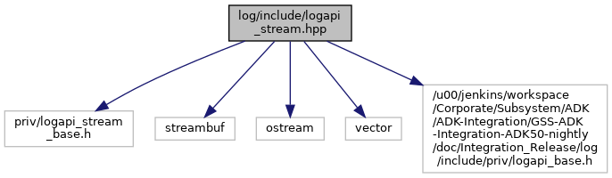

[Namespaces](#namespaces) \| [Macros](#define-members)

`#include "priv/logapi_stream_base.h"`

Include dependency graph for logapi_stream.hpp:



<a href="logapi__stream_8hpp_source.md">Go to the source code of this file.</a>

|            |                                                      |
|------------|------------------------------------------------------|
| Namespaces |                                                      |
|            | <a href="namespace_log_a_p_i.md">LogAPI</a> |

|  |  |
|----|----|
| Macros |  |
| #define  | [LOGAPI_STREAM](#a48643a97c48a6bead9bf2cf02c393530)(level, \...) |
|   | helper macro [More\...](#a48643a97c48a6bead9bf2cf02c393530)<br/> |
| #define  | [LOGAPI_TAG_STREAM](#aeed1fd032949ceb28d668cd95835f911)(level, tag, \...) |
|   | helper macro [More\...](#aeed1fd032949ceb28d668cd95835f911)<br/> |
| #define  | [LOGS_EMERG](#abda8bcbfa0c8c100503471cedaafa188)(\...)   [LOGAPI_STREAM](#a48643a97c48a6bead9bf2cf02c393530)( LOGAPI_EMERG, \_\_VA_ARGS\_\_ ) |
| #define  | [LOGS_ALERT](#ad625540628827f254ce708f03efb8112)(\...)   [LOGAPI_STREAM](#a48643a97c48a6bead9bf2cf02c393530)( LOGAPI_ALERT, \_\_VA_ARGS\_\_ ) |
| #define  | [LOGS_CRIT](#a2168d5f568e2b72bf3ab39fe671e6784)(\...)   [LOGAPI_STREAM](#a48643a97c48a6bead9bf2cf02c393530)( LOGAPI_CRIT, \_\_VA_ARGS\_\_ ) |
| #define  | [LOGS_ERROR](#a91ff70135ddea598400e175019dd77fa)(\...)   [LOGAPI_STREAM](#a48643a97c48a6bead9bf2cf02c393530)( LOGAPI_ERROR, \_\_VA_ARGS\_\_ ) |
| #define  | [LOGS_WARN](#af99803e5f757ea1b5d9c77b140d019e1)(\...)   [LOGAPI_STREAM](#a48643a97c48a6bead9bf2cf02c393530)( LOGAPI_WARN, \_\_VA_ARGS\_\_ ) |
| #define  | [LOGS_NOTICE](#a258fcffee1d17fd479e6a7dc6add8a7a)(\...)   [LOGAPI_STREAM](#a48643a97c48a6bead9bf2cf02c393530)( LOGAPI_NOTICE, \_\_VA_ARGS\_\_ ) |
| #define  | [LOGS_INFO](#a8482e7e99d0481a641467baf56b63f8a)(\...)   [LOGAPI_STREAM](#a48643a97c48a6bead9bf2cf02c393530)( LOGAPI_INFO, \_\_VA_ARGS\_\_ ) |
| #define  | [LOGS_TRACE](#ad5c15850a5a551ca78ab8b53f1d2f705)(\...)   [LOGAPI_STREAM](#a48643a97c48a6bead9bf2cf02c393530)( LOGAPI_TRACE, \_\_VA_ARGS\_\_ ) |
| #define  | [LOGS_TAG_EMERG](#a086ce21eecd3b61c697e2dd4d311e19e)(tag, \...)   [LOGAPI_TAG_STREAM](#aeed1fd032949ceb28d668cd95835f911)( LOGAPI_EMERG, tag, \_\_VA_ARGS\_\_ ) |
| #define  | [LOGS_TAG_ALERT](#ac5eb54358f431c30ba0b0fe74186cefa)(tag, \...)   [LOGAPI_TAG_STREAM](#aeed1fd032949ceb28d668cd95835f911)( LOGAPI_ALERT, tag, \_\_VA_ARGS\_\_ ) |
| #define  | [LOGS_TAG_CRIT](#a644a64fdf77a374ceea09d5ba05e34b4)(tag, \...)   [LOGAPI_TAG_STREAM](#aeed1fd032949ceb28d668cd95835f911)( LOGAPI_CRIT, tag, \_\_VA_ARGS\_\_ ) |
| #define  | [LOGS_TAG_ERROR](#ac81370114eb05310cda6283306802e94)(tag, \...)   [LOGAPI_TAG_STREAM](#aeed1fd032949ceb28d668cd95835f911)( LOGAPI_ERROR, tag, \_\_VA_ARGS\_\_ ) |
| #define  | [LOGS_TAG_WARN](#a2c51dea420382459b25467cf3f1251d3)(tag, \...)   [LOGAPI_TAG_STREAM](#aeed1fd032949ceb28d668cd95835f911)( LOGAPI_WARN, tag, \_\_VA_ARGS\_\_ ) |
| #define  | [LOGS_TAG_NOTICE](#affa1ddb863c7548a88dad94c3f086843)(tag, \...)   [LOGAPI_TAG_STREAM](#aeed1fd032949ceb28d668cd95835f911)( LOGAPI_NOTICE, tag, \_\_VA_ARGS\_\_ ) |
| #define  | [LOGS_TAG_INFO](#a1bcf9312f34f36092fc40342e6183e41)(tag, \...)   [LOGAPI_TAG_STREAM](#aeed1fd032949ceb28d668cd95835f911)( LOGAPI_INFO, tag, \_\_VA_ARGS\_\_ ) |
| #define  | [LOGS_TAG_TRACE](#a9e58c8bc76c65dbc0f533100c5efc4ba)(tag, \...)   [LOGAPI_TAG_STREAM](#aeed1fd032949ceb28d668cd95835f911)( LOGAPI_TRACE, tag, \_\_VA_ARGS\_\_ ) |
| #define  | [DBG_STREAM](#af8459281f9d29605ebd0b888981791bd)(\...)   LOGAPI_EMPTYSTMT |
| #define  | [DBGS_EMERG](#ac3acf629502d630cda04ca400fd187ce)(\...)   LOGAPI_EMPTYSTMT |
| #define  | [DBGS_ALERT](#aa7939a6d40ee3e119d489b3b79342b73)(\...)   LOGAPI_EMPTYSTMT |
| #define  | [DBGS_CRIT](#ad493ea6309fe5e4911437bcb7ef63bdc)(\...)   LOGAPI_EMPTYSTMT |
| #define  | [DBGS_ERROR](#a2df43910ebfbc369d5480ee767869624)(\...)   LOGAPI_EMPTYSTMT |
| #define  | [DBGS_WARN](#ac93d0d4de78aa30ec751bb7f2e59f5a1)(\...)   LOGAPI_EMPTYSTMT |
| #define  | [DBGS_NOTICE](#a092c717082b9fa9714226efc76e92fbd)(\...)   LOGAPI_EMPTYSTMT |
| #define  | [DBGS_INFO](#a6306a6bce29ad002c33678c3393ca19a)(\...)   LOGAPI_EMPTYSTMT |
| #define  | [DBGS_TRACE](#ac6a0d93c42bda38eb87b2165d1cf933a)(\...)   LOGAPI_EMPTYSTMT |
| #define  | [DBG_TAG_STREAM](#a4073faef165c8aa5a00524a0e0c4d8a0)(\...)   LOGAPI_EMPTYSTMT |
| #define  | [DBGS_TAG_EMERG](#a5fcd9850190605f4eb620d992d5cf26e)(\...)   LOGAPI_EMPTYSTMT |
| #define  | [DBGS_TAG_ALERT](#ada4940676ce7f881e6ef9550c33244ff)(\...)   LOGAPI_EMPTYSTMT |
| #define  | [DBGS_TAG_CRIT](#a43082dba6e3e519bb2ed0dd06a4dcd8c)(\...)   LOGAPI_EMPTYSTMT |
| #define  | [DBGS_TAG_ERROR](#ab07b9c7135c51719f94b3f7a78bbe7e8)(\...)   LOGAPI_EMPTYSTMT |
| #define  | [DBGS_TAG_WARN](#a11d6301bedb19750d5007af7f48f68fe)(\...)   LOGAPI_EMPTYSTMT |
| #define  | [DBGS_TAG_NOTICE](#a6ec3101f544a85c0f2ea67be1a7dc0ef)(\...)   LOGAPI_EMPTYSTMT |
| #define  | [DBGS_TAG_INFO](#acf41215e98459bf8d24fdfeb3a5cb223)(\...)   LOGAPI_EMPTYSTMT |
| #define  | [DBGS_TAG_TRACE](#afaf9cc701b079682dffd17c971e6154c)(\...)   LOGAPI_EMPTYSTMT |

## MacroDefinition Documentation {#macro-definition-documentation}

## DBG_STREAM <a href="#af8459281f9d29605ebd0b888981791bd" id="af8459281f9d29605ebd0b888981791bd"></a>

<p>#define DBG_STREAM</p>

## DBG_TAG_STREAM <a href="#a4073faef165c8aa5a00524a0e0c4d8a0" id="a4073faef165c8aa5a00524a0e0c4d8a0"></a>

<p>#define DBG_TAG_STREAM</p>

## DBGS_ALERT <a href="#aa7939a6d40ee3e119d489b3b79342b73" id="aa7939a6d40ee3e119d489b3b79342b73"></a>

<p>#define DBGS_ALERT</p>

## DBGS_CRIT <a href="#ad493ea6309fe5e4911437bcb7ef63bdc" id="ad493ea6309fe5e4911437bcb7ef63bdc"></a>

<p>#define DBGS_CRIT</p>

## DBGS_EMERG <a href="#ac3acf629502d630cda04ca400fd187ce" id="ac3acf629502d630cda04ca400fd187ce"></a>

<p>#define DBGS_EMERG</p>

## DBGS_ERROR <a href="#a2df43910ebfbc369d5480ee767869624" id="a2df43910ebfbc369d5480ee767869624"></a>

<p>#define DBGS_ERROR</p>

## DBGS_INFO <a href="#a6306a6bce29ad002c33678c3393ca19a" id="a6306a6bce29ad002c33678c3393ca19a"></a>

<p>#define DBGS_INFO</p>

## DBGS_NOTICE <a href="#a092c717082b9fa9714226efc76e92fbd" id="a092c717082b9fa9714226efc76e92fbd"></a>

<p>#define DBGS_NOTICE</p>

## DBGS_TAG_ALERT <a href="#ada4940676ce7f881e6ef9550c33244ff" id="ada4940676ce7f881e6ef9550c33244ff"></a>

<p>#define DBGS_TAG_ALERT</p>

## DBGS_TAG_CRIT <a href="#a43082dba6e3e519bb2ed0dd06a4dcd8c" id="a43082dba6e3e519bb2ed0dd06a4dcd8c"></a>

<p>#define DBGS_TAG_CRIT</p>

## DBGS_TAG_EMERG <a href="#a5fcd9850190605f4eb620d992d5cf26e" id="a5fcd9850190605f4eb620d992d5cf26e"></a>

<p>#define DBGS_TAG_EMERG</p>

## DBGS_TAG_ERROR <a href="#ab07b9c7135c51719f94b3f7a78bbe7e8" id="ab07b9c7135c51719f94b3f7a78bbe7e8"></a>

<p>#define DBGS_TAG_ERROR</p>

## DBGS_TAG_INFO <a href="#acf41215e98459bf8d24fdfeb3a5cb223" id="acf41215e98459bf8d24fdfeb3a5cb223"></a>

<p>#define DBGS_TAG_INFO</p>

## DBGS_TAG_NOTICE <a href="#a6ec3101f544a85c0f2ea67be1a7dc0ef" id="a6ec3101f544a85c0f2ea67be1a7dc0ef"></a>

<p>#define DBGS_TAG_NOTICE</p>

## DBGS_TAG_TRACE <a href="#afaf9cc701b079682dffd17c971e6154c" id="afaf9cc701b079682dffd17c971e6154c"></a>

<p>#define DBGS_TAG_TRACE</p>

## DBGS_TAG_WARN <a href="#a11d6301bedb19750d5007af7f48f68fe" id="a11d6301bedb19750d5007af7f48f68fe"></a>

<p>#define DBGS_TAG_WARN</p>

## DBGS_TRACE <a href="#ac6a0d93c42bda38eb87b2165d1cf933a" id="ac6a0d93c42bda38eb87b2165d1cf933a"></a>

<p>#define DBGS_TRACE</p>

## DBGS_WARN <a href="#ac93d0d4de78aa30ec751bb7f2e59f5a1" id="ac93d0d4de78aa30ec751bb7f2e59f5a1"></a>

<p>#define DBGS_WARN</p>

## LOGAPI_STREAM <a href="#a48643a97c48a6bead9bf2cf02c393530" id="a48643a97c48a6bead9bf2cf02c393530"></a>

<p>#define LOGAPI_STREAM</p>

**Value:**

``` cpp
   do \
   {\
   if ( int( level ) <= int(LogAPI_GetLevel())) \
   {\
   LogAPI::g_stream.getBuffer().setOpts(level, LOGAPI_FILE, LOGAPI_LINE);\
   LogAPI::g_stream << __VA_ARGS__ << std::flush;\
   }\
   } while (0)
```

helper macro

### Warning

Avoid direct use

## LOGAPI_TAG_STREAM <a href="#aeed1fd032949ceb28d668cd95835f911" id="aeed1fd032949ceb28d668cd95835f911"></a>

<p>#define LOGAPI_TAG_STREAM</p>

**Value:**

``` cpp
   do \
   {\
   if ( int( level ) <= int(LogAPI_GetLevel())) \
   {\
   if ( LogAPI::g_stream.getBuffer().isInFilterList( tag ) )\
   {\
   LogAPI::g_stream.getBuffer().setOpts(level, LOGAPI_FILE, LOGAPI_LINE);\
   LogAPI::g_stream << __VA_ARGS__ << std::flush;\
   }\
   }\
   } while (0)
```

helper macro

### Warning

Avoid direct use

## LOGS_ALERT <a href="#ad625540628827f254ce708f03efb8112" id="ad625540628827f254ce708f03efb8112"></a>

<p>#define LOGS_ALERT</p>

## LOGS_CRIT <a href="#a2168d5f568e2b72bf3ab39fe671e6784" id="a2168d5f568e2b72bf3ab39fe671e6784"></a>

<p>#define LOGS_CRIT</p>

## LOGS_EMERG <a href="#abda8bcbfa0c8c100503471cedaafa188" id="abda8bcbfa0c8c100503471cedaafa188"></a>

<p>#define LOGS_EMERG</p>

## LOGS_ERROR <a href="#a91ff70135ddea598400e175019dd77fa" id="a91ff70135ddea598400e175019dd77fa"></a>

<p>#define LOGS_ERROR</p>

## LOGS_INFO <a href="#a8482e7e99d0481a641467baf56b63f8a" id="a8482e7e99d0481a641467baf56b63f8a"></a>

<p>#define LOGS_INFO</p>

## LOGS_NOTICE <a href="#a258fcffee1d17fd479e6a7dc6add8a7a" id="a258fcffee1d17fd479e6a7dc6add8a7a"></a>

<p>#define LOGS_NOTICE</p>

## LOGS_TAG_ALERT <a href="#ac5eb54358f431c30ba0b0fe74186cefa" id="ac5eb54358f431c30ba0b0fe74186cefa"></a>

<p>#define LOGS_TAG_ALERT</p>

## LOGS_TAG_CRIT <a href="#a644a64fdf77a374ceea09d5ba05e34b4" id="a644a64fdf77a374ceea09d5ba05e34b4"></a>

<p>#define LOGS_TAG_CRIT</p>

## LOGS_TAG_EMERG <a href="#a086ce21eecd3b61c697e2dd4d311e19e" id="a086ce21eecd3b61c697e2dd4d311e19e"></a>

<p>#define LOGS_TAG_EMERG</p>

## LOGS_TAG_ERROR <a href="#ac81370114eb05310cda6283306802e94" id="ac81370114eb05310cda6283306802e94"></a>

<p>#define LOGS_TAG_ERROR</p>

## LOGS_TAG_INFO <a href="#a1bcf9312f34f36092fc40342e6183e41" id="a1bcf9312f34f36092fc40342e6183e41"></a>

<p>#define LOGS_TAG_INFO</p>

## LOGS_TAG_NOTICE <a href="#affa1ddb863c7548a88dad94c3f086843" id="affa1ddb863c7548a88dad94c3f086843"></a>

<p>#define LOGS_TAG_NOTICE</p>

## LOGS_TAG_TRACE <a href="#a9e58c8bc76c65dbc0f533100c5efc4ba" id="a9e58c8bc76c65dbc0f533100c5efc4ba"></a>

<p>#define LOGS_TAG_TRACE</p>

## LOGS_TAG_WARN <a href="#a2c51dea420382459b25467cf3f1251d3" id="a2c51dea420382459b25467cf3f1251d3"></a>

<p>#define LOGS_TAG_WARN</p>

## LOGS_TRACE <a href="#ad5c15850a5a551ca78ab8b53f1d2f705" id="ad5c15850a5a551ca78ab8b53f1d2f705"></a>

<p>#define LOGS_TRACE</p>

## LOGS_WARN <a href="#af99803e5f757ea1b5d9c77b140d019e1" id="af99803e5f757ea1b5d9c77b140d019e1"></a>

<p>#define LOGS_WARN</p>
