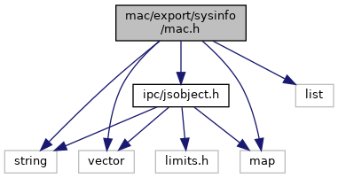
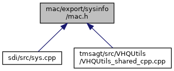

[Namespaces](#namespaces) \| [Macros](#define-members) \| [Typedefs](#typedef-members) \| [Enumerations](#enum-members) \| [Functions](#func-members)

`#include <string>`
`#include <vector>`
`#include <map>`
`#include <list>`
`#include <`<a href="ipc_2src_2ipc_2jsobject_8h_source.md">ipc/jsobject.h</a>`>`

Include dependency graph for mac.h:

This graph shows which files directly or indirectly include this file:

<a href="mac_8h_source.md">Go to the source code of this file.</a>

|            |                                                  |
|------------|--------------------------------------------------|
| Namespaces |                                                  |
|            | <a href="namespacevfimac.md">vfimac</a> |

|          |                                               |
|----------|-----------------------------------------------|
| Macros   |                                               |
| #define  | [MAC_API](#a8794217925bb13f504792c2e3669bf4b) |

|  |  |
|----|----|
| Typedefs |  |
| typedef void(\*  | <a href="namespacevfimac.md#aa740ccdb24bc2dad5717ef65e33b0a24">macEventCallback</a>) (macEvent event, const <a href="classvfiipc_1_1_j_s_object.md">vfiipc::JSObject</a> &json) |
| typedef void(\*  | <a href="namespacevfimac.md#ad2df18eb227eae3f9524fa9031c92d4a">macNotificationCallback</a>) (macNotifications notification) |

|  |  |
|----|----|
| Enumerations |  |
| enum   | <a href="namespacevfimac.md#a343256ae5f150542a1f6a38fcaca216c">macError</a> {   <a href="namespacevfimac.md#a343256ae5f150542a1f6a38fcaca216cae7c1d68ad552537bb450a291714bc71f">MAC_ERR_OK</a> = 0, <a href="namespacevfimac.md#a343256ae5f150542a1f6a38fcaca216cab6a630bc98f5fcfa5a70e994171e514a">MAC_ERR_FAIL</a> = -1, <a href="namespacevfimac.md#a343256ae5f150542a1f6a38fcaca216ca3fe164f68d4f87b4e82dc481ea0516f6">MAC_ERR_UNSUPPORTED</a> = -2, <a href="namespacevfimac.md#a343256ae5f150542a1f6a38fcaca216ca25189ddd505007eeface48fa0f6336e2">MAC_ERR_LOCKED</a> = -3,   <a href="namespacevfimac.md#a343256ae5f150542a1f6a38fcaca216caaad631494e81b88687cb7a360f623524">MAC_ERR_TIMEOUT</a> = -4, <a href="namespacevfimac.md#a343256ae5f150542a1f6a38fcaca216ca48bc15eb2d9bc14d089714e680ec462f">MAC_ERR_LIBNOTIFY</a> = -5, <a href="namespacevfimac.md#a343256ae5f150542a1f6a38fcaca216ca2b3e6bb894a825d49a856f7d78fbaace">MAC_ERR_APP_NOT_RUNNING</a> = -6, <a href="namespacevfimac.md#a343256ae5f150542a1f6a38fcaca216ca6bc9cec21645bb6cc7dedc85598ad726">MAC_ERR_WRONG_APPID</a> = -7,   <a href="namespacevfimac.md#a343256ae5f150542a1f6a38fcaca216ca13ecf9a9db7593cabe3ca09c3496c17b">MAC_ERR_NOT_CP_APP</a> = -8, <a href="namespacevfimac.md#a343256ae5f150542a1f6a38fcaca216ca95e3d004d001f47819fc6899a3f3c534">MAC_ERR_UNKNOWN</a> = -9, <a href="namespacevfimac.md#a343256ae5f150542a1f6a38fcaca216ca388507f8c281d588adfecda0ea957dae">MAC_ERR_CYCLE</a> = -10, <a href="namespacevfimac.md#a343256ae5f150542a1f6a38fcaca216caeb1198ea1741ae185ba82873527fc923">MAC_ERR_DEPENDS</a> = -11,   <a href="namespacevfimac.md#a343256ae5f150542a1f6a38fcaca216cada88f95b27c2d275512fe15b4c54c2dd">MAC_ERR_MANIFEST</a> = -12, <a href="namespacevfimac.md#a343256ae5f150542a1f6a38fcaca216ca2a66718018e9604e11409a6bb0d9ee32">MAC_ERR_IPC</a> = -13, <a href="namespacevfimac.md#a343256ae5f150542a1f6a38fcaca216ca0514be0a87ce110f34cd00b756520654">MAC_ERR_NO_APP</a> = -14, <a href="namespacevfimac.md#a343256ae5f150542a1f6a38fcaca216caeb10ef35a775f680b9576a0696c2c2de">MAC_ERR_READY</a> = -15,   <a href="namespacevfimac.md#a343256ae5f150542a1f6a38fcaca216cab1f9a71117ad2514a34c858c5cb47578">MAC_ERR_ACTIVE</a> = -16, <a href="namespacevfimac.md#a343256ae5f150542a1f6a38fcaca216ca7f94b5307c9aaa494682cb4a3a8f2e0d">MAC_ERR_STOP</a> = -17, <a href="namespacevfimac.md#a343256ae5f150542a1f6a38fcaca216ca9bb50ccba3958e9b7fda61d3ac05534c">MAC_ERR_NO_APPID</a> = -18, <a href="namespacevfimac.md#a343256ae5f150542a1f6a38fcaca216cad3bee99511a15c87676dd9f453ac02fb">MAC_ERR_PERMISSION</a> = -19,   <a href="namespacevfimac.md#a343256ae5f150542a1f6a38fcaca216ca12b59c43d38429cdcaeaa7b45461930c">MAC_ERR_SERVICE</a> = -20, <a href="namespacevfimac.md#a343256ae5f150542a1f6a38fcaca216ca0ed934fa7a34568e74061ef14dfe3958">MAC_ERR_VISIBLE</a> = -21, <a href="namespacevfimac.md#a343256ae5f150542a1f6a38fcaca216caf0bdc46094bdcbb96d29c4a145e2fd33">MAC_ERR_DISABLED</a> = -22, <a href="namespacevfimac.md#a343256ae5f150542a1f6a38fcaca216ca5237e9b1351d2f63ae61112253bbfc16">MAC_ERR_LAUNCH</a> = -23,   <a href="namespacevfimac.md#a343256ae5f150542a1f6a38fcaca216cac8482ef81b09dd82e6d99dc35396e52c">MAC_ERR_RUNNING</a> = -24, <a href="namespacevfimac.md#a343256ae5f150542a1f6a38fcaca216cad71447e193322aa3defb1b6cdc6f6d5e">MAC_ERR_LAYOUT</a> = -25, <a href="namespacevfimac.md#a343256ae5f150542a1f6a38fcaca216ca75777560e490e9383775482ac3bc245d">MAC_ERR_PARAMETER</a> = -26, <a href="namespacevfimac.md#a343256ae5f150542a1f6a38fcaca216ca8648e53c152517be3dcebfdfb17edb97">MAC_ERR_IGNORE</a> = -27,   <a href="namespacevfimac.md#a343256ae5f150542a1f6a38fcaca216ca495bae09e1bc1aa9559aa0f7ec8668c0">MAC_ERR_CANCELED</a> = -28, <a href="namespacevfimac.md#a343256ae5f150542a1f6a38fcaca216cab4d8f261fbe38564274fbf83af83c640">MAC_ERR_EXISTS</a> = -29, <a href="namespacevfimac.md#a343256ae5f150542a1f6a38fcaca216cac704a12dc011b3831433799ec080ee1d">MAC_ERR_NO_KEYS</a> = -30, <a href="namespacevfimac.md#a343256ae5f150542a1f6a38fcaca216caa6268efb5a8546b5d46e3bb0e553177a">MAC_ERR_EXPECTED_KEYS</a> = -31,   <a href="namespacevfimac.md#a343256ae5f150542a1f6a38fcaca216cafb7c2c54548ff09323602f8a6376fd01">MAC_ERR_ACCESS</a> = -32, <a href="namespacevfimac.md#a343256ae5f150542a1f6a38fcaca216ca0d00af9e30df42f5d7c593092ae546eb">MAC_ERR_AVAILIBLE</a> = -33, <a href="namespacevfimac.md#a343256ae5f150542a1f6a38fcaca216cad1f788f290b62d4889261290c009f40a">MAC_ERR_CPR_DISABLED</a> = -35 } |
| enum   | <a href="namespacevfimac.md#a3d1d0138ae66b9a9e03ae518de7ecf63">macLaunchParams</a> { <a href="namespacevfimac.md#a3d1d0138ae66b9a9e03ae518de7ecf63ac157bdf0b85a40d2619cbc8bc1ae5fe2">NONE</a> = 0, <a href="namespacevfimac.md#a3d1d0138ae66b9a9e03ae518de7ecf63a365b0d10413f98eb889815324f8baa8c">KEEP_IN_BACKGROUND</a> = 1 } |
| enum   | <a href="namespacevfimac.md#a7ecd7d8b8c98bd60b3a7d95dc5da7c5f">macKeyboard</a> {   <a href="namespacevfimac.md#a7ecd7d8b8c98bd60b3a7d95dc5da7c5fadbb3aeb300a8742e67f13bf86222792c">MAC_KBD_OFF</a> = (0\<\<0), <a href="namespacevfimac.md#a7ecd7d8b8c98bd60b3a7d95dc5da7c5fa55c180fc86b4f765cabde2dd43046205">MAC_KBD_ON</a> = (1\<\<0), <a href="namespacevfimac.md#a7ecd7d8b8c98bd60b3a7d95dc5da7c5fa1897eb426573ca469062c0af6ffe0db2">MAC_KBD_AUTO</a> = (1\<\<1), <a href="namespacevfimac.md#a7ecd7d8b8c98bd60b3a7d95dc5da7c5fa70f8a1ce4507a2faab7727edee56f25b">MAC_KBD_NUMERIC</a> = (1\<\<2),   <a href="namespacevfimac.md#a7ecd7d8b8c98bd60b3a7d95dc5da7c5faacf7fd09da851474c48e57ae2b9246d5">MAC_KBD_ALPHANUMERIC</a> = (1\<\<3), <a href="namespacevfimac.md#a7ecd7d8b8c98bd60b3a7d95dc5da7c5fad6499892dc5c2341c9a29774e4a5b8ae">MAC_KBD_CAPITALIZED</a> = (1\<\<4), <a href="namespacevfimac.md#a7ecd7d8b8c98bd60b3a7d95dc5da7c5fa07083975a8682e89077a7d12fbad382d">MAC_KBD_LAST</a> = (1\<\<5) } |
| enum   | <a href="namespacevfimac.md#a3bc43cdb5f4033e625bb6dc7e1579d4b">macEvent</a> {   <a href="namespacevfimac.md#a3bc43cdb5f4033e625bb6dc7e1579d4ba939a6cc6d749a232a23ff324dca6d48c">EVENT_NONE</a> = 0, <a href="namespacevfimac.md#a3bc43cdb5f4033e625bb6dc7e1579d4baa4bcbb24c61f7b837ca19df0d94be56d">EVENT_MANIFEST_UPDATE</a> = 1, <a href="namespacevfimac.md#a3bc43cdb5f4033e625bb6dc7e1579d4ba5d88b096adf1cb668ea2c1bf0d8e8cb8">EVENT_ACTIVATION_UPDATE</a> = 2, <a href="namespacevfimac.md#a3bc43cdb5f4033e625bb6dc7e1579d4ba7e6a2f51239e12672d2809ee6f07e177">EVENT_PARAMETER_UPDATE</a> = 3,   <a href="namespacevfimac.md#a3bc43cdb5f4033e625bb6dc7e1579d4ba5e22fbb3d7e11c749b90e3b0461681fb">EVENT_FOCUS_UPDATE</a> = 4, <a href="namespacevfimac.md#a3bc43cdb5f4033e625bb6dc7e1579d4ba5919ad4670c8e825ad53aba144805df5">EVENT_FOREGROUND</a> = 5, <a href="namespacevfimac.md#a3bc43cdb5f4033e625bb6dc7e1579d4bac8f0e13a5042856ad22cc0ba40ac5062">EVENT_BACKGROUND</a> = 6, <a href="namespacevfimac.md#a3bc43cdb5f4033e625bb6dc7e1579d4ba4ca989c23c081528027d2838adda4010">EVENT_CP_STARTED</a> = 7,   <a href="namespacevfimac.md#a3bc43cdb5f4033e625bb6dc7e1579d4bae4b2096693e8230bf7e8234bffeb7ba3">EVENT_CP_STOPPED</a> = 8, <a href="namespacevfimac.md#a3bc43cdb5f4033e625bb6dc7e1579d4bad928ed1a71b92636907ab3b1738c0b22">EVENT_BOOT_COMPLETED</a> = 9, <a href="namespacevfimac.md#a3bc43cdb5f4033e625bb6dc7e1579d4ba9266ca0adff9ab315332fb237ddfed81">EVENT_LAST</a> = 10 } |
| enum   | <a href="namespacevfimac.md#aabd24d8a0b08ebc6a6da2c43b0ae2d9b">macNotifications</a> {   <a href="namespacevfimac.md#aabd24d8a0b08ebc6a6da2c43b0ae2d9ba5cc432d77c6eb1abbe3f89d4f895f778">NOTIFICATION_NONE</a> = (0\<\<0), <a href="namespacevfimac.md#aabd24d8a0b08ebc6a6da2c43b0ae2d9ba6e467da2577048534d2368040c31d17e">NOTIFICATION_MANIFEST_RESCAN</a> = (1\<\<0), <a href="namespacevfimac.md#aabd24d8a0b08ebc6a6da2c43b0ae2d9ba923a1344f83663f39ac04c4ec3d745d9">NOTIFICATION_ACTIVATION_CFG_UPDATE</a> = (1\<\<1), <a href="namespacevfimac.md#aabd24d8a0b08ebc6a6da2c43b0ae2d9ba95a27537b51afc0c265c453ada39d055">NOTIFICATION_PARAMETER_CFG_UPDATE</a> = (1\<\<2),   <a href="namespacevfimac.md#aabd24d8a0b08ebc6a6da2c43b0ae2d9badd8eec9dc45ce42675de6bda75ab3619">NOTIFICATION_CP_START</a> = (1\<\<3), <a href="namespacevfimac.md#aabd24d8a0b08ebc6a6da2c43b0ae2d9bac0ebe51801843ebdb451ae7a36d4f2cb">NOTIFICATION_CP_STOP</a> = (1\<\<4), <a href="namespacevfimac.md#aabd24d8a0b08ebc6a6da2c43b0ae2d9ba29e9cf6282fd10a8fb52f46d21c482c2">NOTIFICATION_LAST</a> = (1\<\<6), <a href="namespacevfimac.md#aabd24d8a0b08ebc6a6da2c43b0ae2d9ba1930c35d6489778ddfeaca7fb2ca6f5e">NOTIFICATION_ALL</a> = 0xFFFF } |
| enum   | <a href="namespacevfimac.md#af8d28bc2c3fa0398b42f840088f59a4b">systemNotificationPriority</a> { <a href="namespacevfimac.md#af8d28bc2c3fa0398b42f840088f59a4bae45a50bf56795bda968dfc1694ad2871">SYSTEM_NOTIFICATION_INFO</a> = 1, <a href="namespacevfimac.md#af8d28bc2c3fa0398b42f840088f59a4ba4313068313501b2088a0336442126a4a">SYSTEM_NOTIFICATION_WARNING</a> = 2, <a href="namespacevfimac.md#af8d28bc2c3fa0398b42f840088f59a4ba6951f9532ee21d9a68bf0e4f1307d03b">SYSTEM_NOTIFICATION_CRITICAL</a> = 3 } |

|  |  |
|----|----|
| Functions |  |
| [MAC_API](#a8794217925bb13f504792c2e3669bf4b) macError  | <a href="namespacevfimac.md#ae4108c74c16f2f512405ba326843109a">sysSetEventCallback</a> (macEvent event, macEventCallback cb) |
| [MAC_API](#a8794217925bb13f504792c2e3669bf4b) macError  | <a href="namespacevfimac.md#a21f532b6bb03873e6927390c19840c67">sysNotificationCallback</a> (macNotificationCallback cb, long notification_mask) |
| [MAC_API](#a8794217925bb13f504792c2e3669bf4b) macError  | <a href="namespacevfimac.md#adb02617beacae56d66f518a263ce0890">sysNotificationCallback</a> (macNotificationCallback cb=NULL, macNotifications notification=NOTIFICATION_NONE) |
| [MAC_API](#a8794217925bb13f504792c2e3669bf4b) macError  | <a href="namespacevfimac.md#a404d8e38300385724b2d2ed306df863e">sysShowDesktop</a> () |
| [MAC_API](#a8794217925bb13f504792c2e3669bf4b) macError  | <a href="namespacevfimac.md#a395a73335aa92641a3ac0967fc0bb200">sysShowControlPanel</a> () |
| [MAC_API](#a8794217925bb13f504792c2e3669bf4b) macError  | <a href="namespacevfimac.md#a085b2f637d5f82e4ee2812baf24eba46">sysShowPowerControlPanel</a> () |
| [MAC_API](#a8794217925bb13f504792c2e3669bf4b) macError  | <a href="namespacevfimac.md#a40e24a74e4f3dc63f080b34b0bb6c7de">sysShowPrevApp</a> () |
| [MAC_API](#a8794217925bb13f504792c2e3669bf4b) macError  | <a href="namespacevfimac.md#a77748eeae43d8b50145564d0022ad886">sysLaunchAppid</a> (const std::string &appid, const std::vector\< std::string \> &args, const std::map\< std::string, std::string \> &envs, int params=0) |
| [MAC_API](#a8794217925bb13f504792c2e3669bf4b) macError  | <a href="namespacevfimac.md#a17fee224cba3c5bfaf8835fbda157cc3">sysLaunchAppid</a> (const std::string &appid, const std::vector\< std::string \> &args, int params) |
| [MAC_API](#a8794217925bb13f504792c2e3669bf4b) macError  | <a href="namespacevfimac.md#a53a3ccda2cdc2d39f2c618015ea81efb">sysLaunchAppid</a> (const std::string &appid, const std::vector\< std::string \> &args) |
| [MAC_API](#a8794217925bb13f504792c2e3669bf4b) macError  | <a href="namespacevfimac.md#aa3c091d3bd20d0131c5f50318cd0750e">sysLaunchAppid</a> (const std::string &appid) |
| [MAC_API](#a8794217925bb13f504792c2e3669bf4b) macError  | <a href="namespacevfimac.md#a52ed11c68234a6abcf53fa5edd596729">sysLaunchApp</a> (const std::string &appname, const std::vector\< std::string \> &args) |
| [MAC_API](#a8794217925bb13f504792c2e3669bf4b) macError  | <a href="namespacevfimac.md#a5b1e0d2f61a93565ac1f1f2d89d4caf3">sysLaunchApp</a> (const std::string &appname) |
| [MAC_API](#a8794217925bb13f504792c2e3669bf4b) macError  | <a href="namespacevfimac.md#a5b63071e5232000be8cd04e2950b28b2">sysRelaunchApps</a> () |
| [MAC_API](#a8794217925bb13f504792c2e3669bf4b) macError  | <a href="namespacevfimac.md#aae05286692566c22ef2d18a69748c5fe">sysIsRunning</a> (const std::string &appid, bool &running) |
| [MAC_API](#a8794217925bb13f504792c2e3669bf4b) macError  | <a href="namespacevfimac.md#abb5ddef3187ac018cda433a3aec2c6fb">sysShowProgress</a> (const std::string &info, size_t percent) |
| [MAC_API](#a8794217925bb13f504792c2e3669bf4b) macError  | <a href="namespacevfimac.md#abcf911819fbee784ef245fe34aa9572c">sysSetAppid</a> (const std::string &appid) |
| [MAC_API](#a8794217925bb13f504792c2e3669bf4b) macError  | <a href="namespacevfimac.md#a738e18eb97f53b402e01c6ee391b2607">sysUnSetAppid</a> () |
| [MAC_API](#a8794217925bb13f504792c2e3669bf4b) macError  | <a href="namespacevfimac.md#aa54bee100e8df7bab8868a0c6b81bc67">sysChangeLayout</a> (const std::string &layoutname, bool statusbar=true, bool keyboard=false) |
| [MAC_API](#a8794217925bb13f504792c2e3669bf4b) macError  | <a href="namespacevfimac.md#a868378044b45895f8c85d0530c482a9e">sysChangeLayout</a> (const std::string &layoutname, bool statusbar) |
| [MAC_API](#a8794217925bb13f504792c2e3669bf4b) macError  | <a href="namespacevfimac.md#aad01e467699aabea2fa64b588ede1fec">sysAssignToLayout</a> (const std::string &appid, const std::string &region) |
| [MAC_API](#a8794217925bb13f504792c2e3669bf4b) macError  | <a href="namespacevfimac.md#a56bd229ab93be9b2ee7ae2f95d10c166">sysFullscreenMode</a> (bool enable) |
| [MAC_API](#a8794217925bb13f504792c2e3669bf4b) macError  | <a href="namespacevfimac.md#a9c942ac576c34a0e8dbd8cd69935a807">sysStatusbar</a> (bool visible) |
| [MAC_API](#a8794217925bb13f504792c2e3669bf4b) macError  | <a href="namespacevfimac.md#a924f920dc0fd9b34e91c6e57bd97816c">sysGetCPRState</a> (bool &active) |
| [MAC_API](#a8794217925bb13f504792c2e3669bf4b) macError  | <a href="namespacevfimac.md#a0d95ca7aac6a37040b0e2135d9f134d1">sysGetCPAppRootDir</a> (std::string &path) |
| [MAC_API](#a8794217925bb13f504792c2e3669bf4b) macError  | <a href="namespacevfimac.md#ad031802bca1577454ee78a31122bde6d">sysGetWMState</a> (bool &active) |
| [MAC_API](#a8794217925bb13f504792c2e3669bf4b) macError  | <a href="namespacevfimac.md#ac3325831385c4e7755c3d96575db9496">sysStatusbarState</a> (bool &visible) |
| [MAC_API](#a8794217925bb13f504792c2e3669bf4b) macError  | <a href="namespacevfimac.md#a6c72ec8391307ac42e3c9d044eac36e2">sysSetStatusbarValues</a> (const std::map\< std::string, std::string \> &values) |
| [MAC_API](#a8794217925bb13f504792c2e3669bf4b) macError  | <a href="namespacevfimac.md#a443df02ff6897b4a9e6cb5973f5842b2">sysGetStatusbarValues</a> (std::map\< std::string, std::string \> &values) |
| [MAC_API](#a8794217925bb13f504792c2e3669bf4b) macError  | <a href="namespacevfimac.md#a6f771d3743e177bce7b7d79c26cf3036">sysStatusbarRefresh</a> () |
| [MAC_API](#a8794217925bb13f504792c2e3669bf4b) macError  | <a href="namespacevfimac.md#a287906c2724d813bb1eb0ad1f3b4f18a">sysVirtualKeyboard</a> (macKeyboard mode) |
| [MAC_API](#a8794217925bb13f504792c2e3669bf4b) macError  | <a href="namespacevfimac.md#acb5c31824823ba4b9708f41f86a3e4f0">sysVirtualKeyboard</a> (int mode) |
| [MAC_API](#a8794217925bb13f504792c2e3669bf4b) macError  | <a href="namespacevfimac.md#a1f0513c597f95e860f0d4e516d72b364">sysLockLayout</a> (bool enable) |
| [MAC_API](#a8794217925bb13f504792c2e3669bf4b) macError  | <a href="namespacevfimac.md#a438d8362980527e345759c52a2615071">sysInForeground</a> (std::string &appid) |
| [MAC_API](#a8794217925bb13f504792c2e3669bf4b) macError  | <a href="namespacevfimac.md#afd762089e189223f837321ceb76ba9ba">sysInForeground</a> (bool &visible) |
| [MAC_API](#a8794217925bb13f504792c2e3669bf4b) macError  | <a href="namespacevfimac.md#a424b735dc0296a43429f6dfeab802fa4">sysToForeground</a> (const std::string &appid) |
| [MAC_API](#a8794217925bb13f504792c2e3669bf4b) macError  | <a href="namespacevfimac.md#a1ac2b7ae5456bc7a0e543804f92f890a">sysToForground</a> (const std::string &appid) |
| [MAC_API](#a8794217925bb13f504792c2e3669bf4b) macError  | <a href="namespacevfimac.md#a57f7a1edb91c7479e4c2b2916a252822">sysStopAppid</a> (const std::string &appid) |
| [MAC_API](#a8794217925bb13f504792c2e3669bf4b) macError  | <a href="namespacevfimac.md#a54ba5d09eeee6974f08950ae922c1896">sysStopAppname</a> (const std::string &appname) |
| [MAC_API](#a8794217925bb13f504792c2e3669bf4b) macError  | <a href="namespacevfimac.md#a6b24cb5e42ba92f571a4f000e2ed0230">sysStopAllUserApps</a> () |
| [MAC_API](#a8794217925bb13f504792c2e3669bf4b) macError  | <a href="namespacevfimac.md#ad5c53e66bd56f6368628fbbeaa514622">sysStopOtherApps</a> () |
| [MAC_API](#a8794217925bb13f504792c2e3669bf4b) macError  | <a href="namespacevfimac.md#a807e4d61017fe99f6f6c66a8bd37ad08">sysGetAppList</a> (<a href="classvfiipc_1_1_j_s_object.md">vfiipc::JSObject</a> &applist) |
| [MAC_API](#a8794217925bb13f504792c2e3669bf4b) macError  | <a href="namespacevfimac.md#aec38c483c58974ddb58d576d9f7ac2f0">sysScanManifests</a> () |
| [MAC_API](#a8794217925bb13f504792c2e3669bf4b) macError  | <a href="namespacevfimac.md#a3cb1620e29b7920b2b53560c1cae71fe">sysSetCPEnvData</a> (const <a href="classvfiipc_1_1_j_s_object.md">vfiipc::JSObject</a> &envs) |
| [MAC_API](#a8794217925bb13f504792c2e3669bf4b) macError  | <a href="namespacevfimac.md#a86f520239eb2af7b49b1bc31dfc20906">sysInstallCPApp</a> (const std::string &path) |
| [MAC_API](#a8794217925bb13f504792c2e3669bf4b) macError  | <a href="namespacevfimac.md#a509d985b46d2fe8d772bd749888fd1ab">sysLaunchCPAppFromDesktop</a> (const std::string &trigger_id, const std::vector\< std::string \> &param) |
| [MAC_API](#a8794217925bb13f504792c2e3669bf4b) macError  | <a href="namespacevfimac.md#a188f9500b7eff15c4e9761c26b7e6641">sysLaunchCPAppFromDesktop</a> (const std::string &trigger_id, const <a href="classvfiipc_1_1_j_s_object.md">vfiipc::JSObject</a> &param) |
| [MAC_API](#a8794217925bb13f504792c2e3669bf4b) macError  | <a href="namespacevfimac.md#aff611b7f21a2748fdc138db0718a481b">sysLaunchCPAppFromDesktopSync</a> (const std::string &trigger_id, const <a href="classvfiipc_1_1_j_s_object.md">vfiipc::JSObject</a> &param, int flags=0) |
| [MAC_API](#a8794217925bb13f504792c2e3669bf4b) macError  | <a href="namespacevfimac.md#a86cff41093ff1ab578ff1c54f47c5062">sysLaunchCPAppByTrigger</a> (const std::string &appid, const std::string &trigger_id, const <a href="classvfiipc_1_1_j_s_object.md">vfiipc::JSObject</a> &param, unsigned int flags) |
| [MAC_API](#a8794217925bb13f504792c2e3669bf4b) macError  | <a href="namespacevfimac.md#a45f53838cafde90263046e5844717399">sysInvokeCPAppAction</a> (const std::string &appid, const std::string &name, int display_id=0, unsigned int flags=0) |
| [MAC_API](#a8794217925bb13f504792c2e3669bf4b) macError  | <a href="namespacevfimac.md#a5a32e6fc3ca601108ec200e0bebf10a1">sysGetGUIRegionId</a> (const std::string &appid, int &gui_region_id) |
| [MAC_API](#a8794217925bb13f504792c2e3669bf4b) macError  | <a href="namespacevfimac.md#a9dea7108a3a1efc9a1cc087e18548c59">sysStopAllCPApps</a> () |
| [MAC_API](#a8794217925bb13f504792c2e3669bf4b) int  | <a href="namespacevfimac.md#ac4a12edca6083bfb03386f390d67bc3d">systemNotificationAdd</a> (systemNotificationPriority p, const std::string &message, bool sticky=false) |
| [MAC_API](#a8794217925bb13f504792c2e3669bf4b) macError  | <a href="namespacevfimac.md#a4aa74ec3d2bd8a53334045452b21820f">systemNotificationRemove</a> (int id) |
| [MAC_API](#a8794217925bb13f504792c2e3669bf4b) macError  | <a href="namespacevfimac.md#a49a2afa866d86f54ab20603abcb7eb45">systemNotificationList</a> (std::list\< int \> &list) |
| const [MAC_API](#a8794217925bb13f504792c2e3669bf4b) char \*  | <a href="namespacevfimac.md#a2e646f58a5f98e1b01ccae0a576ab8cf">sysMac_GetVersion</a> () |
| const [MAC_API](#a8794217925bb13f504792c2e3669bf4b) char \*  | <a href="namespacevfimac.md#a9145ab384964062fa95dd07ad6cc7480">sysLibMac_GetVersion</a> () |

## MacroDefinition Documentation {#macro-definition-documentation}

## MAC_API 

#define MAC_API

Marks public MAC API
