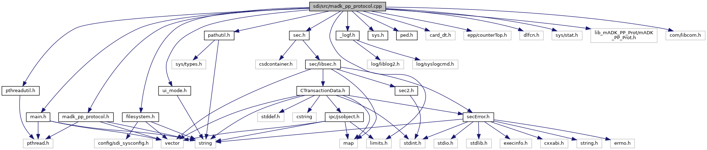

[Data Structures](#nested-classes) \| [Macros](#define-members) \| [Functions](#func-members)

`#include "`<a href="madk__pp__protocol_8h_source.md">madk_pp_protocol.h</a>`"`
`#include "`<a href="main_8h_source.md">main.h</a>`"`
`#include "`<a href="filesystem_8h_source.md">filesystem.h</a>`"`
`#include "`<a href="pathutil_8h_source.md">pathutil.h</a>`"`
`#include "`<a href="pthreadutil_8h_source.md">pthreadutil.h</a>`"`
`#include "`<a href="ui__mode_8h_source.md">ui_mode.h</a>`"`
`#include "`<a href="__logf_8h_source.md">_logf.h</a>`"`
`#include "`<a href="sys_8h_source.md">sys.h</a>`"`
`#include "`<a href="sec_8h_source.md">sec.h</a>`"`
`#include "`<a href="sdi_2src_2ped_8h_source.md">ped.h</a>`"`
`#include "card_dt.h"`
`#include "epp/counterTop.h"`
`#include <dlfcn.h>`
`#include <sys/stat.h>`
`#include "lib_mADK_PP_Prot/mADK_PP_Prot.h"`

Include dependency graph for madk_pp_protocol.cpp:

|  |  |
|----|----|
| Data Structures |  |
| class   | <a href="class_connection_context.md">ConnectionContext</a> |
| struct   | <a href="structm_a_d_k___p_p___prot___loader.md">mADK_PP_Prot_Loader</a> |

|  |  |
|----|----|
| Macros |  |
| #define  | [PROT_TYPE_VALID](#ab9bafea5a62aef8469d807060b6c26c2)(t)   ((t==\'A\' \|\| t==\'B\' \|\| t==\'C\' \|\| t==\'D\') ? true : false) |

|  |  |
|----|----|
| Functions |  |
| void  | [protocol_status_callback](#a68226f5dfe1781967a021e9de6ea34fe) (const struct ProtStatus \*status, void \*data) |

## MacroDefinition Documentation {#macro-definition-documentation}

## PROT_TYPE_VALID 

#define PROT_TYPE_VALID

## FunctionDocumentation {#function-documentation}

## protocol_status_callback() 

void protocol_status_callback

callback function invoked by SDI protocol to notify SDI about new connection state. The callback function passes the protocol status, same as returned by <a href="classm_a_d_k___p_p___prot.md#ab830518e59100970fe386745510590f5">mADK_PP_Prot::get_status()</a> function. For more details, see description of mADK_PP_Prot_GetStatus() and mADK_PP_Prot_StatusCallback()

**Parameters**

\[in\] **status** pointer to protocol status structure \[in\] **data** application pointer (always NULL, recently unused)
