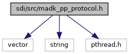
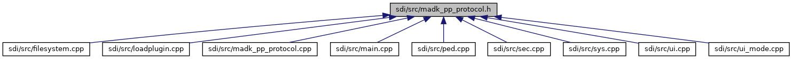

[Data Structures](#nested-classes)

`#include <vector>`
`#include <string>`
`#include <pthread.h>`

Include dependency graph for madk_pp_protocol.h:

This graph shows which files directly or indirectly include this file:

<a href="madk__pp__protocol_8h_source.md">Go to the source code of this file.</a>

|  |  |
|----|----|
| Data Structures |  |
| class   | <a href="classm_a_d_k___p_p___prot.md">mADK_PP_Prot</a> |
| class   | <a href="classm_a_d_k___p_p___prot_busy_lock.md">mADK_PP_ProtBusyLock</a> |
