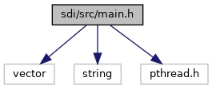
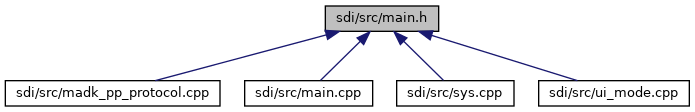

[Functions](#func-members)

`#include <vector>`
`#include <string>`
`#include <pthread.h>`

Include dependency graph for main.h:

This graph shows which files directly or indirectly include this file:

<a href="main_8h_source.md">Go to the source code of this file.</a>

|  |  |
|----|----|
| Functions |  |
| void  | [dispatch](#afdcd133c96d68afb81d874f88786367e) (std::vector\< unsigned char \> &cmd) |
| bool  | [process_side_command](#a4892e1b795462119ef4d6fa87c860b90) (unsigned char \*cmd, unsigned size) |
| unsigned short  | [check_mac_decrypt](#ab39e67ca68823580152fc861898a77da) (unsigned char \*cmd, unsigned &cmdSize, std::vector\< unsigned char \> &out) |
| void  | [pm_setCriticalSection](#a11c5a1b173cf19d42db73a73a1ad6d90) (bool enable) |
| bool  | [pm_criticalSection](#a2640a9e85a15b5c3a3e800e532939c67) () |
| void  | [sdi_exit](#aeeb65deaf7e0b30961e4cb56c8105b41) (int status) |

## FunctionDocumentation {#function-documentation}

## check_mac_decrypt() 

unsigned short check_mac_decrypt

The function is invoked by SDI connection thread (such as invoking <a href="classm_a_d_k___p_p___prot.md#ab390ac45aaaa013d33bcef40d625f142">mADK_PP_Prot::set_command()</a>) to check for an incomming SDI command, if security options in P1 field were enabled. In case with bit 0x40 set: The function calculates the MAC from incomming command and checks if it equals with MAC appended to command. After successful MAC check, the MAC is removed from command tail and not returned in output vector *out*. IN case with bit 0x80 set: The function decrypts the command and provides the plain text command data in output vector *out*. Both option bits can be combined.

**Parameters**

\[in\] **cmd** pointer to origin incomming command buffer, which might be encrypted or appended with a MAC. Pointer cmd is allowed to point to &out\[0\], but please note that out.size() must be at least cmdSize in this case. \[in,out\] **cmdSize** in: size of the incomming command, cmdSize (size of buffer cmd) must be at least 4 bytes! out: size of valid data returned in output vector out. Note: The real command size is always provided with cmdSize (out.size() might be creater!) \[in,out\] **out** decrypted data, always without MAC For incomming vector with out.size() \> 0, this size is least kept. This is to keep pre-allocated command vector for dispatch(), which uses this function.

### Returns

error code 0x9000 if all operations were successful or no security options enabled, else another error code is returned, e.g. 0x6FB9 (decryption error)


Invocation of [check_mac_decrypt()](#ab39e67ca68823580152fc861898a77da) was moved to <a href="classm_a_d_k___p_p___prot.md#ab390ac45aaaa013d33bcef40d625f142">mADK_PP_Prot::set_command()</a>, otherwise [dispatch()](#afdcd133c96d68afb81d874f88786367e) would to it a second time after [process_side_command()](#a4892e1b795462119ef4d6fa87c860b90), when using protocol type D. See also add_mac_encrypt(), which is invoked by [dispatch()](#afdcd133c96d68afb81d874f88786367e) and [process_side_command()](#a4892e1b795462119ef4d6fa87c860b90) to handle secure responses.


## dispatch() 

void dispatch

Function to process a command with the SDI main thread synchronously. The function provides the full SDI function scope (e.g. including payment support with ADKEMV, ADKNFC and ADKMSR). Most subfunctions invoked by [dispatch()](#afdcd133c96d68afb81d874f88786367e) are CPU bound or might block, e.g. to wait for user input with UI, thus, the are processed by the a working thread, the SDI main thread. Function [dispatch()](#afdcd133c96d68afb81d874f88786367e) cannot be invoked by multiple threads simultanously. A second thread invoking it at the same time is blocked by a mutex, which will lead to delayed processing consequently (as long as the previous thread hasn\'t finshed processing) or finally to a processing timeout. Since the used mutex allowes recursive locking with the same thread, it is possible to use [dispatch()](#afdcd133c96d68afb81d874f88786367e) for processing a nested command from within an active SDI callback, if this was invoked by the SDI main thread. Other sibling threads (created by the SDI main thread) will only be able the invoke [dispatch()](#afdcd133c96d68afb81d874f88786367e), if the SDI main thread has unlocked the mutex previously (e.g. as implemented for command Card Detection 23-01).


SDI connection threads (such as invoking <a href="classm_a_d_k___p_p___prot.md#ab390ac45aaaa013d33bcef40d625f142">mADK_PP_Prot::set_command()</a>) must never invoke function [dispatch()](#afdcd133c96d68afb81d874f88786367e), since these threads are fully decoupled from SDI main thread and must use [process_side_command()](#a4892e1b795462119ef4d6fa87c860b90) instead. Even SDI allows using [dispatch()](#afdcd133c96d68afb81d874f88786367e) for asynchronous commands with protocol type \'D\' over the main connection, the related connection thread stores the command into command buffer, so that the main thread (calling <a href="classm_a_d_k___p_p___prot.md#ab2e55bafa77bcbdbeda4258ecadd5357">mADK_PP_Prot::receive()</a> in idle loop) can take ownership to process the command synchronously. Thus, a second simultaneous protocol type \'D\' command on the main connection is declined with a busy response 640A, while the previous command is already processed by the main thread.
 **Parameters**

**cmd** vector as buffer storing the command to be processed

## pm_criticalSection() 

bool pm_criticalSection

check if SDI has entered critical PM section with [pm_setCriticalSection()](#a11c5a1b173cf19d42db73a73a1ad6d90).

### Returns

true if SDI has entered critical PM section, else false.

## pm_setCriticalSection() 

void pm_setCriticalSection

Enter/leave critical section of power management (PM). If true is passed for parameter *enable*, it invokes <a href="namespacevfisyspm.md#ac46060410ba78b557470d51eb9c90feb">sys_CriticalSectionEnter()</a>, in case of false <a href="namespacevfisyspm.md#a1fe354c573d66613fbae37897509cf04">sys_CriticalSectionExit()</a> is called. For more details please refer to documentation of ADKPM.

**Parameters**

\[in\] **enable** true to enter critical PM section false to leave critical PM section

## process_side_command() 

bool process_side_command

Function to process a command as a side command, which was triggered by a side connection with protocol type \'C\' asynchronously or by an asynchronous command with protocol type \'D\'. The function is invoked by SDI connection thread (such as invoking <a href="classm_a_d_k___p_p___prot.md#ab390ac45aaaa013d33bcef40d625f142">mADK_PP_Prot::set_command()</a>), thus, these threads are fully decoupled from SDI main thread processing (see function [dispatch()](#afdcd133c96d68afb81d874f88786367e)). Subfunctions invoked by [process_side_command()](#a4892e1b795462119ef4d6fa87c860b90) are invoked simultaneously, thus, they must be implemented thread-safe!!! If the command is not supported to be executed as a side command, the function returns false, which means that the command requires execution of [dispatch()](#afdcd133c96d68afb81d874f88786367e) with the SDI main thread. Side commands just have restricted access to SDI function scope and do not support intermediate messages like requests (callbacks) or aborts, they just use internal function <a href="classm_a_d_k___p_p___prot.md#a1f13b08d59a38adeb5d755179befa6b8">mADK_PP_Prot::send()</a> to reply the command. Therefore, side commands are usually short-term in nature.


This function is not allowed to use protocol function like <a href="classm_a_d_k___p_p___prot.md#ab2e55bafa77bcbdbeda4258ecadd5357">mADK_PP_Prot::receive()</a>, <a href="classm_a_d_k___p_p___prot.md#a345e47376ab38e76aa77b2bd774b104d">mADK_PP_Prot::command()</a>, <a href="classm_a_d_k___p_p___prot.md#a1630f914c3dbf9ebc62ad6a5c7f9ebd9">mADK_PP_Prot::request()</a> or <a href="classm_a_d_k___p_p___prot.md#a0bb666307a7aa15fc7aae63d454e4394">mADK_PP_Prot::recv_response()</a>. These APIs are only allowed for SDI application threads (main thread and siblings), which process commands received on the main connection (see function [dispatch()](#afdcd133c96d68afb81d874f88786367e)).
 **Parameters**

\[in\] **cmd** pointer to command buffer \[in\] **size** size of command buffer

### Returns

true if command was executed and rsp contains a response, false in case invocation is not allowed by a side command and requires execution of [dispatch()](#afdcd133c96d68afb81d874f88786367e) with the SDI main thread.

## sdi_exit() 

void sdi_exit

depending on platform SDI must call exit() or \_exit(). This function ensures to use the correct variant, therefore, it shall be used instead of using functions of stdlib directly.

**Parameters**

\[in\] **status** exit code of SDI
