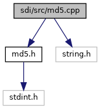

[Namespaces](#namespaces) \| [Macros](#define-members) \| [Functions](#func-members)

`#include "`<a href="md5_8h_source.md">md5.h</a>`"`
`#include <string.h>`

Include dependency graph for md5.cpp:

|            |                                            |
|------------|--------------------------------------------|
| Namespaces |                                            |
|            | <a href="namespacesdi.md">sdi</a> |

|  |  |
|----|----|
| Macros |  |
| #define  | [S11](#a51398c0e5541164ad4d6615880073305)   7 |
| #define  | [S12](#a1ec499cd0e54ecc28c2ac2afea5b038e)   12 |
| #define  | [S13](#aaeec90429105fb54d853dd4fc7027a54)   17 |
| #define  | [S14](#a78342b0ccde2ed12fdf19a113cc266cf)   22 |
| #define  | [S21](#ab6d5354f647a0e7592a1f051fc8377b2)   5 |
| #define  | [S22](#addad30455da936bc1879ee9c72b46d59)   9 |
| #define  | [S23](#a6321a8b29628936f76e9e78cf5bda95f)   14 |
| #define  | [S24](#a0c09eb77d30a0d5f9154914147b86c20)   20 |
| #define  | [S31](#aef26590f8a880ee6f4a158168defcd89)   4 |
| #define  | [S32](#a1d512424dd8a91e0a5bcc98563f33914)   11 |
| #define  | [S33](#a1c854214533f6220e859b0063196abb3)   16 |
| #define  | [S34](#af6472be1d535970afee8e5266a74aa07)   23 |
| #define  | [S41](#ab674ba129e588da55d1d494e1cf3c15e)   6 |
| #define  | [S42](#a268ef1a49114a94b931cc6b313e3cd1b)   10 |
| #define  | [S43](#a5aaa7121f39650d472746942ca68f959)   15 |
| #define  | [S44](#a6a3989af72b55d169bd73a66f8620aae)   21 |
| #define  | [F](#a96d73bbd7af15cb1fc38c3f4a3bd82e9)(x, y, z)   (((x) & (y)) \| ((\~x) & (z))) |
| #define  | [G](#ad96b7cf3182ce2ba85e5a7a93b12c441)(x, y, z)   (((x) & (z)) \| ((y) & (\~z))) |
| #define  | [H](#ae42219072d798876e6b08e6b78614ff6)(x, y, z)   ((x) \^ (y) \^ (z)) |
| #define  | [I](#ac0eafdc9ee161b71e7af98af736952fd)(x, y, z)   ((y) \^ ((x) \| (\~z))) |
| #define  | [ROTATE_LEFT](#a7417fd4e875360c0533fa5b412cdab49)(x, n)   (((x)\<\<(n)) \| ((x)\>\>(32-(n)))) |
| #define  | [FF](#a0a143972cb6c4fe16f0ffa8a3d41ebf3)(a, b, c, d, x, s, ac)   { (a)+=[F](#a96d73bbd7af15cb1fc38c3f4a3bd82e9)((b),(c),(d))+(x)+(uint32_t)(ac); (a)=[ROTATE_LEFT](#a7417fd4e875360c0533fa5b412cdab49)((a),(s)); (a)+=(b); } |
| #define  | [GG](#a685f32faa2a66e743850b990a13b8bfa)(a, b, c, d, x, s, ac)   { (a)+=[G](#ad96b7cf3182ce2ba85e5a7a93b12c441)((b),(c),(d))+(x)+(uint32_t)(ac); (a)=[ROTATE_LEFT](#a7417fd4e875360c0533fa5b412cdab49)((a),(s)); (a)+=(b); } |
| #define  | [HH](#a8b9f1c4778df01ef970b87dbe5541dc5)(a, b, c, d, x, s, ac)   { (a)+=[H](#ae42219072d798876e6b08e6b78614ff6)((b),(c),(d))+(x)+(uint32_t)(ac); (a)=[ROTATE_LEFT](#a7417fd4e875360c0533fa5b412cdab49)((a),(s)); (a)+=(b); } |
| #define  | [II](#ad26626e5efb37b2dadef4e88e35e4329)(a, b, c, d, x, s, ac)   { (a)+=[I](#ac0eafdc9ee161b71e7af98af736952fd)((b),(c),(d))+(x)+(uint32_t)(ac); (a)=[ROTATE_LEFT](#a7417fd4e875360c0533fa5b412cdab49)((a),(s)); (a)+=(b); } |

|  |  |
|----|----|
| Functions |  |
| void  | <a href="namespacesdi.md#a08e47999152d737f33fda2b8729c4f7c">MD5Init</a> (MD5_CTX \*context) |
| void  | <a href="namespacesdi.md#a82247df9248c50d1c25809174a84dddd">MD5Update</a> (MD5_CTX \*context, const unsigned char \*input, unsigned int inputLen) |
| void  | <a href="namespacesdi.md#a9e31b7c8187ca0946de03fde1d9a8e88">MD5Final</a> (unsigned char digest\[16\], MD5_CTX \*context) |

## MacroDefinition Documentation {#macro-definition-documentation}

## F 

#define F

## FF 

#define FF

## G 

#define G

## GG 

#define GG

## H 

#define H

## HH 

#define HH

## I 

#define I

## II 

#define II

## ROTATE_LEFT 

#define ROTATE_LEFT

## S11 

#define S11   7

## S12 

#define S12   12

## S13 

#define S13   17

## S14 

#define S14   22

## S21 

#define S21   5

## S22 

#define S22   9

## S23 

#define S23   14

## S24 

#define S24   20

## S31 

#define S31   4

## S32 

#define S32   11

## S33 

#define S33   16

## S34 

#define S34   23

## S41 

#define S41   6

## S42 

#define S42   10

## S43 

#define S43   15

## S44 

#define S44   21

