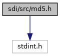
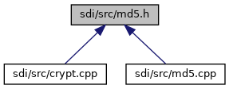

[Data Structures](#nested-classes) \| [Namespaces](#namespaces) \| [Functions](#func-members)

`#include <stdint.h>`

Include dependency graph for md5.h:

This graph shows which files directly or indirectly include this file:

<a href="md5_8h_source.md">Go to the source code of this file.</a>

|  |  |
|----|----|
| Data Structures |  |
| struct   | <a href="namespacesdi.md#structsdi_1_1_m_d5___c_t_x">MD5_CTX</a> |

|            |                                            |
|------------|--------------------------------------------|
| Namespaces |                                            |
|            | <a href="namespacesdi.md">sdi</a> |

|  |  |
|----|----|
| Functions |  |
| void  | <a href="namespacesdi.md#a08e47999152d737f33fda2b8729c4f7c">MD5Init</a> (MD5_CTX \*context) |
| void  | <a href="namespacesdi.md#a82247df9248c50d1c25809174a84dddd">MD5Update</a> (MD5_CTX \*context, const unsigned char \*input, unsigned int inputLen) |
| void  | <a href="namespacesdi.md#a9e31b7c8187ca0946de03fde1d9a8e88">MD5Final</a> (unsigned char digest\[16\], MD5_CTX \*context) |

------------------------------------------------------------------------

## DataStructure Documentation {#data-structure-documentation}

## sdi::MD5_CTX 

struct sdi::MD5_CTX

MD5 context.

| Data Fields |  |  |
|----|----|----|
| unsigned char | buffer\[64\] | 
input buffer
 |
| uint32_t | count\[2\] | 
number of bits, modulo 2\^64 (lsb first)
 |
| uint32_t | state\[4\] | 
state (ABCD)
 |
