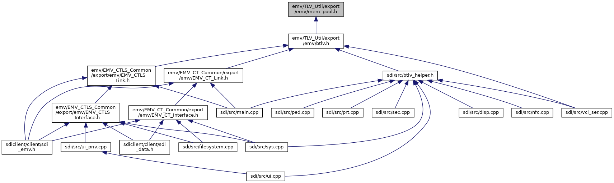
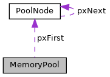

[Data Structures](#nested-classes) \| [Macros](#define-members) \| [Functions](#func-members)

This graph shows which files directly or indirectly include this file:

<a href="mem__pool_8h_source.md">Go to the source code of this file.</a>

|                 |                                            |
|-----------------|--------------------------------------------|
| Data Structures |                                            |
| struct          | [PoolNode](#struct_pool_node)              |
| struct          | [MemoryPool](#struct_memory_pool)          |
| struct          | [MemoryPoolInfo](#struct_memory_pool_info) |

|          |                                                          |
|----------|----------------------------------------------------------|
| Macros   |                                                          |
| #define  | [TLV_UTIL_INTERFACE](#ae809ada9194252356dbaa46410dfbb39) |

|  |  |
|----|----|
| Functions |  |
| [TLV_UTIL_INTERFACE](#ae809ada9194252356dbaa46410dfbb39) void  | [vPoolInit](#a1cf0544df5dadc299bcc60e8e3c3961e) (struct [MemoryPool](#struct_memory_pool) \*pool, void \*mem, unsigned size) |
| [TLV_UTIL_INTERFACE](#ae809ada9194252356dbaa46410dfbb39) void \*  | [pvPoolMalloc](#ad61c1fd291939dc423bfd58a1b455c10) (struct [MemoryPool](#struct_memory_pool) \*pool, unsigned size) |
| [TLV_UTIL_INTERFACE](#ae809ada9194252356dbaa46410dfbb39) void \*  | [pvPoolRealloc](#a9ff3d2a2c810e692ad344650ced21427) (struct [MemoryPool](#struct_memory_pool) \*pool, void \*memory, unsigned newsize) |
| [TLV_UTIL_INTERFACE](#ae809ada9194252356dbaa46410dfbb39) void  | [vPoolFree](#afbd27e75ab44ed7dfd909c64756dc869) (struct [MemoryPool](#struct_memory_pool) \*pool, void \*memory) |
| [TLV_UTIL_INTERFACE](#ae809ada9194252356dbaa46410dfbb39) void  | [vPoolFreeAll](#aa1871b4604a6614f379abb30e1613f47) (struct [MemoryPool](#struct_memory_pool) \*pool) |
| [TLV_UTIL_INTERFACE](#ae809ada9194252356dbaa46410dfbb39) void  | [vPoolInfo](#a468509547e43de5621df45470c15d70a) (struct [MemoryPool](#struct_memory_pool) \*pool, struct [MemoryPoolInfo](#struct_memory_pool_info) \*info) |

------------------------------------------------------------------------

## DataStructure Documentation {#data-structure-documentation}

## PoolNode 

struct PoolNode

structure for managing free chunks of memory

### Date

4.12.2006

### Author

M. Meixner

Collaboration diagram for PoolNode:

\[<a href="graph_legend.md">legend</a>\]

| Data Fields |  |  |
|----|----|----|
| struct [PoolNode](#struct_pool_node) \* | pxNext | 
pointer to next free memory chunk
 |
| unsigned | uSize | 
size of this [PoolNode](#struct_pool_node) i.e. this free memory
 |

## MemoryPool 

struct MemoryPool

Memory pool structure.

The memory pool allows to allocate/free memory from a given region of memory. Using such a pool has some interesting properties:

- By releasing the memory of the pool itself all allocations that have been made from the pool are released.
- The allocatable size is limited to the size of the pool.
- Memory fragmentation is limited to the pool.

### Seealso {#see-also}

[vPoolInit()](#a1cf0544df5dadc299bcc60e8e3c3961e), [pvPoolMalloc()](#ad61c1fd291939dc423bfd58a1b455c10),[pvPoolRealloc()](#a9ff3d2a2c810e692ad344650ced21427),[vPoolFree()](#afbd27e75ab44ed7dfd909c64756dc869)

### Date

4.12.2006

### Author

M. Meixner

Collaboration diagram for MemoryPool:

\[<a href="graph_legend.md">legend</a>\]

| Data Fields |  |  |
|----|----|----|
| void \* | pvEnd | 
end of the managed memory region (first addres past the end)
 |
| void \* | pvStart | 
start of the managed memory region
 |
| struct [PoolNode](#struct_pool_node) \* | pxFirst | 
pointer to the first free memory chunk
 |

## MemoryPoolInfo 

struct MemoryPoolInfo

statistics information of free memory

### Date

8.2.2007

### Author

M. Meixner

| Data Fields |  |  |
|----|----|----|
| unsigned | uFree | 
number of free bytes in the pool
 |
| unsigned | uLargest | 
size of the largest segment in the memory pool
 |
| unsigned | uSegments | 
number of segments of free memory
 |

## MacroDefinition Documentation {#macro-definition-documentation}

## TLV_UTIL_INTERFACE 

#define TLV_UTIL_INTERFACE

## FunctionDocumentation {#function-documentation}

## pvPoolMalloc() 

[TLV_UTIL_INTERFACE](#ae809ada9194252356dbaa46410dfbb39) void\* pvPoolMalloc

## pvPoolRealloc() 

[TLV_UTIL_INTERFACE](#ae809ada9194252356dbaa46410dfbb39) void\* pvPoolRealloc

## vPoolFree() 

[TLV_UTIL_INTERFACE](#ae809ada9194252356dbaa46410dfbb39) void vPoolFree

## vPoolFreeAll() 

[TLV_UTIL_INTERFACE](#ae809ada9194252356dbaa46410dfbb39) void vPoolFreeAll

## vPoolInfo() 

[TLV_UTIL_INTERFACE](#ae809ada9194252356dbaa46410dfbb39) void vPoolInfo

## vPoolInit() 

[TLV_UTIL_INTERFACE](#ae809ada9194252356dbaa46410dfbb39) void vPoolInit

