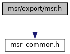
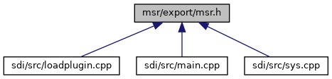

[Typedefs](#typedef-members) \| [Functions](#func-members)

`#include "`<a href="msr__common_8h_source.md">msr_common.h</a>`"`

Include dependency graph for msr.h:

This graph shows which files directly or indirectly include this file:

<a href="msr_8h_source.md">Go to the source code of this file.</a>

|  |  |
|----|----|
| Typedefs |  |
| typedef void(\*  | [MSR_Callback](#a612917ffe22ec9bedebfad13038d28fd)) (void \*data) |

|  |  |
|----|----|
| Functions |  |
| int  | [MSR_SetOptions](#ac3c6f568aa57690a8b369936fc362c2a) (unsigned char \*options, unsigned char options_len) |
| int  | [MSR_Activate](#a1e92fd29720fecbf50da24a30c7b512f) ([MSR_Callback](#a612917ffe22ec9bedebfad13038d28fd) cbf, void \*cb_data) |
| int  | [MSR_Deactivate](#aac28b2c3771f8221fc26a35f0fd6d0f8) (void) |
| int  | [MSR_DataAvailable](#a8096fa193f035eb4b80673260d720477) (void) |
| int  | [MSR_GetData](#ad00fdde838f486d43be689650ab58d43) (int timeout_msec, <a href="msr__common_8h.md#struct_m_s_r___track_data">MSR_TrackData</a> \*tracks, <a href="msr__common_8h.md#struct_m_s_r___decoded_data">MSR_DecodedData</a> \*data) |
| int  | [MSR_GetData2](#a1bf2f70013c79b94a09b3504607a0667) (int timeout_msec, <a href="msr__common_8h.md#struct_m_s_r___track_data2">MSR_TrackData2</a> \*tracks, <a href="msr__common_8h.md#struct_m_s_r___decoded_data">MSR_DecodedData</a> \*data) |
| int  | [MSR_GetData3](#ab2415e817a7d2a1189897757485ff660) (int timeout_msec, <a href="msr__common_8h.md#struct_m_s_r___track_data3">MSR_TrackData3</a> \*tracks, <a href="msr__common_8h.md#struct_m_s_r___decoded_data">MSR_DecodedData</a> \*data) |
| int  | [MSR_GetData4](#a7436a0f6d88d3eb717c10025325b47e8) (int timeout_msec, <a href="msr__common_8h.md#struct_m_s_r___track_data4">MSR_TrackData4</a> \*tracks, <a href="msr__common_8h.md#struct_m_s_r___decoded_data4">MSR_DecodedData4</a> \*data) |
| void  | [MSR_AbortGetData](#a70fedc4ea5687982f39102e2738d8ef5) (void) |
| int  | [MSR_SwitchLeds](#abca7e8953c8430d80f51c867c7699fa6) (int led1, int led2, int led3, int duration) |

## DetailedDescription {#detailed-description}

Interface definitions for libmsr. This file defines the API for the magnetic card reader library.

### Author

Thomas Buening, GSS

Interface definitions for libmsr - part which is common for direct linking and client/server. This file defines the API for the magnetic card reader library.

### Author

Dirk Germann, GSS

## TypedefDocumentation {#typedef-documentation}

## MSR_Callback 

typedef void(\* MSR_Callback) (void \*data)

Type of function that is called after magnetic card has been swiped, see [MSR_Activate()](#a1e92fd29720fecbf50da24a30c7b512f).

**Parameters**

\[in\] **data** : Data pointer provided by the application.

## FunctionDocumentation {#function-documentation}

## MSR_AbortGetData() 

void MSR_AbortGetData

Abort blocking function [MSR_GetData()](#ad00fdde838f486d43be689650ab58d43). If [MSR_GetData()](#ad00fdde838f486d43be689650ab58d43) is waiting for a card swipe, the blocking function can be aborted by invoking this function from another thread. If [MSR_GetData()](#ad00fdde838f486d43be689650ab58d43) wasn\'t invoked, this function does nothing.

## MSR_Activate() 

int MSR_Activate

Activate magnetic card reader interface. After successful execution of this function every swiped card is read and its data is stored internally. Upon storing card data any previously stored data is erased, so only the data of the last swiped card remains available. To obtain the stored data, call [MSR_GetData()](#ad00fdde838f486d43be689650ab58d43). After doing so, the stored data is erased as well, so that card data can only be obtained once.

**Parameters**

\[in\] **cbf** : Callback function that is called every time a card has been swiped, may be NULL. Within the callback function card data can be obtained by MSR_GetData(). \[in\] **cb_data** : Data pointer that is passed on to the callback function cbf, may be NULL.

### Returns

\[unsupported block\]

## MSR_DataAvailable() 

int MSR_DataAvailable

Check if magnetic card has been swiped and its data is stored. After obtaining the stored data with [MSR_GetData()](#ad00fdde838f486d43be689650ab58d43) or deactivating the card reader interface with [MSR_Deactivate()](#aac28b2c3771f8221fc26a35f0fd6d0f8) the stored data is erased and not available any longer.

### Returns

\[unsupported block\]

## MSR_Deactivate() 

int MSR_Deactivate

Deactivate magnetic card reader interface. After deactivating the card reader interface no more swiped cards are read and no data is stored. Any previously stored card data will be erased.


Calling this function is mandatory at the end of each transaction. Otherwise the internal thread is not correctly ended and resource leaks are remain.


### Returns

\[unsupported block\]

## MSR_GetData() 

int MSR_GetData

Obtain magnetic card data. With this function the internally stored card data can be obtained. In doing so, the internally stored data is erased, so that data of each card swipe can only be obtained once. If no card data is stored at the moment, the function waits for a specified time for a card swipe. If a timeout is supplied, the function is blocking and can be aborted by [MSR_AbortGetData()](#a70fedc4ea5687982f39102e2738d8ef5). If a callback function is supplied to [MSR_Activate()](#a1e92fd29720fecbf50da24a30c7b512f), setting a timeout != 0 is not allowed. [MSR_GetData()](#ad00fdde838f486d43be689650ab58d43) can be called from within a callback function supplied to [MSR_Activate()](#a1e92fd29720fecbf50da24a30c7b512f) but there\'s no need to do so.
Remark: In case the terminal has two magnetic heads the data from the first head is populated. If there is no data from first head the data from the second head is returned. If you need data from both heads you shall use [MSR_GetData4()](#a7436a0f6d88d3eb717c10025325b47e8).


To clear the internal resources a succeeding call to [MSR_Deactivate()](#aac28b2c3771f8221fc26a35f0fd6d0f8) is mandatory.
 **Parameters**

\[in\] **timeout_msec** : Time (in milliseconds, \< 0 : infinite) to wait for a card swipe if no card data has been stored previously. \[out\] **tracks** : Track data, may be NULL. \[out\] **data** : Decoded track data, may be NULL.

### Returns

\[unsupported block\]

## MSR_GetData2() 

int MSR_GetData2

Obtain magnetic card data including card type. This is the same as [MSR_GetData()](#ad00fdde838f486d43be689650ab58d43) but additionally offers <a href="group___m_s_r___c_a_r_d___c_o_d_e_s.md">Card Type Code</a>. With this function the internally stored card data can be obtained. In doing so, the internally stored data is erased, so that data of each card swipe can only be obtained once. If no card data is stored at the moment, the function waits for a specified time for a card swipe. If a timeout is supplied, the function is blocking and can be aborted by [MSR_AbortGetData()](#a70fedc4ea5687982f39102e2738d8ef5). If a callback function is supplied to [MSR_Activate()](#a1e92fd29720fecbf50da24a30c7b512f), setting a timeout != 0 is not allowed. [MSR_GetData2()](#a1bf2f70013c79b94a09b3504607a0667) can be called from within a callback function supplied to [MSR_Activate()](#a1e92fd29720fecbf50da24a30c7b512f) but there\'s no need to do so.


To clear the internal resources a succeeding call to [MSR_Deactivate()](#aac28b2c3771f8221fc26a35f0fd6d0f8) is mandatory.
 **Parameters**

\[in\] **timeout_msec** : Time (in milliseconds, \< 0 : infinite) to wait for a card swipe if no card data has been stored previously. \[out\] **tracks** : Track data, may be NULL. \[out\] **data** : Decoded track data, may be NULL.

### Returns

\[unsupported block\]

## MSR_GetData3() 

int MSR_GetData3

Obtain magnetic card data including additional information. This is the same as [MSR_GetData()](#ad00fdde838f486d43be689650ab58d43) but additionally offers <a href="group___m_s_r___c_a_r_d___c_o_d_e_s.md">Card Type Code</a> and <a href="group___m_s_r___t_r_a_c_k___t_y_p_e_s.md">Track Type Code</a>. With this function the internally stored card data can be obtained. In doing so, the internally stored data is erased, so that data of each card swipe can only be obtained once. If no card data is stored at the moment, the function waits for a specified time for a card swipe. If a timeout is supplied, the function is blocking and can be aborted by [MSR_AbortGetData()](#a70fedc4ea5687982f39102e2738d8ef5). If a callback function is supplied to [MSR_Activate()](#a1e92fd29720fecbf50da24a30c7b512f), setting a timeout != 0 is not allowed. [MSR_GetData3()](#ab2415e817a7d2a1189897757485ff660) can be called from within a callback function supplied to [MSR_Activate()](#a1e92fd29720fecbf50da24a30c7b512f) but there\'s no need to do so.


To clear the internal resources a succeeding call to [MSR_Deactivate()](#aac28b2c3771f8221fc26a35f0fd6d0f8) is mandatory.
 **Parameters**

\[in\] **timeout_msec** : Time (in milliseconds, \< 0 : infinite) to wait for a card swipe if no card data has been stored previously. \[out\] **tracks** : Track data, may be NULL. \[out\] **data** : Decoded track data, may be NULL.

### Returns

\[unsupported block\]

## MSR_GetData4() 

int MSR_GetData4

Obtain magnetic card data including additional information. This is the same as [MSR_GetData()](#ad00fdde838f486d43be689650ab58d43) but additionally offers <a href="group___m_s_r___c_a_r_d___c_o_d_e_s.md">Card Type Code</a>, <a href="group___m_s_r___t_r_a_c_k___t_y_p_e_s.md">Track Type Code</a> and second magstripe data (if present). With this function the internally stored card data can be obtained. In doing so, the internally stored data is erased, so that data of each card swipe can only be obtained once. If no card data is stored at the moment, the function waits for a specified time for a card swipe. If a timeout is supplied, the function is blocking and can be aborted by [MSR_AbortGetData()](#a70fedc4ea5687982f39102e2738d8ef5). If a callback function is supplied to [MSR_Activate()](#a1e92fd29720fecbf50da24a30c7b512f), setting a timeout != 0 is not allowed. [MSR_GetData4()](#a7436a0f6d88d3eb717c10025325b47e8) can be called from within a callback function supplied to [MSR_Activate()](#a1e92fd29720fecbf50da24a30c7b512f) but there\'s no need to do so.


To clear the internal resources a succeeding call to [MSR_Deactivate()](#aac28b2c3771f8221fc26a35f0fd6d0f8) is mandatory.
 **Parameters**

\[in\] **timeout_msec** : Time (in milliseconds, \< 0 : infinite) to wait for a card swipe if no card data has been stored previously. \[out\] **tracks** : Track data, may be NULL. \[out\] **data** : Decoded track data, may be NULL.

### Returns

\[unsupported block\]

## MSR_SetOptions() 

int MSR_SetOptions

This function has to be called while MSR is *deactivated*. [MSR_Activate()](#a1e92fd29720fecbf50da24a30c7b512f) / [MSR_Deactivate()](#aac28b2c3771f8221fc26a35f0fd6d0f8) do not discard the options previously set, so setting the options once at terminal start is sufficient.
Note: Options not overwritten by options_len remain unchanged.

**Parameters**

\[in\] **options** : data pointer, \[0\]-\[2\] Options bitmask, \[3\] sensitivity (for Samsung MST usage, values 0-100) \[in\] **options_len** : length of options

### Returns

\[unsupported block\]

## MSR_SwitchLeds() 

int MSR_SwitchLeds

Set state of MSR LEDs.

**Parameters**

\[in\] **led1** : state of LED 1 (top), see LED states. \[in\] **led2** : state of LED 2 (mid), see LED states \[in\] **led3** : state of LED 3 (bottom), see LED states \[in\] **duration** : if \> 0: all LEDs are switched off after this time (in seconds).

### Returns

\[unsupported block\]
