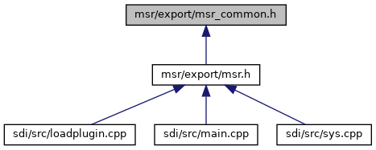
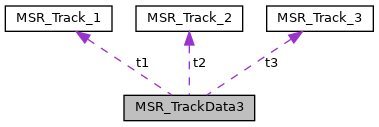
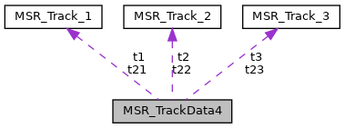
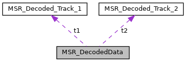
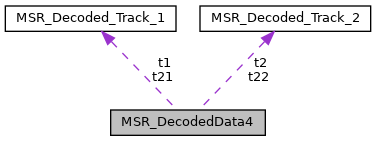

[Data Structures](#nested-classes) \| [Macros](#define-members) \| [Typedefs](#typedef-members) \| [Functions](#func-members)

This graph shows which files directly or indirectly include this file:

<a href="msr__common_8h_source.md">Go to the source code of this file.</a>

|                 |                                                           |
|-----------------|-----------------------------------------------------------|
| Data Structures |                                                           |
| struct          | [MSR_Track_1](#struct_m_s_r___track__1)                   |
| struct          | [MSR_Track_2](#struct_m_s_r___track__2)                   |
| struct          | [MSR_Track_3](#struct_m_s_r___track__3)                   |
| struct          | [MSR_TrackData](#struct_m_s_r___track_data)               |
| struct          | [MSR_TrackData2](#struct_m_s_r___track_data2)             |
| struct          | [MSR_TrackData3](#struct_m_s_r___track_data3)             |
| struct          | [MSR_TrackData4](#struct_m_s_r___track_data4)             |
| struct          | [MSR_Decoded_Track_1](#struct_m_s_r___decoded___track__1) |
| struct          | [MSR_Decoded_Track_2](#struct_m_s_r___decoded___track__2) |
| struct          | [MSR_DecodedData](#struct_m_s_r___decoded_data)           |
| struct          | [MSR_DecodedData4](#struct_m_s_r___decoded_data4)         |

|  |  |
|----|----|
| Macros |  |
| #define  | <a href="group___m_s_r___e_r_r_o_r___c_o_d_e_s.md#ga56ff5f02000b1dcc767ffeea8f6478a7">MSR_OK</a>   0 |
| #define  | <a href="group___m_s_r___e_r_r_o_r___c_o_d_e_s.md#ga2754c1ade01b6307220538b6bb3f885a">MSR_ERROR</a>   -1 |
| #define  | <a href="group___m_s_r___e_r_r_o_r___c_o_d_e_s.md#ga7748ace924420e05ea909b2944de3ba5">MSR_TIMEOUT</a>   -2 |
| #define  | <a href="group___m_s_r___e_r_r_o_r___c_o_d_e_s.md#ga82fd0492568ada8925a66121a6f03935">MSR_ABORTED</a>   -3 |
| #define  | <a href="group___m_s_r___e_r_r_o_r___c_o_d_e_s.md#ga1c81c696181e8a6201fd677a7b65252a">MSR_ACTIVE</a>   -4 |
| #define  | <a href="group___m_s_r___e_r_r_o_r___c_o_d_e_s.md#gade0e4ea4922a01a559e73f5c3d0e4f03">MSR_PARAM</a>   -5 |
| #define  | <a href="group___m_s_r___e_r_r_o_r___c_o_d_e_s.md#ga2af4877ec63b78f5c2a85d77813bc056">MSR_PROCESS</a>   -6 |
| #define  | <a href="group___m_s_r___e_r_r_o_r___c_o_d_e_s.md#gac5b787f430958b4aa763512e00a8a2d0">MSR_NO_DEVICE</a>   -7 |
| #define  | <a href="group___m_s_r___s_t_a_t_u_s___c_o_d_e_s.md#ga791110bd9543183bccb3576c41575938">MSR_STATUS_NOERR</a>   0 |
| #define  | <a href="group___m_s_r___s_t_a_t_u_s___c_o_d_e_s.md#ga78f00eb4a34fb6966520570d235bd36a">MSR_STATUS_NODATA</a>   1 |
| #define  | <a href="group___m_s_r___s_t_a_t_u_s___c_o_d_e_s.md#ga5da86efc698957f2c01ffb169c9d1102">MSR_STATUS_NOSTX</a>   2 |
| #define  | <a href="group___m_s_r___s_t_a_t_u_s___c_o_d_e_s.md#ga759e75448ce4d6b1560c5b65e2d19f65">MSR_STATUS_NOETX</a>   3 |
| #define  | <a href="group___m_s_r___s_t_a_t_u_s___c_o_d_e_s.md#gaf431be387ced31744bc6456927ada79c">MSR_STATUS_BADLRC</a>   4 |
| #define  | <a href="group___m_s_r___s_t_a_t_u_s___c_o_d_e_s.md#gaf57d5c094671227287fc967b5750b98a">MSR_STATUS_PARITY</a>   5 |
| #define  | <a href="group___m_s_r___s_t_a_t_u_s___c_o_d_e_s.md#ga3424e09ced6c7d2a7dae1b44e6308cfe">MSR_STATUS_REVETX</a>   6 |
| #define  | <a href="group___m_s_r___s_t_a_t_u_s___c_o_d_e_s.md#ga0c6116104431a3b7c405427a07142dd1">MSR_STATUS_BADJIS</a>   7 |
| #define  | <a href="group___m_s_r___s_t_a_t_u_s___c_o_d_e_s.md#ga23f94d4756b6a52ea54f9ad22c33cea6">MSR_STATUS_BADTRK</a>   8 |
| #define  | <a href="group___m_s_r___c_a_r_d___c_o_d_e_s.md#ga1f9ee619462acf4e0999965beb6a2825">MSR_TYPE_PHYSICAL</a>   0 |
| #define  | <a href="group___m_s_r___c_a_r_d___c_o_d_e_s.md#gaecc9c77eb4203573d61e90952bbe1d20">MSR_TYPE_SAMSUNG</a>   1 |
| #define  | <a href="group___m_s_r___t_r_a_c_k___t_y_p_e_s.md#ga723f8beb3336381c5ecb8f1ec9bba0f4">MSR_CARD_UNKNOWN</a>   0x00 |
| #define  | <a href="group___m_s_r___t_r_a_c_k___t_y_p_e_s.md#gacd72026476677415eaf482b2fb2e0032">MSR_CARD_ISO</a>   0x01 |
| #define  | <a href="group___m_s_r___t_r_a_c_k___t_y_p_e_s.md#gaf1dad30c2494f4da59022687eb8e9dc1">MSR_CARD_JIS_II</a>   0x02 |
| #define  | <a href="group___m_s_r___t_r_a_c_k___t_y_p_e_s.md#ga6cc72de09ffb5837fe5c292afaccba2e">MSR_CARD_AAMVA</a>   0x04 |
| #define  | <a href="group___m_s_r___t_r_a_c_k___t_y_p_e_s.md#ga73c4fdf1b21740a38b2d3a3bf00d3f00">MSR_CARD_CADLID</a>   0x08 |
| #define  | <a href="group___m_s_r___o_p_t_i_o_n_s___b_i_t_m_a_s_k.md#ga2a413b4af9749ddf671d95422930aa38">MSR_UX_ENHANCEMENTS</a>   0x01 |
|   | options\[0\] Hybrid reader: ignore card insertion <a href="group___m_s_r___o_p_t_i_o_n_s___b_i_t_m_a_s_k.md#ga2a413b4af9749ddf671d95422930aa38">More...</a>  |
| #define  | <a href="group___m_s_r___o_p_t_i_o_n_s___b_i_t_m_a_s_k.md#ga438dcfd6297f14140bc73db42ea4c54e">MSR_SAMSUNG_TRACK1</a>   0x02 |
|   | options\[0\] not used anymore <a href="group___m_s_r___o_p_t_i_o_n_s___b_i_t_m_a_s_k.md#ga438dcfd6297f14140bc73db42ea4c54e">More...</a>  |
| #define  | <a href="group___m_s_r___o_p_t_i_o_n_s___b_i_t_m_a_s_k.md#gaa4d91d314d57eb36a8816606cd4ccc18">MSR_ONE_SWIPE</a>   0x04 |
|   | options\[0\] Only read on first swipe <a href="group___m_s_r___o_p_t_i_o_n_s___b_i_t_m_a_s_k.md#gaa4d91d314d57eb36a8816606cd4ccc18">More...</a>  |
| #define  | <a href="group___m_s_r___o_p_t_i_o_n_s___b_i_t_m_a_s_k.md#ga34c87a41aa36b56652314f471121b53a">MSR_LEDS</a>   0x08 |
|   | options\[0\] Light MSR LEDs while card swipe is possible. <a href="group___m_s_r___o_p_t_i_o_n_s___b_i_t_m_a_s_k.md#ga34c87a41aa36b56652314f471121b53a">More...</a>  |
| #define  | <a href="group___m_s_r___o_p_t_i_o_n_s___b_i_t_m_a_s_k.md#ga57908026ec7d34ab1eab699f5a01bfdc">MSR_ENABLE_LICENSE_DECODE</a>   0x10 |
|   | options\[0\] Enable detection of US driving license <a href="group___m_s_r___o_p_t_i_o_n_s___b_i_t_m_a_s_k.md#ga57908026ec7d34ab1eab699f5a01bfdc">More...</a>  |
| #define  | <a href="group___m_s_r___o_p_t_i_o_n_s___b_i_t_m_a_s_k.md#ga552908ea327761a80fc0557a4f617f97">MSR_DETECT_ISO</a>   0x01 |
|   | options\[1\] Detect ISO cards <a href="group___m_s_r___o_p_t_i_o_n_s___b_i_t_m_a_s_k.md#ga552908ea327761a80fc0557a4f617f97">More...</a>  |
| #define  | <a href="group___m_s_r___o_p_t_i_o_n_s___b_i_t_m_a_s_k.md#ga9f84cf93e845a72a46da5530a2f0fda6">MSR_DETECT_JIS_II</a>   0x02 |
|   | options\[1\] Detect JIS-II cards <a href="group___m_s_r___o_p_t_i_o_n_s___b_i_t_m_a_s_k.md#ga9f84cf93e845a72a46da5530a2f0fda6">More...</a>  |
| #define  | <a href="group___m_s_r___o_p_t_i_o_n_s___b_i_t_m_a_s_k.md#gaa52493f56c3780ac75f5ca4043c3c5fa">MSR_DETECT_ALL</a>   0x03 |
|   | options\[1\] Detect both ISO and JIS-II cards. <a href="group___m_s_r___o_p_t_i_o_n_s___b_i_t_m_a_s_k.md#gaa52493f56c3780ac75f5ca4043c3c5fa">More...</a>  |
| #define  | <a href="group___l_e_d___s_t_a_t_e_s.md#ga732d5b4b7e9dc86936491616790f521c">MSR_LED_OFF</a>   0x0000 |
| #define  | <a href="group___l_e_d___s_t_a_t_e_s.md#gaf154b2af61487136381570a0a65eae95">MSR_LED_WHITE</a>   0x0001 |
| #define  | <a href="group___l_e_d___s_t_a_t_e_s.md#ga9d645bdc79cf473ad1a4cb2c16e0d540">MSR_LED_RED</a>   0x0002 |
| #define  | <a href="group___l_e_d___s_t_a_t_e_s.md#ga2e04bf1f17254549f2b8d591a4ea9474">MSR_LED_GREEN</a>   0x0003 |
| #define  | <a href="group___l_e_d___s_t_a_t_e_s.md#ga02373c78ce2427317ac035d08e1fdc17">MSR_LED_BLUE</a>   0x0004 |
| #define  | <a href="group___l_e_d___s_t_a_t_e_s.md#ga5ed7fb7eb095670a3901df7f3ddebc50">MSR_LED_YELLOW</a>   0x0005 |
| #define  | <a href="group___l_e_d___s_t_a_t_e_s.md#gac0602288caa7d6664024a579091ccaa2">MSR_LED_BLINK</a>   0x0100 |

|  |  |
|----|----|
| Typedefs |  |
| typedef void(\*  | [MSR_TraceCallback](#a812e455c2b03675c3df6148b21a87ae4)) (const char \*str, void \*data) |

|  |  |
|----|----|
| Functions |  |
| void  | [MSR_Version](#a4c82e0afa0ae93bb7a97a03431c202b8) (char \*version, unsigned char len) |
| void  | [MSR_SetTraceCallback](#ac4fab89b234ae87c7da91fb529b833e0) ([MSR_TraceCallback](#a812e455c2b03675c3df6148b21a87ae4) cbf, void \*cb_data) |

------------------------------------------------------------------------

## DataStructure Documentation {#data-structure-documentation}

## MSR_Track_1 

struct MSR_Track_1

Track data of track 1.

| Data Fields |  |  |
|----|----|----|
| char | data\[80\] | 
Track data including start sentinel, end sentinel and LRC, ASCII null-terminated.
 |
| unsigned char | status | 
<a href="group___m_s_r___s_t_a_t_u_s___c_o_d_e_s.md">Status code</a>.
 |

## MSR_Track_2 

struct MSR_Track_2

Track data of track 2.

| Data Fields |  |  |
|----|----|----|
| char | data\[41\] | 
Track data including start sentinel, end sentinel and LRC, ASCII null-terminated.
 |
| unsigned char | status | 
<a href="group___m_s_r___s_t_a_t_u_s___c_o_d_e_s.md">Status code</a>.
 |

## MSR_Track_3 

struct MSR_Track_3

Track data of track 3.

| Data Fields |  |  |
|----|----|----|
| char | data\[108\] | 
Track data, ASCII null-terminated.
 |
| unsigned char | status | 
<a href="group___m_s_r___s_t_a_t_u_s___c_o_d_e_s.md">Status code</a>.
 |

## MSR_TrackData 

struct MSR_TrackData

Track data.

Collaboration diagram for MSR_TrackData:

\[<a href="graph_legend.md">legend</a>\]

| Data Fields |  |  |
|----|----|----|
| [MSR_Track_1](#struct_m_s_r___track__1) | t1 | 
Track data of track 1.
 |
| [MSR_Track_2](#struct_m_s_r___track__2) | t2 | 
Track data of track 2.
 |
| [MSR_Track_3](#struct_m_s_r___track__3) | t3 | 
Track data of track 3.
 |

## MSR_TrackData2 

struct MSR_TrackData2

Track data including card type.

Collaboration diagram for MSR_TrackData2:

\[<a href="graph_legend.md">legend</a>\]

| Data Fields |  |  |
|----|----|----|
| unsigned char | card_type | 
<a href="group___m_s_r___c_a_r_d___c_o_d_e_s.md">Card Type Code</a>.
 |
| [MSR_Track_1](#struct_m_s_r___track__1) | t1 | 
Track data of track 1.
 |
| [MSR_Track_2](#struct_m_s_r___track__2) | t2 | 
Track data of track 2.
 |
| [MSR_Track_3](#struct_m_s_r___track__3) | t3 | 
Track data of track 3.
 |

## MSR_TrackData3 

struct MSR_TrackData3

Track data including additional information.

Collaboration diagram for MSR_TrackData3:

\[<a href="graph_legend.md">legend</a>\]

| Data Fields |  |  |
|----|----|----|
| unsigned char | add_info\[8\] | 
additional information, add_info\[0\]: <a href="group___m_s_r___c_a_r_d___c_o_d_e_s.md">Card Type Code</a>, add_info\[1\]: <a href="group___m_s_r___t_r_a_c_k___t_y_p_e_s.md">Track Type Code</a>, add_info\[2..7\]: RFU.
 |
| [MSR_Track_1](#struct_m_s_r___track__1) | t1 | 
Track data of track 1.
 |
| [MSR_Track_2](#struct_m_s_r___track__2) | t2 | 
Track data of track 2.
 |
| [MSR_Track_3](#struct_m_s_r___track__3) | t3 | 
Track data of track 3.
 |

## MSR_TrackData4 

struct MSR_TrackData4

Track data including additional information.

Collaboration diagram for MSR_TrackData4:

\[<a href="graph_legend.md">legend</a>\]

| Data Fields |  |  |
|----|----|----|
| unsigned char | add_info\[8\] | 
Additional information, add_info\[0\]: <a href="group___m_s_r___c_a_r_d___c_o_d_e_s.md">Card Type Code</a>, add_info\[1\]: <a href="group___m_s_r___t_r_a_c_k___t_y_p_e_s.md">Track Type Code</a>, add_info\[2..7\]: RFU.
 |
| unsigned char | add_info2\[8\] | 
Second magstripe: Additional information, add_info\[0\]: <a href="group___m_s_r___c_a_r_d___c_o_d_e_s.md">Card Type Code</a>, add_info\[1\]: <a href="group___m_s_r___t_r_a_c_k___t_y_p_e_s.md">Track Type Code</a>, add_info\[2..7\]: RFU.
 |
| [MSR_Track_1](#struct_m_s_r___track__1) | t1 | 
Track data of track 1.
 |
| [MSR_Track_2](#struct_m_s_r___track__2) | t2 | 
Track data of track 2.
 |
| [MSR_Track_1](#struct_m_s_r___track__1) | t21 | 
Second magstripe: Track data of track 1.
 |
| [MSR_Track_2](#struct_m_s_r___track__2) | t22 | 
Second magstripe: Track data of track 2.
 |
| [MSR_Track_3](#struct_m_s_r___track__3) | t23 | 
Second magstripe: Track data of track 3.
 |
| [MSR_Track_3](#struct_m_s_r___track__3) | t3 | 
Track data of track 3.
 |

## MSR_Decoded_Track_1 

struct MSR_Decoded_Track_1

Decoded data of track 1.

| Data Fields |  |  |
|----|----|----|
| char | disc_data\[72\] | 
Discretionary data, ASCII null terminated.
 |
| char | exp_date\[5\] | 
Expiry date, YYMM, ASCII null terminated.
 |
| char | name\[27\] | 
Cardholder name, ASCII null-terminated.
 |
| char | pan\[20\] | 
PAN, ASCII null-terminated.
 |
| char | service_code\[4\] | 
Service code, ASCII null terminated.
 |
| unsigned char | valid | 
1: data valid, 0: data invalid.
 |

## MSR_Decoded_Track_2 

struct MSR_Decoded_Track_2

Decoded data of track 2.

| Data Fields |  |  |
|----|----|----|
| char | disc_data\[35\] | 
Discretionary data, ASCII null terminated.
 |
| char | exp_date\[5\] | 
Expiry date, YYMM, ASCII null terminated.
 |
| char | pan\[20\] | 
PAN, ASCII null-terminated.
 |
| char | service_code\[4\] | 
Service code, ASCII null terminated.
 |
| unsigned char | valid | 
1: data valid, 0: data invalid.
 |

## MSR_DecodedData 

struct MSR_DecodedData

Decoded track data.

Collaboration diagram for MSR_DecodedData:

\[<a href="graph_legend.md">legend</a>\]

| Data Fields |  |  |
|----|----|----|
| [MSR_Decoded_Track_1](#struct_m_s_r___decoded___track__1) | t1 | 
Decoded data of track 1.
 |
| [MSR_Decoded_Track_2](#struct_m_s_r___decoded___track__2) | t2 | 
Decoded data of track 2.
 |

## MSR_DecodedData4 

struct MSR_DecodedData4

Decoded track data.

Collaboration diagram for MSR_DecodedData4:

\[<a href="graph_legend.md">legend</a>\]

| Data Fields |  |  |
|----|----|----|
| [MSR_Decoded_Track_1](#struct_m_s_r___decoded___track__1) | t1 | 
Decoded data of track 1.
 |
| [MSR_Decoded_Track_2](#struct_m_s_r___decoded___track__2) | t2 | 
Decoded data of track 2.
 |
| [MSR_Decoded_Track_1](#struct_m_s_r___decoded___track__1) | t21 | 
Second magstripe: Decoded data of track 1.
 |
| [MSR_Decoded_Track_2](#struct_m_s_r___decoded___track__2) | t22 | 
Second magstripe: Decoded data of track 2.
 |

## TypedefDocumentation {#typedef-documentation}

## MSR_TraceCallback 

typedef void(\* MSR_TraceCallback) (const char \*str, void \*data)

Type of function that is called for traces, see [MSR_SetTraceCallback()](#ac4fab89b234ae87c7da91fb529b833e0)

**Parameters**

\[in\] **str** : Trace message. \[in\] **data** : Data pointer provided by the application.

## FunctionDocumentation {#function-documentation}

## MSR_SetTraceCallback() 

void MSR_SetTraceCallback

Set callback function for trace output.

**Parameters**

\[in\] **cbf** : Callback function for trace messages, may be NULL. \[in\] **cb_data** : Data pointer that is passed on to the callback function cbf, may be NULL.

## MSR_Version() 

void MSR_Version

Get version of libmsr.

**Parameters**

\[out\] **version** : Buffer to store null-terminated version string. \[in\] **len** : Size of buffer version.
