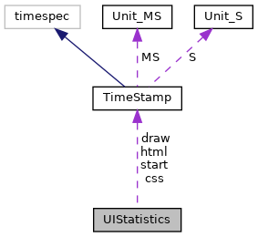

[Data Structures](#nested-classes) \| [Typedefs](#typedef-members) \| [Enumerations](#enum-members) \| [Functions](#func-members)

|  |  |
|----|----|
| Data Structures |  |
| struct   | [UIBacklight](#structvfigui_1_1_u_i_backlight) |
| class   | <a href="classvfigui_1_1_u_i_c_b_data.md">UICBData</a> |
| class   | <a href="classvfigui_1_1_u_i_drawing.md">UIDrawing</a> |
| struct   | <a href="structvfigui_1_1_u_i_error_entry.md">UIErrorEntry</a> |
| struct   | [UIMenuEntry](#structvfigui_1_1_u_i_menu_entry) |
| struct   | [UIRegion](#structvfigui_1_1_u_i_region) |
| struct   | [UIStatistics](#structvfigui_1_1_u_i_statistics) |
| struct   | <a href="structvfigui_1_1_u_i_text_width.md">UITextWidth</a> |

|  |  |
|----|----|
| Typedefs |  |
| typedef bool(\*  | [uiCallback](#a2f8a971ed8de9b7a30c70f4a60cf2da8)) (void \*data) |
| typedef void(\*  | [uiAsyncCallback](#a29ea0490208725e330b8b11f770b51a7)) (void \*data, [UICBType](#a2eee911f81a366ee45341def47875e17) type, <a href="classvfigui_1_1_u_i_c_b_data.md">UICBData</a> &uidata) |
| typedef void(\*  | [uiDisconnectCallback](#ab8ea76e56e5a189126608d0674e79db7)) (int display) |
| typedef void(\*  | [uiEventCallback](#a5ded57d248c0c7c8b719a61284a75453)) (void \*data, [UICanvasEvent](#ab39be9e8cfe25802d65abffda76e2ce9) event, int x, int y, int key, unsigned flags) |

|  |  |
|----|----|
| Enumerations |  |
| enum   | [UICBType](#a2eee911f81a366ee45341def47875e17) {   [UI_CB_RESULT](#a2eee911f81a366ee45341def47875e17ae4ef1e7d1f460d916e4691fe04640996), [UI_CB_UPDATE](#a2eee911f81a366ee45341def47875e17a031dabd30a2d21d9595c12e70e683c4a), [UI_CB_LOAD](#a2eee911f81a366ee45341def47875e17af65a5ab1552709eb0ceb8ecdf8d1861d), [UI_CB_ERROR_LIST](#a2eee911f81a366ee45341def47875e17a7540606b129a913f5eb156021bff676b),   [UI_CB_STATISTICS](#a2eee911f81a366ee45341def47875e17aee7d5e08608d2fab562ed5b3f516060d), [UI_CB_EVENT](#a2eee911f81a366ee45341def47875e17a01c9cdb351c14efc871dcaeb4b5ea816) } |
| enum   | { [UI_REGION_DEFAULT](#a99fb83031ce9923c84392b4e92f956b5ab7c758bc6ba3fd0e57fbb46ee178b43f) =0 } |
| enum   | { [UI_REGION_FLAG_HIDDEN](#abc6126af1d45847bc59afa0aa3216b04aa53740e76041bfa278474eea977aa607) =1 } |
| enum   | [UIPropertyInt](#a0c064fcc5409b0845e11925a55f324bd) {   [UI_PROP_TIMEOUT](#a0c064fcc5409b0845e11925a55f324bdacd0735c01cf5c93d28977026ba79a648) =0, [UI_PROP_PASSWORD_CHAR](#a0c064fcc5409b0845e11925a55f324bdab3831f55519a8d598508668fa914dae1), [UI_PROP_DEFAULT_FONT_SIZE](#a0c064fcc5409b0845e11925a55f324bdaaea38481b8b882ee8d15b3f89169a0f0), [UI_PROP_PIN_AUTO_ENTER](#a0c064fcc5409b0845e11925a55f324bdad99992968807353cde482f423dca5f2c),   [UI_PROP_PIN_CLEAR_ALL](#a0c064fcc5409b0845e11925a55f324bda03bb51eea83f5cb9f2f47f9a6fc6add5), [UI_PROP_PIN_BYPASS_KEY](#a0c064fcc5409b0845e11925a55f324bda4f3d2b9a8136f3a8606e9ba8e66371d4), [UI_PROP_PIN_ALGORITHM](#a0c064fcc5409b0845e11925a55f324bdab97b324cf4cec94f5e8ed7a3f9a307e8), [UI_PROP_PIN_INTERCHAR_TIMEOUT](#a0c064fcc5409b0845e11925a55f324bda6cfddb13f6d62ad6cd856407cdebb06c),   [UI_PROP_PASSWORD_SHOW_CHAR](#a0c064fcc5409b0845e11925a55f324bdab1b06ca821561df58a2ed70f9a0ccc92), [UI_PROP_KEEP_DISPLAY](#a0c064fcc5409b0845e11925a55f324bdabd05f80f71c25bfbb4418fc079a1a150), [UI_PROP_UPDATE_EVENTS](#a0c064fcc5409b0845e11925a55f324bdafe44d8907b3bc0533078ce9715273388), [UI_PROP_CIRCULAR_MENU](#a0c064fcc5409b0845e11925a55f324bdaf9c20f0de4be24280c450e8e7872e8bd),   [UI_PROP_TOUCH_ACTION_BEEP](#a0c064fcc5409b0845e11925a55f324bda8cb02148a645c7ab36456e9fcddf9b95), [UI_PROP_STATISTICS](#a0c064fcc5409b0845e11925a55f324bda2fd99740c5d21a35c54fb09238d5a0b5), [UI_PROP_RESTRICTED](#a0c064fcc5409b0845e11925a55f324bda40b0c7d4d54399a528bfdb2dc27175b6), [UI_PROP_CP_APP_MODE](#a0c064fcc5409b0845e11925a55f324bdaf5d8c9f896a650e589294aa47a1cdfad),   [UI_PROP_SCROLL_COLOR](#a0c064fcc5409b0845e11925a55f324bda25861f52b93bed0a1e9332111b1e243c), [UI_PROP_INPUT_ERROR_BEEP](#a0c064fcc5409b0845e11925a55f324bdafc6554130369f8897206c325c8e23a1f), [UI_PROP_ZOOM_MAX](#a0c064fcc5409b0845e11925a55f324bda88fd2bf8cb14c4c66a2606c00921fae7), [UI_PROP_SCROLL_DISPLAY](#a0c064fcc5409b0845e11925a55f324bda4cff4b22121cb90b2964bc891638a2d6),   [UI_PROP_JS_QUOTA_SIZE](#a0c064fcc5409b0845e11925a55f324bda03cccd4d7a09fc598eaeeec1274b920b), [UI_PROP_SCROLL_WIDTH](#a0c064fcc5409b0845e11925a55f324bda7139a7fd1b0b96d1c37836a7fda18b38), [UI_DEVICE_WIDTH](#a0c064fcc5409b0845e11925a55f324bdad63b3cc0284a91767bed25cfb2261f9d) =1000, [UI_DEVICE_HEIGHT](#a0c064fcc5409b0845e11925a55f324bdaf40999a19159c1f5026f3d3515cf176b),   [UI_DEVICE_COLOR_DEPTH](#a0c064fcc5409b0845e11925a55f324bdae10fa15d2ff73e96acb041428e3e9568), [UI_DEVICE_SUPPORTS_TOUCH](#a0c064fcc5409b0845e11925a55f324bda67a1877dcd84f02468f7dd3d8216deaa), [UI_DEVICE_SUPPORTS_BEEPER](#a0c064fcc5409b0845e11925a55f324bda557915f034e4cc5a6f82560c5386bbba), [UI_DEVICE_SUPPORTS_AUDIO](#a0c064fcc5409b0845e11925a55f324bdaee304caffa2da760374b80c356884578),   [UI_DEVICE_SUPPORTS_VIDEO](#a0c064fcc5409b0845e11925a55f324bda36bfe29a3483020958630c322a4ebad7), [UI_DEVICE_SUPPORTS_SIGCAP](#a0c064fcc5409b0845e11925a55f324bdab67467a6e243a5cfd13be7739bfa3660), [UI_DEVICE_SUPPORTS_COLOR_DISPLAY](#a0c064fcc5409b0845e11925a55f324bda7923e4ee6701c560eceb700f5262b723), [UI_DEVICE_HAS_CAP_TOUCH_KEYPAD](#a0c064fcc5409b0845e11925a55f324bdad5a6c03eba25c25e4fd791342b8d12c3),   [UI_DEVICE_SUPPORTS_NAVIGATOR_MODE](#a0c064fcc5409b0845e11925a55f324bdab71a3575154cd5322f5f09a582e47667), [UI_DEVICE_KEY_COUNT](#a0c064fcc5409b0845e11925a55f324bda8a77a7eb32d7a1c205937d9e3b1f5fd2) } |
| enum   | [UIPropertyString](#a72b6555c0bdbb3b9869dd1f7c05f67bb) {   [UI_PROP_DECIMAL_SEPARATOR](#a72b6555c0bdbb3b9869dd1f7c05f67bba90206df4a61713d64baacc9babc82209) =2000, [UI_PROP_THOUSANDS_SEPARATOR](#a72b6555c0bdbb3b9869dd1f7c05f67bba68500616a8bdd768f940e3b09e54e635), [UI_PROP_DEFAULT_FONT](#a72b6555c0bdbb3b9869dd1f7c05f67bba354379a4bff223f115824535059aa883), [UI_PROP_RESOURCE_PATH](#a72b6555c0bdbb3b9869dd1f7c05f67bba3580ad2194aadcf2a7c56726d07f5be1),   [UI_PROP_FILE_PREFIX](#a72b6555c0bdbb3b9869dd1f7c05f67bba1a3d0abed9a947ae48c77fcedf2c9539), [UI_PROP_KEYMAP](#a72b6555c0bdbb3b9869dd1f7c05f67bbab9e8bf7593993c8604294fe9b1a04aae), [UI_PROP_CSS](#a72b6555c0bdbb3b9869dd1f7c05f67bbafd65f34cd29eeac90dc4cb00de29a0a1), [UI_PROP_RESOURCE_DEFAULT_PATH](#a72b6555c0bdbb3b9869dd1f7c05f67bba0a899a6eb324ae727f3328167f7f2d98),   [UI_PROP_GUI_EXTENSIONS](#a72b6555c0bdbb3b9869dd1f7c05f67bba95505c1e53fa6286b7e570d6116a0058), [UI_PROP_HTTP_HEADER_FIELDS](#a72b6555c0bdbb3b9869dd1f7c05f67bba8c98c4ac330efdc3052c3af3c13f8302), [UI_PROP_CP_APP_DIR](#a72b6555c0bdbb3b9869dd1f7c05f67bbae0f686bc77a4547c91223e3eb06fc5ba), [UI_PROP_LANGUAGE](#a72b6555c0bdbb3b9869dd1f7c05f67bba04a19af423fbe53e0ddf28e2172add4e),   [UI_PROP_JS_ROOT](#a72b6555c0bdbb3b9869dd1f7c05f67bbae21e5a8ff72c7ad7f97d921f9f949beb), [UI_PROP_PRINT_ROOT](#a72b6555c0bdbb3b9869dd1f7c05f67bba87c8e9f6fc18ef3f22d92f1aba879de3), [UI_PROP_PRINT_CSS](#a72b6555c0bdbb3b9869dd1f7c05f67bbacb5b482c9529148a66f3a8c49a9753e3), [UI_PROP_JS_QUOTA_ROOT](#a72b6555c0bdbb3b9869dd1f7c05f67bba4069b7307b56f4fa4a179f50a62e3da4),   [UI_DEVICE_MODEL](#a72b6555c0bdbb3b9869dd1f7c05f67bba3f832f117c95a1e8cc8556e208ec3f2a) =3000 } |
| enum   | [UIServerProperty](#a84ff3a6d9454d39192c2fccc92900230) { [UI_SERVER_TOUCH_ACTION_BEEP](#a84ff3a6d9454d39192c2fccc92900230acb6d3a1a7ef8fe6696e2686ddfac439b), [UI_SERVER_INPUT_ERROR_BEEP](#a84ff3a6d9454d39192c2fccc92900230a10e894a7b837b3e8797a3c45a39f1b15), [UI_SERVER_KEYMAP](#a84ff3a6d9454d39192c2fccc92900230a7a1c49a08b2e2aa4ddd7ad9394f1dcff) } |
| enum   | {   [UI_TRANS_UP](#adc29c2ff13d900c2f185ee95427fb06caa8a89070711d74453161c2bc722b45b7) =0x1, [UI_TRANS_RIGHT](#adc29c2ff13d900c2f185ee95427fb06ca241672f3ee3af3bf9c4ff56ba17d7d42) =0x2, [UI_TRANS_DOWN](#adc29c2ff13d900c2f185ee95427fb06ca9cf0d7df50c182fcc8cd08063f0cb968) =0x4, [UI_TRANS_LEFT](#adc29c2ff13d900c2f185ee95427fb06cace0b5d60b46cb03931815bf2daaf31b4) =0x8,   [UI_TRANS_DIRECTION_MASK](#adc29c2ff13d900c2f185ee95427fb06caf6455771fe797959e8140181b30ad0b8) =0xf, [UI_TRANS_EASE_IN](#adc29c2ff13d900c2f185ee95427fb06ca7497c218dcec541dde795f850cb54ec1) =0x10, [UI_TRANS_EASE_OUT](#adc29c2ff13d900c2f185ee95427fb06ca35750db4673841ec626dbb9559eff0c9) =0x20, [UI_TRANS_EASE_INOUT](#adc29c2ff13d900c2f185ee95427fb06cae036c25ff70a9317b4cffb8d8f83d735) =0x30,   [UI_TRANS_EASE_MASK](#adc29c2ff13d900c2f185ee95427fb06ca61c1064bcc701954d9d7f2aaae8c49e0) =0x30, [UI_TRANS_NONE](#adc29c2ff13d900c2f185ee95427fb06ca21150119cb7961f2e5521427ff980831) =0x000, [UI_TRANS_SLIDE](#adc29c2ff13d900c2f185ee95427fb06ca3bbae1fdeb1ff684117766cf3a279cf7) =0x100, [UI_TRANS_SLIDEON](#adc29c2ff13d900c2f185ee95427fb06ca8d9216db1a89eb53e83f0b557ae5c026) =0x200,   [UI_TRANS_SWAP](#adc29c2ff13d900c2f185ee95427fb06ca6839edd3b541a682705e99053ace6fc6) =0x300, [UI_TRANS_CROSSFADE](#adc29c2ff13d900c2f185ee95427fb06ca9aa10c80d81837b0671059f29b6247fe) =0x400, [UI_TRANS_TYPE_MASK](#adc29c2ff13d900c2f185ee95427fb06ca41eb3eecc9132ab7e1b3cb5e96de0ec7) =0xfff00 } |
| enum   | [UILEDShape](#ab9093178bd56d7fa93a9f14269817087) { [UI_SHAPE_RECTANGLE](#ab9093178bd56d7fa93a9f14269817087ad9c71758cfa4e04ca6df76c8bd15a1f2), [UI_SHAPE_ELLIPSE](#ab9093178bd56d7fa93a9f14269817087a8a7d344d0b9202c920ed4790a1a1443b) } |
| enum   | [UIEdge](#a953c1b2cadd586de592b1f3dc07eab7e) { [UI_EDGE_TOP](#a953c1b2cadd586de592b1f3dc07eab7ea4336eca5d4a88bfd695b374a9f54799f), [UI_EDGE_RIGHT](#a953c1b2cadd586de592b1f3dc07eab7eae446ca2d01032490cf1062a32e0b68a3), [UI_EDGE_BOTTOM](#a953c1b2cadd586de592b1f3dc07eab7ea836f3413e753708c6a3da2af37023abe), [UI_EDGE_LEFT](#a953c1b2cadd586de592b1f3dc07eab7ea1063a026e87b7c8837ff876aef8f9b1b) } |
| enum   | [UIScrollPosition](#a09efbc077884a4944a73602edd62f2c4) { [UI_SCROLL_TOP](#a09efbc077884a4944a73602edd62f2c4a5680925a69ff89175050925fb88737f7), [UI_SCROLL_BOTTOM](#a09efbc077884a4944a73602edd62f2c4a8cec25f66c4fc093fa5f31ba25588f3d) } |
| enum   | [UIBeep](#a8810a38d55f6476c22d819dfc6fc8876) { [UI_BEEP_NORMAL](#a8810a38d55f6476c22d819dfc6fc8876a4fb144f79440b6b39d0d0667cce2268c), [UI_BEEP_ERROR](#a8810a38d55f6476c22d819dfc6fc8876afce2759a2a4103c8463afdc9f816b43a) } |
| enum   | [UINagScreenType](#a1b866918923778597a21f37a9cb6d821) { [UI_NAG_TEST_DEVICE](#a1b866918923778597a21f37a9cb6d821a1ec8ecba7a8282c4a269df71fde3afc9) } |
| enum   | [UICanvasEvent](#ab39be9e8cfe25802d65abffda76e2ce9) {   [UI_PUSH](#ab39be9e8cfe25802d65abffda76e2ce9a47a7b3109580461dc474a10cbfe700d9), [UI_DRAG](#ab39be9e8cfe25802d65abffda76e2ce9a1f74cb11557899b29804c9b22d2f0c0e), [UI_RELEASE](#ab39be9e8cfe25802d65abffda76e2ce9aa8ef8a738610cb1959e62da6d32ce7aa), [UI_KEYDOWN](#ab39be9e8cfe25802d65abffda76e2ce9ad5735fa18bce3a01daaec5963bf818db),   [UI_KEYUP](#ab39be9e8cfe25802d65abffda76e2ce9adff731bbcbc03407e22d436bd6078aa7), [UI_TERMINATE](#ab39be9e8cfe25802d65abffda76e2ce9ac689065eca62d445963e73f4e42a7a7d) } |
| enum   | [UIMenuOptions](#aa90b029c4b564092e6cdb23f518b6bb8) { [UI_MENU_DISABLED](#aa90b029c4b564092e6cdb23f518b6bb8a60b7fb3952f82aa365ac1d4e13335797) =1 } |

|  |  |
|----|----|
| Functions |  |
| <a href="sound_8h.md#ad7c2e1cb200073ed64c64285a5f37231">DllSpec</a> void  | [uiSetConnectAttempts](#a82b5e57ef72c921533d54743b31b7fb2) (int num) |
| <a href="sound_8h.md#ad7c2e1cb200073ed64c64285a5f37231">DllSpec</a> int  | [uiGetConnectAttempts](#a75d81778a108be5377e3557f4a314c49) () |
| <a href="sound_8h.md#ad7c2e1cb200073ed64c64285a5f37231">DllSpec</a> void  | [uiSetDisconnectCallback](#a65a2c9a477b2fdaeff369e84983affd8) ([uiDisconnectCallback](#ab8ea76e56e5a189126608d0674e79db7) cb) |
| <a href="sound_8h.md#ad7c2e1cb200073ed64c64285a5f37231">DllSpec</a> [uiDisconnectCallback](#ab8ea76e56e5a189126608d0674e79db7)  | [uiGetDisconnectCallback](#a44ec86d46a855923f7b262a4fafa3241) () |
| <a href="sound_8h.md#ad7c2e1cb200073ed64c64285a5f37231">DllSpec</a> void  | [uiSetKeepalive](#acbd9c4046c5f740d62624e060f5cc455) (int count, int interval) |
| <a href="sound_8h.md#ad7c2e1cb200073ed64c64285a5f37231">DllSpec</a> void  | [uiGetKeepalive](#af4e3a2ba9b7f5189d363e118fe8a42c6) (int &count, int &interval) |
| <a href="sound_8h.md#ad7c2e1cb200073ed64c64285a5f37231">DllSpec</a> void  | [uiDisconnect](#ac7bfe0876088a31cdc9187485e047e19) (int display) |
| <a href="sound_8h.md#ad7c2e1cb200073ed64c64285a5f37231">DllSpec</a> int  | [uiReadRuntimeID](#add0fbe2ab1e98634bede1d672f8b1049) (int display, std::string &id, int timeout_msec=5000) |
| <a href="sound_8h.md#ad7c2e1cb200073ed64c64285a5f37231">DllSpec</a> std::string  | [uiPrint](#af8b1a2c34408a1c5b1267c0a43e4f4ee) (const char \*format,\...) |
| <a href="sound_8h.md#ad7c2e1cb200073ed64c64285a5f37231">DllSpec</a> std::string  | [uiPrintV](#a2601c394a0761a7273046f232ca006a5) (const char \*format, va_list va) |
| <a href="sound_8h.md#ad7c2e1cb200073ed64c64285a5f37231">DllSpec</a> int  | [uiDisplayCount](#a8b97b38ea285770cf0c747710f36b86a) () |
| <a href="sound_8h.md#ad7c2e1cb200073ed64c64285a5f37231">DllSpec</a> int  | [uiDisplay](#a016ce5f26e09bf3f341484fe9b302491) (int display, int region_id, const std::string &text) |
| <a href="sound_8h.md#ad7c2e1cb200073ed64c64285a5f37231">DllSpec</a> int  | [uiDisplay](#afca736475af5b2ec8faca935097ffb75) (int region_id, const std::string &text) |
| int  | [uiDisplay](#a8494cc44676b84fbfda16ecda7178336) (const std::string &text) |
| <a href="sound_8h.md#ad7c2e1cb200073ed64c64285a5f37231">DllSpec</a> int  | [uiInvoke](#af330e250493b2c6546274bea96d87fca) (int display, int region_id, <a href="namespacevfihtml.md#a53240b3eda61c045f82728814874a1f8">stringmap</a> &<a href="_web_service_wrappers_8c.md#a6e248376c0290338633d8137822eb209">value</a>, const std::string &text, [uiCallback](#a2f8a971ed8de9b7a30c70f4a60cf2da8) cb=0, void \*cbdata=0) |
| <a href="sound_8h.md#ad7c2e1cb200073ed64c64285a5f37231">DllSpec</a> int  | [uiInvoke](#aa82de4c15bf16726400a8845b10b18bc) (int region_id, <a href="namespacevfihtml.md#a53240b3eda61c045f82728814874a1f8">stringmap</a> &<a href="_web_service_wrappers_8c.md#a6e248376c0290338633d8137822eb209">value</a>, const std::string &text, [uiCallback](#a2f8a971ed8de9b7a30c70f4a60cf2da8) cb=0, void \*cbdata=0) |
| int  | [uiInvoke](#a4cd07ae9a08f56122f27b38e96240622) (<a href="namespacevfihtml.md#a53240b3eda61c045f82728814874a1f8">stringmap</a> &<a href="_web_service_wrappers_8c.md#a6e248376c0290338633d8137822eb209">value</a>, const std::string &text, [uiCallback](#a2f8a971ed8de9b7a30c70f4a60cf2da8) cb=0, void \*cbdata=0) |
| int  | [uiInvoke](#a29496ad50b00842c47ab9e50cdfdc3af) (int display, int region_id, const std::string &text, [uiCallback](#a2f8a971ed8de9b7a30c70f4a60cf2da8) cb=0, void \*cbdata=0) |
| int  | [uiInvoke](#a2ed9f6f4fdc09fa553b6a9cff6318dd0) (int region_id, const std::string &text, [uiCallback](#a2f8a971ed8de9b7a30c70f4a60cf2da8) cb=0, void \*cbdata=0) |
| int  | [uiInvoke](#aacc1ef716ff7d3923319981b25df9f7a) (const std::string &text, [uiCallback](#a2f8a971ed8de9b7a30c70f4a60cf2da8) cb=0, void \*cbdata=0) |
| <a href="sound_8h.md#ad7c2e1cb200073ed64c64285a5f37231">DllSpec</a> int  | [uiInvokeTemplate](#a9b7f3db241a31f1558bec12a0b7b0578) (int display, int region_id, <a href="namespacevfihtml.md#a53240b3eda61c045f82728814874a1f8">stringmap</a> &<a href="_web_service_wrappers_8c.md#a6e248376c0290338633d8137822eb209">value</a>, const std::string &template_name, const std::string &text, [uiCallback](#a2f8a971ed8de9b7a30c70f4a60cf2da8) cb=0, void \*cbdata=0) |
| <a href="sound_8h.md#ad7c2e1cb200073ed64c64285a5f37231">DllSpec</a> int  | [uiInvokeTemplate](#ad125e62d8be0760ce2e50f71c73701d4) (int region_id, <a href="namespacevfihtml.md#a53240b3eda61c045f82728814874a1f8">stringmap</a> &<a href="_web_service_wrappers_8c.md#a6e248376c0290338633d8137822eb209">value</a>, const std::string &template_name, const std::string &text, [uiCallback](#a2f8a971ed8de9b7a30c70f4a60cf2da8) cb=0, void \*cbdata=0) |
| int  | [uiInvokeTemplate](#ab16852bef6c6a94fd96fd631d8a3d9bf) (<a href="namespacevfihtml.md#a53240b3eda61c045f82728814874a1f8">stringmap</a> &<a href="_web_service_wrappers_8c.md#a6e248376c0290338633d8137822eb209">value</a>, const std::string &template_name, const std::string &text, [uiCallback](#a2f8a971ed8de9b7a30c70f4a60cf2da8) cb=0, void \*cbdata=0) |
| int  | [uiInvokeTemplate](#ac97efb88cd31d4f1fcf30cc1e2664281) (int display, int region_id, const std::string &template_name, const std::string &text, [uiCallback](#a2f8a971ed8de9b7a30c70f4a60cf2da8) cb=0, void \*cbdata=0) |
| int  | [uiInvokeTemplate](#a7dd297f6a9064389d667ecc8e25a2a67) (int region_id, const std::string &template_name, const std::string &text, [uiCallback](#a2f8a971ed8de9b7a30c70f4a60cf2da8) cb=0, void \*cbdata=0) |
| int  | [uiInvokeTemplate](#a9f7246af56ca281d9db90a81477209c2) (const std::string &template_name, const std::string &text, [uiCallback](#a2f8a971ed8de9b7a30c70f4a60cf2da8) cb=0, void \*cbdata=0) |
| <a href="sound_8h.md#ad7c2e1cb200073ed64c64285a5f37231">DllSpec</a> int  | [uiInvokeURL](#af5812cac4b8cd48873fcac4608f3082d) (int display, int region_id, <a href="namespacevfihtml.md#a53240b3eda61c045f82728814874a1f8">stringmap</a> &<a href="_web_service_wrappers_8c.md#a6e248376c0290338633d8137822eb209">value</a>, const char \*url, [uiCallback](#a2f8a971ed8de9b7a30c70f4a60cf2da8) cb=0, void \*cbdata=0) |
| <a href="sound_8h.md#ad7c2e1cb200073ed64c64285a5f37231">DllSpec</a> int  | [uiInvokeURL](#ae26ec4b97b6ccb5a047e2d2bdbe77836) (int region_id, <a href="namespacevfihtml.md#a53240b3eda61c045f82728814874a1f8">stringmap</a> &<a href="_web_service_wrappers_8c.md#a6e248376c0290338633d8137822eb209">value</a>, const char \*url, [uiCallback](#a2f8a971ed8de9b7a30c70f4a60cf2da8) cb=0, void \*cbdata=0) |
| int  | [uiInvokeURL](#ac8e3a0145e4dd63bb993ceaa3a4c9991) (<a href="namespacevfihtml.md#a53240b3eda61c045f82728814874a1f8">stringmap</a> &<a href="_web_service_wrappers_8c.md#a6e248376c0290338633d8137822eb209">value</a>, const char \*url, [uiCallback](#a2f8a971ed8de9b7a30c70f4a60cf2da8) cb=0, void \*cbdata=0) |
| int  | [uiInvokeURL](#a7938fd28144f570b7d100c5e040eeaa9) (int display, int region_id, const char \*url, [uiCallback](#a2f8a971ed8de9b7a30c70f4a60cf2da8) cb=0, void \*cbdata=0) |
| int  | [uiInvokeURL](#a20a3d7e8198a57adfad068dd83dd094d) (int region_id, const char \*url, [uiCallback](#a2f8a971ed8de9b7a30c70f4a60cf2da8) cb=0, void \*cbdata=0) |
| int  | [uiInvokeURL](#af1c97d985b0b73fa2648880368e9b328) (const char \*url, [uiCallback](#a2f8a971ed8de9b7a30c70f4a60cf2da8) cb=0, void \*cbdata=0) |
| <a href="sound_8h.md#ad7c2e1cb200073ed64c64285a5f37231">DllSpec</a> int  | [uiInvokeURL](#a02cf023ea21242e5845ffdf6bb1553b7) (int display, int region_id, <a href="namespacevfihtml.md#a53240b3eda61c045f82728814874a1f8">stringmap</a> &<a href="_web_service_wrappers_8c.md#a6e248376c0290338633d8137822eb209">value</a>, const std::string &url, [uiCallback](#a2f8a971ed8de9b7a30c70f4a60cf2da8) cb=0, void \*cbdata=0) |
| int  | [uiInvokeURL](#a3d4b8e9c000df8a904681223fc8a4fbc) (int region_id, <a href="namespacevfihtml.md#a53240b3eda61c045f82728814874a1f8">stringmap</a> &<a href="_web_service_wrappers_8c.md#a6e248376c0290338633d8137822eb209">value</a>, const std::string &url, [uiCallback](#a2f8a971ed8de9b7a30c70f4a60cf2da8) cb=0, void \*cbdata=0) |
| int  | [uiInvokeURL](#a209dd0b731df45bda0b4bf2a5391240d) (<a href="namespacevfihtml.md#a53240b3eda61c045f82728814874a1f8">stringmap</a> &<a href="_web_service_wrappers_8c.md#a6e248376c0290338633d8137822eb209">value</a>, const std::string &url, [uiCallback](#a2f8a971ed8de9b7a30c70f4a60cf2da8) cb=0, void \*cbdata=0) |
| int  | [uiInvokeURL](#a3379e35ca75cf95ebdbc6129d8996724) (int display, int region_id, const std::string &url, [uiCallback](#a2f8a971ed8de9b7a30c70f4a60cf2da8) cb=0, void \*cbdata=0) |
| int  | [uiInvokeURL](#aaa6a2593d8fa1ff90490faed5247e142) (int region_id, const std::string &url, [uiCallback](#a2f8a971ed8de9b7a30c70f4a60cf2da8) cb=0, void \*cbdata=0) |
| int  | [uiInvokeURL](#adebea7c8615efacdc05e7da8952681ac) (const std::string &url, [uiCallback](#a2f8a971ed8de9b7a30c70f4a60cf2da8) cb=0, void \*cbdata=0) |
| <a href="sound_8h.md#ad7c2e1cb200073ed64c64285a5f37231">DllSpec</a> int  | [uiInvokeAsync](#add2574c4d093c99c0708c23b4c92e23d) (int display, int region_id, const <a href="namespacevfihtml.md#a53240b3eda61c045f82728814874a1f8">stringmap</a> &<a href="_web_service_wrappers_8c.md#a6e248376c0290338633d8137822eb209">value</a>, const std::string &text, [uiAsyncCallback](#a29ea0490208725e330b8b11f770b51a7) cb=0, void \*data=0) |
| <a href="sound_8h.md#ad7c2e1cb200073ed64c64285a5f37231">DllSpec</a> int  | [uiInvokeAsync](#a753f2409eaf1889d2133bafcf7e61d68) (int region_id, const <a href="namespacevfihtml.md#a53240b3eda61c045f82728814874a1f8">stringmap</a> &<a href="_web_service_wrappers_8c.md#a6e248376c0290338633d8137822eb209">value</a>, const std::string &text, [uiAsyncCallback](#a29ea0490208725e330b8b11f770b51a7) cb=0, void \*data=0) |
| int  | [uiInvokeAsync](#ac2b2c7917a78c4c0b8ccb011d1e09acc) (const <a href="namespacevfihtml.md#a53240b3eda61c045f82728814874a1f8">stringmap</a> &<a href="_web_service_wrappers_8c.md#a6e248376c0290338633d8137822eb209">value</a>, const std::string &text, [uiAsyncCallback](#a29ea0490208725e330b8b11f770b51a7) cb=0, void \*data=0) |
| int  | [uiInvokeAsync](#abd48f321943cf1bbe299ea2c4a41d072) (int display, int region_id, const std::string &text, [uiAsyncCallback](#a29ea0490208725e330b8b11f770b51a7) cb=0, void \*data=0) |
| int  | [uiInvokeAsync](#aa0fa50585387defa76b00688ab9a8fb2) (int region_id, const std::string &text, [uiAsyncCallback](#a29ea0490208725e330b8b11f770b51a7) cb=0, void \*data=0) |
| int  | [uiInvokeAsync](#a4dfeb030d818d2b6327dd7814f6ef5a0) (const std::string &text, [uiAsyncCallback](#a29ea0490208725e330b8b11f770b51a7) cb=0, void \*data=0) |
| <a href="sound_8h.md#ad7c2e1cb200073ed64c64285a5f37231">DllSpec</a> int  | [uiInvokeTemplateAsync](#a2281e14acba78d6d5f32d72b2d70f77b) (int display, int region_id, const <a href="namespacevfihtml.md#a53240b3eda61c045f82728814874a1f8">stringmap</a> &<a href="_web_service_wrappers_8c.md#a6e248376c0290338633d8137822eb209">value</a>, const std::string &template_name, const std::string &text, [uiAsyncCallback](#a29ea0490208725e330b8b11f770b51a7) cb=0, void \*data=0) |
| <a href="sound_8h.md#ad7c2e1cb200073ed64c64285a5f37231">DllSpec</a> int  | [uiInvokeTemplateAsync](#ace0dd2491977346d7c26bda121f9fc5a) (int region_id, const <a href="namespacevfihtml.md#a53240b3eda61c045f82728814874a1f8">stringmap</a> &<a href="_web_service_wrappers_8c.md#a6e248376c0290338633d8137822eb209">value</a>, const std::string &template_name, const std::string &text, [uiAsyncCallback](#a29ea0490208725e330b8b11f770b51a7) cb=0, void \*data=0) |
| int  | [uiInvokeTemplateAsync](#a8f61b95dea16f7281baff6aebaf85478) (const <a href="namespacevfihtml.md#a53240b3eda61c045f82728814874a1f8">stringmap</a> &<a href="_web_service_wrappers_8c.md#a6e248376c0290338633d8137822eb209">value</a>, const std::string &template_name, const std::string &text, [uiAsyncCallback](#a29ea0490208725e330b8b11f770b51a7) cb=0, void \*data=0) |
| int  | [uiInvokeTemplateAsync](#a64d6f7a95be527b409cb95c434e4d5f9) (int display, int region_id, const std::string &template_name, const std::string &text, [uiAsyncCallback](#a29ea0490208725e330b8b11f770b51a7) cb=0, void \*data=0) |
| int  | [uiInvokeTemplateAsync](#a9579e1ca702ed055f8e379cb6838a930) (int region_id, const std::string &template_name, const std::string &text, [uiAsyncCallback](#a29ea0490208725e330b8b11f770b51a7) cb=0, void \*data=0) |
| int  | [uiInvokeTemplateAsync](#a68736b559c5a0ec957d40aaf621034c3) (const std::string &template_name, const std::string &text, [uiAsyncCallback](#a29ea0490208725e330b8b11f770b51a7) cb=0, void \*data=0) |
| <a href="sound_8h.md#ad7c2e1cb200073ed64c64285a5f37231">DllSpec</a> int  | [uiInvokeURLAsync](#a7144a4bea5f4f98d9b3c45d95959389b) (int display, int region_id, const <a href="namespacevfihtml.md#a53240b3eda61c045f82728814874a1f8">stringmap</a> &<a href="_web_service_wrappers_8c.md#a6e248376c0290338633d8137822eb209">value</a>, const char \*url, [uiAsyncCallback](#a29ea0490208725e330b8b11f770b51a7) cb=0, void \*data=0) |
| <a href="sound_8h.md#ad7c2e1cb200073ed64c64285a5f37231">DllSpec</a> int  | [uiInvokeURLAsync](#a75aa771f95566f619d9ef4fa02c53a61) (int region_id, const <a href="namespacevfihtml.md#a53240b3eda61c045f82728814874a1f8">stringmap</a> &<a href="_web_service_wrappers_8c.md#a6e248376c0290338633d8137822eb209">value</a>, const char \*url, [uiAsyncCallback](#a29ea0490208725e330b8b11f770b51a7) cb=0, void \*data=0) |
| int  | [uiInvokeURLAsync](#a1ec0618ea41447138849fc3c32be3c86) (const <a href="namespacevfihtml.md#a53240b3eda61c045f82728814874a1f8">stringmap</a> &<a href="_web_service_wrappers_8c.md#a6e248376c0290338633d8137822eb209">value</a>, const char \*url, [uiAsyncCallback](#a29ea0490208725e330b8b11f770b51a7) cb=0, void \*data=0) |
| int  | [uiInvokeURLAsync](#ab1c880bacf1a33c75e9b0bf346a3e94b) (int display, int region_id, const char \*url, [uiAsyncCallback](#a29ea0490208725e330b8b11f770b51a7) cb=0, void \*data=0) |
| int  | [uiInvokeURLAsync](#ae8e60a3ea452be0ec00c2fe57d8c7f5c) (int region_id, const char \*url, [uiAsyncCallback](#a29ea0490208725e330b8b11f770b51a7) cb=0, void \*data=0) |
| int  | [uiInvokeURLAsync](#a5a99ca667d8ac14aaeffccaa29077118) (const char \*url, [uiAsyncCallback](#a29ea0490208725e330b8b11f770b51a7) cb=0, void \*data=0) |
| <a href="sound_8h.md#ad7c2e1cb200073ed64c64285a5f37231">DllSpec</a> int  | [uiInvokeURLAsync](#afe482f678a4531ba58dbac63fb340ac2) (int display, int region_id, const <a href="namespacevfihtml.md#a53240b3eda61c045f82728814874a1f8">stringmap</a> &<a href="_web_service_wrappers_8c.md#a6e248376c0290338633d8137822eb209">value</a>, const std::string &url, [uiAsyncCallback](#a29ea0490208725e330b8b11f770b51a7) cb=0, void \*data=0) |
| int  | [uiInvokeURLAsync](#aa36daa6e9b2343149e184f3c5a399a7b) (int region_id, const <a href="namespacevfihtml.md#a53240b3eda61c045f82728814874a1f8">stringmap</a> &<a href="_web_service_wrappers_8c.md#a6e248376c0290338633d8137822eb209">value</a>, const std::string &url, [uiAsyncCallback](#a29ea0490208725e330b8b11f770b51a7) cb=0, void \*data=0) |
| int  | [uiInvokeURLAsync](#aeb48f4ead8e267174d647841da917274) (const <a href="namespacevfihtml.md#a53240b3eda61c045f82728814874a1f8">stringmap</a> &<a href="_web_service_wrappers_8c.md#a6e248376c0290338633d8137822eb209">value</a>, const std::string &url, [uiAsyncCallback](#a29ea0490208725e330b8b11f770b51a7) cb=0, void \*data=0) |
| int  | [uiInvokeURLAsync](#a607f46e880513775bde539f98680694f) (int display, int region_id, const std::string &url, [uiAsyncCallback](#a29ea0490208725e330b8b11f770b51a7) cb=0, void \*data=0) |
| int  | [uiInvokeURLAsync](#ad0e763c7f22e01b7afe8b52c20686aeb) (int region_id, const std::string &url, [uiAsyncCallback](#a29ea0490208725e330b8b11f770b51a7) cb=0, void \*data=0) |
| int  | [uiInvokeURLAsync](#a79bc9a31568a53f0be76879e1f87cd07) (const std::string &url, [uiAsyncCallback](#a29ea0490208725e330b8b11f770b51a7) cb=0, void \*data=0) |
| <a href="sound_8h.md#ad7c2e1cb200073ed64c64285a5f37231">DllSpec</a> int  | [uiInvokeWait](#a1736105f217b0ece50660d95fa6c8b4e) (int txn_id, std::map\< std::string, std::string \> &<a href="_web_service_wrappers_8c.md#a6e248376c0290338633d8137822eb209">value</a>, int timeout_msec=-1) |
| int  | [uiInvokeWait](#ab8aa72661d81348a481e147dae55e62f) (int txn_id, int timeout_msec=-1) |
| <a href="sound_8h.md#ad7c2e1cb200073ed64c64285a5f37231">DllSpec</a> int  | [uiInvokeCancel](#a151d71877a0f6426b3e2bbee47f88f0e) (int txn_id, std::map\< std::string, std::string \> &<a href="_web_service_wrappers_8c.md#a6e248376c0290338633d8137822eb209">value</a>) |
| int  | [uiInvokeCancel](#aa495d8f9eb8b11f9c431e97ad7c5ea48) (int txn_id) |
| <a href="sound_8h.md#ad7c2e1cb200073ed64c64285a5f37231">DllSpec</a> int  | [uiInvokeCancelAsync](#a3ccd62fc69ee72f1c85f446f881446bd) (int txn_id) |
| <a href="sound_8h.md#ad7c2e1cb200073ed64c64285a5f37231">DllSpec</a> int  | [uiInvokeURLDetached](#a95f72e582b6a5a19d4215120592708a9) (int display, int region_id, const char \*url) |
| <a href="sound_8h.md#ad7c2e1cb200073ed64c64285a5f37231">DllSpec</a> int  | [uiInvokeURLDetached](#ac603c487c81b99b609d2a885bc275490) (int region_id, const char \*url) |
| int  | [uiInvokeURLDetached](#a1ef56d27857daf197c533c4f9a4470d5) (const char \*url) |
| <a href="sound_8h.md#ad7c2e1cb200073ed64c64285a5f37231">DllSpec</a> int  | [uiClear](#aea621e3bdf3f7b1fd03b455af5976d11) (int display, int region_id) |
| int  | [uiClear](#ac03b2873b401569d8a649d8bc7af726a) (int region_id) |
| <a href="sound_8h.md#ad7c2e1cb200073ed64c64285a5f37231">DllSpec</a> int  | [uiSetPropertyInt](#ac94648784fbac056c2d259dbfc3e50aa) (int display, enum [UIPropertyInt](#a0c064fcc5409b0845e11925a55f324bd) property, int <a href="_web_service_wrappers_8c.md#a6e248376c0290338633d8137822eb209">value</a>) |
| <a href="sound_8h.md#ad7c2e1cb200073ed64c64285a5f37231">DllSpec</a> int  | [uiSetPropertyInt](#a9ed0a622cfa42b1ce68f4be26126c135) (enum [UIPropertyInt](#a0c064fcc5409b0845e11925a55f324bd) property, int <a href="_web_service_wrappers_8c.md#a6e248376c0290338633d8137822eb209">value</a>) |
| <a href="sound_8h.md#ad7c2e1cb200073ed64c64285a5f37231">DllSpec</a> int  | [uiGetPropertyInt](#aff979f20dc673ae471cbac14d4b082b0) (int display, enum [UIPropertyInt](#a0c064fcc5409b0845e11925a55f324bd) property, int \*<a href="_web_service_wrappers_8c.md#a6e248376c0290338633d8137822eb209">value</a>) |
| <a href="sound_8h.md#ad7c2e1cb200073ed64c64285a5f37231">DllSpec</a> int  | [uiGetPropertyInt](#aa41752be42e095baf01c259ca270896a) (enum [UIPropertyInt](#a0c064fcc5409b0845e11925a55f324bd) property, int \*<a href="_web_service_wrappers_8c.md#a6e248376c0290338633d8137822eb209">value</a>) |
| <a href="sound_8h.md#ad7c2e1cb200073ed64c64285a5f37231">DllSpec</a> int  | [uiSetPropertyString](#a3c03200cb65db47c2437f9729b87151a) (int display, enum [UIPropertyString](#a72b6555c0bdbb3b9869dd1f7c05f67bb) property, const char \*<a href="_web_service_wrappers_8c.md#a6e248376c0290338633d8137822eb209">value</a>) |
| <a href="sound_8h.md#ad7c2e1cb200073ed64c64285a5f37231">DllSpec</a> int  | [uiSetPropertyString](#ace3792ba4b0cea7b7ecd1d6fb150cc60) (enum [UIPropertyString](#a72b6555c0bdbb3b9869dd1f7c05f67bb) property, const char \*<a href="_web_service_wrappers_8c.md#a6e248376c0290338633d8137822eb209">value</a>) |
| int  | [uiSetPropertyString](#a0da88a730c997e2eb5887dbc7a8e40cc) (int display, enum [UIPropertyString](#a72b6555c0bdbb3b9869dd1f7c05f67bb) property, const std::string &<a href="_web_service_wrappers_8c.md#a6e248376c0290338633d8137822eb209">value</a>) |
| int  | [uiSetPropertyString](#a73e6560d375dfad439e518137ed19577) (enum [UIPropertyString](#a72b6555c0bdbb3b9869dd1f7c05f67bb) property, const std::string &<a href="_web_service_wrappers_8c.md#a6e248376c0290338633d8137822eb209">value</a>) |
| <a href="sound_8h.md#ad7c2e1cb200073ed64c64285a5f37231">DllSpec</a> int  | [uiGetPropertyString](#a623cbc7d8743e2e3d8498d50777fa3ad) (int display, enum [UIPropertyString](#a72b6555c0bdbb3b9869dd1f7c05f67bb) property, char \*<a href="_web_service_wrappers_8c.md#a6e248376c0290338633d8137822eb209">value</a>, int len) |
| <a href="sound_8h.md#ad7c2e1cb200073ed64c64285a5f37231">DllSpec</a> int  | [uiGetPropertyString](#a7eac3808b596fa431ee1ff1608bab62b) (enum [UIPropertyString](#a72b6555c0bdbb3b9869dd1f7c05f67bb) property, char \*<a href="_web_service_wrappers_8c.md#a6e248376c0290338633d8137822eb209">value</a>, int len) |
| <a href="sound_8h.md#ad7c2e1cb200073ed64c64285a5f37231">DllSpec</a> int  | [uiGetPropertyString](#acae11dad6e37787a7e85b4dcd3d4d786) (int display, enum [UIPropertyString](#a72b6555c0bdbb3b9869dd1f7c05f67bb) property, std::string &<a href="_web_service_wrappers_8c.md#a6e248376c0290338633d8137822eb209">value</a>) |
| <a href="sound_8h.md#ad7c2e1cb200073ed64c64285a5f37231">DllSpec</a> int  | [uiGetPropertyString](#a1ad6020f90cd47d52adbe0c71fd35cbd) (enum [UIPropertyString](#a72b6555c0bdbb3b9869dd1f7c05f67bb) property, std::string &<a href="_web_service_wrappers_8c.md#a6e248376c0290338633d8137822eb209">value</a>) |
| <a href="sound_8h.md#ad7c2e1cb200073ed64c64285a5f37231">DllSpec</a> int  | [uiSetServerProperty](#a32a889dab6f3831aa979c1c8b4483c4d) (int display, enum [UIServerProperty](#a84ff3a6d9454d39192c2fccc92900230) property, const std::string &<a href="_web_service_wrappers_8c.md#a6e248376c0290338633d8137822eb209">value</a>) |
| <a href="sound_8h.md#ad7c2e1cb200073ed64c64285a5f37231">DllSpec</a> int  | [uiGetServerProperty](#abc71804e99267efb2c9915482e3d7925) (int display, enum [UIServerProperty](#a84ff3a6d9454d39192c2fccc92900230) property, std::string &<a href="_web_service_wrappers_8c.md#a6e248376c0290338633d8137822eb209">value</a>) |
| <a href="sound_8h.md#ad7c2e1cb200073ed64c64285a5f37231">DllSpec</a> std::string  | [uiGetTerminalResourceDir](#a617e79a2394c49a8c9cb0c2b5aa15dbc) (int display, const std::string &www_path) |
| <a href="sound_8h.md#ad7c2e1cb200073ed64c64285a5f37231">DllSpec</a> std::string  | [uiGetTerminalResourceDir](#a45b314b70044f48c33586fa612c5aa75) (const std::string &www_path) |
| <a href="sound_8h.md#ad7c2e1cb200073ed64c64285a5f37231">DllSpec</a> std::string  | [uiGetKeypadType](#ab800f2b1c4ab30c0781a89747bf39049) (int display) |
| <a href="sound_8h.md#ad7c2e1cb200073ed64c64285a5f37231">DllSpec</a> void  | [uiSetLocalProperties](#a7e717916b36544241bf0bc5e2242f08e) (bool local) |
| <a href="sound_8h.md#ad7c2e1cb200073ed64c64285a5f37231">DllSpec</a> bool  | [uiGetLocalProperties](#a7c4242334f3a30685d37f1a77bc42e9e) () |
| <a href="sound_8h.md#ad7c2e1cb200073ed64c64285a5f37231">DllSpec</a> int  | [uiLayout](#af855d00b4a448abba99ca993a7b629eb) (int display, const [UIRegion](#structvfigui_1_1_u_i_region) \*region, int regcnt, const [UIRegion](#structvfigui_1_1_u_i_region) \*oldreg, int oldregcnt) |
| <a href="sound_8h.md#ad7c2e1cb200073ed64c64285a5f37231">DllSpec</a> int  | [uiLayout](#a2308e46a8b61fa63abdef60d827172c9) (const [UIRegion](#structvfigui_1_1_u_i_region) \*region, int regcnt, const [UIRegion](#structvfigui_1_1_u_i_region) \*oldreg, int oldregcnt) |
| <a href="sound_8h.md#ad7c2e1cb200073ed64c64285a5f37231">DllSpec</a> int  | [uiLayout](#a2b870737fa6f93f758500172412417c3) (int display, const [UIRegion](#structvfigui_1_1_u_i_region) \*region, int regcnt) |
| <a href="sound_8h.md#ad7c2e1cb200073ed64c64285a5f37231">DllSpec</a> int  | [uiLayout](#ae1d4310482c2c5fd22af4ded6e30ec68) (const [UIRegion](#structvfigui_1_1_u_i_region) \*region, int regcnt) |
| int  | [uiLayout](#a5973e71a4a5388d5eb726065251c806c) (int display, const std::vector\< [UIRegion](#structvfigui_1_1_u_i_region) \> &reg) |
| int  | [uiLayout](#a64434790277988d09750ff6aa4f4adf3) (const std::vector\< [UIRegion](#structvfigui_1_1_u_i_region) \> &reg) |
| int  | [uiLayout](#af0598abe1d1d654dc0d6ecc7de63349f) (int display, const std::vector\< [UIRegion](#structvfigui_1_1_u_i_region) \> &reg, const std::vector\< [UIRegion](#structvfigui_1_1_u_i_region) \> &oldreg) |
| int  | [uiLayout](#a088e9d110d91bc4ef66ae5a4ff690002) (const std::vector\< [UIRegion](#structvfigui_1_1_u_i_region) \> &reg, const std::vector\< [UIRegion](#structvfigui_1_1_u_i_region) \> &oldreg) |
| <a href="sound_8h.md#ad7c2e1cb200073ed64c64285a5f37231">DllSpec</a> int  | [uiLayout](#a1102efd15c6c51773f53f23af850d984) (int display, const char \*name) |
| <a href="sound_8h.md#ad7c2e1cb200073ed64c64285a5f37231">DllSpec</a> int  | [uiLayout](#a8ac6977e18c3105bf9753170bc2c762d) (const char \*name) |
| <a href="sound_8h.md#ad7c2e1cb200073ed64c64285a5f37231">DllSpec</a> int  | [uiGetLayout](#a81b3d717d2eeb276b10d2209f28fe4ba) (int display, std::vector\< [UIRegion](#structvfigui_1_1_u_i_region) \> &region) |
| <a href="sound_8h.md#ad7c2e1cb200073ed64c64285a5f37231">DllSpec</a> int  | [uiGetLayout](#ab147f3a7405d7d74e0191e02ead220ca) (std::vector\< [UIRegion](#structvfigui_1_1_u_i_region) \> &region) |
| <a href="sound_8h.md#ad7c2e1cb200073ed64c64285a5f37231">DllSpec</a> int  | [uiGetRegionSize](#a94a69e2807585364f39d692ba0e3011b) (int display, int region_id, int &width, int &height) |
| int  | [uiGetRegionSize](#ac053ca37ca59edfed7faccacf384f72a) (int region_id, int &width, int &height) |
| <a href="sound_8h.md#ad7c2e1cb200073ed64c64285a5f37231">DllSpec</a> int  | [uiEnterRegion](#a63902ad7b3ac76cb853b5a136a4c37bb) (int display, int region_id) |
| <a href="sound_8h.md#ad7c2e1cb200073ed64c64285a5f37231">DllSpec</a> int  | [uiEnterRegion](#ae1b5ad17e85c54d2415b3b734243546f) (int region_id) |
| <a href="sound_8h.md#ad7c2e1cb200073ed64c64285a5f37231">DllSpec</a> int  | [uiLeaveRegion](#ab3d02556e61ec80ef434358669b6f585) (int display) |
| <a href="sound_8h.md#ad7c2e1cb200073ed64c64285a5f37231">DllSpec</a> int  | [uiLeaveRegion](#a6ce8e954aefd094c8bc3ae793ab2d21b) () |
| <a href="sound_8h.md#ad7c2e1cb200073ed64c64285a5f37231">DllSpec</a> std::string  | [uiCurrentRegionPath](#a0244df175be1611bc7a85dd93c948784) (int display) |
| <a href="sound_8h.md#ad7c2e1cb200073ed64c64285a5f37231">DllSpec</a> std::string  | [uiCurrentRegionPath](#a4550efc3cba40e765619411c8d7e46be) () |
| <a href="sound_8h.md#ad7c2e1cb200073ed64c64285a5f37231">DllSpec</a> int  | [uiSetCurrentRegionPath](#a7c0abf751a9ab9db14ff5e5aff4b5166) (int display, const std::string &path) |
| <a href="sound_8h.md#ad7c2e1cb200073ed64c64285a5f37231">DllSpec</a> int  | [uiSetCurrentRegionPath](#a9fa755e87d1d00378dc8d6e53b627067) (const std::string &path) |
| <a href="sound_8h.md#ad7c2e1cb200073ed64c64285a5f37231">DllSpec</a> int  | [uiRegionIsVisible](#a6bdba0a661bb96f7e1a6f2fdf83ff2f3) (int display, int region_id) |
| int  | [uiRegionIsVisible](#a42e30d569d84d36c8cdf52266c786e9d) (int region_id) |
| <a href="sound_8h.md#ad7c2e1cb200073ed64c64285a5f37231">DllSpec</a> void  | [uiReadConfig](#ae1d86be38dabed0b93f804b91805a3d3) (int display) |
| <a href="sound_8h.md#ad7c2e1cb200073ed64c64285a5f37231">DllSpec</a> void  | [uiReadConfig](#ac02f0e1a367e0f7afbacd2f4f72462d4) () |
| <a href="sound_8h.md#ad7c2e1cb200073ed64c64285a5f37231">DllSpec</a> int  | [uiSetCatalog](#ab103c683852a0d4b19695e76f90dcf82) (int display, const std::string &filename) |
| <a href="sound_8h.md#ad7c2e1cb200073ed64c64285a5f37231">DllSpec</a> int  | [uiSetCatalog](#a1287e55b44eac5be44111aa26dff62d2) (const std::string &filename) |
| <a href="sound_8h.md#ad7c2e1cb200073ed64c64285a5f37231">DllSpec</a> std::string  | [uiGetCatalog](#a4a44408bb3f87835196a3df9d7cb35ea) (int display) |
| <a href="sound_8h.md#ad7c2e1cb200073ed64c64285a5f37231">DllSpec</a> std::string  | [uiGetCatalog](#a725611680ba95d088972f30ef93dc6d4) () |
| <a href="sound_8h.md#ad7c2e1cb200073ed64c64285a5f37231">DllSpec</a> void  | [uiCatalogSetDelayedRelease](#aac69533e0d547c76b34253f4458c525c) (unsigned num) |
| <a href="sound_8h.md#ad7c2e1cb200073ed64c64285a5f37231">DllSpec</a> unsigned  | [uiCatalogGetDelayedRelease](#a145a22220c96bcb561f120babf33a75f) () |
| <a href="sound_8h.md#ad7c2e1cb200073ed64c64285a5f37231">DllSpec</a> std::string  | [uiGetText](#a742c67e3b8c81268853ca4aa1302eaa6) (int display, const std::string &name, const std::string &deflt=\"\") |
| <a href="sound_8h.md#ad7c2e1cb200073ed64c64285a5f37231">DllSpec</a> std::string  | [uiGetText](#ac1917b2cdc02c811c2c9ad69ca23614f) (const std::string &name, const std::string &deflt=\"\") |
| <a href="sound_8h.md#ad7c2e1cb200073ed64c64285a5f37231">DllSpec</a> std::string  | [uiGetText](#aa8e23a4d766e1ec759c6109325ac633a) (int display, const std::string &filename, const std::string &name, const std::string &deflt) |
| <a href="sound_8h.md#ad7c2e1cb200073ed64c64285a5f37231">DllSpec</a> std::string  | [uiGetText](#a0d47522c23d1a4448e631bc5f3c83279) (const std::string &filename, const std::string &name, const std::string &deflt) |
| <a href="sound_8h.md#ad7c2e1cb200073ed64c64285a5f37231">DllSpec</a> int  | [uiGetHtml](#a1aa8f65012e1de871a5fdd4aaa92d0c4) (int display, const std::map\< std::string, std::string \> &<a href="_web_service_wrappers_8c.md#a6e248376c0290338633d8137822eb209">value</a>, const std::string &text, std::string &html) |
| <a href="sound_8h.md#ad7c2e1cb200073ed64c64285a5f37231">DllSpec</a> int  | [uiGetHtml](#a324c711ce8e6b643c9dfdd4d75e4b1fe) (const std::map\< std::string, std::string \> &<a href="_web_service_wrappers_8c.md#a6e248376c0290338633d8137822eb209">value</a>, const std::string &text, std::string &html) |
| <a href="sound_8h.md#ad7c2e1cb200073ed64c64285a5f37231">DllSpec</a> int  | [uiGetHtmlURL](#a4d40320933b1af7172eece218230e821) (int display, const std::map\< std::string, std::string \> &<a href="_web_service_wrappers_8c.md#a6e248376c0290338633d8137822eb209">value</a>, const std::string &url, std::string &html) |
| <a href="sound_8h.md#ad7c2e1cb200073ed64c64285a5f37231">DllSpec</a> int  | [uiGetHtmlURL](#ab5c65c2de21eb90827944b29818339e9) (const std::map\< std::string, std::string \> &<a href="_web_service_wrappers_8c.md#a6e248376c0290338633d8137822eb209">value</a>, const std::string &url, std::string &html) |
| <a href="sound_8h.md#ad7c2e1cb200073ed64c64285a5f37231">DllSpec</a> std::string  | [uiGetURLPath](#a703feb5d5ee2f1f6bbfc5dac3ff48c55) (int display, const std::string &url) |
| <a href="sound_8h.md#ad7c2e1cb200073ed64c64285a5f37231">DllSpec</a> std::string  | [uiGetURLPath](#a9fbfc7262a6c318fc9c350c0a92a3a05) (const std::string &url) |
| <a href="sound_8h.md#ad7c2e1cb200073ed64c64285a5f37231">DllSpec</a> int  | [uiScreenshotPNG](#a1b6f8628a0f9ae48eafa86f55315ba7e) (int display, const char \*filename) |
| <a href="sound_8h.md#ad7c2e1cb200073ed64c64285a5f37231">DllSpec</a> int  | [uiScreenshotPNG](#a190aab1a86115eb896eeacbbda6bd606) (const char \*filename) |
| <a href="sound_8h.md#ad7c2e1cb200073ed64c64285a5f37231">DllSpec</a> int  | [uiScreenshotPNG](#a2574c87baaf2c30025ecfe4ccae1fa8d) (int display, const char \*filename, int x, int y, int w, int h) |
| int  | [uiScreenshotPNG](#a28a32b9d5541aa1b95983506d4ad6c7f) (const char \*filename, int x, int y, int w, int h) |
| <a href="sound_8h.md#ad7c2e1cb200073ed64c64285a5f37231">DllSpec</a> int  | [uiScreenshotPNGData](#a476e8b97ea419cb7239cbcd638880006) (int display, std::vector\< unsigned char \> &data) |
| <a href="sound_8h.md#ad7c2e1cb200073ed64c64285a5f37231">DllSpec</a> int  | [uiScreenshotPNGData](#a7c60c796d87df62fd95412146c28a307) (std::vector\< unsigned char \> &data) |
| <a href="sound_8h.md#ad7c2e1cb200073ed64c64285a5f37231">DllSpec</a> int  | [uiScreenshotPNGData](#a8cb483bdcecf0b8f06bcbb04d072999d) (int display, std::vector\< unsigned char \> &data, int x, int y, int w, int h) |
| int  | [uiScreenshotPNGData](#a6d1773d3b1885dbd97531d28b3f289ce) (std::vector\< unsigned char \> &data, int x, int y, int w, int h) |
| <a href="sound_8h.md#ad7c2e1cb200073ed64c64285a5f37231">DllSpec</a> int  | [uiURL2PNG](#a9591b1a690de93e3c4a98aa7a721f83f) (const char \*filename, int width, int height, const std::map\< std::string, std::string \> &<a href="_web_service_wrappers_8c.md#a6e248376c0290338633d8137822eb209">value</a>, const std::string &url) |
| <a href="sound_8h.md#ad7c2e1cb200073ed64c64285a5f37231">DllSpec</a> int  | [uiURL2PNGData](#a016be7fe29764536c92f235eb684471d) (std::vector\< unsigned char \> &data, int width, int height, const std::map\< std::string, std::string \> &<a href="_web_service_wrappers_8c.md#a6e248376c0290338633d8137822eb209">value</a>, const std::string &url) |
| <a href="sound_8h.md#ad7c2e1cb200073ed64c64285a5f37231">DllSpec</a> int  | [uiHTML2PNG](#a914abf000bf14f2f5aed24c56273ca7b) (const char \*filename, int width, int height, const std::map\< std::string, std::string \> &<a href="_web_service_wrappers_8c.md#a6e248376c0290338633d8137822eb209">value</a>, const std::string &text) |
| <a href="sound_8h.md#ad7c2e1cb200073ed64c64285a5f37231">DllSpec</a> int  | [uiHTML2PNGData](#aa969466735eb2bb92fc50d708a9f168f) (std::vector\< unsigned char \> &data, int width, int height, const std::map\< std::string, std::string \> &<a href="_web_service_wrappers_8c.md#a6e248376c0290338633d8137822eb209">value</a>, const std::string &text) |
| const <a href="sound_8h.md#ad7c2e1cb200073ed64c64285a5f37231">DllSpec</a> char \*  | [uiLibVersion](#ad6be50feb08194512b140d6a56d93f98) () |
| const <a href="sound_8h.md#ad7c2e1cb200073ed64c64285a5f37231">DllSpec</a> char \*  | [gui_GetVersion](#a50f3479412fe3105d4066f4e6219b578) () |
| const <a href="sound_8h.md#ad7c2e1cb200073ed64c64285a5f37231">DllSpec</a> char \*  | [gui_GetSvcVersion](#a0595a6bb7288c587bf5c99220c383521) (int display) |
| const <a href="sound_8h.md#ad7c2e1cb200073ed64c64285a5f37231">DllSpec</a> char \*  | [gui_GetSvcVersion](#a6f6b104be963114f33362e6a2af2cce1) () |
| <a href="sound_8h.md#ad7c2e1cb200073ed64c64285a5f37231">DllSpec</a> int  | [uiSetTransition](#a8c1bfe6d0439d6cf0a6e30401bc97f72) (int display, int region_id, unsigned transtype, int duration_ms) |
| <a href="sound_8h.md#ad7c2e1cb200073ed64c64285a5f37231">DllSpec</a> int  | [uiSetTransition](#a72378ccc5306877110bc3c5a83c9f3ac) (int region_id, unsigned transtype, int duration_ms) |
| int  | [uiSetTransition](#af384ac04b7e3d4c8599e20696857aba9) (unsigned transtype, int duration_ms) |
| const <a href="sound_8h.md#ad7c2e1cb200073ed64c64285a5f37231">DllSpec</a> std::vector\< <a href="structvfigui_1_1_u_i_error_entry.md">UIErrorEntry</a> \> &  | [uiErrorList](#aba34f6eef06a651ed7d9ce0149864af9) () |
| const <a href="sound_8h.md#ad7c2e1cb200073ed64c64285a5f37231">DllSpec</a> [UIStatistics](#structvfigui_1_1_u_i_statistics) &  | [uiStatistics](#a24336e28feb91acfc20a2923e9efa924) () |
| <a href="sound_8h.md#ad7c2e1cb200073ed64c64285a5f37231">DllSpec</a> std::string  | [uiScriptError](#a6f12172a8274bd06e3f1bca6a9c4d9de) () |
| <a href="sound_8h.md#ad7c2e1cb200073ed64c64285a5f37231">DllSpec</a> int  | [uiGetIdleTime](#aba3b5d38c1416e167c8e53d47f5d017b) (int display=0) |
| <a href="sound_8h.md#ad7c2e1cb200073ed64c64285a5f37231">DllSpec</a> void  | [uiSetLogMask](#acad448fa6ecc86a6a9fe1c888fb02ece) (unsigned mask) |
| <a href="sound_8h.md#ad7c2e1cb200073ed64c64285a5f37231">DllSpec</a> unsigned  | [uiGetLogMask](#a3a15c62f2a57d17c7cf9d3e87b284267) (void) |
| <a href="sound_8h.md#ad7c2e1cb200073ed64c64285a5f37231">DllSpec</a> int  | [uiConfigLEDs](#a1c1a705a5c98aeef8602de84d9cb7e9c) (int display, [UILEDShape](#ab9093178bd56d7fa93a9f14269817087) shape, int width, int height, unsigned off_rgba, unsigned on0_rgba, unsigned on1_rgba, unsigned on2_rgba, unsigned on3_rgba) |
| <a href="sound_8h.md#ad7c2e1cb200073ed64c64285a5f37231">DllSpec</a> int  | [uiConfigLEDs](#a134ca348bbdf9510cb20d8f74fc69188) ([UILEDShape](#ab9093178bd56d7fa93a9f14269817087) shape, int width, int height, unsigned off_rgba, unsigned on0_rgba, unsigned on1_rgba, unsigned on2_rgba, unsigned on3_rgba) |
| <a href="sound_8h.md#ad7c2e1cb200073ed64c64285a5f37231">DllSpec</a> int  | [uiConfigLEDs](#a2debe337036ea68eeab9a45c92100af7) (int display, const char \*filename) |
| <a href="sound_8h.md#ad7c2e1cb200073ed64c64285a5f37231">DllSpec</a> int  | [uiConfigLEDs](#a2ce39c0e56da282966166f00f8d95867) (const char \*filename) |
| <a href="sound_8h.md#ad7c2e1cb200073ed64c64285a5f37231">DllSpec</a> int  | [uiShowLEDArea](#a805135597b3ce4a1f776415ebdeb22d4) (int display, [UIEdge](#a953c1b2cadd586de592b1f3dc07eab7e) edge, int width, int height, unsigned bg_rgba) |
| <a href="sound_8h.md#ad7c2e1cb200073ed64c64285a5f37231">DllSpec</a> int  | [uiShowLEDArea](#a9128b151b3360ef3380e02236eb396e4) ([UIEdge](#a953c1b2cadd586de592b1f3dc07eab7e) edge, int width, int height, unsigned bg_rgba) |
| <a href="sound_8h.md#ad7c2e1cb200073ed64c64285a5f37231">DllSpec</a> int  | [uiHideLEDArea](#a838a0e3e4a7230d791dbea64c3f5398b) (int display) |
| <a href="sound_8h.md#ad7c2e1cb200073ed64c64285a5f37231">DllSpec</a> int  | [uiHideLEDArea](#aca6beb2abadaebfb2af604aeb836b5f9) () |
| <a href="sound_8h.md#ad7c2e1cb200073ed64c64285a5f37231">DllSpec</a> int  | [uiSetLED](#aeeb84d055718fd760d2db795f5c7159c) (int display, unsigned led, bool state) |
| <a href="sound_8h.md#ad7c2e1cb200073ed64c64285a5f37231">DllSpec</a> int  | [uiSetLED](#a2d552e5f0863af3ad7aeb9789c6f0e0c) (unsigned led, bool state) |
| <a href="sound_8h.md#ad7c2e1cb200073ed64c64285a5f37231">DllSpec</a> int  | [uiSetBacklightConfig](#ac23c57f93cde8fd315c9730cff1e199f) (int display, const std::vector\< [UIBacklight](#structvfigui_1_1_u_i_backlight) \> &levels) |
| <a href="sound_8h.md#ad7c2e1cb200073ed64c64285a5f37231">DllSpec</a> int  | [uiGetBacklightConfig](#a84dbe3f9f4ba9bdb6f5d6e86220b17f8) (int display, std::vector\< [UIBacklight](#structvfigui_1_1_u_i_backlight) \> &levels) |
| <a href="sound_8h.md#ad7c2e1cb200073ed64c64285a5f37231">DllSpec</a> int  | [uiSetBacklightLevel](#a6f1182c769b590e85cd0e62dbcb46fc4) (int display, int level) |
| <a href="sound_8h.md#ad7c2e1cb200073ed64c64285a5f37231">DllSpec</a> int  | [uiGetBacklightLevel](#ab5737b28abc50bdf419763e7f3e8c476) (int display, int &level) |
| <a href="sound_8h.md#ad7c2e1cb200073ed64c64285a5f37231">DllSpec</a> int  | [uiSetInput](#a068db1d363c4d36a444f1a86f198d3f4) (int display, int region_id, const std::string &name, const std::string &<a href="_web_service_wrappers_8c.md#a6e248376c0290338633d8137822eb209">value</a>) |
| int  | [uiSetInput](#a72fcffe0e977430ec6e159edc9f37863) (int region_id, const std::string &name, const std::string &<a href="_web_service_wrappers_8c.md#a6e248376c0290338633d8137822eb209">value</a>) |
| <a href="sound_8h.md#ad7c2e1cb200073ed64c64285a5f37231">DllSpec</a> int  | [uiRunAction](#a82e45a48b655b42d50b4428c4245f917) (int display, int region_id, const std::string &name) |
| int  | [uiRunAction](#afb940cb2a741ac6647694c077fd5b01f) (int region_id, const std::string &name) |
| <a href="sound_8h.md#ad7c2e1cb200073ed64c64285a5f37231">DllSpec</a> int  | [uiRunAction2](#ab651b84144ad71093985dc06d541415f) (int display, int region_id, const std::string &name) |
| int  | [uiRunAction2](#a53334623e82aad1f5ad24f2990891183) (int region_id, const std::string &name) |
| <a href="sound_8h.md#ad7c2e1cb200073ed64c64285a5f37231">DllSpec</a> int  | [uiAddOption](#ab45a226e8e8b51af7a6b966e4a1e3b9d) (int display, int region_id, const std::string &name, const std::string &<a href="_web_service_wrappers_8c.md#a6e248376c0290338633d8137822eb209">value</a>, const std::string &text, const std::string &style=\"\", const std::string &action=\"\", int position=-1) |
| int  | [uiAddOption](#a1015c2e749c417375eb07a87be83115d) (int region_id, const std::string &name, const std::string &<a href="_web_service_wrappers_8c.md#a6e248376c0290338633d8137822eb209">value</a>, const std::string &text, const std::string &style=\"\", const std::string &action=\"\", int position=-1) |
| <a href="sound_8h.md#ad7c2e1cb200073ed64c64285a5f37231">DllSpec</a> int  | [uiScrollOption](#a708b83cb207311e9ee0ce89fdbc64b2b) (int display, int region_id, const std::string &name, const std::string &<a href="_web_service_wrappers_8c.md#a6e248376c0290338633d8137822eb209">value</a>, [UIScrollPosition](#a09efbc077884a4944a73602edd62f2c4) pos) |
| int  | [uiScrollOption](#a9b5cf25b433267281eed58a43269ecb8) (int region_id, const std::string &name, const std::string &<a href="_web_service_wrappers_8c.md#a6e248376c0290338633d8137822eb209">value</a>, [UIScrollPosition](#a09efbc077884a4944a73602edd62f2c4) pos) |
| <a href="sound_8h.md#ad7c2e1cb200073ed64c64285a5f37231">DllSpec</a> int  | [uiRemoveOption](#a127a7511d72753958ee9568cbe56addc) (int display, int region_id, const std::string &name, const std::string &<a href="_web_service_wrappers_8c.md#a6e248376c0290338633d8137822eb209">value</a>) |
| int  | [uiRemoveOption](#a91540198a82cf57a06e8e4b3962272b4) (int region_id, const std::string &name, const std::string &<a href="_web_service_wrappers_8c.md#a6e248376c0290338633d8137822eb209">value</a>) |
| <a href="sound_8h.md#ad7c2e1cb200073ed64c64285a5f37231">DllSpec</a> int  | [uiDisablePINOK](#a2b9dd85f581cd18f44ac0f6e2e298a02) (int display=0) |
| <a href="sound_8h.md#ad7c2e1cb200073ed64c64285a5f37231">DllSpec</a> int  | [uiEnablePINOK](#a507a546dba483793386d45565eac84e7) (int display=0) |
| <a href="sound_8h.md#ad7c2e1cb200073ed64c64285a5f37231">DllSpec</a> int  | [uiUpdate](#ab3d6c9c83c3b9c6cded334180a5dbc54) (int display, int region_id, const std::string &name, const std::string &html) |
| int  | [uiUpdate](#a5308d7d8d56f446e4f66be3eebe6eb34) (int region_id, const std::string &name, const std::string &html) |
| <a href="sound_8h.md#ad7c2e1cb200073ed64c64285a5f37231">DllSpec</a> int  | [uiBeep](#af6e906366931be49e599366c1618e06f) (int display, [UIBeep](#a8810a38d55f6476c22d819dfc6fc8876) beep) |
| int  | [uiBeep](#a2b44558ec990325748ca107b6839e841) ([UIBeep](#a8810a38d55f6476c22d819dfc6fc8876) beep) |
| <a href="sound_8h.md#ad7c2e1cb200073ed64c64285a5f37231">DllSpec</a> int  | [uiNagScreen](#a51199b2daa138383c44d62efb596267f) (int display, enum [UINagScreenType](#a1b866918923778597a21f37a9cb6d821) type, int hide, int show) |
| <a href="sound_8h.md#ad7c2e1cb200073ed64c64285a5f37231">DllSpec</a> int  | [uiCanvas](#a4f50c305f35961d8b4571fbd01d12c2c) (int display, int region_id, [uiEventCallback](#a5ded57d248c0c7c8b719a61284a75453) cb, void \*data=0) |
| int  | [uiCanvas](#ae7f512a15498b2a7a5e49d237381fddf) (int region_id, [uiEventCallback](#a5ded57d248c0c7c8b719a61284a75453) cb, void \*data=0) |
| <a href="sound_8h.md#ad7c2e1cb200073ed64c64285a5f37231">DllSpec</a> int  | [uiDraw](#a59738042ac30693d8958da57b7a2e884) (int display, int region_id, const <a href="classvfigui_1_1_u_i_drawing.md">UIDrawing</a> &drawing) |
| int  | [uiDraw](#af552cd7e86e5777747e40dec0f637fdf) (int region_id, const <a href="classvfigui_1_1_u_i_drawing.md">UIDrawing</a> &drawing) |
| <a href="sound_8h.md#ad7c2e1cb200073ed64c64285a5f37231">DllSpec</a> int  | [uiDrawAsync](#a913ea01e97aab7a98098ba2a53a4fd19) (int display, int region_id, const <a href="classvfigui_1_1_u_i_drawing.md">UIDrawing</a> &drawing, [uiAsyncCallback](#a29ea0490208725e330b8b11f770b51a7) cb=0, void \*data=0) |
| int  | [uiDrawAsync](#a045bc5d515a9474781924826e8542dc8) (int region_id, const <a href="classvfigui_1_1_u_i_drawing.md">UIDrawing</a> &drawing, [uiAsyncCallback](#a29ea0490208725e330b8b11f770b51a7) cb=0, void \*data=0) |
| <a href="sound_8h.md#ad7c2e1cb200073ed64c64285a5f37231">DllSpec</a> int  | [uiTextMetrics](#a7a8977fe87e931923e1ce8b4cf458643) (int display, int region_id, const std::string &font, int size, unsigned style, std::vector\< <a href="structvfigui_1_1_u_i_text_width.md">UITextWidth</a> \> &width, int &height, int &descent) |
| int  | [uiTextMetrics](#a83fbf6e1275e851ec71bfc99efa6c03d) (int region_id, const std::string &font, int size, unsigned style, std::vector\< <a href="structvfigui_1_1_u_i_text_width.md">UITextWidth</a> \> &width, int &height, int &descent) |
| const <a href="sound_8h.md#ad7c2e1cb200073ed64c64285a5f37231">DllSpec</a> char \*  | [uiDataURLType](#aefeddf255ffe45c5a8ae06cca4b55e1e) (const std::string &in) |
| <a href="sound_8h.md#ad7c2e1cb200073ed64c64285a5f37231">DllSpec</a> bool  | [uiDataURLToString](#a2285cfd3a19cfe70d5c9ab5bb02a5c64) (std::string &out, const std::string &in) |
| <a href="sound_8h.md#ad7c2e1cb200073ed64c64285a5f37231">DllSpec</a> bool  | [uiDataURLToFile](#a4d0003af3471b1179db3249777c66471) (const char \*filename, const std::string &in) |
| <a href="sound_8h.md#ad7c2e1cb200073ed64c64285a5f37231">DllSpec</a> int  | [uiDisplay](#ad8a2161c5d5a12d5555951b2f6b103df) (int display, int region_id, const std::string &templateName, const std::string &text) |
| <a href="sound_8h.md#ad7c2e1cb200073ed64c64285a5f37231">DllSpec</a> int  | [uiDisplay](#ae1cbfaf2abb0590395fbf5261db6669d) (int region_id, const std::string &templateName, const std::string &text) |
| int  | [uiDisplay](#a7dfffbe598f9b851ce1494efcf7c7016) (const std::string &templateName, const std::string &text) |
| <a href="sound_8h.md#ad7c2e1cb200073ed64c64285a5f37231">DllSpec</a> int  | [uiDisplayAsync](#a7ef65e67ea8ea8f74e8473bb3b393567) (int display, int region_id, const std::string &text, [uiAsyncCallback](#a29ea0490208725e330b8b11f770b51a7) cb=0, void \*data=0) |
| <a href="sound_8h.md#ad7c2e1cb200073ed64c64285a5f37231">DllSpec</a> int  | [uiDisplayAsync](#a0981cb984ea5389bd4f6a2b8d98011c3) (int region_id, const std::string &text, [uiAsyncCallback](#a29ea0490208725e330b8b11f770b51a7) cb=0, void \*data=0) |
| int  | [uiDisplayAsync](#a07e92040457dc9b34b784f5ca7eb8613) (const std::string &text, [uiAsyncCallback](#a29ea0490208725e330b8b11f770b51a7) cb=0, void \*data=0) |
| <a href="sound_8h.md#ad7c2e1cb200073ed64c64285a5f37231">DllSpec</a> int  | [uiDisplayAsync](#aa8c8c7cd53187a0ddaf1ad952ac2fa89) (int display, int region_id, const std::string &templateName, const std::string &text, [uiAsyncCallback](#a29ea0490208725e330b8b11f770b51a7) cb=0, void \*data=0) |
| <a href="sound_8h.md#ad7c2e1cb200073ed64c64285a5f37231">DllSpec</a> int  | [uiDisplayAsync](#ab7b5e17d8c22f9f234f938163a55ed35) (int region_id, const std::string &templateName, const std::string &text, [uiAsyncCallback](#a29ea0490208725e330b8b11f770b51a7) cb=0, void \*data=0) |
| int  | [uiDisplayAsync](#a6eac13906076612f805ab58793a43cce) (const std::string &templateName, const std::string &text, [uiAsyncCallback](#a29ea0490208725e330b8b11f770b51a7) cb=0, void \*data=0) |
| <a href="sound_8h.md#ad7c2e1cb200073ed64c64285a5f37231">DllSpec</a> int  | [uiDisplayWait](#a8579cb74c1f8b3d0d855d7b8ca06f462) (int txn_id, int timeout_msec=-1) |
| <a href="sound_8h.md#ad7c2e1cb200073ed64c64285a5f37231">DllSpec</a> int  | [uiConfirm](#a30b5d12037b46ee2ab8261bd9edcc047) (int display, int region_id, const std::string &templateName, const std::string &text, [uiCallback](#a2f8a971ed8de9b7a30c70f4a60cf2da8) cb=0, void \*cbdata=0) |
| <a href="sound_8h.md#ad7c2e1cb200073ed64c64285a5f37231">DllSpec</a> int  | [uiConfirm](#aa69b25bb68c919f8a8e27a4850ed741d) (int region_id, const std::string &templateName, const std::string &text, [uiCallback](#a2f8a971ed8de9b7a30c70f4a60cf2da8) cb=0, void \*cbdata=0) |
| int  | [uiConfirm](#a9f4db443faab5f8a3c9fbccf81229451) (const std::string &templateName, const std::string &text, [uiCallback](#a2f8a971ed8de9b7a30c70f4a60cf2da8) cb=0, void \*cbdata=0) |
| <a href="sound_8h.md#ad7c2e1cb200073ed64c64285a5f37231">DllSpec</a> int  | [uiConfirmAsync](#a6bfa2fed6af97902225d42d89f7e6598) (int display, int region_id, const std::string &templateName, const std::string &text, [uiAsyncCallback](#a29ea0490208725e330b8b11f770b51a7) cb=0, void \*data=0) |
| <a href="sound_8h.md#ad7c2e1cb200073ed64c64285a5f37231">DllSpec</a> int  | [uiConfirmAsync](#a57dc5b62e7f7fb17adaa60bc70cb4b4e) (int region_id, const std::string &templateName, const std::string &text, [uiAsyncCallback](#a29ea0490208725e330b8b11f770b51a7) cb=0, void \*data=0) |
| int  | [uiConfirmAsync](#a820f14caba76881f193b683b8f464ceb) (const std::string &templateName, const std::string &text, [uiAsyncCallback](#a29ea0490208725e330b8b11f770b51a7) cb=0, void \*data=0) |
| <a href="sound_8h.md#ad7c2e1cb200073ed64c64285a5f37231">DllSpec</a> int  | [uiConfirmWait](#a932cb60db6f53cfe8bc8759d05e6e09e) (int txn_id, int timeout_msec=-1) |
| <a href="sound_8h.md#ad7c2e1cb200073ed64c64285a5f37231">DllSpec</a> int  | [uiInput](#abc2e22a493f5dbdb8bfad06dd187d51a) (int display, int region_id, const std::string &templateName, std::vector\< std::string \> &<a href="_web_service_wrappers_8c.md#a6e248376c0290338633d8137822eb209">value</a>, const std::string &text, [uiCallback](#a2f8a971ed8de9b7a30c70f4a60cf2da8) cb=0, void \*cbdata=0) |
| <a href="sound_8h.md#ad7c2e1cb200073ed64c64285a5f37231">DllSpec</a> int  | [uiInput](#a1f7eb2e08d981c8985042e63f99a8c00) (int region_id, const std::string &templateName, std::vector\< std::string \> &<a href="_web_service_wrappers_8c.md#a6e248376c0290338633d8137822eb209">value</a>, const std::string &text, [uiCallback](#a2f8a971ed8de9b7a30c70f4a60cf2da8) cb=0, void \*cbdata=0) |
| int  | [uiInput](#a3945d4b563dba269f81f03506e1672e5) (const std::string &templateName, std::vector\< std::string \> &<a href="_web_service_wrappers_8c.md#a6e248376c0290338633d8137822eb209">value</a>, const std::string &text, [uiCallback](#a2f8a971ed8de9b7a30c70f4a60cf2da8) cb=0, void \*cbdata=0) |
| <a href="sound_8h.md#ad7c2e1cb200073ed64c64285a5f37231">DllSpec</a> int  | [uiInputAsync](#a6c27e35cafa80cbcc8464b472a8346f7) (int display, int region_id, const std::string &templateName, const std::vector\< std::string \> &<a href="_web_service_wrappers_8c.md#a6e248376c0290338633d8137822eb209">value</a>, const std::string &text, [uiAsyncCallback](#a29ea0490208725e330b8b11f770b51a7) cb=0, void \*data=0) |
| <a href="sound_8h.md#ad7c2e1cb200073ed64c64285a5f37231">DllSpec</a> int  | [uiInputAsync](#aa7ff3a4e3261b4ebacbf7f8d193fa337) (int region_id, const std::string &templateName, const std::vector\< std::string \> &<a href="_web_service_wrappers_8c.md#a6e248376c0290338633d8137822eb209">value</a>, const std::string &text, [uiAsyncCallback](#a29ea0490208725e330b8b11f770b51a7) cb=0, void \*data=0) |
| int  | [uiInputAsync](#af464dd48aaf1446db4f0c0b8b8f1b571) (const std::string &templateName, const std::vector\< std::string \> &<a href="_web_service_wrappers_8c.md#a6e248376c0290338633d8137822eb209">value</a>, const std::string &text, [uiAsyncCallback](#a29ea0490208725e330b8b11f770b51a7) cb=0, void \*data=0) |
| <a href="sound_8h.md#ad7c2e1cb200073ed64c64285a5f37231">DllSpec</a> int  | [uiInputWait](#afebb1f35d2b398978a3fc6baf6a72e3e) (int txn_id, std::vector\< std::string \> &<a href="_web_service_wrappers_8c.md#a6e248376c0290338633d8137822eb209">value</a>, int timeout_msec=-1) |
| <a href="sound_8h.md#ad7c2e1cb200073ed64c64285a5f37231">DllSpec</a> int  | [uiInputPINCheck](#a89a70f269a838ac0cf8011856f1e7882) (int display, int region_id, const std::string &templateName, const std::string &referencePIN, const std::string &text, [uiCallback](#a2f8a971ed8de9b7a30c70f4a60cf2da8) cb=0, void \*cbdata=0) |
| <a href="sound_8h.md#ad7c2e1cb200073ed64c64285a5f37231">DllSpec</a> int  | [uiInputPINCheck](#afc9d66509cc8c12b2e9a0f6236cabb92) (int region_id, const std::string &templateName, const std::string &referencePIN, const std::string &text, [uiCallback](#a2f8a971ed8de9b7a30c70f4a60cf2da8) cb=0, void \*cbdata=0) |
| int  | [uiInputPINCheck](#a40aa14783303e452b6f82ad687a26eed) (const std::string &templateName, const std::string &referencePIN, const std::string &text, [uiCallback](#a2f8a971ed8de9b7a30c70f4a60cf2da8) cb=0, void \*cbdata=0) |
| <a href="sound_8h.md#ad7c2e1cb200073ed64c64285a5f37231">DllSpec</a> int  | [uiInputPINCheckAsync](#af83bcb0d3c6baa8de991d79d81014b87) (int display, int region_id, const std::string &templateName, const std::string &referencePIN, const std::string &text, [uiAsyncCallback](#a29ea0490208725e330b8b11f770b51a7) cb=0, void \*data=0) |
| <a href="sound_8h.md#ad7c2e1cb200073ed64c64285a5f37231">DllSpec</a> int  | [uiInputPINCheckAsync](#a704739c768ff6350c1d163aaa5deb3a1) (int region_id, const std::string &templateName, const std::string &referencePIN, const std::string &text, [uiAsyncCallback](#a29ea0490208725e330b8b11f770b51a7) cb=0, void \*data=0) |
| int  | [uiInputPINCheckAsync](#abc8bc6e55c13d89e51d5a174dabf7e99) (const std::string &templateName, const std::string &referencePIN, const std::string &text, [uiAsyncCallback](#a29ea0490208725e330b8b11f770b51a7) cb=0, void \*data=0) |
| <a href="sound_8h.md#ad7c2e1cb200073ed64c64285a5f37231">DllSpec</a> int  | [uiInputPINCheckWait](#ae23c072e72e864549ed92e34d7eba717) (int txn_id, int timeout_msec=-1) |
| <a href="sound_8h.md#ad7c2e1cb200073ed64c64285a5f37231">DllSpec</a> int  | [uiMenu](#a98d3ffe172afda1fbc4586f09af7606c) (int display, int region_id, const std::string &templateName, const std::string &text, const struct [UIMenuEntry](#structvfigui_1_1_u_i_menu_entry) menu\[\], int menusize, int preselect, [uiCallback](#a2f8a971ed8de9b7a30c70f4a60cf2da8) cb=0, void \*cbdata=0) |
| <a href="sound_8h.md#ad7c2e1cb200073ed64c64285a5f37231">DllSpec</a> int  | [uiMenu](#a51553a615e55eb90a3a5b9da1a0b55c0) (int region_id, const std::string &templateName, const std::string &text, const struct [UIMenuEntry](#structvfigui_1_1_u_i_menu_entry) menu\[\], int menusize, int preselect, [uiCallback](#a2f8a971ed8de9b7a30c70f4a60cf2da8) cb=0, void \*cbdata=0) |
| int  | [uiMenu](#a9b7020c4f8fb93cd3b19df1d1064b106) (const std::string &templateName, const std::string &text, const struct [UIMenuEntry](#structvfigui_1_1_u_i_menu_entry) menu\[\], int menusize, int preselect, [uiCallback](#a2f8a971ed8de9b7a30c70f4a60cf2da8) cb=0, void \*cbdata=0) |
| <a href="sound_8h.md#ad7c2e1cb200073ed64c64285a5f37231">DllSpec</a> int  | [uiMenuAsync](#abce089ab208df1ad1bfa04561f3d322c) (int display, int region_id, const std::string &templateName, const std::string &text, const struct [UIMenuEntry](#structvfigui_1_1_u_i_menu_entry) menu\[\], int menusize, int preselect, [uiAsyncCallback](#a29ea0490208725e330b8b11f770b51a7) cb=0, void \*data=0) |
| <a href="sound_8h.md#ad7c2e1cb200073ed64c64285a5f37231">DllSpec</a> int  | [uiMenuAsync](#a5e360bdfb7050535067e3fcd93176769) (int region_id, const std::string &templateName, const std::string &text, const struct [UIMenuEntry](#structvfigui_1_1_u_i_menu_entry) menu\[\], int menusize, int preselect, [uiAsyncCallback](#a29ea0490208725e330b8b11f770b51a7) cb=0, void \*data=0) |
| int  | [uiMenuAsync](#a02210718552d1e11062bb7823f7bf630) (const std::string &template_name, const std::string &text, const struct [UIMenuEntry](#structvfigui_1_1_u_i_menu_entry) menu\[\], int menusize, int preselect, [uiAsyncCallback](#a29ea0490208725e330b8b11f770b51a7) cb=0, void \*data=0) |
| <a href="sound_8h.md#ad7c2e1cb200073ed64c64285a5f37231">DllSpec</a> int  | [uiMenuWait](#a7bcce0289e8d528e362c8da5657ffafb) (int txn_id, int timeout_msec=-1) |

## DetailedDescription {#detailed-description}

Verifone GUI namespace

------------------------------------------------------------------------

## DataStructure Documentation {#data-structure-documentation}

## vfigui::UIBacklight 

struct vfigui::UIBacklight

backlight brightness level

| Data Fields |  |  |
|----|----|----|
| unsigned | brightness | 
brightness level (0..100)
 |
| unsigned | timeout | 
timeout in milliseconds after which to switch to the next level (if there is another one)
 |

## vfigui::UIMenuEntry 

struct vfigui::UIMenuEntry

structure for menu entries

### Examples

<a href="demo-sysinfo_8cpp-example.md#_a2">demo-sysinfo.cpp</a>, <a href="mac_demo1_8cpp-example.md#_a10">mac_demo1.cpp</a>, <a href="mac_demo2_8cpp-example.md#_a3">mac_demo2.cpp</a>, and <a href="pm-demo_8cpp-example.md#_a6">pm-demo.cpp</a>.

| Data Fields |  |  |
|----|----|----|
| unsigned | options | 
options, see [vfigui::UIMenuOptions](#aa90b029c4b564092e6cdb23f518b6bb8)
 |
| string | text | 
text to be displayed
 |
| int | value | 
return value
 |

## vfigui::UIRegion 

struct vfigui::UIRegion

structure describing the position and size of an output region

| Data Fields |  |  |
|----|----|----|
| int | bottom | 
bottom position in pixels (+=height if negative)
 |
| int | flags | 
flags: UI_REGION_FLAG_HIDDEN
 |
| int | id | 
region ID, 0 is the default region
 |
| int | left | 
left position in pixels (+=width if negative)
 |
| int | right | 
right position in pixels (+=width if negative)
 |
| int | top | 
top position in pixels (+=height if negative)
 |

## vfigui::UIStatistics 

struct vfigui::UIStatistics

Statistics information

Collaboration diagram for UIStatistics:

\[<a href="graph_legend.md">legend</a>\]

| Data Fields |  |  |
|----|----|----|
| <a href="classvfihtml_1_1_time_stamp.md">TimeStamp</a> | css | 
css loading and parsing has finished
 |
| <a href="classvfihtml_1_1_time_stamp.md">TimeStamp</a> | draw | 
sending drawing commands to gfx system has finished (initial drawing of the HTML page)
 |
| <a href="classvfihtml_1_1_time_stamp.md">TimeStamp</a> | html | 
html loading, parsing and layout has finished
 |
| <a href="classvfihtml_1_1_time_stamp.md">TimeStamp</a> | start | 
starting time
 |

## TypedefDocumentation {#typedef-documentation}

## uiAsyncCallback 

typedef void(\* uiAsyncCallback) (void \*data, [UICBType](#a2eee911f81a366ee45341def47875e17) type, <a href="classvfigui_1_1_u_i_c_b_data.md">UICBData</a> &uidata)

callback function that is called when a dialog has returned some data. In case of dialog sequences (e.g. a dialog uses the load-URL action) the callback is invoked after each step of the sequence.

**Parameters**

\[in\] **data** data pointer provided by the application \[in\] **type** type / reason why the callback was invoked \[in\] **uidata** object to access data of the current transaction


The callback will be run within a different thread context, so make sure to use appropriate locking if required. All callback functions share the same thread. Therefore, do not use functions that block for a long time, in particular [uiInvokeWait()](#a1736105f217b0ece50660d95fa6c8b4e) must not be called.


## uiCallback 

typedef bool(\* uiCallback) (void \*data)

# Parameter Overloading 

Most functions take a `display` and `region_id` parameter. For convenience these functions are overloaded so that these parameters may be omitted when using the default display and region:

- When the default display is to be used, `display` may be omitted
- When the default region on the default display is to be used `display` and `region_id` may be omitted.

If the key-value map is not required for a specific purpose, an overloaded version is provided so that the key-value map can be omitted. callback function that is called at regular intervals while the dialog is displayed. If the callback returns false, the dialog is cancelled;

**Parameters**

\[in\] **data** data pointer provided by the application

## uiDisconnectCallback 

typedef void(\* uiDisconnectCallback) (int display)

callback function that is called when the contact to a server is lost. It runs in parallel to UI functions that will return UI_ERR_CONNECTION_LOST so the order of returning the error and invocation of the callback is unspecified.

**Parameters**

\[in\] **display** display number

## uiEventCallback 

typedef void(\* uiEventCallback) (void \*data, [UICanvasEvent](#ab39be9e8cfe25802d65abffda76e2ce9) event, int x, int y, int key, unsigned flags)

callback function for receiving Canvas events.

**Parameters**

\[in\] **data** data pointer provided by the application \[in\] **event** event type \[in\] **x** x-coordinate (for UI_PUSH, UI_DRAG and UI_RELEASE) \[in\] **y** y-coordinate (for UI_PUSH, UI_DRAG and UI_RELEASE) \[in\] **key** key code (for UI_KEYDOWN and UI_KEYUP) or return code (UI_TERMINATE) \[in\] **flags** reserved for future use, currently always 0


The callback will be run within a different thread context, so make sure to use appropriate locking if required. All callback functions share the same thread. Therefore, do not use functions that block for a long time, in particular [uiInvokeWait()](#a1736105f217b0ece50660d95fa6c8b4e) must not be called.


## EnumerationType Documentation {#enumeration-type-documentation}

## anonymousenum  {#anonymous-enum}

anonymous enum

| Enumerator         |                                            |
|--------------------|--------------------------------------------|
| UI_REGION_DEFAULT  | 
default region ID
 |

## anonymousenum  {#anonymous-enum-1}

anonymous enum

| Enumerator |  |
|----|----|
| UI_REGION_FLAG_HIDDEN  | 
do not show region: Hiding a region does not terminate the contained dialog
 |

## anonymousenum  {#anonymous-enum-2}

anonymous enum

bit mask constants for describing the transition

| Enumerator |  |
|----|----|
| UI_TRANS_UP  | 
movement direction: up, depending on the transition type horizontal an vertical movement may be combined.
 |
| UI_TRANS_RIGHT  | 
movement direction: right, depending on the transition type horizontal an vertical movement may be combined.
 |
| UI_TRANS_DOWN  | 
movement direction: down, depending on the transition type horizontal an vertical movement may be combined.
 |
| UI_TRANS_LEFT  | 
movement direction: left, depending on the transition type horizontal an vertical movement may be combined.
 |
| UI_TRANS_DIRECTION_MASK  | 
mask containing the movement direction bits
 |
| UI_TRANS_EASE_IN  | 
transition accelerates after the start
 |
| UI_TRANS_EASE_OUT  | 
transition decelerates before the end 
 |
| UI_TRANS_EASE_INOUT  | 
combination of UI_TRANS_EASE_IN and UI_TRANS_EASE_OUT
 |
| UI_TRANS_EASE_MASK  | 
mask containing the acceleration bits
 |
| UI_TRANS_NONE  | 
No transition
 |
| UI_TRANS_SLIDE  | 
The dialog slides to the screen shifting out the old one
 |
| UI_TRANS_SLIDEON  | 
The dialog slides to the screen covering the old one
 |
| UI_TRANS_SWAP  | 
The new dialog starts behind the old one. Then both slide to opposite sides and then back, this time with the new dialog in front.
 |
| UI_TRANS_CROSSFADE  | 
Crossfade between old and new dialog. The movement direction flags are ignored.
 |
| UI_TRANS_TYPE_MASK  | 
mask containing the transition type bits
 |

## UIBeep 

enum [UIBeep](#a8810a38d55f6476c22d819dfc6fc8876)

Beep

| Enumerator      |                                      |
|-----------------|--------------------------------------|
| UI_BEEP_NORMAL  | 
normal beep
 |
| UI_BEEP_ERROR   | 
error beep
  |

## UICanvasEvent 

enum [UICanvasEvent](#ab39be9e8cfe25802d65abffda76e2ce9)

Canvas events

| Enumerator |  |
|----|----|
| UI_PUSH  | 
The user has touched the screen
 |
| UI_DRAG  | 
The user is dragging the finger on the screen
 |
| UI_RELEASE  | 
The user has released the screen
 |
| UI_KEYDOWN  | 
The user has pressed a button on the keypad
 |
| UI_KEYUP  | 
The user has released a button on the keypad
 |
| UI_TERMINATE  | 
The dialog has terminated, the return code can be found in *key*
 |

## UICBType 

enum [UICBType](#a2eee911f81a366ee45341def47875e17)

Reason why the callback was invoked

| Enumerator |  |
|----|----|
| UI_CB_RESULT  | 
callback was invoked due to receiving the result
 |
| UI_CB_UPDATE  | 
callback was invoked due to receiving an update event
 |
| UI_CB_LOAD  | 
callback was invoked due to switching to a new dialog
 |
| UI_CB_ERROR_LIST  | 
callback was invoked due to receiving error data
 |
| UI_CB_STATISTICS  | 
callback was invoked due to receiving statistics data
 |
| UI_CB_EVENT  | 
callback was invoked due to receiving a custom event
 |

## UIEdge 

enum [UIEdge](#a953c1b2cadd586de592b1f3dc07eab7e)

Display edge selection

| Enumerator      |                                                 |
|-----------------|-------------------------------------------------|
| UI_EDGE_TOP     | 
top edge of display
    |
| UI_EDGE_RIGHT   | 
right edge of display
  |
| UI_EDGE_BOTTOM  | 
bottom edge of display
 |
| UI_EDGE_LEFT    | 
left edge of display
   |

## UILEDShape 

enum [UILEDShape](#ab9093178bd56d7fa93a9f14269817087)

LED shape

| Enumerator          |                                            |
|---------------------|--------------------------------------------|
| UI_SHAPE_RECTANGLE  | 
rectangular shape
 |
| UI_SHAPE_ELLIPSE    | 
elliptic shape
    |

## UIMenuOptions 

enum [UIMenuOptions](#aa90b029c4b564092e6cdb23f518b6bb8)

menu options

| Enumerator |  |
|----|----|
| UI_MENU_DISABLED  | 
show the menu entry as disabled or leave it out (depending on device)
 |

## UINagScreenType 

enum [UINagScreenType](#a1b866918923778597a21f37a9cb6d821)

Nag screen type

| Enumerator          |                                                  |
|---------------------|--------------------------------------------------|
| UI_NAG_TEST_DEVICE  | 
device is a test device
 |

## UIPropertyInt 

enum [UIPropertyInt](#a0c064fcc5409b0845e11925a55f324bd)

Int properties for configuring global GUI options

| Enumerator |  |
|----|----|
| UI_PROP_TIMEOUT  | 
Idle timeout in milliseconds, set to -1 to deactivate
 |
| UI_PROP_PASSWORD_CHAR  | 
Password masking character
 |
| UI_PROP_DEFAULT_FONT_SIZE  | 
Default font size
 |
| UI_PROP_PIN_AUTO_ENTER  | 
Automatically terminate the PIN entry when the maximum number of digits has been reached
 |
| UI_PROP_PIN_CLEAR_ALL  | 
The clear key deletes all entered digits instead of only the last one
 |
| UI_PROP_PIN_BYPASS_KEY  | 
Key code that is used for PIN bypass. Setting it to 0 disables PIN bypass. Supported bypass keys are: 13 (enter/confirm key), 8 (clear/backspace key) Add 1000 to disable bypass as soon as a digit has been entered, e.g. using 1013 will use the enter key as bypass key but only if no digit has been entered in between.
 |
| UI_PROP_PIN_ALGORITHM  | 
value used for iPS_SelectPINAlgo(), e.g. EMV_PIN, see \"MX 900 Series Programmers Guide\"
 |
| UI_PROP_PIN_INTERCHAR_TIMEOUT  | 
if \>0: inter character timeout for PIN entry in milliseconds
 |
| UI_PROP_PASSWORD_SHOW_CHAR  | 
Time (in ms) to show last entered password character before masking it (ignored for PIN entry)
 |
| UI_PROP_KEEP_DISPLAY  | 
Determines whether the display is cleared (0) or whether the display keeps displaying the old content (1) when updating the layout using uiLayout. Keeping the display on layout updates does not work on all platforms, therefore, default is to clear.
 |
| UI_PROP_UPDATE_EVENTS  | 
if not 0 send update events each time the content of an input field changes or if the URL changes due to a load action (default: 0)
 |
| UI_PROP_CIRCULAR_MENU  | 
if not 0 the actions \"up\" and \"down\" actions of the menu will not stop at the start/end of the menu but jump to the last/first element instead. (default: 0)
 |
| UI_PROP_TOUCH_ACTION_BEEP  | 
if set (1) beep when an action was triggered from the touch screen. (default: 0) May be overwritten by server setting, see also [UI_SERVER_TOUCH_ACTION_BEEP](#a84ff3a6d9454d39192c2fccc92900230acb6d3a1a7ef8fe6696e2686ddfac439b)
 |
| UI_PROP_STATISTICS  | 
if not 0 update statistics information that can be read using uiStatistics. (default: 0)
 |
| UI_PROP_RESTRICTED  | 
if set (1) only up to three digit keys may be entered in a row. (default: 0)
 |
| UI_PROP_CP_APP_MODE  | 
if set (1) activate CP app specific restrictions, (default: 0)
 |
| UI_PROP_SCROLL_COLOR  | 
RGBA color value used for the scrollbar overlays, the value is an unsigned cast to an int (default: 0x00000060)
 |
| UI_PROP_INPUT_ERROR_BEEP  | 
if set (1) beep when an input character cannot be inserted into an input field (input field full or invalid character) (default: 0) May be overwritten by server setting, see also [UI_SERVER_INPUT_ERROR_BEEP](#a84ff3a6d9454d39192c2fccc92900230a10e894a7b837b3e8797a3c45a39f1b15)
 |
| UI_PROP_ZOOM_MAX  | 
maximum zoom in percent (multitouch enabled ADKGUI only, default:400, minimum:100)
 |
| UI_PROP_SCROLL_DISPLAY  | 
time to show the scrollbar overlays in milliseconds. Scrollbar overlays are disabled by setting this to 0. When set to a negative value, overlays are displayed permanently
 |
| UI_PROP_JS_QUOTA_SIZE  | 
If \>0 filesystem quota in kilobytes for use by JavaScript, see also [UI_PROP_JS_QUOTA_ROOT](#a72b6555c0bdbb3b9869dd1f7c05f67bba4069b7307b56f4fa4a179f50a62e3da4) 
 |
| UI_PROP_SCROLL_WIDTH  | 
width of the scrollbar overlay in pixels, if 0 width is selected automatically based on screen resolution (default: 0)
 |
| UI_DEVICE_WIDTH  | 
width of the display in pixels
 |
| UI_DEVICE_HEIGHT  | 
height of the display in pixels
 |
| UI_DEVICE_COLOR_DEPTH  | 
color depth in bits 
 |
| UI_DEVICE_SUPPORTS_TOUCH  | 
1 if the device supports touch, else 0
 |
| UI_DEVICE_SUPPORTS_BEEPER  |  |
| UI_DEVICE_SUPPORTS_AUDIO  | 
1 if the device supports audio output, else 0
 |
| UI_DEVICE_SUPPORTS_VIDEO  | 
1 if the device supports video output, else 0
 |
| UI_DEVICE_SUPPORTS_SIGCAP  | 
1 if the device supports signature capture, else 0
 |
| UI_DEVICE_SUPPORTS_COLOR_DISPLAY  | 
1 if the device supports color display, else 0 (B/W display)
 |
| UI_DEVICE_HAS_CAP_TOUCH_KEYPAD  | 
1 if the device has a capacitive touch keypad, else 0
 |
| UI_DEVICE_SUPPORTS_NAVIGATOR_MODE  | 
1 if the device supports navigator mode
 |
| UI_DEVICE_KEY_COUNT  | 
number of keypad keys
 |

## UIPropertyString 

enum [UIPropertyString](#a72b6555c0bdbb3b9869dd1f7c05f67bb)

String properties for configuring global GUI options

| Enumerator |  |
|----|----|
| UI_PROP_DECIMAL_SEPARATOR  | 
Decimal separator 
 |
| UI_PROP_THOUSANDS_SEPARATOR  | 
Thousands separator 
 |
| UI_PROP_DEFAULT_FONT  | 
Default font name 
 |
| UI_PROP_RESOURCE_PATH  | 
Resource path, default is www/\<platform\>
 |
| UI_PROP_FILE_PREFIX  | 
prefix that is added in front of the URL in uiInvokeURL and to the template names, e.g. using \"en/\" would access the files in the subdirectory \"en\".
 |
| UI_PROP_KEYMAP  | 
Keymap string of the format: \"\<key\>=\<char\>\<char\>\...\<char\>\\n\<key\>=\<char\>\...\"
 |
| UI_PROP_CSS  | 
name of a CSS file
 |
| UI_PROP_RESOURCE_DEFAULT_PATH  | 
Resource default path, default is www/default (or resource/default)
 |
| UI_PROP_GUI_EXTENSIONS  | 
(removed)
 |
| UI_PROP_HTTP_HEADER_FIELDS  | 
(removed)
 |
| UI_PROP_CP_APP_DIR  | 
CP app directory, if set only dialogs from the app dir can be shown. It should point to the base app directory without platform, e.g. /home/sys14/www/\<app-id\> on V/OS
 |
| UI_PROP_LANGUAGE  | 
ISO 639-1 language code (2 bytes, lowercase) or BCP 47 locale (5 bytes, 2 bytes lowercase language code, \'-\', 2 bytes uppercase country code, e.g. \"en-US\"). Setting the language loads catalog file \<language\>.ctlg. It is searched in the resource folder (e.g. www/VX820) and in the default resource folder (www/default) In case of a 5-byte locale if the file cannot be found, the country code is stripped and a catalog file just using the language code is searched. For example, using \"de-AT\", it would search for de-AT.ctlg in the resource and default resource folder and then it would search for de.ctlg in those two folders.
 |
| UI_PROP_JS_ROOT  | 
Setting this path activates the JavaScript filesystem module. I/O is restricted to happen inside this path. Use \"\$APPDIR\" to refer to this path from within JavaScript. Images and videos may also use \"\$APPDIR\" to refer to files in this path.
 |
| UI_PROP_PRINT_ROOT  | 
Setting this path activates JavaScript printing support. Receipts to be printed are looked up relative to this path.
      JavaScript printing may not be available for some platforms.    |
| UI_PROP_PRINT_CSS  | 
Name of the CSS file used for JavaScript printing. Default is \"print.css\"
 |
| UI_PROP_JS_QUOTA_ROOT  | 
If not empty base directory for JavaScript quota calculation, default is \"\", see also [UI_PROP_JS_QUOTA_SIZE](#a0c064fcc5409b0845e11925a55f324bda03cccd4d7a09fc598eaeeec1274b920b)
 |
| UI_DEVICE_MODEL  | 
Terminal model name, e.g. \"Razor\" or \"VX820\"
 |

## UIScrollPosition 

enum [UIScrollPosition](#a09efbc077884a4944a73602edd62f2c4)

scroll position for uiScrollOption

| Enumerator |  |
|----|----|
| UI_SCROLL_TOP  | 
scroll element to top of menu
 |
| UI_SCROLL_BOTTOM  | 
scroll element to bottom of menu
 |

## UIServerProperty 

enum [UIServerProperty](#a84ff3a6d9454d39192c2fccc92900230)

Server properties

| Enumerator |  |
|----|----|
| UI_SERVER_TOUCH_ACTION_BEEP  | 
Configure action beep. \"\" use the application setting from [UI_PROP_TOUCH_ACTION_BEEP](#a0c064fcc5409b0845e11925a55f324bda8cb02148a645c7ab36456e9fcddf9b95), \"on\" ignore [UI_PROP_TOUCH_ACTION_BEEP](#a0c064fcc5409b0845e11925a55f324bda8cb02148a645c7ab36456e9fcddf9b95) and play an action beep, \"off\" ignore [UI_PROP_TOUCH_ACTION_BEEP](#a0c064fcc5409b0845e11925a55f324bda8cb02148a645c7ab36456e9fcddf9b95) and do not play an action beep
 |
| UI_SERVER_INPUT_ERROR_BEEP  | 
Configure input error beep. \"\" use the application setting from [UI_PROP_INPUT_ERROR_BEEP](#a0c064fcc5409b0845e11925a55f324bdafc6554130369f8897206c325c8e23a1f), \"on\" ignore [UI_PROP_INPUT_ERROR_BEEP](#a0c064fcc5409b0845e11925a55f324bdafc6554130369f8897206c325c8e23a1f) and play an input error beep, \"off\" ignore [UI_PROP_INPUT_ERROR_BEEP](#a0c064fcc5409b0845e11925a55f324bdafc6554130369f8897206c325c8e23a1f) and do not play an input error beep
 |
| UI_SERVER_KEYMAP  | 
Configure global keymap that overrides application settings. The format is the same as for [UI_PROP_KEYMAP](#a72b6555c0bdbb3b9869dd1f7c05f67bbab9e8bf7593993c8604294fe9b1a04aae). Set to \"\" to revert to application settings
 |

## FunctionDocumentation {#function-documentation}

## gui_GetSvcVersion()\[1/2\]  {#gui_getsvcversion-12}

const <a href="sound_8h.md#ad7c2e1cb200073ed64c64285a5f37231">DllSpec</a> char\* vfigui::gui_GetSvcVersion

## gui_GetSvcVersion()\[2/2\]  {#gui_getsvcversion-22}

const <a href="sound_8h.md#ad7c2e1cb200073ed64c64285a5f37231">DllSpec</a> char\* vfigui::gui_GetSvcVersion

returns a zero-terminated string with version and build information of guiserver/guiprtserver in ADK version string format: \<major\>.\<minor\>.\<patch\>-\<build\>, e.g. \"1.2.3-4\"

**Parameters**

\[in\] **display** display

### Returns

version string

## gui_GetVersion() 

const <a href="sound_8h.md#ad7c2e1cb200073ed64c64285a5f37231">DllSpec</a> char\* vfigui::gui_GetVersion

returns a zero-terminated string with version and build information of libvfiguiprt in ADK version string format: \<major\>.\<minor\>.\<patch\>-\<build\>, e.g. \"1.2.3-4\"

### Returns

version string

## uiAddOption()\[1/2\]  {#uiaddoption-12}

<a href="sound_8h.md#ad7c2e1cb200073ed64c64285a5f37231">DllSpec</a> int vfigui::uiAddOption

Add an option to a \<select\> element. The option is added at the end of the list.

**Parameters**

\[in\] **display** display \[in\] **region_id** region id \[in\] **name** name of the \<select\> element \[in\] **value** value of the element to be added \[in\] **text** text to be displayed \[in\] **style** CSS style, if empty use default style \[in\] **action** optional action \[in\] **position** position at which to insert the entry. Negative values refer to the position from the end, e.g. -1 adds the element to the end.

### Returns

error code


Only a subset of the style settings is supported (setting style and color of text).


## uiAddOption()\[2/2\]  {#uiaddoption-22}

int vfigui::uiAddOption

inline

shortcut for uiAddOption(0,region_id,name,value,text,style,action,position);

## uiBeep()\[1/2\]  {#uibeep-12}

<a href="sound_8h.md#ad7c2e1cb200073ed64c64285a5f37231">DllSpec</a> int vfigui::uiBeep

play beep

**Parameters**

\[in\] **display** display \[in\] **beep** kind of beep to play

### Returns

error code

## uiBeep()\[2/2\]  {#uibeep-22}

int vfigui::uiBeep

inline

shortcut for uiBeep(0,beep);

## uiCanvas()\[1/2\]  {#uicanvas-12}

<a href="sound_8h.md#ad7c2e1cb200073ed64c64285a5f37231">DllSpec</a> int vfigui::uiCanvas

install a canvas for drawing in the given region

**Parameters**

\[in\] **display** display \[in\] **region_id** region ID \[in\] **cb** event callback function, it is invoked for touch and keyboard events. \[in\] **data** data pointer that is passed on to the callback function

### Returns

error code (see <a href="group__vfigui.md#ga83f7c4e297519549c9a54137e2eab4fe">UIError</a>) or transaction ID.

## uiCanvas()\[2/2\]  {#uicanvas-22}

int vfigui::uiCanvas

inline

shortcut for uiCanvas(0,region_id,cb,data);

## uiCatalogGetDelayedRelease() 

<a href="sound_8h.md#ad7c2e1cb200073ed64c64285a5f37231">DllSpec</a> unsigned vfigui::uiCatalogGetDelayedRelease

Get the maximum number of unused catalogs that are kept in memory.

### Returns

number of catalogs


Catalog storage is shared with the printer module, i.e. this setting may be changed by calls to <a href="namespacevfiprt.md#acc2a03e3c65b5c8c03f9c47d3731b7ef">prtCatalogSetDelayedRelease()</a>


## uiCatalogSetDelayedRelease() 

<a href="sound_8h.md#ad7c2e1cb200073ed64c64285a5f37231">DllSpec</a> void vfigui::uiCatalogSetDelayedRelease

Set the maximum number of catalogs that are kept in memory although being unused. This improves load time when a catalog is used again, since when still in memory it does not need to be read from disk (default: 0)

**Parameters**

\[in\] **num** number of catalogs


Catalog storage is shared with the printer module, i.e. this setting may be changed by calls to <a href="namespacevfiprt.md#acc2a03e3c65b5c8c03f9c47d3731b7ef">prtCatalogSetDelayedRelease()</a>


## uiClear()\[1/2\]  {#uiclear-12}

<a href="sound_8h.md#ad7c2e1cb200073ed64c64285a5f37231">DllSpec</a> int vfigui::uiClear

Remove a dialog or sub-regions from a region. If the dialog is still active, it is cancelled. After the the dialog has been removed, the region is empty, i.e. it displays nothing and does not clear the region.

**Parameters**

\[in\] **display** display \[in\] **region_id** region id

### Returns

error code (see <a href="group__vfigui.md#ga83f7c4e297519549c9a54137e2eab4fe">UIError</a>)

## uiClear()\[2/2\]  {#uiclear-22}

int vfigui::uiClear

inline

shortcut for uiClear(0,region_id);

## uiConfigLEDs()\[1/4\]  {#uiconfigleds-14}

<a href="sound_8h.md#ad7c2e1cb200073ed64c64285a5f37231">DllSpec</a> int vfigui::uiConfigLEDs

shortcut for accessing display 0

## uiConfigLEDs()\[2/4\]  {#uiconfigleds-24}

<a href="sound_8h.md#ad7c2e1cb200073ed64c64285a5f37231">DllSpec</a> int vfigui::uiConfigLEDs

set LED configuration from PNG file. The PNG file has to contain 5 LEDs next to each other. The first LED shows the off state, the remaining 4 LEDs show the on state of the 4 LEDs on screen. The alpha channel is supported to display non-rectangular LEDs. If present the LED area is cleared with the background color and the LEDs are drawn in off-state.

**Parameters**

\[in\] **display** display \[in\] **filename** file name of the PNG image

### Returns

error code (see <a href="group__vfigui.md#ga83f7c4e297519549c9a54137e2eab4fe">UIError</a>)

## uiConfigLEDs()\[3/4\]  {#uiconfigleds-34}

<a href="sound_8h.md#ad7c2e1cb200073ed64c64285a5f37231">DllSpec</a> int vfigui::uiConfigLEDs

set LED configuration. If present the LED area is cleared with the background color and the LEDs are drawn in off-state.

**Parameters**

\[in\] **display** display \[in\] **shape** LED shape \[in\] **width** width of a single LED \[in\] **height** height of a single LED \[in\] **off_rgba** color of the LED when switched off \[in\] **on0_rgba** color of LED 0 when switched on \[in\] **on1_rgba** color of LED 1 when switched on \[in\] **on2_rgba** color of LED 2 when switched on \[in\] **on3_rgba** color of LED 3 when switched on

### Returns

error code (see <a href="group__vfigui.md#ga83f7c4e297519549c9a54137e2eab4fe">UIError</a>)

## uiConfigLEDs()\[4/4\]  {#uiconfigleds-44}

<a href="sound_8h.md#ad7c2e1cb200073ed64c64285a5f37231">DllSpec</a> int vfigui::uiConfigLEDs

shortcut for accessing display 0

## uiConfirm()\[1/3\]  {#uiconfirm-13}

int vfigui::uiConfirm

inline

## uiConfirm()\[2/3\]  {#uiconfirm-23}

<a href="sound_8h.md#ad7c2e1cb200073ed64c64285a5f37231">DllSpec</a> int vfigui::uiConfirm

Display an HTML confirmation dialog on screen using a template file.

**Parameters**

\[in\] **display** display \[in\] **region_id** region ID \[in\] **templateName** name of a template file. The HTML code found in text is inserted into the template \[in\] **text** string containing an HTML fragment (i.e. the part between \<body\> and \</body\>). \[in\] **cb** optional callback function \[in\] **cbdata** data pointer passed on to the callback function

### Returns

error code (see <a href="group__vfigui.md#ga83f7c4e297519549c9a54137e2eab4fe">UIError</a>) or return value specified in the template


*display* and *region_id* are optional, see [Parameter Overloading](#gui_overloading)


### Examples

<a href="demo-sysinfo_8cpp-example.md#a17">demo-sysinfo.cpp</a>, <a href="mac_demo1_8cpp-example.md#a22">mac_demo1.cpp</a>, <a href="mac_demo2_8cpp-example.md#a14">mac_demo2.cpp</a>, and <a href="pm-demo_8cpp-example.md#a23">pm-demo.cpp</a>.

## uiConfirm()\[3/3\]  {#uiconfirm-33}

<a href="sound_8h.md#ad7c2e1cb200073ed64c64285a5f37231">DllSpec</a> int vfigui::uiConfirm

## uiConfirmAsync()\[1/3\]  {#uiconfirmasync-13}

int vfigui::uiConfirmAsync

inline

## uiConfirmAsync()\[2/3\]  {#uiconfirmasync-23}

<a href="sound_8h.md#ad7c2e1cb200073ed64c64285a5f37231">DllSpec</a> int vfigui::uiConfirmAsync

Asynchronously display an HTML confirmation dialog on screen using a template file.

**Parameters**

\[in\] **display** display \[in\] **region_id** region ID \[in\] **templateName** name of a template file. The HTML code found in text is inserted into the template \[in\] **text** string containing an HTML fragment (i.e. the part between \<body\> and \</body\>). \[in\] **cb** optional callback function that is called when the dialog has returned \[in\] **data** data pointer that is passed on to the callback function

### Returns

transaction ID or error code (see <a href="group__vfigui.md#ga83f7c4e297519549c9a54137e2eab4fe">UIError</a>)


*display* and *region_id* are optional, see [Parameter Overloading](#gui_overloading)
use [uiConfirmWait()](#a932cb60db6f53cfe8bc8759d05e6e09e) to wait for the dialog to finish or use [uiInvokeCancel()](#a151d71877a0f6426b3e2bbee47f88f0e) to cancel the dialog


## uiConfirmAsync()\[3/3\]  {#uiconfirmasync-33}

<a href="sound_8h.md#ad7c2e1cb200073ed64c64285a5f37231">DllSpec</a> int vfigui::uiConfirmAsync

## uiConfirmWait() 

<a href="sound_8h.md#ad7c2e1cb200073ed64c64285a5f37231">DllSpec</a> int vfigui::uiConfirmWait

Wait for the confirm dialog to finish

**Parameters**

\[in\] **txn_id** transaction id as returned by uiConfirmAsync() \[in\] **timeout_msec** timeout in milliseconds. In case of a negative timeout wait forever.

### Returns

error code (see <a href="group__vfigui.md#ga83f7c4e297519549c9a54137e2eab4fe">UIError</a>) or return value specified in the HTML fragment. In case of a timeout UI_ERR_WAIT_TIMEOUT is returned and [uiConfirmWait()](#a932cb60db6f53cfe8bc8759d05e6e09e) may be called again.

## uiCurrentRegionPath()\[1/2\]  {#uicurrentregionpath-12}

<a href="sound_8h.md#ad7c2e1cb200073ed64c64285a5f37231">DllSpec</a> std::string vfigui::uiCurrentRegionPath

shortcut for uiCurrentRegionPath(0);

## uiCurrentRegionPath()\[2/2\]  {#uicurrentregionpath-22}

<a href="sound_8h.md#ad7c2e1cb200073ed64c64285a5f37231">DllSpec</a> std::string vfigui::uiCurrentRegionPath

Return the current region path that was constructed using [uiEnterRegion()](#a63902ad7b3ac76cb853b5a136a4c37bb). The region path contains the regions passed on to successive calls of [uiEnterRegion()](#a63902ad7b3ac76cb853b5a136a4c37bb) separated by \'/\', e.g calling the sequence uiEnterRegion(1); uiEnterRegion(2); uiEnterRegion(3); the region path would be \"1/2/3\". If no region path is used, the empty string is returned.

**Parameters**

\[in\] **display** display

### Returns

current region path


*display* is optional, see [Parameter Overloading](#gui_overloading)


## uiDataURLToFile() 

<a href="sound_8h.md#ad7c2e1cb200073ed64c64285a5f37231">DllSpec</a> bool vfigui::uiDataURLToFile

extract data from data URL to file

**Parameters**

\[in\] **filename** file name \[in\] **in** data URL

### Returns

true in case of success, else false

## uiDataURLToString() 

<a href="sound_8h.md#ad7c2e1cb200073ed64c64285a5f37231">DllSpec</a> bool vfigui::uiDataURLToString

extract data from data URL to string

**Parameters**

\[out\] **out** extracted data \[in\] **in** data URL

### Returns

true in case of success, else false

## uiDataURLType() 

const <a href="sound_8h.md#ad7c2e1cb200073ed64c64285a5f37231">DllSpec</a> char\* vfigui::uiDataURLType

check if a string contains a data URL and return the type as string (e.g. \"png\" for a PNG image)

**Parameters**

\[in\] **s** string containing data

### Returns

file type as string or NULL if *s* does not contain a known data URL type.

## uiDisablePINOK() 

<a href="sound_8h.md#ad7c2e1cb200073ed64c64285a5f37231">DllSpec</a> int vfigui::uiDisablePINOK

disable the OK button during PIN entry, e.g. since the amount has not yet been displayed. Use [uiEnablePINOK()](#a507a546dba483793386d45565eac84e7) to re-enable the OK button. The dialog must already be displayed to disable the OK button, i.e. use it after [uiInvokeAsync()](#add2574c4d093c99c0708c23b4c92e23d). When invoked when no PIN entry is active UI_ERR_PARAMETER is returned.

**Parameters**

\[in\] **display** display

### Returns

error code.

## uiDisconnect() 

<a href="sound_8h.md#ad7c2e1cb200073ed64c64285a5f37231">DllSpec</a> void vfigui::uiDisconnect

disconnect from GUI server. The next call to another GUI function will implicitely reconnect to the server

**Parameters**

\[in\] **display** display

## uiDisplay()\[1/6\]  {#uidisplay-16}

int vfigui::uiDisplay

inline

## uiDisplay()\[2/6\]  {#uidisplay-26}

int vfigui::uiDisplay

inline

## uiDisplay()\[3/6\]  {#uidisplay-36}

<a href="sound_8h.md#ad7c2e1cb200073ed64c64285a5f37231">DllSpec</a> int vfigui::uiDisplay

Display an HTML document on screen using a template file.

**Parameters**

\[in\] **display** display \[in\] **region_id** region ID \[in\] **templateName** name of a template file. The HTML code found in text is inserted into the template \[in\] **text** string containing an HTML fragment (i.e. the part between \<body\> and \</body\>).

### Returns

error code (see <a href="group__vfigui.md#ga83f7c4e297519549c9a54137e2eab4fe">UIError</a>)


*display* and *region_id* are optional, see [Parameter Overloading](#gui_overloading)


## uiDisplay()\[4/6\]  {#uidisplay-46}

<a href="sound_8h.md#ad7c2e1cb200073ed64c64285a5f37231">DllSpec</a> int vfigui::uiDisplay

Display an HTML document on screen

**Parameters**

\[in\] **display** display \[in\] **region_id** region ID \[in\] **text** string containing an HTML fragment (i.e. the part between \<body\> and \</body\>).

### Returns

error code (see <a href="group__vfigui.md#ga83f7c4e297519549c9a54137e2eab4fe">UIError</a>)


*display* and *region_id* are optional, see [Parameter Overloading](#gui_overloading)


## uiDisplay()\[5/6\]  {#uidisplay-56}

<a href="sound_8h.md#ad7c2e1cb200073ed64c64285a5f37231">DllSpec</a> int vfigui::uiDisplay

## uiDisplay()\[6/6\]  {#uidisplay-66}

<a href="sound_8h.md#ad7c2e1cb200073ed64c64285a5f37231">DllSpec</a> int vfigui::uiDisplay

## uiDisplayAsync()\[1/6\]  {#uidisplayasync-16}

int vfigui::uiDisplayAsync

inline

## uiDisplayAsync()\[2/6\]  {#uidisplayasync-26}

int vfigui::uiDisplayAsync

inline

## uiDisplayAsync()\[3/6\]  {#uidisplayasync-36}

<a href="sound_8h.md#ad7c2e1cb200073ed64c64285a5f37231">DllSpec</a> int vfigui::uiDisplayAsync

Asynchronously display an HTML document on screen using a template file.

**Parameters**

\[in\] **display** display \[in\] **region_id** region ID \[in\] **templateName** name of a template file. The HTML code found in text is inserted into the template \[in\] **text** string containing an HTML fragment (i.e. the part between \<body\> and \</body\>). \[in\] **cb** optional callback function that is called when the dialog has returned \[in\] **data** data pointer that is passed on to the callback function

### Returns

transaction ID or error code (see <a href="group__vfigui.md#ga83f7c4e297519549c9a54137e2eab4fe">UIError</a>)


*display* and *region_id* are optional, see [Parameter Overloading](#gui_overloading)
use [uiDisplayWait()](#a8579cb74c1f8b3d0d855d7b8ca06f462) to wait for the dialog to finish or use uiInvokeCancl() to cancel the dialog


## uiDisplayAsync()\[4/6\]  {#uidisplayasync-46}

<a href="sound_8h.md#ad7c2e1cb200073ed64c64285a5f37231">DllSpec</a> int vfigui::uiDisplayAsync

Asynchronously display an HTML document on screen

**Parameters**

\[in\] **display** display \[in\] **region_id** region ID \[in\] **text** string containing an HTML fragment (i.e. the part between \<body\> and \</body\>). \[in\] **cb** optional callback function that is called when the dialog has returned \[in\] **data** data pointer that is passed on to the callback function

### Returns

transaction ID or error code (see <a href="group__vfigui.md#ga83f7c4e297519549c9a54137e2eab4fe">UIError</a>)


*display* and *region_id* are optional, see [Parameter Overloading](#gui_overloading)
use [uiDisplayWait()](#a8579cb74c1f8b3d0d855d7b8ca06f462) to wait for the dialog to finish or use [uiInvokeCancel()](#a151d71877a0f6426b3e2bbee47f88f0e) to cancel the dialog


### Examples

<a href="demo-sysinfo_8cpp-example.md#a134">demo-sysinfo.cpp</a>.

## uiDisplayAsync()\[5/6\]  {#uidisplayasync-56}

<a href="sound_8h.md#ad7c2e1cb200073ed64c64285a5f37231">DllSpec</a> int vfigui::uiDisplayAsync

## uiDisplayAsync()\[6/6\]  {#uidisplayasync-66}

<a href="sound_8h.md#ad7c2e1cb200073ed64c64285a5f37231">DllSpec</a> int vfigui::uiDisplayAsync

## uiDisplayCount() 

<a href="sound_8h.md#ad7c2e1cb200073ed64c64285a5f37231">DllSpec</a> int vfigui::uiDisplayCount

determine the number of displays

### Returns

number of displays

## uiDisplayWait() 

<a href="sound_8h.md#ad7c2e1cb200073ed64c64285a5f37231">DllSpec</a> int vfigui::uiDisplayWait

Wait for the result of the display

**Parameters**

\[in\] **txn_id** transaction id as returned by uiDisplayAsync() \[in\] **timeout_msec** timeout in milliseconds. In case of a negative timeout wait forever.

### Returns

error code (see <a href="group__vfigui.md#ga83f7c4e297519549c9a54137e2eab4fe">UIError</a>) or return value specified in the HTML fragment. In case of a timeout UI_ERR_WAIT_TIMEOUT is returned and [uiDisplayWait()](#a8579cb74c1f8b3d0d855d7b8ca06f462) may be called again.

## uiDraw()\[1/2\]  {#uidraw-12}

<a href="sound_8h.md#ad7c2e1cb200073ed64c64285a5f37231">DllSpec</a> int vfigui::uiDraw

draw to canvas

**Parameters**

\[in\] **display** display \[in\] **region_id** region ID \[in\] **drawing** set of drawing primitives

### Returns

error code (see <a href="group__vfigui.md#ga83f7c4e297519549c9a54137e2eab4fe">UIError</a>)

## uiDraw()\[2/2\]  {#uidraw-22}

int vfigui::uiDraw

inline

shortcut for uiDraw(0,region_id,drawing);

## uiDrawAsync()\[1/2\]  {#uidrawasync-12}

<a href="sound_8h.md#ad7c2e1cb200073ed64c64285a5f37231">DllSpec</a> int vfigui::uiDrawAsync

Asynchronously draw to canvas

**Parameters**

\[in\] **display** display \[in\] **region_id** region ID \[in\] **drawing** set of drawing primitives

### Returns

error code (see <a href="group__vfigui.md#ga83f7c4e297519549c9a54137e2eab4fe">UIError</a>)

## uiDrawAsync()\[2/2\]  {#uidrawasync-22}

int vfigui::uiDrawAsync

inline

shortcut for uiDraw(0,region_id,drawing);

## uiEnablePINOK() 

<a href="sound_8h.md#ad7c2e1cb200073ed64c64285a5f37231">DllSpec</a> int vfigui::uiEnablePINOK

enable the OK button when it has been disabled using [uiDisablePINOK()](#a2b9dd85f581cd18f44ac0f6e2e298a02). Use [uiEnablePINOK()](#a507a546dba483793386d45565eac84e7) to re-enable the OK button

**Parameters**

\[in\] **display** display

### Returns

error code.


Invocation of this function is only required if uiDisablePINOK has been used.


## uiEnterRegion()\[1/2\]  {#uienterregion-12}

<a href="sound_8h.md#ad7c2e1cb200073ed64c64285a5f37231">DllSpec</a> int vfigui::uiEnterRegion

Enter region *region_id* making it the parent region for all successive [uiLayout()](#af855d00b4a448abba99ca993a7b629eb) and [uiGetLayout()](#a81b3d717d2eeb276b10d2209f28fe4ba) commands. This is used to create a tree of regions.

**Parameters**

\[in\] **display** display \[in\] **region_id** region ID

### Returns

error code (see <a href="group__vfigui.md#ga83f7c4e297519549c9a54137e2eab4fe">UIError</a>)


*display* is optional, see [Parameter Overloading](#gui_overloading)
a new default region is created if required.


## uiEnterRegion()\[2/2\]  {#uienterregion-22}

<a href="sound_8h.md#ad7c2e1cb200073ed64c64285a5f37231">DllSpec</a> int vfigui::uiEnterRegion

shortcut for uiEnterRegion(0,region_id);

## uiErrorList() 

const <a href="sound_8h.md#ad7c2e1cb200073ed64c64285a5f37231">DllSpec</a> std::vector\<<a href="structvfigui_1_1_u_i_error_entry.md">UIErrorEntry</a>\>& vfigui::uiErrorList

obtain list of non-fatal errors that happened while displaying a dialog. In case of synchronous dialogs the error list is reset as part of displaying the dialog. In case of asynchronous dialogs this list is reset when displaying the dialog using one of the ui\*Async functions and when calling uiInvokeWait (or one of the other ui\*Wait functions)

### Returns

reference to the error list of the last dialog shown in this thread.

## uiGetBacklightConfig() 

<a href="sound_8h.md#ad7c2e1cb200073ed64c64285a5f37231">DllSpec</a> int vfigui::uiGetBacklightConfig

read backlight parameters

**Parameters**

\[in\] **display** display \[out\] **levels** backlight brightness levels and timeouts

### Returns

error code (see <a href="group__vfigui.md#ga83f7c4e297519549c9a54137e2eab4fe">UIError</a>)

## uiGetBacklightLevel() 

<a href="sound_8h.md#ad7c2e1cb200073ed64c64285a5f37231">DllSpec</a> int vfigui::uiGetBacklightLevel

get backlight level

**Parameters**

\[in\] **display** display \[out\] **level** current level in the range 0..levels.size()-1

### Returns

error code (see <a href="group__vfigui.md#ga83f7c4e297519549c9a54137e2eab4fe">UIError</a>)

## uiGetCatalog()\[1/2\]  {#uigetcatalog-12}

<a href="sound_8h.md#ad7c2e1cb200073ed64c64285a5f37231">DllSpec</a> std::string vfigui::uiGetCatalog

shortcut for uiGetCatalog(0);

## uiGetCatalog()\[2/2\]  {#uigetcatalog-22}

<a href="sound_8h.md#ad7c2e1cb200073ed64c64285a5f37231">DllSpec</a> std::string vfigui::uiGetCatalog

**Parameters**

\[in\] **display** display

### Returns

file name of the current catalog file or empty string in case none has been loaded


*display* is optional, see [Parameter Overloading](#gui_overloading)


## uiGetConnectAttempts() 

<a href="sound_8h.md#ad7c2e1cb200073ed64c64285a5f37231">DllSpec</a> int vfigui::uiGetConnectAttempts

get the number of attempts to contact the server

### Returns

Number of attempts

## uiGetDisconnectCallback() 

<a href="sound_8h.md#ad7c2e1cb200073ed64c64285a5f37231">DllSpec</a> [uiDisconnectCallback](#ab8ea76e56e5a189126608d0674e79db7) vfigui::uiGetDisconnectCallback

get callback that gets invoked if the contact to the server is lost

### Returns

callback function as set with [uiSetDisconnectCallback()](#a65a2c9a477b2fdaeff369e84983affd8);

## uiGetHtml()\[1/2\]  {#uigethtml-12}

<a href="sound_8h.md#ad7c2e1cb200073ed64c64285a5f37231">DllSpec</a> int vfigui::uiGetHtml

shortcut for uiGetHtml(0,value,text,html);

## uiGetHtml()\[2/2\]  {#uigethtml-22}

<a href="sound_8h.md#ad7c2e1cb200073ed64c64285a5f37231">DllSpec</a> int vfigui::uiGetHtml

preprocess HTML code and return the resulting string

**Parameters**

\[in\] **display** display whose settings should be used (e.g. text catalog, css file, etc.) \[in\] **value** name value pairs that are used as initial value of input fields, checkboxes, etc. and that are used during script processing. \[in\] **text** string containing an HTML fragment (i.e. the part between \<body\> and \</body\>). \[out\] **html** resulting HTML code

### Returns

error code (see <a href="group__vfigui.md#ga83f7c4e297519549c9a54137e2eab4fe">UIError</a>)


*display* is optional, see [Parameter Overloading](#gui_overloading)


## uiGetHtmlURL()\[1/2\]  {#uigethtmlurl-12}

<a href="sound_8h.md#ad7c2e1cb200073ed64c64285a5f37231">DllSpec</a> int vfigui::uiGetHtmlURL

shortcut for uiGetHtmlURL(0,value,url,html);

## uiGetHtmlURL()\[2/2\]  {#uigethtmlurl-22}

<a href="sound_8h.md#ad7c2e1cb200073ed64c64285a5f37231">DllSpec</a> int vfigui::uiGetHtmlURL

preprocess HTML code and return the resulting string

**Parameters**

\[in\] **display** display whose settings should be used (e.g. text catalog, css file, etc.) \[in\] **value** name value pairs that are used as initial value of input fields, checkboxes, etc. and that are used during script processing. \[in\] **url** location of the dialog file. The location is prefixed by the resource path and by the optional prefix (see also UI_PROP_RESOURCE_PATH, UI_PROP_FILE_PREFIX) unless an absolute path was provided. \[out\] **html** resulting HTML code

### Returns

error code (see <a href="group__vfigui.md#ga83f7c4e297519549c9a54137e2eab4fe">UIError</a>)


*display* is optional, see [Parameter Overloading](#gui_overloading)


## uiGetIdleTime() 

<a href="sound_8h.md#ad7c2e1cb200073ed64c64285a5f37231">DllSpec</a> int vfigui::uiGetIdleTime

Determine the amount of time passed since the last user interaction.

### Returns

Idle time in milliseconds (\>=0) or error code (\<0).

## uiGetKeepalive() 

<a href="sound_8h.md#ad7c2e1cb200073ed64c64285a5f37231">DllSpec</a> void vfigui::uiGetKeepalive

get keepalive settings

**Parameters**

\[out\] **count** number of keepalive probes to send before dropping the link \[out\] **interval** time in seconds between sending keepalive probes

## uiGetKeypadType() 

<a href="sound_8h.md#ad7c2e1cb200073ed64c64285a5f37231">DllSpec</a> std::string vfigui::uiGetKeypadType

determine the keypad type

### Returns

keypad type

## uiGetLayout()\[1/2\]  {#uigetlayout-12}

<a href="sound_8h.md#ad7c2e1cb200073ed64c64285a5f37231">DllSpec</a> int vfigui::uiGetLayout

read the current layout setting

**Parameters**

\[in\] **display** display \[out\] **region** returned region layout

### Returns

error code (see <a href="group__vfigui.md#ga83f7c4e297519549c9a54137e2eab4fe">UIError</a>)


*display* is optional, see [Parameter Overloading](#gui_overloading)


## uiGetLayout()\[2/2\]  {#uigetlayout-22}

<a href="sound_8h.md#ad7c2e1cb200073ed64c64285a5f37231">DllSpec</a> int vfigui::uiGetLayout

shortcut for uiGetLayout(0,region);

## uiGetLocalProperties() 

<a href="sound_8h.md#ad7c2e1cb200073ed64c64285a5f37231">DllSpec</a> bool vfigui::uiGetLocalProperties

### Returns

true if thread local properties are used, else return false

## uiGetLogMask() 

<a href="sound_8h.md#ad7c2e1cb200073ed64c64285a5f37231">DllSpec</a> unsigned vfigui::uiGetLogMask

Get log mask

### Returns

current log mask

## uiGetPropertyInt()\[1/2\]  {#uigetpropertyint-12}

<a href="sound_8h.md#ad7c2e1cb200073ed64c64285a5f37231">DllSpec</a> int vfigui::uiGetPropertyInt

shortcut for uiGetPropertyInt(0,property,value);

## uiGetPropertyInt()\[2/2\]  {#uigetpropertyint-22}

<a href="sound_8h.md#ad7c2e1cb200073ed64c64285a5f37231">DllSpec</a> int vfigui::uiGetPropertyInt

get int property

**Parameters**

\[in\] **display** display \[in\] **property** property to be set \[out\] **value** current value

### Returns

error code (see <a href="group__vfigui.md#ga83f7c4e297519549c9a54137e2eab4fe">UIError</a>)


*display* is optional, see [Parameter Overloading](#gui_overloading)


### Examples

<a href="demo-sysinfo_8cpp-example.md#a122">demo-sysinfo.cpp</a>.

## uiGetPropertyString()\[1/4\]  {#uigetpropertystring-14}

<a href="sound_8h.md#ad7c2e1cb200073ed64c64285a5f37231">DllSpec</a> int vfigui::uiGetPropertyString

shortcut for uiGetPropertyString(0,property,value,len);

## uiGetPropertyString()\[2/4\]  {#uigetpropertystring-24}

<a href="sound_8h.md#ad7c2e1cb200073ed64c64285a5f37231">DllSpec</a> int vfigui::uiGetPropertyString

shortcut for uiGetPropertyString(0,property,value);

## uiGetPropertyString()\[3/4\]  {#uigetpropertystring-34}

<a href="sound_8h.md#ad7c2e1cb200073ed64c64285a5f37231">DllSpec</a> int vfigui::uiGetPropertyString

get string property

**Parameters**

\[in\] **display** display \[in\] **property** property to be set \[out\] **value** current value \[in\] **len** size ouf output buffer value in bytes

### Returns

error code (see <a href="group__vfigui.md#ga83f7c4e297519549c9a54137e2eab4fe">UIError</a>)


*display* is optional, see [Parameter Overloading](#gui_overloading)


## uiGetPropertyString()\[4/4\]  {#uigetpropertystring-44}

<a href="sound_8h.md#ad7c2e1cb200073ed64c64285a5f37231">DllSpec</a> int vfigui::uiGetPropertyString

get string property

**Parameters**

\[in\] **display** display \[in\] **property** property to be set \[out\] **value** current value

### Returns

error code (see <a href="group__vfigui.md#ga83f7c4e297519549c9a54137e2eab4fe">UIError</a>)


*display* is optional, see [Parameter Overloading](#gui_overloading)


## uiGetRegionSize()\[1/2\]  {#uigetregionsize-12}

<a href="sound_8h.md#ad7c2e1cb200073ed64c64285a5f37231">DllSpec</a> int vfigui::uiGetRegionSize

Determine size of a region in pixels

**Parameters**

\[in\] **display** display; \[in\] **region_id** region ID; \[out\] **width** width in pixels \[out\] **height** height in pixels

### Returns

error code

## uiGetRegionSize()\[2/2\]  {#uigetregionsize-22}

int vfigui::uiGetRegionSize

inline

shortcut for uiGetRegionSize(0,region_id,width,height);

## uiGetServerProperty() 

<a href="sound_8h.md#ad7c2e1cb200073ed64c64285a5f37231">DllSpec</a> int vfigui::uiGetServerProperty

get global server property

**Parameters**

\[in\] **display** display \[in\] **property** property to be set \[out\] **value** current value

### Returns

error code (see <a href="group__vfigui.md#ga83f7c4e297519549c9a54137e2eab4fe">UIError</a>)

## uiGetTerminalResourceDir()\[1/2\]  {#uigetterminalresourcedir-12}

<a href="sound_8h.md#ad7c2e1cb200073ed64c64285a5f37231">DllSpec</a> std::string vfigui::uiGetTerminalResourceDir

shortcut for uiGetTerminalResourceDir(0,www_path);

## uiGetTerminalResourceDir()\[2/2\]  {#uigetterminalresourcedir-22}

<a href="sound_8h.md#ad7c2e1cb200073ed64c64285a5f37231">DllSpec</a> std::string vfigui::uiGetTerminalResourceDir

determine the HW dependent terminal specific subdirectory inside the \'www\' directory

**Parameters**

\[in\] **display** display \[in\] **www_path** path of the www directory containing the resource files

### Returns

path to the terminal specific subdirectory


*display* is optional, see [Parameter Overloading](#gui_overloading)
The environment variable GUIPRT_APPNAME is not considered.


## uiGetText()\[1/4\]  {#uigettext-14}

<a href="sound_8h.md#ad7c2e1cb200073ed64c64285a5f37231">DllSpec</a> std::string vfigui::uiGetText

shortcut for uiGetText(0,filename,name,deflt);

## uiGetText()\[2/4\]  {#uigettext-24}

<a href="sound_8h.md#ad7c2e1cb200073ed64c64285a5f37231">DllSpec</a> std::string vfigui::uiGetText

shortcut for uiGetText(0,name,deflt);

## uiGetText()\[3/4\]  {#uigettext-34}

<a href="sound_8h.md#ad7c2e1cb200073ed64c64285a5f37231">DllSpec</a> std::string vfigui::uiGetText

lookup a text from a catalog file referred by *filename*. In difference to [uiGetText()](#a742c67e3b8c81268853ca4aa1302eaa6) functions above, the catalog need not to be loaded with [uiSetCatalog()](#ab103c683852a0d4b19695e76f90dcf82), thus, is not applied to UI property context.


Applications must call [uiSetCatalog()](#ab103c683852a0d4b19695e76f90dcf82) before HTML documents can use XML processing instructions \<?text name?\>. Parameter *display* is ignored, if *filename* contains an absolute file path. In case of a relative file path, the function looks up the file relative to UI_PROP_RESOURCE_PATH and UI_PROP_RESOURCE_DEFAULT_PATH, therefore, parameter *display* is required to get the related UI resource paths from the UI property context.
This function might delete another unused catalog, which was kept in internal catalog cache. For more details, see [uiCatalogSetDelayedRelease()](#aac69533e0d547c76b34253f4458c525c).
 **Parameters**

\[in\] **filename** of the catalog \[in\] **display** display \[in\] **name** of key used to lookup the text in calalog \[in\] **deflt** text that is returned, if text is not found in calalog

### Returns

text from catalog for success, else value in parameter *default*


*display* is optional, see [Parameter Overloading](#gui_overloading)


## uiGetText()\[4/4\]  {#uigettext-44}

<a href="sound_8h.md#ad7c2e1cb200073ed64c64285a5f37231">DllSpec</a> std::string vfigui::uiGetText

lookup a text from current loaded catalog by *key* name. If text is not found in catalog or no catalog is loaded the function returns value in in parameter *default*.

**Parameters**

\[in\] **display** display \[in\] **name** of key used to lookup the text in calalog \[in\] **deflt** text that is returned, if text is not found in calalog

### Returns

text from catalog for success, else value in parameter *default*


*display* is optional, see [Parameter Overloading](#gui_overloading)


## uiGetURLPath()\[1/2\]  {#uigeturlpath-12}

<a href="sound_8h.md#ad7c2e1cb200073ed64c64285a5f37231">DllSpec</a> std::string vfigui::uiGetURLPath

shortcut for uiGetURLPath(0,url);

## uiGetURLPath()\[2/2\]  {#uigeturlpath-22}

<a href="sound_8h.md#ad7c2e1cb200073ed64c64285a5f37231">DllSpec</a> std::string vfigui::uiGetURLPath

determine the full path of an url taking into account all settings and rules for looking up files

**Parameters**

\[in\] **display** display whose settings should be used (e.g. text catalog, css file, etc.) \[in\] **url** location of the dialog file. The location is prefixed by the resource path and by the optional prefix (see also UI_PROP_RESOURCE_PATH, UI_PROP_FILE_PREFIX) unless an absolute path was provided.

### Returns

full path of the HTML file or empty string if not found.


*display* is optional, see [Parameter Overloading](#gui_overloading)


## uiHideLEDArea()\[1/2\]  {#uihideledarea-12}

<a href="sound_8h.md#ad7c2e1cb200073ed64c64285a5f37231">DllSpec</a> int vfigui::uiHideLEDArea

shortcut for accessing display 0

## uiHideLEDArea()\[2/2\]  {#uihideledarea-22}

<a href="sound_8h.md#ad7c2e1cb200073ed64c64285a5f37231">DllSpec</a> int vfigui::uiHideLEDArea

Decrement the LED area reference counter and hide the LED area if the counter reaches 0.

**Parameters**

\[in\] **display** display

### Returns

error code (see <a href="group__vfigui.md#ga83f7c4e297519549c9a54137e2eab4fe">UIError</a>)

## uiHTML2PNG() 

<a href="sound_8h.md#ad7c2e1cb200073ed64c64285a5f37231">DllSpec</a> int vfigui::uiHTML2PNG

convert a dialog to a PNG image

**Parameters**

\[in\] **filename** file name of the PNG file \[in\] **width** width of the image \[in\] **height** height of the image \[in\] **value** name value pairs that are used as initial value of input fields, checkboxes, etc. and that are used during script processing. \[in\] **text** HTML code

### Returns

error code (see <a href="group__vfigui.md#ga83f7c4e297519549c9a54137e2eab4fe">UIError</a>)

## uiHTML2PNGData() 

<a href="sound_8h.md#ad7c2e1cb200073ed64c64285a5f37231">DllSpec</a> int vfigui::uiHTML2PNGData

convert a dialog to a PNG image

**Parameters**

\[out\] **data** data of PNG file \[in\] **width** width of the image \[in\] **height** height of the image \[in\] **value** name value pairs that are used as initial value of input fields, checkboxes, etc. and that are used during script processing. \[in\] **text** HTML code

### Returns

error code (see <a href="group__vfigui.md#ga83f7c4e297519549c9a54137e2eab4fe">UIError</a>)

## uiInput()\[1/3\]  {#uiinput-13}

int vfigui::uiInput

inline

## uiInput()\[2/3\]  {#uiinput-23}

<a href="sound_8h.md#ad7c2e1cb200073ed64c64285a5f37231">DllSpec</a> int vfigui::uiInput

Display an HTML input dialog on screen using a template file.

**Parameters**

\[in\] **display** display \[in\] **region_id** region ID \[in\] **templateName** name of a template file. The HTML code found in text is inserted into the template \[in,out\] **value** initial value and returned value of the input fields. The first value refers to the first input field, the second to the second, etc. \[in\] **text** string containing an HTML fragment (i.e. the part between \<body\> and \</body\>). The input fields have to be specified as HTML input fields (e.g. \<input type=\'text\' \...\>). The following input types are supported:text: text inputpassword: password inputcheckbox: checkboxnumber: numeric input (HTML extension)mask: masked input (HTML extension)pin: PIN inputThe following attributes are supported:allowed_chars: list of allowed charactersmask: input mask (HTML extension): \'\*\' is used as place holder for filling in charactersmaxlengh: maximum input lengthname: name of the input fieldprecision: number of decimal placessize: size of the input field in characters for display on screen \[in\] **cb** optional callback function \[in\] **cbdata** data pointer passed on to the callback function

### Returns

error code (see <a href="group__vfigui.md#ga83f7c4e297519549c9a54137e2eab4fe">UIError</a>) or return value specified in the template


*display* and *region_id* are optional, see [Parameter Overloading](#gui_overloading)
PIN input cannot be combined with other input types since the keyboard is exclusively locked by the PIN entry function. In case of PIN entry the value returned in *value* is the number of digits entered or \"error\" in case of an error, \"cancel\" if the user pressed CANCEL, \"clear\" if the user pressed CLEAR, \"bypass\" in case of PIN bypass and \"timeout\" in case of timeout.
Radio buttons will not behave as expected since these use more than one input element to represent a single input value.


## uiInput()\[3/3\]  {#uiinput-33}

<a href="sound_8h.md#ad7c2e1cb200073ed64c64285a5f37231">DllSpec</a> int vfigui::uiInput

## uiInputAsync()\[1/3\]  {#uiinputasync-13}

int vfigui::uiInputAsync

inline

## uiInputAsync()\[2/3\]  {#uiinputasync-23}

<a href="sound_8h.md#ad7c2e1cb200073ed64c64285a5f37231">DllSpec</a> int vfigui::uiInputAsync

Asynchronously display an HTML input dialog on screen using a template file.

**Parameters**

\[in\] **display** display \[in\] **region_id** region ID \[in\] **templateName** name of a template file. The HTML code found in text is inserted into the template \[in\] **value** initial value of the input fields. The first value refers to the first input field, the second to the second, etc. \[in\] **text** string containing an HTML fragment \[in\] **cb** optional callback function that is called when the dialog has returned \[in\] **data** data pointer that is passed on to the callback function

### Returns

transaction ID or error code (see <a href="group__vfigui.md#ga83f7c4e297519549c9a54137e2eab4fe">UIError</a>)


*display* and *region_id* are optional, see [Parameter Overloading](#gui_overloading)
see also [uiInput()](#abc2e22a493f5dbdb8bfad06dd187d51a)
use [uiInputWait()](#afebb1f35d2b398978a3fc6baf6a72e3e) to wait for the dialog to finish or use [uiInvokeCancel()](#a151d71877a0f6426b3e2bbee47f88f0e) to cancel the dialog


## uiInputAsync()\[3/3\]  {#uiinputasync-33}

<a href="sound_8h.md#ad7c2e1cb200073ed64c64285a5f37231">DllSpec</a> int vfigui::uiInputAsync

## uiInputPINCheck()\[1/3\]  {#uiinputpincheck-13}

int vfigui::uiInputPINCheck

inline

## uiInputPINCheck()\[2/3\]  {#uiinputpincheck-23}

<a href="sound_8h.md#ad7c2e1cb200073ed64c64285a5f37231">DllSpec</a> int vfigui::uiInputPINCheck

Display a PIN check dialog: The entered PIN is checkec against a known PIN

**Parameters**

\[in\] **display** display \[in\] **region_id** region ID \[in\] **templateName** name of a template file. The HTML code found in text is inserted into the template \[in\] **referencePIN** reference PIN \[in\] **text** string containing an HTML fragment \[in\] **cb** optional callback function \[in\] **cbdata** data pointer passed on to the callback function

### Returns

error code (see <a href="group__vfigui.md#ga83f7c4e297519549c9a54137e2eab4fe">UIError</a>) (UI_ERR_WRON_PIN in case of a wrong PIN, UI_ERR_OK in case the PIN was OK)


*display* and *region_id* are optional, see [Parameter Overloading](#gui_overloading)


## uiInputPINCheck()\[3/3\]  {#uiinputpincheck-33}

<a href="sound_8h.md#ad7c2e1cb200073ed64c64285a5f37231">DllSpec</a> int vfigui::uiInputPINCheck

## uiInputPINCheckAsync()\[1/3\]  {#uiinputpincheckasync-13}

int vfigui::uiInputPINCheckAsync

inline

## uiInputPINCheckAsync()\[2/3\]  {#uiinputpincheckasync-23}

<a href="sound_8h.md#ad7c2e1cb200073ed64c64285a5f37231">DllSpec</a> int vfigui::uiInputPINCheckAsync

Asynchronously display a PIN check dialog: The entered PIN is checkec against a known PIN

**Parameters**

\[in\] **display** display \[in\] **region_id** region ID \[in\] **templateName** name of a template file. The HTML code found in text is inserted into the template \[in\] **text** string containing an HTML fragment \[in\] **referencePIN** reference PIN \[in\] **cb** optional callback function that is called when the dialog has returned \[in\] **data** data pointer that is passed on to the callback function

### Returns

transaction ID or error code (see <a href="group__vfigui.md#ga83f7c4e297519549c9a54137e2eab4fe">UIError</a>)


*display* and *region_id* are optional, see [Parameter Overloading](#gui_overloading)
use [uiInputPINCheckWait()](#ae23c072e72e864549ed92e34d7eba717) to wait for the dialog to finish or use [uiInvokeCancel()](#a151d71877a0f6426b3e2bbee47f88f0e) to cancel the dialog


## uiInputPINCheckAsync()\[3/3\]  {#uiinputpincheckasync-33}

<a href="sound_8h.md#ad7c2e1cb200073ed64c64285a5f37231">DllSpec</a> int vfigui::uiInputPINCheckAsync

## uiInputPINCheckWait() 

<a href="sound_8h.md#ad7c2e1cb200073ed64c64285a5f37231">DllSpec</a> int vfigui::uiInputPINCheckWait

Wait for the PIN check dialog to finish

**Parameters**

\[in\] **txn_id** transaction id as returned by uiInputPINCheckAsync() \[in\] **timeout_msec** timeout in milliseconds. In case of a negative timeout wait forever.

### Returns

error code (see <a href="group__vfigui.md#ga83f7c4e297519549c9a54137e2eab4fe">UIError</a>) or return value specified in the HTML fragment. In case of a timeout UI_ERR_WAIT_TIMEOUT is returned and [uiInputPINCheckWait()](#ae23c072e72e864549ed92e34d7eba717) may be called again.


update events are currently not supported for [uiInputPINCheckWait()](#ae23c072e72e864549ed92e34d7eba717).


## uiInputWait() 

<a href="sound_8h.md#ad7c2e1cb200073ed64c64285a5f37231">DllSpec</a> int vfigui::uiInputWait

Wait for the input dialog to finish

**Parameters**

\[in\] **txn_id** transaction id as returned by uiInputAsync() \[in\] **value** returned value of the input fields. The first value refers to the first input field, the second to the second, etc. \[in\] **timeout_msec** timeout in milliseconds. In case of a negative timeout wait forever.

### Returns

error code (see <a href="group__vfigui.md#ga83f7c4e297519549c9a54137e2eab4fe">UIError</a>) or return value specified in the HTML fragment. In case of a timeout UI_ERR_WAIT_TIMEOUT is returned and [uiInputWait()](#afebb1f35d2b398978a3fc6baf6a72e3e) may be called again.

## uiInvoke()\[1/6\]  {#uiinvoke-16}

int vfigui::uiInvoke

inline

## uiInvoke()\[2/6\]  {#uiinvoke-26}

int vfigui::uiInvoke

inline

## uiInvoke()\[3/6\]  {#uiinvoke-36}

<a href="sound_8h.md#ad7c2e1cb200073ed64c64285a5f37231">DllSpec</a> int vfigui::uiInvoke

Invoke an HTML dialog.

**Parameters**

\[in\] **display** display \[in\] **region_id** region ID \[in,out\] **value** name value pairs that are used as initial value of input fields, checkboxes, etc. and that are used during script processing. On return value contains the updated input values. \[in\] **text** string containing an HTML fragment (i.e. the part between \<body\> and \</body\>). \[in\] **cb** optional callback function \[in\] **cbdata** data pointer passed on to the callback function

### Returns

error code (see <a href="group__vfigui.md#ga83f7c4e297519549c9a54137e2eab4fe">UIError</a>) or return value specified in the HTML fragment


*display*, *region_id* and *value* are optional, see [Parameter Overloading](#gui_overloading)


### Examples

<a href="demo-sysinfo_8cpp-example.md#a127">demo-sysinfo.cpp</a>.

## uiInvoke()\[4/6\]  {#uiinvoke-46}

int vfigui::uiInvoke

inline

## uiInvoke()\[5/6\]  {#uiinvoke-56}

<a href="sound_8h.md#ad7c2e1cb200073ed64c64285a5f37231">DllSpec</a> int vfigui::uiInvoke

## uiInvoke()\[6/6\]  {#uiinvoke-66}

int vfigui::uiInvoke

inline

## uiInvokeAsync()\[1/6\]  {#uiinvokeasync-16}

int vfigui::uiInvokeAsync

inline

shortcut for uiInvokeAsync(0,UI_REGION_DEFAULT, dummy_value, text,cb,data);

## uiInvokeAsync()\[2/6\]  {#uiinvokeasync-26}

int vfigui::uiInvokeAsync

inline

shortcut for uiInvokeAsync(0,UI_REGION_DEFAULT, value, text,cb,data);

## uiInvokeAsync()\[3/6\]  {#uiinvokeasync-36}

int vfigui::uiInvokeAsync

inline

shortcut for uiInvokeAsync(display, region_id,dummy_value,text,cb,data);

## uiInvokeAsync()\[4/6\]  {#uiinvokeasync-46}

<a href="sound_8h.md#ad7c2e1cb200073ed64c64285a5f37231">DllSpec</a> int vfigui::uiInvokeAsync

Asynchronously invoke an HTML dialog.

**Parameters**

\[in\] **display** display \[in\] **region_id** region ID \[in\] **value** name value pairs that are used as initial value of input fields, checkboxes, etc. and that are used during script processing. \[in\] **text** string containing an HTML fragment (i.e. the part between \<body\> and \</body\>). \[in\] **cb** optional callback function that is called when the dialog has returned \[in\] **data** data pointer that is passed on to the callback function

### Returns

error code (see <a href="group__vfigui.md#ga83f7c4e297519549c9a54137e2eab4fe">UIError</a>) or transaction ID. The transaction ID is required for obtaining the dialog result using [uiInvokeWait()](#a1736105f217b0ece50660d95fa6c8b4e)


*display*, *region_id* and *value* are optional, see [Parameter Overloading](#gui_overloading)
If no callback was provided, [uiInvokeWait()](#a1736105f217b0ece50660d95fa6c8b4e) must be called to obtain the result and release allocated memory or [uiInvokeCancel()](#a151d71877a0f6426b3e2bbee47f88f0e) needs to be called to cancel the dialog. If a callback was provided [uiInvokeWait()](#a1736105f217b0ece50660d95fa6c8b4e) cannot be used and will return UI_ERR_INVALID.


## uiInvokeAsync()\[5/6\]  {#uiinvokeasync-56}

int vfigui::uiInvokeAsync

inline

shortcut for uiInvokeAsync(0,region_id,dummy_value,text,cb,data);

## uiInvokeAsync()\[6/6\]  {#uiinvokeasync-66}

<a href="sound_8h.md#ad7c2e1cb200073ed64c64285a5f37231">DllSpec</a> int vfigui::uiInvokeAsync

shortcut for uiInvokeAsync(0,region_id,value,text,cb,data);

## uiInvokeCancel()\[1/2\]  {#uiinvokecancel-12}

int vfigui::uiInvokeCancel

inline

the same as [uiInvokeCancel(int txn_id, std::map\<std::string,std::string\> &value)](#a151d71877a0f6426b3e2bbee47f88f0e) but discards returned input values

## uiInvokeCancel()\[2/2\]  {#uiinvokecancel-22}

<a href="sound_8h.md#ad7c2e1cb200073ed64c64285a5f37231">DllSpec</a> int vfigui::uiInvokeCancel

Cancel dialog. This may be called whenever [uiInvokeWait()](#a1736105f217b0ece50660d95fa6c8b4e) can be called and cancels the dialog.

**Parameters**

\[in\] **txn_id** Request ID of the dialog \[out\] **value** entered values are added to this map

### Returns

error code (see <a href="group__vfigui.md#ga83f7c4e297519549c9a54137e2eab4fe">UIError</a>). For asynchronous calls with callback function the return value cannot be obtained since it is delivered to the callback function. In this case always UI_ERR_OK is returned. Normally the error code will be UI_ERR_CANCELLED, however, the returncode reflects the true result of the dialog, i.e. if the user terminated the dialog just before cancelling it, the returncode will contain the result of the dialog.

## uiInvokeCancelAsync() 

<a href="sound_8h.md#ad7c2e1cb200073ed64c64285a5f37231">DllSpec</a> int vfigui::uiInvokeCancelAsync

Cancel dialog without reading the result, i.e. [uiInvokeWait()](#a1736105f217b0ece50660d95fa6c8b4e) will have to be called afterwards.

**Parameters**

\[in\] **txn_id** Request ID of the dialog

### Returns

error code

## uiInvokeTemplate()\[1/6\]  {#uiinvoketemplate-16}

int vfigui::uiInvokeTemplate

inline

## uiInvokeTemplate()\[2/6\]  {#uiinvoketemplate-26}

int vfigui::uiInvokeTemplate

inline

## uiInvokeTemplate()\[3/6\]  {#uiinvoketemplate-36}

<a href="sound_8h.md#ad7c2e1cb200073ed64c64285a5f37231">DllSpec</a> int vfigui::uiInvokeTemplate

Invoke an HTML dialog with template: The provided text is inserted into the template file and then displayed.

**Parameters**

\[in\] **display** display \[in\] **region_id** region ID \[in,out\] **value** name value pairs that are used as initial value of input fields, checkboxes, etc. and that are used during script processing. On return value contains the updated input values. \[in\] **template_name** file name of template into which text is inserted \[in\] **text** string containing an HTML fragment (i.e. the part between \<body\> and \</body\>). \[in\] **cb** optional callback function \[in\] **cbdata** data pointer passed on to the callback function

### Returns

error code (see <a href="group__vfigui.md#ga83f7c4e297519549c9a54137e2eab4fe">UIError</a>) or return value specified in the HTML fragment


*display*, *region_id* and *value* are optional, see [Parameter Overloading](#gui_overloading)


## uiInvokeTemplate()\[4/6\]  {#uiinvoketemplate-46}

int vfigui::uiInvokeTemplate

inline

## uiInvokeTemplate()\[5/6\]  {#uiinvoketemplate-56}

<a href="sound_8h.md#ad7c2e1cb200073ed64c64285a5f37231">DllSpec</a> int vfigui::uiInvokeTemplate

## uiInvokeTemplate()\[6/6\]  {#uiinvoketemplate-66}

int vfigui::uiInvokeTemplate

inline

## uiInvokeTemplateAsync()\[1/6\]  {#uiinvoketemplateasync-16}

int vfigui::uiInvokeTemplateAsync

inline

shortcut for uiInvokeTemplateAsync(0,UI_REGION_DEFAULT, dummy_value, template_name, text, cb,data);

## uiInvokeTemplateAsync()\[2/6\]  {#uiinvoketemplateasync-26}

int vfigui::uiInvokeTemplateAsync

inline

shortcut for uiInvokeTemplateAsync(0, UI_REGION_DEFAULT, value, template_name, text, cb,data);

## uiInvokeTemplateAsync()\[3/6\]  {#uiinvoketemplateasync-36}

int vfigui::uiInvokeTemplateAsync

inline

shortcut for uiInvokeTemplateAsync(display,region_id,dummy_value,template_name,text, cb,data);

## uiInvokeTemplateAsync()\[4/6\]  {#uiinvoketemplateasync-46}

<a href="sound_8h.md#ad7c2e1cb200073ed64c64285a5f37231">DllSpec</a> int vfigui::uiInvokeTemplateAsync

Asynchronously invoke an HTML dialog. The provided text is inserted into the template file and then the dialog is displayed

**Parameters**

\[in\] **display** display \[in\] **region_id** region ID \[in\] **value** name value pairs that are used as initial value of input fields, checkboxes, etc. and that are used during script processing. \[in\] **template_name** template file \[in\] **text** string containing an HTML fragment (i.e. the part between \<body\> and \</body\>). \[in\] **cb** optional callback function that is called when the dialog has returned \[in\] **data** data pointer that is passed on to the callback function

### Returns

error code (see <a href="group__vfigui.md#ga83f7c4e297519549c9a54137e2eab4fe">UIError</a>) or transaction ID. The transaction ID is required for obtaining the dialog result using [uiInvokeWait()](#a1736105f217b0ece50660d95fa6c8b4e)


*display*, *region_id* and *value* are optional, see [Parameter Overloading](#gui_overloading)
If no callback was provided, [uiInvokeWait()](#a1736105f217b0ece50660d95fa6c8b4e) must be called to obtain the result and release allocated memory or [uiInvokeCancel()](#a151d71877a0f6426b3e2bbee47f88f0e) needs to be called to cancel the dialog. If a callback was provided [uiInvokeWait()](#a1736105f217b0ece50660d95fa6c8b4e) cannot be used and will return UI_ERR_INVALID.


## uiInvokeTemplateAsync()\[5/6\]  {#uiinvoketemplateasync-56}

int vfigui::uiInvokeTemplateAsync

inline

shortcut for uiInvokeTemplateAsync(0,region_id,dummy_value,template_name,text, cb,data);

## uiInvokeTemplateAsync()\[6/6\]  {#uiinvoketemplateasync-66}

<a href="sound_8h.md#ad7c2e1cb200073ed64c64285a5f37231">DllSpec</a> int vfigui::uiInvokeTemplateAsync

shortcut for uiInvokeTemplateAsync(0,region_id,value,template_name,text,cb,data);

## uiInvokeURL()\[1/12\]  {#uiinvokeurl-112}

int vfigui::uiInvokeURL

inline

shortcut for uiInvokeURL(0,UI_REGION_DEFAULT,dummy_value,url,cb,cbdata);

## uiInvokeURL()\[2/12\]  {#uiinvokeurl-212}

int vfigui::uiInvokeURL

inline

shortcut for uiInvokeURL(0,UI_REGION_DEFAULT, dummy_value,url,cb,cbdata);

## uiInvokeURL()\[3/12\]  {#uiinvokeurl-312}

int vfigui::uiInvokeURL

inline

shortcut for uiInvokeURL(display, region_id, dummy_value,url,cb,cbdata);

## uiInvokeURL()\[4/12\]  {#uiinvokeurl-412}

int vfigui::uiInvokeURL

inline

shortcut for uiInvokeURL(display,region_id,dummy_value,url,cb,cbdata);

## uiInvokeURL()\[5/12\]  {#uiinvokeurl-512}

<a href="sound_8h.md#ad7c2e1cb200073ed64c64285a5f37231">DllSpec</a> int vfigui::uiInvokeURL

display a dialog

**Parameters**

\[in\] **display** display \[in\] **region_id** region ID \[in,out\] **value** name value pairs that are used as initial value of input fields, checkboxes, etc. and that are used during script processing. On return value contains the updated input values. \[in\] **url** location of the dialog file. The location is prefixed by the resource path and by the optional prefix (see also UI_PROP_RESOURCE_PATH, UI_PROP_FILE_PREFIX) \[in\] **cb** optional callback function \[in\] **cbdata** data pointer passed on to the callback function

### Returns

error code (see <a href="group__vfigui.md#ga83f7c4e297519549c9a54137e2eab4fe">UIError</a>) or return value specified in the HTML fragment


*display*, *region_id* and *value* are optional, see [Parameter Overloading](#gui_overloading)


### Examples

<a href="demo-sysinfo_8cpp-example.md#a68">demo-sysinfo.cpp</a>, and <a href="mac_demo1_8cpp-example.md#a34">mac_demo1.cpp</a>.

## uiInvokeURL()\[6/12\]  {#uiinvokeurl-612}

<a href="sound_8h.md#ad7c2e1cb200073ed64c64285a5f37231">DllSpec</a> int vfigui::uiInvokeURL

display a dialog

**Parameters**

\[in\] **display** display \[in\] **region_id** region ID \[in,out\] **value** name value pairs that are used as initial value of input fields, checkboxes, etc. and that are used during script processing. On return value contains the updated input values. \[in\] **url** location of the dialog file. The location is prefixed by the resource path and by the optional prefix (see also UI_PROP_RESOURCE_PATH, UI_PROP_FILE_PREFIX) \[in\] **cb** optional callback function \[in\] **cbdata** data pointer passed on to the callback function

### Returns

error code (see <a href="group__vfigui.md#ga83f7c4e297519549c9a54137e2eab4fe">UIError</a>) or return value specified in the HTML fragment


*display*, *region_id* and *value* are optional, see [Parameter Overloading](#gui_overloading)


## uiInvokeURL()\[7/12\]  {#uiinvokeurl-712}

int vfigui::uiInvokeURL

inline

shortcut for uiInvokeURL(0,region_id,dummy_value,url,cb,cbdata);

## uiInvokeURL()\[8/12\]  {#uiinvokeurl-812}

int vfigui::uiInvokeURL

inline

shortcut for uiInvokeURL(0,region_id,dummy_value,url,cb,cbdata);

## uiInvokeURL()\[9/12\]  {#uiinvokeurl-912}

<a href="sound_8h.md#ad7c2e1cb200073ed64c64285a5f37231">DllSpec</a> int vfigui::uiInvokeURL

shortcut for uiInvokeURL(0,region_id,value,url,cb,cbdata);

## uiInvokeURL()\[10/12\]  {#uiinvokeurl-1012}

int vfigui::uiInvokeURL

inline

shortcut for iInvokeURL(0,region_id,value,url,cb,cbdata);

## uiInvokeURL()\[11/12\]  {#uiinvokeurl-1112}

int vfigui::uiInvokeURL

inline

shortcut for uiInvokeURL(0,UI_REGION_DEFAULT,value,url,cb,cbdata);

## uiInvokeURL()\[12/12\]  {#uiinvokeurl-1212}

int vfigui::uiInvokeURL

inline

shortcut for iInvokeURL(0,UI_REGION_DEFAULT,value,url,cb,cbdata);

## uiInvokeURLAsync()\[1/12\]  {#uiinvokeurlasync-112}

int vfigui::uiInvokeURLAsync

inline

shortcut for uiInvokeURLAsync(0, UI_REGION_DEFAULT, dummy_value, url,cb,data);

## uiInvokeURLAsync()\[2/12\]  {#uiinvokeurlasync-212}

int vfigui::uiInvokeURLAsync

inline

shortcut for uiInvokeURLAsync(0, UI_REGION_DEFAULT, dummy_value, url,cb,data);

## uiInvokeURLAsync()\[3/12\]  {#uiinvokeurlasync-312}

int vfigui::uiInvokeURLAsync

inline

shortcut for uiInvokeURLAsync(0, UI_REGION_DEFAULT, value, url,cb,data);

## uiInvokeURLAsync()\[4/12\]  {#uiinvokeurlasync-412}

int vfigui::uiInvokeURLAsync

inline

shortcut for uiInvokeURLAsync(0, UI_REGION_DEFAULT, value, url,cb,data);

## uiInvokeURLAsync()\[5/12\]  {#uiinvokeurlasync-512}

int vfigui::uiInvokeURLAsync

inline

shortcut for uiInvokeURLAsync(display, region_id,dummy_value,url,cb,data);

## uiInvokeURLAsync()\[6/12\]  {#uiinvokeurlasync-612}

int vfigui::uiInvokeURLAsync

inline

shortcut for uiInvokeURLAsync(display, region_id,dummy_value,url,cb,data);

## uiInvokeURLAsync()\[7/12\]  {#uiinvokeurlasync-712}

<a href="sound_8h.md#ad7c2e1cb200073ed64c64285a5f37231">DllSpec</a> int vfigui::uiInvokeURLAsync

Asynchronously invoke an HTML dialog

**Parameters**

\[in\] **display** display \[in\] **region_id** region ID \[in\] **value** name value pairs that are used as initial value of input fields, checkboxes, etc. and that are used during script processing. \[in\] **url** location of the dialog file. The location is prefixed by the resource path and by the optional prefix (see also UI_PROP_RESOURCE_PATH, UI_PROP_FILE_PREFIX) \[in\] **cb** optional callback function that is called when the dialog has returned \[in\] **data** data pointer that is passed on to the callback function

### Returns

error code (see <a href="group__vfigui.md#ga83f7c4e297519549c9a54137e2eab4fe">UIError</a>) or transaction ID. The transaction ID is required for obtaining the dialog result using [uiInvokeWait()](#a1736105f217b0ece50660d95fa6c8b4e)


*display*, *region_id* and *value* are optional, see [Parameter Overloading](#gui_overloading)
If no callback was provided, [uiInvokeWait()](#a1736105f217b0ece50660d95fa6c8b4e) must be called to obtain the result and release allocated memory or [uiInvokeCancel()](#a151d71877a0f6426b3e2bbee47f88f0e) needs to be called to cancel the dialog. If a callback was provided [uiInvokeWait()](#a1736105f217b0ece50660d95fa6c8b4e) cannot be used and will return UI_ERR_INVALID.


## uiInvokeURLAsync()\[8/12\]  {#uiinvokeurlasync-812}

<a href="sound_8h.md#ad7c2e1cb200073ed64c64285a5f37231">DllSpec</a> int vfigui::uiInvokeURLAsync

Asynchronously invoke an HTML dialog

**Parameters**

\[in\] **display** display \[in\] **region_id** region ID \[in\] **value** name value pairs that are used as initial value of input fields, checkboxes, etc. and that are used during script processing. \[in\] **url** location of the dialog file. The location is prefixed by the resource path and by the optional prefix (see also UI_PROP_RESOURCE_PATH, UI_PROP_FILE_PREFIX) \[in\] **cb** optional callback function that is called when the dialog has returned \[in\] **data** data pointer that is passed on to the callback function

### Returns

error code (see <a href="group__vfigui.md#ga83f7c4e297519549c9a54137e2eab4fe">UIError</a>) or transaction ID. The transaction ID is required for obtaining the dialog result using [uiInvokeWait()](#a1736105f217b0ece50660d95fa6c8b4e)


*display*, *region_id* and *value* are optional, see [Parameter Overloading](#gui_overloading)
If no callback was provided, [uiInvokeWait()](#a1736105f217b0ece50660d95fa6c8b4e) must be called to obtain the result and release allocated memory or [uiInvokeCancel()](#a151d71877a0f6426b3e2bbee47f88f0e) needs to be called to cancel the dialog. If a callback was provided [uiInvokeWait()](#a1736105f217b0ece50660d95fa6c8b4e) cannot be used and will return UI_ERR_INVALID.


## uiInvokeURLAsync()\[9/12\]  {#uiinvokeurlasync-912}

int vfigui::uiInvokeURLAsync

inline

shortcut for uiInvokeURLAsync(0,region_id,dummy_value,url,cb,data);

## uiInvokeURLAsync()\[10/12\]  {#uiinvokeurlasync-1012}

int vfigui::uiInvokeURLAsync

inline

shortcut for uiInvokeURLAsync(0,region_id,dummy_value,url,cb,data);

## uiInvokeURLAsync()\[11/12\]  {#uiinvokeurlasync-1112}

<a href="sound_8h.md#ad7c2e1cb200073ed64c64285a5f37231">DllSpec</a> int vfigui::uiInvokeURLAsync

shortcut for uiInvokeURLAsync(0,region_id,value,url,cb,data);

## uiInvokeURLAsync()\[12/12\]  {#uiinvokeurlasync-1212}

int vfigui::uiInvokeURLAsync

inline

shortcut for uiInvokeURLAsync(0, region_id, value, url,cb,data);

## uiInvokeURLDetached()\[1/3\]  {#uiinvokeurldetached-13}

int vfigui::uiInvokeURLDetached

inline

shortcut for uiInvokeURLDetached(0,UI_REGION_DEFAULT,url);

## uiInvokeURLDetached()\[2/3\]  {#uiinvokeurldetached-23}

<a href="sound_8h.md#ad7c2e1cb200073ed64c64285a5f37231">DllSpec</a> int vfigui::uiInvokeURLDetached

Create a new thread and display a dialog from within this thread. The thread terminates when the dialog terminates. Dialog return values are discarded.

**Parameters**

\[in\] **display** display \[in\] **region_id** region id \[in\] **url** location of the dialog file. The location is prefixed by the resource path and by the optional prefix (see also UI_PROP_RESOURCE_PATH, UI_PROP_FILE_PREFIX)

### Returns

error code (see <a href="group__vfigui.md#ga83f7c4e297519549c9a54137e2eab4fe">UIError</a>) (but no result from dialog)


*display* and *region_id* are optional, see [Parameter Overloading](#gui_overloading)
This function is useful for example for displaying some kind of virtual keyboard.


## uiInvokeURLDetached()\[3/3\]  {#uiinvokeurldetached-33}

<a href="sound_8h.md#ad7c2e1cb200073ed64c64285a5f37231">DllSpec</a> int vfigui::uiInvokeURLDetached

shortcut for uiInvokeURLDetached(0,region_id,url);

## uiInvokeWait()\[1/2\]  {#uiinvokewait-12}

int vfigui::uiInvokeWait

inline

the same as uiInvokeWait(int txn_id, std::map\<std::string,std::string\> &value, int timeout_msec=-1) but discards returned input values

## uiInvokeWait()\[2/2\]  {#uiinvokewait-22}

<a href="sound_8h.md#ad7c2e1cb200073ed64c64285a5f37231">DllSpec</a> int vfigui::uiInvokeWait

Wait for a dialog to finish

**Parameters**

\[in\] **txn_id** Request ID of the dialog \[out\] **value** entered values are added to this map \[in\] **timeout_msec** timeout in milliseconds. In case of a negative timeout wait forever.

### Returns

error code (see <a href="group__vfigui.md#ga83f7c4e297519549c9a54137e2eab4fe">UIError</a>) or return value specified in the HTML fragment. In case of a timeout UI_ERR_WAIT_TIMEOUT is returned and [uiInvokeWait()](#a1736105f217b0ece50660d95fa6c8b4e) has to be called again or memory may be leaked. As an alternative [uiInvokeCancel()](#a151d71877a0f6426b3e2bbee47f88f0e) may be called to cancel the dialog.


uiInvokeWait cannot be called if a callback function has been provided when invoking the dialog.
When displaying dialog sequences (e.g. using load url in an action) [uiInvokeWait()](#a1736105f217b0ece50660d95fa6c8b4e) handles the switching to the next dialog in the sequence.


## uiLayout()\[1/10\]  {#uilayout-110}

<a href="sound_8h.md#ad7c2e1cb200073ed64c64285a5f37231">DllSpec</a> int vfigui::uiLayout

shortcut for uiLayout(0,name);

## uiLayout()\[2/10\]  {#uilayout-210}

int vfigui::uiLayout

inline

shortcut for uiLayout(0,reg);

## uiLayout()\[3/10\]  {#uilayout-310}

int vfigui::uiLayout

inline

shortcut for uiLayout(0,reg,oldreg);

## uiLayout()\[4/10\]  {#uilayout-410}

<a href="sound_8h.md#ad7c2e1cb200073ed64c64285a5f37231">DllSpec</a> int vfigui::uiLayout

shortcut for uiLayout(0,region,regcnt,0,0);

## uiLayout()\[5/10\]  {#uilayout-510}

<a href="sound_8h.md#ad7c2e1cb200073ed64c64285a5f37231">DllSpec</a> int vfigui::uiLayout

shortcut for uiLayout(0,region,regcnt,oldreg,oldregcnt);

## uiLayout()\[6/10\]  {#uilayout-610}

<a href="sound_8h.md#ad7c2e1cb200073ed64c64285a5f37231">DllSpec</a> int vfigui::uiLayout

define output regions of the display. The layout definition is read from section *name* of gui.ini

**Parameters**

\[in\] **display** display \[in\] **name** name of the layout section in gui.ini

### Returns

error code (see <a href="group__vfigui.md#ga83f7c4e297519549c9a54137e2eab4fe">UIError</a>), in case the section is not found in gui.ini or it is does not contain a valid configuration, then UI_ERR_REGION is returned.


*display* is optional, see [Parameter Overloading](#gui_overloading)
changing the layout may cancel all currently active dialogs


## uiLayout()\[7/10\]  {#uilayout-710}

int vfigui::uiLayout

inline

define output regions on the display. Region with id==0 is the default region.

**Parameters**

\[in\] **display** display \[in\] **reg** vector containing the regions, at least one region must be provided

### Returns

error code (see <a href="group__vfigui.md#ga83f7c4e297519549c9a54137e2eab4fe">UIError</a>)


*display* is optional, see [Parameter Overloading](#gui_overloading)
If a region is removed that still contains a dialog this dialog is cancelled.


## uiLayout()\[8/10\]  {#uilayout-810}

int vfigui::uiLayout

inline

define output regions on the display. Region with id==0 is the default region. The old layout provided in *oldreg* must match the current layout in guiserver or the layout will not be updated and UI_ERR_MODIFIED will be returned.

**Parameters**

\[in\] **display** display \[in\] **reg** vector containing the regions, at least one region must be provided \[in\] **oldreg** vector containing the previous set of regions.

### Returns

error code (see <a href="group__vfigui.md#ga83f7c4e297519549c9a54137e2eab4fe">UIError</a>)


*display* is optional, see [Parameter Overloading](#gui_overloading)
If a region is removed that still contains a dialog this dialog is cancelled.


## uiLayout()\[9/10\]  {#uilayout-910}

<a href="sound_8h.md#ad7c2e1cb200073ed64c64285a5f37231">DllSpec</a> int vfigui::uiLayout

shortcut for uiLayout(display, region,regcnt,0,0);

## uiLayout()\[10/10\]  {#uilayout-1010}

<a href="sound_8h.md#ad7c2e1cb200073ed64c64285a5f37231">DllSpec</a> int vfigui::uiLayout

define output regions on the display. Region with id==0 is the default region. For incremental layout updates the previous layout may be provided to be checked before applying the new layout. If the previous layout does not match the current layout in guiserver, UI_ERR_MODIFIED is returned. This feature can be used to detect and prevent race conditions if several processes concurrently try to update a layout.

**Parameters**

\[in\] **display** display \[in\] **region** array containing the regions, at least one region must be provided \[in\] **regcnt** number of entries in region \[in\] **oldreg** optional: if not NULL array containing the previous set of regions \[in\] **oldregcnt** optional: number of entries in oldreg

### Returns

error code (see <a href="group__vfigui.md#ga83f7c4e297519549c9a54137e2eab4fe">UIError</a>)


*display* is optional, see [Parameter Overloading](#gui_overloading)
If a region is removed that still contains a dialog this dialog is cancelled.


### Examples

<a href="demo-sysinfo_8cpp-example.md#a6">demo-sysinfo.cpp</a>.

## uiLeaveRegion()\[1/2\]  {#uileaveregion-12}

<a href="sound_8h.md#ad7c2e1cb200073ed64c64285a5f37231">DllSpec</a> int vfigui::uiLeaveRegion

shortcut for uiLeaveRegion(0);

## uiLeaveRegion()\[2/2\]  {#uileaveregion-22}

<a href="sound_8h.md#ad7c2e1cb200073ed64c64285a5f37231">DllSpec</a> int vfigui::uiLeaveRegion

Ascend one level in the tree of regions.

### Returns

error code: UI_ERR_OK if region was left, UI_ERR_REGION if already at the highest level


*display* is optional, see [Parameter Overloading](#gui_overloading)


## uiLibVersion() 

const <a href="sound_8h.md#ad7c2e1cb200073ed64c64285a5f37231">DllSpec</a> char\* vfigui::uiLibVersion

read library version

### Returns

string containing the version

## uiMenu()\[1/3\]  {#uimenu-13}

int vfigui::uiMenu

inline

## uiMenu()\[2/3\]  {#uimenu-23}

<a href="sound_8h.md#ad7c2e1cb200073ed64c64285a5f37231">DllSpec</a> int vfigui::uiMenu

Display an HTML menu dialog on screen using a template file.

**Parameters**

\[in\] **display** display \[in\] **region_id** region ID \[in\] **templateName** name of a template file. The HTML code found in text is inserted into the template \[in\] **text** string containing an HTML fragment (i.e. the part between \<body\> and lt;/body\>). \[in\] **menu** array containing menu entries \[in\] **menusize** number of entries in the array \[in\] **preselect** value of the menu entry to be preselected. \[in\] **cb** optional callback function \[in\] **cbdata** data pointer passed on to the callback function

### Returns

error code (see <a href="group__vfigui.md#ga83f7c4e297519549c9a54137e2eab4fe">UIError</a>) or value of selected menu entry.


*display* and *region_id* are optional, see [Parameter Overloading](#gui_overloading)


### Examples

<a href="demo-sysinfo_8cpp-example.md#a11">demo-sysinfo.cpp</a>, <a href="mac_demo1_8cpp-example.md#a19">mac_demo1.cpp</a>, <a href="mac_demo2_8cpp-example.md#a10">mac_demo2.cpp</a>, and <a href="pm-demo_8cpp-example.md#a16">pm-demo.cpp</a>.

## uiMenu()\[3/3\]  {#uimenu-33}

<a href="sound_8h.md#ad7c2e1cb200073ed64c64285a5f37231">DllSpec</a> int vfigui::uiMenu

## uiMenuAsync()\[1/3\]  {#uimenuasync-13}

int vfigui::uiMenuAsync

inline

## uiMenuAsync()\[2/3\]  {#uimenuasync-23}

<a href="sound_8h.md#ad7c2e1cb200073ed64c64285a5f37231">DllSpec</a> int vfigui::uiMenuAsync

Asynchronously display an HTML menu dialog on screen using a template file.

**Parameters**

\[in\] **display** display \[in\] **region_id** region ID \[in\] **templateName** name of a template file. The HTML code found in text is inserted into the template \[in\] **text** string containing an HTML fragment (i.e. the part between \<body\> and \</body\>). \[in\] **menu** array containing menu entries \[in\] **menusize** number of entries in the array \[in\] **preselect** value of the menu entry to be preselected. \[in\] **cb** optional callback function that is called when the dialog has returned \[in\] **data** data pointer that is passed on to the callback function

### Returns

transaction ID or error code (see <a href="group__vfigui.md#ga83f7c4e297519549c9a54137e2eab4fe">UIError</a>)


*display* and *region_id* are optional, see [Parameter Overloading](#gui_overloading)
use [uiMenuWait()](#a7bcce0289e8d528e362c8da5657ffafb) to wait for the dialog to finish or use [uiInvokeCancel()](#a151d71877a0f6426b3e2bbee47f88f0e) to cancel the dialog


## uiMenuAsync()\[3/3\]  {#uimenuasync-33}

<a href="sound_8h.md#ad7c2e1cb200073ed64c64285a5f37231">DllSpec</a> int vfigui::uiMenuAsync

## uiMenuWait() 

<a href="sound_8h.md#ad7c2e1cb200073ed64c64285a5f37231">DllSpec</a> int vfigui::uiMenuWait

Wait for the menu dialog to finish

**Parameters**

\[in\] **txn_id** transaction id as returned by uiMenuAsync() \[in\] **timeout_msec** timeout in milliseconds. In case of a negative timeout wait forever.

### Returns

error code (see <a href="group__vfigui.md#ga83f7c4e297519549c9a54137e2eab4fe">UIError</a>) or value of selected menu entry. In case of a timeout UI_ERR_WAIT_TIMEOUT is returned and [uiMenuWait()](#a7bcce0289e8d528e362c8da5657ffafb) may be called again.

## uiNagScreen() 

<a href="sound_8h.md#ad7c2e1cb200073ed64c64285a5f37231">DllSpec</a> int vfigui::uiNagScreen

trigger display of a nag screen. The nag screen is hidden and shown in a loop hide and show times can be configured. Once triggered, the nag screen cannot be disabled for security reasons until next reboot. Currently only useful on VOS3

**Parameters**

\[in\] **display** display \[in\] **type** nag screen type \[in\] **hide** hide time in seconds \[in\] **show** show time in seconds

### Returns

error code;

## uiPrint() 

<a href="sound_8h.md#ad7c2e1cb200073ed64c64285a5f37231">DllSpec</a> std::string vfigui::uiPrint

perform printf-like formatting.

**Parameters**

\[in\] **format** printf-like format string. It supports the commonly known format specifiers \'s\', \'i\', \'d\', \'u\', \'o\', \'x\', \'X\', \'p\', \'c\', \'f\', \'e\', \'g\'. In addition the following format specifiers are supported:\'S\': format as string and substitute the special HTML characters \'&\', \'\<\', \'\>\', \'\"\' and \'\\\'\' by character references (e.g. \'&amp;\', \'&lt;\' \...).\'C\': format as character and sustitute HTML characters

### Returns

formatted string

### Examples

<a href="demo-sysinfo_8cpp-example.md#a18">demo-sysinfo.cpp</a>, <a href="mac_demo1_8cpp-example.md#a23">mac_demo1.cpp</a>, <a href="mac_demo2_8cpp-example.md#a15">mac_demo2.cpp</a>, and <a href="pm-demo_8cpp-example.md#a24">pm-demo.cpp</a>.

## uiPrintV() 

<a href="sound_8h.md#ad7c2e1cb200073ed64c64285a5f37231">DllSpec</a> std::string vfigui::uiPrintV

perfom printf-like formatting. This is the same as [uiPrint()](#af8b1a2c34408a1c5b1267c0a43e4f4ee) just taking a va_list instead of a variable number of arguments

## uiReadConfig()\[1/2\]  {#uireadconfig-12}

<a href="sound_8h.md#ad7c2e1cb200073ed64c64285a5f37231">DllSpec</a> void vfigui::uiReadConfig

shortcut for uiReadConfig(0);

## uiReadConfig()\[2/2\]  {#uireadconfig-22}

<a href="sound_8h.md#ad7c2e1cb200073ed64c64285a5f37231">DllSpec</a> void vfigui::uiReadConfig

re-read configuration from file gui.ini from within the resource directory associated with a display

**Parameters**

\[in\] **display** display


*display* is optional, see [Parameter Overloading](#gui_overloading)
gui.ini is read automatically on startup. Invoking [uiReadConfig()](#ae1d86be38dabed0b93f804b91805a3d3) is required if gui.ini has been modified by the application or the resource path has been changed by updating UI_PROP_RESOURCE_PATH and re-reading of the file is required.


## uiReadRuntimeID() 

<a href="sound_8h.md#ad7c2e1cb200073ed64c64285a5f37231">DllSpec</a> int vfigui::uiReadRuntimeID

read runtime ID: This is a random string, that remains the same during the runtime of the server and changes, if the server has been restarted

**Parameters**

\[in\] **display** display \[out\] **id** runtime ID string \[in\] **timeout_msec** timeout in milliseconds. In case of a negative timeout wait forever.

### Returns

error code

## uiRegionIsVisible()\[1/2\]  {#uiregionisvisible-12}

<a href="sound_8h.md#ad7c2e1cb200073ed64c64285a5f37231">DllSpec</a> int vfigui::uiRegionIsVisible

check if region is visible on screen or hidden

**Parameters**

\[in\] **display** display \[in\] **region_id** region ID

### Returns

1 if visible, 0 if not visible, \<0 if error

## uiRegionIsVisible()\[2/2\]  {#uiregionisvisible-22}

int vfigui::uiRegionIsVisible

inline

check if region is visible on screen or hidden

**Parameters**

\[in\] **region_id** region ID

### Returns

1 if visible, 0 if not visible, \<0 if error

## uiRemoveOption()\[1/2\]  {#uiremoveoption-12}

<a href="sound_8h.md#ad7c2e1cb200073ed64c64285a5f37231">DllSpec</a> int vfigui::uiRemoveOption

Remove an option from a \<select\> element

**Parameters**

\[in\] **display** display \[in\] **region_id** region id \[in\] **name** name of the \<select\> element \[in\] **value** value of the element to be removed

### Returns

error code

## uiRemoveOption()\[2/2\]  {#uiremoveoption-22}

int vfigui::uiRemoveOption

inline

shortcut for uiRemoveOption(0,region_id,name,value);

## uiRunAction()\[1/2\]  {#uirunaction-12}

<a href="sound_8h.md#ad7c2e1cb200073ed64c64285a5f37231">DllSpec</a> int vfigui::uiRunAction

Run the action of an input element on screen. This covers \<input\>, \<select\> and \<button\>

**Parameters**

\[in\] **display** display \[in\] **region_id** region id \[in\] **name** name of the input element

### Returns

error code

## uiRunAction()\[2/2\]  {#uirunaction-22}

int vfigui::uiRunAction

inline

shortcut for uiRunAction(0,region_id,name);

## uiRunAction2()\[1/2\]  {#uirunaction2-12}

<a href="sound_8h.md#ad7c2e1cb200073ed64c64285a5f37231">DllSpec</a> int vfigui::uiRunAction2

Run the action2 of an input element on screen. This covers \<input\>, \<select\> and \<button\>

**Parameters**

\[in\] **display** display \[in\] **region_id** region id \[in\] **name** name of the input element

### Returns

error code

## uiRunAction2()\[2/2\]  {#uirunaction2-22}

int vfigui::uiRunAction2

inline

shortcut for uiRunAction2(0,region_id,name);

## uiScreenshotPNG()\[1/4\]  {#uiscreenshotpng-14}

<a href="sound_8h.md#ad7c2e1cb200073ed64c64285a5f37231">DllSpec</a> int vfigui::uiScreenshotPNG

shortcut for uiScreenshotPNG(0,filename);

## uiScreenshotPNG()\[2/4\]  {#uiscreenshotpng-24}

int vfigui::uiScreenshotPNG

inline

shortcut for uiScreenshotPNG(0,filename,x,y,w,h);

## uiScreenshotPNG()\[3/4\]  {#uiscreenshotpng-34}

<a href="sound_8h.md#ad7c2e1cb200073ed64c64285a5f37231">DllSpec</a> int vfigui::uiScreenshotPNG

take a screenshot and save as PNG file

**Parameters**

\[in\] **display** display \[in\] **filename** file name

### Returns

error code (see <a href="group__vfigui.md#ga83f7c4e297519549c9a54137e2eab4fe">UIError</a>)


*display* is optional, see [Parameter Overloading](#gui_overloading)
Only supported by DirectGUI


### Examples

<a href="mac_demo1_8cpp-example.md#a65">mac_demo1.cpp</a>.

## uiScreenshotPNG()\[4/4\]  {#uiscreenshotpng-44}

<a href="sound_8h.md#ad7c2e1cb200073ed64c64285a5f37231">DllSpec</a> int vfigui::uiScreenshotPNG

take a screenshot of a screen area and save as PNG file

**Parameters**

\[in\] **display** display \[in\] **filename** file name \[in\] **x** x-coordinate of the screen area \[in\] **y** y-coordinate of the screen area \[in\] **w** width of the screen area \[in\] **h** height of the screen area

### Returns

error code (see <a href="group__vfigui.md#ga83f7c4e297519549c9a54137e2eab4fe">UIError</a>)


If the position/size does not fit on the screen it will be cropped
*display* is optional, see [Parameter Overloading](#gui_overloading)
Only supported by DirectGUI


## uiScreenshotPNGData()\[1/4\]  {#uiscreenshotpngdata-14}

<a href="sound_8h.md#ad7c2e1cb200073ed64c64285a5f37231">DllSpec</a> int vfigui::uiScreenshotPNGData

take a screenshot and return PNG data in vector

**Parameters**

\[in\] **display** display \[out\] **data** data of PNG file

### Returns

error code (see <a href="group__vfigui.md#ga83f7c4e297519549c9a54137e2eab4fe">UIError</a>)


*display* is optional, see [Parameter Overloading](#gui_overloading)
Only supported by DirectGUI


## uiScreenshotPNGData()\[2/4\]  {#uiscreenshotpngdata-24}

<a href="sound_8h.md#ad7c2e1cb200073ed64c64285a5f37231">DllSpec</a> int vfigui::uiScreenshotPNGData

take a screenshot of a screen area and return PNG data in vector

**Parameters**

\[in\] **display** display \[out\] **data** data of PNG file \[in\] **x** x-coordinate of the screen area \[in\] **y** y-coordinate of the screen area \[in\] **w** width of the screen area \[in\] **h** height of the screen area

### Returns

error code (see <a href="group__vfigui.md#ga83f7c4e297519549c9a54137e2eab4fe">UIError</a>)


If the position/size does not fit on the screen it will be cropped
*display* is optional, see [Parameter Overloading](#gui_overloading)
Only supported by DirectGUI


## uiScreenshotPNGData()\[3/4\]  {#uiscreenshotpngdata-34}

<a href="sound_8h.md#ad7c2e1cb200073ed64c64285a5f37231">DllSpec</a> int vfigui::uiScreenshotPNGData

shortcut for uiScreenshotPNGData(0,data);

## uiScreenshotPNGData()\[4/4\]  {#uiscreenshotpngdata-44}

int vfigui::uiScreenshotPNGData

inline

shortcut for uiScreenshotPNGData(0,data,x,y,w,h);

## uiScriptError() 

<a href="sound_8h.md#ad7c2e1cb200073ed64c64285a5f37231">DllSpec</a> std::string vfigui::uiScriptError

Obtain script error message

### Returns

string containing information about errors that were reported during last script processing in this thread.

## uiScrollOption()\[1/2\]  {#uiscrolloption-12}

<a href="sound_8h.md#ad7c2e1cb200073ed64c64285a5f37231">DllSpec</a> int vfigui::uiScrollOption

scroll an entry in a \<select\> element to the top or bottom position

**Parameters**

\[in\] **display** display \[in\] **region_id** region id \[in\] **name** name of the \<select\> element \[in\] **value** value of the element to be scrolled \[in\] **pos** position


Scrolling is only supported if the content is larger than the containing element. Scrolling is limited to the amount the user could scroll using the touch screen.


## uiScrollOption()\[2/2\]  {#uiscrolloption-22}

int vfigui::uiScrollOption

inline

shortcut for uiScrollOption(0,region_id,name,value,pos)

## uiSetBacklightConfig() 

<a href="sound_8h.md#ad7c2e1cb200073ed64c64285a5f37231">DllSpec</a> int vfigui::uiSetBacklightConfig

set up backlight parameters

**Parameters**

\[in\] **display** display \[in\] **levels** backlight brightness levels and timeouts. The entries in the vector are considered to represent decreasing brightness, i.e. levels\[0\] represents maximum brighness and levels\[levels.size()-1\] represents minimum brightness.

### Returns

error code (see <a href="group__vfigui.md#ga83f7c4e297519549c9a54137e2eab4fe">UIError</a>)


If more than one brightness level is configured, the first level is considered to be the on state. This level is activated as soon as there is some user interaction. The last level is considered to be the off state. In this state, if the brighness is 0, the first touch or keypress is used to wake up the device and is otherwise dropped to not inadvertedly trigger an action.


## uiSetBacklightLevel() 

<a href="sound_8h.md#ad7c2e1cb200073ed64c64285a5f37231">DllSpec</a> int vfigui::uiSetBacklightLevel

set backlight level to one of the levels defined using uiSetBacklightParam

**Parameters**

\[in\] **display** display \[in\] **level** new level in the range 0..levels.size()-1

### Returns

error code (see <a href="group__vfigui.md#ga83f7c4e297519549c9a54137e2eab4fe">UIError</a>)


The level is evaluated modulus the number of configured levels, i.e. setting it to -1 can be used to select the level with lowest brightness.


## uiSetCatalog()\[1/2\]  {#uisetcatalog-12}

<a href="sound_8h.md#ad7c2e1cb200073ed64c64285a5f37231">DllSpec</a> int vfigui::uiSetCatalog

shortcut for uiSetCatalog(0,filename);

## uiSetCatalog()\[2/2\]  {#uisetcatalog-22}

<a href="sound_8h.md#ad7c2e1cb200073ed64c64285a5f37231">DllSpec</a> int vfigui::uiSetCatalog

load and set a catalog file containing name-value text pairs to be inserted with HTML placeholder \<?text name?\>. The current catalog is unloaded with filename==\"\" or by loading another catalog file.

**Parameters**

\[in\] **display** display \[in\] **filename** of the catalog, empty string to unload the current dialog

### Returns

UI_ERR_OK if file was successfully loaded, else error code (see <a href="group__vfigui.md#ga83f7c4e297519549c9a54137e2eab4fe">UIError</a>)


*display* is optional, see [Parameter Overloading](#gui_overloading)
Setting the catalog file resets UI_PROP_LANGUAGE


## uiSetConnectAttempts() 

<a href="sound_8h.md#ad7c2e1cb200073ed64c64285a5f37231">DllSpec</a> void vfigui::uiSetConnectAttempts

set the number of attempts to contact the server. After a failed attempt the library waits for about 1s.

**Parameters**

\[in\] **num** number of attempts, if 0 use an infinite number of attempts (default: 30).


This takes effect on the next attempt to connect to the server, therefore, it should be invoked before any other function.


## uiSetCurrentRegionPath()\[1/2\]  {#uisetcurrentregionpath-12}

<a href="sound_8h.md#ad7c2e1cb200073ed64c64285a5f37231">DllSpec</a> int vfigui::uiSetCurrentRegionPath

shortcut for uiSetCurrentRegionPath(0,path);

## uiSetCurrentRegionPath()\[2/2\]  {#uisetcurrentregionpath-22}

<a href="sound_8h.md#ad7c2e1cb200073ed64c64285a5f37231">DllSpec</a> int vfigui::uiSetCurrentRegionPath

set region path.

**Parameters**

\[in\] **display** display \[in\] **path** absolute region path to be set

### Returns

error code


*display* is optional, see [Parameter Overloading](#gui_overloading)


## uiSetDisconnectCallback() 

<a href="sound_8h.md#ad7c2e1cb200073ed64c64285a5f37231">DllSpec</a> void vfigui::uiSetDisconnectCallback

set callback that gets invoked if the contact to the server is lost

**Parameters**

\[in\] **cb** callback function or NULLThe callback is invoked with the display number.

## uiSetInput()\[1/2\]  {#uisetinput-12}

<a href="sound_8h.md#ad7c2e1cb200073ed64c64285a5f37231">DllSpec</a> int vfigui::uiSetInput

set the value of an input element on screen. This covers \<input\> and \<select\> elements

**Parameters**

\[in\] **display** display \[in\] **region_id** region id \[in\] **name** name of the input element \[in\] **value** new value

### Returns

error code

## uiSetInput()\[2/2\]  {#uisetinput-22}

int vfigui::uiSetInput

inline

shortcut for uiSetInput(0,region_id,name,value);

## uiSetKeepalive() 

<a href="sound_8h.md#ad7c2e1cb200073ed64c64285a5f37231">DllSpec</a> void vfigui::uiSetKeepalive

set keepalive settings for the next connection setup.

**Parameters**

\[in\] **count** number of keepalive probes to send before dropping the link \[in\] **interval** time in seconds between sending keepalive probes


This needs to be invoked before any other functions that might establish a connection to the GUI server.


## uiSetLED()\[1/2\]  {#uisetled-12}

int uiSetLED

switch led on/off

**Parameters**

\[in\] **display** display \[in\] **led** led number (0..3) \[in\] **state** on (true) or off (false)

### Returns

error code (see <a href="group__vfigui.md#ga83f7c4e297519549c9a54137e2eab4fe">UIError</a>)

## uiSetLED()\[2/2\]  {#uisetled-22}

int uiSetLED

shortcut for accessing display 0

## uiSetLocalProperties() 

<a href="sound_8h.md#ad7c2e1cb200073ed64c64285a5f37231">DllSpec</a> void vfigui::uiSetLocalProperties

de-/activate thread local properties for the current thread. Activating thread local properties initially copies the global properties to the current thread.

**Parameters**

\[in\] **local** if true activate thread local properties, if false discard them


Switching affects all displays.


## uiSetLogMask() 

<a href="sound_8h.md#ad7c2e1cb200073ed64c64285a5f37231">DllSpec</a> void vfigui::uiSetLogMask

Set log mask

**Parameters**

\[in\] **mask** logging mask (see GUI_LOGMASK)

## uiSetPropertyInt()\[1/2\]  {#uisetpropertyint-12}

<a href="sound_8h.md#ad7c2e1cb200073ed64c64285a5f37231">DllSpec</a> int vfigui::uiSetPropertyInt

shortcut for uiSetPropertyInt(0,property,value);

## uiSetPropertyInt()\[2/2\]  {#uisetpropertyint-22}

<a href="sound_8h.md#ad7c2e1cb200073ed64c64285a5f37231">DllSpec</a> int vfigui::uiSetPropertyInt

set int property

**Parameters**

\[in\] **display** display \[in\] **property** property to be set \[in\] **value** new value

### Returns

error code (see <a href="group__vfigui.md#ga83f7c4e297519549c9a54137e2eab4fe">UIError</a>)


*display* is optional, see [Parameter Overloading](#gui_overloading)


### Examples

<a href="demo-sysinfo_8cpp-example.md#a8">demo-sysinfo.cpp</a>, <a href="mac_demo1_8cpp-example.md#a8">mac_demo1.cpp</a>, <a href="mac_demo2_8cpp-example.md#a7">mac_demo2.cpp</a>, and <a href="pm-demo_8cpp-example.md#a14">pm-demo.cpp</a>.

## uiSetPropertyString()\[1/4\]  {#uisetpropertystring-14}

<a href="sound_8h.md#ad7c2e1cb200073ed64c64285a5f37231">DllSpec</a> int vfigui::uiSetPropertyString

shortcut for uiSetPropertyString(0,property,value);

## uiSetPropertyString()\[2/4\]  {#uisetpropertystring-24}

int vfigui::uiSetPropertyString

inline

shortcut for uiSetPropertyString(0,property,value);

## uiSetPropertyString()\[3/4\]  {#uisetpropertystring-34}

<a href="sound_8h.md#ad7c2e1cb200073ed64c64285a5f37231">DllSpec</a> int vfigui::uiSetPropertyString

set string property

**Parameters**

\[in\] **display** display \[in\] **property** property to be set \[in\] **value** new value

### Returns

error code (see <a href="group__vfigui.md#ga83f7c4e297519549c9a54137e2eab4fe">UIError</a>)


*display* is optional, see [Parameter Overloading](#gui_overloading)


## uiSetPropertyString()\[4/4\]  {#uisetpropertystring-44}

int vfigui::uiSetPropertyString

inline

set string property

**Parameters**

\[in\] **display** display \[in\] **property** property to be set \[in\] **value** new value

### Returns

error code (see <a href="group__vfigui.md#ga83f7c4e297519549c9a54137e2eab4fe">UIError</a>)


*display* is optional, see [Parameter Overloading](#gui_overloading)


## uiSetServerProperty() 

<a href="sound_8h.md#ad7c2e1cb200073ed64c64285a5f37231">DllSpec</a> int vfigui::uiSetServerProperty

set global server property

**Parameters**

\[in\] **display** display \[in\] **property** property to be set \[in\] **value** new value

### Returns

error code (see <a href="group__vfigui.md#ga83f7c4e297519549c9a54137e2eab4fe">UIError</a>)

## uiSetTransition()\[1/3\]  {#uisettransition-13}

<a href="sound_8h.md#ad7c2e1cb200073ed64c64285a5f37231">DllSpec</a> int vfigui::uiSetTransition

set the transition type for a region

**Parameters**

\[in\] **display** display \[in\] **region_id** region id \[in\] **transtype** transition type \[in\] **duration_ms** duration for the transition in milliseconds, ignored for UI_TRANS_NONE which is the default transition type.

### Returns

error code (see <a href="group__vfigui.md#ga83f7c4e297519549c9a54137e2eab4fe">UIError</a>)


*display* is optional, see [Parameter Overloading](#gui_overloading)
Configured transitions are reset when changing the layout


## uiSetTransition()\[2/3\]  {#uisettransition-23}

<a href="sound_8h.md#ad7c2e1cb200073ed64c64285a5f37231">DllSpec</a> int vfigui::uiSetTransition

shortcut for accessing display 0

## uiSetTransition()\[3/3\]  {#uisettransition-33}

int vfigui::uiSetTransition

inline

shortcut for accessing UI_REGION_DEFAULT on display 0

## uiShowLEDArea()\[1/2\]  {#uishowledarea-12}

<a href="sound_8h.md#ad7c2e1cb200073ed64c64285a5f37231">DllSpec</a> int vfigui::uiShowLEDArea

show virtual LEDs on the display and/or increment the LED area reference counter. The LED area is cleared with the background color and the LEDs are drawn in off-state.

**Parameters**

\[in\] **display** display \[in\] **edge** selects edge of the display at which to reserve some room. UI_EDGE_OFF removes the LED area \[in\] **width** width of the area \[in\] **height** height of the area \[in\] **bg_rgba** background color in RGBA format (alpha channel is ignored)

### Returns

error code (see <a href="group__vfigui.md#ga83f7c4e297519549c9a54137e2eab4fe">UIError</a>)


The size of the LED area determines how much room is available for distributing the contactless LEDs. It does not need to fit the width (or height depending on the edge) of the display, clearing the background happens using the full width (height).
If uiShowLEDArea is called more than once, then the later calls do not update the parameters but only increase a reference counter. [uiHideLEDArea()](#a838a0e3e4a7230d791dbea64c3f5398b) has to be called the same number of times to remove the area.
uiConfigLEDs should be called before calling [uiShowLEDArea()](#a805135597b3ce4a1f776415ebdeb22d4).


## uiShowLEDArea()\[2/2\]  {#uishowledarea-22}

<a href="sound_8h.md#ad7c2e1cb200073ed64c64285a5f37231">DllSpec</a> int vfigui::uiShowLEDArea

shortcut for accessing display 0

## uiStatistics() 

const <a href="sound_8h.md#ad7c2e1cb200073ed64c64285a5f37231">DllSpec</a> [UIStatistics](#structvfigui_1_1_u_i_statistics)& vfigui::uiStatistics

obtain statistics information for the last completed dialog. In case of synchronous dialogs the statistics information is reset as part of displaying the dialog. In case of asynchronous dialogs this information is reset as part of calling uiInvokeWait (or one of the other ui\*Wait functions)

### Returns

reference to statistics information of the last dialog shown in this thread.

## uiTextMetrics()\[1/2\]  {#uitextmetrics-12}

<a href="sound_8h.md#ad7c2e1cb200073ed64c64285a5f37231">DllSpec</a> int vfigui::uiTextMetrics

determine size of text in pixels. Each text must only contain a single line of text.

**Parameters**

\[in\] **display** display \[in\] **region_id** region ID containing canvas \[in\] **font** font name \[in\] **size** nominal font height \[in\] **style** font style \[in,out\] **width** array with the texts for which the width should be determined, the widths are filled in on return. \[out\] **height** font height, may be different from nominal font height \[out\] **descent** number of pixels below line

### Returns

error code (see <a href="group__vfigui.md#ga83f7c4e297519549c9a54137e2eab4fe">UIError</a>)

## uiTextMetrics()\[2/2\]  {#uitextmetrics-22}

int vfigui::uiTextMetrics

inline

shortcut for uiTextMetrics(0,region_id,font,size,style,width,height,descent);

## uiUpdate()\[1/2\]  {#uiupdate-12}

<a href="sound_8h.md#ad7c2e1cb200073ed64c64285a5f37231">DllSpec</a> int vfigui::uiUpdate

Update HTML code

**Parameters**

\[in\] **display** display \[in\] **region_id** region id \[in\] **name** name of the div element, whose HTML content is to be replaced \[in\] **html** new HTML code, which replaces the old one

### Returns

error code


IMPORTANT: Neither the old nor the new HTML code must use the CSS position attribute or the behavior is undefined (e.g. elements may not be removed from screen)


Preprocessing is not supported by this command.


## uiUpdate()\[2/2\]  {#uiupdate-22}

int vfigui::uiUpdate

inline

shortcut for uiUpdate(0,region_id,name,html);

## uiURL2PNG() 

<a href="sound_8h.md#ad7c2e1cb200073ed64c64285a5f37231">DllSpec</a> int vfigui::uiURL2PNG

convert a dialog to a PNG image

**Parameters**

\[in\] **filename** file name of the PNG file \[in\] **width** width of the image \[in\] **height** height of the image \[in\] **value** name value pairs that are used as initial value of input fields, checkboxes, etc. and that are used during script processing. \[in\] **url** location of the dialog file. The location is prefixed by the resource path and by the optional prefix (see also UI_PROP_RESOURCE_PATH, UI_PROP_FILE_PREFIX) unless an absolute path was provided.

### Returns

error code (see <a href="group__vfigui.md#ga83f7c4e297519549c9a54137e2eab4fe">UIError</a>)

## uiURL2PNGData() 

<a href="sound_8h.md#ad7c2e1cb200073ed64c64285a5f37231">DllSpec</a> int vfigui::uiURL2PNGData

convert a dialog to a PNG image

**Parameters**

\[out\] **data** data of PNG file \[in\] **width** width of the image \[in\] **height** height of the image \[in\] **value** name value pairs that are used as initial value of input fields, checkboxes, etc. and that are used during script processing. \[in\] **url** location of the dialog file. The location is prefixed by the resource path and by the optional prefix (see also UI_PROP_RESOURCE_PATH, UI_PROP_FILE_PREFIX) unless an absolute path was provided.

### Returns

error code (see <a href="group__vfigui.md#ga83f7c4e297519549c9a54137e2eab4fe">UIError</a>)
