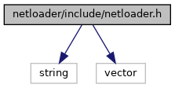

[Macros](#define-members) \| [Enumerations](#enum-members) \| [Functions](#func-members)

`#include <string>`
`#include <vector>`

Include dependency graph for netloader.h:

<a href="netloader_2include_2netloader_8h_source.md">Go to the source code of this file.</a>

|          |                                               |
|----------|-----------------------------------------------|
| Macros   |                                               |
| #define  | [DllSpec](#ad7c2e1cb200073ed64c64285a5f37231) |

|  |  |
|----|----|
| Enumerations |  |
| enum   | [NetLoaderResult](#a9c806f2b892df2b3a86e5b1d867bd2d3) { [NETLD_OK](#a9c806f2b892df2b3a86e5b1d867bd2d3af215ffc28a70ad9e84c66eff4223f84f), [NETLD_RUNNING](#a9c806f2b892df2b3a86e5b1d867bd2d3a9b674e4e5ea539a79af9ac516ddddc13), [NETLD_ERROR](#a9c806f2b892df2b3a86e5b1d867bd2d3af9ff6836efc79578afe59eb7effab993) } |
| enum   | [NetLoaderStatus](#a1901938f855dcfca04090c4d682f4283) {   [NETLD_REBOOT_REQUESTED](#a1901938f855dcfca04090c4d682f4283a00e68895b7ca32382cd2071ff701826a), [NETLD_STOP_REQUESTED](#a1901938f855dcfca04090c4d682f4283a60e03d44908f50e9b98ecdfbcf394945), [NETLD_DISPLAY_MESSAGE](#a1901938f855dcfca04090c4d682f4283af92897b8dc4fd248cd20b727b8589e5a), [NETLD_SET_TIME](#a1901938f855dcfca04090c4d682f4283a9e54aaef828d28a158647d7ebfa61459),   [NETLD_DOWNLOAD_FILE](#a1901938f855dcfca04090c4d682f4283a858a17c0c1f8e73f2fa2dd9ddd66aa66) =0x10, [NETLD_INSTALL_FILE](#a1901938f855dcfca04090c4d682f4283a099bc7a7e8baa238cdd38d72d8e484a2), [NETLD_DOWNLOAD_OK](#a1901938f855dcfca04090c4d682f4283ac36811050ef96c8aea0ef668fe24d4a7), [NETLD_DOWNLOAD_ERROR](#a1901938f855dcfca04090c4d682f4283aa35c4f74f5771153797d9fc58e5b6f8f),   [NETLD_INSTALL_OK](#a1901938f855dcfca04090c4d682f4283aaeb6459573a64173495a5464a364fb47), [NETLD_INSTALL_ERROR](#a1901938f855dcfca04090c4d682f4283a086a0806ee60e52609bc97c276df71f3) } |
| enum   | [NetLoaderInstallResult](#abdc69ece4ccafc7956f556ed63a78533) { [NETINST_OK](#abdc69ece4ccafc7956f556ed63a78533ab3b516fff9f3e84df64b45285a2d5bdc), [NETINST_INVALID_PARAM](#abdc69ece4ccafc7956f556ed63a78533a78c33ba9ac9ecb7270208baf4b2dd810), [NETINST_NO_SOFTWARE](#abdc69ece4ccafc7956f556ed63a78533a64594239006567bc2032abea23724a3d), [NETINST_FAIL](#abdc69ece4ccafc7956f556ed63a78533ab769adefdf8d0d55c529ac404a17f341) } |

|  |  |
|----|----|
| Functions |  |
| <a href="sound_8h.md#ad7c2e1cb200073ed64c64285a5f37231">DllSpec</a> enum [NetLoaderResult](#a9c806f2b892df2b3a86e5b1d867bd2d3)  | [netloader_start](#ad1c52953b207d5e2120b5ae5ff8cf92b) (const char \*download_dir, void(\*status_cb)(void \*data, enum [NetLoaderStatus](#a1901938f855dcfca04090c4d682f4283) status, const char \*msg, int progress), enum [NetLoaderInstallResult](#abdc69ece4ccafc7956f556ed63a78533)(\*install_cb)(void \*data, const char \*\*files), void \*data) |
| <a href="sound_8h.md#ad7c2e1cb200073ed64c64285a5f37231">DllSpec</a> void  | [netloader_stop](#a3b10a600fb356303f94441e8b36f6441) () |

## MacroDefinition Documentation {#macro-definition-documentation}

## DllSpec 

#define DllSpec

## EnumerationType Documentation {#enumeration-type-documentation}

## NetLoaderInstallResult 

enum [NetLoaderInstallResult](#abdc69ece4ccafc7956f556ed63a78533)

Install callback result

| Enumerator |  |
|----|----|
| NETINST_OK  | 
installation successful
 |
| NETINST_INVALID_PARAM  | 
invalid parameters
 |
| NETINST_NO_SOFTWARE  | 
no software download file provided
 |
| NETINST_FAIL  | 
software installation failed
 |

## NetLoaderResult 

enum [NetLoaderResult](#a9c806f2b892df2b3a86e5b1d867bd2d3)

NetLoader error code

| Enumerator |  |
|----|----|
| NETLD_OK  | 
no error
 |
| NETLD_RUNNING  | 
netloader server is already running
 |
| NETLD_ERROR  | 
generic error
 |

## NetLoaderStatus 

enum [NetLoaderStatus](#a1901938f855dcfca04090c4d682f4283)

NetLoader status for status callback

| Enumerator |  |
|----|----|
| NETLD_REBOOT_REQUESTED  | 
reboot is requested (msg is empty)
 |
| NETLD_STOP_REQUESTED  | 
stopping the server is requested (msg is empty)
 |
| NETLD_DISPLAY_MESSAGE  | 
display message (msg contains message)
 |
| NETLD_SET_TIME  | 
set date / time, (msg contains date/time)
 |
| NETLD_DOWNLOAD_FILE  | 
file download (msg contains file name)
 |
| NETLD_INSTALL_FILE  | 
install file (msg contains file name)
 |
| NETLD_DOWNLOAD_OK  | 
download is complete, no installation required (also indicates end of file download, msg contains file name)
 |
| NETLD_DOWNLOAD_ERROR  | 
download failed (also indicates end of file download, msg contains error)
 |
| NETLD_INSTALL_OK  | 
installation done (also indicates end of file download, msg contains file name)
 |
| NETLD_INSTALL_ERROR  | 
installation failed (also indicates end of file download, msg contains error)
 |

## FunctionDocumentation {#function-documentation}

## netloader_start() 

<a href="sound_8h.md#ad7c2e1cb200073ed64c64285a5f37231">DllSpec</a> enum [NetLoaderResult](#a9c806f2b892df2b3a86e5b1d867bd2d3) netloader_start

start the netloader server

**Parameters**

\[in\] **download_dir** directory to which files are downloaded \[in\] **status_cb** callback for status updates or NULL \[in\] **install_cb** callback to be invoked or NULL \[in\] **data** data pointer for status_cb and install_cb

### Returns

error code

The status_cb callback is invoked with the following parameters:

**Parameters**

\[in\] **data** data pointer as provided to netloader_set_callback() \[in\] **status** netloader status as above \[in\] **msg** display message, file name or error code (see NetLoaderStatus) \[in\] **progress** progress in % (0..100) for NETLD_DOWN_LOAD_FILE and NETLD_INSTALL_FILE

The install_cb callback is invoked for installing files with the following parameters:

**Parameters**

\[in\] **data** data pointer as provided to netloader_set_callback() \[in\] **files** array of file names to be installed, terminated by NULL pointer

### Returns

NETINST_OK or error code

## netloader_stop() 

<a href="sound_8h.md#ad7c2e1cb200073ed64c64285a5f37231">DllSpec</a> void netloader_stop

stop the netloader server
