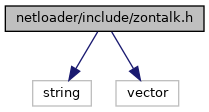

[Macros](#define-members) \| [Enumerations](#enum-members) \| [Functions](#func-members)

`#include <string>`
`#include <vector>`

Include dependency graph for zontalk.h:

<a href="netloader_2include_2zontalk_8h_source.md">Go to the source code of this file.</a>

|          |                                               |
|----------|-----------------------------------------------|
| Macros   |                                               |
| #define  | [DllSpec](#ad7c2e1cb200073ed64c64285a5f37231) |

|  |  |
|----|----|
| Enumerations |  |
| enum   | [ZonTalkResult](#aeaa8a9ca85977e77164e89bceda949d5) { [ZT_OK](#aeaa8a9ca85977e77164e89bceda949d5af38aca930cd92b0c37cde9abd924122d), [ZT_RUNNING](#aeaa8a9ca85977e77164e89bceda949d5a01b45d9eb79bd03265242cfb67549e5d), [ZT_ERROR](#aeaa8a9ca85977e77164e89bceda949d5a2c9dc50efd177d15fac99999fda21f5c) } |
| enum   | [ZonTalkStatus](#a60ef9b524cba78d1ddec6f77edf742a1) {   [ZT_REBOOT_REQUESTED](#a60ef9b524cba78d1ddec6f77edf742a1a9c667915f6e846d3920acf1e1d19c7ff), [ZT_STOP_REQUESTED](#a60ef9b524cba78d1ddec6f77edf742a1aa6b28ae67aaa15581894e4e7ec416ce2), [ZT_DISPLAY_MESSAGE](#a60ef9b524cba78d1ddec6f77edf742a1a12410ecf4422b614463c78fbeb5bf044), [ZT_SET_TIME](#a60ef9b524cba78d1ddec6f77edf742a1ae7e6ed3f3510383f25b5324601387799),   [ZT_DOWNLOAD_FILE](#a60ef9b524cba78d1ddec6f77edf742a1a47fcf672579d9f99329e523af7222444) =0x10, [ZT_INSTALL_FILE](#a60ef9b524cba78d1ddec6f77edf742a1a99ab4354366b82282c56e63e393805b7), [ZT_DOWNLOAD_OK](#a60ef9b524cba78d1ddec6f77edf742a1ae52746516c504c7e9b77f3f9d7858fc0), [ZT_DOWNLOAD_ERROR](#a60ef9b524cba78d1ddec6f77edf742a1a900744ae03edd032476573927f68b8a5),   [ZT_INSTALL_OK](#a60ef9b524cba78d1ddec6f77edf742a1ab4ad81b9f8c661c1784a949fcf7c6e74), [ZT_INSTALL_ERROR](#a60ef9b524cba78d1ddec6f77edf742a1abc1d534af5947dade88052728e7d7e2f) } |
| enum   | [ZonTalkInstallResult](#aae12385f0877faedf9c7b5c89a4d95a9) { [ZTINST_OK](#aae12385f0877faedf9c7b5c89a4d95a9ab74b874bc388a3a809733ee582453203), [ZTINST_INVALID_PARAM](#aae12385f0877faedf9c7b5c89a4d95a9ad4d61abc5a31ef2862c5a1b1ba65d0df), [ZTINST_NO_SOFTWARE](#aae12385f0877faedf9c7b5c89a4d95a9a70167f60c5f82b291d6916bad23bec91), [ZTINST_FAIL](#aae12385f0877faedf9c7b5c89a4d95a9aa47dc6bf758952198a0ed3d75e6cb7ed) } |

|  |  |
|----|----|
| Functions |  |
| <a href="sound_8h.md#ad7c2e1cb200073ed64c64285a5f37231">DllSpec</a> enum [ZonTalkResult](#aeaa8a9ca85977e77164e89bceda949d5)  | [zontalk_start](#ae82bb76dbde2d2bff589b145656f9413) (const char \*port, const char \*download_dir, void(\*status_cb)(void \*data, enum [ZonTalkStatus](#a60ef9b524cba78d1ddec6f77edf742a1) status, const char \*msg, int progress), enum [ZonTalkInstallResult](#aae12385f0877faedf9c7b5c89a4d95a9)(\*install_cb)(void \*data, const char \*\*files), void \*data) |
| <a href="sound_8h.md#ad7c2e1cb200073ed64c64285a5f37231">DllSpec</a> enum [ZonTalkResult](#aeaa8a9ca85977e77164e89bceda949d5)  | [zontalk_start_fd](#ab8f278c1fe887b1726a5fe6a49b1fad6) (int fd, const char \*download_dir, void(\*status_cb)(void \*data, enum [ZonTalkStatus](#a60ef9b524cba78d1ddec6f77edf742a1) status, const char \*msg, int progress), enum [ZonTalkInstallResult](#aae12385f0877faedf9c7b5c89a4d95a9)(\*install_cb)(void \*data, const char \*\*files), void \*data) |
| <a href="sound_8h.md#ad7c2e1cb200073ed64c64285a5f37231">DllSpec</a> void  | [zontalk_stop](#a2759e0db7fe364e7c010c58b2b4efd58) () |

## MacroDefinition Documentation {#macro-definition-documentation}

## DllSpec 

#define DllSpec

## EnumerationType Documentation {#enumeration-type-documentation}

## ZonTalkInstallResult 

enum [ZonTalkInstallResult](#aae12385f0877faedf9c7b5c89a4d95a9)

Install callback result

| Enumerator |  |
|----|----|
| ZTINST_OK  | 
installation successful
 |
| ZTINST_INVALID_PARAM  | 
invalid parameters
 |
| ZTINST_NO_SOFTWARE  | 
no software download file provided
 |
| ZTINST_FAIL  | 
software installation failed
 |

## ZonTalkResult 

enum [ZonTalkResult](#aeaa8a9ca85977e77164e89bceda949d5)

ZonTalk error code

| Enumerator  |                                                            |
|-------------|------------------------------------------------------------|
| ZT_OK       | 
no error
                          |
| ZT_RUNNING  | 
zontalk server is already running
 |
| ZT_ERROR    | 
generic error
                     |

## ZonTalkStatus 

enum [ZonTalkStatus](#a60ef9b524cba78d1ddec6f77edf742a1)

ZonTalk status for status callback

| Enumerator |  |
|----|----|
| ZT_REBOOT_REQUESTED  | 
reboot is requested (msg is empty)
 |
| ZT_STOP_REQUESTED  | 
stopping the server is requested (msg is empty)
 |
| ZT_DISPLAY_MESSAGE  | 
display message (msg contains message)
 |
| ZT_SET_TIME  | 
set date / time, (msg contains date/time)
 |
| ZT_DOWNLOAD_FILE  | 
file download (msg contains file name)
 |
| ZT_INSTALL_FILE  | 
install file (msg contains file name)
 |
| ZT_DOWNLOAD_OK  | 
download is complete, no installation required (also indicates end of file download, msg contains file name)
 |
| ZT_DOWNLOAD_ERROR  | 
download failed (also indicates end of file download, msg contains error)
 |
| ZT_INSTALL_OK  | 
installation done (also indicates end of file download, msg contains file name)
 |
| ZT_INSTALL_ERROR  | 
installation failed (also indicates end of file download, msg contains error)
 |

## FunctionDocumentation {#function-documentation}

## zontalk_start() 

<a href="sound_8h.md#ad7c2e1cb200073ed64c64285a5f37231">DllSpec</a> enum [ZonTalkResult](#aeaa8a9ca85977e77164e89bceda949d5) zontalk_start

start the zontalk server

**Parameters**

\[in\] **port** serial port \[in\] **download_dir** directory to which files are downloaded \[in\] **status_cb** callback for status updates or NULL \[in\] **install_cb** callback to be invoked or NULL \[in\] **data** data pointer for status_cb and install_cb

### Returns

error code

The status_cb callback is invoked with the following parameters:

**Parameters**

\[in\] **data** data pointer as provided to netloader_set_callback() \[in\] **status** netloader status as above \[in\] **msg** display message, file name or error code (see NetLoaderStatus) \[in\] **progress** progress in % (0..100) for NETLD_DOWN_LOAD_FILE and NETLD_INSTALL_FILE

The install_cb callback is invoked for installing files with the following parameters:

**Parameters**

\[in\] **data** data pointer as provided to netloader_set_callback() \[in\] **files** array of file names to be installed, terminated by NULL pointer

### Returns

NETINST_OK or error code

## zontalk_start_fd() 

<a href="sound_8h.md#ad7c2e1cb200073ed64c64285a5f37231">DllSpec</a> enum [ZonTalkResult](#aeaa8a9ca85977e77164e89bceda949d5) zontalk_start_fd

start the zontalk server on an already open port

**Parameters**

\[in\] **fd** open and configured file descriptor to use for zontalk. The file descriptor will be closed when no longer needed. \[in\] **download_dir** directory to which files are downloaded \[in\] **status_cb** callback for status updates or NULL \[in\] **install_cb** callback to be invoked or NULL \[in\] **data** data pointer for status_cb and install_cb

### Returns

error code

The status_cb callback is invoked with the following parameters:

**Parameters**

\[in\] **data** data pointer as provided to netloader_set_callback() \[in\] **status** netloader status as above \[in\] **msg** display message, file name or error code (see NetLoaderStatus) \[in\] **progress** progress in % (0..100) for NETLD_DOWN_LOAD_FILE and NETLD_INSTALL_FILE

The install_cb callback is invoked for installing files with the following parameters:

**Parameters**

\[in\] **data** data pointer as provided to netloader_set_callback() \[in\] **files** array of file names to be installed, terminated by NULL pointer

### Returns

NETINST_OK or error code

## zontalk_stop() 

<a href="sound_8h.md#ad7c2e1cb200073ed64c64285a5f37231">DllSpec</a> void zontalk_stop

stop the zontalk server
