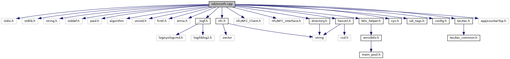

[Macros](#define-members) \| [Functions](#func-members)

`#include <stdio.h>`
`#include <stdlib.h>`
`#include <string.h>`
`#include <stddef.h>`
`#include <pwd.h>`
`#include <algorithm>`
`#include <unistd.h>`
`#include <fcntl.h>`
`#include <errno.h>`
`#include "`<a href="nfc_8h_source.md">nfc.h</a>`"`
`#include "`<a href="__logf_8h_source.md">_logf.h</a>`"`
`#include "nfc/NFC_Client.h"`
`#include "nfc/NFC_Interface.h"`
`#include "`<a href="sdi_2src_2hexutil_8h_source.md">hexutil.h</a>`"`
`#include "`<a href="btlv__helper_8h_source.md">btlv_helper.h</a>`"`
`#include "`<a href="tec_8h_source.md">tec/tec.h</a>`"`
`#include "`<a href="sys_8h_source.md">sys.h</a>`"`
`#include "`<a href="src_2sdi__tags_8h_source.md">sdi_tags.h</a>`"`
`#include "`<a href="config_8h_source.md">config.h</a>`"`
`#include "`<a href="directory_8h_source.md">directory.h</a>`"`
`#include "epp/counterTop.h"`

Include dependency graph for nfc.cpp:

|  |  |
|----|----|
| Macros |  |
| #define  | [CLASS](#aeb04f2e0012cb07d68538599161c9693)   0 |
| #define  | [INSTRUCTION](#a3fbaf422cb6aaf4b403d71d972d4bc89)   1 |
| #define  | [P1](#a6c2a9f7efd46f0160f3037869924d6ce)   2 |
| #define  | [P2](#ae00a52dba55d31948c377fa85d385b87)   3 |
| #define  | [NFC_BUFFER_SIZE](#aa6f734d34c6ee0cf731449ef1548acfc)   8192 |
| #define  | [SET_RESULT](#ae27eea42be89a6e50555732afafcfb8f)(sw1, sw2)   { rsp\[0\] = sw1; rsp\[1\] = sw2; \*rspSize = 2; } |

|  |  |
|----|----|
| Functions |  |
| std::vector\< std::string \> &  | [NFC_get_appID_Static](#ac065a52a8673baeae8711309bfc176c6) () |
| std::string &  | [NFC_get_appID_Preload](#ac4a4bf1a760772ae31fe002226cc3a90) () |
| void  | [NFC_deletePreloadFile](#a1cd110adeb746aeac51b38d524be8c99) () |
| bool  | [NFC_getPreloadFileName](#a7bb3be6ba4ceea178891fa7b10367a04) (char \*filename, unsigned buffersize, string appID) |
| void  | [handleNFC](#a0f8dfff45f86ad2e782439e8c60c9694) (unsigned short msgBufSize, unsigned char \*msg, unsigned short msgSize, unsigned short rspBufSize, unsigned char \*rsp, unsigned short \*rspSize) |
| void  | [handleVAS](#aeec5749ee271c67acbe1dad2c9267215) (unsigned short msgBufSize, unsigned char \*msg, unsigned short msgSize, unsigned short rspBufSize, unsigned char \*rsp, unsigned short \*rspSize) |

## MacroDefinition Documentation {#macro-definition-documentation}

## CLASS 

#define CLASS   0

## INSTRUCTION 

#define INSTRUCTION   1

## NFC_BUFFER_SIZE 

#define NFC_BUFFER_SIZE   8192

## P1 

#define P1   2

## P2 

#define P2   3

## SET_RESULT 

#define SET_RESULT

## FunctionDocumentation {#function-documentation}

## handleNFC() 

void handleNFC

## handleVAS() 

void handleVAS

## NFC_deletePreloadFile() 

void NFC_deletePreloadFile

## NFC_get_appID_Preload() 

std::string& NFC_get_appID_Preload

## NFC_get_appID_Static() 

std::vector\<std::string\>& NFC_get_appID_Static

## NFC_getPreloadFileName() 

bool NFC_getPreloadFileName

