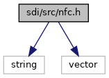
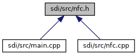

[Macros](#define-members) \| [Functions](#func-members)

`#include <string>`
`#include <vector>`

Include dependency graph for nfc.h:

This graph shows which files directly or indirectly include this file:

<a href="nfc_8h_source.md">Go to the source code of this file.</a>

|  |  |
|----|----|
| Macros |  |
| #define  | [CLA_NFC](#a22990cd127a564916ca541b77cdd32f8)   0x31 |
|   | Class for NFC commands. [More\...](#a22990cd127a564916ca541b77cdd32f8)  |
| #define  | [CLA_VAS](#a0088dbb6412707485bc9d5991fc05663)   0x32 |
|   | Class for VAS commands. [More\...](#a0088dbb6412707485bc9d5991fc05663)  |
| #define  | [INS_NFC_CLIENT_INIT](#ada3704aa9594f3a2744a8b4301fef0ad)   0x10 |
|   | <a href="sdi__nfc_8h.md#a7a9419cd6aa7aa9185fb249ce761ae0f">NFC_Client_Init(...)</a> [More\...](#ada3704aa9594f3a2744a8b4301fef0ad)  |
| #define  | [INS_NFC_PING](#add0c971be4ea45ec9f32b62a016fc029)   0x00 |
|   | <a href="sdi__nfc_8h.md#a2a6ea83c72ad383401d3f00e51d25e23">NFC_Ping(...)</a> [More\...](#add0c971be4ea45ec9f32b62a016fc029)  |
| #define  | [INS_NFC_GET_VERSION](#a19be28d4fce99cdf09f3ef0b37b71890)   0x11 |
|   | <a href="sdi__nfc_8h.md#a7e475d639fe88323208beef908223ab2">NFC_Get_Version(...)</a> [More\...](#a19be28d4fce99cdf09f3ef0b37b71890)  |
| #define  | [INS_NFC_CONFIG_INIT](#ad663ebc4d5de751b2beb299b2631933d)   0x12 |
|   | <a href="titusstubs_8cpp.md#a0d86892d3fb8c0bd2e38f4dc2558f326">NFC_Config_Init()</a> [More\...](#ad663ebc4d5de751b2beb299b2631933d)  |
| #define  | [INS_NFC_PT_OPEN](#a93ee70e6d7c65085c09631948fab1efa)   0x01 |
|   | <a href="titusstubs_8cpp.md#aaa8fefdd6c9e72d4d3a487b0ae5e5925">NFC_PT_Open()</a> [More\...](#a93ee70e6d7c65085c09631948fab1efa)  |
| #define  | [INS_NFC_PT_CLOSE](#a8273aa3d73f95f02cfd01b4265744457)   0x02 |
|   | <a href="titusstubs_8cpp.md#a00d4921f4a21667ae4cddb317ffc04a5">NFC_PT_Close()</a> [More\...](#a8273aa3d73f95f02cfd01b4265744457)  |
| #define  | [INS_NFC_PT_FIELDON](#a5eadd3719e7d68985f638e514045f455)   0x03 |
|   | <a href="titusstubs_8cpp.md#af0e3c8e7991ac4edbeceb2e432c10275">NFC_PT_FieldOn()</a> [More\...](#a5eadd3719e7d68985f638e514045f455)  |
| #define  | [INS_NFC_PT_FIELDOFF](#ac9b148c3fd2c4e6dbbb1f397bc3420d6)   0x04 |
|   | <a href="titusstubs_8cpp.md#a65c5ac372de4d71a8154f61b820abaf0">NFC_PT_FieldOff()</a> [More\...](#ac9b148c3fd2c4e6dbbb1f397bc3420d6)  |
| #define  | [INS_NFC_PT_POLLING](#a4ad3ab324633bc1a40751abbaa483c5e)   0x05 |
|   | <a href="sdi__nfc_8h.md#a309c7373d9b530f7c6027466d7e6f6f7">NFC_PT_Polling(...)</a> [More\...](#a4ad3ab324633bc1a40751abbaa483c5e)  |
| #define  | [INS_NFC_PT_CANCEL_POLLING](#a9c9653365be635212532c3b5db779f1f)   0x06 |
|   | <a href="sdi__nfc_8h.md#a167c5c7e903dd7f5a3acdb70f7ff8a66">NFC_PT_Cancel_Polling(...)</a> [More\...](#a9c9653365be635212532c3b5db779f1f)  |
| #define  | [INS_NFC_PT_ACTIVATION](#ab738553ed349e287aaf08ca842487b2e)   0x07 |
|   | <a href="sdi__nfc_8h.md#a3eabcba13619a1388458848aeb81234c">NFC_PT_Activation(...)</a> [More\...](#ab738553ed349e287aaf08ca842487b2e)  |
| #define  | [INS_NFC_PT_TXRX](#a39ab3d6ebc30bf99d40663fd489cc827)   0x08 |
|   | <a href="sdi__nfc_8h.md#a668a6a40090d34ee7f9314a9b7a1e67c">NFC_PT_TxRx(...)</a> [More\...](#a39ab3d6ebc30bf99d40663fd489cc827)  |
| #define  | [INS_NFC_PT_FETCHBAUD](#ac2e1ba91b13fc8d593026cfdb5890a93)   0x09 |
|   | NFC_PT_FetchBaud(\...) [More\...](#ac2e1ba91b13fc8d593026cfdb5890a93)  |
| #define  | [INS_NFC_PT_POLLINGFULL](#a25eb48bdbc4b123e94cfc0d28fee2b47)   0x13 |
|   | <a href="sdi__nfc_8h.md#abcc66aaf4a10a256c2c303487e8507f7">NFC_PT_PollingFull(...)</a> [More\...](#a25eb48bdbc4b123e94cfc0d28fee2b47)  |
| #define  | [INS_NFC_PT_POLLINGABF](#acb8e2a60dddf3962d92258e4946c8ea6)   0x1D |
|   | NFC_PT_PollingABF(\...) [More\...](#acb8e2a60dddf3962d92258e4946c8ea6)  |
| #define  | [INS_NFC_MIFARE_AUTH](#ad3df720db54addc10708214782ed56c4)   0x0A |
|   | <a href="sdi__nfc_8h.md#a754f2fb39a1132dc5de68a8c6743d23b">NFC_Mifare_Authenticate(...)</a> [More\...](#ad3df720db54addc10708214782ed56c4)  |
| #define  | [INS_NFC_MIFARE_READ](#a90735d91e8ad5dc812a659366d94bbae)   0x0B |
|   | <a href="sdi__nfc_8h.md#ad1171a19fb3b2b1545a91c49da67b341">NFC_Mifare_Read(...)</a> [More\...](#a90735d91e8ad5dc812a659366d94bbae)  |
| #define  | [INS_NFC_MIFARE_WRITE](#a8ff8b4143f04af5e5703672873608014)   0x0C |
|   | <a href="sdi__nfc_8h.md#aa07a2c9d57d47e0dfd9099cd3f739321">NFC_Mifare_Write(...)</a> [More\...](#a8ff8b4143f04af5e5703672873608014)  |
| #define  | [INS_NFC_MIFARE_INCREMENT](#a377a16c4ec00587c7198e4e6a471106e)   0x0D |
|   | <a href="sdi__nfc_8h.md#a52a8a28d2317e77994570d6e9dbfc599">NFC_Mifare_Increment(...)</a> [More\...](#a377a16c4ec00587c7198e4e6a471106e)  |
| #define  | [INS_NFC_MIFARE_DECREMENT](#a73d2469345f9e630cb6473fc68472f27)   0x0E |
|   | <a href="sdi__nfc_8h.md#a1c3ab8af1973a4c01ee1125a256c9fcc">NFC_Mifare_Decrement(...)</a> [More\...](#a73d2469345f9e630cb6473fc68472f27)  |
| #define  | [INS_NFC_MIFARE_INCR_ONLY](#aeacf14a2ebfcd4bc815ce44c723c67b9)   0x15 |
|   | NFC_Mifare_Incrment_Only(\...) [More\...](#aeacf14a2ebfcd4bc815ce44c723c67b9)  |
| #define  | [INS_NFC_MIFARE_DECR_ONLY](#affb678cbbc3f41e56e3c28d5e54ebf7d)   0x16 |
|   | NFC_Mifare_Decrment_Only(\...) [More\...](#affb678cbbc3f41e56e3c28d5e54ebf7d)  |
| #define  | [INS_NFC_MIFARE_TRANSFER](#ac5bdad42048a72d77abec6a949fce578)   0x17 |
|   | <a href="sdi__nfc_8h.md#ae3c299890ef9f3eb9306edc7415fe1d1">NFC_Mifare_Transfer(...)</a> [More\...](#ac5bdad42048a72d77abec6a949fce578)  |
| #define  | [INS_NFC_MIFARE_RESTORE](#abe38e7bb368bbbcf6bfe9bd3ea230dd2)   0x18 |
|   | <a href="sdi__nfc_8h.md#a15263dc4011284d7a3dae61c1a8f7114">NFC_Mifare_Restore(...)</a> [More\...](#abe38e7bb368bbbcf6bfe9bd3ea230dd2)  |
| #define  | [INS_NFC_FELICA_EXCHANGE](#af65235fc12697564d17e07cce4bb43ca)   0x0F |
|   | <a href="sdi__nfc_8h.md#a32cdb54809cf1386509bb5f5eaf05bad">NFC_Felica_Exchange(...)</a> [More\...](#af65235fc12697564d17e07cce4bb43ca)  |
| #define  | [INS_NFC_FELICA_POLLING](#a9832274a9a664c2078646f020e907ac7)   0x14 |
|   | <a href="sdi__nfc_8h.md#aeaf5016cc3f72d1b8587281997fa9aa4">NFC_Felica_Polling(...)</a> [More\...](#a9832274a9a664c2078646f020e907ac7)  |
| #define  | [INS_NFC_APDU_EXCH](#a6d55945c2987e0a521404381b0cca3f6)   0x1C |
|   | <a href="sdi__nfc_8h.md#ac17cf22c461d04ea8daf5f2993e559d9">NFC_APDU_Exchange(...)</a> [More\...](#a6d55945c2987e0a521404381b0cca3f6)  |
| #define  | [INS_NFC_TARGET_ACTION](#a4ef87b0ec8fe542d59e25390cd93a04c)   0x20 |
|   | NFC_Target_Action(\...) [More\...](#a4ef87b0ec8fe542d59e25390cd93a04c)  |
| #define  | [INS_NFC_CREATE_NDEF](#addf3a057cb8b74a7ef16711701dc3520)   0x21 |
|   | NFC_Create_Ndef(\...) [More\...](#addf3a057cb8b74a7ef16711701dc3520)  |
| #define  | [INS_VAS_NFC_TERM_CONFIG](#a3b190dece37d0c4135dd246c09a1a5a7)   0x00 |
|   | <a href="sdi__nfc_8h.md#a86d1953748c0d7e6b9e621c2a36dd8e9">NFC_Terminal_Config(...)</a> [More\...](#a3b190dece37d0c4135dd246c09a1a5a7)  |
| #define  | [INS_VAS_NFC_TERM_READ_CONFIG](#a9602cbff564a91b24585ab8589993f3f)   0x01 |
|   | <a href="sdi__nfc_8h.md#a064b234e44e08f833cc9d2e153260164">NFC_TERMINAL_ReadConfig(...)</a> [More\...](#a9602cbff564a91b24585ab8589993f3f)  |
| #define  | [INS_VAS_READ_CONFIG](#a16de0de622b506347e169c46b51dea65)   0x02 |
|   | <a href="sdi__nfc_8h.md#a7a81c9d472b5da94ae76272358f38dac">NFC_VAS_ReadConfig(...)</a> [More\...](#a16de0de622b506347e169c46b51dea65)  |
| #define  | [INS_VAS_ACTIVATE](#aa408cb684f35a60277096ee2f54076b4)   0x03 |
|   | <a href="sdi__nfc_8h.md#a4dc6d61bb9ed1d3e8cef769db32f6ac6">NFC_VAS_Activate(...)</a> [More\...](#aa408cb684f35a60277096ee2f54076b4)  |
| #define  | [INS_VAS_CANCEL](#a5e482637a85a5987f5fac56f4f7a80db)   0x04 |
|   | <a href="sdi__nfc_8h.md#a2ae23fb43b8c06ebd88933e1a1b46aa1">NFC_VAS_Cancel(...)</a> [More\...](#a5e482637a85a5987f5fac56f4f7a80db)  |
| #define  | [INS_VAS_UPDATE_CONFIG](#af2097317b1ece78e2daab3afeebf2227)   0x05 |
|   | <a href="sdi__nfc_8h.md#aade0ed84b10cb0108216011ba8a30993">NFC_VAS_UpdateConfig(...)</a> [More\...](#af2097317b1ece78e2daab3afeebf2227)  |
| #define  | [INS_VAS_CANCEL_CONFIG](#a1ae1ec803469f7ed876a55fcd3cb0ff2)   0x06 |
|   | <a href="sdi__nfc_8h.md#a1667152f04801a8ef8bb47c5ea3b8930">NFC_VAS_CancelConfig(...)</a> [More\...](#a1ae1ec803469f7ed876a55fcd3cb0ff2)  |
| #define  | [INS_VAS_PRELOAD](#a1711986bf1c7fbf2b085719a25a811be)   0x07 |
|   | <a href="sdi__nfc_8h.md#a071c33860fb2cf846a1466edf5bedfb7">NFC_VAS_PreLoad(...)</a> [More\...](#a1711986bf1c7fbf2b085719a25a811be)  |
| #define  | [INS_VAS_CANCEL_PRELOAD](#aa1e021ee0ad3c387b46d06c7752bf327)   0x08 |
|   | <a href="sdi__nfc_8h.md#a097ab5411367f3b1b4275d1ae3567219">NFC_VAS_CancelPreLoad(...)</a> [More\...](#aa1e021ee0ad3c387b46d06c7752bf327)  |
| #define  | [INS_VAS_DECRYPT](#abe858209f363434beefcd90d60de1d65)   0x09 |
|   | <a href="sdi__nfc_8h.md#a800f9f9d4df08b07fe4c28116dda9c90">NFC_VAS_Decrypt(...)</a> [More\...](#abe858209f363434beefcd90d60de1d65)  |
| #define  | [INS_VAS_ACTION](#a46921941a79268c2ab42c1f1829f552b)   0x0A |
|   | <a href="sdi__nfc_8h.md#afbf908bd85c0c1318f763e880bb09571">NFC_VAS_Action(...)</a> [More\...](#a46921941a79268c2ab42c1f1829f552b)  |
| #define  | [EMB_APP_F0_TEMPLATE_TAG](#a2780fc8d4086d30d9a952b9b0949ef5c)   0xF0 |
|   | All BER TLV streams are packed in this tag. [More\...](#a2780fc8d4086d30d9a952b9b0949ef5c)  |
| #define  | [EMB_APP_PING_TAG](#a3acb6bf35364e4f6bfd3a844b8e3ead4)   0xDFA200 |
| #define  | [EMB_APP_VERSION_TAG](#a6a5b72b2c2ca627be5fb19a4aad017f2)   0xDFA201 |
| #define  | [EMB_APP_TECH_BITMAP_TAG](#a4867caf81635330eb144ad1a3467d3bd)   0xDFA202 |
| #define  | [EMB_APP_POLL_TIMEOUT_TAG](#a7e64c20f307279263e0ce561efe38e07)   0xDFA203 |
| #define  | [TAG_DFA204_NFC_APDU_CMD](#a30e77b25565c8323cab9b47f58401ae7)   0xDFA204 |
| #define  | [TAG_DFA205_NFC_APDU_RSP](#a15c437a913ff13732768043bde8ad7f3)   0xDFA205 |
| #define  | [EMB_APP_TXRX_DATA_TAG](#a5b6046f8d89e25b2d6c7ea829806c8d8)   0xDFA206 |
| #define  | [EMB_APP_CUSTOM_POLL_DATA_TAG](#a243efdc953f5462858513404fc3a3830)   0xDFA207 |
| #define  | [EMB_APP_MIFARE_BLOCK_NUM_TAG](#ab27cf8e7fbae155b520149024c89bba0)   0xDFA208 |
| #define  | [EMB_APP_MIFARE_KEY_TYPE_TAG](#ad91de3e0a092914198b5d41290ef80d0)   0xDFA209 |
| #define  | [EMB_APP_MIFARE_KEY_TAG](#a5262d9401f1735915400f14dd93d2956)   0xDFA20A |
| #define  | [EMB_APP_MIFARE_CARD_TYPE_TAG](#aca130e84d4eddb077e3555df89dfff41)   0xDFA20B |
| #define  | [EMB_APP_MIFARE_START_BLOCK_TAG](#ae84a289328b73d4106e3e02beac2232d)   0xDFA20C |
| #define  | [EMB_APP_MIFARE_BLOCK_AMOUNT_TAG](#a214ed1f22ac8d7af031574b01b2369bf)   0xDFA20D |
| #define  | [EMB_APP_MIFARE_READ_DATA_TAG](#a5bb5a8d1eb4362b4581e17e3789e31a6)   0xDFA20E |
| #define  | [EMB_APP_MIFARE_WRITE_DATA_TAG](#a3811d311820e1b881077b302caa28e23)   0xDFA20F |
| #define  | [EMB_APP_MIFARE_AMOUNT_TAG](#a61828cf88ca890821c020e783c71a9a3)   0xDFA210 |
| #define  | [EMB_APP_FELICA_POLL_TIMEOUT_TAG](#a26675c8d0ea7c5fbe7cdbfaa9b9ce1a0)   0xDFA211 |
| #define  | [EMB_APP_FELICA_RECIVE_TIMEOUT_TAG](#a969f9d14a7da34dddbeaed5daa6998cd)   0xDFA212 |
| #define  | [EMB_APP_FELICA_SYS_CODE_TAG](#a2277890256938e57f6174827371d4be6)   0xDFA213 |
| #define  | [EMB_APP_FELICA_REQ_CODE_TAG](#a49e594db275ba75d7234ce2d262f62ce)   0xDFA214 |
| #define  | [EMB_APP_FELICA_TIME_SLOT_TAG](#a85cdefd40ce40368fad48e59116773a8)   0xDFA215 |
| #define  | [EMB_APP_FELICA_UID_TAG](#a1f5c3e218824bbd016e01605506c0647)   0xDFA216 |
| #define  | [EMB_APP_FELICA_PAD_TAG](#a86da33946cc454363070a0c5dec564db)   0xDFA217 |
| #define  | [EMB_APP_FELICA_TIMEOUT_TAG](#a5df3f113034a08a6df3199b65cbc54ee)   0xDFA218 |
| #define  | [TAG_DFA219_NFC_APDU_SW12](#a211afaf75ced34d29f58ad83a07b8e3b)   0xDFA219 |
| #define  | [TAG_DFA21A_NFC_DUTY_CYCLE_TAG](#a53ad2a9154debccf1d7fa1a4a047076e)   0xDFA21A |
| #define  | [TAG_DFA21B_NFC_TARGET_ACTION](#ae365dafe72caddca4db2e1eb8d47c490)   0xDFA21B |
| #define  | [TAG_DFA21C_NFC_TIMEOUT](#a6c4f99cd3efe6fd57f209083fdbf8ead)   0xDFA21C |
| #define  | [TAG_DFA21D_NFC_IN_DATA](#a76bf090b319b17262e8a18e5514503df)   0xDFA21D |
| #define  | [TAG_DFA21E_NFC_OUT_DATA](#aec69f94e42b4fffdd60ffc5d1b87be81)   0xDFA21E |
| #define  | [TAG_DFA21F_NFC_NDEF_TYPES](#a548314c0bc505fbd5923a68daaea09c3)   0xDFA21F |
| #define  | [TAG_DFA300_NFC_VAS_IN_OUT_DATA](#a49c2f298ed8a06d23596cd2af011b8d2)   0xDFA300 |
| #define  | [TAG_DFA301_NFC_VAS_APP_ID](#abd63bee04a245ab6a9cc69e49016db06)   0xDFA301 |
| #define  | [TAG_DFA302_NFC_VAS_ACTION](#ade5f2fc89fa5b03e1f1466a2f6a524d7)   0xDFA302 |

|  |  |
|----|----|
| Functions |  |
| std::vector\< std::string \> &  | [NFC_get_appID_Static](#ac065a52a8673baeae8711309bfc176c6) () |
| std::string &  | [NFC_get_appID_Preload](#ac4a4bf1a760772ae31fe002226cc3a90) () |
| bool  | [NFC_getPreloadFileName](#ae00a37aa32a3472c5038fb30c6fa7afd) (char \*filename, unsigned buffersize, std::string appID) |
| void  | [NFC_deletePreloadFile](#a1cd110adeb746aeac51b38d524be8c99) () |
| void  | [handleNFC](#a0f8dfff45f86ad2e782439e8c60c9694) (unsigned short msgBufSize, unsigned char \*msg, unsigned short msgSize, unsigned short rspBufSize, unsigned char \*rsp, unsigned short \*rspSize) |
| void  | [handleVAS](#aeec5749ee271c67acbe1dad2c9267215) (unsigned short msgBufSize, unsigned char \*msg, unsigned short msgSize, unsigned short rspBufSize, unsigned char \*rsp, unsigned short \*rspSize) |

## MacroDefinition Documentation {#macro-definition-documentation}

## CLA_NFC 

#define CLA_NFC   0x31

Class for NFC commands.

## CLA_VAS 

#define CLA_VAS   0x32

Class for VAS commands.

## EMB_APP_CUSTOM_POLL_DATA_TAG 

#define EMB_APP_CUSTOM_POLL_DATA_TAG   0xDFA207

## EMB_APP_F0_TEMPLATE_TAG 

#define EMB_APP_F0_TEMPLATE_TAG   0xF0

All BER TLV streams are packed in this tag.

## EMB_APP_FELICA_PAD_TAG 

#define EMB_APP_FELICA_PAD_TAG   0xDFA217

## EMB_APP_FELICA_POLL_TIMEOUT_TAG 

#define EMB_APP_FELICA_POLL_TIMEOUT_TAG   0xDFA211

## EMB_APP_FELICA_RECIVE_TIMEOUT_TAG 

#define EMB_APP_FELICA_RECIVE_TIMEOUT_TAG   0xDFA212

## EMB_APP_FELICA_REQ_CODE_TAG 

#define EMB_APP_FELICA_REQ_CODE_TAG   0xDFA214

## EMB_APP_FELICA_SYS_CODE_TAG 

#define EMB_APP_FELICA_SYS_CODE_TAG   0xDFA213

## EMB_APP_FELICA_TIME_SLOT_TAG 

#define EMB_APP_FELICA_TIME_SLOT_TAG   0xDFA215

## EMB_APP_FELICA_TIMEOUT_TAG 

#define EMB_APP_FELICA_TIMEOUT_TAG   0xDFA218

## EMB_APP_FELICA_UID_TAG 

#define EMB_APP_FELICA_UID_TAG   0xDFA216

## EMB_APP_MIFARE_AMOUNT_TAG 

#define EMB_APP_MIFARE_AMOUNT_TAG   0xDFA210

## EMB_APP_MIFARE_BLOCK_AMOUNT_TAG 

#define EMB_APP_MIFARE_BLOCK_AMOUNT_TAG   0xDFA20D

## EMB_APP_MIFARE_BLOCK_NUM_TAG 

#define EMB_APP_MIFARE_BLOCK_NUM_TAG   0xDFA208

## EMB_APP_MIFARE_CARD_TYPE_TAG 

#define EMB_APP_MIFARE_CARD_TYPE_TAG   0xDFA20B

## EMB_APP_MIFARE_KEY_TAG 

#define EMB_APP_MIFARE_KEY_TAG   0xDFA20A

## EMB_APP_MIFARE_KEY_TYPE_TAG 

#define EMB_APP_MIFARE_KEY_TYPE_TAG   0xDFA209

## EMB_APP_MIFARE_READ_DATA_TAG 

#define EMB_APP_MIFARE_READ_DATA_TAG   0xDFA20E

## EMB_APP_MIFARE_START_BLOCK_TAG 

#define EMB_APP_MIFARE_START_BLOCK_TAG   0xDFA20C

## EMB_APP_MIFARE_WRITE_DATA_TAG 

#define EMB_APP_MIFARE_WRITE_DATA_TAG   0xDFA20F

## EMB_APP_PING_TAG 

#define EMB_APP_PING_TAG   0xDFA200

## EMB_APP_POLL_TIMEOUT_TAG 

#define EMB_APP_POLL_TIMEOUT_TAG   0xDFA203

## EMB_APP_TECH_BITMAP_TAG 

#define EMB_APP_TECH_BITMAP_TAG   0xDFA202

## EMB_APP_TXRX_DATA_TAG 

#define EMB_APP_TXRX_DATA_TAG   0xDFA206

## EMB_APP_VERSION_TAG 

#define EMB_APP_VERSION_TAG   0xDFA201

## INS_NFC_APDU_EXCH 

#define INS_NFC_APDU_EXCH   0x1C

<a href="sdi__nfc_8h.md#ac17cf22c461d04ea8daf5f2993e559d9">NFC_APDU_Exchange(...)</a>

## INS_NFC_CLIENT_INIT 

#define INS_NFC_CLIENT_INIT   0x10

<a href="sdi__nfc_8h.md#a7a9419cd6aa7aa9185fb249ce761ae0f">NFC_Client_Init(...)</a>

## INS_NFC_CONFIG_INIT 

#define INS_NFC_CONFIG_INIT   0x12

<a href="titusstubs_8cpp.md#a0d86892d3fb8c0bd2e38f4dc2558f326">NFC_Config_Init()</a>

## INS_NFC_CREATE_NDEF 

#define INS_NFC_CREATE_NDEF   0x21

NFC_Create_Ndef(\...)

## INS_NFC_FELICA_EXCHANGE 

#define INS_NFC_FELICA_EXCHANGE   0x0F

<a href="sdi__nfc_8h.md#a32cdb54809cf1386509bb5f5eaf05bad">NFC_Felica_Exchange(...)</a>

## INS_NFC_FELICA_POLLING 

#define INS_NFC_FELICA_POLLING   0x14

<a href="sdi__nfc_8h.md#aeaf5016cc3f72d1b8587281997fa9aa4">NFC_Felica_Polling(...)</a>

## INS_NFC_GET_VERSION 

#define INS_NFC_GET_VERSION   0x11

<a href="sdi__nfc_8h.md#a7e475d639fe88323208beef908223ab2">NFC_Get_Version(...)</a>

## INS_NFC_MIFARE_AUTH 

#define INS_NFC_MIFARE_AUTH   0x0A

<a href="sdi__nfc_8h.md#a754f2fb39a1132dc5de68a8c6743d23b">NFC_Mifare_Authenticate(...)</a>

## INS_NFC_MIFARE_DECR_ONLY 

#define INS_NFC_MIFARE_DECR_ONLY   0x16

NFC_Mifare_Decrment_Only(\...)

## INS_NFC_MIFARE_DECREMENT 

#define INS_NFC_MIFARE_DECREMENT   0x0E

<a href="sdi__nfc_8h.md#a1c3ab8af1973a4c01ee1125a256c9fcc">NFC_Mifare_Decrement(...)</a>

## INS_NFC_MIFARE_INCR_ONLY 

#define INS_NFC_MIFARE_INCR_ONLY   0x15

NFC_Mifare_Incrment_Only(\...)

## INS_NFC_MIFARE_INCREMENT 

#define INS_NFC_MIFARE_INCREMENT   0x0D

<a href="sdi__nfc_8h.md#a52a8a28d2317e77994570d6e9dbfc599">NFC_Mifare_Increment(...)</a>

## INS_NFC_MIFARE_READ 

#define INS_NFC_MIFARE_READ   0x0B

<a href="sdi__nfc_8h.md#ad1171a19fb3b2b1545a91c49da67b341">NFC_Mifare_Read(...)</a>

## INS_NFC_MIFARE_RESTORE 

#define INS_NFC_MIFARE_RESTORE   0x18

<a href="sdi__nfc_8h.md#a15263dc4011284d7a3dae61c1a8f7114">NFC_Mifare_Restore(...)</a>

## INS_NFC_MIFARE_TRANSFER 

#define INS_NFC_MIFARE_TRANSFER   0x17

<a href="sdi__nfc_8h.md#ae3c299890ef9f3eb9306edc7415fe1d1">NFC_Mifare_Transfer(...)</a>

## INS_NFC_MIFARE_WRITE 

#define INS_NFC_MIFARE_WRITE   0x0C

<a href="sdi__nfc_8h.md#aa07a2c9d57d47e0dfd9099cd3f739321">NFC_Mifare_Write(...)</a>

## INS_NFC_PING 

#define INS_NFC_PING   0x00

<a href="sdi__nfc_8h.md#a2a6ea83c72ad383401d3f00e51d25e23">NFC_Ping(...)</a>

## INS_NFC_PT_ACTIVATION 

#define INS_NFC_PT_ACTIVATION   0x07

<a href="sdi__nfc_8h.md#a3eabcba13619a1388458848aeb81234c">NFC_PT_Activation(...)</a>

## INS_NFC_PT_CANCEL_POLLING 

#define INS_NFC_PT_CANCEL_POLLING   0x06

<a href="sdi__nfc_8h.md#a167c5c7e903dd7f5a3acdb70f7ff8a66">NFC_PT_Cancel_Polling(...)</a>

## INS_NFC_PT_CLOSE 

#define INS_NFC_PT_CLOSE   0x02

<a href="titusstubs_8cpp.md#a00d4921f4a21667ae4cddb317ffc04a5">NFC_PT_Close()</a>

## INS_NFC_PT_FETCHBAUD 

#define INS_NFC_PT_FETCHBAUD   0x09

NFC_PT_FetchBaud(\...)

## INS_NFC_PT_FIELDOFF 

#define INS_NFC_PT_FIELDOFF   0x04

<a href="titusstubs_8cpp.md#a65c5ac372de4d71a8154f61b820abaf0">NFC_PT_FieldOff()</a>

## INS_NFC_PT_FIELDON 

#define INS_NFC_PT_FIELDON   0x03

<a href="titusstubs_8cpp.md#af0e3c8e7991ac4edbeceb2e432c10275">NFC_PT_FieldOn()</a>

## INS_NFC_PT_OPEN 

#define INS_NFC_PT_OPEN   0x01

<a href="titusstubs_8cpp.md#aaa8fefdd6c9e72d4d3a487b0ae5e5925">NFC_PT_Open()</a>

## INS_NFC_PT_POLLING 

#define INS_NFC_PT_POLLING   0x05

<a href="sdi__nfc_8h.md#a309c7373d9b530f7c6027466d7e6f6f7">NFC_PT_Polling(...)</a>

## INS_NFC_PT_POLLINGABF 

#define INS_NFC_PT_POLLINGABF   0x1D

NFC_PT_PollingABF(\...)

## INS_NFC_PT_POLLINGFULL 

#define INS_NFC_PT_POLLINGFULL   0x13

<a href="sdi__nfc_8h.md#abcc66aaf4a10a256c2c303487e8507f7">NFC_PT_PollingFull(...)</a>

## INS_NFC_PT_TXRX 

#define INS_NFC_PT_TXRX   0x08

<a href="sdi__nfc_8h.md#a668a6a40090d34ee7f9314a9b7a1e67c">NFC_PT_TxRx(...)</a>

## INS_NFC_TARGET_ACTION 

#define INS_NFC_TARGET_ACTION   0x20

NFC_Target_Action(\...)

## INS_VAS_ACTION 

#define INS_VAS_ACTION   0x0A

<a href="sdi__nfc_8h.md#afbf908bd85c0c1318f763e880bb09571">NFC_VAS_Action(...)</a>

## INS_VAS_ACTIVATE 

#define INS_VAS_ACTIVATE   0x03

<a href="sdi__nfc_8h.md#a4dc6d61bb9ed1d3e8cef769db32f6ac6">NFC_VAS_Activate(...)</a>

## INS_VAS_CANCEL 

#define INS_VAS_CANCEL   0x04

<a href="sdi__nfc_8h.md#a2ae23fb43b8c06ebd88933e1a1b46aa1">NFC_VAS_Cancel(...)</a>

## INS_VAS_CANCEL_CONFIG 

#define INS_VAS_CANCEL_CONFIG   0x06

<a href="sdi__nfc_8h.md#a1667152f04801a8ef8bb47c5ea3b8930">NFC_VAS_CancelConfig(...)</a>

## INS_VAS_CANCEL_PRELOAD 

#define INS_VAS_CANCEL_PRELOAD   0x08

<a href="sdi__nfc_8h.md#a097ab5411367f3b1b4275d1ae3567219">NFC_VAS_CancelPreLoad(...)</a>

## INS_VAS_DECRYPT 

#define INS_VAS_DECRYPT   0x09

<a href="sdi__nfc_8h.md#a800f9f9d4df08b07fe4c28116dda9c90">NFC_VAS_Decrypt(...)</a>

## INS_VAS_NFC_TERM_CONFIG 

#define INS_VAS_NFC_TERM_CONFIG   0x00

<a href="sdi__nfc_8h.md#a86d1953748c0d7e6b9e621c2a36dd8e9">NFC_Terminal_Config(...)</a>

## INS_VAS_NFC_TERM_READ_CONFIG 

#define INS_VAS_NFC_TERM_READ_CONFIG   0x01

<a href="sdi__nfc_8h.md#a064b234e44e08f833cc9d2e153260164">NFC_TERMINAL_ReadConfig(...)</a>

## INS_VAS_PRELOAD 

#define INS_VAS_PRELOAD   0x07

<a href="sdi__nfc_8h.md#a071c33860fb2cf846a1466edf5bedfb7">NFC_VAS_PreLoad(...)</a>

## INS_VAS_READ_CONFIG 

#define INS_VAS_READ_CONFIG   0x02

<a href="sdi__nfc_8h.md#a7a81c9d472b5da94ae76272358f38dac">NFC_VAS_ReadConfig(...)</a>

## INS_VAS_UPDATE_CONFIG 

#define INS_VAS_UPDATE_CONFIG   0x05

<a href="sdi__nfc_8h.md#aade0ed84b10cb0108216011ba8a30993">NFC_VAS_UpdateConfig(...)</a>

## TAG_DFA204_NFC_APDU_CMD 

#define TAG_DFA204_NFC_APDU_CMD   0xDFA204

## TAG_DFA205_NFC_APDU_RSP 

#define TAG_DFA205_NFC_APDU_RSP   0xDFA205

## TAG_DFA219_NFC_APDU_SW12 

#define TAG_DFA219_NFC_APDU_SW12   0xDFA219

## TAG_DFA21A_NFC_DUTY_CYCLE_TAG 

#define TAG_DFA21A_NFC_DUTY_CYCLE_TAG   0xDFA21A

## TAG_DFA21B_NFC_TARGET_ACTION 

#define TAG_DFA21B_NFC_TARGET_ACTION   0xDFA21B

## TAG_DFA21C_NFC_TIMEOUT 

#define TAG_DFA21C_NFC_TIMEOUT   0xDFA21C

## TAG_DFA21D_NFC_IN_DATA 

#define TAG_DFA21D_NFC_IN_DATA   0xDFA21D

## TAG_DFA21E_NFC_OUT_DATA 

#define TAG_DFA21E_NFC_OUT_DATA   0xDFA21E

## TAG_DFA21F_NFC_NDEF_TYPES 

#define TAG_DFA21F_NFC_NDEF_TYPES   0xDFA21F

## TAG_DFA300_NFC_VAS_IN_OUT_DATA 

#define TAG_DFA300_NFC_VAS_IN_OUT_DATA   0xDFA300

## TAG_DFA301_NFC_VAS_APP_ID 

#define TAG_DFA301_NFC_VAS_APP_ID   0xDFA301

## TAG_DFA302_NFC_VAS_ACTION 

#define TAG_DFA302_NFC_VAS_ACTION   0xDFA302

## FunctionDocumentation {#function-documentation}

## handleNFC() 

void handleNFC

## handleVAS() 

void handleVAS

## NFC_deletePreloadFile() 

void NFC_deletePreloadFile

## NFC_get_appID_Preload() 

std::string& NFC_get_appID_Preload

## NFC_get_appID_Static() 

std::vector\<std::string\>& NFC_get_appID_Static

## NFC_getPreloadFileName() 

bool NFC_getPreloadFileName

