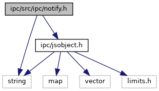
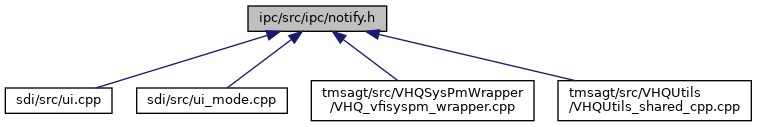

[Namespaces](#namespaces) \| [Macros](#define-members) \| [Typedefs](#typedef-members) \| [Enumerations](#enum-members) \| [Functions](#func-members)

`#include <string>`
`#include <`<a href="ipc_2src_2ipc_2jsobject_8h_source.md">ipc/jsobject.h</a>`>`

Include dependency graph for notify.h:

This graph shows which files directly or indirectly include this file:

<a href="notify_8h_source.md">Go to the source code of this file.</a>

|            |                                                  |
|------------|--------------------------------------------------|
| Namespaces |                                                  |
|            | <a href="namespacevfiipc.md">vfiipc</a> |

|          |                                                  |
|----------|--------------------------------------------------|
| Macros   |                                                  |
| #define  | [DllSpec](#ad7c2e1cb200073ed64c64285a5f37231)    |
| #define  | [DEPRECATED](#ac1e8a42306d8e67cb94ca31c3956ee78) |

|  |  |
|----|----|
| Typedefs |  |
| typedef void(\*  | <a href="namespacevfiipc.md#ab377f9e2a200c707731b1984626d70c9">NotifyCallback</a>) (void \*data, const std::string &from, const std::string &to, const std::string &notification_id, const <a href="classvfiipc_1_1_j_s_object.md">vfiipc::JSObject</a> &param, unsigned flags) |
| typedef void(\*  | <a href="namespacevfiipc.md#a74917bd8d91bec1ff98234834e531071">NotifyObserver</a>) (void \*data, const std::string &from, const std::string &to, const std::string &notification_id, unsigned flags) |

|  |  |
|----|----|
| Enumerations |  |
| enum   | <a href="namespacevfiipc.md#a7eda24f6e23d0f36491cc949c16ac4c3">NotifyResult</a> {   <a href="namespacevfiipc.md#a7eda24f6e23d0f36491cc949c16ac4c3ad787ef779aa8d69677c23222002f0bed">NOTIFY_OK</a> =0, <a href="namespacevfiipc.md#a7eda24f6e23d0f36491cc949c16ac4c3a3332b9f23fcc102341e551348f714940">NOTIFY_ERR_SERVER</a> =-1, <a href="namespacevfiipc.md#a7eda24f6e23d0f36491cc949c16ac4c3a91002612e8cdf73185b9c15f283f4334">NOTIFY_ERR_APP_ID</a> =-2, <a href="namespacevfiipc.md#a7eda24f6e23d0f36491cc949c16ac4c3acc5931c8ff064376a30c0bf608775174">NOTIFY_ERR_PERMISSION</a> =-3,   <a href="namespacevfiipc.md#a7eda24f6e23d0f36491cc949c16ac4c3a9d00b7fe7320736555c91922fe04b8d3">NOTIFY_ERR_CONFIG_FILE</a> =-4, <a href="namespacevfiipc.md#a7eda24f6e23d0f36491cc949c16ac4c3a04b9ff1a6a62d1ebbdf6322081a8a963">NOTIFY_ERR_CONFIG_SYNTAX</a> =-5 } |

|  |  |
|----|----|
| Functions |  |
| <a href="sound_8h.md#ad7c2e1cb200073ed64c64285a5f37231">DllSpec</a> void  | <a href="namespacevfiipc.md#a88455cb389891217791604f188ac0fa5">ipcSetAppID</a> (const std::string &app_id) |
| <a href="sound_8h.md#ad7c2e1cb200073ed64c64285a5f37231">DllSpec</a> std::string  | <a href="namespacevfiipc.md#a80d9206c7e76f24c2e2176308dbc3e06">ipcGetAppID</a> () |
| <a href="sound_8h.md#ad7c2e1cb200073ed64c64285a5f37231">DllSpec</a> enum NotifyResult  | <a href="namespacevfiipc.md#a3ad101cda0c973d26791bd8f194d4b80">ipcNotify</a> (const std::string &to, const std::string &notification_id, const <a href="classvfiipc_1_1_j_s_object.md">vfiipc::JSObject</a> &param, unsigned flags=0, const std::string &from=\"\") |
| <a href="sound_8h.md#ad7c2e1cb200073ed64c64285a5f37231">DllSpec</a> enum NotifyResult  | <a href="namespacevfiipc.md#a625ae82cd0bc99851ccb8a8ffdcaea1e">ipcRegisterNotificationCB</a> (const std::string &notification_id, NotifyCallback cb, void \*data, int priority=0, const std::string &to=\"\") |
| <a href="sound_8h.md#ad7c2e1cb200073ed64c64285a5f37231">DllSpec</a> enum NotifyResult  | <a href="namespacevfiipc.md#a3fd5ffbe7bd9aa056c2400bd0a01e142">ipcUnregisterNotificationCB</a> (const std::string &notification_id, NotifyCallback cb, void \*data=0, const std::string &to=\"\") |
| <a href="libseccmd-comp_8h.md#ac1e8a42306d8e67cb94ca31c3956ee78">DEPRECATED</a> enum NotifyResult  | <a href="namespacevfiipc.md#a861c0397a3c9754cd574d97e62da4d62">ipcUnregisterNotificationCB</a> (const std::string &notification_id, const std::string &to=\"\") |
| <a href="sound_8h.md#ad7c2e1cb200073ed64c64285a5f37231">DllSpec</a> enum NotifyResult  | <a href="namespacevfiipc.md#a16b6627aaac4d6edab93696292c8b7a6">ipcRegisterUnicastError</a> (NotifyCallback cb, void \*data) |
| <a href="sound_8h.md#ad7c2e1cb200073ed64c64285a5f37231">DllSpec</a> enum NotifyResult  | <a href="namespacevfiipc.md#a1bcfa904cfacfc8687ddca2204b2f778">ipcUnregisterUnicastError</a> (NotifyCallback cb, void \*data) |
| <a href="libseccmd-comp_8h.md#ac1e8a42306d8e67cb94ca31c3956ee78">DEPRECATED</a> enum NotifyResult  | <a href="namespacevfiipc.md#a0c523049653bf25c7dfae093f75704c8">ipcUnregisterUnicastError</a> () |
| <a href="sound_8h.md#ad7c2e1cb200073ed64c64285a5f37231">DllSpec</a> enum NotifyResult  | <a href="namespacevfiipc.md#a5cb6705e4d5e2d94225eac66c760e872">ipcRegisterObserver</a> (NotifyObserver cb, void \*data) |
| <a href="sound_8h.md#ad7c2e1cb200073ed64c64285a5f37231">DllSpec</a> enum NotifyResult  | <a href="namespacevfiipc.md#ab259b3fce42df166ecc267066af9b105">ipcUnregisterObserver</a> (NotifyObserver cb, void \*data) |
| <a href="libseccmd-comp_8h.md#ac1e8a42306d8e67cb94ca31c3956ee78">DEPRECATED</a> enum NotifyResult  | <a href="namespacevfiipc.md#a6c2855f19aa443ef85c42b02d296268b">ipcUnregisterObserver</a> () |
| <a href="sound_8h.md#ad7c2e1cb200073ed64c64285a5f37231">DllSpec</a> enum NotifyResult  | <a href="namespacevfiipc.md#a1862bc6c0fe6d07d60c677292cbc9619">ipcNotificationServer</a> () |
| <a href="sound_8h.md#ad7c2e1cb200073ed64c64285a5f37231">DllSpec</a> enum NotifyResult  | <a href="namespacevfiipc.md#a7b8f16e995dfe57edad4cd97676a2eae">ipcNotificationServer</a> (const char \*config_file) |

## MacroDefinition Documentation {#macro-definition-documentation}

## DEPRECATED 

#define DEPRECATED

## DllSpec 

#define DllSpec

