### Tableof Contents

- [Packman tool](#packman_page)
- [Introduction](#packman_intro)
- [Installation](#packman_installation)
  - [Pre-requisites](#packman_installation_prerequisites)
  - [Windows](#packman_installation_windows)
  - [Linux](#packman_installation_linux)
  - [Reference](#packman_installation_ref)
- [Launch](#packman_launch)
  - [Windows](#packman_launch_windows)
  - [Linux](#packman_launch_linux)
- [Command line interface](#packman_cli)
  - [Launch](#packman_cli_launch)
  - [Help](#packman_cli_help)
  - [Windows force permissions (vos3 only)](#packman_cli_special_flags)
  - [build command](#packman_cli_build)
    - [vos2](#vos2)
    - [vos3](#vos3)
  - [extract command](#packman_cli_extract)
  - [db_add command (vos3 only)](#packman_cli_db_add)
  - [gen_diff command (vos3 only)](#packman_cli_gen_diff)
  - [list command](#packman_cli_list)
  - [gen_removal command (vos3 only)](#packman_cli_gen_removal)
  - [merge command](#packman_cli_merge)
  - [sign command](#packman_cli_sign)
  - [validate command](#packman_cli_validate)
  - [cpapp_convert command (vos3 only)](#packman_cli_cpapp_convert)
  - [gen_activation command (vos3 only)](#packman_cli_gen_activation)
  - [upwd_build command (vos3 & vaos only)](#packman_cli_upwd_build)
  - [uvrk_build command (vos3 only)](#packman_cli_uvrk_build)
  - [pre_signingportal command](#packman_cli_pre_signingportal)
  - [post_signingportal command](#packman_cli_post_signingportal)
  - [zip_create command (vos3 only)](#packman_cli_zip_create)
  - [sponsor_change_create command (vos3 only)](#packman_cli_sponsor_change_create)
  - [sponsor_change_merge command (vos3 only)](#packman_cli_sponsor_change_merge)
  - [zip_sign command (vos3 only)](#packman_cli_zip_sign)
  - [zip_apply command (vos3 only)](#packman_cli_zip_apply)
  - [stat command](#packman_cli_stat)
  - [ui command](#packman_cli_ui)
- [Bundle filters (vos3 only)](#packman_bundle_filters)
- [User interface](#packman_ui)
  - [Start](#packman_ui_start)
  - [Add to catalog](#packman_ui_add_catalog)
  - [Tree view](#packman_ui_dlfile_treeview)
  - [Content view](#packman_ui_contentview)
  - [Search](#packman_ui_find)
  - [Validation report](#packman_ui_validation)
  - [Bread crumbs](#packman_ui_breadcrumbs)
  - [Create a project](#packman_ui_create_project)
  - [Writable nodes](#packman_ui_create_writable)
  - [Select signer and signer users](#packman_ui_select_signer)
  - [Delete selected nodes](#packman_ui_delete_selected)
  - [Undo / redo](#packman_ui_undo_redo)
  - [Context menu](#packman_ui_context_menu)
  - [Edit text file](#packman_ui_edit_text_file)
  - [Adding files to archive](#packman_ui_add_files)
  - [Change permissions](#packman_ui_change_permissions)
  - [Exporting](#packman_ui_export)
- [Automatic fixes](#packman_automatic_fixes)
- [Device mode validation (vos3 only)](#packman_device_modes)

# Packman tool <a href="#packman_page" id="packman_page"></a>

This page contains information about the Packman tool usage and design.

# Introduction <a href="#packman_intro" id="packman_intro"></a>

On V/OS and V/OS2 platforms, the packaging is using three levels of archives.

- Dlfile
  - Bundle(s)
    - Package(s)

Please refer to <a href="pg_vos_secins_guide.md#secins_page">Secure Installer</a> for complete description of these archives.

The Packman tool is providing three facilities to manage the creation, modification and signing of archives:

1.  Command line interface
2.  UI interface
3.  Python library with APIs

# Installation <a href="#packman_installation" id="packman_installation"></a>

## Pre-requisites <a href="#packman_installation_prerequisites" id="packman_installation_prerequisites"></a>

Packman tool has following pre-requisites:

- Host OS: Windows or Linux.
- HTML5 CSS3 Javascript browser (only if UI interface is used)

## Windows <a href="#packman_installation_windows" id="packman_installation_windows"></a>

1.  Install python 3.8+ for windows
    - choose \'Customize Installation\'
      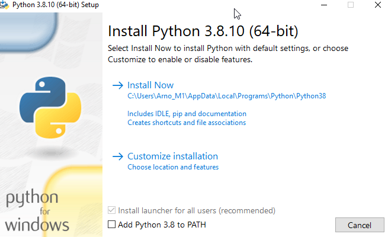
    - verify that install \'pip\' is ticked
      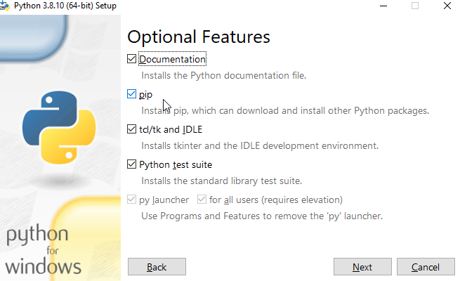
    - launch installation
2.  Extract packman release file (.zip) to a directory of your choice
    - tools like 7-zip and the like can be used
    - \'c:\\tools\\packman\' is assumed in this documentation
3.  Open a command line window \'cmd\'
4.  Change current directory to packman directory
    ``` cpp
    cd c:\tools\packman
    ```
5.  Install requirements
    ``` cpp
    py -m pip install -e .
    ```

## Linux <a href="#packman_installation_linux" id="packman_installation_linux"></a>

These steps may vary upon linux distributions. Ubuntu is assumed in the examples.

1.  Install python 3.8+
    ``` cpp
    sudo apt install python3
    ```
2.  Install pip
    ``` cpp
    sudo apt install python3-pip
    ```
3.  Extract packman release file (tgz) to a directory of your choice
    - \'\~/tools/packman\' is assumed in this documentation
      ``` cpp
      tar xzvf packman_x.y.z.tgz
      ```
4.  Change current directory to packman directory
    ``` cpp
    cd ~/tools/packman
    ```
5.  Install requirements
    ``` cpp
    pip install -e .
    ```

## Reference <a href="#packman_installation_ref" id="packman_installation_ref"></a>

# Launch <a href="#packman_launch" id="packman_launch"></a>

## Windows <a href="#packman_launch_windows" id="packman_launch_windows"></a>

1.  Open a command line window \'cmd\'
    ``` cpp
    py packman.py
    ```

## Linux <a href="#packman_launch_linux" id="packman_launch_linux"></a>

- Open a terminal (ie Ctrl+Alt+T)

1.  Launch
    ``` cpp
    packman.py
    ```

# Command line interface <a href="#packman_cli" id="packman_cli"></a>

## Launch <a href="#packman_cli_launch" id="packman_cli_launch"></a>

All command line examples will use the same format:

``` cpp
packman.py <command> <options>
```

Please adapt to:

- on Windows:
  ``` cpp
  python packman.py <command> <options>
  ```
- on Linux:
  ``` cpp
  ./packman.py <command> <options>
  ```

## Help <a href="#packman_cli_help" id="packman_cli_help"></a>

- General help:
  ``` cpp
  packman.py -h
  ```

Example output:

``` cpp
usage: packman.py [-h] [--show_all] [--winforce_permissions]
   {build,cpapp_convert,db_add,extract,gen_activation,gen_diff,gen_removal,list,merge,post_signingportal,pre_signingportal,sign,sponsor_change_create,sponsor_change_merge,stat,ui,up_build,upwd_build,uvrk_build,validate,zip_apply,zip_create,zip_sign}
   ...
Packman v1.9.3
positional arguments:
  {build,cpapp_convert,db_add,extract,gen_activation,gen_diff,gen_removal,list,merge,post_signingportal,pre_signingportal,sign,sponsor_change_create,sponsor_change_merge,stat,ui,up_build,upwd_build,uvrk_build,validate,zip_apply,zip_create,zip_sign}
   Detailed command usage: <command> -h
optional arguments:
  -h, --help show this help message and exit
  --show_all do not collapse issues
  --winforce_permissions
   force usrX exec permissions on windows
Examples:
   Build dlfile
   packman.py build -t vos2 -i input_dir -d dl.file.tgz
   packman.py build -t vos3 -i input_dir -d dl.file.tar
   Convert CP application
   packman.py cpapp_convert -t vos3 -s dev -z cpapp-123345678.zip -o dl.dlfile.tar
   packman.py cpapp_convert -t vos3 -s dev --cpapp_type appdev -d dl.cpapp_prod.tar -o dl.cpapp_appdev.tar
   Add bundles to database
   packman.py db_add -t vos3 -d dl.file.tar
   Extract dlfile
   packman.py extract -t vos2 -d dl.file.tgz -o ouputdir
   packman.py extract -t vos3 -d dl.file.tar -o ouputdir
   Generate activation dlfile
   packman.py gen_activation -t vos3 -s dev -d dl.file.tar -o dl.file_activate.tar
   Generate differential dlfile
   packman.py gen_diff -t vos3 --src dl.source.tar --dst dl.destination.tar -o dl.differential.tar
   Generate removal dlfile
   packman.py gen_removal -t vos3 -s dev -d dl.file.tar -o dl.file_remove.tar
   List content of 'dlfile.tgz
   packman.py list -t vos2 -d dlfile.tgz
   packman.py list -t vos3 -d dl.file.tar
   Merge or filter dlfile
   packman.py merge -t vos2 -d dl.file1.tgz dl.file2.tgz -o dl.file_merged.tgz
   packman.py merge -t vos3 -d dl.file1.tar dl.file2.tar -o dl.file_merged.tar
   Postprocess dlfile after Signing Portal or Package Manager
   packman.py post_signingportal -t vos2 -d dlfile.tgz -o output.tgz
   Preprocess dlfile for Signing Portal or Package Manager
   packman.py pre_signingportal -t vos2 -d dlfile.tgz -o output.tgz
   Sign dlfile
   packman.py sign -t vos2 -s dev -d dl.file.tgz -o dl.file_signed.tgz
   packman.py sign -t vos3 -s dev -d dl.file.tar -o dl.file_signed.tar
   Create a sponsor change into 'dl.dlfile.tar'
   packman.py sponsor_change_create -t vos3 -s dev --current_sponsor 123456 --serial_numbers "123-456-789" -o dl.dlfile.tar
   Merge two sponsor change dlfiles into 'dl.dlfile.tar'
   packman.py sponsor_change_merge -t vos3 -i dl.signed_current.tar dl.signed_new.tar -o dl.dlfile.tar
   Output information on dlfile
   packman.py stat -t vos2 -d dlfile.tgz
   packman.py stat -t vos3 -d dl.file.tar
   User interface
   packman.py ui
   Unified VRK packaging into 'file.uvrk.tar'
   packman.py uvrk_build -t vos3 -i payload_123-456-789.vrk2.json -o file.uvrk.tar
   Unified password packaging
   packman.py upwd_build -t vos3 -s dev -e test -i password_changes.json -o file.upwd.tar
   packman.py upwd_build -t vos3 -s dev -e encryption_cert.pem -i password_changes.json -o file.upwd.tar
   packman.py upwd_build -t vaos -s dev -e encryption_cert.pem -i password_changes.json -o file.zip
   packman.py upwd_build -t vaos -s dev -e encryption_cert.pem -i password_changes.json -o file.apk
   Unified VRK packaging into 'file.uvrk.tar'
   packman.py uvrk_build -t vos3 -i payload_123-456-789.vrk2.json -o file.uvrk.tar
   Validate dlfile
   packman.py validate -t vos2 -d dl.file.tgz
   packman.py validate -t vos3 -d dl.file.tar
   Apply zip file signed to directory
   packman.py zip_apply -t vos3 -i directory -z files_signed.zip
   Create zip file to sign
   packman.py zip_create -t vos3 -i directory -o files_to_sign.zip
   Sign content of zip
   packman.py zip_sign -t vos3 -s dev -c EMV -z files.zip -o files_signed.zip
```


that options can be combined: \'-r -d dlfile.tgz\' is equivalent to \'-rd dlfile.tgz\'


- Command help:
  ``` cpp
  packman.py <command> -h
  ```

Example output:

``` cpp
packman.py list -h
```

``` cpp
usage: packman.py list [-h] [--report_type {security,dependency,content}] [-r] -t {vos1,vos2,vos3} (-d DLFILE | -b BUNDLE | -p PACKAGE)
list content of archive
optional arguments:
  -h, --help show this help message and exit
  --report_type {security,dependency,content}
   report type - vos1:{'content'} vos2:{'content'} vos3:{'security', 'dependency', 'content'}
  -r, --recurse act recursively
  -t {vos1,vos2,vos3}, --platform {vos1,vos2,vos3}
   target platform
  -d DLFILE, --dlfile DLFILE
   dlfile path
  -b BUNDLE, --bundle BUNDLE
   bundle path
  -p PACKAGE, --package PACKAGE
   package path
```

Here a summary of commands:

| Command | Description |
|----|----|
| <p>build</p> | <p>build archive from directories</p> |
| <p>cpapp_convert</p> | <p>convert CP application</p> |
| <p>db_add</p> | <p>add bundles to database</p> |
| <p>extract</p> | <p>extract content of archive</p> |
| <p>gen_activation</p> | <p>generate activation dlfile</p> |
| <p>gen_diff</p> | <p>generate differential dlfile</p> |
| <p>gen_removal</p> | <p>generate removal dlfile</p> |
| <p>keywrap</p> | <p>wrap key into archive</p> |
| <p>list</p> | <p>list content of archive</p> |
| <p>merge</p> | <p>merge several archives into one</p> |
| <p>pre_signingportal</p> | <p>modify dlfile for usage with signing portal</p> |
| <p>post_signingportal</p> | <p>modify dlfile after signing portal usage</p> |
| <p>sign</p> | <p>sign archive content</p> |
| <p>sponsor_change_create</p> | <p>create a sponsor change</p> |
| <p>sponsor_change_merge</p> | <p>merge two sponsor change</p> |
| <p>stat</p> | <p>output information on archive</p> |
| <p>ui</p> | <p>launch user interface</p> |
| <p>upwd_build</p> | <p>build unified packaging password</p> |
| <p>uvrk_build</p> | <p>build unified packaging vrk</p> |
| <p>validate</p> | <p>retrieve validation report on archive</p> |
| <p>zip_create</p> | <p>create zip file with files to sign in directory</p> |
| <p>zip_sign</p> | <p>sign file within zip file</p> |
| <p>zip_apply</p> | <p>add signatures in zip file back to directory</p> |


All operations require to provide the target platform (ie \'-t vos2\')


## Windows force permissions (vos3 only) <a href="#packman_cli_special_flags" id="packman_cli_special_flags"></a>

In order to force executable permission bits when running packman on Windows, a special option flag \'--winforce_permissions\' can be used:

``` cpp
packman.py --winforce_permissions build -t vos3 -s dev -i input_dir -fd dlfile.tar
```

On Windows, this will build a dlfile archive named \'dlfile.tar\' from the content of the directories \'input_dir\' for the platform vos3 and if a user package has an executable file, its permissions bits for execution will be set.

## build command <a href="#packman_cli_build" id="packman_cli_build"></a>

The \'build\' command creates archives (dlfile, bundle, package) from the contents of directories. Please refer to \'build\' help for all options.

### vos2 <a href="#vos2" id="vos2"></a>

Example usage:

``` cpp
packman.py build -t vos2 -i input_dir input_dir2 -d dlfile.tgz
```

This will build a dlfile archive \'dlfile.tgz\' from the content of the directories \'input_dir\' and \'input_dir2\' for the platform vos2. This input directory should normally contain CONTROL directory, bundles, \...

The \'build\' command can also act recursively to create archives from the content of a directory. The top directory provided contains bundle directories which in turn contain package directories. Each directory must contain the appropriate CONTROL directory and files. The recursive build will recursively package all of them to produce a dlfile. The recursive build is enabled using the option flag \'-r\'.

Example usage (recursive):

``` cpp
packman.py build -t vos2 -ri input_dir -d dlfile.tgz
```

This will build a dlfile archive named \'dlfile.tgz\' from the content of the directory \'input_dir\' recursively packaging dlfile/bundle/package directories inside for the platform vos2.

### vos3 <a href="#vos3" id="vos3"></a>

Example usage:

``` cpp
packman.py build -t vos3 -i input_dir input_dir2 -d dlfile.tar
```

This will build a dlfile archive \'dlfile.tar\' from the content of the directories \'input_dir\' and \'input_dir2\' for the platform vos3. Each input directory should normally contain manifest and package directories coresponding to one bundle.

Here is an example of a bundle input directory structure:

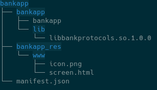

The \'build\' command can also act recursively to create archives from the content of a directory. The top directory provided contains bundle directories which in turn contain package directories. Each directory must contain the appropriate manifest file and package directories (with their content). The recursive build will recursively package all of them to produce a dlfile. The recursive build is enabled using the option flag \'-r\'.

Example usage (recursive):

``` cpp
packman.py build -t vos3 -ri input_dir -d dlfile.tar
```

This will build a dlfile archive named \'dlfile.tar\' from the content of the directory \'input_dir\' recursively packaging dlfile/bundle directories inside for the platform vos3.

This command allows to specify [Device mode validation (vos3 only)](#packman_device_modes)

## extract command <a href="#packman_cli_extract" id="packman_cli_extract"></a>

The \'extract\' command extracts recursively the content of archives (dlfile, bundle, package) to directories. The extracted content is layed out such as a recursive build done on this output would recreate the original archive. Please refer to \'extract\' help for all options.

Example usage:

``` cpp
packman.py extract -t vos2 -d dlfile.tgz -o dlfile_dir
```

This will extract a dlfile archive named \'dlfile.tgz\' recursively to the directory \'dlfile_dir\' for the platform vos2.

## db_add command (vos3 only) <a href="#packman_cli_db_add" id="packman_cli_db_add"></a>

The \'db_add\' command takes as input a dlfile and registers its content to a local database. This database is located at \<user_home\>/.packman/db/ The content of the database can be used for generating differentials: see [gen_diff command (vos3 only)](#packman_cli_gen_diff).

Before being registered, the dlfile is first validated.

Example usage:

``` cpp
packman.py db_add -t vos3 -d dlfile.tar
```

This will look register to database all bundles and upfiles in \'dlfile.tar\'.

## gen_diff command (vos3 only) <a href="#packman_cli_gen_diff" id="packman_cli_gen_diff"></a>

The \'gen_diff\' command takes as input source and destination bundles and creates a differential dlfile. This command operates either by providing a differential description file or by providing source ans destination dlfiles

When providing source and destination dlfiles, packman will add all bundles and upfiles of all dlfiles to the database (see [db_add command (vos3 only)](#packman_cli_db_add) ) then create a differential description file containing the matching information and run the differential command with it.

Differential process overview:

- In all steps, targeting of both source and destination are taken into account
- For all upfiles, removal bundles and sponsor changes in destination: add to diff dlfile
- In all other cases: perform entry by entry selection between \"add\", \"copy\" and \"sbspatch\" operations : add resulting differential bundle to diff dlfile

Example usage (differential description file):

``` cpp
packman.py gen_diff -t vos3 --diff diff_file.json -o dl.diff.tar
```

This will look for the bundles listed in diff_file.json (source and destination), check that they are present in database and generate a differential dlfile \'dl.diff.tar\' for the platform vos3.

Example usage (source and destination dlfiles):

``` cpp
packman.py gen_diff -t vos3 --src dl.source.tar --dst dl.destination.tar -o dl.diff.tar
```

This will add to database all bundles and upfiles in \'dl.source.tar\' and \'dl.destination.tar\' and then generate a differential dlfile \'dl.diff.tar\' for the platform vos3.

Here is shown the structure of a differential description file:

``` cpp
{
   "source": {
   "bundles": [
   {
   "digest": "36e7300a0559831ede5065d1dd10d6802e4ad884d7965d512eabcb6f562430de",
   "name": "bundle_a",
   "version": "1.0.0"
   }
   ...
   ]
   "upfiles": [
   {
   "digest": "6802e4ad884d7965d512eabcb6f562430de36e7300a0559831ede5065d1dd10d",
   "name": "mykeya.uvrk.tar"
   },
   ...
   ]
   },
   "destination": {
   "bundles": [
   {
   "digest": "4ad884d7965d512eabcb6f562430de36e7300a0559831ede5065d1dd10d6802e",
   "name": "bundle_b",
   "version": "1.0.0"
   },
   ...
   ]
   "upfiles": [
   {
   "digest": "e36e7300a06802e4ad884d7965d512eabcb6f562430d559831ede5065d1dd10d",
   "name": "mykeyb.uvrk.tar"
   },
   ...
   ]
   }
}
```

Note: the differential process on entries (\'copy\' and \'sbspatch\' operations) are allowed on all destination package types (read-only or not) and can refer any file of any source bundle/package as long as this source package is read-only.

This command allows to specify [Bundle filters (vos3 only)](#packman_bundle_filters)

## list command <a href="#packman_cli_list" id="packman_cli_list"></a>

The \'list\' command lists content of archives (dlfile, bundle, package). Please refer to \'list\' help for all options.

Example usage:

``` cpp
packman.py list -t vos2 -rd dlfile.tgz
```

This will list recursively (-r) the content of a dlfile archive (-d) named \'dlfile.tgz\' for the platform vos2.

## gen_removal command (vos3 only) <a href="#packman_cli_gen_removal" id="packman_cli_gen_removal"></a>

The \'gen_removal\' takes as input a dlfile containing bundles and creates a dlfile containing the corresponding removal bundles. The type of remove bundles can be chosen with \'--remove_type\' which takes one of the following values:

- **bundle_version** (default): this creates remove bundles for the bundle and its version
- **bundle** : this creates remove bundles for the bundle without version specified
- **user** : this creates remove bundles for the user (removing all bundles for that user)

Please refer to \'gen_removal\' help for all options.

Example usage:

``` cpp
packman.py gen_removal -t vos3 -s dev -d dl.file.tar -o dl.file_remove.tar
```

This will look for the bundles in dlfile named \'dlfile.tgz\' and create in \'dl.file_remove.tar\' removal bundles using the \'bundle_version\' type for the platform vos3.

This command allows to specify [Bundle filters (vos3 only)](#packman_bundle_filters)

## list command <a href="#packman_cli_list" id="packman_cli_list"></a>

The \'list\' command lists content of archives (dlfile, bundle, package). Please refer to \'list\' help for all options.

Example usage:

``` cpp
packman.py list -t vos2 -rd dlfile.tgz
```

This will list recursively (-r) the content of a dlfile archive (-d) named \'dlfile.tgz\' for the platform vos2.

Example:

``` cpp
> ./packman.py list -t vos2 -rd dl.normal.tgz
Dlfile dl.normal.tgz
   Bundle bdl_normal.tgz
   Dir CONTROL/
   File control
   File filelist
   Package pkg_normal.tgz
   Dir CONTROL/
   File control
   File filelist
   File normal
   Signature pkg_normal.tgz.p7s
```

Other types of reports are available by using the \'--report_type\' option with:

- **content** (all platforms, default): lists content and entry types
- **security** (vos3 only): list bundles, their signer, user membership and requested capabilities
- **dependency** (vos3 only): list bundles, their hardware platform, targeting and dependencies
- **target** (vos3 only): lists installed entries with location, type (Dir, File, Symlink), size, linkname, user, group, mode, capabilities, sha1
- **similarity** (vos3 only) (experimental): lists equal or similar file contents

## merge command <a href="#packman_cli_merge" id="packman_cli_merge"></a>

The \'merge\' command allows to combine several archives of same type (dlfile, bundle, package, uvrk, upwd) to create a single archive of that same type containing the merge of all contents. Merging archives with different types is not allowed except between dlfile and a unified package (uvrk, upwd). Please refer to \'merge\' help for all options.

Example usage:

``` cpp
packman.py merge -t vos2 -d dlfile1.tgz dlfile2.tgz -o dlfile.tgz
```

This will create a dlfile archive named \'dlfile.tgz\' which contains all content of the \'dlfile1.tgz\' and \'dlfile2.tgz\' for the platform vos2.

``` cpp
packman.py merge -t vos3 -u mykey1.uvrk.tar mykey2.uvrk.tar -o mykeys.uvrk.tar
```

This will create a combined uvrk archive with both uvrk archive keys merged.

``` cpp
packman.py merge -t vos3 -d dlfile.tar -u mykeys.uvrk.tar mypasswords.upwd.tar -o dl.merged.tar
```

This will create a dlfile \'dl.merged.tar\' that contains all bundles of \'dlfile.tar\', \'mykeys.uvrk.tar\' and \'mypasswords.upwd.tar\'.

This command allows to specify [Bundle filters (vos3 only)](#packman_bundle_filters) and [Device mode validation (vos3 only)](#packman_device_modes)

## sign command <a href="#packman_cli_sign" id="packman_cli_sign"></a>

The \'sign\' command signs content of archives (dlfile, bundle, package). Please refer to \'sign\' help for all options.

Example usage 1:

``` cpp
packman.py sign -t vos2 -s dev_usr -d dlfile.tgz -o dlfile_signed.tgz
```

This will list recursively sign the content of a dlfile archive (-d) named \'dlfile.tgz\' for the platform vos2 and output result in \'dlfile_signed.tgz\'.

Example usage 2:

``` cpp
packman.py sign -t vos2 -rs dev_usr -d dlfile.tgz -fo dlfile_signed.tgz
```

Same as above except that if a signature already exists, it will resign anyway (-r) and if output file already exists, it will force overwriting (-f).

## validate command <a href="#packman_cli_validate" id="packman_cli_validate"></a>

The \'validate\' command creates a validation report for the content of archives (dlfile, bundle, package). Please refer to \'validate\' help for all options.

Example usage (vos2):

``` cpp
packman.py validate -t vos2 -rd dlfile.tgz
```

This will recursively scan the archive and display packaging errors if found.

Example usage (vos3):

``` cpp
packman.py validate -t vos3 -rd dlfile.tar
```

This will recursively scan the archive and display packaging errors if found.

Example output:

``` cpp
> ./packman.py validate -t vos2 -rd test_resources/dl.pkg_notcompressed.tgz
ERROR (structure) - bdl_pkg_notcompressed.tgz/pkg_pkg_notcompressed.tar : Package is not compressed
errors:1 warnings:0
```

This command allows to specify [Device mode validation (vos3 only)](#packman_device_modes)

## cpapp_convert command (vos3 only) <a href="#packman_cli_cpapp_convert" id="packman_cli_cpapp_convert"></a>

The \'cpapp_convert\' command converts a CP application (Commerce Plaform) into an installable dlfile. The input can be a CP application zip file or a dlfile. The type of dlfile output can be chosen using the \'--cpapp_type\' option: \'prod\' for normal type, \'appdev\' for development on appdev devices. Please refer to \'cpapp_convert\' help for all options.

Example usage:

``` cpp
packman.py cpapp_convert -t vos3 -s dev -z mycpapp-887643134.zip -o dl.mycpapp-887643134.tar
```

This will extract the CP application zip named \'mycpapp-887643134.zip\', generate a CP application dlfile and sign it for development for the platform vos3.

``` cpp
packman.py cpapp_convert -t vos3 -s dev --cpapp_type appdev -z mycpapp-887643134.zip -o dl.mycpapp-887643134_appdev.tar
```

This will extract the CP application zip named \'mycpapp-887643134.zip\', generate a CP application dlfile for appdev device and sign it for development for the platform vos3.

``` cpp
packman.py cpapp_convert -t vos3 -s dev --cpapp_type appdev -d dl.mycpapp-887643134.tar -o dl.mycpapp-887643134_appdev.tar
```

This will convert the CP application dlfile named dl.mycpapp-887643134.tar to CP application dlfile for appdev device and sign it for development for the platform vos3.

## gen_activation command (vos3 only) <a href="#packman_cli_gen_activation" id="packman_cli_gen_activation"></a>

The \'gen_activation\' command creates usr1 activation installable dlfile which activates features of the system. This can be used typically to generate activation for Commerce Applications. Please refer to \'gen_activation\' help for all options.

Example usage:

``` cpp
packman.py gen_activation -t vos3 -s dev -d dl.mycpapp-887643134.tar dl.mycpapp-887643134_activate.tar
```

This will extract the CP application bundle in dl.mycpapp-887643134.tar and generate a corresponding activation dlfile and sign it for development for the platform vos3.

## upwd_build command (vos3 & vaos only) <a href="#packman_cli_upwd_build" id="packman_cli_upwd_build"></a>

The \'upwd_build\' command creates unified packaging for password changes. Please refer to \'upwd_build\' help for all options.

Example usage (vos3):

``` cpp
packman.py upwd_build -t vos3 -e encryption_cert.pem -s dev -i password_change.json -o file.upwd.tar
```

This will create the file.upwd.tar package containing encrypted and signed password changes instructions. The \'-e encryption_cert.pem\' indicates which encryption certificate (pem file) to use for encryption and the \'-s dev\' indicates signing with development key. For testing purposes only, a generic \'test\' encryption certificate is bundled with packman and can be specified with option \'-e test\' (to test both on prod and dev devices). The password changes instructions are passed using the content of a JSON file named \'password_change.json\' in this example. The structure of this instruction file is:

- **password_changes** (mandatory): array of objects
  - **target** (mandatory): array of strings containing target serial numbers expressions
  - **name** (mandatory): string containing name of the password
  - **pass** (mandatory): string containing value of the password. Valid passwords are 7 to 12 digits.
  - **expired** (optional, default to false): boolean indicating if password is expired
  - **require_old** (optional, default to false): boolean indicating if old password is needed to change password

For the target field, the serial number expression must be either:

- a fully defined serial number for a single device: like \"123-456-789\" (1 serial number)
- a globing serial number expression using one or more wildcard (\*) like \"12\*-456-78\*\" (100 serial numbers)

Here is an example of such file:

``` cpp
{
  "password_changes": [
   {
   "target": ["112-123-123"],
   "name": "SUPERVISOR",
   "pass": "1234567"
   },
   {
   "target": ["112-123-123"],
   "name": "LEVEL1",
   "pass": "1234567"
   },
   {
   "target": ["112-123-555","112-123-44*"],
   "name": "LEVEL1",
   "pass": "00123471321",
   "expired": true,
   "require_old": true
   }
  ]
}
```

In such unified packaging, the naming of content and output archive is important and packman will fail on wrong namings.

Note that \'merge\' and \'validate\' accept these type of unified packages for processing using the \'-u\' option.

**Special case of vaos**

Example usage (vaos):

``` cpp
packman.py upwd_build -t vaos -e encryption_cert.pem -s dev -i password_change.json -o file.zip
```

In order to be comply with vaos package signing, the upwd archive mentioned above will be automatically wrapped into a zip archive. The output archive file can be named with:

- \'.zip\' extension: can be directly installed on device
- \'.apk\' extension: can be used to sign online. Once signed, resulting file can be renamed with \'.zip\' extension for installation. If dev signature is requested (-s dev) this output file will be development signed using \'apksigner\' tool. This \'apksigner\' tool needs to be installed separately and PATH environment variable set for packman to invoke it. It is available in the Android SDK but can also be installed separately using the Android \"Build tools\" (choose OS flavor). Some linux distributions allow direct package installation (ie ubuntu: \'sudo apt install apksigner\').

## uvrk_build command (vos3 only) <a href="#packman_cli_uvrk_build" id="packman_cli_uvrk_build"></a>

The \'uvrk_build\' command creates unified packaging for vrk payloads. Please refer to \'uvrk_build\' help for all options.

Example usage:

``` cpp
packman.py uvrk_build -t vos3 -i payload_123-456-789.vrk2.json -o file.uvrk.tar
```

This will create the file.uvrk.tar package containing the payload passed as parameter. In such unified packaging, the naming of content and output archive is important and packman will fail on wrong namings.

Note that \'merge\' and \'validate\' accept these type of unified packages for processing using the \'-u\' option.

## pre_signingportal command <a href="#packman_cli_pre_signingportal" id="packman_cli_pre_signingportal"></a>

The \'pre_signingportal\' command preprocesses a dlfile before usage in Signing Portal or Package Manager. This command and the associated \'post_signingportal\' work as workarounds for those tools for vos2 platform. It performs the following operations:

1.  remove blacklist directory in dlfile
2.  applies all automatic fixes see [Automatic fixes](#packman_automatic_fixes)

To restore the optimizations, it is recommended to use \'post_signingportal\' on resulting dlfile after Signing Portal and Package Manager usage. Please refer to \'pre_signingportal\' help for all options.

Example usage:

``` cpp
packman.py pre_signingportal -t vos2 -d dlfile.tgz -o output.tgz
```

This will preprocess the dlfile \'dlfile.tgz\' and write preprocessed dlfile to \'ouput.tgz\'.

## post_signingportal command <a href="#packman_cli_post_signingportal" id="packman_cli_post_signingportal"></a>

The \'post_signingportal\' command postprocesses a dlfile after usage in Signing Portal or Package Manager. This command and the associated \'pre_signingportal\' work as workarounds for those tools for vos2 platform. It performs the following operations:

1.  restore blacklist directory in dlfile Please refer to \'post_signingportal\' help for all options.

Example usage:

``` cpp
packman.py post_signingportal -t vos2 -d dlfile.tgz -o output.tgz
```

This will postprocess the dlfile \'dlfile.tgz\' and write postprocessed dlfile to \'ouput.tgz\'.

## zip_create command (vos3 only) <a href="#packman_cli_zip_create" id="packman_cli_zip_create"></a>

The \'zip_create\' command creates a zip file containing all files to be signed recursively in a directory. Please refer to \'zip_create\' help for all options.

Example usage:

``` cpp
packman.py zip_create -t vos3 -i directory -fo zip_to_sign.zip
```

This will recursively scan files and archive in directory and create zip file to be signed.

## sponsor_change_create command (vos3 only) <a href="#packman_cli_sponsor_change_create" id="packman_cli_sponsor_change_create"></a>

The \'sponsor_change_create\' command creates a sponsor change dlfile. Please refer to \'sponsor_change_create\' help for all options.

Example usage (unlock):

``` cpp
packman.py sponsor_change_create -t vos3 -s dev --current_sponsor 123456 --serial_numbers "123-456-789" -o dl.dlfile.tar
```

This will create dl.dlfile.tar that can be used to remove sponsor of device with serial number 123-456-789 and sponsor ID 123456. This dlfile will need to be production signed with matching sponsor signer 123456 that can sign for usr1.

Example usage (change):

``` cpp
packman.py sponsor_change_create -t vos3 -s dev --current_sponsor 123456 --new_sponsor 456789 --serial_numbers "123-456-789" -o dl.dlfile.tar
```

This will create dl.dlfile.tar that can be used to change sponsor of device with serial number 123-456-789 and sponsor ID 123456 to sponsor 456789. This dlfile will need to be production signed two times:

1.  signed with matching sponsor signer 123456 that can sign for usr1.
2.  signed with matching sponsor signer 456789 that can sign for usr1. Those two signed outputs need then to be merged back with the merge command see [sponsor_change_merge command (vos3 only)](#packman_cli_sponsor_change_merge)

## sponsor_change_merge command (vos3 only) <a href="#packman_cli_sponsor_change_merge" id="packman_cli_sponsor_change_merge"></a>

The \'sponsor_change_merge\' command merges two signed dlfiles to create a sponsor change dlfile. Please refer to \'sponsor_change_merge\' help for all options.

Example usage:

``` cpp
packman.py sponsor_change_merge -t vos3 -i dl.signed_current.tar dl.signed_new.tar -o dl.dlfile.tar
```

This will create dl.dlfile.tar that can be used to change the sponsor of a device. The two dlfiles provided need to be signed by the correct signers for the current and new sponsors. see [sponsor_change_create command (vos3 only)](#packman_cli_sponsor_change_create)

## zip_sign command (vos3 only) <a href="#packman_cli_zip_sign" id="packman_cli_zip_sign"></a>

The \'zip_sign\' command signs the files contained in a zip file and create a signed zip file. Zip file used as input is typically the output of the above \"zip_create\" command. Please refer to \'zip_sign\' help for all options.

Example usage:

``` cpp
packman.py zip_sign -t vos3 -s dev -z zip_to_sign.zip -fo zip_zigned.zip
```

This will recursively scan files in zip_to_sign.zip and create zip_zigned.zip containing dev signatures.

## zip_apply command (vos3 only) <a href="#packman_cli_zip_apply" id="packman_cli_zip_apply"></a>

The \'zip_apply\' command will insert all signatures in zip file back to directories or archives. Zip file used as input is typically the output of the above \"zip_sign\" command or from signing portal. <a href="class_directory.md">Directory</a> needs to be the exact same as when the \"zip_create\" command was used. Please refer to \'zip_apply\' help for all options.

Example usage:

``` cpp
packman.py zip_apply -t vos3 -i directory -z zip_zigned.zip
```

This will recursively scan files in directories and add signatures from zip_zigned.zip.

## stat command <a href="#packman_cli_stat" id="packman_cli_stat"></a>

The \'stat\' command outputs general information about an archive in a parsable form. Please refer to \'stat\' help for all options.

Example usage:

``` cpp
packman.py stat -t vos3 -d dlfile.tar
```

This will output information like:

``` cpp
name = dlfile.tar
archive_type = Dlfile
platform = vos3
size = 10240
hash_sha256 = 6b8018510c77b26fa80a651a86db4334d1dbe4f7dcefb843cab304a75644ee7e
bundle_count = 1
sponsor_id = 010245
```

## ui command <a href="#packman_cli_ui" id="packman_cli_ui"></a>

The \'ui\' command launches a local webserver and a browser client for user interface.

Example usage:

``` cpp
packman.py ui
```

Please refer to [User interface](#packman_ui) for how to use user interface.

# Bundle filters (vos3 only) <a href="#packman_bundle_filters" id="packman_bundle_filters"></a>

Where mentioned, commands like [gen_removal command (vos3 only)](#packman_cli_gen_removal), [merge command](#packman_cli_merge) and [list command](#packman_cli_list) allow to use bundle filters to include or exclude some bundles from the processing. The following filter options are available:

- **--include_bundle_name:** select which bundle names to be included (\*)
- **--exclude_bundle_name:** select which bundle names to be excluded (\*)
- **--include_bundle_user:** select which bundle users to be included (\*)
- **--exclude_bundle_user:** select which bundle users to be excluded (\*)
- **--include_tgt_devices:** select bundle matching target device models to be included
- **--include_tgt_dt_names:** select bundle matching target device tree names to be included
- **--include_tgt_serial_numbers:** select bundle matching serial numbers to be included
- **--include_arch_type:** select type of archives to be included (one or more of \'bundle\', \'upfile\', \'upwd\' and \'uvrk\')
- **--exclude_arch_type:** select type of archives to be excluded (one or more of \'bundle\', \'upfile\', \'upwd\' and \'uvrk\')

(\*) accepts wilcard \'\*\' to specify globing for the match.

All filters can be combined and each accept multiple values separated by spaces.

# User interface <a href="#packman_ui" id="packman_ui"></a>

## Start <a href="#packman_ui_start" id="packman_ui_start"></a>

When initially started, the browser window shows the following:

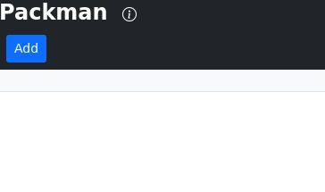

## Add to catalog <a href="#packman_ui_add_catalog" id="packman_ui_add_catalog"></a>

To add an archive to the catalog, click on \"Add\", this will open this dialog:

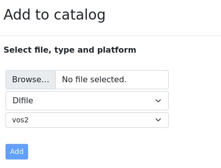

Select the archive on your disk, select the type of archive and the platform, then confirm with \"Add\" button. The newly added archive will appear in the list and can be removed using remove button \"X\". This operation can be performed several times and the current archive can be selected in the dropdown list.

## Tree view <a href="#packman_ui_dlfile_treeview" id="packman_ui_dlfile_treeview"></a>

The selected archive from the catalog is shown using a tree view which looks like a file explorer view, you can fold and open directories as well as archives.

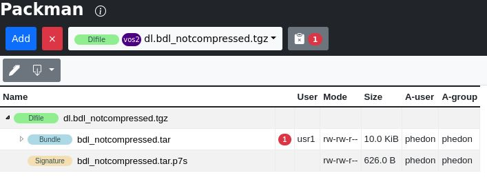

## Content view <a href="#packman_ui_contentview" id="packman_ui_contentview"></a>

If the currently selected node in the tree has content that packman can display, the content of the file will be shown on the right side of the window. Control files, signatures, images, html, xml, css, etc. can be viewed this way.

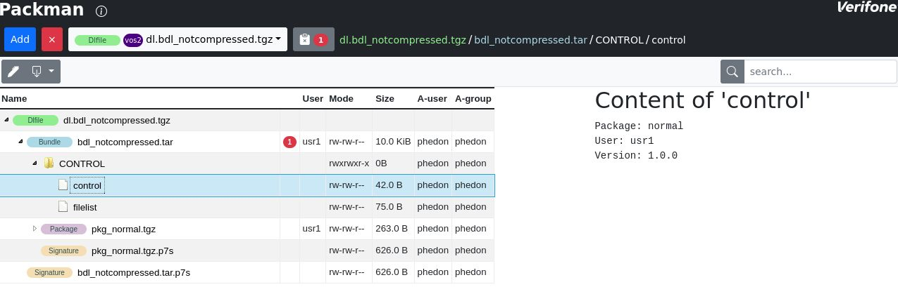

## Search <a href="#packman_ui_find" id="packman_ui_find"></a>

The search entry area allows to look for nodes in the tree that contains the entered text. Note that clicking on the node path will bring you directly to the selected node in the tree.

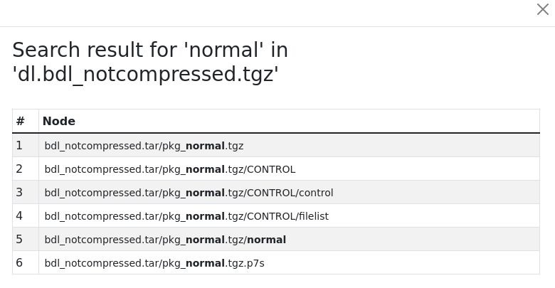

## Validation report <a href="#packman_ui_validation" id="packman_ui_validation"></a>

The billboard icon right to the catalog list shows the current number of validation errors, clicking on it will bring up the validation report.

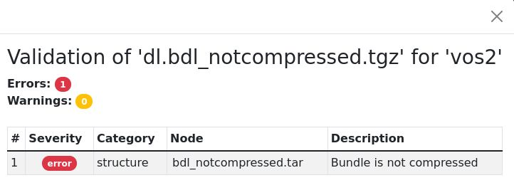

## Bread crumbs <a href="#packman_ui_breadcrumbs" id="packman_ui_breadcrumbs"></a>

When selecting a node, the complete path of this node (separated by \'/\') is displayed. Each of these breadcrumbs are clickable to jump to their location.

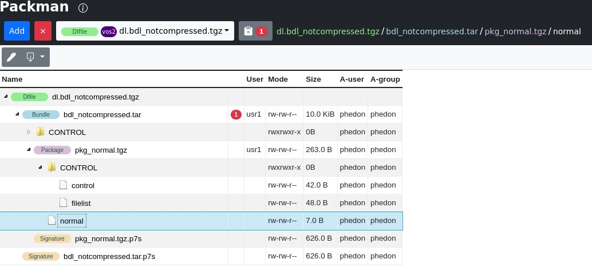

## Create a project <a href="#packman_ui_create_project" id="packman_ui_create_project"></a>

In order to edit an archive, select it and click on the \'pen\' icon. It will ask for a name for this project archive. This project file must have a name that does not already exist in the catalog.

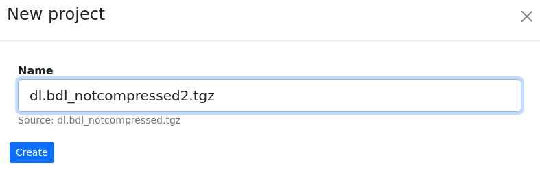

## Writable nodes <a href="#packman_ui_create_writable" id="packman_ui_create_writable"></a>

Depending on the signer that is currently selected and the chosen signer users, the nodes of a project archive may be modifiable or not. This is shown with lock icons.

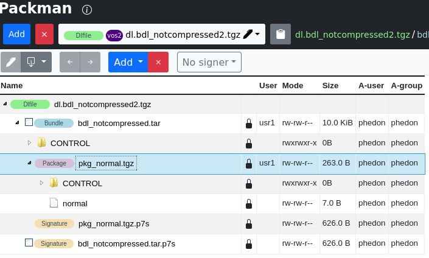

## Select signer and signer users <a href="#packman_ui_select_signer" id="packman_ui_select_signer"></a>

Choosing a signer is done using the signer dropbox.

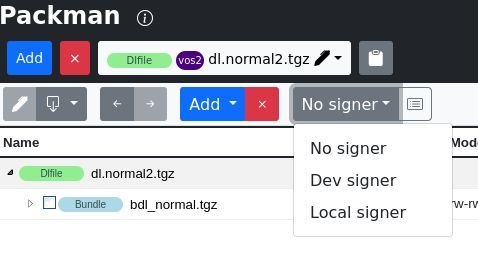

When a signer has been selected, the icon next to it allows to select the signer users. The users shown are the ones supported by the current signer. Thus for local signer, this is also depending on the currently inserted smartcard. Checking or unchecking users allows to limit the allowed signed users.

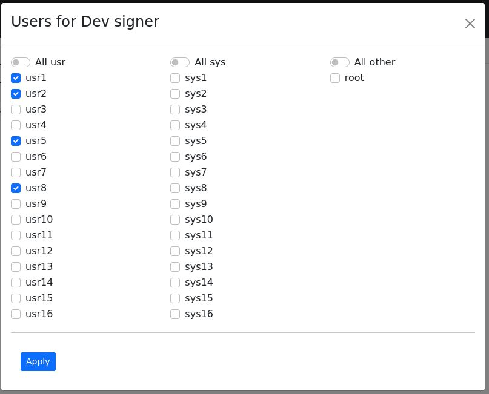

## Delete selected nodes <a href="#packman_ui_delete_selected" id="packman_ui_delete_selected"></a>

Nodes can be selected (checkbox) and removed using \'X\' button

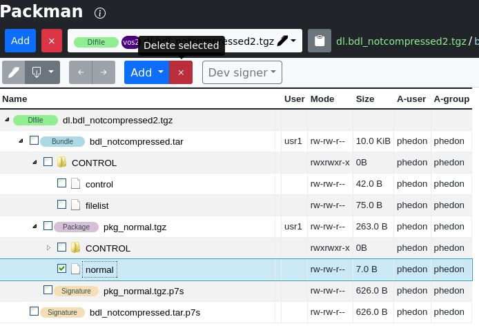

## Undo / redo <a href="#packman_ui_undo_redo" id="packman_ui_undo_redo"></a>

Operations done to the project can be undone or redone using these buttons.


## Context menu <a href="#packman_ui_context_menu" id="packman_ui_context_menu"></a>

A context menu is available on nodes for renaming, deleting, \...

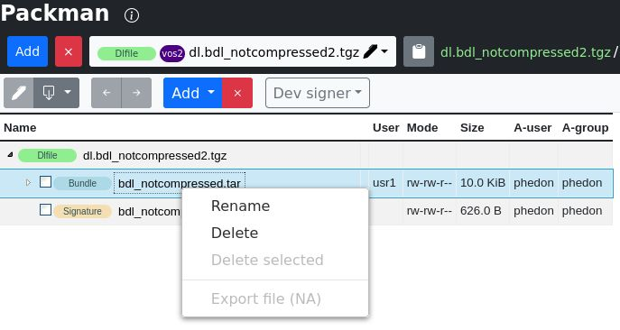

## Edit text file <a href="#packman_ui_edit_text_file" id="packman_ui_edit_text_file"></a>

In order to edit text files, select the file (file must be writable) and when content is displayed on the right pane, click on \'edit\' button. This allows to modify content and save modified content into selected file.

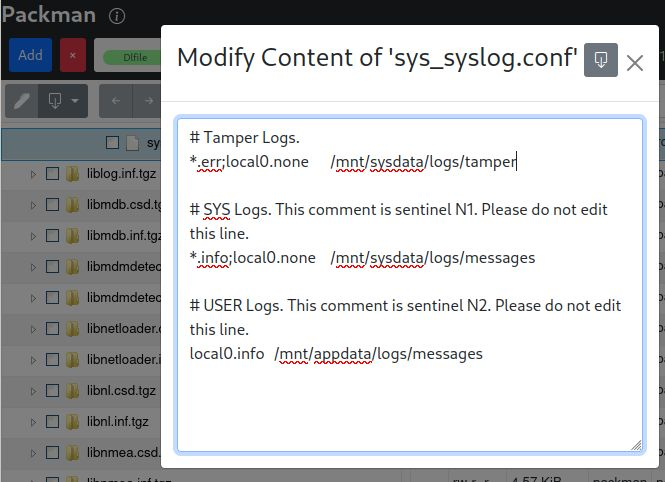

## Adding files to archive <a href="#packman_ui_add_files" id="packman_ui_add_files"></a>

In order to add files to the current project, select the \"Add from catalog\" from the \"Add\" button. This will bring the catalog list into the right part of the window for selection and will show treeview too. To add files to the current project, drag and drop the file into the project.

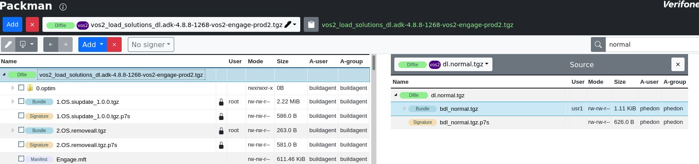

Another way to add a file is to choose \"Add from disk\". The will bring up a file chooser dialog box to insert it into the tree.

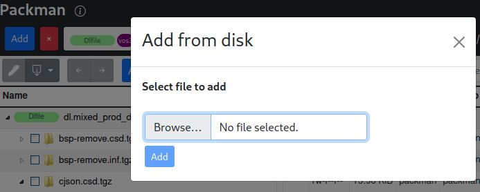

## Change permissions <a href="#packman_ui_change_permissions" id="packman_ui_change_permissions"></a>

Selecting and right-click on node allows to choose \"Permissions\" that let you choose the permissions to set/unset.

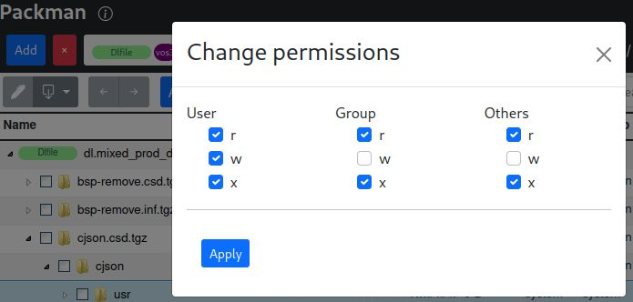

## Exporting <a href="#packman_ui_export" id="packman_ui_export"></a>

The exporting operation will use the current signer and create the resulting archive you edited. Some specific exports are also available which correspond to command line operation. Please refer to [Command line interface](#packman_cli) for more information on their usage.

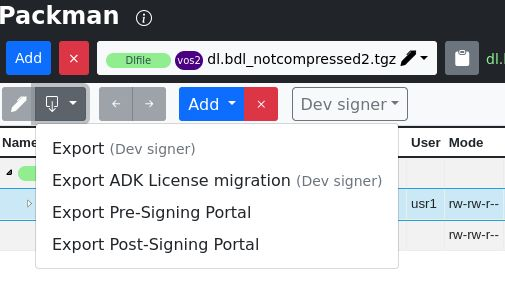

# Automatic fixes <a href="#packman_automatic_fixes" id="packman_automatic_fixes"></a>

When generating an archive, packman applies automatic fixes on contents that are writable. A content is considered writable when one of the following applies:

- content does not involve a signature nor signature of its parent
- content involves a signature and selected signer is applicable
- special operation where signing is postponed: ie pre_signingportal

Here is the list of automatic fixes:

- fix depth-first ordering of archives
- fix compression on archives
- fix naming of extensions for archives, signature, certificate directory, remove \'.\' directories
- fix filelist presence and content
- fix blacklist presence and content
- fix order of items in archives
- fix permissions on windows
- remove permissions on non-executable files
- fix VHQ manifest presence and content
- fix control file fields like ensuring \'Name\' usage in bundle and \'Package\' in packages

# Device mode validation (vos3 only) <a href="#packman_device_modes" id="packman_device_modes"></a>

When validating an archive, packman checks for signature coherency. User can specify four different behaviors explained here:

- Specifying \"\--mode prod\", both system and user bundles must be prod signed
- Specifying \"\--mode osdev\", both system and user bundles must be osdev signed
- Specifying \"\--mode appdev\", system bundles must be appdev signed and user bundles must be osdev signed
- Without specifying the mode, one of the below must validate:
  - one of the above modes is matching
  - system bundles must be prod and user bundles may be osdev signed: this however triggers a warning that user prod signing is needed
