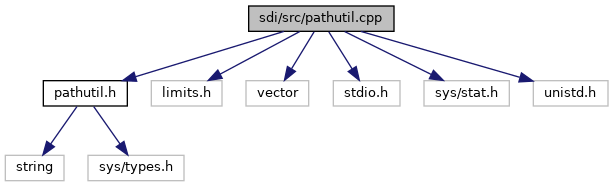

[Macros](#define-members) \| [Functions](#func-members)

`#include "`<a href="pathutil_8h_source.md">pathutil.h</a>`"`
`#include <limits.h>`
`#include <vector>`
`#include <stdio.h>`
`#include <sys/stat.h>`
`#include <unistd.h>`

Include dependency graph for pathutil.cpp:

|          |                                                              |
|----------|--------------------------------------------------------------|
| Macros   |                                                              |
| #define  | [PATH_SEPARATOR](#a256a5721249aa3309437212cc21a9fe4)   \"/\" |

|  |  |
|----|----|
| Functions |  |
| string  | [pathclean](#a347cd6565ce1d822a333b272312c72eb) (const string &path) |
| string  | [pathcat](#a5dd4ecc523c12d8cf7421fe1f5a1e395) (const string &p1, const string &p2) |
| void  | [current_dir](#a09608c3ce15e00f7f375ecdcf050ee72) (string &cwd) |
| bool  | [is_absolute_path](#a5f02ed450e4d048f1779afacae02eb47) (const std::string &path) |
| string  | [dirname](#a6e314424ccc777b68ffc08f7e73ed6fb) (const std::string &path) |
| string  | [filename_from_path](#a475bedd9e98ac098526869dcb060713d) (const std::string &path) |
| bool  | [make_dir](#aa6b97cc16b900a0aac54399bdb24d594) (const std::string &path, mode_t mode) |

## MacroDefinition Documentation {#macro-definition-documentation}

## PATH_SEPARATOR 

#define PATH_SEPARATOR   \"/\"

## FunctionDocumentation {#function-documentation}

## current_dir() 

void current_dir

## dirname() 

string dirname

strip non-directory suffix from file name

**Parameters**

\[in\] **path** file name including path

### Returns

directory name


*path* supports both / and \\ as path separator


## filename_from_path() 

string filename_from_path

strip directory prefix from file name

**Parameters**

\[in\] **path** file name including path

### Returns

file name


*path* supports both / and \\ as path separator


## is_absolute_path() 

bool is_absolute_path

returns true, if parameter *path* is an absolute path

**Parameters**

\[in\] **path** path name

### Returns

true for an absolute path, else false

## make_dir() 

bool make_dir

create directory and parent directories if required.

**Parameters**

\[in\] **path** path to be created \[in\] **mode** mode specifies the permissions to use (as used for mkdir())

### Returns

true if the directory was created or was already existing, false if the directory could not be created

## pathcat() 

string pathcat

## pathclean() 

string pathclean

