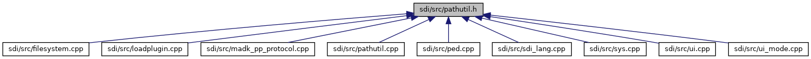

[Functions](#func-members)

`#include <string>`
`#include <sys/types.h>`

Include dependency graph for pathutil.h:

This graph shows which files directly or indirectly include this file:

<a href="pathutil_8h_source.md">Go to the source code of this file.</a>

|  |  |
|----|----|
| Functions |  |
| std::string  | [pathclean](#aa01a783fcf5ab8dfb3371ddf1937b1d8) (const std::string &path) |
| std::string  | [pathcat](#a01bbf38e5df83444a0b653a5424d1471) (const std::string &p1, const std::string &p2) |
| void  | [current_dir](#a5338868628e8af64851c06a4d5672474) (std::string &cwd) |
| bool  | [is_absolute_path](#a5f02ed450e4d048f1779afacae02eb47) (const std::string &path) |
| std::string  | [dirname](#a9181ca7ec40f7d471eb410a1215a2321) (const std::string &path) |
| std::string  | [filename_from_path](#ad2f12525e3b8ec94ed3a22f8d96ac145) (const std::string &path) |
| bool  | [make_dir](#adc366505b5f6eb4fcf1099dce96fabc6) (const std::string &path, mode_t mode=0777) |

## FunctionDocumentation {#function-documentation}

## current_dir() 

void current_dir

returns the path of current working directory

**Parameters**

\[in,out\] **cwd** path to current working directory

## dirname() 

std::string dirname

strip non-directory suffix from file name

**Parameters**

\[in\] **path** file name including path

### Returns

directory name


*path* supports both / and \\ as path separator


## filename_from_path() 

std::string filename_from_path

strip directory prefix from file name

**Parameters**

\[in\] **path** file name including path

### Returns

file name


*path* supports both / and \\ as path separator


## is_absolute_path() 

bool is_absolute_path

returns true, if parameter *path* is an absolute path

**Parameters**

\[in\] **path** path name

### Returns

true for an absolute path, else false

## make_dir() 

bool make_dir

create directory and parent directories if required.

**Parameters**

\[in\] **path** path to be created \[in\] **mode** mode specifies the permissions to use (as used for mkdir())

### Returns

true if the directory was created or was already existing, false if the directory could not be created

## pathcat() 

std::string pathcat

concatenate two path components into a path. It handles also the case that the second component *p2* is an absolute path, e.g. \"a\" + \"/b\" -\> \"/b\"

**Parameters**

\[in\] **p1** first path component \[in\] **p2** second path component

### Returns

resulting combined path

## pathclean() 

std::string pathclean

cleanup path, examples:

- \"a//b\" -\> \"a/b\"

- \"a/../b\" -\> \"b\" **Parameters**

  \[in\] **path** path to be cleaned up

  ### Returns

  cleaned up path
