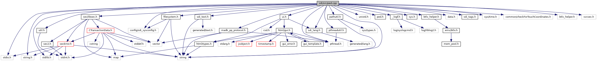

[Enumerations](#enum-members) \| [Functions](#func-members) \| [Variables](#var-members)

`#include <stdio.h>`
`#include <string.h>`
`#include <string>`
`#include <stdlib.h>`
`#include "unistd.h"`
`#include "`<a href="sdi_2src_2ped_8h_source.md">ped.h</a>`"`
`#include "`<a href="__logf_8h_source.md">_logf.h</a>`"`
`#include "`<a href="sys_8h_source.md">sys.h</a>`"`
`#include "`<a href="btlv__helper_8h_source.md">btlv_helper.h</a>`"`
`#include "`<a href="ui_8h_source.md">ui.h</a>`"`
`#include <pthread.h>`
`#include "data.h"`
`#include "`<a href="src_2sdi__tags_8h_source.md">sdi_tags.h</a>`"`
`#include "`<a href="sdi__lang_8h_source.md">sdi_lang.h</a>`"`
`#include "`<a href="sdi__text_8h_source.md">sdi_text.h</a>`"`
`#include "`<a href="filesystem_8h_source.md">filesystem.h</a>`"`
`#include "`<a href="pathutil_8h_source.md">pathutil.h</a>`"`
`#include "config/sdi_sysconfig.h"`
`#include "`<a href="pthreadutil_8h_source.md">pthreadutil.h</a>`"`
`#include "`<a href="madk__pp__protocol_8h_source.md">madk_pp_protocol.h</a>`"`
`#include "`<a href="sdi_2src_2util_8h_source.md">util.h</a>`"`
`#include "`<a href="libsec_8h_source.md">sec/libsec.h</a>`"`
`#include "sys/time.h"`
`#include "common/checkForTouchCoordinates.h"`
`#include <svcsec.h>`

Include dependency graph for ped.cpp:

|  |  |
|----|----|
| Enumerations |  |
| enum   | [PPIN_ENTRY](#a7e5271615c82cb53d7930081c6c78eb0) { [PPIN_IDLE](#a7e5271615c82cb53d7930081c6c78eb0a4fa988dd629cca8b9d3beaa760639667), [PPIN_CALLBACK](#a7e5271615c82cb53d7930081c6c78eb0af2c1b5a4e6ba37fbb06001540f34896f), [PPIN_POLLING](#a7e5271615c82cb53d7930081c6c78eb0a5b03d17c2d8839f88a710488158e57ce), [PPIN_POLLING_DONE](#a7e5271615c82cb53d7930081c6c78eb0ac8830ecf692ead2a6b96de78f4c2a64a) } |
| enum   | [PPIN_RESULT](#a84e8130fbf06d7905466b51ac9aa0a57) {   [PPIN_DONE](#a84e8130fbf06d7905466b51ac9aa0a57a3c80448ee3c13b64791063750f3c2585) = 0x000000, [PPIN_COLLECTING](#a84e8130fbf06d7905466b51ac9aa0a57ad32fcb1c4144ec5ad26082449d23f22e) = 0x010000, [PPIN_DIGIT_ENTERED](#a84e8130fbf06d7905466b51ac9aa0a57a9481a031a571e537c79cea5fb484b89d) = 0x0100, [PPIN_BACKSPACE_ENTERED](#a84e8130fbf06d7905466b51ac9aa0a57af3705a5afd991ebc54f558356a1007b8) = 0x0800,   [PPIN_OK_ENTERED](#a84e8130fbf06d7905466b51ac9aa0a57a93cc4a944a0f7dd46a303b9085061ce2) = 0x0D00, [PPIN_CANCEL_ENTERED](#a84e8130fbf06d7905466b51ac9aa0a57ae5f96f409873c4e821c353ecc7de6f02) = 0x1B00, [PPIN_DIGIT_SELECTED](#a84e8130fbf06d7905466b51ac9aa0a57aa13af76806d750f88201e919e98d1925) = 0xD100, [PPIN_CANCEL_SELECTED](#a84e8130fbf06d7905466b51ac9aa0a57a8df826cde163532bc777f01797bf9174) = 0xD200,   [PPIN_BACKSPACE_SELECTED](#a84e8130fbf06d7905466b51ac9aa0a57a9fdd5c6b47f3cd142e2c9de1291a3b8f) = 0xD300, [PPIN_ASTERISK_SELECTED](#a84e8130fbf06d7905466b51ac9aa0a57ac3136fce70b5f87b4eb5f3de171325af) = 0xD400, [PPIN_HASH_SELECTED](#a84e8130fbf06d7905466b51ac9aa0a57a4f631f28f7897ba3bbf07607add3772b) = 0xD500, [PPIN_F1_SELECTED](#a84e8130fbf06d7905466b51ac9aa0a57ac85fb535597b0c2ed946ec383ae08590) = 0xD600,   [PPIN_F2_SELECTED](#a84e8130fbf06d7905466b51ac9aa0a57adf1bc9f28a65d19c6faf2d68ad3e588c) = 0xD700, [PPIN_F3_SELECTED](#a84e8130fbf06d7905466b51ac9aa0a57a28dd34ff079e1534fe4b9439d1df864c) = 0xD800, [PPIN_F4_SELECTED](#a84e8130fbf06d7905466b51ac9aa0a57ad2be115a0024c071ea7cd21ff36c8f4a) = 0xD900, [PPIN_OK_SELECTED](#a84e8130fbf06d7905466b51ac9aa0a57a0f2751e204567da01854c8e0f0425a82) = 0xDE00,   [PPIN_MULTITOUCH](#a84e8130fbf06d7905466b51ac9aa0a57a12fb502d27c361b12ff37e8d54339ce2) = 0xDF00, [PPIN_UNDERFLOW](#a84e8130fbf06d7905466b51ac9aa0a57a1963994479d0ba697da1c82edce0e208) = 0xF800, [PPIN_OVERFLOW](#a84e8130fbf06d7905466b51ac9aa0a57ab89aa97c0e629cd91568346c98c65caa) = 0xF900, [PPIN_BYPASS](#a84e8130fbf06d7905466b51ac9aa0a57afd80070c266253383274e92ccc1e5c19) = 0xFC,   [PPIN_CANCEL](#a84e8130fbf06d7905466b51ac9aa0a57aa42f3abdd29d1069f03e8e1aa26e8f5f) = 0xFD, [PPIN_TIMEOUT](#a84e8130fbf06d7905466b51ac9aa0a57a69e81fedc3912ad73e23df8aca4d4c17) = 0xFE, [PPIN_ERROR](#a84e8130fbf06d7905466b51ac9aa0a57a916c1ad466f13765601d0b02edf775ab) = 0xFF } |

|  |  |
|----|----|
| Functions |  |
| bool  | [handlePedCmd](#a576b866745c7f8c53122bbb8b23bfed8) (unsigned short msgBufSize, unsigned char \*msg, unsigned short msgSize, unsigned short rspBufSize, unsigned char \*rsp, unsigned short \*rspSize) |
| bool  | [pedSetExtButton](#abb33c3404058f8446010977ace0907b8) () |
| void  | [pedReset](#a2cdc4bd6bf4da35073f47249ee9357c2) (void \*handle) |

|  |  |
|----|----|
| Variables |  |
| <a href="classsdi_1_1_sdi_language.md">sdi::SdiLanguage</a>  | [trxLanguage](#af262dea06616f89b523133a1f8b97fdb) |
| unsigned char  | [pinType](#a853c96033e0a366c1cd4b64a74652247) |
| SDITrxData  | [sdiData](#aaaba1a94d121b39429bb3696a654492b) |

## EnumerationType Documentation {#enumeration-type-documentation}

## PPIN_ENTRY 

enum [PPIN_ENTRY](#a7e5271615c82cb53d7930081c6c78eb0)

| Enumerator         |     |
|--------------------|-----|
| PPIN_IDLE          |     |
| PPIN_CALLBACK      |     |
| PPIN_POLLING       |     |
| PPIN_POLLING_DONE  |     |

## PPIN_RESULT 

enum [PPIN_RESULT](#a84e8130fbf06d7905466b51ac9aa0a57)

| Enumerator               |     |
|--------------------------|-----|
| PPIN_DONE                |     |
| PPIN_COLLECTING          |     |
| PPIN_DIGIT_ENTERED       |     |
| PPIN_BACKSPACE_ENTERED   |     |
| PPIN_OK_ENTERED          |     |
| PPIN_CANCEL_ENTERED      |     |
| PPIN_DIGIT_SELECTED      |     |
| PPIN_CANCEL_SELECTED     |     |
| PPIN_BACKSPACE_SELECTED  |     |
| PPIN_ASTERISK_SELECTED   |     |
| PPIN_HASH_SELECTED       |     |
| PPIN_F1_SELECTED         |     |
| PPIN_F2_SELECTED         |     |
| PPIN_F3_SELECTED         |     |
| PPIN_F4_SELECTED         |     |
| PPIN_OK_SELECTED         |     |
| PPIN_MULTITOUCH          |     |
| PPIN_UNDERFLOW           |     |
| PPIN_OVERFLOW            |     |
| PPIN_BYPASS              |     |
| PPIN_CANCEL              |     |
| PPIN_TIMEOUT             |     |
| PPIN_ERROR               |     |

## FunctionDocumentation {#function-documentation}

## handlePedCmd() 

bool handlePedCmd

Dispatch function to handle different PED commands

**Parameters**

\[in\] **msgBufSize** size of the input message buffer \[in\] **msg** pointer to the input message buffer \[in\] **msgSize** size of the input message \[in\] **rspBufSize** maximum size of the response buffer \[in,out\] **rsp** pointer to the response buffer \[in,out\] **rspSize** pointer to the response message size

### Returns

true if command was executed and rsp contains a response, false in case invocation is not allowed by a side command.

## pedReset() 

void pedReset

Function invoked by a thread at connection termination to abort the PIN entry. SDI server supports multiple connections, which can use the PED interface. With activation of the PED interface with command 22-03 (Start PIN entry) on one connection, the interface is locked for other connections. If a connection terminates, which optains the PED lock, the interface would be unaccessable for other connections. Therfore, this function will abort the PIN entry and unlock the PED interface, if the connection disturbes so that it can be used by other connection again. Please note that this function works for a PIN Entry started by 22-03 (Start PIN entry). A PIN entry started with 22-01 (Get PIN) is not considered, but the PED lock is released after the user hast finished the PIN entry.

**Parameters**

\[in\] **handle** handle of the terminating connection

## pedSetExtButton() 

bool pedSetExtButton

Inform the VAULT about the Confirm button was pressed if PIN polling is active and Navigator Mode 2 is set

### Returns

true if PIN polling is active and Navigator Mode 2 set, else false

## VariableDocumentation {#variable-documentation}

## pinType 

unsigned char pinType

## sdiData 

SDITrxData sdiData

## trxLanguage 

<a href="classsdi_1_1_sdi_language.md">sdi::SdiLanguage</a> trxLanguage

