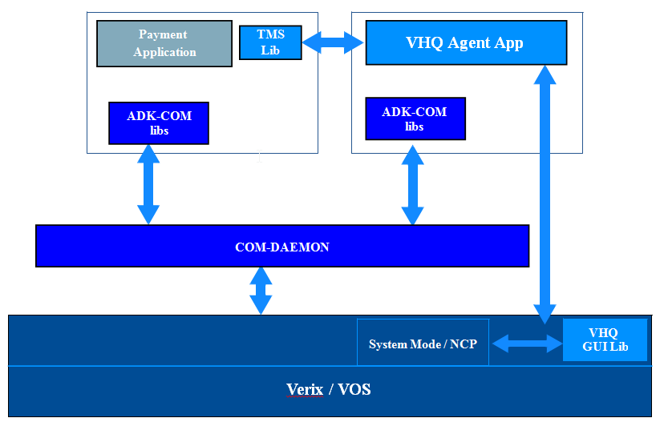
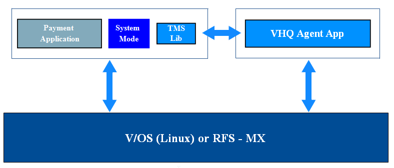
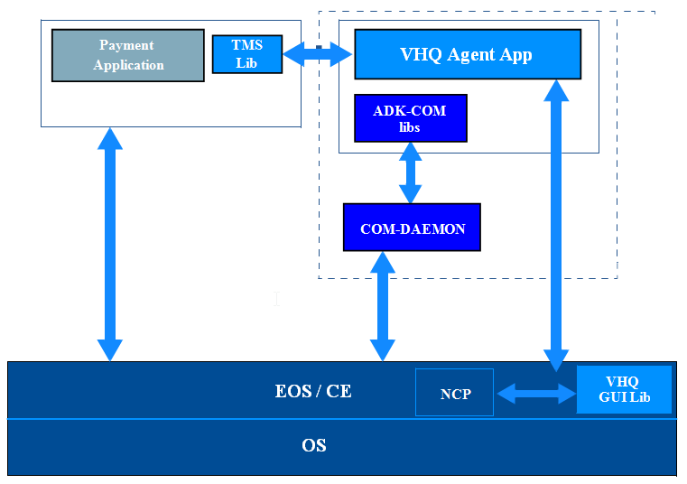
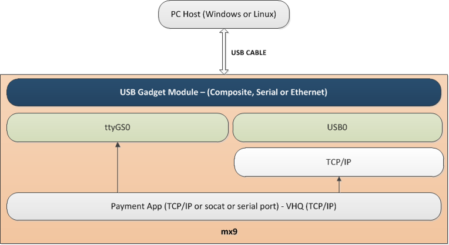
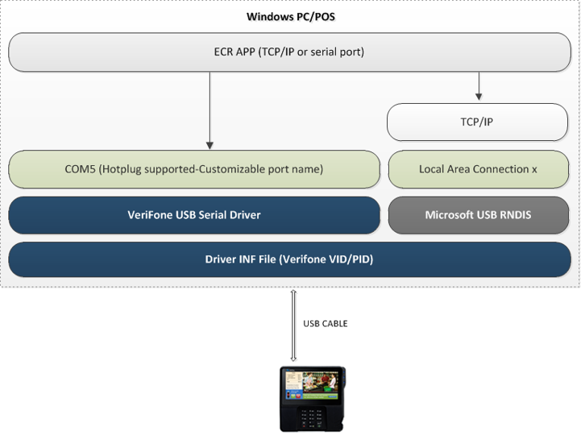

# Preface <a href="#sec_agt_preface" id="sec_agt_preface"></a>

This document describes the functionality of ADK TMS Agent and provides the steps to install and configure for various supported platforms.

## Audience <a href="#subsec_agt_audience" id="subsec_agt_audience"></a>

This guide provides the information required for application developers to utilize the functionality of the ADK TMS Agent and how to configure and install it on various platforms.

## Organization <a href="#subsec_agt_organization" id="subsec_agt_organization"></a>

This guide is organized as follows:

[Introduction](#sec_agt_introduction) Provides a summary and architecture description of ADK TMS Agent.

[Architecture](#sec_agt_architecture) VHQ Agent high level Architecture

[Getting Started](#sec_agt_gettingstarted) Shows the steps for installing and setting up ADK TMS Agent.

[Agent Concepts](#sec_agt_agent_concepts) Agent Concepts

[Programming](#sec_agt_programming) Describes API\'s and Programming Concepts.

[Programming and API Principles](#subsec_agt_programming_api_principles) Programming and API Principles

[System Setup and Requirements](#sec_agt_systemsetup) Describes build environment, hardware supported, software dependencies and deliverables.

[Troubleshooting](#sec_agt_adk_tms_agent_troubleshooting) Provides resolutions for some ADK TMS Agent issues you may encounter.

[Frequently Asked Questions (FAQ\'s)](#subsec_agt_faq) FAQ\'s

[Capturing Logs](#subsec_agt_capturing_logs) Discusses the procedures for downloading and investigating error logs.

[Appendixes](#sec_agt_appendixes) - Glossary and special component information.

[Appendix A - Acronym Definitions](#subsec_agt_acronym_definitions)

[Appendix B - ADK TMS Agent Configuration Parameters](#subsec_agt_adk_tms_agent_configuration_parameters) - Gives ADK TMS Agent configuration parameters.

[Appendix C - ADK TMS Agent Diagnostic Counters](#subsec_agt_adk_tms_agent_diagnostic_counters) - Gives ADK TMS Agent Diagnostic Counters.

[Appendix D - ADK TMS Agent Diagnostic Actions](#subsec_agt_adk_tms_agent_diagnostic_actions) - Gives ADK TMS Agent Diagnostic Actions.

[Appendix E - ADK TMS Agent Getdevice Profile](#subsec_agt_adk_tms_agent_getdevice_profile) - Gives ADK TMS Agent Get device Profile.

[Appendix F - ADK Communication Options](#subsec_agt_adk_communication_options) - Presents a brief discussion of ADK TMS Agent communication options.

# Introduction <a href="#sec_agt_introduction" id="sec_agt_introduction"></a>

The ADK TMS Agent is part of the Application Development Kit (ADK), responsible for communicating to VHQ Server.

ADK is a software abstraction layer that is between the hardware platform operating system and the device application.

It provides a common interface for all applications to use. The ADK interface can also be used to access and control the ADK TMS Agent.

The ADK TMS Agent is part of Verifone HeadQuarters (VHQ). It is a client side terminal application that communicates with the VHQ Server and runs in the background through its own communication channel. The ADK TMS Agent sends and receives various messages in performance of managing the device. It periodically sends a heartbeat message to indicate to the VHQ Server the device is active and communicating.

# Architecture <a href="#sec_agt_architecture" id="sec_agt_architecture"></a>

ADK TMS Agent currently supports 3 different operating system (OS) platforms and various hardware platforms that run these OS types.

The main hardware platforms currently supported by VHQ are the MX and VX platforms which each have various hardware models that belong to each of these platforms.

The MX platforms supported by VHQ consist of the MX8xx and MX7xx series which run Verifone\'s RFS OS.

The MX platforms also have the MX9xx series which runs Verifone\'s V/OS operating system.

The VX platforms supported by VHQ run the Verix eVo OS. ADK TMS Agent is a component of the ADK and the ADK interface/APIs can be used to control and access the Agent functionality.

The VX platforms also include the e-series mobile devices, e315, e335 and e355. These are mobile devices and their main communication interface is WiFi.

The following table describes the various platforms, OS and ADK TMS versions:

**Table 2 Agent Version, OS Support and ADK version**

| Agent Version | OS Support | ADK Version |
|----|----|----|
| <p>2.17.x</p> | <p>Verix, V/OS, V/OS2</p> | <p>ADK 4.4.x</p> |
| <p>3.2.x(Previously 2.18.x)</p> | <p>V/OS, V/OS2</p> | <p>ADK 4.6.x, ADK 4.7.x & Master</p> |
| <p>3.1.x</p> | <p>Android (Engage secure processor running agent in subdevice mode)</p> | <p>ADK 4.7.x & Master</p> |

- All three variations of ADK TMS Agent are generated from a single source code starting with release 2.7.x.
- RFS/MX7/MX8 support is limited only to field issues and there are no new planned development testing.

ADK TMS Agent supports 3 main architectures:

- The ADK TMS Agent ADK mode, which supports multiple communication interfaces such as Ethernet, GPRS/3G, Dial and Bluetooth.
- The ADK TMS Agent in non-ADK mode on a V/OS platform or RFS MX platform, which supports Ethernet communication interface.
- The ADK TMS Agent on a Verix platform in ADK mode, with a non-ADK-based application in the device. This configuration with VHQ using ADK mode supports Ethernet, GPRS/3G and Dial for VHQ communication.

The following illustration shows ADK TMS Agent with ADK-COM.



- ADK TMS Agent supports Ethernet, GPRS/3G and Dial-PPP modes.

The following illustration shows ADK TMS Agent with a V/OS or RFS MX platform



- ADK TMS Agent only supports Ethernet mode.

The following illustration shows ADK TMS Agent with a non-ADK application.



- Supports Ethernet, GPRS/3G and Dial-PPP modes.

1.  This architecture is applicable for existing Payment Apps, whether they run in a single application environment or in a multiple application environment using common solutions like VMAC, etc., along with ADK TMS Agent.
2.  As EOS/CE on Verix platform will likely be shared between multiple networks, connectivity supporting components like ADK-COMs COM-DAEMON, VMAC or Direct Payment App platform using CE interface, the applications registering with ADK TMS Agent should follow these rules to avoid network resources conflict:
    - When ADK TMS Agent requests connection permission (Go/No-GO), the application should reply with No-GO (report BUSY) if it\'s using the connection so that ADK TMS Agent waits for GO permission.
    - Application should release EOS/CE resources directly or through their common solution components like VMAC before giving GO permission (report FREE) to ADK TMS Agent. This enables ADK TMS Agent as an application to get the resource when it tries for network connection from EOS/CE (through COM-DAEMON), without any conflict.
3.  For detail on GO permissions, refer to [tms_setApplicationState()](#subsec_agt_tms_setapplicationstate).

# Getting Started <a href="#sec_agt_gettingstarted" id="sec_agt_gettingstarted"></a>

## Languages Supported <a href="#subsec_agt_language_support" id="subsec_agt_language_support"></a>

The ADK TMS Agent only supports the English language. The Agent supports ASCII characters 0-128 and does not support Unicode character sets.

## Installation and Configuration <a href="#subsec_agt_installation_and_configuration" id="subsec_agt_installation_and_configuration"></a>

The ADK TMS Agent configuration is stored in flash on the device.

The configuration can be updated using customer configuration files, or \"TMS Config\" files.

The ADK TMS config file must be named \"VHQconfig.ini\" (case matters as the filename **IS** case sensitive).

The ADK TMS config file must also be signed with the customer\'s certificates. The ADK TMS configuration parameters,

just like the ADK TMS Agent itself are continuously going through updates to add new features and improve performance.

So the specifics about the ADK TMS configuration parameters are available in the ADK TMS Agent <a href="class_config.md">Config</a> Parameters document that gets supplied with every ADK TMS Agent release.


The `VHQconfig.ini` file must have a `newline` character at the end of it. If the `VHQconfig.ini` file does not have a `newline` at the end, it will be ignored.
Since the ADK TMS config file is a user file, and is read by the ADK TMS Agent, the ADK TMS config file must have read permissions for all users.


### MX7 and MX8 ADK TMS Config Signing <a href="#subsubsec_agt_mx7_and_mx8_adk_tms_config_signing" id="subsubsec_agt_mx7_and_mx8_adk_tms_config_signing"></a>

For MX7 and MX8 devices, the `VHQconfig.ini` file is signed directly with the customer\'s certificate. The signature file must be named `VHQconfig.ini.p7s` or `VHQconfig.ini.P7S`.

The config file and its signature file should then be packaged together into a TGZ file, and the TGZ file should be downloaded to `/home/usr1` on the device.

Once the ADK TMS config and its signature file are downloaded to the device, the device must be restarted for the ADK TMS Agent to detect the new configuration file and apply the configuration updates.

### V/OS ADK TMS Config Signing <a href="#subsubsec_agt_v_os_adk_tms_config_signing" id="subsubsec_agt_v_os_adk_tms_config_signing"></a>

For V/OS devices, the `VHQconfig.ini` file is packaged into a User <a href="class_config.md">Config</a> package type.

The User <a href="class_config.md">Config</a> package should have the group set to \"share\" so that the ADK TMS Agent will be able to read the ADK TMS config file in the package.

Please see the V/OS Secure Installer ERS for more information about V/OS packages.

While it doesn\'t hurt to sign the ADK TMS config itself, it is not required that the ADK TMS config file be signed directly with the customer\'s certificate.

It will be the User <a href="class_config.md">Config</a> package that contains the config file that gets signed with the customer\'s certificates.

The ADK TMS config package can be grouped together with other user packages and downloaded all at once, or the ADK TMS config package can be bundled into its own download bundle by itself.

Once the signed ADK TMS config package is downloaded to the device (either on its own or combined with other packages),

the device must be restarted for the ADK TMS Agent to detect the new configuration file and apply the configuration updates.

## ADK Mode configuration files <a href="#subsubsec_agt_adk_com_config" id="subsubsec_agt_adk_com_config"></a>

On Engage devices, when using Operating Mode=ADK, the connection profile can be supplied is several different ways.

1.  <a href="class_config.md">Config</a> bundle: The simplest way and most secure way is to provide them in the same config bundle where the VHQConfig.ini is supplied; this installs the config files (vhqsrv.xml, which is the connection profile, along with any required network profiles that are referenced therein) in a read-only area on the device.
2.  Flashconfig bundle: This will install the agent same files as above to a different area which is writeable and accessible by user apps. This is useful for apps that provide their own communcations configuration interface.
3.  Infosvc database: the developer can provide an infosvc database with the communications settings; specify the path in the VHQConfig variable \[VHQ\]ConnectionPath. For an infosvc database, the path is preceded with \"infosvc@\". For example: \"infosvc@/tmp/conn_info.db@com/con/HOST_A\". Consult ADKCOM documentation for further details.

A common configuration with Engage devices is bridge connection, ie, to have one primary device with a secondary pinpad type device connected to it via a USB cable. The V200c and P400 Engage device are two such devices and connecting these two devices via a USB cable and communicating to VHQ and performing payment transactions is a common configuration.

More details about can be found in <a href="https://confluence.verifone.com:8443/pages/viewpage.action?spaceKey=GR&title=How+To+Configure+VHQ+With+Daisy+Chained+Engage+Devices+Using+USB+%28IP+Over+USB%29+Connection">https://confluence.verifone.com:8443/pages/viewpage.action?spaceKey=GR&title=How+To+Configure+VHQ+With+Daisy+Chained+Engage+Devices+Using+USB+%28IP+Over+USB%29+Connection</a>

### ADK TMS Agent Certificates and Certificate packages <a href="#subsubsec_agt_adk_tms_agent_certificates_and_certificate_packages" id="subsubsec_agt_adk_tms_agent_certificates_and_certificate_packages"></a>

In addition to the proper ADK TMS configuration, the ADK TMS Agent requires certain certificates to be installed in order to properly communicate with the ADK TMS server.

These certificates are stored in flash and the ADK TMS Agent uses three certificates to communicate with the server.

The FULL installation version (see [ADK TMS Agent Installation](#subsec_agt_adk_tms_agent_installation) for more information about the FULL version) resets the Agent by installing the default version of these certificate for the Verifone Hosted ADK TMS Server and VHQconfig.

These are the 3 certificate files required by the agent:

1.  Protocol Certificate - This is stored as `VHQSrvPubKey.crt` on the device. This certificate is used during the key exchange to send encrypted key data to the server.
2.  SSL Certificate Tree - This is stored as `VHQSrvSSL.pem` on the device. This is the certificate tree that the agent can use to verify the certificate exchanged during SSL communication all the way back to its issuer CA.
3.  Download SSL Certificate Tree - This is stored as `VHQFTP.pem` on the device.

This is the certificate tree that the agent can use to verify the certificate exchanged during SSL downloads all the way back to its issuer CA.

If the agent is retrieving downloads from the same server it is sending messages to, then this certificate will be the same as the SSL Certificate Tree.

The only time this would be different than the SSL Certificate tree is if downloads will be retrieved from a different server than the server the agent is sending messages to.

Installing a FULL package will remove the existing Agent and installs the new Agent and the existing VHQconfig, VHQ Certs are restored to VHQ Home.

CERTS package contains VHQconfig and VHQ Home certs, installing this package will just reset the host. This package is available from 3.2.14 Agent version.

When the agent is talking to a customer hosted server, these three certificates need to be created specifically for the customer\'s servers and packaged together into a \"customer certificate package\".

The \"customer certificate package\" is a customer signed package that puts updated certificates into a secondary location that the ADK TMS Agent checks at startup.

If the ADK TMS Agent detects properly signed certificates in the secondary location at startup, and the certificates are different than the ones the agent is currently using,

then the agent will import these new certificate files and overwrite the certificate files it is currently using. The agent will then use the new certificate files for all communication.


Since the ADK TMS certificate files in a customer certificate package are user files, and they are read by the ADK TMS Agent, the ADK TMS certificate files in a customer certificate package must have read permissions for all users.


Whenever the agent detects a new Protocol Certificate in the secondary location at startup, the agent will reset its `KeysExchanged` configuration parameter and delete its keys so the next message it sends to the server will be a `KeyExchange` using the new protocol certificate.


### ADK TMS Agent Certificate Verification Tool <a href="#subsubsec_agt_adk_tms_agent_certificate_verification_tool" id="subsubsec_agt_adk_tms_agent_certificate_verification_tool"></a>

The ADK TMS Agent Certificate Verification Tool is included with each ADK TMS Agent release (1.06.0002 and later), and can be used to verify that the certificates created specifically for a customer\'s servers are correct.

The tool is run on a PC and will perform the same verifications that the agent will perform. This tool should be used to verify the customer\'s certificates are correct before anything is tried on an actual device.

### MX7 and MX8 Certificate Signing (Applicable only to customer hosted deployments) <a href="#subsubsec_agt_mx7_and_mx8_certificate_signing__applicable_only_to_customer_hosted_deployments" id="subsubsec_agt_mx7_and_mx8_certificate_signing__applicable_only_to_customer_hosted_deployments"></a>

For MX7 and MX8 devices, the `VHQSrvPubKey.crt`, `VHQSrvSSL.pem` and `VHQFTP.pem` files are signed directly with the customer\'s certificate.

The signature file must have the same name as the original file with a .p7s or .P7S extension.

The three certificate files and their signature files should then be packaged together into a TGZ file, and the TGZ file should be downloaded to `/home/usr1` on the device.

Once the certificates and their signature files are downloaded to the device, the device must be restarted for the ADK TMS Agent to import the updated certificates and begin using them.

### V/OS Certificate Signing (Applicable only to customer hosted deployments) <a href="#subsubsec_agt_v_os_certificate_signing__applicable_only_to_customer_hosted_deployments" id="subsubsec_agt_v_os_certificate_signing__applicable_only_to_customer_hosted_deployments"></a>

For V/OS devices, the certificate files are packaged into a User <a href="class_config.md">Config</a> package type.

The User <a href="class_config.md">Config</a> package should have the group set to \"share\" so that the ADK TMS Agent will be able to read the certificate files in the package.

Please see the V/OS Secure Installer ERS for more information about V/OS packages.

While it doesn\'t hurt to sign the certificate files individually, it is not required that the certificate files be signed directly with the customer\'s certificate.

It will be the User <a href="class_config.md">Config</a> package that contains the certificate files that gets signed with the customer\'s certificates.

The ADK TMS certificate package can be grouped together with other user packages and downloaded all at once, or the ADK TMS certificate package can be bundled into its own download bundle by itself.

Once the signed ADK TMS certificate package is downloaded to the device (either on its own or combined with other packages),

the device must be restarted for the ADK TMS Agent to import the updated certificates and begin using them.

## ADK TMS Agent Installation <a href="#subsec_agt_adk_tms_agent_installation" id="subsec_agt_adk_tms_agent_installation"></a>

The ADK TMS Agent releases that have been approved for customer use by the ADK TMS QA team are posted on Agile by the ADK TMS team.

Only ADK TMS Releases that have been posted to Agile should be used for customer deployments.

The correct ADK TMS Agent can be downloaded from Agile and installed onto customer\'s terminals at deployment, or via some other mechanism if the devices are already installed.

### FULL vs. UPGRADE vs. CERTS ADK TMS Agent Versions <a href="#subsubsec_agt_full_vs__upgrade_adk_tms_agent_versions" id="subsubsec_agt_full_vs__upgrade_adk_tms_agent_versions"></a>

When installing the ADK TMS Agent, it is important to note the difference between the installation files provided with each ADK TMS Agent release.

There are 3 different installation files provided with each agent release: the FULL installation, the UPGRADE installation and the CERTS installation.

The difference between the FULL and UPGRADE installation versions are how the certificates are handled.

The FULL package removes the existing Agent and installs the new Agent and updates the existing config and certs with Default VHQ config and VHQ Home certs. After installing this package device will point to VHQ Home instance. These certs are sys6 signed and installed from sys6 flash unlike regular VHQ config and used for resetting Agent.

The UPGRADE installation packages updates the existing Agent and doesn\'t update the VHQ <a href="class_config.md">Config</a>. Can be used during regular updates.

Irrespective of FULL/UPGRADE package a device without user config will point to VHQ Home.

CERTS package contains VHQconfig and VHQ Home certs that are sys6 signed and installed in sys6 userflash, it does similar job of FULL package making the device point to VHQ Home without removing the Agent.

### MX8 Installation <a href="#subsubsec_agt_mx8_installation" id="subsubsec_agt_mx8_installation"></a>

For MX8, the ADK TMS Agent installation file is a TGZ that gets downloaded and installed on the device as a package. The MX8 TGZ package includes the agent, and the certificates in the same package.

### V/OS Installation <a href="#subsubsec_agt_v_os_installation" id="subsubsec_agt_v_os_installation"></a>

For V/OS, the ADK TMS Agent installation file is a TGZ that gets downloaded and installed on the device by package manager as bundles.

The FULL installation file contains the ADK TMS Agent Bundle and a separate ADK TMS Certificate Bundle.

The ADK TMS Agent Bundle, named `vhq_sys`, is made up of the `vhq_sys` package and `vhq_svc` package.

The `vhq_sys` package contains the main ADK TMS executable files while the `vhq_svc` package contains the ADK TMS service libraries.

The ADK TMS Certificate Bundle, named vhq_sys-certs, contains only the vhq_sys-cert package which contains the production server certificates.

This package is an OS signed package and is separate from a customer\'s hosted service certificate package.

The separation of the ADK TMS Agent into the agent bundle and cert bundle began with ADK TMS Agent release 1.03.0019 in order to support customer hosted deployments.

The FULL installation file will update existing agents to the new separated format, and the separated format is required for UPGRADE versions to work correctly.

If a device does not have the separate agent and cert bundles, then certificate upgrade package described in ADK TMS Agent Certificates might not work correctly.

The V/OS UPGRADE version only includes the ADK TMS Agent Bundle, it does not include the ADK TMS Cert Bundle.


The easy way to verify a V/OS has the separated packages is to verify the device has `vhq_sys-certs` bundle installed.


## Automated Download Bundle Creation <a href="#subsec_agt_automated_download_bundle_creation" id="subsec_agt_automated_download_bundle_creation"></a>

The ADK TMS Agent server supports automated downloads, where it will retrieve software information from the device,

and automatically update the software on the device if the device software is out of synch with what is configured for the device on the server.

In order for this to work properly, the software bundles installed on a device must meet certain expectations.

## V/OS Automated Bundles <a href="#subsec_agt_v_os_automated_bundles" id="subsec_agt_v_os_automated_bundles"></a>

V/OS Secure Installer bundles already meet the requirements for automated download. So if the bundle is accepted by secure installer, it will also be accepted for automated downloads by ADK TMS Agent.


Due to limitations on the current production server, it will not accept a bundle file that contains more than one bundle. Until the server is updated to support a bundle with multiple bundle files, V/OS download bundles can only contain a single bundle inside of them.


# Agent Concepts <a href="#sec_agt_agent_concepts" id="sec_agt_agent_concepts"></a>

## Maintenance Window, Heartbeats and Events <a href="#subsec_agt_maintenance_window__heartbeats_and_events" id="subsec_agt_maintenance_window__heartbeats_and_events"></a>

This section contains information on ADK TMS Agent Maintenance Window, Heartbeats and Events.

## Maintenance Window <a href="#subsec_agt_maintenance_window" id="subsec_agt_maintenance_window"></a>

The maintenance window is configured by customers for a period of time during the day or week that most maintenance should be performed on the device.

While users can request that any maintenance is done immediately, they can also request that any maintenance is done during the next maintenance window.

When the user requests that maintenance is done during the next maintenance window, that maintenance will be scheduled to happen during the configured maintenance window of a terminal.

The maintenance window is configured in the ADK TMS Agent Configuration file.

The maintenance window is very configurable, and can be set to be certain hours daily (the most common configuration), certain hours on certain days of the week, certain hours once per week, or even to be all day-every day.


The maintenance window for Dial-Up communication interfaces should be configured for when the Agent can have access to the modem to establish its connection with the management Server, and when the agent will be able to perform maintenance tasks like downloads and reboots. The current agent design requires a Maintenance window to happen at least once per month.


## Heartbeats <a href="#subsec_agt_heartbeats" id="subsec_agt_heartbeats"></a>

Heartbeats are the main communication method between the ADK TMS Agent and the ADK TMS Server.

Due to security restrictions, all contact between the agent and server needs to be initiated by the ADK TMS Agent.

So the heartbeat is the agent\'s way to \"ping\" the server to let the server know the device is still online and to see if the server has anything for the agent to do.

The heartbeat is a short message sent by the device to the server at a scheduled interval.

In most cases, the agent will send a heartbeat immediately after being started during power up and then will continue to send heartbeats at a regular interval that is configured by users.

For certain cases where the interval between heartbeats is longer than the duration of the maintenance window,

the agent will delay the first heartbeat after startup to make sure that a heartbeat will occur during the maintenance window.

Most maintenance requests to be performed are sent in \"Management Plans\" in response to a heartbeat.


Automatic heartbeats from the agent to the server can be disabled by setting the heartbeat frequency (see [Heartbeat Frequency](#subsubsec_agt_heartbeat_frequency) Heartbeat) to 0. When the heartbeat frequency is set to 0, the agent will not schedule any heartbeats and all heartbeats are controlled by the application. All heartbeats must be requested by the application when the heartbeat frequency is set to 0.


If the application needs to control heartbeats and prevent the agent from sending heartbeats during critical times, the application can set the heartbeat frequency value to 0 for the communication interface that is being used and the agent will not send any heartbeats as long as the frequency is set to 0. The application can then set it back to non-zero value to allow the agent to manage the heartbeats again and send at the heartbeat frequency interval. The API to change the heartbeat frequency values is <a href="svc__tms_8h.md#a3d8613b634236bc3919b51bd2a012beb">tms_setNewConfigAvailable()</a>. This API can be used to set any of the communication interfaces heartbeat frequency values:

\"HeartbeatFreq\" for primary network communication interface.

\"Dial HeartbeatFreq\" for dial-up communication interface.

\"GPRS3G HeartbeatFreq\" for GPRS communication interface.

It should be noted that the very first heartbeat is ALWAYS controlled by the primary HeartbeatFreq value. If this is set to 0, then the agent will NOT send any heartbeats and it is expected that the application will manage and send the first heartbeat. If this is set to a non-zero value then the agent will send the first initial heartbeat.

Once the initial heartbeat is sent, the agent will then use the heartbeat frequency value for the communication interface being used by the device. If an Ethernet network connection is used, then the HeartbeatFreq value will continue to be used. If a dial-up interface is used, then the \"Dial HeartbeatFreq\" will be used. For example, if the dial-up modem interface is how the device is communicating then the \"Dial HeartbeatFreq\" value will then be used after the initial heartbeat is sent. If the \"Dial HearbeatFreq\" is set to 0, then the application is expected to manage the heartbeats sent to the server.

This method of controlling heartbeats will NOT prevent any scheduled jobs that have already been downloaded from the server to the agent from running. If there are already jobs in the agent queue to process, they will still run regardless if the heartbeat frequency is set to 0.

If the application does not need to control heartbeats, then it is recommended to set the heartbeat frequency to non-zero value and let the agent manage all heartbeats sent. In this case, it is recommended that the application use the FREE/BUSY method described in <a href="svc__tms_8h.md#a3c19eb8469c9bad6ee2ed24a8251ecc1">tms_setApplicationState()</a> API to control when agent is allowed to communicate with the server.

### Heartbeat Types <a href="#subsubsec_agt_heartbeat_types" id="subsubsec_agt_heartbeat_types"></a>

There are 2 different types of heartbeats, regular heartbeats and maintenance heartbeats.

Regular heartbeats are heartbeats that occur outside of the configured maintenance window while maintenance heartbeats occur during the configure maintenance window.

The server can send immediate maintenance requests to the agent in response to either a regular heartbeat or maintenance heartbeat.

But the server will only send \"maintenance window\" requests to the agent in response to maintenance heartbeats only.

### Heartbeat Frequency <a href="#subsubsec_agt_heartbeat_frequency" id="subsubsec_agt_heartbeat_frequency"></a>

The interval between heartbeats is configured by users in the ADK TMS Agent configuration file.

Since all communication is initiated by the agent, the longer between heartbeats means a longer period of time between requesting

something to be done on the ADK TMS server and when it actually makes its way to the device to be done.

It is recommended to schedule heartbeats to happen at least several times per day. For dial up devices, this may not be reasonable.

There are separate heartbeat frequency parameters in the TMS configuration file for Dialup, GPRS/3G, and all others (Ethernet, WiFi). The heartbeat frequencies should be set for all the communication interfaces the device is going to use.


The heartbeat frequency should be set according to the maintenance window. If the maintenance window is configured to be once per week, and the agent should contact the management server only during maintenance windows, then the heartbeat frequency should be setup for once per week as well (604800 seconds). The agent is smart enough to time the first heartbeat after the device powers up so that it guarantees that a heartbeat will occur during the maintenance window. For instance, if the Maintenance Window is Saturdays from 2 AM - 6 AM, and the heartbeat frequency is once per week (604800 seconds), the agent will factor that in when the device starts. The agent will also add some randomness when calculating the schedule for the first heartbeat after power up so that the first heartbeat will not always occur exactly at the start of the maintenance window. So if the device is powered on at 4 PM on a Wednesday, the first heartbeat after powering the device on will not happen until some random time between 2 AM and 6 AM on the Saturday after the device is powered on.


## Events <a href="#subsec_agt_events" id="subsec_agt_events"></a>

The ADK TMS Agent can be configured to detect certain events that happen on the device, and alert the server immediately when the event is detected.

So the agent can send an event to the server at any time. Events do not have to be sent during heartbeats or during the maintenance window,

they will be sent immediately after they are detected. The different types of events that can be detected by the agent are:

Tampers, Low RAM Memory, Low Flash Memory, Device Rebooted, Low Battery (built-in, not main battery), Dock In and Dock out.

The events that the agent should detect are configured in the ADK TMS Agent Configuration file.


The tamper event is unique in the agent because it is not configurable; it is always enabled in agent release 1.3.20 and later. And it gets sent to the server a little differently. When a tamper occurs, the device will automatically reboot itself due to the tamper (this is a feature of the OS). When the agent is started after the reboot, it determines the device was tampered from the OS. At that point, the agent MUST re-generate its keys and re-send them to the server. When the agent does this, it sets a tampered flag in the Key Exchange message to indicate the device has been tampered, which raises the alert at the server.
Device Rebooted alert will be suppressed during download OperationSets.


### Dock-in and Dock-out events <a href="#subsubsec_agt_dock-in_and_dock-out" id="subsubsec_agt_dock-in_and_dock-out"></a>

VHQ server can track dock-in/dock-out events between a payment terminal and a corresponding base unit. In order to support this capability, the proper events from the VHQ agent on the payment terminal must be sent to the VHQ server.

The bases are Engage platform devices running Verifone software, including VHQ agent, to support management via VHQ server.

Dock-in/dock-out events will be sent to server in engage(VOS2) devices. Dock-in/dock-out events will be sent only if the Dock-in/dock-out Alert Mask is set in VHQ Agent config file.

The details regarding time of dock-in/dock-out will be available in VHQ Server under device profile - history -docking history.

For dock-in events the base device details to which the device is connected to like docked-in base serial number and docked-in device model number are sent to server as an event message type.

## Upgrading base device <a href="#subsec_agt_upgrading_base_device" id="subsec_agt_upgrading_base_device"></a>

**For** **updating** **base** **via** **handset**

For upgrading base, you need the REST application, scan for base, press start netloader command, and run mxdownloader to upload the package for base.

Package can be found in the ADK full release (vos2/load/solutions), there are 2 types of packages:

- adk-vos2-base-prod: This package is a clean installation package to restore the OS and ADK on V/OS2 based base stations to the factory package. It includes the OS and some basic middleware components, mainly to enable remote management on the device. This package will remove any OS or system signed package already on the device prior to installation.
- adk-vos2-base_factory_mw-prod: Basic ADK middleware system signed components for V/OS2 based base station devices to restore the initial factory status. This package is the same as adk-vos2-base-prod but without OS.

During update the base will be blinking with white led. When the blinking stops and the top white LED is continuously lit it means the update is finished.

**For** **updating** **base** **via** **handset** **from** **VHQ**

Base updates will run in a separate piece of SW in a separate bundle/package called \"BaseUpdater\". It will be installed and run on the handset.

For BaseUpdater to actually do anything, a second bundle is required: the \"Update\" bundle. The Update bundle is a USR1 bundle, with the base update bundle embedded inside of it.

When a new base update is available in /mnt/flash/etc/config/base_tgz/, the BaseUpdater executable(in BaseUpdater bundle) on the device will detect that at startup and install it. After successful installing a base update, BaseUpdater will delete the file from /mnt/flash/etc/config/base_tgz/ so that it is only installed one time.

Because the BaseUpdater is a sys6 app, and the \"Update\" bundle is a USR1 app, permissions of the \"Update\" bundle need to be set appropriately so that BaseUpdater can read and write (for deleting) the files installed in /mnt/flash/etc/config/base_tgz/.

In order to manage base updates, VHQ (or any other management system) will need to manage the BaseUpdater SW on the handset device (which should rarely change) and the \"Update\" bundles that get installed on the handset device.

The management system will not manage base devices directly. By managing the two pieces of SW on the handset: \"BaseUpdater\" and the \"Base Update\", users will indirectly manage their base devices. If the 2 pieces of SW are up to date on the handset, then it is assumed that the base device is up to date (or will be up to date once the handset is docked).

More details about updating base device from VHQ available in: <a href="https://confluence.verifone.com:8443/pages/viewpage.action?pageId=129628291">https://confluence.verifone.com:8443/pages/viewpage.action?pageId=129628291</a>

## Power Management <a href="#subsec_agt_power_management" id="subsec_agt_power_management"></a>

The agent supports power management on V/OS2 devices (note that power management is not a feature on V/OS devices).

### V/OS2 Power Management <a href="#subsubsec_agt_vos2_power_management" id="subsubsec_agt_vos2_power_management"></a>

V/OS2 power management has evolved in the agent over time. Beginning with agent release 2.14.1 and later versions, any V/OS2 device with a rechargeable battery (i.e. V240m and V400m) will honor OS power management all of the time, whether the device is plugged in or not, docked or undocked. Line powered VOS2 devices have power management fnuctionality included from agent version 3.2.11.This means the agent will enter the \"critical sections\" of code at the following points:

1.  Initialization - at startup, the agent will enter a critical section so that it can initialize without the device going into low power mode. After initialization, the agent can remain in the critical section if it has something to do like a HB. If the agent doesn\'t have anything to do after initialization, it will exit the critical section.
2.  Agent Actions - when the agent has something to do, like a HB or a Download or any other event, the agent will enter a critical section again. Once the agent is finished with all of the actions it needs to do, it will exit the critical section. Note that if the agent has a lot of stuff to do (including new jobs scheduled from the server), the agent will remain in the critical section until it has nothing to do anymore. Once the agent has completed all of the actions it needs to perform, it will exit the critical section
3.  Incoming Requests - if an app sends a message to the agent, for example to request a HB, this will trigger the agent to wake up and enter a critical section. The agent will exit the critical section after it has completed the request from the app and goes back to its idle state.

When the agent is completed with any of the above, it will enter its idle state and call `pause()` API to allow OS power management to kick in. Before calling `pause()` API, the agent will call <a href="namespacevfisyspm.md#ab6864fd6fce20f5e804d9a9a6fe01239">sys_SetWakeupTime()</a> with a wakeup time for the next VHQ Agent action. For example, if the next HB is supposed to happen in 20 minutes, the agent will set the wakeup time for 20 minutes and then call `pause()`. After 20 minutes, the agent will get woken and will enter the critical section before starting the heartbeat (as in #2 above).

Please keep in mind your agent\'s configuration when dealing with V/OS2 battery powered devices. It is recommended that the HB Frequency be set to 60 minutes or longer for battery powered devices as the agent will wake the device up and enter a critical section whenever it needs to do a heartbeat. If you set the heartbeat frequency to less than 60 minutes for a battery powered device, you run the risk of draining the battery very quickly.

Note: Prior to 2.14.1 agent, V/OS2 devices with a rechargeable battery only honored OS power management when the device was unplugged and/or undocked.

Note: With Agent 2.14.1 and later, battery powered V/OS2 devices will not be checking for low memory conditions in real time. The low memory checks will only be performed when the agent is in one of the critical sections mentioned above. For most cases, that means the low memory events are only checked for at the heartbeat frequency.

## Downloads <a href="#subsec_agt_downloads" id="subsec_agt_downloads"></a>

The ADK TMS Agent has the capability to perform downloads when instructed to do so by the ADK TMS server.

There are 2 distinct actions that are done for each download:

1.  Downloading of the file from the ADK TMS server.
2.  Installing the download onto the device after the download is completed,

When a user schedules a download, they can choose to do the download at the Next Contact, Next Maintenance Window, or at a specific date and time.

Downloads scheduled for Next Contact are referred to as Immediate Downloads,

downloads scheduled for Next Maintenance Window are referred to as Maintenance Downloads and

downloads scheduled for a specific date and time are referred to as Scheduled Downloads.

In addition to choosing when the start of the download occurs, the user also chooses when the installation of the downloaded file will occur.

The user can choose whether the installation happens immediately after the download or at a specific date and time

### Download Dependencies <a href="#subsubsec_agt_download_dependencies" id="subsubsec_agt_download_dependencies"></a>

Downloads that depend on one another can be grouped together when scheduling a download job to the device.

When downloads are grouped together like this, the agent will download/install the downloads in the sequence specified, and if one of the downloads or installations fails,

the agent will send a failure response to the server at that point and will not attempt to continue with the rest of the downloads/installations in the sequence.

### Immediate Downloads <a href="#subsubsec_agt_immediate_downloads" id="subsubsec_agt_immediate_downloads"></a>

Immediate downloads are downloads that the user selects to happen at \"Next Contact\" and are used when a download needs to get downloaded or installed onto a device as soon as possible.

After the download is scheduled, the server will send the download management plan to the device in response to the next heartbeat from the device.

It doesn\'t matter if the next heartbeat is a Regular Heartbeat or a Maintenance Heartbeat, the download management plan will get sent in response to either.

After receiving the download management plan, the agent will immediately start the download from the server.

In most immediate download cases, the installation will be scheduled \"Immediately after the download\", and if that is the case, the agent will install the download as soon as the download is complete.

If the user schedules the installation for another date and time, the agent will wait until the specified date/time to install the downloaded file.

### Maintenance Downloads <a href="#subsubsec_agt_maintenance_downloads" id="subsubsec_agt_maintenance_downloads"></a>

Maintenance downloads are used to download and install packages during the maintenance window of the terminal.

Users schedule maintenance downloads by selecting \"Next Maintenance Window\" for the download time.

After scheduling a maintenance download, the server will send the download management plan only in response to a maintenance heartbeat.

The download management plan will not be sent in response to a regular heartbeat.

After receiving a maintenance download, the agent will check for MaintenanceDownloadStaggering parameter in agent configuration file, and if true, schedule the download to happen at some random time during the maintenance window, up to 10 minutes before the maintenance window ends.

Randomly spreading the downloads throughout maintenance window will ease the load on the server so that all of a customer\'s devices are not initiating downloads at the same time.

If a maintenance download starts inside a maintenance window, agent will continue with the download event even if maintenance end happens during the download progression.

If there are connection issues with the server, and the agent needs to retry downloading a maintenance download, the download will fail if the retries begin to happen outside of the maintenance window.

When the installation starts during maintenance window, agent will continue with the installation even if maintenance end happens during the installation progress.

If we have multiple download events in the same event set and if the maintenance window ended after the successful download of the first download event, other events in the event set will be failed since the download attempts happen out of MW. As a result all the events in install event set will be failed .

If we have multiple install events in the same event set and if the maintenance window ended after the successful completion of the first install event, other events in the event set will be successfully installed without failure.

The installation of a maintenance window downloaded package can happen outside a maintenance window if scheduled to do so.

Since successful downloads and installs can take a long time, especially for large files on a slow connection,

the ADK TMS configuration should allow for a buffer between end of the maintenance window and the start of regular customer activities at a store location.

This will allow for cases where the download is very large and may extend past the end of the maintenance window.


Users do not need to know details about the maintenance window when scheduling maintenance downloads, that is all taken care of by the agent and server.


## Download Scheduling <a href="#subsec_agt_download_scheduling" id="subsec_agt_download_scheduling"></a>

Scheduling a download allows a user to schedule a download to happen on a device at a specific date and time in the future.

Users schedule downloads by selecting a specific date and time when configuring the download in the ADK TMS Server GUI.

This allows for a download to be configured on the server, but the agent will not start the download until the date and time that the user specifies.

For scheduled downloads, the download management plan will be sent to the device on the next heartbeat (regular or maintenance).

There is information in the download management plan that tells the agent when exactly to start the download, so the agent will store this in its scheduler module.

The scheduled download will be retained through power cycles and at the specified date and time, the agent will begin the download from the server.

If the device happens to be powered off at the scheduled date and time, the download will begin after power is restored to the device.

## Download Recovery and Retry Mechanism <a href="#subsec_agt_download_retry_mechanism" id="subsec_agt_download_retry_mechanism"></a>

As stated in the section above, the scheduled download will be retained through power cycles and at the specified date and time, the agent will begin the download from the server. If the device happens to be powered off at the scheduled date and time, the download will begin after power is restored to the device. If the network connection and communication is lost during a download that has already started, then the ADK TMS Agent will try to recover and continue the download.

How many times a download is attempted to complete and for how long it retries is configurable with download configration parameters. The Download Maximum Attempts default is 60, Download Network Timeout is 30 and Download Retry Timeout is 15 which calculates 60 \* (30 + 15) = 45 minutes before it gives up. But this assumes that agent waits 30 seconds for the tcp/ip network to timeout because it did not receive any data within that time period. Then the agent will wait 15 seconds before retrying again. If the network connection call returns to agent sooner than 30 seconds then total time of retrying could be less. It depends why network connection is lost. By default it will retry for 45 minutes or 60 times whichever comes first before giving up and marking download as a failure. Customer can adjust each parameter as they want. Do not recommend changing network timeout. By default tcp/ip times out after 30 seconds of no data anyways so Download Network Timeout should be left at default value.

**Configuration** **Parameters**

Download Maximum Attempts - default value is 60 times.

Download Network Timeout - default value is 30 seconds.

Download Retry Timeout - default value is 15 seconds.

## Installation Scheduling <a href="#subsec_agt_installation_scheduling" id="subsec_agt_installation_scheduling"></a>

Installation scheduling allows a download to be installed at a specific date and time, which could be hours, days, weeks or even months after a download has actually happened.

To setup a download for installation scheduling, the user would select to install the download at a specific date and time.

Installation scheduling is nice for larger downloads that should all be installed at the same time.

The download can be scheduled to happen a couple of days before the installation should happen,

which will allow the user to make sure all of the downloads were successful before the installation will happen.

When using installation scheduling, the download will happen whenever the download was configured for (immediate, next maintenance window or specific date and time).

But the installation will not happen until the date and time specified by the user.

For installation scheduling, after the download is complete, the download file is stored in a temporary flash location.

At the installation date and time, the download gets retrieved from the temporary flash location and gets passed to the OS for installation.

If the download of the file is not successful, then the installation will not be attempted.

If the download of the file goes past the specified installation date and time, the installation will happen immediately after the download is completed.

### Post Install Actions <a href="#subsubsec_agt_post_install_actions" id="subsubsec_agt_post_install_actions"></a>

Each download can be configured to perform a Post Install Action. There are 2 supported post install actions: reboot and restart applications.

When a Post Install Action is configured and a download is successfully installed, the agent will perform the Post Install Action immediately after a successful installation.

If the download or installation fails, the Post Install Action will not be performed.

Reboot Post Install action will be ignored if SuppressReboot flag is set by the server in the download management plan. In those cases, the reboot Post Install Action will not be performed until the end of the download OperationSet.

## Content Downloads <a href="#subsec_agt_content_downloads" id="subsec_agt_content_downloads"></a>

Content downloads are very similar to other downloads, except that instead of the download being passed to the OS for installation, the download gets passed to the application for processing.

This requires application support including the application registering itself with the agent for content updates.

Please see [Application Integration with ADK TMS Agent](#subsec_agt_application_integration_with_adk_tms_agent) for more information about how an application will support content management.

### Content with Expiration Date <a href="#subsubsec_agt_content_with_expiration_date" id="subsubsec_agt_content_with_expiration_date"></a>

Some content downloads will only be displayed for a set period of time, after which they will expire and the original content will be restored.

When content with an expiration date gets sent to the agent, the agent will save the original content file in a temporary flash location.

At the expiration date and time, the agent will give the original file back to the application as another content update.

This will restore the original file back at the specified date and time. If the download or installation of expiring content fails, restoring the original content will not be done.

## Diagnostics <a href="#subsec_agt_diagnostics" id="subsec_agt_diagnostics"></a>

The ADK TMS Agent supports many features that help with diagnosing problems on a terminal. However, there are many terminal product lines in Verifone.

Diagnostics features are customized for different types of terminals.

At the top level of categorization, there are two terminal series: MX and VX. MX terminals run V/OS system software; VX terminals run Verix system software.

### V/OS Terminal Diagnostics <a href="#subsubsec_agt_v_os_terminal_diagnostics" id="subsubsec_agt_v_os_terminal_diagnostics"></a>

In V/OS terminals, the ADK TMS Agent diagnostic actions support the following functions:

- Screen Capture - A PNG image of the current screen will be uploaded to the server. This option is only supported on devices that have screens.
- Get Device Profile - The current device profile will be sent to the server. The device profile consists of:

Installed applications, Serial Number, OS information, clock information, port information, key information, memory profile, Verishield Retain certificate information, VCL information, and other information about the device.

- Get Diagnostic Data - The current diagnostic profile will be sent to the server. The diagnostic profile consists of: Open and Maximum file handle count, Current Process List with memory and CPU usage and diagnostic counter data.
- Get Library Details - The directory listing of /lib will be retrieved and uploaded to the server.
- Get OS <a href="class_config.md">Config</a> File - The OS config files will be combined into a TGZ and uploaded to the server. For V/OS, these files are retrieved:

``` cpp
/mnt/flash/config/config.system /mnt/flash/config/ config.network /mnt/flash/config/config.usr1.
```

For MX8, these files are retrieved:

``` cpp
/mnt/sram/config.*.
```

- Get OS Logs - The OS log files will be combined into a TGZ and uploaded to the server.
- Get User Logs - The user log files will be combined into a TGZ and uploaded to the server. See the Application Log section for more information on how the applications logs should be setup.
- List User Files - The agent will do a recursive directory listing on `/home/usr1` and upload a text document with the results.
- Reboot - The agent will reboot the terminal.
- Restart Applications - The agent will restart all user applications on the terminal.
- Touchscreen Recalibration - The agent will perform a touchscreen recalibration. This option is only supported on devices that have a touchscreen.

### Recurring Diagnostic Jobs <a href="#subsubsec_agt_recurring_diagnostic_jobs" id="subsubsec_agt_recurring_diagnostic_jobs"></a>

The server allows users to set up recurring diagnostic jobs where a single diagnostic action or a sequence of diagnostic actions can be set up to run every day, week or month.

When the agent receives a recurring diagnostic job, the agent will perform the diagnostic job according to the recurring schedule.

### Recurring Diagnostic Job Expiration <a href="#subsubsec_agt_recurring_diagnostic_job_expiration" id="subsubsec_agt_recurring_diagnostic_job_expiration"></a>

When setting up a recurring diagnostic job, the user has an option to choose an Expiration Date for the recurring job, or they can choose the number of times they want the recurring job to execute.

When configured to expire, the agent will stop regularly executing the recurring job at the specified time or number of recurrences.


When the agent receives a recurring diagnostic job that specifies the number of times the job should execute, the agent will calculate an expiration date based on the execution time and number of times the job should execute. So if the date or time of the device gets modified after receiving the management plan for this type of recurring diagnostic job, the job may not run the number of times specified by the user.


### Cancelling Scheduled Jobs <a href="#subsubsec_agt_cancelling_scheduled_jobs" id="subsubsec_agt_cancelling_scheduled_jobs"></a>

Jobs that have been scheduled for a device can be cancelled from the server as long as they haven\'t started to execute on the device.

So if a job is set to execute at some future date and time, the server can send a Cancel Management Plan to the device, and as long as that job has not started executing yet, the job will be cancelled.

If the Cancel Management Plan is not sent to the device before the job starts executing, then there will be different behavior depending on the job type and where the job is in its execution.

Below is a table that describes what will happen in different circumstances.

**Table 3: Job Cancellation Scenarios**

| Job Type | Job State | Result | Notes |
|----|----|----|----|
| <p>Diagnostic</p> | <p>Scheduled - Started Yet</p> | <p>Success</p> | <p>-</p> |
| <p>Diagnostic</p> | <p>Started</p> | <p>Failure</p> | <p>-</p> |
| <p>Recurring Diagnostic</p> | <p>Next Recurrence Scheduled - started yet</p> | <p>Success</p> | <p>-</p> |
| <p>Recurring Diagnostic</p> | <p>Current Recurrence Executing</p> | <p>Success</p> | <p>The current recurrence that was executing will complete.</p> |
| <p>Package Download(s) (Install immediately after download)</p> | <p>Scheduled - Started Yet</p> | <p>Success</p> | <p>-</p> |
| <p>Package Download(s) (Install immediately after download)</p> | <p>1st Download Started or any state after that</p> | <p>Failure</p> | <p>Once the 1st download begins, neither the download nor installation can be cancelled.</p> |
| <p>Package Download(s) (Install at future time)</p> | <p>Scheduled - Started Yet</p> | <p>Success</p> | <p>-</p> |
| <p>Package Download(s) (Install at future time)</p> | <p>1st Download started and in progress or sequential download started and in progress.</p> | <p>Success</p> | <p>The download(s) will complete, but the installation will be cancelled successfully. Downloaded packages will be removed.</p> |
| <p>Package Download(s) (Install at future time)</p> | <p>Download(s) completed, installation not started yet.</p> | <p>Success</p> | <p>The installation will be cancelled. Downloaded packages will be removed.</p> |
| <p>Package Download(s) (Install at future time)</p> | <p>Download(s) completed, installation started</p> | <p>Failure</p> | <p>Installation will continue</p> |

# Programming <a href="#sec_agt_programming" id="sec_agt_programming"></a>

## Programming and API Principles <a href="#subsec_agt_programming_api_principles" id="subsec_agt_programming_api_principles"></a>

## Application Integration with ADK TMS Agent <a href="#subsec_agt_application_integration_with_adk_tms_agent" id="subsec_agt_application_integration_with_adk_tms_agent"></a>

### Application Logs (MX8 and V/OS only) <a href="#subsubsec_agt_application_logs__mx8_and_v_os_only" id="subsubsec_agt_application_logs__mx8_and_v_os_only"></a>

The ADK TMS Agent has the capability to retrieve application logs from the device.

In order for this to work correctly, the application needs to follow some guidelines so that the ADK TMS Agent can retrieve the application log files correctly.

- Log File Permissions - log file that can be retrieved by ADK TMS has to have read permissions for the ADK TMS Agent. The ADK TMS Agent runs as sys6 user on V/OS, and usr1 user on MX8.
- Log File Location/Name - ADK TMS Agent has default locations that it will gather application log files from.

For V/OS, the default search pattern is `"/home/usrX/logs/\*"`. For MX8, the default search pattern is `"/home/usrX/\*.\c log/home/usrX/messages\*"`.

In addition to the default locations, applications can set environment variables in the `"perm"` section to set other locations for the agent to look for log files.

The agent will read `"applogstemp"` and `"applogsperm"` variables from the `"perm"` environment section and the agent will read all \*.log files from those locations.

### Application Integration with the Agent for V/ OS <a href="#subsubsec_agt_application_integration_with_the_agent_for_v_os_devices" id="subsubsec_agt_application_integration_with_the_agent_for_v_os_devices"></a>

The TMS service provided on V/OS devices is used for tighter integration between Applications and the ADK TMS Agent.

Applications can use these APIs for content and parameter management, event notifications, ADK TMS configuration updates and even to request ADK TMS calls to the ADK TMS server.

These are the TMS APIs that an application can use for better integration with the ADK TMS Agent.

## tms_GetVersion() <a href="#subsec_agt_tms_getversion" id="subsec_agt_tms_getversion"></a>

This function is used by an application to get the version of TMS library that the application is linked with, or the shared version of the library that the application is using.

### Prototype <a href="#subsubsec_agt_tms_getversion_prototype" id="subsubsec_agt_tms_getversion_prototype"></a>

``` cpp
char* tms_GetVersion(void)
```

### Returns <a href="#subsubsec_agt_tms_getversion_returns" id="subsubsec_agt_tms_getversion_returns"></a>

a zero-terminated string with version and build information of the linked/shared TMS library in format: \<major\>.\<minor\>.\<patch\>-\<build number\>.


This API is the replacement for `tms_getVersion` that returns a version structure and is unable to support all different \<patch\> versions.


## tms_GetAgentVersion() <a href="#subsec_agt_tms_getagentversion" id="subsec_agt_tms_getagentversion"></a>

This function is used by an application to get the version of the ADK TMS Agent that is running on the device.

Note that this function will communicate to the ADK TMS Agent via pipes/message queues so it may block for a short period of time.

### Prototype <a href="#subsubsec_agt_tms_getagentversion_prototype" id="subsubsec_agt_tms_getagentversion_prototype"></a>

``` cpp
char* tms_GetAgentVersion(void)
```

### Returns <a href="#subsubsec_agt_tms_getagentversion_returns" id="subsubsec_agt_tms_getagentversion_returns"></a>

a zero-terminated string with version and build information of the ADK TMS Agent running on the device in format: \<major\>.\<minor\>.\<patch\>-\<build number\>.


\[unsupported block\]


## tms_registerApplication() <a href="#subsec_agt_tms_registerapplication" id="subsec_agt_tms_registerapplication"></a>

This function is used by the application to register itself with the ADK TMS Agent.

When registering, the application provides its name, a mask specifying the types of events the application would like to be notified of, and a callback function for handling events sent to the app from the ADK TMS Agent.

### Prototype <a href="#subsubsec_agt_tms_registerapplication_prototype" id="subsubsec_agt_tms_registerapplication_prototype"></a>

``` cpp
struct tmsReturn tms_registerApplication(const char* appName, int eventNotifyMask, unsigned int tmsEvtCb)
```

`appName` - A name used by the ADK TMS Agent to help identify the different applications that are registered.

The app name is used for identification purposes, as well as parameter management.

The registered app name MUST match the application name specified in Secure Installer bundle for V/OS devices.

This name is case sensitive so it must match exactly.

`eventNotifyMask` - A mask provided by the application to configure the events that the application wants to be notified of by the ADK TMS Agent.

The application can request notification for these types of events:

- Reboot (0x00000001) - Notify the application before the agent performs a reboot. If registered for this notification, the application will have to approve a reboot which will give the app time to perform any required tasks before the reboot occurs.
- Restart Applications (0x00000002) - Notify the application before the agent performs a restart of all applications. If registered for this notification, the application will have to approve the application restart which will give the app time to perform any required tasks before the application restarts.
- Download Started (0x00000004) - Notify the application when the agent begins a download.
- Download Percent (0x00000008) - Notify the application with updates about the progress of an ongoing download.
- Download Completed (0x00000010) - Notify the application when the agent completes a download.
- Install Download (0x00000020) - Notify the application before a download is installed by the agent. If registered for this notification, the application will have to approve the install which will give the app time to perform any required tasks before the device is possibly restarted as part of the installation.
- Maintenance End (0x00000040) - Notify the application when all maintenance activities for a given heartbeat have been completed.
- Heartbeat Result (0x00000080) - Notify the application with the final result of heartbeat messages to the server
- Contact Server Start (0x00000100) - Notify the application when contact to the server is beginning.
- Contact Server End (0x00000200) - Notify the application when all contact to the server for a given session has completed.
- Contact Server Approval (0x00000400) - When registered for this notification, the application will have to approve the agent contacting the server. This is useful for dial-up connections so that the agent will not try to use the modem while the application is using it.
- Application Content Update Available (0x00000800) - Notify the application when content is available for the application. This notification must be enabled for the application to support ADK TMS content management.
- Clock Update (0x00001000) - Notify the application when the agent is going to change the clock on the device. When registered for this notification, the application will have to approve the agent changing the clock.
- Server Errors (0x00002000) - Notify the application when the the server returns an error to the agent. So if the server returns a result code other than SUCCESS to the agent, the application will be notified.
- Install Status (0x00004000) - Notify the application of the installation status of downloads. After the agent installs a download through the OS, the application will be notified as to the result of the installation.`tmsEvtCb` - A callback function provided by the application to handle events sent from the agent to the application. The prototype for the callback function is:
- Processing Status (0x00008000) - Notify the application with processing.ini file, this provides device, message and server status after an operation.
- Download Retry (0x00010000) - Notify the application with the retry count of downloads.
- Network Error (0x00020000) - Notify the application if there are any network errors.
- Download Count (0x00040000) - Notify the application with the number of downloads in a MP
- Get Software Update (0x00080000) - Notify the application if MMS Get Software Update is successful.

``` cpp
int tmsEventCallback(struct tmsEventData eventData);
```

The following events can be sent from the agent to the application and need to be handled by the application in the callback:

- `REGISTER_APP_RESPONSE` (`eventData.evtType` `=` `1`) - <a href="libevt_8h.md#struct_event">Event</a> to provide the result of the [tms_registerApplication()](#subsec_agt_tms_registerapplication) request.
- `UNREGISTER_APP_RESPONSE` (`eventData.evtType` `=` `2`) - <a href="libevt_8h.md#struct_event">Event</a> to provide the result of the <a href="svc__tms_8h.md#abbf7093195d07880b5e7c897b3b1038a">tms_unregisterApplication()</a> request. This event will only get sent if the unregister call fails.
- `CALL_SERVER_RESPONSE` (`eventData.evtType` `=` `3`) - <a href="libevt_8h.md#struct_event">Event</a> to provide the result of a <a href="svc__tms_8h.md#a26d8df025d7b022be3f9bb1334d4aef5">tms_callServer()</a> request.
- `GET_TMS_CONFIG_RESPONSE` (`eventData.evtType` `=` `4`) - <a href="libevt_8h.md#struct_event">Event</a> to provide the result of a <a href="svc__tms_8h.md#a3889f0d3c64ccf4c76d02c75f0a317b1">tms_getConfigLocation()</a> request.
- `SET_TMS_CONFIG_RESPONSE` (`eventData.evtType` `=` `5`) - <a href="libevt_8h.md#struct_event">Event</a> to provide the result of a <a href="svc__tms_8h.md#a3d8613b634236bc3919b51bd2a012beb">tms_setNewConfigAvailable()</a> request.
- `SET_APP_STATE` (`eventData.evtType` `=` `6`) - <a href="libevt_8h.md#struct_event">Event</a> used by the agent to request the application state (whether it is busy or free). The application should call [tms_setApplicationState()](#subsec_agt_tms_setapplicationstate) in response to this message.
- `SET_APP_INFO` (`eventData.evtType` `=` `7`) - <a href="libevt_8h.md#struct_event">Event</a> used by the agent to request application specific parameters to be sent up in ADK TMS messages to the ADK TMS server.

The application should call [tms_setApplicationInfo()](#subsec_agt_tms_setapplicationinfo) in response to this message.

- `SET_PARM_LIST` (`eventData.evtType` `=` `8`) - <a href="libevt_8h.md#struct_event">Event</a> used by the agent to request a list of application parameter files that can be controlled through ADK TMS. The application should call [tms_setApplicationParameterList()](#subsec_agt_tms_setapplicationparameterlist) in response to this message.
- `GET_FILE` (`eventData.evtType` `=` `9`) - <a href="libevt_8h.md#struct_event">Event</a> used by the agent to retrieve a file from the application. This event is used for parameter management. The application should call <a href="svc__tms_8h.md#a813a8a0248fa17ad7cca794f9e897afd">tms_getApplicationFileAvailable()</a> with the shared location of the parameter file in response to this message.
- `PUT_FILE` (`eventData.evtType` `=` `10`) - <a href="libevt_8h.md#struct_event">Event</a> used by the agent to send a file to the application. This event is used for parameter management and content management. The application should call [tms_setFileOperationResult()](#subsec_agt_tms_setfileoperationresult) in response to this message.
- `DEL_FILE` (`eventData.evtType` `=` `11`) - <a href="libevt_8h.md#struct_event">Event</a> used by the agent to request the application to delete one of its files. The application should - setFileOperationResult() in response to this message. It is up to the application as to whether it will actually delete the file. For instance, the app should respond with an error if the DEL_FILE event is trying to delete a file that should not be deleted.
- `DO_TRANSACTION` (`eventData.evtType` `=` `12`) - <a href="libevt_8h.md#struct_event">Event</a> used by the agent to request the application to do a transaction (such as a daily clearance or diagnostics). The application should call <a href="svc__tms_8h.md#a66adafdd340cc6ecd136ac51fc00d4ce">tms_setTransactionResult()</a> in response to this message.
- `EVENT_NOTIFICATION` (`eventData.evtType` `=` `13`) - <a href="libevt_8h.md#struct_event">Event</a> sent by the agent to notify the application of the different events the app requested notification for in its register call.
- `GET_SERVER_INSTANCE` (`eventData.evtType` `=` `14`) - <a href="libevt_8h.md#struct_event">Event</a> sent by the agent to notify the application of the current server instance that is in use.
- `LOCK_SERVER_INSTANCE` (`eventData.evtType` `=` `15`) - <a href="libevt_8h.md#struct_event">Event</a> sent by the agent to notify the application of the result of locking the server instance.
- `RELEASE_SERVER_LOCK` (`eventData.evtType` `=` `16`) - <a href="libevt_8h.md#struct_event">Event</a> sent by the agent to notify the application of the result of releasing the server instance lock.


For the events that the agent expects a response from, the agent will timeout after 30 seconds of waiting for the response. The events that the agent expects a response from are: `SET_APP_INFO`, `SET_PARM_LIST`, `GET_FILE`, `PUT_FILE`, `DEL_FILE` and `DO_TRANSACTION`. So if the application is not calling response APIs directly in the callback, it must call the response API within 30 seconds of receiving the event in the callback. `SET_APP_STATE` expects a response as well but the agent will wait 5 minutes for the application to respond to a `SET_APP_STATE` event.


### Returns <a href="#subsubsec_agt_tms_registerapplication_returns" id="subsubsec_agt_tms_registerapplication_returns"></a>

A <a href="svc__tms_8h.md#structtms_return">tmsReturn</a> structure:

- <a href="svc__tms_8h.md#a6e27f49150e9a14580fb313cc2777e00">tmsReturn.status</a> - The immediate library status response. TMS_STATUS_REQUESTED indicates the library was able to successfully send the register request to the ADK TMS Agent. All other return values indicate a failure.
- <a href="svc__tms_8h.md#a3127ebf018e9da62fa464d348352037d">tmsReturn.handle</a> - The handle used for further status tracking in the callback.

## tms_unregisterApplication() <a href="#subsec_agt_tms_unregisterapplication" id="subsec_agt_tms_unregisterapplication"></a>

This function is used by an application to unregister itself.

### Prototype <a href="#subsubsec_agt_tms_unregisterapplication_prototype" id="subsubsec_agt_tms_unregisterapplication_prototype"></a>

``` cpp
struct tmsReturn tms_unregisterApplication(const char* appName)
```

`appName` - The name the app provided in its registration call.

### Returns <a href="#subsubsec_agt_tms_unregisterapplication_returns" id="subsubsec_agt_tms_unregisterapplication_returns"></a>

A <a href="svc__tms_8h.md#structtms_return">tmsReturn</a> structure.

- <a href="svc__tms_8h.md#a6e27f49150e9a14580fb313cc2777e00">tmsReturn.status</a> - The immediate library status response. `TMS_STATUS_REQUESTED` indicates the library was able to successfully send the unregister request to the ADK TMS Agent. All other return values indicate a failure.
- <a href="svc__tms_8h.md#a3127ebf018e9da62fa464d348352037d">tmsReturn.handle</a> - The handle used for further status tracking in the callback. The callback will only get status messages with this handle only in the case where the unregistration fails.

Upon successful unregistration, the only response the application will get is `TMS_STATUS_REQUESTED` status in response to this call.

## tms_callServer() <a href="#subsec_agt_tms_callserver" id="subsec_agt_tms_callserver"></a>

This function is used by the application to request the agent to contact the ADK TMS server.

### Prototype <a href="#subsubsec_agt_tms_callserver_prototype" id="subsubsec_agt_tms_callserver_prototype"></a>

``` cpp
struct tmsReturn tms_callServer(int secondsToWait)
```

`secondsToWait` - The number of seconds from now to contact the server. This can be used to schedule server contacts for the future. A value of 0 indicates to contact the server right now.

### Returns <a href="#subsubsec_agt_tms_callserver_returns" id="subsubsec_agt_tms_callserver_returns"></a>

A <a href="svc__tms_8h.md#structtms_return">tmsReturn</a> structure

- <a href="svc__tms_8h.md#a6e27f49150e9a14580fb313cc2777e00">tmsReturn.status</a> - The immediate library status response. `TMS_STATUS_REQUESTED` indicates the library was able to successfully send the contact server request to the ADK TMS Agent. All other return values indicate a failure.
- <a href="svc__tms_8h.md#a3127ebf018e9da62fa464d348352037d">tmsReturn.handle</a> - The handle used for further status tracking in the callback. The callback status events will only be sent to registered applications.

## tms_callServer2() <a href="#subsec_agt_tms_callserver2" id="subsec_agt_tms_callserver2"></a>

This function is used by the application to request the agent to contact the ADK TMS server.

### Prototype <a href="#subsubsec_agt_tms_callserver2_prototype" id="subsubsec_agt_tms_callserver2_prototype"></a>

``` cpp
struct tmsReturn tms_callServer2(int secondsToWait, int iFlags)
```

`secondsToWait` - The number of seconds from now to contact the server. This can be used to schedule server contacts for the future. A value of 0 indicates to contact the server right now.

`iFlags` - a bitfield of options. Bit 1 will force the requested heartbeat to be a Maintenance heartbeat if it is set. Bit 8 is reserved and will not be used by apps.

### Returns <a href="#subsubsec_agt_tms_callserver2_returns" id="subsubsec_agt_tms_callserver2_returns"></a>

A <a href="svc__tms_8h.md#structtms_return">tmsReturn</a> structure

- <a href="svc__tms_8h.md#a6e27f49150e9a14580fb313cc2777e00">tmsReturn.status</a> - The immediate library status response. `TMS_STATUS_REQUESTED` indicates the library was able to successfully send the contact server request to the ADK TMS Agent. All other return values indicate a failure.
- <a href="svc__tms_8h.md#a3127ebf018e9da62fa464d348352037d">tmsReturn.handle</a> - The handle used for further status tracking in the callback. The callback status events will only be sent to registered applications.

## tms_getConfigLocation(void) <a href="#subsec_agt_tms_getconfiglocation_void" id="subsec_agt_tms_getconfiglocation_void"></a>

This function is called by the application to request the location of the ADK TMS configuration file.

### Prototype <a href="#subsubsec_agt_tms_getconfiglocation_prototype" id="subsubsec_agt_tms_getconfiglocation_prototype"></a>

``` cpp
struct tmsReturn tms_getConfigLocation(void)
```

### Returns <a href="#subsubsec_agt_tms_getconfiglocation_returns" id="subsubsec_agt_tms_getconfiglocation_returns"></a>

A <a href="svc__tms_8h.md#structtms_return">tmsReturn</a> structure

- <a href="svc__tms_8h.md#a6e27f49150e9a14580fb313cc2777e00">tmsReturn.status</a> - The immediate library status response. `TMS_STATUS_REQUESTED` indicates the library was able to successfully send the get config location request to the ADK TMS Agent.

All other return values indicate a failure.

- <a href="svc__tms_8h.md#a3127ebf018e9da62fa464d348352037d">tmsReturn.handle</a> - The handle used for further status tracking in the callback. The callback status event will provide the path and name of the ADK TMS configuration file.

## tms_setNewConfigAvailable() <a href="#subsec_agt_tms_setnewconfigavailable" id="subsec_agt_tms_setnewconfigavailable"></a>

This function can be used by the application to tell the ADK TMS Agent to load and run with a new configuration.

When using this function, the application should first call the <a href="svc__tms_8h.md#a3889f0d3c64ccf4c76d02c75f0a317b1">tms_getConfigLocation()</a> function to get the location of the current ADK TMS configuration.

The application should then make a temporary copy of the current ADK TMS configuration and edit the temporary copy for any configuration updates the application wants to make.

After making the changes to the temporary file, the <a href="svc__tms_8h.md#a3d8613b634236bc3919b51bd2a012beb">tms_setNewConfigAvailable()</a> function should be called and the temporary file with the requested changes should be passed to this function.

The agent will load the new changes and store them in its permanent configuration. The configuration changes will occur in run-time and no reboot is required.

### Prototype <a href="#subsubsec_agt_tms_setnewconfigavailable_prototype" id="subsubsec_agt_tms_setnewconfigavailable_prototype"></a>

``` cpp
struct tmsReturn tms_setNewConfigAvailable(const char* newTMSConfig)
```

`newTMSConfig` - the full path to the new TMS configuration file.


The agent must have read permissions on the temporary file for this to work correctly.


### Returns <a href="#subsubsec_agt_tms_setnewconfigavailable_returns" id="subsubsec_agt_tms_setnewconfigavailable_returns"></a>

A <a href="svc__tms_8h.md#structtms_return">tmsReturn</a> structure:

- <a href="svc__tms_8h.md#a6e27f49150e9a14580fb313cc2777e00">tmsReturn.status</a> - The immediate library status response. TMS_STATUS_REQUESTED indicates the library was able to successfully send the set new config request to the ADK TMS Agent. All other return values indicate a failure.
- <a href="svc__tms_8h.md#a3127ebf018e9da62fa464d348352037d">tmsReturn.handle</a> - The handle used for further status tracking in the callback. The callback status event will provide the final result of setting the configuration.

## tms_setNewConfigAvailableWithTimeout() <a href="#subsec_agt_tms_setnewconfigavailable_to" id="subsec_agt_tms_setnewconfigavailable_to"></a>

This function can be used by the application to tell the ADK TMS Agent to load and run with a new configuration and is the same as <a href="svc__tms_8h.md#a3d8613b634236bc3919b51bd2a012beb">tms_setNewConfigAvailable()</a> API except it allows a timeout value to be passed.

When using this function, the application should first call the <a href="svc__tms_8h.md#a3889f0d3c64ccf4c76d02c75f0a317b1">tms_getConfigLocation()</a> function to get the location of the current ADK TMS configuration.

The application should then make a temporary copy of the current ADK TMS configuration and edit the temporary copy for any configuration updates the application wants to make.

After making the changes to the temporary file, the <a href="svc__tms_8h.md#a3d8613b634236bc3919b51bd2a012beb">tms_setNewConfigAvailable()</a> function should be called and the temporary file with the requested changes should be passed to this function.

The agent will load the new changes and store them in its permanent configuration. The configuration changes will occur in run-time and no reboot is required.

### Prototype <a href="#subsubsec_agt_tms_setnewconfigavailable_to_prototype" id="subsubsec_agt_tms_setnewconfigavailable_to_prototype"></a>

``` cpp
struct tmsReturn tms_setNewConfigAvailableWithTimeout(const char* newTMSConfig, int timeout);
```

`newTMSConfig` - the full path to the new TMS configuration file.

`timeout` - timeout value to wait for new configuration file to be processed.


The agent must have read permissions on the temporary file for this to work correctly.


### Returns <a href="#subsubsec_agt_tms_setnewconfigavailable_to_returns" id="subsubsec_agt_tms_setnewconfigavailable_to_returns"></a>

A <a href="svc__tms_8h.md#structtms_return">tmsReturn</a> structure:

- <a href="svc__tms_8h.md#a6e27f49150e9a14580fb313cc2777e00">tmsReturn.status</a> - The immediate library status response. TMS_STATUS_REQUESTED indicates the library was able to successfully send the set new config request to the ADK TMS Agent. All other return values indicate a failure.
- <a href="svc__tms_8h.md#a3127ebf018e9da62fa464d348352037d">tmsReturn.handle</a> - The handle used for further status tracking in the callback. The callback status event will provide the final result of setting the configuration.

## tms_setApplicationInfo() <a href="#subsec_agt_tms_setapplicationinfo" id="subsec_agt_tms_setapplicationinfo"></a>

The application will call this function in response to a `SET_APP_INFO` event received in its callback.

This will allow the application to send application specific parameters to the agent that can be sent in ADK TMS messages to the server.

There are three types of parameters that the application can send to the agent: `IDENTIFIER`, `DEVICE_PROFILE` and `DIAGNOSTIC` parameters.

The `eventMask` field of the event will contain the mask of the parameters the agent is requesting.

The application should provide only the type of parameters requested by the agent in the `eventMask` field.

One example of this would be the Device ID that is controlled by the application.

Another example would be the Lane/Store info that is controlled by the POS system, but can be retrieved by the application.

### Prototype <a href="#subsubsec_agt_tms_setapplicationinfo_prototype" id="subsubsec_agt_tms_setapplicationinfo_prototype"></a>

``` cpp
int tms_setApplicationInfo(int handle, struct tmsAppInfo appInfo)
```

`handle` - This should be the same handle provided in the callback event.

`appInfo` - A structure containing all of the application specific parameters that can be sent to the ADK TMS server.

### Returns <a href="#subsubsec_agt_tms_setapplicationinfo_returns" id="subsubsec_agt_tms_setapplicationinfo_returns"></a>

Status of the call. TMS_STATUS_SUCCESS indicates the call was successful. All other values indicate a failure.

## tms_setApplicationParameterList() <a href="#subsec_agt_tms_setapplicationparameterlist" id="subsec_agt_tms_setapplicationparameterlist"></a>

The application will call this function in response to a `SET_PARM_LIST` event received in its callback.

The application can provide a filename that contains a list of parameter files that can be managed through ADK TMS in its response.

### Prototype <a href="#subsubsec_agt_tms_setapplicationparameterlist_prototype" id="subsubsec_agt_tms_setapplicationparameterlist_prototype"></a>

``` cpp
int tms_setApplicationParameterList(int handle, int numParamFiles, const char* paramInfoFile)
```

`handle` - This should be the same handle provided in the callback event.

`numParamFiles` - The number of parameter files described in `paramInfoFile`.

`parmInfoFile` - A file that lists all of the applications parameter files, as well as a hash value for each of the parameter files.

### Returns <a href="#subsubsec_agt_tms_setapplicationparameterlist_returns" id="subsubsec_agt_tms_setapplicationparameterlist_returns"></a>

Status of the call. `TMS_STATUS_SUCCESS` indicates the call was successful. All other values indicate a failure.

## Data Accessor Callback <a href="#subsec_agt_tms_dataaccessorcallback" id="subsec_agt_tms_dataaccessorcallback"></a>

The data-accessor callback function is called to obtain each parameter value that needs to be retrieved for calculating the hash. That is, each parameter listed in the Parameter Definition(VPDX) File.The parameter value must be provided in a UTF - 8 format string if not already in UTF - 8 format.For the most part this means values will be provided in ASCII, but consideration must be taken to ensure that 7bit and other multi - byte formats are converted correctly.

### Prototype <a href="#subsubsec_agt_tms_dataaccessorcallback_prototype" id="subsubsec_agt_tms_dataaccessorcallback_prototype"></a>

``` cpp
typedef int(*tmsSetAppParamHashCB)(char* paramName, char* paramValue, size_t paramValueLen)
```

`paramName` - Name of the configuration parameter in the same format it is supplied in the parameter import file format.For example, where the Parameter Definition(VPDX) File defines a prefix, a container and the parameter name it is in the format{ prefix } / {container} / {parameter - name}.

`paramValue` - Pointer to return buffer for parameter value in UTF - 8 format.

`paramValueLen` - Length of the parameter value in bytes.

### Returns <a href="#subsubsec_agt_tms_dataaccessorcallback_returns" id="subsubsec_agt_tms_dataaccessorcallback_returns"></a>

Status of the call. `TMS_STATUS_SUCCESS` indicates the call was successful. `TMS_STATUS_HASH_GEN_PARAM_DOESNT_EXIST` indicates that the requested parameter doesn\'t exist. All other return values indicate the parameter requested was valid, it was just unable to be retrieved

## tms_setApplicationParameterHash() <a href="#subsec_agt_tms_setapplicationparameterhash" id="subsec_agt_tms_setapplicationparameterhash"></a>

The application will call this function in response to a SET_PARM_LIST event received in its callback.

The application will provide the name of the Parameter Definition(VPDX) File defining the configuration parameters being managed by VHQ for this application and the data - accessor callback function.

### Prototype <a href="#subsubsec_agt_tms_setapplicationparameterhash_prototype" id="subsubsec_agt_tms_setapplicationparameterhash_prototype"></a>

``` cpp
int tms_setApplicationParameterHash(int handle, const char* paramDefFile, tmsSetAppParamHashCB paramDataCb)
```

`handle` - This should be the same handle provided in the callback event.

`paramDefFile` - Filename of the Parameter Definition(VPDX) File.

`paramDataCb` - Function that Agent will use to access the configuration parameter values.

### Returns <a href="#subsubsec_agt_tms_setapplicationparameterhash_returns" id="subsubsec_agt_tms_setapplicationparameterhash_returns"></a>

Status of the call. `TMS_STATUS_SUCCESS` indicates the call was successful. All other values indicate a failure.

## tms_sendParameterUpdate() <a href="#subsec_agt_tms_sendparameterupdate" id="subsec_agt_tms_sendparameterupdate"></a>

The application will call this function to pass the Agent one or more configuration parameter updates that are to be uploaded to the VHQ Server.

### Prototype <a href="#subsubsec_agt_tms_sendparameterupdate_prototype" id="subsubsec_agt_tms_sendparameterupdate_prototype"></a>

``` cpp
struct tmsReturn tms_sendParameterUpdate(struct tmsParamUpdateStruct *parameterUpdates)
```

`parameterUpdates` - A structure containing the parameter updates the the required information to be sent to the VHQ server (see <a href="svc__tms_8h.md">svc_tms.h</a> for more information about the details of this structure).

### Returns <a href="#subsubsec_agt_tms_sendparameterupdate_returns" id="subsubsec_agt_tms_sendparameterupdate_returns"></a>

Status of the call. `TMS_STATUS_SUCCESS` indicates the call was successful. All other values indicate a failure.

## tms_getApplicationFileAvailable() <a href="#subsec_agt_tms_getapplicationfileavailable" id="subsec_agt_tms_getapplicationfileavailable"></a>

The application will call this function in response to a `GET_FILE` event received in its callback.

When the agent requests a file with `GET_FILE`, the application will put the file in a shared location and use this call to notify the agent that the file is available.


The shared location file must have read permissions for the agent. Also, this is currently only used for parameter management.


### Prototype <a href="#subsubsec_agt_tms_getapplicationfileavailable_prototype" id="subsubsec_agt_tms_getapplicationfileavailable_prototype"></a>

``` cpp
int tms_getApplicationFileAvailable(int handle, int result, const char* fileLocation, unsigned char removeFile)
```

`handle` - This should be the same handle provided in the callback event.

`result` - The status of the application getting the file. If the agent requests a file that the application should not share, the app should respond with an error.

`fileLocation` - The shared location where the application put the requested file. This only needs to be set if the file retrieval was successful.

`removeFile` - A boolean telling the agent whether it should delete the file when it is finished with it. For cases where the app copies a file from its private area to a shared area, this should be set to TRUE.

### Returns <a href="#subsubsec_agt_tms_getapplicationfileavailable_returns" id="subsubsec_agt_tms_getapplicationfileavailable_returns"></a>

Status of the call. `TMS_STATUS_SUCCESS` indicates the call was successful. All other values indicate a failure.

## tms_setFileOperationResult() <a href="#subsec_agt_tms_setfileoperationresult" id="subsec_agt_tms_setfileoperationresult"></a>

The application will call this function in response to a `PUT_FILE` or `DEL_FILE` event received in its callback.

When the agent requests a `PUT_FILE`, the application should copy the file from the location provided by the event, into its own directory (if allowed).

When the agent requests a `DEL_FILE`, the application should delete the specified file (if allowed).

If the `PUT_FILE` or `DEL_FILE` is trying to operate on a file that should not be operated on, then the app should respond with an error.

### Prototype <a href="#subsubsec_agt_tms_setfileoperationresult_prototype" id="subsubsec_agt_tms_setfileoperationresult_prototype"></a>

``` cpp
int tms_setFileOperationResult(int handle, int fileOpResult, int fileOpType)
```

`handle` - This should be the same handle provided in the callback event.

`fileOpResult` - The status of the `PUT_FILE` or `DEL_FILE` request. `TMS_STATUS_SUCCESS` should be used to indicate the operation was successful. Any other status response indicates to the agent that the file operation failed.

`fileOpType` - This should be the same event type provided in the callback event. For `PUT_FILE` requests, it should be `PUT_FILE` and for `DEL_FILE` requests it should be `DEL_FILE`.

### Returns <a href="#subsubsec_agt_tms_setfileoperationresult_returns" id="subsubsec_agt_tms_setfileoperationresult_returns"></a>

Status of the call. `TMS_STATUS_SUCCESS` indicates the call was successful. All other values indicate a failure.

## tms_setFileOperationResultWithDescription() <a href="#subsec_agt_tms_setfileoperationresultwithdescription" id="subsec_agt_tms_setfileoperationresultwithdescription"></a>

The application will call this function in response to a `PUT_FILE` or `DEL_FILE` event received in its callback.

When the agent requests a `PUT_FILE`, the application should copy the file from the location provided by the event, into its own directory (if allowed).

When the agent requests a `DEL_FILE`, the application should delete the specified file (if allowed).

If the `PUT_FILE` or `DEL_FILE` is trying to operate on a file that should not be operated on, then the app should respond with an error.

### Prototype <a href="#subsubsec_agt_tms_setfileoperationresultwithdescription_prototype" id="subsubsec_agt_tms_setfileoperationresultwithdescription_prototype"></a>

``` cpp
int tms_setFileOperationResultWithDescription(int handle, int fileOpResult, int fileOpType, char* additional_info)
```

`handle` - This should be the same handle provided in the callback event.

`fileOpResult` - The status of the `PUT_FILE` or `DEL_FILE` request. `TMS_STATUS_SUCCESS` should be used to indicate the operation was successful. Any other status response indicates to the agent that the file operation failed.

`fileOpType` - This should be the same event type provided in the callback event. For `PUT_FILE` requests, it should be `PUT_FILE` and for `DEL_FILE` requests it should be `DEL_FILE`.

`additional_info` - This is a string, mostly used for error cases, that can be relayed to the server with the result (maximum length is 256 characters)

### Returns <a href="#subsubsec_agt_tms_setfileoperationresultwithdescription_returns" id="subsubsec_agt_tms_setfileoperationresultwithdescription_returns"></a>

Status of the call. `TMS_STATUS_SUCCESS` indicates the call was successful. All other values indicate a failure.

## tms_setTransactionResult() <a href="#subsec_agt_tms_settransactionresult" id="subsec_agt_tms_settransactionresult"></a>

The application will call this function in response to a `DO_TRANSACTION` event received in its callback function. The application will report the result of the requested transaction in this function call.

### Prototype <a href="#subsubsec_agt_tms_settransactionresult_prototype" id="subsubsec_agt_tms_settransactionresult_prototype"></a>

``` cpp
int tms_setTransactionResult(int handle, int transactionResult)
```

`handle` - this should be the same handle provided in the callback event.

`transactionResult` - The status of the `DO_TRANSACTION` request. `TMS_STATUS_SUCCESS` should be used to indicate the transaction was successful. Any other status response indicates to the agent that the transaction failed.

### Returns <a href="#subsubsec_agt_tms_settransactionresult_returns" id="subsubsec_agt_tms_settransactionresult_returns"></a>

Status of the call. `TMS_STATUS_SUCCESS` indicates the call was successful. All other values indicate a failure.

## tms_sendApplicationAlert() <a href="#subsec_agt_tms_sendapplicationalert" id="subsec_agt_tms_sendapplicationalert"></a>

The application can call this function to generate an application based alert on the server

### Prototype <a href="#subsubsec_agt_tms_sendapplicationalert_prototype" id="subsubsec_agt_tms_sendapplicationalert_prototype"></a>

``` cpp
struct tmsReturn tms_sendApplicationAlert(char* description, int severity, char* details)
```

`description` = A short description of the alert (MAX 256 characters).

`severity` = The severity of the alert (valid values are TMS_ALERT_SEVERITY_LOW, TMS_ALERT_SEVERITY_MEDIUM or TMS_ALERT_SEVERITY_HIGH)

`details` = Optional string to provide details about the alert to the server (MAX 511 characters)

### Returns <a href="#subsubsec_agt_tms_sendapplicationalert_returns" id="subsubsec_agt_tms_sendapplicationalert_returns"></a>

A <a href="svc__tms_8h.md#structtms_return">tmsReturn</a> structure

- <a href="svc__tms_8h.md#a6e27f49150e9a14580fb313cc2777e00">tmsReturn.status</a> - The immediate library status response. `TMS_STATUS_REQUESTED` indicates the library was able to successfully send the alert request to the ADK TMS Agent. All other return values indicate a failure.
- <a href="svc__tms_8h.md#a3127ebf018e9da62fa464d348352037d">tmsReturn.handle</a> - The handle used for further status tracking in the callback. The callback status events will only be sent to registered applications.

## tms_sendCustomAppEvent() <a href="#subsec_agt_tms_sendcustomappevent" id="subsec_agt_tms_sendcustomappevent"></a>

The application can call this function to generate an application based custom event on the server

### Prototype <a href="#subsubsec_agt_tms_sendcustomappevent_prototype" id="subsubsec_agt_tms_sendcustomappevent_prototype"></a>

``` cpp
struct tmsReturn tms_sendCustomAppEvent(char* appName, char* description, char* details)
```

`appName` = Application Name

`description` = A short description of the alert (MAX 256 characters).

`details` = Optional string to provide details about the alert to the server (No enforced maximum but 4096 characters is the recommended limit)

### Returns <a href="#subsubsec_agt_tms_sendcustomappevent_returns" id="subsubsec_agt_tms_sendcustomappevent_returns"></a>

A <a href="svc__tms_8h.md#structtms_return">tmsReturn</a> structure

- <a href="svc__tms_8h.md#a6e27f49150e9a14580fb313cc2777e00">tmsReturn.status</a> - The immediate library status response. `TMS_STATUS_REQUESTED` indicates the library was able to successfully send the alert request to the ADK TMS Agent. All other return values indicate a failure.
- <a href="svc__tms_8h.md#a3127ebf018e9da62fa464d348352037d">tmsReturn.handle</a> - The handle used for further status tracking in the callback. The callback status events will only be sent to registered applications.

## tms_setApplicationState() <a href="#subsec_agt_tms_setapplicationstate" id="subsec_agt_tms_setapplicationstate"></a>

The application will call this function in response to a `SET_APP_STATE` event received in its callback.

If the application is not busy, it will respond with a `FREE` status.

If the application is busy, it can respond with a `BUSY` status which will prevent certain agent operations (like a reboot) from taking place.

After the application completes what is causing it to respond with `BUSY`, it will call this function again with the `FREE` status.

If the application responds with the `BUSY` state and does not respond with `FREE` state before a user configured timeout (specified in `AppIfc` Busy Response Timeout which defaults to 5 minutes),

the agent will request the state from the application again by sending another `SET_APP_STATE` event to the app.

As long as the app is responding to the `SET_APP_STATE` event with `BUSY` status, the agent will not proceed with its operation.

If the app does not respond to `SET_APP_STATE` event at all, the agent will proceed with the operation depending on the `AppIfc` Proceed On Failure parameter.

If it is set to `TRUE`, the agent will continue with the operation after the app fails to respond to `SET_APP_STATE` event. If it is set to `FALSE`, the agent will fail the operation.

If the application has been sent the TMS_EVENT_NOTIFY_INSTALL_DOWNLOAD message, then this function can also be called with APP_STATUS_POSTPONE if the application wishes to postpone a software install. If the application wants to install right away, then this function should be called with APP_STATUS_FREE.

This function can also be called at any time by the app to set its `BUSY` or `FREE` state.

This will allow the app to preemptively cause certain operations (like reboot) from occurring.

So if the app sets its state to BUSY without a `SET_APP_STATE` event being received in the callback,

the agent will already know the app is `BUSY` and won\'t send the `SET_APP_STATE` in situations when it normally would (like just before rebooting the terminal).

Instead the agent will wait for the app to set its state to `FREE` before proceeding. For instance, before the app does its daily clearance, it can preemptively use this function to set its state to `BUSY`.

When the app is complete with the daily clearance, it can then use this function to set its state to `FREE` again.

But if the agent gets to the point where it needs to perform an event that requires the busy application to approve, the agent will give the pre-emptively `BUSY` application *AppIfc* *Busy* *Response* *Timeout* seconds to clear its pre-emptive busy status.� If the app does not clear its pre-emptive busy status within *AppIfc* *Busy* *Response* *Timeout* the agent will begin sending `SET_APP_STATE` messages to the app to confirm the app is still busy.

### Prototype <a href="#subsubsec_agt_tms_setapplicationstate_prototype" id="subsubsec_agt_tms_setapplicationstate_prototype"></a>

``` cpp
int tms_setApplicationState(int handle, int appState)
```

`handle` - This should be the same handle provided in the callback event. If using this function preemptively, the handle should be set to -1.

`appState` - The state of the app. `APP_STATUS_FREE` if the application is free, or `APP_STATUS_BUSY` if the application is busy. `APP_STATUS_POSTPONE` if the application wishes to postpone a software install. Sent in response to a TMS_EVENT_NOTIFY_INSTALL_DOWNLOAD message.

### Returns <a href="#subsubsec_agt_tms_setapplicationstate_returns" id="subsubsec_agt_tms_setapplicationstate_returns"></a>

Status of the call. `TMS_STATUS_REQUESTED` indicates the call was successful. All other values indicate a failure.

## tms_lockServerInstance() <a href="#subsec_agt_tms_lockserverinstance" id="subsec_agt_tms_lockserverinstance"></a>

This function will be used by the application to request the agent to lock the server instance the agent will talk to.

The timeout provided can be used to specify how long to wait for the lock.

If acquiring the lock is successful, the agent will store its current keys/configuration before switching to the different configuration with name `InstanceID`.

The name of the server instance that was in use before the lock will be returned in the callback event.

That name can be used as the `restoreInstanceId` parameter in the [tms_releaseServerLock()](#subsec_agt_tms_releaseserverlock) call to restore the previous server instance when releasing the lock.

### Prototype <a href="#subsubsec_agt_tms_lockserverinstance_prototype" id="subsubsec_agt_tms_lockserverinstance_prototype"></a>

``` cpp
struct tmsReturn tms_lockServerInstance(const char* InstanceID, int mlSecTimeout)
```

`InstanceID` - The name of the configuration to load. If acquiring the lock is successful, the agent will load its configuration, keys, and current certificates, from its stored configuration of the name provided.

If this is the first time this instance name is being loaded, the agent will create a new default configuration for the instance, and will process

`VHQconfig_<InstanceID>`.`ini`, `VHQSrvPubKey_<InstanceID>`.`crt`, `VHQSrvSSL_<InstanceID>`.`pem`, and `VHQFTP_<InstanceID>`.`pem`.

`mlSecTimeout` - Timeout, in milliseconds, that the agent should wait for the lock.

If the agent is unable to acquire the lock in the specified time, error `TMS_STATUS_SERVER_INSTANCE_LOCK_TIMEOUT_ERROR` will be returned in the callback.

A 0 or negative value for this parameter indicates there is no timeout and the agent should wait until it acquires the lock (however long that might take).

### Returns <a href="#subsubsec_agt_tms_lockserverinstance_returns" id="subsubsec_agt_tms_lockserverinstance_returns"></a>

A <a href="svc__tms_8h.md#structtms_return">tmsReturn</a> structure.

- <a href="svc__tms_8h.md#a6e27f49150e9a14580fb313cc2777e00">tmsReturn.status</a> - The immediate library status response. `TMS_STATUS_REQUESTED` indicates the library was able to successfully send the server lock request to the agent.

All other return values indicate a failure. Additional status information will be sent in the registration callback in a `TMS_EVT_LOCK_SERVER_INSTANCE` event:

- `TMS_STATUS_SUCCESS` - The lock was successfully acquired and server instance was changed.
- `TMS_STATUS_SERVER_INSTANCE_ERROR` - An error occurred when agent tried to switch server instances.
- `TMS_STATUS_SERVER_INSTANCE_LOCK_ERROR` - A failure occurred acquiring the server lock.
- `TMS_STATUS_SERVER_INSTANCE_LOCK_TIMEOUT_ERROR` - A timeout occurred acquiring the lock.
- `TMS_STATUS_SERVER_INSTANCE_CONFIG_LOAD_ERROR` - An error occurred loading the new instance configuration.


\[unsupported block\]


The configuration to be used during the initial communications with the server should be loaded as users have always loaded their

configuration (`VHQconfig.ini`, `VHQSrvPubKey.crt`, `VHQSrvSSL.pem`, `VHQFTP.pem` and signature files).

The secondary configuration and certificates should be loaded with `"_<SecondaryInstanceName>"` added.

The files with `"_<SecondaryInstanceName>"` in their name should be signed as well and loaded the same way the initial

configuration files are loaded (i.e. `VHQconfig_backup.ini`, `VHQconfig_backup.ini.p7s`, `VHQSrvPubKey_backup.crt`, `VHQSrvPubKey_backup.crt.p7s`, `VHQSrvSSL_backup.pem`, etc.).

When the app wanted to load the backup configuration, it would call `tms_setServerInstance`(\"backup\").

The first time the \"backup\" configuration is loaded, the agent will process the \"\_backup\" files and begin talking to the backup server instance.

1.  The server instance that was in use before the lock was acquired will be returned in the filename field of the callback event structure.

This instance name can be passed as `restoreInstanceId` parameter of [tms_releaseServerLock()](#subsec_agt_tms_releaseserverlock) call to restore the previous instance of the server after the application is finished.

## tms_getServerInstance() <a href="#subsec_agt_tms_getserverinstance" id="subsec_agt_tms_getserverinstance"></a>

ion to request from the `ADK` TMS Agent which server instance the agent is currently talking to.

### Prototype <a href="#subsubsec_agt_tms_getserverinstance_prototype" id="subsubsec_agt_tms_getserverinstance_prototype"></a>

``` cpp
struct tmsReturn tms_getServerInstance(void)
```

### Returns <a href="#subsubsec_agt_tms_getserverinstance_returns" id="subsubsec_agt_tms_getserverinstance_returns"></a>

A <a href="svc__tms_8h.md#structtms_return">tmsReturn</a> structure

- <a href="svc__tms_8h.md#a6e27f49150e9a14580fb313cc2777e00">tmsReturn.status</a> - immediate library status response. `TMS_STATUS_REQUESTED` indicates the library was able to successfully send the get server instance request to the agent.

The name of the instance will be returned in an event to the registration callback function. A new `TMS_EVT_GET_SERVER_INSTANCE` event will be added and will be used to provide the name of the current instance.


The application must be registered to correctly use this API, because the name of the current server instance will be sent in the registration callback. The name of the current instance will be returned in the filename field of the callback event structure when this call is successful.


## tms_releaseServerLock() <a href="#subsec_agt_tms_releaseserverlock" id="subsec_agt_tms_releaseserverlock"></a>

This function will be used by the application to release the server lock the application obtained through successful [tms_lockServerInstance()](#subsec_agt_tms_lockserverinstance) API.

If restoreInstanceId is provided, the agent will load that instance after the lock is released.

### Prototype <a href="#subsubsec_agt_tms_releaseserverlock_prototype" id="subsubsec_agt_tms_releaseserverlock_prototype"></a>

``` cpp
struct tmsReturn tms_releaseServerLock(char* restoreInstanceId)
```

`restoreInstanceId` - parameter can be used to restore the previous server instance that was in use before the application locked the agent to another instance.

The previous instance can be obtained using [tms_getServerInstance()](#subsec_agt_tms_getserverinstance) API. The previous instance is also returned in the callback for a successful [tms_lockServerInstance()](#subsec_agt_tms_lockserverinstance) call.

### Returns <a href="#subsubsec_agt_tms_releaseserverlock_returns" id="subsubsec_agt_tms_releaseserverlock_returns"></a>

A <a href="svc__tms_8h.md#structtms_return">tmsReturn</a> structure.

- <a href="svc__tms_8h.md#a6e27f49150e9a14580fb313cc2777e00">tmsReturn.status</a> - immediate library status response. `TMS_STATUS_REQUESTED` indicates the library was able to successfully send the release server lock request to the agent.

The final status of the lock release will be returned in the registration callback via a `TMS_EVT_RELEASE_SERVER_INSTANCE` event.


Because the status of releasing the server lock will be sent in the registration callback, the application must be registered to correctly use this API.


## tms_idsMode() <a href="#subsec_agt_tms_idsmode" id="subsec_agt_tms_idsmode"></a>

This function will be used by the application to find if device is in IDS mode or not

### Prototype <a href="#subsubsec_agt_tms_idsmode_prototype" id="subsubsec_agt_tms_idsmode_prototype"></a>

``` cpp
bool tms_idsMode(void);
```

### Returns <a href="#subsubsec_agt_tms_idsmode_returns" id="subsubsec_agt_tms_idsmode_returns"></a>

- `bool` - TRUE if device is in deployment mode if not FALSE

## tms_getUpdates() <a href="#subsec_agt_tms_getupdates" id="subsec_agt_tms_getupdates"></a>

This function is used by the application to request updates from the management server. The application needs to be registered in order to request a TMS call. Application will get status information about the downloads and it\'s notifications in its callback.

### Prototype <a href="#subsubsec_agt_tms_getupdates_prototype" id="subsubsec_agt_tms_getupdates_prototype"></a>

``` cpp
struct tmsReturn tms_getUpdates(const char* updateType, const char* software, const char* reference);
```

### Returns <a href="#subsubsec_agt_tms_getupdates_returns" id="subsubsec_agt_tms_getupdates_returns"></a>

A <a href="svc__tms_8h.md#structtms_return">tmsReturn</a> structure.

- <a href="svc__tms_8h.md#a6e27f49150e9a14580fb313cc2777e00">tmsReturn.status</a> - immediate library status response. `TMS_STATUS_REQUESTED` indicates the library was able to successfully send the release server lock request to the agent.

The final status of the lock release will be returned in the registration callback via a `TMS_EVENT_NOTIFY_GET_SW_UPDATE` event.

## Content Management <a href="#subsec_agt_content_management" id="subsec_agt_content_management"></a>

The ADK TMS Agent has the capability to update application content, but the application needs to have support for ADK TMS content updates as well for everything to work.

When the agent receives content updates, it will notify the application that new content is available and it will be up to the application to process the new content.

If the application does not support content management, then the agent will reject content updates for that application.

Here are some notes and tips for application support of content updates.

- The ADK TMS Agent supports different types of content updates. When notifying the application about a content update, the agent will also tell the application what type of content the new content is.

The following content types are supported by the agent: Unsigned Bundle, Unsigned File, Mixed Bundle, Signed Bundle.

- It is up to the application to allow the content updates or to not allow the content update.

For example, an application will probably allow a content update of an unsigned file if it receives the Unsigned File content type for that file.

But if an application receives an Unsigned File content type that is trying to update a file that should be signed, the application should reject that content.


About Mixed Bundles: Although the ADK TMS server does not support sending mixed bundles in the current version, it will support sending mixed bundles in the future. When receiving mixed bundle updates, the application will need to decide whether to allow the mixed content update to take place. Once again, if the content update is trying to replace a file that should be signed with an unsigned version of that file, then the application should reject the content update. When a package contains multiple files (signed and unsigned) and any of the files do not pass a signature test, then the application should reject the entire content package so a new and correct package can be used with all of the correct signatures and files.


- ADK TMS supports expiring content and when the ADK TMS Agent receives a content download with an expiration date, one of the first things the agent does for this is to make a backup copy of the original file.

The agent does this so that only the agent needs to know about expiring content, keeping the application isolated from expiring content.

At the expiration time, the agent will notify the application of new content, and provide the original file back to the application as the new content.

In order for this to work correctly, the agent needs to have \"read\" permission for the original file.

So the application needs to make sure that all content that can be updated through ADK TMS has read permissions for the ADK TMS Agent (sys6 user on V/OS, usr1 user on MX8).

On V/OS, the GRSEC policy will not allow ADK TMS Agent running as sys6 to copy files directly from a user\'s flash directory (*./flash/*)

but it will allow the agent to copy files from the user\'s flash/share directory (*./flash/share/*). So it is recommended to store content files that can be updated by the agent in *./flash/share*.

### V/OS Content Management <a href="#subsubsec_agt_v_os_and_vx_content_management" id="subsubsec_agt_v_os_and_vx_content_management"></a>

On V/OS and VX devices, the application needs to register with the Application Content Update Available flag set in the `eventNotifyMask`.

The agent will then send `PUT_FILE` events to the application when content updates are available.

The type of content available will be specified in the `eventData.putFileType` field.

After processing the content update and deciding whether to accept or reject the update, the application should call [tms_setFileOperationResult()](#subsec_agt_tms_setfileoperationresult) with the final result of the content update.


The ADK TMS Agent will wait 3 minutes for the application to return the result after being notified of a content update.


### MX8 Content Management <a href="#subsubsec_agt_mx8_content_management" id="subsubsec_agt_mx8_content_management"></a>

MX8 device applications use a ADK TMS Content Library for content management.

Applications will use functionality provided by the ADK TMS content library to register for content updates and get notification when content updates are available for the application.

These are the ADK TMS Content Library functions that an application will use to support content updates. For more information about these functions, please check out the `VHQContentLib.h` header file.

- `vhq_waitForContent()` - This function is called by the application to receive content update notifications through a callback.

This function is a blocking call and should be run on a separate application thread. When content is available for the application, the callback function provided in this function will be called.

- `vhq_setContentResult()` - This function is used by the application to set the result of a content update request.

This result will be passed along to the ADK TMS server so that ADK TMS users can be notified about the status of content updates.


The ADK TMS Agent will wait 3 minutes for the application to return the result after being notified of a content update.


## Application Integration Support for MX8 <a href="#subsec_agt_application_integration_support_for_mx8" id="subsec_agt_application_integration_support_for_mx8"></a>

Starting in ADK TMS Agent version 1.06.0003, extended application integration is supported on MX8 terminals. The extended integration support is provided in the `vfiVHQAppInteg` library.

The same functionality provided for V/OS and VX is provided for MX8 applications as well. For more information about these functions, please check out the `VHQAppIntegLib.h` header file provided with the ADK TMS release.

## Application Integration Flow Example <a href="#subsec_agt_application_integration_flow_example" id="subsec_agt_application_integration_flow_example"></a>

Here is an example of the sequence of calls that should be made for an application to integrate with the ADK TMS Agent.

1.  At startup, the application calls [tms_registerApplication()](#subsec_agt_tms_registerapplication). At a minimum, the callback function provided in the register call MUST support handling of these events: `SET_APP_STATE`, `SET_APP_INFO` and `SET_PARM_LIST`.
2.  If Contact Server Approval flag is set in `eventNotifyMask` of register call in step 1, then the agent will send a `SET_APP_STATE` event to the app before sending any messages to the server.

The app should respond to `SET_APP_STATE` event by calling [tms_setApplicationState()](#subsec_agt_tms_setapplicationstate) to set the application status to free.

1.  The agent will begin creating the message to send to the server. While creating the message, the agent will send `SET_APP_INFO` event to the app.

The app should respond to `SET_APP_INFO` event by calling [tms_setApplicationInfo()](#subsec_agt_tms_setapplicationinfo), and providing a list of parameters that the agent might send up in the message.

Here is an example of some of the parameters that an app might send in [tms_setApplicationInfo()](#subsec_agt_tms_setapplicationinfo) call:

``` cpp
struct tmsAppParameter custom_parameters[] =
{
{"DeviceId", "1234", TMS_PARAMETER_TYPE_IDENTIFIER},
{"StoreId", "Store11", TMS_PARAMETER_TYPE_IDENTIFIER},
{"LaneId", "Lane5", TMS_PARAMETER_TYPE_IDENTIFIER},
{"AppCommMode", "RS232", TMS_PARAMETER_TYPE_DEVICE_PROFILE},
{"CardSwipeCount", "25", TMS_PARAMETER_TYPE_DIAGNOSTIC},
{"MasterCardSwipeCount", "5", TMS_PARAMETER_TYPE_DIAGNOSTIC},
{"VisaSwipeCount", "12", TMS_PARAMETER_TYPE_DIAGNOSTIC},
};
```

1.  Depending on the message the agent is creating, it might send a `SET_PARM_LIST` event to the app. The app should respond to SET_PARM_LIST event by calling [tms_setApplicationParameterList()](#subsec_agt_tms_setapplicationparameterlist).

Here is an example (`ParamFile.dat`) of a file provided in the [tms_setApplicationParameterList()](#subsec_agt_tms_setapplicationparameterlist) call:

``` cpp
AppConfig.ini SHA-1 1234567890123456789012345678901234567890
CommConfig.ini SHA-1 0123456789012345678901234567890123456789
```

1.  The agent will send the message it created to the server, including any parameters provided by the application to include in the message type created (determined by agent).

If the app registered with all notification enabled in the `eventNotifyMask`, the app will get a few `EVENT_NOTIFICATION` events in the callback while the agent is talking to the server:

Contact Server Start, Contact Server End, Heartbeat Result.

## System Mode Functionality <a href="#subsec_agt_system_mode_functionality" id="subsec_agt_system_mode_functionality"></a>

### System Mode and ADK TMS Agent <a href="#subsubsec_agt_system_mode_and_adk_tms_agent" id="subsubsec_agt_system_mode_and_adk_tms_agent"></a>

Most devices that support ADK TMS Agent functionality will have ADK ADK TMS support in their system mode. The system mode support will allow users to do the following (depending on the model):

- View the status of the last heartbeat.
- View and edit the ADK TMS configuration.
- View and copy the logs from the device to an attached USB device.
- View POS Agent details.

These features will be used to diagnose issues that occur during installation, deployment, configuration or ongoing operation of the device.

The heartbeat status will include error codes and most of the time a short text string describing the error code.

See [Diagnosing ADK TMS Errors from System Mode](#subsec_agt_diagnosing_adk_tms_errors_from_system_mode) for more information.

## Multi-Server Support <a href="#subsec_agt_multi_server_support" id="subsec_agt_multi_server_support"></a>

### Multi-server Support for ADK TMS Agent <a href="#subsubsec_agt_multi_server_support_for_adk_tms_agent" id="subsubsec_agt_multi_server_support_for_adk_tms_agent"></a>

Release 8 and later of the ADK TMS Agent supports talking to multiple servers.

Registered applications can use the APIs described above to configure multiple servers ([tms_lockServerInstance()](#subsec_agt_tms_lockserverinstance), [tms_getServerInstance()](#subsec_agt_tms_getserverinstance) and [tms_releaseServerLock()](#subsec_agt_tms_releaseserverlock)).

If these APIs are never called by an application on the device, the agent will behave exactly as it does today, talking to a single instance of an ADK TMS server.

It would not be until an application calls these APIs (specifically [tms_lockServerInstance()](#subsec_agt_tms_lockserverinstance)) that the agent would behave differently.

When any application does call the [tms_lockServerInstance()](#subsec_agt_tms_lockserverinstance) API for the first time ever on a device, the configuration that was used up to that point will be saved as the \"primary\" instance.

If multiple server instances are stored on a device, the \"primary\" instance will always be loaded at power up.

### Multi-Server Support Considerations <a href="#subsubsec_agt_multi_server_support_considerations" id="subsubsec_agt_multi_server_support_considerations"></a>

1.  The design limits the agent to talk to a single server at any given time. The agent can\'t talk to multiple servers at the same time with the current design.
2.  This design allows for any number of server instances to be maintained by the agent.
3.  The \"primary\" instance will always be the loaded instance at startup.

Although it is loaded at startup, the \"primary\" instance will only be locked in place when communication is active with the \"primary\" instance (i.e. Heartbeats, Downloads or Maintenance Operations).

When the \"primary\" instance is idle, the instance lock will be available.

1.  Since the agent has the capability to store scheduled operations that can be run at any time in the future,

the agent will need to keep track of which server instance the scheduled operations are for.

So when it is time for one of the scheduled operations to run, the agent may need to switch server instances in order to run the scheduled operation.

If server instances are locked, the agent will need to wait for the server lock to be released and then the agent will perform the scheduled operation.

After completing the scheduled operation, the agent will switch back to the server instance that was set before the scheduled operation was executed.

1.  All HB operations will be performed against the current server instance.

When switching instances, the HB event will always get rescheduled according to the current instance parameters (frequency, server, etc.).

When the agent is performing its regularly scheduled HB without any app interaction, it will lock server instances while it is doing the HB. When the HB is complete, it will release the server lock.

## IP Over USB Overview <a href="#subsec_agt_adk_tms_ip_over_usb_overview" id="subsec_agt_adk_tms_ip_over_usb_overview"></a>

## IP Over USB <a href="#subsec_agt_ip_over_usb" id="subsec_agt_ip_over_usb"></a>

The IP over USB solution allows ADK TMS Agent to connect by network (TCP/IP) over a USB interface.

The IP over USB solution is only available for V/OS platforms at this time.

The V/OS operating system uses the USB gadget drivers from the open source community that allows serial and network emulation over a physical USB link.

The V/OS platform supports 3 USB gadget drivers: serial, network and composite:

- USB Gadget Serial: Virtual Serial port over USB
- USB Gadget Ethernet: Virtual Ethernet Interface over USB
- USB Gadget Composite: A Virtual Serial Port and a Virtual Ethernet Interface over USB

The ADK TMS Agent will use the Ethernet interface to communicate to the ADK TMS Server. The V/OS platform block diagram such as an MX9xx unit would look like the following:



### Communication Interfaces <a href="#subsubsec_agt_communication_interfaces" id="subsubsec_agt_communication_interfaces"></a>

- If Gadget Serial is loaded in the MX, only ttyGS0 is created (usb0 not created). The corresponding COM port is also created on the PC side.
- If Gadget Ethernet is loaded in the MX, only usb0 is created (ttyGS0 not created). The corresponding Ethernet interface is also created on the PC side.
- If Gadget composite is loaded in the MX, both usb0 and ttyGS0 are created. The corresponding COM port and Ethernet interface are also created on the PC side.

The Windows PC block diagram would be the following:



The Microsoft CDC-ACM and USB RNDIS drivers will be provided by Verifone to install on Windows systems that will allow connection with V/OS platforms that support the USB gadget drivers. The Windows platforms to be supported are:

- Win 7 (32 and 64 bit)
- POSReady 2009

Linux is also planned to be supported. The minimum V/OS operating system version required for the IP over USB support is: 30145200 or later. The minimum ADK TMS Agent version is: 2.8.x or later.

**Table** **4**

| Component | MX8xx models | MX9xx models (V/OS based devices) | Vx (Verix based devices) |
|----|----|----|----|
| <p>**Operating System Version**</p> | <p>Not Supported</p> | <p>30145200 or later</p> | <p>Not Supported</p> |
| <p>**ADK TMS Agent**</p> | <p>Not Supported</p> | <p>2.8.14 or later</p> | <p>Not Supported</p> |

Having the USB ethernet or composite gadget drivers enabled on the V/OS platform allows the ADK TMS Agent to always be able to communicate over a network TCP/IP socket interface.

This allows communication to the ADK TMS Server to always appear as a network connection to the ADK TMS Agent.

## POS and Form Agent Application Configuration <a href="#subsec_agt_pos_and_form_agent_application_configuration" id="subsec_agt_pos_and_form_agent_application_configuration"></a>

Use the following procedures to configure POS and Form Agent.

### Form Agent Configuration <a href="#subsubsec_agt_form_agent_configuration" id="subsubsec_agt_form_agent_configuration"></a>

To configure Form Agent on the Verifone device to communicate over a network connection separate from the USB/Serial connection being used for the ADK TMS communication,

make certain the following settings are present in the correct sections of the config file (`config`, `config.usr1`) used by Form Agent.

It is mandatory these settings are present. The Verifone device should also have Ethernet enabled, but NO network cable should actually be plugged into the Ethernet port of the device.

This allows Form Agent to see the network interface configuration without a physical Ethernet cable connected and be able to communicate over a network socket using the proxy mode of POS Agent.

``` cpp
[perm]
tcpip_floating_session_mode=1
[reg]
commtype=TCPIP
server=1
termprt=9001
maxsvrconn=1
```

### POS System Application (TCP IP Connected, Form Agent on the Device) <a href="#subsubsec_agt_pos_system_application__tcp_ip_connected__form_agent_on_the_device" id="subsubsec_agt_pos_system_application__tcp_ip_connected__form_agent_on_the_device"></a>

This is not a common configuration, but if the POS system application can support communication over a network connection to the Verifone device Form Agent application,

then the following must be set for the POS system application. Form Agent settings must also be set as shown above.

1.  Configure the payment application on the POS/PC to communicate to 127.0.0.1:9002
2.  Configure Form Agent to listen on port 9001 (as shown above for Form Agent settings)
3.  Run the POS system payment application and Form Agent as normal.

### Ingenico Emulator, Other Applications <a href="#subsubsec_agt_ingenico_emulator__other_applications" id="subsubsec_agt_ingenico_emulator__other_applications"></a>

To configure these applications you must consult the respective application user guides to determine what ports they open. You must configure the Verifone device application to open the port */tmp/ttyECR*.

# System Setup and Requirements <a href="#sec_agt_systemsetup" id="sec_agt_systemsetup"></a>

## Compiler and Linker Settings to Build an Application <a href="#subsec_agt_compilerlinker" id="subsec_agt_compilerlinker"></a>

Please refer to VHQ Agent release \"\...doc\\agt\\example\\test\" directory included in each Agent release for example test application C code that exercises the various VHQ Agent API\'s. The correct SDK for the OS and ADK versions should be used. Below is example Makefile compiler and linger flag settings to compile the test application. This is only an example, and paths and libraries should be changed to reflect the current application build environment.

PKGNAME=svc_tms_tester NAME= TYPE=program vrx_APPTYPE=vsa

MFT_DIR=test/mft CONFIG_DIR=test/config RES_DIR=test/www/svc_tms_tester

CFLAGS=-I. -Isrc/

vos_SOURCE=test/svc_tms_tester_vos.c vos2_SOURCE=test/svc_tms_tester_vos2.cpp vrx_SOURCE=test/svc_tms_tester_vrx.cpp

vos_CFLAGS=-Wall -pthread -isystem \'/u00/buildagent-home/sdks/vos/\'/usr/local/include/fancypants -isystem \'/u00/buildagent-home/sdks/vos/\'/usr/local/include/fancypants/libfp -Iimport/vos/include -fvisibility=hidden vos2_CFLAGS=-Wall -pthread -Iimport/vos2/include vrx_CFLAGS=-Iimport/vrx/include -DLOGSYS_FLAG -DLOGSYS_NEW_API_STYLE -D_USE_TIMEVAL_FROM_SVC_NET_H\_ -DIPC_TMS_DLL_IMPORT -DTMS_DLL_IMPORT

vos_LDFLAGS_release=-Wl,-Map,vos-release/svc_tms_tester_release.map vos_LDFLAGS_debug=-Wl,Map,vos-debug/svc_tms_tester_debug.map vrx_LDFLAGS=

vos2_LDFLAGS=--sysroot \'/u00/buildagent-home/sdks/vos2/\' -Lvos2-debug/ -Lvos2-release/ -L\'/u00/buildagent-home/sdks/vos2/\'/usr/local/lib -L\'/u00/buildagent-home/sdks/vos2/\'/usr/local/lib/svcmgr -Wl,-rpath-link=\'/u00/buildagent-home/sdks/vos2/\'/usr/local/lib/svcmgr,-rpath-link=\'/u00/buildagent-home/sdks/vos2/\'/usr/local/lib/

vos_LIBS=-pthread -lsvc_event -lsvc_sigcap -lfp -lfpmedia -lecore_fb -lecore_job -lecore_evas -lecore -levas -leet -lpng -lz -ljpeg -lfreetype -lvfpos1 vrx_LIBS=\'/u00/buildagent-home/sdks/vrx/\$(lastword \$(subst /, ,))\'/lib/svc_net.o \'/u00/buildagent-home/sdks/vrx/\$(lastword \$(subst /, ,))\'/lib/elog.o \'/u00/buildagent-home/sdks/vrx/\$(lastword \$(subst /, ,))\'/lib/VxSTLn.a import/vrx/lib/libposix.so import/vrx/lib/libvfiipc.so import/vrx/lib/liblog.so

## Hardware Supported <a href="#subsec_agt_hardware" id="subsec_agt_hardware"></a>

Currently VHQ Estate Management System supports all Verix, VOS, VOS2 and RFS based devices which include all Verix models, MX, UX, Engage (Raptor) and Carbon (Swordfish) platforms.

## Software Dependencies <a href="#subsec_agt_software" id="subsec_agt_software"></a>

ADK Overview & Components

<a href="http://confluence.verifone.com:8090/pages/viewpage.action?pageId=7997160">http://confluence.verifone.com:8090/pages/viewpage.action?pageId=7997160</a>

ADK Communication Service

<a href="http://confluence.verifone.com:8090/display/GR/Notebook+-+Communication+Service">http://confluence.verifone.com:8090/display/GR/Notebook+-+Communication+Service</a>

ADK Logging

<a href="http://confluence.verifone.com:8090/display/GR/Notebook+-+Logging">http://confluence.verifone.com:8090/display/GR/Notebook+-+Logging</a>

ADK Information Service

<a href="http://confluence.verifone.com:8090/display/GR/Notebook+-+Information+Service">http://confluence.verifone.com:8090/display/GR/Notebook+-+Information+Service</a>

ADK Inter Process Communication

<a href="http://confluence.verifone.com:8090/display/GR/Notebook+-+ADKIPC">http://confluence.verifone.com:8090/display/GR/Notebook+-+ADKIPC</a>

ADK System Services

<a href="http://confluence.verifone.com:8090/display/GR/Notebook+-+ADKSYS">http://confluence.verifone.com:8090/display/GR/Notebook+-+ADKSYS</a>

ADK <a href="libevt_8h.md#struct_event">Event</a> Service

<a href="http://confluence.verifone.com:8090/display/GR/Notebook+-+ADK-EVT">http://confluence.verifone.com:8090/display/GR/Notebook+-+ADK-EVT</a>

ADK Graphical User Interface Service

<a href="http://confluence.verifone.com:8090/pages/viewpage.action?pageId=39917440">http://confluence.verifone.com:8090/pages/viewpage.action?pageId=39917440</a>

ADK LIBPOSIX for Verix eVo

<a href="http://confluence.verifone.com:8090/display/GR/Notebook+-+LIBPOSIX+for+Verix+eVo">http://confluence.verifone.com:8090/display/GR/Notebook+-+LIBPOSIX+for+Verix+eVo</a>

## Deliverables and Deployment <a href="#subsec_agt_deliverables" id="subsec_agt_deliverables"></a>

Each VHQ Agent release is included in overall ADK release which contains all ADK components. Please refer to ADK releases which will include all VHQ Agent deliverables.

# Troubleshooting <a href="#sec_agt_adk_tms_agent_troubleshooting" id="sec_agt_adk_tms_agent_troubleshooting"></a>

## Frequently Asked Questions (FAQ\'s) <a href="#subsec_agt_faq" id="subsec_agt_faq"></a>

Please see the VHQ Agent FAQ Confluence Page which contains current FAQ\'s in multiple categories:

<a href="http://confluence.verifone.com:8090/display/GR/FAQ+-+ADK+VHQ+Agent+Frequently+Asked+Questions+and+Troubleshooting+Articles">http://confluence.verifone.com:8090/display/GR/FAQ+-+ADK+VHQ+Agent+Frequently+Asked+Questions+and+Troubleshooting+Articles</a>

## Device Installation <a href="#subsec_agt_adk_tms_agent_troubleshooting_device_installation" id="subsec_agt_adk_tms_agent_troubleshooting_device_installation"></a>

Use the procedures in this section to troubleshoot issues you may encounter during installation.


Mx9 and Mx8 devices have different graphical user interfaces. In the text below, Mx9 device paths are stated in bold, followed by the Mx8 path in (bold, italics within parentheses).


During initial device installations, it is possible to encounter devices that do not connect with ADK TMS Agent.

This section will aid in determining and resolving possible connectivity issues.

In rare circumstances, a device that has previously connected with ADK TMS could cease communicating with the server.

If this should happen, the customer or installer should gather debugging information to correct the problem on site, or if that fails,

the device could be swapped out with a working device.

***Step 1: Put the Device into System Mode.***

On the Mx9, press the 1-5-9 keys simultaneously. On the Mx8, you need to insert the tip of a straightened paper clip into the pin hole near the top right corner of MX device,

near the \"card swipe\" area, and press and hold it for about 3 seconds. You will see the login screen to login as user \"USR1\".

***Step 2: Verify that the relevant MX device is powered on and has network connectivity.***

1.  By going to *Home\>Admin\>Comm\>Network* (Configure, Network), you can determine whether Ethernet is enabled and up.

If Ethernet is not up, go to *Home\>Admin\>Comm\>Net\>Ethernet* (Configure, Network). Is Ethernet enabled?

- If not, click the value for the \"Enabled\" field and change to \"Yes\" (follow screen prompts in Configure, Network).
- If yes, go to *Home\>Diagnostics, Communications\>Ethernet*, does the screen say \"Network Up\"? (Is Ethernet up and are the network parameters valid?)
- If the Ethernet cable is connected to the device after it is powered on, please ensure that terminal is rebooted prior to performing any further troubleshooting
- Ping the ADK TMS server. Go to Home Diagnostics, Communications, Ethernet (Configure, Network, Ping test). Enter the address of the ADK TMS server \[192.030.100.103\], and click the Ping button. The device will indicate whether the ping was successful. If the ping was not successful, contact the networking staff; otherwise continue reading.
- Validate connectivity to the ADK TMS server. If the ping is successful, there could still be firewall or other issues blocking connectivity. If you still get connection errors after the ping test, please consult Testing Connectivity Over Port 443. After resolution, continue from this point to Step 3.

***Step 3: Check to see if ADK TMS is installed.***

Once we know networking is set up, we need to be sure ADK TMS is installed on the device. On Mx9 devices, under *Home\>Administration\>Communication*, you will have a VHQ Estate Manager tab.

If this is an Mx8 device, tap the \"CONFIGURE\" button and check to see if you have a colorful \"VHQ ESTATE MGMT\" icon. If you do not see ADK VHQ estate manager installed, contact your Verifone technical resource.

***Step 4: Instruct the terminal to perform an ADK TMS heartbeat.***

If the ping test worked, and ADK TMS is enabled, go to *Home\>Admin\>Communications\>VHQ\>Status* (Configure, VHQ Estate Mgmt), and press the Enable HB button.


If you see the two lines ADK VHQ Version / ADK VHQ not responding displayed in the ADK TMS Agent UI, wait for about a minute, and then press the Enable HB (Request HB) button. These messages indicate that the ADK TMS Agent is not yet running on the given device. \[unsupported block\]


***Step 5: Check ADK TMS server information.***

Log into the ADK TMS web site at <a href="https://vhq.verifone.com">https://vhq.verifone.com</a> using your company ID, User ID, and password.

On the ADK TMS server\'s Device Search Filter tab, can you locate the device in ADK TMS? If yes, when was the last heartbeat? If it is recent, then the device is probably communicating properly.

1.  Click the View profile link and note the following information about the device:
    - a What is the device status? (Pending Registration, Pending Hierarchy Assignment, Active, or Inactive)
    - b On the Communication History tab, when was the last time the server communicated with the device? When was the last heartbeat?
    - c If the times are recent, then the device is likely communicating properly.
    - d When and what was the last download? (Listed on the Download History tab)
    - e What alerts have been recorded for the device? (Listed on the Alerts tab).
2.  If the ADK TMS server information indicates that the device is properly communicating, you are finished.

If not, be sure you have sent the device logs to Verifone Support with a brief explanation and contact number or email address.

Acquiring and Diagnosing ADK TMS Errors from the Agent Log Files details how to obtain and read device logs.

## Capturing Logs <a href="#subsec_agt_capturing_logs" id="subsec_agt_capturing_logs"></a>

### Acquiring and Diagnosing ADK TMS Errors From Agent Log Files <a href="#subsubsec_agt_acquiring_and_diagnosing_adk_tms_errors_from_agent_log_files" id="subsubsec_agt_acquiring_and_diagnosing_adk_tms_errors_from_agent_log_files"></a>

Use this section to access and analyze error log files.


This section assumes the device you are working with is not connecting to the ADK TMS server. If the ADK TMS Agent in the device is connecting, you can get device logs remotely by viewing the device profile on the ADK TMS server GUI and getting the ADK TMS Agent logs as part of the diagnostic action **Get OS Logs**.


The device should have ADK TMS Agent version 1.06.0007 or higher to perform any of the ADK TMS remote diagnostic actions and for the server to support that version.

Once the device profile is open, you can click on the Schedule Diagnostic Action button and select **Get OS Logs** from the dropdown.

The device logs will be placed at a link on the device\'s Diagnostic History tab.

If logs cannot be obtained by performing Diagnostic Action **Get OS Logs** then, there are multiple ways to get logs from a Verifone device depending on the platform.

One method for ADK TMS Agent versions 2.8.x and later is to use the ADK LOG component which will allow capturing logs by either:

1.  Serial com port
2.  UDP network port
3.  File specified.

Since the ADK TMS Agent is now part of the Application Development Kit (ADK), ADK operating mode can be set in the ADK TMS Agent configuration file downloaded to the unit (`VHQconfig.ini`).

ADK operating mode requires the ADK COM and ADK LOG components to also be installed in the unit. The other ADK components are part of the larger ADK release.

ADK operating mode allows using the ADK LOG component to capture the logs on any device that supports the ADK mode.

MX7xx/MX8xx platforms do not support ADK mode and require alternate methods described below to capture the logs.

V/OS platforms do support ADK mode and can use the LOG component. As part of the ADK LOG component installation, a `syslog.conf` file is downloaded, specifying the settings on how to capture the logs.

The following is a sample `syslog.conf` file. In this example, a file is specified for the log file (`syslog.log`):

``` cpp
# Enable/Disable syslog daemon. 1-enabled, 0-disabled
enabled = 1
# Set log output destination. Available values: 0-serial, 1-udp, 2-file
destination = 2
# Severities from 0 (EMERG) to 7 (DEBUG)
log_level = 7
# Size of a buffer of a FILE* in KB, when using file as destination (must be >0 and <=20).
file_buf_size = 1
# Name of destination file
file_name = syslog.log
# Source of messages. 2 - Verix internal buffer, 4 - application buffer, 6 - both
log_source = 4
#number of files to rotate
number_of_files = 1
#Max size of one logfile (in Kb)
max_logfile_size = 2048
# How many times to retry if send to destination point fails; -1 = infinite, 0 - no retries, >1 - number of retries
send_retries = 0
# Configuration parameters for SERIAL destination (destination = 0)
# Serial communication port: 1-COM1 (default), 2-COM2
serial_com = 1
# Configuration parameters for UDP destination (destination = 1)
udp_host = 127.0.0.1
udp_port = 0
```

You can find documentation for each ADK component in the large ADK release, under the doc directory.

If the ADK LOG component cannot be used to capture logs on the Verifone device, use the following alternate methods:

**MX7xx/MX8xx and V/OS Platforms**

Getting full device logs is possible with MX8xx and most V/OS platforms like MX9xx. Use the ADK LOG component to capture logs as described above. If the device is not using ADK operating mode, use the following method:

***Getting full device logs***

Use a Verifone device cable with a USB host connection that you can use to copy the logs to a USB data storage device (e.g. USB stick).

See [Verifone Cables That Can Be Used To Capture Device Log Files](#subsec_agt_verifone_cables_that_can_be_used_to_capture_device_log_files) for cable part numbers that support this.

When you have a cable with a USB host connector, you should be able to go to *Home\>Admin\>Comm\>VHQ\>Copy Logs* (Configure, VHQ Estate Mgmt, Copy Logs to USB).

With a USB stick inserted in the USB host connector, press the Copy button. The device logs will be saved with a .tgz file extension on the USB stick, which you can read or email to ADK TMS Support for further analysis.

From the system mode screen, use the Copy Logs button to copy ADK TMS log files to a USB drive. After obtaining the log files from the device, you should look through the `vhqlog` files from the logs.

On Mx8 devices, the `vhqlog`, `vhqlog.1` and `vhqlog.2` files will be at the root level of the USB drive. On MX9 terminals, the `vhqlog`, `vhqlog.1` and `vhqlog.2` files will be in the ZIP file created on the USB drive.

The MX9 log files will be in the ZIP file under the *mnt/flash/logs/share/ directory*.

***Detailed instructions for reading log files***

- It is possible to view the most recent log messages directly from the device.

Go to the ADK VHQ Log tab (at *Home\>Admin\>Communications\>VHQ\>Status* (Configure, VHQ Management, View VHQ Logs) checking for messages in all caps that appear in the table of messages below.

Once you have located the appropriate message, you can use this information for debugging and/or reporting to Verifone Support.


The newest messages in the ADK VHQ log tab are at the bottom, so scroll down to the bottom of the log, and begin scanning upward from the bottom for messages like `"E_DEVICE_NOT_FOUND"` (i.e. messages in all caps separated by underscores).


- Each `vhqlog` file contains log messages with the older messages at the top of each log file and newer messages at the end of each log file. The file `vhqlog` contains the most recent messages, `vhqlog.1` contains messages older than `vhqlog` and `vhqlog.2` contains the oldest messages.

The best approach is to start with the most recent messages at the end of `vhqlog` file and work your way back to find to find the first place where the agent or server sends an error message.

If the error has been happening for a while, you may not be able to find the first place the error happens because it may have been flushed from the logs.

If the original error has not been flushed from the logs, you should be able to find a sequence where the agent sends a message to server

(a Heartbeat, Maintenance Heartbeat, <a href="libevt_8h.md#struct_event">Event</a>, etc.) where the sequence leads to an error message being sent by the agent or server.

If the server sends the first error message below, you should be able to find the error from the server message\'s `ErrorID` field in the table below:

## Diagnosing ADK TMS Errors from System Mode <a href="#subsec_agt_diagnosing_adk_tms_errors_from_system_mode" id="subsec_agt_diagnosing_adk_tms_errors_from_system_mode"></a>

The first step in diagnosing an ADK TMS error is to retrieve the error code and error string from the ADK TMS system mode menu if that is possible.

You can match the error code and/or error string with the codes and errors in the table below as a first step.

While some of the errors below are pretty self-explanatory (i.e. Download File-File too Large), a lot of the errors are not self-explanatory and will require some further investigation to be performed.

If the table below does not help you determine root cause of the issue, the next step is to obtain the log files from the device.

Skip to Acquiring and Diagnosing ADK TMS Errors from the Agent Log Files if the table below does not help identify the root cause of the issue.

If the information from the table below leads you to changing a configuration variable in the ADK TMS Agent configuration, a reboot of the terminal is required for the configuration change to take effect.

## ADK TMS Agent Error Codes <a href="#subsec_agt_adk_tms_agent_error_codes" id="subsec_agt_adk_tms_agent_error_codes"></a>

Items in bold italics in this section are ones observed to be most common.

### Table 5: ADK TMS Agent Error Codes <a href="#subsubsec_agt_table_5_adk_tms_agent_error_codes" id="subsubsec_agt_table_5_adk_tms_agent_error_codes"></a>

| Agent Error Code | Agent Error String | Error Description and Troubleshooting Steps |
|----|----|----|
| <p>**Connectivity** **Errors**</p> | <p>-</p> | <p>**These errors occur when the agent can\'t connect with the server**</p> |
| <p>1000</p> | <p>`PostPayload` FAILURE</p> | <p>The agent is unable to communicate with the server. Please verify network connectivity to the server from the terminal. The agent logs might contain more specific information about the failure.</p> |
| <p>**Server** **Errors**</p> | <p>-</p> | <p>**These are server errors that the device reports**</p> |
| <p>2000</p> | <p>Server Message-XML Validation Failure</p> | <p>The server sent a message to the terminal that is not in the expected format that the device expects. If possible, gather the logs and submit to the development team.</p> |
| <p>2001</p> | <p>Server Message-NO Data</p> | <p>The server sent an empty message to the terminal.</p> |
| <p>2002</p> | <p>Server Message-XML Structure Failure</p> | <p>The server sent a message to the terminal that was not in XML format.</p> |
| <p>2003</p> | <p>Server Message-Operation Type Failure</p> | <p>The server sent a message to the terminal other than a \"ServerResponse\" message or \"ManagementPlan\" message.</p> |
| <p>2004</p> | <p>Server Message-Communication ID Mismatch</p> | <p>The server sent a message to the terminal with an invalid communication ID. More data may be contained in the ADK TMS Logs. If the logs can be retrieved see the next section on diagnosing from the log files.</p> |
| <p>2005</p> | <p>Server Message-Message ID Mismatch</p> | <p>The server sent a message to the terminal with an invalid message ID. More data may be contained in the ADK TMS Logs. If the logs can be retrieved see the next section on diagnosing from the log files.</p> |
| <p>2006</p> | <p>Server Message-General Failure</p> | <p>A general error with a server message. This most likely means an invalid server message was sent to the terminal.</p> |
| <p>2007</p> | <p>Server Response-Content Failure</p> | <p>The content section of the \"ServerResponse\" message was invalid.</p> |
| <p>2008</p> | <p>Server Response-Server Response is Failed</p> | <p>The server responded to the agent with a failure. In most cases, a more specific error should be returned.</p> |
| <p>2009</p> | <p>Server Response-Key Exchange Failure</p> | <p>The server responded to a Key Exchange message with a failure. Please send logs to development team for further investigation.</p> |
| <p>2010</p> | <p>Server Response-General Failure</p> | <p>The \"ServerResponse\" message had a generic failure. Please send logs to development team for further investigation.</p> |
| <p>2011</p> | <p>Server Response-Unknown Server Failure</p> | <p>The \"ServerResponse\" message contains an Unknown failure. Please send logs to development team for further investigation.</p> |
| <p>2012</p> | <p>Server Response-Device Not Found Failure</p> | <p>The server could not find the device in its database. Please try setting KeysExchanged = FALSE on the terminal and send another heartbeat.</p> |
| <p>2013</p> | <p>Server Response-Keys Already Exchanged Failure</p> | <p>The device is sending keys but the server already has this terminal registered. This requires further investigation to determine why the agent is trying to re-exchange its keys and could be a possible attack/ tamper condition. This could be a warning for a possible attack so please try to find root cause (i.e. someone accidentally set `KeysExchange` = FALSE on the device) before deleting the device from the server and re-exchanging keys.</p> |
| <p>2014</p> | <p>Server Response-Customer ID Not Found</p> | <p>The agent is sending a message with a Customer ID that the server does not recognize. Please verify the `CustomerID` setting in the agent\'s configuration.</p> |
| <p>2015</p> | <p>Server Response-Model Not Found</p> | <p>The agent is sending a model ID that the server does not recognize. Please verify this terminal model is supported in ADK TMS.</p> |
| <p>2016</p> | <p>Server Response-Device Cert Creation Failure</p> | <p>The server is not able to create the device certificate in its database. Please send logs to development team for further investigation.</p> |
| <p>2017</p> | <p>Server Response-Invalid Device Cert</p> | <p>The agent sent an invalid certificate to the server. Please send logs to development team for further investigation.</p> |
| <p>2018</p> | <p>Server Response-Key Exchange Decryption Failure</p> | <p>The server was unable to decrypt the key exchange message. This normally means that the device is not using the correct certificates for the server it is talking to. Please double check the Root URL parameter in the agent\'s configuration and verify the correct certificate package for that server is loaded on the terminal.</p> |
| <p>2019</p> | <p>Server Response-Agent Key Signature Failure</p> | <p>The server was unable to verify the encrypted agent key signature.</p> |
| <p>2020</p> | <p>Server Response-Agent Message Signature Failure</p> | <p>The server was unable to verify the message signature of the message the agent sent to the server.</p> |
| <p>2021</p> | <p>Server Response-Keys Not Found</p> | <p>The server was unable to retrieve the MAC key of the device after keys have been exchanged.</p> |
| <p>2022</p> | <p>Server Response-Invalid Message Format</p> | <p>The agent sent a message with invalid format to the server. Please send logs to development team for further investigation.</p> |
| <p>2023</p> | <p>Server Response-Invalid Message Signature</p> | <p>The agent sent a message with an invalid message signature. Please send logs to development team for further investigation.</p> |
| <p>2024</p> | <p>Server Response-Device Deactivated</p> | <p>The device has been deactivated on the server. Please activate the device on the server and try again.</p> |
| <p>2025</p> | <p>Server Response-Device Not Registered</p> | <p>The device keys have not been exchanged with the server yet. Please set `KeysExchanged=False` and try again.</p> |
| <p>2026</p> | <p>Server Response-Signature Key ID Mismatch</p> | <p>The signature key ID in the device message does not match the keys stored in the server. Please send logs to development team for further investigation.</p> |
| <p>2027</p> | <p>Server Response-License Not Available</p> | <p>The agent sent a message to the server for a module that the customer does not have a license for (i.e. the device sent a diagnostic message but the customer is not licensed for Diagnostics).</p> |
| <p>2028</p> | <p>Server Response-Invalid NONCE</p> | <p>The device sent a message with an invalid NONCE. This normally means the device is sending an old message to the server and is a possible attack vector. Please obtain the logs and work with the development team to verify this is not an attack on the ADK TMS system.</p> |
| <p>2029</p> | <p>Server Response-Unidentified Device</p> | <p>The device is not pre-boarded. This error will be returned as the response to Key Exchange Message when automatic generation is disabled and the device is not pre-boarded.</p> |
| <p>2030</p> | <p>Server Response-Device Deleted</p> | <p>The device has been deleted from the server.</p> |
| <p>2031</p> | <p>Server Response-Device Blacklisted</p> | <p>The device has been blacklisted by the server and will not be allowed back into the estate.</p> |
| <p>2032</p> | <p>Server Message-Invalid Nonce</p> | <p>The server sent a message with an invalid NONCE to the device.</p> |
| <p>2033</p> | <p>Server Response-Max Register Retry Error</p> | <p>The agent sent a key exchange but the server\'s response never made it to the device too many times in a row.</p> |
| <p>2036</p> | <p>Server Response-E Invalid DID Error</p> | <p>The agent sent a message with a DID but the server\'s response to indicate it is an invalid DID associated with this device.</p> |
| <p>**Signature Errors**</p> | <p>-</p> | <p>**These are errors with the signature of the message received from the server**</p> |
| <p>2100</p> | <p>Server Message Signature-General Failure</p> | <p>A general error occurred when checking the signature of the server message.</p> |
| <p>2101</p> | <p>Server Message Signature-Type Failure</p> | <p>The server returned a message with an invalid signature type.</p> |
| <p>2102</p> | <p>Server Message Signature-Algorithm Failure</p> | <p>The server returned a message with an invalid signature algorithm.</p> |
| <p>2103</p> | <p>Server Message Signature-Key ID Failure</p> | <p>The server returned a message with an invalid key ID for the signature.</p> |
| <p>2104</p> | <p>Server Message Signature-Key ID Mismatch</p> | <p>The server returned a message with a signature key ID different that the expected signature Key ID.</p> |
| <p>2105</p> | <p>Server Message Signature-Length Failure</p> | <p>The server returned a message with a signature of improper length.</p> |
| <p>2105</p> | <p>Server Message Signature-Mismatch</p> | <p>The signature calculated by the device does not match the signature sent by the server.</p> |
| <p>2107</p> | <p>Server Message Signature-NULL Key ID</p> | <p>The server returned a message with NULL as the signing key ID. Please obtain the logs for more information.</p> |
| <p>**Management Plan Errors**</p> | <p>-</p> | <p>**These are generic errors with the management plan sent from the server**</p> |
| <p>2200</p> | <p>Management Plan-Content Failure</p> | <p>The server sent a Management Plan with invalid content.</p> |
| <p>2201</p> | <p>Management Plan-Response Failure</p> | <p>The agent was unable to create a valid response to the server\'s Management Plan</p> |
| <p>2202</p> | <p>Management Plan-Operation Identifier Failure</p> | <p>The server sent a Management Plan with an invalid Operation Identifier.</p> |
| <p>2203</p> | <p>Management Plan-Operation ID Failure</p> | <p>The server sent a Management Plan with an invalid Operation ID.</p> |
| <p>2204</p> | <p>Management Plan-Operation Handler Failure</p> | <p>The server sent a Management Plan with an invalid operation handler.</p> |
| <p>2205</p> | <p>Management Plan-Operation On Error Failure</p> | <p>The server sent a Management Plan with an invalid OnError type.</p> |
| <p>2206</p> | <p>Management Plan-Operation Schedule Failure</p> | <p>The agent was unable to schedule the operation in the Management Plan to run.</p> |
| <p>2207</p> | <p>Management Plan-Operation General Failure</p> | <p>A general error occurred when the agent tried to process a Management Plan operation.</p> |
| <p>2208</p> | <p>Management Plan-General Failure</p> | <p>A general failure occurred on the device when trying to process a Management Plan.</p> |
| <p>**Download Lib CURL Errors**</p> | <p>-</p> | <p>**These errors are errors in libCURL which is a component the agent uses to talk to the server**</p> |
| <p>2300-2399</p> | <p>libCURL error - \<libCURL error code\></p> | <p>This is an error returned to the agent from lib CURL. Please lookup the \<libCURL error code\> here: <a href="http://curl.haxx.se/libcurl/c/libcurl-errors.md">http://curl.haxx.se/libcurl/c/libcurl-errors.html</a></p> |
| <p>**Download File Errors**</p> | <p>-</p> | <p>**These are errors that can happen when downloading files**</p> |
| <p>2400</p> | <p>Download File-General Error</p> | <p>A general error occurred when the agent was trying to download a file.</p> |
| <p>2401</p> | <p>Download Started</p> | <p>This is not really an error and this error should never be reported on the agent GUI. It is contained in a message to notify the server that the download was started.</p> |
| <p>2402</p> | <p>Download Completed</p> | <p>This is not really an error and this error should never be reported on the agent GUI. It is contained in a message to notify the server that the download was completed.</p> |
| <p>2403</p> | <p>Download File-File Signature Mismatch</p> | <p>The agent calculated the signature of a downloaded file that did not match the signature sent by the server.</p> |
| <p>2404</p> | <p>Download File-Processing Error</p> | <p>The agent was unable to process the downloaded file.</p> |
| <p>2405</p> | <p>Download File-TGZ Content Too Large</p> | <p>The content of the TGZ file is too large to fit onto the terminal.</p> |
| <p>2406</p> | <p>Download File-TGZ Expansion Error</p> | <p>An error occurred when trying to expand the TGZ file. Please verify the TGZ file is valid.</p> |
| <p>2407</p> | <p>Download File-OS Load Error</p> | <p>The OS returned an error when trying to process the contents of the TGZ file.</p> |
| <p>2408</p> | <p>Download Installed</p> | <p>This is not really an error and this error should never be reported on the agent GUI. It is contained in a message to notify the server that the download was installed.</p> |
| <p>2409</p> | <p>Download File-Too Many Scheduled File Downloads</p> | <p>Download failed because there are already too many downloads scheduled to this terminal. In older versions of ADK TMS, only 5 downloads were allowed to be scheduled at a time.</p> |
| <p>2410</p> | <p>Download File-File Too Large</p> | <p>The file to be downloaded is too large to fit onto the terminal.</p> |
| <p>2411</p> | <p>Download File-Content Type Error</p> | <p>The server sent a message with an invalid Download Type specified.</p> |
| <p>2412</p> | <p>Download File-No Content Consumer</p> | <p>Content was downloaded to the terminal, but there was no application setup to receive the content. Be sure that the application installed on the terminal supports content management.</p> |
| <p>2413</p> | <p>Download File-Content Filename Error</p> | <p>The filename of the content download is invalid. This normally means the filename of the downloaded content is too long.</p> |
| <p>2414</p> | <p>Download File-Content Consumer Timeout</p> | <p>The application took too long to process a content update.</p> |
| <p>2415</p> | <p>Download File-Content Consumer Error</p> | <p>The application returned an error when it was processing the content update.</p> |
| <p>2416</p> | <p>Download File-Memory Error</p> | <p>Not enough memory was available to send content message to application.</p> |
| <p>2417</p> | <p>Download File-User Error</p> | <p>There is an error in the specified user for the content.</p> |
| <p>2418</p> | <p>Content Replaced</p> | <p>Expired content has been replaced with the original content.</p> |
| <p>2419</p> | <p>Download File-Failure replacing expired content</p> | <p>A failure occurred when replacing expired content with the original content.</p> |
| <p>2420</p> | <p>Download Installed - Reboot Required</p> | <p>This is not really an error and this error should never be reported on the agent GUI. It is contained in a message to notify the server that the download was installed but the automatic reboot was suppressed by the management plan. So a reboot is required for the download to take effect.</p> |
| <p>2421</p> | <p>Download File-Parameter Receiver Error</p> | <p>Parameter management error where the specified receiver of the parameter file is not valid.</p> |
| <p>2422</p> | <p>Download File-Param File Name Error</p> | <p>Parameter management error where the name of the downloaded parameter file is not valid.</p> |
| <p>2423</p> | <p>Download File-Unsupported Type Error</p> | <p>The download type specified by the server in not supported by the device the file is being downloaded to.</p> |
| <p>2424</p> | <p>Download File-Maintenance DL Timing Error</p> | <p>The download was sent to the device as a Maintenance window download, but the device was attempting to download the file outside of the maintenance window.</p> |
| <p>2425</p> | <p>Install File-App Approval Error</p> | <p>The agent was unable to get approval for the installation from all registered applications.</p> |
| <p>**Get Data Errors**</p> | <p>-</p> | <p>**These are errors that can happen when the agent is collecting data about the terminal**</p> |
| <p>2500</p> | <p>Get Data-General Error</p> | <p>A general error occurred when the agent was trying to retrieve terminal data.</p> |
| <p>2501</p> | <p>Get Data-Too Many Get Data Operations</p> | <p>Too many Get Data operations were scheduled by the server. Older versions of ADK TMS only allow 5 Get Data operations to be scheduled on a terminal.</p> |
| <p>2502</p> | <p>Get Data-Applications Error</p> | <p>An error occurred when the agent was trying to collect data about applications installed on the terminal.</p> |
| <p>2503</p> | <p>Get Data-Device Profile Error</p> | <p>An error occurred when the agent was trying to collect data about the Device Profile of the terminal.</p> |
| <p>2504</p> | <p>Get Data-File List Error</p> | <p>An error occurred when the agent was collecting a file list from the terminal.</p> |
| <p>2505</p> | <p>Get Data-Keys Not Supported</p> | <p>Retrieving Key data is not supported by the terminal OS.</p> |
| <p>2506</p> | <p>Get Data-Device is Tampered</p> | <p>Key data could not be retrieved because the device has been tampered.</p> |
| <p>2507</p> | <p>Get Data-Memory Error</p> | <p>An error occurred when the agent was trying to collect memory information of the terminal.</p> |
| <p>2508</p> | <p>Get Data-VSR Cert Tree Error</p> | <p>An error occurred when the agent was trying to collect the VeriShield Retain certificates installed on the terminal.</p> |
| <p>**Set Data Errors**</p> | <p>-</p> | <p>**These are errors that can happen when the agent is trying to set configuration parameters**</p> |
| <p>2600</p> | <p>Set Data-General Error</p> | <p>A general error occurred when trying to set a configuration parameter on the terminal.</p> |
| <p>2601</p> | <p>Set Data-Too Many Set Data Operations</p> | <p>Too many Set Data operations have been scheduled on the terminal. Old versions of ADK TMS Agent only allowed 5 Set Data operations to be scheduled.</p> |
| <p>2602</p> | <p>Set Data-Section Name Error</p> | <p>The server sent a Set Data operation with an invalid section name for the configuration parameter.</p> |
| <p>2603</p> | <p>Set Data-Value Error</p> | <p>The server sent a Set Data operation with an invalid value for the intended configuration parameter.</p> |
| <p>2604</p> | <p>Set Data-Error Setting Data</p> | <p>The agent was unable to set the configuration parameter.</p> |
| <p>**Set Server Cert Errors**</p> | <p>-</p> | <p>**These are errors that can happen when the agent is replacing it\'s server certificates**</p> |
| <p>2700</p> | <p>Set Server Cert-General Error</p> | <p>A general error occurred when the server was trying to send updated certificates to the agent.</p> |
| <p>**Terminal Action Errors**</p> | <p>-</p> | <p>**These are errors that can happen when the agent is performing actions on the terminal**</p> |
| <p>2800</p> | <p>Terminal Action-General Error</p> | <p>A general error occurred when the agent was trying to perform an action on the terminal.</p> |
| <p>2801</p> | <p>Terminal Action-Reboot Error</p> | <p>The agent was unable to reboot the terminal.</p> |
| <p>2802</p> | <p>Terminal Action-Reset POS Error</p> | <p>The agent was unable to reset the POS device (this is currently not supported in ADK TMS but if it is attempted, you will get this error).</p> |
| <p>2803</p> | <p>Terminal Action-Restart APP Error</p> | <p>The agent was unable to restart the application.</p> |
| <p>2804</p> | <p>Terminal Action-Restart APP no \*GO variable Error</p> | <p>The agent was unable to restart applications because the GO variable is not set on the device. This normally means that there is not application installed on the terminal.</p> |
| <p>2805</p> | <p>Terminal Action-Set Clock Error</p> | <p>The agent was unable to set the clock of the terminal.</p> |
| <p>2806</p> | <p>Terminal Action-Touchscreen Recalibration Error</p> | <p>An error occurred when the agent was trying to re-calibrate the touchscreen.</p> |
| <p>2807</p> | <p>Terminal Action-Unknown Error</p> | <p>The server sent an unknown action type to the terminal.</p> |
| <p>**Upload File Errors**</p> | <p>-</p> | <p>**These are errors that can happen when the agent is uploading files to the server**</p> |
| <p>2900</p> | <p>Upload File-General Error</p> | <p>A general error occurred when uploading a file from the terminal.</p> |
| <p>2901</p> | <p>Upload File-Directory Listing Error</p> | <p>The agent was unable to retrieve and upload a directory listing.</p> |
| <p>2902</p> | <p>Upload File-Screen Capture Error</p> | <p>The agent was unable to capture and upload a screen shot.</p> |
| <p>2903</p> | <p>Upload File-Log File List Error</p> | <p>The agent was unable to upload the list of log files to the server.</p> |
| <p>2904</p> | <p>Upload File-OS <a href="class_config.md">Config</a> Files Error</p> | <p>The agent was unable to upload the OS configuration files to the server.</p> |
| <p>2905</p> | <p>Upload File-OS Log Files Error</p> | <p>The agent was unable to upload the OS log files tothe server.</p> |
| <p>2906</p> | <p>Upload File-User Log Files Error</p> | <p>The agent was unable to upload the user log files to the server.</p> |
| <p>2907</p> | <p>Upload File-Upload Error</p> | <p>An error occurred when the agent attempted to upload a file to the server.</p> |
| <p>2908</p> | <p>Upload File-Web Method Upload Error</p> | <p>An error occurred when the agent attempted to upload a file to the server via a Web Method.</p> |
| <p>2909</p> | <p>Upload File-File Does Not Exist</p> | <p>The file requested to upload does not exist on the terminal.</p> |
| <p>2910</p> | <p>Upload File-Permission Error</p> | <p>The agent does not have proper permissions to upload the specified file.</p> |
| <p>2911</p> | <p>Upload File-Too Many Upload File Operations</p> | <p>Too many Upload File operations are scheduled for the device. In old versions of ADK TMS Agent, only 5 upload file operations were allowed to be scheduled at a time.</p> |
| <p>2912</p> | <p>Upload File-Param File Error</p> | <p>An error occurred trying to upload a parameter file (from ADK TMS or an application).</p> |
| <p>2913</p> | <p>Upload File-Memory Error</p> | <p>Not enough memory was available on the device to upload the requested file.</p> |
| <p>2914</p> | <p>Upload File-Compression Error</p> | <p>A compressed upload was specified by the server but the agent encountered an error when compressing the file before uploading.</p> |
| <p>**Lib CURL Errors**</p> | <p>-</p> | <p>**These are general errors with the libCURL component that the agent uses to communicate with the server**</p> |
| <p>3100</p> | <p>Get Diag Data-General Error</p> | <p>A general error occurred when collecting diagnostic information about the terminal.</p> |
| <p>3101</p> | <p>Get Diag Data-Too Many GetDiagData Operations</p> | <p>Too many Get Diagnostic Data operations are scheduled for the device. In old versions of ADK TMS Agent, only 5 Get Diagnostic Data operations were allowed to be scheduled at a time.</p> |
| <p>App Action Errors</p> | <p>-</p> | <p>These errors can happen when the server is requesting the application perform an action</p> |
| <p>3200</p> | <p>App Action-General Error</p> | <p>A general error occurred when performing an application action request.</p> |
| <p>3201</p> | <p>App Action-NOT Supported</p> | <p>App Actions are not supported by the device.</p> |
| <p>3202</p> | <p>App Action-Too Many AppAction Operations</p> | <p>Too many App Action operations are scheduled for the device. This error is obsolete and should never happen.</p> |
| <p>**Delete File Errors**</p> | <p>-</p> | <p>**These errors can happen when the server requests an application to delete a file.**</p> |
| <p>3300</p> | <p>Delete File-General Error</p> | <p>A general error occurred when trying to delete a file.</p> |
| <p>3301</p> | <p>Delete File-NOT Supported</p> | <p>Deleting files is not supported by the device.</p> |
| <p>3302</p> | <p>Delete File-Too Many AppAction Operations</p> | <p>Too many Delete File operations are scheduled for the device. This error is obsolete and should never happen.</p> |
| <p>**Cancel Errors**</p> | <p>-</p> | <p>**These errors can happen when the server is trying to cancel a Job that has already been scheduled on the device**</p> |
| <p>3400</p> | <p>Cancel Op-General Error</p> | <p>An error occurred when trying to cancel the job. Most likely causes of this are that the job could not be found, or the job has already started running on the device.</p> |
| <p>3401</p> | <p>Cancel Op-Partial Cancel</p> | <p>This means that a job was split into multiple jobs (like a download with install time in the future) and only some of the jobs were cancelled. Most of the time this means that a download was scheduled with an install time in the future. But the download had already started so only the installation was cancelled.</p> |
| <p>3402</p> | <p>Cancel Op-Operation Set ID Not Found</p> | <p>The cancellation failed because the specified Operation Set ID for the job to cancel was not found.</p> |
| <p>**Unknown Errors**</p> | <p>-</p> | <p>**These are unknown errors**</p> |
| <p>-</p> | <p>Unhandled Error-\<Error Code\></p> | <p>The agent returned an unknown error code.</p> |

### Acquiring and Diagnosing ADK TMS Errors from the Agent Log Files <a href="#subsubsec_agt_acquiring_and_diagnosing_adk_tms_errors_from_the_agent_log_files" id="subsubsec_agt_acquiring_and_diagnosing_adk_tms_errors_from_the_agent_log_files"></a>

This section discusses the acquisition and diagnosis of ADK TMS errors.


This section assumes the device you are working with is not connecting to the ADK TMS server, but if the ADK TMS Agent in the device is connecting, you can get device logs remotely by viewing the device profile on the ADK TMS server GUI and getting the ADK TMS Agent logs as part of the diagnostic action \"Get OS Logs\".


The device should have ADK TMS Agent version 1.06.0007 or higher to perform any of the ADK TMS remote diagnostic actions and for the server to support that version.

Once the device profile is open, you can click on the Schedule Diagnostic Action button and select Get OS Logs from the dropdown.

The device logs will be placed at a link on the device\'s Diagnostic History tab.

***Detailed instructions for reading log files:***

- It is possible to view the most recent log messages directly from the device. Go to the VHQ Log tab (at *Home\>Admin\>Communications\>VHQ\>Status (Configure VHQ Management View VHQ Logs)*

checking for messages in all caps that appear in the table of messages below. Once you have located the appropriate message, you can use this information for debugging and/or reporting to Verifone Support.
**Important:** The newest messages in the VHQ log tab are at the bottom so scroll down to the bottom of the log and begin scanning upward from the bottom for

messages like \"E_DEVICE_NOT_FOUND\" (i.e. messages in all caps separated by underscores).

***Getting full device logs:***

For this, you will need a Verifone device cable with a USB host connection that you can use to copy the logs to a USB data storage device (e.g. USB stick).

See [Verifone Cables That Can Be Used To Capture Device Log Files](#subsec_agt_verifone_cables_that_can_be_used_to_capture_device_log_files) for cable part numbers that support this.

Assuming you have a cable with a USB host connector you should be able to go to *Home\>Admin\>Comm\>VHQ\>Copy Logs*

(Configure, VHQ Estate Mgmt, Copy Logs to USB) With a USB stick inserted in the USB host connector, press the **Copy** button.

The device logs will be placed in a .tgz file on the USB stick that you can read and/or email to ADK TMS Support for further analysis.

- From the system mode screen, use the Copy Logs button to copy TMS log files to a USB drive.

After obtaining the log files from the device, you should look through the `vhqlog` files from the logs.

On Mx8 devices, the `vhqlog`, `vhqlog.1` and `vhqlog.2` files will be at the root level of the USB drive.

On MX9 terminals, the `vhqlog`, `vhqlog.1` and `vhqlog.2` files will be in the ZIP file created on the USB drive. The MX9 log files will be in the ZIP file under the

*mnt/flash/logs/share/* directory. Each `vhqlog` file contains log messages with the older messages at the top of each log file and newer messages at the end of each log file.

The file `vhqlog` contains the most recent messages, `vhqlog.1` contains messages older than `vhqlog` and `vhqlog.2` contains the oldest messages.

The best approach is to start with the most recent messages at the end of `vhqlog` file and work your way back to find to find the first place where the agent or server sends an error message.

If the error has been happening for a while, you may not be able to find the first place the error happens because it may have been flushed from the logs.

If the original error has not been flushed from the logs, you should be able to find a sequence where the agent sends a message to server

(a Heartbeat, Maintenance Heartbeat, <a href="libevt_8h.md#struct_event">Event</a>, etc.) where the sequence leads to an error message being sent by the agent or server.

If the server sends the first error message below, you should be able to find the error from the server message\'s `ErrorID` field in the table below:

***Table 6: Troubleshooting ADK TMS Agent Error Codes***

| ErrorID | Description and Troubleshooting Steps | Additional Information |
|----|----|----|
| <p>`E_UNKNOWN`</p> | <p>Unknown server failure. Please send log information to the development team for further investigation.</p> | <p>-</p> |
| <p>`E_DEVICE_NOT_FOUND`</p> | <p>Device is not configured in ADK TMS. Please set `KeysExhcnaged=False` on the device and send another heartbeat.</p> | <p>-</p> |
| <p>`E_KEYS_ALREADY_EXCHANGED`</p> | <p>Keys already exchanged. This is a warning sign of a possible attack. Please verify why the agent is re-sending the `KeyExchange` message before deleting the device from the server.</p> | <p>-</p> |
| <p>`E_CUSTOMER_ID_NOT_FOUND`</p> | <p>Invalid Customer id. Please verify the Customer ID in the agent configuration is correct.</p> | <p>-</p> |
| <p>`E_MODEL_NOT_FOUND`</p> | <p>Device model is not configured in ADK TMS. Be sure the model of the terminal is supported by ADK TMS.</p> | <p>-</p> |
| <p>`E_DEVICE_CERTIFICATE_CREATION_FAILED`</p> | <p>Not able to create device certificate. Please send the logs to the development team for further investigation.</p> | <p>-</p> |
| <p>`E_INVALID_DEVICE_CERTIFICATE`</p> | <p>Device certificate validation failed.</p> | <p>Device Certificate Subject does not match with Issuer<br/><br/>Device Certificate date range is not correct for the current date/ time.<br/><br/>Device Certificate CN does not match the Device Model and Serial Number.<br/><br/>Device Certificate Signature Algorithm is invalid<br/><br/>Invalid Device Certificate Key size.<br/><br/>Invalid Device Certificate Key Usage</p> |
| <p>`E_AGENT_KEY_MESSAGE_DECRYPTION_FAILED`</p> | <p>Decrypting Agent Key Message With Server Private Key failed</p> | <p>-</p> |
| <p>`E_ENCRYPTED_AGENT_KEY_SIGNATURE_VERIFICATION_FAILED`</p> | <p>Verifying the Encrypted Agent Key Signature Using Agent Certificate failed</p> | <p>-</p> |
| <p>`E_MESSAGE_SIGNATURE_VERIFICATION_FAILED`</p> | <p>Verifying the message signature using the decrypted Agent MAC key failed.</p> | <p>-</p> |
| <p>`E_KEYS_NOT_FOUND`</p> | <p>Keys got exchanged but MAC key is not available. Please let the development team know about this so cause of the issue can be determined.</p> | <p>-</p> |
| <p>`E_INVALID_MESSAGE_FORMAT`</p> | <p>Invalid device message format. Be sure the terminal has a released version of the agent installed.</p> | <p>XSD Validation Error</p> |
| <p>`E_INVALID_MESSAGE_SIGNATURE`</p> | <p>Invalid device message signature. Keys are out of synch. Further investigation required to determine how the keys got out of synch.</p> | <p>-</p> |
| <p>`E_DEVICE_DEACTIVATED`</p> | <p>Device is deactivated in ADK TMS. Activate the device on the server.</p> | <p>-</p> |
| <p>`E_DEVICE_NOT_REGISTERED`</p> | <p>Device keys are not yet exchanged from device. Please set `KeysExchanged=False` on the terminal and send another heartbeat.</p> | <p>-</p> |
| <p>`E_SIGNATURE_KEY_ID_MISMATCH`</p> | <p>Signature key id in device message does not match with the available key id in server for the device.</p> | <p>-</p> |
| <p>`E_LICENSE_NOT_AVAILABLE`</p> | <p>License not available for the device message type.</p> | <p>-</p> |
| <p>`E_INVALID_NONCE`</p> | <p>Nonce received from the device is lesser than that of already received. This is a warning sign of a possible attack. Please send log information to the development team.</p> | <p>-</p> |
| <p>`E_UNIDENTIFIED_DEVICE`</p> | <p>Device is not pre-boarded. This error will be returned as the response to Key Exchange Message when automatic generation is disabled and the device is not pre-boarded.</p> | <p>-</p> |
| <p>`E_DEVICE_DELETED`</p> | <p>Server will return this error on any message (not only for AHB/MHB) received from device- if device is deleted.</p> | <p>-</p> |
| <p>`E_DEVICE_STATUS1`</p> | <p>Server will return this error on any message (not only for AHB/MHB) received from device - if device is blacklisted. Exact error is not revealed to the device for security reasons.</p> | <p>-</p> |
| <p>`E_DEVICE_MAX_REGISTRATION_RETRY_LIMIT_EXCEEDED`</p> | <p>The agent sent a key exchange but the server\'s response never made it to the device too many times in a row.</p> | <p>-</p> |
| <p>`E_INVALID_DID`</p> | <p>The agent sent a message with DID but the server\'s response to indicate it is an invalid DID associated with this device.</p> | <p>-</p> |

## Verifone Cables That Can Be Used To Capture Device Log Files <a href="#subsec_agt_verifone_cables_that_can_be_used_to_capture_device_log_files" id="subsec_agt_verifone_cables_that_can_be_used_to_capture_device_log_files"></a>

Use the following cables to download log files from Verifone terminals.

| Part No. | Description |
|----|----|
| <p>CBL132-003-01-A</p> | <p>RJ45 to Host USB, 1M (Designed for loading terminal via thumb drive)</p> |
| <p>CBL132-003-03-A</p> | <p>RJ45 to Host USB, 3M (Designed for loading terminal via thumb drive)</p> |
| <p>CBL132-003-05-A</p> | <p>RJ45 to Host USB, 5M (Designed for loading terminal via thumb drive)</p> |
| <p>CBL132-004-01-A</p> | <p>RJ45 to powered USB connector, no external power supply required, 1M</p> |
| <p>CBL132-004-03-A</p> | <p>RJ45 to powered USB connector, no external power supply required, 3M</p> |
| <p>CBL132-004-05-A</p> | <p>RJ45 to powered USB connector, no external power supply required, 5M</p> |

## Testing Connectivity Over Port 443 <a href="#subsec_agt_testing_connectivity_over_port_443" id="subsec_agt_testing_connectivity_over_port_443"></a>

After doing the terminal ping test, if you still have problems with device connectivity to the ADK TMS server,

you will need to confirm that a network SSL connection from the subnet can be made through your firewall over port 443 to the ADK TMS server.

You will need to perform a command like `telnet` `vhq.verifone.com` `443` or use a browser to attempt connecting to

<a href="https://vhq.verifone.com">https://vhq.verifone.com</a> using an ADK TMS computer or POS running computer software.

If this command gets an error, firewall(s) may be blocking the connection, and your IT or networking staff may need to make changes to allow the connection.

# Appendixes <a href="#sec_agt_appendixes" id="sec_agt_appendixes"></a>

## Appendix A - Acronym Definitions <a href="#subsec_agt_acronym_definitions" id="subsec_agt_acronym_definitions"></a>

**Table 7 Acronym Definitions**

| Acronym | Definitions |
|----|----|
| <p>3DES</p> | <p>Triple DES encryption</p> |
| <p>ADK</p> | <p>Application Development Kit</p> |
| <p>AES</p> | <p>Advanced Encryption Standard</p> |
| <p>API</p> | <p>Application Programming Interface</p> |
| <p>CRC</p> | <p>Cyclical Redundancy Checking</p> |
| <p>DES</p> | <p>Data Encryption Standard</p> |
| <p>DUKPT</p> | <p>Derived Unique Key Per Transaction Method</p> |
| <p>EMV</p> | <p>Europay, Mastercard and Visa</p> |
| <p>GISKE</p> | <p>Global Interoperable Secure Key Exchange</p> |
| <p>GUI</p> | <p>Graphical User Interface</p> |
| <p>HSM</p> | <p>Hardware Security Module</p> |
| <p>IPC</p> | <p>Inter Process Communication</p> |
| <p>KLK</p> | <p>Key Loading Key</p> |
| <p>KSN</p> | <p>Key Serial Number</p> |
| <p>MAC</p> | <p>Message Authentication Code</p> |
| <p>OS</p> | <p>Operating System</p> |
| <p>PED</p> | <p>PIN Entry Device</p> |
| <p>PIN</p> | <p>Personal Identification Number</p> |
| <p>POS</p> | <p>Point-of-Sale</p> |
| <p>RSA</p> | <p>Rivest-Shamir-Adleman</p> |
| <p>TAK</p> | <p>Terminal Authentication Key</p> |
| <p>TMK</p> | <p>Terminal Master Key</p> |
| <p>TPK</p> | <p>Terminal PIN Key</p> |
| <p>UI</p> | <p>User Interface</p> |
| <p>UID</p> | <p>Unique Identifier</p> |
| <p>V/OS</p> | <p>Verifone Operating System</p> |
| <p>VPN</p> | <p>Verifone Part Number</p> |
| <p>VSS</p> | <p>VeriShield Security Scripts</p> |

## Appendix B - ADK TMS Agent Configuration Parameters <a href="#subsec_agt_adk_tms_agent_configuration_parameters" id="subsec_agt_adk_tms_agent_configuration_parameters"></a>

This section presents the configuration parameters for ADK TMS Agent

| Section | Name | Default | Type | Description | Range |
|----|----|----|----|----|----|
| <p>Version</p> | <p>Version</p> | <p>4</p> | <p>Integer</p> | <p>Version number of Default VHQ <a href="class_config.md">Config</a>. This value shouldn\'t be modified by users</p> | <p>N/A</p> |
| <p>Server</p> | <p>URL Root</p> | <p><a href="https://vhqhome.verifonehq.net/MessagingServer/MessageHandler.asmx">https://vhqhome.verifonehq.net/MessagingServer/MessageHandler.asmx</a></p> | <p>String</p> | <p>URL or IP address of the VHQ server\'s webservice the agent will send its messages to</p> | <p>N/A</p> |
| <p>Server</p> | <p>SSL Validate Hostname</p> | <p>true</p> | <p>Boolean</p> | <p>When this is TRUE, the agent will validate the hostname in the SSL certificate received from the server matches the hostname that it is actually talking to. NOTE: Set to FALSE if using a host IP address rather than a URL.</p> | <p>TRUE/FALSE</p> |
| <p>Server</p> | <p>Validate Protocol Hostname</p> | <p>true</p> | <p>Boolean</p> | <p>If this is TRUE, then the device will verify that the common name (or Subject Alternative Name) contained in VHQSrvPubKey.crt matches the server name specified in URL Root parameter when exchanging keys. The device will not exchange keys if this is set and the common name (or SAN) in VHQSrvPubKey.crt does not match the server name in URL Root parameter.</p> | <p>TRUE/FALSE</p> |
| <p>Server</p> | <p>Validate Peer Certificate</p> | <p>true</p> | <p>Boolean</p> | <p>When this is TRUE, the agent will validate the SSL certificate received from the server against the CA certificates stored with the agent.</p> | <p>TRUE/FALSE</p> |
| <p>Server</p> | <p>Contact server via proxy</p> | <p>false</p> | <p>Boolean</p> | <p>Use proxy server for communicating to webservice</p> | <p>TRUE/FALSE</p> |
| <p>Server</p> | <p>WebProxyURL</p> |  | <p>String</p> | <p>URL or IP address for web proxy</p> | <p>N/A</p> |
| <p>Server</p> | <p>WebProxyTunnelEnable</p> | <p>false</p> | <p>Boolean</p> | <p>Setting this to FALSE allows for alternate SSL certificate for communication with proxy. Setting this to TRUE will allow communication to the proxy in the clear until after the HTTP connect and it switches to HTTPS.</p> | <p>TRUE/FALSE</p> |
| <p>Server</p> | <p>FTPProxyURL</p> |  | <p>String</p> | <p>Proxy server address for file transfers. Used for all file transfers, not just via FTP protocol (this is what\'s used for https download, for example).</p> | <p>N/A</p> |
| <p>Server</p> | <p>FtpForcePASV</p> | <p>true</p> | <p>Boolean</p> | <p>Only applicable for FTP downloads (currently not supported).</p> | <p>TRUE/FALSE</p> |
| <p>VHQ</p> | <p>Operating Mode</p> | <p>Direct</p> | <p>String</p> | <p>\'Direct\' for terminal Ethernet; \'ADK\' for communications via ADK comm component: requires additional config files. This value is not recommended for V/OS devices; \'Dialup\' for modem communications, other parameters are required. This value only applies to VX devices</p> | <p>\'Direct\'; \'UseProxy\'; \'UseCradle\'; \'ADK\'; \'Dialup\'</p> |
| <p>VHQ</p> | <p>ConnectWhileDockedOnly</p> | <p>0</p> | <p>Integer</p> | <p>\'0\' to allow communications anytime required; \'1\' to allow communications only when device is in docking charger station. This value only applies to mobile devices.</p> | <p>0-1</p> |
| <p>VHQ</p> | <p>Alert Mask</p> | <p>0x8</p> | <p>Integer</p> | <p>Bit Fields to Enable Different Device Alerts/Events: 0x2 - RAM Low <a href="libevt_8h.md#struct_event">Event</a> Enable; 0x4 - Flash Low <a href="libevt_8h.md#struct_event">Event</a> Enable; 0x8 - Reboot <a href="libevt_8h.md#struct_event">Event</a> Enable; 0x10 - Low Battery <a href="libevt_8h.md#struct_event">Event</a> Enable; 0x20 - Dock In <a href="libevt_8h.md#struct_event">Event</a> Enable; 0x80 - VSP Encryption Status Change <a href="libevt_8h.md#struct_event">Event</a> Enable; 0x100 - Dock Out <a href="libevt_8h.md#struct_event">Event</a> Enable; 0x200 - Parameter Update <a href="libevt_8h.md#struct_event">Event</a> Enable; Note: 0x1 bit used to control the tamper event.In release 1.3.20 and later tamper events will ALWAYS be reported because they require a new key exchange with the server.So the 0x1 bit is unused in the Alert Mask for release 1.3.20 and later.</p> | <p>0x0 - 0x3ff</p> |
| <p>VHQ</p> | <p>Free Ram Alert Threshold</p> | <p>15</p> | <p>Integer</p> | <p>Percent of free RAM for when to send RAM Low <a href="libevt_8h.md#struct_event">Event</a></p> | <p>0 - 99</p> |
| <p>VHQ</p> | <p>Free Flash Alert Threshold</p> | <p>15</p> | <p>Integer</p> | <p>Percent of free FLASH for when to send FLASH Low <a href="libevt_8h.md#struct_event">Event</a></p> | <p>0 - 99</p> |
| <p>VHQ</p> | <p>Low Battery Threshold</p> | <p>27</p> | <p>Integer</p> | <p>This is coincell battery voltage level (multiplied by 10) to send the low battery event. If the voltage level drops to this level or below, the low battery event will be sent.</p> | <p>0 - 40</p> |
| <p>VHQ</p> | <p>Safemode</p> | <p>0</p> | <p>Integer</p> | <p>Can be used to disable certain ADK VHQ features. This should only be changed in rare instances. Please contact ADK VHQ development team for more info.</p> | <p>N/A</p> |
| <p>VHQ</p> | <p>MaintenanceStart</p> | <p>2200</p> | <p>Integer</p> | <p>Maintenance window start time in the following format: HHMM; Where HH = 00 - 23; MM = 00 - 59. Note that if MaintenanceStart equals MaintenanceEnd, that indicates a 24 hour Maintenance Window.</p> | <p>0000 - 2359</p> |
| <p>VHQ</p> | <p>MaintenanceEnd</p> | <p>0600</p> | <p>Integer</p> | <p>Maintenance window end time in the following format: HHMM; Where HH = 00 - 23; MM = 00 - 59. Note that if MaintenanceStart equals MaintenanceEnd, that indicates a 24 hour Maintenance Window.</p> | <p>0000 - 2359</p> |
| <p>VHQ</p> | <p>MaintenanceDays</p> | <p>\*</p> | <p>String</p> | <p>Maintenance Days for the device. Concatenate the following strings together or use \* for all days: Su = Sunday; M = Monday; Tu = Tuesday; W = Wednesday; Th = Thursday; F = Friday; Sa = Saturday; So for example, Maintenance days on Monday, Tuesday, Thursday and Friday would set this value to \'MTuThF\'; For a monthly maintenance window, you would use \'m\' + the day of the month followed by \'m\' again.For instance, \'m1m\' in this field would indicate the first of each month. Month days can be concatenated together with spaces in between so \'m1m m15m\' would mean the 1st and 15th of each month are maintenance days. NOTE: this value is case sensitive so \'M\' should be used for Monday, while \'m\' should be used for month days. Note that by leaving this field blank, you can disable the Maintenance Window</p> | <p>See description</p> |
| <p>VHQ</p> | <p>CustomerId</p> | <p>Verifone-home</p> | <p>String</p> | <p>The Customer ID assigned to the customer</p> | <p>N/A</p> |
| <p>VHQ</p> | <p>UniqueDeviceId</p> | <p>0</p> | <p>Integer</p> | <p>A Unique device ID assigned to each device by the server. NOTE: This value should not be modified by users.</p> | <p>N/A</p> |
| <p>VHQ</p> | <p>KeysExchanged</p> | <p>false</p> | <p>Boolean</p> | <p>Flag to tell whether this device has exchanged keys or not. NOTE: This value should not be modified by users.</p> | <p>N/A</p> |
| <p>VHQ</p> | <p>HeartbeatsEnabled</p> | <p>true</p> | <p>Boolean</p> | <p>Flag to tell whether heartbeats have been enabled on a device or not. NOTE: This value should not be modified by users.</p> | <p>N/A</p> |
| <p>VHQ</p> | <p>HeartbeatFreq</p> | <p>300</p> | <p>Integer</p> | <p>This specifies the heartbeat frequency in seconds to be used for all communication interfaces except for Dial-Up and GPRS/3G.</p> | <p>0 or 300 - 86400; minimum = 300 (5 minutes); NOTE: A value of 0 in this field means the ADK VHQ agent will not schedule a recurring HB at startup. All HB\'s will be initiated by the application(or system mode) in this scenario; NOTE2: Although we recommend a HB Frequency of at least once per day, for certain cases like dial-up, a HB frequency of once per week, month, or even once per year is possbile since the agent DOES NOT check against an upper limit of this value. This parameter ALWAYS controls when the very first initial heartbeat is sent.</p> |
| <p>VHQ</p> | <p>Dial HeartbeatFreq</p> | <p>86400</p> | <p>Integer</p> | <p>When Dial-Up communication interface is used, then this indicates the frequency in seconds to be used.</p> | <p>0 or 300 - 86400; minimum = 300 (5 minutes); After the first successful communication to the server this parameter value will control all subsequent heartbeats sent when a dial-up communication interface is used.</p> |
| <p>VHQ</p> | <p>GPRS3G HeartbeatFreq</p> | <p>86400</p> | <p>Integer</p> | <p>When GPRS/3G communication interface is used, then this indicates the frequency in seconds to be used.</p> | <p>0 or 300 - 86400; minimum = 300 (5 minutes); After the first successful communication to the server this parameter value will control all subsequent heartbeats sent when GPRS communication interface is used.</p> |
| <p>VHQ</p> | <p>HBFailureRetryThreshold</p> | <p>7200</p> | <p>Integer</p> | <p>The HB frequency threshold in seconds, at which the agent will retry a HB failure instead of skipping it and waiting for the next HB.</p> | <p>\>= 300</p> |
| <p>VHQ</p> | <p>HBFailureRetryFreq</p> | <p>900</p> | <p>Integer</p> | <p>The rate (in seconds) at which a failed HB will be retried. This is also the rate at which a failed event due to network connection failure will be retried. This does not apply if a HB or an event is successful, and does not apply for heartbeat retries if HeartbeatFreq is less than HBFailureRetryThreshold</p> | <p>Recommended range is 60 - 3600</p> |
| <p>VHQ</p> | <p>TerminalID</p> |  | <p>String</p> | <p>Can be used in conjunction with DeviceIDBackupSource to define the DeviceId that will get sent to the server. If DeviceIDBackupSource is set to \'VHQConfig\', then this parameter will be sent as the DeviceId; Note: for backward compatibility, this is TerminalID and not DeviceID.</p> | <p>Any string less than 64 bytes long</p> |
| <p>VHQ</p> | <p>DeviceIDBackupSource</p> | <p>Disabled</p> | <p>String</p> | <p>Where to get the DeviceId parameter from if it is not provided by an application. If an application provides the DeviceId, then this parameter is ignored; \'Disabled\' - Do not send DeviceId unless provided by the application; \'IPAddress\' - Send the IP Address of the device as the DeviceId; \'ZT\' - Send the \*ZT configuration parameter as the DeviceId; \'VHQConfig\' - The TerminalId parameter described above will be sent as the DeviceId; Note: \'ZT\' only applies to VX devices and will be ignored on other platforms.</p> | <p>\'Disabled\' \'IPAddress\' \'ZT\' \'VHQConfig\'</p> |
| <p>VHQ</p> | <p>DeviceIDRequiredToRegister</p> | <p>false</p> | <p>Boolean</p> | <p>Flag to notify agent to wait for application to provide Device ID during key exchange.If DID not recieved from app, agent sends TerminalID from VHQ.ini considering VHQConfig.ini as DeviceIDBackupSource. If Terminal ID is blank, KEM will be done without DID.</p> | <p>TRUE/FALSE</p> |
| <p>VHQ</p> | <p>SCN</p> |  | <p>String</p> | <p>Software Collection Number installed on device (only applies to UX300); NOTE: This value should not be modified by users.</p> | <p>N/A</p> |
| <p>VHQ</p> | <p>AppRegWaitTime</p> | <p>0</p> | <p>Integer</p> | <p>The amount of time (in seconds) for ADK VHQ agent to wait for applications to register with it before sending its first heartbeat. When applications are registered, they can provide application specific data to the agent that can be sent to the server in the agent\'s messages. Examples of this would be the terminal ID or the lane/store information which are controlled by the applications.</p> | <p>0 - 300</p> |
| <p>VHQ</p> | <p>MaintenanceDownloadStaggering</p> | <p>true</p> | <p>Boolean</p> | <p>Controls whether maintenance download staggering is enabled on the agent or not. When enabled, maintenance downloads will be scheduled to randomly start sometime before the end of the maintenance window. When disabled, the maintenance download will start as specified by the server.</p> | <p>TRUE/FALSE</p> |
| <p>VHQ</p> | <p>Download Maximum Attempts</p> | <p>5</p> | <p>Integer</p> | <p>How many times to attempt a file download to the device, including the first initial download attempt.</p> | <p>1-9999; This should be set so the(Download Maximum Attempts \*(Download Network Timeout + Download Retry Timeout)) = number of seconds to try and recover from network outage / congestion; Example: 5 \* (60 + 30) = 7.5 mins. Total time period to try and recover a download should not exceed 20 hours from the time they were initially scheduled.</p> |
| <p>VHQ</p> | <p>Download Network Timeout</p> | <p>60</p> | <p>Integer</p> | <p>How long in seconds to wait for no packets to be sent or received over the network before trying to recover and retrying the download.</p> | <p>1-90 seconds can be set before timeout occurs. The default is 60 seconds as a value of 60 seconds or greater is needed for DIAL communication interface.</p> |
| <p>VHQ</p> | <p>Download Retry Timeout</p> | <p>30</p> | <p>Integer</p> | <p>Time in seconds between the Network Timeout and when to try and recover communication to continue with the download</p> | <p>1-72000; It is recommended to wait at least 1 second between retries and maximum value is to wait 20 hours before retrying; however, total time to try and recover a download should not exceed 20 hours since the download was scheduled.Typical value is 5 - 120.</p> |
| <p>VHQ</p> | <p>Download Receive Buffer Size</p> | <p>0</p> | <p>Integer</p> | <p>Indicates the Receive Buffer Size to be used when receiving data during downloads. If the value is 0 then the default Receive Buffer Size will not be changed from the default in libCURL which is 16384 bytes (16K). If the value is non-zero and in the valid range, the Receive Buffer Size will be changed to the new value. Since the default size is the maximum value of 16K, then it only makes sense to change this value if you want the Receive Buffer Size to be smaller than 16K. This is necessary sometimes when the communication interface is USB or Serial through the IP over USB bridge. Reducing the size of the Receive Buffer Size effectively reduces the TCP Window size during downloads so timeouts don\'t occur from the server side.</p> | <p>512 - 16384</p> |
| <p>VHQ</p> | <p>AppIfc <a href="libevt_8h.md#struct_event">Event</a> Response Timeout</p> | <p>30</p> | <p>Integer</p> | <p>The timeout in seconds, for the agent when waiting for a response to an event sent to an application via the App Interface. This timeout applies to these events which the agent waits for a response for: TMS_EVT_SET_PARM_LIST, TMS_EVT_SET_APP_INFO, TMS_EVT_GET_FILE, TMS_EVT_PUT_FILE, TMS_EVT_DO_TRANSACTION, TMS_EVT_DEL_FILE.</p> | <p>5 - 600</p> |
| <p>VHQ</p> | <p>AppIfc SetAppState Timeout</p> | <p>300</p> | <p>Integer</p> | <p>The timeout in seconds, for the agent when waiting for a response to the TMS_EVT_SET_APP_STATE event sent to an application via the App Interface.</p> | <p>5 - 3600</p> |
| <p>VHQ</p> | <p>AppIfc Busy Response Timeout</p> | <p>300</p> | <p>Integer</p> | <p>The timeout in seconds, for the agent when it is waiting for the application to set its state to free, after the application sets it state to busy. Note: This time should always be set less than EventWatchdogTime or task being processed risks being killed.</p> | <p>5 - 50000</p> |
| <p>VHQ</p> | <p>AppIfc Proceed On Failure</p> | <p>true</p> | <p>Boolean</p> | <p>If the agent is unable to get approval for an event from an application due to the application timing out or some other error, should the agent continue with the event or fail the event.</p> | <p>TRUE/FALSE</p> |
| <p>VHQ</p> | <p>EventPostponedRetryDelay</p> | <p>1800</p> | <p>Integer</p> | <p>If an Operation gets \'POSTPONED\' (most likely by an application), this is the amount of time the agent will wait before retrying the Operation</p> | <p>300 - 3600 (recommended)</p> |
| <p>VHQ</p> | <p>EventPostponedRetryTimeout</p> | <p>43200</p> | <p>Integer</p> | <p>If an Operation gets \'POSTPONED\' (most likely by an application), this is the MAXIMUM amount of time the agent will continue to retry the operation before sending a FAILURE response</p> | <p>3600 - 86400 (recommended)</p> |
| <p>VHQ</p> | <p>ModelNum</p> |  | <p>String</p> | <p>For testing purposes only. Forces model number to specified value</p> | <p>N/A</p> |
| <p>VHQ</p> | <p>NoIPAddrOK</p> | <p>0</p> | <p>Integer</p> | <p>If set to 1, it will allow the Key Exchange Message (KEM) to be sent even if no ip address has been retrieved. It is set to 0 by default and requires an ip address for the KEM to be sent. This is normally used for testing purposes</p> | <p>0 or 1</p> |
| <p>VHQ</p> | <p>AgentLoggingLevel</p> | <p>Standard</p> | <p>String</p> | <p>Used to adjust what messages get logged to the ADK VHQ logs. By default, only some messages will get logged to the ADK VHQ logs. If users are running into issues, they can change this level to try and help debug what is happening.</p> | <p>Standard; Alert; Critical; Error; Warning; Notice; Info; Debug; Note that these are in order from lowest logging level to highest.So while Standard directs the least amount of information to the logs, Debug will direct the most information to the logs.</p> |
| <p>VHQ</p> | <p>AgentMaxLogSize</p> | <p>30</p> | <p>Integer</p> | <p>The maximum size in KB that the ADK VHQ logs grow to before being rotated out. Keep in mind that the agent rotates its log files from vhqlog to vhqlog.1 to vhqlog.2 in addition to keeping 2 error logs (vhqlog.error and vhqlog.error.1) of this size so the total log size of ADK VHQ logs can be 5 times this value.; NOTE: This parameter does not apply to VX devices.The log size is configured in syslog.conf for VX devices.</p> | <p>30 - 500; This is the recommended size. Users can go outside of this range but may run out of flash space if doing so.</p> |
| <p>VHQ</p> | <p>ResendInvalidNonceMessages</p> | <p>true</p> | <p>Boolean</p> | <p>If true the agent will update the NONCE in a message and resend it if the server responds with E_INVALID_NONCE</p> | <p>TRUE/FALSE</p> |
| <p>VHQ</p> | <p>DisconnectOverrideWaitSeconds</p> | <p>30</p> | <p>Integer</p> | <p>Maximum time the agent will allow to override the disconnect of the agent. If the next agent event is scheduled to run within this timeframe, the agent will not disconnect its connection upon completion of the current event</p> | <p>0-3600</p> |
| <p>VHQ</p> | <p>ConnectRetries</p> | <p>3</p> | <p>Integer</p> | <p>How many times to retry during connection establishment. Retry is per connection type. If multiple connection types are in the network profile, etc type is retried this number of times, before the next connection type is tried.</p> | <p>0 - 10</p> |
| <p>VHQ</p> | <p>VHQParamFileReporting</p> | <p>Current</p> | <p>String</p> | <p>This setting determines how the agent will report its parameter files, especially when using multiple server instances.</p> | <p>Current = Report current server instance parameter files only (the files will be reported with their actual name - i.e. VHQ_backup.ini for \'backup\' instance); Current+ = Report both the current server instance\'s parameter files in addition to primary server instance parameter files (all files will be reported by actual name on the device); Primary = Only report the primary server instance\'s parameter file (i.e. VHQ.ini); PrimaryOverride = Report the current server instance\'s parameter files, but override their names with primary server instance names (i.e. \'backup\' instance will be reported as VHQ.ini instead of VHQ_backup.ini); All = Report all instances parameter files; None = Do not report any agent parameter files; CurrentContainers = Report container level information of current instance only;</p> |
| <p>VHQ</p> | <p>NoDataTransmit</p> | <p>120</p> | <p>Integer</p> | <p>This setting determines libCURL connection timeout. Slow connections may require large value. DO NOT CHANGE THIS VALUE FROM DEFAULT VALE UNLESS INSTRUCTED TO DO SO BY VERIONE.</p> | <p>30 - 300</p> |
| <p>VHQ</p> | <p>PinpadComport</p> | <p>usb</p> | <p>String</p> | <p>Type of communication port to which Pinpad is connected. Settings: usb, serial</p> | <p>N/A</p> |
| <p>VHQ</p> | <p>PassthroughEnabled</p> | <p>false</p> | <p>Boolean</p> | <p>Flag to tell whether the test is enabled to do passthrough downloading or not. NOTE: This value should not be modified by users.</p> | <p>N/A</p> |
| <p>VHQ</p> | <p>CURLErrorRetries</p> | <p>2</p> | <p>Integer</p> | <p>If a libCURL error occurs when contacting the server, this is the number of times the message will be retried</p> | <p>0-50</p> |
| <p>VHQ</p> | <p>CURLRetryDelay</p> | <p>10</p> | <p>Integer</p> | <p>If a libCURL error occurs when contacting the server, and CURLErrorRetries is not 0, this is the number of seconds to delay before retrying the message. Configured value can be reduced by up to 20% randomly on each retry attempt</p> | <p>0-300</p> |
| <p>VHQ</p> | <p>EventWatchdogTime</p> | <p>1500</p> | <p>Integer</p> | <p>The amount of time (in seconds) before an unresponsive operation will be cancelled. Note that as long as the operation is responsive, this timer will get periodically reset. If an operation becomes unresponsive, this is how long before event scheduler\'s failsafe mechanisms kick in. NOTE: This value MUST be greater than all 3 AppIfc timeout values or the watchdog may kill processes that are still in a known good state</p> | <p>600 - 3600 (recommended)</p> |
| <p>VHQ</p> | <p>MaxDLFlashUtilization</p> | <p>90</p> | <p>Integer</p> | <p>The maximum percentage of available flash that the agent should use for download storage</p> | <p>1 - 100</p> |
| <p>VHQ</p> | <p>TSCalLoggingEnabled</p> | <p>false</p> | <p>Boolean</p> | <p>Flag to tell whether to log touchscreen calibration values during the maintenance window, Note that this applies to V/OS and V/OS2 devices only, and more specifcally should only be enabled on Carbon devices when directed by Verifone</p> | <p>TRUE/FALSE</p> |
| <p>VHQ</p> | <p>UseTimeZoneFromServer</p> | <p>true</p> | <p>Boolean</p> | <p>Allows to apply timezone information sent by server</p> | <p>TRUE/FALSE</p> |
| <p>VHQ</p> | <p>AppApprovalPerOpSet</p> | <p>true</p> | <p>Boolean</p> | <p>Flag to tell whether application approval applies to an entire Download Operation Set. Force Install Option on Server overrides this flag to TRUE</p> | <p>TRUE/FALSE</p> |
| <p>VHQ</p> | <p>SetAppInfoReqPeriod</p> | <p>86400</p> | <p>Integer</p> | <p>The amount of time (in seconds) between TMS_EVT_SET_APP_INFO agent requests to application. Whatever parameters the app supplies to the agent will be cached in between the requests</p> | <p>0 - 86400 (recommended)</p> |
| <p>VHQ</p> | <p>Skip connect for ADK</p> | <p>true</p> | <p>Boolean</p> | <p>If true the agent will not attach to the networks when in operating mode=ADK</p> | <p>TRUE/FALSE</p> |
| <p>VHQ</p> | <p>NetworkConfigWaitTime</p> | <p>30</p> | <p>Integer</p> | <p>Wait time (in seconds) to allow communication interface obtain network information. WiFi network may require big value</p> | <p>0 - 300</p> |
| <p>VHQ</p> | <p>TestMode</p> | <p>0</p> | <p>Integer</p> | <p>Bitfield defining various test modes\... for developement and SQA use only</p> | <p>Bitfield: consult source code for meaning of individual bits.</p> |
| <p>VHQ</p> | <p>ConnectionPath</p> |  | <p>String</p> | <p>Used to specify a path for the connection file for ADK modes. Must make certain the location is readable by the TMS Agent. If the path is prefixed by \"infosvc@\" it is a path to an infosvc database. Consult the ADK COM guide for details of that structure. If not specified, Agent will use built in logic.</p> | <p>Optional Path</p> |
| <p>VHQ</p> | <p>CarbonIPCDelayBetweenRetries</p> | <p>2</p> | <p>Integer</p> | <p>Wait time (in seconds) between retries during Carbon IPC initialization. Up to 5 retries will be performed</p> | <p>2 - 60</p> |
| <p>VHQ</p> | <p>MPAck</p> | <p>true</p> | <p>Boolean</p> | <p>Flag to tell whether the Management Plan Acknowledgement should be sent. Default is TRUE and should only be set to FALSE for Estate Management Servers that do not support the Management Plan Acknowledgement.</p> | <p>TRUE/FALSE</p> |
| <p>VHQ</p> | <p>KillApps</p> | <p>true</p> | <p>Boolean</p> | <p>Flag to tell whether applications should be killed by the Operating System prior to a downloaded file being installed to insure there is enough memory available for the installation to be successful. Currently this only applies to VOS2 based devices such as Engage and Carbon platforms. Supported from ADK 4.6.8 & ADK 4.7.3</p> | <p>TRUE/FALSE</p> |
| <p>VHQ</p> | <p>Deployment Mode</p> | <p>false</p> | <p>Boolean</p> | <p>If set to TRUE Agent will start IDS Application upon reboot for Deployment purpose.</p> | <p>TRUE/FALSE</p> |
| <p>VHQ</p> | <p>DownloadOnlyOnCharging</p> | <p>false</p> | <p>Boolean</p> | <p>If set to TRUE VHQ Agent will download only when device is charging</p> | <p>TRUE/FALSE</p> |

## Appendix C - ADK TMS Agent Diagnostic Counters <a href="#subsec_agt_adk_tms_agent_diagnostic_counters" id="subsec_agt_adk_tms_agent_diagnostic_counters"></a>

This section presents the Diagnostic Counters for ADK TMS Agent.

The VHQ Agent will send Diagnostic Counters to the VHQ Server when the VHQ Server requests for Diagnostic Profile. Diagnostic profile will consist of Open and Maximum file handle count, Current Process List with memory and CPU usage and diagnostic counter data. Currently there are 3 cases where the Diagnostic and Device Profiles are sent automatically as requested by the VHQ Server:

Key Exchange - when Agent first exchanges keys with the server, both profiles are sent.
First Maintenance Heartbeat - during the 1st MHB of the maintenance window as defined in the VHQ Agent configuration file, both profiles are sent.
After a reboot, if the Reboot <a href="libevt_8h.md#struct_event">Event</a> Notification is set in the VHQ Agent Alert Mask configuration file (VHQconfig.ini downloaded to device).

In addition to the 3 above, automatic sending of the profiles, Device and Diagnostic Profile data can also be scheduled manually on the server by setting up a job for devices to send the Device and Diagnostic profile data at a specific time.

| Name | Description | O/S |
|----|----|----|
| <p>ID & Ver Maj,Min</p> | <p>This is an ID that is internally used by the device OS. This information can be used by the Verifone support team when troubleshooting issues with devices.</p> | <p>V/OS, V/OS2</p> |
| <p>Key Press</p> | <p>Number of key presses on hard keypad in non-secure mode.</p> | <p>V/OS2</p> |
| <p>PIN Entry Start</p> | <p>Time (number of seconds since 1970/01/01 epoch) that last PIN entry was started.</p> | <p>V/OS, V/OS2</p> |
| <p>PIN Entry End</p> | <p>Time (number of seconds since 1970/01/01 epoch) that last PIN entry was completed.</p> | <p>V/OS, V/OS2</p> |
| <p>PIN Entry Error</p> | <p>Number of PIN entry errors.</p> | <p>V/OS, V/OS2</p> |
| <p>Pwr Cyc / Reboot</p> | <p>Number of power cycles plus software-initiated reboots.</p> | <p>V/OS, V/OS2</p> |
| <p>Sys Mode Entry</p> | <p>Number of times that system mode has been entered.</p> | <p>V/OS, V/OS2</p> |
| <p>Sys Mode Fail</p> | <p>Number of failed attempts to enter system mode.</p> | <p>V/OS, V/OS2</p> |
| <p>Pwd Change Time</p> | <p>Time (number of seconds since 1970/01/01 epoch) that any system mode password was last changed.</p> | <p>V/OS, V/OS2</p> |
| <p>Dnld Processed</p> | <p>Number of downloaded files and packages processed.</p> | <p>V/OS, V/OS2</p> |
| <p>MSR Read Attempt</p> | <p>Number of magnetic card reads attempted.</p> | <p>V/OS, V/OS2</p> |
| <p>MSR Error Trk 1</p> | <p>Number of magnetic card read errors on track one.</p> | <p>V/OS, V/OS2</p> |
| <p>MSR Error Trk 2</p> | <p>Number of magnetic card read errors on track two.</p> | <p>V/OS, V/OS2</p> |
| <p>MSR Error Trk 3</p> | <p>PNumber of magnetic card read errors on track three.</p> | <p>V/OS, V/OS2</p> |
| <p>EMF Encountered</p> | <p>Number of times electromagnetic intereference detected by magnetic card reader (hw+drivers don\'t support so actually counts aggregate track read counters instead).</p> | <p>V/OS, V/OS2</p> |
| <p>SCR Insertion</p> | <p>Number of smart card insertions with no errors.</p> | <p>V/OS, V/OS2</p> |
| <p>SCR Error</p> | <p>Number of smart card insertions with errors.</p> | <p>V/OS, V/OS2</p> |
| <p>Contactless Read</p> | <p>Number of contactless card reads.</p> | <p>V/OS, V/OS2</p> |
| <p>Contactless Err</p> | <p>Number of contactless card errors.</p> | <p>V/OS, V/OS2</p> |
| <p>Touch Cal</p> | <p>Number of times capacitive touch panel has been calibrated.</p> | <p>V/OS, V/OS2</p> |
| <p>Touch Cal Time</p> | <p>Time (number of seconds since 1970/01/01 epoch) that capacitive touch panel was last calibrate.</p> | <p>V/OS, V/OS2</p> |
| <p>Signature Cap</p> | <p>Number of signature captures performed.</p> | <p>V/OS, V/OS2</p> |
| <p>USB Serial Disc</p> | <p>Number of times a USB cable disconnection has been detected on USB gadget.</p> | <p>V/OS, V/OS2</p> |
| <p>ECR NAK Sent</p> | <p>Number of NAKs sent by terminal during ECR tailgate protocol.</p> | <p>V/OS, V/OS2</p> |
| <p>ECR NAK Recv</p> | <p>Number of NAKs received by terminal during ECR tailgate protocol.</p> | <p>V/OS, V/OS2</p> |
| <p>Touch Samples</p> | <p>Number of individual capacitive or resistive touch panel data samples received.</p> | <p>V/OS, V/OS2</p> |
| <p>UBI Max Erase Cnt</p> | <p>Number of times the flash memory has been completely erased (same as \# that shows up near bottom of screen during reboots).</p> | <p>V/OS, V/OS2</p> |
| <p>Touch Scale Cnt</p> | <p>Number of times touch panel scaling constants have been recalculated.</p> | <p>V/OS, V/OS2</p> |
| <p>Touch Scale Time</p> | <p>Time (number of seconds since 1970/01/01 epoch) of last touch panel scaling constants recalculation.</p> | <p>V/OS, V/OS2</p> |
| <p>ECR Poll Addr</p> | <p>Current poll address for ECR tailgate protocol.</p> | <p>V/OS, V/OS2</p> |
| <p>Cumulative Uptime</p> | <p>Cumulative uptime of the unit - 30second granuality.</p> | <p>V/OS, V/OS2</p> |
| <p>HiTemp Normal</p> | <p>Number of times temperature returns to normal.</p> | <p>V/OS, V/OS2</p> |
| <p>HiTemp Warning</p> | <p>Number of times temperature is high.</p> | <p>V/OS, V/OS2</p> |
| <p>HiTemp Danger</p> | <p>Number of times temperature reaches critical level.</p> | <p>V/OS, V/OS2</p> |
| <p>Motor Run Time</p> | <p>Total motor run time.</p> | <p>V/OS, V/OS2</p> |
| <p>Motor Error</p> | <p>Number of error for motor.</p> | <p>V/OS, V/OS2</p> |
| <p>Shutter Error</p> | <p>Number of error for shutter solenoid.</p> | <p>V/OS, V/OS2</p> |
| <p>Sensors Error</p> | <p>Number of sensors error.</p> | <p>V/OS, V/OS2</p> |
| <p>Eject Cnt</p> | <p>Number of eject due to error.</p> | <p>V/OS, V/OS2</p> |
| <p>Max. Current(mA)</p> | <p>maximum current in mA.</p> | <p>V/OS2</p> |
| <p>Vp init error</p> | <p>Printer Vp Initilization error.</p> | <p>V/OS2</p> |
| <p>Cutter error 1</p> | <p>Printer cutter cannot exit in specified steps, but blade moves to home position after retry.</p> | <p>V/OS2</p> |
| <p>Cutter error 2</p> | <p>Printer cutter cannot exit in specified steps, and blade does not return to home position after retry.</p> | <p>V/OS2</p> |
| <p>Cutter error 3</p> | <p>Printer cutter initialization error.</p> | <p>V/OS2</p> |
| <p>System Flags</p> | <p>Opsys use only: Bit flags used to control various debugging features such as console during boot-up.</p> | <p>V/OS, V/OS2</p> |

Example of Diagnostic Counters being sent to the VHQ Server:

\<DataSet Identifier=\"DiagCounters\" Version=\"02.11.0010\"\>
\<DataSetContent\>
\<DiagnosticCounters\>
\<Counter Name=\"ID & Ver Maj,Min\" Value=\"42540416\" Type=\"HEX\" \>
\<Counter Name=\"Key Press\" Value=\"550510686\" Type=\"Decimal\" \>
\<Counter Name=\"PIN Entry Start\" Value=\"29\" Type=\"Time\" \>
\<Counter Name=\"PIN Entry End\" Value=\"29\" Type=\"Time\" \>
\<Counter Name=\"PIN Entry Error\" Value=\"42440821\" Type=\"Decimal\" \>
\<Counter Name=\"Pwr Cyc / Reboot\" Value=\"-929036298\" Type=\"Decimal\" \>
\<Counter Name=\"Sys Mode Entry\" Value=\"1153451381\" Type=\"Decimal\" \>
\<Counter Name=\"Sys Mode Fail\" Value=\"713217137\" Type=\"Decimal\" \>
\<Counter Name=\"Pwd Change Time\" Value=\"34047537\" Type=\"Time\" \>
\<Counter Name=\"Dnld Processed\" Value=\"33563969\" Type=\"Decimal\" \>
\<Counter Name=\"MSR Read Attempt\" Value=\"-56811487\" Type=\"Decimal\" \>
\<Counter Name=\"MSR Error Trk 1\" Value=\"130798120\" Type=\"Decimal\" \>
\<Counter Name=\"MSR Error Trk 2\" Value=\"1119899786\" Type=\"Decimal\" \>
\<Counter Name=\"MSR Error Trk 3\" Value=\"234881810\" Type=\"Decimal\" \>
\<Counter Name=\"EMF Encountered\" Value=\"19437069\" Type=\"Decimal\" \>
\<Counter Name=\"SCR Insertion\" Value=\"1096878104\" Type=\"Decimal\" \>
\<Counter Name=\"SCR Error\" Value=\"808509445\" Type=\"Decimal\" \>
\<Counter Name=\"Contactless Read\" Value=\"-464629759\" Type=\"Decimal\" \>
\<Counter Name=\"Contactless Err\" Value=\"274868624\" Type=\"Decimal\" \>
\<Counter Name=\"Touch Cal\" Value=\"593494135\" Type=\"Decimal\" \>
\<Counter Name=\"Touch Cal Time\" Value=\"1619304513\" Type=\"Time\" \>
\<Counter Name=\"Signature Cap\" Value=\"1423978500\" Type=\"Decimal\" \>
\<Counter Name=\"USB Serial Disc\" Value=\"-1400233620\" Type=\"Decimal\" \>
\<Counter Name=\"ECR NAK Sent\" Value=\"-1591733690\" Type=\"Decimal\" \>
\<Counter Name=\"ECR NAK Recv\" Value=\"-1006492139\" Type=\"Decimal\" \>
\<Counter Name=\"Touch Samples\" Value=\"252016094\" Type=\"Decimal\" \>
\<Counter Name=\"UBI Max Erase Cnt\" Value=\"47\" Type=\"Decimal\" \>
\<Counter Name=\"Touch Scale Cnt\" Value=\"-217316720\" Type=\"Decimal\" \>
\<Counter Name=\"Touch Scale Time\" Value=\"-1071441118\" Type=\"Time\" \>
\<Counter Name=\"ECR Poll Addr\" Value=\"2663624\" Type=\"HEX\" \>
\<Counter Name=\"Cumulative Uptime\" Value=\"269631397\" Type=\"HEX\" \>
\<Counter Name=\"HiTempState Norma\" Value=\"1116475018\" Type=\"Decimal\" \>
\<Counter Name=\"HiTempState Warni\" Value=\"646218035\" Type=\"Decimal\" \>
\<Counter Name=\"HiTempState Dange\" Value=\"4753688\" Type=\"Decimal\" \>
\<Counter Name=\"Motor Run Time\" Value=\"67175561\" Type=\"HEX\" \>
\<Counter Name=\"Motor Error\" Value=\"-1604054784\" Type=\"Decimal\" \>
\<Counter Name=\"Shutter Error\" Value=\"-200842048\" Type=\"Decimal\" \>
\<Counter Name=\"Sensors Error\" Value=\"-245333656\" Type=\"Decimal\" \>
\<Counter Name=\"Eject Cnt\" Value=\"27790336\" Type=\"Decimal\" \>
\<Counter Name=\"Max. Current(mA)\" Value=\"687874066\" Type=\"Decimal\" \>
\<Counter Name=\"System Flags\" Value=\"1380238512\" Type=\"HEX\" \>
\</DiagnosticCounters\>
\</DataSetContent\>
\</DataSet\>

## Appendix D - ADK TMS Agent Diagnostic Actions <a href="#subsec_agt_adk_tms_agent_diagnostic_actions" id="subsec_agt_adk_tms_agent_diagnostic_actions"></a>

This section presents the Diagnostic Actions for ADK TMS Agent.

| Name | Description | O/S |
|----|----|----|
| <p>Capture Screen</p> | <p>A PNG image of current screen will be uploaded to the server. This option is only supported on devices that have screens.</p> | <p>V/OS, V/OS2</p> |
| <p>Get App Parameter Files</p> | <p>Details about all the application parameter files are uploaded to server</p> | <p>V/OS, V/OS2</p> |
| <p>Get Device Profile</p> | <p>The current device profile will be sent to the server. The device profile consists of:Installed applications, Serial Number, OS information, clock information, port information, and other information about the device.</p> | <p>V/OS, V/OS2</p> |
| <p>Diagnostic Data</p> | <p>The diagnostic profile consists of Open and Maximum file handle count, Current Process List with memory and CPU usage and diagnostic counter data.</p> | <p>V/OS, V/OS2</p> |
| <p>Get Library Details</p> | <p>The directory listing of /lib will be retrieved and uploaded to the server.</p> | <p>V/OS, V/OS2</p> |
| <p>Get OS config file</p> | <p>The OS configuration files will be combined into a TGZ and uploaded to the server.This contains volume, back light intensity and the next scheduled reboot.</p> | <p>V/OS, V/OS2</p> |
| <p>Get OS Logs</p> | <p>The OS log files will be combined into a TGZ and uploaded to the server.</p> | <p>V/OS, V/OS2</p> |
| <p>Get User Logs</p> | <p>The user log files will be combined into a TGZ and uploaded to the server.</p> | <p>V/OS, V/OS2</p> |
| <p>List user files</p> | <p>The agent will do a recursive directory listing on //home//usr1 and upload a text document with the results.</p> | <p>V/OS, V/OS2</p> |
| <p>Reboot</p> | <p>The agent will reboot the terminal.</p> | <p>V/OS, V/OS2</p> |
| <p>Restart Applications</p> | <p>Restart all the applications</p> | <p>V/OS, V/OS2</p> |
| <p>Touch Recalibrate</p> | <p>Agent triggers a touch screen recalibration</p> | <p>V/OS</p> |

## Appendix E - ADK TMS Agent Getdevice Profile <a href="#subsec_agt_adk_tms_agent_getdevice_profile" id="subsec_agt_adk_tms_agent_getdevice_profile"></a>

This section presents the Getdevice profile attributes for ADK TMS Agent.

| Name | Description | O/S |
|----|----|----|
| <p>VSRSponsor</p> | <p>Details about sponsor certificate name</p> | <p>V/OS, V/OS2</p> |
| <p>ManufactureDate</p> | <p>Indicates manufacture date in yyyy/mm/dd format</p> | <p>V/OS, V/OS2</p> |
| <p>OSVersion</p> | <p>Indicates OS version in device</p> | <p>V/OS, V/OS2</p> |
| <p>OSName</p> | <p>Indicates OS name in device.</p> | <p>V/OS, V/OS2</p> |
| <p>DTName</p> | <p>Indicates Device Tree name from system</p> | <p>V/OS, V/OS2</p> |
| <p>PTID</p> | <p>Indicates system information Platform ID</p> | <p>V/OS, V/OS2</p> |
| <p>BuiltinBattery</p> | <p>TRUE, if coin-cell battery is available; FALSE otherwise.</p> | <p>V/OS, V/OS2</p> |
| <p>BatteryLevel</p> | <p>Indicates coin-cell battery level.</p> | <p>V/OS, V/OS2</p> |
| <p>ClockSetting</p> | <p>Indicate device time</p> | <p>V/OS, V/OS2</p> |
| <p>ModelNumber</p> | <p>Indicates Model number of a device</p> | <p>V/OS, V/OS2</p> |
| <p>NetworkConfiguration</p> | <p>Indicates the active network interface type used to communicate to VHQ</p> | <p>VOS, V/OS2</p> |
| <p>SerialNumber</p> | <p>Indicates the device serial number</p> | <p>V/OS, V/OS2</p> |
| <p>LastBootDateTime</p> | <p>Indicates the last device Boot time</p> | <p>V/OS, V/OS2</p> |
| <p>StylusVer</p> | <p>Indicates stylus version if present</p> | <p>V/OS, V/OS2</p> |
| <p>GUIMgrVer</p> | <p>Indicates GUI manager version if present</p> | <p>V/OS, V/OS2</p> |
| <p>SecurityPolicy</p> | <p>Indicates Security policy</p> | <p>V/OS, V/OS2</p> |
| <p>IPAddress</p> | <p>Indicates IP address of device</p> | <p>V/OS, V/OS2</p> |
| <p>MACAddress</p> | <p>Indicates MAC address of device</p> | <p>V/OS, V/OS2</p> |
| <p>VHQVersion</p> | <p>Indicates VHQ version that device communicates to</p> | <p>V/OS, V/OS2</p> |
| <p>VHQSrvPubKeyCertExpiration</p> | <p>Indicates public key certificate expiry date</p> | <p>V/OS, V/OS2</p> |
| <p>VHQSrvSSLCertExpiration</p> | <p>Indicates SSL certificate expiry date</p> | <p>V/OS, V/OS2</p> |
| <p>VHQFTPCertExpiration</p> | <p>Indicates FTP certificate expiry date</p> | <p>V/OS, V/OS2</p> |
| <p>MaintenanceStart</p> | <p>Indicates the maintenance window start time in 24 hr format as configured in VHQConfig.ini file</p> | <p>V/OS, V/OS2</p> |
| <p>MaintenanceEnd</p> | <p>Indicates the maintenance window end time in 24 hr format as configured in VHQConfig.ini file</p> | <p>V/OS, V/OS2</p> |
| <p>MaintenanceDays</p> | <p>Indicates the maintenance window days as configured in VHQConfig.ini file</p> | <p>V/OS, V/OS2</p> |
| <p>SOCRevision</p> | <p>Indicates chip Version of a system</p> | <p>V/OS, V/OS2</p> |
| <p>**IO MODULE**</p> | <p>**Details about IO module**</p> | <p>--</p> |
| <p>Feature</p> | <p>Indicates IO module feature value</p> | <p>V/OS</p> |
| <p>SerialNumber</p> | <p>Indicates IO module serial number(not implemented-undefined)</p> | <p>V/OS</p> |
| <p>Multiport connected</p> | <p>Indicates whether multi port is connected or not</p> | <p>V/OS</p> |
| <p>**PORT**</p> | <p>**Port Details**</p> | <p>--</p> |
| <p>PortType</p> | <p>Indicates type of ports</p> | <p>V/OS, V/OS2</p> |
| <p>PortName</p> | <p>Indicates port names</p> | <p>V/OS, V/OS2</p> |
| <p>Connected</p> | <p>Indicates Port connection status</p> | <p>V/OS, V/OS2</p> |
| <p>RS-485</p> | <p>Indicates RS-485 port connection status</p> | <p>V/OS, V/OS2</p> |
| <p>FirmwareVersion</p> | <p>Indicates port firmware version</p> | <p>V/OS, V/OS2</p> |
| <p>USBDevice</p> | <p>Indicates USB Device status</p> | <p>V/OS, V/OS2</p> |
| <p>**HARDWARE DEVICES**</p> | <p>**Hardware Device Details**</p> | <p>--</p> |
| <p>DeviceName</p> | <p>Indicates hardware device name</p> | <p>V/OS, V/OS2</p> |
| <p>FirmwareVersion</p> | <p>Indicates hardware device firmware version</p> | <p>V/OS, V/OS2</p> |
| <p>**WIFI PROFILE**</p> | <p>**WiFi Profile Details**</p> | <p>--</p> |
| <p>CONNECTIONSTATUS</p> | <p>Indicates Wi-Fi Status (up/Down)</p> | <p>V/OS, V/OS2</p> |
| <p>SIGNALSTRENGTH</p> | <p>Indicates Wi-Fi signal strength</p> | <p>V/OS, V/OS2</p> |
| <p>SSID</p> | <p>Indicates Wi-Fi name</p> | <p>V/OS, V/OS2</p> |
| <p>CHANNEL</p> | <p>Indicates Wi-Fi router channel</p> | <p>V/OS, V/OS2</p> |
| <p>ENCRYPTTYPE</p> | <p>Indicate Wi-Fi certificate type</p> | <p>V/OS, V/OS2</p> |
| <p>NETWORKTYPE</p> | <p>Indicate network type of Wi-Fi</p> | <p>V/OS, V/OS2</p> |
| <p>AUTHMODE</p> | <p>Indicates Wi-Fi Authmode details</p> | <p>V/OS, V/OS2</p> |
| <p>**BLUETOOTH PROFILE**</p> | <p>**Bluetooth Profile details**</p> | <p>--</p> |
| <p>CONNECTIONSTATUS</p> | <p>Indicates bluetooth Status (up/Down)</p> | <p>V/OS, V/OS2</p> |
| <p>SIGNALSTRENGTH</p> | <p>Indicates bluetooth strength</p> | <p>V/OS, V/OS2</p> |
| <p>**BATTERY**</p> | <p>**Battery details**</p> | <p>--</p> |
| <p>BatteryInfo Level</p> | <p>Indicates Device Battery Charge Level</p> | <p>V/OS, V/OS2</p> |
| <p>Voltage</p> | <p>Indicates Voltage level</p> | <p>V/OS, V/OS2</p> |
| <p>Capacity</p> | <p>Indicates Battery capacity</p> | <p>V/OS, V/OS2</p> |
| <p>Temperature</p> | <p>Indicates Battery temperature</p> | <p>V/OS, V/OS2</p> |
| <p>SerialNumber</p> | <p>Indicates Battery serial Number</p> | <p>V/OS, V/OS2</p> |
| <p>**KEY**</p> | <p>**Key details**</p> | <p>--</p> |
| <p>Key Name</p> | <p>Indicates key present or not in slot</p> | <p>V/OS, V/OS2</p> |
| <p>Slot</p> | <p>Indicates slot number</p> | <p>V/OS, V/OS2</p> |
| <p>Status</p> | <p>Indicates key status number</p> | <p>V/OS, V/OS2</p> |
| <p>Type</p> | <p>Indicates type of key in slot (DUKPT/MasterSession/ADE)</p> | <p>V/OS, V/OS2</p> |
| <p>KSN</p> | <p>Indicates KSN value associated with any key</p> | <p>V/OS, V/OS2</p> |
| <p>EPB</p> | <p>Indicates EPB value associated with any key</p> | <p>V/OS, V/OS2</p> |
| <p>**MEMORY PROFILE**</p> | <p>**Terminal Memory Details**</p> | <p>--</p> |
| <p>ProtectedRamFreeSpace</p> | <p>Indicates Free space available in Protected RAM</p> | <p>V/OS, V/OS2</p> |
| <p>RamFreeSpace</p> | <p>Indicates free RAM available</p> | <p>V/OS, V/OS2</p> |
| <p>FlashFreeSpace</p> | <p>Indicates Flash memory available</p> | <p>V/OS, V/OS2</p> |
| <p>ExternalMemoryFreeSpace</p> | <p>Indicates free external memory available</p> | <p>V/OS, V/OS2</p> |
| <p>ProtectedRamDiskSize</p> | <p>Indicates total Protected RAM size</p> | <p>V/OS, V/OS2</p> |
| <p>TotalRamSize</p> | <p>Indicates total RAM size</p> | <p>V/OS, V/OS2</p> |
| <p>TotalFlashSize</p> | <p>Indicates total Flash memory size</p> | <p>V/OS, V/OS2</p> |
| <p>ExternalMemorySize</p> | <p>Indicates total external memory available</p> | <p>V/OS, V/OS2</p> |
| <p>**VSR CERTIFICATE**</p> | <p>**VSR Certificate Details**</p> | <p>--</p> |
| <p>VSRCert ID</p> | <p>Indicates VSR certificate ID</p> | <p>V/OS, V/OS2</p> |
| <p>SN</p> | <p>Indicates Serial number</p> | <p>V/OS, V/OS2</p> |
| <p>Type</p> | <p>Indicates VSR certificate(Unknown/VSR sponsor) issuer type</p> | <p>V/OS, V/OS2</p> |
| <p>Name</p> | <p>Indicates VSR certificate(Unknown/VSR sponsor) issuer name</p> | <p>V/OS, V/OS2</p> |
| <p>**VERISHIELD CRYPTO LIBRARY**</p> | <p>**VCL Details**</p> | <p>--</p> |
| <p>FWVer</p> | <p>Indicates Firmware version</p> | <p>V/OS, V/OS2</p> |
| <p>Status</p> | <p>Indicates VCL info status</p> | <p>V/OS, V/OS2</p> |
| <p>State</p> | <p>Indicates VCL info state</p> | <p>V/OS, V/OS2</p> |
| <p>EncrStatus</p> | <p>Indicates encrption status</p> | <p>V/OS, V/OS2</p> |
| <p>RootKeyStatus</p> | <p>Indicates Root key status</p> | <p>V/OS, V/OS2</p> |
| <p>ProvKeyStatus</p> | <p>Indicates Prov key status</p> | <p>V/OS, V/OS2</p> |
| <p>PANKeyStatus</p> | <p>Indicates PAN key status</p> | <p>V/OS, V/OS2</p> |
| <p>DiscKeyStatus</p> | <p>Indicates Disc key status</p> | <p>V/OS, V/OS2</p> |
| <p>EncrEnabled</p> | <p>Indicates encryption enabled or not</p> | <p>V/OS, V/OS2</p> |
| <p>*Firmware status*</p> | <p>----</p> | <p>----</p> |
| <p>Name</p> | <p>Indicates firmware name</p> | <p>V/OS</p> |
| <p>Value</p> | <p>Indicates firmvare version/ value</p> | <p>V/OS</p> |
| <p>*Firmware Keys*</p> | <p>----</p> | <p>----</p> |
| <p>Name</p> | <p>Indicates firmware key name</p> | <p>V/OS</p> |
| <p>Value</p> | <p>Indicates firmware key value</p> | <p>V/OS</p> |

## Appendix F - ADK Communication Options <a href="#subsec_agt_adk_communication_options" id="subsec_agt_adk_communication_options"></a>

For ADK communications---which include dialup and GPRS options, set the following values:

- Operating Mode= ADK And include the following files:
  - GID1
    - `Comdaemon.vsa`
    - `syslog.out`
  - GID15
    - `vhqsrv.xml` - Will have a reference to one or more of the following files, depending on your communications configuration (refer to *ADK Communication Service Programmers Guide (VPN DOC00664)* for details.)
    - `Gprs_smart` `ppp.xml`
    - `local_net.xml`
    - `wlan_net.xml`
    - `PPP_modem.xml`.
