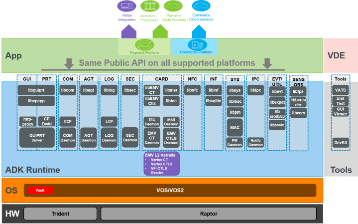

The Verifone ADK provides reusable set of components that make it easier to develop applications faster and with higher quality. The ADK allows developers to use only those components necessary to solve immediate problems, but also provides a clear preferred structure for implementing (or re-implementing) payment applications.

All components are intended to run under V/OS and V/OS2 operation systems providing the *same public APIs for both platforms*. The ADK components will also help to *mitigate and abstract differences in hardware* (e.g. various displays/keypads, CTLS hard LEDs vs. display emulation, different topologies for modular systems) and specific functional interfaces where possible. The ADK supports a large set of devices from the Verifone product portfolio.

The runtime framework for Commerce Platform (CP) is also provided as part of the ADK allowing to execute HTML/JavaScript based CP applications next to traditional payment applications written in native C/C++ programming language.

Finally the ADK comes also with a ready-to-use Secure Data Interface (SDI) application providing external access to Verifone pinpads.

# Card Services 

The Cards component provides a set of components for card processing of magstripe (MSR), EMV chip contact (CT) and contactless (CTLS) cards together with a card technology selection (TECSEL) that supports the initial card arbitration.

The EMV CT and CTLS components provide a simple, generic interface designed to provide clean and consistent access for an application to the variety of contact and contactless kernel implementations in use in Verifone applications. Having a common interface will improve developer learning curves, reduce QA requirements, and make code more understandable. To this end, the EMV component uses the \"start, continue, finalize\" model for interfacing, while also providing \"direct\" interface to the smart card for proprietary applications.

The EMV framework also shields application logic from the EMV L2 kernel implementation and supports usage of different contact and contactless kernels with the same application interface. The framework supports a uniform configuration mechanism for all underlying kernels. Configuration can be either via a statically provided XML file or dynamically through an API.

It provides a high-level API for EMV contact and contactless transactions on top of existing L2 kernels / frameworks while keeping the flexibility to fulfill domestic requirements w/o changing the certified EMV kernels. It is designed to support domestic kernels that comply to EMV entry point for CTLS and EMV selection process for CT and will consider upcoming NFC depending on their availability.

The MSR component provides a platform agnostic interface to magnetic card readers.

Card acceptance and remove process are supported by the TEC technology selection portion of the Card services. This provides a background monitor handling the card acceptance for MSR, CHIP, CTLS readers.

# HTML based Graphical User Interface (DirectGUI) 

The UI component allows an application to make high-level calls to control the display of the terminal (or other device). It allows page/form definition in HTML and supports a restricted set of HTML and CSS attributes.

The HTML-GUI component provides a standard dialog based GUI interface to applications, as well as the ability to show text, graphics and do custom layouts using HTML. A simple event model helps for on-page event dispatching. Additional support for PIN entry, signature capture, video playback, barcode rendering, screen capture, multi-region and multi-display support as well as other useful features have been added to ease the programmer\'s work and allow for powerful user interactions.

The HTML-GUI implementations support application writers in separating the application logic from the presentation layer allowing to change the look and feel, customizations and localizations without impacting the business logic. Due to the nature of the HTML dialog resource files migration between different terminal types with different characteristics (e.g. keypad vs. touch, color vs. b/w, large vs. small displays) gets simplified.

# HTML-Printer 

The printer component provides a standard printer interface to applications, as well as the ability to print text, graphics and do layouts using HTML. Layout orientation is supported also as landscape. Beside that it also supports a text rendering mode that can be used to drive text only printers and rendering of receipts into a text buffer for processing with email or connected ECR systems.

The HTML-Printer component provides a similar interface as the HTML-GUI component and complies with the HTML/CSS resource file definitions. This makes it fit seamlessly into the overall HTML based approach for user interfaces.

# Information Service 

The Information Service component is composed of: A general purpose database API provided by the SQLite backend An Export/Import Mechanism for database schema definition and the stored data in the database backend A Property API managing data in a dedicated Property Database

The database backend provided by the Information Service is pre-patched and verified SQLite library. It is used by Information Service itself and is available for applications as a general purpose SQL database API.

The Property API provides a way for applications to store named values (\"properties\") and then retrieve those values. Essentially, the information managed by the service is name/value pairs, optionally organized into a hierarchy. Some of the \"names\" are provided by the application, and others are fixed and may be updated by ADK components or by the OS itself.

The import/export utility handles customizable import/export operations for any SQLite-based database (but other backends may be introduced in the future). The purpose of this utility is to simplify initial application\'s database population from a data file and to facilitate application\'s database import/export from/to TMS.

# Communication Service 

The Communication Service manages all types of communication channels, allowing to build profiles, which manage opening as connection, but also fall back options. It allows you to easily use ppp over a raw data channel, add SSL on top of an IP connection or helps to manage modem communication. The Communication Service provides one single and common API across platforms for all types of communication channels.

It consists of a client side API library, and a daemon, which manages the communication profiles and options, including setting up fall back options and providing events.

In addition the Communication Service comes with a Communication Control Panel (CCP) that provides a user front-end to set communication options, connect to networks, get network status and diagnose connection problems.

# Security service 

The goal of the security service is to help make use of VSS security scripts, manage multiple payment hosts and provide a common API and design for the underlying VSS scripts. It provides APIs for key management, encryption / decryption, hashing and PIN management.

The goal for the API design is to be host agnostic, with all host specific code to be managed in configurable code parts, including VSS scripts. It consists of a API library, which is linked to the application and an underlying service, which manages host configurations and VSS scripts.

# Logging service 

The logging service provides means to create trace and debug logs to diagnose problems at runtime. It supports formatting the output according to SysLog standards with severity levels and supports different trace output channels. A powerful tagging and filter mechanism allows to reduce the log information to the needed information.

In addition the Logging services comes with a Log Control Panel (LCP) that provides a user front-end to set logging options, levels and output channels.

# System Services 

The system services are composed of: APIs to set and get system properties such as hardware and OS level software information, and controlling backlight, clock, beeper and other system parts Multi-Application Controller (MAC) providing application launcher functionality for payment and system provided applications as well as Commerce Platform applications ADK system launcher (ASL) starting up ADK services and daemons

MAC also provides a global status bar which reports terminal communication channel status, battery charge status and other other useful information. Content on the global status bar is maintained independently from any application. MAC launches Commerce Platform (CP) applications automatically on behalf of IPC notifications send by native applications if they match registered trigger points. In this context the MAC also acts as a IPC notification server that forwards and broadcasts notifications.

# Commerce Platform Runtime (CPR) 

The Commerce Platform enables integration of value-added applications and extensions to the payment flow using HTML/JavaScript based CP applications. The ADK provides the runtime components to execute these applications, seamlessly integrate to payment flow with CP trigger point and display coordination using the Multi-Application Controller and securely connecting to Verifone cloud services granting access to 3rd part servers. CP applications can leverage the supported HTML/CSS and add additional JavaScript to implement logic and connect to external server. The ADK runtime concerts the launch of these applications and providing them UI, printer, network, flash file system and context data resources at runtime.

# Secure Data Interface (SDI) 

The SDI solution provides user\'s with a pinpad-type application that can be used on all ADK supported Verifone devices. This application exposes external interfaces to control card readers, PIN entry, barcode reader, getting/setting system properties while keeping the sensitive card holder data secured with encrypted data tags helping to implement end-to-end secured solutions for mobile POS and other use cases.

# Utility libraries 

A set of utility libraries for common programming aspects are provided together with the ADK packages. This includes Expat XML processing library ISO8583 message packer
