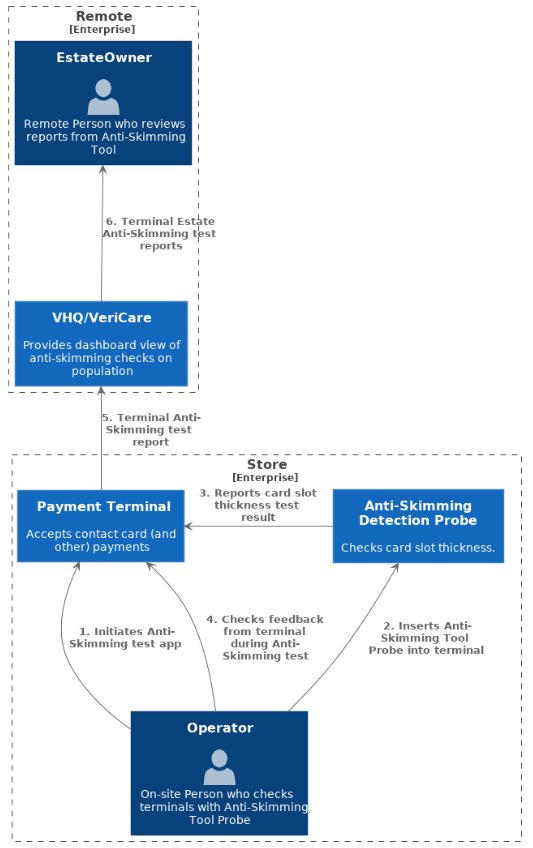
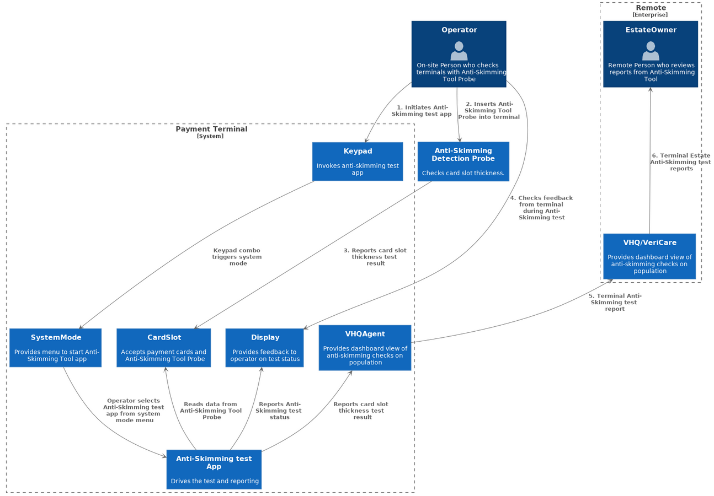
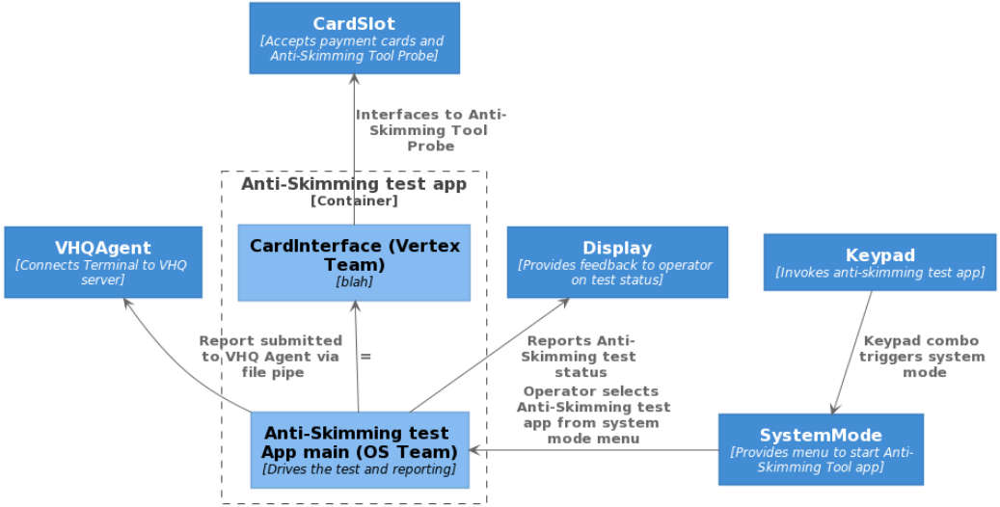
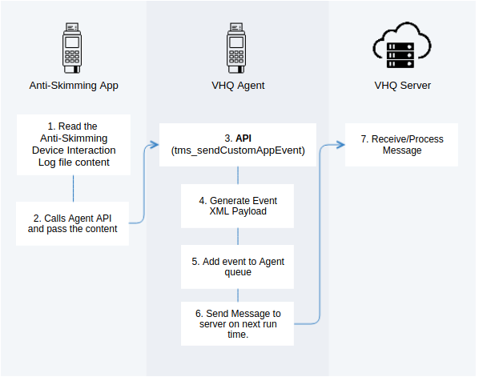

# Preface <a href="#preface" id="preface"></a>

This guide provides information of the functionality and usage of ADK Anti Skimming Tool (AST) application.

## Audience <a href="#subsec_ast_audience" id="subsec_ast_audience"></a>

This document is meant for programmers who want to understand and use ADK Anti Skimming Tool application.

## Organization <a href="#subsec_ast_organization" id="subsec_ast_organization"></a>

This guide is organized as follows:

[Chapter 1, Introduction](#sec_ast_introduction): Introduction to ADK-AST.

[Chapter 2, Getting Started](#sec_ast_getting_started): Explains concept.

[Chapter 3, Programming](#sec_ast_programming): Presents common uses.

[Chapter 4, System Setup and Requirements](#sec_ast_compile): Environment setup, installation and dependencies to other components.

[Chapter 5, Troubleshooting](#sec_ast_troubleshooting): Solutions for possible issues.

<a href="pg_systools_timezone_change.md#sec_ast_glossary">Appendix: Glossary</a>: Listing and definitions of various acronyms and terms

# Introduction <a href="#sec_ast_introduction" id="sec_ast_introduction"></a>

Anti-Skimming device is implemented to perform distance measurment between card reader slot and surface of keypad to detect overlay that may occur in case of abuse of the terminal.

# Getting Started <a href="#sec_ast_getting_started" id="sec_ast_getting_started"></a>

## Concepts <a href="#sec_ast_concepts" id="sec_ast_concepts"></a>

AST (Anti-Skimming Tool) is an ADK application which interacts with anti-skimming detection device. Anti-Skimming device is realised as a Probe (card) that can be inserted in card reader. Anti-Skimming tool is supported by Engage multi-line devices (e.g. Mx925, Mx915, M440, M425, M400) and can be delivered as:

- AST - as ADK component
- or ASTS - Standalone version (by loading Anti Skimming Tool Standalone (ASTS) signed application and VHQ Agent).

An operator (a person who checks terminals with AST Probe) initiates Anti-Skimming test application on the terminal and inserts the Probe. This Probe checks card slot thickness and reports a result to the terminal. Terminal saves every test result in a separate json encoded report file. Report file is stored in /home/sys13/logs/ast folder. File name is identical to timestamp. File example: /home/sys13/logs/ast/7001076.txt Only last twenty reports will be stored on filesytem. After test execution, created log files are sent to VHQ/VeriCare system. An Estate Owner (person who reviews reports from Anti-Skimming Tool), has an acces to VHQ/VeriCare dashboard of anti-skimming checks.

The Probe has built-in LED indicators that provides a result of test status:

| Led color                      | Description                        |
|--------------------------------|------------------------------------|
| <p>white</p> | <p>Power</p>     |
| <p>green</p> | <p>Pass test</p> |
| <p>red</p>   | <p>Fail test</p> |

### Log file content <a href="#subsubsec_log_file_content" id="subsubsec_log_file_content"></a>

| Field | Type | Description |
|----|----|----|
| <p>description</p> | <p>string</p> | <p>Status description</p> |
| <p>probe_sn</p> | <p>string</p> | <p>Anti skimming device serial number</p> |
| <p>return_code</p> | <p>int</p> | <p>Code returned by libCR-Skimmer</p> |
| <p>status</p> | <p>int</p> | <p>Error code</p> |
| <p>terminal_sn</p> | <p>string</p> | <p>Terminal serial number</p> |
| <p>timestamp</p> | <p>int</p> | <p>Unix timestamp</p> |
| <p>vhq_status</p> | <p>int</p> | <p>Need to clarify</p> |

### Test result status <a href="#subsubsec_test_result_status" id="subsubsec_test_result_status"></a>

| Status | Description | Anti-Skimming device led color |
|----|----|----|
| <p>0</p> | <p>No overlay detected</p> | <p>Green</p> |
| <p>1</p> | <p>Probe is not detected</p> |  |
| <p>2</p> | <p>Probe communication error</p> |  |
| <p>3</p> | <p>Overlay detected</p> | <p>Red</p> |

### Return_code values <a href="#subsubsec_return_code_values" id="subsubsec_return_code_values"></a>

| Code | Value | Description |
|----|----|----|
| <p>SKIMRC_Success</p> | <p>0</p> | <p>Operation was successful</p> |
| <p>SKIMRC_Failure</p> | <p>1</p> | <p>Operation failed</p> |
| <p>SKIMRC_Error_Power_Action</p> | <p>2</p> | <p>Power-Up operation failed</p> |
| <p>SKIMRC_Error_Not_Supported</p> | <p>3</p> | <p>Skimmer probe type not supported</p> |
| <p>SKIMRC_Error_BadParam</p> | <p>4</p> | <p>A function parameter is invalid</p> |
| <p>SKIMRC_Error_Protocol</p> | <p>5</p> | <p>Communication error with skimmer probe</p> |

### Report file example <a href="#subsubsec_report_file_example" id="subsubsec_report_file_example"></a>

``` cpp
{"description":"No overlay detected","probe_sn":"A01E900714241000317C57A000A0000019","return_code":0,"status":0,"terminal_sn":"275-159-718","timestamp":1597099642,"vhq_status":5010}
```

### Container diagram for Anti-Skimming Tool <a href="#subsubsec_container_diagram" id="subsubsec_container_diagram"></a>



### Top level Context diagram for Anti-Skimming Tool <a href="#subsubsec_top_level_context_diagram" id="subsubsec_top_level_context_diagram"></a>



### Component diagram for Anti-Skimming test Application <a href="#subsubsec_component_diagram" id="subsubsec_component_diagram"></a>



## Upload to VHQ Server <a href="#subsec_ast_upload_to_vhq_server" id="subsec_ast_upload_to_vhq_server"></a>

Anti-Skimming application calls VHQ Agent API, after the Anti-Skimming device interaction log file is generated. VHQ Agent generates a new event message, based on the data passed by the Anti-Skimming test application and send it to the server. VHQ Server receives the event message, parse it and display in the VHQ UI.



# Environment setup, installation and dependencies to other components <a href="#sec_ast_compile" id="sec_ast_compile"></a>

## Setup and installation <a href="#subsec_ast_setup" id="subsec_ast_setup"></a>

AST release consists of multiple packages:

| Package name | Description |
|----|----|
| <p>dl.ast-3.71.6.tgz</p> | <p>AST application (ADK environment)</p> |
| <p>dl.asts-3.71.6.tgz</p> | <p>AST application (standalone)</p> |
| <p>dl.ast-remove-3.71.6.tgz</p> | <p>AST removal package</p> |
| <p>dl.asts-remove-3.71.6.tgz</p> | <p>AST removal package</p> |


Removal packages are not needed for regular use. They are needed only if you need to downgrade AST version


AST requires ADK. Available as part of these ADK deliveries - ADK-4.4.23, ADK-4.6.12, ADK-4.7.5.

Supported AST languages:

| Language                         | Catalogue File                      |
|----------------------------------|-------------------------------------|
| <p>English</p> | <p>en-US.ctlg</p> |
| <p>French</p>  | <p>fr-FR.ctlg</p> |

The default AST language is English.

At the first launch, AST will request to select language after installation. AST memorise this selection for the following usage and don\'t ask for language again. To change the language one more time need reinstall the AST bundle.

## AST comparison with ASTS: <a href="#subsec_ast_vs_asts" id="subsec_ast_vs_asts"></a>

| AST | ASTS |
|----|----|
| <p>GUI interface</p> | <p>No GUI interface</p> |
| <p>Runs as system user (sys13)</p> | <p>Runs as system user (sys12)</p> |
| <p>Cleaner approach to killing applications</p> | <p>No cleaner approach to Killing applications</p> |
| <p>All dependencies are already included in ADK release</p> | <p>Very limited dependencies to V/OS APIs</p> |
| <p>Available as part of ADK</p> | <p>Does not require ADK, can run on old V/OS releases</p> |
| <p>Does not require VHQ agent update</p> | <p>Requires VHQ agent update</p> |

**AST** **dependencies:**

- GUI interface
- MAC
- VHQ Agent

**ASTS** **dependencies:**

- VHQ currently supports two release lines that support ASTS:
  - version 2.17.20 and up
  - version 3.2.6 and up
- CR-Skimmer library (dl.skimmerdetect-1.0.2-4)

# Programming <a href="#sec_ast_programming" id="sec_ast_programming"></a>

## Common uses <a href="#subsec_common_uses" id="subsec_common_uses"></a>

### AST usage in ADK environment <a href="#subsubsec_ast_common_uses" id="subsubsec_ast_common_uses"></a>

- Press X+3 to get to ADK desktop
- Press AST icon on ADK desktop
- ADK will stop running payment applications and initiate communication with probe
- AST app will wait for probe for 30 seconds
- If probe is inserted AST will generate a report and store it on file system in /home/sys13/logs/ast folder.
- It will also pass same report to VHQ agent
- After that ADK applications will be restarted

### ASTS usage <a href="#subsubsec_asts_common_uses" id="subsubsec_asts_common_uses"></a>

- ASTS boots at system startup. It sits in a background and awaits for specific key combination - X + 0 + 2 (Red key + Green key + 2).
- When user presses this combination, ASTS will start sysmode, which results in stopping payment application.
- Then ASTS will initiate communication with the probe.
- If probe is inserted AST will generate a report and store it on file system in /home/sys12/logs/asts folder.
- It will also pass same report to VHQ agent.
- After that it will restart applications.

# Troubleshooting <a href="#sec_ast_troubleshooting" id="sec_ast_troubleshooting"></a>

## FAQ <a href="#subsec_ast_faq" id="subsec_ast_faq"></a>

Q: What is the difference between AST and ASTS?

A: AST application is designed to work in ADK environment. ASTS - is stand alone version, which doesn\'t require ADK.

## Logging <a href="#subsec_ast_logging" id="subsec_ast_logging"></a>

AST is using ADK-LOG component for logging. Please refer to the ADK-LOG documentation for details. Used logging channels:

| Logging channel | Description |
|----|----|
| <p>AST</p> | <p>[AST application logs](#sec_ast_concepts)</p> |

## Debugging <a href="#debugging" id="debugging"></a>

# Appendix: Glossary <a href="#sec_ast_glossary" id="sec_ast_glossary"></a>

| Term | Description |
|----|----|
| <p>ADK</p> | <p>Application Development Kit</p> |
| <p>API</p> | <p>Application Program Interface</p> |
| <p>AST</p> | <p>Anti-Skimming Tool</p> |
| <p>ASTS</p> | <p>Anti-Skimming Stand alone Application</p> |
| <p>GUI</p> | <p>Graphical User Interface</p> |
| <p>UI</p> | <p>User Interface</p> |
| <p>OS</p> | <p>Operating System</p> |
| <p>HTML</p> | <p>Hypertext Markup Language</p> |
| <p>JSON</p> | <p>JavaScript object notation</p> |
| <p>HW</p> | <p>Hardware</p> |
| <p>Sysmode</p> | <p>V/OS system application.</p> |
