# Preface <a href="#preface" id="preface"></a>

This document is for programmers and developers who want to understand and use the ADK Communication Service.

## Audience <a href="#subsec_com_audience" id="subsec_com_audience"></a>

This guide provides information on the usage of the ADK Communication Service (ADK-COM). Only parts relating to the application programming interface (API) of ADK-COM are discussed here. The API is implemented by the libcom library. Operations implemented inside libcom require a service (also referred to as \"comdaemon\") to be running on the local machine. For information on the Com Control Panel (CCP), which is also part of ADK-COM, please refer to its own documentation.

## Organization <a href="#subsec_com_organization" id="subsec_com_organization"></a>

This guide is organized as follows:

[Chapter 1, Introduction](#sec_com_introduction): Introduction to ADK-COM.

[Chapter 2, Getting Started](#sec_com_getting_started): Shows the framework concepts.

[Chapter 3, Programming](#sec_com_programming): Presents common uses.

[Chapter 4, Extended C++ interface](#sec_com_extended_cpp_interface): Description of the extended API interface

[Chapter 5, System Setup and Requirements](#sec_com_platformsupport): Compiler and linker settings, dependencies to other components, environment setup.

[Chapter 6, Troubleshooting](#sec_com_troubleshooting): Solutions for possible issues.

[Appendix A: Migrating Between Releases](#sec_com_appendix_a_migrating): Information regarding migrating from version 1.x to 2.x and from 2.x to 3.x

[Appendix B: Bluetooth](#sec_com_appendix_b_bluetooth): Information regarding various Bluetooth topics

[Appendix C: Glossary](#sec_com_appendix_c_glossary): Listing and definitions of various acronyms and terms

[Appendix D: Devices](#sec_com_appendix_d_devices): Device-specific information.

[Appendix E: Modem country profiles](#sec_com_appendix_e_modem_profiles): Modem country settings

[Appendix F: Sysmode](#sec_com_appendix_f_sysmode): Information about triggering sysmode while ADKCOM app is running

[Appendix G: GATT Server functionality](#sec_com_appendix_g_bluetooth_gatt): Information about setting up a GATT server and reading/writing GATT characteristics

[Appendix H: Extended Bluetooth pairing](#sec_com_appendix_h_bluetooth_extended): Information about the extended Bluetooth pairing functionality

[Appendix I: Beacons](#sec_com_appendix_i_beacons): Information about iBeacons/Eddystone beacons

[Appendix J: Virtual channels](#sec_com_appendix_j_virtual_channels): Information about virtual channel functionality

[Appendix K: BT FF Base Configuration](#sec_com_appendix_k_ff_base_configuration): Information about configuring FF base mode for BT PAN

[Appendix L: CM5 Raptor configuration](#sec_com_appendix_l_cm5): Information about configuring the CM5 (SDI-Server)

[Appendix M: GPRS Always ON - Best Practices](#sec_com_appendix_m_gprs_always_on): information about keeping a GPRS connection alive, even with network-side idle disconnects

[Appendix N: WLAN country specific regulations](#sec_com_appendix_n_wlan_regulations): Information about setting the terminals WLAN country code

[Appendix O: Network Events cheat sheet](#sec_com_appendix_o_events_cheat_sheet): Information about how to handele ADK-COM network events on different interfaces

[Appendix P: Powering Devices behaviour](#sec_com_appendix_p_power_mode): Information on automatic / manual powering of communication devices

[Appendix Q: Tethering](#sec_com_appendix_q_tethering): Information on tethering a network (NAT / Masquerading)

[Appendix R: Automatic Reconnect BT / Mobile networks](#sec_com_appendix_r_auto_reconnect): Information on automatic reconnection of BT and Mobile networks

[Appendix S: Sim Slot Switching](#sec_com_appendix_s_sim_slot_switching): Information on switching the current SIM-Slot

[Appendix T: Limited Android support](#sec_com_appendix_t_limited_android_support): Information on supported APIs on Android platforms

[Appendix U: SIM Toolkit / USSD support](#sec_com_appendix_u_sim_toolkit_ussd): Information on the SIM Toolkit / USSD

[Appendix V: Mobile Radio: Preferred Operator Lists](#sec_com_appendix_v_preferred_operator_list): Information about POL usage

[Appendix W: COMdemo](#sec_com_appendix_w_comdemo): COMdemo, the ADK-COM demo application

[Appendix X: Neighbor Lists](#sec_com_appendix_x_neighbor_list): Information about ARP / NDP

[Appendix Y: VOS3](#sec_com_appendix_y_vos3): Information about the new VOS3 Operating System

[Appendix Z: Radio Reconfiguration](#sec_com_appendix_z_radio_net_restart): Information about restarting / connecting to Radio Networks

[Appendix A1: Mutual TLS authentication](#sec_com_appendix_a1_authex_authn): How to use AuthEx / AuthN / asymmetric customer keys with TLS and EAP (Wi-Fi and LAN)

[Appendix A2: Wake on WLAN](#sec_com_appendix_a2_wake_on_wlan)

[Appendix A3: IPv6 Protocol Configuration](#sec_com_appendix_a3_ipv6_configuration)

[Appendix A4: Restricted SIM Access](#sec_com_appendix_a4_sim_access)

[Appendix A5: Orange Dongle Support](#sec_com_appendix_a5_orange_dongles)

[Appendix A6: WiFi Fast Roaming (IEEE 802.11 k/v/r)](#sec_com_appendix_a6_fast_roaming)

[Appendix A7: Orange Dongle Link Events](#sec_com_appendix_a7_orange_uplink)

# Introduction <a href="#sec_com_introduction" id="sec_com_introduction"></a>

This guide provides information on the usage of the ADK Communication Component (ADK-COM). Only parts relating to the application programming interface (API) of ADK-COM are discussed here. The API is implemented by the libcom library. Operations implemented inside the libcom require a remote service (comdaemon) to be running on the machine. For information on the Com Control Panel (CCP), which is also part of ADK-COM, please refer to its own documentation.

The library part of ADK-COM, including its header API, will be referred to as **\"libcom\"** throughout this document.

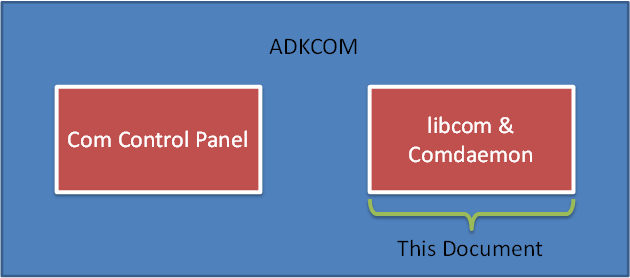

## Concepts <a href="#sec_com_concepts" id="sec_com_concepts"></a>

The application interface is a simple programming interface in combination with configuration profiles. The ADK-COM API is found in <a href="libcom_8h.md">libcom.h</a>. This header specifies a common API to send and receive data across devices and provides a high-level connection setup based on logical connection profiles.

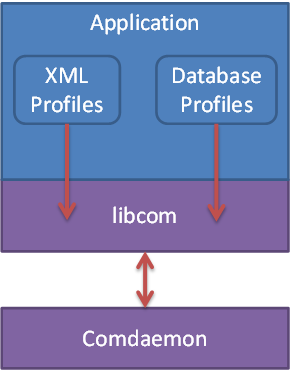

ADK-COM profiles are a common set of connection and network specific settings. Through these profiles the application can define all major parts of a connection establishment:

- connection specific information (target host, ..) called the **\"connection profile\"**
- network specific setup information (as a prerequisite for the above connection) called the **\"network profile\"**

There are two different types of connection profiles, network-based and raw-data connections.

There are two possibilities how the application tells ADK-COM about the location of the profile:

- Database node name inside an ADKINF database
- Filename to an XML-file with an ADK-COM specific configuration

Both approaches end up in a file stored on the Terminal\'s file system. There is no special or recommended place to store those files. It is up to the application to specify the storage place. You can either use a fully qualified absolute path to the profile files or a relative path to it (but then depending on the current working directory of your application process). The files will be opened by the libcom in the application context. ADK-COM (libcom) will not change any working directory.

IP based connections are handled through a standard BSD socket API. After setting up a IP based connection by opening an ADK connection profile, the application can either request the socket-descriptor or use ADK-COM functions to send and receive data.

Network-based connections are always associated to a network profile, which is used by the comdaemon to activate the underlying network as a prerequisite.

Raw data connections are raw, serial connections. As such they do not depend on a network profile. All connection related settings are handled and stored inside the connection profile itself. From an user interface point of view there is no difference between raw data connections and IP based connections. Both are using a socket based API.

While raw data connections are completely handled by the connection profiles, all IP based connections require a network profile to start-up and maintain an underlying network. Each IP based connection defined in a connection profile must have exactly one assigned network profile. Per definition, a network profile must define all *required* network parameters for this type of network. Network parameters differ between different *types* of network profiles. The type of network is also stored within the set of parameters.

The following figure shows how the different protocol layers are concerned by the connection profile and network profile definition:

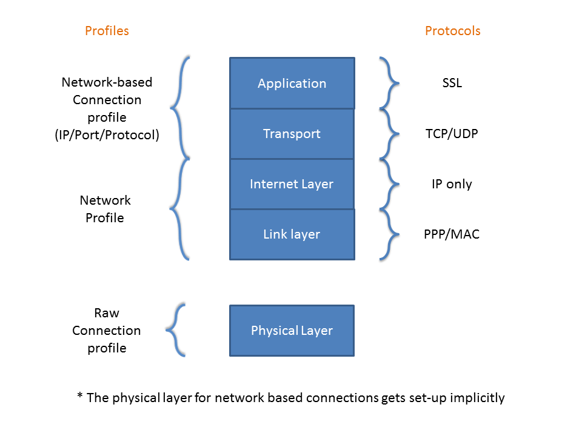

This component encapsulates construction and control of technology stacks supporting dialup and radio (GPRS, GSM, 2G/3G, BT) communications, including PPP, and fixed networks like Ethernet and WiFi. It also provides support for SSL secured TCP/IP connections and raw serial connections over UART or emulated serial over USB or Bluetooth. The above listed devices can be used to build up communication links with the following protocols:

| Protocol | Description |
|----|----|
| <p>**TCP/IP**</p> | <p>TCP data stream</p> |
| <p>**UDP/IP**</p> | <p>User Datagram Protocol</p> |
| <p>**SSL/TCP/IP**</p> | <p>Secure Socket Layer on top of a TCP/IP connection.</p> |
| <p>**raw**</p> | <p>raw data transfer between entities (typically serial connections or raw modem connections)</p> |
| <p>**Websockets**</p> | <p>Websocket (WS) or secure Websockets (WSS)</p> |

ADK-COM allows interworking with the following portable standard APIs by providing low-level handles to use the following:

- BSD socket API, see <a href="https://en.wikipedia.org/wiki/Berkeley_sockets">https://en.wikipedia.org/wiki/Berkeley_sockets</a>
- OpenSSL programming API, see <a href="https://www.openssl.org/docs/ssl/ssl.md,">https://www.openssl.org/docs/ssl/ssl.html,</a> SSL Programming Tutorial

BSD socket and OpenSSL APIs are available on V/OS platforms.

ADK-COM does only support transport layer protocols. For any higher level protocols (e.g. FTP, HTTP), applications might need to use the ADK provided cUrl library.

- libcurl - the multiprotocol file transfer library, see <a href="https://curl.se/libcurl">https://curl.se/libcurl</a>

# Getting Started <a href="#sec_com_getting_started" id="sec_com_getting_started"></a>

ADK-COM provides a sample application that demonstrates features of the system and can be used as starting point for application developers.

ADK-COM is provided on different target platforms. The following sections describe how to use the sample application on these platforms.

## Setup <a href="#subsec_com_setup" id="subsec_com_setup"></a>

### Running on V/OS <a href="#subsubsec_com_running_on_v_os" id="subsubsec_com_running_on_v_os"></a>

- Install ADK-COM bundle
- Start Application

## Simple Example <a href="#subsec_com_simple_example_73" id="subsec_com_simple_example_73"></a>

Let's say you want to connect to a host, send and receive data, and eventually terminate the connection. For sake of simplicity let us further assume you want do a simple Ethernet connection, and the transport protocol you choose is TCP without any SSL layer on top. We will not use the database but plain XML files. To keep it simple we will also be using the synchronous connection-establishment interface.

The steps you will need to take are the following:

- Create the XML files
- Initialize libcom from your application
- Optionally use com_AttachNetwork to attach the Network
- Connect to the host by calling com_Connect with the XML file specified
- Use com_Send/Receive to send and receive data
- Use com_ConnectClose to close the connection
- Possibly use com_DetachNetwork if you have attached it previously
- Once you are done with libcom you MUST call com_Destroy in order for libcom to release allocated resources

For this example we will not use the asynchronous functions. First create the connection and network profiles. First let's look at the connection profile:

``` cpp
<CONNECTION_PROFILE>
   <CONNECTION>
   <TYPE>TCP</TYPE> <!-- Transport protocol-->
   <NETWORK>LOCAL_NET.xml</NETWORK> <!--The network profile which will be referenced-->
   <ADDRESS>bhelvbuild2.verifone.com</ADDRESS> <!--Host address-->
   <PORT>1200</PORT> <!--Host port-->
   <TIMEOUT>10000</TIMEOUT> <!--This is the socket connection timeout. 10000 milliseconds. 10 seconds.-->
   </CONNECTION>
</CONNECTION_PROFILE>
```

Here is a possible network profile, which is called LOCAL_NET.xml (this is referenced in the connection profile above):

``` cpp
<NETWORK_PROFILE>
   <TYPE>LAN</TYPE> <!--We want to use ethernet-->
   <DEVICE_NAME>ETH0</DEVICE_NAME> <!--We want to use Ethernet port 0-->
   <STARTUP_MODE>AUTO</STARTUP_MODE> <!--We want the network to be automatically setup at boot-->
   <TIMEOUT>60000</TIMEOUT> <!--The timeout for setting up the network (60 seconds)-->
   <DHCP_ENABLED>1</DHCP_ENABLED> <!--Get an automatic IP address-->
</NETWORK_PROFILE>
```

### Initializing ADK-COM <a href="#subsubsec_com_initializing_adkcom" id="subsubsec_com_initializing_adkcom"></a>

To initialize ADK-COM you simply need to call the init function, which is <a href="libcom_8h.md#ac8c39547d8e7fefb66c9e6168da8b35d">com_Init()</a>. <a href="libcom_8h.md#ac8c39547d8e7fefb66c9e6168da8b35d">com_Init()</a> is successful if the function returns 0. The optional parameter, which in this case is NULL, is the com_Errno. We will cover this parameter later.

Example:

``` cpp
int main(int argc, char **argv) {
   if(com_Init(NULL)){
   return -1;
   }
   com_Destroy(NULL);
   return 0;
}
```

Be sure to also call com_Destroy if com_Init has succeeded!


The library may return -1 with com_errno (parameter to com_Init) set to COM_ERR_DAEMON_COM. In this case the service is not ready yet. As not to stall the application the function itself will not block, but return immediatly. It is a good idea to take care of other things while the service is initializing. If there is nothing left to do, please use a simple loop to determine when the service is ready to go. It is recommended to check around every 0.5 seconds.


### Connecting to a Host and Closing the Connection <a href="#subsubsec_com_connecting_to_a_host_and_closing_the_connection" id="subsubsec_com_connecting_to_a_host_and_closing_the_connection"></a>

Use com_Connect to connect to a host. If the host is available a non-null handle will be returned.

Example:

``` cpp
int main(){
   com_ConnectHandle *handle;
   if(com_Init(NULL)){
   return -1;
   }
   handle = com_Connect("profile_name.xml", NULL, NULL, 10000, NULL);
   if(!handle) printf("error\n"); //Connection didn’t work
   else com_ConnectClose(handle, NULL); //Connection did work, but now close the connection
   com_Destroy(NULL);
}
```

The currently running comdaemon will remember that a client is currently connected to the specified network. It will keep track of the client until the client has called ConnectClose or until the client-process has exited.

### Registering a Callback <a href="#subsubsec_com_registering_a_callback" id="subsubsec_com_registering_a_callback"></a>

You *may* register a callback to the com_Connect function, which will inform you about the status of the connection as well as any errors.

Example:

``` cpp
void connection_callback (enum com_ConnectionEvent event, enum com_ConnectionType type, const void *data, void *priv, enum com_ErrorCodes com_errno){
   (void) event;
   (void) priv;
   switch(event){
   case COM_EVENT_CONNECTION_ESTABLISHED:
   printf("Connection established!\n");
   break;
   case COM_EVENT_CONNECTION_NEXT:
   printf("Trying new connection\n");
   break;
   case COM_EVENT_CONNECTION_FAILED:
   printf("Connection failed %d\n", com_errno);
   break;
   case COM_EVENT_PROFILE_FAILED:
   printf("Entire profile failed %d\n", com_errno);
   break;
   }
}
int main(){
   com_ConnectHandle *handle;
   if(com_Init(NULL)){
   return -1;
   }
   handle = com_Connect("profile_name.xml", connection_callback, NULL, 10000, NULL);
   if(!handle) printf("error\n"); //Connection didn’t work
   else com_ConnectClose(handle, NULL); //Connection did work, but now close the connection
   com_Destroy(NULL);
}
```

### Obtaining Error information <a href="#subsubsec_com_obtaining_error_information" id="subsubsec_com_obtaining_error_information"></a>

To all libcom functions except `com_GetErrorCodes` you may pass an address to an integer variable as the last parameter. If the function should fail and the address is not NULL, an error code will be written into the specified address.

When calling on of the com_Connect\* functions the ADK-COM will iterate through all the connections of the specified profile. Each of the connections may have different errors. Because you can specify only one address to an error code only the last-known error will be written, which may not be useful to you. Thusly if you want to know each and every reason why a connection inside a profile failed you will need to use a callback as described above. For any other operation, which does not do multiple operations at a time, it is sufficient to pass an address to an integer to obtain error information as described above.

Example:

``` cpp
int main(int argc, char **argv) {
   int ret;
   enum com_ErrorCodes com_errno;
  
   LOGF_TRACE("Libcom Version: %s", com_GetVersion());
  
   if(com_Init(NULL)){
   LOGF_TRACE( "Could not init com");
   return -1;
   }
   //Not a valid handle (NULL) so the function will fail
   ret = com_ConnectClose(NULL, &com_errno);
  
   if(ret != 0){
   printf("Close failed %s, [%d]\n", com_GetErrorString(com_errno), com_errno);
   }
   com_Destroy(NULL);
   return 0;
}
```

The output: \"Close failed Handle is invalid (NULL), \[1\]\"

Above we have additionally put the error-code into the com_GetErrorString function in order to obtain a textual representation of the error code.

### Attach Network <a href="#subsubsec_com_attach_network__optional_" id="subsubsec_com_attach_network__optional_"></a>

Once you have created the profiles you are ready to use them with libcom. One **optional** step you can take before using com_Connect is to attach a network via the com_AttachNetwork. Attaching a network is only necessary if you do not want a network to go down after all connections through that network have been shut down. This step is optional as the connection profile always references a network-profile, and that network will be setup implicitly, if it has not been previously.

Example:

``` cpp
int main(){
   com_ConnectHandle *handle;
   if(com_Init(NULL)){
   return -1;
   }
   com_AttachNetwork("network_name.xml")
   handle = com_Connect("profile_name.xml", NULL, NULL, 10000, NULL);
   if(!handle) printf("error\n"); //Connection didn’t work
   else com_ConnectClose(handle, NULL); //Connection did work, but now close the connection
  
   com_Destroy(NULL);
}
```

In the example above the network is not detached. This means the network will stay up, even if the connection going through it has disconnected!

Also, please note network_name.xml having the \".xml\" ending. This is unlike when specifying it in a connection profile (which does not have the .xml ending)

The comdaemon, who is responsible for automatically setting networks up/down, has a very simple counter in order to count attach/detach operations. Every time an application calls attach on a network the network counter will be incremented by one. Every time an application calls detach on a network it will be decremented by one. The counter is not automatically decremented when a client exits. Applications should communicate between each other in order to synchronize attach/detach on a network.

### Automatic Disconnection of the Network <a href="#subsubsec_com_automatic_disconnection_of_the_network" id="subsubsec_com_automatic_disconnection_of_the_network"></a>

All three conditions, which are all shown in the sections above, have to be met for the automatic disconnection of the network. They are as follows:

- No connections are currently going through the network
- The network profile has autostart disabled
- The network is not attached

### Sending/Receiving Data <a href="#subsubsec_com_sending_receiving_data" id="subsubsec_com_sending_receiving_data"></a>

With an obtained com-handle you may send and receive data.

You can do sending/receiving data in two ways: Either you use the getFD/getSSLFD function of libcom to obtain the socket descriptor, which you can use like a normal BSD socket, or you can use the functions receive/send function which libcom provides.


Socket behavior will change depending on the type of socket it is. If, for example, you have a socket for sending datagrams (such as UDP datagrams) then you will have a different behavior than a streaming socket (such as a TCP stream).


In the example below we assume that the server we are contacting to is a simple echo server. We will send data and then receive the data back.

Example:

``` cpp
static bool isCritical(com_ConnectHandle *handle,enum com_ErrorCodes com_errno) {
   enum com_ConnectionType type = com_GetConnectionType(handle, NULL);
   if(type == COM_CONNECTION_TYPE_SSL) {
   if (com_errno == COM_ERR_CON_SSL_BUSY) {
   return false;
   }
   return true;
   }
   // All other connection types go in here
   if (com_errno == (COM_SYSTEM_ERRNO_BASE+EAGAIN) || com_errno == (COM_SYSTEM_ERRNO_BASE+EWOULDBLOCK)) {
   LOGF_TRACE("Uncritical socket error");
   return false;
   }
   LOGF_TRACE("Critical socket error");
   return true;
}
static int testSendReceive(struct com_ConnectHandle *handle, const void *data, size_t len, const char* profile) {
   char *rBuffer;
   ssize_t ret;
   size_t hasSent = 0;
   size_t gotLen = 0;
   unsigned int selectRet;
   int retval = -1;
   enum com_ErrorCodes com_errno = COM_ERR_NONE;
   if(!handle || !data || len <= 0) return retval;
   rBuffer = (char *)malloc(len);
   if(!rBuffer) {
   return retval;
   }
   memset(rBuffer, 0, (size_t)len);
   while(hasSent != len) {
   ret = com_Send(handle, (char*)data + hasSent, len - hasSent, &com_errno);
   if(ret == -1) {
   if(isCritical(handle, com_errno))
   break;
   /*Output buffer is full, so wait until writeable*/
   if(com_Select(handle, COM_SELECT_WRITE, 10000, &selectRet, 0) != 1)
   break; // timeout
   continue; // writeable again
   }
   hasSent += ret;
   LOGF_TRACE("@@ %d bytes sent", hasSent);
   }
   LOGF_TRACE("%s: Sent %d bytes, %s", __func__, hasSent, profile);
   //LOGAPI_HEXDUMP_TRACE( "SEND Data DUMP", data, len);
   if(hasSent == len) {
   while(1) {
   bool error = false;
   switch(com_Select(handle, COM_SELECT_READ, 10000, &selectRet, &com_errno)) {
   case 0:
   LOGF_TRACE( "%s: We can't wait any longer to get our data back...break, %s", __func__, profile);
   error = true;
   break;
   case 1:
   LOGF_TRACE("%s: Select OK [%d], %s", __func__, selectRet, profile);
   break;
   case -1:
   LOGF_TRACE("%s: Select failed [com_errno %d] %s", __func__, com_errno, profile);
   error = true;
   break;
   }
   if(error) break;
   ret = com_Receive(handle, rBuffer + gotLen, len - gotLen, &com_errno);
   if(ret == -1) {
   if(isCritical(handle, com_errno)) {
   LOGF_TRACE( "%s: Receive failed (%d)[com_errno %d], %s", __func__, ret, com_errno, profile);
   break;
   }
   continue; // wait until it is readable again
   } else if(ret == 0) {
   LOGF_TRACE( "%s: Remote has closed connection too soon, %s", __func__, profile);
   break;
   }
   //LOGAPI_HEXDUMP_TRACE( "RECV Data DUMP", rBuffer + gotLen, ret);
   gotLen += ret;
   LOGF_TRACE("%d bytes read so far", gotLen);
   if(gotLen >= len) {
   if (memcmp(data, rBuffer, len) == 0) {
   retval = 0;
   } else {
   retval = -2;
   LOGF_TRACE( "%s: Received Data != Sent Data, %s", __func__, profile);
   }
   break;
   }
   }
   }
   free(rBuffer);
   return retval;
}
int main(int argc, char **argv) {
   struct com_ConnectHandle *handle;
   const char* profile = "tcp.xml";
   while (com_Init(NULL) == -1) {
   LOGF_TRACE( "Could not init com, probably comdaemon not yet up, try again");
   sleep(1);
   }
   handle = com_Connect(profile, NULL, NULL, 10000, NULL);
   if(handle != NULL) {
  
   testSendReceive(handle, "mydata", sizeof("mydata"), profile);
   com_ConnectClose(handle, NULL);
  
   } else {
   printf("Failed to connect\n");
   }
  
   com_Destroy(NULL);
}
```

# Programming <a href="#sec_com_programming" id="sec_com_programming"></a>

## Programming and API Principles <a href="#programming_and_api_principles" id="programming_and_api_principles"></a>

The libcom library provides several types of functions. Special consideration has to be taken when calling a function with the \"async\" postfix. These types of functions will return a handle which you will need to pass to a wait function in order to poll the status of the operation or wait for an operation to complete. A handle returned by a synchronous function (not marked with async) does not need to be handled in this way. **In either case if you obtain a handle you MUST pass it to the corresponding close function. Otherwise you will leak resources.**

Before any other libcom functions can be called the libcom library must be initialized using <a href="libcom_8h.md#ac8c39547d8e7fefb66c9e6168da8b35d">com_Init()</a> function.


<a href="libcom_8h.md#ac8c39547d8e7fefb66c9e6168da8b35d">com_Init()</a> MUST always be called before any other libcom function. If this function fails, no communication with the comdaemon is possible and all other libcom functions will fail.

When the system is still booting a call to <a href="libcom_8h.md#ac8c39547d8e7fefb66c9e6168da8b35d">com_Init()</a> may fail. In most cases this is because the comdaemon process is not yet launched by the OS. It is strongly recommended to retry the call to <a href="libcom_8h.md#ac8c39547d8e7fefb66c9e6168da8b35d">com_Init()</a> after in a loop.


Once libcom is no longer needed in your application you may free all its allocated resources by calling <a href="libcom_8h.md#a9c42f243213c1bd460f2b1ae0aea067e">com_Destroy()</a>. com_Destroy **must** be called before the main thread of your application exits.

## Library and Service Version <a href="#subsec_com_library_and_service_version" id="subsec_com_library_and_service_version"></a>

To identify the current version of libcom, the <a href="libcom_8h.md#ab88f9728460434908b808e34a856b6af">com_GetVersion()</a> API can be used.
To identify the current version of the currently running service (comdaemon), the <a href="libcom_8h.md#a8b4969ca794633232fdfc9605ae95c6e">com_GetSvcVersion()</a> API can be used.


In early releases there was the possibility of the library and service version being different, due to the possibility of linking static libraries into applications. As static libraries are no longer supported, both versions *should* be identical.


## Device Initialization <a href="#subsec_com_device_initialization" id="subsec_com_device_initialization"></a>

Some devices require setting of device properties for correct initialization. See the corresponding device properties lists in chapter [Device Configuration](#subsec_com_device_configuration).


Some network interfaces may be accessible/inaccessible depending on device-configuration. For example setting the USB-Port role to \"device\" may enable using USB-Gadget networks via this port, while setting the same port to \"host\"-role may enable using an ethernet-dongle. The role cannot be device and host at the same time, meaning both networks cannot be enabled at the same time either. The application/user must make a decision about what to configure for which use-case.


## Communication Interface Detection <a href="#subsec_com_communication_interface_detection" id="subsec_com_communication_interface_detection"></a>

libcom provides a mechanism to detect the supported communication interfaces of the device it runs on. This mechanism can be used by the application to select suitable profiles.

To request all the available communication interfaces of the device, the COM_PROP_SUPP_INTERFACES device property can be used. It delivers a bit-list indicating the available communication interfaces. Please refer to chapter [Device Configuration](#subsec_com_device_configuration) for a detailed description of the property.

## Connection Establishment <a href="#subsec_com_connection_establishment" id="subsec_com_connection_establishment"></a>

ADK-COM provides a connection-type agnostic setup of connections.

### Synchronous Connection Setup <a href="#subsubsec_com_blocking_connection_setup" id="subsubsec_com_blocking_connection_setup"></a>

The simplest connection setup is via the blocking <a href="libcom_8h.md#a38b33fccc951bc546fbaee4ea832ef13">com_Connect()</a> call. This reads the specified connection profile and establishes a connection according to the defined connection and network properties. The function is blocks until the given timeout is expired. On success the function returns a handle that can be used with <a href="libcom_8h.md#a86944e9a76e84d162fa1f6312696d9f9">com_Send()</a> and <a href="libcom_8h.md#a61643cc4c9047a8cd528f10846e3ec17">com_Receive()</a>. When no longer needed the connection handle must be closed using <a href="libcom_8h.md#a8bca756375d8e08dcfdb9884f2226623">com_ConnectClose()</a>.

Example:

``` cpp
#include <libcom.h>
struct com_ConnectHandle *handle;
handle = com_Connect("tcp.xml", NULL, NULL, 10000, NULL);
if(handle != NULL)
{
  // Connection is established, now send and receive data
...
// close the connection
com_ConnectClose(handle, NULL);
}
...
```


The first parameter of the <a href="libcom_8h.md#a38b33fccc951bc546fbaee4ea832ef13">com_Connect()</a> specifies the location of the connection profile to be used. This is either a path to a file containing a XML structure or an entry-point of an INFOSVC database and its name.


### Asynchronous Connection Setup <a href="#subsec_com_asynchronous_connection_setup" id="subsec_com_asynchronous_connection_setup"></a>

Connections can also be established asynchronously. This method allows the calling thread to continue with other tasks while network and connection are established in the background. Use <a href="libcom_8h.md#a65f3a6e7059cb1dfa3a924aad3122c90">com_ConnectAsync()</a> to start the asynchronous connection setup and <a href="libcom_8h.md#ad6270f5c1d4a16369395040b6e2d69f6">com_ConnectWait()</a> to complete the connection setup.

Example:

``` cpp
#include <libcom.h>
struct com_ConnectHandle *handle;
handle = com_ConnectAsync("tcp.xml", NULL, NULL, NULL);
if(handle == NULL)
{
  // starting async connection handling failed
}
//
Do something else
...
// now wait 10 sec to complete the async connection setup
if(com_ConnectWait(handle, 10000, NULL) == COM_CONNECTION_STATUS_CONNECT){
{
  // Connection is established, now send and receive data
}
else
{
  // setting up connection failed within 10 sec
}
com_ConnectClose(handle, NULL);
```

Obtaining the value COM_CONNECTION_STATUS_TIMEOUT from com_ConnectWait does not mean the connection-process is now canceled. The process is still active in the background, meaning com_ConnectWait can be called with the same handle again.

### Connection Status Callback <a href="#subsubsec_com_connection_status_callback" id="subsubsec_com_connection_status_callback"></a>

Both synchronous and asynchronous connection setups support a callback mechanism that informs the application about the progress and status of the connection establishment process.

The callback function can be registered with <a href="libcom_8h.md#a38b33fccc951bc546fbaee4ea832ef13">com_Connect()</a> or com_ConnectAsyc() functions and needs to be of type comCallbackConnectionType.

The callback provides information on the most recent event in connection setup procedure and the type of the connection that is currently being tried out or finally established. With the \*priv parameter, an application may pass connection specific information for their own use to the callback function.

Example:

``` cpp
#include <libcom.h>
void conn_cb (enum com_ConnectionEvent event, enum com_ConnectionType type, const void *data, void *priv, enum com_ErrorCodes com_errno)
{
  //callback actions
}
// register the callback with the connect function
handle = com_Connect("tcp.xml", conn_cb, NULL, 10000, NULL);
com_ConnectClose(handle, 0);
```

### Determine Connection specific Information from Connection Status Callback <a href="#subsubsec_com_connection_callback_information" id="subsubsec_com_connection_callback_information"></a>

From within the code of the connection status callback function you are able to obtain certain specific information and status of the current connection. To easily achieve this, ADKCOM provides two function which are designed to only be used from within this callback function:

- <a href="libcom_8h.md#a8629e7051f4be75c131b23de2f461591">com_GetProfilePropertyString()</a>
- <a href="libcom_8h.md#a256e125f12ac7cda21afa82e25b6229d">com_GetProfilePropertyInt()</a>

The parameter \"data\" of the callback function can be used as a handle for these two functions. Please refer to the com_ProfilePropertyInt and com_ProfilePropertyString enums in order to ascertain which properties can be determined by which function. Simply pass the data and type parameters, which should be present in your callback-function, as the first two parameters of the correct function. As the next parameter pass the property which you want to obtain, as fourth parameter specify the location of the return value, and as the last parameter specify the address of com_errno.

Example:

``` cpp
void conn_cb (enum com_ConnectionEvent event, enum com_ConnectionType type, const void *data, void *priv, enum com_ErrorCodes com_errno)
{
   const char *network_profile_name = NULL;
   enum com_ErrorCodes error;
   if(type == COM_CONNECTION_TYPE_TCP && event == COM_EVENT_CONNECTION_ESTABLISHED){
   if(com_GetProfilePropertyString(data,type,COM_PROFILE_PROP_STRING_NETWORKNAME_FULL, &network_profile_name, &error) || !network_profile_name){
   printf("Could not get network-name from data-block!\n");
   return;
   }
   else{
   printf("%s\n", network_profile_name);
   }
   }
}
```

Through this callback function you are also able to determine the exact socket error code for failed socket connections. In case the connection could not be established because of any socket / IP layer issue, the event parameter will be set to COM_EVENT_CONNECTION_FAILED and the parameter com_errno will be set to COM_ERR_CON_SOCKET. Now you are able to read the actual socket error via COM_PROFILE_PROP_LAST_SOCKET_ERROR profile property.

Following sample code shows how to obtain the socket error code (the errno being set when connect() is called):

``` cpp
void conn_cb(enum com_ConnectionEvent event, enum com_ConnectionType type, const void *data, void *priv, enum com_ErrorCodes com_errno)
{
   if(event == COM_EVENT_CONNECTION_FAILED && com_errno == COM_ERR_CON_SOCKET) {
   com_ErrorCodes localErr;
   int socketError = 0; // for example EHOSTUNREACH, ECONNREFUSED, ...,
   int ret = com_GetProfilePropertyInt(data, type, COM_PROFILE_PROP_LAST_SOCKET_ERROR, &socketError, &localErr);
   if(ret == 0) {
   printf(GRN "Socket Error Occurred: " RESET RED "%s" RESETNL, strerror(socketError));
   }
   else {
   printf(RED "Failed to determine the real socket error" RESETNL);
   }
   }
}
```

### Closing Connections <a href="#subsubsec_com_closing_connections" id="subsubsec_com_closing_connections"></a>

The <a href="libcom_8h.md#a8bca756375d8e08dcfdb9884f2226623">com_ConnectClose()</a> function has to be used to close a communication connection.


Any handle obtained from libcom MUST be passed to a \*Close function at some point. This includes asynchronous handles in which the \*Wait functions has signaled the operation to have failed.


Example:

``` cpp
#include <libcom.h>
struct com_ConnectHandle *handle;
handle = com_Connect("tcp.xml", NULL, NULL, 10000, NULL);
// close the connection
if(handle) com_ConnectClose(handle, NULL);
```

Once a connection is established, the generic functions <a href="libcom_8h.md#a61643cc4c9047a8cd528f10846e3ec17">com_Receive()</a> and <a href="libcom_8h.md#a86944e9a76e84d162fa1f6312696d9f9">com_Send()</a> can be used to transmit and receive data.

Only if you have set the connection type to **UDP** for your connection profile the according datagram functions <a href="libcom_8h.md#a523c494a8fd5d4397257ba439a9f0c45">com_ReceiveFrom()</a> and <a href="libcom_8h.md#a5d8b92257989b0842af3a49a1cc0ac0e">com_SendTo()</a> must be used to transmit or receive data. If you call those functions on a non-UDP connection the error COM_ERR_CON_SOCKET is returned. As **UDP** is connectionless the user is not required to specifiy a hostname / IP address and port in the connection profile but in the actual function call. The usage is based on the standard functions sendto() and recvfrom() used for UDP datagram transmissions.

The default behaviour of the communication sockets provided by ADK-COM is non-blocking which means <a href="libcom_8h.md#a61643cc4c9047a8cd528f10846e3ec17">com_Receive()</a> and <a href="libcom_8h.md#a523c494a8fd5d4397257ba439a9f0c45">com_ReceiveFrom()</a> will return immediately - even if no data can be read. To switch sockets back to blocking mode you may call operating-system specific functions on the file-descriptor of the connection. Please refer to your operating system manual for more information.

### Avoiding Data Polling <a href="#subsubsec_com_avoid_polling" id="subsubsec_com_avoid_polling"></a>

In order to avoid the polling of the <a href="libcom_8h.md#a61643cc4c9047a8cd528f10846e3ec17">com_Receive()</a> and <a href="libcom_8h.md#a523c494a8fd5d4397257ba439a9f0c45">com_ReceiveFrom()</a> interface, the application may use the OS function select() (available on V/OS and V/OS2) to wait for incoming data. To make this easier the <a href="libcom_8h.md#a19c50d06994f4123bfdd643fdb2f26de">com_Select()</a> function may be used. Please refer to the function reference for more information.

Example:

``` cpp
#include <libcom.h>
...
char sBuffer[] = "hello 4";
char rBuffer[sizeof(sBuffer)+1];
ssize_t len=0;
int waitForData(com_ConnectHandle *handle){
   unsigned int flags_out;
   enum com_ErrorCodes com_errno;
  
   int ret = com_Select(handle, COM_SELECT_READ, 3*60000, &flags_out, &com_errno);
   if(ret == -1){
   printf("com_Select failed with erro %s", com_GetErrorString(com_errno));
   return -1;
   }
   else if (ret == 0) {
   printf( "com_Select timed out\n, %s", __func__, profile);
   return -1;
   }
  
   if (!(flags_out & COM_SELECT_READ)) {
   printf("com_Select: wrong flag detected");
   return -1;
   }
  
   printf("Data has arrived. Ready to read...\n");
   return 0;
}
...
// send data
len=com_Send(handle, sBuffer,sizeof(sBuffer), NULL);
// wait for received data
if (waitForData(handle) == 0)
  
   // receive data
   len=com_Receive(handle, rBuffer, sizeof(rBuffer)-1, NULL);
}
```

### Send / Receive while bringing up a 2nd interface connected to same network <a href="#subsubsec_com_overlapped_sending" id="subsubsec_com_overlapped_sending"></a>

In case you have a valid connection established to a host via one of the supported network interfaces (for ex. Ethernet) and while transferring data you bring up a second network interface (for ex. WiFi) which is connected to the same network as interface 1, you might loose packets / connectivity of your 1st connection.

**Explanation:**

First you establish one connection with IP1 through one interface (Eth0) to host A which works fine.

While transferring data you bring up a 2nd network interface (WLAN0 with IP2) which is also able to reach the host A through it\'s own routing table entry. At this point the Linux kernel thinks that all traffic for Host A should no longer be routed through the Eth0 interface, but instead through the WLAN0. So all packets you want to send to the host A are suddenly no longer being sent through ETH0 but WLAN0 instead. Both of course have different MAC hardware addresses.

All new data is now being transmitted through WLAN0 but still with IP1 as sender address + MAC2 as sender address on link layer. But the ARP cache in the remote host has still a correlation of IP1 \<---\> MAC1, while frames now come in with IP1 -- MAC2. So the reply packages are still sent to IP1, but with MAC1 as recipient link layer address. The kernel in the terminal expects the frames coming in on MAC2 (WLAN0) network interface, but sees them on MAC1 (ETH0) interface. So the kernel seems to drop those Ethernet frames as they are not valid for it. As a result the reply from your host is no longer received on terminal side.

The connection can be \"fixed\" by just clearing the ARP cache on the host side, so that the host will create a new IP to MAC address correlation.

## Controlling Networks <a href="#subsec_com_controllingnetworks" id="subsec_com_controllingnetworks"></a>

### Automated Network Start <a href="#subsubsec_com_automated_network_start" id="subsubsec_com_automated_network_start"></a>

Typically networks are either automatically started at boot or are created temporarily on the behest of a connection request. The networks are only started if not already active.

To control the autostart capability of a network, the \"startup_mode\" property in the network profile is used.

### Manual Start / Stop of a Network <a href="#subsubsec_com_manual_start_stop_of_networks" id="subsubsec_com_manual_start_stop_of_networks"></a>

libcom provides functions to manually start and stop networks. This allows applications to start e.g. a temporary network already prior to connection attempts or reuse the network for multiple connections before the network is stopped again.

The function com_NetworkAttach() allows to attach an application to a network. This will start the network if not already active. A call to com_NetworkDetach() will detach the application from the network. This will stop the network if no other connection is pending and no other application is still attached to the network.

libcom contains a blocking API (as described above) and an asynchronous API to control the network attach / detach.

To control the network attach / detach in an asynchronous way, the following set of function can be used:

- <a href="libcom_8h.md#a657bd48e7c3c4e82e6cac4b7d0831d39">com_AttachNetworkAsync()</a>
- <a href="libcom_8h.md#a300e60c2174e268dcf17e2767b0c3a68">com_DetachNetworkAsync()</a>
- <a href="libcom_8h.md#a3b34259bae0aa09b980e8b3b6a2b4125">com_NetworkWait()</a>
- <a href="libcom_8h.md#a984ace436d24619b860cb6c44e0a42eb">com_CloseNetworkHandle()</a>

The <a href="libcom_8h.md#a657bd48e7c3c4e82e6cac4b7d0831d39">com_AttachNetworkAsync()</a> / <a href="libcom_8h.md#a300e60c2174e268dcf17e2767b0c3a68">com_DetachNetworkAsync()</a> functions return a handle to be used with the <a href="libcom_8h.md#a3b34259bae0aa09b980e8b3b6a2b4125">com_NetworkWait()</a> in order to supervise the attach / detach progress.


The handle is valid for the requested attach/detach operation and needs to be returned with the <a href="libcom_8h.md#a984ace436d24619b860cb6c44e0a42eb">com_CloseNetworkHandle()</a> function after the process is completed.


Example:

``` cpp
#include <libcom.h>
...
com_NetworkHandle *handle;
enum com_ErrorCodes com_errno;
  
...
// start network async
handle = com_AttachNetworkAsync(lan_net_profile, NULL);
...
if(com_NetworkWait(handle, 100000, &com_errno) != COM_NET_STATUS_OK){
   //ERROR or TIMEOUT
}
com_CloseNetworkHandle(handle, NULL);
...
// stop network async
handle = com_DetachNetworkAsync(lan_net_profile, NULL);
...
if(com_NetworkWait(handle, 100000, &com_errno) != COM_NET_STATUS_OK){
   //ERROR or TIMEOUT
}
com_CloseNetworkHandle(handle, NULL);
  
...
```

### Forcing Restart of a Network <a href="#subsubsec_com_forcing_restart_of_a_network" id="subsubsec_com_forcing_restart_of_a_network"></a>

The <a href="libcom_8h.md#a820193ecb965f10c494a1393fbe9bd3b">com_NetworkRestart()</a> function forces the restart of a network. This may be necessary after changing network settings. The restart will be unconditional and interrupting active connections on this network. For mobile networks (2G/3G/4G) it is possible to set which layers should be restarted, for more information on this please see [Appendix Z: Radio Reconfiguration: Information about restarting / connecting to Mobile Networks](#sec_com_appendix_z_radio_net_restart).

There is an asynchronous function to force a network restart as well: <a href="libcom_8h.md#ad21aa775c950864715037a697a63efd1">com_RestartNetworkAsync()</a>. This function can be used in the same way as the asynchronous attach / detach API shown in the example above.

### Retrieving Network Status <a href="#subsubsec_com_retrieving_network_status" id="subsubsec_com_retrieving_network_status"></a>

*Polling Network Status*

The <a href="libcom_8h.md#af8cabb81d2ebc6a005e5b39239866870">com_GetNetworkStatus()</a> function can be used the retrieve the status of a network. Given a network profile name, this function returns either the network is started or stopped.

*Network Status Callback*

Applications can register a callback function for network status changes using <a href="libcom_8h.md#ac86c6411e3a7f50c61d552f06fda58e9">com_NetworkSetCallback()</a> function. This callback mechanism informs the application about the changes in the network status of any of the active networks such as network up, down or any other status change together with the type of the network.

A complete list of all supported network events plus description can be found in the <a href="libcom_8h.md">libcom.h</a> header file. They are defined as enum com_NetworkEvent.

Example:

``` cpp
#include <libcom.h>
void netw_cb (enum com_NetworkEvent event, enum com_NetworkType type, const void *data, void* priv, enum com_ErrorCodes com_errno)
{
  //do your callback actions here
}
// register the network status callback
com_NetworkSetCallback(netw_cb, NULL, NULL);
```

COM_EVENT_NETWORK_SIGNAL_EXT data is provided by the OS in JSON format and just forwarded to the application as is. This type of event is provided only for WiFi, BT and mobile data (2G/3G/4G) interfaces. The following shows how the data is structured per wireless radio type.

``` cpp
{
   "GSM": { /* event interface GSM/GPRS/3G/4G */
   "RSSI": { /* signal object */
   "gsm_rssi": 20, /* signal quality RSSI (RSSI 0-31/99/-1 if not registered). Identical equal to COM_PROP_GSM_SIGNAL_RSSI */
   "gsm_rssi_percent": 59, /* Percentage value (gsm_rssi scaled to 0-100). Identical equal to COM_PROP_GSM_SIGNAL_PERCENTAGE */
   "gsm_rssi_dbm": -73 /* dBm level based on RSSI value. Identical equal to COM_PROP_GSM_SIGNAL_DBM */
   "gsm_signal_strength": 3, /* (applicable to 2G, 3G and 4G networks) Universal signal strength indicator (0-5) which is based on a */
   /* signal strength and / or quality indicators depending on the RAT. It should be used instead of */
   /* "gsm_rssi" to draw signal bars. */
   /* Identical equal to COM_PROP_GSM_SIGNAL_STRENGTH */
   "gsm_signal_rscp": 0, /* (3G networks) Received Signal Code Power in dBm. */
   "gsm_signal_ec_no": 0, /* (3G networks) Carrier to noise ratio in dB = measured Ec/Io value in dB. Please refer to 3GPP 25.133, */
   /* section 9.1.2.3, Table 9.9 for details on the mapping from EC/n0 to EC/Io. */
   "gsm_signal_rsrp": 0, /* (4G networks) Reference Signal Received Power (see 3GPP 36.214 Section 5.1.1.). */
   "gsm_signal_rsrq": 0 /* (4G networks) Reference Signal Received Quality (see 3GPP 36.214 Section 5.1.2.). */
   }
   }
}
```


GSM only: Since the value ranges for RSSI, percent and dBm heavily depend on the underlying access technology and/or hardware it is no longer recommended to use these values.


``` cpp
{
   "BT": { /* event interface BT */
   "RSSI": { /* signal strength object */
   "bt_rssi": 20, /* signal strength (plain). Same as COM_PROP_GSM_SIGNAL_RSSI */
   "bt_rssi_percent": 59, /* signal strength in percent. Same as COM_PROP_GSM_SIGNAL_PERCENTAGE */
   "bt_rssi_dbm": -73, /* signal strength in dbm. Same as COM_PROP_GSM_SIGNAL_DBM */
   "bt_event_type": "fall", /* signal level "rise" or "fall" */
   "MAC": "60:C7:98:D1:43:A4" /* BT MAC address associated with these signal values */
   }
   }
   }
}
```

``` cpp
{
   "WIFI": { /* event interface WiFi */
   "RSSI": { /* signal strength object */
   "wifi_rssi": 5, /* signal strength (plain). Same as COM_PROP_GSM_SIGNAL_RSSI */
   "wifi_rssi_percent": 84, /* signal strength in percent. Same as COM_PROP_GSM_SIGNAL_PERCENTAGE */
   "wifi_rssi_dbm": -62, /* signal strength in dbm. Same as COM_PROP_GSM_SIGNAL_DBM */
   "wifi_event_type": "fall",/* signal level "rise" or "fall" */
   "ESSID": "OpenWrt_WPA2" /* ESSID associated with these signal values */
   }
   }
}
```

COM_EVENT_REG_STATUS_CHANGE is a special event dedicated for only mobile data networks (GSM, GPRS, \...). Everytime a network registration change is detected it is sent to listening applications. Content of the data passed by the callback function is as follows:

``` cpp
{
   "GSM": { /* event interface GSM/GPRS/3G/4G */
   "reg_status": { /* registration status object */
   "status": 4, /* registration status. Details below */
   "lac": "0BD1", /* location/tracking area code */
   "cell_id": "00169DA7", /* 2-/4-byte cell ID in HEX. Same as COM_PROP_GSM_CELL_ID */
   "rat": 8 /* DEPRECATED - USE "rat_mapped" INSTEAD! radio access technology. Details below */
   "rat_mapped": 2 /* radio access technology mapped to enum com_RadioACT */
   }
   }
}
```

Possible values for reg_status::status (See enum com_MobileOperatorRegistrationEvent)

| Value | Description |
|----|----|
| <p>0</p> | <p>Not registered</p> |
| <p>1</p> | <p>Registration denied</p> |
| <p>2</p> | <p>Searching for new operator</p> |
| <p>3</p> | <p>Registered to foreign network</p> |
| <p>4</p> | <p>Registered to home network</p> |
| <p>5</p> | <p>Status unknown</p> |

Possible values for reg_status::rat

| Value | Description |
|----|----|
| <p>-1</p> | <p>Not connected</p> |
| <p>0</p> | <p>GSM</p> |
| <p>1</p> | <p>GSM / UMTS Dual Mode</p> |
| <p>2</p> | <p>UTRAN</p> |
| <p>3</p> | <p>GSM with EGPRS</p> |
| <p>4</p> | <p>UTRAN with HSDPA</p> |
| <p>5</p> | <p>UTRAN with HSUPA</p> |
| <p>6</p> | <p>UTRAN with HSDPA / HSUPA</p> |
| <p>7</p> | <p>GSM / LTE</p> |
| <p>8</p> | <p>LTE</p> |
| <p>9</p> | <p>E-UTRAN</p> |
| <p>10</p> | <p>UTRAN / LTE</p> |

Possible values for reg_status::rat_mapped (See enum com_RadioACT)

| Value | Description |
|----|----|
| <p>0</p> | <p>COM_RADIO_ACCESS_TECHNOLOGY_2G</p> |
| <p>1</p> | <p>COM_RADIO_ACCESS_TECHNOLOGY_3G</p> |
| <p>2</p> | <p>COM_RADIO_ACCESS_TECHNOLOGY_4G</p> |
| <p>3</p> | <p>COM_RADIO_ACCESS_TECHNOLOGY_AUTO</p> |
| <p>4</p> | <p>COM_RADIO_ACCESS_TECHNOLOGY_LTE_CAT_M1</p> |

COM_EVENT_PD_REG_STATUS_CHANGE is a special event dedicated for only mobile data networks (GSM, GPRS, \...). Everytime a network packet domain registration change is detected it is sent to listening applications. Content of the data passed by the callback function is as follows:

{\"GSM\":{\"pdreg_status\":{\"status\":4}}}

``` cpp
{
   "GSM": { /* event interface GSM/GPRS/3G/4G */
   "pdreg_status": { /* PD registration status object */
   "status": 4, /* PD registration status. Details below */
   }
   }
}
```

Possible values for pdreg_status::status (See enum com_MobilePacketDomainRegistration)

| Value | Description |
|----|----|
| <p>0</p> | <p>COM_MOBILE_PD_EVENT_ATTACH_NOT_REGISTERED</p> |
| <p>4</p> | <p>COM_MOBILE_PD_EVENT_ATTACH_HOME_NETWORK</p> |
| <p>3</p> | <p>COM_MOBILE_PD_EVENT_ATTACH_FOREIGN_NETWORK</p> |

COM_EVENT_PD_CHANGE is a special event dedicated for only mobile data networks (GSM, GPRS, \...). Everytime a network packet domain status change event is detected it is sent to listening applications. Content of the data passed by the callback function is as follows:

``` cpp
{
   "GSM": { /* event interface GSM/GPRS/3G/4G */
   "pdev_status": { /* PD Event status object */
   "status": 4, /* PD Event status. Details below */
   }
   }
}
```

Possible values for pdev_status::status (See enum com_MobilePacketDomainEvent)

| Value | Description |
|----|----|
| <p>1</p> | <p>COM_MOBILE_PD_EVENT_NW_DEACT</p> |
| <p>2</p> | <p>COM_MOBILE_PD_EVENT_NW_ACT</p> |
| <p>3</p> | <p>COM_MOBILE_PD_EVENT_ME_ACT</p> |
| <p>4</p> | <p>COM_MOBILE_PD_EVENT_ME_DEACT</p> |
| <p>5</p> | <p>COM_MOBILE_PD_EVENT_PDN_ACT</p> |
| <p>6</p> | <p>COM_MOBILE_PD_EVENT_PDN_DEACT</p> |
| <p>7</p> | <p>COM_MOBILE_PD_EVENT_NW_DETACH</p> |
| <p>8</p> | <p>COM_MOBILE_PD_EVENT_ME_DETACH</p> |
| <p>9</p> | <p>COM_MOBILE_PD_EVENT_UNKNOWN</p> |

### Retrieving Basic Network Information <a href="#subsubsec_com_retrieving_basic_network_information" id="subsubsec_com_retrieving_basic_network_information"></a>

The <a href="libcom_8h.md#af854f7b94462cbd1b7aa272f1113f567">com_GetNetworkInfo()</a> function can be used the retrieve information about an IP based network interface. Given a network profile name, this function returns a structure containing several IP-protocol information and the interface MAC address if applicable. Usually, this function is used on combination with the <a href="libcom_8h.md#a38b33fccc951bc546fbaee4ea832ef13">com_Connect()</a>/com_ConnectAsync() callback function or with the <a href="libcom_8h.md#a10cdfc0c9edf6383c69f8ac03d84131e">com_AttachNetwork()</a>/com_AttachNetworkAsync() functions to get the network IP data the terminal is attached to.

Returned Information: When this function returns without error (check return value first), the struct <a href="libcom_8h.md#structcom___i_p_config">com_IPConfig</a> variable contains following information for the respective interface:

- DHCP enabled / disabled
- IP address
- Network Mask
- Gateway address
- DNS1 address
- DNS2 address
- MAC address

All values are zero-terminated strings and have the usual format for IP addresses and MAC.

Example:

``` cpp
#include <libcom.h>
struct com_IPConfig config;
enum com_ErrorCodes error;
memset(&config, 0x00, sizeof(config));
if (com_GetNetworkInfo("netprofile.xml", &config, &error) == 0) {
LOGF_TRACE("### Printing own IP information:");
LOGF_TRACE("DHCP enabled: %s", config.dhcp?"YES":"NO");
LOGF_TRACE("OWN IP: %s", config.ip_addr);
LOGF_TRACE("OWN NETMASK: %s", config.netmask);
LOGF_TRACE("OWN GATEWAY: %s", config.gateway);
LOGF_TRACE("OWN DNS1: %s", config.dns1);
LOGF_TRACE("OWN DNS2: %s", config.dns2);
LOGF_TRACE("OWN MAC: %s", config.mac);
} else {
LOGF_TRACE("com_GetNetworkInfo %s failed with com_errno [%d], %s", "netprofile.xml", error, com_GetErrorString(error));
}
```

### Retrieving Enhanced Network Information <a href="#subsubsec_com_retrieving_enhanced_network_information" id="subsubsec_com_retrieving_enhanced_network_information"></a>

A more sophisticated informational function for all kind of IP based interfaces is the <a href="libcom_8h.md#a93110e3419cc76be68ce6f4472150ccd">com_GetNetworkInterfaceInfo()</a> function. Especially on V/OS based terminals it offers much more interface information which can be compared to what is known as \"ifconfig\" on Linux computers. Also IPv6 and link layer statistics are provided. The biggest advantage of this function compared to <a href="libcom_8h.md#af854f7b94462cbd1b7aa272f1113f567">com_GetNetworkInfo()</a> is that it only needs the interface number (see enum com_Interfaces).

The function returns a complex structure carrying all collected information about the specified interface. IPv6 data are stored as a linked list which needs to be freed. For convenience ADK COM API provides a function to free all dynamically allocated memory inside of the returned structure. It must be called by the user as soon as the interface data are no longer required.

``` cpp
void com_NetworkInterfaceInfo_Free(struct com_NetworkInterfaceInfo *netinfo);
```


If <a href="libcom_8h.md#ae8a2fcfa86cc8570bac8fd005d1be77a">com_NetworkInterfaceInfo_Free()</a> function is not called, you risk leaking memory inside of your program!


``` cpp
#include <libcom.h>
enum com_ErrorCodes com_errno;
struct com_NetworkInterfaceInfo *netinfo = NULL;
int ret;
const char* scope;
ret = com_GetNetworkInterfaceInfo(COM_INTERFACE_ETH0, &netinfo, &com_errno);
if (ret == -1) {
   LOGF_TRACE("Failed to get the interface Info of ETH0");
   CHECK(0);
   return;
}
// print received data
LOGF_TRACE("Interface status: \t%s", netinfo->status == COM_NETWORK_STATUS_START ? "started" : "stopped");
LOGF_TRACE("IPV4 Address:\t%s", netinfo->IPV4_Addr);
LOGF_TRACE("IPV4 Netmask:\t%s", netinfo->IPV4_Netmask);
LOGF_TRACE("IPV4 Gateway:\t%s", netinfo->IPV4_Gateway);
LOGF_TRACE("IPV4 Broadcast:\t%s", netinfo->IPV4_Broadcast);
LOGF_TRACE("IPV4 Destination:\t%s", netinfo->IPV4_Destination);
LOGF_TRACE("IPV4 DHCP:\t\t%s", netinfo->IPV4_DHCP_Enabled ? "Enabled" : "Disabled");
LOGF_TRACE("IPV4 DNS1:\t\t%s", netinfo->IPV4_DNS1);
LOGF_TRACE("IPV4 DNS2:\t\t%s", netinfo->IPV4_DNS2);
LOGF_TRACE("HW Address:\t%s", netinfo->HW_Addr);
LOGF_TRACE("Link Speed:\t%d", netinfo->Link_Speed);
LOGF_TRACE("Link Type:\t\t%s", netinfo->Link_Type == COM_LINK_ETHERNET ? "ETHER" : "OTHER");
LOGF_TRACE("MTU Size:\t\t%d", netinfo->MTU_Size);
LOGF_TRACE("RX Bytes:\t\t%d", netinfo->RX_Bytes);
LOGF_TRACE("RX Errors:\t\t%d", netinfo->RX_Errors);
LOGF_TRACE("RX Packets:\t%d", netinfo->RX_Packets);
LOGF_TRACE("TX Bytes:\t\t%d", netinfo->TX_Bytes);
LOGF_TRACE("TX Errors:\t\t%d", netinfo->TX_Errors);
LOGF_TRACE("TX Packets:\t%d", netinfo->TX_Packets);
LOGF_TRACE("IPV6 Supported:\t%s", netinfo->IPV6_Supported ? "yes" : "no");
LOGF_TRACE("IPV6 Enabled:\t%s", netinfo->IPV6_Enabled ? "yes" : "no");
LOGF_TRACE("IPV6 Gateway:\t%s", netinfo->IPV6_Gateway);
LOGF_TRACE("IPV6 DHCP:\t\t%s", netinfo->IPV6_DHCP_Enabled ? "Enabled" : "Disabled");
LOGF_TRACE("IPV6 DNS1:\t\t%s", netinfo->IPV6_DNS1);
LOGF_TRACE("IPV6 DNS2:\t\t%s", netinfo->IPV6_DNS2);
struct com_IPv6_Data *elem = netinfo->IPV6_Address_List;
while (elem != NULL){
   LOGF_TRACE("***");
   LOGF_TRACE("IPV6 Address:\t%s", elem->IPV6_Addr);
   LOGF_TRACE("IPV6 Prefixlen:\t%d", elem->IPV6_Addr_Prefixlen);
  
   if (elem->IPV6_Addr_Scope == COM_IPV6_SCOPE_LINK_LOCAL) {
   scope = "LINK LOCAL";
   } else if (elem->IPV6_Addr_Scope == COM_IPV6_SCOPE_SITE_LOCAL) {
   scope = "SITE LOCAL";
   } else if (elem->IPV6_Addr_Scope == COM_IPV6_SCOPE_V4MAPPED) {
   scope = "V4 Mapped";
   } else if (elem->IPV6_Addr_Scope == COM_IPV6_SCOPE_V4COMPAT) {
   scope = "V4 Compat";
   } else if (elem->IPV6_Addr_Scope == COM_IPV6_SCOPE_LOOPBACK) {
   scope = "Loopback";
   } else if (elem->IPV6_Addr_Scope == COM_IPV6_SCOPE_UNSPECIFIED) {
   scope = "Unspecified";
   } else if (elem->IPV6_Addr_Scope == COM_IPV6_SCOPE_GLOBAL) {
   scope = "Global";
   }
  
   LOGF_TRACE("IPV6 Scope:\t\t%s", scope);
   elem = elem->next;
  
   LOGF_TRACE("***");
}
// free memory
com_NetworkInterfaceInfo_Free(netinfo);
```

## Using native OS Interfaces together with ADK-COM <a href="#subsec_com_using_native_os_interfaces_together_with_com_service" id="subsec_com_using_native_os_interfaces_together_with_com_service"></a>

ADK-COM allows interworking with native OS communication APIs. The connection can still be established using libcom functionality, and afterwards but applications can retrieve underlying OS handles to continue communication using the native OS functions.

### Getting BSD Socket Handle <a href="#subsubsec_com_getting_bsd_socket_handle" id="subsubsec_com_getting_bsd_socket_handle"></a>

For IP based connections, the application may use the standard BSD socket interface in order to send / receive data to / from the remote socket. The <a href="libcom_8h.md#a749c6c6286ed822ae71541f71655bbdc">com_ConnectGetFD()</a> returns the socket descriptor to be used for an opened socket type connection. This only works for plain TCP or UDP connections.

Example:

``` cpp
#include <libcom.h>
#include <sys/socket.h>
...
struct com_ConnectHandle *handle;
handle = com_Connect(hostname, NULL, NULL, 3 * 60000, NULL);
if(handle != NULL)
{
// retrieve socket descriptor for the open connection
socket = com_ConnectGetFD(handle, NULL);
// send data to the remote socket
send(socket, sBuffer,sizeof(sBuffer),0);
...
}
else
{
//Error
...
}
```

The default behavior of an IP socket provided by <a href="libcom_8h.md#a749c6c6286ed822ae71541f71655bbdc">com_ConnectGetFD()</a> function is non-blocking.

### Getting Raw Connection Handle <a href="#subsubsec_com_getting_raw_connection_handle" id="subsubsec_com_getting_raw_connection_handle"></a>

Raw connections could be used in the same way as IP based connections by sending and receiving data through a BSD socket interface. For the application it is completely transparent if the retrieved socket descriptor belongs to a raw data connection or an real IP based connection.

The socket descriptor is received with <a href="libcom_8h.md#a749c6c6286ed822ae71541f71655bbdc">com_ConnectGetFD()</a>. Please refer to the example in [Getting BSD Socket Handle](#subsubsec_com_getting_bsd_socket_handle).

The default behavior of the an raw data socket provided by <a href="libcom_8h.md#a749c6c6286ed822ae71541f71655bbdc">com_ConnectGetFD()</a> function is non-blocking, as described in \"Sending / Receiving Data\".

### Getting OpenSSL Handle <a href="#subsubsec_com_getting_openssl_handle" id="subsubsec_com_getting_openssl_handle"></a>

For SSL connections, the application has two options to send and receive data through the SSL link:

1.  The SSL connection on top of a TCP socket connection is establishment by libcom internally. Applications have to use <a href="libcom_8h.md#a86944e9a76e84d162fa1f6312696d9f9">com_Send()</a> and <a href="libcom_8h.md#a61643cc4c9047a8cd528f10846e3ec17">com_Receive()</a> in order to transmit and received data through the SSL link. **This is the recommended way to use SSL.**
2.  Manually open a SSL connection on top of an existing TCP socket in the application code. In this case, the application must using the standard interfaces of OpenSSL to setup the secure link.
3.  An application can also retrieve the TCP socket descriptor of an established SSL connection using the <a href="libcom_8h.md#a5a31613d54ff87e6eaf134ba28229004">com_ConnectGetSslFD()</a> function. The default behavior of an SSL data socket provided by <a href="libcom_8h.md#a5a31613d54ff87e6eaf134ba28229004">com_ConnectGetSslFD()</a> function is non-blocking, as described in \"Sending / Receiving Data\". (EXPERIENCED USERS ONLY!)
4.  An application can also retrieve the SSL handle of an established SSL connection using the <a href="libcom_8h.md#a883a247538d9db1a9075bde34fb2786b">com_ConnectGetSslObj()</a> function. You may use SSL functions on this handle during the lifetime of the obtained comhandle. Note that the function <a href="libcom_8h.md#a5a31613d54ff87e6eaf134ba28229004">com_ConnectGetSslFD()</a> only returns the SSL object of an already established connection. There is no way to modify the connection setup afterwards - as it is already up. (EXPERIENCED USERS ONLY!)


**It is strongly recommended to use (1) or (2) for all normal use cases. All others may cause damage to the COM connection handle if not used in the correct way.**


## Ping / ICMP Echo interface <a href="#subsec_com_ping_icmp_echo_interface" id="subsec_com_ping_icmp_echo_interface"></a>

The function <a href="libcom_8h.md#aa8873f893a11785bf2d04782ca86d4a2">com_Ping()</a> can be used to send one or more ICMP packets to a host (DNS name or IP address). It will fill a <a href="libcom_8h.md#structcom___ping_info">com_PingInfo</a> structure with statistical data:

- Number of transmitted packets
- Number of received packets
- Average round trip time in milliseconds
- Max round trip time in milliseconds
- Min round trip time in milliseconds

One of following conditions must apply to stop the ping process and to return the statistical data:

- If the sent ICMP packets reaches the specified \"count\"
- timeout expired

In both cases all so far collected statistical data are returned. Timeout is not treated as an error, so make sure that the timeout is big enough to send the desired amount of ICMP packets, specified by count variable.

The interface can be specified in two manners:

- Use COM_INTERFACE_ANY if you just want to send a ping no matter which network interface it will use (the routing inside the OS will decide that). This is comparable with the ping command on a PC without adding the option \"-I interface\", e.g. \"ping hostname.com\"
- Use any other value from enum com_Interfaces to specify the network interface which should be used to transmit the ICMP request packets. Can be compared to the \"-I interface\" option of the PC ping command, e.g. \"ping --I eth0 hostname.com\". This will only work for IP based network interfaces. Used on non-IP interfaces, it will return error COM_ERR_NET_NOSUPPORT.

If any error occurs the function will return -1 and the com_errno variable is set accordingly.

``` cpp
if(com_Ping("www.verifone.com", COM_INTERFACE_ANY, 30, 10, &info, &com_errno)){
  LOGF_TRACE( "Ping failed[com_errno %d: %s]", (int)com_errno, com_GetErrorString(com_errno));
}
else{
  LOGF_TRACE( "Ping Result: [S:%u/R:%u, TMax/Min/Avg: %lu, %lu, %lu]", info.ntransmitted, info.nreceived, info.tmax, info.tmin, info.tavg);
}
if(com_Ping("10.217.146.4", COM_INTERFACE_ETH0, 30, 10, &info, &com_errno)){
  LOGF_TRACE( "Ping failed[com_errno %d: %s]", (int)com_errno, com_GetErrorString(com_errno));
}
else{
  LOGF_TRACE( "Ping Result: [S:%u/R:%u, TMax/Min/Avg: %lu, %lu, %lu]", info.ntransmitted, info.nreceived, info.tmax, info.tmin, info.tavg);
}
```

## IP Routing Tables <a href="#subsec_com_routing" id="subsec_com_routing"></a>

The function <a href="libcom_8h.md#aa8ba2a877f35517bc8cebd9bb5fe56a6">com_GetNetworkRouteInfo()</a> is used to retrieve the current IP routing tables from the terminal. Both routing tables - one for IPv4 and one for IPv6 - are stored in a linked list of routing table elements. Each of the elements consists of routing table information for exactly one route table entry. The information returned are very close to the well-known command line utility \"ip -4 route\" and \"ip -6 route\" respectively.

Each list element contains one member named \"next\". This is the pointer to the next element in the linked list - or NULL if the end of the list has been reached.

<a href="libcom_8h.md#aa8ba2a877f35517bc8cebd9bb5fe56a6">com_GetNetworkRouteInfo()</a> returns two pointers, one for the IPv4 and one for the IPv6 routing list. If one of the output pointers is set to NULL, the associated routing table is not returned. This is useful if you are interested in only one of the tables.


IPv6 is not supported by most V/OS platform versions. The table will be empty (NULL pointer) in case of no IPv6 support.


Since both routing tables are returned as a linked list of elements which are stored in HEAP memory, the user is responsible to free the memory if the data is no longer required by the user. In order to simplify this procedure you have to use the function <a href="libcom_8h.md#a947a70004b4fbb64e170d537e3a9ce18">com_NetworkRouteInfo_Free()</a> to release all allocated dynamic memory. Input parameters are the pointers returned by the function <a href="libcom_8h.md#aa8ba2a877f35517bc8cebd9bb5fe56a6">com_GetNetworkRouteInfo()</a>, or NULL if you do not want to free one of the routing tables.

``` cpp
enum com_ErrorCodes com_errno;
struct com_NetworkRouteInfo_IPv4 *info4;
struct com_NetworkRouteInfo_IPv6 *info6;
int ret;
ret = com_GetNetworkRouteInfo(&info4, &info6, &com_errno);
if (ret == -1) {
   LOGF_TRACE("Failed to get the routing Info: %s", com_GetErrorString(com_errno));
   CHECK(0);
   return;
}
if (info4 == NULL) {
   LOGF_TRACE("***** No IPv4 Table available");
} else {
   struct com_NetworkRouteInfo_IPv4 *elem = info4;
   while (elem != NULL){
   LOGF_TRACE("IPV4 Ifname:\t%s", elem->ifName);
   LOGF_TRACE("IPV4 Src:\t\t%s", elem->srcAddr);
   LOGF_TRACE("IPV4 Dst:\t\t%s", elem->dstAddr);
   LOGF_TRACE("IPV4 GW:\t\t%s", elem->gateWay);
   LOGF_TRACE("IPV4 Mask:\t\t%s", elem->dstNetmask);
   LOGF_TRACE("IPV4 Prefix:\t%d", elem->dstPrefixlen);
   LOGF_TRACE("IPV4 Proto:\t\t%d", elem->protocol);
   LOGF_TRACE("IPV4 Scope:\t\t%d", elem->scope);
   LOGF_TRACE("IPV4 is default:\t%s", elem->isDefaultRoute ? "yes": "no");
   LOGF_TRACE("******************************************");
   elem = elem->next;
   }
}
if (info6 == NULL) {
   LOGF_TRACE("***** No IPv6 Table available");
} else {
   struct com_NetworkRouteInfo_IPv6 *elem6 = info6;
   while (elem6 != NULL){
   LOGF_TRACE("IPV6 Ifname:\t%s", elem6->ifName);
   LOGF_TRACE("IPV6 Src:\t\t%s", elem6->srcAddr);
   LOGF_TRACE("IPV6 Dst:\t\t%s", elem6->dstAddr);
   LOGF_TRACE("IPV6 GW:\t\t%s", elem6->gateWay);
   LOGF_TRACE("IPV6 Prefix:\t%d", elem6->dstPrefixlen);
   LOGF_TRACE("IPV6 Proto:\t\t%d", elem6->protocol);
   LOGF_TRACE("IPV6 Scope:\t\t%d", elem6->scope);
   LOGF_TRACE("IPV6 is default:\t%s", elem6->isDefaultRoute ? "yes": "no");
   LOGF_TRACE("******************************************");
   elem6 = elem6->next;
   }
}
// free memory
com_NetworkRouteInfo_Free(info4, info6);
```

## Error and Recovery Handling <a href="#subsec_com_error_and_recovery_handling" id="subsec_com_error_and_recovery_handling"></a>

### Fallback Connection Handling <a href="#subsubsec_com_fallback_connection_handling" id="subsubsec_com_fallback_connection_handling"></a>

You may specify several connections in a connection profile. These connections will be tried one after another until either the entire profile fails, the overall timeout has expired, or a connection is successfully established.

Once a connection is setup successfully, there is no automatic process of re-initiating a lost connection. The connection loss is reported to the application by a suitable error code during a send / receive operation. In such a situation, the application needs to re-initiate the connection using the connect() API.

### Network Recovery Handling <a href="#subsubsec_com_network_recovery_handling" id="subsubsec_com_network_recovery_handling"></a>

Depending on the error situation during connection setup, ADK-COM tries to repeat the connection setup or to re-initialize the next lower communication layer. We can differentiate between two cases: \"Network Retry\" and \"Connection Retry\".

*Socket Connection Retry*

The Socket Retry mechanism is used for any IP network based connection, depending on the error cause of the socket connection. A socket error indicating the remote host is reachable but the remote socket can't be connected (e.g. CONNREFUSED), would not cause a recovery of the network connection. Any socket error indicating the network setup might not be correct (e.g. ENETUNREACH), is doing a network recovery.

*Network Retry*

The Network Retry mechanism does only apply for GPRS or other wireless networks, because setting up the link (and PPP) layer needs the actual wireless network availability as a precondition. And this would make sense to recover the underlying network layer on any error during network setup.

The following diagram shows the implemented connection principle for Wireless 3G / GPRS networks:

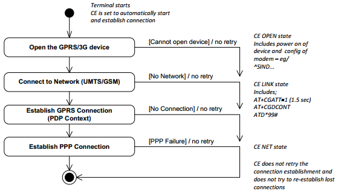

There is no retry mechanism during terminal startup. If the network connection could not be established, it is kept disconnected until a transaction is initiated:

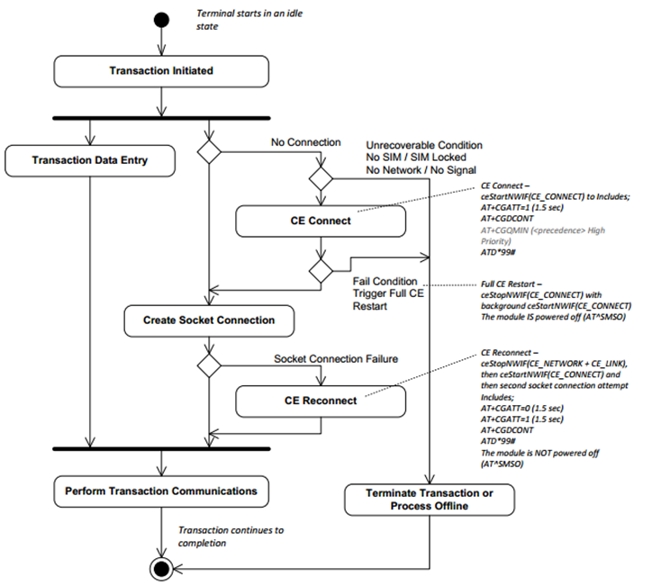


There is no minimum signal strength required for ADK-COM to start the GPRS network.


### Error Codes <a href="#subsubsec_com_error_codes" id="subsubsec_com_error_codes"></a>

Most of the libcom functions indicate an error condition by their return values (e.g. negative returns, NULL pointer, etc.). For more detailed error information these functions provide an additional output parameter of enumeration type com_ErrorCodes. These error codes provide detailed information on the error condition.

Example:

``` cpp
#include <libcom.h>
enum com_ErrorCodes com_errno;
struct com_ConnectHandle *handle;
handle = com_Connect("tcp.xml", NULL, NULL, 10000, &com_errno);
printf("%s", com_GetErrorString(com_errno));
if (com_errno == COM_ERR_CON_NOFILE){
   // Connection XML or database could not be parsed*
}
else if (com_errno == COM_ERR_NET_DENY){
   // ....
}
...
```

ADK-COM distinguishes between the following groups of error codes:

- COM_ERR\_ General Errors
- COM_ERR_DAEMON\_ Errors related to the runtime component (comdaemon)
- COM_ERR_CON\_ Errors related to the connection setup
- COM_ERR_NET\_ Errors related to network setup
- COM_ERR_PROP\_ Errors related to the get/set properties API
- COM_ERR_DEV\_ Low level errors of communication devices
- COM_ERR_OP\_ Logical, operational errors

A complete list of all error codes can be found in the interface and API documentation.

A short human readable string of the error codes can be retrieved from application code through the function <a href="libcom_8h.md#a64ded2e202ac2485d3406f63a13538e8">com_GetErrorString()</a>.

Since <a href="libcom_8h.md#a86944e9a76e84d162fa1f6312696d9f9">com_Send()</a>, <a href="libcom_8h.md#a61643cc4c9047a8cd528f10846e3ec17">com_Receive()</a>, <a href="libcom_8h.md#a5d8b92257989b0842af3a49a1cc0ac0e">com_SendTo()</a> and <a href="libcom_8h.md#a523c494a8fd5d4397257ba439a9f0c45">com_ReceiveFrom()</a> functions use direct socket connections it is possible that the underlying socket throws any error which is relevant to applications to handle that type or error (as usual in network programming). This type of socket errors are also returned by libcom via a special offset value: COM_SYSTEM_ERRNO_BASE.

Whenever you get an error from <a href="libcom_8h.md#a86944e9a76e84d162fa1f6312696d9f9">com_Send()</a>, <a href="libcom_8h.md#a61643cc4c9047a8cd528f10846e3ec17">com_Receive()</a>, <a href="libcom_8h.md#a5d8b92257989b0842af3a49a1cc0ac0e">com_SendTo()</a> or <a href="libcom_8h.md#a523c494a8fd5d4397257ba439a9f0c45">com_ReceiveFrom()</a> which is higher than COM_SYSTEM_ERRNO_BASE you should use following formula to determine the real error cause:

``` cpp
errnocode = commerr - COM_SYSTEM_ERRNO_BASE
with
commerr = error returned by ADK-COM function
errnocode = socket errno
```


Be aware that the errno values in both header files differ. Always use the macro definitions instead of pure values in your code!


## Timeouts <a href="#subsec_com_timeouts" id="subsec_com_timeouts"></a>

The timeouts which can be set inside connect/network-profiles as well as some of the connection functions themselves are as follows:

| Timeout | Location | Use |
|----|----|----|
| <p>Connection timeout</p> | <p>Connection XML file between timeout tags</p> | <p>Specifies the connection timeout. This pertains to the setting up of the socket, connection, creating of the SSL context as well as negotiation. This timeout spans over these operations together, not separately</p> |
| <p>Connection DNS timeout</p> | <p>Connection XML file between dns_timeout tags</p> | <p>(Optional) Specifies the amount of time which should be invested to resolve hostnames. This is only valid for connections which reference a network (IP). If this is not specified the network-timeout is used. This is because in order to set the routing, the DNS query must be done beforehand to resolve the address.</p> |
| <p>Connection IP timeout</p> | <p>Connection XML file between ip_timeout tags</p> | <p>(Optional) Specifies the amount of time which should be invested in connection to one IP. This is useful for an IP address in which the network/host does not respond to SYN requests and does not generate an error. This is only valid for connections which reference a network (IP). Please note that the connection timeout is still active and will supersede this timeout if it has expired, so make sure the connection/ip timeouts are properly adjusted. Please note this timeout only spans the TCP connection setup and does not include SSL.</p> |
| <p>Network Timeout</p> | <p>Network XML file between timeout tags</p> | <p>Specifies the time it should take to set the specified network up</p> |
| <p>Connect function Timeout</p> | <p>Parameter to the connect function</p> | <p>This parameter defines the overall time it should take for all the operations for a connection needed to complete. This timeout supersedes the other timeouts</p> |
| <p>Wait function timeout</p> | <p>Parameter to the wait function</p> | <p>This parameter defines the overall time which can be waited for a connection to succeed (or fail). This timeout is only relevant when using the asynchronous interface. Note that the expiration of the timeout will do nothing except inform the user that indeed the timeout has expired. The connection attempt will still continue to proceed. It is valid for the user to wait again.</p> |

The values of the connection/network timeouts are all interpreted as milliseconds. The value 0 is interpreted to as an infinite timeout The timeouts to the functions however may not be infinite. In these 0 will be interpreted as 0ms timeout, which will most likely not work. This is to prevent the application from accidentally locking itself up


Any timeout is just a maximum amount of time the application allows before something is assumed to be wrong. Any action may fail at any time for any reason, irrespective of if the timeout is reached. This applies to *all* timeouts.


## Connection and Network Profiles <a href="#subsec_com_connection_and_network_profiles" id="subsec_com_connection_and_network_profiles"></a>

### Connection Profiles <a href="#subsec_com_connection_profiles1" id="subsec_com_connection_profiles1"></a>

A connection profile can consist of multiple connections which are handled as subsets. The second and following are used in the consecutive order as fallback connections.

The timeout defined in each subset belongs to only this connection attempt. An overall connection timeout (including all fallback attempts) is not defined in the profiles, but rather specified when calling com_Connect or com_ConnectWait. Please note that com_ConnectWait does not abort the connection if the Wait should come back with an timeout, instead the application is left with the choice to retry or to close.

Example of a connection profile containing a TCP connection and a second (fallback) raw modem connection:

``` cpp
<CONNECTION_PROFILE>
   <CONNECTION>
   <TYPE>TCP</TYPE>
   <NETWORK>LOCAL_NET.xml</NETWORK>
   <ADDRESS>bhelvbuild2.verifone.com</ADDRESS>
   <PORT>1200</PORT>
   <DNS_TIMEOUT>10000</DNS_TIMEOUT
   <TIMEOUT>10000</TIMEOUT>
   <BIND>1</BIND>
   </CONNECTION>
   <CONNECTION>
   <TYPE>RAW_MODEM</TYPE>
   <PABX_CODE>8</PABX_CODE>
   <ADDRESS>84918</ADDRESS>
   <DEVICE_NAME>MDM_INT</DEVICE_NAME>
   <TIMEOUT>60000</TIMEOUT>
   <DIAL_TYPE>tone</DIAL_TYPE>
   <DIAL_MODE>async</DIAL_MODE>
   <MODULATION>V92</MODULATION>
   <BLIND_DIALING>yes</BLIND_DIALING>
   <ERROR_CORRECTION>v42_mnp</ERROR_CORRECTION>
   <COMPRESSION>none</COMPRESSION>
   </CONNECTION>
</CONNECTION_PROFILE>
```

Example of a connection profile containing a UDP connection:

``` cpp
<CONNECTION_PROFILE>
   <CONNECTION>
   <TYPE>UDP</TYPE>
   <NETWORK>LOCAL_NET</NETWORK>
   <ALLOW_BROADCAST>1</ALLOW_BROADCAST>
   <TIMEOUT>10000</TIMEOUT>
   </CONNECTION>
</CONNECTION_PROFILE>
```

### IP Connections <a href="#subsubsec_com_ip_connections" id="subsubsec_com_ip_connections"></a>

The following minimal connection properties need to be provided to specify an IP based connection:

| Parameter | Value Format | Description |
|----|----|----|
| <p>TYPE</p> | <p>\"TCP\", \"SSL\", \"UDP\", \"WS\", \"WSS\"</p> | <p>Type of the connection: Plain TCP, plain UDP, TLS/SSL over TCP or Websockets (TLS secured and non-secure)</p> |
| <p>NETWORK</p> | <p>XML: Name of the XML file , InfoSvc: Name of the node with proper network-configuration</p> | <p>Name of the Network Profile to be used<br/>**Please note that the XML file on the file system must have the ending \'.xml\' (all lower case). Otherwise the file cannot be found and error COM_ERR_NET_NOFILE is returned.**</p> |
| <p>START_NETWORK</p> | <p>1 or 0</p> | <p>A value of 0 prevents the specified network from starting if it\'s down on connection attempt. If this setting is omitted or set to 1, the network will be brought up.</p> |
| <p>ADDRESS</p> | <p>String</p> | <p>Server address. Either a valid IP address or host name. Unused if TYPE=UDP.<br/>-In the case of SERVER = 0: The IP address (or host name) of the remote server.<br/>-In the case of SERVER = 1: The local host listen IP address (or host name, e.g. on CM5 the name `vfi-terminal` can be used to refer to the internal network for Android).<br/></p> <p><br/></p>  <p><br/></p> <p>IPv6 link-local addresses are not officially supported.</p> <p><br/></p>  |
| <p>PORT</p> | <p>Number, value range: 1 \... 65535</p> | <p>In the case of SERVER = 0: The destination host service port number. Not used for UDP.<br/>- In the case of SERVER = 1: The local host listen port number.</p> <p><br/></p>  <p><br/></p> <p>The local host listen port number is limited to 1025 \... 65535.</p> <p><br/></p>  |
| <p>PROXY</p> | <p>String</p> | <p>Server address. IP address of the HTTP Proxy Server to be used for the connection. If unset or empty no proxy will be used and the connection will be made directly</p> |
| <p>PROXY_PORT</p> | <p>Number, value range: 1 \... 65535</p> | <p>Proxy server port</p> |
| <p>WSPATH</p> | <p>String</p> | <p>Websocket path on server. Only used if TYPE=WS or TYPE=WSS</p> |
| <p>WSHOST</p> | <p>String</p> | <p>Hostname on server. Only used if TYPE=WS or TYPE=WSS. Automatically set to value ADDRESS if not explicitly specified</p> |
| <p>WSORIGIN</p> | <p>String</p> | <p>Socket origin name. Only used if TYPE=WS or TYPE=WSS. Automatically set to value ADDRESS if not explicitly specified</p> |
| <p>WSPROTOCOL</p> | <p>string</p> | <p>name of the sub-protocol used (optional)</p> |
| <p>WSEXTRAHEADER_1</p> | <p>string</p> | <p>extra HTTP request header to be sent during client connection setup must always have the format {KEY}:{VALUE}</p> |
| <p>WSEXTRAHEADER_2</p> | <p>string</p> | <p>another extra HTTP request header to be sent during client connection setup. Must always have the format {KEY}:{VALUE}</p> |
| <p>WSEXTRAHEADER_3</p> | <p>string</p> | another extra HTTP request header to be sent during client connection setup. Must always have the format {KEY}: |
| <p>WSEXTRAHEADER_4</p> | <p>string</p> | <p>another extra HTTP request header to be sent during client connection setup. Must always have the format {KEY}:{VALUE}</p> |
| <p>WSPINGINTERVAL</p> | <p>Number, value range 0 \... 3600</p> | <p>Send a WS PING message to remote peer every x seconds. 0 (default) means no PING message will be sent.</p> |
| <p>TIMEOUT</p> | <p>Number, unit: millisecs</p> | <p>Time a connection establishment may take before it is cancelled. When this timeotu elapses the current connection attempt is canceled and the next connection is tried, if present.</p> |
| <p>IP_TIMEOUT</p> | <p>Number, unit: millisecs</p> | <p>The time a connection attempt to a IP may take. If several IPs are returned from the DNS the next IP will be tried, if there is still time remaining. Default -1 (TIMEOUT is used instead). See section [Timeouts](#subsec_com_timeouts) for further information.</p> |
| <p>DNS_TIMEOUT</p> | <p>Number, unit: millisecs</p> | <p>Optional time the DNS resolution may take before it is cancelled</p> |
| <p>BIND</p> | <p>1 or 0</p> | <p>Bind this connection to network interface defined in NETWORK (optional). Not used if TYPE=UDP.</p> |
| <p>BIND_GATEWAY</p> | <p>String, any valid IPv4 address</p> | <p>IPv4 network gateway which should be used to address packets for this connection (usually required when the host is not inside the same subnet as terminal) (optional). This parameter only has an effect if bind is 1. Not used for UDP.</p> |
| <p>BIND_GATEWAY_V6</p> | <p>String, any valid IPv6 address</p> | <p>IPv6 network gateway which should be used to address packets for this connection (usually required when the host is not inside the same subnet as terminal) (optional). This parameter only has an effect if bind is 1. Not used for UDP.</p> |
| <p>RESTRICT_LOCAL</p> | <p>0 or 1</p> | <p>If in server mode AND the referenced network-profile is of type local loopback, restrict incoming connections to localhost. Default is 1 (on). Ignored if TYPE=WS or TYPE=WSS</p> |
| <p>SERVER</p> | <p>0 or 1</p> | <p>Listen on \"PORT\" for one external connection. The ADK server component is not able to handle multiple clients at once\!</p> |
| <p>ALLOW_BROADCAST</p> | <p>0 or 1</p> | <p>UDP only: set to 1 if you want to send network broadcast messages, 0 will deny broadcasts using ADK-COM API</p> |
| <p>TCP_MAXSEG</p> | <p>Number</p> | <p>The maximum segment size for outgoing TCP packets. 0 means OS specific default value. When set to 0 or not specified in profile the OS specific default value will be used. (optional, FOR EXPERIENCED USERS ONLY, ignored for UDP, WS and WSS)</p> |
| <p>TCP_USER_TIMEOUT</p> | <p>Number</p> | <p>Maximum amount of time in milliseconds that transmitted data may remain unacknowledged, or buffered data may remain untransmitted (due to zero window size), before TCP will forcibly close the corresponding connection. When set to 0 or not specified, the OS specific default value will be used. (optional, FOR EXPERIENCED USERS ONLY, ignored for UDP, WS and WSS, supported only on VOS2 and VOS3)</p> |
| <p>ADDR_FAMILY</p> | <p>String</p> | <p>Used to specify the used socket type (IPv4, IPv6 or unspecified) for this connection. Can be one of these values: \"IPv4\", \"IPv6\" or \"UNSPEC\". \"Unspec\" means that the connection to the host (in case it was specified as DNS name in \"ADDRESS\" field) will either be established via IPv4 or IPv6 - libcom will decide. If \"ADDRESS\" is a IPv4 or IPv6 address and \"ADDR_FAMILY\" does not fit, COM_ERR_CON_INVALID is returned and an error message is printed. Also note that value \"UNSPEC\" is not possbible for UDP connections - only \"IPv4\" and \"IPv6\" are acceptable values. If this value is not set it defaults to \"IPv4\" for UDP and \"UNSPEC\" for TCP server/client. Ignored for all WS and WSS connections.</p> |
| <p>SO_REUSEADDR</p> | <p>1 or 0</p> | <p>Optional for server sockets only: set or unset the SO_REUSEADDR socket option. For more details refer to the according manual page for sockets: <a href="http://man7.org/linux/man-pages/man7/socket.7.md">http://man7.org/linux/man-pages/man7/socket.7.html</a>. Ignored and always implicitly set for TYPE=WS and TYPE=WSS.</p> |
| <p>SO_LINGER</p> | <p>1 or 0</p> | <p>Optional for TCP/SSL client sockets only: When set to 1 do an orderly TCP shutdown and wait for buffers to be cleared when closing (meaning com_ConnectClose will wait until the TCP connection is closed). For more details refer to the according manual page for sockets: <a href="http://man7.org/linux/man-pages/man7/socket.7.md">http://man7.org/linux/man-pages/man7/socket.7.html</a>. Empty uses default socket settings. Default is 1.</p> <p><br/></p>  <p><br/></p> <p>When setting this to value 0 and you are using an on-demand network, the network might go down leaving the connection broken. Therefore this option is not recommended. Ignored for WS and WSS connections.</p> <p><br/></p>  |
| <p>SO_LINGER_TIMEOUT</p> | <p>0 - 30</p> | <p>Optional linger timeout. Default is 5 seconds. Only has an effect when SO_LINGER is set to 1. Please note that these are seconds, not milliseconds. Ignored for WS and WSS connections.</p> |
| <p>SO_KEEPALIVE</p> | <p>0, 1</p> | <p>Optional parameter: Enable sending of keep-alive messages on connection-oriented sockets. Default value is 0.</p> |
| <p>SO_KEEPALIVE_KEEPCNT</p> | <p>0, \>= 1</p> | <p>Optional parameter: The maximum number of keepalive probes TCP should send before dropping the connection. \"0\" or not specified in profile will apply the default Linux Kernel value: 9 probes.</p> |
| <p>SO_KEEPALIVE_KEEPIDLE</p> | <p>0, \>= 1</p> | <p>Optional parameter: The time (in seconds) the connection needs to remain idle before TCP starts sending keepalive probes, if the socket option SO_KEEPALIVE has been set on this socket. \"0\" or not specified in profile will apply the default Linux Kernel value: 7200 seconds.</p> |
| <p>SO_KEEPALIVE_KEEPINTVL</p> | <p>0, \>= 1</p> | <p>Optional parameter: The duration (in seconds) between two successive keepalive retransmissions, if acknowledgement to the previous keepalive transmission is not received. \"0\" or not specified in profile will apply the default Linux Kernel values: 75 seconds.</p> |
| <p>USE_DNS1</p> | <p>String: IPV4, IPV6 address</p> | <p>Use this address to do DNS resolution (First address)</p> |
| <p>USE_DNS2</p> | <p>String: IPV4, IPV6 address</p> | <p>Use this address to do DNS resolution (Second address)</p> |
| <p>MIN_SIGNAL_PERCENT</p> | <p>Int, 0 \... 100, Percentage</p> | <p>Optional parameter. Default is 0. Minimum signal value in percent required to start the connection through the referenced network interface. If this value is not 0 then the signal level of the device corresponding to the network interface of the referenced network profile is queried. If the obtained level is below this value or the value cannot be ascertained, then the connection will be skipped.</p> |

If the connection type is SSL or WSS, the following properties need to be set to provide the SSL specific configuration options and certificates. Note that some of them are ignored in case of Websockets (TYPE=WSS) - see description column.

| Parameter | Value Format | Description |
|----|----|----|
| <p>MUTUAL</p> | <p>0 or 1</p> | <p>Enforce Client authentication when in server mode. Ignored in client mode. Default is 1</p> |
| <p>SSL_PROT_VERSION</p> | <p>\"TLS1_3\", \"TLS1_2\", \"TLS1_1\", \"TLS1_0\", \"SSL3\", \"SSL23\"</p> | <p>SSL: Protocol version used for client or server mode. Ignored for WSS connections</p> |
| <p>SSL23_PROT_VERSION_MIN</p> | <p>\"TLS1_3\", \"TLS1_2\", \"TLS1_1\", \"TLS1_0\", \"SSL3\"</p> | <p>SSL: SSL Protocol minimum version if SSL_PROT_VERSION is set to `"SSL23"`. Ignored for all other SSL versions than SSL23. If not defined the minimum allowed SSL/TLS version will be set to SSL3. ignored for WSS connections</p> |
| <p>SSL_CA_CERT_FILE</p> | <p>String</p> | <p>SSL: Path and name of file containing trusted root certificates. It can contain either one or multiple certificates. In case you have stored more than one root certificate you simply have to concatenate all those certificates into one file in PEM format.</p> |
| <p>SSL_CA_CERT_PATH</p> | <p>String</p> | <p>SSL: Path to the directory containing trusted root certificates in PEM format.<br/>The files each contain one CA certificate. The files are looked up by the CA subject name hash value, which must hence be available. If more than one CA certificate with the same name hash value exist, the extension must be different (e.g. 9d66eef0.0, 9d66eef0.1 etc). The search is performed in the ordering of the extension number, regardless of other properties of the certificates. Use the OpenSSL utility \'c_rehash\' to create the necessary links. See <a href="https://www.openssl.org/docs/man1.0.2/man1/c_rehash.md">https://www.openssl.org/docs/man1.0.2/man1/c_rehash.html</a> for more information. Ignored for WSS connections</p> |
| <p>SSL_OWN_CERT</p> | <p>String</p> | <p>SSL: Name of (and optional path to) file containing the own public key certificate required for mutual authentication.<br/><br/>ADKCOM provides support for SSL private keys stored in the Vault or Secure Processor. For more details in this case refer to [Appendix A1: Mutual TLS authentication: How to use AuthEx / AuthN / asymmetric customer keys with TLS and EAP (Wi-Fi and LAN)](#sec_com_appendix_a1_authex_authn)</p> |
| <p>SSL_OWN_PKEY</p> | <p>String</p> | <p>SSL: Name of (and optional path to) file containing the private key required for mutual SSL authentication.<br/><br/>ADKCOM provides support for SSL private keys stored in the Vault or Secure Processor. For more details in this case refer to [Appendix A1: Mutual TLS authentication: How to use AuthEx / AuthN / asymmetric customer keys with TLS and EAP (Wi-Fi and LAN)](#sec_com_appendix_a1_authex_authn)</p> |
| <p>SSL_PKCS12_FILE</p> | <p>String</p> | Warning |
| <p>SSL_CIPHER_LIST</p> | <p>String, Example: \"DHE-RSA-AES128-SHA:DHE-RSA-AES256-SHA:DHE-RSA-CBC3-SHA:@STRENGTH\"</p> | <p>SSL: OpenSSL Cipher Suite list.<br/>Optional parameter.<br/>Refer to <a href="https://www.openssl.org/docs/ssl/SSL_CTX_set_cipher_list.md">https://www.openssl.org/docs/ssl/SSL_CTX_set_cipher_list.html</a>. Due to PCI 6 requirements the OpenSSL library security level was increased resulting in older TLS protocols to fail. In case TLSv1 and TLSv1.1 support is still required, you can set the content of this parameter to just the special value \"VERIFONE_LEGACY_DEFAULT\" which instructs the internal TLS routines to allow those older TLS protocols still without dealing with the complex and security relevant OpenSSL cipher suite string yourselves.</p> |
| <p>SSL_POLICY</p> | <p>Int</p> | <p>SSL: Disables some of the remote peer certificate checks. See section [SSL Policy](#subsubsec_com_ssl_policy) for more information.</p> |
| <p>SSL_POLICY_EXT</p> | <p>Int</p> | <p>More granular disabling of remote peer certificate checks. If present in connection profile, the parameter SSL_POLICY is ignored.</p> |
| <p>SSL_SNI_SERVERNAME</p> | <p>String</p> | <p>SSL: optional Server Name Indication (SNI) server name. Ignored for WSS connections. If value is not specified or using a WSS connection, the hostname (if it has a DNS format) from \"address\" field will be automatically used for SNI.</p> |

Sample SSL Connection:

``` cpp
<CONNECTION_PROFILE>
   <CONNECTION>
   <TYPE>SSL</TYPE>
   <NETWORK>flash/activenetwork.xml</NETWORK>
   <ADDRESS>bhelvbuild2.verifone.com</ADDRESS>
   <PORT>443</PORT>
   <TIMEOUT>30000</TIMEOUT>
   <BIND>1</BIND>
   <SSL_CA_CERT_FILE>flash/cacert.pem</SSL_CA_CERT_FILE>
   <SSL_OWN_CERT>flash/privatekey_cert.pem</SSL_OWN_CERT>
   <SSL_OWN_PKEY>flash/privatekey_cert.pem</SSL_OWN_PKEY>
   <SSL_PROT_VERSION>TLS1_2</SSL_PROT_VERSION>
   <SSL_POLICY_EXT>0</SSL_POLICY_EXT>
   </CONNECTION>
</CONNECTION_PROFILE>
```

Sample WSS Client Connection (secure Websockets):

``` cpp
<CONNECTION_PROFILE>
   <CONNECTION>
   <TYPE>WSS</TYPE>
   <NETWORK>xml/LOCAL_NET</NETWORK>
   <ADDRESS>libwebsockets.org</ADDRESS>
   <PORT>443</PORT>
   <WSPATH>/</WSPATH>
   <WSHOST>libwebsockets.org</WSHOST>
   <WSORIGIN>libwebsockets.org</WSORIGIN>
   <WSPROTOCOL>dumb-increment-protocol</WSPROTOCOL>
   <TIMEOUT>5000</TIMEOUT>
   <SSL_CA_CERT_FILE>crt/libwebsockets.org.cer</SSL_CA_CERT_FILE>
   <use_dns1>10.215.255.220</use_dns1>
   </CONNECTION>
</CONNECTION_PROFILE>
```

Sample WSS Server Connection (secure Websockets):

``` cpp
<CONNECTION_PROFILE>
   <CONNECTION>
   <TYPE>WSS</TYPE>
   <SERVER>1</SERVER>
   <MUTUAL>0</MUTUAL>
   <NETWORK>xml/LOCAL_NET</NETWORK>
   <PORT>9443</PORT>
   <SSL_CA_CERT_FILE>flash/cacert.pem</SSL_CA_CERT_FILE>
   <SSL_OWN_CERT>flash/privatekey_cert.pem</SSL_OWN_CERT>
   <SSL_OWN_PKEY>flash/privatekey_cert.pem</SSL_OWN_PKEY>
   <WSPATH>/</WSPATH>
   <WSPROTOCOL>my-test-protocol</WSPROTOCOL>
   <TIMEOUT>40000</TIMEOUT>
   </CONNECTION>
</CONNECTION_PROFILE>
```

### SSL Policy <a href="#subsubsec_com_ssl_policy" id="subsubsec_com_ssl_policy"></a>

**WARNING**

The terminal OS provides functionality and guidance that complies with PCI PTS requirements by default.

If an application developer explicitly chooses to use alternative functionality for the transmission or processing of cardholder data, then the application developer is responsible for security of the cardholder data and compliance. The application developer should ensure that this alternative functionality is approved by the acquirer of the transactions. In general, this means compliant with regional banking requirements and broad requirements such as PCI PA-DSS and PCI DSS.

PCI Compliance reference:

1.  PIN Transaction Security (PTS) Point Of Interaction (POI) applies to the terminal OS software and hardware
2.  Payment Application Data Security Standard (PCI PA-DSS) applies to payment applications that store, process, or transmit cardholder data as part of authorization or settlement
3.  PCI Data Security Standard (PCI DSS) applies to entities involved in payment card processing or that otherwise store, process, or transmit cardholder data

When using any SSL_POLICY other than 0 you will

- Open potential security leaks
- be no longer able to validate the authenticity of the remote peer

If this parameter is not set or set to \'0\' in your connection profile, the secure default value will be used.

| Value | Description |
|----|----|
| <p>0</p> | <p>default policy (PCI compliant)</p> |
| <p>1</p> | <p>Accept also self-signed certificates</p> |
| <p>2</p> | <p>Accept expired remote certificates</p> |
| <p>3</p> | <p>Accept remote certificates which are not yet valid</p> |
| <p>4</p> | <p>Accept (1) and (2)</p> |
| <p>5</p> | <p>Accept (1) and (3)</p> |
| <p>6</p> | <p>Accept (1) and (2) and (3)</p> |
| <p>7</p> | <p>Accept (2) and (3)</p> |
| <p>8</p> | <p>Accept certificates issued for a different hostname than specified by the user in the connection profile</p> |
| <p>9</p> | <p>Accept (1) and (8)</p> |
| <p>99</p> | <p>Policy 99: allow any certificate and don\'t check anything</p> |

When this value is set to anything \> 0, the application is sent a connection event COM_EVENT_SSL_CONFIRM_POLICY_OVERRIDE which must be handled in the registered connection callback function. In the callback the application must read the policy set for the current connection and must confirm if this is the value they wish to use by calling the function <a href="libcom_8h.md#af66689ca828262faa844703399d6e128">com_SetPassword()</a> with pwtype set to COM_PASSWORD_SSL_POLICY_ACCEPT and password \"POLICY_ACCEPTED_INSECURE_NONPCICOMPLIANT_DANGEROUS\". If not accepted simply do not call the <a href="libcom_8h.md#af66689ca828262faa844703399d6e128">com_SetPassword()</a> function or set a different passphrase.

### Extended SSL Policy <a href="#subsubsec_com_ssl_policy_ext" id="subsubsec_com_ssl_policy_ext"></a>

### Warning

If SSL_POLICY_EXT is set, SSL_POLICY will be ignored

In addition to the previous chapter, for a more granular disabling the parameter SSL_POLICY_EXT can be set to any conjunction of:

| Bit | Value | Description |
|----|----|----|
| <p>0</p> | <p>0</p> | <p>Default policy (PCI compliant)</p> |
| <p>0</p> | <p>1</p> | <p>Disable all checks, allow any certificate</p> |
| <p>1</p> | <p>2</p> | <p>Allow self-signed certificates</p> |
| <p>2</p> | <p>4</p> | <p>Allow expired remote certificates</p> |
| <p>3</p> | <p>8</p> | <p>Allow remote certificates which are not yet valid</p> |
| <p>4</p> | <p>16</p> | <p>Allow certificates issued for a different hostname than specified by the user in the connection profile</p> |
| <p>5</p> | <p>32</p> | <p>Allow small server certificate key size (anything below 2048 bits)</p> |
| <p>6</p> | <p>64</p> | <p>Allow weak hash algorithms (MD5, SHA1).</p> <p><br/></p>  <p><br/></p> <p>Be aware that weak hash algorithms for **Root Certificates** are **always permitted** and do not need explicit permission through above policy override.</p> <p><br/></p>  |

For ease of use there are defines in <a href="libcom_8h.md">libcom.h</a> starting with \"COM_SSL_POLICY_IGNORE\_\": <a href="libcom_8h.md#a7dec03cd17a237d847b9021ccbe27f2b">COM_SSL_POLICY_IGNORE_ALL</a>

For instance if you want to accept self-signed, expired certificates with a small key size, set the parameter to 2 + 4 + 32 = 38

``` cpp
<CONNECTION_PROFILE>
   <CONNECTION>
   <TYPE>SSL</TYPE>
   ...
   <SSL_POLICY_EXT>38</SSL_POLICY_EXT>
   </CONNECTION>
</CONNECTION_PROFILE>
```

### SSL ID resumption <a href="#subsubsec_com_ssl_resumption" id="subsubsec_com_ssl_resumption"></a>

The SSL/TLS implementation in ADK COM uses SSL session ID resumption by default. This feature cannot be switched off since it offers a significant connection speed-up.
A SSL session is resumed on any subsequent connection to the same server as long as the server supports session resumption. Only the last 10 sessions are cached within ADKCOM. The session cache is not shared accross different processes.


**NEVER** use leading zeros in any IP address you enter in any of the ADK-COM profiles. If an IP address is entered with leading zeros, the numbers are interpreted in octal form rather than decimal form hence the resulting IP address will differ from what you actually expect.


### Raw Data Connections <a href="#subsubsec_com_raw_data_connections" id="subsubsec_com_raw_data_connections"></a>

Raw data connection such as transparent modem or serial do not require to reference any network profile. Instead they depend on the remote station and the supported feature set. Because all connections defined in a connection profile **must** define all parameters required to establish the logical host connection, those connection types require the full set of parameters (dial number, compression and so on) and do not refer to an existing network profile.

There is currently no way to share Raw data connections across different applications. All Raw data connections are exclusively opened for one application. If a second one needs to get access to the connection, the first application needs to close it first in order to free the exclusive lock.

Following connection parameters are required for each of the supported raw data connections and must always be present.

| Parameter | Value Format | Description |
|----|----|----|
| <p>TYPE</p> | <p>\"RAW_MODEM\", \"RAW_SERIAL\", \"RAW_CSD\"</p> | <p>Type of the connection</p> |
| <p>TIMEOUT</p> | <p>numerical value, unit: millisecs</p> | <p>Time a connection establishment may take before it is cancelled</p> |

**Analog Modem specific connection properties (Type = RAW_MODEM):**

| Parameter | Value Format | Description |
|----|----|----|
| <p>ADDRESS</p> | <p>String: \"123443221\"</p> | <p>Host dial number</p> |
| <p>DEVICE_NAME</p> | <p>\"MDM_INT\", \"BT_DUN\"</p> | <p>Defined symbol for the network interface. Normal modem or Bluetooth modem</p> |
| <p>PABX_CODE</p> | <p>String: \"8\"</p> | <p>PABX dial prefix. Optional parameter</p> |
| <p>DIAL_TYPE</p> | <p>\"tone\", \"pulse\"</p> | <p>The analogue modem dialling type, default will be \"TONE\"</p> |
| <p>DIAL_MODE</p> | <p>\"async\", \"sync\"</p> | <p>The analogue modem connection mode, default will be async</p> |
| <p>MODULATION</p> | <p>\"auto\", \"v21\", \"v22\",\"v22bis\", \"bell103\", \"bell212\", \"v32\", \"v32bis\", \"v34\", \"v90\", \"v92\"</p> | <p>The modulation type used for the modem connection. Default: \"auto\" (modem firmware\'s default speed setting which is not necessarily the highest possible!)</p> |
| <p>BLIND_DIALING</p> | <p>\"yes\", \"no\"</p> | <p>En- or Disable blind dialing</p> |
| <p>FAST_CONNECT</p> | <p>\"yes\", \"no\"</p> | <p>En- or Disable fast connect for sync dial_mode (SDLC)</p> |
| <p>COMPRESSION</p> | <p>\"none\", \"v42_mnp\", \"auto\"</p> | <p>Optional parameter: modem data compression mode. Default: \"auto\". !! May only be changed by experienced users !\!</p> |
| <p>ERROR_CORRECTION</p> | <p>\"auto\", \"none\", \"v42_mnp\", \"v42_mnp_only\", \"v42_only\", \"mnp_only\"</p> | <p>Optional parameter: error correcting mode to be negotiated in a subsequent data connection. Default: \"auto\". !! May only be changed by experienced users !\!</p> |
| <p>BT_ADDR</p> | <p>Bluetooth hardware address, for example \"00:1b:dc:06:81:31\"</p> | <p>Bluetooth hardware address of the remote device with which the serial connection should be established.</p> <p><br/></p>  <p><br/></p> <p>You may omit this value. If so ADK-COM will check if exactly one BT device is paired with the terminal and will try to establish a DUN connection to that device. In case more than one BT device is currently paired, com_Connect will return COM_ERR_OP_AMBIGUOUS. In this case you will have to specify a BT_ADDR in the connection profile.<br/>Not required for DEVICE_NAMES other than \"BT_DUN\".<br/>Optional parameter.</p> <p><br/></p>  |
| <p>BAUDRATE</p> | <p>String: \"115200\", \"57600\", \"38400\", \"19200\", \"9600\", \"4800\", \"2400\", \"1200\", \"600\", \"300\"</p> | <p>Serial Port Baud Rate on Modem Serial Port. Default: 115200</p> |
| <p>PARITY</p> | <p>String: \"none\", \"odd\", \"even\"</p> | <p>Modem Serial Port Parity. Default: none</p> |
| <p>DATABITS</p> | <p>8, 7</p> | <p>Used data bits on Modem Serial Port. Default: 8</p> |
| <p>STOPBITS</p> | <p>1 or 2</p> | <p>Used stop bits on Modem Serial Port. Default: 1</p> |
| <p>AT_STR_1</p> | <p>String</p> | <p>Custom AT String to be sent to the modem. Will be sent to the modem before the dialing with ATD and before AT_STR_2, AT_STR_3 and AT_STR_4. The expected result of this command from the modem is \"OK\". USE AT YOUR OWN RISK. This field, if set, must begin with a leading \"AT\" (no leading whitespace).</p> |
| <p>AT_STR_2</p> | <p>String</p> | <p>Custom AT String to be sent to the modem. Will be sent to the modem before the dialing with ATD and before AT_STR_3 and AT_STR_4. The expected result of this command from the modem is \"OK\". USE AT YOUR OWN RISK. This field, if set, must begin with a leading \"AT\" (no leading whitespace).</p> |
| <p>AT_STR_3</p> | <p>String</p> | <p>Custom AT String to be sent to the modem. Will be sent to the modem before the dialing with ATD and before AT_STR_4. The expected result of this command from the modem is \"OK\". USE AT YOUR OWN RISK. This field, if set, must begin with a leading \"AT\" (no leading whitespace).</p> |
| <p>AT_STR_4</p> | <p>String</p> | <p>Custom AT String to be sent to the modem. Will be sent to the modem right before the dialing with ATD. The expected result of this command from the modem is \"OK\". Any other result code will be treated as error. USE AT YOUR OWN RISK. This field, if set, must begin with a leading \"AT\" (no leading whitespace).</p> |
| <p>SHARED_CONNECTION</p> | <p>\"yes\", \"no\"</p> | <p>If set to \"yes\" the established raw modem connection can be taken over by another application without the modem link beeing terminated. The 2nd application must have set this flag as well in its own used connection profile. Additionally, the dial-in numbers used by both applications must be identical, otherwise the 2nd application\'s connection attempt will fail. Default: NO</p> |


BAUDRATE, PARITY, DATABITS, STOPBITS are optional and it is strongly recommended to not change any of these settings. PARITY, DATABITS and STOPBITS are a set of parameters and always need to be defined at once while BAUDRATE can be set separately.


**Serial specific connection properties (Type = RAW_SERIAL):**

| Parameter | Value Format | Description |
|----|----|----|
| <p>SERIAL_PORT</p> | <p>String: \"COM1\", \"COM2\", \"COM3\", \"COM4\", \"COM5\", \"COM6\", \"USBD\", \"USBD2\", \"USBDYN\", \"COM1A\", \"COM1B\", \"COM1C\", \"COM1D\", \"COM1E\", \"BT_SPP0\", \"BT_SPP1\", \"BT_SPP2\", \"BT_SPP\", \"BC_READER\", \"BT_SPP_SERVER\"</p> | <p>The COM port used for serial communications.<br/>**COM1A\...COM1E** are virtual COM ports supported on some devices. Please see the corresponding section in [Appendix D: Devices](#sec_com_appendix_d_devices) for more information.<br/>**BT_SPP0**, **BT_SPP1**, **BT_SPP2** are three Bluetooth serial channels.<br/>**USBD**, **USBD2** are the channels of the serial gadget device (Serial over USB).<br/>**USBDYN** is for dynamic USB devices. See USBDYN properties below.<br/>**BC_READER** is the Barcode Reader.<br/>**BT_SPP** is the port necessary for dynamic allocation.<br/>**BT_SPP_SERVER** is for incoming connections on BT UUID 00001101-0000-1000-8000-00805F9B34FB.</p> |
| <p>BAUDRATE</p> | <p>String: \"921600\", \"115200\", \"57600\", \"38400\", \"19200\", \"9600\", \"4800\", \"2400\", \"1200\", \"600\", \"300\"</p> | <p>Serial Port Baud Rate. Note that 921600 is only supported for USB serial emulations (gadget / hardware adapters)</p> |
| <p>PARITY</p> | <p>String: \"none\", \"odd\", \"even\"</p> | <p>Serial Port Parity</p> |
| <p>DATABITS</p> | <p>8, 7, 6, 5</p> | <p>Used data bits on Serial Port</p> |
| <p>STOPBITS</p> | <p>1 or 2</p> | <p>Used stop bits on Serial Port</p> |
| <p>FLOWCONTROL</p> | <p>String: \"none\", \"hardware\", \"software\"</p> | <p>Serial Port flow control. Software means XON/XOFF, Hardware uses the hardware control lines RTS/CTS if available</p> |
| <p>CLOSING_WAIT</p> | <p>int: 10 to 60000</p> | <p>closing_wait setting of the serial port. This adjust the time to wait before closing the serial port if the remote has not yet read all data. Only has an effect if flow control is enabled. Default is 30000.</p> |
| <p>SERVICE_NAME</p> | <p>string</p> | <p>This is only relevant for BT_SPP. Specify the service name (ServiceName from the Bluetooth SDP service attribute) to connect to. A SDP query for this name will be done to obtain the rfcomm channel number. If there are several rfcomm channels with the same service name found, the first one will be used. If this tag is set, tag \"channel\" should not be present.</p> |
| <p>CHANNEL</p> | <p>int</p> | <p>This is only relevant for BT_SPP. Use an extended Bluetooth query to examine currently available channels advertised by remote BT devices. If this is used, the tag \"service_name\" should not be present or set to an empty string.</p> |
| <p>BT_ADDR</p> | <p>Bluetooth hardware address, for example \"00:1b:dc:06:81:31\"</p> | <p>Bluetooth hardware address of the remote device the serial connection should be established with.<br/></p> <p><br/></p>  <p><br/></p> <p>You may omit this value; If so ADK-COM will check if exactly one BT device is paired with the terminal and will try to establish a SPP connection to that device. In case more than one BT device is currently paired, com_Connect will return COM_ERR_OP_AMBIGUOUS. In this case you will have to specify a BT_ADDR in the connection profile.<br/>Not required for DEVICE_NAMES other than \"BT_SPP0\", \"BT_SPP1\" and \"BT_SPP2\".<br/>Optional parameter.</p> <p><br/></p>  |
| <p>SERIAL_USBDYN_TTY</p> | <p>ttyname</p> | <p>When SERIAL_PORT is set to **USBDYN** this tag must always exist. May be empty.</p> |
| <p>SERIAL_USBDYN_VID</p> | <p>VID of the USB device</p> | <p>When SERIAL_PORT is set to **USBDYN** this tag must always exist. If SERIAL_USBDYN_TTY is empty, then this must be filled with the appropriate VID. For **BC_READER** this tag is mandatory.</p> |
| <p>SERIAL_USBDYN_PID</p> | <p>PID of the USB device</p> | <p>When SERIAL_PORT is set to **USBDYN** this tag must always exist. If SERIAL_USBDYN_TTY is empty, then this must be filled with the appropriate PID. For **BC_READER** this tag is mandatory.</p> |
| <p>SERIAL_USBDYN_SERNUM</p> | <p>Serial Number (SN) of the USB device</p> | <p>When SERIAL_PORT is set to **USBDYN** this tag must always exist. May be empty. If multiple valid devices are attached and they have the same PID, VID and serial number (including an empty string), then the first matching device, which satifies all three parameters (VID,PID,SN) will be used. If no device matching all three parameters is found AND if the serial number is empty AND if one or more matching devices (VID,PID) are found, then of these the first matching device will be used. If these fallback mechanisms are not wanted, then the parameter SERIAL_USBDYN_TTY should be used for unique addressing.</p> |

SERIAL_PORT, BAUDRATE, PARITY, DATABITS, STOPBITS, FLOWCONTROL tags are always mandatory except if SERIAL_PORT is **BC_READER**, in which case they may be omitted and are ignored. The mapping of the logical COMx names in the serial_port parameter to real hardware UARTs / ports is Terminal dependent. The parameters for the SERIAL_USBDYN\_\* parameters may be obtained by using the function <a href="libcom_8h.md#adf24ee0003a22eb725b4622d7848a5dd">com_GetUSBInfo()</a>.

**Serial CSD specific connection properties (Type = RAW_CSD):**

| Parameter | Value Format | Description |
|----|----|----|
| <p>DEVICE_NAME</p> | <p>String: \"CSD\"</p> | <p>This string must be set to \"CSD\".</p> |
| <p>ADDRESS</p> | <p>String</p> | <p>Number to dial to establish CSD connection.</p> |
| <p>SIM_SLOT</p> | <p>Int</p> | <p>SIM-Slot to use. 0 = currently active SIM-Slot. 1 = First SIM-Slot. 2 = Second SIM-Slot. Default is 0</p> |
| <p>MODULATION</p> | <p>\"auto\", \"V22BIS_2400\", \"V32_4800\",\"V32_9600\", \"V34_14400\", \"V110_2400\", \"V110_4800\", \"V110_9600\", \"V110_14400\"</p> | <p>The modulation type used for the modem connection. Default: \"auto\"</p> |


**This interface is only available on VOS2**


*Raw Serial profile examples*

This chapter contains some useful examples for the most common Serial Profile setups and can be used to derive your own profiles.

**Serial Profile**

``` cpp
<CONNECTION_PROFILE>
   <CONNECTION>
   <TYPE>RAW_SERIAL</TYPE>
   <SERIAL_PORT>USBD</SERIAL_PORT>
   <TIMEOUT>60000</TIMEOUT>
   <BAUDRATE>115200</BAUDRATE>
   <PARITY>none</PARITY>
   <DATABITS>8</DATABITS>
   <STOPBITS>1</STOPBITS>
   <FLOWCONTROL>none</FLOWCONTROL>
   </CONNECTION>
</CONNECTION_PROFILE>
```

**Serial Profile USBDYN**

``` cpp
<CONNECTION_PROFILE>
  <CONNECTION>
   <TYPE>RAW_SERIAL</TYPE>
   <SERIAL_PORT>USBDYN</SERIAL_PORT>
   <SERIAL_USBDYN_TTY>ttyUSB0</SERIAL_USBDYN_TTY>
   <SERIAL_USBDYN_VID>0403</SERIAL_USBDYN_VID>
   <SERIAL_USBDYN_PID>6001</SERIAL_USBDYN_PID>
   <SERIAL_USBDYN_SERNUM></SERIAL_USBDYN_SERNUM>
   <TIMEOUT>60000</TIMEOUT>
   <BAUDRATE>115200</BAUDRATE>
   <PARITY>none</PARITY>
   <DATABITS>8</DATABITS>
   <STOPBITS>1</STOPBITS>
   <FLOWCONTROL>none</FLOWCONTROL>
  </CONNECTION>
</CONNECTION_PROFILE>
```

**Serial Profile BC_READER**

``` cpp
<CONNECTION_PROFILE>
   <CONNECTION>
   <TYPE>RAW_SERIAL</TYPE>
   <SERIAL_PORT>BC_READER</SERIAL_PORT>
   <TIMEOUT>60000</TIMEOUT>
   <SERIAL_USBDYN_PID>1a03</SERIAL_USBDYN_PID>
   <SERIAL_USBDYN_VID>1eab</SERIAL_USBDYN_VID>
   </CONNECTION>
</CONNECTION_PROFILE>
```

**CSD (VOS2)**

``` cpp
<CONNECTION_PROFILE>
   <CONNECTION>
   <TYPE>RAW_CSD</TYPE>
   <DEVICE_NAME>CSD</DEVICE_NAME>
   <TIMEOUT>120000</TIMEOUT>
   <ADDRESS>555012014</ADDRESS>
   </CONNECTION>
</CONNECTION_PROFILE>
```

**BT Dynamic SPP**

``` cpp
<CONNECTION_PROFILE>
   <CONNECTION>
   <TYPE>RAW_SERIAL</TYPE>
   <SERIAL_PORT>BT_SPP</SERIAL_PORT>
   <CHANNEL>5</CHANNEL>
   <TIMEOUT>60000</TIMEOUT>
   <BAUDRATE>115200</BAUDRATE>
   <PARITY>none</PARITY>
   <DATABITS>8</DATABITS>
   <STOPBITS>1</STOPBITS>
   <FLOWCONTROL>none</FLOWCONTROL>
   <BT_ADDR>9C:E6:E7:EB:28:47</BT_ADDR>
   </CONNECTION>
</CONNECTION_PROFILE>
```

## Network Profiles <a href="#subsec_com_network_profile" id="subsec_com_network_profile"></a>

One network profile must contain exactly one network setting at a time. There are no hierarchical network structures within network profiles, as known from the connection profiles.

The LAN network profile is defined as below:

### Local loopback device <a href="#subsec_com_lo_network_profile" id="subsec_com_lo_network_profile"></a>

| Parameter | Value Format | Description |
|----|----|----|
| <p>TYPE</p> | <p>String, \"LO\"</p> | <p>Type of the network profile. Type refers to the mandatory profile properties</p> |
| <p>DEVICE_NAME</p> | <p>String, \"LO\"</p> | <p>Device name. The value needs to be LO for this network-profile</p> |


When using the local loopback device as a network profile for a server, please note that the incoming connections in this case are restricted to the local machine, meaning that connections from other hosts are not allowed.


------------------------------------------------------------------------

### LAN / Ethernet Network Profile <a href="#subsec_com_lan_network_profile" id="subsec_com_lan_network_profile"></a>

| Parameter | Value Format | Examined when | Default | Description |
|----|----|----|----|----|
| <p>TYPE</p> | <p>String, \"LAN\"</p> | <p>always</p> | <p>must be set</p> | <p>Type of the network profile. Type refers to the mandatory profile properties</p> |
| <p>DEVICE_NAME</p> | <p>String, \"ETH0\", \"ETH1\", \"USB0\", \"USBH1\", \"BT_PAN\", \"BRIDGE\"</p> | <p>always</p> | <p>must be set</p> | <p>Defined symbol for the network interface</p> <p><br/></p>  <p><br/></p> <p>USB0 (USB Ethernet client gadget) and USBH1 (USB Ethernet host gadget) is only supported by V/OS Terminals. Also check COM_PROP_USB_GADGET_MODE, which controls the currently active USB gadget mode (Serial vs. Ethernet emulation). BRIDGE is the first bridged interface in the system.</p> <p><br/></p>  |
| <p>STARTUP_MODE</p> | <p>String, \"AUTO\", \"ON-DEMAND\"</p> | <p>always</p> | <p>\"AUTO\"</p> | <p>Defines the network\'s start-up behavior.<br/>\"AUTO\" (network is brought up automatically on every system start).<br/>\"ON-DEMAND\" (network is brought up only if the application demands it).</p> |
| <p>TIMEOUT</p> | <p>numerical value, unit: millisecs</p> | <p>always</p> | <p>must be set</p> | <p>Max time to bring up the network</p> |
| <p>IPV4_ENABLED</p> | <p>Int, 1 or 0</p> | <p>always</p> | <p>1</p> | <p>Enable/Disable IPv4 TCP/IP Stack support for the specified interface</p> |
| <p>DHCP_ENABLED</p> | <p>Int, 1 or 0</p> | <p>IPV4_ENABLED==1</p> | <p>1</p> | <p>DHCP client usage for this network</p> |
| <p>DHCP_HOSTNAME</p> | <p>String</p> | <p>DHCP_ENABLED==1</p> | <p>VFI-{Serial Number}</p> | <p>DHCP client hostname to display on DHCP server side. If parameter is not part of the network profile or the parameter value is an emtpy string, the default hostname will be used: Serial Number example: \"VFI-111-222-333\". If a valid value is presented in the profile, then this will be used as DHCP hostname.</p> |
| <p>DHCP_CLIENTID</p> | <p>String</p> | <p>DHCP_ENABLED==1</p> | <p>{Hardware Addr}</p> | <p>DHCP client identifier to uniquely identify the client on DHCP server side. The maximum string length is 15 - if longer the string gets truncated. If not specified, the terminal will automatically send the interfaces hardware address as Client ID.</p> |
| <p>DHCP_IPV4_TIMEOUT</p> | <p>Int, range 1 .. 60</p> | <p>VOS2 && DHCP_ENABLED==1</p> | <p>3</p> | <p>DHCP client timeout in seconds. Try to get a lease for N seconds.</p> |
| <p>DHCP_IPV4_RETRY_COUNT</p> | <p>Int, range 0 .. 7200</p> | <p>VOS2 && DHCP_ENABLED==1</p> | <p>5</p> | <p>Number of DHCP client request retries. Send up to N request packets.</p> |
| <p>DHCP_IPV4_RETRY_WAIT</p> | <p>Int, range 0 .. 120</p> | <p>VOS2 && DHCP_ENABLED==1</p> | <p>3</p> | <p>DHCP client failure timeout. Wait N seconds after failure.</p> |
| <p>IP_ADDRESS</p> | <p>String</p> | <p>DHCP_ENABLED==0</p> | <p>must be set</p> | <p>IPv4 Address</p> |
| <p>NETMASK</p> | <p>String</p> | <p>DHCP_ENABLED==0</p> | <p>must be set</p> | <p>IPv4 network mask</p> |
| <p>GATEWAY</p> | <p>String</p> | <p>DHCP_ENABLED==0</p> | <p>empty</p> | <p>IPv4 Gateway</p> |
| <p>DNS_1</p> | <p>String</p> | <p>DHCP_ENABLED==0 \|\| MANUAL_DNS==1</p> | <p>empty</p> | <p>first DNS server</p> |
| <p>DNS_2</p> | <p>String</p> | <p>(DHCP_ENABLED==0 \|\| MANUAL_DNS==1) && DNS_1 set</p> | <p>empty</p> | <p>second (backup) DNS server, examined only if first server is set</p> |
| <p>MANUAL_DNS</p> | <p>Int, 1 or 0</p> | <p>DHCP_ENABLED==1</p> | <p>0</p> | <p>Enable/Disable manually specified DNS servers if DHCP is enabled</p> |
| <p>BT_ADDR</p> | <p>String, \"one\", \"any\" address, ex: \"00:1b:dc:06:81:31\"</p> | <p>DEVICE_NAME==BT_PAN</p> | <p>\"one\"</p> | <p>See [Appendix B: Bluetooth](#sec_com_appendix_b_bluetooth)<br/>Not required for DEVICE_NAMES other than \"BT_PAN\".</p> |
| <p>IPV6_ENABLED</p> | <p>Int, 1 or 0</p> | <p>always</p> | <p>0</p> | <p>Enable/Disable IPv6 TCP/IP Stack support for the specified interface</p> |
| <p>IPV6_MODE</p> | <p>String, \"AUTO\", \"STATIC\"</p> | <p>IPV6_ENABLED==1</p> | <p>\"AUTO\"</p> | <p>\"AUTO\" = IPv6 Autoconfiguration, \"STATIC\" = use static IPv6 address information</p> |
| <p>IPV6_GLOBAL_ADDRESS</p> | <p>String</p> | <p>IPV6_MODE==STATIC</p> | <p>must be set</p> | <p>The IPv6 address with global scope. Used only if IPV6_MODE = \"STATIC\"</p> |
| <p>IPV6_GLOBAL_PREFIX</p> | <p>Int, range 1 .. 128</p> | <p>IPV6_MODE==STATIC</p> | <p>must be set</p> | <p>IPv6 global prefix length. Used only if IPV6_MODE = \"STATIC\"</p> |
| <p>IPV6_UNIQUE_LOCAL_ADDRESS</p> | <p>String</p> | <p>IPV6_MODE==STATIC</p> | <p>empty</p> | <p>The IPv6 ULA. Used only if IPV6_MODE = \"STATIC\"</p> |
| <p>IPV6_UNIQUE_LOCAL_PREFIX</p> | <p>Int, range 1 .. 128</p> | <p>IPV6_MODE==STATIC</p> | <p>empty</p> | <p>The IPv6 ULA prefix length. Used only if IPV6_MODE = \"STATIC\"</p> |
| <p>IPV6_GATEWAY</p> | <p>String</p> | <p>IPV6_MODE==STATIC</p> | <p>empty</p> | <p>IPv6 gateway address. Used only if IPV6_MODE = \"STATIC\"</p> |
| <p>IPV6_DNS_1</p> | <p>String</p> | <p>IPV6_MODE==STATIC</p> | <p>empty</p> | <p>IPv6 DNS server address. Used only if IPV6_MODE = \"STATIC\"</p> |
| <p>IPV6_DNS_2</p> | <p>String</p> | <p>IPV6_MODE==STATIC && IPV6_DNS_1 set</p> | <p>empty</p> | <p>IPv6 alternative DNS server address. Used only if IPV6_MODE = \"STATIC\" and IPV6_DNS_1 is set</p> |
| <p>EAP_TYPE</p> | <p>\"NONE\", \"TLS\", \"PEAP\", \"FAST\", \"TTLS\", \"PWD\", \"PSK\", \"GPSK\"</p> | <p>always</p> | <p>NONE</p> | <p>Activate 802.1x eap authentication. Inner authentication used for PEAP is MSCHAPv2</p> |
| <p>EAP_CACERT</p> | <p>String</p> | <p>EAP_TYPE == (TLS OR TTLS OR PEAP)</p> | <p>see description</p> | <p>Absolute file path to CA certificate file. Mandatory for EAP_TYPE is set to TLS. Optional if EAP_TYPE is PEAP or TTLS</p> |
| <p>EAP_CLIENTCERT</p> | <p>String</p> | <p>EAP_TYPE == TLS</p> | <p>must be set</p> | <p>Absolute file path to client certificate file. For more details in case the private key file is stored in Vault or Secure Processor refer to [Appendix A1: Mutual TLS authentication: How to use AuthEx / AuthN / asymmetric customer keys with TLS and EAP (Wi-Fi and LAN)](#sec_com_appendix_a1_authex_authn)</p> |
| <p>EAP_PRIVKEY</p> | <p>String</p> | <p>EAP_TYPE == TLS</p> | <p>empty</p> | Warning |
| <p>EAP_PRIVKEY_PWD</p> | <p>String</p> | <p>EAP_TYPE == TLS</p> | <p>empty</p> | <p>Password for private key file. Optional if EAP_TYPE is TLS</p> |
| <p>EAP_IDENTITY</p> | <p>String</p> | <p>EAP_TYPE != NONE</p> | <p>must be set</p> | <p>Identity needed for EAP authentication. Mandatory for all EAP types</p> |
| <p>EAP_PASSWORD</p> | <p>String</p> | <p>EAP_TYPE == (PEAP, FAST, TTLS, PWD, PSK or GPSK)</p> | <p>must be set</p> | <p>Password needed for EAP authentication. Mandatory if EAP_TYPE is PEAP, FAST, TTLS, PWD, PSK or GPSK.<br/>For PSK and GPSK this must be a HEX string. For PSK it must be exactly 16 bytes (32 characters) long. For GPSK the minimum length is 16 bytes (32 characters).</p> |
| <p>EAP_ANONYMOUS_ID</p> | <p>String</p> | <p>EAP_TYPE == (TTLS, PEAP, FAST, PSK, GPSK)</p> | <p>empty</p> | <p>Anonymous Identity for EAP modes. Optional for all modes with inner authentication (TTLS, PEAP, FAST, PSK, GPSK).</p> |
| <p>EAP_FAST_PAC_FILE</p> | <p>String</p> | <p>EAP_TYPE == FAST</p> | <p>empty</p> | <p>EAP-FAST only: Full path + file name of a pre-loaded PAC file. If not specified, automatic PAC provisioning will be enabled allowing both, unauthenticated and authenticated provisioning.</p> |
| <p>EAP_ALLOW_WEAK_KEY</p> | <p>Int, 1 or 0</p> | <p>EAP_TYPE != NONE</p> | <p>0 (off)</p> | <p>Allow TLS authentication with weak keys and hash algorithms (RSA \< 2048, SHA1, MD5). This value applies for all EAP modes with TLS.</p> |
| <p>EAP_ALLOW_TLSV1</p> | <p>Int, 1 or 0</p> | <p>EAP_TYPE != NONE</p> | <p>0 (off)</p> | <p>Enable/Disable legacy TLS protocols TLSv1 and TLSv1.1 for EAP authentication. This option may be needed to still successfully connect after the latest PCI security hardenings.</p> |
| <p>MTU</p> | <p>Int, range 68 .. 1500 (1280 .. 1500 if IPV6_ENABLED is set)</p> | <p>always on VOS3</p> | <p>empty</p> | <p>Maximum Transmission Unit (MTU) setting. Optional.</p> |


EAP Authentication parameters will only be respected if the FEATURE3 flag COM_FEATURE3_LAN_802_1X_EAP is enabled. Otherwise COM_ERR_NET_NOSUPPORT will be returned as an error code.


### GPRS Network Profile <a href="#subsec_com_gprs_network_profile" id="subsec_com_gprs_network_profile"></a>

| Parameter | Value Format | Description |
|----|----|----|
| <p>TYPE</p> | <p>\"GPRS\"</p> | <p>Type of the network profile. Type refers to the mandatory profile properties</p> |
| <p>DEVICE_NAME</p> | <p>\"GPRS0\"</p> | <p>Defined symbol for the network interface, currently there is only one available</p> |
| <p>RESTART_NETWORK_ON_HOST_FAILURE</p> | <p>Int, 1 or 0</p> | <p>Reset the network if a host-connection with this interface fails. Default is 1. Most applications should set this value to 0.</p> |
| <p>MOBILE_RECONFIGURATION_LEVEL</p> | <p>Int, -1, 0 or 1 or 2 or 3</p> | <p>See enum `com_RadioReconfigurationLevel`. -1: use old internal monolithic API (default). 0: Restart the entire mobile stack. 1: Restart only PS Attach, PDP and PPP if possible. 2: Restart only PDP and PPP if possible. 3: Restart only PPP if possible.</p> |
| <p>PDP_ACT_RETRIES</p> | <p>Int, 0 \... 5</p> | <p>Optional. Default: 0. Number of PDP context activation retries to do before giving up.</p> |
| <p>STARTUP_MODE</p> | <p>\"AUTO\", \"ON-DEMAND\"</p> | <p>Defines the network\'s start-up behavior.<br/>\"AUTO\" (network is brought up automatically on every system start).<br/>\"ON-DEMAND\" (network is brought up only if the application demands it).<br/>Default: \"AUTO\"</p> |
| <p>TIMEOUT</p> | <p>Int, unit: millisec</p> | <p>Max time to bring up the network</p> |
| <p>APN</p> | <p>String</p> | <p>Name of the access point</p> |
| <p>AUTHENTICATION</p> | <p>\"none\", \"CHAP\", \"PAP\", \"CHAP_PAP\"</p> | <p>PPP authentication mode (Note: CHAP_PAP is not supported on VOS2)</p> |
| <p>USERNAME</p> | <p>String</p> | <p>PPP username required for authentication</p> |
| <p>PASSWORD</p> | <p>String</p> | <p>PPP password required for authentication</p> |
| <p>MODE</p> | <p>Int, 0 or 1</p> | <p>GPRS roaming mode. 0 = auto, 1 = manual. For mode \'manual\' MCCMNC must be set as well to specify the desired network operator</p> |
| <p>MCCMNC</p> | <p>Int</p> | <p>Desired network operator to connect with. Mandatory if MODE==1</p> |
| <p>SIM_SLOT</p> | <p>Int</p> | <p>SIM-Slot to use. 0 = currently active SIM-Slot. 1 = First SIM-Slot. 2 = Second SIM-Slot. Default is 0</p> |

### WLAN Network Profile <a href="#subsec_com_wlan_network_profile" id="subsec_com_wlan_network_profile"></a>

| Parameter | Value Format | Description |
|----|----|----|
| <p>TYPE</p> | <p>\"WLAN\"</p> | <p>Type of the network profile. Type refers to the mandatory profile properties</p> |
| <p>DEVICE_NAME</p> | <p>\"WLAN0\"</p> | <p>Defined symbol for the network interface, currently there is only one available</p> |
| <p>STARTUP_MODE</p> | <p>\"AUTO\", \"ON-DEMAND\"</p> | <p>Defines the network\'s start-up behavior.<br/>\"AUTO\" (network is brought up automatically on every system start).<br/>\"ON-DEMAND\" (network is brought up only if the application demands it).<br/>Default: \"AUTO\"</p> |
| <p>TIMEOUT</p> | <p>numerical value, unit: millisecs</p> | <p>Max time to bring up the network. Default: 0 (infinite)</p> |
| <p>DHCP_HOSTNAME</p> | <p>String</p> | <p>DHCP client hostname to display on DHCP server side (used only if DHCP_ENABLED = \"1\"). The maximum string length is 127 - if longer the string gets truncated. If not specified, this will default to \"VFI-SN\" where \"SN\" is the terminals serial number.</p> |
| <p>DHCP_CLIENTID</p> | <p>String</p> | <p>DHCP client identifier to uniquely identify the client on DHCP server side (used only if DHCP_ENABLED = \"1\"). The maximum string length is 15 - if longer the string gets truncated. If not specified, the terminal will automatically send the interfaces hardware address as Client ID.</p> |
| <p>DHCP_IPV4_TIMEOUT</p> | <p>Int, range 1 .. 60</p> | <p>DHCP client timeout in seconds. Try to get a lease for N seconds (default 3). Only affects IPv4. VOS2 Only.</p> |
| <p>DHCP_IPV4_RETRY_COUNT</p> | <p>Int, range 0 .. 7200</p> | <p>Number of DHCP client request retries. Send up to N request packets (default 5). Only affects IPv4. VOS2 Only.</p> |
| <p>DHCP_IPV4_RETRY_WAIT</p> | <p>Int, range 0 .. 120</p> | <p>DHCP client waiting period after failure to obtain lease. Wait N seconds after failure (default 3). Only affects IPv4. VOS2 Only.</p> |
| <p>IP_ADDRESS</p> | <p>\"12.34.56.78\"</p> | <p>IPv4 Address if DHCP disabled</p> |
| <p>NETMASK</p> | <p>\"255.255.255.0\"</p> | <p>IPv4 network mask if DHCP disabled</p> |
| <p>GATEWAY</p> | <p>\"12.34.56.78\"</p> | <p>IPv4 Gateway if DHCP disabled</p> |
| <p>DNS_1</p> | <p>\"12.34.56.78\"</p> | <p>first DNS server if DHCP is disabled or MANUAL_DNS is enabled</p> |
| <p>DNS_2</p> | <p>\"12.34.56.78\"</p> | <p>second DNS server if DHCP is disabled or MANUAL_DNS is enabled and if DNS_1 is set</p> |
| <p>MANUAL_DNS</p> | <p>Int, 1 or 0</p> | <p>Enable/Disable manually specified DNS servers if DHCP is enabled</p> |
| <p>IPV4_ENABLED</p> | <p>Int, 1 or 0</p> | <p>Enable/Disable IPv4 TCP/IP Stack support for the specified interface</p> |
| <p>IPV6_ENABLED</p> | <p>Int, 1 or 0</p> | <p>Enable/Disable IPv6 TCP/IP Stack support for the specified interface</p> |
| <p>IPV6_MODE</p> | <p>String</p> | <p>\"AUTO\" = IPv6 Autoconfiguration, \"STATIC\" = use static IPv6 address information</p> |
| <p>IPV6_GLOBAL_ADDRESS</p> | <p>String</p> | <p>The IPv6 address with global scope. Used only if IPV6_MODE = \"STATIC\"</p> |
| <p>IPV6_GLOBAL_PREFIX</p> | <p>Int, range 1 .. 128</p> | <p>IPv6 global prefix length. Used only if IPV6_MODE = \"STATIC\"</p> |
| <p>IPV6_UNIQUE_LOCAL_ADDRESS</p> | <p>String</p> | <p>The IPv6 ULA. Used only if IPV6_MODE = \"STATIC\"</p> |
| <p>IPV6_UNIQUE_LOCAL_PREFIX</p> | <p>Int, range 1 .. 128</p> | <p>The IPv6 ULA prefix length. Used only if IPV6_MODE = \"STATIC\"</p> |
| <p>IPV6_GATEWAY</p> | <p>String</p> | <p>IPv6 gateway address. Used only if IPV6_MODE = \"STATIC\"</p> |
| <p>IPV6_DNS_1</p> | <p>String</p> | <p>IPv6 DNS server address. Used only if IPV6_MODE = \"STATIC\"</p> |
| <p>IPV6_DNS_2</p> | <p>String</p> | <p>IPv6 alternative DNS server address. Used only if IPV6_MODE = \"STATIC\" and if IPV6_DNS_1 is set</p> |
| <p>WLAN_NODE</p> | <p>subtag in XML or InfoDB</p> | <p>Encapsulates one WLAN Node within a WLAN Network profile. Up to 10 WLAN Nodes can be defined for a WLAN Network Profile</p> |

The WLAN_NODE parameters:

| Parameter | Value Format | Description |
|----|----|----|
| <p>SSID</p> | <p>String</p> | <p>WLAN network name (Server Set IDentification). Informal name of the BSS</p> |
| <p>PROTO</p> | <p>\"AUTO\", \"WPA\", \"WPA2\", \"RSN\"</p> | <p>Defines acceptable protocol types. Used if KEY_MGMT is PSK, SAE or EAP.<br/>AUTO: automatic selection of WPA or WPA2<br/>WPA: accept WPA only<br/>WPA2 and RSN: accept WPA2/3 (RSN) only</p> |
| <p>KEY_MGMT</p> | <p>\"PSK\", \"EAP\", \"SAE\"</p> | <p>Defines the key management protocol.<br/>PSK: Pre-Shared Key management (WPA/WPA2-Personal).<br/>EAP: Extensible Authentication Protocol management (WPA/WPA2-Enterprise)<br/>SAE: Simultaneous Authentication of Equals (WPA3-Personal, VOS3 only)<br/></p> <p><br/></p>  <p><br/></p> <p>WPA3-Enterprise is not supported</p> <p><br/></p>  |
| <p>PSK</p> | <p>String (8-64 characters)</p> | <p>WPA/WPA2 Pre-Shared Key or WPA3-Personal Passphrase.</p> <p><br/></p>  <p><br/></p> <p>Length 8-63 is pass-phrase, 64 character length is HEX-Keys (HEX digits)</p> <p><br/></p>  |
| <p>GROUP</p> | <p>\"TKIP\", \"CCMP\", \"AUTO\"</p> | <p>Group cipher to be used.<br/>Used if KEY_MGMT is EAP or PSK</p> |
| <p>PAIRWISE</p> | <p>\"TKIP\", \"CCMP\", \"AUTO\"</p> | <p>Pairwise cipher to be used. Used if KEY_MGMT is EAP or PSK</p> |
| <p>FT_MODE</p> | <p>Int, 1 or 0</p> | <p>Use Fast Transition mode if terminal is capable. This is on (1) by default</p> |
| <p>EAP_TYPE</p> | <p>\"TLS\", \"PEAP\", \"FAST\", \"TTLS\", \"PWD\", \"PSK\", \"GPSK\"</p> | <p>Mandatory if KEY_MGMT is EAP. Inner authentication used for PEAP is MSCHAPv2.</p> |
| <p>EAP_CACERT</p> | <p>String</p> | <p>File path to CA certificate file. Mandatory for EAP_TYPE is set to TLS. Optional if EAP_TYPE is PEAP or TTLS</p> |
| <p>EAP_CLIENTCERT</p> | <p>String</p> | <p>File path to client certificate file. Mandatory if EAP_TYPE is TLS. For more details in case the private key is Vault or Secured Processor stored refer to [Appendix A1: Mutual TLS authentication: How to use AuthEx / AuthN / asymmetric customer keys with TLS and EAP (Wi-Fi and LAN)](#sec_com_appendix_a1_authex_authn)</p> |
| <p>EAP_PRIVKEY</p> | <p>String</p> | <p>Absolute file path to private key file. File format: PEM/DER/PFX. Alternatively, you can reference a Vault or Secure Processor stored asymmetric key used for authentication. For more details in this case refer to [Appendix A1: Mutual TLS authentication: How to use AuthEx / AuthN / asymmetric customer keys with TLS and EAP (Wi-Fi and LAN)](#sec_com_appendix_a1_authex_authn). EAP_PRIVKEY_PWD is ignored in case of vault key. Usage is similar to what we have for TLS connection (see SSL_OWN_PKEY)</p> |
| <p>EAP_PRIVKEY_PWD</p> | <p>String</p> | <p>Password for private key file. Optional if EAP_TYPE is TLS</p> |
| <p>EAP_IDENTITY</p> | <p>String</p> | <p>Identity needed for EAP authentication. Mandatory for all EAP types</p> |
| <p>EAP_PASSWORD</p> | <p>String</p> | <p>Password needed for EAP authentication. Mandatory if EAP_TYPE is PEAP, FAST, TTLS, PWD, PSK or GPSK.<br/>For PSK and GPSK this must be a HEX string. For PSK it must be exactly 16 bytes (32 characters) long. For GPSK the minimum length is 16 bytes (32 characters).</p> |
| <p>EAP_ANONYMOUS_ID</p> | <p>String</p> | <p>Anonymous Identity for EAP modes. Optional for all modes with inner authentication.</p> |
| <p>EAP_FAST_PAC_FILE</p> | <p>String</p> | <p>EAP-FAST only: Full path + file name of a pre-loaded PAC file. If not specified, automatic PAC provisioning will be enabled allowing both, unauthenticated and authenticated provisioning.</p> |
| <p>EAP_ALLOW_WEAK_KEY</p> | <p>Int, 1 or 0</p> | <p>Allow TLS authentication with weak keys and hash algorithms (RSA \< 2048, SHA1, MD5). This value applies for all EAP modes with TLS. Default is OFF (0)</p> |
| <p>EAP_ALLOW_TLSV1</p> | <p>Int, 1 or 0</p> | <p>Enable/Disable legacy TLS protocols TLSv1 and TLSv1.1 for EAP authentication. This option may be needed to still successfully connect after the latest PCI security hardenings. Default is OFF (0)</p> |
| <p>VISIBILITY</p> | <p>\"HIDDEN\", \"VISIBLE\"</p> | <p>The network SSID is hidden. Default is \"Visible\".</p> |
| <p>BAND</p> | <p>\"2.4\", \"5\", \"AUTO\"</p> | <p>Set frequencies of 2.4GHz, 5GHz or of both bands</p> <p><br/></p>  <p><br/></p> <p>DEPRECATED - use global device setting with property COM_PROP_WLAN_BAND_SELECTION instead</p> <p><br/></p>  |
| <p>PRIORITY</p> | <p>Int</p> | <p>Set a piority in selecting network. Higher values are preferred to lower values.</p> |
| <p>MTU</p> | <p>Int, range 68 .. 1500 (1280 .. 1500 if IPV6_ENABLED in network profile is set)</p> | <p>Maximum Transmission Unit (MTU) setting. Available only on VOS3, optional.</p> |

### Warning

WPA3 is only supported on VOS3 devices!

A WLAN network profile consists of a common network part and one or more WLAN nodes. Typically each node defines one wireless network and the according security settings.

All parameters of a WLAN node except MTU are based on the parameters defined in the Linux standard wpa_supplicant.conf file. See also <a href="https://w1.fi/cgit/hostap/plain/wpa_supplicant/wpa_supplicant.conf">https://w1.fi/cgit/hostap/plain/wpa_supplicant/wpa_supplicant.conf</a>

*WLAN limitations on VOS2*

In some early versions the ADKCOM-service did not allow older, less secure WPA settings on VOS2 devices. In ADKCOM 2.22.0 onwards this restriction was removed as technically WPA-TKIP is still PCI-compliant at the moment.

*WLAN ADK-COM 2.7.0 ADHOC/WEP removal*

In ADK-COM 2.7.0 and later ADHOC and WEP support was removed from all supported operating systems due to PCI4 requirements. The tags BSS_TYPE and AUTH_ALG are no longer mandatory and are automatically set, as for each there is only a single valid option remaining (infra/open).

*WLAN network profile examples*

This chapter contains some useful examples for the most common WiFi network setups and can be used to derive your own profiles.

**WPA2-Personal**

``` cpp
<NETWORK_PROFILE>
   <TYPE>WLAN</TYPE>
   <DEVICE_NAME>WLAN0</DEVICE_NAME>
   <STARTUP_MODE>ON-DEMAND</STARTUP_MODE>
   <TIMEOUT>60000</TIMEOUT>
   <DHCP_ENABLED>1</DHCP_ENABLED>
   <WLAN_NODE>
   <SSID>OpenWrt_WPA2</SSID>
   <KEY_MGMT>PSK</KEY_MGMT>
   <PSK>5a32655551672c27497a4f7d23</PSK>
   </WLAN_NODE>
</NETWORK_PROFILE>
```

**WPA3-Personal**

``` cpp
<NETWORK_PROFILE>
   <TYPE>WLAN</TYPE>
   <DEVICE_NAME>WLAN0</DEVICE_NAME>
   <STARTUP_MODE>ON-DEMAND</STARTUP_MODE>
   <TIMEOUT>60000</TIMEOUT>
   <DHCP_ENABLED>1</DHCP_ENABLED>
   <WLAN_NODE>
   <SSID>OpenWrt_WPA3</SSID>
   <KEY_MGMT>SAE</KEY_MGMT>
   <PSK>7h15 15 my 3x7r3m3ly 53cur3 p455phr453!!</PSK>
   </WLAN_NODE>
</NETWORK_PROFILE>
```

**WPA2-Enterprise PEAP**

``` cpp
<NETWORK_PROFILE>
   <TYPE>WLAN</TYPE>
   <DEVICE_NAME>WLAN0</DEVICE_NAME>
   <STARTUP_MODE>ON-DEMAND</STARTUP_MODE>
   <TIMEOUT>60000</TIMEOUT>
   <DHCP_ENABLED>1</DHCP_ENABLED>
   <WLAN_NODE>
   <SSID>OpenWrt_EAP</SSID>
   <KEY_MGMT>EAP</KEY_MGMT>
   <PROTO>AUTO</PROTO>
   <GROUP>AUTO</GROUP>
   <PAIRWISE>AUTO</PAIRWISE>
   <EAP_TYPE>PEAP</EAP_TYPE>
   <EAP_CACERT>/mnt/nfs/radius-ca/ca.pem</EAP_CACERT>
   <EAP_IDENTITY>adktest</EAP_IDENTITY>
   <EAP_PASSWORD>adktest</EAP_PASSWORD>
   </WLAN_NODE>
</NETWORK_PROFILE>
```

**WPA2-Enterprise EAP-TLS**

``` cpp
<NETWORK_PROFILE>
   <TYPE>WLAN</TYPE>
   <DEVICE_NAME>WLAN0</DEVICE_NAME>
   <STARTUP_MODE>ON-DEMAND</STARTUP_MODE>
   <TIMEOUT>60000</TIMEOUT>
   <DHCP_ENABLED>1</DHCP_ENABLED>
   <WLAN_NODE>
   <SSID>OpenWrt_EAP</SSID>
   <KEY_MGMT>EAP</KEY_MGMT>
   <PROTO>AUTO</PROTO>
   <GROUP>AUTO</GROUP>
   <PAIRWISE>AUTO</PAIRWISE>
   <EAP_TYPE>TLS</EAP_TYPE>
   <EAP_CACERT>/mnt/nfs/radius-ca/ca.pem</EAP_CACERT>
   <EAP_CLIENTCERT>/mnt/nfs/radius-ca/client.pem</EAP_CLIENTCERT>
   <EAP_PRIVKEY>/mnt/nfs/radius-ca/client.key</EAP_PRIVKEY>
   <EAP_PRIVKEY_PWD>1234</EAP_PRIVKEY_PWD>
   <EAP_IDENTITY>adktest</EAP_IDENTITY>
   </WLAN_NODE>
</NETWORK_PROFILE>
```

**WPA2-Enterprise EAP-PWD**

``` cpp
<NETWORK_PROFILE>
   <TYPE>WLAN</TYPE>
   <DEVICE_NAME>WLAN0</DEVICE_NAME>
   <STARTUP_MODE>ON-DEMAND</STARTUP_MODE>
   <TIMEOUT>60000</TIMEOUT>
   <DHCP_ENABLED>1</DHCP_ENABLED>
   <WLAN_NODE>
   <SSID>OpenWrt_EAP</SSID>
   <KEY_MGMT>EAP</KEY_MGMT>
   <PROTO>WPA2</PROTO>
   <GROUP>CCMP</GROUP>
   <PAIRWISE>CCMP</PAIRWISE>
   <EAP_TYPE>PWD</EAP_TYPE>
   <EAP_IDENTITY>adktest</EAP_IDENTITY>
   <EAP_PASSWORD>adkpassword</EAP_PASSWORD>
   </WLAN_NODE>
</NETWORK_PROFILE>
```

**WPA2-Enterprise EAP-PSK**

``` cpp
<NETWORK_PROFILE>
   <TYPE>WLAN</TYPE>
   <DEVICE_NAME>WLAN0</DEVICE_NAME>
   <STARTUP_MODE>ON-DEMAND</STARTUP_MODE>
   <TIMEOUT>60000</TIMEOUT>
   <DHCP_ENABLED>1</DHCP_ENABLED>
   <WLAN_NODE>
   <SSID>myssid</SSID>
   <KEY_MGMT>EAP</KEY_MGMT>
   <PROTO>WPA2</PROTO>
   <GROUP>CCMP</GROUP>
   <PAIRWISE>CCMP</PAIRWISE>
   <EAP_TYPE>PSK</EAP_TYPE>
   <EAP_IDENTITY>myid</EAP_IDENTITY>
   <EAP_PASSWORD>0123456789abcdef0123456789abcdef</EAP_PASSWORD>
   </WLAN_NODE>
</NETWORK_PROFILE>
```

**WPA2-Enterprise EAP-GPSK**

``` cpp
<NETWORK_PROFILE>
   <TYPE>WLAN</TYPE>
   <DEVICE_NAME>WLAN0</DEVICE_NAME>
   <STARTUP_MODE>ON-DEMAND</STARTUP_MODE>
   <TIMEOUT>60000</TIMEOUT>
   <DHCP_ENABLED>1</DHCP_ENABLED>
   <WLAN_NODE>
   <SSID>myssid</SSID>
   <KEY_MGMT>EAP</KEY_MGMT>
   <PROTO>WPA2</PROTO>
   <GROUP>CCMP</GROUP>
   <PAIRWISE>CCMP</PAIRWISE>
   <EAP_TYPE>GPSK</EAP_TYPE>
   <EAP_IDENTITY>myid</EAP_IDENTITY>
   <EAP_PASSWORD>11111111111111111111111111111111</EAP_PASSWORD>
   </WLAN_NODE>
</NETWORK_PROFILE>
```

**Multiple nodes / wireless types**

``` cpp
<NETWORK_PROFILE>
   <TYPE>WLAN</TYPE>
   <DEVICE_NAME>WLAN0</DEVICE_NAME>
   <STARTUP_MODE>ON-DEMAND</STARTUP_MODE>
   <TIMEOUT>60000</TIMEOUT>
   <DHCP_ENABLED>1</DHCP_ENABLED>
  
   <WLAN_NODE>
   <SSID>OpenWrt_WPA2</SSID>
   <PROTO>WPA2</PROTO>
   <PSK>5a32664551672c27497a4f7d27</PSK>
   </WLAN_NODE>
  
   <WLAN_NODE>
   <SSID>OpenWrt_EAP</SSID>
   <KEY_MGMT>EAP</KEY_MGMT>
   <PROTO>AUTO</PROTO>
   <GROUP>AUTO</GROUP>
   <PAIRWISE>AUTO</PAIRWISE>
   <EAP_TYPE>TLS</EAP_TYPE>
   <EAP_CACERT>/mnt/nfs/radius-ca/ca.pem</EAP_CACERT>
   <EAP_CLIENTCERT>/mnt/nfs/radius-ca/client.pem</EAP_CLIENTCERT>
   <EAP_PRIVKEY>/mnt/nfs/radius-ca/client.key</EAP_PRIVKEY>
   <EAP_PRIVKEY_PWD>1234</EAP_PRIVKEY_PWD>
   <EAP_IDENTITY>adktest</EAP_IDENTITY>
   </WLAN_NODE>
  
</NETWORK_PROFILE>
```

### PPP Modem Network Profile <a href="#subsec_com_ppp_modem_network_profile" id="subsec_com_ppp_modem_network_profile"></a>

| Parameter | Value Format | Description |
|----|----|----|
| <p>TYPE</p> | <p>\"MODEM\"</p> | <p>Type of the network profile. Type refers to the mandatory profile properties</p> |
| <p>DEVICE_NAME</p> | <p>\"MDM_INT\", \"BT_DUN\"</p> | <p>Normal or Bluetooth modem</p> |
| <p>TIMEOUT</p> | <p>numerical value, unit: millisecs</p> | <p>Max time to bring up the network</p> |
| <p>PABX_CODE</p> | <p>String. Example: \"1234\"</p> | <p>Dial prefix</p> |
| <p>DIAL_NUMBER</p> | <p>String. Example: \"123443221\"</p> | <p>PPP host number</p> |
| <p>MODULATION</p> | <p>\"auto\", \"v21\", \"v22\",\"v22bis\", \"bell103\", \"bell212\", \"v32\", \"v32bis\", \"v34\", \"v90\", \"v92\"</p> | <p>The modulation types for analogue modem. Default: \"auto\" (modem firmware\'s default speed setting which is not necessarily the highest possible!)</p> <p><br/></p>  <p><br/></p> <p>v21, bell103 and v22 may result in PPP negotiation errors caused by the very low connection speed. These are not guaranteed to be working. Use at own risk\!</p> <p><br/></p>  |
| <p>BLIND_DIALING</p> | <p>\"yes\", \"no\"</p> | <p>no: disable blind dialing; yes: enable blind dialing</p> |
| <p>COMPRESSION</p> | <p>\"none\", \"v42_mnp\", \"auto\"</p> | <p>Optional parameter: modem data compression mode. Default: \"auto\". !! May only be changed by experienced users !\!</p> |
| <p>ERROR_CORRECTION</p> | <p>\"auto\", \"none\", \"v42_mnp\", \"v42_mnp_only\", \"v42_only\", \"mnp_only\"</p> | <p>Optional parameter: error correcting mode to be negotiated in a subsequent data connection. Default: \"auto\". !! May only be changed by experienced users !\!</p> |
| <p>AUTHENTICATION</p> | <p>\"none\", \"CHAP\", \"PAP\", \"CHAP_PAP\"</p> | <p>PPP authentication mode</p> |
| <p>USERNAME</p> | <p>Any readable string</p> | <p>PPP username required for authentication</p> |
| <p>PASSWORD</p> | <p>Any readable string</p> | <p>PPP password required for authentication</p> |
| <p>BT_ADDR</p> | <p>Bluetooth hardware address, for example \"00:1b:dc:06:81:31\"</p> | <p>Bluetooth hardware address of the remote device the serial connection should be established with.</p> <p><br/></p>  <p><br/></p> <p>You can omit this value. If so then ADK-COM will check if exactly one BT device is paired with the terminal and will try to establish a DUN connection to that device.<br/>In case more than one BT device is currently paired, com_Connect will return COM_ERR_OP_AMBIGUOUS and you will have to specify a BT_ADDR in the connection profile.<br/>Not required for DEVICE_NAMES other than \"BT_DUN\".<br/>Optional parameter.</p> <p><br/></p>  |
| <p>AT_STR_1</p> | <p>String</p> | <p>Custom AT String to be sent to the modem. Will be sent to the modem before the dialing with ATD and before AT_STR_2, AT_STR_3 and AT_STR_4. The expected result of this command from the modem is \"OK\". USE AT YOUR OWN RISK. This field, if set, must begin with a leading \"AT\" (no leading whitespace).</p> |
| <p>AT_STR_2</p> | <p>String</p> | <p>Custom AT String to be sent to the modem. Will be sent to the modem before the dialing with ATD and before AT_STR_3 and AT_STR_4. The expected result of this command from the modem is \"OK\". USE AT YOUR OWN RISK. This field, if set, must begin with a leading \"AT\" (no leading whitespace).</p> |
| <p>AT_STR_3</p> | <p>String</p> | <p>Custom AT String to be sent to the modem. Will be sent to the modem before the dialing with ATD and before AT_STR_4. The expected result of this command from the modem is \"OK\". USE AT YOUR OWN RISK. This field, if set, must begin with a leading \"AT\" (no leading whitespace).</p> |
| <p>AT_STR_4</p> | <p>String</p> | <p>Custom AT String to be sent to the modem. Will be sent to the modem right before the dialing with ATD. The expected result of this command from the modem is \"OK\". USE AT YOUR OWN RISK. This field, if set, must begin with a leading \"AT\" (no leading whitespace).</p> |
| <p>LCP_RESTART</p> | <p>Integer value between 1 and 16</p> | <p>Set the LCP restart interval (retransmission timeout) to n seconds (default 3). Optional parameter.</p> |
| <p>BAUDRATE</p> | <p>String: \"115200\", \"57600\", \"38400\", \"19200\", \"9600\", \"4800\", \"2400\", \"1200\", \"600\", \"300\"</p> | <p>Serial connection baudrate (SoC \<\--\> modem chip). Default: 115200</p> |


BAUDRATE, PARITY, DATABITS, STOPBITS are optional and it is strongly recommended to not change any of these settings. PARITY, DATABITS and STOPBITS are a set of parameters and always need to be defined at once while BAUDRATE can be set separately. PARITY, DATABITS, STOPBITS cannot be customized under V/OS. Default values will always be applied.

Bell103, V21 and V22 are very slow modulation modes. While this may work in some cases, it is not guaranteed to work properly with PPP.
Due to some hardware limitations it may be required to lower the used BAUDRATE in order to get a properly working PPP connection. Recommendation is 38400 or lower. Bear in mind that this change will also affect the actual modulation (will be adapted accordingly).


### PPP CSD Network Profile <a href="#subsec_com_ppp_csd_network_profile" id="subsec_com_ppp_csd_network_profile"></a>

| Parameter | Value Format | Description |
|----|----|----|
| <p>TYPE</p> | <p>\"PPP_CSD\"</p> | <p>Type of the network profile. Type refers to the mandatory profile properties</p> |
| <p>DEVICE_NAME</p> | <p>\"CSD\"</p> | <p>Interface name</p> |
| <p>TIMEOUT</p> | <p>numerical value, unit: millisecs</p> | <p>Max time to bring up the network</p> |
| <p>DIAL_NUMBER</p> | <p>String. Example: \"123443221\"</p> | <p>PPP host number</p> |
| <p>AUTHENTICATION</p> | <p>\"none\", \"CHAP\", \"PAP\", \"CHAP_PAP\"</p> | <p>PPP authentication mode</p> |
| <p>USERNAME</p> | <p>Any readable string</p> | <p>PPP username required for authentication</p> |
| <p>PASSWORD</p> | <p>Any readable string</p> | <p>PPP password required for authentication</p> |
| <p>SIM_SLOT</p> | <p>Int</p> | <p>SIM-Slot to use. 0 = currently active SIM-Slot. 1 = First SIM-Slot. 2 = Second SIM-Slot. Default is 0</p> |

### PPP over Serial Network Profile <a href="#subsec_com_ppp_over_serial_network_profile" id="subsec_com_ppp_over_serial_network_profile"></a>

| Parameter | Value Format | Description |
|----|----|----|
| <p>TYPE</p> | <p>\"PPP_SERIAL\"</p> | <p>Type of network profile. Type refers to mandatory profile properties</p> |
| <p>DEVICE_NAME</p> | <p>\"COM1\", \"COM2\", \"COM3\", \"COM4\", \"COM5\", \"COM6\", \"USBD\", \"BT_SPP\"</p> | <p>Define symbol for the network interface</p> |
| <p>TIMEOUT</p> | <p>numerical value, unit: millisecs</p> | <p>Max time to bring up the network</p> |
| <p>DHCP_ENABLED</p> | <p>\"1\", \"0\"</p> | <p>DHCP client usage for this network</p> |
| <p>IP_ADDRESS</p> | <p>\"12.34.56.78\"</p> | <p>IPv4 Address if DHCP disabled</p> |
| <p>NETMASK</p> | <p>\"255.255.255.0\"</p> | <p>IPv4 network mask if DHCP disabled</p> |
| <p>GATEWAY</p> | <p>\"12.34.56.78\"</p> | <p>IPv4 Gateway if DHCP disabled</p> |
| <p>DNS_1</p> | <p>\"12.34.56.78\"</p> | <p>first DNS server if DHCP is disabled or MANUAL_DNS is enabled</p> |
| <p>DNS_2</p> | <p>\"12.34.56.78\"</p> | <p>second DNS server if DHCP is disabled or MANUAL_DNS is enabled and if DNS_1 is set</p> |
| <p>MANUAL_DNS</p> | <p>\"1\", \"0\",</p> | <p>Enable/Disable manually specified DNS servers if DHCP is enabled</p> |
| <p>AUTHENTICATION</p> | <p>\"none\", \"CHAP\", \"PAP\", \"CHAP_PAP\"</p> | <p>PPP authentication mode</p> |
| <p>USERNAME</p> | <p>Any readable string</p> | <p>PPP username required for authentication</p> |
| <p>PASSWORD</p> | <p>Any readable string</p> | <p>PPP password required for authentication</p> |
| <p>BAUDRATE</p> | <p>String: \"115200\", \"57600\", \"38400\", \"19200\", \"9600\", \"4800\", \"2400\", \"1200\", \"600\", \"300\"</p> | <p>Serial Port Baud Rate</p> |
| <p>PARITY</p> | <p>String: \"none\", \"odd\", \"even\"</p> | <p>Serial Port Parity</p> |
| <p>DATABITS</p> | <p>8, 7, 6, 5</p> | <p>Used data bits on Serial Port</p> |
| <p>STOPBITS</p> | <p>1 or 2</p> | <p>Used stop bits on Serial Port</p> |
| <p>FLOWCONTROL</p> | <p>String: \"none\", \"hardware\", \"software\"</p> | <p>Serial Port flow control. Software means XON/XOFF, Hardware uses the hardware control lines RTS/CTS if available</p> |
| <p>LCP_RESTART</p> | <p>Integer value between 1 and 16</p> | <p>Set the LCP restart interval (retransmission timeout) to n seconds (default 3). Optional parameter</p> |
| <p>DISABLE_COMPRESSION</p> | <p>\"1\", \"0\"</p> | <p>Set to \"1\" to disable compression algorithms. It\'s needed for certain peers</p> |
| <p>SERVICE_NAME</p> | <p>string</p> | <p>This is only relevant for BT_SPP. Specify the service name (ServiceName from the Bluetooth SDP service attribute) to connect to. A SDP query for this name will be done to obtain the rfcomm channel number. If there are several rfcomm channels with the same service name found, the first one will be used. If this tag is set, tag \"channel\" should not be present.</p> |
| <p>CHANNEL</p> | <p>int</p> | <p>This is only relevant for BT_SPP. Use an extended Bluetooth query to examine currently available channels advertised by remote BT devices. If this is used, the tag \"service_name\" should not be present or set to an empty string.</p> |
| <p>BT_ADDR</p> | <p>Bluetooth hardware address, for example \"00:1b:dc:06:81:31\"</p> | <p>Bluetooth hardware address of the remote device the serial connection should be established with.<br/></p> <p><br/></p>  <p><br/></p> <p>You may omit this value; If so ADK-COM will check if exactly one BT device is paired with the terminal and will try to establish a SPP connection to that device. In case more than one BT device is currently paired, com_Connect will return COM_ERR_OP_AMBIGUOUS. In this case you will have to specify a BT_ADDR in the connection profile.<br/>Not required for DEVICE_NAME other than \"BT_SPP\".<br/>Optional parameter.</p> <p><br/></p>  |

### Preconfigured Network Profile <a href="#subsec_com_preconfigured_network_profile" id="subsec_com_preconfigured_network_profile"></a>

| Parameter | Value Format | Description |
|----|----|----|
| <p>TYPE</p> | <p>\"PRECONFIGURED\"</p> | <p>Type of the network profile. Type refers to the mandatory profile properties</p> |
| <p>DEVICE_NAME</p> | <p>\"MDM_INT\", \"MDM_EXT\", \"ETH0\", \"ETH1\", \"GPRS0\", \"WLAN0\", \"BT_PAN\", \"BT_DUN\"</p> | <p>Name of the (already configured) interface you would like to bring up</p> |
| <p>RESTART_NETWORK_ON_HOST_FAILURE</p> | <p>1 or 0</p> | <p>Optional. Reset the network if a host-connection with this interface fails. Due to historical reasons the default is 1. Most applications should set this value to 0. This only applies if device_name is \"GPRS0\"</p> |
| <p>TIMEOUT</p> | <p>numerical value, unit: millisecs</p> | <p>Max time to bring up the network</p> |

The preconfigured network profile will not apply any settings itself but apply whatever settings are currently configured. For example you may configure the Ethernet interface via the Sysmode, and then bring it up using this network profile with whatever settings you have previously configured.

### Connection Profile Setup <a href="#subsec_com_connection_profile_setup" id="subsec_com_connection_profile_setup"></a>

There are two possibilities to setup the connection profile configuration used by ADK-COM. It either could be provided by setting up an Info Service configuration tree, or referencing a XML based configuration file.

## ADK Information Service <a href="#subsubsec_com_adk_information_service" id="subsubsec_com_adk_information_service"></a>

In order to provide the connection profile definition within the ADK Information Service DB, the application needs to reference the entry point of the tree structure in the <a href="libcom_8h.md#a38b33fccc951bc546fbaee4ea832ef13">com_Connect()</a> API in the following way:

``` cpp
infosvc@<info-db-name>@<entry-point-name>/con/<connection-profile-name>
```

Example:

``` cpp
handle = com_Connect("infosvc@info.db@com/con/HOST_A", test_cb, NULL, TIMEOUT, NULL);
```

The ADK-COM connection profiles entries in Information Service need be defined in the following tree structure:

``` cpp
<entry-point>-con-<profile-name>-0-type
   | |-network
   | |-address
   | |-port
   | |-...
   |
   |-1-type
   | |-network
   | |-address
   | |-port
   | |-...
   |
   |-2-type
   |-...
```

The priority of using an alternative connection as fallback handling is given by the connection number (0, 1, 2, \...).


Only numbers are allowed as (sub)connection identifiers within this tree. Other names will lead to errors.


Example \"single connection profile\":

``` cpp
com-con-HOST_A-0-type TCP
   |-network com/networks/mynetwork
   |-address 10.217.9.44
   |-port 1200
   |-timeout 1000
```

Example \"fallback connection profile\":

``` cpp
com-con-HOST_A_FALLBACK-0-type TCP
   | |-network com/networks/mynetwork
   | |-address 10.217.9.44
   | |-port 1200
   | |-timeout 1000
   |-1-type TCP
   |-network com/networks/mynetwork
   |-address 10.217.9.44
   |-port 1500
   |-timeout 1000
```

Example \"network profile\":

``` cpp
com-networks-mynetwork-type LAN
   |-device_name eth0
   |-startup_mode on-demand
   |-timeout 30000
   |-dhcp_enabled 1
```

**WLAN_NODE**

A special case are WLAN nodes within network profiles. As per WLAN network profile more than one WLAN network can be configured, it is required to accept one or more subsets called \"WLAN_NODE\". These nodes are also stored under numerical identifiers similar to what is done for connection and fallback connections. Each node will get an identifier within the database.


Please note that the numbering is **not** used for priorization of WLAN networks.
This is a difference compared to the behavior of connection profiles !!


Example \"network profile with multiple WLAN nodes\":

``` cpp
com-networks-mynetwork-type WLAN
   |-device_name wlan0
   |-startup_mode on-demand
   |-timeout 30000
   |-dhcp_enabled 1
   |
   |-wlan-node---0
   | |-ssid "myWLAN1"
   | |-auth_alg OPEN
   | |-proto WPA2
   | |-psk "passphrase1"
   | |-...
   |
   |-------1
   | |-ssid "myWLAN2"
   | |-auth_alg OPEN
   | |-proto WPA2
   | |-psk "passphrase2"
   | |-...
   |
   |-------2
   |-ssid "myWLAN3"
   |-auth_alg OPEN
   |-proto WPA
   |-psk "passphrase3"
   |-...
```


All profile property key names (e.g. \"device_name\" or \"timeout\") must be stored in lower case characters in the Info DB. If not you will get the error COM_ERR_CON_INVALID or COM_ERR_NET_INVALID.


## XML File Definition <a href="#subsec_com_xml_file_definition" id="subsec_com_xml_file_definition"></a>

The connection profiles can be defined within an file containing a XML based connection profile definition. The application just references the path of the definition file to the <a href="libcom_8h.md#a38b33fccc951bc546fbaee4ea832ef13">com_Connect()</a> API:

``` cpp
xml@<conection-profile-file-name.xml>
```


The \"xml@\" tag is optional for XML file reference.


Example:

``` cpp
handle = com_Connect("xml@connection_profile.xml", test_cb, NULL, TIMEOUT, NULL);
```

Example \"ethernet fallback connection profile\":

``` cpp
<CONNECTION_PROFILE>
   <CONNECTION>
   <TYPE>TCP</TYPE>
   <NETWORK>LOCAL_NET.xml</NETWORK>
   <ADDRESS>10.217.9.45</ADDRESS>
   <PORT>5100</PORT>
   <TIMEOUT>1000</TIMEOUT>
   </CONNECTION>
   <CONNECTION>
   <TYPE>TCP</TYPE>
   <NETWORK>LOCAL_NET.xml</NETWORK>
   <ADDRESS>10.217.9.45</ADDRESS>
   <PORT>1200</PORT>
   <TIMEOUT>1000</TIMEOUT>
   </CONNECTION>
</CONNECTION_PROFILE>
```

Example \"raw modem dial connection profile\":

``` cpp
<CONNECTION_PROFILE>
   <CONNECTION>
   <TYPE>RAW_MODEM</TYPE>
   <DEVICE_NAME>MDM_INT</DEVICE_NAME>
   <PABX_CODE>8</PABX_CODE>
   <ADDRESS>6633245</ADDRESS>
   <TIMEOUT>60000</TIMEOUT>
   <DIAL_MODE>async</DIAL_MODE>
   <DIAL_TYPE>tone</DIAL_TYPE>
   <MODULATION>v22</MODULATION>
   <BLIND_DIALING>no</BLIND_DIALING>
   <COMPRESSION>none</COMPRESSION>
   <ERROR_CORRECTION>none</ERROR_CORRECTION>
   </CONNECTION>
</CONNECTION_PROFILE>
```

Example \"network profile local loopback\":

``` cpp
<NETWORK_PROFILE>
   <TYPE>LO</TYPE>
   <DEVICE_NAME>LO</DEVICE_NAME>
</NETWORK_PROFILE>
```

Example \"network profile ethernet static configuration\":

``` cpp
<NETWORK_PROFILE>
   <TYPE>LAN</TYPE>
   <DEVICE_NAME>ETH0</DEVICE_NAME>
   <STARTUP_MODE>AUTO</STARTUP_MODE>
   <TIMEOUT>60000</TIMEOUT>
   <DHCP_ENABLED>0</DHCP_ENABLED>
   <IP_ADDRESS>10.1.1.5</IP_ADDRESS>
   <NETMASK>255.255.255.0</NETMASK>
   <GATEWAY>10.1.1.1</GATEWAY>
   <DNS_1>10.1.1.1</DNS_1>
</NETWORK_PROFILE>
```

Example \"network profile ethernet dynamic (dhcp) configuration\":

``` cpp
<NETWORK_PROFILE>
   <TYPE>LAN</TYPE>
   <DEVICE_NAME>ETH0</DEVICE_NAME>
   <STARTUP_MODE>AUTO</STARTUP_MODE>
   <TIMEOUT>60000</TIMEOUT>
   <DHCP_ENABLED>1</DHCP_ENABLED>
</NETWORK_PROFILE>
```

More examples for connection and network profile definitions could be found in the ADK-COM test application folder.

## Device Properties <a href="#subsec_com_device_properties" id="subsec_com_device_properties"></a>

ADK-COM supports setting and getting communication device properties. Device properties are organized as integer and string properties. They can be get/set using the following functions.

- com_GetDevicePropertyInt
- com_SetDevicePropertyInt
- com_GetDevicePropertyString
- com_SetDevicePropertyString

Example:

``` cpp
#include <libcom.h>
// set PIN for the SIM card
com_SetDevicePropertyString(COM_PROP_GSM_SIM_PIN, "8206", NULL);
// check presence of SIM card
int present = -1;
com_GetDevicePropertyInt(COM_PROP_GSM_SIM_PRESENT, &present, &com_errno)
```

Available properties are defined by the enumerators com_DevicePropertyInt and com_DevicePropertyString.

Some devices need to be setup before a network can be brought up over one of its interfaces. For example the GSM module needs to be unlocked with a SIM before it can be used.

Example:

``` cpp
#include <libcom.h>
// set PIN for the SIM card
com_SetDevicePropertyString(COM_PROP_GSM_SIM_PIN, "8206", NULL);
struct com_ConnectHandle *handle = com_Connect(hostname, NULL, NULL, 3 * 60000, NULL);
...
```

### Device Configuration <a href="#subsec_com_device_configuration" id="subsec_com_device_configuration"></a>

You may use the functions <a href="libcom_8h.md#aec65bb14d18ca83d519299e117f20469">com_SetDevicePropertyInt()</a>, <a href="libcom_8h.md#a5ee98c76f68a71a8f6784f79fd7b2f67">com_SetDevicePropertyString()</a> to set various configurations for each file. <a href="libcom_8h.md#a801f39cf08b0bfa7136393854278e597">com_GetDevicePropertyInt()</a>, <a href="libcom_8h.md#a6c6b018a491e95447da2a948d2f188d7">com_GetDevicePropertyString()</a> can be used to read the current configuration.


Some device configurations may be published by event mechanism also. Please see enum <a href="libcom_8h.md#a0496cb54a878b5e873baabcb337f3b67">com_NetworkEvent</a> in the header file.


What configurations are possible dependends on the device in question. Please see enumerations enum <a href="libcom_8h.md#a74cce87f701d74146be5852c3e6c9bbf">com_DevicePropertyInt</a> and <a href="libcom_8h.md#a75c4854b1be8e9387085859b537e2f52">com_DevicePropertyString</a> in the header file for a listing of possible configurations.

### WLAN <a href="#subsec_com_wlan" id="subsec_com_wlan"></a>

*WLAN Site Survey* A WLAN Site survey can be conducted by using the <a href="libcom_8h.md#afda205165fdc3f98af8715f527fe3027">com_WirelessScan()</a> function. Please note that the COM_PROP_WLAN_SITE_SURVEY property -- previously used for WLAN site survey -- is deprecated and for performance reasons it is recommended to use the dedicated scan function <a href="libcom_8h.md#afda205165fdc3f98af8715f527fe3027">com_WirelessScan()</a>.

The site survey is a JSON coded string containing all relevant data.


The result of the survey is put into a JSObject. You may obtain the JSObject library from the ADK-IPC component. After loading the data into the object you may parse the object as shown above. The Members are named WLANX_MEMBERNAME. X refers to the index, MEMBERNAME is one of the data-fields shown in the second table of section [WLAN](#subsec_com_wlan). Please refer to table in section [WLAN](#subsec_com_wlan) for more information.
The number of found WLAN networks can be retrieved from the JSObject member \"COM_WLAN_COUNT\". Also, be aware that you should check if a member of a JSObject is present before trying to obtain a string/integer from the member. This is only shown for the WLAN SSID in the above example. For further information on JSObjects please refer to the documentation of the IPC/JSObject component.


The maximum number of returned WLAN networks is limited to the 25 strongest networks available. They will be sorted by signal strength. The strongest network will be at position 0, the weakest at the last position. Make sure the used buffer is big enough to carry all the network data. The buffer-size should be 16\*1024 bytes if you would like to make sure that all results can be obtained.

The following table lists the members in the JSON-object retrieved by the Site-Survey property:

| Json Member | Type | Mandatory | Description |
|----|----|----|----|
| <p>WLANX_BSS_TYPE</p> | <p>Int (refer to <a href="libcom_8h.md">libcom.h</a> \"enum com_WLANBSSType\")</p> | <p>Mandatory</p> | <p>WLAN bss type (adhoc, infra)</p> |
| <p>WLANX_BSSID</p> | <p>String: \"AA:BB:CC:DD:EE:FF\"</p> | <p>Mandatory</p> | <p>WLAN network BSSID</p> |
| <p>WLANX_DBM</p> | <p>Int, ex. -59</p> | <p>Optional</p> | <p>WLAN Signal in DBM</p> |
| <p>WLANX_FREQ</p> | <p>Int, ex. 2412, 5620</p> | <p>Optional</p> | <p>WLAN frequency of the network</p> |
| <p>WLANX_GROUP</p> | <p>Int. Refer to <a href="libcom_8h.md">libcom.h</a> \"enum com_WLANCipherTypes\"</p> | <p>Optional</p> | <p>WLAN Encryption type group</p> |
| <p>WLANX_PAIRWISE</p> | <p>Int. Refer to <a href="libcom_8h.md">libcom.h</a> \"enum com_WLANCipherTypes\"</p> | <p>Optional</p> | <p>WLAN Encryption type pairwise</p> |
| <p>WLANX_KEY_MGMT</p> | <p>Int, refer to <a href="libcom_8h.md">libcom.h</a> \"enum com_WLANKeyMgmt\"</p> | <p>Optional</p> | <p>WLAN Key management (PSK, EAP, NONE)</p> |
| <p>WLANX_PERCENTAGE</p> | <p>Int, 0, 1, 2, 3 \... 100</p> | <p>Optional</p> | <p>WLAN Signal Percentage</p> |
| <p>WLANX_PROTO</p> | <p>Int (refer to <a href="libcom_8h.md">libcom.h</a>, enum com_WLANProto)</p> | <p>Optional</p> | <p>WLAN Protocol type</p> |
| <p>WLANX_SSID</p> | <p>String, max 32 Characters</p> | <p>Mandatory</p> | <p>WLAN network ID</p> |

Note that optional parameters are not guaranteed to be available.

Example:

``` cpp
enum com_ErrorCodes com_errno;
char data[8*1024];
if(com_WirelessScan(COM_WIRELESS_TYPE_WLAN, data, sizeof(data), &com_errno)){
   LOGF_TRACE( "WLAN Site Survey could not be done [errno %d: %s]", (int)com_errno, com_GetErrorString(com_errno));
} else {
   LOGF_TRACE( "WLAN Site Survey: %s", data);
   vfiipc::JSObject jsobj;
   if(jsobj.load(std::string(data))){
   LOGF_TRACE("Wlan Site Survey Parsed successfully");
  
   char surveyNumber[3];
  
   if (!jsobj.exists(COM_WLAN_COUNT)) {
   LOGF_ERROR("NO WLAN_COUNT found");
   } else {
   int max = jsobj(COM_WLAN_COUNT).getInt();
   LOGF_TRACE("** Found %d WLAN stations **", max);
  
   for(int i = 0 ; i<max; i++){
   std::string ssid;
  
   snprintf(surveyNumber,sizeof(surveyNumber), "%u", i);
   surveyNumber[2] = '\0';
  
   std::string name("WLAN");
   std::string entry;
   name.append(surveyNumber);
  
   entry = name;
   entry.append("_SSID");
  
   if (jsobj.exists(entry))
   ssid = jsobj(entry).getString();
  
   entry = name;
   entry.append("_DBM");
   int DBM = jsobj(entry).getInt();
  
   entry = name;
   entry.append("_PERCENTAGE");
   int percentage = jsobj(entry).getInt();
  
   entry = name;
   entry.append("_PROTO");
   enum com_WLANProto protocol = (enum com_WLANProto)jsobj(entry).getInt();
  
   entry = name;
   entry.append("_KEY_MGMT");
   enum com_WLANKeyMgmt key_mgmt = (enum com_WLANKeyMgmt)jsobj(entry).getInt();
  
   LOGF_TRACE("[WLAN %d] \"%s\" [Protocol: %d, Key Managment: %d , %d%%, DBM: %d]", i, ssid.c_str(), protocol, key_mgmt, percentage, DBM);
   }
   }
   } else {
   LOGF_TRACE("Wlan Site Survey Parsing failed");
   }
}
```

### 3GPP Error codes <a href="#sec_com_example_threeggp" id="sec_com_example_threeggp"></a>

You may obtain the latest 3GPP errors from the Radio module by querying the COM_PROP_3GPP_ERRORS property. When successful the returned value is a JSON formatted string with the JSON array named \"errors\" containing the information about the recently faile AT commands. Following an example of such a JSON string:

``` cpp
{
   "errors": [
   {
   "cmd": "AT+CMD=1",
   "err": "+CEER: \"Failure description 1\"",
   "err_code": 10,
   "slot": 1,
   "timestamp_usec": 12345678
   },
   {
   "cmd": "AT+CMD=2",
   "err": "+CEER: \"Failure description 2\"\n",
   "err_code": 22,
   "slot": 2,
   "timestamp_usec": 12345678
   }
   ]
}
```

Each JSON array \"errors\" element contains the following members:

| Json Member | Type | Description |
|----|----|----|
| <p>cmd</p> | <p>String</p> | <p>The AT command issued which resulted in a failure</p> |
| <p>err</p> | <p>String</p> | <p>Error Report String</p> |
| <p>err_code</p> | <p>Number</p> | <p>CME / CMS error code</p> |
| <p>slot</p> | <p>Number</p> | <p>The SIM-slot for which this error occured</p> |
| <p>time_usec</p> | <p>Number</p> | <p>Timestamp (microseconds)</p> |

This feature is only supported on VOS2.

### PSTN modem speed <a href="#sec_com_example_modemspeed" id="sec_com_example_modemspeed"></a>

You may obtain the Modulation, RX speed and TX speed from a modem which is currently connected via ADKCOM.

You may use the following properties to do this if the modem is currently processing a raw connection (without PPP):

| Property | Access | Type | Description |
|----|----|----|----|
| <p>COM_PROP_RAW_MODEM_CURRENT_MODULATION</p> | <p>R/O</p> | <p>Int</p> | <p>Retrieve the current modulation type of a connected raw modem. Must be cast to com_Modulation. If the raw modem is not connected, -1 is returned and com_errno is set to COM_ERR_NET_NOEXIST.</p> |
| <p>COM_PROP_RAW_MODEM_CURRENT_SPEED_RX</p> | <p>R/O</p> | <p>Int</p> | <p>Retrieve the current RX speed of a connected raw modem \[unit: Baud\]. If the raw modem is not connected, -1 is returned and com_errno is set to COM_ERR_NET_NOEXIST</p> |
| <p>COM_PROP_RAW_MODEM_CURRENT_SPEED_TX</p> | <p>R/O</p> | <p>Int</p> | <p>Retrieve the current TX speed of a connected raw modem \[unit: Baud\]. If the raw modem is not connected, -1 is returned and com_errno is set to COM_ERR_NET_NOEXIST</p> |

When you are using PPP use the following properties:

| Property | Access | Type | Description |
|----|----|----|----|
| <p>COM_PROP_PPP_MODEM_CURRENT_MODULATION</p> | <p>R/O</p> | <p>Int</p> | <p>Retrieve the current modulation type of a connected ppp modem. Must be cast to com_Modulation. If the ppp modem is not connected, -1 is returned and com_errno is set to COM_ERR_NET_NOEXIST.</p> |
| <p>COM_PROP_PPP_MODEM_CURRENT_SPEED_RX</p> | <p>R/O</p> | <p>Int</p> | <p>Retrieve the current RX speed of a connected ppp modem \[unit: Baud\]. If the ppp modem is not connected, -1 is returned and com_errno is set to COM_ERR_NET_NOEXIST</p> |
| <p>COM_PROP_PPP_MODEM_CURRENT_SPEED_TX</p> | <p>R/O</p> | <p>Int</p> | <p>Retrieve the current TX speed of a connected ppp modem \[unit: Baud\]. If the ppp modem is not connected, -1 is returned and com_errno is set to COM_ERR_NET_NOEXIST</p> |

### Bluetooth <a href="#subsec_com_bluetooth" id="subsec_com_bluetooth"></a>

[TABLE]

*BT_SCAN property and com_WirelessScan function* A Bluetooth scan can be conducted by using the <a href="libcom_8h.md#afda205165fdc3f98af8715f527fe3027">com_WirelessScan()</a> function. You can also use the according device property COM_PROP_BT_SCAN. Nevertheless you should not use the property COM_PROP_BT_SCAN for performance reasons. Use the dedicated scan function <a href="libcom_8h.md#afda205165fdc3f98af8715f527fe3027">com_WirelessScan()</a> instead. Both ways of retrieving the currently found BT stations return the same data format which is described in the following.

Note that the result of the scan is put into a JSObject. You may obtain the JSObject library from the ADK-IPC component. After loading the data into the object you may parse the object as shown above. The Members are named BTX_ADDR and BTX_NAME, for example BT0_ADDR and BT0_NAME. X refers to the index which starts at zero and ends at \[maximum number -- 1\].

- BTX_ADDR contains the BT address of the found Bluetooth station in the usual format \"AA:BB:CC:DD:EE:FF\".
- BTX_NAME contains the friendly name of the found Bluetooth station.
- BTX_RSSI (optional - may not be present) contains the RSSI value (signal strength) to the remote device at the time of scanning
- BTX_CLASS (optional - may not be present) contains the CoD (Class of Device) value

Example:

``` cpp
{"BT0_ADDR":"64:16:7F:3D:23:0F","BT0_CLASS":"0x7E020C","BT0_NAME":"CR: BHE Lullus","BT1_ADDR":"64:16:7F:3D:0D:FA","BT1_CLASS":"0x7E020C","BT1_NAME":"CR: BHE Lingg","BT2_ADDR":"70:3A:51:2F:79:A3","BT2_CLASS":"0x5A020C","BT2_NAME":"Redmi 7","BT0_RSSI":-72,"BT1_RSSI":-80,"BT2_RSSI":-83,"BT_COUNT":3}
```

You may also use the COM_WIRELESS_TYPE_BT_SERVICES_EXT_SPP enum to scan for all available SPP channels which are available. The following entries are given back:

- BTX_ADDR contains the BT address of the found Bluetooth station in the usual format \"AA:BB:CC:DD:EE:FF\".
- BTX_NAME contains the friendly name of the found Bluetooth station.
- BTX_CHANNEL contains the channel number of this SPP port. Add this channel number to the connection profile (SERIAL_PORT should be BT_SPP) to connect to it
- BTX_CHANNEL_NAME contains a descriptive name chosen by the remote application. Use this to select the correct channel All of these are string values. Please note that if one of these entries is missing it is because the name is empty.

Example:

``` cpp
{"BT0_ADDR":"9C:E6:E7:EB:28:47","BT0_CHANNEL_NAME":"BTSPPServer","BT0_NAME":"GT-I9300","BT0_CHANNEL":5,"BT_COUNT":1}
```

Note that the number of found BT sites is stored in the JSON string and can be retrieved through the JSON element BT_COUNT. For further information on JSObjects please refer to the documentation of the IPC/JSObject component.

*Pairing status* This property returns a JSON coded list of all BT devices which are currently paired with the terminal. As the scan result it contains a friendly name and a Bluetooth address per paired BT device. X in the name is replaced by the number, see above. The JSON object contains the following information:

- BTX_ADDR contains the BT address of the found Bluetooth station in the usual format \"AA:BB:CC:DD:EE:FF\".
- BTX_NAME contains the friendly name of the found Bluetooth station.
- BTX_SUPP_PROF is a bit list value and describes the currently supported profiles to the BT device. This is the last known state of the device when it was paired.

*Pairing list* This property returns a JSON coded list of all BT devices which are currently paired with the terminal. X in the name is replaced by the number, see above. The JSON object contains the following information:

- BTX_ADDR contains the BT address of the found Bluetooth station in the usual format \"AA:BB:CC:DD:EE:FF\".
- BTX_NAME contains the friendly name of the found Bluetooth station.

*Bluetooth connection status* This property returns a JSON coded list of all currently established BT profile connections. X in the name is replaced by the number, see above. The JSON object contains the following information:

- BTX_ADDR contains the BT address of the found Bluetooth station in the usual format \"AA:BB:CC:DD:EE:FF\".
- BTX_NAME contains the friendly name of the found Bluetooth station.
- BTX_ACT_PROF value can be either COM_BT_PAN, COM_BT_DUN, COM_BT_SPP, COM_BT_SPP1, BT_BT_SSP2 or any or'd combination of them.


Under V/OS a distinction between different SPP channels is not possible. It will only report COM_BT_SPP if applicable, never COM_BT_SPP1 or COM_BT_SPP2, independently which SPP channel is currently used.


*iBeacon support* ADK-COM has built in support for iBeacon and has a simple API to control the advertisement activation, deactivation and a status query.

If no Bluetooth module is present the system will broadcast an ibeacon request. The requests notify requests are specified in the following section:

*Ibeacon Activation*

An ibeacon activation request will be sent by ADK-COM with the notification-ID EXT_SYS_BEACON_REQ holding the following JSON-coded parameter

| Tag | Type | Value | Note |
|----|----|----|----|
| <p>cmd</p> | <p>String</p> | <p>\"ibeacon_on\"</p> | <p>defines the command. Necessary tags are UUID, major, minor</p> |
| <p>UUID</p> | <p>String</p> | <p>User defined</p> | <p>Must be 32 characters long in A-F 0-9. (Hexadecimal ASCII notation)</p> |
| <p>major</p> | <p>Integer</p> | <p>User defined</p> | <p>Must be an unsigned 16 bit integer</p> |
| <p>minor</p> | <p>Integer</p> | <p>User defined</p> | <p>Must be an unsigned 16 bit integer</p> |

Example: {\"UUID\":\"de305d5475b4431badb2eb6b9e546014\",\"cmd\":\"ibeacon_on\",\"major\":2000,\"minor\":3000}

Following such a request a server remote must send the answer to notification-ID EXT_SYS_BEACON_RESP with the following JSON-coded parameter

| Tag | Type | Value | Note |
|----|----|----|----|
| <p>result</p> | <p>String</p> | <p>\"OK\", Error Message</p> | <p>If success the remote must return the string OK as a result.<br/>Any other message will be regarded as an error message</p> |

Example: {\"result\":\"OK\"}

*Ibeacon Status*

An ibeacon status request will be sent by ADK-COM with the notification-ID EXT_SYS_BEACON_REQ holding the following JSON-coded parameter

| Tag | Type | Value | Note |
|----|----|----|----|
| <p>cmd</p> | <p>String</p> | <p>\"ibeacon_status\"</p> | <p>defines the command. No other tags are required</p> |

Example: {\"cmd\":\"ibeacon_status\"}

Following such a request a server remote must send the answer to notification-ID EXT_SYS_BEACON_RESP with the following JSON-coded parameter

| Tag | Type | Value | Note |
|----|----|----|----|
| <p>result</p> | <p>String</p> | <p>\"ON\", \"OFF\", Error Message</p> | <p>If success the remote must return the string ON or OFF as a result.<br/>Any other message will be regarded as an error message</p> |

Example: {\"result\":\"ON\"}

*Ibeacon Deactivation*

An ibeacon deactivation request will be sent by ADK-COM with the notification-ID EXT_SYS_BEACON_REQ holding the following JSON-coded parameter

| Tag | Type | Value | Note |
|----|----|----|----|
| <p>cmd</p> | <p>String</p> | <p>\"ibeacon_off\"</p> | <p>defines the command. No other tags are required</p> |

Example: {\"cmd\":\"ibeacon_status\"}

Following such a request a server remote must send the answer to notification-ID EXT_SYS_BEACON_RESP with the following JSON-coded parameter

| Tag | Type | Value | Note |
|----|----|----|----|
| <p>result</p> | <p>String</p> | <p>\"OK\", Error Message</p> | <p>If success the remote must return the string OK as a result.<br/>Any other message will be regarded as an error message</p> |

Example: {\"result\":\"OK\"}

*Example transaction between client and server*

``` cpp
client: Query {"UUID":"de305d5475b4431badb2eb6b9e546014","cmd":"ibeacon_on","major":2000,"minor":3000}
server: Got Query {"UUID":"de305d5475b4431badb2eb6b9e546014","cmd":"ibeacon_on","major":2000,"minor":3000}
server: Send Response {"result":"OK"}
client: Answer On {"result":"OK"}
client: Query {"cmd":"ibeacon_status"}
server: Got Query {"cmd":"ibeacon_status"}
server: Send Response {"result":"ON"}
client: Answer Status {"result":"ON"}
client: Query {"cmd":"ibeacon_off"}
server: Got Query {"cmd":"ibeacon_off"}
server: Send Response {"result":"OK"}
client: Answer Off {"result":"OK"}
client: Query {"cmd":"ibeacon_status"}
server: Got Query {"cmd":"ibeacon_status"}
server: Send Response {"result":"OFF"}
client: Answer Status {"result":"OFF"}
```

*Pairing, Confirmation Pairing and Simple Secure Pairing Confirmation*

For pairing please refer to: [Appendix H: Extended Bluetooth pairing](#sec_com_appendix_h_bluetooth_extended)

Use the function <a href="libcom_8h.md#a651875c5863f9b25b41127efc9de4b69">com_BTUnPair()</a> to unpair from a previously paired device. The device entry should no longer be returned when you query the pairing status (see above).

Configuring BT FF base for bridging/routing mode is described in [Appendix K: BT FF Base Configuration](#sec_com_appendix_k_ff_base_configuration).

### USB Gadget Mode settings <a href="#subsubsec_com_usb_gadget_mode_settings" id="subsubsec_com_usb_gadget_mode_settings"></a>


This section only applies for USB device ports on the device. The USB host port gadget settings are not configurable.


Using the integer device property COM_PROP_USB_GADGET_MODE you can control the mode used by the USB gadget driver.

It is a R/W property and is used to set and get the desired mode. Following values available:

- COM_USBGADGET_SERIAL for serial emulation over USB
- COM_USBGADGET_ETH_RNDIS for Ethernet over USB using RNDIS protocol (Windows compatible)
- COM_USBGADGET_SERIAL_RNDIS for composite mode (serial + RNDIS Ethernet emulation) over USB
- COM_USBGADGET_SERIAL_ECM for composite mode (serial + ECM Ethernet emulation) \[Engage terminals and newer\]
- COM_USBGADGET_ETH_ECM for Ethernet over USB using ECM protocol to work with other Verifone terminals as peer and other ECM compatible devices (Windows isn\'t!) \[Engage terminals and newer\]
- COM_USBGADGET_ETH_ECMx2 same as COM_USBGADGET_ETH_ECM but two (2) ECM emulation channels will be provided, resulting in two USB-Ethernet connections \[Engage terminals and newer\]
- COM_USBGADGET_SERIAL_ECMx2 same as COM_USBGADGET_SERIAL_ECM but will enable one more ECM emulation channel, resulting in one serial gagdet and two emulated Ethernet connections \[Engage terminals and newer\]
- COM_USBGADGET_IAP IAP2 protocol for Apple(R) devices \[Engage terminals only\]
- COM_USBGADGET_ETH_NCM for Ethernet over USB using CDC-NCM protocol \[Engage terminals and newer\]
- COM_USBGADGET_SERIAL_NCM for composite mode (serial + NCM Ethernet emulation) \[Engage terminals and newer\]
- COM_USBGADGET_ETH_EEM for Ethernet over USB using CDC-EEM protocol \[Engage terminals and newer\]
- COM_USBGADGET_SERIAL_EEM for composite mode (serial + EEM Ethernet emulation) \[Engage terminals and newer\]

### Warning

On V/OS and V/OS2 terminals the mode cannot be applied on-the-fly due to some OS limitations. A Terminal reboot is required to finally apply the new settings.

Once the settings were applied, the according communication devices can be used.

### USB Gadget Mode mapping to ADKCOM profile values <a href="#subsubsec_com_usb_gadget_mode_mapping" id="subsubsec_com_usb_gadget_mode_mapping"></a>

| USB Ethernet Gadget configuration | USB Port on Terminal | DEVICE_NAME parameter in network profile (Trident) | DEVICE_NAME parameter in network profile (Raptor) | Flag in COM_PROP_SUPP_INTERFACES showing feature support |
|----|----|----|----|----|
| <p>Client (channel 0)</p> | <p>USB device</p> | <p>\"USB0\"</p> | <p>\"USB0\"</p> | <p>COM_LAN_USBD</p> |
| <p>Client (channel 1)</p> | <p>USB device</p> | <p>no support</p> | <p>\"USB1\"</p> | <p>COM_LAN_USBD1</p> |
| <p>Host (always enabled)</p> | <p>USB host</p> | <p>\"USB1\"</p> | <p>\"USBH1\"</p> | <p>COM_LAN_USBH</p> |

| USB Serial Gadget configuration | USB Port on Terminal | SERIAL_PORT parameter in connection profile | Flag in COM_PROP_SUPP_INTERFACES showing feature support |
|----|----|----|----|
| <p>Client</p> | <p>USB device</p> | <p>\"USBD\"</p> | <p>COM_SERIAL_USBD</p> |
| <p>Host</p> | <p>USB host</p> | <p>no support</p> | <p>no support</p> |

If the expected interfaces are not available due to misconfiguration of the USB gadget mode the according functions for connect or attach will return an error.

### Warning

In case you would like to connect two Verifone terminals through USB and want to use the USB-Ethernet emulation between both, one Terminal will play, the host role the other the device role.
**Be aware of following restriction!!!**
Due to an annoying restriction in the V/OS it is required that USB gadget mode at the host side of the USB connection is **NOT** configured for Ethernet. Make sure the gadget driver at the host side is set to serial (the default) else the network setup between both terminals won\'t work as expected (without manual IP changes).

### Common Properties <a href="#subsec_com_device_configuration_common" id="subsec_com_device_configuration_common"></a>

There is no distinction between COM_GPRS_URC_RSSI and COM_GPRS_URC_PACKET_SWITCH. Enable just one will give you both RSSI and packet switch notification. Thus, set 0 to disable it.Applicable for both GPRS and WiFi.

Example to disable signal only:

``` cpp
status = com_SetDevicePropertyInt(COM_PROP_POWER_MANAGEMENT_MODE, enable ? COM_GPRS_URC_RSSI | COM_GPRS_URC_PACKET_SWITCH : 0, &com_errno );
```

Application can still receive other network events (COM_EVENT_NETWORK_INTERFACE_UP, COM_EVENT_NETWORK_INTERFACE_DOWN, and so on) eventhough signal notification is off which may prevent the terminal from going to sleep. To stop application from receiving all network and signal events, use below example. Make sure to enable the flags again after the terminal wakes up.

Example to disable all events:

``` cpp
status = com_SetDevicePropertyInt(COM_PROP_POWER_MANAGEMENT_MODE, enable ? COM_GPRS_URC_RSSI | COM_GPRS_URC_PACKET_SWITCH | COM_ALL_NETWORK_STATUS_ON: COM_ALL_NETWORK_STATUS_OFF, &com_errno );
```

The flag COM_ALL_NETWORK_STATUS_OFF will automatically stop GPRS and WiFi network to prevent terminal from waking up to low level network traffic. On the other hand, the flag COM_ALL_NETWORK_STATUS_ON will automatically restore GPRS and WiFi network. Application should expect a delay on the connect time after terminal wakes up. Note that the radio is kept open during this state which may use up more battery life.

While comdaemon is stopping WiFi/GPRS interface, the following events are sent:

``` cpp
COM_EVENT_NETWORK_INTERFACE_DOWN
(No TCPIP)
   ↓
COM_EVENT_NETWORK_LINK_DOWN
(No link layer)
```

and these are the events while comdaemon is restoring WiFi/GPRS:

``` cpp
COM_EVENT_NETWORK_LINK_UP
(Link layer established)
   ↓
COM_EVENT_NETWORK_INTERFACE_UP
(TCPIP is up and running)
```

Applications can monitor these events by registering a network callback.

This is an example of how to use COM_PROP_POWER_MANAGEMENT_MODE:

``` cpp
//set application to receive EVT_SYSTEM when terminal wakes up
set_wakeup_event(31);
//set application to receive EVT_COM8 before entering sleep mode
reg_presleep(11);
...
//after some time that terminal is idle, turn off signal notification
com_SetDevicePropertyInt(COM_PROP_POWER_MANAGEMENT_MODE, 0, &com_errno)
...
//Got wake up event. Turn on all event notification
if(lnEvent & EVT_SYSTEM){
   com_SetDevicePropertyInt(COM_PROP_POWER_MANAGEMENT_MODE, COM_GPRS_URC_RSSI | COM_GPRS_URC_PACKET_SWITCH | COM_ALL_NETWORK_STATUS_ON, &com_errno);
}
...
//terminal is idle again after some time, turn off signal notification
com_SetDevicePropertyInt(COM_PROP_POWER_MANAGEMENT_MODE, 0, &com_errno);
...
//Got presleep event. Turn off all event notification
if(lnEvent & EVT_COM8){
   com_SetDevicePropertyInt(COM_PROP_POWER_MANAGEMENT_MODE, COM_ALL_NETWORK_STATUS_OFF, &com_errno);
}
```

## Sending / Receiving Data <a href="#sec_com_example_applications" id="sec_com_example_applications"></a>

It is not assured that using <a href="libcom_8h.md#a86944e9a76e84d162fa1f6312696d9f9">com_Send()</a> with a datasize of X will actually result in the return value to be X. It may in fact be lower than X. If you are using a streaming protocol such as TCP or a raw connection then this is not an error. Even the return value 0 may be received. This simply means that there could not be any data written and the buffer is full, so you should try again in a little while.

A return value X, which is greater than 0, does not necessarily mean that X number of bytes have been received by the remote. For TCP this means that X bytes have been placed on the tcp stack. For datagram based sockets this means that the datagram has been written to the device (see <a href="libcom_8h.md#a5d8b92257989b0842af3a49a1cc0ac0e">com_SendTo()</a> and <a href="libcom_8h.md#a523c494a8fd5d4397257ba439a9f0c45">com_ReceiveFrom()</a>)

If the socket is a datagram socket the send() return value, which is greater than 0, should always match exactly with the number of bytes which were specified to be sent. (See <a href="libcom_8h.md#a5d8b92257989b0842af3a49a1cc0ac0e">com_SendTo()</a> and <a href="libcom_8h.md#a523c494a8fd5d4397257ba439a9f0c45">com_ReceiveFrom()</a>)

<a href="libcom_8h.md#a86944e9a76e84d162fa1f6312696d9f9">com_Send()</a> will send return either 0, -1 or a positive number. Be careful, these return codes are platform dependent! A Linux OS may act differently than a BSD, therefore caution is necessary! Also, they depend on if the socket is non-blocking or blocking. libcom only provides non-blocking sockets. You may change these to blocking sockets, but this is not recommended. The table below refers to non-blocking sockets only.

When obtaining -1 as a return value from send the global errno will be set. You will need to check this errno to figure out what went wrong. This has nothing to do with the com_errno!

The send return values have different meanings, which are explained below:

| Send Return value | Meaning |
|----|----|
| <p>-1:</p> | <p>There was an error sending. Check errno for more information. If errno is EWOULDBLOCK or EAGAIN this simply indicates that the send-buffer is full. You should use select in order to wait for the file descriptor to become writeable again. Any other errno except the two mentioned above are serious errors, and should most likely be interpreted as fatal. This means the best strategy (most likely) is to close and then reestablish the connection.</p> <p><br/></p>  <p><br/></p> <p>When you are doing an SSL connection be sure to check if com_errno is set to COM_ERR_CON_SSL_BUSY. If so then this is not an error, but an indication that there is currently a SSL handshake in progress. Try again in a short while.</p> <p><br/></p>  |
| <p>0:</p> | <p>Returned when you try to send 0 bytes of data. If you have specified a length \>0 and obtain this value, then this indicates that the send-buffer is full. However this return value might not actually appear, as normally in this case you would get a -1 with errno being set to EWOULDBLOCK or EAGAIN. Therefore portable applications should regard this value as being the same as return value -1 with errno set to EAGAIN.</p> |
| <p>\>0:</p> | <p>Data was sent. The data sent is X bytes long, X being the return value. When sending Datagrams the return value should match exactly with the size of the length you have specified. For TCP note that this is the amount of data which was put marked in the TCP stack of the kernel for delivery. This value does not guarantee that X amount bytes of data were actually received or acked by the remote.</p> |

Also note that the default TCP write-buffer per socket is 16K. Using send on a TCP-socket with data-size above this limit, or when the buffer is full, may fail completely without sending any data. As with <a href="libcom_8h.md#a86944e9a76e84d162fa1f6312696d9f9">com_Send()</a> above, it is also not assured that using <a href="libcom_8h.md#a61643cc4c9047a8cd528f10846e3ec17">com_Receive()</a> with a certain number of bytes will return exactly this number of bytes. The return codes for receive are explained below:

| Receive Return value | Meaning |
|----|----|
| <p>-1:</p> | <p>There was an error receiving data. Check errno for more information. If errno is EWOULDBLOCK or EAGAIN this simply indicates that there is no data present. You should use select in order to wait for the file-descriptor to become readable again.<br/>Any other errno except the two mentioned above are serious errors, and should most likely be interpreted as fatal. This means the best strategy (most likely) is to close and then reestablish the connection.</p> <p><br/></p>  <p><br/></p> <p>As with com_write above: When you are doing an SSL connection be sure to check if com_errno is set to COM_ERR_CON_SSL_BUSY. If so then this is not an error, but an indication that there is currently a SSL handshake in progress. Try again in a short while.</p> <p><br/></p>  |
| <p>0:</p> | <p>Returned when the remote host has closed the connection.</p> |
| <p>\>0:</p> | <p>Data was received and was placed inside the buffer. The data received is X bytes long, X being the return value.</p> |

### Select <a href="#subsubsec_com_select_738" id="subsubsec_com_select_738"></a>

Above the <a href="libcom_8h.md#a19c50d06994f4123bfdd643fdb2f26de">com_Select()</a> function uses the select system call, which is available on all supported systems. When reading we recommend the approach outlined in the example above to check if data is available using <a href="libcom_8h.md#a19c50d06994f4123bfdd643fdb2f26de">com_Select()</a> with an explicit timeout.

| Select Return value | Meaning |
|----|----|
| <p>-1:</p> | <p>Error. Most likely bad file descriptors and such. Fatal error, the connection should be closed</p> |
| <p>0:</p> | <p>Timeout, there was no activity on any file descriptors in the FD-Set</p> |
| <p>\>0:</p> | <p>There was some activity in one of the file descriptors</p> |

Please refer to the select man page for further information about select.

Two additional functions with the com_Select prefix are provided: com_SelectInterrupt and com_SelectInterruptCancel

You may cancel a select (from a different thread) using com_SelectInterrupt. This will only work if you have requested the select operation with the interrupt flag (see header). Once this interrupt is triggered it will stay active (meaning subsequent com_Select calls will also return if the interrupt flag is used). You may reset the interrupt by calling com_SelectInterruptCancel.

## Stunnel configuration and setup <a href="#subsec_com_stunnel_configuration_and_setup" id="subsec_com_stunnel_configuration_and_setup"></a>

ADKCOM supports SSL/TLS secured TCP tunneling over IPv4 protocols. Any combination of a Trident and a Raptor terminal can be connected. This is achieved by the usage of stunnel, an open-source program to tunnel socket connections through a SSL/TLS secured link.


Since the used cryptographic key material for securing the link cannot be changed by the user (preloaded Verifone keys are used), a secured link can only be established between two Verifone terminals.


The secured link can be established over any supported IPv4 based network. Both terminals must be part of this network.

For more details what stunnel is, check out the official website of this project: <a href="https://www.stunnel.org">https://www.stunnel.org</a>

ADK-COM provides an API for easy configuration of the stunnel setup on a terminal. The function <a href="libcom_8h.md#a3658c67822073afab2c329755aaddd37">com_SetStunnelConfig()</a> is used to do that. <a href="libcom_8h.md#a3658c67822073afab2c329755aaddd37">com_SetStunnelConfig()</a> has three parameters:

- stunnel_cfg_file
- run_now
- com_errno

The stunnel_cfg_file is the path + file name to a stunnel configuration XML file provided by the user. It can be located anywhere on the file system as long as system users (sys1, sys2, \...) are granted read access to that file.

The parameter \"run_now\" is just a boolean value which allows the user to decide whether the stunnel should be started immediately after the configuration was accepted by the operating system. If set to 0 only the according configuration data is stored, if set to 1 the stunnel is started afterwards. If the start fails (for example due to misconfiguration) the error COM_ERR_NET_DENY is returned via the parameter \"com_errno\".

If stunnel_cfg_file is set to NULL, ADK-COM will erase any previously stored stunnel configuration from the terminal. The parameter \"run_now\" is ignored then.

### Content of the stunnel config file <a href="#sec_sec_com_stunnel_xml" id="sec_sec_com_stunnel_xml"></a>

The stunnel configuration file provided by the user is standard XML file. As the stunnel program can be used to tunnel multiple socket connections at the same time the XML file must contain at least one \"node\" section, or more than one in case you need more tunneling connections. The mandatory item \"autostart\" defines whether the system will launch the stunnel at every terminal boot-up automatically. Set to \"yes\" it will be launched, set to \"no\" it won\'t be started. In the latter case the user will have to use the <a href="libcom_8h.md#a3658c67822073afab2c329755aaddd37">com_SetStunnelConfig()</a> plus run_now set to 1 in order to start the stunnel on demand.


The stunnel cannot be stopped by an ADK-COM API.


Per node you have to provide three sub-items:

- client (yes or no)
- accept
- connect

With the item \"client\" you can specify if this node is a server or a client (listens for incoming stunnel connections or connects to another stunnel instance in the network).

**For client=yes only:**

The \"accept\" item must contain only a port number. The listening socket is always created as 127.0.0.1:\<port\>. This way we ensure the listening port is always bound to the loopback interface, never a real network interface.

The \"connect\" item must contain a valid IP address + a port number, both separated by a colon (ex: \"192.168.137.2:10000\").

**For client=no only:**

The \"accept\" item must contain a valid IP address + a port number, both separated by a colon (ex: \"192.168.137.2:10000\"), or only a port number. If only a port number was specified the listening sockets will not be bound to any particular network interface, means it will accept connections from every available network.


The allowed port range for \"accept\" is 10000 to 10200. Others will be rejected with error COM_ERR_NET_DENY.


The \"connect\" item must contain only a port number. The packets tunneled will be forwarded to 127.0.0.1:\<port\> on the remote terminal. That means the application waiting for the tunneled traffic has to listen on \<port\>, either bound to only the loopback address or any address depending on the security it want to provide. Of course the latter case is **NOT** recommended for security terminals.


See also the stunnel man page for more details on the accept and connect items: <a href="https://www.stunnel.org/static/stunnel.md">https://www.stunnel.org/static/stunnel.html</a>


### Examples <a href="#sec_sec_com_stunnel_examples" id="sec_sec_com_stunnel_examples"></a>

This is a simple example of a configuration file for two tunneling connection on the **client side**:

``` cpp
<?xml version="1.0" encoding="UTF-8" ?>
<stunnel-config>
   <autostart>no</autostart>
  
   <node>
   <!-- ADK TEC server-->
   <client>yes</client>
   <accept>5826</accept>
   <connect>192.168.137.2:10000</connect>
   </node>
  
   <node>
   <!-- ADK MSR server-->
   <client>yes</client>
   <accept>5821</accept>
   <connect>192.168.137.2:10001</connect>
   </node>
</stunnel-config>
```

This is a simple example of a configuration file for two tunneling connection on the **host side**:

``` cpp
<?xml version="1.0" encoding="UTF-8" ?>
<stunnel-config>
   <autostart>no</autostart>
  
   <node>
   <!-- ADK TEC server-->
   <client>no</client>
   <accept>10000</accept>
   <connect>5825</connect>
   </node>
  
   <node>
   <!-- ADK MSR server-->
   <client>no</client>
   <accept>10001</accept>
   <connect>5820</connect>
   </node>
</stunnel-config>
```

Client and host nodes can also be **mixed** so that you can have tunnels from one side to another and back simultaniously:

``` cpp
<?xml version="1.0" encoding="UTF-8" ?>
<stunnel-config>
   <autostart>no</autostart>
  
   <node>
   <!-- ADK TEC server-->
   <client>yes</client>
   <accept>5826</accept>
   <connect>192.168.137.1:10009</connect>
   </node>
  
   <node>
   <!-- ADK MSR server-->
   <client>no</client>
   <accept>10001</accept>
   <connect>5820</connect>
   </node>
</stunnel-config>
```

## Bridging <a href="#subsec_com_bridge" id="subsec_com_bridge"></a>

You may create a interface bridge between two interfaces using the com_AddInterfaceBridge function. Currently only creating one bridge with two interfaces is supported. After creating the bridge you may use the interface like any other interface in ADKCOM by specifying it as the device_name (\"BRIDGE\"). Please note that only the first bridge created is addressable in ADKCOM.

Use com_RemoveInterfaceBridge to remove the bridge by specifying the two interfaces the bridge consists of.

## SIM card unlocking and status <a href="#subsec_com_sim_unlock_status" id="subsec_com_sim_unlock_status"></a>

The status of the SIM card can be queried by the property COM_PROP_GSM_GET_SIM_STATUS:

- Status 0 means the SIM card is unlocked and ready to be used for connections / network attach operations.
- Status 1 means the SIM PIN is needed to unlock the SIM card.
- Status 2 means the SIM PUK + a new SIM PIN (can be the old one) is required to unlock the SIM card. Please note that after successful operation the SIM PIN will be set tothe value specified by the previously set COM_PROP_GSM_SIM_PIN_NEW.
- Status 3 means the SIM card is currently busy doing other things and status cannot be obtained. Query the status again after a while.
- Status 4 means the SIM card is not inserted in the SIM card slot (physically not present).

**Normal SIM unlock:**
In order to do a normal unlock with PIN code (status is 1) simply set the COM_PROP_GSM_SIM_PIN property.

**SIM PIN change:**
In order to change the current SIM PIN to a new value do the following steps (status must be 0 or 1):

- Send current PIN via COM_PROP_GSM_SIM_PIN
- Send new PIN via COM_PROP_GSM_SIM_PIN_NEW. The execution of this command will take the previously entered current PIN and will tell the SIM card to change it to the new PIN


The COM_PROP_GSM_SIM_PIN_NEW property will only trigger a SIM PIN change on the card if the SIM card status is **not 2** (PUK needed).


**SIM Unlock via PUK and set a new PIN (new PIN can be the known old value):**
In case the user has entered the wrong SIM PIN too often (usually 3 wrong attempts will lock the card), you will have to enter the PUK. You can check if the PUK is required by obtaining the current SIM status: if it returns status 2 it is time to unlock the SIM card using the PUK and set a new PIN value. Two steps are required to unlock the SIM card and bring the SIM card back to life:

- Send the desired new PIN value (can be identical to the previously used PIN value) via COM_PROP_GSM_SIM_PIN_NEW property
- Send the PUK via COM_PROP_GSM_SIM_PUK property. This will trigger a PUK unlock and sets the SIM PIN to the desired new PIN value.


If the user sends the PUK without setting a COM_PROP_GSM_SIM_PIN_NEW beforehand, ADK-COM will return the error COM_ERR_DEV_PIN_REQUIRED.


## PM differences in platforms <a href="#subsec_com_pm_differences_in_platforms" id="subsec_com_pm_differences_in_platforms"></a>

The different operating systems V/OS and V/OS2 behave differently regarding power management:

- V/OS has no ADK support for power management.
- V/OS2 has power management via ADK SYS-PM. Here the application has to deal with the ADK SYS-PM to monitor the battery power level, to make sure that there is enough power for a connection to the payment host and afterwards for printing the receipt.

All mobile radio related functions and properties may return the error code <a href="libcom_8h.md#a332bd39910a20de262a2321a456e4a58a7a27bc3baea90dcd7f7d1df5eb52af12">COM_ERR_DEV_BATTERY</a> in case the mobile radio is not yet powered, but battery voltage has reached a critical state. This only applies to devices which have a mobile radio module and a battery. The required battery voltage to be able to power the module is 3.2V for all devices. Applications should continue to monitor the battery charge level and retry the previously failing operation once the voltage is back to normal.

### Recommendations for V/OS2 <a href="#subsubsec_com_recommendations_for_vos2" id="subsubsec_com_recommendations_for_vos2"></a>

As for V/OS2 there is a new ADK component ADK SYS-PM which deals with power management in a different way here are some recommendations from ADK COM point of view.


Please refer to the ADK SYS-PM documentation to get to know which names the functions have and how to get to know how to request the amount of charge. Here the following artificial function names are used: `Critical_Section_Enter()` to enter a critical section which suppesses any power saving mode, `Critical_Section_Exit()` to enable any power saving mode again, `Get_Remaining_Battery()` to be able to check if there is enough battery power left for communication.


**Short time** connections from terminal to host initiated by application in the terminal:
This is an example for communicating with the payment host. The applications knows that communication is necessary and in the case there is not enough remaining battery power for communicating and printing a receipt the application should not allow to start a transaction.

1.  Call `Get_Remaining_Battery()` and make sure that there is enough battery power remaining for the connection (the exact minimum power might be a difference e.g. between WiFi connections and 4G connections and may also be different on different terminal types).
2.  Call `Critical_Section_Enter()` to be sure no power saving mode will be entered during connection.
3.  Establish the connection using <a href="libcom_8h.md#a38b33fccc951bc546fbaee4ea832ef13">com_Connect()</a>.
4.  Transfer the data to/from host.
5.  Close the connection using <a href="libcom_8h.md#a8bca756375d8e08dcfdb9884f2226623">com_ConnectClose()</a>.
6.  Call `Critical_Section_Exit()` to be sure any applicable power saving mode is allowed again.

**Long time** connections e.g. from ECR to terminal:
This is an example for long term incoming connections e.g. from ECR. The application in the terminal does not know how long the connection will be used, so the critical section from the example before cannot be used. During standby, sleep and deep sleep power saving modes the communication modules remain powered. So for standby, sleep and deep sleep modes the device is usually woken up by the incoming data traffic and resume communication. During hibernate power saving state the communication modules of the terminal are switched off, so while resuming from hibernate state the communication modules will be switched on again and then the terminal may get a new IP address due to DHCP. Then the long term connections are invalid due to new IP address and the terminal application has to close the connection and create a new one, resp. a new listen socket and the ECR has to deal with it (e.g. re-connect with new IP address, etc.).
To avoid changing IP address, or the overhead of closing invalid long term connections and re-establish new long term connection(s) it is recommended to suppress entering the hibernate power saving state.
In the case the hibernate state is mandatory, the application has either to check if a connection was down (e.g. via ADK COM callback and check for <a href="libcom_8h.md#a0496cb54a878b5e873baabcb337f3b67a69049ca20e2420d3b011774fd81bb2d7">COM_EVENT_NETWORK_LINK_DOWN</a> and <a href="libcom_8h.md#a0496cb54a878b5e873baabcb337f3b67aeaba7d1c3e632d358240629062465971">COM_EVENT_NETWORK_INTERFACE_DOWN</a>), or if ADK SYS-PM entered/leaved hibernate state to trigger closing long term connections and re-establish them.

# Extended C++ interface <a href="#sec_com_extended_cpp_interface" id="sec_com_extended_cpp_interface"></a>

The libcom also comes with a simple C++ command interface which allows the application to execute more sophisticated command which also can easily extended by parameters in future without changing the API and ABI.

## Generic command interface <a href="#subsec_generic_command_interface" id="subsec_generic_command_interface"></a>

At the beginning an object of type <a href="classvficom_1_1_command_pipe.md">vficom::CommandPipe</a> must be created. During construction of that object an IPC connection to the comdaemon process is established automatically. If that fails an exception of type <a href="classvficom_1_1_exception.md">vficom::Exception</a> is thrown. The application must ensure this type is properly caught.

Once the object of type <a href="classvficom_1_1_command_pipe.md">vficom::CommandPipe</a> was successfully created, the application can use one of the member functions vficom::CommandPipe::sendRcv() to send a command request and get the response. A timeout ensures the request won\'t take longer than expected as the function is a blocking call.

The input and output parameter are of type vficom::JSObject which allows a flexible, generic way to built up a request command and get the response. The in parameter must at least contain a JSON string value for <a href="namespacevficom_1_1cmdparam_1_1in.md#a15b1cdaa09166038d605a69c5d558977">vficom::cmdparam::in::command</a> which can be one of the command strings found in namespacec <a href="namespacevficom_1_1cmd.md">vficom::cmd</a>. Furthermore, additional input parameters must be specified which are command specific and described in the following sub-sections. This also applies for the out parameter which holds the returned values.

Note that a positive return value of <a href="classvficom_1_1_command_pipe.md#a8a411cbbd1b2731cf83b8d5a688e5f9a">vficom::CommandPipe::sendRecv()</a> does not necessarily mean that the actual command was successful (the return value of <a href="classvficom_1_1_command_pipe.md#a8a411cbbd1b2731cf83b8d5a688e5f9a">vficom::CommandPipe::sendRecv()</a> only represents the status of the command transport layer aka IPC to the comdaemon process). Even if OK is returned, in addition you **always** must check the value of out(vficom::out::comerr) which holds the status of the actual command executed. The data type behind that value is <a href="libcom_8h.md#a332bd39910a20de262a2321a456e4a58">com_ErrorCodes</a>.

Sample code can be found in the upcoming command descriptions.

### Ping Command <a href="#subsubsec_ping" id="subsubsec_ping"></a>

This section describes the extended PING command.

Following input parameter must be part of the in JSObject object passed to <a href="classvficom_1_1_command_pipe.md#a8a411cbbd1b2731cf83b8d5a688e5f9a">vficom::CommandPipe::sendRecv()</a>:

| In-Parameter | JSON Type | Value Description |
|----|----|----|
| <p><a href="namespacevficom_1_1cmdparam_1_1in.md#a15b1cdaa09166038d605a69c5d558977">vficom::cmdparam::in::command</a></p> | <p>string</p> | <p>Must be set to <a href="namespacevficom_1_1cmd.md#abb2b3f4a4bb598a81dfd1128b0b28f76">vficom::cmd::ping</a></p> |
| <p><a href="namespacevficom_1_1cmdparam_1_1in_1_1ping.md#a920892b2ff3fe5a072f035eb2a5920c9">vficom::cmdparam::in::ping::destination</a></p> | <p>string</p> | <p>DNS name or IP address</p> |
| <p><a href="namespacevficom_1_1cmdparam_1_1in_1_1ping.md#a2b4a0dc4f4178cae0b1a5abb7d0122de">vficom::cmdparam::in::ping::timeout</a></p> | <p>integer</p> | <p>Overall command timeout in milliseconds</p> |
| <p><a href="namespacevficom_1_1cmdparam_1_1in_1_1ping.md#a4f51ec05d10dbe4d0d8e2e17fa76cd03">vficom::cmdparam::in::ping::count</a></p> | <p>integer</p> | <p>stop after \"count\" ping requests</p> |

Following parameters are optional. If not specified in the in object the according default values are taken:

| Optional In-Parameter | JSON Type | Value Description |
|----|----|----|
| <p><a href="namespacevficom_1_1cmdparam_1_1in_1_1ping.md#a8da131bd7b2090ec245661c0d77811c4">vficom::cmdparam::in::ping::addr_family</a></p> | <p>integer</p> | <p>value of type <a href="libcom_8h.md#a9d0a5913331bf7ad7df0fd094ba5ebac">com_AddressFamily</a>, default <a href="libcom_8h.md#a9d0a5913331bf7ad7df0fd094ba5ebaca543d618d8f9ef06977cc6ae9023ca6a2">COM_AF_UNSPEC</a></p> |
| <p><a href="namespacevficom_1_1cmdparam_1_1in_1_1ping.md#a9baf2a893a551768cd734a9e59bbe897">vficom::cmdparam::in::ping::dont_fragment</a></p> | <p>boolean</p> | <p>set or unset the DF flag in IP header, default (not specified in input command): set automatically based on routing table</p> |
| <p><a href="namespacevficom_1_1cmdparam_1_1in_1_1ping.md#a2a1d0b5edb4eebde7e6d5bbc84c02730">vficom::cmdparam::in::ping::interface</a></p> | <p>integer</p> | <p>value of type \'enum com_Interface\', default <a href="libcom_8h.md#af5a039e966328fc65a4de3506050898ea7b596c612d40d9611370b1cbcd242b0b">COM_INTERFACE_ANY</a></p> |
| <p><a href="namespacevficom_1_1cmdparam_1_1in_1_1ping.md#a98835b95b5bab834959434cf556f73da">vficom::cmdparam::in::ping::interval</a></p> | <p>integer</p> | <p>milliseconds between sending each packet, default: 1000</p> |
| <p><a href="namespacevficom_1_1cmdparam_1_1in_1_1ping.md#ae0d180616fe53dddd61f70c62526b0db">vficom::cmdparam::in::ping::size</a></p> | <p>integer</p> | <p>use \"size\" as number of data bytes to be sent, default 56</p> |
| <p><a href="namespacevficom_1_1cmdparam_1_1in_1_1ping.md#a08da058f9e2399639365eccf1f7706d3">vficom::cmdparam::in::ping::waittime</a></p> | <p>integer</p> | <p>reply wait \"waittime\" in milliseconds, default 5000 milliseconds</p> |

Once the vficom::CommandPipe::sendRcv() member function call returns with <a href="namespacevficom_1_1status.md#ae7ba2f563df916ce3ce6be92a19d2bbca2bc49ec37d6a5715dd23e85f1ff5bb59">vficom::status::OK</a>, the object **out** contains the reply message with following values:

| Out-Parameter | JSON Type | Value Description |
|----|----|----|
| <p><a href="namespacevficom_1_1cmdparam_1_1out.md#a2d25468a9609684dc26c6ef8afea754d">vficom::cmdparam::out::comerr</a></p> | <p>integer</p> | <p>contains the status of the command execution: one of <a href="libcom_8h.md#a332bd39910a20de262a2321a456e4a58">com_ErrorCodes</a></p> |
| <p><a href="namespacevficom_1_1cmdparam_1_1out_1_1ping.md#ab3f37340f5eeeabadac4fca46e9877c9">vficom::cmdparam::out::ping::transmitted</a></p> | <p>integer</p> | <p>number of transmitted packet</p> |
| <p><a href="namespacevficom_1_1cmdparam_1_1out_1_1ping.md#a9e0df6765a477857c7df53d5769c7eca">vficom::cmdparam::out::ping::received</a></p> | <p>integer</p> | <p>number of received reply packet</p> |
| <p><a href="namespacevficom_1_1cmdparam_1_1out_1_1ping.md#afae7571306924c4632e2dae0970b2bd3">vficom::cmdparam::out::ping::rtt_avg</a></p> | <p>integer</p> | <p>avarage RTT in milliseconds</p> |
| <p><a href="namespacevficom_1_1cmdparam_1_1out_1_1ping.md#af8f0e2d098b1678a47d88a4960f4a4ca">vficom::cmdparam::out::ping::rtt_min</a></p> | <p>integer</p> | <p>lowest RTT in milliseconds</p> |
| <p><a href="namespacevficom_1_1cmdparam_1_1out_1_1ping.md#a4babea03335004ab9a21c5588e849af4">vficom::cmdparam::out::ping::rtt_max</a></p> | <p>integer</p> | <p>highest RTT in milliseconds</p> |

In case out(vficom::cmdparam::out::comerr) is **NOT** set to **COM_ERR_NONE** none of the values in <a href="namespacevficom_1_1cmdparam_1_1out_1_1ping.md">vficom::cmdparam::out::ping</a> are returned in the out object.

In case out(vficom::cmdparam::out::comerr) was set to <a href="libcom_8h.md#a332bd39910a20de262a2321a456e4a58aca56d3701191dbe2ead63d8256f2f63a">COM_ERR_PING_MSG_TOO_LONG</a> the ping ICMP packet could not be transmitted due to length and fragmentation issues.

The following code block shows an example on how to use the C++ Ping interface:

``` cpp
vfiipc::JSObject in, out;
in(vficom::cmdparam::in::command) = vficom::cmd::ping;
in(vficom::cmdparam::in::ping::timeout) = 5;
in(vficom::cmdparam::in::ping::destination) = "my.host.com";
in(vficom::cmdparam::in::ping::dont_fragment) = true;
in(vficom::cmdparam::in::ping::count) = 3;
in(vficom::cmdparam::in::ping::interface) = COM_INTERFACE_ANY;
in(vficom::cmdparam::in::ping::interval) = 1000;
in(vficom::cmdparam::in::ping::addr_family) = COM_AF_INET;
in(vficom::cmdparam::in::ping::size) = 56;
in(vficom::cmdparam::in::ping::waittime) = 1;
vficom::status::PipeStatus ret(vficom::status::INVALID);
try {
   vficom::CommandPipe cmdPipe;
   ret = cmdPipe.sendRecv(in, out, 500 + in(vficom::cmdparam::in::ping::timeout).getInt());
}
catch(const vficom::Exception &ex) {
   printf("Exception occurred: %s\n", ex.what());
   ret = ex.getError();
}
if(ret != vficom::status::OK){
   printf("CommandPipe connection failed");
   return FAILURE;
}
com_ErrorCodes err = static_cast<com_ErrorCodes>(out(vficom::cmdparam::out::comerr).getInt());
if(err != COM_ERR_NONE) {
   printf("Ping command failed with com_error %d: %s", err, com_GetErrorString(err));
   return FAILURE;
}
result.nreceived = out(vficom::cmdparam::out::ping::received).getInt();
result.ntransmitted = out(vficom::cmdparam::out::ping::transmitted).getInt();
result.tmax = out(vficom::cmdparam::out::ping::rtt_max).getInt();
result.tmin = out(vficom::cmdparam::out::ping::rtt_min).getInt();
result.tavg = out(vficom::cmdparam::out::ping::rtt_avg).getInt();
return SUCCESS;
```

# System Setup and Requirements <a href="#sec_com_platformsupport" id="sec_com_platformsupport"></a>

## Hardware <a href="#subsubsec_com_hardware_support" id="subsubsec_com_hardware_support"></a>

Currently Trident and Raptor platforms are supported. On Trident we the V/OS operating system, for Raptor support for V/OS2 is provided. ADK-COM releases are labeled according to the OS/Platform combination, see below.

| OS | Platform | Prefix |
|----|----|----|
| <p>**V/OS**</p> | <p>Trident</p> | <p>com-vos-</p> |
| <p>**V/OS2**</p> | <p>Raptor</p> | <p>com-vos2-</p> |

## Deliverables and Deployment <a href="#subsec_com_headers_and_binary_deliveries" id="subsec_com_headers_and_binary_deliveries"></a>

ADK-COM is composed of the following deliveries:

| File | Purpose |
|----|----|
| <p>**comdaemon**</p> | <p>comdaemon process binary</p> |
| <p>**<a href="libcom_8h.md">libcom.h</a>**</p> | <p>Header file with exported definitions, functions, etc.</p> |
| <p>**<a href="libcom3_8h.md">libcom3.h</a>**</p> | <p>Header file with exported definitions, functions, etc. for extended C++ interface</p> |
| <p>**libcom.so**</p> | <p>Client library for use with applications, dynamic version</p> |

# Troubleshooting <a href="#sec_com_troubleshooting" id="sec_com_troubleshooting"></a>

## FAQ <a href="#subsec_com_faq" id="subsec_com_faq"></a>

Q: When does a automatic network disconnection occur when using ADK-COM? A: Three things need to be the case before a network is automatically disconnected: 1) Network is not attached. No ADK-COM connection is going through the network. 3) The network is not set to autostart.

## Logging <a href="#subsec_com_logging" id="subsec_com_logging"></a>

ADK outputs logging via the ADKLOG component. Please refer to the ADKLOG documentation. The logging ID for this component is \"COM\".

## Debugging <a href="#debugging" id="debugging"></a>

Almost all libcom functions provide an optional parameter, a pointer to an error code. You may pass this pointer to the com_GetErrorCodes to obtain a printable string which may, in an error case, provide some information about what went wrong.

# Appendix A: Migrating Between Releases <a href="#sec_com_appendix_a_migrating" id="sec_com_appendix_a_migrating"></a>

We try our best to ensure that all libcom versions are compatible with each other. However, sometimes this is not possible due to various reasons. In this section we will quickly mention and discuss some changes from various libcom versions to others.

## Version 2.X to 3.X <a href="#subsec_com_version__20x_in_preparation_of_300" id="subsec_com_version__20x_in_preparation_of_300"></a>

Some of the COM_PROFILE_PROP\* enum values will be renamed in ADK-COM 3.0.0. To allow a smooth transition for applications the according symbols in the <a href="libcom_8h.md">libcom.h</a> header file are surrounded by a define \"ADK-COM_3_0\". Add the -DADK-COM_3_0 compiler flag in order to be sure that only the new ADK-COM 3.0 symbols are used in your code. This will prepare the code for ADK-COM 3.0.

# Appendix B: Bluetooth <a href="#sec_com_appendix_b_bluetooth" id="sec_com_appendix_b_bluetooth"></a>

## Bluetooth-addresses <a href="#sec_com_appendix_b_bt_addr" id="sec_com_appendix_b_bt_addr"></a>

For the BT_PAN network profile you may specify \"one\", \"any\" or a specific Bluetooth address. The ADKCOM service will then try to reconnect to these addresses in the background and reestablish the PAN connection if possible.

The following handling will occur for each of these values.

- \"any\": Connect to any of the currently paired devices, which support PAN.
- \"one\": It will be checked if there is one device paired. If not, nothing will be done.
- address: The connection will be reestablished with a *specific* device when the network is set up.

This process will continue until the interface is stopped by an application.

Bluetooth hardware address of the remote device the serial connection should be established with.


You may omit this value. If so then ADK-COM will check if exactly one BT device is paired with the terminal and will try to establish a PAN connection to that device.
In case more than one BT device is currently paired, com_Connect will return COM_ERR_OP_AMBIGUOUS and you will have to specify a BT_ADDR in the connection profile.


# Appendix C: Glossary <a href="#sec_com_appendix_c_glossary" id="sec_com_appendix_c_glossary"></a>

| Term | Description |
|----|----|
| <p>ADK</p> | <p>Application Development Kit</p> |
| <p>ADK-COM</p> | <p>The COM ADK component. Includes CCP, libcom and comdaemon, and the <a href="libcom_8h.md">libcom.h</a> header</p> |
| <p>CCP</p> | <p>COM control panel. Seperate application to configure and setup network interfaces</p> |
| <p>libcom</p> | <p>ADK-COM library which implements the functions specified in <a href="libcom_8h.md">libcom.h</a></p> |
| <p>Stream</p> | <p>A sequence of symbols which are not fragmented. This means there are no explicit boundaries inside the sequence. The sequence itself is also not bounded</p> |
| <p>TCP</p> | <p>Transmission Control Protocol</p> |
| <p>Datagram</p> | <p>A sequence of symbols of which its length is an explicit boundary of the sequence</p> |
| <p>XML</p> | <p>Extensible Markup Language</p> |
| <p>UDP</p> | <p>User Datagram Protocol</p> |
| <p>MAC</p> | <p>Media Access Control</p> |
| <p>ARP</p> | <p>Address Resolution Protocol</p> |
| <p>IP</p> | <p>Internet Protocol</p> |
| <p>PPP</p> | <p>Point to Point Protocol</p> |
| <p>FTP</p> | <p>File Transfer Protocol</p> |
| <p>DHCP</p> | <p>Dynamic Host Configuration Protocol</p> |
| <p>DNS</p> | <p>Domain Name System</p> |
| <p>HDLC</p> | <p>High-Level Data Link Control</p> |
| <p>SDLC</p> | <p>Synchronous Data Link Control</p> |

# Appendix D: Devices <a href="#sec_com_appendix_d_devices" id="sec_com_appendix_d_devices"></a>


In the following diagrams the color-coded names inside the quotation marks refer to the string which must be written into the connection/network profiles in order to address the proper interfaces.


------------------------------------------------------------------------


Please check the feature flags to determine which devices support which interface. Not all devices support all interfaces. Due to the amount of different combinations we advise implementing a dynamic discovery and configuration via the ADKCOM FEATURE flags. If a specific unit-type is used exclusively, it may be prudent to simplify and remove unsupported interfaces from the application.


------------------------------------------------------------------------


Some interfaces on V240m and V400m are only available when docked or the device is connected via Bluetooth to a V400m/V240m base.



The P400 USB-Port roles are fixed and cannot be changed.



There is no way to get a USB Host port on an m440 Raptor without a special debug board. As this board will never appear in production its interfaces are not listed here.



For all the M425 examples with interface dongles (ICECubes) given above, the external USB interface needs to be configured to Host mode. Using a straight USB device cable (e.g. CBL445-003-01-A to connect to an ECR with powered USB port), the USB interface needs to be configured to Device mode and the usual USB device gadget ports (USBD for serial, USB0 for Ethernet) can be used.


------------------------------------------------------------------------


The same configuration examples as shown above for the M425 are holding true for the other VOS3 based mulitlane devices M450 and UX700ML.


------------------------------------------------------------------------

------------------------------------------------------------------------


There are many different cables available for the P400. Depicting all cable-variants would exceed the scope of this document. Therefore we depict two sorts of common cables here for reference: one USB-cable which plugs directly into the PC/v200c/v400c (USB-Device only), (CBL282-038-03-A, CABLE, VX820 USB A M 1.8M) and one USB-Ethernet-cable on which end there is a \"fully-featured\"-dongle (CBL435-044-01-A, CABLE, P400/P200 USB/ETH/RS232, DONGLE 1.0M) Even though the first cable is labeled VX820, this cable is still compatible with P200/P400. For more information on cables please refer to the following document: <a href="https://confluence.verifone.com/pages/viewpage.action?pageId=143692310&preview=%2F143692310%2F143703753%2FEngage+Cable+Drawings+10-27-16.pdf">Engage P200/400 cable documentation</a>


------------------------------------------------------------------------


As with the P400, the P630 has many different cable variants. In general these are compatible with the P400.


### Warning

Unlike on the P400, where device and host ports could be used at the same time, on the P630 they can only be used in the following way:

When the USB Mode is set to Host, then the host port will work as expected. You can add mass-storage or an ethernet dongle to it. The mini-usb port will, in this mode, now be a serial to USB converter. This means you can use this mini-usb port to create an serial connection to an ECR. In this mode the ethernet port will work as expected.


For P630 the additional ethernet interface added by a dongle attached to the host-port will only be available after rebooting the terminal. This restriction will be removed in one of the next releases.


When the USB Mode is set to Device, then the Mini-USB port will work as expected and you can do USB-Gadget over this port. The USB-A port will be disabled.

The table below summarizes the above:

| USB-Mode | Ethernet Port | Mini-USB | USB-A |
|----|----|----|----|
| <p>DEVICE</p> | <p>NO</p> | <p>USB-Gadget</p> | <p>NO</p> |
| <p>HOST</p> | <p>Ethernet</p> | <p>USB-Serial-Converter</p> | <p>Standard USB-Host</p> |


When you have switched the terminal to device mode the ethernet port, as depicted above will no longer work. USBD above refers to the Gadget Serial line (ACM), on which, to enable network operations, PPP will be run.


## USB Port configuration <a href="#sec_com_devices_usb" id="sec_com_devices_usb"></a>

## Orange Dongle configuration <a href="#sec_com_orangedongles" id="sec_com_orangedongles"></a>

Following pictures show the ADK-COM specific usage of Oange Dongles and their port naming scheme used by ADK-COM. Note that the connected terminal may differ depending on the used Orange Cable! Note that the connection ports depict below are generic accross all Orange Dongle supporting Terminal types.

# Appendix E: Modem country profiles <a href="#sec_com_appendix_e_modem_profiles" id="sec_com_appendix_e_modem_profiles"></a>

The PSTN modem inside Verifone payment terminals can operate in different countries. For many countries a special modem firmware setting must be applied in order to fulfill regional telephony network regulations. There are two ways to set the desired modem country code: one is through the sysmode using below country codes and two is through a special download file provided by the platform OS group.


The modem country code has nothing to do with the country code for the dial number.


This code is a T.35 code which is used to specify special modem specifics per country changeable either within the modem firmware or to instruct the OS to load a country specific firmware (patch) into the modem.

You can use following table to identify the country code:

| T.35 code                   | Country                                       |
|-----------------------------|-----------------------------------------------|
| <p>0</p>  | <p>Japan</p>                |
| <p>7</p>  | <p>Argentina</p>            |
| <p>9</p>  | <p>Australia</p>            |
| <p>0A</p> | <p>Austria</p>              |
| <p>0F</p> | <p>Belgium</p>              |
| <p>16</p> | <p>Brazil</p>               |
| <p>1B</p> | <p>Bulgaria</p>             |
| <p>20</p> | <p>Canada</p>               |
| <p>25</p> | <p>Chile</p>                |
| <p>26</p> | <p>China</p>                |
| <p>27</p> | <p>Columbia</p>             |
| <p>2D</p> | <p>Cyprus</p>               |
| <p>2E</p> | <p>Czech Republic</p>       |
| <p>31</p> | <p>Denmark</p>              |
| <p>36</p> | <p>Egypt</p>                |
| <p>3C</p> | <p>Finland</p>              |
| <p>3D</p> | <p>France</p>               |
| <p>42</p> | <p>Germany</p>              |
| <p>46</p> | <p>Greece</p>               |
| <p>50</p> | <p>Hong Kong</p>            |
| <p>51</p> | <p>Hungary</p>              |
| <p>52</p> | <p>Iceland</p>              |
| <p>53</p> | <p>India</p>                |
| <p>54</p> | <p>Indonesia</p>            |
| <p>57</p> | <p>Ireland</p>              |
| <p>58</p> | <p>Israel</p>               |
| <p>59</p> | <p>Italy</p>                |
| <p>61</p> | <p>Korea (Republic of)</p>  |
| <p>62</p> | <p>Kuwait</p>               |
| <p>64</p> | <p>Lebanon</p>              |
| <p>69</p> | <p>Luxembourg</p>           |
| <p>6C</p> | <p>Malaysia</p>             |
| <p>73</p> | <p>Mexico</p>               |
| <p>77</p> | <p>Morocco</p>              |
| <p>7B</p> | <p>Netherlands</p>          |
| <p>7E</p> | <p>New Zealand</p>          |
| <p>82</p> | <p>Norway</p>               |
| <p>84</p> | <p>Pakistan</p>             |
| <p>89</p> | <p>Philippines</p>          |
| <p>8A</p> | <p>Poland</p>               |
| <p>8B</p> | <p>Portugal</p>             |
| <p>8E</p> | <p>Romania</p>              |
| <p>98</p> | <p>Saudi Arabia</p>         |
| <p>99</p> | <p>Senegal</p>              |
| <p>9C</p> | <p>Singapore</p>            |
| <p>9F</p> | <p>South Africa</p>         |
| <p>A0</p> | <p>Spain</p>                |
| <p>A1</p> | <p>Sri Lanka</p>            |
| <p>A5</p> | <p>Sweden</p>               |
| <p>A6</p> | <p>Switzerland</p>          |
| <p>A9</p> | <p>Thailand</p>             |
| <p>AD</p> | <p>Tunisia</p>              |
| <p>AE</p> | <p>Turkey</p>               |
| <p>B3</p> | <p>United Arab Emirates</p> |
| <p>B4</p> | <p>United Kingdom</p>       |
| <p>B5</p> | <p>Unites States</p>        |
| <p>B7</p> | <p>Uruguay</p>              |
| <p>B8</p> | <p>Russia</p>               |
| <p>F9</p> | <p>Estonia</p>              |
| <p>FA</p> | <p>US Virgin Islands</p>    |
| <p>FB</p> | <p>Slovakia</p>             |
| <p>FC</p> | <p>Slovenia</p>             |
| <p>FD</p> | <p>(Universal)</p>          |
| <p>FE</p> | <p>Taiwan</p>               |

It was agreed with OS group that the modem configuration is not part of ADK.

**What ADK does:**

ADKCOM only does some sanity checks to provide at least some diagnostics capabilities in that case: if the modem conf file is not existing in the system (means was never loaded or set through sysmode) we

1.  Print a human readable error message to the system logs
2.  On ADKCOM 2.9.2 and up we return a special error code: COM_ERR_DEV_NO_MODEM_PROFILE

# Appendix F: Sysmode <a href="#sec_com_appendix_f_sysmode" id="sec_com_appendix_f_sysmode"></a>

When a user triggers the sysmode to start after the application is already running, this will cause the application to stop. The comdaemon will not stop, as it is a system application running in the background. The comdaemon will realize that the clients (applications which have shut down due to the sysmode coming up) have disconnected. This may trigger the comdameon to shut down any network depending on the network state known to the comdaemon. As mentioned in this documentation this state is comprised of:

- Connection Counter
- Attach Counter (This refers to the ADKCOM concept of attaching, not to the concept in radio networks)
- Autostart mode

If a network has been brought up by ADKCOM which has the autostart mode "On-Demand", and if through the switching to sysmode the comdaemon realizes that *all* the ADKCOM clients have disconnected and if the attach counter is 0, then the network will be brought down. please note that the following just applies to connections/networks which have actually been set up by ADKCOM. If there are some strange hybrid approaches (Such as setting up the network via ADKCOM and creating private socket connections) then the behavior may be different than described here.

In addition any entries to the routing table, which are added when a profile is used with the "bind" option set, will be removed as well.

In addition if a "raw" connection (such as a modem-dial / CSD-dial / DUN connection) is established, then this will also be disconnected.

What will not be reverted are settings such as the following:

- Attach counters
- Settings to the hardware
- RAT settings in the radio module
- MTU settings
- gadget mode settings etc.
- bridging configuration
- BT pairing information
- Beacons (Ibeacons/ Eddystone beacons)
- Additional settings in the flash such as stunnel configuration

# Appendix G: GATT Server functionality <a href="#sec_com_appendix_g_bluetooth_gatt" id="sec_com_appendix_g_bluetooth_gatt"></a>

Using the com_BTGATT\* functions you may enable a GATT server on the device and write and read properties.

First use `com_BTGATTStart` to enable the GATT server using a XML configuration file. Example:

``` cpp
<?xml version="1.0" encoding="UTF-8"?>
<BLE>
   <CONF>
   <CONF_GENERIC auto_connection="false" multi_client = "true" />
   <CONF_SCAN ble_scan_interval="0bb8" ble_scan_window="03e8" />
   <CONF_CONN min_conn_int="1388" max_conn_int="1388" slave_latency="32" supervision_tout="03e8" />
   <CONF_ADV adv_int_min="03e8" adv_int_max="1388" tx_power="high" manufacturer_data="010203" />
   </CONF>
   <GATT_SERVER handle="0000" uuid="579cabf3-bfe1-4c27-84c1-4955b6d5a102">
   <SERVICE handle="0001" uuid="180F" primary="true" enable="true">
   <CHARACTERISTIC handle="0011" uuid="2901" is_descriptor="true" value="76657269666F6E652062617474657279206C6576656C" enable="true" />
   <CHARACTERISTIC handle="0012" uuid="2A19" value="20" read="true" notify="true" authentication_signed_writes="true" enable="true" />
   <CHARACTERISTIC handle="0013" uuid="2901" is_descriptor="true" value="76657269666F6E65206261747465727920737461747573" enable="true" />
   <CHARACTERISTIC handle="0014" uuid="2A1A" value="64" broadcast="true" read="true" authentication_signed_writes="true" enable="true" />
   </SERVICE>
   <SERVICE handle="0002" uuid="579cabf4-bfe1-4c27-84c1-4955b6d5a102" primary="true" enable="true">
   <CHARACTERISTIC handle="0021" uuid="2901" is_descriptor="true" value="707269766174655F64617461" enable="true" />
   <CHARACTERISTIC handle="0022" uuid="579cabf5-bfe1-4c27-84c1-4955b6d5a102" value="7465737420737472696E67" authentication_signed_reads="true" authentication_signed_writes="true" enable="true" />
   <CHARACTERISTIC handle="0023" uuid="2901" is_descriptor="true" value="7075626C69635F646174615F6E6F74696679" enable="true" />
   <CHARACTERISTIC handle="0024" uuid="579cabf7-bfe1-4c27-84c1-4955b6d5a102" value="20" read="true" notify="true" write="true" enable="true" />
   <CHARACTERISTIC handle="0025" uuid="2901" is_descriptor="true" value="7075626C69635F646174615F696E646963617465" enable="true" />
   <CHARACTERISTIC handle="0026" uuid="579cabf8-bfe1-4c27-84c1-4955b6d5a102" value="02" read="true" indicate="true" write="true" enable="true" />
   </SERVICE>
   </GATT_SERVER>
   <GAP handle="0003" instance="0001" handle_gatt="0000" adv_int_min="03e8" adv_int_max="1388" tx_power="high" value="76657269666F6E652062617474657279206C6576656C" />
   <GAP handle="0004" instance="0002" handle_gatt="0000" adv_int_min="03e8" adv_int_max="1388" tx_power="high" uuid="FEAA" value="76657269666F6E652062617474657279206C6576656C" />
</BLE>
```

Please see the subsection XML configuration below for further info

You can then read and write GATT data using `com_BTGATTReadCharacteristic` and `com_BTGATTWriteCharacteristic`. \"handle\" in the read/write functions refers to the \"handle\" in the XML file.

A small example of reading and incrementing the handle 0x12 in the XML above is below:

``` cpp
com_BLEAttribute attribute;
memset(&attribute, 0, sizeof(attribute));
attribute.id = 0x12;
com_BTGATTReadCharacteristic(&attribute, 0);
printf("Attr size %zu\n", attribute.size);
if(attribute.size != 1){
   printf(RED "Size of battery attribute should be 1 -- leaving test" RESETNL);
   return;
}
hexdump(attribute.data, attribute.size);
attribute.data[0] += 1;
attribute.data[0] %= 65;
com_BTGATTWriteCharacteristic(&attribute, 0);
printf("GATT modified\n");
```

The code reads handle 0x12, increments the value modulo 65, and writes it back to server. You should be able to see this on a BLE scanning app on your smartphone which observes the values. You need at least a phone with BLE and software support for peripheral BT devices. For Apple devices this is iPhone5, iPod Touch (5th generation), iPod Nano (7th generation), iPad (4th generation), iPad Mini (1st generation). Use the \"LightBlue\" application from the app-store. For Android it depends on your manufacturer and your software-stack.

After your are done with all GATT functionality use `com_BTGATTStop` to stop the GATT server.

The previous GATT configuration example presents the section `<CONF>` and that `<GATT SERVER>`; the first allows the configuration of the generic BLE Server parameters, the second instead allows the creation of the GATT profile.

In the previous XML example, there are 2 services; the first service has 3 characteristics and into the second one there are instead 2 characteristics with 2 descriptions.

Each entry in the XML buffer is identified by a unique identifier \"handle\" that must be not represented into the buffer and each value is expressed in hex format except for the parameters that want fixed string values.

The list of the TAGS and if the ATTRIBUTES of this XML buffer is reported in the following:

``` cpp
<CONF_GENERIC>
auto_connection = true/false
multi_client = true/false (default value is true); it blocks the multi-client GATT connections.
<CONF_SCAN>
ble_scan_interval = (hex value)
ble_scan_window = (hex value)
  
<CONF_CONN>
min_conn_int = (hex value)
max_conn_int = (hex value)
slave_latency = (hex value)
supervision_tout = (hex value)
  
<CONF_ADV>
adv_int_min = (hex value)
adv_int_max = (hex value)
tx_power = high (-16dB) / medium (-26dB) / low (-35dB) / ultralow (-59dB)
manufacturer_data = (hex buffer)
dev_name_in_adv_data_pkt = true/false (false by default)
dev_name_in_scan_rsp_pkt = true/false (true by default)
manu_in_adv_data_pkt = true/false (false by default)
manu_in_scan_rsp_pkt = true/false (true by default)
appearance_in_adv_data_pkt = true/false (true by default)
appearance_in_scan_rsp_pkt = true/false (false by default)
tx_pwr_in_adv_data_pkt = true/false (true by default)
tx_pwr_in_scan_rsp_pkt = true/false (false by default)
service_128_in_adv_data_pkt = true/false (true by default)
service_128_in_scan_rsp_pkt = true/false (false by default)
channel_map = (hex value from 1 to 7).
   Channel 37 = 1,
   Channel 38 = 2,
   Channel 39 = 4.
   All 3 can be combined by OR resulting to 7. 0x07 is set by default.
adv_type = (hex value from 0 to 4).
   0x00 - Connectable undirected advertising.
   0x01 - Connectable directed advertising.
   0x02 - Scannable undirected advertising
   0x03 - Non connectable undirected advertising
   0x04 - Connectable low duty cycle directed advertising
   0x02 is set by default.
<GATT_SERVER>
handle = unique 16bits ID (hex format)
uuid = (hex buffer of 16/32/128 bits) the format like 579cabf3-bfe1-4c27-84c1-4955b6d5a102 is supported too.
  
<SERVICE>
handle = unique 16bits ID (hex format)
uuid = (hex buffer of 16/32/128 bits) the format like 579cabf3-bfe1-4c27-84c1-4955b6d5a102 is supported too.
primary = true/false
enable = true/false
<CHARACTERISTIC>
handle = unique 16bits ID (hex format)
uuid = (hex buffer of 16/32/128 bits) the format like 579cabf3-bfe1-4c27-84c1-4955b6d5a102 is supported too.
is_descriptor = true/false
broadcast = true/false
read = true/false
write_without_responce = true/false
write = true/false
notify = true/false
indicate = true/false
authentication_signed_reads = true/false
authentication_signed_writes = true/false
extended_properties = true/false
value = (hex buffer)
enable = true/false
```

# Appendix H: Extended Bluetooth pairing <a href="#sec_com_appendix_h_bluetooth_extended" id="sec_com_appendix_h_bluetooth_extended"></a>

## Extended Bluetooth-pairing <a href="#sec_com_extended_bt_pairing" id="sec_com_extended_bt_pairing"></a>

Using this method the pairing type is determined by the capabilities of the two devices which are currently pairing, meaning the application has to react to the different pairing modes, which may be selected by the two pairing devices. To indicate which modes are selected the application should register for the following events:

``` cpp
com_NetworkEvent events[] ={COM_EVENT_BT_EXT_CONFIRM, COM_EVENT_BT_EXT_VISUALIZE, COM_EVENT_BT_EXT_PIN, COM_EVENT_BT_EXT_TIMEOUT, COM_EVENT_BT_EXT_FAILED, COM_EVENT_BT_EXT_SUCCESS};
```

Use the com_NetworkAddCallback function to register a callback for these events. You can do this as follows:

``` cpp
com_NetworkAddCallback(network_bt_ext_cb, events, sizeof(events) / sizeof(events[0]), 0, 0);
```

The events and the necessary actions to be taken by the application is described in the diagram below:


When using the com_BTExtStartDiscovery function there is no guarantee that any event will follow, as there is no guarantee that a remote device will try to pair. In this case there will no timeout event or discovery-elapsed event. Please also note that using com_BTExtpair while a discovery is running is valid, however if a pairing should be successful, then the discovery will be disabled.


## BLE Pairing <a href="#subsec_ble_pairing" id="subsec_ble_pairing"></a>

BLE pairing is available once a GATT Service is started. Pairing events may come at any time while the GATT-server is running. The flow is exactly as described with the classic pairing above, however the thrown events will be BLE\_ instead of BT\_ (COM_EVENT_BLE_EXT_PIN instead of COM_EVENT_BT_EXT_PIN).

# Appendix I: Beacons: Information about iBeacons/Eddystone beacons <a href="#sec_com_appendix_i_beacons" id="sec_com_appendix_i_beacons"></a>

You can check BLE functionality by requesting the integer property COM_PROP_SUPPORTED_FEATURES_2. If the COM_FEATURE2_IBEACON bit is set iBeacons are supported. If the COM_FEATURE2_EDDYSTONE bit is set eddystone beacons are supported.


For Eddystone we support UID and URL beacons. Other Eddystone beacon types are not supported.


To use IBeacon functionality you may use the following properties.

``` cpp
COM_PROP_BT_IBEACON_STATUS = 25,
COM_PROP_BT_IBEACON_OFF = 26,
```

To set the iBeacon use the following string-property:

``` cpp
COM_PROP_BT_IBEACON_ON = 120,
```

For Eddystone beacons there are separate functions you may use for each type:

``` cpp
DllSpec int com_EddystoneUIDSetAdvertisement(struct com_EddystoneUID eddystoneUID, enum com_StartupMode startupMode, enum com_ErrorCodes *com_errno);
DllSpec int com_EddystoneURLSetAdvertisement(struct com_EddystoneURL eddystoneURL, enum com_StartupMode startupMode, enum com_ErrorCodes *com_errno);
DllSpec int com_EddystoneUIDStartAdvertisement(enum com_ErrorCodes *com_errno);
DllSpec int com_EddystoneURLStartAdvertisement(enum com_ErrorCodes *com_errno);
DllSpec int com_EddystoneUIDGetAdvertisement(struct com_EddystoneUID *eddystoneUID, enum com_StartupMode *startupMode, int *isRunning, enum com_ErrorCodes *com_errno);
DllSpec int com_EddystoneURLGetAdvertisement(struct com_EddystoneURL *eddystoneURL, enum com_StartupMode *startupMode, int *isRunning, enum com_ErrorCodes *com_errno);
DllSpec int com_EddystoneUIDStopAdvertisement(enum com_ErrorCodes *com_errno);
DllSpec int com_EddystoneURLStopAdvertisement(enum com_ErrorCodes *com_errno);
```

For each Eddystone-type there is one set/start/status and stop function which can be used to manipulate the current beacons. Please see the <a href="libcom_8h.md">libcom.h</a> header for more information.


You may currently only use one Beacon-type (iBeacon/Eddystone-UID/Eddytone-URL) at one time. Failure to stop a previously running beacon before starting a new beacon type *may* result in an error.


# Appendix J: BT Virtual channels <a href="#sec_com_appendix_j_virtual_channels" id="sec_com_appendix_j_virtual_channels"></a>

The term \"Virtual Channels\" refers to virtual communication channels that are provided on Verifone POS devices such as e285, and which allow applications on those POS devices to communicate with applications running on Android or iOS mobile devices (which use the Verifone mSDK).

On devices on which the FEATURE2_BT_VIRTUAL_CHANNELS bit is set in the feature2 property, you may use virtual channels via Bluetooth. To do this first pair with the remote device, then call com_BTEnableVirtualChannels with the address of the paired device. Devices-types are automatically detected. Please note for iAP2 your terminal-device must be in USB-OTG must be configure on host-mode (including when doing Bluetooth). For Android and Windows the OTG must be confgigured to device-mode. You may configure the OTG mode via sysmode.


You must reenable the Bluetooth channels after every boot via com_BTEnableVirtualChannels.
USB connections takes precedence, meaning that if you plug in the unit via USB to an iAP2/PMRMUX enabled device, the virtual channels will be reestablished automatically with the new device via USB, if you were previously connected via Bluetooth.


## Default Virtual Channels <a href="#sec_vchannel_default" id="sec_vchannel_default"></a>

The following are the default channels created on V/OS (for backward compatibility with Verix systems). It specifies the mapping of the iAP2 channel definitions (used on iOS) with the PMR-MUX protocol (used for Android).

| Name | iAP2 Protocol ID | iAP2 Protocol String | Equivalent PMR-MUX2 Channel Number | Usage | ADK-COM Device Port |
|----|----|----|----|----|----|
| <p>XPI</p> | <p>1</p> | <p>com.verifone.pmr.xpi</p> | <p>\'2\'</p> | <p>XPI (used for SDI, XPI, or any other app)</p> | <p>**COM1A**</p> |
| <p>Barcode</p> | <p>2</p> | <p>com.verifone.pmr.barcode</p> | <p>\'3\'</p> | <p>Barcode reader. Currently not used on V/OS</p> | <p>COM1B</p> |
| <p>Zontalk</p> | <p>3</p> | <p>com.verifone.pmr.zontalk</p> | <p>\'4\'</p> | <p>Zontalk communications.</p> | <p>COM1C</p> |
| <p>Control</p> | <p>4</p> | <p>com.verifone.pmr.control</p> | <p>\'5\'</p> | <p>Control application</p> | <p>COM1D</p> |
| <p>Debug</p> | <p>5</p> | <p>com.verifone.pmr.debug</p> | <p>\'6\'</p> | <p>Debug</p> | <p>COM1E</p> |

# Appendix K: BT FF Base Configuration <a href="#sec_com_appendix_k_ff_base_configuration" id="sec_com_appendix_k_ff_base_configuration"></a>

The FF base can be configured to use routing mode or bridging mode for BT handsets. Bridging mode means that the BT handset will try to get an IP address from the currently attached network. Routing mode means that the FF base will provide a 192.168.x.y address to the handset.

To get/set the FF base mode the following functions are provided:

``` cpp
DllSpec int com_GetBaseNetworkMode(enum com_BaseNetworkMode *mode, enum com_ErrorCodes *com_errno);
DllSpec int com_SetBaseNetworkMode(const enum com_BaseNetworkMode mode, enum com_ErrorCodes *com_errno);
```


Handset must be docked onto base while running this API.


### Warning

The mode cannot be applied on-the-fly due to some OS limitations. A base reboot is required to finally apply the new settings.

# Appendix L: CM5 Raptor configuration <a href="#sec_com_appendix_l_cm5" id="sec_com_appendix_l_cm5"></a>

For the CM5 there is an SPI interconnect between Android and Raptor, which emulates a UART port. This UART port may be used to setup a network. The only thing that should be running on the raptor-side is the headless SDI-Server (possibly also VHQ). The following network-profile should be used:

``` cpp
<NETWORK_PROFILE>
   <TYPE>LO</TYPE>
   <DEVICE_NAME>LO</DEVICE_NAME>
</NETWORK_PROFILE>
```

In addition you will need to set RESTRICT_LOCAL to 0 in your *Connection profile*. Example:

``` cpp
<CONNECTION_PROFILE>
  <CONNECTION>
   <TYPE>TCP</TYPE>
   <NETWORK>LOCAL_NET_LO</NETWORK>
   <PORT>12000</PORT>
   <TIMEOUT>0</TIMEOUT>
   <RESTRICT_LOCAL>0</RESTRICT_LOCAL>
   <SERVER>1</SERVER>
  </CONNECTION>
</CONNECTION_PROFILE>
```

The OS will create the PPP on COM2 automatically. As such there is no need to setup this explicitly by SDI/VHQ

# Appendix M: GPRS Always ON - Best Practices <a href="#sec_com_appendix_m_gprs_always_on" id="sec_com_appendix_m_gprs_always_on"></a>

The ADK COM connection framework is designed in a way, that using any connection profile in order to setup a remote connection, the referenced network is brought up automatically if required.

That means an application usually does not care about the network activation, but there are good reasons to keep the network up and running even the network is currently not used. One of these reasons is to reduce the transaction time by avoiding the implicit network bring-up during the actual connection setup.

In Mobile Data (GPRS) networks, it\'s quite normal that the network connection is deactivated from the network side frequently. To let the application keep the network up by restarting it after it got deactivated, ADK COM provides a set of APIs to control the network setup. This is described in this Programmers Guide, section \"Controlling Networks\".

The application needs to:

Supervise the network connection by retrieving the network status

Depending on the application design, this needs to be done by either: Polling Network Status

The <a href="libcom_8h.md#af8cabb81d2ebc6a005e5b39239866870">com_GetNetworkStatus()</a> function can be used the retrieve the status of a network. Given a network profile name, this function returns either the network is started or stopped.

Register a Network Status Callback

Applications can register a callback function for network status changes using <a href="libcom_8h.md#ac86c6411e3a7f50c61d552f06fda58e9">com_NetworkSetCallback()</a> function. This callback mechanism informs the application about the changes in the network status of any of the active networks such as network up, down or any other status change together with the type of the network. The indication of a GPRS network deactivation would be the COM_EVENT_NETWORK_INTERFACE_DOWN event on COM_NETWORK_TYPE_PPP_GPRS.

Activating the GPRS network connection

The function <a href="libcom_8h.md#a10cdfc0c9edf6383c69f8ac03d84131e">com_AttachNetwork()</a>, resp. the asynchronous API <a href="libcom_8h.md#a657bd48e7c3c4e82e6cac4b7d0831d39">com_AttachNetworkAsync()</a> / <a href="libcom_8h.md#a3b34259bae0aa09b980e8b3b6a2b4125">com_NetworkWait()</a>, allows to attach an application to a network. This will start the GPRS network if not already active. As all ADK COM APIs, the processing of this operation gets serialized by the comdaemon and the application does not need to synchronize these calls.

Depending on how the application is designed, the following procedures might be used to do the GPRS network re-connection:

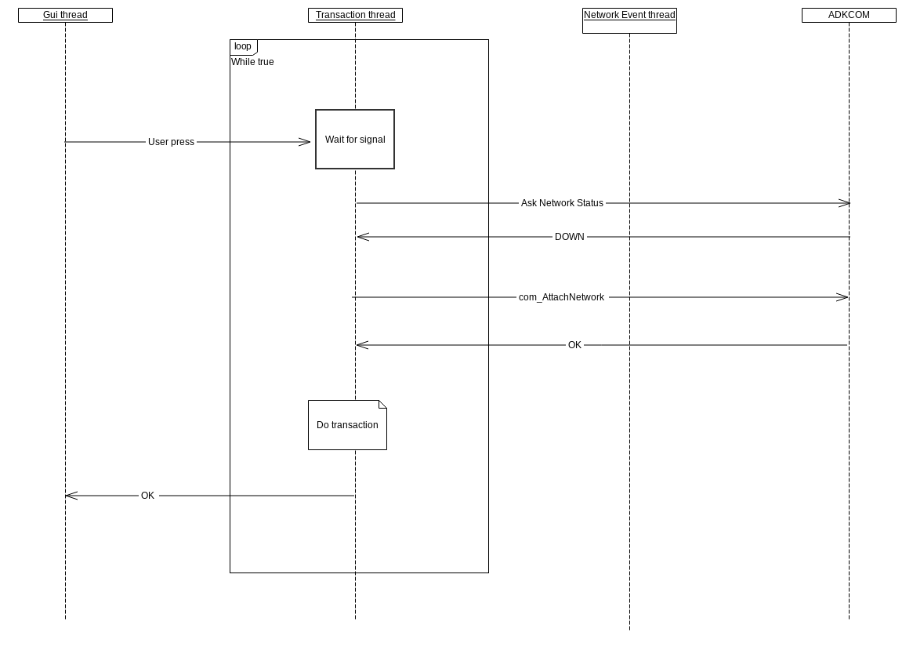

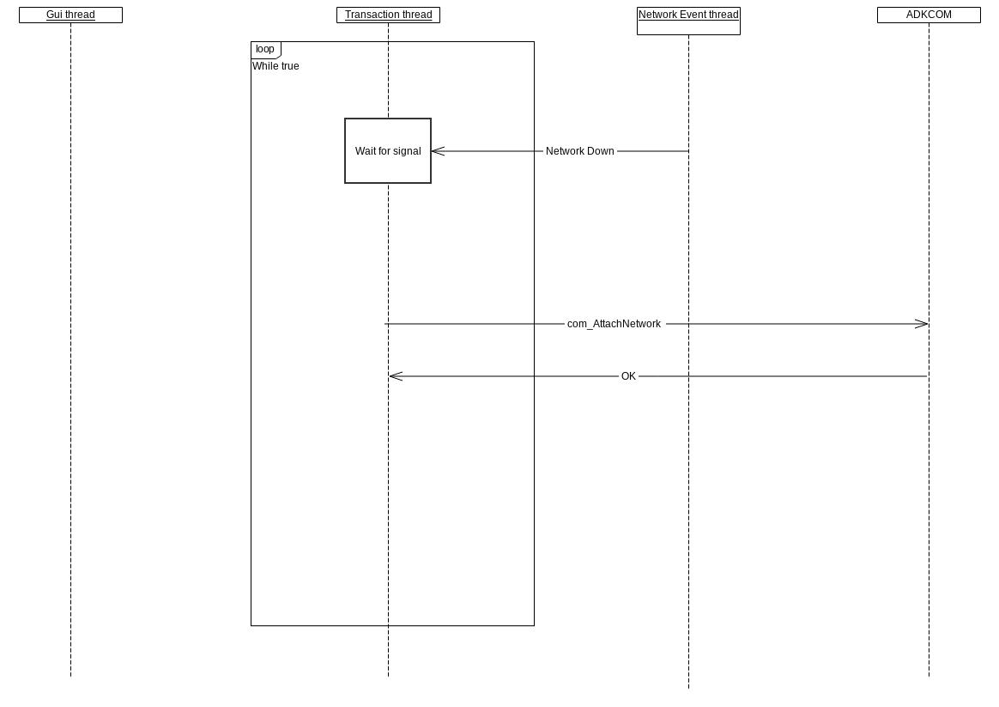

# Appendix N: WLAN Regulations <a href="#sec_com_appendix_n_wlan_regulations" id="sec_com_appendix_n_wlan_regulations"></a>

In order to fulfill local regulations the correct country must be set for the WLAN module of a terminal. This can be done via two different ways: first is the usage of a dedicated programming interface using the device property **COM_PROP_WLAN_COUNTRY_REG_DOM** and the according get and set functions. The second way is to load a special configuration file into the terminal. Details differ between VOS2 and VOS3 implementation.

For VOS2, the support team has to be contacted, as the special, sys-signed package is needed, which the user cannot generate himself.

In VOS3, a new method of preconfiguring the WiFi\'s country code has been introduced. A special file, called **com-reg-domain.conf**, must be placed in **/mnt/appdata/versioned/globalshare/adk-com** directory. This file should contain the country code (two uppercase letters). It can also contain the newline character (0x0a), but it\'s not needed. It, of course, has to be readable by the comdaemon.

**com-reg-domain.conf** file, if present, is read by the comdaemon during startup and country code contained there is imported into the ADK-COM/comdaemon internal settings database. On successful import, the file is deleted from the file system. For the comdaemon process to be able to do that, the directory permissions of **/mnt/appdata/versioned/globalshare/adk-com** must be set accordingly.

When **COM_PROP_WLAN_COUNTRY_REG_DOM** property is read, it always returns the country code from the kernel. When this property is written to, comdaemon updates the country code in the kernel and in its internal settings database.

As the country code is stored persistently on the flash file system in all cases (on VOS2, on VOS3, using the property and using the special file), the procedure for setting it needs to be applied only once in a lifetime of a device.


Not all WiFi country codes are available on all devices. For example e235 is only for the US market, therefore will only accept the country code \"US\".


# Appendix O: Network Events cheat sheet <a href="#sec_com_appendix_o_events_cheat_sheet" id="sec_com_appendix_o_events_cheat_sheet"></a>

The table below provides a summary of what ADK COM network events mean on each interface. It provides sample causes for each event per interface and recommends the action required for the application code which handles the events.

[TABLE]

: ADK-COM NETWORK EVENTS


**1:** There is an important difference between what EVENTS mean on mobile data versus what they mean on the other interfaces. On radio the INTERFACE events are driven by the logical connection between the host and the modem stack : the ppp connection status.
And there is a dependency between the state of this interface and the physical radio layer connection (i.e. whether the radio is registered to the network and camping on a cell). The way this works is that in order to establish the ppp connection (and therefore receive an INTERFACE_UP event) the radio layer must be present. This means that if the app receives INTERFACE_UP on radio it should immediately assume the LINK is up as well.


# Appendix P: Powering Devices behaviour <a href="#sec_com_appendix_p_power_mode" id="sec_com_appendix_p_power_mode"></a>

Beginning with ADK 4.6 the hardware module of each supported mobile communication interface can be powered and unpowered by the application on demand. This is to further reduce the energy footprint of a terminal. However this means in order to use any of the BT, WiFi or mobile data interfaces the application programmer first must power on the according device using the function <a href="libcom_8h.md#a24251c13b11f210e1543a88d03401fc3">com_PowerModeSet()</a> prior to use. This includes get/set of device properties and any network configurations using <a href="libcom_8h.md#a38b33fccc951bc546fbaee4ea832ef13">com_Connect()</a>, <a href="libcom_8h.md#a65f3a6e7059cb1dfa3a924aad3122c90">com_ConnectAsync()</a>, <a href="libcom_8h.md#a10cdfc0c9edf6383c69f8ac03d84131e">com_AttachNetwork()</a> and <a href="libcom_8h.md#a657bd48e7c3c4e82e6cac4b7d0831d39">com_AttachNetworkAsync()</a>. In case any of the mentioned functions is called but the associated device is not powered, the error code COM_ERR_DEV_POWER is returned. The current power status of a wireless module can be obtained using the function <a href="libcom_8h.md#a35c8340ad2d5496d084d3fcac3d952dc">com_PowerModeStatus()</a>.

The implementation also contains a compatibility mode which emulates the automatic power functions known from previous ADKCOM versions. In this mode, the power functions are not required since the ADKCOM will power any necessary devices implicitely. To enable the compatibility mode a user will have to load a special compat-enablement package *dl.comcfg-autopwr-1.0.0.tgz* into the terminal. The according removal package *dl.comcfg-autopwr-remove-1.0.0.tgz* will reactivate the new manual powering mode. The standard integration packages include the compatibility package, meaning automatic powering is enabled.


Changes will be applied after terminal reboot


A user can easily find out which of both modes is currently being used by the installed ADKCOM by checking the state of the flag COM_FEATURE2_DEVICE_NO_AUTOPOWER of device property COM_PROP_SUPPORTED_FEATURES_2 at runtime. The flag will be **set** when the user must power / unpower the devices manually and **unset** if in legacy (autopower) mode.

The Com Control Panel aka CCP is also able to operate in both modes. Upon connection attempt, it will automatically power the according wireless module no matter in which operation mode the terminal currently is. But whenever the manual power mode is active it lets a user turn off the power of a previously powered wireless communication module. In autopower mode the modules will be left powered all the time.

# Appendix Q: Tethering: Information on tethering a network (NAT / Masquerading) <a href="#sec_com_appendix_q_tethering" id="sec_com_appendix_q_tethering"></a>

It is possible to configure an interface to masquerade and forward IP packets. To do this use the com_Tethering\* APIs. Tethering will let any network requests, which arrive at one of the interfaces on the device, to be sent through the tethered interface.

To illustrate this consider the following scenario: A P400 is connected to an UX300 via USB. USB Gadget (ECM) is used for communication between the UX300 and P400. The UX300 is connected to the customer network via eth0.

If the UX300 eth0 interface is tethered, the P400 can now send data to the customer network. For the customer network this communication will appear as coming from the UX300. The topology of the UX300 / P400 network will not be visible to the customer network. Therefore no additional configuration of the P400 (DHCP etc.) will be necessary.

Steps to take for this configuration example:

P400:

- Configure USB Gadget mode to ECM
- Connect to UX300 via USB cable as shown in the diagram
- Configure usb0 network to the desired, static configuration

Ux300:

- Configure eth0 to be configured as whatever is needed to access the customer network
- Configure USB Gadget mode to Serial
- Make sure P400 is plugged in (if the interface is not there, a reboot may be required)
- Configure usbh1 network to the desired, static configuration
- Turn on tethering for eth0

The P400 can now communicate with the customer network.

## Additional usage information: <a href="#subsec_tethering_usage" id="subsec_tethering_usage"></a>

The tethering state is preserved after reboot, meaning the interface does not have to be retethered every time your application starts. Enabling tethering again on the same interface, which is already tethered, will be ignored and no error will be returned. If an interface is currently tethered and another, different interface is requested for tethering, then the currently tethered interface will be untethered. Afterwards the new interface will be tethered.

## DNS: <a href="#subsec_tethering_dns" id="subsec_tethering_dns"></a>

DNS queries from devices, which are connected to a tethered device, will be sent to the DNS address configured on the tethered interface. In the previous example this means any DNS queries the P400 does will be sent to the UX300, then rerouted to the DNS server configured for eth0 on the UX300. This also means that the values of the DNS entries on the P400 are irrelevant as only the DNS addresses from the UX300 eth0 interface will be used. However they still need to be configured, as otherwise the DNS resolver libraries will complain, that there is no DNS server present (in resolv.conf for example). A dummy value can be used here, however our recommendation is to use the same address as the gateway/tethering device (UX300). This will first of all make more sense visually but also leave open the possibility of putting something like a DNS server (dnsmasq or similar) on the device, which is doing the tethering.

# Appendix R: Reconnect BT / Mobile networks <a href="#sec_com_appendix_r_auto_reconnect" id="sec_com_appendix_r_auto_reconnect"></a>

The automatic reconnection feature of the BT PAN and Mobile Networks has been added in ADKCOM versions 2.66 and higher. As with the manual powering this feature can be enabled / disabled by loading special load packages.

*dl.comcfg-no-rc-1.0.0.tgz* disables, *dl.comcfg-no-rc-remove-1.0.0.tgz* enables the reconnect feature. The standard integration packages include the compatibility package, meaning the reconnect feature is disabled.

A user can discover which of both modes is currently being used by checking the state of the flag COM_FEATURE3_AUTO_RECONNECT of device property COM_PROP_SUPPORTED_FEATURES_3 at runtime.

Both COM_FEATURE3_AUTO_RECONNECT and COM_FEATURE2_DEVICE_NO_AUTOPOWER must be enabled for this feature to be active. Please check the [Power mode](#sec_com_appendix_p_power_mode) appendix for more information on the COM_FEATURE2_DEVICE_NO_AUTOPOWER feature.

Activating this feature will cause the mobile as well as Bluetooth PAN networks to be automatically reconnected.

## BT PAN Network Reconnect <a href="#subsec_auto_reconnect_bt" id="subsec_auto_reconnect_bt"></a>

If the Bluetooth module is on, the BT PAN interface is configured and there are network capable Bluetooth devices paired, the BT_PAN Interface will be reconnected to a device depending on the BT_ADDR setting written inside the network profile. This means if \"any\" is set, it will try to connect to any capable, paired device. If the module is off or the interface stopped then no action is taken.

## Mobile Network Reconnect <a href="#subsec_auto_reconnect_gprs" id="subsec_auto_reconnect_gprs"></a>

If the mobile module is on, the SIM-Slot unlocked and the interface configured then the system will try to connect to the currently configured network. If the module is off, the SIM locked or the interface stopped then no action is taken.


Switching the SIM-Slot does not change the currently configured network stored in the system. This means when the network goes down to the switching of the slot the old network profile will be used for the new SIM-Slot. As such it may be prudent to manually turn off the network before you switch SIM-Slots and reattach with the correct network-profile in order to avoid the systemt trying to reconnect with the SIM using the incorrect network information.


# Appendix S: Sim Slot Switching <a href="#sec_com_appendix_s_sim_slot_switching" id="sec_com_appendix_s_sim_slot_switching"></a>

It is possible to switch the SIM card during operation using ADK property COM_PROP_SELECT_SIM_SLOT. After switching the SIM the application has to re-connect to the network.

Following limitations apply:

- switching between already inserted SIM cards involves a switchover handling that can take up to 10 seconds.
- It is forbidden to remove the SIM card during operation. This includes, but is not limited to, the v240m. Because of this there is no ADKCOM event when removing the card.
- If the SIM *is* removed during operation, then the only way to recover the system completely is to reboot.
- It is not possible to detect the SIM card presence in the SIM card slot when the radio module is off.
- It is not possible to detect the SIM card presence in the SIM card slot, which is not selected for use.

In addition to that the used SIM card slot for a new connection can be specified within a network profile.


ADKCOM will never auto-select the used SIM slot. This is the responsibility of the calling application.


In the ADK-COM model, the application is responsible to supervise the network connection state and re-establish the network connection after the NETWORK_DOWN event was received. If an application decides to rely on implicit network setup using connection profiles, an automatic switching of the SIM slot by ADK-COM follows the fallback mechanism specifying different fallback connections in a connection profile. The network connection is established as needed for the connection, and the decision which network will be used is given by the order defined in the connection profile. Either the network can be activated or not, no decision is taken by the signal level. In order to specify the SIM slot for a specific connection, the GPRS and the PPP CSD network profiles as well as the GSM raw data (CSD) connection profile have the network profile parameter SIM_SLOT:

| Parameter | Description |
|----|----|
| <p>SIM_SLOT</p> | <p>SIM-Slot to use. 0 = currently active SIM-Slot. 1 = First SIM-Slot. 2 = Second SIM-Slot. Default is 0</p> |

Example for such a fallback connection profile:

``` cpp
<CONNECTION_PROFILE>
   <NAME>"HOST_A"</NAME>
   <CONNECTION>
   <TYPE>TCP</TYPE>
   <NETWORK>GPRS_PPP_SLOT1.XML</NETWORK>
   <ADDRESS>10.11.12.13</ADDRESS>
   <PORT>9999</PORT>
   <TIMEOUT>1000</TIMEOUT>
   </CONNECTION>
   <CONNECTION>
   <TYPE>TCP</TYPE>
   <NETWORK>GPRS_PPP_SLOT2.XML</NETWORK>
   <ADDRESS>10.11.12.13</ADDRESS>
   <PORT>9999</PORT>
   <TIMEOUT>1000</TIMEOUT>
   </CONNECTION>
</CONNECTION_PROFILE>
```

with associated network profiles:

``` cpp
<NETWORK_PROFILE>
   <NAME>"GPRS_PPP_SLOT1"</NAME>
   <TYPE>GPRS</TYPE>
   <DEVICE_NAME>GPRS0</DEVICE_NAME>
   ...
   <SIM_SLOT>1</SIM_SLOT>
</NETWORK_PROFILE>
```

``` cpp
<NETWORK_PROFILE>
   <NAME>"GPRS_PPP_SLOT2"</NAME>
   <TYPE>GPRS</TYPE>
   <DEVICE_NAME>GPRS0</DEVICE_NAME>
   ...
   <SIM_SLOT>2</SIM_SLOT>
</NETWORK_PROFILE>
```

# Appendix T: Limited Android support <a href="#sec_com_appendix_t_limited_android_support" id="sec_com_appendix_t_limited_android_support"></a>

On Android platforms all the network configuration is done via configuration dialogs of the operating system. To give the existing application the option to use the well known behavior, the connection related APIs are supported as well as the communication APIs on that connections.

List of supported API on Android:

- com_Init
- com_Connect
- com_ConnectAsync
- com_ConnectWait
- com_ConnectGetFD
- com_ConnectGetSslObj
- com_ConnectGetSslFD
- com_ConnectClose
- com_Receive
- com_Send
- com_Select
- com_SelectInterrupt
- com_SelectInterruptReset
- com_SendTo
- com_ReceiveFrom
- com_GetConnectionState
- com_GetConnectionType
- com_GetProfilePropertyInt
- com_GetProfilePropertyString
- com_GetProfileNodePropertyInt
- com_GetProfileNodePropertyString
- com_Destroy
- com_SetPassword
- com_GetVersion
- com_GetSvcVersion

There is no support for network profiles on Android. They will be read and printed but aside from this they will be ignored. In order to avoid confusion when the customer or developers look at ADKCOM logs captured on Android, we recommend using a link-local network profile, which will not generate much unnecessary logging. If this is done, please also set the restrict_local parameter in all connection sections to 0, as otherwise connections are restricted to the same host.

# Appendix U: Information on the SIM Toolkit / USSD <a href="#sec_com_appendix_u_sim_toolkit_ussd" id="sec_com_appendix_u_sim_toolkit_ussd"></a>

The SIM toolkit / USSD can be used via the <a href="libcom3_8h.md">libcom3.h</a> API. Please see [Extended C++ interface](#sec_com_extended_cpp_interface) for general information on the <a href="libcom3_8h.md">libcom3.h</a> interface.

## STK <a href="#subsec_com_stk" id="subsec_com_stk"></a>

To start the SIM toolkit the following must be done:

- First turn on the radio module using the standard <a href="libcom_8h.md">libcom.h</a> APIs.
- Register an <a href="libcom3_8h.md">libcom3.h</a> event pipe with type STK
- Create a <a href="libcom3_8h.md">libcom3.h</a> command pipe
- Instruct the command pipe to turn the STK on
- Wait for first STK event
- Use write command to send ENV / TR commands
- Use event pipe to receive further PRO events


Once your have activated the STK the radio module will reset. Once in the SIM toolkit mode you cannot do any data transfer via packet mobile data such as a GPRS network.


## STKPRO Events <a href="#subsec_com_stkpro_example" id="subsec_com_stkpro_example"></a>

The following STKPRO commands will be received by the application:

05 - Setup <a href="libevt_8h.md#struct_event">Event</a> List command (Setup <a href="libevt_8h.md#struct_event">Event</a> List not necessary on Quectel modules)

36 - Select Item

37 - Menu Selection

All events will have the vficom::event::proactive_command Tag. Depending on which event was received more tags can be present. The tags present are seperated by namespaces and can easily be looked up in your IDE. Please note all of the command-specific parameters are inside the parameter object.


You will never receive STKCNF events in your application. All CNF events are handled by the system and are not visible to the application.


## STKTR/ENV <a href="#subsec_com_stk_trenv" id="subsec_com_stk_trenv"></a>

You may send STKENV or STKTR commands to the STK by using a libcom3 command pipe. The parameters needed are specified inside vficom::cmdparam::in::stk namespace.

## STK Example <a href="#subsec_com_stk_example" id="subsec_com_stk_example"></a>

The following example turns on the STK (GPRS module must be powered beforehand), reads the first STKPRO URC from the module (which will appear in about the first 30 seconds of having activated STK) and prints it. If it is a STKPRO SetupEventList (5) event (only on Gemalto modules) it sends an OK back.

``` cpp
#include "libcom.h"
#include "libcom3.h"
#include "ipc/jsobject.h"
#include <stdio.h>
#define RED "\x1B[31m"
#define GRN "\x1B[32m"
#define YEL "\x1B[33m"
#define BLU "\x1B[34m"
#define MAG "\x1B[35m"
#define CYN "\x1B[36m"
#define WHT "\x1B[1;37m"
#define GRY "\x1B[2;37m"
#define RESET "\x1B[0m"
#define RESETNL "\x1B[0m\n"
static bool sendCommand(const vfiipc::JSObject &in)
{
   try {
   vfiipc::JSObject out;
   vficom::CommandPipe cmdPipe;
   if(cmdPipe.sendRecv(in, out, 90000) == vficom::status::OK) {
   int err = out("error").getInt();
   if(err == COM_ERR_NONE) {
   printf(CYN "OK" RESETNL);
   return true;
   }
   else {
   printf(RED "fail, err %d" RESETNL, err);
   return false;
   }
   }
   else {
   return false;
   }
   }
   catch(vficom::Exception &ex) {
   printf(RED "Exception %s\n" RESETNL, ex.what());
   return false;
   }
}
static bool gprsSTKOn()
{
   vfiipc::JSObject in;
   in(vficom::cmdparam::in::command) = vficom::cmd::stk_on;
   in(vficom::cmdparam::in::stk_on::timeout) = 60000;
   return sendCommand(in);
}
static bool gprsSTKOff()
{
   vfiipc::JSObject in;
   in(vficom::cmdparam::in::command) = vficom::cmd::stk_off;
   in(vficom::cmdparam::in::stk_off::timeout) = 60000;
   return sendCommand(in);
}
static std::string gprsSTKState()
{
   try {
   vfiipc::JSObject out, in;
   vficom::CommandPipe cmdPipe;
   in(vficom::cmdparam::in::command) = vficom::cmd::stk_status;
   in(vficom::cmdparam::in::stk_status::timeout) = 30000;
   if(cmdPipe.sendRecv(in, out, 90000) == vficom::status::OK) {
   int err = out("error").getInt();
   if(err == COM_ERR_NONE) {
   return out(vficom::cmdparam::out::stk_status::status).getString();
   }
   else {
   printf(RED "fail, err %d" RESETNL, err);
   }
   }
   }
   catch(vficom::Exception &ex) {
   printf(RED "Exception %s\n" RESETNL, ex.what());
   }
   return "Error";
}
static void sendSTKProCommand(int proactCmd, vfiipc::JSObject &parameters)
{
   vfiipc::JSObject in;
   vfiipc::JSObject stk;
   stk(vficom::cmdparam::in::stk_write::msg::usat_command) = "STKTR";
   stk(vficom::cmdparam::in::stk_write::msg::proactCmd) = proactCmd;
   stk(vficom::cmdparam::in::stk_write::msg::parameters) = parameters;
   in(vficom::cmdparam::in::stk_write::timeout) = 60000;
   in(vficom::cmdparam::in::command) = vficom::cmd::stk_write;
   in(vficom::cmdparam::in::stk_write::message_obj) = stk;
   sendCommand(in);
}
static void sendSTKEnvCommand(int envCmd, vfiipc::JSObject &parameters)
{
   vfiipc::JSObject in;
   vfiipc::JSObject stk;
   stk(vficom::cmdparam::in::stk_write::msg::usat_command) = "STKENV";
   stk(vficom::cmdparam::in::stk_write::msg::envCmd) = envCmd;
   stk(vficom::cmdparam::in::stk_write::msg::parameters) = parameters;
   in(vficom::cmdparam::in::stk_write::timeout) = 60000;
   in(vficom::cmdparam::in::command) = vficom::cmd::stk_write;
   in(vficom::cmdparam::in::stk_write::message_obj) = stk;
   sendCommand(in);
}
static void sendSTKTRRefresh() __attribute__((unused));
static void sendSTKTRRefresh()
{
   vfiipc::JSObject parameters;
   parameters(vficom::cmdparam::in::stk_write::msg::tr::refresh::result) = 0;
   sendSTKProCommand(vficom::cmdparam::in::stk_write::msg::STK_TR_CMD_REFRESH, parameters);
}
static void sendSTKTRSetupEventListOK()
{
   vfiipc::JSObject parameters;
   parameters(vficom::cmdparam::in::stk_write::msg::tr::setup_event_list::result) = 0;
   sendSTKProCommand(vficom::cmdparam::in::stk_write::msg::STK_TR_CMD_SETUP_EVENT_LIST, parameters);
}
//Note: This is just an example. Replace with the correct data
static void sendSTKTRSelectItem() __attribute__((unused));
static void sendSTKTRSelectItem()
{
   vfiipc::JSObject parameters;
   parameters(vficom::cmdparam::in::stk_write::msg::tr::select_item::add_result) = 0;
   parameters(vficom::cmdparam::in::stk_write::msg::tr::select_item::dcs) = 0;
   parameters(vficom::cmdparam::in::stk_write::msg::tr::select_item::hex_string) = "AABBCCDD";
   parameters(vficom::cmdparam::in::stk_write::msg::tr::select_item::result) = 0;
   sendSTKProCommand(vficom::cmdparam::in::stk_write::msg::STK_TR_CMD_SELECT_ITEM, parameters);
}
static void sendSTKTRSetupMenu() __attribute__((unused));
static void sendSTKTRSetupMenu()
{
   vfiipc::JSObject parameters;
   parameters(vficom::cmdparam::in::stk_write::msg::tr::setup_menu::result) = 0;
   sendSTKProCommand(vficom::cmdparam::in::stk_write::msg::STK_TR_CMD_SETUP_MENU, parameters);
}
static void sendSTKENVMenuSelect() __attribute__((unused));
static void sendSTKENVMenuSelect()
{
   vfiipc::JSObject parameters;
   parameters(vficom::cmdparam::in::stk_write::msg::env::menu_select::item_id) = 0;
   sendSTKEnvCommand(vficom::cmdparam::in::stk_write::msg::STK_ENV_CMD_MENU_SELECT, parameters);
}
static void sendSTKENVEventDownload() __attribute__((unused));
static void sendSTKENVEventDownload()
{
   vfiipc::JSObject parameters;
   parameters(vficom::cmdparam::in::stk_write::msg::env::event_download::event) = 0;
   sendSTKEnvCommand(vficom::cmdparam::in::stk_write::msg::STK_ENV_CMD_EVENT_DOWNLOAD, parameters);
}
static vfiipc::JSObject gprsSTKReadEvent(vficom::EventPipe &evtPipe)
{
   vfiipc::JSObject out;
   printf(YEL "Wait for 30 secs" RESETNL);
   if(evtPipe.recv(out, 30000) == vficom::status::OK) {
   return out;
   }
   else {
   printf(RED "Failed to read event" RESETNL);
   throw -2;
   }
}
class STK {
public:
   STK()
   {
   if(!gprsSTKOn()) {
   throw -1;
   }
   }
   ~STK()
   {
   gprsSTKOff();
   }
};
static void printSelectItem(vfiipc::JSObject &params)
{
   printf(CYN "Item Text %s" RESETNL, params(vficom::event::stk::select_item::item_text).getString().c_str());
   printf(CYN "Alpha %s" RESETNL, params(vficom::event::stk::select_item::alpha).getString().c_str());
   printf(CYN "CMD Qualifier %ld" RESETNL, params(vficom::event::stk::select_item::cmd_qualifier).getInt());
   printf(CYN "Default item %ld" RESETNL, params(vficom::event::stk::select_item::default_item).getInt());
   printf(CYN "Icon Id %ld" RESETNL, params(vficom::event::stk::select_item::icon_id).getInt());
   printf(CYN "Icon Id list elem %ld" RESETNL, params(vficom::event::stk::select_item::icon_id_list_elem).getInt());
   printf(CYN "Item ID %ld" RESETNL, params(vficom::event::stk::select_item::item_id).getInt());
   printf(CYN "Next action %ld" RESETNL, params(vficom::event::stk::select_item::next_action).getInt());
   printf(CYN "Total items %ld" RESETNL, params(vficom::event::stk::select_item::total_items).getInt());
}
static void printSetUpEventList(vfiipc::JSObject &params)
{
   printf(CYN "Item Text %ld" RESETNL, params(vficom::event::stk::set_up_event_list::event_list).getInt());
}
static void printMenuSelection(vfiipc::JSObject &params)
{
   printf(CYN "Item Text %s" RESETNL, params(vficom::event::stk::menu_selection::item_text).getString().c_str());
   printf(CYN "Alpha %s" RESETNL, params(vficom::event::stk::menu_selection::alpha).getString().c_str());
   printf(CYN "CMD Qualifier %ld" RESETNL, params(vficom::event::stk::menu_selection::cmd_qualifier).getInt());
   printf(CYN "Icon Id %ld" RESETNL, params(vficom::event::stk::menu_selection::icon_id).getInt());
   printf(CYN "Icon Id list elem %ld" RESETNL, params(vficom::event::stk::menu_selection::icon_id_list_elem).getInt());
   printf(CYN "Item ID %ld" RESETNL, params(vficom::event::stk::menu_selection::item_id).getInt());
   printf(CYN "Next action %ld" RESETNL, params(vficom::event::stk::menu_selection::next_action).getInt());
   printf(CYN "Total items %ld" RESETNL, params(vficom::event::stk::menu_selection::total_items).getInt());
}
static void printEvent(vfiipc::JSObject &out)
{
   enum vficom::event::stk::STKURCProCommand proCommand =
   (enum vficom::event::stk::STKURCProCommand) out(vficom::event::stk::proactive_command).getInt();
   printf(CYN "URC %s" RESETNL, out(vficom::event::stk::urc).getString().c_str());
   printf(CYN "PAC %ld" RESETNL, out(vficom::event::stk::proactive_command).getInt());
   switch(proCommand) {
   case vficom::event::stk::MENU_SELECTION:
   printMenuSelection(out(vficom::event::stk::parameters));
   break;
   case vficom::event::stk::SET_UP_EVENT_LIST:
   printSetUpEventList(out(vficom::event::stk::parameters));
   break;
   case vficom::event::stk::SELECT_ITEM:
   printSelectItem(out(vficom::event::stk::parameters));
   break;
   default:
   printf(RED "Not a valid event" RESETNL);
   break;
   }
}
static void readAnswerEvent(vficom::EventPipe &evtPipe)
{
   vfiipc::JSObject out = gprsSTKReadEvent(evtPipe);
   printf(CYN "Event: %s" RESETNL, out.dump().c_str());
   printEvent(out);
   enum vficom::event::stk::STKURCProCommand proCommand =
   (enum vficom::event::stk::STKURCProCommand) out(vficom::event::stk::proactive_command).getInt();
   if(proCommand == vficom::event::stk::SET_UP_EVENT_LIST) {
   // This does not happen on Quectel devices, just send an OK back on Gemalto modules
   sendSTKTRSetupEventListOK();
   }
   if(proCommand == vficom::event::stk::SELECT_ITEM) {
   // Whatever needs to be done
   }
   if(proCommand == vficom::event::stk::MENU_SELECTION) {
   // Whatever needs to be done
   }
}
bool gprsSTKFull()
{
   try {
   vficom::EventPipe evtPipe(vficom::event::EVT_URC_STK);
   STK stk;
   const std::string state = gprsSTKState();
   printf(CYN "State %s" RESETNL, state.c_str());
   if(state != "on") {
   printf(RED "Incorrect STK State" RESETNL);
   return false;
   }
   readAnswerEvent(evtPipe);
   readAnswerEvent(evtPipe);
   // readAnswerEvent(evtPipe);
   // readAnswerEvent(evtPipe);
   // etc. etc. till transaction is finished
   return true;
   }
   catch(...) {
   return false;
   }
}
int main(){
   //Make sure the module is on beforehand
   (void) gprsSTKFull();
   return 0;
}
```

## USSD <a href="#subsec_com_ussd" id="subsec_com_ussd"></a>

USSD Support is activated when the USSD flag is set in feature3 flags. As with STK the USSD commands are available via the libcom3 interface. There is no interactive mode available, meaning replies to the network request need to be sent via USSD commands.

``` cpp
static vficom::status::PipeStatus sendCommand(const vfiipc::JSObject &in, vfiipc::JSObject &out)
{
   try {
   vficom::CommandPipe cmdPipe;
   if(cmdPipe.sendRecv(in, out, 90000) == vficom::status::OK) {
   int err = out("error").getInt();
   if(err == COM_ERR_NONE) {
   printf(CYN "OK" RESETNL);
   return vficom::status::OK;
   }
   else {
   printf(RED "fail, err %d" RESETNL, err);
   return vficom::status::FAILED;
   }
   }
   else {
   return vficom::status::FAILED;
   }
   }
   catch(vficom::Exception &ex) {
   printf(RED "Exception %s\n" RESETNL, ex.what());
   return vficom::status::FAILED;
   }
}
bool ussdState()
{
   vfiipc::JSObject in, out;
   in(vficom::cmdparam::in::command) = vficom::cmd::ussd_status;
   in(vficom::cmdparam::in::stk_status::timeout) = 60000;
   if(sendCommand(in, out) == vficom::status::OK) {
   printf(CYN "SendCommand OK" RESETNL);
   if(out.exists(vficom::cmdparam::out::stk_status::status)) {
   printf(CYN "Status %ld\n" RESETNL, out(vficom::cmdparam::out::stk_status::status).getInt());
   return true;
   }
   return false;
   }
   return false;
}
bool ussdPrepaid()
{
   vficom::EventPipe evtPipe(vficom::event::EVT_URC_USSD);
   vfiipc::JSObject evt;
  
   {
   vfiipc::JSObject in, out;
  
   in(vficom::cmdparam::in::command) = vficom::cmd::ussd_write;
  
   in(vficom::cmdparam::in::ussd_write::timeout) = 60000;
   in(vficom::cmdparam::in::ussd_write::n) = 1;
   in(vficom::cmdparam::in::ussd_write::str) = "*100#";
   in(vficom::cmdparam::in::ussd_write::dcs) = 15;
  
   if(sendCommand(in, out) != vficom::status::OK) {
   printf(RED "Failed to send USSD Command!" RESETNL);
   return false;
   }
   }
   printf(CYN "OK -- Try to receive event now" RESETNL);
  
   if(evtPipe.recv(evt, 10000) != vficom::status::OK) {
   printf(RED "No Event received!" RESETNL);
   return false;
   }
  
   if(evt.exists(vficom::event::ussd::dcs)) {
   printf(WHT "dcs %ld \n" RESETNL, evt(vficom::event::ussd::dcs).getInt());
   }
  
   if(evt.exists(vficom::event::ussd::m)) {
   printf(WHT "m %ld \n" RESETNL, evt(vficom::event::ussd::m).getInt());
   }
  
   if(evt.exists(vficom::event::ussd::str)) {
   printf(WHT "str %s \n" RESETNL, evt(vficom::event::ussd::str).getString().c_str());
   }
  
   //More commands etc.
  
   {
   //Cancel
  
   vfiipc::JSObject in, out;
  
   in(vficom::cmdparam::in::command) = vficom::cmd::ussd_write;
  
   in(vficom::cmdparam::in::ussd_write::timeout) = 60000;
   in(vficom::cmdparam::in::ussd_write::n) = 2;
  
   if(sendCommand(in, out) != vficom::status::OK) {
   printf(RED "Failed to send USSD Command!" RESETNL);
   return false;
   }
   }
  
   return true;
}
```

# Appendix V: Mobile Radio: Preferred Operator List <a href="#sec_com_appendix_v_preferred_operator_list" id="sec_com_appendix_v_preferred_operator_list"></a>

The preferred operator list of a SIM can be read and modified using ADKCOM property COM_PROP_GSM_PREFERRED_OPERATOR_LIST.

## Reading the Preferred Operator List <a href="#subsec_read_pol" id="subsec_read_pol"></a>

The currently set preferred operator list can be retrieved by reading the property COM_PROP_GSM_PREFERRED_OPERATOR_LIST. Precondition:

- radio module is powered
- SIM card is inserted
- SIM card is unlocked

The operator list on the SIM is stored as a list of operators (MCC+MNC) which are assigned an index beginning with 1.

The returned ADKCOM JSON has following format:

``` cpp
{
   "preferred_operators":[
   "12345",
   "23456",
   "98765"
   ]
}
```

It is a JSON array named \"preferred_operators\", first element in the array corresponds to index 1, the 2nd to index 2 and so on. all contained strings are always a MCC+MNC string, representing the operator. It may happen that one index was removed on the SIM card, index gaps may occur. These gaps are returned in the array as just empty strings. In following example index 2 was erased and is no longer stored on the SIM:

``` cpp
{
   "preferred_operators":[
   "12345",
   "",
   "98765"
   ]
}
```

## Modifying the Preferred Operator List <a href="#subsec_mod_pol" id="subsec_mod_pol"></a>

In order to modify the operator list, it\'s advsiable to read the current list first. Then modify the indexes in the JSON array as needed. After that simply write the property COM_PROP_GSM_PREFERRED_OPERATOR_LIST back. Value content is the mentioned JSON object as string.

If you want to erase a certain index, just enter an empty string at the desired position in the array before writing it back.

Precondition:

- radio module is powered
- SIM card is inserted
- SIM card is unlocked

## Restore the default Preferred Operator List <a href="#subsec_reset_pol" id="subsec_reset_pol"></a>

In case you want to restore the default provider defined operator list, simply delete all indexes. To do this, first read the current list using above described reading method. Then clear every string in the JSON array, so it only contains empty strings. After that write it back using COM_PROP_GSM_PREFERRED_OPERATOR_LIST.

Precondition:

- radio module is powered
- SIM card is inserted
- SIM card is unlocked

## Clear stored POL data <a href="#subsec_clear_pol" id="subsec_clear_pol"></a>

Typically, the customized list data are volatile in the module. The operating system stores the previously set operator list on the file system to re-inject the data on the next mobile radio module start-up. This file can actively erased by the application by sending an empty preferred operator list JSON data:

``` cpp
{
   "preferred_operators":[]
}
```

# Appendix W: COMdemo, the ADK-COM demo application <a href="#sec_com_appendix_w_comdemo" id="sec_com_appendix_w_comdemo"></a>

COMdemo is a simple application which demonstrates the capabilities of ADK Communication Service. COMdemo is located at `doc/com/demo/` within the documentation package `com-doc-[version].zip`. This directory contains both the source code and a pre-built package of the application. The loadable application is located at `load/vos2` and is divided into two packages, `dl.comdemo-[version].tgz` and `dl.comdemo-config-[version].tgz`. Therefore, you do not need to recompile the entire application if you only want to make changes to the configuration files.

## Package building <a href="#subsec_com_appendix_w_comdemo_build" id="subsec_com_appendix_w_comdemo_build"></a>

If you want to tinker with the application or just change some parameters in the configuration like the host address, you can build the packages with make. The target `config` will create the config package only. The target `vos2-dist` will create both packages.

## Source code overview <a href="#subsec_com_appendix_w_comdemo_source" id="subsec_com_appendix_w_comdemo_source"></a>

The application uses a simple GUI, the resource files therefore are in the `rsc` directory. The more interesting part are the test cases implemented in `src/test/test.cpp`. If you want to change only some parameters, it is done easily through `src/test/comdemo.xml`. At runtime the XML file is parsed and the parameters are inserted into the corresponding files in `src/test/skeleton`. And of course, you can also change the parameters directly in the respective profile file.

## Usage of the application <a href="#subsec_com_appendix_w_comdemo_usage" id="subsec_com_appendix_w_comdemo_usage"></a>

Use the secure installer from sysmode to install both packages. After that a new application icon will appear on the MAC Desktop.

| Screenshot | Description |
|----|----|
| 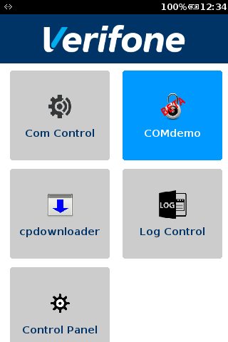 | <p>Application icon on MAC Desktop</p> |
| 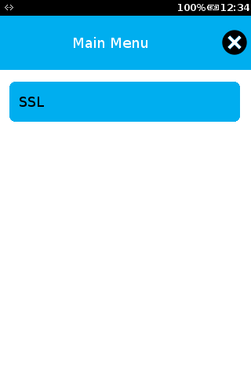 | <p>After launching the application, the application shows a selection of tests grouped by connection type.</p> <p><br/></p>  <p><br/></p> <p>At current stage, only one type of examples is included, namely SSL connections using the Ethernet interface (default can be changed by modifying connection profiles).</p> <p><br/></p>  |
| 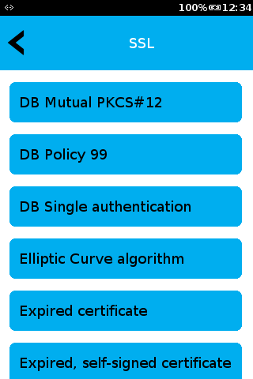 | <p>The tests in the SSL group mostly use XML files for connection profiles, the others that use a database are prefixed with \"DB\".</p> |
| 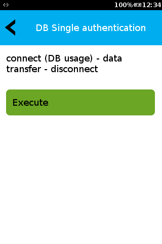 | <p>By selecting a test from the list, a further description of the test will be displayed. When you press \"Execute\", the test will be performed.</p> |
| 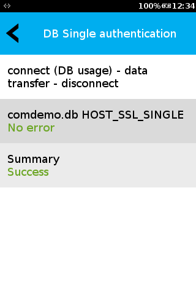 | <p>After some time, the result is displayed. Should an error occur, an explanatory message is displayed.</p> |

# Appendix X: Neighbor Lists: Information about ARP / NDP <a href="#sec_com_appendix_x_neighbor_list" id="sec_com_appendix_x_neighbor_list"></a>

You may query the current neighbors in the local subnets in ARP (ipv4)/ NDP(ipv6) tables via the COM_PROP_NEIGHBOR_TABLE property. An example of the returned json string is as follows:

``` cpp
"eth0":{
   "ipv4":{
   "192.168.2.255":"ff:ff:ff:ff:ff:ff",
   "192.168.2.1":"01:02:03:01:02:03",
   "192.168.2.2":"01:02:03:04:05:06"
   },
   "ipv6":{
   "2001:16b8:285b:2f00:464e:6dff:fe22:7e84":"44:4e:6d:22:7e:84"
   }
},
"wlan0":{
   "ipv4":{
   "192.168.20.255":"ff:ff:ff:ff:ff:ff",
   "192.168.20.10":"04:05:06:01:02:03",
   "192.168.20.11":"04:05:06:04:05:06"
   }
}
```

# Appendix Y: VOS3: Information about the new VOS3 Operating System <a href="#sec_com_appendix_y_vos3" id="sec_com_appendix_y_vos3"></a>

## API compatibilty <a href="#sec_com_appendix_y_vos3_api" id="sec_com_appendix_y_vos3_api"></a>

In general ADKCOM APIs are supported same way as on previous VOS1/VOS2.

Following API deprecations/extensions are applicable for VOS3:

- not supported API support for STunnel on VOS3 (will return not supported)
  - <a href="libcom_8h.md#a3658c67822073afab2c329755aaddd37">com_SetStunnelConfig()</a>
- new API for iBeacon- recommended to be used with VOS3
  - <a href="libcom_8h.md#a2c13209f2854692dc63309551fdc3de1">com_IBeaconGetAdvertisement()</a>
  - <a href="libcom_8h.md#acba33f21f870bf27b8e62a600ec1be17">com_IBeaconSetAdvertisement()</a>
  - <a href="libcom_8h.md#a4808892fb28569f7f949fa14aa103ef6">com_IBeaconStartAdvertisement()</a>
  - <a href="libcom_8h.md#a35633db6e2632562eff1452a5207408d">com_IBeaconStopAdvertisement()</a>
- new API for Eddystone Beacon - recommended to be used with VOS3
  - <a href="libcom_8h.md#a3163590cfa3a4ff5ff6cb5efb708883b">com_EddystoneURLGetAdvertisementExt()</a>
  - <a href="libcom_8h.md#a7eab5f7f7382383034c0b37d63d044ec">com_EddystoneURLSetAdvertisementExt()</a>

## Communication and Network Descriptors <a href="#sec_com_appendix_y_vos3_com_netfd" id="sec_com_appendix_y_vos3_com_netfd"></a>

VOS3 continues to use the same format and parameters for ADK connection and network profiles.

## Custom Certificate Loading and pre-loaded authentication key <a href="#sec_com_appendix_y_vos3_keys" id="sec_com_appendix_y_vos3_keys"></a>

- VOS3 will no longer support PKCS#12 / PFX files.
- The system now supports secure loading of these certifcates using VRKv2. The loaded certifcates will be stored securely in the system and can be referenced by the SSL_OWN_CERT and SSL_OWN_PKEY parameter with \"vault:{keyname}\" in the related connection profile for TLS or network profile for Wifi or LAN. The {keyname} needs to match the name of the loaded cerficate / key used in the VRKv2 package.
- The preloaded Authentication Key (AuthEx/ AuthN) warrantied key can be referenced using \"vault:\" as a name for SSL_OWN_CERT and SSL_OWN_PKEY. See also [Appendix A1: Mutual TLS authentication: How to use AuthEx / AuthN / asymmetric customer keys with TLS and EAP (Wi-Fi and LAN)](#sec_com_appendix_a1_authex_authn)

## Network Startup and Recovery handling <a href="#sec_com_appendix_y_vos3_network_start" id="sec_com_appendix_y_vos3_network_start"></a>

Unlike VOS1/VOS2, the VOS3 system always implements an auto start and recovery for configured networks. With this the VOS3 system will always:

- BT: try to re-estabilish connection via BT-PAN to the previously connected device when coming back in range
- Wifi: try to re-estabilish Wifi connection to the previously connected SSID or other configured SSID when coming back in range
- Cellular: try to re-estabilish connection to the prevously connected mobile network
- LAN: try to re-estabilish connection to the prevously connected LAN network

The previous support for manual configuration of recovery handling using load packages is deprecated (previous: dl.comcfg-no-rc-1.0.0.tgz and dl.comcfg-no-rc-remove-1.0.0.tgz packages).

# Appendix Z: Radio Reconfiguration: Information about restarting / connecting to Mobile Networks <a href="#sec_com_appendix_z_radio_net_restart" id="sec_com_appendix_z_radio_net_restart"></a>

When a network profile is examined and the profile is type GPRS, the tag MOBILE_RECONFIGURATION_LEVEL is examined, if set. Please see the enum com_RadioReconfigurationLevel for possible values. Depending on the reconfiguration level the radio stack is (re-)configured in different ways. When using the value COM_RECONFIGURE_REGISTER the entire radio stack is reset. A full reset includes:

- stopping PPP (if running),
- disabling the PDP context (if active)
- detaching from the packet domain (if attached)
- deregistering from the operator (if registered)
- registering to the operarator
- attaching to the packet domain
- activating the PDP context
- Starting PPP

This may not be what is desired in all circumstances, but, due to historical reasons, is the default behaviour.

To facilitate a more granular approach to reconfiguration you may change the aforementioned MOBILE_RECONFIGURATION_LEVEL parameter to achieve different results. When setting an level as the MOBILE_RECONFIGURATION_LEVEL parameter, the reconfiguration step will skip the previous layers, if this layers are already configured and running, therefore reducing the time to reset the mobile interface. If no MOBILE_RECONFIGURATION_LEVEL is set (or it is set to -1), the granular API is not used.

Example XML files follow. Restart entire stack:

``` cpp
<?xml version="1.0" encoding="UTF-8"?>
<NETWORK_PROFILE>
   <TYPE>GPRS</TYPE>
   <DEVICE_NAME>GPRS0</DEVICE_NAME>
   <STARTUP_MODE>ON-DEMAND</STARTUP_MODE>
   <TIMEOUT>120000</TIMEOUT>
   <IDLE_TIMEOUT>0</IDLE_TIMEOUT>
   <APN>internet.t-mobile</APN>
   <AUTHENTICATION>CHAP_PAP</AUTHENTICATION>
   <USERNAME>tm</USERNAME>
   <PASSWORD>tm</PASSWORD>
   <SIM_SLOT>1</SIM_SLOT>
   <RESTART_NETWORK_ON_HOST_FAILURE>0</RESTART_NETWORK_ON_HOST_FAILURE>
   <MOBILE_RECONFIGURATION_LEVEL>0</MOBILE_RECONFIGURATION_LEVEL>
</NETWORK_PROFILE>
```

Only restart PPP if possible, but restart lower layers if they are not yet configured:

``` cpp
<?xml version="1.0" encoding="UTF-8"?>
<NETWORK_PROFILE>
   <TYPE>GPRS</TYPE>
   <DEVICE_NAME>GPRS0</DEVICE_NAME>
   <STARTUP_MODE>ON-DEMAND</STARTUP_MODE>
   <TIMEOUT>120000</TIMEOUT>
   <IDLE_TIMEOUT>0</IDLE_TIMEOUT>
   <APN>internet.t-mobile</APN>
   <AUTHENTICATION>CHAP_PAP</AUTHENTICATION>
   <USERNAME>tm</USERNAME>
   <PASSWORD>tm</PASSWORD>
   <SIM_SLOT>1</SIM_SLOT>
   <RESTART_NETWORK_ON_HOST_FAILURE>0</RESTART_NETWORK_ON_HOST_FAILURE>
   <MOBILE_RECONFIGURATION_LEVEL>3</MOBILE_RECONFIGURATION_LEVEL>
</NETWORK_PROFILE>
```

Only restart PPP and PDP if possible, but restart lower layers if they are not yet configured:

``` cpp
<?xml version="1.0" encoding="UTF-8"?>
<NETWORK_PROFILE>
   <TYPE>GPRS</TYPE>
   <DEVICE_NAME>GPRS0</DEVICE_NAME>
   <STARTUP_MODE>ON-DEMAND</STARTUP_MODE>
   <TIMEOUT>120000</TIMEOUT>
   <IDLE_TIMEOUT>0</IDLE_TIMEOUT>
   <APN>internet.t-mobile</APN>
   <AUTHENTICATION>CHAP_PAP</AUTHENTICATION>
   <USERNAME>tm</USERNAME>
   <PASSWORD>tm</PASSWORD>
   <SIM_SLOT>1</SIM_SLOT>
   <RESTART_NETWORK_ON_HOST_FAILURE>0</RESTART_NETWORK_ON_HOST_FAILURE>
   <MOBILE_RECONFIGURATION_LEVEL>2</MOBILE_RECONFIGURATION_LEVEL>
</NETWORK_PROFILE>
```

Only restart PPP, PDP and PD attach if possible, but reconnect operator if currently not registered:

``` cpp
<?xml version="1.0" encoding="UTF-8"?>
<NETWORK_PROFILE>
   <TYPE>GPRS</TYPE>
   <DEVICE_NAME>GPRS0</DEVICE_NAME>
   <STARTUP_MODE>ON-DEMAND</STARTUP_MODE>
   <TIMEOUT>120000</TIMEOUT>
   <IDLE_TIMEOUT>0</IDLE_TIMEOUT>
   <APN>internet.t-mobile</APN>
   <AUTHENTICATION>CHAP_PAP</AUTHENTICATION>
   <USERNAME>tm</USERNAME>
   <PASSWORD>tm</PASSWORD>
   <SIM_SLOT>1</SIM_SLOT>
   <RESTART_NETWORK_ON_HOST_FAILURE>0</RESTART_NETWORK_ON_HOST_FAILURE>
   <MOBILE_RECONFIGURATION_LEVEL>1</MOBILE_RECONFIGURATION_LEVEL>
</NETWORK_PROFILE>
```

# Appendix A1: Mutual TLS authentication: How to use AuthEx / AuthN / asymmetric customer keys with TLS and EAP (Wi-Fi and LAN) <a href="#sec_com_appendix_a1_authex_authn" id="sec_com_appendix_a1_authex_authn"></a>

The AuthEx (VOS2 only), AuthN (VOS3 only) and VRKv2 loaded customer asymmetric keys (both, VOS2 and VOS3) can be used to authenticate a terminal against a peer. This can be either plain TLS connections or EAP based authentications for LAN and Wi-Fi. AuthEx and AuthN are Verifone preloaded unique keys while customer keys can be loaded at any time and are fully under a customers control.

As storage location and usage under VOS2 and VOS3 slightly differ. Refer to the following subsections to find out more about a particular operating system.

## VOS2 Specifics <a href="#sec_com_appendix_a1_authex_authn_vos2" id="sec_com_appendix_a1_authex_authn_vos2"></a>

The name of the pre-loaded terminal specific key for terminal authentication is AuthEx. It is part of the so called Warrantied Keys. The AuthEx key itself is securely stored in the file system encrypted by a secret stored in the Vault. The storage location of the encrypted is typically /mnt/flash/system/rkeys/usr1/key0.der. In the same directory the according public key certificate is stored in plain format: /mnt/flash/system/rkeys/usr1/key0.crt.

Customer loaded asymmetric keys encrypted by a Vault stored secret as it is done for the AuthEx key and are stored under /mnt/flash/system/generickeys/usr1/. The same directory contains the associated public key certificate.

In order to use this Vault secured AuthEx key or customer loaded keys from a SSL/TLS connection profile or an EAP network he following must be specified in the profiles:

| AuthEx KEY | AuthEx private key | AuthEx public key certificate |
|----|----|----|
| <p>Storage Type</p> | <p>regular file encrypted by Vault secret</p> | <p>regular file</p> |
| <p>Storage Location</p> | <p>/mnt/flash/system/rkeys/usr1/key0.der</p> | <p>/mnt/flash/system/rkeys/usr1/key0.crt</p> |
| <p>TLS connection profile</p> | <p>SSL_OWN_PKEY=\"vault:\"</p> | <p>SSL_OWN_CERT=\"/mnt/flash/system/rkeys/usr1/key0.crt\"</p> |
| <p>EAP network profile</p> | <p>EAP_PRIVKEY=\"vault:\"</p> | <p>EAP_CLIENTCERT=\"/mnt/flash/system/rkeys/usr1/key0.crt\"</p> |

| CUSTOMER KEY | Customer private key | Customer public key certificate |
|----|----|----|
| <p>Storage Type</p> | <p>regular file encrypted by Vault secret</p> | <p>regular file</p> |
| <p>Storage Location</p> | <p>/mnt/flash/system/generickeys/usr1/{customerkeyname}.der</p> | <p>/mnt/flash/system/generickeys/usr1/{customerkeyname}.crt</p> |
| <p>TLS connection profile</p> | <p>SSL_OWN_PKEY=\"vault:/mnt/flash/system/generickeys/usr1/{customerkeyname}.der\"</p> | <p>SSL_OWN_CERT=\"/mnt/flash/system/generickeys/usr1/{customerkeyname}.crt\"</p> |
| <p>EAP network profile</p> | <p>EAP_PRIVKEY=\"vault:/mnt/flash/system/generickeys/usr1/{customerkeyname}.der\"</p> | <p>EAP_CLIENTCERT=\"/mnt/flash/system/generickeys/usr1/{customerkeyname}.crt\"</p> |

## VOS3 Specifics <a href="#sec_com_appendix_a1_authex_authn_vos3" id="sec_com_appendix_a1_authex_authn_vos3"></a>

The name of the pre-loaded terminal specific key for terminal authentication is AuthN. It is part of the so called Warrantied Keys. The AuthN key and its public key certificate are securely stored in the K81 secure processor and can only be accessed by an OpenSSL engine via SDI.

Customer loaded asymmetric keys and associated certificates are stored in K81 secure processor and are also only accessible through the OpenSSL engine mentioned.

In order to use this Vault secured AuthN key or customer loaded keys from a SSL/TLS connection profile or an EAP network the following must be specified in the profiles:

| AuthN KEY | AuthN private key | AuthN public key certificate |
|----|----|----|
| <p>Storage Location</p> | <p>stored on secure processor</p> | <p>stored on secure processor</p> |
| <p>TLS connection profile</p> | <p>SSL_OWN_PKEY=\"vault:VFI_AUTHN_RSA\"</p> | <p>SSL_OWN_CERT=\"vault:VFI_AUTHN_RSA\"</p> |
| <p>EAP network profile</p> | <p>EAP_PRIVKEY=\"vault:VFI_AUTHN_RSA\"</p> | <p>EAP_CLIENTCERT=\"vault:VFI_AUTHN_RSA\"</p> |

| CUSTOMER KEY | Customer private key | Customer public key certificate |
|----|----|----|
| <p>Storage Location</p> | <p>stored on secure processor</p> | <p>stored on secure processor</p> |
| <p>TLS connection profile</p> | <p>SSL_OWN_PKEY=\"vault:{customerkeyidentifier}\"</p> | <p>SSL_OWN_CERT=\"vault:{customerkeyidentifier}\"</p> |
| <p>EAP network profile</p> | <p>EAP_PRIVKEY=\"vault:{customerkeyidentifier}\"</p> | <p>EAP_CLIENTCERT=\"vault:{customerkeyidentifier}\"</p> |

# Appendix A2: Wake on WLAN <a href="#sec_com_appendix_a2_wake_on_wlan" id="sec_com_appendix_a2_wake_on_wlan"></a>

### Warning

This chapter applies only for VOS3

In VOS3, a new method of preconfiguring the WiFi\'s Wake-on-WLAN settings has been introduced. A special file, called **com-wowlan.conf**, must be placed inside **/mnt/appdata/versioned/globalshare/adk-com** directory. This file must contain settings for the two supported forms of waking up the Terminals from a certain WLAN packet - either from a Magic Packet or from any specified Ethernet frame pattern. The format of that file is JSON. It, of course, has to be readable by the comdaemon.

**com-wowlan.conf** file - if present - is read by the comdaemon during power-up sequence of the WLAN module. The contained WoWLAN configuration settings are then imported into the ADK-COM/comdaemon internal settings database. On successful import, the file is deleted from the file system. For the comdaemon process to be able to do that, the directory permissions of **/mnt/appdata/versioned/globalshare/adk-com** must be set accordingly.

A sample content of a **com-wowlan.conf** is this:

``` cpp
{
   "version": 1,
   "magic_packet": {
   "enabled": true
   },
   "pattern_match": {
   "enabled": true,
   "patterns": [
   "16:08:55555555555555555555555555555555000000000000:00000000003fffff",
   "06:01:FFFFFFFFFFFF:FC",
   "40:08:00000000000000000000000000000000000000000000000000000000000000000000000000000000000055555555555555555555555555555555000000000000:00000000003fffff"
   ]
   }
}
```

Description of the different JSON members:

- version: The version of the JSON format (currently neither used nor needed to set)
- magic_packet: Settings for wake from a magic packet
  - enabled: Set to true if magic paket is needed or false otherwise
- pattern_match: Settings for wake from either module internal default Ethernet frame patterns or the following defined patterns
  - enabled: Set to true if wake from a matching Ethernet frame pattern is needed or false otherwise
  - patterns: array of pattern strings
    - each defining a pattern and a mask for a certain Ethernet frame
    - optional: pattern array can be left out, so the default Quectel/Qualcomm filter patterns are taken

\"magic_packet\" and \"pattern_match\" can both be active if needed, so a terminal would wake from the one or the other method.

A pattern string has the following format:

*\[pattern size\]:\[pattern mask size\]:\[pattern\]:\[pattern mask\]*

- pattern size: Size of pattern string part as hexadecimal ASCII string
- pattern mask size: Size of pattern mask string part as hexadecimal ASCII string
- pattern: Ethernet-II frame pattern beginning with octet 1 of an Ethernet frame as hexadecimal ASCII string
- pattern mask: a bitmask where each bit represents one **byte** of the **pattern**. If a bit in the mask is unset, the corresponding Pattern Byte is ignored and the other way around.

Then the newly imported or - in case no file was present - previous WoWLAN settings are applied on the WLAN software stack.

Example (taken from Quectel Power Save Mode Wi-Fi User Guide):
40:08:00000000000000000000000000000000000000000000000000000000000000000000000000000000000055555555555555555555555555555555000000000000:00000000003fffff

\'40\': 40~16~ means, the pattern length is 64~10~ bytes.
\'08\': 08~16~ means, the pattern mask length is 08~10~ bytes.
\'00000000003fffff\' indicates that we don\'t care about the first 42 bytes in the pattern, i.e. first 42 \'00\' in the pattern. It means we want to skip the content of Ethernet-II header, IP header, and UDP header.

The pattern payload data consists of a 14-byte Ethernet data header plus a 20-byte IP data frame header and an 8-byte UDP header. That is the corresponding header of 42 bytes plus 22 bytes of data payload information. 00000000003fffff -- each bit of this value corresponds to one byte of a packet. The 8-byte pattern mask corresponds to 64 bytes of pattern payload data. In the pattern mask field, a bit value of 1 indicates that matching filtering is enabled, and a bit value of 0 indicates that we do not care.

# Appendix A3: IPv6 Protocol Configuration <a href="#sec_com_appendix_a3_ipv6_configuration" id="sec_com_appendix_a3_ipv6_configuration"></a>

### Warning

This chapter applies only for VOS2

VOS2 comes with a default IPv6 protocol configuration which is applied automatically unless a custom value is set through ADK-COM. By setting the property COM_PROP_IPV6_CONFIG_MODE any application can override this value to satify their needs. Any value defined in struct com_IPV6Config can be applied. The value is stored persistantly and re-applied after reboot.

# Appendix A4: Restricted SIM Access <a href="#sec_com_appendix_a4_sim_access" id="sec_com_appendix_a4_sim_access"></a>

The Restricted SIM Access can be used via the <a href="libcom3_8h.md">libcom3.h</a> API. Please see [Extended C++ interface](#sec_com_extended_cpp_interface) for general information on the <a href="libcom3_8h.md">libcom3.h</a> interface.

There is one dedicated libcom3 command which is able to wrap the full AT command AT+CRSM (Restricted (U)SIM Access): <a href="namespacevficom_1_1cmd.md#a1fd1468bac3dd5a05fa3d5acac24bcf8">vficom::cmd::sim_access</a>. The parameters taken by AT+CRSD command need to be transfered via a JSON structure to ADK-COM, are then internally translated to the mentioned AT command and finally sent to the cellular modem for processing. The result of the AT command is tranfered back to the caller also via a dedicated JSON structure.

### Warning

The cellular modem must be powered before use of this command, otherwise the command will fail with the according error code

The input JSON AT command must contain all the values one would provide to the plain AT command.

The AT command reference specifies the following:

``` cpp
AT+CRSM=<command>[,<fileID>[,<P1>,<P2>,<P3>[,<data>][,<pathId>]]]
```

And to wrap that into JSON, the following JSON members exist:

| JSON member | JSON value type | description |
|----|----|----|
| <p>command</p> | <p>number</p> | <p>(U)SIM command number</p> |
| <p>fileID</p> | <p>number</p> | <p>Identifier for an elementary data file on (U)SIM, if used by \<command\>.</p> |
| <p>P1</p> | <p>number</p> | <p>parameter 1 transfered by the MT to the (U)SIM</p> |
| <p>P2</p> | <p>number</p> | <p>parameter 2 transfered by the MT to the (U)SIM</p> |
| <p>P3</p> | <p>number</p> | <p>parameter 3 transfered by the MT to the (U)SIM</p> |
| <p>data</p> | <p>string</p> | <p>Information which shall be written to the (U)SIM (hexadecimal character format). Note that the string may need to be placed inside double quotation marks</p> |
| <p>pathID</p> | <p>string</p> | <p>The directory path of an elementary file on a SIM/UICC in hexadecimal format. Note that the string may need to be placed inside double quotation marks</p> |

Sample JSON input: The AT command AT+CRSM=176,28542,0,0,11 will be wrapped into JSON:

``` cpp
{
   "command": 176,
   "fileID": 28542,
   "P1": 0,
   "P2": 0,
   "P3": 1
}
```

The AT command response looks like this:

``` cpp
+CRSM: <sw1>,<sw2>[,<response>]
```

It is wrapped by ADK-COM into a JSON structure with following members:

| JSON member | JSON value type | description |
|----|----|----|
| <p>sw1</p> | <p>number</p> | <p>Information from the (U)SIM about the execution of the actual command</p> |
| <p>sw2</p> | <p>number</p> | <p>Information from the (U)SIM about the execution of the actual command</p> |
| <p>response</p> | <p>string</p> | <p>successful or failed execution of the command. Response of a successful completion of the command previously issued (hexadecimal character format; refer to AT+CSCS)</p> |

Sample JSON response structure:

``` cpp
{
   "sw1": 144,
   "sw2": 0,
   "response": "A80B7CDB22F210D5BDFF00"
}
```

The following sample source code demonstrates the usage in C++:

``` cpp
vfiipc::JSObject in, out;
// send this AT command: AT+CRSM=176,28542,0,0,11
// Reads EFLOCI field (28542 (6F7E in hex))
vfiipc::JSObject at_cmd;
at_cmd("command") = 176;
at_cmd("fileID") = 28542;
at_cmd("P1") = 0;
at_cmd("P2") = 0;
at_cmd("P3") = 11;
in(vficom::cmdparam::in::command) = vficom::cmd::sim_access;
in(vficom::cmdparam::in::sim_access::timeout) = 3000;
in(vficom::cmdparam::in::sim_access::json_cmd) = at_cmd.dump();
vficom::status::PipeStatus pipestatus(vficom::status::INVALID);
try {
   vficom::CommandPipe cmdPipe;
   pipestatus = cmdPipe.sendRecv(in, out, 500 + in(vficom::cmdparam::in::sim_access::timeout).getInt());
}
catch(const vficom::Exception &ex) {
   printf("%s\n", ex.what());
   pipestatus = ex.getError();
}
if(pipestatus != vficom::status::OK) {
   return false;
}
com_ErrorCodes err = static_cast<com_ErrorCodes>(out(vficom::cmdparam::out::comerr).getInt());
if(err != COM_ERR_NONE) {
   printf("An error occured during SIM access: %s\n", com_GetErrorString(err));
   return false;
}
vfiipc::JSObject json_resp;
json_resp.load(out(vficom::cmdparam::out::sim_access::json_resp).getString(""));
std::string prettyString;
json_resp.prettyDump(prettyString);
printf("%s\n", prettyString.c_str());
// "sw1" and "sw2" are always present while "response" is optional
if(!json_resp.exists("sw1") || !json_resp.exists("sw2")) {
   printf("sw1 or sw2 not present. Format failure\n");
   return false;
}
int sw1(json_resp("sw1"));
int sw2(json_resp("sw2"));
std::string response("<NONE>");
if(json_resp.exists("response")) {
   response = json_resp("response").getString();
}
printf("sw1: %d\nsw2: %d\nresponse: %s\n", sw1, sw2, response.c_str());
```

And one more\...

``` cpp
vfiipc::JSObject in, out;
// send this AT command: AT+CRSM=214,28542,0,0,11,"FFFFFFFFFFFFFFFFFFFFFF"
// Clean EFLOCI field (28542 (6F7E in hex))
vfiipc::JSObject at_cmd;
at_cmd("command") = 214;
at_cmd("fileID") = 28542;
at_cmd("P1") = 0;
at_cmd("P2") = 0;
at_cmd("P3") = 11;
at_cmd("data") = "\"FFFFFFFFFFFFFFFFFFFFFF\"";
in(vficom::cmdparam::in::command) = vficom::cmd::sim_access;
in(vficom::cmdparam::in::sim_access::timeout) = 30000;
in(vficom::cmdparam::in::sim_access::json_cmd) = at_cmd.dump();
vficom::status::PipeStatus pipestatus(vficom::status::INVALID);
try {
   vficom::CommandPipe cmdPipe;
   pipestatus = cmdPipe.sendRecv(in, out, 500 + in(vficom::cmdparam::in::sim_access::timeout).getInt());
}
catch(const vficom::Exception &ex) {
   printf("%s\n", ex.what());
   pipestatus = ex.getError();
}
if(pipestatus != vficom::status::OK) {
   return false;
}
com_ErrorCodes err = static_cast<com_ErrorCodes>(out(vficom::cmdparam::out::comerr).getInt());
if(err != COM_ERR_NONE) {
   printf("An error occured during SIM access: %s\n", com_GetErrorString(err));
   return false;
}
vfiipc::JSObject json_resp;
json_resp.load(out(vficom::cmdparam::out::sim_access::json_resp).getString(""));
std::string prettyString;
json_resp.prettyDump(prettyString);
printf(GRN "%s\n", prettyString.c_str());
// "sw1" and "sw2" are always present while "response" is optional
if(!json_resp.exists("sw1") || !json_resp.exists("sw2")) {
   printf("sw1 or sw2 not present. Format failure\n");
   return false;
}
int sw1(json_resp("sw1"));
int sw2(json_resp("sw2"));
std::string response;
if(json_resp.exists("response")) {
   response = json_resp("response").getString();
}
printf(GRN "sw1: %d\nsw2: %d\nresponse: %s\n", sw1, sw2, response.c_str());
```

# Appendix A5: Orange Dongle Support <a href="#sec_com_appendix_a5_orange_dongles" id="sec_com_appendix_a5_orange_dongles"></a>

### Warning

Orange Dongles are only supported on VOS2 and VOS3/NEO.

Many different device configurations with connected Orange Dongles can be found in [Appendix D: Devices](#sec_com_appendix_d_devices).

This chapters aims to provide detailed descriptions of all the device properties provided by the ADKCOM API to manage the different dongles from software and to read certain status information if applicable.

The following device properties related to Orange Dongles are available for setting and getting information:

| Property Name | Direction | Dongle Type | Data Type | Description |
|----|----|----|----|----|
| <p>COM_PROP_ORANGE_DONGLE_INFO</p> | <p>read-only</p> | <p>D0, D1, D2, D3</p> | <p>String (JSON)</p> | <p>Get general information about the currently attached Orange Dongle</p> |
| <p>COM_PROP_ORANGE_DONGLE_ETHERNET_INFO</p> | <p>read-only</p> | <p>D2, D3</p> | <p>String (JSON)</p> | <p>Get a list of with Ethernet Port information of all supported Ethernet Switch ports</p> |
| <p>COM_PROP_ORANGE_DONGLE_ETHERNET_PORT_ACTIVATION</p> | <p>read/write</p> | <p>D2, D3</p> | <p>String (JSON)</p> | <p>Enable or disable certain Ethernet Switch port. A read returns the current activation state of each port.</p> |
| <p>COM_PROP_ORANGE_DONGLE_ETHERNET_PORT_STATCOUNT</p> | <p>read-only</p> | <p>D2, D3</p> | <p>String (JSON)</p> | <p>Retrieve a list of Switch port statistic counters</p> |
| <p>COM_PROP_ORANGE_D3_USB_A_5V_OUT</p> | <p>read/write</p> | <p>D2, D3</p> | <p>Integer (0 or 1)</p> | <p>Enable or disable 5V power output on USB-A port by writing this property. Current status can be read.</p> |
| <p>COM_PROP_ORANGE_D2_D3_USB_RJ45_5V_OUT</p> | <p>read/write</p> | <p>D2, D3</p> | <p>Integer (0 or 1)</p> | <p>Enable or disable 5V power output on USB-RJ45 port. Current status can be read</p> |
| <p>COM_PROP_ORANGE_D2_D3_PoUSB_RJ45_12V_IN</p> | <p>read-only</p> | <p>D2, D3</p> | <p>Integer (0 or 1)</p> | <p>Detect 12V power input on USB-RJ45 port</p> |
| <p>COM_PROP_ORANGE_D2_D3_USB_RJ45_DATA</p> | <p>read/write</p> | <p>D2, D3</p> | <p>Integer (0 or 1)</p> | <p>Enable or disable data lines on USB-RJ45 port. Current status can be read</p> |
| <p>COM_PROP_ORANGE_D3_PoSERIAL_12V_IN</p> | <p>read-only</p> | <p>D2, D3</p> | <p>Integer (0 or 1)</p> | <p>Detect 12V power input on serial port</p> |
| <p>COM_PROP_ORANGE_D3_SERIAL_DATA</p> | <p>read/write</p> | <p>D2, D3</p> | <p>Integer (0 or 1)</p> | <p>Enable or disable the serial port data lines</p> |

## COM_PROP_ORANGE_DONGLE_INFO <a href="#subsec_a5_orange_com_prop_orange_dongle_info" id="subsec_a5_orange_com_prop_orange_dongle_info"></a>

This is property to retrieve common information about the currently attached Orange Dongle.

Following JSON structure is returned by reading the property value. This is only an example and the actual values can differ.

``` cpp
{
   "dongle-type": "D0",
   "part-number": "445-112-01-A",
   "serial-number": "869E97"
}
```

| Key | Type | Description |
|----|----|----|
| <p>dongle-type</p> | <p>String</p> | <p>The Orange Dongle type: either \"D0\", \"D1\", \"D2\" or \"D3\"</p> |
| <p>part-number</p> | <p>String</p> | <p>The Orange Dongle Part Number PN</p> |
| <p>serial-number</p> | <p>String</p> | <p>The Orange Dongle Serial Number</p> |

If no Orange Dongle is connected while this property is read, the error code <a href="libcom_8h.md#a332bd39910a20de262a2321a456e4a58a721b56401790a33a0507c4960800cd2d">COM_ERR_NET_NOT_CONNECTED</a> is returned.

## COM_PROP_ORANGE_DONGLE_ETHERNET_INFO <a href="#subsec_a5_orange_com_prop_orange_dongle_ethernet_info" id="subsec_a5_orange_com_prop_orange_dongle_ethernet_info"></a>

This property is to retrieve common information about each supported Ethernet Switch port of an Orange Dongle (D2 and D3 only).

Following JSON array structure is returned by reading the property value. This is only an example and the actual values can differ. Also, the array size depends on the used Orange Dongle type and supported Ethernet ports: a D2 dongle will return two array elements while a D3 dongle will return four elements.

``` cpp
[
   {
   "duplex_full": true,
   "enabled": true,
   "link": true,
   "port": 1,
   "speed": 1000
   },
   {
   "duplex_full": false,
   "enabled": true,
   "link": false,
   "port": 2,
   "speed": 10
   }
]
```

| Key | Type | Description |
|----|----|----|
| <p>port</p> | <p>Number</p> | <p>number of the Switch port starting at 1</p> |
| <p>duplex_full</p> | <p>Boolean</p> | <p>True if Full Duplex mode, False if Half Duplex</p> |
| <p>enabled</p> | <p>Boolean</p> | <p>True if the Switch Port is enabled and accepts RX and TX packets</p> |
| <p>link</p> | <p>Boolean</p> | <p>True if a link was detected</p> |
| <p>speed</p> | <p>Number</p> | <p>current Ethernet link speed in Mbps</p> |

If no Orange Dongle is connected while this property is read, the error code <a href="libcom_8h.md#a332bd39910a20de262a2321a456e4a58a721b56401790a33a0507c4960800cd2d">COM_ERR_NET_NOT_CONNECTED</a> is returned.

## COM_PROP_ORANGE_DONGLE_ETHERNET_PORT_ACTIVATION <a href="#subsec_a5_orange_com_prop_orange_dongle_ethernet_port_activation" id="subsec_a5_orange_com_prop_orange_dongle_ethernet_port_activation"></a>

This property is to read and write the activation state (enable/disable) for each supported Ethernet Switch port of an Orange Dongle (D2 and D3 only). \'Disabled\' means that the Switch port does not transmit any packets in TX or RX direction. \'Enabled\' means full connectivity.

When this property is read, it will always return a full status list of all Ethernet port while write command will accept only a subset (if the activation state only for certain ports shall be changed).

Following JSON array structure is returned by reading the property value. This is only an example and the actual values can differ.

``` cpp
[
   {
   "enabled": true,
   "port": 1
   },
   {
   "enabled": false,
   "port": 2
   }
]
```

| Key | Type | Description |
|----|----|----|
| <p>port</p> | <p>Number</p> | <p>number of the Switch port starting at 1</p> |
| <p>enabled</p> | <p>Boolean</p> | <p>True if the Switch Port is enabled and accepts RX and TX packets</p> |

If no Orange Dongle is connected while this property is read or written, the error code <a href="libcom_8h.md#a332bd39910a20de262a2321a456e4a58a721b56401790a33a0507c4960800cd2d">COM_ERR_NET_NOT_CONNECTED</a> is returned.

## COM_PROP_ORANGE_DONGLE_ETHERNET_PORT_STATCOUNT <a href="#subsec_a5_orange_com_prop_orange_dongle_ethernet_port_statcount" id="subsec_a5_orange_com_prop_orange_dongle_ethernet_port_statcount"></a>

This property is to retrieve statistic counters for each supported Ethernet Switch port of an Orange Dongle (D2 and D3 only).

### Warning

The execution of this command will take approximately 30 seconds to complete

The return value will always contain a full statistic counter list of all available Ethernet ports formated as JSON array.

``` cpp
[
   {
   "nRx1023BytePkts": 0,
   "nRx127BytePkts": 0,
   "nRx255BytePkts": 0,
   "nRx511BytePkts": 0,
   "nRx64BytePkts": 0,
   "nRxAlignErrorPkts": 0,
   "nRxBadBytes": 0,
   "nRxBroadcastPkts": 0,
   "nRxDroppedPkts": 0,
   "nRxFCSErrorPkts": 0,
   "nRxFilteredPkts": 0,
   "nRxGoodBytes": 0,
   "nRxGoodPausePkts": 0,
   "nRxGoodPkts": 0,
   "nRxMaxBytePkts": 0,
   "nRxMulticastPkts": 0,
   "nRxOversizeErrorPkts": 0,
   "nRxOversizeGoodPkts": 0,
   "nRxUnderSizeErrorPkts": 0,
   "nRxUnderSizeGoodPkts": 0,
   "nRxUnicastPkts": 0,
   "nTx1023BytePkts": 0,
   "nTx127BytePkts": 0,
   "nTx255BytePkts": 0,
   "nTx511BytePkts": 0,
   "nTx64BytePkts": 0,
   "nTxAcmDroppedPkts": 0,
   "nTxBroadcastPkts": 0,
   "nTxCollCount": 0,
   "nTxDroppedPkts": 0,
   "nTxExcessCollCount": 0,
   "nTxGoodBytes": 0,
   "nTxGoodPkts": 0,
   "nTxLateCollCount": 0,
   "nTxMaxBytePkts": 0,
   "nTxMultCollCount": 0,
   "nTxMulticastPkts": 0,
   "nTxPauseCount": 0,
   "nTxSingleCollCount": 0,
   "nTxUnicastPkts": 0,
   "port": 1
   },
   {
   "nRx1023BytePkts": 0,
   "nRx127BytePkts": 0,
   "nRx255BytePkts": 0,
   "nRx511BytePkts": 0,
   "nRx64BytePkts": 0,
   "nRxAlignErrorPkts": 0,
   "nRxBadBytes": 0,
   "nRxBroadcastPkts": 0,
   "nRxDroppedPkts": 0,
   "nRxFCSErrorPkts": 0,
   "nRxFilteredPkts": 0,
   "nRxGoodBytes": 0,
   "nRxGoodPausePkts": 0,
   "nRxGoodPkts": 0,
   "nRxMaxBytePkts": 0,
   "nRxMulticastPkts": 0,
   "nRxOversizeErrorPkts": 0,
   "nRxOversizeGoodPkts": 0,
   "nRxUnderSizeErrorPkts": 0,
   "nRxUnderSizeGoodPkts": 0,
   "nRxUnicastPkts": 0,
   "nTx1023BytePkts": 0,
   "nTx127BytePkts": 0,
   "nTx255BytePkts": 0,
   "nTx511BytePkts": 0,
   "nTx64BytePkts": 0,
   "nTxAcmDroppedPkts": 0,
   "nTxBroadcastPkts": 0,
   "nTxCollCount": 0,
   "nTxDroppedPkts": 0,
   "nTxExcessCollCount": 0,
   "nTxGoodBytes": 0,
   "nTxGoodPkts": 0,
   "nTxLateCollCount": 0,
   "nTxMaxBytePkts": 0,
   "nTxMultCollCount": 0,
   "nTxMulticastPkts": 0,
   "nTxPauseCount": 0,
   "nTxSingleCollCount": 0,
   "nTxUnicastPkts": 0,
   "port": 2
   }
]
```

| Key | Type | Description |
|----|----|----|
| <p>port</p> | <p>Number</p> | <p>number of the Switch port starting at 1</p> |
| <p>nRxGoodPkts</p> | <p>Number</p> | <p>Number of received good packets</p> |
| <p>nRxUnicastPkts</p> | <p>Number</p> | <p>Received Unicast Ethernet frames</p> |
| <p>nRxBroadcastPkts</p> | <p>Number</p> | <p>Received Broadcast Ethernet frames</p> |
| <p>nRxMulticastPkts</p> | <p>Number</p> | <p>Received Multicast Ethernet frames</p> |
| <p>nRxFCSErrorPkts</p> | <p>Number</p> | <p>Received CRC errors</p> |
| <p>nRxUnderSizeGoodPkts</p> | <p>Number</p> | <p>Received good undersized Ethernet frames</p> |
| <p>nRxOversizeGoodPkts</p> | <p>Number</p> | <p>Received good oversized Ethernet frames</p> |
| <p>nRxUnderSizeErrorPkts</p> | <p>Number</p> | <p>Received bad undersized Ethernet frames</p> |
| <p>nRxGoodPausePkts</p> | <p>Number</p> | <p>Received good Pause Ethernet frames</p> |
| <p>nRxOversizeErrorPkts</p> | <p>Number</p> | <p>Received bad oversized Ethernet frames</p> |
| <p>nRxAlignErrorPkts</p> | <p>Number</p> | <p>Received Ethernet frames with alignment errors</p> |
| <p>nRxFilteredPkts</p> | <p>Number</p> | <p>Received filtered Ethernet frames</p> |
| <p>nRx64BytePkts</p> | <p>Number</p> | <p>Received Ethernet frames of size 64 bytes</p> |
| <p>nRx127BytePkts</p> | <p>Number</p> | <p>Received Ethernet frames of size 127 bytes</p> |
| <p>nRx255BytePkts</p> | <p>Number</p> | <p>Received Ethernet frames of size 255 bytes</p> |
| <p>nRx511BytePkts</p> | <p>Number</p> | <p>Received Ethernet frames of size 511 bytes</p> |
| <p>nRx1023BytePkts</p> | <p>Number</p> | <p>Received Ethernet frames of size 1023 bytes</p> |
| <p>nRxMaxBytePkts</p> | <p>Number</p> | <p>Received Ethernet frames of maximum size</p> |
| <p>nTxGoodPkts</p> | <p>Number</p> | <p>Number of transmitted good packets</p> |
| <p>nTxUnicastPkts</p> | <p>Number</p> | <p>Transmitted Unicast Ethernet frames</p> |
| <p>nTxBroadcastPkts</p> | <p>Number</p> | <p>Transmitted Broadcast Ethernet frames</p> |
| <p>nTxMulticastPkts</p> | <p>Number</p> | <p>Transmitted Multicast Ethernet frames</p> |
| <p>nTxSingleCollCount</p> | <p>Number</p> | <p>Number of single collisions during transmission</p> |
| <p>nTxMultCollCount</p> | <p>Number</p> | <p>Number of multiple collisions during transmission</p> |
| <p>nTxLateCollCount</p> | <p>Number</p> | <p>Number of late collisions during transmission</p> |
| <p>nTxExcessCollCount</p> | <p>Number</p> | <p>Number of excess collisions during transmission</p> |
| <p>nTxCollCount</p> | <p>Number</p> | <p>Total number of collisions during transmission</p> |
| <p>nTxPauseCount</p> | <p>Number</p> | <p>Number of transmitted Pause Ethernet frames</p> |
| <p>nTx64BytePkts</p> | <p>Number</p> | <p>Transmitted Ethernet frames of size 64 bytes</p> |
| <p>nTx127BytePkts</p> | <p>Number</p> | <p>Transmitted Ethernet frames of size 127 bytes</p> |
| <p>nTx255BytePkts</p> | <p>Number</p> | <p>Transmitted Ethernet frames of size 255 bytes</p> |
| <p>nTx511BytePkts</p> | <p>Number</p> | <p>Transmitted Ethernet frames of size 511 bytes</p> |
| <p>nTx1023BytePkts</p> | <p>Number</p> | <p>Transmitted Ethernet frames of size 1023 bytes</p> |
| <p>nTxMaxBytePkts</p> | <p>Number</p> | <p>Transmitted Ethernet frames of maximum size</p> |
| <p>nTxDroppedPkts</p> | <p>Number</p> | <p>Number of dropped transmitted packets</p> |
| <p>nTxAcmDroppedPkts</p> | <p>Number</p> | <p>Number of ACM dropped transmitted packets</p> |
| <p>nRxDroppedPkts</p> | <p>Number</p> | <p>Number of dropped received packets</p> |
| <p>nRxGoodBytes</p> | <p>Number</p> | <p>Total number of bytes received</p> |
| <p>nRxBadBytes</p> | <p>Number</p> | <p>Total number of bad bytes received</p> |
| <p>nTxGoodBytes</p> | <p>Number</p> | <p>Total number of bytes transmitted</p> |

If no Orange Dongle is connected while this property is read, the error code <a href="libcom_8h.md#a332bd39910a20de262a2321a456e4a58a721b56401790a33a0507c4960800cd2d">COM_ERR_NET_NOT_CONNECTED</a> is returned.

# Appendix A6: WiFi Fast Roaming (IEEE 802.11 k/v/r) <a href="#sec_com_appendix_a6_fast_roaming" id="sec_com_appendix_a6_fast_roaming"></a>

WiFi Fast Roaming (i.e. FT) is supported, except on devices with CYW43340 hardware (V200c, V400c, P200, P400).

- FT standards IEEE 802.11k and IEEE 802.11r are enabled and the following FT Authentication Key Management (AKM) suites are supported: FT-PSK (WPA2-Personal), FT-EAP (WPA2-Enterprise).
- BSS Transition feature defined with IEEE 802.11v is disabled

The FT capability is indicated by feature flag COM_FEATURE3_WIFI_FAST_ROAMING_80211R. FT is used on any device that supports the feature, there is no further configuration needed to activate the FT feature.

# Appendix A7: Orange Dongle Link Events <a href="#sec_com_appendix_a7_orange_uplink" id="sec_com_appendix_a7_orange_uplink"></a>

Orange Dongles with built in Ethernet switches (D2 and D3) do not report link changes of the external ports on the internal interface. ADK-COM provides API to read link status of each port of the connected Orange Dongle (see [Orange Dongle Support](#sec_com_appendix_a5_orange_dongles)), however in order to dynamically provide link events and configure or deconfigure the interface, it is unknown beforehand what port the uplink Ethernet cable is attached to.

In order to solve this problem and notify of the link changes the COM_PROP_ORANGE_UPLINK_PORT property was added. Supplying the port number from com_OrangePortNumber to this property configures ADK-COM to monitor and report link events of that port. Providing COM_ORANGE_PORT_NONE disables any port monitoring.

For compatibility reasons, the default uplink port value is set to COM_ORANGE_PORT_NONE, meaning any port monitoring is disabled.


This feature is available only on VOS3 and only for D2 and D3 dongles.


------------------------------------------------------------------------

End of the document
