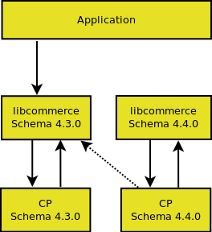
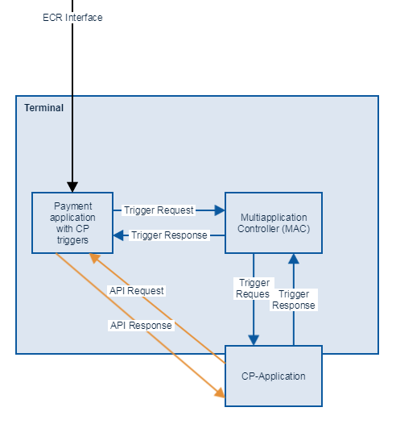
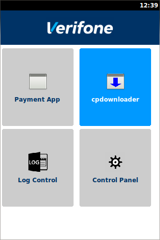
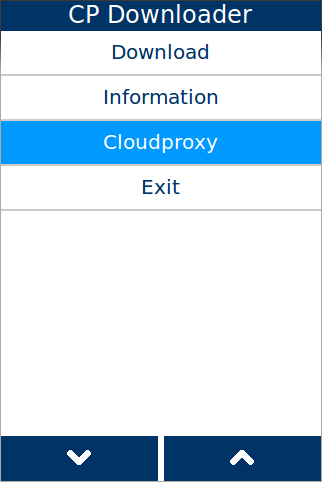
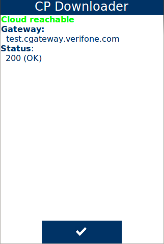
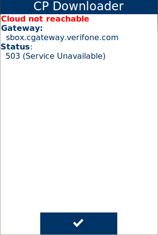
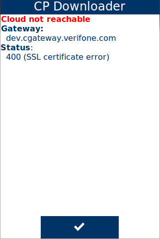

# Preface <a href="#cpl_preface" id="cpl_preface"></a>

This document is for programmers and developers who want to understand and use the ADK-CPL extension.

## Audience <a href="#cpl_audience" id="cpl_audience"></a>

This guide provides information on the usage of the ADK-CPL system.

## Organization <a href="#cpl_organization" id="cpl_organization"></a>

[Chapter 1, Introduction:](#cpl_introduction) Provides a general introduction to ADK-CPL

[Chapter 2, Getting Started:](#cpl_getting_started) Presents an introduction in ADK-CPL usage.

[Chapter 3, Programming:](#cpl_programming) Supplies ADK-CPL programming information.

[Chapter 4, System Setup and Requirements:](#cpl_setup) Presents environment setup and dependencies.

[Chapter 5, Troubleshooting:](#cpl_troubleshooting) Gives solutions for possible issues in ADK-CPL.

## Prerequisites <a href="#cpl_prerequisites" id="cpl_prerequisites"></a>

# Introduction <a href="#cpl_introduction" id="cpl_introduction"></a>

ADK-CPL allows to use the functionality of the Commerce Platform in V/OS and V/OS2 as a static library.

Each library of libcpl only works with a special trigger schema. Currently changes inside the trigger schema can lead to broken backward compatibility. The only solution to fix it is to link the needed library static against the payment application.



The communication flow is shown below



## Triggers <a href="#cpl_trigger" id="cpl_trigger"></a>

### Payment flow triggers <a href="#cpl_payment_flow_triggers" id="cpl_payment_flow_triggers"></a>

- CP_SYSTEM_NOTIFIES_TRANSACTION_STARTED
- CP_SYSTEM_REQUESTS_BASKET_ADJUSTMENT
- CP_SYSTEM_NOTIFIES_BASKET_FINALIZED
- CP_SYSTEM_REQUESTS_LOYALTY
- CP_SYSTEM_REQUESTS_AMOUNT_ADJUSTMENT
- CP_SYSTEM_NOTIFIES_AMOUNT_FINALIZED
- CP_SYSTEM_REQUESTS_ALT_PAYMENT
- CP_SYSTEM_NOTIFIES_CARD_PRESENTED
- CP_SYSTEM_NOTIFIES_CARD_BIN_RECEIVED
- CP_SYSTEM_REQUESTS_PAYMENT_AMOUNT_ADJUSTMENT
- CP_SYSTEM_NOTIFIES_AUTHORIZATION_COMPLETED
- CP_SYSTEM_NOTIFIES_PAYMENT_COMPLETED
- CP_SYSTEM_REQUESTS_RECEIPT_MANAGEMENT
- CP_SYSTEM_NOTIFIES_TRANSACTION_ENDED

### Non payment triggers <a href="#cpl_non_payment_trigger" id="cpl_non_payment_trigger"></a>

- CP_SYSTEM_NOTIFIES_IDLE_ENTERED
- CP_SYSTEM_NOTIFIES_MANUAL_LAUNCH_SELECTED

### API Trigger <a href="#cpl_api_payment_trigger" id="cpl_api_payment_trigger"></a>

- CP_APP_REQUESTS_ENCRYPTED_CARD
- CP_APP_REQUESTS_PRINT
- CP_APP_REQUESTS_APPEND_RECEIPT
- CP_APP_REQUESTS_PAYMENT_TRANSACTION_START
- CP_APP_REQUESTS_CARD_DATA
- CP_APP_REQUESTS_SEND_DATA_TO_POS
- CP_APP_REQUESTS_RECEIPT

## Concepts <a href="#cpl_concepts" id="cpl_concepts"></a>

### Uniform Interface <a href="#cpl_uniform_interface" id="cpl_uniform_interface"></a>

# Getting Started <a href="#cpl_getting_started" id="cpl_getting_started"></a>

The CPL library comes with the sample application cpltest that demonstrates system features and provides a starting point for application developers who use the CPL library. It can be found in the *test* folder (test).

The CPL library is provided on different target platforms. The following sections describe how to use the sample application cpltest on these platforms. In addition, this chapter gives general information about required components to run ADK-CPL (runtime libraries).

## Running ADK-CPL on V/OS <a href="#cpl_running_on_vos" id="cpl_running_on_vos"></a>

To run the ADK-CPL on V/OS and V/OS2. If the sample application cpltest shall be used too, the ADK-GUI packet needs to be installed with all its requirements.

## Running on Verix <a href="#cpl_running_on_verix" id="cpl_running_on_verix"></a>

To run the ADK-CPL on Verix. If the sample application cpltest shall be used too, the ADK-GUI packet needs to be installed with all its requirements.

Furthermore, ADK-CPL depends on some libraries coming along with OS and the EOS. Please always use the newest OS and EOS versions available on Verifone DevNet.

## Running on Linux <a href="#cpl_running_on_linux" id="cpl_running_on_linux"></a>

# Programming <a href="#cpl_programming" id="cpl_programming"></a>

## ADK-CPL Deployment Options <a href="#cpl_deployment_options" id="cpl_deployment_options"></a>

The ADK-CPL system provides different header files (<a href="_commerce_8h.md">Commerce.h</a>, <a href="_api_8h.md">Api.h</a>, <a href="_cp_trigger_8h.md">CpTrigger.h</a>, <a href="_environment_data_provider_8h.md">EnvironmentDataProvider.h</a> ITransactionDataProvider) that exports the CPL library API function calls. Because of compatibility problems between the different schema versions, the library only supports static linking.

### Headers and binary deliveries <a href="#cpl_headers_and_binary_deliveries" id="cpl_headers_and_binary_deliveries"></a>

The ADK-CPL system is composed of the following deliveries:

| File | Purpose |
|----|----|
| <p>**<a href="_api_8h.md">Api.h</a>**</p> | <p>CPL function header file with exported definitions/functions.</p> |
| <p>**<a href="_commerce_8h.md">Commerce.h</a>**</p> | <p>CPL function header file with exported definitions/functions.</p> |
| <p>**<a href="_environment_data_provider_8h.md">EnvironmentDataProvider.h</a>**</p> | <p>CPL function header file with exported definitions/functions.</p> |

**<a href="_i_transaction_data_provider_8h.md">ITransactionDataProvider.h</a>** \| CPL function header file with exported definitions/functions.

**libcpl.a** \| CPL system client library **cpltest** \| CPL sample application binary for V/OS, V/OS2, Verix and linux

All header files can be found in the 'include/commerce' directory.

An application has to be linked with libcpl.

### Multi-Application-Controller Resource Subfolder Support <a href="#cpl_mac_subfolder" id="cpl_mac_subfolder"></a>

Multi-Application-Controller (MAC) is used to run several applications in parallel on a terminal. Since version 2.5.0 the UI system has added support to lookup resources in a separate subdirectory for each application to avoid resource location conflicts. For this, MAC sets up the environment variable `GUIPRT_APPNAME`, which provides a name for each application that is used for the subfolder `appname:`

``` cpp
www/<appname>/<platform>
```

or

``` cpp
www/<appname>/<width>x<height><color><numkeys><touch>
```

`GUIPRT_APPNAME` is automatically considered during startup of an application so that most of the MAC handling is transparent to the application. Please note that the variable is just used to set up the default values for `UI_PROP_RESOURCE_PATH` and `UI_PROP_RESOURCE_DEFAULT_PATH`. Once an application has set the properties during runtime, value of `GUIPRT_APPNAME` is ignored.

An application can also set GUIPRT_APPNAME by itself to move the default resource folder. For this the environment variable has to be set using `setenv()` before calling any ADKGUI function.

# System Setup and Requirements <a href="#cpl_setup" id="cpl_setup"></a>

The following are the hardware and software requirements of the ADK-CPL system.

# Hardware Support <a href="#cpl_hardware_support" id="cpl_hardware_support"></a>

The ADK-CPL system is hardware platform agnostic and supports installation on V/OS, Raptor, and Verix terminals.

The ADK-CPL system is intended to run across the entire hardware portfolio. The following table list different characteristics of these devices.

| Model | Touch | Color | Resolution | Keypad | Function Keys | Resource Path |
|----|----|----|----|----|----|----|
| <p>Vx520 (B/W)</p> | <p>No</p> | <p>No</p> | <p>128x64</p> | <p>0-9,\*,#,CAN,CORR,OK</p> | <p>4+4+Alpha</p> | <p>128x64M24N</p> |
| <p>Vx6, Vx8</p> | <p>Yes</p> | <p>Yes</p> | <p>240x320</p> | <p>0-9,\*,#,CAN,CORR,OK</p> | <p>---</p> | <p>240x320C15T</p> |
| <p>Vx675/Vx5 color</p> | <p>No</p> | <p>Yes</p> | <p>320x240</p> | <p>0-9,\*,#,CAN,CORR,OK</p> | <p>4+4\*Cursor+Enter</p> | <p>320x240C24N</p> |
| <p>Mx915</p> | <p>Yes</p> | <p>Yes</p> | <p>480x272</p> | <p>0-9,CAN,CORR,OK</p> | <p>---</p> | <p>480x272C13T</p> |
| <p>Mx925</p> | <p>Yes</p> | <p>Yes</p> | <p>800x480</p> | <p>0-9,CAN,CORR,OK</p> | <p>---</p> | <p>800x480C13T</p> |
| <p>Ux100</p> | <p>No</p> | <p>No</p> | <p>128x64</p> | <p>0-9,CAN,CORR,OK,INFO</p> | <p>2</p> | <p>128x64M16N</p> |
| <p>e265</p> | <p>No</p> | <p>No</p> | <p>160x120</p> | <p>0-9,\*,#,CAN,CORR,OK</p> | <p>---</p> | <p>160x120M15N</p> |
| <p>e285</p> | <p>Yes</p> | <p>Yes</p> | <p>240x320</p> | <p>0-9,\*,#,CAN,CORR,OK</p> | <p>---</p> | <p>240x320C15T</p> |
| <p>e315/335</p> | <p>No</p> | <p>No</p> | <p>128x32</p> | <p>0-9,\*,#,CAN,CORR,OK</p> | <p>---</p> | <p>128x32M15N</p> |
| <p>e355</p> | <p>No</p> | <p>Yes</p> | <p>320x240</p> | <p>0-9,\*,#,CAN,CORR,OK</p> | <p>---</p> | <p>320x240C15N</p> |
| <p>Carbon X10</p> | <p>Yes</p> | <p>Yes</p> | <p>854x480</p> | <p>---</p> | <p>---</p> | <p>854x480C0T</p> |
| <p>M400</p> | <p>Yes</p> | <p>Yes</p> | <p>854x480</p> | <p>0-9,\*,#,CAN,CORR,OK</p> | <p>---</p> | <p>854x480C15T</p> |
| <p>P400/V400</p> | <p>Yes</p> | <p>Yes</p> | <p>320x480</p> | <p>0-9,\*,#,CAN,CORR,OK</p> | <p>---</p> | <p>320x480C15T</p> |
| <p>P200/V200c</p> | <p>No</p> | <p>Yes</p> | <p>240x320</p> | <p>0-9,\*,#,CAN,CORR,OK</p> | <p>2+4\*Cursor</p> | <p>240x320C21N</p> |
| <p>V200t/V205c</p> | <p>No</p> | <p>Yes</p> | <p>320x240</p> | <p>0-9,\*,#,CAN,CORR,OK</p> | <p>2+4\*Cursor</p> | <p>320x240C21N</p> |
| <p>V240m/V400m</p> | <p>Yes</p> | <p>Yes</p> | <p>320x480</p> | <p>0-9,\*,#,CAN,CORR,OK</p> | <p>---</p> | <p>320x480C15T</p> |
| <p>C680</p> | <p>Yes</p> | <p>Yes</p> | <p>320x480</p> | <p>0-9,\*,#,CAN,CORR,OK</p> | <p>---</p> | <p>320x480C15T</p> |

Users need to take these characteristics into account when designing GUI dialogs with CPL library support for the different hardware platforms.


C680 has an additional power button, it is not counted as keypad key since it cannot be used for input.


For a detailed description of the API functions, see .


# Software Requirements <a href="#cpl_software_requirements" id="cpl_software_requirements"></a>

ADK-CPL requires the installation of corresponding platform packages. For details please refer to the release notes.

# Troubleshooting <a href="#cpl_troubleshooting" id="cpl_troubleshooting"></a>

# Support for ADKLOG <a href="#cpl_logging" id="cpl_logging"></a>

ADK-CPL has added support for ADKLOG component. ADKLOG is required to implement the new ADK logging concept, which provides the Logging Control Panel (LCP) used as central instance to configure and enable logging for the several ADK components. For this, LCP uses configuration files (for CPL), which are read by `liblog` library. If installed on the system, `liblog` library will be used by client import libraries (`libvfiguiprt`, `libvfiprt`) and server components (`guiprtserver`, `guiserver`, `prtserver`) to output logging messages. In this case, the logging messages are passed to `liblog` library instead of using console logging mechanism (with EOSLog or stderr), which is described above.

In order to lookup the corresponding configuration files, ADKLOG uses component identifiers, which are reserved for each ADK component. Components participating in Commerce Platfrom operation are following:

| Component Id | Configuration file | Description |
|----|----|----|
| <p>`CPL`</p> | <p>`CPL_log.conf`</p> | <p>Commerce Platform library</p> |
| <p>`PRX`</p> | <p>`PRX_log.conf`</p> | <p>Cloudproxy daemon</p> |
| <p>`MAC`</p> | <p>`MAC_log.conf`</p> | <p>Multi Application Controller daemon</p> |
| <p>`MACCL`</p> | <p>`MACCL_log.conf`</p> | <p>Multi Application Controller Commerce library</p> |
| <p>`CPR`</p> | <p>`CPR_log.conf`</p> | <p>Commerce Platform Runtime library</p> |

The configuration files contain several settings for logging like output channels, verbosity and a logging mask. For more details about configuration settings or logging message formats, please refer to documentation of ADKLOG project.

# Cloud connectivity <a href="#cpl_cloud" id="cpl_cloud"></a>

First step that needs to be done to solve problem appeared with Commerce Platform is to check whether cloud is available. All network traffic produced by CP applications is verified and directed by Cloudproxy daemon. It is possible to check whether Cloudproxy is installed and operating by running CP Downloader application from the desktop. If the daemon is running then Cloudproxy entry should be present in CP downloader main menu. There is Connectivity Check sub entry in the Cloudproxy menu.

|  |  |  |
|----|----|----|
|  |  |  |

Pressing it makes a test request to the cloud and displays the response after few seconds. When a red line with text \"Cloud not reachable\" appears, then cloud support team should be contacted to determine and solve the problem. In success case a green line with text \"Cloud reachable\" will be seen. Examples of different response codes are shown below.

|                        |                        |                        |
|------------------------|------------------------|------------------------|
|  |  |  |
