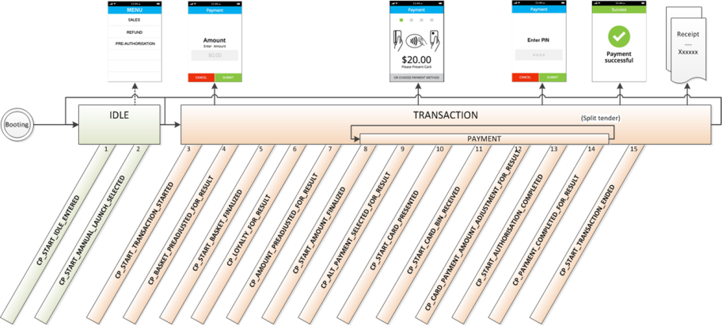
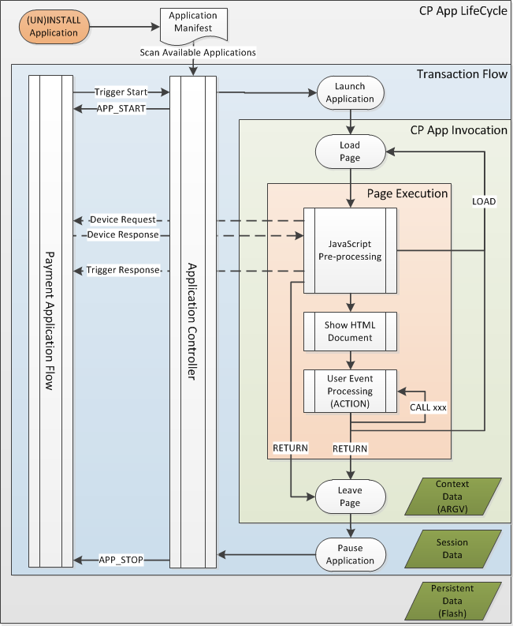
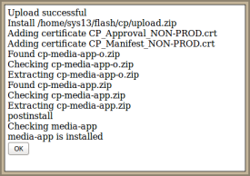

# Preface <a href="#sec_cpr_preface" id="sec_cpr_preface"></a>

This document is for programmers and developers who want to understand and use the ADK Commerce Platform Runtime (ADKCPR).

## Audience <a href="#subsec_cpr_audience" id="subsec_cpr_audience"></a>

This guide provides information on the usage of the ADK CP runtime system.

## System Specifications <a href="#subsec_cpr_system_specifications" id="subsec_cpr_system_specifications"></a>

The ADK CP runtime is supported on all ADK supported devices. As such it is hardware platform agnostic and supports installation on V/OS terminals. A simulator is provided as part of the CP tools that allows execution of CP applications on a Microsoft Windows platform.

# Overview <a href="#sec_cpr_overview" id="sec_cpr_overview"></a>

The described ADK CP runtime allows execution of HTML/JavaScript based Commerce Platform Applications (CP-Apps) together with native payment applications.

It provides an execution environment for **CP applications** and connects them with **Payment Applications** using a notification mechanism to trigger the execution of CP applications and exchange data between the different applications. CP Applications have only limited access to system resources and will not get access to any clear text sensitive data. Communication with external servers is supported through HTTP requests that are proxied through Verifone cloud gateway.

Payment Applications must be \"CP-enabled\" to support the defined trigger points that initiate the launching of CP Applications.

**CP HTML/JS Execution Environment** The CP Runtime execution environment for HTML builds on the ADK DirectGUI HTML rendering engine and allows for JS pre-processing only. It supports most relevant HTML and CSS standard tags, but has no support for on-page JavaScript. The supported HTML and CSS tags are described in the ADK GUI programmers guide.

**CP HTML5 Execution Environment** The CP Runtime execution environment for HTML5 builds on a full rendering engine. It supports most HTML5 features found on many modern browsers with the exception of plugins and a limited support of multimedia formats. This execution environment is only supported on specific hardware.

Both HTML and HTML5 environments are restricted to the Web Application model in which resources are not sent over the network but already present in the terminal. The server only provides the live data, leaving the client to decide how to process it and render it.

HTML/JS Application (Type-1) will be capable to run on a device that supports HTML5 (Type-2) runtime. So a device that supports HTML5 can run both a HTML/JS (Type-1) app as well as a HTML5 (Type-2) app.

All CP Application resources must be packaged, signed, and installed in the terminal local file system. CP Applications are only allowed to load if they are authenticated by the CPR Runtime System.

The ADK Runtime provides services to CP applications accessible through JavaScript APIs provided. Access to sensitive data is only provided through APIs granted by payment applications.

The CP runtime system is composed of various ADK components MAC: Multi-Application-Controller launching and coordinating CP applications GUI: UI system rendering HTML pages HTTP proxy: establishing a secure interface to VFI cloud and forwarding HTTP requests IPC: notification library used for trigger notifications and responses

The following chart depicts the general setup of the ADK CP runtime system and how it interacts with the VFI cloud services.


# Concepts <a href="#sec_cpr_concepts" id="sec_cpr_concepts"></a>

This chapter describes the basic concepts of the ADK CPR system.

## Application Types <a href="#subsec_cpr_apptypes" id="subsec_cpr_apptypes"></a>

This document refers to different kind of applications. It is important to understand the different application categories.

### Payment Applications <a href="#subsubsec_cpr_apptypes_payapps" id="subsubsec_cpr_apptypes_payapps"></a>

A payment application implements the payment flow for different payment card schemes. It has access to all relevant devices and handles sensitive card holder data. Interfaces to externally connected electronic cash register (ECR) and payment hosts or gateway system are implemented as part of the payment application. Payment applications are typically implemented as native platform applications.

In the context of Commerce Platform the payment applications have following roles

- provide trigger points and associated data to launch CP applications in the context of the payment flow
- provide additional services to CP applications

### CP Applications <a href="#subsubsec_cpr_apptypes_cpapps" id="subsubsec_cpr_apptypes_cpapps"></a>

CP applications are supplementary applications that extend the payment flow with additional features and value-added services (VAS). These applications have limited access to system resources and devices and are not allowed to handle sensitive data. CP applications can interact with external servers using HTTP messages. CP applications are implemented using HTML and JavaScript.


CP applications do not run concurrently with payment applications, but run only at defined trigger points. CP applications pause their processing between trigger points when payment application is processing


In the context of Commerce Platform the CP applications have following roles

- get launched in the context of payment flow
- can interact with customers via the user interface
- can interact with external servers using HTTP messages
- can use the built-in printer
- can use services provided by the payment applications
- return trigger response messages to payment applications
- pause processing between trigger points while payment application is processing

### CP Services <a href="#subsubsec_cpr_apptypes_cpservices" id="subsubsec_cpr_apptypes_cpservices"></a>

CP Services are similar to CP applications, but are running have following restrictions

- will not interact with the user
- will not use services of the payment applications
- will not use the printer
- do not need to pause between trigger points while payment application is processing


CP services can run concurrently with payment application. They run in background while payment applications and other CP applications are processing user interactions.


## Trigger Points <a href="#subsec_cpr_triggerpoints" id="subsec_cpr_triggerpoints"></a>

Notifications with payload are send as part of the Payment Flow and allow embedding of CP-Applications into this flow. These notification points are called \"triggers\". The following chart provides an overview of possible trigger points in a typical payment flow.




The detailed definition of trigger points and associated payload is not in scope of this document. Please refer to the specific documentation for this.


## CP Application Lifecycle <a href="#subsec_cpr_applifecycle" id="subsec_cpr_applifecycle"></a>

The following chart illustrates the life cycle of a CP application.



After installation, the Multi-Application-Controller (MAC) recognizes the installed CP applications when scanning the application manifests. At the same time MAC reads all trigger points that CP applications have been registered for. At this point the CP application is still inactive.

In the course of a payment flow the payment application sends trigger messages. These messages will be processed by MAC and it will look up the table of registered CP applications for this trigger point. If one or multiple CP applications have been found the CP will launch the CP application, hand over the trigger payload data and assign the display region to it. The URL of the HTML page that has been associated with this trigger point in the application manifest will be loaded. At this point the CP application gets active.

MAC will send out a APP_START event to the payment application to notify about the CP application start.

Within each loaded page the JavaScript pre-processing takes place first before the HTML gets rendered on screen. Once HTML page is active the internal event processing of the UI system takes over.

While the CP application is active it can now:

- handle supported on-page event of the UI system like scrolling, video control, etc. (HTML action=\"call xxx\")
- transition to another page and stay active (HTML action=\"load xxx\") or using JavaScript call exit(\"load xxx\")
- terminate the CP application processing and return control to the MAC (HTML action=\"return\") or using JavaScript call exit(\"return\")
- send notifications to the payment application, to
  - send a trigger response
  - request a service and wait synchronously for the service response

Once MAC has recognized that the CP applications has terminated, it saves the session state and sends out a APP_STOP event to the payment application to notify about the CP application stop.

Now the Payment application will continue its flow.


All running CP applications will be stopped at \"CP_START_IDLE_ENTERED\" trigger point. They will be only relaunched on reaching the next trigger point that has been registered to launch the corresponding CP application.


## Application Manifests <a href="#subsec_cpr_appmanifests" id="subsec_cpr_appmanifests"></a>

The manifest file describes properties for both native payment and CP applications. Manifest INI files consist of the following sections

| Section | Description |
|----|----|
| <p>application</p> | <p>lists all application attributes</p> |
| <p>desktop</p> | <p>describes application\'s appearance on the MAC desktop and launching from there.</p> |
| <p>autolaunch</p> | <p>defines autolaunch settings for applications when starting up system</p> |
| <p>trigger-\"triggerID\"</p> | <p>multiple sections of this type can be provided. Each section registers the application with a particular trigger point in the system and describes how application gets launched. This section is required for CP applications only.</p> |

Some attributes apply for CP applications only, others are just valid for native applications. The following tables list all supported fields in a Manifest file for CP and Native applications separately.

### Manifest Attributes for CP Application / Services <a href="#subsubsec_cpr_appcpmanifests" id="subsubsec_cpr_appcpmanifests"></a>

| Section | Field | Required | Value | Default | Description |
|----|----|----|----|----|----|
| <p>application</p> | <p>name</p> | <p>yes</p> | <p>string</p> | <p>-</p> | <p>Application name</p> |
| <p>application</p> | <p>id</p> | <p>yes</p> | <p>string</p> | <p>-</p> | <p>Unique application id</p> |
| <p>application</p> | <p>version</p> | <p>yes</p> | <p>string</p> | <p>-</p> | <p>Application version</p> |
| <p>application</p> | <p>default_region_name</p> | <p>yes</p> | <p>string</p> | <p>appA</p> | <p>Default region for application to start in</p> |
| <p>application</p> | <p>keyboard</p> | <p>no, default applies</p> | <p>y or n</p> | <p>n</p> | <p>MAC virtual keyboard visible on startup</p> |
| <p>application</p> | <p>statusbar</p> | <p>no, default applies</p> | <p>y or n</p> | <p>y</p> | <p>MAC status bar visible on startup</p> |
| <p>desktop</p> | <p>file</p> | <p>yes, if section present</p> | <p>string</p> | <p>-</p> | <p>Entry point file for CP-App</p> |
| <p>desktop</p> | <p>type</p> | <p>no, default applies</p> | <p>app or service</p> | <p>app</p> | <p>Application or Service.</p> |
| <p>desktop</p> | <p>region_name</p> | <p>no</p> | <p>string</p> | <p>-</p> | <p>Region for application to start in</p> |
| <p>desktop</p> | <p>label</p> | <p>yes, if section present</p> | <p>string</p> | <p>-</p> | <p>Application label shown on desktop</p> |
| <p>desktop</p> | <p>icon</p> | <p>yes, if section present</p> | <p>string</p> | <p>-</p> | <p>Path to application icon shown on desktop</p> |
| <p>desktop</p> | <p>group</p> | <p>no</p> | <p>string</p> | <p>-</p> | <p>Name of application group used for logical grouping on desktop</p> |
| <p>desktop</p> | <p>hide</p> | <p>no, default applies</p> | <p>y or n</p> | <p>n</p> | <p>Hide application icon from desktop</p> |
| <p>autolaunch</p> | <p>file</p> | <p>yes, if section present</p> | <p>string</p> | <p>-</p> | <p>Entry point file for CP-App</p> |
| <p>autolaunch</p> | <p>type</p> | <p>no, default applies</p> | <p>app or service</p> | <p>app</p> | <p>Application or Service. Services will be started before applications.</p> |
| <p>autolaunch</p> | <p>region_name</p> | <p>no, default from \[application\] section applies</p> | <p>string</p> | <p>-</p> | <p>Region for application to start in</p> |
| <p>trigger-\"triggerID\"</p> | <p>file</p> | <p>yes, if section present</p> | <p>string</p> | <p>-</p> | <p>Entry point file for CP-App on trigger call</p> |
| <p>trigger-\"triggerID\"</p> | <p>type</p> | <p>no, default applies</p> | <p>app or service</p> | <p>app</p> | <p>CP Application or System service.</p> |
| <p>trigger-\"triggerID\"</p> | <p>region_name</p> | <p>no, default from \[application\] section applies</p> | <p>string</p> | <p>-</p> | <p>Region to be used after trigger call</p> |
| <p>trigger-\"triggerID\"</p> | <p>label</p> | <p>yes, if section present</p> | <p>string</p> | <p>-</p> | <p>Application label. Can be used for manual launch selection</p> |
| <p>trigger-\"triggerID\"</p> | <p>icon</p> | <p>yes, if section present</p> | <p>string</p> | <p>-</p> | <p>Path to CP application icon. Can be used for manual launch selection</p> |
| <p>trigger-\"triggerID\"</p> | <p>statusbar</p> | <p>no, default from \[application\] section applies</p> | <p>y or n</p> | <p>y</p> | <p>Status bar visible on startup</p> |
| <p>trigger-\"triggerID\"</p> | <p>keyboard</p> | <p>no, default from \[application\] section applies</p> | <p>y or n</p> | <p>n</p> | <p>Virtual keyboard visible startup</p> |

### Manifest Attributes for Native Applications <a href="#subsubsec_cpr_appnativemanifests" id="subsubsec_cpr_appnativemanifests"></a>

| Section | Field | Required | Value | Default | Description |
|----|----|----|----|----|----|
| <p>application</p> | <p>name</p> | <p>yes</p> | <p>string</p> | <p>-</p> | <p>Application name</p> |
| <p>application</p> | <p>id</p> | <p>yes</p> | <p>string</p> | <p>-</p> | <p>Unique application id</p> |
| <p>application</p> | <p>version</p> | <p>yes</p> | <p>string</p> | <p>-</p> | <p>Application version</p> |
| <p>application</p> | <p>default_region_name</p> | <p>yes</p> | <p>string</p> | <p>appA</p> | <p>Default region for application to start in</p> |
| <p>application</p> | <p>keyboard</p> | <p>no, default applies</p> | <p>y or n</p> | <p>n</p> | <p>MAC Virtual keyboard visible on startup</p> |
| <p>application</p> | <p>statusbar</p> | <p>no, default applies</p> | <p>y or n</p> | <p>y</p> | <p>MAC Status bar visible on startup</p> |
| <p>application</p> | <p>depends</p> | <p>no</p> | <p>app1;app2;\...</p> | <p>-</p> | <p>Dependent apps to be started before this app; separated by semicolon</p> |
| <p>application</p> | <p>app_resource_dir</p> | <p>no</p> | <p>string</p> | <p>-</p> | <p>This value will be set to GUIPRT_APPNAME environment. As a result, application resources path will be changed to www/\<app_resource_dir\>/\<platform\></p> |
| <p>desktop</p> | <p>vos_cmdline</p> | <p>yes, if supports V/OS</p> | <p>string</p> | <p>-</p> | <p>Command to start native application on V/OS</p> |
| <p>desktop</p> | <p>cmdline</p> | <p>no</p> | <p>string</p> | <p>-</p> | <p>Fallback option if vos_cmdline is not available</p> |
| <p>desktop</p> | <p>args</p> | <p>no</p> | <p>string</p> | <p>-</p> | <p>Arguments passed to native application</p> |
| <p>desktop</p> | <p>envs</p> | <p>no</p> | <p>string</p> | <p>-</p> | <p>Environment variables passed to native application</p> |
| <p>desktop</p> | <p>type</p> | <p>no, default applies</p> | <p>app or service</p> | <p>app</p> | <p>Application or Service. Native services will be started before native applications.</p> |
| <p>desktop</p> | <p>region_name</p> | <p>no</p> | <p>string</p> | <p>-</p> | <p>Region for application to start in</p> |
| <p>desktop</p> | <p>label</p> | <p>yes, if section present</p> | <p>string</p> | <p>-</p> | <p>Application label shown on desktop</p> |
| <p>desktop</p> | <p>icon</p> | <p>yes, if section present</p> | <p>string</p> | <p>-</p> | <p>Path to application icon shown on desktop</p> |
| <p>desktop</p> | <p>group</p> | <p>no</p> | <p>string</p> | <p>-</p> | <p>Name of application group used for logical grouping on desktop</p> |
| <p>desktop</p> | <p>hide</p> | <p>no, default applies</p> | <p>y or n</p> | <p>n</p> | <p>Hide application icon from desktop</p> |
| <p>autolaunch</p> | <p>vos_cmdline</p> | <p>yes, if supports V/OS</p> | <p>string</p> | <p>-</p> | <p>Command to start native application on V/OS</p> |
| <p>autolaunch</p> | <p>cmdline</p> | <p>no</p> | <p>string</p> | <p>-</p> | <p>Fallback option if vos_cmdline is not available</p> |
| <p>autolaunch</p> | <p>args</p> | <p>no</p> | <p>string</p> | <p>-</p> | <p>Arguments passed to native application</p> |
| <p>autolaunch</p> | <p>envs</p> | <p>no</p> | <p>string</p> | <p>-</p> | <p>Environment variables passed to native application</p> |
| <p>autolaunch</p> | <p>type</p> | <p>no, default applies</p> | <p>app or service</p> | <p>app</p> | <p>Application or System service. Services will be started before applications.</p> |
| <p>autolaunch</p> | <p>region_name</p> | <p>no, default from \[application\] section applies</p> | <p>string</p> | <p>-</p> | <p>Region for application to start in</p> |


The names for the trigger sections must follow the naming convention \[unsupported block\] . The \"triggerID\" must match defined IDs for trigger points used in CP enabled payment applications.


## Launch of CP applications <a href="#subsec_cpr_launchstrategy" id="subsec_cpr_launchstrategy"></a>

On system startup, the Multi-Application-Controller (MAC) reads all application manifest files. For CP applications the \[trigger-\"triggerID\"\] sections of CP Application manifest files define the trigger points that CP applications are interested in as launch points. It maintains a table with all registered trigger points and associated applications.

### Triggered Launch <a href="#subsubsec_cpr_launchstrategytriggeredlaunch" id="subsubsec_cpr_launchstrategytriggeredlaunch"></a>

CP applications can be launched on behalf of a trigger point in the context of a payment application flow. This is enabled by the trigger point notification messages sent out by payment applications.

In the following example application manifest, the application is not showing up on desktop (hide=y), so it cannot be launched manually from the MAC desktop.

Instead the application has registered for two trigger points that are provided by payment applications. When these trigger points are reached, the MAC will automatically launch this application do the following:

- CP_NOTIFICATION_CARD_PRESENTED: MAC will start the CP application using do_rating.html file. Since type=app, MAC will also switch display focus to the CP application. For a full screen display, this will hide the payment application in the background.
- CP_NOTIFICATION_TRANSACTION_ENDED: MAC will start the CP application using do_result.html file. Since type=service, MAC will *not* switch display focus to the CP application. The payment application will stay with focus in the foreground.

In both cases, MAC will

- inform the payment application with a MAC_CP_START notification that a CP application/service has been found and launched for this trigger point.
- pass on all payload provided as part of the trigger point to the CP applications ARGV object.

``` cpp
[application]
name=Rating
id=Rate12333
version=1.0.0
[desktop]
hide=y
[trigger-CP_NOTIFICATION_CARD_PRESENTED]
type=app
file=do_rating.html
[trigger-CP_NOTIFICATION_TRANSACTION_ENDED]
type=service
file=do_result.html
```

MAC can handle the launch of **multiple CP applications** that have registered for the same trigger point. It starts subsequently all CP applications that have been registered for the same trigger ID. The next application will only be started once the previous application has been completed.

To determine the application sequence, MAC reads the confOwner.json file of all CP applications gets \"cp_priority\" field for those. If same \"cp_priority\" is found for two applications, sequence will be random.

### Manual Launch <a href="#subsubsec_cpr_launchstrategymanuallaunch" id="subsubsec_cpr_launchstrategymanuallaunch"></a>

CP applications can also be launched manually. There are different ways to accomplish this:

- manual launch from MAC desktop based on manifest:
- manual selection from MAC desktop from only list of those CP applications that registered for this trigger point: Payment applications can call <a href="namespacevfimac.md#a509d985b46d2fe8d772bd749888fd1ab">sysLaunchCPAppFromDesktop()</a>, see [MAC interfaces](#subsubsec_cpr_devpayapps_availableapis_mac).
- manual launch from payment application: payment application might embed an application selection menu in their own application context. In this case they can use MAC API call to launch a known CP application manually. Payment applications can call <a href="namespacevfimac.md#a77748eeae43d8b50145564d0022ad886">sysLaunchAppid()</a>, see [MAC interfaces](#subsubsec_cpr_devpayapps_availableapis_mac).

Here is an example for the manual launch from MAC desktop based on manifest:

``` cpp
[application]
name=Calendar
id=Calendar1233
version=1.0.1
[desktop]
file=calendar.html
type=app
hide=n
```

### Automatic Launch at System Startup <a href="#subsubsec_cpr_launchstrategyautolaunch" id="subsubsec_cpr_launchstrategyautolaunch"></a>

CP applications can also be automatically launched on system startup.

Here is an example for the auto-launch based on manifest:

``` cpp
[application]
name=MyAutoApp
id=AutoApp1234
version=1.0.2
[autolaunch]
file=auto.html
type=app
```


All CP applications will be stopped on trigger point CP_START_IDLE_ENTERED. This includes also \"autolaunch\" CP applications. Normally CP applications should registered to CP_START_IDLE_ENTERED trigger point and use the trigger-launch method instead of this autolaunch feature.


### Stopping a CP Application <a href="#subsubsec_cpr_launchstrategystop" id="subsubsec_cpr_launchstrategystop"></a>

CP applications can be stopped in various ways:

- the applications stops itself after processing of a trigger point, could be after it send out a response to the trigger, see [Exiting the CP Application](#subsec_cpr_devcpapps_exiting)
- the payment application stops the CP applications using MAC API call <a href="namespacevfimac.md#a9dea7108a3a1efc9a1cc087e18548c59">sysStopAllCPApps()</a>, see [MAC interfaces](#subsubsec_cpr_devpayapps_availableapis_mac)
- provide a trigger point in the manifest that stops the application

Here is an example on how to stop a CP application on behalf of a trigger point. The empty string passed to file= instructs MAC to stop this CP application at this trigger point.

``` cpp
[application]
name=AutoStop
id=AutoStop12333
version=1.0.2
[trigger-CP_NOTIFICATION_TRANSACTION_STARTED]
type=service
file=do_start.html
[trigger-CP_NOTIFICATION_TRANSACTION_ENDED]
type=service
file=
```

### CP Application Start and Stop Notifications <a href="#subsubsec_cpr_launchstrategynotify" id="subsubsec_cpr_launchstrategynotify"></a>

MAC notifies native applications about application CP application start and stop with the following notifications.

| Notification Name | Payload | Description |
|----|----|----|
| <p>MAC_CP_START</p> | <p>AppName, AppID, AppVersion, cp_apps_count, cp_apps_current</p> | <p>sent on start of CP application</p> |
| <p>MAC_CP_STOP</p> | <p>AppName, AppID, AppVersion, cp_apps_count, cp_apps_current</p> | <p>sent on stop of CP application</p> |


The cp_apps_count provides the total number of applications started at a particular trigger point. For each started/stopped application a separate notification is sent out. cp_apps_current indicates the number of the current application out of the cp_apps_count number of applications total for this trigger point.


# Developing CP Applications <a href="#sec_cpr_devcpapps" id="sec_cpr_devcpapps"></a>

## Elements of a CP application <a href="#subsec_cpr_devcpapps_cpapps" id="subsec_cpr_devcpapps_cpapps"></a>

Commerce Applications typically consist of

| Item | File | Notes |
|----|----|----|
| <p>Application Manifest</p> | <p>\<app-id\>.mft</p> | <p>contains the application characteristics and trigger registrations</p> |
| <p>HTML documents</p> | <p>\*.html</p> | <p>HTML documents for UI dialogues, might contain embedded CSS and JS</p> |
| <p>Resource files</p> | <p>\*.\[gif,png,jpg\]</p> | <p>Images: GIF, PNG, JPG images, Videos: Platform specific encodings</p> |
| <p>CSS for UI dialogues</p> | <p>app.css</p> | <p>a single CSS file for application UI dialog formatting</p> |
| <p>App configuration file</p> | <p>confApp.js</p> | <p>application configuration parameter</p> |
| <p>Text catalogue files</p> | <p>\*.ctlg</p> | <p>text catalogues can be used for text look-up and multi-language support</p> |
| <p>CSS for printing</p> | <p>print.css</p> | <p>a single CSS file for application print receipts formatting</p> |
| <p>HTML for printing</p> | <p>\*.html</p> | <p>HTML documents for UI dialogues, might contain embedded CSS</p> |

Application files will be looked up in the application folder based on the following look-up sequence

``` cpp
1. www/<app-id>/<platform>
2. www/<app-id>/<width>x<height><color><numkeys><touch> (color:M=monochrome/C=color, touch:T=touch/N=non-touch)
```

For example the folder \"240x320C15T\" will match Vx680, Vx820 and Vx690 as they have all 240x320 color screen with touch and 15 keys on the keyboard.

Here is an example deployment for an application

``` cpp
www
  |-myapp.mft
  |-myapp
   |-confApp.json
   |-240x320C15T
   |-app.css
   |-start.html
   |-query.html
   |-error.html
   |-exit.html
   |-en.ctlg
   |-de.ctlg
   |-VX675
   |... (similar as above, but specific for this device)
   |-print
   | print.css
   | receipt.html
   |-images
   |-img1.jpg
```

## HTML/CSS Support <a href="#subsec_cpr_devcpapps_htmlcss" id="subsec_cpr_devcpapps_htmlcss"></a>

The CP HTML/JS Execution Environment (for Type-1 CP-Apps only) is based on ADK DirectGUI rendering engine. Thus CP applications can use the provided feature set of ADK DirectGUI.

DirectGUI supports a subset of HTML and CSS tags.

Additionally it provides a some specific extensions

- Additional input types (see types \"numeric\", \"mask\", \"signature\",\... )
- Timeouts (see input type \"timeout\", \"idletimeout\")
- Keyboard binding (see \"accesskey\" attribute)
- Widget functions to navigate focus, scroll document, control video (see \"action call \...\")
- Page navigation (see \"action load\" attribute)
- XML pre-processing for Data Placeholders, Text Catalogues, Barcode Rendering,\...
- Screen Transitions

See the ADK DirectGUI programmer\'s guide for the details.

## JavaScript Support <a href="#subsec_cpr_devcpapps_javascript" id="subsec_cpr_devcpapps_javascript"></a>

The CP HTML/JS Execution Environment (for Type-1 CP-Apps only) supports the use of JavaScript. The used scripting engine conforms to ECMAScript version 5.1.

**JavaScript is supported as pre-processing script only (similar to PHP server side scripting). The script terminates before the dialog is displayed at all. Therefore, it has no access to the HTML DOM and cannot update elements while a dialog is shown.**

The Javascript is embedded into HTML pages with XML pre-processing syntax \<?js ... ?\>

Example:

``` cpp
<html>
<body>
  
<?js
  ... JavaScript code here
?>
  ... HTML code here
</body>
</html>
```

## Registering for Trigger Points <a href="#subsec_cpr_devcpapps_triggerpoints" id="subsec_cpr_devcpapps_triggerpoints"></a>

## Data Handling <a href="#subsec_cpr_devcpapps_data" id="subsec_cpr_devcpapps_data"></a>

### The ARGV Context Object <a href="#subsubsec_cpr_devcpapps_context" id="subsubsec_cpr_devcpapps_context"></a>

The **ARGV** object is used to pass data into the CP application and is maintained during page transitions. Also data passed as URL parameter during page transition is automatically added to ARGV array and is available on the next page. Additional data can be added to the ARGV container at any time using JavaScript. The same way data can be changed or deleted using JavaScript.


The ARGV object used for passing a flat map of key-value pairs. Values are restricted to basic types, objects cannot be passed.


ARGV data can be used in the following ways:

- Inside JavaScript using \"ARGV.name\"
- Inside named HTML elements
- Inside XML pre-processing elements like \<?var name?\>

Example:

``` cpp
<html>
  <body>
  <?js
   ARGV.myheader="Enter your name";
   // exit the page if name is "paul", else stay on page
   if (ARGV.customer="paul") exit("return");
  ?>
  <?var myheader?>
  <input name="customer">
  <button action="load input.html">OK</button>
  
  </body>
</html>
```

The following data is provided automatically to CP Apps in the ARGV array.

| ARGV element name | Description |
|----|----|
| <p>cp_confApp</p> | <p>Application configuration data from file www/\<app-id\>/confApp.json</p> |
| <p>cp_confOwner</p> | <p>Owner configuration data from file www/\<app-id\>/confOwner.json</p> |
| <p>cp_appId</p> | <p>own application ID</p> |
| <p>cp_terminalSerialNo</p> | <p>terminal HW serial number</p> |
| <p>cp_sponsorId</p> | <p>terminal HW sponsor ID</p> |
| <p>cp_notifyFrom</p> | <p>application ID of the sender</p> |
| <p>cp_notifyTo</p> | <p>destination address as provided by the sender</p> |
| <p>cp_notifyID</p> | <p>notification / trigger ID</p> |
| <p>cp_notifyParam</p> | <p>notification  parameter as JSON encoded string</p> |

### Session Data <a href="#subsubsec_cpr_devcpapps_session" id="subsubsec_cpr_devcpapps_session"></a>

Typically ARGV data elements are deleted when the application exits. There is a mechanism to store transient data across invocations of the same CP applications. All ARGV data that is prefixed with \"ctx\_\" will be stored across invocations of the CP application.

Following restrictions apply to transient session data:

- It will not survive power cycles (data is kept in volatile memory only)
- It is restricted in size, elements filled with \"out of mem\" if size is exceeded
- It will be deleted on system event \"CP_START_IDLE_ENTERED\"


It is important to remember that session data will be deleted on every \"CP_START_IDLE_ENTERED\" event. So the data will only live for the span of a payment transaction and be deleted whenever the IDLE state is entered again.


Example:

``` cpp
<html>
  <body>
  <?js
  ARGV.ctx_data="this data will live longer"; // will be kept across CP app invocations
  ARGV.mydata="this data will be gone soon"; // will only live for one CP app invocation
  ?>
  
  </body>
</html>
```

### Persistent Data <a href="#subsubsec_cpr_devcpapps_persisten" id="subsubsec_cpr_devcpapps_persisten"></a>

CP applications can store data persistently on flash drive.

The following JavaScript APIs are provided:

| API | Description |
|----|----|
| <p>fs.readDir(path)</p> | <p>returns an array with file names</p> |
| <p>fs.stat(path)</p> | <p>provides information on a file/folder, such as size and type</p> |
| <p>fs.readFile(filename)</p> | <p>read an entire file and return the content as buffer</p> |
| <p>fs.writeFile(filename,data)</p> | <p>write/overwrite data into a file</p> |
| <p>fs.appendFile(filename,data)</p> | <p>append data to a file. If file does not exists, create the file</p> |
| <p>fs.remove(path)</p> | <p>remove a file (or an empty directory)</p> |
| <p>fs.exits(path)</p> | <p>check if file exists</p> |
| <p>fs.rename(old, new)</p> | <p>renames file from old to new name</p> |

Errors will raise Javascript exceptions.

HTML files that wish to reference those flash files can use prefix \$APPDIR.


No quotas supported. CP applications developers need to be aware of mem limits.


Example:

``` cpp
<html>
<body>
<?js
  if(!fs.exists("$APPDIR/logo.gif")) {
   // Example: download file via http
   fs.writeFile("$APPDIR/hallo.gif",http.responseText);
   fs.rename("$APPDIR/hallo.gif","$APPDIR/logo.gif");
  }
  image=fs.readFile("$APPDIR/logo.gif");
  try {
   d=fs.readDir("$APPDIR");
   // do something with file list
   fs.remove("$APPDIR/hallo.gif");
  }
  catch(e) {
   // print exception details: e.error and e.message
  }
?>
<br>
<button action="load start.html">Reload</button>
</body>
</html>
```

## Page Navigation <a href="#subsec_cpr_devcpapps_navigation" id="subsec_cpr_devcpapps_navigation"></a>

CP applications can navigate from one page to another within one invocation.

The following ways can be used to navigate between pages.

- Within HTML elements:
  - use attribute `action="load xxx.html"`
  - Pass parameter using URL parameter syntax
- Within JavaScript:
  - use `exit("load xxx.html")`
  - Pass parameter using ARGV array


If an application transitions to another page using JavaScript exit(\"load xxx.html\") the HTML contained on this page will not be shown, as the JavaScript gets executed as a pre-processing step.


Example:

``` cpp
<html>
  <body>
  <?js
   ARGV.myvar1="xxx";
   ARGV.myvar2="yyy";
   exit("load page2.html");
  ?>
  ...
  <button action="load page3.html?myvar1=xxx&myvar2=yyy">NEXT PAGE</button>
  
</body>
</html>
```

## Exiting the CP Application <a href="#subsec_cpr_devcpapps_exiting" id="subsec_cpr_devcpapps_exiting"></a>

Once the CP application has finished its processing and it needs to exit to hand-over control to other CP applications or the native payment application.

The following ways can be used to exit a CP application.

- Within HTML elements:
  - use attribute `action="return x"` where x is an integer indicating the exit state
  - No support for sending notifications
- Within JavaScript:
  - use notify() call to send out processing results if any
  - use `exit("return")` to terminate the application

Example:

``` cpp
<html>
  <body>
  <?js
   notify(...);
   exit("return");
  ?>
  ...
  <button action="return 0">EXIT</button>
  
  </body>
</html>
```

## Interacting with External Servers <a href="#subsec_cpr_devcpapps_comms" id="subsec_cpr_devcpapps_comms"></a>

XmlHttpRequest class is provided for sending HTTP POST/GET requests. A TLS1.2 secured connection to VFI cloud is provided transparently to CP-Apps by ADK CP Runtime proxy.

The following JavaScript APIs are provided:

| API | Description |
|----|----|
| <p>XMLHttpRequest()</p> | <p>subset of the standard XMLHttpRequest() object is supported.</p> |

The following properties and methods are provided:

- Attribute: responseText, status, readyState, onreadystatechange
- getAllResponseHeaders()
- getResponseHeader()
- open()
- send()
- setRequestHeader()

There is no full support of asynchronous mode: send() always blocks until the transmission is complete. Selecting asynchronous mode just activates calling the callback function provided in onreadystatechange. It will not be called for intermediate status changes but only when transfer has completed. Only http and only the methods GET and POST are supported.

``` cpp
<?js
  conf=JSON.parse(ARGV.cp_confApp);
  http=new XMLHttpRequest();
  http.open("GET",conf.url,false);
  http.send();
  // check for HTTP errors
  if(http.status!=200) console.log("HTTP error");
  // parse response
  var response=JSON.parse(http.responseText)
  ...
?>
```

## Sending and Receiving Notifications <a href="#subsec_cpr_devcpapps_notifications" id="subsec_cpr_devcpapps_notifications"></a>

CP applications can send out notifications with a JSON payload to

- Request service from a payment application (send and wait synchronously for answer)
- Provide result data to payment applications (asynchronously send and exit application)

### Accessing the Trigger Payload <a href="#subsubsec_cpr_devcpapps_accesstriggerpayload" id="subsubsec_cpr_devcpapps_accesstriggerpayload"></a>

On launch CP applications will automatically receive the trigger payload provided by the payment application inside the ARGV data container. The JSON data object provided by the payment application will be provided in the *ARGV.cp_notifyParam* field.

Example:

``` cpp
<?js
  if (ARGV.cp_notifyParam.Trigger.Name=="CP_NOTIFICATION_IDLE_ENTERED")
  {
   console.log("received IDLE trigger notification with payload", ARGV.cp_notifyParam.Trigger.Payload);
  }
?>
```

### Synchronous send and receive <a href="#subsubsec_cpr_devcpapps_notifysync" id="subsubsec_cpr_devcpapps_notifysync"></a>

The following JavaScript APIs are provided:

| API | Description |
|----|----|
| <p>notifyAndWait(to, destId, object, flags, waitId, timeout_sec)</p> | <p>Send a notification with notification ID \"destid" to application \"to" and wait for a response notification with ID \"waitId". The destination address may be an application ID or \"1" to send it to a single application or \"\*" to send it as broadcast to all applications. Data in \"object" is sent along the notification. \"flags" passes notification flags. Use 0 if no flags ought to be set.</p> |

Returns an JS object with the notification details on success or NULL object on timeout provided in seconds.


The \"waitId" must not be registered as a trigger point in the CP application manifest file. Otherwise MAC would cancel the application and restart with the specified URL for the trigger point.


Example: Send a notification with ID=\"readCardData\" and triggerData payload to \"PaymentApp\". Wait 30 seconds for a response with ID=\"readCardDataResponse\".

``` cpp
<?js
   // init request data object
   var requestData = new Object;
   requestData.Trigger = new Object;
   requestData.Trigger.Name = "CP_GET_CARD_DATA";
   requestData.Trigger.Handle = "handle";
   requestData.Trigger.CP_App_Id = ARGV.cp_appId;
   requestData.Trigger.CP_App_Version = "1.0.0";
   requestData.Trigger.CP_App_Name = "myAppName";
   requestData.Trigger.Payload = new Object;
   requestData.Trigger.Payload.Card_Type = ["MAGSTRIPE", "CHIP", "CTLS_CARD"];
   // send notification and wait for response for 30 seconds
   var responseData = new Object;
   responseData=notifyAndWait(ARGV.cp_notifyFrom, "CP_GET_CARD_DATA”, requestData, 0, "CP_GET_CARD_DATA_RESPONSE”, 30);
   if (responseData && responseData.Payload.Result=="SUCCESS")
   {
   // do something with the payload
   console.log("Track-1 Data: ", responseData.Payload.Card_Track1);
   }
   else if (responseData.Payload.Result=="PCI CARD")
   {
   console.log("Presented card is a payment card. No clear-text information available.");
   }
   else
   {
   console.log("Error reading card.");
   }
?>
```

### Asynchronous send <a href="#subsubsec_cpr_devcpapps_notifyasync" id="subsubsec_cpr_devcpapps_notifyasync"></a>

The following JavaScript APIs are provided:

| API | Description |
|----|----|
| <p>notify(to, id, object, flags)</p> | <p>Send a notification with notification ID id to application to. The destination address may be an application ID or \"1" to send it to a single application or \"\*" to send it as broadcast to all applications. Data in object is sent along the notification. flags passes notification flags. These are optional and may be omitted.</p> |

Example: Send a trigger response notification and exit the CP application.

``` cpp
// init response object
var responseData = new Object;
responseData.Trigger = new Object;
responseData.Trigger.Name = "CP_RESPONSE_ALT_PAYMENT_SELECTED";
responseData.Trigger.Handle = "handle";
responseData.Trigger.CP_App_Id = ARGV.cp_appId;
responseData.Trigger.CP_App_Version = "1.0.0";
responseData.Trigger.CP_App_Name = "myAppName";
responseData.Trigger.Payload = new Object;
responseData.Trigger.Payload.Alt_Approved_Amount = 8.10;
responseData.Trigger.Payload.Auth_Code = "78787";
responseData.Trigger.Payload.Method_Of_Payment = "BITCOIN";
responseData.Trigger.Payload.Redeemed_Units = 0.0174;
// send the notification and exit the CP application
notify("1","CP_RESPONSE_ALT_PAYMENT_SELECTED", respData);
exit("return 0")
```

## Printing <a href="#subsec_cpr_devcpapps_printing" id="subsec_cpr_devcpapps_printing"></a>

### Direct Printing <a href="#subsubsec_cpr_devcpapps_printdirect" id="subsubsec_cpr_devcpapps_printdirect"></a>

CP applications can use the built-in printer to directly print if necessary.

Following APIs are provided

| API | Description |
|----|----|
| <p>printer.printHTML(htmltext,valuemap,landscape)</p> | <p>synchronously print HTML formatted text, returns error code or success</p> |
| <p>printer.printURL(urlToFile,valuemap,landscape)</p> | <p>synchronously read and print HTML formatted text from file, returns error code or success</p> |
| <p>printer.getProperty(property)</p> | <p>get printer properties. PIXEL_WIDTH: pixel width of printer</p> |

HTML receipts URLs will be looked up in the \"print\" folder of the CP app. The HTML can use inline CSS and a file \"print.css\" will be searched for that can be provided with the application. The file will be looked up in the \"print\" folder. All features of ADK Printer are available to the HTML formatted text.

### Printing to Buffer <a href="#subsubsec_cpr_devcpapps_printtobuffer" id="subsubsec_cpr_devcpapps_printtobuffer"></a>

CP applications can also print to a buffer and send this buffer to the payment application to either forward it to a connected ECR or print as an addendum to the payment receipt.

The provided functions generate an HTML document with images and barcodes includes as inline images so that the returned document is self contained.

Following APIs are provided

| API | Description |
|----|----|
| <p>printer.getHTML(text,valuemap)</p> | <p>get HTML formatted print output based on input text</p> |
| <p>printer.getHTMLURL(url,valuemap)</p> | <p>get HTML formatted print output based on text from file url</p> |

Both return an object with two members:

- result: error code
- html: obtained HTML code

HTML receipts URLs will be looked up in the \"print\" folder of the CP app. The HTML can use inline CSS and a file \"print.css\" will be searched for that can be provided with the application. The file will be looked up in the \"print\" folder. All features of ADK Printer are available to the HTML formatted text.

## Using Text Catalogues <a href="#subsec_cpr_devcpapps_textcatalogs" id="subsec_cpr_devcpapps_textcatalogs"></a>

The CP runtime supports text catalogues to store texts that can will be looked up from the HTML documents when using \<?text \... ?\> pre-processing instructions. The texts are stored in catalogue files. By using catalogue files, an application is able to separate texts from the HTML code making it possible to create language independent HTML and template files. A catalogue file contains a text map, which consists of several lines of name-value text pairs, each having the following syntax:

``` cpp
name=value
```

`name` represents the key for text `value` both separated by \'=\'. During runtime the system will look up name and inserts the value into the HTML document dynamically. The value should be UTF-8 encoded.

Following APIs are provided:

| API | Description |
|----|----|
| <p>lang.setLanguage(lang)</p> | <p>Set the language to be used, lang takes the two letter ISO-639-1 language code. Setting the language selects the catalogue \"lang\".ctlg in the resource folder. Both the current resource folder and the default resource folder are checked for the file. Note that setting the language also affects all successive \<?text \...?\> occurrences.</p> |
| <p><a href="namespacesdi.md#a41554c6333a616786bb285dc51ab8ba9">lang.getLanguage()</a></p> | <p>Read the current language setting.</p> |
| <p>lang.getText(label, defaulttxt)</p> | <p>Obtain the text string from the catalogue file that corresponds with label, if no text is found defaulttxt is returned.</p> |

## Console Logs <a href="#subsec_cpr_devcpapps_consolelog" id="subsec_cpr_devcpapps_consolelog"></a>

For development purposes a log call is provided that logs application output to the JavaScript console window in the CP tools emulator.

Following APIs are provided:

| API | Description |
|----|----|
| <p>console.log()</p> | <p>Takes an arbitrary number of parameters. Each parameter is printed to the console.</p> |

Example:

``` cpp
<?js
  ...
  console.log("console output, value=", value);
  ...
?>
```

## Resource constraints <a href="#subsec_cpr_devcpapps_resourceconstraints" id="subsec_cpr_devcpapps_resourceconstraints"></a>

CP applications must be designed carefully to run on resource constraints devices. Dynamic memory (RAM) is very limited on the system. Flash memory is also constraint and can wear out on frequent access. The systems has also have only limited CPU power. CP-Applications that can run fine on the CP simulator tools, are not guaranteed to run correctly on the target devices due to these limitations. Also CP applications need to share resources with payment applications running on the same platform.

Due to this CP developers should bear in mind the following:

Transient Session Data:

- Limit the data stored in your ARGV array as this is stored in dynamic memory of the system
- Free not used memory whenever possible

Persistent Data in Flash:

- Limit the amount of data stored in flash
- Avoid frequent access to flash, especially write access.

Execution Performance:

- Use images that match the screen resolution to avoid memory and time costly down- or up-scaling

# Creating CP-compliant Payment Applications <a href="#sec_cpr_cpcompliantpayapps" id="sec_cpr_cpcompliantpayapps"></a>

## Required Integration Steps <a href="#subsec_cpr_devpayapps_notifications" id="subsec_cpr_devpayapps_notifications"></a>

In order to comply with the CP Runtime payment applications need to fulfil a couple of requirements:

- General:
  - use ADK components, especially the use of ADK GUI, IPC, MAC and its dependencies are mandatory
  - provide an application manifest file to be recognized by the Multi-Application-Controller
- Initialization:
  - provide additional environment data to CP applications
  - register with IPC notification service and ADK CP Runtime specific notifications such as CP app start and stop
- Trigger Points and Device Requests:
  - implement the defined trigger points for Commerce Platform Integration
  - processes responses from the CP applications
- Device Requests:
  - implement the request handlers for incoming notifications from CP applications
  - respond with requested service and data
  - handle display focus switching if required for a device request
- Manual Launch
  - Support manual selection of CP applications where applicable
- Security
  - ensure that no card holder sensitive data is passed on as part of the trigger notifications to CP applications

## Provided APIs for Payment Applications <a href="#subsec_cpr_devpayapps_availableapis" id="subsec_cpr_devpayapps_availableapis"></a>

### Notification System Interfaces <a href="#subsubsec_cpr_devpayapps_availableapis_notifications" id="subsubsec_cpr_devpayapps_availableapis_notifications"></a>

Payment applications use the ADK IPC Notification Service to send and receive trigger notifications for the CP Environment and get notified about CP application start and stop. Notification service is used for sending asynchronous notifications for inter-process communication within a terminal.

| API | Description |
|----|----|
| <p><a href="namespacevfiipc.md#a3ad101cda0c973d26791bd8f194d4b80">ipcNotify()</a></p> | <p>send notifications. Data is provided as JSON object.</p> |
| <p><a href="namespacevfiipc.md#a625ae82cd0bc99851ccb8a8ffdcaea1e">ipcRegisterNotificationCB()</a></p> | <p>register Callback for incoming notifications</p> |
| <p>ipcRegisterErrorCB()</p> | <p>register error handler callback</p> |
| <p>JSObject</p> | <p>class that support JS encoding/decoding</p> |

See the ADK IPC programmers guide for details on IPC notifications and JSObject class.


For CP runtime notifications the payment applications needs to use **unicast notifications** only. Use \"1\" for parameter \"to\" in <a href="namespacevfiipc.md#a3ad101cda0c973d26791bd8f194d4b80">ipcNotify()</a> call.


The following is an example for sending a notification.

``` cpp
#include "ipc/notify.h"
#include "ipc/jsobject.h"
// register the own application name for notifications
vfiipc::ipcSetAppID("paymentapp");
const std::string mac_trigger_demo_cp("IDLE");
const std::string one_receiver("1");
vfiipc::JSObject jsobj;
status = vfiipc::ipcNotify(one_receiver, mac_trigger_demo_cp, jsobj, 0 );
returnCode = ( vfiipc::NOTIFY_OK == status ) ? MAC_ERR_OK : MAC_ERR_FAIL;
```

For firing triggers from Payment App: the destination (to) is \"1\", the trigger id (notification_id) is \"NAME_OF_TRIGGER\", the content of trigger data (param) is a json object as defined in trigger definitions. This will trigger all registered CP Apps in turn.

For responding to API Triggers received: the destination (to) is \"\<id_calling_CP_APP\>\", the trigger id (notification_id) is \"NAME_OF_API_RESPONSE\", the content of trigger data (param) is a json object as defined in API response definitions

The following is an example for registering callbacks and handling incoming notifications and errors.

``` cpp
#include "ipc/notify.h"
#include "ipc/jsobject.h"
void callback(void *data,
   const std::string &from,
   const std::string &to,
   const std::string &notification,
   const vfiipc::JSObject &param,
   unsigned flags)
{
  ... Handle the incoming message
}
void error(void *data,
   const std::string &from,
   const std::string &to,
   const std::string &notification,
   const vfiipc::JSObject &param,
   unsigned flags)
{
  ... Handle errors
}
// register the callbacks
vfiipc::ipcRegisterNotificationCB("GET_ENCRYPTED_CARD", callback, 0, "");
Vfiipc::ipcRegisterErrorCB(error, 0);
```

### MAC interfaces <a href="#subsubsec_cpr_devpayapps_availableapis_mac" id="subsubsec_cpr_devpayapps_availableapis_mac"></a>

In some situations the payment application needs to use MAC APIs to

- get and set additional information
- control the display focus
- request MAC to show a menu for manual CP application selection

The following table lists the most relevant APIs.

| API | Description |
|----|----|
| <p>sysSetCPEnvData(const JSObject & data)</p> | <p>declare additional environment variables that will be available on all triggers to the CP App as part as the ARGV object. The provided information does not change from trigger to trigger, so they are passed only once. ADK CP Runtime provides them on each CP Application launch. The object passed is \"envInfo\" which contains fields like \"cp_language\", \"cp_timezone\", etc. Please refer to ARGV definition for complete list.</p> |
| <p>sysGetAppList( vfiipc::JSObject & appList )</p> | <p>retrieve information from the ADK CP runtime about the CP Application that are installed, the trigger points they register and the label they want to appear with. This permit the payment application to list application labels for manual launch.</p> |
| <p><a href="namespacevfimac.md#a77748eeae43d8b50145564d0022ad886">sysLaunchAppid()</a></p> | <p>launch a CP application after manual selection</p> |
| <p><a href="namespacevfimac.md#a1ac2b7ae5456bc7a0e543804f92f890a">sysToForground()</a></p> | <p>bring payment or CP application to foreground. Most useful in device requests where payment application might temporarily switch display focus back and forth.</p> |
| <p><a href="namespacevfimac.md#a509d985b46d2fe8d772bd749888fd1ab">sysLaunchCPAppFromDesktop()</a></p> | <p>instruct MAC to show a selection list with all CP applications registered for a particular trigger point for manual launch.</p> |
| <p><a href="namespacevfimac.md#a9dea7108a3a1efc9a1cc087e18548c59">sysStopAllCPApps()</a></p> | <p>stop all CP applications. This is most useful when Payment application needs to stop CP applications and regaining control.</p> |


: It is mandatory, that CP applications fill the additional environment data as part of their initialization.


See the ADK SYS programmers guide for more details.

Example data returned by <a href="namespacevfimac.md#a807e4d61017fe99f6f6c66a8bd37ad08">sysGetAppList()</a> call :

``` cpp
{"app":{"name":"demoapp","id":"asdfid22a", "version":"1.0.0"}, "triggers":[{"id":"CP_MANUAL_LAUNCH_SELECTED","label":"mylabel1"},{"id:":"CP_START_PAYMENT"}] }
```

## Use Cases <a href="#subsec_cpr_devpayapps_integrationsteps" id="subsec_cpr_devpayapps_integrationsteps"></a>

### Initialization <a href="#subsubsec_cpr_devpayapps_init" id="subsubsec_cpr_devpayapps_init"></a>

The following steps are required for initialization.

1.  Register Notification Callbacks
2.  Set Additional Environment Data for CP applications
3.  Get the list of available CP applications for manual selection (optional)

The following sections will list details. **TO BE DONE STILL**

### Trigger Events with Response <a href="#subsubsec_cpr_devpayapps_evtwithresp" id="subsubsec_cpr_devpayapps_evtwithresp"></a>

### Trigger Events without Response <a href="#subsubsec_cpr_devpayapps_evtwithoutresp" id="subsubsec_cpr_devpayapps_evtwithoutresp"></a>

### Manual Launch from Payment Application <a href="#subsubsec_cpr_devpayapps_manuallaunchfromapp" id="subsubsec_cpr_devpayapps_manuallaunchfromapp"></a>

### Manual Launch from MAC Desktop <a href="#subsubsec_cpr_devpayapps_manuallaunchfrommac" id="subsubsec_cpr_devpayapps_manuallaunchfrommac"></a>

### Device Request from CP Application <a href="#subsubsec_cpr_devpayapps_cpdevicerequest" id="subsubsec_cpr_devpayapps_cpdevicerequest"></a>

### Multiple CP Applications at the same Trigger Point <a href="#subsubsec_cpr_devpayapps_multicpapps" id="subsubsec_cpr_devpayapps_multicpapps"></a>

# CP Installer <a href="#sec_cpr_cpinstaller" id="sec_cpr_cpinstaller"></a>

## CP package format <a href="#subsec_cpr_packageformat" id="subsec_cpr_packageformat"></a>

All CP packages are packaged as zip files. There is an enveloping zip package and an inner zip file with the contents alongside a signature and certificate file.

The following package types are supported.

**Application packages:**

- Content: All HTML/CSS/images/... files that build the CP application
- Files:
  ``` cpp
  pkg-<app-id>.zip
     cp-<app-id>.zip
     <app-id>.mft
     [app-id] folder
     confApp.json
     all CP application files (HTML, CSS, images, ...)
     cp-<app-id>.ps7
     cp-signer.crt
  ```
- Authentication:
  - the package will contain the cp-signer.crt certificate that will be checked against the pre-installed cp-signer-ca.crt
  - the signature cp-\<app-id\>.p7s will then be authenticated against CP signer certificate

**Market place packages:**

- Content: market place manifest and owner configuration data
- Files:
  ``` cpp
  pkg-<app-id>-o.zip
     cp-<app-id>-o.zip
     [app-id] folder
     mpmanifest.mft
     confOwnwer.json
     cp-<app-id>-o.p7s
     mp-signer.crt
  ```
- Authentication:
  - the package will contain the mp-signer.crt certificate that will be checked against the pre-installed mp-signer-ca.crt
  - the signature cp-\<app-id\>-o.p7s will then be authenticated against CP manifest signer certificate 

**Uninstall packages:**

- Content: Uninstall manifest
- Files:
  ``` cpp
  pkg-<app-id>-u.zip
     cp-<app-id>-u.zip
     [app-id] folder
     appuninstall.mft
     cp-<app-id>-u.p7s
     mp-signer.crt
  ```
- Authentication:
  - the package will contain the mp-signer.crt certificate that will be checked against the mp-signer-ca.crt file
  - the signature cp-\<app-id\>-u.p7s will then be authenticated against MP signer certificate

## CP Package Installation <a href="#subsec_cpr_pkginstall" id="subsec_cpr_pkginstall"></a>

**Download of CP files:** The CP packages need to be downloaded to the following locations

- On V/OS: \"\\home\\sys13\\flash\\cp\"

**Authentication and Installation** On startup of ADK CP Runtime, the CP installer will scan the \"cp\" folder for CP bundles. After successful authentication the CP app installer will move CP apps into the runtime root folders for applications \"\<ADKCPR-user\>/www\" and market place files \"\<ADKCPR-user\>/mp\" respectively.

After authentication and installation of a new CP application, the CP installer will search for the application's mpmanifest.mft file. If this file is not present or the sponsor ID contained in the file doesn\'t match the terminal\'s sponsor ID, the application will be deleted immediately!

The market place manifest (*mpmanifest.mft*) is an INI file with following format and content:

``` cpp
[install]
appid=<app-id>
sponsor=<sponsor-id>
```

In any case (also when authentication fails) files in \"cp\" install folder will be deleted after installation.

For update installations, the CP installer will update all files contained in the cp-\<app-id\>.zip archive. Existing files will be overwritten.

**Uninstall** In case an uninstall manifest appuninstall.mft is detected after successful authentication and extraction of cp-\<app-id\>-u.zip the corresponding CP application will be deleted. The uninstall manifest (*appuninstall.mft*) is an INI file with following format and content:

``` cpp
[uninstall]
appid=<app-id>
sponsor=<sponsor-id>
```

The CP installer cross checks the app-id and sponsor-id as post installation step. Only if appid and sponsorid are matching the application will be deleted.

## \"CP Downloader\" Application <a href="#subsec_cpr_cpdownloader" id="subsec_cpr_cpdownloader"></a>

CP applications are typically deployed remotely by a terminal management system.

For development purposes the \"CP downloader\" application can be used to perform a local download. To use this application do the following:

- install the \"CP downloader\" application onto your terminal
- launch the CP downloader from the application desktop
- the CP downloader will display
  - IP address of the terminal
  - listening port of the CP downloader
  - Version of the UI system


- now use a connected PC and open your Web Browser
- enter \"http://\<ip-addr\>:\<port\>\" to connect to the CP downloader
- a web page will show up that allows you to select your CP package for download


- click \"install\" to install the package on the terminal
- the \"CP downloader\" will install the application and provide an installation log in your Web Browser



------------------------------------------------------------------------

# Connection to VFI Cloud <a href="#sec_cpr_cloudconnection" id="sec_cpr_cloudconnection"></a>

## Cloud Proxy <a href="#subsec_cpr_cloudproxy" id="subsec_cpr_cloudproxy"></a>

All connections initiated by CP applications are established using JavaScript (JS) interface `xmlHTTPRequest()` for sending and receiving HTTP requests and responses. Cloud Proxy acts as HTTP gateway for CP applications and provides a secure SSL channel to VFI cloud (TLSv1.2). For establishing the mutual authenticated SSL channel both instances, Cloud Proxy and Server have certificates and private keys required for secure encryption and authentication:


### **Long-lived SSL connection to Cloud Server**

If a local client (e.g. CP app) sends a HTTP request, Cloud Proxy will establish a new SSL connection, if it has not connected before or the existing connection was closed or is disturbed. After some validation of the HTTP document, Cloud Proxy redirects the message to the Cloud Server. When response from Cloud Server is received, Cloud Proxy keeps the existing SSL channel as long as it is not closed by the server. This will avoid high RTTs for multiple HTTP requests, which would be caused by overhead of the SSL handshake during connection setup. After negotiation, more efficient symmetric ciphers are used, therefore subsequent HTTP requests can be transmitted more faster than single, sporadic requests, which require to reconnect to the server.

*Cloud Proxy:*

| Data file | Description |
|----|----|
| <p>Cloud Proxy certificate</p> | <p>Certificate containing the public key of the Cloud Proxy signed by Verifone Certificate Authority (VFI CA). This is used to authenticate the Cloud Proxy on the Cloud Server side.</p> |
| <p>VFI CA certificate</p> | <p>Certificate of the VFI CA. Cloud Proxy uses this certificate to verify the signature of the Cloud Server certificate to authenticate the Cloud Server.</p> |
| <p>PK Cloud Proxy</p> | <p>Private key of the Cloud Proxy, usually stored in secure area of the terminal. This key corresponds to the public key stored in Cloud Proxy certificate and it is used authenticate the Cloud Proxy on the Cloud Server side.</p> |

*Cloud Server:*

| Data file | Description |
|----|----|
| <p>Cloud Server certificate</p> | <p>Certificate containing the public key of the Cloud Server signed by Verifone Certificate Authority (VFI CA). This is used to authenticate the Cloud Server on the Cloud Proxy side.</p> |
| <p>VFI CA certificate</p> | <p>Certificate of the VFI CA. Cloud Server uses this certificate to verify the signature of the Cloud Proxy certificate to authenticate the Cloud Proxy.</p> |
| <p>PK Cloud Server</p> | <p>Private key of the Cloud Server. This key corresponds to the public key stored in Cloud Server certificate and it is used authenticate the Cloud Server on the Cloud Proxy side.</p> |


Overview illustrates the case that both certificates, Cloud Proxy and Cloud Server certificate, were signed by one common VFI CA.


### Proxy Configuration File <a href="#sec_cloud_proxy_configuration" id="sec_cloud_proxy_configuration"></a>

Configuration of Cloud Proxy is provided by initialization file `proxy.ini`, which is looked up in application folder of `cloudproxy` binary. File `proxy.ini` is read at startup of Cloud Proxy and contains the following settings:

``` cpp
[cloud]
; URL of the VFI-Cloud, e.g. vfi-cloud.verifone.com:8843, URL is mandatory, default port: 8843
url=vfi-cloud.verifone.com:8843
; name of the file containing the CA certificate of the VFI cloud, default=cloud-ca.pem
ca-file=cloud-ca.pem
[proxy]
; filename of the client PEM file containing the private key and certificate, default: empty
; client-id=client.pem
; alternatively use PKCS12 format of client key/certificate file
client-id=client.p12
; client timeout in sec when waiting for replies from the cloud, default=30sec
timeout=30
; listen port number for incoming connections from the clients, default=8888
port=8888
; run as daemon, if set 'y' stdout and stderr are disabled and logs are redirected to syslog, default: 'y'
daemon=y
; loglevel of the proxy, default=1 (emergency, e.g. proxy not able to start)
loglevel=1
[logservice]
; URL of the log gateway
logurl=vfi-cloud.verifone.com:8843/v1/logs
; host as destination for the logs (third party host, just used for routing the logs)
loghost=logging-host.verifone.com:7777
; http proxy to connect to VFI cloud
http_proxy=127.0.0.1:8888
[activation]
; URL of the activation service
host=vfi-cloud.verifone.com:8843/latest/activationStates/activeOn
; http proxy to connect to VFI cloud
http_proxy=127.0.0.1:8888
```

Description of settings in configuration file `proxy.ini:`

[TABLE]

### Error Handling <a href="#subsubsec_cpr_error_handling" id="subsubsec_cpr_error_handling"></a>

While processing HTTP requests of clients, Cloud Proxy may run into errors due to a variety of different reasons. Behaviour and actions of Cloud Proxy in this situations depend on phase of the HTTP request and the state Cloud Proxy has adopted. The following table summarizes the error cases, which can occur in a live circle of a HTTP request:

| Phase | Error | Action |
|----|----|----|
| <p>Client has connected to Cloud Proxy and sends some data</p> | <p>HTTP document is invalid (e.g. no HTTP header or an invalid HTTP format)</p> | <p>Cloud Proxy closes the client socket, without returning any data</p> |
| <p>Client has sent a valid HTTP request</p> | <p>No SSL connection can be established (e.g. wrong URL of Cloud Proxy or failed SSL handshake due to invalid certificates or keys)</p> | <p>Cloud Proxy returns HTTP error message **503 (service unavailable)** and closes the client socket</p> |
| <p>Client has sent a valid HTTP request</p> | <p>SSL connection was established, but Cloud Server is not responding in specified timeout (see parameter `timeout`)</p> | <p>Cloud Proxy returns HTTP error message **504 (Gateway timeout)** and closes the client socket</p> |
| <p>Proxy has received a partial HTTP request, which was already redirected to client</p> | <p>While Receiving further parts of the HTTP request, the SSL connection is disturbed or closed by the Cloud Server</p> | <p>Cloud Proxy closes the client socket, without returning additional data</p> |

## Logging Service <a href="#subsec_cpr_logservice" id="subsec_cpr_logservice"></a>

The ADK CP Runtime automatically generates logs on

- application launch
- application exit

These logs are forwarded to VFI Cloud Log Service when CP application exits.

## Activation Service <a href="#subsec_cpr_activationservice" id="subsec_cpr_activationservice"></a>

The ADK CP Runtime checks the activation status of CP applications. The activation status is retrieved from VFI Cloud Activation Service. If no activation status could be retrieved, it is assumed that the applications are not activated. If activation status is available, all inactive CP applications will not show up on the MAC desktop and will be relinquished from the CP launch list. The following pattern is applied for the activation service check:

During reboot:

- If no profile present, call the service
  - If no response consider apps not activated
  - If the terminal gets a response use it. Determine randomly the expiration time.
- If profile (P1) present:
  - use P1
  - then do a background download for a refreshed activation profile (P2).
    - If P2 is successfully downloaded, start using P2 right away
    - If not continue using P1

When the expiration time is reached for P1:

- do a background download for a refreshed activation profile (P2).
  - If P2 is successfully downloaded, start using P2 right away
  - If not continue using P1
