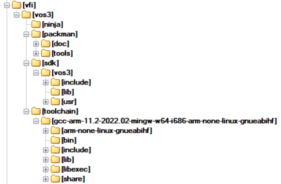

# Preface 

This document is for programmers and users who want to set-up the development environment for VOS3 platform.

# Toolset Overview for Windows 

| Purpose | Tool | Source | Note |
|----|----|----|----|
| 
IDE
 | 
Visual Studio Code (VSCode)
 | 
<a href="https://code.visualstudio.com/download">https://code.visualstudio.com/download</a>
 |  |
| 
IDE plug-ins
 | 
Visual Studio Code Plugins
 | 
use plugin manager in VSCode - CMake
 |  |
| 
Cross-Platform Build Generator
 | 
cmake
 | 
<a href="https://cmake.org/download/">https://cmake.org/download/</a>
 |  |
| 
Build Tool
 | 
ninja
 | 
<a href="https://github.com/ninja-build/ninja/releases">https://github.com/ninja-build/ninja/releases</a>
 |  |
| 
Python Scripting
 | 
python / pip
 | 
<a href="https://www.python.org/downloads/">https://www.python.org/downloads/</a>
 | 
required by packman
 |
| 
Crypto tool
 | 
OpenSSL for Windows
 | 
<a href="https://wiki.openssl.org/index.php/Binaries">https://wiki.openssl.org/index.php/Binaries</a> - MSI: <a href="https://slproweb.com/products/Win32OpenSSL.md">https://slproweb.com/products/Win32OpenSSL.html</a> - ZIP: <a href="https://sourceforge.net/projects/openssl-for-windows/">https://sourceforge.net/projects/openssl-for-windows/</a>
 | 
required by packman
 |
| 
Compiler
 | 
GNU gcc cross-compiler
 | 
Verifone provided
 |  |
| 
VOS3 SDK
 | 
VOS3 SDK
 | 
Verifone provided
 |  |
| 
Packaging tool
 | 
packman
 | 
Verifone provided
 |  |

# Installation 

**VSCode and Extensions**

- download VSCode
- run VSCode installer
- install the following extensions inside the tool
  - \"CMake Tools\": Extended CMake support in Visual Studio Code
  - \"C/C++ Extension Pack\": Popular extensions for C++ development in Visual Studio Code

**Python**

- download Python
- run Python installer

**CMake**

- download cmake-\<version\>-windows-86_x64.msi installer package
- run CMake installer
  
  The Windows installer has an option to modify the system PATH environment variable. If possible, enable this option to add Cmake binary to your path variable.
   **OpenSSL**
- download OpenSSL installer package
- run OpenSSL installer
  
  The OpenSSL binary path can be added to your system PATH variable, typically need to add C:\\Program Files\\OpenSSL-Win64\\bin.
   **Toolset <a href="class_directory.md">Directory</a>**
- create a toolset folder on your local disk, example c:\\vfi\\vos3 folder

**SDK**

- download SDK zip file for Windows: adk-sdk-vos3-win-VOS3\_\<version\>.zip

- create sub-folder \"sdk\" in the toolset directory

- extract the SDK zip file into the \"sdk\" folder

  ### Warning

  Multiple SDK versions can be installed in parallel in the \"sdk\" folder if needed. Please rename the \"vos3\" folder inside the SDK folder to \"vos3-\<version\>\" if needed.

  **Compiler Toolchain**

- download GCC compiler toolchain zip file for Windows: gcc-arm-11.2-2022.02-mingw-w64-i686-arm-none-linux-gnueabihf.zip

- create sub-folder \"toolchain\" in the toolset directory

- extract the GCC compiler toolchain zip file into the \"toolchain\" folder

**Packman**

- download packman tool zip file: packman-full-\<version\>.zip
- create sub-folder \"packman\" in the toolset directory
- extract packman zip file into the \"packman\" folder
- change dir into your \"packman\\tools\\packman\" subfolder and run \"py -m pip install -e .\" to download required Python modules.

### Warning

if your OpenSSL is not in windows PATH variable, please modify the following two Python modules in your packman installation to refer to the openssl binaries

a) cmsinfo.py:
OPENSSL_COMMAND = \'C:\\Program Files\\OpenSSL-Win64\\bin\\openssl.exe\'

b) cmsdevsigner.py
SIGNER_COMMAND = \'C:\\Program Files\\OpenSSL-Win64\\bin\\openssl.exe\'

**Ninja**

- download Ninja tool zip file: ninja-win.zip
- create sub-folder \"ninja\" in the toolset directory
- extract Ninja tool zip file into the \"ninja\" folder

Example Toolset folder structure:

# Configuration 

**CMake Extension**

- open the settings in VSCode (click on gear symbol bottom right and select settings OR press CTRL+,)
- search for \"cmake\" in the settings and select the **\"extensions/CMake Tools\"** tab
  - set the **\"Cmake: Path\"** to your your cmake install folder, typically: \"C:\\Program Files\\CMake\\bin\\cmake.exe\"
  - add the Cmake toolchain file to your **\"Cmake: Configure Environment\"** list: Item=\"CMAKE_TOOLCHAIN_FILE\" , Value=\"cmake/vos3_toolchain.cmake\"
  - set the **\"Cmake: Generator\"** to \"Ninja\"

**CMake Toolchain File**

- open the vos3_toolcahin.cmake file from the cmake folder of your project
- adjust the variable \"VERIFONE_TOOLS_DIR\" to your local toolset directory if needed, default is set to \"c:\\vfi\\vos3\"

# Example Project 

- Open the project
  - extract the /doc/vos3demo/wintest.zip demo project, whcih can be found in the doc archive, to a folder of your choice, e.g. \"c:\\vfi\\vos3\\projects\"
  - launch VSCode editor
  - use \"File/Open Folder\...\" to open your \"c:\\vfi\\vos3\\projects\\wintest\"
- CMake Configuration
  - press the \"Build\" button on the bottom task bar
  - initially select compiler suite to be used \"GCC 4.8.4 arm-none-eabi\"
  - this will now run the CMake configuration
- Build target selection
  - Select the build target from button on the bottom task bar (right to the \"Build\" button\")
  - \[demobin\] - build target for the binary
  - \[dist\] - build target for download packages
- Build
  - press the \"Build\" button on the bottom task bar
  - run the \"demobin\" first and then the \"dist\" build target
  - this will create a \"build\" folder in your project directory and generate the build artifacts. See the download package under \"build\\dl.vos3_demo-Debug.tar\"
- Download
  - use SW Control Panel and Mx800Downloader on host PC to load the DL file into your device
  - launch the demo from the MAC desktop
