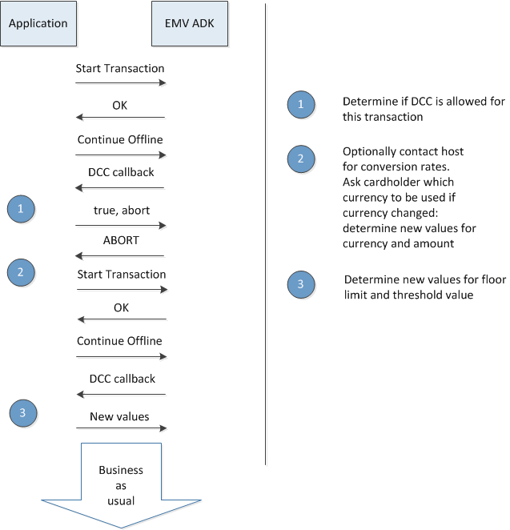

# Preface <a href="#sec_emv_ct_preface" id="sec_emv_ct_preface"></a>

ADK EMV Contact Programmer\'s Guide. This guide provides detailed descriptions of the ADK EMV Contact framework features, with comprehensive information on configuring and programming with the ADK EMV Contact framework, plus plenty of use cases for additional support.

## Audience <a href="#subsec_emv_ct_audience" id="subsec_emv_ct_audience"></a>

This document is for programmers and developers who want to understand and use the ADK EMV Contact framework in their custom payment applications.

## Organization <a href="#subsec_emv_ct_organization" id="subsec_emv_ct_organization"></a>

This guide is organized as follows:

[Introduction](#sec_emv_ct_introduction). Provides an overview of the ADK EMV Contact framework.

[Getting Started](#sec_emv_ct_getting_started). Shows sample applications for the ADK EMV Contact framework.

[Programming](#sec_emv_ct_programming). Outlines the different APIs for the ADK EMV Contact framework. Provides descriptions for various features like PIN Entry support or Virtual terminal mapping table support.

[System Setup and Requirements](#sec_emv_ct_system_setup_and_requirements). Provides information about hardware supported as well as about software requirements.

[Troubleshooting](#sec_emv_ct_troubleshooting). Provides tips on problem solving approaches in form of FAQ. Additional advices are given about possible ways of debugging and tracing.

[Appendix](#sec_emv_ct_appendix). Contains some useful links to related documents and a **quick reference to the interface functions:** [Table of API functions](#section_emv_ct_emv_adk_api_table)

# Introduction <a href="#sec_emv_ct_introduction" id="sec_emv_ct_introduction"></a>

The Verifone ADK EMV Contact framework supports payment applications following the EMVCo specifications (see <a href="http://www.emvco.com/">EMVCo Homepage</a>).

Please refer to the <a href="./pg_emv_contactless_users_guide.md">ADK-EMV Contactless Programmers Guide</a> for information on the CTLS framework.

It\'s recommended to analyse sources of \"ADK-EMV Demo Application\" to get a better understanding how to control the interfaces (\"doc/vdedemo/EmvTestApp\" in ADK bundle).

## Configuration Flow <a href="#subsec_emv_ct_intro_configflow" id="subsec_emv_ct_intro_configflow"></a>


**Description:**

- Typically the calling application gets the desired configuration dynamically at run-time (from host, TMS, or acquirer).
- Initialization is needed prior to calling config commands: <a href="group___f_u_n_c___i_n_i_t.md#ga514e39585c5a6b79632ac317593ff592">EMV_CT_Init_Framework()</a>
- Terminal data setting: <a href="group___f_u_n_c___c_o_n_f.md#ga351c2deba9865081c314d818463f20c9">EMV_CT_SetTermData()</a>
- For each supported payment application (AID) one call to <a href="group___f_u_n_c___c_o_n_f.md#ga73ca1735defbb65a1aae2ead1de70233">EMV_CT_SetAppliData()</a> is required.
- For each CAP key one call to <a href="group___f_u_n_c___c_o_n_f.md#gade5b2bbc6ab46c4b7d9efa991b696ad2">EMV_CT_StoreCAPKey()</a> is needed.
- To free resources it\'s possible to optionally call <a href="group___f_u_n_c___i_n_i_t.md#gaad2d6cdd1249528199d5dc969e48b43c">EMV_CT_Exit_Framework()</a>.
- **Alternative:** Directly write the [XML Configuration Files](#subsubsec_emv_ct_xml_files).
  Only recommended for experienced users.
  Application shall make sure that no EMV transaction is active and either <a href="group___f_u_n_c___i_n_i_t.md#gaad2d6cdd1249528199d5dc969e48b43c">EMV_CT_Exit_Framework()</a> has been called if applicable or at least <a href="group___c_t_i_n_i_t___o_p_t_i_o_n_s.md#gab256e2810f51ed6cc87ea9d5536b7e1e">EMV_CT_INIT_OPT_CONFIG_MODE</a> has not been used.
  Application writes XML configuration files.
  EMV ADK reads new configuration data when <a href="group___f_u_n_c___i_n_i_t.md#ga514e39585c5a6b79632ac317593ff592">EMV_CT_Init_Framework()</a> is called.

For more details see [Configuration Commands](#subsubsec_emv_ct_configuration_commands)

## Transaction Flow <a href="#subsec_emv_ct_intro_transactionflow" id="subsec_emv_ct_intro_transactionflow"></a>


**Description:**

- EMV ADK framework needs to be initialized before transaction start: <a href="group___f_u_n_c___i_n_i_t.md#ga514e39585c5a6b79632ac317593ff592">EMV_CT_Init_Framework()</a>
- Calling application has to detect card insertion. It may use <a href="group___f_u_n_c___i_c_c.md#ga62577d8d938685a65dd2b326cb03522d">EMV_CT_SmartDetect()</a> for that.
- Calling application has to activate the chip card. It\'s recommended to use <a href="group___f_u_n_c___i_c_c.md#gaa63515431ea6f33b113fa7af5562db11">EMV_CT_SmartReset()</a> for that.
- Transaction is started by <a href="group___f_u_n_c___f_l_o_w.md#gac13472c2a4aea6475fe7bb52627e97eb">EMV_CT_StartTransaction()</a>.
- Return data of this function gives information which payment application is used for the transaction. Depending on this the calling application may need to temporary modify the configuration by means of <a href="group___f_u_n_c___c_o_n_f.md#ga73ca1735defbb65a1aae2ead1de70233">EMV_CT_SetAppliData()</a> with <a href="group___a_p_p_l_i___c_o_n_f___m_o_d_e.md#ga9014b9bb4c7b8ebf61ee98a26a7666ce">EMV_ADK_TEMP_UPDATE</a>.
- Offline part of the transaction is performed inside <a href="group___f_u_n_c___f_l_o_w.md#ga8be6df6babc587a19f63f284b2a6f006">EMV_CT_ContinueOffline()</a>.
- The outcome determines if transaction is declined, offline approved, or has to be sent to host for the decision.
- If host connection is needed the host response has to be put in <a href="group___f_u_n_c___f_l_o_w.md#ga42f570d2b8e66841ab9e8de7736e92d4">EMV_CT_ContinueOnline()</a>.
- At this point only two outcomes are possible: declined or approved.
- It\'s recommended to call <a href="group___f_u_n_c___f_l_o_w.md#gaec319989542c7681715566de387d7f69">EMV_CT_EndTransaction()</a> after each transaction. This function wipes sensitive data from memory.
- Calling <a href="group___f_u_n_c___i_n_i_t.md#gaad2d6cdd1249528199d5dc969e48b43c">EMV_CT_Exit_Framework()</a> after each transaction would decrease performance. It\'s not needed at this point, but in principle it\'s possible.

## Android <a href="#subsec_emv_ct_intro_android" id="subsec_emv_ct_intro_android"></a>

In Android the ADK-EMV is hidden inside SDI. So application has to use the \"Card Detection (23-01)\", \"EMV System Interface\", respectively \"EMV Transaction Interface\" from <a href="./pg_sdi_users_guide.md">ADK-SDI Programmers Guide</a>.

## VOS3 <a href="#subsec_emv_ct_intro_vos3" id="subsec_emv_ct_intro_vos3"></a>

In VOS3 ADK-EMV is accessible through SDI. The ADK-EMV-interface is rebuild in <a href="./pg_sdiclient_users_guide.md">ADK-SDI-Client Programmers Guide</a>.

## Two-Piece Solution <a href="#subsec_emv_ct_intro_2piece" id="subsec_emv_ct_intro_2piece"></a>

Former Two-Piece Solution with Client/Server architecture for EMV, MSR, TEC, \... is not supported anymore.
SDI EPP has to be used instead (see <a href="./pg_sdi_users_guide.md">ADK-SDI Programmers Guide</a>).

## Use cases <a href="#subsec_emv_ct_intro_usecases" id="subsec_emv_ct_intro_usecases"></a>

**Usecase 1-4**


**Description:**

- **Usecase 1**
  Used on systems without SDI server. Only possible on VOS and VOS2.
  Calling application links the static library `libEMV_CT_Client.a`.
  So it uses the functional interface with all data in C structs.
  Dynamic library `libEMV_CT_Link.so` manages the communication to EMV ADK (`libEMV_CT_Framework.so`).
- **Usecase 2**
  Used on systems with SDI server respectively SDI service.
  `libsdiclient.a` internally configures <a href="_e_m_v___common___interface_8h.md#aa5ecae39726aadf1805b96849d3d28f5aaf0ee82626c70656d071e14fcdfa3758">EMV_CLIENT_MODE_SDI</a>.
  So `libEMV_CT_Link.so` uses `libsdiprotocol.so` to manage the connection to SDI server/service.
  - VOS3
    `libsdiclient.a` provides the same API as ADK-EMV in Usecase 1.
    That way application does not need source code change when migrating from VOS/VOS2 to VOS3.
  - Usage without `libsdiclient.a`
    Alternatively application may use `libEMV_CTLS_Client.a` directly.
    In that case it must set <a href="_e_m_v___common___interface_8h.md#aa5ecae39726aadf1805b96849d3d28f5aaf0ee82626c70656d071e14fcdfa3758">EMV_CLIENT_MODE_SDI</a>.
- **Usecase 3**
  Similar to Usecase 2, but calling application implements it\'s own module to de-/serialize the data and do the communication with the SDI server/service.
- **Usecase 4**
  Similar to Usecase 1, but calling application implements it\'s own module to de-/serialize the data and do the EMV ADK connection (calling <a href="_e_m_v___c_t___ser_interface_8h.md#aa97edfd89af13c80259d4dbd3907f9e4">EMV_CT_SerInterface()</a>).

## Concepts <a href="#subsec_emv_ct_concepts" id="subsec_emv_ct_concepts"></a>

### GUI <a href="#subsubsec_emv_ct_concept_gui" id="subsubsec_emv_ct_concept_gui"></a>

UI handling is country-, regional- and domestic-specific. This is why ADK separates business logic from GUI interface.
EMV ADK does itself not directly control the GUI. It just gives advice, in case display or cardholder interaction is required.
Examples:
<a href="group___c_a_r_d_h_o_l_d_e_r___i_n_f_o.md#ga0d0b71673b210ace78250dc578163862">eEMVCrdLastTryPIN</a> is given when cardholder display is needed (callback <a href="group___c_b_c_k___f_c_t___t_a_g_s.md#ga03bf78609c19ba9c07772fcd74d8c1f1">TAG_BF09_CBK_CARDHOLDERINFO</a>).
<a href="group___c_b_c_k___f_c_t___t_a_g_s.md#gadc9d6fed84456455586fb621722ae922">TAG_BF08_CBK_PIN</a> callback is invoked when PIN entry is required.

It is recommended to use GUI ADK.

### Interface type: Structure-based vs. serialized <a href="#subsubsec_emv_ct_concept_struct_vs_serialized" id="subsubsec_emv_ct_concept_struct_vs_serialized"></a>

The Verifone EMV services are designed as a serialized interface. On this interface (CLA/INS) all parameters are tag based and where the parameters are named in the EMVCo specification we follow the tags and format of EMVCo. The parameters on this interface will vary depending on EMVCo, Scheme and Feature updates. Whenever an old parameter is obsolete it will removed from the serialized interface and whenever a new parameter is necessary it\'ll be added. Additionally we provide for better readability an interface, which is structure based and allows to set parameters without setting up a TLV based binary stream. Both approaches are supported with the client on top of the EMV framework. There is no force to use this client, you can at any time directly use the framework API with CLA/INS directly. However because of easier code maintenance it may be beneficial to use the client API, either struct or TLV based.
Each struct parameter is 1:1 converted to a serialized tag without the need to know the tag and format inside the serialized stream. Whenever you fill a parameter inside the struct you simply need to raise the config flag for this struct parameter and it\'ll be added to the serialized stream automatically.

Example:

``` fragment
TXN_Data.Force_Online = FALSE; // no force Online
Info_Included_Data[1] |=  INPUT_SEL_FORCE_ONLINE; //raise the flag
```

### Updating to a new EMV ADK version <a href="#subsubsec_emv_ct_up_and_downward_compat" id="subsubsec_emv_ct_up_and_downward_compat"></a>

Please have in mind that adding new features and specification changes requires that transaction and configuration structs are modified regularly. If you want to update to a newer release of the EMV-ADK without taking benefits of new features, spec updates or certifications this can be done anytime by downloading the new framework and kernels and keeping the original client. This allows you to reuse the old application even without recompiling it, even we recommend to update your application to the latest to be up to date with latest EMV testcases, spec changes and feature sets.
If you decide to update the client to use the new features have in mind that you fill the new parameters accordingly. If you use the TLV stream add the new tags and remove obsolete tags. If you use the struct API have in mind that old parameters disappear and new tags are added.
The new client is compatible to an old framework (the old framework will not see unknown new tags in the serialized stream) and an old client is compatible to a new framework (obsolete tags are not parsed any more by the new framework, missing tags will be set with compliant defaults). This allows to have the API up to date to the fast changing specifications, enables introducing new parameters and removing obsolete parameters, so that legacy stuff is always kept away from new users and new parameters can be introduced without implications.

Additional considerations:

- Do not update kernels if you do not update to the latest feature and specification set because new kernels may require up to date configuration.
- There are most probably multiple kernels for Contact and Contactless in an EMV-ADK delivery. Do stock picking of the kernels and load only those to the system that fit to your terminal and your application ICS needs.
- If you use the serialized interface properly it is no problem to pick a new client without updating to new features and certifications. However we do not recommend to do so but adapt to the latest spec updates or (if already certified for example) keep the client and kernels you implemented against.
- The EMV-ADK updates are independent of the release planning of the ADK integration packages. As soon as new L2 certifications are available and as soon as new E2E tests are integrated we provide a release if possible.
- This requires to cross check for the latest regularly to pass the latest E2E tests with your application.
- Vice versa you need to take care that you do not automatically update to a newer EMV-ADK version once you have certified your app, you may want to lock it not to endanger your certification.

### Callback and Reentrance Mode <a href="#subsubsec_emv_ct_callback_and_reentrance_mode" id="subsubsec_emv_ct_callback_and_reentrance_mode"></a>

For the transaction sequence, there are two general modes possible:

- **Callback Mode.**
  This is the \"standard mode\". It is most robust and easy-to-use.
  Calling application can activate several callbacks. These are invoked during transaction processing.
  Callback activation is done in <a href="group___a_d_k___t_r_x___e_x_e_c.md#ac9ddf19e79cf70f6331fdb822fdf1d4f">EMV_CT_SELECT_STRUCT::TxnOptions</a>, <a href="group___a_d_k___t_r_x___e_x_e_c.md#ac9ddf19e79cf70f6331fdb822fdf1d4f">EMV_CT_TRANSAC_STRUCT::TxnOptions</a>, e.g. <a href="group___t_x_n___o_p_t_i_o_n_s.md#gab687ffddde3bcdd5b299b6ffd5411338">EMV_CT_TRXOP_MERCHINFO_CALLBACK</a>.
  For an overview about all callback functions see [Transaction Callback Command](#subsubsec_emv_ct_transaction_callback_command).
- **Reentrance Mode.**
  This mode is only recommended for experienced users.
  Transaction is interrupted at certain points. At these points the application can perform certain processes: change parameters, handle GUI, etc. The application has full control over all parameters and the complete configuration interface.
  Transaction is continued by re-calling the same EMV ADK function.
  Configuration options can be found here: <a href="group___t_x_n___s_t_e_p_s.md">Re-entrance options</a>


### XML Configuration Files <a href="#subsubsec_emv_ct_xml_files" id="subsubsec_emv_ct_xml_files"></a>

The configuration of the framework is stored in XML files. These are created dynamically using the configuration functions. Missing parameters will be automatically filled with a default.

In V/OS and VOS2 you can find the XML files in the sub folder \"flash\" of the corresponding user. In Verix they are placed in \"I:/1/\".

Mapping from XML tags to struct parameters (and TLV tags) can be found in <a href="_e_m_v___c_t___x_m_l_8h.md">EMV_CT_XML.h</a>.

**Terminal data** (file name: `EMV_Terminal.xml`)

``` cpp
<TerminalData>
<TermTyp>22</TermTyp>
<CurrencyTrans>0978</CurrencyTrans>
<ExpTrans>02</ExpTrans>
<CountryCodeTerm>0250</CountryCodeTerm>
<TermCap>E0F8C8</TermCap>
<TermAddCap>F000B0A001</TermAddCap>
<SuppLang>0102000000000000</SuppLang>
<IFD_SerialNumber>12345678</IFD_SerialNumber>
<KernelVersion>L26.16l</KernelVersion>
<FrameworkVersion>01.00.00-rc1</FrameworkVersion>
</TerminalData>
```

**Applications** (file name: `EMV_Applications.xml`)

``` cpp
<Application AID="A0000000041010">
<VerNum>0002</VerNum>
<AppName>Mastercard</AppName>
<ASI>01</ASI>
<BrKey>5999</BrKey>
<TermIdent>3132333435363738</TermIdent>
<FloorLimit>00001388</FloorLimit>
<Threshold>000001F4</Threshold>
<TargetPercentage>00</TargetPercentage>
<MaxTargetPercentage>00</MaxTargetPercentage>
<TAC_Denial>0400000000</TAC_Denial>
<TAC_Online>F850ACF800</TAC_Online>
<TAC_Default>FC50ACA000</TAC_Default>
<EMV_Application>01</EMV_Application>
<DefaultTDOL>9F02065F2A029A039C0195059F3704</DefaultTDOL>
<DefaultDDOL>9F3704</DefaultDDOL>
<MerchIdent>202020202020202020202020202020</MerchIdent>
<CDA_Processing>02</CDA_Processing>
<AC_BeforeAfter>00</AC_BeforeAfter>
<POS_EntryMode>05</POS_EntryMode>
<AdditionalTags>9F530152</AdditionalTags>
<Taglist>008E</Taglist>
<AppTermCap>E0F8C8</AppTermCap>
<AppFlowCap>3F1F170000</AppFlowCap>
<AIP_CVM_NotSupported>00</AIP_CVM_NotSupported>
<CountryCodeTerm>0250</CountryCodeTerm>
<AppTermAddCap>F000B0A001</AppTermAddCap>
<AppTerminalType>22</AppTerminalType>
<AID_Prio />
<AID_Prio />
<AID_Prio />
<AID_Prio />
<AID_Prio />
<FallbackMIDs>000000</FallbackMIDs>
<SpecialTRX>2120110000000000</SpecialTRX>
<FallbackHandling>00</FallbackHandling>
<ChksumParams>0100000000</ChksumParams>
<ChksumASCII_EMVCO>BE3FB52A</ChksumASCII_EMVCO>
<MasterAID />
</Application>
```

**Keys** (file name: `EMV_Keys.xml`)

``` cpp
<CapKey Index="F8" RID="A000000004">
   <Exponent>03</Exponent>
   <KeyLen>80</KeyLen>
   <Key>A1F5E1C9BD8650BD43AB6EE56B891EF7459C0A24FA84F9127D1A6C79D4930F6DB185 2E2510F18B61CD354DB83A356BD190B88AB8DF04284D02A4204A7B6CB7C5551977A9B36379CA3DE1A08E69F301C95CC1C20506959275F41723DD5D2925290579E5A95B0DF6323FC8E9273D6F849198C4996209166D9BFC973C361CC826E1</Key>
   <Hash>F06ECC6D2AAEBF259B7E755A38D9A9B24E2FF3DD</Hash>
   <RevocationList>010203</ RevocationList >
</CapKey>
```

# Getting Started <a href="#sec_emv_ct_getting_started" id="sec_emv_ct_getting_started"></a>

In this chapter you will find execution flow diagrams as well as real code examples describing steps which are required in order to successfully configure application and make a payment transaction.

## Sample Application <a href="#sec_emv_ct_sample_application" id="sec_emv_ct_sample_application"></a>

For a payment application example, please refer to EMV testapp.

### Examples of Serialized Flow <a href="#subsubsec_emv_ct_examples_of_serialized_flow" id="subsubsec_emv_ct_examples_of_serialized_flow"></a>

**Configuration**

``` cpp
Init:
CLIENT MSG CMD: 39 00 [0]
MSG RESP: 90 00 [0]
CFG Terminal Data:
CLIENT MSG CMD: 39 01 [68] F0429F3501225F2A0209785F3601029F1A0202509F3303E0F8C89F4005F000B0A001 …
CLIENT MSG RESP: 90 00 [0]
CFG Application Data (Delete All): MSG CMD: 39 02 [6] F004DF660120
CLIENT MSG RESP: 90 00 [0]
CFG Application Data (Set AID, MC) MSG CMD: 39 02 [381]
F0820179DF6601014F07A00000000410109F09020002500A4D617374657263617264 … CLIENT MSG RESP: 90 00 [ 0]
CFG Application Data (Set AID, VISA) CMD: 39 02 [362]
F0820166DF6601014F07A00000000310109F0902008C500456697361DF2001019F15 … CLIENT MSG RESP: 90 00 [ 0]
… repeat per AID
CFG CAP Keys (Delete All)
CLIENT MSG CMD: 39 03 [6] F004DF660120
CLIENT MSG RESP: 90 00 [0]
CFG CAP Keys (Set CAP Keys, repeat n times) CLIENT MSG CMD: 39 03 [178]
F081AFDF660101DF0901F8DF0A05A000000004DF0B8180A1F5E1C9BD8650BD43AB6E … MSG RESP: 90 00 [0]
CLIENT MSG CMD: 39 03 [194] F081BFDF660101DF0901F3DF0A05A000000004DF0B819098F0C770F23864C2E766DF …
MSG RESP: 90 00 [0]
```

**Transaction**

``` cpp
Init:
CLIENT MSG CMD: 39 00 [0]
MSG RESP: 90 00 [0]
Activate ICC (Applications technology selection process) CLIENT MSG CMD: 41 02 [6] F004DF060100
CLIENT MSG RESP: 90 00 [19] F011DF680E3B6A00FF4A434F50333156323332
Start Transaction
CLIENT MSG CMD: 39 10 [57] F0379C01009F02060000000156999A031211019F2103120000DF400100DF430100DF …
CLIENT MSG RESP: 90 00 [112] F06E8408A000000003101002500F4352454449544F2044452056495341DF330B5649 …
Continue Transaction Offline CLIENT MSG CMD: 39 11 [ 30]
F01C9F410400000000DF5806000000000000DF4E0100DF470100DF340100
(Callback example, here: BF08 == PIN Input, Online PIN) CLIENT MSG CBK: 91 01 [13] F00BBF0808DF790100DF410101
CLIENT MSG CBKR: 92 00 [6] F004DF790100
CLIENT MSG RESP: 90 E2 [405] F0820193DF4204000000019F2701809F3602005E9F260845CFA9C81F28B5BD5A0A476173
…
Continue Transaction Online CLIENT MSG CMD: 39 12 [28]
F01ADF5001018A0230308906000000000000DF55023031DF56023535
CLIENT MSG RESP: 90 E3 [401] F082018FDF4204000000019F2701409F3602005E9F2608A2471F498B8BD5695A0A476173
…
Deactivate ICC (optional, it is deactivated by the framework if the transaction is completed, not in any terminate or fallback case because the subsequent processing is not known to the framework).
CLIENT MSG CMD: 41 04 [6] F004DF060100
CLIENT MSG RESP: 90 03 [0]
```

## Code Snippets <a href="#subsec_emv_ct_code_snippets" id="subsec_emv_ct_code_snippets"></a>

Use the following sample code snippets for basic implementation.

### Initialization <a href="#subsubsec_emv_ct_code_snippets_initialization" id="subsubsec_emv_ct_code_snippets_initialization"></a>

``` cpp
erg = EMV_CT_Init_Framework(64, (EMV_CT_CALLBACK_FnT)FrameworkEMVCallbackFunction, (void*)NULL, EMV_CT_INIT_OPT_TRACE|EMV_CT_INIT_OPT_TRACE_CLT);
  if(erg != EMV_ADK_OK)
  {
   APP_TRACE("Init EMV framework returned %d", erg);
   return(EMV_INIT_ERR_INIT_KERNEL);
  }
```

### Application Selection <a href="#subsubsec_emv_ct_code_snippets_application_selection" id="subsubsec_emv_ct_code_snippets_application_selection"></a>

``` cpp
/* Step 1: Application Selection */
do
{
// call kernel: select application from terminal- and card-/list
eEMVInfo = EMV_CT_StartTransaction(&xterminaldata, // IN: terminaldata
   &xSelectRes); // OUT: select info
xterminaldata.Buildlist = FALSE;
} while(eEMVInfo == _EMV_BADAPP);
switch(eEMVInfo)
{
case _EMV_OK: // application selected, everything OK
   break;
  ……
}
```

### Offline Part of the Transaction <a href="#subsubsec_emv_ct_code_snippets_offline_part_of_the_transaction" id="subsubsec_emv_ct_code_snippets_offline_part_of_the_transaction"></a>

``` cpp
/* Step 2: Performing EMV transaction */
// start EMV-payment
eEMVInfo = EMV_CT_ContinueOffline(&xEMVTransType, &xEMVTransRes);
// at this point, it is possible to select a new application
while(eEMVInfo == _EMV_BADAPP)
{
// select new application
xterminaldata.Buildlist = FALSE;
eEMVInfo = EMV_CT_StartTransaction( &xterminaldata, // IN: dummy
   &xSelectRes); // OUT: select info
if(eEMVInfo == _EMV_OK)
{
   memset((void*) &xEMVTransRes, 0, sizeof(EMV_TRANSRES_TYPE));
   eEMVInfo = EMV_CT_ContinueOffline(&xEMVTransType, &xEMVTransRes);
}
}
switch(eEMVInfo)
{
  case _EMV_ARQC: // go online
   /* transaction requires communication to the host */
   /* TRX not finished yet --> contact your host */
   /* no text to display */
   /* continue, see below */
   break;
  case _EMV_TC: // write offline-file
   /* transaction successfully finished */
…
}
```

### Online Response from Host <a href="#subsubsec_emv_ct_online_response_from_host" id="subsubsec_emv_ct_online_response_from_host"></a>

Authorization Response Code, Issuer Authentication Data, possible Scripts (critical + uncritical), following EMVCo formats:

``` cpp
/* Step 3: Completing a transaction Online */
memcpy(pxTxnRec->xHostRespRec.AuthResp, "\x30\x30", 2);
pxTxnRec->xHostRespRec.LenAuth = 0x0A;
memcpy(ucAuth_Data, "\x91\x08\x11\x22\x33\x44\x55\x66\x77\x88", pxTxnRec->xHostRespRec.LenAuth);
pxTxnRec->xHostRespRec.LenScriptCrit = 26;
memcpy(ucCritScript_Data, "\x71\x18\x9F\x18\x04\x00\x00\x00\x01\x86\x0F\x84\x1E\x00\x00\x0A\x8E\x08\x11\x22\x33\x44\x55\x66\x77\x88", pxTxnRec->xHostRespRec.LenScriptCrit);
pxTxnRec->xHostRespRec.LenScriptUnCrit = 26;
memcpy(ucUnCritScript_Data, "\x72\x18\x9F\x18\x04\x00\x00\x00\x01\x86\x0F\x84\x1E\x00\x00\x0A\x8E\x08\x11\x22\x33\x44\x55\x66\x77\x88", pxTxnRec->xHostRespRec.LenScriptUnCrit);
…
eEMVInfo = EMV_CT_ContinueOnline(pxTxnRec, &xEMVOnlineRes);
```

### PIN Entry <a href="#subsubsec_emv_ct_pin_entry" id="subsubsec_emv_ct_pin_entry"></a>

A code example for managing PIN entry. PIN entry is done using GUI-ADK (<a href="./pg_gui_users_guide.md">ADK-GUI Programmers Guide</a>).
In case of offline PIN the EMV-ADK transmits the PIN from vault to card (for verification).

``` cpp
unsigned char UIEnterPin(GuiPinParam *pinParam)
{
   int r = -1;
   int disp = getCardHolderDisplay();
   // if card holder display is separate, show cashier message
   if (disp)
   UI_ShowMessage(UI_STR_CARDHOLDER_INPUT, "card holder prompted for PIN input");
   {
   if(disp != UI_DISP_DEFAULT)
   disp = UI_DISP_DEFAULT;
   int digits;
   UIParams values;
   map<string,string>::iterator i;
   guiCb = pinParam->callback;
   uiSetPropertyInt(disp, UI_PROP_PIN_ALGORITHM, (int) pinParam->ucPinAlgo);
   uiSetPropertyInt(disp, UI_PROP_PASSWORD_CHAR, (int) pinParam->ulEchoChar);
   uiSetPropertyInt(disp, UI_PROP_PIN_AUTO_ENTER, (int) pinParam->ucAutoEnter);
   uiSetPropertyInt(disp, UI_PROP_PIN_BYPASS_KEY, (int) pinParam->ulBypassKey);
   uiSetPropertyInt(disp, UI_PROP_PIN_CLEAR_ALL, (int) pinParam->ucClearAll);
   uiSetPropertyInt(disp, UI_PROP_TIMEOUT, (int) pinParam->lTimeoutMs);
   std::string str = pinParam->currency;
   str += " ";
   str += pinParam->amount;
   str += " ";
   values.clear();
   values["msgPIN"] = UI_STR_ENTER_PIN;
   values["amount"] = str;
   values["caution_icon"] = "1";
   values["title"] = pinParam->appLabel;
   if(isKeypadExist())
   {
   while ((r = uiInvokeURL(disp, UI_REGION_ID_MAIN, values, "helper_pin.html", &guiCallback, NULL)) == UI_ERR_PERMISSION)
   usleep(1000);
   }
   else // X10, Carbon, Swordfish, e280
   {
   initializeUiRegions(UI_REGION_ID_MAIN|UI_REGION_ID_SOFTWARE_LEDS);
   while ((r = uiInvokeURL(disp, UI_REGION_ID_MAIN, values, "kbd_pin.html", &guiCallback, NULL)) == UI_ERR_PERMISSION)
   usleep(1000);
   }
   if(r == UI_ERR_OK)
   {
   for (i = values.begin(); i != values.end(); ++i) {
   if (!strcmp(i->first.c_str(), "pin")) {
   break;
   }
   }
   if (i == values.end()) {
   return EMV_CT_PIN_INPUT_OTHER_ERR;
   }
   if (sscanf(i->second.c_str(), "%d", &digits) == 1) {
   Demo_SplashPleaseWait();
   return EMV_CT_PIN_INPUT_OKAY;
   }
   if (!strcmp(i->second.c_str(), "bypass")) {
   return EMV_CT_PIN_INPUT_BYPASS;
   }
   if (!strcmp(i->second.c_str(), "cancel")) {
   return EMV_CT_PIN_INPUT_ABORT;
   }
   return EMV_CT_PIN_INPUT_OTHER_ERR;
   }
   }
   switch (r) {
   case UI_ERR_TIMEOUT:
   return EMV_CT_PIN_INPUT_TIMEOUT;
   case UI_ERR_ABORT:
   case UI_ERR_CANCELLED:
   return EMV_CT_PIN_INPUT_ABORT;
   default:
   return EMV_CT_PIN_INPUT_OTHER_ERR;
   }
   return EMV_CT_PIN_INPUT_OTHER_ERR;
}
unsigned char _EMVADK_cbk_duringPINinput(void)
{
  if(EMV_CT_SmartDetect(0) != EMV_ADK_SMART_STATUS_OK)
  {
   APP_TRACE("--> WHERE IS THE CARD ???????");
   return true;
  }
  return false;
}
unsigned char ucInputPIN( unsigned char pintype,
   unsigned char bypass,
   unsigned char* pucPINResultData)
{
  unsigned char rsp;
  int r = 0;
  unsigned long BypassKey = 0;
  unsigned char tucAmount[6] = {0};
  unsigned char tucAmountAscii[13] = {0};
  char finalAmount[13] = {0};
  guiPinParam pinParam;
  unsigned long TAGR;
  unsigned char Buffer[32];
  unsigned short TAGL = 0;
  if (bypass)
  {
   APP_TRACE("start PIN entry: Bypass active: YES");
   BypassKey = 13; // Bypass activated with Enter Key 0 digits
  }
  else
  {
   APP_TRACE("start PIN entry: Bypass active: NO");
   BypassKey = 0;
  }
  pinParam.ucPinAlgo = EMV_PIN;
  pinParam.ucAutoEnter = 0;
  pinParam.ucClearAll = 0;
  pinParam.ulEchoChar = '*';
  pinParam.ulBypassKey = BypassKey;
  pinParam.lTimeoutMs = 30000;
  pinParam.callback = _EMVADK_cbk_duringPINinput;
  pinParam.currency = UI_STR_CURRENCY;
  TAGR = 0x9F02;
  if (pintype == EMV_CTLS_PIN_INPUT_ONLINE)
  {
   TAGL = 0;
   EMV_CTLS_fetchTxnTags(0, &TAGR, 1, Buffer, 32, &TAGL);
   if (TAGL > 0)
   memcpy(tucAmount, &Buffer[3], 6);
  }
  else
  {
   EMV_CT_fetchTxnTags(EMV_ADK_FETCHTAGS_NO_EMPTY, &TAGR, 1, Buffer, 32, &TAGL);
   if (TAGL > 0)
   memcpy(tucAmount, &Buffer[3], 6);
  }
  APP_TRACE("Amount extracted: %02X%02X%02X%02X%02X%02X",
   Buffer[3], Buffer[4],
   Buffer[5], Buffer[6],
   Buffer[7], Buffer[8]);
  vAmountBCD2ASCII(tucAmount, tucAmountAscii, 6);
  vAmountForDisplay(finalAmount, sizeof(finalAmount), (char*)tucAmountAscii, 2);
  pinParam.amount = finalAmount;
  if ((pintype == EMV_CT_PIN_INPUT_ENCIPHERED) || (pintype == EMV_CT_PIN_INPUT_PLAIN))
  {
   // PIN Entry using GUI-ADK
   rsp = UIEnterPin(&pinParam);
   APP_TRACE("=== result of PIN entry: %d ===", rsp);
   if (rsp == EMV_CT_PIN_INPUT_BYPASS)
   APP_TRACE("PIN Bypass from customer");
   if (rsp != EMV_CT_PIN_INPUT_OKAY)
   {
   return(rsp);
   }
   rsp = EMV_CT_Send_PIN_Offline(pucPINResultData);
   APP_TRACE("=== result of PIN offline: %d ===", rsp);
   switch (rsp)
   {
   case EMV_ADK_SMART_STATUS_OK:
   if (pucPINResultData[0] == 0x63)
   {
   if (pucPINResultData[1] == 0xC1)
   r = UI_ShowOkCancelMessageExt(getCardHolderDisplay(), 100000, UI_STR_PIN, UI_STR_WRONG_PIN_TRY_LAST, NULL);
   else if (pucPINResultData[1] == 0xC0)
   r = UI_ShowOkCancelMessageExt(getCardHolderDisplay(), 100000, UI_STR_PIN, UI_STR_WRONG_PIN_GAME_OVER, NULL);
   else
   r = UI_ShowOkCancelMessageExt(getCardHolderDisplay(), 100000, UI_STR_PIN, UI_STR_WRONG_PIN_TRY_AGAIN, NULL);
   if (r == -1)
   return EMV_CT_PIN_INPUT_ABORT;
   }
   return EMV_CT_PIN_INPUT_OKAY; // need to check SW1 SW2
   default:
   return EMV_CT_PIN_INPUT_COMM_ERR;
   }
  }
  else if ((pintype == EMV_CT_PIN_INPUT_ONLINE) || (pintype == EMV_CTLS_PIN_INPUT_ONLINE))
  {
   // with Online PIN of CTLS there is no need to check card insertion
   if (pintype == EMV_CTLS_PIN_INPUT_ONLINE)
   pinParam.callback = NULL;
   rsp = UIEnterPin(&pinParam);
   APP_TRACE("=== result of PIN entry: %d ===", rsp);
   if (rsp != EMV_CT_PIN_INPUT_OKAY)
   {
   return rsp;
   }
   // Online PIN needs to be fetched by the local/domestic VSS script handling the online PIN block
   // transmission towards the acquirer/network provider
   return EMV_CT_PIN_INPUT_OKAY;
  }
  else if (pintype == EMV_CT_CVM_CUSTOM)
  {
   // custom CVM method
   APP_TRACE("=== result of custom CVM method: OK");
   return EMV_CT_PIN_INPUT_OKAY;
  }
  return EMV_CT_PIN_INPUT_OTHER_ERR;
}
```

# Programming <a href="#sec_emv_ct_programming" id="sec_emv_ct_programming"></a>

Here you can find flow-specific use cases and general guidance of scenarios that you may need for implementation.

## Programming and API Principles <a href="#sec_emv_ct_programming_apis" id="sec_emv_ct_programming_apis"></a>

This section provides programming function reference for the ADK EMV Contact framework.

### Configuration Commands <a href="#subsubsec_emv_ct_configuration_commands" id="subsubsec_emv_ct_configuration_commands"></a>

For schematic figure see [Configuration Flow](#subsec_emv_ct_intro_configflow)

The EMV Configuration comprises the following steps:

- [Initialize EMV Framework](#anchor_emv_ct_initialize_emv_framework): Turns on EMV Framework
- [Configure Terminal Data](#anchor_emv_ct_configure_terminal_data): Configures terminal data.
- [Configure Application Data](#anchor_emv_ct_configure_application_data): Configures AID data.
- [Configure CAP Keys](#anchor_emv_ct_configure_cap_keys): Configures CAP Keys
- **Exit** **Framework:** Turns off the EMV Framework (<a href="group___f_u_n_c___i_n_i_t.md#gaad2d6cdd1249528199d5dc969e48b43c">EMV_CT_Exit_Framework()</a>)

The following sequence shows an EMV Configuration example for 2 AIDs and 3 CAP Keys:


The EMV configuration is stored permanently in flash files.

**[Initialize EMV Framework]{.underline}**

You should initialize the ADK EMV Contact framework before usage, preferably during terminal startup. In case of memory shortage, the application can separate initialization into two steps:

- **Base** **initialization**
  Call with `EMV_CT_INIT_OPT_BASE_INIT` set in options
  To be done at terminal startup, no memory allocation.
- **Transaction** **initialization**
  To be done for every transaction. Must provide memory allocation.
  After end of transaction, application calls <a href="group___f_u_n_c___i_n_i_t.md#gaad2d6cdd1249528199d5dc969e48b43c">EMV_CT_Exit_Framework()</a>.

*Serial Interface*

The command uses the following format:

**Table: Command**

| CLA | INS | P1 | P2 | Data |
|----|----|----|----|----|
| <p>x39</p> | <p>x00</p> | <p>x00</p> | <p>x00/x01</p> | <p>Data</p> |

**P2 = 0: Init Framework**

**P2 = 1: Exit Framework**

**Table: Response**

| Data | SW1 | SW2 | Comment |
|----|----|----|----|
| <p>None</p> | <p>x90</p> | <p>xXX</p> | <p>Function executed, xx = response code (P2=0)</p> |
| <p>None</p> | <p>x90</p> | <p>x00</p> | <p>Function executed, xx = response code (P2=1)</p> |


The parameters inside the tag F0 are identical to the structure in the functional interface.

*Function Interface*

The function interface includes four parameters:

- The number of AIDs to support
- The function pointer for the callback
- An arbitrary pointer, which will be relayed unchanged to callback function call (useful for object-oriented applications)
- Initialization options.


On the serial interface the callbacks are realized by intermediate messages. Those are received by the EMV-client (use case 1 and 2 in [anchor_emv_ct_Use_Case_Samples_1to4](#anchor_emv_ct_use_case_samples_1to4)). If EMV-client is not used the application has to handle this data (use case 3 and 4). In any case it\'s mandatory to call the Init and Exit functions.


<a href="group___f_u_n_c___i_n_i_t.md#ga514e39585c5a6b79632ac317593ff592">EMV_CT_Init_Framework</a>, <a href="_e_m_v___c_t___interface_8h.md#aa32731a2b868db59639385b8853170e4">EMV_CT_Init_Framework_Client()</a>

**[Configure Terminal Data]{.underline}**

This section presents an overview of the typical tags for terminal configuration.

This function provides the ADK EMV Contact framework and subsequent kernel with the terminal data it needs. The framework checks and saves the provided data in an XML file. You can configure the XML file directly (file configuration), instead of using this function (dynamic configuration).

*Serial Interface*

The command uses the following format:

**Table: Command**

| CLA | INS | P1 | P2 | Data |
|----|----|----|----|----|
| <p>x39</p> | <p>x01</p> | <p>don't care</p> | <p>x00/x01</p> | <p>Data</p> |

**P2 = 0: Set Data**

**P2 = 1: Get Data**

**Table: Response**

| Data | SW1 | SW2 | Comment |
|----|----|----|----|
| <p>None</p> | <p>x90</p> | <p>xXX</p> | <p>Function executed, xx = response code (P2=0)</p> |
| <p>Terminal data</p> | <p>x90</p> | <p>x00</p> | <p>Function executed, xx = response code (P2=1)</p> |

The following illustration shows the Set/Get Terminal Data function.


The parameters inside the tag F0 are identical to the structure in the functional interface.

*Function Interface*

<a href="group___f_u_n_c___c_o_n_f.md#ga351c2deba9865081c314d818463f20c9">EMV_CT_SetTermData()</a>, <a href="group___f_u_n_c___c_o_n_f.md#ga954c82bc82203115b10fcab356df0079">EMV_CT_GetTermData()</a>

The members of the structures are identical to the parameters inside tag F0 in the serial interface.

**Defaults and Guides**

The default terminal data is an attended combined offline/online terminal, supporting all variants of CVM and card authentication:

- Currency: EUR
- Supported languages: English
- Country Code: France.

It is recommended to configure all terminal-wide parameters from the application. If any of the parameters are missing, the default will be used. The configuration will not fail because of a missing parameter.

The following table show samples of configuration values.

**Table: Configuration Values**

| Tags | Size | Default Value | Description |
|----|----|----|----|
| <p>9F35</p> | <p>1</p> | <p>0x22</p> | <p>Terminal type</p> |
| <p>9F1A</p> | <p>2</p> | <p>0x02, 0x50 (France)</p> | <p>Terminal country code according ISO 3166</p> |
| <p>9F33</p> | <p>3</p> | <p>0xE0, 0xF8, 0xC8</p> | <p>Terminal capabilities</p> |
| <p>9F40</p> | <p>5</p> | <p>0xF0, 0x00, 0xB0, 0xA0, 0x01</p> | <p>Additional Terminal capabilities</p> |
| <p>9F1C</p> | <p>8</p> | <p>\"00000001\"</p> | <p>Terminal Identification</p> |
| <p>5F2A</p> | <p>2</p> | <p>0x09, 0x78 (EUR)</p> | <p>Transaction currency code according ISO 4217. For a single transaction this value may be overwritten.</p> |
| <p>5F36</p> | <p>1</p> | <p>0x02</p> | <p>Transaction currency Exponent</p> |
| <p>DF67</p> | <p>20</p> | <p>0x01, 0x00, 0x00, 0x00, 0x00, 0x00, 0x00, 0x00<br/>(Only 1 supported: English)</p> | <p>Supported languages by host (up to 20)</p> |
| <p>9F1E</p> | <p>8</p> | <p>\< S/N (last 8 digits) \></p> | <p>IFD Serial Number</p> |
| <p>DF65</p> | <p>128</p> | <p>(response only)</p> | <p>Version of EMV kernel</p> |
| <p>DF11</p> | <p>128</p> | <p>(response only)</p> | <p>Version of EMV framework</p> |
| <p>DF6B</p> | <p>128</p> | <p>(response only)</p> | <p>version of L1 Driver</p> |

**EMV Application Terminal Configuration Examples**

*Terminal Configuration Example -- Set all but IFD serial number*

``` cpp
Command
39 01 00 00 F0 42 9F 35 01 22 5F 2A 02 08 40 5F 9....B.5."_*..@_
36 01 02 9F 1A 02 08 40 9F 33 03 E0 F8 C8 9F 40 6......@.3.....@
05 F0 00 B0 A0 01 9F 1C 08 32 32 32 32 32 32 32 .........2222222
32 DF 67 14 01 02 00 00 00 00 00 00 00 00 00 00 2.g.............
00 00 00 00 00 00 00 00 ........
Response
90 00
```

*Terminal Configuration Example -- Set Country*

``` cpp
Command
39 01 00 00 F0 05 9F 1A 02 02 80
Response
90 00
```

*Terminal Configuration Example -- Get Current*

``` cpp
Command
39 01 00 01
Response
90 00 F0 81 B2 9F 35 01 22 5F 2A 02 08 40 5F 36 ......5."_*..@_6
01 02 9F 1A 02 08 40 9F 33 03 E0 F8 C8 9F 40 05 ......@.3.....@.
F0 00 B0 A0 01 9F 1C 08 30 30 30 30 30 30 30 31 ........00000001
DF 67 14 01 02 00 00 00 00 00 00 00 00 00 00 00 .g..............
00 00 00 00 00 00 00 9F 1E 08 30 31 31 30 30 32 ..........011002
30 39 DF 65 08 4C 32 37 2E 30 2E 33 72 DF 11 07 09.e.L27.0.3r...
34 2E 31 30 2E 32 39 DF 6B 3A 49 46 4D 31 38 63 4.10.29.k:IFM18c
2D 45 4D 56 34 2E 33 5F 41 30 30 2C 20 53 57 5F -EMV4.3_A00, SW_
41 30 30 2C 20 48 57 5F 41 30 30 3B 30 31 2E 33 A00, HW_A00;01.3
37 20 30 34 2F 32 30 32 32 3B 56 32 30 30 63 20 7 04/2022;V200c
43 54 4C 53 DF 6C 10 30 31 31 30 30 32 30 39 30 CTLS.l.011002090
30 30 30 30 30 32 62 000002b
```

**[Configure Application Data]{.underline}**

This function provides the ADK EMV Contact framework and subsequent kernel with the application data it needs. The framework checks and saves the provided data in an XML file. You should configure one set of parameters per application (AID). You can configure the XML file directly (file configuration), instead of using this function (dynamic configuration).

*Serial Interface*

The command uses the following format:

**Table: Command**

| CLA | INS | P1 | P2 | Data |
|----|----|----|----|----|
| <p>x39</p> | <p>x02</p> | <p>x00</p> | <p>x00/x01</p> | <p>Data</p> |

**P2 = 0: Set Data**

**P2 = 1: Get Data**

**Table: Response**

| Data | SW1 | SW2 | Comment |
|----|----|----|----|
| <p>None</p> | <p>x90</p> | <p>xXX</p> | <p>Function executed, xx = response code (P2=0)</p> |
| <p>Application data</p> | <p>x90</p> | <p>x00</p> | <p>Function executed, xx = response code (P2=1)</p> |


The parameters inside the tag F0 are identical to the structure in the functional interface.

*Function Interface*

<a href="group___f_u_n_c___c_o_n_f.md#ga73ca1735defbb65a1aae2ead1de70233">EMV_CT_SetAppliData()</a>, <a href="group___f_u_n_c___c_o_n_f.md#ga363163e375895b7d3ad03ace5df5d0d3">EMV_CT_GetAppliData()</a>

The members of the structures are identical to the parameters inside tag F0 in the serial interface.

**Defaults and Guides**

The default application is named "Default App" and includes typical EMV parameters for TACs, CDA mode 3, floorlimit 0, partial selection supported, default DOLs == 9F37, no additional or mandatory tags and terminal-wide parameters as configured per terminal and not limited. You should configure almost all AID parameters from the application because they might be changed if applicable. If any of the parameters are missing, the default will be used. The configuration will not fail because of a missing parameter once a correct AID is available.

The following table show samples of configuration values.

**Table: AID Configuration Control**

| Tags | Size | Description |
|----|----|----|
| <p>DF66</p> | <p>1</p> | <p>AID Set Requests:<br/>0x01 \> Write one AID config 0x10 \> Write/Clear AID config<br/>0x20 \> Write/Clear all AID configs</p> |
| <p>DF66</p> | <p>1</p> | <p>AID Get Data Request:<br/>0x00 \> Read one AID config<br/>0x01 \> Read first AID config 0x02 \> Read next AID config</p> |

**Table: AID Configuration Data**

| Tags | Size | Default Value | Description |
|----|----|----|----|
| <p>4F</p> | <p>5..16</p> | <p>**Mandatory** (**No** **Default**)</p> | <p>Application ID</p> |
| <p>9F09</p> | <p>2</p> | <p>\< none \> ^[1)](#fnemvcttab10_1)\ [2)](#fnemvcttab10_2)^</p> | <p>Terminal application version number</p> |
| <p>50</p> | <p>..16</p> | <p>\"Default App\" ^[2)](#fnemvcttab10_2)^</p> | <p>Default application name to be used in case application label (tag 50) and application preferred name (tag 9F12) are not read from chip</p> |
| <p>DF20</p> | <p>1</p> | <p>0x01</p> | <p>Application selection indicator (ASI)</p> |
| <p>9F15</p> | <p>2</p> | <p>0x59, 0x99</p> | <p>Merchant category code</p> |
| <p>9F1C</p> | <p>8</p> | <p>0x30, 0x30, 0x30, 0x30, 0x30, 0x30, 0x30, 0x31</p> | <p>Terminal Identification</p> |
| <p>9F1B</p> | <p>4</p> | <p>0x00, 0x00, 0x00, 0x00</p> | <p>Terminal floor limit (binary coded)</p> |
| <p>DF24</p> | <p>4</p> | <p>0x00, 0x00, 0x00, 0x00</p> | <p>Threshold Value for Biased Random Online Selection during risk management (binary coded)</p> |
| <p>DF26</p> | <p>1</p> | <p>0x00</p> | <p>Target percentage (BCD coded) for random online selection during risk management</p> |
| <p>DF25</p> | <p>1</p> | <p>0x00</p> | <p>Maximum target percentage (BCD coded) for random online selection during risk management</p> |
| <p>DF21</p> | <p>5</p> | <p>0x04, 0x00, 0x00, 0x00, 0x00 ^[2)](#fnemvcttab10_2)^</p> | <p>Terminal Action Code - Denial</p> |
| <p>DF22</p> | <p>5</p> | <p>0xF8, 0x50, 0xAC, 0xF8, 0x00 ^[2)](#fnemvcttab10_2)^</p> | <p>Terminal Action Code - Online</p> |
| <p>DF23</p> | <p>5</p> | <p>0xFC, 0x50, 0xAC, 0xA0, 0x00 ^[2)](#fnemvcttab10_2)^</p> | <p>Terminal Action Code - Default</p> |
| <p>DF2D</p> | <p>1</p> | <p>0x01</p> | <p>0xNN = EMV-Application (or similar)<br/>0xFF = non-EMV-Application</p> |
| <p>DF27</p> | <p>..80</p> | <p>0x9F, 0x37, 0x04 ^[2)](#fnemvcttab10_2)^</p> | <p>Default TDOL</p> |
| <p>DF28</p> | <p>..80</p> | <p>0x9F, 0x37, 0x04</p> | <p>Default DDOL</p> |
| <p>9F16</p> | <p>15</p> | <p>0x20, 0x20, 0x20, 0x20, 0x20, 0x20, 0x20, 0x20, 0x20, 0x20, 0x20, 0x20, 0x20, 0x20, 0x20</p> | <p>Merchant Identifier</p> |
| <p>DF3E</p> | <p>1</p> | <p>0x02</p> | <p>CDA processing, maximum security or maximum speed:<br/>0x00 - CDA for ARQC: yes, for TC after successful online communication: yes<br/>0x01 - CDA for ARQC: yes, for TC after successful online communication: no<br/>0x02 - CDA for ARQC: no, for TC after successful online communication: no<br/>0x03 - CDA for ARQC: no, for TC after successful online communication: yes</p> |
| <p>DF15</p> | <p>1</p> | <p>0x00</p> | <p>TACIAC Default handling:<br/>0x00 - process default action codes prior to 1st GENERATE AC<br/>0x01 - process default action codes after 1st GENERATE AC</p> |
| <p>DF2E</p> | <p>1</p> | <p>0x00</p> | <p>Behavior for AIP \'CVM not supported\':<br/>0x00 - continue transaction 0x01 - execute CVM signature<br/>0x02 - execute CVM online PIN 0x03 - abort transaction</p> |
| <p>9F39</p> | <p>1</p> | <p>0x05</p> | <p>POS entry mode according ISO 8583:1987</p> |
| <p>DF5F</p> | <p>..20</p> | <p>\< none \></p> | <p>Up to 10 additional terminal application version numbers (each two byte, network byte order)</p> |
| <p>DF2B</p> | <p>5</p> | <p>0x01, 0x1A, 0x00, 0x00, 0x00 ^[2)](#fnemvcttab10_2)^</p> | <p>See AID Application Flow Capabilities (see <a href="group___a_p_p___f_l_o_w___c_a_p_s.md">Defines for Application flow capabilities</a>)</p> |
| <p>DF29</p> | <p>..255</p> | <p>\< none \></p> | <p>Additional Tags, TLV encoded</p> |
| <p>DF2A</p> | <p>..40</p> | <p>0</p> | <p>Up to 20 mandatory tags (each two bytes, network byte order)</p> |
| <p>9F33</p> | <p>3</p> | <p>0xE0, 0xF8, 0xC8 ^[2)](#fnemvcttab10_2)^</p> | <p>Application Specific Terminal capabilities</p> |
| <p>5F28</p> | <p>2</p> | <p>0x02, 0x50</p> | <p>Application Specific Terminal country code</p> |
| <p>9F40</p> | <p>5</p> | <p>0xF0, 0x00, 0xB0, 0xA0, 0x01 ^[2)](#fnemvcttab10_2)^</p> | <p>Application Specific Additional terminal capabilities</p> |
| <p>9F35</p> | <p>1</p> | <p>0x22</p> | <p>Application Specific Terminal Type</p> |
| <p>DF1D</p> | <p>5..16</p> | <p>\< none \></p> | <p>priority applications (tag might occur up to 5 times) ^[3)](#fnemvcttab10_3)^</p> |
| <p>DF17</p> | <p>5</p> | <p>0, 0, 0</p> | <p>3 associated mag. stripe IDs, only non-Null values are relevant ^[3)](#fnemvcttab10_3)^</p> |
| <p>DF1C</p> | <p>8</p> | <p>0x21, 0x20, 0x11, 0x02, 0x00, 0x00, 0x00, 0x00</p> | <p>16 half bytes transaction use case filter ^[3)](#fnemvcttab10_3)^</p> |
| <p>DF18</p> | <p>1</p> | <p>0x00</p> | <p>settings for fallback from chip to mag. stripe in conjunction with DF17 ^[3)](#fnemvcttab10_3)^</p> |
| <p>DF2F</p> | <p>1</p> | <p>0x00</p> | <p>code for custom (non-EMVCo defined) CVM method supported by this application</p> |
| <p>DF13</p> | <p>5</p> | <p>0x21, 0x05, 0x00, 0x00, 0x00</p> | <p>flags for supplementary terminal capabilities affecting EMVCo configuration checksum</p> |
| <p>DF12</p> | <p>32</p> | <p>(response only)</p> | <p>EMVCo checksum</p> |
| <p>DFD004</p> | <p>..3</p> | <p>0x00, 0x00, 0x00</p> | <p>Transaction types for sale (omitted in response if at default)</p> |
| <p>DFD005</p> | <p>..3</p> | <p>0x01, 0x01, 0x01</p> | <p>Transaction types for cash-out (omitted in response if at default)</p> |
| <p>DFD006</p> | <p>..3</p> | <p>0x09, 0x09, 0x09</p> | <p>Transaction types for cash back (omitted in response if at default)</p> |
| <p>DFD007</p> | <p>..3</p> | <p>0x20, 0x20, 0x20</p> | <p>Transaction types for refund (omitted in response if at default)</p> |
| <p>DFAB58</p> | <p>..88</p> | <p>\< none \></p> | <p>Data Container Read IDs for D-PAS data exchange</p> |
| <p>DFAB59</p> | <p>..88</p> | <p>\< none \></p> | <p>Data Container Read ranges for D-PAS data exchange</p> |

^1)^ If none is configured card\'s application version is used during transaction

^2)^ Depending on AID and Terminal Type some default application data settings get adapted values, e.g. a MasterCard application gets \"Mastercard\" as default application label. Note that these default settings might change any time as ADK EMV evolves. Also note that especially Terminal Capabilities and Additional Terminal Capabilities are not inherited from the terminal settings. Therefore do not rely on and configure all fields as recommended above.

^3)^ Settings for special operation. Do not configure unless required.

**EMV Application (AID) Configuration Examples**

*AID Configuration Example -- Set MC Data*

``` cpp
Command – Configure Multiple Parameters
39 02 00 00 F0 81 A2 DF 66 01 01 4F 07 A0 00 00
00 04 10 10 9F 09 02 00 02 50 0B 4D 61 73 74 65
72 63 61 72 64 00 DF 20 01 01 9F 15 02 59 99 9F
1C 08 31 32 33 34 35 36 37 38 9F 1B 04 00 00 13
88 DF 24 04 00 00 01 F4 DF 26 01 00 DF 25 01 00
DF 21 05 04 00 00 00 00 DF 22 05 F8 50 AC F8 00
DF 23 05 FC 50 AC A0 00 DF 2D 01 01 DF 27 0F 9F
02 06 5F 2A 02 9A 03 9C 01 95 05 9F 37 04 DF 28
03 9F 37 04 9F 16 0F 20 20 20 20 20 20 20 20 20
20 20 20 20 20 20 DF 29 04 9F 53 01 52 DF 2A 01
8E DF 2B 05 0E 00 22 00 00
  
Response
90 00
```

*AID Configuration Example -- Set Visa Data*

``` cpp
Command – Configure Label Only
39 02 00 00 F0 1B DF 66 01 01 4F 07 A0 00 00 00 9......f..O.....
03 10 10 50 0C 56 69 73 61 20 64 65 66 61 75 6C ...P.Visa defaul
74 t
Response
90 00
```

*AID Configuration Example -- Get Visa Data*

``` cpp
Command
39 02 00 01 F0 0D DF 66 01 00 4F 07 A0 00 00 00
03 10 10
Response
90 00 F0 82 01 28 4F 07 A0 00 00 00 03 10 10 9F .....(O.........
09 02 00 8C DF 5F 14 FF FF FF FF FF FF FF FF FF ....._..........
FF FF FF FF FF FF FF FF FF FF FF 50 0C 56 69 73 ...........P.Vis
61 20 64 65 66 61 75 6C 74 DF 20 01 01 9F 15 02 a default. .....
59 99 9F 1C 08 30 30 30 30 30 30 30 31 9F 1B 04 Y....00000001...
00 00 00 00 DF 49 04 00 00 00 00 DF 4A 03 E0 F8 .....I......J...
C8 DF 24 04 00 00 00 00 DF 26 01 00 DF 25 01 00 ..$......&...%..
DF 21 05 00 10 00 00 00 DF 22 05 DC 40 04 F8 00 .!......."..@...
DF 23 05 DC 40 00 80 00 DF 2D 01 01 DF 27 03 9F .#..@....-...'..
37 04 DF 28 03 9F 37 04 9F 16 0F 20 20 20 20 20 7..(..7....
20 20 20 20 20 20 20 20 20 20 DF 15 01 00 9F 39 .....9
01 05 DF 3E 01 02 DF 29 00 DF 2C 00 DF 2A 00 9F ...>...)..,..*..
33 03 E0 F8 C8 DF 2B 05 01 03 00 00 00 DF 2E 01 3.....+.........
00 9F 1A 02 02 50 5F 28 02 02 50 9F 40 05 F0 00 .....P_(..P.@...
B0 A0 01 9F 35 01 22 DF 17 03 00 00 00 DF 1C 08 ....5.".........
21 20 11 02 00 00 00 00 DF 18 01 00 DF 2F 01 00 ! .........../..
DF 13 05 21 05 00 00 00 DF 12 20 36 33 30 34 31 ...!...... 63041
38 41 45 37 30 38 42 38 38 45 38 35 36 45 34 37 8AE708B88E856E47
36 39 45 36 32 39 41 43 33 37 43 DF 04 00 69E629AC37C...
```

**[Configure CAP Keys]{.underline}**

This function provides the ADK EMV Contact framework and subsequent kernel with the CAP keys it needs. The framework checks and saves the provided data in an XML file. You can configure the XML file directly (file configuration), instead of using this function (dynamic configuration). Additionally, you can add revoked certificates for each of the keys here, if the application supports the request. Currently, maximum number of CAP keys to be stored is 100 (for both: file and dynamic configuration).

*Serial Interface*

The command uses the following format:

**Table: Command**

| CLA | INS | P1 | P2 | Data |
|----|----|----|----|----|
| <p>x39</p> | <p>x03</p> | <p>x00</p> | <p>x00/x01</p> | <p>Data</p> |

**P2 = 0: Set Data**

**P2 = 1: Get Data**

**Table: Response**

| Data | SW1 | SW2 | Comment |
|----|----|----|----|
| <p>None</p> | <p>x90</p> | <p>xXX</p> | <p>Function executed, xx = response code (P2=0)</p> |
| <p>Key data</p> | <p>x90</p> | <p>x00</p> | <p>Function executed, xx = response code (P2=1)</p> |


The parameters inside the tag F0 are identical to the structure in the functional interface.

*Function Interface*

<a href="group___f_u_n_c___c_o_n_f.md#gade5b2bbc6ab46c4b7d9efa991b696ad2">EMV_CT_StoreCAPKey()</a>, <a href="group___f_u_n_c___c_o_n_f.md#ga429a19bcd6b86ff1f165ff681ae6c79a">EMV_CT_ReadCAPKeys()</a>, <a href="group___f_u_n_c___c_o_n_f.md#ga597af0018e1df21cfbd7e52fd4756c9a">EMV_CT_GetCAPKeyInfo()</a>

The members of the structures are identical to the parameters inside tag F0 in the serial interface.

**Table: CA Key Configuration Control**

| Tags | Size | Description |
|----|----|----|
| <p>DF66</p> | <p>1</p> | <p>CA Key Set Request:<br/>0x01 \> Write one CA Key<br/>0x10 \> Clear one CA Key<br/>0x20 \> Clear all CA Keys</p> |

**Table: CA Key Configuration Data**

| Tags | Size | Description |
|----|----|----|
| <p>DF09</p> | <p>1</p> | <p>Key Index</p> |
| <p>DF0B</p> | <p>248 Max</p> | <p>Key Data (modulus)</p> |
| <p>DF0A</p> | <p>5</p> | <p>Associated RID</p> |
| <p>DF0D</p> | <p>1</p> | <p>3 (0x03) or 65535 (0x01)</p> |
| <p>DF0C</p> | <p>20</p> | <p>SHA-1 of RID, Index, Key, Exp</p> |
| <p>DF0E</p> | <p>Var</p> | <p>Revocation Serial Numbers (3 bytes each)</p> |

*Defaults and Example*

The default is an empty CAP Key list. Not configuring keys will result in card authentication failure and the corresponding TVR bits will be raised by the kernel. Once a hash is included to the CAP key injection, this will be cross checked. If not Ok, the injection will be rejected.

**EMV CA Key Configuration Example**

*CA Key Configuration Example -- Set Visa Key 99*

``` cpp
Command
39 03 44 00 F0 81 AF DF 66 01 01 DF 09 01 99 DF
0A 05 A0 00 00 00 03 DF 0B 81 80 AB 79 FC C9 52
08 96 96 7E 77 6E 64 44 4E 5D CD D6 E1 36 11 87
4F 39 85 72 25 20 42 52 95 EE A4 BD 0C 27 81 DE
7F 31 CD 3D 04 1F 56 5F 74 73 06 EE D6 29 54 B1
7E DA BA 3A 6C 5B 85 A1 DE 1B EB 9A 34 14 1A F3
8F CF 82 79 C9 DE A0 D5 A6 71 0D 08 DB 41 24 F0
41 94 55 87 E2 03 59 BA B4 7B 75 75 AD 94 26 2D
4B 25 F2 64 AF 33 DE DC F2 8E 09 61 5E 93 7D E3
2E DC 03 C5 44 45 FE 7E 38 27 77 DF 0C 14 4A BF
FD 6B 1C 51 21 2D 05 55 2E 43 1C 5B 17 00 7D 2F
5E 6D DF 0D 01 03
Response
90 00
```

### Transaction Commands <a href="#subsubsec_emv_ct_transaction_commands" id="subsubsec_emv_ct_transaction_commands"></a>

The members of the structures are identical to the parameters inside tag F0 in the serial interface.

Use the following to implement Transaction Commands:

- [Starting a Transaction](#anchor_emv_ct_starting_a_transaction)
- [Continue a Transaction Offline Part](#anchor_emv_ct_continue_a_transaction__offline_part)
- [Continue a Transaction Online Part](#anchor_emv_ct_continue_a_transaction__online_part)
- [Fetching Additional Tags](#anchor_emv_ct_fetching_additional_tags)
- [Send EMV PIN to Smart Card](#anchor_emv_ct_send_emv_pin_to_smart_card)

### Transaction Sequence <a href="#subsubsec_emv_ct_transaction_sequence" id="subsubsec_emv_ct_transaction_sequence"></a>

The following illustration shows the transaction sequence flow.


**Starting a Transaction**

You can use this function to start a transaction, which runs application selection. Terminals are usually configured with several applications, but on the ICC, the configuration may include one or several applications.

You should determine which application to use for payment transactions.

Use the following ways to find out how the ICC and the terminal (000candidate list) support AIDs:

- **PSE**
  Only possible with the support of terminal and ICC.
  ICC contains a directory including all supported applications. Find intersection with the terminal's supported AIDs.
- **Explicit** **Select** for all terminal-known applications.
  If there are several candidates, a callback prompts the cardholder to choose the application.
  The Final SELECT is done for the chosen application. The ICC works on the AID's data.
  *Serial Interface*

The command uses the following format:

**Table: Command**

| CLA | INS | P1 | P2 | Data |
|----|----|----|----|----|
| <p>x39</p> | <p>x10</p> | <p>x00</p> | <p>x00</p> | <p>Txn Data</p> |

**Table: Response**

| Data | SW1 | SW2 | Comment |
|----|----|----|----|
| <p>txn data (application selection)</p> | <p>x90</p> | <p>xXX</p> | <p>Function executed, xx = response code</p> |


The parameters inside the tag F0 are identical to the structure in the functional interface.

*Function Interface*

<a href="group___f_u_n_c___f_l_o_w.md#gac13472c2a4aea6475fe7bb52627e97eb">EMV_CT_StartTransaction()</a>

The members of the structures are identical to the parameters inside tag F0 in the serial interface.

*Defaults and Example*

Use this function to initialize a transaction. You can set the known amount, transaction type, currency, date, time and a number of transaction options. You should supply these essential transaction parameters at this point, although you can change parameters further during transaction processing. In contact mode this step performs application selection including the final select. Subsequently the application may proceed with its own apps kernel or use `Continue_Offline` to use the EMV kernel to process an EMV transaction.

*Typical tags*

This section presents an overview of typical tags for the Start transaction.

**Table: Start Transaction Command Data**

| Tag | Size | Mandatory | Description |
|----|----|----|----|
| <p>9C</p> | <p>1</p> | <p>Y</p> | <p>Transaction type, according to ISO 8583 - Annex A:<br/>Processing Code, Position 1 + 2</p> |
| <p>9F02</p> | <p>6</p> | <p>Y</p> | <p>Transaction amount auth</p> |
| <p>5F2A</p> | <p>2</p> | <p>-</p> | <p>Currency code to be used for transaction.<br/>Only needed in case of DCC</p> |
| <p>5F36</p> | <p>1</p> | <p>-</p> | <p>Currency exponent to be used for transaction. Only needed in case of DCC</p> |
| <p>9A</p> | <p>3</p> | <p>Y</p> | <p>Transaction date (YYMMDD).<br/>E105 RTC does not supply transaction date.</p> |
| <p>9F21</p> | <p>3</p> | <p>Y</p> | <p>Transaction time (HHMMSS).<br/>E105 RTC does not supply transaction time.</p> |
| <p>9F41</p> | <p>4</p> | <p>Y</p> | <p>Transaction Sequence Counter<br/>Must be supplied. E105 does not keep sequence counter.</p> |
| <p>9F03</p> | <p>6</p> | <p>-</p> | <p>Amount Other (CashBack)</p> |
| <p>DF40</p> | <p>1</p> | <p>-</p> | <p>Force Online (if supported by AID config) 0x01 = True, 0x00 = False</p> |
| <p>DF43</p> | <p>1</p> | <p>-</p> | <p>Force Accept (if supported by AID config) 0x01 = True, 0x00 = False</p> |
| <p>DF48</p> | <p>1</p> | <p>-</p> | <p>"Request ARQC from card, but don't set "suspicious bit"<br/>0x01 = True, 0x00 = False</p> |
| <p>DF57</p> | <p>1</p> | <p>-</p> | <p>Account Type:<br/>\> 0x00 Default<br/>\> 0x10 Savings<br/>\> 0x20 Cheque Debit<br/>\> 0x30 Credit</p> |
| <p>DF47</p> | <p>1</p> | <p>-</p> | <p>Preselected customer language.<br/>See [Different Languages](#subsec_emv_ct_different_languages) .</p> |
| <p>DF34</p> | <p>1</p> | <p>-</p> | <p>Amount confirmation (if not PIN + Amount Confirm) not configured):<br/>\> 0x00 Confirm Amount immediately after language selection before CVM<br/>\> 0x01 Confirm Amount after cardholder verification</p> |
| <p>DF05</p> | <p>1</p> | <p>-</p> | <p>Build App List:<br/>\> 0x00 Reuse the existing list and remove the currently activated AID, e.g. 6985 at GPO<br/>\> 0x01 Build a new candidate list (needs to be set on start of transaction)<br/>\> 0xFn Reuse the existing list do not remove anything and select candidate n of the candidate list</p> |
| <p>DF45</p> | <p>1</p> | <p>-</p> | <p>Do not process PSE (E105 default is False): 0x01 = True, 0x00 = False</p> |
| <p>DF4D</p> | <p>1</p> | <p>-</p> | <p>Cardholder confirmation: 0x00 = Yes, 0x01 = No</p> |
| <p>DF36</p> | <p>5</p> | <p>-</p> | <p>See <a href="group___t_x_n___o_p_t_i_o_n_s.md">Options for transaction processing</a> .</p> |
| <p>DF37</p> | <p>3</p> | <p>-</p> | <p>See <a href="group___t_x_n___s_t_e_p_s.md">Re-entrance options</a> .</p> |

**Table: Start Transaction Response Data**

| Tag | Size | Mandatory | Description |
|----|----|----|----|
| <p>84</p> | <p>17</p> | <p>-</p> | <p>DF Name</p> |
| <p>50</p> | <p>17</p> | <p>-</p> | <p>App Label (not App Label according to EMVCo)</p> |
| <p>DF33</p> | <p>Var</p> | <p>-</p> | <p>App Name</p> |
| <p>9F11</p> | <p>1</p> | <p>-</p> | <p>Issuer code table</p> |
| <p>9F12</p> | <p>Var</p> | <p>-</p> | <p>App preferred name</p> |
| <p>5F2D</p> | <p>Var</p> | <p>-</p> | <p>Preferred language</p> |
| <p>DF62</p> | <p>15</p> | <p>-</p> | <p>EMV Framework Error data</p> |
| <p>DF63</p> | <p>1</p> | <p>-</p> | <p>Display Text Index</p> |
| <p>DF4E</p> | <p>-</p> | <p>-</p> | <p>0x80 = final amount (9F02/81) is required for application initialization (GPO)</p> |
| <p>FF03</p> | <p>var</p> | <p>-</p> | <p>Candidate list containing:<br/>DF04 - AID<br/>50 - App Label (not App Label according to EMVCo)</p> |
| <p>DF04</p> | <p>17</p> | <p>-</p> | <p>Selected AID Name</p> |

**EMV Start Transaction Examples**

*Start Transaction Command for EUR 1.00 on Multi App Card*

``` cpp
Start Command >>
39 10 00 00 F0 2C 9F 02 06 00 00 00 00 01 00 5F
2A 02 09 78 5F 36 01 02 9A 03 13 02 01 9F 21 03
12 00 00 9C 01 00 DF 05 01 01 DF 36 05 01 00 00
00 00
AppSel Callback Command <<
91 01 F0 34 BF 04 31 DF 74 01 01 50 0B 56 69 73
61 20 43 72 65 64 69 74 50 0A 4D 61 73 74 65 72
63 61 72 64 DF 04 07 A0 00 00 00 03 10 10 DF 04
07 A0 00 00 00 04 10 10
AppSel Callback Response >>
92 01 F0 04 DF 75 01 01
Start Response <<
90 00 F0 66 84 07 A0 00 00 00 03 10 10 50 0B 56
69 73 61 20 43 72 65 64 69 74 9F 11 01 01 5F 2D
08 65 6E 65 73 64 65 66 72 DF 4E 01 00 FF 03 17
DF 04 07 A0 00 00 00 03 10 10 50 0B 56 69 73 61
20 43 72 65 64 69 74 FF 03 16 DF 04 07 A0 00 00
00 04 10 10 50 0A 4D 61 73 74 65 72 63 61 72 64
DF 04 07 A0 00 00 00 03 10 10
Start Transaction Command for EUR 1.00 on single app card
Start Command >>
39 10 00 00 F0 24 9F 02 06 00 00 00 00 01 00 5F
2A 02 09 78 5F 36 01 02 9A 03 13 02 01 9F 21 03
12 00 00 9C 01 00 DF 05 01 01
Start Response <<
90 00 F0 48 84 07 A0 00 00 00 03 10 10 50 0F 43
52 45 44 49 54 4F 20 44 45 20 56 49 53 41 DF 33
0B 56 49 53 41 20 43 52 45 44 49 54 9F 11 01 01
9F 12 0F 43 52 45 44 49 54 4F 20 44 45 20 56 49
53 41 DF 04 07 A0 00 00 00 03 10 10
```

**Continue a Transaction (Offline Part)**

This section presents an overview on typical tags for continuing the transaction after the final selection by using the EMVCo CT kernel.

If the "EMV Start Transaction" phase results in an EMV application being found on the card, then a transaction shall be performed. The EMV Offline Transaction performs the offline part of an EMV transaction.

During the EMV Offline Transaction various Callback shall be used. Some of the Callback require UI processing and checking by the host device. The potential callbacks are:

- **Amount** **Conf:** For Amount Confirmation
- **Hotlist/Log**: For Transaction Log and Hotlist
- **Domestic/Local** Checks: For local PAN checks
- **DCC:** For DCC processing.

You can use this function to perform offline EMV transactions. Possible results for Offline Transactions:

- Decline
- Accept offline
- Go online
- Terminate
- Fallback.

The following diagram shows the flow for offline transactions.


*Serial Interface*

The command uses the following format:

**Table: Command**

| CLA | INS | P1 | P2 | Data |
|----|----|----|----|----|
| <p>x39</p> | <p>x11</p> | <p>x00</p> | <p>x00</p> | <p>Txn Data</p> |

**Table: Response**

| Data | SW1 | SW2 | Comment |
|----|----|----|----|
| <p>txn data (txn result offline)</p> | <p>x90</p> | <p>xXX</p> | <p>Function executed, xx = response code</p> |


The parameters inside the tag F0 are identical to the structure in the functional interface.

*Function Interface*

<a href="group___f_u_n_c___f_l_o_w.md#ga8be6df6babc587a19f63f284b2a6f006">EMV_CT_ContinueOffline()</a>

The members of the structures are identical to the parameters inside tag F0 in the serial interface.

*Defaults and Example*

Use this section to determine how to continue an offline EMV transaction. You can change the amount, add a cashback amount, add the transaction counter for this AID and configure a few more transaction parameters (e.g., callbacks supported). In contact mode, this step performs the offline part of the transaction, ending with the 1st GAC. The payment is completed after this step.

**Table: EMV Transaction Offline Command Data**

| Tag | Size | Mandatory | Description |
|----|----|----|----|
| <p>9F02</p> | <p>6</p> | <p>-</p> | <p>Transaction amount auth</p> |
| <p>5F2A</p> | <p>2</p> | <p>-</p> | <p>Currency code to be used for transaction.<br/>Only needed in case of DCC</p> |
| <p>5F36</p> | <p>1</p> | <p>-</p> | <p>Currency exponent to be used for transaction. Only needed in case of DCC</p> |
| <p>9A</p> | <p>3</p> | <p>-</p> | <p>Transaction date (YYMMDD).</p> |
| <p>9F21</p> | <p>3</p> | <p>-</p> | <p>Transaction time (HHMMSS).</p> |
| <p>9F03</p> | <p>6</p> | <p>-</p> | <p>Amount Other (CashBack)</p> |
| <p>DF40</p> | <p>1</p> | <p>-</p> | <p>Force Online (if supported by AID config)<br/>0x01 = True, 0x00 = False</p> |
| <p>DF43</p> | <p>1</p> | <p>-</p> | <p>Force Accept (if supported by AID config)<br/>0x01 = True, 0x00 = False</p> |
| <p>DF48</p> | <p>1</p> | <p>-</p> | <p>Request ARQC from card, but don\'t set "suspicious bit"<br/>0x01 = True, 0x00 = False</p> |
| <p>DF57</p> | <p>1</p> | <p>-</p> | <p>Account Type:<br/>\> 0x00 Default<br/>\> 0x10 Savings<br/>\> 0x20 Cheque Debit<br/>\> 0x30 Credit</p> |
| <p>DF47</p> | <p>1</p> | <p>-</p> | <p>Preselected customer language.<br/>See [Different Languages](#subsec_emv_ct_different_languages) .</p> |
| <p>DF34</p> | <p>1</p> | <p>-</p> | <p>Amount confirmation (if not PIN + Amount Confirm) not configured):<br/>\> 0x00 Confirm Amount immediately after language selection before CVM<br/>\> 0x01 Confirm Amount after cardholder verification</p> |
| <p>DF14</p> | <p>Var</p> | <p>-</p> | <p>Additional Tags</p> |
| <p>DF36</p> | <p>5</p> | <p>-</p> | <p>See EMV Transaction Options (Tag DF36)</p> |
| <p>DF37</p> | <p>3</p> | <p>-</p> | <p>See EMV Transaction Steps (Tag DF37)</p> |

**Table: EMV Transaction (offline and online) Response Data**

| Tag | Size | Mandatory | Description |
|----|----|----|----|
| <p>-</p> | <p>-</p> | <p>-</p> | <p>For Card Data See:<br/>\> Offline Transaction Card Data<br/>\> Online Transaction Card Data<br/>\> Online Transaction with Online PIN Card Data</p> |
| <p>DF42</p> | <p>4</p> | <p>-</p> | <p>Status Info</p> |
| <p>9F27</p> | <p>1</p> | <p>-</p> | <p>Cryptogram information data (CID)</p> |
| <p>9F36</p> | <p>2</p> | <p>-</p> | <p>Application transaction counter (ATC)</p> |
| <p>9F26</p> | <p>8</p> | <p>-</p> | <p>Application cryptogram</p> |
| <p>9F39</p> | <p>1</p> | <p>-</p> | <p>POS entry mode</p> |
| <p>9F41</p> | <p>4</p> | <p>-</p> | <p>Transaction Sequence Counter</p> |
| <p>5F34</p> | <p>1</p> | <p>-</p> | <p>PAN sequence number</p> |
| <p>9F10</p> | <p>9</p> | <p>-</p> | <p>Issuer Application Data</p> |
| <p>9F37</p> | <p>4</p> | <p>-</p> | <p>Unpredictable Number</p> |
| <p>95</p> | <p>5</p> | <p>-</p> | <p>Terminal Verification Results</p> |
| <p>9A</p> | <p>3</p> | <p>-</p> | <p>Transaction Date</p> |
| <p>9F21</p> | <p>3</p> | <p>-</p> | <p>Transaction Time</p> |
| <p>9C</p> | <p>1</p> | <p>-</p> | <p>Transaction Type</p> |
| <p>5F2A</p> | <p>2</p> | <p>-</p> | <p>Transaction Currency Code</p> |
| <p>82</p> | <p>2</p> | <p>-</p> | <p>Application Interchange Profile</p> |
| <p>9F1A</p> | <p>2</p> | <p>-</p> | <p>Terminal Country Code</p> |
| <p>9F34</p> | <p>3</p> | <p>-</p> | <p>CVM Results</p> |
| <p>9F33</p> | <p>3</p> | <p>-</p> | <p>Terminal Capabilities</p> |
| <p>9F35</p> | <p>1</p> | <p>-</p> | <p>Terminal Type</p> |
| <p>9F1E</p> | <p>8</p> | <p>-</p> | <p>Interface Device (IFD) serial number</p> |
| <p>84</p> | <p>17</p> | <p>-</p> | <p>1 Byte Length. Dedicated File (DF) Name</p> |
| <p>9F09</p> | <p>2</p> | <p>-</p> | <p>vApplication Version Number</p> |
| <p>DF08</p> | <p>Var</p> | <p>-</p> | <p>Script Result Critical</p> |
| <p>DF07</p> | <p>Var</p> | <p>-</p> | <p>Script Result Uncritical</p> |
| <p>9B</p> | <p>2</p> | <p>-</p> | <p>Transaction Status Information</p> |
| <p>9F06</p> | <p>17</p> | <p>-</p> | <p>Application Identifier (AID)</p> |
| <p>DF29</p> | <p>Var</p> | <p>-</p> | <p>Additional Tags</p> |
| <p>9F53</p> | <p>1</p> | <p>-</p> | <p>Transaction Category Code</p> |
| <p>9F02</p> | <p>6</p> | <p>-</p> | <p>Amount <a href="class_auth.md">Auth</a> Numeric</p> |
| <p>9F03</p> | <p>6</p> | <p>-</p> | <p>Amount <a href="class_auth.md">Auth</a> Other</p> |
| <p>9F12</p> | <p>17</p> | <p>-</p> | <p>Application name, zero terminated</p> |
| <p>5F25</p> | <p>3</p> | <p>-</p> | <p>Application Effective Date</p> |
| <p>5F28</p> | <p>2</p> | <p>-</p> | <p>Issuer Country Code</p> |
| <p>9F45</p> | <p>2</p> | <p>-</p> | <p>Data Authentication Code, present if SDA card</p> |
| <p>9F4C</p> | <p>9</p> | <p>-</p> | <p>1 Byte Length. optional: present if DDA/CDA card</p> |
| <p>DF21</p> | <p>5</p> | <p>-</p> | <p>Terminal Action Code - Denial</p> |
| <p>DF22</p> | <p>5</p> | <p>-</p> | <p>Terminal Action Code - Online</p> |
| <p>DF23</p> | <p>5</p> | <p>-</p> | <p>Terminal Action Code - Default</p> |
| <p>9F0E</p> | <p>5</p> | <p>-</p> | <p>Issuer Action Code - Denial</p> |
| <p>9F0F</p> | <p>5</p> | <p>-</p> | <p>Issuer Action Code - Online</p> |
| <p>9F0D</p> | <p>5</p> | <p>-</p> | <p>Issuer Action Code - Default</p> |
| <p>9F40</p> | <p>5</p> | <p>-</p> | <p>Additional Terminal Capabilities</p> |
| <p>5A</p> | <p>10</p> | <p>-</p> | <p>PAN</p> |
| <p>57</p> | <p>19</p> | <p>-</p> | <p>Track 2 equivalent data</p> |
| <p>DF62</p> | <p>15</p> | <p>-</p> | <p>Additional error data, filled if transaction is not successful</p> |
| <p>DF64</p> | <p>32</p> | <p>-</p> | <p>Kernel Debug</p> |
| <p>9F16</p> | <p>15</p> | <p>-</p> | <p>Merchant Identifier</p> |
| <p>DF63</p> | <p>1</p> | <p>-</p> | <p>Filled with index of display text id if anything should be displayed</p> |
| <p>5F20</p> | <p>27</p> | <p>-</p> | <p>1 Byte Length. Cardholder Name</p> |
| <p>5F2D</p> | <p>9</p> | <p>-</p> | <p>Language Preference (zero terminated)</p> |
| <p>9F08</p> | <p>2</p> | <p>-</p> | <p>ICC Application Version Number</p> |
| <p>5F36</p> | <p>1</p> | <p>-</p> | <p>Transaction Currency Exponent</p> |
| <p>DF59</p> | <p>1</p> | <p>-</p> | <p>Number of wrong PIN entries (only in case of offline PIN)</p> |
| <p>5F30</p> | <p>2</p> | <p>-</p> | <p>Service code as defined in ISO/IEC 7813 for track 1 and track 2 format</p> |
| <p>DF17</p> | <p>1</p> | <p>-</p> | <p>Fallback MID to be used.</p> |
| <p>8E</p> | <p>28</p> | <p>-</p> | <p>CVM list retrieved from ICC</p> |

EMV Offline **Transaction Example**

*Offline Transaction Command*

``` cpp
Offline Command >>
39 11 00 00 F0 2D 9F 41 04 00 00 00 01 DF 46 06
00 00 00 00 00 00 DF 58 06 00 00 00 00 00 00 DF
4E 01 00 DF 47 01 00 DF 34 01 00 DF 36 05 01 2C
0C 00 00
Amount Conf Callback Command <<
91 01 F0 20 BF 02 1D DF 30 01 01 DF 31 01 02 9F
02 06 00 00 00 00 01 00 9F 03 06 00 00 00 00 00
00 9C 01 00
Amount Conf Callback Response >>
92 01 F0 04 DF 71 01 01
Hotlist/Log Callback Command <<
91 01 F0 3D BF 03 3A DF 1A 08 47 61 73 FF FF FF
FF FF DF 3D 10 2B D9 50 22 25 9D 58 31 6C 34 C2
2D 75 45 A3 10 DF 16 08 A3 EC 41 60 43 21 C9 8E
DF 3F 0A DD DD 98 76 54 22 22 E0 00 0E 5F 34 01
01
Hotlist/Log Callback Response >>
92 01 F0 00
Offline Response <<
90 E3 F0 82 01 A0 DF 3D 10 2B D9 50 22 25 9D 58
31 6C 34 C2 2D 75 45 A3 10 DF 16 08 A3 EC 41 60
43 21 C9 8E DF 3F 0A DD DD 98 76 54 22 22 E0 00
0E DF 1A 0A 47 61 73 FF FF FF FF FF FF FF DF 42
02 00 00 9F 27 01 40 9F 36 02 00 02 9F 26 08 CE
D8 D6 C7 04 15 81 69 9F 39 01 05 9F 41 04 00 00
00 01 5F 34 01 01 9F 10 07 06 01 0A 03 60 00 00
9F 37 04 B9 C2 98 98 95 05 00 00 00 00 00 9A 03
13 02 01 9F 21 03 12 00 00 9C 01 00 5F 2A 02 09
78 82 02 5C 00 9F 1A 02 02 80 9F 34 03 41 03 02
9F 33 03 E0 F8 C8 9F 35 01 22 9F 1E 08 31 32 33
34 35 36 37 38 84 07 A0 00 00 00 03 10 10 9F 09
02 00 8C 9B 02 E8 00 9F 06 07 A0 00 00 00 03 10
10 9F 12 0B 56 69 73 61 20 43 72 65 64 69 74 5F
25 03 10 01 01 5F 28 02 08 40 9F 45 02 DA C0 DF
21 05 00 10 00 00 00 DF 22 05 D8 40 04 F8 00 DF
23 05 D8 40 00 A8 00 9F 0E 05 00 50 88 00 00 9F
0F 05 F0 20 04 98 00 9F 0D 05 F0 20 04 00 00 9F
40 05 F0 00 B0 A0 01 DF 64 20 90 00 00 00 BA C1
08 00 40 40 FF FF 00 21 90 90 01 00 00 00 D1 85
6F 00 00 00 00 00 00 00 00 00 9F 16 0F 20 20 20
20 20 20 20 20 20 20 20 20 20 20 20 DF 63 01 03
5F 20 08 53 44 41 5F 4E 4F 52 4D 5F 2D 08 65 6E
65 73 64 65 66 72 9F 08 02 00 8C 5F 36 01 02 DF
59 01 00 5F 30 02 02 01 8E 1C 00 00 00 00 00 00
00 00 41 03 42 03 5E 03 43 03 1F 00 00 00 00 00
00 00 00 00 00 00
```

**Continue a Transaction (Online Part)**

This section presents an overview of the typical tags for continuing the transaction after the host call.

If the "EMV Offline Transaction" results in "Go online" then the host device must contact the Payment Host for a decision about the transaction. The Payment Host can return the following outcomes:

- Decline
- Approve
- Host not reachable

The Payment Host may send Authentication data that must be transferred to the ICC. The ICC will check Authentication data to assure authenticity of host response.

The Payment Host may also send issuer scripts, e.g. PIN (un)block, or any other proprietary commands. These must also be relayed to the ICC.

Two categories of issuer scripts:

- Critical scripts -- to be sent to ICC before GENAC2
- Uncritical scripts -- to be processed after GENAC2

You can use this function to perform online EMV transactions. Possible outcomes for Online Transactions:

- Decline
- Approve
- Host not reachable.

The host may send Authentication data to the ICC. The ICC will check the data to for authenticity of the host response.

The host may also send issuer scripts, e.g. PIN (un)block, or any other proprietary commands to the ICC.

Two categories of issuer scripts:

- Critical scripts -- to be sent to ICC before GENAC2
- Uncritical scripts -- to be processed after GENAC2.

The following diagram shows the flow for online transactions.


*Serial Interface*

The command uses the following format:

**Table: Command**

| CLA | INS | P1 | P2 | Data |
|----|----|----|----|----|
| <p>x39</p> | <p>x12</p> | <p>x00</p> | <p>x00</p> | <p>Host Data</p> |

**Table: Response**

| Data | SW1 | SW2 | Comment |
|----|----|----|----|
| <p>txn data (txn result online)</p> | <p>x90</p> | <p>xXX</p> | <p>Function executed, xx = response code</p> |


The parameters inside the tag F0 are identical to the structure in the functional interface.

*Function Interface*

<a href="group___f_u_n_c___f_l_o_w.md#ga42f570d2b8e66841ab9e8de7736e92d4">EMV_CT_ContinueOnline()</a>

The members of the structures are identical to the parameters inside tag F0 in the serial interface.

*Defaults and Example*

Use this section to complete a transaction after host communication. The parameters do not have any default values because they are either received by the host or they are not available. This includes the response code from the host, issuer application data, as well as critical and uncritical scripts. In contact mode this step performs issuer authentication, script processing and the 2nd GAC. The transaction is completed with this step.

**Table: EMV Transaction Online Command Data (<a href="group___a_d_k___t_r_x___e_x_e_c.md#struct_e_m_v___c_t___h_o_s_t___s_t_r_u_c_t">EMV_CT_HOST_STRUCT</a>)**

| Tag | Size | Mandatory | Description |
|----|----|----|----|
| <p>DF50</p> | <p>4</p> | <p>-</p> | <p>OnlineResult</p> |
| <p>8A</p> | <p>4</p> | <p>-</p> | <p>AuthResp</p> |
| <p>DF52</p> | <p>4</p> | <p>-</p> | <p>LenAuth, AuthData</p> |
| <p>DF53</p> | <p>4</p> | <p>-</p> | <p>LenScriptCrit, ScriptCritData</p> |
| <p>DF54</p> | <p>4</p> | <p>-</p> | <p>LenScriptUnCrit, ScriptUnCritData</p> |
| <p>89</p> | <p>4</p> | <p>-</p> | <p>AuthorizationCode</p> |
| <p>DF51</p> | <p>4</p> | <p>-</p> | <p>Result_referral</p> |
| <p>DF55</p> | <p>4</p> | <p>-</p> | <p>AuthResp_Referral</p> |
| <p>DF56</p> | <p>4</p> | <p>-</p> | <p>AuthResp_Wrong_PIN</p> |
| <p>DF57</p> | <p>4</p> | <p>-</p> | <p>AuthResp_Positive</p> |
| <p>9F02</p> | <p>4</p> | <p>-</p> | <p>PreAuth_Amount</p> |
| <p>DF36</p> | <p>4</p> | <p>-</p> | <p>TxnOptions</p> |
| <p>DF37</p> | <p>4</p> | <p>-</p> | <p>TxnSteps</p> |

**Table: EMV Transaction Online Response Data (<a href="group___a_d_k___t_r_x___e_x_e_c.md#struct_e_m_v___c_t___t_r_a_n_s_r_e_s___s_t_r_u_c_t">EMV_CT_TRANSRES_STRUCT</a>)**

| Tag | Size | Mandatory | Description |
|----|----|----|----|
| <p>DF42</p> | <p>4</p> | <p>-</p> | <p>Status Info</p> |
| <p>9F27</p> | <p>1</p> | <p>-</p> | <p>Cryptogram information data (CID)</p> |
| <p>9F36</p> | <p>2</p> | <p>-</p> | <p>Application transaction counter (ATC)</p> |
| <p>9F26</p> | <p>8</p> | <p>-</p> | <p>Application cryptogram</p> |
| <p>9F39</p> | <p>1</p> | <p>-</p> | <p>POS entry mode</p> |
| <p>9F41</p> | <p>4</p> | <p>-</p> | <p>Transaction Sequence Counter</p> |
| <p>5F34</p> | <p>1</p> | <p>-</p> | <p>PAN sequence number</p> |
| <p>9F10</p> | <p>9</p> | <p>-</p> | <p>Issuer Application Data</p> |
| <p>9F37</p> | <p>4</p> | <p>-</p> | <p>Unpredictable Number</p> |
| <p>95</p> | <p>5</p> | <p>-</p> | <p>Terminal Verification Results</p> |
| <p>9A</p> | <p>3</p> | <p>-</p> | <p>Transaction Date</p> |
| <p>9F21</p> | <p>3</p> | <p>-</p> | <p>Transaction Time</p> |
| <p>9C</p> | <p>1</p> | <p>-</p> | <p>Transaction Type</p> |
| <p>5F2A</p> | <p>2</p> | <p>-</p> | <p>Transaction Currency Code</p> |
| <p>82</p> | <p>2</p> | <p>-</p> | <p>Application Interchange Profile</p> |
| <p>9F1A</p> | <p>2</p> | <p>-</p> | <p>Terminal Country Code</p> |
| <p>9F34</p> | <p>3</p> | <p>-</p> | <p>CVM Results</p> |
| <p>9F33</p> | <p>3</p> | <p>-</p> | <p>Terminal Capabilities</p> |
| <p>9F35</p> | <p>1</p> | <p>-</p> | <p>Terminal Type</p> |
| <p>9F1E</p> | <p>8</p> | <p>-</p> | <p>Interface Device (IFD) serial number</p> |
| <p>84</p> | <p>17</p> | <p>-</p> | <p>1 Byte Length. Dedicated File (DF) Name</p> |
| <p>9F09</p> | <p>2</p> | <p>-</p> | <p>Application Version Number</p> |
| <p>DF08</p> | <p>Var</p> | <p>-</p> | <p>Script Result Critical</p> |
| <p>DF07</p> | <p>Var</p> | <p>-</p> | <p>Script Result Uncritical</p> |
| <p>9B</p> | <p>2</p> | <p>-</p> | <p>Transaction Status Information</p> |
| <p>9F06</p> | <p>17</p> | <p>-</p> | <p>Application Identifier (AID)</p> |
| <p>DF29</p> | <p>Var</p> | <p>-</p> | <p>Additional Tags</p> |
| <p>9F53</p> | <p>1</p> | <p>-</p> | <p>Transaction Category Code</p> |
| <p>9F02</p> | <p>6</p> | <p>-</p> | <p>Amount <a href="class_auth.md">Auth</a> Numeric</p> |
| <p>9F03</p> | <p>6</p> | <p>-</p> | <p>Amount <a href="class_auth.md">Auth</a> Other</p> |
| <p>9F12</p> | <p>17</p> | <p>-</p> | <p>Application name, zero terminated</p> |
| <p>5F25</p> | <p>3</p> | <p>-</p> | <p>Application Effective Date</p> |
| <p>5F28</p> | <p>2</p> | <p>-</p> | <p>Issuer Country Code</p> |
| <p>9F45</p> | <p>2</p> | <p>-</p> | <p>Data Authentication Code, present if SDA card</p> |
| <p>9F4C</p> | <p>9</p> | <p>-</p> | <p>1 Byte Length. optional: present if DDA/CDA card</p> |
| <p>DF21</p> | <p>5</p> | <p>-</p> | <p>Terminal Action Code - Denial</p> |
| <p>DF22</p> | <p>5</p> | <p>-</p> | <p>Terminal Action Code - Online</p> |
| <p>DF23</p> | <p>5</p> | <p>-</p> | <p>Terminal Action Code - Default</p> |
| <p>9F0E</p> | <p>5</p> | <p>-</p> | <p>Issuer Action Code - Denial</p> |
| <p>9F0F</p> | <p>5</p> | <p>-</p> | <p>Issuer Action Code - Online</p> |
| <p>9F0D</p> | <p>5</p> | <p>-</p> | <p>Issuer Action Code - Default</p> |
| <p>9F40</p> | <p>5</p> | <p>-</p> | <p>Additional Terminal Capabilities</p> |
| <p>5A</p> | <p>10</p> | <p>-</p> | <p>PAN</p> |
| <p>57</p> | <p>19</p> | <p>-</p> | <p>Track 2 equivalent data</p> |
| <p>DF62</p> | <p>15</p> | <p>-</p> | <p>Additional error data, filled if transaction is not successful</p> |
| <p>DF64</p> | <p>32</p> | <p>-</p> | <p>Kernel Debug</p> |
| <p>9F16</p> | <p>15</p> | <p>-</p> | <p>Merchant Identifier</p> |
| <p>DF63</p> | <p>1</p> | <p>-</p> | <p>Filled with index of display text ID if anything should be displayed</p> |
| <p>5F20</p> | <p>27</p> | <p>-</p> | <p>1 Byte Length. Cardholder Name</p> |
| <p>5F2D</p> | <p>9</p> | <p>-</p> | <p>Language Preference (zero terminated)</p> |
| <p>9F08</p> | <p>2</p> | <p>-</p> | <p>ICC Application Version Number</p> |
| <p>5F36</p> | <p>1</p> | <p>-</p> | <p>Transaction Currency Exponent</p> |
| <p>DF59</p> | <p>1</p> | <p>-</p> | <p>Number of wrong PIN entries (only in case of offline PIN)</p> |
| <p>5F30</p> | <p>2</p> | <p>-</p> | <p>Service code as defined in ISO/IEC 7813 for track 1 and track 2 format</p> |
| <p>DF17</p> | <p>1</p> | <p>-</p> | <p>Fallback MID to be used.</p> |
| <p>8E</p> | <p>28</p> | <p>-</p> | <p>CVM list retrieved from ICC</p> |

**EMV Online Transaction Example**

*Online Transaction Command*

``` cpp
Online Command >>
39 12 00 00 F0 1D DF 50 01 01 8A 02 30 30 DF 52
0A 91 08 11 22 33 44 55 66 77 88 89 06 00 00 00
00 00 00
Online Response <<
90 E3 F0 82 01 9D DF 42 02 00 01 DF 3D 10 6B 81
68 B8 97 D5 75 C6 80 F1 66 BE 7B 79 4F 76 DF 16
08 7C F3 28 E0 A2 CB C8 5D DF 3F 0A DD DD 98 76
54 22 22 E0 00 0F DF 1A 0A 47 61 73 FF FF FF FF
FF FF FF 9F 27 01 40 9F 36 02 00 02 9F 26 08 72
40 46 E0 19 6D 06 7B 9F 39 01 05 9F 41 04 00 00
00 01 5F 34 01 01 9F 10 07 06 01 0A 03 60 00 00
9F 37 04 C4 21 8D F1 95 05 00 00 04 00 40 9A 03
13 02 01 9F 21 03 12 00 00 9C 01 00 5F 2A 02 09
78 82 02 5C 00 9F 1A 02 02 80 9F 34 03 42 03 00
9F 33 03 E0 F8 C8 9F 35 01 22 9F 1E 08 31 32 33
34 35 36 37 38 84 07 A0 00 00 00 03 10 10 9F 09
02 00 8C 9B 02 F8 00 9F 06 07 A0 00 00 00 03 10
10 9F 12 0A 4F 4E 4C 49 4E 45 5F 50 49 4E 5F 25
03 10 01 01 5F 28 02 08 40 9F 45 02 DA C0 DF 21
05 00 10 00 00 00 DF 22 05 D8 40 04 F8 00 DF 23
05 D8 40 00 A8 00 9F 0E 05 00 50 88 00 00 9F 0F
05 F0 20 04 98 00 9F 0D 05 F0 20 04 00 00 9F 40
05 F0 00 B0 A0 01 DF 64 20 90 00 00 00 BB C1 20
00 80 80 40 40 00 21 90 90 02 00 00 00 D1 85 6F
00 00 00 00 00 00 00 00 00 9F 16 0F 20 20 20 20
20 20 20 20 20 20 20 20 20 20 20 5F 20 0A 4F 4E
4C 49 4E 45 5F 50 49 4E 5F 2D 08 65 6E 65 73 64
65 66 72 9F 08 02 00 8C 5F 36 01 02 DF 59 01 00
5F 30 02 02 01 8E 1C 00 00 00 00 00 00 00 00 42
03 5E 03 1F 00 00 00 00 00 00 00 00 00 00 00 00
00 00 00
```

**Fetching Additional Tags**

Use this function access all ADK EMV Contact tags used during the transaction. The standard Transaction Flow already presents all needed tags for a standard EMV transaction in a readable way (without the need of tag crawling). This function allows you to read all tags from the various tag stores used. This is useful for application-specific tags, various environments, to complete access to all tags and allow a second possibility for implementation.

The requested tag is read from the kernels tag store. If the tag is not available there, the framework tag store is searched, and if not there, the configuration parameters are searched for the tag.

*Serial Interface*

The command uses the following format:

**Table: Command**

| CLA | INS | P1 | P2 | Data |
|----|----|----|----|----|
| <p>x39</p> | <p>x14</p> | <p>x00</p> | <p>x00</p> | <p>Tag(s) requested</p> |

**Table: Response**

| Data | SW1 | SW2 | Comment |
|----|----|----|----|
| <p>tag data</p> | <p>x90</p> | <p>xXX</p> | <p>Function executed, xx = response code</p> |


The parameters inside the tag F0 are identical to the structure in the functional interface.

*Function Interface*

<a href="group___f_u_n_c___f_l_o_w.md#gab005fdec183a0c8fef18ae677cce6dc5">EMV_CT_fetchTxnTags()</a>

The members of the structures are identical to the parameters inside tag F0 in the serial interface.

*Defaults and Example*

Use this section to fetch transaction information once the transaction is complete. There are no defaults, but you can fetch a single tag and use it with several calls for each tag or you can you see it by providing a tag list (DOL) and fetch several tags with one call.

This is an additional function to fetch additional data or already presented data in a different way.

**Send EMV PIN to Smart Card**

Use this command to send a PIN (stored in the vault) to the ICC (see also [PIN Handling](#subsec_emv_ct_pin_handling)). This command supports both plaintext PIN and Enciphered Offline PIN. The functions need to be called after customer PIN entry. The verification result will be forwarded to the application. The encryption, forwarding and results handling are processed internally and can't be altered.

*Serial Interface*

The command uses the following format:

**Table: Command**

| CLA | INS | P1 | P2 | Data |
|----|----|----|----|----|
| <p>x41</p> | <p>x05</p> | <p>00</p> | <p>x00</p> | <p>---</p> |

**Table: Response**

| Data | SW1 | SW2 | Comment |
|----|----|----|----|
| <p>Data</p> | <p>x90</p> | <p>xXX</p> | <p>Function executed, xx = response code</p> |


The parameters inside the tag F0 are identical to the structure in the functional interface.

*Function Interface*

<a href="group___f_u_n_c___f_l_o_w.md#ga895cb054c344d011e9e3c6acc4aadafe">EMV_CT_Send_PIN_Offline()</a>

The parameters are identical to the parameters inside tag F0 in the serial interface.

### Evaluating Contact Transaction Results <a href="#subsubsec_emv_ct_evaluating_contact_transaction_results" id="subsubsec_emv_ct_evaluating_contact_transaction_results"></a>

The following status codes are returned by the EMV command interface:

**Table: EMV Command Interface Status Codes**

| Value | Definition | Comment |
|----|----|----|
| <p>0x00</p> | <p><a href="group___a_d_k___r_e_t___c_o_d_e.md#ga1456bb13b42906927f8a8942169b62e7">EMV_ADK_OK</a></p> | <p>Function successful, no error.</p> |
| <p>0xE0</p> | <p><a href="group___a_d_k___r_e_t___c_o_d_e.md#ga14713da8fe0512c8700f524279d2e573">EMV_ADK_NOAPP</a></p> | <p>No common application card / terminal.</p> |
| <p>0xE2</p> | <p><a href="group___a_d_k___r_e_t___c_o_d_e.md#ga493578e3e0e9112d42d209b783fe1f60">EMV_ADK_ARQC</a></p> | <p>Transaction must be performed online.</p> |
| <p>0xE3</p> | <p><a href="group___a_d_k___r_e_t___c_o_d_e.md#ga555e8c267be8402d0b540253a991e1ee">EMV_ADK_TC</a></p> | <p>Transaction performed (offline / online).</p> |
| <p>0xE4</p> | <p><a href="group___a_d_k___r_e_t___c_o_d_e.md#ga956701431c0cef09072c040d816e5d7b">EMV_ADK_AAC</a></p> | <p>Transaction cancellation.</p> |
| <p>0xE5</p> | <p><a href="group___a_d_k___r_e_t___c_o_d_e.md#ga43a6dcc45fcf91c2ef8e73afc38ea121">EMV_ADK_AAR</a></p> | <p>Transaction cancellation (former "card referral").</p> |
| <p>0xE6</p> | <p><a href="group___a_d_k___r_e_t___c_o_d_e.md#ga89c11346e5e636e7c9d42c6a772674bf">EMV_ADK_PARAM</a></p> | <p>Parameter error.</p> |
| <p>0xE7</p> | <p><a href="group___a_d_k___r_e_t___c_o_d_e.md#ga5db7ec54114a9799fb2f75892215ad0a">EMV_ADK_CARDERR</a></p> | <p>Proprietary card error.</p> |
| <p>0xE8</p> | <p><a href="group___a_d_k___r_e_t___c_o_d_e.md#gab2bd25812bbdf301a668a2b1c07f63d9">EMV_ADK_BADAPP</a></p> | <p>Repeat `EMV_Select` function call-up because selected application on the proprietary card is erroneous.</p> |
| <p>0xE9</p> | <p><a href="group___a_d_k___r_e_t___c_o_d_e.md#ga23fcc197f78dfa83f4c93f97faaa729e">EMV_ADK_CVM</a></p> | <p>User abort during PIN input (cancel button, timeout, card removed).</p> |
| <p>0xEA</p> | <p><a href="group___a_d_k___r_e_t___c_o_d_e.md#ga7045deba09a19eea4f7df8881a08b807">EMV_ADK_ABORT</a></p> | <p>Current transaction must be aborted.</p> |
| <p>0xEB</p> | <p><a href="group___a_d_k___r_e_t___c_o_d_e.md#ga1dfbf84d77767d546775d51566cb9b3d">EMV_ADK_CARD_BLOCKED</a></p> | <p>Blocked card, regional dependent if fallback to magstripe should be done</p> |
| <p>0xEC</p> | <p><a href="group___a_d_k___r_e_t___c_o_d_e.md#gacf4f664d525a588d4a4e549002e454cd">EMV_ADK_CARDERR_FORMAT</a></p> | <p>Card error e.g. erroneous TLV coding, incorrect data. No transaction cancellation.</p> |
| <p>0xED</p> | <p><a href="group___a_d_k___r_e_t___c_o_d_e.md#gab0e8158b5e7019f0da44c5cbc37bae3d">EMV_ADK_INTERNAL</a></p> | <p>Erroneous communication to PINPad, internal error.</p> |
| <p>0xEE</p> | <p><a href="group___a_d_k___r_e_t___c_o_d_e.md#ga1c45091db79e3fb0564afd1c0fde9820">EMV_ADK_ONLINE_PIN_RETRY</a></p> | <p>Online PIN re-entered (PIN check).</p> |
| <p>0xEF</p> | <p><a href="group___a_d_k___r_e_t___c_o_d_e.md#ga19d5dde29e85ada4f706ca65644df705">EMV_ADK_SAVE_ERROR</a></p> | <p>Required TLV data object is missing. (has not been entered by the application). Implementation error, no process control information (only used by the config functions).</p> |
| <p>0xF0</p> | <p><a href="group___a_d_k___r_e_t___c_o_d_e.md#gab48a793910e1f71ce30d16a19f6af3e8">EMV_ADK_APP_BLOCKED</a></p> | <p>Application blocked: AID evaluation at fallback, no global fallback because it is not allowed for this special blocked application.</p> |
| <p>0xF1</p> | <p><a href="group___a_d_k___r_e_t___c_o_d_e.md#gaa385b17c04a9c6bbc0093a7ccfc3b11a">EMV_ADK_READ_ERROR</a></p> | <p>Error while reading EMV configuration.</p> |
| <p>0xF2</p> | <p><a href="group___a_d_k___r_e_t___c_o_d_e.md#ga61d626babfbbb727f0e45d7219031947">EMV_ADK_ERR_HSM</a></p> | <p>Erroneous communication to PINPad, internal error</p> |
| <p>0xF3</p> | <p><a href="group___a_d_k___r_e_t___c_o_d_e.md#ga4837e54c589150debdef49afb8f9b5db">EMV_ADK_TLV_BUILD_ERR</a></p> | <p>Error in TLV data object = internal error.</p> |
| <p>0xF4</p> | <p><a href="group___a_d_k___r_e_t___c_o_d_e.md#ga5f6c47c1042b70f3753191850219e745">EMV_ADK_FALLBACK</a></p> | <p>Fallback to magstripe must be performed.</p> |
| <p>0xF5</p> | <p><a href="group___a_d_k___r_e_t___c_o_d_e.md#gae80d82057fc9057a5555c08cbe1a013a">EMV_ADK_ONL_PIN_REPEAT</a></p> | <p>Wrong Online-PIN, repeat transaction (reduced) beginning with <a href="group___f_u_n_c___f_l_o_w.md#gac13472c2a4aea6475fe7bb52627e97eb">EMV_CT_StartTransaction()</a>.</p> |
| <p>0xF6</p> | <p><a href="group___a_d_k___r_e_t___c_o_d_e.md#ga25a3deb540cc7a021b162caf736cedd6">EMV_ADK_MAND_ELEM_MISSING</a></p> | <p>Mandatory (TLV) element missing (EMV- configuration).</p> |
| <p>0xF7</p> | <p><a href="group___a_d_k___r_e_t___c_o_d_e.md#ga63b90cf63f7b9e1b55766589576e434e">EMV_ADK_INVALID_TERM_CAP</a></p> | <p>Invalid terminal capabilities (EMV- configuration).</p> |
| <p>0xF8</p> | <p><a href="group___a_d_k___r_e_t___c_o_d_e.md#ga448fd17086a0da2e18f340086983c120">EMV_ADK_REFERRAL</a></p> | <p>A referral of the application decides if the TRX is approved or not.</p> |

The following status codes are returned by the EMV command interface for the Re-entry feature:

**Table: Re-entry Status Codes**

| Value | Definition | Comment |
|----|----|----|
| <p>0xA0</p> | <p><a href="group___a_d_k___r_e_t___c_o_d_e.md#gaae0cf180db0eb31571483f68f247b395">EMV_ADK_APP_REQ_START</a></p> | <p>Application requested return start reserved codes.</p> |
| <p>0xA1</p> | <p><a href="group___a_d_k___r_e_t___c_o_d_e.md#gaed9d54e360dbfb4a72c615596c8a87fc">EMV_ADK_APP_REQ_CANDIDATE</a></p> | <p>Application requested return application selection.</p> |
| <p>0xA2</p> | <p><a href="group___a_d_k___r_e_t___c_o_d_e.md#ga7e8709216fe47553fc0c129f71846579">EMV_ADK_APP_REQ_READREC</a></p> | <p>Application requested return read records.</p> |
| <p>0xA3</p> | <p><a href="group___a_d_k___r_e_t___c_o_d_e.md#ga3ebf5cde005e4770514ac5b6c4a93cf0">EMV_ADK_APP_REQ_DATAAUTH</a></p> | <p>Application requested return data authentication.</p> |
| <p>0xA4</p> | <p><a href="group___a_d_k___r_e_t___c_o_d_e.md#ga50c0c0b8fa6d7b1356c1604ad4f04e2e">EMV_ADK_APP_REQ_ONL_PIN</a></p> | <p>Application requested return for online PIN entry.</p> |
| <p>0xA5</p> | <p><a href="group___a_d_k___r_e_t___c_o_d_e.md#ga9f24ffaff279cf995620ec108e5f43ae">EMV_ADK_APP_REQ_OFL_PIN</a></p> | <p>Application requested return for offline PIN entry.</p> |
| <p>0xA6</p> | <p><a href="group___a_d_k___r_e_t___c_o_d_e.md#gae60344ca125866bbf74c921df04c6a15">EMV_ADK_APP_REQ_PLAIN_PIN</a></p> | <p>Application requested return for plaintext PIN entry.</p> |
| <p>0xA7</p> | <p><a href="group___a_d_k___r_e_t___c_o_d_e.md#gabdfc095e6577d12f82285f938328b678">EMV_ADK_APP_REQ_CVM_END</a></p> | <p>Application requested return cardholder verification.</p> |
| <p>0xA8</p> | <p><a href="group___a_d_k___r_e_t___c_o_d_e.md#gaeec298e8f5ee75843d4b029f06334038">EMV_ADK_APP_REQ_RISK_MAN</a></p> | <p>Application requested return risk management.</p> |
| <p>0xAF</p> | <p><a href="group___a_d_k___r_e_t___c_o_d_e.md#ga41a87a27c017cfc748b95d4406eecfd3">EMV_ADK_APP_REQ_END</a></p> | <p>Application requested return end of reserved codes.</p> |

### Transaction Callback Command <a href="#subsubsec_emv_ct_transaction_callback_command" id="subsubsec_emv_ct_transaction_callback_command"></a>

To learn about the different operation modes callback/reentrance see [Callback and Reentrance Mode](#subsubsec_emv_ct_callback_and_reentrance_mode).

Transaction callbacks can be activated to provide intermediate transaction results and update transaction parameters.
All callbacks are handled in ONE function.
It is called with TLV data enclosed in a constructed tag which identifies the callback type.

*Serial Interface*

- The command uses the following format:

**Table: Request**

| Data | SW1 | SW2 | Comment |
|----|----|----|----|
| <p>Callback data</p> | <p>x91</p> | <p>xXX</p> | <p>Callback Request, data includes info about the callback</p> |

- **SW2 = 0x01**: EMV Transaction Request
- **SW2 = 0x02**: External card reader request (future use)
- **SW2 = 0xFF**: Trace Data follows (see [Traces](#subsec_emv_ct_logging))

**Table: Response**

| CLA | INS | P1 | P2 | Data |
|----|----|----|----|----|
| <p>x92</p> | <p>xXX</p> | <p>not applicable</p> | <p>not applicable</p> | <p>Data</p> |

- **INS = SW2**: From the request to indicate the response belongs to the request


The parameters inside the tag F0 are identical to the structure in the function interface (see below).

*Function Interface*

Application\'s callback is handed over as a function pointer to <a href="group___f_u_n_c___i_n_i_t.md#ga514e39585c5a6b79632ac317593ff592">EMV_CT_Init_Framework()</a>.
It is called with a TLV stream as input.
This is enclosed in a constructed tag identifying the type of callback.

*Callback Types*

The callback types can be activated separately.
The contructed tags used as identifiers can be seen in following table:

| Constructed tag | Description |
|----|----|
| <p><a href="group___c_b_c_k___f_c_t___t_a_g_s.md#gaf8eeceb6363ca4e9b124d67334c09f57">TAG_BF01_CBK_MERCHINFO</a></p> | <p>Progress information for the merchant</p> |
| <p><a href="group___c_b_c_k___f_c_t___t_a_g_s.md#ga626da7fbed5c5a9a5563cf0b9d45a4a4">TAG_BF02_CBK_AMOUNTCONF</a></p> | <p>Request to let the cardholder confirm the amount</p> |
| <p><a href="group___c_b_c_k___f_c_t___t_a_g_s.md#ga7db951ffee1aa377131cd752468145a4">TAG_BF03_CBK_LOG_HOTLIST</a></p> | <p>EMVCo features \"transaction log\" and \"hotlist\" (blacklist, exception list)</p> |
| <p><a href="group___c_b_c_k___f_c_t___t_a_g_s.md#gababcd780ecf1c9d400ecfde024d910fe">TAG_BF04_CBK_REDUCE_CAND</a></p> | <p>Application candidate list created, calling application can modify it</p> |
| <p><a href="adk__emv__contactless__programmers__guide_8dox.md#afd0adcc12331559863dd65d8f7558645">TAG_BF05_CBK_DOM_APPS</a></p> | <p>Domestic app detected during application selection</p> |
| <p><a href="adk__emv__contactless__programmers__guide_8dox.md#ac82fa7e4064512e71e63fd647b817d97">TAG_BF06_CBK_LOCAL_CHECKS</a></p> | <p>Local checks after reading the PAN (and other card dat)</p> |
| <p><a href="adk__emv__contactless__programmers__guide_8dox.md#af335a870e9d2f299c848f76b843907f7">TAG_BF07_CBK_DCC</a></p> | <p>DCC (Dynamic Currency Conversion, see [Dynamic Currency Change](#subsec_emv_ct_dynamic_currency_change))</p> |
| <p><a href="group___c_b_c_k___f_c_t___t_a_g_s.md#gadc9d6fed84456455586fb621722ae922">TAG_BF08_CBK_PIN</a></p> | <p>Request to let the cardholder input the PIN</p> |
| <p><a href="group___c_b_c_k___f_c_t___t_a_g_s.md#ga03bf78609c19ba9c07772fcd74d8c1f1">TAG_BF09_CBK_CARDHOLDERINFO</a></p> | <p>Information to be shown to the cardholder</p> |
| <p><a href="group___c_b_c_k___f_c_t___t_a_g_s.md#ga2bdf296e1436b64373715038c87263b2">TAG_BF7F_CBK_TRACE</a></p> | <p>Traces (see [Traces](#subsec_emv_ct_logging))</p> |

For a detailed description refer to <a href="group___c_b_c_k___f_c_t___t_a_g_s.md">Constructed tags for callback functions</a>.

### Transparent ICC Commands <a href="#subsubsec_emv_ct_transparent_icc_commands" id="subsubsec_emv_ct_transparent_icc_commands"></a>

Use the following to implement Transparent ICC Commands:

- [Detecting a Smart Card](#anchor_emv_ct_detecting_a_smart_card)
- [Activating a Smart Card](#anchor_emv_ct_activating_a_smart_card)
- [ISO Command to a Smart Card](#anchor_emv_ct_send_an_iso_command_to_a_smart_card)
- [Deactivate a Smart Card](#anchor_emv_ct_deactivate_a_smart_card)

**Detecting a Smart Card**

Use the following information to implement the smart card detection function.

*Serial Interface*

The command uses the following format:

**Table: Command**

| CLA | INS | P1 | P2 | Data |
|----|----|----|----|----|
| <p>x41</p> | <p>x01</p> | <p>x00</p> | <p>x00</p> | <p>Data</p> |

**Table: Response**

| Data | SW1 | SW2 | Comment |
|----|----|----|----|
| <p>None</p> | <p>x90</p> | <p>xXX</p> | <p>Function executed, xx = response code</p> |


The parameters inside the tag F0 are identical to the structure in the functional interface.

*Function Interface*

<a href="group___f_u_n_c___i_c_c.md#ga62577d8d938685a65dd2b326cb03522d">EMV_CT_SmartDetect()</a>

The members of the structures are identical to the parameters inside tag F0 in the serial interface.

**Activating a Smart Card**

Use the following information to implement the smart card activation function.

*Serial Interface*

The command uses the following format:

**Table: Command**

| CLA | INS | P1 | P2 | Data |
|----|----|----|----|----|
| <p>x41</p> | <p>x02</p> | <p>x00</p> | <p>x00</p> | <p>Data</p> |

**Table: Response**

| Data | SW1 | SW2 | Comment |
|----|----|----|----|
| <p>Data</p> | <p>x90</p> | <p>xXX</p> | <p>Function executed, xx = response code</p> |

The following illustration shows the data flow for the function.


The parameters inside the tag F0 are identical to the structure in the functional interface.

*Function Interface*

<a href="group___f_u_n_c___i_c_c.md#gaa63515431ea6f33b113fa7af5562db11">EMV_CT_SmartReset()</a>

The members of the structures are identical to the parameters inside tag F0 in the serial interface.

**Send an ISO Command to a Smart Card**

Use the following information to implement the function.

*Serial Interface*

The command uses the following format:

**Table: Command**

| CLA | INS | P1 | P2 | Data |
|----|----|----|----|----|
| <p>x41</p> | <p>x03</p> | <p>x00</p> | <p>x00</p> | <p>Data</p> |

**Table: Response**

| Data | SW1 | SW2 | Comment |
|----|----|----|----|
| <p>Data</p> | <p>x90</p> | <p>xXX</p> | <p>Function executed, xx = response code</p> |


The parameters inside the tag F0 are identical to the structure in the functional interface.

*Function Interface*

<a href="group___f_u_n_c___i_c_c.md#ga728923e6e6be8867cf954b7c8d4414d5">EMV_CT_SmartISO()</a>

The members of the structures are identical to the parameters inside tag F0 in the serial interface.

**Deactivate a Smart Card**

Use the following information to implement the smart card deactivation function.

*Serial Interface*

The command uses the following format:

**Table: Command**

| CLA | INS | P1 | P2 | Data |
|----|----|----|----|----|
| <p>x41</p> | <p>x01</p> | <p>x04</p> | <p>x00</p> | <p>Data</p> |

**Table: Response**

| Data | SW1 | SW2 | Comment |
|----|----|----|----|
| <p>none</p> | <p>x90</p> | <p>xXX</p> | <p>Function executed, xx = response code</p> |

The following illustration shows the Deactivate Smart Card function.


The parameters inside the tag F0 are identical to the structure in the functional interface.

*Function Interface*

<a href="group___f_u_n_c___i_c_c.md#gab99f6946bd7815a64a54be66652c2840">EMV_CT_SmartPowerOff()</a>

The members of the structures are identical to the parameters inside tag F0 in the serial interface.

## Dynamic Currency Change <a href="#subsec_emv_ct_dynamic_currency_change" id="subsec_emv_ct_dynamic_currency_change"></a>

Depending on card parameters (e.g. PAN, customer selection ,\...) the calling application needs to execute the running transaction in a currency different to the one configured in <a href="group___f_u_n_c___c_o_n_f.md#ga351c2deba9865081c314d818463f20c9">EMV_CT_SetTermData()</a> respectively <a href="group___f_u_n_c___c_o_n_f.md#ga73ca1735defbb65a1aae2ead1de70233">EMV_CT_SetAppliData()</a>.

To enable DCC feature <a href="group___a_p_p___f_l_o_w___c_a_p_s.md#gab46cea653620bce1d34685cb1ab851d9">DCC_CHECK</a> must be activated in <a href="group___d_e_f___c_o_n_f___a_p_p_l_i.md#a760a1211f0f7f2df285879a21e2fa9d8">EMV_CT_APPLIDATA_STRUCT::App_FlowCap</a>.

The following variants are supported:

### Decision at callback for local checks after READ RECORD <a href="#subsubsec_emv_ct_dcc_decloc" id="subsubsec_emv_ct_dcc_decloc"></a>

Decision about currency change is taken in callback <a href="adk__emv__contactless__programmers__guide_8dox.md#a591fd0f380cd390007ce78b47be923c4">EMV_CT_CALLBACK_FnT</a> with <a href="adk__emv__contactless__programmers__guide_8dox.md#ac82fa7e4064512e71e63fd647b817d97">TAG_BF06_CBK_LOCAL_CHECKS</a>.

**Schematic flow diagram (with currency change):**


**Detailed description:**

- Amount confirmation must be done after DCC decision.
  Configure <a href="group___a_p_p___f_l_o_w___c_a_p_s.md#ga646066dcb5ff2196f23e81697ece0fa0">EMV_CT_CONF_AMOUNT_PIN</a> or <a href="group___c_o_n_f_i_r_m___a_m_o_u_n_t___w_h_e_n.md#ga3c236b770965440b570922685ba301d8">CONFIRM_AMOUNT_AFTER_CVM</a>.
- Transaction is going the normal way until <a href="adk__emv__contactless__programmers__guide_8dox.md#a591fd0f380cd390007ce78b47be923c4">EMV_CT_CALLBACK_FnT</a> with <a href="adk__emv__contactless__programmers__guide_8dox.md#ac82fa7e4064512e71e63fd647b817d97">TAG_BF06_CBK_LOCAL_CHECKS</a>.
- Calling application determines, if DCC has to be done for this transaction.
  This check is project dependent.
  For example <a href="group___e_m_v_c_o___t_a_g_s.md#ga4ccedb21a71fcb6ace22bac98ba548a5">TAG_5A_APP_PAN</a> and/or <a href="group___e_m_v_c_o___t_a_g_s.md#gac2b5ddfa533fc2ce2612d1f126b2ed5f">TAG_9F42_APP_CURRENCY_CODE</a> may be checked.
  And (if DCC is allowed for the used card) the cardholder is asked for the currency to be used.
- In case **no DCC** has to be done, no special action is needed.
  Subsequent callback <a href="adk__emv__contactless__programmers__guide_8dox.md#a591fd0f380cd390007ce78b47be923c4">EMV_CT_CALLBACK_FnT</a> with <a href="adk__emv__contactless__programmers__guide_8dox.md#af335a870e9d2f299c848f76b843907f7">TAG_BF07_CBK_DCC</a> will be called and has to be answered with <a href="group___d_c_c___m_o_d_e.md#gab16895363cf9883dd307f4636575467d">MODE_DCC_NO_TRX_CONTINUE</a>.
  Transaction will be completed with configured terminal currency.
- In case **DCC has to be done** calling application has to check input parameter <a href="group___v_e_r_i___p_r_i_m___t_a_g_s.md#ga6295466514899cd71991d081038ca021">TAG_DF5B_DCC_PROHIBIT</a>.
- In case of `FALSE` (=0): no special action needed at this step.
  Subsequent callback <a href="adk__emv__contactless__programmers__guide_8dox.md#a591fd0f380cd390007ce78b47be923c4">EMV_CT_CALLBACK_FnT</a> with <a href="adk__emv__contactless__programmers__guide_8dox.md#af335a870e9d2f299c848f76b843907f7">TAG_BF07_CBK_DCC</a> will be invoked.
  Calling application has to fill in new currency code (<a href="group___e_m_v_c_o___t_a_g_s.md#ga369ab2cc83e9b220bdfa79753f1f3962">TAG_5F2A_TRANS_CURRENCY</a>) and exponent (<a href="group___e_m_v_c_o___t_a_g_s.md#ga134c61ae2787b93c5def5bbf929f7cb4">TAG_5F36_TRANS_CURRENCY_EXP</a>).
  Amount (<a href="group___e_m_v_c_o___t_a_g_s.md#ga6952b55733eff49c55768a6f7802f9e4">TAG_9F02_NUM_AMOUNT_AUTH</a>), floor limit (<a href="group___e_m_v_c_o___t_a_g_s.md#gab275fa140f8e21bda8e1d0bdafe47602">TAG_9F1B_TRM_FLOOR_LIMIT</a>) and threshold value (<a href="group___v_e_r_i___p_r_i_m___t_a_g_s.md#gab925ead3cc4b76ac55df0d4238c9f951">TAG_DF24_THRESHHOLD</a>)
  has to be converted and also given back.
  Return value (<a href="group___t_l_v___c_b_c_k___t_l_v.md#ga866150b1aa87d89f0783c4dd4eeb3d59">TAG_DF7D_CBK_DCC_CHECK</a>) must be <a href="group___d_c_c___m_o_d_e.md#ga3013f7c194336abee82578c1f8472bd8">MODE_DCC_YES_TRX_CONTINUE</a>.
  Transaction will be completed in the new currency.
- In case of `TRUE:` Calling application has to set <a href="group___t_l_v___c_b_c_k___t_l_v.md#ga188ecff68e5b74f42c28d8faa67778d9">TAG_DF76_CBK_MANIPUL_TRX</a> to <a href="group___a_d_k___r_e_t___c_o_d_e.md#ga956701431c0cef09072c040d816e5d7b">EMV_ADK_AAC</a>.
- Running transaction will be terminated.
- Calling application has to start a new transaction with <a href="group___f_u_n_c___f_l_o_w.md#gac13472c2a4aea6475fe7bb52627e97eb">EMV_CT_StartTransaction()</a>.
  As <a href="group___a_d_k___t_r_x___e_x_e_c.md#a30d37bb81b40a6e53cb3081ee862ddef">EMV_CT_PAYMENT_STRUCT::Amount</a> the converted amount has to be filled in.
  <a href="group___a_d_k___t_r_x___e_x_e_c.md#ae1f191741d0c4b9351e7f52d69b20d73">EMV_CT_PAYMENT_STRUCT::CurrencyTrans</a> and <a href="group___a_d_k___t_r_x___e_x_e_c.md#aaa3e0774e163e148c88b989c3ada3b76">EMV_CT_PAYMENT_STRUCT::ExpTrans</a> must be set according to the new currency to be used.
- Local check callback (<a href="adk__emv__contactless__programmers__guide_8dox.md#a591fd0f380cd390007ce78b47be923c4">EMV_CT_CALLBACK_FnT</a> with <a href="adk__emv__contactless__programmers__guide_8dox.md#ac82fa7e4064512e71e63fd647b817d97">TAG_BF06_CBK_LOCAL_CHECKS</a>) will be invoked as above.
  No special action needed for calling application.
  Just mirror the parameters.
- DCC callback (<a href="adk__emv__contactless__programmers__guide_8dox.md#a591fd0f380cd390007ce78b47be923c4">EMV_CT_CALLBACK_FnT</a> with <a href="adk__emv__contactless__programmers__guide_8dox.md#af335a870e9d2f299c848f76b843907f7">TAG_BF07_CBK_DCC</a>) will be invoked.
  Calling application has to give back converted values for floor limit (<a href="group___e_m_v_c_o___t_a_g_s.md#gab275fa140f8e21bda8e1d0bdafe47602">TAG_9F1B_TRM_FLOOR_LIMIT</a>) and threshold (<a href="group___v_e_r_i___p_r_i_m___t_a_g_s.md#gab925ead3cc4b76ac55df0d4238c9f951">TAG_DF24_THRESHHOLD</a>).
  Return value (<a href="group___t_l_v___c_b_c_k___t_l_v.md#ga866150b1aa87d89f0783c4dd4eeb3d59">TAG_DF7D_CBK_DCC_CHECK</a>) must be <a href="group___d_c_c___m_o_d_e.md#ga3013f7c194336abee82578c1f8472bd8">MODE_DCC_YES_TRX_CONTINUE</a>.
  Amount (<a href="group___e_m_v_c_o___t_a_g_s.md#ga6952b55733eff49c55768a6f7802f9e4">TAG_9F02_NUM_AMOUNT_AUTH</a>) and currency (<a href="group___e_m_v_c_o___t_a_g_s.md#ga369ab2cc83e9b220bdfa79753f1f3962">TAG_5F2A_TRANS_CURRENCY</a>, <a href="group___e_m_v_c_o___t_a_g_s.md#ga134c61ae2787b93c5def5bbf929f7cb4">TAG_5F36_TRANS_CURRENCY_EXP</a>) must not be mirrored unchanged at this step!
  Otherwise transaction will abort.
  Transaction will be completed in the new currency.

### Decision at online connection <a href="#subsubsec_emv_ct_dcc_deconline" id="subsubsec_emv_ct_dcc_deconline"></a>

Transaction is handled online. Host decides if dynamic currency change is allowed. If yes: Transaction is terminated. The cardholder is asked to select his favourite currency. Transaction is restarted with this currency.

**Schematic flow diagram (with currency change):**


**Detailed description:**

- Including the first cryptogram the transaction is going like usual.
- In case of going online the host decides if DCC is allowed.
- If no: The transaction continues as usually.
- If yes: Host answers with protocol specific DCC information.
- Calling application has to call <a href="group___f_u_n_c___f_l_o_w.md#ga42f570d2b8e66841ab9e8de7736e92d4">EMV_CT_ContinueOnline()</a> with any <a href="group___a_d_k___t_r_x___e_x_e_c.md#a50f253cd97f2612f2d5abe02959e130f">EMV_CT_HOST_STRUCT::AuthResp</a> indicating \"decline\"
  (e.g. \"88\" for ZKA Germany).
- Running transaction will be terminated.
- If project requires: Cardholder is asked for the currency to be used.
- Calling application has to start a new transaction with <a href="group___f_u_n_c___f_l_o_w.md#gac13472c2a4aea6475fe7bb52627e97eb">EMV_CT_StartTransaction()</a>.
  *In case of currency change:* As <a href="group___a_d_k___t_r_x___e_x_e_c.md#a30d37bb81b40a6e53cb3081ee862ddef">EMV_CT_PAYMENT_STRUCT::Amount</a> the converted amount has to be filled in.
  <a href="group___a_d_k___t_r_x___e_x_e_c.md#ae1f191741d0c4b9351e7f52d69b20d73">EMV_CT_PAYMENT_STRUCT::CurrencyTrans</a> and <a href="group___a_d_k___t_r_x___e_x_e_c.md#aaa3e0774e163e148c88b989c3ada3b76">EMV_CT_PAYMENT_STRUCT::ExpTrans</a> must be set according to the new currency to be used.
  *In case of NO currency change:* Fill <a href="group___a_d_k___t_r_x___e_x_e_c.md#a30d37bb81b40a6e53cb3081ee862ddef">EMV_CT_PAYMENT_STRUCT::Amount</a> with the original value.
- DCC callback (<a href="adk__emv__contactless__programmers__guide_8dox.md#a591fd0f380cd390007ce78b47be923c4">EMV_CT_CALLBACK_FnT</a> with <a href="adk__emv__contactless__programmers__guide_8dox.md#af335a870e9d2f299c848f76b843907f7">TAG_BF07_CBK_DCC</a>):
  *In case of changed currency:* This function will be called unconditionally.
  Calling application has to give back converted values for floor limit (<a href="group___e_m_v_c_o___t_a_g_s.md#gab275fa140f8e21bda8e1d0bdafe47602">TAG_9F1B_TRM_FLOOR_LIMIT</a>) and threshold (<a href="group___v_e_r_i___p_r_i_m___t_a_g_s.md#gab925ead3cc4b76ac55df0d4238c9f951">TAG_DF24_THRESHHOLD</a>).
  Return value (<a href="group___t_l_v___c_b_c_k___t_l_v.md#ga866150b1aa87d89f0783c4dd4eeb3d59">TAG_DF7D_CBK_DCC_CHECK</a>) must be <a href="group___d_c_c___m_o_d_e.md#ga3013f7c194336abee82578c1f8472bd8">MODE_DCC_YES_TRX_CONTINUE</a>.
  Amount (<a href="group___e_m_v_c_o___t_a_g_s.md#ga6952b55733eff49c55768a6f7802f9e4">TAG_9F02_NUM_AMOUNT_AUTH</a>) and currency (<a href="group___e_m_v_c_o___t_a_g_s.md#ga369ab2cc83e9b220bdfa79753f1f3962">TAG_5F2A_TRANS_CURRENCY</a>, <a href="group___e_m_v_c_o___t_a_g_s.md#ga134c61ae2787b93c5def5bbf929f7cb4">TAG_5F36_TRANS_CURRENCY_EXP</a>) must not be changed at this step!
  Otherwise transaction will abort.
  *In case of unchanged currency:* This function may be called, depending on other transaction conditions.
  All values shall be mirrored unchanged and return value (<a href="group___t_l_v___c_b_c_k___t_l_v.md#ga866150b1aa87d89f0783c4dd4eeb3d59">TAG_DF7D_CBK_DCC_CHECK</a>) must be <a href="group___d_c_c___m_o_d_e.md#gab16895363cf9883dd307f4636575467d">MODE_DCC_NO_TRX_CONTINUE</a>.
- Transaction will be completed in the chosen currency.

### Decision after break at DCC callback <a href="#subsubsec_emv_ct_dcc_decbreak" id="subsubsec_emv_ct_dcc_decbreak"></a>

Transaction is aborted in case DCC is allowed. Host contact and cardholder interaction can be done outside of any callbacks. Transaction is restarted with new currency.

**Schematic flow diagram (with currency change):**



- Transaction is going the normal way until DCC callback (<a href="adk__emv__contactless__programmers__guide_8dox.md#a591fd0f380cd390007ce78b47be923c4">EMV_CT_CALLBACK_FnT</a> with <a href="adk__emv__contactless__programmers__guide_8dox.md#af335a870e9d2f299c848f76b843907f7">TAG_BF07_CBK_DCC</a>).
- Calling application determines, if DCC is possible for this transaction (e.g. check PAN).
- *In case NO:* return value (<a href="group___t_l_v___c_b_c_k___t_l_v.md#ga866150b1aa87d89f0783c4dd4eeb3d59">TAG_DF7D_CBK_DCC_CHECK</a>) must be <a href="group___d_c_c___m_o_d_e.md#gab16895363cf9883dd307f4636575467d">MODE_DCC_NO_TRX_CONTINUE</a>.
  Transaction will be completed without change of the currency.
- *In case YES:* return <a href="group___d_c_c___m_o_d_e.md#ga39f2bb07ab592bed46fc75aeb756da19">MODE_DCC_YES_TRX_ABORT</a>.
  TransactionFlow will abort the transaction (no display to cardholder or cashier).
  Calling application has the possibility to contact host for DCC decision.
  And (if host allows DCC) ask the cardholder for the currency to be used.
- Calling application has to start a new transaction with <a href="group___f_u_n_c___f_l_o_w.md#gac13472c2a4aea6475fe7bb52627e97eb">EMV_CT_StartTransaction()</a>.
  As <a href="group___a_d_k___t_r_x___e_x_e_c.md#ae9357fb5fbb42943ac347ea3b2cd4d6a">EMV_CT_SELECT_STRUCT::TransType</a> value <a href="group___t_r_a_n_s___t_y_p_e_s.md#gac505daa3b605ab4a797b9b84296fb1a4">EMV_ADK_TRAN_TYPE_REPEAT_AMOUNT_CHANGE</a> has to be used.
  *In case of currency change:* As <a href="group___a_d_k___t_r_x___e_x_e_c.md#a30d37bb81b40a6e53cb3081ee862ddef">EMV_CT_PAYMENT_STRUCT::Amount</a> the converted amount has to be filled in.
  <a href="group___a_d_k___t_r_x___e_x_e_c.md#ae1f191741d0c4b9351e7f52d69b20d73">EMV_CT_PAYMENT_STRUCT::CurrencyTrans</a> and <a href="group___a_d_k___t_r_x___e_x_e_c.md#aaa3e0774e163e148c88b989c3ada3b76">EMV_CT_PAYMENT_STRUCT::ExpTrans</a> must be set according to the new currency to be used.
  *In case of NO currency change:* Fill <a href="group___a_d_k___t_r_x___e_x_e_c.md#a30d37bb81b40a6e53cb3081ee862ddef">EMV_CT_PAYMENT_STRUCT::Amount</a> with the original value.
- DCC callback (<a href="adk__emv__contactless__programmers__guide_8dox.md#a591fd0f380cd390007ce78b47be923c4">EMV_CT_CALLBACK_FnT</a> with <a href="adk__emv__contactless__programmers__guide_8dox.md#af335a870e9d2f299c848f76b843907f7">TAG_BF07_CBK_DCC</a>)
  *In case of changed currency:* This function will be called unconditionally.
  Calling application has to give back converted values for floor limit (<a href="group___e_m_v_c_o___t_a_g_s.md#gab275fa140f8e21bda8e1d0bdafe47602">TAG_9F1B_TRM_FLOOR_LIMIT</a>) and threshold (<a href="group___v_e_r_i___p_r_i_m___t_a_g_s.md#gab925ead3cc4b76ac55df0d4238c9f951">TAG_DF24_THRESHHOLD</a>).
  Return value (<a href="group___t_l_v___c_b_c_k___t_l_v.md#ga866150b1aa87d89f0783c4dd4eeb3d59">TAG_DF7D_CBK_DCC_CHECK</a>) must be <a href="group___d_c_c___m_o_d_e.md#ga3013f7c194336abee82578c1f8472bd8">MODE_DCC_YES_TRX_CONTINUE</a>.
  Amount (<a href="group___e_m_v_c_o___t_a_g_s.md#ga6952b55733eff49c55768a6f7802f9e4">TAG_9F02_NUM_AMOUNT_AUTH</a>) and currency (<a href="group___e_m_v_c_o___t_a_g_s.md#ga369ab2cc83e9b220bdfa79753f1f3962">TAG_5F2A_TRANS_CURRENCY</a>, <a href="group___e_m_v_c_o___t_a_g_s.md#ga134c61ae2787b93c5def5bbf929f7cb4">TAG_5F36_TRANS_CURRENCY_EXP</a>) must not be changed at this step!
  Otherwise transaction will abort.
  *In case of unchanged currency:* This function may be called, depending on other transaction conditions.
  All values shall be mirrored unchanged and return value (<a href="group___t_l_v___c_b_c_k___t_l_v.md#ga866150b1aa87d89f0783c4dd4eeb3d59">TAG_DF7D_CBK_DCC_CHECK</a>) must be <a href="group___d_c_c___m_o_d_e.md#gab16895363cf9883dd307f4636575467d">MODE_DCC_NO_TRX_CONTINUE</a>.
- Transaction will be completed in the chosen currency.

## PIN Handling <a href="#subsec_emv_ct_pin_handling" id="subsec_emv_ct_pin_handling"></a>

A transaction may require cardholder PIN entry. In this case EMV ADK will call the appropiate **callback function** (<a href="adk__emv__contactless__programmers__guide_8dox.md#a591fd0f380cd390007ce78b47be923c4">EMV_CT_CALLBACK_FnT</a> with <a href="group___c_b_c_k___f_c_t___t_a_g_s.md#gadc9d6fed84456455586fb621722ae922">TAG_BF08_CBK_PIN</a>).

Input from EMV ADK (encapsulated in `TAG_BF08_CBK_PIN`):

- PIN Type (DF79)
- Bypass Info (DF41)
- Random number (9F37)
- Public Key Modulus (DF7A)
- Public key Exponent (DF7B)
- Amount (9F02) -- only if the amount confirmation is processed together with PIN entry
- Cashback Amount (9F03) -- only if the amount confirmation is processed together with PIN entry

Output to EMV ADK:

- PIN Outcome (DF79)
- Verify Result SW12 (DF6F)

The application must implement this callback function. Three PIN methods are defined by EMV: offline plaintext, offline enciphered and online enciphered PIN. The application has to use the **Vault** to realize PIN input.

How application shall implement the callback function <a href="adk__emv__contactless__programmers__guide_8dox.md#a591fd0f380cd390007ce78b47be923c4">EMV_CT_CALLBACK_FnT</a> with <a href="group___c_b_c_k___f_c_t___t_a_g_s.md#gadc9d6fed84456455586fb621722ae922">TAG_BF08_CBK_PIN</a>:

- Check which *method of PIN* is required: <a href="group___t_l_v___c_b_c_k___t_l_v.md#gae1140e3c457d68c0dd795ffad8c84b29">TAG_DF79_CBK_PIN_INFO</a>
  The value is one of <a href="group___a_d_k___p_i_n___i_n_p_u_t.md">Input params for PIN entry</a>

&nbsp;

- Check if PIN bypass shall be allowed: <a href="group___v_e_r_i___p_r_i_m___t_a_g_s.md#gade39b36895af55804c1fd7793695292a">TAG_DF41_PIN_BYPASS</a>

&nbsp;

- *Version 1: Usage of GUI ADK*
  Realize PIN input into vault with the appropriate GUI ADK functions.
  *Version 2: without GUI ADK*
  Realize PIN input into vault with the appropriate OS functions.

&nbsp;

- Evaluate the PIN entry result (PIN outcome can be success, timeout, bypass, cancel)

&nbsp;

- If success and it is `EMV_PIN:`
  Call <a href="group___f_u_n_c___f_l_o_w.md#ga895cb054c344d011e9e3c6acc4aadafe">EMV_CT_Send_PIN_Offline</a> to forward the entered offline PIN to the ICC for verification.

&nbsp;

- If success and it is `POST_PROC_PIN:`
  Use your local host encryption routines and scripts to handle the PIN and forward it once you receive an ARQC at the end of the transaction.

&nbsp;

- If no success, inform the EMV ADK about the outcome (<a href="group___t_l_v___c_b_c_k___t_l_v.md#gae1140e3c457d68c0dd795ffad8c84b29">TAG_DF79_CBK_PIN_INFO</a>):
  <a href="group___a_d_k___p_i_n___r_e_t_u_r_n.md#ga6d46e6b2aa75de94de0855301068a093">EMV_CT_PIN_INPUT_OKAY</a>, <a href="group___a_d_k___p_i_n___r_e_t_u_r_n.md#ga6e1606e2c165d4f4af132d23f6585e37">EMV_CT_PIN_INPUT_COMM_ERR</a>, <a href="group___a_d_k___p_i_n___r_e_t_u_r_n.md#gaed61dc1a7482b607ebad612b3f2d7508">EMV_CT_PIN_INPUT_ABORT</a>, <a href="group___a_d_k___p_i_n___r_e_t_u_r_n.md#ga5364807f6ce1265fa8f8e0228db9717c">EMV_CT_PIN_INPUT_BYPASS</a>, <a href="group___a_d_k___p_i_n___r_e_t_u_r_n.md#ga71e47e61824568f46a9c9ed547ef206b">EMV_CT_PIN_INPUT_TIMEOUT</a>, <a href="group___a_d_k___p_i_n___r_e_t_u_r_n.md#ga783dde28172a0a5cbe376bd56ece1a90">EMV_CT_PIN_INPUT_OTHER_ERR</a>

### Schematic flow diagram <a href="#subsubsec_emv_ct_pin_flow" id="subsubsec_emv_ct_pin_flow"></a>


## Transaction Status Information <a href="#subsec_emv_ct_transaction_status_information" id="subsec_emv_ct_transaction_status_information"></a>

At the end of the transaction, the status information provides the results, including Online PIN entry.

``` cpp
#define EMV_ADK_SI_ONLINE_PIN_REQUIRED 0x0001u
   Online PIN processing to be done.
#define EMV_ADK_SI_SIGNATURE_REQUIRED 0x0002u
   Signature verification required.
#define EMV_ADK_SI_FORCED_ACCEPTANCE 0x0004u
   Forced acceptance.
#define EMV_ADK_SI_USER_DEFINED_CVM 0x0008u
   user defined CVM
#define EMV_ADK_SI_CUSTOMER_CARDWITHDRAWL 0x0080u
   Result is EMV_ADK_ABORT because customer has pulled out the card.
#define EMV_ADK_SI_GICC_TIPPABLE 0x0100u
   A tip transaction may follow this payment.
#define EMV_ADK_SI_PIN_FAILURE 0x0400u
 Last entered offline PIN was wrong. 
```

## Different Languages <a href="#subsec_emv_ct_different_languages" id="subsec_emv_ct_different_languages"></a>

Language selection is usually up the application, however, if not selected by the application, the EMV-ADK will run the selection during processing.

Explanation:

You can configure up to 20 languages in terminal configuration using the definitions in the header file:

``` fragment
/// @defgroup TF_LANGUAGES Known languages
/// @ingroup DEF_CONF_TEXT
/// @brief see ::EMV_ADK_TXT_TYPE
/// @}
#define EMV_ADK_LANG_NO_LANG            0x00 ///< internal use only
#define EMV_ADK_LANG_ENGLISH            0x01 ///< English
#define EMV_ADK_LANG_GERMAN             0x02 ///< German
#define EMV_ADK_LANG_FRENCH             0x03 ///< French
#define EMV_ADK_LANG_SPANISH            0x04 ///< Spanish
….
```

However, this is to fulfill the EMVCo specs. In most cases it is expected that the application will use the config option to pre-select a language at the beginning of a transaction. This can be configured in the transaction data if the application needs to support more than one language.

There are two common ways to select the language:

- a For unattended terminals, it is usually the customer who selects the language first, before starting a transaction. Once this selection is complete, the EMVCo language selection does not take place any more (pre-selected terminal language from customer).
- b For attended machines, the customer usually selects the language after the AID is known. Therefore the results of the `StartTransaction` includes the tag 5F2D and the application can handle this on its own (GUI is part of the application not of the EMV framework) and forward the preselected language at the beginning of `ContinueOffline` function, using the same parameter as in Step [a](#a).

If either step is not performed, the framework will use the provided language list (as mentioned above) and compare it to the tag 5F2D internally to "fix" the language according to EMVCo needs.

However, there will be never a display from the framework, so it is just used for the subsequent callbacks (amount confirmation, PIN entry) to tell the application the currently selected language, which may be used by the application in customer displays.

## Display Messages <a href="#subsec_emv_ct_display_messages" id="subsec_emv_ct_display_messages"></a>

The following codes present additional information about display messages. This is optional and the application may display messages based on this information but may use return codes and debug data as well for the command.

**Table: Display Messages**

| Value | Definition | Comment |
|----|----|----|
| <p>0x00</p> | <p>`EMV_TXT_NO_TXT`</p> | <p>No text (internal use)</p> |
| <p>0x01</p> | <p>`EMV_TXT_REFUND_CONF_AMOUNT`</p> | <p>Refund EUR XXXXXX, XX PLEASE CONFIRM.</p> |
| <p>0x02</p> | <p>`EMV_TXT_AMOUNT`</p> | <p>AMOUNT EUR XXXXXX, XX PLEASE CONFIRM</p> |
| <p>0x03</p> | <p>`EMV_TXT_APPROVED`</p> | <p>APPROVED</p> |
| <p>0xA3</p> | <p>`EMV_TXT_AUTH_APPROVED`</p> | <p>Like #EMV_TXT_APPROVED, but for reservation</p> |
| <p>0x04</p> | <p>`EMV_TXT_DECLINED`</p> | <p>DECLINED</p> |
| <p>0xA4</p> | <p>`EMV_TXT_AUTH_DECLINED`</p> | <p>Like #EMV_TXT_DECLINED, but for reservation</p> |
| <p>0x05</p> | <p>`EMV_TXT_NOT_ACCEPTED`</p> | <p>NOT ACCEPTED</p> |
| <p>0x06</p> | <p>`EMV_TXT_CARD_ERROR`</p> | <p>CARD ERROR</p> |
| <p>0x07</p> | <p>`EMV_TXT_PROCESSING_ERROR`</p> | <p>PROCESSING ERROR</p> |
| <p>0x08</p> | <p>`EMV_TXT_CARD_READ_OK`</p> | <p>Card read ok</p> |
| <p>0x09</p> | <p>`EMV_TXT_AUTHORIZING`</p> | <p>Authorizing, online txn CTLS</p> |
| <p>0x10</p> | <p>`EMV_TXT_REMOVE_CARD`</p> | <p>REMOVE CARD</p> |
| <p>0x11</p> | <p>`EMV_TXT_USE_CHIP_READER`</p> | <p>-</p> |
| <p>0x12</p> | <p>`EMV_TXT_USE_MAG_STRIPE`</p> | <p>-</p> |
| <p>0x13</p> | <p>`EMV_TXT_VOICEAUT`</p> | <p>Voice authorization in case of communication problem</p> |

## Card Deactivation <a href="#subsec_emv_ct_card_deactivation" id="subsec_emv_ct_card_deactivation"></a>

The card is deactivated inside the ADK if:

- User aborts during Application Selection
- On internal errors
- If an AAC was requested explicitly
- If an AAC was delivered by card
- If a TC was the outcome of a transaction
- On any fallback decision or termination after GPO
- Any card read transaction after application selection process
- Always after Online processing
- On critical errors during apps selection process.
- See also chapter [Process Termination](#subsec_ct_processtermination)

The card is NOT deactivated when no common apps in the candidate list allow further processing in the application without resetting the card.

## Additional Tags <a href="#subsec_emv_ct_additional_tags" id="subsec_emv_ct_additional_tags"></a>

This chapter provides information how additional tags are handled using the EMV kernels and the ADK.

### Additional tags provided by the terminal <a href="#subsubsec_emv_ct_additional_tags_term" id="subsubsec_emv_ct_additional_tags_term"></a>

The EMV kernel allows to define an additional tag store for each AID. This concept also reflects in the ADK interface. For additional tags there is a special configuration field in the AID configuration interface, resulting in a separate XML tag for each AID in the XML configuration file. You can configure AIDs using the EMV_CT_SetAppliData function (for details refer to the ADK documentation). The parameter for additional terminal tags is:
unsigned char Additional_Tags_TRM \[EMV_ADK_ADD_TAG_SIZE\]
Tag + Length + Value: Additional terminal data for special applications
Example: MasterCard 9F53, validity bit EMV_CT_INPUT_APL_ADD_TAGS
Tag, Struct, XML Reference:
TLV tag TAG_DF29_ADD_TAGS,
Additional_Tags_TRM in <a href="group___d_e_f___c_o_n_f___a_p_p_l_i.md#ad7a6039ab1aa91113c012eab4293d664">EMV_CT_APPLIDATA_STRUCT::Additional_Tags_TRM</a>,
XML Tag: XML_TAG_APPLIDATA_ADDITIONAL_TAGS_TRM.

You need to provide probable additional terminal tags for each AID when you configure the system. If you know the value already at that time (e.g. it will not change per transaction) you can provide the final value for this tag already. Otherwise simply configure a valuable default here and update the value at the time of transaction.

For updating tags during a transaction you simply start the transaction as usual. Once the application is selected (final select performed) you can update the tags for the selected AID as needed. Once <a href="group___f_u_n_c___f_l_o_w.md#gac13472c2a4aea6475fe7bb52627e97eb">EMV_CT_StartTransaction()</a> is completed you can use <a href="group___f_u_n_c___c_o_n_f.md#ga73ca1735defbb65a1aae2ead1de70233">EMV_CT_SetAppliData()</a> with option <a href="group___a_p_p_l_i___c_o_n_f___m_o_d_e.md#ga9014b9bb4c7b8ebf61ee98a26a7666ce">EMV_ADK_TEMP_UPDATE</a> or <a href="group___f_u_n_c___f_l_o_w.md#gad3dd36d27d5fa94d3f302dc4a4546b70">EMV_CT_updateTxnTags()</a> to update the tags according to your needs dynamically. In this way you can guarantee that in any DOL (PDOL, DDOL, CDOL, ...) the correct values are provided to the ICC.

Example: ` {unsigned char additionalTagsTerminal[] = {0x9F,0x53,0x01,0x52}; `

### Additional tags provided by the ICC <a href="#subsubsec_emv_ct_additional_tags_icc" id="subsubsec_emv_ct_additional_tags_icc"></a>

Data sent by the card during SELECT, READ RECORDS and GENERATE AC operations is either stored by the L2 kernel or automatically stored by the EMV ADK automatic tag store. In both cases <a href="group___f_u_n_c___f_l_o_w.md#gab005fdec183a0c8fef18ae677cce6dc5">EMV_CT_fetchTxnTags()</a> with option <a href="group___f_e_t_c_h___t_a_g_s___o_p_t_i_o_n_s.md#gaf2ba6457aff8e9f5bc3acc1b84715061">EMV_ADK_FETCHTAGS_KERNEL</a> offers access to these tags, no matter which part stored the data.


Previous approaches to use <a href="group___d_e_f___c_o_n_f___a_p_p_l_i.md#acd89bdbc00f19a23befec2eed0ff7b00">EMV_CT_APPLIDATA_STRUCT::Additional_Tags_CRD</a> or <a href="group___c_t_i_n_i_t___o_p_t_i_o_n_s.md#ga8cb0828f8f3a9d40dd0ec4695c992123">EMV_CT_INIT_OPT_L1_DUMP</a> are deprecated or no more supported.


### Additional tags read with GET DATA <a href="#subsubsec_emv_ct_additional_tags_getdata" id="subsubsec_emv_ct_additional_tags_getdata"></a>

<a href="group___f_u_n_c___f_l_o_w.md#gab005fdec183a0c8fef18ae677cce6dc5">EMV_CT_fetchTxnTags()</a> with option <a href="group___f_e_t_c_h___t_a_g_s___o_p_t_i_o_n_s.md#ga4aaa4083df605146b8ca652c6ceee553">EMV_ADK_FETCHTAGS_GET_DATA</a> will cause a GET DATA command sent to ICC.

## Handling of special tags <a href="#subsec_emv_ct_special_tags" id="subsec_emv_ct_special_tags"></a>

### Mandatory ICC tags <a href="#subsubsec_emv_ct_mand_icc_tags" id="subsubsec_emv_ct_mand_icc_tags"></a>

There are domestic specifications defining mandatory ICC tags.
In case the ICC does not provide them the transaction must be declined.
To realize this requirement one has to set these tags in <a href="group___d_e_f___c_o_n_f___a_p_p_l_i.md#a15601aa3b54c9da3032a3ed1d43b0b6b">EMV_CT_APPLIDATA_STRUCT::Mandatory_Tags_CRD</a>.
EMV ADK will decline the transaction if any of these tags is not provided by the ICC.

## Priority applications <a href="#subsec_emv_ct_prio_apps" id="subsec_emv_ct_prio_apps"></a>

An EMV chipcard may include *several applications (AIDs)* .
In case the terminal supports more than one of them, the *cardholder has to select* one for the transaction.
In many countries the cards are equipped with one (or more) national application(s) and one (or more) international.
Example for Germany: national = girocard, international = maestro

In these countries it\'s usual to have **rules** in place like this:
` if card_supports_national_issuer then use_national_issuer`
`else use_international_issuer `

To realize this requirement the EMV Framework supports so called \"priority applications\".

**Example for configuration:**
*Requirement:* girocard (AID A0 00 00 00 03 59 10 10 02 80 01) shall take priority over maestro (AID A0 00 00 00 04 30 60).
*Configuration:*

- Configure girocard as usual (with <a href="group___f_u_n_c___c_o_n_f.md#ga73ca1735defbb65a1aae2ead1de70233">EMV_CT_SetAppliData()</a>).
- Configure maestro with desired parameters. As usually use <a href="group___f_u_n_c___c_o_n_f.md#ga73ca1735defbb65a1aae2ead1de70233">EMV_CT_SetAppliData()</a>.
  In <a href="group___d_e_f___c_o_n_f___a_p_p_l_i.md#aafdd60748ec764b0398657d3a87e0d19">EMV_CT_APPLIDATA_STRUCT::xAIDPrio</a> fill in girocard AID (A0 00 00 00 03 59 10 10 02 80 01).

*Transaction behavior:*
In case a card is inserted, which supports both girocard and maestro, the transaction is (automatically) done with girocard (*without cardholder selection*).

## Virtual terminal mapping table <a href="#subsec_emv_ct_virt_term_map" id="subsec_emv_ct_virt_term_map"></a>

There may be the need to use different parameter sets per transaction type or currency. Typical use case is setting the floor limit to zero for refund. And of course you have to set different floor limit for different currency. This requirement can be realized by the \"Virtual terminal mapping table\". Approach lets you to have several parameter sets for the same application.

It goes this way:

1.  **Create a mapping table**
    for linkage between
    a.  virtual terminal ID
        and
    b.  transaction type respectively currency

    For each desired map entry call <a href="group___f_u_n_c___c_o_n_f.md#gab5d29810043af901c08736d4e9337353">EMV_CT_MapVirtualTerminal()</a>. Pre-condition: <a href="group___f_u_n_c___i_n_i_t.md#ga514e39585c5a6b79632ac317593ff592">EMV_CT_Init_Framework()</a> for any Virtual Terminal has been called before.
    Don\'t use Virtual Terminal value zero as this is used as \"default\": It\'s used in case the current transaction does not match any table entry.
2.  **Set parameters for the virtual terminals**
    For virtual terminal 0 and every entry in above created table you have to
    a.  Set to virtual terminal: <a href="group___f_u_n_c___i_n_i_t.md#ga514e39585c5a6b79632ac317593ff592">EMV_CT_Init_Framework()</a>,
        set `options` accordingly (e.g. <a href="group___c_t_i_n_i_t___o_p_t_i_o_n_s.md#gaf4074eda84324e107cb5ad73458868c8">EMV_CT_INIT_VIRT_1</a>, <a href="group___c_t_i_n_i_t___o_p_t_i_o_n_s.md#ga3fe310b168e70a4bf7e383bdd7d78494">EMV_CT_INIT_VIRT_2</a>, or \...)
        For virtual terminal 0: set most significant byte to zero.
    b.  Set terminal data: <a href="group___f_u_n_c___c_o_n_f.md#ga351c2deba9865081c314d818463f20c9">EMV_CT_SetTermData()</a>
    c.  Set application data: <a href="group___f_u_n_c___c_o_n_f.md#ga73ca1735defbb65a1aae2ead1de70233">EMV_CT_SetAppliData()</a>,
        if needed clear history with <a href="group___a_p_p_l_i___c_o_n_f___m_o_d_e.md#ga7bc8a670f539230cb315ba2cb7442ea8">EMV_ADK_CLEAR_ALL_RECORDS</a>
    d.  Set keys: <a href="group___f_u_n_c___c_o_n_f.md#gade5b2bbc6ab46c4b7d9efa991b696ad2">EMV_CT_StoreCAPKey()</a>,
        if needed clear history with <a href="group___a_p_p_l_i___c_o_n_f___m_o_d_e.md#ga7bc8a670f539230cb315ba2cb7442ea8">EMV_ADK_CLEAR_ALL_RECORDS</a>
3.  **Reset virtual terminal to zero**
    To have a defined state: <a href="group___f_u_n_c___i_n_i_t.md#ga514e39585c5a6b79632ac317593ff592">EMV_CT_Init_Framework()</a> with most significant byte set to zero
4.  **Apply the configuration**
    if <a href="group___c_t_i_n_i_t___o_p_t_i_o_n_s.md#gab256e2810f51ed6cc87ea9d5536b7e1e">EMV_CT_INIT_OPT_CONFIG_MODE</a> is set: use <a href="group___f_u_n_c___c_o_n_f.md#ga3170974cb7a73a9dec8f881295cc1cac">EMV_CT_ApplyConfiguration()</a> to write the configuration to disk
5.  **Execute transactions**
    Use transaction commands as usual:
    <a href="group___f_u_n_c___f_l_o_w.md#gac13472c2a4aea6475fe7bb52627e97eb">EMV_CT_StartTransaction()</a>, <a href="group___f_u_n_c___f_l_o_w.md#ga8be6df6babc587a19f63f284b2a6f006">EMV_CT_ContinueOffline()</a>, <a href="group___f_u_n_c___f_l_o_w.md#ga42f570d2b8e66841ab9e8de7736e92d4">EMV_CT_ContinueOnline()</a>
    EMV ADK will take care that parameter set matching current transaction\'s currency/transaction type is used.

Remark: The order of 1. and 2. can be changed.

## \"Original\" Virtual Terminal Approach <a href="#subsec_emv_ct_virt_term_approach" id="subsec_emv_ct_virt_term_approach"></a>

[Virtual terminal mapping table](#subsec_emv_ct_virt_term_map) provides useful feature allowing application to map different input data (like currency or transaction type) with preconfigured parameters set. However, sometimes it is useful to have different parameter sets without mapping them to transaction data fields. In case we just want to have different parameter sets and switch between them on demand, we still can use the same approach, but this time without calling method <a href="group___f_u_n_c___c_o_n_f.md#gab5d29810043af901c08736d4e9337353">EMV_CT_MapVirtualTerminal()</a>, since there is no mapping anymore.


This functionality is supported by Vertex framework only.


So, in order to work with different parameter sets, first, we need to prepare them and save them in the terminal\'s flash memory. All parameters will be automatically saved with ids added to their parameter file names: EMV_CT_Applications.xml for virtual terminal 0, EMV_CT_Applications_01.xml - for virtual terminal with id == 1, etc.

Workflow should follow the algorithm described below:

1.  **First, set parameters for your virtual terminals**
    For each virtual terminal you have to
    a.  Set Vertex framework into configuration mode first by calling <a href="group___f_u_n_c___i_n_i_t.md#ga514e39585c5a6b79632ac317593ff592">EMV_CT_Init_Framework()</a> with option <a href="group___c_t_i_n_i_t___o_p_t_i_o_n_s.md#gab256e2810f51ed6cc87ea9d5536b7e1e">EMV_CT_INIT_OPT_CONFIG_MODE</a> enabled,
        set other `options` accordingly (e.g. <a href="group___c_t_i_n_i_t___o_p_t_i_o_n_s.md#gaf4074eda84324e107cb5ad73458868c8">EMV_CT_INIT_VIRT_1</a> for your first Virtual Terminal, <a href="group___c_t_i_n_i_t___o_p_t_i_o_n_s.md#ga3fe310b168e70a4bf7e383bdd7d78494">EMV_CT_INIT_VIRT_2</a> - for second and so on)
    b.  Set terminal data: <a href="group___f_u_n_c___c_o_n_f.md#ga351c2deba9865081c314d818463f20c9">EMV_CT_SetTermData()</a>
    c.  Set application data: <a href="group___f_u_n_c___c_o_n_f.md#ga73ca1735defbb65a1aae2ead1de70233">EMV_CT_SetAppliData()</a>,
        if needed clear history with <a href="group___a_p_p_l_i___c_o_n_f___m_o_d_e.md#ga7bc8a670f539230cb315ba2cb7442ea8">EMV_ADK_CLEAR_ALL_RECORDS</a>
    d.  Set keys: <a href="group___f_u_n_c___c_o_n_f.md#gade5b2bbc6ab46c4b7d9efa991b696ad2">EMV_CT_StoreCAPKey()</a>,
        if needed clear history with <a href="group___a_p_p_l_i___c_o_n_f___m_o_d_e.md#ga7bc8a670f539230cb315ba2cb7442ea8">EMV_ADK_CLEAR_ALL_RECORDS</a>
    e.  Switch configuration mode off by calling method <a href="group___f_u_n_c___i_n_i_t.md#ga514e39585c5a6b79632ac317593ff592">EMV_CT_Init_Framework()</a> again, but this time without option <a href="group___c_t_i_n_i_t___o_p_t_i_o_n_s.md#gab256e2810f51ed6cc87ea9d5536b7e1e">EMV_CT_INIT_OPT_CONFIG_MODE</a> enabled.
    f.  call <a href="group___f_u_n_c___c_o_n_f.md#ga3170974cb7a73a9dec8f881295cc1cac">EMV_CT_ApplyConfiguration()</a> to write configuration to disk.
2.  **Execute transactions**
    Use transaction commands as usual:
    <a href="group___f_u_n_c___f_l_o_w.md#gac13472c2a4aea6475fe7bb52627e97eb">EMV_CT_StartTransaction()</a>, <a href="group___f_u_n_c___f_l_o_w.md#ga8be6df6babc587a19f63f284b2a6f006">EMV_CT_ContinueOffline()</a>, <a href="group___f_u_n_c___f_l_o_w.md#ga42f570d2b8e66841ab9e8de7736e92d4">EMV_CT_ContinueOnline()</a>
    EMV ADK will take care that parameter set matching current Virtual Terminal will be used.
3.  **Switch Virtual Terminal**
    In order to switch to another set of parameters (to another Virtual Terminal), you need to call <a href="group___f_u_n_c___i_n_i_t.md#ga514e39585c5a6b79632ac317593ff592">EMV_CT_Init_Framework()</a> with appropriate Virtual Terminal ID (<a href="group___c_t_i_n_i_t___o_p_t_i_o_n_s.md#gaf4074eda84324e107cb5ad73458868c8">EMV_CT_INIT_VIRT_1</a> for ID 1, <a href="group___c_t_i_n_i_t___o_p_t_i_o_n_s.md#ga3fe310b168e70a4bf7e383bdd7d78494">EMV_CT_INIT_VIRT_2</a> for ID 2 etc.). Once done, transactions are performed using usual methods without any additional modifications (<a href="group___f_u_n_c___f_l_o_w.md#gac13472c2a4aea6475fe7bb52627e97eb">EMV_CT_StartTransaction()</a>, <a href="group___f_u_n_c___f_l_o_w.md#ga8be6df6babc587a19f63f284b2a6f006">EMV_CT_ContinueOffline()</a>, <a href="group___f_u_n_c___f_l_o_w.md#ga42f570d2b8e66841ab9e8de7736e92d4">EMV_CT_ContinueOnline()</a>).
    
    There is no EMV_CT_INIT_VIRT_0 defined, since 0 is reserved for your default (real) terminal. In order to return back to your default terminal set most significant option byte to zero.
    

## Process Termination <a href="#subsec_ct_processtermination" id="subsec_ct_processtermination"></a>

On process exit the EMV-CT-Framework switches off customer contact card as well as SAM cards slots 1-3. This is done by an exit function which is registered with Linux API function `atexit`. In order to make this function be invoked the processes main function has to return or `exit` has to be called. For handling such events like switching to sysmode it recommended to create an exit handler that calls `exit` and which is registered with `signal(SIGTERM,my_exit_handler)`.

# System Setup and Requirements <a href="#sec_emv_ct_system_setup_and_requirements" id="sec_emv_ct_system_setup_and_requirements"></a>

## Compiler and Linker Settings <a href="#subsec_emv_ct_compiler_and_linker_settings" id="subsec_emv_ct_compiler_and_linker_settings"></a>

Chapter is empty.

## Hardware <a href="#subsec_emv_ct_hardware" id="subsec_emv_ct_hardware"></a>

The ADK EMV Contact framework is hardware platform agnostic and supports installation on V/OS, VOS2, Android, and VOS3 terminals.
For currently supported platforms see release notes (emv-release-notes-x.x.x-xxx.pdf).

## Software <a href="#subsec_emv_ct_software" id="subsec_emv_ct_software"></a>

The EMV framework requires installation of corresponding platform packages.
For details please refer to the release notes (emv-release-notes-x.x.x-xxx.pdf).

## Deliverables and Deployment <a href="#subsec_emv_ct_deliverables_and_deployment" id="subsec_emv_ct_deliverables_and_deployment"></a>

### VOS/VOS2: ADK integration solution packages <a href="#subsubsec_emv_ct_deliver_deploy_solutions_vos" id="subsubsec_emv_ct_deliver_deploy_solutions_vos"></a>

Recommended way is to use ADK integration solution packages.
Those packages guarantee that all needed SW components are available and compatible.
They are named like `adk-full-ext-x.x.x-xxxx.zip`

| Package name | Description |
|----|----|
| <p>**vos/**</p> |  |
| <p>`include/` , `lib/`</p> | <p>development packages (header + libs)</p> |
| <p>**vos/load/solutions/**</p> |  |
| <p>`dl.adk-x.x.x-xxxx-vos-ux-prod.tgz`</p> | <p>Usage without SDI</p> |
| <p>`dl.adk-x.x.x-xxxx-vos-sdi-prod.tgz`</p> | <p>SDI in standard mode</p> |
| <p>`dl.adk-x.x.x-xxxx-vos-ux_sdi_hdl_solution-prod.tgz`</p> | <p>SDI in headless mode</p> |
| <p>**vos2/**</p> |  |
| <p>`include/` , `lib/`</p> | <p>development packages (header + libs)</p> |
| <p>**vos2/load/solutions/**</p> |  |
| <p>`dl.adk-x.x.x-xxxx-vos2-engage-prod.tgz`</p> | <p>Usage without SDI</p> |
| <p>`dl.adk-x.x.x-xxxx-vos2-sdi_solution-prod.tgz`</p> | <p>SDI in standard mode</p> |
| <p>`dl.adk-x.x.x-xxxx-vos2-sdi_hdl_solution-prod.tgz`</p> | <p>SDI in headless mode</p> |
| <p>`dl.adk-x.x.x-xxxx-vos2-sdi_epm_solution-prod.tgz`</p> | <p>Download package for external PINPad (EPP)</p> |

### emv-desired.xml <a href="#subsubsec_emv_ct_deliver_deploy_solutions_emv_desired" id="subsubsec_emv_ct_deliver_deploy_solutions_emv_desired"></a>

This file contains device specific lists of L2 kernels -- contact and contactless -- that a main application needs to select. In contrast to contactless for the contact L2 kernel there is a default (L27.0.3 at time of writing). Projects that require to keep the contact L1 driver at state of L3 certification can additionally set an IFM version in an \<L1\> node. A main application has to provide its own emv-desired.xml and install it either as a user config package at /etc/config/emv-desired.xml (VOS, VOS2) or together with the user-signed main application at \$HOME/emv-desired.xml (VOS, VOS2) and /u00/buildagent-home/sdi/emv/emv-desired.xml (VOS3). For Android see <a href="./pg_sdi_users_guide.md">ADK-SDI Programmers Guide</a>. The EMV-ADK documentation archive (emv-doc-x.x.x-xxx.zip) contains a sample file and a corresponding XSD file (emv-desired.xsd) that can be used to validate the formal correctness of the project specific emv-desired.xml.
Available certifications decide which kernel version is allowed to use on which terminal (see <a href="http://www.emvco.com/">EMVCo Homepage</a>).

Example

``` cpp
<?xml version="1.0" encoding="ISO-8859-1"?>
<!-- The value of attribute emv-desired is arbitrary text and is intended to identify the emv-desired.xml file. It will be printed to trace and warning messages if applicable. -->
<emv emv-desired = "my project and version">
<ct> <!-- no device specification for other, unlisted devices -->
   <L2>L27.0.3</L2> <!-- without trailing platform letter -->
</ct>
<ct> <!-- As L2 certifications are not device specific it is possible to give an entire platform, see emv-desired.xsd for possible values -->
   <platform>VOS</platform>
   <L2>L27.0.2</L2>
</ct>
<ct> <!-- device specific entry, especially required for freezing IFM version -->
   <device>V200c</device>
   <device>P200</device>
   <device>P400</device>
   <device>M400</device>
   <L1>IFM18c-EMV4.3_A00</L1> <!-- the beginning of the IFM version is sufficient, optional entry -->
   <L2>L27.0.3</L2> <!-- mandatory entry -->
</ct>
</emv>
```

### Android <a href="#subsubsec_emv_ct_deliver_deploy_solutions_android" id="subsubsec_emv_ct_deliver_deploy_solutions_android"></a>

Android Applications are typically implemented in Java. For those the Verifone PSDK is the recommended interface.
This documentation does not deal with PSDK but is written for C/C++ users. Typically applications on vos/vos2 are using C/C++ and need to be migrated to Android.

On Android systems the ADK-EMV is integrated in the SDI service and therefore not directly accessible.
See Usecase 2 and 3 in [Usecases 1 to 4](#anchor_emv_ct_use_case_samples_1to4).
It\'s recommended to use `libsdiclient` (<a href="./pg_sdiclient_users_guide.md">ADK-SDI-Client Programmers Guide</a>) for SDI respectively EMV access.

Verifone Android Terminals come with a preloaded SDI service.
If needed this can be updated by installation of `SDIService-`(trinity\|neo)-x.x.x-xxx.apk.

### VOS3 <a href="#subsubsec_emv_ct_deliver_deploy_solutions_vos3" id="subsubsec_emv_ct_deliver_deploy_solutions_vos3"></a>

Similar to Android the ADK-EMV is integrated in the SDI service and therefore not directly accessible.
See Usecase 2 and 3 in [Usecases 1 to 4](#anchor_emv_ct_use_case_samples_1to4).
SW to be loaded on the terminal:

- `dl.adk-VOS3_x.x.x-CD-xxx-vos3-`(m450\|p630\|ux700)-prod.tar
  or
- `adk-VOS3_x.x.x-CD-xxx-vos3-`(m450\|p630\|ux700)-fastboot-prod.tgz
  or
- `adk-VOS3_x.x.x-CD-xxx-vos3-`(m450\|p630\|ux700)-flatimage-prod.tgz

**Development headers and libs**
All EMV headers are included in SDK `adk-sdk-vos3-VOS3_x.x.xx-CD-xxx.zip`.
Also the needed libs, which are:

- `libEMV_CT_Client.a`
- `libEMV_CT_Link.so`, `libEMV_CT_Link.so.x`
- `libTLV_Util.so`, `libTLV_Util.so.x`

**VOS2 compatibility mode:**
`libsdiclient` (<a href="./pg_sdiclient_users_guide.md">ADK-SDI-Client Programmers Guide</a>) offers the interfaces from ADK-EMV, ADK-MSR and ADK-TEC.
To make use of this feature it\'s needed to load the vos3-cards-plugin to the terminal.

### VOS/VOS2: Internal structure of packages <a href="#subsubsec_emv_ct_deliver_deploy_internal_packages" id="subsubsec_emv_ct_deliver_deploy_internal_packages"></a>

ADK-EMV loading packages are also provided separately.
When using those the user is responsible for version compatibility to the other used SW components.
Packages delivered (x - version number digit):

| Package name | Description |
|----|----|
| <p>`emv-doc-x.x.x-xxx.zip`</p> | <p>Documentation</p> |
| <p>`emv-vos-dev-x.x.x-xxx.zip`</p> | <p>VOS development package, to be installed in PC build environment</p> |
| <p>`emv-vos-load-x.x.x-xxx.zip`</p> | <p>VOS load package, to be installed on terminal</p> |
| <p>`emv-vos2-dev-x.x.x-xxx.zip`</p> | <p>VOS2 development package, to be installed in PC build environment</p> |
| <p>`emv-vos2-load-x.x.x-xxx.zip`</p> | <p>VOS2 load package, to be installed on terminal</p> |
| <p>`emv-vats-vos-load-x.x.x-xxx.zip`</p> | <p>VOS load package with VATS transaction simulation, to be installed on terminal</p> |
| <p>`emv-vats-vos2-load-x.x.x-xxx.zip`</p> | <p>VOS2 load package with VATS transaction simulation, to be installed on terminal</p> |
| <p>`emv-full-x.x.x-xxx.zip`</p> | <p>Full package (Documentation, development and load packages for VOS, VOS2, Android, and VOS3)</p> |
| <p>`emv-vats-full-x.x.x-xxx.zip`</p> | <p>Full package with VATS transaction simulation (Load packages for VOS, VOS2, Android, and VOS3)</p> |

In these packages you can find:

- **Development** **packages**
  - Include headers
    `include/emv`
  - Libraries for linking
    - Usecase 1 and 2 (see [Usecases 1 to 4](#anchor_emv_ct_use_case_samples_1to4))
      `libEMV_CT_Client.a`, `libEMV_CT_Link.so`
    - Usecase 4 (see [Usecases 1 to 4](#anchor_emv_ct_use_case_samples_1to4))
      `libEMV_CT_Framework.so`
  - TLV utility
    To ease handling of BER TLV streams used on EMV ADK interface a library is provided:
    `libTLV_Util.so`
    Please note: This shared library is also used by the EMV-ADK components themselves and therefore has to be deployed to the target device.
    The predecessor `libTLV_Util.a` is **deprecated** and will by discontinued.
  - Special Use Case
    This library provides the EMV-ADK functional interface, serialize the commands in the EMV-ADK native way and calls `EMV_CT_SerInterface`.
    It is intended for payment applications that are split to multiple processes which do interprocess communication via an application specific protocol.
    `libEmvSerialise.a`
  - Internal use only
    Needed by TEC server: `libEmvTecClient.a`
- **Load** **packages**

  - VOS, VOS2
    - Components needed for Usecase 1 (see [Usecases 1 to 4](#anchor_emv_ct_use_case_samples_1to4))
      - Framework linker
        `dl.libEMV_CT_Link.so.x.x.x.tar`
      - Framework
        `dl.libEMV_CT_Framework.so.x.x.x+VEL.tar`
      - L2 Kernel
        `dl.EMV_CT_VERTEX-x.x.x-nnn.tar` (L2 kernel set)
        `dl.emv-allowed-x.x.x.tar` (list of certified L2 kernels)
        `emv-desired.xml` list of required L2 kernels)
        `If` EMV ADK framework init option EMV_CT_INIT_OPT_SHARED_CONFIG/EMV_CTLS_INIT_OPT_SHARED_CONFIG is active the primary location for the emv-desired is
        `/etc/config/adkemv/emv-desired`.xml (e.g. SDI Server usage) otherwise it is \${HOME}/emv-desired.xml
        `In` both cases the secondary search location is /etc/config/emv-desired.xml
    - Components needed for Usecase 2 (see [Usecases 1 to 4](#anchor_emv_ct_use_case_samples_1to4))
      - Framework linker
        `dl.libEMV_CT_Link.so.x.x.x.tar`
    - Components needed for Usecase 4 (see [Usecases 1 to 4](#anchor_emv_ct_use_case_samples_1to4))
      - Framework
        `dl.libEMV_CT_Framework.so.x.x.x+VEL.tar`
      - L2 Kernel
        `dl.EMV_CT_VERTEX-x.x.x-nnn.tar` (L2 kernel set)
        `dl.emv-allowed-x.x.x.tar` (list of certified L2 kernels)
        `/etc/config/emv-desired`.xml or \$HOME/emv-desired.xml (list of required L2 kernels)
  - VATS (Verifone Automatic test system) - internal use
    A special version of framework shared object is delivered. By means of VATS python test scripts the reponses of EMV ADK transaction functions can be simulated.
    `dl.libEMV_CT_Framework.so.x.x.x+VEL_VATS.tar`
  - Encryption manager: VTP / VSP
    See also <a href="./pg_emv_encryption_manager_users_guide.md">ADK-EMV Encryption Manager Programmers Guide</a>.
    - VOS: VTP
      `dl.libEMV_EM.so.x.x.x+VTPx.x.x.tar`
    - Verix: VSP
      `dl.libEMV_EM.so.x.x.x+VSPx.x.x.xx.zip`

# Troubleshooting <a href="#sec_emv_ct_troubleshooting" id="sec_emv_ct_troubleshooting"></a>

## How to start analyzing an EMV problem? <a href="#subsec_emv_ct_ts_1" id="subsec_emv_ct_ts_1"></a>

- Fetch the basic information
  - which ADK EMV version is used and which L2 kernel is used
  - config XML files available
  - trace of the EMV transaction available
  - test case or card used
  - OS, terminal, ADK integration package used

## Guide for EMV Analysis <a href="#subsec_emv_ct_ts_2" id="subsec_emv_ct_ts_2"></a>

1.  Double check the EMV version in the trace If CTLS find out which kernels are loaded and which was used for the transaction
2.  Try to understand the transaction
    - Transaction Type and Amount
    - Application selection (if relevant)
    - CVM performed
    - SDA or DDA or CDA
    - Outcome of the transaction
3.  Check especially the outcome as in the description there should be something like (expected outcome, real outcome) Use the kernel debug data (This is most important)
    - Exit Code
    - Last SW12
    - ODA bitmaps
4.  Check the TVR, what happened during the transaction
    - Check if AAC,TC or ARQC was requested from terminal side and why (TAC/IAC analysis)
    - Check TSI and what is supported by the card
    - For CTLS check if there is something scheme specific to consider
    - Check the "outcome tags" of the transaction if you see something suspicious
5.  Now you may be know why the txn outcome differs from the expected. Try to think what you would need to change in this transaction to come to the expected outcome.
    - Cross check with test case requirement
    - Cross check if you have the test card or Collis script available to reproduce the problem
6.  Now it might be XML file review time: Check if you can see already something from the transaction parameters or XML config parameters of the AID that may be wrong configured and would lead to a wrong behavior.
7.  If everything is seems correct and you don't detect obvious misconfiguration:
    - Try to reproduce the issue with the software stack given in the ticket
    - Try to reproduce with the latest software stack (newest) and see if still existing
8.  If not reproducible: Try to compare with customer environment and blame their application :D If reproducible: Try to fix it with parameter changes or test app adoption
9.  If no help: Check if the test case is correctly chosen and if applicable or may be something wrong with test case
10. If no help: Contact ADK guys and discuss

## Frequently Asked Questions <a href="#subsec_emv_ct_frequently_asked_questions" id="subsec_emv_ct_frequently_asked_questions"></a>

### What is EMV? <a href="#subsubsec_emv_ct_faq_1" id="subsubsec_emv_ct_faq_1"></a>

- The term EMV comes from Europay, MasterCard and Visa. These 3 credit card companies got together in 1994 to start to develop the EMV Specifications to apply chip card technology in payment transactions.
- EMVCo was later formed to manage the maintenance of the Specifications and administration of EMV type approval process. EMVCo, LLC, was formed in February 1999.
- Europay became part of MasterCard in 2002. The current members of EMVCo are American Express, JCB, Discover, MasterCard, UnionPay and Visa. Each of these organizations owns an equal share of EMVCo and has representatives in the EMVCo organization at the management and working group levels.

### What is an ICC? <a href="#subsubsec_emv_ct_faq_2" id="subsubsec_emv_ct_faq_2"></a>

- In EMV context, smart card, chip card, ICC (integrated circuit card) and EMV card are referred to the same thing.
- A chip card used in payment transactions is usually a card with a magstripe at the back (will disappear in future) plus a chip in front which is a self-contained microprocessor.
- A chip card can be,
  - Contact only
  - Contactless only
  - Dual-interface, i.e. contact and contactless

### Why is EMV called Chip and PIN? <a href="#subsubsec_emv_ct_faq_3" id="subsubsec_emv_ct_faq_3"></a>

When EMV was rolled out in UK, it was given a marketing name of "Chip and PIN". This is because of the chip on the card and that offline PIN verification is usually required during the transaction, even for credit card transactions. However, whether PIN is required for cardholder verification is up to the issuer to decide. In many Asian Pacific countries, EMV cards were issued with signature as the preferred CVM for POS transactions.

### What is an AID? <a href="#subsubsec_emv_ct_faq_4" id="subsubsec_emv_ct_faq_4"></a>

AID stands for Application Identifier. Every card application in EMV is identified by an AID. The structure of AID is defined in ISO 7816-4. It consists of 2parts, Rid and PIX. Samples:

- { 7, {0xA0,0x00,0x00,0x00,0x04,0x10,0x10} };
- { 7, {0xA0,0x00,0x00,0x00,0x03,0x10,0x10} };
- { 7, {0xA0,0x00,0x00,0x00,0x04,0x30,0x60} };
- { 7, {0xA0,0x00,0x00,0x00,0x04,0x60,0x00} };
- { 7, {0xA0,0x00,0x00,0x00,0x03,0x20,0x10} };
- { 7, {0xA0,0x00,0x00,0x00,0x03,0x20,0x20} };
- { 7, {0xA0,0x00,0x00,0x00,0x03,0x30,0x10} };
- { 7, {0xA0,0x00,0x00,0x00,0x03,0x80,0x10} };

### What is a PCD, PICC? <a href="#subsubsec_emv_ct_faq_5" id="subsubsec_emv_ct_faq_5"></a>

- PCD which stands for Promixity Coupling Device is the contactless reader used in contactless payments. It generates RF field through which the contactless card (PICC) gets the power and communicates with the reader.
- PICC stands for Proximity ICC which is the contactless card used in contactless payments

### Can A customer simply plug in a Verifone device and expect chip payment transactions to work immediately? <a href="#subsubsec_emv_ct_faq_6" id="subsubsec_emv_ct_faq_6"></a>

No, plug and play is not possible for EMV.

- Despite the fact that we have hardware and software ready for customers, customers will need to process the followings, through either a standalone or integrated payment application,
- Provide EMV terminal configurations, e.g. AID list supported, CAPKs, floor limit, etc
- Process callbacks for process customization
- Handle EMV data such as Application Cryptogram in host communication
- Process non-EMV requirements which are required for EMV transactions, e.g. reversal if host approval is rejected by the card

### What kinds of certification are required for implementing contact EMV? <a href="#subsubsec_emv_ct_faq_7" id="subsubsec_emv_ct_faq_7"></a>

- EMVCo defines and maintains EMV specifications. These provide global requirements to ensure interoperability. EMV Level 1 and Level 2 certifications are managed by EMVCo. The objective of these certifications is to prove that the device conforms to the EMV specifications.
- EMVCo does not own or operate any card scheme. Each card scheme defines its own implementation details in addition to the EMVCo\'s global requirements, e.g.
- Visa - VIS
- MasterCard - M/Chip
- Amex - AEIPS, etc Each card scheme manages its own End to End Certification for payment application that supports the card scheme\'s contact EMV requirements. All of the card schemes require EMV Level 1 and Level 2 certification as a pre-requisite for requesting the End to End Certification. End to End Certification is the responsibility of acquirers.

### What kinds of certification are required for implementing contactless payments? <a href="#subsubsec_emv_ct_faq_8" id="subsubsec_emv_ct_faq_8"></a>

Unlike contact EMV requirement which was started off in a cooperation manner from Europay, MasterCard and Visa, contactless payment requirements were started off as competition. As a result, each card scheme defines its own contactless requirements which are totally different from each other. Thus, while there is only one contact EMV kernel in the device, it requires one contactless kernel for each card scheme\'s contactless specification. The contactless kernel certification is managed by individual card scheme. Certifications are per kernel AND per hardware (not per terminal family).

### What is a certified or approved terminal configuration? <a href="#subsubsec_emv_ct_faq_9" id="subsubsec_emv_ct_faq_9"></a>

- Different EMV terminal configurations used may result in different ways an EMV transaction be processed. For example, an offline only terminal will never request for an online host authorization while an online only terminal will never approve a transaction without online processing. Because this, EMV Level 2 type approval request for an EMV kernel is submitted with an ICS (Implementation Conformance Statement) with a list configurations to be used. The listed configurations are tested during the certification process.
- A Letter of Approval will be issued with all the configurations tested after the certification is successful. These configurations are known as certified or approved terminal configurations of the certified EMV kernel. When the EMV kernel is used in a payment system, the terminal configuration used has to be one the certified configurations. Otherwise, it is running in non-compliant mode.

### What is a major or minor EMV terminal configuration item? <a href="#subsubsec_emv_ct_faq_10" id="subsubsec_emv_ct_faq_10"></a>

- EMVCo issued type approval bulletins TA11 and TA31 to classify EMV terminal configuration items into Major, Minor, Hide-able and Variable categories. Major items must be followed exactly as the certified configurations shown on Letter of Approval. Other types of items are allowed to be different.

### What is required in an EMV application? <a href="#subsubsec_emv_ct_faq_11" id="subsubsec_emv_ct_faq_11"></a>

- Bear in mind that all EMV requirements specified in the EMVCo's Specifications have been implemented in the EMV kernel and the kernel has been certified. The application you're going to create is to address the followings,
- Customize the transaction flow to meet the merchant or acquirer's requirements, e.g. EMV related display messages, prompts, receipts etc
- EMV transaction related process that is not specified in EMV Specifications, e.g. enforcing to use chip technology, fallback to use magstripe in case of chip failure, etc
- Communicate with host with EMV specific transaction data

### What is fallback to MSR? <a href="#subsubsec_emv_ct_faq_12" id="subsubsec_emv_ct_faq_12"></a>

- In EMV using chip card for MSR transactions is only allowed after attempting to process a chip transaction but failed due to chip malfunction or other issues.
- If CTLS fails there might be fallback scenarios to other technologies (Chip / msr) depending on the scheme. Also here MSR usage is allowed only if the chip part (CTLS chip or CTLS msr) is not working

### What Are Card Read Transactions? <a href="#subsubsec_emv_ct_faq_13" id="subsubsec_emv_ct_faq_13"></a>

- A full EMV transaction involves validation processing steps such as data authentication, cardholder verification, terminal risk management etc.
- The purpose of non-EMV transaction using EMV functionality is only to read the PAN or track 2 equivalent data from the chip card. This involves only the first few steps such as Application Selection, Initiate Application Selection and then Read Application Data. As soon as the PAN is received from the rest of the EMV transaction steps will be skipped. Usually an AAC is requested.
- Also the rest of the transaction will then be processed as if the PAN is read from the magnetic stripe, i.e. non-EMV.
- Reversal, Refund, Reservation Confirmation, separate tip, ...

### Under which situation(s), is a host approval required to be reversed? <a href="#subsubsec_emv_ct_faq_14" id="subsubsec_emv_ct_faq_14"></a>

- The chip card is required to stay in the chip reader throughout the whole transaction. The reason is that at the end of the transaction, the card is required to generate an Application Cryptogram (AC). The AC will be stored by payment systems to proof that such transaction was performed with the genuine card's presence.
- After the online processing, if the host approves the transaction, the host decision (in the form of ARPC which is a type of AC) is required to be sent to the card. The card will authenticate the ARPC to make sure that the response is good before accepting the approval.
- If either the card rejects the decision or the card has been prematurely removed, a reversal is required to be sent back to the host.

### What are common EMVCo Terms? <a href="#subsubsec_emv_ct_faq_15" id="subsubsec_emv_ct_faq_15"></a>

- AIP is Application Interchange Profile. It specifies the application functions that are supported by the card application.
- AFL is Application File Locator. It consists of the list of files and related records for the currently selected application that shall be read by the terminal application for the subsequent transaction processing.
- TVR is Terminal Verification Results. It is a 5-byte data element which is used as a bitmap. Each bit records the result of a validation during Data Authentication, Processing Restrictions, Cardholder Verification and Terminal Risk Management.
- AC is Application Cryptogram. It is generated by the card using an Issuer specific algorithm and cryptographic keys.
- There are 3 types of AC,
  - TC, Transaction Certificate, which is generated for an approved transaction
  - ARQC, Authorization Request Cryptogram, which is generated for host authorization request
  - AAC, Application Authentication Cryptogram, which is generated for a declined transaction

### What is TAC IAC processing? <a href="#subsubsec_emv_ct_faq_16" id="subsubsec_emv_ct_faq_16"></a>

- TAC is Terminal Action Code and IAC is Issuer Action Code. Each of them comes in a set of 3, namely,
- TAC -- Denial, TAC -- Online, TAC -- Default, and
- IAC -- Denial, IAC -- Online, IAC -- Default
- Each of these data element has the exactly same structure as TVR. They are used in pairs, e.g. TAC -- Denial and IAC -- Denial, to compare to the TVR to decide if the specific action shall be taken.

### What is tearing? <a href="#subsubsec_emv_ct_faq_17" id="subsubsec_emv_ct_faq_17"></a>

- During a chip payment transaction, the card has to communicate with the terminal throughout the transaction.
- For contact chip card, the card is required to stay in the reader. For contactless chip card, the card is required to stay within the RF field generated by the reader.
- Tearing occurs when the card removed such that the communication is no longer possible. Tearing is a lot easier to occur in contactless transactions.

### What is collision? <a href="#subsubsec_emv_ct_faq_18" id="subsubsec_emv_ct_faq_18"></a>

- Collision occurs when more than one contactless chip card is moved within the RF field generated by the contactless reader and the reader is not able to establish a comms channel to any of the CTLS cards. This is not unusual in contactless transactions, e.g. a cardholder puts a Visa and a MasterCard contactless card in a wallet and presents the wallet to the reader during the transaction.
- Collision only occurs in contactless transactions. Collision detection can not be guaranteed, especially if the contactless reader is able to communictae stable with one of the cards in the field it will progress with this card even there seems there are 2 cards inside the antenna range.

### What is contactless magstripe and contactless EMV? <a href="#subsubsec_emv_ct_faq_19" id="subsubsec_emv_ct_faq_19"></a>

- Contactless payments were started off as competition. MasterCard and Visa defined separately their own requirements in applying contactless technology in payment.
- Early contactless chip specifications were designed for MSR payment network to address counterfeit fraud in MSR cards. A dynamic card verification code that can only be generated by a genuine card is added into the track 1 and track 2 data. The code is generated by the card and formatted by the reader into track data. The process is transparent to the existing terminal application. The dynamic code is verified by the issuer host. This code is known as CVC3 for MasterCard and dCVV for Visa.
- Both MasterCard and Visa later defined new requirements for EMV infrastructure. Visa called its requirement payWave qVSDC while MasterCard called it PayPass M/Chip. Their original requirement payWave MSD and PayPass magstripe respectively.

### What are Callbacks? <a href="#subsubsec_emv_ct_faq_20" id="subsubsec_emv_ct_faq_20"></a>

- Callbacks are used to customize EMV applications, e.g. for regional/domestic requirements.
- Callbacks are used to provide intermediate transaction results to the terminal application and to fetch updated parameters from the terminal application depending on the transaction progress.
- Typical use case are
  - Specific processing one the PAN/BIN range is known
  - Language and application selection requirements
  - Co branded Cards
  - additional security checks, e.g. blacklist, online txn, ...

### What are the most important callbacks for Contact EMV? <a href="#subsubsec_emv_ct_faq_21" id="subsubsec_emv_ct_faq_21"></a>

- CVM (PIN Offline, Online, Biometrics)
- Application Selection
- Blacklist
- DCC
- Domestic Reconfig Example: Continue Transaction Offline CLIENT MSG CMD: 39 11 \[ 30\] F01C9F410400000000DF5806000000000000DF4E0100DF470100DF340100 (Callback example, here: BF08 == PIN Input, Online PIN) CLIENT MSG CBK: 91 01 \[13\] F00BBF0808DF790100DF410101 CLIENT MSG CBKR: 92 00 \[6\] F004DF790100 CLIENT MSG RESP: 90 E2 \[405\] F0820193DF4204000000019F2701809F3602005E9F260845CFA9C81F28B5BD5A0A476173

### What are the most important callbacks for Contactless EMV? <a href="#subsubsec_emv_ct_faq_22" id="subsubsec_emv_ct_faq_22"></a>

- Contactless Callbacks are avoided whenever possible because of the 500msecs txn time requirement
- Application Selection (e.g. US Common Debit)
  - No customer involvement
- Kernel Selection (e.g. French Card Bancaire)
  - Same AID can point to different kernels

### How is the Configuration for EMV Working? <a href="#subsubsec_emv_ct_faq_23" id="subsubsec_emv_ct_faq_23"></a>

There are different kind of parameters

- Terminal Wide
- Application Specific
  - The same per scheme in CT
  - Different per scheme in CTLS
- CAP Keys (used to secure the transaction)
- You configure all those parameters as they come from your acquirer. Alternatively you can use TMS or a fixed configuration (file download).
- Parameters must be updatable in the field.

### Why are there in CTLS so many different configuration Options? <a href="#subsubsec_emv_ct_faq_24" id="subsubsec_emv_ct_faq_24"></a>

- In opposite to CT, there is an own kernel for each CTLS scheme
- There are around 15 different kernels as per today, each having their own independent specification
- Each kernel brings its own data and configuration
- The specs are independent on each other and define their own flow and configuration tags and fields
- Each of those must be configured indepedently

### Where do I find an overview on CTLS Kernel certifications? <a href="#subsubsec_emv_ct_faq_25" id="subsubsec_emv_ct_faq_25"></a>

- Certification in CTLS have to be performed per terminal
- different antenna layout per terminal
- underlying CTLS L1 Ask your PM or support team for advice here

### How does the ADK cross check the used kernels (allowed XML)? <a href="#subsubsec_emv_ct_faq_26" id="subsubsec_emv_ct_faq_26"></a>

- New kernels that are not yet certified are just provided after certification
- During End of certification and LOA there are usually several weeks until the kernel becomes valid and allowed to be used
- It happens that a kernel from one to the other product is unchanged (e.g. one common set of kernels for Engage as far as possible) ? Anyhow I am only allowed to use kernels that have LOA available
- As soon as the LOA of a kernel is available the next ADK Cards release will add this kernel to the allowed file and activate this for official usage
- Allowed XML file is system signed and part of the ADK release

### What happens if I use a not certified kernel? <a href="#subsubsec_emv_ct_faq_27" id="subsubsec_emv_ct_faq_27"></a>

- If an uncertified kernel is used, then it will not be in the allowed XML and the ADK will recognize this
  - Add remarks/warnings to the trace
  - Issue a warning beep (Once on first Init Framework after bootup)
  - Display a Splash Screen with warning that uncertified kernels are loaded.
- This will allow development with pre-released kernels but obviously will indicate if a wrong kernel is downloaded in the field (which is a requirement from the EMV team).

### How can I select the kernel I want to use (desired XML)? <a href="#subsubsec_emv_ct_faq_28" id="subsubsec_emv_ct_faq_28"></a>

- Add your kernels to the desired XML file
  - Per terminal
  - One file for all
  - Sample/Default delivered with each EMV ADK release: "doc/emv/emv-desired.xml" (also as load package in latest releases)
- Payment applications might want to load only a subset of kernels or require to load fixed specific kernel versions as they were used for their national or bank approval. The payment application must specify this setting in the emv-desired.xml configuration file.

### What has an influence on transaction speed for EMV Contact (Contactless)? <a href="#subsubsec_emv_ct_faq_29" id="subsubsec_emv_ct_faq_29"></a>

There are many parameters that influence the speed of an EMV Chip transaction. Since the card processing time in EMV contact transactions is significantly bigger than the terminal processing time, the used card has a major influence on the overall transaction time of an EMV transaction.

- transaction processing on terminal apps side
  - minimize processor load during transaction (no videos, animated HTMLS, \...)
  - NO TRACES!!!
  - cardholder interaction
  - no delay in between subsequent kernel calls / subsequent ADK calls (move apps processing that is not needed immediately after the end of the transaction)
  - have all transaction data available on card insertion and do not collect it during the transaction
- used card
  - card supports SDA/DDA/CDA
  - PSE support
  - key length needed for private key operations
  - cards OS implementation
  - support of baudrate increase on L1
  - cards processor / crypto co processor / internal characteristics of the card
- Contactless (similar to contact):
  - baudrate of comms is higher
  - time critical: Cryptogram calculation on the ICC
  - PSE ALWAYS supported
  - Specs have speed optimized flow (e.g. no offline PIN, data authentication after card removal)
- An up to date CT card is as fast as a CTLS card
  - 4 paramters go into the calculation
  - Terminal processing time
  - Card processing time
  - Terminal transmission time
  - Card transmission time

### What options do I have for LED usage, especially on screen LEDs? <a href="#subsubsec_emv_ct_faq_30" id="subsubsec_emv_ct_faq_30"></a>

- The VERTEX kernels and the VFI-Reader have callbacks to indicate LED switches
- On terminals with physical LEDs the ADK switches them automatically, fastest way and recommended
- On terminals with screen LEDs you can invoke a callback and use ADK GUI to display the LEDs. There is a speed optimized display option implemented that will display the LEDs fast.

### What restrictions do apply with On Screen LEDs? <a href="#subsubsec_emv_ct_faq_31" id="subsubsec_emv_ct_faq_31"></a>

- slower than physical LEDs
- Screen refreshes only all xx msecs depending on scree refresh rate
- Thus no consecutive switching possible but even if LEDs switche din order, they will be switched on at the same time.
- Apps needs to consider LEDs in screen layout
- ADK GUI solution reserves the border of the display for the LEDs, remaining screen free visible.
- Example in EMV test app (function configureSoftLeds \--\> uiConfigLEDs)

### What do I need to consider with the CTLS logo positioning? <a href="#subsubsec_emv_ct_faq_32" id="subsubsec_emv_ct_faq_32"></a>

- Location: CTLS Logo must be centered over the \"landing zone\" where the signal is strongest.
- Size: Contactless Symbol image appears optimally when shown no smaller than 13mm in height and 22mm in width
- Clear Space: A minimum clear space of ¼ the height of the Contactless Symbol should be maintained on all four sides of the image

### How to integrate MSR, CT, CTLS with technology selection? <a href="#subsubsec_emv_ct_faq_33" id="subsubsec_emv_ct_faq_33"></a>

- Standard Use Cases MSR and CT activation and CTLS (Auto) EMV-Transaction MSR and CT activation and CTLS EMV ISO detection
- To drive a complete EMV transaction via TECHSEL it is necessary to Setup the EMV transaction in advance SetupCTLSTransaction CallTechnologySelection Polls msr, CT and CTLS (performs complete CTLS txn) Evaluate TECHSEL outcome If(msr) Handle Track Data else if (CT) StartTransactionCT /ContinueOfflineCT (start CT transaction) else if (CTLS) ContinueOfflineCTLS (fetch CTLS data / handle CTLS txn)

### How does mobile EMV payment (Apple, Android, Samsung) work? <a href="#subsubsec_emv_ct_faq_34" id="subsubsec_emv_ct_faq_34"></a>

Tokenization

- "virtual card" created on issuer side, which is connected to the originally photographed / entered card data
- This is loaded to mobile and just at issuer backend the original card is referenced/mapped to the original card and bank account
- Apple / Samsung have security module, card keys can be downloaded to device
- Cheaper Android systems do not have this ? HCE (Host Cloud Emulation)

### From where to fetch the last Status Word from chipcard? <a href="#subsubsec_emv_ct_faq_35" id="subsubsec_emv_ct_faq_35"></a>

In response data of <a href="group___f_u_n_c___f_l_o_w.md#ga8be6df6babc587a19f63f284b2a6f006">EMV_CT_ContinueOffline()</a> the first two bytes of <a href="group___a_d_k___t_r_x___e_x_e_c.md#a5d30443bc2f23ca5b8e38843f5c9c9e3">EMV_CT_TRANSRES_TYPE::T_DF64_KernelDebugData</a> give the last status word from ICC.

## Traces <a href="#subsec_emv_ct_logging" id="subsec_emv_ct_logging"></a>

Traces are essential for all kind of analysis.
Please use ADK-LOG (<a href="./pg_logging_users_guide.md">ADK-LOG Programmers Guide</a>) to fetch them.
Following logging channels contain EMV related data:

- EMVCT
- EMVCTLS
- TEC
- when using SDI:
  - SDI
  - SDICLT
  - SDIPROT

To fetch ALL traces use \"Log Level = Trace\".
To have timestamps with milliseconds use \"Log format = RFC 5424\".

### For special needs: Trace callbacks <a href="#subsubsec_emv_ct_logging_callback" id="subsubsec_emv_ct_logging_callback"></a>

For compatibility reasons the trace callback mechanism is still available.
Please only use in case ADK-LOG functionality does not cover your needs.
Trace callback mechanism can be configured by

- <a href="group___c_t_i_n_i_t___o_p_t_i_o_n_s.md#ga2e45cc21dd0264a8d3a8c90c733d4f8c">EMV_CT_INIT_OPT_TRACE</a>,
- <a href="group___c_t_i_n_i_t___o_p_t_i_o_n_s.md#ga9b2576e36b0771a53249ff7b448197fd">EMV_CT_INIT_OPT_TRACE_CLT</a>,
- <a href="group___c_t_i_n_i_t___o_p_t_i_o_n_s.md#gadb67c45ce3f0e228db2585ecb885b0dd">EMV_CT_INIT_OPT_TRACE_SYSLOG</a>,
- <a href="group___c_t_i_n_i_t___o_p_t_i_o_n_s.md#gafc7596039c1ae075f46cb4e23fd5a1a1">EMV_CT_INIT_OPT_TRACE_ADK_LOG</a>.

### Timing Traces <a href="#subsubsec_emv_ct_logging_timings" id="subsubsec_emv_ct_logging_timings"></a>

A trace option for timings is implemented: <a href="group___c_t_i_n_i_t___o_p_t_i_o_n_s.md#ga10ed9429c080a6f23be83f0bb732703e">EMV_CT_INIT_OPT_TIMINGS</a>.

This will do the following:

Once activated automatically disables the EMV client logs and EMV transaction logs

Fetch time stamps at the begining of each CT and CTLS transaction call, e.g.

``` fragment
StartTransaction / SetupTransaction
ContinueOffline
ContinueOnline
```

Fetch time stamps before and after each CT and CTLS L1 command

Fetch a time stamp at the end of the transaction (CT switched off (offline or online)), (CTLS field disabled and LED/Beep thread started)

All these data will be written just to RAM during the transaction. Just at the end when the card is deactivated and transaction completed it will be written to log (either to callback trace or to ADK-LOG as configured by the application). This way it will have alsmost zero influence on the transaction timing.

The above measure points allow to differ clearly in

- card calculation time (slow card),
- ADK and kernel calculation time (slow ADK or kernel) and
- Application calculation time in between the ADK calls (slow application).

As long as the same card is used it also excludes the card itself since the card calclulation time can be removed from the process. We don\'t have any influence on card speed (except PPS procedure, which should be activated by application).

It allows application developers to create tests, where they can measure their application processing time. It also allows applications to find out with this log if they have an exceptional slow card for testing.

## Kernel Debug Data <a href="#subsec_emv_ct_kerneldebugdata" id="subsec_emv_ct_kerneldebugdata"></a>

Debug Data is part of the transaction results and can be used for evaluating the status and possible issues within the last transaction. Currently there are 32 bytes reserved for the Debug Data. It is recommended to have the debug data available for support, trace or analysis.

The debug data is composed of 2-byte ADK debug data and kernel debug data.

The 2-byte ADK debug data offers information on the ADK exit point and on the status or sub steps of the transaction. The trailing bytes are the ADK debug data.

The kernel debug data is stored in the leading bytes.

For the Vertex contact kernel there are 24 bytes of transaction information available:

``` cpp
0 // ICC SW1
1 // ICC SW2
2 // Level 1 exit status
3 // Kernel exit status
4 // Bitmap indicating transaction progress
5 // Status of certificate recovery
6 // Status of CVM process
7 // Status of script processing
8 // 1st GenerateAC cryptogram type requested.
9 // 1st GenerateAC cryptogram type received.
10 // 2nd GenerateAC cryptogram type requested.
11 // 2nd GenerateAC cryptogram type received.
12 // Auxiliary debug data
13 // Cryptography operation
14 // Cryptography outcome (Data Authentication)
15 // ZKA debug "Step" data
16 // ZKA debug "Sub-step" data
17 // Yet another auxiliary debug data byte
18 // Cryptography outcome (Encrypted PIN)
19 // 'Control' byte of selected application
20 // Kernel configuration byte
21 // RFU
22 // RFU
23 // RFU
```

``` fragment
// Kernel debug data
// Identifiers for each debug byte
EMVL2_STATUS_ICCSW1    0  // ICC SW1
EMVL2_STATUS_ICCSW2    1  // ICC SW2
EMVL2_STATUS_L1EXIT    2  // Level 1 exit status
EMVL2_STATUS_KEXIT     3  // Kernel exit status
EMVL2_STATUS_PROG      4  // Bitmap indicating transaction progress
EMVL2_STATUS_CRYPT     5  // Status of certificate recovery
EMVL2_STATUS_CVM       6  // Status of CVM process
EMVL2_STATUS_SCRIPT    7  // Status of script processing
EMVL2_STATUS_GAC1REQ   8  // 1st GenerateAC cryptogram type requested.
EMVL2_STATUS_GAC1RSP   9  // 1st GenerateAC cryptogram type received.
EMVL2_STATUS_GAC2REQ  10  // 2nd GenerateAC cryptogram type requested.
EMVL2_STATUS_GAC2RSP  11  // 2nd GenerateAC cryptogram type received.
EMVL2_STATUS_AUX1     12  // Auxiliary debug data
EMVL2_STATUS_CSTAGE   13  // Cryptography operation
EMVL2_STATUS_CSTAT1   14  // Cryptography outcome (Data Authentication)
EMVL2_STATUS_ZKASTEP1 15  // ZKA debug "Step" data
EMVL2_STATUS_ZKASTEP2 16  // ZKA debug "Sub-step" data
EMVL2_STATUS_AUX2     17  // Yet another auxiliary debug data byte
EMVL2_STATUS_CSTAT2   18  // Cryptography outcome (Encrypted PIN)
EMVL2_STATUS_ACONTROL 19  // 'Control' byte of selected application
EMVL2_STATUS_KCONFIG  20  // Kernel configuration byte
EMVL2_STATUS_AUX3     21  // RFU
EMVL2_STATUS_AUX4     22  // RFU
EMVL2_STATUS_AUX5     23  // RFU


// Kernel exit status values [byte 3]
L2ES_00  0x00 // Exit status not defined

// Select PSE (01 - 0F)
L2ES_01  0x01 // Select PSE, L1 Error 
L2ES_02  0x02 // Select PSE, Card blocked 
L2ES_03  0x03 // Select PSE, Non EMV card detected
L2ES_04  0x04 // Candidate list full
L2ES_05  0x05 // Candidate list empty 
L2ES_06  0x06 // Auto select only candidate
L2ES_07  0x07 // Auto select first candidate
L2ES_08  0x08 // Manual selection by user required
                      
// Final Select (10 - 1F)
L2ES_10  0x10 // Final select, L1 Error
L2ES_11  0x11 // Final select, application successfully selected
L2ES_12  0x12 // Final select, non EMV Card detected
L2ES_13  0x13 // Final select, card blocked
L2ES_14  0x14 // Final select, mandatory data (tag 84) missing
L2ES_15  0x15 // Final select, card AID differs from that requested
L2ES_16  0x16 // Final select, bad parameter values supplied by user
                      
// Get Processing Options (20 - 2F)
L2ES_20  0x20 // GPO, L1 error
L2ES_21  0x21 // GPO, Bad SW12 response 
L2ES_22  0x22 // GPO, Conditions of use not satisfied (6985)
L2ES_23  0x23 // GPO, parsing error
L2ES_24  0x24 // GPO, mandatory data missing (tag 82 and tag 94)
L2ES_25  0x25 // GPO, bad AFL length
L2ES_26  0x26 // GPO, bad AFL format

// Read Records (30 - 3F)
L2ES_30  0x30 // Read Records, L1 error
L2ES_31  0x31 // Read Records, Bad SW12 response 
L2ES_32  0x32 // Read Records, mandatory data Exp Date || PAN || CDOL1 || CDOL2 missing
L2ES_33  0x33 // Read Records, parsing error 

// Data authentication (40 - 4F)
L2ES_40  0x40 // Internal authenticate, L1 error
L2ES_41  0x41 // Internal authenticate, Bad SW12 response 
L2ES_42  0x42 // Internal authenticate, DDOL syntax error
L2ES_43  0x43 // Internal authenticate, parsing error

// Cardholder Verification (50 - 5F)
L2ES_50  0x50 // CVM, bad parameter supplied
L2ES_51  0x51 // CVM, bad CVM list format
L2ES_52  0x52 // Online PIN, unknown state encountered
L2ES_53  0x53 // User error, offline PIN, functionality no longer supported
L2ES_54  0x54 // External PED reports ICC L1 error
L2ES_55  0x55 // Get PTC, L1 error 
L2ES_56  0x56 // Verify, L1 error
L2ES_57  0x57 // Verify, bad SW12
L2ES_58  0x58 // Verify, SW1 = '63' but bad SW2 value    
L2ES_59  0x59 // Get Challenge, L1 error

// Validate transaction (60 - 6F)
L2ES_60  0x60 // VT, bad parameter supplied
L2ES_61  0x61 // Get Data ATC, L1 error
L2ES_62  0x62 // Get Data LOATC, L1 error

// Action analysis (70 - 8F)
L2ES_70  0x70 // Bad parameter supplied
L2ES_71  0x71 // GenAC1 CDOL1 syntax error
L2ES_72  0x72 // GenAC1 L1 error
L2ES_73  0x73 // GenAC1 Bad SW12
L2ES_74  0x74 // GenAC1 SW12 = 6985
L2ES_75  0x75 // GenAC1 parsing error
L2ES_76  0x76 // GenAC1 logic error
L2ES_77  0x77 // GenAC1 Mandatory data missing (9F26)
L2ES_78  0x78 // GenAC1 Mandatory data missing (9F27, 9F36)
L2ES_79  0x79 // GenAC1 Mandatory data missing (9F4B)
L2ES_7A  0x7A // GenAC1 Accept
L2ES_7B  0x7B // GenAC1 Decline
L2ES_7C  0x7C // GenAC1 Forced Decline
L2ES_7D  0x7D // GenAC1 Unknown card response
L2ES_7E  0x7E // GenAC1 Online

// Complete Online Txn (90 - AF)
L2ES_90  0x90 // Bad parameter supplied
L2ES_91  0x91 // GenAC2 CDOL2 syntax error
L2ES_92  0x92 // GenAC2 L1 error
L2ES_93  0x93 // GenAC2 Bad SW12
L2ES_94  0x94 // GenAC2 SW12 = 6985
L2ES_95  0x95 // GenAC2 parsing error
L2ES_96  0x96 // GenAC2 logic error
L2ES_97  0x97 // GenAC2 Mandatory data missing (9F26)
L2ES_98  0x98 // GenAC2 Mandatory data missing (9F27, 9F36)
L2ES_99  0x99 // GenAC2 Mandatory data missing (9F4B)
L2ES_9A  0x9A // GenAC2 Accept
L2ES_9B  0x9B // GenAC2 Decline
L2ES_9C  0x9C // GenAC2 Forced decline
L2ES_9D  0x9D // GenAC2 Unknown card response
                      
                      
// Bitmap values for transaction progress (PROG) byte [4] 
EMVL2_PROG_OT    0x01  // Complete online transaction has been attempted
EMVL2_PROG_AA    0x02  // Action analysis has been attempted
EMVL2_PROG_VT    0x04  // Validate transaction has been attempted
EMVL2_PROG_CV    0x08  // Cardholder verification has been attempted
EMVL2_PROG_DA    0x10  // Data authentication has been attempted
EMVL2_PROG_SA    0x20  // Final application selection has been attempted
EMVL2_PROG_LOA   0x40  // List of AIDs processing has been attempted
EMVL2_PROG_PSE   0x80  // PSE processing has been attempted 


// Values for cryptography (CRYPT) byte [5]
// Bits 0 and 1 used to store authentication method as follows
EMVL2_CRYPT_NONE         0  // (00)  No method performed
EMVL2_CRYPT_SDA          1  // (01)  SDA attempted
EMVL2_CRYPT_DDA          2  // (10)  DDA attempted
EMVL2_CRYPT_GENAC_DDA    3  // (11)  Combined GenAC/DDA attempted

// Bits 2 - 7 are a bitmap defined as follows
EMVL2_CRYPT_DD2_REC   0x04  // (Cert 05) Signed dynamic data (DDA/GenAC2)
EMVL2_CRYPT_DD1_REC   0x08  // (Cert 05) Signed dynamic data (DDA - DDA/GenAC1)
EMVL2_CRYPT_PIN_REC   0x10  // (Cert 04) PIN encryption public key recovered
EMVL2_CRYPT_ICC_REC   0x20  // (Cert 04) ICC public key recovered
EMVL2_CRYPT_SSD_REC   0x40  // (Cert 03) Signed static data recovered
EMVL2_CRYPT_ISS_REC   0x80  // (Cert 02) Issuer public key recovered

//Values for Cardholder Verification (CVM) byte [6]
EMVL2_CVM_NONE        0x01  // Method "No CVM Required" requested
EMVL2_CVM_FAIL        0x02  // Method "Fail CVM Always" requested
EMVL2_CVM_SIGN        0x04  // Method "Signatrue" requested
EMVL2_CVM_OFPP        0x08  // Method "Offline Plain text PIN" requested
EMVL2_CVM_OFEP        0x10  // Method "Offline encrypted PIN" requested
EMVL2_CVM_ONEP        0x20  // Method "Online encrypted requested"
EMVL2_CVM_SIGRQD      0x40  // Txn should request signature at end of txn                             
EMVL2_CVM_PINKEY      0x80  // PIN encryption key identified and successfully recovered

//Values for Script processing (SCRIPT) byte [7]
EMVL2_SCRIPT_71SREC   0x01  // Type 71 script received
EMVL2_SCRIPT_72SREC   0x02  // Type 72 script received
EMVL2_SCRIPT_71PERR   0x04  // Type 71 script parsing error
EMVL2_SCRIPT_72PERR   0x08  // Type 72 script parsing error
EMVL2_SCRIPT_71SRUN   0x10  // Type 71 script run
EMVL2_SCRIPT_72SRUN   0x20  // Type 72 script run
EMVL2_SCRIPT_71SERR   0x40  // Type 71 script run error
EMVL2_SCRIPT_72SERR   0x80  // Type 72 script run error

// Values for Aux byte 1 [12]
EMVL2_CAPK_MISSING    0x01  // Cert auth public key not found
EMVL2_CAPK_EXPIRED    0x02  // Cert auth PK expired
EMVL2_CAPK_BADHASH    0x04  // Cert auth PK has incorrect hash value
EMVL2_IPKC_REVOKED    0x08  // Issuer public key certificate revoked
EMVL2_AUTH_RECBAD     0x10  // Record nominated for data authentication not present in tag 70 
EMVL2_HASH_OVRFLOW    0x20  // Hash input data memory overflow
EMVL2_TDH_OVRFLOW     0x40  // TDH Hash input buffer overflow 
EMVL2_CERT_MISMATCH   0x80  // CDA encrypted and clear certificate types do not match 


// Values for cryptography operation byte  [13]
EMVL2_CRYPTO_NODATA   0x00 // No cryptography operation requested
EMVL2_CRYPTO_STORE1   0x01 // Store signed card records
EMVL2_CRYPTO_STORE2   0x02 // Store SDA Tag List
EMVL2_CRYPTO_STORE3   0x03 // Store TDOL input data (CDOL1)
EMVL2_CRYPTO_STORE4   0x04 // Store TDOL input data (CDOL2)
EMVL2_CRYPTO_STORE5   0x05 // Store TDH data (PDOL)
EMVL2_CRYPTO_STORE6   0x06 // Store TDH data (CDOL1)
EMVL2_CRYPTO_STORE7   0x07 // Store TDH data (CDOL2)
EMVL2_CRYPTO_STORE8   0x08 // Store TDH data (GenAC response)
EMVL2_CRYPTO_HASH0    0x0A // Hash kernel checksum 
EMVL2_CRYPTO_HASH1    0x0B // Hash public key

EMVL2_CRYPTO_RSA2     0x10 // Recover issuer public key certificate 02
EMVL2_CRYPTO_HASH2    0x11 // Hash issuer public key certificate 02
EMVL2_CRYPTO_RSA3     0x20 // Recover signed static data certificate 03
EMVL2_CRYPTO_HASH3    0x21 // Hash signed static data certificate 03
EMVL2_CRYPTO_RSA4a    0x30 // Recover ICC public key certificate 04
EMVL2_CRYPTO_HASH4a   0x31 // Hash ICC public key certificate 04   
EMVL2_CRYPTO_RSA4b    0x40 // Recover PIN public key certificate 04
EMVL2_CRYPTO_HASH4b   0x41 // Hash PIN public key certificate 04
EMVL2_CRYPTO_RSA5a    0x50 // Recover DDA certificate 05
EMVL2_CRYPTO_HASH5a   0x51 // Hash DDA signed certificate 05
EMVL2_CRYPTO_RSA5b    0x60 // Recover CDA certificate 05 (GenAC1)
EMVL2_CRYPTO_HASH6    0x61 // Hash TDOL in CDOL1         (GenAC1) 
EMVL2_CRYPTO_HASH5c   0x62 // Hash CDA certificate 05    (GenAC1)
EMVL2_CRYPTO_HASH5b   0x63 // Hash CDA transaction data  (GenAC1)
EMVL2_CRYPTO_RSA5c    0x70 // Recover CDA certificate 05 (GenAC2)
EMVL2_CRYPTO_HASH7    0x71 // Hash TDOL in CDOL2         (GenAC1) 
EMVL2_CRYPTO_HASH5e   0x72 // Hash CDA certificate 05    (GenAC2)
EMVL2_CRYPTO_HASH5d   0x73 // Hash CDA transaction data  (GenAC2)
EMVL2_CRYPTO_RSA6     0x80 // Encrypt PIN using ICC public key
EMVL2_CRYPTO_RSA7     0x90 // Encrypt PIN using PIN public key

// Kernel checksum
EMVL2_CHKSUM_PARAM    0xA0 // Bad parameters supplied
EMVL2_CHKSUM_TTYPE    0xA1 // Terminal type (tag 9F35) absent
EMVL2_CHKSUM_TCAP     0xA2 // Terminal Capabilities (tag 9F33) absent
EMVL2_CHKSUM_ATCAP    0xA3 // Additional terminal capabilities absent
EMVL2_CHKSUM_APCAP    0xA4 // Application capabilities absent
EMVL2_CHKSUM_HASH1    0xA5 // Hash checksum op 1
EMVL2_CHKSUM_HASH2    0xA6 // Hash checksum op 2
EMVL2_CHKSUM_HASH3    0xA7 // Hash checksum op 3
EMVL2_CHKSUM_HASH4    0xA8 // Hash checksum op 4
EMVL2_CHKSUM_HASH5    0xA9 // Hash checksum op 5
EMVL2_CHKSUM_HASH6    0xAA // Hash checksum op 6
EMVL2_CHKSUM_RSA1     0xAB // RSA  checksum op 1
EMVL2_CHKSUM_RSA2     0xAC // RSA  checksum op 2


// Values for cryptography result byte [14] 
//      EMVL2_CRYPTO_NODATA   0x00 // No cryptography result available

// Pre RSA Checks
EMVL2_CRYPTO_NOCERT   0x01 // Encrypted certificate missing
EMVL2_CRYPTO_NOINDEX  0x02 // Public key index missing
EMVL2_CRYPTO_PKERR    0x03 // Public key error (See aux byte 1 for error details)
EMVL2_CRYPRO_BADLEN   0x04 // Data and key lengths differ
EMVL2_CRYPTO_NOEXP    0x05 // Public exponent required to validate hash is missing
#define EMVL2_CRYPRO_BADEXP   0x06 // Public exponent value other than 3 or 2^16+1

// RSA or Hash in progress
EMVL2_CRYPTO_WAITING  0x10 // Crypto calculation in progress

// Post RSA Errors
EMVL2_CRYPTO_NOTBC    0x20 // Footer is not 'BC'
EMVL2_CRYPTO_NOT6A    0x21 // Header is not '6A'
EMVL2_CRYPTO_BADCERT  0x22 // Incorrect certificate type '02, 03' etc
EMVL2_CRYPTO_BADPKALG 0x23 // Unknown public key algorithm
EMVL2_CRYPTO_CERTEXPD 0x24 // Certificate has expired
EMVL2_CRYPTO_BADPAN   0x25 // Decrypted and Transaction PANs differ
EMVL2_CRYPTO_BADCID   0x26 // Plain text and encrypted CIDs do not match
EMVL2_CRYPTO_NOREMAIN 0x27 // Required remainder missing
EMVL2_CRYPTO_DDSHORT  0x28 // ICC Dynamic Data too short
EMVL2_CRYPTO_DNSHORT  0x29 // ICC Dynamic Number too short 
EMVL2_CRYPTO_DNLONG   0x2A // ICC Dynamic Number too long 
EMVL2_CRYPTO_BADDATE  0x2B // Incorrect expiry date format
EMVL2_CRYPTO_CERTRVKD 0x2C // Iss PK Cert revoked 
                                   
//----------------------------0x30 // RFU
//----------------------------0x31 // RFU
//----------------------------0x32 // RFU
//----------------------------0x33 // RFU

// SHA Errors
EMVL2_CRYPTO_MEMFULL  0x40 // Memory overflow while storing hash input data
EMVL2_CRYPTO_BADHASH  0x41 // Decrypted and calculated hash values differ

// Final outcomes
EMVL2_CRYPTO_SUCCESS  0x90 // Certificate successfully recovered and validated
EMVL2_CRYPTO_DONE     0x91 // Crypto operation complete
                                   
// Bytes [15] and [16]
// These bytes hold the ZKA Step and Sub-step information which can be used to determine the 
// most recent smart card command transmitted by the kernel.
// Byte [15]    Byte [16]   SmartCard Command
// 20              xx       List of AIDs - Select
// 21              xx       PSE - Select
// 22              xx       PSE - Read Record
// 30              00       Final Select
// 40              00       Get Processing Options
// 50              xx       Read Record
// 60              00       Internal Authenticate
// 70              01       Get Data - PIN Try Counter
// 71              00       Get Challenge
// 72              10       Verify - Encrypted offline PIN
// 72              20       Verify - Plaintext PIN
// 80              01       Get Data - ATC
// 80              02       Get Data - LOATC
// 90              01       GenerateAC1 (Non CDA)
// 90              11       GenerateAC1 (CDA)
// 90              02       GenerateAC2 (Non CDA)
// 90              12       GenerateAC2 (CDA)
// A0              00       External Authenticate
// B1              xx       Type 71 (Critical) Issuer script command
// B2              xx       Type 72 (Non critical) Issuer script command
// Note
// 'xx' indicates a counter value which is incremented each time that the corresponding 
// smart card command is transmitted by the kernel.
 

// Aux 2 Debug byte [17]
EMVL2_ADT_FORMERR     0x01 // Insufficient memory to format additional tag store
EMVL2_ADT_MULTI       0x02 // Multiple tag definition detected
EMVL2_ADT_TAGERR      0x04 // Additional tag definition error
EMVL2_SPR_MEMFULL     0x08 // Script processing results memory full
EMVL2_CVM_MISSING     0x10 // CVM list missing or contains only X and Y values
EMVL2_CVM_FORMAT      0x20 // CVM list contains format error
// -----------------------    0x80 // RFU
// -----------------------    0x80 // RFU
```

# Appendix <a href="#sec_emv_ct_appendix" id="sec_emv_ct_appendix"></a>

## Serialized Interface Basics <a href="#subsec_ct_serialized_interface_basics" id="subsec_ct_serialized_interface_basics"></a>

This chapter contains programming guidelines for the ADK EMV Contactless framework.

### Basic Format <a href="#subsubsec_ct_serif_basic_format" id="subsubsec_ct_serif_basic_format"></a>

The EMV Application Layer is based on ISO 7816 or APDU. The command and response pairs have the following formats:

|  |  |  |  |  |
|----|----|----|----|----|
| <p>CLA</p> | <p>INS</p> | <p>P1</p> | <p>P2</p> | <p>DATA</p> |

**Figure: EMV Application Command**

|  |  |  |
|----|----|----|
| <p>DATA</p> | <p>SW1</p> | <p>SW2</p> |

**Figure: EMV Application Response**

The main features are:

- **CLA:** Class of command
- **INS:** Specific Instruction within a class
- **P1:** Parameter 1
- **P2:** Parameter 2
- **Data:** Command data or Response data
- **SW1:** Status word 1
- **SW2:** Status word 2.

Values for CLA, INS, P1, P2 or defined in <a href="group___a_d_k___t_r_a_n_s_p_o_r_t___t_a_g_s.md">Tags for transport layer</a>

### Basic Flows <a href="#subsubsec_ct_serif_basic_flows" id="subsubsec_ct_serif_basic_flows"></a>

The command and response pair must have a standard flow:


The Application Protocol must also have a callback flow required for EMV:


### Status Words <a href="#subsubsec_ct_serif_status_words" id="subsubsec_ct_serif_status_words"></a>

The following standard status words are used:

| SW1 | SW2 | Meaning |
|----|----|----|
| <p>x90</p> | <p>x00</p> | <p>All OK</p> |
| <p>x90</p> | <p>xXX</p> | <p>Function executed xx = response code</p> |
| <p>x91</p> | <p>xXX</p> | <p>Callback Request</p> |
| <p>x92</p> | <p>xXX</p> | <p>Callback Response</p> |
| <p>xXX</p> | <p>xXX</p> | <p>any other use case specific error code</p> |

### Data Coding <a href="#subsubsec_ct_serif_data_coding" id="subsubsec_ct_serif_data_coding"></a>

The data stream is BER-TLV (ISO/IEC 8825) encoded. Both Primitive and Constructed TLVs are used. All data are included in the xF0 Constructed Tag.

### P1-P2 Coding <a href="#subsubsec_ct_serif_p1_p2_coding" id="subsubsec_ct_serif_p1_p2_coding"></a>

These 2 bytes are coded as:


### Conversion Of Data Objects <a href="#subsubsec_ct_serif_data_conversion" id="subsubsec_ct_serif_data_conversion"></a>

All tags defined by EMVCo follow the EMVCo rules. For other tags please follow the length in the function description. The following rules for length apply: byte = 1 byte, short = 2 byte, long = 4 byte. All serial data have in field\[0\] have the most significant value. Example:, follow the 9F02 for the EMV amount of a transaction, where in amount\[5\] is the cent value and in amount\[0\] the highest BCD number

## Configuration of application data: special transaction <a href="#subsec_emv_ct_config_applidata_specialtrx" id="subsec_emv_ct_config_applidata_specialtrx"></a>

See <a href="group___d_e_f___c_o_n_f___a_p_p_l_i.md#ab10831fed2998962919365d261912869">EMV_CT_APPLIDATA_STRUCT::xuc_Special_TRX</a>

Example how to interpret <a href="group___s_p_e_c_i_a_l___t_r_x_s.md#ga6cc01afa0601ada21584df60dd9a5a2a">EMV_ADK_TRX_CONFIG_DEFAULT</a>

- Byte 1: 0x21
  - Higher nibble: 2
    ``` cpp
    xuc_Special_TRX[EMV_ADK_EMV_ADK_MANUAL_REVERSAL_BYTE] EMV_ADK_MANUAL_REVERSAL_NIBBLE) == EMV_ADK_MANUAL_REVERSAL_B
    ```
  - Lower nibble: 1
    ``` cpp
    xuc_Special_TRX[EMV_ADK_REFUND_BYTE] EMV_ADK_REFUND_NIBBLE) == EMV_ADK_REFUND_YES
    ```
- Byte 2: 0x20
  - Higher nibble: 2
    ``` cpp
    xuc_Special_TRX[EMV_ADK_EMV_ADK_RESERVATION_BYTE] EMV_ADK_RESERVATION_NIBBLE) == EMV_ADK_RESERVATION_A_PLUS
    ```
  - Lower nibble: 0
    ``` cpp
    xuc_Special_TRX[EMV_ADK_TIP_BYTE] EMV_ADK_TIP_NIBBLE) == EMV_ADK_TIP_NO
    ```
- Byte 3: 0x11
  - Higher nibble: 1
    ``` cpp
    xuc_Special_TRX[EMV_ADK_REFERRAL_BYTE] EMV_ADK_REFERRAL_NIBBLE) == EMV_ADK_REFERRAL_YES
    ```
  - Lower nibble: 1
    ``` cpp
    xuc_Special_TRX[EMV_ADK_VOICEAUT_BYTE] EMV_ADK_VOICEAUT_NIBBLE) == EMV_ADK_VOICEAUT_YES
    ```
- Byte 4: 0x00
  - Higher nibble: 0
    not used
  - Lower nibble: 0
    ``` cpp
    xuc_Special_TRX[EMV_ADK_FALLBACK_AFTER_CVM_BYTE] EMV_ADK_FALLBACK_AFTER_CVM_NIBBLE) == EMV_ADK_FALLBACK_AFTER_CVM_NO
    ```
- Byte 5: 0x00
  - Higher nibble: 0
    ``` cpp
    xuc_Special_TRX[EMV_ADK_IGNORE_CARD_ERROR_BYTE] EMV_ADK_IGNORE_CARD_ERROR_NIBBLE) == EMV_ADK_IGNORE_CARD_ERROR_NO
    ```
  - Lower nibble: 0
    not used

## Related Documentation <a href="#subsec_emv_ct_related_documentation" id="subsec_emv_ct_related_documentation"></a>

To learn more about the ADK EMV framework, please refer to the following documents:

- <a href="./pg_emv_contact_users_guide.md">ADK-EMV Contact Programmers Guide</a> this document
- <a href="./pg_emv_contactless_users_guide.md">ADK-EMV Contactless Programmers Guide</a>
- <a href="./pg_tec_programmers_guide.md">ADK-TEC Programmers Guide</a>
- <a href="./pg_msr_programmers_guide.md">ADK-MSR Programmers Guide</a>
- <a href="./pg_nfc_users_guide.md">ADK-NFC Programmers Guide</a>
- <a href="./pg_sdi_users_guide.md">ADK-SDI Programmers Guide</a>
- <a href="./pg_sdiclient_users_guide.md">ADK-SDI-Client Programmers Guide</a>

## Acronym Definitions <a href="#subsec_emv_ct_acronym_definitions" id="subsec_emv_ct_acronym_definitions"></a>

| Acronym | Definitions |
|----|----|
| <p>AAC</p> | <p>Application Authentication Cryptogram</p> |
| <p>AAR</p> | <p>Application Authorization Referral</p> |
| <p>AC</p> | <p>Application Cryptogram</p> |
| <p>ADK</p> | <p>Application Development Kit</p> |
| <p>AES</p> | <p>Advanced Encryption Standard</p> |
| <p>AFL</p> | <p>Algorithm Application File Locator</p> |
| <p>AID</p> | <p>Application Identifier</p> |
| <p>AIP</p> | <p>Application Interchange Profile</p> |
| <p>APDU</p> | <p>Application Protocol Data Unit</p> |
| <p>API</p> | <p>Application Protocol Interface</p> |
| <p>ARM</p> | <p>Advanced RISC Machines</p> |
| <p>ARQC</p> | <p>Authorization Request Cryptogram</p> |
| <p>ASI</p> | <p>Application Selection Indicator</p> |
| <p>ATR</p> | <p>Answer To Reset</p> |
| <p>BER-TLV</p> | <p>Basic Encoding Rules - Tag Length Value</p> |
| <p>CAPK</p> | <p>Certification Authority Public Key as in the EMV standard</p> |
| <p>CBC</p> | <p>Cipher Block Chaining mode, as defined in ANSI X3.106</p> |
| <p>CDA</p> | <p>Combined Dynamic Data Authentication</p> |
| <p>CID</p> | <p>Cryptogram Information Data</p> |
| <p>CVM</p> | <p>Cardholder Verification Method</p> |
| <p>DA</p> | <p>Data Authentication</p> |
| <p>DDA</p> | <p>Dynamic Data Authentication</p> |
| <p>DEA/DES</p> | <p>Data Encryption Algorithm/Standard, as defined in ANSI X3.92</p> |
| <p>DOL</p> | <p>Data Object List</p> |
| <p>DDOL</p> | <p>Dynamic Data Authentication Data Object List</p> |
| <p>DUKPT</p> | <p>Derived Unique Key Per Transaction</p> |
| <p>EMV</p> | <p>Joint Europay, MasterCard and Visa Standard</p> |
| <p>FCI</p> | <p>File Control Information</p> |
| <p>IAC</p> | <p>Issuer Action Code</p> |
| <p>ICC</p> | <p>Integrated Circuit Card (Smart Card)</p> |
| <p>IFD</p> | <p>Interface Device</p> |
| <p>MAC</p> | <p>Message Authentication Code, as defined in ANSI X9.19</p> |
| <p>MMU</p> | <p>Memory Management Unit</p> |
| <p>OS</p> | <p>Operating System</p> |
| <p>PAN</p> | <p>Primary Account Number</p> |
| <p>PED</p> | <p>PIN Entry Device</p> |
| <p>PDOL</p> | <p>Processing Options Data Object List</p> |
| <p>PIN</p> | <p>Personal Identification Number</p> |
| <p>POS</p> | <p>Point-of-Sale</p> |
| <p>PRD</p> | <p>Product Requirement Document</p> |
| <p>PSE</p> | <p>Payment System Environment</p> |
| <p>RID</p> | <p>Registered Application Provider Identifier</p> |
| <p>RSA</p> | <p>Rivest, Shamir and Adelman offline data authentication public key algorithm</p> |
| <p>SOC</p> | <p>System on Chip</p> |
| <p>SAM</p> | <p>Secure Access Module</p> |
| <p>SC</p> | <p>Smart Card (Integrated Chip Card)</p> |
| <p>SDA</p> | <p>Static Data Authentication</p> |
| <p>SDK</p> | <p>Software Development Kit</p> |
| <p>SW1, SW2</p> | <p>Status Bytes</p> |
| <p>TAC</p> | <p>Terminal Action Code</p> |
| <p>TC</p> | <p>Transaction Certificate</p> |
| <p>TDOL</p> | <p>Transaction Certificate Data Object List</p> |
| <p>TLV</p> | <p>Tag Length Value</p> |
| <p>TVR</p> | <p>Terminal Verification Results</p> |
| <p>UI</p> | <p>User Interface</p> |
| <p>USB</p> | <p>Universal Serial Bus</p> |
| <p>XML</p> | <p>Extensible Markup Language</p> |

# Table of API functions <a href="#section_emv_ct_emv_adk_api_table" id="section_emv_ct_emv_adk_api_table"></a>

**Interface functions:**

| Topic | CLA INS | Structures respectively functions |  |
|----|----|----|----|
|  |  |  |  |
| <p>INITIALIZE EMV FRAMEWORK</p> | <p>39 00</p> | <p><a href="group___f_u_n_c___i_n_i_t.md#ga514e39585c5a6b79632ac317593ff592">EMV_CT_Init_Framework()</a>, <a href="group___f_u_n_c___i_n_i_t.md#gaad2d6cdd1249528199d5dc969e48b43c">EMV_CT_Exit_Framework()</a></p> |  |
|  |  |  |  |
| <p>CONFIGURE TERMINAL DATA</p> | <p>39 01</p> | <p><a href="group___d_e_f___c_o_n_f___t_e_r_m.md#struct_e_m_v___c_t___t_e_r_m_d_a_t_a___s_t_r_u_c_t">EMV_CT_TERMDATA_STRUCT</a></p> | <p><a href="group___f_u_n_c___c_o_n_f.md#ga351c2deba9865081c314d818463f20c9">EMV_CT_SetTermData()</a>, <a href="group___f_u_n_c___c_o_n_f.md#ga954c82bc82203115b10fcab356df0079">EMV_CT_GetTermData()</a></p> |
| <p>CONFIGURE APPLICATION DATA</p> | <p>39 02</p> | <p><a href="group___d_e_f___c_o_n_f___a_p_p_l_i.md#struct_e_m_v___c_t___a_p_p_l_i_d_a_t_a___s_t_r_u_c_t">EMV_CT_APPLIDATA_STRUCT</a></p> | <p><a href="group___f_u_n_c___c_o_n_f.md#ga73ca1735defbb65a1aae2ead1de70233">EMV_CT_SetAppliData()</a>, <a href="group___f_u_n_c___c_o_n_f.md#ga363163e375895b7d3ad03ace5df5d0d3">EMV_CT_GetAppliData()</a></p> |
| <p>CONFIGURE CAP KEYS</p> | <p>39 03</p> | <p><a href="group___d_e_f___c_a_r_d___c_o_n_f.md#struct_e_m_v___c_t___c_a_p_k_e_y___s_t_r_u_c_t">EMV_CT_CAPKEY_STRUCT</a></p> | <p><a href="group___f_u_n_c___c_o_n_f.md#gade5b2bbc6ab46c4b7d9efa991b696ad2">EMV_CT_StoreCAPKey()</a>, <a href="group___f_u_n_c___c_o_n_f.md#ga429a19bcd6b86ff1f165ff681ae6c79a">EMV_CT_ReadCAPKeys()</a>, <a href="group___f_u_n_c___c_o_n_f.md#ga597af0018e1df21cfbd7e52fd4756c9a">EMV_CT_GetCAPKeyInfo()</a></p> |
| <p>SAVE ADK CONFIG</p> | <p>39 04</p> |  | <p><a href="group___f_u_n_c___c_o_n_f.md#ga3170974cb7a73a9dec8f881295cc1cac">EMV_CT_ApplyConfiguration()</a></p> |
| <p>GET ADK VERSION</p> | <p>39 05</p> | <p><a href="group___f_u_n_c___i_n_i_t.md#ga36754df7722826d8264b5a00f7455312">EMV_CT_FRAMEWORK_GetVersion()</a>, without CLA INS: <a href="group___f_u_n_c___i_n_i_t.md#ga732afcde31cd447a8221c0d19a1463b3">EMV_CT_CLIENT_GetVersion()</a></p> |  |
| <p>SET VIRTUAL TERMINAL MAP</p> | <p>39 06</p> | <p><a href="group___f_u_n_c___c_o_n_f.md#gab5d29810043af901c08736d4e9337353">EMV_CT_MapVirtualTerminal()</a></p> |  |
|  |  |  |  |
| <p>TRANSACTION COMMANDS</p> | <p>39 10</p> | <p><a href="group___a_d_k___t_r_x___e_x_e_c.md#struct_e_m_v___c_t___s_e_l_e_c_t___s_t_r_u_c_t">EMV_CT_SELECT_STRUCT</a>, <a href="group___a_d_k___t_r_x___e_x_e_c.md#struct_e_m_v___c_t___s_e_l_e_c_t_r_e_s___s_t_r_u_c_t">EMV_CT_SELECTRES_STRUCT</a></p> | <p><a href="group___f_u_n_c___f_l_o_w.md#gac13472c2a4aea6475fe7bb52627e97eb">EMV_CT_StartTransaction()</a></p> |
| <p>39 11</p> | <p><a href="group___a_d_k___t_r_x___e_x_e_c.md#struct_e_m_v___c_t___t_r_a_n_s_a_c___s_t_r_u_c_t">EMV_CT_TRANSAC_STRUCT</a>, <a href="group___a_d_k___t_r_x___e_x_e_c.md#struct_e_m_v___c_t___t_r_a_n_s_r_e_s___s_t_r_u_c_t">EMV_CT_TRANSRES_STRUCT</a></p> | <p><a href="group___f_u_n_c___f_l_o_w.md#ga8be6df6babc587a19f63f284b2a6f006">EMV_CT_ContinueOffline()</a></p> |  |
| <p>39 12</p> | <p><a href="group___a_d_k___t_r_x___e_x_e_c.md#struct_e_m_v___c_t___h_o_s_t___s_t_r_u_c_t">EMV_CT_HOST_STRUCT</a>, <a href="group___a_d_k___t_r_x___e_x_e_c.md#struct_e_m_v___c_t___t_r_a_n_s_r_e_s___s_t_r_u_c_t">EMV_CT_TRANSRES_STRUCT</a></p> | <p><a href="group___f_u_n_c___f_l_o_w.md#ga42f570d2b8e66841ab9e8de7736e92d4">EMV_CT_ContinueOnline()</a></p> |  |
| <p>39 13</p> | <p>optional: <a href="group___f_u_n_c___f_l_o_w.md#gad3dd36d27d5fa94d3f302dc4a4546b70">EMV_CT_updateTxnTags()</a></p> |  |  |
| <p>39 14</p> | <p>optional: <a href="group___f_u_n_c___f_l_o_w.md#gab005fdec183a0c8fef18ae677cce6dc5">EMV_CT_fetchTxnTags()</a></p> |  |  |
| <p>39 15</p> | <p>optional: <a href="group___f_u_n_c___f_l_o_w.md#gaec319989542c7681715566de387d7f69">EMV_CT_EndTransaction()</a></p> |  |  |
| <p>39 16</p> | <p>optional: <a href="group___f_u_n_c___f_l_o_w.md#gac8f6430c652d6dad621ca3c0cf367346">EMV_CT_GetCandidateData()</a></p> |  |  |
| <p>39 17</p> | <p>optional: <a href="group___f_u_n_c___f_l_o_w.md#gad55c11dd44dbba66d6fefeb48b01a9e4">EMV_CT_CheckSupportedAID()</a></p> |  |  |
| <p>39 18</p> | <p>optional: <a href="group___f_u_n_c___f_l_o_w.md#ga1af2b496d37337cff4fb8b9407ed933d">EMV_CT_fetchTxnDOL()</a></p> |  |  |
| <p>TRANSACTION CALLBACKS</p> |  | <p><a href="adk__emv__contactless__programmers__guide_8dox.md#a591fd0f380cd390007ce78b47be923c4">EMV_CT_CALLBACK_FnT</a>, PIN handling: <a href="group___f_u_n_c___f_l_o_w.md#ga895cb054c344d011e9e3c6acc4aadafe">EMV_CT_Send_PIN_Offline()</a><br/></p> |  |
| <p><br/></p> |  |  |  |
| <p>TRANSPARENT ICC COMMANDS</p> | <p>41 xx</p> | <p><a href="group___f_u_n_c___i_c_c.md#ga728923e6e6be8867cf954b7c8d4414d5">EMV_CT_SmartISO()</a> 41 03, <a href="group___f_u_n_c___i_c_c.md#ga62577d8d938685a65dd2b326cb03522d">EMV_CT_SmartDetect()</a> 41 01, <a href="group___f_u_n_c___i_c_c.md#gaa63515431ea6f33b113fa7af5562db11">EMV_CT_SmartReset()</a> 41 02, <a href="group___f_u_n_c___i_c_c.md#gab99f6946bd7815a64a54be66652c2840">EMV_CT_SmartPowerOff()</a> 41 04</p> |  |
