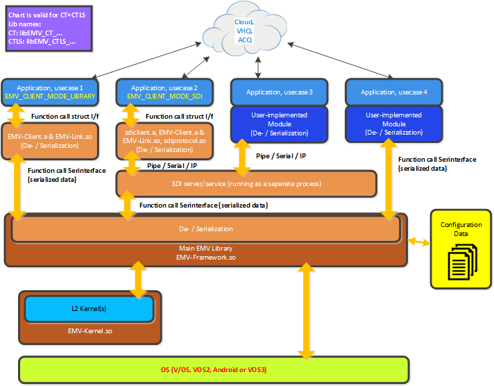
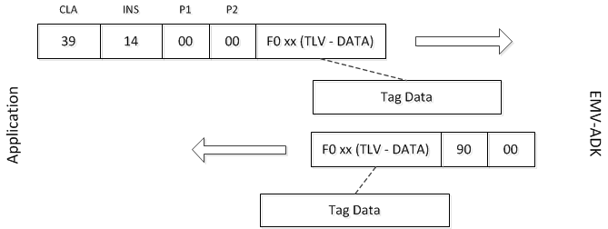

# Preface <a href="#sec_emv_ctls_preface" id="sec_emv_ctls_preface"></a>

This guide provides detailed descriptions of the ADK EMV Contactless features, as well as information for configuring ADK EMV Contactless.

## Audience <a href="#subsec_emv_ctls_audience" id="subsec_emv_ctls_audience"></a>

This document is intended for programmers who want to understand and use the ADK EMV Contactless framework.

## Organization <a href="#subsec_emv_ctls_organization" id="subsec_emv_ctls_organization"></a>

This guide is organized as follows:

[Introduction](#sec_emv_ctls_introduction). Provides an overview of the ADK EMV Contactless framework.

[Getting Started](#sec_emv_ctls_getting_started). Shows sample applications for the ADK EMV Contactless framework.

[Programming](#sec_emv_ctls_programming). Outlines the different APIs for the ADK EMV Contactless framework. Provides descriptions for various features like PIN Entry support or Virtual terminal mapping table support.

[System Setup and Requirements](#sec_emv_ctls_system_setup_and_requirements). Provides information about hardware supported as well as about software requirements.

[PayPass Data Exchange](#paypass_data_exchange). Provides important info to be considered while implementing PayPass Data Exchange with EMV ADK

[Discover Data Exchange](#discover_data_exchange). How to use Discover DPAS-2 features Data Storage and Extended Logging.

[Troubleshooting](#sec_emv_ctls_troubleshooting). Provides tips on problem solving approaches in form of FAQ. Additional advices are given about possible ways of debugging and tracing.

[Appendix](#sec_emv_ctls_appendix). Contains some useful links to related documents and a **quick reference to the interface functions:** [Table of API functions](#section_emv_ctls_emv_adk_api_table).

# Introduction <a href="#sec_emv_ctls_introduction" id="sec_emv_ctls_introduction"></a>

The Verifone ADK EMV Contactless framework supports payment applications following the EMVCo specifications (see <a href="http://www.emvco.com/">EMVCo Homepage</a>). Additionally some local kernels are supported. Complete list can be found here: <a href="group___d_e_f___k_e_r_n_e_l___i_d.md">Contactless Kernel Ids</a>

Please refer to the <a href="./pg_emv_contact_users_guide.md">ADK-EMV Contact Programmers Guide</a> for information on the CT framework.

It\'s recommended to analyse sources of \"ADK-EMV Demo Application\" to get a better understanding how to control the interfaces (\"doc/vdedemo/EmvTestApp\" in ADK bundle).

## Configuration Flow <a href="#subsec_emv_ctls_intro_configflow" id="subsec_emv_ctls_intro_configflow"></a>


**Description:**

- Typically the calling application gets the desired configuration dynamically at run-time (from host, TMS, or acquirer).
- Initialization is needed prior to calling config commands: <a href="group___f_u_n_c___i_n_i_t.md#ga63240773908b46180eeec866ef33f93f">EMV_CTLS_Init_Framework()</a>
- Terminal data setting: <a href="group___f_u_n_c___c_o_n_f.md#gac5ce9781bba083028538f9e77c2d58f3">EMV_CTLS_SetTermData()</a>
- For each supported payment application (AID) one call to <a href="group___f_u_n_c___c_o_n_f.md#gadc7f2eba5fd3e941d0ddb65a936a0776">EMV_CTLS_SetAppliDataSchemeSpecific()</a> is required.
- For each CAP key one call to <a href="group___f_u_n_c___c_o_n_f.md#ga3e03f6dd283e873cbcd6b8e4bb78f09a">EMV_CTLS_StoreCAPKey()</a> is needed.
- To free resources it\'s possible to optionally call <a href="group___f_u_n_c___i_n_i_t.md#gafe86c6980355b69b6a650af0bffcb7ed">EMV_CTLS_Exit_Framework()</a>.
- **Alternative:** Directly write the [XML Configuration Files](#subsec_emv_ctls_scenarios_and_use_cases_xml_files).
  Only recommended for experienced users.
  Application shall make sure that no EMV transaction is active and either <a href="group___f_u_n_c___i_n_i_t.md#gafe86c6980355b69b6a650af0bffcb7ed">EMV_CTLS_Exit_Framework()</a> has been called if applicable or at least <a href="group___c_l_i_n_i_t___o_p_t_i_o_n_s.md#ga1c8e49286494443e871880f3c168dd13">EMV_CTLS_INIT_OPT_CONFIG_MODE</a> has not been used
  Application writes XML configuration files.
  EMV ADK reads new configuration data when <a href="group___f_u_n_c___i_n_i_t.md#ga63240773908b46180eeec866ef33f93f">EMV_CTLS_Init_Framework()</a> is called.

## Transaction Flow <a href="#subsec_emv_ctls_intro_transactionflow" id="subsec_emv_ctls_intro_transactionflow"></a>


**Description:**

- EMV ADK framework needs to be initialized before transaction start: <a href="group___f_u_n_c___i_n_i_t.md#ga63240773908b46180eeec866ef33f93f">EMV_CTLS_Init_Framework()</a>
- Calling application has to set up transaction data (e.g. date, time, amount, \...): <a href="group___f_u_n_c___f_l_o_w.md#ga1a86c76dcf8fec6e97ead6cf8f2717ff">EMV_CTLS_SetupTransaction()</a>
- While waiting for tapping the card <a href="group___f_u_n_c___f_l_o_w.md#gaf23f6f87fe90619810470fad7d11f321">EMV_CTLS_ContinueOffline()</a> has to be polled.
- Return value different from <a href="group___a_d_k___r_e_t___c_o_d_e.md#ga2e738502a536ed7190406ce0e7c6916d">EMV_ADK_NO_CARD</a> indicates that a card was tapped. In that case the whole card interaction is already done.
  Due to speed reasons the EMV ADK does not come back during card processing. To be precise: There are some options for callbacks for experienced users.
- The outcome determines if transaction is declined, offline approved, or has to be sent to host for the decision.
- If host connection is needed the host response has to be put in <a href="group___f_u_n_c___f_l_o_w.md#ga297b6843994afaa2e7a6f5e0e4a8af3e">EMV_CTLS_ContinueOnline()</a>.
- At this point only two outcomes are possible: declined or approved.
- It\'s recommended to call <a href="group___f_u_n_c___f_l_o_w.md#gaa7aed3c7f0c3ac0f26cc46efff422dd9">EMV_CTLS_EndTransaction()</a> after each transaction. This function wipes sensitive data from memory.
- Calling <a href="group___f_u_n_c___i_n_i_t.md#gafe86c6980355b69b6a650af0bffcb7ed">EMV_CTLS_Exit_Framework()</a> after each transaction would decrease performance. It\'s not needed at this point, but in principle it\'s possible.

## Android <a href="#subsec_emv_ctls_intro_android" id="subsec_emv_ctls_intro_android"></a>

In Android the ADK-EMV is hidden inside SDI. So application has to use the \"Card Detection (23-01)\", \"EMV System Interface\", respectively \"EMV Transaction Interface\" from <a href="./pg_sdi_users_guide.md">ADK-SDI Programmers Guide</a>.

## VOS3 <a href="#subsec_emv_ctls_intro_vos3" id="subsec_emv_ctls_intro_vos3"></a>

In VOS3 ADK-EMV is accessible through SDI. The ADK-EMV-interface is rebuild in <a href="./pg_sdiclient_users_guide.md">ADK-SDI-Client Programmers Guide</a>.

## Two-Piece Solution <a href="#subsec_emv_ctls_intro_2piece" id="subsec_emv_ctls_intro_2piece"></a>

Former Two-Piece Solution with Client/Server architecture for EMV, MSR, TEC, \... is not supported anymore.
SDI EPP has to be used instead (see <a href="./pg_sdi_users_guide.md">ADK-SDI Programmers Guide</a>).

## Use cases <a href="#subsec_emv_ctls_intro_usecases" id="subsec_emv_ctls_intro_usecases"></a>

**Usecase 1-4**



**Description:**

- **Usecase 1**
  Used on systems without SDI server. Only possible on VOS and VOS2.
  Calling application links the static library `libEMV_CTLS_Client.a`.
  So it uses the functional interface with all data in C structs.
  Dynamic library `libEMV_CTLS_Link.so` manages the communication to EMV ADK (`libEMV_CTLS_Framework.so`).
- **Usecase 2**
  Used on systems with SDI server respectively SDI service.
  `libsdiclient.a` internally configures <a href="_e_m_v___common___interface_8h.md#aa5ecae39726aadf1805b96849d3d28f5aaf0ee82626c70656d071e14fcdfa3758">EMV_CLIENT_MODE_SDI</a>.
  So `libEMV_CTLS_Link.so` uses `libsdiprotocol.so` to manage the connection to SDI server/service.
  - VOS3
    `libsdiclient.a` provides the same API as ADK-EMV in Usecase 1.
    That way application does not need source code change when migrating from VOS/VOS2 to VOS3.
  - Usage without `libsdiclient.a`
    Alternatively application may use `libEMV_CTLS_Client.a` directly.
    In that case it must set <a href="_e_m_v___common___interface_8h.md#aa5ecae39726aadf1805b96849d3d28f5aaf0ee82626c70656d071e14fcdfa3758">EMV_CLIENT_MODE_SDI</a>.
- **Usecase 3**
  Similar to Usecase 2, but calling application implements it\'s own module to de-/serialize the data and do the communication with the SDI server/service.
- **Usecase 4**
  Similar to Usecase 1, but calling application implements it\'s own module to de-/serialize the data and do the EMV ADK connection (calling <a href="_e_m_v___c_t_l_s___ser_interface_8h.md#a540b4e23317a9808730510cf39224588">EMV_CTLS_SerInterface()</a> and <a href="_e_m_v___c_t_l_s___ser_interface_8h.md#a27717a16ba1426c41655362ca975b475">EMV_CTLS_HandleCallback()</a>).

## Concepts <a href="#subsec_emv_ctls_concepts" id="subsec_emv_ctls_concepts"></a>

The Verifone EMV-ADK is designed to support several types of card profiles and transactions in the electronic payment business for EMV.

This document describes the interface of the EMV framework for contactless. The general architecture of the EMV-ADK is shown in [Figure Architecture](#anchor_emv_ctls_figure_architecture). The main component is an EMV framework that implements the transaction flow and takes care about kernel configurations. This main library is connected to the application by an API that can be used in two variants, remotely (serialization) or directly. The configuration data of the application is stored in XML files inside the ADK. Furthermore, it offers a Payment API, card API, and callbacks during the transaction.

**Figure Architecture**


All commands are available in two variants. The interface in between the EMV framework and the application is the same for both variants. They do, however, vary in form because the framework must be able to operate both in a client-server architecture (SDI) and as a part of a single terminal project (function interface) as well. The framework itself is identical for both, but the solution in a SDI environment requires that the framework interface is serialized. Similar to chip card commands, the functions are identified by CLA (class) and INS (instruction).

The commands are logically sorted in groups by the classes (CLA) and filtered by a dispatcher. The protocol, which is used to transfer the CLA/INS commands, is out of scope of this document.

### GUI <a href="#subsubsec_emv_ctls_concept_gui" id="subsubsec_emv_ctls_concept_gui"></a>

UI handling is country-, regional- and domestic-specific. This is why ADK separates business logic from GUI interface.
EMV ADK does itself not directly control the GUI. It just gives advice, in case display or cardholder interaction is required.
Examples:
<a href="group___a_p_p_l_i___t_e_x_t_s.md#gaa06ce44c0d2088762672aa1aa477fde3">EMV_ADK_TXT_SEE_PHONE</a> is given when cardholder display is needed (callback <a href="group___c_b_c_k___f_c_t___t_a_g_s.md#ga694e27a1370530d36c245cc0cb2288bd">TAG_BF14_CBK_TEXT_DISPLAY</a>).
<a href="group___s_t_a_t_u_s___i_n_f_o.md#gad65bcb7485b33d671da3acadc03ce784">EMV_ADK_SI_ONLINE_PIN_REQUIRED</a> is returned when PIN entry is required.

It is recommended to use GUI ADK.

### Interface type: Structure-based vs. serialized <a href="#subsubsec_emv_ctls_concept_struct_vs_serialized" id="subsubsec_emv_ctls_concept_struct_vs_serialized"></a>

The Verifone EMV services are designed as a serialized interface. On this interface (CLA/INS) all parameters are tag based and where the parameters are named in the EMVCo specification we follow the tags and format of EMVCo. The parameters on this interface will vary depending on EMVCo, Scheme and Feature updates. Whenever an old parameter is obsolete it will removed from the serialized interface and whenever a new parameter is necessary it\'ll be added. Additionally we provide for better readability an interface, which is structure based and allows to set parameters without setting up a TLV based binary stream. Both approaches are supported with the client on top of the EMV framework. There is no force to use this client, you can at any time directly use the framework API with CLA/INS directly. However because of easier code maintenance it may be beneficial to use the client API, either struct or TLV based.
Each struct parameter is 1:1 converted to a serialized tag without the need to know the tag and format inside the serialized stream. Whenever you fill a parameter inside the struct you simply need to raise the config flag for this struct parameter and it\'ll be added to the serialized stream automatically.

Example:

``` fragment
TXN_Data.Force_Online = FALSE; // no force Online
Info_Included_Data[1] |=  INPUT_SEL_FORCE_ONLINE; //raise the flag
```

### XML Configuration Files <a href="#subsec_emv_ctls_scenarios_and_use_cases_xml_files" id="subsec_emv_ctls_scenarios_and_use_cases_xml_files"></a>

The framework configuration is stored in XML files. These files are created dynamically using the configuration functions. Default values are automatically filled for missing parameters.

In V/OS and VOS2 you can find the XML files in the sub folder \"flash\" of the corresponding user.

The examples shown below are not necessarily complete but gives you an idea on how to read or create your own XML files.

Mapping from XML tags to struct parameters (and TLV tags) can be found in <a href="_e_m_v___c_t_l_s___x_m_l_8h.md">EMV_CTLS_XML.h</a>.

**Terminal data** (file name: `EMV_CTLS_Terminal.xml`)

``` cpp
<TerminalData>
<CL_Modes_Supported>800000FF</CL_Modes_Supported>
<TermTyp>22</TermTyp>
<CountryCodeTerm>0250</CountryCodeTerm>
<CL_Ceiling_Limit>FFFFFFFF</CL_Ceiling_Limit>
<TermCap>E0F8C8</TermCap>
<TermAddCap>F000B0A001</TermAddCap>
<CurrencyTrans>0978</CurrencyTrans>
<ExpTrans>02</ExpTrans>
<SuppLang>0100000000000000</SuppLang>
<IFD_SerialNumber>12345678</IFD_SerialNumber>
<KernelVersion>--.--</KernelVersion>
<FrameworkVersion>01.00.00-rc1</FrameworkVersion>
</TerminalData>
```

**Applications** (file name: `EMV_CTLS_Apps_SchemeSpecific.xml`)

``` cpp
<ApplicationData>
  <Application AID="A0000000041010" KernelID="020000">
   <ASI_DFAB02>01</ASI_DFAB02>
   <AppFlowCap_DFAB03>0C02000000</AppFlowCap_DFAB03>
   <SpecialTRXConfig_DFAB05>2120110000000000</SpecialTRXConfig_DFAB05>
   <ChksumEntryPoint_DFAB06>C120E8C8</ChksumEntryPoint_DFAB06>
   <ChksumKernel_DFAB07>630418AE222CB9329DEFB2A33EEADBA4</ChksumKernel_DFAB07>
   <RetapFieldOff_DFAB08>0D</RetapFieldOff_DFAB08>
   <AdditionalTagsTRM_DFAB20></AdditionalTagsTRM_DFAB20>
   <AdditionalTagsCRD_DFAB21></AdditionalTagsCRD_DFAB21>
   <DefaultApplicationName_DFAB22>Mastercard</DefaultApplicationName_DFAB22>
   <MasterCard>
   <TermIdent_9F1C>3132333435363738</TermIdent_9F1C>
   <TerminalCountryCode_9F1A>0036</TerminalCountryCode_9F1A>
   <TerminalType_9F35>22</TerminalType_9F35>
   <AdditionalTerminalCapabilities_9F40>F000B0A001</AdditionalTerminalCapabilities_9F40>
   <MagstripeCVM_aboveLimit_DF811E>20</MagstripeCVM_aboveLimit_DF811E>
   <MagstripeCVM_belowLimit_DF812C>00</MagstripeCVM_belowLimit_DF812C>
   <ChipCVM_aboveLimit_DF8118>60</ChipCVM_aboveLimit_DF8118>
   <ChipCVM_belowLimit_DF8119>08</ChipCVM_belowLimit_DF8119>
   <SecurityCapability_DF811F>08</SecurityCapability_DF811F>
   <CardDataInputCapability_DF8117>E0</CardDataInputCapability_DF8117>
   <FloorLimit_DF8123>000000002000</FloorLimit_DF8123>
   <TransactionLimitNoOnDevice_DF8124>000000002500</TransactionLimitNoOnDevice_DF8124>
   <TransactionLimitOnDevice_DF8125>000000200000</TransactionLimitOnDevice_DF8125>
   <CVMRequiredLimit_DF8126>000000001000</CVMRequiredLimit_DF8126>
   <ChipVersionNumber_9F09>0002</ChipVersionNumber_9F09>
   <MSRVersionNumber_9F6D>0001</MSRVersionNumber_9F6D>
   <KernelConfiguration_DF811B>20</KernelConfiguration_DF811B>
   <TransactionCategoryCode_9F53>52</TransactionCategoryCode_9F53>
   <TACDefault_DF8120>FC509C8800</TACDefault_DF8120>
   <TACDenial_DF8121>0000000000</TACDenial_DF8121>
   <TACOnline_DF8122>FC509C8800</TACOnline_DF8122>
   <KernelID_DF810C>02</KernelID_DF810C>
   <TerminalRiskManagementData_9F1D>6C72000000000000</TerminalRiskManagementData_9F1D>
   <MerchantCategoryCode_9F15>5999</MerchantCategoryCode_9F15>
   <MerchantIdentifier_9F16></MerchantIdentifier_9F16>
   <MerchantNameAndLocation_9F4E>Merchant name</MerchantNameAndLocation_9F4E>
   <AcquirerIdentifier_9F01>000000000000</AcquirerIdentifier_9F01>
   <HoldTimeValue_DF8130>0D</HoldTimeValue_DF8130>
   <MessageHoldTime_DF812D>000013</MessageHoldTime_DF812D>
   <TornTransactionLifetime_DF811C>0078</TornTransactionLifetime_DF811C>
   <TornTransactionNumber_DF811D>02</TornTransactionNumber_DF811D>
   <PhoneMessageTable_DF8131></PhoneMessageTable_DF8131>
   <TagsToRead_DF8112></TagsToRead_DF8112>
   <TagsToWriteBeforeGenAC_FF8102></TagsToWriteBeforeGenAC_FF8102>
   <TagsToWriteAfterGenAC_FF8103></TagsToWriteAfterGenAC_FF8103>
   <ProceedToFirstWriteFlag_DF8110>FE</ProceedToFirstWriteFlag_DF8110>
   <DSRequestedOperatorID_9F5C>FFFFFFFFFFFFFFFF</DSRequestedOperatorID_9F5C>
   <DETimeoutValue_DF8127>01F4</DETimeoutValue_DF8127>
   <AppFlowCap_DFAB31>0200000000</AppFlowCap_DFAB31>
   <RR_MinGracePeriod_DF8132>0014</RR_MinGracePeriod_DF8132>
   <RR_MaxGracePeriod_DF8133>0032</RR_MaxGracePeriod_DF8133>
   <RR_ExpTransTimeCAPDU_DF8134>0012</RR_ExpTransTimeCAPDU_DF8134>
   <RR_ExpTransTimeRAPDU_DF8135>0018</RR_ExpTransTimeRAPDU_DF8135>
   <RR_AccuracyThreshold_DF8136>012C</RR_AccuracyThreshold_DF8136>
   <RR_TransTimeMismatchThreshold_DF8137>32</RR_TransTimeMismatchThreshold_DF8137>
   <MerchantCustomData_9F7C></MerchantCustomData_9F7C>
   </MasterCard>
  </Application>
</ApplicationData>
```

**Keys** (file name: `EMV_CTLS_Keys.xml`)

``` cpp
CapKey Index="F8" RID="A000000004">
<Exponent>03</Exponent>
<KeyLen>80</KeyLen>
<Key>A1F5E1C9BD8650BD43AB6EE56B891EF7459C0A24FA84F9127D1A6C79D4930F6DB185 2E2510F18B61CD354DB83A356BD190B88AB8DF04284D02A4204A7B6CB7C5551977A9B3637
9CA3DE1A08E69F301C95CC1C20506959275F41723DD5D2925290579E5A95B0DF6323FC8E9
273D6F849198C4996209166D9BFC973C361CC826E1</Key>
<Hash>F06ECC6D2AAEBF259B7E755A38D9A9B24E2FF3DD</Hash>
<RevocationList>010203</ RevocationList >
</CapKey>
```

# Getting Started <a href="#sec_emv_ctls_getting_started" id="sec_emv_ctls_getting_started"></a>

In this chapter you will find execution flow diagrams as well as real code examples describing steps which are required in order to successfully configure application and make a payment transaction.

## Sample Application <a href="#sec_emv_ctls_sample_application" id="sec_emv_ctls_sample_application"></a>

For a payment application example, please refer to EMV testapp.

## Serialized Flow Examples <a href="#subsec_emv_ctls_serialized_flow_examples" id="subsec_emv_ctls_serialized_flow_examples"></a>

The following contains examples of serializied flow:

**Configuration**

*Init:*

``` cpp
CLIENT REQUEST: 39 00 [0]
SERVER RESPONSE: 90 00 [0]
```

*CFG Terminal Data:*

``` cpp
CLIENT REQUEST: 39 01 [68] F0429F3501225F2A020978 …
SERVER RESPONSE: 90 00 [0]
```

*CFG Application Data (Delete All):*

``` cpp
CLIENT REQUEST: 39 02 [6] F004DF660120
SERVER RESPONSE: 90 00 [0]
```

*CFG Application Data (Set AID, MC):*

``` cpp
CLIENT REQUEST: 39 02 [381] F0820180DF6601014F07A0000000041010DFAB01030200009F09020002
…
SERVER RESPONSE: 90 00 [0]
```

*CFG Application Data (Set AID, VISA):*

``` cpp
CLIENT REQUEST: 39 02 [362] F082016DDF6601014F07A0000000031010DFAB01030300009F0902008C
…
SERVER RESPONSE: 90 00 [0]
```

... repeat per AID

*CFG CAP Keys (Delete All):*

``` cpp
CLIENT REQUEST: 39 03 [6] F004DF660120
SERVER RESPONSE: 90 00 [0]
```

*CFG CAP Keys (Set CAP Keys, repeat n times):*

``` cpp
CLIENT REQUEST: 39 03 [178] F081AFDF660101DF0901F8DF0A05A000000004DF0B8 180A1F5E1C9BD8650BD43AB6E …
SERVER RESPONSE: 90 00 [0]
CLIENT REQUEST: 39 03 [194] F081BFDF660101DF0901F3DF0A05A000000004DF0B8 19098F0C770F23864C2E766DF …
SERVER RESPONSE: 90 00 [0]
```

**Transaction**

*Init:*

``` cpp
CLIENT REQUEST: 39 00 [0]
SERVER RESPONSE: 90 00 [0]
```

*Setup Transaction:*

``` cpp
CLIENT REQUEST: 39 10 [57] F0379C01009F02060000000156999A03121101 …
SERVER RESPONSE: 90 00 [0]
```

*Continue Transaction Offline:*

``` cpp
CLIENT REQUEST: 39 11 [30] F01C9F410400000000DF5806000000000000DF4E0100
DF470100DF340100
SERVER RESPONSE: 90 E2 [405] F0820191DF420200019F2701809F260845CFA9C81F28 B5BD …
```

*Continue Transaction Online:*

``` cpp
CLIENT REQUEST: 39 12 [12] F01ADF5001018A023030 …
SERVER RESPONSE: 90 E3 [401] F082018DDF42020001 …
```

*Deactivate ICC:*

``` cpp
CLIENT REQUEST: 41 04 [6] F004DF060100
SERVER RESPONSE: 90 00 [0]
```


Deactivation of ICC is optional. It is always deactivated by the framework when the transaction is completed (except on cases like when a domestic kernel is used after Entry Point processing).


## Other code samples <a href="#subsec_emv_ctls_other_code_samples" id="subsec_emv_ctls_other_code_samples"></a>

Code sample: Store CAP keys

This sample code is running unchanged under V/OS.

Main function to be called is ctlsStoreCapKeys()

To have have an example how to run it see below sample \"Payment loop\"

``` cpp
#include <stdio.h>
#include "E2E_EMV_CTLS_Serialize.h"
#include "EMV_CTLS_Interface.h"
// === this moudule's own CAP key type
typedef struct capKeyStruct
{
  unsigned char* rid;
  unsigned char idx;
  unsigned char* key;
  unsigned char keyLen;
  unsigned char exponent;
  unsigned char* hash;
  unsigned char cntRevocEntries;
  unsigned char* RevocEntries;
} capKeyType;
// === RIDs
const unsigned char tucRidVisa[] = "\xA0\x00\x00\x00\x03";
const unsigned char tucRidMasterCard[] = "\xA0\x00\x00\x00\x04";
const unsigned char tucRidAmex[] = "\xA0\x00\x00\x00\x25";
// === MC ETEC Testkeys Subset 1 and Subset 8
const unsigned char tucModulusMasterCardF8[] = "\xA1\xF5\xE1\xC9\xBD\x86\x50\xBD\x43\xAB\x6E\xE5\x6B\x89\x1E\xF7\x45\x9C\x0A\x24\xFA\x84\xF9\x12\x7D\x1A\x6C\x79\xD4\x93\x0F\x6D\xB1\x85\x2E\x25\x10\xF1\x8B\x61\xCD\x35\x4D\xB8\x3A\x35\x6B\xD1\x90\xB8\x8A\xB8\xDF\x04\x28\x4D\x02\xA4\x20\x4A\x7B\x6C\xB7\xC5\x55\x19\x77\xA9\xB3\x63\x79\xCA\x3D\xE1\xA0\x8E\x69\xF3\x01\xC9\x5C\xC1\xC2\x05\x06\x95\x92\x75\xF4\x17\x23\xDD\x5D\x29\x25\x29\x05\x79\xE5\xA9\x5B\x0D\xF6\x32\x3F\xC8\xE9\x27\x3D\x6F\x84\x91\x98\xC4\x99\x62\x09\x16\x6D\x9B\xFC\x97\x3C\x36\x1C\xC8\x26\xE1";
const unsigned char tucHashMasterCardF8[] = "\xF0\x6E\xCC\x6D\x2A\xAE\xBF\x25\x9B\x7E\x75\x5A\x38\xD9\xA9\xB2\x4E\x2F\xF3\xDD";
const unsigned char tucModulusMasterCardF3[] = "\x98\xF0\xC7\x70\xF2\x38\x64\xC2\xE7\x66\xDF\x02\xD1\xE8\x33\xDF\xF4\xFF\xE9\x2D\x69\x6E\x16\x42\xF0\xA8\x8C\x56\x94\xC6\x47\x9D\x16\xDB\x15\x37\xBF\xE2\x9E\x4F\xDC\x6E\x6E\x8A\xFD\x1B\x0E\xB7\xEA\x01\x24\x72\x3C\x33\x31\x79\xBF\x19\xE9\x3F\x10\x65\x8B\x2F\x77\x6E\x82\x9E\x87\xDA\xED\xA9\xC9\x4A\x8B\x33\x82\x19\x9A\x35\x0C\x07\x79\x77\xC9\x7A\xFF\x08\xFD\x11\x31\x0A\xC9\x50\xA7\x2C\x3C\xA5\x00\x2E\xF5\x13\xFC\xCC\x28\x6E\x64\x6E\x3C\x53\x87\x53\x5D\x50\x95\x14\xB3\xB3\x26\xE1\x23\x4F\x9C\xB4\x8C\x36\xDD\xD4\x4B\x41\x6D\x23\x65\x40\x34\xA6\x6F\x40\x3B\xA5\x11\xC5\xEF\xA3";
const unsigned char tucHashMasterCardF3[] = "\xA6\x9A\xC7\x60\x3D\xAF\x56\x6E\x97\x2D\xED\xC2\xCB\x43\x3E\x07\xE8\xB0\x1A\x9A";
const unsigned char tucModulusMasterCardFE[] = "\xA6\x53\xEA\xC1\xC0\xF7\x86\xC8\x72\x4F\x73\x7F\x17\x29\x97\xD6\x3D\x1C\x32\x51\xC4\x44\x02\x04\x9B\x86\x5B\xAE\x87\x7D\x0F\x39\x8C\xBF\xBE\x8A\x60\x35\xE2\x4A\xFA\x08\x6B\xEF\xDE\x93\x51\xE5\x4B\x95\x70\x8E\xE6\x72\xF0\x96\x8B\xCD\x50\xDC\xE4\x0F\x78\x33\x22\xB2\xAB\xA0\x4E\xF1\x37\xEF\x18\xAB\xF0\x3C\x7D\xBC\x58\x13\xAE\xAE\xF3\xAA\x77\x97\xBA\x15\xDF\x7D\x5B\xA1\xCB\xAF\x7F\xD5\x20\xB5\xA4\x82\xD8\xD3\xFE\xE1\x05\x07\x78\x71\x11\x3E\x23\xA4\x9A\xF3\x92\x65\x54\xA7\x0F\xE1\x0E\xD7\x28\xCF\x79\x3B\x62\xA1";
const unsigned char tucHashMasterCardFE[] = "\x9A\x29\x5B\x05\xFB\x39\x0E\xF7\x92\x3F\x57\x61\x8A\x9F\xDA\x29\x41\xFC\x34\xE0";
const unsigned char tucModulusMasterCardFA[] = "\xA9\x0F\xCD\x55\xAA\x2D\x5D\x99\x63\xE3\x5E\xD0\xF4\x40\x17\x76\x99\x83\x2F\x49\xC6\xBA\xB1\x5C\xDA\xE5\x79\x4B\xE9\x3F\x93\x4D\x44\x62\xD5\xD1\x27\x62\xE4\x8C\x38\xBA\x83\xD8\x44\x5D\xEA\xA7\x41\x95\xA3\x01\xA1\x02\xB2\xF1\x14\xEA\xDA\x0D\x18\x0E\xE5\xE7\xA5\xC7\x3E\x0C\x4E\x11\xF6\x7A\x43\xDD\xAB\x5D\x55\x68\x3B\x14\x74\xCC\x06\x27\xF4\x4B\x8D\x30\x88\xA4\x92\xFF\xAA\xDA\xD4\xF4\x24\x22\xD0\xE7\x01\x35\x36\xC3\xC4\x9A\xD3\xD0\xFA\xE9\x64\x59\xB0\xF6\xB1\xB6\x05\x65\x38\xA3\xD6\xD4\x46\x40\xF9\x44\x67\xB1\x08\x86\x7D\xEC\x40\xFA\xAE\xCD\x74\x0C\x00\xE2\xB7\xA8\x85\x2D";
const unsigned char tucHashMasterCardFA[] = "\x5B\xED\x40\x68\xD9\x6E\xA1\x6D\x2D\x77\xE0\x3D\x60\x36\xFC\x7A\x16\x0E\xA9\x9C";
const unsigned char tucModulusMasterCardF1[] = "\xA0\xDC\xF4\xBD\xE1\x9C\x35\x46\xB4\xB6\xF0\x41\x4D\x17\x4D\xDE\x29\x4A\xAB\xBB\x82\x8C\x5A\x83\x4D\x73\xAA\xE2\x7C\x99\xB0\xB0\x53\xA9\x02\x78\x00\x72\x39\xB6\x45\x9F\xF0\xBB\xCD\x7B\x4B\x9C\x6C\x50\xAC\x02\xCE\x91\x36\x8D\xA1\xBD\x21\xAA\xEA\xDB\xC6\x53\x47\x33\x7D\x89\xB6\x8F\x5C\x99\xA0\x9D\x05\xBE\x02\xDD\x1F\x8C\x5B\xA2\x0E\x2F\x13\xFB\x2A\x27\xC4\x1D\x3F\x85\xCA\xD5\xCF\x66\x68\xE7\x58\x51\xEC\x66\xED\xBF\x98\x85\x1F\xD4\xE4\x2C\x44\xC1\xD5\x9F\x59\x84\x70\x3B\x27\xD5\xB9\xF2\x1B\x8F\xA0\xD9\x32\x79\xFB\xBF\x69\xE0\x90\x64\x29\x09\xC9\xEA\x27\xF8\x98\x95\x95\x41\xAA\x67\x57\xF5\xF6\x24\x10\x4F\x6E\x1D\x3A\x95\x32\xF2\xA6\xE5\x15\x15\xAE\xAD\x1B\x43\xB3\xD7\x83\x50\x88\xA2\xFA\xFA\x7B\xE7";
const unsigned char tucHashMasterCardF1[] = "\xD8\xE6\x8D\xA1\x67\xAB\x5A\x85\xD8\xC3\xD5\x5E\xCB\x9B\x05\x17\xA1\xA5\xB4\xBB";
const unsigned char tucModulusMasterCardEF[] = "\xA1\x91\xCB\x87\x47\x3F\x29\x34\x9B\x5D\x60\xA8\x8B\x3E\xAE\xE0\x97\x3A\xA6\xF1\xA0\x82\xF3\x58\xD8\x49\xFD\xDF\xF9\xC0\x91\xF8\x99\xED\xA9\x79\x2C\xAF\x09\xEF\x28\xF5\xD2\x24\x04\xB8\x8A\x22\x93\xEE\xBB\xC1\x94\x9C\x43\xBE\xA4\xD6\x0C\xFD\x87\x9A\x15\x39\x54\x4E\x09\xE0\xF0\x9F\x60\xF0\x65\xB2\xBF\x2A\x13\xEC\xC7\x05\xF3\xD4\x68\xB9\xD3\x3A\xE7\x7A\xD9\xD3\xF1\x9C\xA4\x0F\x23\xDC\xF5\xEB\x7C\x04\xDC\x8F\x69\xEB\xA5\x65\xB1\xEB\xCB\x46\x86\xCD\x27\x47\x85\x53\x0F\xF6\xF6\xE9\xEE\x43\xAA\x43\xFD\xB0\x2C\xE0\x0D\xAE\xC1\x5C\x7B\x8F\xD6\xA9\xB3\x94\xBA\xBA\x41\x9D\x3F\x6D\xC8\x5E\x16\x56\x9B\xE8\xE7\x69\x89\x68\x8E\xFE\xA2\xDF\x22\xFF\x7D\x35\xC0\x43\x33\x8D\xEA\xA9\x82\xA0\x2B\x86\x6D\xE5\x32\x85\x19\xEB\xBC\xD6\xF0\x3C\xDD\x68\x66\x73\x84\x7F\x84\xDB\x65\x1A\xB8\x6C\x28\xCF\x14\x62\x56\x2C\x57\x7B\x85\x35\x64\xA2\x90\xC8\x55\x6D\x81\x85\x31\x26\x8D\x25\xCC\x98\xA4\xCC\x6A\x0B\xDF\xFF\xDA\x2D\xCC\xA3\xA9\x4C\x99\x85\x59\xE3\x07\xFD\xDF\x91\x50\x06\xD9\xA9\x87\xB0\x7D\xDA\xEB\x3B";
const unsigned char tucHashMasterCardEF[] = "\x21\x76\x6E\xBB\x0E\xE1\x22\xAF\xB6\x5D\x78\x45\xB7\x3D\xB4\x6B\xAB\x65\x42\x7A";
// === VISA ADVT Testkeys
const unsigned char tucModulusVisa99[] = "\xAB\x79\xFC\xC9\x52\x08\x96\x96\x7E\x77\x6E\x64\x44\x4E\x5D\xCD\xD6\xE1\x36\x11\x87\x4F\x39\x85\x72\x25\x20\x42\x52\x95\xEE\xA4\xBD\x0C\x27\x81\xDE\x7F\x31\xCD\x3D\x04\x1F\x56\x5F\x74\x73\x06\xEE\xD6\x29\x54\xB1\x7E\xDA\xBA\x3A\x6C\x5B\x85\xA1\xDE\x1B\xEB\x9A\x34\x14\x1A\xF3\x8F\xCF\x82\x79\xC9\xDE\xA0\xD5\xA6\x71\x0D\x08\xDB\x41\x24\xF0\x41\x94\x55\x87\xE2\x03\x59\xBA\xB4\x7B\x75\x75\xAD\x94\x26\x2D\x4B\x25\xF2\x64\xAF\x33\xDE\xDC\xF2\x8E\x09\x61\x5E\x93\x7D\xE3\x2E\xDC\x03\xC5\x44\x45\xFE\x7E\x38\x27\x77";
const unsigned char tucHashVisa99[] = "\x4A\xBF\xFD\x6B\x1C\x51\x21\x2D\x05\x55\x2E\x43\x1C\x5B\x17\x00\x7D\x2F\x5E\x6D";
const unsigned char tucModulusVisa95[] = "\xBE\x9E\x1F\xA5\xE9\xA8\x03\x85\x29\x99\xC4\xAB\x43\x2D\xB2\x86\x00\xDC\xD9\xDA\xB7\x6D\xFA\xAA\x47\x35\x5A\x0F\xE3\x7B\x15\x08\xAC\x6B\xF3\x88\x60\xD3\xC6\xC2\xE5\xB1\x2A\x3C\xAA\xF2\xA7\x00\x5A\x72\x41\xEB\xAA\x77\x71\x11\x2C\x74\xCF\x9A\x06\x34\x65\x2F\xBC\xA0\xE5\x98\x0C\x54\xA6\x47\x61\xEA\x10\x1A\x11\x4E\x0F\x0B\x55\x72\xAD\xD5\x7D\x01\x0B\x7C\x9C\x88\x7E\x10\x4C\xA4\xEE\x12\x72\xDA\x66\xD9\x97\xB9\xA9\x0B\x5A\x6D\x62\x4A\xB6\xC5\x7E\x73\xC8\xF9\x19\x00\x0E\xB5\xF6\x84\x89\x8E\xF8\xC3\xDB\xEF\xB3\x30\xC6\x26\x60\xBE\xD8\x8E\xA7\x8E\x90\x9A\xFF\x05\xF6\xDA\x62\x7B";
const unsigned char tucHashVisa95[] = "\xEE\x15\x11\xCE\xC7\x10\x20\xA9\xB9\x04\x43\xB3\x7B\x1D\x5F\x6E\x70\x30\x30\xF6";
const unsigned char tucModulusVisa92[] = "\x99\x6A\xF5\x6F\x56\x91\x87\xD0\x92\x93\xC1\x48\x10\x45\x0E\xD8\xEE\x33\x57\x39\x7B\x18\xA2\x45\x8E\xFA\xA9\x2D\xA3\xB6\xDF\x65\x14\xEC\x06\x01\x95\x31\x8F\xD4\x3B\xE9\xB8\xF0\xCC\x66\x9E\x3F\x84\x40\x57\xCB\xDD\xF8\xBD\xA1\x91\xBB\x64\x47\x3B\xC8\xDC\x9A\x73\x0D\xB8\xF6\xB4\xED\xE3\x92\x41\x86\xFF\xD9\xB8\xC7\x73\x57\x89\xC2\x3A\x36\xBA\x0B\x8A\xF6\x53\x72\xEB\x57\xEA\x5D\x89\xE7\xD1\x4E\x9C\x7B\x6B\x55\x74\x60\xF1\x08\x85\xDA\x16\xAC\x92\x3F\x15\xAF\x37\x58\xF0\xF0\x3E\xBD\x3C\x5C\x2C\x94\x9C\xBA\x30\x6D\xB4\x4E\x6A\x2C\x07\x6C\x5F\x67\xE2\x81\xD7\xEF\x56\x78\x5D\xC4\xD7\x59\x45\xE4\x91\xF0\x19\x18\x80\x0A\x9E\x2D\xC6\x6F\x60\x08\x05\x66\xCE\x0D\xAF\x8D\x17\xEA\xD4\x6A\xD8\xE3\x0A\x24\x7C\x9F";
const unsigned char tucHashVisa92[] = "\x42\x9C\x95\x4A\x38\x59\xCE\xF9\x12\x95\xF6\x63\xC9\x63\xE5\x82\xED\x6E\xB2\x53";
const unsigned char tucModulusVisa94[] = "\xAC\xD2\xB1\x23\x02\xEE\x64\x4F\x3F\x83\x5A\xBD\x1F\xC7\xA6\xF6\x2C\xCE\x48\xFF\xEC\x62\x2A\xA8\xEF\x06\x2B\xEF\x6F\xB8\xBA\x8B\xC6\x8B\xBF\x6A\xB5\x87\x0E\xED\x57\x9B\xC3\x97\x3E\x12\x13\x03\xD3\x48\x41\xA7\x96\xD6\xDC\xBC\x41\xDB\xF9\xE5\x2C\x46\x09\x79\x5C\x0C\xCF\x7E\xE8\x6F\xA1\xD5\xCB\x04\x10\x71\xED\x2C\x51\xD2\x20\x2F\x63\xF1\x15\x6C\x58\xA9\x2D\x38\xBC\x60\xBD\xF4\x24\xE1\x77\x6E\x2B\xC9\x64\x80\x78\xA0\x3B\x36\xFB\x55\x43\x75\xFC\x53\xD5\x7C\x73\xF5\x16\x0E\xA5\x9F\x3A\xFC\x53\x98\xEC\x7B\x67\x75\x8D\x65\xC9\xBF\xF7\x82\x8B\x6B\x82\xD4\xBE\x12\x4A\x41\x6A\xB7\x30\x19\x14\x31\x1E\xA4\x62\xC1\x9F\x77\x1F\x31\xB3\xB5\x73\x36\x00\x0D\xFF\x73\x2D\x3B\x83\xDE\x07\x05\x2D\x73\x03\x54\xD2\x97\xBE\xC7\x28\x71\xDC\xCF\x0E\x19\x3F\x17\x1A\xBA\x27\xEE\x46\x4C\x6A\x97\x69\x09\x43\xD5\x9B\xDA\xBB\x2A\x27\xEB\x71\xCE\xEB\xDA\xFA\x11\x76\x04\x64\x78\xFD\x62\xFE\xC4\x52\xD5\xCA\x39\x32\x96\x53\x0A\xA3\xF4\x19\x27\xAD\xFE\x43\x4A\x2D\xF2\xAE\x30\x54\xF8\x84\x06\x57\xA2\x6E\x0F\xC6\x17";
const unsigned char tucHashVisa94[] = "\xC4\xA3\xC4\x3C\xCF\x87\x32\x7D\x13\x6B\x80\x41\x60\xE4\x7D\x43\xB6\x0E\x6E\x0F";
// === Amex Test Keys
const unsigned char tucModulusAmex97[] = "\xE1\x78\xFF\xE8\x34\xB4\xB7\x67\xAF\x3C\x9A\x51\x1F\x97\x3D\x8E\x85\x05\xC5\xFC\xB2\xD3\x76\x80\x75\xAB\x7C\xC9\x46\xA9\x55\x78\x99\x55\x87\x9A\xAF\x73\x74\x07\x15\x15\x21\x99\x6D\xFA\x43\xC5\x8E\x6B\x13\x0E\xB1\xD8\x63\xB8\x5D\xC9\xFF\xB4\x05\x09\x47\xA2\x67\x6A\xA6\xA0\x61\xA4\xA7\xAE\x1E\xDB\x0E\x36\xA6\x97\xE8\x7E\x03\x75\x17\xEB\x89\x23\x13\x68\x75\xBA\x2C\xA1\x08\x7C\xBA\x7E\xC7\x65\x3E\x5E\x28\xA0\xC2\x61\xA0\x33\xAF\x27\xE3\xA6\x7B\x64\xBB\xA2\x69\x56\x30\x7E\xC4\x7E\x67\x4E\x3F\x8B\x72\x2B\x3A\xE0\x49\x8D\xB1\x6C\x79\x85\x31\x0D\x9F\x3D\x11\x73\x00\xD3\x2B\x09";
const unsigned char tucHashAmex97[] = "\xEB\xDA\x52\x2B\x63\x1B\x3E\xB4\xF4\xCB\xFC\x06\x79\xC4\x50\x13\x9D\x2B\x69\xCD";
const unsigned char tucModulusAmex98[] = "\xD3\x1A\x70\x94\xFB\x22\x1C\xBA\x66\x60\xFB\x97\x5A\xAF\xEA\x80\xDB\x7B\xB7\xEA\xFD\x73\x51\xE7\x48\x82\x7A\xB6\x2D\x4A\xEE\xCC\xFC\x17\x87\xFD\x47\xA0\x46\x99\xA0\x2D\xB0\x0D\x7C\x38\x2E\x80\xE8\x04\xB3\x5C\x59\x43\x4C\x60\x23\x89\xD6\x91\xB9\xCC\xD5\x1E\xD0\x6B\xE6\x7A\x27\x61\x19\xC4\xC1\x0E\x2E\x40\xFC\x4E\xDD\xF9\xDF\x39\xB9\xB0\xBD\xEE\x8D\x07\x6E\x2A\x01\x2E\x8A\x29\x2A\xF8\xEF\xE1\x85\x53\x47\x06\x39\xC1\xA0\x32\x25\x2E\x0E\x57\x48\xB2\x5A\x3F\x9B\xA4\xCF\xCE\xE0\x73\x03\x8B\x06\x18\x37\xF2\xAC\x1B\x04\xC2\x79\x64\x0F\x5B\xD1\x10\xA9\xDC\x66\x5E\xD2\xFA\x68\x28\xBD\x5D\x0F\xE8\x10\xA8\x92\xDE\xE6\xB0\xE7\x4C\xE8\x86\x3B\xDE\x08\xFD\x5F\xD6\x1A\x0F\x11\xFA\x0D\x14\x97\x8D\x8C\xED\x7D\xD3";
const unsigned char tucHashAmex98[] = "\xD4\xDB\xA4\x28\xCF\x11\xD4\x5B\xAE\xB0\xA3\x5C\xAE\xA8\x00\x7A\xD8\xBA\x8D\x71";
const unsigned char tucModulusAmex99[] = "\xE1\x74\x00\x74\x22\x9F\xA0\xD2\x28\xA9\x62\x35\x81\xD7\xA3\x22\x90\x3F\xB8\x9B\xA7\x68\x67\x12\xE6\x01\xFA\x8A\xB2\x4A\x97\x89\x18\x6F\x15\xB7\x0C\xCB\xBE\x74\x21\xB1\xCB\x11\x0D\x45\x36\x16\x88\x13\x5F\xFD\x0D\xB1\x5A\x3F\x51\x6B\xB2\x91\xD4\xA1\x23\xEB\xF5\xA0\x6F\xBF\x7E\x1E\xE6\x31\x1B\x73\x7D\xAB\xB2\x89\x57\x0A\x79\x59\xD5\x32\xB2\x5F\x1D\xA6\x75\x8C\x84\xDD\xCC\xAD\xC0\x49\xBC\x76\x4C\x05\x39\x1A\xBD\x2C\xAD\xEF\xFA\x7E\x24\x2D\x5D\xD0\x6E\x56\x00\x1F\x0E\x68\x15\x1E\x33\x88\x07\x4B\xD9\x33\x0D\x6A\xFA\x57\xCB\xF3\x39\x46\xF5\x31\xE5\x1E\x0D\x49\x02\xEE\x23\x5C\x75\x6A\x90\x5F\xB7\x33\x94\x0E\x6E\xC8\x97\xB4\x94\x4A\x5E\xDC\x76\x57\x05\xE2\xAC\xF7\x6C\x78\xEA\xD7\x8D\xD9\xB0\x66\xDF\x0B\x2C\x88\x75\x0B\x8A\xEE\x00\xC9\xB4\xD4\x09\x1F\xA7\x33\x84\x49\xDA\x92\xDB\xFC\x90\x8F\xA0\x78\x1C\x01\x28\xC4\x92\xDB\x99\x3C\x88\xBA\x8B\xB7\xCA\xDF\xE2\x38\xD4\x77\xF2\x51\x7E\x0E\x7E\x3D\x2B\x11\x79\x6A\x03\x18\xCE\x2A\xD4\xDA\x1D\xB8\xE5\x4A\xB0\xD9\x4F\x10\x9D\xB9\xCA\xEE\xFB\xEF";
const unsigned char tucHashAmex99[] ="\x94\x79\x0D\x02\x0F\x4F\x69\x2D\x59\x28\x9F\x36\x45\x18\x72\x07\x80\x05\xB6\x3B";
// === CAP key table
const capKeyType txCapKeyTable[] =
{
{(unsigned char*)tucRidMasterCard, 0xF8, (unsigned char*)tucModulusMasterCardF8, 0x80, 0x03, (unsigned char*)tucHashMasterCardF8, 3, (unsigned char*)"\x01\x02\x03\x11\x12\x13\x21\x22\x23"},
{(unsigned char*)tucRidMasterCard, 0xF3, (unsigned char*)tucModulusMasterCardF3, 0x90, 0x03, (unsigned char*)tucHashMasterCardF3, 0, NULL},
{(unsigned char*)tucRidMasterCard, 0xFE, (unsigned char*)tucModulusMasterCardFE, 0x80, 0x03, (unsigned char*)tucHashMasterCardFE, 2, (unsigned char*)"\x11\x11\x11\x22\x22\x22"},
{(unsigned char*)tucRidMasterCard, 0xFA, (unsigned char*)tucModulusMasterCardFA, 0x90, 0x03, (unsigned char*)tucHashMasterCardFA, 0, NULL},
{(unsigned char*)tucRidMasterCard, 0xF1, (unsigned char*)tucModulusMasterCardF1, 0xB0, 0x03, (unsigned char*)tucHashMasterCardF1, 0, NULL},
{(unsigned char*)tucRidMasterCard, 0xEF, (unsigned char*)tucModulusMasterCardEF, 0xF8, 0x03, (unsigned char*)tucHashMasterCardEF, 0, NULL},
{(unsigned char*)tucRidVisa, 0x99, (unsigned char*)tucModulusVisa99, 0x80, 0x03, (unsigned char*)tucHashVisa99, 1, (unsigned char*)"\x12\x34\x56"},
{(unsigned char*)tucRidVisa, 0x95, (unsigned char*)tucModulusVisa95, 0x90, 0x03, (unsigned char*)tucHashVisa95, 0, NULL},
{(unsigned char*)tucRidVisa, 0x92, (unsigned char*)tucModulusVisa92, 0xB0, 0x03, (unsigned char*)tucHashVisa92, 0, NULL},
{(unsigned char*)tucRidVisa, 0x94, (unsigned char*)tucModulusVisa94, 0xF8, 0x03, (unsigned char*)tucHashVisa94, 0, NULL},
{(unsigned char*)tucRidAmex, 0x97, (unsigned char*)tucModulusAmex97, 0x90, 0x03, (unsigned char*)tucHashAmex97, 0, NULL},
{(unsigned char*)tucRidAmex, 0x98, (unsigned char*)tucModulusAmex98, 0xB0, 0x03, (unsigned char*)tucHashAmex98, 0, NULL},
{(unsigned char*)tucRidAmex, 0x99, (unsigned char*)tucModulusAmex99, 0xF8, 0x03, (unsigned char*)tucHashAmex99, 0, NULL},
};
// === CTLS CAP key setting
unsigned char ctlsStoreCapKeys()
{
  EMV_ADK_INFO erg;
  unsigned short counter = 0;
  // Clear CAP keys
  erg = EMV_CTLS_StoreCAPKey(EMV_ADK_CLEAR_ALL_RECORDS, NULL);
  fprintf(stderr,"Set CTLS Clear CAP Keys Data: (%#.2x)\n", erg);
  // Loop over all CAP keys
  while (counter < (sizeof(txCapKeyTable) / sizeof(txCapKeyTable[0])))
  {
   EMV_CTLS_CAPKEY_TYPE thisKey={0};
  
   thisKey.RID = txCapKeyTable[counter].rid;
   thisKey.Index = txCapKeyTable[counter].idx;
   thisKey.Key = txCapKeyTable[counter].key;
   thisKey.KeyLen = txCapKeyTable[counter].keyLen;
   thisKey.Exponent = txCapKeyTable[counter].exponent;
   thisKey.Hash = txCapKeyTable[counter].hash;
   thisKey.noOfRevocEntries = txCapKeyTable[counter].cntRevocEntries;
   thisKey.RevocEntries = txCapKeyTable[counter].RevocEntries;
  
   erg = EMV_CTLS_StoreCAPKey(EMV_ADK_SET_ONE_RECORD, &thisKey);
   fprintf(stderr,"Set CTLS Set CAP Keys Data no. %u: (%#.2x)\n", counter, erg);
   if (erg != EMV_ADK_OK)
   return erg;
   counter++;
  }
  return EMV_ADK_OK;
}
```

Code sample: Payment loop

This sample code is able run unchanged under V/OS.

This module depends on above \"Store CAP keys\" sample.

``` cpp
#include <stdio.h>
#include <string.h>
#include "sys/time.h"
#include "btlv.h"
#include "E2E_EMV_CTLS_Serialize.h"
#include "EMV_CTLS_Interface.h"
extern unsigned char ctlsStoreCapKeys();
//#define TRACE
// =============================================================================
void emvCallback(unsigned char *pucSend, unsigned short sSendSize, unsigned char *pucReceive,
   unsigned short *psReceiveSize, void* extra)
{
#ifdef TRACE
  struct BTLVNode x_btlv;
  struct BTLVNode *node = NULL;
  vBTLVInit(&x_btlv, NULL);
  ULTAG2ASCBUF
  // import TLV stream
  if ((iBTLVImport(&x_btlv, pucSend, sSendSize, NULL, NULL) == 0)
   && ((node = pxBTLVFindTag(&x_btlv, ULTAG2ASC(TAG_F0_EMV_TEMPLATE))) != NULL)
   && ((node = pxBTLVGetChild(node, 0)) != NULL))
  {
   int tag = 0;
   sscanf(node->tcName, "%X", &tag);
   if (tag == TAG_BF7F_CTLS_CBK_TRACE)
   {
   struct BTLVNode *x = NULL;
   if ((x = pxBTLVFindTag(node, ULTAG2ASC(TAG_TRACE))) != NULL)
   {
   int i;
   for(i=0;i<x->uSize;i++)
   fprintf(stderr,"%c",x->pucData[i]);
   fprintf(stderr,"\n");
   }
   }
   else
   {
   fprintf(stderr,"Callback received: %s\n",node->tcName);
   }
  }
#endif // TRACE
  // create empty EMV TLV container tag
  if ((pucReceive != NULL) && (*psReceiveSize >= 2))
  {
   memcpy(pucReceive, "\xF0\x00", 2);
   *psReceiveSize = 2;
  }
  return;
}
// =============================================================================
void initFW()
{
  unsigned char numberOfAIDs = 22;
  EMV_CTLS_CALLBACK_FnT EMV_Callback = emvCallback;
  void* externalData = NULL;
#ifdef TRACE
  unsigned long options = EMV_CTLS_INIT_OPT_TRACE|EMV_CTLS_INIT_OPT_TRACE_CLT;
#else
  unsigned long options = 0;
#endif
  unsigned char r = EMV_CTLS_Init_Framework(numberOfAIDs, EMV_Callback, externalData, options);
  fprintf(stderr," init framework returned 0x%02X\n",r);
}
// =============================================================================
void setTermData()
{
  EMV_CTLS_TERMDATA_TYPE t={0};
  unsigned char r = EMV_CTLS_SetTermData(&t);
  fprintf(stderr," set term data returned 0x%02X\n",r);
}
// =============================================================================
void setAppliData()
{
  EMV_CTLS_APPLI_KERNEL_TYPE aidMC = { {EMV_CTLS_KERN_MK, 0, 0}, 7, {0xA0,0x00,0x00,0x00,0x04,0x10,0x10} };
  EMV_CTLS_APPLI_KERNEL_TYPE aidMaestro = { {EMV_CTLS_KERN_MK, 0, 0}, 7, {0xA0,0x00,0x00,0x00,0x04,0x30,0x60} };
  EMV_CTLS_APPLI_KERNEL_TYPE aidVisa = { {EMV_CTLS_KERN_VK, 0, 0}, 7, {0xA0,0x00,0x00,0x00,0x03,0x10,0x10} };
  EMV_CTLS_APPLIDATA_SCHEME_SPECIFIC_TYPE aidData={0};
  unsigned char r;
  // ================================================
  r = EMV_CTLS_SetAppliDataSchemeSpecific(EMV_ADK_CLEAR_ALL_RECORDS,NULL,NULL);
  fprintf(stderr," clear appli data returned 0x%02X\n",r);
  // ================================================
  memcpy(aidData.Scheme.MK.CVMRequiredLimit_DF8126,"\x00\x00\x00\x00\x25\x00",6); // 25.00 EUR
  aidData.Scheme.MK.IncludedData[1] |= INPUT_CTLS_APL_MK_DF8126_1;
  memcpy(aidData.Scheme.MK.FloorLimit_DF8123,"\x00\x00\x00\x00\x35\x00",6); // 35.00 EUR
  aidData.IncludedData[1] |= INPUT_CTLS_APL_MK_DF8123_1;
  r = EMV_CTLS_SetAppliDataSchemeSpecific(EMV_ADK_SET_ONE_RECORD,&aidMC,&aidData);
  fprintf(stderr," set appli data MC returned 0x%02X\n",r);
  r = EMV_CTLS_SetAppliDataSchemeSpecific(EMV_ADK_SET_ONE_RECORD,&aidMaestro,&aidData);
  fprintf(stderr," set appli data maestro returned 0x%02X\n",r);
  // ================================================
  memset(&aidData, 0, sizeof aidData);
  memcpy(aidData.Scheme.VK.ContactlessCVMRequiredLimit_DFAB42, "\x00\x00\x00\x00\x25\x00",6); // 25.00 EUR
  aidData.Scheme.VK.IncludedData[1] |= INPUT_CTLS_APL_VK_DFAB42_1;
  memcpy(aidData.Scheme.VK.ContactlessFloorLimit_DFAB40,"\x00\x00\x00\x00\x35\x00",6); // 35.00 EUR
  aidData.IncludedData[1] |= INPUT_CTLS_APL_VK_DFAB40_1;
  r = EMV_CTLS_SetAppliDataSchemeSpecific(EMV_ADK_SET_ONE_RECORD,&aidVisa,&aidData);
  fprintf(stderr," set appli data visa returned 0x%02X\n",r);
}
// =============================================================================
void doPayment()
{
  EMV_CTLS_START_TYPE start={0};
  EMV_CTLS_STARTRES_TYPE res={0};
  unsigned char r;
  start.TXN_Data.Amount[5] = 1;
  start.Info_Included_Data[0] |= INPUT_CTLS_SEL_AMOUNT;
  r = EMV_CTLS_SetupTransaction( &start, &res);
  fprintf(stderr," setup trx returned 0x%02X\n",r);
  r=EMV_ADK_NO_CARD;
  while(r==EMV_ADK_NO_CARD)
  {
   fprintf(stderr,".");
   EMV_CTLS_TRANSRES_TYPE res={0};
   r = EMV_CTLS_ContinueOffline(&res);
  }
  fprintf(stderr,"\n cont offl returned 0x%02X\n",r);
}
// =============================================================================
void exitFW()
{
  EMV_CTLS_Exit_Framework();
}
// =============================================================================
int main( int argc, char* argv[] )
{
  int cnt=0;
  printf("\n EMV ADK playground:\n");
  
  // Activate this line to let LEDs and buzzer work
  //EMV_CTLS_LED_SetMode(CONTACTLESS_LED_MODE_EMV);
  
  initFW();
  ctlsStoreCapKeys();
  setTermData();
  setAppliData();
  while(1)
  {
   struct timeval startTime, endTime;
   gettimeofday(&startTime, NULL);
   fprintf(stderr,"\n=================================================\n%d. round ...\n",cnt++);
   // ==========================================================================================
   //initFW();
   doPayment();
   //exitFW();
   // ==========================================================================================
   gettimeofday(&endTime, NULL);
   fprintf(stderr,"\n============ time span: %u ...\n",
   (endTime.tv_sec * 1000 + endTime.tv_usec / 1000 - startTime.tv_sec * 1000 - startTime.tv_usec / 1000) );
  }
  return 0;
}
```

# Programming <a href="#sec_emv_ctls_programming" id="sec_emv_ctls_programming"></a>

Here you can find flow-specific use cases and general guidance of scenarios that you may need for implementation.

## Programming and API Principles <a href="#sec_emv_ctls_programming_apis" id="sec_emv_ctls_programming_apis"></a>

This section provides programming function reference for the ADK EMV Contactless framework.

### Configuration Commands <a href="#subsec_emv_ctls_configuration_commands" id="subsec_emv_ctls_configuration_commands"></a>

This chapter outlines the different APIs for the ADK EMV Contactless framework. These functions allow you to configure the ADK EMV Contactless framework.

**Configuration Sequence**

The EMV Configuration comprises the following steps:

- [Initialize EMV Framework](#anchor_emv_ctls_initialize_ctls_emv_framework): Turns on EMV Framework
- [Term Config](#anchor_emv_ctls_configure_ctls_terminal_data): Configuration of terminal data.
- [AID Config](#anchor_emv_ctls_configure_ctls_application_data): Configuration of AID data.
- [CA Key Config](#anchor_emv_ctls_configure_ctls_cap_keys): Configuration of CAP Keys
- **Disable:** Turns off the EMV Framework.

The following sequence shows an EMV Configuration example for 2 AIDs and 3 CAP Keys:



The EMV configuration is stored permanently in flash files and is maintained through power cycles.


**[Initialize CTLS EMV Framework]{.underline}**

EMV ADK needs to be initialized before usage. This should be done at terminal startup.

In case of memory shortage, the application has the possibility to separate the initialization into two steps:

- **Base** **initialization** Call with `EMV_CTLS_INIT_OPT_BASE_INIT` set in options To be done at terminal startup. No memory allocation required.
- **Transaction** **initialization** To be done for every transaction. Memory must be provided. After end of transaction, application shall call <a href="group___f_u_n_c___i_n_i_t.md#gafe86c6980355b69b6a650af0bffcb7ed">EMV_CTLS_Exit_Framework()</a>.

*Serial Interface*

The command format is:

**Command**

| CLA | INS | P1 | P2 | Data |
|----|----|----|----|----|
| <p>39</p> | <p>00</p> | <p>00</p> | <p>00/01</p> | <p>options</p> |

**P2** = 0: Init Framework

**P2** = 1: Exit Framework

**Response**

| Data | SW1 | SW2 | Comment |
|----|----|----|----|
| <p>None</p> | <p>90</p> | <p>XX</p> | <p>Function executed, xx = response code</p> |


The parameters inside the tag F0 are identical to the structure in the functional interface. Both, structures for the function interface and tags for the serial interface, including description and format, can be fetched from the framework's DoxyGen documentation.

*Function Interface*

Detailed function description: <a href="group___f_u_n_c___i_n_i_t.md#ga63240773908b46180eeec866ef33f93f">EMV_CTLS_Init_Framework()</a>


On the serial interface the callbacks are realized by intermediate messages. Those are received by the EMV-client (use case 1 and 2 in [anchor_emv_ctls_Use_Case_Samples_1to4](#anchor_emv_ctls_use_case_samples_1to4)). If EMV-client is not used the application has to handle this data (use case 3 and 4). In any case it\'s mandatory to call the Init and Exit functions.


**[Configure CTLS Terminal Data]{.underline}**

This function provides the EMV CTLS framework and subsequent kernels with the terminal data it needs. The framework checks and saves the provided data in an XML file. The XML file may be configured directly (file configuration) instead of using this function (dynamic configuration). Example of such file can be found in section [XML Files (Terminal part)](#subsec_emv_ctls_intro_usecases).

*Serial Interface*

The command format is:

**Command**

| CLA | INS | P1 | P2 | Data |
|----|----|----|----|----|
| <p>39</p> | <p>01</p> | <p>don't care</p> | <p>00/01</p> | <p>data</p> |

**P2** = 0: Set Data

**P2** = 1: Get Data

**Response**

| Data | SW1 | SW2 | Comment |
|----|----|----|----|
| <p>None</p> | <p>90</p> | <p>XX</p> | <p>Function executed, xx = response code (P2=0)</p> |
| <p>Terminal Data</p> | <p>90</p> | <p>00</p> | <p>Function executed, xx = response code (P2=1)</p> |


The parameters inside the tag F0 are identical to the structure in the functional interface. The structures for the function interface and tags for the serial interface, including description and format, can be obtained from the framework's DoxyGen documentation.

*Function Interface*

Detailed function descriptions: <a href="group___f_u_n_c___c_o_n_f.md#gac5ce9781bba083028538f9e77c2d58f3">EMV_CTLS_SetTermData()</a>, <a href="group___f_u_n_c___c_o_n_f.md#gad690d9dec1818d4ffc7db35c12c3b610">EMV_CTLS_GetTermData()</a>

The members of the structures are identical to the parameters inside tag F0 in the serial interface. The structures for the function interface and tags for the serial interface, including description and format, can be obtained from the framework's DoxyGen documentation.

*Defaults and Guides*

The default terminal data is an attended combined offline/online terminal supporting all variants of CVM and card authentication.

- Currency: EUR
- Supported Languages: English
- Country Code: France


It is recommended to configure all terminal wide parameter from the application. If any of the parameters is missing, the default is used. The configuration will not fail because of a missing parameter. An example is included in [Serialized Flow Examples](#subsec_emv_ctls_serialized_flow_examples) (struct and serial 39 01 00 00 F0 xx dd dd dd ...).


**[Configure CTLS Application Data]{.underline}**

This function provides the EMV CTLS framework and subsequent CTLS kernels with application data. The framework checks and saves the provided data in an XML file. One set of parameters needs to be configured per application (AID). The XML file may be provided directly (file configuration) instead of using this function (dynamic configuration). Example of such file can be found in section [XML Files (Application part)](#anchor_emv_ctls_scenarios_and_use_cases_applications). Because of the different application kernels, the parameters partly vary in between the kernels. Unlike contact EMV, the implementation of the application depends on the issuer payment scheme (e.g. payWave and PayPass). There is no common EMVCo kernel for contactless (yet).

*Serial Interface*

The command format is:

**Command**

| CLA | INS | P1 | P2 | Data |
|----|----|----|----|----|
| <p>x39</p> | <p>x02</p> | <p>x00</p> | <p>x00/x01</p> | <p>data</p> |

**P2** = 0: Set Data

**P2** = 1: Get Data

**Response**

| Data | SW1 | SW2 | Comment |
|----|----|----|----|
| <p>None</p> | <p>x90</p> | <p>xXX</p> | <p>Function executed, xx = response code (P2=0)</p> |
| <p>Application Data</p> | <p>x90</p> | <p>x00</p> | <p>Function executed, xx = response code (P2=1)</p> |


The parameters inside the tag F0 are identical to the structure in the functional interface. The structures for the function interface and tags for the serial interface, including description and format, can be obtained from the framework's DoxyGen documentation.

*Function Interface*

Detailed function descriptions: <a href="group___f_u_n_c___c_o_n_f.md#gadc7f2eba5fd3e941d0ddb65a936a0776">EMV_CTLS_SetAppliDataSchemeSpecific()</a>, <a href="group___f_u_n_c___c_o_n_f.md#gae76efd9464ef90029a0dddb8d845d4d8">EMV_CTLS_GetAppliDataSchemeSpecific()</a>

The members of the structures are identical to the parameters inside tag F0 in the serial interface.

*Defaults and Guides*

It is recommended to configure all AID parameters from the application. Default settings are used for unassigned parameters. If any of the parameters is missing, the default is used. The configuration will not fail because of a missing parameter once a correct AID and kernel ID is available. An example is included in the [Serialized Flow Examples](#subsec_emv_ctls_serialized_flow_examples) (struct and serial 39 02 00 00 F0 xx dd dd dd ...).

**[Configure CTLS CAP Keys]{.underline}**

This function provides the EMV CTLS framework and subsequent contactless kernels with the CAP keys it need. The framework checks and saves the provided data in an XML file. The XML file may be configured directly (file configuration) instead of using this function (dynamic configuration). Example of such file can be found in section [XML Files (Keys part)](#anchor_emv_ctls_scenarios_and_use_cases_keys). Additionally, revoked certificates can be added for each of the keys here, if supported by the application. Currently, maximum number of CAP keys to be stored is 100 (for both: file and dynamic configuration).

*Serial Interface*

The command format is:

**Command**

| CLA | INS | P1 | P2 | Data |
|----|----|----|----|----|
| <p>39</p> | <p>03</p> | <p>00</p> | <p>00/01</p> | <p>Data</p> |

**P2** = 0: Set Data

**P2** = 1: Get Data

**Response**

| Data | SW1 | SW2 | Comment |
|----|----|----|----|
| <p>None</p> | <p>90</p> | <p>XX</p> | <p>Function executed, xx = response code (P2=0)</p> |
| <p>Key Data</p> | <p>90</p> | <p>XX</p> | <p>Function executed, xx = response code (P2=1)</p> |


The parameters inside the tag F0 are identical to the structure in the functional interface. The structures for the function interface and tags for the serial interface, including description and format, can be obtained from the framework's DoxyGen documentation.

*Function Interface*

Detailed function descriptions: <a href="group___f_u_n_c___c_o_n_f.md#ga3e03f6dd283e873cbcd6b8e4bb78f09a">EMV_CTLS_StoreCAPKey()</a>, <a href="group___f_u_n_c___c_o_n_f.md#gacaf6e34b74f3c446ca7f877223cf4724">EMV_CTLS_ReadCAPKeys()</a>, <a href="group___f_u_n_c___c_o_n_f.md#gad761386cccb09d610cd9aad49e29a7d7">EMV_CTLS_GetCAPKeyInfo()</a>

The members of the structures are identical to the parameters inside tag F0 in the serial interface. The structures for the function interface and tags for the serial interface, including description and format, can be obtained from the framework's DoxyGen documentation.

*Defaults* The default is an empty CAP Key list. Not configuring keys will result to failed card authentication and the corresponding TVR bits is raised by the kernel. Once a hash is included to the CAP key injection, this is cross checked. If not ok, the injection is rejected.

### Transaction Commands <a href="#subsec_emv_ctls_transaction_commands" id="subsec_emv_ctls_transaction_commands"></a>

These commands allow you to perform contactless transactions.

**Setup a Transaction**

During transaction setup, only the preparation of the transaction is done, no application selection. The reason for this is that contactless transactions are performed much faster than contact transactions. Therefore, the complete transaction is summarized in the step ContinueOffline. The typical transaction time is around 500 msecs.

*Serial Interface*

The command format is:

**Command**

| CLA | INS | P1 | P2 | Data |
|----|----|----|----|----|
| <p>X39</p> | <p>X10</p> | <p>X00</p> | <p>X00</p> | <p>Txn Data</p> |

**Response**

| Data | SW1 | SW2 | Comment |
|----|----|----|----|
| <p>RFU</p> | <p>x90</p> | <p>xXX</p> | <p>Function executed, xx = response code</p> |


The parameters inside the tag F0 are identical to the structure in the functional interface. The structures for the function interface and tags for the serial interface, including description and format, can be obtained from the framework's DoxyGen documentation.

*Function Interface*

<a href="group___f_u_n_c___f_l_o_w.md#ga1a86c76dcf8fec6e97ead6cf8f2717ff">EMV_CTLS_SetupTransaction()</a>

The members of the structures are identical to the parameters inside tag F0 in the serial interface. The structures for the function interface and tags for the serial interface, including description and format, can be obtained from the framework's DoxyGen documentation.

*Guide*

This is where you initialize a transaction. This includes amount, transaction type, currency, date, time, and various transaction options. These essential transaction parameters need to be provided at this point. In contactless mode, this step will setup the transaction only but not yet start it. Subsequently, the application needs to call `Continue_Offline` to use the contactless EMV kernels to process an EMV transaction.

**Continue a Transaction (Offline Part)**

This function performs the offline part of an EMV transaction.

It starts a transaction and performs the application selection. Usually, several applications are configured in the terminal. In most cases there is only one application on the ICC. In this case, the application is selected automatically and the corresponding CTLS kernel is identified. If the corresponding kernel is an EMV kernel (e.g. payWave or PayPass), the transaction is automatically completed in this step. If it is a domestic kernel, the control is handed back to the application after the final selection.

The following are the possible results in this step:

- Decline
- Accept offline
- Go online
- Terminate
- Fallback
- Retap card for mobile transaction
- Domestic kernel selected

Please refer to the [Concepts](#subsec_emv_ctls_concepts) chapter for more information.

*Serial Interface*

The command format is:

**Command**

| CLA | INS | P1 | P2 | Data |
|----|----|----|----|----|
| <p>X39</p> | <p>X11</p> | <p>X00</p> | <p>x00</p> | <p>Txn Data</p> |

**Response**

| Data | SW1 | SW2 | Comment |
|----|----|----|----|
| <p>txn data (txn result offline)</p> | <p>x90</p> | <p>xXX</p> | <p>Function executed, xx = response code</p> |


The parameters inside the tag F0 are identical to the structure in the functional interface. The structures for the function interface and tags for the serial interface, including description and format, can be obtained from the framework's DoxyGen documentation.

*Function Interface*

<a href="group___f_u_n_c___f_l_o_w.md#gaf23f6f87fe90619810470fad7d11f321">EMV_CTLS_ContinueOffline()</a>

The members of the structures are identical to the parameters inside tag F0 in the serial interface. The structures for the function interface and tags for the serial interface, including description and format, can be obtained from the framework's DoxyGen documentation.

*Guide*

The `ContinueOffline` command needs to be called in a loop. Unlike contact ADK, the transaction starts (and completes) once a card is in the field. If there is no card in the field, the functions returns with a code indicating that the transaction is not started yet. Otherwise, it returns directly with the transaction results included.

Unlike contact, this command does not include any callbacks (except trace for development and support purposes and except for GUI interface where needed, e.g. no physical LEDs available) to guarantee the transaction is executed within the allowed time.

For offline transaction, the payment is completed after this step. For Online, you have to proceed with Continue Online after host communication.

**Continue a Transaction (Online Part)**

The Continue Online command is mainly used to close the transaction (e.g. when using a connected reader or to close the kernels properly). Usually, there is no additional card interaction in contactless payment schemes. But for the reasons above, for having the same implementation as with the contact interface and for future implementations (e.g. updating amounts and others parameters after online communication), this function needs to be called to close the transaction.

*Serial Interface*

The command format is:

**Command**

| CLA | INS | P1 | P2 | Data |
|----|----|----|----|----|
| <p>X39</p> | <p>X12</p> | <p>X00</p> | <p>x00</p> | <p>Host Data</p> |

**Response**

| Data | SW1 | SW2 | Comment |
|----|----|----|----|
| <p>txn data</p> | <p>x90</p> | <p>xXX</p> | <p>Function executed, xx = response code</p> |


The parameters inside the tag F0 are identical to the structure in the functional interface. The structures for the function interface and tags for the serial interface, including description and format, can be obtained from the framework's DoxyGen documentation.

*Function Interface*

<a href="group___f_u_n_c___f_l_o_w.md#ga297b6843994afaa2e7a6f5e0e4a8af3e">EMV_CTLS_ContinueOnline()</a>

The members of the structures are identical to the parameters inside tag F0 in the serial interface. The structures for the function interface and tags for the serial interface, including description and format, can be obtained from the framework's DoxyGen documentation.

*Guide*

This is where the transaction is completed after host communication. There is no additional card interaction at this point and it simply closes the transaction. The transaction is completed with this step.

**Fetching Additional Tags**

This function allows to have access to all EMV tags used during the transaction. While the standard Transaction Flow already presents all needed tags for a standard EMV transaction in a readable way without the need of tag crawling, this function allows to read all tags from the various tag stores used. This is useful for application specific tags, various environments, complete access to all tags, and allows a second possibility for implementation.

In general, always the requested tag is read from the kernels tag store. If not available there, the framework tag store is used followed by the configuration parameters.

*Serial Interface*

The command format is:

**Command**

| CLA | INS | P1 | P2 | Data |
|----|----|----|----|----|
| <p>X39</p> | <p>X14</p> | <p>X00</p> | <p>x00</p> | <p>Tag(s) requested</p> |

**Response**

| Data | SW1 | SW2 | Comment |
|----|----|----|----|
| <p>tag data</p> | <p>x90</p> | <p>xXX</p> | <p>Function executed, xx = response code</p> |



The parameters inside the tag F0 are identical to the structure in the functional interface. The structures for the function interface and tags for the serial interface, including description and format, can be obtained from the framework's DoxyGen documentation.

*Function Interface*

<a href="group___f_u_n_c___f_l_o_w.md#ga8c9f0640ed818c3dc19da528f5f0b406">EMV_CTLS_fetchTxnTags()</a>

The members of the structures are identical to the parameters inside tag F0 in the serial interface. The structures for the function interface and tags for the serial interface, including description and format, can be obtained from the framework's DoxyGen documentation.

*Guide*

This is where you can fetch transaction information once the transaction is finished. There are no defaults, however you can fetch a single tag and use it with several calls for each tag or you can you see it by providing a tag list (DOL) and fetch several tags with one call.

This is an additional function to fetch additional data or already presented data in a different way.

**Cancel card detection: Break**

In case <a href="group___f_u_n_c___f_l_o_w.md#ga1a86c76dcf8fec6e97ead6cf8f2717ff">EMV_CTLS_SetupTransaction()</a> was called but no card detected via <a href="group___f_u_n_c___f_l_o_w.md#gaf23f6f87fe90619810470fad7d11f321">EMV_CTLS_ContinueOffline()</a>: Before continuing with next transaction <a href="group___f_u_n_c___f_l_o_w.md#ga2b4820be53959b56fb7f672bd54f4e63">EMV_CTLS_Break()</a> has to be called.

*Serial Interface*

The command format is:

**Command**

| CLA | INS | P1 | P2 | Data |
|----|----|----|----|----|
| <p>X39</p> | <p>X20</p> | <p>X00</p> | <p>x00</p> | <p>none</p> |

**Response**

| Data | SW1 | SW2 | Comment |
|----|----|----|----|
| <p>tag data</p> | <p>x90</p> | <p>xXX</p> | <p>Function executed, xx = response code</p> |


*Function Interface*

<a href="group___f_u_n_c___f_l_o_w.md#ga2b4820be53959b56fb7f672bd54f4e63">EMV_CTLS_Break()</a>

### Transaction Status Information <a href="#subsec_emv_ctls_scenarios_and_use_cases_transaction_status_information" id="subsec_emv_ctls_scenarios_and_use_cases_transaction_status_information"></a>

At the end of the transaction, a status information is provided with the transaction results. These information include Online PIN entry, information about a contactless magstripe or a contactless chip transaction, and signature request.

``` cpp
#define EMV_ADK_SI_ONLINE_PIN_REQUIRED 0x0001u
Online PIN processing to be done.
#define EMV_ADK_SI_SIGNATURE_REQUIRED 0x0002u
Signature verification required.
#define EMV_ADK_SI_FORCED_ACCEPTANCE 0x0004u
Forced acceptance.
#define EMV_ADK_SI_USER_DEFINED_CVM 0x0008u user defined CVM
#define EMV_ADK_SI_CONTACTLESS_CHIP 0x0800u
A contactless chip transaction.
#define EMV_ADK_SI_CONTACTLESS_MSR 0x1000u A contactless magstripe txn.
#define EMV_ADK_SI_TORN_CREATED 0x2000u A torn transaction was created (PP3)
#define EMV_ADK_SI_TORN_TRY_RECOVER 0x4000u A torn transaction was tried to recover
```

### Evaluating Contactless Transaction Results <a href="#subsec_emv_ctls_evaluating_contactless_transaction_results" id="subsec_emv_ctls_evaluating_contactless_transaction_results"></a>

There are, in general, more possible transaction outcomes transaction than in contact mode. The following section presents an overview of the scenarios at the end of the offline part of a contactless transaction (`ContinueOffline`).

- **Approved:** The transaction is offline approved. The transaction data needs to be stored by the application for batch processing to the local host. The required host parameters may vary and can be fetched either from the transaction results directly or if additional tags are needed, by using the `GetTag` function.
- **Declined:** The transaction is finally declined. If the application supports storing declined transactions, the required host parameters may vary and can be fetched either from the transaction results directly or if additional tags are needed, by using the `GetTag` function.
- **Online** Request: The transaction needs online approval. The transaction data needs to be sent to the host for clearing. The required host parameters may vary and can be fetched either from the transaction results directly or if additional tags are needed, by using the `GetTag` function.
- **Terminate:** An unresolvable problem occurred during the transaction. No Fallback is allowed and the transaction is terminated. If the application supports storing declined transactions, the required host parameters may vary and can be fetched either from the transaction results directly or if additional tags are needed, by using the `GetTag` function.
- **Try** **Another** **Interface:** This is the typical fallback case. Depending on the terminals equipment and local host/operator rules, the transaction can be continued using magstripe or contact mode. The antenna field needs to be switched off. The transaction needs to be indicated as fallback from CTLS. The processing depends on region specific rules.
- **Try Another Interface or Card**: Same as **Try** **Another** **Interface** fallback case but instead of using the same card for fallback, tapping another card is allowed. This is specifically a VISA Europe requirement but can also be used for other reasons (e.g. if there is no common application in card and terminal or when the magstripe is unreadable).
- **Re-tap** **Card:** A re-tap of the same card is required (e.g. part of PayPass3 implementation, torn transactions). This allows for the continuation of an interrupted transaction with a second tap. Typically used by Mastercard CTLS.
- **"Silent** **L1** **Error":** Automatic Restart of the transaction is required (Reset of card, new ATS). This is very beneficial (and mandatory for VISA Europe for example) if an L1 error occurs during the transaction. This is most likely because the card is suddenly out of the field or in a wrong position. Instead of aborting the transaction, without any helpful message to the customer, the display should not change and the transaction MUST be reinitiated automatically. This prevents instances of wrong CTLS usage. Mandatory for VISA Europe during the whole transaction, for other payment schemes at least recommended during application selection. Problem with PayPass3 and other schemes following the MC way (e.g. SEPA) because GPO initiates a TXN on the card and GAC closes it. An L1 in between may cause an open transaction on the card not requesting a simple restart but may force more complicated handling, which was introduced with payPass3 and called torn transactions.
- **Watch** **your** **mobile:** Asks the the cardholder to check its mobile device. Reset the antenna field and restart the transaction by asking to re-tap the mobile, once customer is done with the mobile authentication. In PP3, a phone message table was introduced. If not configured (a default is used by the kernel), the application may use standard messages (e.g. "please watch your mobile and re-tap"). If configured, the application cross checks the phone message table index to determine which text to display.
- **Domestic** **Kernel** **selected:** A domestic EMV kernel was configured for the selected AID. The function <a href="group___f_u_n_c___f_l_o_w.md#ga297b6843994afaa2e7a6f5e0e4a8af3e">EMV_CTLS_ContinueOnline()</a> returns after the final select without deactivating the card and the application can continue the transaction accordingly using its own CTLS kernel and using the transparent ICC functions.

### Transaction Callbacks <a href="#subsec_emv_ctls_transaction_callbacks" id="subsec_emv_ctls_transaction_callbacks"></a>

Callbacks are used to provide intermediate transaction results to the terminal application and to fetch updated parameters from the terminal application depending on the transaction progress. There is only one callback function in the complete framework. However, this allows with parameterization of this function various features to support. All parameters are serialized and the constructed tag around the serialized stream identifies the callback functionality.

Contactless transactions are performed much faster than basic contact functions. The typical transaction time is around 500 msecs.

Therefore, the contactless implementation does include very limited callbacks and even if these are used they have to be used very cautious. There is no change of transaction parameters on the fly like with contact, all is preloaded by configuration and by the initial setup of the transaction. There may be additional callbacks in future depending on the payment schemes or region specific needs but for the moment there are callbacks for tracing during development and for the GUI interface where needed (e.g. no physical LEDs available) only.

*Serial Interface*

The command format is:

**Request**

| Data | SW1 | SW2 | Comment |
|----|----|----|----|
| <p>Callback data</p> | <p>x91</p> | <p>xXX</p> | <p>Callback Request, data includes info about the callback</p> |

- **SW2** = 0x01: EMV Transaction Request
- **SW2** = 0x02: external card reader request (future use)
- **SW2** = 0xFF: Trace Data follows (see [Traces](#subsec_emv_ctls_logging))

**Response**

| CLA | INS | P1 | P2 | Data |
|----|----|----|----|----|
| <p>X92</p> | <p>xXX</p> | <p>not applicable</p> | <p>not applicable</p> | <p>Data</p> |

- **INS** = SW2 from the request to indicate the response belongs to the request


The parameters inside the tag F0 are identical to the structure in the functional interface. The structures for the function interface and tags for the serial interface, including description and format, can be obtained from the framework's DoxyGen documentation.

*Function Interface*

In the function interface (static lib or shared object), this will appear as a function to be handed over during initialization of the framework. This function is called (TLV stream) whenever a callback is configured and needed during the transaction.

If there is a configured feature, which is not supported by the application, it is an option that the application simply stubs the call.

EMV_CTLS_CallbackFunction()

The members of the structures are identical to the parameters inside tag F0 in the serial interface. The structures for the function interface and tags for the serial interface, including description and format, can be obtained from the framework's DoxyGen documentation.

**Callback Features**

Callback features are identified by an initial constructed tag.
Most important callbacks are:

| Constructed tag | Description |
|----|----|
| <p><a href="group___c_b_c_k___f_c_t___t_a_g_s.md#ga2ef5c305dbfcabbea00a6d9e3c544547">TAG_BF12_CBK_MODIFY_CAND</a></p> | <p>Special use: Modify candidate list</p> |
| <p><a href="group___c_b_c_k___f_c_t___t_a_g_s.md#gaf101b44707dcb098e311d65bd7ac817e">TAG_BF0C_CTLS_CBK_APP_SELECTED</a></p> | <p>Special use: application is selected, choose which L2 kernel to use</p> |
| <p><a href="group___c_b_c_k___f_c_t___t_a_g_s.md#ga694e27a1370530d36c245cc0cb2288bd">TAG_BF14_CBK_TEXT_DISPLAY</a></p> | <p>Example: \"See phone for instructions\", <a href="group___a_p_p_l_i___t_e_x_t_s.md#gaa06ce44c0d2088762672aa1aa477fde3">EMV_ADK_TXT_SEE_PHONE</a></p> |
| <p><a href="group___c_b_c_k___f_c_t___t_a_g_s.md#ga1ed48d32ca46560f8dacd954fc485bcf">TAG_BF10_CTLS_CBK_LEDS</a></p> | <p>For soft LEDs. Application shall use ADK-GUI to display.</p> |
| <p><a href="group___c_b_c_k___f_c_t___t_a_g_s.md#ga8e26244b50f45cd8de1db4563fc11eea">TAG_BF7F_CTLS_CBK_TRACE</a></p> | <p>For special use. For standard use ADK-LOG. See also [Traces](#subsec_emv_ctls_logging)</p> |

A complete list can be found in the DoxyGen documentation (<a href="group___c_b_c_k___f_c_t___t_a_g_s.md">Constructed tags for callback functions</a>).

*[**Defaults and Example**]{.underline}*

By default, all callbacks are configurable either per AID and terminal configuration or by transaction options.
If they are not configured, they will not be called.
Callbacks are only invoked when actively configured.

### Transparent ICC Commands <a href="#subsec_emv_ctls_transparent_icc_commands" id="subsec_emv_ctls_transparent_icc_commands"></a>

This section contains the transparent ICC commands used in the ADK EMV Contactless functionality.

**Activating a Contactless Smart Card**

*Serial Interface*

The command format is:

**Command**

| CLA | INS | P1 | P2 | Data |
|----|----|----|----|----|
| <p>X41</p> | <p>x02</p> | <p>x00</p> | <p>X00</p> | <p>Data</p> |

**Response**

| Data | SW1 | SW2 | Comment |
|----|----|----|----|
| <p>Data</p> | <p>x90</p> | <p>xXX</p> | <p>Function executed, xx = response code</p> |


The parameters inside the tag F0 are identical to the structure in the functional interface. The structures for the function interface and tags for the serial interface, including description and format, can be obtained from the framework's DoxyGen documentation.

*Function Interface*

<a href="group___f_u_n_c___i_c_c.md#gae2c93f30f24ceb94c930a7cae2b36116">EMV_CTLS_SmartReset()</a>

The members of the structures are identical to the parameters inside tag F0 in the serial interface. The structures for the function interface and tags for the serial interface, including description and format, can be obtained from the framework's DoxyGen documentation.

**Send an ISO Command to a Contactless Smart Card**

*Serial Interface*

The command format is:

**Command**

| CLA | INS | P1 | P2 | Data |
|----|----|----|----|----|
| <p>X41</p> | <p>x03</p> | <p>x00</p> | <p>X00</p> | <p>Data</p> |

**Response**

| Data | SW1 | SW2 | Comment |
|----|----|----|----|
| <p>Data</p> | <p>x90</p> | <p>xXX</p> | <p>Function executed, xx = response code</p> |


The parameters inside the tag F0 are identical to the structure in the functional interface. The structures for the function interface and tags for the serial interface, including description and format, can be obtained from the framework's DoxyGen documentation.

*Function Interface*

<a href="group___f_u_n_c___i_c_c.md#gafbcdb0278723b9629eb7c12532119e2d">EMV_CTLS_SmartISO()</a>

The members of the structures are identical to the parameters inside tag F0 in the serial interface. The structures for the function interface and tags for the serial interface, including description and format, can be obtained from the framework's DoxyGen documentation.

**Deactivate a Smart Card**

*Serial Interface*

The command format is:

**Command**

| CLA | INS | P1 | P2 | Data |
|----|----|----|----|----|
| <p>X41</p> | <p>x04</p> | <p>x00</p> | <p>x00</p> | <p>Data</p> |

**Response**

| Data | SW1 | SW2 | Comment |
|----|----|----|----|
| <p>none</p> | <p>x90</p> | <p>xXX</p> | <p>Function executed, xx = response code</p> |


The parameters inside the tag F0 are identical to the structure in the functional interface. The structures for the function interface and tags for the serial interface, including description and format, can be obtained from the framework's DoxyGen documentation.

*Function Interface*

<a href="group___f_u_n_c___i_c_c.md#gadd0716253a50b2791ac4e2a1627d1e8d">EMV_CTLS_SmartPowerOff()</a>

The members of the structures are identical to the parameters inside tag F0 in the serial interface. The structures for the function interface and tags for the serial interface, including description and format, can be obtained from the framework's DoxyGen documentation.

### LED Handling <a href="#subsubsec_emv_ctls_led_handling" id="subsubsec_emv_ctls_led_handling"></a>

[**Hardware (physical) LEDs**]{.underline}

Some terminals are equipped with physical LEDs.
In that case the EMV ADK controls these internally during transaction processing.
Calling application does not need to do any implementation.
It can access the LEDs by means of <a href="group___a_d_k___l_e_d.md#gabd80a7d1c3dbc5604604b02c20620f51">EMV_CTLS_LED()</a> (when no transaction is running).

[**Virtual (soft) LEDs**]{.underline}

Many terminals do not have hardware LEDs.
For these terminals the LEDs have to be displayed on the screen.
In case of SDI standard mode that\'s handled by SDI.
In other cases the calling application needs to use ADK-GUI (<a href="./pg_gui_users_guide.md">ADK-GUI Programmers Guide</a>).
It has to define the UI layout by e.g. <a href="namespacevfigui.md#af855d00b4a448abba99ca993a7b629eb">uiLayout()</a> and <a href="namespacevfigui.md#a1c1a705a5c98aeef8602de84d9cb7e9c">uiConfigLEDs()</a>.
Switching the LEDs is realized internally by ADK-EMV.
In case of special needs the calling application can take this control.
To do so it has to activate the LED callback by <a href="group___c_l_i_n_i_t___o_p_t_i_o_n_s.md#ga24093f62e25124dd2c5050d3ed05cf5c">EMV_CTLS_INIT_OPT_LED_CBK_EXT</a>.
And has to implement it (<a href="group___c_b_c_k___f_c_t___t_a_g_s.md#ga1ed48d32ca46560f8dacd954fc485bcf">TAG_BF10_CTLS_CBK_LEDS</a>, actually the ADK-GUI function <a href="namespacevfigui.md#aeeb84d055718fd760d2db795f5c7159c">uiSetLED()</a> has to be called).


For Android the switching of the LEDs has always be done by the calling application.


[**API function to switch LEDs**]{.underline}

*Serial Interface*

The command format is:

**Command**

| CLA | INS | P1 | P2 | Data |
|----|----|----|----|----|
| <p>x43</p> | <p>X03</p> | <p>x00</p> | <p>x00</p> | <p>Data</p> |

**Response**

| Data | SW1 | SW2 | Comment |
|----|----|----|----|
| <p>Data</p> | <p>x90</p> | <p>xXX</p> | <p>Function executed, xx = response code</p> |


The parameters inside the tag F0 are identical to the structure in the functional interface. Both, structures for the function interface and tags for the serial interface, including description and format, can be fetched from the framework's DoxyGen documentation.

*Function Interface*

<a href="group___a_d_k___l_e_d.md#gabd80a7d1c3dbc5604604b02c20620f51">EMV_CTLS_LED()</a>

## PIN Entry <a href="#subsec_emv_ctls_scenarios_and_use_cases_pin_entry" id="subsec_emv_ctls_scenarios_and_use_cases_pin_entry"></a>

A transaction may require cardholder PIN entry. Contactless schemes, due to timing restrictions, usually do NOT support offline PIN. Therefore, there is no callback for PIN entry during the transaction. The application is informed at the end of the transaction if an online PIN is needed. If required, the application needs to request the PIN entry before connecting to the host. Once the PIN is entered and the PIN block is encrypted according to the local host requirements, it is added to the online message so that the acquirer can check the PIN.


Neither the kernel nor the EMV framework can provide an encrypted Online PIN. Both cannot determine which format to encrypt the online PIN block for local/ domestic network providers or region specific acquirers. This is up to the application. Only the application can determine how to handle the PIN and write the appropriate vault script to encrypt it for the local market's host protocol.


## Card Deactivation <a href="#subsec_emv_ctls_scenarios_and_use_cases_card_deactivation" id="subsec_emv_ctls_scenarios_and_use_cases_card_deactivation"></a>

In general, the card is always deactivated at the end of the processing. This is usually done in the payment kernels. The only exception is the application selection process where a deactivation is NOT performed if:

- The commit feature is used and the application requests access to the ICC.
- Domestic AIDs are selected and control is handed over to the application after detecting a domestic AID.
- If an unknown (domestic, apps specific) CTLS kernel is selected, which is processed by the application.
- Present And Hold also known als \"Long Tap\" transactions: Card shall be hold in field during online processing.

In all other cases, including fallback to chip, the ICC is always deactivated by the ADK.

## Present And Hold Transaction (\"Long Tap\") <a href="#subsec_emv_ctls_scenarios_and_use_cases_present_and_hold" id="subsec_emv_ctls_scenarios_and_use_cases_present_and_hold"></a>

A Present And Hold transaction is possible for certain payment schemes such as JCB. A Present And Hold is indicated by bit <a href="group___s_t_a_t_u_s___i_n_f_o.md#ga8e9dfda8ddb3162139c4f8a527126157">EMV_ADK_SI_CTLS_LONG_TAP</a> set in <a href="group___d_e_f___f_l_o_w___o_u_t_p_u_t.md#a89b6ee4a99c6f75514d803b0098aa2ed">EMV_CTLS_TRANSRES_STRUCT.StatusInfo</a>. The completion is done by calling <a href="group___f_u_n_c___f_l_o_w.md#ga297b6843994afaa2e7a6f5e0e4a8af3e">EMV_CTLS_ContinueOnline()</a> with issuer update scripts (<a href="group___d_e_f___f_l_o_w___i_n_p_u_t.md#afd420a16596fd515042c455eaf81dbc5">EMV_CTLS_HOST_STRUCT.ScriptData</a>) and/or issuer authentication data (<a href="group___d_e_f___f_l_o_w___i_n_p_u_t.md#a3e5fe321afd3d5b2db35d2d2bcdc800e">EMV_CTLS_HOST_STRUCT.AuthData</a>) that make framework restart the kernel (Start D). This guarantees End Of Transaction (EOT) processing including power-off NFC field, LED status indicators and beeper.
Exceptional Flows:

**Host response lacks script and authentication data**
Since ADK-EMV 5.2.120 a call to <a href="group___f_u_n_c___f_l_o_w.md#ga2b4820be53959b56fb7f672bd54f4e63">EMV_CTLS_Break()</a> or <a href="group___f_u_n_c___f_l_o_w.md#ga297b6843994afaa2e7a6f5e0e4a8af3e">EMV_CTLS_ContinueOnline()</a> will start EOT processing.
For previous versions the application has to call <a href="group___f_u_n_c___i_c_c.md#gadd0716253a50b2791ac4e2a1627d1e8d">EMV_CTLS_SmartPowerOff()</a> and <a href="group___a_d_k___l_e_d.md#gabd80a7d1c3dbc5604604b02c20620f51">EMV_CTLS_LED()</a> with LED state <a href="group___a_d_k___l_e_d___d_e_f_i_n_e_s___s_t_a_t_e_s.md#ga4bab0d93ec30b5127e214c20ef0dd5a3">CONTACTLESS_LED_HANDLE_EOT_SUCCESS</a> or <a href="group___a_d_k___l_e_d___d_e_f_i_n_e_s___s_t_a_t_e_s.md#ga71007d6d0a359120b4d8e7b862642e1c">CONTACTLESS_LED_HANDLE_EOT_FAIL</a>.

**Host response delayed**
In case the Removal Timer has been elapsed the terminal has to display \"Card Read OK\". Since ADK-EMV 5.2.120 there is an automatic Long Tap timeout processing available, enabled by transaction flow option <a href="group___c_l_t_r_x___o_p_t_i_o_n_s.md#ga867d4928ea618ec5533b91c724e5bf29">CLTRXOP_LONG_TAP_TIMER</a> and Removal Timer (e.g. <a href="group___d_e_f___c_o_n_f___a_p_p_l_i.md#af781e11637a7a71b447a2a282296b875">EMV_CTLS_APPLIDATA_JK_STRUCT.RemovalTimeout_DFAB4C</a>) \> 0. This includes a display message callback with text <a href="group___a_p_p_l_i___t_e_x_t_s.md#gad7e7de5f5a50e905dabfd69425b5576f">EMV_ADK_TXT_CARD_READ_OK</a>.
For previous releases the application has to set a timer itself and do EOT processing like in the paragraph above. Important: It must not pass script or authentication data to <a href="group___f_u_n_c___f_l_o_w.md#ga297b6843994afaa2e7a6f5e0e4a8af3e">EMV_CTLS_ContinueOnline()</a>.

**Card withdrawn**
On next card interaction a L1 error will occur. This is not recoverable because the card might be powered-off and not be in state for Start D. A fallback to Two Presentments is not foreseen by JCB and therefore has been removed since ADK-EMV 5.2.120. The transaction shall proceed as if no issuer data would be present.

## Virtual terminal mapping table <a href="#subsec_emv_ctls_virt_term_map" id="subsec_emv_ctls_virt_term_map"></a>

There may be the need to use different parameter sets per transaction type or currency. Typical use case is setting the floor limit to zero for refund. And of course you have to set different floor limit for different currency. This requirement can be realized by the \"Virtual terminal mapping table\". Approach lets you to have several parameter sets for the same application.

It goes this way:

1.  **Create a mapping table**
    for linkage between
    a.  virtual terminal ID
        and
    b.  transaction type respectively currency

    For each desired map entry call <a href="group___f_u_n_c___c_o_n_f.md#ga6fbd51a31dd89f11d137adab3ed4d733">EMV_CTLS_MapVirtualTerminal()</a>
    Don\'t use terminal ID zero as this is used as \"default\": It\'s used in case the current transaction does not match any table entry.
2.  **Set parameters for the virtual terminals**
    For virtual terminal 0 and every entry in above created table you have to
    a.  Set to virtual terminal: <a href="group___f_u_n_c___i_n_i_t.md#ga63240773908b46180eeec866ef33f93f">EMV_CTLS_Init_Framework()</a>,
        set `options` accordingly (e.g. <a href="group___c_l_i_n_i_t___o_p_t_i_o_n_s.md#ga1dbe101da14f4a545ea7d8b2bfc402c6">EMV_CTLS_INIT_VIRT_1</a>, <a href="group___c_l_i_n_i_t___o_p_t_i_o_n_s.md#gaf8723eb2256c0a2d4402be4659ca045c">EMV_CTLS_INIT_VIRT_2</a>, or \...)
        For virtual terminal 0: set most significant byte to zero.
    b.  Set terminal data: <a href="group___f_u_n_c___c_o_n_f.md#gac5ce9781bba083028538f9e77c2d58f3">EMV_CTLS_SetTermData()</a>
    c.  Set application data: <a href="group___f_u_n_c___c_o_n_f.md#gadc7f2eba5fd3e941d0ddb65a936a0776">EMV_CTLS_SetAppliDataSchemeSpecific()</a>,
        if needed clear history with <a href="group___a_p_p_l_i___c_o_n_f___m_o_d_e.md#ga7bc8a670f539230cb315ba2cb7442ea8">EMV_ADK_CLEAR_ALL_RECORDS</a>
    d.  Set keys: <a href="group___f_u_n_c___c_o_n_f.md#ga3e03f6dd283e873cbcd6b8e4bb78f09a">EMV_CTLS_StoreCAPKey()</a>,
        if needed clear history with <a href="group___a_p_p_l_i___c_o_n_f___m_o_d_e.md#ga7bc8a670f539230cb315ba2cb7442ea8">EMV_ADK_CLEAR_ALL_RECORDS</a>
3.  **Reset virtual terminal to zero**
    To have a defined state: <a href="group___f_u_n_c___i_n_i_t.md#ga63240773908b46180eeec866ef33f93f">EMV_CTLS_Init_Framework()</a> with most significant byte set to zero
4.  **Apply the configuration** You only need it if <a href="group___c_l_i_n_i_t___o_p_t_i_o_n_s.md#ga1c8e49286494443e871880f3c168dd13">EMV_CTLS_INIT_OPT_CONFIG_MODE</a> is set.
    Function to be used: <a href="group___f_u_n_c___c_o_n_f.md#gaa5352e4331b8fd16eaa02b1bbb7027c2">EMV_CTLS_ApplyConfiguration()</a>
5.  **Execute transactions**
    Use transaction commands as usual:
    <a href="group___f_u_n_c___f_l_o_w.md#ga1a86c76dcf8fec6e97ead6cf8f2717ff">EMV_CTLS_SetupTransaction()</a>, <a href="group___f_u_n_c___f_l_o_w.md#gaf23f6f87fe90619810470fad7d11f321">EMV_CTLS_ContinueOffline()</a>, <a href="group___f_u_n_c___f_l_o_w.md#ga297b6843994afaa2e7a6f5e0e4a8af3e">EMV_CTLS_ContinueOnline()</a>
    EMV ADK will take care that parameter set matching current transaction\'s currency respectively transaction type is used.

Remark: The order of 1. and 2. can be changed.

## \"Original\" Virtual Terminal Approach <a href="#subsec_emv_ctls_virt_term_approach" id="subsec_emv_ctls_virt_term_approach"></a>

[Virtual terminal mapping table](#subsec_emv_ctls_virt_term_map) provides useful feature allowing application to map different input data (like currency or transaction type) with preconfigured parameters set. However, sometimes it is useful to have different parameter sets without mapping them to transaction data fields. In case we just want to have different parameter sets and switch between them on demand, we still can use the same approach, but this time without calling method <a href="group___f_u_n_c___c_o_n_f.md#ga6fbd51a31dd89f11d137adab3ed4d733">EMV_CTLS_MapVirtualTerminal()</a>, since there is no mapping anymore.


This functionality is supported by Vertex framework only.


So, in order to work with different parameter sets, first, we need to prepare them and save them in the terminal\'s flash memory. All parameters will be automatically saved with ids added to their parameter file names: EMV_CTLS_Applications.xml for virtual terminal 0, EMV_CTLS_Applications_01.xml - for virtual terminal with id == 1, etc.

Workflow should follow the algorithm described below:

1.  **First, set parameters for your virtual terminals**
    For each virtual terminal you have to
    a.  Set Vertex framework into configuration mode first by calling <a href="group___f_u_n_c___i_n_i_t.md#ga63240773908b46180eeec866ef33f93f">EMV_CTLS_Init_Framework()</a> with option <a href="group___c_l_i_n_i_t___o_p_t_i_o_n_s.md#ga1c8e49286494443e871880f3c168dd13">EMV_CTLS_INIT_OPT_CONFIG_MODE</a> enabled,
        set other `options` accordingly (e.g. <a href="group___c_l_i_n_i_t___o_p_t_i_o_n_s.md#ga1dbe101da14f4a545ea7d8b2bfc402c6">EMV_CTLS_INIT_VIRT_1</a> for your first Virtual Terminal, <a href="group___c_l_i_n_i_t___o_p_t_i_o_n_s.md#gaf8723eb2256c0a2d4402be4659ca045c">EMV_CTLS_INIT_VIRT_2</a> - for second and so on)
    b.  Set terminal data: <a href="group___f_u_n_c___c_o_n_f.md#gac5ce9781bba083028538f9e77c2d58f3">EMV_CTLS_SetTermData()</a>
    c.  Set application data: EMV_CTLS_SetAppliData(),
        if needed clear history with <a href="group___a_p_p_l_i___c_o_n_f___m_o_d_e.md#ga7bc8a670f539230cb315ba2cb7442ea8">EMV_ADK_CLEAR_ALL_RECORDS</a>
    d.  Set keys: <a href="group___f_u_n_c___c_o_n_f.md#ga3e03f6dd283e873cbcd6b8e4bb78f09a">EMV_CTLS_StoreCAPKey()</a>,
        if needed clear history with <a href="group___a_p_p_l_i___c_o_n_f___m_o_d_e.md#ga7bc8a670f539230cb315ba2cb7442ea8">EMV_ADK_CLEAR_ALL_RECORDS</a>
    e.  Switch configuration mode off by calling method <a href="group___f_u_n_c___i_n_i_t.md#ga63240773908b46180eeec866ef33f93f">EMV_CTLS_Init_Framework()</a> again, but this time without option <a href="group___c_l_i_n_i_t___o_p_t_i_o_n_s.md#ga1c8e49286494443e871880f3c168dd13">EMV_CTLS_INIT_OPT_CONFIG_MODE</a> enabled.
    f.  call <a href="group___f_u_n_c___c_o_n_f.md#gaa5352e4331b8fd16eaa02b1bbb7027c2">EMV_CTLS_ApplyConfiguration()</a> to write configuration to disk.
2.  **Execute transactions**
    Use transaction commands as usual:
    EMV_CTLS_StartTransaction(), <a href="group___f_u_n_c___f_l_o_w.md#gaf23f6f87fe90619810470fad7d11f321">EMV_CTLS_ContinueOffline()</a>, <a href="group___f_u_n_c___f_l_o_w.md#ga297b6843994afaa2e7a6f5e0e4a8af3e">EMV_CTLS_ContinueOnline()</a>
    EMV ADK will take care that parameter set matching current Virtual Terminal will be used.
3.  **Switch Virtual Terminal**
    In order to switch to another set of parameters (to another Virtual Terminal), you need to call <a href="group___f_u_n_c___i_n_i_t.md#ga63240773908b46180eeec866ef33f93f">EMV_CTLS_Init_Framework()</a> with appropriate Virtual Terminal ID (<a href="group___c_l_i_n_i_t___o_p_t_i_o_n_s.md#ga1dbe101da14f4a545ea7d8b2bfc402c6">EMV_CTLS_INIT_VIRT_1</a> for ID 1, <a href="group___c_l_i_n_i_t___o_p_t_i_o_n_s.md#gaf8723eb2256c0a2d4402be4659ca045c">EMV_CTLS_INIT_VIRT_2</a> for ID 2 etc.). Once done, transactions are performed using usual methods without any additional modifications (EMV_CTLS_StartTransaction(), <a href="group___f_u_n_c___f_l_o_w.md#gaf23f6f87fe90619810470fad7d11f321">EMV_CTLS_ContinueOffline()</a>, <a href="group___f_u_n_c___f_l_o_w.md#ga297b6843994afaa2e7a6f5e0e4a8af3e">EMV_CTLS_ContinueOnline()</a>).
    
    There is no EMV_CTLS_INIT_VIRT_0 defined, since 0 is reserved for your default (real) terminal. In order to return back to your default terminal set most significant option byte to zero.
    

## Process Termination <a href="#subsec_ctls_processtermination" id="subsec_ctls_processtermination"></a>

On process exit the EMV-CTLS-Framework switches off status indicator as well as the contactless logo LED. (Hint: The RF field switched off by the system.) This is achieved by an exit function which is registered with Linux API function `atexit`. In order to make this function be invoked the processes main function has to return or `exit` has to be called. For handling such events like switching to sysmode it recommended to create an exit handler that calls `exit` and which is registered with `signal(SIGTERM,my_exit_handler)`.

# PayPass Data Exchange <a href="#paypass_data_exchange" id="paypass_data_exchange"></a>

## Data Exchange configuration <a href="#data_exchange_configuration" id="data_exchange_configuration"></a>

Data exchange can be enabled by <a href="group___d_e_f___c_o_n_f___a_p_p_l_i.md#a2ecdf1dde8e274003bee99e35551f0e8">EMV_CTLS_APPLIDATA_MK_STRUCT::AppFlowCap_DFAB31</a>\[0\] bit 3 EMV_CTLS_FLOW_MK_ENABLE_DATA_EXCHANGE_0
Additional data exchange parameters are to be configured directly in in the MK structure EMV_CTLS_APPLIDATA_MK_TYPE

## Application requirements <a href="#application_requirements" id="application_requirements"></a>

Once configured, the data exchange feature needs to be implemented in the application via the ADK callback function under the type TAG_BF0E_CBK_DATA_EXCHANGE.
Input and output data have the usual TLV format like any other ADK callback function.

## Input Data <a href="#input_data" id="input_data"></a>

Following data elements are provided by the ADK to the application on the Data Exchange callback:

- Tag DF8F58 : callback request type: can be either EMV_CTLS_DE_REQ_DEK or EMV_CTLS_DE_REQ_DET
- Tag 4F : AID
- Tag DFAB01 : Kernel ID
- Tag FF8104 : Data to send: contains data provided by the kernel to be used by the application
- Tag DF8106 : Data needed : contains tags needed by the kernel. For those tags, the application should fetch the data and send it back to the ADK
- Tag DF8F59 : Kernel state

## Output Data <a href="#output_data" id="output_data"></a>

Following data elements are to be filled by the application and provided back to the ADK:

- Tag DF8F5A : Mode : Can be EMV_CTLS_DE_MODE_STOP, EMV_CTLS_DE_MODE_CONT or EMV_CTLS_DE_MODE_MORE
- Tag FF10 : DET Data. Contains the DET data to be sent to the kernel

## Callback request types: <a href="#callback_request_types" id="callback_request_types"></a>

EMV_CTLS_DE_REQ_DEK :
This represents a DEK request sent by the kernel. This request contains typically the tags FF8104 (data to send) and DF8106 (data needed). The application shall take and process the data to send provided by the kernel for its own needs. The application shall also fetch the data corresponding to data needed and provide it back to the ADK. The ADK sends then the corresponding data to the kernel in a DET message.

EMV_CTLS_DE_REQ_DET :
This type of call back does neither contain Data To Send nor Data Needed. It is intended to give the opportunity to provide DET data while the kernel is stuck waiting for data from the application in order to continue with writing data to the card (typically 1st Gen AC or PUT DATA commands). On this request, the application can provide any data to the ADK/Kernel which is to be sent to the card. The Kernel will not proceed with sending the data to the card until the application provides the tag DF8110 Proceed To First Write Flag (PTFWF) with value=1 . If the timeout is reached (configured in DETimeoutValue_DF8127) before the PTFWF with value=1 is sent then the transaction will terminate.

The status EMV_CTLS_DE_REQ_DET will come only in the case where the application sets the tag DF8110 (PTFWF) to zero, either per default configuration (ProceedToFirstWriteFlag_DF8110 = INPUT_CTLS_MK_PROCEED_TO_FIRST_WRITE_NO), or via a DET message during the transaction.

## Differences between VFI Reader and VERTEX <a href="#differences_vfireader_vertex" id="differences_vfireader_vertex"></a>

Applications using VFI Reader which configure ProceedToFirstWriteFlag_DF8110= INPUT_CTLS_MK_PROCEED_TO_FIRST_WRITE_NO must configure at least the tag 0x84 in TagsToRead_DF8112 so that transactions work. This is needed so that the VFI Reader triggers the ADK when the card is read in order to let the ADK ask the application for sending the PTFWF with value 1 through a EMV_CTLS_DE_REQ_DET request.
The VERTEX Data Exchange kernel will send this status only when it is really waiting before the first write. If the call back would return without update of PTFWF the call back would be immediately resent. Therefore to avoid high CPU load the application should wait some milliseconds for its DET data available before returning.

# Discover Data Exchange <a href="#discover_data_exchange" id="discover_data_exchange"></a>

Discover Data Exchange is done by Data Storage or Extended Logging. The related kernel features can be enabled via <a href="group___d_e_f___c_o_n_f___a_p_p_l_i.md#struct_e_m_v___c_t_l_s___a_p_p_l_i_d_a_t_a___d_k___s_t_r_u_c_t">EMV_CTLS_APPLIDATA_DK_STRUCT</a>, attribute AppFlowCap_DFAB31

- byte 1, bit 2 <a href="group___d_e_f___f_l_o_w___d_k.md#ga89cea067a12893a7b8d6a1b6c16e56cb">EMV_CTLS_FLOW_DK_DATA_STORAGE_0</a>
- byte 1, bit 3 <a href="group___d_e_f___f_l_o_w___d_k.md#gabe22ef68a0ff600e98137b7f991de73e">EMV_CTLS_FLOW_DK_EXTENDED_LOGGGING_0</a>

Following data elements are provided by the ADK to the application on the Data Exchange callback:

- Tag DF8010 : callback request type: 0 for Discover
- Tag 4F : AID
- Tag DFAB01 : Kernel ID
- Tag FF8104 : Data to send: Data Storage Container Data read from card
- Tag DF8106 : Data needed : Tag List, DF3C for Extended Logging enabled, BF10 for Data Storage enabled
- Tag DF8011 : Kernel state

## Output Data <a href="#discover_output_data" id="discover_output_data"></a>

Following data elements are to be filled by the application and provided back to the ADK:

- Tag DF8012 : Mode - not used for instance
- Tag FF10 : Output Data Template consisting of
  - Tag BF10 : Data Storage Update Template (..255 byte but limited by PDOL head room)
  - Tag DF3B : Data Storage Write Commit Control (1 byte)
  - Tag DF3C : Extended Logging data (..32 bytes)

# System Setup and Requirements <a href="#sec_emv_ctls_system_setup_and_requirements" id="sec_emv_ctls_system_setup_and_requirements"></a>

## Compiler and Linker Settings <a href="#subsubsection_emv_ctls_compiler_and_linker_settings" id="subsubsection_emv_ctls_compiler_and_linker_settings"></a>

Chapter is empty.

## Hardware <a href="#subsubsection_hardware" id="subsubsection_hardware"></a>

The ADK EMV Contact framework is hardware platform agnostic and supports installation on V/OS and Verix terminals.
For currently supported platforms see release notes (emv-release-notes-x.x.x-xxx.pdf).

## Software <a href="#subsubsection_emv_ctls_software" id="subsubsection_emv_ctls_software"></a>

The EMV framework requires installation of corresponding platform packages.
For details please refer to the release notes (emv-release-notes-x.x.x-xxx.pdf).

## Deliverables and Deployment <a href="#subsubsection_emv_ctls_deliverables_and_deployment" id="subsubsection_emv_ctls_deliverables_and_deployment"></a>

### VOS/VOS2: ADK integration solution packages <a href="#subsubsec_emv_ctls_deliver_deploy_solutions_vos" id="subsubsec_emv_ctls_deliver_deploy_solutions_vos"></a>

Recommended way is to use ADK integration solution packages.
Those packages guarantee that all needed SW components are available and compatible.
They are named like `adk-full-ext-x.x.x-xxxx.zip`

| Package name | Description |
|----|----|
| <p>**vos/**</p> |  |
| <p>`include/` , `lib/`</p> | <p>development packages (header + libs)</p> |
| <p>**vos/load/solutions/**</p> |  |
| <p>`dl.adk-x.x.x-xxxx-vos-ux-prod.tgz`</p> | <p>Usage without SDI</p> |
| <p>`dl.adk-x.x.x-xxxx-vos-sdi-prod.tgz`</p> | <p>SDI in standard mode</p> |
| <p>`dl.adk-x.x.x-xxxx-vos-ux_sdi_hdl_solution-prod.tgz`</p> | <p>SDI in headless mode</p> |
| <p>**vos2/**</p> |  |
| <p>`include/` , `lib/`</p> | <p>development packages (header + libs)</p> |
| <p>**vos2/load/solutions/**</p> |  |
| <p>`dl.adk-x.x.x-xxxx-vos2-engage-prod.tgz`</p> | <p>Usage without SDI</p> |
| <p>`dl.adk-x.x.x-xxxx-vos2-sdi_solution-prod.tgz`</p> | <p>SDI in standard mode</p> |
| <p>`dl.adk-x.x.x-xxxx-vos2-sdi_hdl_solution-prod.tgz`</p> | <p>SDI in headless mode</p> |
| <p>`dl.adk-x.x.x-xxxx-vos2-sdi_epm_solution-prod.tgz`</p> | <p>Download package for external PINPad (EPP)</p> |

### emv-desired.xml <a href="#subsubsec_emv_ctls_deliver_deploy_solutions_emv_desired" id="subsubsec_emv_ctls_deliver_deploy_solutions_emv_desired"></a>

This file contains device specific lists of L2 kernels -- contact and contactless -- that a main application needs to select. Intentionally, there is no default setting. This is to avoid a change of the kernel set loaded after an update of the ADK components. Instead a main application has to provide its own emv-desired.xml and install it either as a user config package or together with the user-signed main application. If EMV ADK framework init option EMV_CTLS_INIT_OPT_SHARED_CONFIG/EMV_CTLS_INIT_OPT_SHARED_CONFIG is active the primary location for the emv-desired is /etc/config/adkemv/emv-desired.xml (e.g. SDI Server usage) otherwise it is \${HOME}/emv-desired.xml In both cases the secondary search location is /etc/config/emv-desired.xml The EMV-ADK documentation archive (emv-doc-x.x.x-xxx.zip) contains a sample file.
If the desired file is missing only the latest Entry Point is loaded.

Available certifications decide which kernel version is allowed to use on which terminal (see <a href="http://www.emvco.com/">EMVCo Homepage</a>).

### Android <a href="#subsubsec_emv_ctls_deliver_deploy_solutions_android" id="subsubsec_emv_ctls_deliver_deploy_solutions_android"></a>

Android Applications are typically implemented in Java. For those the Verifone PSDK is the recommended interface.
This documentation does not deal with PSDK but is written for C/C++ users. Typically applications on vos/vos2 are using C/C++ and need to be migrated to Android.

On Android systems the ADK-EMV is integrated in the SDI service and therefore not directly accessible.
See Usecase 2 and 3 in [Usecases 1 to 4](#anchor_emv_ctls_use_case_samples_1to4).
It\'s recommended to use `libsdiclient` (<a href="./pg_sdiclient_users_guide.md">ADK-SDI-Client Programmers Guide</a>) for SDI respectively EMV access.

Verifone Android Terminals come with a preloaded SDI service.
If needed this can be updated by installation of `SDIService-`(trinity\|neo)-x.x.x-xxx.apk.

### VOS3 <a href="#subsubsec_emv_ctls_deliver_deploy_solutions_vos3" id="subsubsec_emv_ctls_deliver_deploy_solutions_vos3"></a>

Similar to Android the ADK-EMV is integrated in the SDI service and therefore not directly accessible.
See Usecase 2 and 3 in [Usecases 1 to 4](#anchor_emv_ctls_use_case_samples_1to4).
SW to be loaded on the terminal:

- `dl.adk-VOS3_x.x.x-CD-xxx-vos3-`(m450\|p630\|ux700)-prod.tar
  or
- `adk-VOS3_x.x.x-CD-xxx-vos3-`(m450\|p630\|ux700)-fastboot-prod.tgz
  or
- `adk-VOS3_x.x.x-CD-xxx-vos3-`(m450\|p630\|ux700)-flatimage-prod.tgz

**Development headers and libs**
All EMV headers are included in SDK `adk-sdk-vos3-VOS3_x.x.xx-CD-xxx.zip`.
Also the needed libs, which are:

- `libEMV_CTLS_Client.a`
- `libEMV_CTLS_Link.so`, `libEMV_CTLS_Link.so.x`
- `libTLV_Util.so`, `libTLV_Util.so.x`

**VOS2 compatibility mode:**
`libsdiclient` (<a href="./pg_sdiclient_users_guide.md">ADK-SDI-Client Programmers Guide</a>) offers the interfaces from ADK-EMV, ADK-MSR and ADK-TEC.
To make use of this feature it\'s needed to load the vos3-cards-plugin to the terminal.

### VOS/VOS2: Internal structure of packages <a href="#subsubsec_emv_ctls_deliver_deploy_internal_packages" id="subsubsec_emv_ctls_deliver_deploy_internal_packages"></a>

ADK-EMV loading packages are also provided separately.
When using those the user is responsible for version compatibility to the other used SW components.
Packages delivered (x - version number digit):

| Package name | Description |
|----|----|
| <p>`emv-doc-x.x.x-xxx.zip`</p> | <p>Documentation</p> |
| <p>`emv-vos-dev-x.x.x-xxx.zip`</p> | <p>VOS **development** package, to be installed in PC build environment</p> |
| <p>`emv-vos-load-x.x.x-xxx.zip`</p> | <p>VOS **load** package, to be installed on terminal</p> |
| <p>`emv-vos2-dev-x.x.x-xxx.zip`</p> | <p>VOS2 **development** package, to be installed in PC build environment</p> |
| <p>`emv-vos2-load-x.x.x-xxx.zip`</p> | <p>VOS2 **load** package, to be installed on terminal</p> |
| <p>`emv-vats-vos-load-x.x.x-xxx.zip`</p> | <p>VOS **load** package with VATS transaction simulation, to be installed on terminal</p> |
| <p>`emv-vats-vos2-load-x.x.x-xxx.zip`</p> | <p>VOS2 **load** package with VATS transaction simulation, to be installed on terminal</p> |
| <p>`emv-full-x.x.x-xxx.zip`</p> | <p>Full package (Documentation, development and load packages for VOS and VOS2)</p> |
| <p>`emv-vats-full-x.x.x-xxx.zip`</p> | <p>Full package with VATS transaction simulation (Load packages for VOS and VOS2)</p> |

In these packages you can find:

- **Development** **packages**
  - Include headers
    `include/emv`
  - Libraries for linking
    - Usecase 1 and 2 (see [Usecases 1 to 4](#anchor_emv_ctls_use_case_samples_1to4))
      `libEMV_CTLS_Client.a`, `libEMV_CTLS_Link.so`
      The predecessor `libEMV_CTLS_Client.so` is **deprecated** and will be discontinued.
    - Usecase 4 (see [Usecases 1 to 4](#anchor_emv_ctls_use_case_samples_1to4))
      `libEMV_CTLS_Framework.so`
  - TLV utility
    To ease handling of BER TLV streams used on EMV ADK interface a library is provided:
    `libTLV_Util.so`
    Please note: This shared library is also used by the EMV-ADK components themselves and therefore has to be deployed to the target device.
    The predecessor `libTLV_Util.a` is **deprecated** and will by discontinued.
  - Special Use Case
    This library provides the EMV-ADK functional interface, serialize the commands in the EMV-ADK native way and calls `EMV_CTLS_SerInterface`.
    It is intended for payment applications that are split to multiple processes which do interprocess communication via an application specific protocol.
    `libEmvSerialise.a`
  - Internal use only
    Needed by TEC server: `libEmvTecClient.a`
- **Load** **packages**

  - VOS, VOS2
    - Components needed for Usecase 1 (see [Usecases 1 to 4](#anchor_emv_ctls_use_case_samples_1to4))
      - Framework linker
        `dl.libEMV_CTLS_Link.so.x.x.x.tar`
      - Framework
        `dl.libEMV_CTLS_Framework.so.x.x.x+VEL.tar`
      - L2 Kernels
        `dl.EMV_CTLS_VERTEX-x.x.x.tar` (contains all available L2 kernels)
        `dl.emv-allowed-x.x.x.tar` (defines which kernel versions are allowed on which terminals)
        `dl.emv-desired-x.x.x.tar` (which kernel versions to use for which terminal, should be adapted to the project needs)
    - Components needed for Usecase 2 (see [Usecases 1 to 4](#anchor_emv_ctls_use_case_samples_1to4))
      - Framework linker
        `dl.libEMV_CTLS_Link.so.x.x.x.tar`
    - Components needed for Usecase 4 (see [Usecases 1 to 4](#anchor_emv_ctls_use_case_samples_1to4))
      - Framework
        `dl.libEMV_CTLS_Framework.so.x.x.x+VEL.tar`
      - L2 Kernels
        `dl.EMV_CTLS_VERTEX-x.x.x.tar` (contains all available L2 kernels)
        `dl.emv-allowed-x.x.x.tar` (defines which kernel versions are allowed on which terminals)
        `dl.emv-desired-x.x.x.tar` (which kernel versions to use for which terminal, should be adapted to the project needs)
  - VATS (Verifone Automatic test system) - internal use
    A special version of framework shared object is delivered. By means of VATS python test scripts the reponses of EMV ADK transaction functions can be simulated.
    `dl.libEMV_CTLS_Framework.so.x.x.x+VEL_VATS.tar`
  - Encryption manager: VTP / VSP
    See also \[ADK-EMV Encryption Manager Programmers Guide\].
    - VOS: VTP
      `dl.libEMV_EM.so.x.x.x+VTPx.x.x.tar`

# Troubleshooting <a href="#sec_emv_ctls_troubleshooting" id="sec_emv_ctls_troubleshooting"></a>

## How to start analyzing an EMV problem? <a href="#subsec_emv_ctls_ts_1" id="subsec_emv_ctls_ts_1"></a>

- Fetch the basic information
  - which ADK EMV version is used and which L2 kernel is used
  - config XML files available
  - trace of the EMV transaction available
  - test case or card used
  - OS, terminal, ADK integration package used

## Guide for EMV Analysis <a href="#subsec_emv_ctls_ts_2" id="subsec_emv_ctls_ts_2"></a>

1.  Double check the EMV version in the trace If CTLS find out which kernels are loaded and which was used for the transaction
2.  Try to understand the transaction
    - Transaction Type and Amount
    - Application selection (if relevant)
    - CVM performed
    - SDA or DDA or CDA
    - Outcome of the transaction
3.  Check especially the outcome as in the description there should be something like (expected outcome, real outcome) Use the kernel debug data (This is most important)
    - Exit Code
    - Last SW12
    - ODA bitmaps
4.  Check the TVR, what happened during the transaction
    - Check if AAC,TC or ARQC was requested from terminal side and why (TAC/IAC analysis)
    - Check TSI and what is supported by the card
    - For CTLS check if there is something scheme specific to consider
    - Check the "outcome tags" of the transaction if you see something suspicious
5.  Now you may be know why the txn outcome differs from the expected. Try to think what you would need to change in this transaction to come to the expected outcome.
    - Cross check with test case requirement
    - Cross check if you have the test card or Collis script available to reproduce the problem
6.  Now it might be XML file review time: Check if you can see already something from the transaction parameters or XML config parameters of the AID that may be wrong configured and would lead to a wrong behavior.
7.  If everything is seems correct and you don't detect obvious misconfiguration:
    - Try to reproduce the issue with the software stack given in the ticket
    - Try to reproduce with the latest software stack (newest) and see if still existing
8.  If not reproducible: Try to compare with customer environment and blame their application :D If reproducible: Try to fix it with parameter changes or test app adoption
9.  If no help: Check if the test case is correctly chosen and if applicable or may be something wrong with test case
10. If no help: Contact ADK guys and discuss

## Frequently Asked Questions <a href="#subsec_emv_ctls_frequently_asked_questions" id="subsec_emv_ctls_frequently_asked_questions"></a>

### What is EMV? <a href="#subsubsec_emv_ctls_faq_1" id="subsubsec_emv_ctls_faq_1"></a>

- The term EMV comes from Europay, MasterCard and Visa. These 3 credit card companies got together in 1994 to start to develop the EMV Specifications to apply chip card technology in payment transactions.
- EMVCo was later formed to manage the maintenance of the Specifications and administration of EMV type approval process. EMVCo, LLC, was formed in February 1999.
- Europay became part of MasterCard in 2002. The current members of EMVCo are American Express, JCB, Discover, MasterCard, UnionPay and Visa. Each of these organizations owns an equal share of EMVCo and has representatives in the EMVCo organization at the management and working group levels.

### What is an ICC? <a href="#subsubsec_emv_ctls_faq_2" id="subsubsec_emv_ctls_faq_2"></a>

- In EMV context, smart card, chip card, ICC (integrated circuit card) and EMV card are referred to the same thing.
- A chip card used in payment transactions is usually a card with a magstripe at the back (will disappear in future) plus a chip in front which is a self-contained microprocessor.
- A chip card can be,
  - Contact only
  - Contactless only
  - Dual-interface, i.e. contact and contactless

### Why is EMV called Chip and PIN? <a href="#subsubsec_emv_ctls_faq_3" id="subsubsec_emv_ctls_faq_3"></a>

When EMV was rolled out in UK, it was given a marketing name of "Chip and PIN". This is because of the chip on the card and that offline PIN verification is usually required during the transaction, even for credit card transactions. However, whether PIN is required for cardholder verification is up to the issuer to decide. In many Asian Pacific countries, EMV cards were issued with signature as the preferred CVM for POS transactions.

### What is an AID? <a href="#subsubsec_emv_ctls_faq_4" id="subsubsec_emv_ctls_faq_4"></a>

AID stands for Application Identifier. Every card application in EMV is identified by an AID. The structure of AID is defined in ISO 7816-4. It consists of 2parts, Rid and PIX. Samples:

- { 7, {0xA0,0x00,0x00,0x00,0x04,0x10,0x10} };
- { 7, {0xA0,0x00,0x00,0x00,0x03,0x10,0x10} };
- { 7, {0xA0,0x00,0x00,0x00,0x04,0x30,0x60} };
- { 7, {0xA0,0x00,0x00,0x00,0x04,0x60,0x00} };
- { 7, {0xA0,0x00,0x00,0x00,0x03,0x20,0x10} };
- { 7, {0xA0,0x00,0x00,0x00,0x03,0x20,0x20} };
- { 7, {0xA0,0x00,0x00,0x00,0x03,0x30,0x10} };
- { 7, {0xA0,0x00,0x00,0x00,0x03,0x80,0x10} };

### What is a PCD, PICC? <a href="#subsubsec_emv_ctls_faq_5" id="subsubsec_emv_ctls_faq_5"></a>

- PCD which stands for Promixity Coupling Device is the contactless reader used in contactless payments. It generates RF field through which the contactless card (PICC) gets the power and communicates with the reader.
- PICC stands for Proximity ICC which is the contactless card used in contactless payments

### Can A customer simply plug in a Verifone device and expect chip payment transactions to work immediately? <a href="#subsubsec_emv_ctls_faq_6" id="subsubsec_emv_ctls_faq_6"></a>

No, plug and play is not possible for EMV.

- Despite the fact that we have hardware and software ready for customers, customers will need to process the followings, through either a standalone or integrated payment application,
- Provide EMV terminal configurations, e.g. AID list supported, CAPKs, floor limit, etc
- Process callbacks for process customization
- Handle EMV data such as Application Cryptogram in host communication
- Process non-EMV requirements which are required for EMV transactions, e.g. reversal if host approval is rejected by the card

### What kinds of certification are required for implementing contact EMV? <a href="#subsubsec_emv_ctls_faq_7" id="subsubsec_emv_ctls_faq_7"></a>

- EMVCo defines and maintains EMV specifications. These provide global requirements to ensure interoperability. EMV Level 1 and Level 2 certifications are managed by EMVCo. The objective of these certifications is to prove that the device conforms to the EMV specifications.
- EMVCo does not own or operate any card scheme. Each card scheme defines its own implementation details in addition to the EMVCo\'s global requirements, e.g.
- Visa - VIS
- MasterCard - M/Chip
- Amex - AEIPS, etc Each card scheme manages its own End to End Certification for payment application that supports the card scheme\'s contact EMV requirements. All of the card schemes require EMV Level 1 and Level 2 certification as a pre-requisite for requesting the End to End Certification. End to End Certification is the responsibility of acquirers.

### What kinds of certification are required for implementing contactless payments? <a href="#subsubsec_emv_ctls_faq_8" id="subsubsec_emv_ctls_faq_8"></a>

Unlike contact EMV requirement which was started off in a cooperation manner from Europay, MasterCard and Visa, contactless payment requirements were started off as competition. As a result, each card scheme defines its own contactless requirements which are totally different from each other. Thus, while there is only one contact EMV kernel in the device, it requires one contactless kernel for each card scheme\'s contactless specification. The contactless kernel certification is managed by individual card scheme. Certifications are per kernel AND per hardware (not per terminal family).

### What is a certified or approved terminal configuration? <a href="#subsubsec_emv_ctls_faq_9" id="subsubsec_emv_ctls_faq_9"></a>

- Different EMV terminal configurations used may result in different ways an EMV transaction be processed. For example, an offline only terminal will never request for an online host authorization while an online only terminal will never approve a transaction without online processing. Because this, EMV Level 2 type approval request for an EMV kernel is submitted with an ICS (Implementation Conformance Statement) with a list configurations to be used. The listed configurations are tested during the certification process.
- A Letter of Approval will be issued with all the configurations tested after the certification is successful. These configurations are known as certified or approved terminal configurations of the certified EMV kernel. When the EMV kernel is used in a payment system, the terminal configuration used has to be one the certified configurations. Otherwise, it is running in non-compliant mode.

### What is a major or minor EMV terminal configuration item? <a href="#subsubsec_emv_ctls_faq_10" id="subsubsec_emv_ctls_faq_10"></a>

- EMVCo issued type approval bulletins TA11 and TA31 to classify EMV terminal configuration items into Major, Minor, Hide-able and Variable categories. Major items must be followed exactly as the certified configurations shown on Letter of Approval. Other types of items are allowed to be different.

### What is required in an EMV application? <a href="#subsubsec_emv_ctls_faq_11" id="subsubsec_emv_ctls_faq_11"></a>

- Bear in mind that all EMV requirements specified in the EMVCo's Specifications have been implemented in the EMV kernel and the kernel has been certified. The application you're going to create is to address the followings,
- Customize the transaction flow to meet the merchant or acquirer's requirements, e.g. EMV related display messages, prompts, receipts etc
- EMV transaction related process that is not specified in EMV Specifications, e.g. enforcing to use chip technology, fallback to use magstripe in case of chip failure, etc
- Communicate with host with EMV specific transaction data

### What is fallback to MSR? <a href="#subsubsec_emv_ctls_faq_12" id="subsubsec_emv_ctls_faq_12"></a>

- In EMV using chip card for MSR transactions is only allowed after attempting to process a chip transaction but failed due to chip malfunction or other issues.
- If CTLS fails there might be fallback scenarios to other technologies (Chip / msr) depending on the scheme. Also here MSR usage is allowed only if the chip part (CTLS chip or CTLS msr) is not working

### What Are Card Read Transactions? <a href="#subsubsec_emv_ctls_faq_13" id="subsubsec_emv_ctls_faq_13"></a>

- A full EMV transaction involves validation processing steps such as data authentication, cardholder verification, terminal risk management etc.
- The purpose of non-EMV transaction using EMV functionality is only to read the PAN or track 2 equivalent data from the chip card. This involves only the first few steps such as Application Selection, Initiate Application Selection and then Read Application Data. As soon as the PAN is received from the rest of the EMV transaction steps will be skipped. Usually an AAC is requested.
- Also the rest of the transaction will then be processed as if the PAN is read from the magnetic stripe, i.e. non-EMV.
- Reversal, Refund, Reservation Confirmation, separate tip, ...

### Under which situation(s), is a host approval required to be reversed? <a href="#subsubsec_emv_ctls_faq_14" id="subsubsec_emv_ctls_faq_14"></a>

- The chip card is required to stay in the chip reader throughout the whole transaction. The reason is that at the end of the transaction, the card is required to generate an Application Cryptogram (AC). The AC will be stored by payment systems to proof that such transaction was performed with the genuine card's presence.
- After the online processing, if the host approves the transaction, the host decision (in the form of ARPC which is a type of AC) is required to be sent to the card. The card will authenticate the ARPC to make sure that the response is good before accepting the approval.
- If either the card rejects the decision or the card has been prematurely removed, a reversal is required to be sent back to the host.

### What are common EMVCo Terms? <a href="#subsubsec_emv_ctls_faq_15" id="subsubsec_emv_ctls_faq_15"></a>

- AIP is Application Interchange Profile. It specifies the application functions that are supported by the card application.
- AFL is Application File Locator. It consists of the list of files and related records for the currently selected application that shall be read by the terminal application for the subsequent transaction processing.
- TVR is Terminal Verification Results. It is a 5-byte data element which is used as a bitmap. Each bit records the result of a validation during Data Authentication, Processing Restrictions, Cardholder Verification and Terminal Risk Management.
- AC is Application Cryptogram. It is generated by the card using an Issuer specific algorithm and cryptographic keys.
- There are 3 types of AC,
  - TC, Transaction Certificate, which is generated for an approved transaction
  - ARQC, Authorization Request Cryptogram, which is generated for host authorization request
  - AAC, Application Authentication Cryptogram, which is generated for a declined transaction

### What is TAC IAC processing? <a href="#subsubsec_emv_ctls_faq_16" id="subsubsec_emv_ctls_faq_16"></a>

- TAC is Terminal Action Code and IAC is Issuer Action Code. Each of them comes in a set of 3, namely,
- TAC -- Denial, TAC -- Online, TAC -- Default, and
- IAC -- Denial, IAC -- Online, IAC -- Default
- Each of these data element has the exactly same structure as TVR. They are used in pairs, e.g. TAC -- Denial and IAC -- Denial, to compare to the TVR to decide if the specific action shall be taken.

### What is tearing? <a href="#subsubsec_emv_ctls_faq_17" id="subsubsec_emv_ctls_faq_17"></a>

- During a chip payment transaction, the card has to communicate with the terminal throughout the transaction.
- For contact chip card, the card is required to stay in the reader. For contactless chip card, the card is required to stay within the RF field generated by the reader.
- Tearing occurs when the card removed such that the communication is no longer possible. Tearing is a lot easier to occur in contactless transactions.

### What is collision? <a href="#subsubsec_emv_ctls_faq_18" id="subsubsec_emv_ctls_faq_18"></a>

- Collision occurs when more than one contactless chip card is moved within the RF field generated by the contactless reader and the reader is not able to establish a comms channel to any of the CTLS cards. This is not unusual in contactless transactions, e.g. a cardholder puts a Visa and a MasterCard contactless card in a wallet and presents the wallet to the reader during the transaction.
- Collision only occurs in contactless transactions. Collision detection can not be guaranteed, especially if the contactless reader is able to communictae stable with one of the cards in the field it will progress with this card even there seems there are 2 cards inside the antenna range.

### What is contactless magstripe and contactless EMV? <a href="#subsubsec_emv_ctls_faq_19" id="subsubsec_emv_ctls_faq_19"></a>

- Contactless payments were started off as competition. MasterCard and Visa defined separately their own requirements in applying contactless technology in payment.
- Early contactless chip specifications were designed for MSR payment network to address counterfeit fraud in MSR cards. A dynamic card verification code that can only be generated by a genuine card is added into the track 1 and track 2 data. The code is generated by the card and formatted by the reader into track data. The process is transparent to the existing terminal application. The dynamic code is verified by the issuer host. This code is known as CVC3 for MasterCard and dCVV for Visa.
- Both MasterCard and Visa later defined new requirements for EMV infrastructure. Visa called its requirement payWave qVSDC while MasterCard called it PayPass M/Chip. Their original requirement payWave MSD and PayPass magstripe respectively.

### What are Callbacks? <a href="#subsubsec_emv_ctls_faq_20" id="subsubsec_emv_ctls_faq_20"></a>

- Callbacks are used to customize EMV applications, e.g. for regional/domestic requirements.
- Callbacks are used to provide intermediate transaction results to the terminal application and to fetch updated parameters from the terminal application depending on the transaction progress.
- Typical use case are
  - Specific processing one the PAN/BIN range is known
  - Language and application selection requirements
  - Co branded Cards
  - additional security checks, e.g. blacklist, online txn, ...

### What are the most important callbacks for Contact EMV? <a href="#subsubsec_emv_ctls_faq_21" id="subsubsec_emv_ctls_faq_21"></a>

- CVM (PIN Offline, Online, Biometrics)
- Application Selection
- Blacklist
- DCC
- Domestic Reconfig Example: Continue Transaction Offline CLIENT MSG CMD: 39 11 \[ 30\] F01C9F410400000000DF5806000000000000DF4E0100DF470100DF340100 (Callback example, here: BF08 == PIN Input, Online PIN) CLIENT MSG CBK: 91 01 \[13\] F00BBF0808DF790100DF410101 CLIENT MSG CBKR: 92 00 \[6\] F004DF790100 CLIENT MSG RESP: 90 E2 \[405\] F0820193DF4204000000019F2701809F3602005E9F260845CFA9C81F28B5BD5A0A476173

### What are the most important callbacks for Contactless EMV? <a href="#subsubsec_emv_ctls_faq_22" id="subsubsec_emv_ctls_faq_22"></a>

- Contactless Callbacks are avoided whenever possible because of the 500msecs txn time requirement
- Application Selection (e.g. US Common Debit)
  - No customer involvement
- Kernel Selection (e.g. French Card Bancaire)
  - Same AID can point to different kernels

### How is the Configuration for EMV Working? <a href="#subsubsec_emv_ctls_faq_23" id="subsubsec_emv_ctls_faq_23"></a>

There are different kind of parameters

- Terminal Wide
- Application Specific
  - The same per scheme in CT
  - Different per scheme in CTLS
- CAP Keys (used to secure the transaction)
- You configure all those parameters as they come from your acquirer. Alternatively you can use TMS or a fixed configuration (file download).
- Parameters must be updatable in the field.

### Why are there in CTLS so many different configuration Options? <a href="#subsubsec_emv_ctls_faq_24" id="subsubsec_emv_ctls_faq_24"></a>

- In opposite to CT, there is an own kernel for each CTLS scheme
- There are around 15 different kernels as per today, each having their own independent specification
- Each kernel brings its own data and configuration
- The specs are independent on each other and define their own flow and configuration tags and fields
- Each of those must be configured indepedently

### Where do I find an overview on CTLS Kernel certifications? <a href="#subsubsec_emv_ctls_faq_25" id="subsubsec_emv_ctls_faq_25"></a>

- Certification in CTLS have to be performed per terminal
- different antenna layout per terminal
- underlying CTLS L1 Ask your PM or support team for advice here

### How does the ADK cross check the used kernels (allowed XML)? <a href="#subsubsec_emv_ctls_faq_26" id="subsubsec_emv_ctls_faq_26"></a>

- New kernels that are not yet certified are just provided after certification
- During End of certification and LOA there are usually several weeks until the kernel becomes valid and allowed to be used
- It happens that a kernel from one to the other product is unchanged (e.g. one common set of kernels for Engage as far as possible) ? Anyhow I am only allowed to use kernels that have LOA available
- As soon as the LOA of a kernel is available the next ADK Cards release will add this kernel to the allowed file and activate this for official usage
- Allowed XML file is system signed and part of the ADK release

### What happens if I use a not certified kernel? <a href="#subsubsec_emv_ctls_faq_27" id="subsubsec_emv_ctls_faq_27"></a>

- If an uncertified kernel is used, then it will not be in the allowed XML and the ADK will recognize this
  - Add remarks/warnings to the trace
  - Issue a warning beep (Once on first Init Framework after bootup)
  - Display a Splash Screen with warning that uncertified kernels are loaded.
- This will allow development with pre-released kernels but obviously will indicate if a wrong kernel is downloaded in the field (which is a requirement from the EMV team).

### How can I select the kernel I want to use (desired XML)? <a href="#subsubsec_emv_ctls_faq_28" id="subsubsec_emv_ctls_faq_28"></a>

- Add your kernels to the desired XML file
  - Per terminal
  - One file for all
  - Sample/Default delivered with each EMV ADK release: "doc/emv/emv-desired.xml" (also as load package in latest releases)
- Payment applications might want to load only a subset of kernels or require to load fixed specific kernel versions as they were used for their national or bank approval. The payment application must specify this setting in the emv-desired.xml configuration file.

### What has an influence on transaction speed for EMV Contact (Contactless)? <a href="#subsubsec_emv_ctls_faq_29" id="subsubsec_emv_ctls_faq_29"></a>

There are many parameters that influence the speed of an EMV Chip transaction. Since the card processing time in EMV contact transactions is significantly bigger than the terminal processing time, the used card has a major influence on the overall transaction time of an EMV transaction.

- transaction processing on terminal apps side
  - minimize processor load during transaction (no videos, animated HTMLS, \...)
  - NO TRACES!!!
  - cardholder interaction
  - no delay in between subsequent kernel calls / subsequent ADK calls (move apps processing that is not needed immediately after the end of the transaction)
  - have all transaction data available on card insertion and do not collect it during the transaction
- used card
  - card supports SDA/DDA/CDA
  - PSE support
  - key length needed for private key operations
  - cards OS implementation
  - support of baudrate increase on L1
  - cards processor / crypto co processor / internal characteristics of the card
- Contactless (similar to contact):
  - baudrate of comms is higher
  - time critical: Cryptogram calculation on the ICC
  - PSE ALWAYS supported
  - Specs have speed optimized flow (e.g. no offline PIN, data authentication after card removal)
- An up to date CT card is as fast as a CTLS card
  - 4 paramters go into the calculation
  - Terminal processing time
  - Card processing time
  - Terminal transmission time
  - Card transmission time

### What options do I have for LED usage, especially on screen LEDs? <a href="#subsubsec_emv_ctls_faq_30" id="subsubsec_emv_ctls_faq_30"></a>

- The VERTEX kernels and the VFI-Reader have callbacks to indicate LED switches
- On terminals with physical LEDs the ADK switches them automatically, fastest way and recommended
- On terminals with screen LEDs you can invoke a callback and use ADK GUI to display the LEDs. There is a speed optimized display option implemented that will display the LEDs fast.

### What restrictions do apply with On Screen LEDs? <a href="#subsubsec_emv_ctls_faq_31" id="subsubsec_emv_ctls_faq_31"></a>

- slower than physical LEDs
- Screen refreshes only all xx msecs depending on scree refresh rate
- Thus no consecutive switching possible but even if LEDs switche din order, they will be switched on at the same time.
- Apps needs to consider LEDs in screen layout
- ADK GUI solution reserves the border of the display for the LEDs, remaining screen free visible.
- Example in EMV test app (function configureSoftLeds \--\> uiConfigLEDs)

### What do I need to consider with the CTLS logo positioning? <a href="#subsubsec_emv_ctls_faq_32" id="subsubsec_emv_ctls_faq_32"></a>

- Location: CTLS Logo must be centered over the \"landing zone\" where the signal is strongest.
- Size: Contactless Symbol image appears optimally when shown no smaller than 13mm in height and 22mm in width
- Clear Space: A minimum clear space of ¼ the height of the Contactless Symbol should be maintained on all four sides of the image

### How to integrate MSR, CT, CTLS with technology selection? <a href="#subsubsec_emv_ctls_faq_33" id="subsubsec_emv_ctls_faq_33"></a>

- Standard Use Cases MSR and CT activation and CTLS (Auto) EMV-Transaction MSR and CT activation and CTLS EMV ISO detection
- To drive a complete EMV transaction via TECHSEL it is necessary to Setup the EMV transaction in advance SetupCTLSTransaction CallTechnologySelection Polls msr, CT and CTLS (performs complete CTLS txn) Evaluate TECHSEL outcome If(msr) Handle Track Data else if (CT) StartTransactionCT /ContinueOfflineCT (start CT transaction) else if (CTLS) ContinueOfflineCTLS (fetch CTLS data / handle CTLS txn)

### How does mobile EMV payment (Apple, Android, Samsung) work? <a href="#subsubsec_emv_ctls_faq_34" id="subsubsec_emv_ctls_faq_34"></a>

Tokenization

- "virtual card" created on issuer side, which is connected to the originally photographed / entered card data
- This is loaded to mobile and just at issuer backend the original card is referenced/mapped to the original card and bank account
- Apple / Samsung have security module, card keys can be downloaded to device
- Cheaper Android systems do not have this ? HCE (Host Cloud Emulation)

### From where to fetch the last Status Word from chipcard? <a href="#subsubsec_emv_ctls_faq_35" id="subsubsec_emv_ctls_faq_35"></a>

In response data of <a href="group___f_u_n_c___f_l_o_w.md#gaf23f6f87fe90619810470fad7d11f321">EMV_CTLS_ContinueOffline()</a> the first two bytes of <a href="group___d_e_f___f_l_o_w___o_u_t_p_u_t.md#a558a9d3945e1233063c57d26a329ad55">EMV_CTLS_TRANSRES_TYPE::T_DF64_KernelDebugData</a> give the last status word from ICC.

## Traces <a href="#subsec_emv_ctls_logging" id="subsec_emv_ctls_logging"></a>

Traces are essential for all kind of analysis.
Please use ADK-LOG (<a href="./pg_logging_users_guide.md">ADK-LOG Programmers Guide</a>) to fetch them.
Following logging channels contain EMV related data:

- EMVCT
- EMVCTLS
- TEC
- when using SDI:
  - SDI
  - SDICLT
  - SDIPROT

To fetch ALL traces use \"Log Level = Trace\".
To have timestamps with milliseconds use \"Log format = RFC 5424\".

### For special needs: Trace callbacks <a href="#subsubsec_emv_ctls_logging_callback" id="subsubsec_emv_ctls_logging_callback"></a>

For compatibility reasons the trace callback mechanism is still available.
Please only use in case ADK-LOG functionality does not cover your needs.
Trace callback mechanism can be configured by

- <a href="group___c_l_i_n_i_t___o_p_t_i_o_n_s.md#gaa158cffa6762f6e3f062646c842c9896">EMV_CTLS_INIT_OPT_TRACE</a>,
- <a href="group___c_l_i_n_i_t___o_p_t_i_o_n_s.md#ga80ee1f85f27dac7facb5ba3674d33faf">EMV_CTLS_INIT_OPT_TRACE_CLT</a>,
- <a href="group___c_l_i_n_i_t___o_p_t_i_o_n_s.md#ga5a3f03f5071018f7c882ee78fe950f5f">EMV_CTLS_INIT_OPT_TRACE_SYSLOG</a>,
- <a href="group___c_l_i_n_i_t___o_p_t_i_o_n_s.md#ga3dd82ececdb6ac17537767156b9a6b2a">EMV_CTLS_INIT_OPT_TRACE_ADK_LOG</a>.

### Timing Traces <a href="#subsubsec_emv_ctls_logging_timings" id="subsubsec_emv_ctls_logging_timings"></a>

A trace option for timings is implemented: <a href="group___c_l_i_n_i_t___o_p_t_i_o_n_s.md#ga279ba129f77ef4aae75631f87343c7bd">EMV_CTLS_INIT_OPT_TIMINGS</a>.

This will do the following:

Once activated automatically disables the EMV client logs and EMV transaction logs

Fetch time stamps at the begining of each CT and CTLS transaction call, e.g.

``` fragment
StartTransaction / SetupTransaction
ContinueOffline
ContinueOnline
```

Fetch time stamps before and after each CT and CTLS L1 command

Fetch a time stamp at the end of the transaction (CT switched off (offline or online)), (CTLS field disabled and LED/Beep thread started)

All these data will be written just to RAM during the transaction. Just at the end when the card is deactivated and transaction completed it will be written to log (either to callback trace or to ADK-LOG as configured by the application). This way it will have alsmost zero influence on the transaction timing.

The above measure points allow to differ clearly in card calculation time (slow card), ADK and kernel calculation time (slow ADK or kernel) and Application calculation time in between the ADK calls (slow application).

As long as the same card is used it also excludes the card itself since the card calclulation time can be removed from the process. We don\'t have any influence on card speed (except PPS procedure, which should be activated by application).

It allows application developers to create tests, where they can measure their application processing time. It also allows applications to find out with this log if they have an exceptional slow card for testing.

## Kernel Debug Data <a href="#subsubsection_emv_ctls_kerneldebugdata" id="subsubsection_emv_ctls_kerneldebugdata"></a>

Debug Data are part of the transaction results and can be used for evaluating the status and possible issues within the last transaction. Currently, there are 32 bytes reserved for Debug Data. It is recommended to have this data available for support, trace, or analysis in your system. This helps the developer and support team in diagnosing and fixing the problem.

The debug data is composed of 2 byte ADK debug data and kernel debug data. The 2 byte ADK debug data contains information about the ADK exit point and the status/substeps of the transaction. Possible values are referenced in the EMV- ADK Programmers Guide. The ADK debug data is stored in the trailing bytes while the kernel debug data is stored in the leading bytes.

The following are the 30 bytes of available transaction information for Vertex CTLS kernels:

``` fragment
0   // ICC SW1
1   // ICC SW2
2   // LEVEL 1 EXIT STATUS
3   // KERNEL EXIT CODE
4   // BITMAP INDICATING TRANSACTION PROGRESS
5   // STATUS OF CERTIFICATE RECOVERY
6   // STATUS OF CVM PROCESS
7   // STATUS OF SCRIPT PROCESSING
8   // 1ST GENERATEAC CRYPTOGRAM TYPE REQUESTED.
9   // 1ST GENERATEAC CRYPTOGRAM TYPE RECEIVED.
10  // 2ND GENERATEAC CRYPTOGRAM TYPE REQUESTED.
11  // 2ND GENERATEAC CRYPTOGRAM TYPE RECEIVED.
12  // AUXILIARY DEBUG DATA
13  // CRYPTOGRAPHY OPERATION
14  // CRYPTOGRAPHY OUTCOME (DATA AUTHENTICATION)
15  // ZKA DEBUG "STEP" DATA
16  // ZKA DEBUG "SUB-STEP" DATA
17  // YET ANOTHER AUXILIARY DEBUG DATA BYTE
18  // ID OF KERNEL IN USE
19  // TRANSACTION DATA
20  // PROCESSING CONFIGURATION BITMAP
21  // PROCESSING CONFIGURATION BITMAP
22  // PROCESSING CONFIGURATION BITMAP
23  // PROCESSING RESULT BITMAP
24  // PROCESSING RESULT BITMAP
25  // PROCESSING RESULT BITMAP
26  // KERNEL CONFIGURATION BYTE
27  // RFU
28  // RFU
29  // RFU

// Byte [0] and [1]
// Values present are standard ISO/EMV smart card status word values as defined above.

// Byte [2]
// This byte contains the return value of the EMV Level 1 interface with zero
// indicating normal processing. For decoding of non zero values, refer to the
// documentation for the level 1 driver in use.

// Byte [3]
// This byte contains the terminating status of the kernel in use. Values in the range
// 0x00 to 0xFF may occur. This is different per each CTLS kernel. 

// Byte [4]
// Transaction progress 
EMVCL_PROG_OT    0x01  // Complete online transaction has been attempted
EMVCL_PROG_AA    0x02  // Action analysis has been attempted
EMVCL_PROG_VT    0x04  // Validate transaction has been attempted
EMVCL_PROG_CV    0x08  // Cardholder verification has been attempted
EMVCL_PROG_DA    0x10  // Data authentication has been attempted
EMVCL_PROG_SA    0x20  // Final application selection has been attempted
EMVCL_PROG_LOA   0x40  // LOA processing has been attempted
EMVCL_PROG_PSE   0x80  // PSE processing has been attempted 

// Byte [5]
// Cryptography
// Bits 0 and 1 used to store authentication method as follows
EMVCL_CRYPT_NONE   0  // (00)  No method performed
EMVCL_CRYPT_SDA    1  // (01)  SDA attempted
EMVCL_CRYPT_DDA    2  // (10)  DDA attempted
EMVCL_CRYPT_CDA    3  // (11)  Combined GenAC/DDA attempted

// Bits 2 - 7 are a bitmap defined as follows
EMVCL_CRYPT_DD2_REC   0x04  // (Cert 05) Signed dynamic data (DDA/GenAC2)
EMVCL_CRYPT_DD1_REC   0x08  // (Cert 05) Signed dynamic data (DDA - DDA/GenAC1)
EMVCL_CRYPT_PIN_REC   0x10  // (Cert 04) PIN encryption public key recovered
EMVCL_CRYPT_ICC_REC   0x20  // (Cert 04) ICC public key recovered
EMVCL_CRYPT_SSD_REC   0x40  // (Cert 03) Signed static data recovered
EMVCL_CRYPT_ISS_REC   0x80  // (Cert 02) Issuer public key recovered

// Byte [6]
// Cardholder Verification
EMVCL_CVM_NONE        0x01  // Method "No CVM Required" requested
EMVCL_CVM_FAIL        0x02  // Method "Fail CVM Always" requested
EMVCL_CVM_SIGN        0x04  // Method "Signatrue" requested
EMVCL_CVM_OFPP        0x08  // Method "Offline Plain text PIN" requested
EMVCL_CVM_OFEP        0x10  // Method "Offline encrypted PIN" requested
EMVCL_CVM_ONEP        0x20  // Method "Online encrypted requested"
EMVCL_CVM_SIGRQD      0x40  // Txn should request signature at end of txn                             
EMVCL_CVM_PINKEY      0x80  // PIN encryption key identified and successfully recovered

// Byte [7]
// Script processing 
EMVCL_SCRIPT_71SREC   0x01  // Type 71 script received
EMVCL_SCRIPT_72SREC   0x02  // Type 72 script received
EMVCL_SCRIPT_71PERR   0x04  // Type 71 script parsing error
EMVCL_SCRIPT_72PERR   0x08  // Type 72 script parsing error
EMVCL_SCRIPT_71SRUN   0x10  // Type 71 script run
EMVCL_SCRIPT_72SRUN   0x20  // Type 72 script run
EMVCL_SCRIPT_71SERR   0x40  // Type 71 script run error
EMVCL_SCRIPT_72SERR   0x80  // Type 72 script run error

// Byte [8]
// First GenerateAC - Certificate type requested
// 0x00 = AAC
// 0x40 = TC
// 0x50 = TC + CDA signature request
// 0x80 = ARQC
// 0x90 = ARQC + CDA signature request

// Byte [9]
// First GenerateAC - Certificate type received
// 0x00 = AAC
// 0x40 = TC
// 0x80 = ARQC
// Other bits may also be set in this response if advice is requested or additional information
// is provided by the card.

// Byte [10]
// Second GenerateAC - Certificate type requested
// 0x00 = AAC
// 0x40 = TC
// 0x50 = TC + CDA signature request

// Byte [11]
// Second GenerateAC - Certificate type received
// 0x00 = AAC
// 0x40 = TC
// Other bits may also be set in this response if advice is requested or additional information
// is provided by the card.

// Byte [12]
// Additional cryptographic data
EMVCL_CAPK_MISSING    0x01  // Cert auth public key not found
EMVCL_CAPK_EXPIRED    0x02  // Cert auth PK expired
EMVCL_CAPK_BADHASH    0x04  // Cert auth PK has incorrect hash value
EMVCL_IPKC_REVOKED    0x08  // Issuer public key certificate revoked
EMVCL_AUTH_RECBAD     0x10  // Record nominated for data authentication found in incorrect tag  (tag != 70) 
EMVCL_HASH_OVRFLOW    0x20  // Hash input data memory overflow
EMVCL_TDH_OVRFLOW     0x40  // TDH Hash input buffer overflow 
EMVCL_CERT_MISMATCH   0x80  // CDA encrypted and clear certificate types do not match 

// Byte [13]
// Most recent Cryptography operation
EMVCL_CRYPTO_NODATA   0x00 // No data available
EMVCL_CRYPTO_STORE1   0x01 // Store signed card records
EMVCL_CRYPTO_STORE2   0x02 // Store SDA Tag List
EMVCL_CRYPTO_STORE3   0x03 // Store TDOL input data (CDOL1)
EMVCL_CRYPTO_STORE4   0x04 // Store TDOL input data (CDOL2)
EMVCL_CRYPTO_STORE5   0x05 // Store TDH data (PDOL)
EMVCL_CRYPTO_STORE6   0x06 // Store TDH data (CDOL1)
EMVCL_CRYPTO_STORE7   0x07 // Store TDH data (CDOL2)
EMVCL_CRYPTO_STORE8   0x08 // Store TDH data (GenAC response)
EMVCL_CRYPTO_HASH0    0x0A // Hash kernel checksum 
EMVCL_CRYPTO_HASH1    0x0B // Hash public key 
EMVCL_CRYPTO_RSA2     0x10 // Recover issuer public key certificate 02
EMVCL_CRYPTO_HASH2    0x11 // Hash issuer public key certificate 02
EMVCL_CRYPTO_RSA3     0x20 // Recover signed static data certificate 03
EMVCL_CRYPTO_HASH3    0x21 // Hash signed static data certificate 03
EMVCL_CRYPTO_RSA4a    0x30 // Recover ICC public key certificate 04
EMVCL_CRYPTO_HASH4a   0x31 // Hash ICC public key certificate 04   
EMVCL_CRYPTO_RSA4b    0x40 // Recover PIN public key certificate 04
EMVCL_CRYPTO_HASH4b   0x41 // Hash PIN public key certificate 04
EMVCL_CRYPTO_RSA5a    0x50 // Recover DDA certificate 05
EMVCL_CRYPTO_HASH5a   0x51 // Hash DDA signed certificate 05
EMVCL_CRYPTO_RSA5b    0x60 // Recover CDA certificate 05 (GenAC1)
EMVCL_CRYPTO_HASH6    0x61 // Hash TDOL in CDOL1         (GenAC1) 
EMVCL_CRYPTO_HASH5c   0x62 // Hash CDA certificate 05    (GenAC1)
EMVCL_CRYPTO_HASH5b   0x63 // Hash CDA transaction data  (GenAC1)
EMVCL_CRYPTO_RSA5c    0x70 // Recover CDA certificate 05 (GenAC2)
EMVCL_CRYPTO_HASH7    0x71 // Hash TDOL in CDOL2         (GenAC1) 
EMVCL_CRYPTO_HASH5e   0x72 // Hash CDA certificate 05    (GenAC2)
EMVCL_CRYPTO_HASH5d   0x73 // Hash CDA transaction data  (GenAC2)
EMVCL_CRYPTO_RSA6     0x80 // Encrypt PIN using ICC public key
EMVCL_CRYPTO_RSA7     0x90 // Encrypt PIN using PIN public key

// Byte [14]
// Most recent cryptography result
EMVCL_CRYPTO_NODATA   0x00 // No data available
// Pre RSA Checks
EMVCL_CRYPTO_NOCERT   0x01 // Encrypted certificate missing
EMVCL_CRYPTO_NOINDEX  0x02 // Public key index missing
EMVCL_CRYPTO_PKERR    0x03 // Public key error (See aux byte 1 for error details)
EMVCL_CRYPTO_BADLEN   0x04 // Data and key lengths differ
EMVCL_CRYPTO_NOEXP    0x05 // Public exponent required to validate hash is missing
#define EMVCL_CRYPTO_BADEXP   0x06 // Public exponent value other than 3 or 2^16+1
EMVCL_CRYPTO_NOSTL    0x07 // SDA Tag List Missing

// RSA or Hash in progress
EMVCL_CRYPTO_WAITING  0x10 // Crypto calculation in progress

// Post RSA Errors
EMVCL_CRYPTO_NOTBC    0x20 // Footer is not 'BC'
EMVCL_CRYPTO_NOT6A    0x21 // Header is not '6A'
EMVCL_CRYPTO_BADCERT  0x22 // Incorrect certificate type '02, 03' etc
EMVCL_CRYPTO_BADPKALG 0x23 // Unknown public key algorithm
EMVCL_CRYPTO_CERTEXPD 0x24 // Certificate has expired
EMVCL_CRYPTO_BADPAN   0x25 // Decrypted and Transaction PANs differ
EMVCL_CRYPTO_BADCID   0x26 // Plain text and encrypted CIDs do not match
EMVCL_CRYPTO_NOREMAIN 0x27 // Required remainder missing
EMVCL_CRYPTO_DDSHORT  0x28 // ICC Dynamic Data too short
EMVCL_CRYPTO_DNSHORT  0x29 // ICC Dynamic Number too short 
EMVCL_CRYPTO_DNLONG   0x2A // ICC Dynamic Number too long 
EMVCL_CRYPTO_BADDATE  0x2B // Incorrect expiry date format
EMVCL_CRYPTO_CERTRVKD 0x2C // Iss PK Cert revoked 
                                   
//----------------------------0x30 // RFU
//----------------------------0x31 // RFU
//----------------------------0x32 // RFU
//----------------------------0x33 // RFU

// SHA Errors
EMVCL_CRYPTO_MEMFULL  0x40 // Memory overflow while storing hash input data
EMVCL_CRYPTO_BADHASH  0x41 // Decrypted and calculated hash values differ
//
// ------------ Codes 0x50 -> 0x8F // Kernel specific crypto processing results.
//                                 // See kernel documentation for interpretation
// Final outcomes
EMVCL_CRYPTO_SUCCESS  0x90 // Certificate successfully recovered and validated
EMVCL_CRYPTO_DONE     0x91 // Crypto operation complete

// Bytes [15] and [16]
// These bytes hold the ZKA Step and Sub-step information which can be used to determine the 
// most recent smart card command transmitted by the kernel.
// Byte [15]    Byte [16]   SmartCard Command
// 20              xx       List of AIDs - Select
// 21              xx       PSE - Select
// 22              xx       PSE - Read Record
// 30              00       Final Select
// 40              00       Get Processing Options
// 50              xx       Read Record
// 58              00       Compute cryptographic checksum
// 60              00       Internal Authenticate
// 70              01       Get Data - PIN Try Counter
// 71              00       Get Challenge
// 72              10       Verify - Encrypted offline PIN
// 72              20       Verify - Plaintext PIN
// 75              00       Get Data - Balance
// 77              nn       Get Data - Protected Envelope   (nn = envelope number)
// 79              nn       Get Data - Unprotected Envelope (nn = envelope number)
// 80              01       Get Data - ATC
// 80              02       Get Data - LOATC
// 80              03       Get Data - Balance
// 87              nn       Put Data - Protected Envelope   (nn = envelope number)
// 89              nn       Put Data - Unprotected Envelope (nn = envelope number)
// 90              01       GenerateAC1 (Non CDA)              
// 90              11       GenerateAC1 (CDA)
// 90              02       GenerateAC2 (Non CDA)
// 90              12       GenerateAC2 (CDA)
// 95              xx       RecoverAC 
// A0              00       External Authenticate
// B1              xx       Type 71 (Critical) Issuer script command
// B2              xx       Type 72 (Non critical) Issuer script command
// Note
// 'xx' indicates a counter value which is incremented each time that the corresponding 
// smart card command is transmitted by the kernel.

// Byte [17]                              
// Additional status data
EMVCL_ADT_FORMERR     0x01 // Insufficient memory to format additional tag store
EMVCL_ADT_MULTI       0x02 // Multiple tag definition detected
EMVCL_ADT_TAGERR      0x04 // Additional tag definition error
EMVCL_SPR_MEMFULL     0x08 // Script processing results memory full
EMVCL_CVM_MISSING     0x10 // CVM list missing or contains only X and Y values
EMVCL_CVM_FORMAT      0x20 // CVM list contains format error
EMVCL_DOL_NRAND       0x40 // Random number not present in DOl list
// -----------------------    0x80 // RFU
 
// Byte [18]
// ID number of kernel in use.
// See above for allocated values

// Byte [19]
// Kernel specific transaction data
EMVCL_TXNDAT_MSD      0x01   // Contactless MSD transaction has been performed
EMVCL_TXNDAT_CHP      0x02   // Contactless chip transaction has been performed


// Bytes [20] - [22]
// Process configuration bitmap supplied by user
 
// Bytes [23] - [25]
// Process result bitmap
 
// Byte [26]
// Kernel configuration bitmap supplied by user

// Byte [27]
// RFU

// Byte [28]
// RFU

// Byte [29]
// RFU
```

### PayPass (Mastercard) <a href="#subsubsec_emv_ctls_scenarios_and_use_cases_contactless_payment_schemes_paypass__mastercard" id="subsubsec_emv_ctls_scenarios_and_use_cases_contactless_payment_schemes_paypass__mastercard"></a>

With PayPass 3, MC introduced a complete new specification, which is widely different from the older 2.x specifications. There are a bunch of new (3 byte) tags specified, which are not present in the standard transaction results of the ADK. They are not mandatory for transaction processing but may be used by the application to fetch additional information. These tags can be obtained by using the ADK `GetTag` function if needed for evaluation.

The ADK does not support any version of PayPass 2. When E2E tests were introduced, tests with PayPass 2 were no longer possible. The main new features for PayPass 3 are:

- Mobile support including a phone message table
- Balance Reading
- Torn Transactions

Additionally, a couple of PayPass 2 parameters have changes in their internal usage. For an overview and for the concrete configuration of the PayPass parameters, refer to the programmers guide. Detailed explanations of all tags are available in the PayPass 3 specifications.

### payWave (Visa) <a href="#subsubsec_emv_ctls_scenarios_and_use_cases_contactless_payment_schemes_paywave__visa" id="subsubsec_emv_ctls_scenarios_and_use_cases_contactless_payment_schemes_paywave__visa"></a>

The 2.1.1 Specification documentation serves as the reference document for VISA implementation and mobile payment. The VISA spec defines a couple of new parameters similar to Contact EMV but the flow is different from a contact and PayPass transaction. Also, some of the contact parameters are only available on the host interface (like TVR or terminal capabilities) even if they are not used during the transaction processing.

Like PayPass, VISA has also introduced new tags, which are VISA specific. These tags can be found in the Programmers Guide marked with Visa specific in the same way as the PayPass parameters are marked. They have to be considered during application configuration. They are referenced in the programmers guide and they are explained in detail in the payWave 2.1.1 specification.

The most important tags for transaction processing are included in the transaction results. Additional tags may be fetched by the application using the `GetTag` function of the ADK.

# Appendix <a href="#sec_emv_ctls_appendix" id="sec_emv_ctls_appendix"></a>

## Serialized Interface Basics <a href="#subsec_ctls_serialized_interface_basics" id="subsec_ctls_serialized_interface_basics"></a>

This chapter contains programming guidelines for the ADK EMV Contactless framework.

### Basic Format <a href="#subsubsec_ctls_serif_basic_format" id="subsubsec_ctls_serif_basic_format"></a>

The EMV Application Layer is based on ISO 7816 or APDU. The command and response pairs have the following formats:

|  |  |  |  |  |
|----|----|----|----|----|
| <p>CLA</p> | <p>INS</p> | <p>P1</p> | <p>P2</p> | <p>DATA</p> |

**Figure: EMV Application Command**

|  |  |  |
|----|----|----|
| <p>DATA</p> | <p>SW1</p> | <p>SW2</p> |

**Figure: EMV Application Response**

The main features are:

- **CLA:** Class of command
- **INS:** Specific Instruction within a class
- **P1:** Parameter 1
- **P2:** Parameter 2
- **Data:** Command data or Response data
- **SW1:** Status word 1
- **SW2:** Status word 2.

Values for CLA, INS, P1, P2 or defined in <a href="group___a_d_k___t_r_a_n_s_p_o_r_t___t_a_g_s.md">Tags for transport layer</a>

### Basic Flows <a href="#subsubsec_ctls_serif_basic_flows" id="subsubsec_ctls_serif_basic_flows"></a>

The command and response pair must have a standard flow:


The Application Protocol must also have a callback flow required for EMV:


### Status Words <a href="#subsubsec_ctls_serif_status_words" id="subsubsec_ctls_serif_status_words"></a>

The following standard status words are used:

| SW1 | SW2 | Meaning |
|----|----|----|
| <p>x90</p> | <p>x00</p> | <p>All OK</p> |
| <p>x90</p> | <p>xXX</p> | <p>Function executed xx = response code</p> |
| <p>x91</p> | <p>xXX</p> | <p>Callback Request</p> |
| <p>x92</p> | <p>xXX</p> | <p>Callback Response</p> |
| <p>xXX</p> | <p>xXX</p> | <p>any other use case specific error code</p> |

### Data Coding <a href="#subsubsec_ctls_serif_data_coding" id="subsubsec_ctls_serif_data_coding"></a>

The data stream is BER-TLV (ISO/IEC 8825) encoded. Both Primitive and Constructed TLVs are used. All data are included in the xF0 Constructed Tag.

### P1-P2 Coding <a href="#subsubsec_ctls_serif_p1_p2_coding" id="subsubsec_ctls_serif_p1_p2_coding"></a>

These 2 bytes are coded as:


### Conversion Of Data Objects <a href="#subsubsec_ctls_serif_data_conversion" id="subsubsec_ctls_serif_data_conversion"></a>

All tags defined by EMVCo follow the EMVCo rules. For other tags please follow the length in the function description. The following rules for length apply: byte = 1 byte, short = 2 byte, long = 4 byte. All serial data have in field\[0\] have the most significant value. Example:, follow the 9F02 for the EMV amount of a transaction, where in amount\[5\] is the cent value and in amount\[0\] the highest BCD number

## Configuration of application data: special transaction <a href="#subsec_emv_ctls_config_applidata_specialtrx" id="subsec_emv_ctls_config_applidata_specialtrx"></a>

See <a href="group___d_e_f___c_o_n_f___a_p_p_l_i.md#af70ff3e0b1158f7b868655b1ef77f377">EMV_CTLS_APPLIDATA_SCHEME_SPECIFIC_STRUCT::SpecialTRXConfig_DFAB05</a>

Example how to interpret <a href="group___s_p_e_c_i_a_l___t_r_x_s.md#ga6cc01afa0601ada21584df60dd9a5a2a">EMV_ADK_TRX_CONFIG_DEFAULT</a>

- Byte 1: 0x21
  - Higher nibble: 2
    ``` cpp
    xuc_Special_TRX[EMV_ADK_EMV_ADK_MANUAL_REVERSAL_BYTE] EMV_ADK_MANUAL_REVERSAL_NIBBLE) == EMV_ADK_MANUAL_REVERSAL_B
    ```
  - Lower nibble: 1
    ``` cpp
    xuc_Special_TRX[EMV_ADK_REFUND_BYTE] EMV_ADK_REFUND_NIBBLE) == EMV_ADK_REFUND_YES
    ```
- Byte 2: 0x20
  - Higher nibble: 2
    ``` cpp
    xuc_Special_TRX[EMV_ADK_EMV_ADK_RESERVATION_BYTE] EMV_ADK_RESERVATION_NIBBLE) == EMV_ADK_RESERVATION_A_PLUS
    ```
  - Lower nibble: 0
    ``` cpp
    xuc_Special_TRX[EMV_ADK_TIP_BYTE] EMV_ADK_TIP_NIBBLE) == EMV_ADK_TIP_NO
    ```
- Byte 3: 0x11
  - Higher nibble: 1
    ``` cpp
    xuc_Special_TRX[EMV_ADK_REFERRAL_BYTE] EMV_ADK_REFERRAL_NIBBLE) == EMV_ADK_REFERRAL_YES
    ```
  - Lower nibble: 1
    ``` cpp
    xuc_Special_TRX[EMV_ADK_VOICEAUT_BYTE] EMV_ADK_VOICEAUT_NIBBLE) == EMV_ADK_VOICEAUT_YES
    ```
- Byte 4: 0x00
  - Higher nibble: 0
    not used
  - Lower nibble: 0
    ``` cpp
    xuc_Special_TRX[EMV_ADK_FALLBACK_AFTER_CVM_BYTE] EMV_ADK_FALLBACK_AFTER_CVM_NIBBLE) == EMV_ADK_FALLBACK_AFTER_CVM_NO
    ```
- Byte 5: 0x00
  - Higher nibble: 0
    ``` cpp
    xuc_Special_TRX[EMV_ADK_IGNORE_CARD_ERROR_BYTE] EMV_ADK_IGNORE_CARD_ERROR_NIBBLE) == EMV_ADK_IGNORE_CARD_ERROR_NO
    ```
  - Lower nibble: 0
    not used

## Related Documentation <a href="#subsec_emv_ctls_related_documentation" id="subsec_emv_ctls_related_documentation"></a>

To learn more about the ADK EMV framework, please refer to the following documents:

- <a href="./pg_emv_contact_users_guide.md">ADK-EMV Contact Programmers Guide</a>
- <a href="./pg_emv_contactless_users_guide.md">ADK-EMV Contactless Programmers Guide</a> this document
- <a href="./pg_tec_programmers_guide.md">ADK-TEC Programmers Guide</a>
- <a href="./pg_msr_programmers_guide.md">ADK-MSR Programmers Guide</a>
- <a href="./pg_nfc_users_guide.md">ADK-NFC Programmers Guide</a>
- <a href="./pg_sdi_users_guide.md">ADK-SDI Programmers Guide</a>
- <a href="./pg_sdiclient_users_guide.md">ADK-SDI-Client Programmers Guide</a>

For EMV and card issuer specifications, please refer to the following set of documents:

**Table 1: EMVCo (www.emvco.com)**

| EMV | Description |
|----|----|
| <p>\[EMV BA\]</p> | <p>Book A: Architecture and General Requirements</p> |
| <p>\[EMV BB\]</p> | <p>Book B: Entry Point</p> |
| <p>\[EMV BC1\]</p> | <p>Book C-1 Kernel 1 Specification</p> |
| <p>\[EMV BC2\]</p> | <p>Book C-2 Kernel 2 Specification</p> |
| <p>\[EMV BC3\]</p> | <p>Book C-3 Kernel 3 Specification</p> |
| <p>\[EMV BC4\]</p> | <p>Book C-4 Kernel 4 Specification</p> |
| <p>\[EMV BC5\]</p> | <p>Book C-5 Kernel 5 Specification</p> |
| <p>\[EMV BC6\]</p> | <p>Book C-6 Kernel 6 Specification</p> |
| <p>\[EMV BC7\]</p> | <p>Book C-7 Kernel 7 Specification</p> |
| <p>\[EMV BD\]</p> | <p>Book D: Contactless Communication Protocol</p> |

**Table 2: Card Issuer Specifications**

| Card | Description |
|----|----|
| <p>\[Visa_Card\]</p> | <p>Visa Integrated Circuit Card, Card Specification</p> |
| <p>\[Visa_Term\]</p> | <p>Visa Integrated Circuit Card - Terminal Specification</p> |
| <p>\[MC_FA\]</p> | <p>MasterCard International Incorporated - M/Chip Functional Architecture for Debit and Credit<br/><br/>2200 MasterCard Boulevard Fallon MO 63368-7263 USA 1-636-722-6100<br/><br/>www.mastercard.com</p> |
| <p>\[AMEX_AEIPS\]</p> | <p>American Express AEIPS Terminal, Specification (AEIPS 4.0), July 2003, 2003 American Express Travel Related Services Co., Inc.</p> |
| <p>\[JCB\]</p> | <p>JCB Terminal Specification, Version 2.0, April, 2002, JCB International Co., Ltd.</p> |
| <p>\[MC_PayPass\]</p> | <p>PayPass - MChip Reader Card Application Interface Specification (V2.0 / 3.01)</p> |
| <p>\[VIS_payWave\]</p> | <p>Visa Contactless Payment Specification, Version 2.1.1</p> |

## Acronym Definitions <a href="#subsec_emv_ctls_acronym_definitions" id="subsec_emv_ctls_acronym_definitions"></a>

**Table 3: Acronym Definitions**

| Acronym | Definition |
|----|----|
| <p>AAC</p> | <p>Application Authentication Cryptogram</p> |
| <p>AAR</p> | <p>Application Authorisation Referral</p> |
| <p>ADK</p> | <p>Application Development Kit</p> |
| <p>AES</p> | <p>Advanced Encryption Standard Algorithm selected by NIST (Rijndael)</p> |
| <p>AFL</p> | <p>Application File Locator</p> |
| <p>AIP</p> | <p>Application Interchange Profile</p> |
| <p>AK</p> | <p>L2 Amex kernel</p> |
| <p>API</p> | <p>Application Programming Interface</p> |
| <p>ARM</p> | <p>Advanced RISC Machines</p> |
| <p>ARQC</p> | <p>Authorisation Request Cryptogram</p> |
| <p>CAPK</p> | <p>Certification Authority Public Key as in the EMV standard</p> |
| <p>CBC</p> | <p>Cipher Block Chaining mode, as defined in ANSI X3.106</p> |
| <p>CDA</p> | <p>Combined Dynamic Data Authentication</p> |
| <p>CK</p> | <p>CUP CTLS kernel</p> |
| <p>CT</p> | <p>Contact</p> |
| <p>CTLS</p> | <p>Contactless</p> |
| <p>CUP</p> | <p>China Union Pay</p> |
| <p>DDA</p> | <p>Dynamic Data Authentication</p> |
| <p>DEA/DES</p> | <p>Data Encryption Algorithm/Standard, as defined in ANSI X3.92</p> |
| <p>DUKPT</p> | <p>Derived Unique Key Per Transaction Method as defined in the VISA's POS Equipment Requirement: PIN processing and Data Authentication, International Version 1.0, August 1988</p> |
| <p>EMV</p> | <p>Joint Europay, MasterCard, and Visa Standard</p> |
| <p>EK</p> | <p>EPAL CTLS Specification</p> |
| <p>EP</p> | <p>L2 Entry Point kernel</p> |
| <p>ExpressPay</p> | <p>Amex CTLS Specification</p> |
| <p>FCI</p> | <p>File Control Information</p> |
| <p>GUI</p> | <p>Graphical User Interface</p> |
| <p>ICC</p> | <p>Integrated Chip Card (Smart Card)</p> |
| <p>IK</p> | <p>Interac CTLS Specification</p> |
| <p>JK</p> | <p>L2 JCB kernel</p> |
| <p>MAC</p> | <p>Message Authentication Code, as defined in ANSI X9.19</p> |
| <p>MK</p> | <p>L2 MasterCard kernel</p> |
| <p>MMU</p> | <p>Memory Management Unit</p> |
| <p>OS</p> | <p>Operating System</p> |
| <p>PayPass</p> | <p>MasterCard CTLS Specification</p> |
| <p>PayWave</p> | <p>Visa CTLS Specification</p> |
| <p>PED</p> | <p>PIN Entry Device</p> |
| <p>PIN</p> | <p>Personal Identification Number</p> |
| <p>POS</p> | <p>Point-of-Sale</p> |
| <p>PRD</p> | <p>Product Requirement Document</p> |
| <p>RK</p> | <p>RuPay CTLS Specification</p> |
| <p>RuPay</p> | <p>Indian payment Specification</p> |
| <p>SOC</p> | <p>System on Chip</p> |
| <p>SAM</p> | <p>Secure Access Module</p> |
| <p>SC</p> | <p>Smart Card (Integrated Chip Card)</p> |
| <p>SDA</p> | <p>Static Data Authentication</p> |
| <p>SDK</p> | <p>Software Development Kit</p> |
| <p>TC</p> | <p>Transaction Certificate</p> |
| <p>UI</p> | <p>User Interface</p> |
| <p>USB</p> | <p>Universal Serial Bus</p> |
| <p>VK</p> | <p>L2 Visa kernel</p> |

# Table of API functions <a href="#section_emv_ctls_emv_adk_api_table" id="section_emv_ctls_emv_adk_api_table"></a>

**Interface functions:**

| Topic | CLA INS | Structures respectively functions |  |
|----|----|----|----|
|  |  |  |  |
| <p>INITIALIZE EMV FRAMEWORK</p> | <p>40 00</p> | <p><a href="group___f_u_n_c___i_n_i_t.md#ga63240773908b46180eeec866ef33f93f">EMV_CTLS_Init_Framework()</a>, <a href="group___f_u_n_c___i_n_i_t.md#gafe86c6980355b69b6a650af0bffcb7ed">EMV_CTLS_Exit_Framework()</a>, <a href="group___f_u_n_c___i_n_i_t.md#ga8b752de3c5de067e225dd1f09eabdf35">EMV_CTLS_Exit_Framework_extended()</a></p> |  |
|  |  |  |  |
| <p>CONFIGURE TERMINAL DATA</p> | <p>40 01</p> | <p><a href="group___d_e_f___c_o_n_f___t_e_r_m.md#struct_e_m_v___c_t_l_s___t_e_r_m_d_a_t_a___s_t_r_u_c_t">EMV_CTLS_TERMDATA_STRUCT</a></p> | <p><a href="group___f_u_n_c___c_o_n_f.md#gac5ce9781bba083028538f9e77c2d58f3">EMV_CTLS_SetTermData()</a>, <a href="group___f_u_n_c___c_o_n_f.md#gad690d9dec1818d4ffc7db35c12c3b610">EMV_CTLS_GetTermData()</a></p> |
| <p>CONFIGURE APPLICATION DATA</p> | <p>40 02</p> | <p>deprecated: EMV_CTLS_APPLIDATA_STRUCT</p> | <p>deprecated: EMV_CTLS_SetAppliData(), EMV_CTLS_GetAppliData()</p> |
| <p><a href="group___d_e_f___c_o_n_f___a_p_p_l_i.md#struct_e_m_v___c_t_l_s___a_p_p_l_i_d_a_t_a___s_c_h_e_m_e___s_p_e_c_i_f_i_c___s_t_r_u_c_t">EMV_CTLS_APPLIDATA_SCHEME_SPECIFIC_STRUCT</a></p> | <p><a href="group___f_u_n_c___c_o_n_f.md#gadc7f2eba5fd3e941d0ddb65a936a0776">EMV_CTLS_SetAppliDataSchemeSpecific()</a>, <a href="group___f_u_n_c___c_o_n_f.md#gae76efd9464ef90029a0dddb8d845d4d8">EMV_CTLS_GetAppliDataSchemeSpecific()</a></p> |  |  |
| <p>CONFIGURE CAP KEYS</p> | <p>40 03</p> | <p><a href="group___d_e_f___c_a_r_d___c_o_n_f.md#struct_e_m_v___c_t_l_s___c_a_p_k_e_y___s_t_r_u_c_t">EMV_CTLS_CAPKEY_STRUCT</a></p> | <p><a href="group___f_u_n_c___c_o_n_f.md#ga3e03f6dd283e873cbcd6b8e4bb78f09a">EMV_CTLS_StoreCAPKey()</a>, <a href="group___f_u_n_c___c_o_n_f.md#gacaf6e34b74f3c446ca7f877223cf4724">EMV_CTLS_ReadCAPKeys()</a>, <a href="group___f_u_n_c___c_o_n_f.md#gad761386cccb09d610cd9aad49e29a7d7">EMV_CTLS_GetCAPKeyInfo()</a></p> |
| <p>DEPLOY CONFIG TO READER</p> | <p>40 04</p> | <p><a href="group___a_p_p_l_y___c_o_n_f_i_g___o_p_t_i_o_n.md">Options how to apply configuration (VFI reader only)</a></p> | <p><a href="group___f_u_n_c___c_o_n_f.md#gaa5352e4331b8fd16eaa02b1bbb7027c2">EMV_CTLS_ApplyConfiguration()</a></p> |
| <p>GET ADK VERSION</p> | <p>40 05</p> | <p><a href="group___f_u_n_c___i_n_i_t.md#ga986ef3db0e4168cb9dc3868b06cea0d5">EMV_CTLS_FRAMEWORK_GetVersion()</a>, without CLA INS: <a href="group___f_u_n_c___i_n_i_t.md#gad8b44045043e962fcd25a669f4a817eb">EMV_CTLS_CLIENT_GetVersion()</a></p> |  |
| <p>SET VIRTUAL TERMINAL MAP</p> | <p>40 06</p> | <p><a href="group___f_u_n_c___c_o_n_f.md#ga6fbd51a31dd89f11d137adab3ed4d733">EMV_CTLS_MapVirtualTerminal()</a></p> |  |
|  |  |  |  |
| <p>TRANSACTION COMMANDS</p> | <p>40 10</p> | <p><a href="group___d_e_f___f_l_o_w___i_n_p_u_t.md#struct_e_m_v___c_t_l_s___s_t_a_r_t___s_t_r_u_c_t">EMV_CTLS_START_STRUCT</a>, <a href="group___d_e_f___f_l_o_w___o_u_t_p_u_t.md#struct_e_m_v___c_t_l_s___s_t_a_r_t_r_e_s___s_t_r_u_c_t">EMV_CTLS_STARTRES_STRUCT</a></p> | <p><a href="group___f_u_n_c___f_l_o_w.md#ga1a86c76dcf8fec6e97ead6cf8f2717ff">EMV_CTLS_SetupTransaction()</a></p> |
| <p>40 11</p> | <p><a href="group___d_e_f___f_l_o_w___o_u_t_p_u_t.md#struct_e_m_v___c_t_l_s___t_r_a_n_s_r_e_s___s_t_r_u_c_t">EMV_CTLS_TRANSRES_STRUCT</a></p> | <p><a href="group___f_u_n_c___f_l_o_w.md#gaf23f6f87fe90619810470fad7d11f321">EMV_CTLS_ContinueOffline()</a>, <a href="group___f_u_n_c___f_l_o_w.md#gabb14366b95c72086719f894d09027e84">EMV_CTLS_ContinueOfflineExt()</a></p> |  |
| <p>40 12</p> | <p><a href="group___d_e_f___f_l_o_w___i_n_p_u_t.md#struct_e_m_v___c_t_l_s___h_o_s_t___s_t_r_u_c_t">EMV_CTLS_HOST_STRUCT</a>, <a href="group___d_e_f___f_l_o_w___o_u_t_p_u_t.md#struct_e_m_v___c_t_l_s___t_r_a_n_s_r_e_s___s_t_r_u_c_t">EMV_CTLS_TRANSRES_STRUCT</a></p> | <p><a href="group___f_u_n_c___f_l_o_w.md#ga297b6843994afaa2e7a6f5e0e4a8af3e">EMV_CTLS_ContinueOnline()</a></p> |  |
| <p>40 1x</p> | <p>optional: <a href="group___f_u_n_c___f_l_o_w.md#gab1600b67271771658ce682b9cfeb660e">EMV_CTLS_GetCandidateData()</a> 40 16, <a href="group___f_u_n_c___f_l_o_w.md#ga8c9f0640ed818c3dc19da528f5f0b406">EMV_CTLS_fetchTxnTags()</a> 40 14, <a href="group___f_u_n_c___f_l_o_w.md#gaa7aed3c7f0c3ac0f26cc46efff422dd9">EMV_CTLS_EndTransaction()</a> 40 15</p> |  |  |
| <p>40 20</p> | <p>optional: <a href="group___f_u_n_c___f_l_o_w.md#ga2b4820be53959b56fb7f672bd54f4e63">EMV_CTLS_Break()</a></p> |  |  |
| <p>TRANSACTION CALLBACKS</p> | <p>--</p> | <p>Callbacks: <a href="group___t_l_v___c_a_l_l_b_c_k.md#ga8099f858729a6abaca5890d8631d547a">EMV_CTLS_CALLBACK_Func</a></p> |  |
|  |  |  |  |
| <p>TRANSPARENT ICC COMMANDS</p> | <p>41 xx</p> | <p><a href="group___f_u_n_c___i_c_c.md#gae2c93f30f24ceb94c930a7cae2b36116">EMV_CTLS_SmartReset()</a> 41 02, <a href="group___f_u_n_c___i_c_c.md#gafbcdb0278723b9629eb7c12532119e2d">EMV_CTLS_SmartISO()</a> 41 03, <a href="group___f_u_n_c___i_c_c.md#gadd0716253a50b2791ac4e2a1627d1e8d">EMV_CTLS_SmartPowerOff()</a> 41 04, <a href="group___f_u_n_c___f_l_o_w.md#gaf9ca19bc9d77bfe1dfec28c030b18059">EMV_CTLS_CardRemoval()</a> 41 0A</p> |  |
| <p>TRANSPARENT VFI READER COMMANDS</p> | <p>41 xx</p> | <p><a href="group___f_u_n_c___i_c_c.md#ga5290215f61c323842d712a8ad130c758">EMV_CTLS_TransparentCommand()</a> 41 07, <a href="group___f_u_n_c___i_c_c.md#ga91409ddd42bd277e1be3157f6c3bd445">EMV_CTLS_TransparentSend()</a> 41 08, <a href="group___f_u_n_c___i_c_c.md#ga13fd81242d6f2012ffade242f069a7f0">EMV_CTLS_TransparentReceive()</a> 41 09</p> |  |
| <p>LED HANDLING</p> | <p>43 xx</p> | <p><a href="group___a_d_k___l_e_d.md#ga62eb0e6232dad59e94b75205493fa06d">EMV_CTLS_LED_SetMode()</a> 43 04, <a href="group___a_d_k___l_e_d.md#gabd80a7d1c3dbc5604604b02c20620f51">EMV_CTLS_LED()</a> 43 03, <a href="group___a_d_k___l_e_d.md#gaabbf98fcb94592b96bee2c680bfccee9">EMV_CTLS_LED_ConfigDesign()</a> 43 05</p> |  |
| <p>FRAMEWORK CONNECTION</p> | <p>none</p> | <p><a href="group___f_u_n_c___f_l_o_w.md#ga6455193dd87247fc50cab29f410e7e06">EMV_CTLS_Disconnect()</a>, <a href="_e_m_v___c_t_l_s___link_8h.md#a03dbac47e40ce21289457627c13ed13b">EMV_CTLS_Interface()</a>, <a href="_e_m_v___c_t_l_s___link_8h.md#aaf9b0ea6917fe33a90e269c4e07b400a">EMV_CTLS_IF_Header()</a>, <a href="_e_m_v___c_t_l_s___link_8h.md#a2c8764a2424d833faba7f715176e8557">EMV_CTLS_IF_BERTLV()</a>, <a href="group___f_u_n_c___f_l_o_w.md#ga539b903c1b51eeb98dd660d3d88095a7">EMV_CTLS_SetClientMode()</a>, <a href="group___f_u_n_c___f_l_o_w.md#gab60c67c1d2b40c6aebbe5a2aad88e0f8">EMV_CTLS_SetCallback()</a>, <a href="group___f_u_n_c___f_l_o_w.md#ga297309e3cacb1ff58b5c3101b27782ec">EMV_CTLS_GetInitOptions()</a></p> |  |
