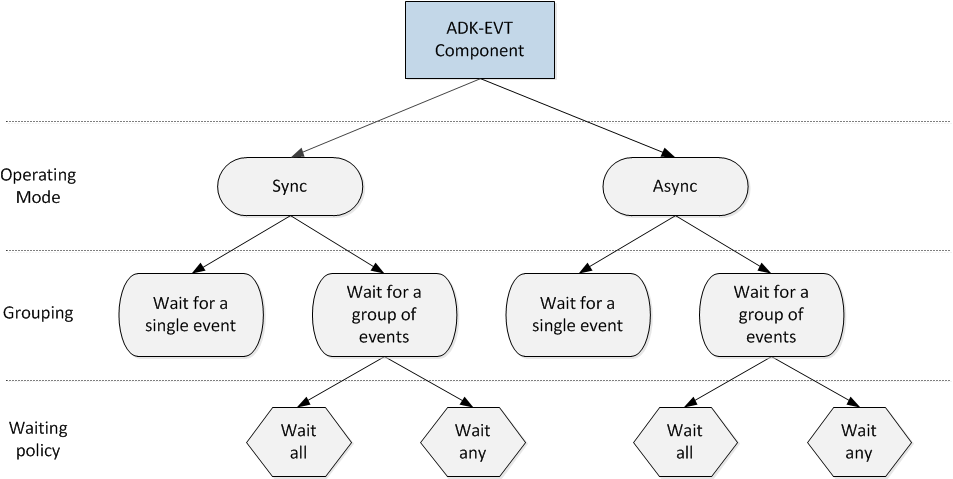

# Preface <a href="#sec_evt_preface" id="sec_evt_preface"></a>

This document is for programmers and developers who want to understand and use the ADK EVENT framework.

## Audience <a href="#subsec_evt_audience" id="subsec_evt_audience"></a>

This guide provides detailed descriptions of the ADK EVENT framework features, with information on configuring and programming with the ADK EVENT framework, plus use cases for additional support.

## Organization <a href="#subsec_evt_organization" id="subsec_evt_organization"></a>

This guide is organized as follows:

[Chapter 1, Overview](#sec_evt_overview): Provides an overview of the ADK EVENT framework.

[Chapter 2, Deployment](#sec_evt_deployment): Explains how to deploy ADK EVENT for VOS.

[Chapter 3, API Overview](#sec_evt_apioverview): Shows sample APIs for the ADK EVENT framework.

[Chapter 4, Using ADK EVENT](#sec_evt_usingadkevent): Presents common uses for ADK EVENT framework.

[Chapter 5, Error Handling](#sec_evt_errorhandling): Supplies error handling information.

[Chapter 6, Troubleshooting](#sec_evt_troubleshooting): Gives solutions for possible issues in ADK-EVT.

## Related Documentation <a href="#subsec_evt_relateddocs" id="subsec_evt_relateddocs"></a>

To learn more about the ADK framework, please refer to the following documents:

- SDI PINPad Interface API Programmers Guide
- ADK EMV Contact Programmers Guide
- ADK EMV Contactless Programmers Guide
- ADK GUI Programmers Guide
- ADK COM Programmers Guide
- ADK Import/Export Utility Programmers Guide
- ADK Information Service Programmers Guide
- ADK IPC Programmers Guide
- ADK LOGGING Programmers Guide
- ADK MSR Programmers Guide
- ADK Printer Programmers Guide
- ADK SEC Programmers Guide
- ADK SYS Programmers Guide
- VHQ Agent Guide

# Acronyms Definition <a href="#sec_evt_acronyms" id="sec_evt_acronyms"></a>

| Acronym | Definitions |
|----|----|
| <p>ADK</p> | <p>Application Development Kit</p> |
| <p>API</p> | <p>Application Protocol Interface</p> |
| <p>EVT</p> | <p><a href="libevt_8h.md#struct_event">Event</a></p> |
| <p>ETIME</p> | <p>Return code for timer expired (timeout)</p> |
| <p>KBD</p> | <p>Keyboard</p> |
| <p>MAG OS</p> | <p><a href="libevt_8h.md#struct_event">Event</a> for card swipe</p> |
| <p>OS</p> | <p>Operating System</p> |
| <p>UID</p> | <p>Unique Identifier</p> |
| <p>V/OS</p> | <p>Verifone Operating System</p> |
| <p>VPN</p> | <p>Verifone Part Number</p> |

# Overview <a href="#sec_evt_overview" id="sec_evt_overview"></a>

This chapter presents a short introduction to the ADK EVENT framework.

## Event Model <a href="#subsec_evt_eventmodel" id="subsec_evt_eventmodel"></a>

ADK EVENT is the notification mechanism that assumes a two-sided interaction, where one side fires an event and another receives it. <a href="libevt_8h.md#struct_event">Event</a> is an entity that is passed between the sides.

The sides could be:

- Different applications (currently supported on V/OS only)
- Different threads in one application
- OS as a raiser side and the application as a waiting side (OS Events)

Each event has a unique identifier (UID) that enables the notification mechanism to recognize one event type from another. Actual event delivery is possible only when the receiving side is in a waiting state for event with the same UID.

Although the event is intended for notifications purpose only, it could be used to transfer a limited amount of data (please refer to <a href="libevt_8h.md#struct_event">Event</a> structure for additional information).

Events are divided into two groups:

- Regular events or user events - could be both raised and waited by threads or applications
- OS Events - could be only waited (OS poses as a raiser side here), therefore could not transfer data between sides and are used only for notifications


Currently KBD and MAG OS events are not supported


There are no limitations for the number of raising and waiting sides. For example, one event type could be raised in two threads and waited in three threads. In this case each from three waiting sides receives two events (one event per raiser).

Conceptually, ADK EVENT API can be depicted in the following way:



There are both **synchronous** and **asynchronous** modes of using ADK EVENT. For each of these modes, the user can either wait for a single event or a group of events. Lastly, there is a **waiting policy**, which can be applied when waiting for a group of events: either wait for **any** event or all events in a group.

# Deployment <a href="#sec_evt_deployment" id="sec_evt_deployment"></a>

This chapter discusses basic information about libevt library deployment.

## libevt.h <a href="#subsec_evt_deployment_header" id="subsec_evt_deployment_header"></a>

<a href="libevt_8h.md">libevt.h</a> - ADK EVENT API header. You do not need to add any define like `_EVT_API_IMPORT` to compile flags, since `__declspec(dllimport)` is default attribute.

## libevt library <a href="#subsec_evt_deployment_liblog" id="subsec_evt_deployment_liblog"></a>

libevt ships in two forms - as a shared object (`libevt.so`) and a static library (`libevt-static.a`).


In order for linker to resolve symbols in a correct manner, path to said libraries has to be put after a path to `libevt-static.a`.


# API Overview <a href="#sec_evt_apioverview" id="sec_evt_apioverview"></a>

This section provides API samples for the ADK EVENT framework.

## Initializing and Deinitializing the Library <a href="#subsec_evt_initializing" id="subsec_evt_initializing"></a>

The following functions are to be used for intitializing and deinitializing the library.

``` cpp
int evt_init(EvtSide side, uint16_t componentID, uint8_t capacity);
int evt_destroy();
```

<a href="libevt_8h.md#a799ffc9044180e2968690455cfb5d8cf">evt_init()</a> can initialize the library either for the riser side, waiter side or both. Related enum:

``` cpp
enum EvtSide
{
   SIDE_RAISER = 0,
   SIDE_WAITER,
   SIDE_BOTH
};
```

ADK-EVT library\'s initialization is global for process: each next <a href="libevt_8h.md#a799ffc9044180e2968690455cfb5d8cf">evt_init()</a> function\'s call will either:

- reinitialize settings if \"EvtSide\" parameter differs, or
- just return without any effect in case when both calls contain the same \"EvtSide\" value. So, initial `componentID` will remain.

Please note that timer\'s starting is considered as timer event rising, so library should be initialized as `SIDE_BOTH` if application want to start timer and wait for timer event.
`componentID` - any unique number of `uint16_t` type.
`capacity` is a reserved parameter for hinting the library as to how many events will be processed.


The same value in `componentID` used to call <a href="libevt_8h.md#a799ffc9044180e2968690455cfb5d8cf">evt_init()</a> should be used for all API calls that accept this parameter.
<a href="class_thread.md">Thread</a> that calls <a href="libevt_8h.md#a799ffc9044180e2968690455cfb5d8cf">evt_init()</a> should exist while app uses ADK-EVT library.


### Event Structure <a href="#subsubsec_evt_eventstructure" id="subsubsec_evt_eventstructure"></a>

The following listing shows a definition of <a href="libevt_8h.md#struct_event">Event</a> structure:

``` cpp
struct Event
{
   UID id;
   long handle;
   uint64_t raised_timestamp;
   uint16_t raised_version;
   uint8_t raised_flag;
   long raised_handle;
   char raised_data[EVT_DATA_SIZE];
}
```

## Making a UID <a href="#subsec_evt_makingauid" id="subsec_evt_makingauid"></a>

The <a href="libevt_8h.md#struct_event">Event</a> is identified by a unique UID, which is comprised of a Component ID (must be system-wide unique), and an <a href="libevt_8h.md#struct_event">Event</a> ID (must be component-wide unique on a per-event basis).


UID is not the only thing that makes OS events unique. Every OS event denotes some kind of hardware device (e.g. MSR, COM), so in the case of OS events, <a href="libevt_8h.md#a61ce2a4d4a93bba3bc16271882996fc4">Event.handle</a> must be set to [Valid File Descriptors for `Event`.handle](#subsubsec_evt_filedescriptorseventhandle).


Before waiting for an event, UIDs have to be assigned to <a href="libevt_8h.md#struct_event">Event</a> structures. The user is responsible for providing IDs according to these rules of uniqueness. This is a common preparation step for both raising and waiting sides. There are two types of events and thus two distinct functions for making UIDs:

``` cpp
UID evt_make_uid(uint16_t componentID, uint16_t eventID);
UID evt_make_uid_os(uint16_t componentID, OSEvents_t osEvent);
```

There is an enum defined in a main header <a href="libevt_8h.md">libevt.h</a>, which contains a list of OS Events.


It is crucial that a user provides <a href="libevt_8h.md#a886f0a69446395a4013dc45380f4128f">evt_make_uid()</a> and <a href="libevt_8h.md#afb47263c3337482a275b6cecf497204b">evt_make_uid_os()</a> functions to the very same Component ID used in a call to <a href="libevt_8h.md#a799ffc9044180e2968690455cfb5d8cf">evt_init()</a>.


### OS events list <a href="#subsubsec_evt_oseventslist" id="subsubsec_evt_oseventslist"></a>

``` cpp
enum OSEvents
{
   OS_NOP = 0, /* non OS event */
   OS_EVT_TIMER, /* user-defined timer */
   OS_EVT_DOCK, /* terminal is docked */
   OS_EVT_UNDOCK, /* terminal is undocked */
   OS_EVT_SHUTDOWN, /* terminal is going to halt */
};
```

`OS_NOP` isn\'t OS event. It specified here as `"0"` for the internal ADK-EVENT needs.

### Valid File Descriptors for Event.handle <a href="#subsubsec_evt_filedescriptorseventhandle" id="subsubsec_evt_filedescriptorseventhandle"></a>

``` cpp
//open some random file
int fd = open("/tmp/wait_os_handle_evt", O_RDONLY | O_NONBLOCK);
Event event;
memset(&event, 0, sizeof(event));
const int COMPONENT_ID = 2;
event.id = evt_make_uid_os(COMPONENT_ID, OS_EVT_PIPE);
event.handle = fd;
```

For the VOS platform, any OS event enum starting from `OS_EVT_KBD` can be used in code snippet above: we just have to create OS type\'s `id`.
OS events starting from `OS_EVT_KBD` to `OS_EVT_USB` actually are not supported on VOS platform.
Another this type event usage example: [Waiting for communication event](#subsec_evt_waitingforcomeventtooccur)

## Waiting for an Event <a href="#subsec_evt_waitingforanevent" id="subsec_evt_waitingforanevent"></a>

ADK EVENT can operate either synchronously or asynchronously. From the API perspective, it means that there are two sets of wait functions:

### Synchronous <a href="#subsubsec_evt_waitingforanevent_synchronous" id="subsubsec_evt_waitingforanevent_synchronous"></a>

``` cpp
int evt_wait(Event *event, int timeout);
int evt_wait_group(Event *events, uint32_t count, int timeout, WaitPolicy policy);
```

<a href="libevt_8h.md#adb08919483f2094f1927d67dad595278">evt_wait()</a> is pretty self-explanatory: It takes a filled event structure and a timeout as parameters. <a href="libevt_8h.md#ab26c08b8228d47a7b83144e5ec6d9c4e">evt_wait_group()</a> takes an array of <a href="libevt_8h.md#struct_event">Event</a> structures, a size of the array, a timeout and a policy, which could be either `WAIT_ANY` or `WAIT_ALL`.

### Asynchronous <a href="#subsubsec_evt_waitingforanevent_asynchronous" id="subsubsec_evt_waitingforanevent_asynchronous"></a>

``` cpp
WaiterHandle evt_init_waiter(Event *events, uint32_t count);
int evt_get_by_handle(WaiterHandle waiter, Event* events, uint32_t count);
int evt_peek_by_handle(WaiterHandle waiter, Event* events, uint32_t count);
int evt_wait_by_handle(WaiterHandle waiter, int timeout, WaitPolicy policy);
int evt_destroy_waiter(WaiterHandle waiter);
```

The <a href="libevt_8h.md#a76bffba58228fdcd95671e17bf8ad041">evt_init_waiter()</a> function creates a separate thread, which will wait either for one event or a group of events. This function is non-blocking (the caller will be immediately returned a handle), which can later be passed to ` `<a href="libevt_8h.md#a57f2c3182b0ea176490a1735324de25e">evt_wait_by_handle()</a>`, `<a href="libevt_8h.md#a9fbabdeb66cb9541e4a4c146b7e1658a">evt_get_by_handle()</a> or <a href="libevt_8h.md#a793d32176ee75ec31b31f1fb1cd6abbc">evt_peek_by_handle()</a>.

- <a href="libevt_8h.md#a57f2c3182b0ea176490a1735324de25e">evt_wait_by_handle()</a> blocks thread execution until waiter receives an event or timeout occurs.
- <a href="libevt_8h.md#a9fbabdeb66cb9541e4a4c146b7e1658a">evt_get_by_handle()</a> is a non-blocking function that returns events collected by async waiter and unmarks them.
- <a href="libevt_8h.md#a793d32176ee75ec31b31f1fb1cd6abbc">evt_peek_by_handle()</a> is a non-blocking function that returns events collected by async waiter and leaves them marked.

### Events count limitation <a href="#subsubsec_evt_eventscountlimitation" id="subsubsec_evt_eventscountlimitation"></a>

There is limitation for events count that can be passed to `evt_wait_group`, `evt_init_waiter` and other functions. Defined in <a href="libevt_8h.md">libevt.h</a> header:

``` cpp
const uint32_t EVT_MAX_COUNT = 256;
```

For the ` `<a href="libevt_8h.md#a57f2c3182b0ea176490a1735324de25e">evt_wait_by_handle()</a>`, `<a href="libevt_8h.md#a9fbabdeb66cb9541e4a4c146b7e1658a">evt_get_by_handle()</a> and <a href="libevt_8h.md#a793d32176ee75ec31b31f1fb1cd6abbc">evt_peek_by_handle()</a> functions, count of events should be equal or greater than specified in <a href="libevt_8h.md#a76bffba58228fdcd95671e17bf8ad041">evt_init_waiter()</a> function, since the events are copied from the internal events array of waiter object.

### Raising an Event <a href="#subsubsec_evt_raisinganevent" id="subsubsec_evt_raisinganevent"></a>

`int` <a href="libevt_8h.md#a2855073610dc2b9210a25468926cfecc">evt_raise(Event *event)</a>;

<a href="libevt_8h.md#a2855073610dc2b9210a25468926cfecc">evt_raise()</a> is used to raise an event.

### Timers <a href="#subsubsec_evt_timers" id="subsubsec_evt_timers"></a>

`long` <a href="libevt_8h.md#af7e23c1a0a2e9a3caa6faf55c3aae1d4">evt_start_timer(uint32_t timeout)</a>;

`void` <a href="libevt_8h.md#a6f6a659420a37bb9e1d1b07edfe419a2">evt_stop_timer(long handle)</a>;

<a href="libevt_8h.md#af7e23c1a0a2e9a3caa6faf55c3aae1d4">evt_start_timer()</a> is a special function for obtaining a handle to a timer as timers are not \'\'real\'\' devices, so a user cannot `open()` it, and obtains a file descriptor. The Handle, obtained from a call to <a href="libevt_8h.md#af7e23c1a0a2e9a3caa6faf55c3aae1d4">evt_start_timer()</a>, must be assigned to <a href="libevt_8h.md#a61ce2a4d4a93bba3bc16271882996fc4">Event.handle</a>. Please refer to the example with the OS event in [Making a UID](#subsec_evt_makingauid).

There is also a special case related to timer handles: if <a href="libevt_8h.md#a61ce2a4d4a93bba3bc16271882996fc4">Event.handle</a> is set to `EVT_ANY_HANDLE`, then the first timer event to expire will be raised.

# Using ADK EVENT <a href="#sec_evt_usingadkevent" id="sec_evt_usingadkevent"></a>

This section covers the most popular use cases of the ADK EVENT framework.

## Permanent asynchronous waiter in thread <a href="#subsec_evt_permasyncwaiterthread" id="subsec_evt_permasyncwaiterthread"></a>

One of the ADK EVENT common use-cases is a permanent thread intended to process events. Waiter created only once. Events are processed in a endless loop. This approach allows you not to miss a single event from other thread.

``` cpp
{
   const int EVENT_COUNT = 2;
   Event events[EVENT_COUNT];
   memset(events, 0, sizeof(Event) * EVENT_COUNT);
   events[0].id = evt_make_uid(COMPONENTID_ID, FIRST_EVENT);
   events[1].id = evt_make_uid(COMPONENTID_ID, SECOND_EVENT);
   WaiterHandle hdl = evt_init_waiter(events, EVENT_COUNT);
   Event received[EVENT_COUNT];
   memset(received, 0, sizeof(Event) * EVENT_COUNT);
   while (1)
   {
   evt_wait_by_handle(hdl, EVT_INFINITE_WAIT, WAIT_ANY);
   if (exit)
   break;
   int res = evt_get_by_handle(hdl, received, EVENT_COUNT);
   for (int j = 0; j < EVENT_COUNT; j++)
   {
   if (received[j].raised_flag == 1)
   {
   // Process raised event
   ...
   }
   }
   }
   evt_destroy_waiter(hdl);
}
```

## Waiting for Timer Event(s) <a href="#subsec_evt_waitingfortimerevents" id="subsec_evt_waitingfortimerevents"></a>

Use the following API to implement Wait for Timer <a href="libevt_8h.md#struct_event">Event(s)</a> in ADK EVENT.

### Synchronous <a href="#subsubsec_evt_waitingfortimerevents_synchronous" id="subsubsec_evt_waitingfortimerevents_synchronous"></a>

``` cpp
Event event;
//structure contains garbage
memset(&event, 0, sizeof(event));
event.id = evt_make_uid_os(1, OS_EVT_TIMER);
//start timer for 25 seconds
long handle1 = evt_start_timer(25000);
// will block for 25 seconds
int res = evt_wait(&event, 40000);
//0 means no error
if(res == 0)
{
if(event.raised_handle == handle1)
printf("Success\n");
}
```

### Asynchronous <a href="#subsubsec_evt_waitingfortimerevents_asynchronous" id="subsubsec_evt_waitingfortimerevents_asynchronous"></a>

This method involves the usage of two framing functions `evt_init_waiter` and `evt_destroy_waiter`.
Please remember to call purge function `evt_destroy_waiter` when events are not needed anymore.

``` cpp
Event events[2];
memset(events, 0, sizeof(events));
event[0].id = evt_make_uid_os(1, OS_EVT_TIMER);
event[1].id = evt_make_uid_os(1, OS_EVT_TIMER);
event[0].handle = evt_start_timer(10000); //10 sec
event[1].handle = evt_start_timer(25000); //25 sec
//will exit immediately
WaiterHandle waiter = evt_init_waiter(events, 2);
printf("Initialized waiter");
someProcessingFunction();
//now we decide to wait (blocking)
//note that EVT_INFINITE_WAIT is passed as a timeout
//this means that we will for the maximum timeout (25 sec)
//WAIT_ANY that first raised event will stop waiting call
int res = evt_wait_by_handle(waiter, EVT_INFINITE_WAIT, WAIT_ALL);
if(res == 0)
{
printf("Event received");
//now we peek event information ( events are left raised )
res = evt_peek_by_handle(waiter, events, 2);
if(res > 0)
{
if(events[0].raised_flag == 1 && events[1].raised_flag == 1)
printf("Success\n");
}
//now we get event information ( events are unmarked )
res = evt_get_by_handle(waiter, events, 2);
if(res > 0)
{
if(events[0].raised_flag == 1 && events[1].raised_flag == 1)
printf("Success\n");
}
}
//Destroy waiter after events are not needed anymore
evt_destroy_waiter(waiter);
```

## Waiting for Any Timer Event to Occur <a href="#subsec_evt_waitingforanytimereventtooccur" id="subsec_evt_waitingforanytimereventtooccur"></a>

This section is specific to timer events only. It allows waiting for timers globally (component-wise) without modifying the <a href="libevt_8h.md#struct_event">Event</a> structure every time a new timer is started. In this case you specify not a handle, but a mask - EVT_ANY_HANDLE.

``` cpp
Event event;
//structure contains garbage
memset(&event, 0, sizeof(event));
event.id = evt_make_uid_os(1, OS_EVT_TIMER);
//NOTE that we use EVT_ANY_HANDLE for a handle
event.handle = EVT_ANY_HANDLE;
int hdl_10s = evt_start_timer(10000); //10sec
int hdl_3s = evt_start_timer(3000); //3sec
//NOTE that we do not assign any of the handles to event.handle
// will block for 3 seconds first
int res = evt_wait(&event, 40000);
if(res == 0)
//should print equal handles
printf("3 sec handle: %d, fired handle: %d\n", hdl_3s,
event.raised_handle);
// will block for approx. 7 seconds now
res = evt_wait(&event, 40000);
if(res == 0)
//should print equal handles
printf("10 sec handle: %d, fired handle: %d\n", hdl_10s,
event.raised_handle);
```


VOS/VOS2 only: supported wait for multiple events with mask handles - just pass two or more events with mask to wait function. In this case first timer event will not be overwritten by next timer event.


## Waiting for communication event <a href="#subsec_evt_waitingforcomeventtooccur" id="subsec_evt_waitingforcomeventtooccur"></a>

This code snippet demonstrates ADK-COM and ADK-EVENT components usage for OS communication signal handling.
For the VOS platform, any OS event enum, starting from `OS_EVT_KBD` can be used: we just have to create OS type id.

``` cpp
com_ConnectHandle *handle = com_Connect(stIntData.tcpProfileFile, NULL, NULL, 60000, &com_errno);
if(handle)
{
   // ---------------Event part start---------------
   inComHandle = com_ConnectGetFD(handle, &com_errno);
   LOGF_TRACE("inComHandle: %d com_errno: %d", inComHandle, com_errno);
   memset(&event, 0, sizeof(event));
   event.id = evt_make_uid_os(COMPONENT_ID, OS_EVT_COM1);
   event.handle = (long)inComHandle; //assign com1 handle to event's handle
   inRet = evt_wait(&event, 30000);
   // ---------------Event part end---------------
   LOGF_TRACE("--------Results--------");
   LOGF_TRACE("evt_wait() returned :%d", inRet);
   LOGF_TRACE("raised_handle: %d, should be equal to port handle [%d]", (int) event.raised_handle, inComHandle);
   LOGF_TRACE("raised_flag: %d", event.raised_flag);
   inRet = com_Receive(handle, szReceivedData, sizeof(szReceivedData), &com_errno);
   if(inRet > 0)
   {
   szReceivedData[sizeof(szReceivedData)-1] = 0;
   LOGF_TRACE("received rc: %d, %s", inRet, szReceivedData);
   }
}
```

# Error Handling <a href="#sec_evt_errorhandling" id="sec_evt_errorhandling"></a>

This section presents the error handling functions in ADK EVENT.

## ADK EVENT Error Handling <a href="#subsec_evt_adkeventerrorhandling" id="subsec_evt_adkeventerrorhandling"></a>

Each API function returns an `int`. There are three return ranges: Errors are negative, OK is zero, other cases (such as a timeout) are positive.

- Negative value indicates a stop, assert-like error (out of memory or file handles, invalid input parameters, etc.). Error codes match `errno` values, but with a negative sign. So, `-22` code value will mean EINVAL.
  ``` cpp
  #define EINVAL 22 /* Invalid argument */
  ```
- Zero value indicates successful return.
- Positive value indicates a successful return. Value provides more information about return condition (for more info, see description of a concrete function).

Example: <a href="libevt_8h.md#adb08919483f2094f1927d67dad595278">evt_wait()</a> could return an `ETIME` in case of timeout as a successful business result.

# Troubleshooting <a href="#sec_evt_troubleshooting" id="sec_evt_troubleshooting"></a>

## Logging <a href="#subsec_evt_logging" id="subsec_evt_logging"></a>

ADK-EVT uses \"new\" logging method via configuration file in JSON format. Please refer to the ADK-LOG documentation for details.
The logging ID for this component is **\"EVT\"**.
ADK-EVT uses only two logging level:

- LOGAPI_ERROR for error messages, and
- LOGAPI_WARNING for all other messages.
