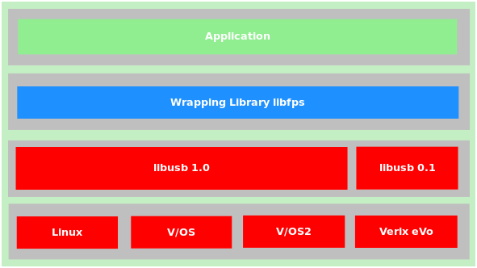

# Preface <a href="#fps_preface" id="fps_preface"></a>

This document is for programmers and developers who want to understand and use the ADK-FPS extension.

## Audience <a href="#fps_audience" id="fps_audience"></a>

This guide provides information on the usage of the ADK-FPS system.

## Organization <a href="#fps_organization" id="fps_organization"></a>

[Chapter 1, Introduction:](#fps_introduction) Provides a general introduction to ADK-FPS

[Chapter 2, Getting Started:](#fps_getting_started) Presents an introduction in ADK-FPS usage.

[Chapter 3, Programming:](#fps_programming) Supplies ADK-FPS programming information.

[Chapter 4, System Setup and Requirements:](#fps_setup) Presents environment setup and dependencies.

[Chapter 5, Troubleshooting:](#fps_troubleshooting) Gives solutions for possible issues in ADK-FPS.

## Prerequisites <a href="#fps_prerequisites" id="fps_prerequisites"></a>

**Caution**

- Additional entries in udev configuration file have to be entered in V/OS
- libiengine_ansi_iso is not available on V/OS
- verix close operation is disabled because of missing support from os

# Introduction <a href="#fps_introduction" id="fps_introduction"></a>

ADK-FPS allows to use the functionality of fingerprint sensors in Linux, V/OS, V/OS2 and Verix. At the moment only one sensor is supported by this library.

The driver of the finger print sensor is available via the usb library. On linux, V/OS and V/OS2 it is achieved via library libusb 1.0. Verix uses libusb 0.1.

To reach a homogeneous handling from upper layer applications this driver, usb combination is wrapped from the library libfps.



## Concepts <a href="#fps_concepts" id="fps_concepts"></a>

### Platform Independent Application <a href="#fps_platform_independent" id="fps_platform_independent"></a>

Platform indepence will be reached by using the wrapping library libfps. Underneath layers have to be ported on new platforms if they are needed.

### Uniform Interface <a href="#fps_uniform_interface" id="fps_uniform_interface"></a>

The platform independent interface of the wrapper interface can be used to integrate new drivers for new applications.

The following commands are supported by the wrapper interface:

- [fps_open](#fps_open)
- [fps_close](#fps_close)
- [fps_capture_start](#fps_capture_start)
- [fps_capture_stop](#fps_capture_stop)
- [fps_getPropInt](#fps_getpropint)
- [fps_setPropInt](#fps_setpropint)
- [fps_getPropString](#fps_getpropstring)
- [fps_setPropString](#fps_setpropstring)

To get feedback from the finger print library the usage of callback is necessary.

The existing callback answers are listed in the enumeration FPS_CB_Type

``` cpp
enum FPS_CB_Type
{
  FPS_CB_DATA,
  FPS_CB_ERROR,
  FPS_CB_INFO_BACKWARD_MOVEMENT,
  FPS_CB_INFO_BAD_QUALITY,
  FPS_CB_INFO_CALIB_START,
  FPS_CB_INFO_CENTER_AND_PRESS_HARDER,
  FPS_CB_INFO_CLEAN_SENSOR,
  FPS_CB_INFO_CONSOLIDATION_FAIL,
  FPS_CB_INFO_CONSOLIDATION_SUCCEED,
  FPS_CB_INFO_ENROLL_START,
  FPS_CB_INFO_ENROLL_PROGRESS,
  FPS_CB_INFO_FINGER_DETECT_START,
  FPS_CB_INFO_FINGERLEFT,
  FPS_CB_INFO_FINGERRIGHT,
  FPS_CB_INFO_FINGERTOP,
  FPS_CB_INFO_FINGERBOTTOM,
  FPS_CB_INFO_GOOD_IMAGE,
  FPS_CB_INFO_GUI_FINISH,
  FPS_CB_INFO_GUI_FINISH_DETECT_START,
  FPS_CB_INFO_GUI_FINISH_FAIL,
  FPS_CB_INFO_GUI_FINISH_SUCCEED,
  FPS_CB_INFO_IMAGE_PROCESSED,
  FPS_CB_INFO_JOINT_DETECTED,
  FPS_CB_INFO_KEEP_FINGER,
  FPS_CB_INFO_NO_FINGER,
  FPS_CB_INFO_PROCESSING_IMAGE,
  FPS_CB_INFO_PUT_FINGER,
  FPS_CB_INFO_PUT_FINGER2,
  FPS_CB_INFO_PUT_FINGER3,
  FPS_CB_INFO_PUT_FINGER4,
  FPS_CB_INFO_PUT_FINGER5,
  FPS_CB_INFO_REMOVE_FINGER,
  FPS_CB_INFO_START,
  FPS_CB_INFO_SWIPE_IN_PROGRESS,
  FPS_CB_INFO_TOO_DARK,
  FPS_CB_INFO_TOO_DRY,
  FPS_CB_INFO_TOO_FAST,
  FPS_CB_INFO_TOO_HIGH,
  FPS_CB_INFO_TOO_LEFT,
  FPS_CB_INFO_TOO_LIGHT,
  FPS_CB_INFO_TOO_LOW,
  FPS_CB_INFO_TOO_RIGHT,
  FPS_CB_INFO_TOO_SHORT,
  FPS_CB_INFO_TOO_SKEWED,
  FPS_CB_INFO_TOO_SMALL,
  FPS_CB_INFO_TOO_STRANGE,
  FPS_CB_INFO_TOUCH_SENSOR,
  FPS_CB_INFO_VERIFY_START,
  FPS_CB_PICTURE
  //…. More to come …
};
```

# Getting Started <a href="#fps_getting_started" id="fps_getting_started"></a>

The fps system comes with two sample application that demonstrates system features and provides a starting point for application developers who use the finger print library. It can be found in the *sample* folder of the sources (src). The file *README.txt* in this folder gives exact instructions for compiling the example.

The finger print sensor library is provided on different target platforms. The following sections describe how to use the fps sample applications on these platforms. In addition, this chapter gives general information about required components to run ADK FPS (runtime libraries).

## Running ADK-FPS on V/OS <a href="#fps_running_on_vos" id="fps_running_on_vos"></a>

To run the ADK-FPS on V/OS and V/OS2, libusb 1.0 has to be present on the target system. If the sample gui application shall be used too, the ADK-GUI packet needs to be installed with all its requirements.

## Running on Verix <a href="#fps_running_on_verix" id="fps_running_on_verix"></a>

To run the ADK-FPS on Verix, libusb 0.1 has to be present on the target system. If the sample gui application shall be used too, the ADK-GUI packet needs to be installed with all its requirements.

Furthermore, ADK-FPS depends on some libraries coming along with OS and the EOS. Please always use the newest OS and EOS versions available on Verifone DevNet.

## Running on Linux <a href="#fps_running_on_windows" id="fps_running_on_windows"></a>

Following is required:

- libusb 1.0 support

# Programming <a href="#fps_programming" id="fps_programming"></a>

## ADK-FPS Deployment Options <a href="#fps_deployment_options" id="fps_deployment_options"></a>

The ADK-FPS system provides a single header file (<a href="fps_8h.md">fps.h</a>) that exports the FPS library API function calls. The current version only supports dynamic linking.

### Headers and binary deliveries <a href="#fps_headers_and_binary_deliveries" id="fps_headers_and_binary_deliveries"></a>

The ADK-FPS system is composed of the following deliveries:

| File | Purpose |
|----|----|
| <p>**<a href="fps_8h.md">fps.h</a>**</p> | <p>FPS function header file with exported definitions/functions.</p> |
| <p>**libfps.so**</p> | <p>FPS system client library</p> |
| <p>**libiengine_ansi_iso.so**</p> | <p>FPS image conversion library</p> |
| <p>**samplegui**</p> | <p>FPS GUI client binary for V/OS, V/OS2, Verix and linux</p> |
| <p>**sample.bin**</p> | <p>FPS console client binary for V/OS, V/OS2 and linux</p> |

All header files can be found in the 'vfifps' directory.

An application has to be linked with libfps.

### Multi-Application-Controller Resource Subfolder Support <a href="#fps_mac_subfolder" id="fps_mac_subfolder"></a>

Multi-Application-Controller (MAC) is used to run several applications in parallel on a terminal. Since version 2.5.0 the UI system has added support to lookup resources in a separate subdirectory for each application to avoid resource location conflicts. For this, MAC sets up the environment variable `GUIPRT_APPNAME`, which provides a name for each application that is used for the subfolder `appname:`

``` cpp
www/<appname>/<platform>
```

or

``` cpp
www/<appname>/<width>x<height><color><numkeys><touch>
```

`GUIPRT_APPNAME` is automatically considered during startup of an application so that most of the MAC handling is transparent to the application. Please note that the variable is just used to set up the default values for `UI_PROP_RESOURCE_PATH` and `UI_PROP_RESOURCE_DEFAULT_PATH`. Once an application has set the properties during runtime, value of `GUIPRT_APPNAME` is ignored.

An application can also set GUIPRT_APPNAME by itself to move the default resource folder. For this the environment variable has to be set using `setenv()` before calling any ADKGUI function.

This is also setable via the manifest file of the application with the property app_ressource_dir in the application section.

## Programming examples <a href="#fps_programming_examples" id="fps_programming_examples"></a>

### Use of the conversion library for ansi iso <a href="#fps_libiengine_ansi_ios" id="fps_libiengine_ansi_ios"></a>

On all platforms, where the fps conversion library is available, the programmers can select whether images should be generated in raw, pgm, ansi or iso format by selecting the general integer property FPS_PROP_INT_DATATYPE. A special case is the format FPS_IMG_ALL because the library delivers all available image formats in own callback calls.

Available are the following return formats:

| Property | Description |
|----|----|
| <p>**FPS_IMG_RAW**</p> | <p>unmanipulated datastream of sensor</p> |
| <p>**FPS_IMG_PGM**</p> | <p>gray scale image</p> |
| <p>**FPS_IMG_ANSI**</p> | <p>image converted to ansi format</p> |
| <p>**FPS_IMG_ISO**</p> | <p>image converted to iso format</p> |
| <p>**FPS_IMG_ALL**</p> | <p>image is delivered in all known formats over the callback</p> |

These format will be returned over the callback after the fps_capture_start method recognizes a fingerprint.

``` cpp
void resultCallback(void *dataptr, vfifps::FPS_CB_Type msgType, int width, std::vector<unsigned char> rawData)
{
  int err = 0;
  if(vfifps::FPS_CB_PGM_DATA == msgType ||
   vfifps::FPS_CB_PICTURE == msgType ||
   vfifps::FPS_CB_ANSI_DATA == msgType ||
   vfifps::FPS_CB_ISO_DATA == msgType)
  {
   // here the different image formats can be parsed and handled
   return;
  }
  else
  {
   // any other case starts here --- normally handling instructions from sensor
  }
}
int main()
{
  std::string key("one-on-one key");
  int16_t fpsHdl = vfifps::fps_open(key);
  // define image format of fingerprint
  int newPropValue = vfifps::FPS_IMG_ISO;
  if(vfifps::FPS_RES_INFO_NOT_READ == vfifps::fps_setPropInt(fpsHdl, vfifps::FPS_PROP_INT_DATATYPE, newPropValue))
  {
   // do some error handling here
   // only if sensor informations had been read out by the fps library
   // properties can be set
   ...
  }
  vfifps::fps_capture_start(fpsHdl, resultCallback, NULL);
  // do something usefull until picture is created
  fps_close(fpsHdl);
}
```

### Use of properties <a href="#fps_read_properties" id="fps_read_properties"></a>

Most of the existing properties can only be used read-only. They are read out from the sensor and can not be changed by the user. If these values are written over the fpsSetProp methods, this has no effect on the behavior of the sensor.

At the moment the only property, which has an effect on the behavior on the sensor, is the FPS_PROP_INT_DATATYPE property. This property is responsible for the kind of result data which will be delivered over the result callback.

In general, the properties can be read and written as described in the following code example. It is assumed that a handle has been already acquired and that it will be closed after all operations are done.

``` cpp
{
  int fpsHdl;
  int readValue;
  ...
  // read out property
  if(FPS_RES_INFO_NOT_READ == fps_getPropInt(fpsHdl, FPS_PROP_INT_IMAGEWIDTH, readValue))
  {
   // some error handling
  }
  // write property
  int writevalue = vfifps::FPS_IMG_RAW;
  if(FPS_RES_INFO_NOT_READ == fps_setPropInt(fpsHdl, FPS_PROP_INT_DATATYPE, writeValue))
  {
   // some error handling
  }
  ...
}
```

## API <a href="#fps_program_interface" id="fps_program_interface"></a>

### Executing sensor command <a href="#fps_executing_sensor_command" id="fps_executing_sensor_command"></a>

### fps_open <a href="#fps_open" id="fps_open"></a>

*Function prototype*

``` cpp
int16_t fps_open(std::string devicename);
```

**Parameters**

**devicename** - name of the device in OS (f.e. /dev/input/touchsensor1) **int16_t** - handle to opened connection or -1

fps_open opens connection to finger print sensor with the given name (devicename). All properties of the finger print sensor are read out directly after the connection has been opened. The handle to the open connection will be passed back over the return value of fps_open and shall be used for all following commands.

### fps_close <a href="#fps_close" id="fps_close"></a>

*Function prototype*

``` cpp
FPS_RES_Type fps_close(int16_t handle);
```

**Parameters**

**handle** - handle of connection

### Returns

FPS_RES_Type - success indicator

fps_close closes the connection to the finger print sensor with the given handle.

### fps_capture_start <a href="#fps_capture_start" id="fps_capture_start"></a>

*Function prototype*

``` cpp
FPS_RES_Type fps_capture_start(int16_t handle, resultCallbackType cb, void *dataptr);
```

**Parameters**

**handle** - handle of connection **cb** - callback for user instructions, pictures, errors **dataptr** - context of capture starter

### Returns

FPS_RES_Type - success indicator

fps_capture_start starts capturing of finger prints on finger print sensor with the handle. fps_capture_start interrupts all 200ms the capturing process to look for fps_capture_stop signals. The results will be delivered asyncronisly per callback.

### fps_capture_stop <a href="#fps_capture_stop" id="fps_capture_stop"></a>

*Function prototype*

``` cpp
FPS_RES_Type fps_capture stop(int16_t handle);
```

**Parameters**

**handle** - handle of connection

### Returns

FPS_RES_Type result of type FPS_RES_Type

fps_capture_stop stops started capturing commands.

### fps_getPropInt <a href="#fps_getpropint" id="fps_getpropint"></a>

*Function prototype*

``` cpp
FPS_RES_Type fps_getPropInt(int16_t handle, FPS_ROP_INT_Type propType, int &propValue);
```

**Parameters**

**handle** - handle of connection **propType** - integer property to read **propValue** - reference to variable which will be filled with read value

### Returns

FPS_RES_Type result of type FPS_RES_Type

fps_getPropInt gets the property prop from the sensor with the handle in the variable propValue.

### fps_setPropInt <a href="#fps_setpropint" id="fps_setpropint"></a>

*Function prototype*

``` cpp
FPS_RES_Type fps_setPropInt(int16_t handle, FPS_PROP_INT_Type propType, int &newPropValue);
```

**Parameters**

**handle** - handle of connection **propType** - integer property to set **newPropValue** - value of property to set

### Returns

FPS_RES_Type result of type FPS_RES_Type

fps_setPropInt sets new property value (newPropValue of property(propType) for the sensor identified by handle.

### fps_getPropString <a href="#fps_getpropstring" id="fps_getpropstring"></a>

*Function prototype*

``` cpp
FPS_RES_Type fps_getPropString(int16_t handle, FPS_PROP_STRING_Type propType, std::string &propValue);
```

**Parameters**

**handle** - handle of connection **propType** - string property to read **propValue** - reference to variable which will be filled with read value

### Returns

FPS_RES_Type result of type FPS_RES_Type

fps_getPropString reads property(propType) and stores the value(propValue).

### fps_setPropString <a href="#fps_setpropstring" id="fps_setpropstring"></a>

*Function prototype*

``` cpp
FPS_RES_Type fps_setPropString(int16_t handle, FPS_PROP_STRING_Type propType, int &newPropValue);
```

**Parameters**

**handle** - handle of connection **propType** - string property to write **newPropValue** - value of string property to set

### Returns

FPS_RES_Type result of type FPS_RES_Type

fps_setPropString sets new property value (newPropValue) of property (propType) for the sensor identified by handle.

### resultCallbackType <a href="#fps_resultcallbacktype" id="fps_resultcallbacktype"></a>

*Function prototype*

``` cpp
typedef void(*resultCallbackType)(void *dataptr, FPS_CB_Type msgType, int width, std::vector<unsigned char> rawData);
```

**Parameters**

**dataptr** - reference to sender **msgType** - identifies the kind of callback data **width** - information about the pricture width **rawData** - raw data of the message delivered as vector of unsigned char

This callback is used by /ref fps_capture_start to signal capture instructions, capture errors and the picture result to the callback.

# System Setup and Requirements <a href="#fps_setup" id="fps_setup"></a>

The following are the hardware and software requirements of the ADK FPS system.

## Hardware Support <a href="#fps_hardware_support" id="fps_hardware_support"></a>

The ADK FPS system is hardware platform agnostic and supports installation on V/OS, Raptor, and Verix terminals.

The ADK FPS system is intended to run across the entire hardware portfolio with usb interfaces. The following table list different characteristics of these devices.

| Model | Touch | Color | Resolution | Keypad | Function Keys | Resource Path |
|----|----|----|----|----|----|----|
| <p>Vx520 (B/W)</p> | <p>No</p> | <p>No</p> | <p>128x64</p> | <p>0-9,\*,#,CAN,CORR,OK</p> | <p>4+4+Alpha</p> | <p>128x64M24N</p> |
| <p>Vx6, Vx8</p> | <p>Yes</p> | <p>Yes</p> | <p>240x320</p> | <p>0-9,\*,#,CAN,CORR,OK</p> | <p>---</p> | <p>240x320C15T</p> |
| <p>Vx675/Vx5 color</p> | <p>No</p> | <p>Yes</p> | <p>320x240</p> | <p>0-9,\*,#,CAN,CORR,OK</p> | <p>4+4\*Cursor+Enter</p> | <p>320x240C24N</p> |
| <p>Mx915</p> | <p>Yes</p> | <p>Yes</p> | <p>480x272</p> | <p>0-9,CAN,CORR,OK</p> | <p>---</p> | <p>480x272C13T</p> |
| <p>Mx925</p> | <p>Yes</p> | <p>Yes</p> | <p>800x480</p> | <p>0-9,CAN,CORR,OK</p> | <p>---</p> | <p>800x480C13T</p> |
| <p>Ux100</p> | <p>No</p> | <p>No</p> | <p>128x64</p> | <p>0-9,CAN,CORR,OK,INFO</p> | <p>2</p> | <p>128x64M16N</p> |
| <p>e265</p> | <p>No</p> | <p>No</p> | <p>160x120</p> | <p>0-9,\*,#,CAN,CORR,OK</p> | <p>---</p> | <p>160x120M15N</p> |
| <p>e285</p> | <p>Yes</p> | <p>Yes</p> | <p>240x320</p> | <p>0-9,\*,#,CAN,CORR,OK</p> | <p>---</p> | <p>240x320C15T</p> |
| <p>e315/335</p> | <p>No</p> | <p>No</p> | <p>128x32</p> | <p>0-9,\*,#,CAN,CORR,OK</p> | <p>---</p> | <p>128x32M15N</p> |
| <p>e355</p> | <p>No</p> | <p>Yes</p> | <p>320x240</p> | <p>0-9,\*,#,CAN,CORR,OK</p> | <p>---</p> | <p>320x240C15N</p> |
| <p>Carbon X10</p> | <p>Yes</p> | <p>Yes</p> | <p>854x480</p> | <p>---</p> | <p>---</p> | <p>854x480C0T</p> |
| <p>M400</p> | <p>Yes</p> | <p>Yes</p> | <p>854x480</p> | <p>0-9,\*,#,CAN,CORR,OK</p> | <p>---</p> | <p>854x480C15T</p> |
| <p>P400/V400</p> | <p>Yes</p> | <p>Yes</p> | <p>320x480</p> | <p>0-9,\*,#,CAN,CORR,OK</p> | <p>---</p> | <p>320x480C15T</p> |
| <p>P200/V200c</p> | <p>No</p> | <p>Yes</p> | <p>240x320</p> | <p>0-9,\*,#,CAN,CORR,OK</p> | <p>2+4\*Cursor</p> | <p>240x320C21N</p> |
| <p>V200t/V205c</p> | <p>No</p> | <p>Yes</p> | <p>320x240</p> | <p>0-9,\*,#,CAN,CORR,OK</p> | <p>2+4\*Cursor</p> | <p>320x240C21N</p> |
| <p>V240m/V400m</p> | <p>Yes</p> | <p>Yes</p> | <p>320x480</p> | <p>0-9,\*,#,CAN,CORR,OK</p> | <p>---</p> | <p>320x480C15T</p> |
| <p>C680</p> | <p>Yes</p> | <p>Yes</p> | <p>320x480</p> | <p>0-9,\*,#,CAN,CORR,OK</p> | <p>---</p> | <p>320x480C15T</p> |

Users need to take these characteristics into account when designing GUI dialogs with fingerprint support for the different hardware platforms.


C680 has an additional power button, it is not counted as keypad key since it cannot be used for input.


For a detailed description of the API functions, see .


## Software Requirements <a href="#gui_software_requirements" id="gui_software_requirements"></a>

ADK-FPS requires the installation of corresponding platform packages. For details please refer to the release notes.

# Troubleshooting <a href="#fps_troubleshooting" id="fps_troubleshooting"></a>

## Support for ADKLOG <a href="#fps_logging" id="fps_logging"></a>

**Logging with liblog**

Since version 2.15.3 ADK-FPS has added support for ADKLOG component. ADKLOG is required to implement the new ADK logging concept, which provides the Logging Control Panel (LCP) used as central instance to configure and enable logging for the several ADK components. For this, LCP uses configuration files (for FPS), which are read by `liblog` library. If installed on the system, `liblog` library will be used by client import libraries (`libvfiguiprt`, `libvfiprt`) and server components (`guiprtserver`, `guiserver`, `prtserver`) to output logging messages. In this case, the logging messages are passed to `liblog` library instead of using console logging mechanism (with EOSLog or stderr), which is described above.

In order to lookup the corresponding configuration files, ADKLOG uses component identifiers, which are reserved for each ADK component. GUI and PRT use the following:

| Component Id | Configuration file | Description |
|----|----|----|
| <p>`FPS`</p> | <p>`FPS_log.conf`</p> | <p>FPS library related log settings</p> |

The configuration files contain several settings for logging like output channels, verbosity and a logging mask, which is similar to environment variables `GUI_LOGMASK` and `PRT_LOGMASK`. For more details about configuration settings or logging message formats, please refer to documentation of ADKLOG project.


The environment variable `FPS_LOGMASK` to enable console logging mechanism are still supported. If one of the variables is set, console logging mechanism is preferred and ADKLOG with `liblog` is disabled. Only if the environment variable is unset, FPS will lookup `liblog` library from the system to enable logging via ADKLOG.
[Verix OS has several issues with `dlopen()`, therefore, ADKFPS still lacks support for ADKLOG on this platform. The feature is pending unless a new OS will be available, which fixes these issues.]{style="color:red"}

