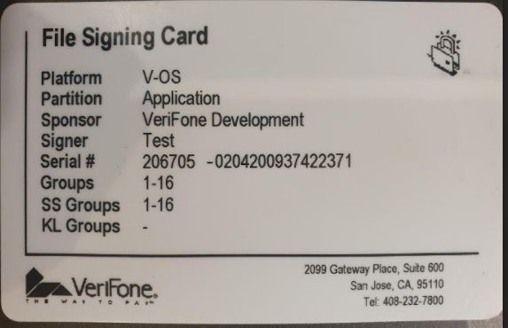
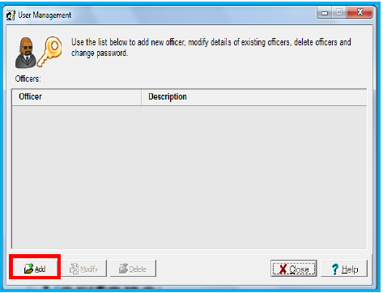
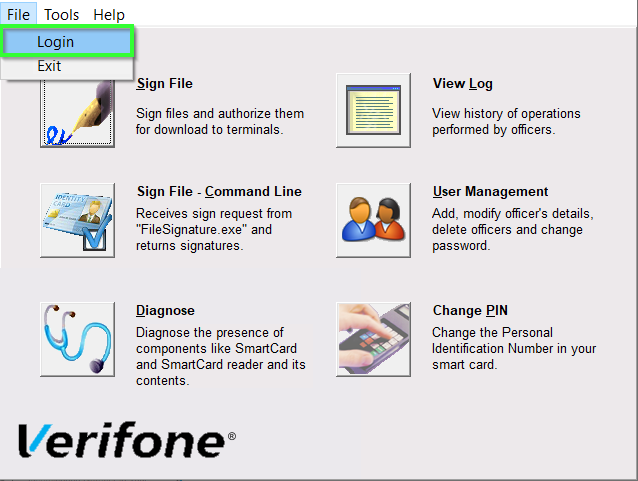
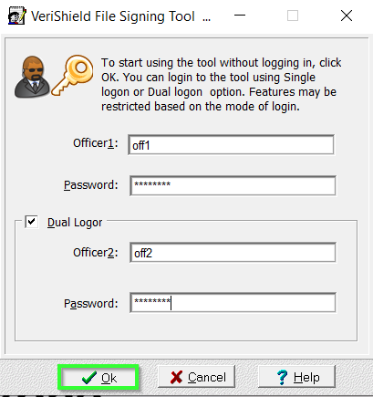
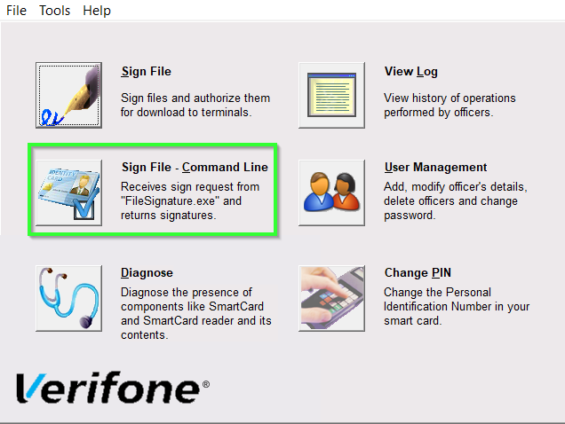
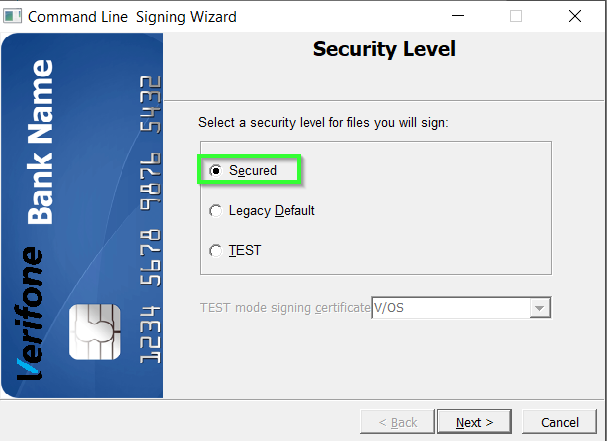

### Tableof Contents

- [Preface](#sec_fst_preface)
- [Overview](#sec_fst_overview)
- [Signing Card](#sec_fst_signing_card)
- [Installation and Set-up](#sec_fst_installation)
- [Start Signing Process](#sec_fst_start_signing)

# Preface 

This document is for programmers and users who want to understand how to install and use VeriShield File Signing Tool (FST).

# Overview 

VeriShield File Signing Tool (FST) is the tool used to sign Software Product binary files prior to installation on a Verifone terminal. The FST tool is for Windows only. This section describes the details of setting up the FST environment. It includes setting up the tools which are necessary for signing the applications.

### Warning

The FST is offered for use on Trident devices (ADK 4.4 and upper), and on Engage devices that have ADK 4.4, 4.6, or 4.7. On Engage devices which have ADK 4.8 and upper ADK version, the Online Signing Portal must be used instead.

# Signing Card 

The application signing card for V/OS and V/OS2 is the same:

It is used for signing the CertApp. To sign drivers, you need a different (OS) signing card. This card only works for V/OS and V/OS2.

# Installation and Set-up 

1.  Install FST (you can find the latest installation file on DevNet under Downloads/Freeware Tools & Utilities/General: VeriShield File Signing Tool)
    
    This setup is required only if you do not have FST or you have FST older than 07.05.00.
    Insert the card reader to the PC before installation.
    
2.  Run the FST Setup File and follow the wizard to complete the installation.
3.  Run FST application, follow the wizard, and configure 2 users:
    - Select \"User Management\"
      
    - Add Officer 1: Select \"Add\" to add the details of Officer 1
      
    - Enter Officer 1 details with password and press \"Ok\"
    - Add Officer 2: Select \"Add\" to add the details of Officer 2
    - Enter Officer 2 details with password and press \"Ok\"
    - Press \"Close\"
4.  Log in to FST:
    - Select File/Login
      
    - Follow the wizards
      
    - Change Officer 1 and Officer 2 passwords to continue

# Start Signing Process 

1.  To start the signing process, the \"Sign File - Command Line\" should be selected:
    
2.  Select security level:
    

    
    If a device is a production unit then select \"Secured\". If an <a href="pg_device_mode_conversion.md#sec_device_mode_conversion_using">APP-DEV</a> unit then, select \"TEST\" as security level and choose the appropriate platform (V/OS or V/OS2) from the dropdown.
    
3.  Enter the PIN of Authority Officer 1 and press \"OK\":
    
4.  Enter the PIN of Authority Officer 2 and press \"OK\"
5.  Keep this signing service running before signing the application.
    

    
    This service is required for signing the package.
    
