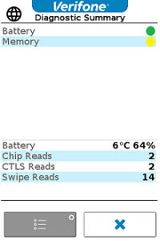
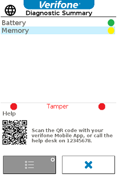
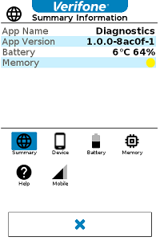
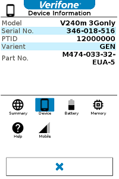
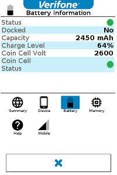
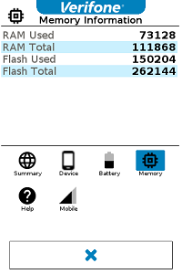
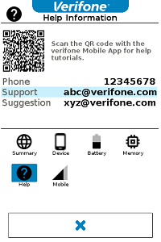
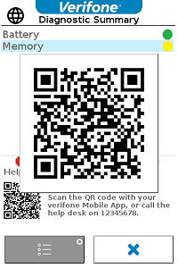

# Introduction <a href="#sec_gda_introduction" id="sec_gda_introduction"></a>

## Purpose <a href="#subsec_gda_preface" id="subsec_gda_preface"></a>

This guide provides information on the usage of the Diagnostic Application.

## Hardware Support <a href="#subsubsec_gda_hardware_support" id="subsubsec_gda_hardware_support"></a>

The Diagnostic application is currently supported on Engage devices - V200c, V400M, V240M.

## Organization <a href="#subsec_gda_organization" id="subsec_gda_organization"></a>

This guide is organized as follows:

[Chapter 1, Overview](#sec_gda_overview): Provides an overview of the Diagnostic application.

[Chapter 2, Help and Tamper Information](#sec_gda_helpinfo): Guides in populating the help information.

[Chapter 3, Using the Diagnostic application by payment application](#sec_gda_usinggda): Gives list of APIs that the payment application can use to display diagnostics.

# Overview <a href="#sec_gda_overview" id="sec_gda_overview"></a>

This chapter presents a short introduction to the Diagnostic application

## Diagnostic Main Screen <a href="#sec_gda_overview_main_screen" id="sec_gda_overview_main_screen"></a>

The Diagnostic application is a tool which provides basic diagnosis of componenents. This application can be invoked from the MAC screen and also by any payment application.

The landing page or the Main screen consists of the traffic light status indications for different componenents. Currently, the diagnostic application supports only Battery and Memory Components. This page also consists of the Battery temperature and charge level along with number of Contact,Contactless and MSR transactions performed on the terminal. Below is the sample landing page.

|                      |
|----------------------|
|  |

In case Device is tampered, the landing page will contain a QR code with useful URLs. Below is the sample landing page in case device is tampered.

|                   |
|-------------------|
|  |

The detail diagnostics can be navigated from the landing page on Enter button. The detail diagnostics contains widgets for each component information. Below are the screenshots for some of the widgets.

| Summary | Device | Battery | Memory | Help |
|----|----|----|----|----|
|  |  |  |  |  |

In case of QR generated screens, like Tamper and Help screens, there is a provision to enlarge the QR code for better scanning. Use \* and \# keys to magnify and close respectively. Below is the sample magnified QR code screen for the Tamper QR.

|                       |
|-----------------------|
|  |

The default language supported is English. There is no multi-language support currently.

## Configuration for determining the component status. <a href="#sec_gda_overview_config_menu" id="sec_gda_overview_config_menu"></a>

We use the following default configuration for determining the status. The configuration is available in the gda-config.json file which will be packaged along with the diagnostic application. Note that these values cannot be modified by the payment application.

``` cpp
{
   "DetailMenuEnabled": 1, //To enable/disable detailed diagnostics. Not used currently
   "IdleTimeout": 30, //Time out to refresh the screens
   "widgets": [
   {
   "name": "summary", //Summary widget
   "Enabled": 1, //Enable/Disable summary widget. Not used currently
   "id":0,
   },
   {
   "name": "device", //Device Details widget
   "Enabled": 1,
   "id":1,
   },
   {
   "name": "battery", //Battery widget
   "Enabled": 1,
   "id":2,
   "statusThresholdValues": {
   "lowThresholdPercent": 10, // Less than the lowThresholdPercent - Display red 
   "medThresholdPercent": 60, // Less than the medThresholdPercent - Display amber 
   "highThresholdPercent": 100 // greater than the medThresholdPercent - Display green 
   }
   },
   {
   "name": "memory", //Memory widget
   "Enabled": 0,
   "id":3,
   "statusThresholdValues": {
   "lowThresholdPercent": 10,
   "medThresholdPercent": 60,
   "highThresholdPercent": 100
   }
   },
   {
   "name": "help",
   "Enabled": 1,
   "id":4,
   },
   {
   "name": "ethernet",
   "Enabled": 1,
   "id":5,
   },
   {
   "name": "wifi",
   "Enabled": 1,
   "id":6,
   },
   {
   "name": "gsm",
   "Enabled": 1,
   "id":7,
   }
   ]
}
```

### Battery <a href="#component_battery" id="component_battery"></a>

The battery status is determined by battery charge level. The default values are

|                                  |                                |
|----------------------------------|--------------------------------|
| <p>0-9%</p>    | <p>Red</p>   |
| <p>10-59%</p>  | <p>Amber</p> |
| <p>60-100%</p> | <p>Green</p> |

Also the coin cell (internal battery) status is determined. The most severity level of Internal and Rechargeable batteries are considered for status. Suppose Internal battery is red status and the Rechargeable battery is green status, we will consider the Battery status as Red.

### Memory <a href="#component_memory" id="component_memory"></a>

The memory status is determined by the free RAM and Flash available. The default values are

|                                  |                                |
|----------------------------------|--------------------------------|
| <p>0-9%</p>    | <p>Red</p>   |
| <p>10-59%</p>  | <p>Amber</p> |
| <p>60-100%</p> | <p>Green</p> |

The most severity level of RAM and Flash are considered for status.

# Help and Tamper information <a href="#sec_gda_helpinfo" id="sec_gda_helpinfo"></a>

In case device is tampered, the diagnostic application auto launches and displays the tamper information in form of a QR code on the landing page. The QR code can be scanned by Verifone app or any other mobile app and useful URLs can be retrieved from the QR code.

There is a help widget in the detail menu screens. In this help widget, useful URLs are embeded in to the QR code. The data to display the QR codes and other help information is configured in the below file gda-helpinfo.json. This file can also be provided by any payment application in the path /mnt/flash/etc/config/gda If the file is not provided by the payment application, then the default values will be used.

``` cpp
{
   "widget_details":[
   {
   "id":4, //Id should not be changed. It reflects HelpInformation
   "icon":"color.png",
   "title":"help_info",
   "qr_code_data": ["http://help.verifonehq.net/faqs/220-troubleshooting/low-battery", "http://help.verifonehq.net/faqs/223-troubleshooting/low-memory"],
   "dynamic_details":[
   {"phone_number": "12345678"},
   {"support_email": "abc@verifone.com"},
   {"suggestion_email": "xyz@verifone.com"}
   ]
   },
   {
   "id":8, //Id should not be changed. It reflects TamperInformation
   "icon":"color.png", //Not used
   "title":"tamper_info", //Not used
   "qr_code_data": ["http://help.verifonehq.net/faqs/222-troubleshooting/tampered-device"], //Tamper information URLs needs to be given here
   "dynamic_details":[
   {"contact": "12345678"}
   ]
   }
   ]
}
```

The \"qr_code_data\" needs to be configured by the payment application with all the URLs to be retrieved. The \"dynamic_details\" of Help Information consists of all the helpinfo like email and phone number. If payment application requires, more entries can be added to this section.

Note that, for tamper, we can display only \"contact\" information.

# Using the Diagnostic application by payment application <a href="#sec_gda_usinggda" id="sec_gda_usinggda"></a>

The payment application can load the diagnostic shared library and invoke APIs to display the diagnostics. The following code snippet will help in understanding on how to invoke the APIs. Also note that the payment application needs to backup the GUI settings like ctlg information, font, resource path before invoking diagnostics and restore after. Based on the GUI region used, payment application may need to invoke <a href="namespacevfigui.md#a63902ad7b3ac76cb853b5a136a4c37bb">vfigui::uiEnterRegion()</a> and <a href="namespacevfigui.md#ab3d02556e61ec80ef434358669b6f585">vfigui::uiLeaveRegion()</a> APIs of ADK-GUI.

``` cpp
const std::string diagLibraryPath = "/home/sys13/lib/libdiag.so";
void *handle = dlopen(diagLibraryPath.c_str(), RTLD_LAZY);
if (!handle)
{
   //Error
} else
{
  
   typedef int (*diag_show)();
   typedef bool (*isdeviceSupported)();
  
   diag_show diagSym;
   isdeviceSupported modelSupports;
   modelSupports = (isdeviceSupported) dlsym(handle, "isdeviceSupported");
   if (modelSupports && modelSupports())
   {
   //"Device is Supported for Diagnostic App";
   }
   else
   {
   //"Cannot load the symbol - isdeviceSupported";
   }
   diagSym = (diag_show) dlsym(handle, "display_diagnostics");
   if (diagSym)
   {
   diagSym();
   } else
   {
   //"Cannot load the symbol - display_diagnostics";
   }
   dlclose(handle); // close the library
  
}
```
