# Preface <a href="#gui_preface" id="gui_preface"></a>

This document is for programmers and developers who want to understand and use the ADK-GUI framework.

## Audience <a href="#gui_audience" id="gui_audience"></a>

This guide provides information on the usage of the ADK-GUI system based on FLTK. With version 2.x, the support of the ADK-GUI variant running in a Web browser has been dropped since only the FLTK based variant was deployed in the field due to limited terminal resources.

Version 2.x focuses on issues that could not be fixed while preserving 100% compatibility with version 1.x. Minor changes are introduced that requires code changes when switching from version 1.x to 2.x. See [Migrating from Version 1.x to 2.x](#gui_migrating) for a detailed description of these changes.

## Organization <a href="#gui_organization" id="gui_organization"></a>

[Chapter 1, Introduction:](#gui_introduction) Provides a general introduction to ADK-GUI

[Chapter 2, Getting Started:](#gui_getting_started) Presents an introduction in ADK-GUI usage.

[Chapter 3, Programming:](#gui_programming) Supplies ADK-GUI programming information.

[Chapter 4, System Setup and Requirements:](#gui_setup) Presents environment setup and dependencies.

[Chapter 5, Troubleshooting:](#gui_troubleshooting) Gives solutions for possible issues in ADK-GUI.

[Annex A, Migrating from version 1.x to 2.x:](#gui_migrating) Provides instructions for migrating from version 1.x to 2.x of ADKGUI

# Introduction <a href="#gui_introduction" id="gui_introduction"></a>

ADK-GUI allows applications to define HTML based user dialogs and screen contents. This includes standard HTML support for static text, fonts, tables, images, input elements for numeric, textual, menus, buttons, etc. Specific support for PIN input is provided.

The application programming interface allows generic invocation of such pre-defined HTML documents with exchange of the relevant dialog parameters between the application logic and the GUI system supporting variable data definitions in the HTML documents.

In addition, specific APIs are provided for typical use cases such as menus, confirmations, and data inputs. These specific functions rely on HTML templates that get filled-in during runtime.

ADK-GUI implements a subset of HTML and CSS to be able to provide a fast and efficient solution with a small footprint.

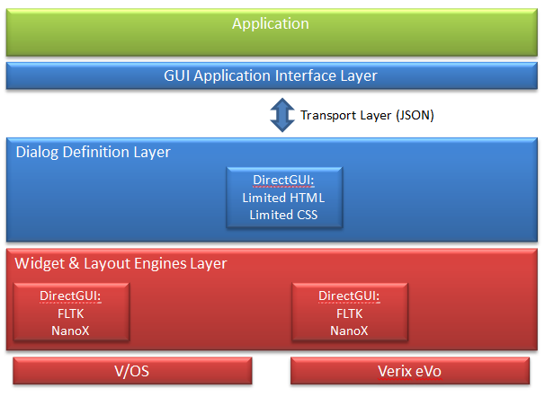

ADK-GUI uses UTF-8 encoding to support international characters. However, to make full use of unicode the installed fonts need to support the characters in use. Providing an appropriate font is in the scope of the respective application.

## Concepts <a href="#gui_concepts" id="gui_concepts"></a>

### Platform Independent Application <a href="#gui_platform_independent" id="gui_platform_independent"></a>

HTML dialogs are separated from the application and stored in platform specific subdirectories. By this the application itself becomes platform independent. The platform dependent layout of dialogs is moved to HTML files. Therefore, the same application binary may be used on different platforms while only the HTML dialog files are different. Since also the input and keyboard handling is handled by HTML dialogs the whole bandwidth of devices can be covered, from small B/W displays with function keys up to large true color displays with touch screen.

### Screen Layout <a href="#gui_screen_layout" id="gui_screen_layout"></a>

Most terminals display different types of information on screen, which are updated independently.

Example:

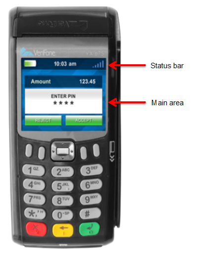

The above example shows a status bar that displays the date and time (along with other information) that is updated separately.

This concept is covered by UI regions. Each region has a unique ID used for displaying a dialog in a specific area on the screen. Region 0 is the default region and is usually assigned to the main part of the screen (i.e. the main application dialog).

### Keyboard Navigation <a href="#gui_keyboard_navigation" id="gui_keyboard_navigation"></a>

Actions may be bound to function keys by using invisible buttons. For devices without touch screen capabilities, this is the only way of operating the device. Two different concepts are supported:

- Each key has a dedicated function, just like a button on a Web page. This is useful when there is an association that links a function key to a function displayed on screen (e.g. if there is a button on screen close to a function key).
  Example: VX520 functions keys
- Cursor like navigation uses some function keys to move an active element on screen like using a joystick. Another button is used to trigger an action on the active element.
  Example: V200c 4-directional navigation keys

The selection of the concepts depends on the device. For example VX520 with its function keys around the display might be suited better for the first type of navigation while V200c with its 4-directional navigation key is a candidate for the second approach.

### Variable Data <a href="#gui_variable_data" id="gui_variable_data"></a>

Most dialogs contain some dynamic data that needs to be controlled by the application. For this purpose, XML processing instructions are used to insert data provided by the application into dialogs. The following use cases are supported:

- Insert some text provided by the application
- Insert text found in a catalog (translation) file
- Insert barcode images

### Multi-Language Support <a href="#gui_multilanguage_support" id="gui_multilanguage_support"></a>

There are two ways to display dialogs in multiple languages:

- Using catalog files to provide texts in different languages
- Switching between different sets of dialogs

### Printer support <a href="#gui_printer_support" id="gui_printer_support"></a>

Printer support is covered in ADK-PRT. However, since ADK-PRT and ADK-GUI share quite some code, a combined server has been developed to reduce resource consumption, that provides both GUI and Printer support. However, for the user this combined server behaves just like two separate servers so that no special handling is required for using the combined server.

# Getting Started <a href="#gui_getting_started" id="gui_getting_started"></a>

The GUI system comes with a sample application that demonstrates system features and provides a starting point for application developers who use the GUI system. It can be found in the *example* folder of the documentation package. The file *README.txt* in this folder gives exact instructions for compiling the example.

The GUI system is provided on different target platforms. The following sections describe how to use the GUI sample application on these platforms. In addition, this chapter gives general information about required components to run ADK GUI (runtime libraries, installing fonts).

## Running ADK-GUI on V/OS <a href="#gui_running_on_vos" id="gui_running_on_vos"></a>

On V/OS the following optional OS download packages need to be installed for using ADK-GUI:

- FLTK
- libpng

In addion it may be required to install font packages containing true type fonts to be used.

ADK-GUI uses ADK-IPC for setting up TCP connections and pipes. For this the application needs to be linked with libvfiipc in addition to the ADKGUI libraries.

Using static libraries:

``` cpp
<library path>/libvfiipc.a
```

Using shared libraries:

``` cpp
-L<library path> -lvfiipc
```

`<library` `path>` is the path, where `libvfiipc` is located.

When shared libraries are used, the corresponding ADK-GUI and ADK-IPC packages need to be installed on the terminal.

- `dl.libvfiguiprt-X.X.X-X.tar`
- `dl.libvfiipc-X.X.X-X.tar`


[Since ADKGUIPRT version 2.14.0]{style="color:red"} also `prtserver` and `guiprtserver` depend on ADK-IPC. The following package needs to be installed on the terminal: \[unsupported block\]


Please always use the newest version of `libvfiipc`, which comes along with ADK components packages.

## Packaging Resource Files on V/OS <a href="#gui_packaging_resource_files_on_vos" id="gui_packaging_resource_files_on_vos"></a>

For ADK-GUI using guiserver, resource files have to be accessed from processes running as a different (system) user. This has to be considered when packaging resource files so that access rights for these files are set up appropriately.

The recommended way is to have a separate package for the resource files (i.e. directory \"www\") and set group \"system\" when creating it.

See also the documentation of Package Manager or Packman Tool depending on the V/OS release.

## Installing Fonts on V/OS <a href="#gui_installing_fonts_on_vos" id="gui_installing_fonts_on_vos"></a>

Providing fonts for the GUI system on V/OS requires the installation of a user font package containing font files in true type format (TTF). Detailed information on how to create user font packages can be found in the document <a href="pg_vos_secins_guide.md">V/OS Secure Installer ERS</a>. An example user font package comes with the demo application in the documentation distribution package.

Earlier versions of Secure Installer required the file fonts.dir to be present. This is no longer required. It is generated automatically during installation.

Please note that the font name is not the same as the font file name. For use in HTML you need to use the font family name, not the file name. Also note that bold, italics, etc. are not part of the font family name but are controlled via the CSS font-weight and font-style properties.

## Running on Microsoft Windows <a href="#gui_running_on_windows" id="gui_running_on_windows"></a>

Following is required:

- Visual Studio 2008
- FLTK 1.3.x library for Windows
- Boost library

A Visual Studio 2008 solution file is provided to compile the demo application.

## Resource Folder <a href="#gui_resource_folder" id="gui_resource_folder"></a>

The demo application comes with a resource folder that contains several sample templates, dialogs and images for different platforms.

# Programming <a href="#gui_programming" id="gui_programming"></a>

## ADK-GUI Deployment Options <a href="#gui_deployment_options" id="gui_deployment_options"></a>

While ADK-GUI system provides a single header file (<a href="gui_8h.md">html/gui.h</a>) that exports the GUI system API function calls, different client side libraries are provided to link with applications. These libraries provide the same interface but offer different deployment options (creating a monolithic executable or running the application with a separate GUI server).

### Headers and binary deliveries <a href="#gui_headers_and_binary_deliveries" id="gui_headers_and_binary_deliveries"></a>

The ADK-GUI system is composed of the following deliveries:

| File | Purpose |
|----|----|
| <p>**<a href="gui_8h.md">gui.h</a>**</p> | <p>GUI system header file with exported definitions, functions, etc.</p> |
| <p>**<a href="gui__error_8h.md">gui_error.h</a>**</p> | <p>GUI system header file with exported error codes</p> |
| <p>**<a href="scriptproc_8h.md">scriptproc.h</a>**</p> | <p>Generic scripting interface</p> |
| <p>**<a href="jsproc_8h.md">jsproc.h</a>**</p> | <p>JavaScript interface</p> |
| <p>**jsobject.h**</p> | <p>GUI system header file with exported JSON interfaces (wraps <a href="ipc_2src_2ipc_2jsobject_8h.md">ipc/jsobject.h</a>)</p> |
| <p>**libvfiguiprt.a**</p> | <p>GUI system client library for use with guiserver/guiprtserver</p> |
| <p>**libvfiguiprt.so**</p> | <p>GUI system client shared library for use with guiserver/guiprtserver</p> |
| <p>**libfltkgui.a**</p> | <p>GUI system implementation library for monolithic applications (V/OS only)</p> |
| <p>**libjsproc.so**</p> | <p>JavaScript interpreter for scripting</p> |
| <p>**libcpapp.so**</p> | <p>CP application runtime library</p> |
| <p>**guiserver**</p> | <p>GUI server binary</p> |
| <p>**guiprtserver**</p> | <p>combined GUI and printer server binary</p> |

All header files can be found in the \'html\' directory.

An application has to be linked either with libvfiguiprt or with libfltkgui (see deployment options below).

### Parameter Overloading <a href="#gui_parameter_overloading" id="gui_parameter_overloading"></a>

ADK-GUI uses C++ overloading to provide different variants of a function so that parameters can be omitted that have a default value. Unlike C++ default parameters these need not be found at the end of the parameter list. The following parameters are affected:

- **display** - if not provided, output goes to the display 0
- **region** - if not provided, output goes to region UI_DEFAULT_REGION (=0). Omitting the region is only possible if the default display is used
- **key value map** - an empty key value map is used if left out

### Running ADK-GUI with GUI server <a href="#gui_running_with_guiserver" id="gui_running_with_guiserver"></a>

On V/OS the GUI service runs as a separate process with privileged rights to access HTML and graphical resource files accompanied with the applications. Different applications typically run in separate user spaces.

Using this deployment option more than one application can be run at the same time as long as they synchronize their access to the server and/or use different GUI regions. Synchronization between applications is not part of the GUI system and has to be provided separately. One solution for this is MAC, which is provided by ADK-SYS.

Applications link with the GUI client library to access the GUI API functions. They can either pass a URL to the UI resource files or send HTML documents directly. They also pass dynamic data over the inter-process interface into the GUI service. The GUI server then returns the result from the executed dialogs.

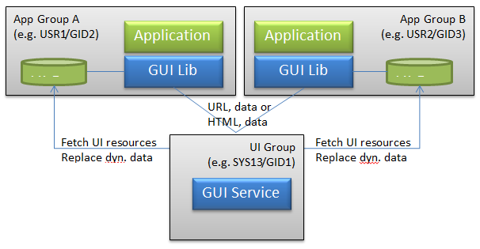

UI resources are assumed to be authentic (i.e. there is no additional authentication of UI resources within the GUI service). If required, the application provides the additional authentication for external resources.

For this setup applications need to link with **libvfigui** library of the GUI system.

The GUI server and client library use the environment variable `GUI_DISPLAY` to control the port used for communication between the two entities. Both, named pipes and TCP may be used for communication. For this `GUI_DISPLAY` either contains the absolute path name of the named pipe or the entry `'<hostname>`:\<port-offset\>\'. The base for the `<port-offset>` is **5900**. On V/OS, the overall default is \":\\b 0\" (TCP on localhost port 5900).

Meaning of field \<hostname\> for TCP connections:

For GUI server this field is ignored. For V/OS non-development devices, this port only accepts connections from localhost (`<hostname>` is always \"127.0.0.1\") for security reasons. V/OS development devices have external access enabled (`<hostname>` is always \"0.0.0.0\").

For GUI client library field `<hostname>` is not restricted and specifies the IP address or hostname of the GUI server, which library should connect to. An empty field `<hostname>` means connection is established to localhost (default on V/OS).

Examples:

``` cpp
GUI_DISPLAY=:0 (default)
GUI_DISPLAY=:1 (access via port 5901)
GUI_DISPLAY=/tmp/guipipe (access via named pipe /tmp/guipipe)
```


For external access, the GUI client library transmits image files as HTML inline images (base 64 encoded). Data traffic might blow up when using huge images.


Instead of GUIserver, the combined GUI and printing server `guiprtserver` may be used. It is the result of merging guiserver with the HTML printer server and supports the same set of GUI functions as guiserver but uses less resources than running guiserver and prtserver as separate binaries.

### Setting up keepalives <a href="#gui_keepalives" id="gui_keepalives"></a>

TCP keepalive probes can speed up the detection of broken TCP links. For enabling keepalives invoke <a href="namespacevfigui.md#acbd9c4046c5f740d62624e060f5cc455">uiSetKeepalive()</a> as first command before invoking other ADKGUI functions.


This feature is only supported for clients running on Linux based platforms.


### Running ADK-GUI as GUI Library <a href="#gui_running_directgui_as_gui_library" id="gui_running_directgui_as_gui_library"></a>

The GUI service can also be used as static library to be linked with an application process. In this setup the application links directly with the **libfltkgui** library of the GUI system. The result is a monolithic application that as everything in one executable.

Please note that monolithic applications needs to link additional static libraries to resolve symbols of library `libfltkgui.a`. These libraries come along with following distribution packages:

- V/OS: guiprt-contriblibs-vos-dev-X.X.X-X.zip
- V/OS2: guiprt-contriblibs-vos2-dev-X.X.X-X.zip


Only one running applications is allowed to use this option since display access cannot be shared between different applications reliably. Running two applications or a statically linked application alongside guiserver will result in corrupted display output since two applications will update the screens concurrently without any synchronization.


## UI Resources <a href="#gui_ui_resources" id="gui_ui_resources"></a>

User interface resources are describing the content, layout and behavior of user dialogs.

The following items are supported:

- HTML documents (files) describing the content and layout of a single dialog
- HTML template file(s) describing the layout of standard dialogs. Dynamic data is entered prior representation.
- Image resource files
- CSS style sheet files
- Catalog files for Multi-language support

Resources accompany the application packages (i.e. they reside in the same user space as the related application).

Resource files are looked up in the resource directory. A search path for base resource directories can be provided in the environment variable GUIPRT_WWW_PATH. It may contain several directories separated by \':\'. To refer to the current working directory, \"\$CWD\" may be used and to refer to the directory, where the executable resides \"\$ORIGIN\" can be used (on Linux only). These need to be found at the beginning of a path component, e.g. \"\$CWD/www\". The first existing directory in this path is chosen for the base resource directory. If GUIPRT_APPNAME is set (see also [Multi-Application-Controller Resource Subfolder Support](#gui_mac_subfolder)), it also needs to contain the application subfolder to be chosen.

If not set the default is \"\$CWD/www\", i.e. the www directory in the current working directory.

On x86 Linux the default is \"\$ORIGIN/../share/www:\$ORIGIN/../www:\$CWD/www\".

By default, UI resource files are looked up in the `"<platform>"` subdirectory of this base resource directory. The platform is automatically determined by use of an OS function (e.g. for P400 this is \"P400\").

If this directory does not exist, UI resources are looked up in a directory whose name is constructed based on the type of display and keyboard. Its name is constructed as follows:

``` cpp
<width>x<height><color><numkeys><touch>
```

`<width>` and `<height>` are the width and height of the display in pixels. `<color>` is either **\'M\'** for monochrome displays or **\'C\'** for color displays. `<numkeys>` is the number of keys on the keypad. In case it cannot be determined **\'0\'** is used. `<touch>` is either **\'T\'** if a touch display is present or **\'N\'** if not.

Examples:
P400: **320x480C15T**
UX100: **128x64M16N**

The advantage of using this scheme is that several different terminals may share the same set of dialogs. For example, VX520C and VX675 have the same display and keyboard layout and therefore, will look up files in the same folder.

On V/OS the resource files and the application are usually located in home folder of the user. For instance, if an application is installed on P400 under /home/usr1 the default resource directory is:

``` cpp
/home/usr1/www/P400
or
/home/usr1/www/320x480C15T
```

Due to compatibility reasons, `"www/<platform>"` is prior to new notation `"www/<width>x<height><color><numkeys><touch>"`.

The default location can be changed by using the `UI_PROP_RESOURCE_PATH` property of <a href="namespacevfigui.md#a3c03200cb65db47c2437f9729b87151a">uiSetPropertyString()</a>.

An optional prefix may also be set using the `UI_PROP_FILE_PREFIX` property of <a href="namespacevfigui.md#a3c03200cb65db47c2437f9729b87151a">uiSetPropertyString()</a>. This prefix is prepended to the file names provided for URLs and template names. If it contains one or more \'/\', then it will add new directory levels to the path. Otherwise, it only modifies the file name.

With prefix, the resulting file name is: `"www/<platform>/<prefix><filename"`

Since version 1.3.0, the UI system supports a default directory `"www/default"` for resource files. These can be considered as fallback in case a dialog is not found in the regular resource directory (e.g. because `www/<platform>` does not exist). Standard resource folder `"www/\<platform>"` and default resource folder `"www/default"` can also be used in parallel and files that are not found in the platform specific folder are secondly looked up the default resource folder. For instance, this is useful for multi-language catalog files that should be used for all platforms, whereas HTML files are still located in standard folder.

The following files types are supported by default resource folder:

- HTML documents (files)
- HTML template file(s)
- GUI system configuration file gui.ini
- CSS style sheet files
- Multi-language catalog files

Please note that image resource files location must be relative to the corresponding HTML document or template file. CSS style sheet files are not supported, since its location is specified in GUI system configuration file.

The default location of the default resource directory can be changed by using the `UI_PROP_RESOURCE_DEFAULT_PATH` property of <a href="namespacevfigui.md#a3c03200cb65db47c2437f9729b87151a">uiSetPropertyString()</a>.


Some operating systems have additional security checks on file access. Thus, it will not be possible to choose arbitrary resource paths for properties `UI_PROP_RESOURCE_PATH` and `UI_PROP_RESOURCE_DEFAULT_PATH`. For instance, on V/OS the file access is restricted by file system and security service grsecurity. Resource folder should always be in system group and should be located under `/home/usrX/www` (see chapter [Packaging Resource Files on V/OS](#gui_packaging_resource_files_on_vos)). Otherwise access by guiserver might be restricted according security policy of grsecurity.


If the specified resource files cannot be found, the GUI system will automatically generate an error message on the screen. This is helpful during application development and testing and should not show up in a live system if resource files are provided correctly.

Example:

``` cpp
mainmenu.tmpl not found in /home/usr1/www/320x480C15T
```

### Multi-Application-Controller Resource Subfolder Support <a href="#gui_mac_subfolder" id="gui_mac_subfolder"></a>

Multi-Application-Controller (MAC) is used to run several applications in parallel on a terminal. Since version 2.5.0 the UI system has added support to lookup resources in a separate subdirectory for each application to avoid resource location conflicts. For this, MAC can be configured to set up the environment variable `GUIPRT_APPNAME`, which provides a name for each application that is used for the subfolder `appname:`

``` cpp
www/<appname>/<platform>
```

or

``` cpp
www/<appname>/\<width>x\<height>\<color>\<numkeys>\<touch>
```

`GUIPRT_APPNAME` is automatically considered during startup of an application so that most of the MAC handling is transparent to the application. Please note that the variable is just used to set up the default values for `UI_PROP_RESOURCE_PATH` and `UI_PROP_RESOURCE_DEFAULT_PATH`. Once an application has set the properties during runtime, value of `GUIPRT_APPNAME` is ignored.

An application can also set GUIPRT_APPNAME by itself to move the default resource folder. For this the environment variable has to be set using `setenv()` before calling any ADKGUI function.

## GUI System Configuration File <a href="#gui_gui_system_configuration_file" id="gui_gui_system_configuration_file"></a>

The GUI system has a `gui.ini` file stored in the resource folder (\--\> `www/<platform>/gui`.ini) that provides global configuration and startup parameter for the system. This file has Windows INI-file format with sections and parameter value pairs.

The `gui.ini` file is automatically read on startup of the program. In case the application has modified `gui.ini` or changed UI_PROP_RESOURCE_PATH it has to call <a href="namespacevfigui.md#ae1d86be38dabed0b93f804b91805a3d3">uiReadConfig()</a> to re-read the file.

### Standard Font <a href="#gui_standard_font" id="gui_standard_font"></a>

The standard font and font size can be adjusted in the \[font\] section.

Example:

``` cpp
[font]
name=dejavu sans
size=10
```

### Decimal and Thousands Separator <a href="#gui_decimal_and_thousands_separator" id="gui_decimal_and_thousands_separator"></a>

The decimal and thousands separator can be adjusted in the \[input\] section.

Example:

``` cpp
[input]
decimal_separator=.
thousands_separator=%20
```

Leading and trailing whitespace in this configuration is stripped, but URL encoding can be used to insert whitespace, e.g. to set the thousands separator to a single space use %20. Note that UTF-8 encoding is used, e.g. for the multipy symbol \'×\' the sequence %C3%97 would be used.

### Alphanumeric Keyboard Definition <a href="#gui_alphanumeric_keyboard_definition" id="gui_alphanumeric_keyboard_definition"></a>

The GUI system supports alphanumeric inputs through pressing hard keys multiple times. Each key can be assigned with a number of characters that are selected in given order when pressing the key multiple times during alphanumeric inputs.

The definition of this alphanumeric keyboard is provided in the section \[keymap\] of the `gui.ini` file.

Example:

``` cpp
[keymap]
1=1
2=abc2ABC
3=def3DEF
4=ghi4GHI
5=jkl5JKL
6=mno6MNO
7=pqrs7PQRS
8=tuv8TUV
9=wxyz9WXYZ
0=%200
```

To use \'\*\' and \'#\' for character input, add the following rules:

``` cpp
=*
#=#
```

Without these rules the keys only act as a function key.

Please note that the `allowed_chars` attribute for input fields operates as filter on the keymap.

Model specific keymaps can be provided as \[keymap-standard\], \[keymap-europe\], \[keymap-arabic\] and \[keymap-rnib\]. If found they are preferred over the default \[keymap\].

### Standard Display Regions <a href="#gui_standard_display_regions" id="gui_standard_display_regions"></a>

To configure multiple display regions without using <a href="namespacevfigui.md#af855d00b4a448abba99ca993a7b629eb">uiLayout()</a>, the display regions in the \[layout\] section of the GUI configuration file can be specified. For more information, see [Display Regions](#gui_display_regions).

Syntax:

``` cpp
[layout-name]
<reg_id>=<left> <top> <right> <bottom> [<flags>]
...
```

Section \[layout\] consists of one or more lines each standing for one display region. Region ID `<reg_id>` is used as key and value consists of following parameters to be separated by whitespaces:

`<left>` left position in pixels (+=width if negative)
`<top>` top position in pixels (+=height if negative)
`<right>` right position in pixels (+=width if negative)
`<bottom>` bottom position in pixels (+=height if negative)
`<flags>` optional region flags, numeric value as found in <a href="gui_8h.md">gui.h</a>

Regions in `gui.ini` are activated by passing their name to <a href="namespacevfigui.md#af855d00b4a448abba99ca993a7b629eb">uiLayout()</a>.

Example specifying two regions, region with ID 1 has a fixed height of 20 pixels:

``` cpp
[layout]
1=0 0 -1 20
0=0 21 -1 -1
```

### CSS File <a href="#gui_css_file" id="gui_css_file"></a>

ADK-GUI allows specifying a CSS file in `gui.ini` as follows:

``` cpp
[stylesheet]
css=<filename>
```


The name of the CSS file name is relative to the location of the `gui.ini` file.


The color of the scroll overlay can be set using:

``` cpp
[scroll]
color=<RGBA>
display=<time>
width=<width>
```

\<RGBA\> is the 8-character hex color value including alpha channel. The default is 00000060 which corresponds to a semi transparent black overlay. \<time\> is the time in milliseconds for which the scroll overlay is displayed after the last change of the scroll position. Setting it to 0 disables the scroll overlay. Setting it to a negative value the overlays are displayed permanently. The default is 1000. \<width\> is the width of the in pixels. Setting it to 0 activates automatic selection of the width based on the display resolution. The default is 0.

The alpha channel is ignored on B/W devices.

## HTML Support in ADK-GUI <a href="#gui_html_support_in_directgui" id="gui_html_support_in_directgui"></a>

Standard HTML elements are used to define the layout of dialogs.

The HTML support in ADK-GUI is limited. All unknown HTML tags are ignored and text without HTML formatting is displayed.

The following HTML tags are supported with ADK-GUI:

### \<b\> - Bold text <a href="#gui_html_b" id="gui_html_b"></a>

| Attribute | Description |
|----|----|
| <p>dir</p> | <p>direction (rtl, ltr or auto)</p> |

### \<bdi\> - Bi-Directional isolation <a href="#gui_html_bdi" id="gui_html_bdi"></a>

| Attribute | Description |
|----|----|
| <p>dir</p> | <p>direction (rtl, ltr or auto)</p> |

### \<bdo\> - Bi-Directional override <a href="#gui_html_bdo" id="gui_html_bdo"></a>

| Attribute | Description |
|----|----|
| <p>dir</p> | <p>direction (rtl, ltr or auto)</p> |

### \<body\> - Body of the HTML document <a href="#gui_html_body" id="gui_html_body"></a>

| Attribute                  | Description                |
|----------------------------|----------------------------|
| <p>-</p> | <p>-</p> |

### \<br\> - Single line break <a href="#gui_html_br" id="gui_html_br"></a>

| Attribute                      | Description                               |
|--------------------------------|-------------------------------------------|
| <p>style</p> | <p>inline CSS style</p> |

### \<button\> - Button <a href="#gui_html_button" id="gui_html_button"></a>

| Attribute | Description |
|----|----|
| <p>action</p> | <p>event emitted on activation of the element (see [Event Handling](#gui_event_handling))</p> |
| <p>autofocus</p> | <p>element gets initial focus</p> |
| <p>name</p> | <p>name</p> |
| <p>nofocus</p> | <p>prevent that the button gets focus</p> |
| <p>style</p> | <p>inline CSS style</p> |
| <p>value</p> | <p>returns value</p> |
| <p>disabled</p> | <p>button is disabled</p> |
| <p>immediate</p> | <p>when present the action is performed on push instead of on release (this attribute does not take a value)</p> |
| <p>pushsound</p> | <p>file name of WAV file to be played when the button is pushed.</p> |
| <p>dir</p> | <p>direction (rtl, ltr or auto)</p> |

### \<center\> - Center text block <a href="#gui_html_center" id="gui_html_center"></a>

| Attribute | Description |
|----|----|
| <p>name</p> | <p>name</p> |
| <p>style</p> | <p>inline CSS style</p> |
| <p>dir</p> | <p>direction (rtl, ltr or auto)</p> |

### \<div\> - Section in a document <a href="#gui_html_div" id="gui_html_div"></a>

| Attribute | Description |
|----|----|
| <p>dir</p> | <p>direction (rtl, ltr or auto)</p> |
| <p>name</p> | <p>name</p> |
| <p>style</p> | <p>inline CSS style</p> |

### \<em\> - Emphasized text <a href="#gui_html_em" id="gui_html_em"></a>

| Attribute | Description |
|----|----|
| <p>dir</p> | <p>direction (rtl, ltr or auto)</p> |

### \<font\> - Font <a href="#gui_html_font" id="gui_html_font"></a>

| Attribute | Description |
|----|----|
| <p>size</p> | <p>font size</p> |
| <p>face</p> | <p>font face</p> |
| <p>color</p> | <p>text color</p> |
| <p>dir</p> | <p>direction (rtl, ltr or auto)</p> |

### \<h1\> \... \<h6\> - HTML headings <a href="#gui_html_h1" id="gui_html_h1"></a>

| Attribute | Description |
|----|----|
| <p>dir</p> | <p>direction (rtl, ltr or auto)</p> |

### \<hr\> - Horizontal line <a href="#gui_html_hr" id="gui_html_hr"></a>

| Attribute                  | Description                |
|----------------------------|----------------------------|
| <p>-</p> | <p>-</p> |

### \<i\> - Italic text <a href="#gui_html_i" id="gui_html_i"></a>

| Attribute | Description |
|----|----|
| <p>dir</p> | <p>direction (rtl, ltr or auto)</p> |

### \ - Image <a href="#gui_html_img" id="gui_html_img"></a>

| Attribute | Description |
|----|----|
| <p>src</p> | <p>URL of the image.</p> |
| <p>alt</p> | <p>alternate text</p> |
| <p>align</p> | <p>alignment (supported: top/middle/bottom)</p> |
| <p>style</p> | <p>inline CSS style</p> |

### \<input\> - Input Field <a href="#gui_html_input" id="gui_html_input"></a>

| Attribute | Description |
|----|----|
| <p>action</p> | <p><a href="libevt_8h.md#struct_event">Event</a> emitted on activation of the element (see [Event Handling](#gui_event_handling))</p> |
| <p>allowed_chars</p> | <p>Allowed characters for input (GUI specific HTML extension)</p> |
| <p>mask</p> | <p>Input mask (GUI specific HTML extension)</p> |
| <p>maxlength</p> | <p>Maximum input length</p> |
| <p>name</p> | <p>Name of the input field</p> |
| <p>cursorname</p> | <p>Cursor name for controlling the cursor position using the key value map</p> |
| <p>precision</p> | <p>Number of decimal digits (GUI specific HTML extension, for type number)</p> |
| <p>size</p> | <p>Size of the input field in characters</p> |
| <p>type</p> | <p>Input type (number, mask, text, password, radio, checkbox)</p> |
| <p>autosize</p> | <p>If set use the largest font so that the value fits the input field. The font size specified via CSS is used as minimum font size</p> |
| <p>prefix</p> | <p>prefix to be displayed</p> |
| <p>postfix</p> | <p>postfix to be displayed</p> |
| <p>placeholder</p> | <p>placeholder that is displayed if the input field is empty or in case of type number contains \'0\'</p> |
| <p>autofocus</p> | <p>element gets initial focus</p> |
| <p>dsep</p> | <p>decimal separator</p> |
| <p>tsep</p> | <p>thousands separator</p> |
| <p>sepkey</p> | <p>If provided with a key code, numeric input starts with the integer part of the number and pressing the selected key switches to the fractional part.</p> |
| <p>nocaret</p> | <p>Do not display the input cursor.</p> |
| <p>noinsert</p> | <p>For text, mask and password input: The cursor is always at the end of the input and cannot be moved.</p> |
| <p>novkbd</p> | <p>Do not have MAC display a virtual keyboard. Use this if you want to provide your own virtual keyboard for a specific dialog.</p> |
| <p>readonly</p> | <p>The value is only displayed and cannot be changed</p> |
| <p>rfill</p> | <p>In case of mask input, fill the mask from the end</p> |
| <p>show</p> | <p>In case of password input, this is a mask indicates which characters are to be displayed as clear text: If the mask has a \'1\' the corresponding character of the password is displayed as clear text.</p> |
| <p>style</p> | <p>inline CSS style</p> |
| <p>dir</p> | <p>direction (rtl, ltr or auto)</p> |
| <p>format</p> | <p>optional numeric format</p> |

### \<li\> List item (inside \<ul\> or \<ol\>) <a href="#gui_html_li" id="gui_html_li"></a>

| Attribute | Description |
|----|----|
| <p>dir</p> | <p>direction (rtl, ltr or auto)</p> |

### \<ol\> - Ordered list <a href="#gui_html_ol" id="gui_html_ol"></a>

| Attribute | Description |
|----|----|
| <p>dir</p> | <p>direction (rtl, ltr or auto)</p> |
| <p>type</p> | <p>one of 1,A,a,I,i</p> |
| <p>start</p> | <p>start value for counter</p> |
| <p>style</p> | <p>inline CSS style</p> |

### \<option\> - Option in a selection list <a href="#gui_html_option" id="gui_html_option"></a>

| Attribute | Description |
|----|----|
| <p>action</p> | <p><a href="libevt_8h.md#struct_event">Event</a> emitted on activation of the element (see [Event Handling](#gui_event_handling))</p> |
| <p>selected</p> | <p>Element is selected</p> |

### \<p\> - Paragraph <a href="#gui_html_p" id="gui_html_p"></a>

| Attribute | Description |
|----|----|
| <p>style</p> | <p>inline CSS style</p> |
| <p>dir</p> | <p>direction (rtl, ltr or auto)</p> |

### \<pre\> - Preformatted text <a href="#gui_html_pre" id="gui_html_pre"></a>

| Attribute                  | Description                |
|----------------------------|----------------------------|
| <p>-</p> | <p>-</p> |


The CSS file needs to have a font defined for it or the default font is used.


### \<select\> - Selection List <a href="#gui_html_select" id="gui_html_select"></a>

| Attribute | Description |
|----|----|
| <p>name</p> | <p>Name of the selection list</p> |
| <p>size</p> | <p>Visible size (number of option elements)</p> |
| <p>style</p> | <p>inline CSS style</p> |
| <p>dir</p> | <p>direction (rtl, ltr or auto)</p> |

### \<source\> <a href="#gui_html_source" id="gui_html_source"></a>

| Attribute | Description |
|----|----|
| <p>src</p> | <p>URL of the video or sound file</p> |

### \<span\> - Section in a document <a href="#gui_html_span" id="gui_html_span"></a>

| Attribute | Description |
|----|----|
| <p>style</p> | <p>inline CSS style</p> |
| <p>dir</p> | <p>direction (rtl, ltr or auto)</p> |

### \<strong\> - Bold text <a href="#gui_html_stron" id="gui_html_stron"></a>

| Attribute | Description |
|----|----|
| <p>dir</p> | <p>direction (rtl, ltr or auto)</p> |

### \<table\> - Table <a href="#gui_html_table" id="gui_html_table"></a>

| Attribute | Description |
|----|----|
| <p>border</p> | <p>Border size</p> |
| <p>cellspacing</p> | <p>Space between cells</p> |
| <p>cellpadding</p> | <p>Additional space inside cells</p> |
| <p>style</p> | <p>inline CSS style</p> |
| <p>dir</p> | <p>direction (rtl, ltr or auto)</p> |

### \<th\> - Table header cell in a table <a href="#gui_html_th" id="gui_html_th"></a>

| Attribute | Description |
|----|----|
| <p>width</p> | <p> </p> |
| <p>height</p> | <p> </p> |
| <p>colspan</p> | <p>Cell spans this number of columns</p> |
| <p>rowspan</p> | <p>Cell spans this number of rows</p> |
| <p>style</p> | <p>inline CSS style</p> |
| <p>dir</p> | <p>direction (rtl, ltr or auto)</p> |

### \<td\> - Cell in a table <a href="#gui_html_td" id="gui_html_td"></a>

| Attribute | Description |
|----|----|
| <p>width</p> | <p> </p> |
| <p>height</p> | <p> </p> |
| <p>colspan</p> | <p>Cell spans this number of columns</p> |
| <p>rowspan</p> | <p>Cell spans this number of rows</p> |
| <p>style</p> | <p>inline CSS style</p> |
| <p>dir</p> | <p>direction (rtl, ltr or auto)</p> |

### \<tr\> - Row in a table <a href="#gui_html_tr" id="gui_html_tr"></a>

| Attribute                  | Description                |
|----------------------------|----------------------------|
| <p>-</p> | <p>-</p> |

### \<u\> - Underline text <a href="#gui_html_u" id="gui_html_u"></a>

| Attribute | Description |
|----|----|
| <p>dir</p> | <p>direction (rtl, ltr or auto)</p> |

### \<ul\> - Unordered list <a href="#gui_html_ul" id="gui_html_ul"></a>

| Attribute | Description |
|----|----|
| <p>style</p> | <p>inline CSS style</p> |
| <p>dir</p> | <p>direction (rtl, ltr or auto)</p> |

### \<video\> - Video <a href="#gui_html_video" id="gui_html_video"></a>

| Attribute | Description |
|----|----|
| <p>autoplay</p> | <p>The video will start playing right from the start</p> |
| <p>height</p> | <p>height in pixels</p> |
| <p>loop</p> | <p>The video will start over again when it is finished</p> |
| <p>muted</p> | <p>The video will start with sound turned off</p> |
| <p>src</p> | <p>URL of the video file</p> |
| <p>width</p> | <p>width in pixels</p> |
| <p>style</p> | <p>inline CSS style</p> |

### \<audio\> - Audio <a href="#gui_html_audio" id="gui_html_audio"></a>

| Attribute | Description |
|----|----|
| <p>autoplay</p> | <p>Sound playback will start playing right from the start</p> |
| <p>loop</p> | <p>Sound playback will start over again when it is finished</p> |
| <p>src</p> | <p>URL of the audio file</p> |
| <p>style</p> | <p>inline CSS style</p> |

**Color Names Support:**

The following color names are supported: aqua, cyan, black, blue, fuchsia, magenta, gray, green, lime, maroon, navy, olive, orange, purple, red, silver, teal, white, and yellow.

In addition, \"transparent\" is supported for creating transparent buttons.

**Soft Hyphen Support:**

Soft hyphens are used to specify a place in text where a hyphenated break is allowed without forcing a line break in an inconvenient place if the text is reflowed.

Use one of the following syntax to insert a soft hyphen.

``` cpp
&#173;
&shy;
```

## Bi-Directional Text Support <a href="#gui_bidi_support" id="gui_bidi_support"></a>

Bi-directional text is supported, including Arabic text. Note that the selected font needs to have support for the character set used.

## Video Support <a href="#gui_video_support" id="gui_video_support"></a>

Depending on platform, the terminal must have installed additional components to meet the applicable prerequisites for video playback.

V/OS and V/OS2 terminals use mplayer which provides hardware accelerated video playback if available. Video support is only available on those platforms that contain mplayer.

ADKGUI on V/OS3 has internal support for video playback.

Compared to ordinary web browsers, video playback with ADK-GUI has some limitations:

- On V/OS and V/OS2 the HTML rendering engine has no access to properties of the video. It cannot determine width and height of the video. The width and height must be specified using the corresponding attributes. This limitation is not present on V/OS3.
- On V/OS and V/OS2 the video output window must be completely within the display and cannot be moved once playback has started. Therefore, the page that contains the video must entirely fit within the screen so that no scrollbars show up.
- The HTML rendering engine cannot check for supported video formats. Therefore, when \<source\> is used to provide several media sources, it always chooses the first file for playback.
- The video file is accessed from another process. It must be stored in a directory where it can be accessed by the guiserver or mplayer.
- The video decoding hardware has some limits with respect to the position of the video playback window on screen. Therefore, the output window may be off by some pixels from the desired position.

HTML video example for playing video in a loop:

``` cpp
<video width="582" height="388" style=";margin-left:auto;margin-right:auto" autoplay loop>
<source src="file:///mnt/usbstor1/video.avi">
Video not supported or video not found.<br>
On Mx9 plug in USB device containing video named "video.avi".
</video>
```

Please note that the source path is platform dependent. The specified path for accessing the video file on USB device (see example) only works on V/OS.

**HTML Video Widget Functions for Video Control**

Some widget functions for video playback control are provided that can be called from an action statement of an event. These functions are executed in the context of the currently active HTML document and refer to the name specified for the video element:

``` cpp
<video width="240" height="206" style=";margin-left:auto;margin-right:auto" name="vid">
...
</video>
<button accesskey='&#13;' style='width:100%' action='call vid.play()'>
  &#9654;
</button>
```

Please refer to chapter [HTML Widget Functions](#gui_html_widget_functions) which lists the supported video control functions.

**Performing an Action When the Video has Stopped**

The following input field detects the end of the video playback:

| Definition | Documentation |
|----|----|
| <p>**\<input type=\"videoend\" style=\"display:none\" action=\"yyy\"\>**</p> | <p>defines a hidden input field that is triggered when any video in the dialog has ended. Action yyy specifies the action to be taken in this case.</p> |

Example:

``` cpp
<input type="videoend" style="display:none" action="return 42">
```

**GUIPRT Demo and Video Support**

Since the size of sample videos would blow up the GUIPRT documentation package, the video extension package (guiprt-doc-video-X.X.X-X.zip) is provided. The video package contains additional documentation and some video files with different resolutions for different displays. Please refer to the enclosed VIDEO-README.txt containing more details about required components to meet the applicable prerequisites for video playback. In addition, you can find helpful instructions for installation of sample video files for GUIPRT demo.

### Supported video formats on V/OS2 <a href="#gui_video_supported_formats" id="gui_video_supported_formats"></a>

libsvc_mplayer is reported to support the following formats on V/OS2:

- H.264 Video decoder requirements
- H.264 baseline profile up level 5
- Supports I&P picture decoding
- Supports CAVLC decoding
- Supports Progressive decoding
- Supports all Intra prediction sizes and modes
- Supports all Inter prediction unit sizes
- Container format must be avi


Video playback on M400:
While the M400 display resolution is 854x480, a full screen video should be encoded at 856x480 (this is due to a limitation in the Raptor SOC) The video should be encoded using H.264 with Baseline profile and placed in an .avi container. Bit rate should be kept under 2Mbps Scale the video before it is played on the device.

Some details: \[unsupported block\]


### V/OS2 multimedia playback support <a href="#gui_video_vos2_multimedia_playback_support" id="gui_video_vos2_multimedia_playback_support"></a>

**Backend**

Video playback is ensured by MPlayer (current version being 1.4). Out-of-the box MPlayer supports many audio/video (A/V) encodings in various video container formats but there are some restrictions that are in place for the customized MPlayer version used by V/OS2. Since target devices are of limited space, support for much of the A/V encodings, but for the most commonly used, has been stripped. Additionally, due to relatively slow CPU and no hardware acceleration support for A/V decoding, there is a proprietary 3rd party decoder in use by MPlayer which speeds up the decoding, but applies even tighter restrictions on supported A/V encodings.

**Supported formats**

| No | Video encoding | Video encoding profile | Audio encoding | Video container | Conversion example |
|----|----|----|----|----|----|
| <p>1</p> | <p>H.264 (MPEG-4 Part 10, AVC)</p> | <p>Baseline</p> | <p>AAC, MP3</p> | <p>AVI</p> | <p>ffmpeg -i INPUT_VIDEO.EXT -vcodec libx264 -profile:v baseline -acodec aac OUTPUT_VIDEO.avi</p> |
| <p>2</p> | <p>H.262 (MPEG-2)</p> | <p>Simple profile</p> | <p>AAC, MP3</p> | <p>AVI, MP4, MOV, M4V</p> | <p>ffmpeg -i INPUT_VIDEO.EXT -vcodec mpeg4 -acodec mp3 OUTPUT_VIDEO.mp4</p> |

## Audio Support <a href="#gui_audio_support" id="gui_audio_support"></a>

Depending on platform, the terminal must have installed additional components to meet the applicable prerequisites for audio playback.

V/OS terminals use the service `libsvc_sound` which provides sound playback. Audio support is only available on those platforms that contain this service. This service also determines the supported audio formats: Currently it supports wav and mp3.

Audio playback is bound to the dialog, i.e. the sound will only play as long as the dialog is active.

Compared to ordinary web browsers, audio playback with ADK-GUI has some limitations:

- The HTML rendering engine has no access to properties of the sound file.
- The HTML rendering engine cannot check for supported audio formats. Therefore, when \<source\> is used to provide several media sources, it always chooses the first file for playback.
- On V/OS and Rapter devices, the sound file is accessed from another process. It must be stored in a directory where the sound playback service has access rights.

HTML audio example for playing a sound in a loop:

``` cpp
<audio autoplay loop>
<source src="file:///mnt/usbstor1/sound.mp3">
Sound not supported or sound file not found.<br>
On Mx9 plug in USB device containing a sound file named "sound.mp3".
</audio>
```

Please note that the source path is platform dependent. The specified path for accessing the sound file file on USB device (see example) only works on V/OS.

**HTML Audio Widget Functions for Audio Control**

Some widget functions for sound playback control are provided that can be called from an action statement of an event. These functions are executed in the context of the currently active HTML document and refer to the name specified for the audio element:

``` cpp
<audio name="snd">
...
</audio>
<button accesskey='&#13;' style='width:100%' action='call snd.play()'>
  &#9654;
</button>
```

Please refer to chapter [HTML Widget Functions](#gui_html_widget_functions) which lists the supported audio control functions.

**Performing an Action When the Sound has Stopped**

The following input field detects the end of the video playback:

| Definition | Documentation |
|----|----|
| <p>**\<input type=\"audioend\" style=\"display:none\" action=\"yyy\"\>**</p> | <p>defines a hidden input field that is triggered when any sound playback in the dialog has ended. Action yyy specifies the action to be taken in this case.</p> |

Example:

``` cpp
<input type="audioend" style="display:none" action="return 42">
```

## CSS support in ADK-GUI <a href="#gui_css_support_in_directgui" id="gui_css_support_in_directgui"></a>

Cascading Style Sheets (CSS) are used to change appearance of HTML elements. For ADK-GUI implementation, a limited set of CSS elements is supported.

CSS attributes can be specified directly in the HTML documents by using the inline style attribute for HTML elements. The inline style attributes overwrite styles taken from the CSS file. `GUI.INI` may be used for specifying a global CSS file.

| CSS Style Attribute | Description | Limitation |
|----|----|----|
| <p>**align-content**</p> | <p>Align flex lines along the cross axis in a flexbox container</p> |  |
| <p>**align-items**</p> | <p>Specify the default alignment for items inside a flexbox container</p> |  |
| <p>**align-self**</p> | <p>Specify the alignment in the block direction for the selected item inside a flexbox container</p> |  |
| <p>**animation**</p> | <p>Shorthand property for animation name, time, timing function, delay, count, direction and fill mode</p> |  |
| <p>**animation-delay**</p> | <p>Delay until the animation starts</p> |  |
| <p>**animation-direction**</p> | <p>Animation direction, one of `normal`, `reverse`, `alternate` or `alternate-reverse`, default is `normal`</p> |  |
| <p>**animation-duration**</p> | <p>Length of time for one animation cycle</p> |  |
| <p>**animation-fill-mode**</p> | <p>Fill mode, one of `none`, `forwards`, `backwards` or `both`, default is `none`</p> |  |
| <p>**animation-iteration-count**</p> | <p>Number of times an animation cycle is played</p> |  |
| <p>**animation-name**</p> | <p>Keyframe name</p> |  |
| <p>**animation-timing-function**</p> | <p>Describes how the animation will progress over one cycle of its duration, one of `ease`, `linear`, `ease-in`, `ease-out`, `ease-in-out`, `cubic-bezier`(\<number\>, \<number\>, \<number\>, \<number\>), default is `ease`</p> | <p>`step-start`, `step-end` and `steps()` are not supported.</p> |
| <p>**background-color**</p> | <p>Background color</p> |  |
| <p>**background-image**</p> | <p>Background image:<br/><br/>`url()` and `linear-gradient`() are supported. `linear-gradient`() only supports gradients parallel to the x- or y-axis.</p> |  |
| <p>**background-position**</p> | <p>Background position</p> |  |
| <p>**background-repeat**</p> | <p>Supported values: no-repeat, repeat-x, repeat-y, repeat</p> |  |
| <p>**background-size**</p> | <p>Scale background image.</p> | <p>-</p> |
| <p>**border**<br/>**border-style**<br/>**border-top**<br/>**border-right**<br/>**border-bottom**<br/>**border-left**<br/>**border-width**<br/>**border-color**<br/></p> | <p>Border properties<br/>Single properties are also supported, e.g. border-bottom-color</p> | <p>-</p> |
| <p>**border-radius**<br/>**border-top/bottom-left/right-radius**</p> | <p>Border radius for creating rounded corners.</p> | <p>Only supported for buttons and text/password/number input fields.</p> |
| <p>**border-image**<br/>**border-image-slice/width/outset**</p> | <p>Use image for decorating the border.</p> | <p>-</p> |
| <p>**border-spacing**</p> | <p>\<table\></p> | <p>Spacing between table cells, only px supported.</p> |
| <p>**bottom**</p> | <p>bottom position</p> | <p>-</p> |
| <p>**box-sizing**</p> | <p>**\'content-box\'**: The width and height properties include only the content but not border, padding, or margin.<br/>**\'border-box\'**: The width and height properties include content, padding and border, but not margin.<br/>The default depends on the HTML tag, e.g. \<button\> has border-box and \<div\> has content-box as default.</p> | <p>-</p> |
| <p>**color**</p> | <p>Text color</p> | <p>-</p> |
| <p>**column-gap**</p> | <p>Gap between columns in flexbox layout</p> |  |
| <p>**direction**</p> | <p>-</p> | <p>-</p> |
| <p>**display**</p> | <p>Display property</p> | <p>Only block, inline-block, none, table-cell, flex and inline-flex are supported</p> |
| <p>**flex**</p> | <p>Shorthand property for flex-grow, flex-shrink, flex-basis</p> |  |
| <p>**flex-basis**</p> | <p>Initial length of a flexible item</p> |  |
| <p>**flex-direction**</p> | <p>Direction of the flexible items</p> |  |
| <p>**flex-flow**</p> | <p>Shorthand for flex-direction, flex-wrap</p> |  |
| <p>**flex-grow**</p> | <p>Amount of how much the item will grow relative to the other flexible items</p> |  |
| <p>**flex-shrink**</p> | <p>Amount of how much the item will shrink relative to the other flexible items</p> |  |
| <p>**flex-wrap**</p> | <p>Specifies whether flexible items should wrap or not.</p> |  |
| <p>**font**</p> | <p>Set font family, style, size and weight</p> | <p>-</p> |
| <p>**font-family**</p> | <p>-</p> | <p>-</p> |
| <p>**font-style**</p> | <p>-</p> | <p>-</p> |
| <p>**font-size**</p> | <p>-</p> | <p>-</p> |
| <p>**font-stretch**</p> | <p>-</p> | <p>ADK-GUI does not support distinguishing different variants of condensed or expanded due to FLTK limitations</p> |
| <p>**font-weight**</p> | <p>-</p> | <p>bolder and lighter are always relative to \"normal\"</p> |
| <p>**gap**</p> | <p>Shorthand for row-gap, column-gap</p> |  |
| <p>**height**</p> | <p>Height in px or %</p> | <p>-</p> |
| <p>**justify-content**</p> | <p>Align the flexible items along the main axis.</p> |  |
| <p>**left**</p> | <p>left position</p> | <p>-</p> |
| <p>**line-height**</p> | <p>Set line height</p> | <p>-</p> |
| <p>**margin**<br/>**margin-left**<br/>**margin-top**<br/>**margin-right**<br/>**margin-bottom**<br/></p> | <p>Margin properties</p> | <p>-</p> |
| <p>**opacity**</p> | <p>opacity in the range 0.0 \... 1.0</p> | <p>opacity is only supported for \<div\>, \<button\> and for \<input\> types text, number and mask</p> |
| <p>**order**</p> | <p>Order or flexible items relative to the other items.</p> |  |
| <p>**overflow**</p> | <p>**\'visible\'**: The overflow is not clipped, it renders outside the element\'s box (default)<br/>**\'hidden\'**: The overflow is clipped.<br/>**\'auto\'**: Scrollbars are added autmatically if required to scroll the content.<br/>**\'scroll\'**: Scrollbars are always added to scroll the content<br/>**\'autogrid\'**: Like \'auto\' just that the scrolling snaps in at multiples of the element width/height<br/>**\'ticker\'**: Automatically scroll oversized content horizontally. Scrolling right to left alternates with scrolling left to right<br/>**\'ticker-rl\'**: Automatically scroll oversized content horizontally from right to left.<br/>**\'ticker-lr\'**: Automatically scroll oversized content horizontally from left to right.<br/>**\'marquee\'**: same as marquee-rl.<br/>**\'marquee-rl\'**: Scroll content horizontally from right to left. Scrolling is performed independent of content width.<br/>**\'marquee-lr\'**: Scroll content horizontally from left to right. Scrolling is performed independent of content width.<br/>\'ticker\', \'ticker-rl\', \'ticker-lr\', \'marquee\', \'marquee-rl\' and \'marquee-lr\' optionally take a speed parameter that specifies scrolling in pixels per second. Default speed is 50 pixels per second. Example: \'ticker-lr 100\'.</p> | <p>overflow is only supported for \<div\></p> |
| <p>**padding**<br/>**padding-left**<br/>**padding-top**<br/>**padding-right**<br/>**padding-bottom**</p> | <p>Padding properties</p> | <p>-</p> |
| <p>**page-break-after**</p> | <p>page break property (always)</p> | <p>not supported for display on screen</p> |
| <p>**position**</p> | <p>Position static, relative, absolute or fixed</p> | <p>-</p> |
| <p>**right**</p> | <p>right position</p> | <p>-</p> |
| <p>**row-gap**</p> | <p>Gap between the rows in a flexbox layout.</p> | <p>-</p> |
| <p>**table-layout**</p> | <p>Set the table layout algorithm</p> | <p>-</p> |
| <p>**text-align**</p> | <p>Horizontal alignment(left, center, right)</p> | <p>-</p> |
| <p>**text-decoration**</p> | <p>Text decoration (underline, overline, line-through)</p> | <p>-</p> |
| <p>**text-overflow**</p> | <p>Text overflow (ellipsis)</p> | <p>-</p> |
| <p>**top**</p> | <p>top position</p> | <p>-</p> |
| <p>**vertical-align**</p> | <p>Vertical alignment (top, middle, bottom)</p> | <p>-</p> |
| <p>**visibility**</p> | <p>Visibility (hidden)</p> | <p>-</p> |
| <p>**white-space**</p> | <p>White-space (normal, nowrap, pre-line, pre-wrap, pre)</p> | <p>-</p> |
| <p>**width**</p> | <p>Width in px or %</p> | <p>-</p> |
| <p>**word-break**</p> | <p>Word break property (break-all)</p> | <p>-</p> |
| <p>**word-wrap**</p> | <p>Word-wrap property (break-word)</p> | <p>-</p> |
| <p>**z-index**</p> | <p>Determines which element is shown in front if elements overlap</p> | <p>Only supported for block elements like e.g. \<div\></p> |

The CSS functions calc(), <a href="http__get__curl_8c.md#a8195a86b6d75b9a3939505e8bb50021e">min()</a> and max() are supported to calculate length values. calc() expressions are limited to 8 values in the calculation. Note that the operators \'+\' and \'-\' need to be surrounded by space as per CSS standard. If an invalid expression is provided or more than 8 values are used, the expression is ignored.


The following `overflow` variants are not supported by WebGUI: \[unsupported block\]


### CSS Combinators Support and CSS Limitations <a href="#css_combinators_support_and_limitations" id="css_combinators_support_and_limitations"></a>

ADK-GUI supports descendant selector and child selector, sibling selectors are not supported. The following elements cannot be used as ancestor in a descendant or child selector rule:

- b
- em
- font
- i
- span
- strong
- u

That is the following rule is not supported

``` cpp
span div {}
```

Whereas the following rule is supported

``` cpp
div span {}
```

**Currently the following limitations exist in ADK-GUI when using CSS:**

- Length values only support the units \'%\' and \'px\'.
- For specifying colors `rgba()`, `hsl()` and `hsla()` are not supported
- linear-gradient is restricted to the following directions:
  - to top / 0deg
  - to right / 90deg
  - to bottom / 180deg
  - to left / 270deg
- Providing several font names that are looked up in that order for attribute font-face is not supported.
- border-style only supports \"none\" and \"solid\".
- border-image does not support using GIF images or PBM images.

**Global CSS file:** All supported CSS properties may be used in the global CSS file and work the same way as when using the style attribute. For CSS selectors the following restrictions apply:

- CSS pseudo elements are not supported
- The following CSS pseudo classes are supported:
  - :focus - element that has input focus
  - :active - button while it is pressed
  - :disabled - disabled button

CSS pseudo class selectors have additional restrictions: Only setting colors (e.g. background color) and background-images considers pseudo classes. In particular, it is not possible to change the size of an object using pseudo classes. Other properties are ignored.

### CSS Animation support <a href="#gui_css_anmation" id="gui_css_anmation"></a>

ADKGUI supports CSS animations. The following CSS properties can be animated:

- background-color
- border-bottom-color
- border-bottom-width
- border-left-color
- border-left-width
- border-right-color
- border-right-width
- border-top-color
- border-top-width
- bottom
- color
- font-size
- height
- left
- line-height
- margin-left
- margin-top
- margin-right
- margin-bottom
- opacity
- padding-left
- padding-top
- padding-right
- padding-bottom
- right
- top
- width


Animations that change sizes require a re-layout of the content and are, therefore, more computation intensive than animations that just change the color of an element.


## Event Handling <a href="#gui_event_handling" id="gui_event_handling"></a>

The GUI system supports a limited set of events that can be processed independently of the application business logic. This event mechanism can be used to keep GUI logic largely independent from the application business logic.

The actions taken on behalf of the dialog event are specified in the HTML with the following syntax:

[TABLE]

**Chaining**
\"call\" functions may be chained in the action by separating them with \';\'. If present, a non call action must be the last component in the action. Example: Disable a button after pressing it:

``` cpp
<button name="foo" action="call foo.disable(); return 42">OK</button>
```

There can be only one non-call function inside an action.


***Important:***
If an HTML document contains an input element (e.g. \<input\> or \<button\>) at least one element in a HTML document must contain a `"load"` or `"return"` action in order to provide an exit point for the dialog. There is no explicit check on this provided by the UI system. As a result dialogs without these exit points stay active either infinite or exit automatically after the configured global dialog timeout.


### Custom Events <a href="#gui_custom_event" id="gui_custom_event"></a>

Custom events allow sending data to an application without terminating the dialog. Custom events depend on using a callback function in combination with an async function (e.g. ::uiInvokeURLAsync). When a custom event is sent, the callback is invoked with ::UI_CB_EVENT. The event code can be accessed using <a href="namespacevficom_1_1cmdparam_1_1in_1_1stk__write_1_1msg_1_1tr_1_1refresh.md#a625b9748e49ec8ee41ab3546a32415c0">UICBData::result()</a>. If additional values are send, these can be accessed via UICBData::value().

### Typeahead Support <a href="#gui_typeahead" id="gui_typeahead"></a>

Normally key strokes are processed as they happen. However, when switching dialogs this may result in key strokes to be dropped:
The previous dialog has been finished and the next dialog is not yet ready to be shown and to process input.
Now if the user types some key, then there is no use for it and it gets dropped. In certain situation this is not desired, e.g. if the user blindly operates the device and does not wait for visual feedback.

For this use case `'returnwait'` and `'loadwait'` have been introduced. They differ from `'return'` and `'load'` in that they suspend GUI and event processing until the next dialog is shown in the same region or until the layout is updated. This enables to atomically replace one dialog with another one so that keyboard input does not vanish in between two dialogs.

Since GUI and event processing is stopped, if the application fails to display the next dialog the GUI is frozen. For this reason, `'returnwait'` and `'loadwait'` should be used with care.


Typeahead support is specific to ADK-GUI.


### Long Button Press <a href="#gui_long_buttonpress" id="gui_long_buttonpress"></a>

Buttons support distinguishing long and short button presses on the touch screen. A button press is considered long if the button is pressed for at least 750ms and no attempt to pan is detected. In this case the action found in the attribute \"action2\" is performed. If \"action2\" is not provided then the action found in \"action\" is performed as fallback.

Example:

``` cpp
<button action="return 1" action2="return 2">Test</button>
```


Long button press is only supported for buttons on the touch screen but not for physical buttons on the keypad.


### Multitouch detection in signature capture <a href="#gui_multitouch_sigcap" id="gui_multitouch_sigcap"></a>

Multitouch detection and triggering action2 supported in older releases is no longer supported. Instead pinch/zoom is disabled during signature capture so that signature capture can continue with the first touch contact even when touching the screen with additional fingers. Overall this should give a better user experience than in older releases.

Palm rejection can be deactivated by setting the attribute palm-rejection=\"0\". Setting it to \"1\" enables palm rejection, which is also the default.

### HTML Widget Functions <a href="#gui_html_widget_functions" id="gui_html_widget_functions"></a>

Some HTML widget functions are provided that can be called from an action statement of an event. These functions are executed in the context of the currently active HTML document.

| Function | Purpose |
|----|----|
| <p>**\"menuname\".up()**</p> | <p>move the selector of a \<select\> element name \"menuname\" one item up.</p> |
| <p>**\"menuname\".down()**</p> | <p>move the selector of a \<select\> element name \"menuname\" one item down.</p> |
| <p>**\"menuname\".left(dist=50%)**</p> | <p>scroll the menu to the left</p> |
| <p>**\"menuname\".right(dist=50%)**</p> | <p>scroll the menu to the right</p> |
| <p>**\"menuname\".action()**</p> | <p>run the action bound to the selected menu entry</p> |
| <p>**\"divname\".up(dist=50%)**</p> | <p>scroll a scrollable \<div\> up</p> |
| <p>**\"divname\".down(dist=50%)**</p> | <p>scroll a scrollable \<div\> down</p> |
| <p>**\"divname\".left(dist=50%)**</p> | <p>scroll a scrollable \<div\> left</p> |
| <p>**\"divname\".right(dist=50%)**</p> | <p>scroll a scrollable \<div\> right</p> |
| <p>**\"name\".add_z(z)**</p> | <p>add z to the z-index of the named element and its descendants</p> |
| <p>**\"name\".set_z(z)**</p> | <p>set the z-index to z of the named element and its descendants</p> |
| <p>**\"checkboxname\".toggle()**</p> | <p>toggle the checkbox \"checkboxname\"</p> |
| <p>**\"radioname\".select(value)**</p> | <p>select the radio button \"radioname\" that has the provided value. (Note: \'value\' must not contain white space)</p> |
| <p>**\"inputname\".clear()**</p> | <p>clear the content of the input field \"inputname\"</p> |
| <p>**document.up(dist=50%**)</p> | <p>scroll the entire HTML document up</p> |
| <p>**document.down(dist=50%**)</p> | <p>scroll the entire HTML document down</p> |
| <p>**document.left(dist=50%**)</p> | <p>scroll the entire HTML document left</p> |
| <p>**document.right(dist=50%**)</p> | <p>scroll the entire HTML document right</p> |
| <p>**cursor.left()**</p> | <p>move the cursor of the active input field to the left</p> |
| <p>**cursor.right()**</p> | <p>move the cursor of the active input field to the right</p> |
| <p>**cursor.up()**</p> | <p>move the cursor of the active input field up / select the previous menu entry</p> |
| <p>**cursor.down()**</p> | <p>move the cursor of the active input field down / select the next menu entry</p> |
| <p>**focus.next()**</p> | <p>activate the next input field/button</p> |
| <p>**focus.previous()**</p> | <p>activate the previous input field/button</p> |
| <p>**focus.left()**</p> | <p>activate the next input field/button left of the current one</p> |
| <p>**focus.right()**</p> | <p>activate the next input field/button right of the current one</p> |
| <p>**focus.up()**</p> | <p>activate the next input field/button above of the current one</p> |
| <p>**focus.down()**</p> | <p>activate the next input field/button below of the current one</p> |
| <p>**active.toggle()/active.action()**<br/>(action is just an alias for toggle)</p> | <p>toggle the state of the active checkbox/radio button or run the action bound to the active button</p> |
| <p>**active.sendkey(value\[,value\...\]\[,keymap\])**</p> | <p>send key strokes to the active input field, if the last parameter is \'keymap\', the keymap will be considered otherwise it is ignored</p> |
| <p>**\"name\".sendkey(value\[,value\...\]\[,keymap\])**</p> | <p>send key strokes to the named input field, if the last parameter is \'keymap\', the keymap will be considered otherwise it is ignored</p> |
| <p>**active.up()**</p> | <p>call \'up\' in the active menu</p> |
| <p>**active.down()**</p> | <p>call \'down\' in the active menu</p> |
| <p>**active.left()**</p> | <p>call \'left\' in the active menu</p> |
| <p>**active.right()**</p> | <p>call \'right\' in the active menu</p> |
| <p>**active.clear()**</p> | <p>clear the content of the active input field</p> |
| <p>**\"videoname\".pause() / **\"audioname\"**.pause()**</p> | <p>pause the video / sound</p> |
| <p>**\"videoname\".play() / **\"audioname\"**.play(\[toggle\])**</p> | <p>start or resume playback of the video / sound. Providing the optional toggle flag, music is paused when it is already playing.</p> |
| <p>**\"videoname\".rewind() / **\"audioname\"**.rewind()**</p> | <p>rewind the video /sound to the beginning</p> |
| <p>**\"videoname\".togglesound()**</p> | <p>toggle sound output</p> |
| <p>**audio.volume(vol)**</p> | <p>Set volume to absolute value `vol` in the range 0..100</p> |
| <p>**audio.volume(+vol)**</p> | <p>Increase volume by `vol`</p> |
| <p>**audio.volume(-vol)**</p> | <p>Decrease volume by `vol`</p> |
| <p>**\"buttonname\".enable()**</p> | <p>Enable button \"buttonname\"</p> |
| <p>**\"buttonname\".disable()**</p> | <p>Disable button \"buttonname\"</p> |
| <p>**\"barcodename\".scan()**</p> | <p>Trigger barcode scanning on \"barcodename\"</p> |
| <p>**\"photoname\".photo()**</p> | <p>Trigger taking a photo</p> |


The functions for keyboard navigation `cursor.left()`, `cursor.right()`, `focus.next()`, `focus.previous()`, `focus.left()`, `focus.right()`, `focus.up()`, `focus.down()`, `active.toggle()` that refer to the active input field/button must be bound to invisible buttons or they will not work as expected since when visible the active widget loses focus when the accesskey is pressed before the specified action is processed.

The scrolling functions take an optional distance parameter. This value is in pixels unless \'%\' is used as unit. In that case it is the specified fraction of the visible width or height (depending on scrolling direction) of the object to be scrolled. If omitted the distance defaults to 50%.

`focus.left()`, `focus.right()`, `focus.up()`, `focus.down()` may be used for some joystick-like navigation on screen. They activate the next input element in the given direction that matches best. Obviously this kind of navigation works best when the input elements are arranged in a way that is suitable for that kind of navigation.


### Keyboard Binding <a href="#gui_keyboard_binding" id="gui_keyboard_binding"></a>

The UI system supports binding of keys on the terminal keyboard to HTML button elements. The HTML accesskey attribute is used to define the key binding specifying the key code (e.g. \'1\' for key 1). For functional keys like F1-F4 accesskey is specified with `"&#"` followed by a decimal value with \";\" (see platform dependent key binding table below).

Please note that the key bindings can be defined for visible and non-visible buttons. A typical use case for non-visible buttons is assigning keys on non-touch screen hardware.

**Example:**

``` cpp
<button action='call menu.up()' accesskey='&#133;'>SCROLL UP</button>
<button action='call menu.up()' accesskey='&#133;' style='display:none'>SCROLL UP</button>
```


Keys \'\*\' and \'#\' have dual use: By default they are treated like function keys but by adding a rule to the key map (see [Alphanumeric Keyboard Definition](#gui_alphanumeric_keyboard_definition)) they may be used for character input. In that case the keys are used for character input if an input field is active and as function key if no input field is active.


The following table provides an overview on access key values to be used for the available keys on different hardware.

\[unsupported block\] \[unsupported block\] \[unsupported block\] \[unsupported block\] \[unsupported block\] \[unsupported block\] \[unsupported block\] \[unsupported block\] \[unsupported block\] \[unsupported block\] \[unsupported block\]

### Trigger action on key release <a href="#gui_key_release" id="gui_key_release"></a>

Function keys (not normal keys) may trigger an action on release. For this add 18 to the function key value, e.g.

``` cpp
<button action='return 0' accesskey='&#142;' style="display:none"></button>
```

triggers the action on pressing of the camera button and

``` cpp
<button action='return 0' accesskey='&#160;' style="display:none"></button>
```

triggers on release of the camera button.

### Key Combinations <a href="#gui_key_combinations" id="gui_key_combinations"></a>

For `<button>` elements more than one key may be specified in \"accesskey\" to set up a key combination. The keys have to be separated by \'+\'. Key combinations only work for invisible buttons (display:none).

Example display status screen when pressing \<Enter\>+\'1\':

``` cpp
<button action='load statuspage.html' accesskey='&#13;+1' style="display:none"> </button>
```


Key combinations may interfere with input fields shown on screen. For example, if an input field is active, digits will be considered input to this input field and will not trigger a key combination.


Key combinations may interfere with access keys. For example if an application sets up both access keys for \'1\' and \'2\' and a key combination \'1+2\' the key combination may never be detected, since pressing 1+2 never happens simultaneously but one key is pressed before the other. As a result the single key actions may terminate the dialog before the key combination is detected.


Key combinations have global scope, i.e. they trigger even if the dialog is shown in a hidden region.


Key combinations are not supported on UX100/300 due to OS limitations.


### Virtual Keyboard Support <a href="#gui_virtual_keyboard_support" id="gui_virtual_keyboard_support"></a>

Virtual keyboard support in ADK-GUI works as follows:

- A set of HTML pages must be set up as virtual keyboard. It consists of a set of buttons that use action `"active.sendkey()"` to generate key strokes. sendkey takes the decimal Unicode value of the character to be inserted as parameter. By providing more than one value it can be used to send sequences of key strokes.
- The buttons in the virtual keyboard must have the attribute set to \"nofocus\" so that the input focus is not changed when clicking the button.
- \"Shift\" or other means of switching to a different character set are implemented by loading a new virtual keyboard page using action \"load\".
- A separate region has to be defined for the virtual keyboard using <a href="namespacevfigui.md#af855d00b4a448abba99ca993a7b629eb">uiLayout()</a>. The coordinates of the region may be specified in gui.ini and referenced by name.
- In the application, the virtual keyboard is displayed using <a href="namespacevfigui.md#a95f72e582b6a5a19d4215120592708a9">uiInvokeURLDetached()</a> which runs the dialog in the background.
  **Important:** Make sure that timeout handling is disabled for the virtual keyboard, either by setting `UI_PROP_TIMEOUT` to -1 (the default value) or by adding an infinite timeout to the virtual keyboard dialog using `<input` `type='timeout'` `value='-1'>`. Failing to do so, the virtual keyboard will stop working after the timeout elapses.
- Control keys have been mapped to the following key codes:

| Control Key                           | Key Code                    |
|---------------------------------------|-----------------------------|
| <p>Backspace</p>    | <p>8</p>  |
| <p>Tab</p>          | <p>9</p>  |
| <p>Enter</p>        | <p>13</p> |
| <p>Home</p>         | <p>16</p> |
| <p>Cursor Left</p>  | <p>17</p> |
| <p>Cursor Up</p>    | <p>18</p> |
| <p>Cursor Right</p> | <p>19</p> |
| <p>Cursor Down</p>  | <p>20</p> |
| <p>Page Up</p>      | <p>21</p> |
| <p>Page Down</p>    | <p>22</p> |
| <p>End</p>          | <p>23</p> |
| <p>Escape</p>       | <p>27</p> |

**Dynamic Keyboard Switching**

ADKGUI sends the IPC notification \"\_uiInputFocus\" when focus is given to or removed from an input field. This can be used to dynamically show a virtual keyboard whenever the user clicks into an input field and remove it when focus is withdrawn from the input field . The \_uiInputFocus notification sends the following information:

| Field | Value | Description |
|----|----|----|
| <p>focus</p> | <p>true/false</p> | <p>true if an input field has focus, false if the focus has been removed from an input field</p> |
| <p>type</p> | <p>alphanumeric/numeric</p> | <p>This is only sent if an input field has gained focus, not when losing focus. It indicates which kind of keyboard should be shown.</p> |

### Dialog Timeout Handling <a href="#gui_dialog_timeout_handling" id="gui_dialog_timeout_handling"></a>

A global dialog timeout property `UI_PROP_TIMEOUT` for all dialogs can be set using <a href="namespacevfigui.md#ac94648784fbac056c2d259dbfc3e50aa">uiSetPropertyInt()</a> call. It applies to any dialog invoked using the <a href="namespacevfigui.md#af330e250493b2c6546274bea96d87fca">uiInvoke()</a> and <a href="namespacevfigui.md#af5812cac4b8cd48873fcac4608f3082d">uiInvokeURL()</a> or one of the other standard dialog client API functions. The API functions return with a `UI_ERR_TIMEOUT` value if the global timeout expires.

Each dialog definition may have **one** HTML element that specifies the timeout for the specific dialog and **one** HTML element that specifies the idle timeout. An associated action can be provided also. The HTML `<input>` element defines a hidden input field which specifies the timeout behavior of the dialog.

Setting the timeout using an HTML \<input\> element disables the global timeout set by `UI_PROP_TIMEOUT`.

Setting the timeout to a negative value disables the global default timeout (i.e. using an infinite timeout).

| Definition | Documentation |
|----|----|
| <p>**\<input type=\"timeout\" style=\"display:none\" value=\"xxx\" action=\"yyy\"\>**</p> | <p>Defines a hidden input field that acts as timeout specifier for the dialog.<br/>duration xxx specifies the timeout value in seconds unless unit \'ms\' is given.<br/>action yyy specifies the action to be taken when timeout expires (see [Event Handling](#gui_event_handling))</p> |

| Definition | Documentation |
|----|----|
| <p>**\<input type=\"idletimeout\" style=\"display:none\" value=\"xxx\" action=\"yyy\"\>**</p> | <p>Defines a hidden input field that acts as idle timeout specifier for the dialog.<br/>duration xxx specifies the timeout value in seconds unless unit \'ms\' is given. Optionally two timeout values can be provided separated by \',\'. In this case the first timeout is active until the first user interaction, then the second timeout is used.<br/>action yyy specifies the action to be taken when timeout expires (see [Event Handling](#gui_event_handling))</p> |

Example:

``` cpp
<html>
<body>
1 sec timeout
<input type="timeout" value="1" style="display:none" action="load timeout1.html">
</body>
</html>
```

``` cpp
<html>
<body>
500ms timeout
<input type="timeout" value="500ms" style="display:none" action="load timeout2.html">
</body>
</html>
```

## Dynamic Data Placeholder in HTML Files <a href="#gui_variables" id="gui_variables"></a>

HTML resource files may contain placeholders for dynamic data elements. These placeholders are replaced before actual HTML rendering process takes place. The content is obtained from the key value map provided by the application (see section [Passing Data to/from Dialogs](#gui_passing_data_to_dialogs)).

The following syntax (XML processing instruction syntax) is supported at any place of the HTML file:

[TABLE]

Unless `<`?varhtml `name`?\> is used when inserting values, HTML special characters are escaped so that they will be displayed on screen (e.g. \'\<\' will be substituted by \'&lt;\'). The application may not break the HTML structure but will also not be able to insert HTML tags via this mechanism. To dynamically insert HTML tags, `<`?varhtml `name`?\> must be used instead.

Example:

``` cpp
<p>
IP-address: <?var ipaddr?>
</p>
<?foreach tabledata
   |(table border=1)(tr)(th)JSON(/th)(th)Name(/th)(th)Value(/th)(/tr)
   |(tr)(td)[](/td)(td)[name](/td)(td)[value](/td)(/tr)
   |(/table)
   |Empty table(br)
   ?>
```

## Barcode Display Support <a href="#gui_barcode_support" id="gui_barcode_support"></a>

(For scanning barcodes see [Barcode](#gui_barcode_input))

The GUI system supports rendering barcodes and displaying them on screen.

The barcode can be specified in the HTML files using the following XML processing instruction:

``` cpp
<?barcode type data maxwidth maxheight?>
```

``` cpp
<?barcodevar type variablename maxwidth maxheight?>
```

``` cpp
<?barcodevar2 variablename?>
```

### Supported Barcode Types <a href="#gui_html_barcode" id="gui_html_barcode"></a>

| Type | Description |
|----|----|
| <p>**inter-2/5**</p> | <p>INTERLEAVE 2/5 barcode</p> |
| <p>**ean-13**</p> | <p>EAN-13 barcode</p> |
| <p>**ean-8**</p> | <p>EAN-8 barcode</p> |
| <p>**upc-a**</p> | <p>UPC-A barcode</p> |
| <p>**upc-e**</p> | <p>UPC-E barcode</p> |
| <p>**code-128**</p> | <p>code-18 barcode</p> |
| <p>**code-128r**</p> | <p>code-18 barcode rotated by 90 degrees (printed top to bottom)</p> |
| <p>**aztec-x**</p> | <p>Aztec code, x represents the symbol\'s part (%)allocated for error correction words</p> |
| <p>**aztec**</p> | <p>Aztec code, with 23% error correction words</p> |
| <p>**qr-l**</p> | <p>Level L, 7% of codewords can be restored</p> |
| <p>**qr-m**</p> | <p>Level M, 15% of codewords can be restored</p> |
| <p>**qr-q**</p> | <p>Level Q, 25% of codewords can be restored</p> |
| <p>**qr-h**</p> | <p>Level H, 30% of codewords can be restored</p> |

**Data format:**

The type and length of supported data depends on the type of the barcode (e.g. EAN-13 only supports digits). Check the corresponding standards for more information. The data is percent-encoded, i.e. special characters are escaped by \"\\%hex\". Null bytes are currently not supported.

Example: %20 equals to a space character.

**maxwidth, maxheight:**

This specifies the maximum width and height (in pixel) of the generated barcode image.

**Example:** EAN barcode with a maximum size of 384x60 pixels containing the data \'4104640025303\':

``` cpp
<?barcode ean-13 4104640025303 384 60?>
```


The image may be smaller since scaling is limited to integer multiples to avoid breaking the barcode.


**Dynamic data:**

`<`?barcodevar \... ?\> takes the value for the barcode from a variable so that dynamic data may be passed from the application. The variable name refers to an entry in the value map passed on to <a href="namespacevfigui.md#af5812cac4b8cd48873fcac4608f3082d">uiInvokeURL()</a>.

In addition `<`?barcodevar2 \... ?\> allows not only controlling the content but also the type, width and height of the barcode from the application. Also in this case the variable name refers to an entry in the value map passed on to <a href="namespacevfigui.md#af5812cac4b8cd48873fcac4608f3082d">uiInvokeURL()</a>, but this time the content of the variable needs to be JSON encoded and contain the following fields:

- **data** content of the barcode
- **type** type of the barcode
- **width** target width of the barcode in pixels
- **height** target height of the barcode in pixels

**Example:** \'{\"data\":\"4104640025303\",\"type\":\"ean-13\",\"width\":384,\"height\":60}\'

### Code-128 and EAN-128 <a href="#gui_ean128" id="gui_ean128"></a>

EAN-128 is a subset of Code-128 that uses the function code FNC1 to implement a specific formatting of the contained data. To issue the required function codes use the following ASCII values:

| Code                          | ASCII                               |
|-------------------------------|-------------------------------------|
| <p>FNC1</p> | <p>128 (0x80)</p> |
| <p>FNC2</p> | <p>129 (0x81)</p> |
| <p>FNC3</p> | <p>130 (0x82)</p> |
| <p>FNC4</p> | <p>131 (0x83)</p> |

## Generic Scripting Support <a href="#gui_generic_scripting_support" id="gui_generic_scripting_support"></a>

ADKGUI comes with a set of different scripting processors pre-installed for handling dynamic data (e.g. `<`?varhtml \... ?\>). For more demanding applications additional libraries can be used to register a XML processors that preprocess the HTML code (e.g. for JavaScript, see chapter [JavaScript support](#gui_javascript_support)). Each script processor will be invoked for the XML processing instruction for which it has been registered. It receives the content of the XML processing instruction along with the global key value map as input. The output of the script is inserted into the HTML document. Preprocessing happens until no more XML processing instructions are found for which XML processors have been registered.

XML processing syntax is used to run scripts that generate output on the fly. All XML processing instructions have the form:

``` cpp
<?name script_source_code?>
```

`name` refers to the name of the scripting language and selects the script processor to be used. If a corresponding script processor has been found, the XML processing instruction is replaced by the output of the script, which in turn can contain HTML code or new XML processing instructions. If new XML processing instructions have been generated, these will be processed in the next pass until either no XML processing instruction remains or until an internal limit is hit that is used to break infinite recursion.

Note that the script must not contain \'?\>\' as this indicates the end of the script source code and other representations need to be used if \'?\>\' is required. For example, in JavaScript \'?\>\' can be constructed by concatenating two strings \"?\" + \"\>\" which eliminates the sequence \'?\>\' from the source code.

New script processors can be installed using <a href="namespacevfihtml.md#a67c7add0a3e05b7854d310b3678b9f41">htmlSetScriptProcessor()</a> that takes the name of the script language and a function pointer that is invoked to process the script.

``` cpp
htmlSetScriptProcessor(name, callback_func, cb_data);
```

`'name'` refers to the name in the XML processing instruction (i.e. the name immediately following \'\<?\').

The script has access to the key value map supported by most dialog functions (see [Passing Data to/from Dialogs](#gui_passing_data_to_dialogs)). The script may write data to two strings corresponding to stdout and stderr. The data written to the first string is inserted into the document while the second is used for error reporting.

## JavaScript support <a href="#gui_javascript_support" id="gui_javascript_support"></a>

Since version 2.1.1 the XML processor for JavaScript/ECMAScript is part of standard GUIPRT distribution package. The library libjsproc is provided as static or as dynamic library as a kind of plugin for V/OS, V/OS2. Following files and packages are available:

**V/OS:**

- <a href="jsproc_8h.md">jsproc.h</a>, `libjsproc.a`, `libjsproc.so` (part of development package `guiprt-vos-dev-X.X.X-X.zip`)
- `dl.libjsproc-X.X.X-X.tar` (part of load package `guiprt-vos-load-X.X.X-X.zip`)

**V/OS2:**

- <a href="jsproc_8h.md">jsproc.h</a>, `libjsproc.a`, `libjsproc.so` (part of development package `guiprt-vos2-dev-X.X.X-X.zip`)
- `dl.libjsproc-X.X.X-X.tar` (part of load package `guiprt-vos2-load-X.X.X-X.zip`)

**V/OS3:**

- <a href="jsproc_8h.md">jsproc.h</a>, `libjsproc.a`, `libjsproc.so` (part of development package `guiprt-vos3-dev-X.X.X-X.zip`)
- `dl.libjsproc-X.X.X-X.tar` (part of load package `guiprt-vos3-load-X.X.X-X.zip`)

JavaScript has to be added manually by the application before it can be used like this:

``` cpp
#include "html/jsproc.h"
...
htmlSetScriptProcessor("js",js::jsProcessorExt,0);
```

Furthermore, the address of a local Http proxy should be set like this:

``` cpp
jsSetHttpProxy("http://localhost:12345");
```

In addition the program need to be linked against one of the libjsproc library variants. Header files and libraries for linking are found in the js development package. After that, JavaScript scripts can be provided inside the `<`?js \... ?\> XML processing instruction. The XML processing instruction is replaced by the output of the JavaScript script that was written to stdout using `print()`. The key value map that was passed on to e.g. <a href="namespacevfigui.md#af5812cac4b8cd48873fcac4608f3082d">uiInvokeURL()</a> is passed on to the script as object \"ARGV\". Values written to this object are passed on to the dialog and are also returned to the application.

The script may generate other XML processing instructions and these will be processed in another pass over the document. This can be used, for example, to insert barcodes or translated texts into the document.

The following example inserts all keys and values as is into the HTML document:

``` cpp
<?js
for(i in ARGV) {
   print(i,":",ARGV[i],"<br>\n")
}
?>
```

For security reasons JavaScript processing is done on client side. This ensures that it is running with the same permissions and privileges as the main application and cannot be used to gain additional permissions which could present a security risk.


This use of JavaScript is comparable to server side scripting. The script terminates before the dialog is displayed at all. Therefore, it has no access to the HTML DOM and cannot update elements while a dialog is shown.


The scripting engine internally uses Duktape (<a href="http://www.duktape.org">http://www.duktape.org</a>) which conforms to ECMAScript version 5.1.

### JavaScript Extensions <a href="#subsubsec_jsext" id="subsubsec_jsext"></a>

The following extensions have been added to JavaScript for interfacing with ADKGUI:

[TABLE]


The multi-language commands lang.setLanguage, lang.getLanguage and lang.getText are only available if <a href="namespacejs.md#a079799b1c828f53a96eec5af0c7e591e">jsProcessorExt()</a> is used.
The filesystem commands fs.readDir(), \..., fs.remove() are only supported if property UI_PROP_JS_ROOT has been set. The path provided need to start with \"\$APPDIR\" which refers to the path set using UI_PROP_JS_ROOT. Accesses are only allowed inside this directory.


All filesystem commands, except for fs.exists(), report errors by throwing an exception. The object thrown has the following properties: \[unsupported block\] The following error codes are used: \[unsupported block\]


The size available for storing files can be limited by use of UI_PROP_QUOTA_ROOT / UI_PROP_QUOTA_SIZE. UI_PROP_QUOTA_ROOT determines the subtree in the file system for which the quota is considered and UI_PROP_QUOTA_SIZE determines the size im kilobytes.


printer.printHTML() and printer.printURL() are only available if UI_PROP_PRINT_ROOT has been set. The style sheet can be selected using UI_PROP_PRINT_CSS, default is \"print.css\". printHTML(), printURL(), getHTML() and getHTMLURL() return error codes from the following table:
\[unsupported block\]


The logging commands log.error/info/debug/logAt() are only available if <a href="namespacejs.md#a079799b1c828f53a96eec5af0c7e591e">jsProcessorExt()</a> is used and if a callback has been installed using <a href="namespacejs.md#aa4e26e9d7af24ac28e26ec47d4ea095c">jsSetLog()</a>.


### JavaScript Security Considerations <a href="#gui_javascript_security" id="gui_javascript_security"></a>

JavaScript limits file access to the subdirectory of the file system that has been set in ::UI_PROP_JS_ROOT. The application has to make sure that this subdirectory does not contain any sensitive information that could be leaked.

JavaScript provides network access via the `XMLHttpRequest` object. It is considered to be used with a local http proxy installed on the terminal. This proxy provides two functions:

- Check if connection is allowed
- Provide encryption, e.g. https/SSL

Since the proxy need to have access to the content of the messages for performing security checks, the provided XMLHttpRequest object does not support HTTPS/SSL. This is the task of the http proxy to provide appropriate encryption.


For typical installations \"cloudproxy\" will be used as proxy. It connects to the Verifone cloud via SSL and the cloud connects to the respective servers using HTTPS(SSL).


### JavaScript Modules <a href="#gui_modules" id="gui_modules"></a>

ADKGUI supports the use of JavaScript modules by implementing `Duktape.modSearch()`. Modules are looked up in the `modules` folder next to the platform specific folders. By default this is `www/modules` for standard applications or `www/<app-id>/modules` for CP applications. The file name is the module name plus extension \".js\". Modules are loaded using the global require() function.

Example:

``` cpp
<?js
   var lib=require("hello");
   lib.hello();
?>
```

Variables and functions inside the module are local to the module and do not affect the global object. Modules export their symbols by assigning them to the `exports` object:

``` cpp
// file hello.js
exports.hello=function() {
   print("Hello");
}
```

More information regarding module support can be found here: <a href="http://www.duktape.org/guide.md#modules">http://www.duktape.org/guide.html#modules</a>

## HTML Templates <a href="#gui_html_templates" id="gui_html_templates"></a>

HTML template files are used to define the look of the standard dialogs. They represent the content of an HTML file that is found between \<body\> and \</body\> in a regular HTML file. Place holders are used to insert the parameter values of the standard functions into the template. The following place holders are supported:

| Definition | Documentation |
|----|----|
| <p>**\<?insert text?\>**</p> | <p>This is replaced by the content of the text parameter</p> |
| <p>**\<?insert menu?\>**</p> | <p>This is replaced by a sequence of \<option\>\...\</option\> that represents the menu entries passed on to <a href="namespacevfigui.md#a98d3ffe172afda1fbc4586f09af7606c">uiMenu()</a></p> |

Template files have a .TMPL file extension. The extension is automatically added and must not be passed to the UI functions.

*Example:* *Menu* *Template*

The following template demonstrates the use of template parameter described above. The dialog consists of a table with a headline that is filled using the `<`?insert `text`?\> place holder. The second row of the table contains the menu. The `<option>` tags for that menu are filled using the `<`?insert `menu`?\> place holder. The last row of the table is filled with buttons for \"UP\", \"OK\", \"DOWN\" linked to corresponding keys on the keypad using `accesskey` attribute and related actions using the `action` attribute.

``` cpp
<table border='0' style='height:100%;width:100%'>
  <tr><td style='height:1px;vertical-align:top'><?insert text?></td></tr>
  <tr><td style='height:100%'>
   <select name='uimenu' size='2' style='height:100%;width:100%'>
   <?insert menu?>
   </select>
  </td></tr>
  <tr><td style='height:1px'>
   <table style='width:100%'>
   <tr><td style='width:33%'>
   <button accesskey='&#133;' style='width:100%' action='call uimenu.up()'>UP</button>
   </td><td style='width:34%'>
   <button accesskey='&#13;' style='width:100%;background-color:green' action='call uimenu.action()'>OK</button>
   </td><td style='width:33%'>
   <button accesskey='&#137;' style='width:100%' action='call uimenu.down()'>DOWN</button>
   </td></tr>
   </table>
  </td></tr>
</table>
```

## Multi Language Support <a href="#gui_multilang" id="gui_multilang"></a>

### Multi-language support with catalog files: <a href="#gui_multilang_catalog" id="gui_multilang_catalog"></a>

Since version 1.2.0, the UI system supports using catalog files for multi-language support. By using catalog files, an application is able to separate texts from the HTML code making it possible to create language independent HTML and template files.

A catalog file contains a text map, which consists of several lines of name-value text pairs, each having the following syntax:

``` cpp
name=value
```

`name` represents the key for text `value` both separated by \'=\'. During runtime the UI system will look up name and inserts the value into the HTML document dynamically. The value should be UTF-8 encoded and allows usage of HTML elements and XML processing instructions like placeholder `<`?var \... ?\>.

*Example:*

``` cpp
headline=Multi-language
text1=Sample dialog <?var sample?> demonstrates Multi-language support with catalog files.
text2=Just use placeholder &#60;?text <i>name</i>?&#62; inside HTML documents.
```

The catalog file is loaded to the UI system with following API function:

``` cpp
int uiSetCatalog(const std::string &filename)
```

The current catalog can be unloaded with `filename==""` or by loading another catalog file.

By default, UI system expects catalog files in the UI resource folder (see `UI_PROP_RESOURCE_PATH`) as described in [UI Resources](#gui_ui_resources) : `"www/\<platform>"`. Please note that <a href="namespacevfigui.md#ab103c683852a0d4b19695e76f90dcf82">uiSetCatalog()</a> does not use file prefix `UI_PROP_FILE_PREFIX` for catalog files.

HTML and template files may access entries of the current catalog with the following dynamic data elements:

*Syntax:*

``` cpp
<?text name [default_text]?>
```

or

``` cpp
<?textvar var [default_text]?>
```

(since version 1.5.1)

The placeholder `<`?text \... ?\> (XML processing instruction syntax) is supported at any place in the HTML document and is replaced with the corresponding text from the catalog specified by `name` before actual HTML rendering process takes place.

In case no valid entry has been found in the catalog file, the (optional) default text is used instead of a translation. In the default text the characters \'()\' have to be used instead of \'\<\>\' to write HTML tags. For example having a bold default text would look like:

``` cpp
<?text name (b)Bold default text(/b)?>
```

Dynamic data placeholders (e.g. `<`?var \... ?\>) may be used in the catalog file. It will be processed in a second step after inserting the text from the catalog file. For more information see [Dynamic Data Placeholder in HTML Files](#gui_variables).

Additionally (since version 1.5.1), the XML processing instruction `<`?textvar \... ?\> is provided. This allows the application to pass the catalog key name as a variable in map `value` (UI function parameter). In the following code example, `value`\[\"hl\"\] stores `"headline"` for placeholder `<`?textvar `hl`?\> used in the HTML document. In this case, the placeholder equals the following expression: `<`?text `headline`?\>. Here, `"headline"` is used as name for the lookup.

Code Example:

``` cpp
map<string,string> value;
value["sample"]="multilang.html"; // value for built-in variable
value["hl"]="headline"; // variable name for HTML catalog lookup
uiSetCatalog("en.ctlg"); // load the catalog file
uiInvokeURL(value,"multilang.html");
uiSetCatalog("de.ctlg");
uiInvokeURL(value,"multilang.html");
uiSetCatalog(""); // unload
```

It is up to the application to use one catalog file per language (e.g. `de.ctlg`, `en.ctlg` etc.) or to use different catalogs files in same language for several HTML documents.

When the <a href="namespacevfigui.md#ab103c683852a0d4b19695e76f90dcf82">uiSetCatalog()</a> function is invoked, the catalog is applied to all subsequent UI functions calls in the current UI thread context.

**Using Catalogs in Multi-Threaded Applications:**

<a href="namespacevfigui.md#a7e717916b36544241bf0bc5e2242f08e">uiSetLocalProperties()</a> affects the handling of catalog files. If thread local properties have been enabled, a thread may set its own catalog file not affecting other threads.

Catalog files are cached and are released when the last UI thread using a catalog has unloaded the catalog or has terminated.

Applications may look up a text from current catalog and use it for other purposes than HTML files. Following API function is provided for that:

``` cpp
std::string uiGetText(const std::string &name, const std::string &deflt="");
```

The `name` parameter specifies the key for the text that should be found and returned. If no catalog is loaded or the text is not found in the current catalog, the function returns the string `deflt` (which is an empty string by default). Please note that every UI thread has its own catalog. The used catalog depends on the calling thread.

Please note that function <a href="namespacevfigui.md#a742c67e3b8c81268853ca4aa1302eaa6">uiGetText()</a> has limitations over using `gettext()`: UI catalogs are tuned to contain HTML code, this is the reason why it is not possible to have some control characters inside (e.g. most notably, strings cannot contain newline characters \\n). Thus, using catalogs is not a replacement for using gettext().

b\) Multi-language Support with `UI_PROP_FILE_PREFIX:`

Another approach for multi-language support is the use of a file prefix to switch between different sets of HTML pages and templates.

Use <a href="namespacevfigui.md#a3c03200cb65db47c2437f9729b87151a">uiSetPropertyString()</a> with `UI_PROP_FILE_PREFIX` property for that purpose. There is no predefined set of prefixes for choosing languages. It is up to the application to define some.

*c) Other Multi-language Concepts:*

Optionally, it can be considered to use a `gettext()` based framework for language support since it is not limited to the GUI but also covers other functions such as printing or sending texts to remote devices (e.g. electronic cash registers).

## Images Support <a href="#gui_images_support" id="gui_images_support"></a>

Static as well as animated images are supported. In case of ADK-GUI JPEG, PNG, BMP, PAM and (animated) GIF are supported.

Syntax:

``` cpp

```

The `` tag has to be used to specify an image file in an HTML document. The `src` attribute specifies the URL of the image file relative to the current HTML document location. For ADK-GUI, the URL must refer to a file on local disk.

Background images can be specified using the CSS background-image attribute, see [CSS support in ADK-GUI](#gui_css_support_in_directgui).


Using animated images as background image may degrade performance if a large fraction of the display is covered.


## Interactive Dialog Elements <a href="#gui_interactive_elements" id="gui_interactive_elements"></a>

The following input types are supported:

- text - input
- number - numeric input
- password
- mask
- checkboxes
- radio buttons
- push buttons
- selection menus
- range (slider)
- barcode
- photo
- plugin
- hidden

The `name` attributes of HTML `<input>`, `<button>` and `<select>` tags are used to provide a unique name to an interactive element.

The `action` attribute is used to specify actions such as dialog exit points, references to other dialogs or an internal dialog action to be triggered (see [Event Handling](#gui_event_handling)).

At least one element in an HTML document must contain a \"load\" or \"return\" action in order to provide an exit point for the dialog.

The name of the input elements links to the key value map provided during invocation of the dialog (see [Passing Data to/from Dialogs](#gui_passing_data_to_dialogs)). When displaying the dialog, the input fields are initialized using the value found in key value map. The name of the input element is used as a key to look up the corresponding value. When the dialog is closed, the current values of the input fields are stored back in the key value map and returned to the application.

If `cursorname` is provided, the cursor position of the input field is set from the value in the key value map and when the dialog is closed, the current cursor position is stored in the key value map.

### Numeric Input <a href="#gui_numeric_input" id="gui_numeric_input"></a>

Syntax:

``` cpp
<input type='number'
   size='nnn'
   name='nnn'
   action='aaa'
   maxlength='x'
   precision='x'
   format='aaa'
>
```

This type is used for entering fixed point decimal numbers. The following attributes are supported:

- size - Visible width of the input field in characters
- maxlength - Maximum number of characters
- precision - Number of decimal digits

ADK-GUI in addition supports:

- autosize - If set, use the largest font so that the value fits the input field. The font size specified via CSS is used as minimum font size
- prefix - Prefix to be displayed
- postfix - Postfix to be displayed
- dsep - decimal separator
- tsep - thousands separator
- sepkey - If provided with a key code, numeric input starts with the integer part of the number and pressing the selected key switches to the fractional part.
- format - custom numeric format for display, \'?\' represents optional digits, \'#\' represents mandatory digits (e.g. leading \'0\'). In addition it sets the allowed length of the input. Display of English format could be achieved by setting format=\"??.???.??#,##\". Unused portions of the format string are removed for display. Using *format* overrides maxlength and thousands and decimal separators.

The formatting of the value depends on the configured properties for decimal point (`UI_PROP_DECIMAL_SEPARATOR`) and thousands separators (`UI_PROP_THOUSANDS_SEPARATOR`).

The input value is returned as string without any separators.

### Range Input <a href="#gui_numeric_input2" id="gui_numeric_input2"></a>

Syntax:

``` cpp
<input type='range'
   name='name'
   min='nnn'
   max='nnn'
   step='aaa'
   orient='vertical'
   action='...'
>
```

This type is used for entering a decimal value in the range \[*min*,*max*\] using a slider. The returned value is a multiple of *step*. When provided the action is triggered when the slider is released. *orient* determines the orientation of the slider which is horizontal by default.

CSS:background-color and CSS:color may be used to set the colors of the slider

The input value is returned as string containing the decimal value.

### String Input <a href="#gui_string_input" id="gui_string_input"></a>

Syntax:

``` cpp
<input type='text'
   size='nnn'
   name='nnn'
   action='aaa'
   allowed_chars='abcd'
   maxlength='x'
>
```

This type is used for entering alpha-numeric texts in insert mode with cursor. The initial cursor position is at the end of the string. The following attributes are supported:

- size - Visible width of the input field in characters
- maxlength - Maximum number of characters
- allowed_chars - Allowed characters accepted in the input field

ADK-GUI in addition supports:

- autosize - If set use the largest font so that the value fits the input field. The font size specified via CSS is used as minimum font size
- prefix - Prefix to be displayed
- postfix - Postfix to be displayed


The width specified using the size attribute is calculated based on the width of the \'m\' character. For proportional fonts that have different character widths, the characters that fit within the visible width of the input field varies depending on the characters entered.


### Password Input <a href="#gui_password_input" id="gui_password_input"></a>

This type is used for entering a password. Same as `type=text`, except that characters are not shown in clear text, but with a configurable password character.

An optional mask may be used to provide an input mask for password input, see [Mask Input](#gui_mask_input) for more details.

The attribute `show` may be used to indicate that specific characters of the password should be displayed as clear text: Each character in the input for which the attribute `show` has a \'1\' at the corresponding position, the character is displayed as clear text. For example show=\"1101\" would display the first, second and fourth character as clear text during password entry.

In order to set the password input characteristics, the following properties can be used with <a href="namespacevfigui.md#ac94648784fbac056c2d259dbfc3e50aa">uiSetPropertyInt()</a>:

| Property | Description | Default Value |
|----|----|----|
| <p>**UI_PROP_PASSWORD_CHAR**</p> | <p>Default character used to mask numeric inputs</p> | <p>\'\*\'</p> |
| <p>**UI_PROP_PASSWORD_SHOW_CHAR**</p> | <p>Time in ms that the last entered character is displayed before being masked</p> | <p>0</p> |

### Mask Input <a href="#gui_mask_input" id="gui_mask_input"></a>

Syntax:

``` cpp
<input type='mask'
   size='nnn'
   name='nnn'
   action='aaa'
   allowed_chars='abcd'
   maxlength='x'
   mask='mmmm'
   rfill
   mask_char='a'
>
```

This type is used to input a formatted string based on a mask definition in overwrite mode.

The following attributes are supported:

- size - Visible width of the input field in characters
- maxlength - Maximum number of characters
- mask - Input mask: The wildcard character (default: \'\*\') represents an input character
- allowed_chars - Allowed characters accepted in the input field
- rfill - If set, the mask is filled from the end
- mask_char - Character that is displayed at empty places in the mask. If not present \'\_\' is used by default.
- wildcard - Character to be used for representing input characters, default: \'\*\'.

ADK-GUI in addition supports:

- autosize - If set, use the largest font so that the value fits the input field. The font size specified via CSS is used as minimum font size
- prefix - Prefix to be displayed
- postfix - Postfix to be displayed

### Radio Button <a href="#gui_radio_button" id="gui_radio_button"></a>

Syntax:

``` cpp
<input type='radio'
   name='nnn'
   action='aaa'
   value='vvv'
>
```

This type is used to define a radio button group.

The name attribute of the input tag allows the user to make a selection. If the user checks a radio button, all other radio buttons with the same name are unchecked.

The radio buttons return the value of the selected radio button specified in the HTML value attribute.

### Checkbox Button <a href="#gui_checkbox_button" id="gui_checkbox_button"></a>

Syntax:

``` cpp
<input type='checkbox'
   name='nnn'
   action='aaa'
>
```

This type is used to define a checkbox.

Checkboxes return \"1\" or \"0\" depending on whether they are checked or not.

When invoked, the parameter value may be used to initialize the default content/setting of the input fields.

### PIN Input <a href="#gui_pin_input" id="gui_pin_input"></a>

Syntax:

``` cpp
<input type='pin'
   name='nnn'
   action='aaa'
   minlength='x'
   maxlength='x'
>
```

This type is used to define a PIN input prompt. Note that the PIN is not returned to the application. In case of a successful PIN entry, just the number of entered digits is returned. In case of an error, \"error\" is returned. If the user presses `CANCEL` button, the dialog returns \"cancel\". A PIN entry timeout detected in the security device returns \"timeout\" and PIN bypass returns \"bypass\". The PIN itself is stored in a secure place for further processing.

The following attributes are supported:

- minlength - Minimum PIN length
- maxlength - Maximum PIN length


For minlength and maxlength, the restrictions of the respective platform apply.


In order to set the PIN input characteristics the following properties can be used with <a href="namespacevfigui.md#ac94648784fbac056c2d259dbfc3e50aa">uiSetPropertyInt()</a>:

| Property | Description | Default Value |
|----|----|----|
| <p>**UI_PROP_PASSWORD_CHAR**</p> | <p>Default character used to mask numeric inputs</p> | <p>\'\*\'</p> |
| <p>**UI_PROP_PIN_AUTO_ENTER**</p> | <p>Ends PIN entry when maximum number (maxlength) of allowable PIN digits are entered</p> | <p>0 (disabled)</p> |
| <p>**UI_PROP_PIN_CLEAR_ALL**</p> | <p>Clear all entered PIN digits when CLEAR key is pressed. Else clear only last entered digit.</p> | <p>0 (disabled)</p> |
| <p>**UI_PROP_PIN_BYPASS_KEY**</p> | <p>Key code of key used for PIN bypass. Allows pressing the specified key before any digit was entered to bypass the PIN entry.<br/>Following key codes are supported:<br/>0: bypass disabled<br/>13: ENTER key<br/>8: CLEAR (BS) key</p> | <p>0 (disabled)</p> |
| <p>**UI_PROP_PIN_ALGORITHM**</p> | <p>Selects the used PIN algorithm.<br/>Supported values:<br/>value used for `iPS_SelectPINAlgo()`. Use definitions of enums like `EMV_PIN`.</p> | <p>EMV_PIN</p> |
| <p>**UI_PROP_PIN_INTERCHAR_TIMEOUT**</p> | <p>Inter character timeout in milliseconds for PIN input</p> | <p>0 (disabled)</p> |
| <p>**UI_PROP_INPUT_ERROR_BEEP**</p> | <p>Activates error beeps, if more digits were entered than allowed</p> | <p>0 (disabled)</p> |


During PIN entry different types of timeout may happen: \[unsupported block\] An application must be prepared to handle all different kinds of timeouts that may happen.


***Important note on UX100/300:*** (De-)activation of error beeps is not working, due to vault limitations.


There is a limit on PIN entries within some time frame. If this limit is exhausted, UI_ERR_PIN_ENTRY_DENIED is returned. For more information check the documentation of iPS_RequestPINEntry().


### PIN Input via Touchscreen <a href="#gui_touch_pin_input" id="gui_touch_pin_input"></a>

On devices that do not have a real keypad PIN entry has to happen via a virtual keypad on the touch screen. The input field is the same as for normal PIN entry (see previous section). To protect PIN input a virtual keypad has to be used that uses a special mode to directly process PIN input in the security module. This is accomplished by using the pinkey attribute to mark buttons as PIN entry buttons and define the ASCII value to be returned by them.

A virtual keypad could look like this:

``` cpp
<table style="width:50%">
<tr>
  <td style="width:33%"><button style="width:100%" pinkey="1">1</button>
  <td style="width:34%"><button style="width:100%" pinkey="2">2</button>
  <td style="width:33%"><button style="width:100%" pinkey="3">3</button>
<tr>
  <td><button style="width:100%" pinkey="4">4</button>
  <td><button style="width:100%" pinkey="5">5</button>
  <td><button style="width:100%" pinkey="6">6</button>
<tr>
  <td><button style="width:100%" pinkey="7">7</button>
  <td><button style="width:100%" pinkey="8">8</button>
  <td><button style="width:100%" pinkey="9">9</button>
<tr>
  <td>
  <td><button style="width:100%" pinkey="0">0</button>
  <td>
<tr>
  <td><button style="width:100%" pinkey="&#27;">X</button>
  <td><button style="width:100%" pinkey="&#8;">&lt;</button>
  <td><button style="width:100%" pinkey="&#13;">OK</button>
</table>
```

The keypad must define all keys \'0\'-\'9\', Cancel (&#27;), OK (&#13;) and Correction (&#8;).

Optionally the following keys may be defined:

| key                         | description                     |
|-----------------------------|---------------------------------|
| <p>\#</p> | <p>\# key</p> |

\| \* key &#129; \| function key 1 &#130; \| function key 2 &#131; \| function key 3 &#132; \| function key 4


During PIN entry via touch all touch events are handled by the security device and are no longer passed on to guiserver to not leak any information about the PIN. Therefore, all other touch functions are disabled, i.e. no other touch buttons will work, visual feedback is disabled, touch beep does not work, scrolling is not supported, etc.


PIN entry via touch screen is only supported on devices that lack a real keypad.


### PIN Input via touchscreen for the visually impaired <a href="#gui_navigator_pin_input" id="gui_navigator_pin_input"></a>

ADKGUI has special support for PIN input for visually impaired persons in case of PIN input via touchscreen. This mode is activated by adding `mode='navigator'` or `mode='navigator2'` to the input element. It is considered to be used with a full screen virtual PIN input keypad. Activating navigator mode has the following effects:

- the PIN input field is hidden
- touching the screen does not enter a digit, instead PIN state notifications are sent that indicate changes in the touched key
- when the user moves the finger across the screen, each time a new key is reached a new PIN state notification is sent
- double tapping on the screen (mode=\'navigator\') or pressing the confirmation button (mode=\'navigator2\') enters a PIN digit or one of the other keys.

It is considered that an external application (e.g. on Android side on X10) registers for the notification and plays appropriate sound files as feedback to the user, so that he can determine the position on the keypad.

Example:

``` cpp
<html>
<body>
   <input name='pin' type='pin' mode='navigator' action='return 0'>
   <table style='width:100%;height:100%'>
   <tr>
   <td style='width:33%'><button style='width:100%;height:100%' pinkey='1'>1</button>
   <td style='width:34%'><button style='width:100%;height:100%' pinkey='2'>2</button>
   <td style='width:33%'><button style='width:100%;height:100%' pinkey='3'>3</button>
   <tr>
   <td style='width:33%'><button style='width:100%;height:100%' pinkey='4'>4</button>
   <td style='width:34%'><button style='width:100%;height:100%' pinkey='5'>5</button>
   <td style='width:33%'><button style='width:100%;height:100%' pinkey='6'>6</button>
   <tr>
   <td style='width:33%'><button style='width:100%;height:100%' pinkey='7'>7</button>
   <td style='width:34%'><button style='width:100%;height:100%' pinkey='8'>8</button>
   <td style='width:33%'><button style='width:100%;height:100%' pinkey='9'>9</button>
   <tr>
   <td style='width:33%'><button style='width:100%;height:100%' pinkey='&#27;'>X</button>
   <td style='width:34%'><button style='width:100%;height:100%' pinkey='0'>0</button>
   <td style='width:33%'><button style='width:100%;height:100%' pinkey='&#13;'>OK</button>
   </table>
</body>
</html>
```

The following information is sent in the PIN state notification:

**EXT_SYS_PINSTATE_NTF (broadcast)**

| Tag | Type | Value | Note |
|----|----|----|----|
| <p>state</p> | <p>String</p> | <p>\"start\"</p> | <p>The PIN dialog has been shown</p> |
|  |  | <p>\"ok\"</p> | <p>PIN has been entered</p> |
|  |  | <p>\"cancel\"</p> | <p>PIN entry has been cancelled or timed out</p> |
|  |  | <p>\"bypass\"</p> | <p>PIN bypass has been selected</p> |
|  |  | <p>\"selected\"</p> | <p>A key has been selected by the user</p> |
|  |  | <p>\"confirmed\"</p> | <p>A key has been confirmed by the user</p> |
|  |  | <p>\"overflow\"</p> | <p>The maximum number of digits has been exceeded</p> |
|  |  | <p>\"underflow\"</p> | <p>The user tried to enter a PIN with too few digits</p> |
| <p>key</p> | <p>String</p> | <p>\"digit\"</p> | <p>Digit key (which one is unknown)</p> |
|  |  | <p>\"cancel\"</p> | <p>Cancel key</p> |
|  |  | <p>\"clear\"</p> | <p>Clear key</p> |
|  |  | <p>\"enter\"</p> | <p>Enter key</p> |
|  |  | <p>\"asterisk\"</p> | <p>\'\*\' key</p> |
|  |  | <p>\"hash\"</p> | <p>\'#\' key</p> |
|  |  | <p>\"f1\"</p> | <p>function key 1</p> |
|  |  | <p>\"f2\"</p> | <p>function key 2</p> |
|  |  | <p>\"f3\"</p> | <p>function key 3</p> |
|  |  | <p>\"f4\"</p> | <p>function key 4</p> |
| <p>digitcnt</p> | <p>Integer</p> |  | <p>Number of entered digits</p> |

The \"key\" tag is optional and only sent when the information is provided by the OS. The \"digitcnt\" tag is sent in states \"ok\" and \"confirmed\".

When using an external bluetooth conformation button, it is considered that this button triggers a EXT_SYS_CUSTOM_EVENT_NTF notification with the following content:

**EXT_SYS_CUSTOM_EVENT_NTF**

| Tag | Type | Value | Note |
|----|----|----|----|
| <p>cmd</p> | <p>String</p> | <p>\"acceptButton\"</p> | <p>command to replace double tap event in Navigator</p> |
| <p>type(optional)</p> | <p>Integer</p> | <p>\"0\"..\"1\"</p> | <p>0: button pressed<br/>1: button released\<br\><br/>Note: If this flag is not sent, consider this as a button press</p> |

### PIN Input training via touchscreen for the visually impaired <a href="#gui_navigatortraining_pin_input" id="gui_navigatortraining_pin_input"></a>

ADKGUI supports a training mode for PIN input for visually impaired persons in case of PIN input via touchscreen. This mode is activated by adding `mode='training'` to the input element. It is considered to be used with a full screen virtual PIN input keypad. Activating training mode has the following effects:

- the PIN input field is hidden
- touching the screen does not enter a digit, instead PIN training notifications are sent that indicate changes in the touched key
- when the user moves the finger across the screen, each time a new key is reached a new PIN training notification is sent
- double tapping on the screen confirms the selected key.

**Important:** The pin training input element must follow the buttons in the HTML document to work correctly.

Palm rejection can be activated by setting the attribute palm-rejection=\"1\". Setting it to \"0\" disables palm rejection, which is also the default.

It is considered that an external application (e.g. on Android side on X10) registers for the notification and plays appropriate sound files as feedback to the user, so that he can determine the position on the keypad.

Example:

``` cpp
<html>
<body>
   <table style='width:100%;height:100%'>
   <tr>
   <td style='width:33%'><button style='width:100%;height:100%' pinkey='1'>1</button>
   <td style='width:34%'><button style='width:100%;height:100%' pinkey='2'>2</button>
   <td style='width:33%'><button style='width:100%;height:100%' pinkey='3'>3</button>
   <tr>
   <td style='width:33%'><button style='width:100%;height:100%' pinkey='4'>4</button>
   <td style='width:34%'><button style='width:100%;height:100%' pinkey='5'>5</button>
   <td style='width:33%'><button style='width:100%;height:100%' pinkey='6'>6</button>
   <tr>
   <td style='width:33%'><button style='width:100%;height:100%' pinkey='7'>7</button>
   <td style='width:34%'><button style='width:100%;height:100%' pinkey='8'>8</button>
   <td style='width:33%'><button style='width:100%;height:100%' pinkey='9'>9</button>
   <tr>
   <td style='width:33%'><button style='width:100%;height:100%' pinkey='&#27;'>X</button>
   <td style='width:34%'><button style='width:100%;height:100%' pinkey='0'>0</button>
   <td style='width:33%'><button style='width:100%;height:100%' pinkey='&#13;'>OK</button>
   </table>
   <input name='pin' type='pin' mode='training' action='return 0'>
</body>
</html>
```

The following information is sent in the PIN state notification:

**EXT_SYS_PINTRAINING_NTF (broadcast)**

| Tag | Type | Value | Note |
|----|----|----|----|
| <p>state</p> | <p>String</p> | <p>\"selected\"</p> | <p>A key has been selected by the user</p> |
|  |  | <p>\"confirmed\"</p> | <p>A key has been confirmed by the user</p> |
| <p>key</p> | <p>String</p> | <p>\"0\"\...\"9\"</p> | <p>Digit key</p> |
|  |  | <p>\"cancel\"</p> | <p>Cancel key</p> |
|  |  | <p>\"clear\"</p> | <p>Clear key</p> |
|  |  | <p>\"enter\"</p> | <p>Enter key</p> |

### Warning

Since training mode looks the same as PIN input mode and since it provides information about the digits entered, the user must be informed that he is actually using training mode. Typically this will required playing a specific sound file when entering this mode.

### Signature Capture <a href="#gui_signature_capture" id="gui_signature_capture"></a>

Syntax:

``` cpp
<input type='signature'
   output='ooo'
   linewidth='x'
   name='nnn'
   trigger='n'
   action='act'
   loadsig
   readonly
   dpi='resolution'
>
```

This type is used to define a signature capture input field. Depending on the output attribute, different ways exist of returning the signature data. The following values of output are supported:

- **raw:** The signature is returned as JSON encoded array of x/y coordinates. (-1,-1) is used to separate different strokes of the signature. In addition to the x/y coordinates each entry contains a timestamp `t` in milliseconds. The timestamp of separators is set to 0.
- **tiff:** A TIFF image is created containing the signature. The name of the file is returned.
- **png:** A PNG image is created containing the signature. The name of the file is returned.
- **screenshot:** A screenshot of the signature capture field is written to a file and the file name is returned. The format of the file is binary PPM (Portable PixMap / P6). The screenshot contains everything that is seen on screen. This can be used to put a signature on top of some text and save everything to an image.
- **pngscreenshot:** Like \"screenshot\" but using PNG instead of PPM.
- **realtime:** Signature coordinates are sent as update events in realtime as JSON encoded structure (no array as in raw). (-1,-1) is used to separate different strokes of the signature. When the dialog returns, the returned value is empty, the coordinates are not sent a second time. Update events must have been enabled when using realtime signature input.

The size of the signature capture input field may be configured using CSS width and height attributes. The line width may be controlled using the linewidth attribute, taking the width in pixels. The default width is 1. For geometric symmetry reasons even line widths are increased by one to get an odd line width when generating TIFF or PNG images, e.g. setting line width to 2 creates the same output as setting it to 3.

The action \'act\' is triggered after the user has painted a number \'n\' of strokes given in the trigger attribute. This can be used for example to enable a confirmation button after the first signature stroke.

By default the signature capture input field starts empty even if the key value map contains some data for this input field. By setting the attribute `loadsig` the input field can be initialized to contain some signature data on start. The initialization values are read from the key value map in this case just like for any other input field. The data format is that of the \"raw\" signature output format, i.e. the output data of a \"raw\" signature input field can be used to initialize another one. Strokes provided via `loadsig` are not considered for the `trigger` attribute. `trigger` only counts new strokes.

If the signature is just to be displayed by `loadsig` but not to be changed or continued, the `readonly` attribute can used to prevent modification.

*dpi* can be used to set the dpi value that gets written to a TIFF signature. This only affects the DPI property but does not change the image data written. By default 150 is used.


Output type \"screenshot\" extracts the data from the screen. For this to work, the entire signature input field must be visible on screen. This has to be considered when creating the dialog.


The support of output type \"file\" has been dropped in favor of supporting additional terminals that do not support sigcap service.


The time base of the timestamps is unspecified but it is chosen in a way that overflows are very unlikely to occur.


Example receipt with signature on top:

``` cpp
<html>
<body>
<table style="width:100%;height:100%" border="0">
   <tr><td style="height:1px">Signature:
   <tr><td>
   <div style="height:0px"><div style="padding:5px">
   Some receipt text<br>Please sign here:
   </div></div>
   <input type="signature" output="screenshot" name="signature"
   style="width:100%;height:100%;background-color:transparent" trigger="1" action="call ok.enable()">
   <tr><td style="height:1px"><center>
<button name="ok" action="return 0" disabled>OK</button>
   </center>
</table>
</body>
</html>
```


The application may use update events to be signalled when a signature capture starts, see [Obtaining partial input](#gui_obtaining_partial_input).


Mimimum example for realtime signature input, printing captured coordinates to console:

``` cpp
#include <html/gui.h>
#include <stdio.h>
#include <unistd.h>
#include <pthread.h>
using namespace vfigui;
pthread_mutex_t mutex=PTHREAD_MUTEX_INITIALIZER;
pthread_cond_t cond=PTHREAD_COND_INITIALIZER;
int done;
void async(void * datap, vfigui::UICBType type, vfigui::UICBData &data)
{
   stringmap &v=data.value();
   if(type==UI_CB_UPDATE) {
   JSObject j;
   j.load(v["sig"]);
   printf("x: %ld y: %ld t: %ld\n",j("x").getInt(),j("y").getInt(),j("t").getInt());
   }
   if(type==UI_CB_RESULT) {
   pthread_mutex_lock(&mutex);
   done=1;
   pthread_cond_signal(&cond);
   pthread_mutex_unlock(&mutex);
   }
}
int main()
{
   uiSetPropertyInt(UI_PROP_UPDATE_EVENTS,1);
   uiInvokeAsync("<input type='signature' name='sig' output='realtime' style='width:100%;height:90%;box-sizing:border-box'>"
   "<button action='return 0'>OK</button>",async,0);
   pthread_mutex_lock(&mutex);
   while(!done) pthread_cond_wait(&cond,&mutex);
   pthread_mutex_unlock(&mutex);
   return 0;
}
```

**Signature Capture on remote displays**
Normally in case of signature capture of output type png, tiff, screenshot or pngscreenshot, the captured signature is written to a file in the file system and the file name is returned. In case of a remote display, this would be the file system of the remote display, which is not really useful in most cases. Therefore, in case of a remote display, the signature is returned as data URL to the application instead of as a file name.

The application can use the functions <a href="namespacevfigui.md#aefeddf255ffe45c5a8ae06cca4b55e1e">uiDataURLType()</a> to check for a data URL and use <a href="namespacevfigui.md#a4d0003af3471b1179db3249777c66471">uiDataURLToFile()</a> to store it to the local file system.

### Push Buttons <a href="#gui_push_buttons" id="gui_push_buttons"></a>

Syntax:

``` cpp
<button
   name='nnn'
   action='aaa'
   autofocus
   nofocus
   value='vvv'
   disabled
   pushsound='file'
>
```

Buttons may be specified using the HTML `<button>` tag. The value found in the value attribute is returned as return value of the dialog.


Sound files are not transmitted to external displays for now, therefore, sound files need to be present on the remote side at the appropriate location.


### Selection Menu <a href="#gui_selection_menus" id="gui_selection_menus"></a>

Syntax:

``` cpp
<select name='nnn' size='2' style='height:80px'>
  <option value='vvv' action='aaa'>MENUTEXT 1</option>
  ...
  <option value='vvv' action='aaa'>MENUTEXT n</option>
</select>
```

Single item selection menus are specified using the HTML `<select>` tag. Each selection item is specified using the `<option>` tag. Each `<option` tag\> might specify its own action attribute.

### Barcode <a href="#gui_barcode_input" id="gui_barcode_input"></a>

This input type is only available on devices equipped with a camera and barcode scanning support. For barcode scanning support the optional libhoneywell bundle needs to be installed.

Syntax:

``` cpp
<input type='barcode'
   name='nnn'
   enable='a,b,...'
   action='...'
   focus='auto|center|nnn'
   zoom
   aimer
   illumination
   pick
   trigger[='key']
   power_line_freq='0|50|60'
   nofullscreen
>
```

The barcode input shows the camera image on screen to aid in pointing to the barcode. The size of the image is scaled to fit within the specified size. Note that for performance reasons, only a predefined set of sizes is supported and, therefore, the size of the image may actually be smaller than specified. The image is shown as black and white image with a red crosshair in the center. In case of auto focus it indicates where focussing will happen. If the *pick* attribute is set, it indicates which barcode is to be returned to the application. If not set all barcodes in the view of field are considered.

Barcode scanning is performed continuously on every video frame delivered by the camera unless the trigger attribute has been set. In continuous mode when a barcode is detected it is marked by a red frame on screen and the action is triggered if supplied. With the trigger attribute set the video preview just shows the captured scene but no scanning of barcodes takes place. This improves performance of the video preview as no scanning is performed. When the optional trigger key is pressed or the scan action is invoked the next video frame is scanned for barcodes. If a barcode is detected, the preview is stopped for some time and the detected barcode(s) are marked by a red frame on the screen. If an action has been supplied it is run.

If update events are activated, an update event is sent for each barcode scanned. By this several barcodes can be scanned in a row and also if several barcodes come into view at the same time, all of them will be scanned.

Unless a trigger key has been set when a barcode has been scanned, scanning a barcode with the same content is suppressed for some time to prevent that the same barcode is reported again and again for each video frame.

The barcode symbologies to be supported are passed as a comma separated list in the `enable` attribute. The follogwing symbologies are supported:

| Name | Symbology | Group | Also known as |
|----|----|----|----|
| <p>az</p> | <p>Aztec Code (normal and inverse)</p> | <p>2d</p> |  |
| <p>cbar</p> | <p>Codabar</p> | <p>1d</p> |  |
| <p>cba</p> | <p>Codablock A</p> | <p>2d</p> |  |
| <p>cbf</p> | <p>Codablock F</p> | <p>2d</p> |  |
| <p>c11</p> | <p>C11</p> | <p>1d</p> |  |
| <p>c128</p> | <p>Code 128</p> | <p>1d</p> |  |
| <p>c39</p> | <p>Code 39</p> | <p>1d</p> |  |
| <p>c93</p> | <p>Code 93</p> | <p>1d</p> |  |
| <p>cc</p> | <p>Composite code decoding / TLC 39</p> | <p>2d</p> |  |
| <p>dm</p> | <p>Data Matrix (normal and inverse)</p> | <p>2d</p> |  |
| <p>hk25</p> | <p>Hong Kong 2 of 5</p> | <p>1d</p> |  |
| <p>hx</p> | <p>Han Xin</p> | <p>2d</p> |  |
| <p>i25</p> | <p>I 2 of 5</p> | <p>1d</p> |  |
| <p>kp</p> | <p>Korea Post / Korean 3 of 5</p> |  |  |
| <p>m25</p> | <p>Matrix 2 of 5</p> | <p>2d</p> | <p>European Matrix 2 of 5</p> |
| <p>mc</p> | <p>MaxiCode modes 0 - 5</p> | <p>2d</p> |  |
| <p>mpdf</p> | <p>MicroPDF417</p> | <p>2d</p> |  |
| <p>msip</p> | <p>MSI/Plessey</p> | <p>1d</p> |  |
| <p>nec25</p> | <p>NEC 2 of 5</p> | <p>1d</p> | <p>Matrix 2 of 5 Japan</p> |
| <p>pdf</p> | <p>PDF417</p> | <p>2d</p> |  |
| <p>qr</p> | <p>QR Code (normal and inverse)</p> | <p>2d</p> |  |
| <p>rss</p> | <p>RSS (all variants)</p> | <p>2d</p> |  |
| <p>s25-2</p> | <p>Straight 2 of 5 with 2 bar start/stop codes</p> | <p>1d</p> | <p>Standard 2 of 5, IATA 2 of 5, and Airline 2 of 5</p> |
| <p>s25-3</p> | <p>Straight 2 of 5 with 3 bar start/stop codes</p> | <p>1d</p> | <p>Industrial 2 of 5, Code 2 of 5, and Discrete 2 of 5</p> |
| <p>tp</p> | <p>Telepen</p> | <p>1d</p> |  |
| <p>trioptic</p> | <p>Trioptic</p> | <p>1d</p> |  |
| <p>ean</p> | <p>EAN, JAN, UPC</p> | <p>1d</p> |  |
| <p>upc</p> | <p>EAN, JAN, UPC</p> | <p>1d</p> |  |
| <p>jan</p> | <p>EAN, JAN, UPC</p> | <p>1d</p> |  |
| <p>passport</p> | <p>OCR for passport scanning</p> |  |  |

Giving a group name enables all barcodes in that group.


When \"passport\" is used to scan the machine readable zone of passports, each line is scanned individually and returned separately.


In addition to the symbologies above one of the following postal codes may be selected:

| Name | Supported codes |
|----|----|
| <p>p-ap</p> | <p>Australia Post</p> |
| <p>p-info</p> | <p>Royal Mail InfoMail</p> |
| <p>p-jp</p> | <p>Japan Post</p> |
| <p>p-kix</p> | <p>KIX Code</p> |
| <p>p-pl</p> | <p>PLANET</p> |
| <p>p-pn</p> | <p>POSTNET</p> |
| <p>p-rm</p> | <p>Royal Mail 4 State Customer Code</p> |
| <p>p-info+rm</p> | <p>Royal Mail InfoMail and Royal Mail 4 State Customer Code</p> |
| <p>p-upu</p> | <p>UPU</p> |
| <p>p-usps4cb</p> | <p>USPS 4CB</p> |
| <p>p-cp</p> | <p>Canada</p> |
| <p>p-sp</p> | <p>Sweden Post</p> |
| <p>p-pn+bf</p> | <p>POSTNET with B fields</p> |
| <p>p-pn+cepnet</p> | <p>CEPNET</p> |
| <p>p-pl+pn</p> | <p>PLANET and POSTNET</p> |
| <p>p-pl+upu</p> | <p>PLANET and UPU</p> |
| <p>p-pn+upu</p> | <p>POSTNET and UPU</p> |
| <p>p-pl+usps4cb</p> | <p>PLANET and USPS 4CB</p> |
| <p>p-pn+usps4cb</p> | <p>POSTNET and USPS 4CB</p> |
| <p>p-upu+usps4cb</p> | <p>UPU and USPS 4CB</p> |
| <p>p-pl+pn+bf</p> | <p>PLANET and POSTNET with B fields</p> |
| <p>p-pn+bf+upu</p> | <p>POSTNET with B fields and UPU</p> |
| <p>p-pn+bf+usps4cb</p> | <p>POSTNET with B fields and USPS 4CB</p> |
| <p>p-pl+pn+upu</p> | <p>PLANET, POSTNET and UPU</p> |
| <p>p-pl+pn+usps4cb</p> | <p>PLANET, POSTNET and USPS 4CB</p> |
| <p>p-pl+upu+usps4cb</p> | <p>PLANET, UPU and USPS 4CB</p> |
| <p>p-pn+upu+usps4cb</p> | <p>POSTNET, UPU and USPS 4CB</p> |
| <p>p-pl+pn+bf+upu</p> | <p>PLANET, POSTNET with B fields and UPU</p> |
| <p>p-pl+pn+bf+usps4cb</p> | <p>PLANET, POSTNET with B fields and USPS 4CB</p> |
| <p>p-pn+bf+upu+usps4cb</p> | <p>POSTNETwith B fields, UPU and USPS 4CB</p> |
| <p>p-pl+pn+upu+usps4cb</p> | <p>PLANET, POSTNET, UPU and USPS 4CB</p> |
| <p>p-pl+pn+bf+upu+usps4cb</p> | <p>PLANET, POSTNET with B fields, UPU and USPS 4CB</p> |
| <p>p-eib</p> | <p>Royal Mail EIB</p> |
| <p>p-eib+info</p> | <p>Royal Mail EIB and Royal Mail InfoMail</p> |
| <p>p-eib+rm</p> | <p>Royal Mail EIB and Royal Mail 4 State Customer Code</p> |
| <p>p-eib+rm+info</p> | <p>Royal Mail EIB, Royal Mail 4 State Customer Code and Royal Mail InfoMail</p> |
| <p>p-bz4</p> | <p>Brazilian 4 state code</p> |
| <p>p-bz4+pn+cepnet</p> | <p>Brazilian 4 state code and CEPNET</p> |

If the enable attribute is not provided, barcodes in the groups \"1d\" and \"2d\" are enabled by default.

Some barcodes support options controlling additional properties. Options are passed in the enable attribute along the selection of barcodes. To set an option, the barcode (or group containing it) needs to be provided as well.

Options consist of a name and a value separated by \'=\' (without space in between). Only one value can be assigned to an option name. Trying to assign more than one value the result is undefined.

The following options and values are supported:

| Option | Description |
|----|----|
| <p>o-c11-c=1</p> | <p>Code 11 checksum: check one digit</p> |
| <p>o-c11-c=2</p> | <p>Code 11 checksum: check two digits (default)</p> |
| <p>o-c11-c=3</p> | <p>Code 11 checksum: check one digit and strip it from the result</p> |
| <p>o-c11-c=4</p> | <p>Code 11 checksum: check two digits and strip it from the result</p> |
| <p>o-c39-a=0</p> | <p>Code 39 full ASCII support: disable (default)</p> |
| <p>o-c39-a=1</p> | <p>Code 39 full ASCII support: enable</p> |
| <p>o-c39-c=0</p> | <p>Code 39 check digit: disable checking (default)</p> |
| <p>o-c39-c=1</p> | <p>Code 39 check digit: check</p> |
| <p>o-c39-c=2</p> | <p>Code 39 check digit: check and strip from result</p> |
| <p>o-hk25-l=1</p> | <p>Hong Kong 2 of 5: Enable barcodes of length 1 (length \> 2 always enabled)</p> |
| <p>o-hk25-l=2</p> | <p>Hong Kong 2 of 5: Enable barcodes of length 2 (length \> 2 always enabled)</p> |
| <p>o-hk25-l=1+2</p> | <p>Hong Kong 2 of 5: Enable barcodes of length 1 and 2 (length \> 2 always enabled)</p> |
| <p>o-i25-l=2</p> | <p>Interleaved 2 of 5: Enable barcodes of length 2 (length \> 4 always enabled)</p> |
| <p>o-i25-l=4</p> | <p>Interleaved 2 of 5: Enable barcodes of length 4 (length \> 4 always enabled)</p> |
| <p>o-i25-l=2+4</p> | <p>Interleaved 2 of 5: Enable barcodes of length 2 and 4 (length \> 4 always enabled)</p> |
| <p>o-m25-l=1</p> | <p>Matrix 2 of 5: Enable barcodes of length 1 (length \> 2 always enabled)</p> |
| <p>o-m25-l=2</p> | <p>Matrix 2 of 5: Enable barcodes of length 2 (length \> 2 always enabled)</p> |
| <p>o-m25-l=1+2</p> | <p>Matrix 2 of 5: Enable barcodes of length 1 and 2 (length \> 2 always enabled)</p> |
| <p>o-nec25-l=1</p> | <p>NEC 2 of 5: Enable barcodes of length 1 (length \> 2 always enabled)</p> |
| <p>o-nec25-l=2</p> | <p>NEC 2 of 5: Enable barcodes of length 2 (length \> 2 always enabled)</p> |
| <p>o-nec25-l=1+2</p> | <p>NEC 2 of 5: Enable barcodes of length 1 and 2 (length \> 2 always enabled)</p> |
| <p>o-25-2-l=1</p> | <p>Straigth 2 of 5 with 2 bar start/stop codes: Enable barcodes of length 1 (length \> 2 always enabled)</p> |
| <p>o-25-2-l=2</p> | <p>Straigth 2 of 5 with 2 bar start/stop codes: Enable barcodes of length 2 (length \> 2 always enabled)</p> |
| <p>o-25-2-l=1+2</p> | <p>Straigth 2 of 5 with 2 bar start/stop codes: Enable barcodes of length 1 and 2 (length \> 2 always enabled)</p> |
| <p>o-25-3-l=1</p> | <p>Straigth 2 of 5 with 3 bar start/stop codes: Enable barcodes of length 1 (length \> 2 always enabled)</p> |
| <p>o-25-3-l=2</p> | <p>Straigth 2 of 5 with 3 bar start/stop codes: Enable barcodes of length 2 (length \> 2 always enabled)</p> |
| <p>o-25-3-l=1+2</p> | <p>Straigth 2 of 5 with 3 bar start/stop codes: Enable barcodes of length 1 and 2 (length \> 2 always enabled)</p> |

Obtaining the symbology of a scanned barcode:

The option o-tx-sym controls whether only the data or also the symbology is returned.

| Option | Description |
|----|----|
| <p>o-tx-sym=0</p> | <p>Only return scanned data as is. (default)</p> |
| <p>o-tx-sym=1</p> | <p>Return symbology and data in the following format:<br/>\<symbology\> \':\' \<data\><br/>The symbology uses the names from the table above.</p> |


Some symbologies have more than one name. In this case only one name is returned. If the symbology cannot be determined, an empty symbology is returned.


Focus can be controlled using the *focus* attribute. It takes the following values:

- **\"auto\"**: Auto focus
- **\"center\"**: Auto focus that is tuned to focus the center of the image
- **decimal** **number:** Manual focus using the number as focus setting. Higher values mean closer focus. The focus range is in 0..610.

If the focus attribute is not provided, \"center\" is used as default.

The following table lists the focus distance depending on the focus setting:

| Focal distance (cm)               | Focus attribute                 |
|-----------------------------------|---------------------------------|
| <p>8</p>        | <p>440</p>    |
| <p>9</p>        | <p>415</p>    |
| <p>10</p>       | <p>380</p>    |
| <p>11</p>       | <p>365</p>    |
| <p>12</p>       | <p>353</p>    |
| <p>13</p>       | <p>340</p>    |
| <p>14</p>       | <p>330</p>    |
| <p>15</p>       | <p>320</p>    |
| <p>16</p>       | <p>310</p>    |
| <p>17</p>       | <p>300</p>    |
| <p>18</p>       | <p>290</p>    |
| <p>20</p>       | <p>280</p>    |
| <p>30</p>       | <p>260</p>    |
| <p>infinity</p> | <p>0..195</p> |

Attribute *zoom* enables digital zoom to support larger scanning distances (at lower frame rates) when present.

Attributes *aimer* and *illumination* switch on the corresponding LED on the camera module when present.

Attribute *power_line_freq* is used to set the power line frequence to reduce interference with electric lighting.

On Android using ARRS barcode scanning is handled by a separate barcode scanning service. By default this is displayed full screen. Using attribute *nofullscreen* the size and position of the scanning service can be controlled using CSS. In this case it is displayed as overlay on a faded background. On V/OS *nofullscreen* does not have any effect and is ignored.

Normally all barcodes in the view of field are reported. With the pick attribute set, only the barcode found under the red crosshair is returned.

Attribute *trigger* is used to set a key that triggers barcode scanning. If unset all video frames are scanned for barcodes.

Example for single shot scanning:

``` cpp
<html>
<body>
<input type="barcode" style="width:100%;box-sizing:border-box" name="barcode" action="return 0">
<center>
<button action="return -1">Cancel</button>
</body>
</html>
```

Example for scanning several barcodes (update events need to be enabled):

``` cpp
<html>
<body>
<input type="barcode" style="width:100%;box-sizing:border-box" name="barcode">
<center>
<button accesskey="&#27;" action="return -1" style="display:none"></button>
</body>
</html>
```

Example for scanning barcode unter the red crosshair on keypress (OK or \'0\' key) (update events need to be enabled):

``` cpp
<html>
<body>
<input type="barcode" focus="center" pick trigger="&#13;" style="width:100%;box-sizing:border-box" name="barcode">
<center>
<button accesskey="0" action="call barcode.scan()" style="display:none"></button>
<button accesskey="&#27;" action="return -1" style="display:none"></button>
</body>
</html>
```


The video preview is stopped and the camera device is closed as soon as the next dialog is shown in the same region or when the region is removed.


### Photo <a href="#gui_photo_input" id="gui_photo_input"></a>

This input type is only available on devices equipped with a camera.

Syntax:

``` cpp
<input type=photo
   name='nnn'
   action='...'
   power_line_freq='0|50|60'
>
```

The photo input shows the camera image on screen. Taking a photo is triggered by invoking the photo function. In this case the preview area is brightened to give a visual feedback. When a photo has been taken the action in the photo input is processed and the input element returns the name of the file containing the photo.

Photos are taken at maximum resolution using MJPEG mode of the camera and are stored as JPEG image. Since the compression happens inside the camera compression parameters cannot be changed.

The file is only valid until the next photo has been taken.

Example:

``` cpp
<html>
<body>
  <input type="photo" style="width:100%;box-sizing:border-box" name="photo" action="load photo2.html">
  <table style="width:100%">
   <tr>
   <td style="width:45%">
   <button accesskey="&#27;" style="width:100%" action="return -1">Cancel</button>
   <td>
   <td style="width:45%">
   <button accesskey="&#13;" style="width:100%" action="call photo.photo()">Photo</button>
  </table>
</body>
</html>
```

### Input plugins <a href="#gui_plugin_inputs" id="gui_plugin_inputs"></a>

Input plugins provide a way of accepting input from devices like barcode or card readers. Plugins are shared libraries that need to be installed in the `plugins` directory next to guiserver/guiprtserver. The name of the shared library is constructed as follows: input\_\<plugin-name\>.so

Only the following characters are allowed in the plugin name: \'a\'-\'z\', \'A\'-\'Z\', \'0\'-\'9\', \'\_\', \'-\'

The plugin name and options are passed in the `plugin` attribute. The plugin name is separated by whitespace from the plugin options. The plugin options are passed as string to the input plugin. The format of the options is dependent on the input plugin. Plugin options may contain arbitrary characters including whitespace.

The value of the input element is set to the value returned by the input plugin (e.g. it contains the read barcode). If present, the action is triggered when some input has been captured.

When the beep attribute is found, a beep is played when the input plugin provides input data. Default is not to play a beep.

Syntax:

``` cpp
<input type='plugin'
   plugin='<plugin-name> <plugin options>'
   name='nnn'
   action='aaa'
   style='visibility: hidden'
   beep
>
```

For more information about supported input plugins check the section [Input plugins](#gui_input_plugins)

### Hidden Input <a href="#gui_hidden_input" id="gui_hidden_input"></a>

Syntax:

``` cpp
<input type='hidden'
   name='nnn'
   value='aaa'
>
```

This input type only inserts data into the returned key value map. It does not show any input field.

## Invoking Dialogs <a href="#gui_invoking_dialogs" id="gui_invoking_dialogs"></a>

The API provides functions to invoke dialogs from **HTML** **files** (based on a given URL) or **HTML** **documents** passed directly by the calling application. The dialogs can be invoked either **synchronously** or **asynchronously**.

All API functions are available as synchronous and asynchronous variants.

See reference part of this documentation for a complete list of supported functions.

### Synchronous API <a href="#gui_synchronous_api" id="gui_synchronous_api"></a>

The synchronous API is used to display a dialog and wait until the user has finished entering data. Since the function waits until the dialog has been finished only one dialog can be shown per thread at a time. While the dialog is shown the thread is blocked and cannot perform some other tasks.

**Example for a synchronous API:**

``` cpp
// invoke the dialog and wait for completion, return the dialog parameter
uiInvokeURL(values, url);
```

Most synchronous functions offer the use of a callback function. This callback function is invoked about 5 times a second and can be used to cancel the current dialog: If the callback returns false the dialog is cancelled, if it returns true the dialog continues to be displayed.

### Asynchronous API <a href="#gui_asynchronous_api" id="gui_asynchronous_api"></a>

Using the asynchronous API displaying the dialog and reading the result has been split in two separate parts. This allows displaying more than one dialog per thread and allows processing of data in the background without having to create a new thread.

Two modes of operation are supported:

1.  wait for result of the dialog via `uiInvokeWait` or similar
2.  use of a callback function, that gets invoked if some new data is present

These two modes cannot be combined. Either the first or the second is used. The distinction is made by passing a pointer to a callback function or by passing NULL.

*Asynchronous* *API* *Using* *Wait* *Function*

This mode of operation used the wait function that corresponds to the asynchronous invocation function, e.g. using `uiInvokeURLAsync` with `uiInvokeWait`. The asynchronous function returns a `transaction` `ID` that is used in the wait function to wait for the result of the dialog. As long as `UI_ERR_WAIT_TIMEOUT` is returned, the dialog has not been finished within the specified timeout. In this case the wait function has to be invoked again to obtain the result. Compared to ADKGUI 1.x the interface of the wait functions has been simplified: Only in case of `UI_ERR_WAIT_TIMEOUT` the function has to be invoked again, now all other cases are handled internally and are not passed on to the application.

Instead of waiting for the result, a dialog can also be cancelled using `uiInvokeCancel`.

Both `ui*Wait` and `uiInvokeCancel` release the memory occupied by the dialog result.

In case the dialog result is not read some simple garbage collection has been added: Each time a new dialog is shown in the same region, a counter kept within the dialog result is increased and once it reaches a certain limit the result is considered garbage. In this case the result is deleted to prevent a memory leak.

Example for corresponding asynchronous API:

``` cpp
int txn_id;
// send the dialog invocation request to the GUI server
txn_id =uiInvokeURLAsync(values, url);
// do some other processing
// wait for the response with a timeout of 1000 ms and get the returned
// dialog parameter
if(txn_id>=0) {
   while(uiInvokeWait(txn_id, values,1000)==UI_ERR_WAIT_TIMEOUT) {
   // do some more processing
   }
}
```

*Asynchronous* *API* *Using* *a* *Callback*

Instead of using one of the wait functions `ui*Wait` a callback can be provided to the asynchronous function, e.g.:

``` cpp
int uiInvokeURLAsync( int region_id,
   const std::map<std::string,std::string> &value,
   const char *url,
   uiAsyncCallback cb=0, void *data=0);
```

The callback function is invoked if new data is available regarding the dialog. The callback has the following prototype:

``` cpp
void callback(void *data, UICBType type, UICBData &uidata);
```

`'data'` is the data pointer that was passed to the asynchronous function. It is forwarded to the callback as is and can be used to provide the callback function with additional application specific data. `'type'` refers to the reason why the callback was invoked. Currently the following cases exist:

- **UI_CB_RESULT:** The dialog has finished and the result can be read. `UI_CB_UPDATE:` Some input field has been updated
- **UI_CB_LOAD:** A new dialog has been loaded
- **UI_CB_ERROR_LIST:** An error was recorded in the error list. The error list is reset just after the callback was invoked.
- **UI_CB_STATISTICS:** Statistics data is available.

`UI_CB_RESULT` indicates that the dialog (sequence) has finished and that the result can be read.

`UI_CB_UPDATE` and `UI_CB_STATISTICS` are only generated in case the corresponding property has been activated.

In call cases the uidata object is used to obtain entered data and other information. It allows reading the following data:

- **int** <a href="namespacevficom_1_1cmdparam_1_1in_1_1stk__write_1_1msg_1_1tr_1_1refresh.md#a625b9748e49ec8ee41ab3546a32415c0">result()</a>: return code of the dialog
- **int** txn_id(): `Transaction` `ID` (this is the same ID that is returned by the asynchronous function)
- **stringmap** &<a href="_web_service_wrappers_8c.md#a6e248376c0290338633d8137822eb209">value()</a>: Key value map containing input data. It is only updated in case of `UI_CB_RESULT` and `UI_CB_UPDATE`
- **std::string** &url(): URL of the currently shown dialog as provided by the application or by action=\'load \...\'
- **std::vector\<UIErrorEntry\>** &error():Error list
- **UIStatistics** &statistics(): Statistics data


The callback will be run within a different thread context, so make sure to use appropriate locking if required. All callback functions share the same thread. Therefore, only functions should be used within the callback that do not block for a long time.


If a callback function is provided `uiInvokeWait` and the other wait functions cannot be used and return `UI_ERR_INVALID`.

### Passing Data to/from Dialogs <a href="#gui_passing_data_to_dialogs" id="gui_passing_data_to_dialogs"></a>

All interfaces allow passing a (sometimes optional) key value map to the dialog. This key value map serves several purposes:

- It is used to set the initial value of input fields and return entered data. The key used is determined by the name specified in the input field (see [Interactive Dialog Elements](#gui_interactive_elements)).
- It is used to provide data that gets inserted into the HTML document dynamically, e.g. by using `<`?var \... ?\> (see [Dynamic Data Placeholder in HTML Files](#gui_variables)).

### Obtaining partial input <a href="#gui_obtaining_partial_input" id="gui_obtaining_partial_input"></a>

If an application needs to have access to the input as it is typed in, it may activate update events by setting the property `UI_PROP_UPDATE_EVENTS` and use a callback function along the asynchronous set of dialog functions. If active each time one of the input fields changes the callback function is invoked with `UI_CB_UPDATE` and the updated values can be obtained using the object passed on to the callback function


For performance considerations signature capture input fields do not return the current signature in update events but only return whether a signature is present (1) or not (0). The full signature information is returned in the result of the dialog only.
Update events are not supported for the `uiInputPINCheck` Variants as there is no intermediate value that could be returned to the application.


## GUI System Runtime Properties <a href="#gui_runtime_properties" id="gui_runtime_properties"></a>

The GUI system supports changing some properties during runtime. Refer to the <a href="namespacevfigui.md#aff979f20dc673ae471cbac14d4b082b0">uiGetPropertyInt()</a>, <a href="namespacevfigui.md#a623cbc7d8743e2e3d8498d50777fa3ad">uiGetPropertyString()</a>, <a href="namespacevfigui.md#ac94648784fbac056c2d259dbfc3e50aa">uiSetPropertyInt()</a>, <a href="namespacevfigui.md#a3c03200cb65db47c2437f9729b87151a">uiSetPropertyString()</a> functions for that purpose.

See `UIPropertyInt` and `UIPropertyString` enumerators for supported properties.

By default the properties are global to the application. If required <a href="namespacevfigui.md#a7e717916b36544241bf0bc5e2242f08e">uiSetLocalProperties()</a> can switch to thread local properties. In this case the current thread receives a copy of the global properties and changes only affect this thread while other threads continue to use the global set of properties.

## GUI Server Properties <a href="#gui_server_properties" id="gui_server_properties"></a>

For achieving a consistent look and feel across different applications, server properties are supported that may overwrite application settings. Server settings can be read and written using <a href="namespacevfigui.md#abc71804e99267efb2c9915482e3d7925">uiGetServerProperty()</a> and <a href="namespacevfigui.md#a32a889dab6f3831aa979c1c8b4483c4d">uiSetServerProperty()</a>. Check #UIServerProperty for a description of the available properties.


Server properties may be evaluated when creating a dialog, i.e. updating a value may not take effect for dialogs that are already shown on screen.


## Display Regions <a href="#gui_display_regions" id="gui_display_regions"></a>

The GUI system provides support for definition of independent non-overlapping display regions. The content of a region can be updated independently of any other regions content.

A GUI region is defined by a set of absolute coordinates and identified by a unique identifier. A default region ID is used if no region is created.

Example applications for the use of display regions might be regions for displaying

- User interactions (default region)
- System status information
- Contactless LED emulation
- Customer Banners

The GUI system API supports regions with the <a href="namespacevfigui.md#af855d00b4a448abba99ca993a7b629eb">uiLayout()</a> function call that accepts a list of region definitions and thus defines the layout of the display. Changing the layout cancels the dialogs in those regions that no longer exist.

Regions are described by the following structure:

``` cpp
struct UIRegion {
   int id;
   int left;
   int top;
   int right;
   int bottom;
   int flags;
};
```

The current region layout may be obtained using <a href="namespacevfigui.md#a81b3d717d2eeb276b10d2209f28fe4ba">uiGetLayout()</a>;

Regions can be hidden by setting the `UI_REGION_FLAG_HIDDEN` flag. This may be used to temporarily hide a dialog and display another one in the same place:
Use <a href="namespacevfigui.md#a81b3d717d2eeb276b10d2209f28fe4ba">uiGetLayout()</a> / <a href="namespacevfigui.md#af855d00b4a448abba99ca993a7b629eb">uiLayout()</a> to set `UI_REGION_FLAG_HIDDEN` in the region to be hidden and add a new region using the same coordinates for the new dialog. If the new dialog has finished, remove its region and unset the `UI_REGION_HIDDE_FLAG` to unhide the old dialog again.

Dialogs in hidden regions continue to work, i.e. timeout remain still in place and will be processed. Invoking new dialogs in hidden regions is supported.

**Important: Visible display regions must not overlap. If there is some overlap undefined behavior may result.**

uiLayout can be used to move and resize existing regions: When a region ID already exists, the region is moved and resized according to the new coordinates and then redrawn at the new location. If this is not desired, <a href="namespacevfigui.md#aea621e3bdf3f7b1fd03b455af5976d11">uiClear()</a> may be used to remove the content of a region before moving and resizing the region.


Region IDs must not be negative.
When the new region layout should start empty without touching the current screen content, make sure to use new region IDs not previously in use and set the property UI_PROP_KEEP_DISPLAY=1. As an alternative <a href="namespacevfigui.md#aea621e3bdf3f7b1fd03b455af5976d11">uiClear()</a> may be used to remove the content of a region. This will minimize redrawing old content and will prevent that new regions are cleared. The regions will be filled with content on the first display of a dialog in this region.


### Region Hierarchy <a href="#gui_region_hierarchy" id="gui_region_hierarchy"></a>

Starting ADK-GUI version 2.x regions form a hierarchy so that regions may be subdivided into smaller regions. Effectively regions form a tree and dialogs can be displayed at the leaves of this tree.
<a href="namespacevfigui.md#a63902ad7b3ac76cb853b5a136a4c37bb">uiEnterRegion()</a> and <a href="namespacevfigui.md#ab3d02556e61ec80ef434358669b6f585">uiLeaveRegion()</a> are used to navigate in this tree. <a href="namespacevfigui.md#a63902ad7b3ac76cb853b5a136a4c37bb">uiEnterRegion()</a> makes the provided region the current region and from then on all functions work relative to it.

After descending in the tree using <a href="namespacevfigui.md#a63902ad7b3ac76cb853b5a136a4c37bb">uiEnterRegion()</a> a new default region is created automatically. It can be replaced by new sub-regions using <a href="namespacevfigui.md#af855d00b4a448abba99ca993a7b629eb">uiLayout()</a>.

Displaying a dialog in a region that is no leaf of the tree automatically prunes the tree and all affected dialogs are cancelled.

Example:

``` cpp
// create two regions
UIRegion r[]={
   {0, 0,0, -1,19},
   {1, 0,20, -1,-1}
};
uiLayout(r,2);
// display something in region 0
uiInvoke("Region 0");
// descend to region 1
uiEnterRegion(1);
// subdivide into two regions
uiLayout(r,2);
// display something in the two regions
uiInvoke("<div style='height:100%;background-color:#aaa'>"
   "Region 1/0</div>");
uiInvoke(1,"<div style='height:100%;background-color:#ff0'>"
   "Region 1/1<br>"
   "<button action='return 0'>OK</button>"
   "</div>");
//ascend one level
uiLeaveRegion();
// display dialog removing old dialogs
uiInvoke(1,"<div style='height:100%;background-color:#0ff'>"
   "Region 0/1<br>"
   "<button action='return 0'>OK</button>"
   "</div>");
```

## Multi-Display Support <a href="#gui_multi_disp" id="gui_multi_disp"></a>

ADKGUI has support for accessing multiple displays from one application. Multi-display support is activated by providing more than one address in the environment variable `GUI_DISPLAY` separated by whitespace when running the client. For example:

``` cpp
GUI_DISPLAY=":0 192.168.0.1:5"
```

This would set up the client to use two displays, the first resides on localhost port 5900 and the second is accessed on 192.168.0.1 port 5905.

In the program the display is selected by passing the display parameter. The display parameter is in the range 0 .. <a href="namespacevfigui.md#a8b97b38ea285770cf0c747710f36b86a">uiDisplayCount()</a>-1


Data is transmitted as plain text, encryption is not used. The assumption is that appropriate measures are used on system side to protect the data, e.g. by using a VPN or by setting up an encrypted tunnel. A tunnel is also considered to be used if the data is to be transmitted via non-network links like e.g. USB.


Displays :0 \... :9 and displays using named pipes are considered to be hosted on the same device so that guiserver has access to the resources in the local file system. All other displays, either using another IP address but localhost or using a display number starting at :10 are considered remote displays. These do not have access to the local file system. Depending on whether the guiserver on remote side signals http support one of the following options is chosen: \[unsupported block\] While this has some performance overhead, it has the advantage that media files need not be present on the remote side. Both media files in HTML files and CSS files are converted this way.
Due to the large size of videos, avoid to used videos on remote displays.


## Virtual LED support <a href="#gui_vled" id="gui_vled"></a>

Not all terminals are equipped with status LEDs required for contactless payments. On these devices the LEDs have to be emulated on the display. Due to the very tight timing constraints HTML cannot be used in most cases. ADKGUI offers a set of functions for emulating these status LEDs.

Using virtual LEDs consists of two steps:

- Configuring the LEDs
- Switching LED states

Two variants of virtual LEDs are supported:

- Separate LED area, that is independend of HTML dialogs
- HTML LED element for use inside HTML dialogs.

The first variant installs a permanently visible area on screen, similar to GUI regions, that displays the LEDs. Accessing the LEDs has less overhead compared to the second variant but has restrictions placing the LEDs on screen. The second variant allows placing the LED area at an arbitraty position but has higher overhead and may suffer from complex HTML dialogs. Therefore, in this variant it is the responsibility of the application to make sure that timing constraints are met.

In both cases <a href="namespacevfigui.md#aeeb84d055718fd760d2db795f5c7159c">uiSetLED()</a> is used to switch LEDs on or off.

### Separate LED Area <a href="#gui_vled_sep" id="gui_vled_sep"></a>

The LEDs are configured using one of:

- uiConfigLEDs(UILEDShape shape, int width, int height, unsigned off_rgba, unsigned on0_rgba, unsigned on1_rgba, unsigned on2_rgba, unsigned on3_rgba)
- uiConfigLEDs(const char \*filename)

The first sets up LEDs using a standard shape, width and height is the size of a single LED. The remaining parameters provide the colors of the LEDs in off state (same color for all) and on state. The color values are RGBA values, the alpha channel is ignored.

The second sets up LEDs based on a PNG image. The PNG image has to contain 5 LED images next to each other. The first showing the off state, the other 4 showing the on state of the respective LEDs.

Example:


The alpha channel of the PNG image may be used to create non-rectangular LEDs.

The virtual LEDs are activated using <a href="namespacevfigui.md#a805135597b3ce4a1f776415ebdeb22d4">uiShowLEDArea()</a>. The edge close to which the LEDs are displayed can be chosen as well as the size of the area. If the area is smaller than the display, it is centered along the edge. LEDs are distributed automatically within this area. <a href="namespacevfigui.md#a805135597b3ce4a1f776415ebdeb22d4">uiShowLEDArea()</a> resets the LED state to the off state. The area is removed using <a href="namespacevfigui.md#a838a0e3e4a7230d791dbea64c3f5398b">uiHideLEDArea()</a>.

If <a href="namespacevfigui.md#a805135597b3ce4a1f776415ebdeb22d4">uiShowLEDArea()</a> is called more than once, the same number of <a href="namespacevfigui.md#a838a0e3e4a7230d791dbea64c3f5398b">uiHideLEDArea()</a> is required to remove the virtual LEDs from the screen. Only the parameters of the first call to <a href="namespacevfigui.md#a805135597b3ce4a1f776415ebdeb22d4">uiShowLEDArea()</a> take effect, successive calls just increase an internal reference counter.

When virtual LEDs are active, the window for HTML output is shrunk by the size of the LEDs area. Due to this some regions on screen may be moved and/or resized. Therefore, dialogs that are used while virtual LEDs may be active, should be designed so that they can adjust to different region sizes within some limits.

The LED area will always be shown on display and cannot be put to the background. It is inaccessible to HTML dialogs.

### HTML LED Area <a href="#gui_vled_html" id="gui_vled_html"></a>

\<input type=\'led\' src=\'led_config.png\'\> is used to set up the LED image and define a LED element that is placed on screen. The image file provided in *src* is the same format as the image file provided to <a href="namespacevfigui.md#a1c1a705a5c98aeef8602de84d9cb7e9c">uiConfigLEDs()</a> (see above). The size and background of the element can be set using CSS. For performance reasons *border-radius* and a transparent background-color is not supported. Zooming of the LEDs is also not supported.

Use of a transparent background-image for the LED area may degrade the performance, therefore, it is recommended to either use a solid color or use a background-image without transparency.

Within the HTML element the LEDs are distributed evently. The orientation vertical or horizontal depends on the size of the element. If the width is higher or equal than the height, then LEDs are arranged horizontally, if not they are arranged vertically.


While \<input type=\'led\'\> is not an input element \<input\> was chosen over introducing a new HTML tag to maintain a certain level of compatibility with existing browsers so that this element could be emulated using JavaScript in future versions.


## Multi-Application-Controller Interface <a href="#gui_mac_interface" id="gui_mac_interface"></a>

Multi-Application-Controller (MAC) is used to run several applications in parallel on a terminal. For this it sets up a separate region for each application. Applications then run within this region using sub-regions. For this MAC sets up the environment variable `GUI_REGION`, which has a whitespace separated list of parent regions, one for each display. `GUI_REGION` is automatically considered during startup of an application so that most of the MAC handling is transparent to the application.

## Thread Support <a href="#gui_thread_support" id="gui_thread_support"></a>

All API functions of the GUI system are thread-safe. Please note that invoking a dialog from a different thread might cancel currently active dialogs invoked by other threads when using the same region ID.

## Formatting Strings with HTML Content <a href="#gui_formatting_strings_with_html_content" id="gui_formatting_strings_with_html_content"></a>

The GUI system provides specific support for handling strings with HTML content. Printf like function calls <a href="namespacevfigui.md#af8b1a2c34408a1c5b1267c0a43e4f4ee">uiPrint()</a> and <a href="namespacevfigui.md#a2601c394a0761a7273046f232ca006a5">uiPrintV()</a> are provided for that purpose.

## Animated Screen Transitions <a href="#gui_animated_screen_transitions" id="gui_animated_screen_transitions"></a>

Starting with GUI version 2.x support for animated screen transitions has been added. Animation takes place when changing from one HTML document to another. Various transition types (like slide, crossfade, etc.) are supported. Transition speed and animation direction can be adjusted. Screen transition settings can be applied per display region.

See <a href="namespacevfigui.md#a8c1bfe6d0439d6cf0a6e30401bc97f72">uiSetTransition()</a> function for more details on available options.

While uiSetTransition sets a global configuration for a region, it is also possible to activate a transition for one dialog only. This works by setting the variables \"\_transition\" and \"\_transduration\" in the key value map. \"\_transition\" is the hex-number of the transition type (e.g. \"131\" for slide up with ease in and out) and \"\_transduration\" contains the duration in milliseconds.

## Backlight Control <a href="#gui_backlight_control" id="gui_backlight_control"></a>

ADKGUI supports controlling the backlight brightness using ::uiSetBacklightConfig. It takes a set of brightness levels along with a time, that tells how long they will be used. Initially the first brightness level is used (index 0). When the time has elapsed, the next brightness level is used, and so on until the last entry has been reached. As soon as some user activity has been detected (touch or key press) ADKGUI switches back to the first entry. If there is more than one entry in the list, the last entry is considered the off state. In this state, if brightness is 0, a touch or keypad event is considered a wakeup event, that just activates the backlight but that is otherwise ignored to not inadvertedly trigger some action.

Each time the backlight brightness is changed, a broadcast notification is sent as information for other components. The notification has the ID \"\_uiBacklight\". The parameter object has a single member \"brightness\" which contains the new brightness in percent (0..100).

The application may switch to a certain level using ::uiSetBacklightLevel. uiSetBacklightLevel(0) activates maximum brightness and uiSetBacklightLevel(-1) switches to minimum brightness or OFF depending on configuration.

## Performance Optimizations <a href="#gui_performance_optimizations" id="gui_performance_optimizations"></a>

When creating HTML documents for a terminal, note that the terminal has much less computing power compared to a desktop computer or even a smart phone. HTML pages and style sheets must be properly designed to avoid resource heavy tasks. The following lists some tweaks to speed up the display of dialogs:

- Avoid large PNGs with alpha channel. Using an alpha channel needs to mix the image with the background. This process has turned out to be quite slow. If possible, transparent areas should be replaced with pixels showing the background, i.e. eliminating the transparency. Note however, that the transparent channel needs to be eliminated altogether since it already slows down things even if all pixels are marked opaque.
- Nested tables need several passes in the layout process. The number of passes depends on the nesting level. If possible use rowspan and colspan to reduce the nesting level of tables.

## Pixel level access <a href="#sec_canvas" id="sec_canvas"></a>

For applications that need pixel level access ADKGUI allows installing a canvas in a region using <a href="namespacevfigui.md#a4f50c305f35961d8b4571fbd01d12c2c">uiCanvas()</a>. <a href="namespacevfigui.md#a59738042ac30693d8958da57b7a2e884">uiDraw()</a> is used to draw to the canvas. Drawing primitives are sent in a group to speed up operation. This group is created using a UIDrawing object, that offers different drawing primitives including text and image support.

The canvas element integrates with the UI region concept, i.e. by switching the region it can be resized or moved to the foreground or background. The content is preserved, when hiding a region containing a canvas element.

Touch and keyboard events are delivered via the ::uiEventCallback callback function that has been passed to <a href="namespacevfigui.md#a4f50c305f35961d8b4571fbd01d12c2c">uiCanvas()</a>. The following events are delivered:

- **::UI_PUSH** the user started a touch action
- **::UI_DRAG** the user is dragging the finger across the screen
- **::UI_RELEASE** the user lifted the finger off the touch screen
- **::UI_KEYDOWN** the user pressed a key
- **::UI_KEYUP** the user released a key

The following key codes are used for function and control keys:

| Control Key                           | Key Code                            |
|---------------------------------------|-------------------------------------|
| <p>Backspace</p>    | <p>8</p>          |
| <p>Tab</p>          | <p>9</p>          |
| <p>Enter</p>        | <p>13</p>         |
| <p>Home</p>         | <p>16</p>         |
| <p>Cursor Left</p>  | <p>17</p>         |
| <p>Cursor Up</p>    | <p>18</p>         |
| <p>Cursor Right</p> | <p>19</p>         |
| <p>Cursor Down</p>  | <p>20</p>         |
| <p>Page Up</p>      | <p>21</p>         |
| <p>Page Down</p>    | <p>22</p>         |
| <p>End</p>          | <p>23</p>         |
| <p>Escape</p>       | <p>27</p>         |
| <p>F0\...F35</p>    | <p>128\...163</p> |

<a href="namespacevfigui.md#a7a8977fe87e931923e1ce8b4cf458643">uiTextMetrics()</a> is provided, so that an application can determine the dimensions of a text. It allows determining the width of several texts in a batch. The following information is returned:

- **height:** Height of the font in pixels. It may be different from the nominal size of the font to account for accent marks or the like. In general this is the distance two lines of text should have to not overlap.
- **width:** Width of the text in pixels. This is returned per provided text.
- **descent:** Size of the descender in pixels (number of pixels text may reach below the base line)

Drawing images the following image file formats are supported:

- **GIF** (only static GIFs without animation)
- **BMP**
- **PNG**
- **JPEG**
- **PAM**

File names are relative to the resource directory. These images can also provided as in-memory pointers instead of as file name, see UIDrawing::image()

In addition in-memory images can also provided as raw images, i.e. uncompressed pixels in memory. In this case width and height must be provided separately. The following raw image formats are supported:

- **Grayscale:** 1 byte per pixel
- **Grayscale** **with** **alpha:** 2 bytes per pixel
- **RGB:** 3 bytes per pixel in the order red, green, blue
- **RGBA:** 4 bytes per pixel in the order red, green, blue, alpha

The canvas element is active until some other content is displayed in a region (e.g. using ::uiInvokeURL) or when a new canvas element is installed.

## Input plugins <a href="#gui_input_plugins" id="gui_input_plugins"></a>

### Input plugin \"sfbarcode\" <a href="#gui_input_sfbarcode" id="gui_input_sfbarcode"></a>

This plugin is for scanning barcodes on X10 with the help of an Android application. It is using the IPC notification interface to start / stop scanning on Android side and to receive scanned data. The plugin does not take any configuration parameters.

See <a href="https://confluence.verifone.com:8443/display/GR/Notify+Message+Android+Server+specifications">https://confluence.verifone.com:8443/display/GR/Notify+Message+Android+Server+specifications</a> for more information

### Input plugin \"se2707\" <a href="#gui_input_se2707" id="gui_input_se2707"></a>

This plugin is for scanning barcodes on e280 with barcode scanner module SE2707.

The plugin takes the following configuration parameters:

``` cpp
enable=a,b,c
```

The barcode symbologies to be supported are passed as a comma separated list in the `enable` option. The follogwing symbologies are supported:

| Name | Symbology | Group | Also known as |
|----|----|----|----|
| <p>az</p> | <p>Aztec Code (normal and inverse)</p> | <p>2d</p> |  |
| <p>cbar</p> | <p>Codabar</p> | <p>1d</p> |  |
| <p>c11</p> | <p>C11</p> | <p>1d</p> |  |
| <p>c128</p> | <p>Code 128</p> | <p>1d</p> |  |
| <p>c39</p> | <p>Code 39</p> | <p>1d</p> |  |
| <p>c93</p> | <p>Code 93</p> | <p>1d</p> |  |
| <p>cc</p> | <p>Composite code decoding / TLC 39</p> | <p>2d</p> |  |
| <p>ccc</p> | <p>Composite code decoding / CC-C</p> |  |  |
| <p>ccab</p> | <p>Composite code decoding / CC-A/B</p> |  |  |
| <p>dm</p> | <p>Data Matrix (normal and inverse)</p> | <p>2d</p> |  |
| <p>c25</p> | <p>Chinese 2 of 5</p> | <p>1d</p> |  |
| <p>hx</p> | <p>Han Xin</p> | <p>2d</p> |  |
| <p>i25</p> | <p>I 2 of 5</p> | <p>1d</p> |  |
| <p>m25</p> | <p>Matrix 2 of 5</p> | <p>2d</p> | <p>European Matrix 2 of 5</p> |
| <p>mc</p> | <p>MaxiCode modes 0 - 5</p> | <p>2d</p> |  |
| <p>mpdf</p> | <p>MicroPDF417</p> | <p>2d</p> |  |
| <p>msip</p> | <p>MSI/Plessey</p> | <p>1d</p> |  |
| <p>pdf</p> | <p>PDF417</p> | <p>2d</p> |  |
| <p>qr</p> | <p>QR Code (full size and MicroQR)</p> | <p>2d</p> |  |
| <p>qrf</p> | <p>Full size QR Code (normal, inverse and mirrored)</p> |  |  |
| <p>qrm</p> | <p>MicroQR Code</p> |  |  |
| <p>d25</p> | <p>Discrete 2 of 5 with 2 bar start/stop codes</p> | <p>1d</p> |  |
| <p>trioptic</p> | <p>Trioptic</p> | <p>1d</p> |  |
| <p>ean</p> | <p>EAN-8, EAN-13, JAN</p> | <p>1d</p> |  |
| <p>upc</p> | <p>UPC-A, UPC-E</p> | <p>1d</p> |  |
| <p>jan</p> | <p>EAN, JAN,</p> | <p>1d</p> |  |
| <p>ean8</p> | <p>EAN-8</p> |  |  |
| <p>ean13</p> | <p>EAN-13</p> |  |  |
| <p>upca</p> | <p>UPC-A</p> |  |  |
| <p>upce</p> | <p>UPC-E</p> |  |  |
| <p>upce1</p> | <p>UPC-E1</p> |  |  |
| <p>bookland</p> | <p>Bookland EAN</p> |  |  |
| <p>databar14</p> | <p>GS1 DataBar-14</p> |  |  |
| <p>databarlimited</p> | <p>GS1 DataBar Limited</p> |  |  |
| <p>databarexpanded</p> | <p>GS1 DataBar Expanded</p> |  |  |
| <p>p-ap</p> | <p>Australia Post</p> |  |  |
| <p>p-jp</p> | <p>Japan Post</p> |  |  |
| <p>p-kix</p> | <p>KIX Code</p> |  |  |
| <p>p-pl</p> | <p>PLANET</p> |  |  |
| <p>p-pn</p> | <p>POSTNET</p> |  |  |
| <p>p-rm</p> | <p>Royal Mail 4 State Customer Code</p> |  |  |
| <p>p-upu</p> | <p>UPU</p> |  |  |
| <p>p-usps4cb</p> | <p>USPS 4CB</p> |  |  |

Giving a group name enables all barcodes in that group.

If the enable option is not provided, barcodes in the groups \"1d\" and \"2d\" are enabled by default.

Some barcodes support options controlling additional properties. Options are passed in the enable attribute along the selection of barcodes. To set an option, the barcode (or group containing it) needs to be provided as well.

Options consist of a name and a value separated by \'=\' (without space in between). Only one value can be assigned to an option name. Trying to assign more than one value the result is undefined.

The following options and values for 1D barcodes are supported:

| Option | Description |
|----|----|
| <p>o-ap-f=0</p> | <p>Australia Post autodiscriminate</p> |
| <p>o-ap-f=1</p> | <p>Australia Post raw format</p> |
| <p>o-ap-f=2</p> | <p>Australia Post alphanumeric encoding</p> |
| <p>o-ap-f=3</p> | <p>Australia Post numeric encoding</p> |
| <p>o-bookland-f=0</p> | <p>Bookland ISBN format ISBN-10 (default)</p> |
| <p>o-bookland-f=1</p> | <p>Bookland ISBN format ISBN-13</p> |
| <p>o-c11-c=0</p> | <p>Code 11 checksum: check no digit</p> |
| <p>o-c11-c=1</p> | <p>Code 11 checksum: check one digit</p> |
| <p>o-c11-c=2</p> | <p>Code 11 checksum: check two digits (default)</p> |
| <p>o-c11-c=3</p> | <p>Code 11 checksum: check one digit and strip it from the result</p> |
| <p>o-c11-c=4</p> | <p>Code 11 checksum: check two digits and strip it from the result</p> |
| <p>o-c128-gs1=0</p> | <p>Code 128 disable GS1-128</p> |
| <p>o-c128-gs1=1</p> | <p>Code 128 enable GS1-128 (default)</p> |
| <p>o-c128-isbt=0</p> | <p>Code 128 disable ISBT 128</p> |
| <p>o-c128-isbt=1</p> | <p>Code 128 enable ISBT 128 (default)</p> |
| <p>o-c128-isbt-c=0</p> | <p>Code 128 disable ISBT concatenation (default)</p> |
| <p>o-c128-isbt-c=1</p> | <p>Code 128 enable ISBT concatenation</p> |
| <p>o-c128-isbt-c=2</p> | <p>Code 128 autodiscriminate ISBT concatenation</p> |
| <p>o-c128-isbt-cr=\<val\></p> | <p>Code 128 set ISBT concatenation redundancy to \<val\> (range 2..20, default: 10)</p> |
| <p>o-c128-isbt-t=0</p> | <p>Code 128 disable ISBT table check</p> |
| <p>o-c128-isbt-t=1</p> | <p>Code 128 enable ISBT table check (default)</p> |
| <p>o-c39-a=0</p> | <p>Code 39 full ASCII support: disable (default)</p> |
| <p>o-c39-a=1</p> | <p>Code 39 full ASCII support: enable (cannot be used when trioptic has been enabled)</p> |
| <p>o-c39-c=0</p> | <p>Code 39 check digit: disable checking (default)</p> |
| <p>o-c39-c=1</p> | <p>Code 39 check digit: check</p> |
| <p>o-c39-c=2</p> | <p>Code 39 check digit: check and strip it from result</p> |
| <p>o-c39-c32=0</p> | <p>Code 39 disable conversion to Code 32</p> |
| <p>o-c39-c32=1</p> | <p>Code 39 enable conversion to Code32</p> |
| <p>o-c39-c32-p=0</p> | <p>Code 39 disable prefixing Code 32 barcodes with prefix character \"A\"</p> |
| <p>o-c39-c32-p=1</p> | <p>Code 39 enable prefixing Code 32 barcodes with prefix character \"A\"</p> |
| <p>o-cbar-clsi=0</p> | <p>Codabar disable CLSI editing (default)</p> |
| <p>o-cbar-clsi=1</p> | <p>Codabar enable CLSI editing</p> |
| <p>o-cbar-notis=0</p> | <p>Codabar disable NOTIS editing (default)</p> |
| <p>o-cbar-notis=1</p> | <p>Codabar enable NOTIS editing</p> |
| <p>o-cbar-case=0</p> | <p>Codabar upper case start/stop characters (default)</p> |
| <p>o-cbar-case=1</p> | <p>Codabar lower case start/stop characters</p> |
| <p>o-databar-eanupc=0</p> | <p>do not convert GS1 DataBar to EAN/UPC (default)</p> |
| <p>o-databar-eanupc=1</p> | <p>do not convert GS1 DataBar to EAN/UPC</p> |
| <p>o-databar-sl=0</p> | <p>GS1 DataBar security level 0</p> |
| <p>o-databar-sl=1</p> | <p>GS1 DataBar security level 1 (default)</p> |
| <p>o-databar-sl=2</p> | <p>GS1 DataBar security level 2</p> |
| <p>o-databar-sl=3</p> | <p>GS1 DataBar security level 3</p> |
| <p>o-ean8-e=0</p> | <p>EAN-8 do not extend</p> |
| <p>o-ean8-e=1</p> | <p>EAN-8 add 5 leading zeros to EAN-8 symbols</p> |
| <p>o-eanupc-s=0</p> | <p>EAN/UPC/JAN ignore supplementals</p> |
| <p>o-eanupc-s=1</p> | <p>EAN/UPC/JAN require supplemental</p> |
| <p>o-eanupc-s=2</p> | <p>EAN/UPC/JAN autodiscriminate supplementals (default)</p> |
| <p>o-eanupc-s=3</p> | <p>EAN/UPC/JAN enable smart supplemental mode</p> |
| <p>o-eanupc-s=4</p> | <p>EAN/UPC/JAN enable 378/379 supplemental mode</p> |
| <p>o-eanupc-s=5</p> | <p>EAN/UPC/JAN enable 978/979 supplemental mode</p> |
| <p>o-eanupc-s=6</p> | <p>EAN/UPC/JAN enable 414/419/434/439 supplemental mode</p> |
| <p>o-eanupc-s=7</p> | <p>EAN/UPC/JAN enable 977 supplemental mode</p> |
| <p>o-eanupc-s=8</p> | <p>EAN/UPC/JAN enable 491 supplemental mode</p> |
| <p>o-eanupc-s=9</p> | <p>EAN/UPC/JAN enable user programmable supplemental mode type 1</p> |
| <p>o-eanupc-s=10</p> | <p>EAN/UPC/JAN enable user programmable supplemental mode type 1 and 2</p> |
| <p>o-eanupc-s=11</p> | <p>EAN/UPC/JAN enable smart user programmable supplemental mode 1</p> |
| <p>o-eanupc-s=12</p> | <p>EAN/UPC/JAN enable smart user programmable supplemental mode 2</p> |
| <p>o-eanupc-s1=\<val\></p> | <p>EAN/UPC/JAN set supplemental 1 to \<val\></p> |
| <p>o-eanupc-s2=\<val\></p> | <p>EAN/UPC/JAN set supplemental 2 to \<val\></p> |
| <p>o-eanupc-sr=\<val\></p> | <p>EAN/UPC/JAN set supplemental redundancy to \<val\> (range 2..16, default: 10)</p> |
| <p>o-i25-c=0</p> | <p>Interleaved 2 of 5 checksum not checked (default)</p> |
| <p>o-i25-c=1</p> | <p>Interleaved 2 of 5 verify USS check digit</p> |
| <p>o-i25-c=2</p> | <p>Interleaved 2 of 5 verify OPCC check digit</p> |
| <p>o-i25-c=3</p> | <p>Interleaved 2 of 5 verify USS check digit and strip it from result</p> |
| <p>o-i25-c=4</p> | <p>Interleaved 2 of 5 verify OPCC check digit and strip it from result</p> |
| <p>o-i25-ean=0</p> | <p>Interleaved 2 of 5 disable conversion to EAN-13</p> |
| <p>o-i25-ean=1</p> | <p>Interleaved 2 of 5 enable conversion to EAN-13</p> |
| <p>o-issean=0</p> | <p>Disable ISSN EAN</p> |
| <p>o-issean=1</p> | <p>Enable ISSN EAN</p> |
| <p>o-m25-c=0</p> | <p>Matrix 2 of 5 do not verify check digit (default)</p> |
| <p>o-m25-c=1</p> | <p>Matrix 2 of 5 verify check digit</p> |
| <p>o-m25-c=2</p> | <p>Matrix 2 of 5 verify check digit and strip it from result</p> |
| <p>o-msip-c=0</p> | <p>MSI/Plessey verify one check digit (default)</p> |
| <p>o-msip-c=1</p> | <p>MSI/Plessey verify two check digits (MOD 10/MOD 10)</p> |
| <p>o-msip-c=2</p> | <p>MSI/Plessey verify two check digits (MOD 11/MOD 10)</p> |
| <p>o-msip-c=3</p> | <p>MSI/Plessey verify one check digit and strip it from result</p> |
| <p>o-msip-c=4</p> | <p>MSI/Plessey verify two check digits and strip it from result (MOD 10/MOD 10)</p> |
| <p>o-msip-c=5</p> | <p>MSI/Plessey verify two check digits and strip it from result (MOD 11/MOD 10)</p> |
| <p>o-rm-c=0</p> | <p>transmit royal mail postal check digit (default)</p> |
| <p>o-rm-c=1</p> | <p>strip royal mail postal check digit</p> |
| <p>o-ucc=0</p> | <p>disable UCC coupon extended code (default)</p> |
| <p>o-ucc=1</p> | <p>enable UCC coupon extended code</p> |
| <p>o-ucc-f=0</p> | <p>Old UCC coupon format</p> |
| <p>o-ucc-f=1</p> | <p>New UCC coupon format (default)</p> |
| <p>o-ucc-f=2</p> | <p>Autodiscriminate UCC coupon format</p> |
| <p>o-ucc-gs1=0</p> | <p>disable GS1-128 emulation mode for UCC/EAN</p> |
| <p>o-ucc-gs1=1</p> | <p>enable GS1-128 emulation mode for UCC/EAN</p> |
| <p>o-upc-cm=0</p> | <p>UPC Composite Mode, transmit UPC barcode regardless whether a 2D symbol is detected</p> |
| <p>o-upc-cm=1</p> | <p>UPC Composite Mode, transmit UPC barcode + 2D portion only if a 2D symbol is detected</p> |
| <p>o-upc-cm=2</p> | <p>UPC Composite Mode, automatically detect 2D portion</p> |
| <p>o-upca-c=0</p> | <p>UPC-A strip check digit</p> |
| <p>o-upca-c=1</p> | <p>UPC-A transmit check digit (default)</p> |
| <p>o-upce-c=0</p> | <p>UPC-E strip check digit</p> |
| <p>o-upce-c=1</p> | <p>UPC-E transmit check digit (default)</p> |
| <p>o-upce1-c=0</p> | <p>UPC-E1 strip check digit</p> |
| <p>o-upce1-c=1</p> | <p>UPC-E1 transmit check digit (default)</p> |
| <p>o-upca-p=0</p> | <p>UPC-A no preamble</p> |
| <p>o-upca-p=1</p> | <p>UPC-A system character preamble (default)</p> |
| <p>o-upca-p=2</p> | <p>UPC-A system characterand country code preamble</p> |
| <p>o-upce-p=0</p> | <p>UPC-E no preamble</p> |
| <p>o-upce-p=1</p> | <p>UPC-E system character preamble (default)</p> |
| <p>o-upce-p=2</p> | <p>UPC-E system characterand country code preamble</p> |
| <p>o-upce1-p=0</p> | <p>UPC-E1 no preamble</p> |
| <p>o-upce1-p=1</p> | <p>UPC-E1 system character preamble (default)</p> |
| <p>o-upce1-p=2</p> | <p>UPC-E1 system characterand country code preamble</p> |
| <p>o-upce-upca=0</p> | <p>UPC-E do not convert to UPC-A (default)</p> |
| <p>o-upce-upca=1</p> | <p>UPC-E convert to UPC-A</p> |
| <p>o-upce1-upca=0</p> | <p>UPC-E1 do not convert to UPC-A (default)</p> |
| <p>o-upce1-upca=1</p> | <p>UPC-E1 convert to UPC-A</p> |
| <p>o-us-c=0</p> | <p>transmit US postal check digit (default)</p> |
| <p>o-us-c=1</p> | <p>strip US postal check digit</p> |

The following options and values for 2D barcodes are supported:

| Option | Description |
|----|----|
| <p>o-az-i=0</p> | <p>Aztec scan regular barcodes only</p> |
| <p>o-az-i=1</p> | <p>Aztec scan inverse barcodes only</p> |
| <p>o-az-i=2</p> | <p>Aztec scan both regular and inverse barcodes (default)</p> |
| <p>o-dm-i=0</p> | <p>Data Matrix scan regular barcodes only</p> |
| <p>o-dm-i=1</p> | <p>Data Matrix scan inverse barcodes only</p> |
| <p>o-dm-i=2</p> | <p>Data Matrix scan both regular and inverse barcodes (default)</p> |
| <p>o-dm-m=0</p> | <p>Data Matrix scan regular barcodes only</p> |
| <p>o-dm-m=1</p> | <p>Data Matrix scan mirrored barcodes only</p> |
| <p>o-dm-m=2</p> | <p>Data Matrix scan both regular and mirrored barcodes (default)</p> |
| <p>o-hx-i=0</p> | <p>Han Xin scan regular barcodes only (default)</p> |
| <p>o-hx-i=1</p> | <p>Han Xin scan inverse barcodes only</p> |
| <p>o-hx-i=2</p> | <p>Han Xin scan both regular and inverse barcodes</p> |

For restricting the length of scanned barcodes two lengths per barcode may be set. The meaning is as follows:

| length 1 | length 2 | Meaning |
|----|----|----|
| <p>0</p> | <p>0</p> | <p>barcodes of any length</p> |
| <p>a</p> | <p>0</p> | <p>barcodes of length *a*</p> |
| <p>a</p> | <p>b (with b\>a)</p> | <p>barcodes of length in range *a*..b</p> |
| <p>a</p> | <p>b (with b\<a)</p> | <p>barcodes of length *a* or *b*</p> |

The following lengths can be set:

| Option | Description | Default value |
|----|----|----|
| <p>o-cbar-l=\<value\></p> | <p>Codabar length 1</p> | <p>5</p> |
| <p>o-cbar-l2=\<value\></p> | <p>Codabar length 2</p> | <p>55</p> |
| <p>o-c11-l=\<value\></p> | <p>Code 11 length 1</p> | <p>4</p> |
| <p>o-c11-l2=\<value\></p> | <p>Code 11 length 2</p> | <p>55</p> |
| <p>o-c128-l=\<value\></p> | <p>Code 128 length 1</p> | <p>0</p> |
| <p>o-c128-l2=\<value\></p> | <p>Code 128 length 2</p> | <p>0</p> |
| <p>o-c39-l=\<value\></p> | <p>Code 39 length 1</p> | <p>2</p> |
| <p>o-c39-l2=\<value\></p> | <p>Code 39 length 2</p> | <p>55</p> |
| <p>o-c93-l=\<value\></p> | <p>Code 93 length 1</p> | <p>4</p> |
| <p>o-c93-l2=\<value\></p> | <p>Code 93 length 2</p> | <p>55</p> |
| <p>o-i25-l=\<value\></p> | <p>Interleaved 2 of 5 length 1</p> | <p>6</p> |
| <p>o-i25-l2=\<value\></p> | <p>Interleaved 2 of 5 length 2</p> | <p>55</p> |
| <p>o-m25-l=\<value\></p> | <p>Matrix 2 of 5 length 1</p> | <p>3</p> |
| <p>o-m25-l2=\<value\></p> | <p>Matrix 2 of 5 length 2</p> | <p>32</p> |
| <p>o-msip-l=\<value\></p> | <p>MSI/Plessey 2 of 5 length 1</p> | <p>4</p> |
| <p>o-msip-l2=\<value\></p> | <p>MSI/Plessey 2 of 5 length 2</p> | <p>55</p> |
| <p>o-d25-l=\<value\></p> | <p>Discrete 2 of 5 length 1</p> | <p>12</p> |
| <p>o-d25-l2=\<value\></p> | <p>Discrete 2 of 5 length 2</p> | <p>0</p> |

Example:

``` cpp
<input type="plugin" plugin="se2707 enable=ean,qr">
```

Generic options, independent of the symbology:

| Option | Description |
|----|----|
| <p>o-aim=0</p> | <p>Disable aiming pattern</p> |
| <p>o-aim=1</p> | <p>Enable aiming pattern (default)</p> |
| <p>o-continuous=0</p> | <p>Disable continuos barcode scanning (default)</p> |
| <p>o-continuous=1</p> | <p>Enable continuos barcode scanning</p> |
| <p>o-display=0</p> | <p>Disable display mode (default)</p> |
| <p>o-display=1</p> | <p>Enable display mode which improves bar code reading performance off mobile phones and electronic displays.</p> |
| <p>o-illum=0</p> | <p>Disable illumination</p> |
| <p>o-illum=1</p> | <p>Enable illumination</p> |
| <p>o-inverse=0</p> | <p>scan regular 1D barcodes (default)</p> |
| <p>o-inverse=1</p> | <p>scan inverse 1D barcodes</p> |
| <p>o-inverse=2</p> | <p>scan both regular and inverse 1D barcodes</p> |
| <p>o-pause=1..99</p> | <p>Pause between sending consecutive barcodes in 100ms steps, default: 1 (0.1s). (continuous scanning only)</p> |
| <p>o-pick=0</p> | <p>Disable picklist mode</p> |
| <p>o-pick=1</p> | <p>Enable picklist mode: Only the barcode is decoded at which the aimer is pointing.</p> |
| <p>o-same-timeout=1..99</p> | <p>Timeout the barcode needs to be out of view before scanned again in 100ms steps, default: 6 (0.6s). (continuous scanning only)</p> |
| <p>o-timeout=5..99</p> | <p>Scan timeout in 100ms steps, default: 99 (9.9s). Note: The timeout does not trigger the action. Note: The timeout is ignored in continuous mode.</p> |
| <p>o-tx-sym=0</p> | <p>Only return scanned data as is. (default)</p> |
| <p>o-tx-sym=1</p> | <p>Return symbology used for the barcode and data in the following format:<br/>\<symbology\> \':\' \<data\><br/>The symbology uses the names from the table above.</p> |
| <p>o-unique=0</p> | <p>Disable unique barcode scanning (default)</p> |
| <p>o-unique=1</p> | <p>Enable unique barcode scanning</p> |


Setting one of the generic options also resets the default barcodes. Therefore, enabling pick mode and all 1d and 2d barcodes would look like this:


``` cpp
<input type="plugin" plugin="se2707 enable=1d,2d,o-pick=1">
```


Some symbologies have more than one name. In this case only one name is returned. If the symbology cannot be determined, an empty symbology is returned.
In continuous mode scanned values are provided via update events.


### Input plugin \"magtekmicr\" <a href="#gui_input_magtekmicr" id="gui_input_magtekmicr"></a>

This plugin it for scanning checks using an external Magtek MICRMini check reader connected to a serial port of the terminal.

The plugin takes the following configuration parameters:

``` cpp
port=<port>
```

\<port\> can be one of *com1*, *com2*, *com* 3 or *com4*. These map to the following Linux devices:

| Name                          | Device                                |
|-------------------------------|---------------------------------------|
| <p>com1</p> | <p>/dev/ttyAMA0</p> |
| <p>com2</p> | <p>/dev/ttyAMA1</p> |
| <p>com3</p> | <p>/dev/ttyUSB0</p> |
| <p>com4</p> | <p>/dev/ttyUSB1</p> |

The serial port settings are considered to be set to 9600 bits per second, 8 data bits, no parity, 1 stop bit.

When a check has been scanned, the scanned data is returned followed by \'/\' and a status code.

The data is sent in raw data format using the following characters for non-digits:

**E13-B character Set**

| Symbol                           | Character                   |
|----------------------------------|-----------------------------|
| <p>Transit</p> | <p>T</p>  |
| <p>On-Us</p>   | <p>U</p>  |
| <p>Amount</p>  | <p>\$</p> |
| <p>Dash</p>    | <p>-</p>  |
| <p>Error</p>   | <p>?</p>  |

**CMC-7 character set**

| Symbol                        | Character                  |
|-------------------------------|----------------------------|
| <p>SI</p>   | <p>A</p> |
| <p>SII</p>  | <p>B</p> |
| <p>SIII</p> | <p>C</p> |
| <p>SIV</p>  | <p>D</p> |
| <p>SV</p>   | <p>E</p> |

The following status codes are supported by the scanner:

| Priority | Code | Type | Description |
|----|----|----|----|
| <p>9</p> | <p>01</p> | <p>Error</p> | <p>No MICR data: no transit and no account found</p> |
| <p>8</p> | <p>09</p> | <p>Status</p> | <p>Mexican check</p> |
| <p>7</p> | <p>08</p> | <p>Status</p> | <p>Canadian check</p> |
| <p>6</p> | <p>05</p> | <p>Error</p> | <p>Transit error: No transit, bad character, bad length, bad check digit</p> |
| <p>5</p> | <p>07</p> | <p>Error</p> | <p>Account error: No account, bad character</p> |
| <p>4</p> | <p>04</p> | <p>Error</p> | <p>Check \# error: Bad character in check number</p> |
| <p>4</p> | <p>04</p> | <p>Status</p> | <p>No check number</p> |
| <p>3</p> | <p>03</p> | <p>Status</p> | <p>Low MICR signal, good read</p> |
| <p>2</p> | <p>10</p> | <p>Status</p> | <p>Business check</p> |
| <p>1</p> | <p>11</p> | <p>Status</p> | <p>Amount field present</p> |
| <p>0</p> | <p>00</p> | <p>Status</p> | <p>Good read</p> |

For more information check the reference documentation of MINI MICR RS232 that is provided by Magtek.

## Android Remote Rendering Server <a href="#gui_android" id="gui_android"></a>

Android Remote Rendering Server (ARRS) is a server that is largely compatible with guiserver and can be used to display an application running on terminal side on the Android display. For this the variable GUI_DISPLAY has to be configured to point to the ARRS server by setting:

``` fragment
GUI_DISPLAY=vfi-android:0
```


Old versions of the OS used the IP address \"192.168.50.1\" instead of \"vfi-android\" to access ARRS, \"192.168.50.1\" will not work with new OS releases.


However, there are some conditions the application on terminal side has to consider.

- ARRS may not be started during power up but may be started way later on by the user. Therefore, the application has to wait \"forever\" for it to come up.
- The user may terminate ARRS on Android and restart it later on. In this case the application should be also re-started.

ADKGUI provides means to handle these two cases: The number of attempts to connect to the server can be set to infinite by

``` fragment
uiSetConnectAttempts(0);
```

For simplified detection of shutdown of the server, the application may install a callback function using <a href="namespacevfigui.md#a65a2c9a477b2fdaeff369e84983affd8">uiSetDisconnectCallback()</a> that can perform a clean shutdown of the application.

Applications that are started by Secure Installer (and not by MAC) need to re-start themselves so that they will show up again, if ARRS is started again. This can be achieved by use of fork() like this:

``` cpp
void disconnect(int disp)
{
   exit(0);
}
int main(int argc, char *argv[])
{
   pid_t pid;
   while((pid=fork())>0) {
   int status;
   waitpid(pid,&status,0);
   }
   uiSetConnectAttempts(0); // infinite number of attempts
   uiSetDisconnectCallback(disconnect); // shut down if ARRS terminates
   ...
}
```

So we have two cases:

### Applications started from Secure Installer <a href="#gui_android_si" id="gui_android_si"></a>

- Set GUI_DISPLAY=vfi-android:1 (or GUI_DISPLAY=192.168.50.1:0 depending on OS release) when starting the application (e.g. in the start file)
- Use fork() to re-start the application as shown above.
- Use <a href="namespacevfigui.md#a82b5e57ef72c921533d54743b31b7fb2">uiSetConnectAttempts()</a> to set an infinite number of attempts to connect to ARRS.
- Use <a href="namespacevfigui.md#a65a2c9a477b2fdaeff369e84983affd8">uiSetDisconnectCallback()</a> to terminate application in case of shutdown of ARRS

### Applications started from MAC <a href="#gui_android_mac" id="gui_android_mac"></a>

- Use <a href="namespacevfigui.md#a65a2c9a477b2fdaeff369e84983affd8">uiSetDisconnectCallback()</a> to terminate application in case of shutdown of ARRS

Re-starting the application and setting up GUI_DISPLAY will be handled by MAC so that the application does not have to take care about this itself. The application will be started from MAC after ARRS has been started, therefore, using the standard number of connect attempts is sufficient.

## libvfiguiprt.so on Android <a href="#gui_androidclient" id="gui_androidclient"></a>

When run on Android libvfiguiprt.so performs some specific actions:

- Default display is \"builtin\" instead of \":0\". By this libvfiguiprt checks for an integrated ARRS in the current Android package. If it finds one, then this ARRS is used for display output. If not found it checks, whether an ARRS exists unter display address \":0\" and uses this one.
- PIN entry uses SDI server for PIN entry: On Android PIN entry is specific to the Android device in use. To support all Android devices, ADKGUI relies on SDI server for PIN entry on these devices. By default it tries to connect to SDI server running on localhost. If SDI is not running on localhost but a different address needs to be contacted, the environment variable SDISERVER may be used to provide the required address. Setting the environment variable can be performed e.g. by the use of setenv(), e.g. setenv(\"SDISERVER\",\"1.2.3.4\",1). Best is to set the environment variable before invoking any of the ADKGUI functions.

# Commerce Platform Application Support <a href="#gui_commerce_platform_application_support" id="gui_commerce_platform_application_support"></a>

Commerce Platform (CP) applications are developed using HTML, CSS and JavaScript. Unlike traditional Web architectures, the Commerce Platform Runtime loads only authentically pre-installed HTML/CSS files that come together with an application manifest. Additional security countermeasures are implemented to sandbox the execution of the CP-application into a controlled environment. CP-applications have only limited access to system resources and will not get access to any clear text sensitive data.

ADKGUI has some extensions for CP applications that are required to support the CP application security model.

CP app extensions are activated by setting the properties `UI_PROP_CP_APP_MODE` and `UI_PROP_CP_APP_DIR`. The following security measures are activated:

- Setting UI_PROP_CP_APP_MODE disables \<?varhtml..?\> and the Javascript function print().
- Setting UI_PROP_CP_APP_DIR limits file access for the CP application to the files and subdirectories within the provided directory. Setting UI_PROP_CP_APP_DIR does not affect UI_PROP_RESOURCE_DIR. This has to be set to an appropriate value in addition to setting UI_PROP_CP_APP_DIR if required.

The application directory contains all application specific dialogs and resources. Dialogs are only allowed to refer to images and videos within this directory.

# ADK-GUI Viewer <a href="#gui_directgui_viewer" id="gui_directgui_viewer"></a>

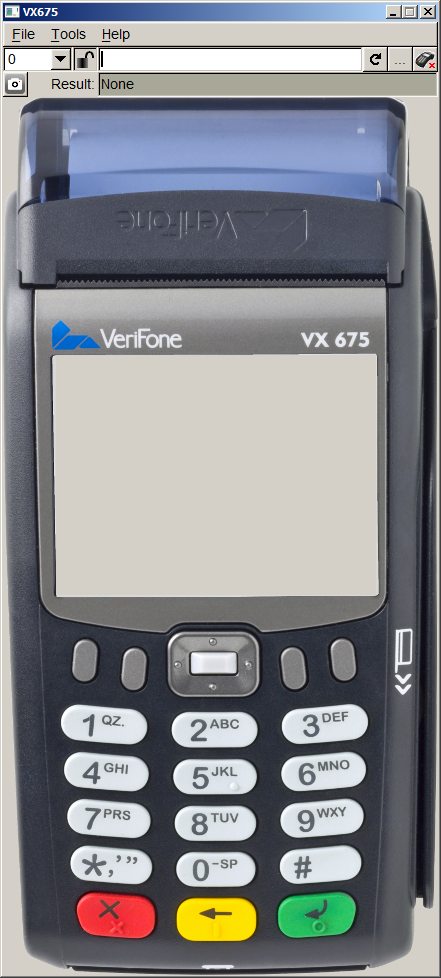

## Introduction <a href="#gui_introduction_guiviewer" id="gui_introduction_guiviewer"></a>

GUI Viewer allows viewing dialogs on a PC like they would be displayed on a terminal running ADK-GUI to speed up development of dialogs. To support different terminal types a terminal definition file is used that specifies display dimensions and available buttons.

## System Requirements <a href="#gui_system_requirements" id="gui_system_requirements"></a>

GUI Viewer requires Windows 7 or newer to run. Versions for Linux may be provided upon request.

## Installation <a href="#gui_installation_guiviewer" id="gui_installation_guiviewer"></a>

GUI Viewer is provided as ZIP file. Just unzip the file for installation. A Windows installer is not provided / required. If `gui_viewer.exe` does not start, it may be required that *Microsoft Visual C++ 2008 SP1 Redistributable Package (x86)* must be installed. Installer is available here:

**<a href="http://www.microsoft.com/de-de/download/details.aspx?id=5582">http://www.microsoft.com/de-de/download/details.aspx?id=5582</a>**

When some non-standard fonts are used on the terminal, these have to be installed separately on Windows or the display of text may be different from the terminal.

## Usage <a href="#gui_usage_guiviewer" id="gui_usage_guiviewer"></a>

When starting GUI Viewer it starts with the last used configured device and configuration. On first startup the device and configuration have to be set up as follows:

1.  Select menu *File* -\> *Select* *Device* to load the desired terminal configuration file (\*.def).
2.  Select menu *File* -\> *Load* *Configuration* to load the `gui.ini` file of the terminal application to be sure that the correct key mapping, font, etc. is used. Be sure that the used font is installed in your PC environment. Otherwise the GUI Viewer will use another font and you won\'t get similar result displaying the files in the GUI Viewer and running the terminal application. The `gui.ini` file must match the terminal type or the font and key settings may be wrong.
3.  Select menu *File* -\> *Load* *HTML* or press the
    
    button to select a \*.html, resp. \*.tmpl file to load and display it. Alternatively you could enter the path and the filename directly in the input field next to the button and press return.
4.  Alternatively CP applications may be loaded using *File* -\> *Load* *Application*.
5.  In case you changed the HTML source code or the `*`.dat file data of the currently displayed document you may reload the files by pressing
    
6.  GUI Viewer may display the dialogs on an external terminal. For this you need to connect to it using
    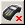

The connection may be terminated by pressing

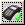

The terminal must be using guiserver 1.5.2 or newer and debugging must have been enabled on it. Optionally the \"ipdisplay\" package may be used to display the current IP address of the terminal after startup.

1.  The \"Tools\" menu offers tools for displaying and editing the internal key value map, for editing \*.dat files, for displaying the JavaScript console and for displaying performance numbers.


For the virtual keyboard to work, the input focus must have been set, i.e. if the focus is off, click into an input field or click at the terminal display to activate it.
If GUI Viewer detects that an \*.html, \*.tmpl or \*.dat file has changed it automat-ically reloads the corresponding dialog within 5s.


## Detailed Usage <a href="#gui_detailed_usage" id="gui_detailed_usage"></a>

### Select Device <a href="#gui_select_device" id="gui_select_device"></a>

After specifying a terminal device the GUI Viewer tries to load the device definition file and apply the definitions. The GUI Viewer tries to load the terminal shape image and put the defined keyboard buttons on the terminal shape image. In case of success, the user could click with the mouse on a key and the GUI Viewer will simulate a key press. In case the HTML renderer is able to handle the key press, it will do so and present the result.


If an HTML files is already loaded, it needs to be re-loaded after selecting a new device to give the correct display.


### Load Configuration (gui.ini) <a href="#gui_load_configuration" id="gui_load_configuration"></a>

After specifying a configuration file the GUI Viewer tries to load the configuration file and apply the configuration. This is the `gui.ini` file that contains the default font and size. Make sure that the font is installed on your PC to have a WYSIWYG display. GUI Viewer will always use the layout provided in the \[layout\] section. If different layouts are to be used, it is considered to use different `gui.ini` files containing the different layouts.

### (Re-)Load an HTML File <a href="#gui_reload_an_html_file" id="gui_reload_an_html_file"></a>

The GUI Viewer tries to load the specified HTML file, as well as the corresponding data file (if exist). Afterwards the GUI Viewer parses the HTML source code and tries to replace the supported `<`? `*` ?\> tags with the information from the data file, if specified.

If the directory of the HTML file contains a directory `js_root`, the JavaScript file functions are enabled and this directory is used as root directory for the JavaScript file functions.

### Pressing Keyboard Keys <a href="#gui_pressing_keyboard_keys" id="gui_pressing_keyboard_keys"></a>

In case an `*`.html or `*`.tmpl file was loaded the GUI Viewer simulates the configured key press. In case the HTML renderer is able to handle it, the specified action will be performed.

### Simulating Dialog Behavior <a href="#gui_simulating_dialog_behavior" id="gui_simulating_dialog_behavior"></a>

When the dialog would be terminated using some button or input key the resulting action is displayed in the result line of the GUI Viewer window. In case of a \"load\" action the new dialog is loaded and displayed in GUI Viewer.

`*`.dat files may be used to provide variable data that is used for substituting `<`?var ..?\> XML processing instructions and that normally would be provided by the terminal application. In addition it may be used to make GUI Viewer load other HTML dialogs based on the return code of the dialog.

### Running CP Applications <a href="#gui_running_cp_applications" id="gui_running_cp_applications"></a>

Select *File* -\> *Load* *Application* to load the manifest file of a CP application. GUI Viewer will then load the configuration files, the CSS file and display the dialog listed in the \"desktop\" section in the manifest file.

\"(CP App Mode)\" is shown in the title bar to indicate that GUI Viewer is running in CP application mode.

To be able to find the related files, the manifest file needs to be found next to the directory containing the resource files. This is the same directory layout as it is used on the terminal.

When running the application, GUI Viewer will automatically select the directory within the resource tree that corresponds to the selected device. Use *File* -\> *Select* *Device* to switch to the desired device before loading the application.

After loading an application configuration and manifest, data is stored in the key-value map and can be checked using the value editor.

*File* -\> *Load* *Application* activates CP application specific restrictions:

- While the restrictions are effective, a closed lock is shown:
  
- CP applications have only access to their own resources (images, videos), access to other directories is blocked.


Sponsor and serial number transmitted to the cloud are taken from the environment variables SPONSOR and SERIALNO.


### Connecting to Terminal Hardware <a href="#gui_connecting_to_terminal_hardware" id="gui_connecting_to_terminal_hardware"></a>

By pressing


GUI Viewer can connect to a terminal and display the dialogs on the real terminal. For connecting the IP address of the terminal needs to be provided. For security reasons only development terminals support being used together with GUI Viewer.

On the terminal the following software needs to be present:

- guiserver version 1.5.2 or newer. Preferably the version of GUI Viewer should match the version of guiserver to have the same supported feature set on both sides.
- Fonts to be used have to be installed on the terminal.

Optionally the ipdisplay package can be installed to display the IP address of the terminal on screen after startup to simplify obtaining the IP address of the terminal. Note that you have to sign this package using a signing card matching the certificates installed in your terminal before installing this package.

As long as GUI Viewer is connected to a terminal it will display dialogs both on the PC and on the terminal display. Dialogs may be operated from the PC or from the terminal keyboard / touch screen. Mirroring of dialogs is limited to whole dialogs. For example when a dialog is finished and a new dialog is shown, the new dialog is also shown on both the PC and the terminal but actions within the dialog like scrolling up and down or entering some data into input fields are not mirrored to the other side.

## Value Editor <a href="#gui_value_editor" id="gui_value_editor"></a>

The GUI system supports the use of variables to customize parts of dialogs or to de-fine initial values of input fields and variables are also used to return the content of input fields when a dialog returns. GUI Viewer stores the value of the variables and passes them on to the next dialog. Value editor allows displaying and editing of these variables.

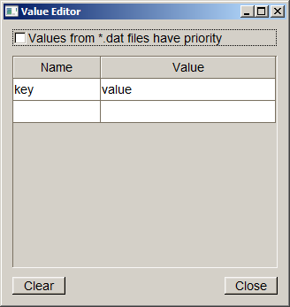

New variables are created by entering a name in the empty \"Name\" field at the end of the table. Variables are deleted by deleting the name from the table. All variables may be deleted by pressing the \"Clear\" button.

\"Values from \\c \*.dat files have priority\" determines whether values found in a `*`.dat files or values displayed in the table are used when invoking a dialog. If the checkmark is not set, then values from the table have precedence. If set values are taken from the `*`.dat file which is also the case if the Value Editor window is not shown.

## Data File Editor <a href="#gui_data_file_editor" id="gui_data_file_editor"></a>

The data file editor is a tool for creating and updating `*`.dat files.

The editor consists of two tabs. The first labeled \"HTML settings\" is used for editing values for use with HTML files. It has the following elements:

- **Catalog:** name of the text catalog file
- **Variables:** List of variables with the corresponding value
- **Load file on return:** Mapping of return codes to URLs to be loaded

New entries can be added at the end of the list by entering a new name or return code.

Variable names can be extracted from an HTML file and inserted into the variables table by selecting the menu entry **File -\> Import from HTML \...**.

Variable names and values can be imported from the current set of stored values by selecting the menu entry **File -\> Import from Values**.

The second tab labeled \"Templates\" is used for editing settings for template files. It has the following elements:

- **Dialog text:** This is the text shown in the dialog
- **Menu entries:** This is the list of menu entries for the menu template. It is not used for other dialog types.
- **Preselected menu entry:** This lists which of the above menu entries is initially selected when the dialog is shown.

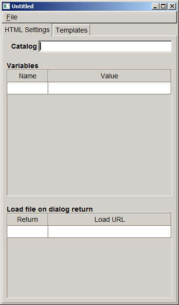

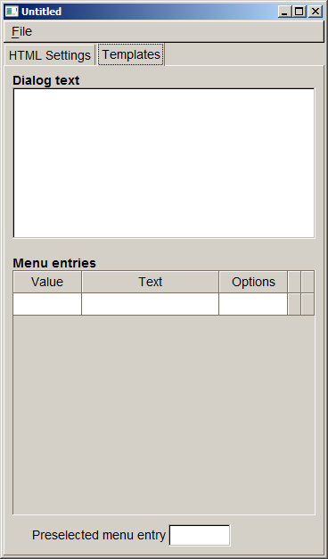

## JavaScript Console <a href="#gui_javascript_console" id="gui_javascript_console"></a>

Selecting this menu entry opens the JavaScript console. This will display errors during JavaScript script execution and it will display output generated by calls to con-sole.log() from within the script. The JavaScript console will begin recording the output when started for the first time. Once it has been started it will even record the output when the window gets closed. In this case the output can be viewed by re-opening the JavaScript console window.

## Performance <a href="#gui_performance" id="gui_performance"></a>

This tool shows some performance statistics numbers for the last shown dialog. If a terminal has been connected performance numbers are shown both for the PC and the terminal. The following values are shown:

- **CSS:** Time required for loading and parsing the CSS file
- **HTML:** Time required for parsing the HTML file, reading the CSS attributes referenced in the HTML file and determining the layout
- **Draw:** Time required for sending drawing commands to the graphics subsys-tem. At this point in time the dialog may not be visible on screen yet, depend-ing on the graphics subsystem there may be a short delay until the dialog can be seen on screen. This delay cannot be measured by GUI_Viewer since it has no access to the internal operation of the graphics subsystem.

## Debug logs <a href="#gui_debuglog" id="gui_debuglog"></a>

Selecting this menu entry allows writing debug logs to a file. The logs are similar to activating GUI_LOGMASK and show the resulting HTML code among other information. If a terminal is connected, the client logs are written to this file as well. Selecting the menu again stops logging to the file.

## Command Line Interface <a href="#gui_command_line_interface" id="gui_command_line_interface"></a>

GUI Viewer can be invoked from the command line. In this case it is possible to pass options and parameters to select which configuration to use and which file to show. In case there is already an instance of GUI Viewer running these parameters and options are passed on to this instance for processing and the newly started GUI Viewer immediately returns.

The usage is like this:

``` fragment
gui_viewer [options] [<url>]
```

`<url>` is the file name of the dialog file to be displayed. If it is not provided GUI Viewer starts with an empty terminal screen.

The command line options supported are:

``` fragment
--device <device.def> This options allows selecting the device to
```

be used just like using the \"Select Device\" menu entry. \<device.def\> is the name of the \*.def file to be used

``` fragment
--config <gui.ini>
```

This options sets the configuration (`gui.ini`) file. `<gui.ini>` is the filename of that file.

``` fragment
--region \<id>
```

By this option the region id is selected given in `<id>`.

``` fragment
--check-terminal
```

This option prints the model name of the terminal to standard output. In case no terminal is connected \"none\" is printed.

``` fragment
--version
```

The version information and configuration is printed to standard ouput.

## Device Definition File <a href="#gui_device_definition_file" id="gui_device_definition_file"></a>

The device definition file (\*.def) specifies the terminal image used as background image and the size and position of display and buttons of the terminal. It has INI file format and contains the following sections.

### \[terminal\] <a href="#gui_terminal" id="gui_terminal"></a>

This section contains the name, model_id and image of the terminal. The name is displayed as the window title of the GUI Viewer, the image is displayed as background image.

| Property | Description |
|----|----|
| <p>name</p> | <p>Terminal name to be displayed in the window title</p> |
| <p>model_id</p> | <p>Model ID to be used for selecting resource files when running CP applications</p> |
| <p>image</p> | <p>Optional image of the terminal. If an image is provided, keys are invisible overlays on the image. If no image is provided, keys are drawn by gui_viewer, labels need to be provided for the keys.<br/>It is recommended to use a relative path for the image and use \'/\' as directory separators (even for Windows). The path is considered to be relative to the \*.def file. GIF, JPEG and PNG images are supported.</p> |
| <p>scale</p> | <p>Optional scaling factor for displaying the terminal display. All coordinates found in the device definition file are scaled by this factor.</p> |

Example:

``` cpp
[terminal]
name=VX820
model_id=VX820
image=../shapes/vx820_shape.png
```

### \[terminal_display\] <a href="#gui_terminal_display_device_definition_files" id="gui_terminal_display_device_definition_files"></a>

This section defines the position of the upper left corner along the width and height of the terminal display. Coordinates are relative to the shape image and start with (0,0). The following keywords are used to specify the coordinates:

| Property | Description |
|----|----|
| <p>x_pos</p> | <p>Horizontal position of the display</p> |
| <p>y_pos</p> | <p>Vertical position of the display</p> |
| <p>width</p> | <p>Width of the display</p> |
| <p>height</p> | <p>Height of the display</p> |

Width and height must match the size of the physical display in pixels to obtain a preview that is as close as possible.

Example:

``` cpp
[terminal_display]
x_pos=65
y_pos=80
width=240
height=320
```


The coordinates are scaled by the scale factor!


### \[terminal_key\_\*\] <a href="#gui_terminal_key__device_definition_files" id="gui_terminal_key__device_definition_files"></a>

As with the display terminal keys may be specified. These are placed as invisible buttons on top of the background image. Clicking on them emulates pressing the terminal key. The number and position of keys is terminal specific. The following keys are supported:

| Section | Description |
|----|----|
| <p>terminal_key_F01 \... terminal_key_F12</p> | <p>Function keys F1 \... F12</p> |
| <p>terminal_key_0 \... terminal_key_9</p> | <p>Numeric keys on the terminal</p> |
| <p>terminal_key_cancel</p> | <p>Red cancel key</p> |
| <p>terminal_key_back</p> | <p>Yellow back key</p> |
| <p>terminal_key_return</p> | <p>Green OK key</p> |

For each section the coordinates / sizes are specified the same way as for the display. If no image is provided and keys are rendered by gui_viewer, a label needs to be provided for rendering the key.

| Property | Description |
|----|----|
| <p>x_pos</p> | <p>Horizontal position of the display</p> |
| <p>y_pos</p> | <p>Vertical position of the display</p> |
| <p>width</p> | <p>Width of the display</p> |
| <p>height</p> | <p>Height of the display</p> |
| <p>label</p> | <p>Key label, required when no terminal image was given</p> |

Example:

``` cpp
[terminal_key_0]
x_pos=149
y_pos=632
width=74
height=50
label=0
[terminal_key_F10]
x_pos=63
y_pos=634
width=74
height=49
label=F10
```

So the key button area for the \'0\' key is positioned at 149,632 of the terminal shape image, 74 by 50 pixels in size and the key button area for the \'\*\' key (mapped to F10) is positioned at 63,634 and 74 by 49 pixels in size.

The installation package contains device definition files for most terminal types in the *devices* directory.


The coordinates are scaled by the scale factor!


## Data Files <a href="#gui_data_files" id="gui_data_files"></a>

.html files and \*.tmpl files may contain XML processing instructions (e.g. `<`?var \...?\> to insert variable data. GUI Viewer will look up this information in \*.dat files. These have the same base name as the HTML file but have the extension .dat. \*.dat files have INI file format and support the following sections:

### \[value\] Section <a href="#gui_value_section" id="gui_value_section"></a>

This section contains the variables available for processing the HTML file. The variable name is used as key and the content is used as value in the section.

Example:

``` cpp
[value]
mytext=Text from dat file
```

Value section might also specify data for `<`?foreach?\> statements. See the following HTML example snippet with `<`?foreach ?\> processing syntax.

HTML Example:

``` cpp
<?foreach test1
|(table border=1)(tr)(th)Name(/th)(th)Value(/th)(/tr)
|(tr)(td)[name](/td)(td)[value](/td)(/tr)
|(/table)
|Empty table(br)?>
```

Corresponding DAT file entry:

``` cpp
[value]
test1=(<({"name":"item1","value":1},{"name":"item2","value":2},{"name":"item3","value":3})>)
```

### \[template\] Section <a href="#gui_template_section" id="gui_template_section"></a>

This section contains the text to be substituted for `<`?insert `text`?\> in \*.tmpl files.

Example:

``` cpp
[template]
text=Inserted text<br>Second line!
```

### \[template_menu\] Section <a href="#gui_template_menu_section" id="gui_template_menu_section"></a>

This section contains the text to be substituted for `<`?insert `menu`?\> in \*.tmpl files. The \[template_menu\] section is able to define several menu entries. For each menu item there is one line of the form `<return` `value>=<text>`. `<text>` is the text to be displayed for this menu item and `<return` value\> is the value returned when this menu item has been selected. Options belonging to a menu item can be set using: `<return` `value>_opt=<option` `value>`. A menu item may be preselected using `preselected=<return` `value>`.

Example: menu.dat file:

``` cpp
[template_menu]
selected=2
1=Menu Item 1
2=Menu Item 2
3=Menu Item 3
1_opt=0
```

### \[return\] Section <a href="#gui_return_section" id="gui_return_section"></a>

For creating a mock-up of a terminal with GUI viewer it is supported to load other HTML dialogs when the current dialog returns with a specific return code. The mapping of return codes to names of HTML dialogs to load is done in this section.

Example: menu.dat file:

``` cpp
[return]
1=submenu1.html
2=submenu2.html
3=submenu3.html
-1=homemenu.html
```

In this example if the 3rd menu is selected, then submenu3.html gets loaded.

### \[catalog\] Section <a href="#gui_catalog_section" id="gui_catalog_section"></a>

The \[catalog\] section specifies a catalog file that can be used by the HTML file with XML processing instruction `<`?text \...?\>. For more details please refer to chapter [Multi-Language Support](#gui_multilanguage_support) that describes Multi-language support with catalog files.

Example: catalog.dat file:

``` cpp
[catalog]
file=en.ctlg
```

GUI viewer comes along with demo HTML files demonstrating usage of catalog files.

## Known Issues <a href="#gui_known_issues" id="gui_known_issues"></a>

- GUI Viewer always emulates a color display, emulation of B/W displays is not supported. Therefore, when colors are used in HTML files the emulated display will be different from the terminal display.
- \*.html and \*.tmpl files both use \*.dat files for providing dialog data. This may lead to a conflict, for example both test.html and test.tmpl would refer to test.dat.
- Returned dialog variables will not be passed on to the next dialog.

# System Setup and Requirements <a href="#gui_setup" id="gui_setup"></a>

The following are the hardware and software requirements of the ADK GUI system.

## Hardware Support <a href="#gui_hardware_support" id="gui_hardware_support"></a>

The ADK GUI system is hardware platform agnostic and supports installation on V/OS, Raptor and V/OS3 terminals.

The GUI system is intended to run across the entire hardware portfolio. The following table list different characteristics of these devices.

| Model | Touch | Color | Resolution | Keypad | Function Keys | Resource Path |
|----|----|----|----|----|----|----|
| <p>Vx820</p> | <p>Yes</p> | <p>Yes</p> | <p>240x320</p> | <p>0-9,\*,#,CAN,CORR,OK</p> | <p>---</p> | <p>240x320C15T</p> |
| <p>Vx675</p> | <p>No</p> | <p>Yes</p> | <p>320x240</p> | <p>0-9,\*,#,CAN,CORR,OK</p> | <p>4+4\*Cursor+Enter</p> | <p>320x240C24N</p> |
| <p>Mx915</p> | <p>Yes</p> | <p>Yes</p> | <p>480x272</p> | <p>0-9,CAN,CORR,OK</p> | <p>---</p> | <p>480x272C13T</p> |
| <p>Mx925</p> | <p>Yes</p> | <p>Yes</p> | <p>800x480</p> | <p>0-9,CAN,CORR,OK</p> | <p>---</p> | <p>800x480C13T</p> |
| <p>Ux100</p> | <p>No</p> | <p>No</p> | <p>128x64</p> | <p>0-9,CAN,CORR,OK,INFO</p> | <p>2</p> | <p>128x64M16N</p> |
| <p>e280</p> | <p>Yes</p> | <p>Yes</p> | <p>320x480</p> | <p>POWER</p> | <p>---</p> | <p>320x480C0T</p> |
| <p>e285</p> | <p>Yes</p> | <p>Yes</p> | <p>240x320</p> | <p>0-9,\*,#,CAN,CORR,OK</p> | <p>---</p> | <p>240x320C15T</p> |
| <p>Carbon X10</p> | <p>Yes</p> | <p>Yes</p> | <p>854x480</p> | <p>---</p> | <p>---</p> | <p>854x480C0T</p> |
| <p>M400</p> | <p>Yes</p> | <p>Yes</p> | <p>854x480</p> | <p>0-9,\*,#,CAN,CORR,OK</p> | <p>---</p> | <p>854x480C15T</p> |
| <p>P400/V400</p> | <p>Yes</p> | <p>Yes</p> | <p>320x480</p> | <p>0-9,\*,#,CAN,CORR,OK</p> | <p>---</p> | <p>320x480C15T</p> |
| <p>P200/V200c</p> | <p>No</p> | <p>Yes</p> | <p>240x320</p> | <p>0-9,\*,#,CAN,CORR,OK</p> | <p>2+4\*Cursor</p> | <p>240x320C21N</p> |
| <p>V200t/V205c</p> | <p>No</p> | <p>Yes</p> | <p>320x240</p> | <p>0-9,\*,#,CAN,CORR,OK</p> | <p>2+4\*Cursor</p> | <p>320x240C21N</p> |
| <p>V240m/V400m</p> | <p>Yes</p> | <p>Yes</p> | <p>320x480</p> | <p>0-9,\*,#,CAN,CORR,OK</p> | <p>(Optional: Camera)</p> | <p>320x480C15T</p> |
| <p>P630 (V/OS3)</p> | <p>Yes</p> | <p>Yes</p> | <p>320x480</p> | <p>0-9,\*,#,CAN,CORR,OK</p> | <p>---</p> | <p>320x480C15T</p> |

Users need to take these characteristics into account when designing GUI dialogs for the different hardware platforms.


e280 has no keypad, therefore, the power button it is not counted as keypad key. The power button is no regular key, but it can be used as accesskey.


V240m has a variant with camera for barcode scanning. This variant with camera has an additional button on the left side which may be used as function key.


For a detailed description of the API functions, see <a href="group__vfigui.md">Graphical User Interface</a>.


The ADK GUI system can also run on Microsoft Windows platforms with underlying FLTK installations.

## Software Requirements <a href="#gui_software_requirements" id="gui_software_requirements"></a>

ADK-GUI requires the installation of corresponding platform packages. For details please refer to the release notes.

## Splash Screen Support <a href="#gui_splash" id="gui_splash"></a>

guiprtserver (and guiserver) support displaying a splash screen after startup to give the user some feedback until the payment application is ready. To activate the splash screen a PNG or JPEG image needs to be provided to be displayed on the splash screen. It needs to be found in the following location:

| System | Path for splash screen image |
|----|----|
| <p>V/OS</p> | <p>/etc/config/adk/gui/</p> |


On V/OS packages of type \"config\" are used to install files to /etc/config. Set group to \"shared\" and file permissions to \"644\".


The following file names are probed (\<width\>x\<height\> refers to the screen size):

- splash-\<width\>x\<height\>.jpg (e.g. splash-320x240.jpg)
- splash-\<width\>x\<height\>.png
- splash.jpg
- splash.png

The first file found will be used as splash screen. The file extension must match the file type.

The image is centered on screen. If the image is smaller than the screen, the background is filled with the average color of the 4 image corners.

# Troubleshooting <a href="#gui_troubleshooting" id="gui_troubleshooting"></a>

## Logging <a href="#gui_logging" id="gui_logging"></a>

Since version 1.4.0 the UI system has added logging support for diagnostics and problem analyses. On all platforms logging messages can be enabled by setting environment variable `GUI_LOGMASK` (or `PRT_LOGMASK` for ADK Printer). The variable is defined as a bitmask consisting of following decimal values:

``` fragment
1   = LOG_EMERG:   log messages for conditions, if system is unusable
2   = LOG_ALERT:   log messages, which action must be taken immediately
4   = LOG_CRIT:    log messages for critical conditions
8   = LOG_ERR:     log messages for error conditions
16  = LOG_WARNING: log messages for warning conditions
32  = LOG_NOTICE:  log messages for normal but significant conditions
64  = LOG_INFO:    log messages with informational contents
128 = LOG_DEBUG:   log debug-level messages
```

`LOG_EMERG` represents the lowest logging level, which only generates messages, if the UI component cannot be started or is not working at all. The highest level `LOG_DEBUG` will produce many messages of low-level I/O routines and should only be enabled for debugging purposes. For first analyses it is recommended to set `LOG_ERR`, which will provide information about error conditions, e.g. wrong resource or image paths, communications problems between GUI server and client. In addition, `LOG_INFO` can be activated to display all communication data (JSON messages) between application and the UI system.

The environment variable `GUI_LOGMASK` can be used for the following UI components:

- ADK-GUI server (`guiserver` and `guiprtserver`)
- ADK-GUI library (`libfltkgui`)
- Remote GUIPRT library (`libvfiguiprt`)

For each platform, UI components use different defaults for `GUI_LOGMASK` and also the output channels depend on the used operating system:

- V/OS
  On V/OS, Raptor and V/OS3 the default value for `GUI_LOGMASK` is `0`, which means that no logging outputs are activated by default. Logging messages directly are redirected to stderr of the applications console. Depending on device the system console outputs are activated differently (e.g. on MX9 press key combination 3-5-7 at terminal startup). Since there is no possibility to set environment variables for applications with sysmode, the variable `GUI_LOGMASK` can be either set for IPC libraries with `setenv()` from inside application at startup or it can be added to start file of V/OS installation package as follows:

  ``` fragment
  GUI_LOGMASK=64 gui_app 
  ```

  (V/OS startup file example)

- Android
  On Android the default value for `GUI_LOGMASK` is `255` and by default all logging messages are activated. Logging messages are directly passed to Android Logging API. Application might set environment variable `GUI_LOGMASK` with `setenv()` at startup to change the default values for the logging masks to enable a filter for the logging messages.


If both `GUI_LOGMASK` and `PRT_LOGMASK` are unset, UI components will use ADKLOG library, if it is installed on the system. For more details, please refer to chapter below.


A logging message consists of several fields and the content is similar on the several platforms:

*V/OS*, *Raptor:*

A console logging message on V/OS and Raptor:

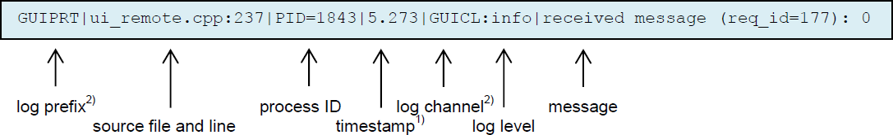

1\) *timestamp:*
The timestamp format is `<seconds>`.`<milliseconds>`. The value represents the time since beginning of capture (startup of UI component).

2\) *log* *prefix*, *log* *channel:*
Since version 2.0.0 ADK-GUI and ADK Printer server were combined to one server component and the logging message format has changed. Former field `logging` `component` was replaced by `log` `prefix` and this field is no longer used to identify the component. The field now is set to GUIPRT for both combined services to specify the system including all components of ADK-GUI and ADK Printer. For identification of the specific subcomponent the new field `log` `channel` was introduced to identify logging outputs for the following components:

- **GUI:** ADK-GUI server (guiserver) or GUI related module in combined guiprtserver
- **PRT:** ADK Printer server (prtserver) or ADK Printer related module in combined guiprtserver
- **GUIPRT:** shared module in combined guiprtserver
- **GUICL:** Remote GUI library, UI client
- **PRTCL:** Remote ADK Printer library, printer client

*Android:*

A logging message on Android captured with `logcat` tool coming along with ADB (Android Debug Bridge):

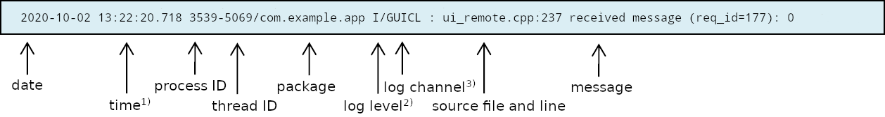

1\) *time:*
The time format is `<hour>:<minute>:<seconds>.<milliseconds>`

2\) *log* *level* IPC logging levels are mapped to Android logging levels as follows:

| IPC logging level | Android logging level | Description |
|----|----|----|
| <p>`LOG_EMERG`</p> | <p>`A`</p> | <p>Assert</p> |
| <p>`LOG_ALERT`</p> | <p>`A`</p> | <p>Assert</p> |
| <p>`LOG_CRIT`</p> | <p>`E`</p> | <p>Error</p> |
| <p>`LOG_ERR`</p> | <p>`E`</p> | <p>Error</p> |
| <p>`LOG_WARNING`</p> | <p>`W`</p> | <p>Warning</p> |
| <p>`LOG_NOTICE`</p> | <p>`I`</p> | <p>Info</p> |
| <p>`LOG_INFO`</p> | <p>`I`</p> | <p>Info</p> |
| <p>`LOG_DEBUG`</p> | <p>`V`</p> | <p>Verbose</p> |

3\) *log* *channel:*
Same logging channels as used for V/OS and Raptor.

**Support for ADKLOG: Logging with liblog library**

Since version 2.15.3 ADK-GUI and ADK Printer server has added support for ADKLOG component. ADKLOG is required to implement the new ADK logging concept, which provides the Logging Control Panel (LCP) used as central instance to configure and enable logging for the several ADK components. For this, LCP uses configuration files (for GUI and for PRT), which are read by `liblog` library. If installed on the system and environment variables `GUI_LOGMASK` and `PRT_LOGMASK` are not set, `liblog` library will be used by client import libraries (`libvfiguiprt`, `libvfiprt`) and server components (`guiprtserver`, `guiserver`, `prtserver`) to output logging messages. In this case, the logging messages are passed to `liblog` library instead of using UI logging methods as described above.

In order to lookup the corresponding configuration files, ADKLOG uses component identifiers, which are reserved for each ADK component. GUI and PRT use the following:

| Component Id | Configuration file | Description |
|----|----|----|
| <p>`GUI`</p> | <p>`GUI_log.conf`</p> | <p>GUI server related log settings</p> |
| <p>`GUICL`</p> | <p>`GUICL_log.conf`</p> | <p>GUI client related log settings</p> |
| <p>`PRT`</p> | <p>`PRT_log.conf`</p> | <p>PRT server related log settings</p> |
| <p>`PRTCL`</p> | <p>`PRTCL_log.conf`</p> | <p>PRT client related log settings</p> |

The configuration files contain several settings for logging like output channels, verbosity and a logging mask, which is similar to environment variables `GUI_LOGMASK` and `PRT_LOGMASK`. For more details about configuration settings or logging message formats, please refer to documentation of ADKLOG project.


If one of the environment variables `GUI_LOGMASK` and `PRT_LOGMASK` is set, GUIPRT logging mechanism is preferred and ADKLOG with `liblog` is disabled. Only if both environment variables are unset, GUI and PRT will lookup `liblog` library from the system to enable logging via ADKLOG.


## Hiding information in the Log <a href="#gui_log_hide_info" id="gui_log_hide_info"></a>

ADK-GUI does not know about the meaning of information and, therefore, by default logs all information, even sensitive one. The application may exclude sensitive information from logging by setting the variable \"\_loghide\" in the key value map provided to commands like e.g. <a href="namespacevfigui.md#af5812cac4b8cd48873fcac4608f3082d">uiInvokeURL()</a>. The value is the comma separated list of variable names that should be hidden in the log. When a variable name is contained, all characters of the value are replaced by \'#\', so that only the length of the value remains visible in the log but not the content.

## Guiserver is terminated by OOM killer on V/OS <a href="#gui_guiserver_is_terminated" id="gui_guiserver_is_terminated"></a>

If an application allocates a huge amount of memory (e.g. by using big images or scaling up an image to arbitrary size), the GUI service (guiserver) may run out of resources and is terminated by the OOM killer of system (OOM=out of memory), if V/OS is not able to provide this memory.

In this case one of following messages may appear in console:

``` cpp
guiserver invoked oom-killer: gfp_mask=0x200da, order=0, oomkilladj=0
...
Out of memory: kill process 6162 (guiserver) score 12509 or a child
```

or

``` cpp
terminate called after t[ 84.320000] grsec: denied resource overstep by requesting 4096 for
RLIMIT_CORE against limit 0 for /home/usr1/bin/guiserver[guiserver:544]
uid/euid:0/0 gid/egid:0/0, parent /bin/busybox[sh:102] uid/euid:0/0 gid/egid:0/0
```

V/OS is configured to use overcommitted memory. This means that when `malloc()` or new operator return non-NULL, there is no guarantee that the memory really is available. In case it turns out that the system is out of memory, the process is killed by the OOM killer of the system.

For `new` and `new`\[\] operators, a possible way to detect the OOM during runtime is by catching exception `bad_alloc` as follows:

``` cpp
#include <string>
#include <stdio.h>
#include <stdlib.h>
#include <exception>
using namespace std;
int main()
{
   try {
   int *p=new int[99999999999999999999999999];
   *p=1; // force exception
   }
   catch(exception& e)
   {
   printf("This was to much memory, thrown e=%s !\n",e.what());
   }
   return 0;
}
```

This would imply that all components (even OS libraries the guiserver is using) would implement such mechanism.

**BUT:** This exception is not thrown for invocations of `malloc()!`

In summary there is no chance to avoid OOM kills at all, unless V/OS is changed to use overcommitted memory. The only way to avoid OOM kills is to reduce usage of dynamic memory (e.g. by using smaller images).

## Performance Optimizations <a href="#gui_performance_optimizations_vos" id="gui_performance_optimizations_vos"></a>

When creating HTML documents for a terminal it has to be considered that it has much less computing power compared to a desktop computer and even a smart phone. Therefore, care has to be taken when designing HTML pages and style sheets to avoid computationally expensive tasks. The following list gives some tweaks that can be used to speed up the display of dialogs:

- Avoid large PNGs with alpha channel. Using an alpha channels needs to mix the image with the background. This process has turned out to be quite slow. If possible the transparent areas should be replaced with pixels showing the background, i.e. eliminating the transparency. Note however, that the transparent channel needs to be eliminated altogether since it already slows down things even if all pixels are marked opaque.

- Nested tables need several passes in the layout process. The number of passes depends on the nesting level. If possible use rowspan and colspan to reduce the nesting level of tables.

  ### c)GUI system Configuration File {#c-gui-system-configuration-file}

# Migrating from Version 1.x to 2.x <a href="#gui_migrating" id="gui_migrating"></a>

This chapter contains detailed change descriptions between version 1.x and version 2.x.

## Considerations <a href="#gui_considerations" id="gui_considerations"></a>

Version 2.x breaks compatibility to be able to fix some issues that exists in version 1.x. Furthermore, it paves the way for adding of new features in upcoming releases. Minor code changes are required when switching from version 1.x to 2.x. This chapter lists the incompatibilities and the changes required in the application.

1.  Since GUI and printer server have been merged into one component, the include files have been moved from the gui directory to a common HTML directory. For example `#include` `"html/gui.h"` must be used instead of `#include` `"gui/gui.h"`.
2.  Components common to GUI and printer have been moved to the common namespace `vfihtml`. This new namespace is automatically referenced by `vfigui` and `vfiprt`. In most cases, no action is required.
3.  The use of `uiMain()` is no longer required or supported. Instead, the application has to use <a href="main_8cpp.md#a0ddf1224851353fc92bfbff6f499fa97">main()</a> just like any plain program.
4.  UI properties are no longer thread local but have become global by default. Setting a property in one thread now affects all threads. Due to this, the function `uiThreadCreate()` is no longer required or supported. Instead, the POSIX function `pthread_create()` should be used. If for some purpose thread specific properties are required, they can be enabled using <a href="namespacevfigui.md#a7e717916b36544241bf0bc5e2242f08e">uiSetLocalProperties()</a>.
5.  Since `UI_PROP_TIMEOUT` is now global to all threads, switching it back and forth on each dialog invocation may create a race condition and should not be used. For setting up an idle timeout, `<input` `type="idletimeout">` should be used. This is much more flexible since it specifies the idle timeout inside the HTML document. It also controls the action taken in case of an idle timeout.
6.  The default value of `UI_PROP_TIMEOUT` has been changed to -1 (disable global timeout).
7.  <a href="namespacevfigui.md#ae1d86be38dabed0b93f804b91805a3d3">uiReadConfig()</a> no longer internally invokes <a href="namespacevfigui.md#af855d00b4a448abba99ca993a7b629eb">uiLayout()</a> to set the layout. This caused problems when using more than one application since <a href="namespacevfigui.md#ae1d86be38dabed0b93f804b91805a3d3">uiReadConfig()</a> destroys the first layout as soon as the second one is called. <a href="namespacevfigui.md#af855d00b4a448abba99ca993a7b629eb">uiLayout()</a> now has to be called explicitly by the application.
8.  libvfigui has been replaced by libvfiguiprt which is the common client library for GUI and printer.
9.  The asynchronous function\'s interface has been changed. Now, the callback functions gets an object that can be used to read the different types of information provided by the dialog. Two types of operations are supported:
    - **Invoke the asynchronous function without callback.**
      In this case, `uiInvokeWait` is used to get the result of the dialog. It either returns with the result or error code. In case of timeout, it returns `UI_ERR_WAIT_TIMEOUT`. This has to be invoked again to obtain the result. All other cases that required to call uiInvokeWait again are not handled internally and are no longer visible to the application to simplify the use of `uiInvokeWait`.
    - **Invoke the asynchronous function with callback.**
      In this case, all data is passed to the callback via an access object. It is no longer required or possible to use `uiInvokeWait`.
10. A garbage collection function has been added. In case an asynchronous dialog is shown which does not provide a call function and the result has not been read using one of the ui\*Wait functions, the result is discarded automatically after displaying some more dialogs within the same region. For this the dialog result has a counter that is increased each time a new dialog is displayed in the same region. If it reaches the limit, the result is considered garbage and released.
11. The request ID has been replaced by a transaction ID. While the request ID is only valid for a single dialog and changed when displaying dialog sequences, the transaction ID stays the same for the whole sequence. Due to this, some call by reference parameters have been replaced by call by value parameters. This change should not affect the application\'s source code.
12. In version 1.x, if a dialog contains `action='load` \...\', next dialog loads in sequence as part of processing `uiInvokeWait` (or one of the other `ui*Wait` functions). For version 2.x, Loading happens independent of `uiInvokeWait`, which should speed up the display dialogs in some cases. The application does not have to be changed to take advantage of this.
13. A new \'flags\' field has been added to struct `UIRegion`. When set to zero, it becomes compatible with version 1.x.
14. Support for hierarchical regions has been added. <a href="namespacevfigui.md#a63902ad7b3ac76cb853b5a136a4c37bb">uiEnterRegion()</a> and <a href="namespacevfigui.md#ab3d02556e61ec80ef434358669b6f585">uiLeaveRegion()</a> are used to navigate within the hierarchy. As long as these functions are not used, regions behave exactly the same as in version 1.x.
15. WebGUI is no longer supported since it has not been used in the field and performance and resource consumption was not competitive compared to the use of the full-blown Opera browser. Therefore, all WebGUI specific functions have been removed. Calls to those functions have to be removed, they have never worked with ADK-GUI anyway.
