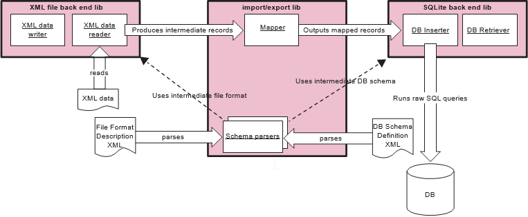
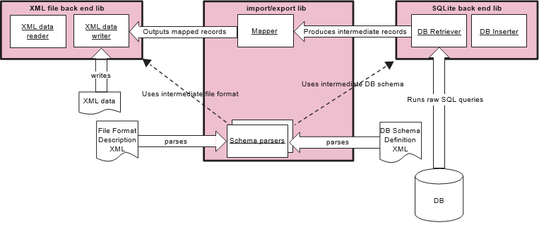

# Preface <a href="#sec_inf_util_preface" id="sec_inf_util_preface"></a>

This document is for programmers and developers who want to understand and use the ADK Information Service Import/Export Utility.

## Audience <a href="#subsec_inf_util_audience" id="subsec_inf_util_audience"></a>

This guide provides all the information required for application developers to integrate and utilise the functionality of the ADK Information Service Import/Export Utility.

## Organization <a href="#subsec_inf_util_organization" id="subsec_inf_util_organization"></a>

This guide is organized as follows:

[Introduction](#sec_inf_util_introduction), Provides a summary of the Import/Export utility.

[Getting Started](#sec_inf_util_getting_started). Lists coding samples for performing various functions.

[Programming](#sec_inf_util_programming). Detailed features descriptions.

[System Setup and Requirements](#sec_inf_util_system_setup_and_requirements) Describes the build options and deliverables.

[Troubleshooting](#sec_inf_util_troubleshooting). Gives solutions for possible issues in ADK-INF-UTIL.

[Appendix](#sec_inf_util_appendix). Acronym Definitions. Describes the XMSD schemas for Import/Export meta files.

# Introduction <a href="#sec_inf_util_introduction" id="sec_inf_util_introduction"></a>

This chapter explains the basic functionality and purpose of the Import/Export utility.

## Concepts <a href="#subsec_inf_util_concepts" id="subsec_inf_util_concepts"></a>

Information Service is a set of components for manipulating data via simple and concise API.


Currently it provides two distinct pieces of functionality:

- Import and export of XML data to and from SQLite database
- Storage and manipulation of hierarchical data incorporated in so-called Property DB (more info in **inf-programmers-guide.pdf**)

The purpose of Import/Export utility are:

- to simplify initial application\'s database population from a data file;
- to facilitate application\'s database import/export from/to TMS.

Conceptually, it has four sources of information:

- definition of database schema
- definition of a data file format to be imported/exported
- the data file
- mapping instructions for the tool on how to convert the data between the "internal" database schema and "external" data file format (currently is omitted from the processes of import/export).


Please see [Features Not Implemented Features](#subsec_inf_util_features_not_implemented) for the list of features not included in the current implementation.


# Getting Started <a href="#sec_inf_util_getting_started" id="sec_inf_util_getting_started"></a>

Makefile-based project with some of the most common use-cases can be found under **doc/inf/example/** folder. Please note, that build system produces dynamically-linked apps.


V/OS platform prevents applications data files creation in the user directory. Application must use /home/usr1/flash directory instead of /home/usr1/.
Accordingly, code
\[unsupported block\] must be rewritten to
\[unsupported block\] for instance in examples below for V/OS platform.


## Importing data into a database <a href="#subsec_inf_util_importing_data_into_a_database" id="subsec_inf_util_importing_data_into_a_database"></a>

``` cpp
#include <inf/inf_util.h>
const char *db_name = "test.db”; 

int main(int argc, char *argv[])
{
 ErrorInfo err;
 ErrorCode rc = info_import("file_format.xml", "database_schema.xml", db_name, "file_data.xml", &err);
 // check err 
 error_info_free(&err);
 return 0;
}
```

## Exporting data from a database <a href="#subsec_inf_util_exporting_data_from_a_database" id="subsec_inf_util_exporting_data_from_a_database"></a>

``` cpp
#include <inf/inf_util.h>
const char *db_name = "test.db”; 

int main(int argc, char *argv[])
{
 ErrorInfo err;
 ErrorCode rc = info_export("file_format.xml", "database_schema.xml", db_name, "output_data.xml", &err);
 // check err 
 error_info_free(&err);
 return 0;
}
```

## Importing data with "info_partial_import_property_db" function <a href="#subsec_inf_util_importing_data_with__info_partial_import_property_db__function" id="subsec_inf_util_importing_data_with__info_partial_import_property_db__function"></a>

``` cpp
#include <inf/inf_util.h>
const char *db_name = "test.db”;

int main(int argc, char *argv[])
{
 ErrorInfo err;
 ErrorCode rc;
 InfoDBHandle *handle = NULL;
 char* str_value = NULL;

 handle = info_opendb(db_name, INFO_READ_WRITE);
 info_writeString(handle, INFO_ROOT, "com/verifone/adk/version", "0.9");
 info_writeString(handle, INFO_ROOT, "just_name", "just_value");
 info_closedb(handle);
 
 rc = info_partial_import_property_db(db_name, "sample_prop_data_4.xml", &err);
 // check err
 error_info_free(&err);
 
 handle = info_opendb(db_name, INFO_READ_WRITE);
 info_readString(handle, INFO_ROOT, "com/verifone/adk/version", &str_value);
 if(str_value && 0 == strcmp(str_value, "1.5"))
 {
 //success, initial value is updated to “1.5”
 }
 info_readString(handle, INFO_ROOT, "just_name", &str_value);
 if(str_value && 0 == strcmp(str_value, "just_value"))
 {
 //success, initial record remained after partial import
 }
 return 0;
}
```

# Programming <a href="#sec_inf_util_programming" id="sec_inf_util_programming"></a>

This section contains detailed features descriptions.

## Detailed Definitions <a href="#subsec_inf_util_detailed_definitions" id="subsec_inf_util_detailed_definitions"></a>

The following chapter covers the database schema, logical types, schema mapping, and data file formats in detail.

### Description of Processing Logic <a href="#subsubsec_inf_util_description_of_processing_logic" id="subsubsec_inf_util_description_of_processing_logic"></a>

In order to perform its function, the utility uses two pieces of metadata:

- Description of a database schema (the part of it that participates import/ export)
- Description of data file format

These inputs are fed to the utility in the form of XML files.





### Types <a href="#subsubsec_inf_util_types" id="subsubsec_inf_util_types"></a>

In order to perform its functions, the utility needs information about a logical type of an element. Therefore it defines the following list of data types:

- INTEGER
- FLOAT
- BOOL
- TEXT
- BLOB
- DATETIME

See examples and definitions below.

### Extensibility (different back ends) <a href="#subsubsec_inf_util_extensibility_different_back_ends_" id="subsubsec_inf_util_extensibility_different_back_ends_"></a>

In order to create an extensible solution, the following approach is chosen for meta information files and application code:

- all meta-data files are in XML format
- XML Schemas (see [Appendix](#sec_inf_util_appendix)) are provided for meta-data files so these can be validated by developers
- each back end library will understand the same base schema of the XML meta information. A schema can be supplied extended attributes in the form of `<xattr>` elements
- meta-data file will specify which back end it uses: database schema definition mush include `backend="sqlite"` , and data file format description should define `filter="xmlfile"`. Thus import/export utility will read the back end name to be used and will invoke it.

See examples and definitions below.

### Database Schema Description <a href="#subsubsec_inf_util_database_schema_description" id="subsubsec_inf_util_database_schema_description"></a>

Database schema description defines **tables** and **columns** with their data types.

All this information is translated into a language of an underlying database, that is, in the case of SQLite, the utility will be able to synthesize `CREATE` `TABLE`, `SELECT` and `INSERT` statements from the schema description.

The generic database schema description has the following limitations:

- Only tables are supported (i.e. no views, indexes, or other database objects)
- Only the following column SQL constraints are supported:
  - `NOT` `NULL`
  - `PRIMARY` `KEY`
  - `DEFAULT`

`sample-db-schema.xml`: Database Schema Description sample

``` cpp
<?xml version="1.0" encoding="UTF-8"?>
<db:schema xmlns:db="http://www.verifone.com/adk/information-service/schema/db" backend="sqlite" library_version="1.7.1">
   <table create="true" name="CONFIG">
   <column name="KEY" type="TEXT" primary_key="true" nullable="false" />
   <column name="VALUE" type="TEXT" />
   </table>
</db:schema>
```


XML examples used in this guide can also be obtained from `doc/inf/example/pkg/` folder (file names are preserved).


### Data File Format Description <a href="#subsubsec_inf_util_data_file_format_description" id="subsubsec_inf_util_data_file_format_description"></a>

Just as database schema description, data file format description defines **records** ("tables" in DB schema) and **fields** ("columns" in DB schema) with types and back end-specific attributes like locations of these elements in the file (e.g. `<xattr` name="path"\>).

The data file format description will provide the following information:

- names of records
- names of fields in the records and their logical data types. Type information will be needed by e.g. TMS in order to manipulate and validate the contents of data files.
- backend-specific (like `<xattr` name="path"\> for XML mentioned above)

sample-file-format.xml: Data File Format Description sample

``` cpp
<?xml version="1.0" encoding="UTF-8"?>
<f:format xmlns:f="http://www.verifone.com/adk/information-service/schema/datafile" filter="xmlfile" library_version="1.7.1">
   <record_type name="CONFIG">
   <xattr name="path" value="/config/key" />
   <field name="KEY" type="TEXT">
   <xattr name="path" value="name" />
   </field>
   <field name="VALUE" type="TEXT">
   <xattr name="path" value="value" />
   </field>
   </record_type>
</f:format>
```

### Schema Mapping Instructions <a href="#subsubsec_inf_util_schema_mapping_instructions" id="subsubsec_inf_util_schema_mapping_instructions"></a>

Conceptually, schema mapping instructions should map tables to tables, and within each table, columns to columns, making type or/and name conversions on the way.


Currently the schema mapping is not defined by a separate XML file. It is implied by the following restrictions: \[unsupported block\]


### Binary Data Embedding into XML data file <a href="#subsubsec_inf_util_binary_data_embedding" id="subsubsec_inf_util_binary_data_embedding"></a>

Binary data in XML data file are encoded by Base64 encoding. XML tag in this case must contain appropriate attribute, which indicates Base64 encoding. Here is an example of XML data file containing base64 encoded data

``` cpp
<?xml version="1.0" encoding="utf-8"?>
<data>
   <key>
   <node_name>somedata</node_name>
   <value types:dt="base64binary" xmlns:types="http://www.w3.org/2001/XMLSchema">
   SGVsbG8gV29ybGQh
   </value>
   </key>
</data>
```

And example for [Example 4 (simple format with compound names)](#subsubsec_inf_util_example_4__simple_format_with_compound_names_) case of XML data format.

``` cpp
<?xml version="1.0" encoding="utf-8"?>
<data>
  <Tag Name='somedata' types:dt='base64binary' xmlns:types='http://www.w3.org/2001/XMLSchema' Value='SGVsbG8gV29ybGQh'>
</data>
```

## Hierarchical Data Handling <a href="#subsec_inf_util_hierarchical_data_handling" id="subsec_inf_util_hierarchical_data_handling"></a>

The Import/Export utility is able to work with hierarchical data, such as database created by Information Service\'s Property Database API. Data hierarchy is defined by linking "parent" and "child" records by certain rules:

- in a **database**, by keeping `ID` and `PARENT_ID` fields in each record, where `PARENT_ID` would contain `ID` of a parent record, or `NULL` if it is a top-level record. For the Property Database, top-level record is `INFO_ROOT` (defined in <a href="infodb_8h.md">infodb.h</a>).
- in a **data file**, by expressing record hierarchy via file structure. For example, in the case of XML, child record XML elements could be nested within parent record XML elements. See [Example 1 (structure)](#subsubsec_inf_example_1_structure_).
- in a **data file**, by coding the hierarchy into compound name of the record. For example, record with `ID` of \"com.verifone.adk\" suggests that its parent is a record with the name \"com.verifone\", whose parent is a record with a name "com". See [Example 2 (compound names)](#subsubsec_inf_util_example_2__compound_names_).

### Example 1 (structure) <a href="#subsubsec_inf_example_1_structure_" id="subsubsec_inf_example_1_structure_"></a>

`sample_prop_db_schema.xml:` database schema description for Property Database

``` cpp
<?xml version="1.0" encoding="UTF-8"?>
<db:schema xmlns:db="http://www.verifone.com/adk/information-service/schema/db" backend="sqlite" library_version="1.7.1">
   <table name="REGISTRY" create="true" topology="hierarchical" parent_id="ID" child_link="PARENT_ID">
   <column name="ID" type="INTEGER" primary_key="true" nullable="false" />
   <column name="PARENT_ID" type="INTEGER" />
   <column name="NODE_NAME" type="TEXT" nullable="false" />
   <column name="VALUE" type="TEXT" />
   </table>
</db:schema>
```

sample_prop_xml_format.xml: file format description for Property Database

``` cpp
<?xml version="1.0" encoding="UTF-8"?>
<f:format xmlns:f="http://www.verifone.com/adk/information-service/schema/datafile" filter="xmlfile" library_version="1.7.1">
   <record_type name="REGISTRY" topology="hierarchical" parent_id="ID" child_link="PARENT_ID" connect_by="structure">
   <xattr name="path" value="/data/REGISTRY-DB/key" />
   <xattr name="child_path" value="key" />
   <field name="NODE_NAME" type="TEXT">
   <xattr name="path" value="name" />
   </field>
   <field name="VALUE" type="TEXT">
   <xattr name="path" value="value" />
   </field>
   <field name="ID" type="INTEGER" hidden="true" />
   <field name="PARENT_ID" type="INTEGER" hidden="true" />
   </record_type>
</f:format>
```


`hidden=”true”` means that following element will not be exported.

`<connect_by="structure">` attribute defines data file processing strategy.

`<xattr` `name="path"` `value="/data/REGISTRY-DB/key">` sets XML path to element from which we start the import.

`<xattr` `name="child_path"` `value="key">` describes XML tag which should be interpreted as start of child node.

`xattr` `name="path"` after field describes which XML tag correspondents to current database field. They can be different.


Input/resulting data file: `sample_prop_data.xml:` XML data file

``` cpp
<?xml version="1.0" encoding="UTF-8"?>
<data>
   <REGISTRY-DB>
   <key>
   <name>com</name>
   <key>
   <name>verifone</name>
   <key>
   <name>adk</name>
   <key>
   <name>version</name>
   <value>1.5</value>
   </key>
   <key>
   <name>release_date</name>
   <value>2014-08-15</value>
   </key>
   </key>
   <key>
   <name>sdk</name>
   <value>1.0</value>
   </key>
   </key>
   </key>
   </REGISTRY-DB>
</data>
```

### Example 2 (compound names) <a href="#subsubsec_inf_util_example_2__compound_names_" id="subsubsec_inf_util_example_2__compound_names_"></a>

Using the same database schema description, one can work with another representation of the hierarchical property data in XML. The following example presents a more compact way to encode the same data using compound names of data records.

Although a \'.\' character is allowed to appear in a node name, this character should not be used if it is planned to export the created database through <a href="group__inf__util__public.md#gacc8c27e963a0deb2af270918ec233f7c">info_export()</a> API in \"compound names\" format.


database schema is the same as in the preceding example.


`sample_prop_xml_format_2.xml:` XML file format #2 for Property Database

``` cpp
<?xml version="1.0" encoding="UTF-8"?>
<f:format xmlns:f="http://www.verifone.com/adk/information-service/schema/datafile" filter="xmlfile" library_version="1.7.1">
   <record_type name="REGISTRY" topology="hierarchical" connect_by="name" name_field="NODE_NAME" parent_id="ID" child_link="PARENT_ID">
   <xattr name="path" value="/data/REGISTRY-DB/key" />
   <field name="NODE_NAME" type="TEXT">
   <xattr name="path" value="name" />
   </field>
   <field name="VALUE" type="TEXT">
   <xattr name="path" value="value" />
   </field>
   <field name="ID" type="INTEGER" hidden="true" />
   <field name="PARENT_ID" type="INTEGER" hidden="true" />
   </record_type>
</f:format>
```


`hidden="true"` means that following element will not be exported.
Attribute `connect_by` has the value `"name"`, and attribute `name_field` specifies the data field that contains the compound name of the record.


Input/resulting data file:

`sample_prop_data_2.xml:` XML data file #2

``` cpp
<?xml version="1.0" encoding="UTF-8"?>
<data>
   <REGISTRY-DB>
   <key>
   <name>com.verifone.adk.version</name>
   <value>1.5</value>
   </key>
   <key>
   <name>com.verifone.adk.release_date</name>
   <value>2014-08-15</value>
   </key>
   <key>
   <name>com.verifone.sdk</name>
   <value>1.5</value>
   </key>
   </REGISTRY-DB>
</data>
```

### Example 3 (IDs) <a href="#subsubsec_inf_util_example_3__ids_" id="subsubsec_inf_util_example_3__ids_"></a>

Exact specifying of `ID` and `PARENT_ID` for the every element.


Database schema is the same as in the preceding example.


`sample_prop_xml_format_3.xml:` XML file format #3 for Property Database

``` cpp
<?xml version="1.0" encoding="UTF-8"?>
<f:format xmlns:f="http://www.verifone.com/adk/information-service/schema/datafile" filter="xmlfile" library_version="1.7.1">
   <record_type name="REGISTRY" topology="hierarchical" parent_id="ID" child_link="PARENT_ID" connect_by="structure">
   <xattr name="path" value="/data/REGISTRY-DB/key" />
   <xattr name="child_path" value="key" />
   <field name="NODE_NAME" type="TEXT">
   <xattr name="path" value="name" />
   </field>
   <field name="VALUE" type="TEXT">
   <xattr name="path" value="value" />
   </field>
   <field name="ID" type="INTEGER" hidden="false">
   <xattr name="path" value="id" />
   </field>
   <field name="PARENT_ID" type="INTEGER" hidden="false">
   <xattr name="path" value="parent_id" />
   </field>
   </record_type>
</f:format>
```

Input/resulting data file:

`sample_prop_data_3.xml:` XML data file #3

``` cpp
<?xml version="1.0" encoding="UTF-8"?>
<data>
   <REGISTRY-DB>
   <key>
   <id>0</id>
   <parent_id>-1</parent_id>
   <name />
   <key>
   <id>1</id>
   <parent_id>0</parent_id>
   <name>com</name>
   <key>
   <id>2</id>
   <parent_id>1</parent_id>
   <name>verifone</name>
   <key>
   <id>3</id>
   <parent_id>2</parent_id>
   <name>adk</name>
   <key>
   <id>4</id>
   <parent_id>3</parent_id>
   <name>version</name>
   <value>1.5</value>
   </key>
   <key>
   <id>5</id>
   <parent_id>3</parent_id>
   <name>release_date</name>
   <value>2014-08-15</value>
   </key>
   </key>
   <key>
   <id>6</id>
   <parent_id>2</parent_id>
   <name>sdk</name>
   <value>1.0</value>
   </key>
   </key>
   </key>
   </key>
   </REGISTRY-DB>
</data>
```

XML structure in this example is just for better interpretation of nodes relationship. Here can be plain list of nodes with specified `ID` and `PARENT_ID`.

It is some kind of binary tree: by changing only one `PARENT_ID` (by function <a href="group__inf__util__public.md#gaa9ed5d1644c56b30f1dcbad90537deb7">info_partial_import()</a> call) we can move whole branch of subnodes.

### Example 4 (simple format with compound names) <a href="#subsubsec_inf_util_example_4__simple_format_with_compound_names_" id="subsubsec_inf_util_example_4__simple_format_with_compound_names_"></a>

Only one XML file containing input data is needed. This is shortest and easiest way for data importing into property database.

`sample_prop_data_4.xml:` XML data file #4

``` cpp
<?xml version="1.0" encoding="UTF-8"?>
<data>
   <Tag Name='com/verifone/adk/release_date' Value='2014-08-15'/>
   <Tag Name='com/verifone/adk/version' Value='1.5'/>
   <Tag Name='com/verifone/sdk' Value='1.0'/>
</data>
```


This type of XML data is for property database table only, so it does not contain table name (\"REGISTRY\").
Special functions `info_import_property_db` and `info_export_property_db` should be used for this short type of data file.
Back end functionality is not supported by these functions: they use `sqlite` (via `libinf`) and `expat` libraries straightly.


## Advanced Import Options <a href="#subsec_inf_util_advanced_import" id="subsec_inf_util_advanced_import"></a>

Advanced import options (aka \"Refresh of the Import Format\") is available from the ADK-INF 1.13.0 version.

There is basic <a href="group__inf__util__public.md#gaa9ed5d1644c56b30f1dcbad90537deb7">info_partial_import()</a> function for the \"partial\" data importing purposes in the inf_util libary:

``` cpp
INF_UTIL_API ErrorCode info_partial_import(const char *dataSchemaFile, const char *dbSchemaFile, const char *dbName, const char *inputFileName, ErrorInfo* error);
```

This functions handle three new types of operations:

- record insertion (creation) -- where a new record for a specified table is supplied and added to the table;
- update of one or more fields in a record -- where only the data for the fields being updated along with the record primary key are provided and the record is updated in the specified table;
- record deletion -- where an existing record in a specified table is identified by its record primary key and removed from the table.

New operations are differentiated by special XML attribute \"action\" values:

- action=\"insert_new\"
- action=\"update_fields\"
- action=\"delete_record\"
- action=\"insert_or_update\" - default mode, applied also if \"action\" attribute is not specified.

This attribute must belong to predefined XML namespace:

``` cpp
xmlns:d="http://www.verifone.com/adk/information-service/action"
```

### Plain db example <a href="#subsubsec_inf_util_advanced_import_plain" id="subsubsec_inf_util_advanced_import_plain"></a>

So, whole data file example, that uses new attribute may looks so for a relational (\"plain\") db:

``` cpp
<data>
   <STATIC_IP_CONFIG d:action="insert_new" xmlns:d="http://www.verifone.com/adk/information-service/action">
   <SETUP >
   <STATIC_IP_CONFIG_PROFILE_ID>1</STATIC_IP_CONFIG_PROFILE_ID>
   <TERMINAL_IP>A.B.C.D</TERMINAL_IP>
   <SUBNET_MASK>A1.B1.C1.D1</SUBNET_MASK>
   <GATEWAY_ADDRESS>A2.B2.C2.D2</GATEWAY_ADDRESS>
   <DNS_PRIMARY_ADDRESS>A3.B3.C3.D3</DNS_PRIMARY_ADDRESS>
   <DNS_SECONDARY_ADDRESS>A4.B4.C4.D4</DNS_SECONDARY_ADDRESS>
   </SETUP>
   <SETUP d:action="update_fields">
   <STATIC_IP_CONFIG_PROFILE_ID>2</STATIC_IP_CONFIG_PROFILE_ID>
   <GATEWAY_ADDRESS>A5.B5.C5.D5</GATEWAY_ADDRESS>
   </SETUP>
   <SETUP d:action="delete_record">
   <STATIC_IP_CONFIG_PROFILE_ID>3</STATIC_IP_CONFIG_PROFILE_ID>
   </SETUP>
   </STATIC_IP_CONFIG>
</data>
```

, where \"insert_new\" action is defined for the whole STATIC_IP_CONFIG tag scope, which is overridden for the second row as \"update_fields\", and \"delete_record\" for the third row respectively.
Hierarchical XML data file can be represented in four variants (as it also listed in [Hierarchical Data Handling](#subsec_inf_util_hierarchical_data_handling) section):

### Example 1 (structure) <a href="#subsubsec_inf_util_advanced_import_hier1" id="subsubsec_inf_util_advanced_import_hier1"></a>

``` cpp
<data>
   <REGISTRY-DB d:action="update_fields" xmlns:d="http://www.verifone.com/adk/information-service/action">
   <key>
   <node_name>Server</node_name>
   <key>
   <node_name>Validate_Protocol_Hostname</node_name><value>0</value>
   </key>
   </key>
   <key>
   <node_name>VHQ</node_name>
   <key d:action="insert_new">
   <node_name>UploadFileSize</node_name><value>2048</value>
   </key>
   </key>
   <key>
   <node_name>Proxy_Agent</node_name>
   <key d:action="delete_record">
   <node_name>PPPauthtype</node_name>
   </key>
   </key>
   </REGISTRY-DB>
</data>
```

### Example 2 (compound names) <a href="#subsubsec_inf_util_advanced_import_hier2" id="subsubsec_inf_util_advanced_import_hier2"></a>

``` cpp
<?xml version="1.0" encoding="utf-8"?>
<data>
   <REGISTRY-DB d:action="update_fields" xmlns:d="http://www.verifone.com/adk/information-service/action">
   <key>
   <node_name>Server.Validate_Protocol_Hostname</node_name><value>0</value>
   </key>
   <key d:action="insert_new">
   <node_name>VHQ.UploadFileSize</node_name><value>2048</value>
   </key>
   <key d:action="delete_record">
   <node_name>Proxy_Agent.PPPauthtype</node_name>
   </key>
   </REGISTRY-DB>
</data>
```

### Example 3 (IDs) <a href="#subsubsec_inf_util_advanced_import_hier3" id="subsubsec_inf_util_advanced_import_hier3"></a>

``` cpp
<?xml version="1.0" encoding="utf-8"?>
<data>
   <REGISTRY-DB d:action="update_fields" xmlns:d="http://www.verifone.com/adk/information-service/action">
   <key>
   <id>5</id><value>0</value>
   </key>
   <key d:action="insert_new">
   <id>39</id><parent_id>2</parent_id><node_name>UploadFileSize</node_name><value>2048</value>
   </key>
   <key d:action="delete_record">
   <id>53</id>
   </key>
   </REGISTRY-DB>
</data>
```

### Example 4 (simple format with compound names) <a href="#subsubsec_inf_util_advanced_import_hier4" id="subsubsec_inf_util_advanced_import_hier4"></a>

``` cpp
<?xml version="1.0" encoding="utf-8"?>
<data d:action="update_fields" xmlns:d="http://www.verifone.com/adk/information-service/action">
   <Tag Name="Server.Validate_Protocol_Hostname" Value="0"/>
   <Tag d:action="insert_new" Name="VHQ.UploadFileSize" Value="2048"/>
   <Tag d:action="delete_record" Name="Proxy_Agent.PPPauthtype"/>
</data>
```

### Hierarchical db \"Before\" and \"After\" <a href="#subsubsec_inf_util_advanced_import_hier_diagram" id="subsubsec_inf_util_advanced_import_hier_diagram"></a>

Above listed examples change initial hierarchical db:


to the


Here are three actions performed:

1.  Value updating for the \"Server.Validate_Protocol_Hostname\" element name.
2.  Inserting of \"VHQ.UploadFileSize\" element with value \" 2048\".
3.  Deleting row with name equal to \"Proxy_Agent.PPPauthtype\".

\"Example 3 (IDs)\" do the same but by specifying ID instead of node_name\'s path.

Data file examples as well as database schemas and file format schemas can be found in **doc/inf/example/pkg/** folder (file names are preserved).
For the plain db:

- ref_database_schema.xml
- ref_file_format.xml
- ref_file_data.xml

, and

- ref_h_database_schema.xml
- ref_h_file_format.xml
- ref_h1_file_data.xml
- ref_h2_file_format.xml
- ref_h2_file_data.xml
- ref_h3_file_data.xml
- ref_h4_file_data.xml

for the hierarchical db.

### NOT_FOUND error handling <a href="#subsubsec_inf_util_advanced_import_not_found" id="subsubsec_inf_util_advanced_import_not_found"></a>

NOT_FOUND is error specific for the

- \"update_fields\"
- \"delete_record\"

actions.

It is possible to skip this type error with the `d:error="ignore_record_not_found"` attribute.
So, whole XML example may looks so:

``` cpp
<?xml version="1.0" encoding="utf-8"?>
<data xmlns:d="http://www.verifone.com/adk/information-service/action">
   <Tag d:error="ignore_record_not_found" d:action="delete_record" Name='some_name'/>
</data>
```

for the forth import format [Example 4 (simple format with compound names)](#subsubsec_inf_util_example_4__simple_format_with_compound_names_).

As well as for `d:action` attribute, `d:error` attribute can be placed in any XML tag scope:

``` cpp
<?xml version="1.0" encoding="utf-8"?>
<data d:error="abort_record_not_found" xmlns:d="http://www.verifone.com/adk/information-service/action">
   <REGISTRY-DB d:action="insert_new" d:error="ignore_record_not_found">
   <key d:action="delete_record">
   <node_name>Server.some_node</node_name>
   </key>
   </REGISTRY-DB>
</data>
```

Resulting \"Server.some_node\" node action will be \"delete_record\", with ignoring NOT_FOUND error. This example stands for the second import format [Example 2 (compound names)](#subsubsec_inf_util_example_2__compound_names_).

`d:error="abort_record_not_found"` is opposite attribute value. This is also default behavior of Infoservice.

## Conditional Import <a href="#subsec_inf_util_conditional_import" id="subsec_inf_util_conditional_import"></a>

There is \"conditional\" attribute for the conditional import. This attribute must belong to predefined XML namespace, the same as per as \"action\" and \"ignore_record_not_found\" attributes explained above:

``` cpp
xmlns:d="http://www.verifone.com/adk/information-service/action"
```

Following regexp constructs are supported:
`"*"`    (an \"asterix\") matches zero or more characters
`"."`     (a dot)           matches any single character

Both DB types are supported: hierarchical and plain. Below is an example for the hierarchical database that uses both, \"action\" and \"condition\" attributes.

``` cpp
<?xml version="1.0" encoding="utf-8"?>
<data>
   <REGISTRY-DB d:action="update_fields" xmlns:d="http://www.verifone.com/adk/information-service/action">
   <key d:condition="401-*-93."><node_name>ETH0</node_name>
   <key>
   <node_name>IP_address</node_name<value>123.123.123.123</value>
   </key>
   </key>
   <key d:condition="540-007-730"><node_name>ETH0</node_name>
   <key>
   <node_name>IP_address</node_name<value>123.123.123.124</value>
   </key>
   </key>
   </REGISTRY-DB>
</data>
```

Importing function with additional parameter `const char *condition` should be used for XML import with a conditional string. Appropriate code for the above XML example

``` cpp
info_partial_import_property_db("test.db", "flash/hc4data01.xml", 401-231-93, &error);
```

will update `"ETH/IP_address"` node to the `"123.123.123.123"` value.

## Error Handling <a href="#subsec_inf_util_error_handling" id="subsec_inf_util_error_handling"></a>

### On Error <a href="#subsubsec_inf_util_error_handling_on_error" id="subsubsec_inf_util_error_handling_on_error"></a>

- import/export process aborts,
- function returns code different from INFO_E_OK,
- \"ErrorInfo\* error\" structure contains following information:

``` cpp
typedef struct
{
   ErrorCode errorCode; // final error code
   char* shortMessage; // short message that can be shown to the end user
   char* location; // location of the faulty object. Can be file name, file/line, or database table.
   char* extendedMessage; // message that provides details of the failure
} ErrorInfo;
```

`ErrorInfo*` `error` is the last parameter of the import/export function.
Example of filled \"ErrorInfo\" structure:

``` cpp
INFTEST:F:test_import2.cpp|L:00310|ErrorInfo:
{
-14
database delete operation failed
resource/h3data03.xml:6
Record was not found for the 'delete' action in the 'registry’ db
}
```

## Library API <a href="#subsec_inf_util_library_api" id="subsec_inf_util_library_api"></a>

This subsection lists the functions of the `libinf_util` library. In order to use these functions in your program, you must include <a href="inf__util_8h.md">inf_util.h</a> and link against either static or shared version of the library. "Simple format with compound names"(example 4) usage requires `libinf` library too.

### Function infoutil_getVersion <a href="#subsubsec_inf_util_function_infoutil_getversion" id="subsubsec_inf_util_function_infoutil_getversion"></a>

Function return string with version of a library.

**Out** values for infoutil_getVersion

| out values | Type | Description |
|----|----|----|
| <p>`return`</p> | <p>`const` `char*`</p> | <p>String with version of a library</p> |

### Function info_import() <a href="#subsubsec_inf_util_function_info_import" id="subsubsec_inf_util_function_info_import"></a>

Perform a database import operation given all the necessary meta information, data file names and a database. Target tables are deleted before importing data from dataFile.

**In** values for <a href="group__inf__util__public.md#gab028dff98150e41fc21c1b3a3f5d336d">info_import()</a>

| in values | Type | Description |
|----|----|----|
| <p>`dataSchemaFile`</p> | <p>`const` `char*`</p> | <p>name of XML file containing schema of the data file</p> |
| <p>`dbSchemaFile`</p> | <p>`const` `char*`</p> | <p>dbSchemaFile name of XML file containing schema of the database</p> |
| <p>`dbName`</p> | <p>`const` `char*`</p> | <p>dbName name of a database to which data will be imported</p> |
| <p>`condition`</p> | <p>`const` `char*`</p> | <p>condition string to match (for the function with additional `"condition"` parameter)</p> |
| <p>`inputFileName`</p> | <p>`const` `char*`</p> | <p>name of data file to be loaded</p> |

**Out** values for <a href="group__inf__util__public.md#gab028dff98150e41fc21c1b3a3f5d336d">info_import()</a>

| out values | Type | Description |
|----|----|----|
| <p>`return`</p> | <p>`int`</p> | <p>INFO_E_OK on success</p> |
| <p>`error`</p> | <p>`ErrorInfo*`</p> | <p>pointer to struct <a href="group__inf__util__public.md#struct_error_info">ErrorInfo</a></p> |

### Function info_partial_import() <a href="#subsubsec_inf_util_function_info_partial_import" id="subsubsec_inf_util_function_info_partial_import"></a>

Perform a database import operation given all the necessary meta information, data file names and a database. This function unlike <a href="group__inf__util__public.md#gab028dff98150e41fc21c1b3a3f5d336d">info_import()</a> function, doesn't delete target tables before importing. Second difference is that this function do record's update if destination record already exist. Destination and source records matching is regulated by the primary key (ID). Side effect of it is that constraint about unique IDs in source file, will not work: DB will be updated to the last record with the same ID.

**In** values for <a href="group__inf__util__public.md#gaa9ed5d1644c56b30f1dcbad90537deb7">info_partial_import()</a>

| in values | Type | Description |
|----|----|----|
| <p>`dataSchemaFile`</p> | <p>`const` `char*`</p> | <p>name of XML file containing schema of the data file</p> |
| <p>`dbSchemaFile`</p> | <p>`const` `char*`</p> | <p>name of XML file containing schema of the database</p> |
| <p>`dbName`</p> | <p>`const` `char*`</p> | <p>name of a database to which data will be imported</p> |
| <p>`condition`</p> | <p>`const` `char*`</p> | <p>condition string to match (for the function with additional `"condition"` parameter)</p> |
| <p>`inputFileName`</p> | <p>`const` `char*`</p> | <p>name of data file with new/updated records</p> |

**Out** values for <a href="group__inf__util__public.md#gaa9ed5d1644c56b30f1dcbad90537deb7">info_partial_import()</a>

| out values | Type | Description |
|----|----|----|
| <p>`Return`</p> | <p>`int` `string`</p> | <p>0=OK, else error</p> |
| <p>`Error`</p> | <p>`ErrorInfo*`</p> | <p>pointer to `struct` <a href="group__inf__util__public.md#struct_error_info">ErrorInfo</a></p> |

### Function info_export() <a href="#subsubsec_inf_util_function_info_export" id="subsubsec_inf_util_function_info_export"></a>

Perform a database export operation given all the necessary meta information, data file names and a database.

**In** values for <a href="group__inf__util__public.md#gacc8c27e963a0deb2af270918ec233f7c">info_export()</a>

| **In** values | Type | Description |
|----|----|----|
| <p>`dataSchemaFile`</p> | <p>`const` `char*`</p> | <p>name of XML file containing schema of the data file</p> |
| <p>`dbSchemaFile`</p> | <p>`const` `char*`</p> | <p>name of XML file containing schema of the database</p> |
| <p>`dbName`</p> | <p>`const` `char*`</p> | <p>name of a database that contains the data to be exported</p> |
| <p>`outputFileName`</p> | <p>`const` `char*`</p> | <p>name of data file to be created</p> |

**Out** values for <a href="group__inf__util__public.md#gacc8c27e963a0deb2af270918ec233f7c">info_export()</a>

| out values | Type | Description |
|----|----|----|
| <p>`return`</p> | <p>`int`</p> | <p>`INFO_E_OK` on success</p> |
| <p>`error`</p> | <p>`ErrorInfo*`</p> | <p>pointer to `struct` <a href="group__inf__util__public.md#struct_error_info">ErrorInfo</a></p> |

### Function info_import_property_db() <a href="#subsubsec_inf_util_function_info_import_property_db" id="subsubsec_inf_util_function_info_import_property_db"></a>

Perform import of hierarchical (\"property\") data file into database. This function operates like <a href="group__inf__util__public.md#gab028dff98150e41fc21c1b3a3f5d336d">info_import()</a>`function`, but for property DB only.

**In** values for <a href="group__inf__util__public.md#ga188443d652530e5cd3b6c2eac7d3870d">info_import_property_db()</a>

| in values | Type | Description |
|----|----|----|
| <p>`dbName`</p> | <p>`const` `char*`</p> | <p>name of a database to which data will be imported</p> |
| <p>`inputFileName`</p> | <p>`const` `char*`</p> | <p>name of data file to be loaded</p> |
| <p>`condition`</p> | <p>`const` `char*`</p> | <p>condition string to match (for the function with additional `"condition"` parameter)</p> |

**Out** values for <a href="group__inf__util__public.md#ga188443d652530e5cd3b6c2eac7d3870d">info_import_property_db()</a>

| out values | Type | Description |
|----|----|----|
| <p>`return`</p> | <p>`int`</p> | <p>`INFO_E_OK` on success</p> |
| <p>`Error`</p> | <p>`ErrorInfo*`</p> | <p>pointer to `struct` <a href="group__inf__util__public.md#struct_error_info">ErrorInfo</a></p> |

### Function info_partial_import_property_db() <a href="#subsubsec_inf_util_function_info_partial_import_property_db" id="subsubsec_inf_util_function_info_partial_import_property_db"></a>

Perform import of hierarchical (\"property\") data file into database. This function operates like <a href="group__inf__util__public.md#gaa9ed5d1644c56b30f1dcbad90537deb7">info_partial_import()</a> function, but for property DB only.

**In** values for <a href="group__inf__util__public.md#ga51782a9663512eea89a58503d1b0f8b7">info_partial_import_property_db()</a>

| in values | Type | Description |
|----|----|----|
| <p>`dbName`</p> | <p>`const` `char*`</p> | <p>name of a database to which data will be imported</p> |
| <p>`inputFileName`</p> | <p>`const` `char*`</p> | <p>name of data file to be loaded</p> |
| <p>`condition`</p> | <p>`const` `char*`</p> | <p>condition string to match (for the function with additional `"condition"` parameter)</p> |

**Out** values for <a href="group__inf__util__public.md#ga51782a9663512eea89a58503d1b0f8b7">info_partial_import_property_db()</a>

| out values | Type | Description |
|----|----|----|
| <p>`return`</p> | <p>`int`</p> | <p>`INFO_E_OK` on success</p> |
| <p>`error`</p> | <p>`ErrorInfo*`</p> | <p>pointer to `struct` <a href="group__inf__util__public.md#struct_error_info">ErrorInfo</a></p> |

### Function info_merge_import_property_db() <a href="#subsubsec_inf_util_function_info_merge_import_property_db" id="subsubsec_inf_util_function_info_merge_import_property_db"></a>

Perform import of hierarchical (\"property\") data file into database. Data from input file is inserted if not presented in destination database.

**In** values for <a href="group__inf__util__public.md#gad27f3e972a4ef344ffdc18a32b1c6e70">info_merge_import_property_db()</a>

| in values | Type | Description |
|----|----|----|
| <p>`dbName`</p> | <p>`const` `char*`</p> | <p>name of a database to which data will be imported</p> |
| <p>`inputFileName`</p> | <p>`const` `char*`</p> | <p>name of data file to be loaded</p> |
| <p>`condition`</p> | <p>`const` `char*`</p> | <p>condition string to match (for the function with additional `"condition"` parameter)</p> |

**Out** values for <a href="group__inf__util__public.md#gad27f3e972a4ef344ffdc18a32b1c6e70">info_merge_import_property_db()</a>

| out values | Type | Description |
|----|----|----|
| <p>`return`</p> | <p>`int`</p> | <p>`INFO_E_OK` on success</p> |
| <p>`error`</p> | <p>`ErrorInfo*`</p> | <p>pointer to `struct` <a href="group__inf__util__public.md#struct_error_info">ErrorInfo</a></p> |

### Function info_export_property_db() <a href="#subsubsec_inf_util_function_in_values_for_info_export_property_db" id="subsubsec_inf_util_function_in_values_for_info_export_property_db"></a>

Perform export of hierarchical (\"property\") data from database. This function operates like <a href="group__inf__util__public.md#gacc8c27e963a0deb2af270918ec233f7c">info_export()</a> function, but for property DB only.

**In** values for In Values for <a href="group__inf__util__public.md#gad68545aeaee0777b75d402be3c239d06">info_export_property_db()</a>

| in values | Type | Description |
|----|----|----|
| <p>`dbName`</p> | <p>`const` `char*`</p> | <p>name of a database that contains the data to be exported</p> |
| <p>`outputFileName`</p> | <p>`const` `char*`</p> | <p>name of data file to be created</p> |

**Out** values for <a href="group__inf__util__public.md#gad68545aeaee0777b75d402be3c239d06">info_export_property_db()</a>

| out values | Type | Description |
|----|----|----|
| <p>`return`</p> | <p>`int`</p> | <p>`INFO_E_OK` on success</p> |
| <p>`error`</p> | <p>`ErrorInfo*`</p> | <p>pointer to `struct` <a href="group__inf__util__public.md#struct_error_info">ErrorInfo</a></p> |

### Function error_info_free() <a href="#subsubsec_inf_util_function_error_info_free" id="subsubsec_inf_util_function_error_info_free"></a>

Deallocate resources referenced by a <a href="group__inf__util__public.md#struct_error_info">ErrorInfo</a> structure

**In** values for <a href="group__inf__util__public.md#gab01e86686ec39099f98fc710fa1a1cf8">error_info_free()</a>

| in values | Type | Description |
|----|----|----|
| <p>`error`</p> | <p>`ErrorInfo*`</p> | <p>Pointer to `struct` <a href="group__inf__util__public.md#struct_error_info">ErrorInfo</a></p> |

# System Setup and Requirements <a href="#sec_inf_util_system_setup_and_requirements" id="sec_inf_util_system_setup_and_requirements"></a>

## Compiler and Linker Settings <a href="#subsec_inf_util_compiler_and_linker_settings" id="subsec_inf_util_compiler_and_linker_settings"></a>

An application using InfoSvc can be built either as a "monolithic" (statically-linked) executable or as a dynamically linked executable.

The first option combines all used libraries together with the application code into one complete executable file.

The second option relies on OS's dynamic linker to load necessary shared libraries on application startup. The required libraries must be loaded to the terminal together with the application.


the sections below assume the libraries are extracted into `import/<platform>/lib` directory, where `<platform>` is either "vos" or "vos2".


### Monolithic Library <a href="#subsubsec_inf_util_monolithic_library" id="subsubsec_inf_util_monolithic_library"></a>

The list of statically-linked, monolithic libraries are listed below:

In the form of `-l<name>` options to gcc:

- `-linf_util-static`
- `-linf_util_sqlite-static` (\*)
- `-linf_util_xmlfile-static` (\*)
- `-lsqlite-static`
- `-lexpat-static`
- `-linf-static`

(\*) this library is required only if import/export backend that it implements is required by the application. If it is not the case, then the library may be omitted. See more below on **Backend mix-and-match for static builds**.

### Dynamic Library <a href="#subsubsec_inf_util_dynamic_library" id="subsubsec_inf_util_dynamic_library"></a>

Dynamic libaries are listed below:

**V/OS** In the form of `-l<name>` options to gcc:

- `-linf_util`
- `-lsqlite`
- `-linf`
- `-lexpat`


libsqlite.so.x and libexpat.so.x must be loaded on terminal even then when application don\'t use their functions directly: \[unsupported block\]
Some terminal options has expat library as part of OS platform, in this case expat library can be skipped.


### Backend Mix-and-Match for Static Builds <a href="#subsubsec_inf_util_backend_mix_and_match_for_static_builds" id="subsubsec_inf_util_backend_mix_and_match_for_static_builds"></a>

When building a statically linked program which uses `libinf_util`, the program must explicitly link the backends it intends to use. In order to do that, the following actions must be taken:


This information is only relevant for static builds.


1.  Link with a static library that contains the required backend code
2.  In one of .cpp files of the application, add backend registration code
3.  Define some preprocessor symbol (e.g., `INF_STATIC_BUILD`) for static build only

The following static libraries are provided with InfoSvc:

| Library Name | Implements | Class Name |
|----|----|----|
| <p>`libinf_util_sqlite-static.a`</p> | <p>SQLite database backend</p> | <p>SQLiteBackend</p> |
| <p>`libinf_util_xmlfile-static.a`</p> | <p>XML file backend</p> | <p>XMLFileBackend</p> |

1.  Link your program with these libraries to be able to use corresponding backends.
2.  Next, in one of .cpp files of your program, insert the following code at file level:
    ``` cpp
    #ifdef INF_STATIC_BUILD
    #include <inf/inf_util/backend_api.h>
    REGISTER_STATIC_BACKEND(XMLFileBackend);
    REGISTER_STATIC_BACKEND(SQLiteBackend);
    #endif
    ```
3.  Then, in your Makefile, define symbol `INF_STATIC_BUILD` for static build only.


\[unsupported block\]


## Deliverables <a href="#subsec_inf_util_deliverables" id="subsec_inf_util_deliverables"></a>

The following chapter lists the deliverables for V/OS.

### V/OS <a href="#subsubsec_inf_util_v_os_deliverables" id="subsubsec_inf_util_v_os_deliverables"></a>

- `include/`
  - `inf/`
    - <a href="infodb_8h.md">infodb.h</a> -- hierarchical database API
    - <a href="inf__util_8h.md">inf_util.h</a> -- import/export API
    - `inf_util/`
      - `backend_api.h` -- declarations for backend API
      - `StaticRegistry.h` -- facility for registering static backends
      - <a href="types_8h.md">types.h</a> -- typedefs
- `lib/`
  - `libinf.so`, `libinf.so.1` -- library for working with hierarchical store, shared object
  - `libinf-static.a` -- the same, statically compiled
  - `libinf_util.so`, `libinf_util.so.1` -- import/export library, shared object
  - `libinf_util-static.a` -- the same, statically compiled
  - `libinf_util_sqlite-static.a` -- import/export SQLite database backend, static library
  - `libinf_util_xmlfile-static.a` -- import/export XML file backend, static library lib
- `load/`
  - `dl.libinf`.\<`VER>`.`tgz` -- Property DB package
  - `dl.libinf-remove.tgz` -- Property DB library removal package
  - `dl.libinf_util`.\<`VER>`.`tgz` -- Import/Export package
  - `dl.libinf_util.remove.tgz` -- Import/Export library removal package

### doc <a href="#subsubsec_inf_util_doc_deliverables" id="subsubsec_inf_util_doc_deliverables"></a>

Folder locations and descriptions of each file are provided below:

- `inf/`
  - `example/`
    - contains example projects for InfoSvc and InfoSvc utility
    - `config-module/` -- contains XML files which can be used to test import functionality, i.e. schema are in sync with data file.
  - `schema/`
    - `datafile.xsd` -- XSD schema for validating user's file schemas
    - `db.xsd` -- XSD schema for validating user's database schemas
  - `hierarchical_schemas/`
    - `adk_inf_propdb.xml` -- DB schema for import/export to/from hierarchical DB
    - `file_format.xml` -- data schema for import/export to/from hierarchical DB

## External code sources versions <a href="#subsec_inf_util_external_code_sources_versions" id="subsec_inf_util_external_code_sources_versions"></a>

- ADK-DB-SQLITE, built on SQLite version 3.49.1;
- ADK-EXPAT, built on Expat version 2.1.1.

# Troubleshooting <a href="#sec_inf_util_troubleshooting" id="sec_inf_util_troubleshooting"></a>

## Logging <a href="#subsec_inf_util_logging" id="subsec_inf_util_logging"></a>

ADK-INF-UTIL uses \"new\" logging method via configuration file in JSON format. Please refer to the ADK-LOG documentation for details.
The logging ID for this component is `"INF"`. In order to lookup the corresponding configuration file, ADKLOG uses component identifiers, which are reserved for each ADK component. For the `INF` component, configuration file is `INF_log.conf`


Enabled `LOG_DEBUG` level dramatically decreases Infoservice performance.


## Errors <a href="#subsec_inf_util_errors" id="subsec_inf_util_errors"></a>

`inf_util` library provides detailed errors description. See [Error Handling](#subsec_inf_util_error_handling) for details.

# Appendix <a href="#sec_inf_util_appendix" id="sec_inf_util_appendix"></a>

## Acronym Definitions <a href="#subsec_inf_util_acronym_definitions" id="subsec_inf_util_acronym_definitions"></a>

Acronyms used in this manual.

| Acronym | Definitions |
|----|----|
| <p>ADK</p> | <p>Application Development Kit</p> |
| <p>API</p> | <p>Application Protocol Interface</p> |
| <p>OS</p> | <p>Operating System</p> |
| <p>H5000</p> | <p>H5000 Operating System</p> |

## XML Schemas (XSD) for Import/Export Meta Information Files <a href="#subsec_inf_util_xml_schemas__xsd__for_import_export_meta_information_files" id="subsec_inf_util_xml_schemas__xsd__for_import_export_meta_information_files"></a>

These schemas should be used by developers to validate their database schema definition and/or file format description XML files.

- XML Schema for Database Schema Description: **doc\\inf\\schema\\db.xsd**
- XML Schema for Data File Format Description: **doc\\inf\\schema\\datafile.xsd**

## Features Not Implemented Features <a href="#subsec_inf_util_features_not_implemented" id="subsec_inf_util_features_not_implemented"></a>

| \# | Title | Description |
|----|----|----|
| <p>1</p> | <p>Explicit mapping of records and columns</p> | <p>Possibility to specify (record ↔︎ table) and (field ↔︎ column) mappings explicitly, i.e. allow them to have different names</p> |
| <p>2</p> | <p>Data conversion options</p> | <p>Possibility to specify conversion options for data fields. This could be useful for e.g. DATETIME fields, if parties use different type or format for storing this field.</p> |
