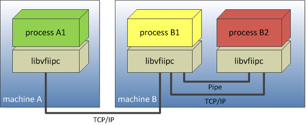
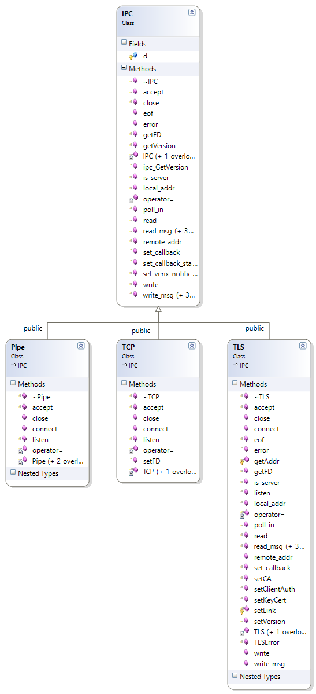
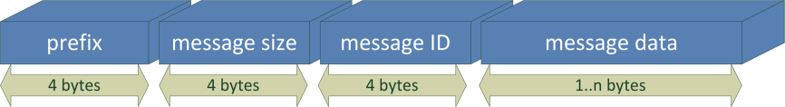
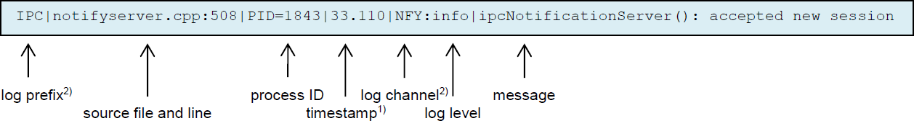
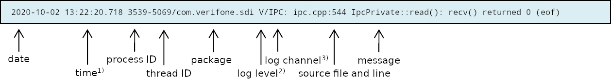

# Preface <a href="#sec_ipc_preface" id="sec_ipc_preface"></a>

This document contains information on how to develop inter process communication using ADK IPC.

## Audience <a href="#subsec_ipc_audience" id="subsec_ipc_audience"></a>

This guide provides all the information required for application developers to install and utilize the functionality of ADK IPC.

## Organization <a href="#subsec_ipc_organization" id="subsec_ipc_organization"></a>

This guide is organized as follows:

[Chapter 1, Overview](#sec_ipc_overview): Provides the introduction to ADK IPC.

[Chapter 2, Supported Platforms](#sec_ipc_supported_platforms): Shows the OS platforms ADK IPC can interface with.

[Chapter 3, IPC Class Hierarchy](#sec_ipc_adk_ipc_class_hierarchy): Illustrates and describes the application interface for ADK IPC.

[Chapter 4, IPC I/O Functions](#sec_ipc_i_o_functions): Contains the I/O functions of ADK IPC.

[Chapter 5, IPC Error Detection](#sec_ipc_error_detection): Chapter about an application can detect communication errors.

[Chapter 6, IPC Data Detection](#sec_ipc_ipc_data_detection): Chapter about an application can check for available data.

[Chapter 7, IPC Client Functions](#sec_ipc_client_functions): Description of IPC client functions.

[Chapter 8, IPC Server Functions](#sec_ipc_server_functions): Description of IPC server functions.

[Chapter 9, IPC Remote Information](#sec_ipc_remote_information): How to get remote information about the connected remote process or machine.

[Chapter 10, TLS support](#sec_ipc_tls): How to use Transport Layer Security (TLS) with ADKIPC.

[Chapter 11, Notification Service](#sec_ipc_notification_service): Description of IPC notification interface.

[Chapter 12, Compiling and Linking](#sec_ipc_compiling_and_linking): Contains information on compiling and linking ADK IPC libraries.

[Chapter 13, Troubleshooting:](#sec_ipc_troubleshooting) Gives solutions for possible issues in ADK IPC.

[Chapter 14, IPC Demo Applications](#sec_ipc_adk_ipc_demo_applications): Provides a sample server/client application for the ADK IPC distribution package.

[Chapter 15, JSON Demo Application](#sec_ipc_json_demo_application): Contains a sample JSON application included in the ADK IPC distribution package.

[Appendix A: Glossary](#sec_ipc_appendix_a_glossary): Listing and definitions of various acronyms and terms

# Overview <a href="#sec_ipc_overview" id="sec_ipc_overview"></a>

The ADK IPC library consists of several services and interfaces:

- [Interprocess communication service (IPC)](#subsec_ipc_vfiipc)
- [JSON API - JSObject C++ class](#subsec_ipc_jsobject)
- [Notification service](#subsec_ipc_notification_service)

## Interprocess communication service (IPC) <a href="#subsec_ipc_vfiipc" id="subsec_ipc_vfiipc"></a>

ADK IPC library provides a C++ application interface for inter process communication, which can be used to transfer data between multiple threads in one or more processes. Processes may run on one or more machines connected by a TCP/IP network.



ADK IPC library supports the following communication methods:

- Named pipes
- TCP/IP sockets

Named pipes support communication between processes running on the same machine/terminal only. TCP/IP allows the transfer of data over a network, either to a different process on the same or to another machine/terminal. Processes intending to communicate on the same machine/terminal should prefer named pipes, since TCP/IP requires a working network interface or the existence of a loopback device.


On some platforms it might be necessary to initialize the network interface before TCP sockets will work, whereas named pipes can be used offhand on both platforms.
On Unix based systems (e.g. VOS) pipes are implemented with unix domain sockets. On Windows pipes are not supported. The pipe name refers to an object in the file system, file permissions are used to control access.


## JSON API - JSObject C++ class <a href="#subsec_ipc_jsobject" id="subsec_ipc_jsobject"></a>

Since version 1.3.0, ADK IPC provides an additional helper library containing class JSObject. This class can be used by applications to serialize data into JSON format. JSON (JavaScript Object Notation) is an open standard format that uses human-readable text to transmit data objects consisting of attribute-value pairs. For instance, it is used to transmit data between a server and web application, as an alternative to XML.

The class JSObject contains several functions to store any data (simple or complex data types) to this object. The class provides functions to dump the stored data into a JSON string for transmission or to load a received JSON string to an object for easy access to the data via the member functions. The usage of an object is demonstrated by the sample application found in chapter [JSON Demo Application](#sec_ipc_json_demo_application).

## Notification service <a href="#subsec_ipc_notification_service" id="subsec_ipc_notification_service"></a>

Since version 1.4.0, ADKIPC library comes along with a additional service for sending asynchronous notifications for interprocess communication within a terminal. Each application, which wants to use the notification interface must register with the service to specify its own application ID used for adressing the notification messages. Notification messages are JSON encoded and itself identified by a notification ID. For more details please refer to chapter [Notification Service](#sec_ipc_notification_service).

# Supported Platforms <a href="#sec_ipc_supported_platforms" id="sec_ipc_supported_platforms"></a>

## Terminal Platforms <a href="#subsec_ipc_terminal_platforms" id="subsec_ipc_terminal_platforms"></a>

Pre-compiled shared ADK IPC libraries (and static variants) are available for the following platforms:

- V/OS Fusion (**`vos`** dev package): `libvfiipc.a`, `libvfiipc.so`, `libvfiipctls.a`, `libvfiipctls.so`
- V/OS2 Engage (**`vos2`** dev package): `libvfiipc.a`, `libvfiipc.so`, `libvfiipctls.a`, `libvfiipctls.so`
- V/OS3 (**`vos3`** dev package): `libvfiipc.a`, `libvfiipc.so`, `libvfiipctls.a`, `libvfiipctls.so`, `libengine_keyservice.so`, `libengine_keyservice_sdi.so`
- Android (**`android`** dev package): `libvfiipc.so`, `libvfiipctls.so`, `libengine_keyservice_sdi.so`
- Android System (**`androidsys`** package): `libvfiipc.so`, `libvfiipctls.so`, `libengine_keyservice.so`

`libvfipctls` contains the [TLS support](#sec_ipc_tls), the remaining features are contained in `libvfiipc`.


Android System components cannot be used by normal Android user applications. These libaries require the application to run as system service with additional privileges to access the security processor.


## Other Platforms <a href="#subsec_ipc_other_platforms" id="subsec_ipc_other_platforms"></a>

In addition, IPC sources are considered to be used for other platforms, for which recently no pre-compiled libraries are provided. Source code can be directly integrated to application projects for the following platforms and compilers:

- Windows (TCP/IP only, e.g. Visual Studio 2008)
- Other native x86 Unix platforms (GCC compiler).

# IPC Class Hierarchy <a href="#sec_ipc_adk_ipc_class_hierarchy" id="sec_ipc_adk_ipc_class_hierarchy"></a>

## Class Hierarchy <a href="#subsec_ipc_class_hierarchy" id="subsec_ipc_class_hierarchy"></a>

The following illustration shows the class hierarchy of ADK IPC.



Basic application interface of the ADK IPC library `libvfiipc` consists of 3 classes:

- IPC (base class)
- Pipe (derived subclass)
- TCP (derived subclass)

Additional TLS subclass is provided by separate library `libvfiipctls`.

Class IPC represents the base class providing a generic interface of I/O methods. The subclasses Pipe and TCP are derived from class IPC and contain the specific implementation for the appropriate communication method.

The inheritance in the interface allows the use of most I/O methods independent from the underlying communication method. An application creates an instance of class Pipe or TCP and may use pointers to reference the base class, in order to use the generic I/O interface as follows:

``` cpp
#include "ipc.h"
#include <stdio.h>
int main() {
Pipe *p=new Pipe();
if(!p->connect("/tmp/foobar")) {
   fprintf(stderr,"connect to pipe failed!"nn);
   return 1;
}
// use generic interface functions
IPC *ipc=p;
ipc->write("some data",9);
unsigned char buf[255];
ipc->read(buf,sizeof(buf));
// close connection and destroy the IPC object delete ipc;
}
```

Since the `IPC` destructor is `virtual`, invoking `delete` on the pointer of the `IPC` base class will destroy the instance of the derived class `Pipe` or `TCP` automatically. In addition, destroying the object will close the connection with an implicit invocation of `close()`.

# IPC I/O Functions <a href="#sec_ipc_i_o_functions" id="sec_ipc_i_o_functions"></a>

The I/O functions of the ADK IPC library support both stream and message-based operation.

## Stream Based Operation <a href="#subsec_ipc_stream_based_operation" id="subsec_ipc_stream_based_operation"></a>

For stream-based operations, the base class IPC provides following low-level I/O functions:

``` cpp
virtual bool IPC::write(const void *data, int size);
virtual int IPC::read(void *data, int maxsize, int timeout_msec=-1);
virtual int IPC::read(void *data, int maxsize, int timeout_msec, int timeout_msec2);
```

The <a href="classvfiipc_1_1_i_p_c.md#a04f753a2a5691e2d36266e2ff084a217">write()</a> function writes data to the IPC stream, the result is returned as a boolean value (*true* for success). The <a href="classvfiipc_1_1_i_p_c.md#aa04744c17ae9eec2b37fb8c476a8c62d">read()</a> reads data from the IPC stream, unless the number of bytes exceeds the size specified by `maxsize` or the given timeout in milliseconds `timeout_msec` expires. If the timeout is expired, the number of received bytes is returned. The overloaded <a href="classvfiipc_1_1_i_p_c.md#aa04744c17ae9eec2b37fb8c476a8c62d">read()</a> function with timeout `timeout_msec2` can be used to specify the timeout in milliseconds after at least one byte has been read.

## Message Based Operation <a href="#subsec_ipc_message_based_operation" id="subsec_ipc_message_based_operation"></a>

ADK IPC library provides functions for sending and receiving messages. The data is transferred with a simple synchronization protocol that specifies the following message format:



ADK IPC messages are pre-appended by a header that allows splitting the stream of bytes into ADK IPC messages. The header consists of the following fields:

- prefix
- message size
- message ID.

The prefix is used for checking synchronization between sender and receiver, and to resynchronize in case synchronization has been lost. The receiver discards the data until a valid prefix has been found. The message size field contains the number of bytes for the following fields: the message ID (4 bytes) plus message data (n bytes). The message ID field may contain a unique number to identify the messages by sender and receiver. For instance, if one ADK IPC connection is used for multiple multiplexed communications, the message ID may address the messages for several logical channels. All header fields (prefix, message size and message ID) are in big endian format.

The following functions can be used for message based operations:

``` cpp
virtual bool IPC::write_msg(unsigned prefix, int msg_id, const void *msg, int size);
virtual bool IPC::write_msg(unsigned prefix, int msg_id, const std::vector<unsigned char> &msg);
virtual bool IPC::write_msg(unsigned prefix, int msg_id, const std::vector<char> &msg);
virtual bool IPC::read_msg(unsigned prefix, int &msg_id, std::vector<unsigned char> &msg, int size_limit, int timeout_msec=-1);
virtual bool IPC::read_msg(unsigned prefix, int &msg_id, std::vector<char>&msg, int size_limit, int timeout_msec=-1);
```

IPC header file <a href="ipc_8h.md">ipc.h</a> offers several signatures of `write_msg()` and <a href="classvfiipc_1_1_i_p_c.md#a5fc3e8a54237502339f9483465730704">read_msg()</a> to send and receive messages. All functions take the prefix and the message ID as first and second parameters. Several signatures of `write_msg()` and <a href="classvfiipc_1_1_i_p_c.md#a5fc3e8a54237502339f9483465730704">read_msg()</a> just differ in type of message parameter `msg`. The <a href="classvfiipc_1_1_i_p_c.md#a5fc3e8a54237502339f9483465730704">read_msg()</a> function additionally takes parameters `timeout_msec` (timeout in milliseconds) and a `size_limit` specifying the limited number of bytes for the messages to be stored in the vector `msg`. All functions return the result as a boolean value (`true` for success).

# IPC Error Detection <a href="#sec_ipc_error_detection" id="sec_ipc_error_detection"></a>

## Error Detection <a href="#subsec_error_detection" id="subsec_error_detection"></a>

In order to indicate communication errors or a disturbed connection, the application may invoke IPC function <a href="classvfiipc_1_1_i_p_c.md#a090dfa7806330da64843832e3985ebdf">error()</a>.

``` cpp
virtual bool IPC::error();
```

Errors are detected by IPC functions for reading and writing, and <a href="classvfiipc_1_1_i_p_c.md#a090dfa7806330da64843832e3985ebdf">error()</a> is generally called as the subsequent function. If <a href="classvfiipc_1_1_i_p_c.md#a090dfa7806330da64843832e3985ebdf">error()</a> returns `true`, the application invokes <a href="classvfiipc_1_1_i_p_c.md#a47feccb1873356363e4d0e302bc3822c">close()</a> function to re-use the IPC object:

``` cpp
IPC *ipc;
TCP *tcp;
ipc=tcp=new TCP();
tcp->connect("127.0.0.1",12345);
...
int n=ipc->read(buf,sizeof(buf));
if(n<=0) {
   if(ipc->error() || ipc->eof()) {
   ipc->close();
   ...
   // reconnect
   tcp->connect("127.0.0.1",12345);
   }
}
```

An application indicates an `EOF` (end of file) if the IPC connection was closed by the other side.

``` cpp
virtual bool IPC::eof();
```

`EOF` is detected by IPC functions for reading only, e.g. <a href="classvfiipc_1_1_i_p_c.md#aa04744c17ae9eec2b37fb8c476a8c62d">read()</a> or <a href="classvfiipc_1_1_i_p_c.md#a5fc3e8a54237502339f9483465730704">read_msg()</a>. If <a href="classvfiipc_1_1_i_p_c.md#a044713f1fcbdbec24aae467186a95481">eof()</a> returns true, the application invokes <a href="classvfiipc_1_1_i_p_c.md#a47feccb1873356363e4d0e302bc3822c">close()</a> function to re-use the IPC object.

# IPC Data Detection <a href="#sec_ipc_ipc_data_detection" id="sec_ipc_ipc_data_detection"></a>

ADK IPC library provides two APIs to check for availability of incoming data. On the one hand application can use a function to poll the IPC object for available data, on the other hand there is an event-driven interface to register a callback, which is invoked, if the IPC object holds some data for reading.

## Polling API Function <a href="#subsec_ipc_poll_api_function" id="subsec_ipc_poll_api_function"></a>

If an application just wants to check the IPC object for availability of incoming data and it is not intended to read the data immediately, the following function can be used:

``` cpp
bool poll_in(int timeout_msec=-1);
```

This function returns true, if data is pending in the object and ready for reading with <a href="classvfiipc_1_1_i_p_c.md#aa04744c17ae9eec2b37fb8c476a8c62d">read()</a> or <a href="classvfiipc_1_1_i_p_c.md#a5fc3e8a54237502339f9483465730704">read_msg()</a>. In case of an error or an EOF (end of file) this function also returns true and sets the internal flags for functions <a href="classvfiipc_1_1_i_p_c.md#a044713f1fcbdbec24aae467186a95481">IPC::eof()</a> and <a href="classvfiipc_1_1_i_p_c.md#a090dfa7806330da64843832e3985ebdf">IPC::error()</a>. An additional timeout *timeout_msec* can be used to wait for the arrival of data for a specified time (in milliseconds). A negative timeout means wait forever.


Function <a href="classvfiipc_1_1_i_p_c.md#aae3d66ed5454894b1ace225e51de8674">poll_in()</a> is a poll-driven API and application needs to call this function cyclically (or blocking) to detect the arrival of data. Another event-driven API is also provided with IPC function <a href="classvfiipc_1_1_i_p_c.md#aa73e8080bdf5412792220bbb47cd2f4d">set_callback()</a>. For more details please refer to next chapter [Callback Interface (event-driven)](#subsec_ipc_callback_interface_for_available_data).


## Callback Interface (event-driven) <a href="#subsec_ipc_callback_interface_for_available_data" id="subsec_ipc_callback_interface_for_available_data"></a>

IPC applications can register a callback function to an IPC object, which is invoked if data is available for reading on this object. From inside this function the application can use functions <a href="classvfiipc_1_1_i_p_c.md#aa04744c17ae9eec2b37fb8c476a8c62d">read()</a> or <a href="classvfiipc_1_1_i_p_c.md#a5fc3e8a54237502339f9483465730704">read_msg()</a> to read the data or send an event to another task or thread that data is pending. The callback is set with the following IPC function:

``` cpp
bool set_callback(ipcCallback cb, void *data=0);
```

The callback function is represented by parameter *cb* of type `ipcCallback`, which is defined as a function pointer:

``` cpp
typedef void (*ipcCallback)(void *data, IPC *ipc);
```

In case that data is pending for the object, the callback function is invoked. The function is passed a pointer to parameter *data* that was set with <a href="classvfiipc_1_1_i_p_c.md#aa73e8080bdf5412792220bbb47cd2f4d">set_callback()</a>. In addition, a pointer to the IPC object is provided as second parameter, which allows access to the IPC object and its member functions, e.g. <a href="classvfiipc_1_1_i_p_c.md#aa04744c17ae9eec2b37fb8c476a8c62d">read()</a>. Example:

``` cpp
static void ipc_callback(void *data, IPC *ipc)
{
  char buf[256];
  int n=ipc->read(buf,sizeof(buf),0);
  if(n>0) {
  ...
}
```

Functions <a href="classvfiipc_1_1_i_p_c.md#aa04744c17ae9eec2b37fb8c476a8c62d">read()</a> and <a href="classvfiipc_1_1_i_p_c.md#a5fc3e8a54237502339f9483465730704">read_msg()</a> can be invoked from inside the callback with a zero timeout, since data is already available and there is no need to wait for arrival of data.


Please note that no more callbacks are invoked unless some data was read from this IPC object with <a href="classvfiipc_1_1_i_p_c.md#aa04744c17ae9eec2b37fb8c476a8c62d">read()</a> or <a href="classvfiipc_1_1_i_p_c.md#a5fc3e8a54237502339f9483465730704">read_msg()</a>. For instance, if data is splitted into 2 packages and applications expects a callback for the second part, the callback for this second part is not invoked unless application has called <a href="classvfiipc_1_1_i_p_c.md#aa04744c17ae9eec2b37fb8c476a8c62d">read()</a> or <a href="classvfiipc_1_1_i_p_c.md#a5fc3e8a54237502339f9483465730704">read_msg()</a> for the first part. The reason for this implementation is ADKIPC must avoid application overloading with multiple callbacks.
Please also note that <a href="classvfiipc_1_1_i_p_c.md#aa73e8080bdf5412792220bbb47cd2f4d">set_callback()</a> starts a seperate thread, which invokes the callback functions for all IPC objects. For this reason application always should check return code of <a href="classvfiipc_1_1_i_p_c.md#aa73e8080bdf5412792220bbb47cd2f4d">set_callback()</a> to avoid deadlocks, since callback function won\'t be invoked, if <a href="classvfiipc_1_1_i_p_c.md#aa73e8080bdf5412792220bbb47cd2f4d">set_callback()</a> returns `false`. In order to unregister the callback function from the IPC object, application invokes <a href="classvfiipc_1_1_i_p_c.md#aa73e8080bdf5412792220bbb47cd2f4d">set_callback()</a> with a `NULL` pointer for parameter *cb*.


# IPC Client Functions <a href="#sec_ipc_client_functions" id="sec_ipc_client_functions"></a>

## Client Functions <a href="#subsec_client_functions" id="subsec_client_functions"></a>

The application can establish a new pipe connection with the following function:

``` cpp
bool Pipe::connect(const char *pipe);
```

Parameter `pipe` specifies the named pipe the server provides in the file system. The function returns `false` if the pipe is not available or cannot be opened.

The application can establish a new TCP/IP connection by using:

``` cpp
bool TCP::connect(const char *hostname, unsigned short port,int timeout_msec=-1);
```

Parameter `hostname` specifies the DNS name or the IP address of the server. Parameter `port` specifies the TCP/IP port of the server. The function returns `false` if no connection could be established or if the timeout in milliseconds has expired.

# IPC Server Functions <a href="#sec_ipc_server_functions" id="sec_ipc_server_functions"></a>

## Server Functions <a href="#subsec_server_functions" id="subsec_server_functions"></a>

An IPC server application can create a new named pipe to listen for new incoming connections:

``` cpp
bool Pipe::listen(const char *pipe);
```

Parameter `pipe` specifies the named pipe to be provided to clients in the files system. The function returns `false` if the pipe cannot be created.

A server application can create a new TCP/IP listen socket for new incoming connections by using:

``` cpp
bool TCP::listen(unsigned short port, const char *listen_address=0);
```

Parameter `port` specifies the port for the new listen socket. An IP address passed via `listen_address` specifies the network adapter for accepting connections. Default `listen_address=0` means acceptance of connections on all available adapters. Use `127.0.0.1` for local loopback device to avoid that external connections are accepted. The function returns `false` if the listen socket cannot be created.

Incoming connections can be accepted with following ADK IPC functions:

``` cpp
IPC * IPC::accept(int timeout_msec=-1);
IPC * Pipe::accept(int timeout_msec=-1);
IPC * TCP::accept(int timeout_msec=-1);
```

`IPC::accept()` has the same signature as functions of derived classes and works for both communication methods named `pipes` and `TCP/IP`. If an incoming connection has been accepted, a pointer to a new `IPC` instance is returned for this new connection. The caller takes over the ownership for this object, and if it is no longer needed, it must be released using `delete:`

``` cpp
Pipe p;
p.listen("/tmp/foobar");
while(1) {
   IPC *ipc=p.accept();
   if(!ipc) continue;
   unsigned char buf[255];
   int n=ipc->read(buf,sizeof(buf));
   if(n>0) {
   ipc->write(buf,n);
   }
   // free IPC object for this connection
   delete ipc;
}
```

# IPC Remote Information <a href="#sec_ipc_remote_information" id="sec_ipc_remote_information"></a>

## Remote Information <a href="#subsec_remote_information" id="subsec_remote_information"></a>

The following function can be used to get remote information about the connected process or machine.

``` cpp
const char *remote_addr() const;
```

For <a href="classvfiipc_1_1_t_c_p.md">vfiipc::TCP</a> objects this function always returns the IP address and session port of the connected client or server. The string format of the return value is the following:

``` cpp
<IP address>:<port>
```

For <a href="classvfiipc_1_1_pipe.md">vfiipc::Pipe</a> objects this function returns a string containing `PID`, `UID` and `GID` of the remote process. The string format is the following:

``` cpp
<pid> <uid> <gid>
```

# TLS support <a href="#sec_ipc_tls" id="sec_ipc_tls"></a>

TLS support is provided for Linux platforms (V/OS, V/OS 2, V/OS 3) and Android with library `libvfiipctls` coming along with the distribution package.

Compared to TCP setting up a TLS connection requires additional information for key and certificate handling. This information must be set before actually connecting to a target or before listening for connections using <a href="classvfiipc_1_1_t_l_s.md#ae964fcae76a97db22c3e2a6128c4aaad">TLS::setKeyCert</a>, <a href="classvfiipc_1_1_t_l_s.md#a4084c8652036e45c21b56d78f5bf07ee">TLS::setCA</a> and <a href="classvfiipc_1_1_t_l_s.md#a3f9d5450bdb44150cd43cc294bb93649">TLS::setClientAuth</a>. Depending on whether the connection is the client or server side of the link, not all of them are required.

Wenn setting up a TLS link, additional error information may be obtained using <a href="classvfiipc_1_1_t_l_s.md#a5e0030ca1fbfa22c41a7d88e2ecde6f6">TLS::TLSError()</a>.


Please note that `libvfiipctls` depends on OpenSSL libraries, which may need to be installed separately, if the OS does not already include them. On V/OS, V/OS 2 and V/OS 3 OpenSSL libraries comes along with the OS. Older V/OS and V/OS 2 versions use OpenSSL 1.0.2, but since ADK 4.10 the OS will be upgraded to OpenSSL 3. On Android OpenSSL is not part of the system, thus, each application must provide the libraries with the APK. Older installations might still use older OpenSSL 1.1.1, but these projects should migrate to OpenSSL 3 soon, since old version have reached end-of-support. Due to the fact different OpenSSL versions are used on these platforms, ADKIPC requires to provide 2 variants to cover transition phase to the new OpenSSL 3. Thus, for targets with new OpenSSL 3 the user must link library `libvfiipctls` of subfolder `lib/openssl3` coming along with development packages, e.g. `ipc-android-dev-X.X.X-X.zip`. New VOS3 platform already uses OpenSSL 3 from begin, thus, development and load packages already contain one set of libraries under `lib` already fitting to all OS versions.


## Using client key/certificate <a href="#sec_ipc_authex" id="sec_ipc_authex"></a>

Class `TLS` provides API functions <a href="classvfiipc_1_1_t_l_s.md#ae964fcae76a97db22c3e2a6128c4aaad">TLS::setKeyCert</a> to specify a client key/certificate and <a href="classvfiipc_1_1_t_l_s.md#a3f9d5450bdb44150cd43cc294bb93649">TLS::setClientAuth</a> to enable client authentication against a TLS server (mutual authentication). In most cases the terminal will use Authex key/certificate, which is installed by factory with warrantied keys. Newer OS verions also allow to install a customer loaded key/certificate with RKL (remote key loading). RKL uses VRK (VeriShield remote key) with an end to end authenticated encrpytion to bring in a terminal individual payload containing the key and the certificate. For more details about how to create such download files please refer to RKL/VRK documentation.


Client keys are always encrypted and never exposed in plain text to applications.


Both, AuthEx and a customer loaded key/certificate are used with an OpenSSL engine, which provides a keyservice to access the encrypted client private key in a secure manner.
Two different types of keyservice engines are provided:

- Local keyservice engine:
  The local keyservice engine is intended for applications having permissions to access the local security module (see chapter [Local keyservice engine](#sec_ipc_local_keyservice)). On older terminal platforms the local keyservice engine is part of the operating system, e.g. Fusion (V/OS) and Engage (V/OS 2) provide this service with library `engine_keyservice.so`. On Android and V/OS 3 user applications are not allowed to use the local keyservice, only system applications (e.g. SDI) can use it. On Android the library uses prefix `lib`, thus, the library `libengine_keyservice.so` and comes along with the IPC development distribution package.
- Remote keyservice engine:
  For applications running on systems w/o permissions to access security module (e.g. Android and V/OS 3) the ADKIPC project provides the remote keyservice engine (see chapter [Remote keyservice engine](#sec_ipc_remote_keyservice)). This engine is provided by library `engine_keyservice_sdi.so` (or `libengine_keyservice_sdi.so` for Android platforms). The library also comes along IPC development distribution package for the corresponding platform.

Users need not deal with details to load the shared objects in application to get keyservice capabilities. Library `libvfiipctls` does this job and knows for each platform, which engine to load and to use. The engine libraries just must be installed in the `lib` directory next to the executable (x86-Linux) or in the `lib` subdirectory of the current working directory (Android). If installed, a keyservice engine can be addressed by using an engine prefix with a key reference name, which is passed as key and certificate parameter to <a href="classvfiipc_1_1_t_l_s.md#ae964fcae76a97db22c3e2a6128c4aaad">TLS::setKeyCert</a> in the following format:

``` fragment
<engine prefix>:[<key reference name>]
```

The value `<engine prefix>` is used to select a keyservice engine for the TLS connection. Available engines with its prefix are described in the following chapters. Please note that prefix needn\'t necessarily match to an intalled keyservice engine and `libvfiipctls` might fallback to another engine available on the system. The value `<key reference name>` selects a key/certificate, which shall be used by the keyservice engine for the TLS connection. Friendly key reference names are unanimously used across supported engines and platforms, whereas reference names for customer loaded key/certificates may depend on platform. The keyservice engines are designed to support several keys/certificates, the following are recently supported:

| Supported RSA key/certificate | Used key reference name |
|----|----|
| <p>AuthEx key/certificate</p> | <p>`VFI_AUTHN_RSA` (friendly name)</p> |
| <p>Customer loaded RSA key/certificate</p> | <p>Arbitrary name (depending on platform)</p> |

`VFI_AUTHN_RSA` is the default for all keyservice engines, therefore, value `<key reference name>` can stay empty to select the AuthEx key/certificate.


Presence of a valid AuthEx key/certificate can be checked using <a href="classvfiipc_1_1_t_l_s.md#ac4660b9dda0672220272fc39b597e208">TLS::hasAuthEx</a>.


**Customer loaded RSA key/certificate**:

On Engage a customer RSA certificate will be stored by RKL as `*.crt` file unter the following location:

``` fragment
/mnt/flash/system/generickeys/usr<X>
```

`<X>` stands for an user number 1-16, whereas keys/certificates can be shared between different users. The corresponding RSA key is VRK encrypted and stored next to the certificate having the same basename with extension `*.der`. The basename is specified by the VRK key label. Finally, applications can use the following notation as key reference name to address a related customer RSA key/certificate:

``` fragment
[usr<X>/]<key label>
```

`usr<X>/` is the user prefix used as subfolder under `/mnt/flash/system/generickeys`. The user prefix is optional and engines use prefix `usr1/` as default to look up keys/certificates under `/mnt/flash/system/generickeys/usr1`. Thus, the `<key label>` only w/o user prefix can be used as key reference name to address a `usr1` key/certificate. Other users require usage of the user prefix with the key label, e.g. `usr2/mykey`.


The value used for key reference name must match user prefix and key label case sensitive.


Android (Trinity, Neo) usually uses the friendly key label to specify the key or certficate. Additionally, serial number (hex string, e.g. `65C95907166F14DA`) can be used as key reference name. Neo platform even allows to use the subject `CN` of the certificate.

### Local keyservice engine <a href="#sec_ipc_local_keyservice" id="sec_ipc_local_keyservice"></a>

Applications having permissions to access the local security module (e.g. a payment application running on Fusion (V/OS) or Engage (V/OS 2) with direct access to Vault or SDI component on Android and V/OS3 with direct access to K81) can use the local keyservice engine (`engine_keyservice.so` or `libengine_keyservice.so`), which directly invokes the API of the security module to read the certificates or to operate with a private RSA key. When the local keyservice engine has been installed, it can be selected by using the engine name `vault`, which is passed as prefix in parameters for the key and/or the certificate on to <a href="classvfiipc_1_1_t_l_s.md#ae964fcae76a97db22c3e2a6128c4aaad">TLS::setKeyCert</a>.
Example to select local keyservice engine with default AuthEx key/certificate:

``` cpp
TLS tls;
tls.setKeyCert("vault:","vault:");
```


Engine prefix `vault` will prefer local keyservice engine (`engine_keyservice.so` or `libengine_keyservice.so`), if it was installed and loaded. If not, library `libvfiipctls` might fallback to remote keyservice engine (`engine_keyservice_sdi.so` or `libengine_keyservice_sdi.so`).
On Fusion (V/OS) and Engage (V/OS 2) the local keyservice engine comes along with the operating system, therefore, ADKIPC library `engine_keyservice.so` is not installed on these platforms.


### Remote keyservice engine <a href="#sec_ipc_remote_keyservice" id="sec_ipc_remote_keyservice"></a>

Primary, the remote keyservice engine was introduced for Android devices (e.g. T650c, CM5, M440 or M424) running the payment application on Android, which is not allowed to access the security module of the terminal directly. In addition, new V/OS 3 terminals have the same security concept, which allows SDI (Secure Data Interface) component only to access the security processor. SDI is a separate component coming along with SDI installation. The remote keyservice engine connects to the SDI remote keyservice, which is fully decoupled from normal SDI interface. It is available for applications running on the same device as the SDI component. The service provides a command interface, which is implemented by the remote keyservice engine `engine_keyservice_sdi.so` (and `libengine_keyservice_sdi.so` for Android) to read certificates or to operate with a private RSA key. When the remote keyservice engine has been installed, it can be selected by using the engine name \"sdi\", which is passed as prefix in parameters for the key and/or the certificate on to <a href="classvfiipc_1_1_t_l_s.md#ae964fcae76a97db22c3e2a6128c4aaad">TLS::setKeyCert</a>.
Example to select remote keyservice engine with default AuthEx key/certificate:

``` cpp
TLS tls;
tls.setKeyCert("sdi:","sdi:");
```


Engine prefix `sdi` will prefer remote keyservice engine (`engine_keyservice_sdi.so` or `libengine_keyservice_sdi.so`), if it was installed and loaded. If not, library `libvfiipctls` might fallback to local keyservice engine (`engine_keyservice.so` or `libengine_keyservice.so`).
The remote keyservice engine `libengine_keyservice_sdi.so` for Android comes along with IPC development distribution package. There are no installation packages, therefore, users must integrate the library to application package for installation.


# Notification Service <a href="#sec_ipc_notification_service" id="sec_ipc_notification_service"></a>

Notification service is used for sending asynchronous notifications for interprocess communication within a terminal. The service comes along with `libvfiipc` that implements both the server and client part of the notification service. The server part is considered to run by exactly one process. The client part implements a C++ interface for use by clients. It communicates with the server using unix domain sockets or named pipes depending on the platform it is run on.

## Notifications <a href="#subsec_ipc_notify" id="subsec_ipc_notify"></a>

Notifications that are handled by notification service consist of:

- notification ID
- source address
- destination address
- hierarchical JSON encoded data
- optional flags

Addressing is based on the application ID of the applications. For this each application registers with notification service to specify its own application ID (see <a href="namespacevfiipc.md#a88455cb389891217791604f188ac0fa5">vfiipc::ipcSetAppID</a>). The same way it registers for the notifications it is interested in (see <a href="namespacevfiipc.md#a625ae82cd0bc99851ccb8a8ffdcaea1e">vfiipc::ipcRegisterNotificationCB</a>).

For specifying the destination address two additional addresses are supported:

- 1 - send the notification to a single application
- \* - send the notification to all applications (broadcast)

Notifications are identified by a notification ID. <a href="namespacevfiipc.md#a3ad101cda0c973d26791bd8f194d4b80">vfiipc::ipcNotify</a> is used to send notifications. Data is provided as JSON object.

If the broadcast address is used as destination the notification is sent to all applications that have been registered for this specific notification ID.

If *1* has been used as address the server creates a list of all applications that have registered for a notification ID and continues with this list. If a specific application ID has been used this address is used as destination address. In case the destination list contains more than one entry, the notification is delivered to the application with the highest priority. If several applications share the highest priority it is unspecified which one of them will receive the notification.

Notifications are delivered by invoking the registered callback function (see <a href="namespacevfiipc.md#ab377f9e2a200c707731b1984626d70c9">vfiipc::NotifyCallback</a>). The source address of the sending application is delivered to the callback function. This address can be used in case a result notification is to be sent when processing has been completed. Also the destination address as used when sending is passed on to the callback. By this a callback can find out whether it was invoked during a broadcast or whether it has been addressed individually. Parameters are provided as <a href="classvfiipc_1_1_j_s_object.md">vfiipc::JSObject</a> which implements an interface for encoding and decoding JSON data.

Receiving notifications works transparently for the application: Notification service uses separate threads for receiving and for invoking callbacks. Callbacks may be invoked concurrently, so locking may be required if the callbacks access common data.


Notifications are global, every process is allowed to send and receive any notification. This allows for maximum flexibility but has some implications on security: Notifications must not be used to send sensitive data in plain text.


Example application, that receives \"echo\" notifications and sends them back to sender as \"echo-reply\" notification:

``` cpp
#include <ipc/notify.h>
#include <stdio.h>
#include <unistd.h>
using namespace vfiipc;
void echo_cb(void *data,
   const std::string &from,
   const std::string &to,
   const std::string &notification,
   const vfiipc::JSObject &param,
   unsigned flags)
{
   // print received information to console
   printf("callback\n"
   " from: %s\n"
   " to: %s\n"
   " notification: %s\n"
   " param: %s\n"
   " flags: %x\n\n",from.c_str(),to.c_str(),notification.c_str(),param.dump().c_str(),flags);
   // just send back received information to sender as "echo-reply" notification
   ipcNotify(from,"echo-reply",param);
}
int main(int argc, char *argv[])
{
   // set application ID
   ipcSetAppID("echo-server");
   // register for receiving "echo" notification
   if(ipcRegisterNotificationCB("echo",echo_cb,0,0)) {
   fprintf(stderr,"Failed to register callbacks\n");
   return(1);
   }
   while(1) sleep(1000); // processing happens in callback
}
```

## Setup Notification Service <a href="#subsec_ipc_setup_server" id="subsec_ipc_setup_server"></a>

Before a notification callback can be configured by any client with <a href="namespacevfiipc.md#a625ae82cd0bc99851ccb8a8ffdcaea1e">vfiipc::ipcRegisterNotificationCB</a>, exactly one process must setup the Notification Service as a server, which is started with one of the following functions:

``` cpp
enum NotifyResult ipcNotificationServer();
enum NotifyResult ipcNotificationServer(const char *config_file);
```


If a client invokes <a href="namespacevfiipc.md#a625ae82cd0bc99851ccb8a8ffdcaea1e">vfiipc::ipcRegisterNotificationCB</a>, before the server was started, the function will fail with error code <a href="namespacevfiipc.md#a7eda24f6e23d0f36491cc949c16ac4c3a3332b9f23fcc102341e551348f714940">vfiipc::NOTIFY_ERR_SERVER</a>.


Since ADK IPC 1.4.5 an additional component `notifysvc` was added, which can be installed as notification server running as separate process. Download packages are available for several terminal platforms and come along with ADK IPC distribution packages. Since ADK IPC 1.5.0 the `notifysvc` was moved from user sys13 to sys12, which allows to use notification service while sysmode is active.

## Observer <a href="#subsec_ipc_observer" id="subsec_ipc_observer"></a>

In addition to registering for notifications an application may register as observer (see <a href="namespacevfiipc.md#a5cb6705e4d5e2d94225eac66c760e872">vfiipc::ipcRegisterObserver</a>). As observer it will be informed about all delivered notifications. This could be used for example to control visibility of applications or it could be used by power management to detect idle situations.

The observer callback (see <a href="namespacevfiipc.md#a74917bd8d91bec1ff98234834e531071">vfiipc::NotifyObserver</a>) is provided with the source and resolved destination address, notification ID and flags parameter. The notification data is not passed on to the observer callback.

## Remote access <a href="#subsec_ipc_remote" id="subsec_ipc_remote"></a>

By default the notification server has disabled remote access. On Fusion (V/OS), Engage (V/OS 2) and V/OS 3 devices remote access may optionally enabled by providing a configuration file that contains a white list of notifications that are accepted from remote hosts and that are allowed to be sent to remote hosts. The configuration file is passed on as parameter when starting the notification server using <a href="namespacevfiipc.md#a1862bc6c0fe6d07d60c677292cbc9619">ipcNotificationServer()</a>.

Component `notfiysvc` takes the configuration file as parameter as follows:

``` fragment
./notifysvc my_notify.cfg
```

In addition, notifysvc itself looks up the configuration depending on used platform and ADKIPC version from these locations:
**V/OS and V/OS 2 (since ADKIPC 1.5.0)**

``` fragment
/home/sys12/notify.cfg
```

**V/OS 3 (since ADKIPC 1.28.0)**

``` fragment
/home/sys_ipc/notify.cfg
```

Please note that these locations are ignored, if configuration file is passed as program parameter. If no configuration exists, `notifysvc` comes up without permission for remote access.

### Configuration file format <a href="#subsubsec_ipc_notify_config" id="subsubsec_ipc_notify_config"></a>

Each line in the configuration file defines a whitelist rule and has the following format:

``` fragment
[in|out] <from> <to> <notification ID>
```

*in* refers to inbound notifications received from remote hosts, *out* refers to outbound notifications to be sent to remote hosts. `<to>` and `<notification ID>` refer to the corresponding parameters as provided to <a href="namespacevfiipc.md#a3ad101cda0c973d26791bd8f194d4b80">ipcNotify()</a>, `<from>` refers to the *from* parameter provided to <a href="namespacevfiipc.md#a3ad101cda0c973d26791bd8f194d4b80">ipcNotify()</a> or to the default value set by <a href="namespacevfiipc.md#a88455cb389891217791604f188ac0fa5">ipcSetAppID()</a> whichever is appropriate. `<from>`, `<to>` and `<notification ID>` all take patterns that may use \'`*`\' to match any sequence of characters. \'`\`\' acts as escape character to force matching the next character literally. For example \'`\*`\' would match the \'`*`\' character. Pattern matching is case sensitive.

Empty lines and lines starting with \'`#`\' are treated as comment and are ignored.

Example configuration file:

``` fragment
# Optional configuration file for notifysvc
# Format:
# [in|out] <from> <to> <notification-id>

in * * foo
out * * foo

in * 1 test
out * * test_reply

# allow all notifications starting with ext_
in * * ext_*
out * * ext_*
```


To prevent remote devices to exhaust terminal resources by registering for many notifications, a limit of 256 registrations for all remote devices exists. If this limit is reached new registrations are silently discarded.


Remote devices cannot register as an observer for security reasons.


### Restrict remote access <a href="#subsubsec_ipc_restrict_remote_access" id="subsubsec_ipc_restrict_remote_access"></a>

Basically, notification server uses port `5899` to listen for incomming connections. Without a configuration file notification server binds the port to local loopback device, which restricts access for local processes only. The existance of a configuration file with a valid white list (see previous chapter) binds the port to any interface. Thus, external clients are able to connect over all available network interfaces, which is the default. Due to security reasons and to restrict access to specific network interfaces only, since ADKIPC 1.28.0 the configuration file was enhanced with new parameter line `<interface>`.

``` fragment
interface <interface name>
```

If specified in the configuration file, notification server creates a separate server instance, which binds port `5899` to network interface with name or IP address `<interface name>`. Multiple parameter lines *interface* will result multiple server instances, each of them responds to the associated network interface for remote access. White list rules `[in|out]` are applied cross over all these instances. Finally, one additional server instance is created for the local loopback device so that local processes are able to communicate with the outer world.

Example for CM5/M440/M424:

``` fragment
# allow access for Android over USB network device
interface vfi-terminal

# allow all notifications starting with ext_
in * * EXT_SYS_*
out * * EXT_SYS_*
...
```

Interface `vfi-terminal` binds the port `5899` to interface `192.168.2.6` (entry in `/etc/hosts`). This restricts remote access to Android over internal USB network only, thus, connections over other remote network devices are not possible. In addition, the port is bound to local loopback device to allow communication with local Engage processes.

### Remote protocol <a href="#subsubsec_ipc_remote" id="subsubsec_ipc_remote"></a>

When remote access has been enabled, the notification server listens on port 5899 for incoming connections. It sends and receives messages of the following format:

``` fragment
00 4E 46 59        # Header
<4 bytes size>     # Number of the bytes that follow in this message, ordering is big endian
<message ID>       # Message ID in big endian, currently unused. Ignore when receiving,
                   # set to 00 00 00 00 when sending
<user data>        # JSON encoded user data
```

Example message:

``` fragment
00000000  00 4e 46 59 00 00 00 45  00 00 00 00              .NFY...E ....
0000000C  7b 22 6e 6f 74 69 66 69  63 61 74 69 6f 6e 22 3a  {"notifi cation":
0000001C  22 74 65 73 74 22 2c 22  70 72 69 6f 72 69 74 79  "test"," priority
0000002C  22 3a 31 2c 22 74 6f 22  3a 22 78 79 7a 22 2c 22  ":1,"to" :"xyz","
0000003C  74 79 70 65 22 3a 22 72  65 67 69 73 74 65 72 22  type":"r egister"
0000004C  7d                                                }
```

The JSON data may contain different types of messages. The message type is determined by the \"type\" member. The following types may be sent to the notification server from a remote client:

- **` register `** - register for receiving notifications of a specific ID
- **` unregister `** - remove the registration
- **` notify `** - send a notification The following types are sent by notification server to remote clients:
- **` notify `** - notification
- **` unicast_error `** - error message in case a notification cannot be delivered

Unknown message types should be ignored by the remote client to allow for extensions of the protocol.

The different messages contain the following additional data:

**`register:`**

| JSON member | Description |
|----|----|
| <p>`to`</p> | <p>receiver ID of the registration</p> |
| <p>`notification`</p> | <p>notification ID</p> |
| <p>`priority`</p> | <p>priority</p> |

**` unregister:`**

| JSON member | Description |
|----|----|
| <p>`to`</p> | <p>receiver ID of the registration</p> |
| <p>`notification`</p> | <p>notification ID</p> |

**` notify:`**

| JSON member | Description |
|----|----|
| <p>`from`</p> | <p>sender ID</p> |
| <p>`to`</p> | <p>receiver ID</p> |
| <p>`notification`</p> | <p>notification ID</p> |
| <p>`flags`</p> | <p>flags</p> |
| <p>`reference`</p> | <p>reference for internal use, ignore</p> |
| <p>`parameter`</p> | <p>JSON user data (`param` of ipcNotify)</p> |

**` unicast_error:`**

| JSON member | Description |
|----|----|
| <p>`from`</p> | <p>sender ID</p> |
| <p>`to`</p> | <p>receiver ID</p> |
| <p>`notification`</p> | <p>notification ID</p> |
| <p>`flags`</p> | <p>flags</p> |
| <p>`reference`</p> | <p>reference for internal use, ignore</p> |
| <p>`parameter`</p> | <p>JSON user data (`param` of ipcNotify)</p> |

If a remote client sends an unregister message, it may still receive this type of notifications due to race conditions, e.g. if the notification was already queued up in the TCP receive buffer. In this case the remote client must send back the message as is to the notification server so that it may send it to another client or generate a `unicast_error` message. Failing to do so, notifications may be lost.

When the TCP link is closed, there is a minimal risk of a notification being lost. To reduce this risk, remote clients should keep the link up once established during the whole runtime. If links are to be closed the risk may be reduced by unregistering all notifications and then waiting for about 1s if some notifications are received, and sending them back to the server before closing the connection.

# Compiling and Linking <a href="#sec_ipc_compiling_and_linking" id="sec_ipc_compiling_and_linking"></a>

## Compiling and Linking <a href="#subsec_compiling_and_linking" id="subsec_compiling_and_linking"></a>

When using ADK IPC libraries, the developer has to consider the following settings for compiling and linking:

- **GCC specific settings for applications:**
  1.  Mandatory flags for GCC compiler and linker (ld):
      Linking an application with IPC libraries `libvfiipc.a` or `libvfiipc.so` requires adding the following flags to the linker command:
      ``` cpp
      -pthread -lrt
      ```

      This is mandatory, since IPC libraries use POSIX threads and realtime functions. POSIX threads and realtime libraries come along with sysroot of the compiler (SDK). It is recommended to add option `-pthread` to GCC compiler flags for application, too.
- **Settings for using shared IPC libraries:**
  1.  Mandatory linker settings:
      For linking the shared library the following linker settings must be added to command line for GCC:
      ``` cpp
      -L<library path> -lvfiipc
      ```

      For using IPC TLS functions, additionally add the following to linker command line of GCC:
      ``` cpp
      -L<library path> -lvfiipctls
      ```

      `<library` `path>` means the path, where shared library `libvfiipc.so` and/or `libvfiipctls.so` are located.
  2.  Terminal download packages for Fusion (V/OS) and Engage (V/OS 2):
      - `dl.libvfiipc-X.X.X-X.tar`: IPC library
      - `dl.libvfiipc-remove-X.X.X-X.tar`: Removal package for IPC library
      - `dl.libvfiipctls-X.X.X-X.tar`: IPC TLS library (depending on OpenSSL 1.0.2 used with old OS versions in ADK \< 4.10)
      - `dl.libvfiipctls-ossl3-X.X.X-X.tar`: IPC TLS library (depending on OpenSSL 3 used newer newer OS versions in ADK \>= 4.10)
      - `dl.libvfiipctls-remove-X.X.X-X.tar`: Removal package for both IPC TLS libraries above
      - `dl.notifysvc-X.X.X-X.tar`: Notification service
      - `dl.notifysvc-remove-X.X.X-X.tar`: Removal package for notification service
  3.  Terminal download packages for (V/OS 3):
      - `dl.libvfiipc-X.X.X-X.tgz`: IPC library
      - `dl.libvfiipc-remove-X.X.X-X.tgz`: Removal package for IPC library
      - `dl.libvfiipctls-X.X.X-X.tgz`: IPC TLS library (depending on OpenSSL 3, usable with all OS versions)
      - `dl.libvfiipctls-remove-X.X.X-X.tgz`: Removal package for IPC TLS library
      - `dl.notifysvc-X.X.X-X.tgz`: Notification service
      - `dl.notifysvc-removal-X.X.X-X.tgz`: Removal package for notification service
      - `dl.engine_keyservice-X.X.X-X.tgz`: Local keyservice engine library (depending on OpenSSL 3, usable with all OS versions)
      - `dl.engine_keyservice-remove-X.X.X-X.tgz`: Removal package for local keyservice engine library
      - `dl.engine_keyservice_sdi-X.X.X-X.tgz`: Remote keyservice engine library (depending on OpenSSL 3, usable with all OS versions)
      - `dl.engine_keyservice_sdi-remove-X.X.X-X.tgz`: Removal package for remote keyservice engine library

***Linking strategy for ADKIPC with other ADK libraries***

Applications should apply one of the following linking strategies:

- Dynamic linking with `libvfiipc.so` and/or `libvfiipctls.so` (preferred method):
  It is recommended to link all ADK libraries dymanically using shared objects. In multi-application environments the use of shared objects reduces code size of binaries. In addition, the code section for a shared library is loaded during runtime at once. This will avoid the waste of system memory.
- Static linking with `libvfiipc.a`:
  For single application environments (e.g. an application without other ADK services) it might be pracitable, if application links all libraries statically. Thus, an application can avoid runtime dependencies and need not to install various download packages the dynamic libraries. In addition, the linker is able to remove unused code parts from static libraries, which might reduce the binary size for this single application. For TLS support, applications additionally must link `libvfiipctls`.

# Troubleshooting <a href="#sec_ipc_troubleshooting" id="sec_ipc_troubleshooting"></a>

## Logging <a href="#ipc_logging" id="ipc_logging"></a>

Since version 1.9.3 the ADK IPC has added logging support for diagnostics and problem analyses. On all platforms logging messages can be enabled by setting environment variable `IPC_LOGMASK` and/or `NFY_LOGMASK`. Variable `IPC_LOGMASK` enables logging messages for IPC layer, whereas variable `NFY_LOGMASK` will output logging messages generated by notification clients and the server. Both variables are defined as a bitmask consisting of following decimal values:

``` fragment
1   = LOG_EMERG:   log messages for conditions, if system is unusable
2   = LOG_ALERT:   log messages, which action must be taken immediately
4   = LOG_CRIT:    log messages for critical conditions
8   = LOG_ERR:     log messages for error conditions
16  = LOG_WARNING: log messages for warning conditions
32  = LOG_NOTICE:  log messages for normal but significant conditions
64  = LOG_INFO:    log messages with informational contents
128 = LOG_DEBUG:   log debug-level messages
```

`LOG_EMERG` represents the lowest logging level, which only generates messages, if the IPC or notification component cannot be started or is not working at all. The highest level `LOG_DEBUG` will produce many messages of low-level I/O routines and should only be enabled for debugging purposes. For first analyses it is recommended to set `LOG_ERR`, which will provide information about error conditions, e.g. communication problems.

The environment variables `IPC_LOGMASK` and `NFY_LOGMASK` are applied for the following IPC components:

- libvfiipc.so (IPC shared library)
- libvfiipc.a (IPC static library)
- notifysvc (IPC notification service)

Since version 1.27.0 the environment variable `IPCTLS_LOGMASK` was introduced and is applied for the following IPC components:

- libvfiipctls.so (IPC TLS shared library)
- libvfiipctls.a (IPC TLS static library)

Previous ADKIPC versions used `IPC_LOGMASK` to enable logging for TLS libraries.

For each platform, IPC components use different defaults for environment varialbes `*_LOGMASK` and also the output channels depend on the used operating system:

- Fusion (V/OS), Engage (V/OS 2) and V/OS 3
  On Fusion (V/OS), Engage (V/OS 2) and V/OS 3 the default value for environment varialbes `*_LOGMASK` is `0`, which means that no logging outputs are activated by default. Logging messages are directly redirected to stderr of the applications console. Depending on device the system console outputs are activated differently (e.g. on MX9 press key combination 3-5-7 at terminal startup). Since there is no possibility to set environment variables for applications with sysmode, variables `*_LOGMASK` can be either set for IPC libraries with `setenv()` from inside application at startup or they can be added to start file of V/OS installation package as follows:

  ``` fragment
  IPC_LOGMASK=64 ipc_app 
  ```

  (V/OS startup file example)

- Android
  On Android the default value for environment variables `*_LOGMASK` is `255` and by default all logging messages are forwarded to Android Logging API. Once `libvfilog` is installed and found on the system, environment variables `*_LOGMASK` are set to `0`, which disables Android Logging API. From that point ADKLOG (see Support for ADKLOG below) is used as primary logging channel. If an application now sets one of environment variables `*_LOGMASK` with `setenv()` at startup both, Android Logging API and ADKLOG are disabled and logging messages are forwarded to stderr as on other platforms. Finally, filtering for the logging messages is applied according logging masks provided by values of these variables.


If all environment variables `IPC_LOGMASK`, `NFY_LOGMASK` and `IPCTLS_LOGMASK` are unset, IPC components will use ADKLOG library, if it is installed on the system. For more details, please refer to chapter below.


A logging message consists of several fields and the content is similar on the several platforms:

**Fusion (V/OS), Engage (V/OS 2) and V/OS 3**:

A console logging message on these platforms consist of the following fields:



1\) *timestamp:*
The timestamp format is `<seconds>`.`<milliseconds>`. The value represents the time since beginning of capture (startup or first usage of IPC component).

2\) *log* *prefix*, *log* *channel:*
The field `log` `prefix` is used to identify ADKIPC as logging source. For identification of the subcomponent the field `log` `channel` was introduced to identify logging outputs for the following IPC components:

- **IPC:** IPC layer
- **NFY:** Notification server
- **NFYCL:** Notification client
- **IPCTLS:** IPCTLS layer

**Android**:

A logging message on Android captured with `logcat` tool coming along with ADB:



1\) *time:*
The time format is `<hour>:<minute>:<seconds>.<milliseconds>`

2\) *log* *level* IPC logging levels are mapped to Android logging levels as follows:

| IPC logging level | Android logging level | Description |
|----|----|----|
| <p>`LOG_EMERG`</p> | <p>`A`</p> | <p>Assert</p> |
| <p>`LOG_ALERT`</p> | <p>`A`</p> | <p>Assert</p> |
| <p>`LOG_CRIT`</p> | <p>`E`</p> | <p>Error</p> |
| <p>`LOG_ERR`</p> | <p>`E`</p> | <p>Error</p> |
| <p>`LOG_WARNING`</p> | <p>`W`</p> | <p>Warning</p> |
| <p>`LOG_NOTICE`</p> | <p>`I`</p> | <p>Info</p> |
| <p>`LOG_INFO`</p> | <p>`I`</p> | <p>Info</p> |
| <p>`LOG_DEBUG`</p> | <p>`V`</p> | <p>Verbose</p> |

3\) *log* *channel:*
Same logging channels as used for Fusion (V/OS), Engage (V/OS 2) and V/OS 3

**Support for ADKLOG: Logging with liblog library**

Since version 1.9.3 the ADK IPC has added support for ADKLOG component. With ADKLOG a new ADK logging concept was implemented, which provides the Logging Control Panel (LCP) used as central instance to configure and enable logging for the several ADK components. For this, LCP uses configuration files (for IPC and notification layer), which are read by `liblog` library. If installed on the system and environment variables `IPC_LOGMASK`, `NFY_LOGMASK` and `IPCTLS_LOGMASK` are not set, ADKLOG library `liblog` will be used by ADKIPC libraries to output logging messages. In this case, the logging messages are passed to ADKLOG library instead of using IPC logging methods as described above.


On Android ADKLOG library is provided with `libvfilog`.


In order to lookup the corresponding configuration files, ADKLOG uses component identifiers, which are reserved for each ADK component. ADKIPC uses the following:

| Component ID | Configuration file | Description |
|----|----|----|
| <p>`IPC`</p> | <p>`IPC_log.conf`</p> | <p>IPC layer related log settings</p> |
| <p>`NFY`</p> | <p>`NFY_log.conf`</p> | <p>Notification server related log settings</p> |
| <p>`NFYCL`</p> | <p>`NFYCL_log.conf`</p> | <p>Notification client related log settings</p> |
| <p>`IPCTLS`</p> | <p>`IPCTLS_log.conf`</p> | <p>IPCTLS layer related log settings</p> |

The configuration files contain several settings for logging like output channels, verbosity and a logging mask, which is similar to environment variables `*_LOGMASK`. For more details about configuration settings or logging message formats, please refer to documentation of ADKLOG project.


If only one of the environment variables `*_LOGMASK` is set, IPC logging method is preferred and ADKLOG with `liblog` is disabled. Only if both environment variables are unset, ADKIPC will lookup `liblog` library from the system to enable logging via ADKLOG.


# IPC Demo Applications <a href="#sec_ipc_adk_ipc_demo_applications" id="sec_ipc_adk_ipc_demo_applications"></a>

This section contains the distribution package of ADK IPC with a server and client sample application.

The sample application demonstrates the usage of ADK IPC interface and is provided for the two communication variants: Pipe and TCP/IP. Use the instructions for building and downloading a demo application in the enclosed file.

## Server Demo <a href="#subsec_ipc_server_demo" id="subsec_ipc_server_demo"></a>

Server demo source:

``` cpp
static int response(IPC *r, int timeout_msec)
{
#if USE_IPC_MESSAGES==1 // use read_msg() and write_msg()
   vector<char> buf;
   int id;
   bool res;
   res=r->read_msg(PREFIX,id,buf,SIZELIMIT,timeout_msec);
   if(!res) {
   if(r->error() || r->eof()) {
   printf("!!!!!!!!!!!!!!!! read_msg():error=%d,eof=%d !!!!!!!!!!!!!!!!\n",r->error(),r->eof());
   return -1;
   }
   printf("!!!!!!!!!!!!!!!!read_msg():TIMEOUT !!!!!!!!!!!!!!!!\n");
   return 0;
   }
   buf.push_back(0);
   printf("read_msg() OK: %s\n",&buf[0]);
   if(!r->write_msg(PREFIX,id,buf)) {
   printf("!!!!!!!!!!!!!!!! write_msg():error=%d !!!!!!!!!!!!!!!!\n",r->error());
   return -1;
   }
   printf("write done\n");
#else // use low level read()/write() -> this runs with test/client.sh
   char buf[256];
   int n=r->read(buf,sizeof(buf)-1,timeout_msec,0);
   if(n<=0) {
   if(r->error() || r->eof()) {
   printf("!!!!!!!!!!!!!!!! read():error=%d,eof=%d !!!!!!!!!!!!!!!!\n",r->error(),r->eof());
   return -1;
   }
   printf("!!!!!!!!!!!!!!!!read():TIMEOUT !!!!!!!!!!!!!!!!\n");
   return 0;
   }
   buf[n]=0;
   printf("read() OK: %s\n",buf);
   if(!r->write(buf,n)) {
   printf("!!!!!!!!!!!!!!!! write():error=%d !!!!!!!!!!!!!!!!\n",r->error());
   return -1;
   }
#endif
   return 1;
}
#if USE_CALLBACK_SERVER==1
static void ipc_callback(void *data, IPC *ipc)
{
  printf("ipc_callback() invoked: data available on IPC object %p\n",ipc);
  int *callback_done=(int *)data;
  int ret=response(ipc,0); // use a timeout of 0, since available data is notified by this callback
  if(ret<0) *callback_done=1; // leave loop on error
  if(SINGLE_SHOT_SERVER) *callback_done=1;
}
#endif
void *server(void *p)
{
   IPC *r=(IPC *)p;
#if USE_CALLBACK_SERVER==1
   int callback_done=0;
   if(!r->set_callback(ipc_callback,(void *)&callback_done)) callback_done=1; // error
   while(!callback_done) sleep(1);
#else
   do
   {
   int ret=response(r,2000);
   if(ret<0) break; // leave loop on error
   }
   while(!SINGLE_SHOT_SERVER);
#endif
   delete r; // closes the session and does not require an explicit call of r->close()
   return 0;
}
int main(int argc, char *argv[])
{
#ifdef _WIN32
   {
   WSADATA d;
   WSAStartup(MAKEWORD(2,2),&d);
   }
#endif
   printf("******************* Demo-Server started *********************\n");
#if defined USE_TCP
   TCP s;
   if(!s.listen(TCP_PORT,argc>=2 ? argv[1] : 0)) {
   fprintf(stderr,"Failed to listen on %s:%d\n",argc>=2?argv[1]:"",TCP_PORT);
   return 1;
   }
   else fprintf(stderr,"Listening on %s\n",s.local_addr());
#elif defined USE_TLS
   const char *cafile=0;
   const char *cafile2=0;
   int i;
   for(i=1;i+1<argc && argv[i][0]=='-';i++) {
   if(!strcmp(argv[i],"--client-auth")) cafile=argv[++i];
   else if(!strcmp(argv[i],"--ca")) cafile2=argv[++i];
   else i=argc;
   }
   if(i>=argc) {
   fprintf(stderr,"Usage: %s [--client-auth <ca-file/ca-dir>] [--ca <ca-file/ca-dir>] <Key-file> [<local-ip>]\n",argv[0]);
   return 1;
   }
   TLS s;
   s.setKeyCert(argv[i],argv[i]);
   if(cafile) {
   struct stat sca;
   if(stat(cafile, &sca)==0 && S_ISDIR(sca.st_mode)) {
   s.addCA(0,cafile);
   } else {
   s.addCA(cafile,0);
   }
   s.setClientAuth(true);
   }
   if(cafile2) {
   struct stat sca;
   if(stat(cafile2, &sca)==0 && S_ISDIR(sca.st_mode)) {
   s.addCA(0,cafile2);
   } else {
   s.addCA(cafile2,0);
   }
   }
   if(!s.listen(TCP_PORT,i+1<argc ? argv[i+1] : 0)) {
   fprintf(stderr,"Failed to listen on %s:%d\n",i+1<argc ? argv[i+1]:"",TCP_PORT);
   string es;
   TLS::Error e=s.TLSError(&es);
   fprintf(stderr,"Error %d: '%s'\n",e,es.c_str());
   return 1;
   }
   else fprintf(stderr,"Listening on %s\n",s.local_addr());
#elif !defined _WIN32 // pipe test
   Pipe s;
   s.listen(PIPE_NAME);
#else
#error "Pipe not supported on WIN32"
#endif
   while(1)
   {
   IPC *r=s.accept();
   if(!r) {
#ifdef USE_TLS
   string es;
   TLS::Error e=s.TLSError(&es);
   fprintf(stderr,"Error %d: '%s'\n",e,es.c_str());
#endif
   continue;
   }
   printf("local: %s\n",r->local_addr());
   printf("remote: %s\n",r->remote_addr());
   if(SINGLE_THEADED_SERVER) {
   printf("Single-threaded server\n");
   server(r);
   }
   else {
   printf("Multi-threaded server\n");
   pthread_t server_thread;
   pthread_attr_t attr;
   pthread_attr_init(&attr);
   pthread_attr_setdetachstate(&attr,PTHREAD_CREATE_DETACHED);
   pthread_attr_setstacksize(&attr,32*1024); // use 32 KB as default stack size for session threads
   if(!pthread_create(&server_thread,&attr,server,(void *)r)) {
   printf("New session thread with ipc=%lx successfully started\n",(long)r);
   } else {
   printf("!!!!!! Could NOT start session thread with ipc=%lx !!!!!!\n",(long)r);
   }
   pthread_attr_destroy(&attr);
   }
   // printf("main() server T%d: heap_current=%d,heap_max=%d,stack_max=%d\n",pthread_self(),_heap_current(),_heap_max(),_stack_max());
   }
   return 0;
}
```

## Client Demo <a href="#subsec_ipc_client_demo" id="subsec_ipc_client_demo"></a>

Client demo source:

``` cpp
static int receive(IPC *r, int timeout_msec)
{
#if USE_IPC_MESSAGES==1 // use read_msg() and write_msg()
   vector<char> buf;
   int id;
   bool res;
   res=r->read_msg(PREFIX,id,buf,SIZELIMIT,timeout_msec);
   if(!res) {
   if(r->error() || r->eof()) {
   printf("!!!!!!!!!!!!!!!! read_msg():error=%d,eof=%d !!!!!!!!!!!!!!!!\n",r->error(),r->eof());
   return -1;
   }
   printf("!!!!!!!!!!!!!!!! read_msg():TIMEOUT !!!!!!!!!!!!!!!!\n");
   return 0;
   }
   buf.push_back(0);
   printf("read_msg() OK: %s\n",&buf[0]);
#else // use low level read()/write()
   char peekbuf[256];
   int peekn=r->peek(peekbuf,sizeof(peekbuf)-1,timeout_msec);
   char buf[256];
   int n=r->read(buf,sizeof(buf)-1,timeout_msec,0);
   if((peekn>0 && n<0) || (peekn>0 && n>0 && memcmp(peekbuf,buf,std::min(peekn,n)))) {
   printf("!!!!!!!!!!!!!!!! peek() mismatch !!!!!!!!!!!!!!!!!!\n");
   return -1;
   } else {
   printf("peek match %d bytes\n",std::min(peekn,n));
   }
   if(n<=0) {
   if(r->error() || r->eof()) {
   printf("!!!!!!!!!!!!!!!! read():error=%d,eof=%d !!!!!!!!!!!!!!!!\n",r->error(),r->eof());
   return -1;
   }
   printf("!!!!!!!!!!!!!!!! read():TIMEOUT !!!!!!!!!!!!!!!!\n");
   return 0;
   }
   buf[n]=0;
   printf("read() OK: %s\n",buf);
#endif
   return 1;
}
#if USE_CALLBACK_CLIENT==1
static void ipc_callback(void *data, IPC *ipc)
{
  int *callback_invoked=(int *)data;
  printf("ipc_callback() invoked: data available on IPC object %p with data=%p\n",ipc,data);
  *callback_invoked=1;
  return;
}
#endif
void *client(void *p)
{
   IPC *r=(IPC *)p;
#if USE_CALLBACK_CLIENT==1
   int callback_invoked=0;
   if(!r->set_callback(ipc_callback,(void *)&callback_invoked)) {
   printf("!!!!!!!!!!!!!!!! set_callback() error !!!!!!!!!!!!!!!!\n");
   return 0;
   }
#endif
   do {
   const char hello[]="Hello world!";
#if USE_IPC_MESSAGES==1 // use read_msg() and write_msg()
   if(!r->write_msg(PREFIX,0,hello,strlen(hello))) {
   printf("!!!!!!!!!!!!!!!! write_msg():error=%d !!!!!!!!!!!!!!!!\n",r->error());
   break;
   }
#else
   if(!r->write(hello,strlen(hello))) {
   printf("!!!!!!!!!!!!!!!! write():error=%d !!!!!!!!!!!!!!!!\n",r->error());
   break;
   }
#endif
   int ret;
#if USE_CALLBACK_CLIENT==1
   while(!callback_invoked) {
   printf("waiting for callback %p...\n",ipc_callback);
   usleep(50000); // 50ms
   }
   ret=receive(r,0); // use a timeout of 0, since available data is notified by this callback
   r->set_callback(0); // protect callback_invoked from subsequent callbacks
#else
   ret=receive(r,2000);
#endif
   if(ret<=0) break; // leave loop on error
   } while(!SINGLE_SHOT_CLIENT);
   return 0;
}
int main(int argc, char *argv[])
{
#ifdef _WIN32
   {
   WSADATA d;
   WSAStartup(MAKEWORD(2,2),&d);
   }
#endif
   printf("******************* Demo-Client started *********************\n");
   do {
#if defined USE_TCP
   if(argc>3) {
   fprintf(stderr,"Usage: %s [<ip_addr>] [<port>]\n",argv[0]);
   return 1;
   }
   TCP s;
   const char *ip_addr="127.0.0.1";
   if(argc>=2) ip_addr=argv[1]; // allow to set IP address via argument list
   unsigned short port=TCP_PORT;
   if(argc==3) {
   port=atoi(argv[2]);
   }
   while(!s.connect(ip_addr,port)) {
   fprintf(stderr,"!!!!!!!!!!!!!!!! Connect failed !!!!!!!!!!!!!!!!\n");
   sleep(1);
   }
#elif defined USE_TLS
   const char *keyfile=0;
   int i;
   for(i=1;i+1<argc && argv[i][0]=='-';i++) {
   if(!strcmp(argv[i],"--key")) keyfile=argv[++i];
   else i=argc;
   }
   if(i>=argc) {
   fprintf(stderr,"Usage: %s [--key <Key-file>] <CA-file/CA-dir> [<ip_addr>] [<port>]\n",argv[0]);
   return 1;
   }
   TLS s;
   if(keyfile) s.setKeyCert(keyfile,keyfile);
   struct stat sca;
   if(stat(argv[i], &sca)==0 && S_ISDIR(sca.st_mode)) {
   s.setCA(0,argv[i]);
   } else {
   s.setCA(argv[i],0);
   }
   s.setCheckConfig(TLS::IGNORE_HOSTNAME);
   const char *ip_addr="127.0.0.1";
   if(i+1<argc) ip_addr=argv[i+1]; // allow to set IP address via argument list
   unsigned short port=TCP_PORT;
   if(i+2<argc) {
   port=atoi(argv[i+2]);
   }
   while(!s.connect(ip_addr,port)) {
   fprintf(stderr,"!!!!!!!!!!!!!!!! Connect failed !!!!!!!!!!!!!!!!\n");
   string es;
   TLS::Error e=s.TLSError(&es);
   fprintf(stderr,"Error %d: '%s'\n",e,es.c_str());
   sleep(1);
   }
#elif !defined _WIN32 // pipe test
   Pipe s;
   while(!s.connect(PIPE_NAME)) {
   fprintf(stderr,"!!!!!!!!!!!!!!!! Connect failed !!!!!!!!!!!!!!!!\n");
   sleep(1);
   }
#else
#error "Pipe not supported on WIN32"
#endif
   printf("local: %s\n",s.local_addr());
   printf("remote: %s\n",s.remote_addr());
   client(&s); // fire
   // printf("main() client T%d: heap_current=%d,heap_max=%d,stack_max=%d\n",pthread_self(),_heap_current(),_heap_max(),_stack_max());
   } while(!SINGLE_CONNECT_CLIENT);
   return 0;
}
```

# JSON Demo Application <a href="#sec_ipc_json_demo_application" id="sec_ipc_json_demo_application"></a>

The distribution package of ADK IPC contains a JSON sample application. The sample application demonstrates the usage of class JSObject provided by header file `jsobject.h`. Use the instructions for building and downloading a demo application in the enclosed file.

JSON demo source:

``` cpp
#include <assert.h>
using namespace vfiipc;
bool filter(const std::string &key)
{
   return key=="Password";
}
int main()
{
   JSObject obj; // JavaScript equivalent:
   obj("float")=42.5; // obj.number=42
   obj("intnum")=42;
   obj("string")="Hello world!"; // obj.string="Hello world!"
   obj("object")("bool")=true; // obj.object.bool=true
   obj("int64")=1234567890123456789LL;
   obj("array")[3]("test")=3; // obj.array[3].test=3
   printf("%d\n",(int)obj("float"));
   printf("%.16g\n",(float)obj("float"));
   printf("%d\n",(int)obj("intnum"));
   printf("%.16g\n",(float)obj("intnum"));
   printf("%lld\n",obj("int64").getInt64());
   printf("%d\n",(int)obj("array")[3]("test"));
   string s2=obj("string");
   printf("%s\n",s2.c_str());
   string s=obj.dump();
   printf("%s\n",s.c_str());
   printf("%d\n",(int)obj.load(s));
   s=obj.dump();
   printf("%s\n",s.c_str());
   string a="1\n2";
   printf("\n%s\n",a.c_str());
   obj("twoline")=a;
   s=obj.dump();
   printf("%s\n",s.c_str());
   obj.load(s);
   a=(string)obj("twoline");
   printf("%s\n",a.c_str());
   JSObject x;
   string z="abc\n\r\t\"\\hallo";
   z+='\000';
   x("foo")=z;
   string t=x.dump();
   printf("%s\n",x.dump().c_str());
   assert(t=="{\"foo\":\"abc\\n\\r\\t\\\"\\\\hallo\\u0000\"}");
   JSObject zz;
   zz.load("{\"User\":\"Testuser\",\"Password\":\"Test1234\"}");
   printf("Normal dump: %s\n",zz.dump().c_str());
   printf("Filtered dump: %s\n",zz.logdump(filter).c_str());
   return 0;
}
```

# Appendix A: Glossary <a href="#sec_ipc_appendix_a_glossary" id="sec_ipc_appendix_a_glossary"></a>

| Term | Definitions |
|----|----|
| <p>ADK</p> | <p>Application Development Kit</p> |
| <p>API</p> | <p>Application Programming Interface</p> |
| <p>DNS</p> | <p>Domain Name System</p> |
| <p>EOF</p> | <p>End of File</p> |
| <p>GCC</p> | <p>GNU Compiler Collection</p> |
| <p>I/O</p> | <p>Input or Output</p> |
| <p>IP</p> | <p>Internet Protocol</p> |
| <p>IPC</p> | <p>Inter Process Communication</p> |
| <p>JSON</p> | <p>JavaScript Object Notation</p> |
| <p>OS</p> | <p>Operating System</p> |
| <p>POSIX</p> | <p>Portable Operating System Interface based on UNIX</p> |
| <p>SDK</p> | <p>Software Development Kit</p> |
| <p>STL</p> | <p>Standard Template Library</p> |
| <p>TCP/IP</p> | <p>Transmission Control Protocol/Internet Protocol</p> |
| <p>V/OS</p> | <p>Verifone Operating System</p> |
| <p>VPN</p> | <p>Verifone Part Number</p> |
| <p>XML</p> | <p>Extensible Markup Language</p> |
| <p>ADB</p> | <p>Android Debug Bridge</p> |
| <p>TLS</p> | <p>Transport Layer Security</p> |
