# Preface <a href="#sec_logging_preface" id="sec_logging_preface"></a>

This document is intended for developers to understand how to use the ADK logging.

## Audience <a href="#subsec_logging_audience" id="subsec_logging_audience"></a>

This guide provides information of the ADK Logging usage. Discussed topics of application configuration, deployment, API usage. Guide also contains common usage examples.

## Organization <a href="#subsec_logging_organization" id="subsec_logging_organization"></a>

This guide is organized as follows:

[Introduction](#sec_logging_introduction). Brief summary on how ADK Logging works.

[Getting Started](#sec_logging_getting_started). Most simple usage example.

[Programming](#sec_logging_programming). Explains how to use the Logging API.

[System Setup and Requirements](#sec_logging_setup). How to deploy ADK Logging.

[Logging on android devices](#sec_logging_android). Logging on android devices.

[Storage Space, Log Cleanup, and Limits](#sec_logging_cleanup) Storage Space, Log Cleanup, and Limits

[Troubleshooting](#sec_logging_troubleshooting). Common problems encountered for ADK Logging.

[Appendix](#sec_logging_appendix). Known issues and limitations, acronym definition.

# Introduction <a href="#sec_logging_introduction" id="sec_logging_introduction"></a>

This chapter shows the basic logging process used by ADK logging.

## Concepts <a href="#subsec_logging_concepts" id="subsec_logging_concepts"></a>

ADK Logging is a solution targeted to make logging accessible and universal


ADK Logging, uses syslog to process user and system messages.

# Getting Started <a href="#sec_logging_getting_started" id="sec_logging_getting_started"></a>

## ADK Logging Usage Example <a href="#subsec_logging_usage_example" id="subsec_logging_usage_example"></a>

This code below shows most simple example:

``` cpp
#include <liblog2.h>
log_hdl = LOGAPI_INIT("demoapp");
LOGF_TRACE(log_hdl, "Trace: %s", "Hello world!");
LOGAPI_DEINIT(log_hdl);
```

First, the header file <a href="liblog2_8h.md">liblog2.h</a> is included. Next, the logging channel `demoapp` is initialized, and its handle is stored. Tracing is performed using the `LOGF_TRACE()` API function, which utilizes the channel handle and follows printf-style syntax. Once all logging tasks are complete, the channel is closed. In most scenarios, the logging channel should be initialized at application startup and closed at exit, eliminating the need to reopen it before each logging operation.
An application can have multiple logging channels, each configured independently. Most parameters are managed through the Logging Control Panel(LCP), that modifies the application\'s configuration file.

To run this example, you need to create a configuration file for the `demoapp` channel. The file should be named `demoapp_log.conf`. It can be generated using the LCP or included in the application package.

## How To build Example <a href="#subsec_logging_how_to_build_example" id="subsec_logging_how_to_build_example"></a>

You could find ADK Logging example and makefiles in the doc\\log\\example folder. Follow these steps to build the example:


Prerequisites: You have already installed ADK, SDK and toolchain


1.  Change to *ADK*\\doc\\log\\example folder
2.  Edit VERSION.mk file and put your toolchain versions/paths here
3.  Build an example:

VOS build:

``` cpp
make vos-release-pack
```

VOS2 build:

``` cpp
make vos2-release-pack
```

# Programming <a href="#sec_logging_programming" id="sec_logging_programming"></a>

## Configuration <a href="#subsec_new_logging_channel_configuration" id="subsec_new_logging_channel_configuration"></a>

### Application Channel <a href="#subsubsec_logging_configuration_application_channel" id="subsubsec_logging_configuration_application_channel"></a>

Each logging channel used in the application must be configured; otherwise, logging will be disabled for that channel.

ADK Logging relies on a JSON-format configuration file that stores all logging parameters, such as masks, verbosity, and more. This file is managed through the LCP or Logging API: [Configuration functions](#subsubsec_new_application_configuration_functions)
Configuration file for the example above: demoapp_log.conf.

``` cpp
{
  "schema_version": "1.0",
  "enabled": true,
  "mask": 16,
  "verbosity" : 1,
  "output" : "LOGAPI_SYSLOG"
}
```

### Log Masks <a href="#subsubsec_new_application_configuration_log_masks" id="subsubsec_new_application_configuration_log_masks"></a>

| Log level | Bitmask | Log level description |
|----|----|----|
| <p>LOGAPI_EMERG</p> | <p>1</p> | <p>Emergency / system is unusable</p> |
| <p>LOGAPI_ALERT</p> | <p>2</p> | <p>An immediate action must be taken</p> |
| <p>LOGAPI_CRIT</p> | <p>4</p> | <p>Critical conditions</p> |
| <p>LOGAPI_ERROR</p> | <p>8</p> | <p>Error reporting</p> |
| <p>LOGAPI_WARN</p> | <p>16</p> | <p>Warning reporting</p> |
| <p>LOGAPI_NOTICE</p> | <p>32</p> | <p>Normal, but significant condition</p> |
| <p>LOGAPI_INFO</p> | <p>64</p> | <p>Regular info message</p> |
| <p>LOGAPI_TRACE</p> | <p>128</p> | <p>High verbosity messages</p> |

### Verbosity <a href="#subsubsec_new_application_configuration_verbosity" id="subsubsec_new_application_configuration_verbosity"></a>

Following information is available with verbosity mode switched \"ON\":

- FILE:LINE
- \[PROCESS ID\]
- \[THREAD ID\]

### Output sources <a href="#subsubsec_new_application_configuration_output_sources" id="subsubsec_new_application_configuration_output_sources"></a>

| Output | Description |
|----|----|
| <p>LOGAPI_CONSOLE</p> | <p>Output to console</p> |
| <p>LOGAPI_SYSLOG</p> | <p>Output to syslog</p> |
| <p>LOGAPI_ALL</p> | <p>Output to both console and syslog</p> |

### ADK Component Configuration <a href="#subsubsec_new_logging_adk_configuration" id="subsubsec_new_logging_adk_configuration"></a>

Each ADK component initializes its channel using a stored configuration file. The file is named in the format **`id_log.conf`**`,` where `id` represents the ADK component `ID`. For example, the configuration file for the `ADK` **`COM`**` channel` is named **`COM_log.conf`**`.`

The table below lists all ADK components and their corresponding IDs:

| Component name | Component Id | <a href="class_config.md">Config</a> bundle VOS |
|----|----|----|
| <p>ADK-ASL (ADK system loader)</p> | <p>ASL</p> | <p><a href="config/dl.ASL_log_cfg.tgz">dl.ASL_log_cfg.tgz</a></p> |
| <p>ADK-AST (Anti Skimming Tool)</p> | <p>AST</p> | <p><a href="config/dl.AST_log_cfg.tgz">dl.AST_log_cfg.tgz</a></p> |
| <p>ADK-CCP (Communication Control Panel)</p> | <p>CCP</p> | <p><a href="config/dl.CCP_log_cfg.tgz">dl.CCP_log_cfg.tgz</a></p> |
| <p>ADK-COM (Communication Service)</p> | <p>COM</p> | <p><a href="config/dl.COM_log_cfg.tgz">dl.COM_log_cfg.tgz</a></p> |
| <p>ADK-CP (Commerce platform)</p> | <p>CPR</p> | <p><a href="config/dl.CPR_log_cfg.tgz">dl.CPR_log_cfg.tgz</a></p> |
| <p>ADK-CPL (Commerce Platform Library)</p> | <p>CPL</p> | <p><a href="config/dl.CPL_log_cfg.tgz">dl.CPL_log_cfg.tgz</a></p> |
| <p>ADK-EMV-CT (EMV Contact)</p> | <p>EMVCT</p> | <p><a href="config/dl.EMVCT_log_cfg.tgz">dl.EMVCT_log_cfg.tgz</a></p> |
| <p>ADK-EMV-CTLS (EMV Contactless)</p> | <p>EMVCTLS</p> | <p><a href="config/dl.EMVCTLS_log_cfg.tgz">dl.EMVCTLS_log_cfg.tgz</a></p> |
| <p>ADK-EVENT</p> | <p>EVT</p> | <p><a href="config/dl.EVT_log_cfg.tgz">dl.EVT_log_cfg.tgz</a></p> |
| <p>ADK-FPS (Finger print sensor)</p> | <p>FPS</p> | <p><a href="config/dl.FPS_log_cfg.tgz">dl.FPS_log_cfg.tgz</a></p> |
| <p>ADK-UTIL-EXPAT</p> | <p>EXP</p> | <p><a href="config/dl.EXP_log_cfg.tgz">dl.EXP_log_cfg.tgz</a></p> |
| <p>ADK-PRX</p> | <p>PRX</p> | <p><a href="config/dl.PRX_log_cfg.tgz">dl.PRX_log_cfg.tgz</a></p> |
| <p>ADK-INF</p> | <p>INF</p> | <p><a href="config/dl.INF_log_cfg.tgz">dl.INF_log_cfg.tgz</a></p> |
| <p>ADK-IPC (IPC layer)</p> | <p>IPC</p> | <p><a href="config/dl.IPC_log_cfg.tgz">dl.IPC_log_cfg.tgz</a></p> |
| <p>ADK-IPC (Notification server)</p> | <p>NFY</p> | <p><a href="config/dl.NFY_log_cfg.tgz">dl.NFY_log_cfg.tgz</a></p> |
| <p>ADK-IPC (Notification clients)</p> | <p>NFYCL</p> | <p><a href="config/dl.NFYCL_log_cfg.tgz">dl.NFYCL_log_cfg.tgz</a></p> |
| <p>ADK-GUIPRT (GUI server)</p> | <p>GUI</p> | <p><a href="config/dl.GUI_log_cfg.tgz">dl.GUI_log_cfg.tgz</a></p> |
| <p>ADK-GUIPRT (GUI clients)</p> | <p>GUICL</p> | <p><a href="config/dl.GUICL_log_cfg.tgz">dl.GUICL_log_cfg.tgz</a></p> |
| <p>ADK-GUIPRT (Printer server)</p> | <p>PRT</p> | <p><a href="config/dl.PRT_log_cfg.tgz">dl.PRT_log_cfg.tgz</a></p> |
| <p>ADK-GUIPRT (Printer clients)</p> | <p>PRTCL</p> | <p><a href="config/dl.PRTCL_log_cfg.tgz">dl.PRTCL_log_cfg.tgz</a></p> |
| <p>ADK-MSR</p> | <p>MSR</p> | <p><a href="config/dl.MSR_log_cfg.tgz">dl.MSR_log_cfg.tgz</a></p> |
| <p>ADK-NFC (NFC framework)</p> | <p>NFC</p> | <p><a href="config/dl.NFC_log_cfg.tgz">dl.NFC_log_cfg.tgz</a></p> |
| <p>ADK-SDI</p> | <p>SDI</p> | <p><a href="config/dl.SDI_log_cfg.tgz">dl.SDI_log_cfg.tgz</a></p> |
| <p>ADK-SEC</p> | <p>SEC</p> | <p><a href="config/dl.SEC_log_cfg.tgz">dl.SEC_log_cfg.tgz</a></p> |
| <p>ADK-SYS (client)</p> | <p>SYSCL</p> | <p><a href="config/dl.SYSCL_log_cfg.tgz">dl.SYSCL_log_cfg.tgz</a></p> |
| <p>ADK-SYS (server)</p> | <p>SYS</p> | <p><a href="config/dl.SYS_log_cfg.tgz">dl.SYS_log_cfg.tgz</a></p> |
| <p>ADK-TEC</p> | <p>TEC</p> | <p><a href="config/dl.TEC_log_cfg.tgz">dl.TEC_log_cfg.tgz</a></p> |
| <p>ADK-TMS-AGENT</p> | <p>TMS</p> | <p><a href="config/dl.TMS_log_cfg.tgz">dl.TMS_log_cfg.tgz</a></p> |
| <p>ADK-PM (Power managment)</p> | <p>PM</p> | <p><a href="config/dl.PM_log_cfg.tgz">dl.PM_log_cfg.tgz</a></p> |
| <p>ADK-PM (Power managment clients)</p> | <p>PMCL</p> | <p><a href="config/dl.PMCL_log_cfg.tgz">dl.PMCL_log_cfg.tgz</a></p> |
| <p>ADK-MAC (MAC)</p> | <p>MAC</p> | <p><a href="config/dl.MAC_log_cfg.tgz">dl.MAC_log_cfg.tgz</a></p> |
| <p>ADK-MAC (MACt clients)</p> | <p>MACCL</p> | <p><a href="config/dl.MACCL_log_cfg.tgz">dl.MACCL_log_cfg.tgz</a></p> |
| <p>ADK-LCP</p> | <p>LCP</p> | <p><a href="config/dl.LCP_log_cfg.tgz">dl.LCP_log_cfg.tgz</a></p> |


VOS2 only: The following non-ADK channels can also be configured using LCP: VOSBT, VOSGSM, VOSNET, VOSWIFI


Package to disable all ADK logging
V/OS: <a href="config/dl.disable_logs.tgz">dl.disable_logs.tgz</a>

### Configuration Package <a href="#subsubsec_new_application_configuration_package" id="subsubsec_new_application_configuration_package"></a>

For the **VOS** platform, configuration file should be placed to the \"/mnt/flash/etc/config/adk-log\" directory. This can be reached if package has \"Type: flashconfig\" in \"control\" file and destination file starts with \"adk-log/\" prefix. In this case config package content is extracted to the directory \"/mnt/flash/etc/config/adk-log\". For backward compatibility configuration file for requested channel is also searched in \"/mnt/flash/etc/config/\" directory if nothing is found in \"/mnt/flash/etc/config/adk-log\" directory. But note, LCP completely ignores content located in obsolete \"/mnt/flash/etc/config/\" directory.

In the **VOS3** platform configuration files stored at \"/mnt/appdata/versioned/globalshare/adk-log/\" directory. You can enable ADK Component logging by installing the log enable package. Packages are stored:
In ADK *full* release package: \"doc/log/example/load/config/vos3\"
In ADK-Log *full* release package \"vos3/load/log/config\"
Among of all logging enable packages for ADK Components, that are system signed, there is a *SAMPLE* package that is signed as usr1. This is example how to create user-made logging enable packages.

### Configuration functions <a href="#subsubsec_new_application_configuration_functions" id="subsubsec_new_application_configuration_functions"></a>

The following API is used to modify configuration options for any LOG channel:

| Function | Description |
|----|----|
| <p>`LOGAPI_GETCONFIG(channel, param, *value)`</p> | <p>Retrieves the configuration parameter for the specified channel and stores its value in *value*</p> |
| <p>`LOGAPI_SETCONFIG(channel, param, value)`</p> | <p>Sets the specified channel configuration parameter to the value provided in *value*</p> |


After channel configuration done you may need to call LOGAPI_RECONFIG_NOTIFY() to make all channels re-read their configuration files


| Parameter | Description |
|----|----|
| <p>LOGAPI_ENABLED_PARAM</p> | <p>`enabled` parameter. As value you must specify LOGAPI_ENABLED or LOGAPI_DISABLED</p> |
| <p>LOGAPI_MASK_PARAM</p> | <p>`mask` parameter (See [Log Masks](#subsubsec_new_application_configuration_log_masks) for available values)</p> |
| <p>LOGAPI_VERBOSITY_PARAM</p> | <p>`verbosity` parameter (See [Verbosity](#subsubsec_new_application_configuration_verbosity) for available values)</p> |
| <p>LOGAPI_OUTPUT_PARAM</p> | <p>`output` parameter (see [Output sources](#subsubsec_new_application_configuration_output_sources) for available values)</p> |

Configuration functions could return following error codes:

| Code | Description |
|----|----|
| <p>LOGAPI_CFG_OK</p> | <p>Configuration done</p> |
| <p>LOGAPI_PARAM_ERROR</p> | <p>Parameter is not supported</p> |
| <p>LOGAPI_VALUE_ERROR</p> | <p>Value out of range</p> |
| <p>LOGAPI_READ_ERROR</p> | <p>Error parsing channel current configuration file</p> |
| <p>LOGAPI_WRITE_ERROR</p> | <p>Error writing configuration file</p> |

## Initialization Functions <a href="#subsec_logging_init_api" id="subsec_logging_init_api"></a>

Before an application can log any data, it must initialize the logging channel(s). Once all logging is complete (typically at exit), the application should close these channels. The following API functions handle these tasks:

| Function | Description |
|----|----|
| <p>`LOGAPI_INIT(channel)`</p> | <p>Initializes `liblog` channel. Returns channel handle.</p> |
| <p>`LOGAPI_DEINIT(handle)`</p> | <p>Deinitializes liblog channel.</p> |

## Logging Functions <a href="#subsec_logging_logging_api" id="subsec_logging_logging_api"></a>

Generic logging functions are level-specific. All these functions take *handle* from LOGAPI_INIT() and use printf-like *format*. Provided function set from less critical level *TRACE* till most critical level *EMERG*.

| Function | Description |
|----|----|
| <p>`LOGF_TRACE(handle, format, ...)`</p> | <p>Log *Trace* message</p> |
| <p>`LOGF_INFO(handle, format, ...)`</p> | <p>Log *Information* message</p> |
| <p>`LOGF_NOTICE(handle, format, ...)`</p> | <p>Log *Notice* message</p> |
| <p>`LOGF_WARN(handle, format, ...)`</p> | <p>Log *Warning* message</p> |
| <p>`LOGF_ERROR(handle, format, ...)`</p> | <p>Log *Error* message</p> |
| <p>`LOGF_CRIT(handle, format, ...)`</p> | <p>Log *Critical* message</p> |
| <p>`LOGF_ALERT(handle, format, ...)`</p> | <p>Log *Alert* message</p> |
| <p>`LOGF_EMERG(handle, format, ...)`</p> | <p>Log *Emergency* message</p> |

You must pass a valid *handle*. Passing deinitialized handle results in undefined behavior.

**Example**

``` cpp
LOGF_TRACE(handle, "Trace Printf %d test", 1);
```

Result:

``` cpp
<71>Sep 17 10:28:41 TESTD: (src/main.cpp:117) Trace Printf 1 test
```

In the **VOS3** platform there are additional auxiliary functions:

| Function | Description |
|----|----|
| <p>`LOGF_ESCAPE(string)`</p> | <p>Processes a string by removing non-printable characters. Returns a pointer to a new string escaped string. Memory for the new string is obtained with new(), and must be freed with delete().</p> |

## Hex Dump Logging Functions <a href="#subsec_logging_hex_dump_api" id="subsec_logging_hex_dump_api"></a>

Hex Dump Logging Functions like a generic logging functions are level-specific, so functions available for each Log Level. There are two choices are available for Hex Dump format output: *RAW* and *FULL*.

**Raw Hex Dump**
Raw Hex Dump API generates output messages in traditional format: Offset + HEX + ASCII.
Example:

``` cpp
char buffer[15] = “logapi hexdump”;
LOGAPI_HEXDUMP_RAW_TRACE(handle, (void *)buffer, 15);
```

The result is:

``` cpp
6C 6F 67 61 70 69 20 68 65 78 64 75 6D 70 00 logapi hexdump
```

**Full Hex Dump**
Full Hex Dump API additionally adds separator line, title, data and size information.
Example:

``` cpp
const char buf[] = "12345678901234567890123456789012345678901234567890\x00\x01\xFF";
LOGAPI_HEXDUMP_TRACE( handle, "Buffer", buf, sizeof( buf ) );
```

The result is:

``` cpp
<71>Sep 17 10:28:41 TESTD: Buffer ptr:0x7041FB7C size:0x36
<71>Sep 17 10:28:41 TESTD: ---- ----------------------------------------------- ----------------
<71>Sep 17 10:28:41 TESTD: 000| 31 32 33 34 35 36 37 38 39 30 31 32 33 34 35 36 1234567890123456
<71>Sep 17 10:28:41 TESTD: 010| 37 38 39 30 31 32 33 34 35 36 37 38 39 30 31 32 7890123456789012
<71>Sep 17 10:28:41 TESTD: 020| 33 34 35 36 37 38 39 30 31 32 33 34 35 36 37 38 3456789012345678
<71>Sep 17 10:28:41 TESTD: 030| 39 30 00 01 FF 00 90....
<71>Sep 17 10:28:41 TESTD: ---- ----------------------------------------------- ----------------
```

Raw Hex Dump functions:

| Function | Description |
|----|----|
| <p>`DBG_HEXDUMP_TRACE(handle, data, size)`</p> | <p>Debug hex dump message</p> |
| <p>`LOGAPI_HEXDUMP_RAW_TRACE(handle, data, size)`</p> | <p>Hex dump *Trace* message</p> |
| <p>`LOGAPI_HEXDUMP_RAW_INFO(handle, data, size)`</p> | <p>Hex dump *Information* message</p> |
| <p>`LOGAPI_HEXDUMP_RAW_NOTICE(handle, data, size)`</p> | <p>Hex dump *Notice* message</p> |
| <p>`LOGAPI_HEXDUMP_RAW_WARN(handle, data, size)`</p> | <p>Hex dump *Warning* message</p> |
| <p>`LOGAPI_HEXDUMP_RAW_ERROR(handle, data, size)`</p> | <p>Hex dump *Error* message</p> |
| <p>`LOGAPI_HEXDUMP_RAW_CRIT(handle, data, size)`</p> | <p>Hex dump *Critical* message</p> |
| <p>`LOGAPI_HEXDUMP_RAW_ALERT(handle, data, size)`</p> | <p>Hex dump *Alert* message</p> |
| <p>`LOGAPI_HEXDUMP_RAW_EMERG(handle, data, size)`</p> | <p>Hex dump *Emergency* message</p> |

Full Hex Dump functions:

| Function | Description |
|----|----|
| <p>`DBG_HEXDUMP_TRACE(handle, title, data, size)`</p> | <p>Debug hex dump message</p> |
| <p>`LOGAPI_HEXDUMP_TRACE(handle, title, data, size)`</p> | <p>Hex dump *Trace* message</p> |
| <p>`LOGAPI_HEXDUMP_INFO(handle, title, data, size)`</p> | <p>Hex dump *Information* message</p> |
| <p>`LOGAPI_HEXDUMP_NOTICE(handle, title, data, size)`</p> | <p>Hex dump *Notice* message</p> |
| <p>`LOGAPI_HEXDUMP_WARN(handle, title, data, size)`</p> | <p>Hex dump *Warning* message</p> |
| <p>`LOGAPI_HEXDUMP_ERROR(handle, title, data, size)`</p> | <p>Hex dump *Error* message</p> |
| <p>`LOGAPI_HEXDUMP_CRIT(handle, title, data, size)`</p> | <p>Hex dump *Critical* message</p> |
| <p>`LOGAPI_HEXDUMP_ALERT(handle, title, data, size)`</p> | <p>Hex dump *Alert* message</p> |
| <p>`LOGAPI_HEXDUMP_EMERG(handle, title, data, size)`</p> | <p>Hex dump *Emergency* message</p> |

Parameter *title* shall specify the string which should be printed in the header of the hexdump output. If the parameter value is NULL, then the header will contain 0 in place of the title
Parameter *data* shall contain the pointer to the data, which is required to be printed. The parameter expects `void` \* `pointer`.
`Parameter` *size* indicates the length of the data in bytes.

It should be always kept in mind, that the data printed will be a set of bytes stored in the specified address passed in this parameter. If the parameter value is NULL, then nothing will be printed


A misleading situation may occur, when the intention is to print a hex representation of the `const` `char` \* string, but the pointer to an `std::string` object is passed instead. In such case, the hexdump will print the contents of the `std::string` object, which is not originally expected.


## Syslog Daemon Configuration API <a href="#subsec_logging_api_for_controlling_a_syslog_daemon" id="subsec_logging_api_for_controlling_a_syslog_daemon"></a>

Syslog daemon could be configured by API calls:

| Macro | Description |
|----|----|
| <p><a href="syslogcmd_8h.md#a9b45919ef5fe9f2b4ec89ff27d19ec30">syslcmd_set_level(enum SYSL_LVL lvl)</a></p> | <p>Sets maximum logging level</p> |
| <p><a href="syslogcmd_8h.md#afa7176aab63ea25440d5790c64885caa">syslcmd_set_source(enum SYSL_SRC src)</a></p> | <p>Sets a source of log messages Note: has no effect on V/OS</p> |
| <p><a href="syslogcmd_8h.md#a155d47993134d2694a06ffd000d06dd8">syslcmd_set_dest_COM(int serial_port)</a></p> | <p>Sets destination to COM</p> |
| <p><a href="syslogcmd_8h.md#ae5d5ce27ee87e076c762b06d8fe26fc5">syslcmd_set_dest_UDP(const char *addr, int port)</a></p> | <p>Sets destination to UDP</p> |
| <p><a href="syslogcmd_8h.md#aff55c12911bcfc4dceee1e717a904e88">syslcmd_set_dest_FILE(const char *filename)</a></p> | <p>Sets destination to file</p> |
| <p><a href="syslogcmd_8h.md#a8fe51a2185b092cbdcd6e883b93248bf">syslcmd_set_cfg_int(enum config_option option, int ival)</a></p> | <p>Sets integer options(others than UDP host and file name)</p> |
| <p><a href="syslogcmd_8h.md#aa4b80452347490e05b502546792aadae">syslcmd_set_cfg_str(enum config_option option, const char *sval)</a></p> | <p>Sets string options(UDP host and file name)</p> |
| <p><a href="syslogcmd_8h.md#a1665cdbed014c0926a02a242708c5234">syslcmd_get_cfg_int(enum config_option option, int *ival)</a></p> | <p>Returns integer options(others than UDP host and file name)</p> |
| <p><a href="syslogcmd_8h.md#a94f13c3a6a608ba2c24ace72bbc2714c">syslcmd_get_cfg_str(enum config_option option, char *sval)</a></p> | <p>Returns string options(UDP host and file name)</p> |
| <p><a href="syslogcmd_8h.md#ae79e868aa5c9cd5cbcf2772c9938c8ce">syslcmd_apply_config()</a></p> | <p>Apply configuration to syslog daemon</p> |

Example:

``` cpp
#include <syslogcmd.h>
syslcmd_get_cfg_int(ENABLED, enabled);
syslcmd_apply_config();
```

The following configuration options are available:

| Configuration option | Description |
|----|----|
| <p>`ENABLED`</p> | <p>Enable/Disable syslog daemon</p> |
| <p>`DESTINATION`</p> | <p>Destination (Serial, UDP, File, USB)</p> |
| <p>`SERIAL_COM`</p> | <p>COM port, if destination is serial</p> |
| <p>`UDP_HOST`</p> | <p>UDP host, if destination UDP</p> |
| <p>`UDP_PORT`</p> | <p>UDP host port, if destination UDP</p> |
| <p>`LOG_LEVEL`</p> | <p>Log message level</p> |
| <p>`FILE_NAME`</p> | <p>File name, if destination File</p> |
| <p>`MAX_LOGFILE_SIZE`</p> | <p>Max log file size, if destination File</p> |
| <p>`NUMBER_OF_FILES`</p> | <p>Number of log files, if destination File</p> |
| <p>`LOG_FORMAT`</p> | <p>Log format (RFC3164 or RFC5424)</p> |

## Logging control panel <a href="#subsec_lcp" id="subsec_lcp"></a>

### ADK logging configuration <a href="#sec_conf_v2" id="sec_conf_v2"></a>

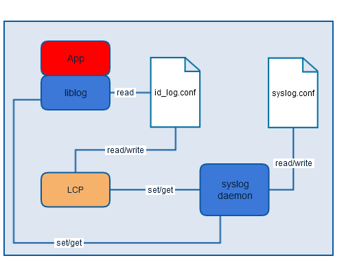

### LCP Main Screen <a href="#sec_lcp_overview_main_screen" id="sec_lcp_overview_main_screen"></a>

The Logging Control Panel (LCP) is a tool to provide the user of an ADK based Verifone Payment device with the following functions:

1.  Set / change the application logging settings
2.  Set / change the syslog settings
3.  Set / change logs destination
4.  Check versions of LCP, liblog, syslog

The following picture shows the main screen of the LCP :

| Screenshot | Hints |
|----|----|
| 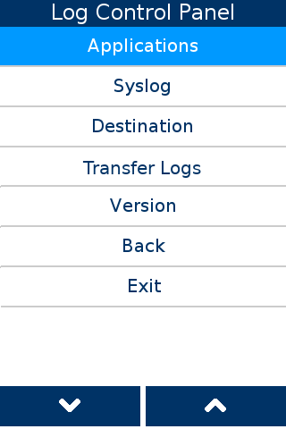 | <p>This is main menu, to configure ADK logging:<br/><br/>Application - configuration for single application<br/>Syslog - configuration for global syslog<br/>Destination - configuration where to send/store logs<br/>Transfer Logs - Transfers syslog logs to external drive<br/>Version - information about LCP, Liblog and Syslog version</p> |

### LCP application menu <a href="#sec_lcp_application_menu" id="sec_lcp_application_menu"></a>

| Screenshot | Hints |
|----|----|
| 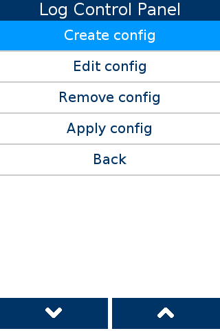 | <p>This is application configuraton menu:<br/><br/>Create config - create new logging configuration for application<br/>Edit config - edit already existing application logging configuration<br/>Remove config - remove existing application configuration<br/>Apply config - applys new/changed configuration</p> |

| Screenshot | Hints |
|----|----|
| 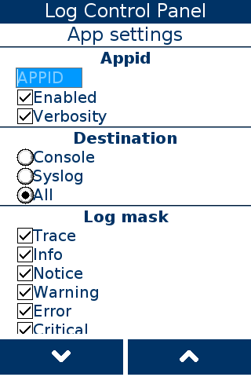 | <p>Application configuration:<br/><br/>APPID - same as used in LOGAPI_INIT(APPID)<br/>Enabled - enable/disable logs from application<br/>Verbosity -</p> |
| 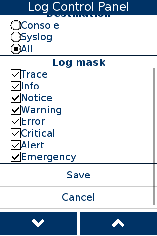 | <p>Application configuration:<br/><br/>Log mask - Can set which logs to see from application</p> |

| Screenshot | Hints |
|----|----|
| 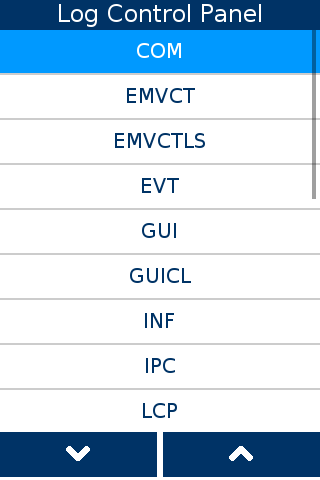 | <p>When editing/removing application configuration list of all configurations is showed</p> |

### LCP syslog settings <a href="#sec_lcp_syslog_menu" id="sec_lcp_syslog_menu"></a>

| Screenshot | Hints |
|----|----|
| 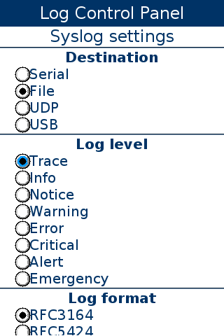 | <p>Syslog configuration:<br/><br/>Destination - where to send/store logs (more options under Main menu -\> Destinations<br/>Log level - max level of log message. See [Log masks](#subsubsec_new_application_configuration_log_masks) for detailed description of each log level</p> |
| 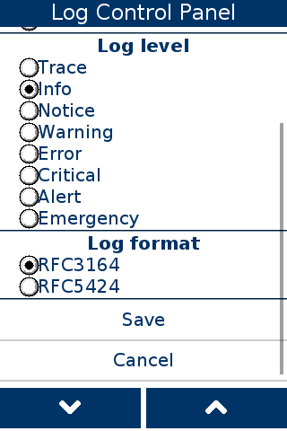 | <p>Syslog configuration:<br/><br/>Log format - syslog daemon will compose messages according to chosen format</p> |

### LCP destination menu <a href="#sec_lcp_destination_menu" id="sec_lcp_destination_menu"></a>

| Screenshot | Hints |
|----|----|
| 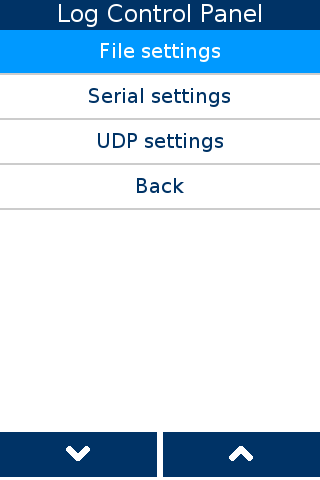 | <p>Destination menu:<br/><br/>File settings<br/>Serial settings<br/>UDP settings<br/></p> |

| Screenshot | Hints |
|----|----|
| 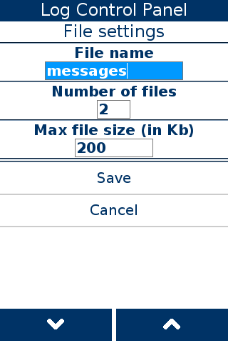 | <p>File settings:<br/><br/>File name - name of file where to write logs<br/>Number of files - how many files keep for log rotation. Range: 1..99<br/>Max file size (in Kb) - max size of each file. Range: 1..4096<br/><br/>**Notice:**<br/>Device flash section is with size of 12MB (compression is used).<br/><br/>This limits to aprox. 40 MB of uncompressed syslog messages as max.</p> |

| Screenshot | Hints |
|----|----|
| 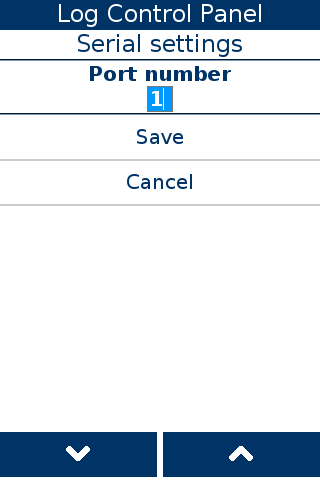 | <p>Serial settings:<br/><br/>Port number - number of pourt where to send log messages</p> |

| Screenshot | Hints |
|----|----|
| 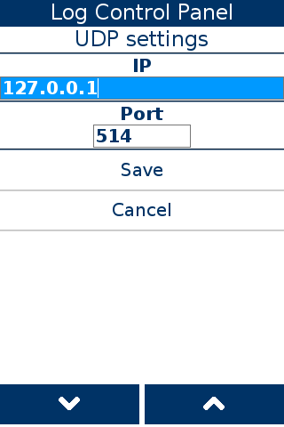 | <p>UDP settings:<br/><br/>IP - IP where to send log messages<br/>Port - port of IP where to send log messages</p> |

### LCP version info <a href="#sec_lcp_version_info" id="sec_lcp_version_info"></a>

| Screenshot | Hints |
|----|----|
| 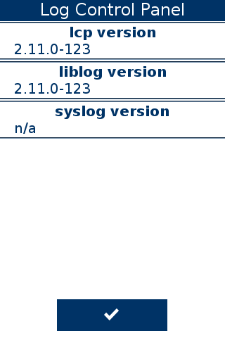 | <p>Versions:<br/><br/>lcp version - LCP version<br/>liblog version - liblog version used<br/>syslog version - version of syslogc</p> |

## Miscellaneous API <a href="#subsec_logging_miscellaneous_api" id="subsec_logging_miscellaneous_api"></a>

Listed below are the miscellaneous APIs used for logging

| Macro | Description |
|----|----|
| <p>`LOGAPI_RECONFIG_NOTIFY()`</p> | <p>Notifies all applications and channels to re-read their configuration files.</p> |
| <p>`LOGAPI_DUMP_SYS_INFO`</p> | <p>Outputs essential system info such as OS version, RAM size, model number and so on.</p> |
| <p>`log_getVersion()`</p> | <p>Returns string with version of a library</p> |
| <p>`Log_GetSvcVersion()`</p> | <p>Returns string with version of a syslog daemon</p> |
| <p>`LOGAPI_PRINT_CALLSTACK(level)`</p> | <p>Prints actual call stack.</p> <p><br/></p>  <p><br/></p> <p>Implemented only for V/OS.</p> <p><br/></p>  |
| <p>`dumpLogs(location, fileName)`</p> | <p>Dumps logs to /tmp/ folder (0) or to external storage (1) . File name \"logs\" will create file \"logs.tgz\"</p> |

# System Setup and Requirements <a href="#sec_logging_setup" id="sec_logging_setup"></a>

## Deploy liblog <a href="#subsec_logging_deployment_liblog" id="subsec_logging_deployment_liblog"></a>

liblog ships in two forms -- as a shared object (`liblog.so`) and a static library (`liblog-static.a`).

To use liblog on V/OS, one must link against libsvc_logmgr.so (located under **SDK_DIR%/usr/local/lib**).


In order for linker to resolve symbols in a correct manner, path to said libraries has to be put after a path to `liblog-static.a`.


There is also a <a href="syslogcmd_8h.md">syslogcmd.h</a> with API for controlling syslog daemon.

## VOS logging service <a href="#subsec_logging_deployment_syslogd_vos" id="subsec_logging_deployment_syslogd_vos"></a>

Terminal already has default syslog configuration file `user_syslog.conf`.
VOS1/VOS2 - `/mnt/flash/etc/config/syslog/user_syslog`.conf.
VOS3 - `/mnt/appdata/versioned/globalshare/syslog/user_syslog`.conf.

`Default` `user_syslog.conf` content:

- enabled = 1
- log_level = 6
- number_of_files = 2
- max_logfile_size = 200
- destination = 2
- file_name = messages
- udp_host = 127.0.0.1
- udp_port = 514
- serial_com = 1
- log_format = 0


This file could be modified through syslcmd_set_XXX calls. Please refer to subsubsec_logging_configuration.


## Syslog Configuration File <a href="#sec_logging_syslog_configuration_file" id="sec_logging_syslog_configuration_file"></a>

This section gives an overview of parameters which can be set for syslog daemon (see **example/conf/syslog.conf** for example).

`enabled` -- \[1 -- enabled, 0 - disabled\] enables or disables syslog daemon

`destination` -- sets destination for log messages.

- 0 -- serial
- 1 -- UDP
- 2 -- File (default)
- 3 -- USB \[\*\]


\[\*\] - USB port should be in device mode and connected to PC. Logging through serial over USB is only supported mode.


`log_level` -- sets maximum level of a log message:

- 0 -- LOG_EMERG
- 1 -- LOG_ALERT
- 2 -- LOG_CRIT
- 3 -- LOG_ERR
- 4 -- LOG_WARNING
- 5 -- LOG_NOTICE
- 6 -- LOG_INFO
- 7 -- LOG_DEBUG

`file_name` -- denotes the name of the output file when a file is specified as the destination

There are two log files:

- Temporary memory: /var/log/messages -- Contains logs from the most recent reboot.
- Permanent memory (flash): VOS1/VOS2 - /mnt/flash/logs/system/messages. VOS3 - /mnt/sysdata/logs/messages for the system messages and /mnt/appdata/logs/messages for the user/application messages.

The `file_name` configuration parameter specifies the file name in temporary memory (VOS1/VOS2).


VOS3 does not use this; instead, it consistently uses the name \'messages\'.


`max_logfile_size` -- maximum log file size (in Kb) before logs get rotated

`number_of_files` -- number of files to rotate, i.e `<file_name>0` would contain the most recent logs and `<file_name>9` would contain the oldest.

`send_retries` -- count of retries to be attempted by daemon to resend failed message

`serial_com` -- \[1,2,6\] when serial is set as destination, denotes COM port number

`udp_host` -- when UDP is set as destination, denotes IP address of a host to which messages will be sent

`udp_port` -- when UDP is set as destination, denotes port of a host to which messages will be sent

`log_format` -- syslog daemon will compose messages according to chosen format.

- 0 - RFC3164:
  ``` cpp
  <priority>Mmm DD HH:MM:SS host tag[pid]: msg
  ```

  Example:
  ``` cpp
  <165>Aug 24 05:14:15 192.0.2.1 myproc[8710]: hello world!
  ```
- 1 - RFC5424:
  ``` cpp
  <priority>version YYYY-MM-DDTHH:MM:SS.MMMZ host proc pid msgid structured_data msg
  ```

  Example:
  ``` cpp
  <165>1 2019-02-14T05:14:15.003Z 192.0.2.1 myproc 8710- - hello world!
  ```


When you install the ADK release, the logging settings will be reset to the default values. This applies to both syslog settings and channel settings. If you need to keep your settings after installing an ADK release, you can use the liblog API and update the settings programmatically, or create a configuration package with your settings and install it right after the ADK release.


# Logging on android devices <a href="#sec_logging_android" id="sec_logging_android"></a>

As ADK-LOGGING project was initially made for VOS devices only, there are a few differences in the way logging works on android devices, therefore it has it\'s own section in documentation. To use ADK-LOGGING functions on android, liblog.so which is compiled for android-arm devices should be used. ADK logging configurations are stored on the device at /sdcard/config/adk-log/. Essentially usage is the same as on VOS devices (check out [Getting Started](#sec_logging_getting_started) for code example), but with some prerequisites:

## Android permissions necessary for logging <a href="#subsec_logging_android_permissions" id="subsec_logging_android_permissions"></a>

Starting from android 10 and up, android introduces scoped storage - this interferes with functionality of liblog, as it\'s primary functionality of reading configuration files from a specific directory was broken. For liblog.so to function properly (read configuration files) it is necessary to grant these android permissions for apps which want to use liblog (in `AndroidManifest.xml`):

Android 10 (NEO) devices need to grant `READ_EXTERNAL_STORAGE` permission and use `android:requestLegacyExternalStorage="true"` :

``` cpp
<?xml version="1.0" encoding="utf-8"?>
  <manifest ...>
  ...
  <uses-permission android:name="android.permission.READ_EXTERNAL_STORAGE"/>
   <application android:requestLegacyExternalStorage="true">
   ...
   </application>
  </manifest>
</xml>
```

Android 13 (NEO2) and up need to request `MANAGE_EXTERNAL_STORAGE` permission to function properly:

``` cpp
<?xml version="1.0" encoding="utf-8"?>
  <manifest ...>
  ...
  <uses-permission android:name="android.permission.MANAGE_EXTERNAL_STORAGE"/>
  ...
  </manifest>
</xml>
```

Also, these permissions have to be requested programmatically for them to be granted (adding these permissions in the android manifest is not enough). Code simillar to this should be used to request those permissions:

``` cpp
private static final int STORAGE_PERMISSION_CODE = 23;
public boolean checkStoragePermissions() {
   if (Build.VERSION.SDK_INT >= Build.VERSION_CODES.R) {
   //Android is 11 (R) or above
   return Environment.isExternalStorageManager();
   } else {
   //Below android 11
   int write = ContextCompat.checkSelfPermission(this, Manifest.permission.WRITE_EXTERNAL_STORAGE);
   int read = ContextCompat.checkSelfPermission(this, Manifest.permission.READ_EXTERNAL_STORAGE);
   return read == PackageManager.PERMISSION_GRANTED && write == PackageManager.PERMISSION_GRANTED;
   }
}
private void requestForStoragePermissions() {
   //Android is 11 (R) or above
   if (Build.VERSION.SDK_INT >= Build.VERSION_CODES.R) {
   try {
   Intent intent = new Intent();
   intent.setAction(Settings.ACTION_MANAGE_APP_ALL_FILES_ACCESS_PERMISSION);
   Uri uri = Uri.fromParts("package", this.getPackageName(), null);
   intent.setData(uri);
   this.startActivity(intent);
   } catch (Exception e) {
   Intent intent = new Intent();
   intent.setAction(Settings.ACTION_MANAGE_ALL_FILES_ACCESS_PERMISSION);
   this.startActivity(intent);
   }
   } else {
   //Below android 11
   ActivityCompat.requestPermissions(
   this,
   new String[] {
   Manifest.permission.WRITE_EXTERNAL_STORAGE,
   Manifest.permission.READ_EXTERNAL_STORAGE
   },
   STORAGE_PERMISSION_CODE
   );
   }
}
```

As it is best to not grant these dangerous permissions to apps, it is also possible to make liblog.so work by installing Log control panel for android. Log control panel shold be available on newest android NEO and NEO2 releases and it is possible to launch it from sysmode -\> Other options -\> Logging channels. Liblog.so has functionality to connect to LCP service to request config files without needing READ permissions, this means that LCP reads config files and sends this information to liblog.so to use for processing.


If permissions are not granted to application which uses liblog and LCP is not installed on the device which runs android \>=10, logging will not work! Either add above mentioned permissions, or install LCP and grant it MANAGE_EXTERNAL_STORAGE permissions on first run.


## Log control panel on Android <a href="#subsec_logging_log_control_panel_on_android" id="subsec_logging_log_control_panel_on_android"></a>

Latest android releases should have a LCP (Log control panel) application which adds possibility to add/modify/remove logging channels on the device and additionally has functionality to send config data to liblog if the application which uses liblog does not have read permissions. To launch LCP on android, open sysmode, press back arrow to enter \"other options\" menu and press \"Logging channels\" button. This should open LCP app.

| Screenshot | Additional info |
|----|----|
| 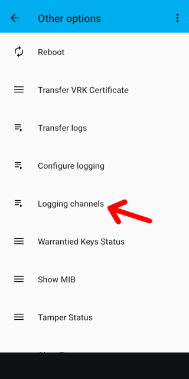 | <p>LCP can be opened by pressing \"logging channels\" button in sysmode \"other options\" menu.</p> |
| 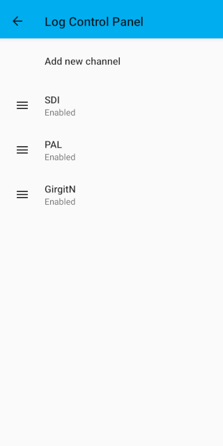 | <p>Main menu of log control panel. Press \"Add new channel\" to add new config, or press on existing config to edit or delete selected entry.</p> |
| 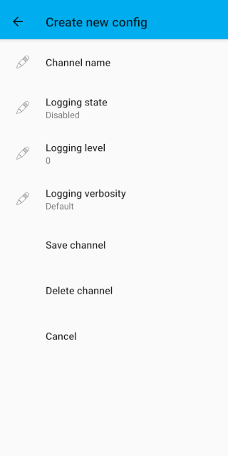 | <p>LCP new config menu. press on editable fields to edit them (add name, state, logging level, etc.) and press \"save channel\" to save it, or cancel.</p> |
| 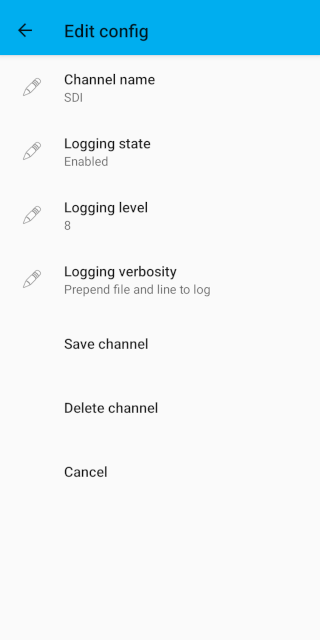 | <p>LCP edit config menu. Press on fields to edit them, possible to save channel or delete it.</p> |


As logcat has less levels of logging, some liblog logging levels share the same level in logcat.
\"EMERGENCY\" and \"ALERT\" are printed as `ANDROID_LOG_FATAL`;
\"CRITICAL\" and \"ERROR\" are printed as `ANDROID_LOG_ERROR`;
\"WARNING\" and \"NOTICE\" are printed as `ANDROID_LOG_WARN`.


## How to obtain logs on Android <a href="#sec_logging_logs_on_android" id="sec_logging_logs_on_android"></a>

The logcat logging utility is a command-line tool included with the Android SDK that is used to obtain log on Android.

**Example**

``` cpp
$ adb logcat
```

The utility allows to define a list of tags used in the system, with priorities, by running logcat and observing the first two columns of each message, given as \<priority\>/\<tag\>

The priority is one of the following character values, ordered from lowest to highest priority:

- V: Verbose (lowest priority)
- D: Debug
- I: Info
- W: Warning
- E: Error
- F: Fatal
- S: Silent (highest priority, on which nothing is ever printed)

Here\'s an example of a filter expression that suppresses all log messages except those with the tag \"SYSCL\", at priority \"Verbose\" or above, and all log messages with tag \"TEST\", with priority \"Debug\" or above:

``` cpp
$ adb logcat SYSCL:V TEST:D *:S
```

# Storage Space, Log Cleanup, and Limits <a href="#sec_logging_cleanup" id="sec_logging_cleanup"></a>

By default, all log channels are disabled except for system logs, which are written to files (default destination). Log rotation periodically overwrites older files, enabling a relatively long log history with minimal flash space usage.

Two configuration options control log storage:

- `number_of_files`
- `max_logfile_size`

The default settings allow for 2 log files, each up to 2MB (200KB for VOS1/VOS2). Log rotation maintains 3 files (2 active + 1 in progress) to provide a history spanning 2 files.

For multiple debug-level channels enabled, the default may be insufficient and should be increased. However, setting very high values risks excessive flash usage.

In VOS3, automatic limits ensure logs do not consume all system data partition space. These adjust /c max_logfile_size to maintain at least 200MB of free system space.

In VOS3, applying new configurations may delete older logs if the current number of files or sizes on the flash exceed the set values. This can also be used to manually free up space: reducing /c max_logfile_size option will automatically remove all existing logs.

# Troubleshooting <a href="#sec_logging_troubleshooting" id="sec_logging_troubleshooting"></a>

One of the issues met by liblog user is that changing settings in LCP does not take an effect after editing existing logging channel or creating new one.
Make sure to press \'Apply config\' menu button to apply logging settings immediately.
Otherwise these will be reread after next logging library initialization or after apropriate API function call.

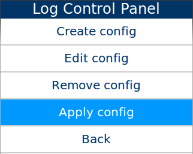

# Appendix <a href="#sec_logging_appendix" id="sec_logging_appendix"></a>

## Known Issues and Limitations <a href="#subsec_logging_known_issues_and_limitations" id="subsec_logging_known_issues_and_limitations"></a>

Be aware of the following issues and limitations you may encounter:

- HOSTNAME part of syslog message is empty unless UDP is used as a destination.
- Some packets may be lost when using UDP due to the nature of the protocol.
- BOOT messages are not being converted to syslog format.
- `LOG_ODELAY`, `LOG_NDELAY`, `LOG_NOWAIT`, `LOG_PERROR` flags in `syslog.h` currently are not being used and are present for compatibility.
- Using printf-like macros (LOGF\*): passing NULL to string format specifier will cause a crash, e.g. LOGF_TRACE("%s", NULL).
- Applying settings to syslog daemon make it restart and few messages are lost.

## Acronym Definitions <a href="#subsubsec_logging_acronym_definitions" id="subsubsec_logging_acronym_definitions"></a>

| Acronym | Definitions |
|----|----|
| <p>ADK</p> | <p>Application Development Kit</p> |
| <p>API</p> | <p>Application Protocol Interface</p> |
| <p>LCP</p> | <p>Logging Control Panel</p> |
| <p>OS</p> | <p>Operating System</p> |
| <p>V/OS</p> | <p>Verifone Operating System</p> |
