# Preface <a href="#preface" id="preface"></a>

This guide provides information on the usage of the ADK Multi Application Controller (ADK-MAC).
This includes information on <a href="mac_8h.md">libvfimac</a> library, as well as details on MAC (Multi Application Controller) daemon and [MCP](#sec_mac_mcp) (MAC Control Panel) application.

## Audience <a href="#subsec_mac_audience" id="subsec_mac_audience"></a>

This document is meant for programmers who want to understand and use ADK Multi Application Controller.

## Organization <a href="#subsec_mac_organization" id="subsec_mac_organization"></a>

This guide is organized as follows:

[Chapter 1, Introduction](#sec_mac_introduction): Introduction to ADK-MAC.

[Chapter 2, Getting Started](#sec_mac_getting_started): Explains concept.

[Chapter 3, Programming](#sec_mac_programming): Presents common uses.

[Chapter 4, System Setup and Requirements](#sec_mac_compile): Compiler and linker settings, dependencies to other components, environment setup.

[Chapter 5, Troubleshooting](#sec_mac_troubleshooting): Solutions for possible issues.

[Appendix: Glossary](#sec_mac_glossary): Listing and definitions of various acronyms and terms

[Appendix: Desktop](#sec_mac_desktop): Desktop

[Appendix: Statusbar](#sec_mac_statusbar): Statusbar

[Appendix: Hotkeys](#sec_mac_hotkeys): Hotkeys

[Appendix: Service button broadcast](#sec_mac_servicebtn): Service button broadcast

[Appendix: Configuration](#sec_mac_cfg): Configuration file

[Appendix: Manifest file](#sec_mac_mft): Application manifest file

[Appendix: Virtual keyboard](#sec_mac_kbd): Virtual keyboard

[Appendix: Custom resources](#sec_mac_res): Custom resources

[Appendix: Commerce Platform Application](#sec_mac_cpr) Commerce Platform Application

[Appendix: MCP](#sec_mac_mcp): MAC Control Panel

[Appendix: MAC language setting](#sec_mac_cp_language) MAC language setting

[Appendix: Layout](#sec_mac_layout): Layout files

[Appendix: Events](#sec_mac_events): Events

[Appendix: Notification](#sec_mac_notify): Notification interface

[Appendix: System Notifications](#sec_mac_system_notifications): System Notifications interface

[Appendix: Recovery](#sec_mac_recovery): Application recovery

[Appendix: Environment variables](#sec_mac_envs): Environment variables

[Appendix: ARRS](#sec_mac_arrs): Android Remote Rendering Service

[Appendix: Remote display mode](#sec_mac_remote): Remote display mode

[Appendix: Battery status control (VOS2 platform)](#sec_mac_battery): Battery status control for VOS2 platform

[Appendix: Devices](#sec_mac_devices): Device-specific information

# Introduction <a href="#sec_mac_introduction" id="sec_mac_introduction"></a>

MAC provides launcher functionality for native applications (written in C/C++) and [Commerce Platform](#sec_mac_cpr) applications (written in JS and HTML). It can be used to launch both user (usr1-usr15) and system (sys13 (sys\_\* for VOS3)) applications (e.g. Comm Control Panel).
MAC analyzes installed application [manifest files](#sec_mac_mft) (\*.mft files) and provides possibility to launch them automatically (on startup) or manually (using [desktop](#sec_mac_desktop) icons or API from <a href="mac_8h.md">mac.h</a>). MAC Desktop can be accessed from application using [hotkeys](#sec_mac_hotkeys).
CP applications can be launched automatically by specific trigger points defined in [Commerce Platform](#sec_mac_cpr) scheme.
MAC provides a global [statusbar](#sec_mac_statusbar) which reports terminal communication channel status, battery status and other other useful information. Content of the global [statusbar](#sec_mac_statusbar) is maintained independently from applications.
On touch screen devices MAC provides [virtual keyboard](#sec_mac_kbd) for input. Virtual keyboard can be enabled/disabled using API. It can also be set to automatic mode, when it will appear on the screen if corresponding input is active. Virtual keyboard can be disabled in MAC [configuration files](#sec_mac_cfg).
MAC also acts as a windows manager. It can be used to dynamically change window [layout](#sec_mac_layout).
If needed MAC [resources](#sec_mac_res) can be changed and replaced with custom ones. MAC configuration can be changed by installing extra [configuration](#sec_mac_cfg) files.
As part of delivery MAC provides MAC Control Panel ([MCP](#sec_mac_mcp)). This is GUI application, which provides useful information about system. Available information includes used ADK and VOS versions, hardware details (screen resolution, RAM and flash size, model name, etc), device mode (PROD/CPDEV), sponsor certificate details, etc.
On Dual Chip models (e.g. M424, M440, CM5) MAC can run in [ARRS](#sec_mac_arrs) mode. In this case, applications runs on VOS, but GUI is streamed to Android Remote Rendering Service in Android OS.

## Concepts <a href="#sec_mac_concepts" id="sec_mac_concepts"></a>

MAC API is declared in <a href="mac_8h.md">mac.h</a> header file.

# Getting Started <a href="#sec_mac_getting_started" id="sec_mac_getting_started"></a>

## Setup <a href="#subsec_mac_setup" id="subsec_mac_setup"></a>

### Running on VOS <a href="#subsubsec_mac_running_on_v_os" id="subsubsec_mac_running_on_v_os"></a>

### Installation <a href="#subsubsec_mac_installation" id="subsubsec_mac_installation"></a>

MAC release consists of multiple packages:

| Package name | Description |
|----|----|
| <p>dl.mac-3.71.6.tgz</p> | <p>MAC daemon</p> |
| <p>dl.mac-remove-3.71.6.tgz</p> | <p>MAC daemon removal package</p> |
| <p>dl.mac-res-3.71.6.tgz</p> | <p>MAC GUI resources</p> |
| <p>dl.mac-res-remove-3.71.6.tgz</p> | <p>MAC GUI resource removal package</p> |
| <p>dl.mcp-3.71.6.tgz</p> | <p>MCP application</p> |
| <p>dl.mcp-remove-3.71.6.tgz</p> | <p>MCP application removal package</p> |
| <p>dl.libmac-3.71.6.tgz</p> | <p>Library for interacting with MAC</p> |
| <p>dl.libmac-remove-3.71.6.tgz</p> | <p>MAC library removal package</p> |
| <p>dl.libcpr-3.71.6.tgz</p> | <p>Library to enable Commerce Platform (CPR)</p> |
| <p>dl.libcpr-remove-3.71.6.tgz</p> | <p>CPR library removal package</p> |


Removal packages are not needed for regular use. They are needed only if you need to downgrade particular component or you don\'t need it.


# Presents common uses <a href="#sec_mac_programming" id="sec_mac_programming"></a>

For application to appear on MAC desktop, it should provide its manifest file. Manifest file explains how and when application should be launched. Manifest file should be located in www folder. If application runs under usr2 it should put its manifest file into /home/usr2/www/. Example: /home/usr1/www/app.mft.

Manifest file example:

``` cpp
[application]
id=demo
version=1.0.0
app_resource_dir=demo
[desktop]
label=demo
cmdline=../demo
```

This manifest file will add a new icon to MAC desktop, which will have label \"demo\". After you press this icon /home/usr2/demo will be launched and application GUI appear on foreground. You can get back to MAC destkop using hotkeys (e.g. X+3). Multiple applications can run simultaneously and you can switch between them using MAC desktop. app_resource_dir - is needed for resource separation. If this field is set to \"demo\" ADK-GUI will search for resources in /home/usr2/www/demo folder. If app_resource_dir is not set, ADK-GUI will search for resources in /home/usr2/www.


Application doesn\'t need to link against libvfimac to be launched by MAC


If you need your application to be launched on system startup, please add autolaunch section to your manifest file. This will automatically bring your application to foreground after system startup.

Manifest file example:

``` cpp
[application]
id=demo
version=1.0.0
app_resource_dir=demo
[desktop]
label=demo
cmdline=../demo
[autolaunch]
cmdline=../demo
```

After application exits, MAC will clear-up its resources, will destroy its GUI region and bring last visible application to foreground. If no application is running, MAC desktop will appear. If your application needs to restricts access to terminal screen, it can lock screen using <a href="namespacevfimac.md#a1f0513c597f95e860f0d4e516d72b364">vfimac::sysLockLayout</a> API. This way, other applications can\'t take over focus.


Application can lock layout only it is currently on foreground.


If application needs to be started by other means (e.g. SI or GDB) and not by MAC, it needs to invoke <a href="namespacevfimac.md#abcf911819fbee784ef245fe34aa9572c">vfimac::sysSetAppid</a> to register itself in MAC. In this case it doesn\'t need to install its manifest file. After <a href="namespacevfimac.md#abcf911819fbee784ef245fe34aa9572c">vfimac::sysSetAppid</a> is invoked, MAC will create new GUI region for your application and will set needed [environments](#sec_mac_envs) for application to use this GUI region. Same approach should be applied if application spawns multiple threads and each of them wants to show their own GUI.


Make sure to invoke <a href="namespacevfimac.md#abcf911819fbee784ef245fe34aa9572c">vfimac::sysSetAppid</a> before invoking any ADK-GUI APIs.
Make sure to invoke <a href="namespacevfimac.md#a738e18eb97f53b402e01c6ee391b2607">vfimac::sysUnSetAppid</a> before exiting to free used resources and destroy application GUI region.


``` cpp
// Register application in MAC. This will set all needed environment values,
// and will create new GUI region for application.
vfimac::sysSetAppid("demo");
// Show loading screen
vfimac::sysShowProgress( "Loading", 10 );
// Bring application to foreground
vfimac::sysToForeground("demo");
// Show screen.html 
vfigui::uiInvokeURLAsync( "screen.html" );
// Free used resources, destroy used GUI region.
vfimac::sysUnSetAppid();
```

If MAC functionality is not needed for particular setup, it can be disabled using configuration file.

``` cpp
[gui]
window_management=n
```

In this case MAC will show splash screen with ADK version in GUI region 0. It will autolaunch only service applications (applications without GUI) and would not interact with GUI regions anymore. This allows GUI region 0 to be used by payment applicaiton. Splash screen can be disabled by corresponding field in configuration file.

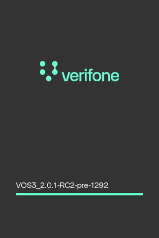

``` cpp
[gui]
window_management=n
splash_screen=n
```

Also, window management is disabled on headless devices, e. g. devices without display. They will launch service applications only.
But it is possible to add remote display for such headless devices, see [Appendix: Remote display mode](#sec_mac_remote).

## Multiple demo applications are provided in MAC example folder <a href="#subsec_mac_demo1" id="subsec_mac_demo1"></a>

<a href="mac_8h.md">libvfimac</a> API usage example. mac_demo1 application source code:

``` cpp
// SDK
#include <string>
#include <stdio.h>
#include <time.h>
#include <sys/time.h>
#include <stdlib.h>
#include <unistd.h>
#include <string.h>
// ADK
#include "html/gui.h"
#include "ipc/jsobject.h"
#include "ipc/notify.h"
#include "log/liblog2.h"
#include "sysinfo/mac.h"
#if defined _VOS1
// workaround for Trident compiler
namespace std
{
   std::string to_string(int value)
   {
   return to_string((long long int) value);
   }
   std::string to_string(size_t value)
   {
   return to_string((long long int) value);
   }
}
#endif
// constants
std::string APP_ID = "MACDEMO1";
std::string APP_MANIFEST_ID = "mac_demo1";
const int SUCCEED = 0;
const int FAIL = -1;
LibLogHandle lh = LOGAPI_INIT(APP_ID.c_str()); // init logging library
const std::string device_mac_cp_start_trigger("MAC_CP_START");
const std::string device_mac_cp_stop_trigger("MAC_CP_STOP");
static bool need_to_change_focus;
static std::string cp_app_to_change_focus;
#define STR(x) #x
#define STRINGIFY(x) STR(x)
#define LOOP_COUNTER 10
#define STR_TRIGGER_LOOP "Trigger loop [" STRINGIFY(LOOP_COUNTER) "]"
#define STR_TRIGGER_IDLE_LOOP "Trigger Trigger idle in loop [" STRINGIFY(LOOP_COUNTER) "]"
// internal functions
static void event_callback( vfimac::macEvent event, const vfiipc::JSObject & json );
static void mac_cp_start_callback(
   void *data,
   const std::string &from,
   const std::string &to,
   const std::string &notification_id,
   const vfiipc::JSObject &jsobj,
   unsigned flags);
static void mac_cp_stop_callback(
   void *data,
   const std::string &from,
   const std::string &to,
   const std::string &notification_id,
   const vfiipc::JSObject &jsobj,
   unsigned flags);
enum
{
   EXIT = -2,
   GUI_REGION = 0,
   SYSTEM_NOTIFICATION_ADD,
   SYSTEM_NOTIFICATION_LIST,
   SYSTEM_NOTIFICATION_REMOVE,
   MANIFEST,
   DESKTOP,
   CONTROL_PANEL,
   POWER_PANEL,
   LAUNCH,
   LAUNCH_BACKGROUND,
   STATUSBAR_ON,
   STATUSBAR_OFF,
   STATUSBAR_STATE,
   STATUSBAR_VALUES,
   STATUSBAR_REFRESH,
   STOP_USR_APPS,
   STOP_OTHER_APPS,
   SCREENSHOT,
   GET_CP_APP_ROOT_DIR,
   FULLSCREEN_ON,
   FULLSCREEN_OFF,
   KEYBOARD_TEST,
   KEYBOARD_ON,
   KEYBOARD_OFF,
   KEYBOARD_NUMERIC,
   KEYBOARD_ALPHA,
   KEYBOARD_CAP,
   IS_RUNNING,
   FOREGROUND,
   STOP_CP_APPS,
   CP_INSTALL,
   TRIGGER_IDLE,
   TRIGGER_LOOP,
   TRIGGER_IDLE_LOOP,
   TRIGGER_TXN_START,
   TRIGGER_MANUAL,
   TRIGGER_MANUAL_SYNC,
   SET_CTX_VALUES,
   STOP_APPID,
   ACTION,
   APP_LIST,
   AUTOLAUNCH,
   LAYOUT_LOCK,
   LAYOUT_UNLOCK,
   IN_FOREGROUND,
   LIBMAC_VER,
   MAC_VER,
   LANG,
};
int main()
{
   int status = 0;
   vfiipc::ipcSetAppID( APP_ID.c_str() );
   vfimac::sysShowProgress( "LOG init", 10 ); // Show progress screen
   sleep(1);
   vfimac::sysShowProgress( "GUI init", 30 );
   sleep(1);
   vfigui::uiSetPropertyInt(vfigui::UI_PROP_CIRCULAR_MENU,1);
   struct vfigui::UIMenuEntry menu[]=
   {
   {"GUI region", GUI_REGION, 0},
   {"Add system notification", SYSTEM_NOTIFICATION_ADD, 0},
   {"System notifications list", SYSTEM_NOTIFICATION_LIST, 0},
   {"Remove system notification", SYSTEM_NOTIFICATION_REMOVE,0},
   {"Trigger txn start", TRIGGER_TXN_START, 0},
   {"Trigger manual launch", TRIGGER_MANUAL, 0},
   {"Trigger manual sync", TRIGGER_MANUAL_SYNC,0},
   {"Trigger idle", TRIGGER_IDLE, 0},
   {STR_TRIGGER_LOOP, TRIGGER_LOOP, 0},
   {STR_TRIGGER_IDLE_LOOP, TRIGGER_IDLE_LOOP, 0},
   {"Screenshot", SCREENSHOT, 0},
   {"Get CP app root dir", GET_CP_APP_ROOT_DIR,0},
   {"Stop all cp apps", STOP_CP_APPS, 0},
   {"Stop all usr apps", STOP_USR_APPS, 0},
   {"Stop other apps", STOP_OTHER_APPS, 0},
   {"Install CP app", CP_INSTALL, 0},
   {"Stop by appid", STOP_APPID, 0},
   {"Invoke action", ACTION, 0},
   {"Launch by appid", LAUNCH, 0},
   {"Launch in background", LAUNCH_BACKGROUND, 0},
   {"Is running", IS_RUNNING, 0},
   {"Autolaunch", AUTOLAUNCH, 0},
   {"To foreground", FOREGROUND, 0},
   {"In foreground", IN_FOREGROUND, 0},
   {"Fullscreen on", FULLSCREEN_ON, 0},
   {"Fullscreen off", FULLSCREEN_OFF, 0},
   {"Lock layout", LAYOUT_LOCK, 0},
   {"Unlock layout", LAYOUT_UNLOCK, 0},
   {"Virtual keyboard test", KEYBOARD_TEST, 0},
   {"Virtual keyboard on", KEYBOARD_ON, 0},
   {"Virtual keyboard off", KEYBOARD_OFF, 0},
   {"Virtual keyboard numeric", KEYBOARD_NUMERIC, 0},
   {"Virtual keyboard alpha", KEYBOARD_ALPHA, 0},
   {"Virtual keyboard capitalized", KEYBOARD_CAP, 0},
   {"Statusbar on", STATUSBAR_ON, 0},
   {"Statusbar off", STATUSBAR_OFF, 0},
   {"Statusbar refresh", STATUSBAR_REFRESH, 0},
   {"Statusbar state", STATUSBAR_STATE, 0},
   {"Statusbar values", STATUSBAR_VALUES, 0},
   {"Application list", APP_LIST, 0},
   {"Manifest scan", MANIFEST, 0},
   {"Set CP context values", SET_CTX_VALUES, 0},
   {"Show control panel", CONTROL_PANEL, 0},
   {"Show power panel", POWER_PANEL, 0},
   {"Show desktop", DESKTOP, 0},
   {"libmac version", LIBMAC_VER, 0},
   {"MAC version", MAC_VER, 0},
   {"Language", LANG, 0},
   {"Exit", EXIT, 0},
   };
   vfimac::sysSetEventCallback( vfimac::EVENT_FOREGROUND, event_callback );
   vfimac::sysSetEventCallback( vfimac::EVENT_BACKGROUND, event_callback );
   vfimac::sysSetEventCallback( vfimac::EVENT_MANIFEST_UPDATE, event_callback );
   vfiipc::ipcRegisterNotificationCB( device_mac_cp_start_trigger, mac_cp_start_callback, NULL );
   vfiipc::ipcRegisterNotificationCB( device_mac_cp_stop_trigger, mac_cp_stop_callback, NULL );
   int returnCode = vfimac::MAC_ERR_OK;
   bool loop = true;
   int s=0;
   int lastSystemNotificationId = 0;;
   int vkbm = vfimac::MAC_KBD_AUTO; //Virtual keyboard mode variable.
   vfimac::sysVirtualKeyboard( vkbm );
   while(loop)
   {
   s=vfigui::uiMenu("mainmenu",APP_ID,menu,sizeof(menu)/sizeof(menu[0]),s>=0?s:0);
   need_to_change_focus = false;
   cp_app_to_change_focus = "";
   switch(s)
   {
   case SYSTEM_NOTIFICATION_ADD:
   {
   returnCode = vfimac::systemNotificationAdd(vfimac::systemNotificationPriority::SYSTEM_NOTIFICATION_INFO, "demo1 system notification");
   vfigui::uiConfirm("confirm",vfigui::uiPrint("Notification ID: %d",returnCode));
   if(returnCode > 0)
   {
   lastSystemNotificationId = returnCode;
   returnCode = vfimac::MAC_ERR_OK;
   }
   break;
   }
   case SYSTEM_NOTIFICATION_LIST:
   {
   std::string s;
   std::list<int> list;
   returnCode = vfimac::systemNotificationList(list);
   for (std::list<int>::iterator it = list.begin(); it != list.end(); ++it)
   {
   s += std::to_string(*it);
   s += ",";
   }
   if (s.size() > 0)
   {
   s.resize(s.size() - 1);
   }
   returnCode = vfigui::uiConfirm("confirm",vfigui::uiPrint("list: %s", s.size() ? s.c_str() : "(null)"));
   break;
   }
   case SYSTEM_NOTIFICATION_REMOVE:
   {
   if(0 == lastSystemNotificationId)
   {
   vfigui::uiConfirm("confirm",vfigui::uiPrint("You should add notification at first"));
   }
   else
   {
   returnCode = vfimac::systemNotificationRemove(lastSystemNotificationId);
   vfigui::uiConfirm("confirm",vfigui::uiPrint("systemNotificationRemove(%d): %d",
   lastSystemNotificationId,
   returnCode));
   if(vfimac::MAC_ERR_OK == returnCode)
   {
   lastSystemNotificationId = 0;
   }
   }
   break;
   }
   case vfigui::UI_ERR_CONNECTION_LOST:
   {
   LOGF_TRACE(lh,"lost connectivity with GUI[%d]",s);
   sleep(2);
   break;
   }
   case MAC_VER:
   {
   returnCode = vfimac::MAC_ERR_OK;
   std::string version = "MAC version: ";
   version += vfimac::sysMac_GetVersion();
   returnCode = vfigui::uiConfirm("confirm",version.c_str());
   break;
   }
   case LIBMAC_VER:
   {
   std::string version = "Libmac version: ";
   version += vfimac::sysLibMac_GetVersion();
   returnCode = vfigui::uiConfirm("confirm",version.c_str());
   break;
   }
   case AUTOLAUNCH:
   {
   returnCode = vfimac::sysRelaunchApps();
   break;
   }
   case FULLSCREEN_ON:
   {
   const bool on = true;
   returnCode = vfimac::sysFullscreenMode( on );
   break;
   }
   case LAYOUT_LOCK:
   {
   const bool lock = true;
   returnCode = vfimac::sysLockLayout( lock );
   break;
   }
   case LAYOUT_UNLOCK:
   {
   const bool lock = true;
   returnCode = vfimac::sysLockLayout( !lock );
   break;
   }
   case APP_LIST:
   {
   vfiipc::JSObject appList;
   returnCode = vfimac::sysGetAppList( appList );
   if ( vfimac::MAC_ERR_OK != returnCode ) break;
   vfigui::uiConfirm("confirm", appList.dump() );
   break;
   }
   case FULLSCREEN_OFF:
   {
   const bool on = true;
   returnCode = vfimac::sysFullscreenMode( !on );
   break;
   }
   case KEYBOARD_TEST:
   {
   returnCode = vfigui::uiInvokeURL(vfigui::UI_REGION_DEFAULT,"vkb-mode-test.html");
   break;
   }
   case KEYBOARD_ON:
   {
   vkbm |= vfimac::MAC_KBD_ON;
   returnCode = vfimac::sysVirtualKeyboard( vkbm );
   break;
   }
   case KEYBOARD_OFF:
   {
   vkbm &= ~vfimac::MAC_KBD_ON;
   returnCode = vfimac::sysVirtualKeyboard( vkbm );
   break;
   }
   case KEYBOARD_NUMERIC:
   {
   static bool state = true;
   std::string msg = "Numeric = ";
   msg += state ? "True" : "False";
   vkbm = state ? ( vkbm | vfimac::MAC_KBD_NUMERIC ) : ( vkbm & ~vfimac::MAC_KBD_NUMERIC );
   returnCode = vfimac::sysVirtualKeyboard( vkbm );
   if( returnCode != vfimac::MAC_ERR_OK ) msg += "\nFail to set VKB mode!";
   state = !state;
   returnCode = vfigui::uiConfirm("confirm",msg.c_str());
   break;
   }
   case KEYBOARD_ALPHA:
   {
   static bool state = true;
   std::string msg = "Alpha = ";
   msg += state ? "True" : "False";
   vkbm = state ? ( vkbm | vfimac::MAC_KBD_ALPHANUMERIC ) : ( vkbm & ~vfimac::MAC_KBD_ALPHANUMERIC );
   returnCode = vfimac::sysVirtualKeyboard( vkbm );
   if( returnCode != vfimac::MAC_ERR_OK ) msg += "\nFail to set VKB mode!";
   state = !state;
   returnCode = vfigui::uiConfirm("confirm",msg.c_str());
   break;
   }
   case KEYBOARD_CAP:
   {
   static bool state = true;
   std::string msg = "Capitalized = ";
   msg += state ? "True" : "False";
   vkbm = state ? ( vkbm | vfimac::MAC_KBD_CAPITALIZED ) : ( vkbm & ~vfimac::MAC_KBD_CAPITALIZED );
   returnCode = vfimac::sysVirtualKeyboard( vkbm );
   if( returnCode != vfimac::MAC_ERR_OK ) msg += "\nFail to set VKB mode!";
   state = !state;
   returnCode = vfigui::uiConfirm("confirm",msg.c_str());
   break;
   }
   case STATUSBAR_ON:
   {
   const bool visible = true;
   returnCode = vfimac::sysStatusbar( visible );
   break;
   }
   case STATUSBAR_REFRESH:
   {
   returnCode = vfimac::sysStatusbarRefresh();
   if ( returnCode == vfimac::MAC_ERR_OK )
   {
   vfigui::uiConfirm("confirm",vfigui::uiPrint("Refresh: %d",returnCode));
   }
   break;
   }
   case STATUSBAR_OFF:
   {
   const bool visible = true;
   returnCode = vfimac::sysStatusbar( !visible );
   break;
   }
   case STATUSBAR_VALUES:
   {
   std::map<std::string,std::string> values;
   returnCode = vfimac::sysGetStatusbarValues( values );
   vfiipc::JSObject jsobj;
   jsobj[0] = "/home/usr1/www/mac_demo1/default/mail.png";
   jsobj[1] = "/home/usr1/www/mac_demo1/default/glass.png";
   values["extra_icons"]=jsobj.dump();
   values["demo_value"]="1";
   returnCode = vfimac::sysSetStatusbarValues( values );
   break;
   }
   case STATUSBAR_STATE:
   {
   bool visible = true;
   returnCode = vfimac::sysStatusbarState( visible );
   if ( returnCode == vfimac::MAC_ERR_OK )
   {
   vfigui::uiConfirm("confirm",vfigui::uiPrint("Statusbar: %d",visible));
   }
   break;
   }
   case IS_RUNNING:
   {
   bool running = false;
   returnCode = vfimac::sysIsRunning( "lcp", running );
   if ( returnCode == vfimac::MAC_ERR_OK )
   {
   vfigui::uiConfirm("confirm",vfigui::uiPrint("Running: %d",running));
   }
   break;
   }
   case LAUNCH_BACKGROUND:
   {
   const std::string appname("mac_demo2");
   std::vector<std::string> args;
   args.push_back("test-arg1");
   args.push_back("test-arg2");
   returnCode = vfimac::sysLaunchAppid(appname,args,vfimac::KEEP_IN_BACKGROUND);
   break;
   }
   case GUI_REGION:
   {
   int region = 0;
   const std::string appid("mac_demo2");
   returnCode = vfimac::sysGetGUIRegionId(appid,region);
   vfigui::uiConfirm("confirm",vfigui::uiPrint("Region: %d",region));
   break;
   }
   case LAUNCH:
   {
   const std::string appname("mac_demo2");
   const std::string value1("test1");
   const std::string value2("test2");
   std::vector<std::string> args;
   args.push_back(value1);
   args.push_back(value2);
   std::map< std::string,std::string > envs;
   envs["env1"]="test1";
   envs["env2"]="test2";
   int params = 0;
   returnCode = vfimac::sysLaunchAppid(appname,args,envs,params);
   break;
   }
   case IN_FOREGROUND:
   {
   bool visible = false;
   returnCode = vfimac::sysInForeground( visible );
   vfigui::uiConfirm("confirm",vfigui::uiPrint("Visible: %d",visible));
   break;
   }
   case FOREGROUND:
   {
   const std::string appid("mac_demo2");
   returnCode = vfimac::sysToForeground( appid );
   break;
   }
   case TRIGGER_MANUAL_SYNC:
   {
   vfiipc::JSObject jsobj;
   const std::string trigger("CP_SYSTEM_NOTIFIES_MANUAL_LAUNCH_SELECTED");
   need_to_change_focus = true;
   returnCode = vfimac::sysLaunchCPAppFromDesktopSync( trigger, jsobj );
   break;
   }
   case TRIGGER_MANUAL:
   {
   std::vector<std::string> args;
   args.push_back( "test1" );
   args.push_back( "test2" );
   const std::string trigger("CP_SYSTEM_NOTIFIES_IDLE_ENTERED");
   need_to_change_focus = true;
   returnCode = vfimac::sysLaunchCPAppFromDesktop( trigger, args );
   break;
   }
   case TRIGGER_IDLE_LOOP:
   {
   for(int i = 0; i < LOOP_COUNTER; i++)
   {
   const std::string trigger("CP_TEST");
   vfiipc::JSObject jsobj;
   returnCode = vfimac::sysLaunchCPAppByTrigger( "*", trigger, jsobj, 0 );
   }
   cp_app_to_change_focus = "cp_demo2";
   break;
   }
   case TRIGGER_IDLE:
   {
   cp_app_to_change_focus = "cp_demo3";
   const std::string trigger("CP_SYSTEM_NOTIFIES_IDLE_ENTERED");
   vfiipc::JSObject jsobj;
   returnCode = vfimac::sysLaunchCPAppByTrigger( "*", trigger, jsobj, 0 );
   break;
   }
   case TRIGGER_LOOP:
   {
   for(int i = 0; i < LOOP_COUNTER; i++)
   {
   vfiipc::JSObject jsobj;
   const std::string trigger("CP_TEST");
   returnCode = vfimac::sysVirtualKeyboard( 0 );
   returnCode = vfimac::sysLaunchCPAppByTrigger( "cp_demo1", trigger, jsobj, 0 );
   returnCode = vfimac::sysVirtualKeyboard( 0 );
   returnCode = vfimac::sysLaunchCPAppByTrigger( "cp_demo2", trigger, jsobj, 0 );
   }
   cp_app_to_change_focus = "cp_demo2";
   break;
   }
   case SET_CTX_VALUES:
   {
   const std::string value1("test1");
   const std::string value2("test2");
   const std::string name1("name1");
   const std::string name2("name2");
   vfiipc::JSObject data;
   data(name1)=value1;
   data(name2)=value2;
   returnCode = vfimac::sysSetCPEnvData( data );
   break;
   }
   case CP_INSTALL:
   {
   // install CP application
   const std::string path("www/pkg-cp-demo-inst.zip");
   returnCode = vfimac::sysInstallCPApp( path );
   break;
   }
   case STOP_OTHER_APPS:
   {
   returnCode = vfimac::sysStopOtherApps();
   break;
   }
   case STOP_USR_APPS:
   {
   returnCode = vfimac::sysStopAllUserApps();
   break;
   }
   case STOP_CP_APPS:
   {
   returnCode = vfimac::sysStopAllCPApps();
   break;
   }
   case TRIGGER_TXN_START:
   {
   cp_app_to_change_focus = "cp_demo3";
   vfiipc::JSObject jsobj;
   const std::string trigger("CP_SYSTEM_NOTIFIES_TRANSACTION_STARTED");
   returnCode = vfimac::sysLaunchCPAppByTrigger( "*", trigger, jsobj, 0 );
   break;
   }
   case STOP_APPID:
   {
   const std::string appid("mac_demo2");
   returnCode = vfimac::sysStopAppid( appid );
   break;
   }
   case ACTION:
   {
   const std::string appid("mac_demo2");
   const std::string action_name("exit");
   returnCode = vfimac::sysInvokeCPAppAction( appid, action_name, 0, 0 );
   break;
   }
   case MANIFEST:
   {
   returnCode = vfimac::sysScanManifests();
   break;
   }
   case DESKTOP:
   {
   returnCode = vfimac::sysShowDesktop();
   break;
   }
   case POWER_PANEL:
   {
   returnCode = vfimac::sysShowPowerControlPanel();
   break;
   }
   case CONTROL_PANEL:
   {
   returnCode = vfimac::sysShowControlPanel();
   break;
   }
   case SCREENSHOT:
   {
   sleep(5);
   std::string path;
   path += "/tmp/";
   path += std::to_string( (int)time(NULL) );
   path += ".png";
   vfigui::uiScreenshotPNG(path.c_str());
   break;
   }
   case GET_CP_APP_ROOT_DIR:
   {
   std::string path;
   returnCode = vfimac::sysGetCPAppRootDir( path );
   vfigui::uiConfirm( "confirm",vfigui::uiPrint("CP app root: [%s]",path.c_str()) );
   break;
   }
   case LANG:
   {
   char *l = getenv("LANGUAGE");
   std::string lang(l?l:"unknown");
   vfigui::uiConfirm( "confirm",vfigui::uiPrint("Language: '%s'",lang.c_str()) );
   break;
   }
   case EXIT:
   {
   loop=false;
   break;
   }
   default:
   {
   break;
   }
   }
   if ( returnCode != vfimac::MAC_ERR_OK )
   {
   LOGF_ERROR(lh, "error: %d", status);
   vfigui::uiConfirm("confirm",vfigui::uiPrint("Error: %d",returnCode));
   }
   LOGF_TRACE(lh, "status: %d", status);
   }
   return returnCode;
}
static void event_callback( vfimac::macEvent event, const vfiipc::JSObject & json )
{
   LOGF_TRACE(lh,"MAC event recieved[%d] json[%s]",event, json.dump().c_str() );
}
static void mac_cp_start_callback(
   void *data,
   const std::string &from,
   const std::string &to,
   const std::string &notification_id,
   const vfiipc::JSObject &jsobj,
   unsigned flags)
{
   LOGF_TRACE(lh, "start trigger from[%s] to[%s] id[%s] flags[%d] json[%s]",
   from.c_str(),
   to.c_str(),
   notification_id.c_str(),
   flags,
   jsobj.dump().c_str());
   if ( need_to_change_focus )
   {
   cp_app_to_change_focus = jsobj("AppId").getString();
   }
}
static void mac_cp_stop_callback(
   void *data,
   const std::string &from,
   const std::string &to,
   const std::string &notification_id,
   const vfiipc::JSObject &jsobj,
   unsigned flags)
{
   LOGF_TRACE(lh, "stop trigger from[%s] to[%s] id[%s] flags[%d] json[%s]",
   from.c_str(),
   to.c_str(),
   notification_id.c_str(),
   flags,
   jsobj.dump().c_str());
   if ( cp_app_to_change_focus.size() )
   {
   LOGF_INFO(lh, "We awaited for stop of [%s] cp app to set focus to [%s]", cp_app_to_change_focus.c_str(), APP_MANIFEST_ID.c_str());
   if ( !jsobj("AppId").getString().compare(cp_app_to_change_focus) )
   {
   int returnCode = vfimac::sysToForeground(APP_MANIFEST_ID);
   LOGF_INFO(lh, "sysToForeground(%s): %d", APP_MANIFEST_ID.c_str(), returnCode);
   }
   }
}
```

Notification interface usage example. mac_demo2 application source code:

``` cpp
// SDK
#include <string>
#include <stdio.h>
#include <time.h>
#include <stdlib.h>
#include <sys/time.h>
#include <sys/stat.h>
#include <sys/types.h>
#include <unistd.h>
#include <fcntl.h>
#include <pwd.h>
#include <grp.h>
// ADK
#include "html/gui.h"
#include "ipc/jsobject.h"
#include "ipc/notify.h"
#include "log/liblog2.h"
using namespace std;
using namespace vfigui;
#if defined _VOS1
// workaround for Trident compiler
namespace std
{
   std::string to_string(int value)
   {
   return to_string((long long int) value);
   }
   std::string to_string(size_t value)
   {
   return to_string((long long int) value);
   }
}
#endif
// constants
const int SUCCEED = 0;
const int FAIL = -1;
const std::string one_receiver("1");
const std::string appid( "MACDEMO2" );
const std::string device_control_request_trigger("_MacControlRequest");
const std::string device_control_response_trigger("_MacControlResponse");
// functions
static int to_foreground( const std::string & appid );
static int launchDemo();
static int showPrevApp();
static int showDesktop();
static int manifestScan();
static int showPowerPanel();
static void to_foreground();
static void in_foreground();
static void show_prev();
static bool write_data( const std::string & file, const std::string & data );
static void device_resp_callback(
   void *data,
   const std::string &from,
   const std::string &to,
   const std::string &notification_id,
   const vfiipc::JSObject &jsobj,
   unsigned flags);
static void mac_response_callback(
   void *data,
   const std::string &from,
   const std::string &to,
   const std::string &notification_id,
   const vfiipc::JSObject &jsobj,
   unsigned flags);
enum
{
   EXIT = -2,
   PKG_LIST = 0,
   MANIFEST,
   LAUNCH,
   FOREGROUND,
   DESKTOP,
   POWER_PANEL,
   PREV_APP,
};
struct UIMenuEntry menu[]=
{
   {"Get package list", PKG_LIST, 0},
   {"Launch app", LAUNCH, 0},
   {"To foreground", FOREGROUND, 0},
   {"Manifest scan", MANIFEST, 0},
   {"Show desktop", DESKTOP, 0},
   {"Show power panel", POWER_PANEL, 0},
   {"Show prev app", PREV_APP, 0},
   {"Exit", EXIT, 0},
};
  
static LibLogHandle lh = LOGAPI_INIT(appid.c_str());
int main(int argc, char **argv, char **envp)
{
   int status = SUCCEED;
   // will dump provided environment variables
   std::string envs;
   while(*envp)
   {
   envs += *envp;
   envs += "\n";
   envp ++;
   }
   write_data("/tmp/mac_demo2_envs.txt", envs);
   // will dump provided argument variables
   std::string args;
   while(*argv)
   {
   args += *argv;
   args += "\n";
   argv ++;
   }
   write_data("/tmp/mac_demo2_args.txt", args);
   vfiipc::ipcSetAppID( appid );
   vfigui::uiSetPropertyInt(UI_PROP_CIRCULAR_MENU,1);
   status = vfiipc::ipcRegisterNotificationCB(
   device_control_response_trigger,
   device_resp_callback,
   NULL );
   if ( SUCCEED != status )
   {
   LOGF_ERROR(lh, "Can't register IPC trigger callback[%d]",status);
   }
   status = vfiipc::ipcRegisterNotificationCB(
   device_control_response_trigger,
   mac_response_callback,
   NULL );
   if ( SUCCEED != status )
   {
   LOGF_ERROR(lh, "Can't register IPC trigger callback[%d]",status);
   }
   bool loop = true;
   int s=0;
   while(loop)
   {
   s = uiMenu("mainmenu","demo2",menu,sizeof(menu)/sizeof(menu[0]),s>=0?s:0);
   switch(s)
   {
   case vfigui::UI_ERR_CONNECTION_LOST:
   {
   sleep(2);
   break;
   }
   case FOREGROUND:
   {
   to_foreground( "demo1" );
   break;
   }
   case LAUNCH:
   {
   launchDemo();
   break;
   }
   case MANIFEST:
   {
   manifestScan();
   break;
   }
   case PREV_APP:
   {
   showPrevApp();
   break;
   }
   case POWER_PANEL:
   {
   showPowerPanel();
   break;
   }
   case DESKTOP:
   {
   showDesktop();
   break;
   }
   default:
   {
   break;
   }
   case EXIT:
   {
   loop = false;
   break;
   }
   }
   }
   return status;
}
static int to_foreground( const std::string & appid )
{
   vfiipc::JSObject jsobj;
   const std::string mac_id("_mac");
   const std::string appid_field("appid");
   const std::string cmd_field("cmd");
   const std::string cmd("to_foreground");
   jsobj(cmd_field)=cmd;
   jsobj(appid_field)=appid;
   return vfiipc::ipcNotify(mac_id,device_control_request_trigger,jsobj);
}
static int manifestScan()
{
   const std::string mac_id("_mac");
   const std::string cmd("scan_manifests");
   const std::string cmd_field("cmd");
   vfiipc::JSObject jsobj;
   jsobj(cmd_field)=cmd;
   return vfiipc::ipcNotify(mac_id,device_control_request_trigger,jsobj);
}
static int showPrevApp()
{
   const std::string mac_id("_mac");
   const std::string cmd("show_prev_app");
   const std::string cmd_field("cmd");
   vfiipc::JSObject jsobj;
   jsobj(cmd_field)=cmd;
   return vfiipc::ipcNotify(mac_id,device_control_request_trigger,jsobj);
}
static int showPowerPanel()
{
   const std::string mac_id("_mac");
   const std::string cmd("show_power_panel");
   const std::string cmd_field("cmd");
   vfiipc::JSObject jsobj;
   jsobj(cmd_field)=cmd;
   return vfiipc::ipcNotify(mac_id,device_control_request_trigger,jsobj);
}
static int showDesktop()
{
   const std::string mac_id("_mac");
   const std::string cmd("show_desktop");
   const std::string cmd_field("cmd");
   vfiipc::JSObject jsobj;
   jsobj(cmd_field)=cmd;
   return vfiipc::ipcNotify(mac_id,device_control_request_trigger,jsobj);
}
static int launchDemo()
{
   const std::string cmd_field("cmd");
   const std::string args_field("args");
   const std::string mac_id("_mac");
   const std::string cmd("launch_appid");
   const std::string appid_field("appid");
   const std::string appid("demo1");
   vfiipc::JSObject jsobj;
   jsobj(cmd_field)=cmd;
   jsobj(appid_field)=appid;
   jsobj(args_field)[0]="boo";
   jsobj(args_field)[1]="foo";
   return vfiipc::ipcNotify(mac_id,device_control_request_trigger,jsobj);
}
static int pkgList()
{
   const std::string mac_id("_mac");
   const std::string cmd_field("cmd");
   const std::string cmd("get_pkg_list");
   vfiipc::JSObject jsobj;
   jsobj(cmd_field)=cmd;
   return vfiipc::ipcNotify(mac_id,device_control_request_trigger,jsobj);
}
static void device_resp_callback(
   void *data,
   const std::string &from,
   const std::string &to,
   const std::string &notification_id,
   const vfiipc::JSObject &jsobj,
   unsigned flags)
{
   LOGF_TRACE( lh, "trigger from[%s] to[%s] id[%s] flags[%d] jsobj[%s]",
   from.c_str(),
   to.c_str(),
   notification_id.c_str(),
   flags,
   jsobj.dump().c_str() );
}
static void dispBacklight()
{
   vfiipc::JSObject jsobj;
   jsobj("cmd")="display_backlight";
   jsobj("value")="100";
   int r = vfiipc::ipcNotify(one_receiver,device_control_request_trigger, jsobj, 0 );
   if (r==SUCCEED)
   {
   uiConfirm("confirm",uiPrint("Backlight set:%d<br>",r));
   }
   else
   {
   uiConfirm("confirm",uiPrint("Error:%d<br>",r));
   }
}
static void mac_response_callback(
   void *data,
   const std::string &from,
   const std::string &to,
   const std::string &notification_id,
   const vfiipc::JSObject &jsobj,
   unsigned flags)
{
   LOGF_TRACE(lh, "demo trigger from[%s] to[%s] id[%s] flags[%d] json[%s]",
   from.c_str(),
   to.c_str(),
   notification_id.c_str(),
   flags,
   jsobj.dump().c_str());
}
static void set_appid()
{
   vfiipc::JSObject jsobj;
   jsobj("cmd")="to_foreground";
   jsobj("appid")="demo2";
   vfiipc::ipcNotify(one_receiver, device_control_request_trigger, jsobj, 0 );
}
static void to_foreground()
{
   vfiipc::JSObject jsobj;
   jsobj("cmd")="to_foreground";
   jsobj("appid")="demo2";
   vfiipc::ipcNotify(one_receiver, device_control_request_trigger, jsobj, 0 );
}
static void in_foreground()
{
   vfiipc::JSObject jsobj;
   jsobj("cmd")="in_foreground";
   vfiipc::ipcNotify(one_receiver, device_control_request_trigger, jsobj, 0 );
}
static void set_cp_env()
{
   const std::string value1("test1");
   const std::string value2("test2");
   const std::string name1("name1");
   const std::string name2("name2");
   vfiipc::JSObject data;
   vfiipc::JSObject jsobj;
   jsobj("cmd")="set_env_data";
   data(name1)=value1;
   data(name2)=value2;
   jsobj("data")=data;
   vfiipc::ipcNotify(one_receiver, device_control_request_trigger, jsobj, 0 );
}
static void show_prev()
{
   vfiipc::JSObject jsobj;
   jsobj("cmd")="show_prev_app";
   vfiipc::ipcNotify(one_receiver, device_control_request_trigger, jsobj, 0 );
}
static bool write_data(const std::string & file, const std::string & data )
{
   int ret = 0;
   FILE *fp=fopen(file.c_str(),"wb");
   if(!fp) return false;
   fprintf(fp,"%s\n",data.c_str());
   int r=ferror(fp);
   fclose(fp);
   int fd = open(file.c_str(), O_RDWR);
   LOGF_TRACE(lh, "open [%s]: [%d]", file.c_str(), fd );
   if(fd >= 0)
   {
   struct passwd *pwd = getpwnam("usr2");
   struct group *grp = getgrnam("share");
   LOGF_TRACE(lh, "pwd: 0x%x grp: 0x%x", pwd, grp );
   if(pwd && grp)
   {
   ret = fchown(fd, pwd->pw_uid, grp->gr_gid);
   LOGF_TRACE(lh, "chown [%s]: [%d]", file.c_str(), ret );
   }
   close(fd);
   }
   return (r==0);
}
```

# Compiler and linker settings, dependencies to other components, environment setup <a href="#sec_mac_compile" id="sec_mac_compile"></a>

To use MAC API, application needs to include API declaration from <a href="mac_8h.md">mac.h</a> header file, which is located in sysinfo folder.

``` cpp
#include <sysinfo/mac.h>
```

Application also needs to link against libvfimac library. This is done by adding \"-lvfimac\" to your linking list. If your application needs to interact with MAC using notification interface, link it against IPC library by adding \"-lvfiipc\". Example:

``` cpp
g++ -L/adk/lib/ -Wall -o demo.out demo.cpp -lvfiipc -lvfimac
```

MAC depends on certain ADK components:

| Component | Purpose |
|----|----|
| <p>ADK-GUI</p> | <p>GUI rendering, CP application execution</p> |
| <p>ADK-LOG</p> | <p>Logging mechanism</p> |
| <p>ADK-COM</p> | <p>Communication interface status on statusbar</p> |
| <p>ADK-IPC</p> | <p>Notification interface</p> |
| <p>ADK-PM</p> | <p>Power management status notifications</p> |
| <p>ADK-SYS</p> | <p>Generic information about system</p> |

# Troubleshooting <a href="#sec_mac_troubleshooting" id="sec_mac_troubleshooting"></a>

## FAQ <a href="#subsec_mac_faq" id="subsec_mac_faq"></a>

Q: Do application needs to link against libvfimac?

A: For regular use, it is enough to provide [manfiest](#sec_mac_mft) file. Application doesn\'t need to link against library, if it doesn\'t use any of its functionality.

Q: Why application doesn\'t appear on desktop?

A: Please check applications [manifest](#sec_mac_mft) file permissions. Manifest file should be included in share group. Manifest file should include \"desktop\" section, otherwise it will not appear on MAC desktop.

Q: Application GUI blinks on screen for a second, after that MAC desktop appears on top of it.

A: Please check that there is no start file in your application control folder (e.g. CONTROL/start). Start file makes your application to be started by SI. This will result in conflict with ADK environment. Application should be started by MAC based on provided manifest file. Other option is to invoke <a href="namespacevfimac.md#abcf911819fbee784ef245fe34aa9572c">vfimac::sysSetAppid</a> to register application inside MAC.

Q: How to restart applications, without rebooting device?

A: Use <a href="namespacevfimac.md#a5b63071e5232000be8cd04e2950b28b2">vfimac::sysRelaunchApps</a> API to restart applications.

Q: How to hide my application from MAC desktop?

A:

1.  Remove desktop section from application manifest file.
2.  Set hide field in manifest desktop section to true.
3.  Hide certain applications by setting hide_appids field in MAC configuration file.

## Logging <a href="#subsec_mac_logging" id="subsec_mac_logging"></a>

MAC is using ADK-LOG component for logging. Please refer to the ADK-LOG documentation for details. Used logging channels:

| Logging channel | Description |
|----|----|
| <p>MAC</p> | <p>[MAC daemon logs](#sec_mac_concepts)</p> |
| <p>MACCL</p> | <p><a href="namespacevfimac.md">MAC library logs</a></p> |
| <p>MCP</p> | <p>[MAC control panel logs](#sec_mac_mcp)</p> |
| <p>CPR</p> | <p>[Commerce Platform Runtime logs](#sec_mac_cpr)</p> |

## Debugging <a href="#debugging" id="debugging"></a>

# Appendix: Glossary <a href="#sec_mac_glossary" id="sec_mac_glossary"></a>

| Term | Description |
|----|----|
| <p>ADK</p> | <p>Application Development Kit</p> |
| <p>MAC</p> | <p>Multi Application Controller</p> |
| <p>MCP</p> | <p>MAC Control Panel</p> |
| <p>API</p> | <p>Application Program Interface</p> |
| <p>GUI</p> | <p>Graphical User Interface</p> |
| <p>IPC</p> | <p>Inter Process Communication</p> |
| <p>CPA</p> | <p>Commerce Platform Application. Written in JS and HTML. Runs in CPR.</p> |
| <p>CPR</p> | <p>Commerce Platform Runtime. ADK runtime for CPA.</p> |
| <p>CPL</p> | <p>Commerce Platform Library</p> |
| <p>GDB</p> | <p>GNU Debugger</p> |
| <p>UI</p> | <p>User Interface</p> |
| <p>OS</p> | <p>Operating System</p> |
| <p>CP</p> | <p>Commerce Platform</p> |
| <p>HTML</p> | <p>Hypertext Markup Language</p> |
| <p>JS</p> | <p>Java Script</p> |
| <p>SI</p> | <p>Secure Installer - used for installing/starting programms on VOS</p> |
| <p>ARRS</p> | <p>Android Remote Rendering Service - Application on android side, which renders GUI from VOS.</p> |
| <p>ADE</p> | <p>Verifone Encryption Scheme</p> |
| <p>JSON</p> | <p>JavaScript object notation</p> |
| <p>INI</p> | <p>Configuration file format</p> |
| <p>HW</p> | <p>Hardware</p> |
| <p>Sysmode</p> | <p>VOS system application</p> |
| <p>Native application</p> | <p>Application written in C++/C. Usually payment application.</p> |
| <p>BT</p> | <p>Bluetooth</p> |
| <p>VOS</p> | <p>Verifone\'s OS. Terminal examples: Ux300, Ux301 and Mx915</p> |
| <p>VOS2</p> | <p>Verifone\'s OS 2. Terminal examples: P400, V240M and E285</p> |
| <p>VOS3</p> | <p>Verifone\'s OS 3. Terminal examples: P630, Ux302 and M450</p> |

# Appendix: Desktop <a href="#sec_mac_desktop" id="sec_mac_desktop"></a>

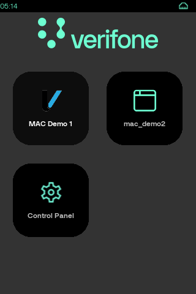

MAC acts as ADK launcher.
It provides desktop, which can be used by user to start applications by pressing on chosen icon.
If application wants to appear on desktop, it should include desktop section in its [manifest file](#sec_mac_mft).
If application needs to have custom icon, it needs to be set in desktop section icon field.
If icon is not set, default one will be used.
Button text is defined in desktop section \"label\" field.
It is possible to hide certain applications from desktop by using hide_appids field in [MAC configuration file](#sec_mac_cfg).
MAC desktop design, can be modified using [custom resources](#sec_mac_res).
Application can request MAC to show desktop using <a href="namespacevfimac.md#a404d8e38300385724b2d2ed306df863e">vfimac::sysShowDesktop</a>.
User can also request MAC to show desktop by using [hotkeys](#sec_mac_hotkeys).
On units with hardware keyboard, it is possible to use keyboard for navigation.
Supported keystrokes:

| Key | Action |
|----|----|
| <p>\*</p> | <p>Move cursor to next icon</p> |
| <p>\#</p> | <p>Move cursor to previous icon</p> |
| <p>2</p> | <p>Move cursor up</p> |
| <p>8</p> | <p>Move cursor down</p> |
| <p>4</p> | <p>Move cursor left</p> |
| <p>6</p> | <p>Move cursor right</p> |
| <p>O</p> | <p>Green key is used to launch selected application</p> |
| <p>x</p> | <p>Red key will bring back last visible application</p> |


MAC desktop can be password protected. To enable this functionality password field should be added to MAC [configuration file](#sec_mac_cfg). Field stores MD5 hash of chosen password. For example MD5 hash for 166831 password equals to 87ac3c343f7ef687de1492be87ab1b2f. Configuration file example:

``` cpp
[desktop]
password=87ac3c343f7ef687de1492be87ab1b2f
```

md5sum command line tool can be used to generate password hash. Example:

``` cpp
:~# echo 166831 | md5sum | cut -d' ' -f 1
87ac3c343f7ef687de1492be87ab1b2f
```


Minimal password length is 6 characters.
Maximal password lenght is 10 characters.
Only numeric characters are allowed.


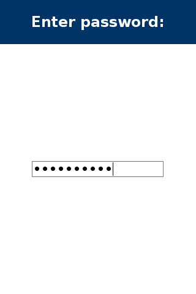

Password screen can be customized using [MAC custom resources](#sec_mac_res).


VOS3 terminals use different MAC desktop protection method. Please refer to \"VOS3 - UG - MAC Password protection user guide\".


# Appendix: Statusbar <a href="#sec_mac_statusbar" id="sec_mac_statusbar"></a>


MAC provides global statusbar, which indicates active communication interfaces, as well battery charge level, time and ADE status. Application can show/hide statusbar using <a href="namespacevfimac.md#a9c942ac576c34a0e8dbd8cd69935a807">vfimac::sysStatusbar</a> API. Statusbar visibility configuration is stored independently for every application. Application can request to force refresh statusbar using <a href="namespacevfimac.md#a6f771d3743e177bce7b7d79c26cf3036">vfimac::sysStatusbarRefresh</a> API. There is a way to add extra icons to statusbar. This can be done, by installing [custom MAC resources](#sec_mac_res). Custom icon visibility can be changes using <a href="namespacevfimac.md#a6c72ec8391307ac42e3c9d044eac36e2">vfimac::sysSetStatusbarValues</a> API. Application can set initial statusbar visibility state using [manifest file](#sec_mac_mft). MAC statusbar functionality can be enabled/disabled using MAC [configuration file](#sec_mac_cfg).

Standard statusbar icons:

  -------------------------------------------------------------------------------------------------------------------------------------------------------------------------------------------------------------------------------------------------------------------------------------------------------------------------------------------------------------------------------------------------------------------------------------------------------------------------------------------------------------------------------------------------------------------------------------------------------------------------------------------------------------------------------------------------------------------------------------------------------------------------------------------------------------------------------------------------------------------------------------
  Icon                                                                                                                                                                                                                                                                                                                                                                                                                               
  -------------------------------------- ------------------------------------------ ------------------------------------ --------------------------------------- --------------------------------------- ------------------------------------- -------------------------------------- --------------------------------------- ------------------------------------- -------------------------------------------- ---------------------------------------- ------------------------------------------- ----------------------------------------- -------------------------------------- ---------------------------------------- ----------------------------------------------- ------------------------------------- --------------------------------------------- ------------------------------ --------------------------------------------- --------------------------------------
  <p>Description</p>   <p>Ethernet active</p>   <p>BT active</p>   <p>BT beaconing</p>   <p>BT connected</p>   <p>BT dial-up</p>   <p>BT ethernet</p>   <p>Modem active</p>   <p>ADE active</p>   <p>WiFi signal level</p>   <p>No GSM signal</p>   <p>GSM signal level</p>   <p>Battery normal</p>   <p>Battery low</p>   <p>Battery fault</p>   <p>Unit is line powered</p>   <p>USB active</p>   <p>Serial port active</p>   <p>SIM</p>   <p>PCI reboot warning</p>   <p>Car charger</p>

  -------------------------------------------------------------------------------------------------------------------------------------------------------------------------------------------------------------------------------------------------------------------------------------------------------------------------------------------------------------------------------------------------------------------------------------------------------------------------------------------------------------------------------------------------------------------------------------------------------------------------------------------------------------------------------------------------------------------------------------------------------------------------------------------------------------------------------------------------------------------------------------

Continuation. Statusbar system notification icons:

  ---------------------------------------------------------------------------------------------------------------------------------------------
  Icon                                                                  
  -------------------------------------- ------------------------------- ---------------------------------- -----------------------------------
  <p>Description</p>   <p>Info</p>   <p>Warning</p>   <p>Critical</p>

  ---------------------------------------------------------------------------------------------------------------------------------------------


Battery icon will not appear on line powered devices.


On touch screen devices, statusbar behaves as button. It supports both short and long press. This functionality is configurable using [configuration file](#sec_mac_cfg).

| Action | Description |
|----|----|
| <p>Short press</p> | <p>[Show MAC desktop](#sec_mac_desktop)</p> |
| <p>Long press</p> | <p>[Start MCP](#sec_mac_mcp)</p> |

Statusbar provides certain values to visualize system state. These values can be used, if user replaces statusbar.html with custom one.

|  | type | value | description |
|----|----|----|----|
| <p>sys_mob_sim_slot</p> | <p>int</p> | <p>1-2</p> | <p>Active SIM slot</p> |
| <p>sys_mob_netw_signal_level</p> | <p>int</p> | <p>0-5</p> | <p>GSM signal level</p> |
| <p>sys_mob_netw_signal_percentage</p> | <p>int</p> | <p>0-100</p> | <p>GSM signal percentage</p> |
| <p>sys_mob_netw_signal_rssi</p> | <p>int</p> | <p>nn</p> | <p>GSM signal RSSI</p> |
| <p>sys_mob_netw_name</p> | <p>string</p> | <p>Name</p> | <p>Mobile network home operator name</p> |
| <p>sys_mob_netw_provider</p> | <p>string</p> | <p>Name</p> | <p>Mobile network provider</p> |
| <p>sys_mob_netw_type</p> | <p>string</p> | <p>2G,3G,4G</p> | <p>GSM network type</p> |
| <p>sys_wifi_signal_level</p> | <p>int</p> | <p>0-4</p> | <p>WiFi network signal level</p> |
| <p>sys_wifi_signal_percentage</p> | <p>int</p> | <p>0-100</p> | <p>WiFi network signal percentage</p> |
| <p>sys_eth_state</p> | <p>int</p> | <p>0-1</p> | <p>Ethernet state</p> |
| <p>sys_modem_state</p> | <p>int</p> | <p>0-1</p> | <p>Modem state</p> |
| <p>sys_bt_state</p> | <p>int</p> | <p>0-1</p> | <p>BT state</p> |
| <p>sys_bt_eth</p> | <p>int</p> | <p>0-1</p> | <p>BT Ethernet state</p> |
| <p>sys_bt_modem</p> | <p>int</p> | <p>0-1</p> | <p>BT modem state</p> |
| <p>sys_ade_state</p> | <p>int</p> | <p>0-1</p> | <p>ADE state</p> |
| <p>sys_reboot_warn</p> | <p>int</p> | <p>0-1</p> | <p>PCI reboot warning</p> |
| <p>sys_car_charger</p> | <p>int</p> | <p>0-1</p> | <p>Car charger mode active</p> |
| <p>sys_battery_level</p> | <p>int</p> | <p>0-100</p> | <p>Battery level</p> |
| <p>sys_battery_percentage</p> | <p>int</p> | <p>0-100</p> | <p>Battery percentage, -1 if battery not available or percentage could not be determined</p> |
| <p>sys_battery_percentage_2</p> | <p>string</p> | <p>0%-100%</p> | <p>Battery percentage #2</p> |
| <p>sys_docking_status</p> | <p>int</p> | <p>0-1</p> | <p>Docking state</p> |
| <p>sys_time</p> | <p>string</p> | <p>HH:MM</p> | <p>Current time</p> |
| <p>sys_time_year</p> | <p>string</p> | <p>yyyy</p> | <p>Year</p> |
| <p>sys_time_month</p> | <p>string</p> | <p>\"01\"-\"12\"</p> | <p>Month</p> |
| <p>sys_time_day</p> | <p>string</p> | <p>\"01\"-\"31\"</p> | <p>Day</p> |
| <p>sys_time_hour</p> | <p>string</p> | <p>\"00\"-\"23\"</p> | <p>Hour</p> |
| <p>sys_time_hour_monadic</p> | <p>string</p> | <p>\"0\"-\"23\"</p> | <p>Monadic hour</p> |
| <p>sys_time_12h</p> | <p>string</p> | <p>\"01\"-\"12\"</p> | <p>Hour in AM/PM designation</p> |
| <p>sys_time_12h_monadic</p> | <p>string</p> | <p>\"1\"-\"12\"</p> | <p>Monadic hour in AM/PM designation</p> |
| <p>sys_time_am_pm</p> | <p>string</p> | <p>\"AM\" or \"PM\"</p> | <p>AM/PM designation</p> |
| <p>sys_time_min</p> | <p>string</p> | <p>\"00\"-\"59\"</p> | <p>Minute</p> |
| <p>sys_time_sec</p> | <p>string</p> | <p>\"00\"-\"59\"</p> | <p>Second</p> |
| <p>sys_button</p> | <p>int</p> | <p>0-1</p> | <p>Statusbar button enabled/disabled</p> |

Statusbar HTML example:

``` cpp
<html>
<body>
<input type='timeout' style='display:none' value='-1'>
<?ifeq sys_button 1 (button nofocus style='width:100%;height:100%;border-width:0px;' action='return 0?cmd=show_desktop' action2='return 0?cmd=show_control_panel') ?>
<div style='overflow:hidden;height:100%;width:100%'>
<table cellspacing='2' cellpadding='0' border='0'
   style='margin:0px;background-color:black; color:white; height:100%; width:100%'>
   <tr>
   <td style='height:100%;width:0px;font-size:12; text-align:left; vertical-align:center'>
   <?ifeq sys_mob_sim_slot 1 (img src='../images/sb/sim1.png')?>
   <?ifeq sys_mob_sim_slot 2 (img src='../images/sb/sim2.png')?>
   <td style='height:100%;width:0px;font-size:12; text-align:left; vertical-align:center'>
   <b><?var sys_mob_netw_type?></b>
   <td style='height:100%;width:100%; font-size:12; text-align:left; vertical-align:center'>
   <?ifeq sys_mob_netw_signal_level 0 (img src='../images/sb/gprs_0.png')?>
   <?ifeq sys_mob_netw_signal_level 1 (img src='../images/sb/gprs_1.png')?>
   <?ifeq sys_mob_netw_signal_level 2 (img src='../images/sb/gprs_2.png')?>
   <?ifeq sys_mob_netw_signal_level 3 (img src='../images/sb/gprs_3.png')?>
   <?ifeq sys_mob_netw_signal_level 4 (img src='../images/sb/gprs_4.png')?>
   <?ifeq sys_mob_netw_signal_level 5 (img src='../images/sb/gprs_5.png')?>
   <b><?var sys_mob_netw_provider?><b>
   <?ifin sys_wifi_signal_percentage 1 24 (img src='../images/sb/wifi_1.png')?>
   <?ifin sys_wifi_signal_percentage 25 49 (img src='../images/sb/wifi_2.png')?>
   <?ifin sys_wifi_signal_percentage 50 74 (img src='../images/sb/wifi_3.png')?>
   <?ifin sys_wifi_signal_percentage 75 100 (img src='../images/sb/wifi_4.png')?>
   <?ifeq sys_eth_state 1 (img src='../images/sb/ethernet_active.png')?>
   <?ifeq sys_modem_state 1 (img src='../images/sb/modem_connected.png')?>
   <?ifeq sys_bt_state 1 (img src='../images/sb/bluetooth_active.png')?>
   <?ifeq sys_bt_state 2 (img src='../images/sb/bluetooth_beaconing.png')?>
   <?ifeq sys_bt_state 3 (img src='../images/sb/bluetooth_connected.png')?>
   <?ifeq sys_bt_eth 1 (img src='../images/sb/bluetooth_ethernet.png')?>
   <?ifeq sys_bt_modem 1 (img src='../images/sb/bluetooth_dial_up.png')?>
   <?ifeq sys_usb_eth_state 1 (img src='../images/sb/usb_active.png')?>
   <td style='height:100%;width:0px;font-size:12px; text-align:right; vertical-align:center'>
   <?ifeq sys_ade_state 1 (img src='../images/sb/shield.png')?>
   <td style='height:100%;width:0px;font-size:12px; text-align:right; vertical-align:center'>
   <?ifeq sys_reboot_warn 1 (img src='../images/sb/warn.png')?>
   <td style='height:100%;width:0px;font-size:12px; text-align:right; vertical-align:center'>
   <?ifeq notification_level 1 (img src='../images/sb/information.png')?>
   <?ifeq notification_level 2 (img src='../images/sb/warning.png')?>
   <?ifeq notification_level 3 (img src='../images/sb/error.png')?>
   <td style='height:100%;width:0px;font-size:12px; text-align:right; vertical-align:center'>
   <?ifeq sys_battery_charge_mode 2 (img src='../images/sb/car.png')?>
   <td style='height:100%;width:0px;font-size:12px; text-align:right; vertical-align:center'>
   <?foreach extra_icons || (img src='[]' style='width:10px')(td style='height:100%;width:0px;font-size:12px; text-align:right; vertical-align:center') | ?>
   <td style='height:100%;width:0px;font-size:12px; text-align:right; vertical-align:center'>
   <?ifin sys_battery_percentage_2 0 100 (b)(?var sys_battery_percentage_2 ?)(/b) ?>
   <td style='height:100%;width:0px;font-size:12px; text-align:right; vertical-align:center'>
   <?ifin sys_battery_level 100 111 (img src='../images/sb/battery_charging.png')?>
   <?ifeq sys_battery_level 0 (img src='../images/sb/battery_low.gif')?>
   <?ifeq sys_battery_level 1 (img src='../images/sb/battery_low.gif')?>
   <?ifeq sys_battery_level 2 (img src='../images/sb/battery_10.png')?>
   <?ifeq sys_battery_level 3 (img src='../images/sb/battery_20.png')?>
   <?ifeq sys_battery_level 4 (img src='../images/sb/battery_30.png')?>
   <?ifeq sys_battery_level 5 (img src='../images/sb/battery_40.png')?>
   <?ifeq sys_battery_level 6 (img src='../images/sb/battery_50.png')?>
   <?ifeq sys_battery_level 7 (img src='../images/sb/battery_60.png')?>
   <?ifeq sys_battery_level 8 (img src='../images/sb/battery_70.png')?>
   <?ifeq sys_battery_level 9 (img src='../images/sb/battery_80.png')?>
   <?ifeq sys_battery_level 10 (img src='../images/sb/battery_90.png')?>
   <?ifeq sys_battery_level 11 (img src='../images/sb/battery_100.png')?>
   <?ifeq sys_battery_level -2 (img src='../images/sb/battery_fault.gif')?>
   <?ifeq sys_battery_level -1 (div style='width:0px')(/div)?>
   <td style='height:100%;width:100%;font-size:12px; text-align:right; vertical-align:center'>
   <b><?var sys_time?></b>
</table>
</div>
<?ifeq sys_button 1 (/button) ?>
</body>
</html>
```

Application can add custom icons to MAC statusbar. To use this functionality application needs to generate JSON encoded array with paths to icons and pass it in \"extra_icons\" field using <a href="namespacevfimac.md#a6c72ec8391307ac42e3c9d044eac36e2">vfimac::sysSetStatusbarValues</a>.


Only absolute path to icon is supported.


Usage example:

``` cpp
vfiipc::JSObject jsobj;
jsobj[0] = "/home/usr4/www/mac_demo1/default/mail.png";
jsobj[1] = "/home/usr4/www/mac_demo1/default/glass.png";
std::map<std::string,std::string> values;
values["extra_icons"]=jsobj.dump();
returnCode = vfimac::sysSetStatusbarValues( values );
```

# Appendix: Hotkeys <a href="#sec_mac_hotkeys" id="sec_mac_hotkeys"></a>

MAC supports certain hotkey combinations. Hotkeys can be enabled or disabled using [configuration](#sec_mac_cfg) file.

| Key combination | Action |
|----|----|
| <p>X + 1</p> | <p>[Start MCP](#sec_mac_mcp)</p> |
| <p>X + 3</p> | <p>[Show MAC desktop](#sec_mac_desktop)</p> |
| <p>1 + 5 + 9</p> | <p>[Show MAC desktop](#sec_mac_desktop)</p> |


On some units (e.g. e280, CM5, Ux115, etc) MAC can be shown by pressing sysmode button, instead of 1+5+9.
If MAC desktop is already visible, pressing 1+5+9 will start Sysmode (on VOS3 platform all user applications will be stopped).
Ux (trident) units only support sysmode button due to ADK-GUI limitations.


On UX700 device there are two extra hotkeys:

| Button | Action |
|----|----|
| <p>service button #1</p> | <p>[Show MAC desktop](#sec_mac_desktop)</p> |
| <p>service button #2</p> | <p>[Send a service button broadcast](#sec_mac_servicebtn)</p> |

These buttons can be found on the back of the device:

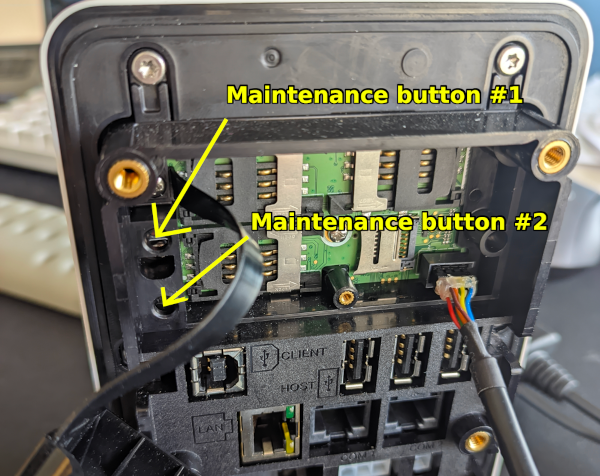

On UX302 device there is only one service button which can be configured. By default, this button shows MAC desktop or shows MCP, and also sends a broadcast. If you want to override this, you can configure it using [configuration](#sec_mac_cfg) file (sysmode_button and broadcast_button).

# Appendix: Service button broadcast <a href="#sec_mac_servicebtn" id="sec_mac_servicebtn"></a>

On UX700 and UX302 it is possible to use service button for app specific purposes - if service button gets pressed or released, MAC sends out a broadcast notification using ADK-IPC. Using this broadcast it is possible to override terminal\'s physical button for your own purpose - increase display brightness, enter some kind of app menu, etc. As broadcast is sent on press and release of the button, it is possible to do time specific things in your app also.

Broadcast will be sent with notification id: \"SERVICE_BUTTON\" which can be listened for.

Example:

``` cpp
void cb( void *data,
   const std::string &from,
   const std::string &to,
   const std::string &notification_id,
   const vfiipc::JSObject &jsobj,
   unsigned flags)
{
   // Process button press here (button was pressed)
}
// init ADK-IPC
vfiipc::ipcSetAppID( "demo" );
// register broadcast callback
int status = vfiipc::ipcRegisterNotificationCB( "SERVICE_BUTTON" , cb, NULL );
```

# Appendix: Configuration file <a href="#sec_mac_cfg" id="sec_mac_cfg"></a>

MAC can be configured using mac.ini configuration file Configuration file is optional and can be used to override default settings. It is possible to have multiple configuration files in single delivery. This allows to have different behavior on different terminal models in same deliverable. Different configuration file locations have different priorities. Possible configuration file locations:

| Path (VOS/VOS2) | Priority | Details |
|----|----|----|
| <p>/etc/config/adk/www/mac/P400/mac.ini</p> | <p>1</p> | <p>Will apply only to P400 model</p> |
| <p>/etc/config/adk/www/mac/240x320C15T/mac.ini</p> | <p>2</p> | <p>Will apply to all models with matching display and keyboard</p> |
| <p>/etc/config/adk/www/mac/default/mac.ini</p> | <p>3</p> | <p>Will apply to all terminal models</p> |
| <p>/etc/config/mac/mac.ini</p> | <p>4</p> | <p>Will apply to all terminal models</p> |

| Path (VOS3 only) | Priority | Details |
|----|----|----|
| <p>/home/usr1/adk/www/mac/P630/mac.ini</p> | <p>1</p> | <p>Will apply only to P630 model</p> |
| <p>/etc/config/adk/www/mac/P630/mac.ini</p> | <p>2</p> | <p>Will apply only to P630 model</p> |
| <p>/home/usr1/adk/www/mac/320x480C15T/mac.ini</p> | <p>3</p> | <p>Will apply to all models with matching display and keyboard</p> |
| <p>/etc/config/adk/www/mac/320x480C15T/mac.ini</p> | <p>4</p> | <p>Will apply to all models with matching display and keyboard</p> |
| <p>/home/usr1/adk/www/mac/default/mac.ini</p> | <p>5</p> | <p>Will apply to all terminal models</p> |
| <p>/etc/config/adk/www/mac/default/mac.ini</p> | <p>6</p> | <p>Will apply to all terminal models</p> |
| <p>/etc/config/mac/mac.ini</p> | <p>7</p> | <p>Will apply to all terminal models</p> |


Configuration file should be installed using \"config\" type package. See VOS documentation for more details.
Terminal model display and keyboard parameters are described in ADK-GUI documentation.
P400/P630 can be replaced with different model name.
240x320C15T/320x480C15T can be replaced with different display and keyboard combination.
Sample configuration package is available in mac example folder.


MAC configuration file is ini file with following structure:

| Section | Field | Type | Default | Description |
|----|----|----|----|----|
| <p>statusbar</p> | <p>enable</p> | <p>bool</p> | <p>true</p> | <p>Enable/disable MAC statusbar</p> |
| <p>statusbar</p> | <p>button</p> | <p>bool</p> | <p>true</p> | <p>Statusbar operates as a button</p> |
| <p>statusbar</p> | <p>com</p> | <p>bool</p> | <p>true</p> | <p>Enable communication icons on statusbar</p> |
| <p>statusbar</p> | <p>refresh_time</p> | <p>int</p> | <p>60</p> | <p>Statusbar refresh time in seconds</p> |
| <p>vkeyboard</p> | <p>enable</p> | <p>bool</p> | <p>true</p> | <p>Globally enables/disabled virtual keyboard</p> |
| <p>vkeyboard</p> | <p>auto</p> | <p>bool</p> | <p>false</p> | <p>Enables/disables automatic virtual keyboard mode</p> |
| <p>vkeyboard</p> | <p>sound</p> | <p>bool</p> | <p>false</p> | <p>Enables/disables virtual keyboard sounds on keystrokes</p> |
| <p>vkeyboard</p> | <p>alphanumeric</p> | <p>bool</p> | <p>true</p> | <p>Enables/disables automatic mode for alphanumeric input</p> |
| <p>vkeyboard</p> | <p>numeric</p> | <p>bool</p> | <p>true</p> | <p>Enables/disables automatic mode for numeric input</p> |
| <p>vkeyboard</p> | <p>capitalized</p> | <p>bool</p> | <p>true</p> | <p>Alphanumeric keyboard with capital letters will be used by default</p> |
| <p>desktop</p> | <p>hide_appids</p> | <p>string</p> | <p>-</p> | <p>List of application identifiers that should be hidden from MAC desktop</p> |
| <p>desktop</p> | <p>password</p> | <p>string</p> | <p>-</p> | <p>Password hash (MD5 hash function)</p> |
| <p>hotkeys</p> | <p>enable</p> | <p>bool</p> | <p>true</p> | <p>Enable MAC hotkeys</p> |
| <p>hotkeys</p> | <p>sysmode_button</p> | <p>bool</p> | <p>true</p> | <p>Enable sysmode button (open MAC desktop, launch sysmode if already on MAC desktop)∗</p> |
| <p>hotkeys</p> | <p>sysmode_button_mod</p> | <p>int</p> | <p>1</p> | <p>Allow sysmode launch by sysmode button ∗∗</p> |
| <p>hotkeys</p> | <p>broadcast_button</p> | <p>bool</p> | <p>true</p> | <p>Enable broadcast button (VOS3 only)</p> |
| <p>power_management</p> | <p>battery_status_control</p> | <p>bool</p> | <p>true</p> | <p>Enables battery status check (OK/NOK) during startup. Will show warning if battery is faulty</p> |
| <p>power_management</p> | <p>battery_level_control</p> | <p>bool</p> | <p>false</p> | <p>Enables battery level check during startup. Will not start applications if battery level below threshold</p> |
| <p>power_management</p> | <p>battery_level_threshold_mV</p> | <p>int</p> | <p>3600</p> | <p>Battery level threshold in mV. 3600 equals to 3.6V</p> |
| <p>power_management</p> | <p>notifications</p> | <p>bool</p> | <p>true</p> | <p>Show power manager notifications on screen</p> |
| <p>gui</p> | <p>display</p> | <p>string</p> | <p>\":0\"</p> | <p>GUI_DISPLAY environment which will be used by MAC and will be passed to launched applications. Refer to GUI documentation for more details</p> |
| <p>gui</p> | <p>window_management</p> | <p>bool</p> | <p>true</p> | <p>Enable/disable MAC window management. If disabled MAC will start only service applications and will not interact with GUI regions</p> |
| <p>gui</p> | <p>keep_alive_interval</p> | <p>int</p> | <p>2</p> | <p>Interval time in seconds between sending keepalive probes</p> |
| <p>gui</p> | <p>keep_alive_count</p> | <p>int</p> | <p>3</p> | <p>Number of keepalive probes to send before dropping the link</p> |
| <p>gui</p> | <p>splash_screen</p> | <p>bool</p> | <p>true</p> | <p>Enable/disable MAC splash screen</p> |
| <p>gui</p> | <p>language</p> | <p>string</p> | <p>/home/sys13/www/mac/default/en-US.ctlg</p> | <p>Used language catalog file</p> |
| <p>cpr</p> | <p>enable</p> | <p>bool</p> | <p>true</p> | <p>Enable/disable CPR. By default is disabled on VOS1 units to save memory</p> |

∗ Sysmode launch by sysmode button has higher priority than MAC desktop password protection. Thus, double sysmode_button press with default sysmode button configuration will skip password prompt and launches Sysmode.

∗∗ \"sysmode_button\" and \"sysmode_button_mod\" actions\' matrix

| sysmode_button | sysmode_button_mod | Action on sysmode button (or 1+5+9 keys) press |
|----|----|----|
| <p>true</p> | <p>1</p> | <p>Open MAC desktop, launch sysmode if on MAC desktop already</p> |
| <p>false</p> | <p>1</p> | <p>Launch sysmode</p> |
| <p>true</p> | <p>0</p> | <p>Open MAC desktop</p> |
| <p>false</p> | <p>0</p> | <p>Do nothing</p> |

There are two options to launch Sysmode besides Sysmode button:

- Go to \"MAC desktop\" -\> \"Control Panel\" -\> \"Sysmode\"
- Press 1+5+9 keys combo (or physical Sysmode button) before MAC loaded completely (during MAC initialization progress screen displaying):
  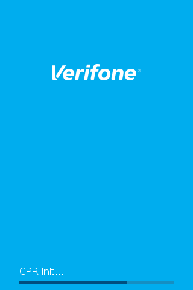

For VOS3 platform, \"sysmode_button_mod\" will allow (default value) or don\'t allow stopping of user apps. Popup message box \"User applications have been stopped!\" will not popup for

``` cpp
[hotkeys]
sysmode_button=n
sysmode_button_mod=1
```

configuration if MAC desktop is in background (Control Panel is in foreground for example).


MAC is using \"y\" or \"n\" for boolean values.


Configuration file example:

``` cpp
[statusbar]
enable=y
button=y
com=y
[desktop]
hide_appids=ccp;mcp;
[hotkeys]
enable=y
sysmode_button=y
[power_management]
battery_level_control=y
battery_level_threshold_mV=3500
[gui]
keep_alive_count=3
keep_alive_interval=2
```


MAC release includes MAC configuration package, which can be used as reference.


# Appendix: Application manifest file <a href="#sec_mac_mft" id="sec_mac_mft"></a>

Each native application should provide its own manifest file. Manifest file can have either INI file or in JSON notation. Manifest file provides all kind of information about application. It defines when and how the application should be launched, how it should be represented on desktop and etc. Manifest file should have \".mft\" extension, otherwise it will be ignored by MAC. Manifest file should be located in corresponding user www folder. For example, usr2 application should store its manifest file in /home/usr2/www (e.g. /home/usr2/www/mac_demo2.mft).


Make sure, that manifest file is added to share group. Otherwise MAC will not have access to it.
MAC scans /home/usr1/www/ - /home/usr16/www/ for user manifest files
MAC scans /home/sys1/www/ - /home/sys16/www/ for system manifest files
MAC is using \"y\" or \"n\" for boolean values in ini files


Manifest file structure:

| Section | Field | Type | Default | Description |
|----|----|----|----|----|
| <p>application</p> | <p>id</p> | <p>string</p> | <p>file name</p> | <p>Unique application identifier</p> |
| <p>application</p> | <p>name</p> | <p>string</p> | <p>empty</p> | <p>Optional application name</p> |
| <p>application</p> | <p>version</p> | <p>string</p> | <p>empty</p> | <p>Application version</p> |
| <p>application</p> | <p>recover</p> | <p>bool</p> | <p>true</p> | <p>Enable/disable application [recovery mechanism](#sec_mac_recovery)</p> |
| <p>application</p> | <p>status_bar</p> | <p>bool</p> | <p>true</p> | <p>Statusbar visibility on startup</p> |
| <p>application</p> | <p>depends</p> | <p>string</p> | <p>empty</p> | <p>Application list manifest owner depends on. This data is used to build dependency graph during autolaunch</p> |
| <p>application</p> | <p>allow_launch_on_tamper</p> | <p>bool</p> | <p>false</p> | <p>Allow application launch if security key allows to bypass tamper</p> |
| <p>desktop</p> | <p>cmdline</p> | <p>string</p> | <p>empty</p> | <p>Command to start application</p> |
| <p>desktop</p> | <p>label</p> | <p>string</p> | <p>id field</p> | <p>Application label shown on desktop</p> |
| <p>desktop</p> | <p>translations</p> | <p>string</p> | <p>label field</p> | <p>Translated application label shown on desktop</p> |
| <p>desktop</p> | <p>icon</p> | <p>string</p> | <p>/home/sys13/www/mac/images/default-icon.png</p> | <p>Path to application icon shown on desktop</p> |
| <p>desktop</p> | <p>type</p> | <p>string</p> | <p>APPLICATION</p> | <p>Application (with GUI) or Service (no GUI). Services will be started before applications.</p> |
| <p>desktop</p> | <p>args</p> | <p>string</p> | <p>empty</p> | <p>Arguments passed to application</p> |
| <p>desktop</p> | <p>envs</p> | <p>string</p> | <p>empty</p> | <p>Environment variables passed to application</p> |
| <p>desktop</p> | <p>hide</p> | <p>bool</p> | <p>false</p> | <p>Hide application icon from desktop</p> |
| <p>autolaunch</p> | <p>cmdline</p> | <p>string</p> | <p>empty</p> | <p>Command to start application</p> |
| <p>autolaunch</p> | <p>type</p> | <p>string</p> | <p>APPLICATION</p> | <p>Application (with GUI) or Service (no GUI). Services will be started before applications.</p> |
| <p>autolaunch</p> | <p>args</p> | <p>string</p> | <p>empty</p> | <p>Arguments passed to application</p> |
| <p>autolaunch</p> | <p>envs</p> | <p>string</p> | <p>empty</p> | <p>Environment variables passed to application</p> |
| <p>autolaunch</p> | <p>start_hidden</p> | <p>bool</p> | <p>false</p> | <p>Application will be launched, but not appear on foreground</p> |
| <p>autolaunch</p> | <p>resident</p> | <p>bool</p> | <p>false</p> | <p>Service will not be restarted on GUI disconnect event.</p> |

Application manifest example (INI format):

``` cpp
[application]
id=mac_demo1
version=3.2.0
statusbar=y
app_resource_dir=mac_demo1
depends=mac_demo2;mac_demo3;
recover=n
allow_launch_on_tamper=y
[desktop]
label=MAC Demo 1
translations=de=MAC Demo 1;fr=MAC Démo 1;es=MAC manifestación 1;
icon=mac_demo1/default/verifone-icon.png
cmdline=../mac_demo1
args=r1d2 r2d3
[autolaunch]
cmdline=../mac_demo1
start_hidden=y
```

Service manifest example (INI format):

``` cpp
[application]
id=mac_demo3
version=3.16.3
name=demo3
[autolaunch]
cmdline=/home/usr3/mac_demo3
type=service
resident=y
[desktop]
label=mac_demo3
cmdline=/home/usr3/mac_demo3
type=service
```

Application manifest example (JSON format):

``` cpp
{
  "schema_version": "1.1",
  "application": {
   "id": "mac_demo2",
   "name": "mac_demo2",
   "version": "3.9.0",
   "status_bar": true,
   "recover": true,
   "app_resource_dir": "mac_demo2"
  },
  "desktop": {
   "label" : "mac_demo2",
   "type" : "APPLICATION",
   "cmdline": "../mac_demo2",
   "envs": [
   { "ADK_VAR1": "bar" },
   { "ADK_VAR2": "foo" },
   { "ADK_VAR3": "xyz" }
   ],
   "args": [ "arg1", "arg2", "arg3" ],
  },
  "autolaunch": {
   "cmdline" : "../mac_demo2",
   "envs": [
   { "ADK_VAR1": "bar" },
   { "ADK_VAR2": "foo" },
   { "ADK_VAR3": "xyz" }
   ],
   "args": [ "arg1", "arg2", "arg3" ],
   "type": "APPLICATION",
  },
}
```

# Appendix: Virtual keyboard <a href="#sec_mac_kbd" id="sec_mac_kbd"></a>

On touch screen devices, MAC offers virtual keyboard option. Virtual keyboard configuration is stored separately for every application. It can be disabled globally using [configuration file](#sec_mac_cfg). Virtual keyboard mode can be cahnged using <a href="namespacevfimac.md#a287906c2724d813bb1eb0ad1f3b4f18a">vfimac::sysVirtualKeyboard</a> API.

| Mode | Description |
|----|----|
| <p>MAC_KBD_ON</p> | <p>show virtual keyboard</p> |
| <p>MAC_KBD_OFF</p> | <p>hide virtual keyboard</p> |
| <p>MAC_KBD_AUTO</p> | <p>set virtual keyboard to auto mode</p> |
| <p>MAC_KBD_NUMERIC</p> | <p>activate auto mode for numeric input</p> |
| <p>MAC_KBD_ALPHANUMERIC</p> | <p>activate auto mode for alphanumeric input</p> |
| <p>MAC_KBD_CAPITALIZED</p> | <p>set capitalized keyboard layout for alphanumeric input</p> |

If auto mode is selected, MAC will show keyboard only when input field is active. Auto mode shows a keyboard for any input type. If you need to automatically show the keyboard for only one input type (numeric or alphanumeric), then use MAC_KBD_NUMERIC or MAC_KBD_ALPHANUMERIC. If you need to show capitalized keyboard layout use MAC_KBD_CAPITALIZED.
Virtual keyboard is auto-enabled for terminals without keyboard but with touch panel: e280S, e235, \... devices
MAC virtual keyboard can be customised using [custom resources](#sec_mac_res). Usage example:

``` cpp
vfimac::sysVirtualKeyboard(vfimac::MAC_KBD_AUTO); //set auto mode
vfimac::sysVirtualKeyboard(vfimac::MAC_KBD_ALPHANUMERIC | vfimac::MAC_KBD_CAPITALIZED); // activate auto mode for alphanumeric input with default capitalized keyboard layout
```

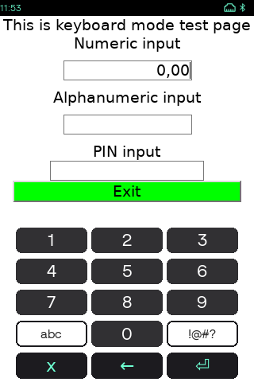

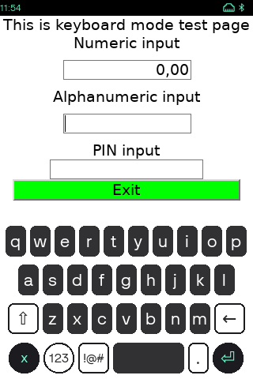

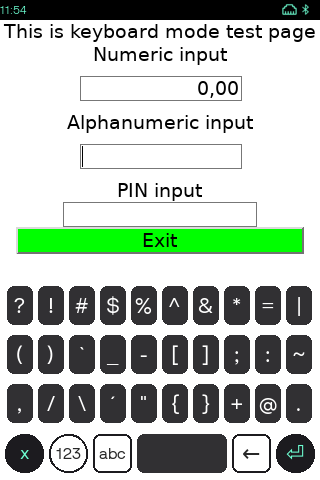

Configuration examples:

``` cpp
[vkeyboard]
enable=y # this option globally enables/disables virtual keyboard
auto=y # this option will set keyboard to automated mode (keyboard will appear if input field is active)
alphanumeric=y # this option will enable auto mode for alphanumeric input fields by default
numeric=y # this option will eanble auto mode for numeric input fields by default
capitalized=y # this option will show alphanumeric keyboard with capital letters by default
```

Configuration parameters can be overridden using API call.

# Appendix: Custom resources <a href="#sec_mac_res" id="sec_mac_res"></a>

MAC graphical resources can be replaced with custom ones. MAC is using these files for GUI:

| File | Description | Platforms |  |  |
|----|----|----|----|----|
| VOS1 | VOS2 | VOS3 |  |  |
| <p>desktop.html</p> | <p>Desktop</p> | <p>+</p> | <p>+</p> | <p>+</p> |
| <p>kbd_reg.html</p> | <p>Regular virtual keyboard</p> |  | <p>+</p> | <p>+</p> |
| <p>kbd_cap.html</p> | <p>Capitalized virtual keyboard</p> |  | <p>+</p> | <p>+</p> |
| <p>kbd_num.html</p> | <p>Numeric virtual keyboard</p> |  | <p>+</p> | <p>+</p> |
| <p>kbd_special.html</p> | <p>Special character virtual keyboard</p> |  | <p>+</p> | <p>+</p> |
| <p>power.html</p> | <p>Power status screen</p> | <p>+</p> | <p>+</p> | <p>+</p> |
| <p>splash.html</p> | <p>Loading splash screen</p> | <p>+</p> | <p>+</p> | <p>+</p> |
| <p>statusbar.html</p> | <p>Statusbar</p> | <p>+</p> | <p>+</p> | <p>+</p> |
| <p>password.html</p> | <p>Password input</p> | <p>+</p> | <p>+</p> | <p>+</p> |
| <p>hotkey.html</p> | <p>Keyboard shortcuts</p> |  | <p>+</p> | <p>+</p> |
| <p>notification.html</p> | <p>Popup message</p> |  |  | <p>+</p> |
| <p>kbd.css</p> | <p>Keyboard styles</p> |  | <p>+</p> | <p>+</p> |
| <p>style.css</p> | <p>MAC desktop stules</p> | <p>+</p> | <p>+</p> | <p>+</p> |
| <p>layout.ini</p> | <p>[Layout](#sec_mac_layout) ini file</p> | <p>+</p> | <p>+</p> | <p>+</p> |

Custom resources have priority over default ones. It is not obligatory to replace all of resources. It is enough to provides only modified ones. In this case custom resources will be used together with default ones. Different resource locations have different priorities. Custom resources file possible locations:

| Path (VOS/VOS2) | Priority | Details |
|----|----|----|
| <p>/etc/config/adk/www/mac/P400/</p> | <p>1</p> | <p>These resources will be used only on P400 model</p> |
| <p>/etc/config/adk/www/mac/240x320C15T/</p> | <p>2</p> | <p>These resources will be used on all models with matching display and keyboard</p> |
| <p>/etc/config/adk/www/mac/default/</p> | <p>3</p> | <p>These resources will be used on all other models</p> |

| Path (VOS3 only) | Priority | Details |
|----|----|----|
| <p>/home/usr1/adk/www/mac/P630/</p> | <p>1</p> | <p>These resources will be used only on P630 model</p> |
| <p>/etc/config/adk/www/mac/P630/</p> | <p>2</p> | <p>These resources will be used only on P630 model</p> |
| <p>/home/usr1/adk/www/mac/320x480C15T/</p> | <p>3</p> | <p>These resources will be used on all models with matching display and keyboard</p> |
| <p>/etc/config/adk/www/mac/320x480C15T/</p> | <p>4</p> | <p>These resources will be used on all models with matching display and keyboard</p> |
| <p>/home/usr1/adk/www/mac/default/</p> | <p>5</p> | <p>These resources will be used on all other models</p> |
| <p>/etc/config/adk/www/mac/default/</p> | <p>6</p> | <p>These resources will be used on all other models</p> |


Custom resources should be installed using \"config\" type package. See VOS documentation for more details.
Terminal model display and keyboard parameters are described in ADK-GUI documentation.
P400/P630 can be replaced with different model name.
240x320C15T/320x480C15T can be replaced with different display and keyboard combination.
Custom resources example package is available in MAC example folder.


# Appendix: Commerce Platform <a href="#sec_mac_cpr" id="sec_mac_cpr"></a>

## CP concept <a href="#subsec_mac_mft_cp_concept" id="subsec_mac_mft_cp_concept"></a>

Commerce Platform is environment which allows to develop JS/HTML based applications and execute them on top of ADK.

## CP runtime (CPR) <a href="#subsec_mac_mft_cp_executing" id="subsec_mac_mft_cp_executing"></a>

Commerce Platofrm functionality is disabled by default on VOS1 units and enabled by default on VOS2 and VOS3 units. This can be changed using MAC configuration file:

``` cpp
[cpr]
enable=y
```

CP applications (CPA) are launched by MAC. User can either launch CPA using MAC desktop or launch them using libmac APIs. CPA can also be integrated in payment application flow and launched by certain trigger name. This is described in CPL documentation.

Executing CPA using api:

``` cpp
std::string appname("cp_demo2");
std::vector<std::string> args;
vfimac::sysLaunchAppid(appname,args);
```

Executing CPA by CPR trigger:

``` cpp
const std::string trigger("CP_SYSTEM_NOTIFIES_IDLE_ENTERED");
vfiipc::JSObject jsobj;
vfimac::sysLaunchCPAppByTrigger( "*", trigger, jsobj, 0 );
```


Please see CPL documentation for more details.


In case MAС runs in multi-display environment, application can decide which screen to use for CPA execution. This is done by passing \"cp_displayID\" parameter in JSON payload. By default MAC is using local display (display id - 0). Displays are configured in MAC configuration file GUI section. Usage example:

``` cpp
const std::string trigger("CP_SYSTEM_NOTIFIES_IDLE_ENTERED");
vfiipc::JSObject jsobj;
jsobj("cp_displayID") = 1;
vfimac::sysLaunchCPAppByTrigger( "*", trigger, jsobj, 0 );
```

## CPA installation on VOS2 platform <a href="#subsec_mac_mft_cp_vos2" id="subsec_mac_mft_cp_vos2"></a>

To install CP application please use <a href="namespacevfimac.md#a86f520239eb2af7b49b1bc31dfc20906">vfimac::sysInstallCPApp</a>.


It is also possible to install CPA using CPdownloader application, please see ADK-GUI documentations for details.


## CPA installation on VOS3 platform <a href="#subsec_mac_mft_cp_vos3" id="subsec_mac_mft_cp_vos3"></a>

To install CP application please use CP App VOS3 installation package type.
Additionally special user Sponsor signed CP activation package should be installed to activate CP App.
Please see VOS3 CP App packaging & installation manual for reference.

## CPA manifest files <a href="#subsec_mac_mft_cp_manifest" id="subsec_mac_mft_cp_manifest"></a>

Commerce platform manifest files are JSON encoded and stored in

- \"/mnt/flash/etc/config/cpapp/cp\" for VOS2,
- \"/home/sys_cp/cpapps\" for VOS3, and
- \"/mnt/appdata/versioned/globalshare/cpapps\" is spare manifest location for VOS3 terminals with CPDEV (aka APPDEV). One of two VOS3 locations should be selected, not both simultaneously.

Manifest files should have \".mft\" extension (e.g. \"/mnt/flash/etc/config/cpapp/cp/paypalapp-887623211.mft\", or \"/home/sys_cp/cpapps/paypalapp-887623211.mft) Regular applications don\'t have access to CPA resources and manifest files.

## CPA manifest fields <a href="#subsec_mac_mft_cp_description" id="subsec_mac_mft_cp_description"></a>

| Section | Field | Required | Type | Default | Description |
|----|----|----|----|----|----|
| <p>application</p> | <p>id</p> | <p>+</p> | <p>string</p> | <p>-</p> | <p>Unique application id</p> |
| <p>application</p> | <p>name</p> | <p>-</p> | <p>string</p> | <p>-</p> | <p>Application name</p> |
| <p>application</p> | <p>version</p> | <p>-</p> | <p>string</p> | <p>-</p> | <p>Application version</p> |
| <p>application</p> | <p>keyboard</p> | <p>-</p> | <p>bool</p> | <p>false</p> | <p>MAC Virtual keyboard visible on startup</p> |
| <p>application</p> | <p>statusbar</p> | <p>-</p> | <p>bool</p> | <p>true</p> | <p>MAC Statusbar visible on startup</p> |
| <p>application</p> | <p>depends</p> | <p>-</p> | <p>string</p> | <p>-</p> | <p>Dependent apps to be started before this app. separted by semicolon</p> |
| <p>desktop</p> | <p>type</p> | <p>-</p> | <p>string</p> | <p>app</p> | <p>Application or Service</p> |
| <p>desktop</p> | <p>label</p> | <p>-</p> | <p>string</p> | <p>-</p> | <p>Application label shown on desktop</p> |
| <p>desktop</p> | <p>icon</p> | <p>-</p> | <p>string</p> | <p>-</p> | <p>Path to application icon shown on desktop</p> |
| <p>desktop</p> | <p>hide</p> | <p>-</p> | <p>bool</p> | <p>false</p> | <p>Hide application icon from desktop</p> |
| <p>desktop</p> | <p>file</p> | <p>-</p> | <p>string</p> | <p>-</p> | <p>Initial html to be shown</p> |
| <p>autolaunch</p> | <p>type</p> | <p>-</p> | <p>string</p> | <p>app</p> | <p>Application or System service. Services will be started before applications</p> |
| <p>autolaunch</p> | <p>file</p> | <p>-</p> | <p>string</p> | <p>-</p> | <p>Initial html to be shown</p> |

To launch CPA from desktop, it should have \"desktop\" section in its manifest file.

## CPA manifest examples <a href="#subsec_mac_mft_cp_examples" id="subsec_mac_mft_cp_examples"></a>

CPA manifest file example #1:

``` cpp
{
   "schema_version": "1.0",
   "application": {
   "name": "cp_demo1",
   "id": "cp_demo1",
   "version": "3.9.0",
   "type": "CP_TERMINAL",
   "is_companion_app": true
   },
   "desktop" : {
   "label" : "cp_demo1",
   "file" : "demo1.html",
   "type" : "app",
   "icon" : "cp_demo1/default/vflogo.png"
   },
   "imports_trigger": [
   {
   "file" : "demo1.html",
   "optional" : true,
   "id": "CP_SYSTEM_NOTIFIES_IDLE_ENTERED",
   "icon" : "cp_demo1/default/vflogo.png"
   },
   {
   "file" : "demo1.html",
   "optional" : true,
   "id": "CP_SYSTEM_NOTIFIES_MANUAL_LAUNCH_SELECTED"
   },
   {
   "file" : "demo1.html",
   "optional" : true,
   "id": "CP_SYSTEM_NOTIFIES_TRANSACTION_STARTED"
   },
   {
   "file" : "test.html",
   "optional" : true,
   "id": "CP_TEST",
   "icon" : "cp_demo1/default/vflogo.png"
   }
  ]
}
```

CPA manifest file example #2:

``` cpp
{
  "schema_version": "1.0",
  "imports_trigger": [
   {
   "file": "init.html",
   "icon": "alipayapp-887623211/images/Alipay_icon.png",
   "optional": false,
   "id": "CP_SYSTEM_REQUESTS_ALT_PAYMENT",
   "label": "Alipay",
   "status_bar": false,
   "type": "APPLICATION",
   "interruptible": false
   },
   {
   "file": "init.html",
   "icon": "alipayapp-887623211/images/Alipay_icon.png",
   "optional": false,
   "id": "CP_SYSTEM_NOTIFIES_TRANSACTION_ENDED",
   "label": "Alipay",
   "status_bar": false,
   "type": "APPLICATION",
   "interruptible": false
   },
   {
   "file": "init.html",
   "icon": "alipayapp-887623211/images/Alipay_icon.png",
   "optional": false,
   "id": "CP_SYSTEM_NOTIFIES_IDLE_ENTERED",
   "label": "Alipay",
   "status_bar": false,
   "type": "APPLICATION",
   "interruptible": false
   },
   {
   "file": "init.html",
   "icon": "alipayapp-887623211/images/Alipay_icon.png",
   "optional": false,
   "id": "CP_SYSTEM_NOTIFIES_MANUAL_LAUNCH_SELECTED",
   "label": "Alipay",
   "status_bar": false,
   "type": "APPLICATION",
   "interruptible": false
   }
  ],
  "application": {
   "is_companion_app": false,
   "name": "alipay",
   "id": "alipayapp-887623211",
   "type": "CP_TERMINAL",
   "version": "2.5.0"
  },
  "imports_sdk": {
   "cpruntime_min_version": "2.0.0",
   "triggers_min_version": "4.3.0"
  },
  "imports_hardware": {
   "platforms": [
   "240x320C15T",
   "240x320C21N",
   "320x480C0T",
   "320x480C15T",
   "854x480C0T",
   "854x480C15T",
   "1280x800C15T"
   ]
  }
}
```

CPA manifest file example #3:

``` cpp
{
  "schema_version": "1.0",
  "imports_trigger": [
   {
   "file": "init.html",
   "icon": "klarnaapp-887623211/images/Klarna_icon.png",
   "optional": false,
   "id": "CP_SYSTEM_REQUESTS_ALT_PAYMENT",
   "label": "Klarna",
   "status_bar": false,
   "type": "APPLICATION",
   "interruptible": false
   },
   {
   "file": "init.html",
   "icon": "klarnaapp-887623211/images/Klarna_icon.png",
   "optional": false,
   "id": "CP_SYSTEM_NOTIFIES_TRANSACTION_ENDED",
   "label": "Klarna",
   "status_bar": false,
   "type": "APPLICATION",
   "interruptible": false
   },
   {
   "file": "init.html",
   "icon": "klarnaapp-887623211/images/Klarna_icon.png",
   "optional": false,
   "id": "CP_SYSTEM_NOTIFIES_IDLE_ENTERED",
   "label": "Klarna",
   "status_bar": false,
   "type": "APPLICATION",
   "interruptible": false
   },
   {
   "file": "init.html",
   "icon": "klarnaapp-887623211/images/Klarna_icon.png",
   "optional": false,
   "id": "CP_SYSTEM_NOTIFIES_MANUAL_LAUNCH_SELECTED",
   "label": "Klarna",
   "status_bar": false,
   "type": "APPLICATION",
   "interruptible": false
   }
  ],
  "application": {
   "is_companion_app": false,
   "name": "klarna",
   "id": "klarnaapp-887623211",
   "type": "CP_TERMINAL",
   "version": "1.4.0"
  },
  "imports_sdk": {
   "cpruntime_min_version": "2.0.0",
   "triggers_min_version": "4.3.0"
  },
  "imports_hardware": {
   "platforms": [
   "240x320C15T",
   "240x320C21N",
   "320x480C0T",
   "320x480C15T",
   "854x480C0T",
   "854x480C15T",
   "1280x800C15T"
   ]
  }
}
```

# Appendix: MAC Control Panel <a href="#sec_mac_mcp" id="sec_mac_mcp"></a>

MAC Control panel contains a set of system tools to view, configure and diagnose the system. MAC Control panel can be activated using <a href="namespacevfimac.md#a395a73335aa92641a3ac0967fc0bb200">vfimac::sysShowControlPanel</a> API or activated from the MAC desktop.

The MAC desktop may be protected by a password. See the detailed description in the [Appendix: Desktop](#sec_mac_desktop).


MAC Control Panel functions may be different on different platforms. On VOS3 there is no more a Sysmode we had on VOS1/VOS2 devices. On VOS3 there are new Control Panels that provide similar functionality as the Sysmode on VOS1/VOS2.


Below is the mapping of the Control Panel and the platform.

## MAC Control Panels <a href="#sec_mac_cp_list" id="sec_mac_cp_list"></a>

[TABLE]

# Appendix: MAC language setting <a href="#sec_mac_cp_language" id="sec_mac_cp_language"></a>

The default MAC Control Panel language is English (en-US.ctlg ).

To launch MAC Control Panel with a different language, the language package can be provided as an argument for the MAC API:

``` cpp
std::vector<std::string> args = { "-l", "/home/usr1/www/de-DE.ctlg" };
auto res = vfimac::sysLaunchAppid( "mcp", args );
```

or

``` cpp
std::vector<std::string> args = { "-l", "de-DE.ctlg" };
auto res = vfimac::sysLaunchAppid( "mcp", args );
```

in the last example, the file will be searched into the /home/sys13/www/mcp/default.


both arguments `"-l"` or `"--lang"` could be used.


### Warning

\[unsupported block\]

# Appendix: Layout <a href="#sec_mac_layout" id="sec_mac_layout"></a>

Used screen layout can be adjusted. Layout is stored in layout.ini file together with other MAC resources. This file can be used to resize statusbar or virtual keyboard. Layout file can be modified using [custom MAC resources](#sec_mac_res). Application can set layout from file using <a href="namespacevfimac.md#aa54bee100e8df7bab8868a0c6b81bc67">vfimac::sysChangeLayout</a>.


Layout can be locked using <a href="namespacevfimac.md#a1f0513c597f95e860f0d4e516d72b364">vfimac::sysLockLayout</a>. In this case all applications are not able to switch screen or layout anymore.


Layout file example:

``` cpp
[default]
appA=0 0 -1 -1
[default-sb]
statusbar=0 0 -1 19
appA=0 20 -1 -1
[default-kb]
appA=0 0 -1 -321
keyboard=0 -321 -1 -1
[default-sb-kb]
statusbar=0 0 -1 19
appA=0 20 -1 -321
keyboard=0 -321 -1 -1
```

# Appendix: MAC events <a href="#sec_mac_events" id="sec_mac_events"></a>

Application can register for certain MAC events. All available MAC events are listed in <a href="namespacevfimac.md#a3bc43cdb5f4033e625bb6dc7e1579d4b">enum</a>. Every event type can have its own processing callback.

Usage example:

``` cpp
static void event_callback( vfimac::macEvent event, const vfiipc::JSObject & json )
{
   LOGF_TRACE(lh,"MAC event recieved[%d] json[%s]",event, json.dump().c_str() );
}
// Application transitioned on foreground
vfimac::sysSetEventCallback( vfimac::EVENT_FOREGROUND, event_callback );
// Application transitioned to background
vfimac::sysSetEventCallback( vfimac::EVENT_BACKGROUND, event_callback );
// Manifest list was refreshed
vfimac::sysSetEventCallback( vfimac::EVENT_MANIFEST_UPDATE, event_callback );
```

# Appendix: Notification interface <a href="#sec_mac_notify" id="sec_mac_notify"></a>

MAC allows some commands to be invoked via ADK-IPC notifications. First applications needs to register callback for response notification. Then applications need to generate json with payload and send it to \"\_mac\" application id. MAC will send response notification with corresponding payload.

| Request notification | Response notification | Description |
|----|----|----|
| <p>\_MacControlRequest</p> | <p>\_MacControlResponse</p> | <p>These notifications can be used by payment applications and ADK components</p> |

Example:

``` cpp
void cb( void *data,
   const std::string &from,
   const std::string &to,
   const std::string &notification_id,
   const vfiipc::JSObject &jsobj,
   unsigned flags)
{
   // Process response here
}
// init ADK-IPC
vfiipc::ipcSetAppID( "demo" );
// register response callback
vfiipc::ipcRegisterNotificationCB( "_MacControlResponse" , cb, NULL );
// generate json payload
vfiipc::JSObject jsobj;
jsobj("cmd")="device_info";
// send json to MAC
vfiipc::ipcNotify("_mac","_MacControlRequest", jsobj, 0 );
```

Supported command list:

[TABLE]

Return notification will always have two fields indicating request status.

| Field name | Type | Values | Description |
|----|----|----|----|
| <p>result</p> | <p>string</p> | <p>\"OK\"/\"FAIL\"</p> | <p>General status</p> |
| <p>status</p> | <p>int</p> | <p><a href="namespacevfimac.md#a343256ae5f150542a1f6a38fcaca216c">vfimac::macError</a></p> | <p>Error code</p> |


if MAC is not running, you will receive notification unicast error. Please see ADK-IPC documentation for more information.


MAC notification interface usage example:

``` cpp
void device_resp_callback(
   void *data,
   const std::string &from,
   const std::string &to,
   const std::string &notification_id,
   const vfiipc::JSObject &jsobj,
   unsigned flags)
{
   LOGF_TRACE( lh, "trigger from[%s] to[%s] id[%s] flags[%d] jsobj[%s]",
   from.c_str(),
   to.c_str(),
   notification_id.c_str(),
   flags,
   jsobj.dump().c_str() );
}
const int SUCCEED = 0;
const int FAIL = -1;
const std::string one_receiver("1");
const std::string appid( "MACDEMO2" );
const std::string device_control_request_trigger("_MacControlRequest");
const std::string device_control_response_trigger("_MacControlResponse");
vfiipc::ipcSetAppID( appid );
vfiipc::ipcRegisterNotificationCB( device_control_response_trigger, device_resp_callback, NULL );
vfiipc::JSObject jsobj;
jsobj("cmd")="show_dekstop";
vfiipc::ipcNotify(one_receiver, device_control_request_trigger, jsobj, 0 );
```

# Appendix: System Notifications interface <a href="#sec_mac_system_notifications" id="sec_mac_system_notifications"></a>

System notification interface allows to:

- show pop-up messages of three priorities:
  - **Info**;
  - **Warning**;
  - **Critical**.
- add notification icon to statusbar;
  - one for all notifications;
  - most critical is shown.
- possibility to recall the notification message until cleared;
- client that rised the notification gets ID to clear it later.
  
  Life length of notifications is limited by terminal reboot: client must request notification at every terminal startup.
  

## Pop-up messages and statusbar icons examples: <a href="#subsec_system_notifications_popup_messages" id="subsec_system_notifications_popup_messages"></a>

| Info | Warning | Critical |
|----|----|----|
| 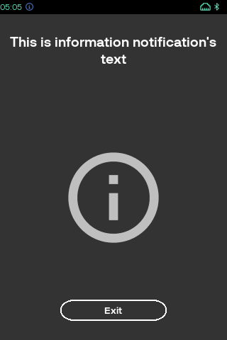 | 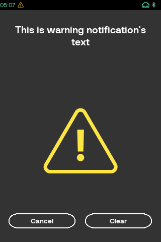 | 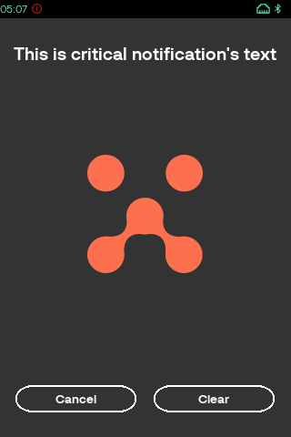 |


\"Info\" notification example shows \"sticky\" option: \"Clear\" button absent - notification can\'t be cleared via GUI.


## System Notifications List <a href="#subsec_system_notifications_messages_list" id="subsec_system_notifications_messages_list"></a>

It is possible to recall all system notification messages via Control Panel -\> Notifications.

| Control Panel | -\> | Notifications |
|----|----|----|
| 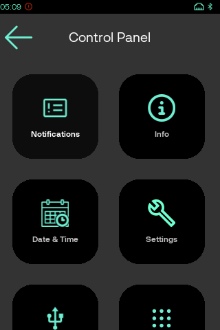 |  | 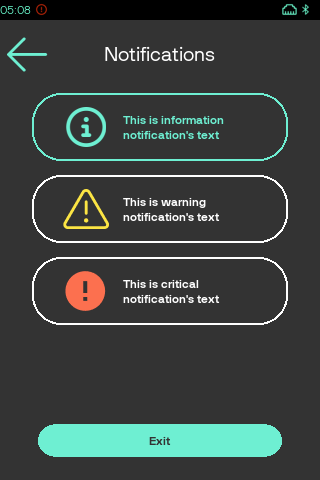 |

## System Notifications usage example <a href="#subsec_system_notifications_usage_example" id="subsec_system_notifications_usage_example"></a>

``` cpp
// add system notifications
int returnCode = vfimac::systemNotificationAdd(vfimac::systemNotificationPriority::SYSTEM_NOTIFICATION_INFO, "demo1 system notification");
if(returnCode > 0)
{
   int lastSystemNotificationId = returnCode;
   // check if it still exist
   std::list<int> list;
   returnCode = vfimac::systemNotificationList(list);
   for (std::list<int>::iterator it = list.begin(); it != list.end(); ++it)
   {
   if(lastSystemNotificationId == (*it))
   {
   // remove our system notifications
   returnCode = vfimac::systemNotificationRemove(lastSystemNotificationId);
   }
   }
}
```

# Appendix: Application recovery <a href="#sec_mac_recovery" id="sec_mac_recovery"></a>

If application crashes, MAC will initiate <a href="namespacevfimac.md#a5b63071e5232000be8cd04e2950b28b2">application relaunch</a>.
First it will stop all running applications, after that MAC will start all applications registered for autolaunch.
This should bring terminal to clean state (as after startup).
MAC maintains crashes counter for each application. To prevent looping relaunch, MAC stops application recovery after three application\'s crashes.
Application can disable recovery mechanism using recover field in [manifest file](#sec_mac_mft).


If application was terminated by SIGTERM or SIGKILL, recovery mechanism will not be initiated.


# Appendix: Environment variables <a href="#sec_mac_envs" id="sec_mac_envs"></a>

When MAC launches application, it sets certain environment variables. Without these variables application will not operate correctly.

| Environment name | Type | Required | Example | Description |
|----|----|----|----|----|
| <p>GUI_REGION</p> | <p>int</p> | <p>+</p> | <p>7</p> | <p>ADK-GUI region id, which will be used to render application GUI</p> |
| <p>GUI_DISPLAY</p> | <p>string</p> | <p>+</p> | <p>192.168.50.1:0</p> | <p>GUI_DISPLAY environments stores IP address in case of remote display. Please see ADK-GUI documentation for details</p> |
| <p>MAC_APPID</p> | <p>string</p> | <p>-</p> | <p>ccp</p> | <p>Application id from [manifest file](#sec_mac_mft)</p> |
| <p>GUIPRT_APPNAME</p> | <p>string</p> | <p>-</p> | <p>lcp</p> | <p>Name of the resource folder from [manifest file](#sec_mac_mft)</p> |
| <p>LANGUAGE</p> | <p>string</p> | <p>-</p> | <p>en</p> | <p>Current system language (VOS3 only)</p> |

GUI_REGION environment notifies GUI in which region HTML should be rendered. If environment is not set, application will use region 0. This region is always hidden and never appear on the screen. GUI_DISPLAY is used to set communication method with GUI server. Please see ADK-GUI documentation for more details. APPID - unique application identifier from [manifest file](#sec_mac_mft). It can be used by both application itself and MAC to process requests. GUIPRT_APPNAME - is used to avoid resource clash, when multiple applications are using same user. For example if application is using usr1 and GUIPRT_APPNAME is set to lcp, then resources located in /home/usr1/www/lcp will be used. If environment is not set /home/usr1/www will be used as a resource folder.

# Appendix: Android Remote Rendering Service <a href="#sec_mac_arrs" id="sec_mac_arrs"></a>

On dual chip solutions (e.g. M424, M440, CM5) MAC can run in remote rendering mode. In this mode, MAC will communicate with ARRS instead of GUI daemon. This is special application delivered as part of Android software stack, which renders HTML instead of GUI daemon. By default Android IP address is obtained from /etc/hosts, but it can be overrided by display field in MAC configuration file. If ARRS mode is enabled, service type applications, will be launched before connecting to ARRS. This speeds up boot time and allows Android to communicate to SDI and other critical services even if ARRS wasn\'t launched. If ARRS is not launched on Android, MAC will only start service applications and then wait for communication with ARRS. If ARRS is closed, MAC will stop all launched applications. It will automatically restart once ARRS is available.


ARRS is using webkit for HTML rendering. As a result, some of HTML tags will not be supported in this mode. Please check ADK-GUI documentation for details.


# Appendix: Remote display mode <a href="#sec_mac_remote" id="sec_mac_remote"></a>

Terminal can remotely control GUI on other units via network. To do so both master and slave units needs to be configured accordingly. Slave units needs to operate in remote display mode. In this mode GUI window management will be disabled and only service type applications will be started. MAC desktop will not be available. MAC will create only one GUI region (region id - 0) and wait for incoming connection.

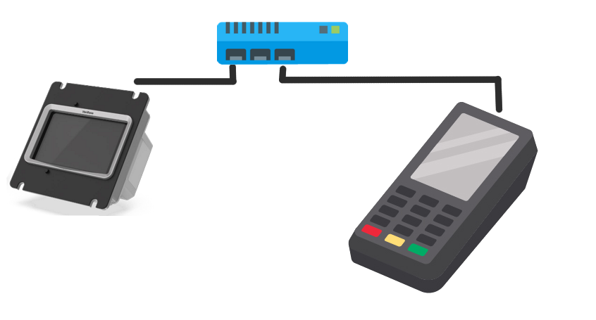

Slave unit configuration file example:

``` cpp
[gui]
window_management=n
```

This option would disable application autolaunch. MAC will create only one GUI region (GUI region id - 0) and wait for incoming connection. Master unit needs to list slave unit IP addresses.

``` cpp
[gui]
display =:0 10.184.14.255:0 10.101.10.59:0
```

Listed units will be provided on all applications in GUI_DISPLAY environment. Application can use any of remote displays by passing display id to ADK-GUI API. This example will send hello text to unit 10.101.10.59.

``` cpp
int display = 2;
int region_id = 0;
std::string text = "hello world!"
vfigui::uiDisplay( display, region_id, text);
```


When system boots it will wait for remote displays to appear online, only after that applications will be started.


If connection to remote GUI server happens via unstable transport level, GUI keep alive can be configured. GUI invokes disconnect callback after certain amount of keep alive packets is lost.
Disconnect callback performs stopping of all MAC launched applications (except service applications with `resident=y` in autolaunch manifest section, see [Appendix: Application manifest file](#sec_mac_mft)) before reinitialization of the MAC daemon.

``` cpp
[gui]
keep_alive_count=3
keep_alive_interval=2
```

VOS1/VOS2: Display IP addresses can also bet set using /mnt/flash/config/config.system system configuration file. Example configuration file sets two displays. First one the local one. Second - remote one, accessible by IP.

Example:

``` cpp
[mac]
gui_display = ":0 10.184.14.255:0"
```


Value in system configuration file has higher priority than the one in MAC configuration file.
After setting GUI_DISPLAY value terminal should be rebooted.
Check GUI documentation for more details.
Ux115 without Ux100 pinpad will operate in remote display mode by default.


# Appendix: Battery status control (VOS2 platform) <a href="#sec_mac_battery" id="sec_mac_battery"></a>

During autolaunch MAC will check battery status. If status is NOK warning will be shown on display for 60 seconds and then boot will continue. This feature is enabled by default. It can be disabled in MAC config file. Example:

``` cpp
[power_management]
battery_status_control=n
```

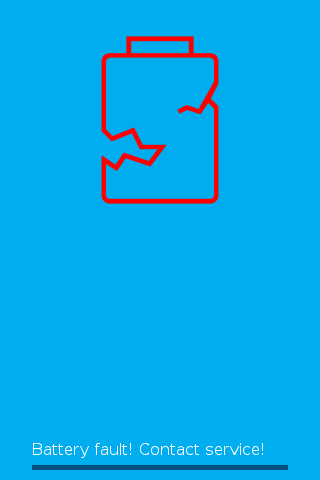

During autolaunch MAC can also check battery level and prevent applications from starting if battery level is too low. Default battery level threshold is 3600 (3.6V). It can be changed in MAC configuration file. Battery level check is disabled by default.

``` cpp
[power_management]
battery_level_control=y
battery_level_threshold_mV=3600
```

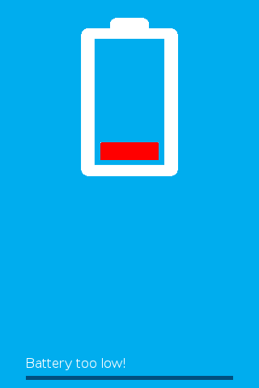

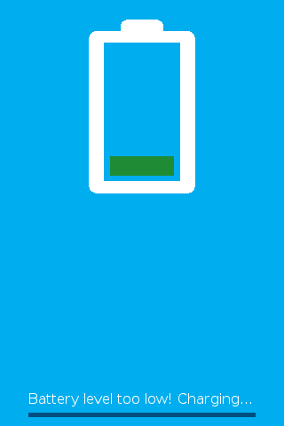

# Appendix: Devices <a href="#sec_mac_devices" id="sec_mac_devices"></a>

**Ux115**

On Ux115 MAC will check for Ux100 pinpad during startup. If MAC will detect pinpad - it will boot full ADK. If pinpad is not connected, MAC will assume that unit operates in remote display mode. MAC will disable most of the functionality (e.g. desktop, statusbar, GUI region management). It will create only one GUI region, which can be used by other connected terminals. Configuration file can be used to enforce or disable remote display mode.

``` cpp
[gui]
window_management=n
```
