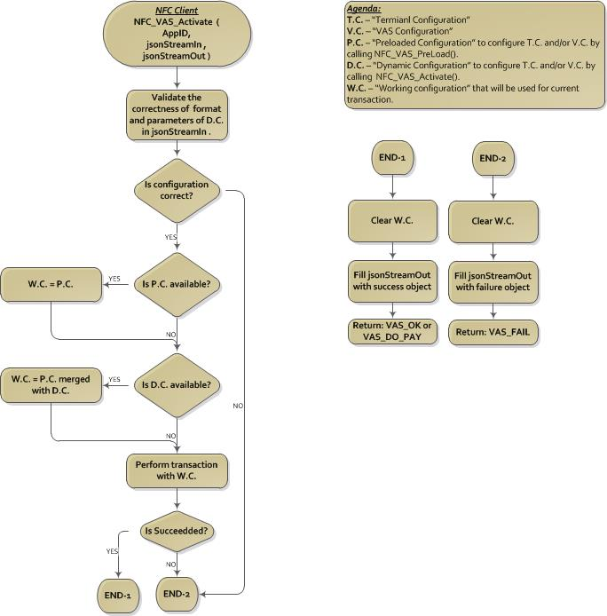

# PREFACE <a href="#sec_preface" id="sec_preface"></a>

This guide provides detailed descriptions of the ADK NFC features, as well as information for configuring ADK NFC framework.

## Audience <a href="#subsec_audience" id="subsec_audience"></a>

This document is intended for programmers who want to understand and use the ADK NFC framework.

## Organization <a href="#subsec_organization" id="subsec_organization"></a>

This guide is organized as follows:

[INTRODUCTION](#sec_introduction). Provides an overview of the ADK NFC framework.

[ARCHITECTURE](#sec_adk_nfc_architecture). Architecture Block Diagram

[GET STARTED](#sec_getstarted). How to work with ADK NFC Firmware.

[GENERAL INTERFACE](#sec_adk_nfc_gen_interface). General functions to initialize and work with NFC Framework.

[PASS THROUGH](#sec_adk_nfc_passthrough). Handles Pass Through functionality such as RF field control, Mifare, FeliCa and APDU based transactons.

[VAS WALLETS](#sec_adk_nfc_wallets). Handles Wallets interface by communicating with VAS Wallet applications based on VWI and other wallet protocols.

[USER INTERFACE](#sec_adk_nfc_ui). Handles User Interface by providing text message, buzzer and LED\'s information.

[TYPES](#sec_adk_nfc_types). Provides information about hardware supported as well as about software requirements. - change the explanation.

[MEMORY ALLOCATION](#sec_adk_nfc_memoryallocation). notes and rules on memory allocation.

[KNOWN ISSUES](#sec_adk_nfc_knownissues). List of know issues and limitations.

[HISTORY](#sec_adk_nfc_history). Information for versions tracking.

# INTRODUCTION <a href="#sec_introduction" id="sec_introduction"></a>

NFC framework handles a non-payment transactions over different communication and data protocols. Initialy was disigned to implement kernels to transfer Value Added Services to and from Mobile Wallets. Later, has been extended to include other communication standards such as different types of Mifare, Felica exchange, APDU exchange. Also handles simple Pass Through functionalities such as Field control, Polling,target activation and transive.

# ARCHITECTURE <a href="#sec_adk_nfc_architecture" id="sec_adk_nfc_architecture"></a>


## User Application <a href="#subsec_adk_nfc_userapplication" id="subsec_adk_nfc_userapplication"></a>

User application, implemented according to the standards and specifications required by the customer/region. Once linked with the client it will have full interface with NFC functionality via either server-client or functional flows depending on platform and architecture. To simplify application development and to standardized the solution Client shares functional interface and handles the communication flow with lower layers.

## NFC Client <a href="#subsec_adk_nfc_nfcclient" id="subsec_adk_nfc_nfcclient"></a>

Shares a functional interface to user application to configure and control lower layers. Converts function calls to byte stream packet according to VFI1 protocol.

### Communication Client (IPC) <a href="#subsubsec_adk_nfc_nfcclientcom" id="subsubsec_adk_nfc_nfcclientcom"></a>

Shares an interface to setup a communication channel (i.e. PIPE, Socket, Mailbox, etc) between application and NFC framework.

### Functional Client <a href="#subsubsec_adk_nfc_nfcclientfun" id="subsubsec_adk_nfc_nfcclientfun"></a>

Direct calls to NFC Framework.

## NFC Server <a href="#subsec_adk_nfc_nfcserver" id="subsec_adk_nfc_nfcserver"></a>

Receives the command via communication channel and calls to NFC Framework In/Out function.

## NFC Framework <a href="#subsec_adk_nfc_framework" id="subsec_adk_nfc_framework"></a>

Responsible on parsing, verification and routing of the command to appropriate functional module. When the functional module completes its flow NFC Framework composes the response package and send it back to the client.

## Pass Through <a href="#subsec_adk_nfc_passthrough" id="subsec_adk_nfc_passthrough"></a>

Provides the functionality to control RF interface, to poll and activate NFC capable devices. Also shares interface to send/receive data packages to/from NFC capable device over APDU, Mifare, Felica and other protocols.

## Mifare <a href="#subsec_adk_nfc_mifare" id="subsec_adk_nfc_mifare"></a>

Provides the functionality to control following Mifare protocols:

- Mifare Ultralight
- Mifare Classic
- Mifare DesFire

## APDU <a href="#subsec_adk_nfc_apdu" id="subsec_adk_nfc_apdu"></a>

Provides the functionality to exchange APDU (ISO-7816) commands.

## Felica <a href="#subsec_adk_nfc_felica" id="subsec_adk_nfc_felica"></a>

Provides the functionality to exchange Type-F Felica commands.

## Technology Discovery <a href="#subsec_adk_nfc_techdiscovery" id="subsec_adk_nfc_techdiscovery"></a>

Responsible for technology discovery of the handset for VAS transactions.

## Wallet Manager <a href="#subsec_adk_nfc_walletmgr" id="subsec_adk_nfc_walletmgr"></a>

Responsible for Configuration, Selection and Processing of VAS Wallet kernels.

# GET STARTED <a href="#sec_getstarted" id="sec_getstarted"></a>

- Link to \"libNFC_Client.so\", \"libUtils.so\" (libNfcUtils.so for Vx), \"libNFC_Framework.so\" and \"libvfiipc.so\".
- Include \"NFC_Interface.h\", \"NFC_Client.h\"
- Make sure you have a linker path set to location with NFC FW libraries to avoid \"symbols not found\" issue.
- For Verix only: Define \_VRXEVO macro
- For Verix only: Define heap size: vrxhdr -h 1000000. Note: you can change heap size value based on your system setup.
- Refer to [EXAMPLES](#sec_adk_nfc_example)

# GENERAL INTERFACE <a href="#sec_adk_nfc_gen_interface" id="sec_adk_nfc_gen_interface"></a>

| Return Value | Name | Parameters | Description |
|:---|:---|----|:---|
| <p>[CL_STATUS](#subsec_adk_nfc_client_status)</p> | <p>NFC_Client_Init</p> | <p>[CONNECTION_TYPE](#subsec_adk_nfc_conn_type)</p> | <p>Initializes NFC Client.</p> |
| <p>[CL_STATUS](#subsec_adk_nfc_client_status)</p> | <p>NFC_SerialOpen</p> | <p>void</p> | <p>Open serial connection to NFC Framework.</p> |
| <p>[CL_STATUS](#subsec_adk_nfc_client_status)</p> | <p>NFC_SerialClose</p> | <p>void</p> | <p>Close serial connection to NFC Framework.</p> |
| <p>[ResponseCodes](#subsec_adk_nfc_responsecodes)</p> | <p>NFC_Ping</p> | <p>[rawData](#subsec_adk_nfc_rawdata) \*dataOut</p> | <p>Return [NFC Framework State](#subsec_adk_nfc_frm_state) of the NFC framework.</p> |
| <p>[ResponseCodes](#subsec_adk_nfc_responsecodes)</p> | <p>NFC_Get_Version</p> | <p>[rawData](#subsec_adk_nfc_rawdata) \*jsonStreamOut</p> | <p>Returns ADK-NFC build and kernels versions.</p> |

``` fragment
By calling NFC_Client_Init() the application will define whether the client going to communicate with NFC Framework directly or serial.
Once the connection is established there is no way to change it unless reboot.
```

``` fragment
NFC_Get_Version() output format will be: 
{
"Component" : "NFC : x.y.z-ab",
"ctls-l1" : "Vertex CTLS x.y.z-ab",
"nfc-l1" : "x.y.z-ab",
"Kernels" : {"wallet1": "x1.y1.z1-a1b1", "wallet2": "x2.y2.z2-a2b2", "wallet3": "x3.y3.z3-a3b3"}
}
NOTE: ctls-l1 version will be returned only after NFC_PT_Open() call.
```

# PASS THROUGH <a href="#sec_adk_nfc_passthrough" id="sec_adk_nfc_passthrough"></a>

## Pass Through <a href="#subsec_adk_nfc_fun_table_general" id="subsec_adk_nfc_fun_table_general"></a>

**General Pass Through Interface:**

| Return Value | Name | Parameters | Description |
|----|----|----|----|
|  |  |  |  |
| <p>[ResponseCodes](#subsec_adk_nfc_responsecodes)</p> | <p>NFC_PT_Open</p> | <p>void</p> | <p>Initializes L1 driver.</p> |
| <p>[ResponseCodes](#subsec_adk_nfc_responsecodes)</p> | <p>NFC_PT_Close</p> | <p>void</p> | <p>Releases L1 driver.</p> |
| <p>[ResponseCodes](#subsec_adk_nfc_responsecodes)</p> | <p>NFC_PT_FieldOn</p> | <p>void</p> | <p>Turns RF field on.</p> |
| <p>[ResponseCodes](#subsec_adk_nfc_responsecodes)</p> | <p>NFC_PT_FieldOff</p> | <p>void</p> | <p>Turns RF field off.</p> |
| <p>[ResponseCodes](#subsec_adk_nfc_responsecodes)</p> | <p>NFC_PT_Polling</p> | <p>[pollReq](#subsec_adk_nfc_poll_req) \*inPollReq</p> | <p>Open the field and executes polling loop to poll time (in mSec). The driver will be configured according to technology, card type, collision and activation parameters.</p> |
| <p>[pollRes](#subsec_adk_nfc_poll_res) \*outPollRes</p> |  |  |  |
| <p>[ResponseCodes](#subsec_adk_nfc_responsecodes)</p> | <p>NFC_PT_PollingFull</p> | <p>[pollReq](#subsec_adk_nfc_poll_req) \*inPollReq</p> | <p>Open the field and executes polling loop to poll time (in mSec). The driver will be configured according to technology, card type, collision and activation parameters.</p> |
| <p>[pollResFull](#subsec_adk_nfc_poll_res_full) \*outPollRes</p> |  |  |  |
| <p>[ResponseCodes](#subsec_adk_nfc_responsecodes)</p> | <p>NFC_PT_PollingABF</p> | <p>[pollReq](#subsec_adk_nfc_poll_req_abf) \*inPollParams</p> | <p>Open the field and executes polling loop to poll time (in mSec). The driver will be configured according to technology, card type, collision and activation parameters.</p> |
| <p>[pollResFull](#subsec_adk_nfc_poll_res_abf) \*outPollRes</p> |  |  |  |
| <p>[ResponseCodes](#subsec_adk_nfc_responsecodes)</p> | <p>NFC_PT_Cancel_Polling</p> | <p>void</p> | <p>Cancels polling process</p> |
| <p>[ResponseCodes](#subsec_adk_nfc_responsecodes)</p> | <p>NFC_PT_Activation</p> | <p>[NFC_CARD_TYPE](#subsec_adk_nfc_card_types) cardtype</p> | <p>Activates (selects) the card found during polling.</p> |
| <p>[rawData](#subsec_adk_nfc_rawdata) \*rd_activationData</p> |  |  |  |
| <p>[ResponseCodes](#subsec_adk_nfc_responsecodes)</p> | <p>NFC_PT_TxRx</p> | <p>[NFC_CARD_TYPE](#subsec_adk_nfc_card_types) cardtype</p> | <p>Sends and receives raw data using ISO 14443-3 protocol.</p> |
| <p>[rawData](#subsec_adk_nfc_rawdata) \*inBuff</p> |  |  |  |
| <p>[rawData](#subsec_adk_nfc_rawdata) \*outBuff</p> |  |  |  |
| <p>[ResponseCodes](#subsec_adk_nfc_responsecodes)</p> | <p>NFC_PT_FtechBaud</p> | <p>[NFC_F_BAUD](#subsec_adk_nfc_f_baud) baud</p> | <p>Changes NFC-F baud rate.</p> |
| <p>[ResponseCodes](#subsec_adk_nfc_responsecodes)</p> | <p>NFC_PT_SetBaudRate</p> | <p>[NFC_BAUD_RATE](#subsec_adk_nfc_baud_rate) baud</p> | <p>Changes NFC baud rate for type A/B technology.</p> |
| <p>void</p> | <p>NFC_Free_Poll_Data</p> | <p>[pollRes](#subsec_adk_nfc_poll_res) \*outPollRes</p> | <p>Releases memory allocated in the [pollRes](#subsec_adk_nfc_poll_res) \*outPollRes when <a href="titusstubs_8cpp.md#aa1e541259f194621834060bf770b717b">NFC_PT_Polling()</a> was called.</p> |
| <p>void</p> | <p>NFC_Free_Poll_Data_Full</p> | <p>[pollResFull](#subsec_adk_nfc_poll_res_full) \*outPollRes</p> | <p>Releases memory allocated in the [pollResFull](#subsec_adk_nfc_poll_res_full) \*outPollRes when <a href="titusstubs_8cpp.md#ac692591d9c1287d0d4b6131a03b2e977">NFC_PT_PollingFull()</a> was called.</p> |

### Pass Through TxRx Flow <a href="#subsubsec_adk_nfc_flow_passthrough" id="subsubsec_adk_nfc_flow_passthrough"></a>


``` fragment
NOTES: 
1.  In some cases polling cycle can fail when both A and F technologies is used in the same cycle.
    Better approach would be to separate polling for A from polling for F in two different calls.
```

## NFC Mifare <a href="#subsec_adk_nfc_fun_table_mifare" id="subsec_adk_nfc_fun_table_mifare"></a>

**Mifare Interface:**

| Return Value | Name | Parameters | Description |
|----|----|----|----|
|  |  |  |  |
| <p>[ResponseCodes](#subsec_adk_nfc_responsecodes)</p> | <p>NFC_Mifare_Authenticate</p> | <p>unsigned char blockNumber</p> | <p>Authenticates blockNumber with key.</p> |
| <p>[MIFARE_KEY_TYPE](#subsec_adk_nfc_mifare_key_types) keyType</p> |  |  |  |
| <p>[rawData](#subsec_adk_nfc_rawdata) \*key</p> |  |  |  |
| <p>[ResponseCodes](#subsec_adk_nfc_responsecodes)</p> | <p>NFC_Mifare_Read</p> | <p>[I_MIFARE_CARD_TYPE](#subsec_adk_nfc_mifare_card_types) m_cardType</p> | <p>Reads the blockAmount (up to 15 blocks at one time) of data from StartBlockNum.</p> |
| <p>usint StartBlockNum</p> |  |  |  |
| <p>usint blockAmount</p> |  |  |  |
| <p>[rawData](#subsec_adk_nfc_rawdata) \*out_buff</p> |  |  |  |
| <p>[ResponseCodes](#subsec_adk_nfc_responsecodes)</p> | <p>NFC_Mifare_Write</p> | <p>[I_MIFARE_CARD_TYPE](#subsec_adk_nfc_mifare_card_types) m_cardType</p> | <p>Writes blockAmount (up to 15 blocks at one time) of data to StartBlockNum.</p> |
| <p>usint StartBlockNum</p> |  |  |  |
| <p>usint blockAmount</p> |  |  |  |
| <p>[rawData](#subsec_adk_nfc_rawdata) \*in_buff</p> |  |  |  |
| <p>[ResponseCodes](#subsec_adk_nfc_responsecodes)</p> | <p>NFC_Mifare_Increment</p> | <p>unsigned int blockNum</p> | <p>Increments value of \'blockNum\' by \'amount\' and stores it in the same block</p> |
| <p>int amount</p> |  |  |  |
| <p>[ResponseCodes](#subsec_adk_nfc_responsecodes)</p> | <p>NFC_Mifare_Decrement</p> | <p>unsigned int blockNum</p> | <p>Decrements value of \'blockNum\' by \'amount\' and stores it in the same block</p> |
| <p>int amount</p> |  |  |  |
| <p>[ResponseCodes](#subsec_adk_nfc_responsecodes)</p> | <p>NFC_Mifare_Increment_Only</p> | <p>unsigned int blockNum</p> | <p>Increments value of \'blockNum\' by \'amount\' and stores it in the temporary block</p> |
| <p>int amount</p> |  |  |  |
| <p>[ResponseCodes](#subsec_adk_nfc_responsecodes)</p> | <p>NFC_Mifare_Decrement_Only</p> | <p>unsigned int blockNum</p> | <p>Decrements value of \'blockNum\' by \'amount\' and stores it in the temporary block</p> |
| <p>int amount</p> |  |  |  |
| <p>[ResponseCodes](#subsec_adk_nfc_responsecodes)</p> | <p>NFC_Mifare_Transfer</p> | <p>unsigned int blockNum</p> | <p>Transfers block value from blockNum tp temporary block</p> |
| <p>[ResponseCodes](#subsec_adk_nfc_responsecodes)</p> | <p>NFC_Mifare_Restore</p> | <p>unsigned int blockNum</p> | <p>Restores block value from temporary to blockNum</p> |

### Mifare Flow <a href="#subsubsec_adk_nfc_flow_mifare" id="subsubsec_adk_nfc_flow_mifare"></a>


### NFC Mifare Ultralight C <a href="#subsubsec_adk_nfc_mifare_ul_c" id="subsubsec_adk_nfc_mifare_ul_c"></a>

``` fragment
Unlike to regular Mifare Ultralight, Mifare Ultralight C has authentication process to get an access to protected pages.
The authentication key is stored in the last four pages on the card. Same key should be used from the application side to process authentication properly.

Following flow represents standard Mifare Ultralight C transaction:

1. Call NFC_PT_Open()
2. Call NFC_PT_FieldOn()
3. Call NFC_PT_PollingFull(Technology "A") and ensure that returned card type is "I_MIFARE_TYPE_ULTRALIGHT_C"
4. Call NFC_PT_Activation(Technology "A")
5. Call NFC_PT_TxRx() with data "0xA1, 0x00" to initiate authentication process and ensure that 8 bytes of encrypted random (R-card) number received.
6. Generate terminal random number (R-terminal) and decrypt random received from card D(R-card)
7. Call NFC_PT_TxRx() with combined encrypted E(R-card and R-terminal) and verify the response (should be ACK 0x0A)
8. Call NFC_Mifare_Read() to read data from the card
9. Call NFC_Mifare_Write() to read data to the card
10. NFC_PT_FieldOff()
11. NFC_PT_Close()
```

``` fragment
NOTES: 
1.  On VOS2 based platform, per L1 design, calling mifare authentication will automatically call polling and activation of the first mifare card found. 
2.  Due to L1 driver interface limitations, 15 block is a maximum amount of data to read/write from/to MiFare card. 
3.  According to MiFare specification, there is no card type validation before any operation. Moreover some commands are shared between MiFare Classic and UL. 
    It is user's responsibility to ensure the card type is correct.
4.  NFC_PT_Activation() is required to get the card into 'Activate" state and be ready to perform Read/Write operations.
5.  MiFare Contactless Cards and Tags have much slower CPU than Contactless readers, hence in some cases short delay (~10-15 microseconds) should added between 
    MiFare operations. This will allow the card to finish its flow and return back to Ready state.
```

## NFC APDU Exchange <a href="#subsec_adk_nfc_fun_table_apdu" id="subsec_adk_nfc_fun_table_apdu"></a>

**APDU Exchange Interface:**

| Return Value | Name | Parameters | Description |
|----|----|----|----|
|  |  |  |  |
| <p>[ResponseCodes](#subsec_adk_nfc_responsecodes)</p> | <p>NFC_APDU_Exchange</p> | <p>[apduTxData](#subsec_adk_nfc_apdu_txdata) \*txData</p> | <p>Data transive over APDU protocol.</p> |
| <p>[apduRxData](#subsec_adk_nfc_apdu_rxdata) \*rxData</p> |  |  |  |

### APDU Exchange Flow <a href="#subsubsec_adk_nfc_flow_apdu" id="subsubsec_adk_nfc_flow_apdu"></a>


## NFC Felica Polling <a href="#subsec_adk_nfc_fun_table_felicapolling" id="subsec_adk_nfc_fun_table_felicapolling"></a>

**Felica Exchange Interface:**

| Return Value | Name | Parameters | Description |
|:---|:---|----|:---|
| <p>[ResponseCodes](#subsec_adk_nfc_responsecodes)</p> | <p>NFC_Felica_Polling</p> | <p>unsigned int pollTimeout</p> | <p>FeliCa Polling request.</p> |
| <p>[FeliCa Polling Parameters](#subsec_adk_nfc_felica_polling_param) \*inData</p> |  |  |  |
| <p>[FeliCa Polling Result](#subsec_adk_nfc_felica_polling_result) \*outData</p> |  |  |  |

## NFC Felica Exchange <a href="#subsec_adk_nfc_fun_table_felica" id="subsec_adk_nfc_fun_table_felica"></a>

**Felica Exchange Interface:**

| Return Value | Name | Parameters | Description |
|:---|:---|----|:---|
| <p>[ResponseCodes](#subsec_adk_nfc_responsecodes)</p> | <p>NFC_Felica_Exchange</p> | <p>[FeliCa TxData](#subsec_adk_nfc_felica_txdata) \*txData</p> | <p>Data transive over Felica protocol.</p> |
| <p>[FeliCa RxData](#subsec_adk_nfc_felica_rxdata) \*rxData</p> |  |  |  |

### Felica Exchange Flow <a href="#subsubsec_adk_nfc_flow_felica" id="subsubsec_adk_nfc_flow_felica"></a>


## Target Mode <a href="#subsec_adk_nfc_fun_table_target_mode" id="subsec_adk_nfc_fun_table_target_mode"></a>

**Target Mode Interface:**

| Return Value | Name | Parameters | Description |
|:---|:---|----|:---|
| <p>[ResponseCodes](#subsec_adk_nfc_responsecodes)</p> | <p>NFC_Target_Action</p> | <p>[NFC_TARGET_ACTION](#subsec_adk_nfc_target_actions) action</p> | <p>Processing actions in NFC target mode.</p> |
| <p>usint timeout</p> |  |  |  |
| <p>[rawData](#subsec_adk_nfc_rawdata) \*rd_inData</p> |  |  |  |
| <p>[rawData](#subsec_adk_nfc_rawdata) \*rd_outData</p> |  |  |  |
| <p>[ResponseCodes](#subsec_adk_nfc_responsecodes)</p> | <p>NFC_Create_Ndef</p> | <p>[NFC_NDEF_TYPES](#subsec_adk_nfc_ndef_types) type</p> | <p>Generate NDEF message based on type and inData.</p> |
| <p>[rawData](#subsec_adk_nfc_rawdata) \*rd_inData</p> |  |  |  |
| <p>[rawData](#subsec_adk_nfc_rawdata) \*rd_outData</p> |  |  |  |

## VFI1 PROTOCOL INTERFACE <a href="#sec_adk_nfc_vfi1_table" id="sec_adk_nfc_vfi1_table"></a>

### VFI1 Request Packet Format <a href="#subsec_adk_nfc_vfi1_req_packet_format" id="subsec_adk_nfc_vfi1_req_packet_format"></a>

| Byte 0-3 | Byte 4 | Byte 5 | Byte 6 | Byte 7 | Byte 8-15 | Byte 16 | Byte 17 | Byte 18+n-1 | Byte 18+n | Byte 18+n+1 |
|----|----|----|----|----|----|----|----|----|----|----|
|  |  |  |  |  |  |  |  |  |  |  |
| <p>Header</p> | <p>Command ID</p> | <p>Command ID</p> | <p>Packet Length (MSB)</p> | <p>Packet Length (LSB)</p> | <p>Application Name</p> | <p>Data Length (MSB)</p> | <p>Data Length (LSB)</p> | <p>Data</p> | <p>CRC (MSB)</p> | <p>CRC (LSB</p> |
| <p>\'VFI1\'</p> | <p>[VFI1 Command Types](#subsec_adk_nfc_vfi1_commandtypes)</p> | <p>[VFI1 Command Types](#subsec_adk_nfc_vfi1_commandtypes)</p> | <p>var.</p> | <p>var.</p> | <p>Name of embedded application to execute</p> | <p>var.</p> | <p>var.</p> | <p>var.</p> | <p>CRC Calculation</p> |  |

### VFI1 Response Packet Format <a href="#subsec_adk_nfc_vfi1_res_packet_format" id="subsec_adk_nfc_vfi1_res_packet_format"></a>

| Byte 0-3 | Byte 4 | Byte 5 | Byte 6 | Byte 7 | Byte 8-15 | Byte 16 | Byte 17 | Byte 18+n-1 | Byte 18+n | Byte 18+n+1 |
|----|----|----|----|----|----|----|----|----|----|----|
|  |  |  |  |  |  |  |  |  |  |  |
| <p>Header</p> | <p>Command ID</p> | <p>Response Code</p> | <p>Packet Length (MSB)</p> | <p>Packet Length (LSB)</p> | <p>Application Name</p> | <p>Data Length (MSB)</p> | <p>Data Length (LSB)</p> | <p>Data</p> | <p>CRC (MSB)</p> | <p>CRC (LSB)</p> |
| <p>\'VFI1\'</p> | <p>[VFI1 Command Types](#subsec_adk_nfc_vfi1_commandtypes)</p> | <p>[ResponseCodes](#subsec_adk_nfc_responsecodes)</p> | <p>var.</p> | <p>var.</p> | <p>Name of embedded application to execute</p> | <p>var.</p> | <p>var.</p> | <p>var.</p> | <p>CRC Calculation</p> |  |

### VFI1 CRC <a href="#subsec_adk_nfc_vfi1_crc_packet_format" id="subsec_adk_nfc_vfi1_crc_packet_format"></a>

|  |  |
|:--:|:--:|
| <p>Width</p> | <p>16-bits</p> |
| <p>Polynomial</p> | <p>X16+X12+X5+1</p> |
| <p>Initial Value</p> | <p>0xFFFF</p> |

### VFI1 Command Types <a href="#subsec_adk_nfc_vfi1_commandtypes" id="subsec_adk_nfc_vfi1_commandtypes"></a>

| Command Name | Cmd | Sub-Cmd | Description |
|:---|:--:|:--:|:---|
| <p>PING</p> | <p>0x01</p> | <p>0x00</p> | <p>This command sent from Host application to verify that the ADK-NFC layers are available and \'alive\'.</p> |
| <p>PT OPEN</p> | <p>0x31</p> | <p>0x01</p> | <p>Initializes L1 driver.</p> |
| <p>PT CLOSE</p> | <p>0x31</p> | <p>0x02</p> | <p>Releases L1 driver.</p> |
| <p>PT FIELD ON</p> | <p>0x31</p> | <p>0x03</p> | <p>Turns RF field on.</p> |
| <p>PT FIELD OFF</p> | <p>0x31</p> | <p>0x04</p> | <p>Turns RF field off.</p> |
| <p>PT POLL</p> | <p>0x31</p> | <p>0x05</p> | <p>Open the field and executes polling loop to poll time (in mSec). The driver will be configured according to technology, card type, collision and activation parameters.</p> |
| <p>PT CANCEL POLL</p> | <p>0x31</p> | <p>0x06</p> | <p>Cancels polling process.</p> |
| <p>PT ACTIVATION</p> | <p>0x31</p> | <p>0x07</p> | <p>Activates (selects) the card found during polling.</p> |
| <p>PT TX-RX</p> | <p>0x31</p> | <p>0x08</p> | <p>Data transive.</p> |
| <p>PT SET F BAUD RATE</p> | <p>0x31</p> | <p>0x09</p> | <p>Changing baud rate for \'F\' technology.</p> |
| <p>MIFARE AUTHENTICATION</p> | <p>0x31</p> | <p>0x0A</p> | <p>Authenticates block 'x' with key 'y'.</p> |
| <p>MIFARE READ</p> | <p>0x31</p> | <p>0x0B</p> | <p>Reads the 'y' bytes of data from block 'x'.</p> |
| <p>MIFARE WRITE</p> | <p>0x31</p> | <p>0x0C</p> | <p>Writes 'y' bytes of data to block 'x'.</p> |
| <p>APDU EXCHANGE</p> | <p>0x31</p> | <p>0x0E</p> | <p>Data transive over APDU protocol.</p> |
| <p>FELICA EXCHANGE</p> | <p>0x31</p> | <p>0x0F</p> | <p>Data transive over Felica protocol.</p> |

## TAGS <a href="#sec_adk_nfc_tags" id="sec_adk_nfc_tags"></a>

Provides information on tags using over VFI1 PROTOCOL INTERFACE

### Polling Request TAGS <a href="#sec_adk_nfc_pollreqtags" id="sec_adk_nfc_pollreqtags"></a>

| Tag Name | Tag | Value Lenght | Description |
|:---|:--:|:--:|:---|
| <p>TECH_BITMAP_TAG</p> | <p>0xC0</p> | <p>0x02</p> | <p>Bitmap of [Polling Technologies Bitmap](#subsec_adk_nfc_poll_tech) to poll</p> |
| <p>TECH_TIMEOUT_TAG</p> | <p>0xC1</p> | <p>0x04</p> | <p>Polling time in milliseconds. 0 mean infinite time.</p> |

### Polling Response TAGS <a href="#sec_adk_nfc_pollrestags" id="sec_adk_nfc_pollrestags"></a>

| Tag Name | Tag | Value Lenght | Description |
|:---|:--:|:--:|:---|
| <p>EMB_APP_TOTAL_NUM_OF_CARDS_TAG</p> | <p>0xC3</p> | <p>0x01</p> | <p>Number of cards discovered in the field</p> |
| <p>EMB_APP_TOTAL_NUM_OF_CARDS_A_TAG</p> | <p>0xC4</p> | <p>0x01</p> | <p>Number of technology \'A\' cards discovered in the field</p> |
| <p>EMB_APP_TOTAL_NUM_OF_CARDS_B_TAG</p> | <p>0xC5</p> | <p>0x01</p> | <p>Number of technology \'B\' cards discovered in the field</p> |
| <p>EMB_APP_TOTAL_NUM_OF_CARDS_F_TAG</p> | <p>0xC6</p> | <p>0x01</p> | <p>Number of technology \'F\' cards discovered in the field</p> |
| <p>EMB_APP_CARD_TYPE_TAG</p> | <p>0xC7</p> | <p>0x01</p> | <p>[NFC_CARD_TYPE](#subsec_adk_nfc_card_types)</p> |
| <p>EMB_APP_CARD_UID_TAG</p> | <p>0xC8</p> | <p>Variable</p> | <p>Card Identifier</p> |

### Activation Request TAGS <a href="#sec_adk_nfc_activationtags" id="sec_adk_nfc_activationtags"></a>

| Tag Name | Tag | Value Lenght | Description |
|:---|:--:|:--:|:---|
| <p>EMB_APP_CARD_TYPE_TAG</p> | <p>0xC7</p> | <p>0x01</p> | <p>[NFC_CARD_TYPE](#subsec_adk_nfc_card_types)</p> |

### Tx-Rx (send-Recieve) TAGS <a href="#sec_adk_nfc_txrxtags" id="sec_adk_nfc_txrxtags"></a>

| Tag Name | Tag | Value Lenght | Description |
|:---|:--:|:--:|:---|
| <p>EMB_APP_PT_TXRX_DATA_TAG</p> | <p>0xD2</p> | <p>Variable</p> | <p>Tag that handles both data to send and received data</p> |

### Mifare TAGS <a href="#sec_adk_nfc_mifare" id="sec_adk_nfc_mifare"></a>

| Tag Name | Tag | Value Lenght | Description |
|:---|:--:|:--:|:---|
| <p>EMB_APP_PT_MIFARE_BLOCK_NUM_TAG</p> | <p>0xE1</p> | <p>0x01</p> | <p>Block number to authenticate, read from or write to</p> |
| <p>EMB_APP_PT_MIFARE_KEY_TYPE_TAG</p> | <p>0xE2</p> | <p>0x01</p> | <p>Mifare classic authentication key type</p> |
| <p>EMB_APP_PT_MIFARE_KEY_TAG</p> | <p>0xE3</p> | <p>0x06</p> | <p>Mifare classic authentication key</p> |
| <p>EMB_APP_PT_MIFARE_START_BLOCK_TAG</p> | <p>0xE4</p> | <p>0x01</p> | <p>Block number to start read from/ write to</p> |
| <p>EMB_APP_PT_MIFARE_BLOCK_AMOUNT_TAG</p> | <p>0xE5</p> | <p>0x01</p> | <p>Anount of blocks to read/write</p> |
| <p>EMB_APP_PT_MIFARE_WRITE_DATA_TAG</p> | <p>0xE6</p> | <p>Variable</p> | <p>Data to write to the card</p> |
| <p>EMB_APP_PT_MIFARE_READ_DATA_TAG</p> | <p>0xE7</p> | <p>Variable</p> | <p>Data that was read from the card</p> |

### APDU TAGS <a href="#sec_adk_nfc_apdu" id="sec_adk_nfc_apdu"></a>

| Tag Name | Tag | Value Lenght | Description |
|:---|:--:|:--:|:---|
| <p>EMB_APP_PT_APDU_CLASS_TAG</p> | <p>0xE8</p> | <p>0x01</p> | <p>APDU Class</p> |
| <p>EMB_APP_PT_APDU_INSTRA_TAG</p> | <p>0xE9</p> | <p>0x01</p> | <p>APDU Instruction</p> |
| <p>EMB_APP_PT_APDU_PARAM1_TAG</p> | <p>0xEA</p> | <p>0x01</p> | <p>APDU Parameter 1</p> |
| <p>EMB_APP_PT_APDU_PARAM2_TAG</p> | <p>0xEB</p> | <p>0x01</p> | <p>APDU Parameter 1</p> |
| <p>EMB_APP_PT_APDU_EXPECT_LEN_RES_TAG</p> | <p>0xEC</p> | <p>0x01</p> | <p>APDU response expected size</p> |
| <p>EMB_APP_PT_APDU_DATA_TAG</p> | <p>0xED</p> | <p>Variable</p> | <p>APDU Data</p> |
| <p>EMB_APP_PT_APDU_SW1_TAG</p> | <p>0xEE</p> | <p>0x01</p> | <p>APDU Status Word 1</p> |
| <p>EMB_APP_PT_APDU_SW2_TAG</p> | <p>0xEF</p> | <p>0x01</p> | <p>APDU Status Word 2</p> |

### Felica TAGS <a href="#sec_adk_nfc_felica" id="sec_adk_nfc_felica"></a>

| Tag Name | Tag | Value Lenght | Description |
|:---|:--:|:--:|:---|
| <p>EMB_APP_PT_FELICA_DATA_TAG</p> | <p>0xF0</p> | <p>Variable</p> | <p>Felica data</p> |

### Set F Baud Rate TAGS <a href="#sec_adk_nfc_setfbaud" id="sec_adk_nfc_setfbaud"></a>

| Tag Name | Tag | Value Lenght | Description |
|:---|:--:|:--:|:---|
| <p>EMB_APP_BAUD_TAG</p> | <p>0xC9</p> | <p>1</p> | <p>[NFC_F_BAUD](#subsec_adk_nfc_f_baud)</p> |

# VAS WALLETS <a href="#sec_adk_nfc_wallets" id="sec_adk_nfc_wallets"></a>

## VAS Wallet Functional Interface <a href="#subsec_adk_nfc_vas_wallet_func_interface" id="subsec_adk_nfc_vas_wallet_func_interface"></a>

| Return Value | Name | Parameters | Description |
|:---|:---|----|:---|
| <p>[VasStatus](#subsec_adk_nfc_vasstatus)</p> | <p>NFC_VAS_UpdateConfig</p> | <p>[rawData](#subsec_adk_nfc_rawdata) \*appID - Application unique identifier.</p> | <p>Configures the terminal with wallet specific parameters.</p> |
| <p>[rawData](#subsec_adk_nfc_rawdata) \*jsonStreamIn - Set of parameters to configure ome or multiple wallets.</p> |  |  |  |
| <p>[rawData](#subsec_adk_nfc_rawdata) \*jsonStreamOut - Not returns any data. RFU.</p> |  |  |  |
| <p>[VasStatus](#subsec_adk_nfc_vasstatus)</p> | <p>NFC_Terminal_Config</p> | <p>[rawData](#subsec_adk_nfc_rawdata) \*jsonStreamIn - [Terminal Configuration Parameters](#subsec_adk_nfc_vas_terminal_config_types)</p> | <p>Configures the terminal with terminal parameters.</p> |
| <p>[rawData](#subsec_adk_nfc_rawdata) \*jsonStreamOut - Not returns any data. RFU.</p> |  |  |  |
| <p>[VasStatus](#subsec_adk_nfc_vasstatus)</p> | <p>NFC_VAS_ReadConfig</p> | <p>[rawData](#subsec_adk_nfc_rawdata) \*appID - Application unique identifier.</p> | <p>Reads the most updated wallets configuration.</p> |
| <p>[rawData](#subsec_adk_nfc_rawdata) \*jsonStreamOut - most updated configuration for terminal and all wallets in json format.</p> |  |  |  |
| <p>[VasStatus](#subsec_adk_nfc_vasstatus)</p> | <p>NFC_TERMINAL_ReadConfig</p> | <p>[rawData](#subsec_adk_nfc_rawdata) \*appID - Application unique identifier.</p> | <p>Reads the most updated terminal configuration.Static parameter will be returned in case appID is unknown or <a href="titusstubs_8cpp.md#a8ee28a30cc5757bdd4d9ac413fe7ef17">NFC_VAS_PreLoad()</a> issued without changing Termianl configuration.</p> |
| <p>[rawData](#subsec_adk_nfc_rawdata) \*jsonStreamOut - most updated [Read Terminal Configuration Parameters](#subsec_adk_nfc_vas_read_terminal_config_types)</p> |  |  |  |
| <p>[VasStatus](#subsec_adk_nfc_vasstatus)</p> | <p>NFC_VAS_Activate</p> | <p>[rawData](#subsec_adk_nfc_rawdata) \*appID - Application unique identifier.</p> | <p>Activates NFC interface, runs through wallet kernel flow and retrieves VAS data.</p> |
| <p>[rawData](#subsec_adk_nfc_rawdata) \*jsonStreamIn - Set of dynamic parameters to be merged with configuration from data base.</p> |  |  |  |
| <p>[rawData](#subsec_adk_nfc_rawdata) \*jsonStreamOut - VAS data received from the handset formatted as json.</p> |  |  |  |
| <p>[VasStatus](#subsec_adk_nfc_vasstatus)</p> | <p>NFC_VAS_Cancel</p> | <p>void</p> | <p>Cancels technology discovery process.</p> |
| <p>[VasStatus](#subsec_adk_nfc_vasstatus)</p> | <p>NFC_VAS_CancelConfig</p> | <p>[rawData](#subsec_adk_nfc_rawdata) \*appID - Application unique identifier.</p> | <p>Clears all the VAS configuration by application ID.</p> |
| <p>[VasStatus](#subsec_adk_nfc_vasstatus)</p> | <p>NFC_VAS_PreLoad</p> | <p>[rawData](#subsec_adk_nfc_rawdata) \*appID - Application unique identifier.</p> | <p>Configures the terminal with wallet specific parameters. <a href="titusstubs_8cpp.md#a1f0e681b88497ef9e25abde4ed3b5b3b">NFC_VAS_Activate()</a> has to be called to get VAS data. Only single PreLoaded configuration is available.</p> |
| <p>[rawData](#subsec_adk_nfc_rawdata) \*jsonStreamIn - Set of PreLoad parameters to be merged with configuration from data base.</p> |  |  |  |
| <p>[rawData](#subsec_adk_nfc_rawdata) \*jsonStreamOut - Not returns any data. RFU.</p> |  |  |  |
| <p>[VasStatus](#subsec_adk_nfc_vasstatus)</p> | <p>NFC_VAS_CancelPreLoad</p> | <p>[rawData](#subsec_adk_nfc_rawdata) \*appID - Application unique identifier.</p> | <p>Clear preloaded configuration by application ID and pulls latest static configuration from data base.</p> |
| <p>[VasStatus](#subsec_adk_nfc_vasstatus)</p> | <p>NFC_VAS_Decrypt</p> | <p>[rawData](#subsec_adk_nfc_rawdata) \*appID - Application unique identifier.</p> | <p>Decrypts an encrypted VAS response.</p> |
| <p>[rawData](#subsec_adk_nfc_rawdata) \*jsonStreamIn - The json in the same format of the Vas Data Response with the included encrypted message.</p> |  |  |  |
| <p>[rawData](#subsec_adk_nfc_rawdata) \*jsonStreamOut - The json in the same format of the Vas Data Response with the included decrypted message.</p> |  |  |  |

## NFC VAS General Flow <a href="#subsec_adk_nfc_vas_wallets_general_flow" id="subsec_adk_nfc_vas_wallets_general_flow"></a>


``` fragment
1. VAS Initialization - as part of Application initialization process upon start up , VAS wallet framework should be initialized and configured.

    Following calls should be made:
    -   NFC_PT_Open() - opens CTLS/NFC RF interface.
    -   NFC_TERMINAL _Config() - configures terminal specific parameters (terminal capabilities) general for all wallets. 
        Some of the parameters may be used by one wallet and not used by other but they are general across all wallets.
    -   NFC_TERMINAL_ReadConfig() - reads Terminal configuration parameters. Mostly used to ensure that  NFC_TERMINAL _Config() worked fine.
    -   NFC_VAS_UpdateConfig() - configures wallet specific parameters based on the Wallet specification.
    -   NFC_VAS_ReadConfig() - reads Wallet configuration parameters. Mostly used to ensure that  NFC_VAS_UpdateConfig() worked fine.

2. VAS Transaction -  consists of 4 major steps:
    -   Technology Selection (RF Polling).
    -   Wallet selection and Authentication.
    -   Data exchange.
    -   Data Decryption (if needed).
    
3. Please note, there is a possibility to replace configuration parameters with dynamic values using the following:
    -   NFC_VAS_Preload() used to change Terminal and Wallet parameters and use them until NFC_VAS_PreLoad() or another NFC_VAS_Preload() called.
    -   jsonStreamIn parameeter in NFC_VAS_Activate() used to change Termianl and Wallet parameters for one (current) transaction only. 
        By the end of transaction all configuration parameters will be returned to what was configured by calling  NFC_TERMINAL _Config() and NFC_VAS_UpdateConfig().

4. In case ADK-NFC component used by ADK-TEC please refer to ADK-TEC documentation. 

5. NFC_VAS_UpdateConfig() can possibly handle configuration parameters for more than one wallet.
   Based on the implementation there is a possibility that one wallet was successfully configured while other failed, the return status will still be VAS_ERR_CONFIG or  VAS_FAIL.
   In order to avoid such situation it is recomended: 
   -    To configure each Wallet separetelly and verify the status code.
   -    To call NFC_VAS_ReadConfig() and validate that all wallets confugured successfully.
```

## Terminal Configuration Parameters <a href="#subsec_adk_nfc_vas_terminal_config_types" id="subsec_adk_nfc_vas_terminal_config_types"></a>

``` fragment
NOTE: Terminal configuration has a default set of parameter in case it will not configured by the user.
```

``` fragment
NOTE: As per today all supported wallets has 'A' or 'B' technology/modulation. Please note, Android based mobile phone supports 'F' modulation along with 'A' or 'B'. 
      Including of 'F' modulation along with 'A' or 'B' may cause ADK-NFC to respond with 'Collision' status. 
```

``` fragment
NOTE: Wallet/Dynamic/PreLoad configuration sets may vary based on the wallet specifications.
To get more information please refer to appropriate wallet design document.
```

| JSON Key | M/O | Ancestor | Type | Value | Description |
|:---|:--:|:---|:--:|:---|:---|
| <p>\"Terminal_Configuration\"</p> | <p>M</p> | <p>N/A</p> | <p>Object</p> | <p>\"Configuration_version\"</p> | <p>Keeps json objects used to configure the terminal.</p> |
| <p>\"Terminal\"</p> |  |  |  |  |  |
| <p>\"Log\"</p> |  |  |  |  |  |
| <p>\"Configuration_version\"</p> | <p>O</p> | <p>\"Terminal_Configuration\"</p> | <p>String</p> | <p>\"1.0\"</p> | <p>Current vesrion of configuration structure and format. Default: \"1.0\".</p> |
| <p>\"Terminal\"</p> | <p>O</p> | <p>\"Terminal_Configuration\"</p> | <p>Object</p> | <p>\"Terminal_Capabilities\"</p> | <p>Configuration parameters common accros all the wallets.</p> |
| <p>\"PollTech\"</p> |  |  |  |  |  |
| <p>\"PollTime\"</p> |  |  |  |  |  |
| <p>\"Terminal_Capabilities\"</p> | <p>O</p> | <p>\"Terminal\"</p> | <p>Object</p> | <p>\"Capabilities\"</p> | <p>Terminal capabilities parameters.</p> |
| <p>\"system\"</p> |  |  |  |  |  |
| <p>\"UI\"</p> |  |  |  |  |  |
| <p>\"CVM\"</p> |  |  |  |  |  |
| <p>\"Check_Out\"</p> |  |  |  |  |  |
| <p>\"Presigned_Auth\"</p> |  |  |  |  |  |
| <p>\"Capabilities\"</p> | <p>O</p> | <p>\"Terminal_Capabilities\"</p> | <p>String</p> | <p>\"Payment&VAS\"</p> | <p>Terminal capable to perform both VAS and Payment transactions. Used as default.</p> |
| <p>\"Payment\|VAS\"</p> | <p>Terminal capable to perform both Payment transactions if no VAS data received.</p> |  |  |  |  |
| <p>\"Payment\"</p> | <p>Terminal capable to perform Payment transactions only.</p> |  |  |  |  |
| <p>\"VAS\"</p> | <p>Terminal capable to perform both VAS transactions only.</p> |  |  |  |  |
| <p>\"system\"</p> | <p>O</p> | <p>\"Terminal_Capabilities\"</p> | <p>Boolean</p> | <p>\"Standalone\"</p> | <p>List of bit values configuring system capabilities, 0-Disabled, 1-Enabled. Default for all parameters: \"0\".</p> |
| <p>\"Semi_integrated\"</p> |  |  |  |  |  |
| <p>\"Unattended\"</p> |  |  |  |  |  |
| <p>\"Online\"</p> |  |  |  |  |  |
| <p>\"Offline\"</p> |  |  |  |  |  |
| <p>\"MMP\"</p> |  |  |  |  |  |
| <p>\"Compression\"</p> |  |  |  |  |  |
| <p>\"UI\"</p> | <p>O</p> | <p>\"Terminal_Capabilities\"</p> | <p>Boolean</p> | <p>\"Printer\"</p> | <p>List of bit values configuring UI capabilities, 0-Disabled, 1-Enabled. Default for all parameters: \"0\".</p> |
| <p>\"Printer_Graphics\"</p> |  |  |  |  |  |
| <p>\"Display\"</p> |  |  |  |  |  |
| <p>\"Images\"</p> |  |  |  |  |  |
| <p>\"Audio\"</p> |  |  |  |  |  |
| <p>\"Animation\"</p> |  |  |  |  |  |
| <p>\"Video\"</p> |  |  |  |  |  |
| <p>\"CVM\"</p> | <p>O</p> | <p>\"Terminal_Capabilities\"</p> | <p>Boolean</p> | <p>\"Online_PIN\"</p> | <p>List of bit values configuring CVM capabilities, 0-Disabled, 1-Enabled. Default for all parameters: \"0\".</p> |
| <p>\"CD_PIN\"</p> |  |  |  |  |  |
| <p>\"Signature\"</p> |  |  |  |  |  |
| <p>\"No_CVM\"</p> |  |  |  |  |  |
| <p>\"Device_Generated_Code\"</p> |  |  |  |  |  |
| <p>\"SP_Generated_Code\"</p> |  |  |  |  |  |
| <p>\"ID_Capture\"</p> |  |  |  |  |  |
| <p>\"Biometric\"</p> |  |  |  |  |  |
| <p>\"Check_Out\"</p> | <p>O</p> | <p>\"Terminal_Capabilities\"</p> | <p>Boolean</p> | <p>\"Digital_Receipt\"</p> | <p>List of bit values configuring check out capabilities, 0-Disabled, 1-Enabled. Default for all parameters: \"0\".</p> |
| <p>\"Service_Issuance\"</p> |  |  |  |  |  |
| <p>\"OTA_POS_Data\"</p> |  |  |  |  |  |
| <p>\"Presigned_Auth\"</p> | <p>O</p> | <p>\"Terminal_Capabilities\"</p> | <p>Boolean</p> | <p>Variable</p> | <p>Activates pre-signed authentication option for slow/low power/low CPU devices. 0-Disabled, 1-Enabled. Default is 0.</p> |
| <p>\"PollTech\"</p> | <p>O</p> | <p>\"Terminal\"</p> | <p>String</p> | <p>Variable</p> | <p>Configuring terminal to poll for \"ABF\"/\"AB\"/\"AF\"/\"BF\"/\"A\"/\"B\"/\"F\" technologies. Default:\"AB\".</p> |
| <p>\"PollTime\"</p> | <p>O</p> | <p>\"Terminal\"</p> | <p>Integer</p> | <p>Variable</p> | <p>Polling time in miliseconds. Default: 10000.</p> |
| <p>\"Log\"</p> | <p>O</p> | <p>\"Terminal_Configuration\"</p> | <p>Object</p> | <p>\"Log_Level_Bit_Map\"</p> | <p>Prints debug messages to standard I/O.</p> |
| <p>\"Log_Level_Bit_Map\"</p> | <p>M</p> | <p>\"Log\"</p> | <p>Integer</p> | <p>1</p> | <p>[LOG BIT MASK](#subsec_adk_nfc_log_bitmask). Default: 7.</p> |

## Read Terminal Configuration Parameters <a href="#subsec_adk_nfc_vas_read_terminal_config_types" id="subsec_adk_nfc_vas_read_terminal_config_types"></a>

| JSON Key | M/O | Ancestor | Type | Value | Description |
|:---|:--:|:---|:--:|:---|:---|
| <p>\"Format_Version\"</p> | <p>M</p> | <p>N/A</p> | <p>String</p> | <p>Variable</p> | <p>Format Version of the json response.</p> |
| <p>\"Terminal_Configuration\"</p> | <p>M</p> | <p>N/A</p> | <p>Object</p> | <p>\"Pre_Load\"</p> | <p>Returns json objects of the terminal configuration.</p> |
| <p>\"App_Id\"</p> |  |  |  |  |  |
| <p>\"Terminal\"</p> |  |  |  |  |  |
| <p>\"Source_List\"</p> |  |  |  |  |  |
| <p>\"Log\"</p> |  |  |  |  |  |
| <p>\"Pre_Load\"</p> | <p>C</p> | <p>\"Terminal_Configuration\"</p> | <p>String</p> | <p>\"true\"</p> | <p>Must be exist only if Read Terminal called with a pre configured Applocation ID.</p> |
| <p>\"App_Id\"</p> | <p>C</p> | <p>\"Terminal_Configuration\"</p> | <p>String</p> | <p>Variable</p> | <p>Must be exist only if Read Terminal called with a pre configured Applocation ID. Application Identifier used on pre load configuration command that issued before.</p> |
| <p>\"Source_List\"</p> | <p>C</p> | <p>\"Terminal_Configuration\"</p> | <p>Json Array</p> | <p>multiple entries of \"Source\" Json Key</p> | <p>Must be exist only if Source List was pre configured with preload command. Multiple sources are valid.</p> |
| <p>\"Source\"</p> | <p>M</p> | <p>Entry in \"Source_List\" Array</p> | <p>String</p> | <p>Variable string</p> | <p>At least one source must be exist. Value is a wallet name.</p> |
| <p>\"Terminal\"</p> | <p>M</p> | <p>\"Terminal_Configuration\"</p> | <p>Object</p> | <p>\"Terminal_Capabilities\"</p> | <p>Returns json objects of the terminal configuration.</p> |
| <p>\"PollTech\"</p> |  |  |  |  |  |
| <p>\"PollTime\"</p> |  |  |  |  |  |
| <p>\"Terminal_Capabilities\"</p> | <p>M</p> | <p>\"Terminal\"</p> | <p>Object</p> | <p>\"Capabilities\"</p> | <p>Terminal capabilities parameters.</p> |
| <p>\"system\"</p> |  |  |  |  |  |
| <p>\"UI\"</p> |  |  |  |  |  |
| <p>\"CVM\"</p> |  |  |  |  |  |
| <p>\"Check_Out\"</p> |  |  |  |  |  |
| <p>\"Presigned_Auth\"</p> |  |  |  |  |  |
| <p>\"Capabilities\"</p> | <p>M</p> | <p>\"Terminal_Capabilities\"</p> | <p>String</p> | <p>\"Payment&VAS\"</p> | <p>Terminal capable to perform both VAS and Payment transactions. Used as default.</p> |
| <p>\"Payment\|VAS\"</p> | <p>Terminal capable to perform both Payment transactions if no VAS data received.</p> |  |  |  |  |
| <p>\"Payment\"</p> | <p>Terminal capable to perform Payment transactions only.</p> |  |  |  |  |
| <p>\"VAS\"</p> | <p>Terminal capable to perform both VAS transactions only.</p> |  |  |  |  |
| <p>\"system\"</p> | <p>M</p> | <p>\"Terminal_Capabilities\"</p> | <p>Boolean</p> | <p>\"Standalone\"</p> | <p>List of bit values configuring system capabilities, 0-Disabled, 1-Enabled. Default for all parameters: \"0\".</p> |
| <p>\"Semi_integrated\"</p> |  |  |  |  |  |
| <p>\"Unattended\"</p> |  |  |  |  |  |
| <p>\"Online\"</p> |  |  |  |  |  |
| <p>\"Offline\"</p> |  |  |  |  |  |
| <p>\"MMP\"</p> |  |  |  |  |  |
| <p>\"Compression\"</p> |  |  |  |  |  |
| <p>\"UI\"</p> | <p>M</p> | <p>\"Terminal_Capabilities\"</p> | <p>Boolean</p> | <p>\"Printer\"</p> | <p>List of bit values configuring UI capabilities, 0-Disabled, 1-Enabled. Default for all parameters: \"0\".</p> |
| <p>\"Printer_Graphics\"</p> |  |  |  |  |  |
| <p>\"Display\"</p> |  |  |  |  |  |
| <p>\"Images\"</p> |  |  |  |  |  |
| <p>\"Audio\"</p> |  |  |  |  |  |
| <p>\"Animation\"</p> |  |  |  |  |  |
| <p>\"Video\"</p> |  |  |  |  |  |
| <p>\"CVM\"</p> | <p>M</p> | <p>\"Terminal_Capabilities\"</p> | <p>Boolean</p> | <p>\"Online_PIN\"</p> | <p>List of bit values configuring CVM capabilities, 0-Disabled, 1-Enabled. Default for all parameters: \"0\".</p> |
| <p>\"CD_PIN\"</p> |  |  |  |  |  |
| <p>\"Signature\"</p> |  |  |  |  |  |
| <p>\"No_CVM\"</p> |  |  |  |  |  |
| <p>\"Device_Generated_Code\"</p> |  |  |  |  |  |
| <p>\"SP_Generated_Code\"</p> |  |  |  |  |  |
| <p>\"ID_Capture\"</p> |  |  |  |  |  |
| <p>\"Biometric\"</p> |  |  |  |  |  |
| <p>\"Check_Out\"</p> | <p>M</p> | <p>\"Terminal_Capabilities\"</p> | <p>Boolean</p> | <p>\"Digital_Receipt\"</p> | <p>List of bit values configuring check out capabilities, 0-Disabled, 1-Enabled. Default for all parameters: \"0\".</p> |
| <p>\"Service_Issuance\"</p> |  |  |  |  |  |
| <p>\"OTA_POS_Data\"</p> |  |  |  |  |  |
| <p>\"Presigned_Auth\"</p> | <p>M</p> | <p>\"Terminal_Capabilities\"</p> | <p>Boolean</p> | <p>Variable</p> | <p>Activates pre-signed authentication option for slow/low power/low CPU devices. 0-Disabled, 1-Enabled. Default is 0.</p> |
| <p>\"PollTech\"</p> | <p>M</p> | <p>\"Terminal\"</p> | <p>String</p> | <p>Variable</p> | <p>\"ABF\"/\"AB\"/\"AF\"/\"BF\"/\"A\"/\"B\"/\"F\" polling technologies.</p> |
| <p>\"PollTime\"</p> | <p>M</p> | <p>\"Terminal\"</p> | <p>Integer</p> | <p>Variable</p> | <p>Polling time in miliseconds.</p> |
| <p>\"Log\"</p> | <p>O</p> | <p>\"Terminal_Configuration\"</p> | <p>Object</p> | <p>\"Source\"</p> | <p>Log Level setting.</p> |
| <p>\"Log_Level_Bit_Map\"</p> | <p>O</p> | <p>\"Log\"</p> | <p>Integer</p> | <p>Variable</p> | <p>[LOG BIT MASK](#subsec_adk_nfc_log_bitmask). Default: 7.</p> |

## Read Wallet Configuration Parameters <a href="#subsec_adk_nfc_vas_read_wallet_config_types" id="subsec_adk_nfc_vas_read_wallet_config_types"></a>

| JSON Key | M/O | Ancestor | Type | Value | Description |
|:---|:--:|:---|:--:|:---|:---|
| <p>\"Format_Version\"</p> | <p>M</p> | <p>N/A</p> | <p>String</p> | <p>\"1.0\"</p> | <p>Format Version of the json response.</p> |
| <p>\"App_Id\"</p> | <p>M</p> | <p>N/A</p> | <p>String</p> | <p>Variable</p> | <p>The Application Id .</p> |
| <p>\"VAS_Configuration\"</p> | <p>M</p> | <p>N/A</p> | <p>Json Array</p> | <p>Variable</p> |  |
| <p>Wallet Configuration json object</p> | <p>O</p> | <p>Entry of \"VAS_Configuration\" Array</p> | <p>Json Object</p> | <p>Please refer to Wallet Secific Documentation</p> | <p>Specific Wallet Configuration.</p> |
| <p>error json object</p> | <p>O</p> | <p>Entry of \"VAS_Configuration\" Array</p> | <p>Json Object</p> | <p>\"Error_Msg\"</p> | <p>Information about an error, if accoured. Optional, will not be sent for each error.</p> |
| <p>\"Error_Code\"</p> |  |  |  |  |  |
| <p>\"Error_Msg\"</p> | <p>O</p> | <p>error json object</p> | <p>String</p> | <p>Variable error message</p> |  |
| <p>\"Error_Code\"</p> | <p>O</p> | <p>error json object</p> | <p>Integer</p> | <p>Variable error code</p> |  |

## VAS Wallet PreLoad/Dynamic Configuration Parameters <a href="#subsec_adk_nfc_vas_preload_dynamic_config_types" id="subsec_adk_nfc_vas_preload_dynamic_config_types"></a>

| JSON Key | M/O | Ancestor | Type | Value | Description |
|:---|:--:|:---|:--:|:---|:---|
| <p>[PreLoad/Dynamic jSON objects](#subsubsec_adk_nfc_vas_prl_dyn)</p> | <p>M</p> | <p>N/A</p> | <p>Object</p> | <p>\"Configuration_version\"</p> | <p>Keeps an optional json objects used by the terminal on the next transaction only.</p> |
| <p>\"Terminal\"</p> |  |  |  |  |  |
| <p>\"Wallet\"</p> |  |  |  |  |  |
| <p>\"Configuration_version\"</p> | <p>O</p> | <p>[PreLoad/Dynamic jSON objects](#subsubsec_adk_nfc_vas_prl_dyn)</p> | <p>String</p> | <p>\"1.0\"</p> | <p>Current vesrion of configuration structure and format. Default value is \"1.0\"</p> |
| <p>\"Terminal\"</p> | <p>O</p> | <p>[PreLoad/Dynamic jSON objects](#subsubsec_adk_nfc_vas_prl_dyn)</p> | <p>Object</p> | <p>\"PollTech\"</p> | <p>Keeps an optional json objects configuring Terminal parameters.</p> |
| <p>\"PollTime\"</p> |  |  |  |  |  |
| <p>\"Terminal_Capabilities\"</p> |  |  |  |  |  |
| <p>\"Source_List\"</p> |  |  |  |  |  |
| <p>\"PollTech\"</p> | <p>O</p> | <p>\"Terminal\"</p> | <p>String</p> | <p>Variable</p> | <p>Polling technology.</p> |
| <p>\"PollTime\"</p> | <p>O</p> | <p>\"Terminal\"</p> | <p>Integer</p> | <p>Variable</p> | <p>Polling time.</p> |
| <p>\"Source_List\"</p> | <p>O</p> | <p>\"Terminal\"</p> | <p>Json Array</p> | <p>multiple entries of \"Source\" Json Key</p> | <p>List of sources(wallets)</p> |
| <p>\"Source\"</p> | <p>O</p> | <p>Entry in \"Source_List\" Array</p> | <p>String</p> | <p>Variable</p> | <p>Name of the source(wallet).</p> |
| <p>\"Terminal_Capabilities\"</p> | <p>O</p> | <p>\"Terminal\"</p> | <p>Object</p> | <p>\"Capabilities\"</p> | <p>Terminal capabilities parameters.</p> |
| <p>\"system\"</p> |  |  |  |  |  |
| <p>\"UI\"</p> |  |  |  |  |  |
| <p>\"CVM\"</p> |  |  |  |  |  |
| <p>\"Check_Out\"</p> |  |  |  |  |  |
| <p>\"Presigned_Auth\"</p> |  |  |  |  |  |
| <p>\"Capabilities\"</p> | <p>O</p> | <p>\"Terminal_Capabilities\"</p> | <p>String</p> | <p>\"Payment&VAS\"</p> | <p>Terminal capable to perform both VAS and Payment transactions. Used as default.</p> |
| <p>\"Payment\|VAS\"</p> | <p>Terminal capable to perform both Payment transactions if no VAS data received.</p> |  |  |  |  |
| <p>\"Payment\"</p> | <p>Terminal capable to perform Payment transactions only.</p> |  |  |  |  |
| <p>\"VAS\"</p> | <p>Terminal capable to perform both VAS transactions only.</p> |  |  |  |  |
| <p>\"system\"</p> | <p>O</p> | <p>\"Terminal_Capabilities\"</p> | <p>Boolean</p> | <p>\"Standalone\"</p> | <p>List of bit values configuring system capabilities, 0-Disabled, 1-Enabled. Default for all parameters: \"0\".</p> |
| <p>\"Semi_integrated\"</p> |  |  |  |  |  |
| <p>\"Unattended\"</p> |  |  |  |  |  |
| <p>\"Online\"</p> |  |  |  |  |  |
| <p>\"Offline\"</p> |  |  |  |  |  |
| <p>\"MMP\"</p> |  |  |  |  |  |
| <p>\"Compression\"</p> |  |  |  |  |  |
| <p>\"UI\"</p> | <p>O</p> | <p>\"Terminal_Capabilities\"</p> | <p>Boolean</p> | <p>\"Printer\"</p> | <p>List of bit values configuring UI capabilities, 0-Disabled, 1-Enabled. Default for all parameters: \"0\".</p> |
| <p>\"Printer_Graphics\"</p> |  |  |  |  |  |
| <p>\"Display\"</p> |  |  |  |  |  |
| <p>\"Images\"</p> |  |  |  |  |  |
| <p>\"Audio\"</p> |  |  |  |  |  |
| <p>\"Animation\"</p> |  |  |  |  |  |
| <p>\"Video\"</p> |  |  |  |  |  |
| <p>\"CVM\"</p> | <p>O</p> | <p>\"Terminal_Capabilities\"</p> | <p>Boolean</p> | <p>\"Online_PIN\"</p> | <p>List of bit values configuring CVM capabilities, 0-Disabled, 1-Enabled. Default for all parameters: \"0\".</p> |
| <p>\"CD_PIN\"</p> |  |  |  |  |  |
| <p>\"Signature\"</p> |  |  |  |  |  |
| <p>\"No_CVM\"</p> |  |  |  |  |  |
| <p>\"Device_Generated_Code\"</p> |  |  |  |  |  |
| <p>\"SP_Generated_Code\"</p> |  |  |  |  |  |
| <p>\"ID_Capture\"</p> |  |  |  |  |  |
| <p>\"Biometric\"</p> |  |  |  |  |  |
| <p>\"Check_Out\"</p> | <p>O</p> | <p>\"Terminal_Capabilities\"</p> | <p>Boolean</p> | <p>\"Digital_Receipt\"</p> | <p>List of bit values configuring check out capabilities, 0-Disabled, 1-Enabled. Default for all parameters: \"0\".</p> |
| <p>\"Service_Issuance\"</p> |  |  |  |  |  |
| <p>\"OTA_POS_Data\"</p> |  |  |  |  |  |
| <p>\"Presigned_Auth\"</p> | <p>O</p> | <p>\"Terminal_Capabilities\"</p> | <p>Boolean</p> | <p>Variable</p> | <p>Activates pre-signed authentication option for slow/low power/low CPU devices. 0-Disabled, 1-Enabled. Default is 0.</p> |
| <p>\"Wallet\"</p> | <p>O</p> | <p>[PreLoad/Dynamic jSON objects](#subsubsec_adk_nfc_vas_prl_dyn)</p> | <p>Object</p> | <p>N/A</p> | <p>Wallet specific data, please refer to Wallet kernel specification.</p> |

### PreLoad/Dynamic jSON objects <a href="#subsubsec_adk_nfc_vas_prl_dyn" id="subsubsec_adk_nfc_vas_prl_dyn"></a>

``` fragment
"Preload_Configuration" - for Pre-Load configuration parameters.
"Dynamic_Configuration" - for Dynamic configuration parameters.
```

## Select OSE response <a href="#subsec_adk_nfc_vas_select_ose_response" id="subsec_adk_nfc_vas_select_ose_response"></a>

- When the terminal in \"Payment\" only mode \"Select OSE\" command will be sent to get the information from the handset.
- If successful response recived, the data will be returned in the format below.

| JSON Key | M/O | Ancestor | Value | Description |
|:---|:--:|:---|:---|:---|
| <p>\"Ose_Response\"</p> | <p>M</p> | <p>N/A</p> | <p>\"Mobile_App_Version\"</p> | <p>Returns \"Select OSE\" response parameters.</p> |
| <p>\"Source\"</p> |  |  |  |  |
| <p>\"Mobile_App_Version\"</p> | <p>O</p> | <p>\"Ose_Response\"</p> | <p>Variable</p> | <p>Protocol version supported by mobile.</p> |
| <p>\"Source\"</p> | <p>O</p> | <p>\"Ose_Response\"</p> | <p>Variable</p> | <p>Wallet name.</p> |

## List Of Known JSON Objects <a href="#subsec_adk_nfc_vas_wallet_json_objects" id="subsec_adk_nfc_vas_wallet_json_objects"></a>

| JSON Key | Description |
|:---|:---|
| <p>\"Terminal_Configuration\"</p> | <p>Object collecting Terminal configuration parameters.</p> |
| <p>\"Configuration_Version\"</p> | <p>Version of configuration structure.</p> |
| <p>\"Terminal\"</p> | <p>Object collecting Terminal specific configuration parameters.</p> |
| <p>\"Log\"</p> | <p>Open/Close debug messages.</p> |
| <p>\"Log_Level_Bit_Map\"</p> | <p>Filter for debug messages.</p> |
| <p>\"Terminal_Capabilities\"</p> | <p>Terminal capabilities.</p> |
| <p>\"PollTech\"</p> | <p>\"ABF\"/\"AB\"/\"AF\"/\"BF\"/\"A\"/\"B\"/\"F\" polling technologies. Default: \"AB\"</p> |
| <p>\"PollTime\"</p> | <p>Polling time in miliseconds. Default: 10000</p> |
| <p>\"Capabilities\"</p> | <p>VAS and/or Payment capabilities.</p> |
| <p>\"System\"</p> | <p>System terminal capabilities.</p> |
| <p>\"UI\"</p> | <p>UI terminal capabilities.</p> |
| <p>\"CheckOut\"</p> | <p>CheckOut terminal capabilities.</p> |
| <p>\"CVM\"</p> | <p>Consumer Verification Methods.</p> |
| <p>\"Error_Msg\"</p> | <p>Used for debug purposes</p> |
| <p>\"Error_Code\"</p> | <p>Used for debug purposes<br/></p> |

## VAS Wallet Flowcharts <a href="#subsec_adk_nfc_vas_wallets_flows" id="subsec_adk_nfc_vas_wallets_flows"></a>

### NFC_Acitvate flowchart <a href="#subsubsec_adk_nfc_vas_wallets_nfc_activate" id="subsubsec_adk_nfc_vas_wallets_nfc_activate"></a>


### NFC_TERMINAL_Config flowchart <a href="#subsubsec_adk_nfc_nfc_terminal_config" id="subsubsec_adk_nfc_nfc_terminal_config"></a>


### NFC_VAS_UpdateConfig flowchart <a href="#subsubsec_adk_nfc_nfc_vas_updateconfig" id="subsubsec_adk_nfc_nfc_vas_updateconfig"></a>


### Preload configuration flowchart <a href="#subsubsec_adk_nfc_preload_configuration" id="subsubsec_adk_nfc_preload_configuration"></a>


### NFC_VAS_Activate with Dynamic Configuration flowchart <a href="#subsubsec_adk_nfc_nfc_vas_activate_with_dynamic_configuration" id="subsubsec_adk_nfc_nfc_vas_activate_with_dynamic_configuration"></a>



### Update and PreLoad configuration flow. <a href="#subsubsec_adk_nfc_update_vs_preload" id="subsubsec_adk_nfc_update_vs_preload"></a>

``` fragment
Call NFC_Terminal_Config(TerminalConfigParameters)          ---> Working Configuration1 =   TerminalConfigParameters
Call NFC_VAS_UpdateConfig(appID=1, VASConfigParameters-1)   ---> Working Configuration2 =   Working Configuration1 + VASConfigParameters-1
Call NFC_VAS_PreLoad(appID=1, PreLoadConfigParameters)      ---> Working Configuration3 =   Working Configuration2 merged with PreLoadConfigParameters
Call NFC_VAS_UpdateConfig(appID=1, VASConfigParameters-2)   ---> Working Configuration4 =   Working Configuration3 (since PreLoad configuration command locks the config parameters)
Call NFC_VAS_CancelPreLoad(appID=1)                         ---> Working Configuration5 =   TerminalConfigParameters + VASConfigParameters-2 (since CancelPreLoad command releases config parameters to latest configuration)

- NOTE: Working Configuration - is a configuration that used for NFC_VAS_Activate().
- NOTE: PreLoad configuration will merge its parameters with Termian land Static VAS parameters. It will be locked for certain Application ID until NFC_VAS_CancelPreLoad() is called.
        Any changes in Terminal or VAS configuration in between of NFC_VAS_PreLoad() and NFC_VAS_CancelPreLoad() will not affect Preloaded configuration image.
```

# USER INTERFACE <a href="#sec_adk_nfc_ui" id="sec_adk_nfc_ui"></a>

## UI Callback prototypes <a href="#sec_adk_nfc_ui_prototypes" id="sec_adk_nfc_ui_prototypes"></a>

``` fragment
/*
*  NFC callback prototype
*
* (in ) id                  - Application ID
* (in ) callbackFunction    - Application callback function
*
*/
ResponseCodes       NFC_Set_Callback_Function(rawData* id, NfcCallbackFunction *callbackFunction );
```

``` fragment
/*
*  This function is responsible to parse the callback data and populate the callbackInfo structure
*
* (in ) data            - Data associated with callback BUZZER reason.
* (in ) dataSizeBytes   - Size of data buffer.
* (out) pCallbackBuzzer - Pointer to callbackBuzzer structure to be populated by this function
*
*/
ResponseCodes       CallbackParseData(unsigned char *data, size_t dataSizeBytes, callbackInfo *pCallbackInfo );
```

``` fragment
/*
*  NFC callback prototype
*
* (in ) data            - Data associated with callback reason. It should be fed into a
*                         CallbackParseData function to have the callbackInfo structure populated.
* (in ) dataSizeBytes   - Size of data buffer.
*
*/
typedef void (NfcCallbackFunction) (unsigned char *data, size_t dataSizeBytes);
```

## UI types definition <a href="#sec_adk_nfc_ui_types" id="sec_adk_nfc_ui_types"></a>

### UI Callback flags <a href="#sec_adk_nfc_ui_types_flags" id="sec_adk_nfc_ui_types_flags"></a>

<a href="titusstubs_8cpp.md#structcallback_flags">callbackFlags</a>, this bit field tells what info is present in this callback Multiple info might be present in one callback

``` fragment
typedef struct
{
    unsigned int     init           : 1;
    unsigned int     textPresent    : 1;
    unsigned int     ledsPresent    : 1;
    unsigned int     buzzerPresent  : 1;
} callbackFlags;
```

### Text <a href="#sec_adk_nfc_ui_types_text" id="sec_adk_nfc_ui_types_text"></a>

Text message to be displayed on the terminal screen.

``` fragment
#define CALLBACK_MAX_TEXT_SIZE         (64)
typedef struct
{
    // Null terminated string
    char            text[CALLBACK_MAX_TEXT_SIZE];
}callbackText;
```

### LED <a href="#sec_adk_nfc_ui_types_leds" id="sec_adk_nfc_ui_types_leds"></a>

LED info, this bit field tells the state each LED should take: 1-\> turn LED on, 0-\>Turn LED off, 2-\> flash LED

``` fragment
typedef struct
{
    unsigned int     led1           : 1;
    unsigned int     led2           : 1;
    unsigned int     led3           : 1;
    unsigned int     led4           : 1;
}callbackLeds;
```

### Buzzer <a href="#sec_adk_nfc_ui_types_buzzer" id="sec_adk_nfc_ui_types_buzzer"></a>

Buzzer info

``` fragment
/*
* Buzzer frequencies used by callbackBuzzer
*/
typedef enum
{
    CALLBACK_BUZZER_FREQUENCY_LOW   = 0,
    CALLBACK_BUZZER_FREQUENCY_HIGH  = 1
} callbackBuzzerFrequency;


typedef struct
{
    // Frequency
    callbackBuzzerFrequency         frequency;

    // Time in milliseconds the buzzer should be ON
    unsigned int                    on_ms;

    // Time in milliseconds the buzzer should be OFF
    unsigned int                    of_ms;

    // Number of times the buzzer cycle(ON-OFF) should repeat
    unsigned int                    nTimes;
}callbackBuzzer;
```

### General Callback Info <a href="#sec_adk_nfc_ui_types_callback_info" id="sec_adk_nfc_ui_types_callback_info"></a>

``` fragment
typedef struct
{
    // Flags tells what info is present
    callbackFlags                   flags;

    // Text info
    callbackText                    text;

    // Leds info
    callbackLeds                    leds;

    // Buzzer info
    callbackBuzzer                  buzzer;
}callbackInfo;
```

### SDI Wallets Key Transfer <a href="#subsubsec_adk_nfc_vas_key_transfer" id="subsubsec_adk_nfc_vas_key_transfer"></a>

``` fragment
Wallet Key Transfare APIs have been introduced in order to support external Pinpad solution.
EPP - External Pinpad
CTP - Countertop
Step 1 - EPP has to be authenticated by CTP. This is done by validation of Random Number and other data fields encrypted with shared secret.
Step 2 - If the authentication process is completed successfully, CTP can pass the wallet key using SDI secure channel.

API:
NFC_VAS_Action(rawData* id, int action,rawData* inData, rawData* outBuff) is a function to be used to authenticate the sides and to transfer the keys.

Possible actions:
#define ACTION_STORE_WALLET_KEYS    3
#define ACTION_GET_WALLET_KEYS      4
#define ACTION_GET_TOKEN            5
#define ACTION_ENCRYPT_TOKEN        6

Flow:

CTP to EPP
    SDI CTP calls NFC_VAS_Action(ACTION_GET_TOKEN)
    NFC CTP generates random number (RN) and returns it to SDI CTP
    SDI CTP sends RN to SDI EPP
    SDI EPP calls NFC_VAS_Action(ACTION_ENCRYPT_TOKEN)
    NFC EPP add additional data to RN and encrypt it all

EPP to CTP
    SDI EPP received the encrypted token from NFC EPP
    SDI EPP passes the token to SDI CTP
    SDI CTP calls NFC_VAS_Action(ACTION_GET_WALLET_KEYS) and passes encrypted token to NFC CTP
    NFC CTP decrypts the token and validates RN and other data fields
    NFC CTP returns serialized key array to SDI CTP after successful validation

CTP to EPP
    SDI CTP transfers key array to SDI EPP
    SDI EPP calls NFC_VAS_Action(ACTION_STORE_WALLET_KEYS)
    NFC EPP stores wallet keys
FINISH
```

# TYPES <a href="#sec_adk_nfc_types" id="sec_adk_nfc_types"></a>

## VasStatus <a href="#subsec_adk_nfc_vasstatus" id="subsec_adk_nfc_vasstatus"></a>

``` fragment
typedef enum
{
    VAS_OK =0,
    VAS_DO_PAY,                 // 0x01
    VAS_FAIL,                   // 0x02
    VAS_ERR_CTLS_DRIVER_CLOSE,  // 0x03
    VAS_CANCEL,                 // 0x04
    VAS_TIME_OUT,               // 0x05
    VAS_ERR_CONFIG,             // 0x06
    VAS_DUMMY_CALL,             // 0x07
    VAS_CANCEL_NOT_ALLOWED,     // 0x08
    VAS_CANCEL_IRRELEVANT,      // 0x09
    VAS_COMM_ERR,               // 0x0A
    VAS_INIT_ERROR,             // 0x0B
    VAS_DO_PAY_DECRYPT_REQ,     // 0x0C
    VAS_OK_DECRYPT_REQ          // 0x0D
}VasStatus;
```

## ResponseCodes <a href="#subsec_adk_nfc_responsecodes" id="subsec_adk_nfc_responsecodes"></a>

``` fragment
typedef enum
{
    EMB_APP_OK=0,
    EMB_APP_INCORRECT_HEADER,               // 0x01
    EMB_APP_UNKNOWN_COMMAND,                // 0x02
    EMB_APP_UNKNOWN_SUBCOMMAND,             // 0x03
    EMB_APP_COMMAND_NOT_SUPPORTED,          // 0x04
    EMB_APP_SUBCOMMAND_NOT_SUPPORTED,       // 0x05
    EMB_APP_CRC_ERROR,                      // 0x06
    EMB_APP_FAILED,                         // 0x07
    EMB_APP_TIMEOUT,                        // 0x08
    EMB_APP_UNKNOWN_APP_NAME,               // 0x09
    EMB_APP_PARAMETER_NOT_SUPPORTED,        // 0x0A
    EMB_APP_MULTI_CARDS,                    // 0x0D
    EMB_APP_START_PAYMENT,                  // 0x0E
    EMB_APP_COMM_ERROR,                     // 0x0F
    EMB_APP_INCORRECT_DATA,                 // 0x11
    EMB_APP_CANCEL_DONE,                    // 0x12
    EMB_APP_CANCEL_IRRELEVANT,              // 0x13
    EMB_APP_CANCEL_NOT_ALLOWED,             // 0x14
    EMB_APP_DISCOVERY_CANCELED,             // 0x15
    EMB_APP_UNSUPPORTED_CARD,               // 0x16
    EMB_APP_2ND_AUTHENTICATION_FAILED,      // 0x19
    EMB_APP_INCORRECT_LEN,                  // 0x1B
    EMB_APP_COMMAND_NOT_ALLOWED,            // 0x1D
    EMB_APP_MISSING_MANDATORY_DATA,         // 0x1E
    EMB_APP_APPLICATION_NOT_FOUND,          // 0X22
    EMB_APP_WALLET_NOT_EXIST,               // 0x24
    EMB_APP_NFCUTIL_ERROR,                  // 0x25
    EMB_APP_USER_ACTION_REQUIRED_UI,        // 0x26
    EMB_APP_VAS_DATA_NOT_ACTIVATED,         // 0x27
    EMB_APP_BAD_SYNTAX,                     // 0x28
    EMB_APP_INTERNAL_ERROR,                 // 0x29
    EMB_APP_CARD_NOT_FOUND,                 // 0x2A
    EMB_APP_CARD_ERROR,                     // 0x2B
    EMB_APP_L1_CARD_PROTOCOL_ERROR,         // 0x2C
    EMB_APP_L1_CARD_NOT_ACTIVE,             // 0x2D
    EMB_APP_DUMMY_FUNC_CALL                 // 0x2E
    EMB_APP_CALLBACK_SET_ERROR,             // 0x2F
    EMB_APP_INIT_ERROR,                     // 0x30
    EMB_APP_L1_DRIVER_CLOSED                // 0x31
}ResponseCodes;                                    
```

## CL_STATUS <a href="#subsec_adk_nfc_client_status" id="subsec_adk_nfc_client_status"></a>

``` fragment
typedef enum
{
    CL_STATUS_SUCCESS = 0x00,           //0
    CL_STATUS_CARD_ERROR,               //0x01
    CL_STATUS_NOT_SUPPORTED,            //0x02
    CL_STATUS_TIMEOUT,                  //0x03
    CL_STATUS_DATA_ERROR,               //0x04
    CL_STATUS_SIZE_ERROR,               //0x05
    CL_STATUS_INIT_ERROR,               //0x06
    CL_STATUS_IPC_ERROR,                //0x07
    CL_STATUS_GENERAL_ERROR,            //0x08
    CL_STATUS_PROT_ERROR,               //0x09
    CL_STATUS_INTERNAL_ERROR,           //0x0A
    CL_STATUS_NFC_INCOMPATABLE,         //0x0B
    CL_STATUS_NFC_INITILIZED_ALREADY    //0x0C
}CL_STATUS;
```

## Polling Technologies Bitmap <a href="#subsec_adk_nfc_poll_tech" id="subsec_adk_nfc_poll_tech"></a>

``` fragment
typedef enum                                   
{                                              
    NFC_COMM_POLL_PARAM_TECH_A      =   0x01,  
    NFC_COMM_POLL_PARAM_TECH_B      =   0x02,  
    NFC_COMM_POLL_PARAM_TECH_AB     =   0x03,  
    NFC_COMM_POLL_PARAM_TECH_F_DEP  =   0x04,  
    NFC_COMM_POLL_PARAM_TECH_FELICA =   0x08,  
}NFC_POLL_PARAM_TECH; 

NOTE: NFC_COMM_POLL_PARAM_TECH_F_DEP is not supported yet since it requires "NFC-Forum Digital Exchange Protocol" being implemented.
```

## NFC Framework State <a href="#subsec_adk_nfc_frm_state" id="subsec_adk_nfc_frm_state"></a>

``` fragment
typedef enum
{
    IDLE = 1,
    BUSY = 2,
}FrameworkState;
```

## rawData <a href="#subsec_adk_nfc_rawdata" id="subsec_adk_nfc_rawdata"></a>

Note: The user will allocate and free the memory.

``` fragment
typedef struct             
{                          
    byte*   buffer;        
    usint   bufferLen;     
    usint   bufferMaxSize; 
}rawData;                  
```

## Polling time definition <a href="#subsec_adk_nfc_polltime_calc" id="subsec_adk_nfc_polltime_calc"></a>

``` fragment
Minimum Polling time - 0 (one polling cycle)
Maximum Polling time - 0xFFFFFFFF (infinite)
Polling time units - milliseconds                 
```

## pollReq <a href="#subsec_adk_nfc_poll_req" id="subsec_adk_nfc_poll_req"></a>

``` fragment
typedef struct                     
{                                  
    usint           tech_bitmap;   
    ulint           poll_timeout;  
    buffData        customData;  
    bool            turnDutyCycleOn;    
}pollReq;                          
```

## pollRes <a href="#subsec_adk_nfc_poll_res" id="subsec_adk_nfc_poll_res"></a>

The use will free the memory by calling <a href="titusstubs_8cpp.md#a57637ae13b965f52baad6f2cf6df9b29">NFC_Free_Poll_Data()</a>.

``` fragment
typedef struct                                 
{                                              
    int             m_foundTargetsTotalCount;  
    int             m_foundTargetsA;           
    int             m_foundTargetsB;           
    int             m_foundTargetsF;           
    cardInfo*       cards_info_arr;                
    buffData        custom_poll_result;        
}pollRes;                                      
```

## pollResFull <a href="#subsec_adk_nfc_poll_res_full" id="subsec_adk_nfc_poll_res_full"></a>

The use will free the memory by calling <a href="titusstubs_8cpp.md#a57637ae13b965f52baad6f2cf6df9b29">NFC_Free_Poll_Data()</a>.

``` fragment
typedef struct _pollResFull
{
    unsigned int    m_foundTargetsTotalCount;
    unsigned int    m_foundTargetsA;
    unsigned int    m_foundTargetsB;
    unsigned int    m_foundTargetsF;
    cardInfoFull    *cards_info_arr;
    rawData         custom_poll_result;
}pollResFull;                                      
```

## pollReq <a href="#subsec_adk_nfc_poll_req_abf" id="subsec_adk_nfc_poll_req_abf"></a>

``` fragment
typedef struct _pollABFParams
{
    unsigned int        tech_bitmap;
    unsigned int        poll_timeout;
    rawData             customData;
    bool                turnDutyCycleOn;
    unsigned char       systemCode[2];
    unsigned char       requestCode;
    unsigned char       TimeSlot;
    unsigned int        reciveTimeOUt;
}pollABFParams;                        
```

## pollResFull <a href="#subsec_adk_nfc_poll_res_abf" id="subsec_adk_nfc_poll_res_abf"></a>

The use will free the memory by calling <a href="titusstubs_8cpp.md#a57637ae13b965f52baad6f2cf6df9b29">NFC_Free_Poll_Data()</a>.

``` fragment
typedef struct _pollABFRes
{
    pollResFull         abresponse;
    felicaPollingOutput felicaResponse;
}pollABFRes;                                     
```

## Card Information <a href="#subsec_adk_nfc_card_info" id="subsec_adk_nfc_card_info"></a>

|  |  |  |
|:--:|:--:|:--:|
| <p>Card Type</p> | <p>Information</p> | <p>Length (bytes)</p> |
| <p>A</p> | <p>Unique Identifier</p> | <p>4 or 7</p> |
| <p>B</p> | <p>Pseudo-Unique Identifier</p> | <p>4</p> |
| <p>Application Data</p> | <p>4</p> |  |
| <p>Protocol Info</p> | <p>3 or 4</p> |  |
| <p>F/Felica</p> | <p>Communication Status</p> | <p>1</p> |
| <p>Info data lenght(HEX)</p> | <p>1</p> |  |
| <p>Response Code</p> | <p>1</p> |  |
| <p>NFCID2 or IDm</p> | <p>8</p> |  |
| <p>PMm</p> | <p>8</p> |  |

## cardInfo <a href="#subsec_adk_nfc_cardinfo" id="subsec_adk_nfc_cardinfo"></a>

``` fragment
typedef struct _cardInfo
{
    rawData             card_info;
    NFC_CARD_TYPE       cardType;

}cardInfo;
```

## cardInfoFull <a href="#subsec_adk_nfc_cardinfo_full" id="subsec_adk_nfc_cardinfo_full"></a>

``` fragment
typedef struct _cardInfoFull
{
    byte                m_modulation;       // Modulation 'A', 'B' or 'F'
    int                 m_cardTypesFull;    // Bitmap representing subtype of Modulation
    byte                m_SAK;              // Value of SAK
    byte                ATQ[2];             // Value of ATQ
    rawData             mrd_UID;            // Unique ID of the card
    rawData             mrd_RFU;
}cardInfoFull;
```

Reference: [m_modulation](#subsec_adk_nfc_card_modulations) [m_cardTypesFull](#subsec_adk_nfc_card_types_full)

## NFC_CARD_TYPE <a href="#subsec_adk_nfc_card_types" id="subsec_adk_nfc_card_types"></a>

``` fragment
typedef enum                                                           
{                                                                      
    I_ISO14443A                 = 1,                                                   
    I_JEWEL                     = 2,                                                       
    I_ISO14443B                 = 3,                                                   
    I_ISO14443BI                = 4, // pre-ISO14443B aka ISO/IEC 14443 B' or Type B' 
    I_ISO14443B2SR              = 5, // ISO14443-2B ST SRx                          
    I_ISO14443B2CT              = 6, // ISO14443-2B ASK CTx                         
    I_DEP                       = 7,                                                         
    I_FELICA                    = 8,                                                      
    I_ISO14443A_MIFARE_MINI     = 9,                                       
    I_ISO14443A_MIFARE_1K       = 10,                                        
    I_ISO14443A_MIFARE_4K       = 11,                                        
    I_ISO14443A_MIFARE_DES      = 12,                                       
    I_ISO14443A_MIFARE_PLUS     = 13,                                      
    I_ISO14443A_MIFARE_UL       = 14,                                        
    I_ISO14443A_MIFARE_UL_C     = 15,                                      
    I_UNKNOWN_CARD_TYPE         = 16,
    I_ISO14443A_APDU_MIFARE_1K  = 17,
    I_NFC_TYPE_3_TAG            = 18
}NFC_CARD_TYPE;                                                         
```

## m_modulation <a href="#subsec_adk_nfc_card_modulations" id="subsec_adk_nfc_card_modulations"></a>

``` fragment
    I_ISO14443A                 = 1,                                                   
    I_JEWEL                     = 2,                                                       
    I_ISO14443B                 = 3,                                                   
    I_ISO14443BI                = 4,
    I_ISO14443B2SR              = 5,                        
    I_ISO14443B2CT              = 6,                       
    I_DEP                       = 7,                                                         
    I_FELICA                    = 8                                                        
```

## m_cardTypesFull <a href="#subsec_adk_nfc_card_types_full" id="subsec_adk_nfc_card_types_full"></a>

``` fragment
#define UNKNOWN                         0x00000000
#define MIFARE_NO_DESFIRE               0x00000001
#define ULTRALIGHT                      0x00000002
#define MINI                            0x00000004
#define CLASSIC_1K                      0x00000008
#define CLASSIC_4K                      0x00000010
#define DESFIRE_CL1                     0x00000020
#define DESFIRE_CL2                     0x00000040
#define PLUS_2K_SL_1                    0x00000080
#define PLUS_4K_SL_1                    0x00000100
#define PLUS_2K_SL_2                    0x00000200
#define PLUS_4K_SL_2                    0x00000400
#define PLUS_2K_SL_3                    0x00000800
#define PLUS_4K_SL_3                    0x00001000
#define TNP3xxx                         0x00002000
#define SMART_MX_1K_EMULATION           0x00004000
#define SMART_MX_4K_EMULATION           0x00008000
#define SMART_MX                        0x00010000
#define APDU_COMPLIANT                  0x00020000
#define NFC_COMPLIANT                   0x00040000
#define ULTRALIGHT_C                    0x00080000                                                        
```

## I_MIFARE_CARD_TYPE <a href="#subsec_adk_nfc_mifare_card_types" id="subsec_adk_nfc_mifare_card_types"></a>

``` fragment
typedef enum                   
{                              
    I_MIFARE_TYPE_CLASSIC,      //0     
    I_MIFARE_TYPE_ULTRALIGHT,   //0x01
    I_MIFARE_TYPE_ULTRALIGHT_C  //0x02
}I_MIFARE_CARD_TYPE;           
```

## MIFARE_KEY_TYPE <a href="#subsec_adk_nfc_mifare_key_types" id="subsec_adk_nfc_mifare_key_types"></a>

``` fragment
typedef enum           
{                      
    MIFARE_KEY_TYPE_A, 
    MIFARE_KEY_TYPE_B, 
}MIFARE_KEY_TYPE;      
```

## apduTxData <a href="#subsec_adk_nfc_apdu_txdata" id="subsec_adk_nfc_apdu_txdata"></a>

``` fragment
typedef struct                         
{                                      
    unsigned int clas;                 
    unsigned int instruction;          
    unsigned int param1;               
    unsigned int param2;               
    unsigned int expectedResponseLen;  
    rawData txData;                    
}apduTxData;                           
```

## apduRxData <a href="#subsec_adk_nfc_apdu_rxdata" id="subsec_adk_nfc_apdu_rxdata"></a>

``` fragment
typedef struct                 
{                              
    unsigned int        sw1;   
    unsigned int        sw2;   
    rawData             rxData;
}apduRxData;                   
```

## FeliCa TxData <a href="#subsec_adk_nfc_felica_txdata" id="subsec_adk_nfc_felica_txdata"></a>

``` fragment
typedef struct
{
     usint     timeOut; 
     rawData txData;
}felicaTxData;

timeOut - in milliseconds, response waiting time (how long to wait for response after sending data).
NOTE: 'timeout' field is maximum 5 seconds value
```

## FeliCa Polling Parameters <a href="#subsec_adk_nfc_felica_polling_param" id="subsec_adk_nfc_felica_polling_param"></a>

``` fragment
typedef struct
{
    unsigned int    reciveTimeOUt;
    unsigned char   systemCode[2];
    unsigned char       requestCode;
    unsigned char       TimeSlot;
}felicaPolling;
```

``` fragment
NOTE: The values for VOS2 and VOS are different since it calculated in different units, please use the values below.
```

``` fragment
reciveTimeOUt values for VOS2 (in clock cycles):
48912
65296
81680
98064
114448
130832
147216
163600
179984
196368
212752
229136
245520
261904
278288
294672
```

``` fragment
reciveTimeOUt values for VOS (in milliseconds):
305
607
1211
2419
4836
9669
19335
38667
77331
154660
309317 
618631   
1237260  
2474518  
4949034
```

## FeliCa Polling Result <a href="#subsec_adk_nfc_felica_polling_result" id="subsec_adk_nfc_felica_polling_result"></a>

``` fragment
typedef struct{
    unsigned char UID[8];
    unsigned char pad[8];
    unsigned char sysCode[2];
}felicaPollingOutput;
```

## FeliCa RxData <a href="#subsec_adk_nfc_felica_rxdata" id="subsec_adk_nfc_felica_rxdata"></a>

``` fragment
typedef struct
{
     rawData rxData;
}felicaRxData;
```

## CONNECTION_TYPE <a href="#subsec_adk_nfc_conn_type" id="subsec_adk_nfc_conn_type"></a>

``` fragment
typedef enum
{
    CL_TYPE_CLIENT_SERVER =0,
    CL_TYPE_FUNCTION
}CONNECTION_TYPE;

NOTE:  CL_TYPE_CLIENT_SERVER is not supported on Verix based platforms.
```

## NFC_F_BAUD <a href="#subsec_adk_nfc_f_baud" id="subsec_adk_nfc_f_baud"></a>

``` fragment
typedef enum
{
    INF_BAUD212,    //0
    INF_BAUD424     //0x01
}NFC_F_BAUD;
```

## NFC_BAUD_RATE <a href="#subsec_adk_nfc_baud_rate" id="subsec_adk_nfc_baud_rate"></a>

``` fragment
typedef enum
{
    BAUD_RATE_106,
    BAUD_RATE_212,
    BAUD_RATE_424,
    BAUD_RATE_848
}NFC_BAUD_RATE;
```

## NFC_TARGET_ACTION <a href="#subsec_adk_nfc_target_actions" id="subsec_adk_nfc_target_actions"></a>

``` fragment
typedef enum {
  TARGET_MODE_START,
  TARGET_MODE_STOP,
  TARGET_NFC_SEND,
  TARGET_NFC_RECEIVE,
  TARGET_MODE_SUPPORTED
} NFC_TARGET_ACTION;
```

## NFC_NDEF_TYPES <a href="#subsec_adk_nfc_ndef_types" id="subsec_adk_nfc_ndef_types"></a>

``` fragment
typedef enum {
    NDEF_URI
}NFC_NDEF_TYPES;
```

## LOG BIT MASK <a href="#subsec_adk_nfc_log_bitmask" id="subsec_adk_nfc_log_bitmask"></a>

``` fragment
LOG_ERROR_MASK          1
LOG_WARNING_MASK        2
LOG_INFO_MASK           4
LOG_DEBUG_MASK          8
LOG_PERFORMANCE_MASK    16 

Examples: 
 - 24 should be used for LOG_DEBUG_MASK and LOG_PERFORMANCE_MASK in the same time.
 - 31 should be used for all logs options.
```

# MEMORY ALLOCATION <a href="#sec_adk_nfc_memoryallocation" id="sec_adk_nfc_memoryallocation"></a>

``` fragment
- 'rawData' type requires memory allocation and free by the user.
- 'pollRes' type requires memory free by the user by calling NFC_Free_Poll_Data().
- Maximum data size handled by ADK-NFC framework is 10K bytes.
```

# EXAMPLES <a href="#sec_adk_nfc_example" id="sec_adk_nfc_example"></a>

Provides different examples on how ADK-NFC solution interfaces with User Application

## How to initiate polling - functional interface <a href="#subsec_adk_nfc_examples_how_to_poll" id="subsec_adk_nfc_examples_how_to_poll"></a>

``` fragment
- Call NFC_Client_Init(CL_TYPE_FUNCTION) to initialize direct/functional interface.
- Call NFC_PT_Open() to open L1 driver.
- Call NFC_PT_FieldOn() to open RF field.
- Call NFC_PT_Polling() to initiate polling.
- Tap Card on the terminal surface.
```

## How to initiate polling - serial interface <a href="#subsec_adk_nfc_examples_how_to_poll_serial" id="subsec_adk_nfc_examples_how_to_poll_serial"></a>

``` fragment
- Call NFC_Client_Init(CL_TYPE_CLIENT_SERVER) to initialize serial interface.
- Call NFC_PT_Open() to open L1 driver.
- Call NFC_PT_FieldOn() to open RF field.
- Call NFC_PT_Polling() to initiate polling.
- Tap Card on the terminal surface.
```

# KNOWN ISSUES <a href="#sec_adk_nfc_knownissues" id="sec_adk_nfc_knownissues"></a>

``` fragment
- NFC_PT_Activation() parameter: rawData *rd_activationData is ignored in VOS since L1 driver doesn't support it and VOS2 implementation alligned to it. Jira ticket:VERTEX-1087
- NFC_VAS_Continue() not supported, use NFC_VAS_Activate() instead.
```

# HISTORY <a href="#sec_adk_nfc_history" id="sec_adk_nfc_history"></a>

| Version | Date | Author | Description of changes |
|:--:|:--:|:--:|:---|
| <p>1.0.1</p> | <p>04/21/2016</p> | <p>Evgeny S.</p> | <p>Initial version</p> |
| <p>1.0.4</p> | <p>04/15/2016</p> | <p>Evgeny S.</p> | <p>Added Flow charts, Minor fixes</p> |
| <p>1.0.5</p> | <p>04/27/2016</p> | <p>Evgeny S.</p> | <p>Added \"Documentation and Links\" section.</p> |
| <p>Removed PreLoadConfig() since it is not supported.</p> |  |  |  |
| <p>Removed NFC_Continue() since it is not supported.</p> |  |  |  |
| <p>Removed <a href="titusstubs_8cpp.md#a2de5511cecb17b6859116720c33b48bf">NFC_TERMINAL_ReadConfig()</a> since it is not supported.</p> |  |  |  |
| <p>List of return codes in VasStatus type was changed.</p> |  |  |  |
| <p>Added explanation to <a href="titusstubs_8cpp.md#a8816583d91da702a6c7e2143ed68f7d9">NFC_VAS_UpdateConfig()</a> and NFC_TERMINAL_Config().</p> |  |  |  |
| <p>Added notes to \'<a href="titusstubs_8cpp.md#structraw_data">rawData</a>\' and \'pollRes\' types.</p> |  |  |  |
| <p>Added \'Memory allocation\' section.</p> |  |  |  |
| <p>1.0.7</p> | <p>05/06/2016</p> | <p>Evgeny S.</p> | <p>Added <a href="titusstubs_8cpp.md#a8ee28a30cc5757bdd4d9ac413fe7ef17">NFC_VAS_PreLoad()</a>.</p> |
| <p>Added NFC_VAS_Continue().</p> |  |  |  |
| <p>1.0.8</p> | <p>05/11/2016</p> | <p>Evgeny S.</p> | <p>Moved <a href="titusstubs_8cpp.md#aeb1d7b0b11d9e03b115520994b55f35c">NFC_Get_Version()</a> to \"General Interface\" section.</p> |
| <p>Added <a href="titusstubs_8cpp.md#a67ffc3f45da9f94fe48f8b7915008bf1">NFC_Ping()</a> function.</p> |  |  |  |
| <p>Added VAS_CANCEL_NOT_ALLOWED and VAS_CANCEL_IRRELEVANT to VasStatus.</p> |  |  |  |
| <p>1.0.9</p> | <p>05/20/2016</p> | <p>Evgeny S.</p> | <p>Changed <a href="titusstubs_8cpp.md#a2c931bb61406783d5beae327e75f9c62">NFC_Felica_Exchange()</a> interface.</p> |
| <p>1.0.10</p> | <p>05/26/2016</p> | <p>Evgeny S.</p> | <p>Added VAS configuration flowcharts.</p> |
| <p>Added <a href="titusstubs_8cpp.md#a243a0bf8d307ac9e73b6ceb1428b5fee">NFC_Felica_Polling()</a> function.</p> |  |  |  |
| <p>1.0.12</p> | <p>06/03/2016</p> | <p>Evgeny S.</p> | <p>In NFC_TERMINAL_Config(), jsonStreamOut changed to RFU.</p> |
| <p>Polling time calculation section added.</p> |  |  |  |
| <p>CustomPollData changed to be Optional.</p> |  |  |  |
| <p>PreLoad Configuration Parameters table added.</p> |  |  |  |
| <p>Read Terminal Configuration Parameters table added.</p> |  |  |  |
| <p>\"Protocol_Version\" changed to \"Mobile_App_Version\" in VAS Wallet Response.</p> |  |  |  |
| <p>1.0.13</p> | <p>06/08/2016</p> | <p>Evgeny S.</p> | <p>NFC_COMM_POLL_PARAM_TECH_F_DEP is not supported.</p> |
| <p><a href="titusstubs_8cpp.md#a46e68ef15da8c20bc91ddef1b814859c">NFC_VAS_CancelPreLoad()</a> added.</p> |  |  |  |
| <p>\"Update and PreLoad configuration flow\" section added.</p> |  |  |  |
| <p>Added description for <a href="titusstubs_8cpp.md#a2de5511cecb17b6859116720c33b48bf">NFC_TERMINAL_ReadConfig()</a></p> |  |  |  |
| <p>\"Polling time definition\" section added.</p> |  |  |  |
| <p>\"Polling time calculation\" section removed</p> |  |  |  |
| <p>1.1.0</p> | <p>06/10/2016</p> | <p>Evgeny S.</p> | <p>\"Source_List\" and \"Source\" removed from \"Read Terminal Configuration Parameters\".</p> |
| <p>\"Status_Word\" moved to be under \"Services\" object in \"VAS Wallet Response Format\".</p> |  |  |  |
| <p>\"Mobile_Token\" removed from \"VAS Wallet Response Format\".</p> |  |  |  |
| <p>\"Mobile_Data\" renamed to \"VAS_Data\" and put to be an optional.</p> |  |  |  |
| <p>\"Merchant_Name\" added to \"VAS Wallet Response Format\".</p> |  |  |  |
| <p>jsonStreamOut parameter not return data for <a href="titusstubs_8cpp.md#a8ee28a30cc5757bdd4d9ac413fe7ef17">NFC_VAS_PreLoad()</a></p> |  |  |  |
| <p><a href="titusstubs_8cpp.md#a67ffc3f45da9f94fe48f8b7915008bf1">NFC_Ping()</a> interface is updated.</p> |  |  |  |
| <p>1.1.1</p> | <p>06/10/2016</p> | <p>Evgeny S.</p> | <p>pollTimeout parameters is functional in <a href="titusstubs_8cpp.md#a243a0bf8d307ac9e73b6ceb1428b5fee">NFC_Felica_Polling()</a>.</p> |
| <p>List of values for reciveTimeOUt shown in [FeliCa Polling Parameters](#subsec_adk_nfc_felica_polling_param).</p> |  |  |  |
| <p>1.1.2</p> | <p>06/29/2016</p> | <p>Evgeny S.</p> | <p>Terminal Configuration Parameters table updated.</p> |
| <p>Updated VAS configuration examples.</p> |  |  |  |
| <p>Added \"Log\" configuration and LOG BIT MASK options.</p> |  |  |  |
| <p>[Update and PreLoad configuration flow.](#subsubsec_adk_nfc_update_vs_preload) updated.</p> |  |  |  |
| <p>[List Of Known JSON Objects](#subsec_adk_nfc_vas_wallet_json_objects) added.</p> |  |  |  |
| <p>In [GENERAL INTERFACE](#sec_adk_nfc_gen_interface) added clarification for <a href="titusstubs_8cpp.md#aeb1d7b0b11d9e03b115520994b55f35c">NFC_Get_Version()</a> output.</p> |  |  |  |
| <p>1.1.3</p> | <p>07/08/2016</p> | <p>Evgeny S.</p> | <p>Document updated based on SQA feedback. Default values added.</p> |
| <p>[Select OSE response](#subsec_adk_nfc_vas_select_ose_response) table added.</p> |  |  |  |
| <p>1.1.4</p> | <p>07/27/2016</p> | <p>Evgeny S.</p> | <p>\"Configuration Version\" and \"Capabilities\" objects changed to be mandatory.</p> |
| <p>\"AutoPay\" object added to Termianl configuration.</p> |  |  |  |
| <p>\"APDU_Max_Len\" object added to Termianl configuration.</p> |  |  |  |
| <p>\"Compression\" option added to \"system\" object in Terminal Configuration.</p> |  |  |  |
| <p>\"Presigned_Auth\" option added to \"Terminal_Capabilities\" object.</p> |  |  |  |
| <p>In <a href="titusstubs_8cpp.md#a8816583d91da702a6c7e2143ed68f7d9">NFC_VAS_UpdateConfig()</a> jsonStreamOut does not return any data. VERTEX-1086.</p> |  |  |  |
| <p>1.2.0</p> | <p>08/04/2016</p> | <p>Evgeny S.</p> | <p>Terminal Configuration (Set/Read) updated based on latest VWI changes.</p> |
| <p>1.2.1</p> | <p>08/16/2016</p> | <p>Evgeny S.</p> | <p>VERTEX-1140 fixed.</p> |
| <p>VERTEX-1137 fixed.</p> |  |  |  |
| <p>VERTEX-1059 fixed.</p> |  |  |  |
| <p>VERTEX-1087 fixed.</p> |  |  |  |
| <p>VAS_COMM_ERR added to [VasStatus](#subsec_adk_nfc_vasstatus).</p> |  |  |  |
| <p>1.2.2</p> | <p>09/06/2016</p> | <p>Evgeny S.</p> | <p>\"Compression\" type fixed.</p> |
| <p>VERTEX-1206 fixed.</p> |  |  |  |
| <p>VERTEX-1195 fixed.</p> |  |  |  |
| <p>[VAS Wallet PreLoad/Dynamic Configuration Parameters](#subsec_adk_nfc_vas_preload_dynamic_config_types) added.</p> |  |  |  |
| <p>1.2.3</p> | <p>09/12/2016</p> | <p>Evgeny S.</p> | <p>VERTEX-1277 fixed.</p> |
| <p>1.2.4</p> | <p>09/22/2016</p> | <p>Evgeny S.</p> | <p>VERTEX-1325 fixed.</p> |
| <p>1.3.0</p> | <p>10/14/2016</p> | <p>Evgeny S.</p> | <p>Added support for Verix.</p> |
| <p>1.3.1</p> | <p>10/26/2016</p> | <p>Evgeny S.</p> | <p>ADK4.3 RC3 readiness.</p> |
| <p>1.3.2</p> | <p>11/10/2016</p> | <p>Evgeny S.</p> | <p>ADK4.3 RC3.1 readiness.</p> |
| <p>VERTEX-1339 fixed.</p> |  |  |  |
| <p>1.3.3</p> | <p>12/02/2016</p> | <p>Evgeny S.</p> | <p>Section \"Examples\" was removed.</p> |
| <p>VERTEX-1552 fixed.</p> |  |  |  |
| <p>VERTEX-1371 fixed. Added note to [NFC Mifare](#subsec_adk_nfc_fun_table_mifare)</p> |  |  |  |
| <p>VERTEX-1376 fixed. Added note to [NFC Mifare](#subsec_adk_nfc_fun_table_mifare)</p> |  |  |  |
| <p>VERTEX-1126 fixed. Added note to [FeliCa TxData](#subsec_adk_nfc_felica_txdata)</p> |  |  |  |
| <p>1.3.6</p> | <p>01/09/2017</p> | <p>Evgeny S.</p> | <p>VERTEX-1371 fixed. Default value of Autopay changed to \'1\'</p> |
| <p>1.3.7</p> | <p>01/26/2017</p> | <p>Evgeny S.</p> | <p>VERTEX-708 fixed. Response codes updated to add Init Error case.</p> |
| <p>VERTEX-1681 fixed.</p> |  |  |  |
| <p>x.x.x</p> | <p>03/08/2017</p> | <p>Evgeny S.</p> | <p>Note added to \@subsec_adk_nfc_felica_TxData VERTEX-1684.</p> |
| <p>x.x.x</p> | <p>03/10/2017</p> | <p>Evgeny S.</p> | <p><a href="titusstubs_8cpp.md#a19053197bd7fd0894d55827e7becec0a">NFC_VAS_Decrypt()</a> API and corresponding Response codes introduced to cover CR012.</p> |
| <p>x.x.x</p> | <p>06/01/2017</p> | <p>Evgeny S.</p> | <p>[Card Information](#subsec_adk_nfc_card_info) updated to explain polling Type B results.</p> |
| <p>x.x.x</p> | <p>06/06/2017</p> | <p>Evgeny S.</p> | <p>[ResponseCodes](#subsec_adk_nfc_responsecodes) updated to include EMB_APP_L1_DRIVER_CLOSED.</p> |
| <p>x.x.x</p> | <p>06/13/2017</p> | <p>Evgeny S.</p> | <p>[CONNECTION_TYPE](#subsec_adk_nfc_conn_type) updated. Note added to fix VERTEX-1502.</p> |
| <p>x.x.x</p> | <p>07/25/2017</p> | <p>Evgeny S.</p> | <p>Added [NFC VAS General Flow](#subsec_adk_nfc_vas_wallets_general_flow)</p> |
| <p>x.x.x</p> | <p>09/13/2017</p> | <p>Evgeny S.</p> | <p>Added I_ISO14443A_APDU_MIFARE_1K to [NFC_CARD_TYPE](#subsec_adk_nfc_card_types)</p> |
| <p>x.x.x</p> | <p>09/27/2017</p> | <p>Evgeny S.</p> | <p>Added note to [Terminal Configuration Parameters](#subsec_adk_nfc_vas_terminal_config_types)</p> |
| <p>x.x.x</p> | <p>01/14/2018</p> | <p>Evgeny S.</p> | <p>Added <a href="titusstubs_8cpp.md#a1465ec2daccc203d021d97c85d216628">NFC_Mifare_Increment()</a>, <a href="titusstubs_8cpp.md#a0173f202da9dcb995cf8a0ae2c676a9d">NFC_Mifare_Decrement()</a> and <a href="titusstubs_8cpp.md#ac692591d9c1287d0d4b6131a03b2e977">NFC_PT_PollingFull()</a>.</p> |
| <p>x.x.x</p> | <p>01/14/2018</p> | <p>Evgeny S.</p> | <p>Added CL_STATUS_NFC_INITILIZED_ALREADY CL Status.</p> |
