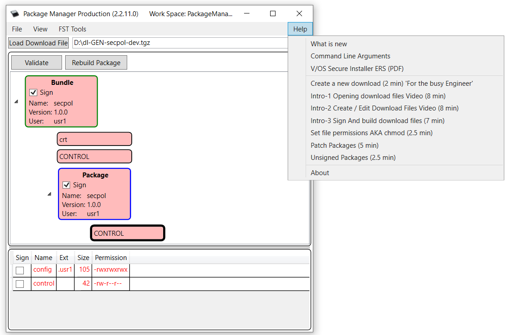
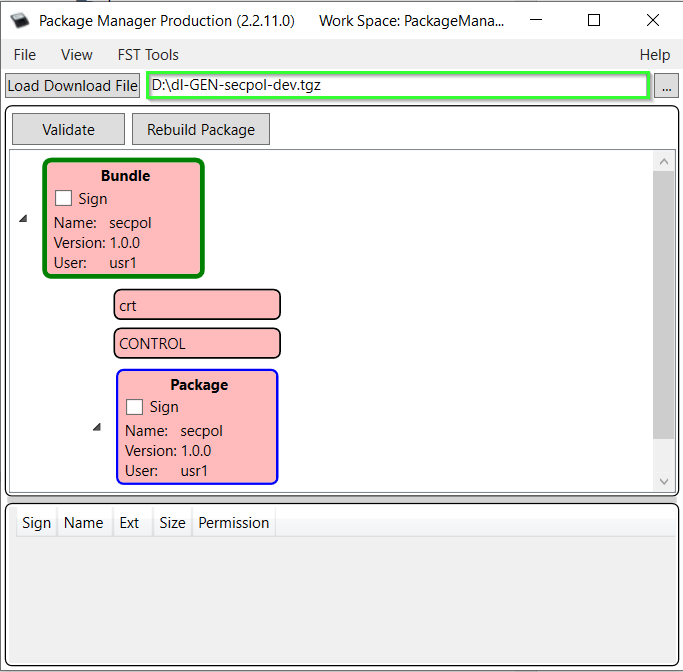
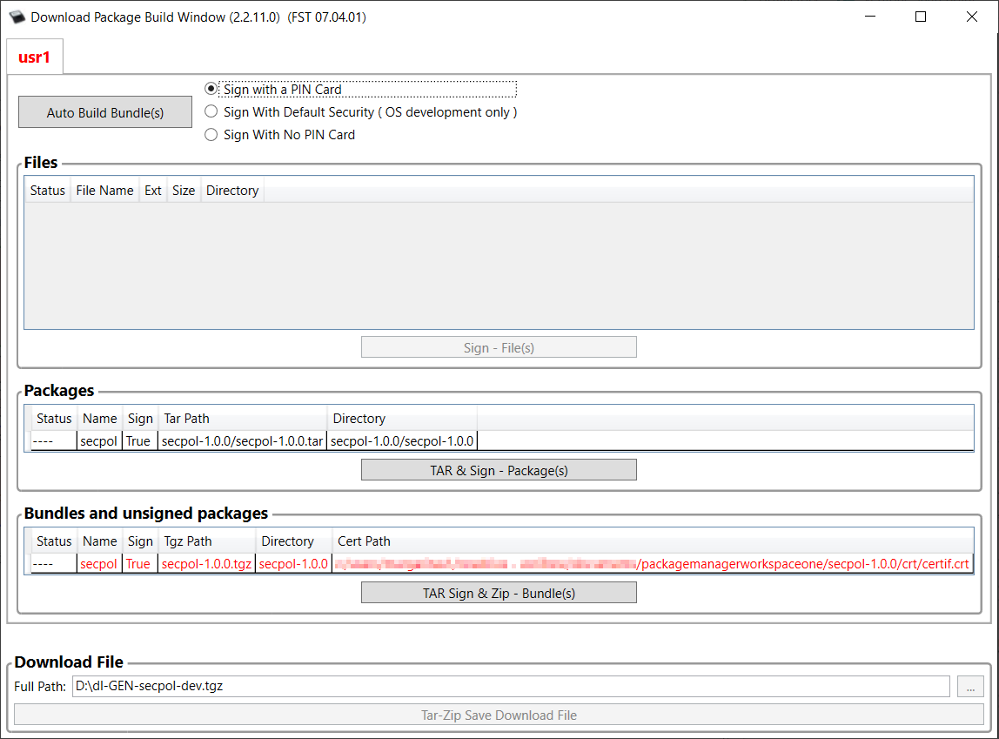

# Preface 

This document is for programmers and users who want to understand how to install and use Verifone Package Manager application.


Package Manager Tool is supposed to be used with ADK 4.7 and older ADK lines. For ADK 4.8 and newer use the <a href="packman_users_guide.md">Packman Tool</a>.


# Overview 

Package Manager is a Windows-based tool used to create SW bundles to install them on Verifone terminals. The Package Manager has a built-in interaction with a <a href="pg_fst.md">File Signing Tool (FST)</a>.

# Installation and Set-up 

1.  Install Package Manager (you can find the latest installation file on DevNet under \"Downloads/Application Development Kit (ADK) Downloads/Additional Development Tools & Utilities\")
2.  Run the setup file and follow the wizards to complete the installation.
    
    During the installation wizard, it would request for \"FST.exe path\". <a href="pg_fst.md">File Signing Tool (FST)</a> must already be installed.
    
3.  Documentation on the Package manager and security system for VOS and VOS2 is contained in the Help for the Package manager:
    


Package types are also described here: <a href="pg_vos_secins_guide.md#secins_sw_pkg_format">Package Format</a>.


# Signing Bundles in Package Manager 

1.  Run <a href="pg_fst.md">File Signing Tool</a> as an administrator.
2.  Login to both users.
3.  Select \"Start Signing Service\".
4.  Select \"Secured\" (if the target device is production mode).
5.  Enter Password for the card twice for the users logged in above.
6.  Now run the Package Manager application.
7.  Browse and select the package:
    
8.  Click on \"Validate\".
9.  Click \"OK\" (unless there are errors).
10. Click \"Rebuild Package\". A new window \"Download Package Build Window\" will be opened:
    
11. Select \"Sign With a Pin Card\" for a production mode terminal.
12. Click \"Auto Build Bundle(s)\". This will sign & re-tar the package.
13. Package is now signed. Store it in the desired location.


It\'s important to note that there are two signing stages: one for the packages and one for the bundle, so there are two invocations of the File Signing Tool.
Checklist for using the Package Manager: \[unsupported block\]

