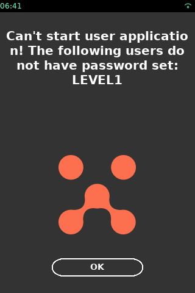

# Preface <a href="#sec_password_management_vos3_preface" id="sec_password_management_vos3_preface"></a>

On VOS3, the MAC Desktop, MAC Control Panel, or a dedicated operation of a MAC Control Panel can be protected by a password.


The password management is applied on MAC Control Panels only, and at the moment, is not supposed to be used by Payment applications (user apps). A password Policy however must be present before any user apps are allowed to start.


# Terms <a href="#sec_password_management_vos3_terms" id="sec_password_management_vos3_terms"></a>

This chapter describes the terms used in this and related guides

- Operator: The person handling the terminal
- \"User\": User is a short term for a MAC password user. Each user can only access the functions, which are assigned to him in the password policy file.
- Password Policy file: A file, which assigns pre-defined access groups to a password user.
- access group: A pre-defined group of functions. This can be a function in a control panel or basic functions like access to the MAC desktop.
- Password file: A file, which sets the passwords for the users defined in the password policy file (UPWD)

# Password Protection configuration <a href="#sec_password_management_vos3_configuration" id="sec_password_management_vos3_configuration"></a>

The password protection configuration logic is following:

Each MAC Control Panel itself defines a list of \"access groups\" and maps these access groups to actions in the panel. For example, the \"Date & Time\" Control Panel has 2 predefined access groups: \"System_viewer\'\' and \"System_editor\".

The \"System_editor\" access group allows changing the date and time, while all other functions of this Control Panel are tied to the \"System_viewer\".

The mapping of access groups to functions in the Control Panel can NOT be changed by the configuration.

## Access group mapping of system control panels <a href="#subsec_password_management_vos3_mapping" id="subsec_password_management_vos3_mapping"></a>

The default control panel operations are mapped to these access groups:

| MAC Control Panel name | Sub-Panel | Menu | Sub-menu or operation | Access group name |
|----|----|----|----|----|
| <p>MAC Desktop</p> |  |  |  | <p>Desktop_viewer</p> |
| <p>Control Panel</p> |  |  |  |  |
|  | <p>Notifications</p> |  |  | <p>N/A</p> |
|  | <p>Info</p> |  |  | <p>System_viewer</p> |
|  | <p>Date & Time</p> |  |  |  |
|  |  | <p>Time</p> |  |  |
|  |  |  | <p>View</p> | <p>System_viewer</p> |
|  |  |  | <p>Edit</p> | <p>System_editor</p> |
|  |  | <p>Date</p> |  |  |
|  |  |  | <p>View</p> | <p>System_viewer</p> |
|  |  |  | <p>Edit</p> | <p>System_editor</p> |
|  |  | <p>24H reboot</p> |  |  |
|  |  |  | <p>View</p> | <p>System_viewer</p> |
|  |  |  | <p>Edit</p> | <p>System_editor</p> |
|  |  | <p>Timezone</p> |  |  |
|  |  |  | <p>View</p> | <p>System_viewer</p> |
|  |  |  | <p>Edit</p> | <p>System_editor</p> |
|  | <p>Settings</p> |  |  |  |
|  |  | <p>Display</p> |  |  |
|  |  |  | <p>View</p> | <p>System_viewer</p> |
|  |  |  | <p>Edit</p> | <p>System_editor</p> |
|  |  | <p>Audio</p> |  |  |
|  |  |  | <p>View</p> | <p>System_viewer</p> |
|  |  |  | <p>Edit</p> | <p>System_editor</p> |
|  |  | <p>Keyboard</p> |  |  |
|  |  |  | <p>View</p> | <p>System_viewer</p> |
|  |  |  | <p>Edit</p> | <p>System_editor</p> |
|  | <p>Transferlogs</p> |  |  | <p>System_viewer</p> |
|  | <p>COM CP</p> |  |  |  |
|  |  | <p>View</p> |  | <p>System_viewer</p> |
|  |  | <p>Edit/COnfigure</p> |  | <p>COM_editor</p> |
|  | <p>Log CP</p> |  |  |  |
|  |  | <p>Logging channels</p> |  |  |
|  |  |  | <p>View</p> | <p>System_viewer</p> |
|  |  |  | <p>Edit</p> | <p>LCP_editor</p> |
|  |  | <p>Logging settings</p> |  |  |
|  |  |  | <p>View</p> | <p>System_viewer</p> |
|  |  |  | <p>Edit</p> | <p>LCP_editor</p> |
|  | <p>Power Panel</p> |  |  |  |
|  |  | <p>Restart</p> |  | <p>System_viewer</p> |
|  |  | <p>Shutdown</p> |  | <p>System_viewer</p> |
|  | <p>Security CP</p> |  |  |  |
|  |  | <p>Keys</p> |  |  |
|  |  |  | <p>Warrantied key status</p> | <p>System_viewer</p> |
|  |  |  | <p>Payment key status</p> | <p>System_viewer</p> |
|  |  |  | <p>Load Warrantied keys</p> | <p>SEC_editor</p> |
|  |  |  | <p>Load Payment keys</p> | <p>SEC_editor</p> |
|  |  |  | <p>Write VRK certificate to USB</p> | <p>SEC_editor</p> |
|  |  | <p>Tamper</p> |  |  |
|  |  |  | <p>Tamper status</p> | <p>System_viewer</p> |
|  |  |  | <p>Tamper log</p> | <p>System_viewer</p> |
|  |  |  | <p>Clear tamper</p> | <p>SEC_editor</p> |
|  |  | <p>Security identification</p> |  | <p>SEC_editor</p> |
|  |  | <p>Date and Time</p> |  |  |
|  |  |  | <p>View</p> | <p>SEC_editor</p> |
|  |  |  | <p>Edit</p> | <p>SEC_editor</p> |
|  |  | <p>MIB</p> |  |  |
|  |  |  | <p>MIB info</p> | <p>System_viewer</p> |
|  |  |  | <p>Load MIB</p> | <p>SEC_editor</p> |
|  |  | <p>Password management</p> |  |  |
|  |  |  | <p>Change password</p> | <p>SEC_editor</p> |
|  | <p>Software</p> |  |  |  |
|  |  | <p>Download Netloader</p> |  | <p>SW_downloader</p> |
|  |  | <p>Download Zontalk</p> |  | <p>SW_downloader</p> |
|  |  | <p>Download USB</p> |  | <p>SW_downloader</p> |
|  |  | <p>Install Result</p> |  | <p>System_viewer</p> |
|  |  | <p>Software List</p> |  | <p>System_viewer</p> |
|  | <p>Diagnostic</p> |  |  |  |
|  |  | <p>Display</p> |  | <p>System_viewer</p> |
|  |  | <p>Keyboard</p> |  | <p>System_viewer</p> |
|  |  | <p>Card</p> |  | <p>System_viewer</p> |
|  |  | <p>Buzzer/Audio</p> |  | <p>System_viewer</p> |
|  |  | <p>LED</p> |  | <p>System_viewer</p> |
|  |  | <p>Touch Panel</p> |  | <p>System_viewer</p> |
|  |  | <p>SD Card</p> |  | <p>System_viewer</p> |
|  |  | <p>Battery</p> |  | <p>System_viewer</p> |
|  | <p>VHQ CP</p> |  |  |  |
|  |  | <p>Versions</p> |  | <p>System_viewer</p> |
|  |  | <p>Heartbeat</p> |  | <p>VHQ_editor</p> |
|  |  | <p>Reset Agent</p> |  | <p>VHQ_editor</p> |
|  | <p>VCL</p> |  |  |  |
|  |  | <p>VCL Info</p> |  | <p>System_viewer</p> |

## Default Passwords Policy <a href="#subsec_password_management_vos3_default_policy" id="subsec_password_management_vos3_default_policy"></a>

The VOS3/ADK release contains a default Password policy, that defines which access groups are accessible by which user. This default configuration is system-signed and can\'t be changed or deleted.


The Solutions provider must provide a user-signed configuration file to enable passwords.


``` cpp
MAC user name | access groups
----------------------------------------------------------------------------------------------------------------------------
Guest | System_viewer, Desktop_viewer, System_editor, COM_editor, LCP_editor, SEC_editor, SW_downloader, VHQ_editor
```

\"Guest\" is a predefined user, which doesn\'t require password entry, so all \"access groups\" that shouldn\'t be protected by a password, should use the \"Guest\" user.

The default Password policy sets all operations to Guest, no password is required and password protection is disabled by default on virgin devices.

### Warning

A valid Password Policy with enabled passwords must be loaded during deployment.

User applications will not start if no Password Policy is loaded and passwords are not set for each user in the policy file (except the Guest). If the device will be used in its default state - no user-signed Password Policy loaded, passwords will not be required to enter MAC Control Panels, but the user application running will be restricted.

## Enabling Password protection <a href="#subsec_password_management_vos3_enabling_passwords" id="subsec_password_management_vos3_enabling_passwords"></a>

At Deployment, the password protection must be enabled by loading:

- user-signed Password policy file, that changes the default Password Policy
- Password [UPWD](#subsubsec_password_management_vos3_upwd) file to set a password for each user mentioned in the Password Policy (except the \"Guest\"), requires the password encryption key ([UVRK](#subsubsec_password_management_vos3_uvrk)).

Below is the diagram that shows the password lifecycle:


Few Password policy examples included into the Authnman release:

### User configuration example 1 <a href="#subsec_password_management_vos3_example1" id="subsec_password_management_vos3_example1"></a>

The ` dl.authman-userconf-supervisor_level1_guest-x.x.x.tar ` with the content:

``` cpp
MAC user name | access groups
----------------------------------------------------------------------------------------------------------------------------
SUPERVISOR | System_viewer, System_editor, COM_editor, LCP_editor, SEC_editor, SW_downloader, VHQ_editor
LEVEL1 | System_viewer, System_editor, COM_editor, LCP_editor
Guest | System_viewer, Desktop_viewer
```

With this configuration, only MAC UI operations which are tied to the \"System_viewer\" or \"Desktop viewer\" access groups, will be available without password entry. All other operations will require Level1 or Supervisor password entry.

### User configuration example 2 <a href="#subsec_password_management_vos3_example2" id="subsec_password_management_vos3_example2"></a>

The ` dl.authman-userconf-supervisor_level1_desktop_guest-x.x.x.tar ` with the content:

``` cpp
MAC user name | access groups
----------------------------------------------------------------------------------------------------------------------------
SUPERVISOR | System_viewer, System_editor, COM_editor, LCP_editor, SEC_editor, SW_downloader, VHQ_editor
LEVEL1 | System_viewer, System_editor, COM_editor, LCP_editor
Desktop | Desktop_viewer
Guest | System_viewer
```

With this configuration, only the MAC UI operations that are tied to the \"System_viewer\" access group, will be available without password entry. All other operations will require Desktop, Level1 or Supervisor password entry. The difference from the 1st example is that the MAC Desktop will be protected by a password now.

### User configuration example 3 <a href="#subsec_password_management_vos3_example3" id="subsec_password_management_vos3_example3"></a>

The ` dl.authman-userconf-guest-x.x.x.tar ` with the content:

``` cpp
MAC user name | access groups
----------------------------------------------------------------------------------------------------------------------------
Guest | System_viewer, Desktop_viewer, System_editor, COM_editor, LCP_editor, SEC_editor, SW_downloader, VHQ_editor
```

This configuration disables the password protection for MAC Control Panels and access to MAC Desktop.


The loading of a different user-signed Password Policy file doesn\'t delete the user name or password from the existing passwords DB.


### Warning

The configuration change takes effect after the device reboots

Each access group shall be added to at least one user. Otherwise, the operation that belongs to this access group won\'t be available.

## Password Policy Change <a href="#subsec_password_management_vos3_policy_change" id="subsec_password_management_vos3_policy_change"></a>

In general, this user-signed policy configuration is used to increase the password protection level by removing access groups from \"Guest\".

The Customer can introduce a new \"user\" in the user-signed configuration, or freely change the mapping between \"user\"s and \"access_group\"s.


In the default Password Policy file we are providing \"Level1\" and \"Supervisor\" to mimic VOS2 sysmode user names, but these could be called differently, like the \"Administrator\" or \"Merchant\" if the Customer wishes.


### Warning

Be careful by introducing new password names, as the password name is case sensitive, so the \"SUPERVISOR\" is not the same as \"Supervisor\".

MAC Control Panel icons couldn\'t be hidden by the configuration change. Control panel visibility is defined in the Control Panel manifest files which can\'t be changed by the Customer.

## MAC Desktop protection <a href="#subsec_password_management_vos3_mac_desktop_protection" id="subsec_password_management_vos3_mac_desktop_protection"></a>

By default, the MAC Desktop doesn\'t require a password.

The user can enable MAC Desktop protection by loading a user-signed Password Policy along with a password, which associates the access group \"Desktop_viewer\" with a username other than \"Guest\". In this case, the system will prompt for a password when entering the MAC Desktop.

### Warning

If the password is set on the MAC Desktop entry, it is a one-time login, and the session is not stored, so the \"Logout\" icon will be not shown in the MAC Control Panel.

It is strongly recommended to use a separate access user for the MAC Desktop. If the \"Desktop_viewer\" will be added to LEVEL1, then the LEVEL1 password will be required twice: 1 - when entering MAC Desktop; 2 - when entering CP operation that is protected by LEVEL1 password.

# Access session <a href="#sec_password_management_vos3_access_session" id="sec_password_management_vos3_access_session"></a>

When the user wants to use a control panel operation, which is protected, the system first checks for an active session for the user, which is associated with this function in the configuration file. It will prompt for a login for this MAC user name if no active session is found.


The user list provided is coming from the Password Policy file (according to the protected MAC operation).

When the user chooses the user name, the password entry is displayed.


The entered password must be approved by the \'\'Green key\'\' if the device has a keypad. On devices without a keypad, the additional button to approve operation is displayed on the screen.

After the successful login, the access session is kept for 3 minutes of user inactivity or until the MAC closes, or until the user switches to the MAC desktop, or the device is rebooted.

The icon on the MAC status bar indicates that there is an active access session:


The MAC Control Panel shows the \"\[MAC user name\] Logout\" icon if there is any logged-in user:


The icon on the MAC status bar and MAC Control Panel are removed on logout.

# Login into a different user <a href="#sec_password_management_vos3_login_different_user" id="sec_password_management_vos3_login_different_user"></a>

If a different MAC CP operation requires a different access group (for example, the Date/Time change requires access to \"System_editor\" (belongs to \"Level1\" and \"Supervisor\"), but the Key loading requires a \"SEC_editor\" (belongs to \"Supervisor\"), the user is prompted to log in with this different MAC user name. If multiple users allow access to an access group, the operator is prompted to select a user.

# Entering Password values <a href="#sec_password_management_vos3_entering_password_value" id="sec_password_management_vos3_entering_password_value"></a>

The password entry will be aborted after 60 seconds of inactivity.

There is also a password entry cool-down timer of 5 seconds if the wrong password is entered.

The entered password is not stored in plaintext. Once a full password is entered, or the password entry is canceled/timed out, the password is cleared from memory immediately.

# Password Value Guidelines <a href="#sec_password_management_vos3_password_value_guidelines" id="sec_password_management_vos3_password_value_guidelines"></a>

The password entered should:

- have a minimum length of 7 digits (the max value is 12)
- should not match the previous password

# Password Value Storage and Initial Password Entry <a href="#sec_password_management_vos3_password_storage" id="sec_password_management_vos3_password_storage"></a>

Initially, a virgin VOS3 device doesn\'t have any password values set in the \"Password Database\".

Note: This differs from VOS1 and VOS2 devices, which came with \"default\" password values in the \"pre-expired\" state.

During the deployment process, both: user-signed Password Policy and the Password change file (containing encrypted password values) should be installed on the device.

If the Password Policy is loaded, but the password value is not set, the user is prompted to enter the very first password value once he initiates a function that requires password entry.

Below is the example of case when the user-signed Password policy defines \"LEVEL1\" password entry, but the password value was not set:


# Password Value Change <a href="#sec_password_management_vos3_password_change" id="sec_password_management_vos3_password_change"></a>

The password value could be changed in the following ways:

1\) Via the MAC Security Control Panel / Password manager (requires access to that panel)

2\) By the Password change package installation.

3\) By the Password change API.

# Password Expiration <a href="#sec_password_management_vos3_password_expire" id="sec_password_management_vos3_password_expire"></a>

The password could be set to the expired state by the remote password change package only.

This could be useful at the deployment stage when a default password value is set, but it needs to be pre-expired, so the end-user who will do the very first log in, will be prompted to enter a default password value and then define a new password value

# Password state after repair <a href="#sec_password_management_vos3_password_state_after_repair" id="sec_password_management_vos3_password_state_after_repair"></a>

The fastboot and reflash operations delete the user_name/access_groups configurations and password database.

After these operations it needs to install a Password Policy package and load initial password values, otherwise, the very first password will be entered manually by the user during the very first login into a protected MAC operation.

# Password configuration debugging <a href="#sec_password_management_vos3_password_debug" id="sec_password_management_vos3_password_debug"></a>

It is possible to get the information from the device on what the password management configuration (MAC user name mapping with access groups) is loaded:

- The configuration is displayed in the MAC \"Diagnostics\" panel
- The configuration could be downloaded via the \"Log Transfer\" operation from the MAC CP
- The configuration content is also saved in system logs (via \"AUTHMAN\" logging channel), so this information could be used for investigations if needs to understand what configuration was on the device at a particular period of time.

# Deployment Process <a href="#sec_password_management_vos3_deployment" id="sec_password_management_vos3_deployment"></a>

Initially, fresh devices come without any Password Policy, but to protect devices from malicious use, a user application running is not possible if there is no Password Policy.

At Verifone or Customer deployment, the following procedures should be performed to set the needed password protection.

## If the Customer will NOT use the password protection <a href="#subsec_password_management_vos3_not_used" id="subsec_password_management_vos3_not_used"></a>

If passwords won\'t be used in the field, the deployment should load the Password Policy file which disables password protection (see the User configuration example #3 above).

This file should be user-signed and loaded on the device.

If no Password Policy file is loaded on the device, user applications will not start.

## If the Customer will use the password protection <a href="#subsec_password_management_vos3_will_be_used" id="subsec_password_management_vos3_will_be_used"></a>

To set password protection logic, the appropriate Password Policy file should be loaded (see the User configuration examples #1 and #2 above).

This file should be user-signed and loaded on the device.

If initial password values should be set by deployment then need to load 2 additional files:

- The password encryption key ([UVRK](#subsubsec_password_management_vos3_uvrk)) - should be requested in the Verifone Premier Portal
- The password file ([UPWD](#subsubsec_password_management_vos3_upwd)) - prepared by the Deployment/Customer, and user-signed

### Warning

If the initial password is not set, the user application will not start, and the user will be prompted to enter the very first password value manually in the MAC Security Control Panel.

### What is the Password encrytpion key (UVRK): <a href="#subsubsec_password_management_vos3_uvrk" id="subsubsec_password_management_vos3_uvrk"></a>

The password encryption key type is a \"Customer Asymmetric Key\". It is used to protect the password file ([UPWD](#subsubsec_password_management_vos3_upwd) file) for secure storage and transfer outside the device.

The password encryption key is requested and loaded the same way to the device as any other Customer Key - as a VRK payload (UVRK file).

### What is the Password file (UPWD): <a href="#subsubsec_password_management_vos3_upwd" id="subsubsec_password_management_vos3_upwd"></a>

The Password file (UPWD file) is generated, using the Packman tool. See related section in the ADK programmers guide for reference and examples and <a href="packman_users_guide.md#packman_cli">Command line interface</a> upwd_build command (VOS3 & VAOS only).

To generate a Password file, the user must have access to:

- Packman tool
- Password change JSON file:
  - Contains all the passwords that you would like to change on the device in a JSON format as well as additional device targeting restrictions.
- Encryption certificate from the related Password encryption key pair:
  - Used to encrypt the password change JSON file inside the resulting UPWD file.

To handle a large number of devices it is possible to provide several Password files in one installation file:

- In this case, only password files matching S/N on the targeted device would be installed.
- The remaining Password files would be ignored.

For more information on generating a single installation file from several UPWD files, see the <a href="packman_users_guide.md#packman_cli">Command line interface</a> merge command.

\\info - The password may be set to pre-expired state - so the user will be prompted to enter the old and create a new value during the very first login. - The password file can be used to reset the existing password value on the device in the field, without knowing the old value, it just needs to be recreated and signed with the Customer\'s sponsor.

# Troubleshooting <a href="#sec_password_management_vos3_troubleshooting" id="sec_password_management_vos3_troubleshooting"></a>

## The password is forgotten or unknown <a href="#subsec_password_management_vos3_password_forgotten" id="subsec_password_management_vos3_password_forgotten"></a>

If the device is connected to TMS, then the password value can be changed via TMS by uploading a password change package or via an API.

If the device is not connected to the TMS and it is not possible to install the password change package, then the device needs to be sent to Repair Center.

## Password protection needs to be enabled <a href="#subsec_password_management_vos3_need_enable" id="subsec_password_management_vos3_need_enable"></a>

Install the user-signed Password Policy file to set at least one user that is not the \"Guest\".

## Password protection needs to be disabled <a href="#subsec_password_management_vos3_need_disable" id="subsec_password_management_vos3_need_disable"></a>

Install the user-signed Password Policy file where all access groups tied to the \"Guest\".

## The user application couldn\'t start because of the missing Password Policy <a href="#subsec_password_management_vos3_user_app_cant_start" id="subsec_password_management_vos3_user_app_cant_start"></a>

The user application couldn\'t start if there is no user-signed Password Policy or at least one password value from this policy is not set.

Otherwise, you will see the \'\'lock\'\' icon over the application:


And when you tap on the application icon, the system will show an appropriate message:


or



## The control panel operation is not available <a href="#subsec_password_management_vos3_cp_operation_not_available" id="subsec_password_management_vos3_cp_operation_not_available"></a>

The CP operation is not available in the following cases:

- The operation is tied to an access_group which is not mentioned in the user-signed configuration. In this case, the system will show an appropriate message \"Access group XXX isn\'t configured. Please contact administrator.\".
- The operation is protected by a password in the Passwords Policy file, but the end user didn\'t log in to the appropriate user. In this case, the user will be prompted for the password.

## I don\'t know what user-signed Password Policy is loaded on the device <a href="#subsec_password_management_vos3_what_is_loaded" id="subsec_password_management_vos3_what_is_loaded"></a>

To check the actual user-signed Password Policy, it could be downloaded from the device by the \"Transfer Logs\" operation: **../config/authman/ \< \>**
