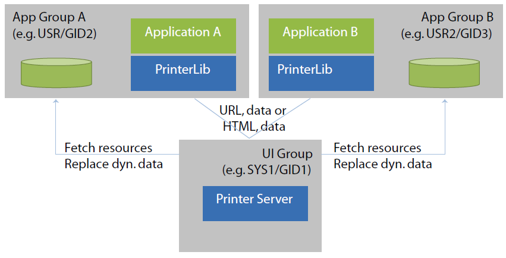
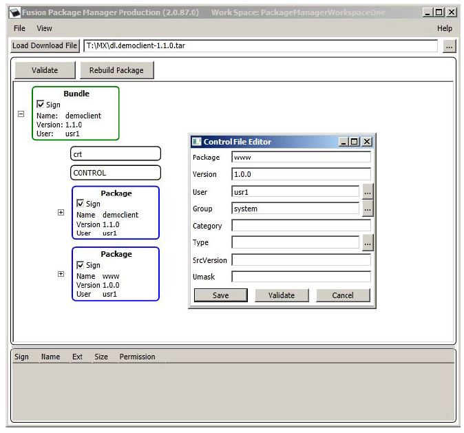
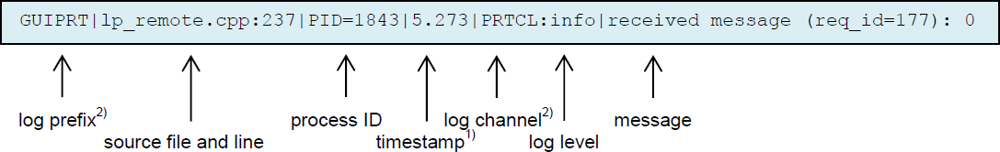
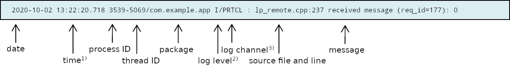

# Preface <a href="#sec_prt_preface" id="sec_prt_preface"></a>

This guide provides information on the usage of the ADK Printer system.

## Audience <a href="#subsec_prt_audience" id="subsec_prt_audience"></a>

This document is intended for programmers that want to understand and use the ADK Printer system.

## Organization <a href="#subsec_prt_organization" id="subsec_prt_organization"></a>

This guide is organized as follows:

[Chapter 1, Overview](#sec_prt_overview): Provides an overview of the ADK Printer system.

[Chapter 2, Migrating from Version 1.x to 2.x](#sec_prt_migrating_from_version_1x_to_2x): Contains notes when switching from version 1.x to 2.x.

[Chapter 3, Programming](#sec_prt_programming): Describes the necessary components to run the ADK Printer system.

[Chapter 4, Printer Viewer](#sec_prt_printer_viewer): Contains information on the PrinterViewer.

[Chapter 5, Getting Started](#sec_prt_getting_started): Contains helpful information to help you get started with using the ADK Printer system.

[Chapter 6, Troubleshooting](#sec_prt_troubleshooting): Presents troubleshooting guidelines on various ADK Printer system issues.

## System Specifications <a href="#subsec_prt_system_specifications" id="subsec_prt_system_specifications"></a>

The following are the hardware and software requirements of the ADK Printer system.

### Hardware Support <a href="#subsubsec_prt_hardware_support" id="subsubsec_prt_hardware_support"></a>

The HTMLPrinter system is designed to be platform agnostic and will be supported on V/OS, and V/OS2 terminals.

### Software Requirements <a href="#subsubsec_prt_software_requirements" id="subsubsec_prt_software_requirements"></a>

On V/OS HTMLPrinter requires installation of corresponding platform packages. The system needs to provide dependent libraries (`libfreetype`, `libpng`, `libjpg`, `libungif`). For details please refer to release notes.

For installation of appropriate fonts on both platforms please refer to Example: Receipt HTML Resource File and Example: Asynchronous Printing.

## Version 2.x <a href="#subsec_prt_version_2_x" id="subsec_prt_version_2_x"></a>

Merging GUI and printer into one server resulted in minor changes in the interface. Check Chapter 3 for more information.

## Acronym Definitions <a href="#subsec_prt_acronym_definitions" id="subsec_prt_acronym_definitions"></a>

Please refer to Table 2 for the acronyms used in this manual.

*Table: Acronym Definitions*

| Acronym | Definitions |
|----|----|
| <p>ADK</p> | <p>Application Development Kit</p> |
| <p>API</p> | <p>Application Program Interface</p> |
| <p>CSS</p> | <p>Cascading Style Sheet</p> |
| <p>DB</p> | <p>Database</p> |
| <p>HTML</p> | <p>HyperText Markup Language</p> |
| <p>OOM</p> | <p>Out of Memory</p> |
| <p>OS</p> | <p>Operating System</p> |
| <p>XLFD</p> | <p>X Logical Font Description</p> |

# Overview <a href="#sec_prt_overview" id="sec_prt_overview"></a>

This chapter contains an overview of the ADK Printer system.

## ADK Printer System <a href="#subsec_prt_adk_printer_system" id="subsec_prt_adk_printer_system"></a>

The ADK Printer component allows applications to define printer receipts with the help of HTML documents. This includes standard HTML support for static text, fonts, tables, and images. Some non-HTML printout elements like barcodes and QR codes are specified using XML processing syntax.

Interactive HTML elements like input fields, buttons, etc. are not supported for printing for obvious reasons.

The application programming interface allows printer requests to start given the URL of the receipt definition HTML document and the relevant parameter for variable data definitions in the HTML document.

In addition, specific APIs are provided for getting printer status and information and setting printer parameters such as the printer contrast.

During printing, the HTML document gets rendered and the resulting image data is sent to the printer. The internal printer interface support various printer models.

There is limited support for printing to printers that only support text printing. A set of escape sequences is supported for use with these printers allowing to use double width / height printing and activating italic, bold, and underlined printing.

In addition to printing, ADK Printer converts HTML documents to PNG images and text strings.

ADK Printer uses UTF-8 encoding to support international characters. However, to make full use of unicode the installed fonts need to support the characters in use. Providing an appropriate font is in the scope of the respective application.

# Migrating from Version 1.x to 2.x <a href="#sec_prt_migrating_from_version_1x_to_2x" id="sec_prt_migrating_from_version_1x_to_2x"></a>

This chapter contains notes when switching from version 1.x to 2.x.

When creating new applications, this chapter can be skipped.

Merging GUI and printer into one server to save memory resulted in minor compatibility issues. Therefore, when switching to version 2.x, some changes will have to be applied to the source code:

1.  By merging GUI and printer server into one component, the include files have been moved from the prt directory to a common html directory. Therefore, for example, `#include` "html/prt.h" has to be used instead of `#include` "prt/prt.h".
2.  Components common to GUI and printer have been moved to the common namespace `vfihtml`. This new namespace is automatically referenced by `vfigui` and `vfiprt`. In most cases, no action is required.
3.  `libvfiprt` has been replaced by `libvfiguiprt` which is the common client library for GUI and printer.

# Programming <a href="#sec_prt_programming" id="sec_prt_programming"></a>

This chapter describes the necessary components to run the ADK Printer system.

## Supported Hardware <a href="#subsec_prt_programming_supported_hardware" id="subsec_prt_programming_supported_hardware"></a>

The ADK Printer system is intended to run across the entire hardware portfolio. Currently, support is provided for the following hardware with on-board or external printers.

*Table: Supported Hardware*

| OS | Hardware | Printer |
|----|----|----|
| <p>V/OS</p> | <p>VX 520</p> | <p>On-board printer</p> |
| <p>V/OS</p> | <p>VX 520C</p> | <p>On-board printer</p> |
| <p>V/OS</p> | <p>UX external printers</p> | <p>Custom printer TG2460 (USB)</p> |
| <p>V/OS</p> | <p>VX 675</p> | <p>On-board printer</p> |
| <p>V/OS</p> | <p>eVo VX 675</p> | <p>On-board printer</p> |
| <p>V/OS</p> | <p>eVo VX 820</p> | <p>DUET External printer (base station)</p> |
| <p>V/OS2</p> | <p>V200</p> | <p>On-board printer</p> |


See also prt_extprinters


## Programming Overview <a href="#subsec_prt_programming_programming_overview" id="subsec_prt_programming_programming_overview"></a>

The ADK Printer system is provided as a service with a standalone server module and a corresponding client library to link with applications. It provides a header file (`prt.h`) that exports the API function calls.

### Headers and Binary Deliveries <a href="#subsubsec_prt_programming_programming_overview_headers_and_binary_deliveries" id="subsubsec_prt_programming_programming_overview_headers_and_binary_deliveries"></a>

The ADK Printer system is composed of the following deliveries:

*Table: ADK Printer Deliveries*

| File | Purpose |
|----|----|
| <p>`prt.h`</p> | <p>Printer system header file with exported definitions, functions, etc.</p> |
| <p>`prtserver`</p> | <p>Printer server binary</p> |
| <p>`libvfiguiprt`</p> | <p>Combined GUI and printer client library</p> |
| <p>`libjsproc`</p> | <p>JavaScript interpreter for scripting</p> |
| <p>`libprinter`</p> | <p>All in one printer library (Trinity only)</p> |
| <p>`guiprtserver`</p> | <p>Combined GUI and printer server</p> |

When using both GUI and printer it is recommended to use guiprtserver over running prtserver and guiserver as separate processes for saving memory.

### Running the Printer Server <a href="#subsubsec_prt_programming_programming_overview_running_the_printer_server" id="subsubsec_prt_programming_programming_overview_running_the_printer_server"></a>

On V/OS, the ADK Printer service runs as a separate process with privileged rights to access HTML and graphical resource files accompanied with the applications. Different applications typically run in separate user spaces.

Applications link with the ADK Printer client library to access the API functions. They can either pass a URL to the HTML resource files or send HTML documents directly. In addition, they pass dynamic data over the inter-process interface into the ADK Printer service.

The printer server needs to be started with the corresponding platform mechanisms prior to any application use. Please note that there is no automatic restart of the printer server in case of crashes.



The printer server and client library use the environment variable `LPD` to control the port used for communication between the two entities. The content is **hostname:port-offset**. The base for the offset is **5950**. The default for the hostname is **localhost**. The overall default is **":0"**.

The printer server binds to the configured IP address (i.e. if set to localhost, the printer server can only be accessed internally). For external access, the hostname must match the IP address of the device.

*Examples:*

``` cpp
LPD=:0 (default)
LPD=:1 (internal access via port 5951)
LPD=172.16.2.1:2 (external access via port 5952)
```


When using external access, images are sent as inline images. By this they need not be present on the target device.


### Warning

Enabling external access may present a security risk.

### Internal / External Printers <a href="#subsubsec_prt_programming_programming_overview_internal___external_printers" id="subsubsec_prt_programming_programming_overview_internal___external_printers"></a>

On V/OS, ADK Printer supports both internal (e.g. VX 520) and external (e.g. TG2460) printers. If an external printer is detected, it is preferred over the internal one. The presence of an external printer is tested by checking if the device `/dev/lp0` exists. When a printer is connected via USB, `/dev/lp0` is set up and when disconnected, it is removed again. The device `/dev/lp0` may be switched to another device by setting the environment variable `LPDEVICE` or the property PRT_PROP_DEVICE to the desired value prior to starting prtserver.

**Carbon base support**
On Carbon (X10) printing is normally handled on tables side. ADKPRT sends the printout as notification to the tablet for further processing. In case the printout should be sent to the Carbon base directly, this can be achieved by setting LPDEVICE or PRT_PROP_DEVICE to *swfprt:\<ip-address\>*. The IP address is the address of the Carbone base.

**Printing via SDI server**
Setting LPDEVICE or PRT_PROP_DEVICE to sdi:\<host\> activates printing via SDI server running on \<host\>. If \<host\> is not provided, the address from the environment variable SDISERVER is used. If SDISERVER is not set, then the localhost is assumed.

See also section [External Printers](#prt_extprinters) for information on how to use external printers.

### Notes for Batch Printing <a href="#subsubsec_batch_printing" id="subsubsec_batch_printing"></a>

Extended continuous batch printing may overheat the printer. While the application layer does not need to pause between regular printer jobs at all, the end user should be asked to wait 1 minute after batch printing a full roll of paper before carrying on batch printing after replacing a new roll of paper for the motor to cool down.

## HTML Resources <a href="#subsec_prt_programming_programming_overview_html_resources" id="subsec_prt_programming_programming_overview_html_resources"></a>

ADK Printer resources describe the content and layout of printer receipts.

The following items are supported:

- HTML documents (files) describing the content and layout of a single receipt
- Image resource files
- CSS style sheet files
- Catalog files for Multi-language support

Resources accompany the application packages (i.e. they reside in the same user space as the related application).

### Hints on HTML Layouts <a href="#subsubsec_prt_programming_programming_overview_html_resources_hints_on_html_layouts" id="subsubsec_prt_programming_programming_overview_html_resources_hints_on_html_layouts"></a>

HTML has no means of putting a hard limit on the width of the layout as would be required for the fixed paper width. If the minimum width of the layout exceeds the paper width, the printout will be truncated to the paper width. Normally, HTML would add scroll bars to support this, but this is not possible on the printout.

This happens when:

- a\) The width of an image exceeds the paper width.
- b\) Using long words that exceed the paper width and that do not have any soft hyphens.
- c\) Defining HTML elements using CSS width attribute that exceeds paper width.

### File Location <a href="#subsubsec_prt_programming_programming_overview_html_resources_file_location" id="subsubsec_prt_programming_programming_overview_html_resources_file_location"></a>

Resource files are looked up in the resource directory. A search path for base resource directories can be provided in the environment variable GUIPRT_WWW_PATH. It may contain several directories separated by \':\'. To refer to the current working directory, \"\$CWD\" may be used and to refer to the directory, where the executable resides \"\$ORIGIN\" can be used (on Linux only). These need to be found at the beginning of a path component, e.g. \"\$CWD/www\". The first existing directory in this path is chosen for the base resource directory. If GUIPRT_APPNAME is set (see also <a href="pg_gui_users_guide.md#gui_mac_subfolder">Multi-Application-Controller Resource Subfolder Support</a>), it also needs to contain the application subfolder to be chosen.

If not set the default is \"\$CWD/www:\$CWD/resource\".

On x86 Linux the default is \"\$ORIGIN/../share/www:\$ORIGIN/../www:\$CWD/www\".

Print resource files are looked up in the `"print"` subdirectory of this base resource directory.

On V/OS, directory `“www/print”` and the application are usually located in the user's home folder. For instance, if an application is installed on VX520 under `/home/usr1`, the default the resource directory is:

``` cpp
/home/usr1/www/print
```

The default location may be changed by using the `PRT_PROP_RESOURCE_PATH` property of <a href="namespacevfiprt.md#a019a78a3989581d2412ac274c1cf3401">prtSetPropertyString()</a>.

In addition, an optional prefix may be set using the `PRT_PROP_FILE_PREFIX` property of <a href="namespacevfiprt.md#a019a78a3989581d2412ac274c1cf3401">prtSetPropertyString()</a>. This prefix is prepended to the file names provided for URLs and template names.

The prefix is prepended as is. If it contains one or more \'/\', then it will add new directory levels to the path, if not it just modifies the file name.

With prefix, the resulting file name is:

``` cpp
“www/print/<prefix><filename>”
```


If the specified resource file cannot be found, the system returns `PRT_FILE_NOT_FOUND` error.


### HTML Support <a href="#subsubsec_prt_programming_programming_overview_html_resources_html_support" id="subsubsec_prt_programming_programming_overview_html_resources_html_support"></a>

A limited set of standard HTML elements are used to define the layout of receipts. All unknown HTML tags are ignored and text without HTML formatting is displayed.

The following HTML tags are supported:

#### \<b\> - Bold text <a href="#autotoc_md8" id="autotoc_md8"></a>

| Attribute | Description |
|----|----|
| <p>dir</p> | <p>direction (rtl, ltr or auto)</p> |

#### \<bdi\> - Bi-Directional isolation <a href="#autotoc_md9" id="autotoc_md9"></a>

| Attribute | Description |
|----|----|
| <p>dir</p> | <p>direction (rtl, ltr or auto)</p> |

#### \<bdo\> - Bi-Directional override <a href="#autotoc_md10" id="autotoc_md10"></a>

| Attribute | Description |
|----|----|
| <p>dir</p> | <p>direction (rtl, ltr or auto)</p> |

#### \<body\> - Body of the HTML document <a href="#autotoc_md11" id="autotoc_md11"></a>

| Attribute                  | Description                |
|----------------------------|----------------------------|
| <p>-</p> | <p>-</p> |

#### \<br\> - Single line break <a href="#autotoc_md12" id="autotoc_md12"></a>

| Attribute                      | Description                               |
|--------------------------------|-------------------------------------------|
| <p>style</p> | <p>inline CSS style</p> |

#### \<center\> - Center text block <a href="#autotoc_md13" id="autotoc_md13"></a>

| Attribute                      | Description                               |
|--------------------------------|-------------------------------------------|
| <p>name</p>  | <p>name</p>             |
| <p>style</p> | <p>inline CSS style</p> |

#### \<div\> - Section in a document <a href="#autotoc_md14" id="autotoc_md14"></a>

| Attribute | Description |
|----|----|
| <p>dir</p> | <p>direction (rtl, ltr or auto)</p> |
| <p>name</p> | <p>name</p> |
| <p>style</p> | <p>inline CSS style</p> |

#### \<em\> - Emphasized text <a href="#autotoc_md15" id="autotoc_md15"></a>

| Attribute | Description |
|----|----|
| <p>dir</p> | <p>direction (rtl, ltr or auto)</p> |

#### \<font\> - Font <a href="#autotoc_md16" id="autotoc_md16"></a>

| Attribute | Description |
|----|----|
| <p>size</p> | <p>font size</p> |
| <p>face</p> | <p>font face</p> |
| <p>color</p> | <p>text color</p> |
| <p>dir</p> | <p>direction (rtl, ltr or auto)</p> |

#### \<h1\> \... \<h6\> - HTML headings <a href="#autotoc_md17" id="autotoc_md17"></a>

| Attribute | Description |
|----|----|
| <p>dir</p> | <p>direction (rtl, ltr or auto)</p> |

#### \<hr\> - Horizontal line <a href="#autotoc_md18" id="autotoc_md18"></a>

| Attribute                  | Description                |
|----------------------------|----------------------------|
| <p>-</p> | <p>-</p> |

#### \<i\> - Italic text <a href="#autotoc_md19" id="autotoc_md19"></a>

| Attribute | Description |
|----|----|
| <p>dir</p> | <p>direction (rtl, ltr or auto)</p> |

#### \ - Image <a href="#autotoc_md20" id="autotoc_md20"></a>

| Attribute | Description |
|----|----|
| <p>src</p> | <p>URL of the image.</p> |
| <p>alt</p> | <p>alternate text</p> |
| <p>align</p> | <p>alignment (supported: top/middle/bottom)</p> |
| <p>style</p> | <p>inline CSS style</p> |

#### \<li\> List item (inside \<ul\> or \<ol\>) <a href="#autotoc_md21" id="autotoc_md21"></a>

| Attribute | Description |
|----|----|
| <p>dir</p> | <p>direction (rtl, ltr or auto)</p> |

#### \<ol\> - Ordered list <a href="#autotoc_md22" id="autotoc_md22"></a>

| Attribute | Description |
|----|----|
| <p>dir</p> | <p>direction (rtl, ltr or auto)</p> |
| <p>type</p> | <p>one of 1,A,a,I,i</p> |
| <p>start</p> | <p>start value for counter</p> |
| <p>style</p> | <p>inline CSS style</p> |

#### \<p\> - Paragraph <a href="#autotoc_md23" id="autotoc_md23"></a>

| Attribute | Description |
|----|----|
| <p>style</p> | <p>inline CSS style</p> |
| <p>dir</p> | <p>direction (rtl, ltr or auto)</p> |

#### \<pre\> - Preformatted text <a href="#autotoc_md24" id="autotoc_md24"></a>

| Attribute                  | Description                |
|----------------------------|----------------------------|
| <p>-</p> | <p>-</p> |


The CSS file needs to have a font defined for it or the default font is used.


#### \<span\> - Section in a document <a href="#autotoc_md25" id="autotoc_md25"></a>

| Attribute | Description |
|----|----|
| <p>style</p> | <p>inline CSS style</p> |
| <p>dir</p> | <p>direction (rtl, ltr or auto)</p> |

#### \<strong\> - Bold text <a href="#autotoc_md26" id="autotoc_md26"></a>

| Attribute | Description |
|----|----|
| <p>dir</p> | <p>direction (rtl, ltr or auto)</p> |

#### \<table\> - Table <a href="#autotoc_md27" id="autotoc_md27"></a>

| Attribute | Description |
|----|----|
| <p>border</p> | <p>Border size</p> |
| <p>cellspacing</p> | <p>Space between cells</p> |
| <p>cellpadding</p> | <p>Additional space inside cells</p> |
| <p>style</p> | <p>inline CSS style</p> |
| <p>dir</p> | <p>direction (rtl, ltr or auto)</p> |

#### \<th\> - Table header cell in a table <a href="#autotoc_md28" id="autotoc_md28"></a>

| Attribute | Description |
|----|----|
| <p>width</p> | <p> </p> |
| <p>height</p> | <p> </p> |
| <p>colspan</p> | <p>Cell spans this number of columns</p> |
| <p>rowspan</p> | <p>Cell spans this number of rows</p> |
| <p>style</p> | <p>inline CSS style</p> |
| <p>dir</p> | <p>direction (rtl, ltr or auto)</p> |

#### \<td\> - Cell in a table <a href="#autotoc_md29" id="autotoc_md29"></a>

| Attribute | Description |
|----|----|
| <p>width</p> | <p> </p> |
| <p>height</p> | <p> </p> |
| <p>colspan</p> | <p>Cell spans this number of columns</p> |
| <p>rowspan</p> | <p>Cell spans this number of rows</p> |
| <p>style</p> | <p>inline CSS style</p> |
| <p>dir</p> | <p>direction (rtl, ltr or auto)</p> |

#### \<tr\> - Row in a table <a href="#autotoc_md30" id="autotoc_md30"></a>

| Attribute                  | Description                |
|----------------------------|----------------------------|
| <p>-</p> | <p>-</p> |

#### \<u\> - Underline text <a href="#autotoc_md31" id="autotoc_md31"></a>

| Attribute | Description |
|----|----|
| <p>dir</p> | <p>direction (rtl, ltr or auto)</p> |

#### \<ul\> - Unordered list <a href="#autotoc_md32" id="autotoc_md32"></a>

| Attribute | Description |
|----|----|
| <p>style</p> | <p>inline CSS style</p> |
| <p>dir</p> | <p>direction (rtl, ltr or auto)</p> |


As common with the HTML standard, in case images are not found, the alternate text is printed and no error is returned.


**Color Names Support:**

The following color names are supported: aqua, cyan, black, blue, fuchsia, magenta, gray, green, lime, maroon, navy, olive, orange, purple, red, silver, teal, white, and yellow.


These colors are converted to gray scale or black and white before printing (see Color Rendering).


**Soft Hyphen Support:**

Soft hyphens are used to specify a place in text where a hyphenated break is allowed without forcing a line break in an inconvenient place if the text is reflowed.

Use one of the following syntax to insert a soft hyphen.

``` cpp
&#173;
&shy;
```

### CSS Support <a href="#subsubsec_prt_programming_programming_overview_html_resources_css_support" id="subsubsec_prt_programming_programming_overview_html_resources_css_support"></a>

Cascading Style Sheets (CSS) are used to change appearance of HTML elements. A limited set of CSS elements is supported only.

CSS attributes can be specified directly in the HTML documents by using the inline style attribute for HTML elements. The inline style attributes overwrite styles taken from the CSS file. `PRT.INI` may be used for specifying a global CSS file.

*Table: Supported CSS Style Attributes*

| CSS Style Attribute | Description | Limitation |
|----|----|----|
| <p>**background-color**</p> | <p>Background color</p> |  |
| <p>**background-image**</p> | <p>Background image:<br/><br/>`url()` and `linear-gradient`() are supported. `linear-gradient`() only supports gradients parallel to the x- or y-axis.</p> | <p>not supported for \<input\></p> |
| <p>**background-position**</p> | <p>Background position</p> | <p>not supported for \<input\></p> |
| <p>**background-repeat**</p> | <p>Supported values: no-repeat, repeat-x, repeat-y, repeat</p> | <p>not supported for \<input\></p> |
| <p>**background-size**</p> | <p>Scale background image.</p> | <p>-</p> |
| <p>**border**<br/>**border-style**<br/>**border-top**<br/>**border-right**<br/>**border-bottom**<br/>**border-left**<br/>**border-width**<br/>**border-color**<br/></p> | <p>Border properties<br/>Single properties are also supported, e.g. border-bottom-color</p> | <p>-</p> |
| <p>**border-radius**<br/>**border-top/bottom-left/right-radius**</p> | <p>Border radius for creating rounded corners.</p> | <p>Only supported for buttons and text/password/number input fields.</p> |
| <p>**border-image**<br/>**border-image-slice/width/outset**</p> | <p>Use image for decorating the border.</p> | <p>-</p> |
| <p>**border-spacing**</p> | <p>\<table\></p> | <p>Spacing between table cells, only px supported.</p> |
| <p>**bottom**</p> | <p>bottom position</p> | <p>-</p> |
| <p>**box-sizing**</p> | <p>**\'content-box\'**: The width and height properties include only the content but not border, padding, or margin.<br/>**\'border-box\'**: The width and height properties include content, padding and border, but not margin.<br/>The default depends on the HTML tag, e.g. \<button\> has border-box and \<div\> has content-box as default.</p> | <p>-</p> |
| <p>**color**</p> | <p>Text color</p> | <p>-</p> |
| <p>**direction**</p> | <p>-</p> | <p>-</p> |
| <p>**display**</p> | <p>Display property</p> | <p>Only block, inline-block, none and table-cell are supported</p> |
| <p>**font**</p> | <p>Set font family, style, size and weight</p> | <p>-</p> |
| <p>**font-family**</p> | <p>-</p> | <p>-</p> |
| <p>**font-style**</p> | <p>-</p> | <p>-</p> |
| <p>**font-size**</p> | <p>-</p> | <p>-</p> |
| <p>**font-stretch**</p> | <p>-</p> | <p>ADK-GUI does not support distinguishing different variants of condensed or expanded due to FLTK limitations</p> |
| <p>**font-weight**</p> | <p>-</p> | <p>bolder and lighter are always relative to "normal"</p> |
| <p>**height**</p> | <p>Height in px or %</p> | <p>-</p> |
| <p>**left**</p> | <p>left position</p> | <p>-</p> |
| <p>**line-height**</p> | <p>Set line height</p> | <p>-</p> |
| <p>**margin**<br/>**margin-left**<br/>**margin-top**<br/>**margin-right**<br/>**margin-bottom**<br/></p> | <p>Margin properties</p> | <p>-</p> |
| <p>**overflow**</p> | <p>**\'visible\'**: The overflow is not clipped, it renders outside the element\'s box (default)<br/>**\'hidden\'**: The overflow is clipped.<br/></p> | <p>overflow is only supported for \<div\></p> |
| <p>**padding**<br/>**padding-left**<br/>**padding-top**<br/>**padding-right**<br/>**padding-bottom**</p> | <p>Padding properties</p> | <p>-</p> |
| <p>**page-break-after**</p> | <p>page break property (always)</p> | <p>Move the paper to the tear-off position</p> |
| <p>**position**</p> | <p>Position static, relative, absolute or fixed</p> | <p>-</p> |
| <p>**right**</p> | <p>right position</p> | <p>-</p> |
| <p>**table-layout**</p> | <p>Set the table layout algorithm</p> | <p>-</p> |
| <p>**text-align**</p> | <p>Horizontal alignment(left, center, right)</p> | <p>-</p> |
| <p>**text-decoration**</p> | <p>Text decoration (underline, overline, line-through)</p> | <p>-</p> |
| <p>**text-overflow**</p> | <p>Text overflow (ellipsis)</p> | <p>-</p> |
| <p>**top**</p> | <p>top position</p> | <p>-</p> |
| <p>**vertical-align**</p> | <p>Vertical alignment (top, middle, bottom)</p> | <p>-</p> |
| <p>**visibility**</p> | <p>Visibility (hidden)</p> | <p>-</p> |
| <p>**white-space**</p> | <p>White-space (normal, nowrap, pre-line, pre-wrap, pre)</p> | <p>-</p> |
| <p>**width**</p> | <p>Width in px or %</p> | <p>-</p> |
| <p>**word-break**</p> | <p>Word break property (break-all)</p> | <p>-</p> |
| <p>**word-wrap**</p> | <p>Word-wrap property (break-word)</p> | <p>-</p> |
| <p>**z-index**</p> | <p>Determines which element is shown in front if elements overlap</p> | <p>Only supported for block elements like e.g. \<div\></p> |

### CSS Combinators Support and CSS Limitations <a href="#css_combinators_support_and_limitations" id="css_combinators_support_and_limitations"></a>

ADK Printer supports the descendant selector and child selector, sibling selectors are not supported. The following elements cannot be used as ancestor in a descendant or child selector rule:

- b
- em
- font
- i
- span
- strong
- u

That is the following rule is not supported

``` cpp
span div {}
```

Whereas the following rule is supported

``` cpp
div span {}
```

**Currently the following limitations exist in ADK Printer when using CSS:**

- Length values only support the units '' and 'px'.
- For specifying colors `rgba()`, `hsl()` and `hsla()` are not supported
- Providing several font names that are looked up in that order for attribute font-face is not supported.
- border-style only supports "none" and "solid".

**Global CSS file:** All supported CSS properties may be used in the global CSS file and work the same way as when using the style attribute. For CSS selectors the following restrictions apply:

- CSS pseudo elements are not supported

### Dynamic Data Placeholder in HTML files <a href="#subsubsec_prt_programming_programming_overview_html_resources_dynamic_data_placeholder_in_html_files" id="subsubsec_prt_programming_programming_overview_html_resources_dynamic_data_placeholder_in_html_files"></a>

HTML resource files may contain placeholders for dynamic data elements. These placeholders are replaced before actual HTML rendering process takes place.

The following syntax (in XML processing instruction syntax) are supported at any place in the HTML file:

[TABLE]

Unless `<`?varhtml `name`?\> is used when inserting values, HTML special characters are escaped so that they will be displayed on screen (e.g. '\<' will be substituted by '\<'). Therefore, the application does not have to take care to not break the HTML structure but is also not able to insert HTML tags via this mechanism. To dynamically insert HTML tags, `<`?varhtml `name`?\> must be used instead.

Example:

``` cpp
<p>
IP-address: <?var ipaddr?>
</p>
<?foreach tabledata
   |(table border=1)(tr)(th)JSON(/th)(th)Name(/th)(th)Value(/th)(/tr)
   |(tr)(td)[](/td)(td)[name](/td)(td)[value](/td)(/tr)
   |(/table)
   |Empty table(br)
   ?>
```

### Barcode Support <a href="#subsubsec_prt_programming_programming_overview_html_resources_barcode_support" id="subsubsec_prt_programming_programming_overview_html_resources_barcode_support"></a>

The printer system supports rendering barcodes.

The barcode can be specified in the HTML files using the following XML processing instruction:

``` cpp
<?barcode type data maxwidth maxheight?>
<?barcodevar type variablename maxwidth maxheight?>
```

#### Supported Barcode Types <a href="#autotoc_md33" id="autotoc_md33"></a>

| Type | Description |
|----|----|
| <p>**inter-2/5**</p> | <p>INTERLEAVE 2/5 barcode</p> |
| <p>**ean-13**</p> | <p>EAN-13 barcode</p> |
| <p>**ean-8**</p> | <p>EAN-8 barcode</p> |
| <p>**upc-a**</p> | <p>UPC-A barcode</p> |
| <p>**upc-e**</p> | <p>UPC-E barcode</p> |
| <p>**code-128**</p> | <p>code-18 barcode</p> |
| <p>**code-128r**</p> | <p>code-18 barcode rotated by 90 degrees (printed top to bottom)</p> |
| <p>**aztec-x**</p> | <p>Aztec code, x represents the symbol's part (%)allocated for error correction words</p> |
| <p>**aztec**</p> | <p>Aztec code, with 23% error correction words</p> |
| <p>**qr-l**</p> | <p>Level L, 7% of codewords can be restored</p> |
| <p>**qr-m**</p> | <p>Level M, 15% of codewords can be restored</p> |
| <p>**qr-q**</p> | <p>Level Q, 25% of codewords can be restored</p> |
| <p>**qr-h**</p> | <p>Level H, 30% of codewords can be restored</p> |

**Data format:**

The type and length of supported data depends on the type of the barcode (e.g. EAN-13 only supports digits). Check the corresponding standards for more information. The data is percent-encoded, i.e. special characters are escaped by "%hex". Null bytes are currently not supported.

Example: %20 equals to a space character.

**maxwidth, maxheight:**

This specifies the maximum width and height (in pixel) of the generated barcode image.


The image may be smaller since scaling is limited to integer multiples to avoid breaking the barcode.


**Dynamic data:**

To pass dynamic data for a barcode the `<`?barcodevar `…` ?\> syntax has to be used. The variable name refers to an entry in the value map passed on to <a href="namespacevfiprt.md#a31b1c26648a592e4e93cd559e10b7d75">prtURL()</a>.

**Example:** EAN barcode with a maximum size of 384x60 pixels containing the data '4104640025303':

``` cpp
<?barcode ean-13 4104640025303 384 60?>
```

### Code-128 and EAN-128 <a href="#subsubsect_prt_ean128" id="subsubsect_prt_ean128"></a>

EAN-128 is a subset of Code-128 that uses the function code FNC1 to implement a specific formatting of the contained data. To issue the required function codes use the following ASCII values:

| Code                          | ASCII                               |
|-------------------------------|-------------------------------------|
| <p>FNC1</p> | <p>128 (0x80)</p> |
| <p>FNC2</p> | <p>129 (0x81)</p> |
| <p>FNC3</p> | <p>130 (0x82)</p> |
| <p>FNC4</p> | <p>131 (0x83)</p> |

## Generic Scripting Support <a href="#subsec_prt_generic_scripting_support" id="subsec_prt_generic_scripting_support"></a>

ADK Printer comes with a set of different scripting processors pre-installed for handling dynamic data (e.g. `<`?varhtml `…` ?\>). For more demanding applications additional libraries can be used to register a XML processors that preprocess the HTML code (e.g. for JavaScript, see chapter [JavaScript support](#subsec_prt_javascript_support)). Each script processor will be invoked for the XML processing instruction for which it has been registered. It receives the content of the XML processing instruction along with the global key value map as input. The output of the script is inserted into the HTML document. Preprocessing happens until no more XML processing instructions are found for which XML processors have been registered.

XML processing syntax is used to run scripts that generate output on the fly. All XML processing instructions have the form:

``` cpp
<?name script_source_code?>
```

`name` refers to the name of the scripting language and selects the script processor to be used. If a corresponding script processor has been found, the XML processing instruction is replaced by the output of the script, which in turn can contain HTML code or new XML processing instructions. If new XML processing instructions have been generated, these will be processed in the next pass until either no XML processing instruction remains or until an internal limit is hit that is used to break infinite recursion.

Note that the script must not contain '?\>' as this indicates the end of the script source code and other representations need to be used if '?\>' is required. For example, in JavaScript '?\>' can be constructed by concatenating two strings "?" + "\>" which eliminates the sequence '?\>' from the source code.

New script processors can be installed using <a href="namespacevfihtml.md#a67c7add0a3e05b7854d310b3678b9f41">htmlSetScriptProcessor()</a> that takes the name of the script language and a function pointer that is invoked to process the script.

``` cpp
htmlSetScriptProcessor(name, callback_func, cb_data);
```

`‘name’` refers to the name in the XML processing instruction (i.e. the name immediately following '\<?').

The script has access to the key value map supported by most dialog functions The script may write data to two strings corresponding to stdout and stderr. The data written to the first string is inserted into the document while the second is used for error reporting.

## JavaScript support <a href="#subsec_prt_javascript_support" id="subsec_prt_javascript_support"></a>

Since version 2.1.1 the XML processor for JavaScript/ECMAScript is part of standard GUIPRT distribution package. The library libjsproc is provided as static or as dynamic library as a kind of plugin for V/OS and V/OS2. Following files and packages are available:

**V/OS:**

- <a href="jsproc_8h.md">jsproc.h</a>, `libjsproc.a`, `libjsproc.so` (part of development package `guiprt-vos-dev-X.X.X-X.zip`)
- `dl.libjsproc-X.X.X-X.tar` (part of load package `guiprt-vos-load-X.X.X-X.zip`)

**V/OS2:**

- <a href="jsproc_8h.md">jsproc.h</a>, `libjsproc.a`, `libjsproc.so` (part of development package `guiprt-vos2-dev-X.X.X-X.zip`)
- `dl.libjsproc-X.X.X-X.tar` (part of load package `guiprt-vos2-load-X.X.X-X.zip`)

JavaScript has to be added manually by the application before it can be used like this:

``` cpp
#include “html/jsproc.h”
…
htmlSetScriptProcessor("js",js::jsProcessorExt,0);
```

Furthermore, the address of a local Http proxy should be set like this:

``` cpp
jsSetHttpProxy(“http://localhost:12345”);
```

In addition the program need to be linked against one of the libjsproc library variants. Header files and libraries for linking are found in the js development package. After that, JavaScript scripts can be provided inside the `<`?js `…` ?\> XML processing instruction. The XML processing instruction is replaced by the output of the JavaScript script that was written to stdout using `print()`. The key value map that was passed on to e.g. <a href="namespacevfigui.md#af5812cac4b8cd48873fcac4608f3082d">uiInvokeURL()</a> is passed on to the script as object "ARGV". Values written to this object are passed on to the dialog and are also returned to the application.

The script may generate other XML processing instructions and these will be processed in another pass over the document. This can be used, for example, to insert barcodes or translated texts into the document.

The following example inserts all keys and values as is into the HTML document:

``` cpp
<?js
for(i in ARGV) {
   print(i,”:”,ARGV[i],”<br>\n”)
}
?>
```

For security reasons JavaScript processing is done on client side. This ensures that it is running with the same permissions and privileges as the main application and cannot be used to gain additional permissions which could present a security risk.


This use of JavaScript is comparable to server side scripting. The script terminates before the dialog is displayed at all. Therefore, it has no access to the HTML DOM and cannot update elements while a dialog is shown.


The scripting engine internally uses Duktape (<a href="http://www.duktape.org">http://www.duktape.org</a>) which conforms to ECMAScript version 5.1.

**JavaScript** **Extensions**

The following extensions have been added to JavaScript for interfacing with ADKGUI:

[TABLE]


The multi-language commands lang.setLanguage, lang.getLanguage and lang.getText are only available if <a href="namespacejs.md#a079799b1c828f53a96eec5af0c7e591e">js::jsProcessorExt</a> is used.
The filesystem commands fs.readDir(), \..., fs.remove() are only supported if property PRT_PROP_JS_ROOT has been set. The path provided need to start with \"\$APPDIR\" which refers to the path set using PRT_PROP_JS_ROOT. Accesses are only allowed inside this directory.
All filesystem commands, except for fs.exists(), report errors by throwing an exception. The object thrown has the following properties: \[unsupported block\]
The following error codes are used: \[unsupported block\]


The size available for storing files can be limited by use of UI_PROP_QUOTA_ROOT / UI_PROP_QUOTA_SIZE. UI_PROP_QUOTA_ROOT determines the subtree in the file system for which the quota is considered and UI_PROP_QUOTA_SIZE determines the size im kilobytes.


### JavaScript Security Considerations <a href="#autotoc_md34" id="autotoc_md34"></a>

JavaScript limits file access to a subdirectory of the file system. The application has to make sure that this subdirectory does not contain any sensitive information that could be leaked.

JavaScript provides network access via the `XMLHttpRequest` object. It is considered to be used with a local http proxy installed on the terminal. This proxy provides two functions:

- Check if connection is allowed
- Provide encryption, e.g. https/SSL

Since the proxy need to have access to the content of the messages for performing security checks, the provided XMLHttpRequest object does not support https/SSL. This is the task of the http proxy to provide appropriate encryption.

## Paper Feed <a href="#subsubsec_programming_programming_overview_html_resources_paper_feed" id="subsubsec_programming_programming_overview_html_resources_paper_feed"></a>

The printer system supports feeding paper to the tear off position. The amount of feeding depends on the printer. The receipt is cut off on printers that support it.

The following syntax is used:

``` cpp
<br style=”page-break-after:always”>
```

### Multi Language Support <a href="#autotoc_md35" id="autotoc_md35"></a>

#### Multi-language support with catalog files: <a href="#autotoc_md36" id="autotoc_md36"></a>

Since version 1.2.0, the ADK Printer allows usage of catalog files for multi-language support. By using catalog files, an application is able to separate texts from the HTML code making it possible to create language independent HTML files.

A catalog file contains a text map, which consists of several lines of name-value text pairs, each having the following syntax:

``` cpp
name=value
```

`name` represents the key for text `value` both separated by '='. During runtime, the ADK Printer will look up `name` and inserts the value into the HTML document dynamically. The value should be UTF-8 encoded and allows usage of HTML elements and XML processing instructions like placeholder `<`?var `…` ?\>.

*Example:*

``` cpp
headline=Multi-language
text1=Sample dialog <?var sample?> demonstrates Multi-language support with catalog files.
text2=Just use placeholder &#60;?text <i>name</i>?&#62; inside HTML documents.
```

The catalog file is loaded to the ADK Printer with following API function:

``` cpp
int prtSetCatalog(const std::string &filename)
```

The current catalog can be unloaded with `filename==””` or by loading another catalog file.

By default, ADK Printer expects catalog files in the resource folder (see `PRT_PROP_RESOURCE_PATH`) as described in File Location. Please note that <a href="namespacevfiprt.md#a7678b42a2b4a33d7b8c53a71ff0c5284">prtSetCatalog()</a> does not use file prefix `PRT_PROP_FILE_PREFIX` for catalog files.

HTML files may access entries of the current catalog with the following dynamic data elements:

*Syntax:*

``` cpp
<?text name [default_text]?>
```

or

``` cpp
<?textvar var [default_text]?>
```

(since version 1.4.0)

The placeholder `<`?text `…` ?\> (XML processing instruction syntax) is supported at any place in the HTML document and is replaced with the corresponding text from the catalog specified by `name` before actual HTML rendering process takes place.

Built-in placeholders (e.g. `<`?var ...?\>) used in catalog files usually can be filled via map value provided as parameter by several ADK Printer functions. In the following code example, the value `"en.ctlg"` is passed to built-in placeholder `<`?var sample?\> that is used in the catalog file.

Additionally (since version 1.4.0), the XML processing instruction `<`?textvar ...?\> is provided. This allows the application to pass the catalog key name as a variable in map `value` (UI function parameter). In the following code example, `value`\[\"hl\"\] stores `"headline"` for placeholder `<`?textvar `hl`?\> used in the HTML document. In this case, the placeholder equals the following expression: `<`?text `headline`?\>. Here, `"headline"` is used as name for the lookup.

Code Example:

``` cpp
map<string,string> value;
value["sample"]="en.ctlg"; // value for built-in variable
value["hl"]="headline"; // variable name for HTML catalog lookup
prtSetCatalog("en.ctlg"); // load the catalog file
// print the receipt
prtURL(value,"demo.html");
prtSetCatalog(""); // unload
```

It is up to the application to use one catalog file per language (e.g. `de.ctlg`, `en.ctlg` etc.) or to use different catalogs files in same language for several HTML print jobs.

When function <a href="namespacevfiprt.md#a7678b42a2b4a33d7b8c53a71ff0c5284">prtSetCatalog()</a> is invoked, the catalog is applied to all subsequent ADK Printer functions.

Application may look up a text from current catalog and use it for other purposes than HTML files for printing. For this purpose, the following API function is provided:

``` cpp
std::string prtGetText(const std::string &name, const std::string &deflt=””);
```

Parameter `name` specifies the key for the text that should be found and returned. If no catalog is loaded or the text is not found in the current catalog, the function returns the string `deflt` (which is an empty string as default).

Please note that function <a href="namespacevfiprt.md#a3f09958fa5e5dfd73947570eede09f3e">prtGetText()</a> has limitations over using `gettext()`:

Catalogs are tuned to contain HTML code, therefore, it is not possible to have some control characters contained in them (e.g. most notably strings cannot contain newline characters \\n). Therefore, using catalogs cannot be a real replacement for using `gettext()`.

*Multi-language support with PRT_PROP_FILE_PREFIX*

Another approach of ADK Printer for multi-language support is the use of a file prefix to switch between different sets of HTML documents.

Use <a href="namespacevfiprt.md#a019a78a3989581d2412ac274c1cf3401">prtSetPropertyString()</a> with `PRT_PROP_FILE_PREFIX` property for that purpose. There is no predefined set of prefixes for choosing languages. It is up to the application to define some.

*Other Multi-language concepts*

Optionally, it is considered to use a `gettext()` based framework for language support which has the advantage that it is not limited to the printer.

## Images support <a href="#subsubsec_programming_programming_overview_html_resources_images_support" id="subsubsec_programming_programming_overview_html_resources_images_support"></a>

Images can be embedded into a receipt using the HTML img tag.

*Syntax:*

``` cpp

```

The `` tag has to be used to specify an image file in an HTML document. The src attribute specifies the URL of the image file relative to the current HTML document location. The URL must refer to a file on the local disk.

The following image formats are supported: PNG, JPEG, GIF, BMP and PAM.

## Supported Fonts <a href="#subsubsec_programming_programming_overview_html_resources_supported_fonts" id="subsubsec_programming_programming_overview_html_resources_supported_fonts"></a>

The printer server uses FreeType project to render fonts. For list of supported font types, see www.freetype.org.

Printer server has capabilities of emulating *ultra-condensed* and *ultra-expanded* fonts that are required for double width / double height printing based on a normal font. This emulation is used if no appropriate font (ultra condensed or ultra expanded) can be found in the system.


In case no font can be found, printer server will use a tiny internal default font. It is not considered to be used for regular receipts. It is just provided to ease finding installation errors. So if a receipt is printed using a tiny font, then most likely regular fonts are missing in the system.


## Color Rendering <a href="#subsubsec_programming_programming_overview_html_resources_color_rendering" id="subsubsec_programming_programming_overview_html_resources_color_rendering"></a>

For text and lines, colors are mapped to black and white, printing grayscale is not supported

For images and background colors, colors are mapped to grayscale and dithering is applied.

## Invoking the Printout <a href="#subsec_prt_programming_programming_overview_invoking_the_printout" id="subsec_prt_programming_programming_overview_invoking_the_printout"></a>

The API provides functions to print HTML files (based on a given URL) or HTML documents passed directly by the calling application. The printout can be invoked either synchronously or asynchronously.

``` cpp
prtURL(), prtURLAsync()
prtHTML(), prtHTMLAsync()
```

For asynchronous printing, the application needs to wait for the printing result using the <a href="namespacevfiprt.md#a83f7a62f65843e99ed9cbb9b9e40f643">prtWait()</a> function. As an alternative a callback function may be provided that is invoked when printing has finished. In this case <a href="namespacevfiprt.md#a83f7a62f65843e99ed9cbb9b9e40f643">prtWait()</a> is still used to obtain the printing result but it will no longer have to wait for the result as the result is already present, once the callback has been invoked.

On V/OS, function <a href="namespacevfiprt.md#a4c7078ea0b88cacda6d6eba511606e81">prtGetFD()</a> is provided to obtain a file descriptor to check for incoming result data with `poll()` function.

### Landscape Printing <a href="#subsubsec_prt_programming_programming_overview_invoking_the_printout_landscape_printing" id="subsubsec_prt_programming_programming_overview_invoking_the_printout_landscape_printing"></a>

For landscape printing, which may be activated by setting the landscape flag while printing, additional aspects have to be considered: HTML rendering determines the layout based on the width of the page. In a Web browser, the width of the HTML page is limited by the browser window. For landscape printing on roll paper, there is no fixed paper width. Therefore, consider printing on a page with unlimited width. Then the region is determined and receives inking starting at the upper left corner extending down and to the right until all inked pixels are covered. This region is sent to the printer.

For these reasons, the application needs to support the layout process either by manually inserting line breaks or by specifying a paper width using the CSS width attribute in a surrounding \<div\> element.

To prevent runaway printing, an internal width limit of 10000 pixels is assumed which results in a maximum receipt width of about 1.27m.

### Text Mode Printing <a href="#subsubsec_prt_programming_programming_overview_invoking_the_printout_text_mode_printing" id="subsubsec_prt_programming_programming_overview_invoking_the_printout_text_mode_printing"></a>

By default, ADK Printer prefers using the graphics printing mode of the printer. But for serially connected external printers, this may be too slow for printing text. Therefore, the property `PRT_PROP_PRINT_MODE` may be set to `PRT_PREFER_TEXT` to activate text printing if the printer supports it. If the printer does not support different print modes, then setting this property has no effect. In case of text mode printing, several restrictions apply:

- printing of images is not supported
- printing of barcodes is not supported
- setting a background color is not supported
- only 4 different font sizes are supported: normal, double height, double width, double width + height (see Printing to Text)
- table borders may only be activated (width\>0) or deactivated (width=0), set-ting different border widths, cellspacing, or cellpadding is not supported.
- printing is limited to a small subset of Unicode characters (e.g. code page 437), the exact subset depends on the printer and may not be configurable.

Currently text printing is only supported on TG2460. It is highly recommended to use graphics printing over text printing on TG2460 variants that have USB support.

### Printing to PNG Image <a href="#subsubsec_prt_programming_programming_overview_invoking_the_printout_printing_to_png_image" id="subsubsec_prt_programming_programming_overview_invoking_the_printout_printing_to_png_image"></a>

The API supports printing to a PNG image file using <a href="namespacevfiprt.md#aaae2a4a5f9812176ccfb58301fa6f53c">prtURL2PNG()</a> and <a href="namespacevfiprt.md#a68b5d075c73ff3ae0be5ccce9afc1d33">prtHTML2PNG()</a>. Since there is no idle time while rendering to an image, only synchronous operation is supported.

### Printing to Text <a href="#subsubsec_prt_programming_programming_overview_invoking_the_printout_printing_to_text" id="subsubsec_prt_programming_programming_overview_invoking_the_printout_printing_to_text"></a>

The API supports printing to a text string using <a href="namespacevfiprt.md#a5fda025e6ba20fdc32feede8915ef8e0">prtURL2Text()</a> and <a href="namespacevfiprt.md#a9f3dc390acd8a321e81a3c8a23fcc473">prtHTML2Text()</a>. When printing to a text string, images and barcodes are omitted. Table borders are emulated using Unicode characters.

A limited amount of formatting is supported by providing the ability to specify control sequences for activating four different font sizes (normal size, double height, double width, double height + width) and styles (italic, bold, underline). While the generated text string uses UTF-8 encoding, the control sequences are inserted into the generated text as is.

The font sizes, double height, and width are controlled using the `font-size` and `font-stretch` CSS property. The mapping is as follows:

*Table: Using font-size and font-stretch*

| Font Size | Font Stretch | Font Used |
|----|----|----|
| <p>\<= 31</p> | <p>normal</p> | <p>normal</p> |
| <p>\<= 31</p> | <p>(ultra-)expanded</p> | <p>double width</p> |
| <p>\>= 48</p> | <p>(ultra-)condensed</p> | <p>double height</p> |
| <p>\>= 48</p> | <p>normal</p> | <p>double width and height</p> |

Alternatively it can also be controlled by using just the font size:

*Table: Using font-size*

| Font Size | Font Used |
|----|----|
| <p>\<= 31</p> | <p>normal</p> |
| <p>32 \... 39</p> | <p>double height</p> |
| <p>40 \... 47</p> | <p>double width</p> |
| <p>\>= 48</p> | <p>double width and height</p> |

### Error Handling <a href="#subsubsec_prt_programming_programming_overview_invoking_the_printout_error_handling" id="subsubsec_prt_programming_programming_overview_invoking_the_printout_error_handling"></a>

The printer API provides a couple of error codes in the `enum` `PrtError`. Please note that not all error codes will be used on all systems.

If an error occurs, the printer server stops printing and returns the error code to the calling application. There is no automatic reprint or resume of the current printout.

### Configuration File <a href="#subsubsec_prt_programming_programming_overview_invoking_the_printout_configuration_file" id="subsubsec_prt_programming_programming_overview_invoking_the_printout_configuration_file"></a>

The HTMLPrinter system has a `prt.ini` file stored in the resource folder `‘resource/print’` that provides global configuration and startup parameter for the system. This file has Windows ini-File format with sections and parameter value pairs.

The configuration file is read during first use of any API function for each application that uses the HTMLprinter library.

### Standard Font <a href="#subsubsec_prt_programming_programming_overview_invoking_the_printout_standard_font" id="subsubsec_prt_programming_programming_overview_invoking_the_printout_standard_font"></a>

The standard font and font size can be adjusted in the \[font\] section.

*Example:*

``` cpp
[font]
name=dejavu sans
size=24
```

During runtime these values can be changed (see Runtime Properties) with properties `PRT_PROP_DEFAULT_FONT` and `PRT_PROP_DEFAULT_FONT_SIZE`.


Property `PRT_PROP_DEFAULT_FONT` was intended to be used to specify another default font for the ADK Printer service rather than to use the property for dynamic switching between different fonts. In general, switching of fonts should be done from inside the HTML documents (e.g. with tag \<font\> or CSS styles). ADK Printer assumes that the default font is always available in the system. For this reason, the application must know the system loaded default fonts and availability of the new default font set with `PRT_PROP_DEFAULT_FONT` is not checked. In addition, text might may not be printed if the used default font is not available. The standard font is applied to following texts parts in HTML documents: \[unsupported block\]


### CSS Files <a href="#subsubsec_prt_programming_programming_overview_invoking_the_printout_css_files" id="subsubsec_prt_programming_programming_overview_invoking_the_printout_css_files"></a>

A CSS file may be specified in the stylesheet section:

``` cpp
[stylesheet]
css=<filename>
```

All supported CSS properties may be used in that CSS file and work the same way as when using the style attribute. For CSS selectors, the following restrictions apply:

- CSS pseudo elements and pseudo classes are not supported and ignored

### Runtime Properties <a href="#subsubsec_prt_programming_programming_overview_invoking_the_printout_runtime_properties" id="subsubsec_prt_programming_programming_overview_invoking_the_printout_runtime_properties"></a>

The system supports reading and changing of some properties during runtime. For this purpose, <a href="namespacevfiprt.md#a328666bdb869598ae87db05f5376fa5b">prtGetPropertyInt()</a>, <a href="namespacevfiprt.md#a5f28969939265c39c352b0e78d0871c0">prtGetPropertyString()</a>, `prtSetProper-tyInt`(), <a href="namespacevfiprt.md#a019a78a3989581d2412ac274c1cf3401">prtSetPropertyString()</a> functions are provided.

See `PrtPropertyInt` and `PrtPropertyString` enumerators for supported properties. Please note that not all properties will be supported on all devices.

### Multi-Thread Support <a href="#subsubsec_prt_programming_programming_overview_invoking_the_printout_multi_thread_support" id="subsubsec_prt_programming_programming_overview_invoking_the_printout_multi_thread_support"></a>

All API functions are thread-safe. Please note that invoking a new printer request from a different thread returns `PRT_BUSY` if another thread is currently printing.


Print requests from different applications are handled in sequence by the printing server. Each application can issue one print request at a time. It needs to wait until the current print request has been finished before issuing the next print request.


### Formatting Strings with HTML Content <a href="#subsubsec_prt_programming_programming_overview_invoking_the_printout_formatting_strings_with_html_content" id="subsubsec_prt_programming_programming_overview_invoking_the_printout_formatting_strings_with_html_content"></a>

The system provides specific support for handling strings with HTML content. For this purpose, `Printf` like function calls <a href="namespacevfiprt.md#a5d53221623bd3d71eba771b097209ebb">prtFormat()</a> and <a href="namespacevfiprt.md#a7087e0d1c8dbbb4ddb7c96f2906c0edc">prtFormatV()</a> are provided.

# External Printers <a href="#prt_extprinters" id="prt_extprinters"></a>

## USB Printer Support <a href="#usbprinters" id="usbprinters"></a>

USB printers are detected automatically on V/OS (V/OS2 is about to follow) and ADKPRT selects the appropriate driver, if the printer is on the list of supported printers.

### CUSTOM Engineering TG2460 <a href="#prt_tg2460" id="prt_tg2460"></a>

This printer accepts paper rolls 58mm wide. Printing resolution is 203dpi. The printer comes in different variants with and without autocutter and also as variant with serial port (see below).

Setting the print contrast is not supported.

### Epson TM-T88V <a href="#prt_tm_t88v" id="prt_tm_t88v"></a>

This printer supports both 58mm and 80mm wide paper. Printing resolution is 180dpi. The printer has an autocutter. The paper width can be selected in the printer. ADKPRT reads the paper width configured in the printer and adjusts to the selected paper width automatically.

Setting the print contrast from software is not supported as this performs an automatic reboot of the printer. Instead it is expected to use the printer internal menu to set print contrast.

When the printer cover is opened or when there is no paper the printer goes offline and stops communicating with the terminal. Therefore, ADKPRT cannot detect various error conditions. Furthermore, while it is offline it may stall operation of ADKPRT and operation only continues when inserting paper and closing the cover. Due to these limitations of the printer it is recommended to use [Epson TM-m30](#prt_tm_m30) instead. As a plus TM_m30 also offers higher printing speed and higher print resolution.

### Epson TM-m30 <a href="#prt_tm_m30" id="prt_tm_m30"></a>

This printer supports both 58mm and 80mm wide paper. Printing resolution is 203dpi. The printer has an autocutter. The paper width can be selected in the printer. ADKPRT reads the paper width configured in the printer and adjusts to the selected paper width automatically.

Setting the print contrast from software is not supported as this performs an automatic reboot of the printer. Instead it is expected to use the printer internal menu to set print contrast.

## Bluetooth (BT) Printer Support <a href="#btprinters" id="btprinters"></a>

BT printers in this chapter are only supported on Raptor terminals (V/OS 2) coming along with OS net service, which ADKGUIPRT depends on.

The printer needs to be paired with the terminal before ADKPRT is able to detect the printer device. In addition, BT printing needs to be configured by setting the environment variable `LPDEVICE` or by setting the property `PRT_PROP_DEVICE` to value *\'btprt:\'*


If more than one BT printer is paired with the terminal, ADKPRT picks the first device it supports and which is found in list of available BT devices. This happens automatically and recently there is no mechanism implemented to specify a specific BT printer by MAC address manually. Therefore, please ensure to pair only one BT printer with the terminal, otherwise ADKPRT may select the wrong one.


Up to release 2.44.13 the bluetooth module needed to be powered up manually by the application. This is no longer required and the bluetooth module is powered up automatically if a bluetooth printer is to be used.


### Epson TM-P20 <a href="#prt_tm_p20" id="prt_tm_p20"></a>

This printer supports 58mm wide paper. Printing resolution is 203dpi. It is configured by setting `LPDEVICE` or `PRT_PROP_DEVICE` to value *\'btprt:\'*

ADKPRT is only able to detect an open cover or out-of-paper situation bevor the printing starts. In this case appropriate error codes are returned to application. If the printer cover is opened or there is no paper left during printing, the printer pauses the current print job without returning an error to the terminal. Therefore, ADKPRT cannot detect various error conditions during printing. Operation continues at the point it stopped when inserting paper and closing the cover.

Setting the print contrast from software is not supported. Instead it is expected to use the printer internal menu to set print contrast. No text mode printing, only graphic printing is supported with this printer.

### Seiko MP-B20 <a href="#prt_mp_b20" id="prt_mp_b20"></a>

This printer supports 58mm wide paper. Printing resolution is 203dpi. It is configured by setting `LPDEVICE` or `PRT_PROP_DEVICE` to value *\'btprt:\'*

ADKPRT is not able to detect an open cover. Open cover is detected as out-of-paper and error `PRT_PAPEREND` is returned instead of `PRT_HEADOPEN`.

Setting the print contrast from software is not supported. Instead it is expected to use the printer internal menu to set print contrast. No text mode printing, only graphic printing is supported with this printer.


VOS2 terminals cannot be paired with a Seiko MP-B20 printer, which is flashed with standard firmware, since this firmware only supports pairing mode \'Just works\' for SSP (Secure Simple Pairing). Due to security requirments of PCI-DSS, VOS2 terminals have to use pairing mode \'Numeric comparision\', which requires confirmation of a 6-digit numeric code (PIN) to authenicate the device. Therefore, Seiko provides a specific firmware, which supports pairing mode \'Numeric comparision\' and which must be used for Verifone terminals.


## WLAN Printers <a href="#prt_wlan" id="prt_wlan"></a>

WLAN printers are not detected automatically. They need to be configured by setting the environment variable LPDEVICE or by setting the property PRT_PROP_DEVICE.

### Zebra IMZ320 <a href="#prt_imz320" id="prt_imz320"></a>

This printer supports 80mm wide paper. Printing resolution is 203dpi. It is configured by setting LPDEVICE or PRT_PROP_DEVICE to *cpcl:\<ip-address\>*

The printer only supports limited error reporting but has some internal error handling. For example it automatically repeats a printout in case of paper-end after inserting new paper.

### Zebra ZQ110 <a href="#prt_zq110" id="prt_zq110"></a>

This printer supports 58mm wide paper. Printing resolution is 203dpi. It is configured by setting LPDEVICE or PRT_PROP_DEVICE to *escpos:\<ip-address\>*

The printer only supports limited error reporting but has some internal error handling. For example it automatically repeats a printout in case of paper-end after inserting new paper.

### Star TSP100III / TSP143IIILAN <a href="#prt_tsp100lan" id="prt_tsp100lan"></a>

This printer supports both 58mm and 80mm wide paper. Printing resolution is 203dpi. It is configured by setting LPDEVICE or PRT_PROP_DEVICE to *star:\<ip-address\>*\[,paper=wide/narrow\]

Paper width is specified using the optional paper width option. Use \"paper=narrow\" for paper 58mm wide and \"paper=wide\" for paper 80mm wide. When the paper width option is not set, wide paper is assumed.

Example:

``` cpp
star:1.2.3.4,paper=wide
```


The printer only supports limited error reporting, e.g. paper end may only be reported when starting a print job, but may not be detected when happening while printing since the printer returns OK before printing has actually finished.


## Serial Printers <a href="#prt_serial" id="prt_serial"></a>

Serial printers are not detected automatically. They need to be configured by setting the environment variable LPDEVICE or by setting the property PRT_PROP_DEVICE to the serial OS device they are connected to.

Overall the speed of the serial port is a limiting factor for printing in graphics mode (which is default and recommended). Therefore, connecting a printer via a serial port can only be considered second choice.

### CUSTOM Engineering TG2460 <a href="#prt_tg2460ser" id="prt_tg2460ser"></a>

This printer accepts paper rolls 58mm wide. Printing resolution is 203dpi. This printer can be used in text mode by setting PRT_PROP_PRINT_MODE to PRT_PREFER_TEXT. While text mode increases performance it has various limitations:

- no graphics printing
- no barcode printing
- only using built-in fonts
- no Unicode support
- only 4 font sizes: normal, double width, double height, double size


It is highly recommended to use the USB variant of this printer instead of using the serial-only variant.


# Printer Viewer <a href="#sec_prt_printer_viewer" id="sec_prt_printer_viewer"></a>

Print Viewer can be used to preview receipts on a PC without connecting to a terminal. Receipts can also be printed if a terminal is connected.


## System requirements <a href="#subsec_prt_printer_viewer_system_requirements" id="subsec_prt_printer_viewer_system_requirements"></a>

Print Viewer is available for Windows 7 and CentOS 6.5. Other platforms have not been tested and are not supported.

## Installation <a href="#subsec_prt_printer_viewer_installation" id="subsec_prt_printer_viewer_installation"></a>

Print Viewer is provided as ZIP file. Just unzip the file for installation. A Windows installer is not provided/required. If `prt_viewer.exe` does not start, installation if runtime libraries Microsoft Visual C++ 2008 SP1 Redistributable Package (x86) may be required. The installer is available here:
<a href="http://www.microsoft.com/de-de/download/details.aspx?id=5582">http://www.microsoft.com/de-de/download/details.aspx?id=5582</a>
When the terminals are considered to use some non-standard fonts, these fonts have to be also installed also on the PC. Otherwise, the display of text in the viewer may be wrong.

The following table shows where to install fonts depending on the operating system.

|  |  |
|----|----|
| <p>Windows</p> | <p>C:\\Windows\\Fonts</p> |
| <p>Mac OS</p> | <p>/Library/Fonts</p> |
| <p>CentOS</p> | <p>/usr/share/fonts</p> |

## Usage <a href="#subsec_prt_printer_viewer_installation_usage" id="subsec_prt_printer_viewer_installation_usage"></a>

This section describes various Print Viewer usage options.

### Usage via GUI <a href="#subsubsec_prt_printer_viewer_installation_usage_usage_via_gui" id="subsubsec_prt_printer_viewer_installation_usage_usage_via_gui"></a>

Receipts in Print Viewer are based on HTML/CSS files with additional dynamic data being loaded from data (\*.dat) files.

Some properties for a receipt can be set in a configuration (\*.ini) file.

Multilanguage receipts are possible by using catalog (\*.ctlg) files.

To load a configuration file, select **File \> Load Configuration File**.

To load an HTML file, either click the \"Load HTML\" button on the main interface or select **File \> Load HTML file**. Additionally you may type in the path to a file in the input box on the main interface and press the enter key.

Please also note that loading CSS files directly is currently not possible. These have to be specified in the configuration file (see explanations on section \[stylesheet\]) and are then automatically loaded (if existent) by Print Viewer.

The currently loaded receipt can be refreshed without having to select the corresponding HTML file again. To do so, either click the \"Refresh\" button on the main interface or select **File \> Refresh**.

Receipts can be printed if a connected terminal is present. Click the appropriate button on the main interface to display the **Connect** dialog box. Simply enter the IP address of the respective terminal and either press the enter key or click "print" to print the currently loaded receipt.

A development terminal with installed ADK Printer system is required to print.

To switch between landscape and normal mode, use the dedicated drop-down menu.

It is also possible to save a receipt as PNG image file. To do so either click the \"Snapshot\" button on the main interface or select **"Save as PNG"** from the main menu. Print Viewer comes with some example receipts. These can be found in the example folder inside the zip-file.

### Usage via CLI <a href="#subsubsec_prt_printer_viewer_installation_usage_usage_via_cli" id="subsubsec_prt_printer_viewer_installation_usage_usage_via_cli"></a>

Print Viewer can also be used by providing arguments on the command line interface.

The following CLI is supported:

``` cpp
prt_viewer [--config configFile] [--version] URL
Config file path and name of the configuration file
Version print the current version and the active configuration
URL path and name of the HTML file to be printed
```

If another instance of Print Viewer is found when using the CLI, the existing one will receive the supplied arguments and execute them. The newly created instance closes itself after passing the arguments.

## Files <a href="#subsec_prt_printer_viewer_installation_files" id="subsec_prt_printer_viewer_installation_files"></a>

This section explains the usage of the relevant files.

### Data Files <a href="#subsubsec_prt_printer_viewer_installation_files_data_files" id="subsubsec_prt_printer_viewer_installation_files_data_files"></a>

HTML files provide a static frame for any receipt. Additionally, they may contain XML processing instructions (e.g. `<`?var ...?\> to insert variable data).

To use a data file place it in the same directory as the HTML file you want to use it with and give it the same name but with the extension ".dat".

Example on using data files in conjunction with HTML files:

``` cpp
demo.dat
demo.html
```

Data files have the same format as INI files and can consist of the following sections:

*\[value\] Section*

This section contains the variables available for processing the HTML file. The variable name is used as key and the content is used as value in the section.

*Example:*

``` cpp
[value]
mytext=Text from dat file
```

To reference the variable "mytext" in a HTML file, simply include the line

``` cpp
“<?var mytext?>”
```

The value section might also specify data for `<`?foreach?\> statements. See the following HTML example snippet with `<`?foreach ?\> processing syntax.

*HTML Example:*

``` cpp
<?foreach test1
|(table border=1)(tr)(th)Name(/th)(th)Value(/th)(/tr)
|(tr)(td)[name](/td)(td)[value](/td)(/tr)
|(/table)
|Empty table(br)?>
```

*Corresponding DAT file entry:*

``` cpp
[value]
test1=(<({"name":"item1","value":1},{"name":"item2","value":2},{"name":"item3","value":3})>)
```

*\[catalog\] Section*

The \[catalog\] section specifies a catalog file that can be used by the HTML file with XML processing instruction `<`?text ...?\>.

For more details on Multi-language support, see Multi Language Support.

*Example:*

``` cpp
catalog.dat file:
[catalog]
file=en.ctlg
```

### Configuration Files <a href="#subsubsec_prt_printer_viewer_configuration_files" id="subsubsec_prt_printer_viewer_configuration_files"></a>

Configuration files are used to set the various formatting properties of a receipt. If possible, Print Viewer automatically loads the most recently used configuration file on start-up.

Configuration files are just regular INI files and are comprised of the following sections:

*\[font\] Section*

This is used to specify a default font and font size.

*Example:*

``` cpp
[font]
name=font_name
size=24
```

*\[stylesheet\] Section*

This is currently the only way to set a CSS file to format the output of Print Viewer.

*Example:*

``` cpp
[stylesheet]
css=prt.css
```

# Getting Started <a href="#sec_prt_getting_started" id="sec_prt_getting_started"></a>

ADK Printer comes with a sample application that demonstrates system features and provides a starting point for application developers who use the printer.

ADK Printer is provided on different target platforms. The following sections describe how to use the ADK Printer sample application on these platforms. In addition, this chapter gives general information about required components to run ADK Printer (runtime libraries, installing fonts).

## Target Platforms <a href="#subsec_prt_target_platforms" id="subsec_prt_target_platforms"></a>

Refer to the various OS requirements below.

### HTMLPrinter Running on V/OS <a href="#subsubsec_prt_getting_started_htmlprinter_running_on_v_os" id="subsubsec_prt_getting_started_htmlprinter_running_on_v_os"></a>

V/OS operating system with additional download packages for the following are required:

- libpng

Optionally additional user font packages might be installed to use different true type fonts.


[Since ADKGUIPRT version 2.2.0]{style="color:red"} the client import library `libvfiguiprt` depends on ADKIPC library `libvfiipc`. A GUIPRT client application should use the newest version of `libvfiipc`, which comes along with ADK components packages. Linking a GUIPRT client application with static GUI library `libvfiguiprt.a` requires adding `libvfiipc.a` to the linker command as follows: \[unsupported block\] Linking a GUIPRT client application with shared object `libvfiguiprt.so` requires linking with libvfiipc.so as follows: \[unsupported block\] `<library` `path>` means the path, where libraries of `libvfiipc` are located.
When using shared library `libvfiguiprt.so` the following download packages must be installed with MX9 Downloader tool: \[unsupported block\]
[Since ADKGUIPRT version 2.14.0]{style="color:red"} the `prtserver` and `guiprtserver` depend on ADKIPC library `libvfiipc`. Please always use the newest version of `libvfiipc`, which comes along with ADK components packages. Install the following download package of `libvfiipc` with MX9 Downloader tool: \[unsupported block\]


### Packaging Resource Files on V/OS <a href="#subsubsec_prt_packaging_resource_files_on_v_os" id="subsubsec_prt_packaging_resource_files_on_v_os"></a>

Resource files have to be accessed from `prtserver` running as a different (system) user. This has to be considered when packaging resource files so that access rights for these files are set up appropriately.

The recommended way is to have a separate package for the resource files (i.e. directory "www") and set group "system" when creating it:



### Installing Fonts on V/OS <a href="#subsubsec_prt_installing_fonts_on_v_os" id="subsubsec_prt_installing_fonts_on_v_os"></a>

Providing fonts for the ADK Printer on V/OS requires the installation of a user font package containing font files in true type format (TTF). Detailed information on how to create user font packages can be found in the document "V/OS Secure Installer ERS". An example user font package comes with the demo application in the documentation distribution package.

Earlier versions of Secure Installer required the file fonts.dir to be present. This is no longer required. It is generated automatically during installation.

Please note that the font name is not the same as the font file name. For use in HTML you need to use the font family name, not the file name. Also note that bold, italics, etc. are not part of the font family name but are controlled via the CSS font-weight and font-style properties.

## Example: Receipt HTML Resource File <a href="#subsec_prt_getting_started_example__receipt_html_resource_file" id="subsec_prt_getting_started_example__receipt_html_resource_file"></a>

``` cpp
<!DOCTYPE html>
<html>
<body>
<div style="font:italic bold 30px dejavu sans">
Some test with hy&shy;phen&shy;ation ex&shy;am&shy;ples that dem&shy;on&shy;strate wrap&shy;ping us&shy;ing soft hy&shy;phens.
QR-code:
<center>
<?barcodevar qr-m data 384 384?><br>
</center>
This is another example with variable data. Here is an amount:<br>
<?var amount?><br><br>
Show a horizontal line and feed the paper to the tear-off edge.
<hr>
<br style="page-break-after:always">
</div>
</body>
</html>
```

## Example: Synchronous Printing <a href="#subsec_prt_getting_started_example__synchronous_printing" id="subsec_prt_getting_started_example__synchronous_printing"></a>

``` cpp
#include <stdio.h>
#include <map>
#include <string>
#include "prt.h"
using namespace vfiprt;
using namespace std;
int main(int argc, char *argv[])
{
   map<string,string> value;
   // set the content for variable data in the receipt
   value["data"]="http://www.verifone.com";
   value["amount"]="USD 123.41";
   // print the receipt with a synchronous call
   prtURL(value,argv[1]);
   return 0;
}
```

## Example: Asynchronous Printing <a href="#subsec_prt_getting_started_example__asynchronous_printing" id="subsec_prt_getting_started_example__asynchronous_printing"></a>

``` cpp
#include <stdio.h>
#include <map>
#include <string>
#include "prt.h"
using namespace vfiprt;
using namespace std;
int main(int argc, char *argv[])
{
   map<string,string> value;
   // set the content for variable data in the receipt
   value["data"]="http://www.verifone.com";
   value["amount"]="USD 123.41";
   // print the receipt with a synchronous call
   if (prtURLAsync(value,argv[1]) == PRT_OK)
   {
   // do some other processing
   // wait for the printer to complete
   prtWait();
   }
   return 0;
}
```

# Troubleshooting <a href="#sec_prt_troubleshooting" id="sec_prt_troubleshooting"></a>

This chapter presents troubleshooting guidelines on various ADK Printer system issues.

## Logging <a href="#subsec_prt_troubleshooting_logging" id="subsec_prt_troubleshooting_logging"></a>

Since version 1.4.0, ADK Printer has added logging support for diagnostics and problem analyses. On all platforms logging messages can be enabled by setting environment variable `PRT_LOGMASK` (or `GUI_LOGMASK` for UI sytem). The variable is defined as a bitmask consisting of following decimal values:

``` fragment
1   = LOG_EMERG:   log messages for conditions, if system is unusable
2   = LOG_ALERT:   log messages, which action must be taken immediately
4   = LOG_CRIT:    log messages for critical conditions
8   = LOG_ERR:     log messages for error conditions
16  = LOG_WARNING: log messages for warning conditions
32  = LOG_NOTICE:  log messages for normal but significant conditions
64  = LOG_INFO:    log messages with informational contents
128 = LOG_DEBUG:   log debug-level messages
```

`LOG_EMERG` represents the lowest logging level, which only generates messages, if the ADK Printer component cannot be started or is not working at all. The highest level `LOG_DEBUG` will produce many messages of low-level I/O routines and should only be enabled for debugging purposes. For first analyses it is recommended to set `LOG_ERR`, which will provide information about error conditions, e.g. wrong resource or image paths, communications problems between printer server and client. In addition, `LOG_INFO` can be activated to display all communication data (JSON messages) between application and the printer server.

The environment variable `PRT_LOGMASK` can be used for the following printer components:

- ADK Printer server (`prtserver` and `guiprtserver`)
- Remote printer library (`libvfiprt`)
- Remote GUIPRT library (`libvfiguiprt`)

For each platform, printer components use different defaults for `PRT_LOGMASK` and also the output channels depend on the used operating system:

- V/OS
  On V/OS and Raptor the default value for `PRT_LOGMASK` is `0`, which means that no logging outputs are activated by default. Logging messages directly are redirected to stderr of the applications console. Depending on device the system console outputs are activated differently (e.g. on MX9 press key combination 3-5-7 at terminal startup). Since there is no possibility to set environment variables for applications with sysmode, the variable `PRT_LOGMASK` can be either set for IPC libraries with `setenv()` from inside application at startup or it can be added to start file of V/OS installation package as follows:

  ``` fragment
  PRT_LOGMASK=64 prt_app 
  ```

  (V/OS startup file example)

- Android
  On Android the default value for `PRT_LOGMASK` is `255` and by default all logging messages are activated. Logging messages are directly passed to Android Logging API. Application might set environment variable `PRT_LOGMASK` with `setenv()` at startup to change the default values for the logging masks to enable a filter for the logging messages.


If both `PRT_LOGMASK` and `GUI_LOGMASK` are unset, printer components will use ADKLOG library, if it is installed on the system. For more details, please refer to chapter below.


A logging message consists of several fields and the content is similar on the several platforms:

*V/OS*, *Raptor:*

A console logging message on V/OS and raptor:



1\) *timestamp:*
The timestamp format is `<seconds>`.`<milliseconds>`. The value represents the time since beginning of capture (startup of UI component).

2\) *log* *prefix*, *log* *channel:*
Since version 2.0.0 ADK-GUI and ADK Printer server were combined to one server component and the logging message format has changed. Former field `logging` `component` was replaced by `log` `prefix` and this field is no longer used to identify the component. The field now is set to GUIPRT for both combined services to specify the system including all components of ADK-GUI and ADK Printer. For identification of the specific subcomponent the new field `log` `channel` was introduced to identify logging outputs for the following components:

- **GUI:** ADK-GUI server (guiserver) or GUI related module in combined guiprtserver
- **PRT:** ADK Printer server (prtserver) or ADK Printer related module in combined guiprtserver
- **GUIPRT:** shared module in combined guiprtserver
- **GUICL:** Remote GUI library, UI client
- **PRTCL:** Remote ADK Printer library, printer client

*Android:*

A logging message on Android captured with `logcat` tool coming along with ADB (Android Debug Bridge):



1\) *time:*
The time format is `<hour>:<minute>:<seconds>.<milliseconds>`

2\) *log* *level* IPC logging levels are mapped to Android logging levels as follows:

| IPC logging level | Android logging level | Description |
|----|----|----|
| <p>`LOG_EMERG`</p> | <p>`A`</p> | <p>Assert</p> |
| <p>`LOG_ALERT`</p> | <p>`A`</p> | <p>Assert</p> |
| <p>`LOG_CRIT`</p> | <p>`E`</p> | <p>Error</p> |
| <p>`LOG_ERR`</p> | <p>`E`</p> | <p>Error</p> |
| <p>`LOG_WARNING`</p> | <p>`W`</p> | <p>Warning</p> |
| <p>`LOG_NOTICE`</p> | <p>`I`</p> | <p>Info</p> |
| <p>`LOG_INFO`</p> | <p>`I`</p> | <p>Info</p> |
| <p>`LOG_DEBUG`</p> | <p>`V`</p> | <p>Verbose</p> |

3\) *log* *channel:*
Same logging channels as used for V/OS and Raptor.

**Support for ADKLOG: Logging with liblog library**

Since version 2.15.3 ADK-GUI and ADK Printer server has added support for ADKLOG component. ADKLOG is required to implement the new ADK logging concept, which provides the Logging Control Panel (LCP) used as central instance to configure and enable logging for the several ADK components. For this, LCP uses configuration files (for GUI and for PRT), which are read by `liblog` library. If installed on the system and environment variables `GUI_LOGMASK` and `PRT_LOGMASK` are not set, `liblog` library will be used by client import libraries (`libvfiguiprt`, `libvfiprt`) and server components (`guiprtserver`, `guiserver`, `prtserver`) to output logging messages. In this case, the logging messages are passed to `liblog` library instead of using UI logging methods as described above.

In order to lookup the corresponding configuration files, ADKLOG uses component identifiers, which are reserved for each ADK component. GUI and PRT use the following:

| Component Id | Configuration file | Description |
|----|----|----|
| <p>`GUI`</p> | <p>`GUI_log.conf`</p> | <p>GUI server related log settings</p> |
| <p>`GUICL`</p> | <p>`GUICL_log.conf`</p> | <p>GUI client related log settings</p> |
| <p>`PRT`</p> | <p>`PRT_log.conf`</p> | <p>PRT server related log settings</p> |
| <p>`PRTCL`</p> | <p>`PRTCL_log.conf`</p> | <p>PRT client related log settings</p> |

The configuration files contain several settings for logging like output channels, verbosity and a logging mask, which is similar to environment variables `GUI_LOGMASK` and `PRT_LOGMASK`. For more details about configuration settings or logging message formats, please refer to documentation of ADKLOG project.


If one of the environment variables `GUI_LOGMASK` and `PRT_LOGMASK` is set, GUIPRT logging mechanism is preferred and ADKLOG with `liblog` is disabled. Only if both environment variables are unset, GUI and PRT will lookup `liblog` library from the system to enable logging via ADKLOG.


## prtserver is Terminated by OOM Killer on V/OS <a href="#subsec_prt_guiserver_is_terminated_by_oom_killer_on_v_os" id="subsec_prt_guiserver_is_terminated_by_oom_killer_on_v_os"></a>

If an application allocates a huge amount of memory (e.g. by using big images or scaling up an image to arbitrary size), the ADK Printer service (prtserver) may run out of resources and is terminated by the OOM killer of system (OOM=out of memory), if V/OS is not able to provide this memory.

In this case one of following messages may appear in console:

``` cpp
prtserver invoked oom-killer: gfp_mask=0x200da, order=0, oomkilladj=0
…
Out of memory: kill process 6162 (prtserver) score 12509 or a child
```

or

``` cpp
terminate called after t[ 84.320000] grsec: denied resource overstep by requesting 4096 for
RLIMIT_CORE against limit 0 for /home/usr1/bin/prtserver[prtserver:544]
uid/euid:0/0 gid/egid:0/0, parent /bin/busybox[sh:102] uid/euid:0/0 gid/egid:0/0
```

V/OS is configured to use overcommitted memory. This means that when `malloc()` or new operator return non-NULL, there is no guarantee that the memory really is available. In case it turns out that the system is out of memory, the process is killed by the OOM killer of the system.

For `new` and `new`\[\] operators, a possible way to detect the OOM during runtime is by catching exception `bad_alloc` as follows:

``` cpp
#include <string>
#include <stdio.h>
#include <stdlib.h>
#include <exception>
using namespace std;
int main()
{
   try {
   int *p=new int[99999999999999999999999999];
   *p=1; // force exception
   }
   catch(exception& e)
   {
   printf("This was to much memory, thrown e=%s !\n",e.what());
   }
   return 0;
}
```

This would imply that all components (even OS libraries the `prtserver` is using) would implement such mechanism.

### Warning

This exception is not thrown for invocations of `malloc()`.

In summary there is no chance to avoid OOM kills at all, unless V/OS is changed to use overcommitted memory. The only way to avoid OOM kills is to reduce usage of dynamic memory (e.g. by using smaller images).
