# Preface <a href="#preface" id="preface"></a>

This guide provides information on the usage of the SDI-Server.

## Audience <a href="#subsec_sdi_audience" id="subsec_sdi_audience"></a>

This document is intended for users that want to understand and use the SDI-Server.

## Organization <a href="#subsec_sdi_organization" id="subsec_sdi_organization"></a>

This guide is organized as follows:

[Chapter 1, Introduction](#sec_sdi_introduction): Introduction to SDI-Server.

[Chapter 2, Getting Started](#sec_sdi_getting_started): Shows the framework concepts.

[Chapter 3, Usage](#sec_sdi_usage): Presents common uses.

[Chapter 4, System Setup and Requirements](#sec_sdi_setup_sdi_server): Environment setup, description, deployment and installation of SDI download packages.

[Chapter 5, Troubleshooting](#sec_sdi_troubleshooting): Solutions for possible issues.

# Introduction <a href="#sec_sdi_introduction" id="sec_sdi_introduction"></a>

This guide is valid for SDI-Server version: 4.32.2-260-P2PE-1.6.39

## Concepts <a href="#sec_sdi_concepts" id="sec_sdi_concepts"></a>

The SDI-Server interacts with an outside Host-Application which normally includes the SDI-Client-Library for the communication between both sides. SDI-Client and SDI-Server can be run on different devices (e.g. SDI-Client on a Smart Phone and SDI-Server on an Engage device) or on one device. In the second case (on one device) the SDI-Client can be replaced by a separate library or application which controls the security deviating from the SDI standard.

## Software Components <a href="#sec_sdi_sw_components" id="sec_sdi_sw_components"></a>

The SDI-Server is composed of the following components:

- The Protocol Library is the central component for the communication with an outside application. To get the possibility of exchanging the communication protocol without a rebuild of the SDI-Server the library is implemented as a shared object. Currently only the e105-Protocol is available in two variants (see [Transport Layer](#subsec_sdi_transport_layer)).
- The SDI-Server itself consists of two parts: A static library (libsdicsd.a) linked to the SDI-Server which contains all functionalities regarding sensitive data handling and a common part that includes the none security relevant code. All interfaces that handle and store cardholder sensitive data are led to the libsdicsd. There is no possibiltity to retrieve these data in clear text outside the SDI-Server.
- From the following interfaces cardholder sensitive data are yield into the system:
  - EMV-CT: Data are received from the CT EMVCo kernel.
  - EMV-CTLS: Data are received from the different CTLS EMVCo kernels.
  - MSR: Data are received from the magstripe reader (OS).
  - Manual Card Data Entry: Data are received from the touch/keypad OS driver directly or via ADK-GUI.

## User Modes <a href="#sec_sdi_user_modes" id="sec_sdi_user_modes"></a>

The SDI Server supports the user modes standard, headless and EPP.

- In standard mode the SDI Server has full access to display and keypad on the device.

- In headless mode all display content is managed by the outside application and PIN and card data inputs are handled internally. On devices with touch screens only the SDI server needs additional information about the touch coordinates to handle the inputs. The outside application is responsible for the corresponding display content and the touch coordinates has to match.

- The EPP mode means a two piece solution consisting of a Countertop device where the SDI server runs in headless mode connected with an external Pinpad (EPP) using the SDI server in a special EPP-standard mode. Countertop and EPP are physically connected via USB. USB device detection works automatically in background with a running USB watchdog, which is implemented in SDI server:
  Whenever a Verifone device is plugged to USB, SDI server creates an USB network device, which allows IP communication over USB. After the USB network device is up, on EPP SDI server starts a TLS server to accept the incoming connection from Countertop. At the same time on Countertop, SDI server initiates a secure TLS connection to EPP. After TLS handshake additional negotiation commands are executed to check prerequisites of both environments including major and minor version checks of SDI-Server, EMV-CT and EMV-CTLS Framework. Result and status of this procedure is provided by [Enable EPP (20-21)](#subsubsec_sdi_sys_enable_epp), which is mandatory to active Countertop to use an attached EPP. SDI commands sent to Countertop are either executed on both devices or on Countertop/EPP only. For a couple of SDI commands the payment application has the option to address the device (Countertop or EPP) for its execution. All security relevant actions (ADE, VCL, \...) will be performed on the Countertop device only.

  
  VOS3 devices (e.g. P630) usually have a single USB controller and if the device shall be used as Countertop the USB mode must be set to \'USB host\'. If the mode is configured to \'USB device\', the USB device detection is disabled, thus, SDI will act as Standalone without Countertop support. Please also note that SDI always sets the controller mode to \'USB device\', if SDI is configured to run as EPP. VOS2 devices usually have separate 2 USB controllers, thus, SDI hehaves passive and just checks, if at least one of both controllers operate with the required USB mode.
  

  The following table provides a comparison of the properties of the Countertop and the EPP:

  [TABLE]

Different SDI modes (recently supported on Engage only) are activated by a [SDI config package](#vos_sdi_config_package), which is additionally installed next to [SDI base package](#vos_sdi_base_package). So far, Android platfrom only supports headless mode, therefore, no SDI config packages are provided there. Finally, if SDI-Service must support EPP mode on Android (e.g. P630), some kind of configuration packages will be introduced to activate EPP mode on this platform, too.


Changing SDI user mode from standard to headless (or vice versa) with the installation of the corresponding [SDI config package](#vos_sdi_config_package) will trigger an automatic fatory reset with next SDI startup. This automatic fatory reset behaves same as [Factory Reset (20-22)](#subsubsec_sdi_sys_factory_reset) and deletes all files, which SDI has created during runtime with the previous mode.


## SDI Certifications <a href="#sec_sdi_certification" id="sec_sdi_certification"></a>

The SDI-Server is certified against Point to Point Encryption (P2PE) Domain 2 (Application Security) and Payment Application Data Security Standard (PA-DSS).


The Implementation Guides for P2PE (P2PE_SDI_Implementation_Guide.pdf) and PA-DSS (SDI_PA_DSS_Implementation_Guide.pdf) coming along with documentation and can be found in the subfolder /doc/sdi.


# Getting Started <a href="#sec_sdi_getting_started" id="sec_sdi_getting_started"></a>

The SDI-Server is delivered as a runnable application build for a number of VOS and VOS2 devices. Loading and start up depends on the used device and will be handled by the integration packages included in the ADK deliverables. When the SDI-Server is up and running on a device the user has the possibility to execute several commands (TLV, see next section) on it.

Network communication (LAN, WLAN etc.) needs to be configured outside the SDI-Server before it can be used. For details regarding the configuration of the communication possibilities see <a href="pg_ccp_users_guide.md#sec_ccp_usingadkccp">Using the Communication Control Panel (CCP)</a>.

During the 1st start of the SDI-Server (in standard mode) automatically a menu pops up to select one of the available communication methods. The variety of the provided communication methods depends on the device type and interface capabilities for the corresponding device. This communication menu is also available by pressing the menu softkey on the idle screen after each start up. The interface selection and communication settings are stored to configuration file [COM_IF.CFG](#sec_sdi_com_if_cfg) in folder `flash` next to SDI server binary. Since SDI server version \>4.1.1, this communication menu also supports to display the CCP communication wizard (provided by `libccp` of ADKCOM), which allows to do the basic interface setup, such as configuration of static IP adresses or DHCP (for details see <a href="pg_ccp_users_guide.md#sec_ccp_usingadkccp">Using the Communication Control Panel</a>). In case of headless mode the selection of the communication channel is configured by configuration file [COM_IF.CFG](#sec_sdi_com_if_cfg) including the filename of the active connection profile, has to be downloaded before the SDI-Server runs.
Following profiles come along with installation of SDI-Server:

| COM Profile | Related communication method |
|----|----|
| <p>CONNECT_LAN.XML</p> | <p>TCP/IP Local Ethernet (checks for existance of network device `eth0` and binds SDI port 12000 to all available devices for internal and external access).</p> |
| <p>CONNECT_BT.XML</p> | <p>TCP/IP BT PAN (enables BT PAN network device and binds SDI port 12000 to all available devices for internal and external access).</p> |
| <p>CONNECT_WIFI.XML</p> | <p>TCP/IP WiFi (checks for existance of network device `wlan0` and binds SDI port 12000 to all available devices for internal and external access).</p> |
| <p>CONNECT_USB_SER.XML</p> | <p>USB serial</p> |
| <p>CONNECT_USB_LAN.XML</p> | <p>USB TCP/IP local network (checks for existance of network device `usb0` and binds SDI port 12000 to all available devices for internal and external access).</p> |
| <p>CONNECT_COM1A.XML</p> | <p>Virtual channel depending on the devices capabilities</p> |
| <p>CONNECT_BLE.XML</p> | <p>BLE</p> |
| <p>CONNECT_COM1.XML</p> | <p>Serial COM Port</p> |
| <p>CONNECT_ANY.XML</p> | <p>TCP/IP any interface (binds SDI port 12000 to all available devices for internal and external access).</p> |
| <p>CONNECT_LO.XML</p> | <p>Localhost (binds SDI port 12000 to network device `lo` for internal access only).</p> |
| <p>CONNECT_ANDROID.XML</p> | <p>Internal Android network (binds SDI port 12000 to IP address 192.0.2.6 (or 192.168.50.2 on old OS) for internal Android access only).</p> |

The content of the connection selection menu is variable depending on the devices communication capabilities.
The following menu entries are possible:

| Menu entry | Description and related COM profile |
|----|----|
| <p>ETH (LAN)</p> | <p>TCP/IP communication via Ethernet/LAN, COM profile: CONNECT_LAN.XML</p> |
| <p>BT PAN</p> | <p>TCP/IP communication via Bluetooth PAN (device selectable via submenu), COM profile: CONNECT_BT.XML</p> |
| <p>WiFi</p> | <p>TCP/IP communication via WiFi, COM profile: CONNECT_WIFI.XML</p> |
| <p>USB (serial)</p> | <p>Serial communication via USB, COM profile: CONNECT_USB_SER.XML</p> |
| <p>USB (LAN)</p> | <p>TCP/IP communication via USB, COM profile: CONNECT_USB_LAN.XML</p> |
| <p>COM1A</p> | <p>Serial communication via virtual channel (USB and/or Bluetooth selectable via submenu), COM profile: CONNECT_COM1A.XML</p> |
| <p>BLE</p> | <p>Serial communication via BLE, COM profile: CONNECT_BLE.XML</p> |
| <p>COM1</p> | <p>Serial communication via COM Port, COM profile: CONNECT_COM1.XML</p> |
| <p>ANY (LAN)</p> | <p>TCP/IP communication with any network device, COM profile: CONNECT_ANY.XML</p> |
| <p>LOCALHOST</p> | <p>TCP/IP communication with local loopback device (device internal network access only), COM profile: CONNECT_LO.XML</p> |
| <p>ANDROID (intern)</p> | <p>TCP/IP communication via internal Android network. Use this profile on CM5/M440/M424 to disable external access and allow Android side only to connect to SDI server, COM profile: CONNECT_ANDROID.XML</p> <p><br/></p>  <p><br/></p> <p>This profile is provided by SDI headless config package (see chapter [SDI config package](#vos_sdi_config_package)), which is installed for CM5/M440/M424 only. Other devices use profile CONNECT_LO.XML, which is the default for Engage.</p> <p><br/></p>  |

For all TCP/IP communications port 12000 is preconfigured in the connection profiles.

Serial communication settings are as follows:

- Baudrate: 115200
- Parity: none
- Databits: 8
- Stopbits: 1
- Flowcontrol: none


For devices supporting Bluetooth (e.g. e285) communication channel COM1A includes a submenu to select USB or one of the paired BT devices. BT pairing needs to be performed outside the SDI-Server and before running into this menu. On special devices or configurations COM1A stands for serial communication via USB (virtual communication channel). For details see ADK-COM Programmers Guide.
If BLE is selected a pairing dialog can appear in case a mobile device is connecting


Since Version 3.x the SDI-Server supports new commands to handle sensitive data ([Data Interface (29-XX)](#subsubsec_sdi_data_interface)) and access to ADK-Sec crypto functions ([Generic Crypto Interface (70-XX)](#subsec_sdi_generic_crypto_interface)). For a successful handling of all sensitive data operations a suitable configuration of the ADK-Sec stored in file **sccfg.json** is needed as well!


Numerical values are usually represented in hexadecimal in this documentation. If this is not the case or if the representation is unclear (e.g. value 11), this is indicated separately by adding an index (e.g. hex) to the value. For details see [Legend](#subsec_sdi_legend).


# Usage <a href="#sec_sdi_usage" id="sec_sdi_usage"></a>

## Transport Layer <a href="#subsec_sdi_transport_layer" id="subsec_sdi_transport_layer"></a>

### Protocol Type A: Communication with flow control <a href="#subsubsec_prot_a" id="subsubsec_prot_a"></a>

For data transfer between an outside application (e.g. a mobile phone) SDI-Server supports serveral protocol variants (protocol types).

Protocol Type A encapsulates the message data in a frame as follows:

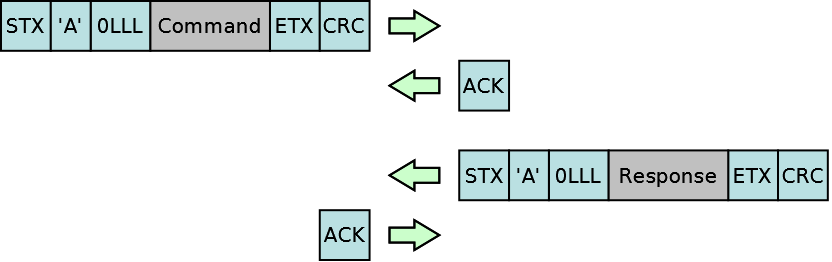

The message length shall be coded in two bytes and is limited to 4095 bytes (the highest nibble is used for multiple block transfer). The last two bytes includes a CRC16/XMODEM checksum. Protocol Type A is recommended for communication channels without a underlying flow control (e.g. RS232 serial communication). Each received message has to be confirmed by sending an ACK to the sender of the message.

Example:

``` cpp
02 41 00 04 22 01 00 00 03 7B 25 ->
   <- 06
   <- 02 41 00 14 90 00 47 82 65 CA 63 73 3B 39 FF FF 98 76 54 11 14 A0 00 79 03 86 5A
   06 ->
```


In case of a protocol error is detected (e.g. wrong message length or protocol frame corrupted etc.) the SDI-Server discards the received data and sends for protocol Type A a NAK to inform the sender.


Protocol type A supports multiple block transfer, if the command length exceeds the maximum message size. Here up to 16 message blocks each with a maximum size of 4095 bytes are possible. SDI-Server accumulates all blocks until the message is received completely before the command will be executed. The following picture demonstrates a command transfer split in three blocks:

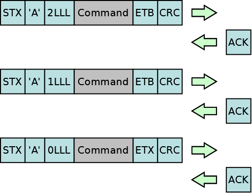


The ETB shall indicate an intermediate block. Only the last block transfer includes the ETX. The upper nibble of the length value indicates the block number.


### Protocol Type B: Communication w/o flow control <a href="#subsubsec_prot_b" id="subsubsec_prot_b"></a>

For communication channels supporting a underlying flow control (e.g. TCP/IP) Protocol Type B is recommended:

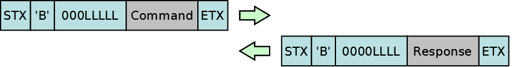

The message length shall be coded in four bytes and is limited to 1048575 bytes in command direction respectively 65535 bytes in response direction (the highest bytes/nibbles are reserved for future use). Because of the underlying flow control neither a CRC nor an ACK is needed.

Example:

``` cpp
02 42 00 00 00 04 22 01 00 00 03 ->
   <- 02 42 00 00 00 14 90 00 47 82 65 CA 63 73 3B 39 FF FF 98 76 54 11 14 A0 00 79 03
```


In case of a protocol error is detected (e.g. wrong message length or protocol frame corrupted etc.) the SDI-Server closes the connection immediately.


### Protocol Type C: Multi connection support <a href="#subsubsec_prot_c_multi_connection_support" id="subsubsec_prot_c_multi_connection_support"></a>

Since version 4.7.0, SDI server has added support to accept multiple connections from several clients at the same time (draft version). With version 4.7.1, the multi connection concept was revised and improved. With the new concept the new protocol type C was introduced, which has the same message format as protocol type B.


New projects, which integrate SDI the first time and require multi connection support, should prefer implementation of new protocol type D (see chapter [Protocol Type D: Concurrent command support](#subsubsec_prot_d_concurrent_command_support)).


SDI server accepts multiple connections as follows:

- one connection for message transfer with protocol type B (**main connection**)
- multiple connections for message transfer with protocol type C (**side connections**)

Protocol type B messages can only be sent by one SDI client, which holds the main connection. The main connection provides access to full SDI function scope, such as processing payments with EMV commands. SDI server reserves the main connection with receipt of the first message having protocol type B (first come first serve). Other connections using protocol type B messages afterwards are declined with response code `64FA` (main connection already locked). From this point the SDI client is restricted to a side connection, which allows side commands with protocol type C only. For a side connection with protocol type C the function scope of SDI server is limited to the following SDI interfaces:

- [Printer Interface (25-XX)](#subsec_sdi_printer_interface)
- [PED Interface (22-XX)](#subsubsec_sdi_ped_interface)
- [System Interface (20-XX)](#subsec_sdi_system_interface)
- [Generic Crypto Interface (70-XX)](#subsec_sdi_generic_crypto_interface)
- [Data Interface (29-XX)](#subsubsec_sdi_data_interface)


Not all commands of the listed interfaces above have support for protocol type C. Users should consider subchapters and if not explicitely mentioned in description for the corresponding SDI command, it is not supported as side command with protocol type C.


SDI commands having no support for protocol type C are declined by SDI server with response code `64F9` (command not allowed). In addition, side connections don\'t support callbacks, requests and nested commands. Side commands are usually short-term in nature and directly replied with a final response. Further, asynchronous [Payment Notification Callbacks (9E-XX)](#subsec_sdi_payment_notification_callbacks) are only issued over main connection and never send over side connections with protocol type C.

Even basically supported as side command, SDI running as Countertop will be restricted to use it with protocol tpye C, if the command requires remote processing or partial interaction with the EPP. The reason is recent SDI implementations do not support asynchronous execution of commands on EPP and a SDI Countertop is not able to forward it as EPP side command. This implies that these commands must use protocol type B (main connection), if they require remote processing by the EPP. For instance, [PED start PIN entry (22-03)](#subsubsec_sdi_ped_start_pin) will lose side command support for the SDI Countertop, since EPP will be always responsible for PIN entry, after it was enabled with [Enable EPP (20-21)](#subsubsec_sdi_sys_enable_epp). In addition, command addressed to an EPP with TLV tag `DFA150` will also be considered as payment command, which must use the main connection. In this case the command is also declined with `64F9` (command not allowed), if sent with protocol type C on a side connection.


Multi connection support is provided by protocol library `lib_mADK_PP_Prot_ipc.so`. By default, this library is always used on Android platforms such as Neo, Trinity (T650) and CM5, M440 and M424. For SDI versions \<= 4.21.0, multi connection support on Engage and Fusion was not available, because these platforms use old protocol library `lib_mADK_PP_Prot_com.so` only. Since version 4.21.0, Engage/Fusion allow to enable it with parameter `multi_connect_support` in configuration file [COM_IF.CFG](#sec_sdi_com_if_cfg). Since version 4.23.10 SDI uses defaults for all VOS platforms depending on SDI operation mode, if parameter `multi_connect_support` is not provided. For more details please refer to chapter [COM_IF.CFG](#sec_sdi_com_if_cfg).
Please note that protocol library `lib_mADK_PP_Prot_ipc.so` only supports TCP/IP related communication profiles. Other communication profiles like Bluetooth (e.g. as BT PAN, COM1A, BLE) or serial communication (USB and COM) are only implemented in old protocol library. Thus, these profiles are no longer usable, if multi connection support for Engage/Fusion with the new library is enabled. In addition, protocol type A (designed for serial communication) is implemented in old protocol library `lib_mADK_PP_Prot_com.so` only. Therefore, this protocol type has no multi connection capability. A single protocol type A connection is always treated as main connection.
An additional example user config package **dl.sdi-usrconfig-ipc-prot-X.X.X-X-P2PE-X.X.X.tar** comes along in subfolder `example/load/usr_config` of SDI documentation package `sdi-doc-X.X.X-X-P2PE-X.X.X.zip`. This package enables multi connection support with communication profile `CONNECT_ANY.XML`.


#### Sharing the main connection with multiple SDI clients <a href="#para_sdi_sharing_main_connection" id="para_sdi_sharing_main_connection"></a>

With older SDI versions, multiple SDI clients could share the main connection by closing and reopening the connection only. Since version 4.29.0, command [Sys Abort (20-02)](#subsubsec_sdi_sys_abort) was enhanced with bit value `0x02` in P2 field to release the main connection without the need that the connection is closed (for more details see chapter [Sys Abort (20-02)](#subsubsec_sdi_sys_abort)). With its termination (or with command [Sys Abort (20-02)](#subsubsec_sdi_sys_abort)) the main connection is unlocked for other connections and another secondary SDI client is allowed to send a protocol type B message to obtain the main connection (payment lock). There is no such kind of notification by SDI server for secondary SDI clients, if the main connection is closed/unlocked. Therefore, SDI clients must arrange to get the payment lock for the main connection.

#### Parallel command processing <a href="#para_sdi_parallel_processing" id="para_sdi_parallel_processing"></a>

Older versions of SDI server have implemented a sequential command processing and were able to serve one client at the same time only. Thus, SDI clients were delayed as long as a command on another connection was active. Since version 4.9.3, SDI server has added support for parallel processing so that several commands on multiple connections can be served at the same time. For this feature SDI server implements a session context per connection and settings, which were configured (e.g. for [Set Printer Property (25-00)](#subsubsec_sdi_prt_set_property)), are stored per connection and kept for duration of the connection.


Please note that parallel processing is not possible, if concurrent commands needs access to an exclusive resource. For instance, it won\'t be possible to start 2 PIN entries in parallel on 2 connections, since SDI server needs to access the PIN entry device. If one connection has started the PIN entry, all PED commands received on other connections will be declined. In addition, SDI server will delay a print command, if the printer device is already in use by another connection. The print command is processed, after the previous print job has been finished, otherwise this would lead to broken receipt contents.


### Protocol Type D: Concurrent command support <a href="#subsubsec_prot_d_concurrent_command_support" id="subsubsec_prot_d_concurrent_command_support"></a>

Protocol type D was introduced since version 4.29.0 and allows a SDI client to send concurrent commands over the same connection. In addition, the protocol type can be used with multiple connections and there is no need to use different protocol types identifier in header, as required with protocol types B and C (see chapters above). Therefore, new projects, which want to integrate SDI with communications with underlying flow control (e.g. TCP/IP), should implement protocol type D, because (sooner or later) this will replace old protocol types B and C.


Protocol type D with concurrent command support is provided by protocol library `lib_mADK_PP_Prot_ipc.so` only. Old protocol library `lib_mADK_PP_Prot_com.so` without multi connection support only implements protocol types A and B. For more details, see previous chapter [Protocol Type C: Multi connection support](#subsubsec_prot_c_multi_connection_support).


#### Message format <a href="#para_sdi_prod_d_message_format" id="para_sdi_prod_d_message_format"></a>

The message format of protocol type D is similar to B and C, except the header was enhanced by a field containing message ID to identify the command and responses on SDI server and client side.

Similar to protocol type B and C, the header consists of STX (1 byte) and \'D\' (1 byte), followed by the length field (4 bytes, big endian). New is the message ID (4 bytes, big endian) inserted between the length field and data, for both, command and response. The length field contains the length of command or response data only and does not include the preceding message ID and the appended ETX.

#### Message identification by ID <a href="#para_sdi_prod_d_message_identification" id="para_sdi_prod_d_message_identification"></a>

The message ID is specified in command on client side and after SDI has processed the command, the same ID returned in the response so that the client is able to associate it with the command that was sent. Usually, the message ID is a numeric value (e.g. starting from 0) and each command for the connection uses the message ID of the previous command incremented by 1. In that way concurrent commands can be processed by its message ID independently, either on the same connection or on another connection, where each client uses its own range of message IDs.

Example:

#### Command cancellation <a href="#para_sdi_prod_d_callback_command_cancellation" id="para_sdi_prod_d_callback_command_cancellation"></a>

As for old protocol types the existing command [Sys Abort (20-02)](#subsubsec_sdi_sys_abort) is used to cancel active commands. In difference to protocol types A and B, command [Sys Abort (20-02)](#subsubsec_sdi_sys_abort) is unidirectional and SDI never provides a command response for it. Thus, command field P2 to control behaviour for command response is always ignored for protocol type D. Command [Sys Abort (20-02)](#subsubsec_sdi_sys_abort) uses the message ID of the active command, which shall be cancelled.

Example:


There is no guarantee that the active command is always cancelled. Only a small set of commands are cancelable at all and it might depend on command progress or user interaction, if it will be considered. In addition, SDI will just ignore it beyond the point of no return. Finally, command [Sys Abort (20-02)](#subsubsec_sdi_sys_abort) with a message ID referring an inctive command is also ignored (see example above).


#### Payment lock/unlock <a href="#para_sdi_prod_d_callback_payment_lock_unlock" id="para_sdi_prod_d_callback_payment_lock_unlock"></a>

Even protocol type D provides best flexibility to support concurrent command processing, most SDI commands use exclusive resources or internal APIs, which still disallow concurrent invocation (e.g. EMV, MSR or card detection commands using the card reader or UI commands using the display). Therefore, SDI clients must request SDI for permission to get access to full function scope, which corresponds blocking the main connection with old protocol type B (see chapter [Protocol Type C: Multi connection support](#subsubsec_prot_c_multi_connection_support) for more details). For this reason the new command [Sys Lock Payment (20-06)](#subsubsec_sdi_sys_lock_payment) was introduced to request a global lock for the connection: the payment lock. After obtaining the payment lock successfully, the related connection is allowed to send payment commands, whereas other connections have a limited SDI function scope and only commands especially declared as \"side command\" can be used then. SDI clients, which send command [Sys Lock Payment (20-06)](#subsubsec_sdi_sys_lock_payment) to an already locked SDI are declined with `64FA` (already locked) immediately. The same result is returned for a payment command on a connection not owning the lock. Payment commands always require the payment lock and cannot be sent concurrently (see section [Concurrency restrictions](#para_sdi_prod_d_concurrency_restrictions)). Side commands instead do not require this lock and can be processed concurrently. A command [Sys Lock Payment (20-06)](#subsubsec_sdi_sys_lock_payment), which has obtained the payment lock successfully, is responded by SDI with a unidirectional callback [Intermediate Result Callback (99-01)](#subsubsec_sdi_intermediate_status_cb) on this connection, which means that the command is kept open without a final response as long as the payment lock is active. Command [Sys Abort (20-02)](#subsubsec_sdi_sys_abort) with the message ID of the previous [Sys Lock Payment (20-06)](#subsubsec_sdi_sys_lock_payment) is sent by SDI client to release the payment lock again. Finally, SDI sends the final response with error code `6500` confirming that [Sys Lock Payment (20-06)](#subsubsec_sdi_sys_lock_payment) was succesfully cancelled.

Example:


The list of interfaces providing side command support are list in previous chapter [Protocol Type C: Multi connection support](#subsubsec_prot_c_multi_connection_support). Users should consider subchapters and if not explicitely mentioned in description for the corresponsing SDI command, the execution as side command with protocol type C or D is not supported and requires the payment lock.
A side command will fail, if the command is addressed to EPP with TLV tag `DFA150`. In this case the command is also declined with `64F9` (command not allowed). Thus, side commands are only supported for Countertop with recent SDI implementations. Further, an attched/enabled EPP might lead to additional concurrency limitations for side commands (see section [Concurrency restrictions](#para_sdi_prod_d_concurrency_restrictions)).


It is also possible that multiple SDI client applications share the same connection (e.g. a single USB connection). In this case some kind of proxy (either implemented as a seperate process or part of a SDI client library) handles the traffic for these applications on SDI client side. Further, each application might run with an own payment context meaning they act completely independent, even they require access to payment functionality of SDI. Finally, command [Sys Lock Payment (20-06)](#subsubsec_sdi_sys_lock_payment) can be send multiple times by the proxy over the same connection to cooridinate SDI clients to access SDI payment functions.

Example:


The SDI proxy mustn\'t just pass through the message IDs (`X,Y,Z`) of the client 1:1 to SDI server, instead it must use an own unique number range (`A,B,C,...`) for all client commands to SDI server, which is mapped to back to message ID of the related client whenever a response is received. For the proxy implementation it is also recommended to care about resources and to unblock waiting participants, whenever a connection gets lost in both directions. In case of connection lost to SDI server it should response all SDI clients with an error result for all active command or just close all SDI client connections if possible (e.g. when using TCP/IP). For interruption of a SDI client connection, it should send a [Sys Abort (20-02)](#subsubsec_sdi_sys_abort) to abort active commmands in SDI server. In addition, special handling will be required for commands [PED start PIN entry (22-03)](#subsubsec_sdi_ped_start_pin) and [Start Card Detection (23-03)](#subsubsec_sdi_start_card_detection) : These commands cannot be aborted with [Sys Abort (20-02)](#subsubsec_sdi_sys_abort), since they were already finalized with a response. Finally, SDI proxy must send of [PED stop PIN entry (22-05)](#subsubsec_sdi_ped_stop_pin) and [Stop Card Detection (23-05)](#subsubsec_sdi_stop_card_detection) to abort an active PIN entry or card detection.


### Warning

Please note that SDI server is not able to detect violations of a SDI client, if it sends a payment command, when it does not own the payment lock. The reason is another client might have requested the lock before, which SDI has associated with the (one and only) connection to the proxy. The prerequesite for a such working solution is the discipline of all SDI clients, not to send any payment command before the payment lock was obtained successfully with [Sys Lock Payment (20-06)](#subsubsec_sdi_sys_lock_payment). Basically, this is the recommendation for all solutions, even if each SDI client uses it\'s own connection to SDI without a proxy.

#### Command requests and callbacks <a href="#para_sdi_prod_d_command_requests_callbacks" id="para_sdi_prod_d_command_requests_callbacks"></a>

Command requests and unidirectional command callbacks use the message ID of the command, for which the request or callback was triggered. Since side commands don\'t have support for it, requests and callbacks are only sent for payment commands. Finally, the SDI client uses same the message ID received with the request for the its response (see [Command Requests/Callbacks](#subsec_sdi_command_requests_callbacks) for more details). Nested commands (during an active request) use another message ID than the active command, usually the message ID of each nested command is incremented by 1. It\'s also possible that a nested command sends an unidirectional command callback, which then get\'s the message ID of the nested command.

Example:


As already mentioned, side commands don\'t support callbacks, requests and nested commands. The only exception is side command [Sys Lock Payment (20-06)](#subsubsec_sdi_sys_lock_payment), which uses [Intermediate Result Callback (99-01)](#subsubsec_sdi_intermediate_status_cb) to signal the payment lock was obtained successfully. Side commands are usually short-term in nature and directly replied with a final response. In addition, the cancellation of a side command is not supported and [Sys Abort (20-02)](#subsubsec_sdi_sys_abort) referring a side command will be ignored.


#### Payment notification callbacks <a href="#para_sdi_prod_d_callback_payment_notify_callbacks" id="para_sdi_prod_d_callback_payment_notify_callbacks"></a>

Asynchronous [Payment Notification Callbacks (9E-XX)](#subsec_sdi_payment_notification_callbacks), which are always unidirectional without a callback response, do not belong to an active command and can be sent by SDI at any time. As for old protocol type B, with protocol type D these notifications are only issued to the main connection, which owns the payment lock. Payment notification callbacks always use the message ID of [Sys Lock Payment (20-06)](#subsubsec_sdi_sys_lock_payment). After releasing the payment lock with [Sys Abort (20-02)](#subsubsec_sdi_sys_abort), SDI no longer issues payment notification callbacks on this connection.

Example:

#### Concurrency restrictions <a href="#para_sdi_prod_d_concurrency_restrictions" id="para_sdi_prod_d_concurrency_restrictions"></a>

As already mentioned in previous section [Payment lock/unlock](#para_sdi_prod_d_callback_payment_lock_unlock), payment commands require the payment lock. Even a connection was successfully locked, payment commands do not support concurrency, therefore, a second payment command will be declined with final response `640A` (busy) as long as the previous payment command is active.

Example:

Side commands instead have concurrency support and can be sent by SDI clients at any time without requesting SDI for access. But please note that side commands might be processed delayed or even can be declined, if they use an exclusive resource, which needs its own access protection (independently from the payment lock). For instance, SDI server will delay a print command, if the printer device is already in use by another side command. The print command is processed, after the previous print job has been finished, otherwise this would lead to broken receipt contents. In addition, it won\'t be possible to start 2 PIN entries in parallel with 2 side commands [PED start PIN entry (22-03)](#subsubsec_sdi_ped_start_pin), since SDI server needs to access the PIN entry device. Only the first [PED start PIN entry (22-03)](#subsubsec_sdi_ped_start_pin) will start the PIN entry and block all PED commands on other connections. For more details about PIN entry with side commands and the related restrictions, please read chapter [PED start PIN entry (22-03)](#subsubsec_sdi_ped_start_pin) carefully.

Finally, an attached/enabled EPP will lead to additional concurrency restrictions for side commands, if they require remote processing or partial interaction with the EPP. The reason is recent SDI implementations do not support asynchronous execution of commands on EPP and a SDI Countertop is not able to forward it as EPP side command. This implies that some commands are always handled as synchronous payment command, if they require remote processing by the EPP. For instance, [PED start PIN entry (22-03)](#subsubsec_sdi_ped_start_pin) will lose side command support for the SDI Countertop, since EPP will be always responsible for PIN entry, after it was enabled with [Enable EPP (20-21)](#subsubsec_sdi_sys_enable_epp). In addition, command addressed to an EPP with TLV tag `DFA150` will also be considered as payment command, which requires the payment lock (see [Sys Lock Payment (20-06)](#subsubsec_sdi_sys_lock_payment)) and sequential synchronous processing.

### Protocol Type K: Remote keyservice <a href="#subsubsec_prot_k_remote_keyservice" id="subsubsec_prot_k_remote_keyservice"></a>

Payment applications running on Android platform, e.g. on P630 (Neo), T650c (Trinity) or CM5, M440 and M424, have the requirement to establish secure TLS connections. For authentication of the terminal as a Verifone device, these applications wants to use the AuthEx key/certificate or another customer loaded RSA key/certificate. AuthEx comes along with default factory installation of warranty keys, whereas customer key/certificates must be injected with RKL (remote key loading) first. Both key/certificate variants are stored in security Vault area on Engage (e.g. CM5) or in a special security domain on Android, which is only allowed to be accessed by SDI server (e.g. K81 security processor on T650c). Android applications have no direct access to the corresponding security APIs, therefore, SDI server must provide a service to use the key/certificate remotely. For this use case a new remote keyservice with Protocol Type K (K = Keyservice) was introduced, which has the same message format as the known Protocol Type B, except the following layer differences:

- On Transport Layer the remote keyservice uses protocol identifier \'K\' instead \'B\' (see chapter [Transport Layer](#subsec_sdi_transport_layer))
- On Application Protocol Layer the remote keyservice uses P1\\P2 for protocol compatibility reasons, but these fields are recently unused and ignored (see chapter [Application Protocol](#subsec_sdi_application_protocol)). Applications can just fill both fields with a dummy value (e.g. `00` `00`, see chapter [Remote Keyservice (72-XX)](#subsec_sdi_remote_keyservice)).

The remote keyservice runs concurrently to normal SDI server under the additional TCP port 12001 and it supports accepting side connections at any time.


The remote keyservice only accepts messages of Protocol Type \'K\', other messages having protocol type B or C are declined and still have to be sent to normal SDI interface available under main TCP port 12000 (see chapter [Getting Started](#sec_sdi_getting_started)).


In order to restrict access to the remote keyservice for the internal Android device, the keyservice listen port 12001 is always bound to a local network device having one of the follwing IP addresses:

- `127.0.0.1` (localhost) on Android-only devices, e.g. P630 (Neo) or T650c (Trinity)
- `192.0.2.6` (PPP network device) on hybrid OS devices like CM5, M440 or M424, where SDI Server runs on Engage side (IP address `192.168.50.2` for old OS versions is also supported).

The local network devices listed above can be considered as trusted, since device internal connections are accepted only. Remote connections outside from the device will be declined to avoid terminal key/certifcate being misused by undesired TCP clients. Hybrid OS devices use an internal PPP network `192.0.2.0`, where the Android device uses IP address `192.0.2.5` and the Engage device the IP address 192.0.2.6. Binding the keyservice port to `192.0.2.6` will restrict usage of SDI remote keyservice for Android only.

The remote keyservice with new Protocol type \'K\' only supports a thin scope of SDI commands, which are descripted in chapter [Remote Keyservice (72-XX)](#subsec_sdi_remote_keyservice). New or existing TLS components in Verifone terminals most likely implemented with OpenSSL can use this minimal command set to invoke secure routines required for the TLS authentication with RSA.


OpenSSL provides an engine concept, which allows to implement a SSL engine to invoke RSA private key operations in a secure way without the need to hold the private key in application context.


Such an OpenSSL engine using the SDI remote keyservice is already implemented by ADKIPC project with library `engine_keyservice_sdi.so`. The project provides an easy-to-use API for several terminal platforms. OpenSSL engine `engine_keyservice_sdi.so` comes along with the IPC distribution packages and is fully integrated in ADKIPC\'s TLS component ready for use. Of course, the provided SSL engine can also be integrated in already existing OpenSSL implementations. For more details please refer to documentation of the ADKIPC project.


Payment applications running on Engage (not on Android) use `engine_keyservice.so`, which is a local keyservice library provided by OS. This engine provides direct access for OpenSSL to use keys/certificates in Vault, thus, these applications don\'t need to access to SDI remote keyservice.


## Application Protocol <a href="#subsec_sdi_application_protocol" id="subsec_sdi_application_protocol"></a>

The Application Layer is based on ISO 7816 or APDU. The command and response pairs have the following formats:

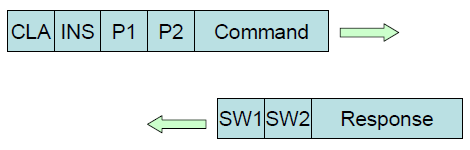

The structure of a SDI command is as follows:

- **CLA**: Class of command
- **INS**: Specific Instruction within command class
- **P1-P2**: See P1-P2 Coding (see [Coding of P1 and P2](#subsubsec_sdi_coding_p1_p2))
- **Data**: Command data (see [Data Coding](#subsubsec_sdi_data_coding))

A SDI response contains the following fields:

- **SW1**: Status word 1 (see [Status Word Coding](#subsubsec_sdi_status_word_coding))
- **SW2**: Status word 2 (see [Status Word Coding](#subsubsec_sdi_status_word_coding))
- **Data**: Response data (see [Data Coding](#subsubsec_sdi_data_coding))

The Application Protocol shall also have a callback flow required for EMV:

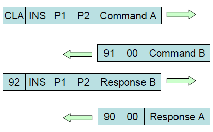

### Coding of P1 and P2 <a href="#subsubsec_sdi_coding_p1_p2" id="subsubsec_sdi_coding_p1_p2"></a>

The P1-P2 byte shall be used for either:

- **P1**: Secure channel control (appears as **SC** in this document)
- **P2**: Instruction qualifier

The coding shall be:


Example:

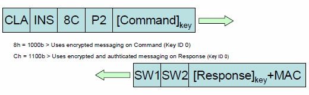

### Data Coding <a href="#subsubsec_sdi_data_coding" id="subsubsec_sdi_data_coding"></a>

Three types of data encoding shall be used:

- **TLV**: Unless a DOL or COL the data shall be encoded using BER-TLV (ISO/IEC 8825). Both Primitive and Constructed TLVs shall be used. Constructed data shall be included in the **F0** Constructed Tag.
- **DOL**: The data defines a list of Tags and Lengths required. The response shall include only the data (only values, no Tag or Length). DOL requests data shall be included in the **F1** Constructed Tag and DOL responses in the **F2** Constructed Tag.
- **COL**: The data defines a list of Tags and Lengths required. The response shall be constructed using TLV. COL data shall be included in the **F3** Constructed Tag.

The Tags within a constructed tag may appear in any order and not always in the order defined in this document.

### Status Word Coding <a href="#subsubsec_sdi_status_word_coding" id="subsubsec_sdi_status_word_coding"></a>

The following Status Words (SW1 / SW2) are defined:

| SW1 | SW2 | Comment |
|----|----|----|
| <p>90</p> | <p>00</p> | <p>All OK</p> |
| <p>62</p> | <p>00</p> | <p>Tag Error</p> |
| <p>63</p> | <p>00</p> | <p>Tag Length Error</p> |
| <p>64</p> | <p>00</p> | <p>Execution Error</p> |
| <p>64</p> | <p>05</p> | <p>Canceled by user</p> |
| <p>64</p> | <p>0A</p> | <p>SDI-Server is busy (e.g. UI menu entered or another command blocks resource)</p> |
| <p>64</p> | <p>0C</p> | <p>Timeout during Pin Entry</p> |
| <p>64</p> | <p>F6</p> | <p>MSR data not available Timeout reached (for UX devices only)</p> |
| <p>64</p> | <p>F7</p> | <p>Card Removal Timeout reached (for UX devices only)</p> |
| <p>64</p> | <p>F8</p> | <p>Interchar timeout during Pin Entry</p> |
| <p>64</p> | <p>F9</p> | <p>Command not allowed</p> |
| <p>64</p> | <p>FA</p> | <p>Main connection already locked (returned for protocol type B/D, if another client owns the payment lock)</p> |
| <p>64</p> | <p>FB</p> | <p>Invalid File Content</p> |
| <p>64</p> | <p>FC</p> | <p>File Access Error</p> |
| <p>64</p> | <p>FD</p> | <p>Logic Error (e.g. wrong command order)</p> |
| <p>64</p> | <p>FE</p> | <p>Parameter Error</p> |
| <p>64</p> | <p>FF</p> | <p>Luhn check of the PAN failed</p> |
| <p>65</p> | <p>00</p> | <p>Execution Aborted</p> |
| <p>66</p> | <p>00</p> | <p>Execution Timeout</p> |
| <p>67</p> | <p>00</p> | <p>Message Length Error</p> |
| <p>68</p> | <p>00</p> | <p>No SDI Plugin available</p> |
| <p>68</p> | <p>01</p> | <p>Unknown plugin ID in the Instruction byte (INS)</p> |
| <p>68</p> | <p>02</p> | <p>Invalid or no result data returned by the plugin</p> |
| <p>69</p> | <p>00</p> | <p>EPP connection error</p> |
| <p>6D</p> | <p>00</p> | <p>Unknown Instruction (INS)</p> |
| <p>6E</p> | <p>00</p> | <p>Unknown Class (CLA)</p> |
| <p>6F</p> | <p>B0</p> | <p>CMAC Error</p> |
| <p>6F</p> | <p>B1</p> | <p>CMAC Length Error</p> |
| <p>6F</p> | <p>B2</p> | <p>CMAC Missing Error</p> |
| <p>6F</p> | <p>B4</p> | <p>Encryption Error</p> |
| <p>6F</p> | <p>B5</p> | <p>Encryption Length Error</p> |
| <p>6F</p> | <p>B6</p> | <p>Encryption Missing Error</p> |
| <p>6F</p> | <p>B8</p> | <p>Decryption Error</p> |
| <p>6F</p> | <p>B9</p> | <p>Decryption Length Error</p> |
| <p>6F</p> | <p>BA</p> | <p>Decryption Missing Error</p> |
| <p>6F</p> | <p>C0</p> | <p>Excessive PIN Requests</p> |
| <p>6F</p> | <p>D0</p> | <p>Low Battery</p> |
| <p>6F</p> | <p>E0</p> | <p>No DUKPT Keys Loaded</p> |
| <p>6F</p> | <p>F0</p> | <p>Unit Tampered</p> |
| <p>6F</p> | <p>F1</p> | <p>Recovery Mode. SDI only allows [Check For Update (20-1D)](#para_sdi_sys_software_check_update) command. (Android only)</p> |
| <p>90</p> | <p>70</p> | <p>PIN bypassed</p> |
| <p>90</p> | <p>71</p> | <p>No match for card validation</p> |
| <p>90</p> | <p>XX</p> | <p>EMV error (for XX see <a href="group___a_d_k___r_e_t___c_o_d_e.md">ADK return codes</a>)</p> |
| <p>91</p> | <p>00</p> | <p>Callback Request</p> |
| <p>94</p> | <p>01</p> | <p>Smart card removed = error caused by cardholder</p> |
| <p>94</p> | <p>02</p> | <p>Smart card error caused by terminal</p> |
| <p>94</p> | <p>03</p> | <p>Smart card error caused by ICC</p> |
| <p>94</p> | <p>04</p> | <p>CTLS: Two cards in the field (only in relation with smart card commands)</p> |
| <p>94</p> | <p>05</p> | <p>Smart card error caused for initialization</p> |
| <p>94</p> | <p>06</p> | <p>Smart card error caused passing invalid parameters</p> |
| <p>94</p> | <p>F3</p> | <p>Error In TLV Data Object (only in relation with EMV commands)</p> |

### SDI access control <a href="#subsubsec_sdi_access_control" id="subsubsec_sdi_access_control"></a>

Old SDI versions were more or less permissive and all clients were allowed to send any command. But usage of security related resources or functions depended on the security-mode, which SDI was operating with:

- Trusted mode: Local applications connecting from the same device were considered as \"trusted\" and got full access on SDI interface without restrictions.
- Untrusted mode: Remote SDI clients connecting from the outside world were classified as potentially \"untrusted\", therefore, SDI operated in a restricted mode.

The following SDI commands and functionalities were affected by the untrusted/restricted mode:

- SDI configuration update required a MAC, see chapter [Software Upload Finalize (20-16)](#para_sdi_sys_software_upload_finalize). Prerequisite for using a MAC is system authentication with [Sys Auth (20-11)](#subsubsec_sdi_sys_auth). Optionally, untrusted applications could implement/install a SDI plugin with `SDITrigger_SDIConfig` to validate and update SDI configuration w/o MAC, see chapter [Internal plugin trigger functions](#subsubsec_sdi_plugin_trigger).
- EMV configuration update also required a MAC or optionally a SDI plugin with trigger `SDITrigger_EMVConfig`, see chapter [Internal plugin trigger functions](#subsubsec_sdi_plugin_trigger).
- By default, [Generic Crypto Interface (70-XX)](#subsec_sdi_generic_crypto_interface) was restricted in use.
- By default, SDI command [getMsgSignature (29-04)](#subsubsec_sdi_getmsgsignature) was blocked.

With introduction of ACL (access control list) configuration file [acl.json](#subsubsec_acl_json), the SDI access control is now configurable and can be better adjusted to projects requirements. The ACL file contains access rules, which allow to specify SDI command filters on application protocol level (see chapter [Application Protocol](#subsec_sdi_application_protocol)). These filters consists of a whitelist with class/instruction of allowed commands. Further, access rules can be defined for TCP/IP connections or for local applications (running on the same device as SDI). Finally, old security-mode \"trusted\"/\"untrusted\" is supported to align behaviour to old SDI versions. Backwards compatibility is guaranteed with a default ACL configuration file, which is installed with the SDI base package. Optionally, an user ACL configuration file can be installed with an user config package on top to extend/overload the defaults.


A complete overview about SDI installation packages for the corresponding platform is provided by chapters [Software for VOS/VOS2 and VOS3](#subsec_sdi_vos_software) and [Software for Android](#subsec_sdi_android_software).


There are 2 different rule sections, which are used in an ACL file:

- Section `"system"`: List of rules for system services with highest priority. This section is always active and only supported by default ACL configuration file, thus, it will be ignored in user ACL configuration.
- Section `"clients"`: List of rules for user applications. This section is supported for both, in default and user ACL configuration file. A valid section section `"clients"` in user ACL file will disable the section in default ACL file and overlay it completely.

The matching rules for the files and its sections are implemented as follows:

1.  Always the first match (from top to bottom) in a section takes precedence. Once a rules has matched, it is applied for the connection. Other rules of this section and in other ACL files are ignored.
2.  Section `"system"` of default ACL files has highest priority and is looked up at first. If no system rule matches, sections `"clients"` are processed afterwards.
3.  If an user ACL configuration file is installed and found, this file is preferred to the default ACL file. A valid section `"clients"` in user ACL file will disable the section in default ACL file and overlay it completelly.
4.  Finally, SDI will use the section `"clients"` of the default ACL file, if no user ACL file is available.

Every command received by SDI during the session is validated against the command filters of the selected rule. If the command is not whitelisted, SDI declines it with response `64F9` (command not allowed).

TCP/IP connections are identified by its IP address. SDI detects the remote IP address of the client to match a rule with type `tcp`. For identification of local applications SDI has added support for Unix Domain Sockets, which allow to retrieve credentials of the connecting application. The SDI domain socket is available in the filesystem, its location depends on the used platfrom as follows:

- Fusion/Engage: `/tmp/share/sdi.uds`
- Android: `/dev/socket/sdi/sock.uds`
- VOS3: `/dev/socket/sdi.uds`

Applications connecting on the SDI domain socket either can be identified by user (rule type `user`) or by package name (rule type `package`).
On Fusion/Engage and VOS3 the ACL file typically must implement rules of type `user`, since type `package` is not supported for this platform.
On Android, the ACL file typically must implement rules of type `package`, since user name for applications are dynamically assigned by Android system and are not user-friendly.

JSON format and supported parameters as well as default ACL files for all platforms are fully described in chapter [acl.json](#subsubsec_acl_json).


SDI access control is implemented for protocol type B and C with protocol library `lib_mADK_PP_Prot_ipc.so` only. This library is always used on Android, thus, SDI access control works out of the box on this platform. Engage/Fusion and VOS3 platforms use protocol library `lib_mADK_PP_Prot_com.so` by default, which provides no access control and no multi connection support (see chapter [Protocol Type C: Multi connection support](#subsubsec_prot_c_multi_connection_support)). Finally, users can enable the `lib_mADK_PP_Prot_ipc.so` on Engage/Fusion/VOS3 with [COM_IF.CFG](#sec_sdi_com_if_cfg) setting `multi_connect_support`, which also activates the SDI access control in the same way.


## SDI Command Overview <a href="#subsec_sdi_cmd_overview" id="subsec_sdi_cmd_overview"></a>

The table gives an overview about all supported SDI commands on the different platforms.
The symbols in it have the following meaning:
„●" = command is supported without any restrictions
„○" = command is supported with restrictions, see subchapter for details
„‒" = command is not supported

The column \"EPP Support\" indicates how the command will be processed in an EPP solution:
„C" stands for card side, which means the command is processed on the device, where the card was swiped, inserted or tapped
„M" stands for mirrow, which means the command is forwarded to the EPP automatically
„T" stands for tag controlled, which means the command is processed on the countertop or EPP unit depending on tag DFA150

  --------------------------------------------------------------------------------------------------------------------------------------------------------------------------------------------------------------------------------------------------------------------------------------------------------------------------------------------------------------------------------------------------------------------------------------------------------------------------------------------------------------------------------------------------------------------------------------------------------------------------------------------------
  Cla/Ins                          Command                                                                                                                                                                                                                                                                                           VOS                          VOS2                         VOS3                         Trinity                      Neo                          VR1                          EPP                            Remark
                                                                                                                                                                                                                                                                                                                                                                                                                                                         Android                      SCR                          Support                        
  -------------------------------- ------------------------------------------------------------------------------------------------------------------------------------------------------------------------------------------------------------------------------------------------------------------------------------------------- ---------------------------- ---------------------------- ---------------------------- ---------------------------- ---------------------------- ---------------------------- ------------------------------ --------------------------------------------------------------------------------------------------
  <p>20-00</p>   <p>[Sync/Turn On (20-00)](#subsubsec_sdi_sync_turn_on)</p>                                                                                                                                                                                                                      <p>●</p>   <p>●</p>   <p>●</p>   <p>●</p>   <p>●</p>   <p>●</p>   <p>‒</p>     <p>deprecated</p>

  <p>20-01</p>   <p>[Turn OFF (20-01)](#subsubsec_sdi_sync_turn_off)</p>                                                                                                                                                                                                                         <p>●</p>   <p>●</p>   <p>●</p>   <p>●</p>   <p>●</p>   <p>●</p>   <p>‒</p>     <p>deprecated</p>

  <p>20-02</p>   <p>[Sys Abort (20-02)](#subsubsec_sdi_sys_abort)</p>                                                                                                                                                                                                                            <p>●</p>   <p>●</p>   <p>●</p>   <p>●</p>   <p>●</p>   <p>●</p>   <p>●</p>     

  <p>20-03</p>   <p>[Sys Get Config (20-03)](#subsubsec_sdi_sys_get_config)</p>                                                                                                                                                                                                                  <p>●</p>   <p>●</p>   <p>●</p>   <p>●</p>   <p>●</p>   <p>●</p>   <p>‒</p>     <p>deprecated, use [Get Property (20-1A)](#subsubsec_sdi_sys_get_property)</p>

  <p>20-04</p>   <p>[Sys Get Status (20-04)](#subsubsec_sdi_sys_get_status)</p>                                                                                                                                                                                                                  <p>●</p>   <p>●</p>   <p>●</p>   <p>●</p>   <p>●</p>   <p>●</p>   <p>‒</p>     <p>deprecated, use [Get Property (20-1A)](#subsubsec_sdi_sys_get_property)</p>

  <p>20-05</p>   <p>[Sys Selftest (20-05)](#subsubsec_sdi_sys_selftest)</p>                                                                                                                                                                                                                      <p>●</p>   <p>●</p>   <p>●</p>   <p>●</p>   <p>●</p>   <p>●</p>   <p>●</p>     <p>deprecated</p>

  <p>20-06</p>   <p>[Sys Lock Payment (20-06)](#subsubsec_sdi_sys_lock_payment)</p>                                                                                                                                                                                                              <p>●</p>   <p>●</p>   <p>●</p>   <p>●</p>   <p>●</p>   <p>●</p>   <p>‒</p>     

  <p>20-07</p>   <p>[Sys Reset Link (20-07)](#subsubsec_sdi_sys_reset_link)</p>                                                                                                                                                                                                                  <p>●</p>   <p>●</p>   <p>●</p>   <p>●</p>   <p>●</p>   <p>●</p>   <p>‒</p>     

  <p>20-09</p>   <p>[Sys Set Status (20-09)](#subsubsec_sdi_sys_set_status)</p>                                                                                                                                                                                                                  <p>●</p>   <p>●</p>   <p>●</p>   <p>●</p>   <p>●</p>   <p>●</p>   <p>● M</p>   <p>deprecated, use [Set Property (20-19)](#subsubsec_sdi_sys_set_property)</p>

  <p>20-11</p>   <p>[Sys Auth (20-11)](#subsubsec_sdi_sys_auth)</p>                                                                                                                                                                                                                              <p>●</p>   <p>●</p>   <p>‒</p>   <p>‒</p>   <p>‒</p>   <p>‒</p>   <p>‒</p>     

  <p>20-13</p>   <p>[Set Idle Text (20-13)](#subsubsec_sdi_set_idle_text)</p>                                                                                                                                                                                                                    <p>‒</p>   <p>●</p>   <p>●</p>   <p>‒</p>   <p>‒</p>   <p>‒</p>   <p>● T</p>   

  <p>20-14</p>   <p>[Software Upload Start (20-14)](#para_sdi_sys_software_upload_start)</p>                                                                                                                                                                                                     <p>●</p>   <p>●</p>   <p>●</p>   <p>●</p>   <p>●</p>   <p>●</p>   <p>● T</p>   

  <p>20-15</p>   <p>[Software Upload Transfer (20-15)](#para_sdi_sys_software_upload_transfer)</p>                                                                                                                                                                                               <p>●</p>   <p>●</p>   <p>●</p>   <p>●</p>   <p>●</p>   <p>●</p>   <p>● T</p>   

  <p>20-16</p>   <p>[Software Upload Finalize (20-16)](#para_sdi_sys_software_upload_finalize)</p>                                                                                                                                                                                               <p>●</p>   <p>●</p>   <p>●</p>   <p>●</p>   <p>●</p>   <p>●</p>   <p>● T</p>   

  <p>20-17</p>   <p>[Shutdown/Reboot/Sleep (20-17)](#subsubsec_sdi_sys_shutdown_reboot_sleep)</p>                                                                                                                                                                                                <p>●</p>   <p>●</p>   <p>●</p>   <p>●</p>   <p>●</p>   <p>●</p>   <p>● T</p>   

  <p>20-18</p>   <p>[Show MAC Desktop (20-18)](#subsubsec_sdi_sys_show_mac_desktop)</p>                                                                                                                                                                                                          <p>●</p>   <p>●</p>   <p>●</p>   <p>‒</p>   <p>‒</p>   <p>‒</p>   <p>‒</p>     

  <p>20-19</p>   <p>[Set Property (20-19)](#subsubsec_sdi_sys_set_property)</p>                                                                                                                                                                                                                  <p>●</p>   <p>●</p>   <p>●</p>   <p>●</p>   <p>●</p>   <p>●</p>   <p>● T</p>   

  <p>20-1A</p>   <p>[Get Property (20-1A)](#subsubsec_sdi_sys_get_property)</p>                                                                                                                                                                                                                  <p>●</p>   <p>●</p>   <p>●</p>   <p>●</p>   <p>●</p>   <p>●</p>   <p>● T</p>   

  <p>20-1B</p>   <p>[Install Sponsor Cert (20-1B)](#subsubsec_sdi_sys_install_sponsor_cert)</p>                                                                                                                                                                                                  <p>‒</p>   <p>‒</p>   <p>‒</p>   <p>●</p>   <p>●</p>   <p>‒</p>   <p>‒</p>     

  <p>20-1C</p>   <p>[Get SDI version info (20-1C)](#subsubsec_sdi_sys_get_version_info)</p>                                                                                                                                                                                                      <p>●</p>   <p>●</p>   <p>●</p>   <p>●</p>   <p>●</p>   <p>●</p>   <p>● T</p>   

  <p>20-1D</p>   <p>[Check For Update (20-1D)](#para_sdi_sys_software_check_update)</p>                                                                                                                                                                                                          <p>‒</p>   <p>‒</p>   <p>‒</p>   <p>●</p>   <p>●</p>   <p>‒</p>   <p>‒</p>     

  <p>20-1E</p>   <p>[Get last install error (20-1E)](#subsubsec_sdi_sys_get_last_install_error)</p>                                                                                                                                                                                              <p>‒</p>   <p>●</p>   <p>‒</p>   <p>‒</p>   <p>‒</p>   <p>‒</p>   <p>● T</p>   

  <p>20-20</p>   <p>[External Button (20-20)](#subsubsec_sdi_sys_external_button)</p>                                                                                                                                                                                                            <p>‒</p>   <p>○</p>   <p>‒</p>   <p>●</p>   <p>●</p>   <p>‒</p>   <p>‒</p>     

  <p>20-21</p>   <p>[Enable EPP (20-21)](#subsubsec_sdi_sys_enable_epp)</p>                                                                                                                                                                                                                      <p>‒</p>   <p>●</p>   <p>●</p>   <p>●</p>   <p>●</p>   <p>‒</p>   <p>‒</p>     

  <p>20-22</p>   <p>[Factory Reset (20-22)](#subsubsec_sdi_sys_factory_reset)</p>                                                                                                                                                                                                                <p>●</p>   <p>●</p>   <p>●</p>   <p>‒</p>   <p>‒</p>   <p>‒</p>   <p>● M</p>   

  <p>20-23</p>   <p>[Read Keystore Certificate (20-23)](#subsubsec_sdi_sys_read_certificate)</p>                                                                                                                                                                                                 <p>●</p>   <p>●</p>   <p>●</p>   <p>●</p>   <p>●</p>   <p>●</p>   <p>‒</p>     

  <p>20-24</p>   <p>[Force Currency Abbreviation (20-24)](#subsubsec_sdi_sys_force_currency_abbreviation)</p>                                                                                                                                                                                    <p>●</p>   <p>●</p>   <p>●</p>   <p>●</p>   <p>●</p>   <p>●</p>   <p>● M</p>   <p>relevant for standard mode only</p>

  <p>21-01</p>   <p>[MSR Read (21-01)](#subsubsec_sdi_msr_read)</p>                                                                                                                                                                                                                              <p>●</p>   <p>●</p>   <p>●</p>   <p>●</p>   <p>●</p>   <p>●</p>   <p>● M</p>   

  <p>21-02</p>   <p>[MSR Card Data Entry (21-02)](#subsubsec_sdi_msr_card_data_entry)</p>                                                                                                                                                                                                        <p>‒</p>   <p>●</p>   <p>●</p>   <p>●</p>   <p>●</p>   <p>‒</p>   <p>‒</p>     

  <p>21-03</p>   <p>[MSR Set Options (21-03)](#subsubsec_sdi_msr_set_options)</p>                                                                                                                                                                                                                <p>●</p>   <p>●</p>   <p>●</p>   <p>●</p>   <p>●</p>   <p>●</p>   <p>● T</p>   

  <p>21-04</p>   <p>[MSR Switch LEDs (21-04)](#subsubsec_sdi_msr_switch_leds)</p>                                                                                                                                                                                                                <p>●</p>   <p>●</p>   <p>●</p>   <p>●</p>   <p>●</p>   <p>●</p>   <p>● T</p>   

  <p>21-05</p>   <p>[MSR Set Sensitivity (21-05)](#subsubsec_sdi_msr_set_sensitivity)</p>                                                                                                                                                                                                        <p>‒</p>   <p>‒</p>   <p>●</p>   <p>●</p>   <p>●</p>   <p>‒</p>   <p>● T</p>   

  <p>22-01</p>   <p>[PED Get PIN (22-01)](#subsubsec_sdi_ped_get_pin)</p>                                                                                                                                                                                                                        <p>‒</p>   <p>●</p>   <p>●</p>   <p>●</p>   <p>●</p>   <p>‒</p>   <p>●</p>     

  <p>22-02</p>   <p>[PED Set PIN Timeout (22-02)](#subsubsec_sdi_ped_set_pin_timeout)</p>                                                                                                                                                                                                        <p>‒</p>   <p>●</p>   <p>●</p>   <p>●</p>   <p>●</p>   <p>‒</p>   <p>● M</p>   

  <p>22-03</p>   <p>[PED start PIN entry (22-03)](#subsubsec_sdi_ped_start_pin)</p>                                                                                                                                                                                                              <p>‒</p>   <p>●</p>   <p>●</p>   <p>●</p>   <p>●</p>   <p>‒</p>   <p>●</p>     

  <p>22-04</p>   <p>[PED poll PIN entry (22-04)](#subsubsec_sdi_ped_poll_pin)</p>                                                                                                                                                                                                                <p>‒</p>   <p>●</p>   <p>●</p>   <p>●</p>   <p>●</p>   <p>‒</p>   <p>●</p>     

  <p>22-05</p>   <p>[PED stop PIN entry (22-05)](#subsubsec_sdi_ped_stop_pin)</p>                                                                                                                                                                                                                <p>‒</p>   <p>●</p>   <p>●</p>   <p>●</p>   <p>●</p>   <p>‒</p>   <p>●</p>     

  <p>22-06</p>   <p>[PED Set PIN Input Parameter (22-06)](#subsubsec_sdi_ped_set_pin_input_parameter)</p>                                                                                                                                                                                        <p>‒</p>   <p>●</p>   <p>●</p>   <p>●</p>   <p>●</p>   <p>‒</p>   <p>● T</p>   

  <p>23-01</p>   <p>[Card Detection (23-01)](#subsubsec_sdi_card_detection)</p>                                                                                                                                                                                                                  <p>●</p>   <p>●</p>   <p>●</p>   <p>●</p>   <p>●</p>   <p>●</p>   <p>● M</p>   

  <p>23-02</p>   <p>[Wait Card Removal (23-02)](#subsubsec_sdi_wait_card_removal)</p>                                                                                                                                                                                                            <p>●</p>   <p>●</p>   <p>●</p>   <p>●</p>   <p>●</p>   <p>●</p>   <p>● C</p>   

  <p>23-03</p>   <p>[Start Card Detection (23-03)](#subsubsec_sdi_start_card_detection)</p>                                                                                                                                                                                                      <p>●</p>   <p>●</p>   <p>●</p>   <p>●</p>   <p>●</p>   <p>●</p>   <p>● M</p>   

  <p>23-04</p>   <p>[Poll Card Detection (23-04)](#subsubsec_sdi_poll_card_detection)</p>                                                                                                                                                                                                        <p>●</p>   <p>●</p>   <p>●</p>   <p>●</p>   <p>●</p>   <p>●</p>   <p>● M</p>   

  <p>23-05</p>   <p>[Stop Card Detection (23-05)](#subsubsec_sdi_stop_card_detection)</p>                                                                                                                                                                                                        <p>●</p>   <p>●</p>   <p>●</p>   <p>●</p>   <p>●</p>   <p>●</p>   <p>● M</p>   

  <p>23-06</p>   <p>[Add Technology (23-06)](#subsubsec_sdi_add_technology)</p>                                                                                                                                                                                                                  <p>●</p>   <p>●</p>   <p>●</p>   <p>●</p>   <p>●</p>   <p>●</p>   <p>● M</p>   

  <p>23-07</p>   <p>[Remove Technology (23-07)](#subsubsec_sdi_remove_technology)</p>                                                                                                                                                                                                            <p>●</p>   <p>●</p>   <p>●</p>   <p>●</p>   <p>●</p>   <p>●</p>   <p>● M</p>   

  <p>23-08</p>   <p>[Provide Callback Response (23-08)](#subsubsec_sdi_provide_callback_response)</p>                                                                                                                                                                                            <p>●</p>   <p>●</p>   <p>●</p>   <p>●</p>   <p>●</p>   <p>●</p>   <p>●</p>     

  <p>24-01</p>   <p>[Display Text (24-01)](#subsubsec_sdi_display_text)</p>                                                                                                                                                                                                                      <p>‒</p>   <p>○</p>   <p>○</p>   <p>‒</p>   <p>‒</p>   <p>‒</p>   <p>‒</p>     <p>deprecated, use [Handle Display (24-03)](#subsubsec_sdi_handle_display)</p>

  <p>24-02</p>   <p>[Display Text with Confirmation (24-02)](#subsubsec_sdi_display_text_with_confirmation)</p>                                                                                                                                                                                  <p>‒</p>   <p>○</p>   <p>○</p>   <p>‒</p>   <p>‒</p>   <p>‒</p>   <p>‒</p>     <p>deprecated, use [Handle Display (24-03)](#subsubsec_sdi_handle_display)</p>

  <p>24-03</p>   <p>[Handle Display (24-03)](#subsubsec_sdi_handle_display)</p>                                                                                                                                                                                                                  <p>‒</p>   <p>○</p>   <p>○</p>   <p>‒</p>   <p>‒</p>   <p>‒</p>   <p>● T</p>   

  <p>24-04</p>   <p>[Handle Secure Input (24-04)](#subsubsec_sdi_handle_secure_input)</p>                                                                                                                                                                                                        <p>‒</p>   <p>○</p>   <p>○</p>   <p>‒</p>   <p>‒</p>   <p>‒</p>   <p>● T</p>   

  <p>24-05</p>   <p>[Handle Menu (24-05)](#subsubsec_sdi_handle_menu)</p>                                                                                                                                                                                                                        <p>‒</p>   <p>○</p>   <p>○</p>   <p>‒</p>   <p>‒</p>   <p>‒</p>   <p>● T</p>   

  <p>24-06</p>   <p>[Handle Card Request Display (24-06)](#subsubsec_sdi_handle_card_request_display)</p>                                                                                                                                                                                        <p>‒</p>   <p>○</p>   <p>○</p>   <p>‒</p>   <p>‒</p>   <p>‒</p>   <p>● T</p>   

  <p>24-07</p>   <p>[Display Idle Screen (24-07)](#subsubsec_sdi_display_idle_screen)</p>                                                                                                                                                                                                        <p>‒</p>   <p>○</p>   <p>○</p>   <p>‒</p>   <p>‒</p>   <p>‒</p>   <p>● T</p>   

  <p>24-08</p>   <p>[Handle Signature Capture (24-08)](#subsubsec_sdi_handle_signature_capture)</p>                                                                                                                                                                                              <p>‒</p>   <p>○</p>   <p>○</p>   <p>‒</p>   <p>‒</p>   <p>‒</p>   <p>●</p>     

  <p>24-09</p>   <p>[Activate LEDs (24-09)](#subsubsec_sdi_activate_leds)</p>                                                                                                                                                                                                                    <p>‒</p>   <p>○</p>   <p>○</p>   <p>‒</p>   <p>‒</p>   <p>‒</p>   <p>●</p>     

  <p>24-0A</p>   <p>[Handle HTML Dialog (24-0A)](#subsubsec_sdi_handle_html_dialog)</p>                                                                                                                                                                                                          <p>‒</p>   <p>○</p>   <p>○</p>   <p>‒</p>   <p>‒</p>   <p>‒</p>   <p>● T</p>   

  <p>24-0B</p>   <p>[Get Async Display Result (24-0B)](#subsubsec_sdi_get_async_display_result)</p>                                                                                                                                                                                              <p>‒</p>   <p>○</p>   <p>○</p>   <p>‒</p>   <p>‒</p>   <p>‒</p>   <p>● T</p>   

  <p>25-00</p>   <p>[Set Printer Property (25-00)](#subsubsec_sdi_prt_set_property)</p>                                                                                                                                                                                                          <p>‒</p>   <p>○</p>   <p>○</p>   <p>○</p>   <p>○</p>   <p>‒</p>   <p>‒</p>     

  <p>25-01</p>   <p>[Get Printer Property (25-01)](#subsubsec_sdi_prt_get_property)</p>                                                                                                                                                                                                          <p>‒</p>   <p>○</p>   <p>○</p>   <p>○</p>   <p>○</p>   <p>‒</p>   <p>‒</p>     

  <p>25-02</p>   <p>[Print HTML (25-02)](#subsubsec_sdi_prt_html)</p>                                                                                                                                                                                                                            <p>‒</p>   <p>○</p>   <p>○</p>   <p>○</p>   <p>○</p>   <p>‒</p>   <p>‒</p>     <p>UX302: 6400 after 10 seconds</p>

  <p>25-04</p>   <p>[Print BITMAP (25-04)](#subsubsec_sdi_prt_bitmap)</p>                                                                                                                                                                                                                        <p>‒</p>   <p>○</p>   <p>○</p>   <p>○</p>   <p>○</p>   <p>‒</p>   <p>‒</p>     

  <p>28-00</p>   <p>[VCL Registart SRED Request (28-00)](#subsubsec_sdi_vcl_registart_sred_request)</p>                                                                                                                                                                                          <p>○</p>   <p>○</p>   <p>○</p>   <p>○</p>   <p>○</p>   <p>‒</p>   <p>‒</p>     

  <p>28-01</p>   <p>[VCL Status Request (28-01)](#subsubsec_sdi_vcl_status_request)</p>                                                                                                                                                                                                          <p>○</p>   <p>○</p>   <p>○</p>   <p>○</p>   <p>○</p>   <p>‒</p>   <p>‒</p>     

  <p>28-02</p>   <p>[VCL Advance DDK (28-02)](#subsubsec_sdi_vcl_advance_ddk)</p>                                                                                                                                                                                                                <p>○</p>   <p>○</p>   <p>○</p>   <p>○</p>   <p>○</p>   <p>‒</p>   <p>‒</p>     

  <p>28-03</p>   <p>[VCL Request eParms (28-03)](#subsubsec_sdi_vcl_eparms_request)</p>                                                                                                                                                                                                          <p>○</p>   <p>○</p>   <p>○</p>   <p>○</p>   <p>○</p>   <p>‒</p>   <p>‒</p>     

  <p>28-06</p>   <p>[VCL Request Diag Query (28-06)](#subsubsec_sdi_vcl_diag_query)</p>                                                                                                                                                                                                          <p>○</p>   <p>○</p>   <p>○</p>   <p>○</p>   <p>○</p>   <p>‒</p>   <p>‒</p>     

  <p>28-07</p>   <p>[VCL Request Derive Query (28-07)](#subsubsec_sdi_vcl_derive_query)</p>                                                                                                                                                                                                      <p>○</p>   <p>○</p>   <p>○</p>   <p>○</p>   <p>○</p>   <p>‒</p>   <p>‒</p>     

  <p>28-08</p>   <p>[VCL Override Message Query (28-08)](#subsubsec_sdi_vcl_override_message_query)</p>                                                                                                                                                                                          <p>○</p>   <p>○</p>   <p>○</p>   <p>○</p>   <p>○</p>   <p>‒</p>   <p>‒</p>     

  <p>28-09</p>   <p>[VCL KSN Request (28-09)](#subsubsec_sdi_vcl_ksn_request)</p>                                                                                                                                                                                                                <p>○</p>   <p>○</p>   <p>○</p>   <p>○</p>   <p>○</p>   <p>‒</p>   <p>‒</p>     

  <p>28-0A</p>   <p>[VCL kmailin Request (28-0A)](#subsubsec_sdi_vcl_kmailin_request)</p>                                                                                                                                                                                                        <p>○</p>   <p>○</p>   <p>○</p>   <p>○</p>   <p>○</p>   <p>‒</p>   <p>‒</p>     

  <p>29-00</p>   <p>[getEncData (29-00)](#subsubsec_sdi_getencdata)</p>                                                                                                                                                                                                                          <p>●</p>   <p>●</p>   <p>●</p>   <p>●</p>   <p>●</p>   <p>●</p>   <p>‒</p>     

  <p>29-01</p>   <p>[getEncMsgData (29-01)](#subsubsec_sdi_getencmsgdata)</p>                                                                                                                                                                                                                    <p>●</p>   <p>●</p>   <p>●</p>   <p>●</p>   <p>●</p>   <p>●</p>   <p>‒</p>     

  <p>29-02</p>   <p>[fetchTrxTags (29-02)](#subsubsec_sdi_fetchtrxtags)</p>                                                                                                                                                                                                                      <p>●</p>   <p>●</p>   <p>●</p>   <p>●</p>   <p>●</p>   <p>●</p>   <p>‒</p>     

  <p>29-03</p>   <p>[clearDataStore (29-03)](#subsubsec_sdi_cleardatastore)</p>                                                                                                                                                                                                                  <p>●</p>   <p>●</p>   <p>●</p>   <p>●</p>   <p>●</p>   <p>●</p>   <p>‒</p>     

  <p>29-04</p>   <p>[getMsgSignature (29-04)](#subsubsec_sdi_getmsgsignature)</p>                                                                                                                                                                                                                <p>●</p>   <p>●</p>   <p>●</p>   <p>●</p>   <p>●</p>   <p>●</p>   <p>‒</p>     

  <p>29-05</p>   <p>[performValidationChecks (29-05)](#subsubsec_sdi_performvalidationchecks)</p>                                                                                                                                                                                                <p>●</p>   <p>●</p>   <p>●</p>   <p>●</p>   <p>●</p>   <p>‒</p>   <p>‒</p>     

  <p>29-06</p>   <p>[getValidationInfo (29-06)](#subsubsec_sdi_getvalidationinfo)</p>                                                                                                                                                                                                            <p>●</p>   <p>●</p>   <p>●</p>   <p>●</p>   <p>●</p>   <p>‒</p>   <p>‒</p>     

  <p>29-07</p>   <p>[getEncTrxData (29-07)](#subsubsec_sdi_getenctrxdata)</p>                                                                                                                                                                                                                    <p>●</p>   <p>●</p>   <p>●</p>   <p>●</p>   <p>●</p>   <p>●</p>   <p>‒</p>     

  <p>29-08</p>   <p>[setEncTrxData (29-08)](#subsubsec_sdi_setenctrxdata)</p>                                                                                                                                                                                                                    <p>●</p>   <p>●</p>   <p>●</p>   <p>●</p>   <p>●</p>   <p>●</p>   <p>‒</p>     

  <p>29-09</p>   <p>[endEncTrxData (29-09)](#subsubsec_sdi_endenctrxdata)</p>                                                                                                                                                                                                                    <p>●</p>   <p>●</p>   <p>●</p>   <p>●</p>   <p>●</p>   <p>●</p>   <p>‒</p>     

  <p>29-0A</p>   <p>[getEmvInfo (29-0A)](#subsubsec_sdi_getemvinfo)</p>                                                                                                                                                                                                                          <p>●</p>   <p>●</p>   <p>●</p>   <p>●</p>   <p>●</p>   <p>●</p>   <p>‒</p>     

  <p>31-10</p>   <p>[NFC Client Init (31-10)](#subsubsec_sdi_nfc_client_init)</p>                                                                                                                                                                                                                <p>●</p>   <p>●</p>   <p>●</p>   <p>●</p>   <p>●</p>   <p>‒</p>   <p>● M</p>   

  <p>31-11</p>   <p>[NFC Get Version (31-11)](#subsubsec_sdi_nfc_get_version)</p>                                                                                                                                                                                                                <p>●</p>   <p>●</p>   <p>●</p>   <p>●</p>   <p>●</p>   <p>‒</p>   <p>● T</p>   

  <p>31-00</p>   <p>[NFC Ping (31-00)](#subsubsec_sdi_nfc_ping)</p>                                                                                                                                                                                                                              <p>●</p>   <p>●</p>   <p>●</p>   <p>●</p>   <p>●</p>   <p>‒</p>   <p>●</p>     

  <p>31-01</p>   <p>[NFC Pass Through Open (31-01)](#subsubsec_sdi_nfc_pt_open)</p>                                                                                                                                                                                                              <p>●</p>   <p>●</p>   <p>●</p>   <p>●</p>   <p>●</p>   <p>‒</p>   <p>●</p>     

  <p>31-02</p>   <p>[NFC Pass Through Close (31-02)](#subsubsec_sdi_nfc_pt_close)</p>                                                                                                                                                                                                            <p>●</p>   <p>●</p>   <p>●</p>   <p>●</p>   <p>●</p>   <p>‒</p>   <p>●</p>     

  <p>31-03</p>   <p>[NFC Pass Through Field On (31-03)](#subsubsec_sdi_nfc_pt_field_on)</p>                                                                                                                                                                                                      <p>●</p>   <p>●</p>   <p>●</p>   <p>●</p>   <p>●</p>   <p>‒</p>   <p>●</p>     

  <p>31-04</p>   <p>[NFC Pass Through Field Off (31-04)](#subsubsec_sdi_nfc_pt_field_off)</p>                                                                                                                                                                                                    <p>●</p>   <p>●</p>   <p>●</p>   <p>●</p>   <p>●</p>   <p>‒</p>   <p>●</p>     

  <p>31-05</p>   <p>[NFC Pass Through Field Polling (31-05)](#subsubsec_sdi_nfc_pt_field_polling)</p>                                                                                                                                                                                            <p>●</p>   <p>●</p>   <p>●</p>   <p>●</p>   <p>●</p>   <p>‒</p>   <p>●</p>     

  <p>31-07</p>   <p>[NFC Pass Through Card Activation (31-07)](#subsubsec_sdi_nfc_pt_card_activation)</p>                                                                                                                                                                                        <p>●</p>   <p>●</p>   <p>●</p>   <p>●</p>   <p>●</p>   <p>‒</p>   <p>●</p>     

  <p>31-09</p>   <p>[NFC Pass Through Ftech Baud (31-09)](#subsubsec_sdi_nfc_pt_field_ftech_baud)</p>                                                                                                                                                                                            <p>●</p>   <p>●</p>   <p>●</p>   <p>●</p>   <p>●</p>   <p>‒</p>   <p>●</p>     

  <p>31-13</p>   <p>[NFC Pass Through Field Polling Full (31-13)](#subsubsec_sdi_nfc_pt_field_polling_full)</p>                                                                                                                                                                                  <p>●</p>   <p>●</p>   <p>●</p>   <p>●</p>   <p>●</p>   <p>‒</p>   <p>●</p>     

  <p>31-0A</p>   <p>[NFC Mifare Authenticate (31-0A)](#subsubsec_sdi_nfc_mifare_authenticate)</p>                                                                                                                                                                                                <p>●</p>   <p>●</p>   <p>●</p>   <p>●</p>   <p>●</p>   <p>‒</p>   <p>●</p>     

  <p>31-0B</p>   <p>[NFC Mifare Read (31-0B)](#subsubsec_sdi_nfc_mifare_read)</p>                                                                                                                                                                                                                <p>●</p>   <p>●</p>   <p>●</p>   <p>●</p>   <p>●</p>   <p>‒</p>   <p>●</p>     

  <p>31-0C</p>   <p>[NFC Mifare Write (31-0C)](#subsubsec_sdi_nfc_mifare_write)</p>                                                                                                                                                                                                              <p>●</p>   <p>●</p>   <p>●</p>   <p>●</p>   <p>●</p>   <p>‒</p>   <p>●</p>     

  <p>31-0D</p>   <p>[NFC Mifare Increment (31-0D)](#subsubsec_sdi_nfc_mifare_increment)</p>                                                                                                                                                                                                      <p>●</p>   <p>●</p>   <p>●</p>   <p>●</p>   <p>●</p>   <p>‒</p>   <p>●</p>     

  <p>31-0E</p>   <p>[NFC Mifare Decrement (31-0E)](#subsubsec_sdi_nfc_mifare_decrement)</p>                                                                                                                                                                                                      <p>●</p>   <p>●</p>   <p>●</p>   <p>●</p>   <p>●</p>   <p>‒</p>   <p>●</p>     

  <p>31-15</p>   <p>[NFC Mifare Increment Only (31-15)](#subsubsec_sdi_nfc_mifare_increment_only)</p>                                                                                                                                                                                            <p>●</p>   <p>●</p>   <p>●</p>   <p>●</p>   <p>●</p>   <p>‒</p>   <p>‒</p>     

  <p>31-16</p>   <p>[NFC Mifare Decrement Only (31-16)](#subsubsec_sdi_nfc_mifare_decrement_only)</p>                                                                                                                                                                                            <p>●</p>   <p>●</p>   <p>●</p>   <p>●</p>   <p>●</p>   <p>‒</p>   <p>‒</p>     

  <p>31-17</p>   <p>[NFC Mifare Transfer (31-17)](#subsubsec_sdi_nfc_mifare_transfer)</p>                                                                                                                                                                                                        <p>●</p>   <p>●</p>   <p>●</p>   <p>●</p>   <p>●</p>   <p>‒</p>   <p>‒</p>     

  <p>31-18</p>   <p>[NFC Mifare Restore (31-18)](#subsubsec_sdi_nfc_mifare_restore)</p>                                                                                                                                                                                                          <p>●</p>   <p>●</p>   <p>●</p>   <p>●</p>   <p>●</p>   <p>‒</p>   <p>‒</p>     

  <p>31-0F</p>   <p>[NFC Felica Exchange (31-0F)](#subsubsec_sdi_nfc_felica_exchange)</p>                                                                                                                                                                                                        <p>●</p>   <p>●</p>   <p>●</p>   <p>●</p>   <p>●</p>   <p>‒</p>   <p>●</p>     

  <p>31-14</p>   <p>[NFC Felica Polling (31-14)](#subsubsec_sdi_nfc_felica_polling)</p>                                                                                                                                                                                                          <p>●</p>   <p>●</p>   <p>●</p>   <p>●</p>   <p>●</p>   <p>‒</p>   <p>●</p>     

  <p>31-1C</p>   <p>[NFC APDU Exchange (31-1C)](#subsubsec_sdi_nfc_apdu_exchange)</p>                                                                                                                                                                                                            <p>●</p>   <p>●</p>   <p>●</p>   <p>●</p>   <p>●</p>   <p>‒</p>   <p>●</p>     

  <p>31-1D</p>   <p>[NFC Pass Through Field Polling ABF (31-1D)](#subsubsec_sdi_nfc_pt_field_polling_abf)</p>                                                                                                                                                                                    <p>●</p>   <p>●</p>   <p>●</p>   <p>●</p>   <p>●</p>   <p>‒</p>   <p>●</p>     

  <p>31-20</p>   <p>[NFC Target Action (31-20)](#subsubsec_sdi_nfc_target_action)</p>                                                                                                                                                                                                            <p>●</p>   <p>●</p>   <p>●</p>   <p>●</p>   <p>●</p>   <p>‒</p>   <p>●</p>     

  <p>31-21</p>   <p>[NFC Create Ndef (31-21)](#subsubsec_sdi_nfc_create_ndef)</p>                                                                                                                                                                                                                <p>●</p>   <p>●</p>   <p>●</p>   <p>●</p>   <p>●</p>   <p>‒</p>   <p>●</p>     

  <p>32-00</p>   <p>[VAS Terminal Config (32-00)](#subsubsec_sdi_vas_terminal_config)</p>                                                                                                                                                                                                        <p>●</p>   <p>●</p>   <p>●</p>   <p>●</p>   <p>●</p>   <p>‒</p>   <p>● M</p>   

  <p>32-01</p>   <p>[VAS Terminal Read Config (32-01)](#subsubsec_sdi_vas_terminal_read_config)</p>                                                                                                                                                                                              <p>●</p>   <p>●</p>   <p>●</p>   <p>●</p>   <p>●</p>   <p>‒</p>   <p>● T</p>   

  <p>32-02</p>   <p>[VAS Read Config (32-02)](#subsubsec_sdi_vas_read_config)</p>                                                                                                                                                                                                                <p>●</p>   <p>●</p>   <p>●</p>   <p>●</p>   <p>●</p>   <p>‒</p>   <p>● T</p>   

  <p>32-03</p>   <p>[VAS Activate (32-03)](#subsubsec_sdi_vas_activate)</p>                                                                                                                                                                                                                      <p>●</p>   <p>●</p>   <p>●</p>   <p>●</p>   <p>●</p>   <p>‒</p>   <p>●</p>     

  <p>32-05</p>   <p>[VAS Update Config (32-05)](#subsubsec_sdi_vas_update_config)</p>                                                                                                                                                                                                            <p>●</p>   <p>●</p>   <p>●</p>   <p>●</p>   <p>●</p>   <p>‒</p>   <p>● M</p>   

  <p>32-06</p>   <p>[VAS Cancel Config (32-06)](#subsubsec_sdi_vas_cancel_config)</p>                                                                                                                                                                                                            <p>●</p>   <p>●</p>   <p>●</p>   <p>●</p>   <p>●</p>   <p>‒</p>   <p>● M</p>   

  <p>32-07</p>   <p>[VAS Preload (32-07)](#subsubsec_sdi_vas_preload)</p>                                                                                                                                                                                                                        <p>●</p>   <p>●</p>   <p>●</p>   <p>●</p>   <p>●</p>   <p>‒</p>   <p>● M</p>   

  <p>32-08</p>   <p>[VAS Cancel Preload (32-08)](#subsubsec_sdi_vas_cancel_preload)</p>                                                                                                                                                                                                          <p>●</p>   <p>●</p>   <p>●</p>   <p>●</p>   <p>●</p>   <p>‒</p>   <p>● M</p>   

  <p>32-09</p>   <p>[VAS Decrypt (32-09)](#subsubsec_sdi_vas_decrypt)</p>                                                                                                                                                                                                                        <p>●</p>   <p>●</p>   <p>●</p>   <p>●</p>   <p>●</p>   <p>‒</p>   <p>‒</p>     

  <p>39-00</p>   <p><a href="group___f_u_n_c___i_n_i_t.md#ga514e39585c5a6b79632ac317593ff592">EMV_CT_Init_Framework()</a></p>                                                                                                                                                           <p>●</p>   <p>●</p>   <p>●</p>   <p>●</p>   <p>●</p>   <p>●</p>   <p>● M</p>   

  <p>39-01</p>   <p><a href="group___f_u_n_c___c_o_n_f.md#ga351c2deba9865081c314d818463f20c9">EMV_CT_SetTermData()</a><br/><a href="group___f_u_n_c___c_o_n_f.md#ga954c82bc82203115b10fcab356df0079">EMV_CT_GetTermData()</a></p>                                     <p>●</p>   <p>●</p>   <p>●</p>   <p>●</p>   <p>●</p>   <p>●</p>   <p>● M</p>   

  <p>39-02</p>   <p><a href="group___f_u_n_c___c_o_n_f.md#ga73ca1735defbb65a1aae2ead1de70233">EMV_CT_SetAppliData()</a><br/><a href="group___f_u_n_c___c_o_n_f.md#ga363163e375895b7d3ad03ace5df5d0d3">EMV_CT_GetAppliData()</a></p>                                   <p>●</p>   <p>●</p>   <p>●</p>   <p>●</p>   <p>●</p>   <p>●</p>   <p>● M</p>   

  <p>39-03</p>   <p><a href="group___f_u_n_c___c_o_n_f.md#gade5b2bbc6ab46c4b7d9efa991b696ad2">EMV_CT_StoreCAPKey()</a><br/><a href="group___f_u_n_c___c_o_n_f.md#ga429a19bcd6b86ff1f165ff681ae6c79a">EMV_CT_ReadCAPKeys()</a></p>                                     <p>●</p>   <p>●</p>   <p>●</p>   <p>●</p>   <p>●</p>   <p>●</p>   <p>● M</p>   

  <p>39-04</p>   <p><a href="group___f_u_n_c___c_o_n_f.md#ga3170974cb7a73a9dec8f881295cc1cac">EMV_CT_ApplyConfiguration()</a></p>                                                                                                                                                       <p>●</p>   <p>●</p>   <p>●</p>   <p>●</p>   <p>●</p>   <p>●</p>   <p>● M</p>   

  <p>39-06</p>   <p><a href="group___f_u_n_c___c_o_n_f.md#gab5d29810043af901c08736d4e9337353">EMV_CT_MapVirtualTerminal()</a></p>                                                                                                                                                       <p>●</p>   <p>●</p>   <p>●</p>   <p>●</p>   <p>●</p>   <p>●</p>   <p>● M</p>   

  <p>39-10</p>   <p><a href="group___f_u_n_c___f_l_o_w.md#gac13472c2a4aea6475fe7bb52627e97eb">EMV_CT_StartTransaction()</a></p>                                                                                                                                                         <p>●</p>   <p>●</p>   <p>●</p>   <p>●</p>   <p>●</p>   <p>●</p>   <p>● C</p>   

  <p>39-11</p>   <p><a href="group___f_u_n_c___f_l_o_w.md#ga8be6df6babc587a19f63f284b2a6f006">EMV_CT_ContinueOffline()</a></p>                                                                                                                                                          <p>●</p>   <p>●</p>   <p>●</p>   <p>●</p>   <p>●</p>   <p>●</p>   <p>● C</p>   

  <p>39-12</p>   <p><a href="group___f_u_n_c___f_l_o_w.md#ga42f570d2b8e66841ab9e8de7736e92d4">EMV_CT_ContinueOnline()</a></p>                                                                                                                                                           <p>●</p>   <p>●</p>   <p>●</p>   <p>●</p>   <p>●</p>   <p>●</p>   <p>● C</p>   

  <p>39-13</p>   <p><a href="group___f_u_n_c___f_l_o_w.md#gad3dd36d27d5fa94d3f302dc4a4546b70">EMV_CT_updateTxnTags()</a></p>                                                                                                                                                            <p>●</p>   <p>●</p>   <p>●</p>   <p>●</p>   <p>●</p>   <p>●</p>   <p>● C</p>   

  <p>39-15</p>   <p><a href="group___f_u_n_c___f_l_o_w.md#gaec319989542c7681715566de387d7f69">EMV_CT_EndTransaction()</a></p>                                                                                                                                                           <p>●</p>   <p>●</p>   <p>●</p>   <p>●</p>   <p>●</p>   <p>●</p>   <p>● C</p>   

  <p>39-16</p>   <p><a href="group___f_u_n_c___f_l_o_w.md#gac8f6430c652d6dad621ca3c0cf367346">EMV_CT_GetCandidateData()</a></p>                                                                                                                                                         <p>●</p>   <p>●</p>   <p>●</p>   <p>●</p>   <p>●</p>   <p>●</p>   <p>● C</p>   

  <p>39-17</p>   <p><a href="group___f_u_n_c___f_l_o_w.md#gad55c11dd44dbba66d6fefeb48b01a9e4">EMV_CT_CheckSupportedAID()</a></p>                                                                                                                                                        <p>●</p>   <p>●</p>   <p>●</p>   <p>●</p>   <p>●</p>   <p>●</p>   <p>● C</p>   

  <p>41-01</p>   <p>[Smart Card Detect (41-01)](#subsubsec_sdi_smart_card_detect)</p>                                                                                                                                                                                                            <p>●</p>   <p>●</p>   <p>●</p>   <p>●</p>   <p>●</p>   <p>●</p>   <p>● M</p>   

  <p>41-02</p>   <p>[Smart Card Activate (41/42-02)](#subsubsec_sdi_smart_card_activate)</p>                                                                                                                                                                                                     <p>●</p>   <p>●</p>   <p>●</p>   <p>●</p>   <p>●</p>   <p>●</p>   <p>● C</p>   

  <p>41-03</p>   <p>[Smart Card Exchange APDU (41/42-03)](#subsubsec_sdi_smart_card_exchange_apdu)</p>                                                                                                                                                                                           <p>○</p>   <p>○</p>   <p>○</p>   <p>○</p>   <p>○</p>   <p>○</p>   <p>● C</p>   

  <p>41-04</p>   <p>[Smart Card Deactivate (41/42-04)](#subsubsec_sdi_smart_card_deactivate)</p>                                                                                                                                                                                                 <p>●</p>   <p>●</p>   <p>●</p>   <p>●</p>   <p>●</p>   <p>●</p>   <p>● C</p>   

  <p>41-05</p>   <p><a href="group___f_u_n_c___f_l_o_w.md#ga895cb054c344d011e9e3c6acc4aadafe">EMV_CT_Send_PIN_Offline()</a></p>                                                                                                                                                         <p>●</p>   <p>●</p>   <p>●</p>   <p>●</p>   <p>●</p>   <p>‒</p>   <p>● C</p>   

  <p>41-09</p>   <p><a href="group___f_u_n_c___c_o_n_f.md#gaa7a875eed1a49cff8fdf70c81100be2f">EMV_CT_LED()</a></p>                                                                                                                                                                      <p>●</p>   <p>●</p>   <p>●</p>   <p>●</p>   <p>●</p>   <p>●</p>   <p>● T</p>   

  <p>40-00</p>   <p><a href="group___f_u_n_c___i_n_i_t.md#ga63240773908b46180eeec866ef33f93f">EMV_CTLS_Init_Framework()</a><br/><a href="group___f_u_n_c___i_n_i_t.md#gafe86c6980355b69b6a650af0bffcb7ed">EMV_CTLS_Exit_Framework()</a></p>                           <p>●</p>   <p>●</p>   <p>●</p>   <p>●</p>   <p>●</p>   <p>●</p>   <p>● M</p>   

  <p>40-01</p>   <p><a href="group___f_u_n_c___c_o_n_f.md#gac5ce9781bba083028538f9e77c2d58f3">EMV_CTLS_SetTermData()</a><br/><a href="group___f_u_n_c___c_o_n_f.md#gad690d9dec1818d4ffc7db35c12c3b610">EMV_CTLS_GetTermData()</a></p>                                 <p>●</p>   <p>●</p>   <p>●</p>   <p>●</p>   <p>●</p>   <p>●</p>   <p>● M</p>   

  <p>40-02</p>   <p><a href="group___f_u_n_c___c_o_n_f.md#gadc7f2eba5fd3e941d0ddb65a936a0776">EMV_CTLS_SetAppliDataSchemeSpecific()</a><br/><a href="group___f_u_n_c___c_o_n_f.md#gae76efd9464ef90029a0dddb8d845d4d8">EMV_CTLS_GetAppliDataSchemeSpecific()</a></p>   <p>●</p>   <p>●</p>   <p>●</p>   <p>●</p>   <p>●</p>   <p>●</p>   <p>● M</p>   

  <p>40-03</p>   <p><a href="group___f_u_n_c___c_o_n_f.md#ga3e03f6dd283e873cbcd6b8e4bb78f09a">EMV_CTLS_StoreCAPKey()</a><br/><a href="group___f_u_n_c___c_o_n_f.md#gacaf6e34b74f3c446ca7f877223cf4724">EMV_CTLS_ReadCAPKeys()</a></p>                                 <p>●</p>   <p>●</p>   <p>●</p>   <p>●</p>   <p>●</p>   <p>●</p>   <p>● M</p>   

  <p>40-04</p>   <p><a href="group___f_u_n_c___c_o_n_f.md#gaa5352e4331b8fd16eaa02b1bbb7027c2">EMV_CTLS_ApplyConfiguration()</a></p>                                                                                                                                                     <p>●</p>   <p>●</p>   <p>●</p>   <p>●</p>   <p>●</p>   <p>●</p>   <p>● M</p>   

  <p>40-06</p>   <p><a href="group___f_u_n_c___c_o_n_f.md#ga6fbd51a31dd89f11d137adab3ed4d733">EMV_CTLS_MapVirtualTerminal()</a></p>                                                                                                                                                     <p>●</p>   <p>●</p>   <p>●</p>   <p>●</p>   <p>●</p>   <p>●</p>   <p>● M</p>   

  <p>40-10</p>   <p><a href="group___f_u_n_c___f_l_o_w.md#ga1a86c76dcf8fec6e97ead6cf8f2717ff">EMV_CTLS_SetupTransaction()</a></p>                                                                                                                                                       <p>●</p>   <p>●</p>   <p>●</p>   <p>●</p>   <p>●</p>   <p>●</p>   <p>●</p>     

  <p>40-11</p>   <p><a href="group___f_u_n_c___f_l_o_w.md#gaf23f6f87fe90619810470fad7d11f321">EMV_CTLS_ContinueOffline()</a></p>                                                                                                                                                        <p>●</p>   <p>●</p>   <p>●</p>   <p>●</p>   <p>●</p>   <p>●</p>   <p>●</p>     

  <p>40-12</p>   <p><a href="group___f_u_n_c___f_l_o_w.md#ga297b6843994afaa2e7a6f5e0e4a8af3e">EMV_CTLS_ContinueOnline()</a></p>                                                                                                                                                         <p>●</p>   <p>●</p>   <p>●</p>   <p>●</p>   <p>●</p>   <p>●</p>   <p>●</p>     

  <p>40-15</p>   <p><a href="group___f_u_n_c___f_l_o_w.md#gaa7aed3c7f0c3ac0f26cc46efff422dd9">EMV_CTLS_EndTransaction()</a></p>                                                                                                                                                         <p>●</p>   <p>●</p>   <p>●</p>   <p>●</p>   <p>●</p>   <p>●</p>   <p>●</p>     

  <p>40-16</p>   <p><a href="group___f_u_n_c___f_l_o_w.md#gab1600b67271771658ce682b9cfeb660e">EMV_CTLS_GetCandidateData()</a></p>                                                                                                                                                       <p>●</p>   <p>●</p>   <p>●</p>   <p>●</p>   <p>●</p>   <p>●</p>   <p>●</p>     

  <p>40-20</p>   <p><a href="group___f_u_n_c___f_l_o_w.md#ga2b4820be53959b56fb7f672bd54f4e63">EMV_CTLS_Break()</a></p>                                                                                                                                                                  <p>●</p>   <p>●</p>   <p>●</p>   <p>●</p>   <p>●</p>   <p>●</p>   <p>●</p>     

  <p>42-02</p>   <p>[Smart Card Activate (41/42-02)](#subsubsec_sdi_smart_card_activate)</p>                                                                                                                                                                                                     <p>●</p>   <p>●</p>   <p>●</p>   <p>●</p>   <p>●</p>   <p>●</p>   <p>●</p>     

  <p>42-03</p>   <p>[Smart Card Exchange APDU (41/42-03)](#subsubsec_sdi_smart_card_exchange_apdu)</p>                                                                                                                                                                                           <p>○</p>   <p>○</p>   <p>○</p>   <p>○</p>   <p>○</p>   <p>○</p>   <p>●</p>     

  <p>42-04</p>   <p>[Smart Card Deactivate (41/42-04)](#subsubsec_sdi_smart_card_deactivate)</p>                                                                                                                                                                                                 <p>●</p>   <p>●</p>   <p>●</p>   <p>●</p>   <p>●</p>   <p>●</p>   <p>●</p>     

  <p>43-03</p>   <p><a href="group___a_d_k___l_e_d.md#gabd80a7d1c3dbc5604604b02c20620f51">EMV_CTLS_LED()</a></p>                                                                                                                                                                        <p>‒</p>   <p>‒</p>   <p>‒</p>   <p>‒</p>   <p>‒</p>   <p>‒</p>   <p>●</p>     

  <p>43-04</p>   <p><a href="group___a_d_k___l_e_d.md#ga62eb0e6232dad59e94b75205493fa06d">EMV_CTLS_LED_SetMode()</a></p>                                                                                                                                                                <p>‒</p>   <p>‒</p>   <p>‒</p>   <p>‒</p>   <p>‒</p>   <p>‒</p>   <p>●</p>     

  <p>43-05</p>   <p><a href="group___a_d_k___l_e_d.md#gaabbf98fcb94592b96bee2c680bfccee9">EMV_CTLS_LED_ConfigDesign()</a><br/><a href="group___a_d_k___l_e_d.md#ga8b647b4c8f995795b250bd2df10c2796">EMV_CTLS_LED_ConfigDesign_Extended()</a></p>                      <p>‒</p>   <p>‒</p>   <p>‒</p>   <p>‒</p>   <p>‒</p>   <p>‒</p>   <p>‒</p>     

  <p>70-00</p>   <p>[Crypto Open (70-00)](#subsubsec_sdi_crypto_open)</p>                                                                                                                                                                                                                        <p>●</p>   <p>●</p>   <p>●</p>   <p>●</p>   <p>●</p>   <p>●</p>   <p>‒</p>     

  <p>70-01</p>   <p>[Crypto Close (70-01)](#subsubsec_sdi_crypto_close)</p>                                                                                                                                                                                                                      <p>●</p>   <p>●</p>   <p>●</p>   <p>●</p>   <p>●</p>   <p>●</p>   <p>‒</p>     

  <p>70-02</p>   <p>[Crypto Encrypt (70-02)](#subsubsec_sdi_crypto_encrypt)</p>                                                                                                                                                                                                                  <p>●</p>   <p>●</p>   <p>●</p>   <p>●</p>   <p>●</p>   <p>●</p>   <p>‒</p>     

  <p>70-03</p>   <p>[Crypto Decrypt (70-03)](#subsubsec_sdi_crypto_decrypt)</p>                                                                                                                                                                                                                  <p>●</p>   <p>●</p>   <p>●</p>   <p>●</p>   <p>●</p>   <p>●</p>   <p>‒</p>     

  <p>70-04</p>   <p>[Crypto Sign (70-04)](#subsubsec_sdi_crypto_sign)</p>                                                                                                                                                                                                                        <p>●</p>   <p>●</p>   <p>●</p>   <p>●</p>   <p>●</p>   <p>●</p>   <p>‒</p>     

  <p>70-05</p>   <p>[Crypto Verify (70-05)](#subsubsec_sdi_crypto_verify)</p>                                                                                                                                                                                                                    <p>●</p>   <p>●</p>   <p>●</p>   <p>●</p>   <p>●</p>   <p>●</p>   <p>‒</p>     

  <p>70-06</p>   <p>[Crypto Updatekey (70-06)](#subsubsec_sdi_crypto_updatekey)</p>                                                                                                                                                                                                              <p>●</p>   <p>●</p>   <p>●</p>   <p>●</p>   <p>●</p>   <p>●</p>   <p>‒</p>     

  <p>70-07</p>   <p>[Crypto Set Key Set (70-07)](#subsubsec_sdi_crypto_setkeyset)</p>                                                                                                                                                                                                            <p>●</p>   <p>●</p>   <p>●</p>   <p>●</p>   <p>●</p>   <p>●</p>   <p>‒</p>     

  <p>70-08</p>   <p>[Crypto Get encrypted Pin (70-08)](#subsubsec_sdi_crypto_getencryptedpin)</p>                                                                                                                                                                                                <p>●</p>   <p>●</p>   <p>●</p>   <p>●</p>   <p>●</p>   <p>‒</p>   <p>‒</p>     

  <p>70-09</p>   <p>[Crypto Get Key Inventory (70-09)](#subsubsec_sdi_crypto_getkeyinventory)</p>                                                                                                                                                                                                <p>●</p>   <p>●</p>   <p>●</p>   <p>●</p>   <p>●</p>   <p>●</p>   <p>‒</p>     

  <p>70-0A</p>   <p>[Crypto Get Key Data (70-0A)](#subsubsec_sdi_crypto_getkeydata)</p>                                                                                                                                                                                                          <p>●</p>   <p>●</p>   <p>●</p>   <p>●</p>   <p>●</p>   <p>●</p>   <p>‒</p>     

  <p>70-0B</p>   <p>[Crypto Get Status (70-0B)](#subsubsec_sdi_crypto_getstatus)</p>                                                                                                                                                                                                             <p>●</p>   <p>●</p>   <p>●</p>   <p>●</p>   <p>●</p>   <p>●</p>   <p>‒</p>     

  <p>70-0C</p>   <p>[Crypto Get Versions (70-0C)](#subsubsec_sdi_crypto_getversions)</p>                                                                                                                                                                                                         <p>●</p>   <p>●</p>   <p>●</p>   <p>●</p>   <p>●</p>   <p>●</p>   <p>‒</p>     

  <p>72-00</p>   <p>[Read Certificate (72-00)](#subsubsec_sdi_keyservice_read_certificate)</p>                                                                                                                                                                                                   <p>‒</p>   <p>‒</p>   <p>‒</p>   <p>●</p>   <p>●</p>   <p>‒</p>   <p>‒</p>     

  <p>72-01</p>   <p>[RSA Private Key Calculate (72-01)](#subsubsec_sdi_keyservice_rsa_pk_calculate)</p>                                                                                                                                                                                          <p>‒</p>   <p>‒</p>   <p>‒</p>   <p>●</p>   <p>●</p>   <p>‒</p>   <p>‒</p>     
  --------------------------------------------------------------------------------------------------------------------------------------------------------------------------------------------------------------------------------------------------------------------------------------------------------------------------------------------------------------------------------------------------------------------------------------------------------------------------------------------------------------------------------------------------------------------------------------------------------------------------------------------------

## System Interface (20-XX) <a href="#subsec_sdi_system_interface" id="subsec_sdi_system_interface"></a>

### System Tags <a href="#subsubsec_sdi_system_tags" id="subsubsec_sdi_system_tags"></a>

The following tags shall be used with the System CLA (20):

  --------------------------------------------------------------------------------------------------------------------------------------------------------------------------------------------------------------------------------------------
  Name                                                        Tag                           Min                           Max                           Get Config                   Get Status                   Set Status
                                                                                            Len                           Len                           (20 03)                      (20 04)                      (20 09)
  ----------------------------------------------------------- ----------------------------- ----------------------------- ----------------------------- ---------------------------- ---------------------------- ----------------------------
  <p>TLV Constructor</p>                    <p>F0</p>   <p>00</p>                                 <p>●</p>   <p>●</p>   <p>●</p>

  <p>DOL Constructor</p>                    <p>F1</p>   <p>00</p>                                 <p>●</p>   <p>●</p>   

  <p>DOL Data</p>                           <p>F2</p>   <p>00</p>                                 <p>●</p>   <p>●</p>   

  <p>COL Constructor</p>                    <p>F3</p>   <p>00</p>                                 <p>●</p>   <p>●</p>   

  <p>CPU Unique ID</p>                      <p>C0</p>   <p>14</p>   <p>FF</p>   <p>●</p>                                

  <p>Serial Number</p>                      <p>C1</p>   <p>0C</p>   <p>0C</p>   <p>●</p>                                

  <p>Boot Software ID</p>                   <p>C2</p>   <p>24</p>   <p>24</p>   <p>●</p>                                

  <p>Application Software ID</p>            <p>C3</p>   <p>24</p>   <p>24</p>   <p>●</p>                                

  <p>Hardware ID</p>                        <p>C4</p>   <p>04</p>   <p>20</p>   <p>●</p>                                

  <p>IFM ID</p>                             <p>C5</p>   <p>10</p>   <p>10</p>   <p>●</p>                                

  <p>EMV L2 ID</p>                          <p>C6</p>   <p>08</p>   <p>80</p>   <p>●</p>                                

  <p>Sys Time Date YYYYMMDDhhmmss</p>       <p>D0</p>   <p>07</p>   <p>07</p>                                <p>●</p>   <p>●</p>

  <p>Tamper Status</p>                      <p>D2</p>   <p>09</p>   <p>09</p>                                <p>●</p>   

  <p>Battery Charge + Charging Status</p>   <p>D4</p>   <p>02</p>   <p>02</p>                                <p>●</p>   

  <p>Battery Voltage (Main, Coin)</p>       <p>D5</p>   <p>04</p>   <p>04</p>                                <p>●</p>   

  <p>Language ID</p>                        <p>D6</p>   <p>01</p>   <p>01</p>                                <p>●</p>   <p>●</p>

  <p>Card Entry Value Deactivation</p>      <p>D7</p>   <p>01</p>   <p>01</p>                                <p>●</p>   <p>●</p>

  <p>Card Entry Mode</p>                    <p>D8</p>   <p>01</p>   <p>01</p>                                <p>●</p>   <p>●</p>
  --------------------------------------------------------------------------------------------------------------------------------------------------------------------------------------------------------------------------------------------


\[unsupported block\]


The Card Entry Value Deactivation is used to skip the entry of parameters during the input of the manual card data. In default all parameters have to be entered. They can be deactivated by setting the D7-Tag according the following table:

| b8 | b7 | b6 | b5 | b4 | b3 | b2 | b1 | Meaning |
|----|----|----|----|----|----|----|----|----|
| <p>RFU</p> | <p>RFU</p> | <p>RFU</p> | <p>RFU</p> | <p>RFU</p> | <p>RFU</p> | <p>0</p> | <p>1</p> | <p>Skip Card Verification Code Entry</p> |
| <p>RFU</p> | <p>RFU</p> | <p>RFU</p> | <p>RFU</p> | <p>RFU</p> | <p>RFU</p> | <p>1</p> | <p>0</p> | <p>Skip Skip Expiry Date **and** Card Verification Code Entry</p> |
| <p>RFU</p> | <p>RFU</p> | <p>RFU</p> | <p>RFU</p> | <p>RFU</p> | <p>1</p> | <p>0</p> | <p>0</p> | <p>Enter CVV without any other values (a magnetic card needs to be read before)</p> |

The Card Entry Mode is used to choose between performing the manual card data entry in one screen or in separate screens. In default the entry is performed in one screen. To perform it in separate screens the D8-Tag has to be set to 01. Setting the D8-Tag to 00 will set the manual card data entry mode to one screen.

### Tamper Code <a href="#subsubsec_sdi_tamper_code" id="subsubsec_sdi_tamper_code"></a>

The following table define the tamper code returned by Tamper Status command:

| Tamper Bits | Tamper Code Name | Description |
|----|----|----|
| <p>0001</p> | <p>Tamper voltage</p> | <p>The VBAT voltage is outside the valid range</p> |
| <p>0002</p> | <p>Tamper clock</p> | <p>The 32.768 kHz clock source is outside the valid range</p> |
| <p>0004</p> | <p>Tamper temperature</p> | <p>Temperature is outside of specification</p> |
| <p>0008</p> | <p>Tamper pin 0</p> | <p>Tamper pin does not equal its expected value</p> |
| <p>0010</p> | <p>Tamper pin 1</p> | <p>Tamper pin does not equal its expected value</p> |
| <p>0020</p> | <p>Tamper pin 2</p> | <p>Tamper pin does not equal its expected value</p> |
| <p>0040</p> | <p>Tamper flash</p> | <p>Flash security is disabled</p> |
| <p>0080</p> | <p>Tamper monotonic</p> | <p>The RTC monotonic counter is overflow</p> |
| <p>0100</p> | <p>Tamper time</p> | <p>RTC time overflow</p> |
| <p>0200</p> |  | <p>Reserved</p> |
| <p>0400</p> |  | <p>Reserved</p> |
| <p>0800</p> |  | <p>Reserved</p> |
| <p>1000</p> |  | <p>Reserved</p> |
| <p>2000</p> | <p>No valid tamper status</p> |  |
| <p>4000</p> | <p>No coin cell bat</p> | <p>Indicate if there is no coin cell or there is low voltage on coin cell.<br/>In this case the tamper time stamp will not be valid.</p> |
| <p>8000</p> | <p>Physical Tamper</p> | <p>Indicate if the unit is currently physical tamper (currently tamper).</p> |

### Sync/Turn On (20-00) <a href="#subsubsec_sdi_sync_turn_on" id="subsubsec_sdi_sync_turn_on"></a>

The Sync/Turn On command informs about the maximum message size for the data exchange between the Host device and the SDI Server.


**This command is deprecated and should not be sent to the device for new implementations! All message sizes are as described in [Transport Layer](#subsec_sdi_transport_layer)**
In case of response code \'64 00\' additional tag DFA000 may include detailed information about the error reason.


Command:

| CLA | INS | P1 | P2 | Data |
|----|----|----|----|----|
| <p>20</p> | <p>00</p> | <p>00</p> | <p>00</p> | <p>None</p> |

Response:

| SW1 | SW2 | Data | Comment |
|----|----|----|----|
| <p>90</p> | <p>00</p> | <p>Max. message size</p> | <p>All OK</p> |

The figure below demonstrates the Protocol Link Setup in detail:

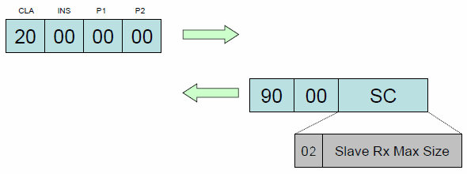


The 1st byte includes the length of the response data. Max. message size is valid for both directions (command and response messages)


Example:

``` cpp
// Command to turn on PINpad
20 00 00 00
// Response
90 00 02 10 00
```

### Turn OFF (20-01) <a href="#subsubsec_sdi_sync_turn_off" id="subsubsec_sdi_sync_turn_off"></a>

This command returns to the idle screen. The power management is done according to the device configuration.


**This command is deprecated and should not be sent to the device for new implementations!**


Command:

| CLA | INS | P1 | P2 | Data |
|----|----|----|----|----|
| <p>20</p> | <p>01</p> | <p>00</p> | <p>00</p> | <p>None</p> |

Response:

| SW1 | SW2 | Data | Comment |
|----|----|----|----|
| <p>90</p> | <p>00</p> | <p>None</p> | <p>All OK</p> |

### Sys Abort (20-02) <a href="#subsubsec_sdi_sys_abort" id="subsubsec_sdi_sys_abort"></a>

This command forces the abort of the following commands in progress:

- [MSR Read (21-01)](#subsubsec_sdi_msr_read)
- [MSR Card Data Entry (21-02)](#subsubsec_sdi_msr_card_data_entry)
- [Card Detection (23-01)](#subsubsec_sdi_card_detection)
- [Display Text with Confirmation (24-02)](#subsubsec_sdi_display_text_with_confirmation)
- [Handle Display (24-03)](#subsubsec_sdi_handle_display) (synchronous with timeout)
- [Handle Secure Input (24-04)](#subsubsec_sdi_handle_secure_input)
- [Handle Menu (24-05)](#subsubsec_sdi_handle_menu)
- [Handle Signature Capture (24-08)](#subsubsec_sdi_handle_signature_capture)
- [Handle HTML Dialog (24-0A)](#subsubsec_sdi_handle_html_dialog)
- [Smart Card Detect (41-01)](#subsubsec_sdi_smart_card_detect)
- [PED Get PIN (22-01)](#subsubsec_sdi_ped_get_pin)
- [Sys Lock Payment (20-06)](#subsubsec_sdi_sys_lock_payment) (protocol type D only)


There is no guarantee that the active command is always cancelled. Only a small set of commands (see list above) are cancelable at all and it might depend on command progress or user interaction, if it will be considered. In addition, SDI will just ignore it beyond the point of no return.


Please be aware of different response behaviour when using different protocol types:

- Protocol type D: Sys Abort (20-02) is always unidirectional and SDI never provides a command response for it. Thus, command field P2 (see below) to control behaviour for command response is always ignored. Command Sys Abort (20-02) uses the message ID of the active command, which shall be cancelled. Finally, command Sys Abort (20-02) with a message ID referring an inctive command is ignored without command response, the same is with Sys Abort (20-02) referring a side command. Sys Abort (20-02) takes a special role to cancel an active command [Sys Lock Payment (20-06)](#subsubsec_sdi_sys_lock_payment) to release the payment lock (see chapter [Payment lock/unlock](#para_sdi_prod_d_callback_payment_lock_unlock) for more details),
- Protocol type B: If Sys Abort (20-02) is received during an active command, SDI does not provide a command response for it. If the command was successfully cancelled, a command response with error code `6500` (execution aborted) is for the command returned. During SDI is idle (no command active), by default a Sys Abort (20-02) will provide a command response with the same error code. For this case, SDI client might use command field P2 (bitmask) with bit 0x01 to control response behaviour. With enhancements for protocol type D, the P2 bit 0x02 was added, to allow a SDI client owning the payment lock to release it, which means that SDI client from another connection can send a type B command to reserve the main connection. Thus, a SDI client, which holds the payment lock, no longer requires to close the main connection.
- Protocol type C: The command is always returns with a command response with error code \'64F9\' (command not allowed).
- Protocol type A: Same as for protocol type B, even P2 bit 0x02 is ignored, since A does not support side connections.

Command:

| CLA | INS | P1 | P2 | Data | Comment |
|----|----|----|----|----|----|
| <p>20</p> | <p>02</p> | <p>00</p> | <p>XX</p> | <p>None</p> | <p>for XX see description below</p> |

Meaning of P2 command field (bitmask, for protocol type A/B only):

- `00`: Send a response, if no command is active (default)
- `01`: Suppress response, if no command is active
- `02`: Release payment lock (ignored if not main connection)

Response:

| SW1 | SW2 | Data | Comment |
|----|----|----|----|
| <p>65</p> | <p>00</p> | <p>None</p> | <p>Execution Aborted</p> |


With a two piece solution command Sys Abort (20-02) will be forwarded from Countertop to EPP automatically.


### Sys Get Config (20-03) <a href="#subsubsec_sdi_sys_get_config" id="subsubsec_sdi_sys_get_config"></a>

Get the requested parameters of the device configuration in DOL or COL format (see [System Tags](#subsubsec_sdi_system_tags))


This command is supported as side command with protocol type D (see [Protocol Type D: Concurrent command support](#subsubsec_prot_d_concurrent_command_support)) and for a side connection with protocol type C (see [Protocol Type C: Multi connection support](#subsubsec_prot_c_multi_connection_support)).


Command:

| CLA | INS | P1 | P2 | Data |
|----|----|----|----|----|
| <p>20</p> | <p>03</p> | <p>SC</p> | <p>00</p> | <p>Tag, DOL or COL request</p> |

Response:

| SW1 | SW2 | Data | Comment |
|----|----|----|----|
| <p>90</p> | <p>00</p> | <p>Constructed</p> | <p>All OK</p> |

The following system tags are returned with default values:

- CPU Unique Id (C0) is returned as 20 times 30
- HW Id (C4) returns the Hardware Id
- IFM Id (C5) is returned as 16 times 00
- EMV L2 (C6) id returns up to 128 bytes, depending on the requested number of bytes.

Example using DOL:

``` cpp
// Command to get the device serial number
20 03 00 00 F1 02 C1 0C
// Response to DOL
90 00 F2 0C 31 32 33 34 35 36 37 38 39 3A 3B 3C
```

Example using COL:

``` cpp
// Command to get the device serial number
20 03 00 00 F3 02 C1 0C
// Response to COL
90 00 F0 0E C1 0C 31 32 33 34 35 36 37 38 39 3A 3B 3C
```


This command is not supported on EPP.


### Sys Get Status (20-04) <a href="#subsubsec_sdi_sys_get_status" id="subsubsec_sdi_sys_get_status"></a>

Get device status information from the PINPad (see [System Tags](#subsubsec_sdi_system_tags))

Command:

| CLA | INS | P1 | P2 | Data |
|----|----|----|----|----|
| <p>20</p> | <p>04</p> | <p>SC</p> | <p>00</p> | <p>Tag, DOL or COL request</p> |

Response:

| SW1 | SW2 | Data | Comment |
|----|----|----|----|
| <p>90</p> | <p>00</p> | <p>Constructed</p> | <p>All OK</p> |

Example using DOL:

``` cpp
// Command to get the device time and date
20 04 00 00 F1 02 D0 07
// Response to DOL
90 00 F2 07 14 0D 02 16 0C 00 00
```

Example using COL:

``` cpp
// Command to get the device time and date
20 04 00 00 F3 02 D0 07
// Response to COL
90 00 F0 09 D0 07 14 0D 02 16 0C 00 00
```


This command is not supported on EPP.


### Sys Selftest (20-05) <a href="#subsubsec_sdi_sys_selftest" id="subsubsec_sdi_sys_selftest"></a>

Performs a selftest on the PINPad and returns the result.


**This command is deprecated and should not be sent to the device for new implementations!**


Command:

| CLA | INS | P1 | P2 | Data |
|----|----|----|----|----|
| <p>20</p> | <p>05</p> | <p>00</p> | <p>00</p> | <p>None</p> |

Response:

| SW1 | SW2 | Data | Comment |
|----|----|----|----|
| <p>90</p> | <p>00</p> | <p>None</p> | <p>All OK</p> |

### Sys Lock Payment (20-06) <a href="#subsubsec_sdi_sys_lock_payment" id="subsubsec_sdi_sys_lock_payment"></a>

Obtains the payment lock, which is applied to connection of the sending SDI client. After the lock was obtained successfully, the related SDI client has access to the full SDI function scope and can use the complete SDI interface including payment commands. SDI payment commands usually use resources or internal APIs, which disallow concurrent usage or invocation, e.g. [Card Detect Interface (23-XX)](#subsec_sdi_card_detect_interface), [Card Detect Interface (23-XX)](#subsec_sdi_card_detect_interface), [EMV System Interface](#subsec_sdi_emv_system_interface) (and other interfaces required for payments) can be used exclusive only. For this reason, SDI has introduced command Sys Lock Payment (20-06) when adding support for protocol type D (see [Protocol Type D: Concurrent command support](#subsubsec_prot_d_concurrent_command_support)). This new protocol type allows to do use both, side commands (which can be used without the payment lock) and payment commands (which require the lock) on the same or on different connections. For more details please read chapter [Payment lock/unlock](#para_sdi_prod_d_callback_payment_lock_unlock) carefully.


This command is supported as side command with protocol type D (see [Protocol Type D: Concurrent command support](#subsubsec_prot_d_concurrent_command_support)). With protocol type C (see [Protocol Type C: Multi connection support](#subsubsec_prot_c_multi_connection_support)) the payment lock cannot be obtained on a side connection, therefore, the command is declined with response code \'64F9\' (command not allowed). With protocol type A or B command Sys Lock Payment (20-06) is treated as every other command type A or B command, which tries to optain the payment lock to use the connection as main connection.


Please be aware of different response behaviour when using different protocol types:

- Protocol type D: On success the command is kept open and not responded with a command response. The unidirectional callback [Intermediate Result Callback (99-01)](#subsubsec_sdi_intermediate_status_cb) is replied instead to signal that the payment lock was obtained successfully. Afterwards full SDI command interface is accessible for the client including mentioned payment interfaces. Even the command is not finalized, protocol type D allows to send further commands on this connection, while the open command Sys Lock Payment (20-06) holds payment lock for them. Once a SDI client has finished the payment or no longer requires the payment lock, it must use [Sys Abort (20-02)](#subsubsec_sdi_sys_abort) with the message ID of Sys Lock Payment (20-06) to cancel and finalize it, which corresponds the release of the payment lock. Related command flows can also be found in chapter [Payment lock/unlock](#para_sdi_prod_d_callback_payment_lock_unlock). Other SDI clients, which send command Sys Lock Payment (20-06) on a connection not owning the lock (or a second time on the connection which owns the lock) are declined with 64FA (already locked) immediately. Of course, in this case the command is finalized and does not require cancellation with [Sys Abort (20-02)](#subsubsec_sdi_sys_abort).
- Protocol type B: The command is always responded with a command response. Response code \'9000\' means that the payment lock was successfully obtained and this connection will be used by SDI as main connection. A second Sys Lock Payment (20-06) on the main connection will also lead to a command response with error code \'9000\'. Sys Lock Payment (20-06) on another connection than the main connection will be declined with 64FA (already locked) immediately.
- Protocol type C: The command is always returns with a command response with error code \'64F9\' (command not allowed).
- Protocol type A: Same as for protocol type B, even A does not support side connections.

Command:

| CLA | INS | P1 | P2 | Data |
|----|----|----|----|----|
| <p>20</p> | <p>06</p> | <p>00</p> | <p>00</p> | <p>None</p> |

Intermediate result callback (when using protocol type D):

| SW1 | SW2 | Data | Comment |
|----|----|----|----|
| <p>99</p> | <p>01</p> | <p>None</p> | <p>Payment lock obtained successfully for this connection</p> |

Response (when using protocol type D):

| SW1 | SW2 | Data | Comment |
|----|----|----|----|
| <p>65</p> | <p>00</p> | <p>None</p> | <p>Payment lock released successfully by [Sys Abort (20-02)](#subsubsec_sdi_sys_abort)</p> |
| <p>64</p> | <p>FA</p> | <p>None</p> | <p>This or another connection has already obtained the payment lock</p> |

Response (when using protocol B with multi connection support):

| SW1 | SW2 | Data | Comment |
|----|----|----|----|
| <p>90</p> | <p>00</p> | <p>None</p> | <p>Payment lock obtained successfully (or already main connection)</p> |
| <p>64</p> | <p>FA</p> | <p>None</p> | <p>Payment lock already owned by another connection (main connection)</p> |

Response (when using protocol C):

| SW1 | SW2 | Data | Comment |
|----|----|----|----|
| <p>64</p> | <p>F9</p> | <p>None</p> | <p>Command not allowed</p> |

Response (when using protocol A/B without multi connection support):

| SW1 | SW2 | Data | Comment |
|----|----|----|----|
| <p>90</p> | <p>00</p> | <p>None</p> | <p>Payment lock obtained successfully (or already main connection)</p> |

### Sys Reset Link (20-07) <a href="#subsubsec_sdi_sys_reset_link" id="subsubsec_sdi_sys_reset_link"></a>

For communication types don\'t having some kind of connection set up like sockets (e.g. an USB or a serial link) command Sys Reset Link (20-07) is used to trigger an EOF (end-of-file) to reset the permanent link. With the next command on that link, SDI detects a new connection and more or less starts with a \"fresh\" state.


The command is not supported for communication types providing a connection setup with underlying I/O layers. For instance, SDI will just decline the command with response code \'64F9\' (command not allowed), if command Sys Reset Link (20-07) is used on a TCP link.
The command was primary introduced for Titus platform using a single USB-C link (emulated serial connection), but it works also for platforms VOS/VOS2/VOS3 using an USB or serial link.
This command is supported as side command with protocol type D (see [Protocol Type D: Concurrent command support](#subsubsec_prot_d_concurrent_command_support)) and for a side connection with protocol type C (see [Protocol Type C: Multi connection support](#subsubsec_prot_c_multi_connection_support)).


The command will cause the following actions just like a TCP/IP client when closing a connection to SDI:

- It closes all crypto handles of [Generic Crypto Interface (70-XX)](#subsec_sdi_generic_crypto_interface), which we\'re opened on this connection with [Crypto Open (70-00)](#subsubsec_sdi_crypto_open)
- It aborts an active PIN entry, which was started with [PED start PIN entry (22-03)](#subsubsec_sdi_ped_start_pin) on this connection
- It aborts an active card detection, which was started with [Start Card Detection (23-03)](#subsubsec_sdi_start_card_detection) on this connection
- It aborts an active update upload, which was started with [Software Upload Start (20-14)](#para_sdi_sys_software_upload_start) on this connection
- For using it on the main connection, it will release the payment lock. In difference to [Sys Abort (20-02)](#subsubsec_sdi_sys_abort) for an active [Sys Lock Payment (20-06)](#subsubsec_sdi_sys_lock_payment), no response is provided for protocol type D.
- For using it on the main connection with an active payment command, SDI attempts to abort the processing SDI main thread with signal about the connection lost. The aborted command won\'t provide a response.
- For using it on a side connection with an active side command, command Sys Reset Link (20-07) is executed after the previous commands has been finished.
- For both, on a side and on main connection, command Sys Reset Link (20-07) will reset the global busy flag and unlock other connections not to decline commands with response code \'640A\' (busy), if the busy lock was set by a previous command on this connection.

Command:

| CLA | INS | P1 | P2 | Data |
|----|----|----|----|----|
| <p>20</p> | <p>07</p> | <p>00</p> | <p>00</p> | <p>None</p> |

Response:

| SW1 | SW2 | Data | Comment |
|----|----|----|----|
| <p>90</p> | <p>00</p> | <p>None</p> | <p>All OK</p> |
| <p>64</p> | <p>F9</p> | <p>None</p> | <p>Command not allowed</p> |

### Sys Set Status (20-09) <a href="#subsubsec_sdi_sys_set_status" id="subsubsec_sdi_sys_set_status"></a>

Set device status info (see [System Tags](#subsubsec_sdi_system_tags))

Command:

| CLA | INS | P1 | P2 | Data |
|----|----|----|----|----|
| <p>20</p> | <p>09</p> | <p>SC</p> | <p>00</p> | <p>Constructed</p> |

Response:

| SW1 | SW2 | Data | Comment |
|----|----|----|----|
| <p>90</p> | <p>00</p> | <p>None</p> | <p>All OK</p> |
| <p>64</p> | <p>00</p> | <p>None</p> | <p>Execution Error</p> |


Only one TLV field may be supplied with each command. For setting different status info fields, separate commands must be issued.
To set date and time the year has to be \"2000\" at least. Otherwise an Execution Error \'64 00\' will be returned.


Example:

``` cpp
// Command to set time and date (to 2010/12/31 - 23:59:59)
20 09 00 00 F0 09 D0 07 14 0A 0C 1F 17 3B 3B
// Response
90 00
```


In the two piece solution this command will be forwarded from the Countertop to the EPP automatically.


### Sys Get KSN (20-10) <a href="#subsubsec_sdi_sys_get_ksn" id="subsubsec_sdi_sys_get_ksn"></a>

Command checks if a key for PED, SRED or E2E encryption/decryption is loaded and returns the corresponding Key Serial Number (KSN) with one of the following default values:

- PED:  00 00 00 00 00 00 00 00 00 00
- SRED: 11 11 11 11 11 11 11 11 11 11
- E2E:  22 22 22 22 22 22 22 22 22 22

P2 indicates the DUKPT engine

Command:

| CLA | INS | P1 | P2 | Data | Comment |
|----|----|----|----|----|----|
| <p>20</p> | <p>10</p> | <p>SC</p> | <p>00</p> | <p>None</p> | <p>For PED KSN</p> |
| <p>20</p> | <p>10</p> | <p>SC</p> | <p>01</p> | <p>None</p> | <p>For SRED KSN</p> |
| <p>20</p> | <p>10</p> | <p>SC</p> | <p>02</p> | <p>None</p> | <p>For E2E KSN</p> |

Response:

| SW1 | SW2 | Data | Comment |
|----|----|----|----|
| <p>90</p> | <p>00</p> | <p>KSN\[10\]</p> | <p>All OK</p> |


**Since SDI-Server version greater than 4.23.2 this command is obsolete and will be always responded with 6D00 (Unknown Instruction).**


### Sys Auth (20-11) <a href="#subsubsec_sdi_sys_auth" id="subsubsec_sdi_sys_auth"></a>

This command manages the synchronization of the E2E session key between the Host device and the SDI Server within two steps.

**Mutual <a href="class_auth.md">Auth</a> and Session Key Setup Step 1**

- Host sends 16 bytes of random to the SDI-Server
- SDI-Server stores the Host random
- SDI-Server encrypts 16 bytes of SDI-Server token and 16 bytes of SDI-Server random (plus the used KSN) and sends this back to the Host
- The Host decrypts the data and stores the SDI-Server token and random

Command:

| CLA | INS | P1 | P2 | Data |
|----|----|----|----|----|
| <p>20</p> | <p>11</p> | <p>00</p> | <p>01</p> | <p>HostRandom\[16\]</p> |

Response:

| SW1 | SW2 | Data | Comment |
|----|----|----|----|
| <p>90</p> | <p>00</p> | <p>Ciphered SDIServerData\[32\],<br/>E2E KSN\[10\]</p> | <p>Decrypted SDIServerData contains:<br/>SDIServerToken\[16\],<br/>SDIServerRandom\[16\]</p> |

Example:

``` cpp
// Mutual Auth and Session Key Setup Step 1 (clear text)
20 11 00 01 E8 68 23 38 9E 52 83 AE EC 52 04 4C A8 0F 3B 9E
// Response (encrypted)
90 00 2A FE 62 3D C7 6B F0 5B 7E D7 08 CA C0 69 12 D9 C4 69 A6 DC 2C 3E C3 CB 99 50 9B F4 0D 48 A5 1C FF FF 98 76 54 33 33 E0 00 A5
```

**Mutual <a href="class_auth.md">Auth</a> and Session Key Setup Step 2**

- Host and SDI-Server prepare 16 bytes 3DES session key (SK) as XOR of Host Random and SDI-Server Random.
- Host sends 32 bytes data block, which includes 16 bytes of SDI-Server Token and 16 bytes of Host Token. The data block encrypted with 3DES session key (SK).
- SDI-Server decrypts the data block with 3DES session key (SK) and compares the received SDI-Server token with the SDI-Server Token, which sent to the Host in the step 1. If they are same, the Host is authenticated and the SDI-Server continues the step 2. Else authenticate is stopped.
- SDI-Server sends the response to the Host. The response is 32 bytes data block, which includes 16 bytes of Host Token and 16 bytes of SDI-Server Serial Number. The data block encrypted with 3DES session key (SK).
- Host receives decrypts the data block with 3DES session key (SK) and compares the received Host Token with the Host Token, which sent to the SDI-Server in the step 2 command. If they are same, the SDI-Server is authenticated. Else authenticate is stopped.

Command:

| CLA | INS | P1 | P2 | Data |
|----|----|----|----|----|
| <p>20</p> | <p>11</p> | <p>00</p> | <p>02</p> | <p>Ciphered Host Data \[32\]:<br/>PINPadToken\[16\], ServerToken\[16\]</p> |

Response:

| SW1 | SW2 | Data | Comment |
|----|----|----|----|
| <p>90</p> | <p>00</p> | <p>Ciphered SDIServerData\[32\]</p> | <p>Decrypted SDIServerData contains:<br/>HostToken\[16\],<br/>SDIServerSerialNumber\[16\]</p> |

Example:

``` cpp
// Mutual Auth and Session Key Setup Step 2 (encrypted)
20 11 00 02 E6 8D 3D 0B 2B ED E6 92 9B 6F 39 34 38 A9 46 2C 36 15 9A 7E 9F C4 22 8E 93 6C 12 35 8D 40 B6 9A
// Response (encrypted)
90 00 3E 15 68 C3 C3 59 68 1D EA AF EC 7C 12 82 01 C7 F8 48 79 15 A8 17 F8 04 53 8F 97 53 02 DA 81 E7
```


These commands are not supported on EPP.


### Set Idle Text (20-13) <a href="#subsubsec_sdi_set_idle_text" id="subsubsec_sdi_set_idle_text"></a>

Command to set a text for SDI idle screen (see [Display Idle Screen (24-07)](#subsubsec_sdi_display_idle_screen)). The text is stored persistently and re-used after reboot. If no text was set, SDI takes the default text from UI catalog installed with the SDI config package for standard mode (see [Default UI resource files](#subsubsec_sdi_default_resource_files)), which can be also replaced with a custom UI catalog (see chapter [Custom UI text catalogs](#subsubsec_sdi_custom_text_catalogs)).


Using a custom UI catalog to configure an own idle text is the recommended method, since this works system language depended.
After deletion of the idle text (with field `P2` containing value `01`) the SDI will be display the text from the UI catalog of current system language.


Command:

| CLA | INS | P1 | P2 | Data | Comment |
|----|----|----|----|----|----|
| <p>20</p> | <p>13</p> | <p>SC</p> | <p>XX</p> | <p>Constructed</p> | <p>P2: 00 = set, 01 = delete</p> |

Command Data:

| Tag | Size | M/O | Format | Description |
|----|----|----|----|----|
| <p>DFA001</p> | <p>var.</p> | <p>M</p> | <p>utf-8</p> | <p>Idle Text</p> |
| <p>DFA150</p> | <p>1</p> | <p>O</p> | <p>b</p> | <p>Command destination: 01 = Countertop (default), 02 = EPP</p> |

Response:

| SW1 | SW2 | Data | Comment |
|----|----|----|----|
| <p>90</p> | <p>00</p> | <p>None</p> | <p>All OK</p> |
| <p>64</p> | <p>00</p> | <p>None</p> | <p>Execution Error</p> |

Examples:

``` cpp
// Command to set the idle text to "\n\n Hello world"
20 13 00 00 F0 16 DF A0 01 12 0A 0A 20 20 20 20 20 48 65 6C 6C 6F 20 77 6F 72 6C 64
// Response
90 00
```

``` cpp
// Command to delete the idle text
20 13 00 01
// Response
90 00
```

### Software and Configuration Upload <a href="#subsubsec_sdi_sys_software_upload" id="subsubsec_sdi_sys_software_upload"></a>

The Secure Data Interface provides 2 different methods to install software updates and SDI configuration files:

- **Software/File Upload:**
  This method is used to upload a file (e.g. an software download package or configuration file) and to install it after the successful transfer.
  The following commands are used for this method:
  - [Software Upload Start (20-14)](#para_sdi_sys_software_upload_start) as start command to initiate the file upload
  - [Software Upload Transfer (20-15)](#para_sdi_sys_software_upload_transfer) to transfer the file content in multiple data records
  - [Software Upload Finalize (20-16)](#para_sdi_sys_software_upload_finalize) as final command to validate the uploaded file records and to install the file

  
  Software download packages or configuration files are directly uploaded to SDI server over Secure Data Interface. A software download package (TGZ or TAR ball) contains internal bundles and install packages. Each bundle and package comes along with a signature. After file upload the software package is installed with Secure Installer API, which is part of the Engage OS and not supported on Android platform (see Check For Update below). Configuration files are authenticated through a MAC, which provided with the final command [Software Upload Finalize (20-16)](#para_sdi_sys_software_upload_finalize). The MAC is generated with the session key, which was negotiated with the system authentication (see chapter [Sys Auth (20-11)](#subsubsec_sdi_sys_auth) for more details). Keep in mind that no partial update of configuration files is supported, only complete configuration files have to be uploaded. In case of upload and authentication, the existing update package or configuration file will be deleted after successful installation.
  
- **Check For Update:**
  This method is used to check for pending updates and to install one or multiple update packages.
  The following command is used for this method:
  - [Check For Update (20-1D)](#para_sdi_sys_software_check_update)

  
  Update packages may contain software updates or configuration files. In difference to method Software/File Upload the files are not directly uploaded over Secure Data Interface to SDI server. Update packages are uploaded and installed with the Android Secure Installer (Update Service), which is part of the Verifone Android OS. Before upload all files must be packed into an update package (TGZ file), which contains one or more internal ZIP bundles. The update package contains a manifest and a signature for each internal bundle. After the update package was authenticated and verified, the Android Secure Installer extracts the package contents to the update folder of SDI server, before it is notified by Android Secure Installer for pending update. Update packages are provided by SDI users (application or integration team). For more details about Android Secure Installer and the update package format, please refer to Android Secure Installer documentation.
  


The Software Update of a two piece solution has to be performd as followed: \[unsupported block\]


#### Software Upload Start (20-14) <a href="#para_sdi_sys_software_upload_start" id="para_sdi_sys_software_upload_start"></a>

Command to initiate the upload of a download package for software update. In addition, the command supports upload of several configuration files or packages to install UVRK payload files.


This command is supported as side command with protocol type D (see [Protocol Type D: Concurrent command support](#subsubsec_prot_d_concurrent_command_support)) and for a side connection with protocol type C (see [Protocol Type C: Multi connection support](#subsubsec_prot_c_multi_connection_support)). If a SDI command on another connection is active, Software Upload Start (20-14) is declined with response code \'640A\' (busy). In addition, during processing the upload (until completion with [Software Upload Finalize (20-16)](#para_sdi_sys_software_upload_finalize)), SDI server will decline all other SDI commands with response code \'640A\' (busy).


The type for file upload is specified by TLV tag `DFA01E` (upload type). If the tag is not provided, upload type `00` (Software Update) is taken as default. Some upload types additionally require TLV tag `DFA020` (filename), which is expected as filename without path prefix. For details, see list of supported upload types in table below.

Supported values for TLV tag `DFA01E` (upload type) are the following:

| Tag Value | Description |
|----|----|
| <p>`00`</p> | <p>Software Update (supported on VOS/VOS2 and Titus only)<br/>TLV tag `DFAO20` (filename) is mandatory for this upload type on VOS/VOS2, which must have `*.tgz` or `*.tar` as file extension.<br/>On Titus, the tag is optional, if provided, the file extension `*.tar` is expected.<br/>A download package is used as upload file, for which SDI will use API of Secure Installer for installation on the target. Thus, please ensure that the package format is considered for the corresponding platform, otherwise Secure Installer will decline the installation.</p> |
| <p>`01`</p> | <p>White list configuration (not supported on Titus)<br/>A whitelist file (JSON format) is expected as upload file, see chapter [whitelist.json](#sec_sdi_whitelist_json) for more details. TLV tag `DFAO20` (filename) is not expected by SDI and ignored, if provided.</p> |
| <p>`02`</p> | <p>Sensitive tags configuration (not supported on Titus)<br/>A JSON file with additional sensitive EMV tags is expected as upload file, see chapter [sensitivetags.json](#sec_sdi_sensitivetags_json) for more details. TLV tag `DFAO20` (filename) is not expected by SDI and ignored, if provided.</p> |
| <p>`03`</p> | <p>Card ranges configuration (not supported on Titus)<br/>A card ranges configuration files (JSON format) is expected as upload file, see chapter [sensitivetags.json](#sec_sdi_sensitivetags_json) for more details. TLV tag `DFAO20` (filename) is not expected by SDI and ignored, if provided.</p> |
| <p>`0B`</p> | <p>Install commerce platform package (supported on VOS2 only)<br/>TLV tag `DFAO20` (filename) is mandatory for upload type. TLV tag `DFAO20` (filename) is mandatory for this upload type, which must have `*.zip` as file extension.</p> <p><br/></p>  <p><br/></p> <p>For details about the format of a CP package, please refer to documentation of CP installer.</p> <p><br/></p>  |
| <p>`0C`</p> | <p>EMV configuration package (not supported on Titus)<br/>This package is uploaded as an uncompressed TAR file containing configuration files for ADKEMV, on which this component requires write access (such as `EMV_Applications.xml`, `EMV_CTLS_Terminal.xml`, `EMV_Terminal.xml` etc.). All files in the archive are expected flat on top level without any subfolders. SDI does not expect the filename of the package, thus, TLV tag `DFAO20` (filename) is ignored, if provided.</p> <p><br/></p>  <p><br/></p> <p>EMV configuration file `emv-desired.xml` (with EMV kernel/device specifications) is not allowed in EMV configuration package. Please use an user config package to install this file persistenly (see chapter [User config package](#vos_user_config_package) and [User config package](#android_user_config_package)).</p> <p><br/></p> <p>Upload of an EMV configuration package will exit EMV CT/CTLS Framework(s) and disable the EPP (if connected and enabled). Therefore, applications must consider after upload to initialize EMV CT/CLTS Framework(s) (see [EMV System Interface](#subsec_sdi_emv_system_interface)) and enable the EPP again (see [Enable EPP (20-21)](#subsubsec_sdi_sys_enable_epp)).</p> <p><br/></p>  |
| <p>`0D`</p> | <p>UVRK package (supported on Titus only)<br/>This package is uploaded as uncompressed TAR file containing \*.vrk2.json payload files. All files in the archive are expected flat on top level without any subfolders. SDI does not expect the filename of the package, thus, TLV tag `DFAO20` (filename) can be omitted. If provided, SDI will check the filename against pattern `*.uvrk.tar`, which is expected as filename for UVRK packages.</p> <p><br/></p>  <p><br/></p> <p>For details about the format of an UVRK package, please refer to Unified VRK package specification.</p> <p><br/></p>  |


Upload type `00` (Software Update) is not supported on Android. For software update on this platform please refer to chapter [Check For Update (20-1D)](#para_sdi_sys_software_check_update).
Configuration upload with upload types `01`-`03` and `0C` might require additional authentication by MAC, if the connection of SDI client is not considered as trusted, see [Software Upload Finalize (20-16)](#para_sdi_sys_software_upload_finalize) for more details. Please also note that configuration upload will install files to flash directories of SDI for direct use. No file backups were kept after upload and SDI might modify files during runtime afterwards. In addition, a [Factory Reset (20-22)](#subsubsec_sdi_sys_factory_reset) will delete the configuration files or recover them in flash to defaults (if any). Therefore, applications have to consider to upload the configuration files again in this case. If a project requires to overload default configuration files persistenly and to recover them with [Factory Reset (20-22)](#subsubsec_sdi_sys_factory_reset), the installation of an user config package is the preferred method (for more details see chapters [User config package](#vos_user_config_package) and [User config package](#android_user_config_package)).


After successful execution, the payment application must continue with sequence of command [Software Upload Transfer (20-15)](#para_sdi_sys_software_upload_transfer) to transfer the file records.

Command:

| CLA | INS | P1 | P2 | Data | Comment |
|----|----|----|----|----|----|
| <p>20</p> | <p>14</p> | <p>SC</p> | <p>00</p> | <p>Constructed</p> |  |

Command Data:

| Tag | Size | M/O | Format | Description |
|----|----|----|----|----|
| <p>DFA020</p> | <p>var.</p> | <p>O</p> | <p>utf-8</p> | <p>Filename incl. extension (Mandatory for upload types `00` and `0B` (VOS/VOS2 only)</p> |
| <p>DFA01E</p> | <p>1</p> | <p>O</p> | <p>b</p> | <p>Upload type, default: `00` (Software Update)</p> |
| <p>DFA150</p> | <p>1</p> | <p>O</p> | <p>b</p> | <p>Command destination: 01 = Countertop (default), 02 = EPP</p> |


On Engage the filename must have extension `tar` or `tgz`, otherwise the command is declined.
The additional optional tag `DFA150` is used to specify the destination device for two piece solutions. Upload types `01`-`03` and `0C` (configuration) are not allowed for EPP.


Response:

| SW1 | SW2 | Data | Comment |
|----|----|----|----|
| <p>90</p> | <p>00</p> | <p>None</p> | <p>All OK</p> |

Example:

``` cpp
// Command to initiate the file upload (Software Update)
20 14 00 00 F0 0F DF A0 20 0B 75 70 5F 74 65 73 74 2E 74 67 7A
// Response
90 00
```

#### Software Upload Transfer (20-15) <a href="#para_sdi_sys_software_upload_transfer" id="para_sdi_sys_software_upload_transfer"></a>

Command to upload the file, record by record to the terminal.


This command is supported as side command with protocol type D (see [Protocol Type D: Concurrent command support](#subsubsec_prot_d_concurrent_command_support)) and for a side connection with protocol type C (see [Protocol Type C: Multi connection support](#subsubsec_prot_c_multi_connection_support)). Only this connection, which has initiated the upload with [Software Upload Start (20-14)](#para_sdi_sys_software_upload_start), is allowed to use Software Upload Transfer (20-15). During processing the upload (until completion with [Software Upload Finalize (20-16)](#para_sdi_sys_software_upload_finalize)), SDI server will decline all other SDI commands with response code \'640A\' (busy).


For each record the packet number has to be increased. If the terminal detects a packet number mismatch, it deletes the already stored records and the file update has to be started from scratch. Please note that the upload time depends on communication bandwidth and file size.

Command:

| CLA | INS | P1 | P2 | Data | Comment |
|----|----|----|----|----|----|
| <p>20</p> | <p>15</p> | <p>SC</p> | <p>00</p> | <p>Constructed</p> |  |

Command Data:

| Tag | Size | M/O | Format | Description |
|----|----|----|----|----|
| <p>DFA021</p> | <p>var.</p> | <p>M</p> | <p>b</p> | <p>Record data. Size is limited by maximum message size of underlying transport layer (see [Transport Layer](#subsec_sdi_transport_layer))</p> |
| <p>DFA022</p> | <p>..4</p> | <p>M</p> | <p>b</p> | <p>Packet number. First packet should be number 1.</p> |
| <p>DFA150</p> | <p>1</p> | <p>O</p> | <p>b</p> | <p>Command destination: 01 = Countertop (default), 02 = EPP</p> |

Response:

| SW1 | SW2 | Data | Comment |
|----|----|----|----|
| <p>90</p> | <p>00</p> | <p>None</p> | <p>All OK</p> |

Example:

``` cpp
// Command to upload
20 15 00 00 F0 82 03 90 DF A0 21 82 03 84 50 4B 03 04 14 00 02 00 08 00 05 57
7B 47 98 30 7C 69 D0 03 00 00 4A 04 00 00 0A 00 00 00 43 65 72 74 69 66 2E 63
72 74 33 68 62 71 33 68 62 D6 5B C0 CC C4 C8 C4 C4 66 69 6A 6A 6A 60 64 C0 CB
C6 A9 D5 E6 D1 F6 9D 97 91 91 9B 95 C1 C0 D3 50 DE 80 9B 8D 39 94 85 5B 98 25
34 D8 35 C8 40 00 C4 E1 12 E6 0C 4B 2D CA AC 50 48 0D CB 37 54 83 88 E9 32 73
32 33 31 33 32 9A 5B 27 CD 30 10 02 89 30 0B 73 3B BA 38 2B B8 A7 16 E5 26 E6
55 1A 28 88 F3 1A 9A 18 98 19 1A 19 5A 9A 98 1A 98 47 49 F0 1B 19 1A 1A 18 18
02 21 18 44 19 44 1A 1A 13 B0 0C 9B C1 86 4A 06 7C 20 51 1E 11 F6 90 D4 E2 92
78 43 53 B8 83 18 98 58 14 58 42 34 DB 14 0D 9A 18 95 90 BD C6 C8 CA C0 DC C4
C8 CF 00 14 E7 62 6A 62 64 64 78 14 70 E9 63 F7 E3 B4 79 13 8F 5E 9D B8 E2 55
F4 B2 03 27 33 2D EE F7 6F 3A 7C E2 C7 D6 CE D9 A7 1F 7E 98 EB 28 31 D5 48 95
B9 2B 39 32 CF 72 5A 69 A1 D3 8D 50 BD E0 AD 31 6F 56 94 ED 9B C6 D3 25 24 EB
9D 69 EE BF E0 7A 38 A3 A5 C2 4B AE B9 8C B1 FF 9E DE B4 9F 75 F5 61 D7 D2 4B
FD 8E 4C 99 39 31 C6 BE 97 8A E4 36 BE 10 48 32 7B 16 65 E2 E8 6C 95 9B 73 EF
1C EB FE 8D 25 12 65 DB B4 3D 7F 54 97 AD 3C F1 CC 7A 47 BC D4 F9 B2 B5 41 3C
BB CC 4C 6D 83 4E BB E9 4E 6C 7D 5B CD ED 9C E5 37 63 CA BC AF 55 77 BE 33 DB
DF 36 3B 7B 50 20 58 D5 76 61 1B B7 C5 FE 57 0B 37 97 B8 18 31 C8 DD E9 BF CB
37 C1 F9 C5 15 6D 17 1D CF 89 BB 6F BB CD BB D8 72 2E 7B FD AA D7 77 3C 1A 9D
D5 AC E5 EC 66 1A 78 AE E5 FF D4 18 6C C7 A3 F7 68 B5 BA BC 8D 5F A5 F1 86 0E
DE 1B D7 5E 7F BA C6 A1 B2 55 3A CD C2 5C A0 EE F0 67 D1 6A 60 CC 31 30 2E 6E
62 54 00 86 88 8C 81 12 30 FC 64 95 19 19 FF B3 48 18 88 35 88 68 76 15 9E 0B
F8 F2 46 3D F6 54 F0 B2 E9 6E 21 77 75 36 D9 4E 34 50 00 A9 E1 03 A9 11 63 11
49 12 AF FF FE D4 6B 7B A0 E6 C9 A7 5B FC 32 AC 18 E7 B5 89 3F 30 E0 01 A9 E0
67 61 65 66 66 6F 60 80 F0 84 59 58 0D 80 C9 8D C1 A0 94 8D 2B A1 CD 83 B1 67
96 03 30 32 58 D2 0D 52 81 06 19 24 88 31 1A 8A 31 1A 89 31 1A 8B 31 9A 88 31
9A 8A 31 9A 89 31 9A 8B 31 5A 88 31 5A 8A 31 19 1A 00 B1 21 10 1B 01 B1 31 10
9B 00 31 50 8D A3 18 A3 93 18 A3 B3 18 A3 8B 18 A3 AB 18 A3 9B 18 A3 BB 18 A3
87 18 A3 A7 18 A3 97 18 A3 B7 18 A3 8F 18 A3 AF 18 A3 9F 18 A3 BF 81 08 92 B5
4C 20 B7 03 13 2C 83 81 28 92 28 33 48 94 85 89 89 E1 3F 8A 62 16 A8 E2 FF 68
19 84 19 94 78 EE AB 59 7F 95 9C ED B9 49 F6 5E F6 79 DE F2 E8 BA D4 C8 AB 77
FE C6 ED D7 F8 B1 70 B3 EC DD 72 D9 CB 92 FB 9F 56 26 1E 4E D1 30 7E 6A 26 3D
67 E3 EA C3 FF FD 6C B2 2B 64 3D 96 31 7F BB 59 E8 B9 82 3F A8 F8 A0 D2 7E 5D
15 3B FF D9 AD 7C E2 1F 4D 37 E4 F8 46 1D DB D8 78 40 A4 51 E0 54 C3 F7 1A D7
55 C7 1F 69 5C 5E FD 79 D7 95 6D C6 FF B7 6F E8 EB 3C D6 51 DE 59 A7 BC E1 D8
CB 8A E2 35 BB 5F FD 11 9F E7 F4 2A F3 7C EC 3A E9 88 EC A3 29 EF 1F 2D 2D 35
08 AE B8 FB DF A0 22 02 00 01
// Response
90 00
```

#### Software Upload Finalize (20-16) <a href="#para_sdi_sys_software_upload_finalize" id="para_sdi_sys_software_upload_finalize"></a>

Final command to validate and install the file, which was previously uploaded with command [Software Upload Transfer (20-15)](#para_sdi_sys_software_upload_transfer).


This command is supported as side command with protocol type D (see [Protocol Type D: Concurrent command support](#subsubsec_prot_d_concurrent_command_support)) and for a side connection with protocol type C (see [Protocol Type C: Multi connection support](#subsubsec_prot_c_multi_connection_support)). Only this connection, which has initiated the upload with [Software Upload Start (20-14)](#para_sdi_sys_software_upload_start) and [Software Upload Transfer (20-15)](#para_sdi_sys_software_upload_transfer), is allowed to finish the upload with Software Upload Finalize (20-16). All other SDI commands are declined with response code \'640A\' (busy) as long as the upload and the installation are not completed.


For Software Update with upload type `00` (see chapter [Software Upload Start (20-14)](#para_sdi_sys_software_upload_start)), an optional check of the MD5 file checksum can be requested. After successful validation the terminal installs the software package and does a reboot afterwards.

For configuration file upload with upload types `01`-`03` and `0C` the file must be authenticated through a MAC (TLV tag `DFA01F`), which is provided with tag `DFA01F`. Prerequisite for the MAC calculation is the system authentication with command [Sys Auth (20-11)](#subsubsec_sdi_sys_auth). Please note that the system authentication is recently supported on Engage platform only. Other platforms (e.g. Android) might use a SDI plugin, to authorize the configuration file via the trigger SDITrigger_SDIConfig. After successful validation the terminal installs the configuration file without reboot of the terminal.


By default, local SDI clients connecting from the same device are considered as trusted (see chapter [SDI access control](#subsubsec_sdi_access_control)). For these applications the MAC (TLV tag `DFA01F`) can be omitted and an additional SDI plugin to authenticate the configuration is not required. But please note that it is the responsibility of these applications that the provided configuration is authentic! If this default behaviour of SDI server is not desired, projects might implement a corresponsing SDI plugin with their own security.


Command:

| CLA | INS | P1 | P2 | Data | Comment |
|----|----|----|----|----|----|
| <p>20</p> | <p>16</p> | <p>SC</p> | <p>00</p> | <p>None</p> |  |
| <p>20</p> | <p>16</p> | <p>SC</p> | <p>00</p> | <p>Constructed</p> | <p>If checksum/MAC is requested</p> |

Command Data:

| Tag | Size | M/O | Format | Description |
|----|----|----|----|----|
| <p>DFA023</p> | <p>16</p> | <p>O</p> | <p>b</p> | <p>MD5 check sum</p> |
| <p>DFA01F</p> | <p>8</p> | <p>O</p> | <p>b</p> | <p>MAC of the configuration file</p> |
| <p>DFA150</p> | <p>1</p> | <p>O</p> | <p>b</p> | <p>Command destination: 01 = Countertop (default), 02 = EPP</p> |

Response:

| SW1 | SW2 | Data | Comment |
|----|----|----|----|
| <p>90</p> | <p>00</p> | <p>None</p> | <p>All OK</p> |
| <p>90</p> | <p>00</p> | <p>Constructed</p> | <p>Post installation action</p> |

Response Data:

[TABLE]

Examples:

``` cpp
// Command to finalize software upload with MD5 checksum: 1020356F6949C4529DFFAD49A146A3419F
20 16 00 00 F0 14 DF A0 23 10 20 35 6F 69 49 C4 52 9D FF AD 49 A1 46 A3 41 9F
// Response
90 00
```

``` cpp
// Command to finalize the software upload without checksum check
20 16 00 00
// Response
90 00
```

#### Check For Update (20-1D) <a href="#para_sdi_sys_software_check_update" id="para_sdi_sys_software_check_update"></a>

Command to check for available updates on various configuration types and apply those.


This command is only available on Verifone Android platforms.
This command is supported as side command with protocol type D (see [Protocol Type D: Concurrent command support](#subsubsec_prot_d_concurrent_command_support)) and for a side connection with protocol type C (see [Protocol Type C: Multi connection support](#subsubsec_prot_c_multi_connection_support)). If a SDI command on another connection is active, Check For Update (20-1D) is declined with response code \'640A\' (busy). In addition, during processing the command, SDI server will decline all other SDI commands with response code \'640A\' (busy).


Command:

| CLA | INS | P1 | P2 | Data | Comment |
|----|----|----|----|----|----|
| <p>20</p> | <p>1D</p> | <p>SC</p> | <p>00</p> | <p>None</p> |  |

Command Data:

| Tag | Size | M/O | Format | Description |
|----|----|----|----|----|
| <p>DFA01E</p> | <p>1</p> | <p>M</p> | <p>b</p> | <p>Configuration type</p> |

Configuration Types:

| Type | Value | Description |
|----|----|----|
| <p>Whitelist</p> | <p>01</p> | <p>whitelist.json configuration (obsolete, use SDI user config with value 06 instead)</p> |
| <p>Sensitive Tags</p> | <p>02</p> | <p>sensitivetags.json configuration (obsolete, use SDI user config with value 06 instead)</p> |
| <p>Card Ranges</p> | <p>03</p> | <p>cardranges.json configuration (obsolete, use SDI user config with value 06 instead)</p> |
| <p>Firmware</p> | <p>04</p> | <p>secure processor firmware</p> |
| <p>Keys</p> | <p>05</p> | <p>key configurations</p> |
| <p>SDI user config</p> | <p>06</p> | <p>SDI user configuration files, see chapter [User config package](#android_user_config_package) for Android</p> |
| <p>Remove Sponsor</p> | <p>07</p> | <p>check for sponsors to remove from CRTRESET.SYS</p> |
| <p>Remove SDI user config</p> | <p>08</p> | <p>remove user configuration files, see chapter [User config removal package](#android_user_config_removal_package) for Android</p> |
| <p>SDI plugin package</p> | <p>09</p> | <p>install SDI plugin(s), see chapter [SDI plugin package](#android_sdi_plugin_package) for Android</p> |
| <p>SDI plugin removal package</p> | <p>0A</p> | <p>remove SDI plugin(s), see chapter [SDI plugin removal package](#android_sdi_plugin_removal_package) for Android</p> |

Response:

| SW1 | SW2 | Data | Comment |
|----|----|----|----|
| <p>90</p> | <p>00</p> | <p>None</p> | <p>All OK</p> |

Response Data:

| Tag | Size | M/O | Format | Description |
|----|----|----|----|----|
| <p>DFA000</p> | <p>4</p> | <p>O</p> | <p>b</p> | <p>Optional response data in case of error responses. Contains error code from interal SPROC-API function.</p> |

### Shutdown/Reboot/Sleep (20-17) <a href="#subsubsec_sdi_sys_shutdown_reboot_sleep" id="subsubsec_sdi_sys_shutdown_reboot_sleep"></a>

Executes a system shutdown, reboot or sets the device in sleep or hibernate state.

Command:

| CLA | INS | P1 | P2 | Data | Comment |
|----|----|----|----|----|----|
| <p>20</p> | <p>17</p> | <p>00</p> | <p>00</p> | <p>None</p> | <p>Shutdown</p> |
| <p>20</p> | <p>17</p> | <p>00</p> | <p>01</p> | <p>None</p> | <p>Reboot</p> |
| <p>20</p> | <p>17</p> | <p>00</p> | <p>02</p> | <p>None</p> | <p>Sleep (not supported on Android)</p> |
| <p>20</p> | <p>17</p> | <p>00</p> | <p>03</p> | <p>None</p> | <p>Hibernate (not supported on Android)</p> |

Command Data:

| Tag | Size | M/O | Format | Description |
|----|----|----|----|----|
| <p>DFA150</p> | <p>1</p> | <p>O</p> | <p>b</p> | <p>Command destination: 01 = Countertop (default), 02 = EPP</p> |

Response:

| SW1 | SW2 | Data | Comment |
|----|----|----|----|
| <p>90</p> | <p>00</p> | <p>None</p> | <p>All OK</p> |


In case of response code \'64 00\' additional tag DFA000 include the return value from the corresponding ADK function.


### Show MAC Desktop (20-18) <a href="#subsubsec_sdi_sys_show_mac_desktop" id="subsubsec_sdi_sys_show_mac_desktop"></a>

Switch from SDI to MAC Desktop. SDI is still running in background.


This command is not supported on Android platforms (e.g. Trinity).


Command:

| CLA | INS | P1 | P2 | Data | Comment |
|----|----|----|----|----|----|
| <p>20</p> | <p>18</p> | <p>00</p> | <p>00</p> | <p>None</p> |  |

Response:

| SW1 | SW2 | Data | Comment |
|----|----|----|----|
| <p>90</p> | <p>00</p> | <p>None</p> | <p>All OK</p> |


\[unsupported block\]


### Set Property (20-19) <a href="#subsubsec_sdi_sys_set_property" id="subsubsec_sdi_sys_set_property"></a>

Access to <a href="namespacevfisysinfo.md#a377307b06ac969f30af51e7cccf94dbb">sysSetPropertyInt()</a> and <a href="namespacevfisysinfo.md#ae7c891a4a38d050452eee0939a7f82de">sysSetPropertyString()</a> functions via the serialized command interface.


This command is supported as side command with protocol type D (see [Protocol Type D: Concurrent command support](#subsubsec_prot_d_concurrent_command_support)) and for a side connection with protocol type C (see [Protocol Type C: Multi connection support](#subsubsec_prot_c_multi_connection_support)).
One property can be handled per command call only.


Command:

| CLA | INS | P1 | P2 | Data | Comment |
|----|----|----|----|----|----|
| <p>20</p> | <p>19</p> | <p>00</p> | <p>00</p> | <p>Constructed</p> | <p>Int Property</p> |
| <p>20</p> | <p>19</p> | <p>00</p> | <p>01</p> | <p>Constructed</p> | <p>String Property</p> |

Command Data:

| Tag | Size | M/O | Format | Description |
|----|----|----|----|----|
| <p>DFBC01</p> | <p>..4</p> | <p>M</p> | <p>b</p> | <p>Property identifier</p> |
| <p>DFBC02</p> | <p>var.</p> | <p>M</p> | <p>b / ans</p> | <p>Value identifier</p> |
| <p>DFA150</p> | <p>1</p> | <p>O</p> | <p>b</p> | <p>Command destination: 01 = Countertop (default), 02 = EPP</p> |

Response:

| SW1 | SW2 | Data | Comment |
|----|----|----|----|
| <p>90</p> | <p>00</p> | <p>None</p> | <p>All OK</p> |


In case of response code \'64 00\' additional tag DFA000 include the return value from the corresponding ADK function.


### Get Property (20-1A) <a href="#subsubsec_sdi_sys_get_property" id="subsubsec_sdi_sys_get_property"></a>

Access to <a href="namespacevfisysinfo.md#ab94a5b33000760afbee10e7fefd16355">sysGetPropertyInt()</a> and <a href="namespacevfisysinfo.md#af6c938992e005c446c81e7f1fe3e4ed3">sysGetPropertyString()</a> functions via the serialized command interface.


This command is supported as side command with protocol type D (see [Protocol Type D: Concurrent command support](#subsubsec_prot_d_concurrent_command_support)) and for a side connection with protocol type C (see [Protocol Type C: Multi connection support](#subsubsec_prot_c_multi_connection_support)).
One property can be handled per command call only.


Command:

| CLA | INS | P1 | P2 | Data | Comment |
|----|----|----|----|----|----|
| <p>20</p> | <p>1A</p> | <p>00</p> | <p>00</p> | <p>Constructed</p> | <p>Int Property</p> |
| <p>20</p> | <p>1A</p> | <p>00</p> | <p>01</p> | <p>Constructed</p> | <p>String Property</p> |

Command Data:

| Tag | Size | M/O | Format | Description |
|----|----|----|----|----|
| <p>DFBC01</p> | <p>..4</p> | <p>M</p> | <p>b</p> | <p>Property identifier</p> |
| <p>DFA150</p> | <p>1</p> | <p>O</p> | <p>b</p> | <p>Command destination: 01 = Countertop (default), 02 = EPP</p> |

Response:

| SW1 | SW2 | Data | Comment |
|----|----|----|----|
| <p>90</p> | <p>00</p> | <p>Constructed</p> | <p>All OK</p> |

Response Data:

| Tag | Size | M/O | Format | Description |
|----|----|----|----|----|
| <p>DFBC01</p> | <p>..4</p> | <p>M</p> | <p>b</p> | <p>Property identifier</p> |
| <p>DFBC02</p> | <p>var.</p> | <p>M</p> | <p>b / ans</p> | <p>Value identifier</p> |


In case of response code \'64 00\' additional tag DFA000 include the return value from the corresponding ADK function.


### Install Sponsor Cert (20-1B) <a href="#subsubsec_sdi_sys_install_sponsor_cert" id="subsubsec_sdi_sys_install_sponsor_cert"></a>

Check and Install a Sponsor Certificate.


This command is supported as side command with protocol type D (see [Protocol Type D: Concurrent command support](#subsubsec_prot_d_concurrent_command_support)) and for a side connection with protocol type C (see [Protocol Type C: Multi connection support](#subsubsec_prot_c_multi_connection_support)). If a SDI command on another connection is active, Install Sponsor Cert (20-1B) is declined with response code \'640A\' (busy). In addition, during processing the command, SDI server will decline all other side commands with response code \'640A\' (busy).


Command:

| CLA | INS | P1 | P2 | Data | Comment |
|----|----|----|----|----|----|
| <p>20</p> | <p>1B</p> | <p>00</p> | <p>00</p> | <p>Constructed</p> |  |

Command Data:

| Tag | Size | M/O | Format | Description |
|----|----|----|----|----|
| <p>DFA12F</p> | <p>var.</p> | <p>M</p> | <p>b</p> | <p>Sponsor certificate (DER-encoded X.509 certificate)</p> |

Response:

| SW1 | SW2 | Data | Comment |
|----|----|----|----|
| <p>90</p> | <p>00</p> | <p>None</p> | <p>Certificate accepted or still exist</p> |
| <p>64</p> | <p>00</p> | <p>None</p> | <p>Error, certificate not accepted</p> |


A possibly required restart of the device has to be initiated separately (see [Shutdown/Reboot/Sleep (20-17)](#subsubsec_sdi_sys_shutdown_reboot_sleep))


### Get SDI version info (20-1C) <a href="#subsubsec_sdi_sys_get_version_info" id="subsubsec_sdi_sys_get_version_info"></a>

Get version information of basic SDI components and installed SDI plugins.


This command is supported as side command with protocol type D (see [Protocol Type D: Concurrent command support](#subsubsec_prot_d_concurrent_command_support)) and for a side connection with protocol type C (see [Protocol Type C: Multi connection support](#subsubsec_prot_c_multi_connection_support)).


Command:

| CLA | INS | P1 | P2 | Data | Comment |
|----|----|----|----|----|----|
| <p>20</p> | <p>1C</p> | <p>00</p> | <p>00</p> | <p>None</p> |  |
| <p>20</p> | <p>1C</p> | <p>00</p> | <p>00</p> | <p>Constructed</p> |  |

Command Data:

| Tag | Size | M/O | Format | Description |
|----|----|----|----|----|
| <p>DFA150</p> | <p>1</p> | <p>O</p> | <p>b</p> | <p>Command destination: 01 = Countertop (default), 02 = EPP</p> |

Response:

| SW1 | SW2 | Data | Comment |
|----|----|----|----|
| <p>90</p> | <p>00</p> | <p>Constructed</p> | <p>Version information successfully returned</p> |
| <p>64</p> | <p>00</p> | <p>None</p> | <p>TLV Export failed</p> |

Response Data:

| Tag | Size | M/O | Format | Description |
|----|----|----|----|----|
| <p>FFA103</p> | <p>var.</p> | <p>M</p> | <p>tlv</p> | <p>SDI component containing a pair of tag DFA00E and DFA00F. May Occur Several Times.</p> |
| <p>DFA00E</p> | <p>var.</p> | <p>M</p> | <p>ans</p> | <p>Name of the SDI component</p> |
| <p>DFA00F</p> | <p>var.</p> | <p>M</p> | <p>ans</p> | <p>Version of the SDI component</p> |

Example:

``` cpp
// Command to get SDI component version information
20 1C 00 00
// Response:
90 00 F0 75 FF A1 03 17 DF A0 0E 0A 53 44 49 20 53 65 72 76 65 72 DF A0 0F 05 34 2E 30 2E 30 FF
A1 03 16 DF A0 0E 09 6C 69 62 73 64 69 63 73 64 DF A0 0F 05 31 2E 30 2E 30 FF A1 03 1A DF A0 0E
0D 73 64 69 70 6C 75 67 69 6E 2D 63 62 61 DF A0 0F 05 31 2E 30 2E 32 FF A1 03 1E DF A0 0E 11 73
64 69 70 6C 75 67 69 6E 74 65 73 74 2D 63 62 61 DF A0 0F 05 31 2E 30 2E 30
```

Included TLV tags in contructed tag F0:

``` fragment
         Found tag SDI component (FFA103):
             Component name (DFA00E)   : SDI Server
             Component version (DFA00F): 4.0.0
         Found tag SDI component (FFA103):
             Component name (DFA00E)   : libsdicsd
             Component version (DFA00F): 1.0.0
         Found tag SDI component (FFA103):
             Component name (DFA00E)   : sdiplugin-cba
             Component version (DFA00F): 1.0.2
         Found tag SDI component (FFA103):
             Component name (DFA00E)   : sdiplugintest-cba
             Component version (DFA00F): 1.0.0
```

### Get last install error (20-1E) <a href="#subsubsec_sdi_sys_get_last_install_error" id="subsubsec_sdi_sys_get_last_install_error"></a>

Get last installation error from secure installer. Depending on the libary version the last installation error can occur in two different versions. The new api returns the status of the last installation nevertheless if this installation was successful or not. The output will be in json format. The old api returns the name of the failed bundle and/or package name only in cases of error.

Additional the old api only shows error if the sdi server installed the package. After a reboot which is often due for system packages, the error is gone.

The command can be executed for countertop, external pinpad and standalone devices. Command:

| CLA | INS | P1 | P2 | Data | Comment |
|----|----|----|----|----|----|
| <p>20</p> | <p>1E</p> | <p>00</p> | <p>00</p> | <p>None</p> |  |
| <p>20</p> | <p>1E</p> | <p>00</p> | <p>00</p> | <p>Constructed</p> |  |

Command Data:

| Tag | Size | M/O | Format | Description |
|----|----|----|----|----|
| <p>DFA150</p> | <p>1</p> | <p>O</p> | <p>b</p> | <p>Command destination: 01 = Countertop (default), 02 = EPP</p> |

Response Data:

| Tag | Size | M/O | Format | Description |
|----|----|----|----|----|
| <p>DFA148</p> | <p>var.</p> | <p>M</p> | <p>ans</p> | <p>New api output in json format.</p> |
| <p>DFA149</p> | <p>var.</p> | <p>M</p> | <p>ans</p> | <p>Old api output - name of the failed bundle</p> |
| <p>DFA151</p> | <p>var.</p> | <p>M</p> | <p>ans</p> | <p>Old api output - name of the failed package</p> |

Example:

``` cpp
// Command to get last installation status from secure installer
20 1E 00 00
// Response:
F0 82 01 6C DF A1 48 82 01 66 7B 22 74 69 74 6C 65 22 3A 22 49 6E 73 74 61 6C 6C 69 6E 67 2E 2E
2E 22 2C 22 64 6C 5F 69 74 65 6D 73 22 3A 5B 7B 22 65 72 72 6F 72 5F 6D 73 67 22 3A 22 53 75 63
63 65 73 73 22 2C 22 65 72 72 6F 72 5F 6E 75 6D 22 3A 30 2C 22 64 6C 6E 61 6D 65 22 3A 22 64 6C
2E 76 6F 73 2E 76 6F 73 32 2E 61 6C 74 5F 63 72 74 5F 70 61 74 63 68 2D 32 2E 30 2E 30 2D 44 45
56 2E 74 67 7A 22 7D 5D 2C 22 64 6C 6E 61 6D 65 22 3A 22 64 6C 2E 76 6F 73 2E 76 6F 73 32 2E 61
6C 74 5F 63 72 74 5F 70 61 74 63 68 2D 32 2E 30 2E 30 2D 44 45 56 2E 74 67 7A 22 2C 22 65 72 72
6F 72 5F 6E 75 6D 22 3A 30 2C 22 6C 65 76 65 6C 73 22 3A 7B 22 6C 65 76 65 6C 30 22 3A 7B 22 74
69 74 6C 65 22 3A 22 53 74 61 67 65 22 2C 22 63 75 72 72 65 6E 74 5F 69 74 65 6D 22 3A 22 45 78
74 72 61 63 74 69 6E 67 20 53 59 53 20 20 70 61 63 6B 61 67 65 73 22 2C 22 69 74 65 6D 73 5F 74
6F 74 61 6C 22 3A 38 2C 22 69 74 65 6D 73 5F 64 6F 6E 65 22 3A 37 2C 22 70 65 72 63 65 6E 74 22
3A 31 30 30 7D 7D 2C 22 65 72 72 6D 73 67 22 3A 22 49 6E 73 74 61 6C 6C 20 53 75 63 63 65 73 66
75 6C 6C 22 2C 22 65 72 72 6E 75 6D 22 3A 30 7D
```

Included TLV tags in contructed tag F0:

``` fragment
         Found tag software status in json format (DFA148):
         {"title":"Installing...","dl_items":[{"error_msg":"Success","error_num":0,"dlname":"dl.vos.vos2.alt_crt_patch-2.0.0-DEV.tgz"}],"dlname":"dl.vos.vos2.alt_crt_patch-2.0.0-DEV.tgz","error_num":0,"levels":{"level0":{"title":"Stage","current_item":"Extracting SYS  packages","items_total":8,"items_done":7,"percent":100}},"errmsg":"Install Succesfull","errnum":0}
```

### External Button (20-20) <a href="#subsubsec_sdi_sys_external_button" id="subsubsec_sdi_sys_external_button"></a>

This command informs the SDI-Server in Headless Mode that the external button is pressed. It should be used for confirm the selection of a PIN digit in Navigator mode 2 only either on active [PED Get PIN (22-01)](#subsubsec_sdi_ped_get_pin) command where it returns with Navigator Callback \'9D 10\' (see [Navigator Callback (9D-XX)](#subsubsec_sdi_navigator_cb)) or if PIN entry was started in PIN polling mode with command [PED start PIN entry (22-03)](#subsubsec_sdi_ped_start_pin).


This command is supported as side command with protocol type D (see [Protocol Type D: Concurrent command support](#subsubsec_prot_d_concurrent_command_support)) and for a side connection with protocol type C (see [Protocol Type C: Multi connection support](#subsubsec_prot_c_multi_connection_support)).


Please be aware of different response behaviour when using different protocol types:

- Protocol type D: External Button (20-20) always provides a command response. Thus, command field P2 (see below) to control behaviour for command response is always ignored. The message ID of External Button (20-20) can be arbitrary and must not equal the active command [PED Get PIN (22-01)](#subsubsec_sdi_ped_get_pin). The reason is the asynchronous PIN entry with [PED start PIN entry (22-03)](#subsubsec_sdi_ped_start_pin) couldn\'t be referred by message ID, since this command is finalized immediately with a command response, which makes the message ID invalid. In addition, the External Button (20-20) might be provided on another connection than the one started the PIN entry. For instance, this is required on Android, where PIN entry is stared by ARRS, but payment application wants to use External Button (20-20), thus, it cannot access connection from ARRS to SDI and has no knowledge about message IDs used there.
- Protocol type B: If External Button (20-20) is received during an active command, SDI does not provide a command response for it. During SDI is idle (no command active), by default a External Button (20-20) will provide a command response, either with error code \'90XX\' or \'64FD\' (meaning see below). For this case, SDI client might use command field P2 (bitmask) with bit 0x01 to control response behaviour. As already mentioned for protocol type D, the command can be send from another connection than the one started the PIN entry.
- Protocol type C: Same as for protocol type B.
- Protocol type A: Same as for protocol type B.

Command:

| CLA | INS | P1 | P2 | Data | Comment |
|----|----|----|----|----|----|
| <p>20</p> | <p>20</p> | <p>00</p> | <p>XX</p> | <p>None</p> | <p>for XX see description below</p> |

Meaning of P2 command field (bitmask, for protocol type A/B only):

- `00`: Send a response, if no command is active (default)
- `01`: Suppress response, if no command is active

Response:

| SW1 | SW2 | Data | Comment |
|----|----|----|----|
| <p>9D</p> | <p>10</p> | <p>None</p> | <p>Selection confirmed (Navigator Callback)</p> |
| <p>90</p> | <p>00</p> | <p>None</p> | <p>Selection confirmed (PIN polling mode)</p> |
| <p>64</p> | <p>FD</p> | <p>None</p> | <p>No PIN entry with navigator mode 2 is active (logic error)</p> |


This command is not supported on EPP.


### Enable EPP (20-21) <a href="#subsubsec_sdi_sys_enable_epp" id="subsubsec_sdi_sys_enable_epp"></a>

This command enables or disables a connected EPP. If an EPP is connected it can be enabled or disabled via this command. After startup of the SDI-Server usage of the EPP is disabled per default. If EPP couldn\'t be enabled the response \'69 00\' (EPP connection error) is returned providing additional EPP connection status information with TLV tag `DFA000`. If Countertop has established a secure TLS connection and is able to communicate with EPP, but another higher-level error occured (e.g. version mismatch), EPP is operated in a restricted mode.

Command:

| CLA | INS | P1 | P2 | Data | Comment |
|----|----|----|----|----|----|
| <p>20</p> | <p>21</p> | <p>00</p> | <p>00</p> | <p>None</p> | <p>Enable EPP</p> |
| <p>20</p> | <p>21</p> | <p>00</p> | <p>01</p> | <p>None</p> | <p>Disable EPP</p> |

Response:

| SW1 | SW2 | Data | Comment |
|----|----|----|----|
| <p>90</p> | <p>00</p> | <p>None</p> | <p>All OK</p> |
| <p>69</p> | <p>00</p> | <p>Constructed</p> | <p>EPP connection error (only for Enable EPP)</p> |
| <p>64</p> | <p>FE</p> | <p>None</p> | <p>Parameter error</p> |

Response Data:

| Tag | Size | M/O | Format | Description |
|----|----|----|----|----|
| <p>DFA000</p> | <p>4</p> | <p>M</p> | <p>b</p> | <p>EPP connection status</p> |

In case of EPP connection error the following values are returned with TLV tag `DFA000` (EPP connection status):

| Value | EPP connection status |
|----|----|
| <p>`00000000`</p> | <p>EPP is disconnected</p> |
| <p>`00000001`</p> | <p>EPP Sponsor Id mismatch (EPP sponsor != Countertop sponsor)</p> |
| <p>`00000002`</p> | <p>EPP Exchange of certificates failed</p> |
| <p>`00000003`</p> | <p>EPP EMV configuration problem</p> |
| <p>`00000004`</p> | <p>EPP NFC configuration problem</p> |
| <p>`00000005`</p> | <p>EPP SDI configuration problem</p> |
| <p>`00000006`</p> | <p>TCP/TLS handshake with EPP failed</p> |
| <p>`00000007`</p> | <p>SDI version mismatch (EPP version != Countertop version)</p> |
| <p>`00000008`</p> | <p>EMV-CT framework version mismatch (EPP version != Countertop version)</p> |
| <p>`00000009`</p> | <p>EMV-CTLS framework version mismatch (EPP version != Countertop version)</p> |

For error codes `00000000` (EPP is disconnected) and `00000006` (TCP/TLS handshake with EPP failed) there is no active TLS connection between Countertop and EPP, therefore, both devices are not able to communicate at all.
For other error codes Countertop operates the EPP in a restricted mode, which allows the following commands only:

- [Software Upload Start (20-14)](#para_sdi_sys_software_upload_start), [Software Upload Transfer (20-15)](#para_sdi_sys_software_upload_transfer) and [Software Upload Finalize (20-16)](#para_sdi_sys_software_upload_finalize) (software update commands)
- [Get Property (20-1A)](#subsubsec_sdi_sys_get_property)
- [Get SDI version info (20-1C)](#subsubsec_sdi_sys_get_version_info)
- [Factory Reset (20-22)](#subsubsec_sdi_sys_factory_reset)

With activation of the EPP restricted mode the user will be noticed with an appropriate error message on the EPP display.


A version mismatch error is caused when major and minor version of SDI-Server, EMV-CT and EMV-CTLS Framework version are not equal.


### Factory Reset (20-22) <a href="#subsubsec_sdi_sys_factory_reset" id="subsubsec_sdi_sys_factory_reset"></a>

This command resets SDI server to factory defaults.


This command is supported as side command with protocol type D (see [Protocol Type D: Concurrent command support](#subsubsec_prot_d_concurrent_command_support)) and for a side connection with protocol type C (see [Protocol Type C: Multi connection support](#subsubsec_prot_c_multi_connection_support)). If a SDI command on another connection is active, Factory Reset (20-22) is declined with response code \'640A\' (busy). In addition, during processing the command, SDI server will decline all SDI commands with response code \'640A\' (busy).


As first step SDI server deletes all files, which were created during runtime to write data persistently. This also includes files of other ADK components such as writable ADKEMV configuration files or ADKCOM related settings changeable in communication menu with SDI standard mode. As next step SDI server restores default settings and does an internal reinitialization. This reinitializaion affects all active connection being closed, after SDI server has sent response \'90 00\' for Factory Reset command. Finally, SDI communication interface is reopened according communication default settings. In addition, the communication menu is displayed to select a communication method, if it runs in SDI standard mode without configuration default file [COM_IF.CFG](#sec_sdi_com_if_cfg) (see chapter [Getting Started](#sec_sdi_getting_started) for more details).


Default settings of SDI server can be overloaded with the installation of user config packages (see chapters [User config package](#vos_user_config_package) for Fusion/Engage and [User config package](#android_user_config_package) for Android). Please note that these external user configuration files are considered for default settings recovery. Thus, SDI server will always prefer files coming along with user config packages. Finally, if there is no external user configuration file, SDI server will recover the internal configuration file as default.
If an EPP is connected, the Factory Reset is automatically forwarded to this device. After successful execution by EPP, the CT will perform the local Factory Reset. So far, no additional option is provided to perform a Factory Reset for EPP only.
Factory Reset will send trigger `SDITrigger_FactoryReset` to all loaded SDI plugins, which support this trigger (see chapter [Plugin Interface (26-XX)](#subsec_sdi_plugin_interface)). Those plugins, which create persistent data (e.g. files) during runtime, should implement this trigger to support the reset to factory defaults.
On Android, the factory data reset is provided by the Android OS (Android FDR), therefore, applications usually need not use command Factory Reset. Command Factory Reset is sent by the Anrdoid Secure Installer after device reboot, which is triggered by the Android FDR. The Android FDR wipes all data files in the application domain folder of the SDI service (`/data/data/com.verifone.sdi`), which do not belong the [SDI base package](#android_sdi_base_package) (APK). In order to align the same behavior as on Engage, which keeps the installed user configuration packages and SDI plugins after the Factory Reset, the SDI service will store a backup copy of the package files to the persistent partition (`/persist/appdata/sdi`), whenever a [User config package](#android_user_config_package) or [SDI plugin package](#android_sdi_plugin_package) is installed. These backup copies are recovered with command Factory Reset to reinstall the previous installed user configuration files and SDI plugins to the application domain folder of SDI service. Of cource, the installation of a [User config removal package](#android_user_config_removal_package) or a [SDI plugin removal package](#android_sdi_plugin_removal_package) will remove the back files from persistent partition again so that they are no longer considered for the recovery with command Factory Reset.


Command:

| CLA | INS | P1 | P2 | Data | Comment |
|----|----|----|----|----|----|
| <p>20</p> | <p>22</p> | <p>00</p> | <p>00</p> | <p>None</p> |  |

Response:

| SW1 | SW2 | Data | Comment |
|----|----|----|----|
| <p>90</p> | <p>00</p> | <p>None</p> | <p>All OK</p> |
| <p>64</p> | <p>00</p> | <p>None</p> | <p>Factory Reset aborted/failed</p> |

### Read Keystore Certificate (20-23) <a href="#subsubsec_sdi_sys_read_certificate" id="subsubsec_sdi_sys_read_certificate"></a>

Read the X.509 certificate for a specified certificate reference name (user friendly label). For platforms with K81 security processor (e.g. Android, VOS3) the certificate is read from security processor\'s keystore. The certificate is returned in binary DER format.


This command is supported as side command with protocol type D (see [Protocol Type D: Concurrent command support](#subsubsec_prot_d_concurrent_command_support)) and for a side connection with protocol type C (see [Protocol Type C: Multi connection support](#subsubsec_prot_c_multi_connection_support)).


Command:

| CLA | INS | P1 | P2 | Data |
|----|----|----|----|----|
| <p>20</p> | <p>23</p> | <p>00</p> | <p>00</p> | <p>Constructed</p> |

Command Data:

| Tag | Size | M/O | Format | Description |
|----|----|----|----|----|
| <p>DFA500</p> | <p>var.</p> | <p>M</p> | <p>ans</p> | <p>Certificate reference name</p> |

The certificate to be read is specified by a certificate reference name (in TLV tag DFA500) as follows:

| Ccertificate description | Certificate reference name | Supported platform |
|----|----|----|
| <p>VFI AuthEx RSA certificate</p> | <p>`VFI_AUTHN_RSA` (friendly label)</p> | <p>VOS3, Android (Trinity, Neo), Engage, Fusion</p> |
| <p>VFI remote key loading RSA certificate</p> | <p>`VFI_VRK_RSA` (friendly label)</p> | <p>Android (Trinity), Engage, Fusion</p> |
| <p>VFI remote key loading ECC certificate</p> | <p>`VFI_VRK_ECC` (friendly label)</p> | <p>VOS3, Android (Trinity, Neo), Engage, Fusion</p> |
| <p>VFI device pairing RSA certificate</p> | <p>`VFI_PAIRING_RSA` (friendly label)</p> | <p>VOS3, Android (Trinity, Neo), Engage, Fusion</p> |
| <p>Any certificate</p> | <p>`<cert serial number>` (hex string)</p> | <p>VOS3, Android (Trinity, Neo)</p> |
| <p>Any certificate</p> | <p>`CN` (subject common name)</p> | <p>VOS3, Android (Neo)</p> |
| <p>Any certificate (customer loaded)</p> | <p>`[usr[X]/]<key label>`</p> | <p>Engage, Fusion</p> |


Used certificate reference names depend on platform. On VOS3 and Android (Trinity, Neo) platform the certificate reference name is forwarded to K81 API function, thus, it can be used to read all certificates stored in the K81 keystore. Usually, the certificate serial number (hex string) is used to refer the corresponding certificate (e.g. use `65C95907166F14DA` to read certificate with subject `CN=VFI Dev Root CA`). Further, VOS3 and Neo platfrom also allow to use the subject `CN` to read a certificate.
Other platforms (Fusion/Engage) support user friendly labels only (e.g. `VFI_AUTHN_RSA` as introduced with Android). Customer loaded certificates can be looked up by user prefix plus key label. For more details please refer to chapter [Remote Keyservice (72-XX)](#subsec_sdi_remote_keyservice).


Response:

| SW1 | SW2 | Data | Comment |
|----|----|----|----|
| <p>90</p> | <p>00</p> | <p>Constructed</p> | <p>SUCCESS</p> |

Response Data:

| Tag | Size | M/O | Format | Description |
|----|----|----|----|----|
| <p>DFA501</p> | <p>var.</p> | <p>M</p> | <p>b</p> | <p>Certificate data (DER format)</p> |

The following SW1/SW2 are returned in response:

| SW1/SW2 | Description |
|----|----|
| <p>90 00</p> | <p>Success</p> |
| <p>62 00</p> | <p>Mandatory tag missing (reference name)</p> |
| <p>64 FE</p> | <p>Parameter error (reference name not supported)</p> |
| <p>64 00</p> | <p>Execution error (certificate not installed or invalid)</p> |


Both primitive data tags DFA500 and DFA501 are always added to contructed container tag F0.


### Force Currency Abbreviation (20-24) <a href="#subsubsec_sdi_sys_force_currency_abbreviation" id="subsubsec_sdi_sys_force_currency_abbreviation"></a>

By default, the SDI server uses the following currency symbols instead of the corresponding ISO-4217 abbreviations:

| Currency | Symbol | ISO-4217 |
|----|----|----|
| <p>376</p> | <p>₪</p> | <p>ILS</p> |
| <p>388</p> | <p>JM\$</p> | <p>JMD</p> |
| <p>826</p> | <p>£</p> | <p>GBP</p> |
| <p>840</p> | <p>\$</p> | <p>USD</p> |
| <p>978</p> | <p>€</p> | <p>EUR</p> |

This command can be used to change the behavior when displaying a currency (e.g. to use USD instead of \$). The configuration is stored persistant inside the SDI datastore and it is not necessery a resend it before each transaction.

Command:

| CLA | INS | P1 | P2 | Data | Comment |
|----|----|----|----|----|----|
| <p>20</p> | <p>24</p> | <p>00</p> | <p>01</p> | <p>Constructed</p> | <p>Force Currency Abbreviation</p> |
| <p>20</p> | <p>24</p> | <p>00</p> | <p>00</p> | <p>Constructed</p> | <p>Use Currency Symbol (default)</p> |

Command Data:

| Tag | Size | M/O | Format | Description |
|----|----|----|----|----|
| <p>5F2A</p> | <p>2</p> | <p>M</p> | <p>n</p> | <p>Currency for which the behaviour should be changed</p> |

Response:

| SW1 | SW2 | Data | Comment |
|----|----|----|----|
| <p>90</p> | <p>00</p> | <p>None</p> | <p>All OK</p> |
| <p>62</p> | <p>00</p> | <p>None</p> | <p>Tag error</p> |
| <p>64</p> | <p>FE</p> | <p>None</p> | <p>Parameter error</p> |
| <p>67</p> | <p>00</p> | <p>None</p> | <p>Message Length Error</p> |


For TLV tag 5F2A the hexadecimal value of the currency is expected (e.g. 0x0840 for USD).



## MSR Interface (21-XX) <a href="#subsec_sdi_msr_interface" id="subsec_sdi_msr_interface"></a>

### MSR Read (21-01) <a href="#subsubsec_sdi_msr_read" id="subsubsec_sdi_msr_read"></a>

Command to read MSR track data.

Command:

| CLA | INS | P1 | P2 | Data | Comment |
|----|----|----|----|----|----|
| <p>21</p> | <p>01</p> | <p>SC</p> | <p>NN</p> | <p>None</p> | <p>P2 indicates the timeout as multiple of 500ms.<br/>The value FF indicates maximum timeout.</p> |

Command Data:

| Tag | Size | M/O | Format | Description |
|----|----|----|----|----|
| <p>DFA01B</p> | <p>1</p> | <p>O</p> | <p>b</p> | <p>Timer multiplier flag: 01 means that the timeout value (P2) will be multiplied with 10. Other values will be ignored</p> |
| <p>DFA153</p> | <p>2</p> | <p>O</p> | <p>b</p> | <p>Card Removal Timeout in milliseconds (for UX devices only). It means the maximum time between starting of card removal until card is completely removed.</p> |

Response:

| SW1 | SW2 | Data | Comment |
|----|----|----|----|
| <p>90</p> | <p>00</p> | <p>Constructed</p> | <p>All OK</p> |
| <p>64</p> | <p>F6</p> | <p>None</p> | <p>MSR data not available Timeout reached (for UX devices only)</p> |
| <p>64</p> | <p>F7</p> | <p>None</p> | <p>Card Removal Timeout reached (for UX devices only)</p> |

Response Data:

[TABLE]

The sensitive card data will be delivered by [getEncData (29-00)](#subsubsec_sdi_getencdata) in case of VCL is disabled or by [fetchTrxTags (29-02)](#subsubsec_sdi_fetchtrxtags) when VCL is active.


\[unsupported block\]


### MSR Card Data Entry (21-02) <a href="#subsubsec_sdi_msr_card_data_entry" id="subsubsec_sdi_msr_card_data_entry"></a>

Command to enter card data manual.

In Headless mode on touch only devices the additional Tag DFA024 including the touch coordinates is needed.

For a better user interaction in headless mode the SDI-Server performs the following additional handling with the outside application:

- During the command execution in Headless mode some Status callbacks (see [Status Callback (9F-XX)](#subsubsec_sdi_status_cb)) will be sent to inform the outside application about the number of entered digits to update the display content.
- Further there will be Status callbacks if the customer presses the confirmation button but data are not completely entered or if he tries to enter more digits if the maximum number of digits is reached.
- In case of a PAN entry the additional Tag (DFA009) containing the Headless Entry String (e.g. \"123456\*\*\*\*\") will be sent within the Status Callback.
- When the minimum number of PAN digits is entered and the confirm button is pressed the Status Callback 9FFE will be sent including the obfuscated PAN in Tag DFA009. Here the user has two possibilities:
  - Correction of the entered PAN with Backspace (one key press per digit) and reenter of digits. The Status callback will behave as described. Also the Enter key.
  - Confirmation of the enterd PAN by pressing the Enter key once again.
- In case of Expiry date entry the SDI-Server checks if a valid date was entered. If not a Status callback (9FFD) will be sent and the expiry date must be reentered.
- After the PAN or Expiry date is entered completely the SDI-Server performs a validation check based on the card range table (see [cardranges.json](#sec_sdi_cardranges_json)) and sends a Control request ([Control Request (9B-01)](#subsubsec_sdi_control_req)) to the outside application. Depending on the request response (Continue, Reenter or Abort) the SDI-Server performs the next step to enter the card data or cancels the entry.
- To handle special none payment cards without having an expiry date and activated VCL feature additional parameters \"defaultExpiryDate\" and \"skipCvv\" have been introduced to the card ranges table. Now it is possible to configure a default expiry date for a special card range which will be used for VCL encryption. To use this feature the tag DFA017 should not be set. If the SDI-Server finds a \"defaultExpiryDate\" after the PAN is successfully entered, the manual card entry is stopped and this date is used to encrypt the data with VCL. When VCL is not activated the SDI-Server will stop the entry as well and will return this date in clear text if requested by a following [fetchTrxTags (29-02)](#subsubsec_sdi_fetchtrxtags) command.

Depending on the security configuration (ADE, VCL, \...) the sensitive data (PAN, Expiry Date and/or CVV) will be delivered by using the [fetchTrxTags (29-02)](#subsubsec_sdi_fetchtrxtags) command in case of VCL or the [getEncData (29-00)](#subsubsec_sdi_getencdata) command.

Command:

| CLA | INS | P1 | P2 | Data |
|----|----|----|----|----|
| <p>21</p> | <p>02</p> | <p>SC</p> | <p>00</p> | <p>Constructed</p> |

Command Data:

| Tag | Size | M/O | Format | Description |
|----|----|----|----|----|
| <p>DFA008</p> | <p>1</p> | <p>O</p> | <p>b</p> | <p>Text Language, default is current terminal/transaction language (see [Supported System Languages](#subsec_sdi_supported_system_languages))</p> |
| <p>DFA005</p> | <p>2</p> | <p>O</p> | <p>b</p> | <p>Timeout in seconds (MSB, LSB): Max value 0xFFFF (65535) seconds. If no timeout is set or the value is set to 0, the default value of 300 seconds is used.</p> |
| <p>DFA017</p> | <p>1</p> | <p>O</p> | <p>b</p> | <p>Temporary Card Entry Value Deactivation during the current command execution. For details see [System Tags](#subsubsec_sdi_system_tags)</p> |
| <p>DFA018</p> | <p>1</p> | <p>O</p> | <p>b</p> | <p>Card Data Entry Mode, valid values:<br/>00: Card Data Entry performed in one screen<br/>01: Card Data Entry performed in separate screens</p> |
| <p>DFA01A</p> | <p>5..6</p> | <p>O</p> | <p>ans</p> | <p>Alternative Input Format String (optional) for CVV</p> |
| <p>DFA024</p> | <p>var.</p> | <p>O</p> | <p>an</p> | <p>Touch coordinates for the provided keypad layout. Needs to be added for each key.<br/>Format: xxxxyyyywwwwhhhhaa,<br/>xxxx: x-Position of a touch button,<br/>yyyy: y-Position of a touch button,<br/>wwww: width of a touch button,<br/>hhhh: heigth of a touch button,<br/>aa: associated key (ASCII), 1B = Cancel, 08 = Correction, 0D = Enter</p> |
| <p>DFA123</p> | <p>1</p> | <p>O</p> | <p>b</p> | <p>Force minimum number of Pan digits to 7 instead the default of 10. Valid values:<br/>00: Use default (10 digits)<br/>01: Force to 7 digits</p> |
| <p>DFA033</p> | <p>1</p> | <p>O</p> | <p>b</p> | <p>Skip double confirmation of PAN in headless mode<br/>00 = Double confirmation active (default)<br/>01 = Double Confirmation skipped</p> |

Response:

| SW1 | SW2 | Data | Comment |
|----|----|----|----|
| <p>90</p> | <p>00</p> | <p>Constructed</p> | <p>All OK</p> |

Response Data:

[TABLE]

The sensitive card data will be delivered by [getEncData (29-00)](#subsubsec_sdi_getencdata) in case of VCL is disabled or by [fetchTrxTags (29-02)](#subsubsec_sdi_fetchtrxtags) when VCL is active.


\[unsupported block\]


### MSR Set Options (21-03) <a href="#subsubsec_sdi_msr_set_options" id="subsubsec_sdi_msr_set_options"></a>

Command to set the MSR options. For details see <a href="msr_8h.md#ac3c6f568aa57690a8b369936fc362c2a">MSR_SetOptions()</a>.

The MSR options are passed in TLV tag `DFA026` and applied to subsequent MSR read operations for the recent terminal runtime.


Terminal reboot will recover default MSR options.
This function has to be called while MSR is deactivated. If an asynchronous card detection was started with [Start Card Detection (23-03)](#subsubsec_sdi_start_card_detection) and card technology `02` (magnetic stripe), it will activate the MSR reader. During this active detection the MSR Set Options (21-03) is blocked and declined with a `6400` response.


Command:

| CLA | INS | P1 | P2 | Data |
|----|----|----|----|----|
| <p>21</p> | <p>03</p> | <p>SC</p> | <p>00</p> | <p>Constructed</p> |

Command Data:

| Tag | Size | M/O | Format | Description |
|----|----|----|----|----|
| <p>DFA026</p> | <p>var.</p> | <p>M</p> | <p>b</p> | <p>MSR options</p> |

Response:

| SW1 | SW2 | Data | Comment |
|----|----|----|----|
| <p>90</p> | <p>00</p> | <p>None</p> | <p>All OK</p> |
| <p>62</p> | <p>00</p> | <p>None</p> | <p>Tag Error</p> |
| <p>64</p> | <p>00</p> | <p>Constructed</p> | <p>Execution Error (additional MSR error code in TLV tag DFA000)</p> |

Response Data:

| Tag | Size | M/O | Format | Description |
|----|----|----|----|----|
| <p>DFA000</p> | <p>4</p> | <p>O</p> | <p>b</p> | <p>MSR error code (additional result code)</p> |


\[unsupported block\]


### MSR Switch LEDs (21-04) <a href="#subsubsec_sdi_msr_switch_leds" id="subsubsec_sdi_msr_switch_leds"></a>

Command to switch the MSR LEDs. This command has an effect on devices equipped with MSR LEDs only. For details see <a href="msr_8h.md#abca7e8953c8430d80f51c867c7699fa6">MSR_SwitchLeds()</a>.

Command:

| CLA | INS | P1 | P2 | Data |
|----|----|----|----|----|
| <p>21</p> | <p>04</p> | <p>SC</p> | <p>00</p> | <p>Constructed</p> |

Command Data:

| Tag | Size | M/O | Format | Description |
|----|----|----|----|----|
| <p>DFA027</p> | <p>..4</p> | <p>M</p> | <p>b</p> | <p>LED 1 state</p> |
| <p>DFA028</p> | <p>..4</p> | <p>M</p> | <p>b</p> | <p>LED 2 state</p> |
| <p>DFA029</p> | <p>..4</p> | <p>M</p> | <p>b</p> | <p>LED 3 state</p> |
| <p>DFA02A</p> | <p>..4</p> | <p>O</p> | <p>b</p> | <p>Lighting duration in seconds. All LEDs are switched off after this time.</p> |

Response

| SW1 | SW2 | Data | Comment |
|----|----|----|----|
| <p>90</p> | <p>00</p> | <p>None</p> | <p>All OK</p> |
| <p>62</p> | <p>00</p> | <p>None</p> | <p>Tag Error</p> |


\[unsupported block\]


### MSR Set Sensitivity (21-05) <a href="#subsubsec_sdi_msr_set_sensitivity" id="subsubsec_sdi_msr_set_sensitivity"></a>

Command to set the MSR sensitivity level for the magnetic head to amplify or damp incoming signals of the swiped MSR card. The sensitivity level is passed in TLV tag `DFA039` (MSR sensitivity level) and applied to subsequent MSR read operations for the recent terminal runtime. Basically, it is recommended to use default MSR sensitivity to get best MSR reading results. Once MSR Set Sensitivity (21-05) is used with another value than the default, it is recommended to recover default sensitivity as soon as possible.


Please note that this API is supported on Android (Trinity/Neo) and VOS3 platform only. On other platforms SDI will reject the command with response `6D00` (unknown instruction).
Terminal reboot will recover default MSR sensitivity.
This function has to be called while MSR is deactivated. If an asynchronous card detection was started with [Start Card Detection (23-03)](#subsubsec_sdi_start_card_detection) and card technology `02` (magnetic stripe), it will activate the MSR reader. During this active detection the MSR Set Sensitivity (21-05) is blocked and declined with a `6400` response.


Command:

| CLA | INS | P1 | P2 | Data |
|:--:|:--:|:--:|:--:|----|
| <p>21</p> | <p>05</p> | <p>SC</p> | <p>00</p> | <p>Constructed</p> |

Command Data:

| Tag | Size | M/O | Format | Description |
|----|:--:|:--:|:--:|----|
| <p>DFA039</p> | <p>1</p> | <p>M</p> | <p>b</p> | <p>MSR sensitivity level<br/>Valid value range is : 20..200 (0 is used for default MSR sensitivity)<br/>Values \>100 will increase MSR sensitivity and amplify signals.<br/>Values \<100 will decrease MSR sensitivity and damp signals.<br/>Value 100 means no amplification/damping.<br/>Value 0 will reset to default MSR sensitivity.</p> |
| <p>DFA150</p> | <p>1</p> | <p>O</p> | <p>b</p> | <p>Command destination: `01` = Countertop (default), `02` = EPP</p> |

Response:

| SW1 | SW2 | Data | Comment |
|:--:|:--:|:--:|----|
| <p>90</p> | <p>00</p> | <p>None</p> | <p>All OK</p> |
| <p>62</p> | <p>00</p> | <p>None</p> | <p>Tag Error</p> |
| <p>64</p> | <p>00</p> | <p>Constructed</p> | <p>Execution Error (additional MSR error code in TLV tag DFA000)</p> |

Response Data:

| Tag | Size | M/O | Format | Description |
|----|:--:|:--:|:--:|----|
| <p>DFA000</p> | <p>4</p> | <p>O</p> | <p>b</p> | <p>MSR error code (additional result code)</p> |


\[unsupported block\]


## Smard Card Interface (41/42-XX) <a href="#subsec_sdi_smart_card_interface" id="subsec_sdi_smart_card_interface"></a>

This chapter describes the EMV Smart Card Interface. Details about the constructed data elements are described in the linked EMV documentation (see table below).

| Contact (CT) | Contactless (CTLS) |
|----|----|
| <p>41 01: <a href="group___f_u_n_c___i_c_c.md#ga62577d8d938685a65dd2b326cb03522d">EMV_CT_SmartDetect()</a></p> |  |
| <p>41 02: <a href="group___f_u_n_c___i_c_c.md#gaa63515431ea6f33b113fa7af5562db11">EMV_CT_SmartReset()</a></p> | <p>42 02: <a href="group___f_u_n_c___i_c_c.md#gae2c93f30f24ceb94c930a7cae2b36116">EMV_CTLS_SmartReset()</a></p> |
| <p>41 03: <a href="group___f_u_n_c___i_c_c.md#ga728923e6e6be8867cf954b7c8d4414d5">EMV_CT_SmartISO()</a></p> | <p>42 03: <a href="group___f_u_n_c___i_c_c.md#gafbcdb0278723b9629eb7c12532119e2d">EMV_CTLS_SmartISO()</a></p> |
| <p>41 04: <a href="group___f_u_n_c___i_c_c.md#gab99f6946bd7815a64a54be66652c2840">EMV_CT_SmartPowerOff()</a></p> | <p>42 04: <a href="group___f_u_n_c___i_c_c.md#gadd0716253a50b2791ac4e2a1627d1e8d">EMV_CTLS_SmartPowerOff()</a></p> |
| <p>41 09: <a href="group___f_u_n_c___c_o_n_f.md#gaa7a875eed1a49cff8fdf70c81100be2f">EMV_CT_LED()</a></p> |  |
|  | <p>42 0A: <a href="group___f_u_n_c___f_l_o_w.md#gaf9ca19bc9d77bfe1dfec28c030b18059">EMV_CTLS_CardRemoval()</a></p> |

### Smart Card Detect (41-01) <a href="#subsubsec_sdi_smart_card_detect" id="subsubsec_sdi_smart_card_detect"></a>

This command handles the Smart Card Detection. It can be used for both a card request and a card removal. In case of card request the SDI-Server waits for the card insertion until the timeout is elapsed. For a card removal check the command has to be used in a loop with timeout 0.

Command

| CLA | INS | P1 | P2 | Data | Comment |
|----|----|----|----|----|----|
| <p>41</p> | <p>01</p> | <p>SC</p> | <p>NN</p> | <p>None</p> | <p>P2 indicates the timeout as multiple of 500ms.<br/>The value FF indicates maximum timeout.</p> |

Command Data:

| Tag | Size | M/O | Format | Description |
|----|----|----|----|----|
| <p>DFA01B</p> | <p>1</p> | <p>O</p> | <p>b</p> | <p>Timer multiplier flag: 01 = The timeout value (P2) will be multiplied with 10. Other values will be ignored</p> |

Response

| SW1 | SW2 | Data | Comment |
|----|----|----|----|
| <p>90</p> | <p>00</p> | <p>None</p> | <p>Card inserted</p> |
| <p>94</p> | <p>01</p> | <p>None</p> | <p>Card removed</p> |


\[unsupported block\]


### Smart Card Activate (41/42-02) <a href="#subsubsec_sdi_smart_card_activate" id="subsubsec_sdi_smart_card_activate"></a>

Command to activate a Smart Card for CT (41) or CTLS (42).

Command

| CLA | INS | P1 | P2 | Data |
|----|----|----|----|----|
| <p>41/42</p> | <p>02</p> | <p>SC</p> | <p>00</p> | <p>Constructed</p> |

Command Data:

| Tag | Size | M/O | Format | Description |
|----|----|----|----|----|
| <p>DF06</p> | <p>1</p> | <p>O</p> | <p>b</p> | <p>see <a href="group___f_u_n_c___i_c_c.md#gaa63515431ea6f33b113fa7af5562db11">EMV_CT_SmartReset()</a>/EMV_CTLS_SmartReset() options</p> |

Response:

| SW1 | SW2 | Data | Comment |
|----|----|----|----|
| <p>90</p> | <p>00</p> | <p>Constructed</p> | <p>All OK</p> |

Response Data

| Tag | Size | M/O | Format | Description |
|----|----|----|----|----|
| <p>DF68</p> | <p>var.</p> | <p>O</p> | <p>b</p> | <p>ATR</p> |


\[unsupported block\]


### Smart Card Exchange APDU (41/42-03) <a href="#subsubsec_sdi_smart_card_exchange_apdu" id="subsubsec_sdi_smart_card_exchange_apdu"></a>

This command allows it to perform a Smart Card APDU for CT (41) or CTLS (42).

Command

| CLA | INS | P1 | P2 | Data |
|----|----|----|----|----|
| <p>41/42</p> | <p>03</p> | <p>SC</p> | <p>00</p> | <p>Constructed</p> |

Command Data

| Tag | Size | M/O | Format | Description |
|----|----|----|----|----|
| <p>DF06</p> | <p>1</p> | <p>O</p> | <p>b</p> | <p>see <a href="group___f_u_n_c___i_c_c.md#ga728923e6e6be8867cf954b7c8d4414d5">EMV_CT_SmartISO()</a>/EMV_CTLS_SmartISO() options</p> |
| <p>DF01</p> | <p>var.</p> | <p>M</p> | <p>b</p> | <p>Command APDU</p> |

Response:

| SW1 | SW2 | Data | Comment |
|----|----|----|----|
| <p>90</p> | <p>00</p> | <p>Constructed</p> | <p>All OK</p> |

Response Data

| Tag | Size | M/O | Format | Description |
|----|----|----|----|----|
| <p>DF01</p> | <p>var.</p> | <p>O</p> | <p>b</p> | <p>Response APDU</p> |


\[unsupported block\]


### Smart Card Deactivate (41/42-04) <a href="#subsubsec_sdi_smart_card_deactivate" id="subsubsec_sdi_smart_card_deactivate"></a>

Command to deactivate a Smart Card for CT (41) or CTLS (42).

Command

| CLA | INS | P1 | P2 | Data |
|----|----|----|----|----|
| <p>41/42</p> | <p>04</p> | <p>SC</p> | <p>00</p> | <p>Constructed</p> |

Command Data:

| Tag | Size | M/O | Format | Description |
|----|----|----|----|----|
| <p>DF06</p> | <p>1</p> | <p>O</p> | <p>b</p> | <p>see <a href="group___f_u_n_c___i_c_c.md#gab99f6946bd7815a64a54be66652c2840">EMV_CT_SmartPowerOff()</a>/EMV_CTLS_SmartPowerOff() options</p> |

Response:

| SW1 | SW2 | Data | Comment |
|----|----|----|----|
| <p>90</p> | <p>00</p> | <p>None</p> | <p>All OK</p> |


In the two piece solution the 41-04 command will be executed on the Countertop or the EPP depending on the stored reader during the [Smart Card Detect (41-01)](#subsubsec_sdi_smart_card_detect) command.


## Card Detect Interface (23-XX) <a href="#subsec_sdi_card_detect_interface" id="subsec_sdi_card_detect_interface"></a>

The Card Detect Interface is a single interface for all three card technologies Magnetic Stripe, Smart Card and Contactless Card (CTLS).

### Card Detection (23-01) <a href="#subsubsec_sdi_card_detection" id="subsubsec_sdi_card_detection"></a>

Detect Mag Stripe Read, Smart Card Insertion, Contactless Card or Manual Card Data Entry depending on the value of tag DFA108.

Command

| CLA | INS | P1 | P2 | Data | Comment |
|----|----|----|----|----|----|
| <p>23</p> | <p>01</p> | <p>SC</p> | <p>NN</p> | <p>None</p> | <p>All technologies active</p> |
| <p>23</p> | <p>01</p> | <p>SC</p> | <p>NN</p> | <p>Constructed</p> |  |


\[unsupported block\]


Command Data:

| Tag | Size | M/O | Format | Description |
|----|----|----|----|----|
| <p>DFA108</p> | <p>1</p> | <p>M</p> | <p>b</p> | <p>Supported Card Technology (bit mask).<br/>01: CT Smart Card<br/>02: Magnetic stripe<br/>04: CTLS Smart Card<br/>08: Manual Card Data Entry</p> |
| <p>DFA109</p> | <p>1</p> | <p>O</p> | <p>b</p> | <p>Set to 01 to allow that card detection can be stopped by an asynchronous dialog, which was started previously (see [Handle Display (24-03)](#subsubsec_sdi_handle_display)). If this dialog finishes with arbitrary UI error (except `UI_ERR_BACK`, clear key reserved for Manual Card Data Entry), command Card Detection (23-01) returns response `6405` (Canceled by user). Result of the asynchronous dialog can be read with [Get Async Display Result (24-0B)](#subsubsec_sdi_get_async_display_result) afterwards.</p> |
| <p>DFA12A</p> | <p>var.</p> | <p>O</p> | <p>b</p> | <p>Card Technology selection options (for details see: <a href="tec_8h.md#ac6699fe32fc23e90713eb617e9ff25e7">cts_StartSelection()</a>)</p> |
| <p>DFA01B</p> | <p>1</p> | <p>O</p> | <p>b</p> | <p>Timer multiplier flag (optional):<br/>01: The timeout value (P2) will be multiplied with 10.<br/>FF: Combined with FF as value for P2 the maximal timeout for card detection is applied, which means 65535 seconds (\~18 hours).<br/>Other values for TLV tag DFA01B will be ignored and value of P2 is considered for timeout only.</p> |
| <p>DFA017</p> | <p>1</p> | <p>O</p> | <p>b</p> | <p>Temporary Card Entry Value Deactivation during the current command execution. For details see [System Tags](#subsubsec_sdi_system_tags)</p> |
| <p>DFA01A</p> | <p>var.</p> | <p>O</p> | <p>ans</p> | <p>Alternative Input Format String (optional for CVV during Manual Card Data Entry)</p> |
| <p>DFA133</p> | <p>var.</p> | <p>O</p> | <p>b</p> | <p>Additional options for technology selection, used for the <a href="tec_8h.md#aa237be1f0249503d0b959d3800f1ee34">cts_SetOptions()</a> function (eg: to set the App ID for VAS transactions)</p> |
| <p>DFA153</p> | <p>2</p> | <p>O</p> | <p>b</p> | <p>Card Removal Timeout in milliseconds (for UX devices only). It means the maximum time between starting of card removal until card is completely removed.</p> |


\[unsupported block\]


Response

| SW1 | SW2 | Data | Comment |
|----|----|----|----|
| <p>90</p> | <p>00</p> | <p>Constructed</p> | <p>All OK</p> |
| <p>64</p> | <p>F6</p> | <p>None</p> | <p>MSR data not available Timeout reached (for UX devices only)</p> |
| <p>64</p> | <p>F7</p> | <p>None</p> | <p>Card Removal Timeout reached (for UX devices only)</p> |

Response Data:

[TABLE]

The sensitive card data will be delivered by [getEncData (29-00)](#subsubsec_sdi_getencdata) in case of VCL is disabled or by [fetchTrxTags (29-02)](#subsubsec_sdi_fetchtrxtags) when VCL is active.

Operation:

- The value of P2 indicates the timeout for selecting a card technology as multiple of 500ms. The value FF indicates maximum timeout. It is recommended to use a sufficiently large value in order to avoid unnecessary timeouts.
- The read loop will end on card read, System Abort Command or Timeout. No new command can be processed until this command is complete.
- All relevant tags of the MSR Card Data Entry command are optional and will be used in case of Manual Card data entry is selected. In that case the data entry is performed and the relevant response data tags will be returned (see [MSR Card Data Entry (21-02)](#subsubsec_sdi_msr_card_data_entry)).


\[unsupported block\]


### Wait Card Removal (23-02) <a href="#subsubsec_sdi_wait_card_removal" id="subsubsec_sdi_wait_card_removal"></a>

Command to wait until the card is removed (Only for Contact)

Command:

| CLA | INS | P1 | P2 | Data |
|----|----|----|----|----|
| <p>23</p> | <p>02</p> | <p>SC</p> | <p>00</p> | <p>Constructed</p> |

Command Data:

| Tag | Size | M/O | Format | Description |
|----|----|----|----|----|
| <p>DFA005</p> | <p>2</p> | <p>O</p> | <p>b</p> | <p>Card removal timeout in seconds (MSB, LSB). Default is 0000</p> |

Response:

| SW1 | SW2 | Data | Description |
|----|----|----|----|
| <p>90</p> | <p>00</p> | <p>None</p> | <p>Card has been removed</p> |
| <p>66</p> | <p>00</p> | <p>None</p> | <p>Timeout reached but card not yet removed</p> |
| <p>64</p> | <p>FD</p> | <p>None</p> | <p>Command not allowed for the moment</p> |
| <p>64</p> | <p>00</p> | <p>None</p> | <p>Error</p> |
| <p>65</p> | <p>05</p> | <p>None</p> | <p>Canceled by user (async. dialog)</p> |


In the two piece solution this command will be executed on the Countertop or the EPP depending on the stored reader during the [Card Detection (23-01)](#subsubsec_sdi_card_detection) command.


### Start Card Detection (23-03) <a href="#subsubsec_sdi_start_card_detection" id="subsubsec_sdi_start_card_detection"></a>

Asynchronous command to detect Mag Stripe Read, Smart Card Insertion or Contactless Card depending on the value of tag DFA108.
Unlike (23-01) this command does not block until a card is detected, but returns immediately with the detection status. Technology result is to be fetched using the Poll Card Detection command or alternatively through a callback message. Callback message is to be enabled by setting tag DFA10B to 01.
Manual Card Data Entry is currently not supported.
If started in callback mode, a callback message [Card Detected Callback (9E-02)](#subsubsec_sdi_card_detected_cb) will be sent to the application to signalize the detection result as soon as a result is available.
The EMV query callbacks will be sent as One Way [EMV Callback after the asychronous Card Detection (9E-03)](#subsubsec_sdi_emv_async_card_detection_cb) in callback and polling mode.


During card detection several commands are not allowed in order to avoid unexpected behavior due to conflicting access to SDI resources.
Following commands are blocked with return code 64-F9: MSR interface 21-xx, EMV Smart Contact and Smart Contactless interfaces (41-xx and 42-xx) and NFC and VAS interface (31-xx and 32-xx).
It\'s recommended not to use time consuming commands such as blocking display commands or similar during asynchronous card detection, as this will disturb the polling procedure or the intime reception of the card detected callback.


Command:

| CLA | INS | P1 | P2 | Data | Comment |
|----|----|----|----|----|----|
| <p>23</p> | <p>03</p> | <p>SC</p> | <p>00</p> | <p>None</p> | <p>All technologies active</p> |
| <p>23</p> | <p>03</p> | <p>SC</p> | <p>00</p> | <p>Constructed</p> |  |

Command Data:

| Tag | Size | M/O | Format | Description |
|----|----|----|----|----|
| <p>DFA108</p> | <p>1</p> | <p>M</p> | <p>b</p> | <p>Supported Card Technology (bit mask).<br/>01: CT Smart Card<br/>02: Magnetic stripe<br/>04: CTLS Smart Card</p> |
| <p>DFA12A</p> | <p>var.</p> | <p>O</p> | <p>b</p> | <p>Card Technology selection options (for details see: <a href="tec_8h.md#ac6699fe32fc23e90713eb617e9ff25e7">cts_StartSelection()</a>)</p> |
| <p>DFA133</p> | <p>var.</p> | <p>O</p> | <p>b</p> | <p>Additional options for technology selection, used for the <a href="tec_8h.md#aa237be1f0249503d0b959d3800f1ee34">cts_SetOptions()</a> function (eg: to set the App ID for VAS transactions)</p> |
| <p>DFA005</p> | <p>2</p> | <p>O</p> | <p>b</p> | <p>Timeout in seconds (MSB, LSB): 0000 = No timeout (default to 30~dec~ seconds)<br/>In polling mode the timeout value is fix set to maximum value of 65535 seconds (\~ 18 hours)</p> |
| <p>DFA10B</p> | <p>1</p> | <p>O</p> | <p>b</p> | <p>Card detection response mode. 00: using Poll Card Detection command (default), 01: using callback message</p> |
| <p>DFA153</p> | <p>2</p> | <p>O</p> | <p>b</p> | <p>Card Removal Timeout in milliseconds (for UX devices only). It means the maximum time between starting of card removal until card is completely removed.</p> |

Response:

| SW1 | SW2 | Data | Comment |
|----|----|----|----|
| <p>90</p> | <p>00</p> | <p>None</p> | <p>All OK, card detection in progress</p> |
| <p>90</p> | <p>E6</p> | <p>None</p> | <p>Invalid technology selection parameters</p> |
| <p>62</p> | <p>00</p> | <p>None</p> | <p>TLV import failed</p> |
| <p>64</p> | <p>F9</p> | <p>None</p> | <p>Command not allowed</p> |
| <p>64</p> | <p>FD</p> | <p>None</p> | <p>Logic error, detection already running</p> |
| <p>64</p> | <p>FE</p> | <p>None</p> | <p>Parameter error</p> |
| <p>64</p> | <p>00</p> | <p>None</p> | <p>Execution Error</p> |

### Poll Card Detection (23-04) <a href="#subsubsec_sdi_poll_card_detection" id="subsubsec_sdi_poll_card_detection"></a>

Polls for the result of card detection started with the 23-03 command.

Command:

| CLA | INS | P1 | P2 | Data | Comment |
|----|----|----|----|----|----|
| <p>23</p> | <p>04</p> | <p>SC</p> | <p>00</p> | <p>None</p> |  |

Response:

| SW1 | SW2 | Data | Comment |
|----|----|----|----|
| <p>90</p> | <p>00</p> | <p>Constructed</p> | <p>All OK, check DFA108 for result. 00 means in progress</p> |
| <p>64</p> | <p>05</p> | <p>None</p> | <p>Canceled by user (through Stop Card Detection command)</p> |
| <p>64</p> | <p>F9</p> | <p>None</p> | <p>Command not allowed</p> |
| <p>64</p> | <p>FD</p> | <p>None</p> | <p>Logic error, either detection has not been started or detection has been started in callback mode</p> |
| <p>90</p> | <p>D8</p> | <p>None</p> | <p>CTLS in actual state not allowed</p> |
| <p>65</p> | <p>00</p> | <p>None</p> | <p>Card detection aborted</p> |
| <p>66</p> | <p>00</p> | <p>None</p> | <p>Timeout reached, no card has been detected</p> |
| <p>67</p> | <p>00</p> | <p>None</p> | <p>Buffer too small</p> |
| <p>64</p> | <p>00</p> | <p>None</p> | <p>Execution error</p> |
| <p>64</p> | <p>F6</p> | <p>None</p> | <p>MSR data not available Timeout reached (for UX devices only)</p> |
| <p>64</p> | <p>F7</p> | <p>None</p> | <p>Card Removal Timeout reached (for UX devices only)</p> |

Response Data:

[TABLE]


\[unsupported block\]


### Stop Card Detection (23-05) <a href="#subsubsec_sdi_stop_card_detection" id="subsubsec_sdi_stop_card_detection"></a>

Try to stop a running (23-03) Card Detection

Command:

| CLA | INS | P1 | P2 | Data | Comment |
|----|----|----|----|----|----|
| <p>23</p> | <p>05</p> | <p>SC</p> | <p>00</p> | <p>None</p> |  |

Response:

| SW1 | SW2 | Data | Comment |
|----|----|----|----|
| <p>90</p> | <p>00</p> | <p>None</p> | <p>Stopping the card detection has been requested</p> |
| <p>64</p> | <p>FD</p> | <p>None</p> | <p>Logic error, detection has not been started</p> |


The Stop Card Detection command triggers the card detection to stop and returns immediately. The stopping result is communicated through the callback message or through the poll command.
In case the Stop Card Detection command returned 9000, following scenarios are possible: \[unsupported block\] In both cases, the callback or the poll response message can signalize either that the card detection has been stopped successfully (6405), or that it was not possible to stop because a card has already been detected. In this case (not possible to stop), 9000 will be returned together with the detected technology as described in the [Poll Card Detection (23-04)](#subsubsec_sdi_poll_card_detection) command response.


### Add Technology (23-06) <a href="#subsubsec_sdi_add_technology" id="subsubsec_sdi_add_technology"></a>

Adds a technology to a running (23-03) Card Detection

Command:

| CLA | INS | P1 | P2 | Data | Comment |
|----|----|----|----|----|----|
| <p>23</p> | <p>06</p> | <p>SC</p> | <p>00</p> | <p>Constructed</p> |  |

Command Data:

| Tag | Size | M/O | Format | Description |
|----|----|----|----|----|
| <p>DFA108</p> | <p>1</p> | <p>M</p> | <p>b</p> | <p>Technology to be added (bit mask).<br/>01: CT Smart Card<br/>02: Magnetic stripe<br/>04: CTLS Smart Card</p> |
| <p>DFA12A</p> | <p>var.</p> | <p>O</p> | <p>b</p> | <p>Card Technology selection options (for details see: <a href="tec_8h.md#ac6699fe32fc23e90713eb617e9ff25e7">cts_StartSelection()</a>)</p> |

Response:

| SW1 | SW2 | Data | Comment |
|----|----|----|----|
| <p>90</p> | <p>00</p> | <p>None</p> | <p>All OK, technology has successfully been added</p> |
| <p>62</p> | <p>00</p> | <p>None</p> | <p>TLV import failed</p> |
| <p>64</p> | <p>F9</p> | <p>None</p> | <p>Command not allowed</p> |
| <p>64</p> | <p>FD</p> | <p>None</p> | <p>Logic error, detection has not been started</p> |
| <p>64</p> | <p>00</p> | <p>None</p> | <p>Execution error</p> |

### Remove Technology (23-07) <a href="#subsubsec_sdi_remove_technology" id="subsubsec_sdi_remove_technology"></a>

Removes a technology from a running (23-03) Card Detection

Command:

| CLA | INS | P1 | P2 | Data | Comment |
|----|----|----|----|----|----|
| <p>23</p> | <p>07</p> | <p>SC</p> | <p>00</p> | <p>Constructed</p> |  |

Command Data:

| Tag | Size | M/O | Format | Description |
|----|----|----|----|----|
| <p>DFA108</p> | <p>1</p> | <p>M</p> | <p>b</p> | <p>Technology to be removed (bit mask).<br/>01: CT Smart Card<br/>02: Magnetic stripe<br/>04: CTLS Smart Card</p> |

Response:

| SW1 | SW2 | Data | Comment |
|----|----|----|----|
| <p>90</p> | <p>00</p> | <p>None</p> | <p>All OK, technology has successfully been removed</p> |
| <p>62</p> | <p>00</p> | <p>None</p> | <p>TLV import failed</p> |
| <p>64</p> | <p>F9</p> | <p>None</p> | <p>Command not allowed</p> |
| <p>64</p> | <p>FD</p> | <p>None</p> | <p>Logic error, detection has not been started</p> |
| <p>64</p> | <p>00</p> | <p>None</p> | <p>Execution error</p> |


If the technology bitmask is empty after removing of the last technology, it is not necessary to send a Stop Card Detection command. The detection process is then stopped automatically.


### Provide Callback Response (23-08) <a href="#subsubsec_sdi_provide_callback_response" id="subsubsec_sdi_provide_callback_response"></a>

Send the EMV Callback response data after a Callback Request has been received during an asynchronous Card Detection (23-03) process.
If the asychronous Card Detection (23-03) has been started in callback mode, this command has to be sent after an [EMV Callback after the asychronous Card Detection (9E-03)](#subsubsec_sdi_emv_async_card_detection_cb) has been received.
If the asychronous Card Detection (23-03) has been started in polling mode, this command has to be sent after the [Poll Card Detection (23-04)](#subsubsec_sdi_poll_card_detection) has received a Callback Request in the response message.


Be aware that this command is expected to be received within one minute when you debug your application. In case of timeout a communication error is reported as callback response and card processing is aborted.


Command:

| CLA | INS | P1 | P2 | Data | Comment |
|----|----|----|----|----|----|
| <p>23</p> | <p>08</p> | <p>00</p> | <p>00</p> | <p>Constructed</p> | <p>Callback response data as expected by the EMV ADK</p> |

Response:

| SW1 | SW2 | Data | Comment |
|----|----|----|----|
| <p>90</p> | <p>00</p> | <p>None</p> | <p>All OK, callback response data communicated to EMV ADK</p> |
| <p>64</p> | <p>FD</p> | <p>None</p> | <p>Logic Error - Not waiting for Provide Callback Response</p> |

## Display Interface (24-XX) <a href="#subsec_sdi_display_interface" id="subsec_sdi_display_interface"></a>

The device is equipped with a display. To use this display via the SDI protocol some display commands are defined. An additional system tag for the language id is defined to allow Multilanguage support.


**In Headless mode all display commands are not supported!**


### Display Text (24-01) <a href="#subsubsec_sdi_display_text" id="subsubsec_sdi_display_text"></a>

Command to display a text on the PINPad display.


**This command is deprecated and should not be sent to the device! For new implementation please use command Handle Display (24-03).**


Command:

| CLA | INS | P1 | P2 | Data |
|----|----|----|----|----|
| <p>24</p> | <p>01</p> | <p>SC</p> | <p>00</p> | <p>Display Data</p> |

Display Data:

| Size | Destcription |
|----|----|
| <p>2</p> | <p>Display text length (MSB, LSB)</p> |
| <p>var.</p> | <p>Display text UTF-8 encoded</p> |

Response:

| SW1 | SW2 | Data | Comment |
|----|----|----|----|
| <p>90</p> | <p>00</p> | <p>None</p> | <p>All OK</p> |
| <p>64</p> | <p>00</p> | <p>None</p> | <p>Execution Error</p> |
| <p>6D</p> | <p>00</p> | <p>None</p> | <p>Command not supported</p> |

### Display Text with Confirmation (24-02) <a href="#subsubsec_sdi_display_text_with_confirmation" id="subsubsec_sdi_display_text_with_confirmation"></a>

Command to display a text with confirmation on the PINPad display. As confirmation keys only non-numerical keys like (Cancel, Clear or Enter) are accepted. The command can be aborted via Sys Abort (20-02) command.


**This command is deprecated and should not be sent to the device! For new implementation please use command Handle Display (24-03).**


Command:

| CLA | INS | P1 | P2 | Data |
|----|----|----|----|----|
| <p>24</p> | <p>02</p> | <p>SC</p> | <p>00</p> | <p>Display Data</p> |

Display Data:

| Size | Destcription |
|----|----|
| <p>2</p> | <p>Display text length (MSB, LSB)</p> |
| <p>var.</p> | <p>Display text UTF-8 encoded</p> |
| <p>2</p> | <p>Timeout in seconds (MSB, LSB)</p> |

Response:

| SW1 | SW2 | Data | Comment |
|----|----|----|----|
| <p>90</p> | <p>00</p> | <p>None</p> | <p>All OK</p> |
| <p>64</p> | <p>00</p> | <p>None</p> | <p>Execution Error</p> |
| <p>64</p> | <p>05</p> | <p>None</p> | <p>Canceled by user</p> |
| <p>65</p> | <p>00</p> | <p>None</p> | <p>Execution Aborted</p> |
| <p>66</p> | <p>00</p> | <p>None</p> | <p>Timeout</p> |
| <p>6D</p> | <p>00</p> | <p>None</p> | <p>Command not supported</p> |

### Handle Display (24-03) <a href="#subsubsec_sdi_handle_display" id="subsubsec_sdi_handle_display"></a>

Command to display a dialog on screen. The dialog supports displaying pure text, with or w/o user confirmation. A flexilbe interface with dialog options (TLV tag `DFA142`) is provided to adjust behaviour and appearance of the dialog: For instance, the user has the option to add softkeys (for devices with touch) or key helpers to inform the user about which function keys to use (on devices w/o touch). Further options allow to specify the text alignment, to display an image or to enable/disable complete dialog regions (e.g. dialog header or virtual LED bar).

It\'s possible to display a dialog asynchronously, even if the dialog requests confirmation from the user. In this case Handle Display (24-03) returns with `9000` immediately and the result of the dialog can be stored (see option `DLG_StoreAsyncResult`). The stored result can be read with SDI command [Get Async Display Result (24-0B)](#subsubsec_sdi_get_async_display_result) afterwards.

Finally, Handle Display (24-03) also allows to use a custom HTML template, which can be installed with a [User config package](#vos_user_config_package) to external UI resource folders of SDI:
VOS/VOS2:

- `/etc/config/sdi/www/<width>x<height><color><numkeys><touch>` (device specific UI resource folder, e.g. `320x480C15T` is used for P400)
- `/etc/config/sdi/www/default` (default UI resource folder, used if the resource isn\'t found in device specific folder)

VOS3:

- `/home/usr<X>/sdi/www/<width>x<height><color><numkeys><touch>` (device specific UI resource folder, e.g. `320x480C15T` is used for P630)
- `/home/usr<X>/sdi/www/default` (default UI resource folder, used if the resource isn\'t found in device specific folder)

The external custom HTML template file is addressed with Template Identifier (TLV tag `DFA010`) and must use the following filename notation:

``` fragment
template_e_<id>.html
```

Field `<id>` in the template filename is the decimal value (3 digits) of Template Identifier (TLV tag `DFA010`), e.g. for Template Identifier value `02` SDI server will lookup the custom HTML template file `template_e_002.html`.


Template Identifier with value `01` (default) is reserved for standard HTML dialog (see chapter [dialog.html](#pgr_dialog_html)), which is installed with the base SDI config package for standard mode. Usage of standard [dialog.html](#pgr_dialog_html) is recommended, since it implements all dialog parameters of command Handle Display (24-03), which are finally passed as variables in ADKGUI parameter map `ARGV` to the dialog (for more details see parameter description below). Thus, a custom HTML template will ignore these parameters, if related variables are not considered or implemented.


Resource files used in the custom HTML template (e.g. images) can be either referred by relativ path (if provided with the user config package) or by absolute path to SDI image folder (e.g. `/home/sys8/www/sdi/images` on VOS/VOS3) to use SDI default images. As long as no custom CSS file is provided, the SDI default CSS file is applied, which comes along with SDI config package for standard mode (see [Default UI resource files](#subsubsec_sdi_default_resource_files)). Of course, it might be useful for HTML templates to implement inline CSS to be independent from a common CSS file.

Custom HTML templates can be implemented language independed. SDI server will load the custom UI text catalog for the recent system language to invoke the dialog. Thus, HTML templates can use XML processing instruction `<?text name?>` in HTML to use texts from the custom catalog (for more details see chapter [Custom UI text catalogs](#subsubsec_sdi_custom_text_catalogs)).

Additional variables can be injected into custom dialogs with constructed TLV tag FFA011 (Display Data). Each tag contains a pair of primitive TLV tags `DFA012` (variable name) and `DFA013` (variable value), which are passed in ADKGUI parameter map `ARGV` to the dialog. Please ensure that a variable name in TLV tag `DFA012` doesn\'t conflict with variable names defined for dialog parameters in this chapter, e.g. a variable with name `key_cancel` would be overwritten by dialog option `DLG_CancelKey`.


It is not possible to inject HTML with TLV tags into a HTML dialog, since SDI will substitute special HTML characters by corresponding escape references, before the TLV contents are forwarded to the dialog.


UI error codes are defined by ADKGUI header file <a href="gui__error_8h.md">gui_error.h</a>, e.g. the return code `-1` stands for `UI_ERR_ABORT`. Please note that well-known UI return codes of the dialog (or template) might be mapped to SDI result code SW1/SW2, thus, `UI_ERR_ABORT` will lead to response 64 05 (see reserved UI error codes for response below). If a non-reserved UI error code is returned (e.g. `-6` for `UI_ERR_PARAMETER`), it is provided with response 6400 and TLV tag DFA000 (additional result code). It is recommended that dialogs (or templates) use well-known error codes of ADKGUI, but if there is the need to use an own range, these the return values must be positive to separate them from internal private error codes ADKGUI is using below range in <a href="gui__error_8h.md">gui_error.h</a> (for more details see ADKGUI documentation).

Command:

| CLA | INS | P1 | P2 | Data |
|----|----|----|----|----|
| <p>24</p> | <p>03</p> | <p>SC</p> | <p>00</p> | <p>Constructed</p> |


Pure command `24 03 00 00` (without command data) clears the display and returns with response `9000` immediately.


Command Data:

[TABLE]

Response:

| SW1 | SW2 | Data | Comment | Reserved UI error code |
|----|----|----|----|----|
| <p>90</p> | <p>00</p> | <p>Constructed</p> | <p>All OK</p> | <p>0 (UI_ERR_OK)</p> |
| <p>64</p> | <p>00</p> | <p>None</p> | <p>Execution Error (UI error code in TLV tag DFA000)</p> |  |
| <p>64</p> | <p>05</p> | <p>None</p> | <p>Canceled by user</p> | <p>-1 (UI_ERR_ABORT)</p> |
| <p>65</p> | <p>00</p> | <p>None</p> | <p>Execution Aborted with [Sys Abort (20-02)](#subsubsec_sdi_sys_abort)</p> |  |
| <p>66</p> | <p>00</p> | <p>None</p> | <p>Timeout</p> | <p>-3 (UI_ERR_TIMEOUT)</p> |

Response Data:

| Tag | Size | M/O | Format | Description |
|----|----|----|----|----|
| <p>DFA000</p> | <p>4</p> | <p>O</p> | <p>b</p> | <p>UI error code (additional result code)</p> |

Examples:

``` cpp
// Command to display text "Hello world"
24 03 00 00 F0 13 FF A0 11 0F DF A0 13 0B 48 65 6C 6C 6F 20 77 6F 72 6C 64
// Response
90 00
```


An additional example user config package `dl.sdi-usrconfig-template_e_002-X.X.X-pre1-P2PE-X.X.X.tar` comes along in subfolder `example/load/usr_config` of SDI documentation package `sdi-doc-X.X.X-X-P2PE-X.X.X.zip`. The package contains `template_e_002.html` so that Handle Display (24-03) can be used with Template Identifier `2` to display the installed example. The dialog also demonstrates usage of 2 variables `text` and `text2`, which are provided in TLV tag FFA011 (Display Data).
Appendix [UI command examples](#subsec_sdi_ui_examples) contains additional command examples demonstrating usage of Handle Display (24-03).


### Handle Secure Input (24-04) <a href="#subsubsec_sdi_handle_secure_input" id="subsubsec_sdi_handle_secure_input"></a>

Command to handle a secure input on the display to request a numerical input. Before displaying the addressed text the previous display content will be complete deleted.

Command:

| CLA | INS | P1 | P2 | Data |
|----|----|----|----|----|
| <p>24</p> | <p>04</p> | <p>SC</p> | <p>00</p> | <p>Constructed</p> |

Command Data:

| Tag | Size | M/O | Format | Description |
|----|----|----|----|----|
| <p>DFA007</p> | <p>1</p> | <p>O</p> | <p>b</p> | <p>Input Template ID (reference to authenticated text stored inside the e-device)</p> |
| <p>DFA008</p> | <p>1</p> | <p>O</p> | <p>b</p> | <p>Text Language, default is current terminal/transaction language (see [Supported System Languages](#subsec_sdi_supported_system_languages))</p> |
| <p>DFA005</p> | <p>2</p> | <p>O</p> | <p>b</p> | <p>Timeout in seconds (MSB, LSB): 0000 = No timeout (default)</p> |
| <p>DFA00D</p> | <p>1</p> | <p>O</p> | <p>b</p> | <p>Beep when menu will be displayed: 00 = No beep (default), 01 = Beep</p> |
| <p>DFA019</p> | <p>1</p> | <p>O</p> | <p>ans</p> | <p>Masking character; allowed ASCII values from 20 to 7E; if not set no masking will be done</p> |
| <p>DFA01A</p> | <p>var.</p> | <p>O</p> | <p>ans</p> | <p>Alternative Input Format String</p> |
| <p>9F02</p> | <p>6</p> | <p>O</p> | <p>n</p> | <p>Amount, **must** for Template ID 0E</p> |
| <p>5F2A</p> | <p>2</p> | <p>O</p> | <p>n</p> | <p>Currency (see [Supported Currencies](#subsec_sdi_supported_currencies)), **must** for Template ID 0B, 0D and 0E</p> |
| <p>DFA150</p> | <p>1</p> | <p>O</p> | <p>b</p> | <p>Command destination: 01 = Countertop (default), 02 = EPP</p> |


The alternative Input Format String configures the number of digits which have to be entered. The Format is described by the combination of N\'s and n\'s included in square brackets. N means mandatory digit, n means optional digit. Example: \[NNNnn\] requests a 5-digit number in which 3 digits must be entered at least.
The default configuration for CVV is 3 to 4 digits. It can be forced to fix 3 digits respectively fix 4 digits with the optional format string of \[NNN\] respectively \[NNNN\]. To bypass the CVV input the values \[BBBb\], \[BBB\] or \[BBBB\] has to be used. Other values are not allowed and will be returned with 64 00.
Supported currencies see [Supported Currencies](#subsec_sdi_supported_currencies)
The number of decimal places when displaying amounts is done automatically in accordance with the ISO 4217 standard


Input templates are stored inside the PINPad and have to be loaded in a secure environment. The following input templates are supported:

| Template ID | Description | Name | Format |
|----|----|----|----|
| <p>01</p> | <p>ZIP code (4 -- 6 Digits)</p> | <p>ZIP</p> | <p>utf-8</p> |
| <p>02</p> | <p>Card Verification Code (3 -- 4 Digits)</p> | <p>CVV</p> | <p>utf-8</p> |
| <p>03</p> | <p>Date of Birth (8 Digits: MMDDYYYY)</p> | <p>BIRTHDAY</p> | <p>utf-8</p> |
| <p>04</p> | <p>Social Security Number (SSN) (9 Digits)</p> | <p>SSN</p> | <p>utf-8</p> |
| <p>05</p> | <p>Last 4 digits of SSN (4 Digits)</p> | <p>LAST4SSN</p> | <p>utf-8</p> |
| <p>06</p> | <p>Verify ZIP code (4 -- 6 Digits)</p> | <p>ZIP</p> | <p>utf-8</p> |
| <p>07</p> | <p>Verify Card Verification Code (3 -- 4 Digits)</p> | <p>CVV</p> | <p>utf-8</p> |
| <p>08</p> | <p>Verify Date of Birth (8 Digits: MMDDYYYY)</p> | <p>BIRTHDAY</p> | <p>utf-8</p> |
| <p>09</p> | <p>Verify Social Security Number (SSN) (9 Digits)</p> | <p>SSN</p> | <p>utf-8</p> |
| <p>0A</p> | <p>Verify Last 4 digits of SSN (4 Digits)</p> | <p>LAST4SSN</p> | <p>utf-8</p> |
| <p>0B</p> | <p>Enter Gratuity Amount</p> | <p>AMOUNT</p> | <p>utf-8</p> |
| <p>0C</p> | <p>Enter Gratuity Percentage</p> | <p>PERCENT</p> | <p>utf-8</p> |
| <p>0D</p> | <p>Enter Cashback Amount</p> | <p>AMOUNT</p> | <p>utf-8</p> |
| <p>0E</p> | <p>Enter Tip with showing the fare amount</p> | <p>AMOUNT</p> | <p>utf-8</p> |
| <p>0F</p> | <p>Entering an email address</p> | <p>EMAIL</p> | <p>utf-8</p> |
| <p>10</p> | <p>Entering a telephone number</p> | <p>PHONE</p> | <p>utf-8</p> |
| <p>11</p> | <p>Entering the number of installments</p> | <p>INSTALLMENTS</p> | <p>utf-8</p> |


The special characters relevant for an email address (.!#\$%25&\'\*+-/=?\^\_'{\|}\~) are available by multiple pressing the key \'1'. The character \'@\' is assigned to the key \'0\'.
Texts for input dialogs depend on Template ID and are looked up from UI catalogs, one for each supported system language. These texts can be customized with the installation of [Custom UI text catalogs](#subsubsec_sdi_custom_text_catalogs).


Response:

| SW1 | SW2 | Data | Comment |
|----|----|----|----|
| <p>90</p> | <p>00</p> | <p>Constructed</p> | <p>All OK, valid **Response Data**</p> |
| <p>64</p> | <p>00</p> | <p>None</p> | <p>Execution Error</p> |
| <p>64</p> | <p>05</p> | <p>None</p> | <p>Canceled by user</p> |
| <p>64</p> | <p>FE</p> | <p>None</p> | <p>Parameter Error</p> |
| <p>65</p> | <p>00</p> | <p>None</p> | <p>Execution Aborted</p> |
| <p>66</p> | <p>00</p> | <p>None</p> | <p>Timeout</p> |

Response Data:

| Tag | Size | M/O | Format | Description |
|----|----|----|----|----|
| <p>FFA014</p> | <p>var.</p> | <p>O</p> | <p>tlv</p> | <p>**Input Data** (see table below). Depending on the used template this tag may occur more than once</p> |

Input Data:

| Tag | Size | M/O | Format | Description |
|----|----|----|----|----|
| <p>DFA015</p> | <p>var.</p> | <p>M</p> | <p>ans</p> | <p>Input Data Name</p> |
| <p>DFA016</p> | <p>var.</p> | <p>M</p> | <p>utf-8</p> | <p>Input Data Value</p> |

Examples:

``` cpp
// Command to handle input of a zip code in Spanish with beep and a timeout of 30 seconds
24 04 00 00 F0 16 DF A0 07 01 01 DF A0 08 01 04 DF A0 0D 01 01 DF A0 05 02 00 1E
// Response
90 00 F0 16 FF A0 14 11 DF A0 15 03 5A 49 50 DF A0 16 06 31 32 33 34 35 00
```

``` cpp
// Command to handle input of a zip code with alternative Input Format String to enter exactly five digits: [NNNNN]
24 04 00 00 F0 17 DF A0 07 01 01 DF A0 05 02 00 1E DF A0 1A 07 5B 4E 4E 4E 4E 4E 5D
// Response
90 00 F0 16 FF A0 14 11 DF A0 15 03 5A 49 50 DF A0 16 06 31 32 33 34 35 00
```

### Handle Menu (24-05) <a href="#subsubsec_sdi_handle_menu" id="subsubsec_sdi_handle_menu"></a>

Command to display a menu dialog on screen. It expects a menu text prompt (TLV tag `DFA00A`) and menu entries (one or multiple TLV tags `DFA00B`, whereas the order in the provided TLV buffer corresponds the order for the display. The returned index (starts with `1` complies with the input sequence of the TLV tag(s) `DFA00B`. Finally, additional dialog options (TLV tag `DFA142`) are provided to adjust behaviour and appearance of the menu dialog.

Command:

| CLA | INS | P1 | P2 | Data |
|----|----|----|----|----|
| <p>24</p> | <p>05</p> | <p>SC</p> | <p>00</p> | <p>Constructed</p> |

Command Data:

[TABLE]


For devices with keypad \'\*\' and \'#\' keys are used to scroll through the menu. Enter key will confirm the pre-selected menu item. Cancel key aborts the menu dialog.


Response:

| SW1 | SW2 | Data | Comment | Reserved UI error code |
|----|----|----|----|----|
| <p>90</p> | <p>00</p> | <p>Constructed</p> | <p>All OK (menu confirmed, selected item is returned with TLV tag DFA00C)</p> | <p>0 (UI_ERR_OK)</p> |
| <p>64</p> | <p>00</p> | <p>None</p> | <p>Execution Error (UI error code in TLV tag DFA000)</p> |  |
| <p>64</p> | <p>05</p> | <p>None</p> | <p>Canceled by user</p> | <p>-1 (UI_ERR_ABORT)</p> |
| <p>65</p> | <p>00</p> | <p>None</p> | <p>Execution Aborted with [Sys Abort (20-02)](#subsubsec_sdi_sys_abort)</p> |  |
| <p>66</p> | <p>00</p> | <p>None</p> | <p>Timeout</p> | <p>-3 (UI_ERR_TIMEOUT)</p> |

Response Data:

| Tag | Size | M/O | Format | Description |
|----|----|----|----|----|
| <p>DFA00C</p> | <p>1</p> | <p>O</p> | <p>b</p> | <p>Index of the chosen Menu Entry (`01` for the first entry)</p> |
| <p>DFA000</p> | <p>4</p> | <p>O</p> | <p>b</p> | <p>UI error code (additional result code)</p> |


Appendix [UI command examples](#subsec_sdi_ui_examples) contains additional command examples demonstrating usage of Handle Menu (24-05).


### Handle Card Request Display (24-06) <a href="#subsubsec_sdi_handle_card_request_display" id="subsubsec_sdi_handle_card_request_display"></a>

This command handles the card request display according the given parameter. It can be used directly before the Card Detection command (23-01) to show the corresponding display including the contactless logo on devices it is needed. Only physical card technologies are supported. If the contactless technology is contained and the virtual CLTS LED area is diabled by default it will be enabled for the card request display temporary and disabled afterwards. In addition to the amount also the Transaction Type will be displayed when requested. For manual card data entry only this command is not to be used because the user dialog is handled automatically inside the Card Detection command.


Texts for card request dialog are looked up from UI catalogs, one for each supported system language. These texts can be customized with the installation of [Custom UI text catalogs](#subsubsec_sdi_custom_text_catalogs).


Command:

| CLA | INS | P1 | P2 | Data |
|----|----|----|----|----|
| <p>24</p> | <p>06</p> | <p>SC</p> | <p>00</p> | <p>Constructed</p> |

Command Data:

| Tag | Size | M/O | Format | Description |
|----|----|----|----|----|
| <p>DFA108</p> | <p>1</p> | <p>M</p> | <p>b</p> | <p>Requested Card Technology (for details see Card Detection)</p> |
| <p>DFA10A</p> | <p>1</p> | <p>O</p> | <p>b</p> | <p>Mode , 00 = Default, 01 = Fallback, 02 = Retry</p> |
| <p>9F02</p> | <p>6</p> | <p>O</p> | <p>n</p> | <p>Amount</p> |
| <p>5F2A</p> | <p>2</p> | <p>O</p> | <p>n</p> | <p>Currency (see [Supported Currencies](#subsec_sdi_supported_currencies)), **must** when amount is given</p> |
| <p>9C</p> | <p>1</p> | <p>O</p> | <p>n</p> | <p>Transaction Type according EMV-ADK definition</p> |
| <p>DFA150</p> | <p>1</p> | <p>O</p> | <p>b</p> | <p>Command destination: 01 = Countertop (default), 02 = EPP</p> |


Supported currencies see [Supported Currencies](#subsec_sdi_supported_currencies)
The number of decimal places when displaying amounts is done automatically in accordance with the ISO 4217 standard


Response:

| SW1 | SW2 | Data | Comment |
|----|----|----|----|
| <p>90</p> | <p>00</p> | <p>None</p> | <p>All OK</p> |
| <p>64</p> | <p>00</p> | <p>None</p> | <p>Execution Error</p> |
| <p>64</p> | <p>FE</p> | <p>None</p> | <p>Parameter Error</p> |

Example:

``` cpp
// Command to handle the card request display for mag stripe in default mode with an amount of 100,00 €:
24 06 00 00 F0 18 DF A1 08 01 01 DF A1 0A 01 00 9F 02 06 00 00 00 01 00 00 5F 2A 02 09 78
// Response
90 00
```

### Display Idle Screen (24-07) <a href="#subsubsec_sdi_display_idle_screen" id="subsubsec_sdi_display_idle_screen"></a>

Command to display the idle screen with a text and/or an image. SDI server invokes HTML dialog `idle.html` (see chapter [idle.html](#pgr_idle_html)), which shows the idle message in region 4 and the image (if any) in region 3. The default message is provided by UI catalog installed with the SDI config package for standard mode (see [Default UI resource files](#subsubsec_sdi_default_resource_files)) and can be replaced with an user config package containing a custom UI catalog (see chapter [Custom UI text catalogs](#subsubsec_sdi_custom_text_catalogs)). Using a custom UI catalog to configure an own idle text is the recommended method, since this works system language depended. In addition, the idle text can be set with command [Set Idle Text (20-13)](#subsubsec_sdi_set_idle_text). If set with this command, this text is always used, independed from used SDI system language. Finally, another user config package can be used to install the custom logo file for the idle screen. The package must install the file `cust_logo.png` into following device location:

VOS/VOS2:

``` fragment
/etc/config/sdi/www/images
```

VOS3:

``` fragment
/home/usr<X>/sdi/www/images
```

For more details and instruction how to create such a package, please refer to chapter [Install UI user config packages](#subsubsec_sdi_install_ui_user_config_packages). An example download package `dl.sdi-usrconfig-idlescreen-logo-X.X.X-X-P2PE-X.X.X.tar` containing the Verifone logo comes along with this SDI documentation package in subfolder `example/load/usr_config`.


A custom text or image will replace the default idle message of SDI server used for the idle screen. Using both, the custom text and an image will display the text on bottom to the image. Deletion of the idle text (see [Set Idle Text (20-13)](#subsubsec_sdi_set_idle_text)) and removing file `cust_logo.png` will reset the SDI server idle screen to default message taken from UI catalog.
Idle screen is also displayed by SDI itself, e.g. after startup to display states like waiting for connection. Once a connection is established to SDI, the idle screen is displayed at once the idle screen text.


Command:

| CLA | INS | P1 | P2 | Data |
|----|----|----|----|----|
| <p>24</p> | <p>07</p> | <p>00</p> | <p>00</p> | <p>None</p> |
| <p>24</p> | <p>07</p> | <p>00</p> | <p>00</p> | <p>Constructed</p> |

Command Data:

| Tag | Size | M/O | Format | Description |
|----|----|----|----|----|
| <p>DFA150</p> | <p>1</p> | <p>O</p> | <p>b</p> | <p>Command destination:<br/>`01` = Countertop (default)<br/>`02` = EPP</p> |
| <p>DFA155</p> | <p>1</p> | <p>O</p> | <p>b</p> | <p>With enabled administration mode (see [config.json](#sec_sdi_config_json)) this TLV tag can be used to show Info/Menu softkeys/keyhelpers or to control admin menu access for idle screen to display.<br/>`00` = Don\'t show admin menu softkeys/keyhelpers and allow to enable admin menu by key combination 2-5-8 or clockwise touch presses on four display corners (default)<br/>`01` = Don\'t show admin menu softkeys/keyhelpers, but disallow to enable admin menu<br/>`02` = Show admin menu softkeys/keyhelpers</p> <p><br/></p>  <p><br/></p> <p>This tag is ignored, if administartion mode is disabled (default).</p> <p><br/></p> <p>Value of tag `DFA155` is not stored persistently and applied for idle screen only, which was triggered by this command. If SDI shows an internal idle screen afterwards (e.g. with message \"Wait for connection\....\" due to connection lost), the default value `00` is used again.</p> <p><br/></p>  |

Response:

| SW1 | SW2 | Data | Comment |
|----|----|----|----|
| <p>90</p> | <p>00</p> | <p>None</p> | <p>All OK</p> |


The file name for the image must be cust_logo.png. The maximum size of the image should be conform to the devices display resolution.


### Handle Signature Capture (24-08) <a href="#subsubsec_sdi_handle_signature_capture" id="subsubsec_sdi_handle_signature_capture"></a>

Command to handle a signature capture dialog on the device display. Before displaying the addressed text the previous display content will be complete deleted.

Command:

| CLA | INS | P1 | P2 | Data |
|----|----|----|----|----|
| <p>24</p> | <p>08</p> | <p>SC</p> | <p>00</p> | <p>Constructed</p> |

Command Data:

| Tag | Size | M/O | Format | Description |
|----|----|----|----|----|
| <p>DFA008</p> | <p>1</p> | <p>O</p> | <p>b</p> | <p>Text Language, default is current terminal/transaction language (see [Supported System Languages](#subsec_sdi_supported_system_languages))</p> |
| <p>DFA005</p> | <p>2</p> | <p>O</p> | <p>b</p> | <p>Timeout in seconds (MSB, LSB), default is 0000 (no timeout)</p> |

Response:

| SW1 | SW2 | Data | Comment |
|----|----|----|----|
| <p>90</p> | <p>00</p> | <p>Constructed</p> | <p>All OK, valid **Response Data**</p> |
| <p>64</p> | <p>00</p> | <p>None</p> | <p>Execution Error</p> |
| <p>64</p> | <p>05</p> | <p>None</p> | <p>Canceled by user</p> |
| <p>65</p> | <p>00</p> | <p>None</p> | <p>Execution Aborted</p> |
| <p>66</p> | <p>00</p> | <p>None</p> | <p>Timeout</p> |

Response Data:

| Tag | Size | M/O | Format | Description |
|----|----|----|----|----|
| <p>FFA015</p> | <p>var.</p> | <p>M</p> | <p>tlv</p> | <p>**Signature Data** (see table below).</p> |

Signature Data:

| Tag | Size | M/O | Format | Description |
|----|----|----|----|----|
| <p>DFA01C</p> | <p>var.</p> | <p>M</p> | <p>a</p> | <p>Signature Format (e.g. png)</p> |
| <p>DFA01D</p> | <p>var.</p> | <p>M</p> | <p>b</p> | <p>Signature Value</p> |


\[unsupported block\] Examples: \[unsupported block\]


### Activate LEDs (24-09) <a href="#subsubsec_sdi_activate_leds" id="subsubsec_sdi_activate_leds"></a>

Command to activate/deactivate the virtual CLTS LED area on the display. The command itself doesn\'t change the display at all. The display content will be updated with the next screen update. The payment application is responsible for the correct command order.

Command:

| CLA | INS | P1 | P2 | Comment |
|----|----|----|----|----|
| <p>24</p> | <p>09</p> | <p>00</p> | <p>00</p> | <p>Activate</p> |
| <p>24</p> | <p>09</p> | <p>00</p> | <p>01</p> | <p>Deactivate</p> |

Response:

| SW1 | SW2 | Data | Comment |
|----|----|----|----|
| <p>90</p> | <p>00</p> | <p>None</p> | <p>All OK</p> |


\[unsupported block\]


### Handle HTML Dialog (24-0A) <a href="#subsubsec_sdi_handle_html_dialog" id="subsubsec_sdi_handle_html_dialog"></a>

Similar to [Handle Display (24-03)](#subsubsec_sdi_handle_display) this command is used to display customer specific HTML dialogs.
Handle HTML Dialog (24-0A) has the following differences to [Handle Display (24-03)](#subsubsec_sdi_handle_display) :

- It always requires a HTML template and does not work without it. HTML templates are installed with an [User config package](#vos_user_config_package), which require SDI user signing privileges (e.g. with a regional user signing card for VOS/VOS2).
- It can be used to display dialogs for user inputs. A name-value map `ARGV` for ADKGUI (as already supported for [Handle Display (24-03)](#subsubsec_sdi_handle_display) for inbound direction with TLV tags `FFA011`, `DFA012` and `DFA013`) is returned in command response and contains all data, which was produced by the dialog, e.g. data of input fields. For more details see description of TLV tags `FFA014`, `DFA015` and `DFA016` below.
- It supports a reduced set of dialog options with TLV tag `DFA13D`, e.g. it is not supported to run the dialog asynchronously. Only synchronous execution is supported to provide dialog data in command response.
- It is executed with a special ADKGUI secure mode (CPApp mode), which disallows usage of `varhtml` and `print()` function to modify HTML document from JavaScript preprocessor (HTML tag `<js>`). For more details please refer to ADKGUI documentation.
- The secure mode with restrictions allows name-value map `ARGV` in TLV tag `FFA011` to contain HTML characters, which are not filtered/substituted by SDI. For instance, this allows to provide initial data for input files containing HTML entities.
- Users must consider additional security directives to avoid misuse (e.g. fake PIN inputs). These directives are listed below and must be considered by developers providing the HTML template.
- It uses a separate CSS file `custom.css`, whereas [Handle Display (24-03)](#subsubsec_sdi_handle_display) uses `style.css`, which is also applied to internal SDI dialogs, see chapter [Default UI resource files](#subsubsec_sdi_default_resource_files).

Additional variables can be injected into custom dialogs with constructed TLV tag `FFA011` (Display Data). Each tag contains a pair of primitive TLV tags `DFA012` (variable name) and `DFA013` (variable value), which are passed in ADKGUI parameter map `ARGV` to the dialog. The ADKGUI parameter map `ARGV` is returned with constructed TLV tag `FFA014` in the same way (primitive TLV tags `DFA015` and `DFA016` used as name-value pairs).


Parameter map returned with TLV tag `FFA014` never contains variables with prefix `_`. These variables are considered by the dialog as private, thus, SDI server filters them out and does not add them to the response. HTML template developers can use this prefix to keep dialog variables as private and avoid to send them to outer world in command response.


HTML templates may have an arbitrary filename and are installed with an [User config package](#vos_user_config_package) to following UI resource location:
VOS/VOS2:

- `/etc/config/sdi/www/<width>x<height><color><numkeys><touch>` (device specific UI resoucre folder, e.g. `320x480C15T` is used for P400)
- `/etc/config/sdi/www/default` (default UI resource folder, used if the resource isn\'t found in device specific folder)

VOS3:

- `/home/usr<X>/sdi/www/<width>x<height><color><numkeys><touch>` (device specific UI resoucre folder, e.g. `320x480C15T` is used for P630)
- `/home/usr<X>/sdi/www/default` (default UI resource folder, used if the resource isn\'t found in device specific folder)

Finally, the appearance of the custom HTML template can be controlled with a CSS file `custom.css`, which comes along with the a [User config package](#vos_user_config_package) to external UI resource folders of SDI (see above). In addition, custom HTML templates can be implemented language independed and SDI server will load the custom UI text catalog for the recent system language to invoke the dialog. Thus, HTML templates can use XML processing instruction `<?text name?>` in HTML to use texts from the custom catalog (for more details see chapter [Custom UI text catalogs](#subsubsec_sdi_custom_text_catalogs)).

The same as decribed for command [Handle Display (24-03)](#subsubsec_sdi_handle_display), reserved UI return codes are mapped SDI result codes SW1/SW2. Other result codes are provided with response 6400 and TLV tag DFA000 (additional result code).

#### Securitydirectives for developing HTML templates used for custom dialogs with user inputs {#security-directives-for-developing-html-templates-used-for-custom-dialogs-with-user-inputs}

There is a high risk for misuse of customer dialogs, if the HTML template contains elements to input user data with keyboard or touch screen.
Developers must care about security related to data, which is provided in command with SDI interface, especially, if the interface is accessible from outer world (e.g. public networks).
For this reason developers of custom dialogs **MUST** consider the following security directives:

- Texts used as prompt for input fields (element `<input>`) must be part of HTML template or taken from a text catalog file with XML processing instruction `<?text name?>`. Texts for the custiom dialogs must be sufficient and unambiguous so that there is no risk that dialog could be misinterpreted as PIN prompt.
- Never pass prompt texts for input fields like \"Please enter amount\" in TLV tags `FFA011` over external SDI interface to display them in the dialog. This enables attackers to misuse the dialog for fake PIN prompts by just using another text like \"Please enter PIN\".
- Don\'t use variables in prompt texts and never place variables between the prompt text and the input field (element `<input>`).
- Reduce number input variables injected to dialogs with TLV tags `FFA011` to a minimum. Be aware that data from outer world, which is put as text to the display could to move elements out of the screen range. Thus, input fields could become unvisible or hidden, but still active, when getting the focus. Use JavaScipt preprocessor (element `<js>`) to check variable values and its length before displaying its content in dialogs.
- Never use multiple buttons (element `<button>`) on touch screens, which could be misused as a virtual PIN keypad. Do not place just numbers as text on buttons and never use variables from TLV tag `FFA011` to label these buttons.
- Before deploying HTML templates review the HTML code with another person, which is aware of these security directives.


HTML template developers and SDI users are responsible for custom dialogs and for its potential misuse!


Command:

| CLA | INS | P1 | P2 | Data |
|----|----|----|----|----|
| <p>24</p> | <p>0A</p> | <p>SC</p> | <p>00</p> | <p>Constructed</p> |

Command Data:

[TABLE]

Response:

| SW1 | SW2 | Data | Comment | Reserved UI error code |
|----|----|----|----|----|
| <p>90</p> | <p>00</p> | <p>Constructed</p> | <p>All OK</p> | <p>0 (UI_ERR_OK)</p> |
| <p>64</p> | <p>00</p> | <p>None</p> | <p>Execution Error (UI error code in TLV tag DFA000)</p> |  |
| <p>64</p> | <p>05</p> | <p>None</p> | <p>Canceled by user</p> | <p>-1 (UI_ERR_ABORT)</p> |
| <p>65</p> | <p>00</p> | <p>None</p> | <p>Execution Aborted with [Sys Abort (20-02)](#subsubsec_sdi_sys_abort)</p> |  |
| <p>66</p> | <p>00</p> | <p>None</p> | <p>Timeout</p> | <p>-3 (UI_ERR_TIMEOUT)</p> |

Response Data:

[TABLE]

An additional sample user config package `dl.sdi-usrconfig-custom-dialog-X.X.X-X-P2PE-X.X.X.tar` with custom dialog `tip.html` comes along in subfolder `example/load/usr_config` of SDI documentation package `sdi-doc-X.X.X-X-P2PE-X.X.X.zip`. The dialog handles a tip input with percent calculation in JavaScript and supports the following parameters:

| Filename | Usage | Variable | I/O | Description |
|----|----|----|:--:|----|
| <p>`tip.html`</p> | <p>Handles a tip entry with several buttons.<br/>If `amount` value is below the value of `threshold`, two buttons with tip amounts (2 and 3) are displayed.<br/>Otherweise the dialog will display three percent buttons (15%, 20%, 25%) to specify the tip amount.<br/>Tip amount and percent values are recently hardcoded in the `tip.html` file.</p> | <p>`amount`</p> | <p>I/O</p> | <p>Payment amount</p> |
| <p>`currency`</p> | <p>I/O</p> | <p>Currency string</p> |  |  |
| <p>`threshold`</p> | <p>I/O</p> | <p>Threshold to control buttons</p> |  |  |
| <p>`tip`</p> | <p>O</p> | <p>Tip amount</p> |  |  |
| <p>`total`</p> | <p>O</p> | <p>Total amount (payment amount plus tip amount)</p> |  |  |


SDI versions \<= 4.23.16 provided `tip.html` as build-in custom dialog installed with the [SDI config package](#vos_sdi_config_package). Thus, projects updating to newer SDI versions now must install `dl.sdi-usrconfig-custom-dialog-X.X.X-X-P2PE-X.X.X.tar` on top of SDI base installation to make this customer dialog available again. Since `tip.html` is installed with an [User config package](#vos_user_config_package), users can adjust this dialog easily to fullfil their own project requirements.
Appendix [UI command examples](#subsec_sdi_ui_examples) contains an additional command example demonstrating usage of Handle HTML dialog (24-0A) with custom dialog `tip.html`.


### Get Async Display Result (24-0B) <a href="#subsubsec_sdi_get_async_display_result" id="subsubsec_sdi_get_async_display_result"></a>

In case that a previous command [Handle Display (24-03)](#subsubsec_sdi_handle_display) was executed asynchronously with TLV tag `DFA13D` containing dialog options `DLG_Async` and `DLG_StoreAsyncResult`, this command can be used to get the status and result of this asynchronous dialog. The following 5 cases are considered:

- If no asynchronous dialog was started yet, the command returns **response `9000` with TLV tag `DFA144` (Async. Dialog Status)** containing value **`01` (no async. dialog started)**.
- For an active asynchronous dialog (which is still in progess and has not returned yet), the command returns **response `9000` with TLV tag `DFA144` (Async. Dialog Status)** containing value **`02` (async. dialog in progress)**.
- If the dialog has finished successfully with UI error `UI_ERR_OK` (usually in case that Enter/Confirm hardkey or softkey was pressed), the command returns **response `9000` with TLV tag `DFA144` (Async. Dialog Status)** containing value **`00` (async. dialog finished with UI error `UI_ERR_OK`)**.
- If the dialog was aborted (either by user or another error occured), the command returns a negative **response `6XXX` (see Response table below)**.
- Once the result of an already finished or aborted dialog was read with Get Async Display Result (24-0B), the result is reset and command again returns **response `9000` with TLV tag `DFA144` (Async. Dialog Status)** containing value **`01` (no async. dialog started)**.

Except TLV tag `DFA144` (Async. Dialog Status), command Get Async Display Result (24-0B) supports the same result data as [Handle Display (24-03)](#subsubsec_sdi_handle_display) for synchronous dialogs.


The result of an already finished dialog is reset and gets lost, if Get Async Display Result (24-0B) wasn\'t invoked and new asynchronous dialog `DLG_Async` and `DLG_StoreAsyncResult` is started.


Command:

| CLA | INS | P1 | P2 | Data |
|----|----|----|----|----|
| <p>24</p> | <p>0B</p> | <p>SC</p> | <p>00</p> | <p>None</p> |
| <p>24</p> | <p>0B</p> | <p>SC</p> | <p>00</p> | <p>Constructed</p> |

Command Data:

| Tag | Size | M/O | Format | Description |
|----|----|----|----|----|
| <p>DFA150</p> | <p>1</p> | <p>O</p> | <p>b</p> | <p>Command destination: 01 = Countertop (default), 02 = EPP</p> |

Response:

| SW1 | SW2 | Data | Comment | Reserved UI error code |
|----|----|----|----|----|
| <p>90</p> | <p>00</p> | <p>Constructed</p> | <p>All OK (Dialog status returned with TLV tag DFA144)</p> | <p>0 (UI_ERR_OK) for finished dialog</p> |
| <p>64</p> | <p>00</p> | <p>None</p> | <p>Execution Error (UI error code in TLV tag DFA000)</p> |  |
| <p>64</p> | <p>05</p> | <p>None</p> | <p>Canceled by user</p> | <p>-1 (UI_ERR_ABORT)</p> |
| <p>65</p> | <p>00</p> | <p>None</p> | <p>Execution Aborted with [Sys Abort (20-02)](#subsubsec_sdi_sys_abort)</p> |  |
| <p>66</p> | <p>00</p> | <p>None</p> | <p>Timeout</p> | <p>-3 (UI_ERR_TIMEOUT)</p> |

Response Data:

[TABLE]

Examples:

``` cpp
// request status/result of an asynchronous dialog
24 0B 00 00
// Response (dialog successfully finished)
90 00 F0 05 DF A1 44 01 00
```

## Printer Interface (25-XX) <a href="#subsec_sdi_printer_interface" id="subsec_sdi_printer_interface"></a>

To use this printer via the SDI protocol some printer commands are defined.

### Set Printer Property (25-00) <a href="#subsubsec_sdi_prt_set_property" id="subsubsec_sdi_prt_set_property"></a>

Access to <a href="namespacevfiprt.md#a4226eb3c80a05a57e1bdcae1d802b7fb">prtSetPropertyInt()</a> and <a href="namespacevfiprt.md#a019a78a3989581d2412ac274c1cf3401">prtSetPropertyString()</a> functions (part of the ADK-HTMLPRINTER Programmers Guide) via the serialized command interface.


This command is supported as side command with protocol type D (see [Protocol Type D: Concurrent command support](#subsubsec_prot_d_concurrent_command_support)) and for a side connection with protocol type C (see [Protocol Type C: Multi connection support](#subsubsec_prot_c_multi_connection_support)). SDI server stores the printer properties per connection and keeps them for duration of the connection.
One property can be handled per command call only.


Command:

| CLA | INS | P1 | P2 | Data | Comment |
|----|----|----|----|----|----|
| <p>25</p> | <p>00</p> | <p>00</p> | <p>00</p> | <p>Constructed</p> | <p>Int Property</p> |
| <p>25</p> | <p>00</p> | <p>00</p> | <p>01</p> | <p>Constructed</p> | <p>String Property</p> |

Command Data:

| Tag | Size | M/O | Format | Description |
|----|----|----|----|----|
| <p>DFBC01</p> | <p>..4</p> | <p>M</p> | <p>b</p> | <p>Property identifier</p> |
| <p>DFBC02</p> | <p>var.</p> | <p>M</p> | <p>b / ans</p> | <p>Value identifier</p> |

Response:

| SW1 | SW2 | Data | Comment |
|----|----|----|----|
| <p>90</p> | <p>00</p> | <p>None</p> | <p>All OK</p> |


\[unsupported block\]


### Get Printer Property (25-01) <a href="#subsubsec_sdi_prt_get_property" id="subsubsec_sdi_prt_get_property"></a>

Access to <a href="namespacevfiprt.md#a328666bdb869598ae87db05f5376fa5b">prtGetPropertyInt()</a> and <a href="namespacevfiprt.md#a5f28969939265c39c352b0e78d0871c0">prtGetPropertyString()</a> functions via the serialized command interface.


This command is supported as side command with protocol type D (see [Protocol Type D: Concurrent command support](#subsubsec_prot_d_concurrent_command_support)) and for a side connection with protocol type C (see [Protocol Type C: Multi connection support](#subsubsec_prot_c_multi_connection_support)). SDI server stores the printer properties per connection and keeps them for duration of the connection.
One property can be handled per command call only.


Command:

| CLA | INS | P1 | P2 | Data | Comment |
|----|----|----|----|----|----|
| <p>25</p> | <p>01</p> | <p>00</p> | <p>00</p> | <p>Constructed</p> | <p>Int Property</p> |
| <p>25</p> | <p>01</p> | <p>00</p> | <p>01</p> | <p>Constructed</p> | <p>String Property</p> |

Command Data:

| Tag | Size | M/O | Format | Description |
|----|----|----|----|----|
| <p>DFBC01</p> | <p>..4</p> | <p>M</p> | <p>b</p> | <p>Property identifier</p> |

Response:

| SW1 | SW2 | Data | Comment |
|----|----|----|----|
| <p>90</p> | <p>00</p> | <p>Constructed</p> | <p>All OK</p> |

Response Data:

| Tag | Size | M/O | Format | Description |
|----|----|----|----|----|
| <p>DFBC01</p> | <p>..4</p> | <p>M</p> | <p>b</p> | <p>Property identifier</p> |
| <p>DFBC02</p> | <p>var.</p> | <p>M</p> | <p>b / ans</p> | <p>Value identifier</p> |


\[unsupported block\]


### Print HTML (25-02) <a href="#subsubsec_sdi_prt_html" id="subsubsec_sdi_prt_html"></a>

Access to <a href="namespacevfiprt.md#afe19510258113242e1b45a44a81fd27c">prtHTML()</a> functions via the serialized command interface.


This command is supported as side command with protocol type D (see [Protocol Type D: Concurrent command support](#subsubsec_prot_d_concurrent_command_support)) and for a side connection with protocol type C (see [Protocol Type C: Multi connection support](#subsubsec_prot_c_multi_connection_support)). SDI server will delay a print command, if the printer device is already in use by another connection. The print command is processed, after the previous print job has been finished.


Command:

| CLA | INS | P1 | P2 | Data | Comment |
|----|----|----|----|----|----|
| <p>25</p> | <p>02</p> | <p>00</p> | <p>00</p> | <p>Constructed</p> |  |

Command Data:

| Tag | Size | M/O | Format | Description |
|----|----|----|----|----|
| <p>DFA002</p> | <p>var.</p> | <p>M</p> | <p>html</p> | <p>Print data</p> |
| <p>DFA003</p> | <p>1</p> | <p>O</p> | <p>b</p> | <p>Landscape printing: 00 = no (default), 01 = yes</p> |

Response:

| SW1 | SW2 | Data | Comment |
|----|----|----|----|
| <p>90</p> | <p>00</p> | <p>None</p> | <p>All OK</p> |


\[unsupported block\]


### Print BITMAP (25-04) <a href="#subsubsec_sdi_prt_bitmap" id="subsubsec_sdi_prt_bitmap"></a>

Function to print BITMAPS via the serialized command interface.


This command is supported as side command with protocol type D (see [Protocol Type D: Concurrent command support](#subsubsec_prot_d_concurrent_command_support)) and for a side connection with protocol type C (see [Protocol Type C: Multi connection support](#subsubsec_prot_c_multi_connection_support)). SDI server will delay a print command, if the printer device is already in use by another connection. The print command is processed, after the previous print job has been finished.


Command:

| CLA | INS | P1 | P2 | Data | Comment |
|----|----|----|----|----|----|
| <p>25</p> | <p>04</p> | <p>00</p> | <p>00</p> | <p>Constructed</p> |  |

Command Data:

| Tag | Size | M/O | Format | Description |
|----|----|----|----|----|
| <p>DFA030</p> | <p>var.</p> | <p>M</p> | <p>b</p> | <p>Bitmap raw data</p> |
| <p>DFA031</p> | <p>var.</p> | <p>M</p> | <p>b</p> | <p>Bitmap width (pixel)</p> |
| <p>DFA032</p> | <p>var.</p> | <p>M</p> | <p>b</p> | <p>Bitmap height (pixel)</p> |

Each pixel is represented by one bit, which means 0 is \"white\" and 1 is black. The left side of the pixel row is represented by the most significant bit and the right side is low significant bit.

Response:

| SW1 | SW2 | Data | Comment |
|----|----|----|----|
| <p>90</p> | <p>00</p> | <p>None</p> | <p>All OK</p> |


In case of response code \'64 00\' additional tag DFA000 include the return value from the corresponding ADK function.


## Plugin Interface (26-XX) <a href="#subsec_sdi_plugin_interface" id="subsec_sdi_plugin_interface"></a>

The plugin mechanism is intended to allow applications to implement extensions to the generic SDI Server functionalities in order to support regional requirements and needs such as domestic card schemes or regional configurations, host protocols, and security requirements. SDI plugins run in context of SDI server under system user `sys8` and are not restricted to use APIs of OS, therefore, the mechanism also allows ISO L1 access and direct MSR reader access.


SDI plugins must be either developed by SDI team or if provided by external developers (ADC or third-party), the source code must be reviewed by SDI team, in order to disallow misuse (security requirement).
On Fusion/Engage platform the installation of SDI plugins requires additional privileges and normal user are not allowed to install SDI plugins with user packages. Therefore, SDI plugins can only be installed with a [SDI plugin package](#vos_sdi_plugin_package), which must be signed with a special system signing card for `sys8`.
On Android platform (e.g. Trinity) SDI plugins are either provided with the APK ([SDI base package](#android_sdi_base_package)) or users can use a [SDI plugin package](#android_sdi_plugin_package) to install additional plugins on top of the APK.


So that the SDI Server can find and load a plugin, it should fulfill the following conditions:

- The plugin must be built as a Linux shared object.
- It must be named as `libsdiplugin<name>.so`, whereas `<name>` stands for an arbitrary name identifying the plugin
- It must be signed for authentic loading and loaded to
  - **Engage** device into directory `/home/sys8/lib` directory (Engage)
  - **Android** device into SDI service domain directory `<appdir>` either to subfolder `lib` (if installed with [SDI base package](#android_sdi_base_package)) or subfolder `files/plugins` (if installed with a [SDI plugin package](#android_sdi_plugin_package))

An SDI Plugin should implement the C++ interface \"class SDIPlugin\" defined in the <a href="sdiplugin_8h.md">sdiplugin.h</a> header file provided separately. An SDI plugin should have a unique plugin identifier which should be defined and returned by the moduleID() member function. An SDI plugin should implement its commands processing logic in the processMessage() member function.
An SDI plugin can use the libsdicardaccess library published with the SDI Server to implement transaparent access to cards on both standalone and EPP solutions. The library interface is defined in sdicardaccess.h and it allows sending of card commands in a similar way as done by the EMV SmartIso API and the NFC APDU_Exchange PT_TxRx APIs.
During startup the SDI-Server initializes all available plugins. Here each plugin can register for one or more SDI triggers (see [Internal plugin trigger functions](#subsubsec_sdi_plugin_trigger)).

A plugin command is defined as follows:

| CLA | INS | P1 | P2 | Data | Comment |
|----|----|----|----|----|----|
| <p>26</p> | <p>PUGIN_ID</p> | <p>00</p> | <p>CMD_ID</p> | <p>Constructed</p> |  |

A unique class 26~hex~ is reserved for all plugins and plugin commands.
The instruction byte should define the plugin. Its value must be equal to the plugin identifier defined in the moduleID() function.
The P2 byte defines the command inside the plugin.
Command data content and format is relative to the plugin design and is to be defined by the plugin developer.
Response data and format is also relative to the plugin design and is to be defined by the plugin developer.
Generic error codes related to plugin commands are to be found under the [Status Word Coding](#subsubsec_sdi_status_word_coding) section.

### Internal plugin trigger functions <a href="#subsubsec_sdi_plugin_trigger" id="subsubsec_sdi_plugin_trigger"></a>

The SDI server provides trigger points in the context of SDI command execution to activate a plugin directly without any external plugin command call. The trigger points also identify the kind of a plugin.
There are two trigger types: single and multiple triggers:

- A single trigger is called only once on the first installed plugin supporting it.
- A multiple trigger is called on all installed plugins supporting it.

The following trigger points are currently supported:

| Trigger | Type | Functionality |
|----|----|----|
| <p>SDITrigger_CardDetected</p> | <p>Multiple</p> | <p>For handling of Non-ISO MSR cards, called always when a magnetic stripe card is swiped or when manual card data has been entered</p> |
| <p>SDITrigger_EMVConfig</p> | <p>Single</p> | <p>For EMV Configuration Plugins - to supervise the EMV configuration process</p> |
| <p>SDITrigger_SDIConfig</p> | <p>Single</p> | <p>For SDI Configuration Plugins - to authenticate the SDI configuration files upload</p> |
| <p>SDITrigger_CardDataAvail</p> | <p>Multiple</p> | <p>For specific handling based on the track 2 data (e.g. card specific key derivation)</p> |
| <p>SDITrigger_MsgDataAvail</p> | <p>Single</p> | <p>For specific handling of host message data in clear (see also [getEncMsgData (29-01)](#subsubsec_sdi_getencmsgdata))</p> |
| <p>SDITrigger_EmvCndListCbk</p> | <p>Multiple</p> | <p>For handling of EMV Reduce Candidate List callback</p> |
| <p>SDITrigger_CardId</p> | <p>Single</p> | <p>For generating unique card specific token based on the Pan</p> |
| <p>SDITrigger_FactoryReset</p> | <p>Multiple</p> | <p>For reset the plugin to factory defaults, if command [Factory Reset (20-22)](#subsubsec_sdi_sys_factory_reset) is received</p> |
| <p>SDITrigger_ExternalCSD</p> | <p>Single</p> | <p>For getting extern entered PAN to the SDI server for PIN block generation</p> |
| <p>SDITrigger_ExtDataStore</p> | <p>Single</p> | <p>For getting external entered card data from Plugin when cardholder sensitive data is not available in the SDI Data Store</p> |
| <p>SDITrigger_ManualPan</p> | <p>Multiple</p> | <p>For setting a PAN during manual card data entry if 9B01 callback is sent after PAN is entered and VCL is disabled</p> |

The following table gives a short overview about the supported tags as input parameter for payment specific plugin triggers:

  -------------------------------------------------------------------------------------------------------------------------------------------------------------------------------------------------------------------------------------------------------------------------------------------------------------------------------------------------------------------------------------------------------
                        Trigger                                                                                         Supported Tags^\*^                                                                                                                                                                        
  --------------------------------------------------- ------------------------------------------------------------------------------------------------------------------------------------------------------- ------------------------------------------------- ------------------------------------------------- ---------------------------------------------------------------------------------------
                          MSR                                                                                                   CT                                                                                                  CTLS                                             Manual                       
                                                                                                                                                                                                                                                                                      entry                       

   <p>SDITrigger_CardDetected</p>    <p>DFA108<br/>56<br/>57<br/>58<br/>5A<br/>5F20<br/>5F24<br/>5F30</p>                                                                                                      <p>DFA108<br/>5A<br/>5F24<br/>DFA131</p>

   <p>SDITrigger_CardDataAvail</p>                                                                <p>57</p>                                                                          <p>57</p>                       <p>57</p>            <p>57</p>

      <p>SDITrigger_CardId</p>                                                                    <p>5A</p>                                                                          <p>5A</p>                       <p>5A</p>            <p>5A</p>

   <p>SDITrigger_ExtDataStore</p>                                                       <p>DF3B<br/>DF3C</p>                                                      <p>DF3B<br/>DF3C</p>   <p>DF3B<br/>DF3C</p>  <p>DF3B</p>

     <p>SDITrigger_ManualPan</p>                                                                                                                                                                                                                                                                <p>5A</p>
  -------------------------------------------------------------------------------------------------------------------------------------------------------------------------------------------------------------------------------------------------------------------------------------------------------------------------------------------------------------------------------------------------------

^\*^ depending on the used card respectively the available card data!

**Detailed explanation:**

**SDITrigger_CardDetected:** This plugin trigger is executed after processing of the [MSR Read (21-01)](#subsubsec_sdi_msr_read), the [MSR Card Data Entry (21-02)](#subsubsec_sdi_msr_card_data_entry) or the [Card Detection (23-01)](#subsubsec_sdi_card_detection) when a magnetic stripe card is swiped or when manual card data has been entered. Also the asychronous Card Detection supports this trigger when a card is swiped.
The card data (Track data, PAN and all relevant MSR data) are provided to the Plugin in BER-TLV format. The output data delivered by the plugin is sent back to the application in the response to the corresponding command within tag FFA107 or DFA101 depending on the fact if only one plugin or many plugins have been called.

**SDITrigger_EMVConfig:** If a plugin for this trigger is installed, this plugin trigger is executed whenever any EMV configuration command without MAC is received.


Local applications connecting from the same device are considered as trusted (see chapter [SDI access control](#subsubsec_sdi_access_control)). For these applications there is no need to install a SDI plugin to authenticate the EMV configuration. But please note that it is the responsibility of these applications that the provided EMV configuration is authentic! If this default behaviour of SDI server is not desired, projects might implement a corresponsing SDI plugin with their own security.


For remote/untrusted connections any EMV configuration command is mandated to be MAC secured. With the plugin mechanism, it\'s possible to ensure the authentication of the EMV configuration using the EMV configuration plugin.
If an EMV configuration command is not MAC secured, the SDI server will search for a plugin supporting the SDITrigger_EMVConfig trigger and call the corresponding trigger function including the requested config command. This allows the plugin to verify that the passed data is authentic. In general there are two options:

- The plugin just authenticates the host messages and stores the authenticated data. It then supervises the configuration process by using the plugin commands.
- The plugin authenticates the host messages and converts them into EMV-ADK APIs and is doing the configuration on its own. In that case the trigger is not needed since the plugin config replaces the config via the external SDI API.

Any output data of this trigger function is currently ignored and not sent back to the application.

**SDITrigger_CardDataAvail:** This plugin trigger is executed after track 2 or track 2 equivalent data are available (after reading a magnetic card, entering manual card data or 39-11 respectively 40-11 (ContinueOffline) command is performed. No response data will be delivered by this PlugIn.

**SDITrigger_CardId:** This plugin generates a unique card specific token. The token is part of the response of [MSR Read (21-01)](#subsubsec_sdi_msr_read), [MSR Card Data Entry (21-02)](#subsubsec_sdi_msr_card_data_entry), <a href="group___f_u_n_c___f_l_o_w.md#ga8be6df6babc587a19f63f284b2a6f006">EMV_CT_ContinueOffline()</a> and <a href="group___f_u_n_c___f_l_o_w.md#gaf23f6f87fe90619810470fad7d11f321">EMV_CTLS_ContinueOffline()</a> and will be identified by tag DFA014.

**SDITrigger_FactoryReset**: SDI server will send this trigger to all loaded SDI plugins, if command [Factory Reset (20-22)](#subsubsec_sdi_sys_factory_reset) is received. Those plugins, which create persistent data (e.g. files) during runtime, should implement this trigger to support the reset of the plugin to factory defaults. So far, if this trigger is supported by the plugin, SDI server will call `processTrigger()` with trigger ID `SDITrigger_FactoryReset` (without any additional data). The plugin in this case should reset all settings to factory defaults and perform a reinitialization with the new default settings.

**SDITrigger_ExtDataStore**: SDI server will send this trigger when cardholder sensitive data is not available in the SDI Data Store in order to get external entered card data from the Plugin. Following tags are provided to the plugin:

- F0/DF3B: Options, 4 bytes:
  - Byte 4 bit 1: Clear text flag. Relevant only in case VTP is enabled. If set to true and VTP is enabled, the plugin has to deliver clear text data (VTP decrypted). Per default, when VTP is enabled, the plugin has to deliver VTP encrypted data
  - Byte 4 bit 2: Request to clear the cardholder sensitive data from the plugin. Called by SDI Server on a Clear Data Store 29-03 command
- F0/DF3C: Requested tags, array with 4 bytes for each tag.

When VCL is enabled and the plugin is registered for SDITrigger_ExtDataStore the SDI Server informs the plugin about a <a href="sdiplugin_8h.md#acdab1a2f24dd2c626dbbaf8b99bcc8ff">Vcl_Encryption_Callback()</a> function with which the plugin can request a VCL encryption for the external entered clear card data (Pan, Expiry Date, CVV) handled by this trigger. This is necessary to get the correct responses (e.g. fetchTrxTags command) for external entered data too.
The following diagram explains this mechanism in detail:

For details regarding the used data structures for data exchange see <a href="sdiplugin_8h.md">sdiplugin.h</a>

## VCL Interface (28-XX) <a href="#subsec_sdi_vcl_interface" id="subsec_sdi_vcl_interface"></a>

### VCL Registart SRED Request (28-00) <a href="#subsubsec_sdi_vcl_registart_sred_request" id="subsubsec_sdi_vcl_registart_sred_request"></a>

Request VCL to turn on the encryption in SRED mode.

Command:

| CLA | INS | P1 | P2 | Data | Comment |
|----|----|----|----|----|----|
| <p>28</p> | <p>00</p> | <p>00</p> | <p>00</p> | <p>None</p> |  |

Response:

| SW1 | SW2 | Data | Comment |
|----|----|----|----|
| <p>90</p> | <p>00</p> | <p>Constructed</p> | <p>All OK</p> |

Response Data:

| Tag | Size | M/O | Format | Description |
|----|----|----|----|----|
| <p>DFA133</p> | <p>var.</p> | <p>O</p> | <p>b</p> | <p>VCL track 1</p> |
| <p>DFA134</p> | <p>var.</p> | <p>O</p> | <p>b</p> | <p>VCL track 2</p> |
| <p>DFA135</p> | <p>var.</p> | <p>O</p> | <p>b</p> | <p>VCL track 3</p> |


\[unsupported block\]


### VCL Status Request (28-01) <a href="#subsubsec_sdi_vcl_status_request" id="subsubsec_sdi_vcl_status_request"></a>

Get the current status of VCL.

Command:

| CLA | INS | P1 | P2 | Data | Comment |
|----|----|----|----|----|----|
| <p>28</p> | <p>01</p> | <p>00</p> | <p>00</p> | <p>None</p> |  |

Response:

| SW1 | SW2 | Data | Comment |
|----|----|----|----|
| <p>90</p> | <p>00</p> | <p>Constructed</p> | <p>All OK</p> |

Response Data:

| Tag | Size | M/O | Format | Description |
|----|----|----|----|----|
| <p>DFA136</p> | <p>var.</p> | <p>M</p> | <p>b</p> | <p>VCL status</p> |


This command is not supported on EPP.


### VCL Advance DDK (28-02) <a href="#subsubsec_sdi_vcl_advance_ddk" id="subsubsec_sdi_vcl_advance_ddk"></a>

Instruct VCL to use the next derived key for future encryption operations.

Command:

| CLA | INS | P1 | P2 | Data | Comment |
|----|----|----|----|----|----|
| <p>28</p> | <p>02</p> | <p>00</p> | <p>00</p> | <p>None</p> |  |

Response:

| SW1 | SW2 | Data | Comment |
|----|----|----|----|
| <p>90</p> | <p>00</p> | <p>Constructed</p> | <p>All OK</p> |

Response Data:

| Tag | Size | M/O | Format | Description |
|----|----|----|----|----|
| <p>DFA133</p> | <p>var.</p> | <p>O</p> | <p>b</p> | <p>VCL track 1</p> |
| <p>DFA134</p> | <p>var.</p> | <p>O</p> | <p>b</p> | <p>VCL track 2</p> |
| <p>DFA135</p> | <p>var.</p> | <p>O</p> | <p>b</p> | <p>VCL track 3</p> |


\[unsupported block\]


### VCL Request eParms (28-03) <a href="#subsubsec_sdi_vcl_eparms_request" id="subsubsec_sdi_vcl_eparms_request"></a>

Get the eParms of the last encryption from VCL. This command should be used by the payment application if eParms is activated only. The eParms will be forwarded from the SDI-Server as obtained from VCL. Further processing is up to the payment application.

Command:

| CLA | INS | P1 | P2 | Data | Comment |
|----|----|----|----|----|----|
| <p>28</p> | <p>03</p> | <p>00</p> | <p>00</p> | <p>None</p> |  |

Response:

| SW1 | SW2 | Data | Comment |
|----|----|----|----|
| <p>90</p> | <p>00</p> | <p>Constructed</p> | <p>All OK</p> |

Response Data:

| Tag | Size | M/O | Format | Description |
|----|----|----|----|----|
| <p>DFA137</p> | <p>var.</p> | <p>M</p> | <p>ans</p> | <p>VCL eParms</p> |


\[unsupported block\]


### VCL Request Diag Query (28-06) <a href="#subsubsec_sdi_vcl_diag_query" id="subsubsec_sdi_vcl_diag_query"></a>

Get the diagnostic data from VCL. The diag query will be forwarded from the SDI-Server as obtained from VCL. Further processing is up to the payment application. Additional parameters can be the output format as well as the requested page number.

Command:

| CLA | INS | P1 | P2 | Data | Comment |
|----|----|----|----|----|----|
| <p>28</p> | <p>06</p> | <p>00</p> | <p>00</p> | <p>Constructed</p> |  |

Possible input tags in constructed data:

| Tag | Size | M/O | Format | Description | possible values |
|----|----|----|----|----|----|
| <p>DFA146</p> | <p>1</p> | <p>M</p> | <p>b</p> | <p>output format</p> | <p>1 = verbose, 2 = concise, 4 = xml</p> |
| <p>DFA147</p> | <p>1</p> | <p>M</p> | <p>b</p> | <p>page number</p> | <p>0 - 127</p> |

Response:

| SW1 | SW2 | Data | Comment |
|----|----|----|----|
| <p>90</p> | <p>00</p> | <p>Constructed</p> | <p>All OK</p> |

Response Data:

| Tag | Size | M/O | Format | Description |
|----|----|----|----|----|
| <p>DFA145</p> | <p>var.</p> | <p>M</p> | <p>ans</p> | <p>VCL diag query</p> |


\[unsupported block\]


### VCL Request Derive Query (28-07) <a href="#subsubsec_sdi_vcl_derive_query" id="subsubsec_sdi_vcl_derive_query"></a>

Get the key status from VCL. The sdi server performs a diag query to the vcl daemon/kernel modul and extracts the information for unique and shared keys. The response will be the tag DFA152 with 0 for shared key or 1 for unique key.

Command:

| CLA | INS | P1 | P2 | Comment |
|----|----|----|----|----|
| <p>28</p> | <p>07</p> | <p>00</p> | <p>00</p> |  |

Response:

| SW1 | SW2 | Data | Comment |
|----|----|----|----|
| <p>90</p> | <p>00</p> | <p>Constructed</p> | <p>All OK</p> |

Response Data:

| Tag | Size | M/O | Format | Description |
|----|----|----|----|----|
| <p>DFA152</p> | <p>1</p> | <p>M</p> | <p>b</p> | <p>0 = shared key, 1 = unique key</p> |


\[unsupported block\]


### VCL Override Message Query (28-08) <a href="#subsubsec_sdi_vcl_override_message_query" id="subsubsec_sdi_vcl_override_message_query"></a>

The sdi server performs a override message query to the vcl daemon/kernel modul and delivers the response as track data.

Command:

| CLA | INS | P1 | P2 | Comment |
|----|----|----|----|----|
| <p>28</p> | <p>08</p> | <p>00</p> | <p>00</p> |  |

Response:

| SW1 | SW2 | Data | Comment |
|----|----|----|----|
| <p>90</p> | <p>00</p> | <p>Constructed</p> | <p>All OK</p> |

Response Data:

| Tag | Size | M/O | Format | Description |
|----|----|----|----|----|
| <p>DFA133</p> | <p>var.</p> | <p>O</p> | <p>b</p> | <p>VCL track 1</p> |
| <p>DFA134</p> | <p>var.</p> | <p>O</p> | <p>b</p> | <p>VCL track 2</p> |
| <p>DFA135</p> | <p>var.</p> | <p>O</p> | <p>b</p> | <p>VCL track 3</p> |


\[unsupported block\]


### VCL KSN Request (28-09) <a href="#subsubsec_sdi_vcl_ksn_request" id="subsubsec_sdi_vcl_ksn_request"></a>

The sdi server performs a KSN request to the vcl daemon/kernel modul and delivers the response in tag DFA157.

Command:

| CLA | INS | P1 | P2 | Comment |
|----|----|----|----|----|
| <p>28</p> | <p>09</p> | <p>00</p> | <p>00</p> |  |

Response:

| SW1 | SW2 | Data | Comment |
|----|----|----|----|
| <p>90</p> | <p>00</p> | <p>Constructed</p> | <p>All OK</p> |

Response Data:

| Tag | Size | M/O | Format | Description |
|----|----|----|----|----|
| <p>DFA157</p> | <p>var.</p> | <p>O</p> | <p>ans</p> | <p>KSN</p> |


\[unsupported block\]


### VCL kmailin Request (28-0A) <a href="#subsubsec_sdi_vcl_kmailin_request" id="subsubsec_sdi_vcl_kmailin_request"></a>

The sdi server performs a kmailin request to the vcl daemon/kernel modul and delivers the result (success or failed).

Command:

| CLA | INS | P1 | P2 | Comment |
|----|----|----|----|----|
| <p>28</p> | <p>0A</p> | <p>00</p> | <p>00</p> |  |

Response:

| SW1 | SW2 | Data | Comment |
|----|----|----|----|
| <p>90</p> | <p>00</p> | <p>None</p> | <p>All OK</p> |


\[unsupported block\]


## EMV System Interface <a href="#subsec_sdi_emv_system_interface" id="subsec_sdi_emv_system_interface"></a>

This chapter describes the EMV System Interface. Details about the constructed data elements are described in the linked EMV documentation (see table below).

| Contact (CT) | Contactless (CTLS) |
|----|----|
| <p>39 00: <a href="group___f_u_n_c___i_n_i_t.md#ga514e39585c5a6b79632ac317593ff592">EMV_CT_Init_Framework()</a></p> | <p>40 00: <a href="group___f_u_n_c___i_n_i_t.md#ga63240773908b46180eeec866ef33f93f">EMV_CTLS_Init_Framework()</a></p> |
| <p>39 00: <a href="group___f_u_n_c___i_n_i_t.md#gaad2d6cdd1249528199d5dc969e48b43c">EMV_CT_Exit_Framework()</a></p> | <p>40 00: <a href="group___f_u_n_c___i_n_i_t.md#gafe86c6980355b69b6a650af0bffcb7ed">EMV_CTLS_Exit_Framework()</a></p> |
| <p>39 01: <a href="group___f_u_n_c___c_o_n_f.md#ga351c2deba9865081c314d818463f20c9">EMV_CT_SetTermData()</a></p> | <p>40 01: <a href="group___f_u_n_c___c_o_n_f.md#gac5ce9781bba083028538f9e77c2d58f3">EMV_CTLS_SetTermData()</a></p> |
| <p>39 01: <a href="group___f_u_n_c___c_o_n_f.md#ga954c82bc82203115b10fcab356df0079">EMV_CT_GetTermData()</a></p> | <p>40 01: <a href="group___f_u_n_c___c_o_n_f.md#gad690d9dec1818d4ffc7db35c12c3b610">EMV_CTLS_GetTermData()</a></p> |
| <p>39 02: <a href="group___f_u_n_c___c_o_n_f.md#ga73ca1735defbb65a1aae2ead1de70233">EMV_CT_SetAppliData()</a></p> | <p>40 02: <a href="group___f_u_n_c___c_o_n_f.md#gadc7f2eba5fd3e941d0ddb65a936a0776">EMV_CTLS_SetAppliDataSchemeSpecific()</a></p> |
| <p>39 02: <a href="group___f_u_n_c___c_o_n_f.md#ga363163e375895b7d3ad03ace5df5d0d3">EMV_CT_GetAppliData()</a></p> | <p>40 02: <a href="group___f_u_n_c___c_o_n_f.md#gae76efd9464ef90029a0dddb8d845d4d8">EMV_CTLS_GetAppliDataSchemeSpecific()</a></p> |
| <p>39 03: <a href="group___f_u_n_c___c_o_n_f.md#gade5b2bbc6ab46c4b7d9efa991b696ad2">EMV_CT_StoreCAPKey()</a></p> | <p>40 03: <a href="group___f_u_n_c___c_o_n_f.md#ga3e03f6dd283e873cbcd6b8e4bb78f09a">EMV_CTLS_StoreCAPKey()</a></p> |
| <p>39 03: <a href="group___f_u_n_c___c_o_n_f.md#ga429a19bcd6b86ff1f165ff681ae6c79a">EMV_CT_ReadCAPKeys()</a></p> | <p>40 03: <a href="group___f_u_n_c___c_o_n_f.md#gacaf6e34b74f3c446ca7f877223cf4724">EMV_CTLS_ReadCAPKeys()</a></p> |
| <p>39 04: <a href="group___f_u_n_c___c_o_n_f.md#ga3170974cb7a73a9dec8f881295cc1cac">EMV_CT_ApplyConfiguration()</a></p> | <p>40 04: <a href="group___f_u_n_c___c_o_n_f.md#gaa5352e4331b8fd16eaa02b1bbb7027c2">EMV_CTLS_ApplyConfiguration()</a></p> |
| <p>39 06: <a href="group___f_u_n_c___c_o_n_f.md#gab5d29810043af901c08736d4e9337353">EMV_CT_MapVirtualTerminal()</a></p> | <p>40 06: <a href="group___f_u_n_c___c_o_n_f.md#ga6fbd51a31dd89f11d137adab3ed4d733">EMV_CTLS_MapVirtualTerminal()</a></p> |
| <p>41 09: <a href="group___f_u_n_c___c_o_n_f.md#gaa7a875eed1a49cff8fdf70c81100be2f">EMV_CT_LED()</a></p> | <p>43 03: <a href="group___a_d_k___l_e_d.md#gabd80a7d1c3dbc5604604b02c20620f51">EMV_CTLS_LED()</a></p> |
|  | <p>43 04: <a href="group___a_d_k___l_e_d.md#ga62eb0e6232dad59e94b75205493fa06d">EMV_CTLS_LED_SetMode()</a></p> |
|  | <p>43 05: <a href="group___a_d_k___l_e_d.md#gaabbf98fcb94592b96bee2c680bfccee9">EMV_CTLS_LED_ConfigDesign()</a> / <a href="group___a_d_k___l_e_d.md#ga8b647b4c8f995795b250bd2df10c2796">EMV_CTLS_LED_ConfigDesign_Extended()</a></p> |

## EMV Transaction Interface <a href="#subsec_sdi_emv_transaction_interface" id="subsec_sdi_emv_transaction_interface"></a>

This chapter describes the EMV Transaction Interface. Details about the constructed data elements are described in the linked EMV documentation (see table below).

In deviation from the EMV description the SDI Server removes the tags 5A (PAN) and 57 respectively DF5E (track2) in all EMV responses or EMV callbacks since these are sensitive data. It replaces them with DF1A and DF1B, obfuscated PAN and obfuscated track2. Also you can find the tags DF44 and DF49 (ASCII instead of binary) in this response.

Exactly these tags you need to read from the EMV command response if you need the **obfuscated** data. By this way you will get the obfuscated info, 6+4 or 8+2, depending on what you have configured in the [`cardranges.json`](#sec_sdi_cardranges_json) for the obfuscation format. [fetchTrxTags (29-02)](#subsubsec_sdi_fetchtrxtags) doesn\'t support these tags!

If you have whitelisted a specfic BIN range you can receive the tag 5A/57 by using the [fetchTrxTags (29-02)](#subsubsec_sdi_fetchtrxtags) command. Tag 5A/57 will be skipped in the fetchTrxTags response if not whitelisted or not available.

| Contact (CT) | Contactless (CTLS) |
|----|----|
| <p>39 10: <a href="group___f_u_n_c___f_l_o_w.md#gac13472c2a4aea6475fe7bb52627e97eb">EMV_CT_StartTransaction()</a></p> | <p>40 10: <a href="group___f_u_n_c___f_l_o_w.md#ga1a86c76dcf8fec6e97ead6cf8f2717ff">EMV_CTLS_SetupTransaction()</a></p> |
| <p>39 11: <a href="group___f_u_n_c___f_l_o_w.md#ga8be6df6babc587a19f63f284b2a6f006">EMV_CT_ContinueOffline()</a></p> | <p>40 11: <a href="group___f_u_n_c___f_l_o_w.md#gaf23f6f87fe90619810470fad7d11f321">EMV_CTLS_ContinueOffline()</a></p> |
| <p>39 12: <a href="group___f_u_n_c___f_l_o_w.md#ga42f570d2b8e66841ab9e8de7736e92d4">EMV_CT_ContinueOnline()</a></p> | <p>40 12: <a href="group___f_u_n_c___f_l_o_w.md#ga297b6843994afaa2e7a6f5e0e4a8af3e">EMV_CTLS_ContinueOnline()</a></p> |
| <p>39 13: <a href="group___f_u_n_c___f_l_o_w.md#gad3dd36d27d5fa94d3f302dc4a4546b70">EMV_CT_updateTxnTags()</a></p> |  |
| <p>39 15: <a href="group___f_u_n_c___f_l_o_w.md#gaec319989542c7681715566de387d7f69">EMV_CT_EndTransaction()</a></p> | <p>40 15: <a href="group___f_u_n_c___f_l_o_w.md#gaa7aed3c7f0c3ac0f26cc46efff422dd9">EMV_CTLS_EndTransaction()</a></p> |
| <p>39 16: <a href="group___f_u_n_c___f_l_o_w.md#gac8f6430c652d6dad621ca3c0cf367346">EMV_CT_GetCandidateData()</a></p> | <p>40 16: <a href="group___f_u_n_c___f_l_o_w.md#gab1600b67271771658ce682b9cfeb660e">EMV_CTLS_GetCandidateData()</a></p> |
| <p>39 17: <a href="group___f_u_n_c___f_l_o_w.md#gad55c11dd44dbba66d6fefeb48b01a9e4">EMV_CT_CheckSupportedAID()</a></p> |  |
|  | <p>40 20: <a href="group___f_u_n_c___f_l_o_w.md#ga2b4820be53959b56fb7f672bd54f4e63">EMV_CTLS_Break()</a></p> |
| <p>41 05: <a href="group___f_u_n_c___f_l_o_w.md#ga895cb054c344d011e9e3c6acc4aadafe">EMV_CT_Send_PIN_Offline()</a></p> |  |


To get information about the cardholder dialogs during a chip transaction it is recommended to activate the merchant info callbacks (Tag DF36).


Depending on the use case the EMV-CT and EMV-CTLS transaction callbacks are handled different. Some of them are processed in the SDI Server internally and the others are sent to the outside application with an [EMV Request (91-01)](#subsubsec_sdi_emv_request). The following tables shows the differences between standard and headless mode.

EMV-CT callbacks:

| Tag | Standard mode | Headless mode |
|----|----|----|
| <p>BF01</p> | <p>outside application</p> | <p>outside application</p> |
| <p>BF02</p> | <p>SDI Server internally</p> | <p>outside application</p> |
| <p>BF03</p> | <p>outside application</p> | <p>outside application</p> |
| <p>BF04</p> | <p>depending on SDI Server configuration</p> | <p>outside application</p> |
| <p>BF05</p> | <p>outside application</p> | <p>outside application</p> |
| <p>BF06</p> | <p>outside application</p> | <p>outside application</p> |
| <p>BF07</p> | <p>outside application</p> | <p>outside application</p> |
| <p>BF08</p> | <p>SDI Server internally</p> | <p>outside application</p> |
| <p>BF09</p> | <p>SDI Server internally</p> | <p>SDI Server internally</p> |
| <p>BF13</p> | <p>outside application</p> | <p>outside application</p> |
| <p>BF7F</p> | <p>SDI Server internally</p> | <p>SDI Server internally</p> |


The default for the application selection callback (BF04) in standard mode is to process it in the SDI Server internally. To handle it by the outside application the [config.json](#sec_sdi_config_json) can be enhanced by an additional configuration parameter:
\[unsupported block\]


For further details about the EMV-CT callbacks see <a href="group___t_l_v___c_a_l_l_b_c_k.md#ga3ff52ae040bd291d348e505e057f02ef">EMV_CT_CALLBACK_FnT()</a>

EMV-CTLS callbacks:

| Tag | Standard mode | Headless mode |
|----|----|----|
| <p>BF0B</p> | <p>SDI Server internally</p> | <p>SDI Server internally</p> |
| <p>BF0C</p> | <p>outside application</p> | <p>outside application</p> |
| <p>BF0E</p> | <p>outside application</p> | <p>outside application</p> |
| <p>BF0F</p> | <p>SDI Server internally</p> | <p>SDI Server internally</p> |
| <p>BF10</p> | <p>SDI Server internally</p> | <p>outside application</p> |
| <p>BF12</p> | <p>outside application</p> | <p>outside application</p> |
| <p>BF13</p> | <p>outside application</p> | <p>outside application</p> |
| <p>BF14</p> | <p>SDI Server internally</p> | <p>outside application</p> |
| <p>BF15</p> | <p>SDI Server internally</p> | <p>outside application</p> |
| <p>BF16</p> | <p>outside application</p> | <p>outside application</p> |
| <p>BF17</p> | <p>outside application</p> | <p>outside application</p> |
| <p>BF18</p> | <p>outside application</p> | <p>outside application</p> |
| <p>BF19</p> | <p>SDI Server internally</p> | <p>outside application</p> |
| <p>BF7F</p> | <p>SDI Server internally</p> | <p>SDI Server internally</p> |

For further details about the EMV-CTLS callbacks see <a href="group___t_l_v___c_a_l_l_b_c_k.md#ga6557e914101768d67635ca44e54362ab">EMV_CTLS_CALLBACK_FnT()</a>

For EMV-CTLS transactions in Headless mode additional Notification Callbacks are provided too (see [Notify Callback (9E-01)](#subsubsec_sdi_notify_cb)).

## PED Interface (22-XX) <a href="#subsubsec_sdi_ped_interface" id="subsubsec_sdi_ped_interface"></a>

The PINPad provides mechanisms to perform the following PIN entry processes:

- Online PIN for MSR
- Offline PIN Ciphered for EMV
- Offline PIN Plaintext for EMV
- Online PIN for EMV

For Online PIN for MSR the process is driven by the Host Device. The Host Device shall Enable the PED, Start Get PIN, Process PED Digit Callbacks, End Get Pin and Disable the PED.
For Online and Offline PIN for EMV the process is driven by the PINPad depending on the card and configuration. The Host device shall be ready to handle the callbacks indicating a PIN entry is required and process the PED Digit Callbacks.


All PED commands are not supported on UX (VOS) devices and will return with \'6E00\'.


### PED Get PIN (22-01) <a href="#subsubsec_sdi_ped_get_pin" id="subsubsec_sdi_ped_get_pin"></a>

Interface to request PIN from User.

The command is supported for both headless and standard mode.

For standard mode SDI server will use the default PIN entry dialog [pin.html](#pgr_pin_html) to request the PIN with UI. The PIN prompt message in region 3 as well as the additional PIN text in region 5 can be configured with the installation of [Custom UI text catalogs](#subsubsec_sdi_custom_text_catalogs), one for each supported system language. Depending on enabled PIN bypass and available display data (amount with currency or card application label) different text variables are looked up from these catalogs. In this way users are be able to control positions of the displayed data items and to apply HTML styles (e.g. colors or font weights) to specify their appearance. Finally, in standard mode supports additional parameters to modify other contents of the display, e.g. with TLV tag DFA13D (dialog options).

For headless mode on touch devices without physical keybord the TLV Tag DFA024 (touch coordinates) is mandatory. TLV Tag DFA025 (navigator mode) is supported for headless mode on devices with touch display only, therefore it is ignored for standard mode. Other optional TLV tags, which are used for the display only, such as 9F02 (amount) and 5F2A (currency) are useless for headless mode and will be ignored. During the command execution in headless mode some Status callbacks (see [Status Callback (9F-XX)](#subsubsec_sdi_status_cb)) will be sent to inform the outside application about the number of entered digits to update the display content.

The PIN is always stored in secure area of the device and will never be returned in command response. In case of EMV offline PIN handling the stored PIN is used for offline PIN verification. TLV tag DFA038 (PIN bypass key) is returned in command response `9070` optionally to inform the caller about the key, which was used to bypass the PIN.

Command:

| CLA | INS | P1 | P2 | Data | Comment |
|----|----|----|----|----|----|
| <p>22</p> | <p>01</p> | <p>SC</p> | <p>00</p> | <p>None</p> |  |
| <p>22</p> | <p>01</p> | <p>SC</p> | <p>00</p> | <p>Constructed</p> |  |

Command Data:

[TABLE]

Response:

| SW1 | SW2 | Data | Comment |
|----|----|----|----|
| <p>90</p> | <p>00</p> | <p>None</p> | <p>All OK</p> |
| <p>90</p> | <p>70</p> | <p>None</p> | <p>PIN bypassed (see TLV tag DFA038)</p> |
| <p>64</p> | <p>05</p> | <p>None</p> | <p>Canceled by User</p> |
| <p>64</p> | <p>0C</p> | <p>None</p> | <p>Timeout (see TLV tag DFA005)</p> |
| <p>64</p> | <p>F8</p> | <p>None</p> | <p>Interchar Timeout (see TLV tag DFA035)</p> |
| <p>65</p> | <p>00</p> | <p>None</p> | <p>Execution aborted with [Sys Abort (20-02)](#subsubsec_sdi_sys_abort)</p> |
| <p>6F</p> | <p>C0</p> | <p>None</p> | <p>Excessive PIN requests</p> |
| <p>62</p> | <p>00</p> | <p>None</p> | <p>Tag error</p> |
| <p>64</p> | <p>FE</p> | <p>None</p> | <p>Parameter error</p> |
| <p>64</p> | <p>00</p> | <p>None</p> | <p>Execution error</p> |

Response Data:

| Tag | Size | M/O | Format | Description |
|----|----|----|----|----|
| <p>DFA038</p> | <p>1</p> | <p>O</p> | <p>b</p> | <p>PIN bypass key:<br/>`01` = Enter key (default)<br/>`02` = Clear key</p> <p><br/></p>  <p><br/></p> <p>This TLV tag is sent with value `02` (Clear key) only. Response code 9070 without the tag means the Enter key was used (default).</p> <p><br/></p>  |

The encrypted PIN and maybe corresponding KSN will be delivered by [Generic Crypto Interface (70-XX)](#subsec_sdi_generic_crypto_interface).


\[unsupported block\]


### PED Set PIN Timeout (22-02) <a href="#subsubsec_sdi_ped_set_pin_timeout" id="subsubsec_sdi_ped_set_pin_timeout"></a>

Interface to configure timeout for PIN entry. System default is 30 seconds.

Command:

| CLA | INS | P1 | P2 | Data | Comment |
|----|----|----|----|----|----|
| <p>22</p> | <p>02</p> | <p>SC</p> | <p>00</p> | <p>Timeout\[2\] in seconds (MSB, LSB)</p> |  |

Response:

| SW1 | SW2 | Data | Comment |
|----|----|----|----|
| <p>90</p> | <p>00</p> | <p>None</p> | <p>All OK</p> |


\[unsupported block\]


### PED start PIN entry (22-03) <a href="#subsubsec_sdi_ped_start_pin" id="subsubsec_sdi_ped_start_pin"></a>

Start PIN entry using a polling interface instead of a callback interface. The state of the PIN entry can be polled using PED poll PIN. When PIN entry has finished [PED stop PIN entry (22-05)](#subsubsec_sdi_ped_stop_pin) needs to be called to stop PIN entry.

This interface does not show anything on screen. It is up to the application to handle display output.


This command is supported as side command with protocol type D (see [Protocol Type D: Concurrent command support](#subsubsec_prot_d_concurrent_command_support)) and for a side connection with protocol type C (see [Protocol Type C: Multi connection support](#subsubsec_prot_c_multi_connection_support)).
Please note the following restrictions for execution of PED start PIN entry (22-03) as an asynchronous side command: \[unsupported block\]
If the PIN entry was already started on another connection (either with [PED start PIN entry (22-03)](#subsubsec_sdi_ped_start_pin) PED or [PED Get PIN (22-01)](#subsubsec_sdi_ped_get_pin)), the command is declined with response code \'64FD\' (logic error). Due to compatibility reasons for protocol type B/C a second PED start PIN entry (22-03) on the same connection will just restart the PIN entry, instead with protocol type D SDI will declined it with response code \'64FD\' (logic error).


Command:

| CLA | INS | P1 | P2 | Data | Comment |
|----|----|----|----|----|----|
| <p>22</p> | <p>03</p> | <p>00</p> | <p>00</p> | <p>Constructed</p> |  |

Command Data:

| Tag | Size | M/O | Format | Description |
|----|----|----|----|----|
| <p>DFA02B</p> | <p>1</p> | <p>O</p> | <p>b</p> | <p>Minimum number of PIN digits to enter, values between 04 (default) and 0C are allowed</p> |
| <p>DFA02C</p> | <p>1</p> | <p>O</p> | <p>b</p> | <p>Maximum number of PIN digits to enter, values between 04 and 0C (default) are allowed</p> |
| <p>DFA02D</p> | <p>..2</p> | <p>O</p> | <p>b</p> | <p>PIN bypass key: 00 = deactivate PIN bypass (default), ASCII code of bypass key, 256~dec~ for direct PIN bypass</p> |
| <p>DFA02E</p> | <p>1</p> | <p>O</p> | <p>b</p> | <p>Auto-enter flag: 00 = no auto enter (default), 01 = automatically confirm PIN entry when the maximum number of PIN digits has been reached</p> |
| <p>DFA02F</p> | <p>1</p> | <p>O</p> | <p>b</p> | <p>Clear all flag: 00 = clear key removes last digit (default), 01 = clear key removes all digits</p> |
| <p>DFA025</p> | <p>1</p> | <p>O</p> | <p>b</p> | <p>Navigator mode: 00 = disable (default), 01 = navigator mode 1 (double tap), 02 = navigator mode 2 (tactile button)</p> |
| <p>DFA024</p> | <p>var.</p> | <p>O</p> | <p>an</p> | <p>Touch coordinates for the provided keypad layout. Needs to be added for each key.<br/>Format: xxxxyyyywwwwhhhhaa,<br/>xxxx: x-Position of a touch button,<br/>yyyy: y-Position of a touch button,<br/>wwww: width of a touch button,<br/>hhhh: heigth of a touch button,<br/>aa: associated key (ASCII), 1B = Cancel, 08 = Correction, 0D = Enter</p> |

Response:

| SW1 | SW2 | Data | Comment |
|----|----|----|----|
| <p>90</p> | <p>00</p> | <p>None</p> | <p>All OK</p> |
| <p>64</p> | <p>00</p> | <p>None</p> | <p>Execution Error</p> |
| <p>6F</p> | <p>C0</p> | <p>None</p> | <p>Excessive PIN Requests</p> |

### PED poll PIN entry (22-04) <a href="#subsubsec_sdi_ped_poll_pin" id="subsubsec_sdi_ped_poll_pin"></a>

Poll PIN entry for the current status, e.g. the number of digits entered so far.


This command is supported as side command with protocol type D (see [Protocol Type D: Concurrent command support](#subsubsec_prot_d_concurrent_command_support)) and for a side connection with protocol type C (see [Protocol Type C: Multi connection support](#subsubsec_prot_c_multi_connection_support)). If the PIN entry was already started on another connection (either with [PED start PIN entry (22-03)](#subsubsec_sdi_ped_start_pin) PED or [PED Get PIN (22-01)](#subsubsec_sdi_ped_get_pin)), the command is declined with response code \'64FD\' (logic error).


Command:

| CLA | INS | P1 | P2 | Data | Comment |
|----|----|----|----|----|----|
| <p>22</p> | <p>04</p> | <p>00</p> | <p>00</p> | <p>None</p> |  |

Response:

| SW1 | SW2 | Data | Comment |
|----|----|----|----|
| <p>90</p> | <p>00</p> | <p>Constructed</p> | <p>All OK</p> |
| <p>64</p> | <p>00</p> | <p>None</p> | <p>Execution Error</p> |

Response Data:

| Tag | Size | M/O | Format | Description |
|----|----|----|----|----|
| <p>DFA000</p> | <p>3</p> | <p>M</p> | <p>b</p> | <p>3 Bytes PIN status</p> |

The PIN status contains the following information

| Byte | Description |
|----|----|
| <p>first byte</p> | 00: PIN entry completed<br/>01: PIN entry ongoing |
| <p>second byte</p> | 00: no key entered or selected<br/>01: digit entered<br/>08: backspace entered<br/>0D: OK entered<br/>1B: cancel enterd<br/>D1: numeric key selected<br/>D2: cancel selected<br/>D3: backspace selected<br/>D4: asterisk key selected<br/>D5: hash key selected<br/>D6: F1 key selected<br/>D7: F2 key selected<br/>D8: F3 key selected<br/>D9: F4 key selected<br/>DE: OK selected<br/>DF: multiple touches<br/>F8: underflow<br/>F9: overflow<br/> |
| <p>third byte</p> | <p>00\...0C: number of digits<br/>FC: bypass<br/>FD: cancel<br/>FE: timeout<br/>FF: error<br/></p> |

### PED stop PIN entry (22-05) <a href="#subsubsec_sdi_ped_stop_pin" id="subsubsec_sdi_ped_stop_pin"></a>

Stop PIN entry and release allocated resources.


This command is supported as side command with protocol type D (see [Protocol Type D: Concurrent command support](#subsubsec_prot_d_concurrent_command_support)) and for a side connection with protocol type C (see [Protocol Type C: Multi connection support](#subsubsec_prot_c_multi_connection_support)). If the PIN entry was already started on another connection (either with [PED start PIN entry (22-03)](#subsubsec_sdi_ped_start_pin) PED or [PED Get PIN (22-01)](#subsubsec_sdi_ped_get_pin)), the command is declined with response code \'64FD\' (logic error).


Command:

| CLA | INS | P1 | P2 | Data | Comment |
|----|----|----|----|----|----|
| <p>22</p> | <p>05</p> | <p>00</p> | <p>00</p> | <p>None</p> |  |

Response:

| SW1 | SW2 | Data | Comment |
|----|----|----|----|
| <p>90</p> | <p>00</p> | <p>None</p> | <p>All OK</p> |
| <p>64</p> | <p>FD</p> | <p>None</p> | <p>Logic Error (e.g. wrong command order)</p> |

### PED Set PIN Input Parameter (22-06) <a href="#subsubsec_sdi_ped_set_pin_input_parameter" id="subsubsec_sdi_ped_set_pin_input_parameter"></a>

Interface to configure input parameter for internal PIN entry with UI, which is triggered by ADKEMV callback.


For SDI standard mode (with UI support) the ADKEMV callback for PIN entry BF-08 is handled by SDI server internally. Thus, SDI server doesn\'t forward ADKEMV callback to SDI client, instead it calls [PED Get PIN (22-01)](#subsubsec_sdi_ped_get_pin) internally to enter the PIN with UI of SDI.


SDI command PED Set PIN Input Parameter (22-06) provides an interface similar to [PED Get PIN (22-01)](#subsubsec_sdi_ped_get_pin) to store input parameter for the internal PIN entry. All input parameters are stored in flash persistently.

Command:

| CLA | INS | P1 | P2 | Data |
|----|----|----|----|----|
| <p>22</p> | <p>06</p> | <p>SC</p> | <p>00</p> | <p>Constructed</p> |

Command Data:

[TABLE]


\[unsupported block\]


Response:

| SW1 | SW2 | Data | Comment |
|----|----|----|----|
| <p>90</p> | <p>00</p> | <p>None</p> | <p>All OK</p> |
| <p>62</p> | <p>00</p> | <p>None</p> | <p>Tag Error</p> |
| <p>64</p> | <p>00</p> | <p>None</p> | <p>Execution Error</p> |
| <p>64</p> | <p>FE</p> | <p>None</p> | <p>Parameter Error</p> |

## Near Field Communication, NFC (31-XX) <a href="#subsec_sdi_nfc" id="subsec_sdi_nfc"></a>

This section describes the serialized interface to all NFC functions supported by the SDI-Server.

### NFC Client Init (31-10) <a href="#subsubsec_sdi_nfc_client_init" id="subsubsec_sdi_nfc_client_init"></a>

Initializes NFC Client. P2 should be CL_TYPE_FUNCTION = 01. For details see <a href="pg_nfc_users_guide.md#sec_adk_nfc_gen_interface">GENERAL INTERFACE</a>.

Command:

| CLA | INS | P1 | P2 | Data | Comment |
|----|----|----|----|----|----|
| <p>31</p> | <p>10</p> | <p>00</p> | <p><a href="pg_nfc_users_guide.md#subsec_adk_nfc_conn_type">CONNECTION_TYPE</a></p> | <p>None</p> |  |

Response:

| SW1 | SW2 | Data | Comment |
|----|----|----|----|
| <p>90</p> | <p>XX</p> | <p>None</p> | <p>XX see <a href="pg_nfc_users_guide.md#subsec_adk_nfc_client_status">CL_STATUS</a></p> |

### NFC Ping (31-00) <a href="#subsubsec_sdi_nfc_ping" id="subsubsec_sdi_nfc_ping"></a>

Return NFC Framework State of the NFC framework. For details see <a href="pg_nfc_users_guide.md#sec_adk_nfc_gen_interface">GENERAL INTERFACE</a>.

Command:

| CLA | INS | P1 | P2 | Data | Comment |
|----|----|----|----|----|----|
| <p>31</p> | <p>00</p> | <p>00</p> | <p>00</p> | <p>None</p> |  |

Response:

| SW1 | SW2 | Data | Comment |
|----|----|----|----|
| <p>90</p> | <p>XX</p> | <p>Constructed</p> | <p>XX see <a href="pg_nfc_users_guide.md#subsec_adk_nfc_responsecodes">ResponseCodes</a></p> |

Response Data:

| Tag | Size | M/O | Format | Description |
|----|----|----|----|----|
| <p>DFA200</p> | <p>1</p> | <p>M</p> | <p>b</p> | <p><a href="pg_nfc_users_guide.md#subsec_adk_nfc_rawdata">rawData</a></p> |

### NFC Get Version (31-11) <a href="#subsubsec_sdi_nfc_get_version" id="subsubsec_sdi_nfc_get_version"></a>

Returns ADK-NFC build and kernels versions. For details see <a href="pg_nfc_users_guide.md#sec_adk_nfc_gen_interface">GENERAL INTERFACE</a>.

Command:

| CLA | INS | P1 | P2 | Data | Comment |
|----|----|----|----|----|----|
| <p>31</p> | <p>11</p> | <p>00</p> | <p>00</p> | <p>None</p> |  |

Response:

| SW1 | SW2 | Data | Comment |
|----|----|----|----|
| <p>90</p> | <p>XX</p> | <p>Constructed</p> | <p>XX see <a href="pg_nfc_users_guide.md#subsec_adk_nfc_responsecodes">ResponseCodes</a></p> |

Response Data:

| Tag | Size | M/O | Format | Description |
|----|----|----|----|----|
| <p>DFA201</p> | <p>var.</p> | <p>M</p> | <p>json</p> | <p>NFC components version list</p> |

### NFC Pass Through Open (31-01) <a href="#subsubsec_sdi_nfc_pt_open" id="subsubsec_sdi_nfc_pt_open"></a>

Initializes L1 driver. For details see <a href="pg_nfc_users_guide.md#sec_adk_nfc_passthrough">PASS THROUGH</a>.

Command:

| CLA | INS | P1 | P2 | Data | Comment |
|----|----|----|----|----|----|
| <p>31</p> | <p>01</p> | <p>00</p> | <p>00</p> | <p>None</p> |  |

Response:

| SW1 | SW2 | Data | Comment |
|----|----|----|----|
| <p>90</p> | <p>XX</p> | <p>None</p> | <p>XX see <a href="pg_nfc_users_guide.md#subsec_adk_nfc_responsecodes">ResponseCodes</a></p> |

### NFC Pass Through Close (31-02) <a href="#subsubsec_sdi_nfc_pt_close" id="subsubsec_sdi_nfc_pt_close"></a>

Releases L1 driver. For details see <a href="pg_nfc_users_guide.md#sec_adk_nfc_passthrough">PASS THROUGH</a>.

Command:

| CLA | INS | P1 | P2 | Data | Comment |
|----|----|----|----|----|----|
| <p>31</p> | <p>02</p> | <p>00</p> | <p>00</p> | <p>None</p> |  |

Response:

| SW1 | SW2 | Data | Comment |
|----|----|----|----|
| <p>90</p> | <p>XX</p> | <p>None</p> | <p>XX see <a href="pg_nfc_users_guide.md#subsec_adk_nfc_responsecodes">ResponseCodes</a></p> |

### NFC Pass Through Field On (31-03) <a href="#subsubsec_sdi_nfc_pt_field_on" id="subsubsec_sdi_nfc_pt_field_on"></a>

Turns RF field on. For details see <a href="pg_nfc_users_guide.md#sec_adk_nfc_passthrough">PASS THROUGH</a>.

Command:

| CLA | INS | P1 | P2 | Data | Comment |
|----|----|----|----|----|----|
| <p>31</p> | <p>03</p> | <p>00</p> | <p>00</p> | <p>None</p> |  |

Response:

| SW1 | SW2 | Data | Comment |
|----|----|----|----|
| <p>90</p> | <p>XX</p> | <p>None</p> | <p>XX see <a href="pg_nfc_users_guide.md#subsec_adk_nfc_responsecodes">ResponseCodes</a></p> |

### NFC Pass Through Field Off (31-04) <a href="#subsubsec_sdi_nfc_pt_field_off" id="subsubsec_sdi_nfc_pt_field_off"></a>

Turns RF field off. For details see <a href="pg_nfc_users_guide.md#sec_adk_nfc_passthrough">PASS THROUGH</a>.

Command:

| CLA | INS | P1 | P2 | Data | Comment |
|----|----|----|----|----|----|
| <p>31</p> | <p>04</p> | <p>00</p> | <p>00</p> | <p>None</p> |  |

Response:

| SW1 | SW2 | Data | Comment |
|----|----|----|----|
| <p>90</p> | <p>XX</p> | <p>None</p> | <p>XX see <a href="pg_nfc_users_guide.md#subsec_adk_nfc_responsecodes">ResponseCodes</a></p> |

### NFC Pass Through Field Polling (31-05) <a href="#subsubsec_sdi_nfc_pt_field_polling" id="subsubsec_sdi_nfc_pt_field_polling"></a>

Open the field and executes polling loop to poll time (in mSec). Duty cycle polling is activated per default. Can be disabled by setting DFA21A to 0.

Command:

| CLA | INS | P1 | P2 | Data | Comment |
|----|----|----|----|----|----|
| <p>31</p> | <p>05</p> | <p>00</p> | <p>00</p> | <p>Constructed</p> |  |

Command Data:

| Tag | Size | M/O | Format | Description |
|----|----|----|----|----|
| <p>DFA202</p> | <p>4</p> | <p>M</p> | <p>b</p> | <p>Technology Bitmap</p> |
| <p>DFA203</p> | <p>4</p> | <p>M</p> | <p>b</p> | <p>Polling Timeout</p> |
| <p>DFA207</p> | <p>var.</p> | <p>O</p> | <p>b</p> | <p>Custom poll data</p> |
| <p>DFA21A</p> | <p>1</p> | <p>O</p> | <p>b</p> | <p>Duty Cycle Turn On</p> |

Response:

| SW1 | SW2 | Data | Comment |
|----|----|----|----|
| <p>90</p> | <p>XX</p> | <p>Constructed</p> | <p>XX see <a href="pg_nfc_users_guide.md#subsec_adk_nfc_responsecodes">ResponseCodes</a></p> |

Response Data:

| Tag | Size | M/O | Format | Description |
|----|----|----|----|----|
| <p>DFDB20</p> | <p>1</p> | <p>M</p> | <p>b</p> | <p>Return Code</p> |
| <p>DFDB28</p> | <p>1</p> | <p>M</p> | <p>b</p> | <p>Total Number Of Cards Found By NFC</p> |
| <p>DFDB29</p> | <p>1</p> | <p>M</p> | <p>b</p> | <p>Total Number Of Cards Of Type A Found By NFC</p> |
| <p>DFDB2A</p> | <p>1</p> | <p>M</p> | <p>b</p> | <p>Total Number Of Cards Of Type B Found By NFC</p> |
| <p>DFDB2B</p> | <p>1</p> | <p>M</p> | <p>b</p> | <p>Total Number Of Cards Of Type F Found By NFC</p> |
| <p>DFDB2C</p> | <p>var.</p> | <p>M</p> | <p>b</p> | <p>Custom-Poll-Result</p> |
| <p>FFDB20</p> | <p>var.</p> | <p>M</p> | <p>tlv</p> | <p>Card Detected, May Occur Several Times</p> |

Card Detected Data:

| Tag | Size | M/O | Format | Description |
|----|----|----|----|----|
| <p>DFDB21</p> | <p>1</p> | <p>M</p> | <p>b</p> | <p>Card Type, Included In <a href="group___t_e_c___d_a_t_a___t_a_g_s.md#ga1622a00c90e677978ff06581f4630743">CTS_DATA_TAG_CARD</a></p> |
| <p>DFDB22</p> | <p>var.</p> | <p>M</p> | <p>b</p> | <p>Card Info, Included In <a href="group___t_e_c___d_a_t_a___t_a_g_s.md#ga1622a00c90e677978ff06581f4630743">CTS_DATA_TAG_CARD</a></p> |

### NFC Pass Through Card Activation (31-07) <a href="#subsubsec_sdi_nfc_pt_card_activation" id="subsubsec_sdi_nfc_pt_card_activation"></a>

Activates (selects) the card found during polling.

Command:

| CLA | INS | P1 | P2 | Data | Comment |
|----|----|----|----|----|----|
| <p>31</p> | <p>07</p> | <p>00</p> | <p>00</p> | <p>Constructed</p> |  |

Command Data:

| Tag | Size | M/O | Format | Description |
|----|----|----|----|----|
| <p>DFDB21</p> | <p>1</p> | <p>M</p> | <p>b</p> | <p>card type from polling response <a href="group___t_e_c___d_a_t_a___t_a_g_s.md#ga1622a00c90e677978ff06581f4630743">CTS_DATA_TAG_CARD</a></p> |
| <p>DFDB22</p> | <p>var.</p> | <p>M</p> | <p>b</p> | <p>card info from polling response <a href="group___t_e_c___d_a_t_a___t_a_g_s.md#ga1622a00c90e677978ff06581f4630743">CTS_DATA_TAG_CARD</a></p> |

Response:

| SW1 | SW2 | Data | Comment |
|----|----|----|----|
| <p>90</p> | <p>XX</p> | <p>None</p> | <p>XX see <a href="pg_nfc_users_guide.md#subsec_adk_nfc_responsecodes">ResponseCodes</a></p> |

### NFC Pass Through Ftech Baud (31-09) <a href="#subsubsec_sdi_nfc_pt_field_ftech_baud" id="subsubsec_sdi_nfc_pt_field_ftech_baud"></a>

Changes NFC-F baud rate.

Command:

| CLA | INS | P1 | P2 | Data | Comment |
|----|----|----|----|----|----|
| <p>31</p> | <p>09</p> | <p>00</p> | <p><a href="pg_nfc_users_guide.md#subsec_adk_nfc_f_baud">NFC_F_BAUD</a></p> | <p>None</p> |  |

Response:

| SW1 | SW2 | Data | Comment |
|----|----|----|----|
| <p>90</p> | <p>XX</p> | <p>None</p> | <p>XX see <a href="pg_nfc_users_guide.md#subsec_adk_nfc_responsecodes">ResponseCodes</a></p> |

### NFC Pass Through Field Polling Full (31-13) <a href="#subsubsec_sdi_nfc_pt_field_polling_full" id="subsubsec_sdi_nfc_pt_field_polling_full"></a>

Open the field and executes polling loop to poll time (in mSec). Duty cycle polling is activated per default. Can be disabled by setting DFA21A to 0.

Command:

| CLA | INS | P1 | P2 | Data | Comment |
|----|----|----|----|----|----|
| <p>31</p> | <p>13</p> | <p>00</p> | <p>00</p> | <p>Constructed</p> |  |

Command Data:

| Tag | Size | M/O | Format | Description |
|----|----|----|----|----|
| <p>DFA202</p> | <p>4</p> | <p>M</p> | <p>b</p> | <p>Technology Bitmap</p> |
| <p>DFA203</p> | <p>4</p> | <p>M</p> | <p>b</p> | <p>Polling Timeout</p> |
| <p>DFA207</p> | <p>var.</p> | <p>O</p> | <p>b</p> | <p>Custom poll data</p> |
| <p>DFA21A</p> | <p>1</p> | <p>O</p> | <p>b</p> | <p>Duty Cycle Turn On</p> |

Response:

| SW1 | SW2 | Data | Comment |
|----|----|----|----|
| <p>90</p> | <p>XX</p> | <p>Constructed</p> | <p>XX see <a href="pg_nfc_users_guide.md#subsec_adk_nfc_responsecodes">ResponseCodes</a></p> |

Response Data:

| Tag | Size | M/O | Format | Description |
|----|----|----|----|----|
| <p>DFDB20</p> | <p>1</p> | <p>M</p> | <p>b</p> | <p>Return Code</p> |
| <p>DFDB28</p> | <p>1</p> | <p>M</p> | <p>b</p> | <p>Total Number Of Cards Found By NFC</p> |
| <p>DFDB29</p> | <p>1</p> | <p>M</p> | <p>b</p> | <p>Total Number Of Cards Of Type A Found By NFC</p> |
| <p>DFDB2A</p> | <p>1</p> | <p>M</p> | <p>b</p> | <p>Total Number Of Cards Of Type B Found By NFC</p> |
| <p>DFDB2B</p> | <p>1</p> | <p>M</p> | <p>b</p> | <p>Total Number Of Cards Of Type F Found By NFC</p> |
| <p>DFDB2C</p> | <p>var.</p> | <p>M</p> | <p>b</p> | <p>Custom-Poll-Result</p> |
| <p>FFDB20</p> | <p>var.</p> | <p>M</p> | <p>tlv</p> | <p>Card Detected, may Occur Several Times</p> |

Card Detected Data:

| Tag | Size | M/O | Format | Description |
|----|----|----|----|----|
| <p>DFDB21</p> | <p>1</p> | <p>M</p> | <p>b</p> | <p>Card Type, Included In <a href="group___t_e_c___d_a_t_a___t_a_g_s.md#ga1622a00c90e677978ff06581f4630743">CTS_DATA_TAG_CARD</a></p> |
| <p>DFDB27</p> | <p>4</p> | <p>M</p> | <p>b</p> | <p>nfc-card-type-full, included in <a href="group___t_e_c___d_a_t_a___t_a_g_s.md#ga1622a00c90e677978ff06581f4630743">CTS_DATA_TAG_CARD</a></p> |
| <p>DFDB2D</p> | <p>1</p> | <p>M</p> | <p>b</p> | <p>SAK of the card found by nfc, included in <a href="group___t_e_c___d_a_t_a___t_a_g_s.md#ga1622a00c90e677978ff06581f4630743">CTS_DATA_TAG_CARD</a></p> |
| <p>DFDB2E</p> | <p>2</p> | <p>M</p> | <p>b</p> | <p>ATQ of the card found by nfc, included in <a href="group___t_e_c___d_a_t_a___t_a_g_s.md#ga1622a00c90e677978ff06581f4630743">CTS_DATA_TAG_CARD</a></p> |
| <p>DFDB22</p> | <p>var.</p> | <p>M</p> | <p>b</p> | <p>Card Info, Included In <a href="group___t_e_c___d_a_t_a___t_a_g_s.md#ga1622a00c90e677978ff06581f4630743">CTS_DATA_TAG_CARD</a></p> |
| <p>DFDB2F</p> | <p>var.</p> | <p>M</p> | <p>b</p> | <p>RFU of the card found by nfc, included in <a href="group___t_e_c___d_a_t_a___t_a_g_s.md#ga1622a00c90e677978ff06581f4630743">CTS_DATA_TAG_CARD</a></p> |

### NFC Pass Through Field Polling ABF (31-1D) <a href="#subsubsec_sdi_nfc_pt_field_polling_abf" id="subsubsec_sdi_nfc_pt_field_polling_abf"></a>

Open the field and executes polling loop for combined PT_polling and Felica polling to poll time (in mSec). Duty cycle polling is activated per default. Can be disabled by setting DFA21A to 0.

Command:

| CLA | INS | P1 | P2 | Data | Comment |
|----|----|----|----|----|----|
| <p>31</p> | <p>1D</p> | <p>00</p> | <p>00</p> | <p>Constructed</p> |  |

Command Data:

| Tag | Size | M/O | Format | Description |
|----|----|----|----|----|
| <p>DFA202</p> | <p>4</p> | <p>M</p> | <p>b</p> | <p>Technology Bitmap</p> |
| <p>DFA203</p> | <p>4</p> | <p>M</p> | <p>b</p> | <p>Polling Timeout</p> |
| <p>DFA207</p> | <p>var.</p> | <p>O</p> | <p>b</p> | <p>Custom poll data</p> |
| <p>DFA21A</p> | <p>1</p> | <p>O</p> | <p>b</p> | <p>Duty Cycle Turn On</p> |
| <p>DFA212</p> | <p>4</p> | <p>M</p> | <p>b</p> | <p>Felica Receive Timeout</p> |
| <p>DFA213</p> | <p>2</p> | <p>M</p> | <p>b</p> | <p>Felica System Code</p> |
| <p>DFA214</p> | <p>1</p> | <p>M</p> | <p>b</p> | <p>Felica Request Code</p> |
| <p>DFA215</p> | <p>1</p> | <p>M</p> | <p>b</p> | <p>Felica Time Slot</p> |

Response:

| SW1 | SW2 | Data | Comment |
|----|----|----|----|
| <p>90</p> | <p>XX</p> | <p>Constructed</p> | <p>XX see <a href="pg_nfc_users_guide.md#subsec_adk_nfc_responsecodes">ResponseCodes</a></p> |

Response Data:

| Tag | Size | M/O | Format | Description |
|----|----|----|----|----|
| <p>DFDB20</p> | <p>1</p> | <p>M</p> | <p>b</p> | <p>Return Code</p> |
| <p>DFDB28</p> | <p>1</p> | <p>M</p> | <p>b</p> | <p>Total Number Of Cards Found By NFC</p> |
| <p>DFDB29</p> | <p>1</p> | <p>M</p> | <p>b</p> | <p>Total Number Of Cards Of Type A Found By NFC</p> |
| <p>DFDB2A</p> | <p>1</p> | <p>M</p> | <p>b</p> | <p>Total Number Of Cards Of Type B Found By NFC</p> |
| <p>DFDB2B</p> | <p>1</p> | <p>M</p> | <p>b</p> | <p>Total Number Of Cards Of Type F Found By NFC</p> |
| <p>DFDB2C</p> | <p>var.</p> | <p>M</p> | <p>b</p> | <p>Custom-Poll-Result</p> |
| <p>FFDB20</p> | <p>var.</p> | <p>M</p> | <p>tlv</p> | <p>Card Detected, may Occur Several Times</p> |
| <p>DFA216</p> | <p>8</p> | <p>M</p> | <p>b</p> | <p>Felica UID</p> |
| <p>DFA217</p> | <p>8</p> | <p>M</p> | <p>b</p> | <p>Felica PAD</p> |
| <p>DFA213</p> | <p>2</p> | <p>M</p> | <p>b</p> | <p>Felica System Code</p> |

Card Detected Data:

| Tag | Size | M/O | Format | Description |
|----|----|----|----|----|
| <p>DFDB21</p> | <p>1</p> | <p>M</p> | <p>b</p> | <p>Card Type, Included In <a href="group___t_e_c___d_a_t_a___t_a_g_s.md#ga1622a00c90e677978ff06581f4630743">CTS_DATA_TAG_CARD</a></p> |
| <p>DFDB27</p> | <p>4</p> | <p>M</p> | <p>b</p> | <p>nfc-card-type-full, included in <a href="group___t_e_c___d_a_t_a___t_a_g_s.md#ga1622a00c90e677978ff06581f4630743">CTS_DATA_TAG_CARD</a></p> |
| <p>DFDB2D</p> | <p>1</p> | <p>M</p> | <p>b</p> | <p>SAK of the card found by nfc, included in <a href="group___t_e_c___d_a_t_a___t_a_g_s.md#ga1622a00c90e677978ff06581f4630743">CTS_DATA_TAG_CARD</a></p> |
| <p>DFDB2E</p> | <p>2</p> | <p>M</p> | <p>b</p> | <p>ATQ of the card found by nfc, included in <a href="group___t_e_c___d_a_t_a___t_a_g_s.md#ga1622a00c90e677978ff06581f4630743">CTS_DATA_TAG_CARD</a></p> |
| <p>DFDB22</p> | <p>var.</p> | <p>M</p> | <p>b</p> | <p>Card Info, Included In <a href="group___t_e_c___d_a_t_a___t_a_g_s.md#ga1622a00c90e677978ff06581f4630743">CTS_DATA_TAG_CARD</a></p> |
| <p>DFDB2F</p> | <p>var.</p> | <p>M</p> | <p>b</p> | <p>RFU of the card found by nfc, included in <a href="group___t_e_c___d_a_t_a___t_a_g_s.md#ga1622a00c90e677978ff06581f4630743">CTS_DATA_TAG_CARD</a></p> |

### NFC Mifare Authenticate (31-0A) <a href="#subsubsec_sdi_nfc_mifare_authenticate" id="subsubsec_sdi_nfc_mifare_authenticate"></a>

Authenticates blockNumber with key.

Command:

| CLA | INS | P1 | P2 | Data | Comment |
|----|----|----|----|----|----|
| <p>31</p> | <p>0A</p> | <p>00</p> | <p>00</p> | <p>Constructed</p> |  |

Command Data:

| Tag | Size | M/O | Format | Description |
|----|----|----|----|----|
| <p>DFA208</p> | <p>1</p> | <p>M</p> | <p>b</p> | <p>blockNumber</p> |
| <p>DFA209</p> | <p>1</p> | <p>M</p> | <p>b</p> | <p>keyType</p> |
| <p>DFA20A</p> | <p>var.</p> | <p>M</p> | <p>b</p> | <p>Key</p> |

Response:

| SW1 | SW2 | Data | Comment |
|----|----|----|----|
| <p>90</p> | <p>XX</p> | <p>None</p> | <p>XX see <a href="pg_nfc_users_guide.md#subsec_adk_nfc_responsecodes">ResponseCodes</a></p> |

### NFC Mifare Read (31-0B) <a href="#subsubsec_sdi_nfc_mifare_read" id="subsubsec_sdi_nfc_mifare_read"></a>

Reads the blockAmount (up to 15 blocks at one time) of data from StartBlockNum.

Command:

| CLA | INS | P1 | P2 | Data | Comment |
|----|----|----|----|----|----|
| <p>31</p> | <p>0B</p> | <p>00</p> | <p>00</p> | <p>Constructed</p> |  |

Command Data:

| Tag | Size | M/O | Format | Description |
|----|----|----|----|----|
| <p>DFA20B</p> | <p>1</p> | <p>M</p> | <p>b</p> | <p><a href="titusstubs_8cpp.md#a305e8ef6dafad4980a3c94ce20eb4528">I_MIFARE_CARD_TYPE</a></p> |
| <p>DFA20C</p> | <p>1</p> | <p>M</p> | <p>b</p> | <p>StartBlockNum</p> |
| <p>DFA20D</p> | <p>1</p> | <p>M</p> | <p>b</p> | <p>blockAmount</p> |

Response:

| SW1 | SW2 | Data | Comment |
|----|----|----|----|
| <p>90</p> | <p>XX</p> | <p>Constructed</p> | <p>XX see <a href="pg_nfc_users_guide.md#subsec_adk_nfc_responsecodes">ResponseCodes</a></p> |

Response Data:

| Tag | Size | M/O | Format | Description |
|----|----|----|----|----|
| <p>DFA20E</p> | <p>var.</p> | <p>M</p> | <p>b</p> | <p>Output Data</p> |

### NFC Mifare Write (31-0C) <a href="#subsubsec_sdi_nfc_mifare_write" id="subsubsec_sdi_nfc_mifare_write"></a>

Writes blockAmount (up to 15 blocks at one time) of data to StartBlockNum.

Command:

| CLA | INS | P1 | P2 | Data | Comment |
|----|----|----|----|----|----|
| <p>31</p> | <p>0C</p> | <p>00</p> | <p>00</p> | <p>Constructed</p> |  |

Command Data:

| Tag | Size | M/O | Format | Description |
|----|----|----|----|----|
| <p>DFA20B</p> | <p>1</p> | <p>M</p> | <p>b</p> | <p><a href="titusstubs_8cpp.md#a305e8ef6dafad4980a3c94ce20eb4528">I_MIFARE_CARD_TYPE</a></p> |
| <p>DFA20C</p> | <p>1</p> | <p>M</p> | <p>b</p> | <p>StartBlockNum</p> |
| <p>DFA20D</p> | <p>1</p> | <p>M</p> | <p>b</p> | <p>blockAmount</p> |
| <p>DFA20F</p> | <p>var.</p> | <p>M</p> | <p>b</p> | <p>Input Data</p> |

Response:

| SW1 | SW2 | Data | Comment |
|----|----|----|----|
| <p>90</p> | <p>XX</p> | <p>None</p> | <p>XX see <a href="pg_nfc_users_guide.md#subsec_adk_nfc_responsecodes">ResponseCodes</a></p> |

### NFC Mifare Increment (31-0D) <a href="#subsubsec_sdi_nfc_mifare_increment" id="subsubsec_sdi_nfc_mifare_increment"></a>

Increments value of \'blockNum\' by \'amount\' and stores it in the same block.

Command:

| CLA | INS | P1 | P2 | Data | Comment |
|----|----|----|----|----|----|
| <p>31</p> | <p>0D</p> | <p>00</p> | <p>00</p> | <p>Constructed</p> |  |

Command Data:

| Tag | Size | M/O | Format | Description |
|----|----|----|----|----|
| <p>DFA208</p> | <p>..4</p> | <p>M</p> | <p>b</p> | <p>blockNum</p> |
| <p>DFA210</p> | <p>..4</p> | <p>M</p> | <p>b</p> | <p>amount</p> |

Response:

| SW1 | SW2 | Data | Comment |
|----|----|----|----|
| <p>90</p> | <p>XX</p> | <p>None</p> | <p>XX see <a href="pg_nfc_users_guide.md#subsec_adk_nfc_responsecodes">ResponseCodes</a></p> |

### NFC Mifare Decrement (31-0E) <a href="#subsubsec_sdi_nfc_mifare_decrement" id="subsubsec_sdi_nfc_mifare_decrement"></a>

Decrements value of \'blockNum\' by \'amount\' and stores it in the same block.

Command:

| CLA | INS | P1 | P2 | Data | Comment |
|----|----|----|----|----|----|
| <p>31</p> | <p>0E</p> | <p>00</p> | <p>00</p> | <p>Constructed</p> |  |

Command Data:

| Tag | Size | M/O | Format | Description |
|----|----|----|----|----|
| <p>DFA208</p> | <p>..4</p> | <p>M</p> | <p>b</p> | <p>blockNum</p> |
| <p>DFA210</p> | <p>..4</p> | <p>M</p> | <p>b</p> | <p>amount</p> |

Response:

| SW1 | SW2 | Data | Comment |
|----|----|----|----|
| <p>90</p> | <p>XX</p> | <p>None</p> | <p>XX see <a href="pg_nfc_users_guide.md#subsec_adk_nfc_responsecodes">ResponseCodes</a></p> |

### NFC Mifare Increment Only (31-15) <a href="#subsubsec_sdi_nfc_mifare_increment_only" id="subsubsec_sdi_nfc_mifare_increment_only"></a>

Increments value of \'blockNum\' by \'amount\' and stores it in the Transfer Buffer.

Command:

| CLA | INS | P1 | P2 | Data | Comment |
|----|----|----|----|----|----|
| <p>31</p> | <p>15</p> | <p>00</p> | <p>00</p> | <p>Constructed</p> |  |

Command Data:

| Tag | Size | M/O | Format | Description |
|----|----|----|----|----|
| <p>DFA208</p> | <p>..4</p> | <p>M</p> | <p>b</p> | <p>blockNum</p> |
| <p>DFA210</p> | <p>..4</p> | <p>M</p> | <p>b</p> | <p>amount</p> |

Response:

| SW1 | SW2 | Data | Comment |
|----|----|----|----|
| <p>90</p> | <p>XX</p> | <p>None</p> | <p>XX see <a href="pg_nfc_users_guide.md#subsec_adk_nfc_responsecodes">ResponseCodes</a></p> |

### NFC Mifare Decrement Only (31-16) <a href="#subsubsec_sdi_nfc_mifare_decrement_only" id="subsubsec_sdi_nfc_mifare_decrement_only"></a>

Decrements value of \'blockNum\' by \'amount\' and stores it in the Transfer Buffer.

Command:

| CLA | INS | P1 | P2 | Data | Comment |
|----|----|----|----|----|----|
| <p>31</p> | <p>16</p> | <p>00</p> | <p>00</p> | <p>Constructed</p> |  |

Command Data:

| Tag | Size | M/O | Format | Description |
|----|----|----|----|----|
| <p>DFA208</p> | <p>..4</p> | <p>M</p> | <p>b</p> | <p>blockNum</p> |
| <p>DFA210</p> | <p>..4</p> | <p>M</p> | <p>b</p> | <p>amount</p> |

Response:

| SW1 | SW2 | Data | Comment |
|----|----|----|----|
| <p>90</p> | <p>XX</p> | <p>None</p> | <p>XX see <a href="pg_nfc_users_guide.md#subsec_adk_nfc_responsecodes">ResponseCodes</a></p> |

### NFC Mifare Transfer (31-17) <a href="#subsubsec_sdi_nfc_mifare_transfer" id="subsubsec_sdi_nfc_mifare_transfer"></a>

Saves the value from the Transfer Buffer to a data block.

Command:

| CLA | INS | P1 | P2 | Data | Comment |
|----|----|----|----|----|----|
| <p>31</p> | <p>17</p> | <p>00</p> | <p>00</p> | <p>Constructed</p> |  |

Command Data:

| Tag | Size | M/O | Format | Description |
|----|----|----|----|----|
| <p>DFA208</p> | <p>..4</p> | <p>M</p> | <p>b</p> | <p>blockNum</p> |

Response:

| SW1 | SW2 | Data | Comment |
|----|----|----|----|
| <p>90</p> | <p>XX</p> | <p>None</p> | <p>XX see <a href="pg_nfc_users_guide.md#subsec_adk_nfc_responsecodes">ResponseCodes</a></p> |

### NFC Mifare Restore (31-18) <a href="#subsubsec_sdi_nfc_mifare_restore" id="subsubsec_sdi_nfc_mifare_restore"></a>

Loads the block value to the Transfer Buffer.

Command:

| CLA | INS | P1 | P2 | Data | Comment |
|----|----|----|----|----|----|
| <p>31</p> | <p>18</p> | <p>00</p> | <p>00</p> | <p>Constructed</p> |  |

Command Data:

| Tag | Size | M/O | Format | Description |
|----|----|----|----|----|
| <p>DFA208</p> | <p>..4</p> | <p>M</p> | <p>b</p> | <p>blockNum</p> |

Response:

| SW1 | SW2 | Data | Comment |
|----|----|----|----|
| <p>90</p> | <p>XX</p> | <p>None</p> | <p>XX see <a href="pg_nfc_users_guide.md#subsec_adk_nfc_responsecodes">ResponseCodes</a></p> |

### NFC Felica Exchange (31-0F) <a href="#subsubsec_sdi_nfc_felica_exchange" id="subsubsec_sdi_nfc_felica_exchange"></a>

Data transive over Felica protocol.

Command:

| CLA | INS | P1 | P2 | Data | Comment |
|----|----|----|----|----|----|
| <p>31</p> | <p>0F</p> | <p>00</p> | <p>00</p> | <p>Constructed</p> |  |

Command Data:

| Tag | Size | M/O | Format | Description |
|----|----|----|----|----|
| <p>DFA218</p> | <p>4</p> | <p>M</p> | <p>b</p> | <p>Timeout</p> |
| <p>DFA206</p> | <p>var.</p> | <p>M</p> | <p>b</p> | <p>Tx Data</p> |

Response:

| SW1 | SW2 | Data | Comment |
|----|----|----|----|
| <p>90</p> | <p>XX</p> | <p>Constructed</p> | <p>XX see <a href="pg_nfc_users_guide.md#subsec_adk_nfc_responsecodes">ResponseCodes</a></p> |

Response Data:

| Tag | Size | M/O | Format | Description |
|----|----|----|----|----|
| <p>DFA206</p> | <p>var.</p> | <p>M</p> | <p>b</p> | <p>Rx Data</p> |

### NFC Felica Polling (31-14) <a href="#subsubsec_sdi_nfc_felica_polling" id="subsubsec_sdi_nfc_felica_polling"></a>

FeliCa Polling request.

Command:

| CLA | INS | P1 | P2 | Data | Comment |
|----|----|----|----|----|----|
| <p>31</p> | <p>14</p> | <p>00</p> | <p>00</p> | <p>Constructed</p> |  |

Command Data:

| Tag | Size | M/O | Format | Description |
|----|----|----|----|----|
| <p>DFA211</p> | <p>4</p> | <p>M</p> | <p>b</p> | <p>Poll Timeout</p> |
| <p>DFA212</p> | <p>4</p> | <p>M</p> | <p>b</p> | <p>Receive Timeout</p> |
| <p>DFA213</p> | <p>2</p> | <p>M</p> | <p>b</p> | <p>System Code</p> |
| <p>DFA214</p> | <p>1</p> | <p>M</p> | <p>b</p> | <p>Request Code</p> |
| <p>DFA215</p> | <p>1</p> | <p>M</p> | <p>b</p> | <p>Time Slot</p> |

Response:

| SW1 | SW2 | Data | Comment |
|----|----|----|----|
| <p>90</p> | <p>XX</p> | <p>Constructed</p> | <p>XX see <a href="pg_nfc_users_guide.md#subsec_adk_nfc_responsecodes">ResponseCodes</a></p> |

Response Data:

| Tag | Size | M/O | Format | Description |
|----|----|----|----|----|
| <p>DFA216</p> | <p>8</p> | <p>M</p> | <p>b</p> | <p>UID</p> |
| <p>DFA217</p> | <p>8</p> | <p>M</p> | <p>b</p> | <p>PAD</p> |
| <p>DFA213</p> | <p>2</p> | <p>M</p> | <p>b</p> | <p>System Code</p> |

### NFC APDU Exchange (31-1C) <a href="#subsubsec_sdi_nfc_apdu_exchange" id="subsubsec_sdi_nfc_apdu_exchange"></a>

Data transive over APDU protocol.

Command:

| CLA | INS | P1 | P2 | Data | Comment |
|----|----|----|----|----|----|
| <p>31</p> | <p>1C</p> | <p>00</p> | <p>00</p> | <p>Constructed</p> |  |

Command Data:

| Tag | Size | M/O | Format | Description |
|----|----|----|----|----|
| <p>DFA204</p> | <p>var.</p> | <p>M</p> | <p>b</p> | <p>Tx Data</p> |

Response:

| SW1 | SW2 | Data | Comment |
|----|----|----|----|
| <p>90</p> | <p>XX</p> | <p>Constructed</p> | <p>XX see <a href="pg_nfc_users_guide.md#subsec_adk_nfc_responsecodes">ResponseCodes</a></p> |

Response Data:

| Tag | Size | M/O | Format | Description |
|----|----|----|----|----|
| <p>DFA205</p> | <p>var.</p> | <p>M</p> | <p>b</p> | <p>Rx Data</p> |
| <p>DFA219</p> | <p>2</p> | <p>M</p> | <p>b</p> | <p>SW1/SW2 from card</p> |

### NFC Target Action (31-20) <a href="#subsubsec_sdi_nfc_target_action" id="subsubsec_sdi_nfc_target_action"></a>

Performs the NFC_Target_Action() command. For details see <a href="pg_nfc_users_guide.md#subsec_adk_nfc_fun_table_target_mode">Target Mode</a>.

Command:

| CLA | INS | P1 | P2 | Data | Comment |
|----|----|----|----|----|----|
| <p>31</p> | <p>20</p> | <p>00</p> | <p>00</p> | <p>Constructed</p> |  |

Command Data:

| Tag | Size | M/O | Format | Description |
|----|----|----|----|----|
| <p>DFA21B</p> | <p>1</p> | <p>M</p> | <p>b</p> | <p>Action</p> |
| <p>DFA21C</p> | <p>4</p> | <p>M</p> | <p>b</p> | <p>Timeout</p> |
| <p>DFA21D</p> | <p>var.</p> | <p>M</p> | <p>b</p> | <p>Raw input data</p> |

Response:

| SW1 | SW2 | Data | Comment |
|----|----|----|----|
| <p>90</p> | <p>XX</p> | <p>Constructed</p> | <p>XX see <a href="pg_nfc_users_guide.md#subsec_adk_nfc_responsecodes">ResponseCodes</a></p> |

Response Data:

| Tag | Size | M/O | Format | Description |
|----|----|----|----|----|
| <p>DFA21E</p> | <p>var.</p> | <p>M</p> | <p>b</p> | <p>Raw output data</p> |

### NFC Create Ndef (31-21) <a href="#subsubsec_sdi_nfc_create_ndef" id="subsubsec_sdi_nfc_create_ndef"></a>

Performs the NFC_Create_Ndef() command. For details see <a href="pg_nfc_users_guide.md#subsec_adk_nfc_fun_table_target_mode">Target Mode</a>.

Command:

| CLA | INS | P1 | P2 | Data | Comment |
|----|----|----|----|----|----|
| <p>31</p> | <p>21</p> | <p>00</p> | <p>00</p> | <p>Constructed</p> |  |

Command Data:

| Tag | Size | M/O | Format | Description |
|----|----|----|----|----|
| <p>DFA21F</p> | <p>1</p> | <p>M</p> | <p>b</p> | <p>Type</p> |
| <p>DFA21D</p> | <p>var.</p> | <p>M</p> | <p>b</p> | <p>Raw input data</p> |

Response:

| SW1 | SW2 | Data | Comment |
|----|----|----|----|
| <p>90</p> | <p>XX</p> | <p>Constructed</p> | <p>XX see <a href="pg_nfc_users_guide.md#subsec_adk_nfc_responsecodes">ResponseCodes</a></p> |

Response Data:

| Tag | Size | M/O | Format | Description |
|----|----|----|----|----|
| <p>DFA21E</p> | <p>var.</p> | <p>M</p> | <p>b</p> | <p>Raw output data</p> |

## Value Added Service, VAS (32-XX) <a href="#subsec_sdi_vas" id="subsec_sdi_vas"></a>

This section describes the serialized interface to all VAS functions supported by the SDI-Server.

### VAS Terminal Config (32-00) <a href="#subsubsec_sdi_vas_terminal_config" id="subsubsec_sdi_vas_terminal_config"></a>

Configures the terminal with terminal parameters.

Command:

| CLA | INS | P1 | P2 | Data | Comment |
|----|----|----|----|----|----|
| <p>32</p> | <p>00</p> | <p>00</p> | <p>00</p> | <p>Constructed</p> |  |

Command Data:

| Tag | Size | M/O | Format | Description |
|----|----|----|----|----|
| <p>DFA300</p> | <p>var.</p> | <p>M</p> | <p>json</p> | <p>terminal configuration</p> |

Response:

| SW1 | SW2 | Data | Comment |
|----|----|----|----|
| <p>90</p> | <p>XX</p> | <p>None</p> | <p>XX see <a href="pg_nfc_users_guide.md#subsec_adk_nfc_vasstatus">VasStatus</a></p> |

### VAS Terminal Read Config (32-01) <a href="#subsubsec_sdi_vas_terminal_read_config" id="subsubsec_sdi_vas_terminal_read_config"></a>

Reads the most updated terminal configuration.

Command:

| CLA | INS | P1 | P2 | Data | Comment |
|----|----|----|----|----|----|
| <p>32</p> | <p>01</p> | <p>00</p> | <p>00</p> | <p>Constructed</p> |  |

Command Data:

| Tag | Size | M/O | Format | Description |
|----|----|----|----|----|
| <p>DFA301</p> | <p>var.</p> | <p>M</p> | <p>ans</p> | <p>Application unique identifier</p> |

Response:

| SW1 | SW2 | Data | Comment |
|----|----|----|----|
| <p>90</p> | <p>XX</p> | <p>Constructed</p> | <p>XX see <a href="pg_nfc_users_guide.md#subsec_adk_nfc_vasstatus">VasStatus</a></p> |

Response Data:

| Tag | Size | M/O | Format | Description |
|----|----|----|----|----|
| <p>DFA300</p> | <p>var.</p> | <p>M</p> | <p>json</p> | <p>terminal configuration</p> |

### VAS Read Config (32-02) <a href="#subsubsec_sdi_vas_read_config" id="subsubsec_sdi_vas_read_config"></a>

Reads the most updated wallets configuration.

Command:

| CLA | INS | P1 | P2 | Data | Comment |
|----|----|----|----|----|----|
| <p>32</p> | <p>02</p> | <p>00</p> | <p>00</p> | <p>Constructed</p> |  |

Command Data:

| Tag | Size | M/O | Format | Description |
|----|----|----|----|----|
| <p>DFA301</p> | <p>var.</p> | <p>M</p> | <p>ans</p> | <p>Application unique identifier</p> |

Response:

| SW1 | SW2 | Data | Comment |
|----|----|----|----|
| <p>90</p> | <p>XX</p> | <p>Constructed</p> | <p>XX see <a href="pg_nfc_users_guide.md#subsec_adk_nfc_vasstatus">VasStatus</a></p> |

Response Data:

| Tag | Size | M/O | Format | Description |
|----|----|----|----|----|
| <p>DFA300</p> | <p>var.</p> | <p>M</p> | <p>json</p> | <p>configuration for terminal and all wallets</p> |

### VAS Activate (32-03) <a href="#subsubsec_sdi_vas_activate" id="subsubsec_sdi_vas_activate"></a>

Activates NFC interface, runs through wallet kernel flow and retrieves VAS data.

Command:

| CLA | INS | P1 | P2 | Data | Comment |
|----|----|----|----|----|----|
| <p>32</p> | <p>03</p> | <p>00</p> | <p>00</p> | <p>Constructed</p> |  |

Command Data:

| Tag | Size | M/O | Format | Description |
|----|----|----|----|----|
| <p>DFA301</p> | <p>var.</p> | <p>M</p> | <p>ans</p> | <p>Application unique identifier</p> |
| <p>DFA300</p> | <p>var.</p> | <p>M</p> | <p>json</p> | <p>Set of dynamic parameters to be merged with configuration from data base</p> |

Response:

| SW1 | SW2 | Data | Comment |
|----|----|----|----|
| <p>90</p> | <p>XX</p> | <p>Constructed</p> | <p>XX see <a href="pg_nfc_users_guide.md#subsec_adk_nfc_vasstatus">VasStatus</a></p> |

Response Data:

| Tag | Size | M/O | Format | Description |
|----|----|----|----|----|
| <p>DFA300</p> | <p>var.</p> | <p>M</p> | <p>json</p> | <p>VAS data received from the handset</p> |

### VAS Update Config (32-05) <a href="#subsubsec_sdi_vas_update_config" id="subsubsec_sdi_vas_update_config"></a>

Configures the terminal with wallet specific parameters.

Command:

| CLA | INS | P1 | P2 | Data | Comment |
|----|----|----|----|----|----|
| <p>32</p> | <p>05</p> | <p>00</p> | <p>00</p> | <p>Constructed</p> |  |

Command Data:

| Tag | Size | M/O | Format | Description |
|----|----|----|----|----|
| <p>DFA301</p> | <p>var.</p> | <p>M</p> | <p>b</p> | <p>Application unique identifier</p> |
| <p>DFA300</p> | <p>var.</p> | <p>M</p> | <p>json</p> | <p>Set of parameters to configure one or multiple wallets</p> |

Response:

| SW1 | SW2 | Data | Comment |
|----|----|----|----|
| <p>90</p> | <p>XX</p> | <p>None</p> | <p>XX see <a href="pg_nfc_users_guide.md#subsec_adk_nfc_vasstatus">VasStatus</a></p> |

### VAS Cancel Config (32-06) <a href="#subsubsec_sdi_vas_cancel_config" id="subsubsec_sdi_vas_cancel_config"></a>

Clears all the VAS configuration by application ID.

Command:

| CLA | INS | P1 | P2 | Data | Comment |
|----|----|----|----|----|----|
| <p>32</p> | <p>06</p> | <p>00</p> | <p>00</p> | <p>Constructed</p> |  |

Command Data:

| Tag | Size | M/O | Format | Description |
|----|----|----|----|----|
| <p>DFA301</p> | <p>var.</p> | <p>M</p> | <p>b</p> | <p>Application unique identifier</p> |

Response:

| SW1 | SW2 | Data | Comment |
|----|----|----|----|
| <p>90</p> | <p>XX</p> | <p>None</p> | <p>XX see <a href="pg_nfc_users_guide.md#subsec_adk_nfc_vasstatus">VasStatus</a></p> |

### VAS Preload (32-07) <a href="#subsubsec_sdi_vas_preload" id="subsubsec_sdi_vas_preload"></a>

Configures the terminal with wallet specific parameters.

Command:

| CLA | INS | P1 | P2 | Data | Comment |
|----|----|----|----|----|----|
| <p>32</p> | <p>07</p> | <p>00</p> | <p>00</p> | <p>Constructed</p> |  |

Command Data:

| Tag | Size | M/O | Format | Description |
|----|----|----|----|----|
| <p>DFA301</p> | <p>var.</p> | <p>M</p> | <p>b</p> | <p>Application unique identifier</p> |
| <p>DFA300</p> | <p>var.</p> | <p>M</p> | <p>json</p> | <p>Set of PreLoad parameters to be merged with configuration from data base</p> |

Response:

| SW1 | SW2 | Data | Comment |
|----|----|----|----|
| <p>90</p> | <p>XX</p> | <p>None</p> | <p>XX see <a href="pg_nfc_users_guide.md#subsec_adk_nfc_vasstatus">VasStatus</a></p> |

### VAS Cancel Preload (32-08) <a href="#subsubsec_sdi_vas_cancel_preload" id="subsubsec_sdi_vas_cancel_preload"></a>

Clear preloaded configuration by application ID and pulls latest static configuration from data base.

Command:

| CLA | INS | P1 | P2 | Data | Comment |
|----|----|----|----|----|----|
| <p>32</p> | <p>08</p> | <p>00</p> | <p>00</p> | <p>Constructed</p> |  |

Command Data:

| Tag | Size | M/O | Format | Description |
|----|----|----|----|----|
| <p>DFA301</p> | <p>var.</p> | <p>M</p> | <p>b</p> | <p>Application unique identifier</p> |

Response:

| SW1 | SW2 | Data | Comment |
|----|----|----|----|
| <p>90</p> | <p>XX</p> | <p>None</p> | <p>XX see <a href="pg_nfc_users_guide.md#subsec_adk_nfc_vasstatus">VasStatus</a></p> |

### VAS Decrypt (32-09) <a href="#subsubsec_sdi_vas_decrypt" id="subsubsec_sdi_vas_decrypt"></a>

Decrypts an encrypted VAS response.

Command:

| CLA | INS | P1 | P2 | Data | Comment |
|----|----|----|----|----|----|
| <p>32</p> | <p>09</p> | <p>00</p> | <p>00</p> | <p>Constructed</p> |  |

Command Data:

| Tag | Size | M/O | Format | Description |
|----|----|----|----|----|
| <p>DFA301</p> | <p>var.</p> | <p>M</p> | <p>b</p> | <p>Application unique identifier</p> |
| <p>DFA300</p> | <p>var.</p> | <p>M</p> | <p>json</p> | <p>Vas Data Response with the included encrypted message</p> |

Response:

| SW1 | SW2 | Data | Comment |
|----|----|----|----|
| <p>90</p> | <p>XX</p> | <p>Constructed</p> | <p>XX see <a href="pg_nfc_users_guide.md#subsec_adk_nfc_vasstatus">VasStatus</a></p> |

Response Data:

| Tag | Size | M/O | Format | Description |
|----|----|----|----|----|
| <p>DFA300</p> | <p>var.</p> | <p>M</p> | <p>json</p> | <p>Vas Data Response with the included decrypted message</p> |

## Data Interface (29-XX) <a href="#subsubsec_sdi_data_interface" id="subsubsec_sdi_data_interface"></a>

The SDI-Server provides mechanisms to get sensitive and plaintext transaction data:

- To get sensitive data the command [getEncData (29-00)](#subsubsec_sdi_getencdata) delivers the requested data encrypted to the caller.
- To create and encrypt complete host messages [getEncMsgData (29-01)](#subsubsec_sdi_getencmsgdata) delivers the requested message to the caller.
- Plaintext transaction data will be delivered with the [fetchTrxTags (29-02)](#subsubsec_sdi_fetchtrxtags) command. This command does not provide sensitive data!
- To avoid unauthorized access to data inside the SDI data store [clearDataStore (29-03)](#subsubsec_sdi_cleardatastore) command has to be used at the end of a transaction.
- [getMsgSignature (29-04)](#subsubsec_sdi_getmsgsignature) calculates a signature (e.g. MAC) for a host message as it is created similar to [getEncMsgData (29-01)](#subsubsec_sdi_getencmsgdata)

### getEncData (29-00) <a href="#subsubsec_sdi_getencdata" id="subsubsec_sdi_getencdata"></a>

Command to read out card holder sensitive data. Because this data is kept inside SDI server and not exposed to any calling application in plaintext, it is returned encrypted only. The sensitive data items are specified by tag list (TLV tag DF8F30) as DOL (data object list), which may contain both SDI server related tags (for magnetic card processing) as well as EMV related tags (for contact/contactless EMV card processing). In addition, the command may contain additional application data (TLV tag DFA120), which is provided as BERTLV buffer. Thus, the application also can use this command to encrypt arbitrary data, which is not in scope of SDI server.


Please note that both parameters tag list (TLV tag DF8F30) and additional application data (TLV tag DFA120) are optional, but getEncData (29-00) will fail if both TLV tags are not provided.


SDI server uses ADKSEC component to encrypt the data. Therefore, the command requires a crypto handle (TLV tag DFA401), which was previously returned by [Crypto Open (70-00)](#subsubsec_sdi_crypto_open). This opens a host profile, which is specified in ADKSEC configuration file [sccfg.json](#sec_sdi_sccfg_json). Please note that this host profile must allow encryption only and if there is the option for decryption, SDI server will decline getEncData (29-00). A default ADKSEC configuration comes along with [SDI base package](#vos_sdi_base_package), which contains some standard profiles for ADE (account data encryption). ADE is SRED compliant and recommended to encrypt cardholder sensitive data. Nevertheless, getEncData (29-00) is designed as flexible so that projects can implement their own security to handle this data.


As mentioned in chapter [Generic Crypto Interface (70-XX)](#subsec_sdi_generic_crypto_interface) SDI server has implemented restrictions to use crypto functions via remote connections. Since getEncData (29-00) can only be used to encrypt data and implements additional security checks (e.g. that decryption is not possible), this command is not blocked by default and can be used by external applications not running on the same device as SDI server.


Additional options (TLV tag DFA121) for truncation/padding can be applied to input data of the tag list before encryption. The result is returned as cipher block (TLV tag TLV tag DFA125) containing the encrypted BERTLV buffer. If decrypted, the TLV tags will have the same order as requested in the tag list (TLV tag DF8F30) and provided in TLV buffer by application (TLV tag DFA120). In result the application BERTLV buffer is always appended to sensitive TLV tags of the tag list. If a TLV tag in tag list conflicts, the application tag is preferred and appended, thus, it is removed from the incoming tag list as it wouldn\'t be requested.

Command:

| CLA | INS | P1 | P2 | Data | Comment |
|----|----|----|----|----|----|
| <p>29</p> | <p>00</p> | <p>SC</p> | <p>00</p> | <p>Constructed</p> |  |

Command Data:

[TABLE]

Example Command:

``` cpp
29000000 F0 23 DFA401 04 05C94B63 DF8F30 0C 5A10570056005F24005F2030 DFA120 00 DFA121 03 000001
```

Response:

| SW1 | SW2 | Data | Comment |
|----|----|----|----|
| <p>90</p> | <p>00</p> | <p>Constructed</p> | <p>All OK</p> |

Response Data:

| Tag | Size | M/O | Format | Description |
|----|----|----|----|----|
| <p>DFA125</p> | <p>var.</p> | <p>M</p> | <p>b</p> | <p>Cipher block containing the encrypted data of input tags (card holder sensitive data and/or application data)</p> |
| <p>DFA124</p> | <p>var.</p> | <p>O</p> | <p>b</p> | <p>KSN (Key Serial Number), size depends on encryption algorithm being used, for ADE (DUKPT 3DES) the size is 10 bytes</p> |
| <p>DFA403</p> | <p>var.</p> | <p>O</p> | <p>b</p> | <p>Initialisation Vector, size depends on encryption algorithm being used, for ADE (DUKPT 3DES) the size is 8 bytes</p> |


In case of response code \'64 00\' additional tag DFA000 may be available including the return value from the corresponding ADKSEC function.


### getEncMsgData (29-01) <a href="#subsubsec_sdi_getencmsgdata" id="subsubsec_sdi_getencmsgdata"></a>

Command to create a host message with a template (TLV tag DFA126) containing placeholder references to fill in data elements with cardholder sensitive and/or application data. Placeholder references in the template are marked by escape sequences starting with `0x1B` followed by string `"X<number>$"`. The `<number>` less `1` represents the position of entry placeholder data (TLV tag FFA101) in TLV Tag F0.
Example:
Escape sequence string `"\x1BX1$"` (with `1` as `<number>`) references the first entry of placeholder data (TLV tag FFA101) with position `0` in TLV Tag F0.


Command [getEncMsgData (29-01)](#subsubsec_sdi_getencmsgdata) will fail, if the corresponding placeholder data entry for `<number>` is not provided.
Binary data in the template containing `0x1B` must be doubled so that it isn\'t recognized as escape sequence. SDI server will skip the second `0x1B` and just takes over the first byte to the result.


For each placeholder reference found in the template SDI server calls [getEncData (29-00)](#subsubsec_sdi_getencdata) without encryption of the data, therefore, a placeholder data entry contains the same parameters (tag list, application data, data options) as described for [getEncData (29-00)](#subsubsec_sdi_getencdata). The result of this internal call is filled to the template in plaintext.

After all data elements are filled into the template and the host message is created completely, the whole message is encrypted and returned as cipher block (TLV tag DFA125). SDI server uses ADKSEC component to encrypt the message. Therefore, the command requires a crypto handle (TLV tag DFA401), which was previously returned by [Crypto Open (70-00)](#subsubsec_sdi_crypto_open). Finally, the same parameters and conditions are applied for encryption as already described for [getEncData (29-00)](#subsubsec_sdi_getencdata).

Command:

| CLA | INS | P1 | P2 | Data | Comment |
|----|----|----|----|----|----|
| <p>29</p> | <p>01</p> | <p>SC</p> | <p>00</p> | <p>Constructed</p> |  |

Command Data:

[TABLE]

Example Command:

``` cpp
29010000 F0 45 DFA401 04 94AEA3A7 DFA126 0E 12341B58312456781B5832249988 FFA101 11 DF8F30 02 5A00 DFA120 00 DFA121 03 000000 FFA101 12 DF8F30 03 5F2400 DFA120 00 DFA121 03 000000
```

Response:

| SW1 | SW2 | Data | Comment |
|----|----|----|----|
| <p>90</p> | <p>00</p> | <p>Constructed</p> | <p>All OK</p> |

Response Data:

| Tag | Size | M/O | Format | Description |
|----|----|----|----|----|
| <p>DFA125</p> | <p>var.</p> | <p>M</p> | <p>b</p> | <p>Cipher block containing the encrypted message including data of input tags (card holder sensitive data and/or application data). In case no crypto handle is provided, the message is returned with application data only in plaintext.</p> |
| <p>DFA124</p> | <p>var.</p> | <p>O</p> | <p>b</p> | <p>KSN (Key Serial Number), size depends on encryption algorithm being used, for ADE (DUKPT 3DES) the size is 10 bytes</p> |
| <p>DFA403</p> | <p>var.</p> | <p>O</p> | <p>b</p> | <p>Initialisation Vector, size depends on encryption algorithm being used, for ADE (DUKPT 3DES) the size is 8 bytes</p> |


In case of response code \'64 00\' additional tag DFA000 may be available including the return value from the corresponding ADKSEC function.


### fetchTrxTags (29-02) <a href="#subsubsec_sdi_fetchtrxtags" id="subsubsec_sdi_fetchtrxtags"></a>

Command to fetch none sensitive transaction data from SDI-Server. Which tags are deliverable depends on the configuration of the SDI-Server via white list (JSON file).

Command:

| CLA | INS | P1 | P2 | Data | Comment |
|----|----|----|----|----|----|
| <p>29</p> | <p>02</p> | <p>SC</p> | <p>00</p> | <p>Constructed</p> |  |

Command Data:

| Tag | Size | M/O | Format | Description |
|----|----|----|----|----|
| <p>DF8F30</p> | <p>var.</p> | <p>M</p> | <p>b</p> | <p>Tag list. Must be provided as 4 bytes for each tag</p> |
| <p>DFA130</p> | <p>1</p> | <p>O</p> | <p>b</p> | <p>Mode for sensitive tags handling:<br/>00 = Sensitive tags are not returned in the response (default)<br/>01 = Sensitive tags are returned with zero length<br/>02 = Sensitive tags are returned with data replaced by FF bytes and original length</p> |
| <p>DFA139</p> | <p>1</p> | <p>O</p> | <p>b</p> | <p>Request expiry date (tag 5F24) in clear if VCL encryption is enabled:<br/>00 = Expiry date VCL encrypted (default)<br/>01 = Expiry date in clear</p> |
| <p>DFA13A</p> | <p>1</p> | <p>O</p> | <p>b</p> | <p>Data options bitmap:<br/>00 = Default behavior: search tags in ADK and Kernal database excluding kernel private tags (\"readHypTag\")<br/>01 = Additionally use EMV_ADK_FETCHTAGS_GET_DATA option (for CT only)<br/>02 = Use EMV_ADK_FETCHTAGS_ADK option (Search tags only in the ADK configuration database)<br/>04 = Use EMV_ADK_FETCHTAGS_KERNEL option (Search tags only in kernel database, excluding kernel private tags (\"readHypTag\"))<br/>08 = Use EMV_ADK_FETCHTAGS_KERNEL_PRV option (Search tags only in kernel private database (\"readHypTag\"))</p> |

Example Command:

``` cpp
29020000 F0 0C DF8F30 08 00005F2000005F30
```

Response:

| SW1 | SW2 | Data | Comment |
|----|----|----|----|
| <p>90</p> | <p>00</p> | <p>Constructed</p> | <p>All OK</p> |

Response Data:

| Tag | Size | M/O | Format | Description |
|----|----|----|----|----|
| <p>Requested tags</p> | <p>var.</p> | <p>O</p> | <p>b</p> | <p>Data relative to the tags requested in the command</p> |
| <p>DFA138</p> | <p>1</p> | <p>O</p> | <p>b</p> | <p>White list indicator for sensitive data. Returned only when sensitive tags are returned:<br/>00 = VCL is enabled. Details regarding the Encryption Status are included in tag DFA159.<br/>01 = Card is in the SDI whitelist.json. Returned sensitive tags contain clear text data</p> |
| <p>DFA159</p> | <p>1</p> | <p>O</p> | <p>b</p> | <p>VCL Encryption Status</p> |

Example Response:

``` cpp
9000 F0 22 5F20 1A 3234362F5445535443454E5445522054455354205649444B2020 5F30 02 0201
```

To allow the SDI-Server the delivery of card data in plain text the PAN needs to be matched with a PAN range included in the white list. This white list is a file stored on the device as **whitelist.json** with the following content (example):

``` cpp
[
"4377","88888","78787878","10000"
]
```

To change the file content a user signed download package including the updated whitelist.json has to be loaded to the device. For details regarding the upload procedure see [Software and Configuration Upload](#subsubsec_sdi_sys_software_upload). After the device has rebooted the new whitelist is available.

### clearDataStore (29-03) <a href="#subsubsec_sdi_cleardatastore" id="subsubsec_sdi_cleardatastore"></a>

The SDI-Server stores payment relevant data for later use when a card technology is detected. This command has to be used at the end of a transaction to clear the SDI data store and avoid unauthorized data access!

Command:

| CLA | INS | P1 | P2 | Data |
|----|----|----|----|----|
| <p>29</p> | <p>03</p> | <p>SC</p> | <p>00</p> | <p>None</p> |

Response:

| SW1 | SW2 | Data | Comment |
|----|----|----|----|
| <p>90</p> | <p>00</p> | <p>None</p> | <p>All OK</p> |


To be on the safe side, the memory is automatically cleared 8 minutes after the last storage.


### getMsgSignature (29-04) <a href="#subsubsec_sdi_getmsgsignature" id="subsubsec_sdi_getmsgsignature"></a>

Command to calculate a signature of a host message. It works similar to command [getEncMsgData (29-01)](#subsubsec_sdi_getencmsgdata) :
It creates a host message with a template (TLV tag DFA126) containing placeholder references to fill in data elements with cardholder sensitive and/or application data.
Due to the fact that the message creation is done in the same way, both commands take the same input parameters.
The differences of getMsgSignature (29-04) to command [getEncMsgData (29-01)](#subsubsec_sdi_getencmsgdata) are listed as follows:

- The result is not an encrypted message, rather, a signature is calculated and returned with TLV tag DFA408 to the calling application.
- The crypto handle (TLV tag DFA401) for getMsgSignature (29-04) is mandatory.
- If a ADKSEC host profile with DUKPT is used for signature creation, the KSN is returned in TLV Tag DFA405 (and not with TLV tag DFA124).
- By default, getMsgSignature (29-04) is blocked for applications, which are connected to SDI server remotely (see chapters [SDI access control](#subsubsec_sdi_access_control) and [Generic Crypto Interface (70-XX)](#subsec_sdi_generic_crypto_interface)). The reason is an \"untrusted\" remote client could access SDI via network and misuse the command to authenticate a host message.

Command:

| CLA | INS | P1 | P2 | Data | Comment |
|----|----|----|----|----|----|
| <p>29</p> | <p>04</p> | <p>SC</p> | <p>00</p> | <p>Constructed</p> |  |

Command Data:

[TABLE]

Response:

| SW1 | SW2 | Data | Comment |
|----|----|----|----|
| <p>90</p> | <p>00</p> | <p>Constructed</p> | <p>All OK</p> |

Response Data:

| Tag | Size | M/O | Format | Description |
|----|----|----|----|----|
| <p>DFA408</p> | <p>var.</p> | <p>M</p> | <p>b</p> | <p>Message signature, size depends on crypto algorithm being used</p> |
| <p>DFA405</p> | <p>var.</p> | <p>O</p> | <p>b</p> | <p>KSN (Key Serial Number), size depends on crypto algorithm being used</p> |
| <p>DFA403</p> | <p>var.</p> | <p>O</p> | <p>b</p> | <p>Initialisation Vector, size depends on crypto algorithm being used</p> |


In case of response code \'64 00\' additional tag DFA000 may be available including the return value from the corresponding ADKSEC function.


### performValidationChecks (29-05) <a href="#subsubsec_sdi_performvalidationchecks" id="subsubsec_sdi_performvalidationchecks"></a>

This command performs the validation checks for the current card regarding the validation table (cardranges.json) stored on the device.

Command:

| CLA | INS | P1 | P2 | Data |
|----|----|----|----|----|
| <p>29</p> | <p>05</p> | <p>SC</p> | <p>00</p> | <p>Constructed</p> |

Command Data:

| Tag | Size | M/O | Format | Description |
|----|----|----|----|----|
| <p>DFA127</p> | <p>3</p> | <p>M</p> | <p>n</p> | <p>Date (DDMMYY) against which the card is to be checked</p> |
| <p>DFA129</p> | <p>1</p> | <p>O</p> | <p>b</p> | <p>Option to return all matching card ranges:<br/>00 = SDI will return only the most accurate matching card range (default),<br/>otherwise an additional list of all less accurate matching card ranges will be returned.</p> |
| <p>42</p> | <p>3</p> | <p>O</p> | <p>n</p> | <p>Issuer Identification Number (IIN). This will be used as alternative for the PAN to find the best match</p> |
| <p>9F0C</p> | <p>3-4</p> | <p>O</p> | <p>n</p> | <p>Issuer Identification Number (IIN). This will be used as alternative for the PAN to find the best match. Alternative to Tag 42 to handle variable IIN length according to the EMV specification.</p> |


Tag 9F0C also allows 4 bytes as data in which the last (right) byte contain FF. Such values are treated as three bytes and FF is discarded.


Response:

| SW1 | SW2 | Data | Comment |
|----|----|----|----|
| <p>90</p> | <p>00</p> | <p>Constructed</p> | <p>Match found. Check results available</p> |
| <p>90</p> | <p>71</p> | <p>None</p> | <p>No match found</p> |
| <p>64</p> | <p>00</p> | <p>None</p> | <p>TLV Export failed</p> |
| <p>64</p> | <p>FE</p> | <p>None</p> | <p>Parameter error (e.g. date invalid)</p> |

Response Data:

| Tag | Size | M/O | Format | Description |
|----|----|----|----|----|
| <p>DFA12C</p> | <p>var.</p> | <p>M</p> | <p>json</p> | <p>Complete matching table record</p> |
| <p>DFA12D</p> | <p>1</p> | <p>M</p> | <p>b</p> | <p>Expiry date check result</p> |
| <p>DFA12E</p> | <p>1</p> | <p>M</p> | <p>b</p> | <p>Luhn check result</p> |
| <p>DFA132</p> | <p>1</p> | <p>M</p> | <p>b</p> | <p>Activation check result</p> |
| <p>FFA104</p> | <p>var.</p> | <p>O</p> | <p>tlv</p> | <p>List of additional matching card ranges (list of tags FFA105).<br/>Returned only when requested through tag DFA129</p> |
| <p>FFA105</p> | <p>var.</p> | <p>O</p> | <p>tlv</p> | <p>Matching card range.<br/>Contains following tags as range information: DFA12C, DFA12D, DFA12E and DFA132</p> |


Check results will deliver 01 if check is OK, 00 if check is failed and FF if check has not been performed because it\'s disabled in the validation table.
In case of IIN is used no check results are delivered.


### getValidationInfo (29-06) <a href="#subsubsec_sdi_getvalidationinfo" id="subsubsec_sdi_getvalidationinfo"></a>

Command to get the header information of the validation table file.

Command:

| CLA | INS | P1 | P2 | Data |
|----|----|----|----|----|
| <p>29</p> | <p>06</p> | <p>SC</p> | <p>00</p> | <p>None</p> |

Response:

| SW1 | SW2 | Data | Comment |
|----|----|----|----|
| <p>90</p> | <p>00</p> | <p>Constructed</p> | <p>All OK</p> |
| <p>90</p> | <p>01</p> | <p>None</p> | <p>Invalid parameters</p> |
| <p>90</p> | <p>02</p> | <p>None</p> | <p>Card ranges json file not found</p> |
| <p>90</p> | <p>03</p> | <p>None</p> | <p>File has invalid format or syntax</p> |

Response Data:

| Tag | Size | M/O | Format | Description |
|----|----|----|----|----|
| <p>DFA12B</p> | <p>var.</p> | <p>M</p> | <p>json</p> | <p>Validation table information</p> |

### getEncTrxData (29-07) <a href="#subsubsec_sdi_getenctrxdata" id="subsubsec_sdi_getenctrxdata"></a>

Command to get encrypted transaction data for later use (e.g. offline transaction handling). Data needs to be send back to SDI-Server with command [setEncTrxData (29-08)](#subsubsec_sdi_setenctrxdata).

Command:

| CLA | INS | P1 | P2 | Data |
|----|----|----|----|----|
| <p>29</p> | <p>07</p> | <p>SC</p> | <p>00</p> | <p>Constructed</p> |

Command Data:

| Tag | Size | M/O | Format | Description |
|----|----|----|----|----|
| <p>DF8F30</p> | <p>var.</p> | <p>M</p> | <p>b</p> | <p>Tag list including all requested data elements. Tag list must be provided as 4 bytes for each tag.</p> |

Response:

| SW1 | SW2 | Data | Comment |
|----|----|----|----|
| <p>90</p> | <p>00</p> | <p>Constructed</p> | <p>All OK</p> |

Response Data:

| Tag | Size | M/O | Format | Description |
|----|----|----|----|----|
| <p>DFA125</p> | <p>var.</p> | <p>M</p> | <p>b</p> | <p>Encrypted block containing the requested tags with the transaction data</p> |


This data encryption/decryption is used by the SDI-Server internally and has no influence to the SDI data interface itself.


### setEncTrxData (29-08) <a href="#subsubsec_sdi_setenctrxdata" id="subsubsec_sdi_setenctrxdata"></a>

Command to send encrypted transaction data back to SDI-Server.

Command:

| CLA | INS | P1 | P2 | Data |
|----|----|----|----|----|
| <p>29</p> | <p>08</p> | <p>SC</p> | <p>00</p> | <p>Constructed</p> |

Command Data:

| Tag | Size | M/O | Format | Description |
|----|----|----|----|----|
| <p>DFA125</p> | <p>var.</p> | <p>M</p> | <p>b</p> | <p>Encrypted block containing the requested tags with the transaction data</p> |

Response:

| SW1 | SW2 | Data | Comment |
|----|----|----|----|
| <p>90</p> | <p>00</p> | <p>None</p> | <p>All OK</p> |


This data encryption/decryption is used by the SDI-Server internally and has no influence to the SDI data interface itself.


### endEncTrxData (29-09) <a href="#subsubsec_sdi_endenctrxdata" id="subsubsec_sdi_endenctrxdata"></a>

Command to finish encrypted transaction data procedure inside the SDI-Server.

Command:

| CLA | INS | P1 | P2 | Data |
|----|----|----|----|----|
| <p>29</p> | <p>09</p> | <p>SC</p> | <p>00</p> | <p>None</p> |

Response:

| SW1 | SW2 | Data | Comment |
|----|----|----|----|
| <p>90</p> | <p>00</p> | <p>None</p> | <p>All OK</p> |

### getEmvInfo (29-0A) <a href="#subsubsec_sdi_getemvinfo" id="subsubsec_sdi_getemvinfo"></a>

Command to read generic EMV information, which was configured with [EMV System Interface](#subsec_sdi_emv_system_interface).


This command is supported as side command with protocol type D (see [Protocol Type D: Concurrent command support](#subsubsec_prot_d_concurrent_command_support)) and for a side connection with protocol type C (see [Protocol Type C: Multi connection support](#subsubsec_prot_c_multi_connection_support)).


By design, the usage of [EMV System Interface](#subsec_sdi_emv_system_interface) is restricted to main connection with protocol type A or B. Therefore, EMV configuration data can only be written or read by primary payment application, which owns the main connection. Secondary applications (without payment service functionality) usually connect with protocol type C or D, which allow to process SDI commands as side command asynchronously. Since also secondary applications require to get information about the stored EMV configuration, the SDI command getEmvInfo (29-0A) was introduced to provide this data. For this, SDI server holds an internal cache, which is filled at startup and updated, whenever EMV configuration is written by the payment application.


The EMV information cache does not contain the complete EMV configuration, it holds just a minimal subset such as some terminal related data.


The data is provided in the same BER-TLV format as it is returned by [EMV System Interface](#subsec_sdi_emv_system_interface).

Command:

| CLA | INS | P1 | P2 | Data |
|----|----|----|----|----|
| <p>29</p> | <p>0A</p> | <p>00</p> | <p>00</p> | <p>None</p> |

Response:

| SW1 | SW2 | Data | Comment |
|----|----|----|----|
| <p>90</p> | <p>00</p> | <p>Constructed</p> | <p>All OK</p> |

Response Data returned in constructed tag F0:

| Tag | Size | M/O | Format | Description |
|----|----|----|----|----|
| <p>DF6B</p> | <p>var.</p> | <p>O</p> | <p>ans</p> | <p>EMV contact L1 driver version</p> |
| <p>DF6F</p> | <p>var.</p> | <p>O</p> | <p>ans</p> | <p>EMV contactless L1 PCD version</p> |
| <p>DF65</p> | <p>var.</p> | <p>O</p> | <p>ans</p> | <p>EMV L2 kernel list, contact + contactless, separated by \';\'</p> |
| <p>9F1E</p> | <p>8</p> | <p>0</p> | <p>an</p> | <p>Interface Device Serial Number</p> |
| <p>9F01</p> | <p>6</p> | <p>O</p> | <p>n 6-11</p> | <p>Acquirer ID</p> |
| <p>9F15</p> | <p>2</p> | <p>O</p> | <p>n</p> | <p>Merchant Category Code</p> |
| <p>9F16</p> | <p>15</p> | <p>O</p> | <p>ans</p> | <p>Merchant Identifier</p> |
| <p>9F4E</p> | <p>var.</p> | <p>O</p> | <p>ans</p> | <p>Merchant Name and Location</p> |
| <p>9F1C</p> | <p>8</p> | <p>O</p> | <p>an</p> | <p>Terminal ID</p> |
| <p>9F53</p> | <p>1</p> | <p>O</p> | <p>an</p> | <p>Application Mode</p> |


In case of an empty cache the response \'90 00\' without response data is returned.


## Generic Crypto Interface (70-XX) <a href="#subsec_sdi_generic_crypto_interface" id="subsec_sdi_generic_crypto_interface"></a>

The SDI Generic Crypto Interface implements a serialized API of ADKSEC component to access security functions for crypto operations. For details regarding the ADKSEC functions please follow the links added to the Tag description for each function.


Local applications connecting from the same device are considered as trusted and can use the Generic Crypto Interface without restrictions (see chapter [SDI access control](#subsubsec_sdi_access_control)). Remote SDI clients connecting from the outside world are classified as potentially \"untrusted\", therefore, SDI server configures ADKSEC with command [Crypto Open (70-00)](#subsubsec_sdi_crypto_open) to block the most crypto operations by default. Projects, which want to unlock the Generic Crypto Interface for use with a remote application, have the option either to install an user ACL file (see chapter [acl.json](#subsubsec_acl_json)) or an user ADKSEC configuration file (see chapter [config.json](#sec_sdi_config_json)). ADKSEC configuration schemes support the flag `UntrustedAllowed`, which grants access for \"untrusted\" applications to use specific security operations. For more details please refer to ADKSEC documentation.
**Please note that it is the responsibility of these projects that unlocked ADKSEC functions are not misused.**


### Crypto Open (70-00) <a href="#subsubsec_sdi_crypto_open" id="subsubsec_sdi_crypto_open"></a>

Opens the crypto device. For details see <a href="namespacecom__verifone__seccmd.md#a8091d419f67f4b53630f2fabe1888a09">secOpen()</a>.


This command is supported as side command with protocol type D (see [Protocol Type D: Concurrent command support](#subsubsec_prot_d_concurrent_command_support)) and for a side connection with protocol type C (see [Protocol Type C: Multi connection support](#subsubsec_prot_c_multi_connection_support)).


Command:

| CLA | INS | P1 | P2 | Data |
|----|----|----|----|----|
| <p>70</p> | <p>00</p> | <p>00</p> | <p>00</p> | <p>Constructed</p> |

Command Data:

| Tag | Size | M/O | Format | Description |
|----|----|----|----|----|
| <p>DFA400</p> | <p>var.</p> | <p>M</p> | <p>ans</p> | <p>Host name</p> |

Response:

| SW1 | SW2 | Data | Comment |
|----|----|----|----|
| <p>90</p> | <p>00</p> | <p>Constructed</p> | <p>SUCCESS</p> |

Response Data:

| Tag | Size | M/O | Format | Description |
|----|----|----|----|----|
| <p>DFA401</p> | <p>4</p> | <p>M</p> | <p>b</p> | <p>Crypto Handle</p> |


In case of response code \'64 00\' additional tag DFA000 include the return value from the corresponding ADK function.


### Crypto Close (70-01) <a href="#subsubsec_sdi_crypto_close" id="subsubsec_sdi_crypto_close"></a>

Closes the crypto device. For details see <a href="namespacecom__verifone__seccmd.md#a34f8a9e3b92467759d0bbdbf7b2dd8c0">secClose()</a>.


This command is supported as side command with protocol type D (see [Protocol Type D: Concurrent command support](#subsubsec_prot_d_concurrent_command_support)) and for a side connection with protocol type C (see [Protocol Type C: Multi connection support](#subsubsec_prot_c_multi_connection_support)).


Command:

| CLA | INS | P1 | P2 | Data |
|----|----|----|----|----|
| <p>70</p> | <p>01</p> | <p>00</p> | <p>00</p> | <p>Constructed</p> |

Command Data:

| Tag | Size | M/O | Format | Description |
|----|----|----|----|----|
| <p>DFA401</p> | <p>4</p> | <p>M</p> | <p>b</p> | <p>Crypto Handle</p> |

Response:

| SW1 | SW2 | Data | Comment |
|----|----|----|----|
| <p>90</p> | <p>00</p> | <p>None</p> | <p>SUCCESS</p> |


In case of response code \'64 00\' additional tag DFA000 include the return value from the corresponding ADK function.


### Crypto Encrypt (70-02) <a href="#subsubsec_sdi_crypto_encrypt" id="subsubsec_sdi_crypto_encrypt"></a>

Data encryption. For details see <a href="namespacecom__verifone__seccmd.md#aa58bc1a6a2056aebd3edc92f3bfcce9d">secEncryptData()</a>.


This command is supported as side command with protocol type D (see [Protocol Type D: Concurrent command support](#subsubsec_prot_d_concurrent_command_support)) and for a side connection with protocol type C (see [Protocol Type C: Multi connection support](#subsubsec_prot_c_multi_connection_support)).


Command:

| CLA | INS | P1 | P2 | Data |
|----|----|----|----|----|
| <p>70</p> | <p>02</p> | <p>00</p> | <p>00</p> | <p>Constructed</p> |

Command Data:

| Tag | Size | M/O | Format | Description |
|----|----|----|----|----|
| <p>DFA401</p> | <p>4</p> | <p>M</p> | <p>b</p> | <p>Crypto Handle</p> |
| <p>DFA402</p> | <p>var.</p> | <p>M</p> | <p>b</p> | <p>Plaintext data</p> |
| <p>DFA403</p> | <p>var.</p> | <p>O</p> | <p>b</p> | <p>Initial Vector (IV)</p> |

Response:

| SW1 | SW2 | Data | Comment |
|----|----|----|----|
| <p>90</p> | <p>00</p> | <p>Constructed</p> | <p>SUCCESS</p> |

Response Data:

| Tag | Size | M/O | Format | Description |
|----|----|----|----|----|
| <p>DFA404</p> | <p>var.</p> | <p>M</p> | <p>b</p> | <p>Encrypted data</p> |
| <p>DFA403</p> | <p>var.</p> | <p>O</p> | <p>b</p> | <p>Initial Vector (IV, Random mode)</p> |
| <p>DFA405</p> | <p>var.</p> | <p>O</p> | <p>b</p> | <p>Key Serial Number (DUKPT KSN)</p> |


In case of response code \'64 00\' additional tag DFA000 include the return value from the corresponding ADK function.


### Crypto Decrypt (70-03) <a href="#subsubsec_sdi_crypto_decrypt" id="subsubsec_sdi_crypto_decrypt"></a>

Data decryption. For details see <a href="namespacecom__verifone__seccmd.md#a9cd679dc9763b06566dff28b3d3268c9">secDecryptData()</a>.


This command is supported as side command with protocol type D (see [Protocol Type D: Concurrent command support](#subsubsec_prot_d_concurrent_command_support)) and for a side connection with protocol type C (see [Protocol Type C: Multi connection support](#subsubsec_prot_c_multi_connection_support)).


Command:

| CLA | INS | P1 | P2 | Data |
|----|----|----|----|----|
| <p>70</p> | <p>03</p> | <p>00</p> | <p>00</p> | <p>Constructed</p> |

Command Data:

| Tag | Size | M/O | Format | Description |
|----|----|----|----|----|
| <p>DFA401</p> | <p>4</p> | <p>M</p> | <p>b</p> | <p>Crypto Handle</p> |
| <p>DFA404</p> | <p>var.</p> | <p>M</p> | <p>b</p> | <p>Encrypted data</p> |
| <p>DFA403</p> | <p>var.</p> | <p>O</p> | <p>b</p> | <p>Initial Vector (IV)</p> |

Response:

| SW1 | SW2 | Data | Comment |
|----|----|----|----|
| <p>90</p> | <p>00</p> | <p>Constructed</p> | <p>SUCCESS</p> |

Response Data:

| Tag | Size | M/O | Format | Description |
|----|----|----|----|----|
| <p>DFA406</p> | <p>var.</p> | <p>M</p> | <p>b</p> | <p>Decrypted data</p> |
| <p>DFA405</p> | <p>var.</p> | <p>O</p> | <p>b</p> | <p>Key Serial Number (DUKPT KSN)</p> |


In case of response code \'64 00\' additional tag DFA000 include the return value from the corresponding ADK function.


### Crypto Sign (70-04) <a href="#subsubsec_sdi_crypto_sign" id="subsubsec_sdi_crypto_sign"></a>

Data signition. For details see <a href="namespacecom__verifone__seccmd.md#a66a1992f617359f2e4a96f4980478f82">secSign()</a>.


This command is supported as side command with protocol type D (see [Protocol Type D: Concurrent command support](#subsubsec_prot_d_concurrent_command_support)) and for a side connection with protocol type C (see [Protocol Type C: Multi connection support](#subsubsec_prot_c_multi_connection_support)).


Command:

| CLA | INS | P1 | P2 | Data |
|----|----|----|----|----|
| <p>70</p> | <p>04</p> | <p>00</p> | <p>00</p> | <p>Constructed</p> |

Command Data:

| Tag | Size | M/O | Format | Description |
|----|----|----|----|----|
| <p>DFA401</p> | <p>4</p> | <p>M</p> | <p>b</p> | <p>Crypto Handle</p> |
| <p>DFA407</p> | <p>var.</p> | <p>M</p> | <p>b</p> | <p>Data</p> |
| <p>DFA403</p> | <p>var.</p> | <p>O</p> | <p>b</p> | <p>Initial Vector (IV)</p> |

Response:

| SW1 | SW2 | Data | Comment |
|----|----|----|----|
| <p>90</p> | <p>00</p> | <p>Constructed</p> | <p>SUCCESS</p> |

Response Data:

| Tag | Size | M/O | Format | Description |
|----|----|----|----|----|
| <p>DFA408</p> | <p>var.</p> | <p>M</p> | <p>b</p> | <p>MAC or Signature</p> |
| <p>DFA403</p> | <p>var.</p> | <p>O</p> | <p>b</p> | <p>Initial Vector (IV)</p> |
| <p>DFA405</p> | <p>var.</p> | <p>O</p> | <p>b</p> | <p>Key Serial Number (DUKPT KSN)</p> |


In case of response code \'64 00\' additional tag DFA000 include the return value from the corresponding ADK function.


### Crypto Verify (70-05) <a href="#subsubsec_sdi_crypto_verify" id="subsubsec_sdi_crypto_verify"></a>

Data verification. For details see <a href="namespacecom__verifone__seccmd.md#a5470ce89fa947abc445f251ae0b2387b">secVerify()</a>.


This command is supported as side command with protocol type D (see [Protocol Type D: Concurrent command support](#subsubsec_prot_d_concurrent_command_support)) and for a side connection with protocol type C (see [Protocol Type C: Multi connection support](#subsubsec_prot_c_multi_connection_support)).


Command:

| CLA | INS | P1 | P2 | Data |
|----|----|----|----|----|
| <p>70</p> | <p>05</p> | <p>00</p> | <p>00</p> | <p>Constructed</p> |

Command Data:

| Tag | Size | M/O | Format | Description |
|----|----|----|----|----|
| <p>DFA401</p> | <p>4</p> | <p>M</p> | <p>b</p> | <p>Crypto Handle</p> |
| <p>DFA407</p> | <p>var.</p> | <p>M</p> | <p>b</p> | <p>Data</p> |
| <p>DFA408</p> | <p>var.</p> | <p>M</p> | <p>b</p> | <p>MAC or Signature</p> |
| <p>DFA403</p> | <p>var.</p> | <p>O</p> | <p>b</p> | <p>Initial Vector (IV)</p> |

Response:

| SW1 | SW2 | Data | Comment |
|----|----|----|----|
| <p>90</p> | <p>00</p> | <p>Constructed</p> | <p>SUCCESS</p> |

Response Data:

| Tag | Size | M/O | Format | Description |
|----|----|----|----|----|
| <p>DFA405</p> | <p>var.</p> | <p>O</p> | <p>b</p> | <p>Key Serial Number (DUKPT KSN)</p> |


In case of response code \'64 00\' additional tag DFA000 include the return value from the corresponding ADK function.


### Crypto Updatekey (70-06) <a href="#subsubsec_sdi_crypto_updatekey" id="subsubsec_sdi_crypto_updatekey"></a>

Key Update. For details see <a href="namespacecom__verifone__seccmd.md#ab249c77069e9fc9946745fd4c63d5e39">secUpdateKey()</a>.


This command is supported as side command with protocol type D (see [Protocol Type D: Concurrent command support](#subsubsec_prot_d_concurrent_command_support)) and for a side connection with protocol type C (see [Protocol Type C: Multi connection support](#subsubsec_prot_c_multi_connection_support)).


Command:

| CLA | INS | P1 | P2 | Data |
|----|----|----|----|----|
| <p>70</p> | <p>06</p> | <p>00</p> | <p>00</p> | <p>Constructed</p> |

Command Data:

| Tag | Size | M/O | Format | Description |
|----|----|----|----|----|
| <p>DFA401</p> | <p>4</p> | <p>M</p> | <p>b</p> | <p>Crypto Handle</p> |
| <p>DFA40C</p> | <p>1</p> | <p>M</p> | <p>b</p> | <p>Key Type</p> |
| <p>DFA40D</p> | <p>var.</p> | <p>M</p> | <p>b</p> | <p>Key Data or DUKPT Initial Key or \'KSN incrementation\'</p> |
| <p>DFA405</p> | <p>var.</p> | <p>O</p> | <p>b</p> | <p>Proprietary Data (e.g. KSN)</p> |
| <p>DFA411</p> | <p>1</p> | <p>O</p> | <p>b</p> | <p>AS2805 Tag</p> |
| <p>DFA416</p> | <p>var.</p> | <p>O</p> | <p>b</p> | <p>Key Check Value (KCV). Relevant only for Trinity/Neo/Titus</p> |
| <p>DFA403</p> | <p>var.</p> | <p>O</p> | <p>b</p> | <p>Initial Vector (IV). Relevant only for Trinity/Neo/Titus</p> |

Response:

| SW1 | SW2 | Data | Comment |
|----|----|----|----|
| <p>90</p> | <p>00</p> | <p>Constructed</p> | <p>SUCCESS</p> |

Response Data:

| Tag | Size | M/O | Format | Description |
|----|----|----|----|----|
| <p>DFA405</p> | <p>var.</p> | <p>O</p> | <p>b</p> | <p>Proprietary Data</p> |
| <p>DFA416</p> | <p>var.</p> | <p>O</p> | <p>b</p> | <p>Key Check Value (KCV). Relevant only for Trinity/Neo/Titus</p> |


In case of response code \'64 00\' additional tag DFA000 include the return value from the corresponding ADK function.


### Crypto Set Key Set (70-07) <a href="#subsubsec_sdi_crypto_setkeyset" id="subsubsec_sdi_crypto_setkeyset"></a>

Set Key Set. For details see <a href="namespacecom__verifone__seccmd.md#a75edecb24f839e04debb1aa5e47b5714">secSetKSId()</a>.


This command is supported as side command with protocol type D (see [Protocol Type D: Concurrent command support](#subsubsec_prot_d_concurrent_command_support)) and for a side connection with protocol type C (see [Protocol Type C: Multi connection support](#subsubsec_prot_c_multi_connection_support)).


Command:

| CLA | INS | P1 | P2 | Data |
|----|----|----|----|----|
| <p>70</p> | <p>07</p> | <p>00</p> | <p>00</p> | <p>Constructed</p> |

Command Data:

| Tag | Size | M/O | Format | Description |
|----|----|----|----|----|
| <p>DFA401</p> | <p>4</p> | <p>M</p> | <p>b</p> | <p>Crypto Handle</p> |
| <p>DFA409</p> | <p>4</p> | <p>M</p> | <p>b</p> | <p>Key Set Id (1, 2, 3, \...)</p> |
| <p>DFA415</p> | <p>4</p> | <p>O</p> | <p>b</p> | <p>Master Key Set Id (1, 2, 3, \...). Relevant only for Trinity/Neo/Titus</p> |

Response:

| SW1 | SW2 | Data | Comment |
|----|----|----|----|
| <p>90</p> | <p>00</p> | <p>None</p> | <p>SUCCESS</p> |


In case of response code \'64 00\' additional tag DFA000 include the return value from the corresponding ADK function.


### Crypto Get encrypted Pin (70-08) <a href="#subsubsec_sdi_crypto_getencryptedpin" id="subsubsec_sdi_crypto_getencryptedpin"></a>

Get encrypted Pin. For details see <a href="namespacecom__verifone__seccmd.md#ab3d26136c64019fd223aa9ccd120d4e0">secRetrieveEncryptedPIN()</a>.


This command is supported as side command with protocol type D (see [Protocol Type D: Concurrent command support](#subsubsec_prot_d_concurrent_command_support)) and for a side connection with protocol type C (see [Protocol Type C: Multi connection support](#subsubsec_prot_c_multi_connection_support)).


Command:

| CLA | INS | P1 | P2 | Data |
|----|----|----|----|----|
| <p>70</p> | <p>08</p> | <p>00</p> | <p>00</p> | <p>Constructed</p> |

Command Data:

| Tag | Size | M/O | Format | Description |
|----|----|----|----|----|
| <p>DFA401</p> | <p>4</p> | <p>M</p> | <p>b</p> | <p>Crypto Handle</p> |
| <p>DFA40A</p> | <p>1</p> | <p>M</p> | <p>b</p> | <p>Pin Block Format (0-ISO0, 1-ISO1, 2-ISO2, 3-ISO3)</p> |
| <p>DFA414</p> | <p>1</p> | <p>O</p> | <p>b</p> | <p>Request Zero PIN Block</p> |

Response:

| SW1 | SW2 | Data | Comment |
|----|----|----|----|
| <p>90</p> | <p>00</p> | <p>Constructed</p> | <p>SUCCESS</p> |

Response Data:

| Tag | Size | M/O | Format | Description |
|----|----|----|----|----|
| <p>DFA40B</p> | <p>var.</p> | <p>M</p> | <p>b</p> | <p>Pin Block</p> |
| <p>DFA405</p> | <p>var.</p> | <p>O</p> | <p>b</p> | <p>Key Serial Number (DUKPT KSN)</p> |


In case of response code \'64 00\' additional tag DFA000 include the return value from the corresponding ADK function.


### Crypto Get Key Inventory (70-09) <a href="#subsubsec_sdi_crypto_getkeyinventory" id="subsubsec_sdi_crypto_getkeyinventory"></a>

Get Key Inventory. For details see <a href="namespacecom__verifone__seccmd.md#a79b00ea8a8aed3b7950800bf136a1944">secGetKeyInventory()</a>.


This command is supported as side command with protocol type D (see [Protocol Type D: Concurrent command support](#subsubsec_prot_d_concurrent_command_support)) and for a side connection with protocol type C (see [Protocol Type C: Multi connection support](#subsubsec_prot_c_multi_connection_support)).


Command:

| CLA | INS | P1 | P2 | Data |
|----|----|----|----|----|
| <p>70</p> | <p>09</p> | <p>00</p> | <p>00</p> | <p>Constructed</p> |

Command Data:

| Tag | Size | M/O | Format | Description |
|----|----|----|----|----|
| <p>DFA401</p> | <p>4</p> | <p>M</p> | <p>b</p> | <p>Crypto Handle</p> |

Response:

| SW1 | SW2 | Data | Comment |
|----|----|----|----|
| <p>90</p> | <p>00</p> | <p>Constructed</p> | <p>SUCCESS</p> |

Response Data:

| Tag | Size | M/O | Format | Description |
|----|----|----|----|----|
| <p>DFA40E</p> | <p>var.</p> | <p>M</p> | <p>json</p> | <p>Get information about keys related to an opened Security Module (available keys, creation date, etc.)</p> |


In case of response code \'64 00\' additional tag DFA000 include the return value from the corresponding ADK function.


### Crypto Get Key Data (70-0A) <a href="#subsubsec_sdi_crypto_getkeydata" id="subsubsec_sdi_crypto_getkeydata"></a>

Get Key Data. For details see <a href="namespacecom__verifone__seccmd.md#aff0a109c58ef5637c7bf3ffc0722c48d">secGetKeyData()</a>.


This command is supported as side command with protocol type D (see [Protocol Type D: Concurrent command support](#subsubsec_prot_d_concurrent_command_support)) and for a side connection with protocol type C (see [Protocol Type C: Multi connection support](#subsubsec_prot_c_multi_connection_support)).


Command:

| CLA | INS | P1 | P2 | Data |
|----|----|----|----|----|
| <p>70</p> | <p>0A</p> | <p>00</p> | <p>00</p> | <p>Constructed</p> |

Command Data:

| Tag | Size | M/O | Format | Description |
|----|----|----|----|----|
| <p>DFA401</p> | <p>4</p> | <p>M</p> | <p>b</p> | <p>Crypto Handle</p> |
| <p>DFA40C</p> | <p>1</p> | <p>M</p> | <p>b</p> | <p>Key Type</p> |
| <p>DFA410</p> | <p>1</p> | <p>O</p> | <p>b</p> | <p>KEK Flag</p> |

Response:

| SW1 | SW2 | Data | Comment |
|----|----|----|----|
| <p>90</p> | <p>00</p> | <p>Constructed</p> | <p>SUCCESS</p> |

Response Data:

| Tag | Size | M/O | Format | Description |
|----|----|----|----|----|
| <p>DFA40F</p> | <p>var.</p> | <p>M</p> | <p>b</p> | <p>Get key relevant information related to an opened Security Module (key file path, etc.)</p> |


In case of response code \'64 00\' additional tag DFA000 include the return value from the corresponding ADK function.


### Crypto Get Status (70-0B) <a href="#subsubsec_sdi_crypto_getstatus" id="subsubsec_sdi_crypto_getstatus"></a>

Get Status. For details see <a href="namespacecom__verifone__seccmd.md#a008e3cde266f576be23846d0c7b729c5">secGetStatus()</a>.


This command is supported as side command with protocol type D (see [Protocol Type D: Concurrent command support](#subsubsec_prot_d_concurrent_command_support)) and for a side connection with protocol type C (see [Protocol Type C: Multi connection support](#subsubsec_prot_c_multi_connection_support)).


Command:

| CLA | INS | P1 | P2 | Data | Comment |
|----|----|----|----|----|----|
| <p>70</p> | <p>0B</p> | <p>00</p> | <p>00</p> | <p>None</p> | <p>Request status of all available host configurations</p> |
| <p>70</p> | <p>0B</p> | <p>00</p> | <p>00</p> | <p>Constructed</p> |  |

Command Data:

| Tag | Size | M/O | Format | Description |
|----|----|----|----|----|
| <p>DFA401</p> | <p>4</p> | <p>O</p> | <p>b</p> | <p>Crypto Handle</p> |
| <p>DFA400</p> | <p>var.</p> | <p>O</p> | <p>ans</p> | <p>Host name</p> |

Response:

| SW1 | SW2 | Data | Comment |
|----|----|----|----|
| <p>90</p> | <p>00</p> | <p>Constructed</p> | <p>SUCCESS</p> |

Response Data:

| Tag | Size | M/O | Format | Description |
|----|----|----|----|----|
| <p>DFA412</p> | <p>var.</p> | <p>M</p> | <p>ans</p> | <p>Status information</p> |


In case of response code \'64 00\' additional tag DFA000 include the return value from the corresponding ADK function.
The tags DFA400 and DFA401 exclude each other. The status can be requested by crypto handle (which must be open) or by host name. If both tags are available the crypto handle has the higher priority and will be used.


### Crypto Get Versions (70-0C) <a href="#subsubsec_sdi_crypto_getversions" id="subsubsec_sdi_crypto_getversions"></a>

Get Versions. For details see <a href="namespacecom__verifone__seccmd.md#a5499423d685ed9deb7ace9c22114adf2">secGetVersions()</a>.


This command is supported as side command with protocol type D (see [Protocol Type D: Concurrent command support](#subsubsec_prot_d_concurrent_command_support)) and for a side connection with protocol type C (see [Protocol Type C: Multi connection support](#subsubsec_prot_c_multi_connection_support)).


Command:

| CLA | INS | P1 | P2 | Data |
|----|----|----|----|----|
| <p>70</p> | <p>0C</p> | <p>00</p> | <p>00</p> | <p>None</p> |

Response:

| SW1 | SW2 | Data | Comment |
|----|----|----|----|
| <p>90</p> | <p>00</p> | <p>Constructed</p> | <p>SUCCESS</p> |

Response Data:

| Tag | Size | M/O | Format | Description |
|----|----|----|----|----|
| <p>DFA413</p> | <p>var.</p> | <p>M</p> | <p>ans</p> | <p>Version information</p> |


In case of response code \'64 00\' additional tag DFA000 include the return value from the corresponding ADK function.


## Remote Keyservice (72-XX) <a href="#subsec_sdi_remote_keyservice" id="subsec_sdi_remote_keyservice"></a>

SDI remote keyservice is implemented in separate component `libsdikeyservice` coming along with SDI server installation. This service is intended for applications running on Android (not Engage), thus, it is available on devices with dual Android/Engage OS (e.g. CM5, M440 or M424) as well as on Android-only devices (e.g. T650c, P630 etc.). The remote keyservice is fully decoupled from normal SDI interface, therefore, it uses its own Tranpsort Protocol Type \'K\' and these kind of messages can only be sent to the TCP endpoint of this service. Messages having another Protocol Type (e.g. B or C) are declined. In addition, the access to the SDI remote keyservice is restricted for local processes running on the same device as the SDI server. For more details please refer to chapter [Protocol Type K: Remote keyservice](#subsubsec_prot_k_remote_keyservice).

The following subchapters describe the command set provided by the SDI remote keyservice. The commands can be used by local TCP clients to implement an OpenSSL engine, which requires access to public keys (certificates) or the processing a RSA calculation (decryption) with a specified private key.


Key contents are always kept in the secure area of SDI remote keyservice and are never returned!


The key/certificate to be used is specified by a key reference name, which is unanimously used across supported platforms. Recently, the SDI remote keyservice supports the following RSA keys:

| Supported RSA key/certificate | Used key reference name |
|----|----|
| <p>AuthEx key/certificate</p> | <p>`VFI_AUTHN_RSA`</p> |
| <p>Customer loaded RSA key/certificate</p> | <p>Arbitrary name (depending on platform)</p> |

**Customer loaded RSA key/certificate**:

Customer RSA keys/certificates can be injected into terminal with RKL (remote key loading). RKL uses VRK (VeriShield remote key) with an end to end authenticated encrpytion to bring in a terminal individual payload containing the key and the certificate. For more details about how to create such download files please refer to RKL/VRK documentation.


SDI remote key service is restriced for keys and certificates, which are intened for TLS use only. The service will check certificate for purposes **TLS client** and **TLS server**, if the custom RSA key/certificate is requested for the first time. If both capabilities are missing the operation is declined by purpose check with `6400` (execution error).


On Engage a customer RSA certificate will be stored by RKL as `*.crt` file unter the following location:

``` fragment
/mnt/flash/system/generickeys/usr<X>
```

`<X>` stands for an user number 1-16, whereas keys/certificates can be shared between different users. The corresponding RSA key is VRK encrypted and stored next to the certificate having the same basename with extension `*.der`. The basename is specified by the VRK key label. Finally, applications can use the following notation as key reference name to address a related customer RSA key/certificate:

``` fragment
[usr<X>/]<key label>
```

`usr<X>/` is the user prefix used as subfolder under `/mnt/flash/system/generickeys`. The user prefix is optional and SDI remote key service uses prefix `usr1/` as default to look up keys/certificates under `/mnt/flash/system/generickeys/usr1`. Thus, the `<key label>` only w/o user prefix can be used as key reference name to address a `usr1` key/certificate. Other users require usage of the user prefix with the key label, e.g. `usr2/mykey`.


The value used for key reference name must match user prefix and key label case sensitive.


Android (Trinity, Neo) usually uses the friendly key label to specify the key or certficate. Additionally, serial number (hex string, e.g. `65C95907166F14DA`) or the subject `CN` of the certificate can be used as key reference name (see chapter [Read Keystore Certificate (20-23)](#subsubsec_sdi_sys_read_certificate) for more details).

### Read Certificate (72-00) <a href="#subsubsec_sdi_keyservice_read_certificate" id="subsubsec_sdi_keyservice_read_certificate"></a>

Read the X.509 certificate for a specified key reference. The certificate is returned in binary DER format.

Command:

| CLA | INS | P1 | P2 | Data |
|----|----|----|----|----|
| <p>72</p> | <p>00</p> | <p>00</p> | <p>00</p> | <p>Constructed</p> |

Fields P1/P2 are unused and ignored by the keyservice.

Command Data:

| Tag | Size | M/O | Format | Description |
|----|----|----|----|----|
| <p>DFA500</p> | <p>var.</p> | <p>M</p> | <p>ans</p> | <p>Key reference</p> |

Supported key references are listed in chapter [Remote Keyservice (72-XX)](#subsec_sdi_remote_keyservice).

Response:

| SW1 | SW2 | Data | Comment |
|----|----|----|----|
| <p>90</p> | <p>00</p> | <p>Constructed</p> | <p>SUCCESS</p> |

Response Data:

| Tag | Size | M/O | Format | Description |
|----|----|----|----|----|
| <p>DFA501</p> | <p>var.</p> | <p>M</p> | <p>b</p> | <p>Certificate data (DER format)</p> |

The following SW1/SW2 are returned in response:

| SW1/SW2 | Description |
|----|----|
| <p>90 00</p> | <p>Success</p> |
| <p>62 00</p> | <p>Mandatory tag missing (key reference)</p> |
| <p>64 FE</p> | <p>Parameter error (key reference not supported)</p> |
| <p>64 00</p> | <p>Execution error (key/certificate not installed or invalid)</p> |


Primitive data tags DFA500 and DFA501 are always added to contructed container tag F0.


### RSA Private Key Calculate (72-01) <a href="#subsubsec_sdi_keyservice_rsa_pk_calculate" id="subsubsec_sdi_keyservice_rsa_pk_calculate"></a>

Process a RSA calculation (decryption) with a private key specified by key reference. Both, input and output data are transferred in binary format.

Command:

| CLA | INS | P1 | P2 | Data |
|----|----|----|----|----|
| <p>72</p> | <p>01</p> | <p>00</p> | <p>00</p> | <p>Constructed</p> |

Fields P1/P2 are unused and ignored by the keyservice.

Command Data:

| Tag | Size | M/O | Format | Description |
|----|----|----|----|----|
| <p>DFA500</p> | <p>var.</p> | <p>M</p> | <p>ans</p> | <p>Key reference</p> |
| <p>DFA502</p> | <p>var.</p> | <p>M</p> | <p>b</p> | <p>Input data for RSA private key calculation</p> |

Supported key references are listed in chapter [Remote Keyservice (72-XX)](#subsec_sdi_remote_keyservice).

Response:

| SW1 | SW2 | Data | Comment |
|----|----|----|----|
| <p>90</p> | <p>00</p> | <p>Constructed</p> | <p>SUCCESS</p> |

Response Data:

| Tag | Size | M/O | Format | Description |
|----|----|----|----|----|
| <p>DFA503</p> | <p>var.</p> | <p>M</p> | <p>b</p> | <p>Result data of the RSA private key calculation</p> |

The following SW1/SW2 are returned in response:

| SW1/SW2 | Description |
|----|----|
| <p>90 00</p> | <p>Success</p> |
| <p>62 00</p> | <p>Mandatory tag missing (key reference or input data)</p> |
| <p>64 FE</p> | <p>Parameter error (key reference not supported or invalid input data)</p> |
| <p>64 00</p> | <p>Execution error (decryption with private RSA key failed)</p> |


Primitive data tags DFA500, DFA502 and DFA503 are always added to contructed container tag F0.


## Command Requests/Callbacks <a href="#subsec_sdi_command_requests_callbacks" id="subsec_sdi_command_requests_callbacks"></a>

Command Requests/Callbacks always belong to a command and are sent by SDI as long as the command is active. A request always expects a response from the SDI client, whereas a callback is unidirectional without a response. Using protocol type D, Command Requests/Callbacks always use the message ID the active command (see [Command requests and callbacks](#para_sdi_prod_d_command_requests_callbacks)). Basically, Command Requests/Callbacks are supported for payment commands on main connection only (see chapter [Protocol Type C: Multi connection support](#subsubsec_prot_c_multi_connection_support)), which corresponds the connection of protocol type D, which own the payment lock (see chapter [Protocol Type D: Concurrent command support](#subsubsec_prot_d_concurrent_command_support)).


Side commands don\'t support requests and callbacks. The only exception is side command [Sys Lock Payment (20-06)](#subsubsec_sdi_sys_lock_payment), which uses callback [Intermediate Result Callback (99-01)](#subsubsec_sdi_intermediate_status_cb) to signal the payment lock was obtained successfully.


### EMV Request (91-01) <a href="#subsubsec_sdi_emv_request" id="subsubsec_sdi_emv_request"></a>

An EMV request is triggered by ADKEMV component, which SDI server is exposing with [EMV System Interface](#subsec_sdi_emv_system_interface) and [EMV Transaction Interface](#subsec_sdi_emv_transaction_interface) to SDI applications/clients. During an active EMV command ADKEMV might send the request `9101` to SDI application/client, which always provides the response `9201` with the corresponding result. For more details about supported requests, please refer to chapters of mentioned interfaces above.

EMV Request Command:

| SW1 | SW2 | Data |
|----|----|----|
| <p>91</p> | <p>01</p> | <p>Constructed</p> |

Constructed TLV container `F0` contains the request data, which is provided by ADKEMV component. For more details please refer to ADKEMV documentation.

EMV Request Response:

| SW1 | SW2 | Data |
|----|----|----|
| <p>92</p> | <p>01</p> | <p>Constructed</p> |

The EMV Request always expects a response with a constructed TLV container `F0`, which SDI server will pass back to ADKEMV transparently.

### Status Callback (9F-XX) <a href="#subsubsec_sdi_status_cb" id="subsubsec_sdi_status_cb"></a>

This callback is supported in headless mode only and informs the outside application about the entered digits and in case of more than one input parameter (e.g. manual card data entry) about the confirmation of the actual parameter entry. These callbacks doesn\'t expect a response from outside. The Status Callback is supported by the PED Get PIN ([PED Get PIN (22-01)](#subsubsec_sdi_ped_get_pin)) and MSR Card Data Entry ([MSR Card Data Entry (21-02)](#subsubsec_sdi_msr_card_data_entry)) commands only.

| XX | Description |
|----|----|
| <p>0\...n</p> | <p>Number of entered digits</p> |
| <p>FE</p> | <p>PAN entered but not confirmed, correction still possible</p> |
| <p>FD</p> | <p>Invalid expiry date entered, already entered expiry date is deleted, re-entry necessary</p> |
| <p>FC</p> | <p>PAN, Expiry date or CVV not completely entered, additional digit entry necessary</p> |
| <p>FB</p> | <p>PAN, Expiry date or CVV maximum number of digits reached, additional digits will be ignored</p> |

### Control Request (9B-01) <a href="#subsubsec_sdi_control_req" id="subsubsec_sdi_control_req"></a>

This request is currently supported in headless mode only and informs the outside application about the validation result of the entered Pan respectively Expiry Date during the manual card data entry procedure.

Control Request Command:

| SW1 | SW2 | Data |
|----|----|----|
| <p>9B</p> | <p>01</p> | <p>Constructed</p> |

Command Data \"PAN enterd\":

[TABLE]

Command Data \"Expiry date enterd\":

[TABLE]


Check results will deliver 01 if check is OK, 00 if check is failed and FF if check has not been performed because it\'s disabled in the validation table.
In case of IIN is used no check results are delivered.


The Control Request expects a response containing a continuation value to tell the SDI-Server how it should proceed next.

| SW1 | SW2 | Data |
|----|----|----|
| <p>9C</p> | <p>01</p> | <p>Constructed</p> |

Response Data:

| Tag | Size | M/O | Format | Description |
|----|----|----|----|----|
| <p>DFA128</p> | <p>1</p> | <p>M</p> | <p>b</p> | <p>Continuation value</p> |
| <p>DFA158</p> | <p>1</p> | <p>O</p> | <p>b</p> | <p>Continuation mode (relevant for continuation value = 01 only)</p> |
| <p>DFA01A</p> | <p>5..6</p> | <p>O</p> | <p>a</p> | <p>Alternative Input Format String for CVV</p> |

Continuation values:

| Value | Description |
|----|----|
| <p>01</p> | <p>Continue (perform next step)</p> |
| <p>02</p> | <p>Reenter last Value (input field is cleared)</p> |
| <p>03</p> | <p>Abort</p> |

Continuation modes:

| Value | Description |
|----|----|
| <p>01</p> | <p>Continue: Perform entry of the next parameter</p> |
| <p>02</p> | <p>Bypass: Allow bypass for the next parameter</p> |
| <p>03</p> | <p>Skip: Skip the entry of the next parameter</p> |


\[unsupported block\]


Examples:

``` cpp
// Control Request (PAN entered)
9B 01 F0 81 AD BF 01 81 A9 DF A1 2C 81 9F 7B 22 65 78 70 69 72 79 43 68 65 63 6B 69 6E 67 22 3A 74 72 75 65 2C 22 68 69 67 68 22 3A 22 34 22 2C 22 6C 6F 77 22 3A 22 34 22 2C 22 6C 75 68 6E 43 68 65 63 6B 69 6E 67 22 3A 74 72 75 65 2C 22 6D 61 78 50 61 6E 4C 65 6E 67 74 68 22 3A 31 39 2C 22 6D 69 6E 50 61 6E 4C 65 6E 67 74 68 22 3A 31 33 2C 22 70 72 6F 64 75 63 74 73 22 3A 5B 22 44 45 42 49 54 22 2C 22 56 49 53 41 2D 43 52 45 44 49 54 22 5D 2C 22 73 65 72 76 69 63 65 43 6F 64 65 43 68 65 63 6B 22 3A 74 72 75 65 7D DF A1 2E 01 01
// Response (Continue)
9C 01 F0 05 DF A1 28 01 01
```

### Navigator Callback (9D-XX) <a href="#subsubsec_sdi_navigator_cb" id="subsubsec_sdi_navigator_cb"></a>

The Navigator Callback informs the outside application about the current interaction status to make the corresponding vocalization possible. It is in the responsibility of the outside application to process the data according to the Navigator requirements that are not part of this documentation.

| XX | Description |
|----|----|
| <p>00</p> | <p>Digit selected</p> |
| <p>01</p> | <p>OK selected</p> |
| <p>02</p> | <p>Cancel selected</p> |
| <p>03</p> | <p>Backspace/Clear selected</p> |
| <p>04</p> | <p>Multiple touches detected</p> |
| <p>05</p> | <p>Pin digit underflow - informs the Application, that more digits needs to be entered</p> |
| <p>06</p> | <p>Pin digit overflow - informs the Application, that the maximum number of digits is reached</p> |
| <p>07</p> | <p>Asterisk selected</p> |
| <p>08</p> | <p>Hash selected</p> |
| <p>09</p> | <p>F1 selected</p> |
| <p>0A</p> | <p>F2 selected</p> |
| <p>0B</p> | <p>F3 selected</p> |
| <p>0C</p> | <p>F4 selected</p> |
| <p>10</p> | <p>Selection confirmed</p> |


Navigator Mode is supported for Pin Entry on touch-only devices only.


### Intermediate Result Callback (99-01) <a href="#subsubsec_sdi_intermediate_status_cb" id="subsubsec_sdi_intermediate_status_cb"></a>

Intermediate Result Callback is recently used for protocol type D only (see chapter [Protocol Type D: Concurrent command support](#subsubsec_prot_d_concurrent_command_support)) to inform a SDI client about an intermediate result of an operation or command. As for now, the callback consists of a SW1 and SW2 only, which means the operation was successful. For instance, it will be sent for side command [Sys Lock Payment (20-06)](#subsubsec_sdi_sys_lock_payment) to signal the payment lock was obtained successfully.

Intermediate Status callback:

| SW1 | SW2 | Data |
|----|----|----|
| <p>99</p> | <p>01</p> | <p>Constructed</p> |

Additional data (TLV tags) are not provided (empty), but might be added in future to transfer different results or result data.

## Payment Notification Callbacks (9E-XX) <a href="#subsec_sdi_payment_notification_callbacks" id="subsec_sdi_payment_notification_callbacks"></a>

Payment Notification Callbacks (9E-XX) are always unidirectional and never have a SDI client response. These callbacks do not belong to an active command and can be sent by SDI (more ore less) at any time. In addition, only the SDI client will receive these kind of callback, which owns the main connection with protocol types B/C (see chapter [Protocol Type C: Multi connection support](#subsubsec_prot_c_multi_connection_support)). The main connection corresponds the connection of protocol type D, which own the payment lock (see chapter [Protocol Type D: Concurrent command support](#subsubsec_prot_d_concurrent_command_support)). Using protocol type D, Payment Notification Callbacks (9E-XX) always use the message ID of [Sys Lock Payment (20-06)](#subsubsec_sdi_sys_lock_payment) (see chapter [Payment notification callbacks](#para_sdi_prod_d_callback_payment_notify_callbacks)). After releasing the payment lock with [Sys Abort (20-02)](#subsubsec_sdi_sys_abort), SDI no longer issues Payment Notification Callbacks (9E-XX) on this connection.

### Notify Callback (9E-01) <a href="#subsubsec_sdi_notify_cb" id="subsubsec_sdi_notify_cb"></a>

The notify callback informs the outside application about the needed user interactions during a CTLS transaction. It is in the responsibility of the outside application to process the data according to the EMV requirements.

| Tag | Description |
|----|----|
| <p>BF10</p> | <p>TAG_BF10_CTLS_CBK_LEDS</p> |
| <p>BF14</p> | <p>TAG_BF14_CBK_TEXT_DISPLAY</p> |
| <p>BF15</p> | <p>TAG_BF15_CBK_CARD_TAPPED</p> |
| <p>BF19</p> | <p>TAG_BF19_CTLS_CBK_BEEP</p> |

### Card Detected Callback (9E-02) <a href="#subsubsec_sdi_card_detected_cb" id="subsubsec_sdi_card_detected_cb"></a>

The card detected callback informs the outside application about the detection result after a Start Card Detection command (23-03) has been sent in callback mode (DFA10B = 01).
The callback data is structured exactly like the [Poll Card Detection (23-04)](#subsubsec_sdi_poll_card_detection) command response.

### EMV Callback after the asychronous Card Detection (9E-03) <a href="#subsubsec_sdi_emv_async_card_detection_cb" id="subsubsec_sdi_emv_async_card_detection_cb"></a>

If the asychronous Card Detection command (23-03) is used in callback mode, the EMV callbacks will no more be sent as Callback With Response (91-01), but as unidirectional callback 9E-03.
The reason is callbacks with a response are allowed only during an active SDI command, and this is not the case with the the asychronous Card Detection command (23-03), which has been finished already.
The callback response must be provided by the application as a separate command [Provide Callback Response (23-08)](#subsubsec_sdi_provide_callback_response). The callback data has to be structured exactly as the EMV ADK expects it, same as in the (92-01) Callback Response message.

### Card Removal Callback (9E-04) <a href="#subsubsec_sdi_card_removal_cb" id="subsubsec_sdi_card_removal_cb"></a>

On hybrid card readers (UX) the SDI Server sends a specific callback to signal the outside application that an inserted card has to be removed. The callback will be sent on MSR Read command (21-01) or on Card Detection command (23-01) when technology MSR only or CTLS plus MSR is used and the card is inserted. For the asynchronous card detection this callback is recently not supported, but might be added in future if required. Therefore, the callback is implemented as payment notification callback (command independent), since command [Start Card Detection (23-03)](#subsubsec_sdi_start_card_detection)) is always finalized with a response.

# System Setup and Requirements <a href="#sec_sdi_setup_sdi_server" id="sec_sdi_setup_sdi_server"></a>

## Hardware <a href="#subsec_sdi_hardware" id="subsec_sdi_hardware"></a>

The SDI server interface is designed to be platform agnostic and will be supported for the following terminal operating systems:

- Fusion (VOS)
- Engage (VOS2)
- Android (Trinity, Neo)
- VOS3 (Neo)

Engage (VOS2) platform uses a Linux operating system, which is almost compatible to the older Fusion (VOS) platform, hence, the programming interface and the content of software packages are more or less equal. Anyway, a separate set of software packages are provided for both platforms, since different compiler toolchains are used, thus, binaries are incompatible and cannot be installed crossover the platforms. For this reason the software packages use \"vos\" (for Fusion) and \"vos2\" (for Engage) in the download package filename. Nevertheless, package format and supported features are nearly the same. New VOS3 platform has significant differences to VOS/VOS2, e.g. the new security software stack uses K81 security processor (as on Android) and replaces the old Vault. In addition, the support for Verifone Security Scripts (VSS) has been dropped in favor of Verifone Customizable Crypto Interface (VCCI). However, ADK APIs try to hide away all differences under the hood to guarantee compatibility to VOS/VOS2 as good as possible. Finally, the function and feature scope of SDI is almost equal to VOS/VOS2 and also the package contents are be very similar. For this reason packages for all 3 VOS platforms are described in one common chapter [Software for VOS/VOS2 and VOS3](#subsec_sdi_vos_software), even VOS3 uses another package installer, which expects another package format. Therefore, sub chapters will explicitely mention differences on the format, e.g. using another user or group name for VOS3 bundles and packages.

Android platforms use a differnt package format (APK), which has no commonalities to those used for VOS platforms. In addition, the command interface has significant differences, therefore, some SDI commands are marked as \"VOS only\" or \"Android only\". Package types and its contents for these platforms are described in chapter [Software for Android](#subsec_sdi_android_software).

## Software for VOS/VOS2 and VOS3 <a href="#subsec_sdi_vos_software" id="subsec_sdi_vos_software"></a>

The setup of SDI server for Fusion (VOS), Engage (VOS2) or VOS3 requires the installation of several download packages.


Since ADK 4.8 SDI server is installed under system user `sys8` on VOS/VOS2. Thus, users are no longer able to create or modify SDI download packages, because installation to system requires a special signing card for these download packages. Therefore, a new download package concept was introduced and several package types were defined. Download packages are devided into SDI system packages provided by SDI team as pre-signed download packages and into User packages optionally provided by SDI user to change or overload default configuration of SDI server.
On VOS3 SDI server is installed under system user `sys_sdi`. The package concept aligns to VOS/VOS2 with system user (\>= ADK 4.8), which stricly devides packages into system (provided by SDI team to setup SDI components) and those provided by users to bring in SDI configuration optionally.


### Download package overview <a href="#subsubsec_vos_sdi_download_packages" id="subsubsec_vos_sdi_download_packages"></a>

SDI project uses several types of different download packages, whereas [SDI base package](#vos_sdi_base_package) and [SDI config package](#vos_sdi_config_package) come along with usual SDI server releases (see chapter [Deployment](#subsubsec_vos_sdi_deployment)). Please note that not all package types can be used on every platform and its support depends on it.

The different types of download packages are listed as follows and described in the chapters below:

1.  [SDI base package](#vos_sdi_base_package) (provided by SDI team as part of SDI server release, supported platforms: VOS,VOS2 and VOS3)
2.  [SDI config package](#vos_sdi_config_package) (provided by SDI team as part of SDI server release, supported platforms: VOS, VOS2 and VOS3)
3.  [User config package](#vos_user_config_package) (provided by application team that integrates SDI server, supported platforms: VOS, VOS2 and VOS3)
4.  [User VSS package](#vos_user_vss_package) (provided by application team or by SDI team as add-on download package, supported platforms: VOS and VOS2)
5.  [SDI plugin package](#vos_sdi_plugin_package) (provided by SDI team as separate SDI plugin release, supported platforms: VOS, VOS2 and VOS3)

Package differences for VOS3 are explicitely mentioned in the following chapters, whereas VOS and VOS2 use the same package format and contents.

#### SDI base package <a href="#vos_sdi_base_package" id="vos_sdi_base_package"></a>

The SDI base package is provided by SDI team and contains common files for system user `sys8` (on VOS/VOS2) and `sys_sdi` (on VOS3). SDI base package is used for both operating modes, standard and headless mode. The package contains SDI server binaries and files with default configuration settings required for both operating modes.

For VOS/VOS2 an additional package is used to launch the ADKSEC security service under `sys10` with a start file for Secuire Installer. Therefore, `sys8` and `sys10` signing cards are required for this package on these platforms. The package doesn\'t need to be resigned by users (e.g. with regional user signing cards). Finally, the package cannot be modified by SDI users.

For VOS3 the security service was dropped and ADKSEC is now part of the SDI server, therefore, the package for launching the security service as used for VOS/VOS2 is omitted. In addition, VSS scripts are no longer supported, which means that E2E (see chapter [Sys Auth (20-11)](#subsubsec_sdi_sys_auth)) cannot be used as long as there is no appropiate implementation, which will replace this feature in future. As for VOS/VOS2, the SDI base package for VOS3 requires system signing privileges and cannot be modified by SDI users.

SDI base package `dl.sdi-X.X.X-X-P2PE-X.X.X.tar` contains following bundles and packages:

1.  VOS/VOS2: Bundle **`sys8_sdiserver[-ossl3]`** (user: `sys8` with `HOME`=`/home/sys8`)

    
    Since ADK 4.10 a second variant of SDI Server provided as download package (see chapter [Deployment](#subsubsec_vos_sdi_deployment)). Both, download package the inner bundle name are appended by suffix **`-ossl3`** so that users can distinguish between both variants.
     VOS3: Bundle **`sys_sdi_sdiserver`** (user: `sys_sdi` with `HOME`=`/home/sys_sdi`)
    - VOS/VOS2: Package **`sdi_bin`** (user: `sys8`, group: `sys8`, type: `user`)
    - VOS3: Package **`sdi_bin`** (user: `sys_sdi`, group: `system`, type: `user_ro`)
      | Destination | File | Description |
      |----|----|----|
      | <p>`$HOME`</p> | <p>`SDI_Server`</p> | <p>SDI server binary</p> |
      | <p>`$HOME/lib`</p> | <p>`lib_mADK_PP_Prot_com.so.X.X.X`</p> | <p>Mobile ADK PINPad protocol library using ADKCOM component to support special communication types (Bluetooth, BLE, COM1A, serial, USB). This protocol variant is used for standard mode by default.</p> <p><br/></p>  <p><br/></p> <p>This variant does not provide multi connection support with protocol C (see chapter [Protocol Type C: Multi connection support](#subsubsec_prot_c_multi_connection_support)).</p> <p><br/></p> <p>Devices with internal Android (such as CM5, M440 and M424) don\'t support `lib_mADK_PP_Prot_com.so.X.X.X`, even configured by [COM_IF.CFG](#sec_sdi_com_if_cfg).</p> <p><br/></p>  |
      | <p>`$HOME/lib`</p> | <p>`lib_mADK_PP_Prot_ipc.so.X.X.X`</p> | <p>Mobile ADK PINPad protocol library using ADKIPC component to provide multi connection support with protocol C (see chapter [Protocol Type C: Multi connection support](#subsubsec_prot_c_multi_connection_support)). This protocol variant is used for headless and EPP mode by default.</p> <p><br/></p>  <p><br/></p> <p>Parallel command processing is mandatory for devices with internal Android (such as CM5, M440 and M424), since payment applications running on Android have no direct access to security and ADK APIs. Therefore, `lib_mADK_PP_Prot_ipc.so.X.X.X` cannot be disabled by [COM_IF.CFG](#sec_sdi_com_if_cfg) on these devices.</p> <p><br/></p> <p>This variant does not provide special communication types (Bluetooth, BLE, COM1A, serial, USB), only TCP/IP based profiles are supported.</p> <p><br/></p>  |
      | <p>`$HOME/lib`</p> | <p>`libsdikeyservice.so-X.X.X`</p> | <p>Library providing the [Remote Keyservice (72-XX)](#subsec_sdi_remote_keyservice) as well as additional APIs for SDI to read certificates (see [Read Keystore Certificate (20-23)](#subsubsec_sdi_sys_read_certificate)).</p> |
      | <p>`$HOME/lib`</p> | <p>`libsdicardaccess.so-X.X.X`</p> | <p>Library providing remote EPP card access, when SDI operates as Countertop.</p> |
    - VOS/VOS2: Package **`sdi_sec`** (user: `sys8`, group: `system`, type: `user`)
    - VOS3: Package **`sdi_sec`** (user: `sys_sdi`, group: `system`, type: `user_ro`)
      | Destination | File | Description |
      |----|----|----|
      | <p>VOS/VOS2: `$HOME/share/sdi/sec`<br/>VOS3: `$HOME/sdi/sec`</p> | <p>`sccfg.json`</p> | <p>ADKSEC default configuration for SDI server.</p> <p><br/></p>  <p><br/></p> <p>This file can be replaced/overloaded by a [User config package](#vos_user_config_package).</p> <p><br/></p> <p>An example configuration file is provided in chapter [sccfg.json](#sec_sdi_sccfg_json).</p> <p><br/></p> <p>For more details and content of `sccfg.json`, please refer to chapter [sccfg.json](#sec_sdi_sccfg_json) or to ADKSEC documentation.</p> <p><br/></p>  |

      
      Since security service (`scapp2`) runs as system user `sys10` on VOS/VOS2, the group of package **`sdi_sec`** is set to `system` to grant file access for this service. In addition, grsecurity system policy requires to install all data to subfolder `share`.
      On VOS3 this security service was dropped and ADKSEC is now part of the SDI server.
      
    - VOS/VOS2: Package **`sdi_com`** (user: `sys8`, group: `system`, type: `user`)
    - VOS3: Package **`sdi_com`** (user: `sys_sdi`, group: `system`, type: `user_ro`)
      | Destination | File | Description |
      |----|----|----|
      | <p>VOS/VOS2: `$HOME/share/sdi/com`<br/>VOS3: `$HOME/sdi/com`</p> | <p>VOS/VOS2/VOS3:<br/>`CONNECT_ANY.XML, CONNECT_LAN.XML, CONNECT_LO.XML, CONNECT_WIFI.XML, LOCAL_NET_ETH.xml, LOCAL_NET_LO.xml, LOCAL_NET_WLAN.xml`<br/><br/>Additional profiles installed under VOS/VOS2 only: `CONNECT_ANDROID.XML, CONNECT_BLE.XML, CONNECT_BT.XML, CONNECT_COM1A.XML, CONNECT_COM1.XML, CONNECT_USB_LAN.XML, CONNECT_USB_SER.XML, LOCAL_NET_BT_PAN.xml, LOCAL_NET_USB.xml`</p> | <p>ADKCOM default configuration for SDI server (connection and network profiles).</p> <p><br/></p>  <p><br/></p> <p>These files can be replaced/overloaded by a [User config package](#vos_user_config_package).</p> <p><br/></p> <p>Chapter [Getting Started](#sec_sdi_getting_started) describes communication profiles and methods of SDI server.</p> <p><br/></p> <p>Currently, VOS3 does not support communication profiles for USB, BT and serial communication. Finally, subsequent SDI releases will provide these features, once these communication methods are required for this platform.</p> <p><br/></p> <p>For more details or content connection and network profiles, please refer to ADKCOM documentation.</p> <p><br/></p>  |
      | <p>VOS/VOS2: `$HOME/share/sdi/com`</p> | <p>`gatt.xml`</p> | <p>Default configuration for GATT server (BLE).</p> <p><br/></p>  <p><br/></p> <p>This file can be replaced/overloaded by a [User config package](#vos_user_config_package).</p> <p><br/></p> <p>For more details or content of GATT server configuration file, please refer to ADKCOM documentation.</p> <p><br/></p> <p>Currently, VOS3 does not support BLE communication method. Finally, subsequent SDI releases will provide this features, once it is required for this platform.</p> <p><br/></p>  |

      
      Since communication service (`comdaemon`) and GATT server (`svcserverd` `bluetooth`) run as different system users (`sys12` and `sys2`) on VOS/VOS2, the group of package **`sdi_com`** is set to `system` to grant file access for these services. In addition, grsecurity system policy requires to install all data to subfolder `share`.
      `CONNECT_BT.XML` and `LOCAL_NET_BT_PAN.xml` require write access by SDI server, for more details refer to section [SDI configuration files with write access](#sdi_config_files_write_access).
      
    - VOS/VOS2: Package **`sdi_ct`** (user: `sys8`, group: `system`, type: `user`)
    - VOS3: Package **`sdi_ct`** (user: `sys_sdi`, group: `system`, type: `user_ro`)
      | Destination | File | Description |
      |----|----|----|
      | <p>VOS/VOS2: `$HOME/share/sdi/ct`<br/>VOS3: `$HOME/sdi/ct`</p> | <p>`epp.json`</p> | <p>Contains the configuration settings for SDI server as Countertop to connect to an EPP (External PINPad) with TLS. For description of this file refer to chapter [epp.json](#subsubsec_epp_json). The TLS client connects to EPP endpoint 192.0.2.8:12000, which will be accessable over USB network device specified by network profile `LOCAL_NET_USB_CT.xml`. Additional TLS related settings in this file specify certificates and keys used for the TLS handshake with mutual authentication.</p> |
      | <p>VOS/VOS2: `$HOME/share/sdi/ct`<br/>VOS3: `$HOME/sdi/ct`</p> | <p>`LOCAL_NET_USB_CT.xml`</p> | <p>Network profile to configure and setup the USB network device required by Countertop TLS client. This network device has name `miniUSB1` with IP address 192.0.2.7.</p> |

      
      This configuration is security-related, therefore, it cannot be replaced/overloaded with an [User config package](#vos_user_config_package).
      
    - VOS/VOS2: Package **`sdi_cfg`** (user: `sys8`, group: `system`, type: `user`)
    - VOS3: Package **`sdi_cfg`** (user: `sys_sdi`, group: `system`, type: `user_ro`)
      | Destination | File | Description |
      |----|----|----|
      | <p>VOS/VOS2: `$HOME/share/sdi`<br/>VOS3: `$HOME/sdi`</p> | <p>`acl.json`</p> | <p>Default ACL (access control list) configuration for SDI server.</p> <p><br/></p>  <p><br/></p> <p>Section `"clients"` of default ACL file can be overloaded by an user ACL file installed with a [User config package](#vos_user_config_package). For more details please refer to chapter [SDI access control](#subsubsec_sdi_access_control).</p> <p><br/></p> <p>For more details and content of `acl.json` please refer to chapter [acl.json](#subsubsec_acl_json).</p> <p><br/></p>  |
2.  VOS/VOS2: Bundle **`sys10_sdisec`** (user: `sys10` with `HOME`=`/home/sys10`)
    - VOS/VOS2: Package **`sdisec_start`** (user: `sys10`, group: `sys10`, type: `user`)
      [TABLE]

      
      On VOS/VOS2 SDI server runs under system user `sys8` and SDI base package no longer installs VSS scripts. Additional VSS scripts are installed with a [User VSS package](#vos_user_vss_package). These packages are either provided by application team or by SDI team as add-on download package coming along with the SDI release.
      For VOS3 this package is not provided, since security service was dropped and ADKSEC is now part of the SDI server.
      
3.  VOS/VOS2: Bundle **`sys8_libsdicsd`** (user: `sys8` with `HOME`=`/home/sys8`)
    VOS3: Bundle **`sys_sdi_libsdicsd`** (user: `sys_sdi` with `HOME`=`/home/sys_sdi`)
    - VOS/VOS2: Package **`libsdicsd`** (user: `sys8`, group: `sys8`, type: `user`)
    - VOS3: Package **`libsdicsd`** (user: `sys_sdi`, group: `system`, type: `user_ro`)
      | Destination | File | Description |
      |----|----|----|
      | <p>`$HOME`</p> | <p>`libsdicsd-versioninfo.txt`</p> | <p>Version file of P2PE library `libsdicsd`.</p> |

      
      Version file `libsdicsd-versioninfo.txt` is installed as dummy bundle/package just to display P2PE library version in sysmode (P2PE requirement).
      
4.  VOS3: Bundle **`oldsdiserver-remove`** (user: `sys_sdi` with `HOME`=`/home/sys_sdi`)
    - VOS3: Package **`oldsdiserver-remove`** (user: `sys_sdi`, group: `system`)
      | Destination | File | Description |
      |----|----|----|
      | <p>`SYSTEM INSTALLER`</p> | <p>No files (`manifest.json` for removal only)</p> | <p>If it is installed on the system, this removal package will uninstall the SDI base package of a previous old version.</p> |

      
      For VOS/VOS2 this package is not provided.
      

#### SDI config package <a href="#vos_sdi_config_package" id="vos_sdi_config_package"></a>

There are 3 additional configuration packages for system user `sys8` (on VOS/VOS2) and `sys_sdi` (on VOS3). SDI config packages are provided by SDI team and installed on top of [SDI base package](#vos_sdi_base_package).

These configuration packages will enable the operating mode of SDI server:

a.  **headless mode** (`dl.sdi_cfg-hdl-X.X.X-X-P2PE-X.X.X.tar`)
b.  **standard mode** (`dl.sdi_cfg-std-X.X.X-X-P2PE-X.X.X.tar`)
c.  **EPP mode** (`dl.sdi_cfg-epp-X.X.X-X-P2PE-X.X.X.tar`)

Configuration packages contain additional files, which specify the operating mode and contain additional files required for this mode, e.g. UI resources files used for **standard mode** with enabled UI interface.
Packages **headless mode** and **standard mode** are mutually exclusive and cannot be installed in parallel on device. Therefore, the installation of one package will lead to removal of the other one.
Package **EPP mode** will configure SDI server to run as an EPP (external PINPad), e.g. additional communication profiles are used to enable secure TLS channel used between SDI Countertop and EPP device. EPP mode usually requires an UI interface (e.g. for PIN entry), therefore, packages **standard mode** and **EPP mode** are installed in parallel to setup SDI as EPP. SDI running as Countertop, does not require installation of additional packages: If normal SDI detects a Verifone device on USB, this device is assumed as EPP and it automatically tries to connect to it as a Countertop device.


SDI config packages for VOS/VOS2 and VOS3 require system signing privileges and cannot be modified by SDI users. The packages will be pre-signed for system and no longer needs to be resigned by users (e.g. with regional user signing cards).
Changing SDI user mode from standard to headless (or vice versa) with the installation of the corresponding package will trigger an automatic fatory reset with next SDI startup. This automatic fatory reset behaves same as [Factory Reset (20-22)](#subsubsec_sdi_sys_factory_reset) and deletes all files, which SDI has created during runtime with the previous mode.


a.  SDI config package for **headless mode** (`dl.sdi_cfg-hdl-X.X.X-X-P2PE-X.X.X.tar`) contains following bundles and packages:
    1.  VOS/VOS2: Bundle **`sys8_sdiheadless`** (user: `sys8` with `HOME`=`/home/sys8`)
        VOS3: Bundle **`sys_sdi_sdiheadless`** (user: `sys_sdi` with `HOME`=`/home/sys_sdi`)
        - VOS/VOS2: Package **`sdi_www`** (user: `sys8`, group: `system`, type: `user`)
        - VOS3: Package **`sdi_www`** (user: `sys_sdi`, group: `system`, type: `user_ro`)
          [TABLE]

          
          Since MAC runs as system user `sys13` (on VOS/VOS2) or `sys_mac` (on VOS3), the group of package **`sdi_www`** is set to `system` to grant file access for this service. In addition, MAC and UI server require to install all UI files to subfolder `www`.
          
        - VOS/VOS2: Package **`sdi_comcfg`** (user: `sys8`, group: `system`, type: `user`)
        - VOS3: Package **`sdi_comcfg`** (user: `sys_sdi`, group: `system`, type: `user_ro`)
          | Destination | File | Description |
          |----|----|----|
          | <p>VOS/VOS2: `$HOME/share/sdi/com`<br/>VOS3: `$HOME/sdi/com`</p> | <p>`COM_IF.CFG`</p> | <p>Default COM configuration for SDI server (used for all devices except CM5/M424/M440). This file selects COM profile `CONNECT_LO.XML` for headless mode to restrict SDI server to accept connections on local loopback device only.</p> |
          | <p>VOS2: `$HOME/share/sdi/com/android`</p> | <p>`COM_IF.CFG`</p> | <p>Default COM configuration for SDI server (used for CM5/M424/M440 only). This file selects COM profile `CONNECT_ANDROID.XML` for headless mode to restrict SDI server to accept connections from Android application running on CM5, M440 and M424 only. For more details about several COM profiles, please refer to chapter [Getting Started](#sec_sdi_getting_started).</p> <p><br/></p>  <p><br/></p> <p>This file is installed on VOS2 devices only.</p> <p><br/></p>  |

          
          `COM_IF.CFG` can be replaced/overloaded by a [User config package](#vos_user_config_package) installed to user config folder (e.g. `/etc/config/sdi/com` on VOS/VOS2).
          `COM_IF.CFG` requires write access by SDI server, for more details refer to section [SDI configuration files with write access](#sdi_config_files_write_access).
          Content of this file is decribed in chapter [COM_IF.CFG](#sec_sdi_com_if_cfg).
          
    2.  VOS/VOS2: Bundle **`aaa_sdi-remove`** (user: `sys8` with `HOME`=`/home/sys8`)
        VOS3: Bundle **`sdi-remove`** (user: `sys_sdi` with `HOME`=`/home/sys_sdi`)
        - VOS/VOS2: Package **`aaa_sdi-remove`** (user: `sys8`, group: `sys8`)
        - VOS3: Package **`sdi-remove`** (user: `sys_sdi`, group: `system`)
          | Destination | File | Description |
          |----|----|----|
          | <p>`SYSTEM INSTALLER`</p> | <p>VOS/VOS2: `remove`<br/>VOS3: No files (`manifest.json` for removal only)</p> | <p>If it is installed on the system, this removal package will uninstall SDI config package for standard mode to avoid conflicts with headless mode configuration files coming along with this download package.</p> |
b.  SDI config package for **standard mode** (`dl.sdi_cfg-std-X.X.X-X-P2PE-X.X.X.tar`) contains following bundles and packages:
    1.  VOS/VOS2: Bundle **`sys8_sdistandard`** (user: `sys8` with `HOME`=`/home/sys8`)
        VOS3: Bundle **`sys_sdi_sdistandard`** (user: `sys_sdi` with `HOME`=`/home/sys_sdi`)
        - VOS/VOS2: Package **`sdi_www`** (user: `sys8`, group: `system`, type: `user`)
        - VOS3: Package **`sdi_www`** (user: `sys_sdi`, group: `system`, type: `user_ro`)
          | Destination | File | Description |
          |----|----|----|
          | <p>`$HOME/www/sdi`</p> | <p>HTML, CSS, image files, etc.</p> | <p>ADKGUI default resource files for standard mode, for more details refer to chapter [Default UI resource files](#subsubsec_sdi_default_resource_files).</p> |
          | <p>`$HOME/www`</p> | <p>`SDI_Server.mft`</p> | <p>MAC manifest file for standard mode.</p> |

          
          Since both, MAC and UI server run as system user `sys13` (on VOS/VOS2) or `sys_mac`/`sys_ui` (on VOS3), the group of package **`sdi_www`** is set to `system` to grant file access for these services. In addition, MAC and UI server require to install all UI files to subfolder `www`.
          These files can be replaced/overloaded by a [User config package](#vos_user_config_package).
          

        
        Default COM configuration file `COM_IF.CFG` for SDI server is omitted for standard mode, which will lead to display the COM configuration menu at first startup (see chapter [COM_IF.CFG](#sec_sdi_com_if_cfg)). This file can be provided by a [User config package](#vos_user_config_package), which will pre-configure SDI server with a specific communication profile. In this case the initial COM configuration menu won\'t be displayed.
        
    2.  VOS/VOS2: Bundle **`aaa_sdi-remove`** (user: `sys8` with `HOME`=`/home/sys8`)
        VOS3: Bundle **`sdi-remove`** (user: `sys_sdi` with `HOME`=`/home/sys_sdi`)
        - VOS/VOS2: Package **`aaa_sdi-remove`** (user: `sys8`, group: `sys8`)
        - VOS3: Package **`sdi-remove`** (user: `sys_sdi`, group: `system`)
          | Destination | File | Description |
          |----|----|----|
          | <p>`SYSTEM INSTALLER`</p> | <p>VOS/VOS2: `remove`<br/>VOS3: No files (`manifest.json` for removal only)</p> | <p>If it is installed on the system, this removal package will uninstall SDI config package for headless mode to avoid conflicts with standard mode configuration files coming along with this download package.</p> |
    3.  VOS/VOS2: Bundle **`sdiccp`** (user: `sys8` with `HOME`=`/home/sys8`)
        VOS3: Bundle **`sdiccp`** (user: `sys_sdi` with `HOME`=`/home/sys_sdi`)
        - VOS/VOS2: Package **`sdi_ccp`** (user: `sys8`, group: `system`, type: `user`)
        - VOS3: Package **`sdi_ccp`** (user: `sys_sdi`, group: `system`, type: `user_ro`)
          | Destination | File | Description |
          |----|----|----|
          | <p>`$HOME/www/ccp`</p> | <p>HTML, CSS, image files, etc.</p> | <p>ADKCOM control panel (CCP) related default UI resource files used by SDI server for `libccp`.</p> |

          
          Since UI server run as system user `sys13` (on VOS/VOS2) or `sys_ui` (on VOS3), the group of package **`sdi_ccp`** is set to `system` to grant file access for the UI service. In addition, MAC and UI server require to install all UI files to subfolder `www`.
          These files can be replaced/overloaded by a [User config package](#vos_user_config_package).
          
c.  SDI EPP config package for **EPP mode** (`dl.sdi_cfg-epp-X.X.X-X-P2PE-X.X.X.tar`) contains following bundles and packages:
    1.  VOS/VOS2: Bundle **`sys8_sdicfgepp`** (user: `sys8` with `HOME`=`/home/sys8`)
        VOS3: Bundle **`sys_sdi_sdicfgepp`** (user: `sys_sdi` with `HOME`=`/home/sys_sdi`)
        - VOS/VOS2: Package **`sdi_cfgepp`** (user: `sys8`, group: `system`, type: `user`)
        - VOS3: Package **`sdi_cfgepp`** (user: `sys_sdi`, group: `system`, type: `user_ro`)
          | Destination | File | Description |
          |----|----|----|
          | <p>VOS/VOS2: `$HOME/share/sdi/epp`<br/>VOS3: `$HOME/sdi/epp`</p> | <p>`epp.json`</p> | <p>Contains the configuration to enable SDI server to run as EPP (External PINPad). For description of this file refer to chapter [epp.json](#subsubsec_epp_json).</p> |
          | <p>VOS/VOS2: `$HOME/share/sdi/epp`<br/>VOS3: `$HOME/sdi/epp`</p> | <p>`LOCAL_NET_USB_EPP.xml`</p> | <p>Network profile to configure and setup the USB network device required by EPP TLS server. This network device has name `miniUSB0` with IP address 192.0.2.8.</p> |
          | <p>VOS/VOS2: `$HOME/share/sdi/epp`<br/>VOS3: `$HOME/sdi/epp`</p> | <p>`CONNECT_EPP_TLS.XML`</p> | <p>Connection profile to configure and setup EPP TLS server on USB network device. The EPP TLS server uses port 12000, which is bound to IP address 192.0.2.8 to accept IP over USB connections only. Additional TLS related settings in this file specify certificates and keys used for the TLS handshake with mutual authentication.</p> |

          
          Configuration settings for EPP are security relevant, therefore, it is not possible to replaced/overloaded them with a [User config package](#vos_user_config_package).
          

#### User config package <a href="#vos_user_config_package" id="vos_user_config_package"></a>

SDI default settings are provided by [SDI base package](#vos_sdi_base_package) and [SDI config package](#vos_sdi_config_package) (descripted in previous chapters), which install the related files into `$HOME` folder of SDI server (`/home/sys8` on VOS/VOS2 or `/home/sys_sdi` on VOS3). User config packages provide user configuration files to overload existing SDI defaults or to add additional user related settings. As already supported by SDI server for UI interface, users can overload exisiting resource files to customize UI of SDI server (see chapter [Install UI user config packages](#subsubsec_sdi_install_ui_user_config_packages)). In addition, SDI server allows users to configure additional domestic payment settings such as EMV configuration or SDI configuration files [whitelist.json](#sec_sdi_whitelist_json), [sensitivetags.json](#sec_sdi_sensitivetags_json) and [cardranges.json](#sec_sdi_cardranges_json). User config packages are provided by SDI users (application or integration team), thus, user privileges are required to sign these packages (e.g. a regional user signing cards for VOS/VOS2).


Modifying the [SDI base package](#vos_sdi_base_package) or [SDI config package](#vos_sdi_config_package) to change default SDI configuration is no option, since SDI server runs as system user `sys8` (on VOS/VOS2) and `sys_sdi` (on VOS3) and installation to this location requires system signing privileges. Therefore, these packages cannot be modified by SDI users and there is is no other option to use an user config package to configure SDI.
For more details on VOS/VOS2 how to create such an user config package, please refer to user guide of Verifone Secure Installer ERS. For VOS3 please visit page <a href="https://confluence.verifone.com:8443/display/VOS3/VOS3+Project+Home">"VOS3 Project Home"</a> on Confluence.
Since user config packages overload existing default settings of SDI server, user configuration files are considered as default settings for command [Factory Reset (20-22)](#subsubsec_sdi_sys_factory_reset). SDI server will always favor the files coming along with user config packages. Finally, if no user configuration is provided, SDI server will recover internal default file provided with [SDI base package](#vos_sdi_base_package) or [SDI config package](#vos_sdi_config_package).
Since VOS3 uses another package installer, which expects another package format. Therefore, the this chapter will explicitely mention differences on the format, e.g. when using other user/group names or installation locations.


On VOS/VOS2 user config packages are installed to following device location:

``` fragment
/etc/config
```

SDI server uses folder `sdi` as application subfolder, whereas the most ADK component specific files are stored to correspondig subfolders:

| Component | Destination folder | Description |
|----|----|----|
| <p>SDI server</p> | <p>`/etc/config/sdi`</p> | <p>SDI server related configuration files</p> |
| <p>ADKGUI</p> | <p>`/etc/config/sdi/www`</p> | <p>UI resource files used by SDI server for ADKGUI</p> |
| <p>ADKSEC</p> | <p>`/etc/config/sdi/sec`</p> | <p>ADKSEC related configuration files used by SDI server</p> |
| <p>ADKCOM</p> | <p>`/etc/config/sdi/com`</p> | <p>ADKCOM related files (e.g. profiles) used by SDI server</p> |
| <p>ADKCOM</p> | <p>`/etc/config/sdi/ccp/www`</p> | <p>ADKCOM control panel (CCP) related UI resource files used by SDI server for `libccp`</p> |
| <p>ADKEMV</p> | <p>`/etc/config/adkemv`</p> | <p>ADKEMV related configuration files, e.g. read-only file `emv-desired.xml` and other configuration files, which require write access like `EMV_Applications.xml`, `EMV_CTLS_Apps_SchemeSpecific.xml`, `EMV_CTLS_HOTLIST.xml`, `EMV_CTLS_Keys.xml`, `EMV_CTLS_Terminal.xml` etc.)</p> |
| <p>ADKNFC</p> | <p>`/etc/config/sdi/nfc`</p> | <p>ADKNFC related configuration files used by SDI server</p> |

On VOS3 SDI uses different locations for user config files. Instead of using a global system folder as on VOS/VOS2, SDI server looks up the files from home user folder:

``` fragment
/home/usr<X>/sdi
```

At startup SDI server checks for the existence of the folder `/home/usr<X>/sdi` starting from `usr1` up to `usr16`. If the folder is found under a specific user, this user directory is applied for external user configuration. This means, the first user providing the folder wins, other user home folders with higher user numbers will be ignored. As on VOS/VOS2 SDI server uses folder `sdi` as application subfolder, whereas the most ADK component specific files are stored to correspondig subfolders:

| Component | Destination folder | Description |
|----|----|----|
| <p>SDI server</p> | <p>`/home/usr<X>/sdi`</p> | <p>SDI server related configuration files</p> |
| <p>ADKGUI</p> | <p>`/home/usr<X>/sdi/www`</p> | <p>UI resource files used by SDI server for ADKGUI</p> |
| <p>ADKSEC</p> | <p>`/home/usr<X>/sdi/sec`</p> | <p>ADKSEC related configuration files used by SDI server</p> |
| <p>ADKCOM</p> | <p>`/home/usr<X>/sdi/com`</p> | <p>ADKCOM related files (e.g. profiles) used by SDI server</p> |
| <p>ADKCOM</p> | <p>`/home/usr<X>/sdi/ccp/www`</p> | <p>ADKCOM control panel (CCP) related UI resource files used by SDI server for `libccp`</p> |
| <p>ADKEMV</p> | <p>`/home/usr<X>/sdi/emv`</p> | <p>ADKEMV related configuration files, e.g. read-only file `emv-desired.xml` and other configuration files, which require write access like `EMV_Applications.xml`, `EMV_CTLS_Apps_SchemeSpecific.xml`, `EMV_CTLS_HOTLIST.xml`, `EMV_CTLS_Keys.xml`, `EMV_CTLS_Terminal.xml` etc.)</p> |
| <p>ADKNFC</p> | <p>`/home/usr<X>/sdi/nfc`</p> | <p>ADKNFC related configuration files used by SDI server</p> |

User config packages may contain the following data (VOS/VOS2/VOS3 prefix used to mention differences):

1.  Bundle with arbitrary name (user: `usr1-usr16`)
    - VOS/VOS2: Package with arbitrary name (user: `usr1-usr16`, group: `share`, type: `config`)
    - VOS3: Package with arbitrary name (user: `usr1-usr16`, group: `usr1sys`-`usr16sys`, type: `user_ro`)
      | Destination | File | Description |
      |----|----|----|
      | <p>VOS/VOS2: `/etc/config/sdi/www`<br/>VOS3: `/home/usr<X>/sdi/www`</p> | <p>CSS and image files</p> | <p>User customized UI resource files for SDI server. SDI server will check existance of each CSS and image files and use this location instead of `$HOME/www/sdi` (SDI default installation folder for UI resource files).<br/>For more details, please refer to chapter [Customizing UI of SDI Server](#subsec_sdi_customizing_ui).</p> |
      | <p>VOS/VOS2: `/etc/config/sdi/ccp/www`<br/>VOS3: `/home/usr<X>/sdi/ccp/www`</p> | <p>HTML, CSS, image files etc.</p> | <p>User customized UI resource files for CPP. SDI server will check existance of this folder and use this location instead of `$HOME/www/cpp` (CCP default installation folder for resource files).</p> |
      | <p>VOS/VOS2: `/etc/config/sdi/sec`<br/>VOS3: `/home/usr<X>/sdi/sec`</p> | <p>`sccfg.json`<br/></p> | <p>User ADKSEC configuration for SDI server. SDI server will check existance of this file and use this location instead of SDI default file under `$HOME/share/sdi/sec` (VOS/VOS2) or `$HOME/sdi/sec` (VOS3).</p> <p><br/></p>  <p><br/></p> <p>An example configuration file is provided in chapter [sccfg.json](#sec_sdi_sccfg_json).</p> <p><br/></p> <p>For more details and content of `sccfg.json`, please refer to chapter [sccfg.json](#sec_sdi_sccfg_json) or to ADKSEC documentation.</p> <p><br/></p>  |
      | <p>VOS/VOS2: `/etc/config/sdi/com`<br/>VOS3: `/home/usr<X>/sdi/com`</p> | <p>`CONNECT_ANY.XML, ... LOCAL_NET_ETH.xml, ...`</p> | <p>User connection and network profiles for ADKCOM. SDI server will check existance of each profile and use this file instead of the SDI default profile under `$HOME/share/sdi/com` (VOS/VOS2) or `$HOME/sdi/com` (VOS3).</p> <p><br/></p>  <p><br/></p> <p>Chapter [SDI base package](#vos_sdi_base_package) lists the supported connection and network profiles for the correspondig platform. If an user config package adds additional profiles (not listed in this chapter), these profiles are ignored.</p> <p><br/></p> <p>Chapter [Getting Started](#sec_sdi_getting_started) describes communication profiles and methods of SDI server.</p> <p><br/></p> <p>For more details or content of connection and network profiles, please refer to ADKCOM documentation.</p> <p><br/></p> <p>Users must use an absolute path in XML tag `<NETWORK>` in connection profiles to refer a network profile, since a relative path relates to working directory of SDI server, which is `$HOME`.<br/>Example on VOS/VOS2 to refer network profile `LOCAL_NET_WLAN.xml` from file `/etc/config/sdi/com/CONNECT_WIFI.XML`: `<CONNECTION_PROFILE> <CONNECTION> <TYPE>TCP</TYPE> <NETWORK>/etc/config/sdi/com/LOCAL_NET_WLAN.xml</NETWORK> <PORT>12000</PORT> <TIMEOUT>0</TIMEOUT> <SERVER>1</SERVER> </CONNECTION> </CONNECTION_PROFILE>`</p> <p><br/></p> <p>`CONNECT_BT.XML` and `LOCAL_NET_BT_PAN.xml` require write access by SDI server, for more details refer to section [SDI configuration files with write access](#sdi_config_files_write_access).</p> <p><br/></p>  |
      | <p>VOS/VOS2: `/etc/config/sdi/com`<br/>VOS3: **Not supported**</p> | <p>`gatt.xml`</p> | <p>User configuration for GATT server (BLE). SDI server will check existance of this file and use this location instead of SDI default file under `$HOME/share/sdi/com` (VOS/VOS2).</p> <p><br/></p>  <p><br/></p> <p>For more details or content of GATT server configuration file, please refer to ADKCOM documentation.</p> <p><br/></p> <p>On VOS3 SDI server so far does not provide support for BLE.</p> <p><br/></p>  |
      | <p>VOS/VOS2: `/etc/config/sdi/com`<br/>VOS3: `/home/usr<X>/sdi/com`</p> | <p>`COM_IF.CFG`</p> | <p>User COM configuration for SDI server. Users can pre-select a connection profile for SDI startup or configure a whitelist of COM types, which should appear in COM menu of SDI server in standard mode. SDI server will check existance of this file and use this location instead of SDI default file under `$HOME/share/sdi/com` (VOS/VOS2) or `$HOME/sdi/com` (VOS3).</p> <p><br/></p>  <p><br/></p> <p>Content of this file is decribed in chapter [COM_IF.CFG](#sec_sdi_com_if_cfg).</p> <p><br/></p> <p>`COM_IF.CFG` requires write access by SDI server, for more details refer to section [SDI configuration files with write access](#sdi_config_files_write_access).</p> <p><br/></p>  |
      | <p>VOS/VOS2: `/etc/config/adkemv`<br/>VOS3: `/home/usr<X>/sdi/emv`</p> | <p>`emv-desired.xml`</p> | <p>User configuration for ADKEMV, which EMV kernel to use for which device.</p> <p><br/></p>  <p><br/></p> <p>On VOS/VOS2 SDI server uses EMV options `EMV_CT_INIT_OPT_SHARED_CONFIG` and `EMV_CTLS_INIT_OPT_SHARED_CONFIG` to configure ADKEMV to use the system global shared configuration folder `/etc/config/adkemv` for readonly EMV configuration files.</p> <p><br/></p> <p>On VOS3 global configuration folder `/etc/config/adkemv` is not available, therefore, ADKEMV looks up these files from `usr<X>` home folder in the same way as SDI server does for its configuration.</p> <p><br/></p> <p>Fore more details or content of `emv-desired.xml`, please refer to ADKEMV documentation.</p> <p><br/></p>  |
      | <p>VOS/VOS2: `/etc/config/adkemv`<br/>VOS3: `/home/usr<X>/sdi/emv`</p> | <p>`EMV_Applications.xml, EMV_CTLS_Apps_SchemeSpecific.xml, EMV_CTLS_HOTLIST.xml, EMV_CTLS_Keys.xml, EMV_CTLS_Terminal.xml, EMV_Keys.xml, EMV_Terminal.xml` etc.</p> | <p>User configuration files for ADKEMV, on which this component requires write access. In previous versions of SDI server these files were installed with a flash user config package, which is deprecated and no longer documented. Therefore, an [User config package](#vos_user_config_package) shall be used to install these files now.</p> <p><br/></p>  <p><br/></p> <p>SDI server uses EMV options `EMV_CT_INIT_OPT_SHARED_CONFIG` and `EMV_CTLS_INIT_OPT_SHARED_CONFIG` to configure ADKEMV to use the system global shared configuration folder `/mnt/flash/etc/config/adkemv` (VOS/VOS2) or `/mnt/appdata/versioned/globalshare/sdi/emv` (VOS3) for writable EMV configuration files.</p> <p><br/></p> <p>On VOS/VOS2 SDI server copies these files from `/etc/config/adkemv` to `/mnt/flash/etc/config/adkemv`, whenever an user config package with writable EMV configuration files is installed or updated. The removal of an user config package removes file from the destination folder again.</p> <p><br/></p> <p>On VOS3 SDI server uses folders `/home/usr<X>/sdi/emv` (as source) and `/mnt/appdata/versioned/globalshare/sdi/emv` (as destination). The synchronizatin between both folders works in the way as on VOS/VOS2.</p> <p><br/></p> <p>Please refer to section [SDI configuration files with write access](#sdi_config_files_write_access) for more details.</p> <p><br/></p> <p>Fore more details or content of writable ADKEMV configuration files, please refer to ADKEMV documentation.</p> <p><br/></p>  |
      | <p>VOS/VOS2: `/etc/config/sdi`<br/>VOS3: `/home/usr<X>/sdi`</p> | <p>`config.json`</p> | <p>User configuration with SDI server related settings. This configuration file is not part of the default SDI Server configuration.</p> <p><br/></p>  <p><br/></p> <p>Content of this file is decribed in chapter [config.json](#sec_sdi_config_json).</p> <p><br/></p>  |
      | <p>VOS/VOS2: `/etc/config/sdi`<br/>VOS3: `/home/usr<X>/sdi`</p> | <p>`sensitivetags.json, whitelist.json, cardranges.json`</p> | <p>User configuration to add sensitive tags, card whitelists and card ranges. These configuration files are not part of the default SDI Server configuration.</p> <p><br/></p>  <p><br/></p> <p>Content of these files is decribed in chapters [sensitivetags.json](#sec_sdi_sensitivetags_json), [whitelist.json](#sec_sdi_whitelist_json) and [cardranges.json](#sec_sdi_cardranges_json).</p> <p><br/></p> <p>All files require write access by SDI server for configuration upload commands ([Software Upload Start (20-14)](#para_sdi_sys_software_upload_start), [Software Upload Transfer (20-15)](#para_sdi_sys_software_upload_transfer) and [Software Upload Finalize (20-16)](#para_sdi_sys_software_upload_finalize)). For more details refer to section [SDI configuration files with write access](#sdi_config_files_write_access).</p> <p><br/></p>  |
      | <p>VOS/VOS2: `/etc/config/sdi/nfc`<br/>VOS3: `/home/usr<X>/sdi/nfc`</p> | <p>`*.wky`</p> | <p>Wallet key files for ADKNFC</p> <p><br/></p>  <p><br/></p> <p>These configuration files are not part of the default SDI Server configuration coming along with the [SDI base package](#vos_sdi_base_package). If required, these files must be provided by the project.</p> <p><br/></p> <p>For more details about WKY files, please refer to ADKNFC documentation.</p> <p><br/></p> <p>Since WKY files require write access, SDI server will take over the files to SDI home flash directory `$HOME/flash`, where files are looked up by ADKNFC.</p> <p><br/></p>  |
      | <p>VOS/VOS2: `/etc/config/sdi`<br/>VOS3: `/home/usr<X>/sdi`</p> | <p>`acl.json`</p> | <p>User ACL (access control list) configuration for SDI server.</p> <p><br/></p>  <p><br/></p> <p>This file overloads section `"clients"` of default ACL file installed with a [SDI base package](#vos_sdi_base_package). For more details please refer to chapter [SDI access control](#subsubsec_sdi_access_control).</p> <p><br/></p> <p>For more details and content of `acl.json`, please refer to chapter [acl.json](#subsubsec_acl_json).</p> <p><br/></p>  |


Users need not to add all files of this table to an user config package and may just add those that are required or shall selectively replace the default SDI configuration files. Thus, the configuration files can also be distributed to multiple user config packages with different bundle names, but please note that several user config packages must not contain the same files and installed in parallel, since files would conflict and overwrite each other during installation. This could lead to undesired behaviour with Verifone Secure Installer (e.g. when removing the packages).
Users can easily remove the settings (and switch SDI server back to default settings) by just uninstalling the corresponding user config package.


#### SDIconfiguration files with write access {#sdi-configuration-files-with-write-access}

Some configuration files require write access by SDI server. Instead installing these files to a writeable global filesystem location (e.g. `/mnt/flash/etc/config/sdi` under VOS/VOS2 with a flash user config package), SDI server must be able to switch to user configuration file(s) and to fallback to default configuration file(s) of base packages, whenever an user config package is installed or uninstalled. Therefore, such a global folder cannot be used, since it does not exist, if no flash user config package is installed. In addition, the installed files would be modified in place of this folder, hence, it wouldn\'t be possible to recover defaults with [Factory Reset (20-22)](#subsubsec_sdi_sys_factory_reset) . Thus, SDI server has implemented a synchronization for these configuration files:
At startup, SDI server checks the files from read-only locations, either default configuration folder (e.g. `/home/sys8/share/sdi` on VOS/VOS2) or user configuration source folder (e.g. `/etc/config/sdi` on VOS/VOS2) to store them into SDI home flash folder `$HOME/flash/sdi`. In order to avoid files get overwritten at every startup, SDI server holds a registration file with a checksum for each file to detect, if the file was overloaded or updated by a file in user config package. With the removal of an user config package, the associated files in flash folder `$HOME/flash/sdi` are removed or replaced with default configuration files again. The same mechanism is used for EMV configuration files to synchnronize EMV folders (e.g. `/etc/config/adkemv` and `/mnt/flash/etc/config/adkemv` on VOS/VOS2). In addition, this synchronization recovers default settings with command [Factory Reset (20-22)](#subsubsec_sdi_sys_factory_reset) .

### Warning

Modified settings by SDI server during runtime in writable configuration files get lost, if an user config package is updated or removed, since existing flash files are removed, overwritten or recovered by default SDI configuration files.

The following table lists writable configuration files, which SDI server will modify during runtime:

| File | Runtime write event |
|----|----|
| <p>`COM_IF.CFG`</p> | <p>In standard mode COM configuration can be modified by user during runtime in COM menu of SDI server. With the change and confirmation of COM parameters, SDI server will write `COM_IF.CFG` to store the settings persistent for next SDI startup. File settings are described in chapter [COM_IF.CFG](#sec_sdi_com_if_cfg).</p> |
| <p>`sensitivetags.json`</p> | <p>Sensitive tag configuration can be updated during runtime with configuration upload commands ([Software Upload Start (20-14)](#para_sdi_sys_software_upload_start), [Software Upload Transfer (20-15)](#para_sdi_sys_software_upload_transfer) and [Software Upload Finalize (20-16)](#para_sdi_sys_software_upload_finalize)). File settings are described in chapter [sensitivetags.json](#sec_sdi_sensitivetags_json).</p> |
| <p>`whitelist.json`</p> | <p>Card whitelist configuration can be updated during runtime with configuration upload commands ([Software Upload Start (20-14)](#para_sdi_sys_software_upload_start), [Software Upload Transfer (20-15)](#para_sdi_sys_software_upload_transfer) and [Software Upload Finalize (20-16)](#para_sdi_sys_software_upload_finalize)). File settings are described in chapter [whitelist.json](#sec_sdi_whitelist_json).</p> |
| <p>`cardranges.json`</p> | <p>Card range configuration can be updated during runtime with configuration upload commands ([Software Upload Start (20-14)](#para_sdi_sys_software_upload_start), [Software Upload Transfer (20-15)](#para_sdi_sys_software_upload_transfer) and [Software Upload Finalize (20-16)](#para_sdi_sys_software_upload_finalize)). File settings are described in chapter [cardranges.json](#sec_sdi_cardranges_json).</p> |
| <p>`CONNECT_BT.XML, LOCAL_NET_BT_PAN.xml`</p> | <p>For communication type BT PAN, ADKCOM requires to add the BT address of the paired device to the network profile `LOCAL_NET_BT_PAN.xml`. Since this BT address is got during BT pairing (e.g. in CCP submenu in BT PAN menu of SDI server), SDI Server must update the existing network profile with the specified BT address during runtime. This happens with the activation of the BT PAN connection profile as follows:<br/>SDI server opens `CONNECT_BT.XML` (in home flash directory `$HOME/flash/sdi/com`) and reads the path of the network profile, which is referred in XML tag `<NETWORK>` (e.g. `$HOME/share/sdi/com/LOCAL_NET_BT_PAN.xml`). Then SDI server reads the network profile, adds BT address to XML tag `<NETWORK_PROFILE/BT_ADDR>` and writes the network profile to home flash directory `$HOME/flash/sdi/com`. Subsequently, the connection profile `CONNECT_BT.XML` is also modified with the path of the updated network profile, so that XML tag `<NETWORK>` points to correct network profile in home flash directory `$HOME/flash/sdi/com`. Finally both files, the connection and network profile will be stored in home flash folder `$HOME/flash/sdi/com` and used by SDI server from there.</p> |
| <p>`EMV_Applications.xml, EMV_CTLS_Apps_SchemeSpecific.xml, EMV_CTLS_HOTLIST.xml, EMV_CTLS_Keys.xml, EMV_CTLS_Terminal.xml, EMV_Keys.xml, EMV_Terminal.xml etc.`</p> | <p>SDI server invokes APIs of ADKEMV, which modifies these configuration files during runtime. Destination of these files is `/mnt/flash/etc/config/adkemv` (on VOS/VOS2) or `/mnt/appdata/versioned/globalshare/sdi/emv` (on VOS3), which ADKEMV uses as system global shared configuration folder on the corresponding platform.</p> |
| <p>`*.wky`</p> | <p>Wallet key files for ADKNFC. SDI server will take over the files to SDI home flash directory `$HOME/flash`, where files are looked up by ADKNFC. For more details about WKY files, please refer to ADKNFC documentation.</p> |

Additional example user config packages come along in subfolder `example/load/usr_config` of SDI documentation package `sdi-doc-X.X.X-X-P2PE-X.X.X.zip`:

- **dl.sdi-usrconfig-list-files-X.X.X-X-P2PE-X.X.X.tar**
  This package installs example SDI list files [`sensitivetags.json`](#sec_sdi_sensitivetags_json), [`whitelist.json`](#sec_sdi_whitelist_json) and [`cardranges.json`](#sec_sdi_cardranges_json).
- **dl.sdi-usrconfig-no-emv-led-cb-X.X.X-X-P2PE-X.X.X.tar**
  This package installs example SDI configuration file [`config.json`](#sec_sdi_config_json), which disables EMV LED callbacks.
- **dl.sdi-usrconfig-admin-mode-X.X.X-X-P2PE-X.X.X.tar**
  This package installs example SDI configuration file [`config.json`](#sec_sdi_config_json), which enables SDI administration mode.
- **dl.sdi-usrconfig-adk-style-X.X.X-X-P2PE-X.X.X.tar**
  This package installs an example look and feel for SDI server, which is similar to flat blue UI design used for several ADK applications (Log Control Panel, CP Downloader).
- **dl.sdi-usrconfig-emv-X.X.X-X-P2PE-X.X.X.tar**
  This package installs an example EMV configuration with the read-only file `emv-desired.xml` and other EMV configuration files, which require write access by ADKEMV. For more details about these EMV configuration files, please refer to ADKEMV documentation.
- **dl.sdi-usrconfig-nfc-X.X.X-X-P2PE-X.X.X.tar**
  This package installs an example WKY file `A1a.wky`. For ADKNFC, this file is taken over to flash folder `$HOME/flash`, since ADKNFC requires write access on it. Uninstalling the user config package will remove the file from flash folder again.
- **dl.sdi-usrconfig-acl-X.X.X-X-P2PE-X.X.X.tar**
  This package installs an example ACL file `acl.json`, which only allows `usr1` application to use SDI with Unix Domain Socket. For more details please refer to chapters [SDI access control](#subsubsec_sdi_access_control) and [acl.json](#subsubsec_acl_json).
- **dl.sdi-usrconfig-standalone-mode-X.X.X-X-P2PE-X.X.X.tar**
  This package installs example SDI configuration file [`config.json`](#sec_sdi_config_json), which disables SDI as Countertop (to force Standalone mode).
- **dl.sdi-usrconfig-countertop-noconnect-X.X.X-X-P2PE-X.X.X.tar**
  This package installs example SDI configuration file [`config.json`](#sec_sdi_config_json), which disables SDI in idle to connect as Countertop to EPP automatically.

#### User VSS package <a href="#vos_user_vss_package" id="vos_user_vss_package"></a>

Additional domestic or project specific VSS scripts for SDI server are installed with a User VSS package. These packages can be either provided by application teams or by SDI team as add-on download package coming along with the SDI release (see chapter [Deployment](#subsubsec_vos_sdi_deployment)).


On VOS3 the support for Verifone Security Scripts (VSS) has been dropped, therefore, user VSS packages can be used on VOS/VOS2 only.


### Attention

If developed by application team, VSS scripts require at least a review by ADKSEC or SDI team (security requirement).

SDI server, running as `sys8` process, does not execute VSS scripts directly. VSS scripts are executed by ADKSEC security service, therefore, VSS developers must consider that VSS macros use IDs and APIs expected by ADKSEC. In addition, a corresponding scheme must be added to ADKSEC configuration file [sccfg.json](#sec_sdi_sccfg_json) so that [Generic Crypto Interface (70-XX)](#subsec_sdi_generic_crypto_interface) is able to use the VSS script. For further details about using VSS with ADKSEC, please refer to ADKSEC documentation.

Since ADKSEC security service is responsible to run VSS scripts, a script must be installed in a way so that the service is allowed to access it. For this reason, User VSS packages must use a special group `uXsys10` for installation to share the user script (installed under `usrX`) with the ADKSEC security service, which runs as system process under user `sys10`.
Example:
Group `u1sys10` is used to share an under `usr1` installed VSS script with system user `sys10`.

Since VSS scripts for SDI server are installed under normal user `usr1-usr16`, User VSS packages can be signed with regional user signing cards.

User VSS packages may contain the following data:

1.  Bundle with arbitrary name (user: `usr1-usr16`)
    - Package with arbitrary name (user: `usr1-usr16`, group: `u1sys10-u16sys10` , type: `vss`)
      | Destination | File | Description |
      |----|----|----|
      | <p>`VAULT`</p> | <p>`*.vso`</p> | <p>Additional domestic VSS script for SDI server, which is required by user application.</p> |


Please verify your OS version, if it has already supports sharing of VSS scripts with group `uXsys10`.


#### SDI plugin package <a href="#vos_sdi_plugin_package" id="vos_sdi_plugin_package"></a>

SDI plugins provide the option to enhance generic SDI server with additional features to fulfill domestic requirements (see chapter [Plugin Interface (26-XX)](#subsec_sdi_plugin_interface)). Plugins run in context of SDI server under system user `sys8` (on VOS/VOS2) or `sys_sdi` (on VOS3) and are not restricted to use APIs of OS. Therefore, plugins must be either developed by SDI team or if provided by external developers (ADC or third-party), the source code must be reviewed by SDI team, in order to disallow misuse (security requirement).


SDI plugin packages for VOS/VOS2 and VOS3 require system signing privileges and cannot be deployed by SDI users. SDI plugin releases are provided by SDI team only.


SDI plugin packages may contain the following data:

1.  VOS/VOS2 :Bundle with arbitrary name (user: `sys8` with `HOME`=`/home/sys8`)
    VOS3: Bundle with arbitrary name (user: `sys_sdi` with `HOME`=`/home/sys_sdi`)
    - VOS/VOS2: Package with arbitrary name (user: `sys8`, group: `sys8`, type: `user`)
    - VOS3: Package with arbitrary name (user: `sys_sdi`, group: `system`, type: `user_ro`)
      | Destination | File | Description |
      |----|----|----|
      | <p>`$HOME/lib`</p> | <p>`libsdiplugin<name>.so`</p> | <p>Additional domestic SDI plugin(s), which is/are required by user application. Plugins must use prefix `libsdiplugin` and have extension `.so`<br/>`<name>` stands for an arbitrary name identifying the plugin.</p> |
      | <p>`$HOME/share/sdi/plugincfg`</p> | <p>`libsdiplugin<name>.cfg, libsdiplugin<name>.json`</p> | <p>Additional (optional) SDI plugin configuration file(s). Plugin configuration files must also use prefix `libsdiplugin` and have extension `.cfg` or `.json`.<br/>`<name>` stands for an arbitrary name identifying the plugin, thus, basename of configuration files should fit to basename of the plugin to avoid name conflicts between multiple plugins.</p> |

### Deployment <a href="#subsubsec_vos_sdi_deployment" id="subsubsec_vos_sdi_deployment"></a>

An SDI Server release provides couple of download packages on Artifactory.
For the correspondig **`<platform>`** (**`vos`**, **`vos2`** or **`vos3`**), the following packages are deployed with load package file `sdi-`**`<platform>`**`-load-X.X.X-X-P2PE-X.X.X.zip`:

| Package | Provided for platform | Description |
|----|----|----|
| <p>`dl.sdi-X.X.X-X-P2PE-X.X.X.tar`</p> | <p>**`vos`**, **`vos2`**, **`vos3`**</p> | <p>SDI Server base package</p> <p><br/></p>  <p><br/></p> <p>For **`vos`**/**`vos2`** this download package is intented for ADKs \< 4.10, which use OS versions with older OpenSSL components. Thus, for newer ADKs a second package is provided (see below). New **`vos3`** platform never used an older OpenSSL version, therefore, a single base package is provided here.</p> <p><br/></p>  |
| <p>`dl.sdi-`**`ossl3`**`-X.X.X-X-P2PE-X.X.X.tar`</p> | <p>**`vos`**, **`vos2`**</p> | <p>SDI Server base package (OpenSSL3 variant).</p> <p><br/></p>  <p><br/></p> <p>Since ADK 4.10 a second variant of SDI Server provided as download package, which contains binaries intented for OpenSSL3 coming along with new OS. This package uses suffix **`-ossl3`** so that users can distinguish between both variants.</p> <p><br/></p>  |
| <p>`dl.sdi_cfg-`**`std`**`-X.X.X-X-P2PE-X.X.X.tar`</p> | <p>**`vos`**, **`vos2`**, **`vos3`**</p> | <p>Package to configure SDI server for **standard mode**</p> |
| <p>`dl.sdi_cfg-`**`hdl`**`-X.X.X-X-P2PE-X.X.X.tar`</p> | <p>**`vos`**, **`vos2`**, **`vos3`**</p> | <p>Package to configure SDI server for **headless mode**</p> |
| <p>`dl.sdi_cfg-`**`epp`**`-X.X.X-X-P2PE-X.X.X.tar`</p> | <p>**`vos`**, **`vos2`**, **`vos3`**</p> | <p>Package to configure SDI server for **EPP mode**</p> |
| <p>`dl.sdi-remove-X.X.X-X-P2PE-X.X.X.tar`</p> | <p>**`vos`**, **`vos2`**, **`vos3`**</p> | <p>SDI Server removal package to uninstall listed packages above.</p> |
| <p>`dl.sdi-usr1-remove-X.X.X-X-P2PE-X.X.X.tar`</p> | <p>**`vos`**, **`vos2`**</p> | <p>Removal package to uninstall old SDI versions under `usr1`.</p> |
| <p>`dl.sdi-u1sys10-authent-vso-X.X.X-X-P2PE-X.X.X.tar`</p> | <p>**`vos`**, **`vos2`**</p> | <p>Add-on download package `usr1` containing the VSS script `authenticate.vso` for secure SDI message authentication/encryption (E2E), see chapter [Sys Auth (20-11)](#subsubsec_sdi_sys_auth).</p> |
| <p>`dl.sdi-u1sys10-authent-vso-remove-X.X.X-X-P2PE-X.X.X.tar`</p> | <p>**`vos`**, **`vos2`**</p> | <p>Removal package to uninstall above VSS package for E2E.</p> |
| <p>`dl.sdi_cfg-epp-remove-X.X.X-X-P2PE-X.X.X.tar`</p> | <p>**`vos`**, **`vos2`**, **`vos3`**</p> | <p>Removal package for EPP configuration package `dl.sdi_cfg-epp-X.X.X-X-P2PE-X.X.X.tar` to reset EPP mode w/o removal of other SDI components. Please refer to chapter [SDI config package](#vos_sdi_config_package) for more details.</p> |


Please refer to chapter [Download package overview](#subsubsec_vos_sdi_download_packages), which lists and describes the content of several SDI download packages.


These packages will be stored in Artifactory and are signed for different usage (development, productive).
Further there are complete ADK packages including the SDI Server as well available in Artifactory.

### Installation <a href="#subsubsec_vos_sdi_installation" id="subsubsec_vos_sdi_installation"></a>

Steps for initial installation or manuel update of SDI download packages:

1.  On VOS/VOS2 enter sysmode, login as supervisor and start Update/Netloader and choose the communication interface you want to use.
    On VOS3 enter MAC, select Control Panel/Download Software and choose Netloader.
2.  Use the **Mx800 Downloader** to install the following packages:
    1.  SDI base package:
        - dl.sdi-X.X.X-X-P2PE-X.X.X.tar
    2.  SDI config package(s), to enable the SDI operating mode(s) (standard/headless/EPP):
        - dl.sdi_cfg-hdl-X.X.X-X-P2PE-X.X.X.tar (**SDI headless mode**, mutually exclusive to **SDI standard mode**)
        - dl.sdi_cfg-std-X.X.X-X-P2PE-X.X.X.tar (**SDI standard mode**, mutually exclusive to **SDI headless mode**)
        - dl.sdi_cfg-epp-X.X.X-X-P2PE-X.X.X.tar (**SDI EPP mode**, usually installed with **SDI standard mode**)
3.  After successful download and installation of each package, the device will reboot. Therefore, you have to enter Sysmode/MAC again, if you want to install multiple packages.

SDI download packages provided by Artifactory are pre-signed for system user `sys8` (VOS/VOS2) or `sys_sdi` (VOS3).
For more details, please refer to chapters [Deployment](#subsubsec_vos_sdi_deployment) Deployment and [Download package overview](#subsubsec_vos_sdi_download_packages)).

For user related packages (e.g. [User config package](#vos_user_config_package)) regional user signing cards are used.
In this case please use the **Package Manager** application for resigning each package before the download.

## Software for Android <a href="#subsec_sdi_android_software" id="subsec_sdi_android_software"></a>

For each application the Android OS reserves at least one application domain, in which the application is executed. In this way the application is isolated so that it does not affect other applications or essential system processes. Further, for each domain a subfolder is created by the OS, where the application files (e.g. runtime libraries or resource files) from the Android Package (APK) are installed. In addition, this directory can be used by the application to create or access files.


The domain name for the SDI server on Android (Trinity/Neo) is `com.verifone.sdi`. As domain folder the Android OS uses `/data/data/com.verifone.sdi`. The following chapters use the shortcut `<appdir>` to refer this directory.


SDI server on Android runs as native service application (SDI service), which is installed with an APK package. Usually, this APK is already distributed as image built-in and comes along with the Android OS (e.g. for T650c). In addition, the SDI service might be updated afterwards and can be installed on top of the pre-installed ADK.

Due to the fact that the APK for the SDI service requires a special signature, user configuration files (such as EMV configuration) won\'t be longer part of the APK package. Therefore, a new package concept was introduced and several package types were defined. Thus, the packages are devided into SDI component packages (APKs) provided by SDI team and into User packages optionally provided by SDI user to add new configurations or to change or overload default configuration of SDI server, which comes along with the APK.

The setup of SDI server for Android platform requires the installation of several packages, which are described in the following chapters.

### Download package overview <a href="#subsubsec_android_sdi_download_packages" id="subsubsec_android_sdi_download_packages"></a>

SDI project recently provides 3 types of different download packages, whereas only the [SDI base package](#android_sdi_base_package) comes along with usual SDI server releases.
The different types of download packages are listed as follows and described in the chapters below:

1.  [SDI base package](#android_sdi_base_package) (provided by SDI team as part of SDI server release)
2.  [User config package](#android_user_config_package) (provided by application team that integrates SDI server)
3.  [User config removal package](#android_user_config_removal_package) (optional, provided by application team that integrates SDI server)
4.  [SDI plugin package](#android_sdi_plugin_package) (provided by SDI team as separate SDI plugin release)
5.  [SDI plugin removal package](#android_sdi_plugin_removal_package) (provided by SDI team as separate SDI plugin release)


There is recently no support for VSS (Verifone Security Scripts) on Android, therefore, an [User VSS package](#vos_user_vss_package) as provided for Fusion/Engage can\'t be used on this platform.


#### SDI base package <a href="#android_sdi_base_package" id="android_sdi_base_package"></a>

The SDI base package is provided by SDI team as Android package (APK). It contains the SDI runtime libraries required for this service. In addition, the package contains configuration files, which contain the default settings of SDI service.


Newer versions of the SDI service don\'t longer contain project specific payment configurations like EMV configuration or other domestic payment settings (see [whitelist.json](#sec_sdi_whitelist_json), [sensitivetags.json](#sec_sdi_sensitivetags_json) and [cardranges.json](#sec_sdi_cardranges_json)). Thus, SDI service won\'t be able to process EMV payments out of the box by just installing APK. On top of the installed SDI base package users must provide these additional settings with the installation of an [User config package](#android_user_config_package) (or in case of EMV another option is to use the [EMV System Interface](#subsec_sdi_emv_system_interface) to upload the EMV configuration).


Most important files of the SDI base package are listed in the table below (such as mandatory ADK runtime libraries or default configuration files of the SDI servive). Since the APK package is created by Android Studio, a lot of managment files e.g. Android resource files or SDI service Java program classes are also added. These files are not described in this chapter, since they are not added to application domain folder `<appdir>`.

SDI base package `SDIService-full-release-X.X.X-X.apk` contains following files:

[TABLE]

#### User config package <a href="#android_user_config_package" id="android_user_config_package"></a>

User config packages contain user configuration files to provide additional user or project specific settings. Related configuration files can be initially installed or if already part of the [SDI base package](#android_sdi_base_package) the existing default settings of SDI service can be overloaded. User config packages are provided by SDI users (application or integration team) to configure the SDI service with domestic payment and security settings. A user config package is installed as TGZ package (not as APK). The TGZ contains an additional internal ZIP file, which includes the configuration files for the SDI service. The outer TGZ and inner ZIP package are authenticated, verified and extracted by the **Android Secure Installer**, which is part of the Verifone Android OS.


The Android Secure Installer (Update Service) was introduced to deliver update files to services and applications running on Android. For more details about this component and the package format, please refer to Android Secure Installer documentation.


Processing flow for an update package (TGZ) containing a user config package (ZIP):

1.  TGZ Package is delivered to device (via VHQ or included in cache image)
2.  Update Service begins handling package and analyses its content
3.  Update Service validates list of ZIP files against included manifest file `Android.mft`
4.  If all expected ZIP files are present, Update Service processes each file in sequence.
    For the user config package the flow is as follows:
    a.  Update Service validate signature on the ZIP file
    b.  If the signature is valid, the ZIP file is extracted to device folder `/data/secure`. For SDI service related files the Android Secure Installer uses subfolder `sdi`, so that the content of the user config package is extracted to folder `/data/secure/sdi`.
    c.  After all files are written, the Update Service notifies the SDI service for pending update and it sends the SDI command [Check For Update (20-1D)](#para_sdi_sys_software_check_update) with Configuration type `06`
    d.  The SDI service processes the content of the user config package
        I.  It looks up files under `/data/secure/sdi` and checks if all files are allowed for the update (see column source in table below)
        II. Before the update of the files the SDI service runs the update pre actions (if any), which depend on files provided (see column description in table below)
        III. If only valid were found for the update, it copies the configuration files to the application domain folder `<appdir>/files` (see column destination in table below). In addition, a backup copy of each file is stored to persistent partition (`/persist/appdata/sdi`) to recover the file with command [Factory Reset (20-22)](#subsubsec_sdi_sys_factory_reset).
        IV. If all files were processed the SDI service runs the update post actions (if any), which depend on files provided (see column description in table below)
        V.  Finally SDI service reports the result in response for SDI command [Check For Update (20-1D)](#para_sdi_sys_software_check_update) to the Update Service
5.  After the update, the Update Service deletes all files, which were written to `/data/secure`. All configuration files are handled by SDI service during runtime, thus, no reboot of the device or restart of the SDI service are required.

The following table lists all files, which are recently supported to be installed with an user config package. Basically, user config files are installed to subfolder `files`, which is located in the application domain folder `<appdir>` (see [Software for Android](#subsec_sdi_android_software)). The reference `<updatedir>` represents the installation source folder for the SDI service, which is provided by the Update Service `/data/secure/sdi`.

| Source | Destination | File | Description |
|----|----|----|----|
| <p>`<updatedir>/emv`</p> | <p>`<appdir>/files/flash/adkemv`</p> | <p>`EMV_Applications.xml, EMV_CTLS_Apps_SchemeSpecific.xml, EMV_CTLS_HOTLIST.xml, EMV_CTLS_Keys.xml, EMV_CTLS_Terminal.xml, EMV_Keys.xml, EMV_Terminal.xml etc.`</p> | Attention |
| <p>`<updatedir>/emv`</p> | <p>`<appdir>/files`</p> | <p>`emv-desired.xml`</p> | Attention |
| <p>`<updatedir>/sec`</p> | <p>`<appdir>/files/sdi_ext/sec`</p> | <p>`sccfg.json`</p> | Attention |
| <p>`<updatedir>`</p> | <p>`<appdir>/files/sdi_ext`</p> | <p>`config.json`</p> | <p>User configuration with SDI server related settings.</p> <p><br/></p>  <p><br/></p> <p>This configuration file is not part of the default SDI Server configuration coming along with the [SDI base package](#android_sdi_base_package).</p> <p><br/></p> <p>Content of this file is decribed in chapter [config.json](#sec_sdi_config_json).</p> <p><br/></p>  |
| <p>`<updatedir>`</p> | <p>`<appdir>/files/flash/sdi`</p> | <p>`sensitivetags.json, whitelist.json, cardranges.json`</p> | <p>User configuration to add sensitive tags, card whitelists and card ranges.</p> <p><br/></p>  <p><br/></p> <p>These configuration files are not part of the default SDI Server configuration coming along with the [SDI base package](#android_sdi_base_package).</p> <p><br/></p> <p>Content of these files is decribed in chapters [sensitivetags.json](#sec_sdi_sensitivetags_json), [whitelist.json](#sec_sdi_whitelist_json) and [cardranges.json](#sec_sdi_cardranges_json).</p> <p><br/></p>  |
| <p>`<updatedir>/log`</p> | <p>`/sdcard/config/adk-log`</p> | <p>`SDI_log.conf, PAL_log.conf, EMVCT_log.conf, EMVCTLS_log.conf, IPC_log.conf, PRT_log.conf, SEC_log.conf, SYS_log.conf, TEC_log.conf. CR-ABS_log.conf, NFC_log.conf, SDICLT_log.conf, SDIPROT_log.conf, SDIKS_log.conf`</p> | Attention |
| <p>`<updatedir>/nfc`</p> | <p>`<appdir>/files`</p> | <p>`*.wky`</p> | <p>Wallet key files for ADKNFC</p> <p><br/></p>  <p><br/></p> <p>These configuration files are not part of the default SDI Server configuration coming along with the [SDI base package](#android_sdi_base_package). If required, these files must be provided by the project.</p> <p><br/></p> <p>For more details about WKY files, please refer to ADKNFC documentation.</p> <p><br/></p>  |
| <p>`<updatedir>/fonts`</p> | <p>`<appdir>/files/fonts/sdi_ext`</p> | <p>`*.afm, *.fnt, *.fon, *.gsf, *.otf, *.pfa, *.pfb, *.pfm, *.ttc, *.ttf`</p> | <p>Additional user fonts for SDI (e.g. used for printing with ADKPRT component).</p> <p><br/></p>  <p><br/></p> <p>SDI server already provides a default font (Deja Vu Sans) coming along with the [SDI base package](#android_sdi_base_package).</p> <p><br/></p> <p>If required, an [User config removal package](#android_user_config_removal_package) can be used to uninstall user font files again.</p> <p><br/></p> <p>For more details about usage of several font types for printing, please refer to ADKPRT documentation.</p> <p><br/></p>  |
| <p>`<updatedir>`</p> | <p>`<appdir>/files/sdi_ext`</p> | <p>`acl.json`</p> | <p>User ACL (access control list) configuration for SDI service.</p> <p><br/></p>  <p><br/></p> <p>This file overloads section `"clients"` of default ACL file installed with a [SDI base package](#vos_sdi_base_package). For more details please refer to chapter [SDI access control](#subsubsec_sdi_access_control).</p> <p><br/></p> <p>For more details and content of `acl.json`, please refer to chapter [acl.json](#subsubsec_acl_json).</p> <p><br/></p>  |

Additional example user config packages for Android (Trinity/Neo) come along in subfolder `example/load/usr_config/android` of SDI documentation package `sdi-doc-X.X.X-X-P2PE-X.X.X.zip`:

- **list_files/flash.zip**
  This package installs example SDI list files [`sensitivetags.json`](#sec_sdi_sensitivetags_json), [`whitelist.json`](#sec_sdi_whitelist_json) and [`cardranges.json`](#sec_sdi_cardranges_json).
- **emv/flash.zip**
  This package installs an example EMV configuration with the read-only file `emv-desired.xml` and other EMV configuration files, which require write access by ADKEMV. For more details about these EMV configuration files, please refer to ADKEMV documentation.
- **nfc/flash.zip**
  This package installs an example WKY file `A1a.wky`. For more details about WKY files, please refer to ADKNFC documentation.
- **log/flash.zip**
  This package installs example configuration files for several components (SDI, PAL, ADKEMV, ADKSEC etc.) to activate logging with ADKLOG component.
- **fonts/flash.zip**
  This package installs example font files to install TrueType font Tiresias-PCfont. Fonts are recently considered by ADKPRT for printing only. Please check license conditions before installing fonts on productive devices.
- **acl/flash.zip**
  This package installs an example ACL file `acl.json`, which only allows local application to use SDI with Unix Domain Socket. For more details please refer to chapters [SDI access control](#subsubsec_sdi_access_control) and [acl.json](#subsubsec_acl_json).
- **standalone/flash.zip**
  This package installs an example file [`config.json`](#sec_sdi_config_json) file, which disables SDI as Countertop (to force Standalone mode).
- **all/flash.zip**
  This package contains all packages as listed above to install all examples in one.

Installation steps for Android device (development unit):

1.  Connect the Android device to your PC, either with USB or Network (ADB over Net)

2.  Navigate to documentation subfolder of the package (e.g. `example/load/usr_config/android/emv`) and execute the following ADB commands:

    ``` fragment
    adb root
    adb push flash.zip /cache/update
    adb reboot
    ```

3.  After reboot the Android Software Updater comes up and installs the uploaded package


All example packages are not signed, therefore, its installation works for development units only. Installation on productive devices requires packages to be re-signed using the <a href="https://sign.verifone.com">Verifone Signing Portal</a>. Finally, productive update packages are installed with VHQ, therefore, please refer to VHQ documentation for more details.
For details about format of Android update packages and included manifest files please refer to documentation of Android Secure Installer.
Preferred tool for package creation is the <a href="https://solutions-dashboard.verifone.com/CM-Dashboard">Verifone Android Solutions Dashboard</a> (navigate to Tools/Create T650 Android tgz). In addition, ADK Make Rules provide script `make_android_update_pkg`, which projects can use to generate packages during build process. For details about this script please refer to documentaiton of ADK Make Rules.
Each package folder also contains a corresponding removal package `remove_flash.zip` to uninstall the User config package again. For removal package creation and installation steps please refer to next chapter [User config removal package](#android_user_config_removal_package).


#### User config removal package <a href="#android_user_config_removal_package" id="android_user_config_removal_package"></a>

An user config removal package is used to delete user related configuration files, which are not part of the [SDI base package](#android_sdi_base_package). The user configuration files could be added either by a previously installed [User config package](#android_user_config_package) or by the SDI service during runtime (e.g. EMV configuration files added by ADKEMV component when using the [EMV System Interface](#subsec_sdi_emv_system_interface)).

Basically, the user config removal package uses the same format as an [User config package](#android_user_config_package) and the Android Secure Installer (Update Service) is also used to install the package to the device. In difference to the [User config package](#android_user_config_package) the user config removal package contains no configuration files, the only file provided within the ZIP update package is the file `remove.json`. Finally, this file is expected by SDI service in folder `<updatedir>`, which represents the folder `/data/secure/sdi` used as source for updates (see chapter [User config package](#android_user_config_package)).

[TABLE]

Processing flow for an update package (TGZ) containing an user config removal package (ZIP):

Same steps 1 - 4b as already described in previous chapter [User config package](#android_user_config_package)

c.  After `remove.json` was written, the Update Service notifies the SDI service for pending config removal and it sends the SDI command [Check For Update (20-1D)](#para_sdi_sys_software_check_update) with Configuration type `08`
d.  The SDI service processes the content of the JSON formatted removal file `remove.json`
    I.  It reads file `remove.json` under `/data/secure/sdi` to get the list of file patterns used for removal
    II. It generates a list of existing user configuration files, which are allowed to be removed
    III. For each entry of the list in `remove.json`, it creates a pattern to match the files of the existing user configuration files (step II)
    IV. Each existing file, which matches the pattern, is added to a list of files to be removed
    V.  After all patterns in file `remove.json` were processed, all files added to remove list (step IV) are deleted. In addition, the related backup copy of each file is removed from to persistent partition (`/persist/appdata/sdi`) so that the file is no longer considered for recovery with command [Factory Reset (20-22)](#subsubsec_sdi_sys_factory_reset).
    VI. After file deletion, the SDI service runs the update post actions (if any), which depend on files removed (see column description in table in previous chapter [User config package](#android_user_config_package))
    VII. Finally SDI service reports the result in response for SDI command [Check For Update (20-1D)](#para_sdi_sys_software_check_update) to the Update Service

&nbsp;

5.  After the file removal, the Update Service deletes all files, which were written to `/data/secure`, thus, the file `/data/secure/sdi/remove.json` is deleted. All removed configuration files are considered by SDI service during runtime, thus, no reboot of the device or restart of the SDI service are required.

Additional example user config removal packages for Android (Trinity/Neo) come along in subfolder `example/load/usr_config/android` of SDI documentation package `sdi-doc-X.X.X-X-P2PE-X.X.X.zip`:

- **list_files/remove_flash.zip**
  This package removes example list files installed with package `flash.zip` located next to this file.
- **emv/remove_flash.zip**
  This package removes example EMV configuration files installed with package `flash.zip` located next to this file.
- **nfc/remove_flash.zip**
  This package removes example WKY file for NFC installed with package `flash.zip` located next to this file.
- **log/remove_flash.zip**
  This package removes example ADKLOG configuration files installed with package `flash.zip` located next to this file.
- **all/remove_flash.zip**
  This package removes example configuration files installed with any SDI example user config package or with the all-in-one package `flash.zip` located next to this file.

Installation steps for Android device (development unit):

1.  Connect the Android device to your PC, either with USB or Network (ADB over Net)

2.  Navigate to documentation subfolder of the package (e.g. `example/load/usr_config/android/emv`) and execute the following ADB commands:

    ``` fragment
    adb root
    adb push remove_flash.zip /cache/update/flash.zip
    adb reboot
    ```

3.  After reboot the Android Software Updater comes up and uninstalls the user configration with the uploaded removal package


All example removal packages are not signed, therefore, its installation works for development units only. Installation on productive devices requires packages to be re-signed using the <a href="https://sign.verifone.com">Verifone Signing Portal</a>. Finally, productive removal packages are installed with VHQ, therefore, please refer to VHQ documentation for more details.
ADK Make Rules provide script `make_android_update_pkg`, which projects can use to generate user config removal packages. For details about this script please refer to documentaiton of ADK Make Rules.


#### SDI plugin package <a href="#android_sdi_plugin_package" id="android_sdi_plugin_package"></a>

SDI plugins provide the option to enhance generic SDI server with additional features to fulfill domestic requirements (see chapter [Plugin Interface (26-XX)](#subsec_sdi_plugin_interface)). Plugins run in context and in application domain of SDI server and are not restricted to use special APIs, e.g. to access secuirty processor and cardholder sensitive data. Therefore, plugins must be either developed by SDI team or if provided by external developers (ADC or third-party), the source code must be reviewed by SDI team, in order to disallow misuse (security requirement).


SDI plugins are not allowed to be installed with user packages and its installation requires additional privileges. If applications require the installation of own domestic SDI plugins, these packages require a special signature, which can be provided by SDI team only.


A SDI plugin package is installed as TGZ package (not as APK). The TGZ contains an additional internal ZIP file, which includes the SDI plugin(s) for the SDI service. The outer TGZ and inner ZIP package are authenticated, verified and extracted by the **Android Secure Installer**, which is part of the Verifone Android OS.


The Android Secure Installer (Update Service) was introduced to deliver update files to services and applications running on Android. For more details about this component and the package format, please refer to Android Secure Installer documentation.


Processing flow for an update package (TGZ) containing a SDI plugin package (ZIP):

Same steps 1 - 4a as already described in previous chapter [User config package](#android_user_config_package)

b.  If the signature is valid, the ZIP file is extracted to device folder `/data/secure`. For SDI service related plugins the Android Secure Installer uses subfolder `sdi/plugin`, so that the content of the SDI plugin package is extracted to folder `/data/secure/sdi/plugin`.
c.  After all files are written, the Update Service notifies the SDI service for pending update and it sends the SDI command [Check For Update (20-1D)](#para_sdi_sys_software_check_update) with Configuration type `09`
d.  The SDI service processes the content of the SDI plugin package. For this it looks up files under `/data/secure/sdi/plugin`, which match the file name pattern `libsdiplugin*.so` (see column source in table below).
e.  For each plugin, which was found for the update SDI service does the following:
    I.  It checks for an already loaded plugin having the same name (this can either be a plugin of a previous SDI plugin package or a plugin in internal `lib` directory, which was installed with the [SDI base package](#android_sdi_base_package). If a plugin with the same name is loaded, this old plugin is unloded und unregistered for usage in SDI service.
    II. It copies the new plugin to the application domain folder `<appdir>/files/plugins` (see column destination in table below). In addition, a backup copy of each plugin is stored to persistent partition (`/persist/appdata/sdi`) to recover the plugin with command [Factory Reset (20-22)](#subsubsec_sdi_sys_factory_reset).
    III. It loads the new plugin from `<appdir>/files/plugins` and registers the plugin for usage in SDI service.
f.  Finally SDI service reports the result in response for SDI command [Check For Update (20-1D)](#para_sdi_sys_software_check_update) to the Update Service

&nbsp;

5.  After the SDI plugin update, the Update Service deletes all files, which were written to `/data/secure`. All new SDI plugins are installed by SDI service during runtime, thus, no reboot of the device or restart of the SDI service are required.

The following table lists the content of a SDI plugin package. Basically, plugins and plugin related files (e.g. plugin configuration files) are installed to subfolder `files` in application domain folder `<appdir>` (see [Software for Android](#subsec_sdi_android_software)). The reference `<updatedir>` represents the installation source folder for the SDI service, which is provided by the Update Service `/data/secure/sdi`.

| Source | Destination | File | Description |
|----|----|----|----|
| <p>`<updatedir>/plugin`</p> | <p>`<appdir>/files/plugins`</p> | <p>`libsdiplugin<name>.so`</p> | <p>Additional domestic SDI plugin(s), which is/are required by user application. Plugin filename must use prefix `libsdiplugin` and have extension `.so`<br/>`<name>` stands for an arbitrary name identifying the plugin.</p> |
| <p>`<updatedir>/plugin`</p> | <p>`<appdir>/files/sdi/plugincfg`</p> | <p>`libsdiplugin<name>.cfg, libsdiplugin<name>.json`</p> | <p>Additional (optional) SDI plugin configuration file(s). Plugin configuration files must also use prefix `libsdiplugin` and have extension `.cfg` or `.json`.<br/>`<name>` stands for an arbitrary name identifying the plugin, thus, basename of configuration files should fit to basename of the plugin to avoid name conflicts between multiple plugins.</p> |
| <p>`<updatedir>/plugin`</p> | <p>`<appdir>/files/plugins`</p> | <p>`libEMV_CTLS_GC<xxxxxx>.so`</p> | <p>Additional domestic EMV CTLS kernel(s), which is/are required by user application. Kernel file name must use prefix `libEMV_CTLS_GC` followed by 6 digits `<xxxxxx>` and have extension `.so`.</p> |


SDI service on Android differs internal plugins (installed under `<appdir>/lib` with the [SDI base package](#android_sdi_base_package)) and external plugins (installed under `<appdir>/files/plugins` with a SDI plugin package). If an external plugin is installed with a SDI plugin package, which has the same name as an internal plugin installed with the APK, the external plugin is preferred and overloads the internal plugin. After removal of the external plugin with a [SDI plugin removal package](#android_sdi_plugin_removal_package), the internal plugin gets activated again.


#### SDI plugin removal package <a href="#android_sdi_plugin_removal_package" id="android_sdi_plugin_removal_package"></a>

A SDI plugin removal package is used to remove SDI plugins, which are previously installed with a [SDI plugin package](#android_sdi_plugin_package).


Internal SDI plugins, which come along with [SDI base package](#android_sdi_base_package) cannot be installed, but they can be overloaded by an external SDI plugin having the same plugin name. External SDI plugins are installed with a [SDI plugin package](#android_sdi_plugin_package).


Basically, a SDI plugin removal package uses the same format as an [User config removal package](#android_user_config_removal_package) and the Android Secure Installer (Update Service) is also used to install the package to the device. A SDI plugin removal package just contains the file `remove.json`, which comes along within the ZIP update package. Finally, this file is expected by SDI service in folder `<updatedir>`, which represents the folder `/data/secure/sdi` used as source for updates (see chapter [User config package](#android_user_config_package) and chapter [SDI plugin package](#android_sdi_plugin_package)). In difference, to an [User config removal package](#android_user_config_removal_package) the removal file is looked up in a separate subfolder `plugin`.

[TABLE]

Processing flow for an update package (TGZ) containing an user config removal package (ZIP):

Same steps 1 - 4b as already described in previous chapter [User config package](#android_user_config_package)

c.  After `remove.json` was written, the Update Service notifies the SDI service for pending plugin removal and it sends the SDI command [Check For Update (20-1D)](#para_sdi_sys_software_check_update) with Configuration type `0A`
d.  The SDI service processes the content of the JSON formatted removal file `remove.json`
    I.  It reads file `remove.json` under `/data/secure/sdi/plugin` to get the list of plugin patterns used for removal
    II. It generates a list of external SDI plugins, which are installed and allowed to be removed
    III. For each entry of the list in `remove.json`, it creates a pattern to match the installed external plugins (step II)
    IV. Each installed plugin, which matches the pattern, is added to a list of plugins to be removed
    V.  After all entries in file `remove.json` were processed, all SDI plugins added to remove list (step IV) are unloaded, removed and unregistered for usage in SDI service. In addition, the related backup copy of each plugin is removed from to persistent partition (`/persist/appdata/sdi`) so that the plugin is no longer considered for recovery with command [Factory Reset (20-22)](#subsubsec_sdi_sys_factory_reset).
    VI. After plugin removal, the SDI service checks to reload internal plugins, which were overloaded by previous installed external plugin.
    VII. Finally SDI service reports the result in response for SDI command [Check For Update (20-1D)](#para_sdi_sys_software_check_update) to the Update Service

&nbsp;

5.  After the plugin removal, the Update Service deletes all files, which were written to `/data/secure`, thus, the file `/data/secure/sdi/plugin/remove.json` is deleted. All removed SDI plugins are considered by SDI service during runtime, thus, no reboot of the device or restart of the SDI service are required.

## Software for Titus <a href="#subsec_sdi_titus_software" id="subsec_sdi_titus_software"></a>

Titus platform bases on FreeRTOS real-time OS as scheduler and the same on a hardware abstraction layer (HAL). Basic components are the bootloader and the payment firmware running on top of the bootloader. The bootloader provides basic functionality like authentication and installation of firmware images and finally cares about startup of the firmware. SDI is provided as monolitic binary (image) and runs as payment firmware. Payment functionality is provided by SDI interface (e.g. accessible via USB or Bluetooth). In addition, the interface is used for maintenance including software updates of basic components with a download package. Assuming SDI firmware is already installed (e.g. pre-installed by factory), commands [Software Upload Start (20-14)](#para_sdi_sys_software_upload_start), [Software Upload Transfer (20-15)](#para_sdi_sys_software_upload_transfer) and [Software Upload Finalize (20-16)](#para_sdi_sys_software_upload_finalize) with upload type `00` are used to upload and to install download packages for Titus.

Titus download packages are provided as uncompressed TAR ball, which contains one or more files, such as images (e.g. payment firmware, the bootloader or bluetooth module). In addition, configuration files for an existing and running SDI paymemt firmware can be installed, either for initial setup to install default configuration in the factory (as system configuration) or to add additional project specific or domestic configuration afterwards (as user configuration). Firmware images and default system configuration must be system-signed, whereas user configuration is signed by end user with the corresponding sponsor key.


User configuration packages cannot be bundled together with images or default system configuration, since they use different signatures.
For more details about content and internal format of Titus download packages, please refer to documenation of **Titus Secure Installer**.


Processing flow for a download package with **Titus Secure installer**:

1.  Download package is uploaded with commands [Software Upload Start (20-14)](#para_sdi_sys_software_upload_start), [Software Upload Transfer (20-15)](#para_sdi_sys_software_upload_transfer) and [Software Upload Finalize (20-16)](#para_sdi_sys_software_upload_finalize) using upload type `00`. If the upload is finalized, SDI stores the package to flash location `/sdi/install`.
2.  SDI invokes API of Titus Secure installer to authenticate and validate the content of the package.
    Depending on the included file types in the package, Titus Secure Installer creates the following update files to notify the responsible processor for pending update:
    | File type | Description | Update File | Processor |
    |----|----|----|----|
    | <p>`blfw`</p> | <p>Bootloader image (system-signed)</p> | <p>`/.fblupdate`</p> | <p>Bootloader</p> |
    | <p>`spfw`</p> | <p>Firmware image (system-signed)</p> | <p>`/.fwupdate`</p> | <p>Bootloader</p> |
    | <p>`btfw`</p> | <p>Bluetooth module image (system-signed)</p> | <p>`/.btupdate`</p> | <p>SDI (using API of Secure Installer)</p> |
    | <p>`sysconfig`</p> | <p>System configuration (system-signed)</p> | <p>`/.sysconfig`</p> | <p>SDI</p> |
    | <p>`usrconfig`</p> | <p>User configuration (user/sponsor signed)</p> | <p>`/.usrconfig`</p> | <p>SDI</p> |

    The update file contains package details (e.g. file name, position and length) so that the processor knows where to find update data in the download package.
3.  After successful validation by Titus Secure Installer, SDI will reboot the device.
    During next startup the responsible processor checks for existance of the corresponding update file and cares about the installation:
    - If update file `/.fblupdate` or `/.fwupdate` exists, bootloader obtains the package details from it. Then it reads the update data blockwise from download package to flash the code section of the bootloader or the payment firmware. After flashing is complete the bootloader will delete the update file and reboot the device again. The remaining dowload package will be removed by SDI with next startup.
    - If update file `/.btupdate` exists, SDI invokes an API of Titus Secure Installer to update the bluetooth module. Titus Secure Installer obtains the package details from the update file and reads the update data blockwise from download package to flash the firmware of the bluetooth module. After flashing is complete and Titus Secure Installer returns, SDI will delete the update file and reboot the device again. The remaining dowload package will be removed by SDI with next startup.
    - If update file `/.sysconfig` or `/.usrconfig` exits, SDI obtains the package details from it. Then it extracts the content of the inner configuration package to folder `/sdi/update`. After extraction SDI checks, if all files are allowed for update and valid. Using source folder in the package indicates that configuration files are intended for ADK subcomponent, e.g. folder `/sec` is used for ADKSEC (see chapters below for details). If all files are considered being valid, SDI stores the files to its destination expected for runtime. For writable configuration files (for which SDI requires write access, e.g. ADKEMV configuration files) a backup copy for each file is stored to folder `sdi/persist/sys` (for file type `sysconfig`) or `sdi/persist/usr` (for file type `usrconfig`). The backup copy the is required by command [Factory Reset (20-22)](#subsubsec_sdi_sys_factory_reset) to recover the modified files to origin files, which were installed by the package. Once all configuration files were installed, SDI deletes the update file and the related download package and proceeds with the startup.

The setup of SDI server for Titus platform requires the installation of several packages, which are described in the following chapters.

### Download package overview <a href="#subsubsec_titus_sdi_download_packages" id="subsubsec_titus_sdi_download_packages"></a>

SDI project recently allows the use of 5 types of different download packages, whereas only the first 3 system-signed packages come along with SDI firmware releases.
The types of download packages are listed as follows and described in the chapters below:

1.  [SDI base package](#titus_sdi_base_package) (including both SDI firmware and default system configuration, provided by SDI team as part of SDI firmware release)
2.  [SDI config package](#titus_sdi_config_package) (including default system configuration only to setup an pre-installed SDI firmware, provided by SDI team as part of SDI firmware release)
3.  [SDI config removal package](#titus_sdi_config_removal_package) (to remove default system configuration, provided by SDI team as part of SDI firmware release)
4.  [User config package](#titus_user_config_package) (provided by application team that integrates SDI firmware)
5.  [User config removal package](#titus_user_config_removal_package) (to remove user configuration, provided by application team that integrates SDI firmware)

#### SDI base package <a href="#titus_sdi_base_package" id="titus_sdi_base_package"></a>

The SDI base package is provided by SDI team and contains files for basic setup of SDI. As for VOS platforms, the SDI base package requires system signing privileges and cannot be modified by SDI users. The package contains the SDI firmware image and a configuration package to bring in default settings, which is taken over by SDI as second step after firmware was installed. From today\'s point of view, there will be one base package for each device type `<device type>` (e.g. \"VR1\", or \"P100\"). It might be possible in future that a `<device type>` requires an additional [SDI config package](#titus_sdi_config_package) to complete the setup, e.g. if it will be necessary to configure different operation modes, as we have headless, standard mode or EPP mode on VOS platforms.

SDI base package `dl.sdifw-<device type>-X.X.X.tar` contains following files:

1.  SDI firmware image **`sdi_fw_sign.bin`** (file type: `spfw`)
    The image is flashed by bootloader to firmware code section on device.
2.  Configuration package **`sdifw-sysconfig.tar`** (file type: `sysconfig`)
    Source represents the folder in the configuration package, destination the installation folder on the target.
    | Source | Destination | File | Description |
    |----|----|----|----|
    | <p>`/sec`</p> | <p>`/sdi/sec`</p> | <p>`sccfg.json`</p> | <p>ADKSEC default configuration for SDI firmware.</p> <p><br/></p>  <p><br/></p> <p>This file can be replaced/overloaded by an [User config package](#titus_user_config_package). If the installed file is removed with an [User config removal package](#titus_user_config_removal_package), SDI will fallback to this file to use ADKSEC default configuration provided with this base package.</p> <p><br/></p> <p>For more details and content of `sccfg.json`, please refer to chapter [sccfg.json](#sec_sdi_sccfg_json) or to ADKSEC documentation.</p> <p><br/></p>  |

#### SDI config package <a href="#titus_sdi_config_package" id="titus_sdi_config_package"></a>

SDI config packages are provided by SDI team (system-signed) and contain system configuration files to complete the setup of SDI. On other platforms, the SDI config package usually configures the operation mode (headless, standard or EPP mode). So far, Titus platform does not support different operation modes, thus, only one SDI config package is provided today. This package contains the same configuration as the [SDI base package](#titus_sdi_base_package), but it does not contain SDI firmware image. This package might be useful for initial SDI setup in the factory, after the bootloader and SDI firmware were flashed with the `vfiblhost` tool.


As long as there is no need for it, the SDI config package is provided device indepenent, thus, the filename does not use `<device type>` as for [SDI base package](#titus_sdi_base_package).


SDI config package `dl.sdifw-sysconfig-X.X.X.tar` contains following files:

1.  Configuration package **`sdifw-sysconfig.tar`** (file type: `sysconfig`)
    Source represents the folder in the configuration package, destination the installation folder on the target.
    | Source | Destination | File | Description |
    |----|----|----|----|
    | <p>`/sec`</p> | <p>`/sdi/sec`</p> | <p>`sccfg.json`</p> | <p>ADKSEC default configuration for SDI firmware.</p> <p><br/></p>  <p><br/></p> <p>This file can be replaced/overloaded by an [User config package](#titus_user_config_package). If the installed file is removed with an [User config removal package](#titus_user_config_removal_package), SDI will fallback to this file to use ADKSEC default configuration provided with this base package.</p> <p><br/></p> <p>For more details and content of `sccfg.json`, please refer to chapter [sccfg.json](#sec_sdi_sccfg_json) or to ADKSEC documentation.</p> <p><br/></p>  |

#### SDI config removal package <a href="#titus_sdi_config_removal_package" id="titus_sdi_config_removal_package"></a>

SDI config removal packages are provided by SDI team (system-signed) and are used to delete related SDI configuration files, which were installed with the [SDI base package](#titus_sdi_base_package) or with a [SDI config package](#titus_sdi_config_package). This package might be useful for SDI removal or cleanup, e.g. if another firmware than SDI shall be used on the device.


As long as there is no need for it, the SDI config removal package is provided device indepenent, thus, the filename does not use `<device type>` as for [SDI base package](#titus_sdi_base_package).


Basically, the SDI config removal package has the same format as the [SDI config package](#titus_sdi_config_package). It also uses file type `sysconfig` and the Titus Secure Installer will authenticate and validate the package in the same way on to the device. The removal of configuration is initiated by file `remove.json`, which is added on root level in the package and processed by SDI. It is also possible to add both, configuration files for installation (see [SDI config package](#titus_sdi_config_package)) and a removal file `remove.json`, whereas SDI will first do the removal before it installs the configuration files.

SDI config package `dl.sdifw-sysconfig-remove-X.X.X.tar` contains following files:

1.  Removal file **`remove.json`** (file type: `sysconfig`)
    Source represents the folder in the configuration package that was installed. Since the `remove.json` is not installed, there is no destination for it.
    [TABLE]

#### User config package <a href="#titus_user_config_package" id="titus_user_config_package"></a>

Default system configuration for SDI is provided with the [SDI base package](#titus_sdi_base_package) and/or the [SDI config package](#titus_sdi_config_package) (descripted in previous chapters). User config packages install configuration files to overload existing SDI system defaults or to add additional user related settings, such as domestic payment configuration for ADKEMV or security profiles for ADKSEC. User config packages are provided by SDI users (application or integration team), thus, user privileges are required to sign these packages (regional sponsor).


Since user config packages overload existing default settings of SDI firmware, user configuration files are considered as default settings for command [Factory Reset (20-22)](#subsubsec_sdi_sys_factory_reset). SDI will always favor the files coming along with user config packages. Finally, if no user configuration is provided, SDI will recover default system configuration file provided with [SDI base package](#titus_sdi_base_package) and/or the [SDI config package](#titus_sdi_config_package).


An user config package with arbitrary name `*.tar` may contain the following data:

1.  Configuration package with arbitrary name `*.tar` (file type: `usrconfig`)
    [TABLE]

Additional example user config packages come along in subfolder `example/load/usr_config/titus` of SDI documentation package `sdi-doc-X.X.X-X-P2PE-X.X.X.zip`:

- **dl.sdi-usrconfig-emv-X.X.X-X-P2PE-X.X.X.tar**
  This package installs an example EMV configuration files for Titus. For more details about these EMV configuration files, please refer to ADKEMV documentation.
- **dl.sdi-usrconfig-log-X.X.X-X-P2PE-X.X.X.tar**
  This package installs example configuration files for several components (SDI, PAL, ADKEMV, ADKSEC etc.) to activate logging with ADKLOG component.
- **dl.sdi-usrconfig-all-X.X.X-X-P2PE-X.X.X.tar**
  This package contains all packages as listed above to install all examples in one.

#### User config removal package <a href="#titus_user_config_removal_package" id="titus_user_config_removal_package"></a>

An user config removal package is used to delete user related configuration files, which were installed with previous [User config package](#titus_user_config_package). After the user configuration files were removed, SDI uses the default configuration, if the related file was part of [SDI base package](#titus_sdi_base_package) or [SDI config package](#titus_sdi_config_package).

Basically, the user config removal package has the same format as the [User config package](#titus_user_config_package). It also uses file type `usrconfig` and the Titus Secure Installer will authenticate and validate the package in the same way on to the device. The removal of configuration is initiated by file `remove.json`, which is added on root level in the package and processed by SDI. It is also possible to add both, configuration files for installation (see [User config package](#titus_user_config_package)) and a removal file `remove.json`, whereas SDI will first do the removal before it installs the configuration files.

An user config removal package with arbitrary name `*.tar` may contain the following data:

1.  Removal file **`remove.json`** (file type: `usrconfig`)
    Source represents the folder in the configuration package that was installed. Since the `remove.json` is not installed, there is no destination for it.
    [TABLE]

Additional example user config removal packages for Titus come along in subfolder `example/load/usr_config/titus` of SDI documentation package `sdi-doc-X.X.X-X-P2PE-X.X.X.zip`:

- **dl.sdi-usrconfig-emv-remove-X.X.X-X-P2PE-X.X.X.tar**
  This package removes example EMV configuration files installed with package `dl.sdi-usrconfig-emv-X.X.X-X-P2PE-X.X.X.tar` located next to this file.
- **dl.sdi-usrconfig-log-remove-X.X.X-X-P2PE-X.X.X.tar**
  This package removes example ADKLOG configuration files installed with package `dl.sdi-usrconfig-log-X.X.X-X-P2PE-X.X.X.tar` located next to this file.
- **dl.sdi-usrconfig-all-remove-X.X.X-X-P2PE-X.X.X.tar**
  This package removes example configuration files installed with any SDI example user config package or with the all-in-one package `dl.sdi-usrconfig-all-X.X.X-X-P2PE-X.X.X.tar` located next to this file.

### Deployment <a href="#subsubsec_titus_sdi_deployment" id="subsubsec_titus_sdi_deployment"></a>

An SDI release provides several download packages on Artifactory.
The following packages are deployed with load package file `sdi-stm32-load-X.X.X-X-P2PE-X.X.X.zip`:

| Package | Description |
|----|----|
| <p>`dl.sdifw-`**`<device type>`**`-X.X.X.tar`</p> | <p>The SDI base package contains the SDI firmware as well as the SDI system default configuration to setup SDI.<br/>Since there will be different firmware images for several device types, a separate SDI base package is for each **`<device type>`** is provided, e.g. \"VR1\".</p> |
| <p>`dl.sdifw-sysconfig-X.X.X.tar`</p> | <p>Package to install SDI system default configuration without SDI firmware</p> |
| <p>`dl.sdifw-sysconfig-remove-X.X.X.tar`</p> | <p>SDI config removal package to uninstall SDI system default configuration.</p> |


Please refer to chapter [Download package overview](#subsubsec_titus_sdi_download_packages), which lists and describes the content of several SDI download packages.


These packages will be stored in Artifactory and are signed for different usage (development, productive).

# Configuration <a href="#sec_sdi_configuration" id="sec_sdi_configuration"></a>

## Configuration Files <a href="#subsec_sdi_config_files" id="subsec_sdi_config_files"></a>

SDI server uses several configuration files, which are installed with

- **Default configuration** in SDI base packages and SDI config packages.
  - For Fusion/Engage platform: see chapters [SDI base package](#vos_sdi_base_package) or [SDI config package](#vos_sdi_config_package) (for headless or standard mode)
  - For Android platform: see chapter [SDI base package](#android_sdi_base_package)
- **User configuration** in user config packages.
  - For Fusion/Engage platform: see chapters [User config package](#vos_user_config_package)
  - For Android platform: see chapter [User config package](#android_user_config_package)

The most configuration files are ADK component related and not directy used by SDI server. For details and content of these files, please refer to documentation of correspondig ADK component.
SDI server related configuration files are described in the following chapters.

### config.json <a href="#sec_sdi_config_json" id="sec_sdi_config_json"></a>

Configuration file `config.json` contains miscellaneous settings related to SDI server. The file is JSON encoded and provides the following parameters:

| JSON section | Variable | Type | Description |
|----|----|----|----|
| <p>`emvCallbacks`</p> | <p>`applicationSelectionMode`</p> | <p>numeric</p> | <p>**`0`**: for handling EMV application selection callback inside SDI-Server (default)<br/>**`1`**: for sending EMV application selection callbacks outside to application</p> |
| <p>`emvCallbacks`</p> | <p>`ledMode`</p> | <p>numeric</p> | <p>**`0`**: for handling CTLS LED callbacks inside SDI-Server<br/>**`1`**: for sending CTLS LED selection callbacks outside to application (default)</p> |
| <p>`adminMode`</p> | <p>`enabled`</p> | <p>boolean</p> | <p>**`false`**: Administration mode for idle screen disabled (default). SDI in standard mode displays idle screen at startup with Info/Menu softkeys/keyhelpers (see region 5 of [idle.html](#pgr_idle_html)) and allows users to access SDI menus. Idle screen is locked and these buttons will disapear, if a SDI client has connected and sent the first SDI command. During runtime the idle screen might be unlocked again, if SDI detects errors with the COM interface, e.g. the port cannot be opened or another critical I/O error occured.<br/>**`true`**: Administration mode for idle screen enabled. SDI in standard mode does not display region 5 of idle screen with Info/Menu softkeys/keyhelpers at startup (see [idle.html](#pgr_idle_html)). On devices with a keyboard users enable menu access by pressing key combination 2-5-8, which will Info/Menu softkeys/keyhelpers let appear on idle screen for `timeout` seconds (see below). Devices w/o keyboard (e.g. e280 with touch screen only) menu access is enabled by touching four display corners (clockwise). The intermediate timeout between the 4 touch presses is 3 seconds and the touch sequence must be started from begin, if this timeout occurs. Returning from menu, will disable menu access for idle screen immediately, thus, softkeys/keyhelpers are not displayed. Then, unlocking by key combination/touch sequence is required.</p> <p><br/></p>  <p><br/></p> <p>Please note for enabled administration mode: \[unsupported block\]</p> <p><br/></p>  |
| <p>`adminMode`</p> | <p>`timeout`</p> | <p>numeric</p> | <p>Time (in seconds) to enable menu access and how long Info/Menu softkeys/keyhelpers on idle screen are displayed (default: `30`). Starting the 4 corner touch sequence on touch-only devices will reset this timeout and whenever a corner touch is detected.</p> |
| <p>`countertop`</p> | <p>`enabled`</p> | <p>boolean</p> | <p>**`true`**: Enable Countertop support and allow to communicate with an EPP attached via USB (default).<br/>**`false`**: Set to `false` to force Standalone mode, which disables SDI as Countertop, even an EPP is attached via USB. In this case command [Enable EPP (20-21)](#subsubsec_sdi_sys_enable_epp) will always fail with EPP connection status `00000006` (TCP/TLS handshake with EPP failed). On Engage, Standalone mode will disable setup of USB network with gadget mode. On Android, the USB network and gadget mode is handled by underlying Android OS and independent from SDI. On this platform, SDI can only ignore USB plugged events, which more or less affects the same, since SDI does no longer connect via TLS to EPP.</p> <p><br/></p>  <p><br/></p> <p>Standalone mode (`enable` set to `false`) will ignore setting `auto_connect` below.</p> <p><br/></p> <p>This setting is ignored by SDI running as EPP.</p> <p><br/></p>  |
| <p>`countertop`</p> | <p>`auto_connect`</p> | <p>boolean</p> | <p>**`true`**: Enable automatic TLS connection setup to EPP, when SDI is idle (default). Whenever an EPP is plugged to USB on a Countertop device (e.g. T650c), SDI tries to detect it and automatically connect to it. In this case EPP display shows the Welcome screen, directly after the devices were plugged.<br/>**`false`**: Set to `false` to disable automatic TLS connection setup to EPP, when SDI is idle. In this case EPP display keeps message \"Wait for connection\" unless command [Enable EPP (20-21)](#subsubsec_sdi_sys_enable_epp) was sent to Countertop, finally, to connect to EPP manually.</p> <p><br/></p>  <p><br/></p> <p>Even automatic TLS connection setup to EPP is disabled, the setup of USB network with gadget mode is not affected and only depends on setting `enabled` above.</p> <p><br/></p> <p>This setting is ignored by SDI running as EPP.</p> <p><br/></p>  |

Example:

``` cpp
{
  "emvCallbacks":
  {
   "applicationSelectionMode": 1,
   "ledMode": 0
  },
  "adminMode": {
   "enabled": true,
   "timeout": 30
  },
  "countertop": {
   "enabled": true,
   "auto_connect": false
  }
}
```


File config.json is provided to SDI with installation of an [User config package](#vos_user_config_package). Please refer to this chapter for more details and corresponding examples.


### COM_IF.CFG <a href="#sec_sdi_com_if_cfg" id="sec_sdi_com_if_cfg"></a>

`COM_IF.CFG` contains the configuration for the SDI server communication interface.
SDI server supports serveral communication profiles, whereas a profile contains settings for one communication method. For more details, please refer to chapter [Getting Started](#sec_sdi_getting_started), which lists and describes the supported communication methods of SDI server.
For SDI headless mode the `COM_IF.CFG` file is provided by download package `dl.sdi_cfg-hdl-X.X.X-X-P2PE-X.X.X.tar` (see chapter [SDI config package](#vos_sdi_config_package)). This default file refers default connection profile `CONNECT_LO.XML` (part of [SDI base package](#vos_sdi_base_package)) to configure SDI server for using loopback device `localhost` with port `12000`.
For SDI standard mode, file `COM_IF.CFG` is omitted in SDI download packages, thus, SDI server displays a configuration menu at first startup to let the user select, which communication method to use.

`COM_IF.CFG` can also be provided by download packages for user application (see chapter [User config package](#vos_user_config_package)). After startup, SDI server overtakes the corresponding file to writable home flash folder `/home/sys8/flash/com`, since it requires write access and it is changed, whenever user modifies settings in COM menu (standard mode).

There is an old and a new file format, which depends on the used SDI server version:

Example for old format (SDI server version \<= 4.1.1):

``` cpp
CONNECT_LAN.XML
```

The old configuration format just defines one text line, which contains the filename of the active connection profile, which is used to initialize ADKCOM component providing the communication interface for SDI server.

### Warning

Old format is obsolete and applications should only use new format for recent SDI server versions.

Example for new format (SDI server version \> 4.1.1):

``` cpp
{
  "profile": "CONNECT_LAN.XML",
  "whitelist": [
   "CONNECT_LAN.XML",
   "CONNECT_WIFI.XML",
   "CONNECT_COM1A.XML",
   "CONNECT_BT.XML"
  ],
  "ble_address": "",
  "ble_device": "",
  "bt_address": "00:1B:DC:06:81:31",
  "bt_device": "device-name",
  "com1a_address": "00:1B:DC:06:81:31",
  "com1a_device": "device-name",
  "com1a_mode": "bt-server",
  "com1a_btclient_reconnect_idle":true,
  "com1a_btserver_pairing_idle":true,
  "bt_own_device_name": "Verifone e285",
  "bt_num_paired": 5,
  "multi_connect_support": true
}
```

SDI server versions \> 4.1.1 use JSON as new configuration file format. SDI server is backward compatible and considers the old file to convert into new JSON format, therefore, integrators need not replace configuration file `COM_IF.CFG` with SDI server update. Value of variable `profile` stores the filename of the active communication profile, thus, it corresponds to the text line of the old file format. The following table describes the parameters supported by the new JSON format:

[TABLE]

### sensitivetags.json <a href="#sec_sdi_sensitivetags_json" id="sec_sdi_sensitivetags_json"></a>

A couple of EMV tags are handled as sensitive data by the SDI Server (hard coded). With this configuration file it is possible to extend the number of sensitive tags depending on the different card technologies.

Example:

``` cpp
{
  "msr": [ ],
  "ct": [ "9F02","9A" ],
  "ctls:020000": [ "9A" ]
  "ctls:030000": [ "9A" ]
}
```


Sensitive data will be delivered by commands [getEncData (29-00)](#subsubsec_sdi_getencdata) and [getEncMsgData (29-01)](#subsubsec_sdi_getencmsgdata) only!
`sensitivetags.json` is not provided with SDI default configuration coming along with the [SDI base package](#vos_sdi_base_package) and [SDI config package](#vos_sdi_config_package). If desired by user application, the file can be installed with a [User config package](#vos_user_config_package).


### whitelist.json <a href="#sec_sdi_whitelist_json" id="sec_sdi_whitelist_json"></a>

Basically the SDI Server do not deliver payment relevant sensitive data (e.g. a PAN) as clear text to an outside application. Such data elements are either encrypted or obfuscated to prevent unauthorized data access. There are cases where it is necessary to deviate from this rule (e.g. for loyalty cards). The SDI Server manages this with a list of PAN rages which are excluded from the secure data handling. SDI-Server performs a check of the first digits of the PAN with the PAN's given in the whitelist. Also ranges of PANs are allowed.

Example:

``` cpp
[
"4377","88888","78787878","10000","600000-601099"
]
```


Sensitive data will not be delivered by fetchTrxTags command except they are white listed!
`whitelist.json` is not provided with SDI default configuration coming along with the [SDI base package](#vos_sdi_base_package) and [SDI config package](#vos_sdi_config_package). If desired by user application, the file can be installed with a [User config package](#vos_user_config_package).


### cardranges.json <a href="#sec_sdi_cardranges_json" id="sec_sdi_cardranges_json"></a>

The card range configuration serves to realize card related checks inside the SDI Server because the outside application will not get all relevant data in clear. Following attributes can be used to configure a card range:

| Attribute | Description |
|----|----|
| <p>`high`</p> | <p>Highest BIN range of the card range</p> |
| <p>`low`</p> | <p>Lowest BIN range of the card range</p> |
| <p>`maxPanLength`</p> | <p>Maximum PAN length for the card range</p> |
| <p>`minPanLength`</p> | <p>Minimum PAN length for the card range</p> |
| <p>`products`</p> | <p>Product/brand names used with this card range</p> |
| <p>`expiryChecking`</p> | <p>true: enable expiration date check for the card range<br/>false: disable expiration date check for the card range</p> |
| <p>`luhnChecking`</p> | <p>true: enable luhn check for the card range<br/>false: disable luhn check for the card range</p> |
| <p>`serviceCodeCheck`</p> | <p>true: enable service code check for the card range<br/>false: disable service code check for the card range</p> |
| <p>`startDateChecking`</p> | <p>true: enable activation date check for the card range<br/>false: disable activation date check for the card range</p> |
| <p>`startDatePosition`</p> | <p>Position of the card activation date inside the track 2 data, beginning from the filed separatopr after the PAN</p> |
| <p>`startDateFormat`</p> | <p>Format of the activation date. Possible values are: \"YYMM\", \"MMYY\" or \"Period\". \"Period\" refers to the number of months whre the card is active, to be substracted from the expiration date in order to retreive the activation date</p> |
| <p>`defaultExpiryDate`</p> | <p>optional (only valid in headless mode): Use this date on manual card entry instead of entering an expiry date (format: MMYY)</p> |
| <p>`skipCvv`</p> | <p>optional (only valid in headless mode): true: Skip the entry of CVV on manual card data entry<br/>false: CVV has to be entered</p> |
| <p>`panMasking`</p> | <p>optional: PAN masking mode in response messages. Possible values are: \"6-4fix\", \"6-4var\", \"8-2fix\", \"8-2var\" or \"8-2var-a\". For more details refer to the following PAN Masking Modes section</p> |

**PAN Masking Modes:**

- **6-4fix**
  First 6 and last 4 digits retained (default, if panMasking is not set)

  | \# | Pan Length | Masking |
  |----|----|----|
  | <p>1</p> | <p>12</p> | <p>6-aa-4</p> |
  | <p>2</p> | <p>13</p> | <p>6-aaa-4</p> |
  | <p>3</p> | <p>14</p> | <p>6-aaaa-4</p> |
  | <p>4</p> | <p>15</p> | <p>6-aaaaa-4</p> |
  | <p>5</p> | <p>16</p> | <p>6-aaaaaa-4</p> |
  | <p>6</p> | <p>17</p> | <p>6-aaaaaaa-4</p> |
  | <p>7</p> | <p>18</p> | <p>6-aaaaaaaa-4</p> |
  | <p>8</p> | <p>19</p> | <p>6-aaaaaaaaa-4</p> |

- **6-4var**
  First 6 and last 4 or more digits retained depending on the length of the PAN

  | \# | Pan Length | Masking |
  |----|----|----|
  | <p>1</p> | <p>12</p> | <p>6-aa-4</p> |
  | <p>2</p> | <p>13</p> | <p>6-aaa-4</p> |
  | <p>3</p> | <p>14</p> | <p>6-aaaa-4</p> |
  | <p>4</p> | <p>15</p> | <p>6-aaaaa-4</p> |
  | <p>5</p> | <p>16</p> | <p>6-aaaaaa-4</p> |
  | <p>6</p> | <p>17</p> | <p>6-aaaaaa-5</p> |
  | <p>7</p> | <p>18</p> | <p>6-aaaaaa-6</p> |
  | <p>8</p> | <p>19</p> | <p>6-aaaaaa-7</p> |

- **8-2fix**
  First 8 and last 2 digits retained

  | \# | Pan Length | Masking |
  |----|----|----|
  | <p>1</p> | <p>12</p> | <p>8-aa-2</p> |
  | <p>2</p> | <p>13</p> | <p>8-aaa-2</p> |
  | <p>3</p> | <p>14</p> | <p>8-aaaa-2</p> |
  | <p>4</p> | <p>15</p> | <p>8-aaaaa-2</p> |
  | <p>5</p> | <p>16</p> | <p>8-aaaaaa-2</p> |
  | <p>6</p> | <p>17</p> | <p>8-aaaaaaa-2</p> |
  | <p>7</p> | <p>18</p> | <p>8-aaaaaaaa-2</p> |
  | <p>8</p> | <p>19</p> | <p>8-aaaaaaaaa-2</p> |

- **8-2var**
  First 8 and last 2 or more digits retained depending on the length of the PAN

  | \# | Pan Length | Masking |
  |----|----|----|
  | <p>1</p> | <p>12</p> | <p>8-aa-2</p> |
  | <p>2</p> | <p>13</p> | <p>8-aaa-2</p> |
  | <p>3</p> | <p>14</p> | <p>8-aaaa-2</p> |
  | <p>4</p> | <p>15</p> | <p>8-aaaaa-2</p> |
  | <p>5</p> | <p>16</p> | <p>8-aaaaaa-2</p> |
  | <p>6</p> | <p>17</p> | <p>8-aaaaaa-3</p> |
  | <p>7</p> | <p>18</p> | <p>8-aaaaaa-4</p> |
  | <p>8</p> | <p>19</p> | <p>8-aaaaaa-5</p> |

- **8-2var-a**
  Same as 8-2var except for PAN length 16 first 6 and last 4 digits retained (for MasterCard and Visa)

  | \# | Pan Length | Masking |
  |----|----|----|
  | <p>1</p> | <p>12</p> | <p>8-aa-2</p> |
  | <p>2</p> | <p>13</p> | <p>8-aaa-2</p> |
  | <p>3</p> | <p>14</p> | <p>8-aaaa-2</p> |
  | <p>4</p> | <p>15</p> | <p>8-aaaaa-2</p> |
  | <p>5</p> | <p>16</p> | <p>8-aaaa-4</p> |
  | <p>6</p> | <p>17</p> | <p>8-aaaaaa-3</p> |
  | <p>7</p> | <p>18</p> | <p>8-aaaaaa-4</p> |
  | <p>8</p> | <p>19</p> | <p>8-aaaaaa-5</p> |

Example:

``` cpp
{
   "details": {
   "name": "PaymentCore Template",
   "templateVersion": "1.0.2",
   "generated": "2021-07-7T11:28:00.603+13:00"
   },
   "defaults": {
   "minPanLength": 13,
   "maxPanLength": 19,
   "expiryChecking": true,
   "serviceCodeCheck": true,
   "luhnChecking": true,
   "startDateChecking": false,
   "startDatePosition": 8,
   "startDateFormat": "YYMM"
   },
   "staticRanges": [
   {
   "low": "000000000000",
   "high": "999999999999",
   "products":["DEBIT"],
   "minPanLength": 14,
   "maxPanLength": 19,
   "expiryChecking": true,
   "serviceCodeCheck": true,
   "luhnChecking": true,
   "panMasking": "6-4fix"
   },
   {
   "low": "18000",
   "high": "18009",
   "products":["JCB"],
   "minPanLength": 13,
   "maxPanLength": 16,
   "expiryChecking": true,
   "serviceCodeCheck": true,
   "luhnChecking": true
   },
   ... // n more entries
   ],
   "dynamicRanges": [
   {
   "low": "5116545113",
   "high": "5116545113",
   "products":["DEBIT", "MASTERCARD-DEBIT"],
   "minPanLength": 13,
   "maxPanLength": 19,
   "expiryChecking": true,
   "serviceCodeCheck": true,
   "luhnChecking": true
   },
   {
   "low": "423953000",
   "high": "423953999",
   "products":["DEBIT", "VISA-DEBIT"],
   "minPanLength": 13,
   "maxPanLength": 19,
   "expiryChecking": true,
   "serviceCodeCheck": true,
   "luhnChecking": true
   },
   ... // n more entries
   ]
}
```

Each card range has to be configured as element of a JSON array which can be called either `staticRanges` or `dynamicRanges`.
These are customer specific range categories and are not relevant for the matching and validation algorithm.
The `defaults` sections can contain default values for several range attributes which should be used by the SDI Server for ranges where a given attribute is missing.
Following range attributes can be configured in the `defaults` section:

- `maxPanLength`
- `minPanLength`
- `expiryChecking`
- `luhnChecking`
- `startDateChecking`
- `serviceCodeCheck`
- `startDatePosition`
- `startDateFormat`

The `details` section provides general information about the validation table such as `name`, `templateVersion` and `generated` to give the name, the version and the generation date of the validation table. The `details` section is returned by the SDI Server with [getValidationInfo (29-06)](#subsubsec_sdi_getvalidationinfo) command.


`cardranges.json` is not provided with SDI default configuration coming along with the [SDI base package](#vos_sdi_base_package) and [SDI config package](#vos_sdi_config_package). If desired by user application, the file can be installed with a [User config package](#vos_user_config_package).


### sccfg.json <a href="#sec_sdi_sccfg_json" id="sec_sdi_sccfg_json"></a>

`sccfg.json` contains the configuration for the ADKSEC security service, which is used by the SDI Server for secure operations.
The file is provided with SDI default configuration coming along with [SDI base package](#vos_sdi_base_package) and it contains several security schemes:

- ADE (SRED compliant) scheme used for cardholder sensitive data encryption
- PED scheme for PIN block encryption (online transactions) and host message MAC calculation
- E2E scheme for using VSS script `authenticate.vso`, which allows secure SDI message authentication/encryption


If desired by user application, `sccfg.json` can be installed with a [User config package](#vos_user_config_package) to overload default file of [SDI base package](#vos_sdi_base_package).
These security schemes require several keys loaded to device (see chapter [Required Keys](#subsec_sdi_required_keys) for more details).


Example sccfg.json (with one security scheme for ADE):

``` cpp
{
  "adksecconfig":
  {
   "hosts":
   [
   {
   "name": "ADE-DUKPT",
   "description": "this is ADE DUKPT configuration",
   "scheme": "schemeADE",
   "module": "ADE",
   "settings":
   {
   "encMode": "MODE_CBC",
   "IVType": "ZERO",
   "padding": "NONE"
   }
   }
   ],
   "serviceCfg":
   {
   "secSchemes":
   [
   {
   "name": "schemeADE",
   "settings":
   {
   "padding": "PKCS7",
   "KeyManagementType": "DUKPT",
   "KeyAddressTable":
   [
   {"description": "| 1 | 2 | 3 | 4 | 5 | 6 | 7 | 8 | 9 | 10 | <- KeySetId (10 slots)"},
   {"encryptData": ["0", "1", "2", "3", "4", "5", "6", "7", "8", "9"]}
   ]
   }
   }
   ]
   }
  }
}
```

### epp.json <a href="#subsubsec_epp_json" id="subsubsec_epp_json"></a>

This JSON configuration file is used for 2 purposes:

1.  Enable EPP mode:
    In case the `epp.json` is installed to SDI config folder `sdi/epp`, it configures SDI server to run as EPP (External PINPad). If the file doesn\'t exist, SDI server uses defaults and runs as Standalone (or as a Countertop, if an EPP is connected).
    It contains the following settings:
    | Attribute | Datatype | Description |
    |----|----|----|
    | <p>`epp_enabled`</p> | <p>Boolean</p> | <p>Set to `true` to enable EPP mode.<br/>Default: `false` (Standalone/Countertop)</p> |

    
    The file can be installed with download package `dl.sdi_cfg-epp-X.X.X-X-P2PE-X.X.X.tar` optionally, which comes along with the SDI release as a [SDI config package](#vos_sdi_config_package) (for Engage). So far, SDI Service on Android does not support EPP mode.
     Example:
    ``` cpp
    {
       "epp_enabled":true
    }
    ```

2.  Configure Countertop TLS client:
    File `epp.json` comes along with the SDI base package, see [SDI base package](#vos_sdi_base_package) (for Engage) or [SDI base package](#android_sdi_base_package) (for Android). It is installed to SDI config folder `sdi/ct` and contains configuration settings for SDI as Countertop to connect to an EPP (External PINPad). The file is ignored, if SDI has enabled EPP mode (see above).
    It contains the following settings:

    | Attribute | Datatype | Description |
    |----|----|----|
    | <p>`epp_addr`</p> | <p>String</p> | <p>IP address or host name used by Countertop to connect to EPP.<br/>Default: \"192.0.2.8\"</p> |
    | <p>`epp_port`</p> | <p>Integer</p> | <p>IP port used by Countertop to connect to EPP.<br/>Default: 12000</p> |
    | <p>`epp_ca_dev`</p> | <p>String or Array of Strings</p> | <p>CA certificate location or list of CA certificates used to authenticate the EPP (OSdev/CPdev unit). Usually this refers the Verifone Development AuthEx/AuthN CA.</p> |
    | <p>`epp_ca_prod`</p> | <p>String or Array of Strings</p> | <p>CA certificate location or list of CA certificates used to authenticate the EPP (productive unit). Usually this refers the Verifone Productive AuthEx/AuthN CA.</p> |

    Example for Engage devices:

    ``` cpp
    {
       "epp_addr":"192.0.2.8",
       "epp_port":12000,
       "epp_ca_dev": "/mnt/flash/root/alt_crt",
       "epp_ca_prod": "/mnt/flash/root/alt_crt"
    }
    ```

    
    Please note that Engage development units might need to install `dl.vos.vos2.alt_crt_patch-2.0.0-DEV.tgz` to install the Verifone Development AuthEx/AuthN CA. The package is available for developers on this <a href="https://confluence.verifone.com:8443/pages/viewpage.action?spaceKey=GR&title=Setting+up+DEV+devices+for+external+PINPad+support">Confluence page</a>.
    

    Example for Android and VOS3 devices:

    ``` cpp
    {
       "epp_addr":"192.0.2.8",
       "epp_port":12000,
       "epp_ca_dev":["65C95907166F14DA", "2AEBEFCF9DEB55DD", "45B78D9C6C904E59"],
       "epp_ca_prod":["53DAC34CE4D842E0", "60A422EBE01285D1", "08BC2390B04DC228"]
    }
    ```

    
    Android devices use certificate serial numbers (as hex dump) to refer corresponding certificates in the K81 certificate store.
    

### acl.json <a href="#subsubsec_acl_json" id="subsubsec_acl_json"></a>

This file contains configuration for [SDI access control](#subsubsec_sdi_access_control) with command filters on application protocol level.


If desired by user application, file `acl.json` can be installed with an user config package to overload ACL default file of the SDI base package. For more details see please refer to chapters [Software for VOS/VOS2 and VOS3](#subsec_sdi_vos_software) and [Software for Android](#subsec_sdi_android_software), which provide a package overview for the corresponding platform.


**Content description**

There are 2 different root elements, which are used as rule sections in an ACL file:

- Section `"system"`: List of rules for system services with highest priority. This section is always active and only supported by default ACL configuration file, thus, it will be ignored in user ACL configuration.
- Section `"clients"`: List of rules for user applications. This section is supported for both, in default and user ACL configuration file. A valid section `"clients"` in user ACL file will disable the section in default ACL file and overlay it completely.

Both root elements contain an array of client description objects. Each client description object must consist of the following elements:

[TABLE]


Basically, invalid rules (with missing mandatory data or containing invalid attributes) will skip the complete user ACL file, thus, SDI will fallback and apply section `"clients"` from the default ACL file. Rules for unknown packages and users are skipped. Please refer to chapter [SDI access control](#subsubsec_sdi_access_control) for more details and how ACL file is processed by SDI.


Default ACL file for Engage/Fusion (part of [SDI base package](#vos_sdi_base_package)):

``` cpp
{
  "clients":
  [
   {
   "client": "user:*",
   "description":"local payment applications can use all SDI functions and are trusted",
   "allowed": ["*-*"],
   "security-mode": "trusted"
   },
   {
   "client": "tcp:127.0.0.1",
   "description":"local TCP applications can use all SDI functions and are trusted (current default)",
   "allowed": ["*-*"],
   "security-mode": "trusted"
   },
   {
   "client": "tcp:[::1]",
   "description":"local TCP applications (IPv6) can use all SDI functions and are trusted (current default)",
   "allowed": ["*-*"],
   "security-mode": "trusted"
   },
   {
   "client": "tcp:192.0.2.5",
   "description":"local applications (e.g. CM5) on internal private network can use all SDI functions and are trusted (current default)",
   "allowed": ["*-*"],
   "security-mode": "trusted"
   },
   {
   "client": "tcp:*",
   "description":"remote applications can use all SDI functions, but are untrusted (current default)",
   "allowed" : ["*-*"],
   "security-mode": "untrusted"
   },
   {
   "client": "tls:192.0.2.7",
   "description":"countertop terminal on private USB ECM network with TLS can use all SDI functions of EPP and is trusted (current default)",
   "allowed": ["*-*"],
   "security-mode": "trusted"
   }
  ]
}
```

This ACL file specifies the default access rules to guarantee backwards compatibility to old SDI versions on Engage/Fusion:

- Allow all SDI commands w/o restrictions for local applications, which already access SDI via Unix Domain Socket (type `user`).
- Allow all SDI commands w/o restrictions for local applications, which access SDI via TCP/IP on local loopback.
- Allow all SDI commands w/o restrictions for local applications, which access SDI via internal private network (e.g. CM5, M424, M440).
- Allow all SDI commands for remote SDI clients, but restrict them with security-mode \"untrusted\".
- Allow all SDI commands w/o restrictions for a Countertop, which accesses SDI as an EPP via private USB ECM network with TLS.

Default ACL file for VOS3 (part of [SDI base package](#vos_sdi_base_package)):

``` cpp
{
  "clients":
  [
   {
   "client": "user:*",
   "description":"local payment applications can use all SDI functions and are trusted",
   "allowed": ["*-*"],
   "security-mode": "trusted"
   },
   {
   "client": "tcp:127.0.0.1",
   "description":"local TCP applications can use all SDI functions and are trusted (current default)",
   "allowed": ["*-*"],
   "security-mode": "trusted"
   },
   {
   "client": "tcp:[::1]",
   "description":"local TCP applications (IPv6) can use all SDI functions and are trusted (current default)",
   "allowed": ["*-*"],
   "security-mode": "trusted"
   },
   {
   "client": "tcp:*",
   "description":"remote applications can use all SDI functions, but are untrusted (current default)",
   "allowed" : ["*-*"],
   "security-mode": "untrusted"
   },
   {
   "client": "tls:192.0.2.7",
   "description":"countertop terminal on private USB ECM network with TLS can use all SDI functions of EPP and is trusted (current default)",
   "allowed": ["*-*"],
   "security-mode": "trusted"
   }
  ]
}
```

This ACL file specifies the default access rules to guarantee backwards compatibility to old SDI versions on VOS3:

- Allow all SDI commands w/o restrictions for local applications, which already access SDI via Unix Domain Socket (type `user`).
- Allow all SDI commands w/o restrictions for local applications, which access SDI via TCP/IP on local loopback.
- Allow all SDI commands for remote SDI clients, but restrict them with security-mode \"untrusted\".
- Allow all SDI commands w/o restrictions for a Countertop, which accesses SDI as an EPP via private USB ECM network with TLS.

Default ACL file for Android (part of [SDI base package](#android_sdi_base_package)):

``` cpp
{
  "system":
  [
   {
   "client": "package:com.verifone.cardreader",
   "description":"Android cardreader service can use all SDI functions and is trusted",
   "allowed": ["*-*"],
   "security-mode": "trusted"
   }
  ],
  "clients":
  [
   {
   "client": "package:*",
   "description":"local Android payment applications can use all SDI functions and are trusted",
   "allowed": ["*-*"],
   "security-mode": "trusted"
   },
   {
   "client": "tcp:127.0.0.1",
   "description":"local TCP applications can use all SDI functions and are trusted (current default)",
   "allowed": ["*-*"],
   "security-mode": "trusted"
   },
   {
   "client": "tcp:[::1]",
   "description":"local TCP applications (IPv6) can use all SDI functions and are trusted (current default)",
   "allowed": ["*-*"],
   "security-mode": "trusted"
   },
   {
   "client": "tcp:*",
   "description":"remote applications can use all SDI functions, but are untrusted (current default)",
   "allowed" : ["*-*"],
   "security-mode": "untrusted"
   }
  ]
}
```

This ACL file specifies the default access rules to guarantee backwards compatibility to old SDI versions:

- Allow system cardreader service w/o restrictions, which already uses SDI Unix Domain Socket (type `package`).
- Allow all SDI commands w/o restrictions for local applications, which access SDI via Unix Domain Socket (type `package`).
- Allow all SDI commands w/o restrictions for local applications, which access SDI via TCP/IP on local loopback.
- Allow all SDI commands for remote SDI clients, but restrict them with security-mode \"untrusted\".

Example user configuration for Android:

``` cpp
{
  "clients":
  [
   {
   "client": "package:com.verifone.payapp",
   "description":"Android payment application that can use all SDI functions and is trusted",
   "allowed": ["*-*"],
   "security-mode": "trusted"
   }
  ]
}
```

This sample user ACL file overloads section `"clients"` of the default ACL files as follows:

- Allow all SDI commands w/o restrictions for local application `com.verifone.payapp`, which access SDI via Unix Domain Socket (type `package`).
- Other applications accessing SDI via TCP/IP (type `tcp`) or Unix Domain Socket (type `package`) are disabled (due to missing rules)
- Finally, Android system cardreader service can access SDI via Unix Domain Socket, since section `"system"` of the default ACL file is still active.

## Required Keys <a href="#subsec_sdi_required_keys" id="subsec_sdi_required_keys"></a>

The SDI-Server needs keys for:

- PIN block encryption (PED)
- Cardholder sensitive data encryption (ADE)
- Message encryption (E2E)

This keys can be loaded with VRK. The corresponding files can be requested by the security team. Please provide the security team beside the serial number of the test device the following information.

| Key | Slot | KSN |
|----|----|----|
| <p>PED</p> | <p>0</p> | <p>FF FF 98 76 54 11 11 E0 00 00</p> |
| <p>ADE</p> | <p>0</p> | <p>FF FF 98 76 54 22 22 E0 00 00</p> |
| <p>E2E</p> | <p>DUK</p> | <p>FF FF 98 76 54 33 33 E0 00 00</p> |

## Customizing UI of SDI Server <a href="#subsec_sdi_customizing_ui" id="subsec_sdi_customizing_ui"></a>

With version 4.0.0 the User Interface (UI) of SDI server was basically refactured, in order to allow customers to setup an individual look and feel for UI frontend of SDI server, which is active in SDI standard user mode (see chapter [Introduction](#sec_sdi_introduction)). For UI rendering SDI server uses ADKGUI, which provides a HTML based API to display user dialogs and screen contents (for more details, please refer to ADKGUI documentation). Cascading Style Sheets (CSS) files specify the presentation and appearance of HTML elements (e.g. sizes, colors and fonts) in the several SDI dialogs. In addition, a defined set of images are referred by the different HTML dialogs, e.g. to add customer logos or button images. This chapter describes how to use own resource files and how to setup a customized UI design for applications running SDI server in standard user mode.


SDI standard mode with UI support is recently supported for VOS, VOS2 and VOS3 devices only. Therefore, the following chapters will refer to these platforms only and cannot be applied for others (e.g. Android).


### Default UI resource files <a href="#subsubsec_sdi_default_resource_files" id="subsubsec_sdi_default_resource_files"></a>

Standard SDI server implements a default UI design, which is provided by resource files in `www/sdi` folder for ADKGUI. These files come along with the SDI server config packages for standard mode `dl.sdi_cfg-std-X.X.X-X-P2PE-X.X.X.tar` and are listed as follows:

- **HTML files**
  HTML files specify the basic layout and structure of dialogs. In addition, these files define the API for SDI server to inject dialog contents (e.g. texts) or to specify those elements to be displayed.
  SDI server recently uses 5 HTML dialog files:

  - `dialog.html:` Standard dialog to display text messages and/or images. Additionally, this dialog is used for user inputs. The dialog also allows to enable softkeys or hardkeys (on keypad) to request confirmation from the user. Internal structure and CSS classes for this HTML dialog is described in chapter [dialog.html](#pgr_dialog_html).
  - `menu.html:` Dialog to display a menu to request the user to select an option. Internal structure and CSS classes for this HTML dialog is described in chapter [menu.html](#pgr_menu_html).
  - `idle.html:` Dialog to display the idle screen. This dialog appears directly after SDI Server startup as first screen or when command [Display Idle Screen (24-07)](#subsubsec_sdi_display_idle_screen) is received. The idle screen may contain additional selection options, e.g. a softkey to enter menu of SDI server. Internal structure and CSS classes for this HTML dialog is described in chapter [idle.html](#pgr_idle_html).
  - `pin.html:` Dialog to display a PIN prompt. PIN input with hardkeys is preferred, if the terminal as a physical keypad. For devices with touch screen and no physical keypad, the PIN entry with softkeys via touch screen is enabled. Internal structure and CSS classes for this HTML dialog is described in chapter [pin.html](#pgr_pin_html).
  - `nav_pin.html:` Dialog to display PIN prompt with enabled navigator mode (PIN input for visually impaired persons on touch screen, for more details refer to ADKGUI documentation). Internal structure and CSS classes for this HTML dialog is described in chapter [nav_pin.html](#pgr_nav_pin_html).

  Basic SDI server download package `dl.sdi_cfg-std-X.X.X-X-P2PE-X.X.X.tar` installs these files into ADKGUI resource folder `www/sdi/default` under user `sys8` (VOS/VOS2) or `sys_sdi` (VOS3), which is relative to working directory of SDI server binary. Subfolder `default` is device generic and is used for all device types, which do not require a own set of HTML files. Terminal specific HTML files would be stored in terminal specific subfolder (e.g. `128x64M16N` for UX100, see ADKGUI documentation for details).

  The default SDI HTML files as listed above define the basic UI layout, further, the files define an internal dialog API so that SDI server can pass data for the display. This API is essential to run SDI server with UI and must be kept compatible for later SDI versions. Therefore, developers are not allowed to overload existing SDI default HTML files, but it is possible install additional CSS files images to implement a custom UI design for these HTML files (see chapter [HTML structure and CSS classes](#subsubsec_sdi_dialog_structure_and_css_classes)). Please also note that SDI command [Handle Display (24-03)](#subsubsec_sdi_handle_display) supports displaying own custom dialogs with a HTML template, which can be installed with an user config package (see chapter [Install UI user config packages](#subsubsec_sdi_install_ui_user_config_packages)).

  
  Modifying the [SDI base package](#vos_sdi_base_package) or [SDI config package](#vos_sdi_config_package) to change default default UI resource files is no option, since SDI server runs as system user `sys8` (on VOS/VOS2) and `sys_sdi` (on VOS3) and installation to this location requires system signing privileges. Therefore, these packages cannot be modified by SDI users and there is is no other option to use an [User config package](#vos_user_config_package) to customize UI of SDI.
  

- **CSS files**
  CSS files are used to separate the presentation and appearance of dialog elements from the HTML files. Since SDI server supports multiple device types having different hardware capabilities (e.g. screen resolution or color/monochrome screens), several CSS files with name `style.css` are located in device specific subfolders (e.g. 854x480C15T for M400, see ADKGUI documentation for details). This allows to choose device individual styles, which depend on screen resolution (e.g. font sizes). Furthermore, CSS classes can change appearance by specifying colors for fonts and background or by adding background images to elements.


  
  Developers can write own CSS files to implement CSS classes, which are used by the several HTML dialogs. Chapter [HTML structure and CSS classes](#subsubsec_sdi_dialog_structure_and_css_classes) describes the HTML structure of each dialog and which CSS classes can be implemented for the several HTML elements. Finally, the CSS files are installed with an [User config package](#vos_user_config_package), also described in chapter [Install UI user config packages](#subsubsec_sdi_install_ui_user_config_packages).
  

- **Images**
  HTML files also refer serveral images files, which come along with the SDI server download package. The default image files are installed into resource subfolder `www/images`, and most of them can be overloaded for customization:
  - `client_logo.png:` Client logo (Verifone) displayed in dialog header area (image overloadable)
  - `led_config.png:` Virtual LED configuration image for ADKGUI displayed in SDI servers LED area (image overloadable)
  - `tab_small.png` and `tab_small_bw.png:` CTLS logo used for contactless card tab dialog (image not overloadable, since it must fullfil EMVCo requirements on size, resolution and visibility)
  - `question.png:` Image logo used for question dialogs (image overloadable)
  - `warning.png:` Image logo used for warning/attention dialogs (image overloadable)
  - `error.png:` Image logo used for error dialogs (image overloadable)
  - `success.png:` Image logo used for success dialogs (image overloadable)
  - `process.png:` Image logo used for processing/wait dialogs (image overloadable)
  - `submenu.png:` Arrow icon used in `menu.html` indicating that the menu item will display a submenu
  - `submenu_active.png:` Arrow icon used in `menu.html` for a pre-selected submenu item (repaces `submenu.png` on item selection)
  - `radio_checked.png:` Checked radio control icon used in `menu.html` indicating that the menu item is recently enabled
  - `radio_unchecked.png:` Unchecked radio control icon used in `menu.html` indicating that the menu item is recently disabled
  - `buttons/clear.png`: Image added to clear softkey in control bar (image overloadable)
  - `buttons/x.png`: Image added to cancel softkey in control bar (image overloadable)
  - `buttons/o.png`: Image added to enter softkey in control bar (image overloadable)
  - `buttons/down.png`: Image added to down softkey in control bar (image overloadable)
  - `buttons/up.png`: Image added to up softkey in control bar (image overloadable)
  - `buttons/info.png`: Image added to info softkey in control bar of idle screen (image overloadable)
  - `buttons/menu.png`: Image added to menu softkey in control bar of idle screen (image overloadable)
  - `helpers/clear.png`: Image added to helper entry in control bar to signal user that the clear hardkey can be pressed (image overloadable)
  - `helpers/x.png`: Image added to helper entry in control bar to signal user that the cancel hardkey can be pressed (image overloadable)
  - `helpers/o.png`: Image added to helper entry in control bar to signal user that the enter hardkey can be pressed (image overloadable)
  - `helpers/down.png`: Image added to helper entry in control bar to signal user that the down hardkey `#` can be pressed (image overloadable)
  - `helpers/up.png`: Image added to helper entry in control bar to signal user that the up hardkey `*` can be pressed (image overloadable)
  - `helpers/info.png`: Image added to helper entry in control bar of idle screen to signal user that the cancel hardkey can be pressed to show info about SDI server (image overloadable)
  - `helpers/menu.png`: Image added to helper entry in control bar of idle screen to signal user that the enter hardkey can be pressed to show the menu with communication interface settings of SDI server (image overloadable)

  Control bar displays either softkeys or key helper entries. For devices with touch capability dialogs prefer to use softkeys. A softkey can be pressed on touch screen or via hardkey, which is assigned as accesskey for this softkey. For devices without touch, the helper entry signals the user that a correspondig hardkey on keypad can be pressed. Chapter [HTML structure and CSS classes](#subsubsec_sdi_dialog_structure_and_css_classes) describes the control bar in detail.


  
  Default image files of SDI server can be overloaded by installing an [User config package](#vos_user_config_package), which is described in chapter [Install UI user config packages](#subsubsec_sdi_install_ui_user_config_packages).
  

- **UI text catalogs**
  For multi-language support SDI server uses default UI text catalogs. Basically, one UI text catalog is loaded for a corresponding system language (see [Supported System Languages](#subsec_sdi_supported_system_languages)). In addition, SDI server might switch to another language of the cardholder during transaction temporarilly. The text catalogs are installed with the [SDI config package](#vos_sdi_config_package) (standard mode) for the following system languages:
  - `sdi-da.ctlg`: Danish language
  - `sdi-de.ctlg`: German language
  - `sdi-en.ctlg`: English language
  - `sdi-es.ctlg`: Spanish language
  - `sdi-fr.ctlg`: French language
  - `sdi-he.ctlg`: Hebrew language
  - `sdi-it.ctlg`: Italian language
  - `sdi-nl.ctlg`: Dutch language
  - `sdi-pt.ctlg`: Portuguese language
  - `sdi-sv.ctlg`: Swedish language
  - `sdi-tr.ctlg`: Turkish language

  
  Default UI text catalog files of SDI server (as listed above) cannot be replaced, but it is possible to add a custom UI text catalog for each language. In special cases, SDI server will prefer the custom text catalog so that specific texts in dialogs can be replaced. For more details please refer to chapter [Custom UI text catalogs](#subsubsec_sdi_custom_text_catalogs).
  

### HTML structure and CSS classes <a href="#subsubsec_sdi_dialog_structure_and_css_classes" id="subsubsec_sdi_dialog_structure_and_css_classes"></a>

As mentioned in the previous chapter, SDI server uses several HTML files for the different dialogs. The following pictures illustrate the internal structure of these HTML files. For better understanding the dialogs are devided into regions having a colored frame with a number. Below each picture a table lists and describes the CSS classes, which the several dialogs use from the CSS file.

#### dialog.html <a href="#pgr_dialog_html" id="pgr_dialog_html"></a>


An outer `<table>` element (with 5 rows and 1 column) devides the HTML document into 5 regions. These regions are size dynamic and specify the basic structure of the dialog. CSS access on these regions is restricted, since regions can be visible or not depending on parameters passed by SDI server. The content of each region is accessable via CSS and developers can implement following CSS classes to modify appearance of the visible HTML elements in this region:

Region 1:

[TABLE]

Region 2:

[TABLE]

Region 3:

[TABLE]

Region 4:

[TABLE]

Region 5:

[TABLE]

Additional CSS classes (region independent):

[TABLE]

#### menu.html <a href="#pgr_menu_html" id="pgr_menu_html"></a>

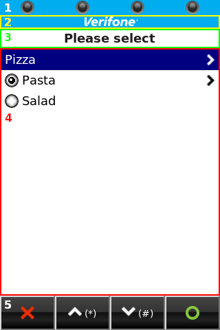

An outer `<table>` element (with 5 rows and 1 column) devides the HTML document into 5 regions. These regions are size dynamic and specify the basic structure of the dialog. CSS access on these regions is restricted, since regions can be visible or not depending on parameters passed by SDI server. The content of each region is accessable via CSS and developers can implement following CSS classes to modify appearance of the visible HTML elements in this region:

Region 1:
This region supports the same CSS classes and HTML elements as [region 1](#dialog_region_1) of dialog.html.

Region 2:
This region supports the same CSS classes and HTML elements as [region 2](#dialog_region_2) of dialog.html.

Region 3:

[TABLE]

Region 4:

[TABLE]

Region 5:
This region contains the most CSS classes and HTML elements of [region 5](#dialog_region_5) in dialog.html.
Differences are listed as follows:

- The control bar may not contain a **Clear** softkey or helper entry. Therefore, the cascaded CSS classes (e.g. `button.softkey.clear`) take no effect on `menu.html`.
- Softkeys and hardkeys used for **Up** and **Down** are used to move the menu item selection. **Enter** confirms the pre-selected item and lets the menu return with the corresponding result code for this item. For touch screen devices, menu items can directly be selected by pressing the item area on the screen.

Additional CSS classes (region independent):

[TABLE]

#### idle.html <a href="#pgr_idle_html" id="pgr_idle_html"></a>


An outer `<table>` element (with 5 rows and 1 column) devides the HTML document into 5 regions. These regions are size dynamic and specify the basic structure of the dialog. CSS access on these regions is restricted, since regions can be visible or not depending on parameters passed by SDI server. The content of each region is accessable via CSS and developers can implement following CSS classes to modify appearance of the visible HTML elements in this region:

Region 1:
This region supports the same CSS classes and HTML elements as [region 1](#dialog_region_1) of dialog.html.

Region 2:
This region supports the same CSS classes and HTML elements as [region 2](#dialog_region_2) of dialog.html.

Region 3:

[TABLE]

Region 4:

[TABLE]

Region 5:
This region contains the most CSS classes and HTML elements of [region 5](#dialog_region_5) in `dialog.html`.
Differences are listed as follows:

- The control bar does not contain softkeys or helper entries **Cancel**, **Up**, **Down**, **Clear**, **Enter** as used in in `dialog.html.Therefore`, the softkey/helper specific CSS classes (e.g. `button.softkey.enter`) take no effect on `idle.html`.

- The control bar uses other symbols for softkeys or helper entries and the associated hardkeys have a different meaning:

  

  
  Descriptions of the button/helper entries according its sequential order above:

  - **Info:** User can press this softkey or cancel key on keypad to display information about SDI server like software version and status of communication interface.
  - **Menu:** User can press this softkey or enter key on keypad to show the menu with communication interface settings. This menu allows the user to select a connection profile, which SDI server shall use for communication.

Additional CSS classes (region independent):

[TABLE]

#### pin.html <a href="#pgr_pin_html" id="pgr_pin_html"></a>

|              |               |
|--------------|---------------|
| 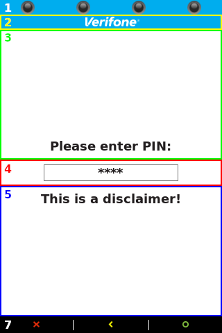 |  |

Depending on hardware capabilities the PIN prompt dialog `pin.html` has different content:

- PIN entry on devices with keypad:
  On devices with physical keypad the PIN digits are always entered via hardkeys. In this case the outer `<table>` element devides the HTML document into 6 visible regions, whereas region 3 contains the PIN prompt message and region 4 the PIN input field. By detault, region 5 is empty, but the optional text for this region (e.g. a disclaimer) which can be provided with a custom text catalog (for more details see chapter [Custom UI text catalogs](#subsubsec_sdi_custom_text_catalogs)). The control bar (region 7) displays key helpers to hint the user that cancel, clear and enter hardkeys can be used. The virtual keyboard (region 6) is always disabled and invisible.
- PIN entry with virtual keyboard on devices w/o keypad:
  On devices without physical keypad the PIN digits are entered with a virtual keyboard on touch screen. In this case the outer `<table>` element is added an additional region 6, which contains the virtual keyboard. The control bar (region 7) displays softkeys to cancel/confirm the PIN entry and to backspace softkey to clear already entered digits from the PIN input field.

Regions 1-7 of pin.html are size dynamic and specify the basic structure of the PIN dialog. CSS access on these regions is restricted, since regions can be visible or not depending on parameters passed by SDI server. The content of each region is accessable via CSS and developers can implement following CSS classes to modify appearance of the visible HTML elements in this region:

Region 1:
This region supports the same CSS classes and HTML elements as [region 1](#dialog_region_1) of dialog.html.

Region 2:
This region supports the same CSS classes and HTML elements as [region 2](#dialog_region_2) of dialog.html.

Region 3:

[TABLE]

Region 4:

[TABLE]

Region 5:

[TABLE]

Region 6:

[TABLE]

Region 7:
This region contains the most CSS classes and HTML elements of [region 5](#dialog_region_5) in dialog.html.
Differences are listed as follows:

- The control bar does not contain **Up** and **Down** softkey or helper entry. Therefore, the cascaded CSS classes (e.g. `button.softkey.up` or `button.softkey.down`) take no effect on `pin.html`.
- The **Clear** softkey can be omitted and added next to the PIN softkey **0**, if one of the image `pinclear_left.png` or `pinclear_right.png` are looked up in the [User config package](#vos_user_config_package) folder. For more details, please refer to description of CSS class [td.pinkey](#pinkey_td). In this case, the cascaded CSS class (e.g. `button.softkey.clear` takes no effect on `pin.html`.

Additional CSS classes (region independent):

[TABLE]

#### nav_pin.html <a href="#pgr_nav_pin_html" id="pgr_nav_pin_html"></a>

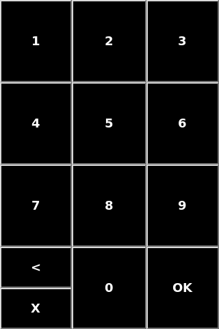

If supported by devices with touch screen, the navigator mode can be enabled to help visually impaired persons to enter the PIN (for more details refer to ADKGUI documentation). For this special PIN entry mode, SDI server provides a separate HTML dialog `nav_pin.html`, which consists of a virtual keyboard with full screen size. An outer `<table>` element (with 4 rows and 3 columns) devides the screen into 12 fields (`<td>` elements) having the same size. Softkeys (`<button>` elements) are used to enter the PIN digits. The most left-bottom field is vertical devided to add the softkeys for backspace and abort. Since the layout and appearance of the softkeys must fullfil special requirements, it is not recommended to implement own CSS for this dialog. Therefore, the CSS access for this dialog is restricted as follows:

[TABLE]

Additional CSS classes:

[TABLE]

### Custom UI text catalogs <a href="#subsubsec_sdi_custom_text_catalogs" id="subsubsec_sdi_custom_text_catalogs"></a>

In standard mode or as EPP (see [User Modes](#sec_sdi_user_modes)), SDI operates with UI and displays texts and prompts for user inputs (e.g. PIN entry). The UI interface of SDI is implemented with ADKGUI, an ADK component rendering HTML as a dialog on screen. For multi-language support ADKGUI allows the use of text catalog files, one for each language. UI text catalogs contain a text map, which consists of serveral lines of `name=value` text pairs. The `name` is used as key to lookup the `value`. The `value` represents the text to display. Text values can be HTML formatted, in addition, it may contain XML processing instructions (e.g. `<?text name?>` to refer another text by its name in the same catalog). For more details please refere to ADKGUI documentation.

For the supported languages ([Supported System Languages](#subsec_sdi_supported_system_languages)) the default texts for SDI are installed with UI catalogs coming along with the SDI config package for standard mode (see chapter [Default UI resource files](#subsubsec_sdi_default_resource_files)). Further, SDI allows the installation of additional custom UI text catalogs provided with an optional [User config package](#vos_user_config_package).

For each system language one custom UI text catalag can be installed to the following locations:

VOS/VOS2:

- `/etc/config/sdi/www/<width>x<height><color><numkeys><touch>` (device specific UI resource folder, e.g. `320x480C15T` is used for P400)
- `/etc/config/sdi/www/default` (default UI resource folder, used if the resource isn\'t found in device specific folder)

VOS3:

- `/home/use<X>/sdi/www/<width>x<height><color><numkeys><touch>` (device specific UI resource folder, e.g. `320x480C15T` is used for P630)
- `/home/use<X>/sdi/www/default` (default UI resource folder, used if the resource isn\'t found in device specific folder)

Please note that the first device specific UI resource folder is preferred, before the catalog file is looked up from `default` folder.
The custom UI text catalog must use the following filename notation:

``` fragment
custom-<language-code>.ctlg
```

The field `<language-code>` in the catalog filename contains the ISO-639-1 language code to specify the language for which the text catalog is used.

Basically, SDI prefers texts of the custom catalog before taking them from own default UI catalog. Since ADKGUI does not support running dialogs with 2 text catalogs at the same time, SDI first looks up the custom catalog (if installed) and afterwards the default catalog. Finally, the found text is injected with instructions `<?var ...?>` or `<?varthml ...?>` into HTML for ADKGUI.

For dual catalog support, SDI implements an additional XML processing instruction `<?custom name?>`, which more or less works the same as `<?text name?>` (as supported by ADKGUI), but this instruction has a special meaning when used in pre-installed default text catalogs: If SDI looks up a text from default catalog, it substitutes all placeholders `<?custom name?>` by the corresponding text value provided by the customer catalog. If not found there (either no custom catalog installed or no text value available), SDI falls back to value found in own default catalog. In this way, SDI implements priorization of custom texts before using SDI default texts.

Example:

``` fragment
invalid_pin=INVALID PIN
txt_sdi_invalid_pin=<?custom invalid_pin?>
```

Variable `txt_sdi_invalid_pin` is fully composed of instruction `<?custom invalid_pin?>`. This instruction refers variable `invalid_pin`, for which SDI will now look up the value from custom catalog first and (if not found there) afterwards from own catalog, which contains default value `INVALID PIN`. After SDI has substituted all instructions in this way, it displays the result text in dialog with ADKGUI. If the custom catalog is installed, this catalog then is passed to ADKGUI, so that custom catalogs might use instruction `<?text name?>` to refer other texts in this catalog.


Instruction `<?custom name?>` is ignored, if used in a custom catalog and results an empty value.
Instruction `<?text name?>` used in SDI default catalog does not lookup the custom catalog and is substituted with variable of the own default catalog only. This allows SDI to define private catalog variables to compose other catalog variables with default texts.
Basically all catalog variables may contain HTML elements, e.g. to insert custom images or to use attribute `class` or `id` to refer them from a custom CSS file to change element\'s appearance.


SDI uses text catalog files for UI dialogs, which are displayed for:

- SDI interace (e.g. [Display Interface (24-XX)](#subsec_sdi_display_interface), [PED Interface (22-XX)](#subsubsec_sdi_ped_interface))
- Internal display messages/confirmations, e.g. amount confirmations, data inputs or transaction status messages (such as EMV status messages with text IDs)

The following sections list all text variables, which are supported for custom UI catalogs. Sections are categorized for SDI command or purpose, which text variables are used for. For variables not provided by custom catalog, always values of SDI default catalog are applied.

- **Amount formatting**

  Variables with global character used to format an amount for the display.

  [TABLE]

- **Command** [PED Get PIN (22-01)](#subsubsec_sdi_ped_get_pin)

  Variables specifying content of region 3 and 5 of [pin.html](#pgr_pin_html) for PIN entry with command [PED Get PIN (22-01)](#subsubsec_sdi_ped_get_pin).

  [TABLE]

  
  Due to compatibility reasons SDI default catalog does not use instruction `<?custom name?>` for `sdi_txt_pinmsg_*` variables. Nevertheless, these variables are supported in custom catalog files, since SDI direclty takes values from there first.
  The same UI texts are supported for PIN entry, which is internally triggered by ADKEMV callback (see chapter [PED Set PIN Input Parameter (22-06)](#subsubsec_sdi_ped_set_pin_input_parameter)).
  

- **Commands** [Handle Display (24-03)](#subsubsec_sdi_handle_display) **and** [Handle HTML Dialog (24-0A)](#subsubsec_sdi_handle_html_dialog)

  Both commands support HTML templates, which can be installed with an [User config package](#vos_user_config_package).
  SDI always uses the custom UI catalog to invoke these templates with ADKGUI.
  This allows to implement language independent HTML templates for both commands.

  | `name` | Description of `value` |
  |----|----|
  | <p>arbitrary name</p> | <p>Multiple variables with arbitrary name can be defined, which can be referred with XML processing instruction `<?text name?>` in HTML.<br/></p> |

- **Command** [Handle Secure Input (24-04)](#subsubsec_sdi_handle_secure_input)

  Variables specifying content of region 4 of [dialog.html](#pgr_dialog_html) for user inputs with command [Handle Secure Input (24-04)](#subsubsec_sdi_handle_secure_input).
  Used HTML `<input>` elements take multiple parameters specified by SDI, thus, these variables are declared as private and cannot be replaced by a custom UI catalog file.
  Therefore, in most cases a header and a footer variable is declared to replace content around these elements.
  SDI looks up the corresponding variables depending on specified Template ID, which is passed in TLV tag `DFA007`.

  | `name` | Template ID | Description of `value` |
  |----|----|----|
  | <p>`secure_input_01_postal_code_header`</p> | <p>`01`</p> | <p>Prompt text preceding the `<input>` element for input of ZIP code.<br/></p> <p><br/></p>  <p><br/></p> <p>Class `zip` allows to implement styles for the `<input>` element in a custom CSS file.</p> <p><br/></p>  |
  | <p>`secure_input_01_postal_code_footer`</p> | <p>`01`</p> | <p>Footer text behind the `<input>` element (see also `secure_input_01_postal_code_header`).</p> |
  | <p>`secure_input_02_cvv_header`</p> | <p>`02`</p> | <p>Prompt text preceding the `<input>` element for input of [C]{.underline}ard [V]{.underline}erification [V]{.underline}alue.<br/></p> <p><br/></p>  <p><br/></p> <p>Class `cvv` allows to implement styles for the `<input>` element in a custom CSS file.</p> <p><br/></p>  |
  | <p>`secure_input_02_cvv_footer`</p> | <p>`02`</p> | <p>Footer text behind the `<input>` element (see also `secure_input_02_cvv_header`).</p> |
  | <p>`secure_input_03_birthday_header`</p> | <p>`03`</p> | <p>Prompt text preceding the `<input>` element for input of the date of birth.<br/></p> <p><br/></p>  <p><br/></p> <p>Class `birthday` allows to implement styles for the `<input>` element in a custom CSS file.</p> <p><br/></p>  |
  | <p>`secure_input_03_birthday_footer`</p> | <p>`03`</p> | <p>Footer text behind the `<input>` element (see also `secure_input_03_birthday_header`).</p> |
  | <p>`secure_input_04_ssn_header`</p> | <p>`04`</p> | <p>Prompt text preceding the `<input>` element for input of [S]{.underline}ocial [S]{.underline}ecurity [N]{.underline}umber.<br/></p> <p><br/></p>  <p><br/></p> <p>Class `ssn` allows to implement styles for the `<input>` element in a custom CSS file.</p> <p><br/></p>  |
  | <p>`secure_input_04_ssn_footer`</p> | <p>`04`</p> | <p>Footer text behind the `<input>` element (see also `secure_input_04_ssn_header`).</p> |
  | <p>`secure_input_05_last_4_of_ssn_header`</p> | <p>`05`</p> | <p>Prompt text preceding `<input>` element for input of last 4 digits of [S]{.underline}ocial [S]{.underline}ecurity [N]{.underline}umber.<br/></p> <p><br/></p>  <p><br/></p> <p>Class `last4ssn` allows to implement styles for the `<input>` element in a custom CSS file.</p> <p><br/></p>  |
  | <p>`secure_input_05_last_4_of_ssn_footer`</p> | <p>`05`</p> | <p>Footer text behind the `<input>` element (see also `secure_input_05_last_4_of_ssn_header`).</p> |
  | <p>`secure_input_06_verify_postal_code_header`</p> | <p>`06`</p> | <p>Prompt text preceding the `<input>` element for input to verify the ZIP code.<br/></p> <p><br/></p>  <p><br/></p> <p>Class `zip` allows to implement styles for the `<input>` element in a custom CSS file.</p> <p><br/></p>  |
  | <p>`secure_input_06_verify_postal_code_footer`</p> | <p>`06`</p> | <p>Footer text behind the `<input>` element (see also `secure_input_06_verify_postal_code_header`).</p> |
  | <p>`secure_input_07_verify_cvv_header`</p> | <p>`07`</p> | <p>Prompt text preceding the `<input>` element for input to verify the [C]{.underline}ard [V]{.underline}erification [V]{.underline}alue.<br/></p> <p><br/></p>  <p><br/></p> <p>Class `cvv` allows to implement styles for the `<input>` element in a custom CSS file.</p> <p><br/></p>  |
  | <p>`secure_input_07_verify_cvv_footer`</p> | <p>`07`</p> | <p>Footer text behind the `<input>` element (see also `secure_input_07_verify_cvv_header`).</p> |
  | <p>`secure_input_08_verify_birthday_header`</p> | <p>`08`</p> | <p>Prompt text preceding the `<input>` element for input to verify the date of birth.<br/></p> <p><br/></p>  <p><br/></p> <p>Class `birthday` allows to implement styles for the `<input>` element in a custom CSS file.</p> <p><br/></p>  |
  | <p>`secure_input_08_verify_birthday_footer`</p> | <p>`08`</p> | <p>Footer text behind the `<input>` element (see also `secure_input_08_verify_birthday_header`).</p> |
  | <p>`secure_input_09_verify_ssn_header`</p> | <p>`09`</p> | <p>Prompt text preceding the `<input>` element for input to verify the [S]{.underline}ocial [S]{.underline}ecurity [N]{.underline}umber.<br/></p> <p><br/></p>  <p><br/></p> <p>Class `ssn` allows to implement styles for the `<input>` element in a custom CSS file.</p> <p><br/></p>  |
  | <p>`secure_input_09_verify_ssn_footer`</p> | <p>`09`</p> | <p>Footer text behind the `<input>` element (see also `secure_input_09_verify_ssn_header`).</p> |
  | <p>`secure_input_0a_verify_last4ssn_header`</p> | <p>`0A`</p> | <p>Prompt text preceding `<input>` element for input to verify the last 4 digits of [S]{.underline}ocial [S]{.underline}ecurity [N]{.underline}umber.<br/></p> <p><br/></p>  <p><br/></p> <p>Class `last4ssn` allows to implement styles for the `<input>` element in a custom CSS file.</p> <p><br/></p>  |
  | <p>`secure_input_0a_verify_last4ssn_footer`</p> | <p>`0A`</p> | <p>Footer text behind the `<input>` element (see also `secure_input_0a_verify_last4ssn_header`).</p> |
  | <p>`txt_sdi_secure_input_0b_gratuity_amount_prompt`</p> | <p>`0B`</p> | <p>Prompt text preceding the `<input>` element for input of the gratuity/tip amount.<br/></p> <p><br/></p>  <p><br/></p> <p>`<input>` element for gratuity/tip amount should precede/append `<?var curr?>` so that the currency is displayed.</p> <p><br/></p> <p>Separator variables `decimal_separator` and `thousand_separator` are applied to amount `<input>` element (see section [Amount formattig](#ui_catalogs_amount_formatting)).</p> <p><br/></p> <p>Class `amount` allows to implement styles for the `<input>` element in a custom CSS file.</p> <p><br/></p>  |
  | <p>`txt_sdi_secure_input_0b_gratuity_amount_footer`</p> | <p>`0B`</p> | <p>Footer text behind the `<input>` element (see also `txt_sdi_secure_input_0b_gratuity_amount_prompt`).</p> |
  | <p>`secure_input_0c_gratuity_percentage_header`</p> | <p>`0C`</p> | <p>Prompt text preceding the `<input>` element for input of percentage to specify the proportion of gratuity/tip.<br/></p> <p><br/></p>  <p><br/></p> <p>Class `percent` allows to implement styles for the `<input>` element in a custom CSS file.</p> <p><br/></p>  |
  | <p>`secure_input_0c_gratuity_percentage_footer`</p> | <p>`0C`</p> | <p>Footer text behind the `<input>` element (see also `secure_input_0c_gratuity_percentage_header`).</p> |
  | <p>`secure_input_0d_cashback_amount_header`</p> | <p>`0D`</p> | <p>Prompt text preceding the `<input>` element for input of the cashback amount.<br/></p> <p><br/></p>  <p><br/></p> <p>`<input>` element for cashback amount should precede/append `<?var curr?>` so that the currency is displayed.</p> <p><br/></p> <p>Separator variables `decimal_separator` and `thousand_separator` are applied to amount `<input>` element (see section [Amount formatting](#ui_catalogs_amount_formatting)).</p> <p><br/></p> <p>Class `amount` allows to implement styles for the `<input>` element in a custom CSS file.</p> <p><br/></p>  |
  | <p>`secure_input_0d_cashback_amount_footer`</p> | <p>`0D`</p> | <p>Footer text behind the `<input>` element (see also `secure_input_0d_cashback_amount_header`).</p> |
  | <p>`secure_disp_amount_and_input_0e_tip_header`</p> | <p>`0E`</p> | <p>Prompt text preceding the `<input>` element for input of the tip amount (with displaying fare/base amount).<br/></p> <p><br/></p>  <p><br/></p> <p>This variable should be composed of `amount_format` displaying the fare/base amount (see section [Amount formatting](#ui_catalogs_amount_formatting)).</p> <p><br/></p> <p>`<input>` element for tip amount should precede/append `<?var curr?>` so that the currency is displayed.</p> <p><br/></p> <p>Separator variables `decimal_separator` and `thousand_separator` are applied to amount `<input>` element (see section [Amount formatting](#ui_catalogs_amount_formatting)).</p> <p><br/></p> <p>Class `amount` allows to implement styles for the `<input>` element in a custom CSS file.</p> <p><br/></p>  |
  | <p>`secure_disp_amount_and_input_0e_tip_footer`</p> | <p>`0E`</p> | <p>Footer text behind the `<input>` element (see also `secure_disp_amount_and_input_0e_tip_header`).</p> |
  | <p>`secure_input_0f_email_addr_header`</p> | <p>`0F`</p> | <p>Prompt text preceding `<input>` element for input of an email address.<br/></p> <p><br/></p>  <p><br/></p> <p>Class `email` allows to implement styles for the `<input>` element in a custom CSS file.</p> <p><br/></p>  |
  | <p>`secure_input_0f_email_addr_footer`</p> | <p>`0F`</p> | <p>Footer text behind the `<input>` element (see also `secure_input_0f_email_addr_header`).</p> |
  | <p>`secure_input_10_phone_nbr_header`</p> | <p>`10`</p> | <p>Prompt text preceding `<input>` element for input of a phone number.<br/></p> <p><br/></p>  <p><br/></p> <p>Class `phone` allows to implement styles for the `<input>` element in a custom CSS file.</p> <p><br/></p>  |
  | <p>`secure_input_10_phone_nbr_footer`</p> | <p>`10`</p> | <p>Footer text behind the `<input>` element (see also `secure_input_10_phone_nbr_header`).</p> |
  | <p>`secure_input_11_nbr_installments_header`</p> | <p>`11`</p> | <p>Prompt text preceding `<input>` element for input the number of installments.<br/></p> <p><br/></p>  <p><br/></p> <p>Class `installments` allows to implement styles for the `<input>` element in a custom CSS file.</p> <p><br/></p>  |
  | <p>`secure_input_11_nbr_installments_footer`</p> | <p>`11`</p> | <p>Footer text behind the `<input>` element (see also `secure_input_11_nbr_installments_header`).</p> |

  
  Header/Footer variables might use `<div>` or `<br>` to seperate them vertically from `<input>` elements.
  

  Following Template IDs are declared as private and internally used by SDI for input of card holder sensitive data only (manual card data input).
  Therefore, these Template IDs cannot be used in TLV tag `DFA007` with command [Handle Secure Input (24-04)](#subsubsec_sdi_handle_secure_input).

  | `name` | Template ID | Description of `value` |
  |----|----|----|
  | <p>`secure_input_fc_card_number_header`</p> | <p>`FC`</p> | <p>Prompt text preceding the `<input>` element for input of [P]{.underline}rimary [A]{.underline}ccount [N]{.underline}umber.<br/></p> <p><br/></p>  <p><br/></p> <p>Class `pan` allows to implement styles for the `<input>` element in a custom CSS file.</p> <p><br/></p>  |
  | <p>`secure_input_fc_card_number_footer`</p> | <p>`FC`</p> | <p>Footer text behind the `<input>` element (see also `secure_input_fc_card_number_header`).</p> |
  | <p>`secure_input_fd_expiry_date_header`</p> | <p>`FD`</p> | <p>Prompt text preceding the `<input>` element for input of the card expiry date.<br/></p> <p><br/></p>  <p><br/></p> <p>Class `date` allows to implement styles for the `<input>` element in a custom CSS file.</p> <p><br/></p>  |
  | <p>`secure_input_fd_expiry_date_footer`</p> | <p>`FD`</p> | <p>Footer text behind the `<input>` element (see also `secure_input_fd_expiry_date_header`).</p> |
  | <p>`secure_input_fe_manual_card_entry_pan_header`</p> | <p>`FE`</p> | <p>Prompt text preceding the PAN `<input>` element for input of the PAN and the card expiry date.<br/></p> <p><br/></p>  <p><br/></p> <p>Class `pan` allows to implement styles for the `<input>` element in a custom CSS file.</p> <p><br/></p>  |
  | <p>`secure_input_fe_manual_card_entry_expdate_header`</p> | <p>`FE`</p> | <p>Prompt text preceding the expiry date `<input>` element for input of the PAN and the card expiry date (see also `secure_input_fe_manual_card_entry_pan_header`).<br/></p> <p><br/></p>  <p><br/></p> <p>Class `date` allows to implement styles for the `<input>` element in a custom CSS file.</p> <p><br/></p>  |
  | <p>`secure_input_fe_manual_card_entry_footer`</p> | <p>`FE`</p> | <p>Footer text behind the expiry date `<input>` element (see also `secure_input_fe_manual_card_entry_pan_header` and `secure_input_fe_manual_card_entry_expdate_header`).</p> |
  | <p>`secure_input_ff_manual_card_entry_pan_header`</p> | <p>`FF`</p> | <p>Prompt text preceding the PAN `<input>` element for input of the PAN, the card expiry date and the CVV.<br/></p> <p><br/></p>  <p><br/></p> <p>Class `pan` allows to implement styles for the `<input>` element in a custom CSS file.</p> <p><br/></p>  |
  | <p>`secure_input_ff_manual_card_entry_expdate_header`</p> | <p>`FF`</p> | <p>Prompt text preceding the expiry date `<input>` element for input of the PAN, the card expiry date and the CVV (see also `secure_input_ff_manual_card_entry_pan_header`).<br/></p> <p><br/></p>  <p><br/></p> <p>Class `date` allows to implement styles for the `<input>` element in a custom CSS file.</p> <p><br/></p>  |
  | <p>`secure_input_ff_manual_card_entry_cvv_header`</p> | <p>`FF`</p> | <p>Prompt text preceding the CVV `<input>` element for input of the PAN, the card expiry date and the CVV (see also `secure_input_ff_manual_card_entry_pan_header` and `secure_input_ff_manual_card_entry_expdate_header`).<br/></p> <p><br/></p>  <p><br/></p> <p>Class `cvv` allows to implement styles for the `<input>` element in a custom CSS file.</p> <p><br/></p>  |
  | <p>`secure_input_ff_manual_card_entry_footer`</p> | <p>`FF`</p> | <p>Footer text behind the expiry date `<input>` element (see also `secure_input_ff_manual_card_entry_pan_header`, `secure_input_ff_manual_card_entry_expdate_header` and `secure_input_ff_manual_card_entry_cvv_header`).</p> |

  
  Header/Footer variables might use `<div>` or `<br>` to seperate them vertically from `<input>` elements.
  

- **Command** [Handle Signature Capture (24-08)](#subsubsec_sdi_handle_signature_capture)

  Variables specifying content of region 4 of [dialog.html](#pgr_dialog_html) for signature caputure with command [Handle Signature Capture (24-08)](#subsubsec_sdi_handle_signature_capture).

  | `name` | Description of `value` |
  |----|----|
  | <p>`txt_sdi_signature_prompt`</p> | <p>Prompt text preceding the signature `<input>` element.</p> <p><br/></p>  <p><br/></p> <p>Class `signature` allows to implement styles for the signature `<input>` element in a custom CSS file.</p> <p><br/></p>  |
  | <p>`txt_sdi_signature_footer`</p> | <p>Footer text behind the signature `<input>` element (same as `txt_sdi_signature_prompt`).</p> |

  
  Header/Footer variables might use `<div>` or `<br>` to seperate them vertically from `<input>` elements.
  

- **Command** [Handle Card Request Display (24-06)](#subsubsec_sdi_handle_card_request_display)

  Variables specifying content of region 4 of [dialog.html](#pgr_dialog_html) for card requests with command [Handle Card Request Display (24-06)](#subsubsec_sdi_handle_card_request_display). Used variables depend on specified card technology (TLV tag `DFA108`) and display mode (TLV tag `DFA10A`).

  Each text variable is provided in 2 variants, one using prefix **`amount_`** and one without. Variables with the prefix are used, if the command [Handle Card Request Display (24-06)](#subsubsec_sdi_handle_card_request_display) contains the transaction amount and currency in TLV tag `9F02` and `5F2A`. Additional EMV transaction type in that case can be provided with TLV tag `9C`, thus, variables using prefix **`amount_`** should be composed of `trx_type_amount_format` (see section [Amount formatting](#ui_catalogs_amount_formatting)). If TLV tags `9F02` or `5F2A` are missing, SDI looks up variables without the prefix and the amount with currency (and transaction type) are not diplayed.

  | `name` | Description of `value` |
  |----|----|
  | <p>**`amount_`**`insert_card`, `insert_card`</p> | <p>Text to request insertion of a chip card.</p> |
  | <p>**`amount_`**`insert_card_fallback`, `insert_card_fallback`</p> | <p>Text to request insertion of a chip card as fallback.</p> |
  | <p>**`amount_`**`insert_card_retry`, `insert_card_retry`</p> | <p>Text to request a new insertion of a chip card (retry).</p> |
  | <p>**`amount_`**`insert_swipe_card`, `insert_swipe_card`</p> | <p>Text to request insertion of a chip card or to swipe a magnetic card.</p> |
  | <p>**`amount_`**`insert_swipe_tap_card`, `insert_swipe_tap_card`</p> | <p>Text to request insertion of a chip card, to swipe a magnetic card or to tap a contactless card.</p> |
  | <p>**`amount_`**`insert_tap_card`, `insert_tap_card`</p> | <p>Text to request insertion of a chip card or to tap a contactless card.</p> |
  | <p>**`amount_`**`swipe_card`, `swipe_card`</p> | <p>Text to request swiping a magnetic card.</p> |
  | <p>**`amount_`**`swipe_card_fallback`, `swipe_card_fallback`</p> | <p>Text to request swiping a magnetic card as fallback.</p> |
  | <p>**`amount_`**`swipe_tap_card`, `swipe_tap_card`</p> | <p>Text to request swiping a magnetic card or to tap a contactless card.</p> |
  | <p>**`amount_`**`tap_card`, `tap_card`</p> | <p>Text to request tapping a contactless card.</p> |
  | <p>`trx_type_cash_advance`</p> | <p>Text used for EMV transaction type `EMV_ADK_TRAN_TYPE_CASH` (value `0x01` in TLV tag `9C`), which is passed as variable `ttt` to `trx_type_amount_format` (see section [Amount formatting](#ui_catalogs_amount_formatting)).</p> <p><br/></p>  <p><br/></p> <p>Variables above using prefix **`amount_`** are composed `trx_type_amount_format`.</p> <p><br/></p>  |
  | <p>`trx_type_cashback`</p> | <p>Text used for EMV transaction type `EMV_ADK_TRAN_TYPE_CASHBACK` (value `0x09` in TLV tag `9C`), which is passed as variable `ttt` to `trx_type_amount_format` (see section [Amount formatting](#ui_catalogs_amount_formatting)).</p> <p><br/></p>  <p><br/></p> <p>Variables above using prefix **`amount_`** are composed of `trx_type_amount_format`.</p> <p><br/></p>  |
  | <p>`trx_type_refund`</p> | <p>Text used for EMV transaction type `EMV_ADK_TRAN_TYPE_REFUND` (value `0x20` in TLV tag `9C`), which is passed as variable `ttt` to `trx_type_amount_format` (see section [Amount formatting](#ui_catalogs_amount_formatting)).</p> <p><br/></p>  <p><br/></p> <p>Variables above using prefix **`amount_`** are composed of `trx_type_amount_format`.</p> <p><br/></p>  |
  | <p>`trx_type_purchase`</p> | <p>Text used for arbitrary EMV transaction type (not equal to values above in TLV tag `9C`), which is passed as variable `ttt` to `trx_type_amount_format` (see section [Amount formatting](#ui_catalogs_amount_formatting)).</p> <p><br/></p>  <p><br/></p> <p>Variables above using prefix **`amount_`** are composed of `trx_type_amount_format`.</p> <p><br/></p>  |

- **Command** [Display Idle Screen (24-07)](#subsubsec_sdi_display_idle_screen)

  Variables specifying content of region 4 of [idle.html](#pgr_idle_html) for idle screen with command [Display Idle Screen (24-07)](#subsubsec_sdi_display_idle_screen).

  | `name` | Description of `value` |
  |----|----|
  | <p>`idle_screen_text`</p> | <p>Welcome text used for the SDI idle screen.</p> <p><br/></p>  <p><br/></p> <p>Since UI catalogs support HTML, it is possible to use element `img` to refer an custom image.</p> <p><br/></p>  |

- **EMV status messages (with text ID)**

  Variables used for EMV status messages. ADKEMV triggers status messages from internal transaction flow with a text ID, which SDI has to display.

  | `name` | EMV text ID | Description of `value` |
  |----|----|----|
  | <p>`amount_conf`</p> | <p>`EMV_ADK_TXT_AMOUNT`</p> | <p>Text to confirm the transaction amount. This should be composed of `amount_format` displaying the amount (see section [Amount formatting](#ui_catalogs_amount_formatting)).</p> |
  | <p>`approved`</p> | <p>`EMV_ADK_TXT_APPROVED`</p> | <p>Text to inform user that transaction was successfull/approved.</p> |
  | <p>`auth_approved`</p> | <p>`EMV_ADK_TXT_AUTH_APPROVED`</p> | <p>Text to inform user that authorization/reservation was successful/approved.</p> |
  | <p>`auth_declined`</p> | <p>`EMV_ADK_TXT_AUTH_DECLINED`</p> | <p>Text to inform user that authorization/reservation has failed/was declined.</p> |
  | <p>`authorizing`</p> | <p>`EMV_ADK_TXT_AUTHORIZING`</p> | <p>Text to inform user that an online authorization/transaction is in progress.</p> |
  | <p>`card_error`</p> | <p>`EMV_ADK_TXT_CARD_ERROR`</p> | <p>Text to inform user that a card error occured.</p> |
  | <p>`2_cards_in_field`</p> | <p>`EMV_ADK_TXT_2_CARDS_IN_FIELD`</p> | <p>Text to inform user that 2 contactless cards in field were detected.</p> |
  | <p>`card_read_ok`</p> | <p>`EMV_ADK_TXT_CARD_READ_OK`</p> | <p>Text to inform user that card was read successfully.</p> |
  | <p>`cashback_conf_amount`</p> | <p>`EMV_ADK_TXT_3AMO_CASHBACK`</p> | <p>Text to confirm total amount for cashback payment. This should be composed of `amount_format` displaying the amount (see section [Amount formatting](#ui_catalogs_amount_formatting)).</p> |
  | <p>`declined`</p> | <p>`EMV_ADK_TXT_DECLINED`</p> | <p>Text to inform user that transaction has failed/was declined.</p> |
  | <p>`not_accepted`</p> | <p>`EMV_ADK_TXT_NOT_ACCEPTED`</p> | <p>Text to inform user that the card was not accepted.</p> |
  | <p>`processing_error`</p> | <p>`EMV_ADK_TXT_PROCESSING_ERROR`</p> | <p>Text to inform user that a processing error occured for this transaction.</p> |
  | <p>`refund_conf_amount`</p> | <p>`EMV_ADK_TXT_REFUND_CONF_AMOUNT`</p> | <p>Text to confirm the refund transaction amount. This should be composed of `amount_format` displaying the amount (see section [Amount formatting](#ui_catalogs_amount_formatting)).</p> |
  | <p>`remove_card`</p> | <p>`EMV_ADK_TXT_REMOVE_CARD`</p> | <p>Text to inform user to remove the card from card reader.</p> |
  | <p>`retap_card`</p> | <p>`EMV_ADK_TXT_RETAP_SAME`</p> | <p>Text to inform user to retap the contactless card.</p> |
  | <p>`retap_card_l1`</p> | <p>`EMV_ADK_TXT_RETAP_SAME_L1`</p> | <p>Text to inform user to retap the contactless card (requested by EMV Level 1 layer).</p> |
  | <p>`see_phone`</p> | <p>`EMV_ADK_TXT_SEE_PHONE`</p> | <p>Text to inform user to follow instructions on mobile phone (during contacless payment).</p> |
  | <p>`tip_conf_amount`</p> | <p>`EMV_ADK_TXT_3AMO_TIP`</p> | <p>Text to confirm total amount for tip payment. This should be composed of `amount_format` displaying the amount (see section [Amount formatting](#ui_catalogs_amount_formatting)).</p> |
  | <p>`use_chip_reader`</p> | <p>`EMV_ADK_TXT_USE_CHIP_READER`</p> | <p>Text to inform user to use the chip card reader.</p> |
  | <p>`use_mag_stripe`</p> | <p>`EMV_ADK_TXT_USE_MAG_STRIPE`</p> | <p>Text to inform user to use the magnetic card reader.</p> |
  | <p>`voice_auth`</p> | <p>`EMV_ADK_TXT_VOICEAUT`</p> | <p>Text to inform user in case of a voice authorization (e.g. due to communication problem).</p> |
  | <p>`invalid_pin`</p> | <p>`0x30`</p> | <p>Text to inform user that entered PIN was wrong (**obsolete**, text ID used by very old ADKEMV versions and kept for compatibility reasons only)</p> |
  | <p>`last_pin_try`</p> | <p>`0x27`</p> | <p>Text to inform user that this is the last try to enter the PIN (**obsolete**, text ID used by very old ADKEMV versions and kept for compatibility reasons only)</p> |

- **Miscellaneous**

  Miscellaneous variables used by SDI, which cannot be categorized into sections above. For details and purpose see column description.

  | `name` | Description of `value` |
  |----|----|
  | <p>`invalid_pin`</p> | <p>Text to inform user that entered PIN was wrong (used for internal PIN entry with UI standard mode not using [PED Get PIN (22-01)](#subsubsec_sdi_ped_get_pin))</p> |
  | <p>`invalid_pin_try_again`</p> | <p>Text to inform user to enter the PIN again (used for internal PIN entry with UI standard mode not using [PED Get PIN (22-01)](#subsubsec_sdi_ped_get_pin))</p> |
  | <p>`invalid_pin_last_pin_try`</p> | <p>Text to inform user that this is the last try to enter the PIN (used for internal PIN entry with UI standard mode not using [PED Get PIN (22-01)](#subsubsec_sdi_ped_get_pin))</p> |
  | <p>`please_wait`</p> | <p>Text displayed while terminal or transaction is in progress (\"please wait\")</p> |
  | <p>`select_application`</p> | <p>Prompt for EMV application selection menu (used for internal menu selection with UI standard mode)</p> |
  | <p>`select_com_if`</p> | <p>Header text for COM interface selection menu (provided with menu button on idle screen in UI standard mode).</p> <p><br/></p>  <p><br/></p> <p>SDI menus accessable via idle screen in UI standard mode have no multi-language support and are displayed in English language only. Thus, these texts recently cannot be customized with UI catalogs.</p> <p><br/></p>  |

An additional example user config package comes along in subfolder `example/load/usr_config` of SDI documentation package `sdi-doc-X.X.X-X-P2PE-X.X.X.zip`:

- **dl.sdi-usrconfig-text-catalog-X.X.X-X-P2PE-X.X.X.tar**
  This package installs 3 custom UI text catalogs (for languages English, German and French), which contain all supported SDI texts, which can be used in a custom UI catalog (see tables above). All texts use red color indicating on the display that the text was provided by these sample catalog files.

### Install UI user config packages <a href="#subsubsec_sdi_install_ui_user_config_packages" id="subsubsec_sdi_install_ui_user_config_packages"></a>

As described in chapter [Default UI resource files](#subsubsec_sdi_default_resource_files), it is not possible to replace default resource files (HTML files, CSS files, images and UI text catalogs), which are installed with SDI base packages to SDI home directory. Customized UI resources must be installed to a different location with an [User config package](#vos_user_config_package) so that SDI server can apply them instead using the default files (resource file overloading). With this concept SDI server is able to fallback to the default, whenever an [User config package](#vos_user_config_package) is uninstalled.

On VOS/VOS2 user config packages are installed to following device location:

``` fragment
/etc/config
```

On VOS3 SDI uses different locations for user config files. Instead of using a global system folder as on VOS/VOS2, SDI server looks up the files from home user folder:

``` fragment
/home/usr<X>
```

SDI server uses folder `sdi` as application subfolder, whereas resource files for ADKGUI are looked up in additional subfolder `www`.
Thus, the [User config package](#vos_user_config_package) must contain resource files in a subfolder `sdi/www`, so that these files are installed to following device location:
VOS/VOS2:

``` fragment
/etc/config/sdi/www
```

VOS3:

``` fragment
/home/usr<X>/sdi/www
```

The following resource file types can be added to this folder:

- **HTML templates**
  As mentioned in chapter [Default UI resource files](#subsubsec_sdi_default_resource_files), it is not possible to overload existing SDI default HTML files. However, SDI command [Handle Display (24-03)](#subsubsec_sdi_handle_display) supports displaying additional HTML templates, which can be part of the UI user config package. For more details, please refer to command discription of [Handle Display (24-03)](#subsubsec_sdi_handle_display).
- **CSS files**
  CSS files must have file name `style.css` and are located in device specific subfolders (e.g. `854x480C15T` for M400, see ADKGUI documentation for details). For more information about CSS files, please refer to description in chapter [Default UI resource files](#subsubsec_sdi_default_resource_files). If a CSS file `style.css` is installed into this device specific folder, SDI server prefers this CSS file instead of using the default CSS file under `www` in SDI home directory.
- **Images**
  Image files are installed into subfolder `images`. Images installed by the [User config package](#vos_user_config_package) to this subfolder are preferred to default image files under `www` in SDI home directory. Image files must have the same name as listed in chapter [Default UI resource files](#subsubsec_sdi_default_resource_files). If the image is not found there, SDI server uses the default image, thus, developers need not to add the complete list of images to the [User config package](#vos_user_config_package). Finally, an [User config package](#vos_user_config_package) may contain additionals arbitrary images, which are used by HTML templates with command [Handle Display (24-03)](#subsubsec_sdi_handle_display).
- **UI text catalogs**
  Custom UI text catalogs can be installed can installed to device specific subfolders or to default resource folder of ADKGUI (see chapter [Custom UI text catalogs](#subsubsec_sdi_custom_text_catalogs)). These catalog files are applied for special commands, in addition, they can be used to implement language independent HTML templates for command [Handle Display (24-03)](#subsubsec_sdi_handle_display).

Additional example UI user config packages come along in subfolder `example/load/usr_config` of SDI documentation package `sdi-doc-X.X.X-X-P2PE-X.X.X.zip`:

- **dl.sdi-usrconfig-adk-style-X.X.X-X-P2PE-X.X.X.tar**
  This package installs an example look and feel for SDI server, which is similar to flat blue UI design used for several ADK applications (Log Control Panel, CP Downloader).
- **dl.sdi-usrconfig-old-leds-X.X.X-X-P2PE-X.X.X.tar**
  This package installs the old CTLS LED bar, which was used in old versions of SDI server (\< 3.x.x).
- **dl.sdi-usrconfig-text-catalog-X.X.X-X-P2PE-X.X.X.tar**
  This package installs 3 custom UI text catalogs (for languages English, German and French), which contain UI texts to customize the PIN entry dialog.

Users can easily switch back SDI server to default UI design by just uninstalling the UI user config package.


Different user config packages containing files with the same location must not be installed in parallel, since the files would overwrite each other during installation. This could lead to undesired behaviour with Verifone Secure Installer (e.g. when removing the packages).


# Troubleshooting <a href="#sec_sdi_troubleshooting" id="sec_sdi_troubleshooting"></a>

## Updates <a href="#subsec_sdi_updates" id="subsec_sdi_updates"></a>

It is recommended always to use the newest version of SDI server, which contains the most bugfixes, therefore it will solve known issues.
An Update of the SDI Server is basically possible by two ways:

1.  Download/Install new SDI packages as described in chapter [Installation](#subsubsec_vos_sdi_installation)
2.  Using the Software Upload commands via the serialized interface (see [Software and Configuration Upload](#subsubsec_sdi_sys_software_upload))

## FAQ <a href="#subsec_sdi_faq" id="subsec_sdi_faq"></a>

Q: Are additional ADK components required to run the SDI-Server?
A: Yes, depending on the device and use case some further ADK components are neccessary. The best way to load a device correctly is the usage of the ADK integration packages.

## Logging <a href="#subsec_sdi_logging" id="subsec_sdi_logging"></a>

To activate the SDI-Server log the LCP needs to be configured. Please create a configuration for AppId \"SDI\" to get the log.

# Appendix <a href="#sec_sdi_appendix" id="sec_sdi_appendix"></a>

## Basic Transaction Flows <a href="#subsec_sdi_basic_transaction-flows" id="subsec_sdi_basic_transaction-flows"></a>

### Basic MSR Flow <a href="#subsubsec_sdi_basic_msr_flow" id="subsubsec_sdi_basic_msr_flow"></a>

### Basic EMV CT Flow <a href="#subsubsec_sdi_basic_emv_ct_flow" id="subsubsec_sdi_basic_emv_ct_flow"></a>

### Basic EMV CTLS Flow <a href="#subsubsec_sdi_basic_emv_ctls_flow" id="subsubsec_sdi_basic_emv_ctls_flow"></a>

### Basic Manual Card Entry Flow <a href="#subsubsec_sdi_basic_mce_flow" id="subsubsec_sdi_basic_mce_flow"></a>

### Basic MSR Flow with EPP <a href="#subsubsec_sdi_basic_msr_flow_epp" id="subsubsec_sdi_basic_msr_flow_epp"></a>

### Basic EMV CT Flow with EPP <a href="#subsubsec_sdi_basic_emv_ct_flow_epp" id="subsubsec_sdi_basic_emv_ct_flow_epp"></a>

### Basic EMV CTLS Flow with EPP <a href="#subsubsec_sdi_basic_emv_ctls_flow_epp" id="subsubsec_sdi_basic_emv_ctls_flow_epp"></a>

## Hybrid Card Reader Card Detection Flows <a href="#subsec_sdi_hybrid_cardreader-scenarios" id="subsec_sdi_hybrid_cardreader-scenarios"></a>

### Hybrid Card Reader Card Detection Flow <a href="#subsubsec_sdi_hybrid_cardreader_card_detect_flow" id="subsubsec_sdi_hybrid_cardreader_card_detect_flow"></a>

### Hybrid Card Reader Asynchronous Card Detection Flow (Callback Mode) <a href="#subsubsec_sdi_hybrid_cardreader_card_detect_async_callback_flow" id="subsubsec_sdi_hybrid_cardreader_card_detect_async_callback_flow"></a>

### Hybrid Card Reader Asynchronous Card Detection Flow (Polling Mode) <a href="#subsubsec_sdi_hybrid_cardreader_card_detect_async_polling_flow" id="subsubsec_sdi_hybrid_cardreader_card_detect_async_polling_flow"></a>

## Supported Currencies <a href="#subsec_sdi_supported_currencies" id="subsec_sdi_supported_currencies"></a>

The SDI-Server in Standard Mode is able to display currencies corresponding to the official ISO 4217 definition for the following currency codes:

| ISO Code | Currency Text | Description |
|----|----|----|
| <p>008</p> | <p>ALL</p> | <p>Albanian lek</p> |
| <p>012</p> | <p>DZD</p> | <p>Algerian dinar</p> |
| <p>032</p> | <p>ARS</p> | <p>Argentine peso</p> |
| <p>036</p> | <p>AUD</p> | <p>Australian dollar</p> |
| <p>044</p> | <p>BSD</p> | <p>Bahamian dollar</p> |
| <p>048</p> | <p>BHD</p> | <p>Bahraini dinar</p> |
| <p>050</p> | <p>BDT</p> | <p>Bangladeshi taka</p> |
| <p>051</p> | <p>AMD</p> | <p>Armenian dram</p> |
| <p>052</p> | <p>BBD</p> | <p>Barbados dollar</p> |
| <p>060</p> | <p>BMD</p> | <p>Bermudian dollar</p> |
| <p>064</p> | <p>BTN</p> | <p>Bhutanese ngultrum</p> |
| <p>068</p> | <p>BOB</p> | <p>Boliviano</p> |
| <p>072</p> | <p>BWP</p> | <p>Botswana pula</p> |
| <p>084</p> | <p>BZD</p> | <p>Belize dollar</p> |
| <p>090</p> | <p>SBD</p> | <p>Solomon Islands dollar</p> |
| <p>096</p> | <p>BND</p> | <p>Brunei dollar</p> |
| <p>104</p> | <p>MMK</p> | <p>Myanmar kyat</p> |
| <p>108</p> | <p>BIF</p> | <p>Burundian franc</p> |
| <p>116</p> | <p>KHR</p> | <p>Cambodian riel</p> |
| <p>124</p> | <p>CAD</p> | <p>Canadian dollar</p> |
| <p>132</p> | <p>CVE</p> | <p>Cape Verdean escudo</p> |
| <p>136</p> | <p>KYD</p> | <p>Cayman Islands dollar</p> |
| <p>144</p> | <p>LKR</p> | <p>Sri Lankan rupee</p> |
| <p>152</p> | <p>CLP</p> | <p>Chilean peso</p> |
| <p>156</p> | <p>CNY</p> | <p>Renminbi</p> |
| <p>170</p> | <p>COP</p> | <p>Colombian peso</p> |
| <p>174</p> | <p>KMF</p> | <p>Comoro franc</p> |
| <p>188</p> | <p>CRC</p> | <p>Costa Rican colon</p> |
| <p>192</p> | <p>CUP</p> | <p>Cuban peso</p> |
| <p>203</p> | <p>CZK</p> | <p>Czech koruna</p> |
| <p>208</p> | <p>DKK</p> | <p>Danish krone</p> |
| <p>214</p> | <p>DOP</p> | <p>Dominican peso</p> |
| <p>222</p> | <p>SVC</p> | <p>Salvadoran colón</p> |
| <p>230</p> | <p>ETB</p> | <p>Ethiopian birr</p> |
| <p>232</p> | <p>ERN</p> | <p>Eritrean nakfa</p> |
| <p>238</p> | <p>FKP</p> | <p>Falkland Islands pound</p> |
| <p>242</p> | <p>FJD</p> | <p>Fiji dollar</p> |
| <p>262</p> | <p>DJF</p> | <p>Djiboutian franc</p> |
| <p>270</p> | <p>GMD</p> | <p>Gambian dalasi</p> |
| <p>292</p> | <p>GIP</p> | <p>Gibraltar pound</p> |
| <p>320</p> | <p>GTQ</p> | <p>Guatemalan quetzal</p> |
| <p>324</p> | <p>GNF</p> | <p>Guinean franc</p> |
| <p>328</p> | <p>GYD</p> | <p>Guyanese dollar</p> |
| <p>332</p> | <p>HTG</p> | <p>Haitian gourde</p> |
| <p>340</p> | <p>HNL</p> | <p>Honduran lempira</p> |
| <p>344</p> | <p>HKD</p> | <p>Hong Kong dollar</p> |
| <p>348</p> | <p>HUF</p> | <p>Hungarian forint</p> |
| <p>352</p> | <p>ISK</p> | <p>Icelandic króna (plural: krónur)</p> |
| <p>356</p> | <p>INR</p> | <p>Indian rupee</p> |
| <p>360</p> | <p>IDR</p> | <p>Indonesian rupiah</p> |
| <p>364</p> | <p>IRR</p> | <p>Iranian rial</p> |
| <p>368</p> | <p>IQD</p> | <p>Iraqi dinar</p> |
| <p>376</p> | <p>₪</p> | <p>ILS, Israeli new shekel</p> |
| <p>388</p> | <p>JM\$</p> | <p>JMD, Jamaican dollar</p> |
| <p>392</p> | <p>JPY</p> | <p>Japanese yen</p> |
| <p>398</p> | <p>KZT</p> | <p>Kazakhstani tenge</p> |
| <p>400</p> | <p>JOD</p> | <p>Jordanian dinar</p> |
| <p>404</p> | <p>KES</p> | <p>Kenyan shilling</p> |
| <p>408</p> | <p>KPW</p> | <p>North Korean won</p> |
| <p>410</p> | <p>KRW</p> | <p>South Korean won</p> |
| <p>414</p> | <p>KWD</p> | <p>Kuwaiti dinar</p> |
| <p>417</p> | <p>KGS</p> | <p>Kyrgyzstani som</p> |
| <p>418</p> | <p>LAK</p> | <p>Lao kip</p> |
| <p>422</p> | <p>LBP</p> | <p>Lebanese pound</p> |
| <p>426</p> | <p>LSL</p> | <p>Lesotho loti</p> |
| <p>430</p> | <p>LRD</p> | <p>Liberian dollar</p> |
| <p>434</p> | <p>LYD</p> | <p>Libyan dinar</p> |
| <p>446</p> | <p>MOP</p> | <p>Macanese pataca</p> |
| <p>454</p> | <p>MWK</p> | <p>Malawian kwacha</p> |
| <p>458</p> | <p>MYR</p> | <p>Malaysian ringgit</p> |
| <p>462</p> | <p>MVR</p> | <p>Maldivian rufiyaa</p> |
| <p>480</p> | <p>MUR</p> | <p>Mauritian rupee</p> |
| <p>484</p> | <p>MXN</p> | <p>Mexican peso</p> |
| <p>496</p> | <p>MNT</p> | <p>Mongolian tögrög</p> |
| <p>498</p> | <p>MDL</p> | <p>Moldovan leu</p> |
| <p>504</p> | <p>MAD</p> | <p>Moroccan dirham</p> |
| <p>512</p> | <p>OMR</p> | <p>Omani rial</p> |
| <p>516</p> | <p>NAD</p> | <p>Namibian dollar</p> |
| <p>524</p> | <p>NPR</p> | <p>Nepalese rupee</p> |
| <p>532</p> | <p>ANG</p> | <p>Netherlands Antillean guilder</p> |
| <p>533</p> | <p>AWG</p> | <p>Aruban florin</p> |
| <p>548</p> | <p>VUV</p> | <p>Vanuatu vatu</p> |
| <p>554</p> | <p>NZD</p> | <p>New Zealand dollar</p> |
| <p>558</p> | <p>NIO</p> | <p>Nicaraguan córdoba</p> |
| <p>566</p> | <p>NGN</p> | <p>Nigerian naira</p> |
| <p>578</p> | <p>NOK</p> | <p>Norwegian krone</p> |
| <p>586</p> | <p>PKR</p> | <p>Pakistani rupee</p> |
| <p>590</p> | <p>PAB</p> | <p>Panamanian balboa</p> |
| <p>598</p> | <p>PGK</p> | <p>Papua New Guinean kina</p> |
| <p>600</p> | <p>PYG</p> | <p>Paraguayan guaraní</p> |
| <p>604</p> | <p>PEN</p> | <p>Peruvian sol</p> |
| <p>608</p> | <p>PHP</p> | <p>Philippine peso</p> |
| <p>634</p> | <p>QAR</p> | <p>Qatari riyal</p> |
| <p>643</p> | <p>RUB</p> | <p>Russian ruble</p> |
| <p>646</p> | <p>RWF</p> | <p>Rwandan franc</p> |
| <p>654</p> | <p>SHP</p> | <p>Saint Helena pound</p> |
| <p>682</p> | <p>SAR</p> | <p>Saudi riyal</p> |
| <p>690</p> | <p>SCR</p> | <p>Seychelles rupee</p> |
| <p>694</p> | <p>SLL</p> | <p>Sierra Leonean leone (old leone)</p> |
| <p>702</p> | <p>SGD</p> | <p>Singapore dollar</p> |
| <p>704</p> | <p>VND</p> | <p>Vietnamese đồng</p> |
| <p>706</p> | <p>SOS</p> | <p>Somali shilling</p> |
| <p>710</p> | <p>ZAR</p> | <p>South African rand</p> |
| <p>728</p> | <p>SSP</p> | <p>South Sudanese pound</p> |
| <p>748</p> | <p>SZL</p> | <p>Swazi lilangeni</p> |
| <p>752</p> | <p>SEK</p> | <p>Swedish krona (plural: kronor)</p> |
| <p>756</p> | <p>CHF</p> | <p>Swiss franc</p> |
| <p>760</p> | <p>SYP</p> | <p>Syrian pound</p> |
| <p>764</p> | <p>THB</p> | <p>Thai baht</p> |
| <p>776</p> | <p>TOP</p> | <p>Tongan paʻanga</p> |
| <p>780</p> | <p>TTD</p> | <p>Trinidad and Tobago dollar</p> |
| <p>784</p> | <p>AED</p> | <p>United Arab Emirates dirham</p> |
| <p>788</p> | <p>TND</p> | <p>Tunisian dinar</p> |
| <p>800</p> | <p>UGX</p> | <p>Ugandan shilling</p> |
| <p>807</p> | <p>MKD</p> | <p>Macedonian denar</p> |
| <p>818</p> | <p>EGP</p> | <p>Egyptian pound</p> |
| <p>826</p> | <p>£</p> | <p>GBP, Pound sterling</p> |
| <p>834</p> | <p>TZS</p> | <p>Tanzanian shilling</p> |
| <p>840</p> | <p>\$</p> | <p>USD, United States dollar</p> |
| <p>858</p> | <p>UYU</p> | <p>Uruguayan peso</p> |
| <p>860</p> | <p>UZS</p> | <p>Uzbekistan sum</p> |
| <p>882</p> | <p>WST</p> | <p>Samoan tala</p> |
| <p>886</p> | <p>YER</p> | <p>Yemeni rial</p> |
| <p>901</p> | <p>TWD</p> | <p>New Taiwan dollar</p> |
| <p>925</p> | <p>SLE</p> | <p>Sierra Leonean leone (new leone)</p> |
| <p>926</p> | <p>VED</p> | <p>Venezuelan digital bolívar</p> |
| <p>927</p> | <p>UYW</p> | <p>Unidad previsional</p> |
| <p>928</p> | <p>VES</p> | <p>Venezuelan sovereign bolívar</p> |
| <p>929</p> | <p>MRU</p> | <p>Mauritanian ouguiya</p> |
| <p>930</p> | <p>STN</p> | <p>São Tomé and Príncipe dobra</p> |
| <p>932</p> | <p>ZWL</p> | <p>Zimbabwean dollar (fifth)</p> |
| <p>933</p> | <p>BYN</p> | <p>Belarusian ruble</p> |
| <p>934</p> | <p>TMT</p> | <p>Turkmenistan manat</p> |
| <p>936</p> | <p>GHS</p> | <p>Ghanaian cedi</p> |
| <p>938</p> | <p>SDG</p> | <p>Sudanese pound</p> |
| <p>940</p> | <p>UYI</p> | <p>Uruguay Peso en Unidades Indexadas (URUIURUI) (funds code)</p> |
| <p>941</p> | <p>RSD</p> | <p>Serbian dinar</p> |
| <p>943</p> | <p>MZN</p> | <p>Mozambican metical</p> |
| <p>944</p> | <p>AZN</p> | <p>Azerbaijani manat</p> |
| <p>946</p> | <p>RON</p> | <p>Romanian leu</p> |
| <p>947</p> | <p>CHE</p> | <p>WIR euro (complementary currency)</p> |
| <p>948</p> | <p>CHW</p> | <p>WIR franc (complementary currency)</p> |
| <p>949</p> | <p>TRY</p> | <p>Turkish lira</p> |
| <p>950</p> | <p>XAF</p> | <p>CFA franc BEAC</p> |
| <p>951</p> | <p>XCD</p> | <p>East Caribbean dollar</p> |
| <p>952</p> | <p>XOF</p> | <p>CFA franc BCEAO</p> |
| <p>953</p> | <p>XPF</p> | <p>CFP franc (franc Pacifique)</p> |
| <p>967</p> | <p>ZMW</p> | <p>Zambian kwacha</p> |
| <p>968</p> | <p>SRD</p> | <p>Surinamese dollar</p> |
| <p>969</p> | <p>MGA</p> | <p>Malagasy ariary</p> |
| <p>970</p> | <p>COU</p> | <p>Unidad de Valor Real (UVR) (funds code)</p> |
| <p>971</p> | <p>AFN</p> | <p>Afghan afghani</p> |
| <p>972</p> | <p>TJS</p> | <p>Tajikistani somoni</p> |
| <p>973</p> | <p>AOA</p> | <p>Angolan kwanza</p> |
| <p>975</p> | <p>BGN</p> | <p>Bulgarian lev</p> |
| <p>976</p> | <p>CDF</p> | <p>Congolese franc</p> |
| <p>977</p> | <p>BAM</p> | <p>Bosnia and Herzegovina convertible mark</p> |
| <p>978</p> | <p>€</p> | <p>EUR, Euro</p> |
| <p>979</p> | <p>MXV</p> | <p>Mexican Unidad de Inversion (UDI) (funds code)</p> |
| <p>980</p> | <p>UAH</p> | <p>Ukrainian hryvnia</p> |
| <p>981</p> | <p>GEL</p> | <p>Georgian lari</p> |
| <p>984</p> | <p>BOV</p> | <p>Bolivian Mvdol (funds code)</p> |
| <p>985</p> | <p>PLN</p> | <p>Polish złoty</p> |
| <p>986</p> | <p>BRL</p> | <p>Brazilian real</p> |
| <p>990</p> | <p>CLF</p> | <p>Unidad de Fomento (funds code)</p> |
| <p>997</p> | <p>USN</p> | <p>United States dollar (next day) (funds code)</p> |


For TLV tag 5F2A the hexadecimal value of left column is expected (e.g. 0x0978 for Euro).


## Supported System Languages <a href="#subsec_sdi_supported_system_languages" id="subsec_sdi_supported_system_languages"></a>

SDI server recently supports the following system/transaction languages:

| Language | Definition | Value |
|----|----|----|
| <p>English</p> | <p>`EMV_ADK_LANG_ENGLISH`</p> | <p>`0x01`</p> |
| <p>German</p> | <p>`EMV_ADK_LANG_GERMAN`</p> | <p>`0x02`</p> |
| <p>French</p> | <p>`EMV_ADK_LANG_FRENCH`</p> | <p>`0x03`</p> |
| <p>Spanish</p> | <p>`EMV_ADK_LANG_SPANISH`</p> | <p>`0x04`</p> |
| <p>Italian</p> | <p>`EMV_ADK_LANG_ITALIAN`</p> | <p>`0x05`</p> |
| <p>Swedish</p> | <p>`EMV_ADK_LANG_SWEDISH`</p> | <p>`0x08`</p> |
| <p>Turkish</p> | <p>`EMV_ADK_LANG_TURKISH`</p> | <p>`0x0B`</p> |
| <p>Danish</p> | <p>`EMV_ADK_LANG_DANSK`</p> | <p>`0x0C`</p> |
| <p>Dutch</p> | <p>`EMV_ADK_LANG_DUTCH`</p> | <p>`0x0D`</p> |
| <p>Portuguese</p> | <p>`EMV_ADK_LANG_PORTUGUESE`</p> | <p>`0x0F`</p> |
| <p>Hebrew</p> | <p>`EMV_ADK_LANG_HEBREW`</p> | <p>`0x1D`</p> |

SDI interface uses definitions of ADKEMV for TLV tag `D6` (system tag) and TLV tag `DFA008` (text language).
In standard mode SDI server uses serveral UI text catalogs, which are installed with SDI base packages (see chapter [Default UI resource files](#subsubsec_sdi_default_resource_files)).

## Format Conventions <a href="#subsec_sdi_format_conventions" id="subsec_sdi_format_conventions"></a>

The SDI-Server documentation uses the following data element formats:

| Format | Content |
|----|----|
| <p>a</p> | <p>Alphabetic data elements contain a single character per byte (a to z and A to Z)</p> |
| <p>an</p> | <p>Alphabetic data elements contain a single character per byte (a to z, A to Z and 0 to 9)</p> |
| <p>ans</p> | <p>ASCII data elements contain a single character per byte</p> |
| <p>b</p> | <p>Unsigned binary numbers or bit combinations that are defined elsewhere in the specification</p> |
| <p>html</p> | <p>The data element contains Hypertext Markup Language (HTML)</p> |
| <p>json</p> | <p>Data element in JavaScript Object Notation (JSON)</p> |
| <p>n</p> | <p>Numeric data elements consist of two numeric digits per byte padded with leading hexadecimal zeroes (BCD)</p> |
| <p>nF</p> | <p>Numeric data elements consist of two numeric digits per byte padded and/or obfuscated with F at the affected digit</p> |
| <p>tlv</p> | <p>Constructed BER-TLV tag</p> |
| <p>utf-8</p> | <p>Utf-8 string</p> |

## Legend <a href="#subsec_sdi_legend" id="subsec_sdi_legend"></a>

The following is an overview of the abbreviations used in this document and their meaning:

| Abbreviation | Explanation |
|----|----|
| <p>bin</p> | <p>The corresponding value is shown in binary format</p> |
| <p>dec</p> | <p>The corresponding value is shown in decimal format</p> |
| <p>hex</p> | <p>The corresponding value is shown in hexadecimal format</p> |
| <p>M/O</p> | <p>The data element is Mandatory (M) respectively Optional (O)</p> |
| <p>Size</p> | <p>Specifies the (decimal) number of bytes of a data element</p> |
| <p>Tag</p> | <p>Describes a BER-TLV data object</p> |
| <p>var.</p> | <p>The corresponding data object has a variable length</p> |

## ADK 4.8 migration guide <a href="#subsec_sdi_adk48_migration_guide" id="subsec_sdi_adk48_migration_guide"></a>

On Fusion and Engage, with ADK 4.8 SDI server and ADKSEC security service are moved to system.

### Motivation <a href="#subsubsec_sdi_adk48_motivation" id="subsubsec_sdi_adk48_motivation"></a>

#### Security <a href="#para_sdi_adk48_motivation_security" id="para_sdi_adk48_motivation_security"></a>

Depending on project and configuration, SDI server might communicate with external devices, e.g. it may open TCP port `12000` for external access. External communication constitutes a significant safety risk, since potential attackers could exploit vulnerabilities of the system. Therefore, new SDI server in ADK 4.8 runs isolated under system user `sys8` so that it is separated from other processes. Thus, if SDI server would be compromised it would be more difficult to hijack other processes or to access VAULT keys, since `sys8` user is restricted by OS to execute VSS scripts.

#### P2PE requirement <a href="#para_sdi_adk48_motivation_p2pe_requirement" id="para_sdi_adk48_motivation_p2pe_requirement"></a>

P2PE specifies, how cardholder sensitive data must be processed and that environments for the encryption, the decryption and the key management must be separated. Since a payment application may run on an external device or might be developed by third parties and runs internally on the device, it must be considered as unsecure. Thus, it must never be possible for applications to access cardholder sensitive data in plaintext. This data is available for SDI server process only and encrypted before hand out it to outside world. In addition, SDI server must not be able to access key management and secure operations should be handled by an isolated component. ADK 4.8 fulfills all these requirements and realizes the concept with the separation of components under different system users:

| System User | Component |
|----|----|
| <p>`usr1-usr16`</p> | <p>Payment application</p> |
| <p>`sys8`</p> | <p>SDI server</p> |
| <p>`sys10`</p> | <p>ADKSEC security service</p> |

#### ADK updates <a href="#para_sdi_adk48_motivation_adk_updates" id="para_sdi_adk48_motivation_adk_updates"></a>

ADK 4.7 (and older) contains SDI installation packages for `usr1`. These packages require a signature with a special signing card so that SDI packages can be installed in manufacture (narrow sponsor). In addition, for ADK updates these packages must be resigned by SDI users with a regional signing card that it can be installed on existing devices having the corresponding sponsor certificate. With movement of SDI components to `sys8`, all packages are system signed. The signature for a system component is created at once and it needs no renewal for different regions. This will simplify the ADK update process in future.

### Update procedure <a href="#subsubsec_sdi_adk48_update_procedure" id="subsubsec_sdi_adk48_update_procedure"></a>

To get straight to the point: An update to ADK 4.8 will imply a new setup of SDI server and it is not possible to overtake the SDI environment of a previous installed ADK with the update procedure. In addition, SDI users must consider additional update steps, which are not covered by the installation of the ADK 4.8 solution package.

With update of an old ADK (4.7 and older) to ADK 4.8 SDI server will move from `/home/usr1` (user location) to `/home/sys8` (system location). In addition, ADKSEC security service will run as `sys10` (system user). It\'s the goal for new ADK 4.8 that all component packages are system-signed (see chapter [Motivation](#subsubsec_sdi_adk48_motivation)). Since SDI components in older ADKs were installed under `usr1`, these packages must be removed before update to ADK 4.8. Please note that this removal cannot be managed by ADK 4.8 solution package, since adding `usr1` removal packages would imply that SDI users would have to resign ADK packages again. Therefore, a separate `usr1` removal package `dl.sdi-usr1-remove-X.X.X-X-P2PE-X.X.X.tar` is provided to do this job. The package is part of new SDI-SYS releases (see chapter [Deployment](#subsubsec_vos_sdi_deployment)) and can be found in Artifactory.

In addition, other files (such as settings for SDI, ADKSEC, ADKCOM or ADKEMV) which were installed or created during runtime under old location `/home/usr1` cannot be overtaken to `/home/sys8`, since system user `sys8` has no permissions to access `usrX` files. Further, it also depends on the previous SDI version how user configuration was installed under `usr1`:
Quite newer SDI versions (e.g. ADK 4.7.7 with SDI 4.9.0 and newer) already use user config packages, which are installed under `/etc/config`. These user settings (as long as provided with user config packages) will be reused by new SDI server coming along with ADK 4.8. All other SDI related setting and files (located under `/home/usr1`) get lost and users have to care about providing these settings with new user config packages as this is possible. For more details see chapter [User config packages](#subsubsec_sdi_adk48_user_config_packages).

Due to the fact that SDI plugins run in context of SDI server, the old `usr1` installation packages cannot be reused and must be uninstalled with a corresponding removal package, which is provided for each SDI plugin. New `sys8` installation packages for each SDI plugin are available for the new system location. For more details see chapter [SDI plugins](#subsubsec_sdi_adk48_sdi_plugins).

Previous installed User VSS scripts used with SDI Generic Crypto Interface might be updated for reuse with ADKSEC under `sys10`. Please also note that VSS script for SDI E2E communication (if required) must be added again with a separate download package after ADK update. For more details see chapter [VSS scripts](#subsubsec_sdi_adk48_vss_scripts).

Payment keys such as for ADE (P2PE) and PIN block encryption are usually kept with ADK update and SDI component packages, even those used for removal, do not touch them. Therefore, there is no special doing and existing payment keys as used by old `usr1` SDI server can be reused under new system location after ADK 4.8 update. For more details see chapter [Key management](#subsubsec_sdi_adk48_key_management).

Finally, an update procedure for ADK 4.7 (and older) to ADK 4.8 including SDI server could look as follows:

1.  Before the ADK update, perform a clearing or reconciliation to transfer offline stored transactions to the host
2.  Remove the previous SDI-Server installation from `usr1` with removal package `dl.sdi-usr1-remove-X.X.X-X-P2PE-X.X.X.tar` (part of SDI-SYS release). An additional cleaner application is installed with this package, which also cares about removal of flash files, which were created by SDI server during runtime. The cleaner application is removed with next reboot, after the removal package is installed.
3.  Remove installed `usr1` SDI plugins with plugin specific `usr1` removal package `dl.libsdiplugin-<name>-remove-X.X.X-X.tar` (optional, `<name>` represents the name of the corresponding plugin)
4.  Install ADK 4.8 solution package
5.  Install/Update SDI user config packages to provide user default configuration settings for SDI (optional)
6.  Install SDI VSS script for E2E SDI message encryption/authentication `dl.sdi-u1sys10-authent-vso-X.X.X-X-P2PE-X.X.X.tar` (optional)
7.  Install/Update additional User VSS scripts (optional)
8.  Install the `sys8` SDI plugins with the plugin specific `sys8` installation package `dl.libsdiplugin-<name>-sys-X.X.X-X.tar` (optional, `<name>` represents the name of the corresponding plugin)
9.  If required, inject initial keys for additional VSS scripts (e.g. for `authenticate.vso`) with VRK (optional)

### User config packages <a href="#subsubsec_sdi_adk48_user_config_packages" id="subsubsec_sdi_adk48_user_config_packages"></a>

ADK 4.8 users have no other option and must provide project specific SDI configuration settings with user config packages. The installation to new system location of SDI does not work with regional signing cards and requires additional privileges. Therefore, OS Secure Installer provides the user config package concept, which allows to bring in files into location `/etc/config`, which is shared to SDI server. User config packages are installed with `usrX` permissions and can be signed with a regional user signing card.

User config packages were already introduced for `usr1` SDI installations since ADK 4.7.7 and SDI 4.9.0. From this point project specific configuration was properly separated from the SDI base installation. In addition, some configurations (such as for ADKEMV, card ranges, whitelist etc.) are no longer installed with SDI base packages, since the provided defaults haven\'t fit to any project. SDI base installation just contains a generic default configuration and user config packages are used to overload the defaults. Existing user config packages for SDI (which were used for ADK 4.7.7 and higher) can be 1:1 reused for ADK 4.8.

Older SDI versions (without user config package support) might have used separate `usr1` packages to install additional SDI configuration files under `/home/usr1`. These project should investigate in detail, which project specific settings under `/home/usr1` were used to provide them with an user config package now. In addition, they are responsible to uninstall old `usr1` configuration files with additional removal packages before installation of ADK 4.8.

User config packages and supported file content are fully described in chapter [User config package](#vos_user_config_package).

### SDI plugins <a href="#subsubsec_sdi_adk48_sdi_plugins" id="subsubsec_sdi_adk48_sdi_plugins"></a>

SDI plugins run in context of SDI server and are not restricted to use security APIs of OS and cardholder sensitive APIs of ADKEMV. If developed by external developers (ADC or third-party), the source code of the plugin must be reviewed by SDI team, in order to disallow misuse (security requirement). Finally, SDI team will be responsible for deployment of SDI plugins. Usually, SDI plugins are not part of the ADK solution package and are provided as separate releases in Artifactory.

SDI plugins are installed into `lib` folder in home directory of SDI server. In ADK 4.7 (and older) this installation folder was `/home/usr1/lib`. With ADK 4.8 the new location will be `/home/sys8/lib`. The installation to new system location of SDI does not work with regional signing cards and requires additional privileges.

Installed SDI plugins for previous SDI versions under `usr1` should be removed before updating to ADK 4.8. SDI plugin releases (as far as it was provided by SDI team) will provide a corresponding removal packages:
`dl.libsdiplugin-<name>-remove-X.X.X-X.tar` (`<name>` represents the name of the corresponding plugin)

For installation under new system location, new SDI plugin releases contain the following download packages (using suffix `-sys`):
`dl.libsdiplugin-<name>-sys-X.X.X-X.tar` (installation package)
`dl.libsdiplugin-<name>-remove-sys-X.X.X-X.tar` (removal package)

SDI plugin installation packages are installed on the top of ADK 4.8.
For more details please refer to chapters [SDI plugin package](#vos_sdi_plugin_package) and [Plugin Interface (26-XX)](#subsec_sdi_plugin_interface).

### VSS scripts <a href="#subsubsec_sdi_adk48_vss_scripts" id="subsubsec_sdi_adk48_vss_scripts"></a>

SDI server, running as `sys8` process in ADK 4.8, does not execute VSS scripts directly, since it has no permissions to do this. VSS scripts are executed by ADKSEC security service, which runs under system user `sys10` now. With the [Generic Crypto Interface (70-XX)](#subsec_sdi_generic_crypto_interface) SDI server has exported ADKSEC APIs. This feature was already available in older ADKs (4.7 and older), where both services (SDI and ADKSEC) were launched as `usr1` processes.

Thus, projects might have used the [Generic Crypto Interface (70-XX)](#subsec_sdi_generic_crypto_interface) to invoke own VSS scripts to implement domestic security requirements.
In this case an existing VSS script should be ready for reuse in ADK 4.8, but this will require a re-installation of the VSS script under `usr1`.
This works as follows:
New OS coming along with ADK 4.8 allows to share `usrX` VSS scripts with new ADKSEC user `sys10`. VSS script sharing can be enabled, if the VSS script is installed/updated with a download package using group `uXsys10`.
Example: Group `u1sys10` is used to share an under `usr1` installed VSS script.
An update a previous installed VSS script will work without the lost of the associated keys:

- If the `vso` file in the update package wasn\'t modified and is binary identical to the previous installed `vso` file
- If the `vso` file in the update package is not binary identical, it must implement the same memory block sections and use a retain block (`RETAIN_BLK`)

For more details please refer to user guides for VSS scripts and Verifone Secure Installer ERS.

VSS scripts are installed with a [User VSS package](#vos_user_vss_package).

#### E2E communication with VSS script authenticate.vso <a href="#para_sdi_adk48_vss_scripts_e2e_communication" id="para_sdi_adk48_vss_scripts_e2e_communication"></a>

Depending on the project, applications might require the E2E communication (SDI message encryption/authentication) with SDI command [Sys Auth (20-11)](#subsubsec_sdi_sys_auth). SDI server also uses an additional VSS script `authenticate.vso` for this feature. Because the VSS script was part of the SDI component package for old installations, the script gets uninstalled with the removal of the old `usr1` SDI components. Therefore, the associated keys for this VSS script get lost. If the E2E feature is required for new SDI installations again, the download package `dl.sdi-u1sys10-authent-vso-X.X.X-X-P2PE-X.X.X.tar` must be installed on top of the ADK. The package is provided as add-on with new SDI-SYS releases (see chapter [Deployment](#subsubsec_vos_sdi_deployment)) and can be found in Artifactory. The package is intended for `usr1` and can be signed with a regional user signing card. After its installation the related keys must be newly injected with VRK.

### Key management <a href="#subsubsec_sdi_adk48_key_management" id="subsubsec_sdi_adk48_key_management"></a>

Payment keys such as for ADE (P2PE) and PIN block encryption are stored in VAULT and for its use the OS provides corresponding SRED compliant APIs, which work independent from the process user. Thus, existing payment keys as used by old SDI server and ADKSEC under `usr1` can be reused under the new system location without the need for a new injection with VRK after ADK was updated.

Depending on the project, an initial injection of additional keys with VRK (e.g. for VSS scripts) might be required.

## Examples <a href="#subsec_sdi_examples" id="subsec_sdi_examples"></a>

### UI command examples <a href="#subsec_sdi_ui_examples" id="subsec_sdi_ui_examples"></a>

#### Handle Display (24-03) <a href="#para_sdi_examples_handle_display" id="para_sdi_examples_handle_display"></a>

This chapter contains examples for command [Handle Display (24-03)](#subsubsec_sdi_handle_display)

**Example 1: Display a dialog with text \"Hello World\" and 2 Buttons (standard cancel and enter button)**

SDI command:

``` fragment
2403 0000 F027FFA0110FDFA0130B48656C6C6F20576F726C64DFA143055469746C65DFA13D010ADFA005020000
Content of tag F0:  size=39  {
      FFA011 (display data)  size=15  {
         DFA013 (variable value)  size=11  48656C6C6F20576F726C64 ("Hello World")
      }
      DFA143 (dialog label text)  size=5   5469746C65 ("Title")
      DFA13D (dialog options)  size=1   0A (DLG_CancelKey|DLG_EnterKey)
      DFA005 (timeout)  size=2   0000 (infinite)
}
```

Display content:

|                                                         |
|---------------------------------------------------------|
| 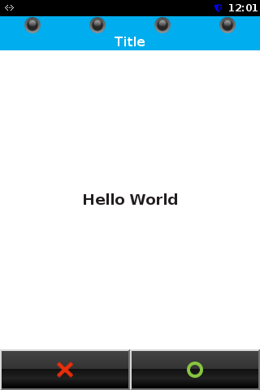                    |
| <p>Dialog with text and 2 buttons</p> |

SDI response for pressed enter button:

``` fragment
9000
```

SDI response for pressed cancel button:

``` fragment
6405
```

**Example 2: Display a YES/NO dialog with a question text and logo (w/o dialog title and CTLS Leds)**

SDI command:

``` fragment
2403 0000 F036FFA01113DFA0130F446F20796F75206C696B652069743FDFA13E03594553DFA140024E4FDFA13D0304005ADFA00502003CDFA00D0101
Content of tag F0:  size=54  {
      FFA011 (display data)  size=19  {
         DFA013 (variable value)  size=15  446F20796F75206C696B652069743F ("Do you like it?")
      }
      DFA13E (Enter button label text)  size=3   594553 ("YES")
      DFA140 (Cancel button label text)  size=2   4E4F ("NO")
      DFA13D (dialog options)  size=3   04005A (DLG_NoHeader|DLG_QuestionLogo|DLG_NoLEDs|DLG_EnterKey|DLG_CancelKey)
      DFA005 (timeout)  size=2   003C (60 seconds)
      DFA00D (beep)  size=1   01 (buzzer when dialog is displayed)
}
```

Display content:

|  |
|----|
| 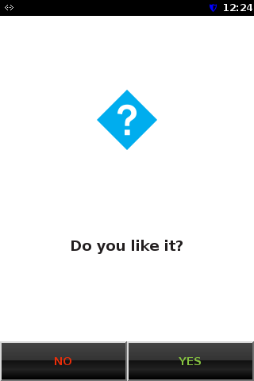 |
| <p>Display a YES/NO dialog with a question text/logo</p> |

SDI response for pressed YES button:

``` fragment
9000
```

SDI response for pressed NO button:

``` fragment
6405
```

SDI response for timeout:

``` fragment
6600
```

**Example 3: Display a text screen on bottom of the screen (w/o softkeys), which uses clear key as additional key action**

SDI command:

``` fragment
2403 0000 F049FFA0111FDFA0131B507265737320636C656172206B657920746F20636F6E74696E7565FFA10615DFA13B042623383BDFA13C0965786974202D313030DFA13D03160010DFA005020000
Content of tag F0:  size=73  {
      FFA011 (display data)  size=31  {
         DFA013 (variable value)  size=27  507265737320636C656172206B657920746F20636F6E74696E7565 ("Press clear key to continue")
      }
      FFA106 (additional key action)  size=21  {
         DFA13B (keycode)  size=4   2623383B ("&#8;")
         DFA13C (action)  size=9   65786974202D313030 ("exit -100")
      }
      DFA13D (dialog options)  size=3   160010 (DLG_ClearOnReturn|DLG_NoHeader|DLG_TextAlignBottomDLG_NoLEDs)
      DFA005 (timeout)  size=2   0000 (infinite)
}
```

Display content:

|                                                                        |
|------------------------------------------------------------------------|
|                                    |
| <p>Text screen w/o softkeys, headline, CTLS Leds</p> |

After this dialog returns, the display is cleared by option `DLG_ClearOnReturn`.

SDI response for pressed clear key:

``` fragment
6400 F008DFA00004FFFFFF9C
Content of tag F0:  size=8   {
      DFA000 (UI error code)  size=4   FFFFFF9C (-100)
}
```

The result `-100` is returned as 6400 with additional UI error code in TLV tag DFA000.

#### Handle Menu (24-05) <a href="#para_sdi_examples_handle_menu" id="para_sdi_examples_handle_menu"></a>

This chapter contains examples for command [Handle Menu (24-05)](#subsubsec_sdi_handle_menu)

**Example 1: Display a menu with 4 options (option 2 pre-selected) including texts for dialog header and menu prompt**

SDI command:

``` fragment
2405 0000 F05DDFA00A0D506C656173652073656C656374DFA00B084F7074696F6E2031DFA00B084F7074696F6E2032DFA00B084F7074696F6E2033DFA00B084F7074696F6E2034DFA00C0102DFA00502001EDFA13D0106DFA14308534449204D656E75
Content of tag F0: size=93  {
      DFA00A (menu text prompt)  size=13  506C656173652073656C656374 ("Please select")
      DFA00B (menu entry text)  size=8   4F7074696F6E2031 ("Option 1" )
      DFA00B (menu entry text)  size=8   4F7074696F6E2032 ("Option 2" )
      DFA00B (menu entry text)  size=8   4F7074696F6E2033 ("Option 3" )
      DFA00B (menu entry text)  size=8   4F7074696F6E2034 ("Option 4" )
      DFA00C (index pre-selected item)  size=1   02
      DFA005 (timeout)  size=2   001E (30 seconds)
      DFA13D (dialog options)  size=1   06 (MENU_ClearOnReturn|MENU_NoLEDs)
      DFA143 (dialog label text)   size=8   534449204D656E75 ("SDI Menu")
}
```

Display content:

|                                                                      |
|----------------------------------------------------------------------|
| 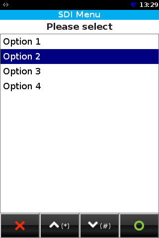                                    |
| <p>Menu with 4 options (option 2 pre-selected)</p> |

After this dialog returns, the display is cleared by option `MENU_ClearOnReturn`.

SDI response for selected option 3:

``` fragment
9000 F005DFA00C0103
Content of tag F0: size=5   {
      DFA00C (selected menu entry)  size=1   03
}
```

SDI response for pressed cancel button:

``` fragment
6405
```

SDI response for timeout:

``` fragment
6600
```

**Example 2: Display a menu with 3 options (no option pre-selected) and button text labels, clear key used as additional key action to move selection down**

SDI command:

``` fragment
2405 0000 F075DFA00A1153656C65637420796F7572206472696E6BDFA00B055761746572DFA00B06436F66666565DFA00B0442656572DFA00C0100DFA005020000DFA13D0102DFA13E0653656C656374DFA1400541626F7274DFA141025570DFA14204446F776EFFA10610DFA13B042623383BDFA13C04646F776E
Content of tag F0: size=117 {
      DFA00A (menu text prompt)  size=17  53656C65637420796F7572206472696E6B ("Select your drink")
      DFA00B (menu entry text)  size=5   5761746572 ("Water")
      DFA00B (menu entry text)  size=6   436F66666565 ("Coffee")
      DFA00B (menu entry text)  size=4   42656572 ("Beer")
      DFA00C (index pre-selected item)  size=1   00 (none)
      DFA005 (timeout)  size=2   0000 (infinite)
      DFA13D (dialog options)  size=1   02 (MENU_NoLEDs)
      DFA13E (Enter button label text)  size=6   53656C656374 ("Select")
      DFA140 (Cancel button label text)  size=5   41626F7274 ("Abort")
      DFA141 (Up button label text)  size=2   5570 ("Up")
      DFA142 (Down button label text) size=4   446F776E ("Down")
      FFA106 (additional key action)  size=16  {
         DFA13B   size=4   2623383B ("&#8;")
         DFA13C   size=4   646F776E ("down")
      }
}
```

Display content:

  ----------------------------------------------------------------------------
  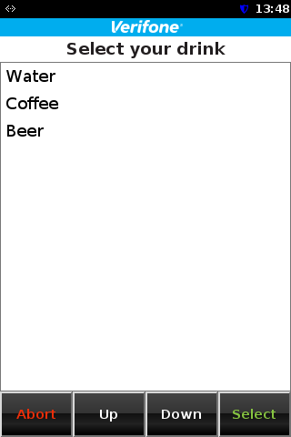

  <p>Menu with 3 options (none pre-selected) and button text labels
  Dialog header contains default logo.</p>
  ----------------------------------------------------------------------------

SDI response for selected option 1:

``` fragment
9000 F005DFA00C0101
Content of tag F0: size=5   {
      DFA00C (selected menu entry)  size=1   01
}
```

SDI response for pressed Abort button:

``` fragment
6405
```

#### Handle HTML dialog (24-0A) <a href="#para_sdi_examples_handle_html_dialog" id="para_sdi_examples_handle_html_dialog"></a>

This chapter contains an example for command [Handle HTML Dialog (24-0A)](#subsubsec_sdi_handle_html_dialog)

**Example: Display a dialog for input tip**

SDI command:

``` fragment
240A 0000 F058DFA020087469702E68746D6CFFA01113DFA01206616D6F756E74DFA013053130303030FFA01114DFA012097468726573686F6C64DFA01303323030FFA01113DFA0120863757272656E6379DFA01303455552DFA005020000
Content of tag F0:  size=88  {
      DFA020 (HTML file name)  size=8   7469702E68746D6C ("tip.html")
      FFA011 (display data)  size=19  {
         DFA012 (variable name)  size=6   616D6F756E74 ("amount")
         DFA013 (variable value)  size=5   3130303030 ("10000")
      }
      FFA011 (display data)  size=20  {
         DFA012 (variable name)  size=9   7468726573686F6C64 ("threshold")
         DFA013 (variable value)  size=3   323030 ("200")
      }
      FFA011 (display data)  size=19  {
         DFA012 (variable name)  size=8   63757272656E6379 ("currency")
         DFA013 (variable value)  size=3   455552 ("EUR")
      }
      DFA005 (timeout)  size=2   0000 (infinite)
}
```

Display content:

|                                                    |
|----------------------------------------------------|
| 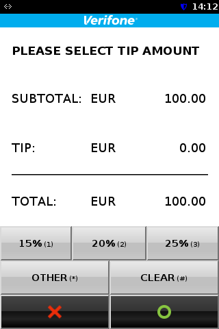             |
| <p>HTML dialog for tip input</p> |

SDI response for successful input (25% button pressed and confirmed)

``` fragment
9000 F06FFFA01413DFA01506616D6F756E74DFA016053130303030FFA01413DFA0150863757272656E6379DFA01603455552FFA01414DFA015097468726573686F6C64DFA01603323030FFA0140FDFA01503746970DFA0160432353030FFA01412DFA01505746F74616CDFA016053132353030
Content of tag F0:  size=111 {
      FFA014 (output data)  size=19  {
         DFA015 (variable name)  size=6   616D6F756E74 ("amount")
         DFA016   size=5   3130303030 ("10000")
      }
      FFA014 (output data)  size=19  {
         DFA015 (variable name)  size=8   63757272656E6379 ("currency")
         DFA016 (variable value)  size=3   455552 ("EUR")
      }
      FFA014 (output data)  size=20  {
         DFA015 (variable name)  size=9   7468726573686F6C64 ("threshold")
         DFA016 (variable value)  size=3   323030 ("200")
      }
      FFA014 (output data)  size=15  {
         DFA015 (variable name)  size=3   746970 ("tip")
         DFA016 (variable value)  size=4   32353030 ("2500")
      }
      FFA014 (output data)  size=18  {
         DFA015 (variable name)  size=5   746F74616C ("total")
         DFA016 (variable value)  size=5   3132353030 ("12500")
      }
}
```

## VCL Particularities <a href="#subsec_sdi_vcl_particularities" id="subsec_sdi_vcl_particularities"></a>

When using the SDI Server with enabled VCL (e.g. in North America), the following points should be taken into account:

- A SDI whitelist.json is not necessary/supported and should therefore not loaded on the device. Instead, the VCL BinTable mechanism works as usual.

## Obsolete Commands <a href="#subsec_sdi_obsolete_commands" id="subsec_sdi_obsolete_commands"></a>

The following commands are obsolete and should no longer be used!

- MSR Enable (21-00)
- PED Enable (22-00)
- Card Detect Enable (23-00)
- Display Enable (24-00)
- Smart Card Enable (41-00)
