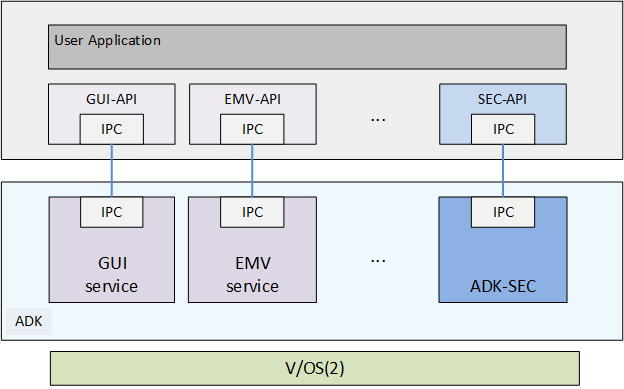
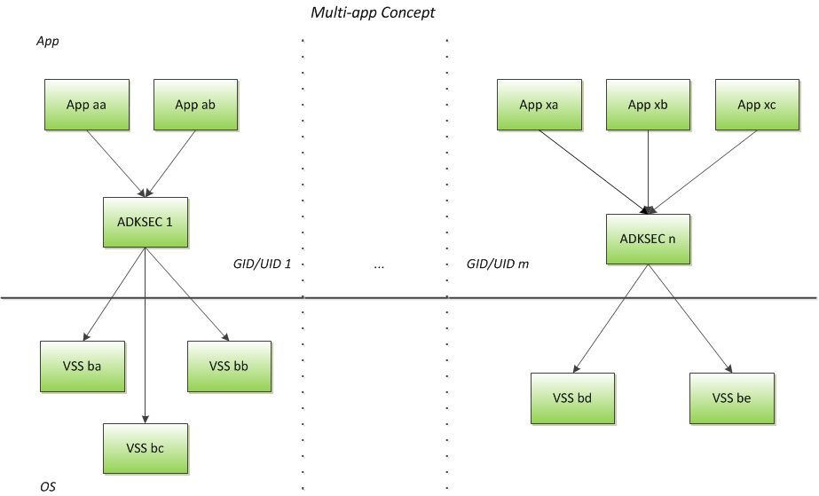
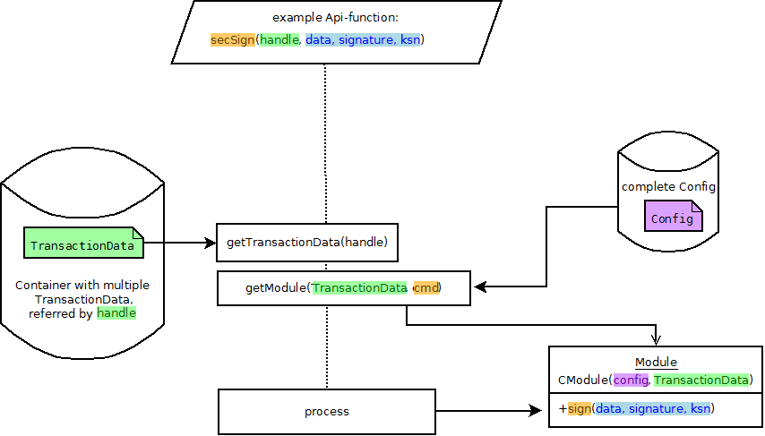
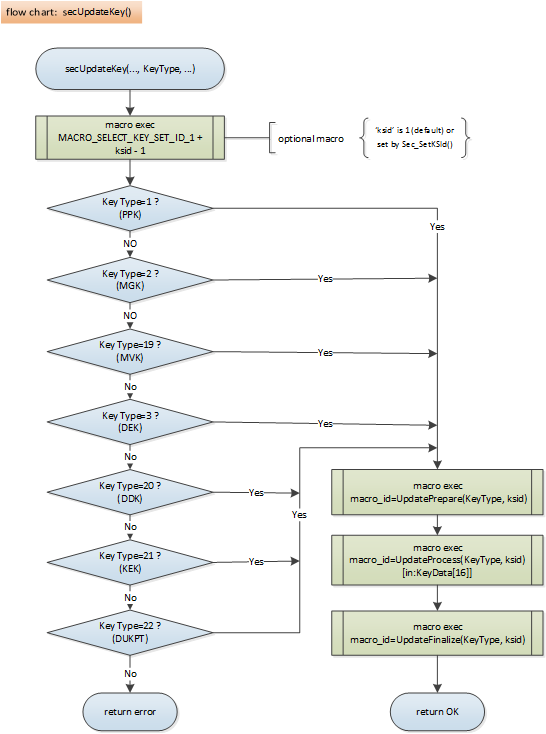
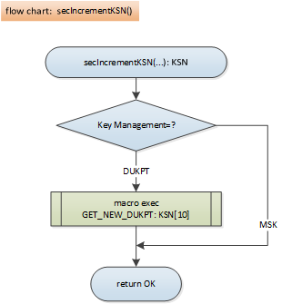
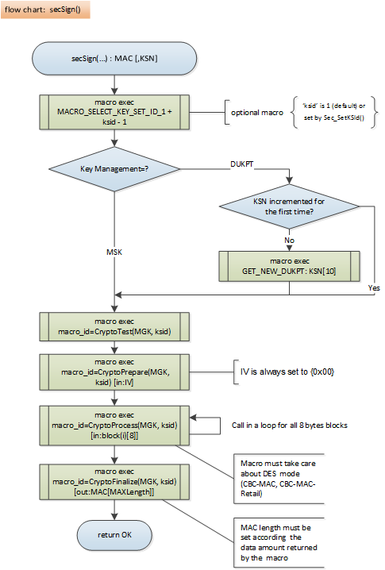
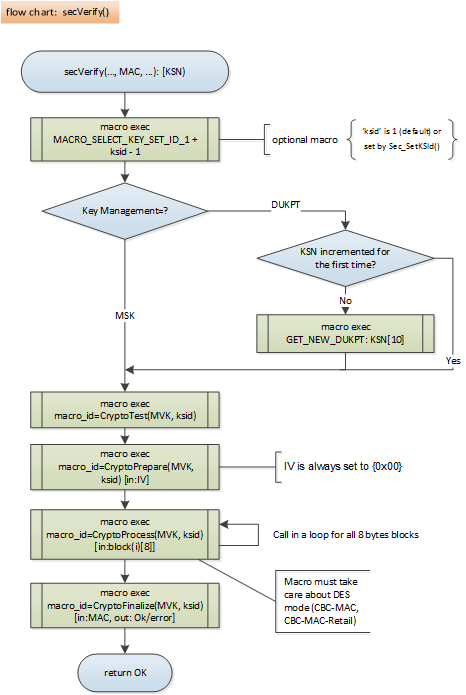
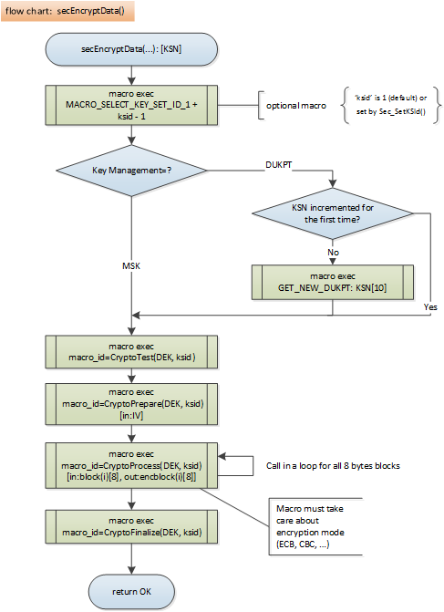
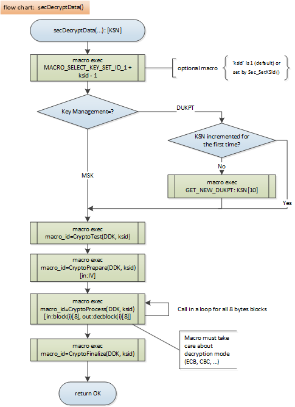
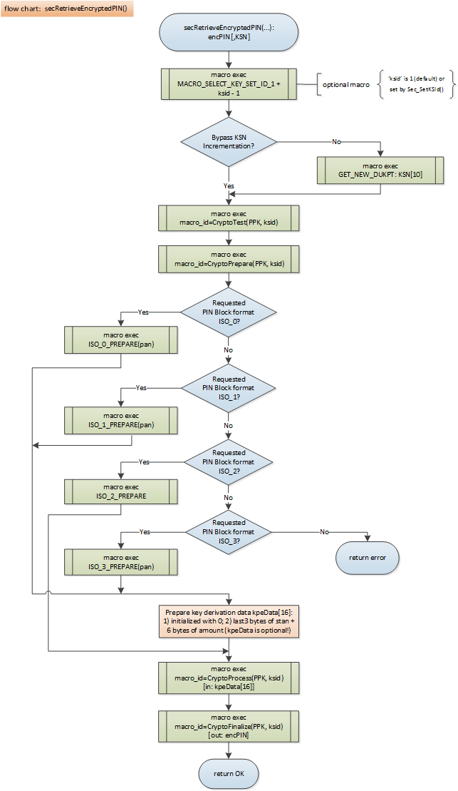

# Preface <a href="#preface" id="preface"></a>

This document is for programmers and developers who want to understand and use the ADK Security Service.

## Audience <a href="#subsec_security_audience" id="subsec_security_audience"></a>

This guide provides all the information required for application developers to integrate and utilize the functionality of the ADK Security Service. In this document, the ADK Security Service is also referred to as ADK-SEC.

## Organization <a href="#subsec_security_organization" id="subsec_security_organization"></a>

This guide is organized as follows:

[Chapter 1, Introduction](#sec_security_introduction): Provides a general introduction to ADK-SEC.

[Chapter 2, Getting Started](#sec_security_getting_started): Presents an introduction in ADK-SEC usage.

[Chapter 3, Programming](#sec_security_programming): Supplies ADK-SEC programming information.

[Chapter 4, System Setup and Requirements](#sec_security_system_setup): Presents environment setup and dependencies.

[Chapter 5, Troubleshooting](#sec_security_troubleshooting): Gives solutions for possible issues in ADK-SEC.

[Appendix A, JSON Schemes, Configuration and Output Examples](#page_adksec_appendix_json_config): Provides JSON Schemes for the configuration and for function outputs as well as a configuration and an output example.

[Appendix B, VSS Specific Programming](#page_adksec_appendix_vss_specific_programming): Presents special programming and setup for VSS usage.

[Appendix C, Reserved VSS Macros and Script Examples](#page_adksec_appendix_reserved_vss_macro_and_example): Provides a list of reserved VSS macros and presents VSS scripts as examples.

[Appendix D, PIN Block Formats](#page_adksec_appendix_pin_block_formats): Lists the supported PIN block formats.

[Appendix E, Migration Guide](#page_adksec_appendix_migration_guide): Gives advise for changeover to new ADK-SEC.

[Appendix F, Special Features](#page_adksec_appendix_special_features): Describes how to use special features.

[Appendix G, Acronyms Definition](#page_adksec_appendix_acronyms_definition): Lists and defines various acronyms and terms.

# Introduction <a href="#sec_security_introduction" id="sec_security_introduction"></a>

*ADK Security Service*

The ADK Security Service, or ADK-SEC, covers all functionalities as key update, PIN encryption, MAC generation/verification and data encryption/decryption which are needed to develop a payment application.

With version 2.0 the ADK Security Service was restructured and enhanced to realize the Encryption Governor concept. This concept brings all encryption schemes under one API and makes it easier for applications to use ADK-SEC.

Some key features of ADK-SEC:

- Master Session Key, DUKPT and RSA support
- Support of various cryptographic systems as VSS, IPP, RSA, ADE
- PIN encryption
- MAC generation and verification
- Data encryption and decryption
- Key update outside a secure room
- Multiple configurations based on hosts

ADK-SEC is to be used in conjunction with user applications and services (e.g.: DirectGUI). It resides on the terminal as a separate task that can be installed, configured and maintained independently from the main payment application.

ADK-SEC communicates with a controlling application via an internal messaging system (IPC) and is isolated from the controlling application. To relieve the application developer from the IPC communication a function API (ADK-SEC-API) is provided.
This API is mandatory if an application developer will use ADK-SEC.

The following illustration shows the command flow for ADK-SEC.



## Concepts <a href="#sec_concepts" id="sec_concepts"></a>

ADK-SEC is a self-contained component that interacts with some of the key services that makes up a typical ADK-based solution.

ADK-SEC is based on the following concepts:

- [Security Modules](#subsubsec_security_security_modules)
- [Security Schemes](#subsubsec_security_security_schemes)
- [Multiple Host Support](#subsubsec_security_multiple_host_support)
- [Generic Function API](#subsubsec_security_generic_function_api)
- [Configurable API](#subsubsec_security_configurable_api)
- [Transaction Data](#subsubsec_security_transaction_data)
- [Key Management](#subsubsec_security_key_management)
- [VSS Script Based Security Engines](#subsubsec_security_vss)
- [Flexible Key Addressing](#subsubsec_security_flexible_key_addressing)
- [Flexible Macro Selection in VSS Scripts](#subsubsec_security_flexible_macro_selection_in_vss)
- [PIN Handling](#subsubsec_security_pin_handling)
- [Multiple Application Support](#subsubsec_security_multiple_app_support)

### Security Modules <a href="#subsubsec_security_security_modules" id="subsubsec_security_security_modules"></a>

ADK-SEC provides the concept of abstract modules which are implementations of cryptographic systems. Following Security Modules are currently supported by ADK-SEC:

- <a href="group___config.md#vss">VSS</a>
- <a href="group___config.md#ipp">IPP</a> (IPPmsk and IPPdukpt)
- <a href="group___config.md#rsa">RSA</a>
- <a href="group___config.md#sred">SRED</a>
- <a href="group___config.md#ade">ADE</a>
- <a href="group___config.md#visadsp">VisaDSP</a>
- <a href="group___config.md#cryptorw">CryptoRW</a>
- <a href="group___config.md#aes">AES</a>

Descriptions (relevant API functions, configuration characteristics and examples, JSON-formatted outputs of API functions) can be found in <a href="group___config.md#vss">VSS</a>, <a href="group___config.md#ipp">IPP</a>, <a href="group___config.md#rsa">RSA</a>, <a href="group___config.md#sred">SRED</a>, <a href="group___config.md#ade">ADE</a>, <a href="group___config.md#visadsp">VisaDSP</a>, <a href="group___config.md#cryptorw">CryptoRW</a>, <a href="group___config.md#aes">AES</a>.

Hint: A list of available Security Modules can be obtained by the API function <a href="namespacecom__verifone__seccmd.md#a008e3cde266f576be23846d0c7b729c5">secGetStatus()</a>

### Security Schemes <a href="#subsubsec_security_security_schemes" id="subsubsec_security_security_schemes"></a>

A Security Scheme includes mandatory and optional settings (i.e. script name, PIN block format, \...) for cryptographically schemes like VSS-MSK encryption, IPP-DUKPT encryption, \... .
A Security Scheme has to be defined in the ADK-SEC configuration (see [ADK-SEC Configuration](#subsubsec_security_adksec_configuration)).

### Multiple Host Support <a href="#subsubsec_security_multiple_host_support" id="subsubsec_security_multiple_host_support"></a>

A Host defines the individual and selectable security area for an application and is based on a Security Scheme and a Security Module.
A Host has to be set up in the ADK-SEC configuration and is identified by an unique string - the Hostname. The Hostname has to be used by applications to open the related Host (see <a href="namespacecom__verifone__seccmd.md#a8091d419f67f4b53630f2fabe1888a09">secOpen()</a>).
ADK-SEC supports multiple Host configuration and usage.

Examples for how to set up Security Schemes and Hosts can be found in [Configuration File Example](#sec_json_config_example).

*Special handling for External/Local SDI clients:*
most crypto operations are restricted for applications connecting from the outside world. Projects, which want to use the ADK-SEC crypto interface via SDI remote connections, can "unlock" this restriction using ***"UntrustedAllowed"*** flag in host configuration. This must be done separately for each host configuration. All other host configurations which do not have this setting flag stays restricted for crypto operation.
An example of ADK-SEC host configuration (sccfg.json) for outside usage:

``` cpp
{
  "adksecconfig": {
   "hosts":
   [
   {
   "name": "ADE-DUKPT",
   "description": "this is ADE DUKPT configuration",
   "module": "ADE",
   "scheme": "schemeADE"
   }
   ],
   "serviceCfg":
   {
   "secSchemes":
   [
   {
   "name": "schemeADE",
   "settings": {
   "UntrustedAllowed": true,
   "padding": "PKCS7",
   "KeyManagementType": "DUKPT",
   "KeyAddressTable": [
   {"description": "| 1 | 2 | 3 | 4 | 5 | 6 | 7 | 8 | 9 | 10 "},
   {"encryptData": ["0", "1", "2", "3", "4", "5", "6", "7", "8", "9"]}
   ]
   }
   }
   ]
   }
  }
}
```

**Please note that it is the responsibility of these projects that unlocked ADKSEC functions are not misused.**

### Generic Function API <a href="#subsubsec_security_generic_function_api" id="subsubsec_security_generic_function_api"></a>

ADK-SEC provides a set of generic API functions which can be used by payment applications to handle cryptographic operations.
The functions and their interfaces are common for all Security Schemes. Their modes of operation depend on the opened Host.
For the Generic Function API see <a href="libsec_8h.md">libsec.h</a>.

### Configurable API <a href="#subsubsec_security_configurable_api" id="subsubsec_security_configurable_api"></a>

All needed properties to handle cryptographic operations are configured in a JSON formatted file per host (see [ADK-SEC Configuration](#subsubsec_security_adksec_configuration)).

### Transaction Data <a href="#subsubsec_security_transaction_data" id="subsubsec_security_transaction_data"></a>

Sometimes security operations need or deliver special data than can not be provided by input and output parameters of API functions. Therefore ADK-SEC allocates a Transaction Data container which allows multiple data transfer. The container can also hold data during a payment transaction.

Transaction Data may contain

- Hostname
- Card Data (PAN, track data, \...)
- PAN expiry
- Encryption parameters
- Data stored or used by modules

Each data is assigned to a predefined or freely chosen tag index which holds a permission attribute for read/write access and for private or public usage (data hiding).
The following API functions manage Transaction Data:

- <a href="namespacecom__verifone__seccmd.md#ac31ab997e8dc434d72e427a5d841186a">secClearTransactionData()</a>
- <a href="namespacecom__verifone__seccmd.md#a6bc0d39e1739680282d33d3d68df84c9">secPutTransactionData()</a>
- <a href="namespacecom__verifone__seccmd.md#a85ada2e35c1d1cbf60c05454b88b4b44">secGetTransactionValue()</a>
- <a href="namespacecom__verifone__seccmd.md#af127868b6268758596f8a2a1ca0aaab3">secGetPermission()</a>

### Key Management <a href="#subsubsec_security_key_management" id="subsubsec_security_key_management"></a>

Verifone payment terminals have installed the Verifone generated basic system key KLK (Key Loading Key).
For VSS key management scheme the KLK protects VSS scripts updates with security memory content preservation and may control loading of subsequent keys.
Each POS provider uses his own Key Management Scheme and provides proprietary keys to be maintained in terminal (acquirer keys).

Note that Manufacturer Key Loading and loading of basic acquirer keys is not the task of ADK-SEC.
Nevertheless ADK-SEC provides the API function <a href="namespacecom__verifone__seccmd.md#ab249c77069e9fc9946745fd4c63d5e39">secUpdateKey()</a> to load various keys used by diverse Security Modules.

### VSS Script Based Security Engines <a href="#subsubsec_security_vss" id="subsubsec_security_vss"></a>

ADK-SEC employs the concept of different Security respective VSS Engines implemented via VeriShield Security Scripts (VSS). Each engine is implemented in its own VSS script and initialized at the start of the application.

Application developers responsibility is to provide appropriate VSS scripts.

### Flexible Key Addressing <a href="#subsubsec_security_flexible_key_addressing" id="subsubsec_security_flexible_key_addressing"></a>

ADK-SEC provides the possibility to use multiple keys or key sets to allow user applications to handle multiple host and multiple merchants systems.

A dedicated key or key set is identified by a number called KeySetId and can be selected by the API function <a href="namespacecom__verifone__seccmd.md#a75edecb24f839e04debb1aa5e47b5714">secSetKSId()</a>.
The KeySetId has different meanings in the VSS module and Non-VSS modules.

*Non VSS modules*
A Key Address Table can be defined in the ADK-SEC configuration file (see [ADK-SEC Configuration](#subsubsec_security_adksec_configuration)). The table determines which key slots will be accessed by corresponding API functions.

*VSS module*
For this consider the concept of [Flexible Macro Selection in VSS Scripts](#subsubsec_security_flexible_macro_selection_in_vss) in the next section.

### Flexible Macro Selection in VSS Scripts <a href="#subsubsec_security_flexible_macro_selection_in_vss" id="subsubsec_security_flexible_macro_selection_in_vss"></a>

To achieve more flexibility for project specific requirements on cryptographic operations the concept of Flexible Macro Selection in VSS Scripts is implemented in ADK-SEC.
The macro selection is based on the KeySetId Table (see [Key-Set-ID Table](#subsec_ksitab)) which includes VSS macro IDs for different Key Types and functional steps. The table is predefined in ADK-SEC and can be updated by the VSS developer.

### PIN Handling <a href="#subsubsec_security_pin_handling" id="subsubsec_security_pin_handling"></a>

In opposite to former ADK-SEC versions (1.6.x) PIN entry by ADK-SEC is no longer supported. The user application itself has to care for PIN entry while ADK-SEC retrieves the stored PIN and creates the encrypted PIN block.

The application of UI is highly country resp. region specific and depends on domestic specifications and customer requirements. This is why ADK strictly separates business logic from GUI interface. Applications need to have all possible flexibility to realize customer-specific and region-specific applications.
An example for a PIN entry implementation which uses ADK-GUI component DirectGUI can be seen in the source code of the Demo Application sub-function requestPIN() (see [Use the API Functions](#subsec_use_api_functions)).

### Multiple Application Support <a href="#subsubsec_security_multiple_app_support" id="subsubsec_security_multiple_app_support"></a>

Multiple Application Support is a feature that provides the ability to use the ADK Security Service by multiple applications resp. multiple instances of an application at the same time.



Security Service provides a possibility to be accessed from multiple applications in parallel. Following rules are realized:

- Multiple start of one service instance per user/group is possible
- Two and more user applications can use security service at the same time
- User application can connect to security service instance only if running under the same user/group
- Each request processing is done in a sequential mode to avoid influences of other application changes
- PIN activities are locked for applications that are not running under same user/group of the application that has initiated the activity. Such applications cannot retrieve an entered PIN,
  cancel an activity or restart/initiate a PIN entry.

The separation of access rights for VSS scripts installed for different user/group spaces is provided by the OS.


# Getting Started <a href="#sec_security_getting_started" id="sec_security_getting_started"></a>

This chapter will help you to apply ADK-SEC security operations for your payment application. This will be illustrated by a simple Demo Application.

Following tasks have to be performed:

- [Setup the Configuration](#subsec_setup_configuration)
- [Use the API Functions](#subsec_use_api_functions)
- [Build the Application and Setup a Device](#subsec_use_build_adksec_packages)

Following requirements are specified for the Demo Application:

- the payment application shall handle card data reading, PIN entry and encryption, data encryption and MAC generation
- card data are provided to ADK-SEC but shall be hidden
- PIN shall be retrieved and encrypted using PIN Block Format ISO-0
- the security scheme shall be VSS based using DUKPT key management scheme
- the application shall run on V/OS and V/OS2 devices

### Remarks

The Demo Application was extended by the functionality \'Visa DSP cardholder encryption\'. For details see [Visa DSP with Point-to-Point Encryption](#subsubsec_feature_visa_dsp).

## Setup the Configuration <a href="#subsec_setup_configuration" id="subsec_setup_configuration"></a>

The Demo Application uses the hosts \"01\" and \"05\". The corresponding configuration can be found in the file `sccfg`.`json` (see [Configuration File Example](#sec_json_config_example)):

``` fragment
{
  "adksecconfig": {
     . . .
    "hosts":
    [
      {
        "name": "01",
        "scheme": "schemeVSSMSK",
        "module": "VSS"
      }, {
        "name": "05",
        "scheme": "schemeIPPDUKPT",
        "module": "IPPdukpt"
      }, {
      . . .  
```

For detailed information see [ADK-SEC Configuration](#subsubsec_security_adksec_configuration).

The host configuration will be effective by calling *secOpen(\"01\", handle)* and *secOpen(\"05\", handle)*.

## Use the API Functions <a href="#subsec_use_api_functions" id="subsec_use_api_functions"></a>

By means of the Demo Application `DemoApp`. `cpp` it is illustrated how to use the ADK-SEC API functions for various operations in a payment application.

***Demo Application description***
A functionality description can be found in <a href="_demo_app_8cpp.md#demoapplication">DemoApplication</a>.

***Demo Application implementation***
Following ADK-SEC header files are included in the Demo Application:

- <a href="libsec_8h.md">libsec.h</a> (mandatory)
- <a href="sec2_8h.md">sec2.h</a> (already included by <a href="libsec_8h.md">libsec.h</a>)
- <a href="sec_error_8h.md">secError.h</a> (already included by <a href="libsec_8h.md">libsec.h</a>)
- <a href="_c_transaction_data_8h.md">CTransactionData.h</a> (already included by <a href="libsec_8h.md">libsec.h</a>)

Additionally following ADK header files are included:

- <a href="liblog_8h.md">liblog.h</a> (for ADK-LOG usage)
- <a href="gui_8h.md">gui.h</a> (for ADK-GUIPRT usage)

The Demo Application source code is contained in the ADK-SEC delivery package in folder *doc/sec/example_2.x/DEMO/src*.

## Build the Application and Setup a Device <a href="#subsec_use_build_adksec_packages" id="subsec_use_build_adksec_packages"></a>

A description can be found in <a href="_demo_app_8cpp.md#demoapplication">DemoApplication</a>.

# Programming <a href="#sec_security_programming" id="sec_security_programming"></a>

ADK-SEC offers the whole functionality needed by a payment application developers to perform cryptographic operations.
Therefore ADK-SEC provides a generic API.
The following sections give an overview of the API header files and functions.

Before using the API the security service has to be configured (see [ADK-SEC Configuration](#subsubsec_security_adksec_configuration)).

## Generic API <a href="#subsec_generic_api" id="subsec_generic_api"></a>

### API Header Files <a href="#subsubsec_header_files" id="subsubsec_header_files"></a>

The following header files provide the ADK-SEC API:

- <a href="sec2_8h.md">sec2.h</a> - - General definitions, \'define\' and \'typedef\' instructions
- <a href="sec_error_8h.md">secError.h</a> - - Error Codes grouped by ADK-SEC parts where they occur
- <a href="_c_transaction_data_8h.md">CTransactionData.h</a> - - Public definitions for Transaction Data handling
- <a href="libsec_8h.md">libsec.h</a> - - API function definitions

### Use the API functions <a href="#subsubsec_mandatory_api_functions" id="subsubsec_mandatory_api_functions"></a>

To use ADK-SEC in an application implementation the following functions are needed to be called in subsequent order:

- <a href="namespacecom__verifone__seccmd.md#ab649bee85abb5cb4085c3958f279483d">secInit()</a> -
- <a href="namespacecom__verifone__seccmd.md#a8091d419f67f4b53630f2fabe1888a09">secOpen()</a> -
- sec\...() - API functions for application needs
- <a href="namespacecom__verifone__seccmd.md#a34f8a9e3b92467759d0bbdbf7b2dd8c0">secClose()</a> -
- <a href="namespacecom__verifone__seccmd.md#a644b5479904871433cffef9145c53dad">secDestroy()</a> -

If a Security Module is opened a new Transaction Data container is created which can be accessed by the following API functions using the handle returned by <a href="namespacecom__verifone__seccmd.md#a8091d419f67f4b53630f2fabe1888a09">secOpen()</a>.

- <a href="namespacecom__verifone__seccmd.md#ac31ab997e8dc434d72e427a5d841186a">secClearTransactionData()</a> -
- <a href="namespacecom__verifone__seccmd.md#a6bc0d39e1739680282d33d3d68df84c9">secPutTransactionData()</a> -
- <a href="namespacecom__verifone__seccmd.md#a85ada2e35c1d1cbf60c05454b88b4b44">secGetTransactionValue()</a> -
- <a href="namespacecom__verifone__seccmd.md#af127868b6268758596f8a2a1ca0aaab3">secGetPermission()</a> -

Following API functions are usable if a Security Module was opened:

- <a href="namespacecom__verifone__seccmd.md#a75edecb24f839e04debb1aa5e47b5714">secSetKSId()</a> -
- <a href="namespacecom__verifone__seccmd.md#a79b00ea8a8aed3b7950800bf136a1944">secGetKeyInventory()</a> -
- <a href="namespacecom__verifone__seccmd.md#aff0a109c58ef5637c7bf3ffc0722c48d">secGetKeyData()</a> -
- <a href="namespacecom__verifone__seccmd.md#ab249c77069e9fc9946745fd4c63d5e39">secUpdateKey()</a> -
- <a href="namespacecom__verifone__seccmd.md#a77860b4cffed3ba159a5c124c8e2cde2">secIncrementKSN()</a> -
- <a href="namespacecom__verifone__seccmd.md#aa58bc1a6a2056aebd3edc92f3bfcce9d">secEncryptData()</a> -
- <a href="namespacecom__verifone__seccmd.md#aaed6fc175245ba31936547cffd988948">secEncryptTransactionData()</a> -
- <a href="namespacecom__verifone__seccmd.md#a9cd679dc9763b06566dff28b3d3268c9">secDecryptData()</a> -
- <a href="namespacecom__verifone__seccmd.md#a66a1992f617359f2e4a96f4980478f82">secSign()</a> -
- <a href="namespacecom__verifone__seccmd.md#a5470ce89fa947abc445f251ae0b2387b">secVerify()</a> -
- <a href="namespacecom__verifone__seccmd.md#ab3d26136c64019fd223aa9ccd120d4e0">secRetrieveEncryptedPIN()</a> -

Following API functions are usable independent from an opened Security Module:

- <a href="namespacecom__verifone__seccmd.md#a008e3cde266f576be23846d0c7b729c5">secGetStatus()</a> -
- <a href="namespacecom__verifone__seccmd.md#a5499423d685ed9deb7ace9c22114adf2">secGetVersions()</a> -
- <a href="namespacecom__verifone__seccmd.md#a5ea5cbc9daa2ea726212741cd596b294">secGetApiVersion()</a> -
- <a href="namespacecom__verifone__seccmd.md#a029d7e16ab6b044379e9568a6c969afa">secGetSvcVersion()</a> -

What happens internally:

- serialize input parameters and command type (cmd)
- send via IPC
- de-serialize command type
- use handle to get TransactionData (TD)
- use configuration, TD and cmd to get specific module name and configuration for current command
- create a module object which will live during executing of this cmd only (forward TD and current configuration to this module)
- de-serialize input parameters
- call cmd of specific module and forward input parameters to corresponding method
- serialize output, send via IPC, de-serialize, return



A description of Security Modules (functionality, provided API functions, configuration) can be found in <a href="group___config.md#vss">VSS</a>, <a href="group___config.md#ipp">IPP</a>, <a href="group___config.md#rsa">RSA</a>, <a href="group___config.md#sred">SRED</a>, <a href="group___config.md#ade">ADE</a>, <a href="group___config.md#visadsp">VisaDSP</a>, <a href="group___config.md#cryptorw">CryptoRW</a>, <a href="group___config.md#aes">AES</a>.

For VSS based Security Modules there is an additional description regarding script and macro handling (see [VSS Specific Programming](#sec_vss_specific_programming) ).

## Special Features <a href="#special_features" id="special_features"></a>

### Additional Key Types <a href="#subsubsec_additional_kt" id="subsubsec_additional_kt"></a>

Detailed description can be found in section [Additional Key Types](#sec_additional_key_types).

### VSS Variable Block Size <a href="#subsubsec_variable_blocksize" id="subsubsec_variable_blocksize"></a>

The feature was implemented to fulfill following requirements:

- Encryption or MAC-ing of data which cannot be padded to 8-byte length (e.g. HMAC, padding to 8-byte length is not possible)
- Performance improvement on encryption and MAC-ing of big data volumes

Detailed description can be found in section [Variable Block Size Feature](#sec_security_vss_vbs).

### Visa DSP with Point-to-Point Encryption <a href="#subsubsec_feature_visa_dsp" id="subsubsec_feature_visa_dsp"></a>

The service Visa DSP with Point-to-Point Encryption will have two methods to provide PCI point-to-point cardholder data encryption according the requirements of Visa Data Secure Platform (VisaDSP):

- Standard Point-to-Point Encryption (P2PE)
- Format-Preserving Encryption (FPE)

Both methods are different, but use a DUKPT key management scheme with the same keys.

Additionally the service provides a PIN block encryption (PIN request handling is not covered by ADK-SEC).

The following features are required by VisaDSP:

- the data key variant of the DUKPT key shall be used for data encryption and the PIN key variant for PIN block encryption
- the same DUKPT key (same Initial Key and same Key Serial Number) shall be used for both within a transaction: for deriving a data key variant and for deriving a PIN key variant
- 3DES encryption algorithm shall be used for all encryption operations
- P2PE algorithm uses CBC mode with 8-byte blocks
- FPE algorithm uses Visa FPE mode

***VisaDSP in ADK-SEC***

In ADK-SEC the feature VisaDSP is implemented for platform **V/OS2 only**.

The data and PIN block encryption with VisaDSP is based on the IPP DUKPT or ADE DUKPT key management scheme, but with one restriction: PIN block encryption is not possible on ADE DUKPT.
The desired scheme can be selected in the ADK-SEC configuration file.
The DUKPT initial key and the Initial KSN have to be loaded for the corresponding scheme at first. But be aware that key loading is not the task of ADK-SEC.
Nevertheless ADK-SEC provides the API function <a href="namespacecom__verifone__seccmd.md#ab249c77069e9fc9946745fd4c63d5e39">secUpdateKey()</a> to load an initial DUKPT key and an IKSN (see also [Key Management](#subsubsec_security_key_management)).

The ADK-SEC API functions used on P2PE and FPE method are the same. The method is determined by the configuration.
The key variant selection is handled by ADK-SEC internally.

VisaDSP functionality is provided by the module `VisaDSP` (see [Security Modules](#subsubsec_security_security_modules)).

On the P2PE method the data encryption function additionally performs an obfuscation of each cardholder data item based on the plain data (For details on obfuscation please refer to the correspnding documentation for Visa DSP).
The encryption result is provided the API function <a href="namespacecom__verifone__seccmd.md#aaed6fc175245ba31936547cffd988948">secEncryptTransactionData()</a>. An obfuscated data item can be retrieved by API function <a href="namespacecom__verifone__seccmd.md#a85ada2e35c1d1cbf60c05454b88b4b44">secGetTransactionValue()</a>.

A detailed description can be found in section [Visa DSP](#sec_feature_visa_dsp).

# System Setup and Requirements <a href="#sec_security_system_setup" id="sec_security_system_setup"></a>

## Compiler and Linker Settings <a href="#subsec_security_compiler_linker_settings" id="subsec_security_compiler_linker_settings"></a>

## Hardware <a href="#subsec_security_hardware" id="subsec_security_hardware"></a>

ADK-SEC is running on any V/OS(2) hardware platform, like P400, V200, Mx925, \...

## Software <a href="#subsec_security_software" id="subsec_security_software"></a>

ADK-SEC is designed to be platform agnostic and will be supported on V/OS and V/OS2 terminal operating systems.

This section describes

- [ADK-SEC Configuration](#subsubsec_security_adksec_configuration)
- [Additional Library Dependencies](#subsubsec_security_additional_library_dependencies)

VSS specific setups are described in [VSS Setup](#sec_vss_setup).

### ADK-SEC Configuration <a href="#subsubsec_security_adksec_configuration" id="subsubsec_security_adksec_configuration"></a>

The user has to provide a JSON formatted file where he can specify his individual configuration.
The default file name is `sccfg`.`json` and the default installation path is `home/` `usr`.

The configuration file is structured in parts for Security Schemes and Hosts by the following JSON objects:

- \"serviceCfg\": Service Configuration:
  - \"secSchemes\": definition of Security Scheme names and parameters (based on Security Modules)
- \"hosts\": Host Configuration - definition of host names (based on Security Schemes)

The syntax of the configuration file is determined by the ADK-SEC JSON Schema (`adksecconfig_schema`. `json`, see [JSON Schema for Configuration File](#sec_json_config_schema)) which is part of the ADK-SEC delivery.
A configuration file should always be evaluated against the ADK-SEC JSON Schema (`adksecconfig_schema`. `json`) before the installation. Therefore a free available JSON Schema Validator can be used.

A configuration file example can be found in [Configuration File Example](#sec_json_config_example).

Examples for Security Module specific configurations can be obtained by <a href="group___config.md#vss">VSS</a>, <a href="group___config.md#ipp">IPP</a>, <a href="group___config.md#rsa">RSA</a>, <a href="group___config.md#sred">SRED</a>, <a href="group___config.md#ade">ADE</a>, <a href="group___config.md#visadsp">VisaDSP</a>, <a href="group___config.md#cryptorw">CryptoRW</a>, <a href="group___config.md#aes">AES</a>.

Finally the configuration file has to be loaded in the device. For user individual naming and installation see ([Installation Path for Configuration Files](#subsubsec_security_installation_path_config_files)).

### Additional Library Dependencies <a href="#subsubsec_security_additional_library_dependencies" id="subsubsec_security_additional_library_dependencies"></a>

*Additional Libraries for Linking*
The following additional libraries are used internally by ADK-SEC and need to be linked to the application in order to resolve all unknown symbols.

*Table: Libraries to be linked*

| Library | Description |
|----|----|
| <p>libvfiipc.so</p> | <p>ADK IPC shared library</p> |
| <p>liblog.so</p> | <p>ADK LOGGING shared library</p> |

*Libraries on the Device*
The following additional libraries must be available to run the ADK security component (see [ADK-SEC Binary Deliveries](#subsub_adksec_binary_deliveries)).

*Table: Libraries on device*

| Library | Description | Package |
|----|----|----|
| <p>libvfiguiprt.so</p> | <p>ADK GUI/Printer shared library</p> | <p>dl.libvfiguiprt-\*.tar</p> |
| <p>libvfiipc.so</p> | <p>ADK IPC class library</p> | <p>dl.libvfiipc-\*.tar</p> |
| <p>liblog.so</p> | <p>ADK LOGGING shared library</p> | <p>dl.liblog-\*.tar</p> |

In this case the shared libraries `libvfiipc.so` and `libvfiguiprt.so` have to be available (see [ADK-SEC API Library and Header Files](#subsubsec_security_sec_api_library_and_header_files)).
For supporting logging by ADK-LOG the daemon `syslog.out` has to be loaded in the device (`dl.syslog-*\` c.zip).

## Deliverables and Deployment <a href="#subsec_security_deliverables" id="subsec_security_deliverables"></a>

Additionally to ADK-SEC binary the installation of relevant platform packages is necessary.

### ADK-SEC Binary Deliveries <a href="#subsub_adksec_binary_deliveries" id="subsub_adksec_binary_deliveries"></a>

| File | Purpose |
|----|----|
| <p>scapp2</p> | <p>ADK-SEC</p> |
| <p>libsec2.so</p> | <p>ADK-SEC shared API library</p> |

### ADK-SEC API Library and Header Files <a href="#subsubsec_security_sec_api_library_and_header_files" id="subsubsec_security_sec_api_library_and_header_files"></a>

Following shared library has to be linked to applications:

- `libsec2`. `so` (Security API)

ADK-SEC API provides the following header files:

| File | Purpose |
|----|----|
| <p><a href="libsec_8h.md">libsec.h</a></p> | <p>exported functions</p> |
| <p><a href="sec2_8h.md">sec2.h</a></p> | <p>exported preprocessor and data definitions</p> |
| <p><a href="sec_error_8h.md">secError.h</a></p> | <p>exported error codes</p> |
| <p><a href="_c_transaction_data_8h.md">CTransactionData.h</a></p> | <p>exported class for Transaction Data handling</p> |

### Installation Path for Configuration Files <a href="#subsubsec_security_installation_path_config_files" id="subsubsec_security_installation_path_config_files"></a>

ADK-SEC provides several possibilities to set up the path where a configuration file can be installed and found.

The default path for the configuration file is the \"home\" directory, on V/OS(2) this is the user home directory.

Another option is to define a sub-path of the \"home\" directory of absolute path to config file. The (sub-)path can be determined by the environment variable SCAPPCFG. This can contain only path to config file. In this case default file name sccfg.json will be used.
If the security service should be started implicitly the environment variable must be provided by user application package.

Examples:

- Add `SCAPPCFG=flash/myconfig.json` to environment file (Please refer to \"VOS Secure Installer ERS\" document, chapter \"Package env file\")

A further possibility is to set up a configuration path to use the directory "\<HOME\>/ADK/sec/".
If this exists it is used as the default path and has priority over the user home directory. This allows users to create a symlink to "\<HOME\>/ADK/sec/" to link to any other directory (e.g. flash for write permissions).

ADK-SEC searches for a configuration path on the following priority of set-ups:
*1. Environment variable SCAPPCFG*
*2. Default configuration directory "\<HOME\>ADK/sec/"*
*3. Home directory*

### Service startup <a href="#subsubsec_security_running_of_service" id="subsubsec_security_running_of_service"></a>

The ADK-SEC package is a system signed package.
Applications run the service implicitly by calling <a href="namespacecom__verifone__seccmd.md#ab649bee85abb5cb4085c3958f279483d">secInit()</a> if it is an user application.

- The package will be installed on sys13
- scapp2 is placed in /home/sys13/lib/
- After implicit launch of security service it runs with same credential uid:gid as the application
- Restriction: VSS must be installed for same uid:gid as the application. In case if ADK-SEC must be used from system application, a separate launcher is required as sys10 user to use VSS functionality.

Multiple start of ADK-SEC per user group is prevented. That means ADK-SEC is only started once for each user group.

Important note:

- Users should not start security service (scapp2) to avoid conflicts with implicit start from <a href="namespacecom__verifone__seccmd.md#ab649bee85abb5cb4085c3958f279483d">secInit()</a>
- The environment variable SCAPPCFG must be provided by user application package
- Not recommended: If security service (scapp2) shall be started explicitly (secure installer, MAC, run script), users have to take care that security service (scapp2) is started before <a href="namespacecom__verifone__seccmd.md#ab649bee85abb5cb4085c3958f279483d">secInit()</a>.

# Troubleshooting <a href="#sec_security_troubleshooting" id="sec_security_troubleshooting"></a>

## Logging <a href="#subsec_security_troubleshooting_logging" id="subsec_security_troubleshooting_logging"></a>

ADK-LOG is used to provide logging messages for diagnostics and problem analysis of ADK-SEC security service.

Logging messages are redirected to the output channel `syslog`.

According to new ADK-LOGGING configuration model the logging level can be configured via LCP or JSON formatted configuration file. ADKSEC uses:

- SEC_log.conf file for service and libsec logging configuration

For additional information about logging please refer to ADK-LOGGING documentation.

## Debugging <a href="#subsec_security_troubleshooting_debugging" id="subsec_security_troubleshooting_debugging"></a>

A debug version of ADK-SEC can be provided individually upon request.

Any logging messages are printed on console via COM Port 1.

## Frequently Asked Questions <a href="#subsec_security_troubleshooting_faq" id="subsec_security_troubleshooting_faq"></a>

### How can I get information about error codes? <a href="#subsubsec_security_troubleshooting_faq_1" id="subsubsec_security_troubleshooting_faq_1"></a>

Error codes are returned by API functions as 4-byte values. They are grouped and therefore composed as a sum of a 4-byte error group (*enum secErrorGroup*) and a 2-byte offset.
The corresponding values, symbolic identifiers (*enum secError*) and descriptions can be found in <a href="sec_error_8h.md">secError.h</a>.
If the symbolic identifier was found a click on it will lead to the description.

*Example*

- *secRetrieveEncrypedPIN()* delivers the errCode=0x00120002. What is the reason?
- For 0x00120000 find error group *EsecGroupEncIPP* in <a href="sec_error_8h.md">secError.h</a>, for *EsecGroupEncIPP*+0x0002=0x00120002 find *EsecIPPSelectMK*.
- This leads to the desciption \"Select MK failed\". So, please check if a Master Key was loaded.

### What is the reason for failures with error code 0x00030006 (EsecIPCComNotInit)? <a href="#subsubsec_security_troubleshooting_faq_2" id="subsubsec_security_troubleshooting_faq_2"></a>

<a href="namespacecom__verifone__seccmd.md#ab649bee85abb5cb4085c3958f279483d">secInit()</a> is the first ADK-SEC API function an application must call to start the security service (scapp2) and to establish an IPC connection.
The error EsecIPCComNotInit is returned by ADK-SEC API functions in the following scenarios:

- <a href="namespacecom__verifone__seccmd.md#ab649bee85abb5cb4085c3958f279483d">secInit()</a> has not be called firstly
- scapp2 is not installed

### What could be reasons for unexpected behavior of API functions? <a href="#subsubsec_security_troubleshooting_faq_3" id="subsubsec_security_troubleshooting_faq_3"></a>

Reason could be: <a href="namespacecom__verifone__seccmd.md#a8091d419f67f4b53630f2fabe1888a09">secOpen()</a> is provided with a non existing host name parameter.
In his case <a href="namespacecom__verifone__seccmd.md#a8091d419f67f4b53630f2fabe1888a09">secOpen()</a> will not fail as it uses the \'default\' host name.
This will lead to an unexpected behavior.
So, please ensure that the selected host is available in the configuration file `sccfg`.`json` (see [Configuration File Example](#sec_json_config_example)).

### Hence after migrating to ADK-SEC-2.x, the SCAPP package should be removed from CAMCORE bundle? The ADK-SEC will be started automatically on each restart? <a href="#subsubsec_security_troubleshooting_faq_4" id="subsubsec_security_troubleshooting_faq_4"></a>

SCAPP package:

- SCAPP package for ADK-SEC 1.x is user signed and needs to be signed/loaded in scope of the application.
- SCAPP package for ADK-SEC 2.x is system signed and already comes with the full ADK bundle. Applications don\'t need to care about SCAPP packaging and signing.

SCAPP start: Both ADK-SEC 1.x and ADK-SEC 2.x contain mechanism to implicit start SCAPP via <a href="namespacecom__verifone__seccmd.md#a9871b00715c29b88812f6cbe88657a21">Sec_Init()</a> (ADK-SEC 1.x) or <a href="namespacecom__verifone__seccmd.md#ab649bee85abb5cb4085c3958f279483d">secInit()</a> (ADK-SEC 2.x) calls. This mechansim was introduced with ADK-SEC release 1.6.0 (see ADKSEC-487). There is no need to start SCAPP by the application.
<a href="namespacecom__verifone__seccmd.md#ab649bee85abb5cb4085c3958f279483d">secInit()</a> API must be called before performing any other ADK-SEC operation. As mentioned before, this function will start the SCAPP and establish the IPC conntection between the application/libsec and the SCAPP.

### What is the relation between the different ADE sections in host configurations & the one in secScehemes section? <a href="#subsubsec_security_troubleshooting_faq_5" id="subsubsec_security_troubleshooting_faq_5"></a>

<a href="namespacecom__verifone__seccmd.md#a8091d419f67f4b53630f2fabe1888a09">secOpen()</a> is required to select a specific host configuration and the returned handle has to be used in subsequent operations. You can see this handle as a reference to the selected host configuration. In ADK-SEC 1.x there was an alternate approach to provide the host configuration (host ID) directly with the ADK-SEC APIs. Due to new host configuration approach and unifying ADK-SEC APIs in 2.x, all APIs will work with configuration handle as selected by <a href="namespacecom__verifone__seccmd.md#a8091d419f67f4b53630f2fabe1888a09">secOpen()</a>.
Configuration schemes are schemes that can be used within multiple host configurations. You can see the scheme as a default configuration that can be used for several host configurations, e.g. in above example \"schemeADE\" is used in host configurations \"07\", \"ADE-DUKPT\", \"ADE-DUKPT1\" and \"ADE-DUKPT2\". When providing a scheme in the configuration, the values from the scheme will loaded as defaults for the selected configuration, but you can also overwrite specific settings with new values specified in your specific host configuration. E.g. in above example the host \"07\" works with setting from \"schemeADE\" as is, while host \"ADE-DUKPT\" overloads the padding from \"schemeADE\" (\"padding\": \"PKCS7\") with a new value (\"padding\": \"NONE\").

### Hence with the test configuration sccfg.json how to use the ADE enrcryption? Also what does the numbers in \"encryptData\" field indicate? <a href="#subsubsec_security_troubleshooting_faq_6" id="subsubsec_security_troubleshooting_faq_6"></a>

(Test configuration `sccfg`.`json` can be found here: [Configuration File Example](#sec_json_config_example))
Regarding how to use the configuration for ADE encryption, provide an ADE host configuration according your needs, select the host config with <a href="namespacecom__verifone__seccmd.md#a8091d419f67f4b53630f2fabe1888a09">secOpen()</a> and encrypt the data with <a href="namespacecom__verifone__seccmd.md#aa58bc1a6a2056aebd3edc92f3bfcce9d">secEncryptData()</a> using the handle returned by <a href="namespacecom__verifone__seccmd.md#a8091d419f67f4b53630f2fabe1888a09">secOpen()</a>.
The numbers in \"encryptData\" field indicate different key slots for usage with <a href="namespacecom__verifone__seccmd.md#aa58bc1a6a2056aebd3edc92f3bfcce9d">secEncryptData()</a>. You can select a key with <a href="namespacecom__verifone__seccmd.md#a75edecb24f839e04debb1aa5e47b5714">secSetKSId()</a> to be used with <a href="namespacecom__verifone__seccmd.md#aa58bc1a6a2056aebd3edc92f3bfcce9d">secEncryptData()</a>. The numbers in \"encryptData\" field will map a KeySetID to a specific key slot, e.g. in above configuration KeySetId 1 maps to key slot \"0\", KSId 2 maps to key slot \"1\" \...

### What is the difference between secEncryptData() & secEncryptTransactionData() API. <a href="#subsubsec_security_troubleshooting_faq_7" id="subsubsec_security_troubleshooting_faq_7"></a>

The difference between <a href="namespacecom__verifone__seccmd.md#aa58bc1a6a2056aebd3edc92f3bfcce9d">secEncryptData()</a> & <a href="namespacecom__verifone__seccmd.md#aaed6fc175245ba31936547cffd988948">secEncryptTransactionData()</a> API is as follows:

- <a href="namespacecom__verifone__seccmd.md#aa58bc1a6a2056aebd3edc92f3bfcce9d">secEncryptData()</a> will encrypt the data provided in plainData argument.
- <a href="namespacecom__verifone__seccmd.md#aaed6fc175245ba31936547cffd988948">secEncryptTransactionData()</a> will encrypt the transaction data referenced by the index for the transaction data previously set with setPutTransactionData().

### VSS scripts from SEC1 is not working in SEC2 and log reports \"script \<xxx\> is not installed in system and cannot be used!\" <a href="#subsubsec_security_troubleshooting_faq_8" id="subsubsec_security_troubleshooting_faq_8"></a>

SEC1 uses script in defined via xx.cfg slot without checking of the name. SEC2 searches for script in system defined in sccfg.json in tag \"scriptName\": independent from installed slot where is this script. The script name is in this case \"SCRIPT \<script name\>\" from .vss. Please correct sccfg.json with right value \"scriptName\": "\<script name\>"

Example of <a href="namespacecom__verifone__seccmd.md#aaed6fc175245ba31936547cffd988948">secEncryptTransactionData()</a> usage:

``` cpp
SecTransactionData_t taData;
taData["Zungenbrecher"] = sPlainText;
secPutTransactionData(g_Handle, taData);
secEncryptTransactionData(g_Handle, "Zungenbrecher", encryptedData, iv, ksn));
```

### VSS scripts from SEC1 is not working in SEC2 and log reports \"script \<xxx\> is not installed in system and cannot be used!\" <a href="#subsubsec_security_troubleshooting_faq_8" id="subsubsec_security_troubleshooting_faq_8"></a>

The class reference and provided APIs in CModADE.h are for internal use only and not accessible from the application. Applications should use the APIs provided in <a href="libsec_8h.md">libsec.h</a>.

### secGetKeyInventory() can be used instead of ade_status() for retrieving the ade state? <a href="#subsubsec_security_troubleshooting_faq_9" id="subsubsec_security_troubleshooting_faq_9"></a>

Yes, <a href="namespacecom__verifone__seccmd.md#a79b00ea8a8aed3b7950800bf136a1944">secGetKeyInventory()</a> can be used to check the ade state. It will provide information if ADE is enable and active and information about the ADE keys loaded to the different key slots.

### Is it possible to perform encryption using different key slots for different data? E.g. dataset1 is encrypted using the ADE Key in slot 1, dataset2 is encrypted using ADE key in slot 2. In such case how do we change the key slot for encryption? <a href="#subsubsec_security_troubleshooting_faq_10" id="subsubsec_security_troubleshooting_faq_10"></a>

Yes, it is possible to perform encryption using different key slots for different data. Please see above description about \"encryptData\" field to indicate different key slots and select the keys with <a href="namespacecom__verifone__seccmd.md#a75edecb24f839e04debb1aa5e47b5714">secSetKSId()</a> before encrypting the data with <a href="namespacecom__verifone__seccmd.md#aa58bc1a6a2056aebd3edc92f3bfcce9d">secEncryptData()</a>.

### When the RSA key is installed in OS i.e. using VRK, how do we configure the same in any of the RSA schemes? <a href="#subsubsec_security_troubleshooting_faq_11" id="subsubsec_security_troubleshooting_faq_11"></a>

Normally, VRK installs keys in /mnt/flash/system/\<key type\>/\<user\>/ on the device. In ADK-SEC configuration both absolute path and relative to /mnt/flash/system/ can be used. Same key can be referenced by multiple host configurations/schemes.

### For the RSA keys loaded using secUpdateKey(), how do we mention the same in the scheme or host configuration(s)? <a href="#subsubsec_security_troubleshooting_faq_12" id="subsubsec_security_troubleshooting_faq_12"></a>

Working RSA public keys (certificates) loaded via <a href="namespacecom__verifone__seccmd.md#ab249c77069e9fc9946745fd4c63d5e39">secUpdateKey()</a> are stored in ADK-SEC and can be referenced only by host. In host configuration "internal" marker must be used.

### Is there a possibility that we can just download the key onto the terminal (e.g. say the key is in /home/usr1/flash location) and use the same as it is i.e. without performing the load operation using UpdateKey()? <a href="#subsubsec_security_troubleshooting_faq_13" id="subsubsec_security_troubleshooting_faq_13"></a>

In case of "just" loaded keys on the terminal, these RSA public keys (and certificates) must be referenced in host configuration with full path+file name. Please note a restriction that no private RSA key can be recognized by ADK-SEC. VRK is one way to install it to use private RSA key for decryption/signing operation.

### How we can use different public RSA keys for same crypto operation defined in \"WMT-CardData-SHA1\" (see config example)? What value do we provide the \"ksid\" parameter to get the corresponding key in effect? <a href="#subsubsec_security_troubleshooting_faq_14" id="subsubsec_security_troubleshooting_faq_14"></a>

(Test configuration `sccfg`.`json` can be found here: [Configuration File Example](#sec_json_config_example))
setKeySetId() works with Key Index. In case of \"WMT-CardData-SHA1\" host configuration following key will be used for <a href="namespacecom__verifone__seccmd.md#aa58bc1a6a2056aebd3edc92f3bfcce9d">secEncryptData()</a> if setKeySetId() called before:

- setKeySetId(hdl, 1) -\> /home/usr1/wmt-pki/encr_pub.pem
- setKeySetId(hdl, 2) -\> /home/usr1/wmt-pki/enc2_pub.pem
- setKeySetId(hdl, 3) -\> <a href="namespacecom__verifone__seccmd.md#aa58bc1a6a2056aebd3edc92f3bfcce9d">secEncryptData()</a> fails with error

The same for <a href="namespacecom__verifone__seccmd.md#a5470ce89fa947abc445f251ae0b2387b">secVerify()</a>:

- setKeySetId(hdl, 1) -\> /home/usr1/wmt-pki/vali_pub.pem
- setKeySetId(hdl, 2) -\> /home/usr1/wmt-pki/vali_pub.pem
- setKeySetId(hdl, 3) -\> <a href="namespacecom__verifone__seccmd.md#a5470ce89fa947abc445f251ae0b2387b">secVerify()</a> fails with error

In other words, just use the sequence

``` cpp
setKeySetId(hdl, x);
sec<crypto operation>(hdl,…)
```

if crypto operation must be performed with key index "x". \"KeyAddressTable\" looks like an array of keys \[ksId 1, ksid 2,...\] for each crypto operation

# Appendix A: JSON Schemes, Configuration and Output Examples <a href="#page_adksec_appendix_json_config" id="page_adksec_appendix_json_config"></a>

This document provides the following JSON Schemes and JSON examples:

- [JSON Schema for Configuration File](#sec_json_config_schema)
- [Configuration File Example](#sec_json_config_example)
- [JSON Schema for Output of secGetKeyInventory()](#sec_json_secgetkeyinventory_schema)
- [JSON Schema for Output of secGetStatus()](#sec_json_secgetstatus_schema)
- [Output example of secGetStatus()](#sec_json_secgetstatus_output_example)

## JSON Schema for Configuration File <a href="#sec_json_config_schema" id="sec_json_config_schema"></a>

The following ADK-SEC JSON schema defines the possible values to be used in the configuration file and can be used for validation.

``` cpp
{
  "$schema": "http://json-schema.org/draft-06/schema#",
  "$id": "http://json-schema.org/draft-06/schema#",
  "definitions": {
   "command":{
   "enum":[
   "updateKey",
   "getKeyInfo",
   "getKeyInventory",
   "encryptData",
   "decryptData",
   "sign",
   "verify",
   "retrieveEncPIN"
   ]
   },
   "KeyAdressMappingTable": {
   "type":"array",
   "items":{ "type": "string" },
   "uniqueItems": false,
   "minItems": 1
   },
   "moduleSettings": {
   "type": "object",
   "properties": {
   "PINBlockFormat": {
   "enum": [
   "ISO0",
   "ISO1",
   "ISO2",
   "ISO3",
   "ISO4"
   ]
   },
   "KeyManagementType": {
   "enum": [
   "MSK",
   "DUKPT",
   "ADE",
   "SRED",
   "AS2805"
   ]
   },
   "encMode": {
   "enum": [
   "MODE_ECB",
   "MODE_CBC"
   ]
   },
   "keyVariant": {
   "enum": [
   "X924_MAC_REQ_BW",
   "X924_MAC_RESP",
   "X924_DE_REQ_BW"
   ]
   },
   "algo": {
   "enum": [
   "DES112",
   "ALG_9797_MAC_1",
   "ALG_9797_MAC_1A",
   "ALG_9797_MAC_2",
   "ALG_9797_MAC_3",
   "ALG_9797_MAC_4",
   "ALG_9797_MAC_5",
   "ALG_9797_MAC_5A",
   "ALG_CMAC_TDEA",
   "ALG_HMAC_SHA256"
   ]
   },
   "IVType": {
   "enum": [
   "NONE",
   "ZERO",
   "RANDOM",
   "USER_DEFINED"
   ]
   },
   "padding": {
   "enum": [
   "NONE",
   "PKCS1",
   "PKCS1_OAEP",
   "PKCS7",
   "X923",
   "ISO7816",
   "ZERO",
   "FF",
   "SPACE",
   "ISO10126",
   "ISO9797_1",
   "ISO9797_2"
   ]
   },
   "KSNincrementation": {
   "description": "BY_OPERATION - (default) by each operation generate a next KSN, BY_API - manage next KSN explicit via secUpdateKey()",
   "enum": [
   "BY_OPERATION",
   "BY_API"
   ]
   },
   "KeyManagementOption":{
   "type": "string",
   "pattern": "^[a-fA-F0-9]{3}$",
   "description": "[KMM + DEMF] according IPP Packet 17 (see OS Programmers Manual)"
   },
   "KeyAddressTable":{
   "type": "array",
   "items": {
   "properties":{
   "updateKey":{
   "type": "object",
   "$ref": "#/definitions/KeyAdressMappingTable"
   },
   "getKeyInfo":{
   "type": "object",
   "$ref": "#/definitions/KeyAdressMappingTable"
   },
   "getKeyInventory":{
   "type": "object",
   "$ref": "#/definitions/KeyAdressMappingTable"
   },
   "encryptData":{
   "type": "object",
   "$ref": "#/definitions/KeyAdressMappingTable"
   },
   "decryptData":{
   "type": "object",
   "$ref": "#/definitions/KeyAdressMappingTable"
   },
   "sign":{
   "type": "object",
   "$ref": "#/definitions/KeyAdressMappingTable"
   },
   "verify":{
   "type": "object",
   "$ref": "#/definitions/KeyAdressMappingTable"
   },
   "retrieveEncPIN":{
   "type": "object",
   "$ref": "#/definitions/KeyAdressMappingTable"
   }
   }
   },
   "additionalItems": false,
   "uniqueItems": true,
   "minItems": 1
   },
   "encMethod": {
   "enum": [
   "HMAC",
   "CMAC"
   ]
   },
   "hashType": {
   "enum": [
   "SHA1",
   "SHA224",
   "SHA256",
   "SHA384",
   "SHA512"
   ]
   },
   "calcHash": {
   "enum": [
   "yes",
   "no"
   ]
   },
   }
   },
   "moduleScheme": {
   "type": "object",
   "properties": {
   "name": {"type": "string"},
   "settings": {"$ref": "#/definitions/moduleSettings"},
   "scriptFileName": { "type": "string"},
   "scriptName": { "type": "string"}
   },
   "required": ["name", "settings"]
   },
   "moduleElement": {
   "enum": [
   "VSS", "BENDIGO",
   "IPPmsk", "IPPdukpt",
   "ADE", "VCL", "SREDMAC",
   "Voltage", "VisaDSP",
   "RSA", "AES"
   ]
   },
   "keyMapElement": {
   "description": "mapping between KeySetId and in OS installed key",
   "type": "object",
   "properties": {
   "keySetId": { "type": "integer" },
   "realKey": { "type": "string" }
   }
   },
   "hostElement": {
   "type": "object",
   "description": "`scheme` is a reference to `name` of moduleScheme object",
   "properties": {
   "name": { "type": "string" },
   "module": { "$ref": "#/definitions/moduleElement" },
   "scheme": { "type": "string" },
   "settings": { "$ref": "#/definitions/moduleSettings" },
   "hosts": {
   "type": "array",
   "items": { "$ref": "#/definitions/hostElement" }
   },
   "commands": {
   "type": "array",
   "items": {
   "properties": {
   "command":{ "$ref": "#/definitions/command" },
   "module": { "$ref": "#/definitions/moduleElement" },
   "scheme": { "type": "string" },
   "settings": {"$ref": "#/definitions/moduleSettings" },
   "useParentSettings": { "type": "boolean" },
   "hosts": {
   "type": "array",
   "items": { "$ref": "#/definitions/hostElement" }
   }
   },
   "required": ["command", "module"]
   }
   },
   "keyMapping": {
   "type": "array",
   "items": { "$ref": "#/definitions/keyMapElement" }
   }
   },
   "required": ["name", "module"]
   }
  },
  "title": "ADKSEC scheme",
  "type": "object",
  "properties": {
   "adksecconfig": {
   "type": "object",
   "properties": {
   "serviceCfg": {
   "type": "object",
   "properties": {
   "secSchemes": {
   "type": "array",
   "items": { "$ref": "#/definitions/moduleScheme" },
   "minItems": 1,
   "uniqueItems": true
   }
   },
   "required": ["secSchemes"]
   },
   "hosts": {
   "type": "array",
   "items": { "$ref": "#/definitions/hostElement" },
   "uniqueItems": true,
   "minItems": 1
   },
   "hostMapping": {
   "type": "array",
   "items": {
   "BINrange": {
   "pattern": "^[0-9-]{2,30}$",
   "type": "string"
   },
   "dataType": { "type": "integer" },
   "technology": { "type": "string" },
   "paymentScheme": { "type": "string" },
   "host": {
   "description":"this is reference to host name",
   "type": "string"
   }
   }
   }
   },
   "required": ["serviceCfg", "hosts"]
   }
  }
}
```

## Configuration File Example <a href="#sec_json_config_example" id="sec_json_config_example"></a>

This is an example of a configuration file for ADK-SEC:

``` cpp
{
  "adksecconfig": {
   "hosts":
   [
   {
   "name": "default",
   "description": "Use this as fallback",
   "scheme": "schemeIPPMSK",
   "module": "IPPmsk",
   "permissions": {
   "testReadOnly": 16,
   "testWriteOnly": 1,
   "testPrivate": 0,
   "testReadWrite": 17
   }
   },
   {
   "name": "01",
   "description": "this is VSS MSK configuration for compatibility with old name handling",
   "scheme": "schemeVSSMSK",
   "module": "VSS"
   },
   {
   "name": "02",
   "description": "this is Bendigo configuration for compatibility with old name handling",
   "scheme": "schemeBendigo",
   "module": "BENDIGO"
   },
   {
   "name": "03",
   "description": "this is VSS DUKPT configuration for compatibility with old name handling",
   "scheme": "schemeVSSDUKPT",
   "module": "VSS"
   },
   {
   "name": "04",
   "description": "this is IPP MSK configuration for compatibility with old name handling",
   "scheme": "schemeIPPMSK",
   "module": "IPPmsk"
   },
   {
   "name": "44",
   "description": "this is IPP MSK configuration for compatibility with old name handling",
   "scheme": "schemeIPPMSK44",
   "module": "IPPmsk"
   },
   {
   "name": "04slotF",
   "description": "this is IPP MSK configuration for compatibility with testing slot F(=15)",
   "scheme": "schemeIPPMSKslotF",
   "module": "IPPmsk"
   },
   {
   "name": "05",
   "description": "this is IPP DUKPT configuration for compatibility with old name handling",
   "scheme": "schemeIPPDUKPT",
   "module": "IPPdukpt"
   },
   {
   "name": "06",
   "description": "this is VSS configuration for HMAC calculation",
   "scheme": "schemeVSSHMAC",
   "module": "VSS"
   },
   {
   "name": "07",
   "description": "this is ADE configuration for compatibility with old name handling",
   "scheme": "schemeADE",
   "module": "ADE"
   },
   {
   "name": "08",
   "description": "this is VSS DUKPT BY OPERATION configuration for compatibility with old name handling",
   "scheme": "schemeVSSDUKPTBYAPI",
   "module": "VSS"
   },
   {
   "name": "09",
   "description": "this is IPP MSK configuration for compatibility with old name handling",
   "scheme": "schemeIPPMSKFALSE",
   "module": "IPPmsk"
   },
   {
   "name": "10",
   "description": "this is IPP DUKPT configuration for compatibility with old name handling",
   "scheme": "schemeIPPDUKPTFALSE",
   "module": "IPPdukpt"
   },
   {
   "name": "11",
   "description": "this is IPP MSK configuration for compatibility with old name handling",
   "scheme": "schemeIPPMSKNULLSK",
   "module": "IPPmsk"
   },{
   "name": "ADE-DUKPT",
   "description": "this is ADE DUKPT configuration",
   "module": "ADE",
   "scheme": "schemeADE",
   "settings": {
   "encMode": "MODE_CBC",
   "IVType": "ZERO",
   "padding": "NONE"
   }
   },
   {
   "name": "ADE-DUKPT-KSN_BY_API",
   "description": "this is ADE DUKPT configuration",
   "scheme": "schemeADE",
   "module": "ADE",
   "settings":
   {
   "encMode": "MODE_CBC",
   "IVType": "ZERO",
   "KSNincrementation": "BY_API",
   "padding": "NONE"
   }
   },
   {
   "name": "ADE-DUKPT1",
   "description": "this is ADE DUKPT configuration",
   "module": "ADE",
   "scheme": "schemeADE",
   "settings": {
   "encMode": "MODE_ECB",
   "IVType": "ZERO",
   "padding": "NONE"
   }
   },
   {
   "name": "ADE-DUKPT2",
   "description": "this is ADE DUKPT configuration",
   "module": "ADE",
   "scheme": "schemeADE",
   "settings": {
   "encMode": "MODE_CBC",
   "IVType": "RANDOM",
   "KSNincrementation": "BY_API",
   "padding": "PKCS7"
   }
   },
   {
   "name": "IPPhost",
   "description": "",
   "scheme": "schemeIPPMSK",
   "module": "IPPmsk"
   },
   {
   "name": "BendigoHost",
   "scheme": "schemeBendigo",
   "module": "BENDIGO",
   "commands": [
   {
   "command": "retrieveEncPIN",
   "module": "BENDIGO",
   "useParentSettings": true
   },
   {
   "command": "updateKey",
   "module": "BENDIGO",
   "useParentSettings": true
   }
   ]
   },
   {
   "name": "VoltageHost1",
   "description": "",
   "scheme": "schemeVoltage",
   "module": "Voltage",
   "settings": {
   "TrackEncryptionProtocol": "TEP1",
   "bbParamsFileName": "www/voltage/bbparams.1024"
   },
   "permissions": {
   "TagPAN": 1,
   "TagMID": 1,
   "TagPANandCVV": 1,
   "TagTrack1": 1,
   "TagTrack2": 1,
   "TagTrack3": 1,
   "TagAlphaNum": 1,
   "TagByteArray": 1
   }
   },
   {
   "name": "VoltageHost2",
   "description": "",
   "scheme": "schemeVoltage",
   "module": "Voltage",
   "settings": {
   "TrackEncryptionProtocol": "TEP2",
   "bbParamsFileName": "www/voltage/bbparams.1024"
   },
   "permissions": {
   "TagPAN": 1,
   "TagMID": 1,
   "TagPANandCVV": 1,
   "TagTrack1": 1,
   "TagTrack2": 1,
   "TagTrack3": 1,
   "TagAlphaNum": 1,
   "TagByteArray": 1
   }
   },
   {
   "name": "VoltageHost1x",
   "description": "",
   "scheme": "schemeVoltage",
   "module": "Voltage",
   "settings": {
   "TrackEncryptionProtocol": "TEP1x"
   },
   "permissions": {
   "TagPAN": 1,
   "TagMID": 1,
   "TagPANandCVV": 1,
   "TagTrack1": 1,
   "TagTrack2": 1,
   "TagTrack3": 1,
   "TagAlphaNum": 1,
   "TagByteArray": 1
   }
   },
   {
   "name": "VoltageHost2x",
   "description": "",
   "scheme": "schemeVoltage",
   "module": "Voltage",
   "settings": {
   "TrackEncryptionProtocol": "TEP2x"
   },
   "permissions": {
   "TagPAN": 1,
   "TagMID": 1,
   "TagPANandCVV": 1,
   "TagTrack1": 1,
   "TagTrack2": 1,
   "TagTrack3": 1,
   "TagAlphaNum": 1,
   "TagByteArray": 1
   }
   },
   {
   "name": "VoltageHost4",
   "description": "",
   "scheme": "schemeVoltage",
   "module": "Voltage",
   "settings": {
   "TrackEncryptionProtocol": "TEP4"
   },
   "permissions": {
   "TagPAN": 1,
   "TagMID": 1,
   "TagPANandCVV": 1,
   "TagTrack1": 1,
   "TagTrack2": 1,
   "TagTrack3": 1,
   "TagAlphaNum": 1,
   "TagByteArray": 1
   }
   },
   {
   "name": "VisaDSP_P2PE_Host",
   "description": "for P2PE algo usage (IPP-DUKPT)",
   "scheme": "schemeVisaDSP",
   "module": "VisaDSP",
   "settings": {
   "encryptionAlgo": "P2PE",
   "KeyManagementOption": "0A3",
   "KeyAddressTable": [
   {"description": "| 1 | 2 | 3 | <- KeySetId (3 slots)"},
   {"updateKey": ["0", "1", "2"]},
   {"encryptData": ["0", "1", "2"]},
   {"retrieveEncPIN": ["0", "1", "2"]}
   ]
   },
   "permissions": {
   "TagPAN": 1,
   "TagCHName": 1,
   "TagTrack1": 1,
   "TagTrack2": 1
   }
   },
   {
   "name": "VisaDSP_P2PE_Host_ADE",
   "description": "for P2PE algo usage (ADE)",
   "scheme": "schemeVisaDSP",
   "module": "VisaDSP",
   "settings": {
   "encryptionAlgo": "P2PE",
   "KeyManagementType": "ADE",
   "KeyAddressTable": [
   {"description": "| 1 | 2 | 3 | <- KeySetId (3 slots)"},
   {"updateKey": ["0", "1", "2"]},
   {"encryptData": ["0", "1", "2"]}
   ]
   },
   "permissions": {
   "TagPAN": 1,
   "TagCHName": 1,
   "TagTrack1": 1,
   "TagTrack2": 1
   }
   },
   {
   "name": "VisaDSP_FPE_Host",
   "description": "IPP-DUKPT usage",
   "scheme": "schemeVisaDSP",
   "module": "VisaDSP",
   "settings": {
   "encryptionAlgo": "FPE",
   "KeyManagementOption": "0A3",
   "KeyAddressTable": [
   {"description": "| 1 | 2 | 3 | <- KeySetId (3 slots)"},
   {"updateKey": ["0", "1", "2"]},
   {"encryptData": ["0", "1", "2"]},
   {"retrieveEncPIN": ["0", "1", "2"]}
   ]
   },
   "permissions": {
   "TagPAN": 1,
   "TagCHName": 1,
   "TagTrack1": 1,
   "TagTrack2": 1
   }
   },
   {
   "name": "VisaDSP_FPE_Host_ADE",
   "description": "ADE usage",
   "scheme": "schemeVisaDSP",
   "module": "VisaDSP",
   "settings": {
   "encryptionAlgo": "FPE",
   "KeyManagementType": "ADE",
   "KeyAddressTable": [
   {"updateKey": ["0", "1", "2"]},
   {"encryptData": ["0", "1", "2"]}
   ]
   },
   "permissions": {
   "TagPAN": 1,
   "TagCHName": 1,
   "TagTrack1": 1,
   "TagTrack2": 1
   }
   },
   {
   "name": "RSA",
   "description": "",
   "scheme": "schemeRSA",
   "module": "RSA"
   },
   {
   "name": "RSA_CalcHashNo",
   "description": "",
   "scheme": "schemeRSA_CalcHashNo",
   "module": "RSA"
   },
   {
   "name": "WMT-CardData-Common",
   "description": "",
   "scheme": "schemeRSA-WMT-PKI",
   "module": "RSA",
   "commands": [
   {
   "command": "encryptData",
   "module": "RSA",
   "settings": {
   "padding": "NONE",
   "KeyAddressTable": [
   {"description": "| 1 | 2 | 3 | 4 | 5 | 6 | 7 | 8 | 9 | 10 | <- KeySetId (10 slots)"},
   {"encryptData": ["internal","internal"]}
   ]
   }
   },
   {
   "command": "verify",
   "module": "RSA",
   "settings": {
   "padding": "PKCS1",
   "hashType": "SHA256",
   "calcHash": "yes",
   "KeyAddressTable": [
   {"description": "| 1 | 2 | 3 | 4 | 5 | 6 | 7 | 8 | 9 | 10 | <- KeySetId (10 slots)"},
   {"verify": ["internal","internal"]}
   ]
   }
   }
   ]
   },
   {
   "name": "WMT-CardData-SHA1",
   "description": "",
   "scheme": "schemeRSA-WMT-PKI",
   "module": "RSA",
   "settings": {
   "padding": "PKCS1",
   "hashType": "SHA1"
   }
   },
   {
   "name": "WMT-CardData-SHA224",
   "description": "",
   "scheme": "schemeRSA-WMT-PKI",
   "module": "RSA",
   "settings": {
   "padding": "PKCS1",
   "hashType": "SHA224"
   }
   },
   {
   "name": "WMT-CardData-SHA384",
   "description": "",
   "scheme": "schemeRSA-WMT-PKI",
   "module": "RSA",
   "settings": {
   "padding": "PKCS1",
   "hashType": "SHA384"
   }
   },
   {
   "name": "WMT-CardData-SHA512",
   "description": "",
   "scheme": "schemeRSA-WMT-PKI",
   "module": "RSA",
   "settings": {
   "padding": "PKCS1",
   "hashType": "SHA512"
   }
   },
   {
   "name": "WMT-CardData-SHA1done",
   "description": "Input data are already SHA-1-hashed",
   "scheme": "schemeRSA-WMT-PKI",
   "module": "RSA",
   "settings": {
   "padding": "PKCS1",
   "hashType": "SHA1",
   "calcHash": "no"
   }
   },
   {
   "name": "WMT-CardData-SHA224done",
   "description": "Input data are already SHA-224-hashed",
   "scheme": "schemeRSA-WMT-PKI",
   "module": "RSA",
   "settings": {
   "padding": "PKCS1",
   "hashType": "SHA224",
   "calcHash": "no"
   }
   },
   {
   "name": "WMT-CardData-SHA256done",
   "description": "Input data are already SHA-256-hashed",
   "scheme": "schemeRSA-WMT-PKI",
   "module": "RSA",
   "settings": {
   "padding": "PKCS1",
   "hashType": "SHA256",
   "calcHash": "no"
   }
   },
   {
   "name": "WMT-CardData-SHA384done",
   "description": "Input data are already SHA-384-hashed",
   "scheme": "schemeRSA-WMT-PKI",
   "module": "RSA",
   "settings": {
   "padding": "PKCS1",
   "hashType": "SHA384",
   "calcHash": "no"
   }
   },
   {
   "name": "WMT-CardData-SHA512done",
   "description": "Input data are already SHA-512-hashed",
   "scheme": "schemeRSA-WMT-PKI",
   "module": "RSA",
   "settings": {
   "padding": "PKCS1",
   "hashType": "SHA512",
   "calcHash": "no"
   }
   },
   {
   "name": "RSApemder",
   "description": "Key as public key, no certificate",
   "scheme": "schemeRSA",
   "module": "RSA",
   "settings": {
   "padding": "NONE",
   "KeyAddressTable": [
   {"encryptData": ["/home/usr1/flash/rsatestkeys/tpublic.key"]}
   ]
   }
   },
   {
   "name": "DUKPTHost01",
   "scheme": "schemeVSSDUKPT",
   "module": "VSS",
   "settings": {
   "KSNincrementation": "BY_API"
   }
   },
   {
   "name": "DUKPTHost02",
   "scheme": "schemeVSSDUKPT_2",
   "module": "VSS"
   },
   {
   "name": "PaymarkVSS",
   "description": "VSS MSK configuration for Paymark (NZ) - administrate additional key types by ksid masking",
   "scheme": "schemePaymarkVSSMSK",
   "module": "VSS"
   },
   {
   "name": "test_multi_module",
   "description": "ADKSEC-440",
   "scheme": "schemeRSA",
   "module": "RSA",
   "commands": [
   {
   "command": "retrieveEncPIN",
   "module": "IPPdukpt",
   "settings": {
   "KeyManagementOption": "0A0",
   "KeyAddressTable": [
   {"description": "| 1 | 2 | 3 | <- KeySetId (3 slots)"},
   {"retrieveEncPIN": ["0", "1", "2"]}
   ]
   }
   }
   ]
   },
   {
   "name": "AESHMAC-sha256",
   "description": "AES DUKPT configuration for HMAC and type SHA256",
   "module": "AES",
   "scheme": "schemeAESDUKPT",
   "settings": {
   "algo": "HMAC",
   "hashType": "SHA256",
   "KSNincrementation":"BY_API"
   }
   },
   {
   "name": "AESHMAC-sha512",
   "description": "AES DUKPT configuration for HMAC and type SHA256",
   "module": "AES",
   "scheme": "schemeAESDUKPT",
   "settings": {
   "algo": "HMAC",
   "hashType": "SHA512",
   "KSNincrementation":"BY_API"
   }
   },
   {
   "name": "AESHMAC-sha224",
   "description": "AES DUKPT configuration for HMAC and type SHA224",
   "module": "AES",
   "scheme": "schemeAESDUKPT",
   "settings": {
   "algo": "HMAC",
   "hashType": "SHA224",
   "KSNincrementation":"BY_API"
   }
   },
   {
   "name": "AESDUKPT_KSN_DEFAULT",
   "description": "AES DUKPT configuration for encryption (CBC, no padding), CMAC, KSN_DEFAULT, key variant default",
   "module": "AES",
   "scheme": "schemeAESDUKPT"
   },
   {
   "name": "AESDUKPT_KSN_BY_API",
   "description": "AES DUKPT configuration for encryption (CBC, no padding), CMAC, KSN_BY_API, key variant default",
   "module": "AES",
   "scheme": "schemeAESDUKPT",
   "settings": {
   "KSNincrementation":"BY_API"
   }
   },
   {
   "name": "AESDUKPT_KSN_BY_OPERATION",
   "description": "AES DUKPT configuration for encryption (CBC, no padding), CMAC, KSN_BY_OPERATION, key variant default",
   "module": "AES",
   "scheme": "schemeAESDUKPT",
   "settings": {
   "KSNincrementation":"BY_OPERATION"
   }
   },
   {
   "name": "AESDUKPT_KSN_BY_OPERATION_request",
   "description": "AES DUKPT configuration for encryption (CBC, no padding), CMAC, KSN_BY_OPERATION, key variant request",
   "module": "AES",
   "scheme": "schemeAESDUKPT",
   "settings": {
   "keyVariant": "request",
   "KSNincrementation":"BY_OPERATION"
   }
   },
   {
   "name": "AESDUKPT_KSN_BY_OPERATION_resp",
   "description": "AES DUKPT configuration for encryption (CBC, no padding), CMAC, KSN_BY_OPERATION, key variant response",
   "module": "AES",
   "scheme": "schemeAESDUKPT",
   "settings": {
   "keyVariant": "response",
   "KSNincrementation":"BY_OPERATION"
   }
   },
   {
   "name": "AESDUKPT_KSN_BY_OPERATION_both",
   "description": "AES DUKPT configuration for encryption (CBC, no padding), CMAC, KSN_BY_OPERATION, key variant both way",
   "module": "AES",
   "scheme": "schemeAESDUKPT",
   "settings": {
   "keyVariant": "both",
   "KSNincrementation":"BY_OPERATION"
   }
   },
   {
   "name": "AES128-ECB",
   "description": "AES DUKPT configuration using ECB, 128-Bit-InitialKey",
   "module": "AES",
   "scheme": "schemeAESDUKPT",
   "settings": {
   "encMode": "MODE_ECB",
   "algo": "CMAC",
   "KSNincrementation":"BY_API",
   "KeyAddressTable": [
   {"description": "| 1 | <- KeySetId (1 slot)"},
   {"sign": ["generickeys/usr1/key0.ses"]},
   {"verify": ["generickeys/usr1/key0.ses"]},
   {"encryptData": ["generickeys/usr1/key0.ses"]},
   {"decryptData": ["generickeys/usr1/key0.ses"]},
   {"retrieveEncPIN": ["generickeys/usr1/key0.ses"]}
   ]
   }
   },
   {
   "name": "AES128-ECB-KSN_BY_OPERATION",
   "description": "AES DUKPT configuration using ECB, 128-Bit-InitialKey",
   "module": "AES",
   "scheme": "schemeAESDUKPT",
   "settings": {
   "encMode": "MODE_ECB",
   "KSNincrementation":"BY_OPERATION",
   "KeyAddressTable": [
   {"description": "| 1 | <- KeySetId (1 slot)"},
   {"encryptData": ["generickeys/usr1/key0.ses"]},
   {"decryptData": ["generickeys/usr1/key0.ses"]},
   {"retrieveEncPIN": ["generickeys/usr1/key0.ses"]}
   ]
   }
   },
   {
   "name": "AES128-ECB-NoKSNincrementation",
   "description": "AES DUKPT configuration using ECB, 128-Bit-InitialKey",
   "module": "AES",
   "scheme": "schemeAESDUKPT",
   "settings": {
   "encMode": "MODE_ECB",
   "KeyAddressTable": [
   {"description": "| 1 | <- KeySetId (1 slot)"},
   {"encryptData": ["generickeys/usr1/key0.ses"]},
   {"decryptData": ["generickeys/usr1/key0.ses"]},
   {"retrieveEncPIN": ["generickeys/usr1/key0.ses"]}
   ]
   }
   },
   {
   "name": "AES192-ECB",
   "description": "AES DUKPT configuration using ECB, 192-Bit-InitialKey",
   "module": "AES",
   "scheme": "schemeAESDUKPT",
   "settings": {
   "KSNincrementation":"BY_API",
   "padding": "PKCS7",
   "encMode": "MODE_ECB",
   "KeyAddressTable": [
   {"description": "| 1 | <- KeySetId (1 slot)"},
   {"encryptData": ["generickeys/usr1/key1.ses"]},
   {"decryptData": ["generickeys/usr1/key1.ses"]},
   {"retrieveEncPIN": ["generickeys/usr1/key1.ses"]}
   ]
   }
   },
   {
   "name": "AES256-ECB",
   "description": "AES DUKPT configuration using ECB, 256-Bit-InitialKey",
   "module": "AES",
   "scheme": "schemeAESDUKPT",
   "settings": {
   "KSNincrementation":"BY_API",
   "padding": "PKCS7",
   "encMode": "MODE_ECB"
   }
   },
   {
   "name": "AES128-CBC",
   "description": "AES DUKPT configuration using CBC, 128-Bit-InitialKey",
   "module": "AES",
   "scheme": "schemeAESDUKPT",
   "settings": {
   "KSNincrementation":"BY_API",
   "padding": "PKCS7",
   "KeyAddressTable": [
   {"description": "| 1 | <- KeySetId (1 slot)"},
   {"encryptData": ["generickeys/usr1/key0.ses"]},
   {"decryptData": ["generickeys/usr1/key0.ses"]},
   {"retrieveEncPIN": ["generickeys/usr1/key0.ses"]}
   ]
   }
   },
   {
   "name": "AES128-CBC-paddingISO7816",
   "description": "AES DUKPT configuration using CBC, 128-Bit-InitialKey, padding:ISO7816",
   "module": "AES",
   "scheme": "schemeAESDUKPT",
   "settings": {
   "KSNincrementation":"BY_API",
   "padding": "ISO7816",
   "KeyAddressTable": [
   {"description": "| 1 | <- KeySetId (1 slot)"},
   {"encryptData": ["generickeys/usr1/key0.ses"]},
   {"decryptData": ["generickeys/usr1/key0.ses"]},
   {"retrieveEncPIN": ["generickeys/usr1/key0.ses"]}
   ]
   }
   },
   {
   "name": "AES128-CBC-paddingX923",
   "description": "AES DUKPT configuration using CBC, 128-Bit-InitialKey, padding:X923",
   "module": "AES",
   "scheme": "schemeAESDUKPT",
   "settings": {
   "KSNincrementation":"BY_API",
   "padding": "X923",
   "KeyAddressTable": [
   {"description": "| 1 | <- KeySetId (1 slot)"},
   {"encryptData": ["generickeys/usr1/key0.ses"]},
   {"decryptData": ["generickeys/usr1/key0.ses"]},
   {"retrieveEncPIN": ["generickeys/usr1/key0.ses"]}
   ]
   }
   },
   {
   "name": "AES128-CBC-paddingISO9797_2",
   "description": "AES DUKPT configuration using CBC, 128-Bit-InitialKey, padding:ISO9797_2",
   "module": "AES",
   "scheme": "schemeAESDUKPT",
   "settings": {
   "KSNincrementation":"BY_API",
   "padding": "ISO9797_2",
   "KeyAddressTable": [
   {"description": "| 1 | <- KeySetId (1 slot)"},
   {"encryptData": ["generickeys/usr1/key0.ses"]},
   {"decryptData": ["generickeys/usr1/key0.ses"]},
   {"retrieveEncPIN": ["generickeys/usr1/key0.ses"]}
   ]
   }
   },
   {
   "name": "AES128-CBC-paddingISO9797_1",
   "description": "AES DUKPT configuration using CBC, 128-Bit-InitialKey, padding:ISO9797_1",
   "module": "AES",
   "scheme": "schemeAESDUKPT",
   "settings": {
   "KSNincrementation":"BY_API",
   "padding": "ISO9797_1",
   "KeyAddressTable": [
   {"description": "| 1 | <- KeySetId (1 slot)"},
   {"encryptData": ["generickeys/usr1/key0.ses"]},
   {"decryptData": ["generickeys/usr1/key0.ses"]},
   {"retrieveEncPIN": ["generickeys/usr1/key0.ses"]}
   ]
   }
   },
   {
   "name": "AES128-CBC-paddingISO10126",
   "description": "AES DUKPT configuration using CBC, 128-Bit-InitialKey, padding:ISO10126",
   "module": "AES",
   "scheme": "schemeAESDUKPT",
   "settings": {
   "KSNincrementation":"BY_API",
   "padding": "ISO10126",
   "KeyAddressTable": [
   {"description": "| 1 | <- KeySetId (1 slot)"},
   {"encryptData": ["generickeys/usr1/key0.ses"]},
   {"decryptData": ["generickeys/usr1/key0.ses"]},
   {"retrieveEncPIN": ["generickeys/usr1/key0.ses"]}
   ]
   }
   },
   {
   "name": "AES128-CBC-paddingZERO",
   "description": "AES DUKPT configuration using CBC, 128-Bit-InitialKey, padding:ZERO",
   "module": "AES",
   "scheme": "schemeAESDUKPT",
   "settings": {
   "KSNincrementation":"BY_API",
   "padding": "ZERO",
   "KeyAddressTable": [
   {"description": "| 1 | <- KeySetId (1 slot)"},
   {"encryptData": ["generickeys/usr1/key0.ses"]},
   {"decryptData": ["generickeys/usr1/key0.ses"]},
   {"retrieveEncPIN": ["generickeys/usr1/key0.ses"]}
   ]
   }
   },
   {
   "name": "AES128-CBC-paddingNONE",
   "description": "AES DUKPT configuration using CBC, 128-Bit-InitialKey, padding:NONE",
   "module": "AES",
   "scheme": "schemeAESDUKPT",
   "settings": {
   "KSNincrementation":"BY_API",
   "KeyAddressTable": [
   {"description": "| 1 | <- KeySetId (1 slot)"},
   {"encryptData": ["generickeys/usr1/key0.ses"]},
   {"decryptData": ["generickeys/usr1/key0.ses"]},
   {"retrieveEncPIN": ["generickeys/usr1/key0.ses"]}
   ]
   }
   },
   {
   "name": "AES192-CBC",
   "description": "AES DUKPT configuration using CBC, 192-Bit-InitialKey",
   "module": "AES",
   "scheme": "schemeAESDUKPT",
   "settings": {
   "KSNincrementation":"BY_API",
   "padding": "PKCS7",
   "keyVariant": "response",
   "KeyAddressTable": [
   {"description": "| 1 | <- KeySetId (1 slot)"},
   {"encryptData": ["generickeys/usr1/key1.ses"]},
   {"decryptData": ["generickeys/usr1/key1.ses"]},
   {"sign": ["generickeys/usr1/key2.ses"]},
   {"verify": ["generickeys/usr1/key2.ses"]},
   {"retrieveEncPIN": ["generickeys/usr1/key1.ses"]}
   ]
   }
   },
   {
   "name": "AESDUKPT-CBC",
   "description": "AES DUKPT configuration using CBC, 128-, 192- and 256-Bit-Initial Keys)",
   "module": "AES",
   "scheme": "schemeAESDUKPT",
   "settings": {
   "KSNincrementation":"BY_API",
   "padding": "PKCS7",
   "KeyAddressTable": [
   {"description": "| 1 | <- KeySetId (1 slot)"},
   {"sign": ["generickeys/usr1/key2.ses"]},
   {"verify": ["generickeys/usr1/key2.ses"]},
   {"encryptData": ["generickeys/usr1/key1.ses","generickeys/usr1/key0.ses","generickeys/usr1/key2.ses"]},
   {"decryptData": ["generickeys/usr1/key1.ses","generickeys/usr1/key0.ses","generickeys/usr1/key2.ses"]},
   {"retrieveEncPIN": ["generickeys/usr1/key0.ses"]}
   ]
   }
   },
   {
   "name": "AES256-CBC-paddingNONE",
   "description": "AES DUKPT configuration for data encryption/decryption (CBC), 256-Bit-InitialKey)",
   "module": "AES",
   "scheme": "schemeAESDUKPT",
   "settings": {
   "KSNincrementation":"BY_API"
   }
   },
   {
   "name": "AES256-CBC",
   "description": "AES DUKPT configuration for data encryption/decryption (CBC), 256-Bit-InitialKey)",
   "module": "AES",
   "scheme": "schemeAESDUKPT",
   "settings": {
   "KSNincrementation":"BY_API",
   "padding": "PKCS7"
   }
   },
   {
   "name": "SRED-MAC",
   "description": "SRED configuration for MAC calculation",
   "module": "SREDMAC",
   "scheme": "schemeSREDMAC"
   },
   {
   "name": "SRED-MAC2",
   "description": "SRED configuration for MAC calculation",
   "module": "SREDMAC",
   "scheme": "schemeSREDMAC",
   "settings": {
   "encMode": "MODE_CBC",
   "algo": "ALG_9797_MAC_1A"
   }
   },
   {
   "name": "SRED-MAC-9797-1A",
   "description": "SRED configuration for MAC calculation",
   "module": "SREDMAC",
   "scheme": "schemeSREDMAC",
   "settings": {
   "encMode": "MODE_CBC",
   "algo": "ALG_9797_MAC_1A"
   }
   },
   {
   "name": "SRED-MAC-9797-3",
   "description": "SRED configuration for MAC calculation",
   "module": "SREDMAC",
   "scheme": "schemeSREDMAC",
   "settings": {
   "encMode": "MODE_CBC",
   "algo": "ALG_9797_MAC_3"
   }
   },
   {
   "name": "SRED-MAC-CMAC_TDEA",
   "description": "SRED configuration for MAC calculation",
   "module": "SREDMAC",
   "scheme": "schemeSREDMAC",
   "settings": {
   "encMode": "MODE_CBC",
   "algo": "ALG_CMAC_TDEA"
   }
   },
   {
   "name": "SRED-MAC-CMAC_TDEA-KSN_BY_API",
   "description": "SRED configuration for MAC calculation, KSN BY_API",
   "module": "SREDMAC",
   "scheme": "schemeSREDMAC",
   "settings": {
   "encMode": "MODE_CBC",
   "KSNincrementation":"BY_API",
   "algo": "ALG_CMAC_TDEA"
   }
   },
   {
   "name": "SRED-MAC-CMAC_TDEA-KSN_BY_OPERATION",
   "description": "SRED configuration for MAC calculation, KSN BY_OPERATION",
   "module": "SREDMAC",
   "scheme": "schemeSREDMAC",
   "settings": {
   "encMode": "MODE_CBC",
   "KSNincrementation":"BY_OPERATION",
   "algo": "ALG_CMAC_TDEA"
   }
   },
   {
   "name": "SRED-MAC-CMAC_TDEA-KSN_DEFAULT",
   "description": "SRED configuration for MAC calculation, KSN DEFAULT",
   "module": "SREDMAC",
   "scheme": "schemeSREDMAC",
   "settings": {
   "encMode": "MODE_CBC",
   "algo": "ALG_CMAC_TDEA"
   }
   },
   {
   "name": "SRED-MAC-HMAC_SHA256",
   "description": "SRED configuration for MAC calculation",
   "module": "SREDMAC",
   "scheme": "schemeSREDMAC",
   "settings": {
   "encMode": "MODE_CBC",
   "algo": "ALG_HMAC_SHA256"
   }
   },
   {
   "name": "SRED-MAC-9797-2",
   "description": "SRED configuration for MAC calculation",
   "module": "SREDMAC",
   "scheme": "schemeSREDMAC",
   "settings": {
   "encMode": "MODE_CBC",
   "algo": "ALG_9797_MAC_2"
   }
   },
   {
   "name": "SRED-MAC-9797-4",
   "description": "SRED configuration for MAC calculation",
   "module": "SREDMAC",
   "scheme": "schemeSREDMAC",
   "settings": {
   "encMode": "MODE_CBC",
   "algo": "ALG_9797_MAC_4"
   }
   },
   {
   "name": "SRED-MAC-9797-5",
   "description": "SRED configuration for MAC calculation",
   "module": "SREDMAC",
   "scheme": "schemeSREDMAC",
   "settings": {
   "encMode": "MODE_CBC",
   "algo": "ALG_9797_MAC_5"
   }
   },
   {
   "name": "SRED-MAC-9797-5A",
   "description": "SRED configuration for MAC calculation",
   "module": "SREDMAC",
   "scheme": "schemeSREDMAC",
   "settings": {
   "encMode": "MODE_CBC",
   "algo": "ALG_9797_MAC_5A"
   }
   },
   {
   "name": "SRED-MAC-DES112",
   "description": "SRED configuration for MAC calculation",
   "module": "SREDMAC",
   "scheme": "schemeSREDMAC",
   "settings": {
   "encMode": "MODE_CBC",
   "algo": "DES112"
   }
   },
   {
   "name": "VariableBlockSizeVSS",
   "description": "this is VSS configuration for Variable Block Size feature verification",
   "scheme": "schemeVSSVBS",
   "module": "VSS"
   },
   {
   "name": "VariableBlockSizeVSSPadd",
   "scheme": "schemeVSSVBS",
   "module": "VSS",
   "settings": {
   "padding": "PKCS7"
   }
   },
   {
   "name": "CryptoRWnew",
   "scheme": "schemeCryptoReadWrite",
   "module": "CryptoRW"
   },
   {
   "name": "CryptoRWlegacy",
   "scheme": "schemeCryptoReadWrite",
   "module": "CryptoRW",
   "settings": {
   "legacy_decrypt": true
   }
   }
   ],
   "serviceCfg":
   {
   "secSchemes":
   [
   {
   "name": "schemeBendigo",
   "scriptFileName": "AU010222.vso",
   "scriptName": "AU010222",
   "settings": {
   "KeyManagementType": "AS2805",
   "RESET_PINALGO": true
   }
   },
   {
   "name": "schemeVSSMSK",
   "scriptFileName": "TS020122.vso",
   "scriptName": "TS020122",
   "settings": {
   "KeyManagementType": "MSK",
   "RESET_PINALGO": true,
   "transportKey": "generickeys/usr1/ADKSEC_CustomVSS_RKL.der"
   }
   },
   {
   "name": "schemePaymarkVSSMSK",
   "scriptFileName": "TSV20122.vso",
   "scriptName": "TSV20122",
   "settings": {
   "KeyManagementType": "MSK",
   "RESET_PINALGO": true
   }
   },
   {
   "name": "schemeVSSDUKPT",
   "scriptFileName": "TS010322.vso",
   "scriptName": "TS010322",
   "settings": {
   "KeyManagementType": "DUKPT",
   "KSNincrementation": "BY_OPERATION",
   "RESET_PINALGO": true
   }
   },
   {
   "name": "schemeVSSDUKPTBYAPI",
   "scriptFileName": "TS010322.vso",
   "scriptName": "TS010322",
   "settings": {
   "KeyManagementType": "DUKPT",
   "KSNincrementation": "BY_API",
   "RESET_PINALGO": true
   }
   },
   {
   "name": "schemeVSSDUKPT_2",
   "scriptFileName": "TS010322.vso",
   "scriptName": "TS010322",
   "settings": {
   "KeyManagementType": "DUKPT",
   "RESET_PINALGO": true
   }
   },
   {
   "name": "schemeVSSHMAC",
   "scriptFileName": "TS010622.vso",
   "scriptName": "TS010622",
   "settings": {
   "KeyManagementType": "MSK"
   }
   },
   {
   "name": "schemeVSSVBS",
   "scriptFileName": "TSV20222.vso",
   "scriptName": "TSV20222",
   "settings": {
   "KeyManagementType": "MSK"
   }
   },
   {
   "name": "schemeIPPMSK",
   "settings": {
   "KeyManagementOption": "8A3",
   "KeyAddressTable": [
   {"description": "| 1 | 2 | 3 | 4 | 5 | 6 | 7 | 8 | 9 | 10 | <- KeySetId (10 slots)"},
   {"sign": ["0", "1", "2", "3", "4", "5", "6", "7", "8", "9"]},
   {"retrieveEncPIN": ["0", "1", "2", "3", "4", "5", "6", "7", "8", "9"]},
   {"updateKey": ["0", "1", "2", "3", "4", "5", "6", "7", "8", "9"]}
   ]
   }
   },
   {
   "name": "schemeIPPMSK44",
   "settings": {
   "KeyManagementOption": "820",
   "KeyAddressTable": [
   {"description": "| 1 | 2 | 3 | 4 | 5 | 6 | 7 | 8 | 9 | 10 | <- KeySetId (10 slots)"},
   {"sign": ["6"]},
   {"verify": ["6"]},
   {"retrieveEncPIN": ["6"]},
   {"updateKey": ["6"]}
   ]
   }
   },
   {
   "name": "schemeIPPMSKslotF",
   "settings": {
   "KeyManagementOption": "8A3",
   "KeyAddressTable": [
   {"description": "| 1 | 2 | 3 | 4 | 5 | 6 | 7 | 8 | 9 | 10 | <- KeySetId (10 slots)"},
   {"sign": ["0", "1", "2", "3", "4", "5", "6", "7", "8", "9"]},
   {"retrieveEncPIN": ["0", "1", "2", "3", "4", "5", "6", "7", "8", "9"]},
   {"updateKey": ["0", "1", "2", "3", "4", "5", "6", "7", "8", "15"]}
   ]
   }
   },
   {
   "name": "schemeIPPDUKPT",
   "settings": {
   "KeyManagementOption": "0A3",
   "KeyAddressTable": [
   {"description": "| 1 | 2 | 3 | <- KeySetId (3 slots)"},
   {"retrieveEncPIN": ["0", "1", "2"]},
   {"updateKey": ["0", "1", "2"]}
   ]
   }
   },
   {
   "name": "schemeIPPMSKFALSE",
   "settings": {
   "KeyManagementOption": "0A0",
   "IPPUseBinFormat": false,
   "KeyAddressTable": [
   {"description": "| 1 | 2 | 3 | 4 | 5 | 6 | 7 | 8 | 9 | 10 | <- KeySetId (10 slots)"},
   {"sign": ["0", "1", "2", "3", "4", "5", "6", "7", "8", "9"]},
   {"retrieveEncPIN": ["0", "1", "2", "3", "4", "5", "6", "7", "8", "9"]}
   ]
   }
   },
   {
   "name": "schemeIPPDUKPTFALSE",
   "settings": {
   "KeyManagementOption": "0A0",
   "IPPUseBinFormat": false,
   "KeyAddressTable": [
   {"description": "| 1 | 2 | 3 | <- KeySetId (3 slots)"},
   {"retrieveEncPIN": ["0", "1", "2"]}
   ]
   }
   },
   {
   "name": "schemeIPPMSKNULLSK",
   "settings": {
   "KeyManagementOption": "8A3",
   "IPPUseBinFormat": true,
   "KeyAddressTable": [
   {"description": "| 1 | 2 | 3 | 4 | 5 | 6 | 7 | 8 | 9 | 10 | <- KeySetId (10 slots)"},
   {"sign": ["0", "1", "2", "3", "4", "5", "6", "7", "8", "9"]},
   {"retrieveEncPIN": ["0", "1", "2", "3", "4", "5", "6", "7", "8", "9"]}
   ]
   }
   },
   {
   "name": "schemeVAES",
   "settings": {
   "IVType": "ZERO",
   "padding": "PKCS7"
   }
   },
   {
   "name": "schemeVoltage",
   "settings": {
   "ctxFileName": "flash/key0.ses",
   "bbParamsFileName": "www/voltage/bbparams.3072",
   "IdentityString": "pos@example.com",
   "TrackEncryptionProtocol": "TEP4"
   }
   },
   {
   "name": "schemeVisaDSP",
   "settings": {
   "encryptionAlgo": "P2PE"
   }
   },
   {
   "name": "schemeRSA",
   "settings": {
   "padding": "PKCS1",
   "KeyAddressTable": [
   {"description": "| 1 | 2 | 3 | 4 | 5 | 6 | 7 | 8 | 9 | 10 | <- KeySetId (10 slots)"},
   {"encryptData": ["rkeys/usr1/key0.crt"]},
   {"decryptData": ["rkeys/usr1/key0.der"]},
   {"sign": ["rkeys/usr1/key0.der"]},
   {"verify": ["rkeys/usr1/key0.crt"]}
   ]
   }
   },
   {
   "name": "schemeRSA_CalcHashNo",
   "settings": {
   "padding": "PKCS1",
   "calcHash":"no",
   "KeyAddressTable": [
   {"description": "| 1 | 2 | 3 | 4 | 5 | 6 | 7 | 8 | 9 | 10 | <- KeySetId (10 slots)"},
   {"encryptData": ["rkeys/usr1/key0.crt"]},
   {"decryptData": ["rkeys/usr1/key0.der"]},
   {"sign": ["rkeys/usr1/key0.der"]},
   {"verify": ["rkeys/usr1/key0.crt"]}
   ]
   }
   },
   {
   "name": "schemeADE",
   "settings": {
   "padding": "PKCS7",
   "KeyAddressTable": [
   {"description": "| 1 | 2 | 3 | 4 | 5 | 6 | 7 | 8 | 9 | 10 | <- KeySetId (10 slots)"},
   {"encryptData": ["0", "1", "2", "3", "4", "5", "6", "7", "8", "9"]}
   ]
   }
   },
   {
   "name": "schemeSREDMAC",
   "settings": {
   "padding": "NONE",
   "IVType": "ZERO",
   "encMode": "MODE_ECB",
   "KeyAddressTable": [
   {"description": "| 1 | 2 | 3 | 4 | 5 | 6 | 7 | 8 | 9 | 10 | <- KeySetId (10 slots)"},
   {"sign": ["0", "1", "2", "3", "4", "5", "6", "7", "8", "9"]},
   {"verify": ["0", "1", "2", "3", "4", "5", "6", "7", "8", "9"]}
   ]
   }
   },
   {
   "name": "schemeAESDUKPT",
   "settings": {
   "algo": "CMAC",
   "encMode": "MODE_CBC",
   "padding": "NONE",
   "KeyAddressTable": [
   {"description": "| 1 | <- KeySetId (1 slot)"},
   {"sign": ["generickeys/usr1/key2.ses","generickeys/usr1/key1.ses","generickeys/usr1/key0.ses"]},
   {"verify": ["generickeys/usr1/key2.ses","generickeys/usr1/key1.ses","generickeys/usr1/key0.ses"]},
   {"encryptData": ["generickeys/usr1/key2.ses","generickeys/usr1/key1.ses","generickeys/usr1/key0.ses"]},
   {"decryptData": ["generickeys/usr1/key2.ses","generickeys/usr1/key1.ses","generickeys/usr1/key0.ses"]},
   {"retrieveEncPIN": ["generickeys/usr1/key2.ses","generickeys/usr1/key1.ses","generickeys/usr1/key0.ses"]}
   ]
   }
   },
   {
   "name": "schemeRSA-WMT-PKI",
   "settings": {
   "padding": "NONE",
   "KeyAddressTable": [
   {"description": "| 1 | 2 | 3 | 4 | 5 | 6 | 7 | 8 | 9 | 10 | <- KeySetId (10 slots)"},
   {"encryptData": ["/home/usr1/wmt-pki/encr_pub.pem","/home/usr1/wmt-pki/enc2_pub.pem"]},
   {"verify": ["/home/usr1/wmt-pki/vali_pub.pem","/home/usr1/wmt-pki/vali_pub.pem"]}
   ]
   }
   },
   {
   "name": "schemeCryptoReadWrite",
   "settings": {
   "legacy_decrypt": false
   }
   }
   ]
   }
  }
}
```

## JSON Schema for Output of secGetStatus() <a href="#sec_json_secgetstatus_schema" id="sec_json_secgetstatus_schema"></a>

The following JSON schema specifies the possible values delivered by the output string of the API function <a href="namespacecom__verifone__seccmd.md#a008e3cde266f576be23846d0c7b729c5">secGetStatus()</a>.

``` cpp
{
  "$schema": "http://json-schema.org/draft-04/schema#",
  "id": "/",
  "definitions": {
   "moduleElement": {
   "enum": [
   "VSS", "BENDIGO",
   "IPPmsk", "IPPdukpt",
   "ADE", "VCL", "SREDMAC",
   "Voltage", "VisaDSP",
   "RSA", "AES"
   ]
   },
   "statusEnum": {
   "enum": [
   "EsecOK",
   "EsecNotSupported",
   "EsecNotSupportedModule",
   "EsecCmdNotReachable",
   "EsecINVAL",
   "EsecVSSCryptpdevice",
   "EsecVSSInvalidPointer",
   "EsecVSSNotInstalled",
   "EsecVSSSystemError",
   "EsecVSSNotDefined",
   "EsecVSSnotFound"
   ]
   },
   "hostStatusElement": {
   "type": "object",
   "description": "",
   "properties": {
   "name": { "type": "string" },
   "config": { },
   "status": {
   "type": "array",
   "items": {
   "properties": {
   "commands": {
   "type": "object",
   "properties": {
   "decryptData": { "$ref": "#/definitions/statusEnum" },
   "encryptData": { "$ref": "#/definitions/statusEnum" },
   "getKeyInfo": { "$ref": "#/definitions/statusEnum" },
   "getKeyInventory": { "$ref": "#/definitions/statusEnum" },
   "retrieveEncPIN": { "$ref": "#/definitions/statusEnum" },
   "sign": { "$ref": "#/definitions/statusEnum" },
   "updateKey": { "$ref": "#/definitions/statusEnum" },
   "verify": { "$ref": "#/definitions/statusEnum" }
   },
   "minItems": 1,
   "uniqueItems": true
   },
   "module": { "$ref": "#/definitions/moduleElement" },
   "script": {
   "type": "object",
   "properties": {
   "name": { "type": "string" },
   "status": { "$ref": "#/definitions/statusEnum" },
   "version": { "type": "number" }
   },
   "required": ["name", "status"]
   },
   "error": { "$ref": "#/definitions/statusEnum" }
   },
   "required": ["module"],
   "minItems": 1
   }
   }
   },
   "required": ["status", "name"]
   }
  },
  "title": "ADKSEC Get Status scheme",
  "type": "object",
  "properties": {
   "hosts": {
   "type": "array",
   "items": {
   "description": "service version",
   "$ref": "#/definitions/hostStatusElement"
   },
   "uniqueItems": true,
   "minItems": 1
   },
   "modules":{
   "type": "array",
   "items": {
   "description": "list of supported modules by service",
   "$ref": "#/definitions/moduleElement"
   }
   },
   "service":{
   "description": "service version",
   "type": "string"
   },
   "API":{
   "description": "API library version",
   "type": "string"
   }
  }
}
```

## JSON Schema for Output of secGetKeyInventory() <a href="#sec_json_secgetkeyinventory_schema" id="sec_json_secgetkeyinventory_schema"></a>

The following JSON schema specifies the possible values delivered by the output string of the API function <a href="namespacecom__verifone__seccmd.md#a79b00ea8a8aed3b7950800bf136a1944">secGetKeyInventory()</a>.

``` cpp
{
  "$schema": "http://json-schema.org/draft-04/schema#",
  "id": "/",
  "definitions": {
   "keyTypeStatus" : {
   "type": "object",
   "properties": {
   "injected": {"$ref": "#/definitions/statusType"},
   "info" : {
   "type":"object",
   "properties": {
   "key_id": { "type": "integer" },
   "status": { "type": "integer" },
   "ts": { "type": "string" },
   "user_id": { "type": "integer" }
   }
   },
   "info_type": { "type": "string" },
   "install_date": { "type": "string" },
   "name": { "type": "string" },
   "rkl_kbh": {
   "type":"object",
   "properties": {
   "status": { "$ref": "#/definitions/statusRKL" },
   "KeyBlockVersionID": { "type": "string" },
   "KeyUsage": { "type": "string" },
   "Algorithm": { "type": "string" },
   "ModeOfUse": { "type": "string" },
   "KeyVersionNumber": { "type": "string" },
   "Exportability": { "type": "string" },
   "Reserved": { "type": "string" },
   "KSN": { "type": "string" },
   "GID": { "type": "string" },
   "KMMMask": { "type": "string" },
   "KMM": { "type": "string" },
   "Slot": { "type": "string" },
   "Engine": { "type": "string" },
   "RSAType": { "type": "string" },
   "DeleteKeys": { "type": "string" },
   "Timestamp": { "type": "string" },
   "KC": { "type": "string" },
   "KP": { "type": "string" }
   },
   "required":["status"]
   },
   "serial_number": { "type": "string" },
   "version": { "type": "integer" },
   "KeyType": { "type": "string" },
   "KSN": { "type": "string" }
   },
   "required":["injected"]
   },
   "keyTypeStatusKEK" : {
   "type": "object",
   "properties": {
   "injected": {"$ref": "#/definitions/statusType"},
   "Algorithm": { "type": "string" },
   "KeyAddress": { "type": "integer" },
   "KeyLength": { "type": "integer" },
   "KeyUsageAttribute": { "type": "string" },
   "KeyVersion": { "type": "string" },
   "ModeOfUseAttribute": { "type": "string" },
   "slot_id": { "type": "integer", "minimum": 0}
   },
   "required":["injected"]
   },
   "keyTypeStatusRestricted" : {
   "type": "object",
   "properties": {
   "injected": {"$ref": "#/definitions/statusType"}
   },
   "required":["injected"]
   },
   "statusType": {
   "enum": [
   "yes",
   "no"
   ]
   },
   "statusRKL": {
   "enum": [
   "available",
   "parsing failure",
   "open failure",
   "not available"
   ]
   },
   "keyElement": {
   "type": "object",
   "properties": {
   "KeySet": {
   "type":"integer",
   "minimum": 1
   },
   "DDK": { "$ref": "#/definitions/keyTypeStatus" },
   "DEK": { "$ref": "#/definitions/keyTypeStatus" },
   "MGK": { "$ref": "#/definitions/keyTypeStatus" },
   "MVK": { "$ref": "#/definitions/keyTypeStatus" },
   "PPK": { "$ref": "#/definitions/keyTypeStatus"},
   "TMK": { "$ref": "#/definitions/keyTypeStatusRestricted"},
   "KEK": { "$ref": "#/definitions/keyTypeStatusKEK"},
   "DUKPT": {"$ref": "#/definitions/keyTypeStatus"},
   "AS2805": {"$ref": "#/definitions/keyTypeStatusRestricted"}
   },
   "required": ["KeySet"]
   }
  },
  "title": "ADKSEC Get Key Inventory scheme",
  "type": "object",
  "properties": {
   "Keys": {
   "type": "array",
   "items": { "$ref": "#/definitions/keyElement" },
   "uniqueItems": true,
   "minItems": 1
   },
   "Status": {
   "type":"object",
   "properties":{
   "ADE active": {"$ref": "#/definitions/statusType"},
   "ADE enabled": {"$ref": "#/definitions/statusType"},
   "SlotsInUse": {
   "type": "array",
   "items": { "type": "integer" },
   "uniqueItems": true,
   "minItems": 1
   }
   }
   },
   "CERT_TREE": {"$ref": "#/definitions/statusType"}
  }
}
```

## Output example of secGetStatus() <a href="#sec_json_secgetstatus_output_example" id="sec_json_secgetstatus_output_example"></a>

The functions <a href="namespacecom__verifone__seccmd.md#a008e3cde266f576be23846d0c7b729c5">secGetStatus()</a> delivers a JSON formatted output string which provides the status of modules.

``` cpp
{
   "API": "2.0.9",
   "hosts": [
   {
   "name": "default",
   "status": [
   {
   "commands": {
   "decryptData": "EsecNotSupported",
   "encryptData": "EsecNotS upported",
   "getKeyInfo": "EsecNotSupported",
   "getKeyInventory": "EsecOK",
   "retrieveEncPIN": "EsecOK",
   "sign": "EsecOK",
   "updateKey": "EsecOK",
   "verify": "EsecNotS upported"
   },
   "module": "IPPmsk"
   }
   ]
   },
   {
   "name":"01",
   "status":[
   {
   "commands":{
   "decryptData":"EsecOK",
   "encryptData":"EsecOK",
   "getKeyInfo":"EsecNotSupported",
   "getKeyInventory":"EsecOK",
   "retrieveEncPIN":"EsecOK",
   "sign":"EsecOK",
   "updateKey":"EsecOK",
   "verify":"EsecOK"
   },
   "module":"VSS",
   "script":{
   "id":0,
   "name":"TS020122",
   "status":"EsecOK"
   }
   }
   ]
   },
   {
   "name":"03",
   "status":[
   {
   "commands":{
   "decryptData":"EsecOK",
   "encryptData":"EsecOK",
   "getKeyInfo":"EsecNotSupported",
   "getKeyInventory":"EsecOK",
   "retrieveEncPIN":"EsecOK",
   "sign":"EsecOK",
   "updateKey":"EsecOK",
   "verify":"EsecOK"
   },
   "module":"VSS",
   "script":{
   "id":2,
   "name":"TS010322",
   "status":"EsecOK"
   }
   }
   ]
   },
   {
   "name": "04",
   "status": [
   {
   "commands": {
   "decryptData": "EsecNotSupported",
   "encryptData": "EsecNotSupported",
   "getKeyInfo": "EsecNotSupported",
   "getKeyInventory": "EsecOK",
   "retrieveEncPIN": "EsecOK",
   "sign": "EsecOK",
   "updateKey": "EsecOK",
   "verify": "EsecNotSupported"
   },
   "module": "IPPmsk"
   }
   ]
   },
   {
   "name": "05",
   "status": [
   {
   "commands": {
   "decryptData": "EsecNotSupported",
   "encryptData": "EsecNotSupported",
   "getKeyInfo": "EsecNotSupported",
   "getKeyInventory": "EsecOK",
   "retrieveEncPIN": "EsecOK",
   "sign": "EsecNotSupported",
   "updateKey": "EsecOK",
   "verify": "EsecNotSupported"
   },
   "module": "IPPdukpt"
   }
   ]
   },
   {
   "name": "VisaDSP_P2PE_Host",
   "status": [
   {
   "commands": {
   "decryptData": "EsecNotSupported",
   "encryptData": "EsecOK",
   "getKeyInfo": "EsecNotSupported",
   "getKeyInventory": "EsecOK",
   "retrieveEncPIN": "EsecOK",
   "sign": "EsecNotSupported",
   "updateKey": "EsecOK",
   "verify": "EsecNotSupported"
   },
   "module": "VisaDSP"
   }
   ]
   },
   {
   "name": "VisaDSP_FPE_Host",
   "status": [
   {
   "commands": {
   "decryptData": "EsecNotSupported",
   "encryptData": "EsecOK",
   "getKeyInfo": "EsecNotSupported",
   "getKeyInventory": "EsecOK",
   "retrieveEncPIN": "EsecOK",
   "sign": "EsecNotSupported",
   "updateKey": "EsecOK",
   "verify": "EsecNotSupported"
   },
   "module": "VisaDSP"
   }
   ]
   },
   {
   "name": "RSA",
   "status": [
   {
   "commands": {
   "decryptData": "EsecOK",
   "encryptData": "EsecOK",
   "getKeyInfo": "EsecOK",
   "getKeyInventory": "EsecOK",
   "retrieveEncPIN": "EsecNotSupported",
   "sign": "EsecOK",
   "updateKey": "EsecNotSupported",
   "verify": "EsecOK"
   },
   "module": "RSA"
   }
   ]
   },
   {
   "name": "SRED-MAC",
   "s tatus": [
   {
   "commands": {
   "decryptData": "EsecNotSupported",
   "encryptData": "EsecNotSupported",
   "getKeyInfo": "EsecNotSupported",
   "getKeyInventory": "EsecNotSuppo rted",
   "retrieveEncPIN": "EsecNotSupported",
   "sign": "EsecOK",
   "updateKey": "EsecOK",
   "verify": "EsecOK"
   },
   "module": "SREDMAC"
   }
   ]
   }
   ],
   "modules": [
   "ADE",
   "IPPdukpt",
   "IPPmsk",
   "RSA",
   "SREDMAC",
   "VSS",
   "VisaDSP"
   ],
   "service": "2.0.9"
}
```

# Appendix B: VSS Specific Programming and Setup <a href="#page_adksec_appendix_vss_specific_programming" id="page_adksec_appendix_vss_specific_programming"></a>

This document describes [VSS Specific Programming](#sec_vss_specific_programming) as well as the [VSS Setup](#sec_vss_setup). A basic description of the VSS Security Module can be found in <a href="group___config.md#vss">VSS</a>.

## VSS Specific Programming <a href="#sec_vss_specific_programming" id="sec_vss_specific_programming"></a>

This section provides the following descriptions:

- [Initialization of VSS Engines](#subsec_security_initialization_vss_engines)
- [Key-Set-ID Table](#subsec_ksitab)
- [Flexible Macro Selection](#subsec_flexible_macro_selection)
- [API Functions and Related Macros](#subsec_macros_used_by_functions)
- [Macro Usage in API Functions](#subsec_macros_in_api_functions)

The special VSS features [Variable Block Size Feature](#sec_security_vss_vbs) and [Additional Key Types](#sec_additional_key_types) are described in [VSS Feature Switches](#subsec_security_vss_feature).

### Initialization of VSS Engines <a href="#subsec_security_initialization_vss_engines" id="subsec_security_initialization_vss_engines"></a>

After startup ADK-SEC executes following actions:

- reading VSS script names from the configuration file and installs the required engines
- initializing the VSS Engines with key data by the macros `SCRIPT_INIT` (if not yet initialized what is checked by macro `SCRIPT_CHECK_INIT`)
- set up a delta for Key-Set-ID Table by macro `SCRIPT_GET_KEY_SET_INIT` if available (see [Flexible Macro Selection](#subsec_flexible_macro_selection)) otherwise the [Default Key-Set-ID Table](#subsubsec_default_keysetid_table) is used

Once the settings have been established the application can process the supported security commands as per API.

*Table: Macros Executed by VSS Engine Initialization*

| Macro name | Macro ID (hex) | Macro input data | Macro output data | Macro description |
|----|----|----|----|----|
| <p><a href="group__vss.md#ga6f0b4e52bf562c5a7496865d4dffadb6">SCRIPT_CHECK_INIT</a></p> | <p>33</p> | <p>-</p> | <p>-</p> | <p>Checks if script has not been already initialized. Provide [VSS Feature Switches](#subsec_security_vss_feature) information</p> |
| <p><a href="group__vss.md#gae1bdf3a721db08a56686cdc1fbd1a396">SCRIPT_INIT</a></p> | <p>30</p> | <p>-</p> | <p>-</p> | <p>Initializes script, is executed after script installation</p> |
| <p><a href="group__vss.md#ga4c974ae980ab4b8813673b5b555836b8">SCRIPT_GET_KEY_SET_INIT</a></p> | <p>32</p> | <p>-</p> | <p>Delta\[\]</p> | <p>Provides a delta for Key Set ID Table (see Key-Set-ID Table). Execution if macro is available</p> |

The macros are in the responsibility of the VSS developer.

### Key-Set-ID Table <a href="#subsec_ksitab" id="subsec_ksitab"></a>

The Key-Set-ID Table is a fundamental concept of VSS programming. The table is implemented in VSS Security Module and allows to hold up to 64 different crypto schemes each defined by
a table element of macro IDs per Key Types and functional steps.
Each table element is assigned to a KeySetID and includes macros which are executed by certain operations (API functions).
This means that a cryptographic scheme can be selected by setting the KeySetID (by <a href="namespacecom__verifone__seccmd.md#a75edecb24f839e04debb1aa5e47b5714">secSetKSId()</a>).

The table is predefined ([Default Key-Set-ID Table](#subsubsec_default_keysetid_table)) and can be updated by the VSS developer to define his own cryptographic scheme (see [Flexible Macro Selection](#subsec_flexible_macro_selection)).

The table structure is described in the following section. The relationship between API functions, Key Types and macros is presented in [API Functions and Related Macros](#subsec_macros_used_by_functions).

#### Structure and Mode of Operation of the Key-Set-ID Table <a href="#subsubsec_struct_keysetid_table" id="subsubsec_struct_keysetid_table"></a>

The Key-Set-ID Table is implemented in the VSS Security Module and includes VSS macro IDs per Key Types and functional steps (\'Update\' and \'Crypto\' oerations).

*Table: Structure of a Key-Set-ID Table Element*

| Key Type | Update Prepare | Update Process | Update Finalize | Crypto Test | Crypto Prepare | Crypto Process | Crypto Finalize |
|----|----|----|----|----|----|----|----|
| <p>**0 (DUKPT)**</p> | <p>macro10 (00h)</p> | <p>macro20 (10h)</p> | <p>macro30 (00h)</p> | <p>macro40 (00h)</p> | <p>macro50 (00h)</p> | <p>macro60 (00h)</p> | <p>macro70 (00h)</p> |
| <p>**1 (PPK)**</p> | <p>macro11 (35h)</p> | <p>macro21 (16h)</p> | <p>macro31 (00h)</p> | <p>macro41 (37h)</p> | <p>macro51 (70h)</p> | <p>macro61 (75h)</p> | <p>macro71 (76h)</p> |
| <p>**2 (MGK)**</p> | <p>macro12 (35h)</p> | <p>macro22 (17h)</p> | <p>macro32 (00h)</p> | <p>macro42 (38h)</p> | <p>macro52 (60h)</p> | <p>macro62 (61h)</p> | <p>macro72 (62h)</p> |
| <p>**3 (MVK)**</p> | <p>macro13 (35h)</p> | <p>macro23 (19h)</p> | <p>macro33 (00h)</p> | <p>macro43 (38h)</p> | <p>macro53 (63h)</p> | <p>macro63 (64h)</p> | <p>macro73 (65h)</p> |
| <p>**4 (DEK)**</p> | <p>macro14 (35h)</p> | <p>macro24 (15h)</p> | <p>macro34 (00h)</p> | <p>macro44 (36h)</p> | <p>macro54 (40h)</p> | <p>macro64 (43h)</p> | <p>macro74 (42h)</p> |
| <p>**5 (DDK)**</p> | <p>macro15 (35h)</p> | <p>macro25 (18h)</p> | <p>macro35 (00h)</p> | <p>macro45 (36h)</p> | <p>macro55 (50h)</p> | <p>macro65 (53h)</p> | <p>macro75 (52h)</p> |
| <p>**6 (KEK)**</p> | <p>macro16 (35h)</p> | <p>macro26 (1Ah)</p> | <p>macro36 (00h)</p> | <p>macro46 (00h)</p> | <p>macro56 (00h)</p> | <p>macro66 (00h)</p> | <p>macro76 (00h)</p> |

Here the elements macro10 to macro76 are just placeholders for the real macro IDs. In brackets the default macro IDs are listed (see [Default Key-Set-ID Table](#subsubsec_default_keysetid_table)).

The following Key Types are defined:

- Basic DUKPT Key (DUKPT)
- PIN Protection Key (PPK)
- Mac Generation Key (MGK)
- Mac Verification Key (MVK)
- Data Encryption Key (DEK)
- Data Decryption Key (DDK)
- Key Encryption Key (KEK).

The following functional steps are defined:

- for an \'update\' key operation:
  - Update Prepare
  - Update Process
  - Update Finalize
- for a \'cryptographic\' operation:
  - Crypto Test
  - Crypto Prepare
  - Crypto Process
  - Crypto Finalize

The \'update\' key operations are performed sequentially by the function <a href="namespacecom__verifone__seccmd.md#ab249c77069e9fc9946745fd4c63d5e39">secUpdateKey()</a> and execute the VSS macros according a selected Key Type.
Similarly the \'cryptographic\' operations are performed by functions <a href="namespacecom__verifone__seccmd.md#ab3d26136c64019fd223aa9ccd120d4e0">secRetrieveEncryptedPIN()</a>, <a href="namespacecom__verifone__seccmd.md#a66a1992f617359f2e4a96f4980478f82">secSign()</a>, <a href="namespacecom__verifone__seccmd.md#a5470ce89fa947abc445f251ae0b2387b">secVerify()</a>, <a href="namespacecom__verifone__seccmd.md#aa58bc1a6a2056aebd3edc92f3bfcce9d">secEncryptData()</a> and <a href="namespacecom__verifone__seccmd.md#a9cd679dc9763b06566dff28b3d3268c9">secDecryptData()</a>.
A detailed description of the relationship between API functions and related macros can be found in [API Functions and Related Macros](#subsec_macros_used_by_functions).

A macro execution is skipped if a macro ID is equal to 0.

#### Default Key-Set-ID Table <a href="#subsubsec_default_keysetid_table" id="subsubsec_default_keysetid_table"></a>

The Key-Set-ID Table is predefined in the VSS Security Module but can be changed (see [Flexible Macro Selection](#subsec_flexible_macro_selection)).
The Default Key-Set-ID Table has 8 elements which means that KeySetID=1, \..., KeySetID=8 can be selected. The table values of the are presented by the following table:

*Table: Default Key-Set-ID Table*

``` cpp
KT | Key set 1 | Key set 2 | Key set 3 | Key set 4 | Key set 5 | Key set 6 | Key set 7 | Key set 8
-----|----------------------|----------------------|----------------------|----------------------|----------------------|----------------------|----------------------|---------------------
DUPKT| 00,10,00,00,00,00,00 | 00,00,00,00,00,00,00 | 00,00,00,00,00,00,00 | 00,00,00,00,00,00,00 | 00,00,00,00,00,00,00 | 00,00,00,00,00,00,00 | 00,00,00,00,00,00,00 | 00,00,00,00,00,00,00
PPK | 35,16,00,37,70,75,76 | 00,00,00,00,00,00,00 | 00,00,00,00,00,00,00 | 00,00,00,00,00,00,00 | 00,00,00,00,00,00,00 | 00,00,00,00,00,00,00 | 00,00,00,00,00,00,00 | 00,00,00,00,00,00,00
MGK | 35,17,00,38,60,61,62 | 00,00,00,00,00,00,00 | 00,00,00,00,00,00,00 | 00,00,00,00,00,00,00 | 00,00,00,00,00,00,00 | 00,00,00,00,00,00,00 | 00,00,00,00,00,00,00 | 00,00,00,00,00,00,00
MVK | 35,19,00,38,63,64,65 | 00,00,00,00,00,00,00 | 00,00,00,00,00,00,00 | 00,00,00,00,00,00,00 | 00,00,00,00,00,00,00 | 00,00,00,00,00,00,00 | 00,00,00,00,00,00,00 | 00,00,00,00,00,00,00
DEK | 35,15,00,36,40,43,42 | 00,00,00,00,00,00,00 | 00,00,00,00,00,00,00 | 00,00,00,00,00,00,00 | 00,00,00,00,00,00,00 | 00,00,00,00,00,00,00 | 00,00,00,00,00,00,00 | 00,00,00,00,00,00,00
DDK | 35,18,00,36,50,53,52 | 00,00,00,00,00,00,00 | 00,00,00,00,00,00,00 | 00,00,00,00,00,00,00 | 00,00,00,00,00,00,00 | 00,00,00,00,00,00,00 | 00,00,00,00,00,00,00 | 00,00,00,00,00,00,00
KEK | 35,1a,00,00,00,00,00 | 00,00,00,00,00,00,00 | 00,00,00,00,00,00,00 | 00,00,00,00,00,00,00 | 00,00,00,00,00,00,00 | 00,00,00,00,00,00,00 | 00,00,00,00,00,00,00 | 00,00,00,00,00,00,00
```

`KeySetID=1` is also the default adjustment in ADK-SEC. That means, if no Key-Set-ID is selected, the default macro ID set of the first table element is effective.

### Flexible Macro Selection <a href="#subsec_flexible_macro_selection" id="subsec_flexible_macro_selection"></a>

Flexible Macro Selection allows a VSS developer to define his own cryptographic scheme based on the Key-Set-ID Table by updating the predefined [Default Key-Set-ID Table](#subsubsec_default_keysetid_table).
This can be done by editing the VSS macro `SCRIPT_GET_KEY_SET_INIT` (32h) and inserting a delta list of macro IDs.
The macro `SCRIPT_GET_KEY_SET_INIT` is executed on each system restart (see [Initialization of VSS Engines](#subsec_security_initialization_vss_engines)) and returns the delta list of macro IDs to the security service
which updates the Key-Set-ID-Table and makes the new cryptographic scheme effective.

For details see the following section.

#### Key-Set-ID Table Update <a href="#subsubsec_keyset_id_table_update" id="subsubsec_keyset_id_table_update"></a>

The Key-Set-ID Table can be updated by editing the default VSS macro IDs of `SCRIPT_GET_KEY_SET_INIT` (32h) and adding a delta list of macro IDs.
This shall result in a data vector with the following structure (each element is a one byte hexadecimal number) (see also [Examples](#examples)):

``` cpp
{Version, MaxNoKeySetIDs},
Per Key Type/ Key Set ID:
{KeyType, {KeySetID, update-prepare-macroID, update-process-macroID, update-finalize-macroID, crypto-test-macroID, crypto-prepare- macroID, crypto-process-macroID, crypto-finalize-macroID}},
{KeyType-separator}
```

- Version: version of vector
- MaxNoKeySetIDs: max. number of supported KeySetIDs (\<=8 in version1; \<=64 in version2)
- KeyType: Key Type (0 - 6), mandatory if next Key Type will be different, possible values:
  - DUKPT: 0
  - PPK: 1
  - MGK: 2
  - MVK: 3
  - DEK: 4
  - DDK: 5
  - KEK: 6
- KeySetID: Key Set ID (1 - `MaxNoKeySetIDs`)
- \...-macroID: ID of macro used for relevant functional step
- KeyType-separator: value 00h, mandatory if next Key Type will be different

The data have to be loaded 8-Byte-wise in script register A by instruction LDAI.


***Version and MaxNoKeySetIDs***
The `Version` byte can indicate to the VSS security module how many Key-Set-IDs to handle:
\[unsupported block\]


**Update Dependency of feature \"Additional Key Types\"**
The update of the Key-Set-ID Table depends on the feature [Additional Key Types](#sec_additional_key_types) in macro SCRIPT_CHECK_INIT.
How the macro IDs are updated per Key-Set-ID is shown by the following table:

| feature | Key Set 1 | Key Set 2, \... |
|----|----|----|
| <p>disabled</p> | <p>default table updated by macro 32h</p> | <p>0-initialized table updated by macro 32h</p> |
| <p>enabled</p> | <p>default table updated by macro 32h</p> | <p>Key Set 1 values updated by macro 32h</p> |

**Example 1: Key-Set-ID Table Update by `SCRIPT_GET_KEY_SET_INIT` (Feature \'Additional Key Types\' disabled)**

``` cpp
//------------------------------------------------------------------------------------
// SCRIPT_GET_KEY_SET_INIT
MACRO 32h
LENGTH 0
// set init vector for key set table
// {1, 8}, {4, {1, EE,15,00, 35,40,43,42}, {5, 1D,1E,1B, 0,2B,23,2A}}, 00,
// {1, {3, 35,16,00, 37,70,75,76}}, 00,
// {2, {3, 35,17,00, 38,60,61,62}}, 00,
// {3, {3, 35,19,00, 38,63,64,65}}, 00,
// {4, {3, 35,15,00, 36,40,43,42}}, 00,
// {5, {3, 35,18,00, 36,50,53,52}}, 00,
// {6, {3, 35,1a,00, 00,00,00,00}}, 00 and send out
// - {1, 8} - Version, maximal count of key sets
//------------------------------------------------------------------------------------
LDAI 01080401EE150035 // Load A default status
SENDA 0 // Copy the Status from A to the CB
LDAI 404342051D1E1B00 // Load A default status
SENDA 8 // Copy the Status from A to the CB
LDAI 2B232A0001033516 // Load A default status
SENDA 16 // Copy the Status from A to the CB
LDAI 0037707576000203 // Load A default status
SENDA 24 // Copy the Status from A to the CB
LDAI 3517003860616200 // Load A default status
SENDA 32 // Copy the Status from A to the CB
LDAI 0303351900386364 // Load A default status
SENDA 40 // Copy the Status from A to the CB
LDAI 6500040335150036 // Load A default status
SENDA 48 // Copy the Status from A to the CB
LDAI 4043420005033518 // Load A default status
SENDA 56 // Copy the Status from A to the CB
LDAI 0036505352000603 // Load A default status
SENDA 64 // Copy the Status from A to the CB
LDAI 351a000000000000 // Load A default status
SENDA 72 // Copy the Status from A to the CB
EOM 80
```

The following trace illustrates the Key-Set-ID-Table update after macro execution:

*Table: Updated Key-Set-ID Table*

``` cpp
KS Id| Macro type |DUKPT| PPK | MGK | MVK | DEK | DDK | KEK |
----------------------------------------------------------------------
   1 | update prepare | 0 | 35 | 35 | 35 | ee | 35 | 35 |
   | update process | 10 | 16 | 17 | 19 | 15 | 18 | 1a |
   | update finalize | 0 | 0 | 0 | 0 | 0 | 0 | 0 |
   | crypto test work.key| 0 | 37 | 38 | 38 | 35 | 36 | 0 |
   | crypto prepare | 0 | 70 | 60 | 63 | 40 | 50 | 0 |
   | crypto process | 0 | 75 | 61 | 64 | 43 | 53 | 0 |
   | crypto finalize | 0 | 76 | 62 | 65 | 42 | 52 | 0 |
----------------------------------------------------------------------
   2 | update prepare | 0 | 0 | 0 | 0 | 0 | 0 | 0 |
   | update process | 0 | 0 | 0 | 0 | 0 | 0 | 0 |
   | update finalize | 0 | 0 | 0 | 0 | 0 | 0 | 0 |
   | crypto test work.key| 0 | 0 | 0 | 0 | 0 | 0 | 0 |
   | crypto prepare | 0 | 0 | 0 | 0 | 0 | 0 | 0 |
   | crypto process | 0 | 0 | 0 | 0 | 0 | 0 | 0 |
   | crypto finalize | 0 | 0 | 0 | 0 | 0 | 0 | 0 |
----------------------------------------------------------------------
   3 | update prepare | 0 | 35 | 35 | 35 | 35 | 35 | 35 |
   | update process | 0 | 16 | 17 | 19 | 15 | 18 | 1a |
   | update finalize | 0 | 0 | 0 | 0 | 0 | 0 | 0 |
   | crypto test work.key| 0 | 37 | 38 | 38 | 36 | 36 | 0 |
   | crypto prepare | 0 | 70 | 60 | 63 | 40 | 50 | 0 |
   | crypto process | 0 | 75 | 61 | 64 | 43 | 53 | 0 |
   | crypto finalize | 0 | 76 | 62 | 65 | 42 | 52 | 0 |
----------------------------------------------------------------------
   4 | update prepare | 0 | 0 | 0 | 0 | 0 | 0 | 0 |
   | update process | 0 | 0 | 0 | 0 | 0 | 0 | 0 |
   | update finalize | 0 | 0 | 0 | 0 | 0 | 0 | 0 |
   | crypto test work.key| 0 | 0 | 0 | 0 | 0 | 0 | 0 |
   | crypto prepare | 0 | 0 | 0 | 0 | 0 | 0 | 0 |
   | crypto process | 0 | 0 | 0 | 0 | 0 | 0 | 0 |
   | crypto finalize | 0 | 0 | 0 | 0 | 0 | 0 | 0 |
----------------------------------------------------------------------
   5 | update prepare | 0 | 0 | 0 | 0 | 1d | 0 | 0 |
   | update process | 0 | 0 | 0 | 0 | 1e | 0 | 0 |
   | update finalize | 0 | 0 | 0 | 0 | 1b | 0 | 0 |
   | crypto test work.key| 0 | 0 | 0 | 0 | 0 | 0 | 0 |
   | crypto prepare | 0 | 0 | 0 | 0 | 2b | 0 | 0 |
   | crypto process | 0 | 0 | 0 | 0 | 23 | 0 | 0 |
   | crypto finalize | 0 | 0 | 0 | 0 | 2a | 0 | 0 |
----------------------------------------------------------------------
   6 | update prepare | 0 | 0 | 0 | 0 | 0 | 0 | 0 |
   | update process | 0 | 0 | 0 | 0 | 0 | 0 | 0 |
   | update finalize | 0 | 0 | 0 | 0 | 0 | 0 | 0 |
   | crypto test work.key| 0 | 0 | 0 | 0 | 0 | 0 | 0 |
   | crypto prepare | 0 | 0 | 0 | 0 | 0 | 0 | 0 |
   | crypto process | 0 | 0 | 0 | 0 | 0 | 0 | 0 |
   | crypto finalize | 0 | 0 | 0 | 0 | 0 | 0 | 0 |
----------------------------------------------------------------------
   7 | update prepare | 0 | 0 | 0 | 0 | 0 | 0 | 0 |
   | update process | 0 | 0 | 0 | 0 | 0 | 0 | 0 |
   | update finalize | 0 | 0 | 0 | 0 | 0 | 0 | 0 |
   | crypto test work.key| 0 | 0 | 0 | 0 | 0 | 0 | 0 |
   | crypto prepare | 0 | 0 | 0 | 0 | 0 | 0 | 0 |
   | crypto process | 0 | 0 | 0 | 0 | 0 | 0 | 0 |
   | crypto finalize | 0 | 0 | 0 | 0 | 0 | 0 | 0 |
----------------------------------------------------------------------
   8 | update prepare | 0 | 0 | 0 | 0 | 0 | 0 | 0 |
   | update process | 0 | 0 | 0 | 0 | 0 | 0 | 0 |
   | update finalize | 0 | 0 | 0 | 0 | 0 | 0 | 0 |
   | crypto test work.key| 0 | 0 | 0 | 0 | 0 | 0 | 0 |
   | crypto prepare | 0 | 0 | 0 | 0 | 0 | 0 | 0 |
   | crypto process | 0 | 0 | 0 | 0 | 0 | 0 | 0 |
   | crypto finalize | 0 | 0 | 0 | 0 | 0 | 0 | 0 |
----------------------------------------------------------------------
```

**Example 2: Key-Set-ID Table Update by `SCRIPT_GET_KEY_SET_INIT` (Feature \'Additional Key Types\' enabled)**

An example of Key-Set-ID Table can be found in [Example: Use additional Key Types for key loading and data encryption](#subsubsec_example_add_key_types).

The following trace illustrates the Key-Set-ID-Table update after macro execution:

*Table: Updated Key-Set-ID Table*

``` cpp
KS Id| Macro type |DUKPT| PPK | MGK | MVK | DEK | DDK | KEK |
----------------------------------------------------------------------
   1 | update prepare | 0 | 35 | 35 | 35 | ee | 35 | 35 |
   | update process | 10 | 16 | 17 | 19 | 15 | 18 | 1a |
   | update finalize | 0 | 0 | 0 | 0 | 0 | 0 | 0 |
   | crypto test work.key| 0 | 37 | 38 | 38 | 35 | 36 | 0 |
   | crypto prepare | 0 | 70 | 60 | 63 | 40 | 50 | 0 |
   | crypto process | 0 | 75 | 61 | 64 | 43 | 53 | 0 |
   | crypto finalize | 0 | 76 | 62 | 65 | 42 | 52 | 0 |
----------------------------------------------------------------------
   3 | update prepare | 0 | 35 | 35 | 35 | 35 | 35 | 35 |
   | update process | 10 | 16 | 17 | 19 | 15 | 18 | 1a |
   | update finalize | 0 | 0 | 0 | 0 | 0 | 0 | 0 |
   | crypto test work.key| 0 | 37 | 38 | 38 | 36 | 36 | 0 |
   | crypto prepare | 0 | 70 | 60 | 63 | 40 | 50 | 0 |
   | crypto process | 0 | 75 | 61 | 64 | 43 | 53 | 0 |
   | crypto finalize | 0 | 76 | 62 | 65 | 42 | 52 | 0 |
----------------------------------------------------------------------
   5 | update prepare | 0 | 35 | 35 | 35 | 1d | 35 | 35 |
   | update process | 10 | 16 | 17 | 19 | 1e | 18 | 1a |
   | update finalize | 0 | 0 | 0 | 0 | 1b | 0 | 0 |
   | crypto test work.key| 0 | 37 | 38 | 38 | 0 | 36 | 0 |
   | crypto prepare | 0 | 70 | 60 | 63 | 2b | 50 | 0 |
   | crypto process | 0 | 75 | 61 | 64 | 23 | 53 | 0 |
   | crypto finalize | 0 | 76 | 62 | 65 | 2a | 52 | 0 |
----------------------------------------------------------------------
  24 | update prepare | 0 | 35 | 35 | 35 | ee | 35 | 35 |
   | update process | 10 | 16 | 17 | 19 | 15 | 18 | 1a |
   | update finalize | 0 | 0 | 0 | 0 | 0 | 0 | 0 |
   | crypto test work.key| 0 | 37 | 38 | 38 | 35 | 36 | 0 |
   | crypto prepare | 0 | 70 | 60 | 63 | 40 | 50 | 0 |
   | crypto process | 0 | 75 | 61 | 64 | 43 | 53 | 0 |
   | crypto finalize | 0 | 76 | 62 | 65 | 42 | 52 | 0 |
----------------------------------------------------------------------
```

### API Functions and Related Macros <a href="#subsec_macros_used_by_functions" id="subsec_macros_used_by_functions"></a>

The subsequent flow charts show the used macros per API function.
The macros are identified by symbolic names (see [Reserved VSS Macro IDs and Script Examples](#sec_reserved_macro_ids_and_script_examples)) and are in the responsibility of the VSS script developer.


*Flow Chart: <a href="namespacecom__verifone__seccmd.md#ab249c77069e9fc9946745fd4c63d5e39">secUpdateKey()</a> related macros*



> ### Remarks
>
> <a href="namespacecom__verifone__seccmd.md#ab249c77069e9fc9946745fd4c63d5e39">secUpdateKey()</a> is able to deliver output data returned by the assigned Update Finalize macro.
> The data are provided by the parameter *propData*. This is independent from the selected Key Type.

*Flow Chart: <a href="namespacecom__verifone__seccmd.md#a77860b4cffed3ba159a5c124c8e2cde2">secIncrementKSN()</a> related macros*



*Flow Chart: <a href="namespacecom__verifone__seccmd.md#a66a1992f617359f2e4a96f4980478f82">secSign()</a> related macros*



> ### Remarks
>
> [Variable Block Size Feature](#sec_security_vss_vbs) changes the parameters of macros.

*Flow Chart: <a href="namespacecom__verifone__seccmd.md#a5470ce89fa947abc445f251ae0b2387b">secVerify()</a> related macros*



> ### Remarks
>
> [Variable Block Size Feature](#sec_security_vss_vbs) changes the parameters of macros.

*Flow Chart: <a href="namespacecom__verifone__seccmd.md#aa58bc1a6a2056aebd3edc92f3bfcce9d">secEncryptData()</a> related macros*



*Flow Chart: <a href="namespacecom__verifone__seccmd.md#a9cd679dc9763b06566dff28b3d3268c9">secDecryptData()</a> related macros*



> ### Remarks
>
> [Variable Block Size Feature](#sec_security_vss_vbs) changes the parameters of macros.

*Flow Chart: <a href="namespacecom__verifone__seccmd.md#ab3d26136c64019fd223aa9ccd120d4e0">secRetrieveEncryptedPIN()</a> related macros*



### Macro Usage in API Functions <a href="#subsec_macros_in_api_functions" id="subsec_macros_in_api_functions"></a>

The following tables show the VSS macros used by API function with their in- and output parameters.
Each table presents the macros in the order of execution per API function.

The macro are presented by their symbolic names or by their path in the Key-Set-ID Table (see [Key-Set-ID-Table-Element](#key-set-id-table-element)).

*Table: Macro Table for **<a href="namespacecom__verifone__seccmd.md#ab249c77069e9fc9946745fd4c63d5e39">secUpdateKey()</a>***

|  | Macro ID path | Macro ID (hex) | Input Data | Output Data | Macro description |
|----|----|----|----|----|----|
| <p>Version=1 (see [Version](#version)):</p> | <p><a href="group__vss.md#ga720cc8ec469e36af59973ec62fc95702">MACRO_SELECT_KEY_SET_ID_1</a> + (KeySetID-1)<br/></p> | <p>C7+(Key SetID-1)</p> | <p>-</p> | <p>-</p> | <p>stores KeySetID in script</p> |
| <p>Version=2 (see [Version](#version)):</p> | <p><a href="group__vss.md#ga9aa98a84182f89bbb537c5290eaecc69">MACRO_SELECT_KEY_SET_ID_X</a></p> | <p>C7</p> | <p>KeySetID</p> | <p>-</p> | <p>stores KeySetID in script</p> |
|  | <p>UpdatePrepare\[KeySetID\] \[KeyType\]</p> | <p>[id](#id)</p> | <p>-</p> | <p>-</p> | <p>-</p> |
|  | <p>UpdateProcess\[KeySetID\] \[KeyType\]</p> | <p>[id](#id)</p> | <p>KeyData \[KeyDataLen\]</p> |  | <p>stores key data in script</p> |

*Table: Macro Table for **<a href="namespacecom__verifone__seccmd.md#aa58bc1a6a2056aebd3edc92f3bfcce9d">secEncryptData()</a>***

|  | Macro ID path | Macro ID (hex) | Input Data | Output Data | Macro description |
|----|----|----|----|----|----|
| <p>Version=1 (see [Version](#version)):</p> | <p><a href="group__vss.md#ga720cc8ec469e36af59973ec62fc95702">MACRO_SELECT_KEY_SET_ID_1</a> + (KeySetID-1)<br/></p> | <p>C7+(Key SetID-1)</p> | <p>-</p> | <p>-</p> | <p>stores KeySetID in script</p> |
| <p>Version=2 (see [Version](#version)):</p> | <p><a href="group__vss.md#ga9aa98a84182f89bbb537c5290eaecc69">MACRO_SELECT_KEY_SET_ID_X</a></p> | <p>C7</p> | <p>KeySetID</p> | <p>-</p> | <p>stores KeySetID in script</p> |
| <p>if DUKPT configuration \"KSNincrementation\"<br/>is not set or set to \"BY_OPERATION\":</p> | <p><a href="group__vss.md#ga7af69135d805e5206cf42c8783c9c8f9">GET_NEW_DUKPT</a></p> | <p>28</p> | <p>-</p> | <p>KSN\[10\]</p> | <p>increments KSN and generates DUKPT key</p> |
|  | <p>CryptoTest\[KeySetID\]\[DEK\]</p> | <p>[id](#id)</p> | <p>-</p> | <p>-</p> | <p>e.g.: check for data encryption key (DEK)</p> |
|  | <p>CryptoPrepare\[KeySetID\]\[DEK\]</p> | <p>[id](#id)</p> | <p>IV\[8\]</p> | <p>-</p> | <p>e.g.: set IV</p> |
| <p>Loop over blocks:</p> | <p>CryptoProcess\[KeySetID\]\[DEK\]</p> | <p>[id](#id)</p> | <p>Block<br/>\[Block Size\]</p> | <p>encData \[Block Size\]</p> | <p>encrypts data block wise<br/>(last block padded with 0 if needed)</p> |
|  | <p>CryptoFinalize\[KeySetID\]\[KeyType\]</p> | <p>[id](#id)</p> | <p>-</p> | <p>-</p> |  |

*Table: Macro Table for **<a href="namespacecom__verifone__seccmd.md#a9cd679dc9763b06566dff28b3d3268c9">secDecryptData()</a>***

|  | Macro ID path | Macro ID (hex) | Input Data | Output Data | Macro description |
|----|----|----|----|----|----|
| <p>Version=1 (see [Version](#version)):</p> | <p><a href="group__vss.md#ga720cc8ec469e36af59973ec62fc95702">MACRO_SELECT_KEY_SET_ID_1</a> + (KeySetID-1)<br/></p> | <p>C7+(Key SetID-1)</p> | <p>-</p> | <p>-</p> | <p>stores KeySetID in script</p> |
| <p>Version=2 (see [Version](#version)):</p> | <p><a href="group__vss.md#ga9aa98a84182f89bbb537c5290eaecc69">MACRO_SELECT_KEY_SET_ID_X</a></p> | <p>C7</p> | <p>KeySetID</p> | <p>-</p> | <p>stores KeySetID in script</p> |
| <p>if DUKPT configuration \"KSNincrementation\"<br/>is not set or set to \"BY_OPERATION\":</p> | <p><a href="group__vss.md#ga7af69135d805e5206cf42c8783c9c8f9">GET_NEW_DUKPT</a></p> | <p>28</p> | <p>-</p> | <p>KSN\[10\]</p> | <p>increments KSN and generates DUKPT key</p> |
|  | <p>CryptoTest\[KeySetID\]\[DDK\]</p> | <p>[id](#id)</p> | <p>-</p> | <p>-</p> | <p>e.g.: check for data decryption key (DDK)</p> |
|  | <p>CryptoPrepare\[KeySetID\]\[DDK\]</p> | <p>[id](#id)</p> | <p>IV\[8\]</p> | <p>-</p> | <p>e.g.: set IV</p> |
| <p>Loop over blocks:</p> | <p>CryptoProcess\[KeySetID\]\[DDK\]</p> | <p>[id](#id)</p> | <p>Block<br/>\[Block Size\]</p> | <p>decData<br/>\[Block Size\]</p> | <p>decrypts data block wise</p> |
|  | <p>CryptoFinalize\[KeySetID\]\[DDK\]</p> | <p>[id](#id)</p> | <p>-</p> | <p>-</p> |  |

*Table: Macro Table for **<a href="namespacecom__verifone__seccmd.md#a66a1992f617359f2e4a96f4980478f82">secSign()</a>***

|  | Macro ID path | Macro ID (hex) | Input Data | Output Data | Macro description |
|----|----|----|----|----|----|
| <p>Version=1 (see [Version](#version)):</p> | <p><a href="group__vss.md#ga720cc8ec469e36af59973ec62fc95702">MACRO_SELECT_KEY_SET_ID_1</a> + (KeySetID-1)<br/></p> | <p>C7+(Key SetID-1)</p> | <p>-</p> | <p>-</p> | <p>stores KeySetID in script</p> |
| <p>Version=2 (see [Version](#version)):</p> | <p><a href="group__vss.md#ga9aa98a84182f89bbb537c5290eaecc69">MACRO_SELECT_KEY_SET_ID_X</a></p> | <p>C7</p> | <p>KeySetID</p> | <p>-</p> | <p>stores KeySetID in script</p> |
| <p>if DUKPT configuration \"KSNincrementation\"<br/>is not set or set to \"BY_OPERATION\":</p> | <p><a href="group__vss.md#ga7af69135d805e5206cf42c8783c9c8f9">GET_NEW_DUKPT</a></p> | <p>28</p> | <p>-</p> | <p>KSN\[10\]</p> | <p>increments KSN and generates DUKPT key</p> |
|  | <p>CryptoTest\[KeySetID\]\[MGK\]</p> | <p>[id](#id)</p> | <p>-</p> | <p>-</p> | <p>e.g.: check for MAC generation key (MGK)</p> |
|  | <p>CryptoPrepare\[KeySetID\]\[MGK\]</p> | <p>[id](#id)</p> | <p>IV\[8\]</p> | <p>-</p> | <p>initialized with 0</p> |
| <p>Loop over blocks:</p> | <p>CryptoProcess\[KeySetID\]\[MGK\]</p> | <p>[id](#id)</p> | <p>Block \[Block Size\]</p> | <p>decData \[Block Size\]</p> | <p>block wise data iteration (last block padded with 0 if needed)</p> |
|  | <p>CryptoFinalize\[KeySetID\]\[MGK\]</p> | <p>[id](#id)</p> | <p>-</p> | <p>MAC\[MACLength\]</p> | <p>generates MAC</p> |

*Table: Macro Table for **<a href="namespacecom__verifone__seccmd.md#a5470ce89fa947abc445f251ae0b2387b">secVerify()</a>***

|  | Macro ID path | Macro ID (hex) | Input Data | Output Data | Macro description |
|----|----|----|----|----|----|
| <p>Version=1 (see [Version](#version)):</p> | <p><a href="group__vss.md#ga720cc8ec469e36af59973ec62fc95702">MACRO_SELECT_KEY_SET_ID_1</a> + (KeySetID-1)<br/></p> | <p>C7+(Key SetID-1)</p> | <p>-</p> | <p>-</p> | <p>stores KeySetID in script</p> |
| <p>Version=2 (see [Version](#version)):</p> | <p><a href="group__vss.md#ga9aa98a84182f89bbb537c5290eaecc69">MACRO_SELECT_KEY_SET_ID_X</a></p> | <p>C7</p> | <p>KeySetID</p> | <p>-</p> | <p>stores KeySetID in script</p> |
| <p>if DUKPT configuration \"KSNincrementation\"<br/>is not set or set to \"BY_OPERATION\":</p> | <p><a href="group__vss.md#ga7af69135d805e5206cf42c8783c9c8f9">GET_NEW_DUKPT</a></p> | <p>28</p> | <p>-</p> | <p>KSN\[10\]</p> | <p>increments KSN and generates DUKPT key</p> |
|  | <p>CryptoTest\[KeySetID\]\[MVK\]</p> | <p>[id](#id)</p> | <p>-</p> | <p>-</p> | <p>e.g.: check for MAC verification key (MVK)</p> |
|  | <p>CryptoPrepare\[KeySetID\]\[MVK\]</p> | <p>[id](#id)</p> | <p>IV\[8\]</p> | <p>-</p> | <p>initialized with 0</p> |
| <p>Loop over blocks:</p> | <p>CryptoProcess\[KeySetID\]\[MVK\]</p> | <p>[id](#id)</p> | <p>Block \[Block Size\]</p> | <p>decData \[Block Size\]</p> | <p>block wise data iteration (last block padded with 0 if needed)</p> |
|  | <p>CryptoFinalize\[KeySetID\]\[MVK\]</p> | <p>[id](#id)</p> | <p>MAC\[4\]</p> |  | <p>MAC verification</p> |

*Table: Macro Table for **<a href="namespacecom__verifone__seccmd.md#ab3d26136c64019fd223aa9ccd120d4e0">secRetrieveEncryptedPIN()</a>***

|  | Macro ID path | Macro ID (hex) | Input Data | Output Data | Macro description |
|----|----|----|----|----|----|
| <p>Version=1 (see [Version](#version)):</p> | <p><a href="group__vss.md#ga720cc8ec469e36af59973ec62fc95702">MACRO_SELECT_KEY_SET_ID_1</a> + (KeySetID-1)<br/></p> | <p>C7+(Key SetID-1)</p> | <p>-</p> | <p>-</p> | <p>stores KeySetID in script</p> |
| <p>Version=2 (see [Version](#version)):</p> | <p><a href="group__vss.md#ga9aa98a84182f89bbb537c5290eaecc69">MACRO_SELECT_KEY_SET_ID_X</a></p> | <p>C7</p> | <p>KeySetID</p> | <p>-</p> | <p>stores KeySetID in script</p> |
| <p>if DUKPT configuration \"KSNincrementation\"<br/>is not set or set to \"BY_OPERATION\":</p> | <p><a href="group__vss.md#ga7af69135d805e5206cf42c8783c9c8f9">GET_NEW_DUKPT</a></p> | <p>28</p> | <p>-</p> | <p>KSN\[10\]</p> | <p>increments KSN and generates DUKPT key</p> |
|  | <p>CryptoTest\[KeySetID\]\[PPK\]</p> | <p>[id](#id)</p> | <p>-</p> | <p>-</p> | <p>e.g.: check for PIN encryption key (PPK)</p> |
|  | <p>CryptoPrepare\[KeySetID\]\[PPK\]</p> | <p>[id](#id)</p> | <p>-</p> | <p>-</p> | <p>PIN initialization</p> |
| <p>PINBlockFormat:<br/>**If** **PIN** **entered:**</p> |  |  |  |  | <p>sets PIN block format</p> |
| <p>ISO-0:</p> | <p><a href="group__vss.md#gab0401f08b432090d24c08d693c24623f">ISO_0_PREPARE</a></p> | <p>71</p> | <p>PAN\[6\]</p> | <p>PINLen\[1\]</p> |  |
| <p>or ISO-1:</p> | <p><a href="group__vss.md#ga00b2e946cd1be6cf52c2c7a4053dfbe1">ISO_1_PREPARE</a></p> | <p>72</p> | <p>PAN\[6\]</p> | <p>PINLen\[1\]</p> |  |
| <p>or ISO-2:</p> | <p><a href="group__vss.md#gacea965f7ae6b742e08f5b58bb3d5662f">ISO_2_PREPARE</a></p> | <p>73</p> | <p>-</p> | <p>PINLen\[1\]</p> |  |
| <p>or ISO-3:</p> | <p><a href="group__vss.md#ga8f23d658f785f47190fec967d9783060">ISO_3_PREPARE</a></p> | <p>74</p> | <p>PAN\[6\]</p> | <p>PINLen\[1\]</p> |  |
| <p>**else:**</p> |  |  |  |  |  |
| <p>ISO-0:</p> | <p><a href="group__vss.md#gaf2d8b3378e65c59be442b014f2b8d778">ISO_0_PREPARE_PIN_0</a></p> | <p>80</p> | <p>PAN\[6\]</p> | <p>-</p> |  |
| <p>or ISO-1:</p> | <p><a href="group__vss.md#ga39c55220e84204f89781f2d6de3f6816">ISO_1_PREPARE_PIN_0</a></p> | <p>81</p> | <p>PAN\[6\]</p> | <p>-</p> |  |
| <p>or ISO-2:</p> | <p><a href="group__vss.md#ga9d809956812d078bd317d5ea51d3a3b7">ISO_2_PREPARE_PIN_0</a></p> | <p>82</p> | <p>-</p> | <p>-</p> |  |
| <p>or ISO-3:</p> | <p><a href="group__vss.md#gaf265eb037a8e3c00a57d1e62a5ee1d95">ISO_3_PREPARE_PIN_0</a></p> | <p>83</p> | <p>PAN\[6\]</p> | <p>-</p> | <p>sets PIN block format</p> |
|  | <p>CryptoProcess\[KeySetID\]\[PPK\]</p> | <p>[id](#id)</p> | <p>Optional:<br/>[PINDerivationData](#pinderivationdata)\[16\]</p> | <p>-</p> | <p>PIN iteration</p> |
|  | <p>CryptoFinalize\[KeySetID\]\[PPK\]</p> | <p>[id](#id)</p> | <p>-</p> | <p>encPIN\[8\]</p> | <p>encrypts PIN block</p> |

*Table: Macro Table for **<a href="namespacecom__verifone__seccmd.md#a77860b4cffed3ba159a5c124c8e2cde2">secIncrementKSN()</a>***

| Macro ID path | Macro ID (hex) | Input Data | Output Data | Macro description |
|----|----|----|----|----|
| <p><a href="group__vss.md#ga7af69135d805e5206cf42c8783c9c8f9">GET_NEW_DUKPT</a></p> | <p>28</p> | <p>-</p> | <p>KSN\[10\]</p> | <p>increments KSN and generates DUKPT key</p> |

------------------------------------------------------------------------

***Footnotes***

- **id**: This macro ID is provided by the [Default Key-Set-ID Table](#subsubsec_default_keysetid_table) or by the updated Key-Set-Table (refer to [Key-Set-ID Table Update](#subsubsec_keyset_id_table_update)).
- **PINDerivationData**: PIN derivation data (16 bytes) include *Stan* (6 bytes) and *Amount* (6 bytes) in the following manner (numbers in brackets mean array index):
  ``` cpp
  PINDerivationData[0...2] <- Stan[3...5]
  PINDerivationData[3...10] = 0
  PINDerivationData[10...15] <- Amount[0...5].
  ```

## VSS Setup <a href="#sec_vss_setup" id="sec_vss_setup"></a>

The VSS setup includes the following issues:

- [VSS Scripts](#subsec_vss_scripts)
- [VSS Feature Switches](#subsec_security_vss_feature)

### VSS Scripts <a href="#subsec_vss_scripts" id="subsec_vss_scripts"></a>

#### VSS Script Naming <a href="#subsubsec_vss_script_naming" id="subsubsec_vss_script_naming"></a>

Each host configuration has its own security script with an unique name per Host ID.

Distinguish two notations:

1.  *Script* *File* *Name*
2.  *Script* *Name* defined by identifier SCRIPT inside a VSS script

It is recommended to use a structured naming convention for *Script* *File* *Name* and *Script* *Name* as suggested below.
However, since several user need to apply legacy VSS scripts with generic names a free choice of names is also possible.

*Naming Convention for Script File Name*
The file name should match the following format:

``` fragment
   <Name><Host ID><Key Management><Algorithm>.vss
```

There is no limitation in the amount of characters for the file name.

Examples:

1.  *ABC0121.vss* (Name: ABC, Host ID: 01, Key Management: DUKPT, Algo.: 1DES)
2.  *ABC0222.vss* (Name: ABC, Host ID: 02, Key Management: DUKPT, Algo.: 3DES)

*Naming Convention for Script Name*
The script name defined by identifier SCRIPT in the configuration part of the VSS script must consist of 8 ASCII characters and should be structured as follows:

- Character 1-4: a name including a version
- Character 5-6: HostId (mandatory)
- Character 7: Key Management Scheme
- Character 8: Algorithm

Example:

``` fragment
    SCRIPT AU010122 // Script Name AU010122
                    // AU01 - APCA Compliant Security Script
                    // 01 - Host ID 01
                    // 22 - 3DES compliant.
```

*Free Choice Notation*
Only the length of the Script Name is restricted to maximal 8 characters.

Example:
Script Name: `INTRv1.0`, Script File Name: `SECU.vso`

Entries in configuration file (see [JSON Schema for Configuration File](#sec_json_config_schema) and sec_json_config_example ):

``` fragment
     "scriptFileName": "SECU.vso",
         "scriptName": "SECU",
```

Entry in VSS script SECU.vss:

``` fragment
     SCRIPT INTRv1.0
```

### Remarks

Examples of VSS scripts can be found in [MSK VSS Script Example](#subsec_msk_vss_script_example) and [DUKPT VSS Script Example](#subsec_dukpt_vss_script_example).


### VSS Feature Switches <a href="#subsec_security_vss_feature" id="subsec_security_vss_feature"></a>

Each VSS script can have the possibility to enable/disable special VSS features.
This can be realized by the Macro 33h.

Currently the special featues can be the [Variable Block Size Feature](#sec_security_vss_vbs) and the feature [Additional Key Types](#sec_additional_key_types).

The data of Macro 33h must have the following format:

- byte 1: Version
- byte 2: Feature bitmask
  - bit 0 - enable/disable variable block size for enc-/decryption and MAC macros ([Variable Block Size Feature](#sec_security_vss_vbs))
  - bit 1 - enable/disable support of Additional Key Types([Additional Key Types](#sec_additional_key_types))

*Example*
MACRO 33h // `SCRIPT_CHECK_INIT`

``` cpp
MACRO 33h
  LENGTH 0
  // provide version and feature mask
  LDAI 0101000000000000 // 01 - version, 01 - use variable block size for crypto and MAC operation
  SENDA 0
EOM 2
```

# Appendix C: Reserved VSS Macro IDs and Script Examples <a href="#page_adksec_appendix_reserved_vss_macro_and_example" id="page_adksec_appendix_reserved_vss_macro_and_example"></a>

## Reserved VSS Macro IDs and Script Examples <a href="#sec_reserved_macro_ids_and_script_examples" id="sec_reserved_macro_ids_and_script_examples"></a>

This documentation shows the reserved VSS macro IDs and presents script examples for MSK ([MSK VSS Script Example](#subsec_msk_vss_script_example)) and DUKPT ([DUKPT VSS Script Example](#subsec_dukpt_vss_script_example)) key management systems.
A list of reserved macro IDs can be found in <a href="group__vss.md">Vss</a>.

### MSK VSS Script Example <a href="#subsec_msk_vss_script_example" id="subsec_msk_vss_script_example"></a>

This section presents a MSK VSS script example which can be used as a templates for own user implementation.

``` cpp
SCRIPT xxxxxxxx
SUBDEV 00h // Script Number: 0
DEF_BLK 255 0 // Allocate 255 blocks
  
// Slots description
// 0 - 1 TMK key [MSK]
// Slot Sz Description
// 2 96 Refer table
//
// Key Set
// _______________________________
// Key Type | | | | | | | | |
// |_1_|_2_|_3_|_4_|_5_|_6_|_7_|_8_|
// | | | | | | | | |
// PPK |2 |14 |26 |38 |50 |62 |74 |86 |
// MGK |4 |16 |28 |40 |52 |64 |76 |88 |
// MVK |6 |18 |30 |42 |54 |66 |78 |90 |
// DEK |8 |20 |32 |44 |56 |68 |80 |92 |
// DDK |10 |22 |34 |46 |58 |70 |82 |94 |
// KEK |12 |24 |36 |48 |60 |72 |84 |96 |
// |_______________________________|
  
// 100 - KeySetId
// 101 - Intermediate value for MAC
// 102 - Intermediate value for PIN Block Format
// 103 - place holder for PIN digits for PIN confirmation feature
  
///////////////////
//
// Script status macros
//
///////////////////
  
//-------------------------------------------------------------------------
// TEST_TMK_ENGINE
// @brief Tests if TMK key is loaded if not returns with error.
//-------------------------------------------------------------------------
MACRO 35h
  LENGTH 0
  LDA 0 // try to load first part of key
  LDA 1 // try to load second part of key
EOM 0
  
//-------------------------------------------------------------------------
// TEST_TMK_ENGINE - same as 35h
// @brief Tests if TMK key is loaded if not returns with error.
//-------------------------------------------------------------------------
MACRO 1Dh
  LENGTH 0
  LDA 0 // try to load first part of key
  LDA 1 // try to load second part of key
EOM 0
//-------------------------------------------------------------------------
// TEST_KEY_FOR_DATA
// @brief Tests if key for data is loaded if not returns with error.
//-------------------------------------------------------------------------
MACRO 36h
  LENGTH 1
  GETA 0 // get key type
  MOV_A_B0
  LDAI 0400000000000000 // Encryption Data type
  CMPA_B0_BEQ Lab_DEK
  // DDK decryption data type
  LDA 100 // Get the key set start slot index
  MOV_A_X // Load X with DATA key slot index
  ADDXI 10 // Increment to next slot index
  SELECTX
  BRA Lab_End
  // DEK
Lab_DEK:
  LDA 100 // Get the key set start slot index
  MOV_A_X // Load X with DATA key slot index
  ADDXI 8 // Increment to next slot index
  SELECTX
Lab_End:
EOM 0
  
//-------------------------------------------------------------------------
// TEST_KEY_FOR_MAC
// @brief Tests if key for MAC is loaded if not returns with error.
//-------------------------------------------------------------------------
MACRO 38h
  LENGTH 1
  GETA 0 // get key type
  MOV_A_B0
  LDAI 0200000000000000// generate MAC type
  CMPA_B0_BEQ Lab_MGK
  // MVK verify MAC type
  LDA 100 // Get the key set start slot index
  MOV_A_X // Load X with MAC key slot index
  ADDXI 6 // Increment to next slot index
  SELECTX
  BRA Lab_MAC_End
  // MGK
Lab_MGK:
  LDA 100 // Get the key set start slot index
  MOV_A_X // Load X with MAC key slot index
  ADDXI 4 // Increment to next slot index
  SELECTX
  Lab_MAC_End:
EOM 0
  
//-------------------------------------------------------------------------
// TEST_KEY_FOR_PIN
// @brief Tests if key for PIN is loaded if not returns with error.
//-------------------------------------------------------------------------
MACRO 37h
  LENGTH 0
  LDA 100 // Get the key set start slot index
  MOV_A_X // Load X with DATA key slot index
  ADDXI 2 // Increment to next slot index
  SELECTX // check PIN key
EOM 0
  
//-------------------------------------------------------------------------
// SCRIPT_CHECK_INIT
// @brief This macro checks if script has not been already initialized.
// If script wasn't initialized it returns with error.
//------------------------------------------------------------------------
MACRO 33h
  LENGTH 0
  SETA // clear the pin block comparison slot
  STA 103
EOM 0
  
//-------------------------------------------------------------------------
// SCRIPT_GET_KEY_SET_INIT
// @brief This macro provides a delta for Key Set Table.
//-------------------------------------------------------------------------
MACRO 32h
  LENGTH 0
  // set init vector for key set table
  // {1, 8},
  // {4, {1, EE,15,00, 35,40,43,42}, {5, 1D,1E,1B, 0,2B,23,2A}}, 00,
  // {1, {3, 35,16,00, 37,70,75,76}}, 00,
  // {2, {3, 35,17,00, 38,60,61,62}}, 00,
  // {3, {3, 35,19,00, 38,63,64,65}}, 00,
  // {4, {3, 35,15,00, 36,40,43,42}}, 00,
  // {5, {3, 35,18,00, 36,50,53,52}}, 00,
  // {6, {3, 35,1a,00, 00,00,00,00}}, 00 and send out
  // - {1, 8} - Version, maximal count of key sets
  LDAI 01080401EE150035 // Load A default status
  SENDA 0 // Copy the Status from A to the CB
  LDAI 404342051D1E1B00 // Load A default status
  SENDA 8 // Copy the Status from A to the CB
  LDAI 2B232A0001033516 // Load A default status
  SENDA 16 // Copy the Status from A to the CB
  LDAI 0037707576000203 // Load A default status
  SENDA 24 // Copy the Status from A to the CB
  LDAI 3517003860616200 // Load A default status
  SENDA 32 // Copy the Status from A to the CB
  LDAI 0303351900386364 // Load A default status
  SENDA 40 // Copy the Status from A to the CB
  LDAI 6500040335150036 // Load A default status
  SENDA 48 // Copy the Status from A to the CB
  LDAI 4043420005033518 // Load A default status
  SENDA 56 // Copy the Status from A to the CB
  LDAI 0036505352000603 // Load A default status
  SENDA 64 // Copy the Status from A to the CB
  LDAI 351a000000000000 // Load A default status
  SENDA 72 // Copy the Status from A to the CB
EOM 80
//-------------------------------------------------------------------------
// SCRIPT_INIT
// @brief This macro initialize the script. It should be executed after
// script install.
//-------------------------------------------------------------------------
MACRO 30h // Init script, this macro should be execute after script install
  LENGTH 0
  SETA // clear the pin block comparison slot
  STA 103
EOM 0
  
  
///////////////////
//
//MSK ENGINE key loading
//
///////////////////
  
//-------------------------------------------------------------------------
// LOAD_TMK_KEY
// @brief This macro loads TMK key for MSK engine.
// @param[in] 16 bytes of TMK key
// @return nothing
//-------------------------------------------------------------------------
MACRO 11h
  LENGTH 16 // check if in CB is 8 bytes of first and 8 bytes of second key
  GETA 0 // copy first key from CB into A
  STA 0 // store first key into slot #0
  GETA 8 // copy second key from CB into A
  STA 1 // store second key into slot #1
EOM 0
//-------------------------------------------------------------------------
// LOAD_KEY_ENC_DATA_MSK_INIT
// @brief
// @param[in]
// @return nothing
//-------------------------------------------------------------------------
MACRO EEh
LENGTH 1
  // next operators are only for test
  GETA 0 // get key type
  MOV_A_X // Load key type into X register. Only one byte.
EOM 0
//-------------------------------------------------------------------------
// LOAD_KEY_ENC_DATA_MSK
// @brief This macro loads DATA key for MSK engine and encrypt it with
// TMK key.
// Before execution you should load TMK key using macro LOAD_TMK_KEY_GISKE
// or LOAD_TMK_KEY.
// @param[in] 16 bytes of DATA key.
// @return nothing
//-------------------------------------------------------------------------
MACRO 15h //Load key for data encryption key and decrypt it
  LENGTH 16
  LDA 100 // Get the key set start slot index
  MOV_A_X // Load X with the merchant start slot index
  ADDXI 8 // Increment to next slot index
  DELETEX // Invalidate slot
  LDA 100 // Get the key set start slot index
  MOV_A_X // Load X with the merchant start slot index
  ADDXI 9 // Increment to next slot index
  DELETEX // Invalidate slot
  GETA 0 // get first key
  ALGO_DES112 // select 3DES algorithm
  SELECT 0 // select TMK key
  DECB // decrypt first key
  MOV_A_B0 // Move the decrypted data to B0
  GETA 8 // get second key
  DECB // decrypt it
  MOV_A_B1 // Move the decrypted data to B1
  LDA 100 // Get the key set start slot index
  MOV_A_X // Load X with DATA key slot index
  ADDXI 8 // Increment to next slot index
  MOV_B0_A // Move the first 8 bytes of the decrypted DATA to A
  STAX // Copy the first 8 bytes of the decrypted DATA to the
   // designated DATA left slot
  LDA 100 // Get the key set start slot index
  MOV_A_X // Load X with DATA key slot index
  ADDXI 9 // Increment the DATA Index
  MOV_B1_A // Move the second 8 bytes of the decrypted DATA to A
  STAX // Copy the second 8 bytes of the decrypted DATA to the
   // designated DATA right slot
EOM 0
//-------------------------------------------------------------------------
// LOAD_KEY_ENC_DATA_MSK , same as 15h
// @brief This macro loads DATA key for MSK engine and encrypt it with
// TMK key.
// Before execution you should load TMK key using macro LOAD_TMK_KEY_GISKE
// or LOAD_TMK_KEY.
// @param[in] 16 bytes of DATA key.
// @return nothing
//-------------------------------------------------------------------------
MACRO 1Eh // Load key for data encryption key and decrypt it
  LENGTH 16
  LDA 100 // Get the key set start slot index
  MOV_A_X // Load X with the merchant start slot index
  ADDXI 8 // Increment to next slot index
  DELETEX // Invalidate slot
  LDA 100 // Get the key set start slot index
  MOV_A_X // Load X with the merchant start slot index
  ADDXI 9 // Increment to next slot index
  DELETEX // Invalidate slot
  
  GETA 0 // get first key
  ALGO_DES112 // select 3DES algorithm
  SELECT 0 // select TMK key
  DECB // decrypt first key
  MOV_A_B0 // Move the decrypted data to B0
  
  GETA 8 // get second key
  DECB // decrypt it
  MOV_A_B1 // Move the decrypted data to B1
  
  LDA 100 // Get the key set start slot index
  MOV_A_X // Load X with DATA key slot index
  ADDXI 8 // Increment to next slot index
  MOV_B0_A // Move the first 8 bytes of the decrypted DATA to A
  STAX // Copy the first 8 bytes of the decrypted DATA to the
   // designated DATA left slot
  LDA 100 // Get the key set start slot index
  MOV_A_X // Load X with DATA key slot index
  ADDXI 9 // Increment the DATA Index
  MOV_B1_A // Move the second 8 bytes of the decrypted DATA to A
  STAX // Copy the second 8 bytes of the decrypted DATA to the
   // designated DATA right slot
EOM 0
//-------------------------------------------------------------------------
// LOAD_KEY_DEC_DATA_MSK
// @brief This macro loads DATA key for MSK engine and encrypt it with
// TMK key.
// Before execution you should load TMK key using macro LOAD_TMK_KEY_GISKE
// or LOAD_TMK_KEY.
// @param[in] 16 bytes of DATA key.
// @return nothing
//-------------------------------------------------------------------------
MACRO 18h // Load key for data encryption key and decrypt it
  LENGTH 16
  LDA 100 // Get the key set start slot index
  MOV_A_X // Load X with the merchant start slot index
  ADDXI 10 // Increment to next slot index
  DELETEX // Invalidate slot
  LDA 100 // Get the key set start slot index
  MOV_A_X // Load X with the merchant start slot index
  ADDXI 11 // Increment to next slot index
  DELETEX // Invalidate slot
  
  GETA 0 // get first key
  ALGO_DES112 // select 3DES algorithm
  SELECT 0 // select TMK key
  DECB // decrypt first key
  MOV_A_B0 // Move the decrypted data to B0
  
  GETA 8 // get second key
  DECB // decrypt it
  MOV_A_B1 // Move the decrypted data to B1
  
  LDA 100 // Get the key set start slot index
  MOV_A_X // Load X with DATA key slot index
  ADDXI 10 // Increment to next slot index
  MOV_B0_A // Move the first 8 bytes of the decrypted DATA to A
  STAX // Copy the first 8 bytes of the decrypted DATA to the
   // designated DATA left slot
  LDA 100 // Get the key set start slot index
  MOV_A_X // Load X with DATA key slot index
  ADDXI 11 // Increment the DATA Index
  MOV_B1_A // Move the second 8 bytes of the decrypted DATA to A
  STAX // Copy the second 8 bytes of the decrypted DATA to the
   // designated DATA right slot
EOM 0
//-------------------------------------------------------------------------
// LOAD_KEY_PIN_MSK
// @brief
//-------------------------------------------------------------------------
MACRO 16h
  LENGTH 16
  
  LDA 100 // Get the key set start slot index
  MOV_A_X // Load X with the merchant start slot index
  ADDXI 2 // Increment to next slot index
  DELETEX // Invalidate slot
  LDA 100 // Get the key set start slot index
  MOV_A_X // Load X with the merchant start slot index
  ADDXI 3 // Increment to next slot index
  DELETEX // Invalidate slot
  
  GETA 0 // get first key
  ALGO_DES112 // select 3DES algorithm
  SELECT 0 // select TMK key
  DECB // decrypt first key
  MOV_A_B0 // Move the decrypted data to B0
  
  GETA 8 // get second key
  DECB // decrypt it
  MOV_A_B1 // Move the decrypted data to B1
  LDA 100 // Get the key set start slot index
  MOV_A_X // Load X with PIN key slot index
  ADDXI 2 // Increment to next slot index
  MOV_B0_A // Move the first 8 bytes of the decrypted PIN to A
  STAX // Copy the first 8 bytes of the decrypted PIN to the
   // designated PIN left slot
  LDA 100 // Get the key set start slot index
  MOV_A_X // Load X with the merchant start slot index
  ADDXI 3 // Increment the PIN Index
  MOV_B1_A // Move the second 8 bytes of the decrypted PIN to A
  STAX // Copy the second 8 bytes of the decrypted PIN to the
   // designated PIN right slot
EOM 0
//-------------------------------------------------------------------------
// LOAD_KEY_GEN_MAC_MSK
// @brief
//-------------------------------------------------------------------------
MACRO 17h
  LENGTH 16
  
  LDA 100 // Get the key set start slot index
  MOV_A_X // Load X with the merchant start slot index
  ADDXI 4 // Increment to next slot index
  DELETEX // Invalidate slot
  LDA 100 // Get the key set start slot index
  MOV_A_X // Load X with the merchant start slot index
  ADDXI 5 // Increment to next slot index
  DELETEX // Invalidate slot
  GETA 0 // get first key
  ALGO_DES112 // select 3DES algorithm
  SELECT 0 // select TMK key
  DECB // decrypt first key
  MOV_A_B0 // Move the decrypted data to B0
  GETA 8 // get second key
  DECB // decrypt it
  MOV_A_B1 // Move the decrypted data to B1
  
  LDA 100 // Get the key set start slot index
  MOV_A_X // Load X with MAC key slot index
  ADDXI 4 // Increment to next slot index
  MOV_B0_A // Move the first 8 bytes of the decrypted MAC to A
  STAX // Copy the first 8 bytes of the decrypted MAC to the
   // designated MAC left slot
  LDA 100 // Get the key set start slot index
  MOV_A_X // Load X with the merchant start slot index
  ADDXI 5 // Increment the MAC Index
  MOV_B1_A // Move the second 8 bytes of the decrypted MAC to A
  STAX // Copy the second 8 bytes of the decrypted MAC to the
   // designated MAC right slot
EOM 0
//-------------------------------------------------------------------------
// LOAD_KEY_VER_MAC_MSK
// @brief
//-------------------------------------------------------------------------
MACRO 19h
  LENGTH 16
  
  LDA 100 // Get the key set start slot index
  MOV_A_X // Load X with the merchant start slot index
  ADDXI 6 // Increment to next slot index
  DELETEX // Invalidate slot
  LDA 100 // Get the key set start slot index
  MOV_A_X // Load X with the merchant start slot index
  ADDXI 7 // Increment to next slot index
  DELETEX // Invalidate slot
  
  GETA 0 // get first key
  ALGO_DES112 // select 3DES algorithm
  SELECT 0 // select TMK key
  DECB // decrypt first key
  MOV_A_B0 // Move the decrypted data to B0
  
  GETA 8 // get second key
  DECB // decrypt it
  MOV_A_B1 // Move the decrypted data to B1
  
  LDA 100 // Get the key set start slot index
  MOV_A_X // Load X with MAC key slot index
  ADDXI 6 // Increment to next slot index
  MOV_B0_A // Move the first 8 bytes of the decrypted MAC to A
  STAX // Copy the first 8 bytes of the decrypted MAC to the
   // designated MAC left slot
  LDA 100 // Get the key set start slot index
  MOV_A_X // Load X with the merchant start slot index
  ADDXI 7 // Increment the MAC Index
  MOV_B1_A // Move the second 8 bytes of the decrypted MAC to A
  STAX // Copy the second 8 bytes of the decrypted MAC to the
   // designated MAC right slot
EOM 0
  
//-------------------------------------------------------------------------
// LOAD_KEY_KEK_MSK
// @brief
//-------------------------------------------------------------------------
MACRO 1Ah
  LENGTH 16
  
  LDA 100 // Get the key set start slot index
  MOV_A_X // Load X with the merchant start slot index
  ADDXI 12 // Increment to next slot index
  DELETEX // Invalidate slot
  LDA 100 // Get the key set start slot index
  MOV_A_X // Load X with the merchant start slot index
  ADDXI 13 // Increment to next slot index
  DELETEX // Invalidate slot
  
  GETA 0 // get first key
  ALGO_DES112 // select 3DES algorithm
  SELECT 0 // select TMK key
  DECB // decrypt first key
  MOV_A_B0 // Move the decrypted data to B0
  
  GETA 8 // get second key
  DECB // decrypt it
  MOV_A_B1 // Move the decrypted data to B1
  
  LDA 100 // Get the key set start slot index
  MOV_A_X // Load X with MAC key slot index
  ADDXI 12 // Increment to next slot index
  MOV_B0_A // Move the first 8 bytes of the decrypted MAC to A
  STAX // Copy the first 8 bytes of the decrypted MAC to the
   // designated MAC left slot
  LDA 100 // Get the key set start slot index
  MOV_A_X // Load X with the merchant start slot index
  ADDXI 13 // Increment the MAC Index
  MOV_B1_A // Move the second 8 bytes of the decrypted MAC to A
  STAX // Copy the second 8 bytes of the decrypted MAC to the
   // designated MAC right slot
EOM 0
//-------------------------------------------------------------------------
// MACRO_RETRIEVE_STATUS
// @brief Retrieve the Key Status.
// @param[in] nothing
// @return 8 bytes Status
//-------------------------------------------------------------------------
MACRO B0h
  LENGTH 0
  LDAI 0000000000000002 // Load A default status
  SENDA 0 // Copy the Status from A to the CB
EOM 8
  
//-------------------------------------------------------------------------
// ENCRYPT_INIT
// @brief Initialize data encryption. It does not accept parameters and
// noting return.
// @return nothing
//-------------------------------------------------------------------------
MACRO 40h //encrypt data init
  LENGTH 8
  GETA 0 // copy IV [8 bytes]
  MOV_A_IV // Move A to IV
EOM 0 //return nothing
  
//-------------------------------------------------------------------------
// ENCRYPT_ITERATION
// @brief This macro is used for data encryption.
// @param[in] 8 bytes for encryption
// @return 8 bytes encrypted data
//-------------------------------------------------------------------------
MACRO 41h //encrypt data iteration
  LENGTH 8
  LDA 100 // Get the key set start slot index
  MOV_A_X // Load X with the merchant start slot index
  ADDXI 8 // Increment to next slot index to point the data encryption
   // key
  
  GETA 0 //copy from CB 8-bytes for encryption into A
  ALGO_DES112 //select decryption algorithm
  SELECTX //select slots #2 and #3 as keys
  
  EECB //encrypt data using ECB
  SENDA 0 //copy encrypted data from A into CB
EOM 8 //return 8 bytes
//-------------------------------------------------------------------------
// ENCRYPT_CBC_ITERATION
// @brief This macro is used for CBC data encryption.
// @param[in] 8 bytes for encryption
// @return 8 bytes encrypted data
//-------------------------------------------------------------------------
MACRO 43h
  LENGTH 8
  LDA 100 // Get the key set start slot index
  MOV_A_X // Load X with the merchant start slot index
  ADDXI 8 // Increment to next slot index to point the data encryption
   // key
  
  GETA 0 // Get the 8 bytes of data
  ALGO_DES112 // Select the algorithm
  SELECTX //select slots #2 and #3 as keys
  
  ECBC // 3DES encrypt the data with KMACs
  SENDA 0 // Copy A (encrypted data) to CB offset 0
EOM 8
  
//-------------------------------------------------------------------------
// ENCRYPT_FINISH
// @brief This macro finalizes data encryption. It does not accept
// parameters and noting return.
//-------------------------------------------------------------------------
MACRO 42h //encrypt data finish
  LENGTH 0 //do nothing
EOM 0
  
//-------------------------------------------------------------------------
// DECRYPT_INIT
// @brief This macro initialize data encryption. It does not accept
// parameters and nothing return.
// return nothing
//-------------------------------------------------------------------------
MACRO 50h //decrypt data init
  LENGTH 8
  GETA 0 // copy IV [8 bytes]
  MOV_A_IV // Move A to IV
EOM 0 // return 0 bytes
  
//-------------------------------------------------------------------------
// DECRYPT_ITERATION
// @brief This macro is used for data decryption.
// @param[in] 8 bytes of data for decryption
// @return 8 bytes decrypted data
//-------------------------------------------------------------------------
MACRO 51h // decrypt data iteration
  LENGTH 8 // check if there is 8-bytes of data in the CB
  LDA 100 // Get the key set start slot index
  MOV_A_X // Load X with the merchant start slot index
  ADDXI 10 // Increment to next slot index to point the data encryption
   // key
  
  GETA 0 // get 8 bytes from CB into A
  ALGO_DES112 // select decryption algorithm
  SELECTX // select slots #2 and #3 as keys
  DECB // decrypt selected data
  SENDA 0 // copy decrypted data from A into CB
EOM 8 // return 0 bytes
  
//-------------------------------------------------------------------------
// DECRYPT_CBC_ITERATION
// @brief This macro is used for CBC data decryption.
// @param[in] 8 bytes for decryption
// @return 8 bytes decrypted data
//-------------------------------------------------------------------------
MACRO 53h
  LENGTH 8 // check if there is 8-bytes of data in the CB
  LDA 100 // Get the key set start slot index
  MOV_A_X // Load X with the merchant start slot index
  ADDXI 10 // Increment to next slot index to point the data encryption
   // key
  
  GETA 0 // get 8 bytes from CB into A
  ALGO_DES112 // select decryption algorithm
  SELECTX // select slots #2 and #3 as keys
  DCBC // decrypt selected data
  SENDA 0 // copy decrypted data from A into CB
EOM 8 // return 0 bytes
  
//-------------------------------------------------------------------------
// DECRYPT_FINISH
// @brief This macro finalize data decryption. It does not accept
// parameters and noting return.
//-------------------------------------------------------------------------
MACRO 52h // decrypt data finish
  LENGTH 0 // do nothing
EOM 0
  
//-------------------------------------------------------------------------
// MAC_GENERATE_INIT
// @brief This macro initialize MAC generation. It returns nothing.
// @param[in] 8 bytes of initialization vector.
// @return nothing
//-------------------------------------------------------------------------
MACRO 60h // MAC init
  LENGTH 8 // in CB should be 8-bytes - initialization vector (IV) for
   // MAC
  GETA 0 // copy IV to A
  STA 101 // store IV into slot #101
EOM 0 // return nothing
  
//-------------------------------------------------------------------------
// MAC_GENERATE_ITERATION
// @brief This macro iterates MAC generation. It returns nothing.
// @param[in] 8 bytes of data
// @return nothing
//-------------------------------------------------------------------------
MACRO 61h // MAC iteration
  LENGTH 8 // block i of 8-bytes
  
  LDA 101 // Copy contents of temporary slot to A
  MOV_A_IV // Move A to IV
  
  LDA 100 // Get the key set start slot index
  MOV_A_X // Load X with the merchant start slot index
  ADDXI 4 // Increment to next slot index to point the MAC generation
   // key
  
  ALGO_DES112 // Select the algorithm
  SELECTX // Select the MAC key
  GETA 0 // Get the 8 bytes of data
  ECBC // 3DES encrypt the data with MAC key
  STA 101 // Copy A to slot temporary slot
EOM 0//return nothing
  
//-------------------------------------------------------------------------
// MAC_GENERATE_FINISH
// @brief This macro finalize MAC generation. It does not accept
// parameters.
// @return 8 bytes of MAC
//-------------------------------------------------------------------------
MACRO 62h // mac finish
  LENGTH 0
  
  LDA 101 // Copy contents of temporary slot to A
  SENDA 0 // Copy the MAC to the CB
EOM 4//return 4-bytes (MAC)
  
//-------------------------------------------------------------------------
// MAC_VERIFY_INIT
// @brief This macro initialize MAC verification. It returns nothing.
// @param[in] 8 bytes of initialization vector.
// @return nothing
//-------------------------------------------------------------------------
MACRO 63h
  LENGTH 8 // 8-bytes - initialization vector (IV) for MAC
  GETA 0 // copy IV to A
  STA 101 // store IV into temporary slot
EOM 0
  
//-------------------------------------------------------------------------
// MAC_VERIFY_ITERATION
// @brief This macro iterates MAC verification. It returns nothing.
// @param[in] 8 bytes of data
// @return nothing
//-------------------------------------------------------------------------
MACRO 64h
  LENGTH 8 // block i of 8-bytes
  LDA 101 // Copy contents of temporary slot to A
  MOV_A_IV // Move A to IV
  
  LDA 100 // Get the key set start slot index
  MOV_A_X // Load X with the merchant start slot index
  ADDXI 6 // Increment to next slot index to point the MAC
   // verification key
  
  ALGO_DES112 // Select the algorithm
  SELECTX // Select the MAC key
  GETA 0 // Get the 8 bytes of data
  ECBC // 3DES encrypt the data with MAC key
  STA 101 // Copy A to slot temporary slot
EOM 0
  
//-------------------------------------------------------------------------
// MAC_VERIFY_FINISH
// @brief This macro finalizes MAC verification. The MAC to verify is
// passed as the parameter.
// @param[in] 4 bytes of MAC
// @return nothing
//-----------------------------------------------------------------------
MACRO 65h
  LENGTH 4
  LDA 101 // Copy contents of temporary slot to A
  LSRA 32 // Right shift the MAC to get the first 4 bytes of the MAC
  MOV_A_B0 // Move the computed MAC to B0
  GETA 0 // Get the host computed MAC to A
  LSRA 32 // Right shift the host MAC to get the first 4 bytes of the
   // MAC
  CMPA_B0 // Compare the computed MAC with the host MAC, if the
   // comparison fails macro will return error
EOM 0
  
//-------------------------------------------------------------------------
// PIN_INIT
// This macro initialize PIN encryption. It does not accept parameters and
// returns nothing.
// @return nothing
//-------------------------------------------------------------------------
MACRO 70h //enter and encrypt pin init
  LENGTH 0
EOM 0
  
//-------------------------------------------------------------------------
// ISO_0_PREPARE
// This macro prepare ISO-0 PIN Block Format for encryption. It returns
// nothing.
// @param[in] 6 bytes of PAN
// @return nothing
//-------------------------------------------------------------------------
MACRO 71h
  LENGTH 6 //check if in the CB is 6 bytes of PAN (2 digits per byte)
  GETA 0 // copy 6 bytes of PAN into A
  MOV_A_B1 // save PAN for use later
  SETA // set all A bytes to 0xFF - now A will look like FFFFFFFFFFFFFFFF
  GETPIN0 // get pin digits into A - now A will look like 1234FFFFFFFFFFFF
  LSRA 8 // shift right 8 bits - now A will look like 001234FFFFFFFFFF
  GETPINNB // get pin digits number - now A will look like 041234FFFFFFFFFF
  CMPA_BEQ 103 PIN_OK // pin block comparison logic
  LDXI 0
  CMPA_BNE 103 CONT
PIN_OK:
  LDXI 1
CONT:
  SENDX 0
  STA 103 // store pin block for comparison in next call
  MOV_A_B0 // copy pin block into B0
  MOV_B1_A // restore PAN
  LSRA 16 // shift right by 2 bytes
  XORA_B0 // XOR PIN block with 6 bytes of PAN
  STA 102 // store part of PIN block into #102 slot
EOM 1 // "1" - entered PIN is the same as stored PIN, "0" - PINs
   // are different
//-------------------------------------------------------------------------
// ISO_0_PREPARE_PIN_0
// This macro prepare ISO-0 PIN Block Format with 0 PIN digits for
// encryption. It returns nothing.
// @param[in] 6 bytes of PAN
// @return nothing
//-------------------------------------------------------------------------
MACRO 80h
  LENGTH 6 // check if in the CB is 6 bytes of PAN (2 digits per byte)
  SETA // set all A bytes 0xFF
  LSRA 8 // shift right
  MOV_A_B0 // copy it into B0
  GETA 0 // copy 6 bytes of PAN
  LSRA 16 // shift right by 2 bytes
  XORA_B0 // XOR PIN block with 6 bytes of PAN
  STA 102 // store part of PIN block into #102 slot
EOM 0
  
//-------------------------------------------------------------------------
// ISO_1_PREPARE
// This macro prepare ISO-1 PIN Block Format for encryption.
// @param[in] 6 bytes of STAN
// @return nothing
//-------------------------------------------------------------------------
MACRO 72h
  LENGTH 6 // check if in the CB is 6 bytes of STAN (2 digits per byte)
  // implementation has yet to be done
EOM 0
  
//-------------------------------------------------------------------------
// ISO_1_PREPARE_PIN_0
// This macro prepare ISO-1 PIN Block Format with 0 PIN digits for
// encryption.
// @param[in] 6 bytes of STAN
// @return nothing
//-------------------------------------------------------------------------
MACRO 81h
  LENGTH 6 // check if in the CB is 6 bytes of STAN (2 digits per byte)
  // implementation has yet to be done
EOM 0
  
//-------------------------------------------------------------------------
// ISO_2_PREPARE
// This macro prepare ISO-2 PIN Block Format for encryption. It does not
// accept parameters and returns nothing.
// @return nothing
//-------------------------------------------------------------------------
MACRO 73h
  LENGTH 0
  // implementation has yet to be done
EOM 0
  
//-------------------------------------------------------------------------
// ISO_2_PREPARE_PIN_0
// This macro prepare ISO-2 PIN Block Format with 0 PIN digits for
// encryption. It does not accept parameters and returns nothing.
// @return nothing
//-------------------------------------------------------------------------
MACRO 82h
  LENGTH 0
  // implementation has yet to be done
EOM 0
  
//-------------------------------------------------------------------------
// ISO_3_PREPARE
// This macro prepare ISO-3 PIN Block Format for encryption. It returns
// nothing.
// @param[in] 6 bytes of PAN
// @return nothing
//-------------------------------------------------------------------------
MACRO 74h
  LENGTH 6 // check if in the CB is 6 bytes of PAN (2 digits per byte)
  // implementation has yet to be done
EOM 0
  
//-------------------------------------------------------------------------
// ISO_3_PREPARE_PIN_0
// This macro prepare ISO-3 PIN Block Format with 0 PIN digits for
// encryption. It returns nothing.
// @param[in] 6 bytes of PAN
// @return nothing
//-------------------------------------------------------------------------
MACRO 83h
  LENGTH 6 // check if in the CB is 6 bytes of PAN (2 digits per byte)
  // implementation has yet to be done
EOM 0
  
//-------------------------------------------------------------------------
// PIN_ITERATION
// This macro encrypt prepared ISO Pin Block Format. It does not accept
// parameters and returns nothing.
//-------------------------------------------------------------------------
MACRO 75h
  LENGTH 0
  LDA 100 // Get the key set start slot index
  MOV_A_X // Load X with PIN key slot index
  ADDXI 2 // Increment to next slot index
  
  LDA 102 // load PIN Block Format from slot #102
  ALGO_DES112 // select encryption algorithm
  SELECTX // select key for PIN encryption
  EECB // encrypt PIN
  STA 102 // store result into slot #102
EOM 0
  
//-------------------------------------------------------------------------
// PIN_FINISH
// This macro finalize pin encryption. It does not accept parameters.
// @return encrypted PIN Block Format
//-------------------------------------------------------------------------
MACRO 76h // enter and encrypt pin finish
  LENGTH 0
  LDA 102 // get encrypted PIN Block Format into A
  SENDA 0 // copy it into CB
EOM 8 // return 8 bytes of PIN Block Format
  
//-------------------------------------------------------------------------
// PIN_CANCEL
// This macro gets the PIN from keyboard buffer where it is deleted and
// deletes it also from slots.
// @param[in] nothing
// @return nothing
//-------------------------------------------------------------------------
MACRO 77h
  LENGTH 0
  GETPIN0 // get pin digits into A
  SETA // clear the pin block from slots
  STA 102
  STA 103
EOM 0
  
//-------------------------------------------------------------------------
// MACRO_SELECT_KEY_SET_ID_1
// @brief Loads the Merchant Key Start Slot Index for Merchant 1.
// @param[in] nothing
// @return nothing
//-------------------------------------------------------------------------
MACRO C7h
  LENGTH 0
  CLRA // Load A with Merchant 1 start slot index
  STA 100 // Store value in Merchant Start Slot Index
EOM 0
  
//-------------------------------------------------------------------------
// MACRO_SELECT_KEY_SET_ID_2
// @brief Loads the Merchant Key Start Slot Index for Merchant 2.
// @param[in] nothing
// @return nothing
//-------------------------------------------------------------------------
MACRO C8h
  LENGTH 0
  LDAI 0C00000000000000 // Load A with Merchant 6 start slot index
  STA 100 // Store value in Merchant Start Slot Index
EOM 0
  
//-------------------------------------------------------------------------
// MACRO_SELECT_KEY_SET_ID_3
// @brief Loads the Merchant Key Start Slot Index for Merchant 3.
// @param[in] nothing
// @return nothing
//-------------------------------------------------------------------------
MACRO C9h
  LENGTH 0
  LDAI 1800000000000000 // Load A with Merchant 6 start slot index
  STA 100 // Store value in Merchant Start Slot Index
EOM 0
  
//-------------------------------------------------------------------------
// MACRO_SELECT_KEY_SET_ID_4
// @brief Loads the Merchant Key Start Slot Index for Merchant 4.
// @param[in] nothing
// @return nothing
//-------------------------------------------------------------------------
MACRO CAh
  LENGTH 0
  LDAI 2400000000000000 // Load A with Merchant 6 start slot index
  STA 100 // Store value in Merchant Start Slot Index
EOM 0
  
//-------------------------------------------------------------------------
// MACRO_SELECT_KEY_SET_ID_5
// @brief Loads the Merchant Key Start Slot Index for Merchant 5.
// @param[in] nothing
// @return nothing
//-------------------------------------------------------------------------
MACRO CBh
  LENGTH 0
  LDAI 3000000000000000 // Load A with Merchant 6 start slot index
  STA 100 // Store value in Merchant Start Slot Index
EOM 0
  
//-------------------------------------------------------------------------
// MACRO_SELECT_KEY_SET_ID_6
// @brief Loads the Merchant Key Start Slot Index for Merchant 6.
// @param[in] nothing
// @return nothing
//-------------------------------------------------------------------------
MACRO CCh
  LENGTH 0
  LDAI 3C00000000000000 // Load A with Merchant 6 start slot index
  STA 100 // Store value in Merchant Start Slot Index
EOM 0
  
//-------------------------------------------------------------------------
// MACRO_SELECT_KEY_SET_ID_7
// @brief Loads the Merchant Key Start Slot Index for Merchant 7.
// @param[in] nothing
// @return nothing
//-------------------------------------------------------------------------
MACRO CDh
  LENGTH 0
  LDAI 4800000000000000 // Load A with Merchant 6 start slot index
  STA 100 // Store value in Merchant Start Slot Index
EOM 0
  
//-------------------------------------------------------------------------
// MACRO_SELECT_KEY_SET_ID_8
// @brief Loads the Merchant Key Start Slot Index for Merchant 8.
// @param[in] nothing
// @return nothing
//-------------------------------------------------------------------------
MACRO CEh
  LENGTH 0
  LDAI 5400000000000000 // Load A with Merchant 6 start slot index
  STA 100 // Store value in Merchant Start Slot Index
EOM 0
  
//-------------------------------------------------------------------------
// UPDATE_FINALIZE//
// @brief This macro finalize key update. It does not accept parameters
// and noting return.
//-------------------------------------------------------------------------
MACRO 1Bh
  LENGTH 0 //do nothing
EOM 0
//-------------------------------------------------------------------------
```

### DUKPT VSS Script Example <a href="#subsec_dukpt_vss_script_example" id="subsec_dukpt_vss_script_example"></a>

This section presents a DUKPT VSS script example which can be used as a templates for own user implementation.

``` cpp
SCRIPT xxxxxxxx // Script Name
// Script uses 3DES DUKPT for MAC, PIN and DATA (ECB) encryption
SUBDEV 02h // Script Number: 2
DEF_BLK 255 0 //Allocate 255 blocks
// Slots description
// 2 - 3 ENC key [DUKPT]
// 4 - 5 DUKPT key
// 6 - 7 PIN key [DUKPT]
// 8 - 9 MAC key [DUKPT]
// 10 - Intermediate value for MAC
// 11 - Intermediate value for PIN Block Format
// 102 - first part of DATA key
// 103 - second part of DATA key
// 106 - first part of PIN key
// 107 - second part of PIN key
// 108 - first part of MAC key
// 109 - second part of MAC key
// 110 - PINblock for comparison
///////////////////
//
// Script status macros
//
///////////////////
//------------------------------------------------------------------------------------
// TEST_TMK_ENGINE
// @brief Tests if TMK key is loaded if not returns with error.
//------------------------------------------------------------------------------------
MACRO 35h
  LENGTH 0
EOM 0
//------------------------------------------------------------------------------------
// TEST_DUKPT_ENGINE
// @brief Tests if DUPKT key is loaded if not returns with error.
//------------------------------------------------------------------------------------
MACRO 39h
  LENGTH 0
  LDA 4 //try to load first part of key
  LDA 5 //try to load second part of key
EOM 0
//------------------------------------------------------------------------------------
// TEST_KEY_FOR_DATA
// @brief Tests if key for data is loaded if not returns with error.
//------------------------------------------------------------------------------------
MACRO 36h
  LENGTH 0
  LDA 2 //try to load first part of key
  LDA 3 //try to load second part of key
EOM 0
//------------------------------------------------------------------------------------
// TEST_KEY_FOR_MAC
// @brief Tests if key for MAC is loaded if not returns with error.
//------------------------------------------------------------------------------------
MACRO 38h
  LENGTH 0
  LDA 8 //try to load first part of key
  LDA 9 //try to load second part of key
EOM 0
//------------------------------------------------------------------------------------
// TEST_KEY_FOR_PIN
// @brief Tests if key for PIN is loaded if not returns with error.
//------------------------------------------------------------------------------------
MACRO 37h
  LENGTH 0
  LDA 6 //try to load first part of key
  LDA 7 //try to load second part of key
EOM 0
//------------------------------------------------------------------------------------
// SCRIPT_CHECK_INIT
// @brief This macro checks if script has not been already initialized. If script
// wasn't initialized it returns with error.
//------------------------------------------------------------------------------------
MACRO 33h
  LENGTH 0
  SETA // clear the pin block comparison slot
  STA 110
  LDA 102 //try to load first part of DATA key
  LDA 103 //try to load second part of DATA key
  LDA 106 //try to load first part of PIN key
  LDA 107 //try to load second part of PIN key
  LDA 108 //try to load first part of MAC key
  LDA 109 //try to load second part of MAC key
EOM 0
//------------------------------------------------------------------------------------
// SCRIPT_INIT
// @brief This macro initialize the script. It should be executed after script
// install.
//------------------------------------------------------------------------------------
MACRO 30h //Init script, this macro should be execute after script install
  LENGTH 0
  LDAI 0000000000FF0000 //bitmask which modifies Data Key
  STA 102 //store first key for Data
  LDAI 0000000000FF0000 //bitmask which modifies Data Key
  STA 103 //store first key for Data
  LDAI 00000000000000FF //bitmask which modifies PIN Key
  STA 106 //store first key for PIN into #6 slot
  LDAI 00000000000000FF //bitmask which modifies PIN Key
  STA 107 //store second key for PIN into #7 slot
  LDAI 000000000000FF00 //bitmask which modifies MAC Key
  STA 108 //store first key for MAC
  LDAI 000000000000FF00 //bitmask which modifies MAC Key
  STA 109 //store first key for MAC
EOM 0
//------------------------------------------------------------------------------------
// LOAD_KEY_DATA_MSK
// @brief This is dummy macro for DATA key loading. This macro always return with
// error.
//------------------------------------------------------------------------------------
MACRO 15h //Load key for data and decrypt it
  LENGTH 0
  ERR_RET 0
EOM 0
//------------------------------------------------------------------------------------
// LOAD_KEY_PIN_MSK
// @brief This is dummy macro for PIN key loading. This macro always return with
// error.
//------------------------------------------------------------------------------------
MACRO 16h
  LENGTH 0
  ERR_RET 0
EOM 0
//------------------------------------------------------------------------------------
//LOAD_KEY_MAC_MSK
// @brief This is dummy macro for MAC key loading. This macro always return with
// error.
//------------------------------------------------------------------------------------
MACRO 17h
  LENGTH 0
  ERR_RET 0
EOM 0
////////////////////
//
//DUKPT ENGINE key loading
//
///////////////////
//------------------------------------------------------------------------------------
// LOAD_DUKPT_KEY
// @brief This macro loads DUKPT key [TIK] and IKSN and initialize 3DES DUKPT engine.
// param[in] 10 bytes IKSN and 16 bytes of TIK
// @return nothing
//------------------------------------------------------------------------------------
MACRO 10h //Load DUKPT key, loads 10 bytes IKSN and 16 bytes BDK [TIK]
  LENGTH 26
  GETA 10 //Load first and second part of BDK into B0 and B1
  MOV_A_B0
  GETA 18
  MOV_A_B1
  INIT_3DES_DUKPT //init 3DES DUKPT Engine
EOM 0
//------------------------------------------------------------------------------------
// LOAD_EXXON_KEY
// @brief This macro loads EXXON key [TIK] and IKSN and initialize 3DES DUKPT
// engine.
// param[in] 10 bytes IKSN and 16 bytes of TIK
// @return nothing
//------------------------------------------------------------------------------------
MACRO 90h //Load EXXON key
   LENGTH 0
  
   RNDA
   STA 20
   STA 30
  
   RNDA
   STA 21
   STA 31
  
   RNDA
   STA 22
   STA 32
  
   RNDA
   STA 23
   STA 33
EOM 0
//////////////////
//
//DUKPT ENGINE key prepare
//
//////////////////
//------------------------------------------------------------------------------------
// GET_NEW_DUKPT
// @brief This macro generate DUKPT key for new transaction. It does not accept any // parameters.
// @return 10 bytes KSN
//------------------------------------------------------------------------------------
MACRO 28h //Get new DUKPT key, returns 10 bytes of KSN
  LENGTH 0
  GET_DUKPT_KEY //get new pair of 3DES DUKPT Key
  //010808 ADDED
  TSTXI 1 1 //check GET_DUKPT_KEY status, exit if error
  MOV_B0_A //copy new key from B0 into A
  STA 4 //store first key into #4 slot
  MOV_B1_A //copy new key from B1 into A
  STA 5 //store second key into #5 slot
  LDA 4 //get first 3DES DUKPT Key
  MOV_A_B0 //copy it into B0
  LDA 102 //bitmask which modifies ENC Key
  XORA_B0 //modify key for ENC
  STA 2 //store first key for MAC into #2 slot
  LDA 5 //get second 3DES DUKPT Key
  MOV_A_B0 //copy it into B0
  LDA 103 //bitmask which modifies ENC Key
  XORA_B0 //modify key for ENC
  STA 3 //store second key for MAC into #3 slot
  // according ANS x9.24 2009
  ALGO_DES112 //select encryption algorithm
  SELECT 2 //select slots #2 and #3 as keys
  LDA 2 //load #2 into A for encryption
  EECB //encrypt data using ECB
  STA 2 //store first key for ENC into #2 slot
  LDA 3 //load #3 into A for encryption
  EECB
  STA 3 //store first key for ENC into #2 slot
  LDA 4 //get first 3DES DUKPT Key
  MOV_A_B0 //copy it into B0
  LDA 106 //bitmask which modifies PIN Key
  XORA_B0 //modify key for PIN
  STA 6 //store first key for PIN into #6 slot
  LDA 5 //get second 3DES DUKPT Key
  MOV_A_B0 //copy it into B0
  LDA 107 //bitmask which modifies PIN Key
  XORA_B0 //modify key for PIN
  STA 7 //store second key for PIN into #7 slot
  LDA 4 //get first 3DES DUKPT Key
  MOV_A_B0 //copy it into B0
  LDA 108 //bitmask which modifies MAC Key
  XORA_B0 //modify key for MAC
  STA 8 //store first key for MAC into #8 slot
  LDA 5 //get second 3DES DUKPT Key
  MOV_A_B0 //copy it into B0
  LDA 109 //bitmask which modifies MAC Key
  XORA_B0 //modify key for MAC
  STA 9 //store second key for MAC into #9 slot
EOM 10 //return KSN
//------------------------------------------------------------------------------------
// SET_DUKPT_MASK
// @brief This macro sets DUKPT key masks for PIN, MAC, ENC key.
// @return nothing
//------------------------------------------------------------------------------------
MACRO 29h //Set DUKPT keys masks
   LENGTH 48 // mask_PIN, mask_MAC, mask_ENC
  
   //processing PIN key
   LDA 4 // get first half of the key from #4 slot
   MOV_A_B0
   GETA 0
   STA 106 // store new mask for PIN
   XORA_B0 // modify key for PIN
   STA 6
   LDA 5 // get second half of the key from #5 slot
   MOV_A_B0
   GETA 8
   STA 107 // store new mask for PIN
   XORA_B0 // modify key for PIN
   STA 7
   //processing MAC key
   LDA 4 // get first half of the key from #4 slot
   MOV_A_B0
   GETA 16
   STA 108 // store new mask for MAC
   XORA_B0 // modify key for MAC
   STA 8
   LDA 5 // get second half of the key from #5 slot
   MOV_A_B0
   GETA 24
   STA 109 // store new mask for MAC
   XORA_B0 // modify key for MAC
   STA 9
   //processing DATA key
   LDA 4 //get first half of the key from #4 slot
   MOV_A_B0
   GETA 32
   STA 102 // store new mask for DATA
   XORA_B0 // modify key for DATA
   STA 2
   LDA 5 // get second half of the key from #5 slot
   MOV_A_B0
   GETA 40
   STA 103 // store new mask for DATA
   XORA_B0 // modify key for DATA
   STA 3
  // according ANS x9.24 2009
  ALGO_DES112 //select encryption algorithm
  SELECT 2 //select slots #2 and #3 as keys
  LDA 2 //load #2 into A for encryption
  EECB //encrypt data using ECB
  STA 2 //store first key for ENC into #2 slot
  LDA 3 //load #3 into A for encryption
  EECB
  STA 3 //store first key for ENC into #2 slot
EOM 0
//------------------------------------------------------------------------------------
// ENCRYPT_INIT
// @brief Initialize data encryption. It does not accept parameters and noting
// return.
// @return nothing
//------------------------------------------------------------------------------------
MACRO 40h //encrypt data init
  LENGTH 0
  CLRIV //clear initialization vector, which is used for CBC encryption
EOM 0 //return nothing
//------------------------------------------------------------------------------------
// ENCRYPT_ITERATION
// @brief This macro is used for data encryption.
// @param[in] 8 bytes for encryption
// @return 8 bytes encrypted data
//------------------------------------------------------------------------------------
MACRO 43h //encrypt data iteration (previous: MACRO 41h)
  LENGTH 8
  GETA 0 //copy from CB 8-bytes for encryption into A
  ALGO_DES112 //select decryption algorithm
  SELECT 2 //select slots #2 and #3 as keys
  EECB //encrypt data using ECB
  SENDA 0 //copy encrypted data from A into CB
EOM 8 //return 8 bytes
//------------------------------------------------------------------------------------
// ENCRYPT_FINISH
// @brief This macro finalizes data encryption. It does not accept parameters and
// noting return.
//------------------------------------------------------------------------------------
MACRO 42h //encrypt data finish
  LENGTH 0 //do nothing
EOM 0
//------------------------------------------------------------------------------------
// DECRYPT_INIT
// @brief This macro initialize data decryption. It does not accept parameters and
// nothing return.
// return nothing
//------------------------------------------------------------------------------------
MACRO 50h //decrypt data init
  LENGTH 0
  CLRIV //clear initialization vector, which is used for CBC encryption
EOM 0 //return 0 bytes
//------------------------------------------------------------------------------------
// DECRYPT_ITERATION
// @brief This macro is used for data decryption.
// @param[in] 8 bytes of data for decryption
// @return 8 bytes decrypted data
//------------------------------------------------------------------------------------
MACRO 53h //decrypt data iteration (previous: MACRO 51h)
  LENGTH 8 //chek if there is 8-bytes of data in the CB
  GETA 0 //get 8 bytes from CB into A
  ALGO_DES112 //select decryption algorithm
  SELECT 2 //select slots #2 and #3 as keys
  DECB //decrypt selected data
  SENDA 0 //copy decrypted data from A into CB
EOM 8 //return 0 bytes
//------------------------------------------------------------------------------------
// DECRYPT_FINISH
// @brief This macro finalize data decryption. It does not accept parameters and
// noting return.
//------------------------------------------------------------------------------------
MACRO 52h //decrypt data finish
  LENGTH 0 //do nothing
EOM 0
//------------------------------------------------------------------------------------
// MAC_INIT
// @brief This macro initialize MAC generation. It returns nothing.
// @param[in] 8 bytes of initialization vector.
// @return nothing
//------------------------------------------------------------------------------------
MACRO 60h //MAC init
  LENGTH 8 //in CB should be 8-bytes - initialization vector (IV) for MAC
  GETA 0 //copy IV to A
  STA 10 //store IV into slot #10
EOM 0 //return nothing
//------------------------------------------------------------------------------------
// MAC_ITERATION
// @brief This macro iterates MAC generation. It returns nothing.
// @param[in] 8 bytes of data
// @return nothing
//------------------------------------------------------------------------------------
MACRO 61h //MAC iteration
  LENGTH 8 //block i of 8-bytes
  //ALGO_DES56 //select algorithm
  //LDA 10 //load intermediate value into A
  //MOV_A_B0 //copy data from A into B0
  //GETA 0 //get block i
  //XORA_B0 //input for DES1 encryption
  //SELECT 8 //select key
  //EECB //encrypt data
  //STA 10 //store intermediate data into #10 slot
  
  LDA 10 // Copy contents of temporary slot to A
  MOV_A_IV // Move A to IV
  ALGO_DES112 // Select the algorithm
  SELECT 8 // Select the MAC key
  GETA 0 // Get the 8 bytes of data
  ECBC // 3DES encrypt the data with MAC key
  STA 10 // Copy A to slot temporary slot
EOM 0 //return nothing
//------------------------------------------------------------------------------------
// MAC_FINISH
// @brief This macro finalize MAC generation. It does not accept parameters.
// @return 8 bytes of CBC-MAC
//------------------------------------------------------------------------------------
MACRO 62h //mac finish
  LENGTH 0
  //ALGO_DES56 //select algorithm
  //SELECT 9 //select second key
  //LDA 10 //load intermediate value into A
  //DECB //decrypt data in A using ECB
  //SELECT 8 //select first key
  //EECB //encrypt data using this key
  //SENDA 0 //copy into CB data from A on offset 0
  
  LDA 10 // Copy contents of temporary slot to A
  SENDA 0 // Copy the MAC to the CB
EOM 4 //return 4-bytes (MAC)
//------------------------------------------------------------------------------------
// MAC_VERIFY_INIT
// @brief This macro initialize MAC verification. It returns nothing.
// @param[in] 8 bytes of initialization vector.
// @return nothing
//------------------------------------------------------------------------------------
MACRO 63h
  LENGTH 8 // 8-bytes - initialization vector (IV) for MAC
  GETA 0 // copy IV to A
  STA 10 // store IV into temporary slot
EOM 0
//------------------------------------------------------------------------------------
// MAC_VERIFY_ITERATION
// @brief This macro iterates MAC verification. It returns nothing.
// @param[in] 8 bytes of data
// @return nothing
//------------------------------------------------------------------------------------
MACRO 64h
  LENGTH 8 //block i of 8-bytes
  ALGO_DES56 //select algorithm
  LDA 10 //load intermediate value into A
  MOV_A_B0 //copy data from A into B0
  GETA 0 //get block i
  XORA_B0 //input for DES1 encryption
  SELECT 8 //select key
  EECB //encrypt data
  STA 10 //store intermediate data into #10 slot
EOM 0
//------------------------------------------------------------------------------------
// MAC_VERIFY_FINISH
// @brief This macro finalizes MAC verification. The MAC to verify is passed as the
// parameter.
// @param[in] 4 bytes of CBC-MAC-Retail
// @return nothing
//------------------------------------------------------------------------------------
MACRO 65h
  LENGTH 4
  ALGO_DES56 //select algorithm
  SELECT 9 //select second key
  LDA 10 //load intermediate value into A
  DECB //decrypt data in A using ECB
  SELECT 8 //select first key
  EECB //encrypt data using this key
  LSRA 32 // Right shift the MAC to get the first 4 bytes of the MAC
  MOV_A_B0 // Move the computed MAC to B0
  GETA 0 // Get the host computed MAC to A
  LSRA 32 // Right shift the host MAC to get the first 4 bytes of the MAC
  CMPA_B0 // Compare the computed MAC with the host MAC, if the comparison fails macro will return error
EOM 0
//------------------------------------------------------------------------------------
// PIN_INIT
// This macro initialize PIN encryption. It does not accept parameters and returns
// nothing.
// @return nothing
//------------------------------------------------------------------------------------
MACRO 70h //enter and encrypt pin init
  LENGTH 0
EOM 0
//------------------------------------------------------------------------------------
// ISO_0_PREPARE
// This macro prepare ISO-0 PIN Block Format for encryption. It returns nothing.
// @param[in] 6 bytes of PAN
// @return nothing
//------------------------------------------------------------------------------------
MACRO 71h
  LENGTH 6 //check if in the CB is 6 bytes of PAN (2 digits per byte)
  
  GETA 0 // copy 6 bytes of PAN into A
  MOV_A_B1 // save PAN for use later
  SETA // set all A bytes to 0xFF - now A will look like FFFFFFFFFFFFFFFF
  GETPIN0 // get pin digits into A - now A will look like 1234FFFFFFFFFFFF
  LSRA 8 // shift right 8 bits - now A will look like 001234FFFFFFFFFF
  GETPINNB // get pin digits number - now A will look like 041234FFFFFFFFFF
  CMPA_BEQ 110 PIN_OK // pin block comparison logic
  LDXI 0
  CMPA_BNE 110 CONT
PIN_OK:
  LDXI 1
CONT:
  SENDX 0
  STA 110 //storing clear text pin for comparison in next call
  MOV_A_B0 //copy it into B0
  MOV_B1_A // restore PAN
  LSRA 16 //shift right by 2 bytes
  XORA_B0 //XOR PIN block with 6 bytes of PAN
  STA 11 //store part of PIN block into #11 slot
EOM 1 // "0" - PINs are different, "1" - entered PIN is the same as stored PIN
//------------------------------------------------------------------------------------
// ISO_0_PREPARE_PIN_0
// This macro prepare ISO-0 PIN Block Format with 0 PIN digits for encryption. It
// returns nothing.
// @param[in] 6 bytes of PAN
// @return nothing
//------------------------------------------------------------------------------------
MACRO 80h
  LENGTH 6 //check if in the CB is 6 bytes of PAN (2 digits per byte)
  SETA //set all A bytes 0xFF
  LSRA 8 //shift right
  MOV_A_B0 //copy it into B0
  GETA 0 //copy 6 bytes of PAN
  LSRA 16 //shift right by 2 bytes
  XORA_B0 //XOR PIN block with 6 bytes of PAN
  STA 11 //store part of PIN block into #11 slot
EOM 0
//------------------------------------------------------------------------------------
// ISO_1_PREPARE
// This macro prepare ISO-1 PIN Block Format for encryption.
// @param[in] 6 bytes of STAN
// @return nothing
//------------------------------------------------------------------------------------
MACRO 72h
  LENGTH 6 //check if in the CB is 6 bytes of STAN (2 digits per byte)
  // implementation has yet to be done
EOM 0
//------------------------------------------------------------------------------------
// ISO_1_PREPARE_PIN_0
// This macro prepare ISO-1 PIN Block Format with 0 PIN digits for encryption.
// @param[in] 6 bytes of STAN
// @return nothing
//------------------------------------------------------------------------------------
MACRO 81h
  LENGTH 6 //check if in the CB is 6 bytes of STAN (2 digits per byte)
  // implementation has yet to be done
EOM 0
//------------------------------------------------------------------------------------
// ISO_2_PREPARE
// This macro prepare ISO-2 PIN Block Format for encryption. It does not accept
// parameters and returns nothing.
// @return nothing
//------------------------------------------------------------------------------------
MACRO 73h
  LENGTH 0
  // implementation has yet to be done
EOM 0
//------------------------------------------------------------------------------------
// ISO_2_PREPARE_PIN_0
// This macro prepare ISO-2 PIN Block Format with 0 PIN digits for encryption. It does
// not accept parameters and returns nothing.
// @return nothing
//------------------------------------------------------------------------------------
MACRO 82h
  LENGTH 0
  // implementation has yet to be done
EOM 0
//------------------------------------------------------------------------------------
// ISO_3_PREPARE
// This macro prepare ISO-3 PIN Block Format for encryption. It returns nothing.
// @param[in] 6 bytes of PAN
// @return nothing
//------------------------------------------------------------------------------------
MACRO 74h
  LENGTH 6 //check if in the CB is 6 bytes of PAN (2 digits per byte)
  // implementation has yet to be done
EOM 0
//------------------------------------------------------------------------------------
// ISO_3_PREPARE_PIN_0
// This macro prepare ISO-3 PIN Block Format with 0 PIN digits for encryption. It
// returns nothing.
// @param[in] 6 bytes of PAN
// @return nothing
//------------------------------------------------------------------------------------
MACRO 83h
  LENGTH 6 //check if in the CB is 6 bytes of PAN (2 digits per byte)
  // implementation has yet to be done
EOM 0
//------------------------------------------------------------------------------------
// PIN_ITERATION
// This macro encrypt prepared ISO Pin Block Format. It does not accept parameters and
// returns nothing.
//------------------------------------------------------------------------------------
MACRO 75h
  LENGTH 0
  LDA 11 //load PIN Block Format from slot #11
// SENDA 0
  ALGO_DES112 //select encryption algorithm
  SELECT 6 //select key for PIN encryption
  EECB //encrypt PIN
  STA 11 //store result into slot #11
EOM 0
// LDA 6
// SENDA 8
// LDA 7
// SENDA 16
//EOM 24
//------------------------------------------------------------------------------------
// PIN_FINISH
// This macro finalize pin encryption. It does not accept parameters.
// @return encrypted PIN Block Format
//------------------------------------------------------------------------------------
MACRO 76h //enter and encrypt pin finish
  LENGTH 0
  LDA 11 //get encrypted PIN Block Format into A
  SENDA 0 //copy it into CB
EOM 8 //return 8 bytes of PIN Block Format
//------------------------------------------------------------------------------------
// MACRO_SELECT_KEY_SET_ID_1
// @brief Loads the Merchant Key Start Slot Index for Merchant 1.
// @param[in] nothing
// @return nothing
//------------------------------------------------------------------------------------
MACRO C7h
  LENGTH 0
EOM 0
```

# Appendix D: PIN Block Formats <a href="#page_adksec_appendix_pin_block_formats" id="page_adksec_appendix_pin_block_formats"></a>

## PIN Block Formats <a href="#sec_pin_block_formats" id="sec_pin_block_formats"></a>

This section provides PIN block formats for ISO-0 ([ISO-0 PIN Block Format](#subsec_security_iso_0_pin_block_format)), ISO-1 ([ISO-1 PIN Block Format](#subsec_security_iso_1_pin_block_format)), ISO-2 ([ISO-2 PIN Block Format](#subsec_security_iso_2_pin_block_format)) and ISO-3 ([ISO-3 PIN Block Format](#subsec_security_iso_3_pin_block_format)).

Each box in the following tables represents a 4-Bit field.

### ISO-0 PIN Block Format <a href="#subsec_security_iso_0_pin_block_format" id="subsec_security_iso_0_pin_block_format"></a>

The PIN block is formed by XORing an \'original PIN Block\' comprising the PIN digits with a mask formed from the least significant 12 digits (excluding the check digit) of the Primary Account Number (PAN).

|  |  |  |  |  |  |  |  |  |  |  |  |  |  |  |  |  |
|----|----|----|----|----|----|----|----|----|----|----|----|----|----|----|----|----|
| <p>0</p> | <p>4</p> | <p>P</p> | <p>P</p> | <p>P</p> | <p>P</p> | <p>F</p> | <p>F</p> | <p>F</p> | <p>F</p> | <p>F</p> | <p>F</p> | <p>F</p> | <p>F</p> | <p>F</p> | <p>F</p> | <p>Original PIN Block</p> |
| <p>0</p> | <p>0</p> | <p>0</p> | <p>0</p> | <p>A</p> | <p>A</p> | <p>A</p> | <p>A</p> | <p>A</p> | <p>A</p> | <p>A</p> | <p>A</p> | <p>A</p> | <p>A</p> | <p>A</p> | <p>A</p> | <p>PAN</p> |
| <p>0</p> | <p>4</p> | <p>P</p> | <p>P</p> | <p>X</p> | <p>X</p> | <p>X</p> | <p>X</p> | <p>X</p> | <p>X</p> | <p>X</p> | <p>X</p> | <p>X</p> | <p>X</p> | <p>X</p> | <p>X</p> | <p>PIN Block</p> |

- 0 in the \"Original PIN Block\" stands for ISO-0 format.
- 4 in the \"Original PIN Block\" stands for the PIN length.
- P = PIN digit (possible values 0 to 9).
- F is the fill digit (must be hexadecimal F).

This format is used for online interchange transactions.

### ISO-1 PIN Block Format <a href="#subsec_security_iso_1_pin_block_format" id="subsec_security_iso_1_pin_block_format"></a>

|  |  |  |  |  |  |  |  |  |  |  |  |  |  |  |  |
|----|----|----|----|----|----|----|----|----|----|----|----|----|----|----|----|
| <p>1</p> | <p>4</p> | <p>P</p> | <p>P</p> | <p>P</p> | <p>P</p> | <p>R</p> | <p>R</p> | <p>R</p> | <p>R</p> | <p>R</p> | <p>R</p> | <p>R</p> | <p>R</p> | <p>R</p> | <p>R</p> |

- 1 stands for ISO-1 format.
- 4 stands for the PIN length.
- P = PIN digit (possible values 0 to 9).
- R = Random or transaction sequence number or time stamp (possible values 0 to F).

This format is used for online interchange transactions.

### ISO-2 PIN Block Format <a href="#subsec_security_iso_2_pin_block_format" id="subsec_security_iso_2_pin_block_format"></a>

|  |  |  |  |  |  |  |  |  |  |  |  |  |  |  |  |
|----|----|----|----|----|----|----|----|----|----|----|----|----|----|----|----|
| <p>2</p> | <p>4</p> | <p>P</p> | <p>P</p> | <p>P</p> | <p>P</p> | <p>F</p> | <p>F</p> | <p>F</p> | <p>F</p> | <p>F</p> | <p>F</p> | <p>F</p> | <p>F</p> | <p>F</p> | <p>F</p> |

- 2 stands for ISO-2 format.
- 4 stands for the PIN length.
- P is the PIN digit (possible values 0 to 9).
- F is the fill digit (must be hexadecimal F).

This format is used for the physical personalization process (when creating the card) and is not approved for online interchange transactions.

### ISO-3 PIN Block Format <a href="#subsec_security_iso_3_pin_block_format" id="subsec_security_iso_3_pin_block_format"></a>

The PIN block is formed by XORing an \'original PIN Block\' comprising the PIN digits with a mask formed from the least significant 12 digits (excluding the check digit) of the Primary Account Number (PAN).

|  |  |  |  |  |  |  |  |  |  |  |  |  |  |  |  |  |
|----|----|----|----|----|----|----|----|----|----|----|----|----|----|----|----|----|
| <p>3</p> | <p>4</p> | <p>P</p> | <p>P</p> | <p>P</p> | <p>P</p> | <p>F</p> | <p>F</p> | <p>F</p> | <p>F</p> | <p>F</p> | <p>F</p> | <p>F</p> | <p>F</p> | <p>F</p> | <p>F</p> | <p>Original PIN Block</p> |
| <p>0</p> | <p>0</p> | <p>0</p> | <p>0</p> | <p>A</p> | <p>A</p> | <p>A</p> | <p>A</p> | <p>A</p> | <p>A</p> | <p>A</p> | <p>A</p> | <p>A</p> | <p>A</p> | <p>A</p> | <p>A</p> | <p>PAN</p> |
| <p>3</p> | <p>4</p> | <p>P</p> | <p>P</p> | <p>X</p> | <p>X</p> | <p>X</p> | <p>X</p> | <p>X</p> | <p>X</p> | <p>X</p> | <p>X</p> | <p>X</p> | <p>X</p> | <p>X</p> | <p>X</p> | <p>PIN Block</p> |

- 3 in the \"Original PIN Block\" stands for ISO-3 format.
- 4 in the \"Original PIN Block\" stands for the PIN length.
- P is the PIN digit (possible values 0 to 9).
- F is the fill digit (possible value A to F).

This format is used for online interchange transactions.

# Appendix E: Migration Guide <a href="#page_adksec_appendix_migration_guide" id="page_adksec_appendix_migration_guide"></a>

This documentation describes what a developer has to do if he wants to migrate from ADK-SEC version 1.x.x to version 2.x.x (hereinafter referred to ADK-SEC-1.x respective ADK-SEC-2.x).

## Migration to ADK-SEC-2.x <a href="#sec_migration_guide" id="sec_migration_guide"></a>

ADK-SEC-2.x provides a new API which is **not** compatible to ADK-SEC-1.x. This concerns

- API functions
- ADK-SEC configuration

Nevertheless it is possible to use the legacy API function set furthermore. This is offered for those application developers who don\'t want to change their code fundamentally.
In this case a Compatibility Layer maps the legacy functions to the new ones.
But it is recommended to use the new API function set because an identical legacy functionality can not be provided.

Firstly an application developer has to set up a new ADK-SEC-2.x configuration (see [Configure ADK-SEC](#subsec_configure_adksec)).
The usage of API functions is described in the sections [Apply New API Functions](#subsec_migrate_to_new_api_func) and [Apply Legacy API Functions](#subsec_migrate_to_legacy_api_func).
Specifics regarding multiple host usage is described in [Multiple Hosts Usage](#subsec_multi_host_specifics).
How to build an application and how to setup a device is described in [Build an Application and Setup a Device](#subsec_build_app_setup_device).

Comparisons between ADK-SEC-1.x and ADK-SEC-2.x API functions, error codes and configuration items are presented in [ANNEX_1: Comparison of ADK-SEC-1.x and ADK-SEC-2.x API](#sec_annex_1_comparisons).

### Configure ADK-SEC <a href="#subsec_configure_adksec" id="subsec_configure_adksec"></a>

In ADK-SEC-1.x the configuration was determined by the scapp configuration file `scapp`. `cfg` and the host configuration files `hostxx`. `cfg` (xx from {01, 02, \..., 99}).
In ADK-SEC-2.x the configuration is defined by one file: `sccfg`. `json` (see [ADK-SEC Configuration](#subsubsec_security_adksec_configuration)).

The ADK-SEC-1.x host configuration files can be converted to `sccfg`. `json` by the Windows tool `cfgtool`.`exe` (see [ANNEX_2: Configuration Conversion Tool](#sec_annex_2_config_conversion_tool)) which is part of the ADK-SEC delivery.
The legacy `scapp` configuration file is no longer relevant. For details see section [Comparison of Configuration Files](#subsec_comparison_of_config_files).

### Apply New API Functions <a href="#subsec_migrate_to_new_api_func" id="subsec_migrate_to_new_api_func"></a>

The new function interface is given by <a href="libsec_8h.md">libsec.h</a> and <a href="sec_error_8h.md">secError.h</a>.
A comparison of legacy and new functions can be seen in [Comparison of API functions](#subsec_compare_api_functions).

An additional functionality in ADK-SEC-2.x is provided by the Transaction Data container and its handling. This allows the exchange of data between a user application and ADK-SEC.
Therefore special API functions are provided whichh are described in <a href="_c_transaction_data_8h.md">CTransactionData.h</a>.

### Apply Legacy API Functions <a href="#subsec_migrate_to_legacy_api_func" id="subsec_migrate_to_legacy_api_func"></a>

If an application developer wants to apply ADK-SEC-2.x but intends using his legacy API functions as before he can use this functions provided by the Compatibility Layer.
This interface is provided by the header file <a href="libseccmd-comp_8h.md">libseccmd-comp.h</a>.
The supported functions are also listed in [Comparison of API functions](#subsec_compare_api_functions).

Be aware that the output of error codes is not fully compatible with the ADK-SEC-1.x.
A comparison of error codes can be found in [Comparison of Error Messages](#subsec_compare_error_codes).

### Multiple Hosts Usage <a href="#subsec_multi_host_specifics" id="subsec_multi_host_specifics"></a>

In opposite to ADK-SEC-1.x where one configuration file was used per host ADK-SEC-2.x uses only one file to handle multiple hosts.
A switch to another host can be done by the functions <a href="namespacecom__verifone__seccmd.md#a8091d419f67f4b53630f2fabe1888a09">secOpen()</a> and <a href="namespacecom__verifone__seccmd.md#a16e0564f479c004161cf826dbc6670b1">Sec_Open()</a> (of the compatible layer).
For details see the example in [Example: Convert host configuration files 01.cfg and 03.cfg to sccfg.json](#subsec_example_01).

If a further configuration file shall be used note that the switch cannot be done at runtime.

### Build an Application and Setup a Device <a href="#subsec_build_app_setup_device" id="subsec_build_app_setup_device"></a>

To build an application using ADK-SEC-2.x the following library has to be linked:

- libsec2.so (shared ADK-SEC-API library)

Create the following application packages and load into the device:

- Application package
- config package
- VSS script package (optional)

Following ADK-SEC packages have to be installed on the device

- dl.sec-scapp2-2.x.x.tar
- dl.libsec2-2.x.x.tar

Following ADK components respective the appropriate packages have to available on the device:

- libvfiipc (mandatory)
- liblog (for using ADK-LOG)
- libguiprt (for using ADK-GUIPRT)
- guiprtserver (for using ADK-GUIPRT)
- libsysinfo (for using MAC)

## ANNEX_1: Comparison of ADK-SEC-1.x and ADK-SEC-2.x API <a href="#sec_annex_1_comparisons" id="sec_annex_1_comparisons"></a>

### Comparison of API functions <a href="#subsec_compare_api_functions" id="subsec_compare_api_functions"></a>

The API functions are provided by following header files:

| ADK-SEC Version | API | Header File |
|----|----|----|
| <p>1.x</p> | <p>(legacy) API</p> | <p>libseccmd.h</p> |
| <p>2.x</p> | <p>new API</p> | <p><a href="libsec_8h.md">libsec.h</a></p> |
| <p>2.x</p> | <p>legacy API (Compatibility Layer)</p> | <p><a href="libseccmd-comp_8h.md">libseccmd-comp.h</a></p> |

In the following table all legacy API functions are listed and contrasted with new API functions.

  -------------------------------------------------------------------------------------------------------------------------------------------------------------------------------------------------------------------------------------------------------------------------------------------------------------------------------------------------------------------------------------------------------------------------------------------------------------------------------------------------------------------------------------------------------------------------------------------------------------------------------------------------------------------------------------------------------------------------------
  API function in                                                                                                                                  Functionality                                                                 Supported by                   Corresponding                                                                                                                                   Differences
  ADK-SEC-1.x                                                                                                                                                                                                                    Comp. Layer?                   API function                                                                                                                                    in ADK-SEC-2.x
                                                                                                                                                                                                                                                                in ADK-SEC-2.x                                                                                                                                  
  ------------------------------------------------------------------------------------------------------------------------------------------------ ----------------------------------------------------------------------------- ------------------------------ ----------------------------------------------------------------------------------------------------------------------------------------------- -----------------------------------------------------------------------------------------------------------------------------------------------------------------------------------------------------------------------------------------------------------------------------------------------------------------
  <p><a href="namespacecom__verifone__seccmd.md#a9871b00715c29b88812f6cbe88657a21">Sec_Init()</a></p>                   <p>Establish an IPC communication to Security Service</p>   <p>yes</p>   <p><a href="namespacecom__verifone__seccmd.md#ab649bee85abb5cb4085c3958f279483d">secInit()</a></p>                   

  <p><a href="namespacecom__verifone__seccmd.md#a16e0564f479c004161cf826dbc6670b1">Sec_Open()</a></p>                   <p>Open a Security Scheme based on Host Name</p>            <p>yes</p>   <p><a href="namespacecom__verifone__seccmd.md#a8091d419f67f4b53630f2fabe1888a09">secOpen()</a></p>                   <p>Open a Host configuration with module name refernced in the configuration</p>

  <p><a href="namespacecom__verifone__seccmd.md#aed03f5425bde3f1404d4b97f8175c39f">Sec_Close()</a></p>                  <p>Close a Security Module</p>                              <p>yes</p>   <p><a href="namespacecom__verifone__seccmd.md#a34f8a9e3b92467759d0bbdbf7b2dd8c0">secClose()</a></p>                  <p>Close opened Host Configuration</p>

  <p><a href="namespacecom__verifone__seccmd.md#a9815dafaa8bd5999fbfaa20d7d22e661">Sec_Destroy()</a></p>                <p>Close an IPC communication to Security Service</p>       <p>yes</p>   <p><a href="namespacecom__verifone__seccmd.md#a644b5479904871433cffef9145c53dad">secDestroy()</a></p>                

  <p><a href="namespacecom__verifone__seccmd.md#ae805c757835a3b0a1b9e8adfc5ab574c">Sec_SelectHostConf()</a></p>         <p>Select a Host Configuration</p>                          <p>yes</p>   <p><a href="namespacecom__verifone__seccmd.md#a8091d419f67f4b53630f2fabe1888a09">secOpen()</a></p>                   <p>If a HostId doesn\'t exist the \'default\' host is selected</p>

  <p><a href="namespacecom__verifone__seccmd.md#a3deda460871c6786f09216ea917dbfe0">Sec_GetKeyData()</a></p>             <p>Get Key Data</p>                                         <p>yes</p>   <p><a href="namespacecom__verifone__seccmd.md#aff0a109c58ef5637c7bf3ffc0722c48d">secGetKeyData()</a></p>             

  <p><a href="namespacecom__verifone__seccmd.md#a433ea1cf1bb2d33de167c140f01239ed">Sec_UpdateKey()</a></p>              <p>Load a key</p>                                           <p>yes</p>   <p><a href="namespacecom__verifone__seccmd.md#ab249c77069e9fc9946745fd4c63d5e39">secUpdateKey()</a></p>              

  <p><a href="namespacecom__verifone__seccmd.md#a86bd1dbbaa97e44d4678e2cfbddca9a0">Sec_EncryptData()</a></p>            <p>Encrypt data</p>                                         <p>yes</p>   <p><a href="namespacecom__verifone__seccmd.md#aa58bc1a6a2056aebd3edc92f3bfcce9d">secEncryptData()</a></p>            

  <p><a href="namespacecom__verifone__seccmd.md#abd1a0b2921b3987ea04a3554f9b01654">Sec_DecryptData()</a></p>            <p>Decrypt data</p>                                         <p>yes</p>   <p><a href="namespacecom__verifone__seccmd.md#a9cd679dc9763b06566dff28b3d3268c9">secDecryptData()</a></p>            

  <p><a href="namespacecom__verifone__seccmd.md#a6db6f20b1810117273ba926c668abe09">Sec_AS2805KeyMgmnt()</a></p>         <p>Special Key Management acc. AS2805</p>                   <p>yes</p>   <p>-</p>                                                                                                                      <p>Not supported</p>

  <p><a href="namespacecom__verifone__seccmd.md#a415992011cbd54131165ca25801edb8a">Sec_GenerateMAC()</a></p>            <p>Generate a MAC</p>                                       <p>yes</p>   <p><a href="namespacecom__verifone__seccmd.md#a66a1992f617359f2e4a96f4980478f82">secSign()</a></p>                   <p><a href="namespacecom__verifone__seccmd.md#a415992011cbd54131165ca25801edb8a">Sec_GenerateMAC()</a> for IPP provides MAC in ASCII or BIN format<br/>depending on input parameter MACMode</p>

  <p><a href="namespacecom__verifone__seccmd.md#a8a524ef7b08dde1a6e71492a44f1ea6b">Sec_VerifyMAC()</a></p>              <p>Verify a MAC</p>                                         <p>yes</p>   <p><a href="namespacecom__verifone__seccmd.md#a5470ce89fa947abc445f251ae0b2387b">secVerify()</a></p>                 

  <p>Sec_EnterAndEncryptPIN()</p>                                                                                                <p>Enter a PIN and provide an encrypted PIN block</p>       <p>no</p>    <p>-</p>                                                                                                                      <p>Not supported</p>

  <p>Sec_EnterAndHoldPIN()</p>                                                                                                   <p>Enter and hold a PIN</p>                                 <p>no</p>    <p>-</p>                                                                                                                      <p>Not supported</p>

  <p><a href="namespacecom__verifone__seccmd.md#a9a8932b53f4d3b1c33fe80636f25abb5">Sec_RetrieveEncryptedPIN()</a></p>   <p>Retrieve an encrypted PIN block</p>                      <p>yes</p>   <p><a href="namespacecom__verifone__seccmd.md#ab3d26136c64019fd223aa9ccd120d4e0">secRetrieveEncryptedPIN()</a></p>   

  <p>Sec_CancelPIN()</p>                                                                                                         <p>Cancel a PIN entry process</p>                           <p>no</p>    <p>-</p>                                                                                                                      <p>Not supported</p>

  <p>Sec_SetSecurityConfig()</p>                                                                                                 <p>Set Security Configuration</p>                           <p>no</p>    <p>-</p>                                                                                                                      <p>Several host configurations can be specified by sccfg.json</p>

  <p>Sec_GetSecurityConfig()</p>                                                                                                 <p>Get Security Configuration</p>                           <p>no</p>    <p>-</p>                                                                                                                      <p>Not supported</p>

  <p><a href="namespacecom__verifone__seccmd.md#acbda26bbc5a491c6cc45e05e801e0c43">Sec_GetVersions()</a></p>            <p>Get versions of components</p>                           <p>yes</p>   <p><a href="namespacecom__verifone__seccmd.md#a5499423d685ed9deb7ace9c22114adf2">secGetVersions()</a></p>            

  <p><a href="namespacecom__verifone__seccmd.md#aac3397523242fcae1a15786ff8f5aa09">Sec_GetVersion()</a></p>             <p>Get API library version</p>                              <p>yes</p>   <p><a href="namespacecom__verifone__seccmd.md#a5ea5cbc9daa2ea726212741cd596b294">secGetApiVersion()</a></p>          

  <p><a href="namespacecom__verifone__seccmd.md#ac17ac87391e0a1843fab4825be72b151">Sec_GetSvcVersion()</a></p>          <p>Get security service version</p>                         <p>yes</p>   <p><a href="namespacecom__verifone__seccmd.md#a029d7e16ab6b044379e9568a6c969afa">secGetSvcVersion()</a></p>          

  <p><a href="namespacecom__verifone__seccmd.md#a88e049aa8e79d431c600e78fee76a969">Sec_SetKSId()</a></p>                <p>Set Key set ID</p>                                       <p>yes</p>   <p><a href="namespacecom__verifone__seccmd.md#a75edecb24f839e04debb1aa5e47b5714">secSetKSId()</a></p>                

  <p><a href="namespacecom__verifone__seccmd.md#ad71befc1abbf8dad13f233b4730c8f08">Sec_SetDUKPTMask()</a></p>           <p>Set DUKPT key mask</p>                                   <p>yes</p>   <p>-</p>                                                                                                                      <p>Functionality is provided by <a href="namespacecom__verifone__seccmd.md#a6bc0d39e1739680282d33d3d68df84c9">secPutTransactionData()</a><br/>and <a href="namespacecom__verifone__seccmd.md#ab249c77069e9fc9946745fd4c63d5e39">secUpdateKey()</a> - see (\*1)</p>

  <p><a href="namespacecom__verifone__seccmd.md#a1bdf809486c2ce3ef0e8dc9b4dd97130">Sec_IncrementKSN()</a></p>           <p>Increment KSN</p>                                        <p>yes</p>   <p><a href="namespacecom__verifone__seccmd.md#a77860b4cffed3ba159a5c124c8e2cde2">secIncrementKSN()</a></p>           
  -------------------------------------------------------------------------------------------------------------------------------------------------------------------------------------------------------------------------------------------------------------------------------------------------------------------------------------------------------------------------------------------------------------------------------------------------------------------------------------------------------------------------------------------------------------------------------------------------------------------------------------------------------------------------------------------------------------------------------

(\*1) The following example shows how to set DUKPT masks in ADK-SEC-2.x:

``` fragment
    int SetDUKPTMask(secHandle_t handle, DUKPTmask *pDUKPTMask, ...)
    {
      . . .
      secError ret;

      SecTransactionData_t taData;
      taData[CTransactionData::TagVSSDUKPTMaskPIN] = CTransactionValue(pDUKPTMask->maskPIN, pDUKPTMask->sizeP);
      taData[CTransactionData::TagVSSDUKPTMaskMAC] = CTransactionValue(pDUKPTMask->maskMAC, pDUKPTMask->sizeM);
      taData[CTransactionData::TagVSSDUKPTMaskENC] = CTransactionValue(pDUKPTMask->maskENC, pDUKPTMask->sizeE);
      taData[CTransactionData::setDUKPTmasks] = true;
      ret = secPutTransactionData(handle, taData);
      if (!ret)
      {
        std::vector<uint8_t> dummy;
        ret = secUpdateKey(handle, KEY_TYPE_DUKPT, dummy, dummy);
      }
      . . .
```

### Comparison of Error Messages <a href="#subsec_compare_error_codes" id="subsec_compare_error_codes"></a>

***API function Error Messages in ADK-SEC-1.x***

The API functions return a command error and an error code.

``` fragment
  int ret = Sec_EncryptData(..., uint8_t *errCode,...);
```

The command error indicates a *basic* misbehavior (e.g. defective IPC communication).
The error code is a function output parameter (`errCode`) which indicates a *specific* misbehavior.

***API function Error Messages in ADK-SEC-2.x***

The new API functions return a 4-byte error code in a detailed way (e.g. EsecVSSMacroError (0x00110108)).

``` fragment
  secError ret = secEncryptData(...);
```

The error codes can be found in <a href="namespacecom__adksec__cmd.md#af511ddd4237541a758df48299546d49a">com_adksec_cmd::secError</a>.

***Legacy API function Error Messages in ADK-SEC-2.x***

The Compatibility Layer maps the 4-byte error code delivered by new API functions to the command return value and to the 1-byte error code.

*Mapping to Command Return Values*

  ----------------------------------------------------------------------------------------------------------------------------------------------------------------------------------------------------------------------------------------------------------------------------------------------------------------------------------------------------------------------------------------------------------------------------------------------------------------------------------------------------------------------------------------------------------------------------------------
  Error Cause                                                                                                                                                                                                                                                                                                                                                                                                                                    Description                                                                               Legacy Function
                                                                                                                                                                                                                                                                                                                                                                                                                                                                                                                                           Return Value
                                                                                                                                                                                                                                                                                                                                                                                                                                                                                                                                           (`ret`)
  ---------------------------------------------------------------------------------------------------------------------------------------------------------------------------------------------------------------------------------------------------------------------------------------------------------------------------------------------------------------------------------------------------------------------------------------------- ----------------------------------------------------------------------------------------- -----------------------------------------------
  <p>- com_adksec_cmd::EsecOK<br/>- not com_adksec_cmd::EsecINVAL<br/>- not <a href="namespacecom__adksec__cmd.md#afe1062c1bfd2726a8d1ab38e7811bfb1a8d1038dad4c0f15215f4788a08f9584e">com_adksec_cmd::EsecGroupIPC</a><br/>- not <a href="namespacecom__adksec__cmd.md#afe1062c1bfd2726a8d1ab38e7811bfb1a167ffff4c0820ffb92f955cb7a8d29ee">com_adksec_cmd::EsecGroupApi</a></p>   <p>no error or error in scapp (means: not listed below)</p>             <p>SC_SUCCESS (0)</p>

  <p><a href="namespacecom__adksec__cmd.md#afe1062c1bfd2726a8d1ab38e7811bfb1a167ffff4c0820ffb92f955cb7a8d29ee">com_adksec_cmd::EsecGroupApi</a></p>                                                                                                                                                                                                                                                                   <p>error in API lib</p>                                                 <p>SC_ERROR (-1)</p>

  <p>com_adksec_cmd::EsecINVAL or \*errCode==NULL</p>                                                                                                                                                                                                                                                                                                                                                                          <p>Invalid argument or no memory for `errCode` allocated</p>            <p>SC_WRONG_PAR (-2)</p>

  <p><a href="namespacecom__adksec__cmd.md#afe1062c1bfd2726a8d1ab38e7811bfb1a8d1038dad4c0f15215f4788a08f9584e">com_adksec_cmd::EsecGroupIPC</a></p>                                                                                                                                                                                                                                                                   <p>IPC error</p>                                                        <p>SC_SEND_FAILED (-3)</p>

  <p>buffer size to small</p>                                                                                                                                                                                                                                                                                                                                                                                                  <p>buffer size for function parameter (out, ksn, mac) is to small</p>   <p>SC_RECBUF_SMALL (-4)</p>
  ----------------------------------------------------------------------------------------------------------------------------------------------------------------------------------------------------------------------------------------------------------------------------------------------------------------------------------------------------------------------------------------------------------------------------------------------------------------------------------------------------------------------------------------------------------------------------------------

*Mapping to Error Codes*

The mapping can be obtained in <a href="namespacecom__adksec__cmd.md#af511ddd4237541a758df48299546d49a">com_adksec_cmd::secError</a>.

### Comparison of Configuration Files <a href="#subsec_comparison_of_config_files" id="subsec_comparison_of_config_files"></a>

In ADK-SEC-1.x the following configuration files are used:

- `scapp`.`cfg` - scapp configuration file
- `xx`.`cfg` , xx from {01, .., 99} - host configuration files

As all `scapp`.`cfg` items are obsolete for ADK-SEC-2.x this configuration need not to be converted (see [Footnotes](#footnotes)).

The Host Configuration items have to be mapped to tags in JSON file `sccfg`.`json` or ignored according the following table.
This can be done automatically by the conversion tool `cfgtool` (see [ANNEX_2: Configuration Conversion Tool](#sec_annex_2_config_conversion_tool)).

| Item in xx.cfg | Description | Tag in `sccfg`.`json` |
|----|----|----|
| <p>PIN_ENTRY_TYPE</p> | <p>PIN entry type</p> | <p>Obsolete as PIN entry is no longer supported</p> |
| <p>PIN_BLOCK_FORMAT</p> | <p>PIN block format</p> | <p>Set \"PINBlockFormat\" or use function parameter `pinBlockFormat`</p> |
| <p>KEY_MANAGEMENT</p> | <p>Key Management type</p> | <p>Set \"KeyManagementType\"</p> |
| <p>PIN_ALGORITHM</p> | <p>PIN Encryption algorithm</p> | <p>Obsolete (Triple DES is hard coded)</p> |
| <p>DATA_ALGORITHM</p> | <p>Data Encryption algorithm</p> | <p>Obsolete (Triple DES is hard coded)</p> |
| <p>VSS</p> | <p>MSK: VSS Security Script name prefix</p> | <p>Set \"scriptName\"</p> |
| <p>VSS</p> | <p>IPP: Supported Key Management</p> | <p>Obsolete</p> |
| <p>SCRIPT_FILE</p> | <p>VSS Security Script name</p> | <p>Set \"scriptFileName\"</p> |
| <p>KEY_MAN_OPTION</p> | <p>IPP Key Management options</p> | <p>Set \"KeyManagementOption\"</p> |

***Footnotes***

1.  As PIN entry is no longer supported the configuration items for PIN handling are omitted
2.  The item IPP_DATA_FORMAT is no longer effective, the encrypted PIN block is always provided in BIN format

## ANNEX_2: Configuration Conversion Tool <a href="#sec_annex_2_config_conversion_tool" id="sec_annex_2_config_conversion_tool"></a>

ADK-SEC provides the Windows tool `cfgtool` to convert ADK-SEC-1.x host configuration files `hostxx`. `cfg` (xx from {01, 02, \..., 99}) to one JSON-formatted file `sccfg`. `json` needed for ADK-SEC-2.x applications.
`sccfg`. `json` is a full operational configuration file.

The tool and the needed dll-files are provided in the ADK-SEC delivery package `sec-cfgtool-2.0.0-*`.`zip`.

If `cfgtool`.`exe` is started in a DOS Box it\'s usage can be seen:

``` fragment
  cfgtool --version
  cfgtool [<cfg file names>...]
```

### Example: Convert host configuration files 01.cfg and 03.cfg to sccfg.json <a href="#subsec_example_01" id="subsec_example_01"></a>

The following host configuration files shall be converted to `sccfg`.`json`.

- Host Configuration File `01`.`cfg:`

  ``` fragment
  ########################################################
  # Host Configuration File #
  ########################################################
  #
  # PIN entry type
  # 0 - PIN mandatory
  # 1 - PIN optional
  # 2 - PIN optional with zero length PIN encryption
  # 3 - Zero length PIN
  PIN_ENTRY_TYPE=0
  #
  # PIN block format
  # 0 - ISO0
  # 1 - ISO1
  # 2 - ISO2
  # 3 - ISO3(EMV format)
  PIN_BLOCK_FORMAT=0
  #
  # Key Management type
  # 1 - MSK
  # 2 - DUKPT
  # 3 - AS2805
  #
  KEY_MANAGEMENT=1
  #
  # PIN Encryption algorithm (currently not changeable - hard coded value: Triple DES)
  # 1 - Single DES
  # 2 - Triple DES
  # 3 - AES
  PIN_ALGORITHM=2
  #
  # Data Encryption algorithm (currently not changeable - hard coded value: Triple DES)
  # 1 - Single DES
  # 2 - Triple DES
  # 3 - AES
  DATA_ALGORITHM=2
  #
  # VSS Security Script Name Prefix
  #
  # ... used as fallback if paramater SCRIPT_FILE is not available.
  # ... will be completed by the Security Component with <host_id> (2 char) as well as
  # <Key Management> and <PIN Algorithm or Data Algorithm> (each with 1 char) plus '.vso'.
  # A VSS Security Script with this file name will be installed.
  # This naming allows identification of the correct security script.
  VSS = TS02
  #
  # Vss Security Script Name
  #
  # A VSS Security Script with this name will be installed.
  # Recommented file naming convention:
  # <VSS><host_id><Key Management><PIN Algorithm or Data Algorithm>.vso
  # This naming convention allows identification of the correct security script.
  SCRIPT_FILE = TS020122.vso
  ```

- Host Configuration File `03`.`cfg:`

  ``` fragment
  ########################################################
  # Host Configuration File #
  ########################################################
  #
  # PIN entry type
  # 0 - PIN mandatory
  # 1 - PIN optional
  # 2 - PIN optional with zero length PIN encryption
  # 3 - Zero length PIN
  PIN_ENTRY_TYPE=0
  #
  # PIN block format
  # 0 - ISO0
  # 1 - ISO1
  # 2 - ISO2
  # 3 - ISO3(EMV format)
  PIN_BLOCK_FORMAT=0
  #
  # Key Management type
  # 1 - MSK
  # 2 - DUKPT
  # 3 - AS2805
  #
  KEY_MANAGEMENT=2
  #
  # PIN Encryption algorithm (currently not changeable - hard coded value: Triple DES)
  # 1 - Single DES
  # 2 - Triple DES
  # 3 - AES
  PIN_ALGORITHM=2
  #
  # Data Encryption algorithm (currently not changeable - hard coded value: Triple DES)
  # 1 - Single DES
  # 2 - Triple DES
  # 3 - AES
  DATA_ALGORITHM=2
  #
  # VSS Security Script Name Prefix
  #
  # ... used as fallback if paramater SCRIPT_FILE is not available.
  # ... will be completed by the Security Component with <host_id> (2 char) as well as
  # <Key Management> and <PIN Algorithm or Data Algorithm> (each with 1 char) plus '.vso'.
  # A VSS Security Script with this file name will be installed.
  # This naming allows identification of the correct security script.
  VSS = TS01
  #
  # Vss Security Script Name
  #
  # A VSS Security Script with this name will be installed.
  # Recommented file naming convention:
  # <VSS><host_id><Key Management><PIN Algorithm or Data Algorithm>.vso
  # This naming convention allows identification of the correct security script.
  SCRIPT_FILE = TS010322.vso
  ```

  Convert `01`.`cfg` and `03`.`cfg` to `sccfg`.`json`

  ``` fragment
    >cfgtool.exe 01.cfg 03.cfg
  ```

  Conversion result is `sccfg`.`json:`

  ``` fragment
  {
    "adksecconfig":
    {
      "hosts": [
        {
          "description": "Use this as fallback",
          "name": "default",
          "scheme": "schemeIPPmsk"
        },
        {
          "description": "host configuration 01.cfg",
          "module": "VSS",
          "name": "01",
          "scheme": "01_scheme"
        },
        {
          "description": "host configuration 03.cfg",
          "module": "VSS",
          "name": "03",
          "scheme": "03_scheme"
        }],
      "serviceCfg":
      {
        "secSchemes": [
          {
            "module": "IPPmsk",
            "name": "schemeIPPmsk",
            "settings":
            {
              "KeyAddressTable":
              [
                {"description": "| 1  | 2  | 3  | 4  | 5  | 6  | 7  | 8 |  9 | 10 | <- KeySetId (10 slots)"},
                {"retrieveEncPIN": ["0","1","2","3","4","5","6","7","8","9"]},
                {"sign": ["0","1","2","3","4","5","6","7","8","9"]}
              ],
              "KeyManagementOption": "0A0",
              "PINBlockFormat": "ISO0"
            }
          },
          {
            "name": "01_scheme",
            "scriptFileName": "TS020122.vso",
            "scriptName": "TS020122",
            "settings":
            {
              "KeyManagementType": "MSK",
              "PINBlockFormat": "ISO0"
            }
          },
          {
            "name": "03_scheme",
            "scriptFileName": "TS010322.vso",
            "scriptName": "TS010322",
            "settings":
            {
              "KeyManagementType": "DUKPT",
              "PINBlockFormat": "ISO0"
            }
          }
        ]
      }
    }
  }
  ```

# Appendix F: Special Features <a href="#page_adksec_appendix_special_features" id="page_adksec_appendix_special_features"></a>

This section describes how to use the following special features and provides some code examples.

- [Variable Block Size Feature](#sec_security_vss_vbs)
- [Additional Key Types](#sec_additional_key_types)
- [Visa DSP](#sec_feature_visa_dsp)

## Variable Block Size Feature <a href="#sec_security_vss_vbs" id="sec_security_vss_vbs"></a>

Default block size that is used in iteration macros of VSS crypto operations is 8 bytes. Some projects need the possibility to operate with more data per iteration e.g. to achieve higher performance. This is possible by using the Variable Block Size feature.

### Principle <a href="#subsec_security_vss_vbs_prin" id="subsec_security_vss_vbs_prin"></a>

Each crypto operation with VSS (enc-/decrypt, sign and verify) can:

- define block size of data in INIT macro for its own iteration loop
- define padding block size of data in INIT macro for data padding. Padding method can be defined via host configuration ([Appendix A: JSON Schemes, Configuration and Output Examples](#page_adksec_appendix_json_config), tag \"padding\")
- define its own Initial Vector (IV) to provide this to application (e.g. generate random IV in script before data encryption)
- receive data of size defined in first 8-byte CB block of ITERATION macro
- receive length of real received data in ITERATION macro in case if last data block is not multiple of block size

### Activation <a href="#subsec_security_vss_vbs_act" id="subsec_security_vss_vbs_act"></a>

This functionality is configurable and can be activated using [VSS Feature Switches](#subsec_security_vss_feature) via macro SCRIPT_CHECK_INIT (33h). This changes will apply to all crypto operations (ITERATION macros) Please see section [Migration](#subsec_security_vss_vbs_migr).

### Usage <a href="#subsec_security_vss_vbs_usage" id="subsec_security_vss_vbs_usage"></a>

#### Init macro <a href="#subsubsec_security_vss_vbs_init" id="subsubsec_security_vss_vbs_init"></a>

If the feature is activated the INIT macro can provide:

- the block size in little endian format in the first 2 bytes CB as output data
- the padding block size in little endian format in the second 2 bytes CB as output data (optional parameter)
- the IV in the n bytes begining with 8-th CB byte as output data (optional parameter)

Communication Buffer as response of INIT macro

| 0 | 1 | 2 | 3 | 4 | 5 | 6 | 7 | 8 \... |
|----|----|----|----|----|----|----|----|----|
| <p>blk size, lo</p> | <p>blk size, hi</p> | <p>pad blk size, lo</p> | <p>pad blk size, hi</p> | <p>-</p> | <p>-</p> | <p>-</p> | <p>-</p> | <p>new IV</p> |

If the macro returns 0 bytes the security service assumes that the iteration macro will use default block size and default padding block size of 8 bytes.

*Example*
MACRO 60h `//MAC_GENERATE_INIT`

``` cpp
MACRO 60h //MAC init
  LENGTH 8
  ...
  LDAI 0800080000000000 // little endian format, iteration block size = 8 bytes, padding block size = 8 bytes
  SENDA 0
  LDAI 1234567890123456 // new IV
  SENDA 8
  MOV_A_IV // set new IV for future usage in ITERATION macro
EOM 16 //return data
```

#### Iteration macro <a href="#subsubsec_security_vss_vbs_iter" id="subsubsec_security_vss_vbs_iter"></a>

ITERATION macro always receives 8 bytes little endian coded block size (n) + n bytes of data.
Output data format is depending on operation. Signing and verification macros does not need to return data (EOM 0). Enc-/decryption macros have to return 8 bytes block size (n) + n bytes of enc-/decrypted data.

*Example 1*
**MACRO 53h `//DECRYPTION_ITERATION` on comunication buffer**

``` cpp
  LENGTH 8 //check if minimum 8-bytes of data in the CB
  // length check for Variable Block Size
  LDAI 0001000000000000 // 256 bytes
  MOV_A_B0
  GETA 0 // data length
  CMPA_B0 // data must be 256 bytes long
  // encryption
  ALGO_DES112 // select decryption algorithm
  SELECT 10 // select DEK
  DCBC_CB 8 256 //decrypt data using CBC <-- work only with VSS engine begining with v.6
EOM 264 //return 8 bytes of length + 256 bytes of data
```

*Example 2*
MACRO 61h `//MAC_GENERATE_ITERATION`

``` cpp
  LENGTH 8 // length of data, little endian coded
  GETA 0 // Get the 8 bytes of block size, little endian coded
  MOV_A_B0
  GETW 8 8 // Get the 8 bytes of data to calculate next scha256 data
  LDAI 0800000000000000
  CMPA_B0_BNE mac_less_8
  SHA256UPDATE 8
  BRA mac_end
mac_less_8:
  LDAI 0700000000000000
  CMPA_B0_BNE mac_less_7
  SHA256UPDATE 7
  BRA mac_end
mac_less_7:
  LDAI 0600000000000000
  CMPA_B0_BNE mac_less_6
  SHA256UPDATE 6
  BRA mac_end
mac_less_6:
  LDAI 0500000000000000
  CMPA_B0_BNE mac_less_5
  SHA256UPDATE 5
  BRA mac_end
mac_less_5:
  LDAI 0400000000000000
  CMPA_B0_BNE mac_less_4
  SHA256UPDATE 4
  BRA mac_end
mac_less_4:
  LDAI 0300000000000000
  CMPA_B0_BNE mac_less_3
  SHA256UPDATE 3
  BRA mac_end
mac_less_3:
  LDAI 0200000000000000
  CMPA_B0_BNE mac_less_2
  SHA256UPDATE 2
  BRA mac_end
mac_less_2:
  LDAI 0100000000000000
  CMPA_B0
  SHA256UPDATE 1
mac_end:
EOM 0 //return nothing
```

#### Finish macro <a href="#subsubsec_security_vss_vbs_fin" id="subsubsec_security_vss_vbs_fin"></a>

It is not affected from Variable Block Size feature.

### Default behavior <a href="#subsec_security_vss_vbs_defbeh" id="subsec_security_vss_vbs_defbeh"></a>

If the block size is not defined in INIT macro but the feature is activated the default block size will be set to 8 bytes. In this case ITERATION macro will receive 8 bytes length + 8 bytes data. If padding block size is not defined, it will be assingned using block size value. (padding block size=iteration block size)

### Migration <a href="#subsec_security_vss_vbs_migr" id="subsec_security_vss_vbs_migr"></a>

Minimal changes are required if the feature is activated: Iteration macro must be able to handle block size information received in communication buffer. This is defined by the first 8 bytes in CB. That means **all** ITERATION macros in script must fetch data for crypto operation beginning with 9-th byte of CB.
*Example*
MACRO 43h `//ENCRYPTION_ITERATION`

``` cpp
  LENGTH 16
  GETA 8 //copy from CB 8-bytes for encryption into A
  ALGO_DES112 //select decryption algorithm
  SELECT 8
  ECBC //encrypt data using CBC
  SENDA 8 //copy encrypted data from A into CB
EOM 16 //return 8 bytes of length + 8 bytes of data
```

If some crypto operation must work with block size different to 8 bytes, macros of these operation must be changed:

1.  INIT macro must provide block size as response value
2.  ITERATION macro must fetch data for crypto operation beginning with 9-th byte of CB. Enc-/decryption iteration macro must store result of crypto operation in CB beginning with 9-th position as well. Block size information in first 8 bytes of CB can be evaluated.

## Additional Key Types <a href="#sec_additional_key_types" id="sec_additional_key_types"></a>

By default the MSK-VSS module supports the following key types explicitly: PPK, MGK, MVK, DEK, DDK, KEK (see also [Structure and Mode of Operation of the Key-Set-ID Table](#subsubsec_struct_keysetid_table)).
For projects that require additional key types ADK-SEC provides a feature which allows a flexible allocation by the API function <a href="namespacecom__verifone__seccmd.md#a75edecb24f839e04debb1aa5e47b5714">secSetKSId()</a>. This functionality is configurable and can be activated using [VSS Feature Switches](#subsec_security_vss_feature).

*Support of Additional Key Types by <a href="namespacecom__verifone__seccmd.md#a75edecb24f839e04debb1aa5e47b5714">secSetKSId()</a>*
<a href="namespacecom__verifone__seccmd.md#a75edecb24f839e04debb1aa5e47b5714">secSetKSId()</a> sets the KeysetID by the parameter `ksid` and loads the key start slot index in a VSS script by a macro.
A masked KeySetID can be used to indicate an additional key type. This KeySetID is transfered to the macro MACRO_SELECT_KEY_SET_ID_X (C7h) which separates the pure KeySetID
and the additional information and stores these in separate slots for further Key Set handling.
This feature is enabled by feature bit 1 in macro SCRIPT_CHECK_INIT (33h) which has to be \'1\'. Further configurations are not needed.

If the feature is not active the default handling is used (no transfer of KeySetID to macro MACRO_SELECT_KEY_SET_ID_1 (C7h)).

| feature | executed macro to select ksid |
|----|----|
| <p>disabled</p> | <p>there are up to 8 different macros (<a href="group__vss.md#ga720cc8ec469e36af59973ec62fc95702">MACRO_SELECT_KEY_SET_ID_1</a> to <a href="group__vss.md#ga392ad9e8494ee717ef2b8a63220ed19f">MACRO_SELECT_KEY_SET_ID_8</a>) for each ksid without parameter)</p> |
| <p>enabled</p> | <p>execute the same macro <a href="group__vss.md#ga9aa98a84182f89bbb537c5290eaecc69">MACRO_SELECT_KEY_SET_ID_X</a> for each ksid with different parameters</p> |

The following example illustrates how the feature can be used for key loading and data encryption. Furthermore it is shown how the VSS macros could be handled.
Basically the VSS implementation is in the responsibility of the application developer.

### Example: Use additional Key Types for key loading and data encryption <a href="#subsubsec_example_add_key_types" id="subsubsec_example_add_key_types"></a>

Three keys of additional types MEK, MDK and KEK2 should be loaded and used for data encryption and MAC generation by ADK-SEC.
To address these key types the Key-Set-ID is masked.

Key-Set-ID mask definition:

| Key Type                      | Mask                          |
|-------------------------------|-------------------------------|
| <p>MEK</p>  | <p>0x10</p> |
| <p>MDK</p>  | <p>0x20</p> |
| <p>KEK2</p> | <p>0x30</p> |

***Use UpdateKey()***

Update of the default keys DEK, DDK, KEK for Key Set 1 occurs in the normal way:

``` fragment
    secSetKSId(handle, 1);
    secUpdateKey(handle, KEY_TYPE_DEK, keyData);
    secUpdateKey(handle, KEY_TYPE_DDK, keyData);
    secUpdateKey(handle, KEY_TYPE_KEK, keyData);
```

Update of MEK, MDK, KEK2 for Key Set 1:

``` fragment
    secSetKSId(handle, 0x10 | 1);
    secUpdateKey(handle, KEY_TYPE_MEK, keyData);

    secSetKSId(handle, 0x20 | 1);
    secUpdateKey(handle, KEY_TYPE_MDK, keyData);

    secSetKSId(handle, 0x30 | 1);
    secUpdateKey(handle, KEY_TYPE_KEK2, keyData);
```

***Use EncryptData()***

Encryption of data with the default keys DEK, DDK, KEK for Key Set 1 occurs in the normal way:

``` fragment
    secSetKSId(handle, 1);
    secEncryptData(handle, data, ...);
```

Encryption of data with keys MEK, MDK, KEK2 for Key Set 1:

``` fragment
    secSetKSId(handle, 0x10 | 1);
    secEncryptData(handle, data, ...);

    secSetKSId(handle, 0x20 | 1);
    secEncryptData(handle, data, ...);

    secSetKSId(handle, 0x30 | 1);
    secEncryptData(handle, data, ...);
```

***Prepare the VSS Script***

Use the MKS-VSS script example from [MSK VSS Script Example](#subsec_msk_vss_script_example) as a basic implementation and update it according the following description.

*1. VSS Slot Description*

The keys shall be organized in VSS key slots as follows:

``` cpp
// Slots description
//
// 0 - 1 TMK key [MSK]
//
// Key Set
// ________________________________________
// | | | | | | | | | | |
// |_1_|_2_|_3_|_4_|_5_|_6_|_7_|_8_|...|_80_|
// Key Type | | | | | | | | | | |
// PPK |2 |20 |38 | | | | | | | |
// MGK |4 |22 | . | | | | | | | |
// MVK |6 |24 | . | | | | | | | |
// DEK |8 |26 | . | | | | | | | |
// DDK |10 |28 | | | | | | | | |
// KEK |12 |30 | | | | | | | | |
// MEK |14 |32 | | | | | | | | |
// MDK |16 |34 | | | | | | | | |
// KEK2 |18 |36 | | | | | | | | |
// |________________________________________|
//
// 100 - KeySetId
// 101 - Intermediate value for MAC
// 102 - Intermediate value for PIN Block Format
// 103 - place holder for PIN digits for PIN confirmation feature
// 104 - additional key set information (additional key types)
```

*2. Activate support of Additional Key Types feature*

Add feature bitmask to Macro 33h (see [VSS Feature Switches](#subsec_security_vss_feature)).

``` cpp
MACRO 33h
  LENGTH 0
  // provide version and feature mask
  LDAI 0102000000000000 // 01 - version, 02 - use Additional Key Types feature
  SENDA 0
EOM 2
```

*3. Update macro for loading Key Start Slot Index*

For version 2 of macro SCRIPT_GET_KEY_SET_INIT the 4 Byte Key-Set-ID (maybe masked) is transfered to the following macro MACRO_SELECT_KEY_SET_ID_X (C7h):

``` cpp
//---------------------------------------------------------------------------------------
// MACRO_SELECT_KEY_SET_ID_X
MACRO C7h
  LENGTH 8
  GETA 0 // get (masked) KSId
  LSLA 4 // pure KSId - cast out additional info (left 4 bits)
  LSRA 60 // pure KSId
  MOV_A_B0 // end condition of loop
  CLRA // begin idx of loop
  LDXI 0 // offset of ksid table
  INCA
label1:
  CMPA_B0_BEQ label2
  ADDXI 18 // 0C + 6 additional key types
  INCA
  CMPA_B0_BLT label1
label2:
  CLRA
  MOV_X_A
  STA 100 // store KSId in slot 100
  // store additional key type information
  CLRA
  GETA 0 // get (masked) KSId
  LSRA 60 // Right shift to cut 4 bits KSId
  STA 104 // store additional key type value for future usage
EOM 0
```

*4. Update macro for loading Data Encryption Key DEK or MEK*

Address information of slot 100 and slot 104 are used to address the right key.

``` cpp
//--------------------------------------------------------------------------------------
// LOAD_KEY_ENC_DATA_MSK
MACRO 15h //Load key for data encryption key and decrypt it
  LENGTH 16
  LDA 100 // Get the key set start slot index
  MOV_A_X // Load X with the merchant start slot index
  // clear key1 slot
  CLRA
  CMPA_BEQ 104 Lab_0 // 104: =0?
  INCA
  CMPA_BEQ 104 Lab_1 // 104: =1?
  INCA
  CMPA_BEQ 104 Lab_2 // 104: =2?
  INCA
  CMPA_BEQ 104 Lab_3 // 104: =3?
  CMPA 104 //exit with error
Lab_0:
  ADDXI 8 // Increment to next slot index
  CMPA_BEQ 104 CONT
Lab_1:
  ADDXI 14 // Increment to next slot index
  CMPA_BEQ 104 CONT
Lab_2:
  ADDXI 16 // Increment to next slot index
  CMPA_BEQ 104 CONT
Lab_3:
  ADDXI 18 // Increment to next slot index
CONT:
  DELETEX // Invalidate slot
  ADDXI 1 // Increment to next slot index
  DELETEX // Invalidate slot
  GETA 0 //get first key
  ALGO_DES112 //select 3DES algorithm
  SELECT 0 //select TMK key
  DECB //dencrypt first key
  MOV_A_B0 // Move the decrypted data to B0
  GETA 8 //get second key
  DECB //decrypt it
  MOV_A_B1 // Move the decrypted data to B1
  LDA 100 // Get the key set start slot index
  MOV_A_X // Load X with DATA key slot index
  // store key1 in slot
  CLRA
  CMPA_BEQ 104 Lab_10 // 104: =0?
  INCA
  CMPA_BEQ 104 Lab_11 // 104: =1?
  INCA
  CMPA_BEQ 104 Lab_12 // 104: =2?
  INCA
  CMPA_BEQ 104 Lab_13 // 104: =3?
Lab_10:
  ADDXI 8 // Increment to next slot index
  CMPA_BEQ 104 CONT_1
Lab_11:
  ADDXI 14 // Increment to next slot index
  CMPA_BEQ 104 CONT_1
Lab_12:
  ADDXI 16 // Increment to next slot index
  CMPA_BEQ 104 CONT_1
Lab_13:
  ADDXI 18 // Increment to next slot index
  CMPA_BEQ 104 CONT_1
CONT_1:
  CLRA
  MOV_B0_A // Move the first 8 bytes of the decrypted DATA to A
  STAX // Copy the first 8 bytes of the decrypted DATA to the designated DATA left slot
  ADDXI 1 // Increment to next slot index
  CLRA
  MOV_B1_A // Move the second 8 bytes of the decrypted DATA to A
  STAX // Copy the second 8 bytes of the decrypted DATA to the designated DATA right slot
EOM 0
//--------------------------------------------------------------------------------------
```

*5. Macros for Data Encryption using key DEK or MEK*

Address information of slot 100 and slot 104 are used to address the right key.

``` cpp
//--------------------------------------------------------------------------------------
// ENCRYPT_ITERATION
MACRO 41h //encrypt data iteration
  LENGTH 8
  LDA 100 // Get the key set start slot index
  MOV_A_X // Load X with the merchant start slot index
  // set key slot
  CLRA
  CMPA_BEQ 104 Lab_0 // 104: =0?
  INCA
  CMPA_BEQ 104 Lab_1 // 104: =1?
  INCA
  CMPA_BEQ 104 Lab_2 // 104: =2?
  INCA
  CMPA_BEQ 104 Lab_3 // 104: =3?
  CMPA 104 //exit with error
Lab_0:
  ADDXI 8 // Increment to next slot index to point the data encryption key
  CMPA_BEQ 104 CONT
Lab_1:
  ADDXI 14 // Increment to next slot index to point the data encryption key
  CMPA_BEQ 104 CONT
Lab_2:
  ADDXI 16 // Increment to next slot index to point the data encryption key
  CMPA_BEQ 104 CONT
Lab_3:
  ADDXI 18 // Increment to next slot index to point the data encryption key
  CMPA_BEQ 104 CONT
CONT:
  GETA 0 //copy from CB 8-bytes for encryption into A
  ALGO_DES112 //select decryption algorithm
  SELECTX //select slots #2 and #3 as keys
  EECB //encrypt data using ECB
  SENDA 0 //copy encrypted data from A into CB
EOM 8
//--------------------------------------------------------------------------------------
```

``` cpp
//---------------------------------------------------------------------------------------
// ENCRYPT_ITERATION
MACRO 43h
  LENGTH 8
  LDA 100 // Get the key set start slot index
  MOV_A_X // Load X with the merchant start slot index
  // set key slot
  CLRA
  CMPA_BEQ 104 Lab_0 // 104: =0?
  INCA
  CMPA_BEQ 104 Lab_1 // 104: =1?
  INCA
  CMPA_BEQ 104 Lab_2 // 104: =2?
  INCA
  CMPA_BEQ 104 Lab_3 // 104: =3?
  CMPA 104 //exit with error
Lab_0:
  ADDXI 8 // Increment to next slot index to point the data encryption key
  CMPA_BEQ 104 CONT
Lab_1:
  ADDXI 14 // Increment to next slot index to point the data encryption key
  CMPA_BEQ 104 CONT
Lab_2:
  ADDXI 16 // Increment to next slot index to point the data encryption key
  CMPA_BEQ 104 CONT
Lab_3:
  ADDXI 18 // Increment to next slot index to point the data encryption key
  CMPA_BEQ 104 CONT
CONT:
  GETA 0 // Get the 8 bytes of data
  ALGO_DES112 // Select the algorithm
  SELECTX //select slots #2 and #3 as keys
  ECBC // 3DES encrypt the data with KMACs
  SENDA 0 // Copy A (encrypted data) to CB offset 0
EOM 8
//--------------------------------------------------------------------------------------
```

## Visa DSP <a href="#sec_feature_visa_dsp" id="sec_feature_visa_dsp"></a>

### How to use P2PE <a href="#subsec_visa_dsp_p2pe_how_to_use" id="subsec_visa_dsp_p2pe_how_to_use"></a>

Firstly the user has to setup a host configuration for the method \'VisaDSP P2PE\' by the file `sccfg`.`json`.

#### P2PE host configuration <a href="#subsubsec_p2pe_host_configuration" id="subsubsec_p2pe_host_configuration"></a>

A configuration example is provided in [Configuration File Example](#sec_json_config_example), see host object \"VisaDSP_P2PE_Host\". This can be used as a template and be changed according individual needs.

***P2PE configuration based on IPP DUKPT***

The IPP DUKPT key management scheme is the default scheme and has not to be configured explicitly.
Generally the configuration shall contain:

- Mandatory settings
  - VisaDSP scheme in object \"secSchemes\" which may include the default encryption algorithm

    Example:

    ``` fragment
      {
       "name": "schemeVisaDSP",
       "settings": {
       "encryptionAlgo": "P2PE"
      }
    ```

  - host configuration in object \"hosts\"
    - \"name\"
    - \"scheme\"
    - \"module\": \"VisaDSP\"
    - \"settings\":
      - \"encryptionAlgo\": \"P2PE\" - if not set in scheme

      - \"KeyManagementOption\" - in case of DUKPT IPP key management type

      - \"KeyAddressTable\" - list Key Address Table of involved functions (key slots can be selected by setting Key Set Ids)

        Example:

        ``` fragment
           "name": "VisaDSP_P2PE_Host",
           "description": "for P2PE algo usage (IPP-DUKPT)",
           "scheme": "schemeVisaDSP",
           "module": "VisaDSP",
           "settings": {
             "encryptionAlgo": "P2PE",
             "KeyManagementOption": "0A3",
             "KeyAddressTable": [
               {"description": "| 1  | 2  | 3 | <- KeySetId (3 slots)"},
               {"encryptData":  ["0", "1", "2"]},
               {"retrieveEncPIN": ["0", "1", "2"]}
             ]
           }
        ```
- Optional settings for the host configuration
  - \"permissions\" - define the access permission for cardholder data tags (see <a href="namespacecom__verifone__seccmd.md#a6bc0d39e1739680282d33d3d68df84c9">secPutTransactionData()</a>, <a href="namespacecom__verifone__seccmd.md#a85ada2e35c1d1cbf60c05454b88b4b44">secGetTransactionValue()</a>, <a href="namespacecom__verifone__seccmd.md#af127868b6268758596f8a2a1ca0aaab3">secGetPermission()</a>)

    Example -\> permission *write only*:

    ``` fragment
       "settings": {"permissions": {"TagPAN": 1,
                                    "TagCHName": 1,
                                    "TagTrack1": 1,
                                    "TagTrack2": 1}}
    ```

  - \"KeyAddressTable\" - settings for key slot usage

    Example:

    ``` fragment
       "settings": {
         "KeyAddressTable": [
           {"description": "| 1  | 2  | 3 | <- KeySetId (3 slots)"},
           {"updateKey":  ["0", "1", "2"]}
         ]
       }
    ```

The configuration is working towards the following API functions:

- <a href="namespacecom__verifone__seccmd.md#ab249c77069e9fc9946745fd4c63d5e39">secUpdateKey()</a> - load new IPP DUKPT key and IKSN (optional)
- <a href="namespacecom__verifone__seccmd.md#aaed6fc175245ba31936547cffd988948">secEncryptTransactionData()</a> - encrypt data according VisaDSP P2PE
- <a href="namespacecom__verifone__seccmd.md#ab3d26136c64019fd223aa9ccd120d4e0">secRetrieveEncryptedPIN()</a> - retrieve encrypted PIN block

Other API functions are not affected by the configuration and can be used insofar as they are meaningful and applicable to VisaDSP P2PE (see [Which API functions are available for P2PE?](#subsubsec_p2pe_available_functions)).

***P2PE configuration based on ADE DUKPT***

The ADE DUKPT key management scheme has to be configured by setting \"ADE\" for the string \"KeyManagementType\". This is mandatory in the host configuration.

- Mandatory settings
  - VisaDSP scheme in object \"secSchemes\" which may include the default encryption algorithm
  - host configuration in object \"hosts\"
    - \"name\"
    - \"scheme\"
    - \"module\": \"VisaDSP\"
    - \"settings\":
      - \"encryptionAlgo\": \"P2PE\" - if not set in scheme

      - \"KeyManagementType\": \"ADE\"

      - \"KeyAddressTable\" - list Key Address Table of involved functions (key slots can be selected by setting Key Set Ids)

        Example:

        ``` fragment
           "name": "VisaDSP_P2PE_Host_ADE",
           "description": "for P2PE algo usage (ADE-DUKPT)",
           "scheme": "schemeVisaDSP",
           "module": "VisaDSP",
           "settings": {
              "encryptionAlgo": "P2PE",
              "KeyManagementType": "ADE",
              "KeyAddressTable": [
                {"description": "| 1  | 2  | 3 | <- KeySetId (3 slots)"},
                {"encryptData":  ["0", "1", "2"]}
              ]
           }
        ```
- Optional settings for the host configuration
  - same as [OptinalSettingsForHostConfig](#optinalsettingsforhostconfig)

The configuration is working towards the following API functions:

- <a href="namespacecom__verifone__seccmd.md#ab249c77069e9fc9946745fd4c63d5e39">secUpdateKey()</a> - load new ADE DUKPT key and IKSN (optional)
- <a href="namespacecom__verifone__seccmd.md#aaed6fc175245ba31936547cffd988948">secEncryptTransactionData()</a> - encrypt data according VisaDSP P2PE

Other API functions are not affected by the configuration and can be used insofar as they are meaningful and applicable to VisaDSP P2PE (see [Which API functions are available for P2PE?](#subsubsec_p2pe_available_functions)).

#### Which API functions are available for P2PE? <a href="#subsubsec_p2pe_available_functions" id="subsubsec_p2pe_available_functions"></a>

Following ADK-SEC API function can be used for VisaDSP P2PE handling:

- <a href="namespacecom__verifone__seccmd.md#a8091d419f67f4b53630f2fabe1888a09">secOpen()</a> - open VisaDSP module
- <a href="namespacecom__verifone__seccmd.md#a34f8a9e3b92467759d0bbdbf7b2dd8c0">secClose()</a> - close module
- <a href="namespacecom__verifone__seccmd.md#ab249c77069e9fc9946745fd4c63d5e39">secUpdateKey()</a> - load new DUKPT key and IKSN
- <a href="namespacecom__verifone__seccmd.md#a6bc0d39e1739680282d33d3d68df84c9">secPutTransactionData()</a> - used to provide the cardholder data and set KSN incrementation handling
- <a href="namespacecom__verifone__seccmd.md#aaed6fc175245ba31936547cffd988948">secEncryptTransactionData()</a> - encrypt data according VisaDSP
- <a href="namespacecom__verifone__seccmd.md#a85ada2e35c1d1cbf60c05454b88b4b44">secGetTransactionValue()</a> - get obfuscated data
- <a href="namespacecom__verifone__seccmd.md#ac31ab997e8dc434d72e427a5d841186a">secClearTransactionData()</a>) - clear cardholder data explicitely
- <a href="namespacecom__verifone__seccmd.md#af127868b6268758596f8a2a1ca0aaab3">secGetPermission()</a> - set access permissions for cardholder data
- <a href="namespacecom__verifone__seccmd.md#ab3d26136c64019fd223aa9ccd120d4e0">secRetrieveEncryptedPIN()</a> - retrieve encrypted PIN block (Not available on ADE DUKPT scheme!)
- <a href="namespacecom__verifone__seccmd.md#a79b00ea8a8aed3b7950800bf136a1944">secGetKeyInventory()</a> - get information about keys
- info functions (<a href="namespacecom__verifone__seccmd.md#a5499423d685ed9deb7ace9c22114adf2">secGetVersions()</a>, <a href="namespacecom__verifone__seccmd.md#a008e3cde266f576be23846d0c7b729c5">secGetStatus()</a>, \...)

#### How can I handle the API functions for P2PE? <a href="#subsubsec_p2pe_how_to_handle_functions" id="subsubsec_p2pe_how_to_handle_functions"></a>

The DEMO application module `DemoVDSPApp`.`cpp` includes a code example in function DEMO_HandleVisaDSP_P2PE() that shows how a P2PE cardholder data encryption can be handled.
The source code is contained in the ADK-SEC delivery package in folder *doc/sec/example_2.x/DEMO/src*.

The DUKPT key loading for IPP DUKPT is handled in module `DemoApp`.`cpp` in function <a href="_demo_app_8cpp.md#a0662130b4714f539176c568f6a5c260b">DEMO_InjectKeys()</a>.

Following tasks are performed in DEMO_HandleVisaDSP_P2PE():

- opens the host session \'VisaDSP_P2PE_Host\' and gets a handle as a reference for all ADK-SEC functions using this host
- puts cardholder data into Transaction Data (TD)
- set KSN incrementation to \'next KSN\' in TD
- perform P2PE encryption of PAN (inclusive obfuscation) and dump results
- set KSN incrementation to \'same KSN\' in TD
- perform P2PE encryption of CardHolder Name (use same key) (inclusive obfuscation) and dump results
- perform P2PE encryption of P2PE encryption of Track1 data (use same key) (inclusive obfuscation) and dump results
- perform P2PE encryption of P2PE encryption of Track2 data (use same key) (inclusive obfuscation) and dump results
- get obfuscated data item PAN and dump result
- get obfuscated data item CHName and dump result
- get obfuscated data item Track1 Data and dump result
- get obfuscated data item Track2 Data and dump result
- initiate a PIN entry by ADK-GUI and dump result
- retrieve and encrypt the PIN. PAN is retrieved from TD
- close the VisaDSP session

The DEMO application for P2PE can be started by using the option \'VDSP_P2PE\'.

### How to use FPE <a href="#subsec_visa_dsp_fpe_how_to_use" id="subsec_visa_dsp_fpe_how_to_use"></a>

Firstly the user has to setup a host configuration for the method \'VisaDSP FPE\' by the file `sccfg`.`json`.

#### FPE host configuration <a href="#subsubsec_fpe_host_configuration" id="subsubsec_fpe_host_configuration"></a>

A configuration example is provided in [Configuration File Example](#sec_json_config_example), see host object \"VisaDSP_FPE_Host\". This can be used as a template and be changed according individual needs.

***FPE configuration based on IPP DUKPT***

The IPP DUKPT key management scheme is the default scheme and has not to be configured explicitly.
Generally the configuration shall contain:

- Mandatory settings
  - VisaDSP scheme in object \"secSchemes\" which may include the default encryption algorithm

    Example:

    ``` fragment
      {
       "name": "schemeVisaDSP",
       "settings": {
       "encryptionAlgo": "P2PE"
      }
    ```

  - host configuration in object \"hosts\"
    - \"name\"
    - \"scheme\"
    - \"module\": \"VisaDSP\"
    - \"settings\":
      - \"encryptionAlgo\": \"FPE\" - if not set in scheme

      - \"KeyManagementOption\" - in case of DUKPT IPP key management type

      - \"KeyAddressTable\" - list Key Address Table of involved functions (key slots can be selected by setting Key Set Ids)

        Example:

        ``` fragment
          {
           "name": "VisaDSP_FPE_Host",
           "description": "IPP-DUKPT usage",
           "scheme": "schemeVisaDSP",
           "module": "VisaDSP",
           "settings": {
              "encryptionAlgo": "FPE",
              "KeyManagementOption": "0A3",
              "KeyAddressTable": [
                {"description": "| 1  | 2  | 3 | <- KeySetId (3 slots)"},
                {"encryptData":  ["0", "1", "2"]},
                {"retrieveEncPIN": ["0", "1", "2"]}
              ]
           }
        ```
- Optional settings for the host configuration
  - same as [OptinalSettingsForHostConfig](#optinalsettingsforhostconfig)

The configuration is working for the following API functions:

- <a href="namespacecom__verifone__seccmd.md#ab249c77069e9fc9946745fd4c63d5e39">secUpdateKey()</a> - load new ADE DUKPT key and IKSN (optional)
- <a href="namespacecom__verifone__seccmd.md#aaed6fc175245ba31936547cffd988948">secEncryptTransactionData()</a> - encrypt data according VisaDSP FPE
- <a href="namespacecom__verifone__seccmd.md#ab3d26136c64019fd223aa9ccd120d4e0">secRetrieveEncryptedPIN()</a> - retrieve encrypted PIN block

Other API functions are not relevant for configuration and can be used insofar as they are meaningful and applicable to VisaDSP (see [Which API functions are available for FPE?](#subsubsec_fpe_available_functions)).

***FPE configuration based on ADE DUKPT***

The ADE DUKPT key management scheme has to be configured by setting \"ADE\" for the string \"KeyManagementType\". This is mandatory in the host configuration.

- Mandatory settings
  - VisaDSP scheme in object \"secSchemes\" which may include the default encryption algorithm
  - host configuration in object \"hosts\"
    - \"name\"
    - \"scheme\"
    - \"module\": \"VisaDSP\"
    - \"settings\":
      - \"encryptionAlgo\": \"FPE\" - if not set in scheme

      - \"KeyManagementType\": \"ADE\"

      - \"KeyAddressTable\" - list Key Address Table of involved functions (key slots can be selected by setting Key Set Ids)

        Example:

        ``` fragment
           "name": "VisaDSP_FPE_Host_ADE",
           "description": "for FPE algo usage (ADE-DUKPT)",
           "scheme": "schemeVisaDSP",
           "module": "VisaDSP",
           "settings": {
             "encryptionAlgo": "FPE",
             "KeyManagementType": "ADE",
             "KeyAddressTable": [
               {"encryptData":  ["0", "1", "2"]}
             ]
           }
        ```
- Optional settings for the host configuration
  - same as [OptinalSettingsForHostConfig](#optinalsettingsforhostconfig)

The configuration is working towards the following API functions:

- <a href="namespacecom__verifone__seccmd.md#ab249c77069e9fc9946745fd4c63d5e39">secUpdateKey()</a> - load new ADE DUKPT key and IKSN (optional)
- <a href="namespacecom__verifone__seccmd.md#aaed6fc175245ba31936547cffd988948">secEncryptTransactionData()</a> - encrypt data according VisaDSP FPE

Other API functions are not affected by the configuration and can be used insofar as they are meaningful and applicable to VisaDSP FPE (see [Which API functions are available for FPE?](#subsubsec_fpe_available_functions)).

#### Which API functions are available for FPE? <a href="#subsubsec_fpe_available_functions" id="subsubsec_fpe_available_functions"></a>

Following ADK-SEC API function can be used for VisaDSP FPE handling:

- <a href="namespacecom__verifone__seccmd.md#a8091d419f67f4b53630f2fabe1888a09">secOpen()</a> - open VisaDSP module
- <a href="namespacecom__verifone__seccmd.md#a34f8a9e3b92467759d0bbdbf7b2dd8c0">secClose()</a> - close module
- <a href="namespacecom__verifone__seccmd.md#ab249c77069e9fc9946745fd4c63d5e39">secUpdateKey()</a> - load new DUKPT key and IKSN
- <a href="namespacecom__verifone__seccmd.md#a6bc0d39e1739680282d33d3d68df84c9">secPutTransactionData()</a> - used to provide the cardholder data and set KSN incrementation handling
- <a href="namespacecom__verifone__seccmd.md#aaed6fc175245ba31936547cffd988948">secEncryptTransactionData()</a> - encrypt data according VisaDSP
- <a href="namespacecom__verifone__seccmd.md#ac31ab997e8dc434d72e427a5d841186a">secClearTransactionData()</a>) - clear cardholder data explicitely
- <a href="namespacecom__verifone__seccmd.md#af127868b6268758596f8a2a1ca0aaab3">secGetPermission()</a> - set access permissions for cardholder data
- <a href="namespacecom__verifone__seccmd.md#ab3d26136c64019fd223aa9ccd120d4e0">secRetrieveEncryptedPIN()</a> - retrieve encrypted PIN block (Not available on ADE DUKPT scheme!)
- <a href="namespacecom__verifone__seccmd.md#a79b00ea8a8aed3b7950800bf136a1944">secGetKeyInventory()</a> - get information about keys
- info functions (<a href="namespacecom__verifone__seccmd.md#a5499423d685ed9deb7ace9c22114adf2">secGetVersions()</a>, <a href="namespacecom__verifone__seccmd.md#a008e3cde266f576be23846d0c7b729c5">secGetStatus()</a>, \...)

#### How can I handle the API functions for FPE? <a href="#subsubsec_fpe_how_to_handle_functions" id="subsubsec_fpe_how_to_handle_functions"></a>

The DEMO application module `DemoVDSPApp`.`cpp` includes a code example in function DEMO_HandleVisaDSP_FPE() that shows how a FPE cardholder data encryption can be handled.
The source code is contained in the ADK-SEC delivery package in folder *doc/sec/example_2.x/DEMO/src*.

The DUKPT key loading for IPP DUKPT is handled in module `DemoApp`.`cpp` in function <a href="_demo_app_8cpp.md#a0662130b4714f539176c568f6a5c260b">DEMO_InjectKeys()</a>.

Following tasks are performed in DEMO_HandleVisaDSP_FPE():

- opens the host session \'VisaDSP_FPE_Host\' and gets a handle as a reference for all ADK-SEC functions using this host
- puts cardholder data into Transaction Data (TD)
- set KSN incrementation to \'next KSN\' in TD
- perform FPE encryption of PAN and dump results
- set KSN incrementation to \'same KSN\' in TD
- perform FPE encryption of CardHolder Name (use same key) and dump results
- perform FPE encryption of FPE encryption of Track1 data (use same key) and dump results
- perform FPE encryption of FPE encryption of Track2 data (use same key) and dump results
- initiate a PIN entry by ADK-GUI and dump result
- retrieve and encrypt the PIN. PAN is retrieved from TD
- close the VisaDSP session

The DEMO application for FPE can be started by using the option \'VDSP_FPE\'.

# Appendix G: Acronyms Definition <a href="#page_adksec_appendix_acronyms_definition" id="page_adksec_appendix_acronyms_definition"></a>

| Acronym | Definitions |
|----|----|
| <p>3DES</p> | <p>Triple DES encryption</p> |
| <p>ADE</p> | <p>Account Data Encryption</p> |
| <p>ADK</p> | <p>Application Development Kit</p> |
| <p>AES</p> | <p>Advanced Encryption Standard</p> |
| <p>API</p> | <p>Application Protocol Interface</p> |
| <p>CRC</p> | <p>Cyclical Redundancy Checking</p> |
| <p>DDK</p> | <p>Data Decryption Key</p> |
| <p>DEK</p> | <p>Data Encryption Key</p> |
| <p>DES</p> | <p>Data Encryption Standard</p> |
| <p>DUKPT</p> | <p>Derived Unique Key Per Transaction Method</p> |
| <p>EMV</p> | <p>Europay, Mastercard and Visa</p> |
| <p>GISKE</p> | <p>Global Inter-operable Secure Key Exchange</p> |
| <p>GUI</p> | <p>Graphical User Interface</p> |
| <p>HSM</p> | <p>Hardware Security Module</p> |
| <p>IKSN</p> | <p>Initial Key Serial Number</p> |
| <p>IPC</p> | <p>Inter Process Communication</p> |
| <p>IPP</p> | <p>Internal PIN Pad</p> |
| <p>KEK</p> | <p>Key Encryption Key</p> |
| <p>KLK</p> | <p>Key Loading Key</p> |
| <p>KSN</p> | <p>Key Serial Number</p> |
| <p>MAC</p> | <p>Message Authentication Code</p> |
| <p>MGK</p> | <p>MAC Generation Key</p> |
| <p>MSK</p> | <p>Master Session Key scheme</p> |
| <p>MTK</p> | <p>Master Terminal Key</p> |
| <p>MVK</p> | <p>MAC Verification Key</p> |
| <p>OS</p> | <p>Operating System</p> |
| <p>PAN</p> | <p>Primary Account Number</p> |
| <p>PED</p> | <p>PIN Entry Device</p> |
| <p>PIN</p> | <p>Personal Identification Number</p> |
| <p>POS</p> | <p>Point-of-Sale</p> |
| <p>PPK</p> | <p>PIN Protection Key</p> |
| <p>RSA</p> | <p>Rivest-Shamir-Adleman</p> |
| <p>SRED</p> | <p>Secure Reading and Exchange of Data</p> |
| <p>STAN</p> | <p>System Trace Audit Number</p> |
| <p>TMK</p> | <p>Terminal Master Key</p> |
| <p>UI</p> | <p>User Interface</p> |
| <p>UID</p> | <p>Unique Identifier</p> |
| <p>V/OS</p> | <p>Verifone Operating System</p> |
| <p>VPN</p> | <p>Verifone Part Number</p> |
| <p>VSS</p> | <p>VeriShield Security Scripts</p> |
