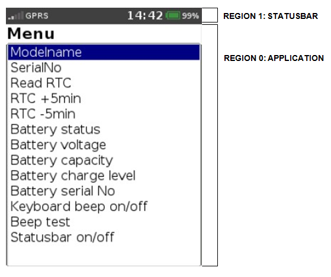

# Preface <a href="#sec_sysinfo_preface" id="sec_sysinfo_preface"></a>

This guide provides information on the usage of the ADK SYS components.

## Audience <a href="#subsec_sysinfo_audience" id="subsec_sysinfo_audience"></a>

This document is intended for programmers who want to understand and use ADK SYS components.

## Organization <a href="#subsec_sysinfo_organization" id="subsec_sysinfo_organization"></a>

This guide is organized as follows:

[Introduction](#sec_sysinfo_introduction). Provides an overview of the ADK SYS functionality.

[Getting Started](#sec_sysinfo_getting_started).

[Programming](#sec_sysinfo_programming).

[System Setup and Requirements](#sec_sysinfo_system_setup_and_requirements).

[Troubleshooting](#sec_sysinfo_troubleshooting). Gives solutions for possible issues in ADK SYS.

[Appendix](#sec_sysinfo_appendix). Acronym Definitions.

# Introduction <a href="#sec_sysinfo_introduction" id="sec_sysinfo_introduction"></a>

SYS Info is a component to read and write system properties and to control statusbar, beeper and LEDs

## Concepts <a href="#subsec_sysinfo_concepts" id="subsec_sysinfo_concepts"></a>

[System Statusbar](#subsec_sysinfo_system_statusbar). Provides information on service functions used to setup a system statusbar.

[System Property Functions](#subsec_sysinfo_system_property_functions). Provides information on API functions for reading/writing system related properties.

[System Beep Functions](#subsec_sysinfo_system_beep_functions). Provides information on API functions used for beeping and playing sounds.

[System LED Functions](#subsec_sysinfo_system_led_functions). Provides information on API functions for terminal LEDs management.

[System Installation Functions](#subsec_sysinfo_system_installation_functions). Provides information on API for installing packages and related functions.

[Compiling and Linking](#subsec_sysinfo_compiling_and_linking). Contains information on settings for compiling and linking the ADK SYS library.

[Module Documentation](#subsec_sysinfo_module_documentation). Contains a detailed description of the ADK SYS library components.

# Getting Started <a href="#sec_sysinfo_getting_started" id="sec_sysinfo_getting_started"></a>

## Demo Application <a href="#subsec_sysinfo_demo_application" id="subsec_sysinfo_demo_application"></a>

Demo source code from the ADK SYS distribution package can be found in \"Examples\" menu.

# Programming <a href="#sec_sysinfo_programming" id="sec_sysinfo_programming"></a>

## System Statusbar <a href="#subsec_sysinfo_system_statusbar" id="subsec_sysinfo_system_statusbar"></a>

ADK SYS library provides service functions (see <a href="sysbar_8h.md">sysbar.h</a>) that can be used to setup a system statusbar, which is composed of an HTML document. The statusbar, which runs with DirectGUI and the ADK SYS library, internally invokes <a href="namespacevfigui.md#add2574c4d093c99c0708c23b4c92e23d">uiInvokeAsync()</a> of VFIGUI library to display and refresh the statusbar contents. Statusbar functions are implemented in the separate library `libvfisysbar.so`, which needs to be linked to ADK SYS library `libvfisysinfo.so` and VFIGUI.

### Statusbar Region <a href="#subsubsec_sysinfo_statusbar_region" id="subsubsec_sysinfo_statusbar_region"></a>

The ADK SYS statusbar is designed to run in a separate UI region of DirectGUI, having its own HTML document as source. The HTML content of a statusbar is usually dynamic and needs to updated on special system events (e.g. on change of time, battery level or signal strength).



The figure shows the display dividing into two UI regions: UI region 0 (default region) is used to display the application\'s HTML content and UI region 1 runs the system statusbar. In order to divide the display into regions, the application must either call UI function <a href="namespacevfigui.md#af855d00b4a448abba99ca993a7b629eb">uiLayout()</a> or use a GUI configuration file `gui.ini` containing a default section \[layout\] that configures the two regions as follows:

``` cpp
[layout]
1=0 0 -1 20
0=0 21 -1 -1
```

This \[layout\] section defines the UI region 1 with a height of 20 pixels, which is used for the system statusbar.


The regions must be set up before invoking <a href="namespacevfisysinfo.md#adb049b3a939a78dedeae1ac9aa15c9df">sysStartStatusbarURL()</a> or `sysStart` `Statusbar()`. If the region for the statusbar does not exist, starting the statusbar will fail.


### Running the Statusbar <a href="#subsubsec_sysinfo_running_the_statusbar" id="subsubsec_sysinfo_running_the_statusbar"></a>

Statusbar items are usually dynamic and event-driven. For this reason, the UI statusbar region needs to be updated with new HTML content on different system events. Since Verix and V/OS do not provide an event-based interface supplying system information, a seperate thread must read the system properties cyclically and update the UI statusbar region according to these values. Running a separate thread for a UI region, DirectGUI provides function `uiCreateThread()`. This function creates a new thread and automatically overtakes UI properties (like default font, resource path etc.) to that thread, which allows the thread to invoke UI functions (e.g. <a href="namespacevfigui.md#af330e250493b2c6546274bea96d87fca">uiInvoke()</a>) to display or refresh a statusbar. In order to keep such complexibilty away from developers and to reduce efforts for synchronisation of system properties with the UI, the ADK SYS library provides a simple API function that does just that:

``` cpp
int sysStartStatusbarURL(int region_id,
   const std::string &url,
   const std::map<std::string,std::string> &values, sysStatusbarCallback cb=0,
   void *cbdata=0);
int sysStartStatusbar(int region_id,
   const std::string &html,
   const std::map<std::string,
   std::string> &values,
   const std::string &resource_path=std::string(),
   sysStatusbarCallback cb=0,
   void *cbdata=0);
int sysStartStatusbarURLReturnVal(int region_id,
   const std::string &url,
   const std::map<std::string,std::string> &values,
   sysStatusbarCallback cb=0,
   void *cbdata=0,
   sysStatusbarReturnCallback returncb=0);
```

Both <a href="namespacevfisysinfo.md#adb049b3a939a78dedeae1ac9aa15c9df">sysStartStatusbarURL()</a> and <a href="namespacevfisysinfo.md#a002c2133e3e778923940535109afcca4">sysStartStatusbar()</a> run a new UI thread, which cyclically updates and repaints the statusbar for UI region `region_id`.

Unlike <a href="namespacevfisysinfo.md#adb049b3a939a78dedeae1ac9aa15c9df">sysStartStatusbarURL()</a>, function <a href="namespacevfisysinfo.md#a002c2133e3e778923940535109afcca4">sysStartStatusbar()</a> takes the HTML string instead of an URL as second parameter and additional parameter resource_path must be provided to point to the resource path. This path is used by DirectGUI to find resource files referenced from the HTML string.

The HTML string or HTML file may contain system built-in variables, which are described in [Updating the Statusbar](#subsubsec_sysinfo_updating_the_statusbar).

In addition, the application may inject user-defined values with string map values to be passed to XML processing instructions in the HTML document (e.g. \<?var\...?\>). This mechanism is similar to the one from DirectGUI.

Last parameters cb and cbdata may be optionally set to install a callback for the statusbar, which is called every time before the statusbar is refreshed. From this callback, the application may inject a value map to update the user-defined values that were previously provided by string map values. For more details, see [Updating the Statusbar](#subsubsec_sysinfo_updating_the_statusbar).

<a href="namespacevfisysinfo.md#a6401aac22f963860ed0cc55c227ecf8f">sysStartStatusbarURLReturnVal()</a> behaves the same as <a href="namespacevfisysinfo.md#adb049b3a939a78dedeae1ac9aa15c9df">sysStartStatusbarURL()</a>, but allows to pass additional `sysStatusbarReturnCallback` callback. It is passed to <a href="namespacevfigui.md#add2574c4d093c99c0708c23b4c92e23d">uiInvokeAsync()</a> function and is called when function returns result. After `sysStatusbarReturnCallback` is called <a href="namespacevfisysinfo.md#a0a4c0bc815229837e50e2353c1fb9f51">sysRefreshStatusBar()</a> should be called to reinvoke statusbar HTML file and allow to receive next result.


It is possible to invoke <a href="namespacevfisysinfo.md#adb049b3a939a78dedeae1ac9aa15c9df">sysStartStatusbarURL()</a> or <a href="namespacevfisysinfo.md#a002c2133e3e778923940535109afcca4">sysStartStatusbar()</a> with different region IDs to run multiple statusbars. Invoking the functions on the same region ID will restart the statusbar and corresponds to the following sequence: \[unsupported block\]


### Updating the Statusbar <a href="#subsubsec_sysinfo_updating_the_statusbar" id="subsubsec_sysinfo_updating_the_statusbar"></a>

ADK SYS statusbar is automatically updated in intervals, which are configured by the refresh time (default: 4 seconds). The application may change the refresh time by calling <a href="namespacevfisysinfo.md#aab58488e2ed93f92618307af850f9880">sysSetRefreshTime()</a> (or <a href="namespacevfisysinfo.md#aec0cd92586bee1cd0df1d8637994983a">sysGetRefreshTime()</a> to read the time). If the application wants to force an update out of the interval, <a href="namespacevfisysinfo.md#a0a4c0bc815229837e50e2353c1fb9f51">sysRefreshStatusBar()</a> may be used.

With every statusbar update the UI statusbar thread does the following:

#### 1Update HTML built-in system variables

HTML built-in system variables are provided for use in the HTML document. The values for these variables are automatically supplied and updated by the statusbar thread and need not to be provided by the application.
They can be used in the HTML document for XML processing instructions (e.g. \<?var name?\>). The following HTML variables are recently supported:

- Date/Time variables:
  | Variable Name | Description |
  |----|----|
  | <p>sys_time</p> | <p>preformated time string, format: hh:mm</p> |
  | <p>sys_time_hour</p> | <p>hours, format: 00 - 23</p> |
  | <p>sys_time_min</p> | <p>min, format: 00 - 59</p> |
  | <p>sys_time_sec</p> | <p>sec, format: 00 - 60 (The range is up to 60 to allow for occasional leap seconds)</p> |
  | <p>sys_time_day</p> | <p>day, format: 01 - 31</p> |
  | <p>sys_time_month</p> | <p>month, format: 01 - 12</p> |
  | <p>sys_time_year</p> | <p>year, format: yyyy</p> |
  | <p>sys_time_12h</p> | <p>hours, format: 01 - 12</p> |
  | <p>sys_time_am_pm</p> | <p>AM or PM designation, format: AM or PM</p> |

A more up to date list of Date/Time variables is provided by reference description for <a href="namespacevfisysinfo.md#adb049b3a939a78dedeae1ac9aa15c9df">sysStartStatusbarURL()</a>.


The statusbar is automatically updated based on refresh intervals, if a time unit is increased. *Example:* \[unsupported block\]


### Warning

sys_time_sec may cause a high CPU load, since the GUI server will refresh statusbar region every second.

- Battery information variables:
  | Variable Name | Description |
  |----|----|
  | <p>sys_battery_percentage</p> | <p>Battery Charge Percentage, format: 0 - 100 , -1 if no battery is available</p> |
  | <p>sys_battery_percentage2</p> | <p>Battery Charge Percentage, format: 0% - 100% , if no battery is available</p> |
  | <p>sys_battery_level</p> | <p>Battery Charge Level, format: 1 - 11 (or 101-111 for battery charging), -1 if no battery available</p> |
  | <p>sys_battery_charge_mode</p> | <p>Battery charge mode, format: 1-2 , empty if no battery is available</p> |
- Docking status variables:
  | Variable Name | Description |
  |----|----|
  | <p>sys_docking_status</p> | <p>Docking Status (format: 0 == undocked, 1 == docked, battery charging)</p> |

A more up to date list of docking status variables is provided by reference description for <a href="namespacevfisysinfo.md#adb049b3a939a78dedeae1ac9aa15c9df">sysStartStatusbarURL()</a>.

#### 2Invoking statusbar callback to update application user defined values

If <a href="namespacevfisysinfo.md#a002c2133e3e778923940535109afcca4">sysStartStatusbar()</a> has passed the callback function `sysStatusbarCallback`, the statusbar thread invokes this callback every time before the statusbar is refreshed. The callback function provides the application data pointer from <a href="namespacevfisysinfo.md#a002c2133e3e778923940535109afcca4">sysStartStatusbar()</a> and the region ID of the statusbar for which the callback was triggered. The last parameter is a string map containing name-value pairs, which were previously initialized with <a href="namespacevfisysinfo.md#a002c2133e3e778923940535109afcca4">sysStartStatusbar()</a>.

``` cpp
typedef void (*sysStatusbarCallback)(void *data, int region_id, std::map<std::string,std::string> &values);
```

From inside the callback, the application may modify the string map which contains the name-value pairs. The map is directly passed to the next call of <a href="namespacevfigui.md#af330e250493b2c6546274bea96d87fca">uiInvoke()</a> of DirectGUI to refresh the statusbar region. The HTML document for the statusbar may contain XML processing instructions refering these values as shown in the following example:

- Application callback function:
  ``` cpp
  static void statusbar_callback(void *data, int region_id, map<string,string> &values)
  {
  // region ID is useful, if application uses one callback for multiple statusbars
  if(region_id==1) { values["mob_netw_type"]="GPRS";
  }
  }
  ```
- Statusbar HTML document:
  ``` cpp
  ...
  <div style=’font-size:10px><?var mob_netw_type?></div>
  ...
  ```


The application may either use the callback function to update the user-defined values for a statusbar region or it may use <a href="namespacevfimac.md#a6c72ec8391307ac42e3c9d044eac36e2">sysSetStatusbarValues()</a>. The function is thread-safe and can be invoked from any thread for asynchronous statusbar updates. <a href="namespacevfimac.md#a6c72ec8391307ac42e3c9d044eac36e2">sysSetStatusbarValues()</a> must not be used inside the statusbar callback. Also note that <a href="namespacevfimac.md#a6c72ec8391307ac42e3c9d044eac36e2">sysSetStatusbarValues()</a> will do a repaint on the statusbar. The application may use <a href="namespacevfimac.md#a443df02ff6897b4a9e6cb5973f5842b2">sysGetStatusbarValues()</a> to read name-value pairs from the library.


### Statusbar return callback <a href="#subsubsec_sysinfo_statusbar_return_callback" id="subsubsec_sysinfo_statusbar_return_callback"></a>

Return callback declaration is identical to <a href="namespacevfigui.md#a29ea0490208725e330b8b11f770b51a7">vfigui::uiAsyncCallback</a>. This callback is called by <a href="namespacevfigui.md#add2574c4d093c99c0708c23b4c92e23d">uiInvokeAsync()</a>

``` cpp
typedef vfigui::uiAsyncCallback sysStatusbarReturnCallback;
```

- statusbar return callback function
  ``` cpp
  static void statusbar_return_callback(void *data, vfigui::UICBType type, vfigui::UICBData &uidata)
  {
     if ( vfigui::UI_CB_RESULT == type )
     {
     int return_value = uidata.result();
     if ( result > vfigui::UI_ERR_OK )
     {
     // do something
     }
     }
  }
  ```


After `sysStatusbarReturnCallback` is called <a href="namespacevfisysinfo.md#a0a4c0bc815229837e50e2353c1fb9f51">sysRefreshStatusBar()</a> should be called to reinvoke statusbar HTML file and allow to receive next result.


### Stopping the Statusbar <a href="#subsubsec_sysinfo_stopping_the_statusbar" id="subsubsec_sysinfo_stopping_the_statusbar"></a>

Application can stop a running statusbar by calling the following function

``` cpp
int sysStopStatusbar(int region_id);
```

If the application runs multiple statusbars, <a href="namespacevfisysinfo.md#aa28127dbc1ddc94bd9c2b784a98c634c">sysStopStatusbar()</a> must be called for each statusbar region that is specified by parameter region_id. After stopping the statusbar, the application should invoke <a href="namespacevfigui.md#af855d00b4a448abba99ca993a7b629eb">uiLayout()</a> to switch back to normal layout. For example, when switching to a full screen layout:

``` cpp
sysStopStatusbar(1);
uiLayout("layout-fullscreen");
```

GUI configuration file:

``` cpp
[layout-fullscreen]
0=0 0 -1 -1
```

### Warning

Invoking <a href="namespacevfigui.md#af855d00b4a448abba99ca993a7b629eb">uiLayout()</a> may cause a running statusbar to abort, if the new layout does not provide the same statusbar region.



The running statusbar does regular updates in the background and needs to be stopped for power-saving to take effect on some platforms. For instance, Verix eVo requires all tasks in the system to call `SVC_WAIT()` or `wait_event()` to enter the sleep mode. This means a running statusbar that is periodically updated would break this power-saving concept.


## System Property Functions <a href="#subsec_sysinfo_system_property_functions" id="subsec_sysinfo_system_property_functions"></a>

ADK SYS offers API functions for reading and writing system related properties (see <a href="sysinfo_8h.md">sysinfo.h</a>). These API functions may be used in an application by linking basic library `libvfisysinfo.so`.

### Warning

On VOS3 libvfisysinfo.so has dependencies on internal libraries that are not provided within SDK. So, client must build with \"-Wl,\--allow-shlib-undefined\" linker option.

### Reading System Properties <a href="#subsubsec_sysinfo_reading_system_properties" id="subsubsec_sysinfo_reading_system_properties"></a>

The following functions can be used to read system related properties:

``` cpp
int sysGetPropertyInt(enum SYSPropertyInt property, int *value);
int sysGetPropertyString(enum SYSPropertyString property, char* value, int len);
int sysGetPropertyString(enum SYSPropertyString property, std::string &value);
```

<a href="namespacevfisysinfo.md#ab94a5b33000760afbee10e7fefd16355">sysGetPropertyInt()</a> is used to read system properties, which is defined as an integer (e.g. `SYS_PROP_BATTERY_CHARGE_LEVEL`, member of `enum` `SYSPropertyInt`).

<a href="namespacevfisysinfo.md#af6c938992e005c446c81e7f1fe3e4ed3">sysGetPropertyString()</a> is used to read system properties, which is defined as a string (e.g. `SYS_PROP_HW_MODEL_NAME`, member of `enum` `SYSPropertyString`). The second overloaded function takes a STL string as second parameter preventing the user to specify an insufficient buffer size. The first variant will return `SYS_ERR_PARAMETER`, if the buffer is too small.


All properties are intended for reading. If a property is only allowed for writing, the functions will return `SYS_ERR_PROP_WRITE_ONLY`.


The properties compatibility matrix on all platforms - VOS1/VOS2/VOS3:

### Int type properties <a href="#sysinfo_properties_int" id="sysinfo_properties_int"></a>

| Int type property name | VOS | VOS2 | VOS3 |
|----|----|----|----|
| <p>SYS_PROP_BATTERY_AVAILABLE</p> | <p>-</p> | <p>+</p> | <p>+</p> |
| <p>SYS_PROP_BATTERY_STATUS_OK</p> | <p>-</p> | <p>+</p> | <p>+</p> |
| <p>SYS_PROP_BATTERY_DEVICE</p> | <p>+</p> | <p>+</p> | <p>+</p> |
| <p>SYS_PROP_BATTERY_VOLTAGE</p> | <p>-</p> | <p>+</p> | <p>+</p> |
| <p>SYS_PROP_BATTERY_CAPACITY</p> | <p>-</p> | <p>+</p> | <p>+</p> |
| <p>SYS_PROP_BATTERY_CHARGE_LEVEL</p> | <p>-</p> | <p>+</p> | <p>+</p> |
| <p>SYS_PROP_BATTERY_CHARGING</p> | <p>-</p> | <p>+</p> | <p>+</p> |
| <p>SYS_PROP_BATTERY_FULL</p> | <p>-</p> | <p>+</p> | <p>+</p> |
| <p>SYS_PROP_BATTERY_TEMP</p> | <p>-</p> | <p>+</p> | <p>+</p> |
| <p>SYS_PROP_BATTERY_CURRENT</p> | <p>-</p> | <p>+</p> | <p>+</p> |
| <p>SYS_PROP_BATTERY_CRITICAL</p> | <p>-</p> | <p>+</p> | <p>+</p> |
| <p>SYS_PROP_BATTERY_LOW</p> | <p>-</p> | <p>+</p> | <p>+</p> |
| <p>SYS_PROP_BATTERY_NORMAL</p> | <p>-</p> | <p>+</p> | <p>+</p> |
| <p>SYS_PROP_BATTERY_TECHNOLOGY</p> | <p>-</p> | <p>+</p> | <p>+</p> |
| <p>SYS_PROP_BATTERY_FCC</p> | <p>-</p> | <p>+</p> | <p>+</p> |
| <p>SYS_PROP_BATTERY_SOH</p> | <p>-</p> | <p>+</p> | <p>+</p> |
| <p>SYS_PROP_BATTERY_CHARGE_IN_SLEEP</p> | <p>-</p> | <p>+</p> | <p>+</p> |
| <p>SYS_PROP_BATTERY_CALIBRATION</p> | <p>-</p> | <p>+</p> | <p>+</p> |
| <p>SYS_PROP_BATTERY_TYPE</p> | <p>-</p> | <p>+</p> | <p>+</p> |
| <p>SYS_PROP_BATTERY_CHARGE_MODE</p> | <p>-</p> | <p>+</p> | <p>-</p> |
| <p>SYS_PROP_CHARGE_CYCLE_COUNT</p> | <p>-</p> | <p>+</p> | <p>+</p> |
| <p>SYS_PROP_UX100_AVAILABLE</p> | <p>+</p> | <p>-</p> | <p>-</p> |
| <p>SYS_PROP_UX100_OPERATIONAL_MODE</p> | <p>+</p> | <p>-</p> | <p>-</p> |
| <p>SYS_PROP_UX100_BACKLIGHT</p> | <p>+</p> | <p>-</p> | <p>-</p> |
| <p>SYS_PROP_UX400_AVAILABLE</p> | <p>+</p> | <p>-</p> | <p>+</p> |
| <p>SYS_PROP_UX115_UNIT</p> | <p>+</p> | <p>-</p> | <p>-</p> |
| <p>SYS_PROP_UX_UNIT</p> | <p>+</p> | <p>+</p> | <p>+</p> |
| <p>SYS_PROP_INTERNAL_BATTERY_STATUS</p> | <p>+</p> | <p>+</p> | <p>+</p> |
| <p>SYS_PROP_INTERNAL_BATTERY_VOLTAGE</p> | <p>+</p> | <p>+</p> | <p>+</p> |
| <p>SYS_PROP_DOCKING_STATUS</p> | <p>+</p> | <p>+</p> | <p>+</p> |
| <p>SYS_PROP_DOCK_SUPPORT</p> | <p>+</p> | <p>+</p> | <p>+</p> |
| <p>SYS_PROP_USB1_MODE</p> | <p>-</p> | <p>+</p> | <p>+</p> |
| <p>SYS_PROP_USB2_MODE</p> | <p>-</p> | <p>+</p> | <p>+</p> |
| <p>SYS_PROP_USB1_CONFIGURABLE</p> | <p>-</p> | <p>+</p> | <p>+</p> |
| <p>SYS_PROP_USB2_CONFIGURABLE</p> | <p>-</p> | <p>+</p> | <p>-</p> |
| <p>SYS_PROP_USB1_DEFAULT</p> | <p>-</p> | <p>+</p> | <p>+</p> |
| <p>SYS_PROP_USB2_DEFAULT</p> | <p>-</p> | <p>+</p> | <p>-</p> |
| <p>SYS_PROP_USB1_CHARGE</p> | <p>-</p> | <p>+</p> | <p>-</p> |
| <p>SYS_PROP_USB2_CHARGE</p> | <p>-</p> | <p>+</p> | <p>-</p> |
| <p>SYS_PROP_USB_HIGH_POWER_MODE</p> | <p>-</p> | <p>+</p> | <p>-</p> |
| <p>SYS_PROP_PRINTER_AVAILABLE</p> | <p>+</p> | <p>+</p> | <p>+</p> |
| <p>SYS_PROP_POWER_STATUS</p> | <p>+</p> | <p>+</p> | <p>+</p> |
| <p>SYS_PROP_POWER_ON</p> | <p>-</p> | <p>+</p> | <p>-</p> |
| <p>SYS_PROP_CHARGE_ON_SAVING</p> | <p>-</p> | <p>+</p> | <p>+</p> |
| <p>SYS_PROP_KEYBOARD_BEEP</p> | <p>+</p> | <p>+</p> | <p>+</p> |
| <p>SYS_PROP_KEYB_BACKLIGHT</p> | <p>+</p> | <p>+</p> | <p>+</p> |
| <p>SYS_PROP_KEYBOARD_HW</p> | <p>+</p> | <p>+</p> | <p>+</p> |
| <p>SYS_PROP_KEYBOARD_SIZE</p> | <p>+</p> | <p>+</p> | <p>+</p> |
| <p>SYS_PROP_DISP_CONTRAST</p> | <p>+</p> | <p>-</p> | <p>-</p> |
| <p>SYS_PROP_DISP_BACKLIGHT</p> | <p>+</p> | <p>+</p> | <p>+</p> |
| <p>SYS_PROP_DISP</p> | <p>+</p> | <p>+</p> | <p>+</p> |
| <p>SYS_PROP_DISP_HW</p> | <p>+</p> | <p>+</p> | <p>+</p> |
| <p>SYS_PROP_DISP_COLOR</p> | <p>+</p> | <p>+</p> | <p>+</p> |
| <p>SYS_PROP_DISP_HEIGHT</p> | <p>+</p> | <p>+</p> | <p>+</p> |
| <p>SYS_PROP_DISP_WIDTH</p> | <p>+</p> | <p>+</p> | <p>+</p> |
| <p>SYS_PROP_DISP_TOUCH</p> | <p>+</p> | <p>+</p> | <p>+</p> |
| <p>SYS_PROP_ANDROID</p> | <p>+</p> | <p>+</p> | <p>-</p> |
| <p>SYS_PROP_HW_RAM_SIZE</p> | <p>+</p> | <p>+</p> | <p>+</p> |
| <p>SYS_PROP_HW_RAM_USED</p> | <p>+</p> | <p>+</p> | <p>+</p> |
| <p>SYS_PROP_HW_FLASH_SIZE</p> | <p>+</p> | <p>+</p> | <p>+</p> |
| <p>SYS_PROP_HW_FLASH_USED</p> | <p>+</p> | <p>+</p> | <p>+</p> |
| <p>SYS_PROP_HW_EXE_PARTITION_SIZE</p> | <p>+</p> | <p>+</p> | <p>+</p> |
| <p>SYS_PROP_HW_EXE_PARTITION_USED</p> | <p>+</p> | <p>+</p> | <p>+</p> |
| <p>SYS_PROP_HW_DATA_PARTITION_SIZE</p> | <p>+</p> | <p>+</p> | <p>+</p> |
| <p>SYS_PROP_HW_DATA_PARTITION_USED</p> | <p>+</p> | <p>+</p> | <p>+</p> |
| <p>SYS_PROP_HW_TOUCH_GROUNDED</p> | <p>-</p> | <p>-</p> | <p>-</p> |
| <p>SYS_PROP_LED</p> | <p>+</p> | <p>+</p> | <p>+</p> |
| <p>SYS_PROP_PCI</p> | <p>+</p> | <p>+</p> | <p>+</p> |
| <p>SYS_PROP_VOLUME</p> | <p>-</p> | <p>+</p> | <p>+</p> |
| <p>SYS_PROP_SPEAKER_AVAILABLE</p> | <p>-</p> | <p>+</p> | <p>+</p> |
| <p>SYS_PROP_BUZZER_AVAILABLE</p> | <p>+</p> | <p>+</p> | <p>+</p> |
| <p>SYS_PROP_ADE_STATUS</p> | <p>+</p> | <p>+</p> | <p>-</p> |
| <p>SYS_PROP_CERT_SPONSOR_PROD</p> | <p>+</p> | <p>+</p> | <p>+</p> |
| <p>SYS_PROP_ATTACK_STATUS</p> | <p>+</p> | <p>+</p> | <p>+</p> |
| <p>SYS_PROP_ATTACK_STATUS_CODE</p> | <p>-</p> | <p>-</p> | <p>-</p> |
| <p>SYS_PROP_VCL_ENCRYPTION_STATUS</p> | <p>+</p> | <p>+</p> | <p>+</p> |
| <p>SYS_PROP_VOLTAGE_ENCRYPTION_STATUS</p> | <p>+</p> | <p>+</p> | <p>-</p> |
| <p>SYS_PROP_POSEIDON_ENCRYPTION_STATUS</p> | <p>+</p> | <p>+</p> | <p>-</p> |
| <p>SYS_PROP_NAVIGATOR_STATUS</p> | <p>-</p> | <p>+</p> | <p>-</p> |
| <p>SYS_PROP_SERVICE_SWITCH_STATUS</p> | <p>+</p> | <p>+</p> | <p>+</p> |
| <p>SYS_PROP_DEVICE_MODE</p> | <p>+</p> | <p>+</p> | <p>+</p> |
| <p>SYS_PROP_SYSMODE_BUTTON</p> | <p>+</p> | <p>+</p> | <p>+</p> |
| <p>SYS_PROP_DEVICE_TYPE</p> | <p>+</p> | <p>+</p> | <p>+</p> |
| <p>SYS_PROP_VATS</p> | <p>+</p> | <p>+</p> | <p>+</p> |
| <p>SYS_PROP_UX100_ANTI_REMOVAL_SWITCH</p> | <p>+</p> | <p>-</p> | <p>-</p> |
| <p>SYS_PROP_SLP_TAINTED_STATUS</p> | <p>-</p> | <p>+</p> | <p>+</p> |
| <p>SYS_PROP_UPTIME</p> | <p>+</p> | <p>+</p> | <p>+</p> |
| <p>SYS_PROP_BARCODE_SCANNER</p> | <p>-</p> | <p>+</p> | <p>+</p> |
| <p>SYS_PROP_CAMERA</p> | <p>-</p> | <p>+</p> | <p>+</p> |
| <p>SYS_PROP_SWITCH_THRESHOLD_VOLTAGE</p> | <p>-</p> | <p>+</p> | <p>-</p> |
| <p>SYS_PROP_LOW_THRESHOLD_VOLTAGE</p> | <p>-</p> | <p>+</p> | <p>-</p> |
| <p>SYS_PROP_CONSOLE_STATE</p> | <p>+</p> | <p>+</p> | <p>-</p> |
| <p>SYS_PROP_UX_MDB</p> | <p>+</p> | <p>+</p> | <p>+</p> |
| <p>SYS_PROP_CARD_SLOT2_MODE</p> | <p>-</p> | <p>+</p> | <p>-</p> |
| <p>SYS_PROP_CARD_SLOT_COUNT</p> | <p>-</p> | <p>+</p> | <p>-</p> |
| <p>SYS_PROP_KEYBOARD_TYPE</p> | <p>+</p> | <p>+</p> | <p>+</p> |
| <p>SYS_PROP_EXT_NFC_ANTENNA</p> | <p>+</p> | <p>-</p> | <p>+</p> |
| <p>SYS_PROP_VRK2_SUPPORT</p> | <p>-</p> | <p>+</p> | <p>+</p> |
| <p>SYS_PROP_USB_C_CHARGING_STATE</p> | <p>-</p> | <p>+</p> | <p>-</p> |
| <p>SYS_PROP_POGO_CHARGING_STATE</p> | <p>-</p> | <p>+</p> | <p>-</p> |
| <p>SYS_PROP_ECC_VRK_SUPPORT</p> | <p>-</p> | <p>+</p> | <p>+</p> |
| <p>SYS_PROP_LCD_PANEL_ID</p> | <p>-</p> | <p>+</p> | <p>-</p> |
| <p>SYS_PROP_VRK_CERT_INSTALLED</p> | <p>-</p> | <p>-</p> | <p>+</p> |
| <p>SYS_PROP_VRK_PACKAGING_UVRK_SUPPORT</p> | <p>-</p> | <p>+</p> | <p>+</p> |
| <p>SYS_PROP_POGO_DATA_STATE</p> | <p>-</p> | <p>+</p> | <p>-</p> |
| <p>SYS_PROP_UX100_TYPE</p> | <p>+</p> | <p>-</p> | <p>-</p> |

### String type properties <a href="#sysinfo_properties_string" id="sysinfo_properties_string"></a>

| String type property name | VOS | VOS2 | VOS3 |
|----|----|----|----|
| <p>SYS_PROP_HW_MODEL_NAME</p> | <p>+</p> | <p>+</p> | <p>+</p> |
| <p>SYS_PROP_HW_MODEL_NAME_SHORT</p> | <p>+</p> | <p>+</p> | <p>+</p> |
| <p>SYS_PROP_HW_SERIALNO</p> | <p>+</p> | <p>+</p> | <p>+</p> |
| <p>SYS_PROP_OS_VERSION</p> | <p>+</p> | <p>+</p> | <p>+</p> |
| <p>SYS_PROP_HW_PTID</p> | <p>+</p> | <p>+</p> | <p>+</p> |
| <p>SYS_PROP_HW_VARIANT_NAME</p> | <p>+</p> | <p>+</p> | <p>+</p> |
| <p>SYS_PROP_HW_PART_NO</p> | <p>+</p> | <p>+</p> | <p>+</p> |
| <p>SYS_PROP_HW_VERSION</p> | <p>+</p> | <p>+</p> | <p>+</p> |
| <p>SYS_PROP_HW_LOT_NO</p> | <p>+</p> | <p>+</p> | <p>+</p> |
| <p>SYS_PROP_BOOT_VERSION</p> | <p>+</p> | <p>+</p> | <p>+</p> |
| <p>SYS_PROP_TERMINAL_SPONSOR</p> | <p>+</p> | <p>+</p> | <p>+</p> |
| <p>SYS_PROP_MANUF_DATE</p> | <p>+</p> | <p>+</p> | <p>-</p> |
| <p>SYS_PROP_CERT_SPONSOR_SN</p> | <p>+</p> | <p>+</p> | <p>+</p> |
| <p>SYS_PROP_CERT_SPONSOR_MODE</p> | <p>+</p> | <p>+</p> | <p>+</p> |
| <p>SYS_PROP_ADK_VERSION</p> | <p>+</p> | <p>+</p> | <p>+</p> |
| <p>SYS_PROP_UX100_SERIALNO</p> | <p>+</p> | <p>-</p> | <p>-</p> |
| <p>SYS_PROP_UX100_PARTNO</p> | <p>+</p> | <p>-</p> | <p>-</p> |
| <p>SYS_PROP_UX100_FW_VERSION</p> | <p>+</p> | <p>-</p> | <p>-</p> |
| <p>SYS_PROP_SBI_VERSION</p> | <p>+</p> | <p>+</p> | <p>+</p> |
| <p>SYS_PROP_VAULT_VERSION</p> | <p>+</p> | <p>+</p> | <p>+</p> |
| <p>SYS_PROP_CIB_VERSION</p> | <p>+</p> | <p>+</p> | <p>-</p> |
| <p>SYS_PROP_MIB_VERSION</p> | <p>+</p> | <p>+</p> | <p>+</p> |
| <p>SYS_PROP_KERNEL_VERSION</p> | <p>+</p> | <p>+</p> | <p>+</p> |
| <p>SYS_PROP_RFS_VERSION</p> | <p>+</p> | <p>+</p> | <p>-</p> |
| <p>SYS_PROP_RELEASE_VERSION</p> | <p>+</p> | <p>+</p> | <p>+</p> |
| <p>SYS_PROP_RFS_SECURITY_VERSION</p> | <p>+</p> | <p>+</p> | <p>-</p> |
| <p>SYS_PROP_SRED_VERSION</p> | <p>+</p> | <p>+</p> | <p>-</p> |
| <p>SYS_PROP_SRED_MODE</p> | <p>+</p> | <p>+</p> | <p>-</p> |
| <p>SYS_PROP_OPENPROTOCOL_VERSION</p> | <p>+</p> | <p>+</p> | <p>-</p> |
| <p>SYS_PROP_PCI_REBOOT_TIME</p> | <p>+</p> | <p>+</p> | <p>+</p> |
| <p>SYS_PROP_FILE_NAME_TO_INSTALL</p> | <p>+</p> | <p>+</p> | <p>-</p> |
| <p>SYS_PROP_MSR_COUNTERS</p> | <p>+</p> | <p>+</p> | <p>-</p> |
| <p>SYS_PROP_SCR_COUNTERS</p> | <p>+</p> | <p>+</p> | <p>-</p> |
| <p>SYS_PROP_CTLS_COUNTERS</p> | <p>+</p> | <p>+</p> | <p>-</p> |
| <p>SYS_PROP_DOCK_STATION_SN</p> | <p>-</p> | <p>+</p> | <p>-</p> |
| <p>SYS_PROP_DOCK_STATION_PN</p> | <p>-</p> | <p>+</p> | <p>-</p> |
| <p>SYS_PROP_DOCK_STATION_MODEL</p> | <p>-</p> | <p>+</p> | <p>-</p> |
| <p>SYS_PROP_DOCK_STATION_MAC</p> | <p>-</p> | <p>+</p> | <p>-</p> |
| <p>SYS_PROP_DOCK_STATION_HW_REV</p> | <p>-</p> | <p>+</p> | <p>-</p> |
| <p>SYS_PROP_DOCK_STATION_INSTALL</p> | <p>-</p> | <p>+</p> | <p>-</p> |
| <p>SYS_PROP_GSM_FIRMWARE_VERSION</p> | <p>-</p> | <p>+</p> | <p>-</p> |
| <p>SYS_PROP_DOCK_STATION_OS_VERSION</p> | <p>-</p> | <p>+</p> | <p>-</p> |
| <p>SYS_PROP_DOCK_STATION_IP_ADDRESS</p> | <p>-</p> | <p>+</p> | <p>-</p> |
| <p>SYS_PROP_DOCK_STATION_IP_V6_ADDRESS</p> | <p>-</p> | <p>+</p> | <p>-</p> |
| <p>SYS_PROP_DOCK_STATION_USB1_IP_ADDRESS</p> | <p>-</p> | <p>+</p> | <p>-</p> |
| <p>SYS_PROP_ANDROID_IP_V4_ADDRESS</p> | <p>-</p> | <p>+</p> | <p>-</p> |
| <p>SYS_PROP_ANDROID_IP_V6_ADDRESS</p> | <p>-</p> | <p>+</p> | <p>-</p> |
| <p>SYS_PROP_ANDROID_MAC</p> | <p>-</p> | <p>+</p> | <p>-</p> |
| <p>SYS_PROP_WARRANTIED_KEYS</p> | <p>+</p> | <p>+</p> | <p>+</p> |
| <p>SYS_PROP_SECAPP_VERSION</p> | <p>+</p> | <p>+</p> | <p>-</p> |
| <p>SYS_PROP_VSS_VERSION</p> | <p>+</p> | <p>+</p> | <p>-</p> |
| <p>SYS_PROP_STBY_MCU_VERSION</p> | <p>+</p> | <p>-</p> | <p>-</p> |
| <p>SYS_PROP_EXT_STORAGE</p> | <p>+</p> | <p>+</p> | <p>+</p> |
| <p>SYS_PROP_INSTALLED_PCKG_LIST</p> | <p>+</p> | <p>+</p> | <p>-</p> |
| <p>SYS_PROP_PKG_LIST</p> | <p>+</p> | <p>+</p> | <p>-</p> |
| <p>SYS_PROP_APP_PKG_LIST</p> | <p>+</p> | <p>+</p> | <p>-</p> |
| <p>SYS_PROP_BUNDLE_LIST</p> | <p>+</p> | <p>+</p> | <p>-</p> |
| <p>SYS_PROP_APP_BUNDLE_LIST</p> | <p>+</p> | <p>+</p> | <p>-</p> |
| <p>SYS_PROP_MSR_INFO</p> | <p>+</p> | <p>+</p> | <p>+</p> |
| <p>SYS_PROP_SCR_INFO</p> | <p>+</p> | <p>+</p> | <p>+</p> |
| <p>SYS_PROP_CTLS_INFO</p> | <p>+</p> | <p>+</p> | <p>+</p> |
| <p>SYS_PROP_HW_STRING</p> | <p>+</p> | <p>+</p> | <p>+</p> |
| <p>SYS_PROP_DEV_ID</p> | <p>+</p> | <p>+</p> | <p>+</p> |
| <p>SYS_PROP_FET</p> | <p>+</p> | <p>+</p> | <p>-</p> |
| <p>SYS_PROP_BT_MAC</p> | <p>+</p> | <p>+</p> | <p>+</p> |
| <p>SYS_PROP_WIFI_MAC</p> | <p>+</p> | <p>+</p> | <p>+</p> |
| <p>SYS_PROP_ETH_MAC</p> | <p>+</p> | <p>+</p> | <p>+</p> |
| <p>SYS_PROP_ETH2_MAC</p> | <p>+</p> | <p>+</p> | <p>+</p> |
| <p>SYS_PROP_COUNTRY</p> | <p>+</p> | <p>+</p> | <p>-</p> |
| <p>SYS_PROP_RTC</p> | <p>+</p> | <p>+</p> | <p>+</p> |
| <p>SYS_PROP_NTP_SERVER</p> | <p>+</p> | <p>+</p> | <p>+</p> |
| <p>SYS_PROP_BATTERY_SERIALNO</p> | <p>-</p> | <p>-</p> | <p>-</p> |
| <p>SYS_PROP_TIME_ZONE</p> | <p>+</p> | <p>+</p> | <p>+</p> |
| <p>SYS_PROP_TIME_ZONE_LIST</p> | <p>+</p> | <p>+</p> | <p>+</p> |
| <p>SYS_PROP_TIME_ZONE_FROM_FILE</p> | <p>+</p> | <p>+</p> | <p>+</p> |
| <p>SYS_PROP_TIME_ZONE_NAME</p> | <p>+</p> | <p>+</p> | <p>+</p> |
| <p>SYS_PROP_TIME_ISO8601</p> | <p>+</p> | <p>+</p> | <p>+</p> |
| <p>SYS_PROP_REBOOT_REASON</p> | <p>-</p> | <p>+</p> | <p>+</p> |
| <p>SYS_PROP_ALL_LOADED_KEYS</p> | <p>+</p> | <p>+</p> | <p>+</p> |
| <p>SYS_PROP_ALL_LOADED_KEYS_V2</p> | <p>-</p> | <p>+</p> | <p>-</p> |
| <p>SYS_PROP_TAMPER_RECORDS</p> | <p>+</p> | <p>+</p> | <p>+</p> |
| <p>SYS_PROP_BARCODE_SCANNER_FW_VERSION</p> | <p>-</p> | <p>+</p> | <p>-</p> |
| <p>SYS_PROP_ANDROID_VERSION</p> | <p>-</p> | <p>+</p> | <p>-</p> |
| <p>SYS_PROP_STATUSBAR_COLOR</p> | <p>-</p> | <p>+</p> | <p>-</p> |
| <p>SYS_PROP_ANDROID_TIME</p> | <p>-</p> | <p>+</p> | <p>-</p> |
| <p>SYS_PROP_MTD_INFO</p> | <p>-</p> | <p>+</p> | <p>-</p> |
| <p>SYS_PROP_HW_ID</p> | <p>-</p> | <p>+</p> | <p>+</p> |
| <p>SYS_PROP_LCD_PANEL_MODEL</p> | <p>-</p> | <p>+</p> | <p>-</p> |
| <p>SYS_PROP_DT_NAME</p> | <p>-</p> | <p>+</p> | <p>-</p> |
| <p>SYS_PROP_TOUCH_NAME</p> | <p>-</p> | <p>+</p> | <p>-</p> |
| <p>SYS_PROP_TOUCH_HW_VERSION</p> | <p>-</p> | <p>+</p> | <p>-</p> |
| <p>SYS_PROP_TOUCH_SW_VERSION</p> | <p>-</p> | <p>+</p> | <p>-</p> |
| <p>SYS_PROP_TOUCH_CONFIG_VERSION</p> | <p>-</p> | <p>+</p> | <p>-</p> |
| <p>SYS_PROP_ANDROID_GATEWAY</p> | <p>-</p> | <p>+</p> | <p>-</p> |
| <p>SYS_PROP_ANDROID_DNS1</p> | <p>-</p> | <p>+</p> | <p>-</p> |
| <p>SYS_PROP_ANDROID_DNS2</p> | <p>-</p> | <p>+</p> | <p>-</p> |
| <p>SYS_PROP_ANDROID_PREFIX_LENGTH</p> | <p>-</p> | <p>+</p> | <p>-</p> |

<a href="sysinfo_8h.md">vfisysinfo</a> API usage example:

``` cpp
// sdk
#include <sys/time.h>
#include <sys/stat.h>
#include <stdio.h>
#include <time.h>
#include <stdlib.h>
#include <unistd.h>
#include <string>
// adk
#include "html/gui.h"
#include "log/liblog2.h"
#include "ipc/jsobject.h"
#include "sysinfo/util.h"
#include "sysinfo/inifile.h"
#include "sysinfo/sysinfo.h"
#include "sysinfo/syspm.h"
#include "sysinfo/sysbar.h"
#include "sysinfo/sysbeep.h"
#include "sysinfo/leds.h"
#include "sysinfo/sysinstall.h"
// sdk
#ifdef RAPTOR
#include <lli.h>
#endif
// macro
#include "constants/macro.h"
// constants
enum
{
   MODEL_NAME,
   OS_VER,
   ADK_VER,
   GET_HW_STRING,
   WARRANTIED_KEYS,
   ALL_KEYS,
   ALL_KEYS_V2,
   SN,
   PTID,
   RTC,
   RTCP5,
   RTCM5,
   NTP_HOST,
   BAT_STATUS,
   BAT_VOLT,
   BAT_CAPACITY,
   BAT_LEVEL,
   BAT_SN,
   BAT_AVAL,
   BAT_TECH,
   BAT_FCC,
   BAT_SOH,
   BAT_CALIBRATION,
   BAT_TYPE,
   MSR_INFO,
   SCR_INFO,
   CTLS_INFO,
   CHARGE_ON_SAVING,
   CHARGE_CYCLE_COUNT,
   INT_BAT_STATUS,
   INT_BAT_VOLT,
   DOCKED,
   KBD_BEEPER,
   BEEPER_TEST,
   RAM_SZ,
   FLASH_SZ,
   EXE_PARTITION_SZ,
   DATA_PARTITION_SZ,
   PART_NO,
   HW_VER,
   SET_ENV,
   GET_ENV,
   HW_VAR,
   LOT_NO,
   VERSIONS,
   MAC_ETH1,
   MAC_ETH2,
   MAC_BT,
   MAC_WIFI,
   COUNTRY_CODE,
   SHUTDOWN,
   REBOOT,
   REBOOT_DOCK,
   MANUF_DATE,
   DISPLAY_ON,
   DISPLAY_OFF,
   DISPLAY_CONTRAST,
   DISPLAY_BACKLIGHT,
   KBD_BACKLIGHT,
   KBD_BACKLIGHT_STATE,
   LED_STATUS,
   EXT_STORAGE,
   SPONSOR,
   SPONSOR_SN,
   VOLUME_SET_MIN,
   VOLUME_SET_MAX,
   VOLUME_GET,
   LEDS_DEMO,
   LEDS_BRIGHTNESS_DEMO,
   PRINTER_AVAILABLE,
   SB_REFRESH_1,
   SB_REFRESH_0,
   SB_REFRESH_60,
   UX400_INFO,
   UX100_INFO,
   SET_PCI_REBOOT_TIME,
   GET_PCI_REBOOT_TIME,
   LIB_VERSION,
   GET_TIME_ZONE_LIST,
   SET_TIME_ZONE_NAME,
   SET_TIME_ZONE_ISO,
   GET_TIME_ZONE,
   INSTALL_PACKAGE,
   PKG_LIST,
   APP_PKG_LIST,
   BUNDLE_LIST,
   APP_BUNDLE_LIST,
   MSR_COUNTERS,
   SCR_COUNTERS,
   CTLS_COUNTERS,
   GET_MDB,
   GET_USB1_DEFAULT,
   GET_USB2_DEFAULT,
   GET_USB1_ROLE,
   GET_USB2_ROLE,
   GET_USB1_MODE,
   GET_USB2_MODE,
   GET_USB1_CHARGE,
   GET_USB2_CHARGE,
   SET_USB1_HOST,
   SET_USB1_DEVICE,
   SET_USB2_HOST,
   SET_USB2_DEVICE,
   SET_USB2_DEFAULT,
   GET_USB_POWER_MODE,
   SET_USB_POWER_MODE,
   SET_TIME_1,
   GET_TIME,
   BATTERY_DEVICE,
   POWER_STATUS,
   ATTACK_STATUS,
   VCL_ENCRYPTION_STATUS,
   DISPLAY_STATUS,
   REBOOT_REASON,
   UPTIME,
   DOCKING_STATION_INFO,
   DOCKING_STATION_ADDRESS,
   DOCKING_STATION_UPDATE,
   GSM_FIRMWARE_VERSION,
   CAMERA_STATUS,
   BARCODE_STATUS,
   ADE_FET,
   GET_SWITCH_THRESHOLD,
   GET_LOW_THRESHOLD,
   SET_SWITCH_THRESHOLD,
   SET_LOW_THRESHOLD,
   FREE_INSTALL_PACKAGE,
   GET_INSTALL_STATUS,
   GET_CONSOLE_STATE,
   GET_TAMPER_RECORDS,
   GET_CARD_SLOT2_MODE,
   SET_CARD_SLOT2_SIM,
   SET_CARD_SLOT2_SAM,
   GET_SIM_SLOT_COUNT,
   KBD_TYPE,
   GET_MTD_INFO,
   GET_SLP_TAINTED,
   GET_HW_ID,
   GET_VRK2_SUPPORT,
   GET_POGO_STATE,
   GET_USB_C_STATE,
   SET_POGO_STATE_CONFIG,
   SET_USB_C_STATE_CONFIG,
   GET_ECC_VRK_SUPPORT,
   GET_LCD_PANEL_ID,
   GET_LCD_PANEL_MODEL,
   GET_VRK_CERT_INSTALLED,
   GET_DT_NAME,
   GET_POGO_DATA_STATE,
   SET_POGO_DATA_TO_USB_C,
   SET_POGO_DATA_TO_POGO,
   GET_MOBILE_RADIO_SW_VERSION,
   GET_TOUCH_SCREEN_NAME,
   GET_TOUCH_SCREEN_HW_VERSION,
   GET_TOUCH_SCREEN_SW_VERSION,
   GET_TOUCH_SCREEN_CONFIG_VERSION,
   GET_ANDROID_GATEWAY,
   GET_ANDROID_PREFIX_LENGTH,
   GET_ANDROID_DNS1,
   GET_ANDROID_DNS2,
   EXIT,
};
const struct vfigui::UIMenuEntry menu[]=
{
   {"MSR info", MSR_INFO, 0},
   {"SCR info", SCR_INFO, 0},
   {"CTLS info", CTLS_INFO, 0},
   {"Modelname", MODEL_NAME, 0},
   {"OS version", OS_VER, 0},
   {"ADK version", ADK_VER, 0},
   {"SerialNo", SN, 0},
   {"UnitNo (PTID)", PTID, 0},
   {"Read RTC", RTC, 0},
   {"RTC +5min", RTCP5, 0},
   {"RTC -5min", RTCM5, 0},
   {"Shutdown", SHUTDOWN, 0},
   {"Reboot", REBOOT, 0},
   {"Reboot dock", REBOOT_DOCK, 0},
   {"Set env", SET_ENV, 0},
   {"Get env", GET_ENV, 0},
   {"Manufacturing date", MANUF_DATE, 0},
   {"Battery device", BATTERY_DEVICE, 0},
   {"Battery available", BAT_AVAL, 0},
   {"Battery status", BAT_STATUS, 0},
   {"Battery voltage", BAT_VOLT, 0},
   {"Battery capacity", BAT_CAPACITY, 0},
   {"Battery charge level", BAT_LEVEL, 0},
   {"Battery serial No", BAT_SN, 0},
   {"Battery technology", BAT_TECH, 0},
   {"Battery FCC", BAT_FCC, 0},
   {"Battery type", BAT_TYPE, 0},
   {"Battery calibration satus", BAT_CALIBRATION, 0},
   {"ETH1 MAC", MAC_ETH1, 0},
   {"ETH2 MAC", MAC_ETH2, 0},
   {"BT MAC", MAC_BT, 0},
   {"WIFI MAC", MAC_WIFI, 0},
   {"Country code", COUNTRY_CODE, 0},
   {"Warrantied keys", WARRANTIED_KEYS, 0},
   {"All keys", ALL_KEYS, 0},
   {"All keys V2", ALL_KEYS_V2, 0},
   {"Battery SOH", BAT_SOH, 0},
   {"Battery charge cycle count", CHARGE_CYCLE_COUNT, 0},
   {"Battery in power saving mode", CHARGE_ON_SAVING, 0},
   {"Internal battery voltage", INT_BAT_VOLT, 0},
   {"Internal battery status", INT_BAT_STATUS, 0},
   {"Docking status", DOCKED, 0},
   {"Camera status", CAMERA_STATUS, 0},
   {"Barcode reader", BARCODE_STATUS, 0},
   {"Keyboard beep on/off", KBD_BEEPER, 0},
   {"Beep test", BEEPER_TEST, 0},
   {"RAM size", RAM_SZ, 0},
   {"Flash size", FLASH_SZ, 0},
   {"Executables partition size", EXE_PARTITION_SZ, 0},
   {"Data partition size", DATA_PARTITION_SZ, 0},
   {"Variant name", HW_VAR, 0},
   {"Set MIN volume", VOLUME_SET_MIN, 0},
   {"Set MAX volume", VOLUME_SET_MAX, 0},
   {"Get volume", VOLUME_GET, 0},
   {"PartNo", PART_NO, 0},
   {"HW version", HW_VER, 0},
   {"LOT No", LOT_NO, 0},
   {"System versions", VERSIONS, 0},
   {"Display on", DISPLAY_ON, 0},
   {"Display off", DISPLAY_OFF, 0},
   {"Display contrast", DISPLAY_CONTRAST, 0},
   {"Display backlight", DISPLAY_BACKLIGHT, 0},
   {"Keyboard backlight on/off", KBD_BACKLIGHT, 0},
   {"Keyboard backlight state", KBD_BACKLIGHT_STATE, 0},
   {"Keyboard type", KBD_TYPE, 0},
   {"Get console state", GET_CONSOLE_STATE, 0},
   {"LED status", LED_STATUS, 0},
   {"SB refresh -1", SB_REFRESH_1, 0},
   {"SB refresh 0", SB_REFRESH_0, 0},
   {"SB refresh 60", SB_REFRESH_60, 0},
   {"Show external storage", EXT_STORAGE, 0},
   {"Sponsor cert", SPONSOR, 0},
   {"Sponsor cert sn", SPONSOR_SN, 0},
   {"Feature licenses", ADE_FET, 0},
   {"LEDs demo" , LEDS_DEMO, 0},
   {"LEDs brightness demo" , LEDS_BRIGHTNESS_DEMO, 0},
   {"Printer available", PRINTER_AVAILABLE, 0},
   {"UX100 info", UX100_INFO, 0},
   {"UX400 info", UX400_INFO, 0},
   {"Set PCI reboot time", SET_PCI_REBOOT_TIME, 0},
   {"Get PCI reboot time", GET_PCI_REBOOT_TIME, 0},
   {"Library version", LIB_VERSION, 0},
   {"Get time zone list", GET_TIME_ZONE_LIST, 0},
   {"Set time zone ISO", SET_TIME_ZONE_ISO, 0},
   {"Set time zone name", SET_TIME_ZONE_NAME, 0},
   {"Get active time zone", GET_TIME_ZONE, 0},
   {"Install demo package", INSTALL_PACKAGE, 0},
   {"Free and install demo package", FREE_INSTALL_PACKAGE, 0},
   {"Get install status", GET_INSTALL_STATUS, 0},
   {"Package list", PKG_LIST, 0},
   {"App package list", APP_PKG_LIST, 0},
   {"Bundle list", BUNDLE_LIST, 0},
   {"App Bundle list", APP_BUNDLE_LIST, 0},
   {"Set USB2 host", SET_USB2_HOST, 0},
   {"Set USB2 device", SET_USB2_DEVICE, 0},
   {"Set USB2 default", SET_USB2_DEFAULT, 0},
   {"Get USB1 charge", GET_USB1_CHARGE, 0},
   {"Get USB2 charge", GET_USB2_CHARGE, 0},
   {"Get USB2 mode", GET_USB2_MODE, 0},
   {"Set USB1 host", SET_USB1_HOST, 0},
   {"Set USB1 device", SET_USB1_DEVICE, 0},
   {"Get USB1 mode", GET_USB1_MODE, 0},
   {"Get USB1 default", GET_USB1_DEFAULT, 0},
   {"Get USB2 default", GET_USB2_DEFAULT, 0},
   {"Get USB1 role", GET_USB1_ROLE, 0},
   {"Get USB2 role", GET_USB2_ROLE, 0},
   {"Get USB power mode", GET_USB_POWER_MODE, 0},
   {"Set USB power mode", SET_USB_POWER_MODE, 0},
   {"Get MDB", GET_MDB, 0},
   {"Get Switch threshold voltage", GET_SWITCH_THRESHOLD, 0},
   {"Set Switch threshold voltage", SET_SWITCH_THRESHOLD, 0},
   {"Get Low threshold voltage", GET_LOW_THRESHOLD, 0},
   {"Set Low threshold voltage", SET_LOW_THRESHOLD, 0},
   {"Get MSR counters", MSR_COUNTERS, 0},
   {"Get SCR counters", SCR_COUNTERS, 0},
   {"Get CTLS counters", CTLS_COUNTERS, 0},
   {"Get HW string", GET_HW_STRING, 0},
   {"Set time", SET_TIME_1, 0},
   {"Get time", GET_TIME, 0},
   {"Set NTP host", NTP_HOST, 0},
   {"Power status", POWER_STATUS, 0},
   {"Tamper status", ATTACK_STATUS, 0},
   {"VCL encryption status", VCL_ENCRYPTION_STATUS, 0},
   {"Display exists", DISPLAY_STATUS, 0},
   {"Reboot reason", REBOOT_REASON, 0},
   {"Uptime", UPTIME, 0},
   {"Docking station information", DOCKING_STATION_INFO, 0},
   {"Docking station address", DOCKING_STATION_ADDRESS, 0},
   {"Docking station update", DOCKING_STATION_UPDATE, 0},
   {"GSM firmware version", GSM_FIRMWARE_VERSION, 0},
   {"Get tamper records", GET_TAMPER_RECORDS, 0},
   {"Get card slot 2 mode", GET_CARD_SLOT2_MODE, 0},
   {"Set card slot 2 SIM", SET_CARD_SLOT2_SIM, 0},
   {"Set card slot 2 SAM", SET_CARD_SLOT2_SAM, 0},
   {"Get sim slot count ", GET_SIM_SLOT_COUNT, 0},
   {"Get MTD info", GET_MTD_INFO, 0},
   {"Get SLP tainted status", GET_SLP_TAINTED, 0},
   {"Get HW ID", GET_HW_ID, 0},
   {"Get VRK2 support", GET_VRK2_SUPPORT, 0},
   {"Get ECC VRK support", GET_ECC_VRK_SUPPORT, 0},
   {"Get POGO charging state", GET_POGO_STATE, 0},
   {"Get USB_C charging state", GET_USB_C_STATE, 0},
   {"Set POGO charging state/config", SET_POGO_STATE_CONFIG, 0},
   {"Set USB_C charging state/config", SET_USB_C_STATE_CONFIG, 0},
   {"Get LCD panel ID", GET_LCD_PANEL_ID, 0},
   {"Get LCD panel model", GET_LCD_PANEL_MODEL, 0},
   {"Get VRK cert installed", GET_VRK_CERT_INSTALLED, 0},
   {"Get device tree name", GET_DT_NAME, 0},
   {"Get POGO data lines state", GET_POGO_DATA_STATE, 0},
   {"Set POGO data lines to USB-C", SET_POGO_DATA_TO_USB_C, 0},
   {"Set POGO data lines to POGO", SET_POGO_DATA_TO_POGO, 0},
   {"Get mobile radio SW version", GET_MOBILE_RADIO_SW_VERSION,0},
   {"Get touch screen name", GET_TOUCH_SCREEN_NAME, 0},
   {"Get touch screen HW version", GET_TOUCH_SCREEN_HW_VERSION,0},
   {"Get touch screen SW version", GET_TOUCH_SCREEN_SW_VERSION,0},
   {"Get touch screen config version", GET_TOUCH_SCREEN_CONFIG_VERSION,0},
   {"Get Android Gateway address ", GET_ANDROID_GATEWAY, 0},
   {"Get Android DNS1 address ", GET_ANDROID_DNS1, 0},
   {"Get Android DNS2 address ", GET_ANDROID_DNS2, 0},
   {"Get Android network prefix length",GET_ANDROID_PREFIX_LENGTH, 0},
   {"Exit", EXIT, 0},
};
// vars
const int SUCCEED = 0;
const int FAIL = -1;
const int SB_GUI_REGION = 1;
const std::string appid("SYS");
const std::string statusbar_html("statusbar.html");
const std::string message_html("message.html");
static LibLogHandle lh = LOGAPI_INIT(appid.c_str());
// functions
static int get_all_keys();
static int get_bt_mac_string();
static int get_wifi_mac_string();
static int get_eth_mac_string();
static int get_eth2_mac_string();
static int get_country_string();
static int get_usb1_role();
static int get_mdb();
static int get_usb1_charge();
static int get_usb2_charge();
static int get_usb2_role();
static int get_hw_string();
static int ux100_info();
static int get_usb1_default();
static int get_usb2_default();
static int show_ctls_info();
static int show_scr_info();
static int show_msr_info();
static int get_warrantied_keys();
static int get_volume();
static int get_env();
static int set_env();
static int set_volume_min();
static int set_volume_max();
static int set_time_zone_name();
static int set_time_zone_iso();
static int time_zone_list();
static int beep_on_off();
static int get_time_zone();
static int show_sponsor();
static int show_dock_info();
static int install_pkg();
static int show_versions();
static int show_external_storage();
static int show_uptime();
static int beep_test();
static int show_dock_adress();
static int kbd_backlight();
static int kbd_backlight_state();
static int display_backlight();
static int show_bundle_list();
static int show_app_bundle_list();
static int leds_demo();
static int leds_brightness_demo();
static int show_app_pkg_list();
static int show_pkg_list();
static int free_resources_install_pkg();
static int get_install_status();
static int get_mtd_info();
static void statusbar_cb(void *data, int region_id, std::map<std::string,std::string> &values);
int main()
{
   int status = SUCCEED;
   lh = LOGAPI_INIT(appid.c_str());
   std::map<std::string,std::string> values;
#ifdef _VOS2
   vfigui::uiLayout("layout");
   status = vfisysinfo::sysStartStatusbarURLReturnVal(
   SB_GUI_REGION,
   statusbar_html,
   values,
   statusbar_cb,
   NULL,
   NULL);
   LOGF_TRACE( lh, "statusbar start status[%d]", status );
#endif
   vfigui::uiSetPropertyInt(vfigui::UI_PROP_CIRCULAR_MENU,1);
   int s=0;
   int r=0;
   bool loop = true;
   while(loop)
   {
   r = vfisysinfo::SYS_ERR_OK;
   s = vfigui::uiMenu("mainmenu","sysinfo demo",menu,sizeof(menu)/sizeof(menu[0]),s>=0?s:0);
   if (s==vfigui::UI_ERR_CONNECTION_LOST)
   {
   LOGF_ERROR( lh, "GUI is not running");
   break;
   }
   switch(s)
   {
   case MAC_ETH1:
   {
   r = get_eth_mac_string();
   break;
   }
   case MAC_ETH2:
   {
   r = get_eth2_mac_string();
   break;
   }
   case MAC_BT:
   {
   r = get_bt_mac_string();
   break;
   }
   case MAC_WIFI:
   {
   r = get_wifi_mac_string();
   break;
   }
   case COUNTRY_CODE:
   {
   r = get_country_string();
   break;
   }
   case SB_REFRESH_1:
   {
   r = vfisysinfo::sysSetRefreshTime(SB_GUI_REGION,-1);
   break;
   }
   case SB_REFRESH_0:
   {
   r = vfisysinfo::sysSetRefreshTime(SB_GUI_REGION,0);
   break;
   }
   case SB_REFRESH_60:
   {
   r = vfisysinfo::sysSetRefreshTime(SB_GUI_REGION,60000);
   break;
   }
   case SET_ENV:
   {
   r = set_env();
   break;
   }
   case GET_ENV:
   {
   r = get_env();
   break;
   }
   case EXT_STORAGE:
   {
   r = show_external_storage();
   break;
   }
   case SPONSOR:
   {
   r = show_sponsor();
   break;
   }
   case GET_TIME_ZONE_LIST:
   {
   r = time_zone_list();
   break;
   }
   case SET_TIME_ZONE_ISO:
   {
   r = set_time_zone_iso();
   break;
   }
   case SET_TIME_ZONE_NAME:
   {
   r = set_time_zone_name();
   break;
   }
   case GET_TIME_ZONE:
   {
   r = get_time_zone();
   break;
   }
   case DISPLAY_CONTRAST:
   {
   int value = 52;
   r = vfisysinfo::sysSetPropertyInt(vfisysinfo::SYS_PROP_DISP_CONTRAST, value);
   vfigui::uiConfirm("confirm",
   vfigui::uiPrint("Display contrast set to :<br>%d",value));
   break;
   }
   case DISPLAY_BACKLIGHT:
   {
   r = display_backlight();
   break;
   }
   case KBD_BACKLIGHT_STATE:
   {
   r = kbd_backlight_state();
   break;
   }
   case KBD_BACKLIGHT:
   {
   r = kbd_backlight();
   break;
   }
   case WARRANTIED_KEYS:
   {
   r = get_warrantied_keys();
   break;
   }
   case ALL_KEYS:
   {
   r = get_all_keys();
   break;
   }
   case ALL_KEYS_V2:
   {
   std::string keys;
   int r = vfisysinfo::sysGetPropertyString(vfisysinfo::SYS_PROP_ALL_LOADED_KEYS_V2,keys);
   if (r==vfisysinfo::SYS_ERR_OK)
   {
   vfigui::uiConfirm("confirm","keys:<br>"+keys);
   }
   else if ((r==vfisysinfo::SYS_ERR_UNSUPPORTED))
   {
   vfigui::uiConfirm("confirm","new keys not available");
   }
   break;
   }
   case LEDS_DEMO:
   {
   r = leds_demo();
   break;
   }
   case LEDS_BRIGHTNESS_DEMO:
   {
   r = leds_brightness_demo();
   break;
   }
   case DISPLAY_ON:
   {
   r = sysSetPropertyInt(vfisysinfo::SYS_PROP_DISP,1);
   break;
   }
   case DISPLAY_OFF:
   {
   r = sysSetPropertyInt(vfisysinfo::SYS_PROP_DISP,0);
   break;
   }
   case VERSIONS:
   {
   r = show_versions();
   break;
   }
   case KBD_BEEPER:
   {
   r = beep_on_off();
   break;
   }
   case BEEPER_TEST:
   {
   r = beep_test();
   break;
   }
   case INSTALL_PACKAGE:
   {
   r = install_pkg();
   break;
   }
   case VOLUME_SET_MIN:
   {
   r = set_volume_min();
   break;
   }
   case VOLUME_SET_MAX:
   {
   r = set_volume_max();
   break;
   }
   case VOLUME_GET:
   {
   r = get_volume();
   break;
   }
   case PKG_LIST:
   {
   r = show_pkg_list();
   break;
   }
   case APP_BUNDLE_LIST:
   {
   r = show_app_bundle_list();
   break;
   }
   case BUNDLE_LIST:
   {
   r = show_bundle_list();
   break;
   }
   case APP_PKG_LIST:
   {
   r = show_app_pkg_list();
   break;
   }
   case MSR_INFO:
   {
   r = show_msr_info();
   break;
   }
   case SCR_INFO:
   {
   r = show_scr_info();
   break;
   }
   case CTLS_INFO:
   {
   r = show_ctls_info();
   break;
   }
   case GET_MDB:
   {
   r = get_mdb();
   break;
   }
   case GET_USB1_ROLE:
   {
   r = get_usb1_role();
   break;
   }
   case GET_USB2_ROLE:
   {
   r = get_usb2_role();
   break;
   }
   case GET_USB1_DEFAULT:
   {
   r = get_usb1_default();
   break;
   }
   case GET_USB2_DEFAULT:
   {
   r = get_usb2_default();
   break;
   }
   case GET_USB1_CHARGE:
   {
   r = get_usb1_charge();
   break;
   }
   case GET_USB2_CHARGE:
   {
   r = get_usb2_charge();
   break;
   }
   case GET_HW_STRING:
   {
   r = get_hw_string();
   break;
   }
   case SPONSOR_SN:
   {
   std::string sponsor_sn, mode;
   r = vfisysinfo::sysGetPropertyString(
   vfisysinfo::SYS_PROP_CERT_SPONSOR_SN,sponsor_sn);
   r = vfisysinfo::sysGetPropertyString(
   vfisysinfo::SYS_PROP_CERT_SPONSOR_MODE,mode);
   if(vfisysinfo::SYS_ERR_OK==r)
   {
   vfigui::uiConfirm("confirm","Sponsor sn:<br>"+sponsor_sn+"<br>Mode: "+mode);
   }
   break;
   }
   case MODEL_NAME:
   {
   std::string modelname;
   r=vfisysinfo::sysGetPropertyString(vfisysinfo::SYS_PROP_HW_MODEL_NAME,modelname);
   if(r==vfisysinfo::SYS_ERR_OK) vfigui::uiConfirm("confirm","Modelname:<br>"+modelname);
   break;
   }
   case MANUF_DATE:
   {
   std::string date;
   r=vfisysinfo::sysGetPropertyString(vfisysinfo::SYS_PROP_MANUF_DATE,date);
   if (r==vfisysinfo::SYS_ERR_OK) vfigui::uiConfirm("confirm","Manufacturing date:<br>"+date);
   break;
   }
   case REBOOT_REASON:
   {
   std::string reason;
   r=vfisysinfo::sysGetPropertyString(vfisysinfo::SYS_PROP_REBOOT_REASON,reason);
   if(r==vfisysinfo::SYS_ERR_OK) vfigui::uiConfirm("confirm","Reboot reson:<br>"+reason);
   break;
   }
   case ADK_VER:
   {
   std::string version;
   r=vfisysinfo::sysGetPropertyString(vfisysinfo::SYS_PROP_ADK_VERSION,version);
   if(r==vfisysinfo::SYS_ERR_OK) vfigui::uiConfirm("confirm","ADK version:<br>"+version);
   break;
   }
   case OS_VER:
   {
   std::string version;
   r=vfisysinfo::sysGetPropertyString(vfisysinfo::SYS_PROP_OS_VERSION,version);
   if(r==vfisysinfo::SYS_ERR_OK) vfigui::uiConfirm("confirm","OS version:<br>"+version);
   break;
   }
   case SN:
   {
   std::string serialno;
   r=vfisysinfo::sysGetPropertyString(vfisysinfo::SYS_PROP_HW_SERIALNO,serialno);
   if(r==vfisysinfo::SYS_ERR_OK) vfigui::uiConfirm("confirm","Serial No:<br>"+serialno);
   break;
   }
   case PTID:
   {
   std::string ptid;
   r=vfisysinfo::sysGetPropertyString(vfisysinfo::SYS_PROP_HW_PTID,ptid);
   if(r==vfisysinfo::SYS_ERR_OK) vfigui::uiConfirm("confirm","PTID:<br>"+ptid);
   break;
   }
   case RTC:
   {
   std::string rtc;
   r=vfisysinfo::sysGetPropertyString(vfisysinfo::SYS_PROP_RTC,rtc);
   if(r==vfisysinfo::SYS_ERR_OK) vfigui::uiConfirm("confirm","RTC:<br>"+rtc);
   break;
   }
   case RTCP5: // RTC +5min
   case RTCM5: // RTC -5min
   {
   char rtc[15]={0};
   time_t tt;
   struct tm t;
   time(&tt);
   tt=(s==RTCP5?(tt+300):(tt-300));
   // format: yyyymmddhhmmss
   struct tm * loc_time = localtime_r(&tt,&t);
   if ( NULL != loc_time )
   {
   strftime(rtc,sizeof(rtc),"%Y%m%d%H%M%S",loc_time);
   }
   r=sysSetPropertyString(vfisysinfo::SYS_PROP_RTC,rtc);
   if(r==vfisysinfo::SYS_ERR_OK)
   {
   vfigui::uiConfirm("confirm","RTC set to:<br>"+std::string(rtc));
   }
   break;
   }
   case NTP_HOST:
   {
   // Set NTP server
   r = vfisysinfo::sysSetPropertyString( vfisysinfo::SYS_PROP_NTP_SERVER, "0.in.pool.ntp.org" );
   if ( r == vfisysinfo::SYS_ERR_OK )
   {
   vfigui::uiConfirm( "confirm", "NTP server is set<br>" );
   }
   break;
   }
   case INT_BAT_STATUS:
   {
   r=sysGetPropertyInt(vfisysinfo::SYS_PROP_INTERNAL_BATTERY_STATUS,&status);
   if (r==vfisysinfo::SYS_ERR_OK)
   {
   vfigui::uiConfirm("confirm",
   vfigui::uiPrint("Battery status:<br>%d (%s)",status,(status==1?"OK":"NOK")));
   }
   break;
   }
   case UX100_INFO:
   {
   ux100_info();
   break;
   }
   case UX400_INFO:
   {
   r=sysGetPropertyInt(vfisysinfo::SYS_PROP_UX400_AVAILABLE,&status);
   if (r==vfisysinfo::SYS_ERR_OK)
   {
   vfigui::uiConfirm("confirm",
   vfigui::uiPrint("UX400 status:<br>%d (%s)",status,(status==1?"attached":"absent")));
   }
   break;
   }
   case INT_BAT_VOLT:
   {
   int voltage;
   r=sysGetPropertyInt(vfisysinfo::SYS_PROP_INTERNAL_BATTERY_VOLTAGE,&voltage);
   if(r==vfisysinfo::SYS_ERR_OK)
   {
   vfigui::uiConfirm("confirm",
   vfigui::uiPrint("Internal battery voltage:<br>%d mV",voltage));
   }
   break;
   }
   case BAT_AVAL:
   {
   r=sysGetPropertyInt(vfisysinfo::SYS_PROP_BATTERY_AVAILABLE,&status);
   if(r==vfisysinfo::SYS_ERR_OK)
   {
   vfigui::uiConfirm("confirm",vfigui::uiPrint("Battery:<br>%d (%s)",status,
   (status==1?"available":"unavailable")));
   }
   break;
   }
   case BAT_STATUS:
   {
   r=sysGetPropertyInt(vfisysinfo::SYS_PROP_BATTERY_STATUS_OK,&status);
   if (r==vfisysinfo::SYS_ERR_OK)
   {
   vfigui::uiConfirm("confirm",
   vfigui::uiPrint("Battery status:<br>%d (%s)",status,(status==1?"OK":"NOK")));
   }
   break;
   }
   case BAT_VOLT:
   {
   int voltage;
   r=sysGetPropertyInt(vfisysinfo::SYS_PROP_BATTERY_VOLTAGE,&voltage);
   if(r==vfisysinfo::SYS_ERR_OK)
   {
   vfigui::uiConfirm("confirm",
   vfigui::uiPrint("Battery voltage:<br>%d mV",voltage));
   }
   break;
   }
   case BAT_CAPACITY:
   {
   int capacity;
   r=sysGetPropertyInt(vfisysinfo::SYS_PROP_BATTERY_CAPACITY,&capacity);
   if(r==vfisysinfo::SYS_ERR_OK)
   {
   vfigui::uiConfirm("confirm",
   vfigui::uiPrint("Battery capacity:<br>%d mAh",capacity));
   }
   break;
   }
   case BAT_LEVEL:
   {
   int level;
   r=sysGetPropertyInt(vfisysinfo::SYS_PROP_BATTERY_CHARGE_LEVEL,&level);
   if(r==vfisysinfo::SYS_ERR_OK)
   {
   vfigui::uiConfirm("confirm",
   vfigui::uiPrint("Battery charge level:<br>%d %%",level));
   }
   break;
   }
   case DOCKED:
   {
   int docked=0;
   r=sysGetPropertyInt(vfisysinfo::SYS_PROP_DOCKING_STATUS,&docked);
   if (vfisysinfo::SYS_ERR_OK!=r)
   {
   break;
   }
   else if ( docked )
   {
   vfigui::uiConfirm("confirm","Terminal is docked");
   }
   else
   {
   vfigui::uiConfirm("confirm","Terminal is undocked");
   }
   break;
   }
   case BAT_SN:
   { // battery serial No
   std::string serialno;
   r=vfisysinfo::sysGetPropertyString(vfisysinfo::SYS_PROP_BATTERY_SERIALNO,serialno);
   if(r==vfisysinfo::SYS_ERR_OK)
   {
   vfigui::uiConfirm("confirm","Battery serial No:<br>"+serialno);
   }
   break;
   }
   case BAT_TECH:
   { // battery technology
   int value;
   r=sysGetPropertyInt(vfisysinfo::SYS_PROP_BATTERY_TECHNOLOGY,&value);
   if(r==vfisysinfo::SYS_ERR_OK)
   {
   vfigui::uiConfirm("confirm",
   vfigui::uiPrint("Battery technology:<br>%d",value));
   }
   break;
   }
   case BAT_FCC:
   { // battery technology
   int value;
   r=sysGetPropertyInt(vfisysinfo::SYS_PROP_BATTERY_FCC,&value);
   if(r==vfisysinfo::SYS_ERR_OK)
   {
   vfigui::uiConfirm("confirm",
   vfigui::uiPrint("Battery FCC, mAh:<br>%d",value));
   }
   break;
   }
   case BAT_SOH:
   { // battery technology
   int value;
   r=sysGetPropertyInt(vfisysinfo::SYS_PROP_BATTERY_SOH,&value);
   if(r==vfisysinfo::SYS_ERR_OK)
   {
   vfigui::uiConfirm("confirm",
   vfigui::uiPrint("Battery SOH:<br>%d",value));
   }
   break;
   }
   case CHARGE_ON_SAVING:
   { // Unit can be charged during power saving state
   int value;
   r=sysGetPropertyInt(vfisysinfo::SYS_PROP_CHARGE_ON_SAVING,&value);
   if(r==vfisysinfo::SYS_ERR_OK)
   {
   vfigui::uiConfirm("confirm",
   vfigui::uiPrint("Unit can be charged during power saving state:<br>%d",value));
   }
   break;
   }
   case CHARGE_CYCLE_COUNT:
   { // Unit can be charged during power saving state
   int value;
   r=sysGetPropertyInt(vfisysinfo::SYS_PROP_CHARGE_CYCLE_COUNT,&value);
   if(r==vfisysinfo::SYS_ERR_OK)
   {
   vfigui::uiConfirm("confirm",
   vfigui::uiPrint("Battery charge cycle count:<br>%d",value));
   }
   break;
   }
   case RAM_SZ:
   { // RAM size
   int size;
   r=sysGetPropertyInt(vfisysinfo::SYS_PROP_HW_RAM_SIZE ,&size);
   if(r==vfisysinfo::SYS_ERR_OK) vfigui::uiConfirm("confirm",vfigui::uiPrint("RAM size:<br>%d KB",size));
   break;
   }
   case FLASH_SZ:
   { // Flash size
   int size;
   r=sysGetPropertyInt(vfisysinfo::SYS_PROP_HW_FLASH_SIZE ,&size);
   if(r==vfisysinfo::SYS_ERR_OK) vfigui::uiConfirm("confirm",vfigui::uiPrint("Flash size:<br>%d KB",size));
   break;
   }
   case EXE_PARTITION_SZ:
   { // Flash size
   int size;
   r=sysGetPropertyInt(vfisysinfo::SYS_PROP_HW_EXE_PARTITION_SIZE ,&size);
   if(r==vfisysinfo::SYS_ERR_OK) vfigui::uiConfirm("confirm",vfigui::uiPrint("Executables partition size:<br>%d KB",size));
   break;
   }
   case DATA_PARTITION_SZ:
   { // Flash size
   int size;
   r=sysGetPropertyInt(vfisysinfo::SYS_PROP_HW_DATA_PARTITION_SIZE ,&size);
   if(r==vfisysinfo::SYS_ERR_OK) vfigui::uiConfirm("confirm",vfigui::uiPrint("Data partition size:<br>%d KB",size));
   break;
   }
   case HW_VAR:
   { // terminal unit variant
   std::string variant;
   r=vfisysinfo::sysGetPropertyString(vfisysinfo::SYS_PROP_HW_VARIANT_NAME,variant);
   if(r==vfisysinfo::SYS_ERR_OK) vfigui::uiConfirm("confirm","Version:<br>"+variant);
   break;
   }
   case PART_NO:
   { // terminal unit part number
   std::string partNo;
   r=vfisysinfo::sysGetPropertyString(vfisysinfo::SYS_PROP_HW_PART_NO,partNo);
   if(r==vfisysinfo::SYS_ERR_OK) vfigui::uiConfirm("confirm","Part No:<br>"+partNo);
   break;
   }
   case HW_VER:
   { // terminal unit version
   std::string lotNo;
   r=vfisysinfo::sysGetPropertyString(vfisysinfo::SYS_PROP_HW_VERSION,lotNo);
   if(r==vfisysinfo::SYS_ERR_OK) vfigui::uiConfirm("confirm","HW version:<br>"+lotNo);
   break;
   }
   case LOT_NO:
   { // LOT number
   std::string lotNo;
   r=vfisysinfo::sysGetPropertyString(vfisysinfo::SYS_PROP_HW_LOT_NO,lotNo);
   if(r==vfisysinfo::SYS_ERR_OK) vfigui::uiConfirm("confirm","LOT no:<br>"+lotNo);
   break;
   }
   case LIB_VERSION:
   {
   std::string version = "Version: ";
   version += vfisysinfo::sysGetVersion();
   r=vfigui::uiConfirm("confirm", version.c_str());
   break;
   }
   case SHUTDOWN:
   {
   if(vfigui::uiConfirm("confirm","Shutdown")==vfisysinfo::SYS_ERR_OK)
   {
   r=vfisysinfo::sysShutdown();
   }
   break;
   }
   case REBOOT:
   {
   if(vfigui::uiConfirm("confirm","Restart")==vfisysinfo::SYS_ERR_OK)
   {
   r=vfisysinfo::sysReboot();
   }
   break;
   }
   case REBOOT_DOCK:
   {
   r=vfisysinfo::sysRebootDock();
   if(r==vfisysinfo::SYS_ERR_OK) vfigui::uiConfirm("confirm","Restart dock");
   break;
   }
   case LED_STATUS:
   {
   int ledStatus;
   r=sysGetPropertyInt(vfisysinfo::SYS_PROP_LED, &ledStatus);
   if(r==vfisysinfo::SYS_ERR_OK) vfigui::uiConfirm("confirm",vfigui::uiPrint("LED status:<br>%d",ledStatus));
   break;
   }
   case SET_PCI_REBOOT_TIME:
   {
   std::string time("12:00:00");
   r = vfisysinfo::sysSetPropertyString(vfisysinfo::SYS_PROP_PCI_REBOOT_TIME,time);
   if( r == vfisysinfo::SYS_ERR_OK )
   {
   vfigui::uiConfirm("confirm","PCI reboot time set to:<br>"+ time );
   }
   break;
   }
   case GET_PCI_REBOOT_TIME:
   {
   std::string time;
   r = vfisysinfo::sysGetPropertyString( vfisysinfo::SYS_PROP_PCI_REBOOT_TIME, time );
   if( r == vfisysinfo::SYS_ERR_OK )
   {
   vfigui::uiConfirm( "confirm", "PCI reboot time:<br>" + time );
   }
   break;
   }
   case PRINTER_AVAILABLE:
   {
   int printerStatus;
   r = sysGetPropertyInt( vfisysinfo::SYS_PROP_PRINTER_AVAILABLE, &printerStatus );
   if( r == vfisysinfo::SYS_ERR_OK )
   {
   vfigui::uiConfirm( "confirm",
   vfigui::uiPrint( "Printer status:<br>%d (%s)",
   printerStatus, ( printerStatus == 1 ? "available" : "unavailable" ) ) );
   }
   break;
   }
   case MSR_COUNTERS:
   {
   std::string msrCounters;
   if( ( r = vfisysinfo::sysGetPropertyString( vfisysinfo::SYS_PROP_MSR_COUNTERS, msrCounters ) ) == vfisysinfo::SYS_ERR_OK )
   {
   vfigui::stringmap values;
   values[ "msg" ] = msrCounters;
   vfigui::uiInvokeURL( values, message_html.c_str() );
   }
   break;
   }
   case SCR_COUNTERS:
   {
   std::string scrCounters;
   if( ( r = vfisysinfo::sysGetPropertyString( vfisysinfo::SYS_PROP_SCR_COUNTERS, scrCounters ) ) == vfisysinfo::SYS_ERR_OK )
   {
   vfigui::stringmap values;
   values[ "msg" ] = scrCounters;
   vfigui::uiInvokeURL( values, message_html.c_str() );
   }
   break;
   }
   case CTLS_COUNTERS:
   {
   std::string ctlsCounters;
   if( ( r = vfisysinfo::sysGetPropertyString( vfisysinfo::SYS_PROP_CTLS_COUNTERS, ctlsCounters ) ) == vfisysinfo::SYS_ERR_OK )
   {
   vfigui::stringmap values;
   values[ "msg" ] = ctlsCounters;
   vfigui::uiInvokeURL( values, message_html.c_str() );
   }
   break;
   }
   case SET_TIME_1:
   {
   r = vfisysinfo::sysSetPropertyString( vfisysinfo::SYS_PROP_TIME_ISO8601, "2017-10-05T12:00:00.000+02:00" );
   if ( r == vfisysinfo::SYS_ERR_OK )
   {
   vfigui::uiConfirm( "confirm", "Time is set<br>" );
   }
   break;
   }
   case GET_USB1_MODE:
   {
   r = vfisysinfo::sysGetPropertyInt( vfisysinfo::SYS_PROP_USB1_MODE, status );
   if( r == vfisysinfo::SYS_ERR_OK )
   {
   vfigui::uiConfirm("confirm", vfigui::uiPrint("USB1 mode: %d",status));
   }
   break;
   }
   case SET_USB1_DEVICE:
   {
   r = vfisysinfo::sysSetPropertyInt( vfisysinfo::SYS_PROP_USB1_MODE, vfisysinfo::SYS_USB_DEVICE );
   if( r == vfisysinfo::SYS_ERR_OK )
   {
   vfigui::uiConfirm( "confirm", "USB1 mode is set<br>" );
   }
   break;
   }
   case SET_USB1_HOST:
   {
   r = vfisysinfo::sysSetPropertyInt( vfisysinfo::SYS_PROP_USB1_MODE, vfisysinfo::SYS_USB_HOST );
   if( r == vfisysinfo::SYS_ERR_OK )
   {
   vfigui::uiConfirm( "confirm", "USB1 mode is set<br>" );
   }
   break;
   }
   case GET_USB2_MODE:
   {
   r = vfisysinfo::sysGetPropertyInt( vfisysinfo::SYS_PROP_USB2_MODE, status );
   if( r == vfisysinfo::SYS_ERR_OK )
   {
   vfigui::uiConfirm("confirm", vfigui::uiPrint("USB2 mode: %d",status));
   }
   break;
   }
   case SET_USB2_DEFAULT:
   {
   r = vfisysinfo::sysSetPropertyInt( vfisysinfo::SYS_PROP_USB2_MODE, vfisysinfo::SYS_USB_DEFAULT );
   if( r == vfisysinfo::SYS_ERR_OK )
   {
   vfigui::uiConfirm( "confirm", "USB2 mode is set<br>" );
   }
   break;
   }
   case SET_USB2_DEVICE:
   {
   r = vfisysinfo::sysSetPropertyInt( vfisysinfo::SYS_PROP_USB2_MODE, vfisysinfo::SYS_USB_DEVICE );
   if( r == vfisysinfo::SYS_ERR_OK )
   {
   vfigui::uiConfirm( "confirm", "USB2 mode is set<br>" );
   }
   break;
   }
   case SET_USB2_HOST:
   {
   r = vfisysinfo::sysSetPropertyInt( vfisysinfo::SYS_PROP_USB2_MODE, vfisysinfo::SYS_USB_HOST );
   if( r == vfisysinfo::SYS_ERR_OK )
   {
   vfigui::uiConfirm( "confirm", "USB2 mode is set<br>" );
   }
   break;
   }
   case GET_USB_POWER_MODE:
   {
   r = vfisysinfo::sysGetPropertyInt( vfisysinfo::SYS_PROP_USB_HIGH_POWER_MODE, status);
   if( r == vfisysinfo::SYS_ERR_OK )
   {
   vfigui::uiConfirm("confirm", vfigui::uiPrint("USB power mode = %d", status));
   }
   break;
   }
   case SET_USB_POWER_MODE:
   {
   r = vfisysinfo::sysSetPropertyInt( vfisysinfo::SYS_PROP_USB_HIGH_POWER_MODE, status);
   if( r == vfisysinfo::SYS_ERR_OK )
   {
   vfigui::uiConfirm( "confirm", "USB high power mode set" );
   }
   break;
   }
   case GET_TIME:
   {
   std::string time;
   if( vfisysinfo::sysGetPropertyString( vfisysinfo::SYS_PROP_TIME_ISO8601, time ) == vfisysinfo::SYS_ERR_OK )
   {
   vfigui::uiConfirm( "confirm", time );
   }
   break;
   }
   case DISPLAY_STATUS:
   {
   r = vfisysinfo::sysGetPropertyInt(vfisysinfo::SYS_PROP_DISP_HW,&status);
   if(r==vfisysinfo::SYS_ERR_OK)
   {
   vfigui::uiConfirm("confirm", vfigui::uiPrint("Display status: %d",status));
   }
   break;
   }
   case ATTACK_STATUS:
   {
   r = vfisysinfo::sysGetPropertyInt(vfisysinfo::SYS_PROP_ATTACK_STATUS,&status);
   if(r==vfisysinfo::SYS_ERR_OK)
   {
   vfigui::uiConfirm("confirm", vfigui::uiPrint("Tamper status: %d",status));
   }
   break;
   }
   case VCL_ENCRYPTION_STATUS:
   {
   r = vfisysinfo::sysGetPropertyInt(vfisysinfo::SYS_PROP_VCL_ENCRYPTION_STATUS,&status);
   if(r==vfisysinfo::SYS_ERR_OK)
   {
   vfigui::uiConfirm("confirm", vfigui::uiPrint("VCL encryption status: %d",status));
   }
   break;
   }
   case POWER_STATUS:
   {
   r = vfisysinfo::sysGetPropertyInt(vfisysinfo::SYS_PROP_POWER_STATUS,&status);
   if(r==vfisysinfo::SYS_ERR_OK)
   {
   vfigui::uiConfirm("confirm", vfigui::uiPrint("Device is line powered: %d",status));
   }
   break;
   }
   case BATTERY_DEVICE:
   {
   r = vfisysinfo::sysGetPropertyInt(vfisysinfo::SYS_PROP_BATTERY_DEVICE,&status);
   if(r==vfisysinfo::SYS_ERR_OK)
   {
   vfigui::uiConfirm("confirm", vfigui::uiPrint("Battery device: %d",status));
   }
   break;
   }
   case DOCKING_STATION_INFO:
   {
   r = show_dock_info();
   break;
   }
   case DOCKING_STATION_ADDRESS:
   {
   r = show_dock_adress();
   break;
   }
   case DOCKING_STATION_UPDATE:
   {
   r = vfisysinfo::sysSetPropertyString( vfisysinfo::SYS_PROP_DOCK_STATION_INSTALL, "" );
   vfigui::uiConfirm( "confirm", r == SUCCEED ? "Success" : r == 1 ? "Success, reboot needed" : vfisysinfo::sysErrorMsg((vfisysinfo::sysError) r ));
   break;
   }
   case GSM_FIRMWARE_VERSION:
   {
   std::string tmpStr;
   r = vfisysinfo::sysGetPropertyString( vfisysinfo::SYS_PROP_GSM_FIRMWARE_VERSION, tmpStr );
   if(r==vfisysinfo::SYS_ERR_OK)
   {
   vfigui::uiConfirm("confirm", vfigui::uiPrint("GSM firmware version: %s", tmpStr.c_str()));
   }
   break;
   }
   case UPTIME:
   {
   r = show_uptime();
   break;
   }
   case CAMERA_STATUS:
   {
   r = vfisysinfo::sysGetPropertyInt(vfisysinfo::SYS_PROP_CAMERA,&status);
   if(r==vfisysinfo::SYS_ERR_OK)
   {
   vfigui::uiConfirm("confirm", vfigui::uiPrint("Camera: %d",status));
   }
   break;
   }
   case BARCODE_STATUS:
   {
   r = vfisysinfo::sysGetPropertyInt(vfisysinfo::SYS_PROP_BARCODE_SCANNER,&status);
   if(r==vfisysinfo::SYS_ERR_OK)
   {
   vfigui::uiConfirm("confirm", vfigui::uiPrint("Battery device: %d",status));
   }
   break;
   }
   case ADE_FET:
   {
   std::string adeFet;
   if( ( r = vfisysinfo::sysGetPropertyString( vfisysinfo::SYS_PROP_FET, adeFet ) ) == vfisysinfo::SYS_ERR_OK )
   {
   vfigui::uiInvokeURL( values, adeFet.c_str() );
   }
   break;
   }
   case BAT_TYPE:
   {
   int batteryType = 0 ;
   r = vfisysinfo::sysGetPropertyInt( vfisysinfo::SYS_PROP_BATTERY_TYPE, &batteryType);
   if (r == vfisysinfo::SYS_ERR_OK)
   {
   vfigui::uiConfirm("confirm", vfigui::uiPrint("Battery type = %d (%s)", batteryType, (batteryType == 1 ? "Smart battery" : "Simple Battery")));
   }
   break;
   }
   case BAT_CALIBRATION:
   {
   int battCalibration = 0 ;
   r = vfisysinfo::sysGetPropertyInt( vfisysinfo::SYS_PROP_BATTERY_CALIBRATION, &battCalibration);
   if( r == vfisysinfo::SYS_ERR_OK )
   {
   vfigui::uiConfirm("confirm", vfigui::uiPrint("Calibration status: %d (%s)",battCalibration, ( battCalibration == 1 ? "Calibration Good" : "Calibration Bad" )));
   }
   break;
   }
   case GET_SWITCH_THRESHOLD:
   {
   int value = 0;
   r = vfisysinfo::sysGetPropertyInt( vfisysinfo::SYS_PROP_SWITCH_THRESHOLD_VOLTAGE, &value );
   vfigui::uiConfirm("confirm", vfigui::uiPrint("Switch threshold voltage : %d Status : %d", value, r ) );
   break;
   }
   case SET_SWITCH_THRESHOLD:
   {
   int value = 3900000;
   r = vfisysinfo::sysSetPropertyInt( vfisysinfo::SYS_PROP_SWITCH_THRESHOLD_VOLTAGE, value );
   vfigui::uiConfirm("confirm", vfigui::uiPrint("Set switch threshold voltage status : %d", r ) );
   break;
   }
   case GET_LOW_THRESHOLD:
   {
   int value = 0;
   r = vfisysinfo::sysGetPropertyInt( vfisysinfo::SYS_PROP_LOW_THRESHOLD_VOLTAGE, &value );
   vfigui::uiConfirm("confirm", vfigui::uiPrint("Low threshold voltage : %d Status : %d", value, r ) );
   break;
   }
   case SET_LOW_THRESHOLD:
   {
   int value = 3600000;
   r = vfisysinfo::sysSetPropertyInt( vfisysinfo::SYS_PROP_LOW_THRESHOLD_VOLTAGE, value );
   vfigui::uiConfirm("confirm", vfigui::uiPrint("Set low threshold voltage status : %d", r ) );
   break;
   }
   case FREE_INSTALL_PACKAGE:
   r = free_resources_install_pkg();
   break;
   case GET_INSTALL_STATUS:
   r = get_install_status();
   break;
   case GET_CONSOLE_STATE:
   {
   r = vfisysinfo::sysGetPropertyInt(vfisysinfo::SYS_PROP_CONSOLE_STATE,&status);
   vfigui::uiConfirm("confirm", vfigui::uiPrint("Console state : %d Status : %d", status, r ) );
   break;
   }
   case GET_TAMPER_RECORDS:
   {
   std::string tamperRecords;
   r = vfisysinfo::sysGetPropertyString( vfisysinfo::SYS_PROP_TAMPER_RECORDS, tamperRecords );
   if(r==vfisysinfo::SYS_ERR_OK)
   {
   vfigui::uiConfirm("confirm", vfigui::uiPrint("Tamper logs: %s",tamperRecords.c_str()));
   }
   break;
   }
   case GET_CARD_SLOT2_MODE:
   {
   int mode;
   r = vfisysinfo::sysGetPropertyInt( vfisysinfo::SYS_PROP_CARD_SLOT2_MODE, &mode );
   if(r==vfisysinfo::SYS_ERR_OK)
   {
   vfigui::uiConfirm("confirm", vfigui::uiPrint("Card slot2 mode: %d",mode));
   }
   if(r==vfisysinfo::SYS_ERR_REBOOT_NEEDED)
   {
   vfigui::uiConfirm("confirm", vfigui::uiPrint("Card slot2 mode: %d, reboot needed to take effect",mode));
   }
   break;
   }
   case SET_CARD_SLOT2_SIM:
   {
   int mode = 0;
   r = vfisysinfo::sysSetPropertyInt( vfisysinfo::SYS_PROP_CARD_SLOT2_MODE, mode );
   if(r==vfisysinfo::SYS_ERR_OK)
   {
   vfigui::uiConfirm("confirm", vfigui::uiPrint("Card slot2 mode: %d",mode));
   }
   if(r==vfisysinfo::SYS_ERR_REBOOT_NEEDED)
   {
   vfigui::uiConfirm("confirm", vfigui::uiPrint("Card slot2 mode: %d, reboot needed to take effect",mode));
   }
   break;
   }
   case SET_CARD_SLOT2_SAM:
   {
   int mode = 1;
   r = vfisysinfo::sysSetPropertyInt( vfisysinfo::SYS_PROP_CARD_SLOT2_MODE, mode );
   if(r==vfisysinfo::SYS_ERR_OK)
   {
   vfigui::uiConfirm("confirm", vfigui::uiPrint("Card slot2 mode: %d",mode));
   }
   if(r==vfisysinfo::SYS_ERR_REBOOT_NEEDED)
   {
   vfigui::uiConfirm("confirm", vfigui::uiPrint("Card slot2 mode: %d, reboot needed to take effect",mode));
   }
   break;
   }
   case GET_SIM_SLOT_COUNT:
   {
   int count;
   r = vfisysinfo::sysGetPropertyInt( vfisysinfo::SYS_PROP_CARD_SLOT_COUNT, &count );
   if(r==vfisysinfo::SYS_ERR_OK)
   {
   vfigui::uiConfirm("confirm", vfigui::uiPrint("SIM card slot count: %d",count));
   }
   break;
   }
   case KBD_TYPE:
   {
   int type;
   r = vfisysinfo::sysGetPropertyInt( vfisysinfo::SYS_PROP_KEYBOARD_TYPE, &type);
   if (r== vfisysinfo::SYS_ERR_OK)
   {
   vfigui::uiConfirm("confirm",vfigui::uiPrint("Keyboard type = %d",type));
   }
   break;
   }
   case GET_MTD_INFO:
   {
   r = get_mtd_info();
   break;
   }
   case GET_SLP_TAINTED:
   {
   int slp_status;
   r = vfisysinfo::sysGetPropertyInt( vfisysinfo::SYS_PROP_SLP_TAINTED_STATUS, &slp_status);
   if (r== vfisysinfo::SYS_ERR_OK)
   {
   vfigui::uiConfirm("confirm",vfigui::uiPrint("SLP tainted status = %d",slp_status));
   }
   break;
   }
   case GET_HW_ID:
   {
   std::string hwid;
   r = vfisysinfo::sysGetPropertyString( vfisysinfo::SYS_PROP_HW_ID, hwid );
   if(r==vfisysinfo::SYS_ERR_OK)
   {
   vfigui::uiConfirm("confirm", vfigui::uiPrint("HW ID: %s",hwid.c_str()));
   }
   break;
   }
   case GET_VRK2_SUPPORT:
   {
   int vrk2Support;
   r = vfisysinfo::sysGetPropertyInt( vfisysinfo::SYS_PROP_VRK2_SUPPORT, &vrk2Support );
   if(r==vfisysinfo::SYS_ERR_OK)
   {
   vfigui::uiConfirm("confirm",vfigui::uiPrint("VRK2 support %d (%s)",vrk2Support,
   (vrk2Support==1?"available":"unavailable")));
   }
   break;
   }
   case GET_POGO_STATE:
   {
   int state;
   r = vfisysinfo::sysGetPropertyInt(vfisysinfo::SYS_PROP_POGO_CHARGING_STATE, &state);
   if (r == vfisysinfo::SYS_ERR_OK)
   {
   vfigui::uiConfirm("confirm", vfigui::uiPrint("POGO charging state %d (%s)", state,
   (state == 1 ? "enabled" : "disabled")));
   }
   else
   {
   vfigui::uiConfirm("confirm", vfigui::uiPrint("POGO charging state unavailable"));
   }
   break;
   }
   case GET_USB_C_STATE:
   {
   int state;
   r = vfisysinfo::sysGetPropertyInt(vfisysinfo::SYS_PROP_USB_C_CHARGING_STATE, &state);
   if (r == vfisysinfo::SYS_ERR_OK)
   {
   vfigui::uiConfirm("confirm", vfigui::uiPrint("USB_C charging state %d (%s)", state,
   (state == 1 ? "enabled" : "disabled")));
   }
   else
   {
   vfigui::uiConfirm("confirm", vfigui::uiPrint("USB_C charging state unavailable"));
   }
   break;
   }
   case SET_POGO_STATE_CONFIG:
   {
   int state;
   r = vfisysinfo::sysGetPropertyInt(vfisysinfo::SYS_PROP_POGO_CHARGING_STATE, &state);
   if (r == vfisysinfo::SYS_ERR_OK)
   {
   state = state == 0 ? 1 : 0;
   r = vfisysinfo::sysSetPropertyInt(vfisysinfo::SYS_PROP_POGO_CHARGING_STATE, state);
   if (r == vfisysinfo::SYS_ERR_OK)
   {
   vfigui::uiConfirm("confirm",
   vfigui::uiPrint("POGO charging state/config changed from %d (%s) to %d (%s)",
   !state, (state == 1 ? "disabled" : "enabled"),
   state, (state == 1 ? "enabled" : "disabled")));
   }
   }
   break;
   }
   case SET_USB_C_STATE_CONFIG:
   {
   int state;
   r = vfisysinfo::sysGetPropertyInt(vfisysinfo::SYS_PROP_USB_C_CHARGING_STATE, &state);
   if (r == vfisysinfo::SYS_ERR_OK)
   {
   state = state == 0 ? 1 : 0;
   r = vfisysinfo::sysSetPropertyInt(vfisysinfo::SYS_PROP_USB_C_CHARGING_STATE, state);
   if (r == vfisysinfo::SYS_ERR_OK)
   {
   vfigui::uiConfirm("confirm",
   vfigui::uiPrint("USB_C charging state/config changed from %d (%s) to %d (%s)",
   !state, (state == 1 ? "disabled" : "enabled"),
   state, (state == 1 ? "enabled" : "disabled")));
   }
   }
   break;
   }
   case GET_ECC_VRK_SUPPORT:
   {
   int eccVrkSupport;
   r = vfisysinfo::sysGetPropertyInt( vfisysinfo::SYS_PROP_ECC_VRK_SUPPORT, &eccVrkSupport );
   if(r==vfisysinfo::SYS_ERR_OK)
   {
   vfigui::uiConfirm("confirm",vfigui::uiPrint("VRK2 support %d (%s)",eccVrkSupport,
   (eccVrkSupport==1?"available":"unavailable")));
   }
   break;
   }
   case GET_LCD_PANEL_ID:
   {
   int lcd_panel_id;
   r = vfisysinfo::sysGetPropertyInt(vfisysinfo::SYS_PROP_LCD_PANEL_ID, lcd_panel_id);
   if (r == vfisysinfo::SYS_ERR_OK)
   {
   vfigui::uiConfirm("confirm", vfigui::uiPrint("LCD panel ID: %d", lcd_panel_id));
   }
   break;
   }
   case GET_LCD_PANEL_MODEL:
   {
   std::string lcd_panel_model;
   r = vfisysinfo::sysGetPropertyString(vfisysinfo::SYS_PROP_LCD_PANEL_MODEL, lcd_panel_model);
   if (r == vfisysinfo::SYS_ERR_OK)
   {
   vfigui::uiConfirm("confirm", vfigui::uiPrint("LCD panel model: %s", lcd_panel_model.c_str()));
   }
   break;
   }
   case GET_VRK_CERT_INSTALLED:
   {
   int is_installed;
   r = vfisysinfo::sysGetPropertyInt(vfisysinfo::SYS_PROP_VRK_CERT_INSTALLED, is_installed);
   if (r == vfisysinfo::SYS_ERR_OK)
   {
   vfigui::uiConfirm("confirm", vfigui::uiPrint("VRK certificate is installed/available: %d", is_installed));
   }
   break;
   }
   case GET_DT_NAME:
   {
   std::string dt_name;
   r = vfisysinfo::sysGetPropertyString(vfisysinfo::SYS_PROP_DT_NAME, dt_name);
   if (r == vfisysinfo::SYS_ERR_OK)
   {
   vfigui::uiConfirm("confirm", vfigui::uiPrint("Device tree name: %s", dt_name.c_str()));
   }
   break;
   }
   case GET_POGO_DATA_STATE:
   {
   int state;
   r = vfisysinfo::sysGetPropertyInt(vfisysinfo::SYS_PROP_POGO_DATA_STATE, &state);
   if (r == vfisysinfo::SYS_ERR_OK)
   {
   vfigui::uiConfirm("confirm", vfigui::uiPrint("POGO data lines state %d (%s)", state,
   (state == 0 ? "USB-C" : "POGO")));
   }
   break;
   }
   case SET_POGO_DATA_TO_POGO:
   {
   r = vfisysinfo::sysSetPropertyInt(vfisysinfo::SYS_PROP_POGO_DATA_STATE, 1);
   if (r == vfisysinfo::SYS_ERR_OK)
   {
   vfigui::uiConfirm("confirm", vfigui::uiPrint("POGO data lines switched to POGO (%d)", 1));
   }
   break;
   }
   case SET_POGO_DATA_TO_USB_C:
   {
   r = vfisysinfo::sysSetPropertyInt(vfisysinfo::SYS_PROP_POGO_DATA_STATE, 0);
   if (r == vfisysinfo::SYS_ERR_OK)
   {
   vfigui::uiConfirm("confirm", vfigui::uiPrint("POGO data lines switched to USB-C (%d)", 0));
   }
   break;
   }
   case GET_MOBILE_RADIO_SW_VERSION:
   {
   std::string radio_version;
   r = vfisysinfo::sysGetPropertyString(vfisysinfo::SYS_PROP_MOBILE_RADIO_SW_VERSION, radio_version);
   if (r == vfisysinfo::SYS_ERR_OK)
   {
   vfigui::uiConfirm("confirm", vfigui::uiPrint("Mobile radio sw version: %s", radio_version.c_str()));
   }
   break;
   }
   case GET_TOUCH_SCREEN_NAME:
   {
   std::string name;
   r = vfisysinfo::sysGetPropertyString(vfisysinfo::SYS_PROP_TOUCH_NAME, name);
   if (r == vfisysinfo::SYS_ERR_OK)
   {
   vfigui::uiConfirm("confirm", vfigui::uiPrint("Touch screen name: %s", name.c_str()));
   }
   break;
   }
   case GET_TOUCH_SCREEN_HW_VERSION:
   {
   std::string version;
   r = vfisysinfo::sysGetPropertyString(vfisysinfo::SYS_PROP_TOUCH_HW_VERSION, version);
   if (r == vfisysinfo::SYS_ERR_OK)
   {
   vfigui::uiConfirm("confirm", vfigui::uiPrint("Touch screen HW version: %s", version.c_str()));
   }
   break;
   }
   case GET_TOUCH_SCREEN_SW_VERSION:
   {
   std::string version;
   r = vfisysinfo::sysGetPropertyString(vfisysinfo::SYS_PROP_TOUCH_SW_VERSION, version);
   if (r == vfisysinfo::SYS_ERR_OK)
   {
   vfigui::uiConfirm("confirm", vfigui::uiPrint("Touch screen SW version: %s", version.c_str()));
   }
   break;
   }
   case GET_TOUCH_SCREEN_CONFIG_VERSION:
   {
   std::string version;
   r = vfisysinfo::sysGetPropertyString(vfisysinfo::SYS_PROP_TOUCH_CONFIG_VERSION, version);
   if (r == vfisysinfo::SYS_ERR_OK)
   {
   vfigui::uiConfirm("confirm", vfigui::uiPrint("Touch screen config version: %s", version.c_str()));
   }
   break;
   }
   case GET_ANDROID_GATEWAY:
   {
   std::string gateway;
   r = vfisysinfo::sysGetPropertyString(vfisysinfo::SYS_PROP_ANDROID_GATEWAY, gateway);
   if (r == vfisysinfo::SYS_ERR_OK)
   {
   vfigui::uiConfirm("confirm", vfigui::uiPrint("Gateway address: %s", gateway.c_str()));
   }
   break;
   }
   case GET_ANDROID_DNS1:
   {
   std::string dns;
   r = vfisysinfo::sysGetPropertyString(vfisysinfo::SYS_PROP_ANDROID_DNS1, dns);
   if (r == vfisysinfo::SYS_ERR_OK)
   {
   vfigui::uiConfirm("confirm", vfigui::uiPrint("DNS1 address: %s", dns.c_str()));
   }
   break;
   }
   case GET_ANDROID_DNS2:
   {
   std::string dns;
   r = vfisysinfo::sysGetPropertyString(vfisysinfo::SYS_PROP_ANDROID_DNS2, dns);
   if (r == vfisysinfo::SYS_ERR_OK)
   {
   vfigui::uiConfirm("confirm", vfigui::uiPrint("DNS2 address: %s", dns.c_str()));
   }
   break;
   }
   case GET_ANDROID_PREFIX_LENGTH:
   {
   int length;
   r = vfisysinfo::sysGetPropertyInt(vfisysinfo::SYS_PROP_ANDROID_PREFIX_LENGTH, &length);
   if (r == vfisysinfo::SYS_ERR_OK)
   {
   vfigui::uiConfirm("confirm", vfigui::uiPrint("Network prefix length: %d", length));
   }
   break;
   }
   case EXIT:
   {
   loop=false;
   break;
   }
   default:
   {
   break;
   }
   }
   if (r!=vfisysinfo::SYS_ERR_OK)
   {
   vfigui::uiConfirm("confirm","Error:<br>"+vfisysinfo::sysErrorMsg((enum vfisysinfo::sysError) r));
   }
   }
   LOGAPI_DEINIT(lh);
   return 0;
}
static int display_backlight()
{
   int r = 0;
   // this is just to configure another default timeout for UI dialogs
   int timeout = 0;
   int backlight = 0;
   vfigui::uiGetPropertyInt(vfigui::UI_PROP_TIMEOUT,&timeout);
   // set timeout to 0 to force dialog to return directly
   vfigui::uiSetPropertyInt(vfigui::UI_PROP_TIMEOUT,1000); // ms
   for (int i = 0; i < 100; i++)
   {
   r = vfisysinfo::sysSetPropertyInt(vfisysinfo::SYS_PROP_DISP_BACKLIGHT, i);
   LOGF_INFO( lh, "set disp backligth value[%d] status[%d]", i, r );
   r = sysGetPropertyInt(vfisysinfo::SYS_PROP_DISP_BACKLIGHT, &backlight);
   LOGF_INFO( lh, "get disp backligth value[%d] status[%d]", r, backlight );
   int res = vfigui::uiConfirm("confirm",
   vfigui::uiPrint("Display backlight: %d / %d<br>Status: %d Press X to abort.",
   i,
   backlight,
   r));
   if (vfigui::UI_ERR_ABORT==res)
   {
   break;
   }
   }
   vfigui::uiSetPropertyInt(vfigui::UI_PROP_TIMEOUT,timeout);
   vfisysinfo::sysSetPropertyInt(vfisysinfo::SYS_PROP_DISP_BACKLIGHT, 100);
   vfigui::uiConfirm("confirm",vfigui::uiPrint("Display backlight: 100"));
   return r;
}
static int kbd_backlight()
{
   int r=0;
   static int keyb_backlight_on = 1;
   int kb_on=(int)!keyb_backlight_on;
   r=vfisysinfo::sysSetPropertyInt(vfisysinfo::SYS_PROP_KEYB_BACKLIGHT,kb_on);
   if(r==vfisysinfo::SYS_ERR_OK)
   {
   vfigui::uiConfirm("confirm",vfigui::uiPrint("Keyboard backlight:<br>%s",kb_on==1?"enabled":"disabled"));
   keyb_backlight_on=kb_on; // overtake state on success
   }
   return r;
}
static int kbd_backlight_state()
{
   int r=0;
   int kb_on=0;
   r=vfisysinfo::sysGetPropertyInt(vfisysinfo::SYS_PROP_KEYB_BACKLIGHT,kb_on);
   if(r==vfisysinfo::SYS_ERR_OK)
   {
   vfigui::uiConfirm("confirm",vfigui::uiPrint("Keyboard backlight:<br>%s",kb_on==1?"enabled":"disabled"));
   }
   return r;
}
static int beep_test()
{
   int status = SUCCEED;
   // beep test
   // this is just to configure another default timeout for UI dialogs
   int timeout;
   vfigui::uiGetPropertyInt(vfigui::UI_PROP_TIMEOUT,&timeout);
   // set timeout to 0 to force dialog to return directly
   vfigui::uiSetPropertyInt(vfigui::UI_PROP_TIMEOUT,500); // ms
   for(int i=3;i>0;i--)
   {
   vfigui::uiInvoke("Start beep test<br>in "+
   vfigui::uiPrint("%d",i)+
   " seconds.<input type='timeout' value='1' style='visibility:hidden' action='return 0'>");
   }
   struct timeval start, end, diff;
   const int duration = 500;
   const int volume = 50;
   const int max_note = 95;
   // start beep test
   gettimeofday( &start, NULL );
   vfisysinfo::sysBeepNormal(volume); // volume 50%
   gettimeofday( &end, NULL );
   vfigui::uiConfirm("confirm","sysBeepNormal()");
   timersub( &end, &start, &diff );
   LOGF_TRACE( lh, "Time [%ld s %.6ld]", diff.tv_sec, diff.tv_usec );
   gettimeofday( &start, NULL );
   vfisysinfo::sysBeepError(volume); // volume 50%
   gettimeofday( &end, NULL );
   vfigui::uiConfirm("confirm","sysBeepError()");
   timersub( &end, &start, &diff );
   LOGF_TRACE( lh, "Time [%ld s %.6ld]", diff.tv_sec, diff.tv_usec );
   gettimeofday( &start, NULL );
   vfisysinfo::sysPlaySoundFreq(666, duration, volume); // volume 50%
   gettimeofday( &end, NULL );
   vfigui::uiConfirm("confirm","sysPlaySoundFreq()");
   timersub( &end, &start, &diff );
   LOGF_TRACE( lh, "Time [%ld s %.6ld]", diff.tv_sec, diff.tv_usec );
   for(int note=0;note<=max_note;note++)
   {
   status = vfisysinfo::sysPlaySound(note,duration,volume);
   LOGF_TRACE( lh, "sysPlaySound[%d]", status );
   if(vfigui::uiConfirm
   ("confirm",
   vfigui::uiPrint("sysPlaySound()<br>Note: %d<br><br>Press X to abort.",note))
   ==vfigui::UI_ERR_ABORT) break;
   }
   vfigui::uiInvoke(
   "Beep test finished.<input type='timeout' value='1'\
 style='visibility:hidden' action='return 0'>");
   // restore timeout
   vfigui::uiSetPropertyInt(vfigui::UI_PROP_TIMEOUT,timeout);
   return status;
}
static int leds_demo()
{
   int mask = 0;
   std::string tmpStr;
   tmpStr += vfigui::uiPrint( "Smartcard reader LEDs SWITCH_ON: %d<br>", vfisysinfo::scrLedChangeState( vfisysinfo::SWITCH_ON ) );
   vfigui::uiDisplayAsync( tmpStr );
   sleep( 1 );
   tmpStr += vfigui::uiPrint( "Logo LED SWITCH_ON: %d<br>", vfisysinfo::logoLedChangeState( vfisysinfo::SWITCH_ON ) );
   vfigui::uiDisplayAsync( tmpStr );
   sleep( 1 );
   tmpStr += vfigui::uiPrint( "Logo LED SWITCH_OFF: %d<br>", vfisysinfo::logoLedChangeState( vfisysinfo::SWITCH_OFF ) );
   vfigui::uiDisplayAsync( tmpStr );
   sleep( 1 );
   tmpStr += vfigui::uiPrint( "Logo LED SWITCH_ON: %d<br>", vfisysinfo::logoLedChangeState( vfisysinfo::SWITCH_ON ) );
   vfigui::uiDisplayAsync( tmpStr );
   sleep( 1 );
   tmpStr += vfigui::uiPrint( "Magstripe runway LEDs demo: %d<br>", vfisysinfo::msrShowRunway( 0 ) );
   vfigui::uiDisplayAsync( tmpStr );
   sleep( 1 );
   tmpStr += vfigui::uiPrint( "Contactless LEDs CTLS_LED_ALL: %d<br>", vfisysinfo::ctlsLedsChangeState( vfisysinfo::CTLS_LED_ALL ) );
   vfigui::uiDisplayAsync( tmpStr );
   sleep( 1 );
   mask = vfisysinfo::CTLS_LED_0;
   tmpStr += vfigui::uiPrint( "Contactless LEDs mask[%d]: %d<br>", mask, vfisysinfo::ctlsLedsChangeState( mask ) );
   vfigui::uiDisplayAsync( tmpStr );
   sleep( 1 );
   mask = vfisysinfo::CTLS_LED_0 |
   vfisysinfo::CTLS_LED_1 |
   vfisysinfo::CTLS_LED_LOGO;
   tmpStr += vfigui::uiPrint( "Contactless LEDs mask[%d]: %d<br>", mask, vfisysinfo::ctlsLedsChangeState( mask ) );
   vfigui::uiDisplayAsync( tmpStr );
   sleep( 1 );
   mask = vfisysinfo::CTLS_LED_0 |
   vfisysinfo::CTLS_LED_1 |
   vfisysinfo::CTLS_LED_2;
   tmpStr += vfigui::uiPrint( "Contactless LEDs mask[%d]: %d<br>", mask, vfisysinfo::ctlsLedsChangeState( mask ) );
   vfigui::uiDisplayAsync( tmpStr );
   sleep( 1 );
   mask = vfisysinfo::CTLS_LED_0 |
   vfisysinfo::CTLS_LED_1 |
   vfisysinfo::CTLS_LED_2 |
   vfisysinfo::CTLS_LED_3 |
   vfisysinfo::CTLS_LED_LOGO;
   tmpStr += vfigui::uiPrint( "Contactless LEDs mask[%d]: %d<br>", mask, vfisysinfo::ctlsLedsChangeState( mask ) );
   vfigui::uiDisplayAsync( tmpStr );
   sleep( 1 );
   tmpStr += vfigui::uiPrint( "Contactless LEDs CTLS_LED_NONE: %d<br>", vfisysinfo::ctlsLedsChangeState( vfisysinfo::CTLS_LED_NONE ) );
   vfigui::uiDisplayAsync( tmpStr );
   sleep( 1 );
   tmpStr += vfigui::uiPrint( "Magstripe LEDs MSR_LED_ALL: %d<br>", vfisysinfo::msrLedsChangeState( vfisysinfo::MSR_LED_ALL ) );
   vfigui::uiDisplayAsync( tmpStr );
   sleep( 1 );
   mask = vfisysinfo::MSR_LED_0;
   tmpStr += vfigui::uiPrint( "Magstripe LEDs mask[%d]: %d<br>", mask, vfisysinfo::msrLedsChangeState( mask ) );
   vfigui::uiDisplayAsync( tmpStr );
   sleep( 1 );
   mask = vfisysinfo::MSR_LED_0 | vfisysinfo::MSR_LED_1;
   tmpStr += vfigui::uiPrint( "Magstripe LEDs mask[%d]: %d<br>", mask, vfisysinfo::msrLedsChangeState( mask ) );
   vfigui::uiDisplayAsync( tmpStr );
   sleep( 1 );
   mask = vfisysinfo::MSR_LED_0 |
   vfisysinfo::MSR_LED_1 |
   vfisysinfo::MSR_LED_2;
   tmpStr += vfigui::uiPrint( "Magstripe LEDs mask[%d]: %d<br>", mask, vfisysinfo::msrLedsChangeState( mask ) );
   vfigui::uiDisplayAsync( tmpStr );
   sleep( 1 );
   tmpStr += vfigui::uiPrint( "Magstripe LEDs MSR_LED_NONE: %d<br>", vfisysinfo::msrLedsChangeState( vfisysinfo::MSR_LED_NONE ) );
   vfigui::uiDisplayAsync( tmpStr );
   sleep( 1 );
   tmpStr += vfigui::uiPrint( "Magstripe runway LEDs demo: %d<br>", vfisysinfo::msrShowRunway( 2 ) );
   vfigui::uiDisplayAsync( tmpStr );
   sleep( 1 );
   vfisysinfo::scrLedChangeState( vfisysinfo::SWITCH_OFF );
   tmpStr += vfigui::uiPrint( "Smartcard reader LEDs SWITCH_OFF: %d<br>", vfisysinfo::scrLedChangeState( vfisysinfo::SWITCH_OFF ) );
   //vfigui::uiDisplay( tmpStr );
   //sleep( 1 );
   vfigui::uiConfirm( "confirm", tmpStr );
   return 0;
}
void statusbar_cb(void *data, int region_id, std::map<std::string,std::string> &values)
{
   UNUSED(data);
   UNUSED(region_id);
   UNUSED(values);
   LOGF_TRACE( lh, "Refreshing statusbar" );
}
void test_brightness( int ledMap )
{
   for( int i = vfisysinfo::MIN_BRIGHTNESS; i <= vfisysinfo::MAX_BRIGHTNESS; i++ )
   {
   vfisysinfo::setBrightness( ledMap, i );
   }
   for( int i = vfisysinfo::MAX_BRIGHTNESS; i >= vfisysinfo::MIN_BRIGHTNESS; i-- )
   {
   vfisysinfo::setBrightness( ledMap, i );
   }
   for( int i = vfisysinfo::MIN_BRIGHTNESS; i <= vfisysinfo::MAX_BRIGHTNESS; i++ )
   {
   vfisysinfo::setBrightness( ledMap, i );
   }
   for( int i = vfisysinfo::MAX_BRIGHTNESS; i >= vfisysinfo::MIN_BRIGHTNESS; i-- )
   {
   vfisysinfo::setBrightness( ledMap, i );
   }
}
static int leds_brightness_demo()
{
   int r = 0;
   if( vfisysinfo::isBrightnessAdjustable( vfisysinfo::MSR_LED_0 ) )
   {
   vfigui::uiDisplayAsync( "Magstripe LEDs brightness test.<br>" );
   test_brightness( vfisysinfo::MSR_LED_0 | vfisysinfo::MSR_LED_1 | vfisysinfo::MSR_LED_2 );
   }
   else
   {
   vfigui::uiConfirm( "confirm", "Magstripe LEDs are not brightness adjustable.<br>" );
   }
   if( vfisysinfo::isBrightnessAdjustable( vfisysinfo::CTLS_LED_0 ) )
   {
   vfigui::uiDisplayAsync( "Contactless LEDs brightness test.<br>" );
   test_brightness( vfisysinfo::CTLS_LED_0 | vfisysinfo::CTLS_LED_1 | vfisysinfo::CTLS_LED_2 | vfisysinfo::CTLS_LED_3 );
   }
   else
   {
   vfigui::uiConfirm( "confirm", "Contactless LEDs are not brightness adjustable.<br>" );
   }
   if( vfisysinfo::isBrightnessAdjustable( vfisysinfo::CTLS_LED_LOGO ) )
   {
   vfigui::uiDisplayAsync( "Contactless Logo LED brightness test.<br>" );
   test_brightness( vfisysinfo::CTLS_LED_LOGO );
   }
   else
   {
   vfigui::uiConfirm( "confirm", "Contactless Logo LED is not brightness adjustable.<br>" );
   }
   return r;
}
static int show_versions()
{
   int r = 0;
   std::string versions;
   std::string tmpStr;
   r = vfisysinfo::sysGetPropertyString( vfisysinfo::SYS_PROP_BOOT_VERSION, tmpStr );
   if( r == vfisysinfo::SYS_ERR_OK ) versions += "Boot: " + tmpStr + "<br>";
   r = vfisysinfo::sysGetPropertyString( vfisysinfo::SYS_PROP_SBI_VERSION, tmpStr );
   if( r == vfisysinfo::SYS_ERR_OK ) versions += "SBI: " + tmpStr + "<br>";
   r = vfisysinfo::sysGetPropertyString( vfisysinfo::SYS_PROP_VAULT_VERSION, tmpStr );
   if( r == vfisysinfo::SYS_ERR_OK ) versions += "Vault: " + tmpStr + "<br>";
   r = vfisysinfo::sysGetPropertyString( vfisysinfo::SYS_PROP_CIB_VERSION, tmpStr );
   if( r == vfisysinfo::SYS_ERR_OK ) versions += "CIB: " + tmpStr + "<br>";
   r = vfisysinfo::sysGetPropertyString( vfisysinfo::SYS_PROP_MIB_VERSION, tmpStr );
   if( r == vfisysinfo::SYS_ERR_OK ) versions += "MIB: " + tmpStr + "<br>";
   r = vfisysinfo::sysGetPropertyString( vfisysinfo::SYS_PROP_KERNEL_VERSION, tmpStr );
   if( r == vfisysinfo::SYS_ERR_OK ) versions += "Linux Kernel: " + tmpStr + "<br>";
   r = vfisysinfo::sysGetPropertyString( vfisysinfo::SYS_PROP_RFS_VERSION, tmpStr );
   if( r == vfisysinfo::SYS_ERR_OK ) versions += "Overall RFS: " + tmpStr + "<br>";
   r = vfisysinfo::sysGetPropertyString( vfisysinfo::SYS_PROP_RELEASE_VERSION, tmpStr );
   if( r == vfisysinfo::SYS_ERR_OK ) versions += "Build Release: " + tmpStr + "<br>";
   r = vfisysinfo::sysGetPropertyString( vfisysinfo::SYS_PROP_RFS_SECURITY_VERSION, tmpStr );
   if( r == vfisysinfo::SYS_ERR_OK ) versions += "Application Manager: " + tmpStr + "<br>";
   r = vfisysinfo::sysGetPropertyString( vfisysinfo::SYS_PROP_SRED_VERSION, tmpStr );
   if( r == vfisysinfo::SYS_ERR_OK ) versions += "SRED: " + tmpStr + "<br>";
   r = vfisysinfo::sysGetPropertyString( vfisysinfo::SYS_PROP_SRED_MODE, tmpStr );
   if( r == vfisysinfo::SYS_ERR_OK ) versions += "SRED MODE: " + tmpStr + "<br>";
   r = vfisysinfo::sysGetPropertyString( vfisysinfo::SYS_PROP_OPENPROTOCOL_VERSION, tmpStr );
   if( r == vfisysinfo::SYS_ERR_OK ) versions += "OpenProtocol: " + tmpStr + "<br>";
   r = vfisysinfo::sysGetPropertyString( vfisysinfo::SYS_PROP_SECAPP_VERSION, tmpStr );
   if( r == vfisysinfo::SYS_ERR_OK ) versions += "Secapp: " + tmpStr + "<br>";
   r = vfisysinfo::sysGetPropertyString( vfisysinfo::SYS_PROP_VSS_VERSION, tmpStr );
   if( r == vfisysinfo::SYS_ERR_OK ) versions += "VSS: " + tmpStr + "<br>";
   vfigui::uiInvoke( versions.empty() ? "Error:<br>" + vfisysinfo::sysErrorMsg((vfisysinfo::sysError) r ) : versions +
   "<button accesskey='&#13;' style='visibility:hidden' action='return 0'></button>" +
   "<button accesskey='&#27;' style='visibility:hidden' action='return 0'></button>" +
   "<button accesskey='2' style='visibility:hidden' action='call document.up()'></button>" +
   "<button accesskey='8' style='visibility:hidden' action='call document.down()'></button>" );
   return r;
}
static int show_dock_info()
{
   int r = 0;
   std::string tmpStr;
   std::string info;
   if( ( r = vfisysinfo::sysGetPropertyString( vfisysinfo::SYS_PROP_DOCK_STATION_SN, info ) ) == vfisysinfo::SYS_ERR_OK )
   {
   tmpStr += vfigui::uiPrint( "Serial number: %s<br>", info.c_str() );
   }
   if( ( r = vfisysinfo::sysGetPropertyString( vfisysinfo::SYS_PROP_DOCK_STATION_PN, info ) ) == vfisysinfo::SYS_ERR_OK )
   {
   tmpStr += vfigui::uiPrint( "Product number: %s<br>", info.c_str() );
   }
   if( ( r = vfisysinfo::sysGetPropertyString( vfisysinfo::SYS_PROP_DOCK_STATION_MODEL, info ) ) == vfisysinfo::SYS_ERR_OK )
   {
   tmpStr += vfigui::uiPrint( "Model: %s<br>", info.c_str() );
   }
   if( ( r = vfisysinfo::sysGetPropertyString( vfisysinfo::SYS_PROP_DOCK_STATION_OS_VERSION, info ) ) == vfisysinfo::SYS_ERR_OK )
   {
   tmpStr += vfigui::uiPrint( "OS version: %s<br>", info.c_str() );
   }
   if( ( r = vfisysinfo::sysGetPropertyString( vfisysinfo::SYS_PROP_DOCK_STATION_HW_REV, info ) ) == vfisysinfo::SYS_ERR_OK )
   {
   tmpStr += vfigui::uiPrint( "Hardware revision: %s<br>", info.c_str() );
   }
   vfigui::uiConfirm( "confirm", tmpStr );
   return r;
}
static int show_dock_adress()
{
   int r = 0;
   std::string tmpStr;
   std::string info;
   if( ( r = vfisysinfo::sysGetPropertyString( vfisysinfo::SYS_PROP_DOCK_STATION_MAC, info ) ) == vfisysinfo::SYS_ERR_OK )
   {
   tmpStr += vfigui::uiPrint( "MAC address: %s<br>", info.c_str() );
   }
   if( ( r = vfisysinfo::sysGetPropertyString( vfisysinfo::SYS_PROP_DOCK_STATION_IP_ADDRESS, info ) ) == vfisysinfo::SYS_ERR_OK )
   {
   tmpStr += vfigui::uiPrint( "IP address: %s<br>", info.c_str() );
   }
   vfigui::uiConfirm( "confirm", tmpStr );
   return r;
}
static int show_uptime()
{
   int uptime = 0;
   int r = vfisysinfo::sysGetPropertyInt(vfisysinfo::SYS_PROP_UPTIME,&uptime);
   if( r == vfisysinfo::SYS_ERR_OK )
   {
   int ss = uptime % 60;
   uptime /= 60;
   int mm = uptime % 60;
   uptime /= 60;
   int hh = uptime;
   vfigui::uiConfirm( "confirm", vfigui::uiPrint("Uptime: %d:%02d:%02d", hh, mm, ss) );
   }
   return r;
}
static int set_time_zone_iso()
{
   int r = vfisysinfo::sysSetPropertyString( vfisysinfo::SYS_PROP_TIME_ISO8601, "2017-07-26T07:39:31.000+00:00" );
   if ( r == vfisysinfo::SYS_ERR_OK )
   {
   vfigui::uiConfirm( "confirm", "Time zone is set<br>" );
   }
   return r;
}
static int set_time_zone_name()
{
   int r = vfisysinfo::sysSetPropertyString( vfisysinfo::SYS_PROP_TIME_ZONE_NAME, "Canada/Atlantic" );
   if ( r == vfisysinfo::SYS_ERR_OK )
   {
   vfigui::uiConfirm( "confirm", "Time zone is set<br>" );
   }
   return r;
}
static int show_sponsor()
{
   std::string sponsor;
   int r = vfisysinfo::sysGetPropertyString(
   vfisysinfo::SYS_PROP_TERMINAL_SPONSOR,
   sponsor);
   if(vfisysinfo::SYS_ERR_OK==r)
   {
   vfigui::uiConfirm("confirm","Sponsor:<br>"+sponsor);
   }
   return r;
}
static int beep_on_off()
{ // beep on/off:
   int r = 0;
   static int keyb_beep_on = 1;
   int kb_on=(int)!keyb_beep_on;
   r=vfisysinfo::sysSetPropertyInt(vfisysinfo::SYS_PROP_KEYBOARD_BEEP,kb_on);
   if(r==vfisysinfo::SYS_ERR_OK)
   {
   vfigui::uiConfirm("confirm",
   vfigui::uiPrint("Keyboard beep:<br>%s",kb_on==1?"enabled":"disabled"));
   keyb_beep_on=kb_on; // overtake state on success
   }
   return r;
}
static int time_zone_list()
{
   int r = 0;
   std::string zList;
   if( ( r = vfisysinfo::sysGetPropertyString( vfisysinfo::SYS_PROP_TIME_ZONE_LIST, zList ) ) == vfisysinfo::SYS_ERR_OK )
   {
   vfigui::stringmap values;
   values[ "msg" ] = zList;
   vfigui::uiInvokeURL( values, message_html.c_str() );
   }
   return r;
}
static int get_time_zone()
{
   std::string timeZone;
   int r = vfisysinfo::sysGetPropertyString( vfisysinfo::SYS_PROP_TIME_ZONE, timeZone );
   if ( r == vfisysinfo::SYS_ERR_OK )
   {
   vfigui::uiConfirm( "confirm", timeZone );
   }
   return r;
}
static int install_pkg()
{
   std::string package( "dl.dummy.tgz" );
   int r = vfisysinfo::sysSetPropertyString( vfisysinfo::SYS_PROP_FILE_NAME_TO_INSTALL, package );
   if ( r == vfisysinfo::SYS_ERR_OK )
   {
   vfisysinfo::sysErrorMsg((vfisysinfo::sysError) r );
   }
   return r;
}
static int free_resources_install_pkg()
{
#ifdef _VOS3
   vfigui::uiConfirm("confirm", vfigui::uiPrint("Unsupported property"));
   return vfisysinfo::SYS_ERR_OK;
#else
   char wd[256] = { 0 };
   char pathname[256] = { 0 };
   getcwd( wd, sizeof(wd) );
   snprintf( pathname, sizeof(pathname), "%s/dummy.tgz", wd );
   int r = vfisysinstall::sysFreeResourcesInstall( pathname );
   if ( r == vfisysinfo::SYS_ERR_OK )
   {
   vfisysinfo::sysErrorMsg((vfisysinfo::sysError) r );
   }
   return r;
#endif
}
static int get_install_status()
{
#ifdef _VOS3
   vfigui::uiConfirm("confirm", vfigui::uiPrint("Unsupported property"));
   return vfisysinfo::SYS_ERR_OK;
#else
   vfiipc::JSObject value;
   int r = vfisysinstall::sysGetInstallStatus( value );
   if(r==vfisysinfo::SYS_ERR_OK)
   {
   vfigui::uiConfirm("confirm", vfigui::uiPrint("Install status: %s",value.getString().c_str()));
   }
   return r;
#endif
}
static int set_volume_min()
{
   int status = 10;
   int r=vfisysinfo::sysSetPropertyInt(vfisysinfo::SYS_PROP_VOLUME,status);
   if(r==vfisysinfo::SYS_ERR_OK)
   {
   vfigui::uiConfirm("confirm", vfigui::uiPrint("Volume is set to: %d",status));
   }
   return r;
}
static int set_volume_max()
{
   int status = 100;
   int r=vfisysinfo::sysSetPropertyInt(vfisysinfo::SYS_PROP_VOLUME,status);
   if(r==vfisysinfo::SYS_ERR_OK)
   {
   vfigui::uiConfirm("confirm", vfigui::uiPrint("Volume is set to: %d",status));
   }
   return r;
}
static int get_volume()
{
   int status = 0;
   int r = vfisysinfo::sysGetPropertyInt(vfisysinfo::SYS_PROP_VOLUME,&status);
   if(r==vfisysinfo::SYS_ERR_OK)
   {
   vfigui::uiConfirm("confirm", vfigui::uiPrint("Volume: %d",status));
   }
   return r;
}
static int show_external_storage()
{
   std::string value;
   int r = vfisysinfo::sysGetPropertyString(vfisysinfo::SYS_PROP_EXT_STORAGE,value);
   if(r==vfisysinfo::SYS_ERR_OK)
   {
   vfigui::uiConfirm("confirm", vfigui::uiPrint("External storage: %s",value.c_str()));
   }
   return r;
}
static int show_pkg_list()
{
   std::string value;
   int r = vfisysinfo::sysGetPropertyString(vfisysinfo::SYS_PROP_INSTALLED_PCKG_LIST,value);
   if(r==vfisysinfo::SYS_ERR_OK)
   {
   vfigui::uiConfirm("confirm", vfigui::uiPrint("PKG list: %s",value.c_str()));
   }
   return r;
}
static int show_app_pkg_list()
{
   std::string value;
   int r = vfisysinfo::sysGetPropertyString(vfisysinfo::SYS_PROP_APP_PKG_LIST,value);
   if(r==vfisysinfo::SYS_ERR_OK)
   {
   vfigui::uiConfirm("confirm", vfigui::uiPrint("PKG list: %s",value.c_str()));
   }
   return r;
}
static int show_app_bundle_list()
{
   std::string value;
   int r = vfisysinfo::sysGetPropertyString(vfisysinfo::SYS_PROP_APP_BUNDLE_LIST,value);
   if(r==vfisysinfo::SYS_ERR_OK)
   {
   vfigui::uiConfirm("confirm", vfigui::uiPrint("Bundles: %s",value.c_str()));
   }
   return r;
}
static int show_bundle_list()
{
   std::string value;
   int r = vfisysinfo::sysGetPropertyString(vfisysinfo::SYS_PROP_BUNDLE_LIST,value);
   if(r==vfisysinfo::SYS_ERR_OK)
   {
   vfigui::uiConfirm("confirm", vfigui::uiPrint("Bundles: %s",value.c_str()));
   }
   return r;
}
static int show_msr_info()
{
   std::string value;
   int r = vfisysinfo::sysGetPropertyString(vfisysinfo::SYS_PROP_MSR_INFO,value);
   if(r==vfisysinfo::SYS_ERR_OK)
   {
   vfigui::uiConfirm("confirm", vfigui::uiPrint("Reader info: %s",value.c_str()));
   }
   return r;
}
static int show_scr_info()
{
   std::string value;
   int r = vfisysinfo::sysGetPropertyString(vfisysinfo::SYS_PROP_SCR_INFO,value);
   if(r==vfisysinfo::SYS_ERR_OK)
   {
   vfigui::uiConfirm("confirm", vfigui::uiPrint("Reader info: %s",value.c_str()));
   }
   return r;
}
static int show_ctls_info()
{
   std::string value;
   int r = vfisysinfo::sysGetPropertyString(vfisysinfo::SYS_PROP_CTLS_INFO,value);
   if(r==vfisysinfo::SYS_ERR_OK)
   {
   vfigui::uiConfirm("confirm", vfigui::uiPrint("Reader info: %s",value.c_str()));
   }
   return r;
}
static int get_usb1_default()
{
   int status = 0;
   int r = vfisysinfo::sysGetPropertyInt( vfisysinfo::SYS_PROP_USB1_DEFAULT, status );
   if( r == vfisysinfo::SYS_ERR_OK )
   {
   vfigui::uiConfirm("confirm", vfigui::uiPrint("USB1 default: %d",status));
   }
   return r;
}
static int get_usb2_default()
{
   int status = 0;
   int r = vfisysinfo::sysGetPropertyInt( vfisysinfo::SYS_PROP_USB2_DEFAULT, status );
   if( r == vfisysinfo::SYS_ERR_OK )
   {
   vfigui::uiConfirm("confirm", vfigui::uiPrint("USB2 default: %d",status));
   }
   return r;
}
static int get_usb1_role()
{
   int status = 0;
   int r = vfisysinfo::sysGetPropertyInt( vfisysinfo::SYS_PROP_USB1_CONFIGURABLE, status );
   if( r == vfisysinfo::SYS_ERR_OK )
   {
   vfigui::uiConfirm("confirm", vfigui::uiPrint("USB1 configurable: %d",status));
   }
   return r;
}
static int get_usb2_role()
{
   int status = 0;
   int r = vfisysinfo::sysGetPropertyInt( vfisysinfo::SYS_PROP_USB2_CONFIGURABLE, status );
   if( r == vfisysinfo::SYS_ERR_OK )
   {
   vfigui::uiConfirm("confirm", vfigui::uiPrint("USB2 configurable: %d",status));
   }
   return r;
}
static int get_usb1_charge()
{
   int status = 0;
   int r = vfisysinfo::sysGetPropertyInt( vfisysinfo::SYS_PROP_USB1_CHARGE, status );
   if( r == vfisysinfo::SYS_ERR_OK )
   {
   vfigui::uiConfirm("confirm", vfigui::uiPrint("USB1 configurable: %d",status));
   }
   return r;
}
static int get_usb2_charge()
{
   int status = 0;
   int r = vfisysinfo::sysGetPropertyInt( vfisysinfo::SYS_PROP_USB2_CHARGE, status );
   if( r == vfisysinfo::SYS_ERR_OK )
   {
   vfigui::uiConfirm("confirm", vfigui::uiPrint("USB2 configurable: %d",status));
   }
   return r;
}
static int get_mdb()
{
   int status = 0;
   int r = vfisysinfo::sysGetPropertyInt( vfisysinfo::SYS_PROP_UX_MDB, status );
   if( r == vfisysinfo::SYS_ERR_OK )
   {
   vfigui::uiConfirm("confirm", vfigui::uiPrint("MDB: %d",status));
   }
   return r;
}
static int get_hw_string()
{
   std::string hw;
   int r=vfisysinfo::sysGetPropertyString(vfisysinfo::SYS_PROP_HW_STRING,hw);
   if (r==vfisysinfo::SYS_ERR_OK) vfigui::uiConfirm("confirm","HW string:<br>"+hw);
   return r;
}
static int set_env()
{
   const std::string section = "perm";
   const std::string label = "test_label";
   const std::string value = "test_value";
   int r = vfisysinfo::sysPutEnv( section, label, value );
   if (r==vfisysinfo::SYS_ERR_OK) vfigui::uiConfirm("confirm","Env is set to "+value);
   return r;
}
static int get_env()
{
   const std::string section = "perm";
   const std::string label = "test_label";
   std::string value;
   int r = vfisysinfo::sysGetEnv( section, label, value );
   if (r==vfisysinfo::SYS_ERR_OK) vfigui::uiConfirm("confirm","Env value:<br>"+value);
   return r;
}
static int get_bt_mac_string()
{
   std::string mac;
   int r=vfisysinfo::sysGetPropertyString(vfisysinfo::SYS_PROP_BT_MAC,mac);
   if (r==vfisysinfo::SYS_ERR_OK) vfigui::uiConfirm("confirm","BT MAC:<br>"+mac);
   return r;
}
static int get_wifi_mac_string()
{
   std::string mac;
   int r=vfisysinfo::sysGetPropertyString(vfisysinfo::SYS_PROP_WIFI_MAC,mac);
   if (r==vfisysinfo::SYS_ERR_OK) vfigui::uiConfirm("confirm","WIFI MAC:<br>"+mac);
   return r;
}
static int get_eth_mac_string()
{
   std::string mac;
   int r=vfisysinfo::sysGetPropertyString(vfisysinfo::SYS_PROP_ETH_MAC,mac);
   if (r==vfisysinfo::SYS_ERR_OK) vfigui::uiConfirm("confirm","ETH MAC:<br>"+mac);
   return r;
}
static int get_eth2_mac_string()
{
   std::string mac;
   int r=vfisysinfo::sysGetPropertyString(vfisysinfo::SYS_PROP_ETH2_MAC,mac);
   if (r==vfisysinfo::SYS_ERR_OK) vfigui::uiConfirm("confirm","ETH2 MAC:<br>"+mac);
   return r;
}
static int get_country_string()
{
   std::string value;
   int r=vfisysinfo::sysGetPropertyString(vfisysinfo::SYS_PROP_COUNTRY,value);
   if (r==vfisysinfo::SYS_ERR_OK) vfigui::uiConfirm("confirm","Country:<br>"+value);
   return r;
}
static int get_warrantied_keys()
{
   std::string keys;
   int r=vfisysinfo::sysGetPropertyString(vfisysinfo::SYS_PROP_WARRANTIED_KEYS,keys);
   if (r==vfisysinfo::SYS_ERR_OK) vfigui::uiConfirm("confirm","keys:<br>"+keys);
   return r;
}
static int get_all_keys()
{
   std::string keys;
   int r = vfisysinfo::sysGetPropertyString(vfisysinfo::SYS_PROP_ALL_LOADED_KEYS,keys);
   if (r==vfisysinfo::SYS_ERR_OK)
   {
   vfigui::uiConfirm("confirm","keys:<br>"+keys);
   }
   return r;
}
static int ux100_info()
{
   std::string sn;
   std::string pn;
   std::string fw;
   std::string mcu;
   sysGetPropertyString( vfisysinfo::SYS_PROP_UX100_SERIALNO, sn );
   sysGetPropertyString( vfisysinfo::SYS_PROP_UX100_PARTNO, pn );
   sysGetPropertyString( vfisysinfo::SYS_PROP_UX100_FW_VERSION, fw );
   sysGetPropertyString( vfisysinfo::SYS_PROP_STBY_MCU_VERSION, mcu );
   int availible = 0;
   int mode = 0;
   int rem_switch = 0;
   sysGetPropertyInt( vfisysinfo::SYS_PROP_UX100_AVAILABLE, availible );
   sysGetPropertyInt( vfisysinfo::SYS_PROP_UX100_OPERATIONAL_MODE, mode );
   sysGetPropertyInt( vfisysinfo::SYS_PROP_UX100_ANTI_REMOVAL_SWITCH, rem_switch );
   vfigui::uiConfirm("confirm",
   vfigui::uiPrint("UX100 info:<br>\
 S/N: %s<br>\
 PN: %s<br>FW ver:%s<br>\
 MCU ver: %s<br>\
 Avalbile: %d<br>\
 Mode: %d<br>\
 Removal switch:%d<br>",
   sn.c_str(), pn.c_str(), fw.c_str(), mcu.c_str(), availible, mode, rem_switch));
   return 0;
}
static int get_mtd_info()
{
   std::string str;
   int r=vfisysinfo::sysGetPropertyString(vfisysinfo::SYS_PROP_MTD_INFO, str);
   if(r!=vfisysinfo::SYS_ERR_OK)
   {
   return r;
   }
#ifdef RAPTOR
   // a little bit of parsing
   char buf[8] = {0};
   int i = 0, j = 0;
   vfiipc::JSObject json;
   vfiipc::JSObject json_mtd;
   vfiipc::JSObject json_image;
   vfiipc::JSObject js;
   json.load(str);
   str.clear();
   for(i = 0; i < NUM_OF_MTD; i++)
   {
   snprintf(buf, sizeof(buf), "mtd%d", i);
   json_mtd = json(buf);
   if(json_mtd.isObject())
   {
   str += "--";
   str += buf;
   str += ": blocks/bad: ";
   js = json_mtd("blocks_total");
   snprintf(buf, sizeof(buf), "%d", (int)js.getInt());
   str += buf;
   str += "/";
   js = json_mtd("blocks_bad");
   snprintf(buf, sizeof(buf), "%d", (int)js.getInt());
   str += buf;
   str += "--<br>";
   json_image = json_mtd("images");
   if(json_image.isArray())
   {
   for(j = 0; j < json_image.size(); j++)
   {
   str += "size/count: ";
   js = json_image[j]("size");
   snprintf(buf, sizeof(buf), "%d", (int)js.getInt());
   str += buf;
   str += "/";
   js = json_image[j]("count");
   snprintf(buf, sizeof(buf), "%d", (int)js.getInt());
   str += buf;
   str += "<br>";
   }
   }
   }
   }
#endif
   vfigui::uiConfirm("confirm", str);
   return r;
}
```

### Writing System Properties <a href="#subsubsec_sysinfo_spfs_writing_system_properties" id="subsubsec_sysinfo_spfs_writing_system_properties"></a>

The following functions can be used to write system related properties:

``` cpp
int sysSetPropertyInt(enum SYSPropertyInt property, int value);
int sysSetPropertyString(enum SYSPropertyString property, const char* value);
int sysSetPropertyString(enum SYSPropertyString property, const std::string &value);
```

<a href="namespacevfisysinfo.md#a377307b06ac969f30af51e7cccf94dbb">sysSetPropertyInt()</a> is used to write system properties, which is defined as an integer value (e.g. `SYS_PROP_KEYBOARD_BEEP`, member of `enum` `SYSPropertyInt`).

<a href="namespacevfisysinfo.md#af6c938992e005c446c81e7f1fe3e4ed3">sysGetPropertyString()</a> is used to read system properties, which is defined as a string (e.g. `SYS_PROP_RTC`, member of `enum` `SYSPropertyString`).


Not all properties are intended for writing. If a property is only allowed for reading, the functions will return `SYS_ERR_PROP_READ_ONLY`.


## System Beep Functions <a href="#subsec_sysinfo_system_beep_functions" id="subsec_sysinfo_system_beep_functions"></a>

The ADK SYS library offers API functions for beeping and playing sounds (see <a href="sysbeep_8h.md">sysbeep.h</a>). These API functions may be used in an application by linking basic library `libvfisysinfo.so`.

### Normal System Beeps <a href="#subsubsec_sysinfo_normal_system_beeps" id="subsubsec_sysinfo_normal_system_beeps"></a>

This function can be used to notify the user in normal situations. It plays a 50 ms standard tone at 1245 Hz. Volume in percent can be passed as parameter (use 50 for normal volume).

``` cpp
int sysBeepNormal(int volume);
```

### Error System Beeps <a href="#subsubsec_sysinfo_error_system_beeps" id="subsubsec_sysinfo_error_system_beeps"></a>

This function can be used to notify the user in error situations. It plays a 100 ms error tone at 880 Hz. Volume in percent can be passed as parameter (use 50 for normal volume).

``` cpp
int sysBeepError(int volume);
```

### Arbitrary Sounds <a href="#subsubsec_sysinfo_arbitrary_sounds" id="subsubsec_sysinfo_arbitrary_sounds"></a>

This function can be used to play an arbitrary tone and with an arbitrary duration. Volume in percent can be passed as parameter (use 50 for normal volume). Parameter note is a value between 0-95, which is nearly described in API reference to function <a href="namespacevfisysinfo.md#a920110b547bce1eb8e0c016d4064886f">sysPlaySound()</a>.

``` cpp
int sysPlaySound(int note, int duration, int volume);
```


Please note the following restrictions due to OS limitations regarding system beep functions: \[unsupported block\]


## System LED Functions <a href="#subsec_sysinfo_system_led_functions" id="subsec_sysinfo_system_led_functions"></a>

The ADK SYS library offers API functions for managing terminal LEDs. (see <a href="leds_8h.md">leds.h</a>). These API functions may be used in an application by linking basic library `libvfisysinfo.so`.

### Contactless reader LEDs. <a href="#subsubsec_sysinfo_ctls_leds_state" id="subsubsec_sysinfo_ctls_leds_state"></a>

This function can be used to switch on/off contactless reader LEDs.

``` cpp
if( ctlsLedsChangeState( CTLS_LED_ALL ) == SYS_ERR_OK )
{
   DBGF_TRACE( "Contactless LEDs are switched on." );
   if( ctlsLedsChangeState( CTLS_LED_NONE ) == SYS_ERR_OK )
   {
   DBGF_TRACE( "Contactless LEDs are switched off." );
   }
   else
   {
   DBGF_ERROR( "Failed to switch off contactless LEDs." );
   }
}
else
{
   DBGF_ERROR( "Failed to switch on contactless LEDs." );
}
```

### Magnetic stripe reader LEDs. <a href="#subsubsec_sysinfo_msr_leds_state" id="subsubsec_sysinfo_msr_leds_state"></a>

This function can be used to switch on/off magnetic stripe reader LEDs.

``` cpp
if( msrLedsChangeState( MSR_LED_0 | MSR_LED_1 | MSR_LED_2 ) == SYS_ERR_OK )
{
   DBGF_TRACE( "MSR LEDs are switched on." );
   if( msrLedsChangeState( MSR_LED_NONE ) == SYS_ERR_OK )
   {
   DBGF_TRACE( "MSR LEDs are switched off." );
   }
   else
   {
   DBGF_ERROR( "Failed to switch off MSR LEDs." );
   }
}
else
{
   DBGF_ERROR( "Failed to switch on MSR LEDs." );
}
```

### Secure card reader LED. <a href="#subsubsec_sysinfo_scr_leds_state" id="subsubsec_sysinfo_scr_leds_state"></a>

This function can be used to switch on/off secure card reader LED.

``` cpp
if( scrLedsChangeState( SWITCH_ON ) == SYS_ERR_OK )
{
   DBGF_TRACE( "MSR LED is switched on." );
   if( scrLedsChangeState( SWITCH_OFF ) == SYS_ERR_OK )
   {
   DBGF_TRACE( "SCR LED is switched off." );
   }
   else
   {
   DBGF_ERROR( "Failed to switch off SCR LED." );
   }
}
else
{
   DBGF_ERROR( "Failed to switch on SCR LED." );
}
```

### Magnetic stripe reader LEDs runway. <a href="#subsubsec_sysinfo_msr_show_runway" id="subsubsec_sysinfo_msr_show_runway"></a>

This function can be used to show magnetic stripe reader LEDs runway.

``` cpp
if( msrShowRunway( 2 ) == SYS_ERR_OK )
{
   DBGF_TRACE( "MSR runway is started." );
}
else
{
   DBGF_ERROR( "Failed to start MSR runway." );
}
```

### Magnetic stripe reader LEDs cancel runway. <a href="#subsubsec_sysinfo_msr_cancel_runway" id="subsubsec_sysinfo_msr_cancel_runway"></a>

This function can be used to cancel showing magnetic stripe reader LEDs runway.

``` cpp
if( msrShowRunway( 0 ) == SYS_ERR_OK )
{
   DBGF_TRACE( "MSR runway is started for infinite repeat times." );
   sleep( 5 );
   if( msrShowCancel() == SYS_ERR_OK )
   {
   DBGF_TRACE( "MSR runway is stopped." );
   }
   else
   {
   DBGF_ERROR( "Failed to stop MSR runway." );
   }
}
else
{
   DBGF_ERROR( "Failed to start MSR runway." );
}
```

### Logo LED. <a href="#subsubsec_sysinfo_logo_led_state" id="subsubsec_sysinfo_logo_led_state"></a>

This function can be used to switch on/off terminal logo LED.

``` cpp
if( logoLedsChangeState( SWITCH_ON ) == SYS_ERR_OK )
{
   DBGF_TRACE( LOGO LED is switched on." );
 if( logoLedsChangeState( SWITCH_OFF ) == SYS_ERR_OK )
 {
 DBGF_TRACE( "LOGO LED is switched off." );
 }
 else
 {
 DBGF_ERROR( "Failed to switch off LOGO LED." );
 }
}
else
{
 DBGF_ERROR( "Failed to switch on LOGO LED." );
}
```

### LED brightness. <a href="#subsubsec_sysinfo_led_brightness" id="subsubsec_sysinfo_led_brightness"></a>

These functions can be used to check is LED brightness adjustable and to set LED brightness.

``` cpp
if( isBrightnessAdjustable( MSR_LED_0 ) )
{
   setBrightness( MSR_LED_0 | MSR_LED_1 | MSR_LED_2, MAX_BRIGHTNESS )
}
else
{
   DBGF_ERROR( "MSR LEDs are not brightness adjustable." );
}
```

## Module Documentation <a href="#subsec_sysinfo_module_documentation" id="subsec_sysinfo_module_documentation"></a>

This chapter contains a detailed description of the ADK SYS library components.

### System Property Functions <a href="#subsubsec_sysinfo_system_property_functions" id="subsubsec_sysinfo_system_property_functions"></a>

The following lists the system property functions.

- <a href="namespacevfisysinfo.md#ab94a5b33000760afbee10e7fefd16355">sysGetPropertyInt()</a> Get int property.
- <a href="namespacevfisysinfo.md#a377307b06ac969f30af51e7cccf94dbb">sysSetPropertyInt()</a> Set int property.
- <a href="namespacevfisysinfo.md#af6c938992e005c446c81e7f1fe3e4ed3">sysGetPropertyString()</a> Get string property. Different function variants for char and string values.
- <a href="namespacevfisysinfo.md#ae7c891a4a38d050452eee0939a7f82de">sysSetPropertyString()</a> Set string property. Different function variants for char and string values.
- <a href="namespacevfisysinfo.md#aae13f271ba6f2d8d1e20d65785df0633">sysReboot()</a> Reboot terminal.
- <a href="namespacevfisysinfo.md#aa4e2bde8892f7c052fc3ab3efb80a473">sysSleep()</a> Puts terminal in sleep mode.
- <a href="namespacevfisysinfo.md#a208c6199b44128a4bccf6fae0be44c95">sysShutdown()</a> Shut down terminal.
- <a href="namespacevfisysinfo.md#a3a740e4154bfe01a6f48463a766ee747">sysRebootDock()</a> Reboot base (if docked or BT connected only 1 base).

#### Enumerations

**enum** **<a href="namespacevfisysinfo.md#aadc050f211cba10bc174fe72cc02ac09">sysError()</a>**

Error codes returned by the functions

``` cpp
enum sysError{
  // general errors
  SYS_ERR_OK = 0,
  SYS_ERR_PROP_UNSUPPORTED = -1,
  SYS_ERR_PROP_READ_ONLY = -2,
  SYS_ERR_PROP_WRITE_ONLY = -3,
  SYS_ERR_PARAMETER = -4,
  SYS_ERR_PERMISSION = -5,
  SYS_ERR_REGION = -6,
  SYS_ERR_FAIL = -7,
  SYS_ERR_UNSUPPORTED = -8,
  SYS_ERR_ACTIVE_TIMEZONE = -9,
  SYS_ERR_INSTALL_LIMIT = -10,
  SYS_ERR_REBOOT_NEEDED = -11,
  SYS_ERR_FILE_DOES_NOT_EXIST= -12,
  SYS_ERR_BUNDLE_VERSION = -13,
  SYS_ERR_EXISTS = -14,
  SYS_ERR_ACCESS = -15,
  SYS_ERR_NOT_DOCKED = -16,
  SYS_ERR_KEY_MISSING = -17,
  SYS_ERR_EXPECTED_KEY = -18,
  SYS_ERR_CONFIGURATIION = -19,
  SYS_ERR_PATHNAME_TOO_LONG = -20,
  SYS_ERR_GET_CWD = -21,
  SYS_ERR_IPC = -22,
  SYS_ERR_RUNNING = -23,
  SYS_ERR_SDI_NOT_CONNECTED = -24,
  SYS_ERR_CALCULATING = -25,
  SYS_ERR_BASE_CTRL_NOT_AVAILABLE = -26,
  SYS_ERR_ANDROID_NOT_AVAILABLE = -27,
};
```

**enum** **<a href="namespacevfisysinfo.md#a41c1459dc516e6151fac2c8691eee617">displayContrastConstants()</a>**

Display contrast constants for SYS_PROP_DISP_CONTRAST property. (Verix only)

``` cpp
enum displayContrastConstants
{
   ContrastMin = 1,
   ContrastDefault = 8,
   ContrastMax = 15,
   ContrastUp = 64,
   ContrastDown = 65
};
```

**enum** **<a href="namespacevfisdi.md#a53e0b4c578c61cc0de3c3daa5fee72b6">SYSPropertyInt()</a>**

Int type system properties.

``` cpp
enum SYSPropertyInt
{
   SYS_PROP_BATTERY_AVAILABLE=0,
   SYS_PROP_BATTERY_STATUS_OK=1,
   SYS_PROP_BATTERY_DEVICE=2,
   SYS_PROP_BATTERY_VOLTAGE=3,
   SYS_PROP_BATTERY_CAPACITY=4,
   SYS_PROP_BATTERY_CHARGE_LEVEL=5,
   SYS_PROP_BATTERY_CHARGING=10,
   SYS_PROP_BATTERY_FULL=11,
   SYS_PROP_BATTERY_TEMP=13,
   SYS_PROP_BATTERY_CURRENT=14,
   SYS_PROP_BATTERY_CRITICAL=18,
   SYS_PROP_BATTERY_LOW=19,
   SYS_PROP_BATTERY_NORMAL=20,
   SYS_PROP_BATTERY_TECHNOLOGY=700,
   SYS_PROP_BATTERY_FCC=701,
   SYS_PROP_BATTERY_CHARGE_IN_SLEEP=21,
   SYS_PROP_UX100_AVAILABLE=22,
   SYS_PROP_UX400_AVAILABLE=23,
   SYS_PROP_UX100_OPERATIONAL_MODE=24,
   SYS_PROP_UX100_BACKLIGHT=209,
   SYS_PROP_UX_UNIT=25,
   SYS_PROP_INTERNAL_BATTERY_STATUS=7,
   SYS_PROP_INTERNAL_BATTERY_VOLTAGE=8,
   SYS_PROP_DOCKING_STATUS=6,
   SYS_PROP_DOCK_SUPPORT=15,
   SYS_PROP_USB1_MODE=16,
   SYS_PROP_USB2_MODE=17,
   SYS_PROP_USB1_CONFIGURABLE=27,
   SYS_PROP_USB2_CONFIGURABLE=28,
   SYS_PROP_USB1_DEFAULT=29,
   SYS_PROP_USB2_DEFAULT=30,
   SYS_PROP_USB1_CHARGE=31,
   SYS_PROP_USB2_CHARGE=32,
   SYS_PROP_PRINTER_AVAILABLE=9,
   SYS_PROP_POWER_STATUS=12,
   SYS_PROP_CHARGE_ON_SAVING=703,
   SYS_PROP_CHARGE_CYCLE_COUNT=704,
   SYS_PROP_KEYBOARD_BEEP=100,
   SYS_PROP_KEYB_BACKLIGHT=101,
   SYS_PROP_KEYBOARD_HW=102,
   SYS_PROP_KEYBOARD_SIZE=103,
   SYS_PROP_DISP_CONTRAST=200,
   SYS_PROP_DISP_BACKLIGHT=201,
   SYS_PROP_DISP=202,
   SYS_PROP_DISP_HW=203,
   SYS_PROP_DISP_COLOR=205,
   SYS_PROP_DISP_HEIGHT=206,
   SYS_PROP_DISP_WIDTH=207,
   SYS_PROP_DISP_TOUCH=208,
   SYS_PROP_ANDROID=204,
   SYS_PROP_HW_RAM_SIZE=300,
   SYS_PROP_HW_FLASH_SIZE=301,
   SYS_PROP_HW_RAM_USED=302,
   SYS_PROP_HW_FLASH_USED=303,
   SYS_PROP_HW_TOUCH_GROUNDED=306,
   SYS_PROP_LED=304,
   SYS_PROP_PCI=305,
   SYS_PROP_VOLUME=400,
   SYS_PROP_SPEAKER_AVAILABLE=401,
   SYS_PROP_BUZZER_AVAILABLE=402,
   SYS_PROP_ADE_STATUS=500,
   SYS_PROP_CERT_SPONSOR_PROD=501,
   SYS_PROP_ATTACK_STATUS=502,
   SYS_PROP_ATTACK_STATUS_CODE=513,
   SYS_PROP_SLP_TAINTED_STATUS=514
   SYS_PROP_VCL_ENCRYPTION_STATUS=503,
   SYS_PROP_VOLTAGE_ENCRYPTION_STATUS=504,
   SYS_PROP_POSEIDON_ENCRYPTION_STATUS=505,
   SYS_PROP_NAVIGATOR_STATUS=506,
   SYS_PROP_SERVICE_SWITCH_STATUS=507,
   SYS_PROP_DEVICE_MODE=508,
   SYS_PROP_SYSMODE_BUTTON=509,
   SYS_PROP_DEVICE_TYPE=510,
   SYS_PROP_UX100_ANTI_REMOVAL_SWITCH=511,
   SYS_PROP_UPTIME=600,
   SYS_PROP_BARCODE_SCANNER=33,
   SYS_PROP_CAMERA=34,
   SYS_PROP_BATTERY_CALIBRATION=705,
   SYS_PROP_BATTERY_TYPE=706,
   SYS_PROP_BATTERY_CHARGE_MODE=707,
   SYS_PROP_SWITCH_THRESHOLD_VOLTAGE=35,
   SYS_PROP_LOW_THRESHOLD_VOLTAGE=36,
   SYS_PROP_CONSOLE_STATE=37,
   SYS_PROP_USB_HIGH_POWER_MODE=38,
   SYS_PROP_UX_MDB = 40,
   SYS_PROP_CARD_SLOT2_MODE=41,
   SYS_PROP_CARD_SLOT_COUNT=42,
   SYS_PROP_KEYBOARD_TYPE=43,
   SYS_PROP_EXT_NFC_ANTENNA=44,
   SYS_PROP_VRK2_SUPPORT=45,
   SYS_PROP_USB_C_CHARGING_STATE = 708,
   SYS_PROP_POGO_CHARGING_STATE = 709,
   SYS_PROP_ECC_VRK_SUPPORT=46,
   SYS_PROP_LCD_PANEL_ID = 47,
   SYS_PROP_VRK_CERT_INSTALLED = 48,
   SYS_PROP_VRK_PACKAGING_UVRK_SUPPORT=49,
   SYS_PROP_POGO_DATA_STATE=710,
   SYS_PROP_ANDROID_PREFIX_LENGTH=50,
   SYS_PROP_UX100_TYPE=51,
};
```

**enum** **<a href="namespacevfisdi.md#aaa98bbf503c2b2cb3ebd81f35b5cb6c5">SYSPropertyString()</a>**

String type system properties.

``` cpp
enum SYSPropertyString {
   SYS_PROP_HW_MODEL_NAME=0,
   SYS_PROP_HW_MODEL_NAME_SHORT=54,
   SYS_PROP_HW_SERIALNO=1,
   SYS_PROP_OS_VERSION=2,
   SYS_PROP_HW_PTID=3,
   SYS_PROP_HW_VARIANT_NAME=4,
   SYS_PROP_HW_PART_NO=5,
   SYS_PROP_HW_VERSION=6,
   SYS_PROP_HW_LOT_NO=7,
   SYS_PROP_BOOT_VERSION=8,
   SYS_PROP_TERMINAL_SPONSOR=9,
   SYS_PROP_MANUF_DATE=10,
   SYS_PROP_CERT_SPONSOR_SN=11,
   SYS_PROP_CERT_SPONSOR_MODE=12,
   SYS_PROP_UX100_SERIALNO=13,
   SYS_PROP_ADK_VERSION=14,
   SYS_PROP_UX100_FW_VERSION=15,
   SYS_PROP_SBI_VERSION=16,
   SYS_PROP_VAULT_VERSION=17,
   SYS_PROP_CIB_VERSION=18,
   SYS_PROP_MIB_VERSION=19,
   SYS_PROP_KERNEL_VERSION=20,
   SYS_PROP_RFS_VERSION=21,
   SYS_PROP_RELEASE_VERSION=22,
   SYS_PROP_RFS_SECURITY_VERSION=23,
   SYS_PROP_SRED_VERSION=24,
   SYS_PROP_SRED_MODE=75,
   SYS_PROP_OPENPROTOCOL_VERSION=25,
   SYS_PROP_PCI_REBOOT_TIME=26,
   SYS_PROP_FILE_NAME_TO_INSTALL=27,
   SYS_PROP_MSR_COUNTERS=29,
   SYS_PROP_SCR_COUNTERS=30,
   SYS_PROP_CTLS_COUNTERS=58,
   SYS_PROP_DOCK_STATION_SN=31,
   SYS_PROP_DOCK_STATION_PN=32,
   SYS_PROP_DOCK_STATION_MODEL=33,
   SYS_PROP_DOCK_STATION_MAC=34,
   SYS_PROP_DOCK_STATION_HW_REV=35,
   SYS_PROP_DOCK_STATION_INSTALL=36,
   SYS_PROP_GSM_FIRMWARE_VERSION=37,
   SYS_PROP_DOCK_STATION_OS_VERSION=38,
   SYS_PROP_DOCK_STATION_IP_ADDRESS=39,
   SYS_PROP_DOCK_STATION_IP_V6_ADDRESS=51,
   SYS_PROP_DOCK_STATION_USB1_IP_ADDRESS=57,
   SYS_PROP_WARRANTIED_KEYS=53,
   SYS_PROP_SECAPP_VERSION=40,
   SYS_PROP_VSS_VERSION=41,
   SYS_PROP_STBY_MCU_VERSION=42,
   SYS_PROP_EXT_STORAGE=43,
   SYS_PROP_INSTALLED_PCKG_LIST=28,
   SYS_PROP_PKG_LIST=28,
   SYS_PROP_APP_PKG_LIST=44,
   SYS_PROP_BUNDLE_LIST=45,
   SYS_PROP_APP_BUNDLE_LIST=49,
   SYS_PROP_MSR_INFO=46,
   SYS_PROP_SCR_INFO=47,
   SYS_PROP_CTLS_INFO=48,
   SYS_PROP_HW_STRING=50,
   SYS_PROP_DEV_ID=52,
   SYS_PROP_FET=55,
   SYS_PROP_RTC=100,
   SYS_PROP_NTP_SERVER=101,
   SYS_PROP_BATTERY_SERIALNO=200,
   SYS_PROP_TIME_ZONE=300,
   SYS_PROP_TIME_ZONE_LIST=301,
   SYS_PROP_TIME_ZONE_FROM_FILE=302,
   SYS_PROP_TIME_ZONE_NAME=304,
   SYS_PROP_TIME_ISO8601=303,
   SYS_PROP_REBOOT_REASON=400
   SYS_PROP_ALL_LOADED_KEYS=56,
   SYS_PROP_ALL_LOADED_KEYS_V2=80,
   SYS_PROP_UX100_PARTNO=65,
   SYS_PROP_TAMPER_RECORDS=68,
   SYS_PROP_ANDROID_VERSION=70,
   SYS_PROP_STATUSBAR_COLOR=71,
   SYS_PROP_ANDROID_TIME=72,
   SYS_PROP_MTD_INFO=73,
   SYS_PROP_HW_ID=74,
   SYS_PROP_LCD_PANEL_MODEL = 76,
   SYS_PROP_DT_NAME=77,
   SYS_PROP_TOUCH_NAME=83,
   SYS_PROP_TOUCH_HW_VERSION=84,
   SYS_PROP_TOUCH_SW_VERSION=85,
   SYS_PROP_TOUCH_CONFIG_VERSION=86,
   SYS_PROP_ANDROID_GATEWAY=87,
   SYS_PROP_ANDROID_DNS1=88,
   SYS_PROP_ANDROID_DNS2=89,
};
```

**SYSPropertyString SYS_PROP_REBOOT_REASON possible values**

| Value | Description |
|----|----|
| <p>`24H`</p> | <p>24 hour reboot timer</p> |
| <p>`WARM`</p> | <p>Reboot with power still connected to device</p> |
| <p>`COLD`</p> | <p>Complete removal of power and restart</p> |
| <p>`JTAG`</p> | <p>IcePick reset event. This is a source of global warm reset initiated by the emulation.</p> |
| <p>`EXT_WARM`</p> | <p>External warm reset event</p> |
| <p>`1WDT`</p> | <p>Watchdog1 timer reset event.</p> |
| <p>`0WDT`</p> | <p>Watchdog0 timer reset event.</p> |
| <p>`MPU_SEC`</p> | <p>Security violation reset event triggered by Security State Machine inside MPUSS.</p> |

#### JSONexamples {#json-examples}

SYS_PROP_WARRANTIED_KEYS :

``` cpp
{
   "Date instaled":1552968814,
   "Key":0,
   "Name":"VRK",
   "Status":"Installed",
   "Timestamp":"FFFFFFFFFFFFFF",
   "Type":86,
   "User":0
}
```

SYS_PROP_ALL_LOADED_KEYS:

``` cpp
{
   "AESKeys":[
   {
   "Date installed":119649095,
   "KSN":"0x12345678901234560000000000",
   "Key":"1234567890123456",
   "Name":"key0",
   "Status":"Installed",
   "Timestamp":"20191001172951",
   "User":1
   }
   ],
   "PaymentKeys":[
   {
   "Date installed":0,
   "EngineId":97,
   "InstanceId":1,
   "Name":"ADE0",
   "SlotId":0,
   "Status":1,
   "User":0,
   "Version":1
   },
   {
   "Date installed":0,
   "EngineId":111,
   "InstanceId":1,
   "Name":"VCL",
   "SlotId":0,
   "Status":0,
   "User":0,
   "Version":1
   }
   ],
   "VSSKeys":[
   {
   "EngineId":111,
   "InstanceId":1,
   "Name":"VSS#0",
   "Version":1,
   "DUKPT KSN":"0x1234566789ABCDEF00",
   "keys":[
   {
   "Name":"VSS key#0",
   "SlotId":0,
   "Status":"Loaded"
   },
   {
   "Name":"VSS key#1",
   "SlotId":1,
   "Status":"Loaded"
   }
   ]
   },
   {
   "EngineId":111,
   "InstanceId":1,
   "Name":"VSS#3",
   "Version":1
   }
   ],
   "WarrantiedKeys":[
   {
   "Date instaled":1583444075,
   "Key":0,
   "Name":"VRK",
   "Status":"Installed",
   "Timestamp":"FFFFFFFFFFFFFF",
   "Type":86,
   "User":0
   },
   {
   "Date instaled":1583444075,
   "Key":0,
   "Name":"ECCVT00",
   "Status":"Installed",
   "Timestamp":"FFFFFFFFFFFFFF",
   "Type":69,
   "User":0
   },
   {
   "Date instaled":1583444078,
   "Key":0,
   "Name":"RSAVT00",
   "Status":"Installed",
   "Timestamp":"20200305131412",
   "Type":82,
   "User":0
   },
   {
   "Date instaled":1583444077,
   "Key":0,
   "Name":"RSAOS10",
   "Status":"Installed",
   "Timestamp":"20200305131412",
   "Type":82,
   "User":1
   }
   ]
   "generic_keys": [{
   "version": 1,
   "install_date": "28/09/2022 12:33:19",
   "name": "ADKCOM_TLS_Gen",
   "skid": "9E:B5:E9:C1:E8:1B:23:58:43:5F:6E:C6:3C:F1:60:34:67:69:90:E5",
   "file_content_pem": "-----BEGIN CERTIFICATE-----\nMIIECjCCAvKgAwIBAgIIfeBX0mAJFTUwDQYJKoZIhvcNAQELBQAwgYsxCzAJBgNV\nBAYTAlVTMRMwEQYDVQQIEwpDYWxpZm9ybmlhMRAwDgYDVQQHEwdSb2NrbGluMRUw\nEwYDVQQKEwxWZXJpZm9uZSBJbmMxGjAYBgNVBAsTEVBsYXRmb3JtIFNlY3VyaXR5\nMSIwIAYDVQQDExlWZXJpZm9uZSBEZXZpY2UgVlJLIENBIHYyMB4XDTIyMDkxOTE2\nNDY0M1oXDTQ3MDkxMzE2NDY0M1owgYsxCzAJBgNVBAYTAlVTMRMwEQYDVQQIDApD\nYWxpZm9ybmlhMRAwDgYDVQQHDAdSb2NrbGluMRUwEwYDVQQKDAxWZXJpZm9uZSBJ\nbmMxEjAQBgNVBAsMCVZSSyAtIFJTQTEUMBIGA1UEDAwLOTk5LTk5OS05OTkxFDAS\nBgNVBAMMCzk5OS05OTktOTk5MIIBIjANBgkqhkiG9w0BAQEFAAOCAQ8AMIIBCgKC\nAQEAuKymFy38A3CVIRaned1+vedx6GgX75bvR5cLxxcG1hcco7dXqkHfXxRTb222\nHwXAvdbs8tce/tpZUReFz73odzfaUFDMi/rF7dHBoGym52s3/xYbhIAZlsWzd3s3\nOsggRbeMiu+N5kfgvEVzEmqTEc88nVejuL4O46bRXo06FX6IC3SyUuFgKpf4PsFl\nQGzAyOp5k804lABxW1OmGBAHKUk7oi/d/FqOnVqDCnDJu34e756xs3nV67EUkr/B\nLqNfz1EES1DGdfPdTYVMjG/5QIQN8/VV72C7Pa5+qLZQSREYBnP/rRTeWyhWV10d\nPv98oFHsHKlK6QcNmsPSEFUqKwIDAQABo3AwbjAdBgNVHQ4EFgQUnrXpwegbI1hD\nX27GPPFgNGdpkOUwCQYDVR0TBAIwADAfBgNVHSMEGDAWgBQoZP5R0bS8d6rJkZ/X\nuLoPZNXQejAOBgNVHQ8BAf8EBAMCBaAwEQYKYIZIAYyaQAEBAgQDAQEAMA0GCSqG\nSIb3DQEBCwUAA4IBAQC83Sc01kfiwPdbuMh2haVZHqOSceG18E+R3WsRVBjhQ7SQ\n+2wMU0jLBOtwO0UYKdhfk4X7AwwfdjTYb/K1Hc/+qIOpM7jLNSbtZCgJRB4FizkK\nXcaYKOvDD6+epKDe9s8ACgQdB1WReQD5Wywt/1bAYQkxA8msFYRNyFodvKQpYt/M\nbfoULeYmVZZG8NRALUNtTF7Nmc6hFvgU8VAeTI2VNnyYuQvK8pWGe9cH+Kr0W2Vx\nAw0o1pxyaEFHCFW3m7JSQAt+0OZiK36VjzafgM2cXRPe99JeLB4wBZSc+VG7/bp7\nvnkfy/NHVlIz+O0a7haOHtNAoRS0GTNLsick982I\n-----END CERTIFICATE-----\n",
   "info_type": "RSA",
   "info": {
   "status": 3,
   "type": "",
   "ts": "20220919134643"
   },
   "KBH": "D2832S0RS00N07001012ADKCOM_TLS_Gen110601LB12ADKCOM_TLS_GenCT00040aa8CC0568MIIECjCCAvKgAwIBAgIIfeBX0mAJFTUwDQYJKoZIhvcNAQELBQAwgYsxCzAJBgNVBAYTAlVTMRMwEQYDVQQIEwpDYWxpZm9ybmlhMRAwDgYDVQQHEwdSb2NrbGluMRUwEwYDVQQKEwxWZXJpZm9uZSBJbmMxGjAYBgNVBAsTEVBsYXRmb3JtIFNlY3VyaXR5MSIwIAYDVQQDExlWZXJpZm9uZSBEZXZpY2UgVlJLIENBIHYyMB4XDTIyMDkxOTE2NDY0M1oXDTQ3MDkxMzE2NDY0M1owgYsxCzAJBgNVBAYTAlVTMRMwEQYDVQQIDApDYWxpZm9ybmlhMRAwDgYDVQQHDAdSb2NrbGluMRUwEwYDVQQKDAxWZXJpZm9uZSBJbmMxEjAQBgNVBAsMCVZSSyAtIFJTQTEUMBIGA1UEDAwLOTk5LTk5OS05OTkxFDASBgNVBAMMCzk5OS05OTktOTk5MIIBIjANBgkqhkiG9w0BAQEFAAOCAQ8AMIIBCgKCAQEAuKymFy38A3CVIRaned1+vedx6GgX75bvR5cLxxcG1hcco7dXqkHfXxRTb222HwXAvdbs8tce/tpZUReFz73odzfaUFDMi/rF7dHBoGym52s3/xYbhIAZlsWzd3s3OsggRbeMiu+N5kfgvEVzEmqTEc88nVejuL4O46bRXo06FX6IC3SyUuFgKpf4PsFlQGzAyOp5k804lABxW1OmGBAHKUk7oi/d/FqOnVqDCnDJu34e756xs3nV67EUkr/BLqNfz1EES1DGdfPdTYVMjG/5QIQN8/VV72C7Pa5+qLZQSREYBnP/rRTeWyhWV10dPv98oFHsHKlK6QcNmsPSEFUqKwIDAQABo3AwbjAdBgNVHQ4EFgQUnrXpwegbI1hDX27GPPFgNGdpkOUwCQYDVR0TBAIwADAfBgNVHSMEGDAWgBQoZP5R0bS8d6rJkZ/XuLoPZNXQejAOBgNVHQ8BAf8EBAMCBaAwEQYKYIZIAYyaQAEBAgQDAQEAMA0GCSqGSIb3DQEBCwUAA4IBAQC83Sc01kfiwPdbuMh2haVZHqOSceG18E+R3WsRVBjhQ7SQ+2wMU0jLBOtwO0UYKdhfk4X7AwwfdjTYb/K1Hc/+qIOpM7jLNSbtZCgJRB4FizkKXcaYKOvDD6+epKDe9s8ACgQdB1WReQD5Wywt/1bAYQkxA8msFYRNyFodvKQpYt/MbfoULeYmVZZG8NRALUNtTF7Nmc6hFvgU8VAeTI2VNnyYuQvK8pWGe9cH+Kr0W2VxAw0o1pxyaEFHCFW3m7JSQAt+0OZiK36VjzafgM2cXRPe99JeLB4wBZSc+VG7/bp7vnkfy/NHVlIz+O0a7haOHtNAoRS0GTNLsick982I052cMIID2zCCAsOgAwIBAgIGMzQxMDAyMA0GCSqGSIb3DQEBCwUAMD8xEjAQBgNVBAoTCU14ODAwIFJLTDEpMBAGA1UELQMJAAICAQAXGG5lMBUGA1UECxMOUktMIFNVQi1DQSBFTkMwIBcNMTYwMTE0MjIxODU4WhgPMjExMDAxMDEwMDAwMDBaMFoxKTAQBgNVBAoTCU14ODAwIFJLTDAVBgNVBAsTDlJLTCBTVUItQ0EgRU5DMS0wEAYDVQQtAwkBAgMBAEbmUoYwGQYDVQQDExJWUksgQ0EgMiBTaW11bGF0b3IwggEiMA0GCSqGSIb3DQEBAQUAA4IBDwAwggEKAoIBAQDRp4AbfTW6FHttEC47AguN3o3layPrVyJe+lPXUX5lN+G/adGg6Rdw9qAPzON8etOO06xA9IfIFXd2vpZKhNJp22dwsi1VpNr8gYC5IQyuorsj+ypy22yga4PvVHni2jAyWYTe25EWnxXDnKwLvmhKHPKHU4AY2+J1AX6GnAIqeZK9tqKYuBwxD9In6LUPCctHQ6YLjMwzcFeE8sjsR42bYbsQUmpmKBiKsws35m5cnFNaP1CjeSpQr65l8F4qy3r/tGoMAvJNdWKG+bPQU2DO/lolMi/i5Y5kWosouaY6x0FQwgusTdEPDPBSKYqH7s2YgM07TgmvHcJCgiv8FiHvAgMBAAGjgb8wgbwwIgYDVR0jAQH/BBgwFoAU5l8PR008ipTmVmHn48TTOtk6zkkwIAYDVR0OAQH/BBYEFChk/lHRtLx3qsmRn9e4ug9k1dB6MAwGA1UdDwQFAwMHBAAwDAYDVR0TBAUwAwIBADAVBgpghkgBjJpAAQEBBAcwBQEBADAAMBQGCmCGSAGMmkABAQIBAf8EAwEBADAVBgpghkgBjJpAAQEDAQH/BAQCAgD/MBQGCmCGSAGMmkABAQQBAf8EAwEB/zANBgkqhkiG9w0BAQsFAAOCAQEAcyvghPKalpwDzB5Itp7/3vZKDaVnuCdemXGHBpAo5CbyBW2InlIB8quRiryoprK6bru/4VX5mIt57+c4QDk7nUVSN43+4kbxZad4+HM4wJDdeCpWTXQPJU2O06PjBXh2XmUuTjSTLwjT4Ed8MyU8rN9+xqgkFjH5z3azW2EGDpUOgHPTkJsz7T8USEdBWGdbWv9cGKrB+YHnIET5HweqeFQsoypJ//p6ag8xEIRaqqA3+gOcXjroWKT+g/l+A/oizhyN7wt4HGM8z6e+D0fdxsSMzH0wkiOaWU6Ru8lcq5N9+ms9cNOp/tYXKoE7kzqQCxFUg97mXsCx32wZ2JhVhQ==KP1001D77F007724TS1320220919134643ZPB0B0000000"
   }],
}
```

SYS_PROP_EXT_STORAGE:

``` cpp
{
   "dir":"/media/mmcblk0p1",
   "fsname":"/dev/mmcblk0p1",
   "opts":"rw,relatime,gid=1002,fmask=0007,dmask=0007,allow_utime=0020,codepage=437,iocharset=iso8859-1,shortname=mixed,errors=remount-ro",
   "type":"vfat"
}
```

SYS_PROP_INSTALLED_PCKG_LIST:

``` cpp
{
   "bundledate":"",
   "bundlename":"sysinfo-demo",
   "bundleversion":"3.83.2",
   "name":"sysinfo-demo",
   "signer":"user",
   "type":"user",
   "user":"usr2",
   "version":"3.83.2"
}
```

SYS_PROP_APP_PKG_LIST:

``` cpp
{
   "bundledate":"",
   "bundlename":"sysinfo-demo",
   "bundleversion":"3.83.2",
   "name":"sysinfo-demo",
   "signer":"user",
   "type":"user",
   "user":"usr2",
   "version":"3.83.2"
}
```

SYS_PROP_BUNDLE_LIST:

``` cpp
   {
   "category":"fs",
   "date":"",
   "name":"basectrl",
   "option":"",
   "user":"root",
   "version":"1.26.9.10109"
   },
   {
   "category":"fs",
   "date":"",
   "name":"basectrl-requests",
   "option":"",
   "user":"root",
   "version":"1.0.0"
   },
...
```

SYS_PROP_APP_BUNDLE_LIST:

``` cpp
{
   "category":"fs",
   "date":"",
   "name":"sysinfo-demo",
   "option":"",
   "user":"usr2",
   "version":"3.83.2"
}
```

SYS_PROP_MSR_INFO:

``` cpp
{
   "exist":"1",
   "heads":"21",
   "port":"0",
   "tracks":"8",
   "type":"5"
}
```

SYS_PROP_SCR_INFO:

``` cpp
{
   "exist":"1",
   "motor":"0",
   "port":"3",
   "type":"5"
}
```

SYS_PROP_CTLS_INFO:

``` cpp
{
   "config":"0",
   "exist":"1",
   "port":"0",
   "type":"4"
}
```

SYS_PROP_TAMPER_RECORDS:

``` cpp
[
   {
   "Date/Time":"15/10/2020 20:50:05", // Date/Time of Tamper
   "EncodedSrcReg":"00000001", // Encoded Tamper Source Register
   "SBF":"00", // Security Barrier Flag
   "Status":"000000" // Tamper Register
   },
   {
   "Date/Time":"15/10/2020 20:49:17",
   "EncodedSrcReg":"00000000",
   "SBF":"01",
   "Status":"000000"
   },
   {
   "Date/Time":"15/10/2020 20:49:17",
   "EncodedSrcReg":"00000008",
   "SBF":"03",
   "Status":"000000"
   }
]
```

### System Statusbar Functions <a href="#subsubsec_sysinfo_system_statusbar_functions" id="subsubsec_sysinfo_system_statusbar_functions"></a>

The following lists the system statusbar functions.

- [typedef void ()](#subsubsec_sysinfo_typedef_void)
- <a href="namespacevfisysinfo.md#adb049b3a939a78dedeae1ac9aa15c9df">sysStartStatusbarURL()</a> Start a statusbar for the specified region ID using a URL for the HTML document.
- <a href="namespacevfisysinfo.md#a6401aac22f963860ed0cc55c227ecf8f">sysStartStatusbarURLReturnVal()</a> Start a statusbar for the specified region ID using a URL for the HTML document with additional return callback.
- <a href="namespacevfisysinfo.md#a002c2133e3e778923940535109afcca4">sysStartStatusbar()</a> Starts a statusbar for the specified region ID using a URL for the HTML document.
- <a href="namespacevfisysinfo.md#aa28127dbc1ddc94bd9c2b784a98c634c">sysStopStatusbar()</a> Stops the statusbar display and background update for the specified region ID.
- <a href="namespacevfimac.md#a6c72ec8391307ac42e3c9d044eac36e2">sysSetStatusbarValues()</a> Set user-defined variables of the statusbar.
- <a href="namespacevfimac.md#a443df02ff6897b4a9e6cb5973f5842b2">sysGetStatusbarValues()</a> Get statusbar user variables.
- <a href="namespacevfisysinfo.md#aab58488e2ed93f92618307af850f9880">sysSetRefreshTime()</a> Set the refresh time of the statusbar.
- <a href="namespacevfisysinfo.md#aec0cd92586bee1cd0df1d8637994983a">sysGetRefreshTime()</a> Get refresh time of the statusbar.
- <a href="namespacevfisysinfo.md#a0a4c0bc815229837e50e2353c1fb9f51">sysRefreshStatusBar()</a> Triggers the immediate refresh of the statusbar.
- <a href="namespacevfisysinfo.md#ab9295a05fc42ca989db452a788e77400">sysStatusbarGetVersion()</a> Returns a zero-terminated string with version and build information of libvfisysbar.

#### typedef void () <a href="#subsubsec_sysinfo_typedef_void" id="subsubsec_sysinfo_typedef_void"></a>

Callback function called every time before the statusbar refreshes. The statusbar is refreshed at regular intervals, which are specified by the refresh time that can be configured with function <a href="namespacevfisysinfo.md#aab58488e2ed93f92618307af850f9880">sysSetRefreshTime()</a>. The application may add customized values to map values that should be passed to next <a href="namespacevfigui.md#af330e250493b2c6546274bea96d87fca">uiInvoke()</a> to refresh the statusbar.

#### Prototype

``` cpp
sysStatusbarCallback(void data, int region_id, std::map< std::string, std::string > &values)
```

#### Parameters

| Type | Name | Description |
|----|----|----|
| <p>`in`</p> | <p>*property*</p> | <p>Data pointer provided by the application.</p> |
| <p>`in`</p> | <p>*region_id*</p> | <p>region_id ID of the GUI region, where the statusbar callback is triggered.</p> |
| <p>`in`, `out`</p> | <p>*values*</p> | <p>Values to be passed to next <a href="namespacevfigui.md#af330e250493b2c6546274bea96d87fca">uiInvoke()</a> call for this statusbar. The map already contains values set by <a href="namespacevfimac.md#a6c72ec8391307ac42e3c9d044eac36e2">sysSetStatusbarValues()</a>.</p> |

#### ReturnValues {#return-values}

``` cpp
true if the statusbar should be refreshed, else no refresh is done.
```

#### ProgrammingNotes {#programming-notes}

It is not allowed to call any statusbar API functions on the same region region_id from inside the callback function. All API functions will return `SYS_ERR_PERMISSION` in this case.

### System Beep functions <a href="#subsubsec_sysinfo_system_beep_functions" id="subsubsec_sysinfo_system_beep_functions"></a>

The following lists the system beep functions.

- <a href="namespacevfisysinfo.md#a44a9ee5ce7fe78c798eb2ad1db29c356">sysBeepNormal()</a> Plays a 100 ms tone at 880 Hz (error beep tone, same as error_tone() on Verix).
- <a href="namespacevfisysinfo.md#afe4e3fa3d5e705451be9469978f7fd44">sysBeepError()</a> Plays a 100 ms tone at 880 Hz (error beep tone, same as error_tone() on Verix).
- <a href="namespacevfisysinfo.md#a920110b547bce1eb8e0c016d4064886f">sysPlaySound()</a> Plays an arbitrary tone with arbitrary duration and volume.

## System Installation Functions <a href="#subsec_sysinfo_system_installation_functions" id="subsec_sysinfo_system_installation_functions"></a>

Provides information on API for installing packages and related functions (see <a href="sysinstall_8h.md">sysinstall.h</a>). These API functions may be used in an application by linking basic library libvfisysinfo.so.

### Authenticate File <a href="#subsubsec_sysinfo_sys_authenticatefile" id="subsubsec_sysinfo_sys_authenticatefile"></a>

The function is used for installation package authentication.

``` cpp
vfisysinfo::sysError sysAuthenticateFile(const std::string & path);
```

### Install package <a href="#subsubsec_sysinfo_sys_install" id="subsubsec_sysinfo_sys_install"></a>

The function is used for installing packages on terminals. In case return code is SYS_ERR_REBOOT_NEEDED reboot is required to finish instalation.

``` cpp
vfisysinfo::sysError sysInstall(const std::string & path);
```

### Install package on dock station <a href="#subsubsec_sysinfo_sys_base_install" id="subsubsec_sysinfo_sys_base_install"></a>

The function is used for installing packages on dock stations (Example: V240m B-FF). The package needs to be placed in /mnt/flash/install/dl/ before API is called. In case return code is SYS_ERR_REBOOT_NEEDED reboot is required to finish instalation.

``` cpp
vfisysinfo::sysError sysBaseInstall();
```

### Stop all applications and install package <a href="#subsubsec_sysinfo_free_resources_and_install" id="subsubsec_sysinfo_free_resources_and_install"></a>

The function stops all applications on the terminal and then installs package. The function is very usefull on terminals with small flash size. Depending on what action is needed (reboot or restart apps) to extract the packages into the filesystem, the function will do the needful. The caller upon reboot/restart should call the new status API <a href="namespacevfisysinstall.md#ad0be97821636d524f2cc56c7106e1217">sysGetInstallStatus()</a> to find out the status of the installation. (VOS2 only)

``` cpp
vfisysinfo::sysError sysFreeResourcesInstall( const std::string & value );
```

### Get installation status <a href="#subsubsec_sysinfo_get_install_status" id="subsubsec_sysinfo_get_install_status"></a>

The function return the last installation status. The result is JSON formatted status for the install API <a href="namespacevfisysinstall.md#ae97c35980e2527791d524fb9e28f25cc">sysFreeResourcesInstall()</a>.

``` cpp
vfisysinfo::sysError sysGetInstallStatus( vfiipc::JSObject & json );
```

# System Setup and Requirements <a href="#sec_sysinfo_system_setup_and_requirements" id="sec_sysinfo_system_setup_and_requirements"></a>

## Compiling and Linking <a href="#subsec_sysinfo_compiling_and_linking" id="subsec_sysinfo_compiling_and_linking"></a>

This chapter details the settings for compiling and linking the ADK SYS library.

### Compiling and Linking for Verix eVo <a href="#subsubsec_sysinfo_verix_evo_compiling_and_linking" id="subsubsec_sysinfo_verix_evo_compiling_and_linking"></a>

- Mandatory flags for VRXCC compiler and linker:
  Both ADK SYS libraries `libvfisysinfo.so` and `libvfisybar.so` were compiled with VRXCC compiler option `-p` to generate ARM11 optimized code.
  For this reason, an application must use the option `-p` for the VRXCC compiler and linker.


ADK SYS libraries will not run on old Predator platforms and it is not possible to use these libraries for applications using compiler and linker flag `-b`.


Linking with libsysinfo.so:

- Mandatory libraries for linking with VRXCC:
  ``` cpp
  vrx_LIBS=\
     $(vrx_EOSSDK_DIR)/lib/svc_net.o \
     $(vrx_EOSSDK_DIR)/lib/elog.o\
     $(vrx_EOSSDK_DIR)/lib/ceif.o \
     $(vrx_EOSSDK_DIR)/lib/ssl2.o\
     $(vrx_SYSROOT_DIR)/lib/PED.o \
     $(vrx_SYSROOT_DIR)/lib/voyns.o \
     $(vos_ADK_DIR)/vrx/lib/libposix.so \
     $(vos_ADK_DIR)/vrx/lib/libvfiipc.so
  ```
- Linking with these libraries requires also modifying the application header with:
  ``` cpp
  vrxhdr = -l NET.LIB=N:/NET.LIB \
     -l CEIF.LIB=N:/CEIF.LIB \
     -l SSL2.LIB=N:/SSL2.LIB \
     -l ELOG.LIB=N:/ELOG.LIB \
     -l PED.LIB=T:1/PED.LIB \
     -l VOYNS.LIB=I:/VOYNS.LIB
  ```

Linking with libsysbar.so:

- Mandatory libraries for linking with VRXCC:
  ``` cpp
  vrx_LIBS=\
     $(vrx_EOSSDK_DIR)/lib/svc_net.o \
     $(vrx_EOSSDK_DIR)/lib/elog.o\
     $(vrx_EOSSDK_DIR)/lib/ceif.o \
     $(vrx_EOSSDK_DIR)/lib/ssl2.o\
     $(vrx_SYSROOT_DIR)/lib/PED.o \
     $(vrx_SYSROOT_DIR)/lib/voyns.o \
     $(vos_ADK_DIR)/vrx/lib/libsysino.so \
     $(vos_ADK_DIR)/vrx/lib/libposix.so \
     $(vos_ADK_DIR)/vrx/lib/libvfiipc.so \
     $(vos_ADK_DIR)/vrx/lib/libvfiguiprt.so
  ```
- Linking with these libraries requires also modifying the application header with:
  ``` cpp
  vrxhdr = -l NET.LIB=N:/NET.LIB \
     -l CEIF.LIB=N:/CEIF.LIB \
     -l SSL2.LIB=N:/SSL2.LIB \
     -l ELOG.LIB=N:/ELOG.LIB \
     -l PED.LIB=T:1/PED.LIB \
     -l VOYNS.LIB=I:/VOYNS.LIB
  ```

### Compiling and Linking for V/OS <a href="#subsubsec_sysinfo_v_os_gcc_specific_settings" id="subsubsec_sysinfo_v_os_gcc_specific_settings"></a>

Please note, vos_SYSROOT_DIR should target V/OS SDK directory and vos_ADK_DIR should target used ADK directory

``` cpp
vos_LDFLAGS = \
   --sysroot $(vos_SYSROOT_DIR) \
   -L$(vos_SYSROOT_DIR)/usr/local/lib \
   -L$(vos_SYSROOT_DIR)/usr/local/lib/svcmgr \
   -L$(vos_ADK_DIR)/vos/lib/
   -Wl,\
   -rpath-link=$(vos_SYSROOT_DIR)/usr/local/lib/svcmgr \
   -rpath-link=$(vos_SYSROOT_DIR)/usr/local/lib/ \
   -rpath-link=$(vos_ADK_DIR)/vos/lib/
```

Linking with libsysinfo.so:

``` cpp
vos_LIBS = -lvfisysinfo
```

Linking with libsysbar.so:

``` cpp
vos_LIBS = -lvfisysbar
```

## Deliverables and Deployment <a href="#subsec_sysinfo_adk_sys_deliverables_and_deployment" id="subsec_sysinfo_adk_sys_deliverables_and_deployment"></a>

The ADK SYS distribution package contains a demo application that comes with this documentation. The application demonstrates the usage of ADK SYS interface including the implementation of a system statusbar. The application can run on Verix eVo, V/OS, and V/OS2 platforms. The README file contains instructions for building and downloading the demo.

# Troubleshooting <a href="#sec_sysinfo_troubleshooting" id="sec_sysinfo_troubleshooting"></a>

## Possible deadlock while handling statusbar <a href="#subsec_sysinfo_troubleshoot1" id="subsec_sysinfo_troubleshoot1"></a>

Statusbar value handling is protected by mutexes. If applications has multiple threads and have their own mutex protection in statusbar callback function(see sysStartStatusbarURLReturnVal()) and if the same mutex is locked before calling <a href="namespacevfisysinfo.md#a0a4c0bc815229837e50e2353c1fb9f51">sysRefreshStatusBar()</a>. This can lead to a situation where dead lock occurs ( sysRefreshStatusBar is waiting for the system mutex to unlock and statusbar cb is waiting for application mutex to unlock). Since these values are protected on system level no addition protection needed on application level.

## Logging <a href="#subsec_inf_logging" id="subsec_inf_logging"></a>

ADK SYS uses \"new\" logging method via configuration file in JSON format. Please refer to the ADK-LOG documentation for details.
The logging ID for this component is `"SYS"`. In order to lookup the corresponding configuration file, ADKLOG uses component identifiers, which are reserved for each ADK component. For the `SYS` component, configuration file is `SYS_log.conf\n`

# Appendix <a href="#sec_sysinfo_appendix" id="sec_sysinfo_appendix"></a>

## Acronym Definitions <a href="#subsec_sysinfo_acronym_definitions" id="subsec_sysinfo_acronym_definitions"></a>

| Acronym | Definitions |
|----|----|
| <p>ADK</p> | <p>Application Development Kit</p> |
| <p>API</p> | <p>Application Program Interface</p> |
| <p>GUI</p> | <p>Graphical User Interface</p> |
| <p>IPC</p> | <p>Inter-Proces Communication</p> |
| <p>HTML</p> | <p>HyperText Markup Language</p> |
| <p>UI</p> | <p>User InTerface</p> |
| <p>OS</p> | <p>Operating System</p> |
| <p>CP</p> | <p>Commerce Platform</p> |
| <p>CPA</p> | <p>Commerce Platform Application</p> |
| <p>CPR</p> | <p>Commerce Platform Runtime</p> |
| <p>ASL</p> | <p>ADK system launcher</p> |

# Appendix: Notification interface <a href="#sec_sys_notify" id="sec_sys_notify"></a>

ADK-SYS allows some commands to be invoked via ADK-IPC notifications. First applications needs to register callback for response notification. Then applications need to generate json with payload and send it to \"SYS\" application id. ADK-SYS will send response notification with corresponding payload.

| Request notification | Response notification | Description |
|----|----|----|
| <p>EXT_SYS_DEVICE_CONTROL_REQ</p> | <p>EXT_SYS_DEVICE_CONTROL_RESP</p> | <p>These notifications are used by Android OS on dual chip solutions</p> |


Not all commands are allowed for external callers (via EXT_SYS_DEVICE_CONTROL_REQ). Please see table for accepted command list.


Example:

``` cpp
void cb( void *data,
   const std::string &from,
   const std::string &to,
   const std::string &notification_id,
   const vfiipc::JSObject &jsobj,
   unsigned flags)
{
   // Process response here
}
// init ADK-IPC
vfiipc::ipcSetAppID( "demo" );
// register response callback
vfiipc::ipcRegisterNotificationCB( "EXT_SYS_DEVICE_CONTROL_REQ" , cb, NULL );
// generate json payload
vfiipc::JSObject jsobj;
jsobj("cmd")="device_info";
vfiipc::ipcNotify("SYS","_MacControlRequest", jsobj, 0 );
```

Supported command list:

[TABLE]

Return notification will always have two fields indicating request status.

| Field name | Type | Values | Description |
|----|----|----|----|
| <p>result</p> | <p>string</p> | <p>\"OK\"/\"FAIL\"</p> | <p>General status</p> |
| <p>status</p> | <p>int</p> | <p><a href="namespacevfimac.md#a343256ae5f150542a1f6a38fcaca216c">vfimac::macError</a></p> | <p>Error code</p> |


if MAC is not running, you will receive notification unicast error. Please see ADK-IPC documentation for more information.


MAC notification interface usage example:

``` cpp
void device_resp_callback(
   void *data,
   const std::string &from,
   const std::string &to,
   const std::string &notification_id,
   const vfiipc::JSObject &jsobj,
   unsigned flags)
{
   LOGF_TRACE( lh, "trigger from[%s] to[%s] id[%s] flags[%d] jsobj[%s]",
   from.c_str(),
   to.c_str(),
   notification_id.c_str(),
   flags,
   jsobj.dump().c_str() );
}
const int SUCCEED = 0;
const int FAIL = -1;
const std::string one_receiver("1");
const std::string appid( "MACDEMO2" );
const std::string device_control_request_trigger("EXT_SYS_DEVICE_CONTROL_REQ");
const std::string device_control_response_trigger("EXT_SYS_DEVICE_CONTROL_RESP");
vfiipc::ipcSetAppID( appid );
vfiipc::ipcRegisterNotificationCB( device_control_response_trigger, device_resp_callback, NULL );
vfiipc::JSObject jsobj;
jsobj("cmd")="get_time";
vfiipc::ipcNotify(one_receiver, device_control_request_trigger, jsobj, 0 );
```
