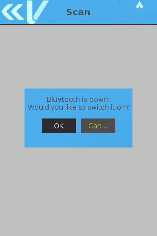

# Preface <a href="#sec_fltk_preface" id="sec_fltk_preface"></a>

This document is for programmers and users who want to understand the functionality of FLTK System Mode (also known as Sysmode or sys-mode).

# Overview <a href="#sec_fltk_overview" id="sec_fltk_overview"></a>

Sysmode FLTK is a System Mode GUI application and set of libraries implemented using FLTK (Fast Light Toolkit) and is available on Vx and Engage devices. The System Mode operations available on the terminal can be categorized as:

- Local operations: Addresses a stand-alone unit and do not require communication or data transfers between the unit and another terminal or computer. Perform local System Mode operations to configure, test and display the information about the terminal.
- Remote operations: Requires communication between the unit and a host computer (or another terminal) to perform remote System Mode operations to download application software to the terminal or download from the VHQ or from another download host.

# Entering System Mode <a href="#sec_fltk_entering_sysmode" id="sec_fltk_entering_sysmode"></a>

To prevent unauthorized use of System Mode menus, the terminal requires a system password each time you enter the System Mode. The device you are using may or may not have an application program running on it.

- To access the System Mode password entry screen from the Main screen, press 1, 5 and 9 keys simultaneously.
- To access the System Mode password entry screen from any application, there are two steps:
  - First press 1, 5 and 9 keys simultaneously to go back to the Home (MAC) screen.
    
    If MAC screen is protected by password (see <a href="pg_mac_users_guide.md#sec_mac_desktop">Appendix: Desktop</a>) then this password should be entered first.
    
  - In the Home (MAC) screen, press 1, 5 and 9 keys simultaneously to access the System Mode password entry screen.


The user can access sys-mode using passwords listed below:

- Supervisor (full access to sys-mode operations)
- Level1 (user defined capability, as a subset of Supervisor)
- Level2 (user defined capability, as a subset of Supervisor or Level1)
- Maintenance (Intended for Verifone repair, allows minimal access)


A special menu can be accessed by pressing the Cancel key: \[unsupported block\]



To access the System Mode first time, a default, factory-set password must be used: \"166831\". This factory-set password is in the pre-expired state, and after the very first log-in, user is automatically prompted to enter a new one. See detailed description of Password Management in the chapter <a href="pg_password_management_vos1_vos2.md">Password Management VOS1, VOS2</a>.

# System Mode Menus <a href="#sec_fltk_sysmode_menus" id="sec_fltk_sysmode_menus"></a>

Following menus are available when the System Mode application is running:



Menu items can differ on different device models. For example, additional menu items like \"Base Basic Information\" are available only for devices that can have a base.


## Information <a href="#subsec_fltk_sysmode_menu_information" id="subsec_fltk_sysmode_menu_information"></a>

| Menu item | Description |
|----|----|
| <p>Basic information</p> | <p>Displays general information on the unit - build, Model Name, Model ID, Serial Number, Part number, Hardware Revision, UID, SOC Revision, Vault, SRED, Open Protocol, Application Manager, SBI, UBoot, Kernel, RFS, Ethernet MAC address, BT MAC address, WiFi MAC Address</p> |
| <p>Ports</p> | <p>Displays the device port information</p> |
| <p>Memory</p> | <p>Displays flash memory and SDRAM usage</p> |
| <p>Software</p> | <p>List of installed software</p> |
| <p>Modem</p> | <p>Displays the modem information (visible on modem devices)</p> |
| <p>Logs</p> | <p>Displays the tamper and installation logs</p> |
| <p>Counters</p> | <p>Displays values hold by the terminal counters</p> |
| <p>Firmware</p> | <p>Displays the firmware version</p> |
| <p>Base Basic Information</p> | <p>Displays base basic information - build, model, serial and part numbers, etc. (visible on devices with base)</p> |
| <p>Pinpad</p> | <p>Displays the pinpad information (visible on devices with connected pinpad)</p> |

## Administration <a href="#subsec_fltk_sysmode_menu_administration" id="subsec_fltk_sysmode_menu_administration"></a>

| Menu item | Description |
|----|----|
| <p>Date/Time</p> | <p>To configure Date and Time of the device, set reboot time, set timezone</p> |
| <p>Communication</p> | <p>To configure Ethernet, USB Gadget, Serial, Wi-Fi, Bluetooth (all bluetooth or iBeacon devices), Geolocation (all devicies without GPS), iBeacon, USB, or Mini-USB, Modem (all modem devices), GSM (devices with GPRS or 3G), GPS (devices with GPS)</p> |
| <p>Remove user bundle</p> | <p>To remove user bundle</p> |
| <p>Power Management</p> | <p>To configure power management options and view battery status. For USB Power there are 3 state values:<br/>- Low power,<br/>- Mid Power,<br/>- High power. Refer to <a href="pg_syspm_users_guide.md">ADK-PM Programmers Guide</a> for detailed information.</p> |
| <p>Display</p> | <p>To configure display brightness</p> |
| <p>Language</p> | <p>To configure the menu language</p> |
| <p>Sound Utilities</p> | <p>To configure sound</p> |
| <p>Configuration Editor</p> | <p>To modify the configuration parameters</p> |
| <p>System Mode Time-out</p> | <p>To configure the time-out period for system mode</p> |
| <p>Console state</p> | <p>To turn on/off the console</p> |
| <p>VHQ Tools</p> | <p>To configure and chech the status of VHQ connection</p> |
| <p>Printer Configuration</p> | <p>To configure the printer</p> |
| <p>Base Config</p> | <p>To configure the base (handset should be docked and paired with a base)</p> |

## Update <a href="#subsec_fltk_sysmode_menu_update" id="subsec_fltk_sysmode_menu_update"></a>

| Menu item | Description |
|----|----|
| <p>NFS</p> | <p>To transfer files via NFS, select NFS. **NOTE** NFS is not available on production terminals</p> |
| <p>USB Memory</p> | <p>To transfer files via USB memory device</p> |
| <p>SD Card</p> | <p>To transfer files via SD memory device</p> |
| <p>Serial</p> | <p>To start download via Serial port. The user has an option to select the port and baud rate. Selecting AUTO baud allows the serial port to cycle through the available baud rates until communication is established</p> |
| <p>Netloader</p> | <p>Netloader is Verifone\'s proprietary networkbased download protocol. To start the download/transfer file and to set command over IP from the PC client software</p> |
| <p>Base Netloader</p> | <p>To download/transfer file to the Base via Netloader. Only available when handset is docked on base</p> |
| <p>Base/Handset Netloader</p> | <p>To download /transfer file to both - the handset and base. Then it gets installed on both handset and base</p> |

## Security <a href="#subsec_fltk_sysmode_menu_security" id="subsec_fltk_sysmode_menu_security"></a>

| Menu item | Description |
|----|----|
| <p>Dump Keys</p> | <p>To allow user to dump keys to a storage device</p> |
| <p>Key loading</p> | <p>To enable key loading state. After presenting both keyload1 and keyload2 passwords, enable the key loading state that allows data to pass from a serial port to the security module for bank/ADE and VRK keys. For Bank or ADE, after presenting both keyload1 and keyload2 passwords, enable the key loading state that allows data to pass from a serial port to the security module.</p> |
| <p>Tamper status</p> | <p>Displays security tamper status</p> |
| <p>Key Status</p> | <p>To view the key status for Master Session, DUKPT, User, VRK, VSS, Feature Licenses, and ADE</p> |
| <p>Password Manager</p> | <p>To allow user to expire, change, and manage passwords. This option provides to Expire Users and keyload passwords and Change passwords. The \"Expire password\" option not only expires a password but also updates the password to the default factory value. During the next login, the system forces the user to enter the default password value as an \"old\" and a new password value.</p> |
| <p>VeriShield tree</p> | <p>List all installed VeriShield keys</p> |
| <p>VSP status</p> | <p>To display the VSP status</p> |

## Diagnostics <a href="#subsec_fltk_sysmode_menu_diagnostic" id="subsec_fltk_sysmode_menu_diagnostic"></a>

| Menu item | Sub-menu item | Description |
|----|----|----|
| <p>**Display**</p> | <p>Perform display diagnostics, which attempts to display a bitmap.</p> |  |
| <p>**Keyboard**</p> | <p>Display the matrix with the keys. Press a key to increase the counter number for that key value. There is no button to return to a previous menu. If no keys are pressed in 5 seconds, the diagnostic test automatically exits.</p> |  |
| <p>**Card**</p> | <p>To Test the MSR, SCR, CTLS Reader.</p> |  |
| <p>Magnetic Stripe Reader</p> | <p>Swipe a magnetic-stripe card to determine if all three tracks can read the card. All tracks should display GOOD to pass the test.</p> |  |
| <p>Smart Card Reader</p> | <p>Determines the state of the smart card reader. If a card is present when the test is run, the first few bytes of the ATR is displayed. For manufacturing test purpose only.</p> |  |
| <p>Contactless Reader</p> | <p>The card details are read by placing the card over the display. On a good read, when the card is removed, TEST SUCCESS is reported.</p> |  |
| <p>**Communications**</p> | <p>To perform test for the available connections</p> |  |
| <p>Ethernet</p> | <p>Displays network interface status and parameters. Sends ping to the network gateway. Also allows for a unique IP address to be pinged.</p> |  |
| <p>GSM</p> | <p>Displays network interface status and parameters. Sends ping to the network gateway. Also allows for a unique IP address to be pinged.</p> |  |
| <p>GPS</p> | <p>Tests GPS signal.</p> |  |
| <p>Serial</p> | <p>Performs a loopback test to determine the state of the Serial hardware.</p> |  |
| <p>Wi-Fi</p> | <p>Displays network interface status and parameters. Sends ping to the network gateway. Also allows for a unique IP address to be pinged.</p> |  |
| <p>Bluetooth</p> | <p>Displays Bluetooth status and paired devices. Can scan for other Bluetooth devices and make device discoverable to other devices.</p> |  |
| <p>Modem</p> | <p>Tests modem connection. Connect a phone line to the terminal and then select Modem to initialize. Enter the phone number when prompted. The modem then dials the specified number. Press enter to cancel.</p> |  |
| <p>USB</p> | <p>For USB searches and tests for inserted USB key in host port.</p> |  |
| <p>IPV6</p> | <p>Tests network connection</p> |  |
| <p>Syslog</p> | <p>Displays current level of syslogs with possibility to change from the dropdown.</p> |  |
| <p>**Touch Panel**</p> | <p>Perform touch panel diagnostics of touch and signature response.</p> |  |
| <p>**Printer**</p> | <p>Printer</p> | <p>Perform diagnostics for the printer. It prints the numbers 123456789012345678901234, and then a black square.</p> |
| <p>**Buzzer/Audio**</p> | <p>Perform diagnostic for buzzer and speaker. Speaker test only available on devices with codec.</p> |  |
| <p>**LEDs**</p> | <p>\<LEDs</p> | <p>Perform diagnostics for the Bootup LED and keypad LED.</p> |
| <p>**Battery**</p> | <p>To perform test for the battery. This menu is available on all devices that support Battery.</p> |  |
| <p>Status</p> | <p>Battery actual status.</p> |  |
| <p>Health</p> | <p>Battery health (\"Not available\", \"Calculating\...\" or \"XX%\"), temperature and calibration data.</p> |  |
| <p>**Temperature**</p> | <p>To perform test for the temperature.</p> |  |
| <p>**Power Management**</p> | <p>To perform test for the power management.</p> |  |
| <p>**Debug Mode**</p> | <p>Used to set a debug mode for more detailed logging.</p> |  |

## Manufacturing <a href="#subsec_fltk_sysmode_menu_manufacturing" id="subsec_fltk_sysmode_menu_manufacturing"></a>

| Menu item | Description |
|----|----|
| <p>Load MIB</p> | <p>Used in manufacturing to load MIB into device</p> |

## Exit <a href="#subsec_fltk_sysmode_menu_exit" id="subsec_fltk_sysmode_menu_exit"></a>

| Menu item | Description |
|----|----|
| <p>Reboot</p> | <p>Restart the device</p> |
| <p>Reboot to mode</p> | <p>Restart the device into special boot mode: re-flash or rescue-menu</p> |
| <p>Logout</p> | <p>Return to the log in menu</p> |
| <p>Power-off</p> | <p>Power-off the unit</p> |

## Run Applications <a href="#subsec_fltk_sysmode_menu_run_applications" id="subsec_fltk_sysmode_menu_run_applications"></a>

This menu item will start user applications if they are present on the terminal.

# Wi-Fi Configuration <a href="#sec_fltk_sysmode_wifi_configuration" id="sec_fltk_sysmode_wifi_configuration"></a>

To configure Wi-Fi from the System Mode Main screen, following steps must be executed:

- Select Administration from the System Mode Main screen. Administration screen is displayed.
- Select Communications option to proceed.
- Select Wi-Fi option to proceed.
- Select WiFi Scan option.
- WiFi status is displayed.
- Press OK to switch ON the WiFi:
  
- \"Powering WiFi on\" message is displayed:
  
- List of WiFi connections are displayed;
- Select a WiFi connection;
- Select WiFi configuration;
- Enter the Passkey (PSK).
  
- Select WiFi Interface IPv4.
  - The WiFi Status icon in red indicates that the WIFi is not connected.
    
- Set the AutoStart to On
- Press the WiFi Status icon
- Press Ok to save the changes.
- Connecting WiFi screen is displayed.
- WiFi status is turned green indicating that the WiFi is connected:
  

# Bluetooth Configuration <a href="#sec_fltk_sysmode_bt_configuration" id="sec_fltk_sysmode_bt_configuration"></a>

To configure Bluetooth from the System Mode Main screen, following steps must be executed:

- Select Administration from the System Mode Main screen. Administration screen is displayed.
- Select Communications option to proceed.
- Select Bluetooth option to proceed.
- Select Scan option to proceed.
- Press Ok to switch on the Bluetooth:
  
- Scanning message is displayed.
- Select a BT Device Name.
- Pairing screen is displayed.
- Confirm PIN message is displayed on both the devices. Press Yes to confirm:
  
- Pairing Successful screen is displayed. Press OK to confirm.

# Modem Configuration <a href="#sec_fltk_sysmode_modem_configuration" id="sec_fltk_sysmode_modem_configuration"></a>

Modem information, configuration options and simple diagnostic are available in Sysmode. For handsets, the modem needs to be connected to a base either via USB (i.e. when docked) or via Bluetooth. When docked the USB connection is automatically available. If undocked the Bluetooth DUN channel (for access to the Modem tty) and Bluetooth basectrl channel (for invoking libmodembasic commands remotely on base from handset) need to be set up. Currently the setting up of these two Bluetooth connection channels is not supported by Sysmode.

- Information/ Ports/ Modem

The \'Modem\' field is set to \'Yes\' if terminal supports modem access. For portable handset, this will be set to \'Yes\' regardless of whether the handset is or is not currently connected to a base.

- Information/ Modem
- Administration/ Communication/ Modem/ Modem Information

Both options displays the same screen. which displays a table containing the results of sending the command, libmodembasic_getInfo. For handset, if modem is not connected to a base, then a message is displayed \'Modem information is not available\'.

- Administration/ Communication/ Modem/ Set Country

This sets the modem country code by updating/creating the modem configuration file, modem.conf. If modem is available (i.e. for Handset if it is connected to a base) the modem is then reinitialized using the new country profile. If modem is not available a message is displayed to user that new country setting will tale effect on next modem initialization.

- Diagnostic/ Communications/ Modem

If no modem is available (i.e. Handset is not connected to a base) then an error message. Otherwise the following are performed:

``` fragment
- Initialize modem
- Get the following modem information by sending AT commands: Manufacturer name, model and firmware version.
```

If modem line is connected, the user is prompted to enter a number for dial up. On entering the number a call is made to remote end. The far end (e.g. a modem or a phone) will then receive an incoming call.
The diagnostics is exited by selecting the \'Cancel\' option.


The primary function of any of the Symode diagnostic tests is to provide basic tests of VOS functions and application on the terminal hardware. The VOS modembasic library however does not directly support dialup. It is provided by the ADKCOM. The Sysmode dial up implementation, therefore is part of Sysmode itself and is set up by first calling the libmodembasic_init and them sending a set f AT commands. The purpose of the Sysmode dial up is mainly to check if the modem can indeed connect to an another device (phone or modem).

